# ⚡ GitHub Actions: A Platform-Native CI/CD Alternative to Jenkins

- <i>**Session:** "GitHub Actions" · 
- **Instructor:** Abhishek
- **Note on scope:** This session directly follows the course's prior Jenkins Zero to Hero coverage (installation through three live projects, including using Docker as a build agent) — not included in this transcript set, but directly, repeatedly referenced throughout. This session introduces GitHub Actions live: a real, working Python workflow built and run end to end, a genuine look at a massive real-world project's (Argo CD's) actual GitHub Actions setup, and a direct, explicitly interview-relevant comparison against Jenkins. A public, actively-expanding example repository (Kubernetes deployment, Docker Swarm deployment, and a full Java/Maven/Sonar/Kubernetes pipeline) is pointed to throughout for hands-on follow-along.</i>

---

## 📑 Table of Contents

1. [Session Overview](#-session-overview)
2. [Learning Objectives](#-learning-objectives)
3. [Detailed Notes](#-detailed-notes)
   - [1. Continuing from Jenkins: Context & the Example Repository](#1-continuing-from-jenkins-context--the-example-repository)
   - [2. What Is GitHub Actions? Another Platform-Specific CI/CD Solution](#2-what-is-github-actions-another-platform-specific-cicd-solution)
   - [3. The Classic Strategic Caveat: When NOT to Use GitHub Actions](#3-the-classic-strategic-caveat-when-not-to-use-github-actions)
   - [4. No Plugin Installation Required: Workflows & Trigger Events](#4-no-plugin-installation-required-workflows--trigger-events)
   - [5. Writing Your First Workflow: A Live Python Example](#5-writing-your-first-workflow-a-live-python-example)
   - [6. Understanding "Actions" (Plugins): The Marketplace, Versioning & a Genuine Limitation](#6-understanding-actions-plugins-the-marketplace-versioning--a-genuine-limitation)
   - [7. Self-Hosted Runners & Native Secrets Management](#7-self-hosted-runners--native-secrets-management)
   - [8. GitHub Actions vs. Jenkins: The Complete, Interview-Ready Comparison](#8-github-actions-vs-jenkins-the-complete-interview-ready-comparison)
4. [Glossary](#-glossary)
5. [Revision Notes — One-Minute Revision](#-revision-notes--one-minute-revision)
6. [Cheat Sheet](#-cheat-sheet)
7. [Interview Questions & Answers](#-interview-questions--answers)
8. [Scenario-Based Interview Questions](#-scenario-based-interview-questions)
9. [Hands-on Exercises](#-hands-on-exercises)
10. [Practice Assignment](#-practice-assignment)
11. [Additional Resources](#-additional-resources)
12. [Final Revision Sheet](#-final-revision-sheet)

---

## 🎯 Session Overview

This session introduces GitHub Actions as a genuine, practical CI/CD alternative to Jenkins — building a real, working pipeline live rather than only describing the concept. It covers:

1. **Direct continuity from the course's prior Jenkins coverage** — Jenkins Zero to Hero, including live projects and Docker-as-agent usage — explicitly referenced as required context.
2. **What GitHub Actions fundamentally is**: a CI/CD solution functionally similar to Jenkins, but deliberately, architecturally scoped specifically to the GitHub platform — directly analogous to GitLab CI's relationship with GitLab.
3. **A classic, explicitly-flagged strategic caveat**: choosing GitHub Actions is only appropriate if an organization has no genuine plans to migrate off GitHub in the future — directly, precisely mirroring the same "right tool for the job" reasoning established in Day 16 (Terraform vs. provider-specific IaC tools).
4. **No manual plugin installation required** — simply creating a `.github/workflows/` folder, and the trigger-event system (`on: push`, `pull_request`, `issues`, and more) that determines when a workflow runs.
5. **A complete, live-built first workflow**: testing a simple Python addition function, checked out, environment-configured, dependency-installed, and tested — entirely via GitHub-hosted infrastructure, with zero pre-configured servers.
6. **GitHub Actions' "Actions" (this session's informal "plugins")**: auto-installed, versioned independently from the underlying language/tool, sourced from a genuine Marketplace — with an honest, direct acknowledgment of GitHub Actions' comparatively limited plugin ecosystem versus Jenkins' far more mature one.
7. **Self-hosted runners** (for compute-intensive needs like load testing, or security requirements) and **native secrets management** (demonstrated via a real Java/Maven/Sonar/Kubernetes pipeline example storing a kubeconfig file and a Sonar token securely).
8. A **complete, directly interview-relevant comparison** against Jenkins: hosting/maintenance overhead, UI/syntax simplicity, and cost — closing with a precise, two-condition recommendation for when GitHub Actions is genuinely the right choice.

> 💡 **Memory Trick — the instructor's own framing for this session's live, hands-on approach:** *"Let's see how easy it is to write GitHub Actions... it is that simple. You can write all of this in the first five minutes — even after watching this video, you can directly create your own GitHub repository and write this file."*

---

## 🎯 Learning Objectives

By the end of this guide, you will be able to:

- [ ] Define GitHub Actions, and explain precisely how it's architecturally similar to, and different from, Jenkins.
- [ ] Explain the classic strategic caveat determining when GitHub Actions is and isn't an appropriate choice, connecting it to the same reasoning pattern established in Day 16's Terraform discussion.
- [ ] Create a working GitHub Actions workflow file, including the correct folder location and basic YAML structure.
- [ ] Explain what trigger events are, and how multiple events can be combined in a single workflow.
- [ ] Correctly map GitHub Actions' `jobs` and `steps` structure onto Jenkins' equivalent concepts (pipelines and stages).
- [ ] Explain what a GitHub Action ("plugin") is, correctly distinguish an Action's own version number from the underlying tool/language's version, and locate Actions via the official Marketplace/documentation.
- [ ] Explain when and why an organization might configure self-hosted runners instead of using GitHub's default, hosted infrastructure.
- [ ] Explain how GitHub Actions handles secrets management, and why this matters for a real deployment pipeline.
- [ ] Give a complete, three-part comparison of GitHub Actions against Jenkins (hosting, UI/syntax, cost), and state the precise, two-condition recommendation for choosing GitHub Actions.

---

## 📚 Detailed Notes

### 1. Continuing from Jenkins: Context & the Example Repository

#### 🧠 Concept

> 💡 **Memory Trick, the direct continuity given at the start of the session:** *"If you haven't watched our previous videos — in the last class, we talked about Jenkins Zero to Hero, from installation through configuration, and we looked at three live projects, including how to use Docker as an agent, so your pipelines execute on Docker containers rather than wasting compute on persistent virtual machines."*

#### 🏢 Real-World / Production Usage — The Public Example Repository

> 💡 **Memory Trick, given directly, including an honest, direct disclaimer:** *"As usual, I've created a repository for you, in case you feel I'm going too fast — you can watch it, or star it, and follow the step-by-step explanation. Disclaimer: this repository is NOT complete — I'll keep adding more examples. Right now, in the examples folder, there are three: deploy to Kubernetes, deploy to Docker Swarm, and a Java application built via Maven, tested for code quality via Sonar, then deployed to Kubernetes. You can also contribute to this repository yourself."*

#### 🎯 Key Takeaways

* This session **directly builds on the course's prior Jenkins coverage** — required context, not a standalone, unrelated topic.
* The instructor's own **public, actively-expanding example repository** (with an honest disclaimer that it's incomplete) is explicitly, directly recommended as a hands-on companion resource, containing three real examples: Kubernetes deployment, Docker Swarm deployment, and a full Java/Maven/Sonar/Kubernetes pipeline.
* Community **contribution to this repository** is explicitly, directly invited — consistent with this course's broader, open, community-oriented tone.

---

### 2. What Is GitHub Actions? Another Platform-Specific CI/CD Solution

#### 📖 Definition

> 💡 **Memory Trick, given directly:** *"GitHub Actions is yet another CI/CD solution. If you compare it with Jenkins, they do similar tasks — executing continuous integration and continuous delivery. But the primary difference is: GitHub Actions is focused ONLY on GitHub. Just like GitLab CI is a CI/CD solution GitLab offers, but it's only focused on the GitLab platform."*

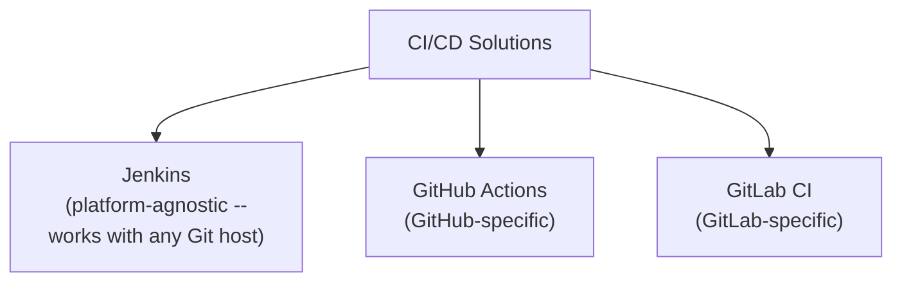

#### 🎯 Key Takeaways

* **GitHub Actions** performs the same fundamental function as Jenkins (CI/CD execution) — but is deliberately, architecturally **scoped specifically to the GitHub platform**.
* **GitLab CI** is directly named as the exact parallel case for GitLab — the same underlying "platform-specific CI/CD tool" pattern, just for a different Git host.
* This platform-specificity is the single most important architectural fact about GitHub Actions — directly setting up the entire strategic caveat covered next.

---

### 3. The Classic Strategic Caveat: When NOT to Use GitHub Actions

#### ❓ Why It Exists — The Directly-Stated Strategic Question

> ⚠️ **Directly, explicitly stated as the core consideration:** *"One big thing to understand, whenever you're considering GitHub Actions or GitLab CI, is: what is your organization's goal? Do you want to continue on GitHub? Do you want to continue on GitLab? Or might you migrate to a different platform in the future? In such cases, GitHub Actions or GitLab CI is NOT the right solution for you — because, again, they are platform-oriented solutions."*

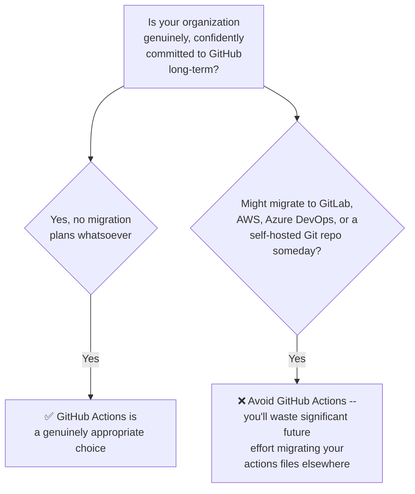

#### 🔍 Internal Working — A Direct, Explicit Parallel to Terraform's Reasoning

> 💡 **Memory Trick, the precise, self-referential parallel drawn directly:** *"This is exactly why we choose Terraform over CloudFormation Templates — Terraform is a tool that can work across multi-cloud or hybrid-cloud environments. Similarly, GitHub Actions, although very powerful — and I'd even suggest it's better than Jenkins in some ways, which I'll explain — is still a platform-oriented solution. If your application might move from GitHub to GitLab, or from GitHub to AWS, or to any self-hosted Git repository, or Azure DevOps, do NOT use GitHub Actions — you'll waste a lot of time, and later put in a lot of effort migrating your actions files to Jenkins files or something else."*

#### ⚠ Common Mistakes

* Assuming a strong, favorable recommendation for GitHub Actions ("better than Jenkins in some ways") is unconditional — explicitly, directly qualified: this recommendation applies SPECIFICALLY to organizations with genuine, confident, long-term GitHub commitment.

#### 🎯 Key Takeaways

* The **single most important strategic question** for choosing GitHub Actions: is your organization genuinely, confidently committed to staying on GitHub long-term, with no realistic migration plans?
* This reasoning is **explicitly, directly connected** by the instructor himself to Day 16's Terraform-vs-CloudFormation-Templates discussion — the exact same underlying "platform lock-in vs. flexibility" trade-off, now applied to CI/CD tooling specifically.
* GitHub Actions being described as "better than Jenkins in some ways" is a genuinely **conditional**, not absolute, claim — directly qualified by this platform-commitment caveat.

---
### 4. No Plugin Installation Required: Workflows & Trigger Events

#### 🪜 Step-by-Step — Creating Your First Workflow File

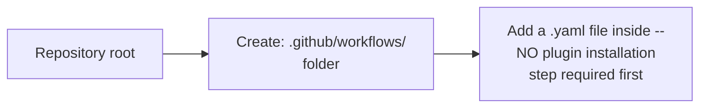

> 💡 **Memory Trick, given directly:** *"With GitHub Actions, you don't have to install any plugins first. To write your very first GitHub Actions file, just go to the root of your repository (the parent directory) and create a `.github/workflows` folder."*

#### 📖 Definition — Trigger Events

> 💡 **Memory Trick, given directly:** *"In the first line, you say `on: push` — this tells GitHub: whenever there's a push action, or a commit created in this repository, execute this pipeline by default. It doesn't matter if it's a small commit or a big one, or which files are modified — once you define `on: push` (or `on: pull_request`, or `on: issue`), GitHub watches for exactly that action and runs your workflow when it happens."*

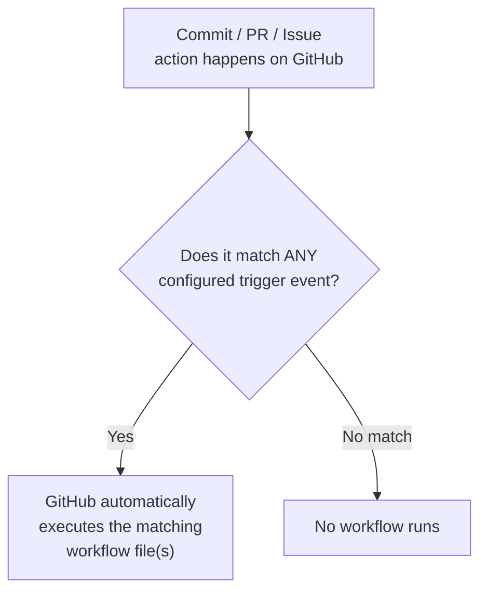

#### 🔍 Internal Working — Multiple Events, Multiple Workflow Files

> 💡 **Memory Trick, given directly:** *"You can combine multiple events — `push, pull_request`, or `push, pull_request, issues` — GitHub doesn't mind executing your pipeline on any of the actions you provide. If EITHER of the listed actions is matched, GitHub starts executing that pipeline. There's also no limit on the number of workflow files you can have — you could have one file verifying pull request descriptions, another checking formatting/linting, a third running CI, a fourth running CD — it's entirely up to you how you want to segregate things."*

#### 💻 Live Demonstration — A Real, Massive Project's Actual Workflow Setup (Argo CD)

> 💡 **Memory Trick, given directly, using a genuine, real-world example:** *"Let's look at a popular project — Argo CD. It has the same `.github/workflows` folder, containing a genuine bunch of pipelines: CI build, code check, image build, a PR-title-check (verifying pull request titles are correctly formatted), a release pipeline, and a security sync pipeline (checking for vulnerabilities or security-standard violations)."*

#### ⚠ Common Mistakes

* Assuming GitHub Actions requires a manual, separate plugin-installation step before writing any workflow — explicitly, directly corrected: creating the correct folder structure is genuinely all that's needed to start.

#### 🎯 Key Takeaways

* GitHub Actions requires **no plugin installation** to get started — simply creating the **`.github/workflows/`** folder at the repository root is sufficient.
* **Trigger events** (`on: push`, `pull_request`, `issues`, etc.) determine when a workflow runs — multiple events can be combined, with ANY match triggering execution.
* There's **no limit** on the number of workflow files a repository can have — real, large projects like **Argo CD** genuinely use many separate, purpose-specific workflows simultaneously (build, code-check, PR-title validation, release, security scanning).

---

### 5. Writing Your First Workflow: A Live Python Example

#### 🧠 Concept — The Test Application

> 💡 **Memory Trick, given directly:** *"Since many subscribers are familiar with Python, I've written a very basic addition example — an `addition.py` file inside an `src` folder, with a simple addition function and a basic unit test for it."*

#### 💻 Code Example — The Complete Workflow File

```yaml
name: My first GitHub Actions

on: push

jobs:
  build:
    runs-on: ubuntu-latest
    strategy:
      matrix:
        python-version: ["3.8", "3.9"]

    steps:
      - name: Checkout code
        uses: actions/checkout@v3

      - name: Set up Python
        uses: actions/setup-python@v2
        with:
          python-version: ${{ matrix.python-version }}

      - name: Install dependencies
        run: pip install pytest

      - name: Run tests
        run: pytest
```

> 💡 **Memory Trick, each section precisely explained, given directly:**
> - **`name:`**: *"Provide the name of your GitHub Action -- I said 'this is my first GitHub Actions.'"*
> - **`on: push`**: *"Execute this on every commit -- you can change this event as needed."*
> - **`jobs:`**: *"You can correlate this with a PIPELINE in Jenkins. If you create three jobs in one file, that's like running three Jenkins pipelines -- all within the same file."*
> - **`runs-on: ubuntu-latest`**: *"Just like configuring Docker as an agent in Jenkins and specifying an image (Ubuntu, Python, etc.), here you say: use Ubuntu latest as the container image."*
> - **Multiple Python versions**: *"I said I want my addition functionality verified on BOTH Python 3.8 AND 3.9 -- that's exactly why you saw TWO jobs running. If I added 2.7, you'd see three."*
> - **`steps:`**: *"You can correlate this with STAGES in Jenkins -- build stage, test stage, SAST stage, deploy stage. Here: first, check out the code; then set up Python; then install dependencies; then run the tests."*

#### 🪜 Step-by-Step — Live Execution, Watched in Real Time

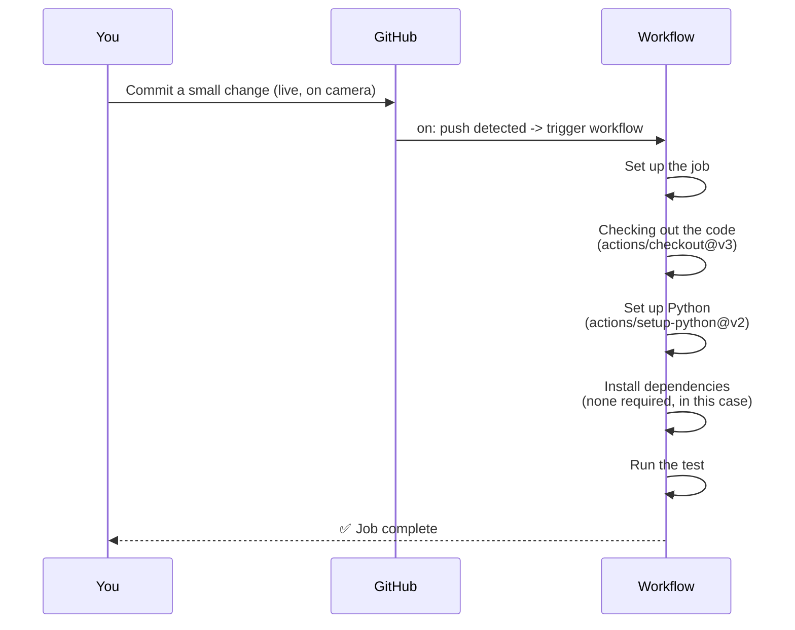

> 💡 **Memory Trick, the instructor's own, direct reaction to how simple this was:** *"Is it a big deal? Does it take you to master GitHub Actions? No, not at all. You can write all of this in the first five minutes."*

#### ⚠ Common Mistakes

* Assuming a genuinely simple CI setup like this requires significant prior expertise — explicitly, directly, repeatedly de-emphasized by the instructor as a real barrier.

#### 🎯 Key Takeaways

* **`jobs`** correlate directly to Jenkins **pipelines**; **`steps`** correlate directly to Jenkins **stages** — a genuinely useful, precise mental mapping for anyone with prior Jenkins knowledge.
* A **matrix-style version strategy** (testing against both Python 3.8 and 3.9 simultaneously) is demonstrated live, directly explaining why two separate job runs appeared.
* This entire, complete, working workflow was demonstrated as genuinely simple and fast to write — a real, live-proven claim, not just an assertion.

---
### 6. Understanding "Actions" (Plugins): The Marketplace, Versioning & a Genuine Limitation

#### ❓ Why It Exists — Where Does `actions/checkout@v3` Come From?

> 💡 **Memory Trick, given directly:** *"Where did I get this information from? This is a standard you can follow -- if you don't know how to figure these things out, go to the GitHub Actions documentation. It'll tell you exactly what plugins GitHub Actions provides, with examples for each -- for instance, 'build and test a Java application with Maven.' Open that example, and you'll see it uses the EXACT SAME `actions/checkout@v3` step -- because it's a plugin, not something you configure from scratch each time."*

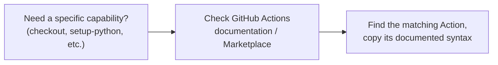

#### 🔍 Internal Working — A Critical, Precisely-Stated Clarification on Versioning

> ⚠️ **Directly, explicitly clarified as a genuinely important, easy-to-misread detail:** *"`setup-python@v2` does NOT mean you're installing Python 2. The `@` symbol indicates the VERSION OF THE PLUGIN (the Action itself), NOT the version of your programming language or tool. Compare it to `setup-java@v3` -- that means version 3 of the JAVA plugin, not Java version 3."*

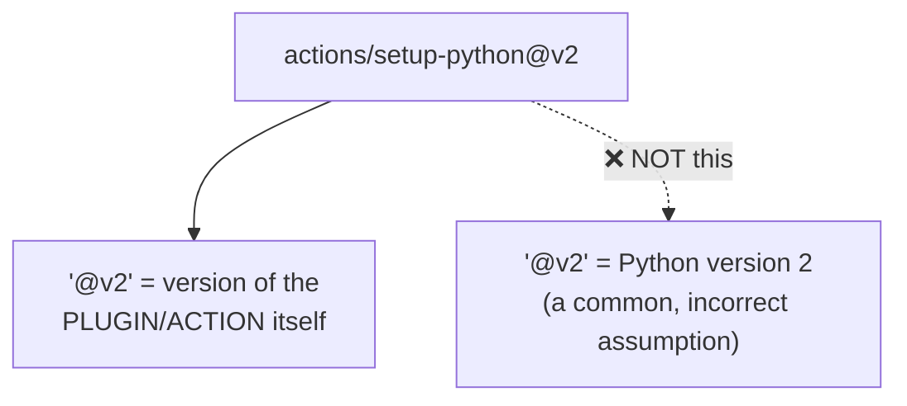

#### 🏢 Real-World / Production Usage — The "Same Skeleton, Different Tool" Pattern

> 💡 **Memory Trick, given directly:** *"The biggest advantage of GitHub Actions is you write VERY little code -- the configuration is quite similar across different applications. If tomorrow you want to build a Node.js or Ruby application instead of Java, all that changes is swapping `setup-java` for `setup-ruby` (or whichever), and specifying which version of THAT plugin you want. You're only really 'playing with' which plugins you use -- and they're already installed by default."*

#### ⚠ Common Mistakes — Ansible's Windows/Linux Support, Mirrored Here

> ⚠️ **A genuinely balanced, honest limitation, directly stated:** *"The one disadvantage is: these plugins are very limited in scope. GitHub Actions is still a genuinely new/budding tool -- even though it's been around for three to four years, if you compare it to Jenkins or other mature CI/CD tools on the market, its plugin ecosystem is still comparatively limited."*

#### 🎯 Key Takeaways

* GitHub Actions' equivalent of a "plugin" is called an **Action** -- the official documentation is the direct, standard reference for finding available Actions and their example syntax, exactly mirroring the "check the docs" pattern established across Days 5, 7, and 8.
* The **`@` version number** in an Action reference (e.g., `@v2`, `@v3`) refers to the **Action's own version**, NOT the underlying language/tool's version -- an easy, genuinely important point of confusion to avoid.
* GitHub Actions' configuration follows a **consistent, reusable skeleton** across different languages/tools -- swapping the specific Action (e.g., `setup-java` → `setup-ruby`) is often the only real change required.
* GitHub Actions' plugin/Action ecosystem is **honestly, directly acknowledged as comparatively limited** compared to Jenkins' far more mature one -- a genuine, balanced disadvantage, directly consistent with this course's established pattern of honest tool evaluation (e.g., Day 14's Ansible disadvantages).

---

### 7. Self-Hosted Runners & Native Secrets Management

#### 📖 Definition — Self-Hosted Runners

> 💡 **Memory Trick, given directly:** *"If you go to Settings → Actions, you can configure your own custom Runners -- 'new self-hosted runner.' Similar to Jenkins, where you can use Docker containers or your own worker nodes, if you're not happy with GitHub's default runners -- because they're relatively lightweight, or don't have enough compute for something like load testing, or you have security concerns -- you can create your own self-hosted runners and execute your workflows on them instead."*

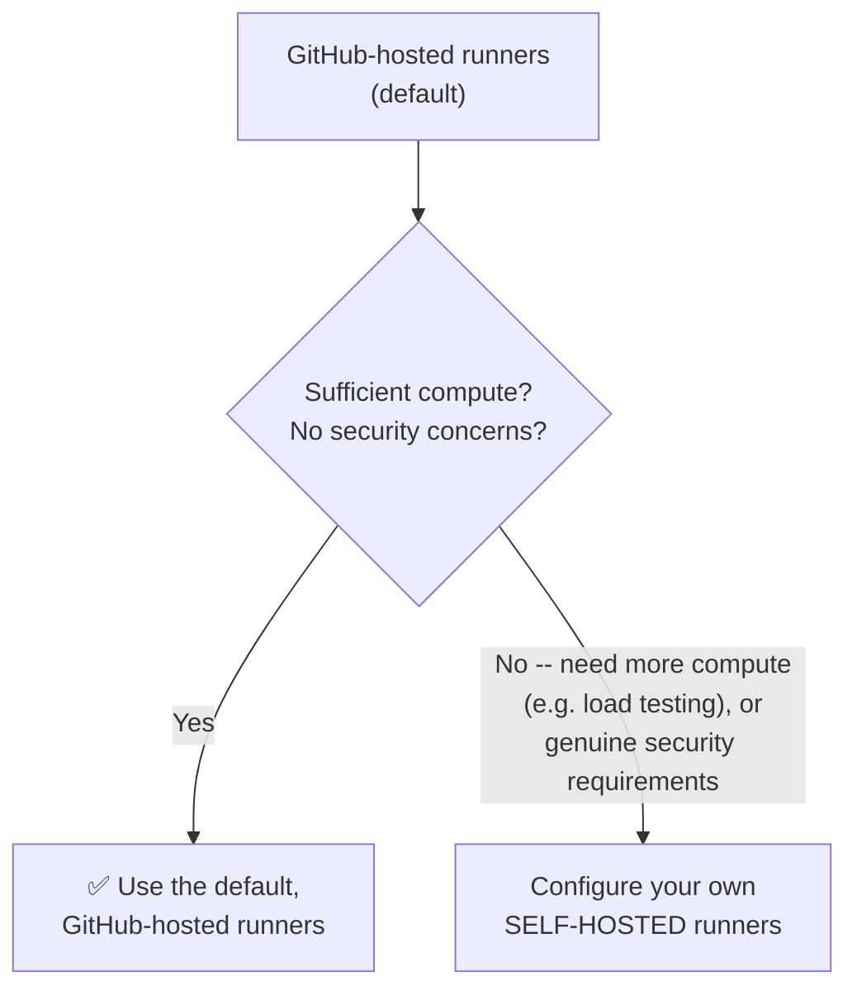

#### 📖 Definition — Native Secrets Management

> 💡 **Memory Trick, given directly, with a genuinely relevant, real security question raised and answered:** *"A real question you should ask: if I'm doing everything through GitHub Actions, where do I store passwords -- like a kubeconfig file, which has to be extremely secure and never shared? GitHub Actions provides native support for storing secrets -- go to Settings, and you'll find an option to store your CI/CD secrets."*

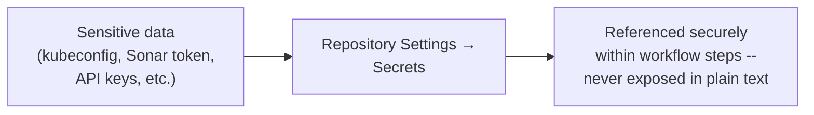

#### 🏢 Real-World / Production Usage — The Java/Maven/Sonar/Kubernetes Example

> 💡 **Memory Trick, given directly:** *"In my next example -- deploying a Java application via Maven, checking code quality via Sonar, and deploying to Kubernetes -- I stored my kubeconfig file and my Sonar token as secrets. Comparing this example to the basic Python one, there isn't much difference structurally: checking out code, using an additional plugin for Kubernetes, running the Maven-related step, then the Sonar-related step, then deploying to Kubernetes."*

#### ⚠ Common Mistakes

* Assuming GitHub Actions has no genuine, native way to handle sensitive credentials securely -- explicitly, directly corrected: it provides built-in, dedicated secrets storage, precisely for cases like this.

#### 🎯 Key Takeaways

* **Self-hosted runners** are configured via Settings → Actions, appropriate when GitHub's default hosted infrastructure lacks sufficient compute (e.g., for load testing) or when genuine security requirements demand it.
* **Native secrets management** (Settings → Secrets) is GitHub Actions' built-in mechanism for securely storing sensitive credentials (kubeconfig files, API tokens) -- demonstrated via a real, working Kubernetes-deployment example.
* The instructor's own, real example (Java/Maven/Sonar/Kubernetes) is explicitly presented as a genuinely reusable **skeleton/starting point** for real organizational deployment pipelines.

---
### 8. GitHub Actions vs. Jenkins: The Complete, Interview-Ready Comparison

#### ❓ Why It Exists

> ⚠️ **Directly, explicitly flagged as a common, important question:** *"Should I start with GitHub Actions or Jenkins? Should I implement GitHub Actions or Jenkins in my project? This is genuinely one of the important things people ask -- and it can be an interview question too."*

#### 📖 Definition — The Disadvantage, Restated Precisely

> ⚠️ **Directly, explicitly restated as the fundamental limitation:** *"One major disadvantage of GitHub Actions is that it's very scoped to the platform. Tomorrow, if you want to move from one platform to another -- GitHub to AWS CodeCommit, or GitHub to Azure DevOps -- do NOT use GitHub Actions."*

#### 🏢 Real-World / Production Usage — The Three-Part Advantages Comparison

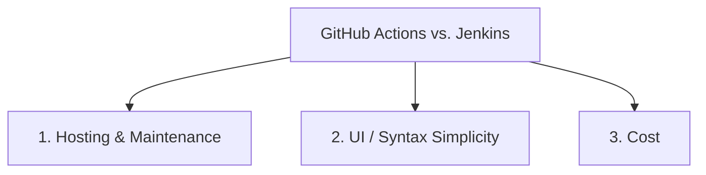

> 💡 **Memory Trick, each advantage precisely explained, given directly:**
> - **Hosting/maintenance**: *"With Jenkins, you have to create an EC2 instance, install Jenkins, expose inbound traffic, install and configure plugins -- and if a new Jenkins version comes out, you have to update it yourself, or you'll run into security issues. All of THAT is gone with GitHub Actions. You don't need maintenance effort, you don't need hosting effort. If your platform is only GitHub, the best thing you can do is simply migrate to GitHub Actions. This is exactly why 90% of open-source projects use GitHub Actions -- you don't need a dedicated engineer working as a 'Jenkins maintenance engineer.'"*
> - **UI/syntax simplicity**: *"I showed you -- writing a GitHub Actions pipeline is very, very simple."*
> - **Cost**: *"If you create an EC2 instance, worker nodes, auto-scaling groups -- all of that configuration is genuinely not cost-effective. GitHub Actions provides FREE execution for public/open-source projects entirely. For private projects, there IS a limitation -- I believe around 2,000 minutes of execution (I don't remember the exact figure) -- so you should evaluate cost for private repositories specifically. But even then, cost will generally be lower, and you avoid Jenkins' maintenance overhead entirely."*

#### ⚠ Common Mistakes

* Assuming GitHub Actions is completely, unconditionally free regardless of repository visibility -- explicitly, directly clarified: it's genuinely free for PUBLIC/open-source projects, but has a real execution-minutes limitation for PRIVATE repositories.
* Treating this comparison as a one-sided endorsement of GitHub Actions -- explicitly, directly balanced by the platform-lock-in disadvantage restated at the very start of this section.

#### 🪜 Step-by-Step — The Session's Own, Precise, Closing Recommendation

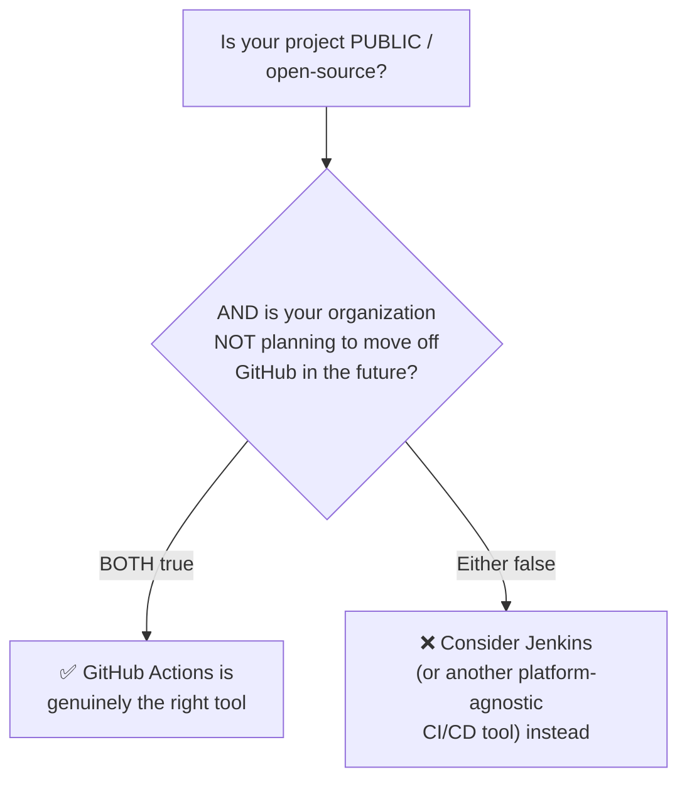

> 💡 **Memory Trick, the session's own precise, final words:** *"If you're only working on a public, open-source project, and your project isn't deciding to move from one place to another in the future -- like from GitHub to any other VCS platform -- then GitHub Actions is the right tool for you."*

#### 🎯 Key Takeaways

* This section explicitly delivers a **genuine, three-part advantages comparison** (hosting/maintenance, UI/syntax simplicity, cost) — directly flagged as a common interview question, and directly reusable as a ready-made interview answer.
* GitHub Actions' cost advantage is **precisely, honestly qualified**: genuinely free for public/open-source projects; a real, if imprecisely-remembered, execution-minute limitation applies to private repositories.
* The session's **final, precise recommendation** requires BOTH conditions to hold simultaneously: a genuinely public/open-source project, AND genuine, confident, long-term commitment to staying on GitHub — a two-part test, not a single, simpler criterion.

---

## 📝 Glossary

| Term | Definition | Why It Matters |
|---|---|---|
| **GitHub Actions** | GitHub's own, platform-specific CI/CD solution | Functionally similar to Jenkins, but scoped only to GitHub |
| **GitLab CI** | GitLab's own, platform-specific CI/CD solution | The direct parallel case to GitHub Actions, for GitLab specifically |
| **`.github/workflows/`** | The folder where GitHub Actions workflow files live | No manual plugin installation needed -- just create this folder |
| **Trigger Event (`on:`)** | The GitHub event(s) that cause a workflow to run (push, pull_request, issues, etc.) | Multiple events can be combined; any match triggers execution |
| **`jobs`** | A GitHub Actions workflow's top-level unit of work | Directly correlates to a Jenkins PIPELINE |
| **`steps`** | The individual, ordered actions within a job | Directly correlates to Jenkins STAGES |
| **`runs-on`** | Specifies the runner/container image a job executes on | e.g. `ubuntu-latest` -- similar to specifying a Docker agent image in Jenkins |
| **Action ("plugin")** | A reusable, pre-built unit of GitHub Actions functionality (e.g. `actions/checkout`) | Auto-installed, versioned independently from the underlying language/tool |
| **Self-Hosted Runner** | A custom-configured execution environment, replacing GitHub's default hosted infrastructure | Used for greater compute needs or security requirements |
| **Secrets (GitHub Actions)** | GitHub's native, secure storage for sensitive credentials | Used to store things like a kubeconfig file or a Sonar token |
| **Matrix Strategy** | Running the same job across multiple configuration variants (e.g. Python versions) simultaneously | Explains why multiple job runs can appear for one workflow |

---

## 🔄 Revision Notes — One-Minute Revision

* This session directly builds on the course's prior **Jenkins Zero to Hero** coverage, and points to a public, actively-expanding **example GitHub repository** (Kubernetes deployment, Docker Swarm deployment, and a full Java/Maven/Sonar/Kubernetes pipeline) for hands-on follow-along.
* **GitHub Actions** is a CI/CD solution functionally similar to Jenkins, but **platform-specific to GitHub** -- directly paralleling GitLab CI's relationship with GitLab.
* The classic, explicitly-flagged strategic caveat: choose GitHub Actions ONLY if your organization is genuinely, confidently committed to GitHub long-term -- the exact same "platform lock-in vs. flexibility" reasoning first established in Day 16's Terraform-vs-CFT discussion.
* **No plugin installation is required** -- just create a **`.github/workflows/`** folder; **trigger events** (`on: push`, `pull_request`, `issues`, etc.) can be combined, with any match triggering execution; there's no limit on the number of workflow files (proven live via a genuine look at Argo CD's real, multi-workflow setup).
* A complete, **live-built first workflow** (testing a Python addition function) demonstrated `jobs` (correlating to Jenkins pipelines), `steps` (correlating to Jenkins stages), `runs-on` (specifying the container image), and a **matrix strategy** (testing across Python 3.8 AND 3.9 simultaneously) -- proven genuinely simple and fast to write, live.
* GitHub Actions' "plugins" are called **Actions** -- found via the official documentation/Marketplace, auto-installed by default; the **`@` version number** refers to the Action's OWN version, NOT the underlying language/tool's version (`setup-python@v2` does NOT mean Python 2).
* GitHub Actions' Action ecosystem is **honestly acknowledged as comparatively limited** in scope versus Jenkins' more mature plugin ecosystem -- a genuine, balanced disadvantage.
* **Self-hosted runners** (Settings → Actions) address insufficient default compute or security requirements; **native secrets management** (Settings → Secrets) securely stores sensitive credentials like a kubeconfig file or Sonar token -- demonstrated via a real, working Kubernetes-deployment example.
* The complete, **three-part advantages comparison** against Jenkins: **hosting/maintenance** (zero server/plugin/patching overhead), **UI/syntax simplicity**, and **cost** (free for public projects; a real, if imprecisely-remembered, execution-minute limit for private repositories).
* The session's own **precise, final recommendation**: use GitHub Actions specifically when BOTH conditions hold -- a genuinely public/open-source project, AND genuine, confident, long-term commitment to staying on GitHub.

---

## 📋 Cheat Sheet

**GitHub Actions vs. Jenkins vs. GitLab CI:**
```text
Jenkins        -> platform-AGNOSTIC (works with any Git host)
GitHub Actions -> platform-SPECIFIC (GitHub only)
GitLab CI      -> platform-SPECIFIC (GitLab only)
```

**When to use GitHub Actions (BOTH conditions required):**
```text
1. Genuinely public / open-source project
2. Genuine, confident, long-term commitment to staying on GitHub
```

**Basic workflow structure:**
```yaml
name: My first GitHub Actions
on: push

jobs:
  build:
    runs-on: ubuntu-latest
    steps:
      - name: Checkout code
        uses: actions/checkout@v3
      - name: Set up Python
        uses: actions/setup-python@v2
        with:
          python-version: "3.8"
      - name: Install dependencies
        run: pip install pytest
      - name: Run tests
        run: pytest
```

**Jenkins <-> GitHub Actions terminology mapping:**
```text
Jenkins Pipeline -> GitHub Actions Job
Jenkins Stage      -> GitHub Actions Step
Docker Agent Image   -> runs-on: <image>
Manually-installed Plugin -> Auto-installed Action
```

**Critical versioning clarification:**
```text
actions/setup-python@v2  -->  "@v2" = the ACTION's version
                                NOT Python version 2!
```

**Cost:**
```text
Public/open-source repos -> FREE
Private repos              -> limited execution minutes (~2,000/month, per the
                               instructor's recollection -- verify current figures)
```

---

## 🔥 Interview Questions & Answers

### 🟢 Beginner

**Q1.**

**Question:** What is GitHub Actions?

**Answer:** GitHub's own CI/CD solution -- functionally similar to Jenkins, but scoped specifically to the GitHub platform.

**Explanation:** Directly, precisely defined.

**Why Interviewers Ask This:** Foundational CI/CD tooling knowledge.

**Possible Follow-up:** "Name the equivalent, platform-specific tool for GitLab."

**Q2.**

**Question:** What is the main strategic consideration determining whether GitHub Actions is an appropriate choice for an organization?

**Answer:** Whether the organization is genuinely, confidently committed to staying on GitHub long-term -- GitHub Actions is a poor choice if migration to another platform is ever realistically likely.

**Explanation:** Directly, explicitly stated, and connected to Day 16's Terraform reasoning.

**Why Interviewers Ask This:** Tests strategic, not just technical, tool-selection reasoning.

**Possible Follow-up:** "What earlier session's reasoning does this directly parallel?"

**Q3.**

**Question:** Do you need to manually install plugins to start using GitHub Actions?

**Answer:** No -- simply creating a `.github/workflows/` folder at the repository root is sufficient to get started.

**Explanation:** Directly, explicitly stated.

**Why Interviewers Ask This:** A basic, practical setup fact.

**Possible Follow-up:** "How does this compare to Jenkins' plugin installation process?"

**Q4.**

**Question:** What does `jobs` correlate to in Jenkins terminology, and what does `steps` correlate to?

**Answer:** `jobs` correlate to Jenkins pipelines; `steps` correlate to Jenkins stages.

**Explanation:** Directly, precisely mapped.

**Why Interviewers Ask This:** Tests practical, cross-tool conceptual mapping.

**Possible Follow-up:** "If you write three jobs in one workflow file, what's the Jenkins equivalent?"

**Q5.**

**Question:** Does `actions/setup-python@v2` install Python version 2?

**Answer:** No -- `@v2` refers to the version of the Action (plugin) itself, not the underlying Python version.

**Explanation:** Directly, explicitly clarified as an important, easy-to-misread detail.

**Why Interviewers Ask This:** Tests precise, correct understanding of GitHub Actions versioning syntax.

**Possible Follow-up:** "How would you specify Python 3.9 specifically within this same Action?"

**Q6.**

**Question:** Where would you configure a self-hosted runner in GitHub Actions?

**Answer:** Settings → Actions → self-hosted runners.

**Explanation:** Directly, precisely stated.

**Why Interviewers Ask This:** Practical, operational GitHub Actions knowledge.

**Possible Follow-up:** "Name two reasons you might want a self-hosted runner instead of the default."

**Q7.**

**Question:** How does GitHub Actions let you securely store sensitive credentials like a kubeconfig file?

**Answer:** Via its native secrets management feature, found in the repository's Settings.

**Explanation:** Directly, explicitly demonstrated via a real example.

**Why Interviewers Ask This:** A practical, security-relevant GitHub Actions capability.

**Possible Follow-up:** "Name another example of sensitive information you might store this way."

**Q8.**

**Question:** Is GitHub Actions free to use?

**Answer:** Free for public/open-source projects; private repositories have a real execution-minute limitation.

**Explanation:** Directly, honestly qualified, not overstated.

**Why Interviewers Ask This:** Practical, cost-relevant tooling knowledge.

**Possible Follow-up:** "Which is generally more cost-effective for a private project -- GitHub Actions or self-hosted Jenkins infrastructure?"

**Q9.**

**Question:** Name the three main advantages of GitHub Actions over Jenkins covered in this session.

**Answer:** Hosting/maintenance overhead (none), UI/syntax simplicity, and cost (free for public projects).

**Explanation:** Directly, explicitly named as the complete, three-part comparison.

**Why Interviewers Ask This:** A genuinely common, direct interview question.

**Possible Follow-up:** "What is GitHub Actions' main disadvantage, by direct contrast?"

**Q10.**

**Question:** What real-world, large-scale project's actual GitHub Actions setup was examined live in this session?

**Answer:** Argo CD.

**Explanation:** Directly, explicitly demonstrated live.

**Why Interviewers Ask This:** Tests recall of the session's concrete, real-world proof.

**Possible Follow-up:** "Name at least two of the distinct workflow pipelines Argo CD uses."

---

### 🟡 Intermediate

**Q11.**

**Question:** Explain why the instructor explicitly, directly connects this session's GitHub Actions vs. Jenkins strategic caveat to Day 16's Terraform vs. CloudFormation Templates reasoning, rather than treating them as two separate, unrelated points.

**Answer:** The instructor explicitly draws this parallel to reinforce a genuinely RECURRING, transferable DevOps decision-making principle across this entire course: the trade-off between a platform/provider-SPECIFIC tool (offering potentially deeper integration or simplicity, but genuine lock-in risk) and a platform/provider-AGNOSTIC tool (offering genuine flexibility, at the cost of some added complexity or learning). By explicitly naming this parallel rather than leaving it implicit, the instructor helps learners recognize this as one GENERALIZABLE principle appearing in multiple, genuinely different contexts (cloud infrastructure tooling, CI/CD tooling) rather than two unrelated, tool-specific facts to memorize separately.

**Explanation:** Requires recognizing a deliberately-drawn, explicit cross-session parallel and its intended pedagogical purpose.

**Why Interviewers Ask This:** Tests whether a learner recognizes recurring, transferable decision-making patterns across a course, not just isolated facts.

**Possible Follow-up:** "Name a THIRD example, from elsewhere in this course, of this same underlying 'platform-specific vs. platform-agnostic' trade-off."

**Q12.**

**Question:** A learner argues that since GitHub Actions requires "very little code" and reuses a consistent skeleton across languages, it must be functionally equivalent in capability to Jenkins, just with better syntax. Evaluate this claim.

**Answer:** This claim isn't well-supported by the session's own content. While the SYNTAX/CONFIGURATION experience is genuinely simpler and more consistent (Section 6), the session ALSO explicitly, honestly acknowledges a real CAPABILITY gap: GitHub Actions' plugin/Action ecosystem is "very limited in scope" compared to Jenkins' considerably more mature one, specifically because GitHub Actions is a comparatively newer tool. Simpler syntax and broader/deeper functional capability are two genuinely SEPARATE dimensions -- a tool can have simpler syntax while still having a smaller universe of pre-built integrations and functionality available, exactly as this session's own honest disadvantages section states.

**Explanation:** Tests whether a learner conflates "easier syntax" with "equal or greater overall capability," a genuinely important distinction the session's own balanced treatment establishes.

**Why Interviewers Ask This:** Distinguishes candidates who track a tool's precise, multi-dimensional trade-offs from those who assume simpler syntax implies uniformly superior capability.

**Possible Follow-up:** "Give a hypothetical example of a CI/CD capability Jenkins' mature plugin ecosystem might support that GitHub Actions' newer ecosystem might not yet."

**Q13.**

**Question:** Explain, precisely, why the session's cost comparison between GitHub Actions and Jenkins is presented with a genuine qualifier (free for public projects; a real, if imprecisely-remembered, limit for private ones) rather than a simple, unconditional "GitHub Actions is cheaper" claim.

**Answer:** An unconditional "GitHub Actions is cheaper" claim would be genuinely inaccurate for organizations running PRIVATE repositories at meaningful scale, since private-repo execution minutes are explicitly limited (the instructor honestly admits not remembering the exact figure, itself a genuine, transparent acknowledgment of uncertainty rather than asserting false precision). The qualified claim more accurately reflects that GitHub Actions' cost advantage is STRONGEST and most unconditional specifically for public/open-source projects -- for private, especially enterprise-scale, usage, a genuine cost evaluation (comparing GitHub Actions' minute-based pricing against self-hosted Jenkins infrastructure costs) is still explicitly recommended, rather than assuming GitHub Actions automatically wins on cost in every scenario.

**Explanation:** Requires reasoning through why an honest, qualified claim is more accurate and more useful than an unconditional, simpler-sounding one.

**Why Interviewers Ask This:** Tests whether a learner appreciates precise, honest claim-scoping over simpler-but-less-accurate generalizations.

**Possible Follow-up:** "What specific factor would you need to research to make a genuinely informed cost comparison for a private-repository organization?"

**Q14.**

**Question:** Using this session's matrix-strategy example (testing Python 3.8 and 3.9 simultaneously), explain why this specific GitHub Actions capability is genuinely valuable for a real software project, beyond just "running tests twice."

**Answer:** Running tests against MULTIPLE version configurations simultaneously directly addresses a genuine, real compatibility risk: a piece of code that works correctly under one specific language/runtime version might behave differently (or outright fail) under another -- and a project intending to support USERS or DEPLOYMENT ENVIRONMENTS across multiple versions (a genuinely common real-world scenario, since not every user/environment runs the exact same version) needs confidence that its code genuinely works across ALL versions it claims to support, not just the one version the original developer happened to test locally. The matrix strategy automates this verification directly within CI, catching version-specific compatibility issues immediately upon every commit, rather than discovering them later when a user on a different, untested version reports a failure.

**Explanation:** Requires reasoning through the genuine, practical value of multi-version testing beyond the surface-level mechanics demonstrated.

**Why Interviewers Ask This:** Tests whether a learner understands WHY this capability matters for real software quality, not just how the syntax works.

**Possible Follow-up:** "Besides language/runtime versions, what other kind of configuration variant might a matrix strategy reasonably test across?"

**Q15.**

**Question:** Synthesize this session's "Action version vs. tool version" clarification (Section 6) with Day 15's Ansible module-versioning discussion (implicit, via Ansible Galaxy) to identify a genuinely recurring source of confusion across different DevOps tools' versioning conventions, and explain why this pattern exists.

**Answer:** Across multiple DevOps tools covered in this course, there's a genuinely recurring structural pattern: the tool/platform ITSELF (GitHub Actions, Ansible) maintains its own versioning for its REUSABLE COMPONENTS (Actions, modules) -- which is entirely SEPARATE from and independent of whatever underlying language/technology/tool version that specific component happens to configure or install (Python, Java, a specific application). This pattern exists because reusable components (Actions, Ansible modules) are themselves independently-developed, independently-maintained software artifacts, with their OWN development lifecycle, bug fixes, and feature additions -- genuinely distinct from the underlying technology they happen to configure. A learner encountering ANY tool with a similar "component version" vs. "underlying technology version" structure (a genuinely common pattern beyond just these two specific examples) should apply the same diagnostic question this session explicitly teaches: "is this version number describing the WRAPPER/COMPONENT, or the underlying THING being configured?" -- rather than assuming either interpretation by default.

**Explanation:** Requires recognizing a genuinely recurring structural pattern across different tools covered in separate sessions, and articulating WHY that pattern exists architecturally, not just that it exists.

**Why Interviewers Ask This:** A senior-level question testing whether a candidate has internalized a genuinely transferable diagnostic principle (component version vs. underlying tool version) applicable beyond the specific tools directly taught.

**Possible Follow-up:** "Apply this same diagnostic question to a DevOps tool NOT covered in this course that you're personally familiar with."

---

### 🔴 Advanced

**Q16.**

**Question:** Design a decision framework an organization could use to decide whether to run BOTH Jenkins and GitHub Actions simultaneously (for different projects/purposes) rather than choosing exclusively one or the other, using only this session's stated reasoning.

**Answer:** A reasonable framework, directly grounded in this session's own stated conditions: (1) **Per-project platform commitment assessment** -- apply Section 3's exact strategic caveat on a PROJECT-BY-PROJECT basis, not organization-wide: individual open-source projects genuinely, confidently committed to GitHub long-term are strong GitHub Actions candidates; projects with genuine multi-platform ambitions, or projects that are NOT public/open-source (given Section 8's cost caveat), may be better suited to Jenkins. (2) **Public vs. private repository segmentation** -- directly apply Section 8's cost reasoning: genuinely public, open-source components of an organization's portfolio can leverage GitHub Actions' free execution, while private, proprietary projects might reasonably continue using existing Jenkins infrastructure (especially if that infrastructure is already built, maintained, and sunk-cost-amortized) rather than incurring GitHub Actions' private-repo minute limitations. (3) **Team expertise and existing investment** -- an organization with mature, existing Jenkins pipelines and dedicated Jenkins maintenance expertise may reasonably continue using Jenkins for established projects while adopting GitHub Actions specifically for NEW, genuinely GitHub-committed, and/or open-source initiatives, rather than migrating everything to one tool immediately. This framework treats "Jenkins vs. GitHub Actions" not as a single, organization-wide, mutually-exclusive decision, but as a genuinely per-project, per-repository-visibility, and per-existing-investment decision -- directly extending this session's stated conditions into a more granular, realistic organizational application.

**Explanation:** Synthesizes the session's stated conditions (platform commitment, public/private cost difference) into a genuinely more granular, realistic decision framework than the session's own binary "choose one" framing directly provides.

**Why Interviewers Ask This:** A realistic, senior-level tooling-strategy question testing whether a candidate can move beyond a simple either/or framing into genuine, nuanced, per-context decision-making.

**Possible Follow-up:** "What operational/maintenance COST might arise specifically from running both tools simultaneously, that a single-tool strategy would avoid?"

**Q17.**

**Question:** Critically evaluate: "Since GitHub Actions has a comparatively limited plugin/Action ecosystem, it should be considered a strictly inferior tool to Jenkins for any genuinely complex CI/CD pipeline." Is this an accurate implication of this session's content?

**Answer:** Not accurate as an unconditional, absolute claim. The session explicitly, directly frames this ecosystem limitation as ONE genuine disadvantage among several genuine advantages (Section 8's hosting/maintenance, UI simplicity, and cost points) -- "strictly inferior" ignores these explicitly-stated, real countervailing benefits, and also ignores the session's own explicit, conditional recommendation logic (Section 8's closing two-condition test) that determines fitness FOR A GIVEN CONTEXT, not universal technical superiority in the abstract. A genuinely complex pipeline for a public, GitHub-committed open-source project might still rationally prefer GitHub Actions DESPITE the smaller Action ecosystem, if the specific Actions needed happen to already exist and the project genuinely values GitHub Actions' other stated advantages (zero maintenance overhead, free execution) more than accessing Jenkins' broader plugin catalog. The accurate, more precise claim: GitHub Actions' plugin ecosystem limitation is a genuine, real constraint worth weighing specifically for pipelines requiring CAPABILITIES not yet well-supported by existing Actions -- not a claim that GitHub Actions is universally, strictly worse for complexity in general.

**Explanation:** Tests whether a learner over-generalizes one genuine, stated limitation into an absolute, unconditional inferiority claim the session's own balanced, conditional framing doesn't support.

**Why Interviewers Ask This:** Distinguishes candidates who track the precise, conditional scope of a stated limitation from those who round it into an unconditional, absolute verdict.

**Possible Follow-up:** "Describe a specific, genuinely complex CI/CD requirement where Jenkins' more mature plugin ecosystem would provide a decisive, practically important advantage over GitHub Actions."

**Q18.**

**Question:** Synthesize this session's "check the official documentation for available Actions" pattern (Section 6) with the broader "consult documentation rather than memorize" principle established across Days 5, 7, and 8 to explain why this recurring instructional pattern reflects a genuine, transferable DEVOPS SKILL, not merely a repeated teaching convenience.

**Answer:** This pattern recurs across genuinely different tools (AWS CLI in Day 5, the AWS resource-tracker project in Day 7, GitHub's own API in Day 8, and now GitHub Actions' own documentation in this session) precisely because it reflects a REAL, TRANSFERABLE professional skill: modern DevOps tooling is far too vast and rapidly-evolving for comprehensive memorization to be a realistic or even desirable goal -- the genuinely valuable, transferable skill is knowing HOW to efficiently navigate and correctly apply OFFICIAL, authoritative documentation for whatever specific tool a task requires, at the moment it's actually needed. This is why the instructor consistently, deliberately DEMONSTRATES this exact documentation-consulting behavior live, across multiple, genuinely different tools throughout this entire course, rather than only stating it as advice once -- repeated, hands-on modeling of this behavior across varied contexts is itself the pedagogical technique for genuinely instilling this as a real, internalized professional habit, not just a piece of received wisdom to nod along to.

**Explanation:** Requires recognizing a genuinely recurring instructional pattern across MULTIPLE, separately-taught sessions, and articulating why its repetition (not just its content) constitutes a deliberate, effective teaching strategy for instilling a genuine, transferable professional skill.

**Why Interviewers Ask This:** A capstone-level, reflective question testing whether a candidate recognizes deliberate, skill-building pedagogical repetition across an entire course, connecting it to genuine, transferable professional practice.

**Possible Follow-up:** "Name a DevOps tool or scenario NOT covered in this course where you would apply this same 'consult the documentation, don't memorize' habit."

---

## 🧪 Scenario-Based Interview Questions

> **Scenario 1:** A new team member has set up a GitHub Actions workflow with `actions/setup-python@v2`, and is confused why their pipeline is failing when they expected it to run their code on "Python 2." Using this session's concepts, diagnose and explain this.

**Structured Answer:**
1. **Initial investigation:** Recognize this as a direct instance of exactly the misconception Section 6 explicitly, directly addresses -- confusing an Action's own version number with the underlying language version.
2. **Metrics/logs to check:** Review the workflow's actual output/logs to see what Python version genuinely ran, comparing it against the team member's stated expectation.
3. **Possible causes:** The team member almost certainly assumed `@v2` referred to Python 2, when it actually refers to version 2 of the `setup-python` Action itself -- the ACTUAL Python version must be separately specified via the `with: python-version:` parameter.
4. **Debugging approach:** Walk through the workflow file together, explicitly pointing out where the actual Python version is (or should be) specified, distinct from the `@v2` Action-version reference.
5. **Resolution:** Correct the workflow to explicitly specify the genuinely intended Python version via the `with:` block, leaving the Action version (`@v2` or a newer version, per current documentation) as a separate, correct concern.
6. **Prevention:** Document this exact "Action version vs. tool version" distinction in team onboarding materials, directly modeled on this session's own explicit clarification, to prevent this same confusion recurring for future team members.

> **Scenario 2 (Advanced):** Your organization currently runs a mature, well-maintained Jenkins setup for its private, proprietary codebase, but leadership has asked whether adopting GitHub Actions could reduce costs and maintenance burden. Using this session's concepts and Advanced Q16's framework, provide your recommendation.

**Structured Answer:**
1. **Initial investigation:** Apply Section 3's core strategic question directly -- does this organization have genuine, confident, long-term commitment to GitHub specifically, with no realistic migration plans?
2. **Relevant principle:** Per Section 8's precise, two-condition recommendation, GitHub Actions is explicitly recommended specifically for PUBLIC/open-source projects with genuine platform commitment -- this organization's codebase is explicitly PRIVATE and proprietary, meaning one of the two required conditions is not straightforwardly met.
3. **Possible causes for leadership's interest:** A reasonable, legitimate interest in reducing genuine Jenkins maintenance overhead (per Section 8's own stated hosting/maintenance advantage) -- a real, valid motivation, even if the specific tool (GitHub Actions) may not be the ideal fit given the private-repository consideration.
4. **Debugging/evaluation approach:** Directly research and quantify GitHub Actions' actual current private-repository execution-minute limits and associated costs (since the instructor himself admits uncertainty about the exact figure), comparing this against the organization's actual, current Jenkins infrastructure and maintenance costs.
5. **Resolution:** Recommend a genuine, quantified cost/effort comparison specifically for the PRIVATE-repository use case (not simply assuming GitHub Actions' public-project cost advantages apply equally here) before committing to migration -- per Advanced Q13's reasoning, private-repository economics require separate, explicit evaluation, not an assumption that GitHub Actions is automatically cheaper.
6. **Prevention:** Establish a standing practice of researching current, precise pricing/limitation details directly from official sources (rather than relying on remembered, potentially outdated figures, exactly as the instructor himself honestly models by admitting uncertainty) before making any tooling-migration recommendation to leadership.

---

## 🛠 Hands-on Exercises

### 🟢 Easy

1. Create a `.github/workflows/` folder in a repository of your own, and write a simple workflow file (using this session's Python example, or a language of your own choosing) that runs on every push.
2. Deliberately reproduce the "Action version vs. tool version" confusion from Scenario 1 yourself -- write a workflow using `setup-python@v2` without a `python-version` parameter, then research and correctly add it.
3. Browse the official GitHub Actions documentation/Marketplace, and find the "checkout" Action's current, official example syntax, comparing it to this session's demonstrated version.

### 🟡 Medium

4. Extend your workflow from Exercise 1 into a matrix strategy, testing against at least two different language/runtime versions simultaneously, and document the resulting number of job runs.
5. Browse a real, large open-source project's actual `.github/workflows/` folder (Argo CD, or another project of your own choosing), and document at least three distinct workflow files you find, along with their apparent purposes.
6. Write a short comparison document (150-200 words), in your own words, of GitHub Actions' three stated advantages over Jenkins, without directly copying this guide's phrasing.

### 🔴 Advanced

7. Implement the multi-tool decision framework proposed in Advanced Interview Q16, applying it to a hypothetical organization of your own design with genuinely mixed public/private and platform-commitment characteristics.
8. Research (outside this transcript) GitHub Actions' actual, CURRENT private-repository pricing and execution-minute limits, directly addressing the imprecision the instructor himself acknowledges in this session.
9. Set up native secrets management in a real GitHub repository of your own, storing a genuine (test) credential, and reference it correctly within a workflow step, directly modeling Section 7's demonstrated pattern.

---

## 🏗 Practice Assignment

### Build: "Complete GitHub Actions CI Pipeline"

**Objective:** Build a genuinely complete, working GitHub Actions CI pipeline for a project of your own choosing, directly applying this session's demonstrated patterns.

**Requirements:**
- A working application (any language) with at least one genuine unit test.
- A complete `.github/workflows/` file that checks out the code, sets up the correct language/runtime environment, installs dependencies, and runs the tests -- directly modeled on Section 5's demonstrated structure.
- A matrix strategy testing against at least two different version configurations of your chosen language/runtime.
- At least one genuine, working secret stored via GitHub's native secrets management, referenced correctly within your workflow (even if it's just a placeholder/test credential for practice purposes).
- A written reflection (150-200 words) on whether YOUR chosen project would genuinely satisfy this session's two-condition recommendation (public/open-source AND genuine GitHub commitment) for using GitHub Actions specifically.

**Architecture (suggested):**

```text
github_actions_ci_pipeline/
├── .github/
│   └── workflows/
│       └── ci.yaml
├── src/
│   └── (your application code + tests)
└── REFLECTION.md    # your two-condition self-assessment
```

**Expected Functionality:**
- Your workflow should genuinely, successfully execute on a real push to your repository, with visible, correct pass/fail results.
- Your matrix strategy should produce genuinely multiple, distinct job runs, verifiable in GitHub's own Actions tab.

**Challenges:**
- Correctly setting up native secrets management if you haven't done so before.
- Correctly researching and applying the current, official Action syntax/versions for your specific chosen language, rather than assuming this session's exact Python example transfers unchanged.

**Bonus Improvements:**
- Extend your pipeline into multiple, purpose-specific workflow files (e.g., separate CI and a mock "deploy" workflow), directly modeling the Argo CD example's multi-workflow structure.
- Research and configure a self-hosted runner (even a simple, local one) as a bonus exercise in understanding Section 7's alternative to GitHub's default hosted infrastructure.

---

## 📚 Additional Resources

- The instructor's **prior Jenkins Zero to Hero videos** (referenced directly) -- required prior context, covering Jenkins installation, configuration, and three live projects including Docker-as-agent usage.
- The instructor's own **public, actively-expanding GitHub example repository** (referenced directly) -- containing Kubernetes deployment, Docker Swarm deployment, and a full Java/Maven/Sonar/Kubernetes pipeline example, with community contribution explicitly invited.
- **Official GitHub Actions documentation** -- directly browsed live, explicitly recommended as the standard reference for finding available Actions and their example syntax.
- **Argo CD's real, public GitHub repository** -- directly browsed live as genuine, real-world proof of a large project's multi-workflow GitHub Actions setup.

---

## 📌 Final Revision Sheet

### ⭐ Core Concepts
- **GitHub Actions** is a platform-specific CI/CD solution, functionally similar to Jenkins but scoped only to GitHub -- directly paralleling GitLab CI's relationship with GitLab.
- The **classic strategic caveat**: only use GitHub Actions with genuine, confident, long-term GitHub commitment -- directly parallels Day 16's Terraform-vs-CFT reasoning.
- **No plugin installation required** -- just `.github/workflows/`; `jobs` = Jenkins pipelines, `steps` = Jenkins stages.
- **Actions' `@` version number** refers to the Action's OWN version, never the underlying language/tool's version.
- GitHub Actions' Action ecosystem is honestly, comparatively **more limited** than Jenkins' mature plugin ecosystem -- a real, balanced disadvantage.
- The **complete comparison** against Jenkins: hosting/maintenance (GitHub Actions wins decisively), UI/syntax simplicity (GitHub Actions wins), cost (free for public; qualified for private).

### ⭐ Important Definitions
- **Matrix strategy**, **self-hosted runner**, **Action (vs. plugin)** (see Glossary for full definitions).

### ⭐ Important Commands/Code
```yaml
name: My first GitHub Actions
on: push
jobs:
  build:
    runs-on: ubuntu-latest
    steps:
      - uses: actions/checkout@v3
      - uses: actions/setup-python@v2
        with:
          python-version: "3.8"
      - run: pip install pytest
      - run: pytest
```

### ⭐ Architecture/Process
- Trigger event (`on:`) → job(s) (`runs-on` + `steps`) → each step either uses a pre-built Action or runs a raw command (`run:`).

### ⭐ Best Practices
- Only adopt GitHub Actions with genuine, confident, long-term GitHub commitment.
- Use official documentation to find Actions rather than memorizing syntax.
- Never confuse an Action's version number with the underlying language/tool's version.
- Use native secrets management for any sensitive credentials -- never hardcode them in a workflow file.
- Evaluate private-repository costs explicitly, rather than assuming GitHub Actions' public-project cost advantages apply universally.

### ⭐ Common Mistakes
- Assuming GitHub Actions requires manual plugin installation, like Jenkins.
- Confusing an Action's version (`@v2`) with the underlying tool/language's version.
- Assuming GitHub Actions is completely, unconditionally free regardless of repository visibility.
- Treating "GitHub Actions is easier to write" as equivalent to "GitHub Actions is more capable than Jenkins."

### ⭐ Interview Points
- Be ready to give the complete, three-part GitHub-Actions-vs-Jenkins comparison.
- Be ready to state the precise, two-condition recommendation for when GitHub Actions is the right choice.
- Be ready to explain the Action-version-vs-tool-version distinction precisely.
- Be ready to connect this session's strategic caveat to Day 16's Terraform reasoning, showing cross-session synthesis.

### ⭐ Things to Remember
- This session **directly, explicitly builds on** the course's prior Jenkins Zero to Hero coverage -- required context, referenced repeatedly throughout.
- The instructor's own example GitHub repository is **explicitly, honestly incomplete** ("I'll keep adding more examples") -- worth revisiting, not treated as a final, static resource.
- The instructor **honestly admits uncertainty** about the exact private-repository execution-minute limit -- a genuine, transparent acknowledgment worth modeling: verify current, precise figures from official sources rather than relying on remembered numbers.

---

## 🔗 Source

- [GitHub Actions](https://youtu.be/K3RqgDPCjYs?si=pQuLOG8-XFiQUvZQ)