# 🖥 GitHub Actions Self-Hosted Runners: Setup, Security & the Public-vs-Private Verdict

- <i>**Session:** "GitHub Actions Self-Hosted Runners" · 
- **Instructor:** Abhishek
- **Note on scope:** This session is from a different, themed **"CI/CD Week"** series — distinct from the numbered "Day X" DevOps Zero to Hero course (though same instructor). Video 1 covered **Jenkins Shared Libraries**; Video 3 (previewed for the next day or the following Sunday) will be an end-to-end GitLab CI/CD project. This session directly builds on an **earlier, separate GitHub Actions project** (referenced as being from the "45 days of DevOps" course, using only GitHub-hosted runners) — this time going deep specifically on **self-hosted runners**: what they are, exactly why and when to use them over free, GitHub-hosted infrastructure, a full live EC2 setup (including a genuine, deliberate pause in screen recording to protect a sensitive registration token), and a refreshed GitHub-Actions-vs-Jenkins comparison explicitly split by project visibility.</i>

---

## 📑 Table of Contents

1. [Session Overview](#-session-overview)
2. [Learning Objectives](#-learning-objectives)
3. [Detailed Notes](#-detailed-notes)
   - [1. Context: CI/CD Week — Video 2, Following Jenkins Shared Libraries](#1-context-cicd-week--video-2-following-jenkins-shared-libraries)
   - [2. What Is a "Runner"? GitHub-Hosted vs. Self-Hosted](#2-what-is-a-runner-github-hosted-vs-self-hosted)
   - [3. Why Use a Self-Hosted Runner? Three Explicit Reasons](#3-why-use-a-self-hosted-runner-three-explicit-reasons)
   - [4. Setting Up the EC2 Instance: The Critical Inbound/Outbound Rules](#4-setting-up-the-ec2-instance-the-critical-inboundoutbound-rules)
   - [5. Registering the Runner: The Sensitive Token & the run.sh Script](#5-registering-the-runner-the-sensitive-token--the-runsh-script)
   - [6. Switching the Workflow & Proving It Works, Live](#6-switching-the-workflow--proving-it-works-live)
   - [7. Interview Questions: Justifying GitHub Actions & Securing Secrets](#7-interview-questions-justifying-github-actions--securing-secrets)
   - [8. GitHub Actions vs. Jenkins: The Public/Private Verdict](#8-github-actions-vs-jenkins-the-publicprivate-verdict)
4. [Glossary](#-glossary)
5. [Revision Notes — One-Minute Revision](#-revision-notes--one-minute-revision)
6. [Cheat Sheet](#-cheat-sheet)
7. [Interview Questions & Answers](#-interview-questions--answers)
8. [Scenario-Based Interview Questions](#-scenario-based-interview-questions)
9. [Hands-on Exercises](#-hands-on-exercises)
10. [Practice Assignment](#-practice-assignment)
11. [Additional Resources](#-additional-resources)
12. [Final Revision Sheet](#-final-revision-sheet)

---

## 🎯 Session Overview

This session takes GitHub Actions specifically into self-hosted infrastructure — a genuinely deeper, more security-conscious follow-up to an earlier, GitHub-hosted-runner-only project. It covers:

1. **Series context**: Video 2 of a themed "CI/CD Week" — following Jenkins Shared Libraries, preceding an upcoming end-to-end GitLab CI/CD project.
2. **What a "runner" fundamentally is** — directly mapped to Jenkins' own "agent"/"worker node" concept — and the precise distinction between **GitHub-hosted runners** (free, ephemeral, un-owned, terminated after each job) and **self-hosted runners** (persistent infrastructure you configure and control yourself).
3. **Three explicit, named reasons** to use a self-hosted runner despite GitHub-hosted ones being free: private/closed-source repositories, resource requirements GitHub-hosted runners can't meet, and genuine security concerns (illustrated via a real banking-application example).
4. A **complete, live EC2 setup**, including the single most important, easy-to-miss configuration detail: correctly restricting inbound/outbound traffic rules to only HTTP (80) and HTTPS (443) — precisely explained, not just prescribed.
5. **Registering the runner** with GitHub — including a genuine, deliberate security practice: the instructor pauses screen recording specifically because the generated registration token is as sensitive as a full account access token.
6. **Switching an existing workflow** from a GitHub-hosted to a self-hosted runner with a single label change, then **proving it works live** — watching the job execute on the newly-attached EC2 instance, status updating from yellow to green in real time.
7. **Three genuine interview questions** this exact topic generates — including an honest, direct acknowledgment that GitHub Actions itself is a comparatively simple topic without many deep interview questions.
8. A **refreshed, more precise GitHub-Actions-vs-Jenkins verdict**, explicitly split by project visibility: GitHub Actions as the clear, uncontested winner for public/open-source projects; Jenkins still recommended, at least "at this point in time," for private projects, due to genuinely more mature orchestration and integrations.

> 💡 **Memory Trick — the instructor's own framing for this session's practical, hands-on target:** *"At the end of the video, we'll do a live project — a very simple project everybody can do after watching this video — you'll set up self-hosted runners yourself and deploy a Python project on it. That's the end target of the video."*

---

## 🎯 Learning Objectives

By the end of this guide, you will be able to:

- [ ] Define a "runner" precisely, and explain how it maps directly to Jenkins' own agent/worker-node concept.
- [ ] Precisely distinguish GitHub-hosted runners (free, ephemeral, un-owned) from self-hosted runners (persistent, self-managed infrastructure).
- [ ] Name and explain all three explicit reasons for choosing a self-hosted runner over a free, GitHub-hosted one.
- [ ] Correctly configure an EC2 instance's inbound and outbound traffic rules specifically for GitHub Actions self-hosted runner communication.
- [ ] Explain why the runner-registration token must be treated as a genuinely sensitive credential, on par with a full access token.
- [ ] Switch an existing GitHub Actions workflow from a GitHub-hosted to a self-hosted runner, and verify successful execution.
- [ ] Correctly answer the three interview questions this topic generates, including justifying GitHub Actions for a private, GitHub-centric organization.
- [ ] State the session's refreshed, precise GitHub-Actions-vs-Jenkins recommendation, correctly split by project visibility.

---

## 📚 Detailed Notes

### 1. Context: CI/CD Week — Video 2, Following Jenkins Shared Libraries

#### 🧠 Concept

> 💡 **Memory Trick, the series context given directly at the start:** *"Today is the second video of our CI/CD Week. The first video was on Jenkins Shared Libraries — a very good video where we understood how to implement shared libraries end to end. The next video will be on an end-to-end GitLab CI/CD project, a Java application similar to the Ultimate CI/CD Pipeline we've done."*

#### 🎯 Key Takeaways

* This session belongs to a **themed "CI/CD Week"** series — genuinely distinct from the numbered "Day X" DevOps Zero to Hero course, though delivered by the same instructor.
* This session directly builds on an **earlier, separate GitHub Actions project** (referenced as being from a "45 days of DevOps" course) that used only GitHub-hosted runners — this session's explicit, deliberate focus is self-hosted runners specifically.
* An **end-to-end GitLab CI/CD project** (a Java application, structurally similar to a previously-referenced "Ultimate CI/CD Pipeline" project) is explicitly previewed as the next video in this series.

---

### 2. What Is a "Runner"? GitHub-Hosted vs. Self-Hosted

#### 📖 Definition — Runner, via the Jenkins Parallel

> 💡 **Memory Trick, given directly:** *"What is a runner? A runner is the place where your job actually gets run. In the Jenkins world, you call it an agent or worker node — that's where your application gets executed on Jenkins. In GitHub Actions (and, in future videos, GitLab), this is categorized into self-hosted runners and GitHub-hosted runners."*

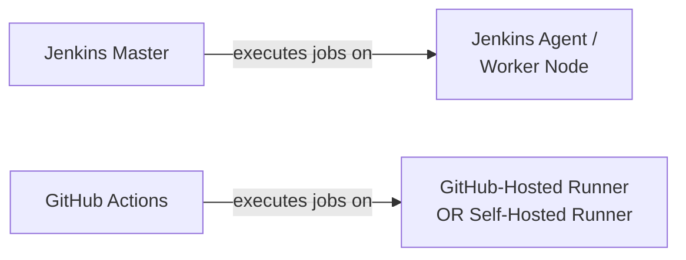

#### 📖 Definition — GitHub-Hosted Runners

> 💡 **Memory Trick, given directly:** *"Take open-source projects like Kubernetes, Argo CD, or SPO — their CI system is built directly on GitHub, since their source code is also hosted there. GitHub Actions, using GitHub-hosted runners, is completely FREE for open-source and public projects. When you take a runner from GitHub, you DON'T own that runner — it's a public runner. GitHub gives it to you for the duration of the CI pipeline's execution, and once execution is done, the runner gets TERMINATED. You have no ownership over it."*

#### 📖 Definition — Self-Hosted Runners

> 💡 **Memory Trick, given directly:** *"Self-hosted runner is the same concept as what we do in Jenkins — when you take a Jenkins Master, you create a Jenkins worker/agent, which can be an EC2 instance or a Docker container. Similarly, in GitHub Actions, you can do the exact same thing."*

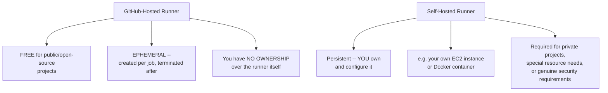

#### 🎯 Key Takeaways

* A **runner** is precisely the execution location for a job — directly, conceptually identical to a Jenkins **agent/worker node**.
* **GitHub-hosted runners** are free (for public/open-source projects), genuinely ephemeral (created per job, terminated after), and entirely un-owned by the user.
* **Self-hosted runners** are persistent infrastructure the user configures and controls themselves — the exact same underlying concept as a Jenkins agent, just applied within GitHub Actions' terminology and system.

---
### 3. Why Use a Self-Hosted Runner? Three Explicit Reasons

#### ❓ Why It Exists — The Core Question, Directly Posed

> ⚠️ **Directly, explicitly posed as the session's central motivating question:** *"GitHub-hosted runners are really good, really amazing — lots of open-source projects use them. So why would you use a self-hosted runner at all? This SHOULD be your first question."*

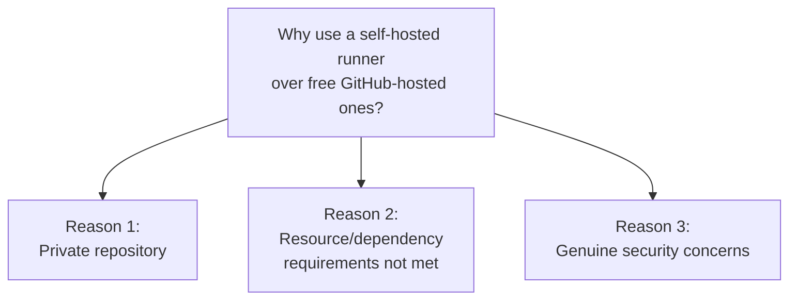

#### 📖 Definition — Reason 1: Private Repositories

> 💡 **Memory Trick, given directly:** *"You are an enterprise company -- your code is NOT open, you're using private repositories. That's the first reason."*

#### 📖 Definition — Reason 2: Resource/Dependency Requirements

> 💡 **Memory Trick, given directly:** *"GitHub-hosted runners are not good enough for your specific project. Let's say you require a runner with 32GB RAM -- maybe you're running end-to-end tests that need huge resources, or you have very special package/dependency requirements that don't come pre-installed with GitHub-hosted runners."*

#### 📖 Definition — Reason 3: Genuine Security Concerns

> ⚠️ **A precise, directly-stated, genuinely serious example:** *"Let's say you're a banking application. Why would you put your code on a runner where you have no information about it? Technically, it's a GitHub-hosted runner -- you don't know where it's hosted. It could be hosted in Antarctica, it could be hosted anywhere. You don't know if this server is sharing data with any other company. When security is a key concern, even in that case, you should NOT be using a GitHub-hosted runner."*

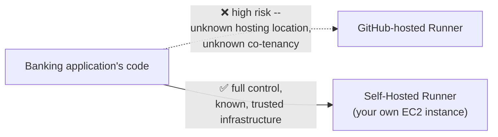

#### ⚠ Common Mistakes

* Assuming a self-hosted runner is only relevant for private repositories — explicitly, directly corrected: two additional, genuinely distinct reasons (resource/dependency needs, and security concerns) exist independently of repository visibility.

#### 🎯 Key Takeaways

* Three explicit, named reasons for self-hosted runners: (1) **private repositories**, (2) **resource/dependency requirements** GitHub-hosted runners can't meet, and (3) **genuine security concerns** — illustrated via a real, high-stakes banking-application example.
* Security is explicitly, precisely framed as a genuinely distinct concern from simple repository privacy — even a public project might have components warranting self-hosted infrastructure for security reasons alone, though the session's specific example focuses on the private/sensitive case.
* These three reasons are explicitly, directly framed as the complete set — worth remembering precisely, since the session itself notes they're worth reviewing again if unclear.

---

### 4. Setting Up the EC2 Instance: The Critical Inbound/Outbound Rules

#### 🪜 Step-by-Step — Launching the Instance

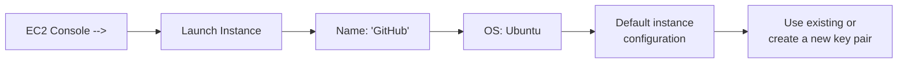

#### ❓ Why It Exists — The Genuinely Critical Networking Step

> ⚠️ **Directly, explicitly emphasized as the single most important configuration detail:** *"There is one important thing I'm going to show you -- how to configure the inbound and outbound traffic rules for this specific configuration, because you have an external thing called GitHub talking to your AWS account. How do these two things communicate? What should the inbound rules be? What should the outbound rules be?"*

#### 🔍 Internal Working — Precisely Why Both Inbound AND Outbound Matter

> 💡 **Memory Trick, the precise, real-world reasoning given directly:** *"Your AWS account and your GitHub account might not be in the same network -- sometimes you might be using a publicly-hosted GitHub account, while your AWS is within a VPC, or the other way around. You might have Enterprise GitHub sitting inside your own office network. There can be any reason -- you have to be VERY careful opening these ports. If you misconfigure them, there's a very good chance you'll run into security concerns."*

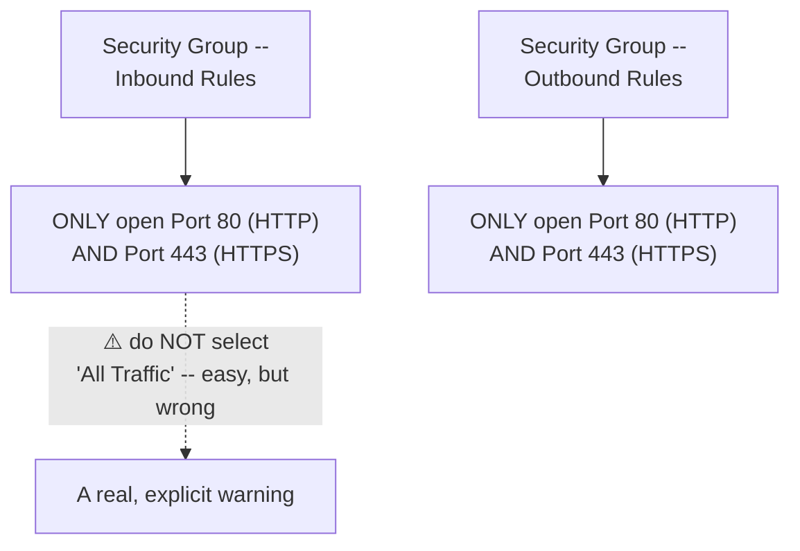

> ⚠️ **A direct, explicit warning against the "easy" but wrong option:** *"You will see an option called 'All Traffic' -- it can be easy, but do NOT do that. Go to HTTP and select 'Anywhere' (or, if you know your GitHub IP address specifically and it's hosted within a known network, you can use that specific network instead) -- then add a new rule opening HTTPS as well. Do the same thing for the outbound rules."*

#### 🔍 Internal Working — Why BOTH Directions Are Genuinely Necessary (Explained Later, Confirmed Here)

> 💡 **Memory Trick, the precise reasoning tied together later in the session, given directly:** *"Inbound traffic, because the runner has to RECEIVE a request from GitHub. Outbound traffic, because the runner also has to UPDATE STATUS BACK to GitHub once a job completes."*

#### ⚠ Common Mistakes

* Selecting "All Traffic" for convenience rather than explicitly, deliberately scoping to only HTTP/HTTPS — explicitly, directly warned against as a genuine security risk.
* Assuming only inbound traffic needs to be configured — explicitly, directly corrected: outbound traffic is equally necessary, since the runner must report status back to GitHub after job completion.

#### 🎯 Key Takeaways

* EC2 security group configuration for a self-hosted runner requires **only HTTP (80) and HTTPS (443)** — explicitly, deliberately scoped, NOT "All Traffic."
* Both **inbound** (receiving job requests from GitHub) AND **outbound** (reporting job status back to GitHub) rules are genuinely, independently necessary — missing either causes the setup to fail.
* This precise, careful networking configuration step is explicitly, directly flagged as genuinely important — misconfiguration risks real security or connectivity failures, not just minor inconvenience.

---
### 5. Registering the Runner: The Sensitive Token & the run.sh Script

#### 🏢 Real-World / Production Usage — The Instructor's Own GitHub Actions Repository

> 💡 **Memory Trick, given directly:** *"If you're looking at this repository for the first time -- this is the GitHub Actions Zero to Hero repository I've created. There are already 145 forks and 47 stars on it -- people who watched our YouTube video have already tried this and were very successful deploying their first GitHub Actions workflow."*

#### 🪜 Step-by-Step — Registering a New Self-Hosted Runner

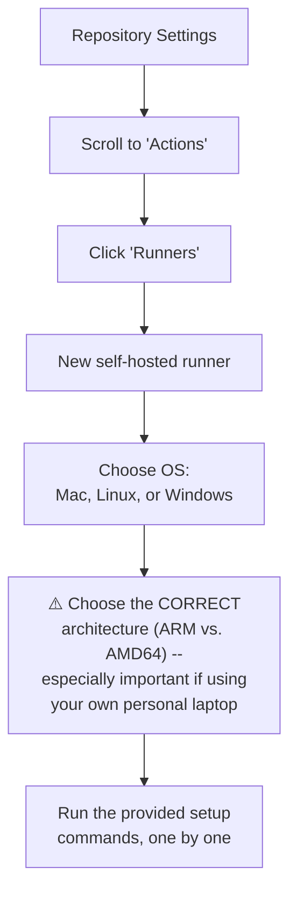

> ⚠️ **A direct, explicit architecture warning:** *"Be careful about the architecture type -- let's say you're using your personal laptop as a runner, make sure your laptop's architecture is correctly matched. Your personal laptop can be ARM architecture, or AMD64, or something else entirely."*

#### ⚠ A Genuine, Deliberate Security Practice — Pausing the Recording

> ⚠️ **Directly, honestly demonstrated as real, practiced security discipline:** *"There is some sensitive information on this page -- a TOKEN -- and you should not share that with anyone. I'm going to stop screen-sharing here. All you need to do is run these commands one by one -- I'm going to pause the recording, and once the steps are done, I'll start recording again. The token should not be shared with anyone, because it's equivalent to your access token -- anyone who has this token can do whatever they want with your GitHub account."*

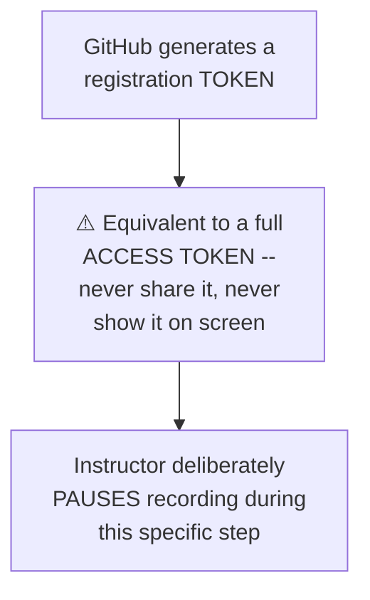

#### 💻 Code Example — The `run.sh` Script

> 💡 **Memory Trick, given directly, describing what the provided setup commands actually do:** *"All the steps on that page will: download the runner configuration, install the runner configuration, and there's a script called `run.sh` -- once you run this, your EC2 instance is configured as a runner, and it will start listening to GitHub. It says 'listening for jobs.' Whenever you make any code change on GitHub, this runner will check: should I run/execute this job? If yes, it executes it."*

```bash
# (Provided directly by GitHub's own "New self-hosted runner" setup page --
#  downloads and configures the runner, then starts it listening for jobs)
./run.sh
```

#### ⚠ Common Mistakes

* Sharing or displaying the runner registration token publicly (e.g., leaving it visible during a screen-recorded tutorial) — explicitly, directly avoided via a deliberate recording pause, modeling genuinely correct security practice rather than just describing it.

#### 🎯 Key Takeaways

* Registering a self-hosted runner requires correctly specifying **OS and architecture** (Mac/Linux/Windows; ARM vs. AMD64) — a genuinely important, easy-to-get-wrong detail, especially for personal-laptop runners.
* The generated **registration token** is explicitly, precisely as sensitive as a full account access token — **anyone with it can control your GitHub account**, a genuinely serious security fact, not an exaggerated caution.
* The instructor's own deliberate choice to **pause screen recording** during this specific step is itself a real, modeled security practice — directly consistent with this course's repeated emphasis on protecting sensitive credentials (`.pem` files, personal access tokens, in prior sessions).
* Running the provided setup script (referred to as **`run.sh`**) downloads, installs, and starts the runner, which then enters a **"listening for jobs"** state, ready to execute work GitHub sends it.

---

### 6. Switching the Workflow & Proving It Works, Live

#### 🪜 Step-by-Step — The Existing Workflow, First Verified on a GitHub-Hosted Runner

```yaml
name: First Actions
on: push

jobs:
  build:
    runs-on: ubuntu-latest    # <-- GitHub-hosted runner
    strategy:
      matrix:
        python-version: ["3.8", "3.9"]
    steps:
      # ... checkout, setup-python, install deps, run tests ...
```

> 💡 **Memory Trick, given directly:** *"This is a very simple CI file I wrote for the addition Python functionality in this repository. On every single commit, using `ubuntu-latest` (a GitHub-hosted runner), it runs for both Python 3.8 and 3.9. You can remove the matrix strategy if you don't want that -- it'll just run on whatever single version is installed."*

#### 🪜 Step-by-Step — The Switch: One Label Change

> 💡 **Memory Trick, given directly:** *"Go to `.github/workflows`, open `first-actions.yaml`, and change ONE thing: from `ubuntu-latest` to `self-hosted`. That's the only change you need to make. Once you commit, your GitHub Actions is ready to execute jobs on the self-hosted runner."*

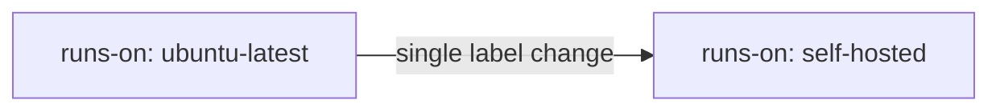

#### 🪜 Step-by-Step — Live, Real-Time Proof

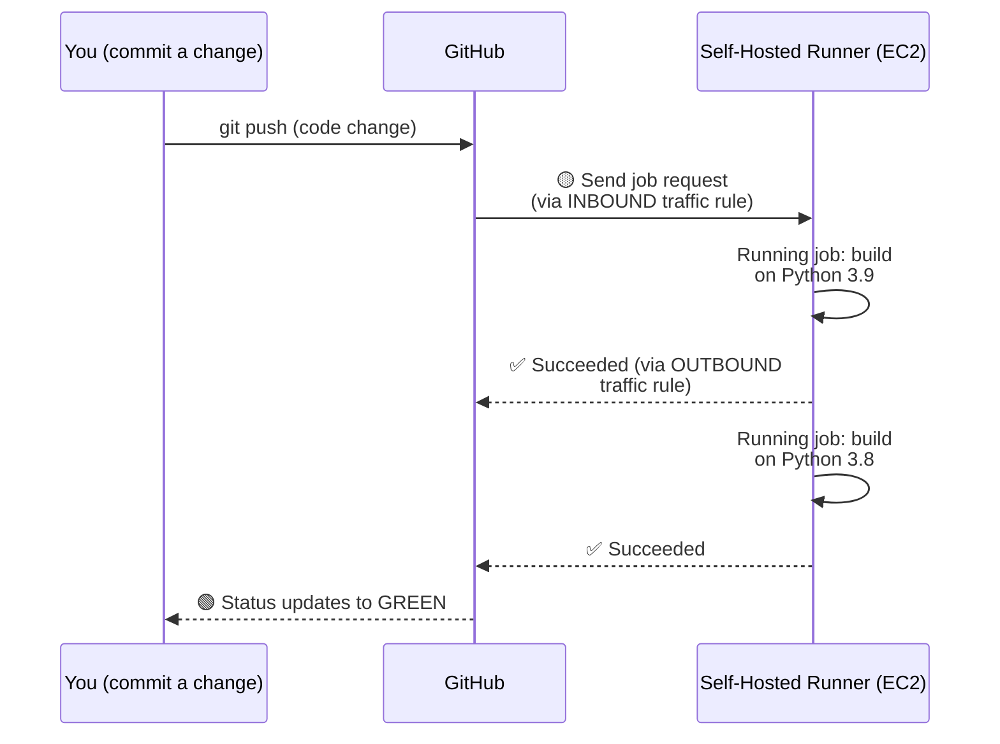

> 💡 **Memory Trick, the precise, live-observed sequence given directly:** *"I made a code change -- I'm expecting GitHub to run the job. There's the yellow dot -- something's running on my instance. It says 'running job: build on Python 3.9' ... succeeded. Then 'running job: build on Python 3.8' ... also succeeded. Now watch: the yellow dot changes to GREEN on its own. How does that happen? The runner sends a notification back to GitHub -- that's exactly why we configured OUTBOUND traffic. Inbound, because it has to receive the request; outbound, because it also has to update GitHub afterward."*

#### ⚠ Common Mistakes

* Assuming the "green check" status appears automatically without any communication FROM the runner back TO GitHub — explicitly, directly clarified: the runner must actively report its result back, requiring the outbound traffic rule configured in Section 4.

#### 🎯 Key Takeaways

* Switching an existing workflow from GitHub-hosted to self-hosted execution requires changing **only the `runs-on:` label** — from `ubuntu-latest` to `self-hosted` — genuinely minimal, one-line change.
* This session provides **direct, live, real-time proof** that the self-hosted runner genuinely executes the job (visible in the runner's own terminal) and correctly reports its status back to GitHub (visible as the status dot updating from yellow to green).
* This live demonstration **directly, concretely confirms** why both inbound AND outbound traffic rules (Section 4) were genuinely necessary — not an abstract, unverified claim, but a real, observed mechanism.

---
### 7. Interview Questions: Justifying GitHub Actions & Securing Secrets

#### 🔥 Question 1: Why Did You Choose GitHub Actions Over Jenkins/AWS CodeBuild/Etc.?

> 💡 **Memory Trick, the precise, TWO-CASE answer given directly:** *"If you're already a public project, your answer is justified by default -- GitHub provides free resources to run, and you're public, so there's genuinely no strong counter-question. But if you're a PRIVATE project, you have to justify it differently -- by saying: we're an ecosystem that's ALREADY fully on GitHub. Not just CI/CD -- we also do our Agile/Scrum work in GitHub Projects, we use GitHub Wiki instead of Confluence, we use GitHub security features like Dependabot, and we get our insights from GitHub. We're using GitHub to its fullest capacity."*

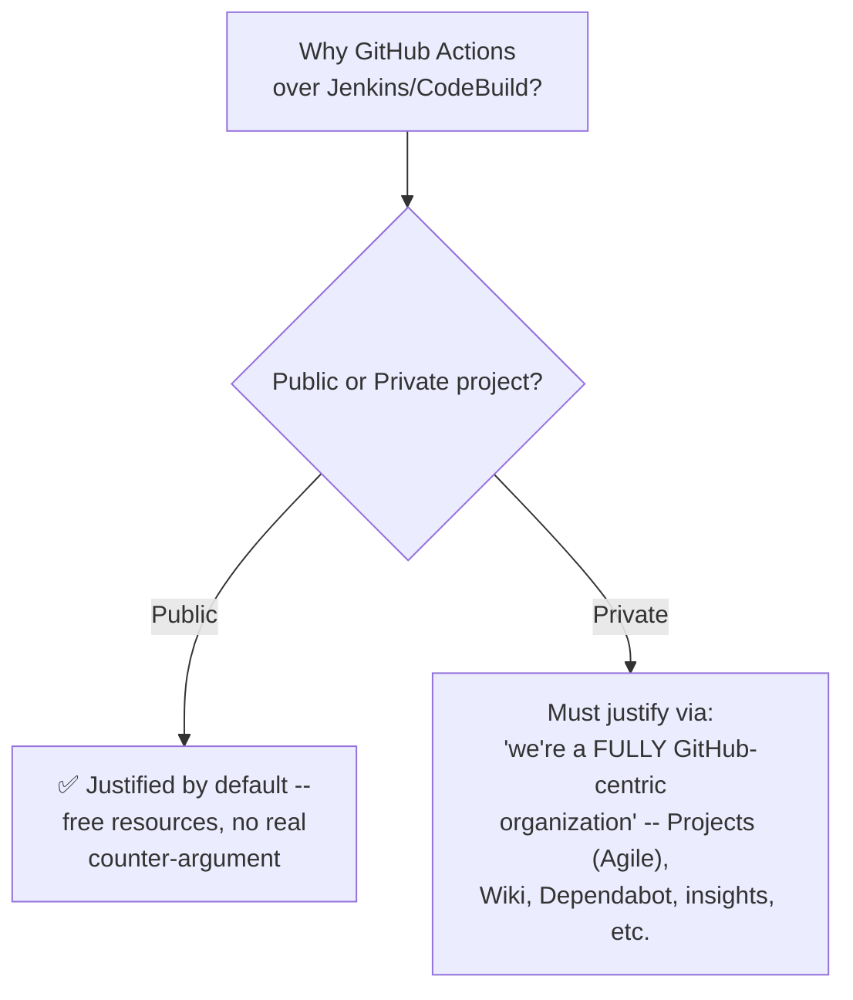

> ⚠️ **A direct, honest caveat given for the private case:** *"Most people using GitHub Actions DON'T use all these features. If your project is genuinely, completely dedicated to GitHub -- using its full feature set -- go with Actions. But if you're a company only doing source code management on GitHub, personally, I'd recommend a different CI solution -- Jenkins, or AWS CodeBuild if you're on AWS."*

#### 🔥 Question 2: How Do You Secure Sensitive Information in GitHub Actions?

> 💡 **Memory Trick, given directly:** *"Go to Settings -- there's a tab called 'Secrets and variables.' You can say: we're using this tab to secure sensitive information."*

#### 🔥 Question 3: How Do You Write a GitHub Actions CI File?

> 💡 **Memory Trick, given directly:** *"Explain that in the repository itself, you create a `.github/workflows` folder, and explain each stage: how the action executes on a specific trigger -- using the `on:` keyword, followed by `push` if it's only push, or `push, pull_request` if it's both."*

#### ⚠ Honesty Note — A Direct, Honest Acknowledgment

> ⚠️ **Directly, honestly stated:** *"GitHub Actions is genuinely a very easy topic -- there won't be a LOT of interview questions on it. If you feel there's something specific about interview questions you're not understanding, post it in the comment section, and if it requires a dedicated video, I'll make one. But in general, it's a simple topic, with no such complex things to it."*

#### 🎯 Key Takeaways

* The correct answer to "why GitHub Actions?" **genuinely differs** based on project visibility — public projects are justified by default; private projects require demonstrating genuinely comprehensive GitHub platform usage, not just CI/CD.
* Native **secrets management** (Settings → Secrets and variables) is the direct, correct answer for securing sensitive information.
* This session **honestly, directly acknowledges** GitHub Actions as a comparatively simple topic without extensive, deep interview-question coverage — a genuine, non-inflated characterization rather than manufacturing artificial complexity.

---

### 8. GitHub Actions vs. Jenkins: The Public/Private Verdict

#### ❓ Why It Exists

> 💡 **Memory Trick, the motivating context given directly:** *"This is very, very important, because many people are coming from Jenkins -- we did our previous videos on Jenkins, the industry uses Jenkins, and many viewers have already implemented Jenkins CI systems by watching our videos. So it's genuinely important to understand how GitHub Actions differs from Jenkins, and what the future scope of each might be."*

#### 📖 Definition — The Precise, Visibility-Split Verdict

> 💡 **Memory Trick, given directly and precisely:** *"If it's a public project -- open source, no restrictions, code genuinely open -- GitHub Actions is the SOLO WINNER. There's no competition with Jenkins, because you get everything done for free; Microsoft (GitHub's owner) provides free servers. But if you're a PRIVATE project, at this point in time, I'd recommend Jenkins -- because Jenkins has a good orchestration ecosystem, and you have a lot of support with Jenkins that GitHub Actions still falls short of, today."*

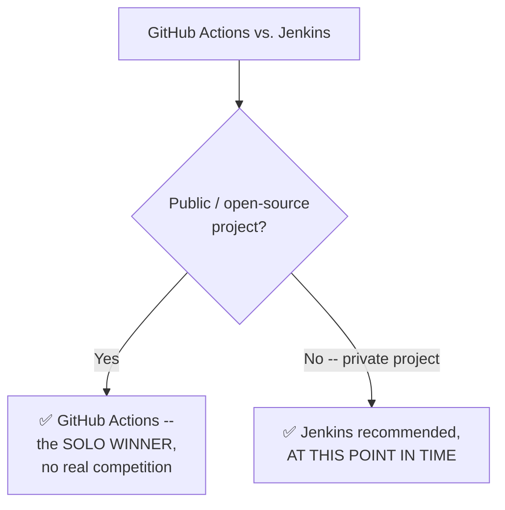

#### 🔍 Internal Working — Why Jenkins Still Wins for Private Projects, Precisely

> 💡 **Memory Trick, the precise reasoning given directly:** *"With Jenkins, you can download and install a LOT of plugins -- there are very good, inbuilt integrations that GitHub Actions is still trying to build toward. Even in the Ultimate CI/CD Pipeline project, I showed how easy it is to configure Sonar and other integrations with Jenkins. GitHub Actions WILL get there -- but at this point in time, if it's a private project, you have more you can achieve with Jenkins."*

#### ⚠ Common Mistakes

* Treating this comparison as a fixed, permanent verdict rather than a genuinely time-bound assessment — explicitly, repeatedly qualified with "at this point in time" — GitHub Actions is explicitly acknowledged as actively catching up, not permanently behind.
* Assuming this same verdict from the prior GitHub Actions session (Day 20) is identical, word-for-word, to this session's — while directionally consistent, this session provides a genuinely SHARPER, more precisely visibility-split framing (public = solo winner, private = Jenkins still recommended) than a general three-part advantages list.

#### 🎯 Key Takeaways

* The session's **precise, final verdict**: GitHub Actions is the **solo winner** for public/open-source projects (no real competition); **Jenkins** remains the recommended choice for private projects, **at this specific point in time**.
* Jenkins' advantage for private projects is explicitly attributed to its **more mature plugin ecosystem and inbuilt integrations** (e.g., Sonar, referenced from the "Ultimate CI/CD Pipeline" project) — a genuine, current-state gap, not a permanent architectural limitation.
* This verdict is **explicitly, repeatedly time-qualified** ("at this point in time") — a deliberate, honest acknowledgment that GitHub Actions' ecosystem is actively evolving and may close this gap in the future.

---

## 📝 Glossary

| Term | Definition | Why It Matters |
|---|---|---|
| **Runner** | The execution location for a GitHub Actions job | Directly analogous to a Jenkins agent/worker node |
| **GitHub-Hosted Runner** | A free, ephemeral, GitHub-provided runner (for public/open-source projects) | Created per job, terminated after -- no user ownership |
| **Self-Hosted Runner** | User-configured, persistent execution infrastructure (e.g. an EC2 instance) | Required for private repos, special resource needs, or security concerns |
| **Registration Token** | The credential generated when adding a new self-hosted runner | As sensitive as a full GitHub access token -- must never be shared |
| **`run.sh`** | The script (provided by GitHub) that configures and starts a self-hosted runner | Puts the runner into a "listening for jobs" state |
| **Inbound/Outbound Traffic Rules** | EC2 security group settings controlling network access to/from the instance | Must be scoped to HTTP/HTTPS only -- both directions required for runner communication |
| **`runs-on:`** | The workflow YAML field specifying which runner type/label to use | Change from `ubuntu-latest` to `self-hosted` to switch runner types |
| **Secrets and variables (GitHub Settings)** | GitHub's native, secure storage for sensitive configuration | The direct answer to "how do you secure sensitive info in GitHub Actions?" |

---

## 🔄 Revision Notes — One-Minute Revision

* This session is **Video 2 of a themed "CI/CD Week"** series (following Jenkins Shared Libraries, preceding an upcoming GitLab CI/CD project) -- distinct from the numbered DevOps Zero to Hero course, though it directly builds on an earlier, separate GitHub Actions project.
* A **runner** is the execution location for a job -- directly analogous to a Jenkins agent/worker node. **GitHub-hosted runners** are free (for public projects), ephemeral, and un-owned; **self-hosted runners** are persistent infrastructure you configure yourself.
* Three explicit reasons for self-hosted runners: **private repositories**, **resource/dependency requirements** GitHub-hosted runners can't meet, and **genuine security concerns** (illustrated via a real banking-application example).
* EC2 setup for a self-hosted runner requires **carefully scoped inbound AND outbound traffic rules** (HTTP/HTTPS only, never "All Traffic") -- inbound to receive job requests, outbound to report status back to GitHub -- both genuinely, independently necessary.
* Registering a runner requires correct **OS/architecture** selection, and generates a **registration token as sensitive as a full access token** -- the instructor deliberately pauses screen recording during this step, modeling genuine security practice.
* Switching an existing workflow to a self-hosted runner requires changing **only the `runs-on:` label**, from `ubuntu-latest` to `self-hosted` -- proven live, with the job's status visibly updating from yellow to green as the runner reports back.
* Three genuine interview questions: **why GitHub Actions?** (differs for public vs. private projects -- private requires demonstrating comprehensive GitHub platform usage), **how do you secure secrets?** (Settings → Secrets and variables), and **how do you write a CI file?** (`.github/workflows`, the `on:` trigger keyword) -- honestly acknowledged as a comparatively simple topic overall.
* The session's **precise, refreshed verdict**: GitHub Actions is the **solo winner** for public/open-source projects; **Jenkins remains recommended for private projects, at this point in time**, due to a more mature plugin/integration ecosystem -- explicitly, honestly time-qualified as an evolving, not permanent, gap.

---

## 📋 Cheat Sheet

**Runner vs. Jenkins terminology:**
```text
GitHub Actions Runner  <->  Jenkins Agent / Worker Node
```

**GitHub-hosted vs. self-hosted:**
```text
GitHub-hosted -> FREE (public projects), EPHEMERAL, no ownership
Self-hosted    -> persistent, YOU configure & own it
```

**Three reasons for self-hosted runners:**
```text
1. Private repository
2. Resource/dependency requirements GitHub-hosted runners can't meet
3. Genuine security concerns (e.g. banking applications)
```

**EC2 security group setup (critical):**
```text
Inbound:  ONLY HTTP (80) + HTTPS (443)  -- NEVER "All Traffic"
Outbound: ONLY HTTP (80) + HTTPS (443)  -- NEVER "All Traffic"
(Inbound = receive job requests; Outbound = report status back to GitHub)
```

**Switching a workflow to self-hosted:**
```yaml
runs-on: ubuntu-latest   # change this...
runs-on: self-hosted      # ...to this. That's the ONLY change needed.
```

**GitHub Actions vs. Jenkins (the precise verdict):**
```text
Public / open-source project -> GitHub Actions (solo winner, no competition)
Private project                -> Jenkins (recommended, AT THIS POINT IN TIME)
```

---

## 🔥 Interview Questions & Answers

### 🟢 Beginner

**Q1.**

**Question:** What is a "runner" in GitHub Actions?

**Answer:** The execution location for a job -- directly analogous to a Jenkins agent or worker node.

**Explanation:** Directly, precisely defined via the Jenkins parallel.

**Why Interviewers Ask This:** Foundational GitHub Actions terminology.

**Possible Follow-up:** "Name the two categories of runners GitHub Actions supports."

**Q2.**

**Question:** Is a GitHub-hosted runner persistent, or created fresh for each job?

**Answer:** Created fresh (ephemeral) for each job, and terminated once execution completes -- you have no ownership over it.

**Explanation:** Directly, precisely explained.

**Why Interviewers Ask This:** Tests understanding of GitHub-hosted runners' actual lifecycle.

**Possible Follow-up:** "How does this differ from a self-hosted runner's lifecycle?"

**Q3.**

**Question:** Name the three explicit reasons for using a self-hosted runner instead of a free, GitHub-hosted one.

**Answer:** Private repositories, resource/dependency requirements not met by GitHub-hosted runners, and genuine security concerns.

**Explanation:** Directly, explicitly named as the complete set.

**Why Interviewers Ask This:** Tests recall of a specific, structured answer to a common practical question.

**Possible Follow-up:** "Give a concrete, real-world example illustrating the security-concerns reason."

**Q4.**

**Question:** What two ports should be opened in an EC2 instance's security group for a self-hosted GitHub Actions runner?

**Answer:** HTTP (80) and HTTPS (443) -- both inbound and outbound.

**Explanation:** Directly, explicitly stated as the correct, scoped configuration.

**Why Interviewers Ask This:** A practical, genuinely important networking-configuration detail.

**Possible Follow-up:** "Why is 'All Traffic' explicitly discouraged, even though it's easier?"

**Q5.**

**Question:** Why must both inbound AND outbound traffic rules be configured for a self-hosted runner?

**Answer:** Inbound is needed to receive job requests from GitHub; outbound is needed to report job status back to GitHub once execution completes.

**Explanation:** Directly, precisely explained and live-proven.

**Why Interviewers Ask This:** Tests genuine understanding of the underlying communication mechanism, not just the rule itself.

**Possible Follow-up:** "What would you observe (or fail to observe) if only inbound rules were configured, but not outbound?"

**Q6.**

**Question:** Why is the self-hosted runner registration token treated as extremely sensitive?

**Answer:** It's equivalent to a full GitHub access token -- anyone possessing it can control your GitHub account.

**Explanation:** Directly, explicitly stated, and modeled via a deliberate recording pause.

**Why Interviewers Ask This:** Tests awareness of genuine credential-security risk.

**Possible Follow-up:** "What specific action did the instructor take to protect this token during the live demo?"

**Q7.**

**Question:** What single change is required to switch an existing workflow from a GitHub-hosted to a self-hosted runner?

**Answer:** Changing the `runs-on:` value from `ubuntu-latest` to `self-hosted`.

**Explanation:** Directly, precisely demonstrated live.

**Why Interviewers Ask This:** Basic, practical GitHub Actions configuration knowledge.

**Possible Follow-up:** "What script must be running on the self-hosted machine for this to actually work?"

**Q8.**

**Question:** Where would you go to secure sensitive information (like API keys) in GitHub Actions?

**Answer:** Settings → Secrets and variables.

**Explanation:** Directly, precisely stated as the answer to this exact interview question.

**Why Interviewers Ask This:** A common, practical security question.

**Possible Follow-up:** "Give an example of sensitive information you might store this way."

**Q9.**

**Question:** For a public, open-source project, is GitHub Actions or Jenkins the recommended CI/CD choice?

**Answer:** GitHub Actions -- explicitly described as the "solo winner," with no real competition.

**Explanation:** Directly, explicitly stated as the session's precise verdict.

**Why Interviewers Ask This:** Tests recall of this session's core, visibility-split recommendation.

**Possible Follow-up:** "What would the recommendation be instead for a PRIVATE project?"

**Q10.**

**Question:** Why is Jenkins still recommended for private projects, "at this point in time"?

**Answer:** Jenkins has a more mature plugin ecosystem and better inbuilt integrations (e.g., Sonar) than GitHub Actions currently offers.

**Explanation:** Directly, precisely explained, with an honest time-qualifier.

**Why Interviewers Ask This:** Tests understanding of a genuine, current-state (not permanent) technology gap.

**Possible Follow-up:** "Why does the instructor explicitly qualify this recommendation with 'at this point in time'?"

---

### 🟡 Intermediate

**Q11.**

**Question:** Explain why the instructor's decision to pause screen recording during the token-generation step is a more effective teaching choice than simply telling viewers "don't share your token" verbally.

**Answer:** Actually DEMONSTRATING the security practice (pausing recording, genuinely not exposing the token on screen) provides direct, lived proof that this is a real, seriously-followed practice -- not just advice given in passing that the instructor himself doesn't actually follow. This directly models the exact behavior a viewer should replicate in their own work, rather than only describing it abstractly. This is consistent with this course's broader, repeated pattern (seen across the numbered DevOps course as well, e.g., never sharing screens during `.pem` key or personal access token generation) of modeling genuine security discipline through action, not just verbal instruction.

**Explanation:** Requires recognizing a deliberate, demonstrated security practice as more pedagogically effective than verbal instruction alone.

**Why Interviewers Ask This:** Tests whether a learner distinguishes "stated best practice" from "genuinely modeled, lived practice."

**Possible Follow-up:** "Name another moment, from this same instructor's other sessions, where a similar security practice was directly demonstrated rather than just described."

**Q12.**

**Question:** A learner argues that since this session states GitHub Actions is "the solo winner" for public projects, private projects should simply avoid GitHub Actions entirely and use Jenkins exclusively. Evaluate this claim.

**Answer:** This claim overstates the session's actual, more nuanced position. The session explicitly provides a DIFFERENT interview-question answer specifically for private projects CHOOSING to use GitHub Actions anyway (Section 7's Question 1) -- namely, justifying the choice via comprehensive, GitHub-centric organizational usage (Projects, Wiki, Dependabot, etc.). This directly implies private projects genuinely CAN and DO sometimes choose GitHub Actions, provided they meet this specific, stated justification -- the session's Jenkins recommendation for private projects is a general, DEFAULT recommendation "at this point in time," not an absolute, universal prohibition on GitHub Actions for any private project whatsoever.

**Explanation:** Tests whether a learner recognizes the session's own, more nuanced private-project guidance (Section 7) as adding necessary conditionality to the general verdict (Section 8), rather than treating the general verdict as an absolute rule.

**Why Interviewers Ask This:** Distinguishes candidates who track a session's full, nuanced guidance from those who oversimplify a general recommendation into an absolute rule.

**Possible Follow-up:** "Under what specific, stated condition would a private project still reasonably choose GitHub Actions, per this session's own guidance?"

**Q13.**

**Question:** Explain, precisely, why the session's third self-hosted-runner reason (security concerns) is presented as GENUINELY DISTINCT from the first reason (private repositories), rather than simply being a restatement of it.

**Answer:** "Private repository" concerns whether your SOURCE CODE itself is publicly visible or not -- a question of code confidentiality. "Security concerns" (Section 3's banking example) concerns a genuinely different risk: even code that IS appropriately kept private might still face additional risk specifically from EXECUTION-ENVIRONMENT uncertainty -- not knowing WHERE a GitHub-hosted runner is physically located, or whether it might share underlying infrastructure with other, unrelated tenants. A project could theoretically be private (satisfying reason 1) while STILL warranting a self-hosted runner specifically because of this separate, execution-environment-trust concern (reason 3) -- these address genuinely different threat models (code confidentiality vs. execution-environment trust), even though they might often co-occur in practice for the same genuinely sensitive project.

**Explanation:** Requires precisely distinguishing two genuinely separate concerns that might superficially seem redundant.

**Why Interviewers Ask This:** Tests whether a learner understands the session's three reasons as genuinely independent considerations, not overlapping restatements of the same underlying concern.

**Possible Follow-up:** "Could a genuinely PUBLIC, open-source project still have a legitimate, security-driven reason to use a self-hosted runner? Explain."

**Q14.**

**Question:** Using this session's live demonstration (Section 6), explain precisely what would have happened, observably, if the outbound traffic rule had been misconfigured or missing, even though the inbound rule was correctly configured.

**Answer:** Per the session's own explicit mechanism, the runner would have successfully RECEIVED the job request (since inbound was correctly configured) and would have genuinely EXECUTED the job on the EC2 instance -- but would have been UNABLE to report the result back to GitHub, since that reporting specifically requires outbound connectivity. The observable symptom: the job would appear to run successfully in the runner's own terminal/logs, but GitHub's own status indicator (the yellow dot) would likely remain stuck in a pending/running state indefinitely, or eventually time out, rather than updating to green -- a genuinely diagnosable, specific failure signature directly traceable to this exact misconfiguration.

**Explanation:** Requires reasoning through a hypothetical failure mode based on the session's own explicitly-stated mechanism, producing a specific, testable prediction.

**Why Interviewers Ask This:** Tests whether a learner can apply a stated mechanism to diagnose a plausible, realistic failure scenario, not just recall the mechanism itself.

**Possible Follow-up:** "How would you specifically confirm, via logs or observation, that this exact failure mode (successful execution, failed status report) was occurring?"

**Q15.**

**Question:** Synthesize this session's public/private GitHub-Actions-vs-Jenkins verdict with Day 20's earlier (three-part: hosting, UI, cost) comparison to explain whether these two sessions' guidance is genuinely consistent, or represents a meaningful evolution/refinement.

**Answer:** The two sessions' guidance is genuinely CONSISTENT in its underlying logic, but this session provides a meaningfully SHARPER, more directly actionable framing. Day 20's comparison established general advantages (hosting/maintenance, UI simplicity, cost) alongside a general strategic caveat (platform commitment) -- this session CRYSTALLIZES that same underlying reasoning into a single, precise, memorable verdict split explicitly by project VISIBILITY (public vs. private) specifically, rather than the more general "platform commitment" framing. Both sessions agree GitHub Actions is strongest for public/open-source, GitHub-committed projects, and that Jenkins retains genuine advantages elsewhere -- this session's contribution is refining WHICH SPECIFIC DIMENSION (visibility, not just general platform commitment) most directly determines the recommendation, and adding the explicit, honest "at this point in time" qualifier acknowledging this verdict is a genuinely time-bound, evolving assessment rather than a fixed, permanent one.

**Explanation:** Requires comparing two genuinely related but separately-delivered pieces of guidance across different sessions, correctly identifying refinement/evolution rather than either contradiction or pure repetition.

**Why Interviewers Ask This:** A senior-level question testing whether a candidate can track how the SAME instructor's guidance on a topic evolves and sharpens across multiple, related sessions over time.

**Possible Follow-up:** "What specific NEW information does THIS session provide that Day 20's session didn't directly cover?"

---

### 🔴 Advanced

**Q16.**

**Question:** Design a genuinely secure, production-grade self-hosted runner deployment strategy for a private, security-sensitive organization (like the banking example from Section 3), addressing at least three specific hardening considerations beyond this session's own basic EC2 setup.

**Answer:** A reasonable, hardened design: (1) **Network isolation beyond basic port scoping** -- rather than simply opening HTTP/HTTPS to "Anywhere" (the session's own basic demo configuration), restrict the inbound/outbound rules to GitHub's SPECIFIC, documented IP ranges where possible, rather than the fully open "Anywhere" option used for this session's simplified demo. (2) **Runner-specific IAM/access scoping** -- ensure the self-hosted runner's own EC2 instance role/permissions follow the principle of least privilege (directly connecting to this course's earlier IAM discussions), so that even if the runner itself were compromised, its blast radius within the broader AWS account remains limited. (3) **Ephemeral, per-job runner provisioning** -- rather than this session's persistent, always-running EC2 instance, consider using auto-scaling, ephemeral self-hosted runners that are provisioned fresh for each job and destroyed afterward (a genuine, more advanced pattern beyond this session's basic demo), directly recapturing some of GitHub-hosted runners' "no persistent attack surface" benefit while still retaining the private/security control this session's reasons 1 and 3 require. (4) **Registration token rotation and audit** -- establish a policy for periodically rotating runner registration tokens and auditing which runners are currently registered, directly extending this session's own "the token is equivalent to an access token" security framing into an ongoing, not just one-time, security practice. This design directly extends the session's own basic setup with genuinely necessary, production-grade hardening for the specific high-security scenario (banking) the session itself uses as its own motivating example.

**Explanation:** Synthesizes the session's own basic setup with genuinely necessary, more advanced hardening considerations appropriate for its own stated high-security motivating example -- real, applied extension beyond the session's demonstrated basic configuration.

**Why Interviewers Ask This:** A realistic, senior-level security-architecture question testing whether a candidate can extend a basic, demonstrated setup into a genuinely production-appropriate one for a stated high-security context.

**Possible Follow-up:** "Which of these four hardening measures would you prioritize FIRST for an organization just beginning to adopt self-hosted runners, and why?"

**Q17.**

**Question:** Critically evaluate: "Since this session explicitly says GitHub Actions is 'the solo winner' for public projects with no real competition, there is no legitimate reason a public, open-source project would ever choose Jenkins instead." Is this an accurate implication of this session's content?

**Answer:** Not fully accurate as an absolute, exceptionless claim. The session's own "solo winner" framing is specifically grounded in COST and default accessibility reasoning for public projects (free execution, no infrastructure to maintain) -- it does not directly address or rule out other, potentially legitimate reasons a specific public project might still prefer Jenkins, such as: an already-existing, substantial investment in Jenkins-specific plugins/integrations that would be costly to migrate away from (directly connecting to Day 20's own "migration effort" reasoning), a project maintainer's genuine prior expertise/preference for Jenkins specifically, or specific technical requirements Jenkins' more mature plugin ecosystem happens to support that GitHub Actions' comparatively newer one doesn't yet (per this session's Section 8 own stated Jenkins-ecosystem advantage, which isn't logically restricted to only PRIVATE projects). The accurate, more precise claim: GitHub Actions is the STRONGLY FAVORED, DEFAULT choice for NEW public/open-source projects given its cost/maintenance advantages -- but "solo winner" describes a strong DEFAULT recommendation, not an exceptionless prohibition on ANY legitimate alternative choice for EVERY possible public project's specific circumstances.

**Explanation:** Tests whether a learner recognizes a strong, favorable recommendation as a default guideline rather than an absolute, universally-exceptionless rule, correctly identifying genuine edge cases the session's own broader reasoning (elsewhere, e.g., Jenkins' plugin-ecosystem advantage) doesn't logically restrict to only private projects.

**Why Interviewers Ask This:** Distinguishes candidates who track the precise, conditional scope of even a strongly-stated recommendation from those who treat it as an absolute, exceptionless rule.

**Possible Follow-up:** "Describe a specific, realistic scenario where a genuinely public, open-source project might still rationally choose Jenkins over GitHub Actions."

**Q18.**

**Question:** Synthesize this session's three self-hosted-runner reasons (Section 3) with Day 16's Infrastructure-as-Code migration-risk reasoning to identify a genuinely NEW, fourth consideration this session doesn't explicitly name, but which follows naturally from combining these two sessions' logic.

**Answer:** Day 16 establishes that organizations can genuinely, unpredictably change their infrastructure/platform strategy over time (the AWS-to-Azure-to-OpenStack migration scenario) -- combining this with this session's three self-hosted-runner reasons suggests a genuinely NEW, fourth consideration this session doesn't explicitly name: **FUTURE PLATFORM PORTABILITY**. An organization might reasonably choose a self-hosted runner not merely for CURRENT private-repository, resource, or security reasons, but as a deliberate hedge against FUTURE migration risk -- since infrastructure you genuinely own and control (a self-hosted EC2 runner) is inherently more PORTABLE and adaptable to a future platform change (e.g., migrating from GitHub to GitLab) than infrastructure entirely dependent on one specific platform's own, ephemeral, hosted execution environment. This is a genuinely novel synthesis: neither session explicitly states this fourth reason directly, but it follows naturally and logically from combining Day 16's genuine migration-risk awareness with this session's specific self-hosted-vs-hosted-runner distinction, since self-hosted infrastructure inherently retains more genuine platform-independence than any specific platform's own hosted execution offering.

**Explanation:** Requires generating a genuinely novel, non-obvious fourth consideration by combining reasoning from two entirely separate sessions -- deep, creative, cross-session synthesis beyond simply restating either session's stated content.

**Why Interviewers Ask This:** A capstone-level question testing whether a candidate can generate genuinely new, well-reasoned insight by combining previously-taught, separately-delivered principles, rather than only reciting directly-stated content.

**Possible Follow-up:** "Would this fourth, portability-driven reason for self-hosted runners apply equally to GitHub-Actions-specific self-hosted runners, or would a genuinely platform-migrating organization need an entirely different CI/CD strategy regardless of runner hosting choice?"

---

## 🧪 Scenario-Based Interview Questions

> **Scenario 1:** A teammate's newly-registered self-hosted runner shows as "offline" in GitHub's Settings → Actions → Runners page, even though the EC2 instance itself appears to be running normally. Using this session's concepts, diagnose this.

**Structured Answer:**
1. **Initial investigation:** Recognize this as most likely a networking/communication issue, directly connecting to Section 4's emphasis on precisely-configured inbound/outbound traffic rules.
2. **Metrics/logs to check:** Check the runner's own local logs/terminal output (per Section 5's "listening for jobs" state) to confirm whether the `run.sh` process is genuinely still active and attempting to communicate with GitHub.
3. **Possible causes:** Most likely, per Section 4's exact demonstrated requirement, a misconfigured or missing outbound traffic rule (HTTP/HTTPS), preventing the runner from successfully reporting its status/heartbeat back to GitHub -- directly mirroring the exact failure mode reasoned through in Intermediate Q14.
4. **Debugging approach:** Verify the EC2 instance's security group configuration matches Section 4's exact requirements (HTTP/HTTPS, both inbound AND outbound, not "All Traffic" but also not accidentally over-restricted).
5. **Resolution:** Correct any missing or misconfigured outbound rule, then confirm the runner's status updates to "online" in GitHub's own Runners page.
6. **Prevention:** Document this exact "offline runner = check outbound rules first" diagnostic heuristic in team troubleshooting guides, directly connecting the specific symptom to its most likely root cause per this session's own explicitly-demonstrated mechanism.

> **Scenario 2 (Advanced):** Your organization runs a genuinely private, financial-services application (similar to this session's own banking example) and is deciding between a persistent, always-on self-hosted runner (as demonstrated in this session) versus a more complex, ephemeral, auto-scaling self-hosted runner setup (per Advanced Q16's proposed hardening). Provide your recommendation.

**Structured Answer:**
1. **Initial investigation:** Apply Advanced Q16's hardening framework directly -- assess whether the organization's genuine security requirements (per Section 3's own banking-example reasoning) justify the added operational complexity of ephemeral, auto-scaling runners over this session's simpler, persistent setup.
2. **Relevant principle:** Per Advanced Q16's reasoning, ephemeral runners more closely recapture GitHub-hosted runners' "no persistent attack surface" benefit while still satisfying this session's private/security-driven reasons for self-hosting at all -- a genuine, additional layer of defense-in-depth beyond the session's basic demonstrated setup.
3. **Possible causes for hesitation toward the more complex option:** Genuine, real operational complexity and cost of building and maintaining an auto-scaling, ephemeral runner infrastructure, versus the comparative simplicity of this session's basic, persistent EC2 setup.
4. **Debugging/evaluation approach:** Quantify the organization's actual risk tolerance and compliance requirements (financial services often have specific, externally-mandated security/audit requirements) against the genuine operational cost of the more complex, ephemeral approach.
5. **Resolution:** For a genuinely high-security, regulated financial-services context, recommend investing in the more hardened, ephemeral runner approach (Advanced Q16), given that the persistent attack surface of an always-on runner represents a genuine, ongoing risk this session's own security-focused reasoning (Section 3) would suggest is worth mitigating further, beyond just satisfying the basic "self-hosted, not GitHub-hosted" requirement.
6. **Prevention:** Establish a formal, periodic security review specifically for self-hosted runner infrastructure, ensuring the organization's runner architecture continues to match its actual, evolving risk profile and compliance requirements over time, rather than assuming an initial setup remains appropriate indefinitely.

---

## 🛠 Hands-on Exercises

### 🟢 Easy

1. Write out, from memory, the three explicit reasons for using a self-hosted runner instead of a GitHub-hosted one.
2. Draw (or describe in writing) the full inbound/outbound traffic flow for a self-hosted runner, correctly labeling which direction handles job requests and which handles status reporting.
3. Set up a free-tier EC2 instance and correctly configure its security group for GitHub Actions self-hosted runner use, following this session's exact HTTP/HTTPS-only guidance.

### 🟡 Medium

4. Register a real self-hosted runner on a GitHub repository of your own, following this session's exact process -- including correctly identifying your OS/architecture, and handling the registration token securely (never sharing or displaying it).
5. Take an existing GitHub Actions workflow (your own, or this session's example) and switch it from `ubuntu-latest` to `self-hosted`, verifying successful execution and status reporting exactly as demonstrated live in Section 6.
6. Write a short comparison document (150-200 words), in your own words, explaining the session's precise public/private GitHub-Actions-vs-Jenkins verdict, without directly copying this guide's phrasing.

### 🔴 Advanced

7. Implement at least two of the four hardening measures proposed in Advanced Interview Q16, applied to your own self-hosted runner setup from Exercise 4.
8. Design and document (in writing) the ephemeral, auto-scaling self-hosted runner architecture referenced in Advanced Q16/Scenario 2, even if you don't have the infrastructure to fully implement it.
9. Research (outside this transcript) GitHub's actual, currently-documented IP ranges for GitHub Actions, and reconfigure your Exercise 3 security group to use these specific ranges instead of "Anywhere," directly implementing Advanced Q16's first hardening measure.

---

## 🏗 Practice Assignment

*(This session's own stated assignment, reproduced faithfully)*

> 💡 **Memory Trick -- the instructor's own words, given directly:** *"Please try the self-hosted runners by yourself and get the confidence of how to use self-hosted runners with GitHub Actions."*

### Build: "Self-Hosted Runner Deployment"

**Objective:** Complete this session's own stated assignment end to end -- set up a genuine, working self-hosted runner and deploy a real Python project on it, directly following this session's exact demonstrated process.

**Requirements:**
- A correctly-configured EC2 instance (or equivalent), with inbound/outbound security group rules scoped exactly per Section 4's guidance.
- A successfully-registered self-hosted runner, with the registration token handled securely throughout (never displayed publicly or shared).
- An existing (or newly-written) GitHub Actions workflow, successfully switched from `ubuntu-latest` to `self-hosted`, and verified to execute correctly.
- Documentation (screenshots or written description) of the job status genuinely updating from pending/yellow to succeeded/green, directly reproducing Section 6's live demonstration.
- A brief written reflection (150-200 words) on which of this session's three self-hosted-runner reasons would most likely apply to a real or hypothetical project of your own choosing.

**Architecture (suggested):**

```text
self_hosted_runner_deployment/
├── SECURITY_GROUP_CONFIG.md    # your documented inbound/outbound rules
├── RUNNER_SETUP_LOG.md           # your registration process (token redacted/excluded)
├── .github/workflows/
│   └── ci.yaml                     # your workflow, using runs-on: self-hosted
└── REFLECTION.md                     # your own-project reasoning for self-hosting
```

**Expected Functionality:**
- Your self-hosted runner should genuinely, successfully execute a real job and report its status back to GitHub, verified via the actual GitHub Actions UI.
- Your documentation should never include the actual registration token, directly modeling this session's own demonstrated security discipline.

**Challenges:**
- Correctly configuring security group rules on your first attempt, without defaulting to the easier-but-wrong "All Traffic" option.
- Handling the registration token securely throughout your own documentation process.

**Bonus Improvements:**
- Extend your setup with one hardening measure from Advanced Interview Q16 (e.g., restricting to GitHub's specific documented IP ranges instead of "Anywhere").
- Deploy a genuinely different application (not the session's Python addition example) on your self-hosted runner, to confirm your understanding generalizes beyond the exact demonstrated case.

---

## 📚 Additional Resources

- **Video 1 of this "CI/CD Week" series**: Jenkins Shared Libraries (referenced directly) -- required prior context for this series.
- **Video 3 of this series** (referenced directly, previewed for the next day or the following Sunday): an end-to-end GitLab CI/CD project, a Java application similar to a previously-referenced "Ultimate CI/CD Pipeline" project.
- The instructor's own **GitHub Actions Zero to Hero repository** (referenced directly, 145 forks/47 stars at time of recording) -- directly linked in the video description.
- A **prior, separate GitHub Actions project** (referenced as being from a "45 days of DevOps" course) -- covering GitHub-hosted runners specifically, distinct from this session's self-hosted focus.
- The **"Ultimate CI/CD Pipeline" project** (referenced directly) -- demonstrating Jenkins' Sonar integration, used as evidence for this session's Jenkins-ecosystem-maturity claim.

---

## 📌 Final Revision Sheet

### ⭐ Core Concepts
- A **runner** = the execution location for a job, directly analogous to a Jenkins agent/worker node.
- **GitHub-hosted** (free, ephemeral, no ownership) vs. **self-hosted** (persistent, user-owned) runners.
- Three reasons for self-hosting: **private repos, resource/dependency needs, and genuine security concerns**.
- EC2 setup requires **precisely-scoped, bidirectional (inbound + outbound) HTTP/HTTPS traffic rules** -- never "All Traffic."
- The runner registration **token is as sensitive as a full access token** -- handle it with genuine, demonstrated security discipline.
- Switching a workflow to self-hosted requires only a **single `runs-on:` label change**.
- The session's precise verdict: GitHub Actions is the **solo winner for public projects**; **Jenkins remains recommended for private projects, "at this point in time."**

### ⭐ Important Definitions
- **`run.sh`**, **registration token** (see Glossary for full definitions).

### ⭐ Important Commands/Code
```yaml
runs-on: self-hosted    # the one-line change to switch from GitHub-hosted execution
```
```bash
./run.sh    # starts the self-hosted runner listening for jobs
```

### ⭐ Architecture/Process
- Setup flow: launch EC2 → configure security group (HTTP/HTTPS, inbound + outbound) → register runner (Settings → Actions → Runners → New self-hosted runner) → run setup commands (token handled securely) → switch workflow's `runs-on:` label → verify live execution.

### ⭐ Best Practices
- Never select "All Traffic" for a self-hosted runner's security group -- scope precisely to HTTP/HTTPS.
- Never display or share a runner registration token -- treat it exactly like a full access token.
- Choose self-hosted runners deliberately, based on the three explicit, named reasons -- not by default.
- Re-evaluate the GitHub-Actions-vs-Jenkins recommendation periodically, since it's explicitly, honestly time-qualified.

### ⭐ Common Mistakes
- Selecting "All Traffic" for convenience rather than precisely-scoped rules.
- Assuming only inbound (not outbound) traffic rules are needed.
- Sharing or displaying a runner registration token.
- Treating "GitHub Actions is the solo winner for public projects" as implying zero legitimate reasons a public project might ever choose Jenkins.

### ⭐ Interview Points
- Be ready to name all three explicit self-hosted-runner reasons.
- Be ready to explain precisely why both inbound and outbound rules are necessary.
- Be ready to give the visibility-split (public vs. private) GitHub-Actions-vs-Jenkins verdict precisely.
- Be ready to justify GitHub Actions for a PRIVATE project specifically, via comprehensive GitHub platform usage.

### ⭐ Things to Remember
- This session belongs to a **distinct, themed "CI/CD Week" series** -- not the numbered DevOps Zero to Hero course, though delivered by the same instructor and directly building on an earlier, separate GitHub Actions project.
- The instructor **honestly, directly acknowledges** GitHub Actions as a comparatively simple topic without extensive deep interview-question coverage -- inviting further, dedicated coverage only if genuinely requested.
- The session's Jenkins-for-private-projects recommendation is **explicitly, repeatedly time-qualified** ("at this point in time") -- a genuinely evolving, not fixed, assessment.

---

## 🔗 Source

- [GitHub Actions Self Hosted Runners](https://youtu.be/Rb2pUKdmdYo?si=liFDSVDCHdjjCcYc)