# 🦊 The Ultimate GitLab CI Pipeline: SonarQube, Self-Hosted Runners & Docker Executors

- <i>**Session:** "Ultimate CI Pipeline on GitLab" · 
- **Instructor:** Abhishek
- **Note on scope:** This is the third and final video of the themed **"CI/CD Week"** series (after Jenkins Shared Libraries and GitHub Actions Self-Hosted Runners) — distinct from the numbered DevOps Zero to Hero course, though same instructor. This session is **explicitly, deliberately CI-only** — the instructor directly explains he's splitting CI and CD into two separate videos this time, after a comparable, full Jenkins CI/CD video ran roughly 90 minutes and some viewers found it too long. The CD half (deploying the built image via Argo CD) is explicitly deferred to a future video, described as "90% the same" as an already-published Jenkins CD walkthrough. Every step here is demonstrated live on a real AWS EC2 instance, including a genuine, honestly-diagnosed SonarQube startup failure (a missing Java prerequisite) and a real, live-fixed stale-URL pipeline failure — nothing is edited around.</i>

---

## 📑 Table of Contents

1. [Session Overview](#-session-overview)
2. [Learning Objectives](#-learning-objectives)
3. [Detailed Notes](#-detailed-notes)
   - [1. Context: CI/CD Week Video 3 — Why This Is CI-Only, Not Full CI/CD](#1-context-cicd-week-video-3--why-this-is-ci-only-not-full-cicd)
   - [2. GitLab Account Setup & Reusing a Real Spring Boot Microservice Project](#2-gitlab-account-setup--reusing-a-real-spring-boot-microservice-project)
   - [3. GitLab Runners: Shared vs. Project (Self-Hosted)](#3-gitlab-runners-shared-vs-project-self-hosted)
   - [4. Setting Up the EC2 Instance: Sizing & Traffic Rules](#4-setting-up-the-ec2-instance-sizing--traffic-rules)
   - [5. Why Docker Executors: The Same Efficiency Argument, One More Time](#5-why-docker-executors-the-same-efficiency-argument-one-more-time)
   - [6. Installing & Configuring SonarQube — Including a Real, Live-Diagnosed Failure](#6-installing--configuring-sonarqube--including-a-real-live-diagnosed-failure)
   - [7. The SonarQube API Token & GitLab's Secret Variables](#7-the-sonarqube-api-token--gitlabs-secret-variables)
   - [8. The .gitlab-ci.yml File: Structure, Stages & the pom.xml](#8-the-gitlab-ciyml-file-structure-stages--the-pomxml)
   - [9. Registering the Runner & Live Pipeline Execution](#9-registering-the-runner--live-pipeline-execution)
   - [10. Closing: The SonarQube Dashboard, the Trivy/Snyk Assignment & Wrapping Up CI/CD Week](#10-closing-the-sonarqube-dashboard-the-trivysnyk-assignment--wrapping-up-cicd-week)
4. [Glossary](#-glossary)
5. [Revision Notes — One-Minute Revision](#-revision-notes--one-minute-revision)
6. [Cheat Sheet](#-cheat-sheet)
7. [Interview Questions & Answers](#-interview-questions--answers)
8. [Scenario-Based Interview Questions](#-scenario-based-interview-questions)
9. [Hands-on Exercises](#-hands-on-exercises)
10. [Practice Assignment](#-practice-assignment)
11. [Additional Resources](#-additional-resources)
12. [Final Revision Sheet](#-final-revision-sheet)

---

## 🎯 Session Overview

This session builds a genuinely complete, real GitLab CI pipeline end to end — from account creation through a working SonarQube-integrated build, live-verified with real failures and real fixes. It covers:

1. **Series context**: the third and final "CI/CD Week" video, deliberately split into CI-only (this session) and a future, separate CD-with-Argo-CD session — a direct, stated response to feedback that a comparable, full Jenkins video felt too long.
2. **GitLab account setup and project reuse** — genuinely trivial account creation via GitHub/Google authentication, and forking a real, working Spring Boot microservice project rather than writing one from scratch, directly reused from an earlier "Ultimate CI/CD Pipeline" Jenkins video.
3. **GitLab's two runner types** — Shared Runners (GitLab-hosted, recommended for public/open-source projects) and Project Runners (self-hosted, recommended for organizations) — directly, precisely paralleling the exact same security reasoning established in the GitHub Actions self-hosted-runners session.
4. **A real EC2 instance setup**, with explicit, precise sizing guidance (never free-tier `t2.micro` for this workload) and carefully-scoped traffic rules (port 9000 for SonarQube, plus HTTP/HTTPS) — including an honest, direct admission that "open all traffic" was used for demo convenience, paired with an equally direct warning never to do this in real work or portfolio documentation.
5. **Docker executors**, explained via the exact same efficiency reasoning (security, no per-VM reconfiguration, genuine parallel pipeline capacity) established elsewhere in this same "CI/CD Week" series — explicitly stated to apply "irrespective of the CI solution... Jenkins, GitHub Actions, or GitLab."
6. **A complete, live SonarQube installation and configuration**, including a genuine, honestly-diagnosed failure — SonarQube fails to start because Java wasn't installed first — fixed live, on camera, exactly as it would happen in real work.
7. **SonarQube's API token and GitLab's own secret-variable storage mechanism** — precisely explaining WHY this authentication step is needed (GitLab must authenticate to SonarQube to push scan results) and proving, live, that secured variables genuinely don't appear in plaintext job logs.
8. **The complete `.gitlab-ci.yml` file structure** — `image`, `variables`, `before_script`, and `stages` — directly compared to Jenkins' `Jenkinsfile` and GitHub Actions' `.github/workflows/` folder naming conventions.
9. **Registering the GitLab Runner** on the EC2 instance, and a genuinely live pipeline execution — including a real, honestly-diagnosed second failure (a stale SonarQube URL from an earlier demo attempt), fixed live by updating both the GitLab variable and the pipeline file itself.
10. **A closing SonarQube dashboard walkthrough**, a self-directed assignment (adding Trivy or Snyk for image scanning), and a reflective close to the entire "CI/CD Week" series.

> 💡 **Memory Trick — the instructor's own framing for why this video is CI-only:** *"Unlike the other two videos, this is going to be an end-to-end CI setup -- not end-to-end CI/CD. Last time I did CI/CD with Jenkins, it took almost 90 minutes, and many people felt it was very lengthy. That's why I'm dividing it into two parts."*

---

## 🎯 Learning Objectives

By the end of this guide, you will be able to:

- [ ] Explain why this session deliberately splits CI and CD into two separate videos, and what specific feedback motivated that decision.
- [ ] Create a GitLab account and fork an existing project into your own GitLab namespace.
- [ ] Precisely distinguish GitLab's Shared Runners from Project (self-hosted) Runners, and state the specific security reasoning behind choosing each.
- [ ] Correctly size and configure an EC2 instance's traffic rules for a GitLab self-hosted runner running Docker and SonarQube.
- [ ] Explain why Docker executors are preferred over virtual-machine-based runners, using the same reasoning established across this entire CI/CD Week series.
- [ ] Install and configure SonarQube on a fresh EC2 instance, including correctly diagnosing a missing-Java startup failure.
- [ ] Explain why a SonarQube API token is needed, and correctly store it as a GitLab CI/CD secret variable rather than hardcoding it.
- [ ] Write a complete `.gitlab-ci.yml` file with `image`, `variables`, `before_script`, and `stages` sections.
- [ ] Register a GitLab Runner on an EC2 instance and correctly configure it to use a Docker executor.
- [ ] Diagnose and fix a real pipeline failure caused by a stale configuration value.

---

## 📚 Detailed Notes

### 1. Context: CI/CD Week Video 3 — Why This Is CI-Only, Not Full CI/CD

#### 🧠 Concept

> 💡 **Memory Trick, given directly:** *"I hope you're all having a great CI/CD Week. We already did two videos -- one with Jenkins Shared Libraries, and the other with GitHub Actions, where we used a self-hosted EC2 instance as a runner. This video, unlike the other two, is going to be an end-to-end CI setup -- not end-to-end CI/CD."*

#### ❓ Why It Exists — A Direct, Feedback-Driven Decision

> 💡 **Memory Trick, given directly:** *"Last time I did CI/CD with Jenkins, it took almost 90 minutes, and many people felt it was very lengthy -- that's why I'm dividing this into two parts. This video will cover GitLab CI, and the next video will do the CD part with Argo CD, which is more or less similar to what we did with Jenkins."*

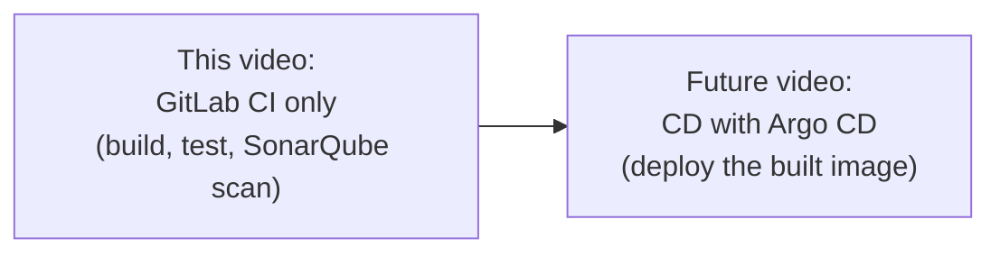

#### 🎯 Key Takeaways

* This session is the **third and final video of "CI/CD Week"**, following Jenkins Shared Libraries and GitHub Actions self-hosted runners — directly building on that series' established concepts and terminology.
* The **CI/CD split into two videos** is explicitly, directly attributed to genuine viewer feedback about a prior, similarly-structured Jenkins video's length — the same feedback-responsive pattern seen throughout this instructor's broader body of work.
* The deferred **CD portion** is explicitly described as "90% the same" as an already-published Jenkins CD walkthrough — a genuine, direct pointer to existing content rather than treating it as entirely new material.

---

### 2. GitLab Account Setup & Reusing a Real Spring Boot Microservice Project

#### 🪜 Step-by-Step — Account Creation

> 💡 **Memory Trick, given directly:** *"If you don't have a GitLab instance -- GitLab can be self-hosted, or you can use the open-source, hosted version at gitlab.com. All you need to do is subscribe for a free account -- or, even simpler, sign in using your GitHub or Google authentication. There's no extra effort required, just click the buttons."*

#### 🧠 Concept — Reusing a Known-Good Project, Deliberately

> 💡 **Memory Trick, the precise, direct reasoning given:** *"There are multiple Java project resources on the internet, but most people who've tried other projects run into issues they have to fix themselves. Instead, use the Spring Boot Java application I'm showing here -- the SAME project I used in the Ultimate CI/CD Pipeline Jenkins example. Within one month, 53,000 people viewed that video, and hundreds have implemented the pipeline successfully -- you can check my LinkedIn, where people continuously post that they've implemented it using this exact example."*

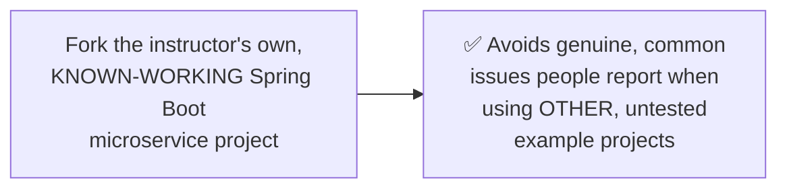

#### 📖 Definition — What a Microservice Genuinely Is

> 💡 **Memory Trick, given directly, via a relatable example:** *"A microservice is a minimalistic, lightweight, independently-managed application that can be deployed, created, or destroyed without depending on other microservices. Take amazon.com -- you could consider 'login' as one microservice and 'logout' as another. If a developer wants to change the login application tomorrow, they can do it without disturbing or changing the logout application at all -- your CI/CD solution just redeploys the new version of login specifically."*

#### ⚠ Common Mistakes

* Using an untested, random Java project found online for CI/CD practice — explicitly, directly discouraged: many people report genuine issues with such projects; a known, already-validated project is explicitly recommended instead.

#### 🎯 Key Takeaways

* GitLab account creation is **genuinely trivial** — via GitHub/Google authentication, requiring no meaningful additional effort.
* The instructor explicitly, deliberately recommends **reusing a known-working project** (his own, previously-validated Spring Boot microservice) rather than risking a fresh, untested project — a genuinely practical, time-saving recommendation grounded in real, reported user experience (53K views, hundreds of successful implementations).
* A **microservice** is precisely defined as an independently deployable, minimally-coupled application component — illustrated via a genuinely relatable Amazon login/logout example.

---
### 3. GitLab Runners: Shared vs. Project (Self-Hosted)

#### 📖 Definition — Two Genuine Options, Directly Paralleling GitHub Actions

> 💡 **Memory Trick, given directly:** *"GitLab offers you two things, similar to GitHub Actions: you can use a self-hosted runner (which we're doing today), or GitLab offers you hosted runners -- these are hosted and owned by GitLab itself. It depends on your project which one you choose -- but most organizations use self-hosted runners, which is why today's demo uses one."*

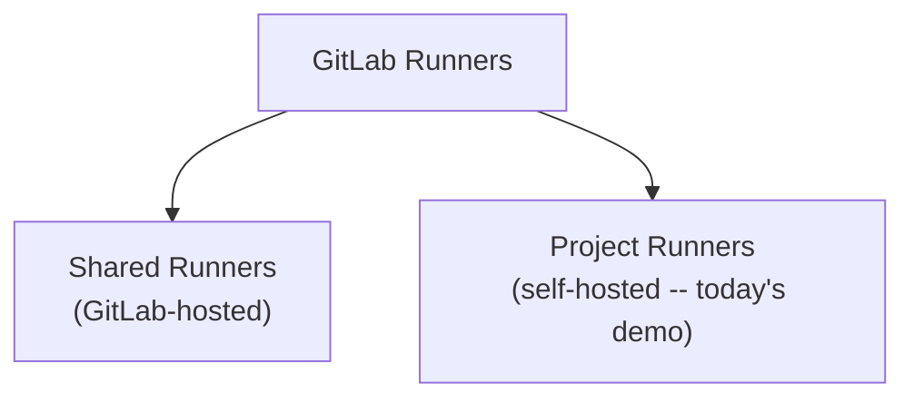

#### ❓ Why It Exists — The Same Security Reasoning, Applied to GitLab

> 💡 **Memory Trick, the precise, directly-stated recommendation given:** *"If I have to put it simply: if you're using an open-source project, or your code is already public, you can simply go with Shared Runners -- there's no real problem, since your code is already open, and you know what security concerns might arise. But if you're an MNC, if you're an organization, you should NOT be using Shared Runners -- because they're hosted by GitLab, and you don't get complete information about them. You don't know where they're hosted, and you don't know what exactly is happening to your code."*

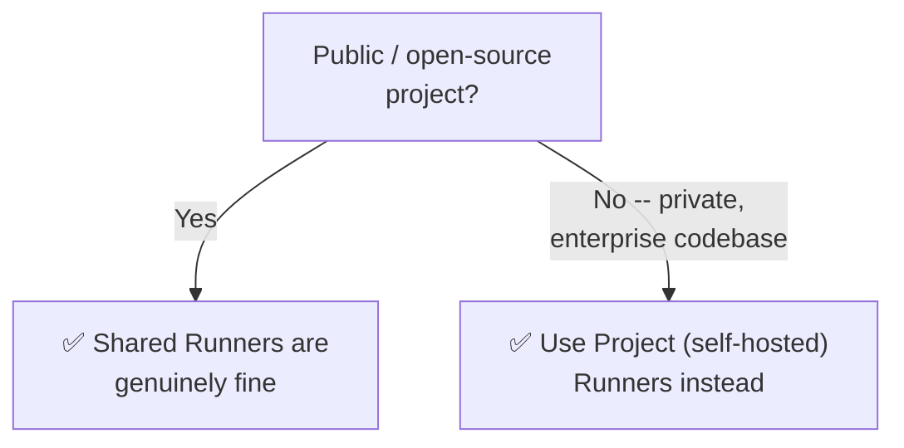

#### ⚠ Common Mistakes

* Assuming this exact reasoning is unique to GitLab — explicitly, directly recognizable as the SAME security logic already established in this same "CI/CD Week" series' GitHub Actions self-hosted-runners video (public/hosted vs. private/security-driven self-hosting) — a genuinely consistent, transferable principle across platforms.

#### 🎯 Key Takeaways

* **Shared Runners** (GitLab-hosted) are recommended for genuinely public/open-source projects, where the code's own openness already limits the practical security concern.
* **Project Runners** (self-hosted) are recommended for private, enterprise codebases — precisely because Shared Runners' hosting location and infrastructure remain genuinely unknown to the user.
* This is explicitly, precisely the **same underlying reasoning** already established for GitHub Actions' hosted-vs-self-hosted runner choice earlier in this same CI/CD Week series — a genuinely transferable, cross-platform security principle, not a GitLab-specific concept.

---

### 4. Setting Up the EC2 Instance: Sizing & Traffic Rules

#### ⚠ A Direct, Explicit Sizing Warning

> ⚠️ **Directly, explicitly stated:** *"Keep in mind, this EC2 instance should NOT be a free-tier instance -- it can't run all of these things (Docker executor, SonarQube) with just one CPU and one GB of RAM. That's not sufficient. I'll use T2 medium -- don't even go for T2 large, since this is a demo video and you're just trying to simulate a real-time environment; you don't need to create a lot of dashboards in Sonar."*

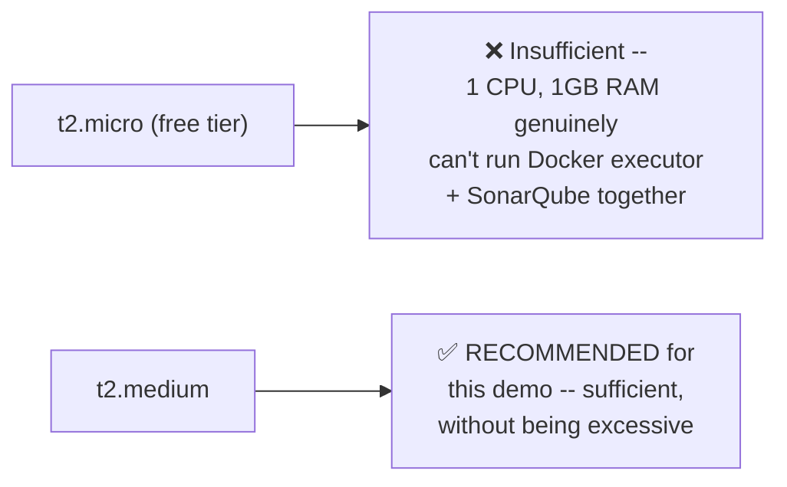

#### 🪜 Step-by-Step — Precise, Reasoned Traffic Rules

> 💡 **Memory Trick, the precise, direct reasoning given:** *"SonarQube runs on port 9000 -- so you need to open port 9000. There's also communication needed between your EC2 instance and GitLab: your project runs on EC2, and the runner (using the Docker executor) has to send information BACK to GitLab -- saying 'I executed, and most things passed' or 'a few things failed.' For that, you need HTTP and HTTPS traffic open, for both inbound and outbound."*

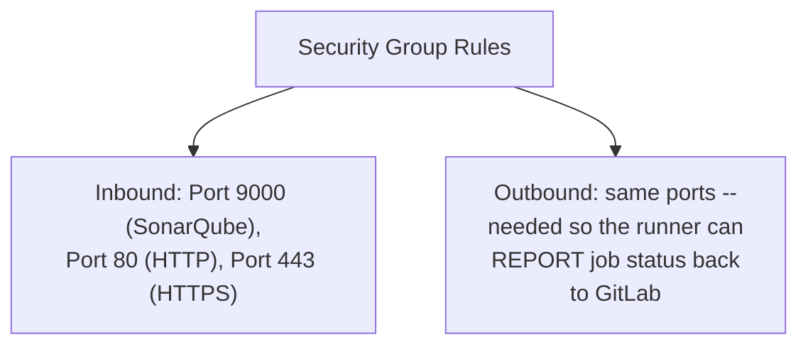

#### ⚠ A Genuinely Honest, Direct Admission — and an Equally Direct Warning

> ⚠️ **Directly, honestly admitted, with an immediate, explicit caveat:** *"For the purpose of this demo, what you can also do is open ALL traffic -- I did this to save time. But do NOT do this in your own demo, your project, or in the README/LinkedIn summary you prepare -- state the EXACT ports required, not 'all traffic.'"*

#### ⚠ Common Mistakes

* Using a free-tier EC2 instance for this specific workload — explicitly, directly warned against: genuinely insufficient compute for Docker executor + SonarQube running together.
* Documenting "all traffic" as a real, recommended security configuration in one's own portfolio or project documentation — explicitly, directly discouraged, even though the instructor himself used it for demo-time convenience.

#### 🎯 Key Takeaways

* This workload genuinely requires **at least a `t2.medium`** instance — free-tier compute is explicitly, directly stated as insufficient.
* Traffic rules require **port 9000** (SonarQube) plus **HTTP/HTTPS**, configured for **both inbound AND outbound** — inbound to receive requests, outbound so the runner can report job status back to GitLab, directly mirroring the exact same bidirectional reasoning established in the GitHub Actions self-hosted-runners session.
* The instructor's own **honest admission** of using "all traffic" for demo convenience, paired with an **equally direct warning** against documenting this as genuine best practice, models exactly the kind of transparent, non-sanitized teaching this course consistently demonstrates.

---
### 5. Why Docker Executors: The Same Efficiency Argument, One More Time

#### 📖 Definition

> 💡 **Memory Trick, given directly:** *"I've made a full, dedicated video on using Docker executors or Docker agents as worker nodes in Jenkins, or as executors for running the CI process in GitLab or GitHub. The reason: compared to traditional virtual machine agents, you get real advantages -- security, and you don't have to configure the same things repeatedly across multiple VMs. Because they're lightweight, they can run multiple pipelines in parallel."*

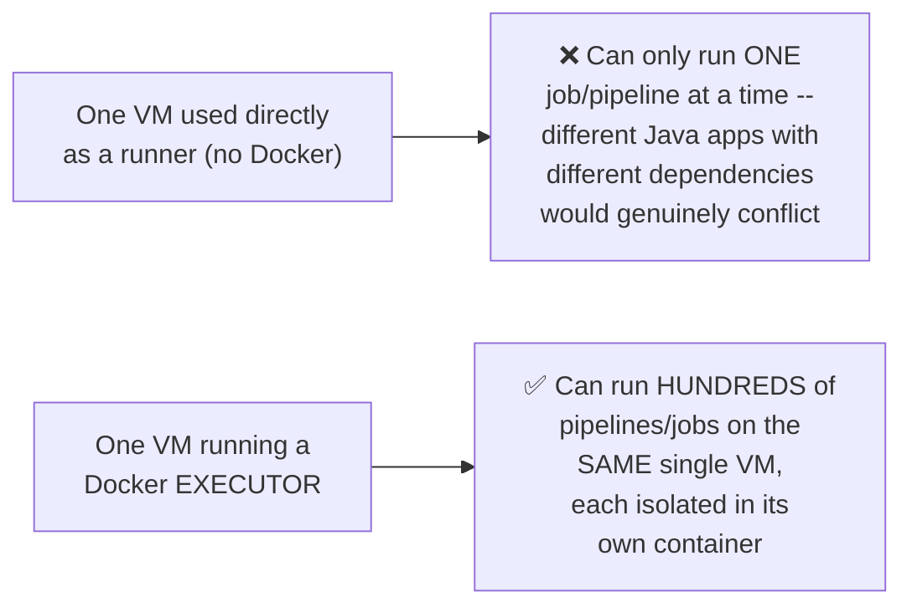

#### ❓ Why It Exists — The Precise, Concrete Conflict Scenario

> 💡 **Memory Trick, the precise, concrete reasoning given directly:** *"If you're using only one virtual machine as your GitLab runner, and one Java application is running on it, you can't run another Java application on the same VM at the same time -- because these two Java applications might have different versions, or different dependency packages, and they'll genuinely mess up with one another. With a Docker executor, you can use the SAME single VM you created and run hundreds of pipelines or jobs."*

#### 🔍 Internal Working — A Genuinely Reusable Custom Docker Image

> 💡 **Memory Trick, given directly:** *"I'm not bothering with installing or configuring Maven separately, because the Docker image I'm using as the executor already has Maven installed -- I've created this custom image myself, and I already used it in the Jenkins example too. It's a public image, so you can use it as well. The reason: even in your own project, you might have hundreds of Java applications, all using Maven -- why would you want to reinstall Maven again and again? Create your own Docker image to use as your executor, or re-tag and use mine."*

#### ⚠ Common Mistakes

* Assuming Docker executors matter only for one specific CI tool — explicitly, directly generalized: *"Always go with Docker executors or Docker agents, irrespective of the CI solution you're using -- whether it's Jenkins, GitHub Actions, or GitLab, anything."*

#### 🎯 Key Takeaways

* Docker executors provide genuine, concrete advantages over raw VM-based runners: **security, no repeated per-VM configuration, and genuine parallel pipeline capacity** — directly demonstrated via a realistic conflicting-dependency scenario.
* A **custom, pre-built Docker image** (already containing Maven) is explicitly reused across this instructor's Jenkins AND GitLab examples — avoiding redundant, repeated tool installation across every individual project's pipeline.
* This "always use Docker executors" recommendation is explicitly, directly stated to be **CI-tool-agnostic** — a genuinely transferable, universal DevOps best practice, not something specific to GitLab.

---

### 6. Installing & Configuring SonarQube — Including a Real, Live-Diagnosed Failure

#### 🪜 Step-by-Step — The Full, Live Installation Sequence

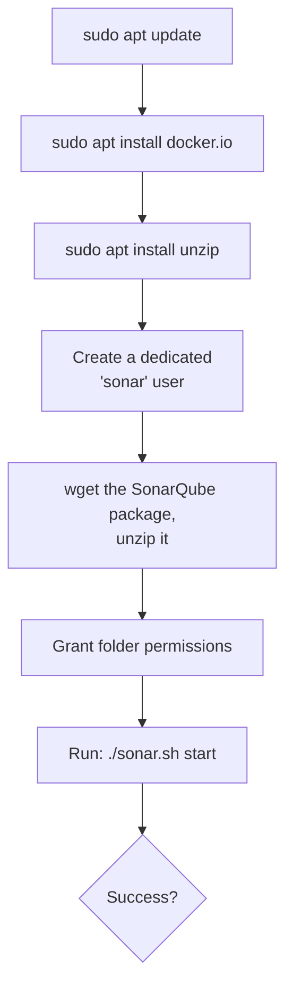

#### ⚠ A Genuine, Honestly-Reproduced Live Failure

> ⚠️ **Directly, honestly demonstrated live, exactly as it happened:** *"Let's start the sonar server... 'failed to start SonarQube.' No problem, let's see why. I understood the reason -- SonarQube has a prerequisite for JAVA, and we did not install Java. Many people have asked me 'I'm not able to start the SonarQube server' -- this can possibly be one of the reasons. Unfortunately, I also ran into the same error in this demo."*

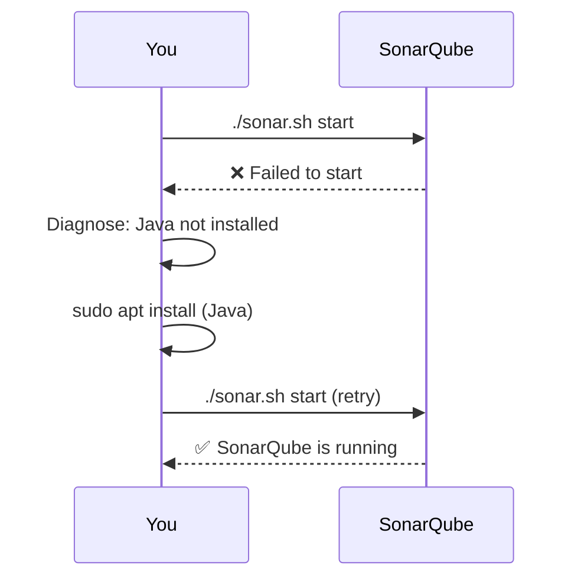

#### 🪜 Step-by-Step — The Fix & Verification

> 💡 **Memory Trick, given directly:** *"Go back to the root user, install Java -- it won't take much time. Once Java is installed, verify it, then go back to the sonar user (`sudo su - sonar`), navigate to the installation script's folder, and run `./sonar.sh start` again. It says SonarQube has started -- verify the status with the `status` option. By default, SonarQube runs on port 9000, which is exactly why we opened that port earlier. Verify by visiting `http://<ec2-public-ip>:9000`."*

#### 🪜 Step-by-Step — First Login & Password Reset

> 💡 **Memory Trick, given directly:** *"The default login is admin/admin -- once you log in, it'll ask you to set a new password, for security purposes."*

#### ⚠ Common Mistakes

* Assuming SonarQube's prerequisites are limited to what's explicitly documented at a glance — explicitly, honestly demonstrated as a real, common point of confusion: Java is a genuine, easy-to-overlook prerequisite, confirmed by the instructor's own admission that he "also ran into the same error."

#### 🎯 Key Takeaways

* SonarQube installation requires: `unzip`, a **dedicated `sonar` user**, downloading/unzipping the package, correct folder permissions, and running **`./sonar.sh start`**.
* **Java is a genuine, easy-to-miss prerequisite** for SonarQube — this session honestly, directly demonstrates the real failure this causes, and its fix, rather than presenting only a clean, error-free installation.
* SonarQube runs on **port 9000** by default — directly, precisely explaining why that specific port was opened earlier in Section 4.
* The **default `admin`/`admin` login**, followed by a mandatory password reset, is the standard first-access flow.

---
### 7. The SonarQube API Token & GitLab's Secret Variables

#### ❓ Why It Exists — The Precise, Direct Reasoning

> 💡 **Memory Trick, given directly:** *"Why are we doing this step? Because in the CI process, we're asking SonarQube to perform code scanning/analysis on our code. For SonarQube to do this, it needs authentication -- because GitLab has to push configuration/results to SonarQube. So I'll create an authentication API token in SonarQube, and grant that permission to GitLab."*

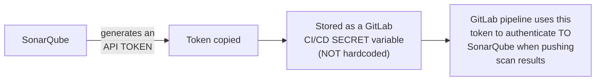

#### 🪜 Step-by-Step — Generating the Token

> 💡 **Memory Trick, given directly:** *"Go to your account, then Security, enter a name for the token, and click Generate. This token gets generated -- copy and store it somewhere. Don't worry about me sharing it live; I'll reset the token once this demo is done."*

#### ⚠ A Direct, Live-Modeled Security Practice

> 💡 **Memory Trick, given directly, modeling genuine security discipline:** *"Don't worry, I'll delete this on our SonarQube instance, so there's no problem sharing this token with you all -- but the next thing you'll do is go ahead and secure this as sensitive information within GitLab."*

#### 📖 Definition — GitLab's CI/CD Variables (Secrets)

> 💡 **Memory Trick, given directly:** *"This is one additional feature GitLab offers you -- you can put your sensitive information inside CI/CD Variables. Go to Settings, click CI/CD, scroll down, and there's an option for Variables. Expand it, and you can save your variables there -- in my case, the SonarQube API token, and (for a CD demo) a Docker username/password. Every piece of sensitive information that's part of your CI file should be stored under this Variables section, not hardcoded directly."*

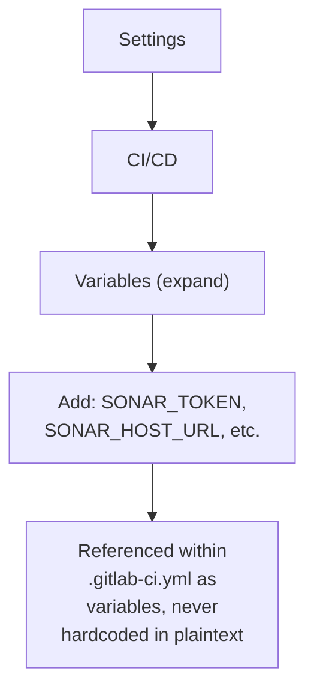

#### ⚠ Common Mistakes

* Hardcoding a SonarQube token or other credential directly into a `.gitlab-ci.yml` file — explicitly, directly avoided via GitLab's own CI/CD Variables feature, a genuine, built-in security mechanism.
* Assuming this token-generation demo genuinely exposes a usable, still-valid credential — explicitly, directly clarified: the instructor commits to resetting/deleting this specific token immediately after the demo, precisely so it's safe to show live.

#### 🎯 Key Takeaways

* SonarQube requires a genuine **authentication token** because GitLab must actively authenticate TO SonarQube to push scan results — not a formality, but a real, necessary security requirement.
* GitLab's **CI/CD Variables** feature is the correct, built-in mechanism for storing this (and any other) sensitive credential — directly analogous to GitHub Actions' own native secrets management, covered earlier in this same CI/CD Week series.
* The instructor's own **commitment to resetting the token post-demo** is itself a genuine, modeled security practice — making live demonstration safe without compromising real, ongoing credential security.

---

### 8. The .gitlab-ci.yml File: Structure, Stages & the pom.xml

#### 📖 Definition — Naming Conventions Across CI Tools

> 💡 **Memory Trick, given directly, a genuinely useful cross-tool comparison:** *"Unlike Jenkins, where we create a file called `Jenkinsfile` inside the project root, in GitLab we create a file called `.gitlab-ci.yml`. In GitHub, we create a folder called `workflows`, and put any number of workflow files inside it. Depending on the CI tool, there are different naming conventions and processes."*

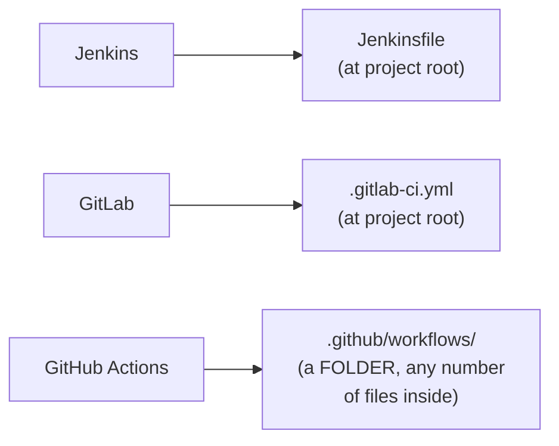

#### 💻 Code Example — The Complete File Structure

```yaml
image: <custom-maven-docker-image>    # the Docker executor image

variables:
  SONAR_HOST_URL: $SONAR_HOST_URL     # referenced from GitLab CI/CD Variables
  SONAR_TOKEN: $SONAR_TOKEN            # referenced from GitLab CI/CD Variables

before_script:
  - cd java-maven-sonar-argocd-helm-k8s/spring-boot-app   # source code's actual subfolder

stages:
  - build
  - test
  - sonarqube
  # - dockerization   (commented out -- this is the CD part, deferred)
```

> 💡 **Memory Trick, each field precisely explained, given directly:**
> - **`image:`**: *"This is the image I want to use as my Docker executor -- a custom image I've already created, which already has Maven installed."*
> - **`variables:`**: *"I want to provide the SonarQube host and authentication token here -- referenced FROM your CI/CD secrets in GitLab, not hardcoded."*
> - **`before_script:`**: *"If you want to perform any step before executing your CI, put it here. In my case, the source code isn't directly in the root folder -- it's nested inside a specific folder -- so I switch to that directory here, once, rather than repeating this in every single stage."*
> - **`stages:`**: *"Stages are how you divide your entire CI/CD pipeline into multiple pieces -- first checkout the code, then build it, then deploy or run static analysis, linting, or other checks."*

#### 🧠 Concept — What "Stages" Genuinely Mean, via a Relatable Example

> 💡 **Memory Trick, the full, relatable example given directly:** *"Say there's a login application for amazon.com, and you're writing its entire CI/CD pipeline. What happens? You build multiple stages to verify your build process is genuinely correct, AND that the changes a developer made are valid. For example, a developer adds a new validation to the login page -- you have to verify existing tests still pass; you have to verify there are no new security implications; you have to verify the build succeeds and produces a genuine JAR/WAR file."*

#### 📖 Definition — The pom.xml, Briefly

> 💡 **Memory Trick, given directly, including an honest, direct note on DevOps engineers' actual role:** *"Usually, `pom.xml` is NOT written by DevOps engineers -- though in some organizations, they do write it, with help from developers. The reason DevOps engineers often don't write it: they might not have the complete picture of what dependencies are genuinely required -- that's exactly why it's essential to collaborate with developers to understand what goes into this file. What you CAN write yourself: the artifact name, artifact ID, and version -- so your built JAR/WAR file gets saved with a consistent representation (e.g., `com.abhishek.springbootdemo:1.0`) in your artifact repository (Nexus, JFrog Artifactory, etc.)."*

#### ⚠ Common Mistakes

* Assuming DevOps engineers should independently write a project's `pom.xml` without developer collaboration — explicitly, directly clarified: genuine dependency knowledge typically requires developer input, a real, honest acknowledgment of role boundaries.
* Hardcoding the SonarQube host/token directly in `.gitlab-ci.yml` — explicitly, directly avoided via the `variables:` section referencing GitLab's own secured CI/CD Variables instead.

#### 🎯 Key Takeaways

* GitLab's pipeline definition file is specifically named **`.gitlab-ci.yml`** — genuinely distinct naming from Jenkins' `Jenkinsfile` and GitHub Actions' `.github/workflows/` folder, worth remembering precisely for interview purposes.
* The file's four key sections: **`image`** (the Docker executor), **`variables`** (referencing secured credentials), **`before_script`** (setup steps run once, before any stage), and **`stages`** (the actual, ordered pipeline steps).
* **Stages** conceptually divide a pipeline into verifiable, sequential pieces — precisely illustrated via a relatable Amazon-login-page scenario (existing tests still pass, no new security implications, successful build).
* DevOps engineers typically **don't independently author `pom.xml`** — a genuine, honest acknowledgment that dependency management requires developer collaboration, though artifact naming/versioning is reasonably within a DevOps engineer's own scope.

---
### 9. Registering the Runner & Live Pipeline Execution

#### 🪜 Step-by-Step — Registering the GitLab Runner on the EC2 Instance

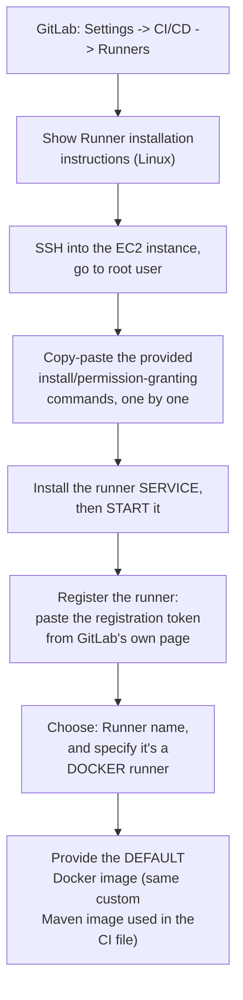

> 💡 **Memory Trick, given directly:** *"These steps are just copy-paste -- you don't have to worry about it. Only thing: replace the registration token with the one you see on your own screen. It'll ask for the runner's name, whether you want to make any changes -- just specify it's a Docker runner, and provide the default Docker image (the SAME image you're using as part of your job)."*

#### 🪜 Step-by-Step — Live Pipeline Execution, First Run (A Real Failure)

> ⚠️ **Directly, honestly reproduced live:** *"It says the SonarQube server was NOT able to be reached. I know the reason -- I did not update the pipeline with the LATEST SonarQube URL. I just used the previous one from when I was trying the demo myself."*

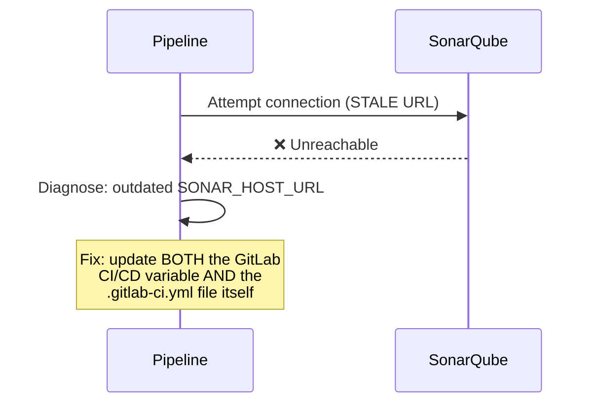

#### 🪜 Step-by-Step — The Fix, Live

> 💡 **Memory Trick, given directly:** *"Go back to the CI/CD environment variables, update the URL variable. Also generate a fresh API token in SonarQube (my account -> Security -> generate), and replace it in the CI/CD environment variables too. Then, in the CI file itself, I ALSO need to update the sonar host URL, since I forgot to update that as well -- open it via Edit in IDE, update the value, and commit directly to main (fine for this specific demo)."*

#### 🪜 Step-by-Step — Live Pipeline Execution, Successful Re-Run

> 💡 **Memory Trick, the successful, live-observed sequence given directly:** *"The pipeline runs automatically since I made a change. Build stage: succeeded -- it built the JAR using everything in `pom.xml`. Unit test stage: succeeded -- `mvn test` ran. SonarQube stage: succeeded -- and now there's a new dashboard on our SonarQube."*

#### 🔒 A Direct, Live-Proven Security Demonstration

> 💡 **Memory Trick, precisely explained and shown live:** *"See here -- GitLab is NOT showing the sensitive information, because we've secured it. If you did NOT secure the sensitive information, anybody running this pipeline could see your SonarQube host URL and API token -- a genuine security threat."*

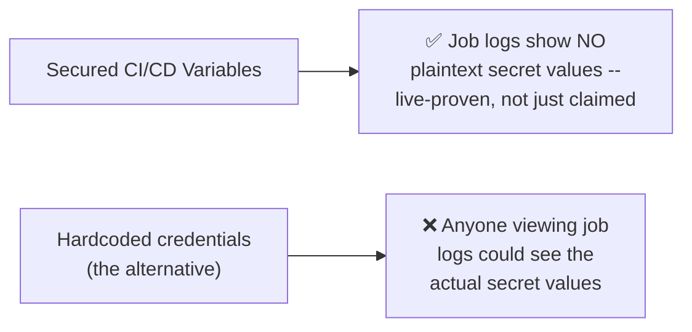

#### ⚠ Common Mistakes

* Assuming a single, successful update (e.g., only the GitLab variable) is sufficient after a URL change — explicitly, directly demonstrated as requiring BOTH the GitLab CI/CD variable AND the `.gitlab-ci.yml` file itself to be updated, since the file directly references the (now-outdated) URL as well.

#### 🎯 Key Takeaways

* Registering a GitLab Runner requires GitLab's own **copy-paste installation instructions**, correctly specifying it as a **Docker runner** with the correct **default Docker image**.
* A genuine, **live, honestly-reproduced pipeline failure** (a stale SonarQube URL) was diagnosed and fixed on camera — requiring updates to BOTH the GitLab CI/CD variable AND the pipeline file itself, a real, instructive troubleshooting moment.
* GitLab's secret-variable protection was **directly, live-proven** (not just asserted) — job logs genuinely do NOT reveal secured credential values, a concrete demonstration of the exact security benefit these variables provide.

---

### 10. Closing: The SonarQube Dashboard, the Trivy/Snyk Assignment & Wrapping Up CI/CD Week

#### 🪜 Step-by-Step — Reviewing the Final SonarQube Dashboard

> 💡 **Memory Trick, given directly:** *"Go to CI/CD -> Pipelines, check the latest one -- it says 'passed.' Click on it, and see that each job is successful: build job, unit test job, code quality job. Go to the code quality job, and you'll get a direct dashboard URL instead of searching for it manually on SonarQube. Open that, and you'll see: Quality Gate passed, no bugs, no vulnerabilities."*

> 💡 **Memory Trick, an honest, direct caveat about this specific, simple result:** *"Of course, there are no bugs, because I've written a very simple application -- I don't want to embarrass myself in front of all of you, just kidding! In your real, production work, you WILL notice bugs and vulnerabilities. These dashboards let you fix them -- and if a new change brings in vulnerabilities or bugs, you can inform your developers, or even FAIL the CI pipeline specifically because of new bugs introduced by that commit."*

#### 🏗 A Self-Directed Assignment: Trivy or Snyk

> 💡 **Memory Trick, given directly:** *"If you want, you can add more stages here -- you can also do code/container security using Trivy, or if you have any SAST/DAST tooling, add that too. Once you understand this entire process, adding more steps is just like adding one more item to a list -- nothing more complicated than that. As an assignment, take this and add one more stage for Trivy, or use Snyk for Docker image scanning."*

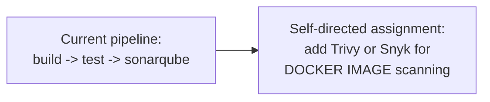

#### 🧠 Concept — A Reflective Close to CI/CD Week

> 💡 **Memory Trick, given directly:** *"CI/CD Week was very special for me too -- I got to revise all these CI/CD tools again (Jenkins, GitHub Actions, and GitLab) for myself, and I've also explained them to you. That's why I keep saying: keep learning, keep sharing."*

#### ⚠ Common Mistakes

* Assuming a clean, zero-bugs SonarQube result reflects the tool's typical real-world output — explicitly, directly clarified as specific to this session's genuinely simple demo application; real, production codebases will typically surface genuine bugs/vulnerabilities.

#### 🎯 Key Takeaways

* The **Quality Gate dashboard** provides direct, per-job access (via a dashboard URL surfaced in the pipeline's own job output) rather than requiring manual navigation within SonarQube itself.
* A clean, zero-issues result is explicitly, honestly acknowledged as specific to this session's **deliberately simple demo application** — not a general claim about SonarQube's typical output on real, production code.
* Adding further pipeline stages (like **Trivy or Snyk for image scanning**) is explicitly framed as a genuinely approachable next step once this base pattern is understood — offered directly as a self-directed assignment.
* This session **closes out the entire "CI/CD Week" series** — the instructor's own closing reflection frames the series as valuable for his own knowledge refresh, not just for viewers.

---
## 📝 Glossary

| Term | Definition | Why It Matters |
|---|---|---|
| **`.gitlab-ci.yml`** | GitLab's pipeline definition file, at the project root | Distinct naming from Jenkins' `Jenkinsfile` and GitHub's `.github/workflows/` |
| **Shared Runners** | GitLab-hosted, GitLab-owned execution infrastructure | Recommended for public/open-source projects |
| **Project Runners** | Self-hosted, user-configured execution infrastructure | Recommended for private/enterprise codebases |
| **Docker Executor** | Running pipeline jobs inside Docker containers on a runner VM | Enables genuine parallel pipeline execution on one VM |
| **SonarQube** | A code-quality/security-scanning platform | Requires an API token for GitLab to authenticate to it |
| **GitLab CI/CD Variables** | GitLab's native, secure storage for sensitive configuration | Prevents secrets from appearing in plaintext in pipeline files/logs |
| **`image:`** | The `.gitlab-ci.yml` field specifying the Docker executor image | e.g. a custom image with Maven pre-installed |
| **`before_script:`** | Setup steps run once, before any pipeline stage | e.g. changing to the actual source-code subdirectory |
| **`stages:`** | The ordered, named steps of a pipeline | e.g. build, test, sonarqube |
| **`pom.xml`** | A Maven project's dependency/build configuration file | Typically requires developer collaboration, not solely DevOps authorship |
| **Quality Gate** | SonarQube's pass/fail assessment of a scanned codebase | Can be used to fail a CI pipeline on new bugs/vulnerabilities |

---

## 🔄 Revision Notes — One-Minute Revision

* This is **Video 3 of "CI/CD Week"** (after Jenkins Shared Libraries and GitHub Actions self-hosted runners) -- deliberately **CI-only**, with CD (via Argo CD) explicitly deferred to a future video, in direct response to feedback that a comparable Jenkins video (90 minutes) felt too long.
* **GitLab account setup** is genuinely trivial (GitHub/Google auth); the instructor explicitly recommends **reusing his own, previously-validated Spring Boot microservice project** rather than an untested one, citing 53K views and hundreds of reported successful implementations.
* **Shared Runners** (GitLab-hosted, recommended for public projects) vs. **Project Runners** (self-hosted, recommended for private/enterprise codebases) -- explicitly, precisely the SAME security reasoning already established for GitHub Actions' runner types earlier in this same series.
* The EC2 instance for this demo requires **at least `t2.medium`** (never free-tier) and carefully-scoped **inbound + outbound traffic rules** (port 9000 for SonarQube, plus HTTP/HTTPS) -- with an honest admission that "all traffic" was used for demo convenience, paired with a direct warning never to document this as real practice.
* **Docker executors** are recommended for genuine security, reduced repeated configuration, and real parallel-pipeline capacity -- explicitly stated to apply "irrespective of the CI solution... Jenkins, GitHub Actions, or GitLab."
* **SonarQube installation** was demonstrated live, including a genuine, honestly-diagnosed failure (missing Java prerequisite) -- fixed live, exactly as it would happen in real work; runs on **port 9000** by default.
* A **SonarQube API token** is required because GitLab must authenticate TO SonarQube to push scan results -- stored securely via **GitLab CI/CD Variables**, never hardcoded.
* The **`.gitlab-ci.yml`** file structure: **`image`** (Docker executor), **`variables`** (referencing secured credentials), **`before_script`** (one-time setup), and **`stages`** (build, test, sonarqube -- Docker/CD explicitly commented out for this video).
* Registering the **GitLab Runner** uses copy-paste installation commands from GitLab's own instructions, specifying a **Docker runner** with the correct default image.
* A **genuine, live pipeline failure** (a stale SonarQube URL) was diagnosed and fixed on camera, requiring updates to BOTH the GitLab variable AND the pipeline file -- and GitLab's secret-variable protection was **directly, live-proven**, not just claimed.
* The session closes with a **self-directed assignment** (adding Trivy or Snyk for image scanning) and a reflective close to the entire **CI/CD Week** series.

---

## 📋 Cheat Sheet

**File naming across CI tools:**
```text
Jenkins        -> Jenkinsfile (at project root)
GitLab         -> .gitlab-ci.yml (at project root)
GitHub Actions -> .github/workflows/ (a FOLDER)
```

**Runner types (GitLab, directly paralleling GitHub Actions):**
```text
Shared Runners  -> GitLab-hosted; recommended for PUBLIC/open-source projects
Project Runners -> self-hosted; recommended for PRIVATE/enterprise codebases
```

**EC2 sizing & traffic:**
```text
Minimum: t2.medium (NOT free-tier -- insufficient for Docker executor + SonarQube)
Traffic (inbound + outbound): Port 9000 (SonarQube) + HTTP (80) + HTTPS (443)
```

**SonarQube install (Linux):**
```bash
sudo apt update
sudo apt install docker.io
sudo apt install unzip
# create a dedicated 'sonar' user
# wget + unzip the SonarQube package
# grant folder permissions
./sonar.sh start    # requires JAVA installed first!
```

**Basic `.gitlab-ci.yml` structure:**
```yaml
image: <custom-maven-docker-image>

variables:
  SONAR_HOST_URL: $SONAR_HOST_URL
  SONAR_TOKEN: $SONAR_TOKEN

before_script:
  - cd path/to/actual/source-code

stages:
  - build
  - test
  - sonarqube
```

**Secrets:**
```text
Never hardcode credentials in .gitlab-ci.yml.
Store them in: Settings -> CI/CD -> Variables
```

---

## 🔥 Interview Questions & Answers

### 🟢 Beginner

**Q1.**

**Question:** What is GitLab's pipeline definition file called, and where does it live?

**Answer:** `.gitlab-ci.yml`, at the root of the project.

**Explanation:** Directly, precisely stated, contrasted with Jenkins and GitHub Actions' own naming conventions.

**Why Interviewers Ask This:** Basic, foundational GitLab CI knowledge.

**Possible Follow-up:** "What's the equivalent file/folder in Jenkins and GitHub Actions?"

**Q2.**

**Question:** What are GitLab's two runner types, and when would you use each?

**Answer:** Shared Runners (GitLab-hosted, for public/open-source projects) and Project Runners (self-hosted, for private/enterprise codebases).

**Explanation:** Directly, precisely explained.

**Why Interviewers Ask This:** A commonly-asked, practical GitLab CI question.

**Possible Follow-up:** "What's the specific security reasoning behind this recommendation?"

**Q3.**

**Question:** Why shouldn't you use a free-tier EC2 instance for this specific GitLab runner setup?

**Answer:** The combination of a Docker executor plus SonarQube genuinely requires more than 1 CPU/1GB RAM.

**Explanation:** Directly, explicitly stated.

**Why Interviewers Ask This:** Practical, real-world infrastructure-sizing knowledge.

**Possible Follow-up:** "What instance type is recommended instead?"

**Q4.**

**Question:** What port does SonarQube run on by default?

**Answer:** Port 9000.

**Explanation:** Directly, precisely stated.

**Why Interviewers Ask This:** Basic, practical SonarQube/networking knowledge.

**Possible Follow-up:** "What other traffic (besides port 9000) needs to be opened for this setup?"

**Q5.**

**Question:** Why does SonarQube fail to start if Java isn't installed first?

**Answer:** Java is a genuine prerequisite for SonarQube -- it's built on Java and cannot start without it.

**Explanation:** Directly, honestly demonstrated as a real, live-diagnosed failure.

**Why Interviewers Ask This:** Tests practical, hands-on troubleshooting knowledge.

**Possible Follow-up:** "What command would you use to verify Java is correctly installed?"

**Q6.**

**Question:** Why does GitLab need a SonarQube API token specifically?

**Answer:** GitLab must authenticate TO SonarQube in order to push scan results/dashboards.

**Explanation:** Directly, precisely explained.

**Why Interviewers Ask This:** Tests understanding of the actual authentication requirement, not just the mechanical step.

**Possible Follow-up:** "Where should this token be stored -- hardcoded in the pipeline file, or elsewhere?"

**Q7.**

**Question:** Where do you securely store sensitive credentials in GitLab CI/CD?

**Answer:** Settings -> CI/CD -> Variables.

**Explanation:** Directly, precisely stated.

**Why Interviewers Ask This:** Basic, essential GitLab security practice.

**Possible Follow-up:** "What would happen if you hardcoded a credential directly in `.gitlab-ci.yml` instead?"

**Q8.**

**Question:** Name the four key sections of a `.gitlab-ci.yml` file covered in this session.

**Answer:** `image`, `variables`, `before_script`, and `stages`.

**Explanation:** Directly, explicitly named and explained.

**Why Interviewers Ask This:** Tests structural knowledge of GitLab CI configuration.

**Possible Follow-up:** "What is `before_script` used for specifically?"

**Q9.**

**Question:** Should DevOps engineers typically write a project's `pom.xml` entirely by themselves?

**Answer:** Generally not -- it typically requires collaboration with developers, since DevOps engineers might not have the complete picture of required dependencies.

**Explanation:** Directly, honestly acknowledged.

**Why Interviewers Ask This:** Tests realistic understanding of DevOps/developer role boundaries.

**Possible Follow-up:** "What CAN a DevOps engineer reasonably write in `pom.xml` independently?"

**Q10.**

**Question:** Name two tools mentioned as a self-directed assignment for adding image/container scanning to this pipeline.

**Answer:** Trivy or Snyk.

**Explanation:** Directly, explicitly named.

**Why Interviewers Ask This:** Tests awareness of common image-scanning tooling beyond source-code scanning.

**Possible Follow-up:** "How would this new stage fit into the existing `build -> test -> sonarqube` sequence?"

---

### 🟡 Intermediate

**Q11.**

**Question:** Explain why the instructor explicitly, directly recreates the SAME security reasoning (public = shared/hosted runners; private = self-hosted) across BOTH the GitHub Actions and GitLab sessions in this series, rather than treating them as separate topics.

**Answer:** This deliberate repetition reinforces a genuinely TRANSFERABLE, cross-platform DevOps security principle -- the underlying reasoning (execution-environment trust, unknown co-tenancy/hosting location) doesn't depend on which specific CI platform is being used. By explicitly re-articulating the SAME reasoning in a genuinely different platform's context, the instructor helps learners recognize this as a GENERALIZABLE security principle they should apply to ANY future CI/CD tool they encounter, not a GitHub-Actions-specific or GitLab-specific fact to memorize independently for each tool.

**Explanation:** Requires recognizing deliberate, cross-session repetition as a genuine teaching technique for transferable principles, not redundant content.

**Why Interviewers Ask This:** Tests whether a learner recognizes recurring, transferable security principles across different specific tools.

**Possible Follow-up:** "How would you expect this same security reasoning to apply to a CI/CD tool NOT covered in this series, like CircleCI or Travis CI?"

**Q12.**

**Question:** A learner argues that since this session's SonarQube scan found zero bugs/vulnerabilities, SonarQube integration provides limited real value for genuinely well-written applications. Evaluate this claim.

**Answer:** This claim is directly, explicitly addressed and corrected by the instructor's own honest caveat: the zero-issues result reflects this session's DELIBERATELY simple demo application specifically, not a general claim about SonarQube's typical value. The instructor explicitly states that in real, production work, genuine bugs and vulnerabilities WILL be found -- and the real value of this integration lies precisely in the WORKFLOW it establishes (automated, every-commit scanning, with the ability to fail a pipeline or notify developers on newly-introduced issues), which matters MOST for larger, more complex, actively-evolving codebases where manual review alone genuinely cannot catch everything reliably. A clean result on a simple demo app says nothing meaningful about the tool's value for genuinely complex, real-world applications.

**Explanation:** Tests whether a learner correctly attributes a specific demo result to its stated, narrow context, rather than over-generalizing it into a claim about the tool's broader value.

**Why Interviewers Ask This:** Distinguishes candidates who track a stated example's precise scope from those who draw an inaccurate, over-generalized conclusion from it.

**Possible Follow-up:** "Describe a realistic scenario where SonarQube's automated scanning would catch something a human code reviewer might genuinely miss."

**Q13.**

**Question:** Explain, precisely, why the pipeline failure in Section 9 required updating BOTH the GitLab CI/CD variable AND the `.gitlab-ci.yml` file itself, rather than just one or the other.

**Answer:** These two locations serve genuinely different, non-overlapping roles in this specific configuration: the GitLab CI/CD **Variable** stores the actual, current SONAR_HOST_URL VALUE securely -- but the `.gitlab-ci.yml` file's own content, as written in this specific session's example, ALSO directly referenced an outdated URL value hardcoded or referenced in a way that wasn't fully abstracted through the variable alone (the instructor explicitly says "I forgot to update the sonar host" in the CI file itself, separately from the CI/CD variable). This reveals a genuinely important, practical lesson: even when using CI/CD variables for security, it's possible for STALE VALUES to persist in MULTIPLE places if a configuration isn't fully, consistently centralized -- a real, instructive reminder that "using variables" alone doesn't automatically guarantee configuration consistency across an entire pipeline definition unless genuinely, comprehensively applied everywhere a value is referenced.

**Explanation:** Requires reasoning through the specific, dual nature of this real failure, recognizing a genuine, practical lesson about configuration consistency beyond simply "use variables for secrets."

**Why Interviewers Ask This:** Tests whether a learner extracts the FULL, precise lesson from a real, demonstrated failure, not just the surface-level fix.

**Possible Follow-up:** "How would you redesign this configuration to avoid ever needing to update the SAME value in two separate places again?"

**Q14.**

**Question:** Using this session's Docker-executor reasoning (Section 5), explain why "you can run hundreds of pipelines on the same single VM" doesn't mean the underlying EC2 instance's actual compute capacity becomes irrelevant.

**Answer:** The Docker executor's advantage is specifically about AVOIDING PER-VM RECONFIGURATION and enabling ISOLATION between different jobs' dependencies (per Section 5's exact conflicting-Java-application example) -- it does NOT mean the underlying VM's actual CPU/RAM becomes unlimited or irrelevant. Multiple containers running SIMULTANEOUSLY on the same VM still genuinely SHARE that VM's actual, finite compute resources -- which is precisely why Section 4's sizing guidance (never free-tier, use at least `t2.medium`) remains genuinely necessary even WITH a Docker executor architecture. "Hundreds of pipelines" describes the architecture's CAPACITY FOR ISOLATION AND REUSE across many DIFFERENT jobs over TIME, not a claim that unlimited jobs could run with full performance SIMULTANEOUSLY regardless of the underlying VM's actual resource limits.

**Explanation:** Requires distinguishing "architectural capacity for isolation/reuse" from "unlimited simultaneous compute," a genuinely important nuance the session's own enthusiastic framing might otherwise obscure.

**Why Interviewers Ask This:** Tests whether a learner understands the genuine, bounded nature of Docker executors' efficiency benefit, rather than treating it as eliminating resource constraints entirely.

**Possible Follow-up:** "If this EC2 instance genuinely needed to run 50 pipelines SIMULTANEOUSLY (not just over time), would `t2.medium` still be sufficient? How would you reason about this?"

**Q15.**

**Question:** Synthesize this session's runner-security reasoning (Section 3) with the earlier GitHub Actions self-hosted-runners session's own four hardening considerations (network isolation, IAM scoping, ephemeral provisioning, token rotation) to identify which of those four considerations would most directly, immediately apply to THIS session's specific GitLab EC2 setup as demonstrated.

**Answer:** Applying each of the four GitHub-Actions-session hardening considerations to THIS session's actual, as-demonstrated GitLab setup: (1) **Network isolation** -- THIS session's own demonstrated setup explicitly uses "all traffic" for demo convenience (Section 4), directly, immediately falling short of this specific hardening measure; a genuinely hardened version would restrict to GitLab's specific, documented IP ranges rather than "Anywhere." (2) **IAM/access scoping** -- not directly addressed in THIS session's demonstrated setup at all, though the same underlying principle would apply equally to a genuinely hardened GitLab runner's EC2 instance role/permissions. (3) **Ephemeral provisioning** -- THIS session's demonstrated setup uses a PERSISTENT, always-on EC2 instance (matching the "basic," not yet hardened, pattern from the GitHub Actions session), meaning this specific hardening measure has NOT been applied here either. (4) **Token rotation/audit** -- THIS session DOES directly, explicitly model a version of this specific practice: the instructor commits to resetting the SonarQube token post-demo, and the runner's OWN registration token is handled with the same care established in the GitHub Actions session. This comparison reveals THIS session's demonstrated setup, like the earlier GitHub Actions session's own basic demo, is explicitly introductory/learning-focused rather than production-hardened -- with genuinely the SAME specific gaps (network scoping, IAM scoping, ephemeral provisioning) remaining to be addressed for a genuinely production-grade deployment, directly reusing the SAME four-part hardening framework across BOTH platforms.

**Explanation:** Requires precisely cross-referencing a specific, four-part hardening framework established in one session against a genuinely different but structurally similar setup demonstrated in another, separate session -- deep, granular, cross-session synthesis.

**Why Interviewers Ask This:** A senior-level question testing whether a candidate can apply a previously-established, structured security framework consistently across genuinely different but architecturally similar scenarios.

**Possible Follow-up:** "Design the specific, concrete steps to apply the 'ephemeral provisioning' hardening measure to THIS session's specific GitLab runner setup."

---

### 🔴 Advanced

**Q16.**

**Question:** Design a genuinely complete, production-grade version of this session's entire CI pipeline, incorporating the self-directed Trivy/Snyk assignment (Section 10) alongside at least two specific hardening measures from Advanced Q15's analysis.

**Answer:** A reasonable, complete design: (1) **Extend `stages:`** to include a new `image-scan` stage (positioned after a Docker image build stage, which would be added back in for a genuinely complete CI/CD pipeline, per the video's own commented-out `dockerization` section) running Trivy or Snyk against the built image, directly fulfilling Section 10's own stated assignment. (2) **Apply network isolation hardening** (per Advanced Q15's gap analysis) by replacing this session's demonstrated "all traffic" security group configuration with GitLab's own specific, documented IP ranges for inbound/outbound rules, directly closing the first identified gap. (3) **Apply ephemeral provisioning hardening** by researching and implementing GitLab's own auto-scaling runner executor options (e.g., the GitLab Runner's Docker Machine executor, or a Kubernetes-based runner deployment) rather than this session's persistent, always-on EC2 instance, directly closing the third identified gap and recapturing genuine "zero idle compute when inactive" properties analogous to the GitHub Actions session's own advanced hardening discussion. (4) **Extend the Quality Gate logic** so that both the SonarQube stage AND the new image-scanning stage can genuinely FAIL the pipeline on critical findings (per Section 10's own stated capability: "you can fail the CI pipeline saying there are new bugs"), ensuring vulnerabilities are caught and blocked automatically, not merely reported. This design directly, concretely extends this session's own demonstrated pipeline with genuinely necessary, production-grade additions spanning both NEW FUNCTIONALITY (image scanning) and SECURITY HARDENING (network/provisioning), synthesizing content from across this entire CI/CD Week series.

**Explanation:** Synthesizes this session's own stated assignment with cross-session hardening analysis into one, genuinely complete, applied pipeline design -- real extension beyond any single session's demonstrated content.

**Why Interviewers Ask This:** A realistic, senior-level pipeline-architecture question testing whether a candidate can synthesize multiple sessions' content into one coherent, genuinely production-appropriate design.

**Possible Follow-up:** "Which of these four additions would you implement FIRST, given limited time before a genuine production rollout, and why?"

**Q17.**

**Question:** Critically evaluate: "Since this session demonstrates a real, live pipeline failure and its fix, GitLab CI is inherently more failure-prone or harder to configure correctly than Jenkins or GitHub Actions." Is this an accurate implication of this session's content?

**Answer:** Not accurate, and this misattributes a genuinely different cause. The specific failure demonstrated (a stale SonarQube URL) resulted from the INSTRUCTOR'S OWN prior demo history (reusing values from an earlier attempt) -- NOT from any inherent GitLab CI fragility or genuine configuration difficulty. This is directly analogous to the SAME kind of honest, unscripted failure demonstrated in the OTHER CI/CD Week sessions (the GitHub Actions self-hosted-runners session's own genuine setup process) and throughout this instructor's broader body of work (Days 5, 7, 8, 11, 12, 15's own real, live failures) -- a deliberate, consistent PEDAGOGICAL CHOICE to show genuine, real troubleshooting rather than only polished, error-free demos, not evidence that any SPECIFIC tool is more failure-prone than another. The accurate, more precise claim: this session demonstrates that REAL CI/CD work, regardless of the specific tool used, genuinely involves troubleshooting real, human-caused configuration issues -- a universal, tool-independent truth about real DevOps work, not a claim specifically about GitLab CI's own relative reliability compared to Jenkins or GitHub Actions.

**Explanation:** Tests whether a learner correctly attributes a demonstrated failure to its actual, specific cause (instructor's own prior demo state) rather than incorrectly generalizing it into an unsupported claim about the tool's inherent reliability.

**Why Interviewers Ask This:** Distinguishes candidates who correctly attribute causation from those who draw an inaccurate, tool-specific conclusion from a genuinely tool-independent demonstration.

**Possible Follow-up:** "Name at least two OTHER sessions across this instructor's body of work where a similarly honest, real failure was demonstrated, using a genuinely DIFFERENT tool each time."

**Q18.**

**Question:** Synthesize this session's `pom.xml`/developer-collaboration acknowledgment (Section 8) with Day 18's own five standard CI/CD steps to explain a genuinely broader principle about the LIMITS of a DevOps engineer's individual technical authority within a complete CI/CD pipeline.

**Answer:** This session's `pom.xml` acknowledgment reveals a genuinely important, broader principle: even within a pipeline a DevOps engineer PRIMARILY builds and owns (checkout, build orchestration, scanning, deployment), certain SPECIFIC CONTENT WITHIN individual stages may genuinely require domain expertise the DevOps engineer doesn't independently possess -- dependency management (this session's `pom.xml` example) being one concrete instance of a broader category that could also include: which SPECIFIC unit tests are meaningful for a given feature (a developer's domain knowledge), which SPECIFIC static-analysis rules are appropriate for a given codebase's conventions (potentially a senior developer or architect's domain), or which SPECIFIC security policies matter most for a given application's actual risk profile (potentially a security team's domain). This reveals CI/CD pipeline OWNERSHIP (the DevOps engineer's genuine responsibility for the pipeline's STRUCTURE, orchestration, and tooling) as GENUINELY DISTINCT from CI/CD pipeline CONTENT EXPERTISE (which, for specific stages, may require collaboration with domain experts who aren't DevOps engineers themselves) -- a nuanced, honest picture of the DevOps role's actual boundaries that Day 18's more general, five-step framework doesn't explicitly address, but which this session's specific, honest `pom.xml` acknowledgment surfaces as a genuinely important, broader truth about how real CI/CD pipelines actually get built in practice.

**Explanation:** Requires extracting a genuinely broader, more abstract principle (pipeline ownership vs. content expertise) from one specific, concrete example (pom.xml), then connecting it to a separate, earlier session's more general framework to reveal a nuance that framework doesn't explicitly address.

**Why Interviewers Ask This:** A capstone-level question testing whether a candidate can generalize a specific, honest acknowledgment into a genuinely broader, transferable principle about real DevOps team collaboration and role boundaries.

**Possible Follow-up:** "Name a specific stage from THIS session's own pipeline (besides the build stage's pom.xml) where a similar developer/domain-expert collaboration might genuinely be necessary."

---

## 🧪 Scenario-Based Interview Questions

> **Scenario 1:** A teammate's GitLab pipeline consistently fails at the SonarQube stage with a "server not reachable" error, despite SonarQube genuinely running and accessible via browser at its known IP/port. Using this session's concepts, diagnose this.

**Structured Answer:**
1. **Initial investigation:** Recognize this as directly matching Section 9's own exact, live-demonstrated failure pattern -- a stale or incorrect `SONAR_HOST_URL` value somewhere in the pipeline's configuration, despite SonarQube itself genuinely running correctly.
2. **Metrics/logs to check:** Review the pipeline's job logs for the exact URL being used in the failed connection attempt, comparing it against SonarQube's actual, current, correct address.
3. **Possible causes:** Per Section 9's own precise lesson, this could stem from an outdated value in EITHER the GitLab CI/CD Variable, OR a separately hardcoded/referenced value within `.gitlab-ci.yml` itself (or, per Intermediate Q13's reasoning, genuinely BOTH simultaneously).
4. **Debugging approach:** Check BOTH locations explicitly -- the GitLab CI/CD Variables page AND the actual content of `.gitlab-ci.yml` -- rather than assuming a fix in only one location will resolve the issue.
5. **Resolution:** Update whichever location(s) contain the stale value, directly reproducing Section 9's own exact fix process, then re-run the pipeline to confirm successful SonarQube connectivity.
6. **Prevention:** Recommend fully centralizing this URL value through the CI/CD Variables mechanism ONLY, removing any separate, duplicated reference within the pipeline file itself, directly addressing the root configuration-consistency issue identified in Intermediate Q13's analysis.

> **Scenario 2 (Advanced):** Your organization wants to adopt this session's exact GitLab CI pattern for a genuinely large number of Java microservices (50+), each needing its own SonarQube-scanned pipeline. Using this session's concepts and Advanced Q16's framework, propose a scalable approach.

**Structured Answer:**
1. **Initial investigation:** Recognize that this session's demonstrated pattern (one custom Maven Docker image, one shared SonarQube instance, referenced via CI/CD Variables) is EXPLICITLY DESIGNED for genuine reuse across many projects -- directly per Section 5's own stated reasoning ("even in your project, you might have hundreds of Java applications... why reinstall Maven again and again").
2. **Relevant principle:** Per Section 5's own explicit design intent, the custom Docker executor image and shared SonarQube server are ALREADY architected for exactly this kind of multi-project reuse -- the genuine scaling challenge is less about the CORE PATTERN (which already generalizes) and more about RUNNER CAPACITY at genuine 50+-project scale.
3. **Possible causes for concern at this scale:** A single EC2 instance runner (as demonstrated in this session) would likely become a genuine bottleneck at 50+ simultaneous or frequent pipeline executions, directly connecting to Intermediate Q14's own reasoning about Docker executors' bounded, not unlimited, underlying compute capacity.
4. **Debugging/evaluation approach:** Assess actual, expected pipeline execution frequency/concurrency across 50+ microservices to determine genuine runner capacity requirements, rather than assuming this session's single, `t2.medium`-based demo setup would scale unchanged.
5. **Resolution:** Recommend scaling the RUNNER INFRASTRUCTURE specifically (e.g., multiple runner instances, or GitLab's own auto-scaling runner executor options, per Advanced Q16's ephemeral-provisioning hardening measure) while KEEPING the core, already-reusable pattern (shared custom Docker image, shared SonarQube instance, standardized `.gitlab-ci.yml` template) genuinely unchanged across all 50+ projects -- directly reusing this session's own established, reusable design rather than reinventing it per-project.
6. **Prevention:** Establish a standardized, templated `.gitlab-ci.yml` (potentially using GitLab's own CI/CD template/include features, beyond this session's specific, single-project demonstration) that all 50+ microservices genuinely reuse with minimal, project-specific customization, directly extending this session's own reuse-oriented design philosophy to a genuinely organization-wide scale.

---

## 🛠 Hands-on Exercises

### 🟢 Easy

1. Create a GitLab account (via GitHub/Google authentication), and fork the instructor's example Spring Boot project into your own namespace.
2. Set up a `t2.medium` EC2 instance and correctly configure its security group for this session's exact SonarQube + Docker executor requirements.
3. Install Docker and SonarQube on your EC2 instance, deliberately observing (or intentionally reproducing) the missing-Java failure before fixing it, exactly as demonstrated live in Section 6.

### 🟡 Medium

4. Generate a SonarQube API token, store it as a GitLab CI/CD Variable, and write a complete `.gitlab-ci.yml` file with `image`, `variables`, `before_script`, and `stages` sections, following Section 8's exact structure.
5. Register a GitLab Runner on your EC2 instance, correctly configured as a Docker runner, and successfully run your pipeline end to end.
6. Deliberately introduce a stale/incorrect SONAR_HOST_URL (in either the GitLab variable or the pipeline file, or both), then diagnose and fix it, directly reproducing Section 9's own real troubleshooting sequence.

### 🔴 Advanced

7. Implement the self-directed Trivy or Snyk image-scanning assignment from Section 10, adding a new stage to your working pipeline.
8. Implement at least two of the four hardening measures identified in Advanced Interview Q15/Q16 (network isolation, IAM scoping, ephemeral provisioning, or token rotation/audit) applied to your own runner setup.
9. Design and document (in writing) the 50+-microservice scaling approach proposed in Scenario 2, including your specific runner-infrastructure scaling recommendation.

---

## 🏗 Practice Assignment

*(This session's own stated assignment, reproduced faithfully)*

> 💡 **Memory Trick -- the instructor's own words, given directly:** *"As an assignment, you can take this and add one more stage for Trivy, or if you want to use Snyk, you can use Snyk for Docker image scanning."*

### Build: "Complete GitLab CI Pipeline with Image Scanning"

**Objective:** Complete this session's own stated assignment end to end -- extend the working, demonstrated pipeline with a genuine image-scanning stage.

**Requirements:**
- A fully working `.gitlab-ci.yml` pipeline, directly following this session's exact structure (image, variables, before_script, stages: build, test, sonarqube).
- A genuine SonarQube integration, with the API token correctly secured via GitLab CI/CD Variables (never hardcoded).
- A NEW stage added for image scanning, using either Trivy or Snyk, correctly positioned after image building (which you'll need to add back in, since this session's CD portion was commented out).
- Documentation (screenshots or written description) of a successful, complete pipeline run, including the new image-scanning stage's results.
- A brief written reflection (150-200 words) on what specific vulnerabilities or issues (if any) your image-scanning stage identified, and how you would address them in a real project.

**Architecture (suggested):**

```text
gitlab_ci_with_image_scanning/
├── .gitlab-ci.yml                    # your complete, extended pipeline
├── RUNNER_SETUP_LOG.md                  # your EC2/runner/SonarQube setup documentation
├── PIPELINE_RESULTS.md                    # screenshots/description of a successful run
└── SCANNING_REFLECTION.md                   # your written reflection on scan findings
```

**Expected Functionality:**
- Your pipeline should genuinely, successfully execute all stages (build, test, sonarqube, image scan) end to end.
- Your image-scanning stage should produce genuine, reviewable output -- not just a pass/fail status with no detail.

**Challenges:**
- Correctly adding back a Docker image-building stage (since this session's version had it commented out) before your new image-scanning stage can meaningfully run.
- Correctly configuring Trivy or Snyk's own authentication/configuration requirements, which weren't directly demonstrated in this session.

**Bonus Improvements:**
- Configure your new image-scanning stage to genuinely FAIL the pipeline on critical vulnerabilities, directly modeling Section 10's own stated capability.
- Extend your pipeline further with the deferred CD portion (Argo CD deployment), once that future video is available, directly completing the full CI/CD arc this session's video began.

---

## 📚 Additional Resources

- **Video 1 of this "CI/CD Week" series**: Jenkins Shared Libraries (referenced directly) -- required prior context.
- **Video 2 of this series**: GitHub Actions Self-Hosted Runners (referenced directly) -- the same underlying security/runner reasoning, applied to a different platform.
- **A future, dedicated CD-with-Argo-CD video** (referenced directly, explicitly deferred) -- described as "90% the same" as the instructor's already-published Jenkins CD walkthrough.
- The instructor's **"Ultimate CI/CD Pipeline" (Jenkins) video** (referenced directly, 53K views at time of recording) -- the original source of this session's reused Spring Boot project and CD-portion content.
- A **full, dedicated video on Docker executors/agents** (referenced directly) -- for deeper coverage of the executor concept applied across Jenkins, GitHub Actions, and GitLab.

---

## 📌 Final Revision Sheet

### ⭐ Core Concepts
- **`.gitlab-ci.yml`** is GitLab's pipeline file -- distinct naming from Jenkins (`Jenkinsfile`) and GitHub Actions (`.github/workflows/`).
- **Shared Runners** (public projects) vs. **Project Runners** (private/enterprise) -- the SAME security reasoning as GitHub Actions' runner types.
- **Docker executors** enable genuine parallel pipeline execution, security, and reduced repeated configuration -- CI-tool-agnostic best practice.
- **SonarQube** requires an API token (secured via GitLab CI/CD Variables) for GitLab to authenticate and push scan results.
- The `.gitlab-ci.yml` structure: **`image`, `variables`, `before_script`, `stages`**.
- Real, honest failures (missing Java, a stale SonarQube URL) were genuinely demonstrated and fixed live -- not edited out.

### ⭐ Important Definitions
- **Quality Gate**, **Project Runners** (see Glossary for full definitions).

### ⭐ Important Commands/Code
```bash
sudo apt update && sudo apt install docker.io unzip
./sonar.sh start    # requires Java installed first
```
```yaml
image: <custom-maven-image>
variables:
  SONAR_HOST_URL: $SONAR_HOST_URL
  SONAR_TOKEN: $SONAR_TOKEN
before_script:
  - cd path/to/source
stages:
  - build
  - test
  - sonarqube
```

### ⭐ Architecture/Process
- Setup flow: GitLab account → fork project → choose runner type → configure EC2 (size + traffic rules) → install Docker + SonarQube → generate SonarQube token → store as GitLab variable → write `.gitlab-ci.yml` → register the runner → run and verify the pipeline.

### ⭐ Best Practices
- Never use free-tier compute for a Docker-executor + SonarQube runner.
- Always scope traffic rules precisely in real work, even if "all traffic" is used for demo convenience.
- Never hardcode credentials -- always use GitLab CI/CD Variables.
- Reuse a custom, pre-built Docker executor image across projects rather than reinstalling tools repeatedly.

### ⭐ Common Mistakes
- Assuming SonarQube has no genuine prerequisites beyond its own installation package (Java is required).
- Updating only ONE of two places (variable vs. pipeline file) referencing the same stale configuration value.
- Assuming a clean, zero-issues SonarQube scan reflects the tool's typical real-world output.
- Assuming "hundreds of pipelines on one VM" (via Docker executors) means the VM's actual compute capacity is irrelevant.

### ⭐ Interview Points
- Be ready to precisely name GitLab's pipeline file and contrast it with Jenkins/GitHub Actions' naming.
- Be ready to explain the Shared-vs-Project runner security reasoning.
- Be ready to explain why both code scanning (SonarQube) requires an authenticated connection, and how that's secured.
- Be ready to walk through a real troubleshooting scenario (missing Java, stale URL) as genuine, hands-on experience.

### ⭐ Things to Remember
- This session **closes out the entire "CI/CD Week" series** -- deliberately, explicitly split into CI-only (this video) and a future, separate CD video, due to direct viewer feedback about a prior video's length.
- Every failure demonstrated in this session (missing Java, stale URL) is **genuinely real and honestly diagnosed live** -- not scripted or edited around, consistent with this instructor's broader, established teaching style.
- The **self-directed Trivy/Snyk assignment** is explicitly, directly invited as a natural next step once this base pattern is understood -- "just like adding one more item to a list."

---

## 🔗 Source

- [GitLab CI Pipeline](https://youtu.be/8NYAHkTuQdc?si=U4dWlTgnun7RVOte)