# 🧠 Deep Learning Community Session — Day 1: From AI/ML/DL to the Perceptron

- <i>**Session:** Deep Learning Community Session (5-Day Series) — Day 1 · 
- **Instructor:** Krish Naik
- **Note on scope:** This is a **live, free community session** — the first of a promised five-day series covering deep learning from complete scratch, deliberately paced for genuine beginners while explicitly, repeatedly framed as directly interview-relevant. The teaching style leans heavily on personal, everyday analogies (a hot object burning your hand, a baby learning to recognize a bottle of milk, seeing a camera through your own eyes) to build genuine intuition before any formula appears. This session covers AI vs. ML vs. DL vs. Data Science, why deep learning became popular, and the complete mechanics of a perceptron (single-layer neural network) — weights, bias, activation functions, forward propagation, loss function, and backward propagation — closing with a brief look at multi-layer neural networks and the roadmap for the remaining four days.</i>

---

## 📑 Table of Contents

1. [Session Overview](#-session-overview)
2. [Learning Objectives](#-learning-objectives)
3. [Detailed Notes](#-detailed-notes)
   - [1. Session Context: A 5-Day Community Series, Day 1 of 5](#1-session-context-a-5-day-community-series-day-1-of-5)
   - [2. AI vs. ML vs. DL vs. Data Science: The Concentric Circles](#2-ai-vs-ml-vs-dl-vs-data-science-the-concentric-circles)
   - [3. Why Deep Learning Became Popular: Data Explosion & Hardware Advancement](#3-why-deep-learning-became-popular-data-explosion--hardware-advancement)
   - [4. The Perceptron: Input, Hidden & Output Layers via the Eye-and-Brain Analogy](#4-the-perceptron-input-hidden--output-layers-via-the-eye-and-brain-analogy)
   - [5. Weights & Bias: The Hot-Object-in-Your-Hand Analogy](#5-weights--bias-the-hot-object-in-your-hand-analogy)
   - [6. Inside the Neuron: Summation Then Activation (Sigmoid)](#6-inside-the-neuron-summation-then-activation-sigmoid)
   - [7. Forward Propagation, Loss Function & Backward Propagation](#7-forward-propagation-loss-function--backward-propagation)
   - [8. From Single-Layer to Multi-Layer Neural Networks](#8-from-single-layer-to-multi-layer-neural-networks)
   - [9. Closing: The Five-Day Roadmap](#9-closing-the-five-day-roadmap)
4. [Glossary](#-glossary)
5. [Revision Notes — One-Minute Revision](#-revision-notes--one-minute-revision)
6. [Cheat Sheet](#-cheat-sheet)
7. [Interview Questions & Answers](#-interview-questions--answers)
8. [Scenario-Based Interview Questions](#-scenario-based-interview-questions)
9. [Hands-on Exercises](#-hands-on-exercises)
10. [Practice Assignment](#-practice-assignment)
11. [Additional Resources](#-additional-resources)
12. [Final Revision Sheet](#-final-revision-sheet)

---

## 🎯 Session Overview

This session builds a complete, intuitive foundation for deep learning, moving from the highest-level "what even is AI" question all the way down to the exact, step-by-step math a single neuron performs. It covers:

1. **AI vs. ML vs. DL vs. Data Science**, explained via a genuinely simple, concentric-circle model — AI as the outermost universe, ML as a subset of AI, DL as a subset of ML, with Data Science explicitly framed as cutting across all of them, since its ultimate goal is always building an AI application.
2. **Precisely why deep learning became popular now**, not decades earlier — two concrete, historically-grounded reasons: the explosive growth of user-generated data (Web 2.0, social media, from roughly 2005 onward) and genuine hardware advancement (NVIDIA GPUs making large-scale training practically feasible).
3. **The perceptron**, built entirely from a single, sustained analogy: your own eyes, brain, and a camera — directly mapping input layer, hidden layer, and output layer onto genuinely lived experience, before any formula appears.
4. **Weights and bias**, explained via an equally vivid, physical analogy — putting a hot object in your hand and instinctively pulling away — directly motivating why weights determine "how activated" a neuron becomes, and why bias exists specifically to prevent the all-zero-weight problem.
5. **The precise, two-step computation inside every neuron**: first, the weighted summation of inputs plus bias (`w^T·x + b`, directly connected back to linear regression's own `y = mx + c`); second, passing this result through an activation function — with sigmoid introduced as the concrete, binary-classification example.
6. **Forward propagation, the loss function, and backward propagation**, tied together into one complete training cycle — traced through a real, worked example (a student's study/play/sleep hours predicting pass/fail), directly connecting backward propagation to gradient descent, a concept the session assumes genuine familiarity with from linear regression.
7. **A brief extension to multi-layer neural networks** — explicitly framed as "nothing different," just the same exact process repeated across more layers and more neurons.
8. **A closing, explicit roadmap** for the remaining four days: activation functions and loss functions in depth (Day 2), the chain rule of differentiation and optimizers (Day 3), practical implementation (Days 2-3), and eventually CNN, RNN, object detection, and an NLP introduction.

> 💡 **Key framing, given directly, on the session's own teaching philosophy:** *"Everything works on forward propagation and backward propagation... if this step is happening one like one forward, properly one backward, if you are doing it thousand times, our neural network will get trained -- just like a baby gets trained. That's it. That's it. That's how important it is and how easy it is, if you are able to basically see it with examples."*

---

## 🎯 Learning Objectives

By the end of this guide, you will be able to:

- [ ] Explain the precise relationship between AI, ML, DL, and Data Science using the concentric-circle model.
- [ ] Name two concrete, historical reasons deep learning became popular when it did, with real supporting examples.
- [ ] Describe the structure of a perceptron: input layer, hidden layer, output layer.
- [ ] Explain, using the hot-object analogy, what a weight represents and why bias is necessary.
- [ ] Write and explain the two-step computation inside a single neuron: weighted summation plus bias, then activation.
- [ ] State the sigmoid activation function's formula and its binary-classification decision rule.
- [ ] Explain forward propagation, the loss function, and backward propagation as one complete, connected training cycle.
- [ ] Explain how a multi-layer neural network differs from (and doesn't differ from) a single-layer perceptron.

---

## 📚 Detailed Notes

### 1. Session Context: A 5-Day Community Series, Day 1 of 5

#### 🧠 Concept

> 💡 **Given directly, opening the session:** *"After many days finally I got time to start the community session... I said because we are starting this community session, it will be there for five days. So today, day one of deep learning will be starting."*

#### 🪜 Step-by-Step — The Stated, Complete Agenda for Today

> 💡 **Given directly:** *"So what are things we are going to cover today? So the agenda... number one, we will be understanding about deep learning... we will start with something called as perceptron, and before that we will also be understanding what is the difference between AI versus ML versus DL versus data science... we'll also be understanding what is a brief idea about forward propagation and backward propagation."*

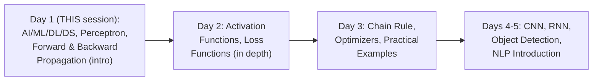

#### 🎯 Key Takeaways

* This is **Day 1 of an explicitly-planned, five-day, free community series** — deliberately paced for genuine beginners, with the instructor's own stated goal being to "make people clear the basics."
* The session's own **stated prerequisites**: Python programming, some idea of at least one ML algorithm, and some basic statistics — genuinely modest, beginner-accessible requirements.
* The instructor **directly, repeatedly frames** this content as interview-relevant: *"Whatever I'm teaching, those kind of questions are usually asked in an interview."*

---

### 2. AI vs. ML vs. DL vs. Data Science: The Concentric Circles

#### 📖 Definition — AI, Precisely Introduced via the "Universe" Framing

> 💡 **Given directly:** *"Let's consider this entire universe, let's consider there is a universe which is called as AI... AI is a kind of application which can do its own task without any human intervention... human intervention basically means that the human do not have to tell the application what to do -- just with the behavior of the user... it can automatically take its own decision."*

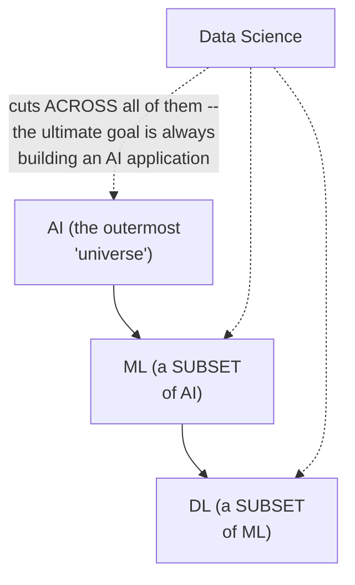

> 💡 **Given directly, concrete, genuinely relatable AI examples:** *"Best example that I would like to consider -- number one, I hope everybody has seen Netflix app, it provides you automatic recommendation. Second is self-driving cars, autopilot cars. Third, let's say Amazon application... automatic recommendations are there."*

#### 📖 Definition — ML, Precisely Defined as a Subset

> 💡 **Given directly:** *"Machine learning is a subset of AI... machine learning basically provides you stats tool to analyze the data, visualize the data, and to do most of the machine learning tasks like predictions, forecasting, and many more things... in unsupervised we do clustering, forecasting, and many more things."*

#### 📖 Definition — DL, Precisely Defined as a Further Subset, With Its Stated Central Aim

> 💡 **Given directly:** *"Another subset of machine learning we basically say it as deep learning... deep learning, it's not like recently only it came up -- researchers were working from 1958... but right now it became really, really amazing because of the amount of data that is getting created and because of amazing GPU hardwares that we have."*

> 💡 **Given directly, the single most important, repeatedly-emphasized aim of deep learning:** *"The main aim of deep learning is basically to mimic human brain... mimicking the human brain is the most important thing in this specific thing."*

#### 📖 Definition — Where Data Science Genuinely Fits

> 💡 **Given directly:** *"Where does data science fall into this? Data science can be the part of everything... if you are a data scientist, you probably have to work on machine learning algorithms, you have to work probably... as a data analyst, you may also work as a deep learning developer -- but at the end of the day, the goal is to create an AI application."*

#### ⚠ Common Mistakes

* Assuming AI, ML, DL, and Data Science are four separate, parallel fields — explicitly, directly corrected: they form a genuine, nested hierarchy (AI ⊃ ML ⊃ DL), with Data Science cutting ACROSS all of them rather than sitting in its own separate box.
* Assuming deep learning is a genuinely NEW field, only recently invented — explicitly, directly corrected: the underlying research dates back to **1958**; what's genuinely new is the DATA VOLUME and HARDWARE capability that finally made it practically effective.

#### 🎯 Key Takeaways

* **AI** is the outermost "universe" — applications performing tasks without genuine human intervention, learning instead from user behavior (Netflix, self-driving cars, Amazon recommendations).
* **ML** is a genuine SUBSET of AI, providing statistical tools for analysis, visualization, prediction, forecasting, and clustering.
* **DL** is a genuine SUBSET of ML, with its stated central aim being to **mimic the human brain** — a research area dating back to 1958, only recently made practically powerful by data volume and GPU hardware.
* **Data Science** cuts ACROSS all of these — its practitioners may work in any of these areas, but the ultimate, unifying goal is always building a genuine AI application.

---
### 3. Why Deep Learning Became Popular: Data Explosion & Hardware Advancement

#### ❓ Why It Exists — Reason 1: The Genuine, Historical Data Explosion (Web 2.0)

> 💡 **Given directly, the complete, historically-grounded account:** *"Let's go back to 2005... before 2005, only Orkut was there in the market... then later on, what happened, Facebook came -- Facebook is entirely based on Web 2.0... you will be able to log in, you will be able to store your data, you will be able to interact with other people... later on Instagram, WhatsApp, LinkedIn, Twitter... because of this, the data started to get generated exponentially."*

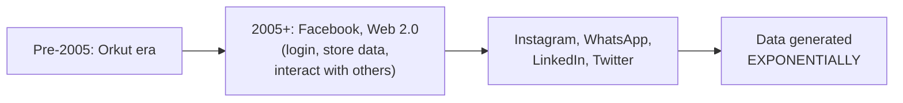

#### 🔍 Internal Working — Precisely How This Led to "Big Data," Then to "AI"

> 💡 **Given directly, the precise, sequential progression:** *"Around 2008, the concept of big data... wasn't very high in demand... because they wanted to store that data efficiently... that is why big data engineering skill became very famous at that point of time... as we went with time, in probably 2013, company had huge amount of data -- now if company has huge amount of data, will they just store and keep it? The answer is no -- they really want to use this data and basically bring a seamless experience into their products."*

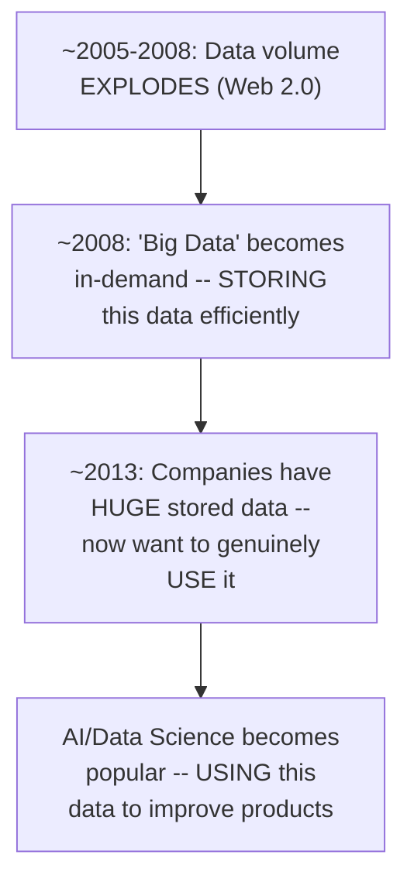

#### 🏢 Real-World / Production Usage — A Genuine, First-Hand Example: Panasonic

> 💡 **Given directly, a real, personal, professional example:** *"Let's talk about my one of my company experience, that is Panasonic... I was specifically working with ACs -- what did I do, I created a model which can reduce the electricity bill... based on the outside temperature, you will be able to efficiently handle the ACs and probably your electricity bill may get reduced... because of this... the company will generate revenues, they will be able to make better decisions."*

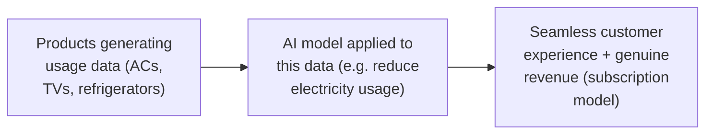

#### ❓ Why It Exists — Reason 2: Genuine Hardware Advancement (GPUs)

> 💡 **Given directly:** *"Hardware advancement... I hope everybody knows about NVIDIA -- what is so special about NVIDIA, they come up with this amazing GPUs... in deep learning, whenever you create a multi-layered neural network, many parameters are actually created, and when many parameters are actually created, you have to probably do the training in epochs, multiple epochs, and probably for that a lot of time will be basically taking place -- GPUs actually helps you to train your model very faster."*

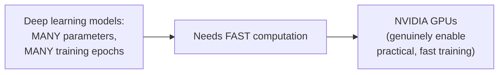

> 💡 **Given directly, a real, personal example of hardware progression:** *"Let's say an example of RTX Titan -- this was one GPU which I had on the first instance when NVIDIA had actually gifted me this, but today I'm actually using RTX 3090, which is more efficient than Titan RTX... this GPU cost is really reducing day by day, and that is all because of the technological advancement."*

#### ⚠ Common Mistakes

* Assuming deep learning became popular purely because of a sudden theoretical/algorithmic breakthrough — explicitly, directly corrected: the underlying research is decades old (1958); popularity is driven by two genuinely PRACTICAL factors — data availability and hardware capability, not a sudden theoretical leap.
* Assuming "big data" and "AI" are the same historical moment — explicitly, directly distinguished as two SEQUENTIAL phases: big data (storage-focused, ~2008) came first, followed later by AI/data science (usage-focused, ~2013+) once companies genuinely had the data and wanted to extract value from it.

#### 🎯 Key Takeaways

* Deep learning's popularity is explicitly attributed to **two concrete, historically-grounded reasons**: (1) the exponential DATA explosion driven by Web 2.0 and social media (Facebook, Instagram, WhatsApp, etc., from ~2005 onward), and (2) genuine HARDWARE advancement, specifically NVIDIA's GPUs enabling practically fast training of large, many-parameter models.
* The progression from data explosion to AI popularity followed a genuine, **sequential historical path**: data volume exploded first → "big data" (storage) became valuable → companies then wanted to genuinely USE this stored data → AI/data science became popular as the mechanism for doing so.
* A genuine, **first-hand professional example** (reducing AC electricity bills at Panasonic using usage data) directly illustrates how this abstract "use your data to improve products" principle translates into real, practical business value.

---

### 4. The Perceptron: Input, Hidden & Output Layers via the Eye-and-Brain Analogy

#### 📖 Definition — The Basic Structure, First Introduced Abstractly

> 💡 **Given directly:** *"Now single layer neural network... let's take an example of perceptron... this are my input, so this we basically say it has input layers... since I'm creating a single layer neural network, so this becomes my hidden layer one, and finally this becomes my output layer."*

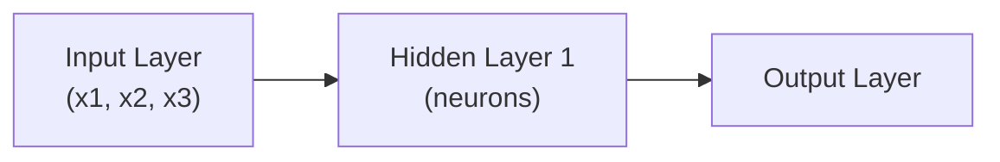

#### 🪜 Step-by-Step — The Worked, Concrete Dataset: Predicting Pass/Fail

> 💡 **Given directly, the complete, worked example:** *"Let's take one very good example -- let's say I have a dataset which shows whether the student has passed or not -- suppose the student studies for [X hours], plays [Y hours], sleeps [Z hours]... let's say that if one of the students has a record which is: he basically studies for 7 hours, he plays for 3 hours, he sleeps for 7 hours... I can say that the person will pass, and since this is a binary classification, I am just going to make it as 1."*

```text
Example records (Study, Play, Sleep -> Pass/Fail):
7, 3, 7 -> 1 (Pass)
2, 5, 8 -> 0 (Fail)
4, 3, 7 -> 1 (Pass)
```

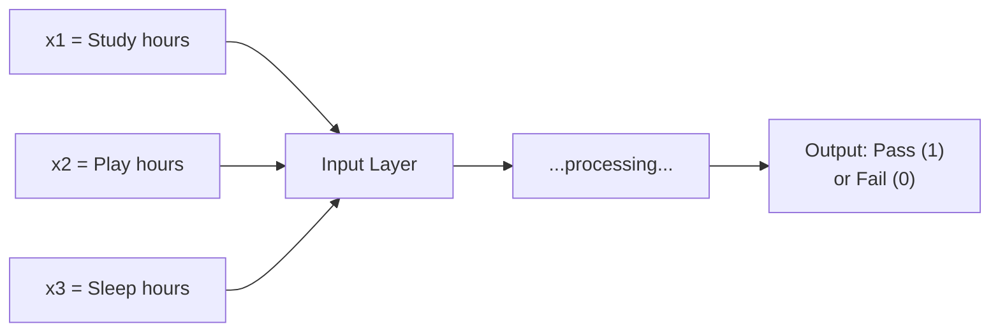

#### 🧠 Concept — The Sustained Eye-and-Brain Analogy

> 💡 **Given directly, the complete, vivid analogy:** *"Let's say I have my eyes, and my brain is there -- now what is this input? Now I'm able to see this monitor, I'm able to see the camera... this signal that is basically passing, that is an input... this input is passing through my eyes, this neural network, the signal goes to the neural network, and this is my hidden layer... this hidden layer has one neuron, and what is this neuron -- neuron does some kind of signal processing."*

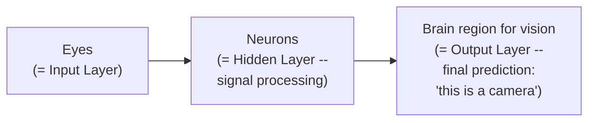

#### 🪜 Step-by-Step — The "Baby Learning to Recognize Things" Analogy for Training

> 💡 **Given directly, a genuinely relatable, personal example:** *"Let's consider a baby -- when a baby is born, if he sees the camera for the first time, will he be able to predict that this is a camera? The answer is no -- he needs to train... we need to tell him... then after a couple of months, he'll be able to understand -- as soon as he sees a bottle of milk, he will start crying, that usually happens with my son -- my son is somewhere around seven months now, he understands what is a mobile phone."*

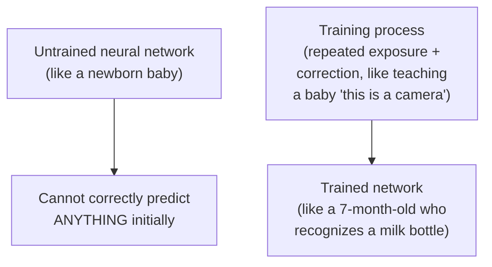

#### ⚠ Common Mistakes

* Assuming a neural network can genuinely predict correctly WITHOUT training — explicitly, directly corrected via the baby analogy: an untrained network is exactly like a newborn who has never been told what a camera is — genuine training (repeated exposure plus correction) is required before accurate prediction is possible.
* Assuming a "hidden layer" must always contain exactly one neuron — explicitly, directly clarified: *"We may have any number of hidden layers... in the hidden layer one, I may have five to ten neurons, in the next layer I may have hundred neurons."*

#### 🎯 Key Takeaways

* A **perceptron** (single-layer neural network) has three genuine structural components: an **input layer**, a **hidden layer**, and an **output layer** — directly mapped, via analogy, onto your own eyes (input), neurons doing signal processing (hidden layer), and the brain region producing a final judgment (output).
* A concrete, worked dataset (study/play/sleep hours predicting pass/fail) is used throughout the rest of the session to make every subsequent concept genuinely traceable to real numbers.
* Neural networks, like human babies, **require genuine training** — they cannot correctly predict anything without repeated exposure and correction; this is directly, vividly illustrated via the instructor's own son learning to recognize a milk bottle and say "papa."

---
### 5. Weights & Bias: The Hot-Object-in-Your-Hand Analogy

#### 🧠 Concept — The Complete, Vivid, Physical Analogy for Weights

> 💡 **Given directly:** *"Suppose if I put a hot object in my right hand, then will I not move my right hand away? ...The reason why I'm removing the right hand [is] because the neurons that are passing from here, those are getting activated -- if I'm putting a hot object over here, the neurons will definitely pass the signal to the brain saying that something hot object is placed, and I'm going to move it -- so this weights will actually help your neurons to act, whether it should be activated, or what level it should be activated."*

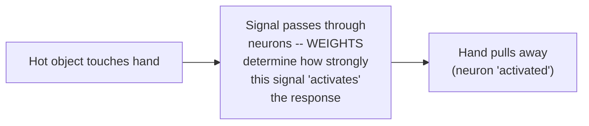

> 💡 **Given directly, the precise, simple, interview-ready summary:** *"Weights basically says that how much the neuron should get activated or deactivated -- that's it, very simple, if you really want to understand as a person who really wants to clear the job interview quick as possible."*

#### ❓ Why It Exists — Precisely Why Bias Is Needed

> 💡 **Given directly, the precise, motivating problem:** *"What if -- see, this weights also, initially we initialize it as 0... if I have initialized to 0, what will happen? x1 multiplied by 0 will be 0, x2 multiplied by 0 will be 0, x3 multiplied by w3 will also be 0 -- now when all these values are 0, we are just passing 0."*

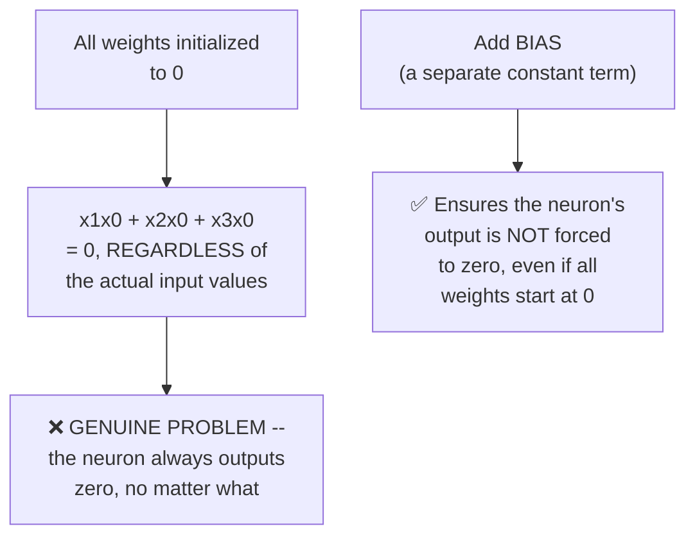

#### 🔍 Internal Working — Bias, Directly Connected to a Familiar, Prior Concept

> 💡 **Given directly:** *"For that to overcome, so that the weight should not be zero, we add another parameter, one more parameter which is called as bias... this is a constant term, we basically say it as a constant, we basically say that it is an intercept -- so that is the reason why in that equation also you'll find an intercept, in this also you have a bias, such that by mistake if you probably initialize all the weights at zero, bias will have some value."*

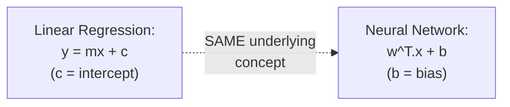

#### ⚠ Common Mistakes

* Assuming weights are always necessarily initialized to zero — explicitly, directly clarified: *"It is not necessary that we always initialize to 0"* — zero is used here purely as a simple, illustrative example of the exact PROBLEM bias solves.
* Assuming bias is a fundamentally NEW, unfamiliar concept — explicitly, directly connected to something the audience already knows: bias is precisely the SAME concept as the intercept term in linear regression (`y = mx + c`).

#### 🎯 Key Takeaways

* **Weights** determine "how much" a neuron should be activated or deactivated — directly, vividly illustrated via the instinctive, physical reaction to touching a hot object.
* **Bias** exists specifically to solve a genuine, structural problem: if ALL weights happened to be initialized to zero, the neuron's output would ALWAYS be zero regardless of input, since any input multiplied by zero is zero — bias provides an independent, non-zero starting value that prevents this.
* Bias is **directly, precisely the same concept** as the intercept term in linear regression (`c` in `y = mx + c`) — a genuinely useful bridge connecting new material to prior, familiar knowledge.

---

### 6. Inside the Neuron: Summation Then Activation (Sigmoid)

#### 🪜 Step-by-Step — Step One: The Weighted Summation

> 💡 **Given directly:** *"Here I will be assigning different different weights... there will be two operations that will be happening -- the first operation will be that we just have to do the summation of x of i and w of i... it is nothing but x1w1 plus x2w2 plus x3w3... I can also write this as w transpose x."*

```text
Step 1: y = Σ(xi · wi) = x1·w1 + x2·w2 + x3·w3 = w^T·x
```

> 💡 **Given directly, precisely connecting this to a genuinely familiar equation:** *"I hope everybody remembers this thing, right -- it is similar to our equation of the linear regression, like beta0 plus beta1 multiplied by x... we can also write this as beta transpose x... same linear regression, if you remember, we also use y is equal to mx plus c."*

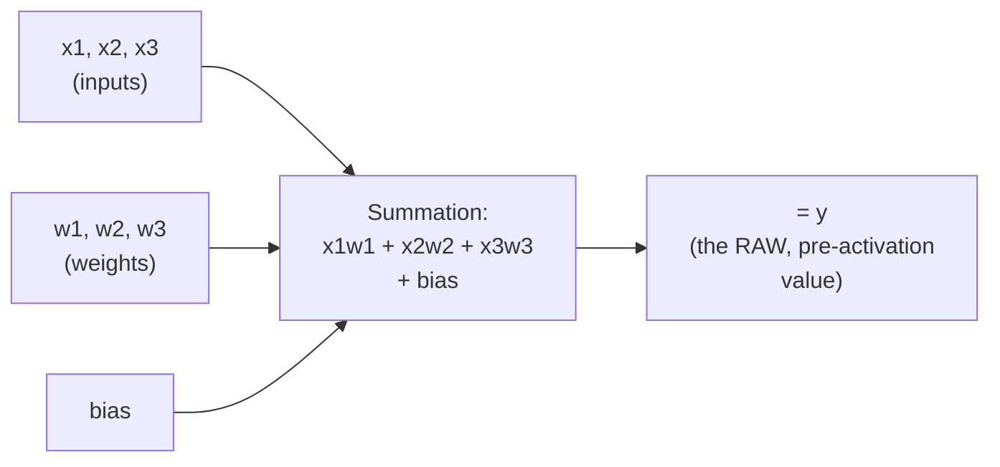

#### 🪜 Step-by-Step — Step Two: The Activation Function

> 💡 **Given directly:** *"What about the second step? In the second step, we pass this equation to an activation function -- we pass this to an activation function."*

#### 📖 Definition — Sigmoid, Precisely Introduced as the Binary-Classification Example

> 💡 **Given directly, the complete formula:** *"One of the activation functions which I am going to basically take is something called a sigmoid activation function... it is 1 [over] e to the power of minus y... we basically use it for binary classification."*

```text
Sigmoid: σ(y) = 1 / (1 + e^(-y))
where y = Σ(xi·wi) + bias
```

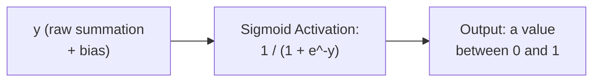

#### 🔍 Internal Working — The Precise, Binary Decision Rule

> 💡 **Given directly:** *"The output of this equation is either 0 or 1 -- that is what sigmoid activation function does... it is not like it always gives 0 or 1, it can give you values between 0 to 1 -- we write a condition: if it is greater than 0.5, we basically take it as 1; if it is less than 0.5, we take it as 0."*

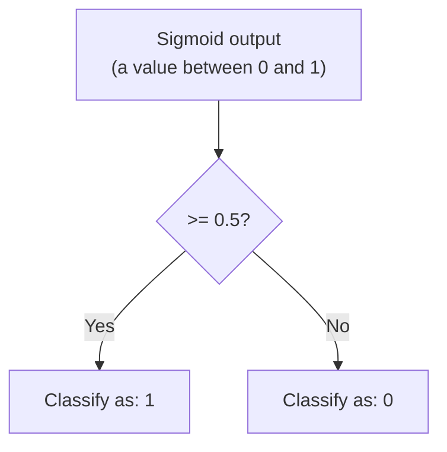

#### ⚠ Common Mistakes

* Assuming sigmoid's raw output is always exactly 0 or 1 — explicitly, directly corrected: it outputs a continuous value BETWEEN 0 and 1, which is then converted into a discrete 0/1 classification via the explicit 0.5 threshold rule.
* Assuming sigmoid is the ONLY activation function that exists — explicitly, directly clarified: *"Sigmoid is not only the activation function, we have various different types of activation functions which we are going to learn till tomorrow."*

#### 🎯 Key Takeaways

* Every neuron performs exactly **two sequential steps**: (1) a **weighted summation** of inputs plus bias (`w^T·x + b`, directly mirroring linear regression's `y = mx + c`), and (2) passing this result through an **activation function**.
* **Sigmoid** is introduced as the concrete example for binary classification: `1/(1+e^(-y))`, producing a continuous value between 0 and 1, converted to a discrete class via the **0.5 threshold rule**.
* Sigmoid is explicitly, directly flagged as just ONE example among MANY activation functions — with a full, deeper treatment of the various types explicitly promised for the next session.

---
### 7. Forward Propagation, Loss Function & Backward Propagation

#### 📖 Definition — Forward Propagation, Precisely Named

> 💡 **Given directly:** *"Whatever operation that we have done till here, from here to here, till the output -- what all functions we did, we basically took the input, multiplied by the weights, added a bias, and activate -- so this entire process, till the end, is called as forward propagation."*

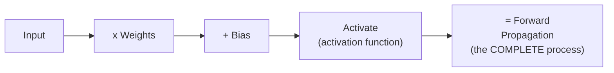

#### 🪜 Step-by-Step — Tracing the Worked Example: Getting a WRONG Prediction

> 💡 **Given directly, the complete, worked trace:** *"For this first input -- 7, 3, 7 -- I passed it, I went inside this, I initialized the weight, and let's say I got an output of 0... this 0 will be my predicted value, y hat -- this will be my predicted value... for the forward propagation, first forward transition, then what is my y? Y is my truth value -- so what is my truth value over here? My truth value is 1."*

```text
Predicted (ŷ) = 0
Actual/True (y) = 1
```

#### 📖 Definition — Loss Function, Precisely Defined

> 💡 **Given directly:** *"If I subtract it, y minus y hat, obviously this is not the output that I want... since my difference is 1, and I know my output is completely wrong... there is a very important term which is called as loss function -- loss function will basically find out the difference between your predicted value and your real value, and always the main aim should be that we should try to minimize the difference."*

```text
Loss (simplified example) = y - ŷ = 1 - 0 = 1
GOAL: minimize this difference, ideally toward 0
```

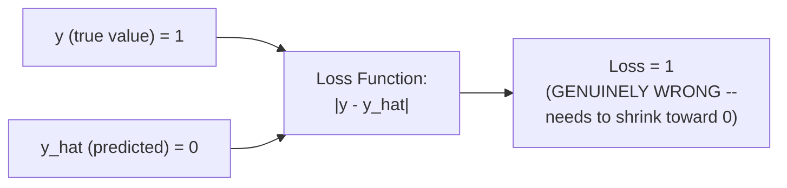

#### 📖 Definition — Backward Propagation, Precisely Defined

> 💡 **Given directly:** *"Now I know my difference is quite huge -- now what is the next thing that I have to do? If my difference is huge, we then do a very important thing which is called as back propagation -- and what is the aim of the back propagation? The main aim of the back propagation is to update weights, because only when I update these weights, then only we will be able to get this predicted output matched to our real output."*

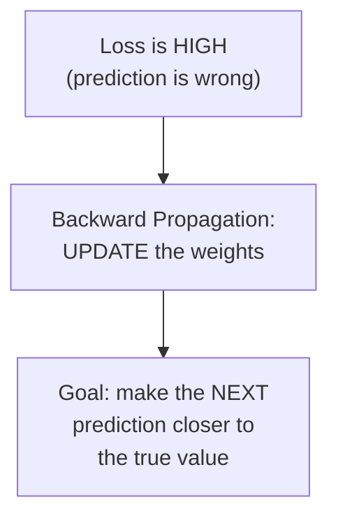

#### 🔍 Internal Working — Optimizers, Precisely Connected to Gradient Descent

> 💡 **Given directly, the precise, connecting explanation:** *"We have another concept which is called as optimizers -- this optimizers will make sure that each and every weight will get updated while we are back propagating... one example of an optimizer is gradient descent -- what is gradient descent doing over there? It is changing the coefficients... gradient descent will make sure that the coefficient... it will update this coefficient from here to basically come to the global minima, and this global minima, the difference of y and y hat will be minimal."*

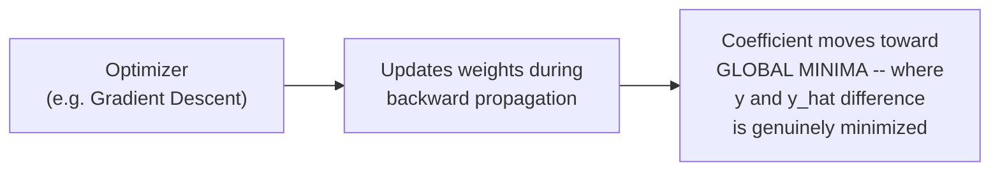

#### 🧠 Concept — The Complete Training Cycle, Restated as a Story

> 💡 **Given directly, the video's own complete, closing summary of the entire cycle:** *"First step, we have learned about input layer... second step, weights will get added... third step, after the weights, the input and the weights will get added, and then it will get added along with the bias, and then... fourth step, an activation function will get applied... till the last layer, this entire process [is] the forward propagation. And in the backward propagation... fifth step, in the backward propagation, first we calculate the loss function... we have to minimize this value, how do we minimize, we use optimizers -- optimizer is what it does, it updates the weight, and this is the entire process of backward propagation."*

```mermaid
sequenceDiagram
    participant Input
    participant Network as Forward Propagation
    participant Loss as Loss Function
    participant Optimizer as Backward Propagation

    Input->>Network: Pass data (weighted<br/>sum + bias + activation)
    Network->>Loss: Predicted output (y_hat)
    Loss->>Loss: Compare y_hat vs. true y
    Loss->>Optimizer: Difference is HIGH
    Optimizer->>Network: UPDATE weights
    Note over Input,Optimizer: Repeat this ENTIRE cycle<br/>many times (e.g. 1000x)<br/>-- the network gradually<br/>learns, like training a baby
```

#### ⚠ Common Mistakes

* Assuming forward and backward propagation are two entirely independent, unrelated processes — explicitly, directly connected: they form ONE complete, repeating CYCLE — forward propagation produces a prediction, the loss function measures how wrong it is, and backward propagation (via optimizers) uses that measurement to update weights for the NEXT forward pass.
* Assuming a neural network needs "thousands" of training iterations to genuinely learn anything meaningful — explicitly, directly clarified: *"We don't have to even do thousand times, within 10 times also, if the neural network is able to train, it is able to train"* — the exact number depends on the specific problem.

#### 🎯 Key Takeaways

* **Forward propagation** is the complete process from input through to a final prediction: multiply by weights, add bias, activate — repeated across every layer.
* The **loss function** measures the difference between the predicted value (`ŷ`) and the true value (`y`) — the training goal is always to MINIMIZE this difference.
* **Backward propagation**, powered by **optimizers** (with gradient descent given as the concrete example, directly connected to the audience's prior linear-regression knowledge), updates the network's weights specifically to reduce this loss on subsequent forward passes.
* This entire forward-loss-backward cycle **repeats many times** (not necessarily "thousands" — as few as ten, depending on the problem) — directly, repeatedly compared to how a baby learns through repeated exposure and correction.

---

### 8. From Single-Layer to Multi-Layer Neural Networks

#### 📖 Definition — Multi-Layer Neural Network, Precisely Introduced as "Nothing Different"

> 💡 **Given directly:** *"Now let's understand how does a multi-layer neural network look -- that was a single layer neural network, right? A multi-layer neural network will have a lot of inputs... in the hidden layer I will be having so many different different neurons... and here in the output layer also I may have multi-class classification problem... this is nothing but a multi-layer neural network, and it is going to basically just do the same process whatever I've taught you in the single layer -- nothing different."*

```mermaid
flowchart LR
    A["Input Layer<br/>(many inputs)"] --> B["Hidden Layer 1<br/>(many neurons)"]
    B --> C["Hidden Layer 2<br/>(many neurons)"]
    C --> D["Output Layer<br/>(possibly multi-class)"]
```

#### 🔍 Internal Working — The Precise, Stated Differences for Multi-Class Problems

> 💡 **Given directly:** *"Just for the case of multi-classification, a different type of activation function may get used, a different kind of loss function may get used -- that's it."*

#### ⚠ Common Mistakes

* Assuming a multi-layer network involves a fundamentally different, more complex training MECHANISM than a single-layer perceptron — explicitly, directly corrected: *"Everything is almost the same, everything -- I have not hidden anything, any concept with you"* — the SAME forward propagation, loss function, and backward propagation cycle applies, just repeated across more layers and neurons.

#### 🎯 Key Takeaways

* A **multi-layer neural network** is explicitly, directly described as using the EXACT SAME underlying mechanics as the single-layer perceptron already covered — more inputs, more neurons per hidden layer, and potentially more hidden layers, but no genuinely NEW concept.
* The only stated, genuine differences for multi-class problems: a **different activation function** and a **different loss function** may be used — the overall forward/backward propagation cycle remains identical.

---
### 9. Closing: The Five-Day Roadmap

#### 🪜 Step-by-Step — The Explicit, Stated Plan for the Remaining Days

> 💡 **Given directly:** *"Tomorrow we will understand about in-depth activation functions, what are the different types of activation function will also be understanding, loss function -- tomorrow I'll try to cover this two. How to update the weight and optimizers will be covered in day three, and in day two... in day three we'll also see practical examples."*

```mermaid
flowchart LR
    A["Day 1 (done):<br/>AI/ML/DL/DS, Perceptron,<br/>Forward/Backward Prop<br/>(intro)"] --> B["Day 2: Activation<br/>Functions & Loss<br/>Functions (in depth)"]
    B --> C["Day 3: Chain Rule of<br/>Differentiation,<br/>Optimizers, Practicals"]
    C --> D["Days 4-5: ANN -> CNN -><br/>RNN, Object Detection,<br/>NLP Introduction"]
```

> 💡 **Given directly, a further, precise breakdown of the technical roadmap:** *"There is also one concept in back propagation, you know, there is something called as derivative or chain rule of differentiation -- so that thing also tomorrow I'll cover... first of all we are going to learn ANN -- already we have started this, perceptron is a concept of ANN -- then we'll go with CNN, then we'll go with RNN, and then probably we will try to close some example of object detection."*

#### ⚠ A Direct, Honest Scoping of NLP Within This Series

> 💡 **Given directly:** *"NLP introduction will be done over here, but NLP completely in depth, I will take another seven days to complete it -- so that we will plan it probably in this month or in next month."*

#### 🏢 Real-World / Production Usage — Materials & Community Course Access

> 💡 **Given directly:** *"All these materials that I'm actually going to give will be in the dashboard link that is given in the description... please go over there and try to enroll it, it is completely for free, and I will provide you this material also."*

#### ⚠ Common Mistakes

* Assuming this five-day series will cover NLP in genuine depth — explicitly, directly scoped: only an INTRODUCTION to NLP is planned within these five days, with a full, separate, roughly seven-day treatment explicitly planned for a later month.
* Assuming "ANN" is a separate topic from what's already been covered — explicitly, directly clarified: *"Perceptron is a concept of ANN"* — today's entire session is itself the foundational starting point for ANN (Artificial Neural Networks), not a separate, unrelated topic.

#### 🎯 Key Takeaways

* The explicit, stated roadmap: **Day 2** covers activation functions and loss functions in depth; **Day 3** covers the chain rule of differentiation, optimizers, and practical implementation; **Days 4-5** progress through CNN, RNN, object detection, and an NLP introduction.
* **NLP** is explicitly, honestly scoped as only an INTRODUCTION within this series — a full, separate treatment is planned for a later month.
* Today's perceptron content is explicitly identified as the **foundational starting point for ANN** (Artificial Neural Networks) specifically — not a separate, standalone topic disconnected from the rest of the roadmap.

---

## 📝 Glossary

| Term | Definition | Why It Matters |
|---|---|---|
| **AI** | Applications performing tasks without human intervention, learning from user behavior | The outermost "universe" in the AI/ML/DL hierarchy |
| **ML** | A subset of AI; provides stats tools for analysis, prediction, forecasting, clustering | The second layer of the hierarchy |
| **DL** | A subset of ML; aims to mimic the human brain | The third, innermost layer -- this session's main focus |
| **Perceptron** | A single-layer neural network | The foundational building block covered this session |
| **Weight** | Determines how much a neuron is activated/deactivated | Directly illustrated via the hot-object analogy |
| **Bias** | A constant term preventing the all-zero-weight problem | Directly analogous to the intercept in linear regression |
| **Sigmoid** | An activation function: 1/(1+e^-y), used for binary classification | Outputs 0-1; thresholded at 0.5 for classification |
| **Forward Propagation** | Input -> weights -> bias -> activation, through to output | The "prediction" half of the training cycle |
| **Loss Function** | Measures the difference between predicted (y_hat) and true (y) values | The training goal is always minimizing this |
| **Backward Propagation** | Updates weights to reduce loss | The "learning" half of the training cycle |
| **Optimizer** | The mechanism (e.g. gradient descent) that updates weights during backward propagation | Moves the model toward the "global minima" of loss |

---

## 🔄 Revision Notes — One-Minute Revision

* This is **Day 1 of a free, 5-day community series** -- deliberately beginner-paced, directly framed as interview-relevant throughout.
* **AI ⊃ ML ⊃ DL** (a genuine nested hierarchy, via concentric circles) -- **Data Science** cuts across all three, since its ultimate goal is always building an AI application. DL's own stated central aim: **mimic the human brain** -- research dates to 1958, only recently made practical by data volume and GPU hardware.
* **Why DL became popular NOW**: (1) exponential data growth from Web 2.0/social media (Facebook, Instagram, etc., from ~2005), leading to "big data" (~2008) and eventually AI/data science popularity (~2013+) once companies wanted to USE their stored data; (2) genuine hardware advancement -- NVIDIA GPUs enabling fast training of large, many-parameter models.
* **Perceptron structure**: input layer -> hidden layer -> output layer, directly mapped onto the eyes-neurons-brain analogy. A neural network, like a baby, **requires genuine training** before it can predict correctly.
* **Weights** determine "how activated" a neuron becomes (hot-object-in-hand analogy); **bias** prevents the all-zero-weight problem (directly = the intercept in linear regression).
* Every neuron performs **two steps**: (1) weighted summation + bias (`w^T.x + b`, = linear regression's `y=mx+c`), then (2) an **activation function** -- sigmoid (`1/(1+e^-y)`, thresholded at 0.5) is the binary-classification example given.
* **Forward propagation** = input through weights/bias/activation to a prediction. **Loss function** = |y - y_hat|, always to be MINIMIZED. **Backward propagation**, via **optimizers** (e.g. gradient descent), updates weights to reduce this loss -- this entire cycle REPEATS many times (not necessarily "thousands") until the network genuinely learns.
* **Multi-layer neural networks** use the EXACT SAME mechanics as the single-layer perceptron -- just more inputs/neurons/layers; only genuine differences for multi-class problems are the specific activation and loss functions used.
* **Roadmap**: Day 2 = activation/loss functions in depth; Day 3 = chain rule, optimizers, practicals; Days 4-5 = CNN, RNN, object detection, NLP intro (full NLP depth deferred to a separate, later series).

---

## 📋 Cheat Sheet

**The hierarchy:**
```text
AI (outermost) > ML (subset of AI) > DL (subset of ML)
Data Science -> cuts ACROSS all three; goal = build an AI application
```

**Why DL became popular:**
```text
1. Data explosion (Web 2.0 / social media, ~2005+) -> Big Data (~2008) -> AI/DS popularity (~2013+)
2. Hardware advancement (NVIDIA GPUs -> fast training of large models)
```

**Perceptron structure:**
```text
Input Layer -> Hidden Layer (neurons) -> Output Layer
(analogy: Eyes -> Neurons -> Brain)
```

**Inside a neuron (two steps):**
```text
Step 1: y = Sum(xi . wi) + bias = w^T.x + b   (= linear regression's y=mx+c)
Step 2: activation(y)   e.g. Sigmoid: 1/(1+e^-y)
```

**Sigmoid decision rule:**
```text
Sigmoid output >= 0.5 -> classify as 1
Sigmoid output < 0.5  -> classify as 0
```

**The complete training cycle:**
```text
Forward Propagation (input -> weights -> bias -> activation -> prediction)
      -> Loss Function (|y - y_hat|, minimize this)
      -> Backward Propagation (optimizer updates weights)
      -> REPEAT
```

**Multi-layer vs. single-layer:**
```text
SAME mechanics -- just more inputs/neurons/layers.
Only difference for multi-class: activation function + loss function may change.
```

---

## 🔥 Interview Questions & Answers

### 🟢 Beginner

**Q1.**

**Question:** What is the relationship between AI, ML, and DL?

**Answer:** A nested hierarchy -- ML is a subset of AI, and DL is a subset of ML.

**Explanation:** Directly, precisely stated via the concentric-circle model.

**Why Interviewers Ask This:** A foundational, extremely common interview opener.

**Possible Follow-up:** "Where does Data Science fit into this hierarchy?"

**Q2.**

**Question:** What is the main aim of deep learning?

**Answer:** To mimic the human brain.

**Explanation:** Directly, explicitly stated.

**Why Interviewers Ask This:** Tests conceptual understanding of DL's core motivation.

**Possible Follow-up:** "When did research into this area actually begin?"

**Q3.**

**Question:** Name two reasons deep learning became popular in recent years.

**Answer:** The exponential growth of data (from Web 2.0/social media) and genuine hardware advancement (NVIDIA GPUs).

**Explanation:** Directly, precisely explained with historical grounding.

**Why Interviewers Ask This:** A commonly-asked, foundational "why now" question.

**Possible Follow-up:** "What role did 'big data' play in this progression?"

**Q4.**

**Question:** What are the three structural components of a perceptron?

**Answer:** Input layer, hidden layer, output layer.

**Explanation:** Directly, explicitly named.

**Why Interviewers Ask This:** Basic, foundational neural network structure.

**Possible Follow-up:** "Can a hidden layer contain more than one neuron?"

**Q5.**

**Question:** What does a weight represent in a neural network?

**Answer:** How much a neuron should be activated or deactivated.

**Explanation:** Directly, precisely explained via the hot-object analogy.

**Why Interviewers Ask This:** Tests genuine, intuitive understanding, not just formula recall.

**Possible Follow-up:** "Why is bias needed alongside weights?"

**Q6.**

**Question:** Why is bias necessary in a neural network?

**Answer:** To prevent the neuron's output from always being zero if all weights happen to be initialized to zero.

**Explanation:** Directly, precisely explained.

**Why Interviewers Ask This:** A commonly-asked, precise conceptual question.

**Possible Follow-up:** "What familiar concept from linear regression is bias directly equivalent to?"

**Q7.**

**Question:** What two steps happen inside every neuron?

**Answer:** A weighted summation of inputs plus bias, then passing that result through an activation function.

**Explanation:** Directly, precisely stated.

**Why Interviewers Ask This:** Foundational neuron-level mechanics.

**Possible Follow-up:** "Write the formula for the first of these two steps."

**Q8.**

**Question:** What is the sigmoid activation function used for, and what is its decision threshold?

**Answer:** Binary classification; a threshold of 0.5 (>=0.5 classified as 1, <0.5 classified as 0).

**Explanation:** Directly, precisely explained.

**Why Interviewers Ask This:** Basic, foundational activation-function knowledge.

**Possible Follow-up:** "What is the range of sigmoid's raw output, before thresholding?"

**Q9.**

**Question:** What is forward propagation?

**Answer:** The complete process of passing input through weights, bias, and activation, all the way to a final prediction.

**Explanation:** Directly, precisely defined.

**Why Interviewers Ask This:** Foundational neural network training terminology.

**Possible Follow-up:** "What comes immediately after forward propagation in the training cycle?"

**Q10.**

**Question:** What is the purpose of backward propagation?

**Answer:** To update the network's weights, specifically to reduce the loss (the difference between predicted and true values).

**Explanation:** Directly, precisely explained.

**Why Interviewers Ask This:** Foundational neural network training terminology.

**Possible Follow-up:** "What mechanism actually performs this weight update?"

---

### 🟡 Intermediate

**Q11.**

**Question:** Explain why the instructor deliberately connects the neuron's weighted-summation formula (w^T·x + b) to linear regression's own y=mx+c, rather than introducing it as an entirely new concept.

**Answer:** This is a deliberate, stated pedagogical bridge, directly connecting to the session's own listed prerequisite ("some idea about at least one algorithm in machine learning"). By showing that a neuron's core computation is STRUCTURALLY IDENTICAL to something the audience already understands (linear regression), the instructor transforms what could seem like an intimidating, new mathematical concept into a genuinely familiar one, viewed from a slightly different angle. This directly reduces the perceived complexity of neural networks for genuine beginners, and is consistent with the session's own broader teaching philosophy of building on prior knowledge and everyday analogies rather than introducing formulas in isolation.

**Explanation:** Requires recognizing a deliberate, connective teaching technique rather than an incidental comparison.

**Why Interviewers Ask This:** Tests whether a learner recognizes the genuine, structural link between these two concepts.

**Possible Follow-up:** "What role does the bias term play in BOTH linear regression and a neuron's computation?"

**Q12.**

**Question:** A learner argues that since bias can be initialized to a non-zero value, weights should therefore always be initialized to zero for simplicity, relying entirely on bias to avoid the "all-zero output" problem. Evaluate this claim.

**Answer:** This claim misunderstands the genuine, distinct roles weights and bias play. The session's own example specifically illustrates a WORST-CASE scenario (all weights at zero) purely to motivate WHY bias exists as a safeguard -- it does not suggest this is a genuinely GOOD or recommended initialization strategy. Weights are what allow the network to learn genuinely DIFFERENT levels of importance/activation for EACH different input (per the session's own weight explanation -- "how much the neuron should get activated") -- if all weights remained at zero, the network would have NO way to learn to weigh different inputs differently, regardless of what bias value is used, since bias is a single, SHARED constant, not something that can differentiate between different inputs' relative importance. Relying "entirely on bias" would produce a severely limited, effectively non-learning network -- weights genuinely need to be updated (via backward propagation) to enable real learning, and bias alone cannot substitute for this.

**Explanation:** Tests whether a learner recognizes that weights and bias serve genuinely different, complementary functions, not interchangeable ones.

**Why Interviewers Ask This:** Distinguishes candidates who understand the distinct roles of these two parameters from those who conflate them.

**Possible Follow-up:** "If weights genuinely never updated during training, what would happen to the network's ability to learn, regardless of bias?"

**Q13.**

**Question:** Explain, precisely, why the session's own worked example (predicting pass/fail from study/play/sleep hours) uses a SIMPLIFIED loss calculation (y - y_hat) rather than a more sophisticated, real loss function.

**Answer:** The session's own explicit framing is that this is a deliberately SIMPLIFIED illustration, specifically to build INTUITION for what a loss function fundamentally DOES (measure the gap between prediction and truth) before introducing the genuine MATHEMATICAL complexity of real loss functions (which the session explicitly, directly defers: "there are different kind of loss function which I'll be discussing"). A raw subtraction (y - y_hat) genuinely captures the CONCEPTUAL essence -- "how far off was the prediction" -- without requiring the audience to first understand more sophisticated formulations (like cross-entropy or mean squared error) that a genuinely complete treatment would require. This directly mirrors the session's own broader, stated teaching philosophy: build INTUITION first with simple, traceable examples, then layer in genuine mathematical rigor in later sessions.

**Explanation:** Requires recognizing a deliberate simplification strategy, connecting it to the session's own explicitly-stated, sequential teaching plan.

**Why Interviewers Ask This:** Tests whether a learner distinguishes a deliberately simplified TEACHING example from a complete, production-accurate formula.

**Possible Follow-up:** "Name a genuine, real loss function commonly used for binary classification, distinct from this session's own simplified y-y_hat example."

**Q14.**

**Question:** Using the session's own hot-object analogy for weights, explain why a REAL neural network's weights are genuinely LEARNED through training, rather than manually, permanently set based on human intuition about "what should be important."

**Answer:** While the hot-object analogy vividly illustrates WHAT a weight conceptually represents (how strongly a signal activates a response), it does NOT imply that weights should be manually, permanently fixed by a human's own intuitive judgment about importance. The session's own broader content (forward propagation, loss function, backward propagation) directly establishes that weights are specifically LEARNED through repeated exposure to real, LABELED data -- the network starts with some initial weight values (potentially even zero, per Section 5), makes predictions, measures how WRONG those predictions are (via the loss function), and then SYSTEMATICALLY adjusts weights (via backward propagation and optimizers) specifically to reduce this error. This learned approach is genuinely necessary because REAL relationships between inputs and outputs (e.g., exactly how much "study hours" should matter relative to "sleep hours" for predicting pass/fail) are often too complex, too numerous, or too non-obvious for a human to correctly intuit and hard-code by hand -- directly paralleling why the session's own baby-learning analogy emphasizes REPEATED, GRADUAL exposure and correction, rather than a baby being born already "knowing" what a camera is.

**Explanation:** Requires connecting the weight analogy (Section 5) to the training-cycle content (Section 7) to explain why LEARNED weights are genuinely necessary, not merely an implementation convenience.

**Why Interviewers Ask This:** Tests whether a learner understands WHY training is genuinely necessary, not just that it happens.

**Possible Follow-up:** "Could a neural network with genuinely, permanently fixed (untrained) weights still be useful for any task? Under what circumstance?"

**Q15.**

**Question:** Synthesize the session's own AI/ML/DL hierarchy (Section 2) with its "why DL became popular" explanation (Section 3) to explain why DEEP LEARNING specifically (rather than traditional ML) became the preferred approach once companies had genuinely large amounts of data and genuinely powerful hardware.

**Answer:** A precise synthesis: per Section 2's own definitions, traditional ML primarily provides STATISTICAL tools for prediction, forecasting, and clustering -- generally well-suited to structured, moderately-sized datasets. Deep learning, by contrast, is explicitly defined (Section 2) as aiming to MIMIC THE HUMAN BRAIN via multi-layered neural networks with MANY parameters -- and per Section 3's own precise reasoning, training networks with many parameters GENUINELY REQUIRES both substantial data volume (to avoid overfitting a large-parameter model) and substantial computational power (GPUs, to make training such large models FEASIBLE in reasonable time). Before the genuine data explosion (Web 2.0, ~2005+) and genuine hardware advancement (NVIDIA GPUs) that Section 3 describes, deep learning's OWN theoretical requirements (large data, heavy computation) simply could not be PRACTICALLY MET -- meaning traditional ML remained the more PRACTICAL choice for real-world problems, even though deep learning's underlying research (per Section 2) had existed since 1958. Once BOTH genuine prerequisites (data, hardware) were finally, practically available, deep learning's theoretically greater capacity (via many-layered, many-parameter networks mimicking brain-like processing) could finally be genuinely REALIZED in practice -- directly explaining why deep learning specifically, rather than an enhanced version of traditional ML, became the dominant modern approach.

**Explanation:** Requires synthesizing the definitional distinction between ML and DL (Section 2) with the specific historical/practical prerequisites for DL's own effectiveness (Section 3) to explain WHY DL specifically (not just "AI in general") benefited from these two historical developments.

**Why Interviewers Ask This:** A senior-level question testing whether a candidate can connect conceptual definitions to genuine, practical historical causation, rather than treating them as separate facts.

**Possible Follow-up:** "Would deep learning's theoretical advantages have mattered at all in, say, 1995, even if the underlying mathematical research had already been fully worked out?"

---

### 🔴 Advanced

**Q16.**

**Question:** Design a complete, from-scratch numerical trace of forward propagation for a NEW example — a single neuron receiving inputs (5, 2, 6) with weights (0.5, 0.3, 0.4) and bias 0.1, using the sigmoid activation function — computing the exact predicted output and classification.

**Answer:** A reasonable, complete trace, directly applying Section 6's own exact formula: (1) Weighted summation: `y = (5×0.5) + (2×0.3) + (6×0.4) + 0.1 = 2.5 + 0.6 + 2.4 + 0.1 = 5.6`. (2) Apply sigmoid: `σ(5.6) = 1/(1+e^(-5.6))`. Since `e^(-5.6) ≈ 0.0037`, this gives `σ(5.6) ≈ 1/1.0037 ≈ 0.9963`. (3) Apply the classification threshold (Section 6): since `0.9963 >= 0.5`, this classifies as **1**. If the true label for this specific example were genuinely 1 (e.g., directly analogous to Section 4's own "pass" scenario for high study hours), this would represent a CORRECT prediction, with a genuinely LOW loss (`|1 - 1| = 0`, or a near-zero value under a real loss function) -- meaning backward propagation would need only MINOR weight adjustments, if any, for this specific example.

**Explanation:** Requires applying the session's own exact formulas (weighted summation, sigmoid, threshold) to a genuinely new, numerically concrete example.

**Why Interviewers Ask This:** A realistic, senior-level question testing whether a candidate can perform the actual, numerical computation, not just recite the formula.

**Possible Follow-up:** "What would the classification be if the bias were instead -6.0, with the same inputs and weights?"

**Q17.**

**Question:** Critically evaluate: "Since this session explains that a neural network needs training just like a human baby needs to learn, and repeated training eventually produces correct predictions, a neural network trained on ANY sufficiently large dataset will EVENTUALLY achieve genuinely accurate predictions, regardless of the specific weights, activation functions, or architecture chosen." Is this an accurate characterization?

**Answer:** Not accurate -- this significantly overstates what the "training like a baby" analogy genuinely implies. The analogy is specifically meant to build intuition for the GENERAL PRINCIPLE that repeated exposure and correction (rather than being "born knowing" the answer) is how learning happens -- it is NOT a claim that ANY architecture, activation function, or training configuration will EVENTUALLY succeed given enough data. The session's OWN content directly implies genuine architectural choices matter: it explicitly distinguishes DIFFERENT activation functions for different problem types (sigmoid for binary classification; a different, unnamed "linear activation function" for regression, per Section 6's own closing mention) and explicitly notes that MULTI-CLASS problems may require DIFFERENT loss functions (Section 8) -- directly implying that an INCORRECTLY CHOSEN activation function or loss function for a given problem type would genuinely IMPAIR learning, regardless of data volume. Additionally, real neural network training can genuinely get stuck in poor local minima, suffer from vanishing gradients in very deep networks, or simply be poorly architected for the specific problem -- none of which the "baby learning" analogy addresses, since it's a DELIBERATELY simplified illustration of the GENERAL training concept, not an exhaustive guarantee of eventual success under all conditions.

**Explanation:** Tests whether a learner recognizes the bounded, illustrative purpose of a teaching analogy, without over-generalizing it into an unconditional guarantee the session's own content doesn't support.

**Why Interviewers Ask This:** Distinguishes candidates who understand a pedagogical analogy's genuine, limited scope from those who extend it into an inaccurate, unconditional claim.

**Possible Follow-up:** "Name a genuine, real reason a neural network might fail to learn effectively, even with abundant training data."

**Q18.**

**Question:** Synthesize the session's complete forward-loss-backward training cycle (Section 7) with its multi-layer neural network extension (Section 8) to explain precisely how backward propagation's "weight update" step must genuinely differ when applied to a network with MULTIPLE hidden layers, compared to the single-layer perceptron this session primarily demonstrates.

**Answer:** A precise synthesis, extending beyond what the session itself explicitly walks through: in the single-layer perceptron (Section 7), backward propagation needs to update weights connecting ONLY the input layer to the single hidden layer, and the hidden layer to the output layer -- a relatively direct, two-step update. In a MULTI-LAYER network (Section 8), the SAME fundamental goal (reduce the loss by updating weights) applies, but the loss signal must genuinely PROPAGATE BACKWARD THROUGH EVERY INTERMEDIATE LAYER -- from the output layer's own error, back through each hidden layer in REVERSE order, until finally reaching the weights connecting the input layer to the first hidden layer. This requires the CHAIN RULE OF DIFFERENTIATION (explicitly named in Section 9 as an upcoming topic, "there is also one concept in back propagation... chain rule of differentiation") -- since the loss's genuine, mathematical relationship to an EARLY layer's weights is only expressible by CHAINING TOGETHER the derivatives of every INTERMEDIATE layer's own transformation. This directly explains why the session's own roadmap (Section 9) explicitly defers a full mathematical treatment of backward propagation's mechanics to a LATER session specifically covering the chain rule -- the single-layer case (this session's primary focus) genuinely simplifies this chain into a single, direct step, while the MULTI-layer case (only briefly introduced in Section 8) requires this genuinely more complex, chained computation the session itself hasn't yet formally covered.

**Explanation:** Requires synthesizing the training-cycle mechanics with the multi-layer extension to reason through a genuine mathematical complexity the session itself explicitly flags as upcoming, but doesn't yet formally teach.

**Why Interviewers Ask This:** A capstone-level question testing whether a candidate can identify WHERE a session's own simplified treatment genuinely diverges from the full, real complexity of multi-layer backward propagation, using only the session's own forward-looking hints.

**Possible Follow-up:** "Why might this same 'chain rule' requirement make VERY deep networks (many, many layers) genuinely more difficult to train than shallower ones?"

---

## 🧪 Scenario-Based Interview Questions

> **Scenario 1:** A colleague's simple neural network, trained on the exact study/play/sleep pass/fail dataset from this session, produces the SAME prediction (always "pass") regardless of the actual input values. Using this session's concepts, diagnose the most likely cause.

**Structured Answer:**
1. **Initial investigation:** Recognize this as a classic symptom directly connected to Section 5's own precise "all weights at zero" scenario -- if every weight remains at zero (never genuinely updated), the weighted summation would always produce the SAME value (determined entirely by bias), regardless of the actual input values.
2. **Metrics/logs to check:** Directly inspect the actual weight values after training -- confirm whether they genuinely changed from their initial values, or remained stuck at their starting point.
3. **Possible causes:** Per Section 7's own precise reasoning, this would occur if backward propagation genuinely FAILED to update weights correctly -- possibly due to a bug in the optimizer implementation, or a loss function that never produces a genuine, non-zero gradient signal.
4. **Debugging approach:** Directly print/log the weight values before and after several training iterations, confirming whether they are genuinely changing in response to the loss signal.
5. **Resolution:** Correct the backward propagation/optimizer implementation to ensure weights are genuinely updated based on the computed loss, then retrain.
6. **Prevention:** Establish a standing practice of directly verifying that model weights genuinely change during training (a basic, important sanity check), rather than only checking final prediction accuracy.

> **Scenario 2 (Advanced):** Your team is building a neural network to predict housing prices (a continuous value, not a binary pass/fail), but a team member proposes using this session's own sigmoid activation function for the output layer, since "it worked well for the pass/fail example." Using this session's concepts, evaluate this proposal.

**Structured Answer:**
1. **Initial investigation:** Recognize this as a genuine mismatch between the activation function's stated purpose and the actual problem type, directly connecting to Section 6's own explicit statement that sigmoid is used specifically "for binary classification."
2. **Relevant principle:** Per Section 6's own precise mechanics, sigmoid's output is CONSTRAINED to a range between 0 and 1 -- but housing prices are continuous values that can genuinely range far beyond this (e.g., $200,000 or $2,000,000), meaning sigmoid's output range is fundamentally INCOMPATIBLE with the genuine range of values a housing-price prediction needs to represent.
3. **Possible causes for this proposal:** A reasonable, but mistaken generalization -- assuming that because sigmoid worked well for ONE specific problem type (binary classification), it should work equally well for a GENUINELY different problem type (continuous regression), without considering the activation function's own specific, stated purpose and output constraints.
4. **Debugging/evaluation approach:** Directly reference Section 6's own closing mention: *"For linear regression, what all things we use, there is another activation function which is called as linear activation function"* -- confirming that a DIFFERENT activation function, specifically suited to continuous/regression outputs, genuinely exists and should be used instead.
5. **Resolution:** Recommend using a LINEAR activation function (or no activation function at all) for the output layer specifically, since housing price prediction is a regression task requiring genuinely unconstrained, continuous output values -- not sigmoid's constrained 0-1 range.
6. **Prevention:** Establish a standing team practice of explicitly matching activation function choice to the GENUINE problem type (classification vs. regression, binary vs. multi-class) before implementation, directly modeling this session's own explicit sigmoid-for-binary-classification framing.

---

## 🛠 Hands-on Exercises

### 🟢 Easy

1. Write out, from memory, the AI/ML/DL hierarchy using the concentric-circle model, and explain where Data Science fits in.
2. Explain, in your own words, the hot-object-in-your-hand analogy for weights, and why bias is separately needed.
3. Compute the weighted summation (Step 1) for a neuron with inputs (3, 5), weights (0.2, 0.6), and bias 0.1.

### 🟡 Medium

4. Complete the full, numerical sigmoid computation for the neuron in Exercise 3, and state its final classification (0 or 1).
5. Complete the full, numerical trace proposed in Advanced Interview Q16, but using a bias value of -6.0 instead of 0.1, and compare the resulting classification.
6. Write a short explanation (150-200 words) of why sigmoid would be inappropriate for a housing-price prediction task, directly applying Scenario 2's own reasoning.

### 🔴 Advanced

7. Implement a complete, working single-neuron perceptron in Python (using NumPy), including the weighted summation, sigmoid activation, and threshold classification, tested against the study/play/sleep dataset from this session.
8. Implement the weight-update verification test proposed in Scenario 1's resolution, deliberately introducing a broken optimizer, and documenting the resulting "stuck" weight behavior.
9. Research (outside this session) the chain rule of differentiation, and write a short explanation (200-300 words) of why it's genuinely necessary for backward propagation in a multi-layer network, directly extending Advanced Interview Q18's own reasoning.

---

## 🏗 Practice Assignment

### Build: "Complete Perceptron Trace, From Scratch"

**Objective:** Directly reproduce this session's own complete, worked perceptron example, from raw inputs through to a trained, correctly-classifying model.

**Requirements:**
- A written, complete trace of the study/play/sleep dataset example, including at least 3 records, computed by hand (weighted summation, sigmoid, threshold).
- A working Python implementation (NumPy-based, no deep learning framework required) of a single-neuron perceptron, correctly implementing forward propagation.
- A simple, manual loss calculation and a written explanation of how you would conceptually update weights to reduce this loss (backward propagation, at a conceptual level -- full gradient computation not required for this assignment).
- A written reflection (200-300 words) on which specific analogy (hot object, baby learning, eyes-and-brain) you found most useful for building genuine intuition, and why.

**Architecture (suggested):**

```text
perceptron_from_scratch/
├── manual_trace.md                 # your hand-computed dataset trace
├── perceptron.py                     # your NumPy-based implementation
├── loss_and_update_reasoning.md        # your loss calculation + update reasoning
└── REFLECTION.md                         # your written reflection
```

**Expected Functionality:**
- Your manual trace should show genuine, correct arithmetic at every step (summation, sigmoid, threshold).
- Your Python implementation should genuinely, correctly compute forward propagation for at least one example, matching your manual trace.

**Challenges:**
- Correctly computing the sigmoid function's exponential term without a calculator error.
- Correctly reasoning through what "increasing" vs. "decreasing" a specific weight would do to the prediction, even without full gradient computation.

**Bonus Improvements:**
- Extend your implementation to include a second hidden-layer neuron, directly modeling this session's own "any number of neurons" framing.
- Research and implement a genuine, real loss function (e.g., binary cross-entropy) in place of this session's own simplified y-y_hat example.

---

## 📚 Additional Resources

- **The community course dashboard** (referenced directly, explicitly free) -- where all session materials (including handwritten notes as PDFs) are made available.
- **Krish Naik's Hindi channel** (referenced directly) -- an alternative language option for the same content.
- **Two specific deep learning books** (referenced directly, shown on screen, though not named in the transcript) -- explicitly cited as the instructor's own personal references.
- **Day 2 of this series** (referenced directly, explicitly next) -- covering activation functions and loss functions in genuine depth.
- **Day 3 of this series** (referenced directly) -- covering the chain rule of differentiation, optimizers, and practical implementation.

---

## 📌 Final Revision Sheet

### ⭐ Core Concepts
- **AI ⊃ ML ⊃ DL**, with Data Science cutting across all three -- DL's central aim is to mimic the human brain.
- **DL became popular** due to genuine data explosion (Web 2.0+) and genuine hardware advancement (GPUs) -- not a sudden theoretical breakthrough.
- **Perceptron** = input layer -> hidden layer -> output layer (eyes -> neurons -> brain analogy).
- **Weights** determine activation strength (hot-object analogy); **bias** prevents the all-zero-weight problem (= linear regression's intercept).
- **Neuron computation**: weighted summation + bias, then activation (sigmoid for binary classification, thresholded at 0.5).
- **Training cycle**: forward propagation (prediction) -> loss function (measure error) -> backward propagation via optimizers (update weights) -> repeat.
- **Multi-layer networks** use identical mechanics to the single-layer perceptron -- just more layers/neurons.

### ⭐ Important Definitions
- **Sigmoid, Loss Function** (see Glossary for full definitions).

### ⭐ Important Commands/Code
```text
Step 1: y = x1w1 + x2w2 + x3w3 + bias  (= w^T.x + b)
Step 2: sigmoid(y) = 1 / (1 + e^-y)
Classification: sigmoid(y) >= 0.5 -> 1, else -> 0
```

### ⭐ Architecture/Process
- Complete training cycle: input -> weighted sum + bias -> activation -> prediction (forward propagation) -> compare to true value (loss function) -> update weights (backward propagation/optimizer) -> repeat.

### ⭐ Best Practices
- Match activation function choice to the genuine problem type (sigmoid for binary classification, linear for regression).
- Verify weights genuinely change during training as a basic sanity check.
- Build intuition with simple, traceable examples before introducing full mathematical rigor.

### ⭐ Common Mistakes
- Assuming AI/ML/DL/DS are four separate, parallel fields rather than a nested hierarchy.
- Assuming sigmoid always outputs exactly 0 or 1, rather than a continuous 0-1 value thresholded at 0.5.
- Assuming multi-layer networks require fundamentally different training mechanics than a single-layer perceptron.
- Using sigmoid for regression tasks, where its constrained 0-1 output range is fundamentally inappropriate.

### ⭐ Interview Points
- Be ready to explain the AI/ML/DL/DS hierarchy and DL's central aim.
- Be ready to explain weights and bias using clear, intuitive language (not just formulas).
- Be ready to write and explain the two-step neuron computation and sigmoid's formula.
- Be ready to explain the complete forward-loss-backward training cycle as one connected process.

### ⭐ Things to Remember
- This is **Day 1 of a free, 5-day community series** -- deliberately paced for genuine beginners, with a clear, stated roadmap for the remaining four days.
- The teaching style leans heavily on **everyday, personal analogies** (hot objects, babies learning, eyes and cameras) specifically to build genuine intuition before formal mathematics.
- **Full mathematical rigor** (chain rule of differentiation, detailed activation/loss function treatment) is explicitly deferred to later sessions -- Day 1's own scope is intentionally introductory.

---

## 🔗 Source

- [Introduction of Deep Learning](https://www.youtube.com/live/MLARYBpFH40?si=seJ4OI34Xsv__gsL)