# 🧠 Deep Learning Community Session — Day 2: Chain Rule, Vanishing Gradient, Activation & Loss Functions

- <i>**Session:** Deep Learning Community Session (5-Day Series) — Day 2 · 
- **Instructor:** Krish Naik
- **Note on scope:** This is the **direct continuation** of Day 1 (AI/ML/DL, the perceptron, weights, bias, forward propagation). This session is genuinely the mathematical heart of the entire series — the instructor explicitly commits to not "leaving out any single math" — covering the weight updation formula and gradient descent's geometric intuition, the chain rule of differentiation (built through three genuinely worked examples, including a multi-path network), the precise, traceable mechanism behind the vanishing gradient problem, a complete tour of activation functions (sigmoid, tanh, ReLU, leaky ReLU, ELU, PReLU), and finally a full treatment of both regression loss functions (MSE, MAE, Huber) and classification loss functions (binary and categorical cross-entropy). The session closes with a genuinely practical, memorizable decision rule for which activation and loss function to use for any given problem type.</i>

---

## 📑 Table of Contents

1. [Session Overview](#-session-overview)
2. [Learning Objectives](#-learning-objectives)
3. [Detailed Notes](#-detailed-notes)
   - [1. Session Context: Day 2 of 5, Diving Into the Math](#1-session-context-day-2-of-5-diving-into-the-math)
   - [2. The Weight Updation Formula & Why Gradient Descent Works](#2-the-weight-updation-formula--why-gradient-descent-works)
   - [3. Chain Rule of Differentiation: Three Worked Examples](#3-chain-rule-of-differentiation-three-worked-examples)
   - [4. The Vanishing Gradient Problem: Precisely Traced Through Sigmoid](#4-the-vanishing-gradient-problem-precisely-traced-through-sigmoid)
   - [5. Activation Functions, Compared: Sigmoid, Tanh, ReLU, Leaky ReLU & Beyond](#5-activation-functions-compared-sigmoid-tanh-relu-leaky-relu--beyond)
   - [6. Which Activation Function Where: A Practical Decision Rule](#6-which-activation-function-where-a-practical-decision-rule)
   - [7. Loss vs. Cost Function: Single Record vs. Batch](#7-loss-vs-cost-function-single-record-vs-batch)
   - [8. Regression Loss Functions: MSE, MAE & Huber Loss](#8-regression-loss-functions-mse-mae--huber-loss)
   - [9. Classification Loss Functions: Binary & Categorical Cross-Entropy](#9-classification-loss-functions-binary--categorical-cross-entropy)
   - [10. Closing: The Complete Rule Table & Roadmap](#10-closing-the-complete-rule-table--roadmap)
4. [Glossary](#-glossary)
5. [Revision Notes — One-Minute Revision](#-revision-notes--one-minute-revision)
6. [Cheat Sheet](#-cheat-sheet)
7. [Interview Questions & Answers](#-interview-questions--answers)
8. [Scenario-Based Interview Questions](#-scenario-based-interview-questions)
9. [Hands-on Exercises](#-hands-on-exercises)
10. [Practice Assignment](#-practice-assignment)
11. [Additional Resources](#-additional-resources)
12. [Final Revision Sheet](#-final-revision-sheet)

---

## 🎯 Session Overview

This session is where the intuitive, analogy-driven foundation from Day 1 becomes genuine, rigorous mathematics — covering every formula needed to actually understand how a neural network learns. It covers:

1. **The weight updation formula**, `w_new = w_old - learning_rate × (∂Loss/∂w_old)`, with a genuinely geometric explanation of WHY it works — tracing exactly how a positive vs. negative slope on the loss curve determines whether a weight should increase or decrease to move toward the global minima.
2. **The chain rule of differentiation**, built through three progressively more complex, fully worked examples — updating a single weight near the output, then a weight further back in the network, and finally a weight in a genuinely branching, multi-path network where two separate chains must be combined.
3. **The vanishing gradient problem**, precisely traced mechanism by mechanism: sigmoid's derivative is mathematically bounded between 0 and 0.25, and multiplying many such small numbers together (across a deep chain rule) produces a genuinely vanishing weight update.
4. **A complete tour of activation functions** — sigmoid (revisited, now with its full advantage/disadvantage list), tanh (an improvement, still imperfect), ReLU (the modern default, with its own "dead neuron" problem), Leaky ReLU (the fix), and brief mentions of ELU, PReLU, and Swish.
5. **A genuinely practical, memorizable decision framework**: ReLU (or a variant) in every hidden layer, sigmoid for binary classification output, softmax for multi-class output, and linear activation for regression output.
6. **The precise distinction between loss and cost function** — loss for a single record, cost for a batch of records — directly connecting to the concept of an epoch.
7. **Three regression loss functions**: Mean Squared Error (a quadratic equation, differentiable, single global minimum, but genuinely sensitive to outliers), Mean Absolute Error (robust to outliers, but requiring sub-gradient computation), and Huber Loss (a genuinely hybrid, hyperparameter-controlled combination of both).
8. **Two classification loss functions**: Binary Cross-Entropy (directly connected to logistic regression's own log loss), and Categorical Cross-Entropy (requiring one-hot encoding and the softmax activation function, worked through a complete, numerical example).

> 💡 **Key framing, given directly, on the instructor's own stated commitment to mathematical completeness:** *"I'm going very slowly, making you understand in depth the mathematics, everything with all the graphs -- see, in front of you I've written four pages, right? ...I will not leave out any, even a single math, in this."*

---

## 🎯 Learning Objectives

By the end of this guide, you will be able to:

- [ ] Write the weight updation formula from memory, and explain geometrically why a negative slope increases a weight while a positive slope decreases it.
- [ ] Apply the chain rule of differentiation to update a weight at any position in a neural network, including a genuinely branching, multi-path network.
- [ ] Explain the precise, mechanistic cause of the vanishing gradient problem, tracing it through sigmoid's bounded derivative.
- [ ] Compare sigmoid, tanh, ReLU, and Leaky ReLU by their formulas, derivative ranges, and specific advantages/disadvantages.
- [ ] State the correct activation function to use in the hidden layer and output layer for binary classification, multi-class classification, and regression problems.
- [ ] Precisely distinguish loss function from cost function.
- [ ] Write the formulas for MSE, MAE, and Huber Loss, and explain each one's specific advantages and disadvantages regarding outliers.
- [ ] Write the formulas for binary cross-entropy and categorical cross-entropy, and explain the role of the softmax activation function.

---

## 📚 Detailed Notes

### 1. Session Context: Day 2 of 5, Diving Into the Math

#### 🧠 Concept

> 💡 **Given directly, opening the session:** *"Today is the day two of deep learning session... what is the agenda that we are going to cover today? Number one, we'll again get an idea about forward propagation, then we will understand -- before understanding the loss functions, we will first of all understand chain rule of derivatives... then we'll also be getting an idea... about vanishing gradient problem. The fourth thing that we are going to understand is basically about loss functions."*

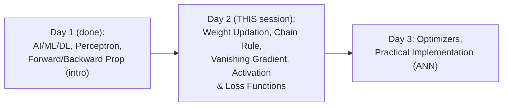

#### 🎯 Key Takeaways

* This session is the **direct, mathematical continuation** of Day 1 — it re-establishes the same three-input, single-hidden-neuron network before immediately deepening into genuine derivative-level mathematics.
* The instructor's own stated goal is genuine, complete rigor: *"I will not leave out any, even a single math, in this"* — a direct contrast to a purely conceptual, hand-wavy treatment.
* The session runs long (roughly 1 hour 40 minutes, per the instructor's own closing acknowledgment) specifically because of this commitment to full mathematical completeness.

---

### 2. The Weight Updation Formula & Why Gradient Descent Works

#### 📖 Definition — The Weight Updation Formula, Precisely Stated

> 💡 **Given directly:** *"The weight updation formula is very, very simple -- I will write a generic formula: w_new is equal to w_old minus learning rate, derivative of loss with respect to derivative of w_old."*

```text
w_new = w_old - learning_rate × (∂Loss / ∂w_old)
```

#### 📖 Definition — Gradient Descent, Precisely Connected to the Loss Curve

> 💡 **Given directly:** *"We basically get this kind of curve, and this is basically called as gradient descent -- this gradient descent is nothing but it is the graph with respect to weights and the loss function... this point is basically called as global minima -- when we are training and updating the weights, we definitely have to come to this particular point."*

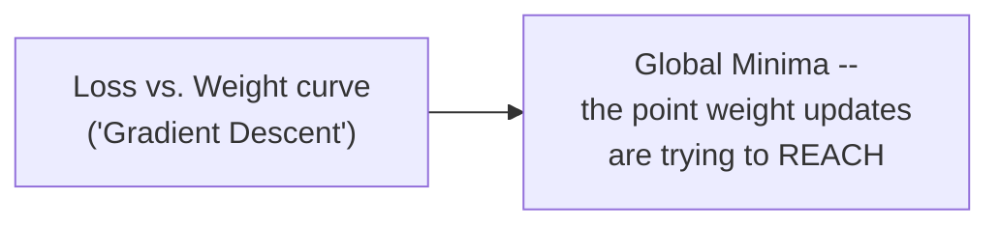

#### 🪜 Step-by-Step — The Precise, Geometric Proof: Why the Formula Genuinely Works

> 💡 **Given directly, the complete, worked case for a NEGATIVE slope:** *"Whenever this right side of the line is pointing downwards, then we should basically understand that this is a negative slope... my main target should be that I should be increasing this weight... w_new is equal to w_old minus learning rate of some NEGATIVE value... w_old NEGATIVE into NEGATIVE will be a POSITIVE value... my w_new will always be greater than w_old."*

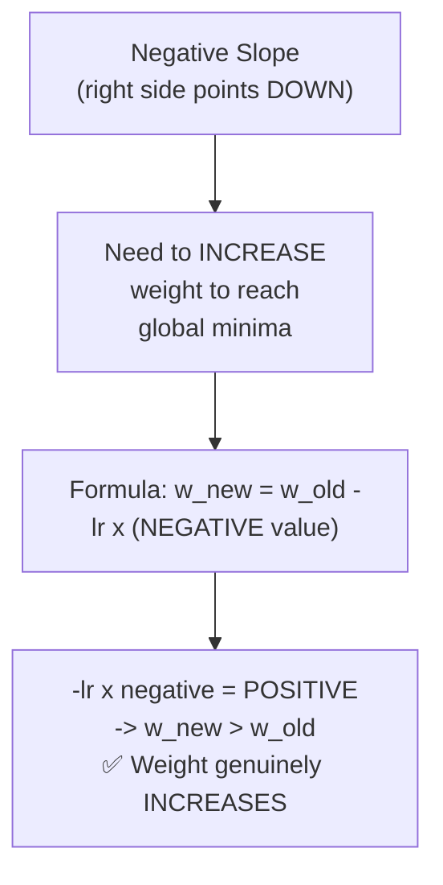

> 💡 **Given directly, the complete, worked case for a POSITIVE slope:** *"In this particular case, this will basically be a positive slope... in order to come away, I have to DECREASE this weight... if I put this positive slope in this equation... w_new will be w_old minus learning rate of some POSITIVE value... w_new will be LESS than w_old."*

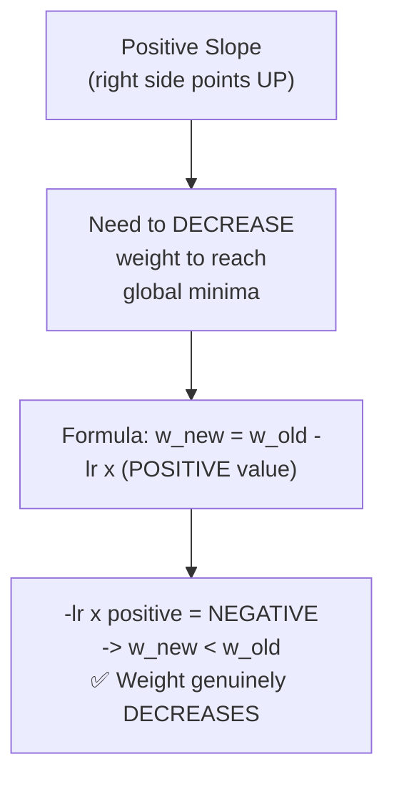

#### 🔍 Internal Working — The Learning Rate, Precisely Explained

> 💡 **Given directly:** *"It is always a good practice that our learning rate should be a small number -- if it is a small number, we will be slowly converging into the global minima... if I probably take a larger number... my weight points will be jumping here and there, and it may be a situation that it may never come to the global minima... the learning rate that I usually take, or any probably researchers usually take, is somewhere around 0.001, or you can also take 0.01."*

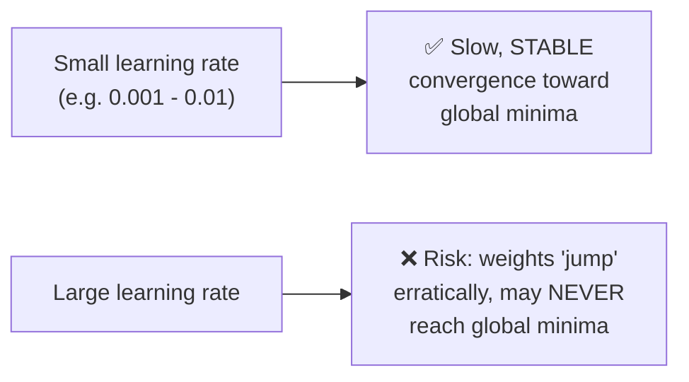

#### ⚠ Common Mistakes

* Assuming the weight updation formula's correctness must simply be taken on faith — explicitly, directly proven via a genuine, geometric, sign-based argument tracing exactly how negative and positive slopes each correctly push the weight toward the global minima.
* Assuming a larger learning rate always converges faster and is therefore preferable — explicitly, directly corrected: a large learning rate risks genuinely OVERSHOOTING and never converging, making a small, stable learning rate the recommended practice.

#### 🎯 Key Takeaways

* The **weight updation formula** (`w_new = w_old - learning_rate × ∂Loss/∂w_old`) is not just stated but genuinely PROVEN, via a precise, sign-based geometric argument: a negative slope correctly increases the weight; a positive slope correctly decreases it — both cases converging toward the global minima.
* **Gradient descent** is the graph of loss plotted against weight values, with the **global minima** being the specific point where this loss is genuinely minimized.
* The **learning rate** should genuinely be a SMALL number (typically 0.001-0.01) — a larger value risks the weight "jumping" erratically and potentially never reaching the global minima.

---
### 3. Chain Rule of Differentiation: Three Worked Examples

#### ❓ Why It Exists — The Precise, Motivating Question

> 💡 **Given directly:** *"How this derivative of loss with respect to derivative of w_old happens, we need to understand... how w4 will get updated?"*

#### 🪜 Step-by-Step — Worked Example 1: Updating w4 (Directly Connected to Output)

> 💡 **Given directly, the complete, worked chain:** *"Since this is my loss... loss is dependent on the O2 value first of all... derivative of loss with respect to derivative of O2 -- and then, according to the chain rule, the next step... O2 is now dependent on w4... derivative of O2 divided by derivative of w4. Now here, if I cross this two -- if I cross this two, then what will happen, I will be getting this only, right, this will be my w4_old."*

```text
∂Loss/∂w4_old = (∂Loss/∂O2) × (∂O2/∂w4_old)
```

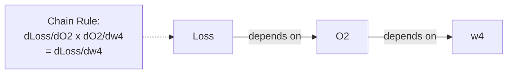

#### 🪜 Step-by-Step — Worked Example 2: Updating w1 (Two Steps Further Back)

> 💡 **Given directly, the complete, worked chain:** *"Loss is first of all dependent on O2, so what I will write is derivative of loss with respect to derivative of O2... now O2 is dependent on O1, you can see over here... so in the next step what I will write is derivative of O2 divided by derivative of O1... and the next step, what we are basically doing, O1 is now dependent on w1... derivative of O1 divided by derivative of w1_old."*

```text
∂Loss/∂w1_old = (∂Loss/∂O2) × (∂O2/∂O1) × (∂O1/∂w1_old)
```

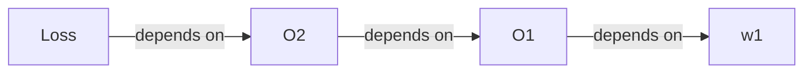

> 💡 **Given directly, an explicit, self-assigned exercise for the audience:** *"Just try it out with respect to w2, with respect to w2, what will be my updation formula?"* -- the chain follows the identical pattern: `∂Loss/∂w2_old = (∂Loss/∂O2) × (∂O2/∂O1) × (∂O1/∂w2_old)`.

#### 🪜 Step-by-Step — Worked Example 3: A Genuinely Branching, Multi-Path Network

> 💡 **Given directly, the complete, worked scenario, involving TWO separate chains that must be combined:** *"There are two routes that you can basically see over here -- the first route goes in this way: loss is dependent on O31, O31 is dependent on O21, O21 is dependent on O11, and O11 is dependent on w1 -- this is one root. And the other root is something... that is basically dependent on this, in order to update w1... how do I combine these two things?"*

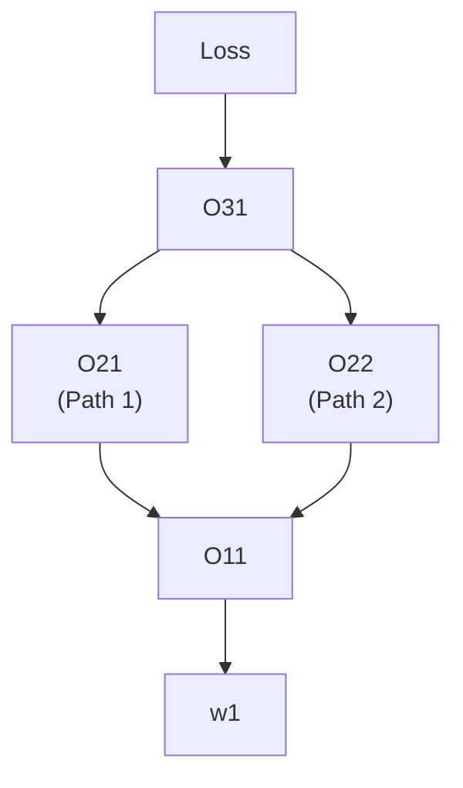

> 💡 **Given directly, the precise, stated resolution -- combining the two paths via addition ("just like an OR operation"):** *"When I combine both of them, it is just like an OR operation... first of all let's go on the topmost path... derivative of loss derivative of loss with respect to derivative of O31, then multiplied by derivative of O31 divided by derivative of O21, then multiplied by derivative of O21 divided by O11... and then again multiplied by derivative of O11 divided by derivative of w1_old -- this is the first part... now in the second part, I will be adding one more, that is the LOWER path."*

```text
∂Loss/∂w1_old =
  [ (∂Loss/∂O31) × (∂O31/∂O21) × (∂O21/∂O11) × (∂O11/∂w1_old) ]     <- Path 1
  +
  [ (∂Loss/∂O31) × (∂O31/∂O22) × (∂O22/∂O11) × (∂O11/∂w1_old) ]     <- Path 2
```

> 💡 **Given directly, the precise, general rule this example establishes:** *"So we have to add this both up, and then we will be able to get the solution for the weight updation formula in the backward propagation... since we are learning chain rule of differentiation, it can be expanded to any manner you want, but at the end of the day you will be getting this specific thing only."*

#### ⚠ Common Mistakes

* Assuming the chain rule always involves exactly one, single path from loss back to a given weight — explicitly, directly corrected via the multi-path example: when a weight genuinely influences the final loss through MULTIPLE distinct paths, each path's own chain must be computed SEPARATELY and then ADDED together.
* Assuming updating a weight closer to the output (like w4) requires the same LENGTH of chain as updating a weight closer to the input (like w1) — explicitly, directly demonstrated as false: weights further from the output genuinely require LONGER chains, since more intermediate dependencies must be traversed.

#### 🎯 Key Takeaways

* The **chain rule of differentiation** computes `∂Loss/∂w` by tracing the FULL dependency path from loss back to that specific weight, multiplying each intermediate derivative along the way.
* Weights closer to the output (like w4) require **shorter chains**; weights closer to the input (like w1) require **longer chains**, since more intermediate layers/outputs must be traversed.
* When a weight genuinely influences the loss through **multiple, distinct paths** (a branching network), each path's own chain is computed separately, and the results are **added together** — directly demonstrated via a real, worked, two-path example.

---

### 4. The Vanishing Gradient Problem: Precisely Traced Through Sigmoid

#### ❓ Why It Exists — Explicitly Flagged as a Critical Interview Topic

> 💡 **Given directly:** *"Vanishing gradient problem is a major, major problem... what exactly is vanishing gradient, super important interview question, super, super important interview question."*

#### 🪜 Step-by-Step — Setting Up a Deep Network With Sigmoid Everywhere

> 💡 **Given directly:** *"Let's say I have a very deep neural network... now in this neural network we need to understand two important things, which is super important for any interview."*

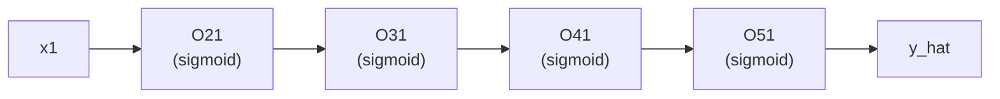

#### 🔍 Internal Working — The Precise, Bounded Range of Sigmoid's Derivative

> 💡 **Given directly, the critical, precisely-stated mathematical fact:** *"Whenever we try to find out the derivative of sigmoid, it will be ranging between 0 to 0.25 -- so if I write, 0 is less than or equal to sigmoid derivative of Y, is always ranging between 0 to 0.25, this is basically my derivative condition."*

```text
0 ≤ σ'(y) ≤ 0.25   (sigmoid's derivative is ALWAYS bounded in this range)
```

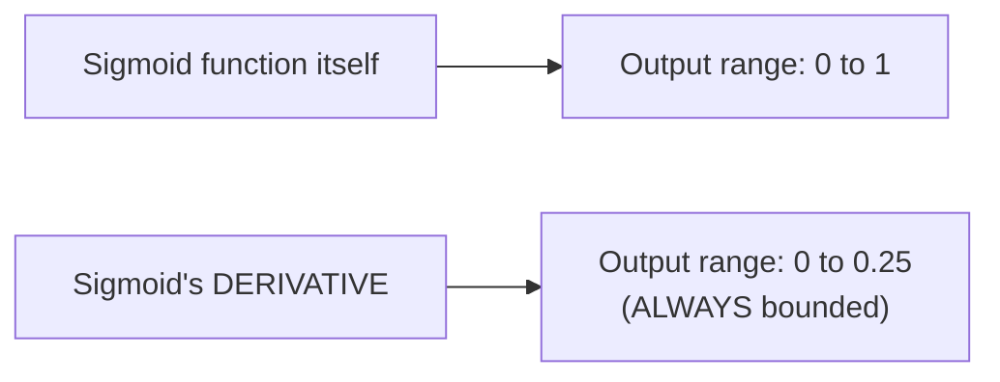

#### 🪜 Step-by-Step — Precisely Tracing How This Produces a Vanishing Update

> 💡 **Given directly, the complete, mechanistic chain of reasoning:** *"Since we are using the sigmoid activation function everywhere, in the backward propagation, when I'm finding the derivative... everywhere sigmoid activation function is getting used, and because of the sigmoid activation function... the value will always be ranging between 0 to 0.25... let's say for this my derivative I got it as 0.25... and it will keep on decreasing, like 0.1, then 0.05, then 0.02... because as we are going through this chain rule... always we are trying to get this particular value, and it is always going to get reduced until we go to the end of the chain."*

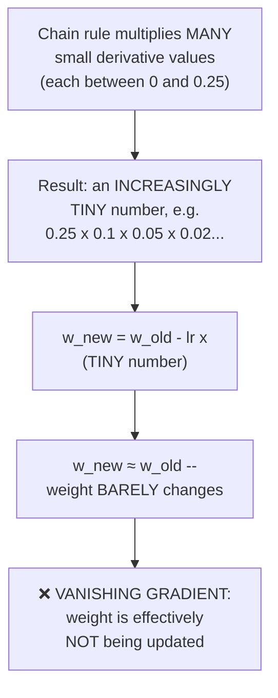

#### 📖 Definition — Vanishing Gradient, Precisely, Concisely Defined

> 💡 **Given directly:** *"This situation where weights are not getting updated -- it is just getting updated by a smaller value -- this problem is basically called as vanishing gradient problem... my w_new and w_old are approximately equal, and that is the reason, no change in the weights are happening."*

#### 🏢 Real-World / Production Usage — Precisely Why the Fix Is a New Activation Function

> 💡 **Given directly:** *"How to solve this vanishing gradient problem? Use another activation function -- that is the reason why we came up with another activation function."*

#### ⚠ Common Mistakes

* Assuming vanishing gradient is a vague, poorly-understood phenomenon — explicitly, directly, precisely traced to a specific, provable mathematical cause: sigmoid's derivative is bounded to [0, 0.25], and repeated multiplication of such small numbers (across a deep chain rule) mathematically guarantees an increasingly tiny result.
* Assuming this problem is specific to sigmoid ALONE and could never affect other activation functions — implicitly clarified later (Section 5): tanh, despite improving the derivative RANGE to [0, 1], can STILL suffer from vanishing gradient in sufficiently deep networks — the problem is fundamentally about bounded derivatives multiplied many times, not sigmoid specifically.

#### 🎯 Key Takeaways

* **Sigmoid's derivative is mathematically bounded between 0 and 0.25** — a precise, provable fact directly responsible for the vanishing gradient problem.
* In a deep network using sigmoid throughout, the chain rule **multiplies many such small (≤0.25) values together**, producing an increasingly tiny result as the chain lengthens.
* This tiny result causes `w_new ≈ w_old` in the weight updation formula — the weight is **effectively not being updated at all**, meaning the network genuinely stops learning at that point.
* The genuine fix is **using a different activation function** — directly motivating the tour of tanh, ReLU, and their variants covered next.

---
### 5. Activation Functions, Compared: Sigmoid, Tanh, ReLU, Leaky ReLU & Beyond

#### 📖 Definition — Sigmoid, Revisited With Its Full Advantage/Disadvantage List

> 💡 **Given directly, the complete list:**
> - **Advantages**: *"Smooth gradient, prevents jump in output value... normalizing the output of each neuron, clear prediction very close to 1 or 0."*
> - **Disadvantages**: *"Prone to gradient vanishing... function output is not zero-centered... power operations are relatively time-consuming"* (due to its exponential term).

```text
Sigmoid: σ(x) = 1 / (1 + e^-x)
Range: 0 to 1 | Derivative range: 0 to 0.25
```

#### 📖 Definition — Tanh (Hyperbolic Tangent), the First Genuine Improvement

> 💡 **Given directly:** *"The formula looks something like this -- e to the power of x minus e to the power of minus x, divided by e to the power of x plus e to the power of minus x -- here you can see that my value ranges between minus 1 to plus 1... and in the case of derivative, it will be ranging between 0 to 1."*

```text
Tanh: (e^x - e^-x) / (e^x + e^-x)
Range: -1 to +1 | Derivative range: 0 to 1
```

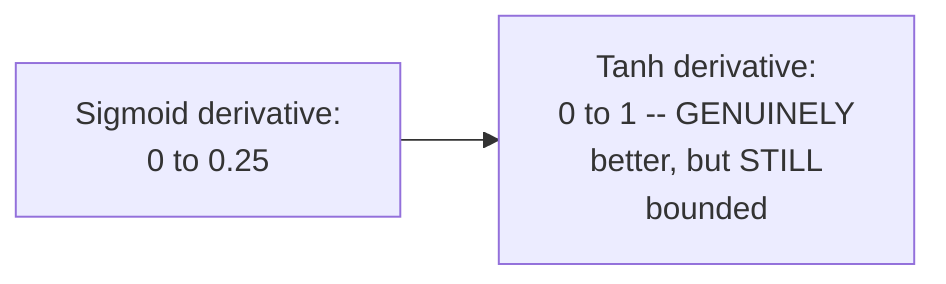

> 💡 **Given directly, a genuinely honest, important caveat:** *"Does this prevent vanishing gradient problem? Still there will be an issue, right, guys, if we go on constructing a deep neural network, at one point of time there may be chances that vanishing gradient problems still exist."*

> 💡 **Given directly, a practical, stated use case:** *"In binary classification problem, we basically use tanh functions for the hidden layer and sigmoid for the output layer."*

#### 📖 Definition — ReLU, the Modern, Default Activation Function

> 💡 **Given directly:** *"Right now it is the most popular activation function which is being used by any everyone... that activation function is nothing but ReLU -- full form is Rectified Linear Unit -- the formula is nothing but max(0, x)... whenever the x value is negative, it becomes 0, whenever it is positive, it will come to that same positive value."*

```text
ReLU: max(0, x)
Derivative: either 0 or 1
```

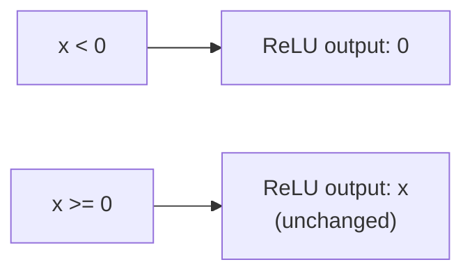

> 💡 **Given directly, the genuine advantages:** *"Here you don't have any exponential operation... it is obviously solving the vanishing gradient problem... the ReLU function has a linear relationship, whether it is forward or backward, it is much faster than sigmoid and tanh."*

#### ⚠ A Direct, Precise Explanation of ReLU's Own "Dead Neuron" Problem

> 💡 **Given directly:** *"This is again a major concern, guys -- because let's say if one of the weights during the derivative... becomes zero, this neuron... will become DEAD during the back propagation... if it becomes zero in the back propagation, that entire derivative chain rule... will become zero, right, when this is becoming zero, w_new will be approximately equal to w_old... that neuron will be completely dead."*

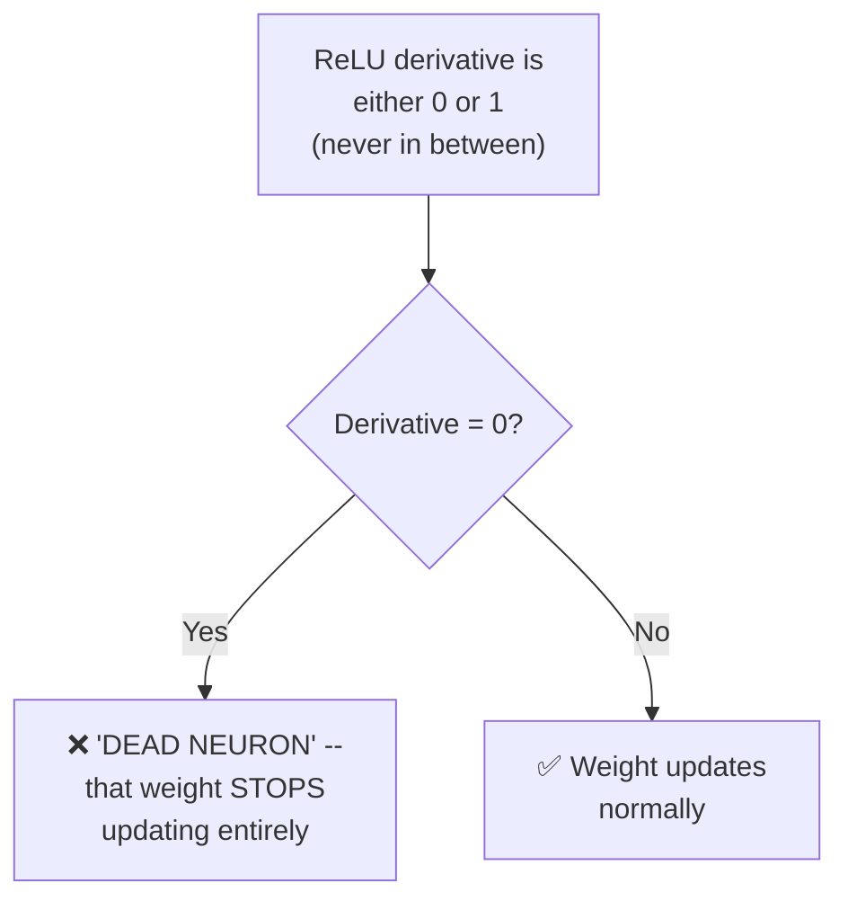

#### 📖 Definition — Leaky ReLU, the Fix for Dead Neurons

> 💡 **Given directly:** *"Only one thing is basically getting changed, where they are not saying that it will be 0, but it will be 0.01 multiplied by that x value... leaky ReLU function solves the dead neuron problem that was basically happening in ReLU."*

```text
Leaky ReLU: x if x > 0, else 0.01x
```

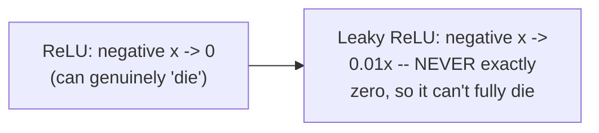

#### 📖 Definition — Further Variants, Briefly Named

> 💡 **Given directly, on ELU (Exponential Linear Units):** *"Whenever the x value is greater than 0, we have x, otherwise we apply this particular operation... again no dead ReLU issue, this means the output is close to 0, zero-centered -- one small problem, it is slightly more computationally expensive because we are using exponential value."*

> 💡 **Given directly, on PReLU (Parametric ReLU):** *"If a_i is 0, it becomes ReLU. If a_i is greater than 0, it becomes leaky ReLU. If a_i is a learnable parameter, it becomes PReLU."*

> 💡 **Given directly, on Swish:** *"There is also another activation function which is called a Swish, a self-gated function -- I think this is brought by Google itself."*

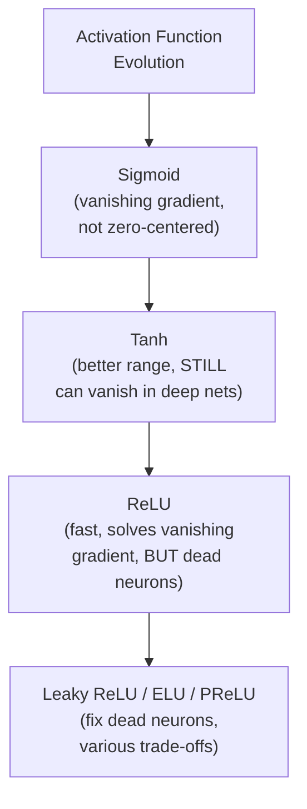

#### ⚠ Common Mistakes

* Assuming tanh fully, permanently SOLVES the vanishing gradient problem simply because its derivative range is better than sigmoid's — explicitly, directly corrected: it's a genuine improvement, but sufficiently DEEP networks can still suffer from vanishing gradient even with tanh.
* Assuming ReLU has NO disadvantages, since it's the modern default — explicitly, directly corrected: it has a real, genuine "dead neuron" problem, precisely why leaky ReLU and other variants were subsequently developed.

#### 🎯 Key Takeaways

* **Sigmoid** (derivative range 0-0.25) and **tanh** (derivative range 0-1, zero-centered) both genuinely risk vanishing gradient in sufficiently deep networks — tanh is an improvement, not a complete fix.
* **ReLU** (`max(0,x)`) solves vanishing gradient and is genuinely fast (no exponential computation), but introduces its own **"dead neuron" problem** — once a neuron's derivative becomes exactly 0, its weight effectively stops updating forever.
* **Leaky ReLU** (`0.01x` for negative inputs, instead of exactly 0) directly fixes the dead-neuron problem, since the derivative is never exactly zero — with **ELU, PReLU, and Swish** offered as further, more specialized variants.

---
### 6. Which Activation Function Where: A Practical Decision Rule

#### 📖 Definition — The Genuinely Simple, Memorable Rule for Binary Classification

> 💡 **Given directly:** *"In the hidden layer, try to use ReLU activation function -- in the hidden layer, always use ReLU activation function, it is the most efficient activation function... in the output layer, if this is a binary classification problem, use sigmoid activation function."*

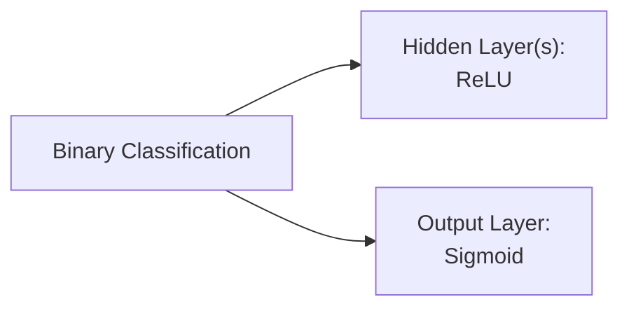

#### 📖 Definition — The Rule for Multi-Class Classification

> 💡 **Given directly:** *"In the case of multi-class classification problem... use another activation function which is called as softmax."*

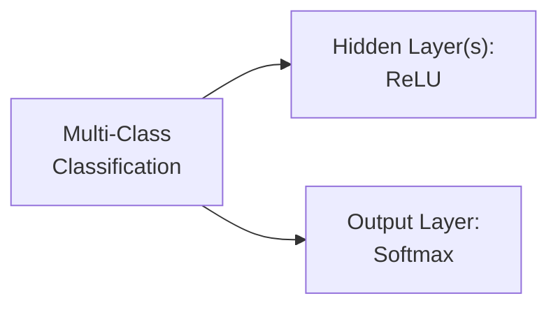

#### 📖 Definition — The Rule for Regression

> 💡 **Given directly:** *"In the case of regression problem statement... here in the hidden layer, use ReLU or any variation of ReLU, but in the output layer, use an activation function which is called as linear activation function."*

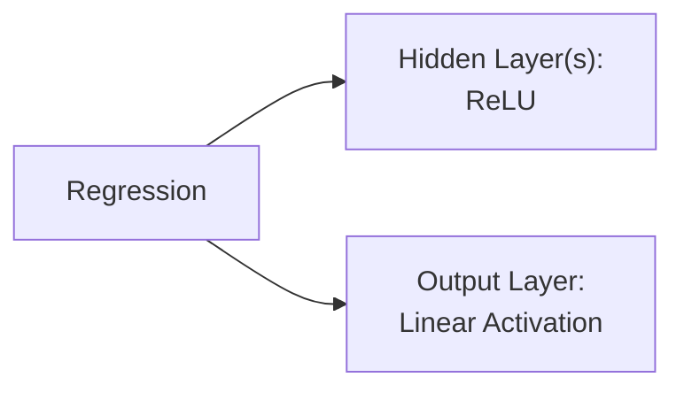

#### 🔍 Internal Working — What to Do if Convergence Fails

> 💡 **Given directly:** *"With the help of ReLU, if the convergence is not happening... you can change this ReLU to something called as PReLU or ELU."*

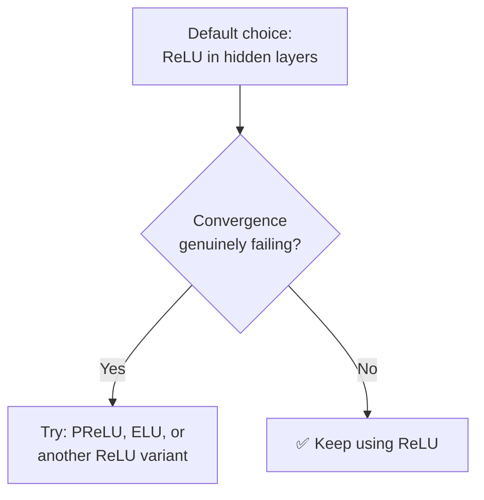

#### ⚠ Common Mistakes

* Assuming the output layer's activation function should match the hidden layers' — explicitly, directly corrected: hidden layers consistently use ReLU (by default), but the OUTPUT layer's activation function depends entirely on the PROBLEM TYPE (sigmoid, softmax, or linear).
* Assuming ReLU is a mandatory, unchangeable choice for hidden layers — explicitly, directly clarified: it's the recommended DEFAULT, but genuinely replaceable with PReLU, ELU, or other variants if convergence issues arise.

#### 🎯 Key Takeaways

* **ReLU is the default hidden-layer activation function** across ALL three major problem types (binary classification, multi-class classification, regression) — a genuinely simple, memorable rule.
* The **output layer's activation function is problem-specific**: sigmoid for binary classification, softmax for multi-class classification, linear activation for regression.
* If convergence genuinely fails with default ReLU, the recommended fallback is trying **PReLU or ELU** as alternatives.

---

### 7. Loss vs. Cost Function: Single Record vs. Batch

#### 📖 Definition — Loss Function, Precisely Scoped to a Single Record

> 💡 **Given directly:** *"During the forward propagation, what happens -- I pass ONE record, I calculate the y_hat, and then I calculate the loss, and the formula is very simple, y minus y_hat whole square, and then I basically do the backward propagation -- this happens usually for every record."*

```text
Loss (single record) = (1/2)(y - ŷ)²
```

#### 📖 Definition — Cost Function, Precisely Scoped to a Batch

> 💡 **Given directly:** *"This is not an efficient scenario -- suppose if I have 100 records, I can set up a batch size... I can basically say at every forward propagation, pass 10 records, and when you are passing the 10 records, then you calculate the loss for the 10 records... whenever I pass a batch, then the formula will be changing -- instead of loss, I will try to write this as cost function."*

```text
Cost (batch of n records) = (1/n) × Σ(i=1 to n) (1/2)(yi - ŷi)²
```

```mermaid
flowchart LR
    A["Loss Function"] --> B["ONE data point<br/>at a time"]
    C["Cost Function"] --> D["A BATCH of data<br/>points at once"]
```

#### 🔍 Internal Working — Direct Connection to the Concept of an Epoch

> 💡 **Given directly:** *"In the forward and the backward propagation, in every propagation, in every epoch -- we also see it as epochs -- we pass a batch of records, not just a single record."*

#### ⚠ Common Mistakes

* Using "loss function" and "cost function" as fully interchangeable terms — explicitly, directly distinguished: loss applies to a SINGLE data point; cost applies to a BATCH of data points, averaged.

#### 🎯 Key Takeaways

* **Loss function** measures the error for a SINGLE data point/record; **cost function** measures the AVERAGE error across a BATCH of records — a precise, important distinction.
* This directly connects to the practical concept of an **epoch** — training genuinely processes data in batches, not one record at a time, for efficiency.

---
### 8. Regression Loss Functions: MSE, MAE & Huber Loss

#### 📖 Definition — Mean Squared Error (MSE), Precisely Introduced

> 💡 **Given directly:** *"Loss function will be written like this, the cost function will be written like this... this formula that you are able to see, this formula is basically called as quadratic equation."*

```text
MSE (loss, single record): (1/2)(y - ŷ)²
MSE (cost, batch): (1/2n) × Σ(y - ŷ)²
```

#### 🔍 Internal Working — MSE's Three Genuine Advantages

> 💡 **Given directly, the complete list:**
> - *"It is definitely differentiable."*
> - *"It has only one local or global minima -- not more than one."*
> - *"It converges faster."*

```mermaid
flowchart TD
    A["MSE (Quadratic Equation)"] --> B["✅ Differentiable"]
    A --> C["✅ Only ONE global<br/>minimum -- no local<br/>minima traps"]
    A --> D["✅ Converges faster"]
```

#### ⚠ MSE's One, Genuinely Major Disadvantage: Outlier Sensitivity

> 💡 **Given directly, the complete, worked example:** *"It is NOT robust to outliers -- big issue, big, big issue... let's say I have a data point which looks like this, let's say I have outliers -- if I remove this outliers, obviously my linear regression line will get created like this... but now if I have some outliers... my line will look like this... why this line changes so much? Because we are penalizing the error -- we are SQUARING the error."*

```mermaid
flowchart LR
    A["Squaring the error<br/>(y - y_hat)^2"] --> B["Large errors get<br/>DISPROPORTIONATELY<br/>penalized"]
    B --> C["A single outlier can<br/>substantially SHIFT<br/>the best-fit line"]
```

#### 📖 Definition — Mean Absolute Error (MAE), the Fix for Outlier Sensitivity

> 💡 **Given directly:** *"My loss function formula will be 1/2, absolute of y minus y_hat... we are not squaring it, so definitely the major advantage will be that it is ROBUST to outliers -- because now we are not penalizing... we are taking the absolute value."*

```text
MAE (loss, single record): (1/2)|y - ŷ|
MAE (cost, batch): (1/2n) × Σ|y - ŷ|
```

```mermaid
flowchart LR
    A["MSE: squares the error"] --> B["Outliers heavily<br/>penalized -- LARGE<br/>shift in best-fit line"]
    C["MAE: absolute value<br/>of the error"] --> D["Outliers moderately<br/>penalized -- SMALLER<br/>shift in best-fit line"]
```

#### ⚠ MAE's Own Disadvantage: Requires Sub-Gradient Computation

> 💡 **Given directly:** *"For this, the derivative will not be simple -- we have to basically take SUB-GRADIENT... because here we don't have any kind of [smooth] curve, we have to take part by part... it is time-consuming, time constraint is there."*

#### 📖 Definition — Huber Loss, a Genuine Hybrid of MSE and MAE

> 💡 **Given directly:** *"Huber loss, in short, is the combination of mean squared error and mean absolute error... if the difference is less than this value [a hyperparameter delta], then probably I will go with this [MSE-like formula], because this will denote whether there is an outlier or not present."*

```text
Huber Loss:
  If |y - ŷ| ≤ δ:  (1/2)(y - ŷ)²           <- MSE-like (no outlier)
  Otherwise:        δ|y - ŷ| - (1/2)δ²       <- MAE-like (genuine outlier)
```

```mermaid
flowchart TD
    A["|y - y_hat| <= delta?"] -->|Yes -- NO outlier| B["Use MSE-style formula<br/>(smooth, fast convergence)"]
    A -->|No -- genuine outlier| C["Use MAE-style formula<br/>(robust, less penalizing)"]
```

#### ⚠ Common Mistakes

* Assuming MSE is always the "default" or "best" regression loss function — explicitly, directly qualified: it's genuinely excellent EXCEPT for its major outlier-sensitivity weakness, which MAE and Huber Loss specifically address.
* Assuming MAE has no genuine trade-off compared to MSE — explicitly, directly clarified: it trades away MSE's smooth, single-step differentiability for outlier robustness, requiring the more involved sub-gradient computation instead.

#### 🎯 Key Takeaways

* **MSE** is a quadratic equation — differentiable, single global minimum, fast convergence — but genuinely SENSITIVE to outliers, since squaring disproportionately penalizes large errors.
* **MAE** uses the absolute value instead of squaring — genuinely ROBUST to outliers — but requires sub-gradient computation, since its curve isn't smoothly differentiable everywhere.
* **Huber Loss** is a genuine hybrid: MSE-like when the error is small (no outlier), MAE-like when the error exceeds a hyperparameter threshold (delta) — combining both functions' strengths based on whether a genuine outlier is detected.

---

### 9. Classification Loss Functions: Binary & Categorical Cross-Entropy

#### 📖 Definition — Binary Cross-Entropy (Log Loss), Precisely Connected to Logistic Regression

> 💡 **Given directly:** *"In binary cross-entropy, we basically use a loss function which will be a LOG LOSS function, which is given by minus y log of y_hat minus (1 minus y) multiplied by log of (1 minus y_hat)... this is the loss that is used in logistic regression also, because logistic regression is a binary classification problem."*

```text
Binary Cross-Entropy: -y·log(ŷ) - (1-y)·log(1-ŷ)
```

> 💡 **Given directly, the precise, simplified, case-by-case breakdown:** *"Whenever this y is 0... we just have this minus log(1 - y_hat)... and log of y_hat if y is equal to 1... this entire thing will become 0, so I'll be having minus log of y_hat."*

```mermaid
flowchart TD
    A["y = 0"] --> B["Loss = -log(1 - y_hat)"]
    C["y = 1"] --> D["Loss = -log(y_hat)"]
```

> 💡 **Given directly, precisely connecting y_hat back to sigmoid:** *"How do we calculate y_hat? The y_hat calculation is very simple, right, we basically use the sigmoid activation function in the last layer -- this is how we basically come up with y_hat, for y we then apply this log loss on top of it, and then we do the back propagation."*

#### 📖 Definition — Categorical Cross-Entropy, for Multi-Class Problems

#### 🪜 Step-by-Step — Step 1: One-Hot Encoding the Target

> 💡 **Given directly:** *"Since this is a multi-class classification problem... first of all what we do is that we convert this into a ONE-HOT ENCODED format... wherever the good value is, that becomes 1, and remaining all becomes 0."*

```text
Example (3 classes: Good, Bad, Neutral):
"Good"    -> [1, 0, 0]
"Bad"     -> [0, 1, 0]
"Neutral" -> [0, 0, 1]
```

#### 📖 Definition — The Complete Categorical Cross-Entropy Formula

> 💡 **Given directly:** *"Loss is equal to... summation of j is equal to 1 to c -- c basically means number of categories -- y of ij multiplied by log to the base e, y of ij hat."*

```text
Loss = -Σ(j=1 to C) yij × log(ŷij)
where C = number of categories
```

#### 🪜 Step-by-Step — Step 2: y_hat via the Softmax Activation Function

> 💡 **Given directly, the complete formula:** *"y_ij_hat is basically through another activation function which is called as softmax activation function... the formula is nothing but: softmax of any z value is nothing but e^zi divided by summation of j=1 to k, e^zj."*

```text
Softmax: σ(zi) = e^zi / Σ(j=1 to k) e^zj
```

#### 🪜 Step-by-Step — A Complete, Worked Softmax Example

> 💡 **Given directly, the complete, worked numerical example:** *"Let's say the values that I'm actually getting after multiplying through the weights are something like this -- 10, 20, 30, 40, and 50... in order to find out the probability for THIS first thing -- e to the power of 10 divided by (e to the power of 10 plus 20 plus 30 plus 40 plus 50)... I will be getting it in the form of probability, like 0.4, 0.5, 0.6 -- but ALWAYS REMEMBER, both this probability summation will be equal to 1."*

```text
softmax(10) = e^10 / (e^10 + e^20 + e^30 + e^40 + e^50)
-- every class gets a probability; ALL probabilities sum to exactly 1
```

```mermaid
flowchart LR
    A["Raw output values<br/>(10, 20, 30, 40, 50)"] --> B["Softmax Activation"]
    B --> C["Probabilities<br/>(sum to EXACTLY 1)"]
    C --> D["Highest probability<br/>-> predicted class"]
```

#### ⚠ Common Mistakes

* Assuming binary cross-entropy and categorical cross-entropy are the same formula, just used for different numbers of classes — explicitly, directly distinguished: binary cross-entropy directly uses y and (1-y) as a two-term formula; categorical cross-entropy requires ONE-HOT ENCODING and a SUMMATION across all categories, paired specifically with softmax (not sigmoid).
* Assuming softmax outputs are independent probabilities that could each range freely — explicitly, directly clarified: ALL of softmax's output probabilities together must sum to EXACTLY 1, since they represent a genuine, complete probability distribution across all classes.

#### 🎯 Key Takeaways

* **Binary Cross-Entropy** (`-y·log(ŷ) - (1-y)·log(1-ŷ)`) is precisely the SAME log loss used in logistic regression — paired with sigmoid activation to compute `ŷ`.
* **Categorical Cross-Entropy** requires two extra steps: converting the target into **one-hot encoded** format, and computing `ŷ` via the **softmax activation function**, which guarantees all class probabilities sum to exactly 1.
* A complete, numerical softmax example (raw values 10, 20, 30, 40, 50) directly demonstrates HOW raw neuron outputs become genuine, normalized class probabilities.

---
### 10. Closing: The Complete Rule Table & Roadmap

#### 📖 Definition — The Instructor's Own, Complete, Closing Summary Table

> 💡 **Given directly, the complete, precise closing summary:** *"Suppose I use ReLU in middle layer and a softmax in the output layer, this becomes a multi-class classification problem... if I use ReLU and sigmoid, then this becomes a binary classification problem, and loss function -- obviously you know that... in linear regression, we will definitely use ReLU, but in the output layer we have now linear activation function, and what is the loss that I apply over here, it will be MSE or MAE, or it may be Huber loss... for multi-class, it will be categorical cross-entropy loss function, and for this it will be binary cross-entropy loss function."*

| Problem Type | Hidden Layer Activation | Output Layer Activation | Loss Function |
|---|---|---|---|
| **Binary Classification** | ReLU | Sigmoid | Binary Cross-Entropy |
| **Multi-Class Classification** | ReLU | Softmax | Categorical Cross-Entropy |
| **Regression** | ReLU | Linear | MSE, MAE, or Huber Loss |

```mermaid
flowchart TD
    A["Problem Type?"] --> B["Binary Classification:<br/>ReLU (hidden) + Sigmoid<br/>(output) + Binary<br/>Cross-Entropy"]
    A --> C["Multi-Class:<br/>ReLU (hidden) + Softmax<br/>(output) + Categorical<br/>Cross-Entropy"]
    A --> D["Regression:<br/>ReLU (hidden) + Linear<br/>(output) + MSE/MAE/Huber"]
```

#### 🪜 Step-by-Step — The Explicit, Stated Roadmap Ahead

> 💡 **Given directly:** *"Tomorrow we're going to discuss about optimizers -- optimizer will be quite fun... once we complete optimizers, we can see some examples of how to implement an ANN, and probably we will try to complete it tomorrow itself."*

```mermaid
flowchart LR
    A["Day 2 (done):<br/>Chain Rule, Vanishing<br/>Gradient, Activation &<br/>Loss Functions"] --> B["Day 3: Optimizers +<br/>Practical ANN<br/>Implementation"]
```

#### 🎯 Key Takeaways

* The session closes with a **complete, memorable summary table** directly mapping problem type (binary, multi-class, regression) to the correct hidden-layer activation, output-layer activation, and loss function — explicitly framed as genuinely interview-relevant.
* **Day 3** is explicitly, directly planned to cover **optimizers** in depth, followed by the first **practical, hands-on ANN implementation** of the series.

---

## 📝 Glossary

| Term | Definition | Why It Matters |
|---|---|---|
| **Global Minima** | The point on the loss-vs-weight curve where loss is genuinely minimized | The target gradient descent converges toward |
| **Learning Rate** | A small constant controlling weight update step size | Should be small (e.g. 0.001-0.01) for stable convergence |
| **Chain Rule of Differentiation** | Computing a derivative by tracing dependency paths and multiplying | The mechanism underlying backward propagation |
| **Vanishing Gradient** | Weight updates become negligibly small, effectively halting learning | Caused by multiplying many small, bounded derivatives |
| **Dead Neuron** | A ReLU neuron whose derivative permanently becomes 0 | ReLU's own major disadvantage; fixed by Leaky ReLU |
| **Softmax** | Converts raw outputs into probabilities summing to exactly 1 | Used in the output layer for multi-class classification |
| **Loss Function** | Error measurement for a SINGLE data point | Distinct from cost function |
| **Cost Function** | Average error measurement across a BATCH of data points | Used in practice, since training processes batches |
| **MSE** | Mean Squared Error -- squares the error; sensitive to outliers | The default, but imperfect, regression loss |
| **MAE** | Mean Absolute Error -- robust to outliers, requires sub-gradient | The outlier-robust alternative to MSE |
| **Huber Loss** | A hyperparameter-controlled hybrid of MSE and MAE | Combines both functions' strengths |
| **Binary Cross-Entropy** | The log-loss function for binary classification | Identical to logistic regression's own loss |
| **Categorical Cross-Entropy** | The loss function for multi-class classification | Requires one-hot encoding + softmax |

---

## 🔄 Revision Notes — One-Minute Revision

* This is **Day 2 of the 5-day series** -- the mathematical core, with the instructor explicitly committing to leaving out "not even a single math."
* **Weight updation formula**: `w_new = w_old - learning_rate x dLoss/dw_old` -- GEOMETRICALLY PROVEN: a negative slope increases the weight (negative x negative = positive), a positive slope decreases it -- both converging toward the **global minima**. Learning rate should be SMALL (0.001-0.01) to avoid erratic "jumping."
* **Chain rule of differentiation**: traces the FULL dependency path from loss back to a given weight, multiplying each intermediate derivative. Weights closer to output need SHORTER chains; weights closer to input need LONGER chains. In a BRANCHING network, multiple paths' chains are computed separately and ADDED together.
* **Vanishing gradient problem**: sigmoid's derivative is mathematically bounded to **[0, 0.25]** -- multiplying many such small values (across a deep chain rule) produces an increasingly tiny weight update, meaning `w_new ≈ w_old` -- the network effectively stops learning. Fixed by using a different activation function.
* **Activation functions, compared**: Sigmoid (derivative 0-0.25, not zero-centered) -> Tanh (derivative 0-1, zero-centered, STILL can vanish in deep nets) -> ReLU (`max(0,x)`, fast, solves vanishing gradient, but has a "dead neuron" problem) -> Leaky ReLU (`0.01x` for negatives, fixes dead neurons) -> ELU/PReLU/Swish (further variants).
* **Practical rule**: ReLU in ALL hidden layers, regardless of problem type. Output layer: **Sigmoid** (binary classification), **Softmax** (multi-class), **Linear** (regression).
* **Loss vs. cost**: loss = single record; cost = a BATCH (averaged) -- directly connects to the concept of an epoch.
* **Regression losses**: MSE (quadratic, differentiable, single minimum, fast convergence, but OUTLIER-SENSITIVE) -- MAE (absolute value, ROBUST to outliers, but needs sub-gradient) -- Huber Loss (hybrid: MSE-like below a delta threshold, MAE-like above it).
* **Classification losses**: Binary Cross-Entropy (`-y.log(y_hat) - (1-y).log(1-y_hat)`, = logistic regression's log loss, paired with sigmoid) -- Categorical Cross-Entropy (requires ONE-HOT ENCODING + SOFTMAX, `-Sum(yij.log(y_hat_ij))`, with softmax guaranteeing all class probabilities sum to exactly 1).
* **Complete rule table**: Binary = ReLU+Sigmoid+BinaryCrossEntropy; Multi-class = ReLU+Softmax+CategoricalCrossEntropy; Regression = ReLU+Linear+MSE/MAE/Huber.
* **Day 3**: optimizers, then the first practical, hands-on ANN implementation.

---
## 📋 Cheat Sheet

**Weight updation formula:**
```text
w_new = w_old - learning_rate x (dLoss/dw_old)
Negative slope -> weight INCREASES  |  Positive slope -> weight DECREASES
Learning rate: small (0.001 - 0.01) for stable convergence
```

**Chain rule pattern:**
```text
Single path:   dLoss/dw1 = (dLoss/dO2) x (dO2/dO1) x (dO1/dw1)
Multiple paths: SUM the chain-rule result of EACH separate path
```

**Vanishing gradient (sigmoid):**
```text
Sigmoid derivative range: 0 to 0.25 (ALWAYS bounded)
Many small values multiplied (deep chain) -> w_new ~ w_old -> learning STOPS
```

**Activation function comparison:**
```text
Sigmoid: range 0-1,   derivative 0-0.25,  NOT zero-centered, vanishing gradient risk
Tanh:    range -1-1,  derivative 0-1,     zero-centered,     STILL can vanish (deep nets)
ReLU:    max(0,x),    derivative 0 or 1,  fast, solves vanishing gradient, DEAD NEURON risk
Leaky ReLU: 0.01x for negatives -- fixes dead neuron problem
```

**Which activation function where:**
```text
Binary Classification:    Hidden = ReLU | Output = Sigmoid    | Loss = Binary Cross-Entropy
Multi-Class Classification: Hidden = ReLU | Output = Softmax    | Loss = Categorical Cross-Entropy
Regression:                Hidden = ReLU | Output = Linear      | Loss = MSE / MAE / Huber
```

**Loss vs. cost:**
```text
Loss = single record:  (1/2)(y - y_hat)^2
Cost = batch average:  (1/2n) x Sum(y - y_hat)^2
```

**Regression loss functions:**
```text
MSE:   (1/2)(y-y_hat)^2         -- differentiable, 1 global min, FAST, but outlier-SENSITIVE
MAE:   (1/2)|y-y_hat|             -- outlier-ROBUST, but needs sub-gradient (slower)
Huber: MSE if |error|<=delta, else MAE-style -- hybrid, hyperparameter delta
```

**Classification loss functions:**
```text
Binary Cross-Entropy: -y.log(y_hat) - (1-y).log(1-y_hat)
Categorical Cross-Entropy: -Sum(j=1 to C) yij . log(y_hat_ij)
Softmax: e^zi / Sum(j=1 to k) e^zj  -- ALL outputs sum to exactly 1
```

---

## 🔥 Interview Questions & Answers

### 🟢 Beginner

**Q1.**

**Question:** Write the weight updation formula.

**Answer:** `w_new = w_old - learning_rate × (∂Loss/∂w_old)`.

**Explanation:** Directly, precisely stated.

**Why Interviewers Ask This:** Foundational, frequently-tested neural network training knowledge.

**Possible Follow-up:** "Why is the learning rate multiplied, rather than simply subtracted directly?"

**Q2.**

**Question:** What is the vanishing gradient problem?

**Answer:** Weight updates become negligibly small (w_new ≈ w_old), effectively halting learning, caused by multiplying many small, bounded derivative values across a deep chain rule.

**Explanation:** Directly, precisely explained.

**Why Interviewers Ask This:** Explicitly flagged as a "super important interview question" in the source material.

**Possible Follow-up:** "What specific range is sigmoid's derivative bounded to?"

**Q3.**

**Question:** What is ReLU's own major disadvantage?

**Answer:** The "dead neuron" problem -- once a neuron's derivative becomes exactly 0, its weight effectively stops updating permanently.

**Explanation:** Directly, precisely explained.

**Why Interviewers Ask This:** A commonly-asked, precise activation-function trade-off question.

**Possible Follow-up:** "What activation function was developed specifically to fix this problem?"

**Q4.**

**Question:** Which activation function should be used in the output layer for binary classification?

**Answer:** Sigmoid.

**Explanation:** Directly, explicitly stated.

**Why Interviewers Ask This:** Basic, practical architecture-design knowledge.

**Possible Follow-up:** "What about for multi-class classification?"

**Q5.**

**Question:** What is the difference between a loss function and a cost function?

**Answer:** Loss measures error for a single record; cost measures average error across a batch of records.

**Explanation:** Directly, precisely distinguished.

**Why Interviewers Ask This:** A commonly-confused, foundational terminology distinction.

**Possible Follow-up:** "How does this relate to the concept of an epoch?"

**Q6.**

**Question:** What is MSE's major disadvantage?

**Answer:** It is not robust to outliers, since squaring the error disproportionately penalizes large errors.

**Explanation:** Directly, precisely explained.

**Why Interviewers Ask This:** Foundational regression-loss-function knowledge.

**Possible Follow-up:** "Which loss function specifically addresses this weakness?"

**Q7.**

**Question:** What must all of softmax's output probabilities sum to?

**Answer:** Exactly 1.

**Explanation:** Directly, explicitly stated.

**Why Interviewers Ask This:** Basic, foundational softmax knowledge.

**Possible Follow-up:** "In what layer is softmax typically applied?"

**Q8.**

**Question:** What is Huber Loss?

**Answer:** A hybrid of MSE and MAE, using a hyperparameter (delta) to switch between MSE-like behavior (no outlier) and MAE-like behavior (genuine outlier detected).

**Explanation:** Directly, precisely explained.

**Why Interviewers Ask This:** Tests awareness of a genuinely practical, hybrid regression loss function.

**Possible Follow-up:** "What does the delta hyperparameter genuinely control?"

**Q9.**

**Question:** What activation function is paired with binary cross-entropy loss?

**Answer:** Sigmoid.

**Explanation:** Directly, explicitly stated.

**Why Interviewers Ask This:** Tests understanding of the activation-loss pairing convention.

**Possible Follow-up:** "What activation function is paired with categorical cross-entropy instead?"

**Q10.**

**Question:** What step is required before computing categorical cross-entropy loss?

**Answer:** Converting the target labels into one-hot encoded format.

**Explanation:** Directly, explicitly stated.

**Why Interviewers Ask This:** Tests understanding of a genuinely necessary preprocessing step.

**Possible Follow-up:** "Why is this encoding step genuinely necessary for multi-class problems?"

---

### 🟡 Intermediate

**Q11.**

**Question:** Explain why the instructor proves the weight updation formula geometrically (via slope sign analysis) rather than simply stating it as a given fact.

**Answer:** This is a deliberate pedagogical choice directly connecting to the session's own stated commitment to "not leave out any single math." Simply stating the formula would leave WHY it correctly moves weights toward the global minima unexplained -- a student might correctly memorize the formula for an interview but fail to genuinely understand why it works, or be unable to reason about it in a genuinely novel scenario. By explicitly tracing both the negative-slope case (weight correctly increases) and positive-slope case (weight correctly decreases) through the actual arithmetic of sign multiplication, the instructor transforms an assumed fact into a genuinely PROVEN one -- directly consistent with the session's broader teaching philosophy of building rigorous, traceable understanding rather than rote formula memorization.

**Explanation:** Requires recognizing a deliberate teaching technique connecting to the session's own explicitly stated goals.

**Why Interviewers Ask This:** Tests whether a learner recognizes proof-based understanding as distinct from formula memorization.

**Possible Follow-up:** "What would happen to the weight updation formula's correctness if the minus sign were changed to a plus sign?"

**Q12.**

**Question:** A learner argues that since tanh's derivative range (0 to 1) is a genuine improvement over sigmoid's (0 to 0.25), tanh should always be preferred over sigmoid and never risks vanishing gradient. Evaluate this claim.

**Answer:** This claim overstates the case. The session's own explicit, honest acknowledgment directly addresses this: *"Does this prevent vanishing gradient problem? Still there will be an issue, right, guys, if we go on constructing a deep neural network, at one point of time there may be chances that vanishing gradient problems still exist."* Tanh's improved derivative range genuinely REDUCES vanishing-gradient risk compared to sigmoid, but does NOT eliminate it -- tanh's derivative is STILL bounded (to a maximum of 1), meaning sufficiently many multiplications of values within this bounded range (in a sufficiently deep network) can still produce an increasingly tiny result. This is precisely why the session's own broader narrative continues past tanh to ReLU -- tanh is presented as a genuine, but incomplete, improvement, not a full solution.

**Explanation:** Tests whether a learner recognizes a stated, bounded improvement as genuinely different from a complete, unconditional fix.

**Why Interviewers Ask This:** Distinguishes candidates who track the precise, limited scope of a stated improvement from those who over-generalize it into an unconditional guarantee.

**Possible Follow-up:** "At what rough network depth would you expect tanh to start experiencing genuine vanishing gradient issues, compared to sigmoid?"

**Q13.**

**Question:** Explain, precisely, why the session's multi-path chain rule example (updating w1 in a branching network) combines the two paths' chain rules via ADDITION, rather than multiplication.

**Answer:** The session's own precise framing describes this as "just like an OR operation" -- and this is mathematically justified by the underlying calculus: when a variable (here, O11, and ultimately w1) genuinely influences the final loss through MULTIPLE, INDEPENDENT paths, the TOTAL rate of change of loss with respect to that variable is the SUM of the rate of change contributed by EACH path individually -- this is a direct consequence of the multivariable chain rule (specifically, when a function depends on a variable through multiple intermediate variables, the total derivative sums the partial contributions through each). Multiplying the two paths' chains together, instead of adding them, would incorrectly imply the paths' effects on the loss COMPOUND multiplicatively, which does not correctly represent how two SEPARATE, PARALLEL contributions to a single output should combine.

**Explanation:** Requires connecting the session's own informal "OR operation" framing to the precise, underlying mathematical justification for addition over multiplication.

**Why Interviewers Ask This:** Tests whether a learner understands the mathematical REASON for combining multi-path chains via addition, not just that the session states this rule.

**Possible Follow-up:** "If w1 influenced the loss through THREE separate paths instead of two, how would you combine all three chains?"

**Q14.**

**Question:** Using the session's own precise definition of MAE's advantage (robustness to outliers), explain a genuinely realistic scenario where choosing MAE over MSE could produce a WORSE model, despite MAE's outlier robustness.

**Answer:** A genuinely realistic scenario: consider a dataset with GENUINELY NO significant outliers -- every data point represents real, meaningful signal, with only normal, expected variance. In this scenario, MSE's own stated advantages (differentiable everywhere, single global minimum, FASTER convergence) become the more relevant considerations, since there are no outliers for MAE's robustness to genuinely protect against. Choosing MAE here would mean accepting its own genuine disadvantage (sub-gradient computation, per the session's own explicit statement, being "time-consuming") WITHOUT gaining its intended benefit (outlier robustness), since there are no outliers to be robust against in the first place. This directly illustrates that MAE's advantage over MSE is CONDITIONAL on the genuine presence of outliers in the data -- not a universal, unconditional improvement, exactly the kind of nuanced trade-off reasoning the session's own complete advantage/disadvantage lists for each loss function are meant to support.

**Explanation:** Requires reasoning through a scenario where a stated advantage's CONDITION (genuine outlier presence) does not hold, producing a worse practical outcome.

**Why Interviewers Ask This:** Tests whether a learner recognizes that a loss function's stated advantage is conditional on the data's actual characteristics, not an unconditional ranking.

**Possible Follow-up:** "How would you empirically determine, for a real dataset, whether MSE or MAE is genuinely the better choice?"

**Q15.**

**Question:** Synthesize the session's vanishing gradient explanation (Section 4) with its complete activation-function comparison (Section 5) to explain precisely why ReLU's "dead neuron" problem, despite being a genuine disadvantage, is still considered an overall improvement over sigmoid's vanishing gradient problem.

**Answer:** These two problems, while both genuinely serious, differ in a critical, precise way: SIGMOID's vanishing gradient problem affects EVERY weight in a deep network SIMULTANEOUSLY and SYSTEMATICALLY, since sigmoid's bounded derivative (0-0.25) is used at EVERY layer, meaning the vanishing effect compounds across the ENTIRE network as depth increases -- a genuinely pervasive, network-wide failure mode. RELU's dead-neuron problem, by contrast, is SPECIFIC to INDIVIDUAL neurons whose derivative happens to become exactly 0 -- other neurons in the SAME network, whose derivatives remain 1, continue to update normally and contribute to learning. This means ReLU's failure mode is genuinely LOCALIZED (some neurons may die) rather than SYSTEMIC (the entire network's learning halts) -- a network can often continue learning effectively even with SOME dead neurons, whereas sigmoid's vanishing gradient genuinely threatens the network's ABILITY TO LEARN AT ALL in sufficiently deep architectures. This precise distinction -- localized, partial failure vs. systemic, network-wide failure -- directly explains why ReLU is considered a genuine overall improvement despite still having a real, acknowledged disadvantage.

**Explanation:** Requires synthesizing the precise mechanics of two separately-described problems to explain WHY one is considered a lesser, more tolerable failure mode than the other.

**Why Interviewers Ask This:** A senior-level question testing whether a candidate can reason about the SEVERITY and SCOPE of two different, genuine trade-offs, not just recall that both exist.

**Possible Follow-up:** "Under what circumstance might dead neurons become a genuinely severe, network-threatening problem, similar in scope to vanishing gradient?"

---

### 🔴 Advanced

**Q16.**

**Question:** Design a complete, from-scratch numerical trace of forward AND backward propagation for a genuinely new example — a single-hidden-neuron network with input x1=4, weight w1=0.5, weight w4=0.3, bias1=0.1, bias2=0.2, true label y=1, using sigmoid activation throughout — computing the predicted output, the loss, and the updated w1 after one backward propagation step (learning rate 0.1).

**Answer:** A reasonable, complete trace, directly applying the session's own exact formulas: (1) **Forward, hidden layer**: `z1 = x1×w1 + bias1 = 4×0.5 + 0.1 = 2.1`; `O1 = sigmoid(2.1) = 1/(1+e^-2.1) ≈ 0.8909`. (2) **Forward, output layer**: `z2 = O1×w4 + bias2 = 0.8909×0.3 + 0.2 ≈ 0.4673`; `y_hat = sigmoid(0.4673) ≈ 0.6148`. (3) **Loss** (per Section 7's own simplified example): `Loss = (1/2)(y - y_hat)² = (1/2)(1 - 0.6148)² ≈ 0.0742`. (4) **Backward, chain rule for w1** (per Section 3's own exact pattern): `∂Loss/∂w1 = (∂Loss/∂O2) × (∂O2/∂O1) × (∂O1/∂w1)`, where `∂Loss/∂O2 = -(y - y_hat) = -(1-0.6148) = -0.3852`; `∂O2/∂O1 = sigmoid'(z2) × w4 ≈ [0.6148×(1-0.6148)]×0.3 ≈ 0.0710`; `∂O1/∂w1 = sigmoid'(z1) × x1 ≈ [0.8909×(1-0.8909)]×4 ≈ 0.3888`. Multiplying: `∂Loss/∂w1 ≈ -0.3852 × 0.0710 × 0.3888 ≈ -0.01063`. (5) **Weight update** (per Section 2's own exact formula): `w1_new = w1_old - 0.1×(-0.01063) = 0.5 + 0.001063 ≈ 0.5011` -- a genuinely SMALL update, directly illustrating (per Section 4's own reasoning) how even a single sigmoid layer already begins to shrink the update magnitude.

**Explanation:** Requires applying the session's own exact formulas (forward propagation, loss, chain rule, weight update) to a genuinely new, fully worked numerical example.

**Why Interviewers Ask This:** A realistic, senior-level question testing whether a candidate can perform the complete, actual computation, not just recite the formulas.

**Possible Follow-up:** "How would this w1 update change if ReLU were used instead of sigmoid throughout?"

**Q17.**

**Question:** Critically evaluate: "Since this session's complete rule table recommends ReLU for hidden layers regardless of problem type, and softmax specifically for multi-class output layers, a network with 2 output classes should always use softmax (treating it as a 2-class multi-class problem) rather than sigmoid, since softmax is the 'more general' solution." Is this an accurate characterization?

**Answer:** Not accurate as a genuine recommendation, though mathematically the two ARE closely related. While it's true that softmax with exactly 2 classes is mathematically equivalent to sigmoid (a well-known mathematical fact, though not explicitly stated in this specific session), the session's own explicit, stated rule draws a clean, PRACTICAL distinction: sigmoid for BINARY classification (a single output neuron, values 0-1, thresholded at 0.5), softmax for MULTI-CLASS classification (multiple output neurons, one per class, via one-hot encoding). Using softmax with an artificially-constructed "2-class" setup for a genuinely BINARY problem would require unnecessarily restructuring the output layer (2 neurons instead of 1, requiring one-hot encoding for what is naturally a single 0/1 label) and switching to categorical cross-entropy (requiring the one-hot encoding step, per Section 9) for a problem that binary cross-entropy already handles more DIRECTLY and simply. The session's own clean, memorable rule (sigmoid for binary, softmax for multi-class) reflects a genuinely sensible PRACTICAL convention -- choosing the simpler, more direct formulation for binary problems -- rather than an oversight in favor of a supposedly "more general" softmax-everywhere approach.

**Explanation:** Tests whether a learner recognizes that mathematical equivalence in a special case doesn't override a stated, practical convention chosen for simplicity and directness.

**Why Interviewers Ask This:** Distinguishes candidates who understand WHY a stated convention exists (practical simplicity) from those who assume a "more general" tool is always preferable regardless of practical convenience.

**Possible Follow-up:** "Under what genuinely unusual circumstance might using softmax for a 2-class problem actually be a reasonable, deliberate choice?"

**Q18.**

**Question:** Synthesize the session's complete treatment of vanishing gradient (Section 4), activation functions (Section 5), and the chain rule's multi-path combination rule (Section 3) to explain a genuinely non-obvious implication: in a network using ReLU throughout, could a SPECIFIC weight still suffer from a vanishing-gradient-LIKE symptom, even though ReLU's derivative is never a fraction (only exactly 0 or exactly 1)?

**Answer:** Yes, and this reveals a genuinely important, non-obvious nuance the session's own individual sections don't explicitly connect. Per Section 5's own precise statement, ReLU's derivative is EITHER 0 or 1 -- never a genuinely small FRACTIONAL value like sigmoid's 0-0.25 range. This means the specific MECHANISM behind sigmoid's vanishing gradient (multiplying many small fractions together, progressively shrinking the result) genuinely CANNOT occur in the same way with ReLU, since multiplying 1s together preserves the value, and any single 0 in the chain immediately zeroes the ENTIRE result (rather than merely shrinking it). However, per Section 3's own multi-path combination rule, if a SPECIFIC weight's chain rule genuinely involves MULTIPLE paths, and ONE path happens to pass through a "dead" (0-derivative) ReLU neuron while ANOTHER path does not, the SURVIVING path could still contribute a genuinely non-zero update -- meaning the WEIGHT overall might still update, just with reduced total contribution (since one of its contributing paths is entirely zeroed out). This produces a genuinely DIFFERENT failure mode than sigmoid's vanishing gradient (progressive shrinkage across ALL paths) -- specifically, PARTIAL, PATH-SPECIFIC zeroing, rather than network-wide, uniform shrinkage -- directly explaining why ReLU's dead-neuron problem, while genuinely serious, is structurally and mechanistically DIFFERENT from sigmoid's vanishing gradient problem, even though both can result in some form of "insufficient weight updating."

**Explanation:** Requires synthesizing three separately-taught concepts (vanishing gradient's precise mechanism, ReLU's binary derivative, and multi-path chain combination) to reason through a genuinely new, non-obvious scenario none of the sections individually addresses.

**Why Interviewers Ask This:** A capstone-level question testing whether a candidate can combine multiple, separately-taught mechanics to reason about a genuinely novel failure scenario with precise, correct reasoning.

**Possible Follow-up:** "Would this same partial-path-zeroing phenomenon apply equally to Leaky ReLU? Why or why not?"

---

## 🧪 Scenario-Based Interview Questions

> **Scenario 1:** A colleague's deep network, using sigmoid activation throughout with 8 hidden layers, trains for many epochs but the loss barely decreases after the first few epochs. Using this session's concepts, diagnose the most likely cause.

**Structured Answer:**
1. **Initial investigation:** Recognize this as a classic, textbook symptom directly connected to Section 4's own precise vanishing gradient explanation -- 8 sigmoid layers means a genuinely long chain rule, with each layer contributing a derivative bounded to at most 0.25.
2. **Metrics/logs to check:** Directly inspect the actual gradient magnitudes at the EARLIER layers (closer to input) versus LATER layers (closer to output) -- per Section 4's own reasoning, earlier layers should show genuinely, dramatically smaller gradient magnitudes.
3. **Possible causes:** Per Section 4's own exact mechanism, multiplying 8 sigmoid derivative values (each ≤0.25) together produces an extremely tiny result (theoretically as small as 0.25^8 ≈ 0.000015) -- directly causing `w_new ≈ w_old` for the earlier layers' weights.
4. **Debugging approach:** Directly compare training behavior using ReLU instead of sigmoid throughout the hidden layers, confirming whether loss decreases substantially better -- directly testing Section 4's own stated fix.
5. **Resolution:** Replace sigmoid with ReLU (or a ReLU variant) in the hidden layers, per Section 6's own stated default recommendation, while keeping sigmoid ONLY in the output layer if this is genuinely a binary classification problem.
6. **Prevention:** Establish a standing team practice of defaulting to ReLU (per Section 6's own explicit rule) for hidden layers in any sufficiently deep network, reserving sigmoid specifically for binary classification OUTPUT layers only.

> **Scenario 2 (Advanced):** Your team's regression model, using MSE loss, performs excellently on validation data but produces occasionally wild, unstable predictions in production, and you discover the production data contains rare but genuine extreme values (data entry errors mixed with occasional genuine extreme cases) not well-represented in the original training/validation split. Using this session's concepts, diagnose and recommend a fix.

**Structured Answer:**
1. **Initial investigation:** Recognize this as directly connected to Section 8's own precise MSE-outlier-sensitivity explanation -- MSE's squaring behavior means these extreme values (whether genuine or data-entry errors) would receive disproportionately large penalty weight during training, and disproportionately large influence on prediction behavior.
2. **Metrics/logs to check:** Directly examine the distribution of prediction errors specifically on the subset of production data containing these extreme values, confirming whether errors are genuinely, disproportionately large there.
3. **Possible causes:** Per Section 8's own precise reasoning, MSE's own known weakness ("it is NOT robust to outliers... big issue") likely caused the model's training to overly prioritize fitting these rare, extreme cases, at the expense of general prediction stability.
4. **Debugging approach:** Directly compare model behavior when retrained with MAE or Huber Loss instead of MSE, testing whether prediction stability genuinely improves on the extreme-value subset.
5. **Resolution:** Switch to **Huber Loss** specifically (per Section 8's own precise reasoning) -- since the production data genuinely contains BOTH normal values and rare extreme values, Huber Loss's hybrid behavior (MSE-like for normal errors, MAE-like for genuine outliers, controlled by the delta hyperparameter) is likely more appropriate than either pure MSE or pure MAE alone.
6. **Prevention:** Establish a standing practice of examining a model's target-value distribution for genuine outliers BEFORE choosing a regression loss function, directly applying Section 8's own complete advantage/disadvantage comparison across MSE, MAE, and Huber Loss.

---

## 🛠 Hands-on Exercises

### 🟢 Easy

1. Write out, from memory, the weight updation formula, and explain in your own words why a negative slope increases the weight.
2. Write the formulas for sigmoid, tanh, and ReLU, and state each one's derivative range.
3. Fill in the complete rule table (activation functions + loss function) for binary classification, multi-class classification, and regression, from memory.

### 🟡 Medium

4. Complete the full, numerical softmax calculation for the values (10, 20, 30, 40, 50) given in Section 9, computing the actual probability for at least the highest value.
5. Complete the full, numerical forward-and-backward-propagation trace proposed in Advanced Interview Q16, using a configuration of your own choosing (different inputs/weights).
6. Write a short comparison (150-200 words) of MSE, MAE, and Huber Loss, directly applying Intermediate Q14's own conditional reasoning about when each is genuinely preferable.

### 🔴 Advanced

7. Implement a small, working neural network in Python (NumPy only, no framework) demonstrating the vanishing gradient problem empirically -- train a deep, sigmoid-only network and observe genuinely small gradient magnitudes at early layers, then repeat with ReLU and compare.
8. Implement the complete multi-path chain rule example from Section 3 (the branching network) numerically, verifying your hand-derived formula against a small, working backpropagation implementation.
9. Design and document the diagnostic test proposed in Scenario 2's resolution, comparing MSE, MAE, and Huber Loss on a genuinely synthetic dataset containing a controlled number of outliers.

---

## 🏗 Practice Assignment

### Build: "Complete Forward & Backward Propagation, Fully Traced"

**Objective:** Directly reproduce this session's own complete mathematical treatment, from weight updation through to loss functions, as a genuinely working, from-scratch implementation.

**Requirements:**
- A working NumPy implementation of forward propagation for a small network (at least 2 hidden layers), with a choice of activation function (sigmoid, tanh, or ReLU).
- A working, from-scratch implementation of the chain rule for backward propagation, correctly computing weight updates for at least 3 different weights at different network depths.
- A demonstrated, empirical comparison of vanishing gradient behavior between a sigmoid-based and a ReLU-based version of the same network architecture.
- A working implementation of at least 2 regression loss functions (MSE and MAE) and at least 1 classification loss function (binary cross-entropy), tested on small, hand-verifiable examples.
- A written reflection (200-300 words) on which specific mathematical proof or mechanism (the weight updation formula's geometric proof, the chain rule's multi-path combination, or the vanishing gradient's precise mechanism) you found most clarifying, and why.

**Architecture (suggested):**

```text
forward_backward_propagation_complete/
├── forward_propagation.py           # your network's forward pass
├── chain_rule_backward.py             # your from-scratch chain rule implementation
├── vanishing_gradient_demo.py           # sigmoid vs. ReLU comparison
├── loss_functions.py                      # MSE, MAE, binary cross-entropy
└── REFLECTION.md                             # your written reflection
```

**Expected Functionality:**
- Your chain rule implementation should genuinely, correctly compute weight updates matching a manual, hand-derived calculation for at least one test case.
- Your vanishing gradient demo should genuinely, empirically show smaller gradient magnitudes for sigmoid vs. ReLU at the same network depth.

**Challenges:**
- Correctly implementing the chain rule for a genuinely branching (multi-path) network without a deep learning framework's automatic differentiation.
- Correctly verifying your loss function implementations against small, hand-computable examples.

**Bonus Improvements:**
- Extend your implementation with Huber Loss, and test it on a synthetic dataset containing deliberately-introduced outliers.
- Implement softmax and categorical cross-entropy, tested on a small, multi-class synthetic dataset.

---

## 📚 Additional Resources

- **Day 1 of this series** -- the direct prerequisite session, covering AI/ML/DL fundamentals, the perceptron, weights, bias, and the introduction to forward/backward propagation this session directly builds on.
- **The community course dashboard** (referenced directly, explicitly free) -- where this session's complete, handwritten materials (as PDFs) and video are made available.
- **Day 3 of this series** (referenced directly, explicitly next) -- covering optimizers in depth, followed by the first practical, hands-on ANN implementation.
- **The instructor's own machine learning live sessions** (referenced directly) -- covering linear and logistic regression in depth, directly relevant to several concepts revisited in this session (gradient descent, log loss).

---

## 📌 Final Revision Sheet

### ⭐ Core Concepts
- **Weight updation formula**: `w_new = w_old - lr x dLoss/dw_old` -- geometrically proven via slope-sign analysis.
- **Chain rule**: traces the full dependency path; multi-path networks SUM each path's chain.
- **Vanishing gradient**: caused by multiplying many small, BOUNDED derivative values (sigmoid: 0-0.25) across a deep chain.
- **Activation functions**: Sigmoid -> Tanh (better, still imperfect) -> ReLU (fast, dead-neuron risk) -> Leaky ReLU (fixes dead neurons).
- **Practical rule**: ReLU in hidden layers always; Sigmoid/Softmax/Linear in output layer, per problem type.
- **Loss vs. cost**: single record vs. batch average.
- **Regression losses**: MSE (fast, outlier-sensitive) vs. MAE (outlier-robust, slower) vs. Huber (hybrid).
- **Classification losses**: Binary Cross-Entropy (+ sigmoid) vs. Categorical Cross-Entropy (+ softmax, + one-hot encoding).

### ⭐ Important Definitions
- **Global Minima, Dead Neuron** (see Glossary for full definitions).

### ⭐ Important Commands/Code
```text
w_new = w_old - lr x (dLoss/dw_old)
Sigmoid: 1/(1+e^-x)         | derivative: 0 to 0.25
Tanh: (e^x-e^-x)/(e^x+e^-x)  | derivative: 0 to 1
ReLU: max(0,x)                | derivative: 0 or 1
Softmax: e^zi / Sum(e^zj)       | outputs sum to 1
```

### ⭐ Architecture/Process
- Complete training step: forward propagation (activation-specific) -> loss/cost calculation -> chain rule (backward propagation) -> weight update -> repeat across epochs/batches.

### ⭐ Best Practices
- Default to ReLU in hidden layers; match output activation to problem type.
- Choose regression loss function based on genuine outlier presence in the data.
- Use a small, stable learning rate (0.001-0.01).
- Verify chain rule implementations against small, hand-computable examples.

### ⭐ Common Mistakes
- Assuming tanh fully eliminates vanishing gradient (it only reduces the risk).
- Assuming ReLU has no genuine disadvantages.
- Confusing loss function (single record) with cost function (batch).
- Using MSE by default without checking for genuine outliers in the data.

### ⭐ Interview Points
- Be ready to geometrically prove the weight updation formula's correctness.
- Be ready to apply the chain rule to a genuinely branching, multi-path network.
- Be ready to precisely explain the vanishing gradient mechanism via sigmoid's bounded derivative.
- Be ready to state the complete activation/loss function rule table for binary, multi-class, and regression problems.

### ⭐ Things to Remember
- This session is the **direct, mathematical continuation of Day 1** -- genuine rigor throughout, with the instructor's own explicit commitment to leaving out "not even a single math."
- **Day 3 is explicitly, directly next** -- covering optimizers in depth, followed by the series' first hands-on, practical ANN implementation.
- The session's **closing rule table** (activation + loss function per problem type) is explicitly framed as directly interview-relevant and worth memorizing precisely.

---

## 🔗 Source

- [Chain Rule, Vanishing Gradient, Activation & Loss Functions](https://www.youtube.com/live/qGQQesfQ3gw?si=2ToENF8DlfDN79DH)