# 🧠 Deep Learning Community Session — Day 3: Optimizers, From Gradient Descent to Adam

- <i>**Session:** Deep Learning Community Session (5-Day Series) — Day 3 · 
- **Instructor:** Krish Naik
- **Note on scope:** This is the **direct continuation** of Days 1 and 2 (perceptron, forward/backward propagation, chain rule, vanishing gradient, activation and loss functions). This session builds the complete family of optimizers from genuine first principles, using the instructor's own explicit narrative framing: each optimizer exists specifically because the PREVIOUS one had a real, identifiable problem, and a researcher somewhere solved it. The session traces this lineage precisely: Gradient Descent (resource-intensive) → SGD (fast but noisy) → Mini-Batch SGD (the practical middle ground) → SGD with Momentum (smooths the noise via exponential weighted average) → AdaGrad (makes the learning rate adaptive) → AdaDelta/RMSprop (fixes AdaGrad's own unbounded-growth problem) → Adam (combines momentum and RMSprop into the modern, most widely-used default). The session closes with ANN and CNN practical implementation explicitly promised for Day 4.</i>

---

## 📑 Table of Contents

1. [Session Overview](#-session-overview)
2. [Learning Objectives](#-learning-objectives)
3. [Detailed Notes](#-detailed-notes)
   - [1. Session Context: Day 3, Optimizers From First Principles](#1-session-context-day-3-optimizers-from-first-principles)
   - [2. Gradient Descent, Epoch & Its Core Disadvantage](#2-gradient-descent-epoch--its-core-disadvantage)
   - [3. Stochastic Gradient Descent (SGD): Trading RAM for Convergence Speed](#3-stochastic-gradient-descent-sgd-trading-ram-for-convergence-speed)
   - [4. Mini-Batch SGD: The Practical Middle Ground](#4-mini-batch-sgd-the-practical-middle-ground)
   - [5. Visualizing the Difference: Noise & the Mountain-Climbing Analogy](#5-visualizing-the-difference-noise--the-mountain-climbing-analogy)
   - [6. SGD With Momentum: Exponential Weighted Average Smooths the Path](#6-sgd-with-momentum-exponential-weighted-average-smooths-the-path)
   - [7. AdaGrad: Making the Learning Rate Adaptive](#7-adagrad-making-the-learning-rate-adaptive)
   - [8. AdaGrad's Own Problem & the Fix: AdaDelta/RMSprop](#8-adagrads-own-problem--the-fix-adadeltarmsprop)
   - [9. Adam Optimizer: Combining Momentum and RMSprop](#9-adam-optimizer-combining-momentum-and-rmsprop)
4. [Glossary](#-glossary)
5. [Revision Notes — One-Minute Revision](#-revision-notes--one-minute-revision)
6. [Cheat Sheet](#-cheat-sheet)
7. [Interview Questions & Answers](#-interview-questions--answers)
8. [Scenario-Based Interview Questions](#-scenario-based-interview-questions)
9. [Hands-on Exercises](#-hands-on-exercises)
10. [Practice Assignment](#-practice-assignment)
11. [Additional Resources](#-additional-resources)
12. [Final Revision Sheet](#-final-revision-sheet)

---

## 🎯 Session Overview

This session tells the complete, connected "story" of how optimizers evolved, each one solving a genuine, specific problem in its predecessor. It covers:

1. **Gradient Descent**, revisited with its precise definitions of epoch, batch, and iteration — and its major, genuine disadvantage: processing an entire dataset (potentially millions of records) in a single forward pass demands enormous RAM and, often, GPU resources.
2. **Stochastic Gradient Descent (SGD)**, which processes exactly ONE record per iteration — genuinely solving the resource problem, but introducing a new one: extremely slow convergence and high time complexity, since a million-record dataset now requires a million iterations per epoch.
3. **Mini-Batch SGD**, the practical middle ground — processing a configurable BATCH (e.g., 1,000 records) per iteration, genuinely reducing both resource strain and iteration count while improving convergence speed.
4. **A precise, visual comparison** of all three approaches' convergence paths toward the global minima — Gradient Descent (smooth, but resource-heavy), SGD (highly "noisy"/zigzagging), Mini-Batch SGD (moderate noise) — directly illustrated via a mountain-climbing analogy.
5. **SGD with Momentum**, which specifically addresses the remaining NOISE problem using the exponential weighted (moving) average — a concept borrowed directly from time-series forecasting (ARIMA/ARMA models) — smoothing the convergence path via a beta hyperparameter.
6. **AdaGrad (Adaptive Gradient Descent)**, which tackles an entirely different problem: the learning rate itself has been FIXED throughout every optimizer so far — AdaGrad makes it genuinely adaptive, shrinking automatically as training approaches the global minima.
7. **AdaGrad's own genuine flaw** — its adaptive term can grow UNBOUNDED over many iterations, eventually making the learning rate negligibly small — and the fix, **AdaDelta/RMSprop**, which controls this growth via the same exponential weighted average technique from momentum.
8. **Adam Optimizer**, the modern, most widely-used default — explicitly framed as combining BOTH momentum's smoothing AND RMSprop's adaptive learning rate into one unified formula, applied to both weights and bias.

> 💡 **Key framing, given directly, on the instructor's own narrative philosophy for teaching this entire arc:** *"The best way to learn something is just like remember the story -- how things goes. There are some problems, because of that problem something else will come, and this will keep on coming. Today, if you really want to do a PhD, find the loopholes in the previous things that are there, create a new one -- in front of you, and that is done."*

---

## 🎯 Learning Objectives

By the end of this guide, you will be able to:

- [ ] Define epoch, batch, and iteration, and explain the precise relationship between them.
- [ ] Explain Gradient Descent's core resource disadvantage, and how SGD addresses it.
- [ ] Explain SGD's own core disadvantage (slow convergence, high time complexity), and how Mini-Batch SGD addresses it.
- [ ] Describe, using the mountain-climbing analogy, why Gradient Descent, SGD, and Mini-Batch SGD have progressively different amounts of "noise" in their convergence paths.
- [ ] Write the exponential weighted average formula, and explain how SGD with Momentum applies it to smooth the convergence path.
- [ ] Write AdaGrad's adaptive learning rate formula, and explain why it shrinks the learning rate as training approaches the global minima.
- [ ] Explain AdaGrad's own unbounded-growth problem, and how RMSprop/AdaDelta fixes it.
- [ ] Explain how Adam Optimizer combines momentum and RMSprop, and write its complete weight and bias updation formulas.

---

## 📚 Detailed Notes

### 1. Session Context: Day 3, Optimizers From First Principles

#### 🧠 Concept

> 💡 **Given directly, opening the session:** *"What all things we have discussed yesterday? We discussed about forward propagation, backward propagation, chain rule of derivatives, vanishing gradient problem, and loss functions... we also covered activation functions."*

#### 🪜 Step-by-Step — The Stated, Complete Agenda for Today

> 💡 **Given directly:** *"The first thing is very much important, which is called as optimizers... obviously we have covered gradient descent... then we have something called as SGD, which is called as stochastic gradient descent... third thing... mini-batch SGD... fourth topic... SGD with momentum... fifth one... AdaGrad, adaptive gradient... sixth one... RMSprop, and finally we will try to see Adam optimizer, which is currently the best optimizer... along with this, we are also going to cover what is batch, what is epochs, what is iterations."*

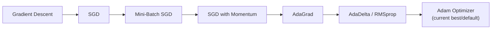

#### 🎯 Key Takeaways

* This session is the **direct, mathematical continuation** of Days 1 and 2 — it assumes full familiarity with the weight updation formula, chain rule, and loss/cost function distinction already covered.
* The complete, planned optimizer lineage: **Gradient Descent → SGD → Mini-Batch SGD → SGD with Momentum → AdaGrad → AdaDelta/RMSprop → Adam** — each one explicitly motivated by a genuine, specific flaw in its predecessor.
* **Day 4** is explicitly, directly promised to cover **both ANN and CNN practical implementation** — the series' first genuinely hands-on coding sessions.

---

### 2. Gradient Descent, Epoch & Its Core Disadvantage

#### 📖 Definition — Epoch, Precisely Defined

> 💡 **Given directly:** *"What exactly is epoch? Epoch basically means whenever I do one forward propagation and one backward propagation, this combines and says that okay, we have basically passed one epoch."*


#### 🪜 Step-by-Step — Gradient Descent's Precise Mechanics, With a Concrete, Million-Record Example

> 💡 **Given directly:** *"If I have a million records in my dataset... in the forward propagation, at a time I'm giving million records... in basically what we are doing, in the forward propagation, we are doing million different calculations of different inputs and weights... at a batch we are taking million data points, and we are doing the forward propagation... then in the backward propagation, all the weights will get updated."*

```text
Cost Function (Gradient Descent) = (1/n) × Σ(i=1 to n) (1/2)(yi - ŷi)²
where n = ENTIRE dataset (e.g., 1 million records), processed in ONE forward pass
```

#### ⚠ The Precise, Explicitly-Named Disadvantage

> 💡 **Given directly:** *"If you are passing million records... definitely you require a huge RAM to load that records, right? Resource-extensive task, it is -- the task is very resource-expensive, you require huge RAM to accommodate million records in every epoch... for parallel processing, you also may be requiring GPUs."*

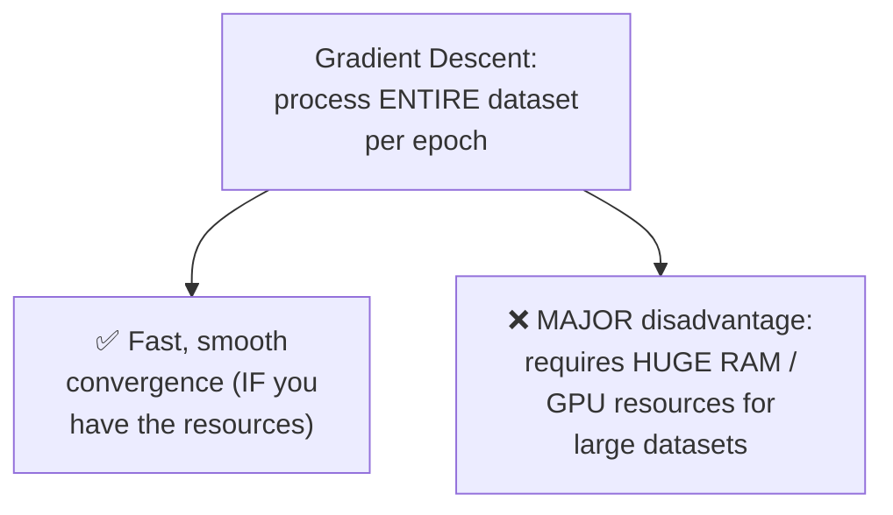

#### ⚠ Common Mistakes

* Assuming "gradient descent" refers only to the general concept of iteratively minimizing loss — explicitly, directly distinguished HERE as one SPECIFIC variant, defined precisely by processing the ENTIRE dataset in a single forward/backward pass per epoch — genuinely distinct from SGD and Mini-Batch SGD, covered next.

#### 🎯 Key Takeaways

* An **epoch** is precisely one complete forward propagation plus one complete backward propagation.
* (Standard) **Gradient Descent** processes the ENTIRE dataset in a single forward pass per epoch — genuinely fast and smooth in its convergence, but requiring **enormous RAM/GPU resources** for large, real-world datasets (a million records, in the session's own example).
* This resource disadvantage is explicitly, directly the motivating problem the REST of this session's optimizer lineage exists to solve.

---
### 3. Stochastic Gradient Descent (SGD): Trading RAM for Convergence Speed

#### 📖 Definition — SGD, Precisely Defined via Iteration

> 💡 **Given directly:** *"In stochastic gradient descent... let's say in the epoch one, I just pass ONE record, that's it -- I pass one record, I calculate the y_hat, and then I calculate the loss, and then I update the weights... this step is basically called ITERATION ONE."*

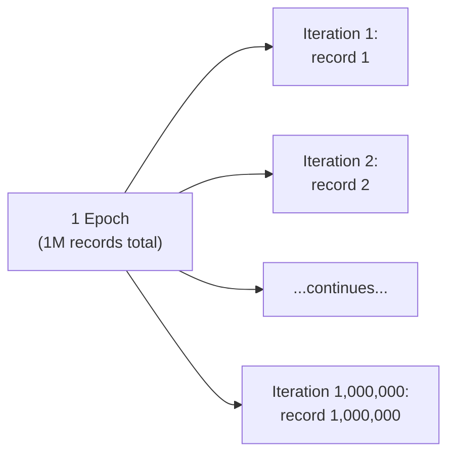

#### ❓ Why It Exists — Precisely Solving Gradient Descent's Resource Problem

> 💡 **Given directly:** *"In stochastic gradient descent, you are making sure that -- fine, I will not require that much RAM, no, I don't require that much RAM, because I am just passing one record at a time."*

#### ⚠ The Precise, Explicitly-Named New Disadvantage: Slow Convergence & Time Complexity

> 💡 **Given directly:** *"What is the major disadvantage? Major disadvantage is that the convergence that is basically happening will be very slow... because at every time I am passing one record, then again back propagation, then again weights are updating... the time complexity will also be very high."*

```text
1 million records, 100 epochs -> 100 MILLION total iterations
```

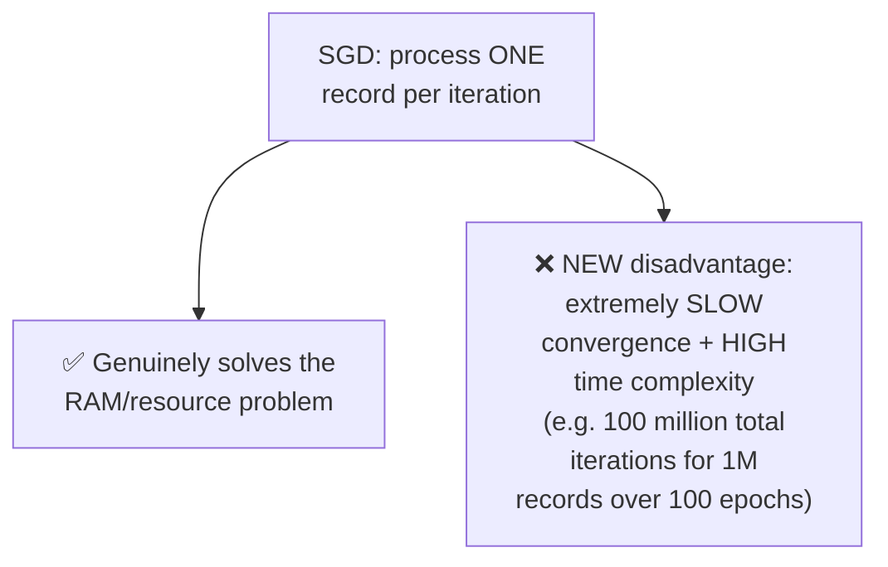

#### ⚠ Common Mistakes

* Assuming SGD is strictly, unconditionally "better" than Gradient Descent since it solves the RAM problem — explicitly, directly clarified: it introduces its OWN, genuinely serious new problem (extreme slowness), directly motivating the NEXT optimizer in the lineage.
* Confusing "iteration" with "epoch" — explicitly, directly distinguished: an epoch is one COMPLETE pass through the dataset; an iteration is ONE STEP within that pass, with the exact number of iterations per epoch depending on how many records are processed per step.

#### 🎯 Key Takeaways

* **SGD** processes exactly ONE record per iteration — genuinely solving Gradient Descent's RAM problem.
* This introduces a new, genuine disadvantage: **extremely slow convergence and high time complexity** — a million-record dataset over 100 epochs requires 100 MILLION total iterations.
* This trade-off (resource efficiency vs. convergence speed) is explicitly, directly the motivating tension the NEXT optimizer (Mini-Batch SGD) exists to resolve.

---

### 4. Mini-Batch SGD: The Practical Middle Ground

#### 📖 Definition — Mini-Batch SGD, Precisely Defined via Batch Size

> 💡 **Given directly:** *"Instead of just giving one record at a time, what I will do, I will set up a BATCH SIZE -- let's say my batch size is now 1,000... in every epoch that I do forward and backward propagation... I give 1,000 records... this will be my iteration one... how many number of iterations will I have to do? Just divide million by thousand."*

```text
1 million records, batch size 1,000 -> 1,000 iterations per epoch
(vs. 1,000,000 iterations per epoch for pure SGD)
```

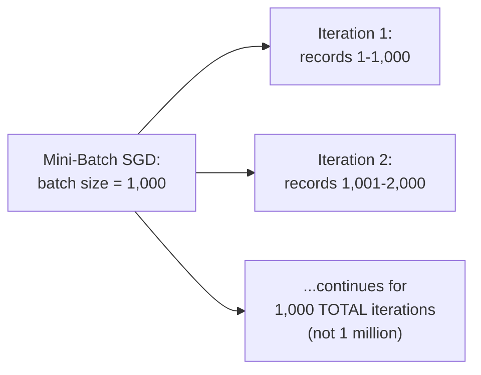

#### 🔍 Internal Working — The Precise, Three-Point Improvement Over Both Predecessors

> 💡 **Given directly, the complete, stated list:** *"This looks a better approach because -- why? Because here now it is not that much resource-intensive, we have removed this resource-intensive [problem]. The second point is that convergence will be BETTER when compared to [SGD]. And time complexity will also improve."*

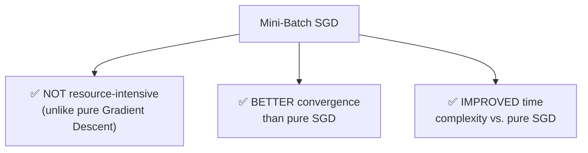

#### ⚠ Common Mistakes

* Assuming Mini-Batch SGD is a genuinely different ALGORITHM from Gradient Descent and SGD — explicitly, directly clarified: it's the SAME underlying weight-updation mechanism, differing only in HOW MANY records are processed per iteration (a configurable hyperparameter — the batch size).

#### 🎯 Key Takeaways

* **Mini-Batch SGD** processes a configurable BATCH of records (e.g., 1,000) per iteration — a genuine, practical middle ground between Gradient Descent (entire dataset) and SGD (one record).
* This produces **three simultaneous, stated improvements**: reduced resource requirements (vs. Gradient Descent), better convergence, and improved time complexity (vs. pure SGD).
* Mini-Batch SGD is explicitly, directly presented as the genuinely PRACTICAL default choice among these first three optimizers — though it still has one remaining problem (noise), addressed next.

---

### 5. Visualizing the Difference: Noise & the Mountain-Climbing Analogy

#### 🪜 Step-by-Step — The Precise, Visual Comparison of All Three Convergence Paths

> 💡 **Given directly:** *"With the help of gradient descent, since we are passing millions of records at one time, the convergence will happen LIKE THIS [smooth]... if we use stochastic gradient descent... it will JUMP LIKE THIS, it will jump like this... why it will have so much zigzag? Because it is only taking a single data point, and it is updating the weights."*

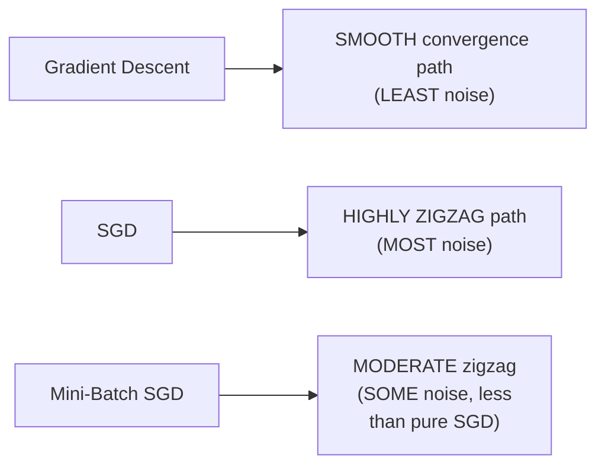

> 💡 **Given directly, precisely naming this phenomenon:** *"This zigzag movement is basically called as NOISE -- this is called as noise, which is having the highest noise -- obviously SGD is having the highest noise, gradient descent is having the least noise, and mini-batch SGD... has very minimal noise, but it has noise."*

#### 🧠 Concept — The Mountain-Climbing Analogy for Why Noise Matters

> 💡 **Given directly, the complete, vivid analogy:** *"Let's consider I want to climb a mountain... I want to reach this peak. If a person is starting from here, what will happen if a person goes into this STRAIGHT direction? He will be able to reach fast. What if the person moves something like this, from here to here to here to here to here -- it will take time to reach the peak."*

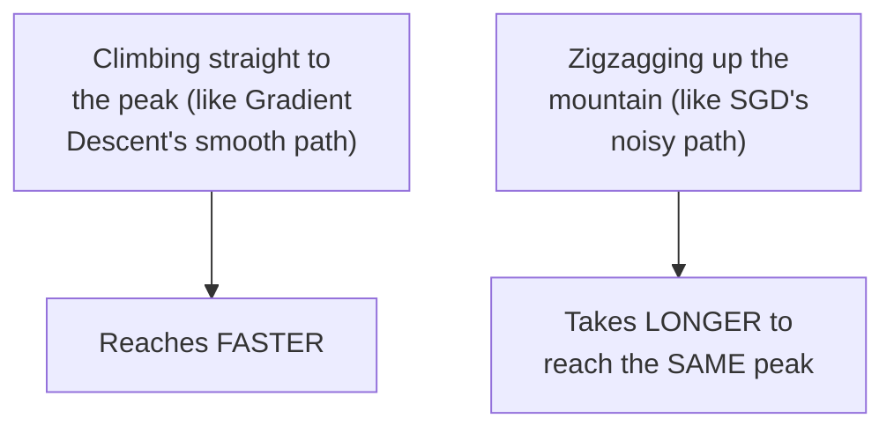

#### ⚠ Common Mistakes

* Assuming "noise" in this context refers to data quality issues (like measurement error) — explicitly, directly clarified: it specifically refers to the ZIGZAG, erratic MOVEMENT of the weight-updation path itself as it converges toward the global minima, caused by processing fewer records per update.

#### 🎯 Key Takeaways

* **"Noise"** precisely names the zigzag, erratic movement in an optimizer's convergence path — directly caused by how FEW records are used per weight update (fewer records = more noise).
* The noise ranking, from least to most: **Gradient Descent (least) → Mini-Batch SGD (moderate) → SGD (most)**.
* The **mountain-climbing analogy** directly illustrates WHY noise genuinely matters: a noisy, zigzagging path takes genuinely LONGER to reach the same destination (global minima) than a smooth, direct one.

---
### 6. SGD With Momentum: Exponential Weighted Average Smooths the Path

#### ❓ Why It Exists — Precisely Addressing the Remaining Noise Problem

> 💡 **Given directly:** *"One very important thing -- still there is noise. How do we remove the noise? ...In order to remove the noise, we use a concept which is called as momentum... it will smoothen this journey, it will make it smoother, and reduce the noise, and try to come to the global minima."*

#### 📖 Definition — Exponential Weighted Average, Directly Borrowed From Time Series

> 💡 **Given directly:** *"This concept is also used in time series -- some of the models like ARIMA model, ARMA model, we specifically use these things."*

#### 🪜 Step-by-Step — The Complete, Worked Example Building the Formula

> 💡 **Given directly, the complete, worked reasoning:** *"Let's say I have data set for time t1, t2... for time t1, the value is a1, for time t2, the value is a2... suppose if I say my beta value is 0.95... 0.95 multiplied by Vt1 plus 0.05 multiplied by a2 -- since I have assigned 0.95 as my beta value, I am giving MORE importance to my Vt1 value, that is my PREVIOUS timestamp value... and to the current timestamp value, I am giving LESS importance."*

```text
Exponential Weighted Average (general form):
Vt = β × V(t-1) + (1-β) × at

where β (beta) is a hyperparameter, typically close to 1 (e.g. 0.95),
controlling how much weight is given to PAST values vs. the CURRENT value
```

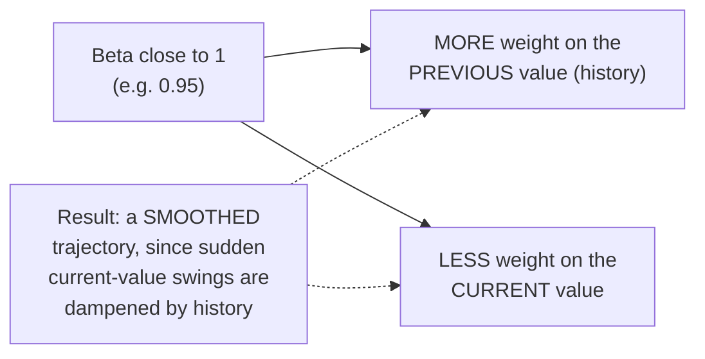

#### 🪜 Step-by-Step — Applying This Directly to the Weight Updation Formula

> 💡 **Given directly, the complete, applied formula:** *"Where do I apply this? ...In the derivative of loss with respect to derivative of weights... V_dw is nothing but the weighted average with respect to... beta multiplied by V_dw at t minus 1, plus 1 minus beta multiplied by derivative of loss with respect to derivative of w at t minus 1."*

```text
Vdw(t) = β × Vdw(t-1) + (1-β) × (∂Loss/∂w(t-1))

New weight updation formula:
w(t) = w(t-1) - learning_rate × Vdw(t)     [instead of using the raw derivative directly]
```

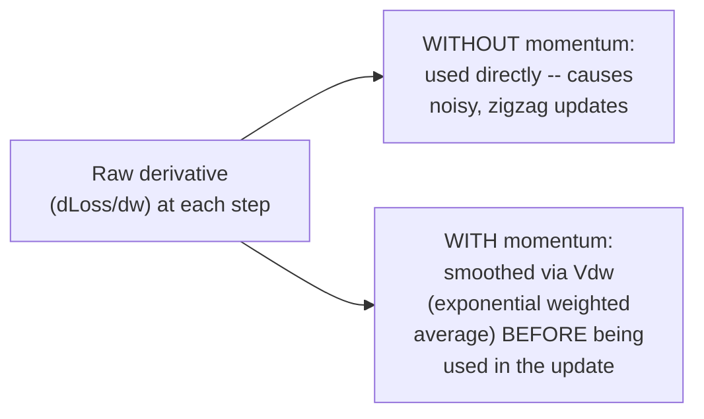

#### 🔍 Internal Working — Precisely Why This Genuinely Solves the Noise Problem

> 💡 **Given directly:** *"Suppose this is my gradient descent, initially let's say my point was here... if I assign beta onto this, instead of going in this direction, it will now go in something in this direction... then the t3 will get controlled, then t4 will get controlled, like this, and then finally it will reach the global minima -- so here we are REMOVING THE NOISE, and SMOOTHENING the curve."*

#### ⚠ Common Mistakes

* Assuming momentum changes WHAT gets computed (a genuinely different derivative) — explicitly, directly clarified: it changes HOW the derivative is USED — smoothing it via a weighted average of past and present values BEFORE applying it to the weight update, rather than using the raw, current-step derivative directly.
* Assuming the exponential weighted average is a Deep-Learning-specific invention — explicitly, directly sourced from an entirely different field (time-series forecasting, ARIMA/ARMA models).

#### 🎯 Key Takeaways

* **SGD with Momentum** directly addresses the remaining "noise" problem (from Section 5) using the **exponential weighted average** — a technique directly borrowed from time-series forecasting.
* The formula `Vdw(t) = β×Vdw(t-1) + (1-β)×(∂Loss/∂w(t-1))` smooths the derivative used in weight updates by blending PAST history with the CURRENT gradient — with the beta hyperparameter (typically close to 1) controlling how much weight goes to history vs. the present.
* This produces a genuinely **smoother convergence path** toward the global minima — directly solving the zigzag noise problem that Mini-Batch SGD (and especially pure SGD) still exhibited.

---

### 7. AdaGrad: Making the Learning Rate Adaptive

#### ❓ Why It Exists — A Genuinely Different Problem: The FIXED Learning Rate

> 💡 **Given directly:** *"When we move towards the global minima, don't you think -- and this is right now fixed, right, fixed in every algorithm, in every optimizer -- this is right now fixed. Can we change the learning rate in such a way that, let's say my data point is somewhere here, initially my learning rate should be HIGH, and as we go towards the global minima, the learning rate should DECREASE?"*

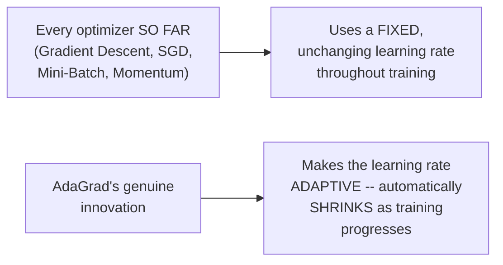

#### 📖 Definition — The Adaptive Learning Rate Formula

> 💡 **Given directly:** *"In adaptive gradient descent, we replace this learning rate with something else... instead of learning rate, I will write eta... eta is equal to learning rate divided by [square root of] alpha of t plus epsilon."*

```text
η (eta, the NEW, adaptive learning rate) = learning_rate / √(αt + ε)

where αt = Σ(i=1 to t) (∂Loss/∂wi)²    [summed, squared derivatives up to time t]
      ε (epsilon) = a small constant, preventing division by zero
```

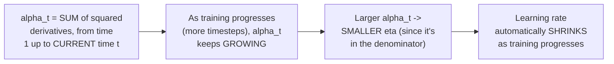

#### ❓ Why It Exists — Precisely Why Epsilon Is Needed

> 💡 **Given directly:** *"Why this epsilon is there? Epsilon is actually there, and this will basically be a small number, to avoid divide-by-zero condition -- if alpha of t is zero, then this divided by zero is basically infinity."*

#### 🔍 Internal Working — The Precise, Proven Reasoning for Why This Achieves Adaptiveness

> 💡 **Given directly:** *"As we reach near the global minima... this value will keep on decreasing, right, and through that specific way, we are bringing adaptiveness in the learning rate, and this time the learning rate will never be fixed, since it will be decreasing as we move towards the global minima."*

#### ⚠ Common Mistakes

* Assuming AdaGrad changes HOW the derivative itself is computed (like momentum does) — explicitly, directly clarified: AdaGrad instead changes the LEARNING RATE itself, making it adaptive, while momentum changes how the derivative is SMOOTHED — two genuinely different, complementary innovations (later combined in Adam).
* Assuming `alpha_t` could ever cause epsilon to be irrelevant — explicitly, directly clarified: epsilon specifically guards against the EDGE CASE where alpha_t is genuinely zero (very early in training), preventing a mathematically undefined division by zero.

#### 🎯 Key Takeaways

* **AdaGrad** addresses a genuinely different problem than momentum: the learning rate has been FIXED throughout every prior optimizer — AdaGrad makes it **adaptive**, automatically shrinking as training progresses.
* The formula `η = learning_rate / √(αt + ε)` works because `αt` (the sum of squared derivatives up to time t) genuinely GROWS over time, causing the denominator to grow, and therefore `η` to shrink — precisely achieving the desired "high learning rate early, low learning rate near convergence" behavior.
* **Epsilon** exists specifically to prevent a genuine division-by-zero error when `αt` happens to be zero (very early in training).

---
### 8. AdaGrad's Own Problem & the Fix: AdaDelta/RMSprop

#### ⚠ The Precise, Explicitly-Named New Problem: Unbounded Growth

> 💡 **Given directly:** *"There may be a situation that alpha_t can become a HUGE number... in a deep neural network, we keep on adding things, we keep on adding derivative of loss with respect to derivative of wt, with respect to timestamp -- now because of this, what happens? This eta -- there will be a NEGLIGIBLE change."*

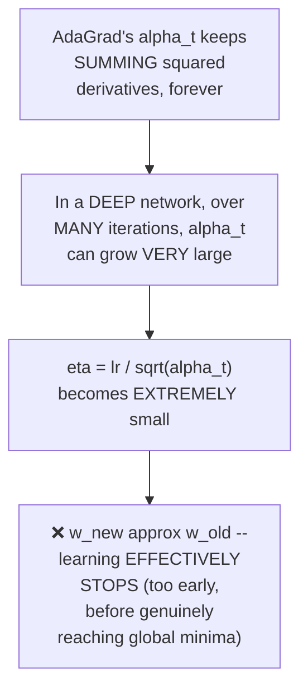

#### 📖 Definition — AdaDelta/RMSprop, the Fix Using Exponential Weighted Average AGAIN

> 💡 **Given directly:** *"How do we make sure that this alpha_t does not reach a very huge value? ...Instead of writing alpha_t, I will divide by another number which is called as SDW plus epsilon... here we are going to apply exponential weighted average again, so that we control this value."*

```text
SDW(t) = β × SDW(t-1) + (1-β) × (∂Loss/∂w(t-1))²

New eta: η = learning_rate / √(SDW(t) + ε)
```

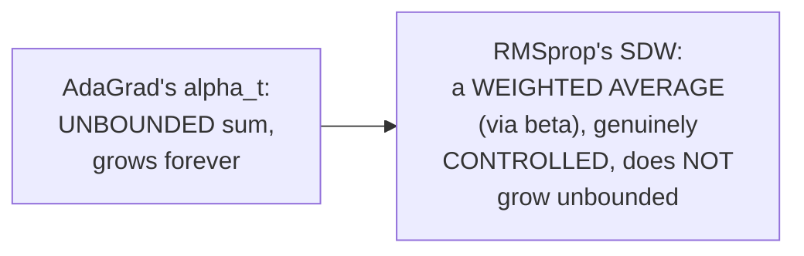

#### 🔍 Internal Working — Precisely Why the Weighted Average Genuinely Controls Growth

> 💡 **Given directly:** *"Suppose if my beta value is 0.95, then SDW_t will be 0.95 multiplied by SDW at t minus 1, plus 0.05 multiplied by derivative of loss with respect to derivative of wt minus 1, whole square -- now we are controlling this with this parameter, now this will NEVER increase or bump up by a very large value -- it is going to definitely increase by a SMALLER value."*

#### ⚠ A Direct, Honest Acknowledgment: RMSprop Still Lacks Momentum's Smoothing

> 💡 **Given directly, a genuinely important, precise observation:** *"Everything is added, but still... my weight updation formula still has this derivative of loss with respect to derivative of wt minus 1... whenever I have this, smoothening will NOT happen -- see, smoothening, what is the equation? ...Here I'm just saying, if I want to bring SGD with momentum over here, you can see that my smoothening equation will have Vdw -- but here what I am using, I am using derivative of loss with respect to derivative of wt minus 1 -- still I have removed... the researchers in adaptive gradient descent and in AdaDelta and RMSprop, they are NOT doing the smoothing -- still the smoothening is missing."*

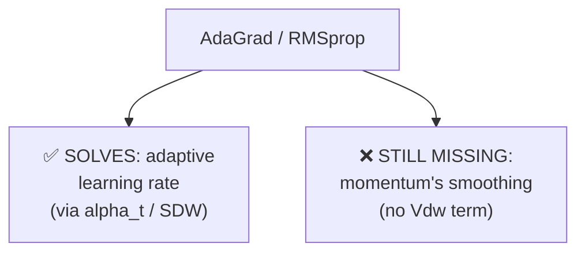

#### ⚠ Common Mistakes

* Assuming RMSprop and momentum solve the SAME problem — explicitly, directly distinguished: RMSprop controls the LEARNING RATE's growth (via SDW); momentum smooths the DERIVATIVE itself (via Vdw) — two genuinely SEPARATE, complementary fixes, neither of which alone provides both benefits.
* Assuming introducing RMSprop's exponential weighted average AUTOMATICALLY also brings back momentum's own smoothing benefit — explicitly, directly corrected: this is precisely the gap the session identifies as still unresolved, directly motivating Adam optimizer next.

#### 🎯 Key Takeaways

* **AdaGrad's own genuine flaw**: its `alpha_t` term is an UNBOUNDED, ever-growing sum, which can eventually make the adaptive learning rate negligibly small, causing training to effectively STOP too early.
* **AdaDelta/RMSprop** fixes this by replacing the unbounded sum with a genuinely CONTROLLED **exponential weighted average** (`SDW`), using the same beta-hyperparameter technique from momentum — but applied to the SQUARED derivative, for the learning-rate term specifically.
* Despite this fix, RMSprop **still lacks momentum's own smoothing benefit** — the derivative used in the weight update is still the RAW, unsmoothed value, not `Vdw` — an explicitly, honestly acknowledged gap that directly motivates Adam.

---

### 9. Adam Optimizer: Combining Momentum and RMSprop

#### 📖 Definition — Adam, Precisely Introduced as a Genuine Combination

> 💡 **Given directly:** *"The next one that we are going to discuss -- we are going to COMBINE this exponential weighted average and then we also making sure that we have this adaptive learning rate, and when we combine both of them, we are going to get something called as ADAM OPTIMIZER... in Adam optimizer, what we do, we combine momentum along with the RMSprop intuition."*

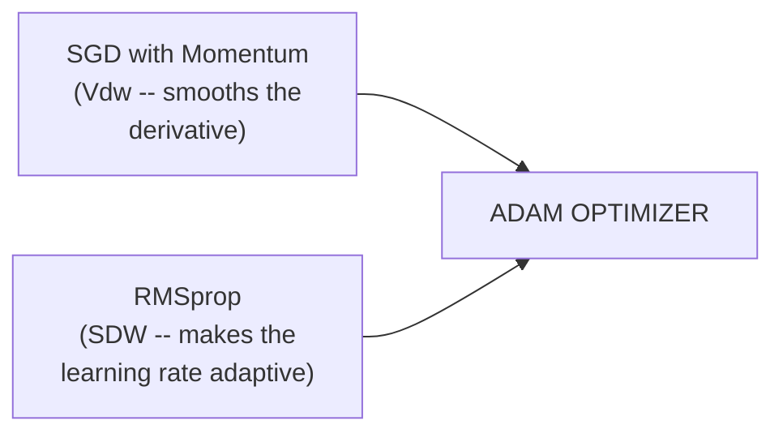

#### 📖 Definition — The Complete Weight and Bias Updation Formulas

> 💡 **Given directly, the complete, combined formulas:** *"How my equation will look? My weight updation equation will look like: wt = wt minus 1, minus eta, and then here I will be having Vdw... for bias updation formula, what will happen: bt = bt minus 1, minus eta, and here I will be having Vdb."*

```text
Weight update:  w(t) = w(t-1) - η × Vdw(t)
Bias update:    b(t) = b(t-1) - η × Vdb(t)

where:
η = learning_rate / √(SDW(t) + ε)                            [RMSprop's adaptive learning rate]
Vdw(t) = β × Vdw(t-1) + (1-β) × (∂Loss/∂w(t-1))                [Momentum, for weights]
Vdb(t) = β × Vdb(t-1) + (1-β) × (∂Loss/∂b(t-1))                [Momentum, for bias]
SDW(t) = β × SDW(t-1) + (1-β) × (∂Loss/∂w(t-1))²               [RMSprop, for weights]
```

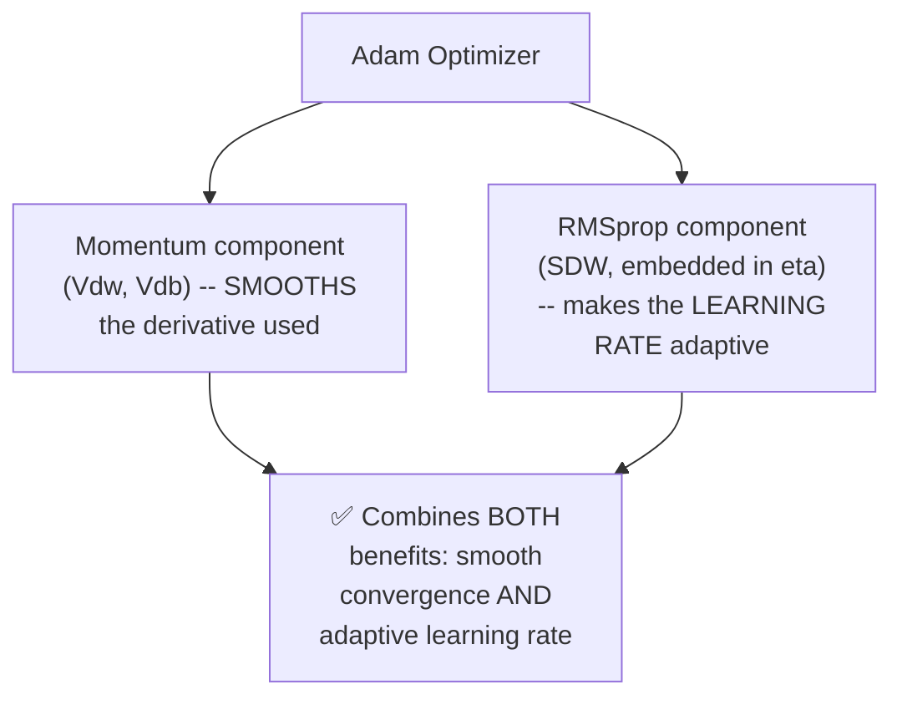

#### 🏢 Real-World / Production Usage — Explicitly Framed as the Current, Modern Default

> 💡 **Given directly:** *"This is right now the best optimizer -- yes, there are different variants of this optimizer, like AdaMax, there are different ones, right, but right now everybody is using the Adam optimizer... most of the people are basically using Adam optimizers, and this is right now currently the best optimizer, which also researchers basically say."*

#### 🎯 Key Takeaways

* **Adam Optimizer** genuinely COMBINES momentum's smoothing (`Vdw`, `Vdb`) with RMSprop's adaptive learning rate (embedded in `η`, via `SDW`) — directly resolving the gap explicitly identified in Section 8.
* The same combined pattern applies to **both weights AND bias** — `Vdw`/`SDW` for weights, `Vdb`/`SDB` (the equivalent bias term) for bias.
* Adam is explicitly, directly named the **current, most widely-used default optimizer** in practice — with variants like AdaMax existing, but Adam remaining the dominant, standard choice.

---
## 📝 Glossary

| Term | Definition | Why It Matters |
|---|---|---|
| **Epoch** | One complete forward propagation + one complete backward propagation | The basic unit of a full training pass |
| **Iteration** | One weight-update step within an epoch | Depends on batch size -- more iterations for smaller batches |
| **Batch Size** | Number of records processed per iteration | The key configurable parameter distinguishing GD/SGD/Mini-Batch |
| **Gradient Descent** | Processes the ENTIRE dataset per epoch | Fast, smooth, but resource-intensive |
| **SGD (Stochastic Gradient Descent)** | Processes ONE record per iteration | Resource-light, but slow, noisy convergence |
| **Mini-Batch SGD** | Processes a configurable BATCH per iteration | The practical middle ground |
| **Noise** | The zigzag, erratic movement in an optimizer's convergence path | Directly caused by fewer records per update |
| **Exponential Weighted Average** | A smoothing formula blending past and present values via a beta hyperparameter | Borrowed from time series (ARIMA/ARMA); the basis of momentum |
| **Momentum** | Applies exponential weighted average to the DERIVATIVE, smoothing weight updates | Solves the "noise" problem |
| **AdaGrad** | Makes the learning rate adaptive via an ever-growing sum of squared derivatives | Solves the "fixed learning rate" problem, but can shrink learning rate TOO much |
| **AdaDelta / RMSprop** | Controls AdaGrad's unbounded growth via exponential weighted average | Fixes AdaGrad's own flaw, but still lacks momentum's smoothing |
| **Adam Optimizer** | Combines momentum's smoothing AND RMSprop's adaptive learning rate | The current, most widely-used default optimizer |

---

## 🔄 Revision Notes — One-Minute Revision

* This is **Day 3 of the 5-day series** -- the complete optimizer lineage, told as a genuine "story," each optimizer solving a real, specific flaw in its predecessor.
* **Epoch** = one forward + one backward propagation. **Gradient Descent** processes the ENTIRE dataset per epoch -- fast, smooth, but genuinely RESOURCE-INTENSIVE (huge RAM/GPU needs for large datasets).
* **SGD** processes ONE record per ITERATION -- solves the resource problem, but introduces extremely SLOW convergence and high time complexity (a million-record dataset over 100 epochs needs 100 MILLION iterations).
* **Mini-Batch SGD** processes a configurable BATCH (e.g. 1,000 records) per iteration -- the practical middle ground: NOT resource-intensive, BETTER convergence than SGD, IMPROVED time complexity vs. SGD.
* **"Noise"** = the zigzag convergence pattern, worst for SGD, moderate for Mini-Batch SGD, least for Gradient Descent -- directly illustrated via a mountain-climbing analogy (a straight path reaches the peak faster than a zigzagging one).
* **SGD with Momentum** solves the remaining noise problem via the **exponential weighted average** (`Vdw(t) = beta x Vdw(t-1) + (1-beta) x dLoss/dw(t-1)`, borrowed from time-series/ARIMA) -- smoothing the derivative BEFORE it's used in the weight update.
* **AdaGrad** solves an entirely different problem -- the FIXED learning rate -- via `eta = learning_rate / sqrt(alpha_t + epsilon)`, where `alpha_t` is the SUM of squared derivatives over time, causing eta to genuinely SHRINK as training progresses.
* **AdaGrad's own flaw**: `alpha_t` grows UNBOUNDED, eventually making the learning rate negligible (training stops too early). **AdaDelta/RMSprop** fixes this by replacing the unbounded sum with a CONTROLLED exponential weighted average (`SDW`) -- but STILL lacks momentum's own smoothing (no `Vdw` term).
* **Adam Optimizer** genuinely COMBINES momentum's `Vdw`/`Vdb` (smoothing) with RMSprop's `SDW`-based adaptive `eta` -- applied to BOTH weights and bias. Explicitly named the current, most widely-used DEFAULT optimizer.
* **Day 4**: both ANN and CNN practical implementation -- the series' first hands-on coding sessions.

---

## 📋 Cheat Sheet

**The optimizer lineage, and what each one fixes:**
```text
Gradient Descent    -> smooth, but RESOURCE-INTENSIVE
SGD                  -> fixes resources, but SLOW/NOISY
Mini-Batch SGD         -> practical middle ground (still has SOME noise)
SGD + Momentum           -> fixes noise (via exponential weighted average)
AdaGrad                    -> fixes FIXED learning rate (makes it adaptive)
AdaDelta / RMSprop            -> fixes AdaGrad's UNBOUNDED growth
Adam                             -> combines Momentum + RMSprop (current default)
```

**Key formulas:**
```text
Epoch = 1 forward + 1 backward propagation

Momentum: Vdw(t) = beta x Vdw(t-1) + (1-beta) x dLoss/dw(t-1)

AdaGrad: eta = learning_rate / sqrt(alpha_t + epsilon)
  where alpha_t = Sum(i=1 to t) [dLoss/dwi]^2   (UNBOUNDED growth)

RMSprop: eta = learning_rate / sqrt(SDW(t) + epsilon)
  where SDW(t) = beta x SDW(t-1) + (1-beta) x [dLoss/dw(t-1)]^2   (CONTROLLED growth)

Adam:
  w(t) = w(t-1) - eta x Vdw(t)
  b(t) = b(t-1) - eta x Vdb(t)
```

**Batch size comparison:**
```text
Gradient Descent: batch = ENTIRE dataset      -> fewest iterations, most RAM
SGD:              batch = 1 record             -> most iterations, least RAM
Mini-Batch SGD:   batch = configurable (e.g. 1000) -> the practical middle ground
```

---

## 🔥 Interview Questions & Answers

### 🟢 Beginner

**Q1.**

**Question:** What is an epoch?

**Answer:** One complete forward propagation plus one complete backward propagation.

**Explanation:** Directly, precisely defined.

**Why Interviewers Ask This:** Foundational, frequently-tested terminology.

**Possible Follow-up:** "How does the number of iterations per epoch relate to batch size?"

**Q2.**

**Question:** What is Gradient Descent's major disadvantage?

**Answer:** It requires enormous RAM/GPU resources, since it processes the entire dataset in a single forward pass per epoch.

**Explanation:** Directly, precisely explained.

**Why Interviewers Ask This:** A commonly-asked, foundational optimizer question.

**Possible Follow-up:** "Which optimizer was developed specifically to address this?"

**Q3.**

**Question:** How many records does SGD process per iteration?

**Answer:** One.

**Explanation:** Directly, explicitly stated.

**Why Interviewers Ask This:** Basic, foundational SGD knowledge.

**Possible Follow-up:** "What genuine disadvantage does this introduce?"

**Q4.**

**Question:** What are the three stated improvements Mini-Batch SGD provides?

**Answer:** Reduced resource requirements, better convergence than SGD, and improved time complexity vs. SGD.

**Explanation:** Directly, explicitly listed.

**Why Interviewers Ask This:** Tests understanding of Mini-Batch SGD's genuine, practical value.

**Possible Follow-up:** "What hyperparameter controls this trade-off?"

**Q5.**

**Question:** What does "noise" mean in the context of optimizer convergence?

**Answer:** The zigzag, erratic movement in the convergence path toward the global minima.

**Explanation:** Directly, precisely defined.

**Why Interviewers Ask This:** Tests genuine, visual/intuitive understanding of optimizer behavior.

**Possible Follow-up:** "Which optimizer has the most noise, and which has the least?"

**Q6.**

**Question:** What technique does SGD with Momentum use to reduce noise?

**Answer:** The exponential weighted average.

**Explanation:** Directly, explicitly named.

**Why Interviewers Ask This:** Foundational momentum knowledge.

**Possible Follow-up:** "What field was this technique originally borrowed from?"

**Q7.**

**Question:** What genuinely new problem does AdaGrad solve, compared to the previous optimizers?

**Answer:** The fixed learning rate -- AdaGrad makes it adaptive, shrinking over time.

**Explanation:** Directly, precisely explained.

**Why Interviewers Ask This:** Tests understanding of AdaGrad's distinct contribution.

**Possible Follow-up:** "What role does epsilon play in AdaGrad's formula?"

**Q8.**

**Question:** What is AdaGrad's own genuine flaw?

**Answer:** Its adaptive term (alpha_t) grows unbounded over time, eventually making the learning rate negligibly small.

**Explanation:** Directly, precisely explained.

**Why Interviewers Ask This:** Tests understanding of AdaGrad's specific limitation.

**Possible Follow-up:** "Which optimizer was developed specifically to fix this?"

**Q9.**

**Question:** What two components does Adam Optimizer combine?

**Answer:** Momentum (smoothing the derivative) and RMSprop (adaptive learning rate).

**Explanation:** Directly, explicitly stated.

**Why Interviewers Ask This:** Foundational, frequently-asked Adam optimizer question.

**Possible Follow-up:** "Is Adam currently considered the best or most widely-used optimizer?"

**Q10.**

**Question:** Does RMSprop include momentum's smoothing effect?

**Answer:** No -- explicitly acknowledged as still missing; this gap is precisely what Adam addresses.

**Explanation:** Directly, honestly clarified.

**Why Interviewers Ask This:** Tests precise understanding of what each optimizer does and doesn't provide.

**Possible Follow-up:** "What specific term is missing from RMSprop's formula that momentum provides?"

---

### 🟡 Intermediate

**Q11.**

**Question:** Explain why the instructor deliberately frames this entire session as a connected "story," where each optimizer explicitly solves the previous one's specific flaw, rather than presenting all optimizers as independent, unrelated options.

**Answer:** This narrative structure directly reflects a genuine, historical truth about how these optimizers were actually developed -- each one WAS created specifically to address a real, identified limitation in its predecessor, not invented independently. Presenting them this way gives students a genuinely causal, motivated understanding of WHY each optimizer exists and WHAT specific problem it solves -- rather than an arbitrary list to memorize. This directly supports the instructor's own stated teaching philosophy ("the best way to learn something is just like remember the story") and genuinely helps with recall: a student who understands the CAUSAL chain (resource problem -> SGD -> convergence problem -> Mini-Batch -> noise problem -> Momentum -> fixed learning rate problem -> AdaGrad -> unbounded growth problem -> RMSprop -> missing smoothing -> Adam) can RECONSTRUCT any optimizer's purpose from first principles, rather than relying on rote memorization of seven independent facts.

**Explanation:** Requires recognizing a deliberate, stated pedagogical strategy and its genuine cognitive benefit.

**Why Interviewers Ask This:** Tests whether a learner recognizes causal, narrative teaching structure as a genuine learning aid, not just a stylistic choice.

**Possible Follow-up:** "If you had to explain WHY Adam exists to someone who had never heard of any of these optimizers, using only ONE sentence connecting it to the very first problem (Gradient Descent's resource intensity), what would you say?"

**Q12.**

**Question:** A learner argues that since Adam Optimizer is explicitly named "the current best optimizer," it should always be the default choice for every deep learning project, with no exceptions. Evaluate this claim.

**Answer:** This claim overstates the session's own actual, more nuanced framing. The session's own words are: "right now everybody is using the Adam optimizer... most of the people are basically using Adam optimizers" -- a statement about GENUINE, WIDESPREAD PRACTICE and POPULARITY, not an unconditional, mathematical proof that Adam is superior in EVERY possible scenario. The session ALSO explicitly acknowledges that "different variants of this optimizer, like AdaMax" genuinely exist -- directly implying that even within the Adam family, different variants may suit different specific circumstances. More broadly, the session's own entire narrative structure (each optimizer solving a SPECIFIC problem) implies that optimizer choice is genuinely CONTEXT-DEPENDENT -- a problem with extremely limited RAM might still favor SGD's resource efficiency over Adam's more complex bookkeeping (which requires storing both `Vdw` and `SDW` terms, genuinely more memory than a simpler optimizer). "Currently the best, most widely-used DEFAULT" is a genuinely different, more precise claim than "always, unconditionally the correct choice for every scenario."

**Explanation:** Tests whether a learner distinguishes "the current, popular default" from "the unconditionally correct choice in every case."

**Why Interviewers Ask This:** Distinguishes candidates who understand genuine, practical nuance from those who treat a stated "best practice" as an absolute, exceptionless rule.

**Possible Follow-up:** "Name a genuinely resource-constrained scenario where a simpler optimizer (like SGD) might be preferable to Adam, despite Adam's general popularity."

**Q13.**

**Question:** Explain, precisely, why AdaGrad's formula uses the SQUARE of the derivative (`(∂Loss/∂w)²`) in its `alpha_t` term, rather than the raw derivative value itself.

**Answer:** Squaring serves a genuinely important, specific purpose: it ensures `alpha_t`'s contribution from EVERY timestep is always POSITIVE, regardless of whether the underlying derivative itself was positive or negative. If the RAW derivative were summed directly instead, POSITIVE and NEGATIVE derivative values across different timesteps could genuinely CANCEL each other out, producing an `alpha_t` that might stay artificially small (or even near zero) despite genuinely large, ongoing gradient activity -- completely undermining the adaptive mechanism's intended purpose (tracking cumulative gradient MAGNITUDE over time, to shrink the learning rate as training progresses). By squaring first, `alpha_t` genuinely, monotonically accumulates a measure of TOTAL gradient magnitude/activity, regardless of direction -- precisely the behavior needed for the "learning rate shrinks over time" mechanism to work correctly, exactly as the session's own reasoning describes.

**Explanation:** Requires reasoning through why squaring specifically (not just summing) is genuinely necessary for the formula's stated purpose.

**Why Interviewers Ask This:** Tests whether a learner understands the precise mathematical REASON behind a specific formula detail, not just that squaring happens.

**Possible Follow-up:** "Does RMSprop's SDW term also use squared derivatives? Why would this same reasoning apply there too?"

**Q14.**

**Question:** Using the session's own precise distinction between momentum (smoothing the derivative) and RMSprop (adapting the learning rate), explain why simply using BOTH separately, one after the other, would not genuinely produce Adam Optimizer's actual behavior.

**Answer:** This is a genuinely subtle but important point: Adam's own precise formulas (per Section 9) don't merely APPLY momentum and THEN separately apply RMSprop as two sequential, independent steps -- they INTEGRATE both mechanisms into a SINGLE, unified weight-update formula, where the SAME weight update simultaneously uses the momentum-smoothed derivative (`Vdw`) AND the RMSprop-adapted learning rate (`η`, itself computed using `SDW`). If instead you were to apply momentum's smoothing to compute an intermediate, smoothed derivative, and THEN apply RMSprop's adaptive learning rate to THAT smoothed value as a genuinely separate, second step, the mathematical RESULT happens to be structurally similar to Adam's actual formula, but the framing matters: Adam is precisely defined as ONE combined formula (`w(t) = w(t-1) - η×Vdw(t)`) where BOTH the numerator (`Vdw`) and the learning-rate term (`η`, via `SDW`) are computed and applied together, within the SAME update step -- not as two genuinely separate, sequential optimizer passes.

**Explanation:** Requires reasoning precisely about HOW Adam integrates its two component ideas, distinguishing genuine integration from mere sequential application.

**Why Interviewers Ask This:** Tests whether a learner understands Adam's actual, precise formula structure, not just that it "combines" two prior ideas in some general sense.

**Possible Follow-up:** "Write out Adam's complete weight-update formula from memory, showing precisely where Vdw and SDW each appear."

**Q15.**

**Question:** Synthesize the session's mountain-climbing analogy (Section 5) with its precise explanation of momentum (Section 6) to explain WHY momentum's smoothing effect doesn't simply make convergence SLOWER (since it's now weighting PAST values more heavily), but can actually make it FASTER in practice.

**Answer:** This is a genuinely important, non-obvious synthesis. The mountain-climbing analogy (Section 5) establishes that a ZIGZAGGING path takes LONGER to reach the peak than a STRAIGHT one -- even though the zigzagging climber might be moving at the same raw SPEED at each individual step, the WASTED, indirect movement (side-to-side, not consistently toward the peak) means the climber's NET PROGRESS per unit of actual distance traveled is genuinely worse. Momentum's smoothing (Section 6) directly addresses this: by blending each step's direction with the AVERAGE of past directions, momentum specifically DAMPENS the erratic, side-to-side zigzag components (which tend to CANCEL OUT when averaged, since noisy, single-record derivatives point in genuinely random, inconsistent directions relative to the true gradient), while PRESERVING and even AMPLIFYING the CONSISTENT, genuine component of the gradient's direction (which reinforces itself across successive averaged steps, since it points the SAME general way each time). This means momentum doesn't simply "slow down" the trajectory by weighting history -- it specifically FILTERS OUT the wasted, zigzagging motion, allowing the climber's NET, EFFECTIVE progress toward the peak to be genuinely FASTER than the raw, unsmoothed zigzag path, despite each individual smoothed step technically incorporating "old" information.

**Explanation:** Requires synthesizing the geometric mountain-climbing intuition with momentum's precise mathematical mechanism to explain a genuinely counter-intuitive result (smoothing with "old" information can produce FASTER, not slower, convergence).

**Why Interviewers Ask This:** A senior-level question testing whether a candidate can reconcile an apparent contradiction (using past information seems like it should slow you down) with the genuine, correct outcome (it actually speeds up NET convergence).

**Possible Follow-up:** "Under what circumstance might momentum's smoothing actually HURT convergence speed, rather than helping it?"

---

### 🔴 Advanced

**Q16.**

**Question:** Design a complete, numerical trace of AdaGrad's learning rate evolution across 5 timesteps, given a sequence of derivative values (∂Loss/∂w) of 0.5, 0.4, 0.3, 0.2, 0.1 at each successive timestep, with a base learning_rate of 0.1 and epsilon of 1e-8, explicitly computing eta at each step and confirming it genuinely decreases.

**Answer:** A reasonable, complete trace, directly applying Section 7's own exact formula (`η = learning_rate / √(αt + ε)`, where `αt = Σ(∂Loss/∂wi)²`): **t=1**: `α1 = 0.5² = 0.25`; `η1 = 0.1/√(0.25+1e-8) ≈ 0.1/0.5 = 0.2`. **t=2**: `α2 = 0.25 + 0.4² = 0.25+0.16 = 0.41`; `η2 = 0.1/√0.41 ≈ 0.1/0.640 ≈ 0.1562`. **t=3**: `α3 = 0.41 + 0.3² = 0.41+0.09 = 0.50`; `η3 = 0.1/√0.50 ≈ 0.1/0.707 ≈ 0.1414`. **t=4**: `α4 = 0.50 + 0.2² = 0.50+0.04 = 0.54`; `η4 = 0.1/√0.54 ≈ 0.1/0.735 ≈ 0.1361`. **t=5**: `α5 = 0.54 + 0.1² = 0.54+0.01 = 0.55`; `η5 = 0.1/√0.55 ≈ 0.1/0.742 ≈ 0.1348`. This trace confirms Section 7's own claimed behavior: `η` genuinely DECREASES monotonically across all 5 timesteps (0.2 → 0.1562 → 0.1414 → 0.1361 → 0.1348), directly, numerically demonstrating the adaptive learning rate shrinking as training progresses -- even though the individual derivative VALUES themselves are also shrinking in this specific example (0.5 → 0.1), `αt`'s CUMULATIVE, monotonically-increasing sum still drives `η` consistently downward.

**Explanation:** Requires applying AdaGrad's exact formula across multiple, genuinely new timesteps, producing a concrete, verified numerical trace confirming the stated theoretical behavior.

**Why Interviewers Ask This:** A realistic, senior-level question testing whether a candidate can perform the actual numerical computation, not just recite the formula's qualitative behavior.

**Possible Follow-up:** "If the derivative values instead REMAINED constant at 0.5 for all 5 timesteps (rather than shrinking), would eta still decrease? Compute it and confirm."

**Q17.**

**Question:** Critically evaluate: "Since this session shows that AdaGrad's alpha_t term can grow unbounded and eventually cause the learning rate to become negligibly small, AdaGrad should genuinely never be used for training deep neural networks, and RMSprop or Adam should always be preferred instead." Is this an accurate, unconditional characterization?

**Answer:** Partially accurate as a general PRACTICAL recommendation, but overstated as an unconditional, exceptionless rule. The session's own narrative DOES present RMSprop and Adam as genuine improvements addressing AdaGrad's specific flaw -- and for DEEP networks trained over MANY iterations (the scenario the session explicitly describes: "in a deep neural network, we keep on adding things"), AdaGrad's unbounded growth problem is genuinely likely to manifest as a real, practical issue. However, the claim that AdaGrad should "NEVER" be used overstates this into an absolute prohibition the session itself doesn't make. AdaGrad's core, genuine INNOVATION -- an adaptive learning rate that shrinks as training progresses -- can still be genuinely useful for SHALLOWER networks, or training scenarios with a GENUINELY LIMITED, SMALL number of total iterations/timesteps, where `alpha_t`'s unbounded growth simply doesn't have enough "time" (iterations) to become a genuinely severe problem before training naturally concludes. The precise, more accurate characterization: AdaGrad's flaw becomes GENUINELY PROBLEMATIC specifically in DEEP networks trained over MANY iterations -- not that AdaGrad is universally, unconditionally unusable in every possible training scenario.

**Explanation:** Tests whether a learner distinguishes a genuine, practically-relevant limitation (deep networks, many iterations) from an inaccurate, unconditional prohibition the source material doesn't actually establish.

**Why Interviewers Ask This:** Distinguishes candidates who track a stated limitation's precise, conditional scope from those who over-generalize it into an absolute rule.

**Possible Follow-up:** "Roughly how would you expect the SEVERITY of AdaGrad's unbounded-growth problem to scale with the total number of training iterations?"

**Q18.**

**Question:** Synthesize the session's complete optimizer lineage (Sections 2-9) with its own explicit "find a new problem, solve it" research framing (given in the session's closing remarks) to propose a genuinely plausible, NEW, hypothetical limitation that Adam Optimizer itself might have, following the SAME pattern of reasoning the session applies to every prior optimizer.

**Answer:** A reasonable, pattern-consistent hypothesis: following the session's own established reasoning pattern -- where EVERY prior optimizer, despite solving a genuine problem, introduced a NEW trade-off (Gradient Descent: resource-intensive; SGD: slow/noisy; Momentum: still had a fixed learning rate; AdaGrad: unbounded growth; RMSprop: missing smoothing) -- a genuinely plausible NEW limitation for Adam might be: Adam's own formula requires STORING and maintaining TWO separate running values (`Vdw` AND `SDW`) for EVERY SINGLE weight and bias parameter in the network, doubling the memory overhead compared to a simpler optimizer like plain SGD, which requires no such persistent state at all. For a GENUINELY MASSIVE modern network (billions of parameters), this doubled memory overhead could become a genuinely real, practical constraint -- directly analogous, in STRUCTURE, to Gradient Descent's own original resource-intensity problem (Section 2), just manifesting at the PARAMETER-STORAGE level rather than the DATA-BATCH level. This hypothesis is explicitly speculative (not stated in the session itself), but is directly, structurally consistent with the session's own repeated pattern: every genuine improvement introduces SOME new resource or convergence trade-off, and Adam's own genuinely more complex bookkeeping (compared to simpler optimizers) is a reasonable, pattern-consistent candidate for its own "next problem to solve" -- exactly the kind of reasoning the session's own closing remarks ("find the loopholes in the previous things... create a new one") directly encourage.

**Explanation:** Requires synthesizing the session's ENTIRE optimizer lineage's recurring PATTERN (each fix introduces a new trade-off) to generate a genuinely plausible, pattern-consistent hypothesis about Adam's own potential limitation -- explicitly going beyond what the session directly states.

**Why Interviewers Ask This:** A capstone-level question testing whether a candidate can extract and APPLY a recurring reasoning pattern from a taught lineage to generate a genuinely novel, well-reasoned hypothesis, rather than only reciting facts the session directly states.

**Possible Follow-up:** "Research (outside this session) whether this specific memory-overhead limitation of Adam has genuinely been identified and addressed by any real, published optimizer variant."

---

## 🧪 Scenario-Based Interview Questions

> **Scenario 1:** A colleague training a model on a 500,000-record dataset reports their training process keeps crashing with an "out of memory" error. Using this session's concepts, diagnose the most likely cause and recommend a fix.

**Structured Answer:**
1. **Initial investigation:** Recognize this as a classic, textbook symptom directly connected to Section 2's own precise explanation of Gradient Descent's resource-intensity problem -- processing the entire 500,000-record dataset in a single forward pass genuinely requires substantial RAM.
2. **Metrics/logs to check:** Directly verify the colleague's current batch size configuration -- confirm whether they're genuinely using the ENTIRE dataset per iteration (standard Gradient Descent behavior) rather than a smaller, configurable batch.
3. **Possible causes:** Per Section 2's own precise reasoning, the colleague is most likely using an unbatched (or excessively large batch) configuration, directly causing the exact resource-intensity problem this section explicitly describes.
4. **Debugging approach:** Directly test training with a genuinely smaller batch size (e.g., 1,000 records per Section 4's own example), confirming whether the memory error resolves.
5. **Resolution:** Switch to Mini-Batch SGD (per Section 4's own recommended, practical middle ground) with an appropriately-sized batch that fits within available RAM, directly resolving the memory constraint while retaining better convergence than pure SGD.
6. **Prevention:** Establish a standing team practice of always configuring an explicit, appropriately-sized batch size based on available hardware resources, rather than defaulting to processing an entire large dataset in one pass.

> **Scenario 2 (Advanced):** Your team's deep neural network, trained using AdaGrad, shows genuinely good progress for the first several thousand training iterations, but then training appears to completely "stall" — loss stops improving, even though the model clearly hasn't yet reached its best possible performance. Using this session's concepts, diagnose and recommend a fix.

**Structured Answer:**
1. **Initial investigation:** Recognize this as a classic, textbook symptom directly connected to Section 8's own precise explanation of AdaGrad's unbounded-growth flaw -- training genuinely progressing well initially, then stalling after many iterations, is exactly the pattern AdaGrad's own `alpha_t` growth problem would produce.
2. **Metrics/logs to check:** Directly inspect the actual computed learning rate (`eta`) values over the course of training, confirming whether they've genuinely shrunk to a negligibly small value by the point training appears to stall.
3. **Possible causes:** Per Section 8's own precise reasoning, `alpha_t`'s unbounded, ever-growing sum has likely become large enough that `eta` is now genuinely too small for meaningful weight updates to continue -- `w_new ≈ w_old`, exactly as Section 8 describes.
4. **Debugging approach:** Directly compare training behavior using RMSprop or Adam instead of AdaGrad, testing whether training genuinely continues to improve past the point where AdaGrad previously stalled.
5. **Resolution:** Switch from AdaGrad to **RMSprop or Adam** (per Section 8 and Section 9's own precise reasoning) -- both use a genuinely CONTROLLED exponential weighted average instead of AdaGrad's unbounded sum, directly avoiding this specific stalling behavior.
6. **Prevention:** Establish a standing team practice of preferring RMSprop or Adam over plain AdaGrad specifically for DEEP networks trained over MANY iterations, directly applying Advanced Interview Q17's own precise, conditional reasoning about when AdaGrad's flaw genuinely becomes a practical problem.

---

## 🛠 Hands-on Exercises

### 🟢 Easy

1. Write out, from memory, the complete optimizer lineage (Gradient Descent through Adam), and one sentence describing the specific problem each one solves.
2. Explain, in your own words, why SGD has more "noise" in its convergence path than Mini-Batch SGD.
3. Write the exponential weighted average formula from memory, and explain what the beta hyperparameter controls.

### 🟡 Medium

4. Complete the full, numerical AdaGrad trace proposed in Advanced Interview Q16, using a different sequence of derivative values of your own choosing.
5. Write a short comparison (150-200 words) precisely distinguishing what momentum solves versus what RMSprop solves, directly applying Section 8's own explicit "still missing" observation.
6. Research (outside this session) the AdaMax optimizer variant briefly mentioned in Section 9, and write a short explanation of how it differs from standard Adam.

### 🔴 Advanced

7. Implement a small, working comparison in Python (NumPy only) of Gradient Descent, SGD, and Mini-Batch SGD on a simple, synthetic regression dataset, empirically measuring and comparing convergence speed and "noise" (variance in the loss curve).
8. Implement the complete Adam optimizer formula from scratch (NumPy only), verifying it against a small, hand-computed example matching Section 9's own exact formulas.
9. Design and document the diagnostic test proposed in Scenario 2's resolution, comparing AdaGrad, RMSprop, and Adam's learning rate behavior over many iterations on a synthetic, deep-network-like scenario.

---

## 🏗 Practice Assignment

### Build: "Complete Optimizer Comparison, From Scratch"

**Objective:** Directly reproduce this session's own complete optimizer lineage as genuinely working, from-scratch implementations, empirically comparing their behavior.

**Requirements:**
- A working NumPy implementation of Gradient Descent, SGD, and Mini-Batch SGD, tested on the same small, synthetic dataset.
- A working implementation of SGD with Momentum, empirically demonstrating reduced "noise" (loss curve variance) compared to plain SGD.
- A working implementation of AdaGrad, empirically demonstrating its learning rate genuinely decreasing over training iterations.
- A working implementation of Adam Optimizer, combining both momentum and RMSprop components, tested against the same synthetic dataset.
- A written reflection (200-300 words) on which specific optimizer transition (SGD->Mini-Batch, Momentum, AdaGrad, or RMSprop->Adam) you found most conceptually significant, and why.

**Architecture (suggested):**

```text
optimizer_comparison_from_scratch/
├── gradient_descent_family.py         # GD, SGD, Mini-Batch SGD
├── momentum.py                          # SGD with Momentum
├── adagrad.py                             # AdaGrad implementation
├── rmsprop_adam.py                          # RMSprop and Adam
└── REFLECTION.md                              # your written reflection
```

**Expected Functionality:**
- Your implementations should genuinely, empirically demonstrate the qualitative behaviors described in this session (noise reduction via momentum, learning rate shrinkage via AdaGrad, etc.).
- Your Adam implementation should genuinely combine both Vdw/Vdb (momentum) and SDW (RMSprop) components, matching Section 9's own exact formulas.

**Expected Functionality:**
- Loss curves and/or convergence-path visualizations comparing each optimizer's behavior.

**Challenges:**
- Correctly implementing the exponential weighted average with proper initialization (starting values at time 0).
- Correctly tuning beta and epsilon hyperparameters to genuinely observe the described behaviors.

**Bonus Improvements:**
- Extend your comparison to a genuinely deep (many-layer) synthetic network, empirically demonstrating AdaGrad's own unbounded-growth stalling behavior described in Scenario 2.
- Visualize all optimizers' convergence paths on the same 2D loss landscape, directly reproducing this session's own mountain-climbing-style comparison.

---

## 📚 Additional Resources

- **Days 1 and 2 of this series** -- the direct prerequisite sessions, covering the perceptron, forward/backward propagation, the chain rule, vanishing gradient, and activation/loss functions this session directly builds on.
- **The community course dashboard** (referenced directly, explicitly free) -- where this session's complete, handwritten materials are made available.
- **ARIMA and ARMA models** (referenced directly) -- the time-series forecasting models that originally use the exponential weighted average technique this session directly borrows for momentum.
- **Day 4 of this series** (referenced directly, explicitly next) -- covering both ANN and CNN practical implementation, the series' first hands-on coding sessions.

---

## 📌 Final Revision Sheet

### ⭐ Core Concepts
- **Epoch** = 1 forward + 1 backward propagation; **batch size** determines iterations per epoch.
- **Gradient Descent** (entire dataset, resource-intensive) -> **SGD** (1 record, slow/noisy) -> **Mini-Batch SGD** (configurable batch, practical middle ground).
- **"Noise"** = zigzag convergence, worst for SGD, best (least) for Gradient Descent.
- **Momentum** fixes noise via the exponential weighted average (`Vdw`).
- **AdaGrad** fixes the fixed-learning-rate problem via `alpha_t` (unbounded sum of squared derivatives).
- **RMSprop/AdaDelta** fixes AdaGrad's unbounded growth via a controlled exponential weighted average (`SDW`) -- but still lacks momentum's smoothing.
- **Adam** combines momentum (`Vdw`, `Vdb`) + RMSprop (`SDW`-based adaptive `eta`) -- the current, most widely-used default.

### ⭐ Important Definitions
- **Iteration, Noise** (see Glossary for full definitions).

### ⭐ Important Commands/Code
```text
Momentum: Vdw(t) = beta x Vdw(t-1) + (1-beta) x dLoss/dw(t-1)
AdaGrad:  eta = lr / sqrt(alpha_t + epsilon), alpha_t = Sum[dLoss/dwi]^2
RMSprop:  eta = lr / sqrt(SDW(t) + epsilon), SDW(t) = beta x SDW(t-1) + (1-beta) x [dLoss/dw(t-1)]^2
Adam:     w(t) = w(t-1) - eta x Vdw(t)  |  b(t) = b(t-1) - eta x Vdb(t)
```

### ⭐ Architecture/Process
- Complete optimizer lineage: each optimizer solves a genuine, specific flaw in its predecessor -- resource intensity -> slow convergence -> noise -> fixed learning rate -> unbounded growth -> missing smoothing -> (Adam: all resolved together).

### ⭐ Best Practices
- Default to Mini-Batch SGD (or Adam) rather than pure Gradient Descent or pure SGD for real, large datasets.
- Prefer RMSprop or Adam over plain AdaGrad for deep networks trained over many iterations.
- Use Adam as the current, practical default optimizer, while remaining aware it's a "current best practice," not an unconditional, universal rule.

### ⭐ Common Mistakes
- Assuming SGD is unconditionally "better" than Gradient Descent (it trades one problem for another).
- Assuming RMSprop provides momentum's smoothing benefit (it doesn't -- this is Adam's own, distinct contribution).
- Assuming Adam should be used in literally every possible scenario, with no exceptions.
- Confusing epoch, iteration, and batch size.

### ⭐ Interview Points
- Be ready to explain the complete optimizer lineage and what specific problem each one solves.
- Be ready to write and explain the exponential weighted average formula.
- Be ready to explain AdaGrad's adaptive learning rate mechanism and its own unbounded-growth flaw.
- Be ready to explain precisely how Adam combines momentum and RMSprop.

### ⭐ Things to Remember
- This session is the **direct, mathematical continuation of Days 1 and 2** -- assumes full familiarity with the weight updation formula and chain rule.
- The entire session is deliberately structured as a **connected "story"** -- each optimizer explicitly, causally motivated by a genuine flaw in its predecessor.
- **Day 4 is explicitly, directly next** -- covering both ANN and CNN practical implementation, the series' first hands-on coding sessions.

---

## 🔗 Source

- [Optimizers & ANN Implementation](https://www.youtube.com/live/GseZVPT-7dc?si=WFGOvsLmohw-77ZR)