# 🧠 Deep Learning Community Session — Day 4: Practical ANN Implementation

- <i>**Session:** Deep Learning Community Session (5-Day Series) — Day 4 · 
- **Instructor:** Krish Naik
- **Note on scope:** This is the **direct continuation** of Days 1-3 (perceptron, forward/backward propagation, chain rule, vanishing gradient, activation/loss functions, and the complete optimizer lineage). This is the series' **first genuinely hands-on coding session** — a complete, live, real-time build of an Artificial Neural Network in TensorFlow/Keras, solving a real, practical problem: predicting bank customer churn from the `Churn_Modelling.csv` dataset. Every step is preserved as actual, working code: data loading, categorical feature engineering, train-test splitting, feature scaling (with two genuinely common interview questions addressed directly), building the network layer by layer, compiling, training, early stopping (explicitly solving "how many epochs should I use?"), evaluation, and a closing conceptual detour into black box vs. white box models. CNN is explicitly promised for Day 5.</i>

---

## 📑 Table of Contents

1. [Session Overview](#-session-overview)
2. [Learning Objectives](#-learning-objectives)
3. [Detailed Notes](#-detailed-notes)
   - [1. Session Context: Day 4, The First Practical Implementation](#1-session-context-day-4-the-first-practical-implementation)
   - [2. Data Loading & The Churn Prediction Problem](#2-data-loading--the-churn-prediction-problem)
   - [3. Feature Engineering: Handling Categorical Columns](#3-feature-engineering-handling-categorical-columns)
   - [4. Train-Test Split & Feature Scaling (A Key Interview Topic)](#4-train-test-split--feature-scaling-a-key-interview-topic)
   - [5. Understanding Sequential, Dense & Dropout Before Building](#5-understanding-sequential-dense--dropout-before-building)
   - [6. Building the ANN: Input, Hidden & Output Layers](#6-building-the-ann-input-hidden--output-layers)
   - [7. Compiling & Training the Model](#7-compiling--training-the-model)
   - [8. Early Stopping: Solving "How Many Epochs?"](#8-early-stopping-solving-how-many-epochs)
   - [9. Evaluating the Model: Predictions, Confusion Matrix & Weights](#9-evaluating-the-model-predictions-confusion-matrix--weights)
   - [10. Black Box vs. White Box Models & What's Next](#10-black-box-vs-white-box-models--whats-next)
4. [Glossary](#-glossary)
5. [Revision Notes — One-Minute Revision](#-revision-notes--one-minute-revision)
6. [Cheat Sheet](#-cheat-sheet)
7. [Interview Questions & Answers](#-interview-questions--answers)
8. [Scenario-Based Interview Questions](#-scenario-based-interview-questions)
9. [Hands-on Exercises](#-hands-on-exercises)
10. [Practice Assignment](#-practice-assignment)
11. [Additional Resources](#-additional-resources)
12. [Final Revision Sheet](#-final-revision-sheet)

---

## 🎯 Session Overview

This session takes every mathematical concept from Days 1-3 and turns it into a genuine, working, trained model. It covers:

1. **A real, practical problem**: predicting whether a bank customer will "churn" (exit the bank) — a binary classification problem, solved end to end using the `Churn_Modelling.csv` dataset.
2. **Feature engineering for categorical columns** — Geography and Gender, handled via `pd.get_dummies()` with the `drop_first=True` parameter, directly explained via the "if it's not France or Germany, it must be Spain" logic.
3. **Train-test splitting and feature scaling**, with TWO genuinely, explicitly-flagged common interview questions addressed directly: which algorithms genuinely require feature scaling, and why `fit_transform` is used only on training data (never on test data) — directly connected to data leakage.
4. **The conceptual meaning of TensorFlow's core building blocks** before writing a single line of model-building code: `Sequential` (the container enabling forward/backward propagation), `Dense` (the layer type that creates neurons), and `Dropout` (a regularization technique that randomly deactivates a percentage of neurons during training).
5. **Building the complete network**, layer by layer, in real code: an 11-unit input layer (matching the 11 input features), two hidden layers, and a single-neuron, sigmoid-activated output layer for binary classification.
6. **Compiling and training** the model with the Adam optimizer, binary cross-entropy loss, and accuracy as the tracked metric — live-demonstrated running for up to 1,000 epochs, with the instructor manually interrupting training once accuracy visibly plateaus around 86%.
7. **Early Stopping**, introduced specifically to solve the genuinely common question "how many epochs should I train for?" — configured via Keras's `EarlyStopping` callback, monitoring validation loss, and automatically halting training once improvement stalls (live-demonstrated stopping at epoch 30).
8. **Model evaluation**: generating predictions with a 0.5 threshold, building a confusion matrix, calculating accuracy score, and inspecting the model's raw learned weights.
9. **A closing conceptual detour**: black box vs. white box models — Decision Trees are white box (fully interpretable); Random Forest, XGBoost, and ANN/CNN/RNN are all black box (genuinely difficult to interpret internally) — directly connecting to the emerging field of Explainable AI.

> 💡 **Key framing, given directly, on why early stopping matters so much to the instructor:** *"Many people say that how many epochs we should basically run, you know, while training the deep learning model -- so it will be very much important itself."*

---

## 🎯 Learning Objectives

By the end of this guide, you will be able to:

- [ ] Load a real dataset and correctly split it into independent (X) and dependent (y) features using `.iloc`.
- [ ] Encode categorical columns using `pd.get_dummies()` with `drop_first=True`, and explain why this parameter is used.
- [ ] State which categories of machine learning algorithms genuinely require feature scaling, and which do not.
- [ ] Explain why `fit_transform` should be applied only to training data, and `transform` only to test data.
- [ ] Explain what `Sequential`, `Dense`, and `Dropout` each do in a Keras-based ANN.
- [ ] Build a complete, working ANN in Keras: input layer, hidden layers, and an output layer with the correct activation function for binary classification.
- [ ] Configure and use Keras's `EarlyStopping` callback to automatically halt training at an appropriate point.
- [ ] Explain the distinction between black box and white box models, with correct, specific examples of each.

---

## 📚 Detailed Notes

### 1. Session Context: Day 4, The First Practical Implementation

#### 🧠 Concept

> 💡 **Given directly, opening the session:** *"In the previous session we have actually discussed about optimizers... we have actually completed gradient descent, stochastic gradient descent, mini-batch SGD, SGD with momentum, AdaGrad, RMSprop, and Adam optimizers... so let's talk about the agenda... day four of deep learning. Number one, we will be starting with ANN practical implementation."*

#### 🪜 Step-by-Step — The Stated, Complete Agenda for Today

> 💡 **Given directly:** *"The second one that we are basically going to understand is what is early stopping... the third thing we are going to understand about black box models versus white box model... and then we are also going to understand about one important topic of CNN -- so CNN introduction we will try to cover it."*

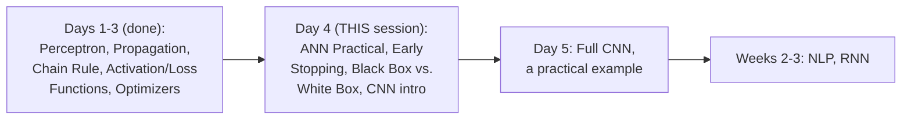

#### 🎯 Key Takeaways

* This is the series' **first genuinely hands-on coding session** — every prior day built the mathematical foundation this session now directly applies to a real, working model.
* The problem being solved is **genuine, practical bank customer churn prediction** — a real, well-known dataset (`Churn_Modelling.csv`), not a toy or synthetic example.
* **CNN is explicitly promised for the very next day**, with RNN and full NLP explicitly deferred further, to weeks 2-3 of the broader course.

---

### 2. Data Loading & The Churn Prediction Problem

#### 🪜 Step-by-Step — Environment Setup

> 💡 **Given directly:** *"First of all, I will start with pip install tensorflow, because I'm going to use TensorFlow GPU... then we will start seeing which version of TensorFlow we are going to work with... we'll be working with the version that is greater than 2.0, because the version [greater than] 2.0 has Keras also integrated within them."*

```python
!pip install tensorflow

import tensorflow as tf
print(tf.__version__)   # e.g. 2.8.0 -- must be > 2.0 (has Keras integrated)
```

#### 📖 Definition — The Problem Statement, Precisely Framed

> 💡 **Given directly:** *"There is a specific dataset over here, from row number to this all things, and we need to predict -- right now, this is a binary classification problem. We need to predict basically whether the customer is going to exit that particular bank... exited is basically my dependent feature, remaining all are my independent features."*

```python
import numpy as np
import matplotlib.pyplot as plt
import pandas as pd

dataset = pd.read_csv('Churn_Modelling.csv')
dataset.head()
```

#### 🪜 Step-by-Step — Splitting Into Independent (X) and Dependent (y) Features

> 💡 **Given directly, the precise reasoning for excluding specific columns:** *"Row number is also continuous number, right -- I would definitely not like to have row number over here, I can remove the row number, because it is just a unique value. I would also like to remove the customer ID... surname, name can also not play a very important role."*

```python
X = dataset.iloc[:, 3:13]   # excludes RowNumber, CustomerId, Surname; up to (not including) "Exited"
y = dataset.iloc[:, 13]     # "Exited" -- the dependent/target feature

X.head()
y.head()
```

#### ⚠ Common Mistakes

* Including genuinely non-predictive columns like `RowNumber`, `CustomerId`, or `Surname` as model inputs — explicitly, directly excluded, since these are unique identifiers carrying no genuine predictive signal.
* Assuming `.iloc[:, 3:13]` includes column index 13 — explicitly, directly clarified via careful index counting: this slice includes indices 3 through 12 (columns "CreditScore" through "EstimatedSalary"), with index 13 ("Exited") reserved separately for `y`.

#### 🎯 Key Takeaways

* This session solves a **genuine, real-world binary classification problem**: predicting bank customer churn ("Exited": 1 or 0) from customer attributes.
* **Non-predictive identifier columns** (RowNumber, CustomerId, Surname) are explicitly, deliberately excluded from the model's inputs.
* `X` (independent features) and `y` (the dependent target) are split using precise `.iloc` index ranges — a foundational, necessary first step before any modeling begins.

---
### 3. Feature Engineering: Handling Categorical Columns

#### ❓ Why It Exists — Identifying Genuine Categorical Columns

> 💡 **Given directly:** *"This data set is not that clean -- they are independent features, and in this independent features, they are categorical columns, right? Categorical columns like... gender, geography is definitely our category features. So we really need to fix this category feature. The number of categories in this category feature are very less, so we can basically use one-hot encoding, or we can use `get_dummies` in pandas."*

#### 💻 Code Example — Applying `get_dummies` to Geography

> 💡 **Given directly, the complete, worked encoding:** *"`pd.get_dummies`... geography... let's say it has three unique values, like three different countries... if I try to just execute this, I will be able to see that it will get converted into one-hot encoded -- wherever the France value will be there, that will become one, wherever Germany will be there, that will become zero."*

```python
geography = pd.get_dummies(X['Geography'], drop_first=True)
gender = pd.get_dummies(X['Gender'], drop_first=True)
```

#### 🔍 Internal Working — Precisely Why `drop_first=True`

> 💡 **Given directly:** *"When I use `drop_first=True`, instead of showing all the three columns, it will just show the two columns, like Germany and Spain -- because if France is present, this [both] will become zero. So we can actually use this two columns to represent all the three columns itself."*


#### 🪜 Step-by-Step — Dropping the Original Columns & Concatenating the Encoded Ones

> 💡 **Given directly, the complete, sequential process:** *"I will drop geography and gender column, because now I don't want this geography and gender column... `axis=1`, because I need to drop the COLUMNS, I did not need to drop the rows... once I execute this, you will be able to see... geography and gender is not present."*

```python
X = X.drop(['Geography', 'Gender'], axis=1)
```

> 💡 **Given directly, the concatenation step:** *"Concatenation process is also very much simple -- all we have to do is write `pd.concat`... `X, geography, gender`... this concatenation should again happen in the column-wise, right, not in row-wise -- for that I will basically write `axis=1`."*

```python
X = pd.concat([X, geography, gender], axis=1)
X.head()   # now shows Germany, Spain, and Male (the encoded columns) in place of the originals
```

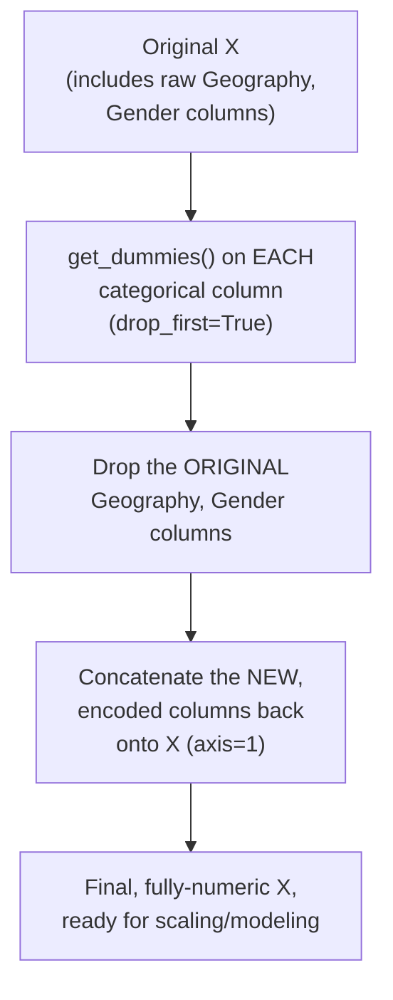

#### ⚠ Common Mistakes

* Forgetting to DROP the original categorical columns after creating their one-hot-encoded replacements — explicitly, directly demonstrated as a necessary, separate step, since simply CREATING the new columns doesn't automatically remove the old, now-redundant ones.
* Assuming `pd.concat` with `axis=1` combines DataFrames row-wise — explicitly, directly clarified: `axis=1` specifically means COLUMN-wise concatenation, joining new columns onto the existing DataFrame.

#### 🎯 Key Takeaways

* **Categorical columns** (Geography, Gender) are encoded via `pd.get_dummies()`, converting text categories into genuine, usable numeric columns.
* **`drop_first=True`** is used specifically because N categories can be FULLY represented by N-1 columns — the "dropped" category is implicitly represented when all remaining columns are 0.
* The complete process requires THREE steps in sequence: encode each categorical column, DROP the original columns, then CONCATENATE the new, encoded columns back onto the DataFrame (`axis=1`, column-wise).

---

### 4. Train-Test Split & Feature Scaling (A Key Interview Topic)

#### 💻 Code Example — The Train-Test Split

> 💡 **Given directly:** *"It's time we do a train-test split, because train-test split is required, because we will be training this with the help of ANN."*

```python
from sklearn.model_selection import train_test_split

X_train, X_test, y_train, y_test = train_test_split(X, y, test_size=0.2, random_state=0)
```

#### ❓ Why It Exists — A Genuinely, Explicitly-Flagged Interview Question: Which Algorithms Need Feature Scaling?

> 💡 **Given directly, the precise, complete answer:** *"For which all algorithm feature scaling is required... for ANN it will get required, for linear regression, for logistic regression -- decision tree, not necessary, random forest, not necessary, XGBoost, not necessary. If I talk about KNN, yes it can require, for K-means, it will be definitely important."*

> 💡 **Given directly, the precise, general RULE underlying this list:** *"For which all algorithm first of all, anything that is related to DISTANCE-BASED, we really need to do feature scaling... because whenever there is some distance-based problem, you will definitely know that if the value is bigger, the calculation will definitely take time. Then the second thing is that wherever GRADIENT DESCENT or optimizer is involved -- like gradient descent is involved in linear regression, logistic regression -- in this particular case also, scaling will be required, right, so that our convergence... will be quicker."*

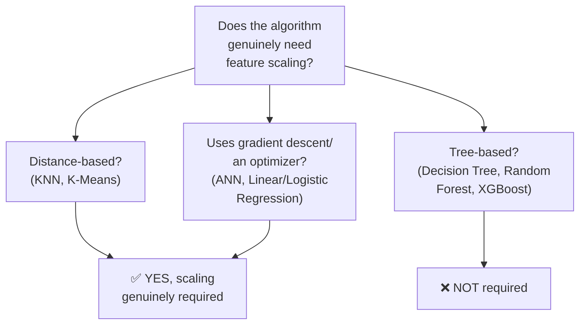

#### 💻 Code Example — Applying `StandardScaler`

> 💡 **Given directly, precisely explaining the choice of StandardScaler over MinMaxScaler:** *"Standard scaler basically means, based on that Z-score that you have probably seen those formulas... suppose if your data is normalized, it basically rotates around your mean value, with some standard deviation to the right and the left... MinMaxScaler, anything that you want to restrict between 0 to 1, or minus 1 to plus 1 -- that you should definitely try with respect to CNN."*

```python
from sklearn.preprocessing import StandardScaler

sc = StandardScaler()
X_train = sc.fit_transform(X_train)
X_test = sc.transform(X_test)
```

#### ❓ Why It Exists — A SECOND, Genuinely Common Interview Question: Why `fit_transform` Only on Training Data?

> 💡 **Given directly, the precise, direct answer:** *"Why do we apply `fit_transform` only to the training dataset, not to the test dataset? ...Because of DATA LEAKAGE."*

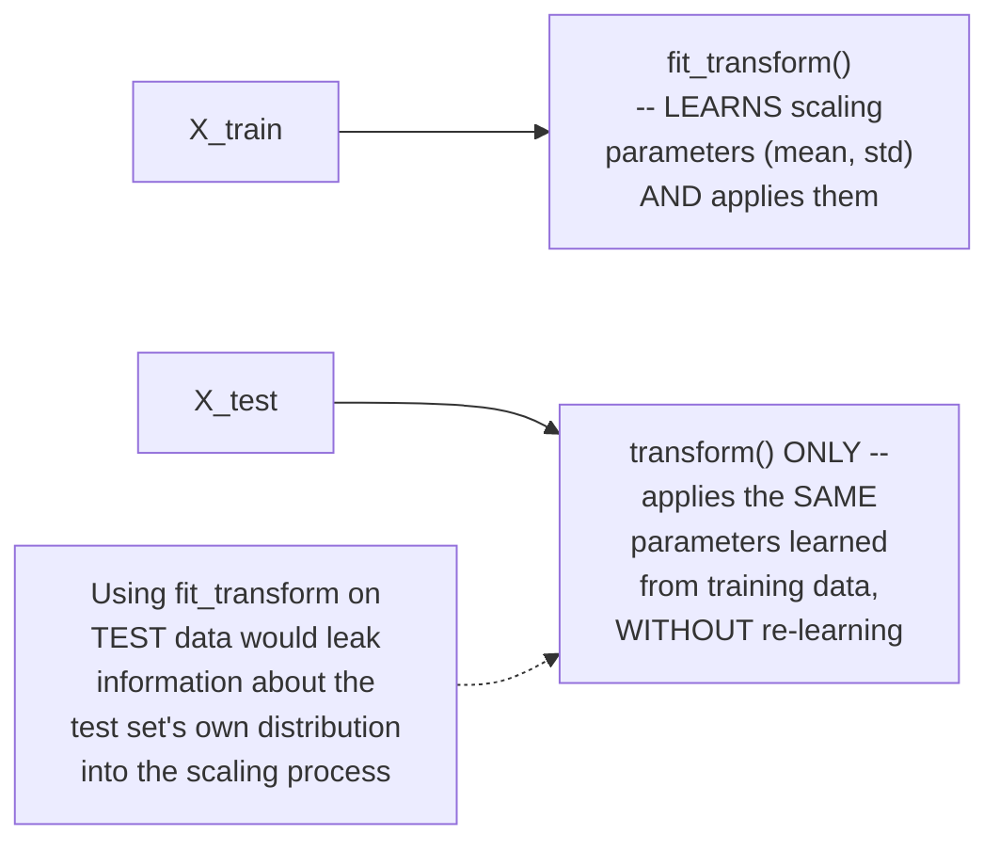

#### ⚠ Common Mistakes

* Applying `fit_transform` to BOTH training and test data — explicitly, directly identified as a genuine data leakage error: the scaler's parameters (mean, standard deviation) must be learned ONLY from training data, then applied UNCHANGED to test data via `transform` alone.
* Assuming feature scaling is universally required for every machine learning algorithm — explicitly, directly corrected: it's specifically required for DISTANCE-BASED algorithms (KNN, K-Means) and GRADIENT-DESCENT-based algorithms (ANN, linear/logistic regression) — NOT for tree-based algorithms (Decision Tree, Random Forest, XGBoost).

#### 🎯 Key Takeaways

* **Feature scaling is genuinely required** for distance-based algorithms (KNN, K-Means) and gradient-descent/optimizer-based algorithms (ANN, linear regression, logistic regression) — explicitly NOT required for tree-based algorithms.
* **`StandardScaler`** (Z-score based, centered on the mean) is used here; `MinMaxScaler` (restricting to a fixed 0-1 or -1-to-1 range) is explicitly deferred to the next day's CNN work.
* **`fit_transform` is applied ONLY to training data**; test data receives `transform` ONLY (no re-fitting) — specifically to avoid genuine data leakage.

---
### 5. Understanding Sequential, Dense & Dropout Before Building

#### 📖 Definition — TensorFlow and Keras, Precisely Related

> 💡 **Given directly:** *"Whenever we talk about this, the library that we are going to use is basically TensorFlow -- a popular library, this was open-sourced by Google... before TensorFlow 2.0, TensorFlow was separate, Keras is a wrapper... after 2.0, what happened -- Keras and TensorFlow got integrated, so that basically means now Keras is inside this TensorFlow version itself."*

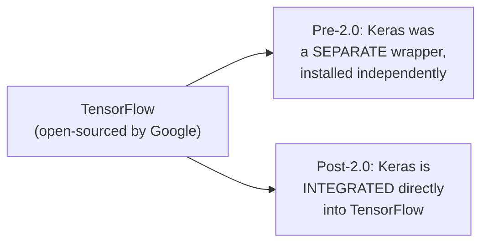

#### 📖 Definition — Sequential, Precisely Explained via the Whole-Network Analogy

> 💡 **Given directly:** *"When I take this entire neural network at once... as a block, I will basically say that as sequential -- this sequential basically indicates that we will definitely be able to do forward propagation and backward propagation. So I just think as a huge block that has a neural network inside this, and that can basically be done with the help of sequential."*

```python
from tensorflow.keras.models import Sequential
from tensorflow.keras.layers import Dense, Dropout
```

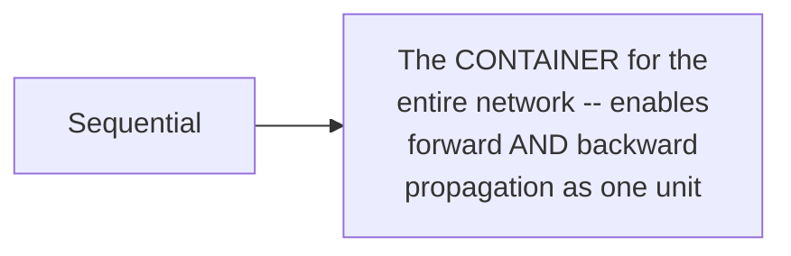

#### 📖 Definition — Dense, Precisely Explained as "the Neuron-Creating Layer"

> 💡 **Given directly:** *"Whenever we use dense, that basically means we'll be able to create these circles in the hidden layer -- we'll be able to create neurons in the hidden layer, we'll be able to create all the different neurons -- whenever we need to create neurons, or input layer, or these circles, at that point of time we'll be using the dense layer."*

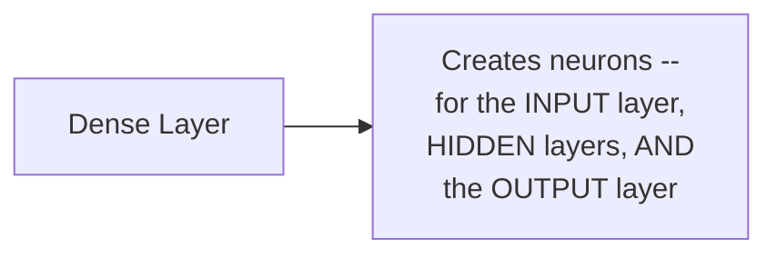

#### 📖 Definition — Dropout, Precisely Explained as a Regularization Technique

> 💡 **Given directly, the complete, precise mechanism:** *"This dropout layer -- what it does, it is just like a regularization parameter, which we learnt in machine learning... every layer, suppose if I say my dropout ratio is 0.3, this basically indicates that 30 percentage of the entire neurons that are present in this layer will get deactivated while training."*

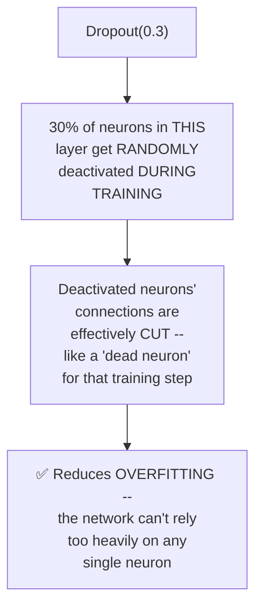

#### ❓ Why It Exists — Precisely Connecting Dropout to Overfitting

> 💡 **Given directly:** *"When I have this interconnected multi-layered neural network... sometimes this entire neural network leads to overfitting. Now what is overfitting? Overfitting basically says, for training, my accuracy is very good, very high, but for test, my accuracy goes down."*

#### ⚠ Common Mistakes

* Assuming `Sequential`, `Dense`, and `Dropout` are three unrelated, independent imports — explicitly, directly connected: `Sequential` is the overall CONTAINER; `Dense` CREATES the neurons within it; `Dropout` is an OPTIONAL regularization layer inserted between dense layers.
* Assuming dropout PERMANENTLY removes neurons from the network — explicitly, directly clarified: deactivation is specific to EACH TRAINING STEP, with a RANDOMLY different subset of neurons deactivated each time — no neuron is permanently removed.

#### 🎯 Key Takeaways

* **Sequential** is the container enabling the entire network to perform forward and backward propagation as one connected unit.
* **Dense** is the layer type used to CREATE neurons — for the input layer, hidden layers, AND the output layer alike.
* **Dropout** randomly deactivates a configurable PERCENTAGE of neurons during each training step (not permanently) — a genuine regularization technique specifically countering overfitting (high training accuracy, poor test accuracy).

---

### 6. Building the ANN: Input, Hidden & Output Layers

#### 💻 Code Example — Initializing the Network

> 💡 **Given directly:** *"Let's initialize the ANN... `classifier = Sequential()` -- so this is the classifier that I'm specifically going to use."*

```python
classifier = Sequential()
```

#### 💻 Code Example — Adding the Input Layer

> 💡 **Given directly, the precise reasoning for `units=11`:** *"We know how many inputs are there -- see, if I probably go and see my `X_train.shape`, there are 11 inputs, so definitely in the input layer, I need to have 11 nodes."*

```python
classifier.add(Dense(units=11, activation='relu'))
```

> 💡 **Given directly, a precise clarification on how "activation" applies here:** *"This will get applied to the next layer -- relu will get applied to the next upcoming layer... so here only, we need to specify with respect to that."*

#### 💻 Code Example — Adding Two Hidden Layers

> 💡 **Given directly:** *"Adding the second [layer], first hidden layer... classifier.add, and here I'm basically going to again take dense, and let's say that in my first hidden layer, I'm just going to consider 6 units... and then I'm going to basically say that activation function to the next layer will also again be relu."*

```python
classifier.add(Dense(units=6, activation='relu'))    # first hidden layer
classifier.add(Dense(units=6, activation='relu'))    # second hidden layer
```

#### 💻 Code Example — Adding the Output Layer

> 💡 **Given directly, a genuine, direct "pause and guess" moment for the audience:** *"Adding the output layer... I'll just say one neuron, because I actually need to focus on that also, because now this is a binary classification, I just require one neuron -- and here, tell me any guesses, just pause the video and let me know, what is the activation function over here? Since this is a binary classification problem which we have learnt, that is basically sigmoid."*

```python
classifier.add(Dense(units=1, activation='sigmoid'))
```

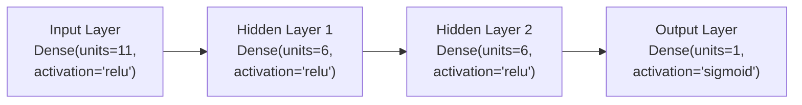

#### ⚠ Common Mistakes

* Assuming the number of units in the INPUT layer is an arbitrary choice — explicitly, directly tied to the actual number of input features (`X_train.shape`, here 11) — this is a structural REQUIREMENT, not a hyperparameter to freely choose.
* Using sigmoid or another activation function in the HIDDEN layers, or ReLU in the OUTPUT layer for this binary classification task — explicitly, directly corrected: ReLU is used in the hidden layers, while sigmoid is specifically reserved for the OUTPUT layer, directly matching the practical rule established in Day 2.

#### 🎯 Key Takeaways

* The **input layer's unit count must match the number of input features** (11, in this dataset) — a structural requirement, not a free choice.
* **Two hidden layers** are used here (6 units each, ReLU activation) — directly matching Day 2's own stated default recommendation (ReLU for hidden layers).
* The **output layer** has exactly ONE neuron with **sigmoid activation** — directly matching the binary classification rule from Day 2's own closing summary table.

---
### 7. Compiling & Training the Model

#### 💻 Code Example — Compiling the Network

> 💡 **Given directly:** *"We have to first of all compile the entire neural network, and here the first thing that we are going to give is optimizer -- what optimizer do we give? We give ADAM optimizer, because it is the best optimizer -- and apart from that, I also have to provide my loss function, since this is a binary problem statement, so I will use binary cross-entropy... and finally the type of metrics that I'm actually going to focus on is my accuracy."*

```python
classifier.compile(optimizer='adam', loss='binary_crossentropy', metrics=['accuracy'])
```

#### 💻 Code Example — Specifying a Custom Learning Rate (Optional)

> 💡 **Given directly:** *"By default, Adam uses a learning rate of 0.01. If you really want to provide your own learning rate, just say... `tensorflow.keras.optimizers.Adam`... I can specify my learning rate."*

```python
opt = tf.keras.optimizers.Adam(learning_rate=0.01)
classifier.compile(optimizer=opt, loss='binary_crossentropy', metrics=['accuracy'])
```

#### 💻 Code Example — Training: The First, Unbounded Attempt (1,000 Epochs)

> 💡 **Given directly, the complete, live-demonstrated training call:** *"`model_history = classifier.fit`... `X_train, y_train`... `validation_split=0.33`... `batch_size=10`... `epochs=1000`... let's give epochs 1,000, and just execute it."*

```python
model_history = classifier.fit(
    X_train, y_train,
    validation_split=0.33,
    batch_size=10,
    epochs=1000,
)
```

#### 🔍 Internal Working — Precisely What `validation_split` Does

> 💡 **Given directly:** *"Validation split basically says that it's just like how many data you're going to basically validate -- based on some batch size, if you say validation split is 0.33, just imagine the entire training data set is there, you're just taking somewhere around 66 percentage of the data, and you are basically using it, and you are dividing the data set with respect to every epoch, so that it takes up for the training purpose."*

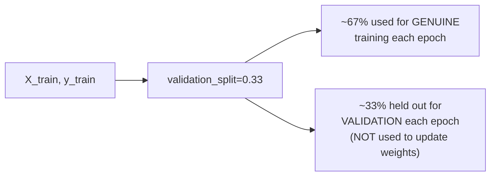

#### 🪜 Step-by-Step — The Live-Observed Result: Accuracy Plateaus, Training Is Manually Interrupted

> 💡 **Given directly, the honest, live-observed outcome:** *"Here you can see that it is going on quickly, in an efficient way... 86 percent... it is rotating there itself, right? It is not increasing, or it is not reducing... so what am I going to do? I am just going to do the stop part."*

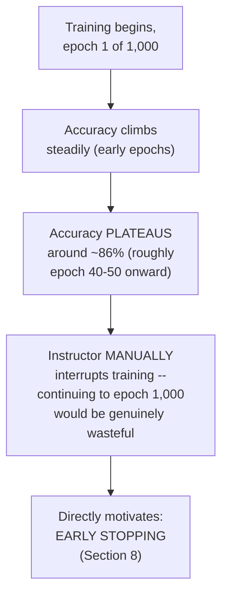

#### ⚠ Common Mistakes

* Assuming `batch_size=10` here contradicts Day 3's own explanation of resource-efficient mini-batch training — explicitly, directly consistent: this IS mini-batch training, applied practically, with a genuinely small batch size appropriate for this dataset's size.
* Assuming training for a large, fixed number of epochs (like 1,000) is the correct, standard practice — explicitly, directly demonstrated as WASTEFUL: the instructor manually interrupts training once accuracy visibly plateaus, directly motivating the NEXT topic (Early Stopping) as the proper, automated solution.

#### 🎯 Key Takeaways

* The model is compiled with the **Adam optimizer**, **binary cross-entropy loss**, and **accuracy** as the tracked metric — directly matching Day 2's own closing rule table for binary classification.
* **`validation_split=0.33`** holds out roughly a third of the training data each epoch specifically for VALIDATION (monitoring genuine, out-of-sample performance) — this data is NOT used to update weights.
* A live, honest demonstration shows accuracy climbing initially, then **plateauing around 86%** well before 1,000 epochs complete — directly, concretely motivating why manually guessing a fixed epoch count is genuinely wasteful, and why Early Stopping (covered next) is the proper solution.

---

### 8. Early Stopping: Solving "How Many Epochs?"

#### ❓ Why It Exists — The Precise, Explicitly-Named Motivating Question

> 💡 **Given directly:** *"The idea that you will be thinking is, what should be my number of epochs, right? Many people have basically asked this question -- so for that, we are going to use early stopping."*

#### 📖 Definition — Early Stopping, Precisely Defined

> 💡 **Given directly:** *"Early stopping -- what it does is that, it makes sure that when the accuracy is not at all increasing, automatically the training of the model will stop."*

#### 💻 Code Example — Configuring `EarlyStopping`

> 💡 **Given directly:** *"Stop training when the monitored metric has stopped improving... it is automatically going to stop, and it will be able to understand what epoch it basically stopped."*

```python
from tensorflow.keras.callbacks import EarlyStopping

early_stopping = EarlyStopping(
    monitor='val_loss',
    min_delta=0.0001,
    patience=20,
    verbose=1,
    mode='auto',
)
```

#### 💻 Code Example — Passing Early Stopping Into `.fit()` via `callbacks`

> 💡 **Given directly:** *"I can use one more parameter, where I can say early stopping... `callback` is a function, where I can assign this early stopping -- when I assign this, that basically means we are basically assigning, we are telling that you have to stop, and you have to MONITOR THIS VALIDATION LOSS, and you have to make sure that if it does not improve, I'm just going to stop it over there."*

```python
model_history = classifier.fit(
    X_train, y_train,
    validation_split=0.33,
    batch_size=10,
    epochs=1000,
    callbacks=[early_stopping],
)
```

#### 🪜 Step-by-Step — The Live-Observed, Successful Result

> 💡 **Given directly, the complete, honest, live-observed outcome:** *"Now let's focus on at what epoch it will just stop... we are in 30 epochs now, you can see, epoch 30, early stopping -- so automatically, this stopped, the epoch 30 has got stopped, and now we are basically having 85 percent."*

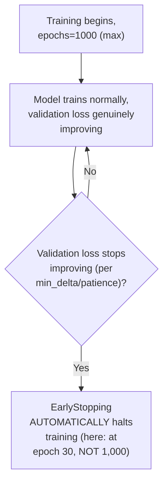

#### 🔍 Internal Working — Plotting Accuracy & Loss, Confirming Early Stopping Worked

> 💡 **Given directly:** *"Model history dot history dot keys -- here you can see loss, accuracy, validation loss, and validation accuracy... this is how my accuracy looks like, and it looks good, because this is the test accuracy that is increasing, and that is maintaining train accuracy -- so this gap is almost very less... this is the power of this early stopping."*

```python
print(model_history.history.keys())   # dict_keys(['loss', 'accuracy', 'val_loss', 'val_accuracy'])

plt.plot(model_history.history['accuracy'])
plt.plot(model_history.history['val_accuracy'])
plt.title('Model Accuracy')
plt.show()

plt.plot(model_history.history['loss'])
plt.plot(model_history.history['val_loss'])
plt.title('Model Loss')
plt.show()
```

#### ⚠ Common Mistakes

* Manually guessing a fixed epoch count and hoping it's "about right" — explicitly, directly demonstrated as an unreliable, wasteful approach compared to letting EarlyStopping determine the correct stopping point automatically, based on genuine validation performance.
* Monitoring TRAINING loss/accuracy for early stopping decisions, rather than VALIDATION loss — explicitly, directly configured to monitor `val_loss` specifically, since training metrics can continue improving even as the model genuinely begins overfitting.

#### 🎯 Key Takeaways

* **EarlyStopping** directly, automatically solves the genuinely common "how many epochs should I use?" question — halting training once the monitored metric (here, `val_loss`) stops genuinely improving.
* The live demonstration shows training genuinely, automatically stopping at **epoch 30** (not the configured maximum of 1,000) — directly, concretely proving the mechanism works as intended.
* A small, healthy GAP between training and validation accuracy/loss curves (directly visualized after training) is explicitly identified as **"the power of early stopping"** — evidence the model stopped BEFORE genuinely overfitting.

---
### 9. Evaluating the Model: Predictions, Confusion Matrix & Weights

#### 💻 Code Example — Generating Predictions With a Threshold

> 💡 **Given directly:** *"`classifier.predict` on `X_test`, and whenever the value is greater than 0.5, right, greater than or equal to 0.5, I'm going to take it as 1, else I'm going to take it as 0."*

```python
y_pred = classifier.predict(X_test)
y_pred = (y_pred > 0.5)
```

#### 💻 Code Example — Building the Confusion Matrix

> 💡 **Given directly:** *"Construct or make the confusion matrix... `from sklearn.metrics import confusion_matrix`... `cm = confusion_matrix(y_test, y_pred)`."*

```python
from sklearn.metrics import confusion_matrix

cm = confusion_matrix(y_test, y_pred)
print(cm)
```

#### 💻 Code Example — Calculating Accuracy Score

> 💡 **Given directly:** *"Calculate the accuracy -- `from sklearn.metrics import accuracy_score`... `score = accuracy_score(y_pred, y_test)`."*

```python
from sklearn.metrics import accuracy_score

score = accuracy_score(y_pred, y_test)
print(score)   # roughly 85-87%, per the live-observed result
```

#### 💻 Code Example — Inspecting the Model's Learned Weights

> 💡 **Given directly:** *"You can also store the weights as a pickle file... so what you can write is that you can just write `classifier.get_weights()`... these are your weights value... it will always be in the array format, because there's so many layers."*

```python
weights = classifier.get_weights()
```

#### 💻 Code Example — Adding Dropout Layers, Live-Debugged Against the Documentation

> 💡 **Given directly, an honest, live-debugged moment consulting the official Keras documentation:** *"When you write `tf.keras.layers.Dropout(0.2)`, you will be able to see this... so here you can basically use dropout in every layer, after every layer -- let's say 20 percent over here, 30 percent right over here."*

```python
classifier = Sequential()
classifier.add(Dense(units=11, activation='relu'))
classifier.add(Dropout(0.2))
classifier.add(Dense(units=6, activation='relu'))
classifier.add(Dropout(0.3))
classifier.add(Dense(units=6, activation='relu'))
classifier.add(Dense(units=1, activation='sigmoid'))
```

> 💡 **Given directly, a genuinely honest acknowledgment that documentation/syntax specifics can change:** *"The documentation syntax always changes, so please make sure that you keep on having a look."*

#### ⚠ Common Mistakes

* Assuming the raw output of `classifier.predict()` is already a binary 0/1 value — explicitly, directly clarified: it's a continuous probability, requiring the explicit `> 0.5` threshold to produce genuine binary predictions.
* Assuming dropout layers must be added to EVERY layer, or with the SAME dropout ratio throughout — explicitly, directly demonstrated as flexible: different layers can genuinely use different dropout ratios (e.g., 0.2 in one place, 0.3 in another), based on the specific network's needs.

#### 🎯 Key Takeaways

* Predictions require an explicit **0.5 threshold** to convert continuous sigmoid outputs into genuine binary classifications.
* The **confusion matrix** and **accuracy score** are the standard evaluation tools used here, both directly computed via `sklearn.metrics`.
* **`classifier.get_weights()`** provides direct access to the model's learned parameters — genuinely useful for saving, inspecting, or transferring a trained model.
* **Dropout layers** can be inserted after any dense layer, with independently-configurable ratios — directly demonstrated live, including an honest, real-time documentation lookup when the exact syntax wasn't immediately remembered.

---

### 10. Black Box vs. White Box Models & What's Next

#### ❓ Why It Exists — A Genuine, Direct "Pause and Guess" Interview-Style Question

> 💡 **Given directly:** *"If I say complex algorithm, like random forest -- can anybody tell me, or write down in the comments, saying that which model this will be, whether this is a black box or a white box? If it is decision tree, whether this is a black box or white box?"*

#### 📖 Definition — White Box Model, Precisely Defined via Decision Tree

> 💡 **Given directly:** *"Decision tree... this is actually a white box model, right, because here, in decision tree, whenever we use this kind of algorithm, we can definitely see it... linear regression, that is fine, linear regression we can definitely see many things, and this becomes a white box model."*

#### 📖 Definition — Black Box Model, Precisely Defined via ANN and Random Forest

> 💡 **Given directly:** *"This is basically a black box model [Random Forest]... if I probably talk about ANN, whether this is white box or black box -- this will also be a black box model, right, because obviously we cannot monitor and see all the weights, it is very difficult... if I probably talk about XGBoost, how many decision trees are used -- this is also a kind of black box model."*

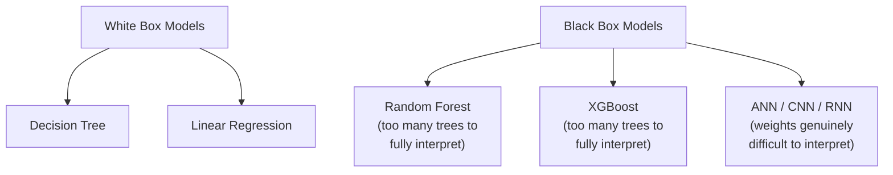

#### 🔍 Internal Working — The Precise Distinguishing Criterion

> 💡 **Given directly:** *"Internal working and all, it is very difficult to check out in some of the algorithms, because it is quite huge, quite big... in random forest, let's say we are taking 100 decision trees -- it is very difficult to monitor each and everything, and we cannot do that."*

#### 🏢 Real-World / Production Usage — Explainable AI, Named as an Active Research Area

> 💡 **Given directly:** *"There is one amazing thing which is called as Explainable AI -- this is also becoming very, very popular, because people want to come up with some kind of tool which will be able to monitor the model, how the model is basically performing with respect to each and every input feature -- this thing is going on as a research."*

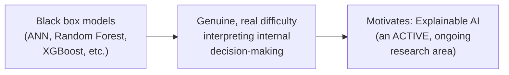

#### 🪜 Step-by-Step — The Explicit, Stated Roadmap Ahead

> 💡 **Given directly:** *"Tomorrow we are going to cover CNN, guys, and after that, let's [move] on the second or the third week -- we will try to cover NLP, where I'll be covering RNN... tomorrow my main plan is to cover CNN and see one practical example."*

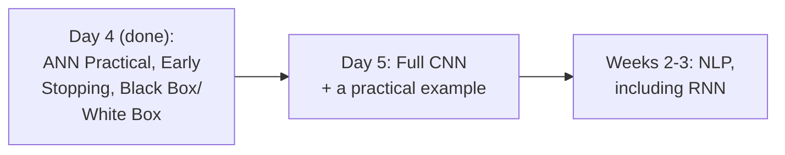

#### ⚠ Common Mistakes

* Assuming "complexity" alone determines black-box status — explicitly, directly clarified: the genuine criterion is whether the model's internal decision-making process can be DIRECTLY, MEANINGFULLY inspected (white box) or is genuinely too difficult to fully interpret due to scale/structure (black box) — even a "simple-sounding" ensemble of 100 decision trees (Random Forest) becomes black box due to sheer scale.
* Assuming black box models are inherently, permanently uninterpretable with no possible remedy — explicitly, directly countered by the existence of **Explainable AI** as a genuine, active research area specifically working to address this limitation.

#### 🎯 Key Takeaways

* **White box models** (Decision Tree, Linear Regression) allow genuine, direct inspection of their internal decision-making process.
* **Black box models** (Random Forest, XGBoost, ANN, CNN, RNN) are genuinely difficult to fully interpret internally — not because they're inherently "bad," but because their scale/structure (many trees, many weights) makes complete, direct inspection impractical.
* **Explainable AI** is explicitly named as a genuine, active, ongoing research area specifically addressing this interpretability gap.
* **Day 5 is explicitly, directly next**, covering CNN in full, with a practical example — RNN and complete NLP coverage are explicitly deferred to weeks 2-3 of the broader course.

---
## 📝 Glossary

| Term | Definition | Why It Matters |
|---|---|---|
| **Churn** | A customer leaving/exiting a service (here, a bank) | The specific binary classification problem solved this session |
| **get_dummies** | Pandas function converting categorical columns into one-hot encoded columns | The method used for Geography and Gender |
| **drop_first** | A parameter dropping one category, since N-1 columns fully represent N categories | Avoids redundant columns |
| **StandardScaler** | Z-score based feature scaling, centered on the mean | Used here; MinMaxScaler deferred to CNN |
| **Data Leakage** | Information from test data improperly influencing training | Why fit_transform is train-only |
| **Sequential** | The Keras container enabling forward + backward propagation as one unit | The starting point for building any Keras model |
| **Dense** | The Keras layer type that creates neurons | Used for input, hidden, AND output layers |
| **Dropout** | A regularization layer randomly deactivating a % of neurons during training | Reduces overfitting |
| **validation_split** | Reserves a fraction of training data per epoch for validation | Used to monitor genuine, out-of-sample performance |
| **EarlyStopping** | A Keras callback halting training once a monitored metric stops improving | Solves "how many epochs?" |
| **Confusion Matrix** | A table summarizing correct/incorrect predictions by class | Standard classification evaluation tool |
| **White Box Model** | A model whose internal decision-making can be directly inspected | Decision Tree, Linear Regression |
| **Black Box Model** | A model too complex/large to fully, directly interpret internally | Random Forest, XGBoost, ANN/CNN/RNN |
| **Explainable AI** | An active research area developing tools to interpret black box models | Directly motivated by the black box problem |

---

## 🔄 Revision Notes — One-Minute Revision

* This is **Day 4 of the 5-day series** -- the FIRST genuinely hands-on coding session, building a complete, working ANN in TensorFlow/Keras on the `Churn_Modelling.csv` dataset (binary classification: will a customer exit the bank?).
* **Data prep**: `X = dataset.iloc[:, 3:13]`, `y = dataset.iloc[:, 13]` -- excludes non-predictive identifier columns (RowNumber, CustomerId, Surname).
* **Categorical encoding**: `pd.get_dummies(col, drop_first=True)` for Geography and Gender -- drop the originals, then `pd.concat(..., axis=1)` the encoded columns back on.
* **Train-test split**: `train_test_split(X, y, test_size=0.2, random_state=0)`.
* **Feature scaling interview question #1**: distance-based (KNN, K-Means) and gradient-descent/optimizer-based (ANN, linear/logistic regression) algorithms NEED scaling; tree-based (Decision Tree, Random Forest, XGBoost) do NOT.
* **Feature scaling interview question #2**: `fit_transform` on X_train ONLY, `transform` on X_test ONLY -- to avoid genuine DATA LEAKAGE.
* **Keras building blocks**: `Sequential` (the whole-network container, enables forward+backward propagation), `Dense` (creates neurons -- input, hidden, output layers alike), `Dropout` (randomly deactivates a % of neurons DURING TRAINING, reduces overfitting).
* **Network built**: input layer (`units=11`, matching the 11 input features, ReLU), 2 hidden layers (`units=6` each, ReLU), output layer (`units=1`, sigmoid -- for binary classification).
* **Compile**: `optimizer='adam'`, `loss='binary_crossentropy'`, `metrics=['accuracy']`.
* **Training (first attempt)**: `epochs=1000`, `batch_size=10`, `validation_split=0.33` -- accuracy genuinely plateaus around 86% well before 1,000 epochs; instructor manually interrupts, directly motivating Early Stopping.
* **EarlyStopping**: monitors `val_loss`, configured with `min_delta`, `patience`, `verbose=1` -- passed via `callbacks=[early_stopping]` -- live-demonstrated automatically stopping training at epoch 30 (not 1,000).
* **Evaluation**: `classifier.predict(X_test)` thresholded at 0.5, `confusion_matrix`, `accuracy_score` (~85-87%), `classifier.get_weights()` for inspecting/saving learned parameters.
* **Black box vs. white box**: Decision Tree and Linear Regression = white box (directly inspectable); Random Forest, XGBoost, ANN/CNN/RNN = black box (too complex to fully interpret) -- directly motivating **Explainable AI** as an active research area.
* **Day 5**: full CNN coverage + a practical example; RNN/complete NLP deferred to weeks 2-3.

---

## 📋 Cheat Sheet

**Complete data pipeline:**
```python
dataset = pd.read_csv('Churn_Modelling.csv')
X = dataset.iloc[:, 3:13]
y = dataset.iloc[:, 13]

geography = pd.get_dummies(X['Geography'], drop_first=True)
gender = pd.get_dummies(X['Gender'], drop_first=True)
X = X.drop(['Geography', 'Gender'], axis=1)
X = pd.concat([X, geography, gender], axis=1)

X_train, X_test, y_train, y_test = train_test_split(X, y, test_size=0.2, random_state=0)

sc = StandardScaler()
X_train = sc.fit_transform(X_train)   # fit_transform: TRAIN ONLY
X_test = sc.transform(X_test)           # transform: TEST ONLY (avoids data leakage)
```

**Feature scaling: which algorithms need it?**
```text
NEEDS scaling: distance-based (KNN, K-Means) | gradient-descent-based (ANN, Linear/Logistic Regression)
DOES NOT need scaling: tree-based (Decision Tree, Random Forest, XGBoost)
```

**Building the ANN:**
```python
classifier = Sequential()
classifier.add(Dense(units=11, activation='relu'))   # input layer -- units = # of features
classifier.add(Dense(units=6, activation='relu'))       # hidden layer 1
classifier.add(Dense(units=6, activation='relu'))         # hidden layer 2
classifier.add(Dense(units=1, activation='sigmoid'))        # output layer -- binary classification
```

**Compile & train:**
```python
classifier.compile(optimizer='adam', loss='binary_crossentropy', metrics=['accuracy'])

early_stopping = EarlyStopping(monitor='val_loss', min_delta=0.0001, patience=20, verbose=1)
model_history = classifier.fit(X_train, y_train, validation_split=0.33,
                                batch_size=10, epochs=1000, callbacks=[early_stopping])
```

**Evaluation:**
```python
y_pred = classifier.predict(X_test) > 0.5
cm = confusion_matrix(y_test, y_pred)
score = accuracy_score(y_pred, y_test)
weights = classifier.get_weights()
```

**Black box vs. white box:**
```text
White Box: Decision Tree, Linear Regression       -- directly interpretable
Black Box: Random Forest, XGBoost, ANN/CNN/RNN     -- too complex to fully interpret
```

---

## 🔥 Interview Questions & Answers

### 🟢 Beginner

**Q1.**

**Question:** Which algorithms genuinely require feature scaling?

**Answer:** Distance-based algorithms (KNN, K-Means) and gradient-descent/optimizer-based algorithms (ANN, linear regression, logistic regression).

**Explanation:** Directly, explicitly stated, flagged as a genuinely common interview question.

**Why Interviewers Ask This:** Explicitly named in the source material as a super important, commonly-asked question.

**Possible Follow-up:** "Which algorithms do NOT require feature scaling?"

**Q2.**

**Question:** Why is `fit_transform` applied only to training data, not test data?

**Answer:** To avoid data leakage.

**Explanation:** Directly, precisely stated.

**Why Interviewers Ask This:** Explicitly flagged as a genuinely common interview question.

**Possible Follow-up:** "What method should be applied to test data instead?"

**Q3.**

**Question:** What does `drop_first=True` do in `pd.get_dummies()`?

**Answer:** Drops one category's column, since N-1 columns can fully represent N categories.

**Explanation:** Directly, precisely explained.

**Why Interviewers Ask This:** Basic, practical feature engineering knowledge.

**Possible Follow-up:** "How would you determine the value of the dropped category from the remaining columns?"

**Q4.**

**Question:** What does `Sequential` represent in Keras?

**Answer:** The container for the entire network, enabling forward and backward propagation as one connected unit.

**Explanation:** Directly, precisely explained.

**Why Interviewers Ask This:** Foundational, practical Keras knowledge.

**Possible Follow-up:** "What layer type is used to create neurons within this container?"

**Q5.**

**Question:** What does the Dropout layer do?

**Answer:** Randomly deactivates a configurable percentage of neurons during each training step, reducing overfitting.

**Explanation:** Directly, precisely explained.

**Why Interviewers Ask This:** Foundational regularization knowledge.

**Possible Follow-up:** "Does dropout permanently remove neurons from the network?"

**Q6.**

**Question:** How many units should the output layer have for a binary classification problem, and what activation function should it use?

**Answer:** 1 unit, sigmoid activation.

**Explanation:** Directly, precisely stated.

**Why Interviewers Ask This:** Basic, practical architecture-design knowledge.

**Possible Follow-up:** "How many units should the input layer have?"

**Q7.**

**Question:** What problem does EarlyStopping directly solve?

**Answer:** Determining how many epochs to train for, by automatically halting training once a monitored metric (e.g., validation loss) stops improving.

**Explanation:** Directly, precisely explained.

**Why Interviewers Ask This:** A commonly-asked, practical training question.

**Possible Follow-up:** "Which metric is typically monitored for early stopping decisions?"

**Q8.**

**Question:** Is a Decision Tree a white box or black box model?

**Answer:** White box.

**Explanation:** Directly, explicitly stated.

**Why Interviewers Ask This:** Basic, foundational model-interpretability knowledge.

**Possible Follow-up:** "Is Random Forest also a white box model?"

**Q9.**

**Question:** Name three examples of black box models.

**Answer:** Random Forest, XGBoost, and ANN (or CNN/RNN).

**Explanation:** Directly, explicitly named.

**Why Interviewers Ask This:** Tests awareness of model-interpretability categorization.

**Possible Follow-up:** "What research field specifically addresses the black box interpretability problem?"

**Q10.**

**Question:** What method provides direct access to a trained Keras model's learned parameters?

**Answer:** `classifier.get_weights()`.

**Explanation:** Directly, explicitly stated.

**Why Interviewers Ask This:** Basic, practical Keras knowledge.

**Possible Follow-up:** "What format are these weights typically returned in?"

---

### 🟡 Intermediate

**Q11.**

**Question:** Explain why the instructor deliberately runs training for 1,000 epochs FIRST (and manually interrupts it) before introducing EarlyStopping, rather than configuring EarlyStopping from the very start.

**Answer:** This is a deliberate pedagogical choice directly demonstrating the PROBLEM before presenting the solution. By first showing training genuinely, visibly plateauing around 86% accuracy well before 1,000 epochs -- and requiring a MANUAL interruption -- the instructor makes the "how many epochs?" question genuinely CONCRETE and KEENLY FELT, rather than abstract. This directly mirrors this entire course's broader teaching pattern (established across Days 1-3): demonstrate a real problem live, THEN introduce the concept that solves it -- making the motivation for EarlyStopping genuinely experiential, not merely asserted.

**Explanation:** Requires recognizing a deliberate "show the problem, then the solution" teaching sequence.

**Why Interviewers Ask This:** Tests whether a learner recognizes deliberate pedagogical demonstration as distinct from directly jumping to the answer.

**Possible Follow-up:** "At approximately what epoch did the instructor observe accuracy genuinely plateauing in the live demonstration?"

**Q12.**

**Question:** A learner argues that since `validation_split=0.33` already reserves data for monitoring model performance during training, a completely separate test set (`X_test`, `y_test`) is redundant and unnecessary. Evaluate this claim.

**Answer:** This claim conflates two genuinely different purposes. `validation_split` data is used REPEATEDLY, DURING training, specifically to monitor whether the model is improving epoch by epoch (and to power EarlyStopping's own decision-making) -- but because this SAME validation data is checked so many times throughout training, there's a real risk that HYPERPARAMETER choices (like when to stop, or which architecture to use) become implicitly "tuned" to perform well on THIS specific validation split, even without directly training weights on it. The genuinely SEPARATE `X_test`/`y_test` set, held out and NEVER used during training or validation-based decision-making, provides a truly independent, unbiased final evaluation of the model's genuine generalization performance -- directly serving a different, complementary purpose than validation data. Removing the separate test set would eliminate the ONLY genuinely unbiased final checkpoint in the entire pipeline.

**Explanation:** Tests whether a learner distinguishes validation data's role (guiding training decisions) from test data's role (final, unbiased evaluation).

**Why Interviewers Ask This:** Distinguishes candidates who understand the genuine, separate purposes of validation and test data from those who conflate them.

**Possible Follow-up:** "If you used your test set's performance to decide on a different model architecture, what problem would this introduce?"

**Q13.**

**Question:** Explain, precisely, why the input layer's `units` parameter must equal the number of input features (11 in this dataset), while the hidden layers' `units` parameter (6, in this example) is a genuinely free, tunable choice.

**Answer:** The input layer's unit count is a STRUCTURAL requirement, not a design choice: each input feature must be received by the network as a genuinely distinct input value, meaning the input layer must have EXACTLY as many "slots" as there are features -- 11 features genuinely require 11 corresponding input connections, with no flexibility to use more or fewer without either discarding real data or fabricating nonexistent inputs. Hidden layer unit counts, by contrast, represent the network's INTERNAL REPRESENTATIONAL CAPACITY -- how many distinct "concepts" or feature combinations the layer can learn to represent -- and this capacity is genuinely a DESIGN CHOICE with real trade-offs (more units = more capacity but more parameters/risk of overfitting; fewer units = less capacity but potentially less overfitting risk), not a value dictated by the data's own inherent structure the way the input layer's size is.

**Explanation:** Requires reasoning through the structural (data-determined) vs. design (freely-chosen) distinction between input and hidden layer sizing.

**Why Interviewers Ask This:** Tests whether a learner understands WHY input layer size is fixed while hidden layer size is a genuine hyperparameter.

**Possible Follow-up:** "If your dataset had 20 input features instead of 11, would you need to change the hidden layer sizes too? Why or why not?"

**Q14.**

**Question:** Using this session's precise "black box vs. white box" distinction, explain why the instructor specifically classifies XGBoost as black box despite it being fundamentally an ensemble of DECISION TREES — which are themselves individually classified as white box.

**Answer:** This is a genuinely important, precise point directly addressed in the session's own reasoning: interpretability doesn't simply "inherit" from a model's individual COMPONENTS -- it depends on whether the model's OVERALL, AGGREGATE decision-making process can be genuinely, practically inspected as a WHOLE. A SINGLE decision tree is genuinely white box, since its complete decision path (a sequence of simple, inspectable if-then splits) can be directly traced and understood. XGBoost, per the session's own explicit reasoning ("how many decision trees are used, this is also a kind of black box model"), combines potentially HUNDREDS of individual decision trees, with the FINAL prediction being some aggregated combination of all their individual outputs -- even though EACH INDIVIDUAL tree remains, in isolation, genuinely inspectable, the SHEER SCALE of combining many such trees makes the OVERALL, AGGREGATE decision process genuinely impractical to fully trace and understand as a unified whole. This directly illustrates that black-box status is a property of the MODEL'S OVERALL COMPLEXITY/SCALE, not merely a property inherited unchanged from its individual building blocks.

**Explanation:** Requires resolving an apparent tension (white-box components producing a black-box model) using the session's own precise reasoning about scale and aggregate interpretability.

**Why Interviewers Ask This:** Tests whether a learner understands that interpretability is a property of the WHOLE system, not simply inherited from individual components.

**Possible Follow-up:** "Would a Random Forest with only 2 decision trees genuinely be considered black box, using this same reasoning? Where might the practical line be?"

**Q15.**

**Question:** Synthesize this session's dropout explanation (Section 5) with its early stopping explanation (Section 8) to explain why BOTH techniques are described as addressing overfitting, yet operate via genuinely different mechanisms.

**Answer:** Both techniques genuinely target the SAME underlying problem (overfitting -- high training accuracy, poor test/validation accuracy) but intervene at DIFFERENT points and via DIFFERENT mechanisms. **Dropout** (Section 5) intervenes WITHIN each individual training step, by randomly deactivating a subset of neurons -- directly preventing the network from becoming OVERLY RELIANT on any single neuron or narrow combination of neurons, forcing it to learn more genuinely ROBUST, DISTRIBUTED representations that don't over-fit to specific, narrow patterns in the training data. **Early Stopping** (Section 8), by contrast, intervenes ACROSS the ENTIRE training process, by monitoring validation performance over TIME and halting training once further training would likely lead toward overfitting (validation performance stops improving even as training performance might continue climbing) -- a genuinely TEMPORAL intervention, rather than dropout's STRUCTURAL/architectural one. These two techniques are therefore genuinely COMPLEMENTARY, not redundant: dropout changes HOW the network learns at each step; early stopping changes WHEN training stops -- both reducing overfitting, but through entirely different mechanisms operating at different levels of the training process.

**Explanation:** Requires synthesizing two separately-taught overfitting-reduction techniques to precisely distinguish their genuinely different mechanisms and points of intervention.

**Why Interviewers Ask This:** A senior-level question testing whether a candidate can distinguish multiple techniques addressing the SAME problem via genuinely DIFFERENT mechanisms, rather than treating them as interchangeable.

**Possible Follow-up:** "Would using BOTH dropout and early stopping together provide genuine, additive benefit, or would they be redundant? Explain your reasoning."

---

### 🔴 Advanced

**Q16.**

**Question:** Design a complete, from-scratch data pipeline for a hypothetical NEW dataset predicting employee attrition (whether an employee will leave a company), with 8 numeric features and 2 categorical features (Department: 4 unique values; WorkMode: 3 unique values), explicitly specifying the resulting input layer's unit count.

**Answer:** A reasonable, complete pipeline, directly applying this session's own exact methodology: (1) Split into `X` (independent features) and `y` (the "Attrition" target), excluding any genuine identifier columns (e.g., EmployeeID), per Section 2's own reasoning. (2) Apply `pd.get_dummies(X['Department'], drop_first=True)` -- since Department has 4 unique values, this produces 3 new, encoded columns (per Section 3's own "N categories -> N-1 columns" logic). (3) Apply `pd.get_dummies(X['WorkMode'], drop_first=True)` -- since WorkMode has 3 unique values, this produces 2 new, encoded columns. (4) Drop the original 'Department' and 'WorkMode' columns, then `pd.concat` the 5 new encoded columns (3+2) back onto X, directly per Section 3's exact process. (5) The final X now has: 8 original numeric features + 3 (Department encoding) + 2 (WorkMode encoding) = **13 total columns**. (6) Per Section 6's own precise reasoning (input layer units must match the number of input features), the ANN's input layer should use **`Dense(units=13, activation='relu')`** -- directly, precisely matching this newly-calculated feature count.

**Explanation:** Requires applying the session's own exact categorical-encoding and input-layer-sizing methodology to a genuinely new dataset, correctly calculating the resulting feature count.

**Why Interviewers Ask This:** A realistic, senior-level question testing whether a candidate can apply the taught pipeline to a genuinely new scenario, correctly tracking how categorical encoding changes the final feature count.

**Possible Follow-up:** "If you instead used `drop_first=False` for both categorical columns, how many total input features (and therefore input layer units) would you have?"

**Q17.**

**Question:** Critically evaluate: "Since this session shows EarlyStopping automatically determined that epoch 30 was the correct stopping point for THIS specific dataset and architecture, epoch 30 should be treated as a genuinely universal, reusable default for any similar binary classification ANN." Is this an accurate characterization?

**Answer:** Not accurate -- this significantly overstates a dataset-and-architecture-SPECIFIC result into an unwarranted, universal rule. The specific epoch count (30) at which EarlyStopping halted training is a direct CONSEQUENCE of this SPECIFIC dataset's size, complexity, and the SPECIFIC architecture used (2 hidden layers of 6 units each, this specific batch size, this specific learning rate) -- none of which the session claims would generalize identically to a genuinely DIFFERENT dataset or architecture. A dataset with more genuine complexity, more features, a different batch size, or a different network architecture would very plausibly require a genuinely DIFFERENT number of epochs before EarlyStopping's own monitored metric (validation loss) similarly plateaus. This is PRECISELY WHY EarlyStopping exists as an AUTOMATED, ADAPTIVE mechanism in the first place (per Section 8's own explicit motivation) -- rather than a fixed, hard-coded epoch count -- specifically because the CORRECT stopping point genuinely VARIES across different datasets and architectures, and cannot be reliably predicted or reused as a universal constant in advance.

**Explanation:** Tests whether a learner recognizes that a specific, empirically-observed result (epoch 30) is bound to its specific context, not a universal, transferable constant -- and that this is PRECISELY the reason EarlyStopping exists as an adaptive mechanism.

**Why Interviewers Ask This:** Distinguishes candidates who understand the genuinely context-dependent nature of a specific empirical result from those who inaccurately generalize it into a universal rule.

**Possible Follow-up:** "Why would hard-coding 'epoch 30' as a fixed default, rather than using EarlyStopping, genuinely be a worse practice for a new, different dataset?"

**Q18.**

**Question:** Synthesize this session's precise feature-scaling rule (Section 4) with its complete ANN architecture (Section 6) to explain a genuinely non-obvious implication: would this specific ANN's predictions genuinely change if feature scaling were entirely OMITTED, given that ReLU (used in the hidden layers) has an UNBOUNDED positive range, unlike sigmoid's bounded 0-1 range?

**Answer:** Yes, predictions would genuinely, substantially change (almost certainly for the worse) if feature scaling were omitted, and this reveals a subtlety beyond simply "ANN needs scaling because it's gradient-descent-based" (Section 4's own stated general rule). Even though ReLU's own OUTPUT range is unbounded (unlike sigmoid), the ACTUAL PROBLEM feature scaling addresses occurs specifically at the INPUT to each neuron -- the weighted summation step (`w^T·x + b`, from Day 1's own established formula). Without scaling, INPUT FEATURES on wildly different natural scales (e.g., "EstimatedSalary" potentially ranging into the hundreds of thousands, versus "Age" ranging from roughly 18-90, or one-hot-encoded columns ranging only 0-1) would cause the WEIGHTED SUM computation to be genuinely DOMINATED by whichever feature happens to have the largest raw numeric scale, REGARDLESS of that feature's actual, genuine predictive importance -- directly distorting which features the network's gradient descent-based training (per Section 4's own stated general rule) can effectively learn to weigh appropriately. This effect occurs BEFORE ReLU is ever applied -- meaning ReLU's own unbounded output range doesn't protect against this input-scale problem at all; the genuine issue is entirely about the RELATIVE MAGNITUDE of different input FEATURES reaching the weighted-sum computation, a concern that exists identically regardless of which specific activation function is used afterward.

**Explanation:** Requires synthesizing the precise mechanics of feature scaling's purpose with the network's actual internal computation (weighted summation, from Day 1) to reason through why ReLU's unbounded output doesn't change the genuine need for input-side scaling.

**Why Interviewers Ask This:** A capstone-level question testing whether a candidate can reason precisely about WHERE in the computation feature scaling's benefit actually applies, correctly distinguishing input-side scaling concerns from activation-function output-range properties.

**Possible Follow-up:** "Would this same reasoning apply equally to the OUTPUT layer's sigmoid activation, or is sigmoid's bounded range genuinely relevant there in a different way?"

---

## 🧪 Scenario-Based Interview Questions

> **Scenario 1:** A colleague's ANN, trained on a genuinely similar churn-prediction dataset, shows training accuracy climbing to 98% while validation accuracy plateaus and even slightly DECREASES after epoch 50, despite EarlyStopping being configured. Using this session's concepts, diagnose the most likely cause.

**Structured Answer:**
1. **Initial investigation:** Recognize this as a classic, textbook symptom of overfitting, directly connected to Section 5's own precise definition ("for training, my accuracy is very good, very high, but for test, my accuracy goes down").
2. **Metrics/logs to check:** Directly verify the colleague's EarlyStopping configuration -- specifically checking `min_delta` and `patience` values, and confirming `monitor='val_loss'` (not `'loss'`, which would monitor training loss instead).
3. **Possible causes:** Per Section 5's own reasoning, the colleague's network may genuinely lack dropout layers, or may have a `patience` value set too HIGH (allowing training to continue too long past the genuine point of overfitting before EarlyStopping intervenes).
4. **Debugging approach:** Directly inspect whether Dropout layers (per Section 9's own demonstrated pattern) are present in the architecture, and review the exact EarlyStopping configuration values.
5. **Resolution:** Add Dropout layers (e.g., 0.2-0.3 ratio, per Section 9's own example) between dense layers, and/or reduce the `patience` value in EarlyStopping's configuration, directly applying both of this session's own overfitting-reduction techniques together (per Intermediate Q15's own reasoning about their complementary nature).
6. **Prevention:** Establish a standing team practice of including BOTH dropout AND appropriately-tuned EarlyStopping in every ANN architecture by default, directly modeling this session's own complete, demonstrated pattern.

> **Scenario 2 (Advanced):** Your team deploys a black box ANN model (like this session's own churn predictor) into production, and a business stakeholder asks why the model predicted a SPECIFIC customer would churn, requiring a genuine, specific explanation for a regulatory compliance review. Using this session's concepts, evaluate what options are genuinely available.

**Structured Answer:**
1. **Initial investigation:** Recognize this as a genuine, real-world instance of the black-box interpretability problem directly described in Section 10 -- an ANN's internal weights and decision process are explicitly, directly described as genuinely difficult to fully interpret.
2. **Relevant principle:** Per Section 10's own precise reasoning, this is exactly the kind of situation motivating the field of **Explainable AI** -- specialized tools and techniques specifically developed to provide genuine, interpretable explanations for otherwise black-box model predictions.
3. **Possible causes for this genuine difficulty:** The model's prediction emerges from a complex combination of many weighted connections across multiple layers (per Section 6's own architecture) -- there's no single, simple decision path (unlike a Decision Tree's white-box structure) to directly point to as "the reason" for this specific prediction.
4. **Debugging/evaluation approach:** Research and evaluate genuine Explainable AI techniques (e.g., SHAP values, LIME) -- tools SPECIFICALLY designed to approximate feature-level explanations for black-box model predictions, directly addressing the exact need Section 10 identifies.
5. **Resolution:** Implement an appropriate Explainable AI technique to generate a genuine, feature-level explanation for the specific prediction in question, providing the stakeholder with an interpretable (even if approximate) account of which input features most influenced this specific customer's churn prediction.
6. **Prevention:** Establish a standing organizational practice of incorporating Explainable AI tooling into any black-box model deployment where genuine, specific explanations may later be required (regulatory, business, or customer-facing contexts), directly anticipating this exact need before it becomes an urgent, reactive request.

---

## 🛠 Hands-on Exercises

### 🟢 Easy

1. Write out, from memory, the complete data pipeline (loading, splitting X/y, encoding categorical columns) using this session's exact code pattern.
2. Explain, in your own words, why `fit_transform` is used on training data and `transform` alone on test data.
3. Build a simple Sequential model with an input layer, one hidden layer, and a sigmoid output layer, for a binary classification problem of your own choosing.

### 🟡 Medium

4. Complete the full, worked feature-count calculation proposed in Advanced Interview Q16, using a genuinely different hypothetical dataset of your own choosing.
5. Train the complete churn-prediction ANN from this session on the actual `Churn_Modelling.csv` dataset, comparing your results (accuracy, confusion matrix) against the session's own live-observed values.
6. Add Dropout layers to your Section 6 model, and empirically compare training/validation accuracy curves with and without dropout.

### 🔴 Advanced

7. Implement the complete overfitting-diagnosis and fix proposed in Scenario 1, deliberately training a genuinely overfitting model first, then applying both dropout and tuned EarlyStopping to correct it.
8. Research and implement a basic Explainable AI technique (e.g., SHAP) on this session's own trained churn model, generating a genuine, feature-level explanation for at least one specific prediction.
9. Design and implement the input-layer-sizing exercise proposed in Advanced Interview Q16 as genuine, working code, verifying your calculated unit count against the actual shape of your processed X data.

---

## 🏗 Practice Assignment

### Build: "Complete ANN Pipeline, From Raw Data to Evaluated Model"

**Objective:** Directly reproduce this session's own complete, end-to-end ANN pipeline, from raw CSV data through to a fully evaluated, early-stopped model.

**Requirements:**
- A working data pipeline: load a dataset of your own choosing (or the same Churn_Modelling.csv), split into X/y, encode categorical features, split into train/test, and scale features correctly (fit_transform on train, transform on test).
- A complete Keras Sequential model with a correctly-sized input layer, at least 2 hidden layers with ReLU activation, and an output layer with the correct activation function for your problem type.
- A working EarlyStopping configuration, monitoring validation loss, integrated into your training call.
- Complete evaluation: predictions, confusion matrix, accuracy score, and a plotted comparison of training vs. validation accuracy/loss curves.
- A written reflection (200-300 words) on whether your model shows signs of overfitting, underfitting, or neither, and what evidence from your evaluation supports your conclusion.

**Architecture (suggested):**

```text
complete_ann_pipeline/
├── data_pipeline.py                 # loading, encoding, splitting, scaling
├── model_architecture.py              # your Sequential model definition
├── training.py                          # compile + fit with EarlyStopping
├── evaluation.py                          # predictions, confusion matrix, plots
└── REFLECTION.md                            # your written reflection
```

**Expected Functionality:**
- Your pipeline should genuinely, correctly run end to end, producing a trained, evaluated model.
- Your EarlyStopping configuration should genuinely halt training automatically, before reaching your configured maximum epoch count.

**Challenges:**
- Correctly calculating your input layer's unit count after categorical encoding changes your feature count.
- Correctly avoiding data leakage in your feature scaling step.

**Bonus Improvements:**
- Add Dropout layers, and empirically compare model performance with and without them.
- Research and add basic Explainable AI (e.g., SHAP) to generate a genuine explanation for one specific prediction.

---

## 📚 Additional Resources

- **Days 1-3 of this series** -- the direct prerequisite sessions, covering the perceptron, forward/backward propagation, chain rule, activation/loss functions, and the complete optimizer lineage this session directly applies in practice.
- **The community course dashboard** (referenced directly, explicitly free) -- where the dataset (`Churn_Modelling.csv`) and complete notebook code are made available.
- **Official Keras documentation** (referenced directly, consulted live for the Dropout layer's exact syntax) -- explicitly recommended for staying current, since "the documentation syntax always changes."
- **Day 5 of this series** (referenced directly, explicitly next) -- covering CNN in full, with a practical example.

---

## 📌 Final Revision Sheet

### ⭐ Core Concepts
- **Data pipeline**: load -> split X/y (`.iloc`) -> encode categorical (`get_dummies`, `drop_first=True`) -> drop originals -> concatenate -> train-test split -> scale (fit_transform train, transform test).
- **Feature scaling**: needed for distance-based and gradient-descent-based algorithms; NOT needed for tree-based algorithms.
- **`Sequential`** (container) + **`Dense`** (creates neurons) + **`Dropout`** (regularization, reduces overfitting).
- **Architecture**: input units = # of features; hidden layers use ReLU; output layer uses sigmoid (binary) per Day 2's rule table.
- **EarlyStopping**: monitors validation loss, automatically halts training -- directly solves "how many epochs?"
- **Black box vs. white box**: Decision Tree/Linear Regression = white box; Random Forest/XGBoost/ANN = black box -- motivating Explainable AI.

### ⭐ Important Definitions
- **Data Leakage, validation_split** (see Glossary for full definitions).

### ⭐ Important Commands/Code
```python
X = dataset.iloc[:, 3:13]
y = dataset.iloc[:, 13]
geography = pd.get_dummies(X['Geography'], drop_first=True)
X = pd.concat([X.drop(['Geography','Gender'], axis=1), geography, gender], axis=1)
sc = StandardScaler(); X_train = sc.fit_transform(X_train); X_test = sc.transform(X_test)

classifier = Sequential()
classifier.add(Dense(units=11, activation='relu'))
classifier.add(Dense(units=1, activation='sigmoid'))
classifier.compile(optimizer='adam', loss='binary_crossentropy', metrics=['accuracy'])

early_stopping = EarlyStopping(monitor='val_loss', patience=20, verbose=1)
classifier.fit(X_train, y_train, validation_split=0.33, batch_size=10, epochs=1000, callbacks=[early_stopping])
```

### ⭐ Architecture/Process
- Complete pipeline: raw CSV -> feature engineering -> train/test split -> scaling -> build ANN (Sequential + Dense layers) -> compile -> fit (with EarlyStopping) -> evaluate (predictions, confusion matrix, accuracy).

### ⭐ Best Practices
- Always exclude non-predictive identifier columns from model inputs.
- Always use `fit_transform` on train, `transform` on test, to avoid data leakage.
- Always use EarlyStopping (monitoring validation loss) rather than a manually-guessed, fixed epoch count.
- Consider Dropout layers for genuinely overfitting-prone architectures.

### ⭐ Common Mistakes
- Applying `fit_transform` to both train and test data.
- Assuming feature scaling is universally required for every algorithm.
- Manually guessing a fixed epoch count instead of using EarlyStopping.
- Assuming a model's interpretability is simply inherited from its individual components (e.g., XGBoost's individual trees).

### ⭐ Interview Points
- Be ready to state which algorithms need feature scaling and why.
- Be ready to explain data leakage and why fit_transform is train-only.
- Be ready to explain EarlyStopping's mechanism and purpose.
- Be ready to precisely distinguish black box from white box models with correct examples.

### ⭐ Things to Remember
- This is the series' **first genuinely hands-on coding session** -- every prior day's mathematical foundation is now directly applied to a real, working model.
- The instructor's own **honest, live-demonstrated moments** (accuracy plateauing, manually interrupting training, live documentation lookup for Dropout syntax) directly model real, practical development work, not a pre-polished, error-free demo.
- **Day 5 is explicitly, directly next** -- covering CNN in full, with a practical example; RNN and complete NLP are explicitly deferred to weeks 2-3 of the broader course.

---

## 🔗 Source

- [ANN Implementation](https://www.youtube.com/live/ydzFSLDmHmE?si=rtj3A-s-HhuJB8Vj)