# 🧠 Deep Learning Community Session : Understanding & Implementing CNN

- <i>**Session:** Deep Learning Community Session· 
- **Instructor:** Krish Naik
- **Note on scope:** This is the **final day** of the 5-day series, building directly on Days 1-4 (perceptron, propagation, optimizers, and the first practical ANN implementation). This session covers Convolutional Neural Networks completely from scratch — starting with a genuine analogy to the human visual cortex, then building the convolution operation through fully worked, hand-computed numerical examples (a horizontal edge filter and a vertical edge filter, both traced value by value), followed by padding, stride, max pooling, and flattening — before a complete, live, practical implementation training a real CNN on the CIFAR-10 dataset in TensorFlow/Keras. The session closes with Transfer Learning explicitly promised as a follow-up live session, and RNN/NLP deferred further.</i>

---

## 📑 Table of Contents

1. [Session Overview](#-session-overview)
2. [Learning Objectives](#-learning-objectives)
3. [Detailed Notes](#-detailed-notes)
   - [1. Session Context: The Final Day of This Series](#1-session-context-day-5-the-final-day-of-this-series)
   - [2. CNN vs. the Human Brain: The Visual Cortex Analogy](#2-cnn-vs-the-human-brain-the-visual-cortex-analogy)
   - [3. Understanding Images: Channels, Pixels & Min-Max Scaling](#3-understanding-images-channels-pixels--min-max-scaling)
   - [4. The Convolution Operation: A Complete Worked Example](#4-the-convolution-operation-a-complete-worked-example)
   - [5. Why Filters Detect What They Detect: Horizontal vs. Vertical Edges](#5-why-filters-detect-what-they-detect-horizontal-vs-vertical-edges)
   - [6. Padding: Preventing Information Loss](#6-padding-preventing-information-loss)
   - [7. Stride & the Complete Output Size Formula](#7-stride--the-complete-output-size-formula)
   - [8. Filters Are Learned, Not Hardcoded: ReLU & Backpropagation](#8-filters-are-learned-not-hardcoded-relu--backpropagation)
   - [9. Max Pooling: Location Invariance](#9-max-pooling-location-invariance)
   - [10. Flattening & the Complete CNN Architecture](#10-flattening--the-complete-cnn-architecture)
   - [11. Practical Implementation: CIFAR-10 in TensorFlow/Keras](#11-practical-implementation-cifar-10-in-tensorflowkeras)
4. [Glossary](#-glossary)
5. [Revision Notes — One-Minute Revision](#-revision-notes--one-minute-revision)
6. [Cheat Sheet](#-cheat-sheet)
7. [Interview Questions & Answers](#-interview-questions--answers)
8. [Scenario-Based Interview Questions](#-scenario-based-interview-questions)
9. [Hands-on Exercises](#-hands-on-exercises)
10. [Practice Assignment](#-practice-assignment)
11. [Additional Resources](#-additional-resources)
12. [Final Revision Sheet](#-final-revision-sheet)

---

## 🎯 Session Overview

This session completes the 5-day series by building a complete, working understanding of Convolutional Neural Networks — from a genuine neuroscience analogy through to a real, trained model. It covers:

1. **CNN vs. the human brain**, via the visual cortex — precisely explaining that the brain's own visual processing occurs across MULTIPLE sequential layers (V1 through V7 in the session's own illustrative naming), each extracting progressively richer information — directly motivating why CNNs are structured as a sequence of layers too.
2. **The basic structure of digital images**: black-and-white images have a single channel; RGB (color) images have three channels (Red, Green, Blue) — with every pixel value ranging 0-255, and min-max scaling (dividing by 255) converting this to a 0-1 range.
3. **The convolution operation, built through a completely worked, hand-computed numerical example** — a 6×6 image passed through a 3×3 "horizontal edge filter," with EVERY multiplication and addition traced explicitly, producing a genuine 4×4 output.
4. **A second, complete worked example using a "vertical edge filter,"** directly demonstrating how DIFFERENT filter values extract DIFFERENT kinds of information from the SAME image — and precisely how reversing the min-max scaling on the output reveals an actual, visible vertical edge in the resulting black-and-white image.
5. **Padding**, which directly solves the genuine problem of an image shrinking with every convolution operation — building an additional "compound" layer around the image, with the complete formula `n + 2p - f + 1`.
6. **Stride**, and the fully combined output-size formula incorporating image size, filter size, padding, and stride together.
7. **A genuinely important, direct clarification**: filter/kernel values are NOT hardcoded by a developer — they are LEARNED via backpropagation, exactly like weights in a standard ANN, with ReLU applied specifically because its derivative enables this learning process.
8. **Max pooling**, precisely explained via the concept of "location invariance" — extracting the most prominent, clearest signal from each region of a filtered image, live-traced through a complete, worked 2×2 max pooling example with an explicit stride-2 walkthrough.
9. **Flattening**, the final transformation converting the pooled, multi-dimensional output into a single, 1D vector — feeding directly into a standard, fully-connected (dense) ANN layer for final classification.
10. **A complete, live, practical implementation** — building and training a real CNN on the CIFAR-10 dataset (10 image classes, 60,000 images) in TensorFlow/Keras, reaching roughly 70% validation accuracy after 10 live-observed training epochs.

> 💡 **Key framing, given directly, on why this session builds every concept via worked, numerical examples rather than abstract description alone:** *"I hope everybody is getting a clear idea about it... so I hope you are getting an idea about it and you are able to understand over here."* — repeated, direct check-ins throughout, confirming genuine, step-by-step numerical understanding before moving forward.

---

## 🎯 Learning Objectives

By the end of this guide, you will be able to:

- [ ] Explain the analogy between CNN's layered structure and the human visual cortex's own layered processing.
- [ ] Distinguish black-and-white (1-channel) images from RGB (3-channel) images, and explain min-max scaling for pixel values.
- [ ] Manually perform a convolution operation, multiplying and summing a filter against an image region, for a genuinely new example.
- [ ] Write and apply the output-size formula for convolution, both without and with padding and stride.
- [ ] Explain precisely why filter/kernel values are learned via backpropagation, not hardcoded.
- [ ] Explain max pooling's mechanism and its purpose (location invariance), including a manual, worked example.
- [ ] Explain what flattening does, and why it's necessary before a fully-connected layer.
- [ ] Build a complete, working CNN in TensorFlow/Keras: convolution layers, max pooling layers, a flatten layer, and dense layers for classification.

---

## 📚 Detailed Notes

### 1. Session Context: Day 5, The Final Day of This Series

#### 🧠 Concept

> 💡 **Given directly, opening the session:** *"Today we are going to discuss about CNN -- CNN will focus on understanding what exactly is convolutional neural network, and how specifically it works. Whenever we talk about convolutional neural network, we are basically going to mostly discuss about images, and let's say video frames."*

#### 🪜 Step-by-Step — The Stated, Complete Agenda for Today

> 💡 **Given directly:** *"We will try to divide this entire topic in understanding -- first of all, we'll try to understand about CNN versus human brain... second topic, we'll be discussing about convolution operation... third part, which is called as max pooling... fourth topic, we'll understand about the flattened layer... in the fifth part, we are going to see the practical implementation."*

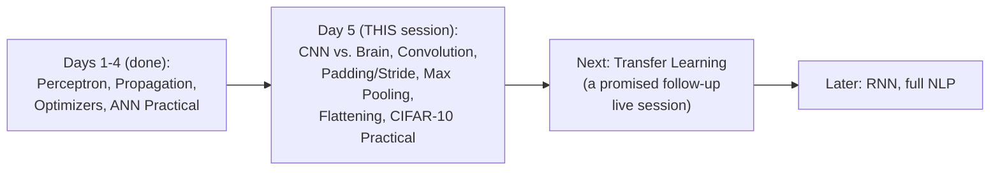

#### 🎯 Key Takeaways

* This is the **final day of the core 5-day series** — Transfer Learning is explicitly promised as a genuine, separate follow-up live session, with RNN and full NLP deferred even further.
* The session's teaching style leans heavily on **fully worked, hand-computed numerical examples** — every convolution and pooling operation is traced value by value, not merely described abstractly.
* This session directly assumes genuine familiarity with **Day 4's practical ANN patterns** (Sequential, Dense, compile, fit) — CNN is explicitly built as a direct EXTENSION of that same TensorFlow/Keras workflow, not a completely separate framework.

---

### 2. CNN vs. the Human Brain: The Visual Cortex Analogy

#### 🧠 Concept — The Complete, Precise Analogy

> 💡 **Given directly:** *"The major part of the brain which we specifically call as cerebral cortex... in this back side, there is a part of the specific brain which we call it as visual cortex -- which is specifically responsible for seeing any items that are there, any objects that are there, in a specific image or in a video."*

#### 🪜 Step-by-Step — Multiple Sequential Layers, Each Extracting Different Information

> 💡 **Given directly, the complete, illustrative walkthrough:** *"This visual cortex may have many layers -- let me name this layer V1, V2, V3, V4, V5, V6, and let's say V7... as soon as this input passes through each and every layer -- let's say this layer is responsible in understanding moving objects... then when we go to the next layer, over here we are able to understand some of the animals, like cat, dog... V3 layer... here we are able to map the environment... finally, all this information, when it is passed, we will be able to visualize this specific image over here in this V7 layer."*

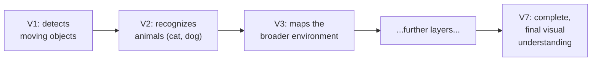

#### ❓ Why It Exists — The Precise, Direct Motivation for CNN's Layered Structure

> 💡 **Given directly:** *"Similarly, if I talk about convolutional neural network, it should also be able to do this many number of different kind of processing -- but now the thing arises is that, how we can make sure that whatever CNN we are trying to develop, it should also be able to do all this kind of task?"*

#### ⚠ Common Mistakes

* Assuming this V1-V7 layer naming is a genuine, precise neuroscience taxonomy — explicitly framed by the instructor as illustrative: *"I'm just creating some layers, you know, like this -- there may be many layers, but I'm just going to define some of the layers like this"* — the exact number and precise function of each layer is a simplified teaching device, not literal neuroscience.

#### 🎯 Key Takeaways

* The human **visual cortex** processes visual information through MULTIPLE, sequential layers, each extracting progressively richer, more specific information — from basic motion detection through to complete scene understanding.
* This directly, precisely motivates CNN's own **layered architecture** — the entire goal of stacking multiple convolution and pooling layers is to replicate this same progressive, layer-by-layer information extraction.
* This analogy is explicitly, honestly acknowledged as a **simplified teaching illustration**, not a precise, literal neuroscience claim.

---
### 3. Understanding Images: Channels, Pixels & Min-Max Scaling

#### 📖 Definition — Black & White vs. RGB Images, Precisely Distinguished

> 💡 **Given directly:** *"There are two types of [images] -- one is black and white, and the other one is something called as RGB type. In black and white, you just have a SINGLE CHANNEL -- that basically means your entire photo will either be mostly the component of a black color or white color."*

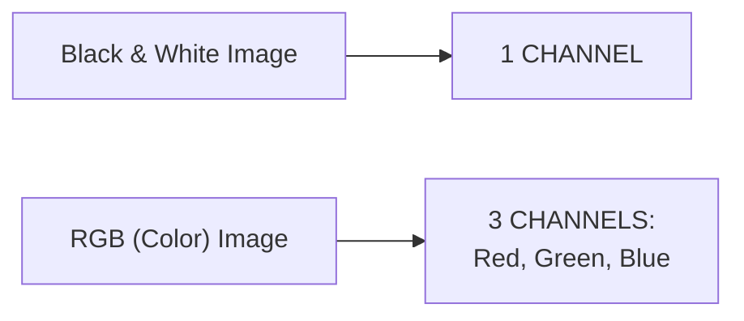

#### 📖 Definition — Pixels & the 0-255 Range

> 💡 **Given directly:** *"Whenever we divide this image, we divide it by some kind of pixels -- let's say if I probably create this kind of line... one, two, three, four, five, so in the width and height, there are five different pixels... this will be a 5×5 pixel image, and in each pixel, your value will be ranging between 0 to 255."*

> 💡 **Given directly, the precise color-value mapping:** *"0 is nothing but it is a black color... and 255 is actually a white color."*

#### 📖 Definition — RGB Images as a 3-Channel Stack

> 💡 **Given directly:** *"With respect to an RGB image, which is a colored image... we will be having three channels -- one is the R channel... I may also have green channels... on top of it, you may also have another channel, which is like a blue channel... suppose if I want to represent this in the form of pixel format, I will basically write 5×5×3."*

```text
Black & White image: (height) x (width) x 1 channel
RGB image:            (height) x (width) x 3 channels (R, G, B)
```

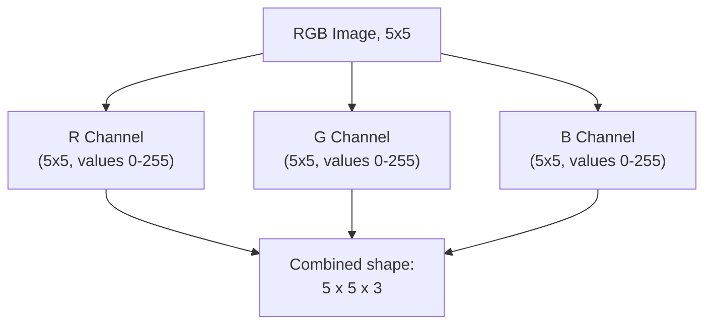

#### 📖 Definition — Min-Max Scaling, Precisely Explained as a Necessary First Step

> 💡 **Given directly:** *"The first step that we do in a convolution is that we try to bring all values between 0 to 1 -- if I'm trying to bring these values between 0 to 1, then I will divide each number by 255... this we basically say it as MIN-MAX SCALING."*

```text
Min-Max Scaling for pixel values: scaled_value = raw_pixel_value / 255
```

#### ⚠ Common Mistakes

* Assuming pixel values can genuinely be negative or exceed 255 — explicitly, directly bounded to the 0-255 range as a structural property of standard digital images.
* Confusing "channel" with "pixel" — explicitly, directly distinguished: a channel represents an ENTIRE color layer (e.g., the full Red channel across the whole image); a pixel is a SINGLE point WITHIN a channel.

#### 🎯 Key Takeaways

* **Black-and-white images** have a single channel; **RGB (color) images** have THREE channels (Red, Green, Blue) — each channel itself being a full grid of pixel values.
* Every pixel value ranges from **0 (black) to 255 (white)**, in a single channel.
* **Min-max scaling** (dividing every pixel value by 255) is the genuine, necessary FIRST step before convolution operations begin, converting the 0-255 range into a 0-1 range.

---

### 4. The Convolution Operation: A Complete Worked Example

#### 🪜 Step-by-Step — Setting Up the Example: A 6×6 Image and a 3×3 Filter

> 💡 **Given directly:** *"Let's say you have an image, and this is my specific image, and here I have values -- let me just create this, three, four, five, six... this is my 6×6 image... we are going to pass it through a filter... this filter will be 3×3."*

```text
Image (6x6, after min-max scaling, illustrative example):
0  0  0  0  0  0
0  0  0  0  0  0
0  0  0  1  1  1
0  0  0  1  1  1
0  0  0  1  1  1
0  0  0  1  1  1

Horizontal Edge Filter (3x3):
 1   2   1
 0   0   0
-1  -2  -1
```

#### 🪜 Step-by-Step — The Complete, Hand-Traced Multiplication & Summation

> 💡 **Given directly, the precise, first-step arithmetic:** *"I will take this value and wherever it is placed to that same row or same cell -- suppose this cell is there, and I've actually put this 3×3 filter over here, so this value and this value will get multiplied... 1 multiplied by 0, so I'm going to get 0 -- then I'm going to add the next value... and similarly all the values will become zero in the first instance."*

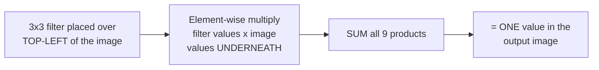

#### 🪜 Step-by-Step — Moving the Filter: Stride and the Complete Traversal

> 💡 **Given directly:** *"After this, what we do is that we move ONE STEP to the right -- whenever we move one step to the right, there is a variable which is called a stride -- we specify the stride variable as one, if you are jumping two steps to the right, then we will basically make stride equal to two."*

> 💡 **Given directly, the complete result confirmed:** *"When you continue, you'll be getting this kind of values, like 0, 0, 0... and after that, you'll be getting a value like -4, -4, -4, -4, and -4..."*

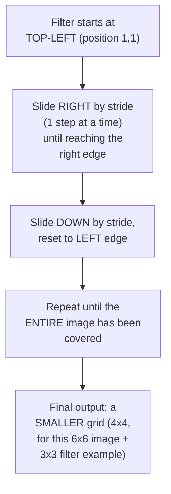

#### ❓ Why It Exists — Precisely Why This Whole Process Is Called "Convolution"

> 💡 **Given directly:** *"This operation is specifically called as convolution."*

#### ⚠ Common Mistakes

* Assuming the filter moves down BEFORE fully traversing across the current row — explicitly, directly demonstrated: the filter completes its FULL horizontal sweep (left to right) for a given row before moving down to the next row.
* Assuming convolution's output must be the SAME size as the input image — explicitly, directly demonstrated as false in this basic example: a 6×6 image with a 3×3 filter (stride 1, no padding) genuinely produces a SMALLER, 4×4 output.

#### 🎯 Key Takeaways

* **Convolution** is a complete, precise operation: place a filter over a region of the image, multiply each filter value by the corresponding image value UNDERNEATH it, sum all the products into ONE output value, then slide the filter (by the stride amount) and repeat across the ENTIRE image.
* A **6×6 image convolved with a 3×3 filter** (stride 1, no padding) genuinely produces a **4×4 output** — a smaller image than the original, directly setting up the motivation for padding (covered next).
* This entire, precise mechanical process is what "convolution" genuinely, technically means — not an abstract or metaphorical term.

---
### 5. Why Filters Detect What They Detect: Horizontal vs. Vertical Edges

#### 🪜 Step-by-Step — Introducing a SECOND, Genuinely Different Filter

> 💡 **Given directly:** *"Let's say I've got this new filter... let's say I have this specific filter, minus 1, minus 2, minus 1... and let me pass this filter -- this filter is basically called as VERTICAL edge detector."*

```text
Vertical Edge Filter (3x3):
 1   0  -1
 2   0  -2
 1   0  -1
```

#### 🪜 Step-by-Step — The Complete, Traced Result

> 💡 **Given directly:** *"Do the calculation everyone -- what will happen first time? Everything will become zero, right? Second time, if I go one step to the right, then it will become -4, -1, -2, -1, when I add this up, it will become -4."*

#### 🔍 Internal Working — Reversing the Scaling Reveals a Genuine, Visible Edge

> 💡 **Given directly, a precise, complete demonstration of the output's genuine visual meaning:** *"If I do back -- if I revert back the feature scaling, then what will happen? This -4, -4, -4 will definitely become 0... the smaller value will become 0, and the larger value will become 255... 255 is nothing but white color, and 0 is nothing but black color."*

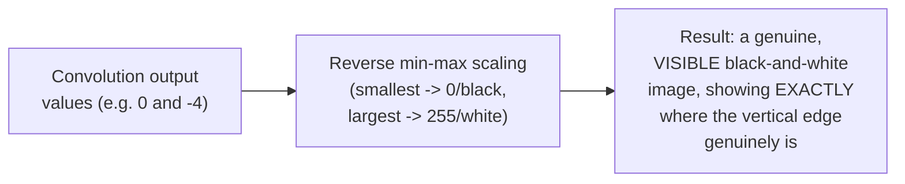

> 💡 **Given directly, the precise, visual conclusion:** *"So in this specific image, you know that zeros and ones are there -- obviously I should be getting a vertical edge in between that, and after passing this filter, I am able to get a vertical edge... this filter is responsible for getting the vertical edges."*

#### 🏢 Real-World / Production Usage — Multiple, Different Filters Extract Multiple, Different Features

> 💡 **Given directly:** *"I may have various different kinds of filters -- I may have a horizontal filter, I may have another filter like this, and this will be able to determine my horizontal edge -- there will be one more filter, let's say, which will be able to determine my round objects."*

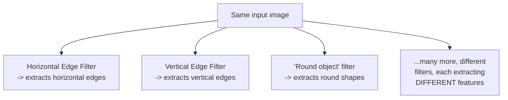

#### ⚠ Common Mistakes

* Assuming a single filter genuinely extracts ALL relevant information from an image — explicitly, directly corrected: DIFFERENT filters (horizontal edge, vertical edge, round-object detectors, and many more) each extract GENUINELY DIFFERENT, specific kinds of information — a real CNN uses MANY such filters simultaneously.
* Assuming the convolution output's raw numeric values (like -4) are directly, immediately meaningful as an image — explicitly, directly clarified: the values must first be REVERSED through the scaling process (smallest value → 0/black, largest → 255/white) to produce a genuinely viewable, interpretable image.

#### 🎯 Key Takeaways

* **Different filter VALUES genuinely extract different kinds of information** from the SAME input image — a horizontal edge filter and a vertical edge filter, applied to the identical image, produce genuinely different outputs.
* **Reversing the min-max scaling** on a convolution's output reveals a genuine, viewable image directly showing WHERE the filter's target feature (e.g., a vertical edge) actually exists in the original image.
* A real CNN uses **MANY different filters simultaneously**, each extracting a genuinely different feature — directly paralleling the multiple, sequential layers of the human visual cortex introduced in Section 2.

---

### 6. Padding: Preventing Information Loss

#### ❓ Why It Exists — The Precise, Motivating Problem

> 💡 **Given directly:** *"A very important question -- what is happening? See, if I give a 6×6 image to a convolution operation, I am getting a smaller output -- here my image size is decreasing, and this should not happen. If my image size decreases, that basically means we are losing some kind of information."*

#### 📖 Definition — Padding, Precisely Explained via the "Compound" Analogy

> 💡 **Given directly:** *"Padding says that -- do not do anything, if my image size is 6×6, I want to get the same output over here, like 6×6, all you have to do is apply padding on top of it. How do I apply padding? Padding is just like building a COMPOUND around the images."*

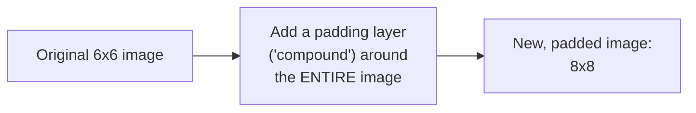

#### 🔍 Internal Working — Two Genuine Padding Value Options

> 💡 **Given directly:** *"You can have different kind of paddings -- one kind of padding is that ZERO PADDING, just go ahead and fill this cell by zeros. The other kind of padding is that whatever is the nearest value, you try to put that."*

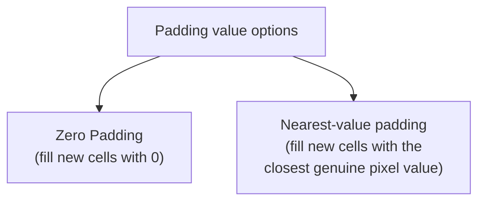

#### 📖 Definition — The Complete, Precise Formula, With Padding

> 💡 **Given directly, the worked, confirming calculation:** *"8 minus 3 plus 1... this is nothing but 8 minus 3 is nothing but 5, 5 is nothing but... output will be 6... so this will actually now become a 6×6 image -- this is what we wanted."*

```text
Output size (WITH padding) = n + 2p - f + 1

where: n = original image size
       p = padding amount (number of padding layers)
       f = filter size

Worked example: n=6, p=1, f=3
Output = 6 + 2(1) - 3 + 1 = 6 + 2 - 3 + 1 = 6   (matches the ORIGINAL image size!)
```

#### ⚠ Common Mistakes

* Assuming padding is applied only to ONE side of the image — explicitly, directly clarified via the "compound" analogy: it's applied ALL AROUND the image (like a border), increasing BOTH the height and width.
* Assuming padding somehow adds genuine, meaningful new information to the image — explicitly, directly clarified: padding cells are FILLED (typically with zeros, or the nearest real value) specifically as a PLACEHOLDER, purely to preserve the output's dimensions, not to introduce genuinely new visual content.

#### 🎯 Key Takeaways

* **Padding** directly solves the genuine problem of an image progressively SHRINKING with every convolution operation — a real, meaningful information-loss concern.
* Padding works by adding an EXTRA border/"compound" layer around the entire image — with **zero padding** or **nearest-value padding** as the two genuine options for what fills these new cells.
* The complete formula **`n + 2p - f + 1`** was directly, numerically verified: with `n=6, p=1, f=3`, the output is genuinely `6` — matching the ORIGINAL image size exactly, confirming padding's stated purpose.

---
### 7. Stride & the Complete Output Size Formula

#### 📖 Definition — Stride, Precisely Re-Confirmed

> 💡 **Given directly:** *"I told you about stride, right -- now let's say if my stride becomes 2, your stride can also become 2, right -- I can jump two steps... will this create an impact in my output? Yes, definitely, it can create an impact in your output."*

#### 📖 Definition — The Complete, Combined Formula

> 💡 **Given directly:** *"My updated formula, it will not be just like this, but it will be DIVIDED BY S -- S basically means stride."*

```text
Complete output size formula:
Output = [(n + 2p - f) / s] + 1

where: n = original image size
       p = padding
       f = filter size
       s = stride
```

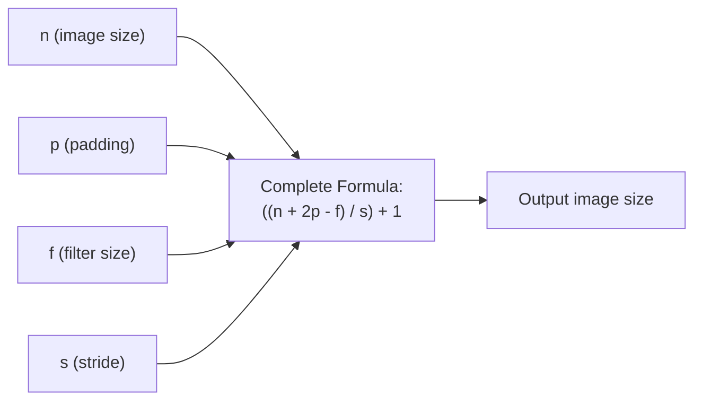

#### ❓ Why It Exists — A Genuinely Named, Direct Interview Question

> 💡 **Given directly:** *"A very important interview question -- what is the importance of padding? To prevent the information loss of the image, we basically apply different kind of padding techniques."*

#### ⚠ Common Mistakes

* Forgetting to divide by stride in the complete formula, especially when stride is 1 (where it has no visible numeric effect) — explicitly, directly clarified: the formula genuinely includes `/s` at all times; it simply doesn't change the RESULT when `s=1`, since dividing by 1 leaves the value unchanged.
* Assuming padding and stride are independent, unrelated hyperparameters — explicitly, directly shown as COMBINING together within the SAME, single output-size formula.

#### 🎯 Key Takeaways

* **Stride** (how many steps the filter moves at each iteration) genuinely affects the output size — a stride of 2 (moving 2 steps at a time) produces a SMALLER output than stride 1, for the same image and filter.
* The **complete, combined formula** `[(n + 2p - f) / s] + 1` incorporates image size, padding, filter size, AND stride together — the single, general formula underlying every specific example worked through in this session.
* **"What is the importance of padding?"** is explicitly, directly flagged as a genuinely important, common interview question — with the precise, correct answer being "to prevent information loss."

---

### 8. Filters Are Learned, Not Hardcoded: ReLU & Backpropagation

#### ❓ Why It Exists — A Genuinely Important, Directly-Anticipated Student Question

> 💡 **Given directly:** *"Many people said, or many people may have a confusion, saying that, 'Krish, why did you hardcode these values, and in a real-world problem statement, do we need to hardcode this specific values?' The answer is NO, you don't need to hardcode this."*

#### 🔍 Internal Working — Filters Are Genuinely Analogous to ANN Weights

> 💡 **Given directly:** *"How, in ANN, let's say how in ANN we create a neural network like this -- I have my hidden layer, and I have my output layer, right -- in this we assign weights, and in the back propagation, we update this weights. So in CNN also, you also have to make sure that you update the filters based on the input... initially we have initialized some filter randomly, but through back propagation, again, like how we did in the case of ANN, we also have to update this filter."*

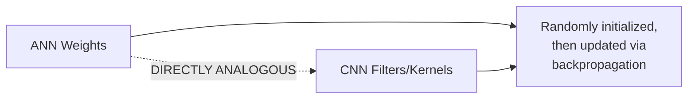

#### 📖 Definition — ReLU's Precise Role Here

> 💡 **Given directly:** *"Whenever we get the output on top of this, for each and every value, we apply a ReLU activation function... why do we apply ReLU activation function? Because you know that ReLU activation function -- during the back propagation, the derivative can be found out."*

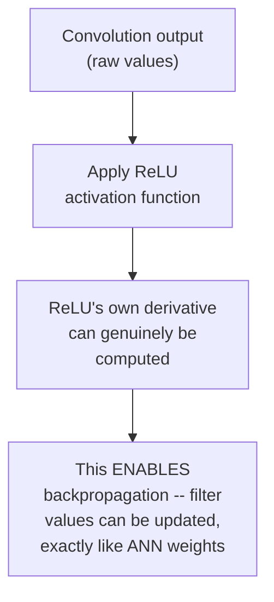

#### ⚠ Common Mistakes

* Assuming CNN filters (kernels) are manually designed, hand-picked values a developer must define — explicitly, directly corrected: they are RANDOMLY initialized, then LEARNED via backpropagation, exactly like weights in a standard ANN.
* Assuming ReLU's role in CNN is purely about introducing non-linearity, unrelated to training — explicitly, directly clarified: its SPECIFIC, stated purpose here is that its derivative CAN be computed, which is precisely what ENABLES backpropagation to update the filter values in the first place.

#### 🎯 Key Takeaways

* **Filter/kernel values are NOT hardcoded** — they are randomly initialized, then LEARNED via backpropagation, directly, precisely analogous to how weights are learned in a standard ANN.
* **ReLU is applied specifically because its derivative can be computed** — this is precisely what enables the backpropagation process to genuinely update filter values based on the network's errors.
* The horizontal and vertical edge filters used in Sections 4-5 were **illustrative EXAMPLES**, chosen specifically to make the convolution mechanism concrete — a real, trained CNN discovers its own, genuinely useful filter values automatically, through training.

---

### 9. Max Pooling: Location Invariance

#### 📖 Definition — Max Pooling, Precisely Introduced

> 💡 **Given directly:** *"After a convolution operation, there is something called as MAX POOLING LAYER."*

#### 📖 Definition — Location Invariance, Precisely Explained

> 💡 **Given directly:** *"Location invariant basically says that let's say there are multiple objects in the images -- my convolutional neural network, till it goes ahead towards the next layer, it should be able to extract more and more clear information."*

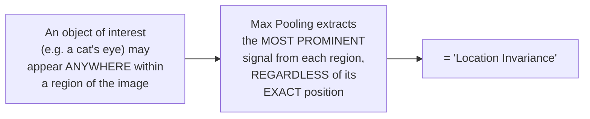

#### 🪜 Step-by-Step — The Complete, Worked 2×2 Max Pooling Example

> 💡 **Given directly, the complete, precise calculation:** *"Let's say that this is a 3×3, and I've got some pixel values like this -- 1, 2, 3, 4, 5, 7, 0, 3, 5... let's say I'm using a max pooling of 2×2... I'm just going to place this on top of the output over here, and what I'm actually going to do, I'm going to basically get an output, and this output will only be focusing on the biggest number... clearly you can see that 5 is the highest number, so I am going to take this information only."*

```text
Input (3x3, illustrative):
1  2  3
4  5  7
0  3  5

Max Pooling (2x2, stride 2):
Region 1 (top-left 2x2): max(1,2,4,5) = 5
```

#### 🔍 Internal Working — Stride 2 in Max Pooling, Precisely Explained

> 💡 **Given directly:** *"Here, I'll make a stride of jump 2, okay -- stride of jump two, not stride of jump one -- let's say initially stride was here, I got the value as 5, my next jump will be a two-step jump."*

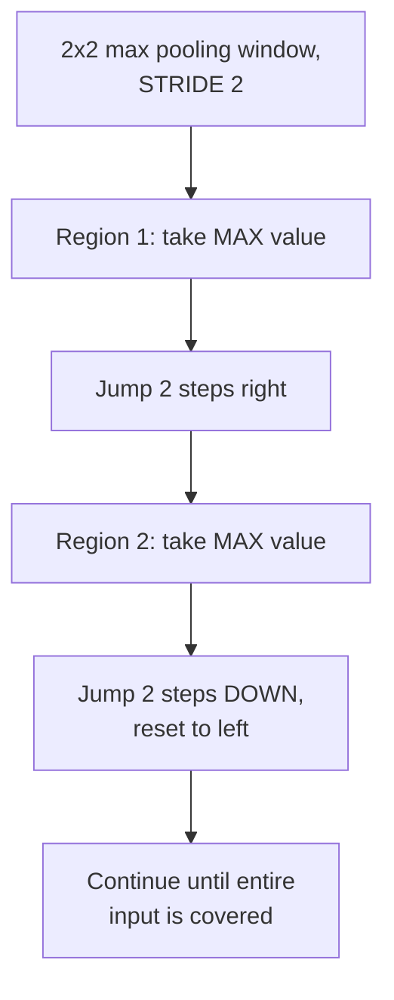

#### 📖 Definition — Two Other Pooling Types, Briefly Named

> 💡 **Given directly:** *"There is something called as average pooling, there is something called as min pooling, and this is my third type, which is called as max pooling."*

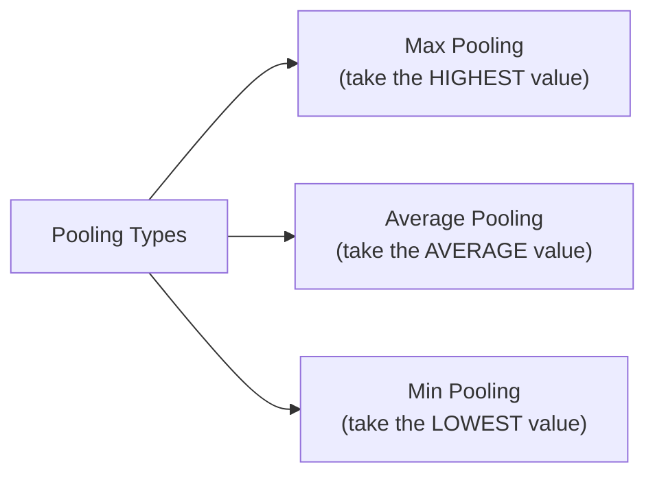

#### ⚠ Common Mistakes

* Assuming max pooling uses the SAME stride as the preceding convolution layer, by default — explicitly, directly demonstrated using a genuinely different, deliberately-chosen stride (2) specifically for the pooling operation itself.
* Assuming max pooling and convolution are the SAME operation, just under a different name — explicitly, directly distinguished: convolution MULTIPLIES filter values against image values and SUMS the result; max pooling simply SELECTS the SINGLE HIGHEST value from each region, with NO multiplication involved.

#### 🎯 Key Takeaways

* **Max pooling** extracts the single, most prominent (highest) value from each region of a convolution's output — directly implementing **location invariance**: the network can recognize a feature regardless of its EXACT position within a given region.
* Max pooling uses its OWN, independently-configurable stride (commonly 2) — genuinely distinct from any stride used in the preceding convolution layer.
* **Average pooling** and **min pooling** are genuine, alternative pooling types — selecting the average or minimum value respectively, instead of the maximum.

---
### 10. Flattening & the Complete CNN Architecture

#### 📖 Definition — Flattening, Precisely Explained

> 💡 **Given directly:** *"Flattening layer is pretty much simple, because this will actually look like an ANN dense layer only... whatever inputs, whatever outputs I get from this max pooling, I am just going to make it straightforward -- flattened, flattened basically means I will just pick up this entire filter, and I'm just going to elongate it, like an input, like how we give input to an ANN."*

```text
Example: a 2x2 pooled output [5, 7, 3, 5] becomes a flat vector: [5, 7, 3, 5]
Multiple filters' pooled outputs are ALL concatenated into ONE long, flat vector
```

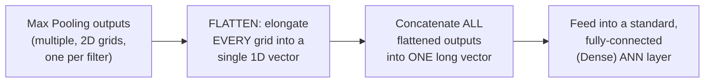

#### 🪜 Step-by-Step — The Complete, End-to-End CNN Pipeline, Restated

> 💡 **Given directly:** *"In short, what all things we did -- let's say this is my convolution operation, then I went to my max pooling layer -- this convolution operation has what all things? Convolution, padding, applying filters, everything happens inside this -- then after the max pooling layer, what we specifically do, we provide it to the next stage, which is called as flattening layer, and then we create an ANN, or fully connected neural network, and finally I get my output."*

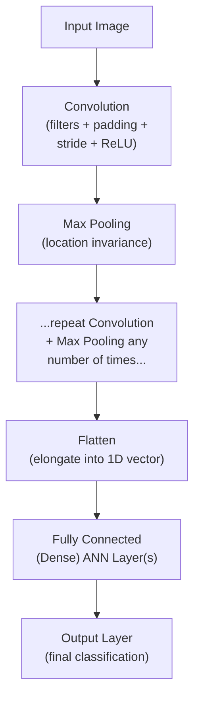

#### ⚠ Common Mistakes

* Assuming flattening happens IMMEDIATELY after the FIRST convolution+pooling pair — explicitly, directly clarified: convolution and max pooling can be STACKED, repeated any number of times, BEFORE flattening finally occurs, once.
* Assuming the flattened vector loses all connection to the network's earlier, learned features — explicitly, directly clarified: it directly PRESERVES all the information extracted by every prior convolution/pooling layer, simply reshaped into a format the subsequent dense layer can genuinely process.

#### 🎯 Key Takeaways

* **Flattening** converts the final, multi-dimensional pooled output into a single, long, 1D vector — directly compatible with a standard, fully-connected (Dense) ANN layer.
* The **complete CNN pipeline**: Convolution (+ padding, stride, ReLU) → Max Pooling → (repeat as many times as needed) → Flatten → Fully Connected ANN layers → Output.
* Convolution and max pooling layers can be **stacked and repeated** multiple times before flattening — directly mirroring the multiple, sequential visual cortex layers (V1-V7) introduced in Section 2.

---

### 11. Practical Implementation: CIFAR-10 in TensorFlow/Keras

#### 📖 Definition — The CIFAR-10 Dataset, Precisely Introduced

> 💡 **Given directly:** *"We are going to use CIFAR images dataset... this dataset contains 60,000 color images in 10 classes, with 6,000 images in [each] class... this classes are mutually exclusive, and there is no overlap between them... airplane, automobile, bird, cat, deer, dog..."*

```python
import tensorflow as tf
from tensorflow.keras import datasets, layers, models
import matplotlib.pyplot as plt

(train_images, train_labels), (test_images, test_labels) = datasets.cifar10.load_data()

# Normalize pixel values to 0-1 (min-max scaling, per Section 3)
train_images, test_images = train_images / 255.0, test_images / 255.0
```

#### 💻 Code Example — Building the Complete CNN Architecture

> 💡 **Given directly, the complete, layer-by-layer construction:** *"We have to again initialize with a Sequential layer... `layers.Conv2D`... this 32 will basically be my number of filters... this filter is nothing but 3×3 size... after the convolution operation, I need to apply my activation function as ReLU... my input image will be 32×32 pixels multiplied by 3 channels."*

```python
model = models.Sequential()
model.add(layers.Conv2D(32, (3, 3), activation='relu', input_shape=(32, 32, 3)))
model.add(layers.MaxPooling2D((2, 2)))
model.add(layers.Conv2D(64, (3, 3), activation='relu'))
model.add(layers.MaxPooling2D((2, 2)))
model.add(layers.Conv2D(64, (3, 3), activation='relu'))
```

#### 🔍 Internal Working — How the Number of Filters Is Chosen

> 💡 **Given directly, an honest, direct clarification:** *"You may be thinking, 'Krish, how do you decide this number of filters?' See, guys, there is no such thing that you can decide -- but it is a proper research that usually happens with filters... you can try with different different hyperparameter, you can use 32, 64, you can use the combination of different different filters, and see how the performance is increasing."*

#### 💻 Code Example — Flattening & the Fully Connected Layers

> 💡 **Given directly:** *"Is the flattening layer defined here? You can see that `model.add(layers.Flatten())`... and then I am going to add a fully connected neural network with 64 dense neurons, and total number of output in my dataset is 10, so I'm specifically writing `layers.Dense(10)`."*

```python
model.add(layers.Flatten())
model.add(layers.Dense(64, activation='relu'))
model.add(layers.Dense(10))   # 10 output classes (CIFAR-10)

model.summary()   # shows every layer's output shape and parameter count
```

#### 💻 Code Example — Compiling & Training

> 💡 **Given directly:** *"For the compilation, we'll use the same optimizer, which is called as Adam optimizer -- and since we have 10 outputs, we are going to use something called as SPARSE CATEGORICAL CROSS-ENTROPY... finally, you can see my metrics, accuracy."*

```python
model.compile(
    optimizer='adam',
    loss=tf.keras.losses.SparseCategoricalCrossentropy(from_logits=True),
    metrics=['accuracy'],
)

history = model.fit(
    train_images, train_labels,
    epochs=10,
    validation_data=(test_images, test_labels),
)
```

#### 🪜 Step-by-Step — The Live-Observed, Honest Training Result

> 💡 **Given directly, the complete, honest, real-time progression:** *"We are in the fifth epoch right now, the accuracy is 70 percent, validation is 68... it's going on good, and I think this can go more than 80 percent if you increase the number of epochs... finally I'm getting able to get 78 percent, and my validation accuracy is 70... I have stopped over here."*

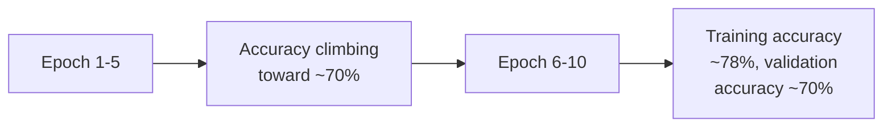

#### ⚠ A Direct, Honest Acknowledgment: This Result Could Genuinely Be Improved

> 💡 **Given directly:** *"We have achieved this, we can still train much in a better way, and try to add more layers, try to train it with the early stopping, try to increase the number of epochs, and it will definitely give us a good accuracy."*

> 💡 **Given directly, a genuine, self-assigned task for the audience:** *"On this also, you can apply early stop, you know, so early stop can also be applied on to this -- that I'll give you as a task."*

#### ⚠ Common Mistakes

* Assuming the exact filter count (32, 64) used in this specific implementation reflects some precisely-derived, mathematically-required value — explicitly, directly clarified: it's a genuine HYPERPARAMETER choice, informed by broader research and convention (state-of-the-art architectures), not a value calculated from first principles.
* Assuming this specific, live-trained model's ~70% validation accuracy represents the genuine, achievable ceiling for this dataset — explicitly, directly acknowledged as a STARTING POINT, with early stopping, more layers, and more epochs all identified as genuine, concrete ways to further improve results.

#### 🎯 Key Takeaways

* The complete, practical CNN implementation directly, precisely mirrors every concept covered theoretically: **`Conv2D`** (convolution, with filters and activation), **`MaxPooling2D`** (pooling), **`Flatten`** (flattening), and **`Dense`** (the fully-connected layers) — genuinely matching Sections 4-10's own theoretical structure.
* The number of filters (32, then 64) is explicitly, honestly acknowledged as a **genuine hyperparameter choice**, informed by research and convention rather than a precisely-derivable formula.
* The live-trained model reaches roughly **70% validation accuracy** after 10 epochs — explicitly, honestly framed as a genuine STARTING POINT, with early stopping (directly connecting back to Day 4's own coverage), additional layers, and more epochs all identified as concrete next steps for improvement.

---
## 📝 Glossary

| Term | Definition | Why It Matters |
|---|---|---|
| **Visual Cortex** | The brain region processing visual information, across multiple layers | The direct analogy motivating CNN's layered structure |
| **Channel** | A single color layer of an image (e.g., Red) | B&W images = 1 channel; RGB images = 3 channels |
| **Min-Max Scaling** | Dividing pixel values by 255, converting 0-255 to 0-1 | The necessary first step before convolution |
| **Convolution** | Multiplying a filter against an image region and summing the result | The core CNN operation extracting features |
| **Filter / Kernel** | A small matrix (e.g., 3x3) used in convolution | Learned via backpropagation, not hardcoded |
| **Padding** | Adding a border around an image to preserve output size | Prevents information loss from shrinking |
| **Stride** | How many steps a filter moves per iteration | Affects output size; also used in max pooling |
| **Max Pooling** | Selecting the highest value from each region of a convolution's output | Implements location invariance |
| **Location Invariance** | Recognizing a feature regardless of its exact position | The purpose of max pooling |
| **Flattening** | Converting pooled, multi-dimensional output into a 1D vector | Prepares data for a fully-connected layer |
| **CIFAR-10** | A 60,000-image, 10-class dataset used for this session's practical | The real dataset trained on live |

---

## 🔄 Revision Notes — One-Minute Revision

* This is **Day 5, the FINAL day** of the 5-day series -- covering CNN completely, from a human-brain analogy through to a real, live, practical implementation. Transfer Learning is promised as a separate follow-up session.
* **CNN vs. human brain**: the visual cortex processes information through MULTIPLE sequential layers (V1-V7, illustrative naming), each extracting progressively richer information -- directly motivating CNN's own layered architecture.
* **Images**: black & white = 1 channel; RGB = 3 channels (R, G, B); every pixel ranges 0-255; **min-max scaling** (divide by 255) converts this to 0-1, the necessary FIRST step before convolution.
* **Convolution**: place a filter over an image region, multiply element-wise, SUM the products into ONE output value, then slide (by the stride) and repeat -- a 6x6 image with a 3x3 filter (stride 1, no padding) genuinely produces a SMALLER, 4x4 output. Fully worked, hand-traced examples with BOTH a horizontal edge filter and a vertical edge filter directly showed how different filter values extract genuinely different features -- reversing the min-max scaling on the output reveals a real, visible edge.
* **Padding** (`n + 2p - f + 1`) directly solves the shrinking-image problem -- adding a "compound" border (zero padding or nearest-value padding) around the image, verified numerically: n=6, p=1, f=3 -> output=6 (matches the original size).
* **Stride** affects output size too -- the COMPLETE formula: `[(n + 2p - f) / s] + 1`.
* **Filters are LEARNED, not hardcoded** -- randomly initialized, then updated via backpropagation, EXACTLY like ANN weights. ReLU is applied specifically because its derivative can be computed, which is what ENABLES this learning.
* **Max Pooling** implements **location invariance** -- extracting the single highest value from each region (using its OWN, independently-configurable stride, e.g. 2), so the network recognizes a feature regardless of its exact position. Average pooling and min pooling are the alternative types.
* **Flattening** elongates the final pooled output into ONE, long 1D vector, feeding into a standard, fully-connected (Dense) ANN layer.
* **Complete pipeline**: Convolution (+padding+stride+ReLU) -> Max Pooling -> (repeat as needed) -> Flatten -> Dense layers -> Output.
* **Practical implementation**: CIFAR-10 dataset (60,000 images, 10 classes), `Conv2D`/`MaxPooling2D`/`Flatten`/`Dense` in Keras, `adam` optimizer, `sparse_categorical_crossentropy` loss (for 10 classes), reaching ~70% validation accuracy after 10 LIVE-observed epochs -- explicitly, honestly framed as a starting point (early stopping, more layers, more epochs all suggested as improvements).

---

## 📋 Cheat Sheet

**Image structure:**
```text
Black & White: 1 channel  | RGB: 3 channels (R, G, B)
Pixel values: 0 (black) to 255 (white)
Min-max scaling: pixel_value / 255 -> 0 to 1
```

**Convolution output size formulas:**
```text
No padding, stride 1:     Output = n - f + 1
With padding:              Output = n + 2p - f + 1
Complete (padding+stride):  Output = [(n + 2p - f) / s] + 1
```

**The complete CNN pipeline:**
```text
Input Image -> Convolution (filters + padding + stride + ReLU)
             -> Max Pooling (location invariance)
             -> [repeat Convolution + Max Pooling as needed]
             -> Flatten
             -> Fully Connected (Dense) layers
             -> Output (classification)
```

**Filters are learned, not hardcoded:**
```text
Randomly initialized -> updated via BACKPROPAGATION
(exactly like ANN weights) -- ReLU enables this (derivative computable)
```

**Building a CNN in Keras:**
```python
model = models.Sequential()
model.add(layers.Conv2D(32, (3,3), activation='relu', input_shape=(32,32,3)))
model.add(layers.MaxPooling2D((2,2)))
model.add(layers.Conv2D(64, (3,3), activation='relu'))
model.add(layers.MaxPooling2D((2,2)))
model.add(layers.Flatten())
model.add(layers.Dense(64, activation='relu'))
model.add(layers.Dense(10))   # output classes

model.compile(optimizer='adam',
              loss=tf.keras.losses.SparseCategoricalCrossentropy(from_logits=True),
              metrics=['accuracy'])
model.fit(train_images, train_labels, epochs=10, validation_data=(test_images, test_labels))
```

---

## 🔥 Interview Questions & Answers

### 🟢 Beginner

**Q1.**

**Question:** How many channels does an RGB image have?

**Answer:** 3 (Red, Green, Blue).

**Explanation:** Directly, explicitly stated.

**Why Interviewers Ask This:** Foundational image-processing knowledge.

**Possible Follow-up:** "How many channels does a black-and-white image have?"

**Q2.**

**Question:** What is min-max scaling, in the context of image pixels?

**Answer:** Dividing every pixel value by 255, converting the 0-255 range into a 0-1 range.

**Explanation:** Directly, precisely explained.

**Why Interviewers Ask This:** Basic, foundational preprocessing knowledge.

**Possible Follow-up:** "Why is this step performed before convolution?"

**Q3.**

**Question:** What operation happens during convolution?

**Answer:** A filter is placed over an image region, multiplied element-wise against the underlying values, and the products are summed into one output value; this repeats as the filter slides across the image.

**Explanation:** Directly, precisely explained.

**Why Interviewers Ask This:** Foundational, essential CNN mechanics.

**Possible Follow-up:** "What determines how far the filter moves at each step?"

**Q4.**

**Question:** What is the output size formula for convolution WITHOUT padding (stride 1)?

**Answer:** `n - f + 1`.

**Explanation:** Directly, precisely stated.

**Why Interviewers Ask This:** Basic, frequently-tested CNN calculation.

**Possible Follow-up:** "What is the output size when n=6 and f=3?"

**Q5.**

**Question:** What is the importance of padding? (A directly-flagged, common interview question)

**Answer:** To prevent information loss caused by the image shrinking with every convolution operation.

**Explanation:** Directly, explicitly stated as a common interview question.

**Why Interviewers Ask This:** Explicitly flagged in the source material as genuinely, commonly asked.

**Possible Follow-up:** "Name the two genuine padding value options."

**Q6.**

**Question:** Are CNN filter/kernel values hardcoded by the developer?

**Answer:** No -- they are randomly initialized, then learned via backpropagation, exactly like weights in a standard ANN.

**Explanation:** Directly, explicitly, precisely clarified.

**Why Interviewers Ask This:** A commonly-confused, foundational CNN concept.

**Possible Follow-up:** "Why is ReLU specifically applied after convolution?"

**Q7.**

**Question:** What does max pooling do?

**Answer:** Selects the single highest value from each region of a convolution's output.

**Explanation:** Directly, precisely explained.

**Why Interviewers Ask This:** Foundational, frequently-asked CNN question.

**Possible Follow-up:** "What genuine purpose does this serve?"

**Q8.**

**Question:** What is location invariance?

**Answer:** The network's ability to recognize a feature regardless of its exact position within a region of the image.

**Explanation:** Directly, precisely defined.

**Why Interviewers Ask This:** Tests genuine understanding of WHY max pooling exists, not just what it does.

**Possible Follow-up:** "Name two alternative pooling types besides max pooling."

**Q9.**

**Question:** What does the flattening layer do?

**Answer:** Converts the final, multi-dimensional pooled output into a single, 1D vector.

**Explanation:** Directly, precisely explained.

**Why Interviewers Ask This:** Basic, foundational CNN architecture knowledge.

**Possible Follow-up:** "What kind of layer receives this flattened vector as input?"

**Q10.**

**Question:** What loss function is used for a 10-class image classification problem in this session's practical implementation?

**Answer:** Sparse Categorical Cross-Entropy.

**Explanation:** Directly, explicitly stated.

**Why Interviewers Ask This:** Practical, applied knowledge connecting theory to real code.

**Possible Follow-up:** "How many total output classes does the CIFAR-10 dataset have?"

---

### 🟡 Intermediate

**Q11.**

**Question:** Explain why the instructor deliberately works through TWO complete, hand-computed convolution examples (a horizontal edge filter, then a vertical edge filter) rather than just one.

**Answer:** Using a SECOND, genuinely DIFFERENT filter directly demonstrates a critical, generalizable point that a single example alone couldn't establish: that the SPECIFIC VALUES within a filter determine WHAT FEATURE gets extracted -- not the convolution MECHANISM itself, which remains identical across both examples. By showing the SAME mechanical process (multiply, sum, slide) applied to two DIFFERENT filters, and observing GENUINELY DIFFERENT outputs (horizontal edges vs. vertical edges, each directly, visually confirmed by reversing the min-max scaling), the instructor proves that convolution is a general-purpose, flexible OPERATION whose behavior is entirely determined by the filter's own learned values -- directly setting up Section 8's later point that these values are genuinely LEARNED, not fixed or hardcoded.

**Explanation:** Requires recognizing a deliberate pedagogical strategy connecting two separate worked examples to a broader, generalizable principle.

**Why Interviewers Ask This:** Tests whether a learner recognizes why demonstrating VARIATION (different filters, different outputs) matters pedagogically, not just recall of the two specific examples.

**Possible Follow-up:** "If you wanted to design a filter to detect diagonal edges, how might its values need to differ from the horizontal and vertical filters shown?"

**Q12.**

**Question:** A learner argues that since padding preserves the image's original size, padding should ALWAYS be applied to every convolution layer in a real CNN, with no exceptions. Evaluate this claim.

**Answer:** This claim overstates a genuinely useful technique into an unconditional rule the session's own content doesn't establish. While padding genuinely, precisely solves the "shrinking image" problem (Section 6), the session's own broader architecture (Section 10-11) shows MULTIPLE convolution and pooling layers STACKED together -- and a real, practical CNN design must balance preserving spatial information (via padding) against the genuine COMPUTATIONAL COST of maintaining larger feature maps at every single layer. Some architectures DELIBERATELY allow controlled shrinkage across layers (using no padding, or padding='valid' in Keras terms) specifically to progressively REDUCE the spatial dimensions as depth increases, trading some spatial information for reduced computation and a naturally deepening, more abstract feature hierarchy -- directly complementary to what max pooling ALSO does (Section 9). The genuinely accurate claim is that padding is a DELIBERATE, PROBLEM-SPECIFIC design choice, not a rule to apply unconditionally at every single layer.

**Explanation:** Tests whether a learner recognizes padding as a genuine design choice with real trade-offs, not an unconditional best practice.

**Why Interviewers Ask This:** Distinguishes candidates who understand genuine architectural trade-offs from those who treat one useful technique as universally mandatory.

**Possible Follow-up:** "What genuine trade-off exists between using padding at every layer versus allowing controlled shrinkage across layers?"

**Q13.**

**Question:** Explain, precisely, why the session connects ReLU's usage in CNN specifically to "the derivative can be found out," rather than simply stating ReLU introduces non-linearity (a more commonly-cited general reason).

**Answer:** This is a genuinely precise, deliberate framing connecting directly to Section 8's own central point: filters are LEARNED via backpropagation, and backpropagation FUNDAMENTALLY REQUIRES computing derivatives (per Day 2's own established chain rule content) to determine HOW MUCH each filter value should be adjusted to reduce loss. While ReLU's non-linearity is ALSO a genuine, important property (enabling the network to learn non-linear relationships, exactly as covered for standard ANNs), the session's OWN specific emphasis here ("during the back propagation, the derivative can be found out") is precisely targeting the MECHANISM by which filter values GENUINELY GET UPDATED -- a more PRECISE, applied point than the more general "non-linearity" framing, and one that DIRECTLY connects this session's CNN content back to Day 2's own chain-rule and gradient-descent foundations, reinforcing that CNN training is fundamentally the SAME underlying process as standard ANN training, just applied to filter values instead of standard dense-layer weights.

**Explanation:** Requires recognizing why the session's own specific, applied framing (derivative computability, enabling backpropagation) is more precisely targeted than the more commonly-cited general "introduces non-linearity" explanation.

**Why Interviewers Ask This:** Tests whether a learner can distinguish a precise, applied justification from a more generic, commonly-repeated one, and connect it back to earlier session content (the chain rule).

**Possible Follow-up:** "Would a genuinely non-differentiable activation function be usable in a CNN's convolution layers? Why or why not?"

**Q14.**

**Question:** Using this session's precise max pooling mechanism (Section 9), explain why max pooling specifically (rather than average pooling) might be preferred for a task like detecting whether a SPECIFIC, small feature (like a cat's eye) is present ANYWHERE within a larger image region.

**Answer:** Per Section 9's own precise mechanism, max pooling SPECIFICALLY selects the SINGLE HIGHEST value from each region -- directly corresponding to the STRONGEST, most confident signal that the target feature (e.g., a cat's eye, per the session's own example) is genuinely present SOMEWHERE within that region. Average pooling, by contrast, would BLEND this strong signal together with potentially many WEAKER or ZERO-valued surrounding cells (where the feature is genuinely absent), producing a DILUTED, averaged value that may UNDERSTATE the genuine presence of a small, localized feature. For detection-style tasks (per Section 9's own directly-stated purpose, "location invariance" -- recognizing a feature "anywhere" within a region), max pooling's "take the strongest signal" behavior is precisely what preserves the genuine, confident detection of a small, localized feature, even when it occupies only a SMALL portion of the pooled region -- exactly the scenario the session's own three-cats example (Section 9) directly illustrates.

**Explanation:** Requires reasoning through WHY max pooling's specific mechanism (taking the max, not the average) genuinely suits detection-style tasks, connecting back to the session's own stated "location invariance" purpose.

**Why Interviewers Ask This:** Tests whether a learner understands the genuine, practical REASON max pooling is the DEFAULT, most common pooling choice, not just that it exists as one option among several.

**Possible Follow-up:** "Describe a genuinely different scenario where average pooling might be preferable to max pooling instead."

**Q15.**

**Question:** Synthesize this session's complete output-size formula (Section 7) with its practical CIFAR-10 implementation (Section 11) to calculate the EXACT output shape after the FIRST `Conv2D(32, (3,3))` layer, given the stated `input_shape=(32,32,3)`, assuming Keras's default settings (no explicit padding, stride 1).

**Answer:** A precise, applied calculation, directly using Section 7's own formula (`Output = n - f + 1`, since padding=0 and stride=1 by Keras's own default, unless otherwise specified): with `n=32` (the input image's height/width) and `f=3` (the filter size), `Output = 32 - 3 + 1 = 30`. This means the first `Conv2D` layer's output shape is genuinely **`(30, 30, 32)`** -- 30×30 spatially (matching the formula's calculated result), with 32 channels (matching the number of filters specified, since each filter produces its OWN, separate output "layer" or feature map). This EXACTLY matches the session's own live-observed `model.summary()` output, which the instructor directly confirms: *"it starts with convolution 2D layer, it takes an input of 30 cross 30, the filters are 32."*

**Explanation:** Requires applying the session's own theoretical formula to the actual, specific numbers used in the practical implementation, producing a precise, verifiable result.

**Why Interviewers Ask This:** A senior-level question testing whether a candidate can connect abstract formulas to genuine, real, verifiable code output.

**Possible Follow-up:** "What would the output shape be after the SECOND `MaxPooling2D((2,2))` layer, applied to this 30x30x32 result?"

---

### 🔴 Advanced

**Q16.**

**Question:** Design a complete, from-scratch numerical trace for a genuinely NEW convolution example — an 8×8 image, a 3×3 filter, padding=1, stride=2 — explicitly computing the resulting output size using the complete formula, and explain what this specific stride value means for the filter's traversal pattern.

**Answer:** A reasonable, complete calculation, directly applying Section 7's own complete formula: `Output = [(n + 2p - f) / s] + 1 = [(8 + 2(1) - 3) / 2] + 1 = [(8+2-3)/2] + 1 = [7/2] + 1`. Since `7/2 = 3.5`, and output dimensions must be whole numbers, this would typically be FLOORED to `3`, giving `Output = 3 + 1 = 4` -- a genuine `4x4` output. This specific stride value (`s=2`) means, per Section 4's own precise traversal description, that rather than moving the filter ONE step to the right/down at each iteration (as in the session's own primary worked example), the filter genuinely SKIPS every other position -- moving TWO steps at a time -- meaning the filter examines FEWER total positions across the image, directly producing a SMALLER output than the equivalent stride-1 case would (which, per the same formula with s=1, would give `Output = [(8+2-3)/1]+1 = 7+1 = 8`, genuinely double the stride-2 result).

**Explanation:** Requires applying the complete formula to a genuinely new, non-trivial combination of parameters, correctly handling the non-integer intermediate result, and explaining the traversal implication.

**Why Interviewers Ask This:** A realistic, senior-level question testing whether a candidate can correctly apply the complete formula to genuinely new, non-trivial parameter combinations, including handling non-integer results correctly.

**Possible Follow-up:** "Would this same stride=2 configuration make sense for a max pooling layer applied to this same 4x4 output? What would the resulting pooled output size be?"

**Q17.**

**Question:** Critically evaluate: "Since this session's practical implementation achieves only ~70% validation accuracy after 10 epochs on CIFAR-10, and the instructor honestly acknowledges this could be improved, this specific architecture (3 convolution layers, 2 max pooling layers, 1 dense hidden layer) is fundamentally a POOR or INCORRECT CNN design that should not be used as a genuine reference." Is this an accurate characterization?

**Answer:** Not accurate -- this significantly overstates a genuinely reasonable, illustrative RESULT into a claim about the architecture's fundamental correctness. The session's own honest framing (Section 11) explicitly attributes the ~70% result to specific, IDENTIFIABLE, and genuinely ADDRESSABLE factors -- a LIMITED number of epochs (10, deliberately kept small for a LIVE demonstration's time constraints), the ABSENCE of early stopping (explicitly named as a direct, concrete "task" for the audience), and the ABSENCE of additional layers or further hyperparameter tuning (explicitly suggested as genuine next steps) -- NOT a fundamental flaw in the underlying architectural PATTERN itself (Conv2D + MaxPooling2D, stacked, followed by Flatten + Dense). This exact PATTERN (stacked convolution/pooling, followed by flattening and dense layers) is explicitly, directly the SAME general architecture the session's own theoretical sections (4-10) established as the standard, foundational CNN design -- genuinely valid and widely used in real, production CNN architectures, simply requiring more thorough TRAINING (more epochs, potentially more layers, proper early stopping) to achieve genuinely higher accuracy on a specific dataset. The 70% result reflects a DELIBERATELY TIME-CONSTRAINED live demonstration, not evidence the underlying architectural approach is unsound.

**Explanation:** Tests whether a learner distinguishes a specific, time-constrained TRAINING RESULT from a claim about the underlying ARCHITECTURE's genuine validity, correctly identifying the session's own honestly-stated, addressable limitations.

**Why Interviewers Ask This:** Distinguishes candidates who understand the difference between "this specific training run's result" and "this architectural pattern is fundamentally flawed," a genuinely important distinction in ML practice.

**Possible Follow-up:** "If you were to apply the specific improvements the instructor suggests (early stopping, more layers, more epochs), would you expect the underlying architecture to genuinely need to change, or just the training configuration?"

**Q18.**

**Question:** Synthesize this session's complete "filters are learned via backpropagation" explanation (Section 8) with its multi-layer architecture (Section 10) to explain a genuinely non-obvious implication: do the filters in the SECOND convolution layer (Section 11's `Conv2D(64, ...)`) learn to detect the SAME kinds of features (edges, simple shapes) as the FIRST convolution layer's filters, or something genuinely different?

**Answer:** No, and this reveals a genuinely important, non-obvious implication directly connecting back to Section 2's own visual-cortex analogy. Per Section 8's own precise mechanism, EVERY convolution layer's filters are independently, randomly initialized and independently LEARNED via backpropagation -- but the SECOND convolution layer's filters don't operate directly on the ORIGINAL, raw image; they operate on the OUTPUT of the FIRST convolution+pooling layer, which has ALREADY been transformed into a representation emphasizing whatever features the FIRST layer's filters learned to detect (e.g., simple edges, per Sections 4-5's own worked examples). This means the SECOND layer's filters, through backpropagation, are genuinely INCENTIVIZED to learn to combine and build upon these ALREADY-EXTRACTED, simpler features into progressively MORE COMPLEX, ABSTRACT patterns (e.g., combining detected edges into simple shapes, then shapes into recognizable object parts) -- directly, precisely mirroring Section 2's own visual-cortex analogy, where EACH sequential layer (V1 through V7) extracts progressively richer, more abstract information building on the PREVIOUS layer's own output, rather than each layer independently re-analyzing the raw, original visual input from scratch.

**Explanation:** Requires synthesizing the learned-filter mechanism (Section 8) with the multi-layer architecture (Section 10) and the original visual-cortex analogy (Section 2) to reason through a genuinely non-obvious implication about hierarchical feature learning across layers.

**Why Interviewers Ask This:** A capstone-level question testing whether a candidate understands the genuine, hierarchical nature of deep CNN feature learning, connecting multiple, separately-taught sections into one coherent insight.

**Possible Follow-up:** "Would you expect the THIRD convolution layer's filters (per this session's own 3-convolution-layer architecture) to detect even MORE abstract features than the second layer's? Explain your reasoning."

---

## 🧪 Scenario-Based Interview Questions

> **Scenario 1:** A colleague's CNN, built with several stacked `Conv2D` layers using NO padding, reports that by the final convolution layer, the feature map has shrunk to a size smaller than the next layer's own filter, causing a genuine error. Using this session's concepts, diagnose and recommend a fix.

**Structured Answer:**
1. **Initial investigation:** Recognize this as a direct, textbook consequence of Section 6's own precise explanation -- without padding, EVERY convolution layer genuinely SHRINKS the feature map (per the `n - f + 1` formula), and this shrinkage COMPOUNDS across multiple stacked layers.
2. **Metrics/logs to check:** Directly calculate the feature map size after EACH successive convolution layer, using Section 7's own complete formula, to identify PRECISELY which layer's output first becomes too small for the SUBSEQUENT layer's filter size.
3. **Possible causes:** Per Section 6's own precise reasoning, the colleague's architecture likely has TOO MANY stacked, no-padding convolution layers relative to the original image size, causing the compounding shrinkage to eventually produce a feature map smaller than a later filter.
4. **Debugging approach:** Directly trace the feature map size through EVERY layer of the architecture, using Section 7's formula, confirming exactly where the size becomes problematic.
5. **Resolution:** Add PADDING (per Section 6's own exact mechanism, e.g., Keras's `padding='same'` option) to the problematic layers, directly preventing the compounding shrinkage that caused the error.
6. **Prevention:** Establish a standing team practice of explicitly calculating expected feature-map sizes through an entire architecture (using Section 7's formula) BEFORE training, specifically to catch this exact class of dimension-mismatch error before it occurs at runtime.

> **Scenario 2 (Advanced):** Your team's CNN, trained on a custom image dataset, achieves excellent training accuracy but noticeably worse validation accuracy — a classic overfitting pattern. Using both this session's concepts AND Day 4's own overfitting-reduction techniques, propose a complete, multi-pronged solution.

**Structured Answer:**
1. **Initial investigation:** Recognize this as directly connected to BOTH this session's own content (CNN architecture choices) AND Day 4's own established overfitting-reduction techniques (Dropout, EarlyStopping) -- genuinely applicable to CNNs, not just standard ANNs.
2. **Metrics/logs to check:** Directly plot training vs. validation accuracy/loss curves (per Day 4's own demonstrated pattern), confirming the genuine size and growth of the gap between them over training epochs.
3. **Possible causes:** Per this session's own explicit, honest acknowledgment (Section 11), a genuinely common cause is simply TOO MANY epochs without early stopping, or an architecture with TOO MUCH representational capacity (too many filters/layers) relative to the genuine complexity/size of the training dataset.
4. **Debugging approach:** Directly apply Day 4's own EarlyStopping configuration (monitoring validation loss) to this CNN's training call -- exactly as this session's own closing "task" (Section 11) explicitly suggests -- and directly test adding Dropout layers between the CNN's dense layers.
5. **Resolution:** Implement BOTH EarlyStopping (halting training at the appropriate point) AND Dropout (in the fully-connected, dense portion of the network, directly per Day 4's own established pattern) -- a genuinely complementary combination, directly extending Day 4's own overfitting-reduction techniques into this session's CNN architecture.
6. **Prevention:** Establish a standing team practice of including BOTH EarlyStopping and Dropout by default in any new CNN architecture, directly treating this session's own explicitly-stated "task" (applying early stopping to the CIFAR-10 model) as a genuine, standard best practice rather than an optional exercise.

---

## 🛠 Hands-on Exercises

### 🟢 Easy

1. Write out, from memory, the complete convolution output-size formula (with padding and stride), and calculate the output for n=10, f=3, p=1, s=1.
2. Explain, in your own words, why filters are learned via backpropagation rather than hardcoded, connecting this to the ANN weight-learning process from Day 1.
3. Draw (or describe in writing) the complete CNN pipeline, from input image through to final classification output.

### 🟡 Medium

4. Manually compute a 4x4 max pooling example (2x2 pooling window, stride 2) for a set of numbers of your own choosing, directly reproducing Section 9's own worked pattern.
5. Complete the full, numerical trace proposed in Advanced Interview Q16, using a genuinely different combination of n, f, p, and s of your own choosing.
6. Build the complete CIFAR-10 CNN from Section 11 yourself, training for at least 15 epochs with EarlyStopping added, directly completing the session's own explicitly-stated "task."

### 🔴 Advanced

7. Implement the complete padding-diagnosis and fix proposed in Scenario 1, deliberately constructing a deep, no-padding CNN that genuinely produces a dimension-mismatch error, then correcting it.
8. Implement the complete overfitting-reduction solution proposed in Scenario 2 (EarlyStopping + Dropout together) on the CIFAR-10 model, empirically comparing results against the session's own baseline ~70% accuracy.
9. Design and implement a genuinely new, custom filter (beyond horizontal/vertical edge detection) of your own choosing, and manually trace its convolution output on a small, hand-designed image, directly reproducing Sections 4-5's own methodology.

---

## 🏗 Practice Assignment

*(This session's own stated assignment, reproduced faithfully)*

> 💡 **The instructor's own words, given directly:** *"On this also, you can apply early stop, you know, so early stop can also be applied on to this, that I'll give you as a task."*

### Build: "Complete CIFAR-10 CNN, With Early Stopping & Beyond"

**Objective:** Directly complete this session's own explicitly-stated task, extending the CIFAR-10 CNN implementation with EarlyStopping and further improvements.

**Requirements:**
- A working reproduction of this session's exact CNN architecture (3 Conv2D layers, 2 MaxPooling2D layers, Flatten, Dense layers), trained on CIFAR-10.
- EarlyStopping added to the training call, monitoring validation loss, directly completing the session's own stated task.
- At least one genuine architectural improvement beyond the baseline (more layers, Dropout, more filters, or more epochs), with documented before/after accuracy comparison.
- A complete, hand-worked convolution trace (per Sections 4-5's own methodology) for a genuinely new, small example of your own choosing.
- A written reflection (200-300 words) on which specific improvement produced the most meaningful accuracy gain, and why you believe this is the case.

**Architecture (suggested):**

```text
cifar10_cnn_with_early_stopping/
├── manual_convolution_trace.md      # your hand-worked example
├── cifar10_cnn.py                     # your complete model + EarlyStopping
├── improvement_comparison.md            # before/after accuracy documentation
└── REFLECTION.md                          # your written reflection
```

**Expected Functionality:**
- Your CNN should genuinely, correctly train on CIFAR-10, with EarlyStopping genuinely halting training before reaching your configured maximum epoch count.
- Your improvement comparison should be based on genuine, empirically-observed results, not assumed outcomes.

**Challenges:**
- Correctly calculating expected feature-map sizes through your entire architecture before training, to catch dimension mismatches early.
- Distinguishing which specific improvement (more epochs, Dropout, more layers) genuinely drove any observed accuracy gain, versus random training variation.

**Bonus Improvements:**
- Research and briefly experiment with Transfer Learning (explicitly promised as the NEXT session's topic) using a pretrained model on this same CIFAR-10 task, comparing results against your from-scratch CNN.
- Implement and manually verify a genuinely new custom filter (beyond horizontal/vertical edges) on a hand-designed test image.

---

## 📚 Additional Resources

- **Days 1-4 of this series** -- the direct prerequisite sessions, covering the perceptron, forward/backward propagation, chain rule, activation/loss functions, optimizers, and the first practical ANN implementation, all of which this session directly builds on.
- **The community course dashboard** (referenced directly, explicitly free) -- where the CIFAR-10 notebook and complete materials are made available.
- **A promised, dedicated Transfer Learning live session** (referenced directly, explicitly next) -- covering pretrained CNN architectures and fine-tuning.
- **RNN and full NLP coverage** (referenced directly) -- explicitly deferred to a later date (tentatively the following week, per the instructor's own stated plan).

---

## 📌 Final Revision Sheet

### ⭐ Core Concepts
- **CNN vs. human brain**: visual cortex processes information across multiple, sequential layers -- directly motivating CNN's own layered architecture.
- **Images**: B&W = 1 channel; RGB = 3 channels; pixels range 0-255; min-max scaling divides by 255.
- **Convolution**: multiply filter against image region, sum into one output value, slide and repeat -- `Output = n - f + 1` (no padding, stride 1).
- **Padding** (`n + 2p - f + 1`) prevents information loss from shrinking; **stride** further affects output size (`[(n+2p-f)/s]+1`).
- **Filters are LEARNED via backpropagation**, not hardcoded -- exactly like ANN weights; ReLU enables this (derivative computable).
- **Max pooling** implements location invariance -- selecting the highest value per region.
- **Flattening** converts pooled output into a 1D vector for dense layers.
- **Complete pipeline**: Convolution -> Max Pooling -> (repeat) -> Flatten -> Dense -> Output.

### ⭐ Important Definitions
- **Channel, Location Invariance** (see Glossary for full definitions).

### ⭐ Important Commands/Code
```python
model = models.Sequential()
model.add(layers.Conv2D(32, (3,3), activation='relu', input_shape=(32,32,3)))
model.add(layers.MaxPooling2D((2,2)))
model.add(layers.Flatten())
model.add(layers.Dense(10))
model.compile(optimizer='adam', loss=tf.keras.losses.SparseCategoricalCrossentropy(from_logits=True), metrics=['accuracy'])
```

### ⭐ Architecture/Process
- Complete CNN pipeline: image -> convolution (+padding+stride+ReLU) -> max pooling -> (repeat) -> flatten -> dense layers -> output classification.

### ⭐ Best Practices
- Always calculate expected feature-map sizes through an architecture before training.
- Apply EarlyStopping and Dropout to CNNs, exactly as with standard ANNs (Day 4).
- Treat filter count and architecture depth as genuine hyperparameters, informed by research/convention, not fixed formulas.

### ⭐ Common Mistakes
- Assuming CNN filters are manually designed/hardcoded rather than learned.
- Confusing convolution (multiply+sum) with max pooling (select the maximum).
- Assuming padding should always be applied unconditionally at every layer.
- Assuming a single training run's specific accuracy result reflects a fundamental flaw in the architecture itself.

### ⭐ Interview Points
- Be ready to explain and calculate the complete convolution output-size formula.
- Be ready to explain why padding matters, and name the two padding value types.
- Be ready to explain why filters are learned, not hardcoded, connecting to ANN weights.
- Be ready to explain max pooling's purpose (location invariance) precisely.

### ⭐ Things to Remember
- This is the **final day** of the core 5-day series -- Transfer Learning is explicitly promised as a genuine, separate follow-up live session.
- Every concept is built through **fully worked, hand-computed numerical examples** -- not abstract description alone.
- The instructor's own **honest, live-observed training result** (~70% validation accuracy) is explicitly framed as a genuine starting point, with concrete, named next steps (early stopping, more layers, more epochs) for improvement.

---

## 🔗 Source

- [CNN Implementation](https://www.youtube.com/live/SH8D4WJBhms?si=NxCT1TIz9ha7r337)