# 🧠 Deep Learning — Day 6: Recurrent Neural Networks, In-Depth Intuition & NLP Applications

- <i>**Session:** Deep Learning Live Series — Day 6 (RNN & NLP Applications) · 
- **Instructor:** Krish Naik
- **Note on scope:** This session is a **direct continuation** of the broader deep learning arc — the instructor explicitly opens by referencing "these two architectures" (ANN and CNN, covered in prior sessions) before moving into Recurrent Neural Networks as the next, natural step. The session opens with two genuine, recently-asked interview questions (train/test/validation splitting, and why Random Forest is preferred over a single Decision Tree) before transitioning into RNN — precisely why sequence-dependent tasks (chatbots, translation, sentiment analysis, autosuggestion) require something beyond Word2Vec/embedding layers, the basic RNN architecture (a neuron whose output feeds back into itself), all four RNN types (one-to-one, one-to-many, many-to-one, many-to-many), and a completely worked forward propagation example on real sentiment-analysis text. Backward propagation and a practical implementation are both explicitly deferred to the next session.</i>

---

## 📑 Table of Contents

1. [Session Overview](#-session-overview)
2. [Learning Objectives](#-learning-objectives)
3. [Detailed Notes](#-detailed-notes)
   - [1. Session Context: From CNN to RNN — Continuing the Deep Learning Journey](#1-session-context-from-cnn-to-rnn--continuing-the-deep-learning-journey)
   - [2. Interview Warm-Up: Train vs. Test vs. Validation Data](#2-interview-warm-up-train-vs-test-vs-validation-data)
   - [3. Interview Warm-Up: Why Random Forest Over Decision Tree?](#3-interview-warm-up-why-random-forest-over-decision-tree)
   - [4. Why RNN? The Limits of Word2Vec for Sequence-Dependent Tasks](#4-why-rnn-the-limits-of-word2vec-for-sequence-dependent-tasks)
   - [5. The Basic RNN Architecture: A Neuron That Feeds Its Own Output Back](#5-the-basic-rnn-architecture-a-neuron-that-feeds-its-own-output-back)
   - [6. The Four Types of RNN: One-to-One, One-to-Many, Many-to-One, Many-to-Many](#6-the-four-types-of-rnn-one-to-one-one-to-many-many-to-one-many-to-many)
   - [7. Forward Propagation in RNN: A Complete Worked Example](#7-forward-propagation-in-rnn-a-complete-worked-example)
   - [8. Output Activation & a Preview of Backward Propagation](#8-output-activation--a-preview-of-backward-propagation)
4. [Glossary](#-glossary)
5. [Revision Notes — One-Minute Revision](#-revision-notes--one-minute-revision)
6. [Cheat Sheet](#-cheat-sheet)
7. [Interview Questions & Answers](#-interview-questions--answers)
8. [Scenario-Based Interview Questions](#-scenario-based-interview-questions)
9. [Hands-on Exercises](#-hands-on-exercises)
10. [Practice Assignment](#-practice-assignment)
11. [Additional Resources](#-additional-resources)
12. [Final Revision Sheet](#-final-revision-sheet)

---

## 🎯 Session Overview

This session opens the RNN and NLP portion of the broader deep learning arc, building genuine intuition for why sequence matters and precisely how a recurrent neuron actually computes its output. It covers:

1. **Two genuine, recently-asked interview questions**, used as a warm-up: the precise difference between train/test/validation data (with a complete, worked 5-fold cross-validation example), and why Random Forest is generally preferred over a single Decision Tree (a genuine bias-variance argument).
2. **The stated roadmap** for this entire NLP/sequence-modeling arc: RNN → LSTM RNN → GRU RNN → Bidirectional LSTM RNN → Encoder-Decoder → Transformers → BERT.
3. **Precisely why RNN is needed at all** — Word2Vec (and average Word2Vec/embedding layers) capture semantic meaning well, but genuinely fail to capture SEQUENCE — directly illustrated via chatbots, language translation, sentiment analysis, and autosuggestion (Gmail/LinkedIn) as real applications where word ORDER is essential.
4. **The basic RNN architecture**: a single neuron (or layer of neurons) that takes an input, produces an output, and feeds that SAME output back into itself — directly enabling information to persist across a sequence.
5. **All four genuine types of RNN**, each with real, concrete examples: One-to-One (image classification), One-to-Many (music generation, text generation, search suggestions, movie recommendation), Many-to-One (sentiment analysis, next-day sales prediction), and Many-to-Many (language translation, Q&A, chatbots).
6. **A completely worked forward propagation example**, using the real sentence "the food is very good" — tracing exactly how each word (converted to a vector via Word2Vec) combines with an input weight AND the previous timestep's output (via a separate, "hidden" weight) to produce each new output, timestep by timestep.
7. **A precise explanation of the output activation function** — sigmoid for binary classification, softmax for multi-class — and a brief, honest preview of backward propagation (via a simple loss function), explicitly deferred to full derivation in the next class.

> 💡 **Key framing, given directly, on why this session builds RNN's mechanics step by step, exactly like the ANN/CNN sessions before it:** *"I really want to cover each and everything, you know, each and everything with respect to the RNN also, so that everybody understands from basic, from scratch -- that will actually help you to gain your confidence."*

---

## 🎯 Learning Objectives

By the end of this guide, you will be able to:

- [ ] Explain the precise purpose of train, test, and validation data, including how cross-validation splits work.
- [ ] Explain why Random Forest is generally preferred over a single Decision Tree, using the bias-variance framing.
- [ ] Explain precisely why Word2Vec/embedding layers alone are insufficient for genuinely sequence-dependent NLP tasks.
- [ ] Describe the basic RNN architecture: a neuron whose output feeds back into itself across successive timesteps.
- [ ] Name and give a correct, concrete example for each of the four RNN types (one-to-one, one-to-many, many-to-one, many-to-many).
- [ ] Manually trace RNN forward propagation for a short sentence, correctly applying both the input weight and the hidden-state weight at each timestep.
- [ ] State which activation function is used for binary vs. multi-class RNN outputs.

---

## 📚 Detailed Notes

### 1. Session Context: From CNN to RNN — Continuing the Deep Learning Journey

#### 🧠 Concept

> 💡 **Given directly, opening the session:** *"Basically, this is what we have learned about -- this two architecture [ANN and CNN], and now today we are basically going to learn about one amazing thing, which is basically called as recurrent neural network."*

#### 🪜 Step-by-Step — The Complete, Stated Roadmap for This Entire Arc

> 💡 **Given directly:** *"Today we are going to learn about RNN, then as we go ahead, you'll be learning about LSTM RNN, third thing that we are going to see is something called as GRU RNN, and then we will be seeing something called as bidirectional LSTM RNN, right, and then finally we will move towards encoder-decoders... we will also be seeing something called as Transformers... and the seventh thing we will start with BERT."*

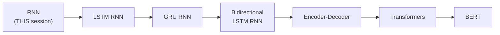

#### 🎯 Key Takeaways

* This session **directly continues** a broader arc — ANN and CNN were already covered, and RNN is explicitly framed as "moving towards deep learning," continuing the same, deliberate, from-scratch teaching style.
* The **complete, stated roadmap** spans seven major topics — RNN, LSTM, GRU, Bidirectional LSTM, Encoder-Decoder, Transformers, and BERT — with this session covering only the FIRST of these in depth.
* The instructor's own opening practice — reviewing **recently-asked, real interview questions** before starting new content — is explicitly established as a recurring pattern going forward: *"Should I follow this strategy? Prepare some interview questions... from tomorrow we'll also be having quiz[zes]."*

---

### 2. Interview Warm-Up: Train vs. Test vs. Validation Data

#### ❓ Why It Exists — A Genuine, Recently-Asked Interview Question

> 💡 **Given directly:** *"What is the difference between train versus test versus validation data? This is the first interview question that I really want you all to answer... this was asked to one of the candidates that had recently gone to the interview."*

#### 📖 Definition — Train and Test, Precisely Defined

> 💡 **Given directly:** *"Whenever we take any kind of dataset, we do two types of split -- one is train, and one is test. When I say train, I'm basically going to use this data for MODEL TRAINING. [Test] is exactly for MODEL TESTING -- I'm not going to make sure that my model EVER sees this. I should not allow my model to see this. If my model sees this, then there's an issue with respect to something called as DATA LEAKAGE."*

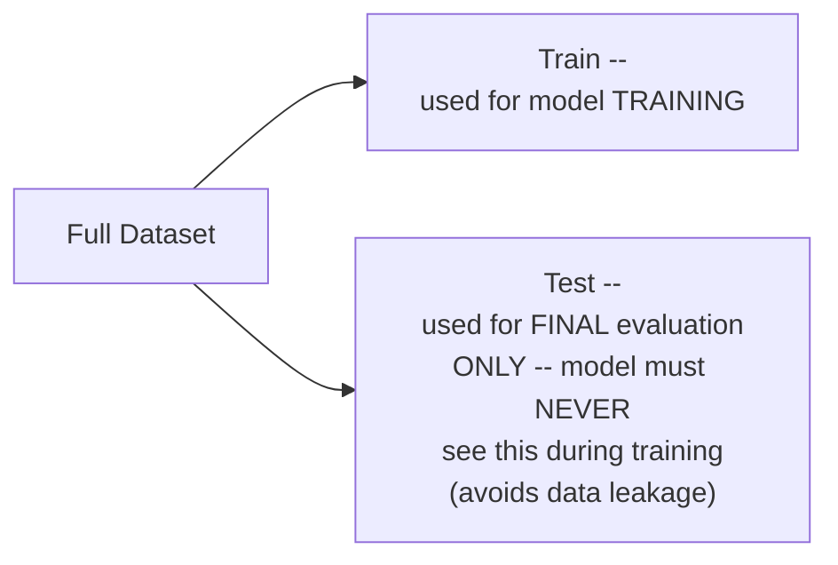

#### 📖 Definition — Validation, Precisely Defined via Its Purpose

> 💡 **Given directly:** *"From this training data, what we can do is that I can basically create another split -- one is called as training, and one is called as validation. Why this specific validation split is actually done? This validation split is actually done so that we can HYPERTUNE our model -- this is basically for HYPERPARAMETER TUNING."*

#### 🪜 Step-by-Step — The Complete, Worked 5-Fold Cross-Validation Example

> 💡 **Given directly, the complete, precise walkthrough:** *"Suppose I say that I'm going to do cross-validation, my value is 5 -- that basically means I'm going to perform 5 different experiments. In the first experiment, suppose if my total training dataset is 1,000... I'm going to divide this 1,000 dataset into 5 by 5 -- this basically shows that my validation data size should be 200 in all the 5 experiments. In the first experiment, the FIRST data, this will be my validation data, and the size will be 200, right, remaining, this will be 800 -- this will be my training data. Similarly, if I go and probably construct my next experiment... the next 200 will be my validation data, and remaining will be my training data."*

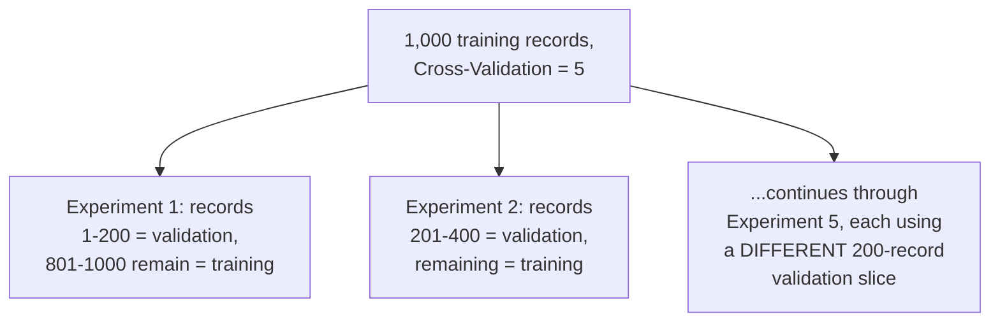

#### ⚠ Common Mistakes

* Confusing test data with validation data — explicitly, directly distinguished: TEST data is used ONLY for final, genuine evaluation (never seen during training, to avoid data leakage); VALIDATION data is used specifically for HYPERPARAMETER TUNING, via techniques like cross-validation (e.g., Grid Search CV, Randomized Search CV).
* Assuming a single train/validation split is sufficient — explicitly, directly demonstrated via cross-validation's own approach: MULTIPLE experiments, each using a genuinely DIFFERENT slice of the data as validation, providing a more robust hyperparameter-tuning process.

#### 🎯 Key Takeaways

* **Train data** trains the model; **test data** provides a genuine, final, unseen evaluation (never used during training, to avoid data leakage); **validation data** is specifically used for HYPERPARAMETER TUNING.
* **Cross-validation** (e.g., `cv=5`) splits the training data into multiple, DIFFERENT validation slices across multiple experiments — directly, numerically demonstrated with a 1,000-record dataset producing five 200-record validation folds.
* This is explicitly, directly flagged as a **genuine, real, recently-asked interview question** — worth memorizing precisely, not just conceptually.

---
### 3. Interview Warm-Up: Why Random Forest Over Decision Tree?

#### ❓ Why It Exists — A Second, Genuine Interview Question

> 💡 **Given directly:** *"Why do people use Random Forest mostly, instead of Decision Tree? You know that in Random Forest, you have multiple decision trees, but why do we specifically do this?"*

#### 📖 Definition — The Precise, Bias-Variance Answer

> 💡 **Given directly:** *"This is something related to bias and variance -- to avoid overfitting. When we say overfitting, what is the type of bias and variance we have with respect to overfitting? Training accuracy is very good, test accuracy is very bad -- so can I say LOW BIAS and HIGH VARIANCE? Decision tree usually has low bias and high variance."*

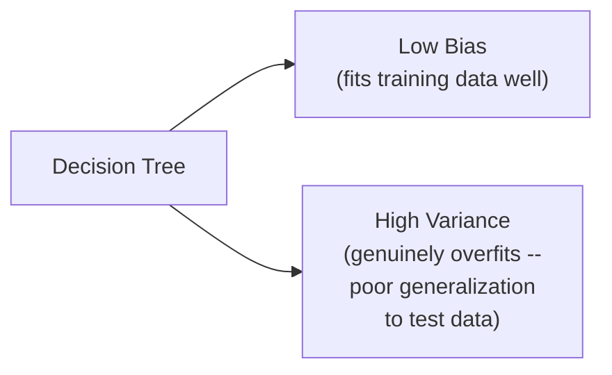

#### 🔍 Internal Working — Precisely How Random Forest Fixes This

> 💡 **Given directly:** *"In order to reduce this HIGH variance to LOW variance, and specifically to keep this low bias as low bias, we specifically use Random Forest."*

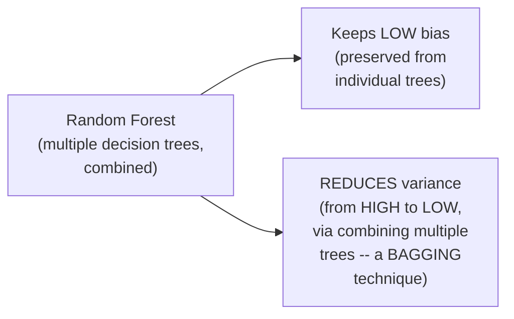

#### 📖 Definition — Random Forest Precisely Named as a Bagging Technique

> 💡 **Given directly, a genuine, direct confirmation:** *"Random Forest is a bagging technique."*

#### ⚠ Common Mistakes

* Assuming Random Forest simply "performs better" for vague, unspecified reasons — explicitly, directly grounded in a precise, technical bias-variance argument: it specifically REDUCES variance while PRESERVING the low bias individual decision trees already provide.
* Confusing overfitting's precise bias-variance signature — explicitly, directly clarified: overfitting (good training accuracy, poor test accuracy) corresponds to LOW bias and HIGH variance, not the reverse.

#### 🎯 Key Takeaways

* **Decision Trees** genuinely have low bias but high variance — directly explaining their tendency to overfit (excellent training accuracy, poor test accuracy).
* **Random Forest**, a genuine BAGGING technique combining multiple decision trees, specifically reduces this high variance while preserving the low bias — directly addressing the overfitting problem.
* This is explicitly, directly flagged as a second, genuine interview question, correctly answered by a real subscriber during an actual interview.

---

### 4. Why RNN? The Limits of Word2Vec for Sequence-Dependent Tasks

#### 📖 Definition — Word2Vec, Precisely Re-Confirmed as the Prior Session's Best Technique

> 💡 **Given directly:** *"Till now, the things that we have seen to convert text to vectors -- what is the most efficient strategy we have found out till now? ...Word2Vec, and then what we do, we basically use average Word2Vec, and this is nothing but an embedding layer -- this is something called as WORD EMBEDDING."*

#### ❓ Why It Exists — Four Genuine, Real-World Applications Where Sequence Genuinely Matters

> 💡 **Given directly, the complete set of motivating examples:**
> - **Chatbots**: *"The chatbot should understand the proper context of all the question, and probably answer it... the sequence of words are very important."*
> - **Language Translation**: *"Google Translate... here also sequence of the word is super important, and you have to make sure that grammatically all this conversion should happen properly."*
> - **Text Generation/Autosuggestion**: *"If you open your Gmail and probably start writing a sentence, right, does it give you suggestion of the upcoming sentence? ...Grammatically, it makes sure that it provides you all the suggestion."*
> - **Sentiment Analysis**: named directly alongside the above as another genuinely sequence-dependent task.

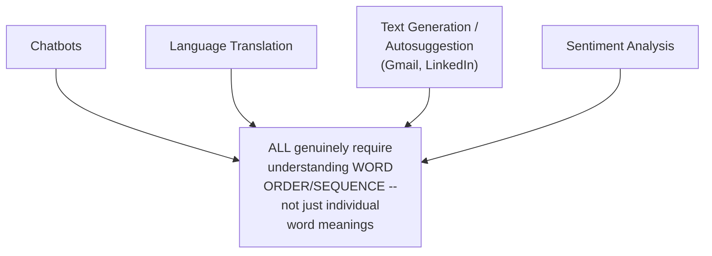

#### ❓ Why It Exists — Precisely Why Machine Learning (and Word2Vec Alone) Falls Short

> 💡 **Given directly:** *"For doing all these things, we cannot be dependent on machine learning -- we have to be dependent on deep learning techniques... like RNN, LSTM RNN... because machine learning will not be able to give us very good accuracy."*

#### 📖 Definition — Word2Vec, Precisely Restated for Clarity

> 💡 **Given directly:** *"Word2Vec is a technique in deep learning, which we can train a model, or we can use a pre-trained model, which actually converts word into vectors -- and why this is much more efficient? Because semantic meaning is actually captured."*

#### ⚠ Common Mistakes

* Assuming Word2Vec alone (even average Word2Vec/embedding layers) is sufficient for genuinely sequence-dependent tasks — explicitly, directly clarified: it captures genuine SEMANTIC meaning of individual words well, but does NOT, by itself, model the SEQUENCE/ORDER dependencies these real applications genuinely require.
* Assuming classical machine learning could solve these sequence-dependent problems given enough data — explicitly, directly stated as insufficient: *"Machine learning will not be able to give us very good accuracy"* for these specific, sequence-dependent task types.

#### 🎯 Key Takeaways

* **Word2Vec** (and average Word2Vec/embedding layers) capture genuine semantic meaning well — established as the prior session's most efficient text-to-vector technique — but do NOT, by themselves, model sequence/order.
* Four genuine, real applications — **chatbots, language translation, text generation/autosuggestion, and sentiment analysis** — all directly, explicitly require understanding word SEQUENCE, not merely individual word meanings.
* This precise gap directly motivates moving to **deep learning techniques specifically designed for sequences** — RNN, LSTM, and beyond — with machine learning explicitly named as insufficient for these specific task types.

---
### 5. The Basic RNN Architecture: A Neuron That Feeds Its Own Output Back

#### 📖 Definition — The Core, Defining Property of RNN

> 💡 **Given directly:** *"Let's say this is my neuron -- this is specifically output, this is specifically input. I have my input, I have my output... and whenever we get one kind of output, this output is ALSO SENT BACK to the neuron network. This is the basic architecture of recurrent neural network."*

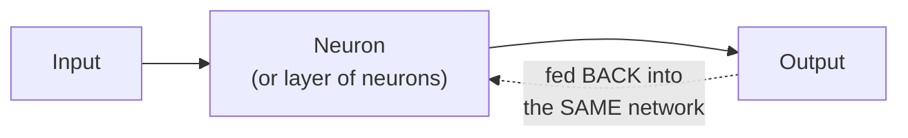

#### 🔍 Internal Working — This Can Be a Single Neuron or Many

> 💡 **Given directly:** *"This neuron may be a single neuron, or it can be multiple neurons -- it can be even 100 neurons. Just consider this one layer."*

#### 🪜 Step-by-Step — Expanding the Recurrence Across Time

> 💡 **Given directly, the complete, precise expansion:** *"I will be having a neuron like this -- this will be my output, sorry, this will be my input, then what will happen, since it is given back to its own network, so here will be one output, let's give this back to the same neuron, like this, which will be having one input and one output again -- then again this will be given back to the same, and this will also be having one input and one output."*

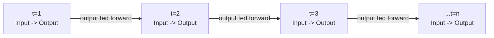

> 💡 **Given directly, the precise, timestamp-based framing:** *"Can I say that this will work with respect to timestamp? At t=1, this output is going over here, then at t=2, this is basically getting calculated, at t=3, this is getting [calculated], at t=n, this is getting calculated."*

#### ⚠ Common Mistakes

* Assuming each timestep in an RNN uses a genuinely DIFFERENT, independently-trained network — explicitly, directly clarified: it's the SAME neural network, reused (with the SAME weights) across every timestep, with only the INPUT and the PREVIOUS OUTPUT changing at each step.
* Assuming the "output fed back" description means the network literally reuses its FINAL prediction as a future input — explicitly, directly clarified via the later sentiment-analysis example (Section 7): it's specifically the intermediate, per-timestep OUTPUT (the "hidden state") that gets carried forward, not necessarily a final, human-readable prediction.

#### 🎯 Key Takeaways

* The **defining property of RNN**: a neuron (or layer of neurons) whose output is fed BACK into the SAME network — directly enabling the network to genuinely carry information forward across a sequence.
* This recurrence is precisely framed in terms of **timestamps** (t=1, t=2, t=3, ... t=n) — the SAME network, reused at every timestep, with the previous timestep's output directly feeding into the current one.
* The number of neurons within this recurrent structure is a genuine, configurable choice — "it can be even 100 neurons," precisely mirroring the flexibility already established for standard ANN hidden layers.

---

### 6. The Four Types of RNN: One-to-One, One-to-Many, Many-to-One, Many-to-Many

#### 📖 Definition — One-to-One, Precisely Defined With a Real Example

> 💡 **Given directly:** *"Here you have an input, instead of retrieving the output here, we will just send the output to the next one... finally I retrieve the output over here -- do you see, I am giving only ONE input, and I'm getting only ONE output? In this particular case, we basically say this as ONE-TO-ONE recurrent neural network."*

> 💡 **Given directly, the stated example:** *"Image classification can be a very good example... with the help of RNN also, we can do image classification."*

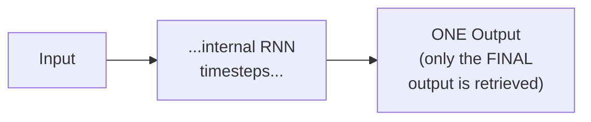

#### 📖 Definition — One-to-Many, Precisely Defined With Real Examples

> 💡 **Given directly:** *"Here I have just ONE input, and I have MANY outputs -- each and every layer's output can also be taken with respect to timestamp."*

> 💡 **Given directly, the complete, stated examples:** *"Music generation... text generation... Google search suggestions... movie recommendation."*

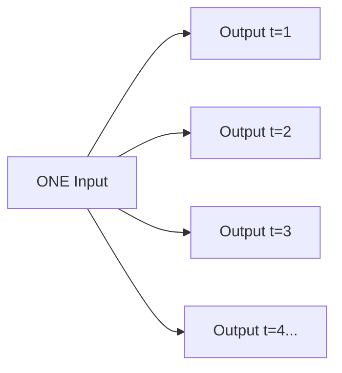

#### 📖 Definition — Many-to-One, Precisely Defined With Real Examples

> 💡 **Given directly:** *"Here I will specifically be getting CONTINUOUS INPUTS... what may be the example? Sentiment analysis -- there we give multiple words, and finally my output is yes or no."*

> 💡 **Given directly, a second stated example:** *"Predict next day sale -- by taking the previous data, predict next day sale."*

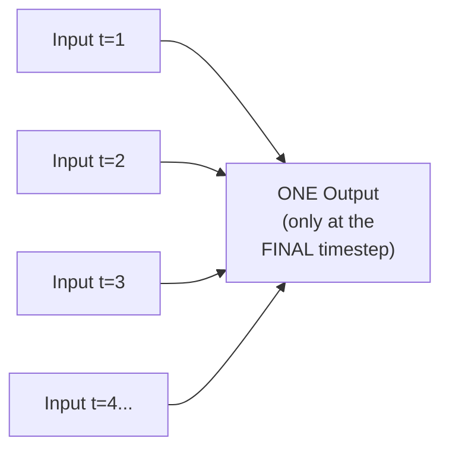

#### 📖 Definition — Many-to-Many, Precisely Defined With Real Examples

> 💡 **Given directly:** *"Many-to-many is a simple way where we specifically get one input, get one output, and then I go over here, and I probably get one input, one output, right, like this -- many-to-many will definitely be there."*

> 💡 **Given directly, the complete, stated examples:** *"Language translation... question answering... chatbots."*

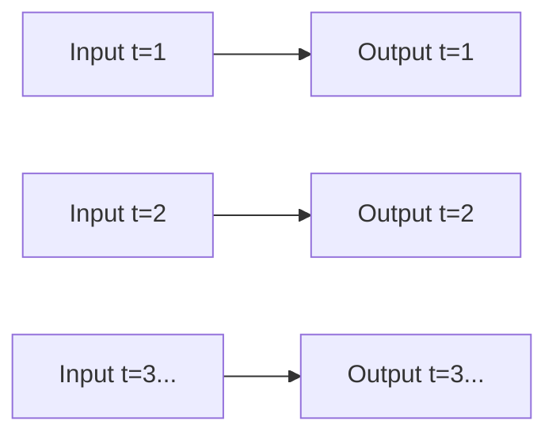

| RNN Type | Input:Output Pattern | Stated Examples |
|---|---|---|
| **One-to-One** | 1 input, 1 output (only final retrieved) | Image classification |
| **One-to-Many** | 1 input, MANY outputs | Music generation, text generation, search suggestions, movie recommendation |
| **Many-to-One** | MANY inputs, 1 output | Sentiment analysis, next-day sales prediction |
| **Many-to-Many** | MANY inputs, MANY outputs | Language translation, question answering, chatbots |

#### ⚠ Common Mistakes

* Confusing One-to-Many with Many-to-Many — explicitly, directly distinguished: One-to-Many receives a SINGLE input, then produces MULTIPLE outputs across time; Many-to-Many receives MULTIPLE inputs and produces MULTIPLE, genuinely paired outputs at EACH corresponding timestep.
* Assuming sentiment analysis could be modeled as One-to-One — explicitly, directly corrected: it's Many-to-One, since MULTIPLE words (a full sentence) are genuinely processed as input, with only ONE final output (the sentiment classification) produced.

#### 🎯 Key Takeaways

* **Four genuine RNN types** exist, categorized purely by their input-to-output PATTERN: **One-to-One** (image classification), **One-to-Many** (music/text generation, search suggestions, movie recommendation), **Many-to-One** (sentiment analysis, sales prediction), and **Many-to-Many** (language translation, Q&A, chatbots).
* This session's own upcoming, complete worked example (Section 7) is explicitly identified as **Many-to-One** — directly matching the sentiment analysis use case established in Section 4's own motivating examples.
* Each type is explicitly, directly connected to REAL, concrete application examples — not abstract categorization alone.

---
### 7. Forward Propagation in RNN: A Complete Worked Example

#### 🪜 Step-by-Step — Setting Up the Example: "The Food Is Very Good"

> 💡 **Given directly:** *"Let's say this is my text -- I've taken an example with respect to 'the food is very good' -- how many, four are there? No, five are there -- 'the food is very good' -- and with respect to this, my output is positive, because this is a positive sentiment. In this particular instance, I will write it as X11, X12, X13, X14, X15."*

```text
Sentence: "the food is very good" (5 words)
X11 = "the"   X12 = "food"   X13 = "is"   X14 = "very"   X15 = "good"
Task type: Many-to-One (sentiment analysis) -- per Section 6
Target output: Positive sentiment
```

#### 🪜 Step-by-Step — The First Timestep: Only the Input Weight

> 💡 **Given directly:** *"X11 is going over here, then what we do, we initialize weights over here... in forward propagation, we are just going to multiply the inputs and the weights... can I write X11 multiplied by W? ...I've not done anything, I've just done this matrix multiplication of X11 with W. X11 is in the form of vectors."*

```text
O1 = f(X11 · W)
```

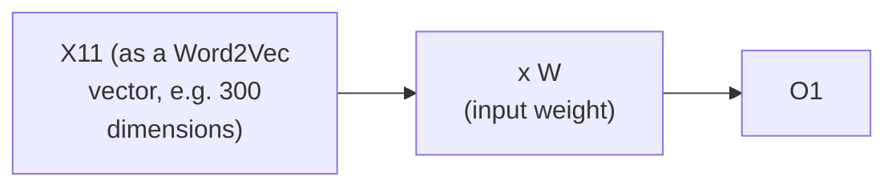

#### 🪜 Step-by-Step — The Second Timestep: Adding the Hidden-State Weight

> 💡 **Given directly, the precise, complete explanation:** *"Here I'm going to pass X12, and again W will be used over here -- but since O1 is there, this neural network is also dependent on O1, because this information is again getting passed over here -- so here I'm going to initialize ANOTHER weight, that is W-h... when I am multiplying this, I also need to get added to this... first multiplication will happen with X12 * W, and then an ADDITION will happen with O1 * Wh."*

```text
O2 = f(X12 · W + O1 · Wh)
```

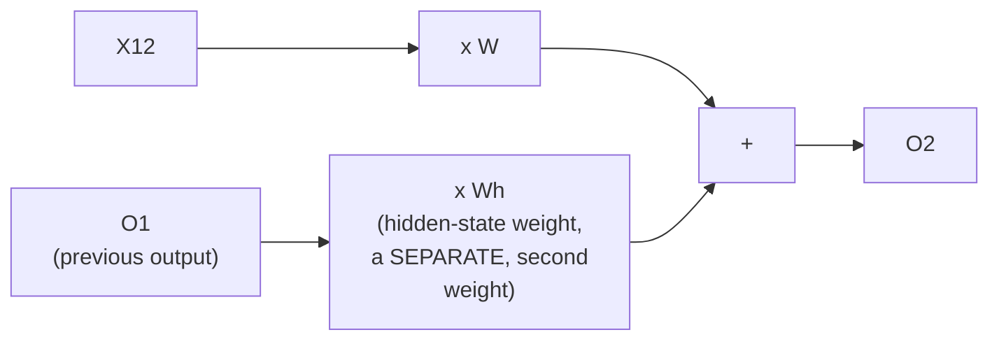

#### 🪜 Step-by-Step — The Complete, General Pattern, Confirmed Across All Five Timesteps

> 💡 **Given directly:** *"O3 is dependent on TWO things -- this two and this two -- I will write a function of X13 * W, plus O2 * Wh -- this will specifically be the operation with respect to O3... like this, all the operation will continue, and it'll go till the end stage."*

```text
O1 = f(X11 · W)
O2 = f(X12 · W + O1 · Wh)
O3 = f(X13 · W + O2 · Wh)
O4 = f(X14 · W + O3 · Wh)
O5 = f(X15 · W + O4 · Wh)   <- FINAL output (Many-to-One: only THIS is retrieved)
```

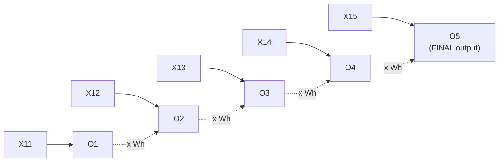

#### 🔍 Internal Working — Bias Is Also Added, Precisely Confirmed

> 💡 **Given directly:** *"Internally, bias will get added -- bias will get added everywhere -- bias, bias, bias, bias, bias, okay, everybody clear -- how the weights is getting initialized, you know that -- okay, weights, usually a lot of initialization techniques are there."*

```text
Complete formula, WITH bias:
Ot = f(X1t · W + O(t-1) · Wh + b)
```

#### 🔍 Internal Working — This Is Genuinely a Function of a Function

> 💡 **Given directly:** *"O3 is dependent on two things... I will write a FUNCTION OF A FUNCTION."*

#### ⚠ Common Mistakes

* Assuming the SAME weight `W` is used for BOTH the current input AND the previous output — explicitly, directly clarified: TWO genuinely SEPARATE weights exist — `W` for the current input, and `Wh` specifically for the previous timestep's output (the "hidden state" weight).
* Assuming the first timestep (`O1`) also involves a hidden-state contribution — explicitly, directly clarified: at t=1, there IS no "previous output" yet, so `O1` is computed using ONLY the input weight `W` — the hidden-state term (`Wh`) only enters from `O2` onward.
* Assuming padding/sentence-length handling is not addressed — explicitly, directly acknowledged as a genuinely practical concern, with a specific, direct promise: *"There will be something called as padding, so I'll show you that how to do it -- don't worry about it right now."*

#### 🎯 Key Takeaways

* Every RNN output (except the very first) is computed as a **function of a function**: the current input multiplied by an input weight (`W`), PLUS the previous timestep's output multiplied by a SEPARATE hidden-state weight (`Wh`) — with bias added throughout.
* The **first timestep** (`O1`) is a genuine special case, computed using ONLY the input weight, since no "previous output" yet exists.
* This entire, complete worked example directly demonstrates the **Many-to-One** pattern (Section 6) in concrete, numerical terms — five inputs (`X11` through `X15`), but only the FINAL output (`O5`) is genuinely retained as the sentiment prediction.

---

### 8. Output Activation & a Preview of Backward Propagation

#### 📖 Definition — The Output Activation Function, Precisely Rule-Based

> 💡 **Given directly:** *"With respect to the output, we apply -- since this is many-to-one, in many-to-one, which kind of activation function we can apply with respect to the output? If this output is a MULTI-CLASS classification problem, we specifically apply SOFTMAX. If it is a BINARY classification, we apply SIGMOID -- either of this, we specifically apply, and finally I get Y-hat."*

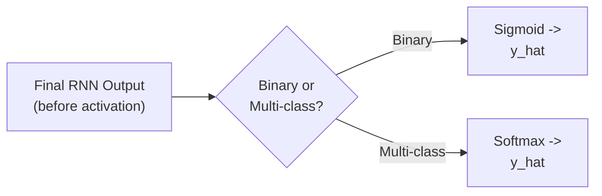

#### 📖 Definition — Backward Propagation, Briefly, Honestly Previewed

> 💡 **Given directly:** *"In the backward propagation, what we focus on -- once we get Y-hat, I'm going -- but I will also be having my original Y value, so I will try to calculate a LOSS FUNCTION -- let's say I'm going to use a simple loss function, where I'm subtracting Y and Y-hat... and with respect to this, I'm going to update ALL these weights -- this weight, this weight -- and this is going to happen with respect to ALL the timestamps."*

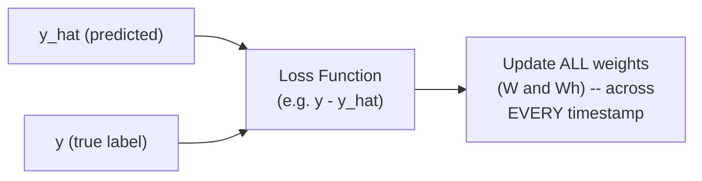

#### ⚠ A Direct, Honest Acknowledgment: Full Backward Propagation Derivation Is Deferred

> 💡 **Given directly:** *"How does back propagation happen? I will try to show you that in the next class -- I really wanted to cover the forward propagation, and already we had time -- because it is a 1-hour session."*

#### 🏢 Real-World / Production Usage — RNN's Genuine, Broader Applicability

> 💡 **Given directly, a genuinely important, direct clarification:** *"I'm not saying that RNN is only used for working with text data -- RNN is used for working with TIME SERIES DATA also."*

#### 🪜 Step-by-Step — The Explicit, Stated Plan for the Next Session

> 💡 **Given directly:** *"In the next class, also after understanding backward propagation, we're going to solve a practical problem -- I really want to cover each and everything, you know, each and everything with respect to the RNN also."*

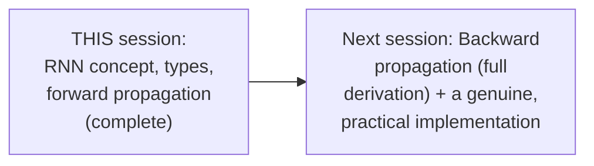

#### ⚠ Common Mistakes

* Assuming RNN is genuinely limited to text/NLP applications only — explicitly, directly corrected: it's equally applicable to TIME SERIES data, a genuinely important, broader use case.
* Assuming this session's brief loss-function mention constitutes the COMPLETE backward propagation derivation — explicitly, honestly acknowledged as merely a PREVIEW, with the full, precise mechanics genuinely deferred to the next class specifically due to time constraints.

#### 🎯 Key Takeaways

* The RNN's final output activation follows the **SAME rule established for standard ANN/CNN output layers**: sigmoid for binary classification, softmax for multi-class — directly reusing, not reinventing, this established pattern.
* **Backward propagation** in RNN updates ALL weights (`W` and `Wh`) across EVERY timestamp, based on a loss function comparing `y` and `y_hat` — but this session's own coverage is explicitly, honestly limited to a brief PREVIEW, with the FULL derivation genuinely deferred to the next class.
* **RNN's applicability extends beyond text/NLP** to genuinely include TIME SERIES data — an important, explicitly-stated clarification of its broader relevance.

---
## 📝 Glossary

| Term | Definition | Why It Matters |
|---|---|---|
| **Data Leakage** | Test data information improperly influencing training | Why test data must never be seen during training |
| **Cross-Validation** | Splitting training data into multiple validation folds across experiments | Used for hyperparameter tuning |
| **Bias-Variance** | Low bias + high variance = overfitting signature | Explains why Random Forest > single Decision Tree |
| **Bagging** | Combining multiple models (e.g., decision trees) to reduce variance | What Random Forest genuinely is |
| **RNN** | Recurrent Neural Network -- a neuron whose output feeds back into itself | Enables modeling of sequences |
| **Timestep** | One point in a sequence (t=1, t=2, ...) | The unit RNN's recurrence operates across |
| **Hidden State Weight (Wh)** | A separate weight applied to the PREVIOUS timestep's output | Distinct from the input weight (W) |
| **One-to-One RNN** | 1 input, 1 output | e.g. image classification |
| **One-to-Many RNN** | 1 input, MANY outputs | e.g. music/text generation |
| **Many-to-One RNN** | MANY inputs, 1 output | e.g. sentiment analysis |
| **Many-to-Many RNN** | MANY inputs, MANY outputs | e.g. language translation, chatbots |

---

## 🔄 Revision Notes — One-Minute Revision

* This session **directly continues** the broader deep learning arc (ANN, CNN already covered) -- opening with two genuine, recently-asked interview questions before moving into RNN.
* **Train/test/validation**: train trains the model; test provides FINAL, unseen evaluation (never seen during training, avoiding data leakage); validation is for HYPERPARAMETER TUNING, via cross-validation (e.g., cv=5 on 1,000 records -> five 200-record validation folds).
* **Random Forest > Decision Tree**: Decision Trees have LOW bias, HIGH variance (the overfitting signature); Random Forest (a BAGGING technique) reduces variance while preserving low bias.
* **The stated roadmap**: RNN -> LSTM -> GRU -> Bidirectional LSTM -> Encoder-Decoder -> Transformers -> BERT.
* **Why RNN**: Word2Vec/embedding layers capture genuine SEMANTIC meaning, but NOT sequence/order -- genuinely necessary for chatbots, language translation, text generation/autosuggestion (Gmail, LinkedIn), and sentiment analysis, all of which REQUIRE sequence understanding. Machine learning alone is explicitly insufficient for these tasks.
* **Basic RNN architecture**: a neuron (or layer) whose OUTPUT is fed BACK into the SAME network -- the SAME network, reused across timesteps (t=1, t=2, ... t=n).
* **Four RNN types**: One-to-One (image classification), One-to-Many (music/text generation, search suggestions, movie recommendation), Many-to-One (sentiment analysis, sales prediction), Many-to-Many (language translation, Q&A, chatbots).
* **Forward propagation, complete worked example** ("the food is very good," Many-to-One sentiment analysis): `O1 = f(X11.W)`; `O2 = f(X12.W + O1.Wh)`; `O3 = f(X13.W + O2.Wh)`; and so on -- TWO SEPARATE weights (W for input, Wh for the previous output/"hidden state"), with bias added throughout. Only the FINAL output (O5) is retained for this Many-to-One task.
* **Output activation**: sigmoid for binary classification, softmax for multi-class -- the SAME rule already established for ANN/CNN.
* **Backward propagation** is only briefly previewed (loss function comparing y and y_hat, updating all weights across all timestamps) -- FULL derivation and a practical implementation are explicitly, honestly deferred to the next session.
* **RNN's applicability** extends beyond text/NLP to TIME SERIES data as well.

---

## 📋 Cheat Sheet

**Train/Test/Validation:**
```text
Train      -> trains the model
Test        -> FINAL evaluation only (never seen during training -- avoids data leakage)
Validation    -> hyperparameter tuning (via cross-validation)
```

**Random Forest vs. Decision Tree:**
```text
Decision Tree -> LOW bias, HIGH variance (overfitting risk)
Random Forest -> bagging technique -- REDUCES variance, keeps low bias
```

**RNN's core mechanism:**
```text
Neuron/layer output -> fed BACK into the SAME network, across timesteps
```

**The four RNN types:**
```text
One-to-One:   1 input  -> 1 output    (e.g. image classification)
One-to-Many:  1 input  -> N outputs   (e.g. music/text generation)
Many-to-One:  N inputs -> 1 output    (e.g. sentiment analysis)
Many-to-Many: N inputs -> N outputs   (e.g. language translation, chatbots)
```

**Forward propagation formula:**
```text
O1 = f(X1 . W)                    <- first timestep: input weight ONLY
Ot = f(Xt . W + O(t-1) . Wh + b)   <- subsequent timesteps: input weight + hidden-state weight + bias
```

**Output activation:**
```text
Binary classification    -> Sigmoid
Multi-class classification -> Softmax
```

---

## 🔥 Interview Questions & Answers

### 🟢 Beginner

**Q1.**

**Question:** What is the difference between test data and validation data?

**Answer:** Test data provides a final, genuine evaluation and must never be seen during training (to avoid data leakage); validation data is specifically used for hyperparameter tuning.

**Explanation:** Directly, precisely distinguished.

**Why Interviewers Ask This:** Explicitly flagged as a genuine, recently-asked interview question.

**Possible Follow-up:** "How does cross-validation use validation data across multiple experiments?"

**Q2.**

**Question:** What is the bias-variance signature of overfitting?

**Answer:** Low bias, high variance.

**Explanation:** Directly, precisely stated.

**Why Interviewers Ask This:** Foundational bias-variance knowledge.

**Possible Follow-up:** "How does Random Forest address this signature?"

**Q3.**

**Question:** What is the defining architectural feature of an RNN?

**Answer:** A neuron (or layer) whose output is fed back into the same network.

**Explanation:** Directly, precisely defined.

**Why Interviewers Ask This:** Foundational, essential RNN knowledge.

**Possible Follow-up:** "What term describes each individual point in this recurring sequence?"

**Q4.**

**Question:** Why is Word2Vec alone insufficient for tasks like chatbots or language translation?

**Answer:** It captures genuine semantic meaning of individual words, but does not model sequence/order, which these tasks genuinely require.

**Explanation:** Directly, precisely explained.

**Why Interviewers Ask This:** Tests understanding of WHY RNN is genuinely necessary, not just what it does.

**Possible Follow-up:** "Name two other applications where sequence genuinely matters."

**Q5.**

**Question:** Name the four types of RNN.

**Answer:** One-to-One, One-to-Many, Many-to-One, Many-to-Many.

**Explanation:** Directly, explicitly named.

**Why Interviewers Ask This:** Foundational, frequently-tested RNN categorization.

**Possible Follow-up:** "Give a real example for each type."

**Q6.**

**Question:** Which RNN type is sentiment analysis?

**Answer:** Many-to-One.

**Explanation:** Directly, explicitly stated.

**Why Interviewers Ask This:** Tests correct application of the RNN-type categorization.

**Possible Follow-up:** "Why is it Many-to-One rather than One-to-One?"

**Q7.**

**Question:** In RNN forward propagation, how many distinct weights are used at each timestep beyond the first?

**Answer:** Two -- an input weight (W) and a hidden-state weight (Wh).

**Explanation:** Directly, precisely stated.

**Why Interviewers Ask This:** Foundational RNN forward-propagation mechanics.

**Possible Follow-up:** "Why does the very first timestep use only one of these weights?"

**Q8.**

**Question:** Which activation function is used for a binary classification RNN output?

**Answer:** Sigmoid.

**Explanation:** Directly, explicitly stated.

**Why Interviewers Ask This:** Basic, foundational output-layer knowledge.

**Possible Follow-up:** "What about for multi-class classification?"

**Q9.**

**Question:** Is RNN limited to text/NLP applications?

**Answer:** No -- it is also used for time series data.

**Explanation:** Directly, explicitly clarified.

**Why Interviewers Ask This:** Tests awareness of RNN's genuinely broader applicability.

**Possible Follow-up:** "Give an example of a time-series use case for RNN."

**Q10.**

**Question:** What is Random Forest, categorically?

**Answer:** A bagging technique.

**Explanation:** Directly, explicitly stated.

**Why Interviewers Ask This:** Basic, foundational ensemble-method terminology.

**Possible Follow-up:** "How does bagging genuinely reduce variance?"

---

### 🟡 Intermediate

**Q11.**

**Question:** Explain why the instructor deliberately opens this session with two REVIEW interview questions (train/test/validation, Random Forest) before introducing RNN, rather than starting directly with new content.

**Answer:** This is a deliberate, stated pedagogical pattern the instructor explicitly establishes as ONGOING: *"Should I follow this strategy? Prepare some interview questions... from tomorrow we'll also be having quiz[zes]."* Reviewing genuine, real, recently-asked interview questions serves TWO purposes simultaneously: it reinforces prior material (ensuring foundational ML concepts remain sharp before building NEW, more complex content on top of them), and it directly, concretely demonstrates the REAL, practical value of this course's material (these are genuinely asked questions, not hypothetical exercises) -- directly modeling the course's broader, repeated emphasis on interview readiness as a genuine, primary goal, not merely conceptual understanding for its own sake.

**Explanation:** Requires recognizing a deliberate, stated pedagogical pattern and its dual purpose (reinforcement + interview relevance).

**Why Interviewers Ask This:** Tests whether a learner recognizes deliberate teaching structure, not just the specific review questions themselves.

**Possible Follow-up:** "What specific evidence does the instructor give that these questions are genuinely, currently relevant (not just hypothetical)?"

**Q12.**

**Question:** A learner argues that since RNN's basic architecture feeds its output "back into the network," this must mean the network's WEIGHTS change at every timestep during forward propagation. Evaluate this claim.

**Answer:** This claim is inaccurate and conflates two genuinely different concepts. Per Section 7's own precise, worked example, the WEIGHTS (`W` and `Wh`) remain GENUINELY FIXED throughout the ENTIRE forward propagation pass across all timesteps -- what changes at each timestep is the INPUT (a new word, `X12`, `X13`, etc.) and the PREVIOUS OUTPUT (`O1`, `O2`, etc.) being fed forward, NOT the weight VALUES themselves. Weights are updated ONLY during BACKWARD PROPAGATION (per Section 8's own brief preview), AFTER a complete forward pass has finished and the loss has been computed -- this is precisely analogous to how ANN weights remain fixed during a single forward pass and are updated only during the subsequent backward pass. The "output fed back into the network" description refers to the FLOW OF DATA (the hidden state/output value) across timesteps, not a claim about the weights themselves changing mid-pass.

**Explanation:** Tests whether a learner distinguishes DATA flow (the recurring output/hidden state) from WEIGHT updates (which only happen during backward propagation), a genuinely important, easy-to-conflate distinction.

**Why Interviewers Ask This:** Distinguishes candidates who understand the precise mechanics of forward vs. backward propagation from those who conflate "recurrence" with "constant weight updating."

**Possible Follow-up:** "At what specific point in the complete RNN training cycle do the weights W and Wh actually get updated?"

**Q13.**

**Question:** Explain, precisely, why the session's worked example computes `O1 = f(X11 · W)` — using ONLY the input weight — rather than including some placeholder or default value for the "previous output" term at the very first timestep.

**Answer:** At the genuinely FIRST timestep (t=1), there is, by definition, no GENUINE previous output yet to incorporate -- the recurrence relationship (`Ot` depends on `O(t-1)`) has no valid `t-1` to reference at the very start of a sequence. While SOME real implementations do initialize a genuine "zero" or default hidden state value for this edge case (effectively still including the `Wh` term, multiplied by zero or a default), the session's own SIMPLIFIED example deliberately OMITS this term entirely for `O1`, directly reflecting the genuine, logical absence of any prior information at the sequence's true start -- rather than introducing an arbitrary, potentially confusing placeholder value that isn't strictly necessary for building CORRECT, foundational intuition about the recurrence relationship itself.

**Explanation:** Requires reasoning through the genuine, logical necessity of this special case, distinguishing it from real implementation details (zero-initialization) the session's own simplified example doesn't explicitly address.

**Why Interviewers Ask This:** Tests whether a learner understands WHY this edge case is genuinely different, not just that the formula happens to look different at t=1.

**Possible Follow-up:** "If a real implementation DID initialize a 'previous output' value for t=1, what would be the most natural, default choice for that value?"

**Q14.**

**Question:** Using this session's precise Many-to-One example (Section 7), explain why the SAME underlying forward-propagation mechanism could genuinely be reused, with minimal modification, to implement a Many-to-Many task (like language translation), and what WOULD need to genuinely change.

**Answer:** The CORE recurrence mechanism -- computing each timestep's output as a function of the CURRENT input and the PREVIOUS output (`Ot = f(Xt·W + O(t-1)·Wh + b)`) -- remains GENUINELY IDENTICAL between Many-to-One and Many-to-Many tasks, since this describes HOW information flows FORWARD through the sequence, independent of which specific outputs get RETAINED for the final task. The genuine, necessary difference (per Section 6's own precise distinction) is specifically about WHICH outputs are RETAINED and used: Many-to-One (Section 7's own example) discards `O1` through `O4`, retaining ONLY the final `O5` for the sentiment classification; a genuine Many-to-Many task (like translation) would instead RETAIN EVERY timestep's output (`O1` through `O5`, or however many timesteps exist), since each one corresponds to a genuinely meaningful, individual output (e.g., each word of a translated sentence). This reveals that the FOUR RNN types (Section 6) are fundamentally about output RETENTION POLICY, not about four genuinely different underlying computational mechanisms -- the SAME core forward-propagation formula from Section 7 underlies ALL four types.

**Explanation:** Requires synthesizing the specific worked example (Section 7) with the general type taxonomy (Section 6) to explain what's genuinely SHARED versus what genuinely DIFFERS between RNN types.

**Why Interviewers Ask This:** Tests whether a learner recognizes that the four RNN "types" are a genuinely unified underlying mechanism with different output-retention policies, not four separate architectures.

**Possible Follow-up:** "Would One-to-Many also use this exact same recurrence formula? What would be genuinely different about its INPUT handling, compared to Many-to-One?"

**Q15.**

**Question:** Synthesize this session's "why RNN" motivation (Section 4) with its precise forward-propagation mechanics (Section 7) to explain exactly HOW the recurrence relationship (via `Wh` and the previous output) genuinely solves the sequence-dependency problem that Word2Vec alone could not.

**Answer:** A precise synthesis: Word2Vec (Section 4) converts EACH WORD INDEPENDENTLY into a semantically-meaningful vector, but processes each word's vector WITHOUT any genuine awareness of the OTHER words' positions or order relative to it -- averaging or independently embedding words discards sequence information entirely. RNN's forward-propagation mechanism (Section 7) directly, precisely fixes this: at EVERY timestep beyond the first, the current word's contribution (`Xt·W`) is COMBINED WITH the ACCUMULATED INFORMATION from every PRIOR word in the sequence (via `O(t-1)·Wh`, which itself already incorporates `O(t-2)`, which incorporates `O(t-3)`, and so on, recursively back to the very first word). This means `O5` (the final output, in the session's own 5-word example) is not merely a function of the word "good" in isolation -- it's a function of "good" GENUINELY COMBINED with the accumulated, sequential influence of "the," "food," "is," and "very," each contributing through the chain of `Wh`-weighted recurrence. This is PRECISELY the mechanism that allows the network to genuinely capture that "the food is very good" carries a meaningfully DIFFERENT sentiment than a scrambled ordering of the same five words might -- directly, mechanistically solving the sequence-dependency gap Section 4 identifies Word2Vec alone as failing to address.

**Explanation:** Requires synthesizing the high-level motivation (why sequence matters) with the precise, low-level mechanics (the recurrence formula) to explain HOW the formula genuinely achieves the stated goal.

**Why Interviewers Ask This:** A senior-level question testing whether a candidate can connect an abstract motivation to a concrete, mechanistic explanation of HOW that motivation is genuinely achieved.

**Possible Follow-up:** "Would a network using ONLY `Xt·W` at every timestep (with NO `Wh` term at all) genuinely fail to capture sequence information? Explain precisely why or why not."

---

### 🔴 Advanced

**Q16.**

**Question:** Design a complete, from-scratch numerical trace of RNN forward propagation for a genuinely new, 4-word sentence — "this movie was excellent" — using illustrative, hand-chosen values for W=0.5, Wh=0.3, bias=0.1, and simplified, single-number "vector" representations for each word (X11=2, X12=3, X13=1, X14=4), computing O1 through O4 using ReLU as the activation function.

**Answer:** A reasonable, complete trace, directly applying Section 7's own exact formula pattern (with bias, per Section 7's own explicit inclusion): **O1** (first timestep, input weight + bias only, per Section 7's own special-case reasoning): `O1 = ReLU(X11·W + b) = ReLU(2×0.5 + 0.1) = ReLU(1.1) = 1.1`. **O2**: `O2 = ReLU(X12·W + O1·Wh + b) = ReLU(3×0.5 + 1.1×0.3 + 0.1) = ReLU(1.5 + 0.33 + 0.1) = ReLU(1.93) = 1.93`. **O3**: `O3 = ReLU(X13·W + O2·Wh + b) = ReLU(1×0.5 + 1.93×0.3 + 0.1) = ReLU(0.5 + 0.579 + 0.1) = ReLU(1.179) = 1.179`. **O4** (the FINAL output, since this is a Many-to-One sentiment task, per Section 6): `O4 = ReLU(X14·W + O3·Wh + b) = ReLU(4×0.5 + 1.179×0.3 + 0.1) = ReLU(2 + 0.3537 + 0.1) = ReLU(2.4537) = 2.4537`. This final value (`2.4537`) would then be passed through sigmoid (per Section 8's own binary-classification rule, assuming this is a binary positive/negative sentiment task) to produce the final `y_hat` probability.

**Explanation:** Requires applying the session's own exact formula pattern (including bias) to a genuinely new example with different values, correctly tracking the recurrence across every timestep.

**Why Interviewers Ask This:** A realistic, senior-level question testing whether a candidate can perform the actual, complete numerical computation for a genuinely new example, not just recite the formula.

**Possible Follow-up:** "If the ReLU activation were replaced with a linear (identity) activation instead, would the final O4 value change? Compute it and compare."

**Q17.**

**Question:** Critically evaluate: "Since this session establishes that RNN uses a SINGLE, shared set of weights (W and Wh) reused across every timestep, this must mean an RNN genuinely has FEWER total trainable parameters than an equivalent-depth ANN processing the same sequence length, making RNN inherently more computationally efficient to train." Is this an accurate, complete characterization?

**Answer:** Partially accurate, but incomplete in a genuinely important way. The FIRST part of the claim is accurate and directly supported by the session's own content: per Section 7's own precise formula, the SAME `W` and `Wh` (and bias) are genuinely REUSED at every timestep, rather than each timestep requiring its OWN, independently-trained set of weights (as a naive, non-recurrent "unrolled" ANN processing the same sequence WOULD require) -- this genuinely does mean FEWER total unique parameters need to be learned, a real, meaningful efficiency advantage for handling variable-length sequences. However, the claim that this makes RNN training UNCONDITIONALLY "more computationally efficient" OVERSTATES the case -- this session's own content does NOT address (and explicitly defers, per Section 8) the genuine computational cost of BACKWARD PROPAGATION through a RECURRENT structure, which requires propagating gradients back through EVERY timestep SEQUENTIALLY (a process sometimes called "backpropagation through time," not explicitly named in this session but directly implied by Section 8's own "update all weights... with respect to all the timestamps" description) -- this sequential dependency can genuinely make RNN training SLOWER in wall-clock time than a parallelizable alternative, even with fewer total unique parameters. The accurate characterization: RNN's weight-sharing genuinely reduces PARAMETER COUNT, but does not by itself guarantee faster or more efficient TRAINING overall, since the sequential nature of backpropagation through time introduces its own, genuine computational cost this session doesn't yet address.

**Explanation:** Tests whether a learner distinguishes "fewer total parameters" from "unconditionally more computationally efficient," correctly identifying a genuine limitation the session's own content doesn't yet address (deferred to backward propagation coverage).

**Why Interviewers Ask This:** Distinguishes candidates who understand the precise, partial scope of a genuinely accurate observation (weight sharing) from those who over-generalize it into a broader, unsupported efficiency claim.

**Possible Follow-up:** "What genuine computational challenge does 'backpropagation through time' introduce that a standard, non-recurrent ANN's backward propagation does not have?"

**Q18.**

**Question:** Synthesize this session's complete forward-propagation mechanics (Section 7) with its interview-question review on bias-variance (Section 3) to construct a reasoned hypothesis about whether a VERY LONG sequence (e.g., a 500-word document) processed through this exact RNN architecture would be MORE or LESS prone to a bias-variance problem than a SHORT sequence (e.g., the session's own 5-word example), and why.

**Answer:** A reasoned, synthesized hypothesis: per Section 7's own exact recurrence formula, EVERY timestep's output genuinely depends on ALL prior timesteps, chained back through repeated multiplication by `Wh` (`O(t-1)`, which itself depends on `O(t-2)`, and so on). For a VERY LONG sequence (500 words), this means the network's FINAL output (per the Many-to-One pattern) would be the result of `Wh` being applied and re-applied through the recurrence chain roughly 500 TIMES -- a genuinely different situation than the session's own SHORT, 5-word example, where `Wh` is applied only 4 times (from `O2` through `O5`). Drawing a reasoned parallel to Section 3's own bias-variance framing (though the session itself doesn't directly discuss this specific case): if `Wh`'s value is even slightly less than 1, repeated multiplication across 500 timesteps could cause EARLY timesteps' genuine influence to become vanishingly small by the time the final output is computed (a phenomenon directly analogous to, though not identical to, the vanishing gradient problem covered in the earlier ANN sessions) -- meaning the network might struggle to genuinely "remember" information from early in a very long sequence, a form of UNDERFITTING with respect to long-range dependencies specifically. This is a REASONED, HYPOTHESIS-LEVEL EXTENSION beyond what this session explicitly states, directly motivating why LSTM (explicitly named as the very next topic in this session's own roadmap, Section 1) was specifically developed -- LSTM's own genuine innovation being precisely a more sophisticated mechanism for preserving long-range information that a basic RNN's simple recurrence formula genuinely struggles with.

**Explanation:** Requires synthesizing the precise recurrence formula with a reasoned, hypothesis-level extension about long-sequence behavior, correctly connecting it to why LSTM (the session's own next stated topic) exists.

**Why Interviewers Ask This:** A capstone-level question testing whether a candidate can extend the session's own precise mechanics into a genuinely reasoned hypothesis about a scenario not explicitly covered, correctly anticipating why the NEXT topic in the roadmap exists.

**Possible Follow-up:** "Based on this reasoning, what specific problem would you predict LSTM's own architecture needs to solve, compared to basic RNN?"

---

## 🧪 Scenario-Based Interview Questions

> **Scenario 1:** A colleague's sentiment-analysis RNN, built using this session's exact Many-to-One pattern, is trained on sentences of GENUINELY varying lengths (some 3 words, some 20 words) within the same batch, and reports a shape-mismatch error during training. Using this session's concepts, diagnose the most likely cause.

**Structured Answer:**
1. **Initial investigation:** Recognize this as directly connected to Section 7's own brief, explicit acknowledgment of PADDING as a genuinely necessary, practical concern for handling variable-length sequences -- a topic the session explicitly promises to cover ("there will be something called as padding... don't worry about it right now").
2. **Metrics/logs to check:** Directly verify whether the colleague's data pipeline applies any genuine padding/truncation to normalize sequence lengths WITHIN a batch before training.
3. **Possible causes:** Per Section 7's own implicit reasoning, RNN's forward-propagation formula (`Ot = f(Xt·W + O(t-1)·Wh + b)`) genuinely requires a CONSISTENT number of timesteps within a single batch for efficient, vectorized computation -- mixing 3-word and 20-word sentences WITHOUT padding would create a genuine shape mismatch.
4. **Debugging approach:** Directly inspect the actual input tensor shapes being passed into the RNN, confirming whether sequences of DIFFERENT lengths are genuinely present without normalization.
5. **Resolution:** Apply padding (e.g., padding shorter sequences with a designated "padding token" up to a consistent maximum length within each batch) — directly resolving the shape mismatch, exactly as Section 7's own brief mention anticipates.
6. **Prevention:** Establish a standing team practice of always explicitly padding (or bucketing similarly-lengthed sequences together) before RNN training, directly treating this as a genuine, necessary preprocessing step rather than an afterthought.

> **Scenario 2 (Advanced):** Your team's Many-to-One sentiment-analysis RNN performs well on short customer reviews (under 20 words) but performs noticeably worse on longer reviews (100+ words), despite using the same architecture. Using this session's concepts (and Advanced Q18's own reasoning), diagnose the most likely cause and propose next steps.

**Structured Answer:**
1. **Initial investigation:** Recognize this as directly connected to Advanced Interview Q18's own reasoned hypothesis -- longer sequences require the recurrence relationship to chain through MANY MORE timesteps, genuinely risking the network's ability to retain influence from early words by the time the final output is computed.
2. **Metrics/logs to check:** Directly compare the model's actual performance metrics (accuracy, loss) segmented specifically by review LENGTH, confirming whether performance genuinely, systematically degrades as length increases.
3. **Possible causes:** Per Advanced Q18's own reasoned extension of Section 7's exact formula, the basic RNN's simple recurrence (`Wh` applied repeatedly) may genuinely struggle to preserve long-range dependencies across very long sequences -- information from early words may become vanishingly influential by the final timestep.
4. **Debugging approach:** Directly test whether TRUNCATING long reviews to a shorter, fixed length (discarding earlier content) genuinely changes prediction quality in an informative way, helping confirm whether long-range information retention is genuinely the issue.
5. **Resolution:** Per this session's own explicitly-stated roadmap (Section 1), consider migrating to **LSTM RNN** — the very next topic in the course's own stated sequence — specifically because it was developed to address this exact class of long-range dependency problem more effectively than basic RNN.
6. **Prevention:** Establish a standing team practice of evaluating model performance segmented by sequence length DURING development, specifically to catch this exact class of long-range-dependency degradation before deployment, and to make an informed, early decision about whether basic RNN is genuinely sufficient or whether LSTM/GRU is warranted for the genuine input-length distribution.

---

## 🛠 Hands-on Exercises

### 🟢 Easy

1. Write out, from memory, the precise distinction between train, test, and validation data.
2. Name the four RNN types and give a correct, real example for each.
3. Write the forward-propagation formula for a general timestep `Ot`, including bias.

### 🟡 Medium

4. Complete the full, numerical trace proposed in Advanced Interview Q16, using a genuinely different sentence and weight values of your own choosing.
5. Write a short explanation (150-200 words) of why the first timestep's formula differs from every subsequent timestep's formula.
6. Design a Many-to-Many worked example (like language translation) for a short, 3-word input/output pair, explicitly tracing which outputs are retained versus a Many-to-One example.

### 🔴 Advanced

7. Implement a small, working RNN forward-propagation function in Python (NumPy only), correctly implementing the recurrence formula, tested against your own hand-computed trace from Exercise 4.
8. Research and write a short explanation (200-300 words) of "backpropagation through time," directly extending Section 8's own brief preview and Advanced Q17's own reasoning about its computational cost.
9. Implement the long-sequence diagnostic test proposed in Scenario 2, using a synthetic dataset with deliberately varying sequence lengths, empirically testing whether performance genuinely degrades as length increases.

---

## 🏗 Practice Assignment

### Build: "Complete RNN Forward Propagation Trace, From Scratch"

**Objective:** Directly reproduce this session's own complete forward-propagation methodology for a genuinely new sentiment-analysis example.

**Requirements:**
- A complete, hand-worked forward-propagation trace for a sentence of your own choosing (at least 5 words), following this session's exact `Ot = f(Xt·W + O(t-1)·Wh + b)` pattern.
- A working Python (NumPy) implementation of this same forward-propagation logic, verified against your hand-worked trace.
- A written classification of your chosen sentence's task type (Many-to-One, Many-to-Many, etc.), with justification.
- A written reflection (200-300 words) on why the hidden-state weight (Wh) is genuinely necessary for capturing sequence information, directly applying Intermediate Q15's own reasoning.

**Architecture (suggested):**

```text
rnn_forward_propagation_trace/
├── manual_trace.md                  # your hand-worked example
├── rnn_forward_prop.py                 # your NumPy implementation
├── task_type_classification.md            # your RNN-type justification
└── REFLECTION.md                              # your written reflection
```

**Expected Functionality:**
- Your manual trace should show genuine, correct arithmetic at every timestep.
- Your Python implementation should genuinely, correctly match your manual trace's computed values.

**Challenges:**
- Correctly tracking which weight (W vs. Wh) applies to which term at each timestep.
- Correctly handling the special case of the first timestep.

**Bonus Improvements:**
- Extend your implementation to a genuinely different RNN type (e.g., One-to-Many), correctly retaining ALL timestep outputs rather than only the final one.
- Research and briefly implement basic padding for a batch of variable-length sequences.

---

## 📚 Additional Resources

- **The prior ANN and CNN sessions** -- the direct prerequisite content this session assumes ("this two architecture") before introducing RNN.
- **The community/course dashboard** (referenced directly) -- where this session's materials (converted to PDF, per the instructor's own stated plan) are made available.
- **The next session** (referenced directly, explicitly next) -- covering the FULL backward propagation derivation for RNN, plus a genuine, practical implementation.
- **LSTM RNN, GRU RNN, Bidirectional LSTM, Encoder-Decoder, Transformers, and BERT** -- all explicitly named as upcoming topics in this session's own stated, complete roadmap.

---

## 📌 Final Revision Sheet

### ⭐ Core Concepts
- **Train/test/validation**: train trains; test evaluates (avoiding data leakage); validation tunes hyperparameters (via cross-validation).
- **Random Forest** (bagging) reduces Decision Tree's high variance while preserving its low bias.
- **RNN's core mechanism**: a neuron/layer whose output feeds back into itself across timesteps.
- **Why RNN**: Word2Vec captures semantic meaning but not sequence; RNN genuinely models sequence via recurrence.
- **Four RNN types**: One-to-One, One-to-Many, Many-to-One, Many-to-Many -- differentiated by output-retention policy, sharing the SAME underlying recurrence mechanism.
- **Forward propagation**: `Ot = f(Xt.W + O(t-1).Wh + b)`, with the first timestep using only `Xt.W + b`.
- **Output activation**: sigmoid (binary), softmax (multi-class) -- same rule as ANN/CNN.

### ⭐ Important Definitions
- **Timestep, Hidden State Weight** (see Glossary for full definitions).

### ⭐ Important Commands/Code
```text
O1 = f(X11 . W + b)
Ot = f(Xt . W + O(t-1) . Wh + b)   for t > 1
```

### ⭐ Architecture/Process
- Complete forward pass: input (word 1) -> O1 -> input (word 2) combined with O1 via Wh -> O2 -> ... -> final output (for Many-to-One) -> activation (sigmoid/softmax) -> y_hat.

### ⭐ Best Practices
- Apply padding for variable-length sequences within a batch.
- Match RNN type (retention policy) to the genuine task structure.
- Consider LSTM/GRU for genuinely long sequences, where basic RNN may struggle with long-range dependencies.

### ⭐ Common Mistakes
- Confusing test data with validation data.
- Assuming RNN weights change during forward propagation (they only update during backward propagation).
- Assuming the first timestep uses the same formula as subsequent timesteps.
- Assuming RNN is limited to text/NLP only (it applies to time series too).

### ⭐ Interview Points
- Be ready to precisely distinguish train/test/validation data.
- Be ready to name and give examples for all four RNN types.
- Be ready to write and explain the forward-propagation formula, including the first-timestep special case.
- Be ready to explain why Word2Vec alone is insufficient for sequence-dependent tasks.

### ⭐ Things to Remember
- This session **directly continues** the broader deep learning arc (ANN, CNN already covered) -- opening with genuine, real interview-question review, an established, ongoing pattern.
- **Backward propagation and a practical implementation are both explicitly, honestly deferred** to the next session, due to genuine time constraints in this 1-hour live session.
- The **complete, stated roadmap** (RNN -> LSTM -> GRU -> Bidirectional LSTM -> Encoder-Decoder -> Transformers -> BERT) situates this session as only the FIRST step in a much longer, planned sequence.

---

## 🔗 Source

- [RNN Implementation](https://www.youtube.com/live/ZwYtqTaZ2io?si=sUt0BnqELjQvqWc5)