# 🧠 Deep Learning — Day 7: Backpropagation in RNN & Why LSTM Exists

- <i>**Session:** Deep Learning Live Series — Day 7 (Backpropagation in RNN & NLP Applications) · 
- **Instructor:** Krish Naik
- **Note on scope:** This is the **direct, explicitly-promised continuation** of Day 6, which covered RNN's forward propagation but explicitly deferred backward propagation due to time constraints. This session delivers on that promise — deriving RNN's complete backpropagation via the chain rule, precisely distinguishing how the SAME shared weight gets updated differently depending on its timestep, then precisely tracing the vanishing gradient problem's mechanism in a deep RNN. The session closes with a genuine, honest, FIRST look at LSTM's architecture — explicitly scoped as a brief preview, with the full, detailed architecture and a practical implementation both explicitly promised for the next session.</i>

---

## 📑 Table of Contents

1. [Session Overview](#-session-overview)
2. [Learning Objectives](#-learning-objectives)
3. [Detailed Notes](#-detailed-notes)
   - [1. Session Context: Day 7, Continuing Into Backward Propagation](#1-session-context-day-7-continuing-into-backward-propagation)
   - [2. Interview Warm-Up: Distributions, Transforms & Preprocessing Concepts](#2-interview-warm-up-distributions-transforms--preprocessing-concepts)
   - [3. RNN Forward Propagation, Briefly Recapped](#3-rnn-forward-propagation-briefly-recapped)
   - [4. Backward Propagation in RNN: The Chain Rule Applied Across Timesteps](#4-backward-propagation-in-rnn-the-chain-rule-applied-across-timesteps)
   - [5. A Precise Distinction: Updating the SAME Weight at DIFFERENT Timesteps](#5-a-precise-distinction-updating-the-same-weight-at-different-timesteps)
   - [6. The Vanishing Gradient Problem in Deep RNN](#6-the-vanishing-gradient-problem-in-deep-rnn)
   - [7. Why LSTM: Solving Both Vanishing Gradient AND Long-Term Context Loss](#7-why-lstm-solving-both-vanishing-gradient-and-long-term-context-loss)
   - [8. A First Look at LSTM's Architecture: Memory Cell, Forget & Input Operations](#8-a-first-look-at-lstms-architecture-memory-cell-forget--input-operations)
4. [Glossary](#-glossary)
5. [Revision Notes — One-Minute Revision](#-revision-notes--one-minute-revision)
6. [Cheat Sheet](#-cheat-sheet)
7. [Interview Questions & Answers](#-interview-questions--answers)
8. [Scenario-Based Interview Questions](#-scenario-based-interview-questions)
9. [Hands-on Exercises](#-hands-on-exercises)
10. [Practice Assignment](#-practice-assignment)
11. [Additional Resources](#-additional-resources)
12. [Final Revision Sheet](#-final-revision-sheet)

---

## 🎯 Session Overview

This session completes the RNN training-mechanics arc, and honestly opens the door into WHY LSTM exists. It covers:

1. **A genuine, real interview-question warm-up** covering statistical distributions (normal, log-normal, Pareto), the Box-Cox transform (converting Pareto to Gaussian), QQ plots (checking normality), standard normal distribution, mean/median/mode relationships in skewed distributions, and the precise distinction between `fit_transform`, `transform`, and `fit_predict`.
2. **A brief recap of RNN forward propagation**, re-establishing the exact notation (`O1` through `O4`, weights `W` and `W'`) before diving into backward propagation.
3. **The complete backpropagation derivation for RNN**, via the chain rule — updating `W'` (the hidden-state weight) and `W` (the input weight) by tracing the dependency chain from the loss all the way back through `y_hat`, through each intermediate output, to the specific weight being updated.
4. **A precise, important distinction**: the SAME weight (e.g., `W'`) genuinely gets updated MULTIPLE times — once per timestep — with the chain rule's LENGTH depending on WHICH timestep's weight is being updated (an EARLIER timestep requires a LONGER chain than a LATER one).
5. **The vanishing gradient problem, precisely re-traced for RNN specifically** — directly connecting sigmoid's bounded derivative (0 to 0.25) to genuinely negligible weight updates in a sufficiently deep (long-sequence) RNN.
6. **A second, genuinely distinct problem RNN suffers from**: the inability to retain LONG-RANGE CONTEXT — directly illustrated via a real example ("I grew up in France... I speak fluent French") where the crucial context word sits far from where it's genuinely needed.
7. **A first, honestly-scoped preview of LSTM's architecture** — memory cell, forget operations (pointwise multiplication), input/remember operations (pointwise addition), and concatenation — illustrated via a genuine, worked context-switching example ("Krish likes data science" → "Yann LeCun likes CNN").

> 💡 **Key framing, given directly, on the session's own honest scoping of LSTM:** *"I'm just giving you a brief idea about... I'm not explaining any maths okay... don't worry, right now I'm just giving you one basic phenomena what things are actually happening -- tomorrow I will take in depth, I'll make you understand each and every operation."*

---

## 🎯 Learning Objectives

By the end of this guide, you will be able to:

- [ ] Explain the difference between Pareto and normal distributions, and name the transform used to convert one into the other.
- [ ] Explain what a QQ plot is used for.
- [ ] Derive RNN's backpropagation for both the hidden-state weight (W') and the input weight (W) using the chain rule.
- [ ] Explain why updating the SAME weight at an earlier timestep requires a longer chain-rule computation than at a later timestep.
- [ ] Precisely trace the vanishing gradient problem's mechanism in a deep RNN, connecting it to sigmoid's bounded derivative.
- [ ] Explain the SECOND, distinct problem (long-range context loss) that motivates LSTM, beyond vanishing gradient alone.
- [ ] Describe, at a high level, LSTM's memory cell and its forget/input operations.

---

## 📚 Detailed Notes

### 1. Session Context: Day 7, Continuing Into Backward Propagation

#### 🧠 Concept

> 💡 **Given directly, opening the session:** *"Today we are basically going to just continue the NLP session, and today is the seventh day."*

#### 🪜 Step-by-Step — The Stated Plan: Complete Backward Propagation, Then a First Look at LSTM

> 💡 **Given directly:** *"In RNN, we have specifically focused on forward propagation... now we are focusing on backward propagation."*

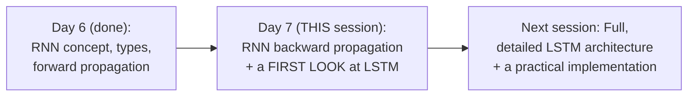

#### 🎯 Key Takeaways

* This session is the **direct, explicitly-promised continuation** of Day 6 — delivering the backward-propagation derivation that Day 6's own 1-hour time limit had genuinely prevented.
* The session's own closing, explicit plan: **tomorrow** covers LSTM's FULL, detailed architecture, followed by a genuine, practical implementation.
* The instructor's own established pattern — reviewing **genuine, real interview questions** before new content — continues here, though this time drawing from broader statistics/ML topics rather than RNN specifically.

---

### 2. Interview Warm-Up: Distributions, Transforms & Preprocessing Concepts

#### 📖 Definition — Distribution Types, Precisely Named

> 💡 **Given directly:** *"What is this kind of distribution of data known as? ...This is obviously called as normal distribution... this is called as log-normal distribution... but what about this? ...It uses power law distribution, but this distribution is basically called as PARETO distribution."*

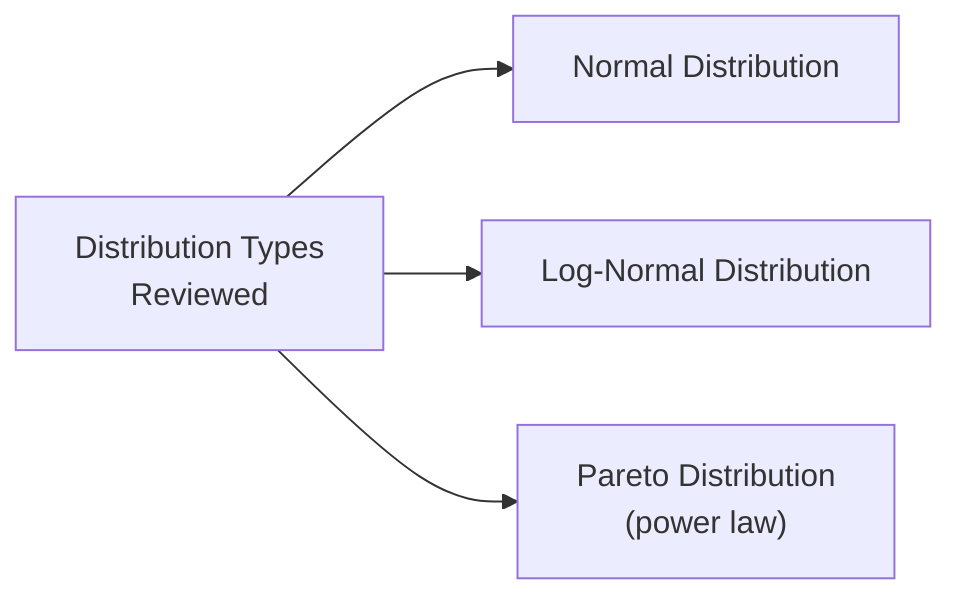

#### 📖 Definition — Box-Cox Transform, Precisely Named

> 💡 **Given directly:** *"How do we convert a Pareto distribution into a Gaussian normal distribution? ...This is basically called as BOX-COX TRANSFORM."*

#### 📖 Definition — QQ Plots, Precisely Named

> 💡 **Given directly:** *"What technique do we apply in order to check whether this distribution follows normal or Gaussian distribution? ...This technique is basically called as Q-Q PLOTS."*

#### 📖 Definition — Skewness and the Mean/Median/Mode Relationship

> 💡 **Given directly, the precise, confirmed relationships:** *"What is the relationship between mean, median, and mode in the A diagram and in the B diagram? ...Here mean is greater than median greater than mode... here mode is greater than median is greater than mean."*

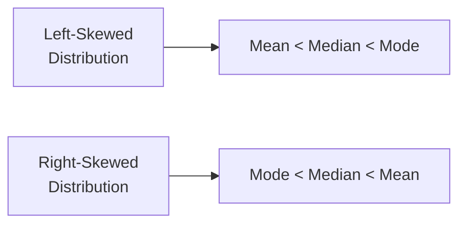

#### 📖 Definition — `fit_transform` vs. `transform` vs. `fit_predict`

> 💡 **Given directly, posed as genuine, open interview questions:** *"What is the difference between fit_transform and transform? ...There may also be a question that, when do we use fit_predict method?"*

#### 📖 Definition — Normalization vs. Standardization

> 💡 **Given directly, posed as a genuine, closing interview question:** *"What is the difference between normalization and standardization? This can be another interview question for all of you."*

#### ⚠ Common Mistakes

* Assuming a "power law"-shaped distribution is simply another name for log-normal — explicitly, directly distinguished: this specific shape is named **Pareto distribution**.
* Assuming distribution-normality checking has no standard, named visual technique — explicitly, directly named: **QQ plots**.

#### 🎯 Key Takeaways

* This session's interview warm-up covers **genuine statistics/preprocessing fundamentals**: distribution types (normal, log-normal, Pareto), the Box-Cox transform, QQ plots, skewness's effect on mean/median/mode ordering, and the `fit_transform`/`transform`/`fit_predict` distinction.
* Several of these questions are **posed directly to the live audience without the instructor immediately supplying the answer** — a deliberate, ongoing pattern of active audience engagement, directly consistent with the instructor's own established teaching style.
* This section, while genuinely broader than RNN specifically, is explicitly framed as **directly interview-relevant**, continuing the course's consistent emphasis on interview readiness.

---
### 3. RNN Forward Propagation, Briefly Recapped

#### 🪜 Step-by-Step — Re-Establishing the Exact Notation

> 💡 **Given directly:** *"I'm going to give my word X11, X12, X13, X14 -- here weights will get initialized, and finally I will be getting my output 1 -- your W-dash will get initialized -- output 2, output 3, W-dash, output 4, W-dash, and finally I get my output."*

```text
O1 = f(X11 · W)
O2 = f(X12 · W + O1 · W')
O3 = f(X13 · W + O2 · W')
O4 = f(X14 · W + O3 · W')       <- final output, before activation
y_hat = sigmoid(O4)  OR  softmax(O4)
```

> 💡 **Given directly, using this session's own explicit notation (`W'` used here in place of Day 6's `Wh`):** *"O2 -- in the O2, we basically calculate, we basically write a function F, and first of all we multiply X12 multiplied by W plus -- then we also have to be dependent on this -- so it is nothing but O1, W1 -- one multiplied by W-dash."*

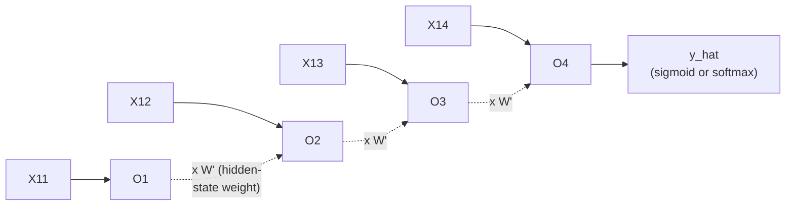

#### 🔍 Internal Working — A Direct, Precise Clarification on Weight Sharing

> 💡 **Given directly, in response to a genuine, live student question:** *"In forward propagation, proportion of output weight is fit to the next timestamp -- please solve this confusion. Since the same weights, right, it needs to continue in that next timestamp only, right -- whatever is initialized, it will continue -- in the back propagation, how many number of cycles it will get changed, that we have to have a look."*

#### ⚠ Common Mistakes

* Assuming this session's `W'` notation represents a genuinely NEW or different weight than Day 6's `Wh` — explicitly, directly the SAME hidden-state weight, simply written with alternate notation.
* Assuming weights genuinely change DURING forward propagation, as they're reused across timesteps — explicitly, directly re-confirmed: the SAME weight values persist throughout the ENTIRE forward pass; only backward propagation genuinely UPDATES them.

#### 🎯 Key Takeaways

* This session's brief recap **directly, precisely re-establishes** Day 6's own forward-propagation formulas, using `W'` in place of `Wh` — the SAME underlying concept, consistent notation shift.
* A genuine, live student question directly confirms the **weight-sharing property**: the SAME weights are used at EVERY timestep during forward propagation, with backward propagation being the SOLE point at which they genuinely get updated.
* This recap deliberately, directly sets up the session's ACTUAL new content: precisely HOW backward propagation updates these shared weights, covered next.

---

### 4. Backward Propagation in RNN: The Chain Rule Applied Across Timesteps

#### ❓ Why It Exists — The Precise, Stated Goal

> 💡 **Given directly:** *"If I really want to do the backward propagation, that basically means I have to go in this way -- I have to make sure that this weight gets updated, I have to make sure this weight also will get updated -- for that, many number of timestamps, each and every weight should get updated."*

#### 📖 Definition — The Weight Updation Formula, Precisely Re-Confirmed

> 💡 **Given directly:** *"W-dash is equal to -- and this will be W-dash NEW, W-dash OLD, minus some learning rate, derivative of loss with respect to derivative W-dash."*

```text
W'_new = W'_old - learning_rate × (∂Loss/∂W'_old)
```

#### 🪜 Step-by-Step — The Complete Chain Rule for Updating W' (Hidden-State Weight, Final Timestep)

> 💡 **Given directly, the precise, complete chain:** *"How do I find out derivative of loss with respect to derivative of W-dash? ...First of all, on before this loss, you calculate Y-hat -- I can basically use a simple chain rule, which will be like derivative of loss with respect to derivative Y-hat, multiplied or dot operation, derivative of Y-hat divided by derivative of W-dash."*

```text
∂Loss/∂W' = (∂Loss/∂y_hat) × (∂y_hat/∂W')
```

#### 🪜 Step-by-Step — The Complete Chain Rule for Updating W (Input Weight, Final Timestep)

> 💡 **Given directly, the precise, complete chain:** *"How do I calculate this derivative of loss with respect to derivative of W? Now, see, where is W present over here? Now, if I do back propagation, first I have to be dependent on Y-hat, then I have to be dependent on O4, then O4 to this -- so this way we have to use the chain rule... derivative of loss with respect to derivative Y-hat, then derivative of Y-hat will be dependent on O4, so derivative of O4, and multiplied by derivative of O4 divided by derivative of W."*

```text
∂Loss/∂W = (∂Loss/∂y_hat) × (∂y_hat/∂O4) × (∂O4/∂W)
```

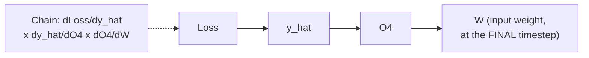

#### ⚠ Common Mistakes

* Assuming updating `W'` and updating `W` follow the IDENTICAL chain-rule path — explicitly, directly distinguished: `W'`'s chain (at the final timestep) is genuinely SHORTER (`Loss → y_hat → W'`), while `W`'s chain requires one MORE step (`Loss → y_hat → O4 → W`), since `W` specifically feeds into `O4`, not directly into `y_hat`.
* Assuming `y_hat` must always be explicitly written as a separate term in every chain — explicitly, directly clarified as OPTIONAL, purely notational: *"No need to write y_hat, y_hat also I've just written it like this, but internally it will be able to understand."*

#### 🎯 Key Takeaways

* RNN backward propagation uses the **SAME weight updation formula** established for standard ANN — `W_new = W_old - learning_rate × ∂Loss/∂W_old` — the genuine complexity lies specifically in correctly computing `∂Loss/∂W_old` via the chain rule.
* Updating `W'` (hidden-state weight) at the FINAL timestep requires a **2-step chain**: `Loss → y_hat → W'`.
* Updating `W` (input weight) at the FINAL timestep requires a **3-step chain**: `Loss → y_hat → O4 → W` — one step LONGER, since `W` feeds into `O4` (not `y_hat` directly).

---
### 5. A Precise Distinction: Updating the SAME Weight at DIFFERENT Timesteps

#### ❓ Why It Exists — The Precise, Motivating Question

> 💡 **Given directly:** *"If I really want to update this W-dash again -- then what will happen? I have to be dependent on loss, loss to Y-hat, Y-hat to O4, O4 to W-dash, right -- something like this. Suppose if I really want to update again, derivative of loss with respect to derivative of W-dash, AT TIME STAMP -- what timestamp? ...At time T is equal to 3, this W-dash I'm actually updating -- at time T is equal to 3, in order to update this, I have to be dependent on O4, O4 to W-dash."*

#### 🪜 Step-by-Step — The Complete, Precise Chain for This Earlier-Timestep Update

> 💡 **Given directly, the complete formula:** *"I will write basically derivative of loss with respect to derivative of Y-hat, multiplied by derivative of Y-hat with respect to derivative of O4, and derivative of O4 with respect to derivative of W-dash -- so this will be another chain."*

```text
∂Loss/∂W'(at t=3) = (∂Loss/∂y_hat) × (∂y_hat/∂O4) × (∂O4/∂W')
```

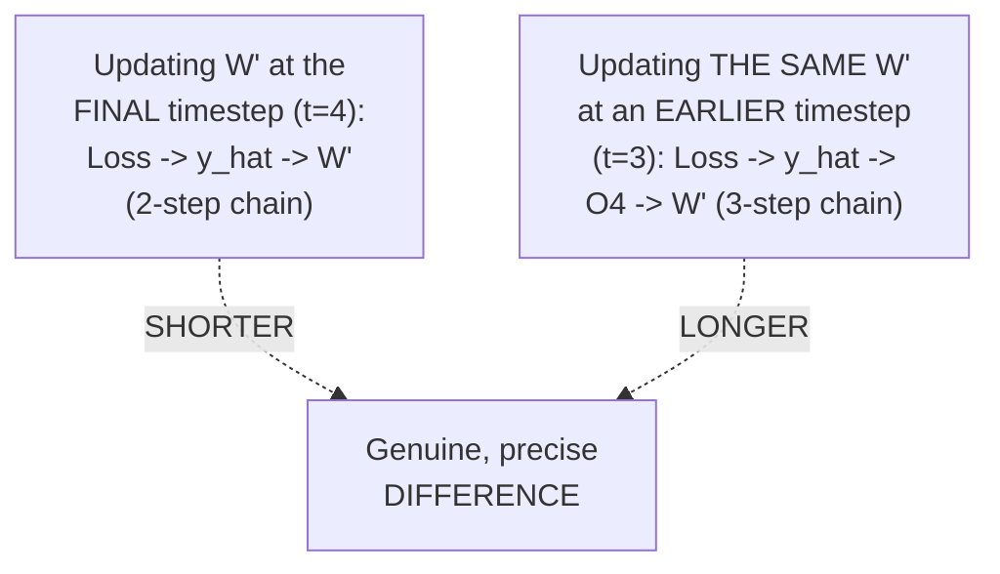

#### 🔍 Internal Working — The General, Underlying Principle

> 💡 **Given directly, the precise, generalizing statement:** *"Like this, all the back propagation will happen, and all the weights will get updated over here."*

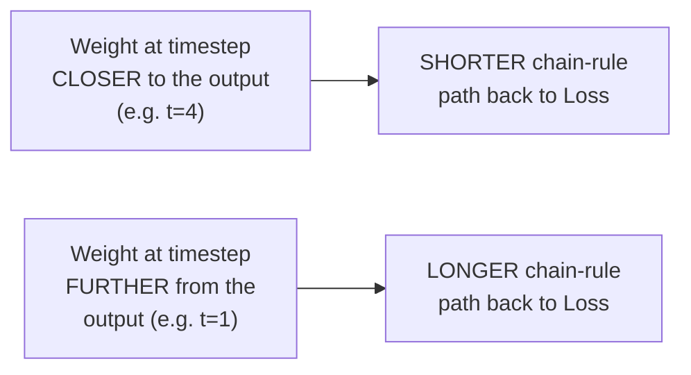

#### ⚠ Common Mistakes

* Assuming the "W'" being updated at t=3 is a genuinely DIFFERENT weight object from the "W'" updated at t=4 — explicitly, directly clarified: it is the SAME, SHARED weight — but its GRADIENT contribution is computed via a genuinely DIFFERENT (here, longer) chain, since it's being evaluated at a DIFFERENT point in the sequence's dependency structure.
* Assuming every weight update, regardless of timestep, uses an IDENTICAL chain-rule length — explicitly, directly demonstrated as false: the chain LENGTHENS the FURTHER back (earlier) the timestep is from the final output.

#### 🎯 Key Takeaways

* This session's own, genuinely important insight: the **SAME, shared weight (W')** genuinely gets updated based on chain-rule contributions computed AT EACH DIFFERENT TIMESTEP — and these chains have **genuinely different lengths** depending on how far back the timestep is from the final output.
* Updating `W'` at `t=3` requires a **3-step chain** (`Loss → y_hat → O4 → W'`) — one step LONGER than updating `W'` at the final timestep (`t=4`, a 2-step chain), precisely because the t=3 contribution must ALSO pass through `O4` first.
* This precise, growing chain length as timesteps recede FURTHER from the final output is exactly the STRUCTURAL property that directly sets up the vanishing gradient problem, covered next.

---

### 6. The Vanishing Gradient Problem in Deep RNN

#### ❓ Why It Exists — The Precise, Motivating Scenario

> 💡 **Given directly:** *"There is one problem, guys -- just understand this. Over here, I have just kept the timestamp as equal to 4 -- let's say that we have a very big sentence, and probably the timestamp over there will be around 100, 200, 300. Now in that particular case, when we keep on updating weights, what will happen? Think over it, guys."*

#### 🔍 Internal Working — Precisely, Directly Traced to Sigmoid's Bounded Derivative

> 💡 **Given directly:** *"Let's say inside this neuron, if we use something called a sigmoid activation function -- sigmoid activation function's actual output is between 0 to 1, but if we calculate the derivative of sigmoid, its output will be ranging between 0 to 0.25. Now, when your output is ranging between 0 to 0.25, as we go in this side, again in the back propagation, there are chances that this value will keep on getting smaller and smaller -- and if it is getting smaller and smaller, what will happen over here? The weight updation will be like NEGLIGIBLE."*

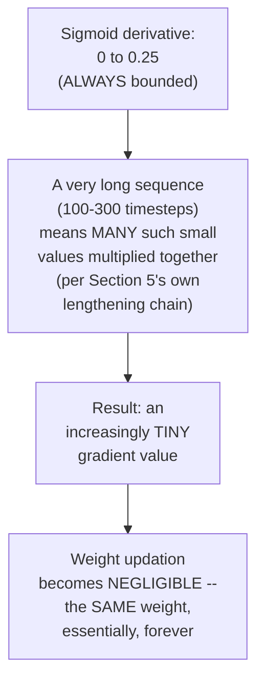

#### 🔍 Internal Working — ReLU Genuinely Doesn't Fully Solve This Either

> 💡 **Given directly, a genuine, live, direct clarification from the audience, confirmed by the instructor:** *"ReLU can actually cause dead neurons during back propagation... you're absolutely right -- that is the reason we cannot just be dependent on ReLU over here also... there may be chances that you will probably create many dead neurons."*

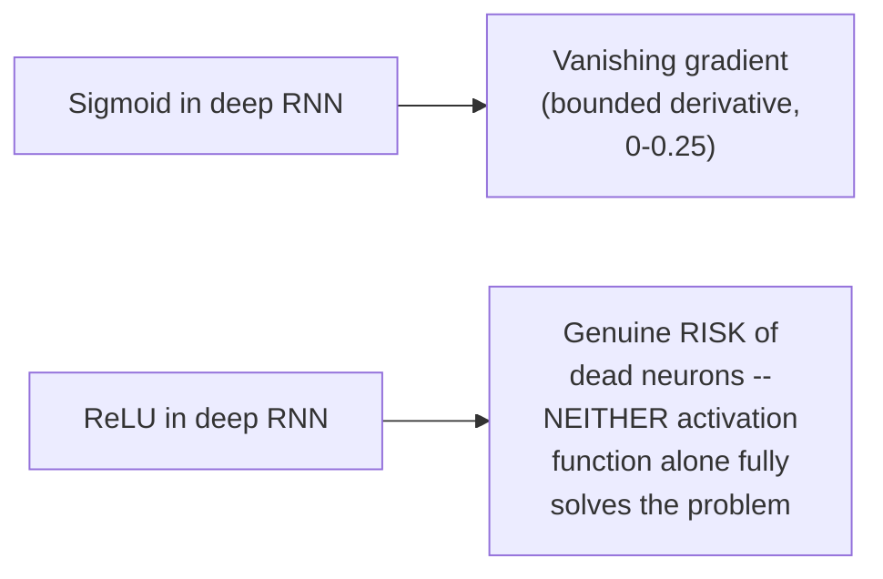

#### ❓ Why It Exists — The Precise, Named Conclusion

> 💡 **Given directly:** *"In order to fix this issue, we have to specifically use another kind of neural network, which is called as LSTM RNN."*

#### ⚠ Common Mistakes

* Assuming vanishing gradient is purely a THEORETICAL concern, unrelated to REAL sentence lengths — explicitly, directly grounded in a genuine, realistic scale (100-300 timesteps for a "very big sentence"), directly connecting the abstract math to genuinely realistic NLP scenarios.
* Assuming switching to ReLU alone would genuinely, fully solve RNN's vanishing gradient problem — explicitly, directly acknowledged (via a genuine, live audience correction) as introducing its OWN, separate problem (dead neurons), rather than being a complete, unconditional fix.

#### 🎯 Key Takeaways

* **Vanishing gradient in deep RNN** is precisely, mechanistically traced to sigmoid's bounded derivative (0 to 0.25) — multiplying MANY such small values together (across a genuinely long sequence, per Section 5's own lengthening-chain insight) produces an increasingly tiny, ultimately NEGLIGIBLE weight update.
* **ReLU does NOT fully, unconditionally solve this problem either** — it genuinely introduces its own "dead neuron" risk, a real, directly-acknowledged limitation.
* This genuine, structural problem is explicitly, directly named as the primary motivation for **LSTM RNN** — a genuinely different architecture, covered (at a first-look level) in Section 8.

---
### 7. Why LSTM: Solving Both Vanishing Gradient AND Long-Term Context Loss

#### ❓ Why It Exists — A SECOND, Genuinely Distinct Problem, Beyond Vanishing Gradient

> 💡 **Given directly, the complete, worked scenario:** *"Suppose I have some sentences -- let's say there is a sentence over here, like 'my name is Krish and I want to eat pizza' -- now when I'm probably using this RNN, what RNN will try to do is that it will try to make sure that each and every word, it will try to probably read, convert into vectors -- now some things that we will probably be missing -- suppose let's say 'pizza' is dependent on some word like 'it'... 'I' is definitely related to 'Krish', right, his 'I' is basically giving the context to Krish over here -- now because of this, there is one word distance over here, but if you have a long sentence, this 'I' and 'my' can also be related... but here you can see the distance is quite big."*

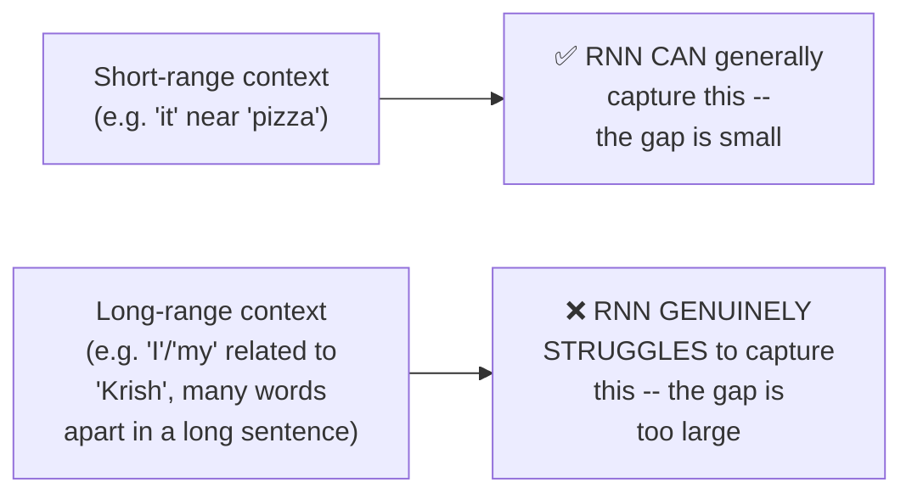

#### 🏢 Real-World / Production Usage — The Colah Blog's Own, Precise "France/French" Example

> 💡 **Given directly, quoting and directly explaining the referenced blog's own worked example:** *"Consider trying to predict the last word: 'I grew up in France... I speak fluent French' -- recent suggestions suggest that the next word is probably the name of a language, but if we want to narrow down WHICH language, we need the context of France, right -- so for this, whatever I need to find out, in between, I really need the context of France from further back."*

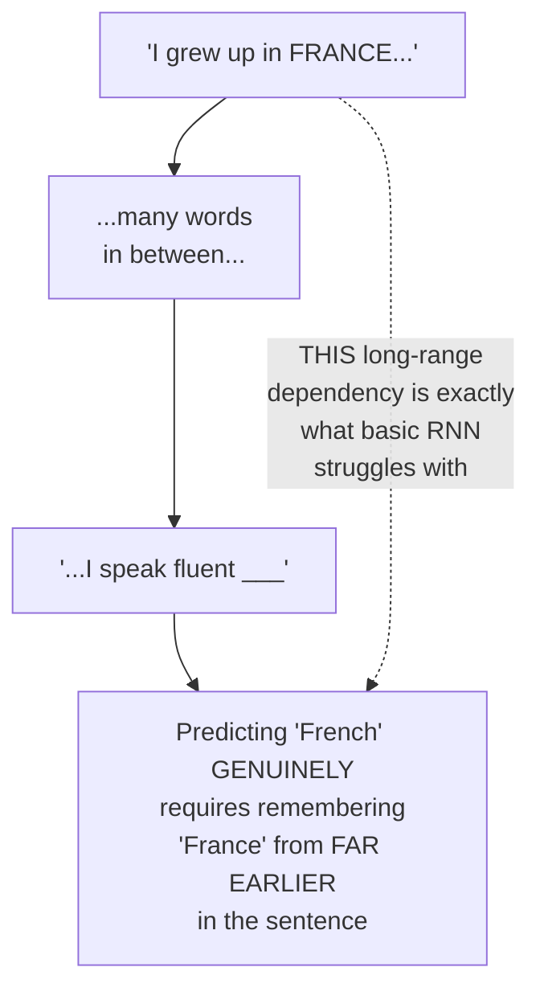

#### 📖 Definition — The Precise, Complete, Two-Part Reason LSTM Exists

> 💡 **Given directly, the complete, precise, two-part answer:** *"Why LSTM RNN instead of RNN? ...First thing is that there will be a vanishing gradient problem, or dead neuron. The second thing that we actually focused on is that the CONTEXT... unfortunately, as the gap grows, the RNN becomes UNABLE to learn to connect the information."*

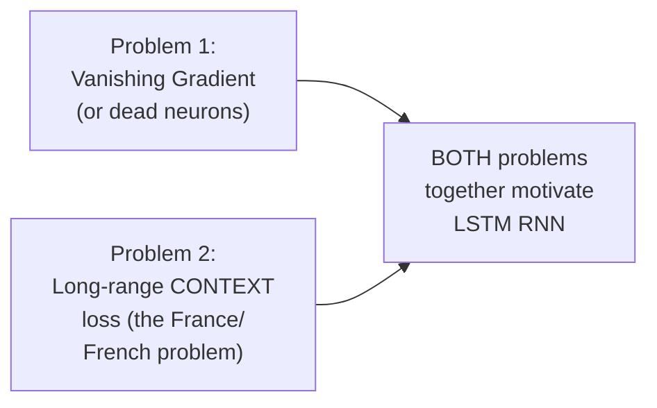

#### ⚠ Common Mistakes

* Assuming LSTM was developed to solve ONLY the vanishing gradient problem — explicitly, directly corrected: it solves TWO genuinely distinct problems TOGETHER — vanishing gradient AND the SEPARATE, structurally-different issue of losing long-range context.
* Assuming "vanishing gradient" and "losing long-range context" are simply two DIFFERENT NAMES for the SAME underlying issue — explicitly, directly distinguished: vanishing gradient is a genuine TRAINING/OPTIMIZATION problem (weight updates become negligible); long-range context loss is a genuine REPRESENTATIONAL problem (the network's OWN internal information simply doesn't persist far enough across the sequence) — related, but structurally distinct concerns.

#### 🎯 Key Takeaways

* LSTM exists to solve **TWO genuinely distinct problems together**: vanishing gradient (a training/optimization issue) and long-range context loss (a representational issue) — NOT merely one or the other.
* The **France/French example**, directly sourced from the referenced Colah blog, precisely illustrates the long-range context problem: predicting "French" genuinely requires remembering "France," which may sit far earlier in a genuinely long sentence.
* If asked in an interview **"why LSTM instead of RNN,"** the precise, complete answer requires naming BOTH problems — vanishing gradient/dead neurons AND the genuine difficulty of connecting long-range, genuinely distant information.

---

### 8. A First Look at LSTM's Architecture: Memory Cell, Forget & Input Operations

#### ⚠ A Direct, Honest Scoping of This Section

> 💡 **Given directly:** *"I'm just giving you a brief idea about how the entire architecture is... just to give you a brief overview about how does an LSTM recurrent neural network work... don't worry about the maths, I will teach you the maths, I will make sure that each and everything is basically well understood."*

#### 📖 Definition — LSTM, Precisely Named and Expanded

> 💡 **Given directly:** *"LSTM RNN is nothing but it is basically called as LONG SHORT-TERM MEMORY, and inside this long short-term memory, this will be a recurrent neural network... this entire neural network will be able to REMEMBER the context of the words that are getting created."*

#### 📖 Definition — Pointwise Operations, Precisely Explained

> 💡 **Given directly:** *"This operation, where you can probably see cross, right -- this operation is basically called POINTWISE OPERATION. If there is a cross, that basically is pointwise cross (multiplication) operation, right -- if there is plus, pointwise addition."*

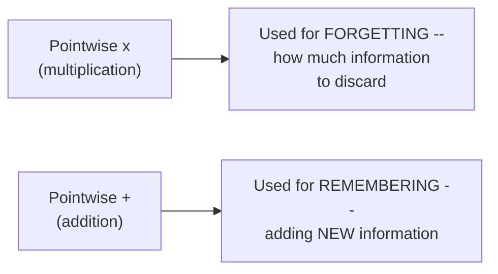

#### 📖 Definition — Memory Cell, Precisely, Intuitively Explained

> 💡 **Given directly:** *"This cell is specifically called as MEMORY CELL. Memory cell basically means -- what does memory cell indicate? See, memory basically indicates you need to remember some of the things, and you need to forget some of the things."*

#### 📖 Definition — Concatenation, Precisely Introduced

> 💡 **Given directly:** *"Whenever you see two lines are joining together, this operation is basically called CONCATENATION."*

#### 🪜 Step-by-Step — A Complete, Worked, Context-Switching Example

> 💡 **Given directly, the complete, illustrative scenario:** *"'Krish likes data science' -- okay, and probably, you know, I may take someone else -- 'Yann LeCun likes CNN' -- now here you see, 'Krish,' and this sentence is basically one context, and then, as we go to the next line, here the context is CHANGING -- now we are talking about some other person... this word will be FORGOTTEN over here, and the NEW context will get added related to Yann LeCun."*

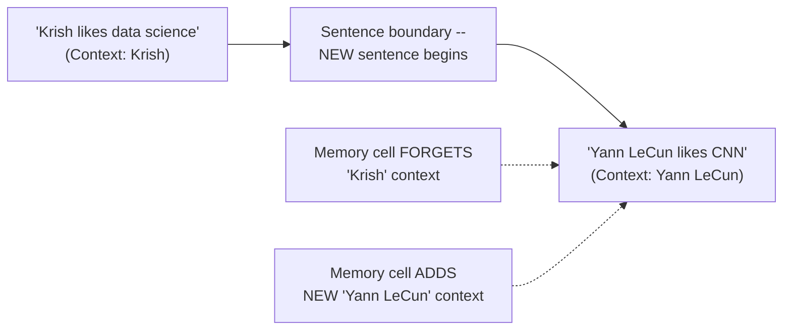

#### 📖 Definition — The Three Cell/Layer Names, Introduced (Names Only, Mechanics Deferred)

> 💡 **Given directly:** *"This layer is basically called as INPUT layer... this layer is basically called as FORGET layer, forget cell -- it forgets, because here we forget some information... this entire thing okay, and after forgetting this information, we basically add this up."*

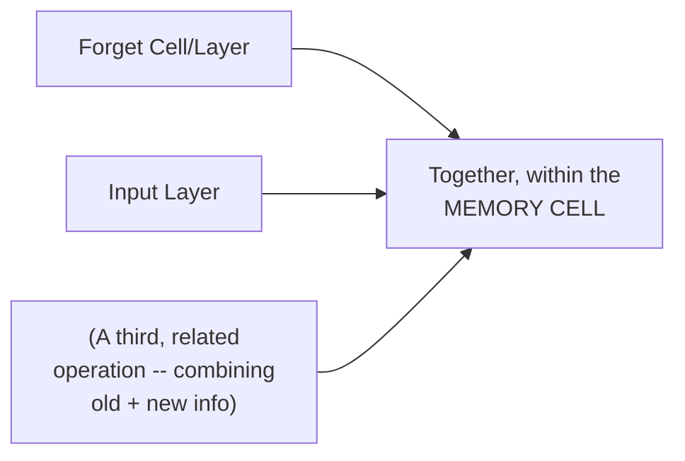

#### ⚠ A Direct, Explicit Preview of the Next Session's Content

> 💡 **Given directly:** *"Tomorrow what we are going to do -- we will understand this detailed architecture, right, we will understand this detailed architecture -- we'll try to find out what exactly are the cells which I'm saying, right -- forget cell, memory cell, why, how it is going to get used -- everything, input layer -- and what is the main aim of all this kind of LSTM RNN, and then after that, we will move towards practical applications."*

#### ⚠ Common Mistakes

* Assuming this section's brief architectural preview constitutes a COMPLETE, sufficient understanding of LSTM's mechanics — explicitly, honestly scoped by the instructor as merely a "brief idea," "not explaining any maths" — genuine, complete mechanics are explicitly deferred to the next session.
* Assuming "forget" and "remember/input" operations happen at genuinely SEPARATE, sequential stages with no interaction — explicitly, directly clarified via the worked example: BOTH happen together, working on the SAME memory cell, combining what's forgotten with what's newly added.

#### 🎯 Key Takeaways

* **LSTM** stands for **Long Short-Term Memory** — a genuine variant of RNN specifically designed to REMEMBER relevant context across a sequence.
* **Pointwise multiplication** operations correspond to FORGETTING information; **pointwise addition** operations correspond to REMEMBERING/adding NEW information — both operating on a shared **memory cell**.
* A concrete, worked example (context switching from "Krish" to "Yann LeCun" across two sentences) directly illustrates HOW a memory cell might genuinely forget old, no-longer-relevant context while incorporating new, currently-relevant context.
* This entire section is **explicitly, honestly scoped as a brief, high-level preview** — the complete, detailed mechanics of forget/input/output gates, and a genuine practical implementation, are both explicitly promised for the NEXT session.

---
## 📝 Glossary

| Term | Definition | Why It Matters |
|---|---|---|
| **Pareto Distribution** | A power-law-shaped data distribution | One of the distribution types reviewed at session start |
| **Box-Cox Transform** | Converts a Pareto distribution into a Gaussian/normal one | A genuine, named interview answer |
| **QQ Plot** | A technique for checking whether data follows a normal distribution | A genuine, named interview answer |
| **W' (Hidden-State Weight)** | The weight applied to the previous timestep's output | This session's notation for Day 6's "Wh" |
| **Chain Rule Length** | How many steps a chain-rule computation requires | LONGER for earlier timesteps, SHORTER for later ones |
| **Vanishing Gradient** | Weight updates become negligibly small | Caused by multiplying many small (0-0.25) sigmoid derivatives |
| **Dead Neuron** | A neuron whose weight permanently stops updating | ReLU's own risk, genuinely acknowledged as NOT a full fix |
| **Long-Range Context Loss** | RNN's inability to connect distant, related information | The SECOND, distinct problem (beyond vanishing gradient) LSTM solves |
| **LSTM** | Long Short-Term Memory -- an RNN variant designed to remember context | This session's own closing preview topic |
| **Memory Cell** | The core LSTM component holding "remembered" information | Combines forget (multiply) and input (add) operations |
| **Pointwise Operation** | An operation applied independently to each value (multiply or add) | The mechanism underlying LSTM's forget/remember behavior |

---

## 🔄 Revision Notes — One-Minute Revision

* This is **Day 7**, the direct, explicitly-promised continuation of Day 6 -- delivering RNN's backward propagation, which Day 6's own 1-hour limit had prevented covering.
* **Interview warm-up**: distribution types (normal, log-normal, Pareto), the **Box-Cox transform** (Pareto -> Gaussian), **QQ plots** (checking normality), skewness's effect on mean/median/mode ordering, and the fit_transform/transform/fit_predict distinction.
* **RNN forward propagation, recapped**: `O1 = f(X11.W)`; `Ot = f(Xt.W + O(t-1).W')` for t>1 -- the SAME weights are reused across ALL timesteps during forward propagation; only backward propagation updates them.
* **Backward propagation, via the chain rule**: updating `W'` at the FINAL timestep = `dLoss/dy_hat x dy_hat/dW'` (2-step chain); updating `W` (input weight) at the final timestep = `dLoss/dy_hat x dy_hat/dO4 x dO4/dW` (3-step chain, since W feeds into O4, not directly into y_hat).
* **A precise, important distinction**: the SAME shared weight (e.g. `W'`) gets updated based on chain-rule contributions computed AT EACH TIMESTEP -- and these chains GENUINELY LENGTHEN the FURTHER BACK (earlier) the timestep is from the final output. Updating `W'` at t=3 requires `dLoss/dy_hat x dy_hat/dO4 x dO4/dW'` (3 steps) -- LONGER than at t=4.
* **Vanishing gradient in deep RNN**: sigmoid's derivative is bounded to 0-0.25 -- multiplying MANY such small values (across a genuinely long sequence, 100-300 timesteps) produces a NEGLIGIBLE weight update. ReLU does NOT fully solve this either -- it genuinely introduces its own "dead neuron" risk (directly confirmed via a live audience correction).
* **LSTM exists to solve TWO genuinely distinct problems**: (1) vanishing gradient/dead neurons, AND (2) long-range CONTEXT loss -- directly illustrated via the "I grew up in France... I speak fluent French" example (predicting "French" requires remembering "France" from far earlier).
* **LSTM = Long Short-Term Memory** -- a genuine RNN variant designed to remember relevant context. First-look architecture preview: **pointwise multiplication** = forgetting; **pointwise addition** = remembering/adding new info; both operate on a shared **memory cell**; **concatenation** joins information streams. A worked example (context switching from "Krish" to "Yann LeCun") illustrates forgetting old context and adding new context.
* **Full LSTM architecture (forget/input/output gates in detail) and a practical implementation are both explicitly, honestly deferred** to the next session -- this session's own LSTM coverage is deliberately, honestly scoped as only a brief preview.

---

## 📋 Cheat Sheet

**Interview warm-up answers:**
```text
Power-law-shaped distribution -> Pareto distribution
Pareto -> Gaussian conversion technique -> Box-Cox transform
Checking normality visually -> QQ plots
Left-skewed: Mean < Median < Mode | Right-skewed: Mode < Median < Mean
```

**RNN forward propagation (recap):**
```text
O1 = f(X11 . W)
Ot = f(Xt . W + O(t-1) . W')   for t > 1
```

**RNN backward propagation, chain rule:**
```text
Update W' at FINAL timestep:  dLoss/dW' = dLoss/dy_hat x dy_hat/dW'          (2 steps)
Update W at FINAL timestep:    dLoss/dW  = dLoss/dy_hat x dy_hat/dO4 x dO4/dW  (3 steps)
Update W' at an EARLIER timestep (e.g. t=3):
   dLoss/dW' = dLoss/dy_hat x dy_hat/dO4 x dO4/dW'                             (3 steps -- LONGER)
```

**Vanishing gradient:**
```text
Sigmoid derivative: 0 to 0.25 (always bounded)
Long sequence (100-300 timesteps) -> many small values multiplied -> w_new ~ w_old
ReLU: does NOT fully solve this -- introduces dead neurons instead
```

**Why LSTM (TWO reasons):**
```text
1. Vanishing gradient / dead neurons
2. Long-range CONTEXT loss (the "France...French" problem)
```

**LSTM architecture preview:**
```text
Pointwise multiplication (x) -> FORGET
Pointwise addition (+)        -> REMEMBER / ADD new info
Concatenation                   -> join information streams
Memory Cell                       -> holds the "remembered" state
```

---

## 🔥 Interview Questions & Answers

### 🟢 Beginner

**Q1.**

**Question:** What technique converts a Pareto distribution into a Gaussian/normal distribution?

**Answer:** The Box-Cox transform.

**Explanation:** Directly, explicitly named.

**Why Interviewers Ask This:** Explicitly flagged as a genuine, common interview question.

**Possible Follow-up:** "What technique would you use to visually check whether data follows a normal distribution?"

**Q2.**

**Question:** What is the relationship between mean, median, and mode in a right-skewed distribution?

**Answer:** Mode < Median < Mean.

**Explanation:** Directly, precisely confirmed.

**Why Interviewers Ask This:** Basic, foundational statistics knowledge.

**Possible Follow-up:** "What about in a left-skewed distribution?"

**Q3.**

**Question:** In RNN forward propagation, do the weights change at every timestep?

**Answer:** No -- the same weights are used at every timestep during forward propagation; only backward propagation updates them.

**Explanation:** Directly, precisely confirmed.

**Why Interviewers Ask This:** Foundational, frequently-confused RNN mechanics.

**Possible Follow-up:** "At what point does the weight actually get updated?"

**Q4.**

**Question:** What formula computes the derivative of loss with respect to the hidden-state weight (W') at the final timestep?

**Answer:** `(∂Loss/∂y_hat) × (∂y_hat/∂W')`.

**Explanation:** Directly, precisely stated.

**Why Interviewers Ask This:** Foundational RNN backward-propagation mechanics.

**Possible Follow-up:** "How does this differ from computing the derivative with respect to the input weight W?"

**Q5.**

**Question:** What is the derivative range of the sigmoid activation function?

**Answer:** 0 to 0.25.

**Explanation:** Directly, precisely stated.

**Why Interviewers Ask This:** Foundational, essential vanishing-gradient knowledge.

**Possible Follow-up:** "Why does this specific range cause a genuine problem in deep RNNs?"

**Q6.**

**Question:** Does using ReLU instead of sigmoid fully solve RNN's vanishing gradient problem?

**Answer:** No -- ReLU introduces its own risk of dead neurons.

**Explanation:** Directly, explicitly acknowledged.

**Why Interviewers Ask This:** Tests nuanced understanding beyond "just switch to ReLU."

**Possible Follow-up:** "What architecture was specifically developed to address this problem more completely?"

**Q7.**

**Question:** What are the TWO genuine problems LSTM was developed to solve?

**Answer:** Vanishing gradient (or dead neurons), and long-range context loss.

**Explanation:** Directly, explicitly stated as a complete, two-part answer.

**Why Interviewers Ask This:** A commonly-asked "why LSTM" interview question, requiring a genuinely complete answer.

**Possible Follow-up:** "Give a concrete example illustrating the long-range context problem."

**Q8.**

**Question:** What does LSTM stand for?

**Answer:** Long Short-Term Memory.

**Explanation:** Directly, explicitly stated.

**Why Interviewers Ask This:** Basic, foundational terminology.

**Possible Follow-up:** "What is the purpose of LSTM's memory cell?"

**Q9.**

**Question:** In LSTM's architecture, what does a pointwise multiplication operation typically represent?

**Answer:** Forgetting (discarding) information.

**Explanation:** Directly, precisely explained.

**Why Interviewers Ask This:** Basic, foundational LSTM architecture knowledge.

**Possible Follow-up:** "What does a pointwise addition operation represent instead?"

**Q10.**

**Question:** What does the "concatenation" operation do in LSTM's architecture?

**Answer:** Joins two information streams together.

**Explanation:** Directly, precisely explained.

**Why Interviewers Ask This:** Basic, foundational LSTM architecture terminology.

**Possible Follow-up:** "What two things are typically being concatenated in LSTM's structure?"

---

### 🟡 Intermediate

**Q11.**

**Question:** Explain why the chain rule for updating W' (hidden-state weight) at timestep t=3 requires passing through O4, even though W' at t=3 is conceptually "used" earlier in the sequence than O4.

**Answer:** This reflects a genuinely important, precise property of BACKWARD propagation direction: the LOSS is only genuinely computed at the FINAL output (`y_hat`, derived from `O4`), meaning ANY weight's influence on the loss must be traced FORWARD through the network's actual computational graph, THEN backward through that same path during differentiation. Even though `W'` at `t=3` is used EARLIER in the forward pass, its influence on the FINAL loss is only felt because `O3` (which `W'` at t=3 helps compute) feeds into `O4` (via the recurrence relationship), which THEN feeds into `y_hat`. The chain rule must therefore trace this ENTIRE forward-computational path in reverse -- `Loss → y_hat → O4 → W'(t=3)` -- precisely because that's the genuine, actual path information took to REACH the loss in the first place, regardless of where in TIME the weight was originally applied.

**Explanation:** Requires reasoning through why chain-rule direction follows the ACTUAL computational graph, not the simple temporal order of the sequence.

**Why Interviewers Ask This:** Tests whether a learner understands the genuine, structural reason behind chain-rule length, not just the specific numeric result.

**Possible Follow-up:** "How would this chain change if you were updating W' at t=2 instead of t=3?"

**Q12.**

**Question:** A learner argues that since this session shows RNN's SAME weight (W') gets updated via MULTIPLE, different-length chains at different timesteps, this means RNN genuinely computes MULTIPLE, different final values for W' after one backward pass. Evaluate this claim.

**Answer:** This claim is inaccurate and reflects a genuine, important misunderstanding. Per this session's own precise reasoning, the SAME weight `W'` receives MULTIPLE gradient CONTRIBUTIONS -- one from each timestep's own chain-rule computation -- but these contributions are genuinely SUMMED TOGETHER (directly analogous to the multi-path chain-rule combination covered in the earlier Day 2 ANN sessions) into ONE, SINGLE final gradient value, which is THEN used ONCE in the weight updation formula to produce ONE, single updated `W'` value. The MULTIPLE chains described in this session (per timestep) represent MULTIPLE SOURCES of gradient information about the SAME weight, not multiple, separately-applied updates producing multiple, different final weight values.

**Explanation:** Tests whether a learner understands that multiple timestep-specific gradient contributions are SUMMED into one final update, not applied as separate, sequential updates.

**Why Interviewers Ask This:** Distinguishes candidates who understand how multi-timestep gradients genuinely combine from those who assume each timestep independently, sequentially modifies the weight.

**Possible Follow-up:** "How does this multi-contribution summing directly parallel the multi-path chain-rule combination covered for standard ANNs?"

**Q13.**

**Question:** Explain, precisely, why the France/French example specifically illustrates a problem that is GENUINELY DIFFERENT from vanishing gradient, even though both problems become worse as sequence length increases.

**Answer:** These are genuinely, structurally distinct problems, despite both worsening with sequence length. **Vanishing gradient** (Section 6) is fundamentally a TRAINING/OPTIMIZATION problem -- it concerns whether GRADIENTS (used to UPDATE weights during backward propagation) remain large enough to produce MEANINGFUL weight changes; it's about the network's ability to LEARN effectively from long sequences. **Long-range context loss** (Section 7) is fundamentally a REPRESENTATIONAL problem -- it concerns whether the network's OWN internal state (the recurring output/hidden state, `Ot`) genuinely RETAINS relevant information from early in the sequence, REGARDLESS of whether training itself is proceeding correctly; it's about the network's ability to REMEMBER, independent of the training process. A network could, in principle, be GENUINELY well-trained (gradients flowing correctly, no vanishing gradient issue) yet STILL structurally struggle to retain "France" by the time it needs to predict "French," simply because its hidden-state representation, by its own basic RNN design, doesn't have a genuinely robust mechanism for PRESERVING specific, older information across many intervening timesteps. This is precisely WHY this session's own answer to "why LSTM" requires naming BOTH problems separately (per Section 7's own explicit framing) -- they are genuinely two different failure modes, not two names for the same underlying issue.

**Explanation:** Requires distinguishing a training/optimization problem from a representational/memory problem, even though both are exacerbated by sequence length.

**Why Interviewers Ask This:** Tests whether a learner recognizes these as genuinely separate concerns, a distinction this session's own content explicitly, directly establishes.

**Possible Follow-up:** "Could a network theoretically suffer from long-range context loss WITHOUT genuinely suffering from vanishing gradient? Explain your reasoning."

**Q14.**

**Question:** Using this session's own precise LSTM preview (Section 8), explain why BOTH a "forget" operation AND an "input/remember" operation are genuinely necessary together, rather than a memory cell that simply accumulates ALL information without ever forgetting anything.

**Answer:** Per Section 8's own worked, context-switching example ("Krish likes data science" → "Yann LeCun likes CNN"), a memory cell that NEVER forgets would genuinely accumulate INCREASINGLY IRRELEVANT, stale information as a sequence progresses -- by the time the network needs to predict something related to "Yann LeCun," a never-forgetting memory would still be carrying FULL, undiminished influence from the now genuinely irrelevant "Krish" context, potentially GENUINELY INTERFERING with correctly using the NEW, currently-relevant context. The FORGET operation (pointwise multiplication) allows the network to DELIBERATELY, SELECTIVELY reduce the influence of specifically the information that's GENUINELY no longer relevant (the old "Krish" context, once the sentence topic has genuinely changed), while the INPUT/REMEMBER operation (pointwise addition) allows GENUINELY NEW, relevant information to be incorporated. Together, these two operations allow the memory cell to maintain a GENUINELY CURRENT, RELEVANT representation of context -- neither losing important information TOO QUICKLY (which would recreate RNN's own original long-range context problem) NOR retaining EVERYTHING indefinitely (which would genuinely dilute the network's ability to focus on what's currently relevant).

**Explanation:** Requires reasoning through why BOTH operations are jointly, genuinely necessary, connecting back to the specific worked example the session provides.

**Why Interviewers Ask This:** Tests whether a learner understands the genuine, functional NECESSITY of both forget and remember operations working together, not just that they exist as separate, named operations.

**Possible Follow-up:** "What might go wrong if the forget operation were removed entirely, keeping only the input/remember operation?"

**Q15.**

**Question:** Synthesize this session's precise vanishing-gradient mechanism (Section 6) with its own chain-length distinction (Section 5) to explain WHY earlier timesteps' weight contributions are specifically the MOST vulnerable to vanishing gradient, even though ALL weights share the SAME W' and W values.

**Answer:** A precise, synthesized explanation: per Section 5's own established insight, updating a shared weight's gradient contribution from an EARLIER timestep requires a GENUINELY LONGER chain-rule computation (more multiplied terms) than from a LATER timestep. Per Section 6's own precise mechanism, EACH term in this chain (specifically, each activation function's derivative, e.g., sigmoid's bounded 0-0.25 range) contributes ANOTHER multiplication by a genuinely SMALL value. This means the LONGER chains (per Section 5, corresponding specifically to EARLIER timesteps) involve MORE such small-value multiplications than SHORTER chains (corresponding to LATER timesteps) -- directly, mechanistically explaining why EARLIER timesteps' gradient CONTRIBUTIONS become disproportionately, MORE SEVERELY vanished than later timesteps' contributions, even though the FINAL, UPDATED weight value is shared and identical across all timesteps' use. This directly explains the PRACTICAL consequence (per Section 7's own France/French example): information from EARLY in a sequence genuinely struggles to meaningfully influence weight updates, precisely because its gradient CONTRIBUTION specifically travels through the LONGEST, most severely-vanishing chain.

**Explanation:** Requires synthesizing the chain-length insight (Section 5) with the precise vanishing-gradient mechanism (Section 6) to explain WHY earlier timesteps are specifically, disproportionately affected.

**Why Interviewers Ask This:** A senior-level question testing whether a candidate can connect two, separately-taught mechanics to explain a genuinely non-obvious, precise consequence.

**Possible Follow-up:** "Does this reasoning directly explain why the France/French long-range context problem and the vanishing gradient problem, though structurally distinct (per Q13), tend to co-occur in practice?"

---

### 🔴 Advanced

**Q16.**

**Question:** Design a complete, numerical illustration of how vanishing gradient compounds with sequence length, computing the theoretical minimum possible gradient magnitude (assuming the worst-case sigmoid derivative of 0.25 at every step) for chains of length 5, 20, and 100, and explain the practical implication of the resulting numbers.

**Answer:** A reasonable, complete illustration, directly applying Section 6's own precise mechanism: assuming EVERY multiplication in the chain contributes the MAXIMUM possible sigmoid derivative value (0.25, the upper bound Section 6 itself states), the theoretical UPPER BOUND on gradient magnitude after a chain of length `n` is `0.25^n`. For **n=5**: `0.25^5 = 0.0009765625` (roughly 0.1%). For **n=20**: `0.25^20 ≈ 8.27 × 10^-13` (a number so small it is GENUINELY indistinguishable from zero in standard floating-point computation). For **n=100**: `0.25^100` is an ASTRONOMICALLY small number, GENUINELY, PRACTICALLY equivalent to exactly zero for any real computational purpose. This directly, numerically confirms Section 6's own qualitative claim -- for a "very big sentence" with 100-300 timesteps, the theoretical gradient contribution from EARLY timesteps becomes GENUINELY, COMPUTATIONALLY negligible, precisely explaining why `w_new ≈ w_old` (per Section 6's own exact phrasing) for weights whose contributions must travel through such long chains -- directly, numerically justifying why LSTM's alternative architecture (avoiding this specific multiplicative-chain structure for its own memory-preservation mechanism) is genuinely necessary for long sequences.

**Explanation:** Requires applying the session's own stated worst-case bound to genuinely new, illustrative chain lengths, producing concrete numbers that make the qualitative claim ("negligible") mathematically precise.

**Why Interviewers Ask This:** A realistic, senior-level question testing whether a candidate can translate a qualitative claim ("negligible") into a precise, quantitative illustration.

**Possible Follow-up:** "Would using tanh instead of sigmoid (with its wider, 0-1 derivative range) meaningfully change these specific numbers? Compute the equivalent n=20 case using tanh's own maximum derivative value."

**Q17.**

**Question:** Critically evaluate: "Since this session shows that ReLU introduces dead neurons and sigmoid causes vanishing gradient, NEITHER activation function is genuinely usable in ANY recurrent architecture, including LSTM, and LSTM must therefore avoid activation functions entirely." Is this an accurate characterization?

**AnswER:** Not accurate -- this significantly overstates the session's own genuine claim into an unsupported, sweeping conclusion. The session's own precise point (Section 6) is specifically that sigmoid and ReLU EACH have genuine, DIFFERENT limitations WHEN USED WITHIN A BASIC RNN'S SPECIFIC RECURRENCE STRUCTURE -- it does NOT claim that these activation functions are UNIVERSALLY, UNCONDITIONALLY unusable in EVERY possible recurrent architecture, nor does it claim LSTM avoids activation functions entirely. In fact, per Section 8's own brief architectural preview, LSTM genuinely uses MULTIPLE internal operations (forget, input, and additional gates the session explicitly defers to the next class) that, in REAL, complete LSTM implementations (beyond this session's own brief preview), typically DO use activation functions (commonly sigmoid for gate values specifically BECAUSE its 0-1 output range is genuinely useful for representing "how much to forget/remember" as a genuine PROPORTION, and tanh for the memory cell's own candidate values) -- LSTM's genuine INNOVATION is specifically in its STRUCTURAL design (the gating mechanism, memory cell, forget/input operations), which fundamentally changes HOW information flows and is preserved across timesteps, NOT in eliminating activation functions altogether. The claim conflates "sigmoid/ReLU have genuine limitations in BASIC RNN's specific structure" with "activation functions are unusable everywhere in recurrent architectures," a genuinely inaccurate over-generalization.

**Explanation:** Tests whether a learner recognizes that a stated limitation (specific to basic RNN's structure) doesn't generalize into claims about entirely different architectures (LSTM) that this session itself only briefly previews.

**Why Interviewers Ask This:** Distinguishes candidates who track the precise scope of a stated limitation from those who over-generalize it into an unsupported claim about a genuinely different, more complex architecture.

**Possible Follow-up:** "Based on what little this session directly states about LSTM's gates, why might sigmoid's 0-1 output range genuinely be useful specifically for a 'forget gate,' even given sigmoid's own vanishing-gradient limitation in basic RNN?"

**Q18.**

**Question:** Synthesize this session's precise interview-question warm-up (Section 2, covering Box-Cox transforms and QQ plots) with its main RNN/LSTM content (Sections 4-8) to construct a reasoned argument for why the instructor's own, established practice of separating "general ML/stats review" from "today's new deep learning content" is a genuinely deliberate pedagogical choice, rather than an unrelated, disconnected mixing of topics.

**Answer:** A reasoned argument, directly connecting the session's own two, seemingly-separate halves: the instructor's own explicit, stated practice ("any live classes, first we'll focus on previous session interview questions") establishes a GENUINE, deliberate SEPARATION between REINFORCING previously-covered, foundational material (which, notably, spans the ENTIRE course -- not just deep-learning-specific content, but general statistics/ML concepts like distributions and preprocessing) and INTRODUCING new, session-specific content. This separation serves a precise, dual purpose: it ensures foundational concepts (which remain genuinely relevant across ANY specific model architecture, whether RNN, LSTM, or a completely different technique) don't get GENUINELY forgotten or neglected simply because the course has moved into more advanced, specialized deep learning topics -- and it directly reinforces the course's own consistently-stated goal of GENUINE INTERVIEW READINESS, which requires BROAD, well-rounded knowledge across statistics, classical ML, AND deep learning, not merely the most recently-covered, narrow topic. This deliberate structural choice (general review, THEN specific new content) directly mirrors a broader, sound pedagogical principle: genuinely durable learning benefits from DISTRIBUTED, SPACED review of foundational material, rather than treating each new topic as entirely disconnected from everything previously covered.

**Explanation:** Requires synthesizing the session's own two structurally-distinct halves (general interview review, specific RNN/LSTM content) to construct a reasoned argument for why this structural choice is genuinely deliberate and pedagogically sound, not incidental.

**Why Interviewers Ask This:** A capstone-level question testing whether a candidate can recognize and articulate the genuine, deliberate REASONING behind a course's own structural, pedagogical choices, not just recall the content within each section.

**Possible Follow-up:** "How might this same 'general review, then new content' structure genuinely benefit a learner's LONG-TERM retention, compared to a course that never revisits earlier material?"

---

## 🧪 Scenario-Based Interview Questions

> **Scenario 1:** A colleague's basic RNN, trained on customer reviews averaging 150 words each, shows the model's predictions are essentially unaffected by changing the FIRST 20 words of any review, while changes to the LAST 20 words significantly affect predictions. Using this session's concepts, diagnose the most likely cause.

**Structured Answer:**
1. **Initial investigation:** Recognize this as a classic, textbook symptom directly connected to BOTH Section 6 (vanishing gradient) AND Section 7 (long-range context loss) -- information from EARLY in a genuinely long (150-word) sequence appears to have negligible influence on the final prediction.
2. **Metrics/logs to check:** Directly inspect the model's own gradient magnitudes during training, specifically comparing gradients associated with EARLY-timestep weight contributions versus LATE-timestep ones, per Advanced Q16's own precise reasoning.
3. **Possible causes:** Per Section 6's own precise mechanism, a 150-word sequence genuinely involves a LONG chain-rule computation for early timesteps -- if sigmoid (or a similarly-bounded activation) is used throughout, vanishing gradient is a GENUINELY LIKELY cause; per Section 7's own reasoning, this could ALSO simply reflect basic RNN's own STRUCTURAL inability to preserve long-range context, independent of any genuine training/gradient issue.
4. **Debugging approach:** Directly test whether switching the SAME architecture to LSTM (per Section 7-8's own stated purpose) genuinely changes this behavior -- if LSTM shows GENUINELY improved sensitivity to early-review content, this directly confirms the diagnosis.
5. **Resolution:** Migrate the model to **LSTM** (or a further variant like GRU, explicitly named in Day 6's own stated roadmap), directly addressing BOTH the vanishing-gradient AND long-range-context concerns this session identifies as LSTM's genuine, dual purpose.
6. **Prevention:** Establish a standing team practice of evaluating a trained sequence model's actual SENSITIVITY to different POSITIONS within its input sequences (not just overall accuracy), specifically to catch this exact class of long-range-dependency failure before deployment.

> **Scenario 2 (Advanced):** Your team needs to explain, in a genuine technical interview setting, why LSTM was chosen over basic RNN for a document-classification task, and the interviewer specifically asks you to justify this choice using PRECISE, technical reasoning rather than a general "LSTM is better" claim. Using this session's concepts, construct a complete, precise answer.

**Structured Answer:**
1. **Initial investigation:** Directly recognize this as requiring the SESSION'S OWN complete, two-part answer (Section 7) -- a generic "LSTM is better" claim would genuinely fail to demonstrate the PRECISE, technical understanding an interviewer is testing for.
2. **Relevant principle:** Per Section 6's own precise mechanism, explain that basic RNN, using sigmoid (or facing dead-neuron risk with ReLU), suffers from GENUINE vanishing gradient in sufficiently long documents -- directly, mechanistically explainable via the chain-rule length argument (Section 5) and sigmoid's bounded 0-0.25 derivative.
3. **Possible causes for the interviewer's specific framing:** The interviewer is likely testing whether the candidate can move BEYOND a memorized, generic answer into GENUINE, precise, mechanistic understanding -- directly rewarding exactly the kind of complete, two-part, precisely-reasoned answer this session's own content supports.
4. **Debugging/evaluation approach:** Structure the answer explicitly around BOTH of Section 7's own named problems, with a concrete, illustrative example for EACH (vanishing gradient, illustrated via Advanced Q16's own numerical trace; long-range context, illustrated via Section 7's own France/French example, adapted to the document-classification context).
5. **Resolution:** Deliver a complete, precise, two-part answer directly citing BOTH vanishing gradient (with the sigmoid-derivative mechanism) AND long-range context loss (with a concrete example genuinely relevant to document classification, e.g., a document's opening thesis statement needing to inform interpretation of its closing conclusion, many sentences later) -- directly demonstrating the depth of understanding this session's own content provides.
6. **Prevention:** Establish a standing personal practice of preparing COMPLETE, two-part (or multi-part) answers for "why X over Y" architectural questions, directly modeling this session's own repeated emphasis on precise, mechanistic, interview-ready explanations rather than generic, single-sentence claims.

---

## 🛠 Hands-on Exercises

### 🟢 Easy

1. Write out, from memory, the two genuine reasons LSTM was developed, per this session's own complete answer.
2. Explain, in your own words, why updating W' at an earlier timestep requires a longer chain-rule computation than at the final timestep.
3. Name the technique used to convert a Pareto distribution into a Gaussian distribution, and the technique used to visually check for normality.

### 🟡 Medium

4. Complete the full, numerical vanishing-gradient illustration proposed in Advanced Interview Q16, for a chain length of your own choosing (not 5, 20, or 100).
5. Write out the complete chain-rule formula for updating W (input weight) at timestep t=2, in a 4-timestep RNN, directly extending this session's own worked pattern.
6. Write a short comparison (150-200 words) distinguishing vanishing gradient from long-range context loss, directly applying Intermediate Q13's own reasoning.

### 🔴 Advanced

7. Implement a small, working RNN backward-propagation function in Python (NumPy only), correctly computing gradient contributions at multiple timesteps and correctly summing them into a single weight update.
8. Implement the vanishing-gradient numerical demonstration from Advanced Interview Q16 as genuine, working code, empirically confirming the theoretical bound.
9. Research the Colah blog on LSTM (directly referenced in this session), and write a 300-400 word summary of its own explanation of the forget gate, input gate, and output gate, directly extending this session's own brief preview.

---

## 🏗 Practice Assignment

### Build: "Complete RNN Backward Propagation Trace, With Vanishing Gradient Analysis"

**Objective:** Directly reproduce this session's own backward-propagation methodology, extended to a genuinely longer sequence, empirically demonstrating vanishing gradient.

**Requirements:**
- A complete, hand-worked backward-propagation trace for a 6-timestep sequence, computing the chain-rule formula for updating BOTH W and W' at EVERY timestep.
- A working Python (NumPy) implementation of this same backward-propagation logic.
- An empirical demonstration (using your own implementation) of vanishing gradient across genuinely different sequence lengths (e.g., 5, 20, 50 timesteps), directly extending Advanced Interview Q16's own theoretical calculation into real, computed values.
- A written explanation (200-300 words) of BOTH problems LSTM was developed to solve, using your own words and a concrete example of your own choosing (not the France/French example).

**Architecture (suggested):**

```text
rnn_backward_propagation_and_vanishing_gradient/
├── manual_chain_rule_trace.md          # your hand-worked 6-timestep trace
├── rnn_backward_prop.py                   # your NumPy implementation
├── vanishing_gradient_empirical.py           # your empirical demonstration
└── REFLECTION.md                                # your written explanation
```

**Expected Functionality:**
- Your manual trace should show genuine, correct chain-rule formulas at every timestep, for both weights.
- Your empirical vanishing-gradient demonstration should genuinely, numerically confirm the theoretical trend from Advanced Interview Q16.

**Challenges:**
- Correctly tracking which chain-rule formula applies to which weight, at which timestep.
- Correctly summing multiple timesteps' gradient contributions into a single, final weight update.

**Bonus Improvements:**
- Extend your implementation to compare sigmoid vs. tanh's own vanishing-gradient severity, using their respective maximum derivative values.
- Research and briefly summarize LSTM's actual forget-gate formula (from the Colah blog or another source), comparing it conceptually to this session's own brief preview.

---

## 📚 Additional Resources

- **Day 6 of this series** -- the direct prerequisite session, covering RNN's forward propagation, the four RNN types, and the initial motivation for sequence-aware architectures.
- **The Colah blog on LSTM** (referenced directly, explicitly recommended) -- "Understanding LSTM Networks," directly quoted for its precise explanation of the long-range dependency problem.
- **The community/course dashboard** (referenced directly) -- where session materials are made available.
- **The next session** (referenced directly, explicitly next) -- covering LSTM's FULL, detailed architecture (forget cell, memory cell, input layer, and their precise mechanics), followed by a genuine, practical implementation.

---

## 📌 Final Revision Sheet

### ⭐ Core Concepts
- **RNN backward propagation** uses the chain rule, tracing from Loss through y_hat, through each intermediate output, to the specific weight.
- **The SAME shared weight** gets updated via MULTIPLE, timestep-specific gradient contributions, SUMMED together -- with chain length GROWING for earlier timesteps.
- **Vanishing gradient**: sigmoid's bounded 0-0.25 derivative, multiplied many times across a long sequence, produces negligible weight updates. ReLU doesn't fully solve this either (dead neurons).
- **LSTM exists for TWO reasons**: vanishing gradient/dead neurons, AND long-range context loss (the France/French problem).
- **LSTM's first-look architecture**: pointwise multiplication = forget; pointwise addition = remember/add; both act on a shared memory cell; concatenation joins information streams.

### ⭐ Important Definitions
- **Box-Cox Transform, QQ Plot** (see Glossary for full definitions).

### ⭐ Important Commands/Code
```text
Update W' at final timestep:  dLoss/dW' = dLoss/dy_hat x dy_hat/dW'
Update W at final timestep:    dLoss/dW  = dLoss/dy_hat x dy_hat/dO4 x dO4/dW
Update W' at t=3 (in a 4-step sequence): dLoss/dW' = dLoss/dy_hat x dy_hat/dO4 x dO4/dW'
```

### ⭐ Architecture/Process
- Complete backward pass: compute loss at y_hat -> trace chain rule backward through each output -> compute gradient contribution for each weight at each timestep -> sum contributions per weight -> apply weight updation formula.

### ⭐ Best Practices
- When explaining "why LSTM over RNN" in interviews, always give the COMPLETE, two-part answer (vanishing gradient AND long-range context).
- Evaluate sequence models' sensitivity to different input positions, not just overall accuracy, to catch long-range dependency issues.
- Don't assume ReLU alone fully solves RNN's training problems.

### ⭐ Common Mistakes
- Assuming RNN weights change during forward propagation.
- Assuming "why LSTM" has only one correct answer (vanishing gradient alone).
- Assuming vanishing gradient and long-range context loss are the same problem.
- Assuming multiple timestep-specific gradient contributions produce multiple, separate weight updates rather than one, summed update.

### ⭐ Interview Points
- Be ready to derive RNN's backward propagation via the chain rule for both W and W'.
- Be ready to explain why chain length grows for earlier timesteps.
- Be ready to give the complete, two-part "why LSTM" answer.
- Be ready to explain LSTM's forget/input operations at a conceptual level.

### ⭐ Things to Remember
- This session **directly, explicitly continues** Day 6, delivering the backward-propagation content Day 6's own time limit had prevented.
- The session's own **LSTM coverage is deliberately, honestly scoped as a brief preview** -- full architecture and a practical implementation are explicitly promised for the next session.
- The instructor's own **established pattern of reviewing genuine, broader interview questions** (not just the most recent topic) before new content continues in this session.

---

## 🔗 Source

- [Back Propagation](https://www.youtube.com/live/1vB7VjB20cc?si=JAEOwQEXqAySSoa5)