# 🧠 Deep Learning — Day 8: LSTM Recurrent Neural Network, In-Depth Architecture

- <i>**Session:** Deep Learning Live Series — Day 8 (LSTM RNN In-Depth Intuition & NLP Application) · 
- **Instructor:** Krish Naik
- **Note on scope:** This is the **direct, explicitly-promised continuation** of Day 7, which closed with only a brief, honestly-scoped "first look" at LSTM and promised "tomorrow" would cover the full, detailed architecture. This session delivers on that promise completely — walking through EVERY component of an LSTM cell using the Colah blog's own diagrams as the direct visual reference: the complete notation system (sigmoid boxes, tanh boxes, concatenation, copy, pointwise operations), the memory cell (via a genuinely vivid airport-conveyor-belt analogy), the forget gate, the input gate (with its two, combined sub-operations), the cell-state update, and finally the output gate — all worked through using ONE consistent, real example sentence: "Krish likes pizza but his friend likes burger." A practical implementation and GRU are both explicitly promised as the next topics.</i>

---

## 📑 Table of Contents

1. [Session Overview](#-session-overview)
2. [Learning Objectives](#-learning-objectives)
3. [Detailed Notes](#-detailed-notes)
   - [1. Session Context: Day 8, The Full LSTM Architecture Promised](#1-session-context-day-8-the-full-lstm-architecture-promised)
   - [2. Recap: Why RNN's Short-Term Memory Fails on Longer Sentences](#2-recap-why-rnns-short-term-memory-fails-on-longer-sentences)
   - [3. LSTM vs. Traditional RNN: The Structural Difference at a Glance](#3-lstm-vs-traditional-rnn-the-structural-difference-at-a-glance)
   - [4. Reading LSTM Diagrams: The Complete Notation Guide](#4-reading-lstm-diagrams-the-complete-notation-guide)
   - [5. The Memory Cell: A Conveyor Belt for Information](#5-the-memory-cell-a-conveyor-belt-for-information)
   - [6. The Forget Gate: Deciding What to Discard](#6-the-forget-gate-deciding-what-to-discard)
   - [7. The Input Gate: Deciding What New Information to Add](#7-the-input-gate-deciding-what-new-information-to-add)
   - [8. Updating the Cell State: From Ct-1 to Ct](#8-updating-the-cell-state-from-ct-1-to-ct)
   - [9. The Output Gate: Producing the Final Output](#9-the-output-gate-producing-the-final-output)
   - [10. Closing: What's Next (GRU, Practical Implementation)](#10-closing-whats-next-gru-practical-implementation)
4. [Glossary](#-glossary)
5. [Revision Notes — One-Minute Revision](#-revision-notes--one-minute-revision)
6. [Cheat Sheet](#-cheat-sheet)
7. [Interview Questions & Answers](#-interview-questions--answers)
8. [Scenario-Based Interview Questions](#-scenario-based-interview-questions)
9. [Hands-on Exercises](#-hands-on-exercises)
10. [Practice Assignment](#-practice-assignment)
11. [Additional Resources](#-additional-resources)
12. [Final Revision Sheet](#-final-revision-sheet)

---

## 🎯 Session Overview

This session delivers the complete, detailed LSTM architecture — every gate, every operation, worked through with one consistent, genuinely illustrative sentence. It covers:

1. **A brief, necessary recap** of exactly why basic RNN struggles with longer sentences — directly connecting to the "Ghajini" movie analogy (a character with severe short-term memory loss) and re-confirming next-word prediction as a genuine Many-to-One RNN use case.
2. **The structural leap from traditional RNN to LSTM at a glance** — traditional RNN uses a SINGLE tanh operation per cell; LSTM introduces MULTIPLE sigmoid AND tanh operations, working together.
3. **A complete notation guide**, directly sourced from the Colah blog's own diagram conventions — sigmoid boxes, tanh boxes, concatenation (two lines joining), copy (a line splitting), vector transfer (arrows), and pointwise operations (circles, representing addition or multiplication).
4. **The memory cell**, explained via a genuinely vivid, real-world analogy: an airport's luggage conveyor belt, where information (luggage) can be ADDED or REMOVED as it travels along.
5. **The forget gate**, worked through via TWO contrasting, complete examples — a sentence with NO context switch (information is genuinely preserved) and a sentence WITH a context switch (information is genuinely, deliberately discarded) — precisely tracing how sigmoid's 0-1 output determines what gets forgotten.
6. **The input gate**, precisely explained as TWO combined operations — a sigmoid layer (deciding how much of the new information matters) and a tanh layer (creating the actual candidate values, -1 to +1) — whose pointwise combination produces the genuinely new information to be added to the memory cell.
7. **The complete cell-state update**, from `Ct-1` to `Ct` — forgetting (pointwise multiplication) followed immediately by adding new information (pointwise addition).
8. **The output gate**, producing the LSTM cell's final output — combining a tanh-transformed version of the UPDATED memory cell with a sigmoid-filtered signal, to determine precisely what gets passed forward to the next cell.

> 💡 **Key framing, given directly, on the instructor's own explicit, direct source for every diagram used in this session:** *"This entire explanation is referred from this blog, which is called as Colah GitHub... please make sure that you refer [to] those blogs."*

---

## 🎯 Learning Objectives

By the end of this guide, you will be able to:

- [ ] Explain precisely why basic RNN struggles with longer sentences, using the short-term memory framing.
- [ ] Describe the structural difference between a traditional RNN cell (single tanh) and an LSTM cell (multiple sigmoid and tanh operations).
- [ ] Correctly read a standard LSTM architecture diagram, identifying sigmoid layers, tanh layers, concatenation, copy, and pointwise operations.
- [ ] Explain the memory cell's purpose using the conveyor-belt analogy.
- [ ] Explain precisely how the forget gate decides what information to discard, tracing sigmoid's role in this decision.
- [ ] Explain precisely how the input gate's two combined operations (sigmoid + tanh) produce new information to add to the cell state.
- [ ] Describe the complete cell-state update, from Ct-1 to Ct.
- [ ] Explain how the output gate produces the LSTM cell's final output.

---

## 📚 Detailed Notes

### 1. Session Context: Day 8, The Full LSTM Architecture Promised

#### 🧠 Concept

> 💡 **Given directly, opening the session:** *"Today is basically the day eighth of natural language processing... today we are going to basically say LSTM recurrent neural network -- and here we are going to see the IN-DEPTH ARCHITECTURE, and we are going to understand."*

#### 🪜 Step-by-Step — The Stated Plan for Today, Directly Fulfilling Day 7's Own Promise

> 💡 **Given directly:** *"Before we go ahead, first of all, I think we'll again revise the problems with the recurrent neural network... considering this, we will try to discuss about LSTM RNN."*

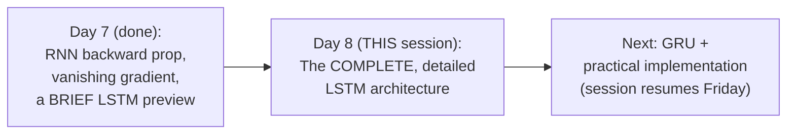

#### 🎯 Key Takeaways

* This session **directly, completely fulfills** Day 7's own explicit promise — the full, detailed LSTM architecture, gate by gate, using the SAME Colah-blog-sourced diagrams referenced (but not yet explained) in Day 7.
* Every diagram used is **explicitly, directly sourced** from the Colah blog ("Understanding LSTM Networks") — the instructor repeatedly, directly credits this source throughout.
* The session closes with a **genuine, direct scheduling announcement**: no session the following day, resuming Friday — with a practical LSTM implementation and GRU both explicitly promised next.

---

### 2. Recap: Why RNN's Short-Term Memory Fails on Longer Sentences

#### 🪜 Step-by-Step — The Precise, Motivating Example

> 💡 **Given directly:** *"Let's say that I have an application which is to predict the next word of the sentence -- like, I may say, 'on Sunday, I want to eat pizza, then on Monday, I want to eat ___' -- suppose if I really want to make sure that I want to do this specific prediction, then how can I make it?"*

#### ❓ Why It Exists — A Genuine, Direct "Which RNN Type" Interview Question

> 💡 **Given directly:** *"If I really want to do the next-word prediction, what kind of neural network -- what kind of RNN -- do you find over here? ...It will basically be MANY-TO-ONE, right -- I hope everybody remembers this, many-to-one, because at the end of the day, the final output that I am going to basically consider over here."*

#### 📖 Definition — "Short-Term Memory," Precisely Illustrated via the "Ghajini" Analogy

> 💡 **Given directly, a genuinely vivid, memorable analogy:** *"RNN can only remember short term -- we basically say short-term memory. What is short-term memory? I hope everybody has seen this movie called as Ghajini... he used to forget things, you know, just after five minutes. So if you really have SHORTER sentences, then definitely RNN will work well."*

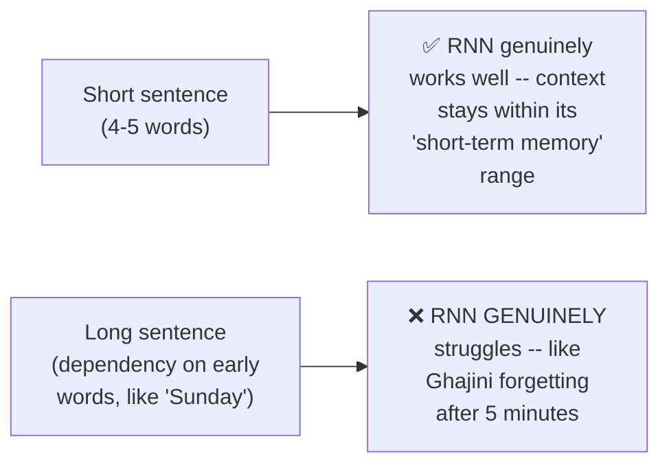

#### ⚠ Common Mistakes

* Assuming RNN fails on ALL sentences, regardless of length — explicitly, directly corrected: for genuinely SHORT sentences (4-5 words), RNN "will work well" — the failure is specifically tied to LONGER sentences with genuine, distant dependencies.
* Assuming this recap introduces any GENUINELY new concept — explicitly, directly framed as a deliberate RECAP of Day 7's own content, before introducing LSTM's actual architecture.

#### 🎯 Key Takeaways

* **Next-word prediction** is confirmed, directly, as a genuine **Many-to-One** RNN use case — a recurring, directly-tested interview question across this course.
* RNN's **"short-term memory"** limitation is vividly, memorably illustrated via the "Ghajini" movie analogy — a character who forgets everything after five minutes, directly mirroring RNN's own inability to retain information across long sequences.
* This recap directly, precisely sets up the session's REAL content — HOW LSTM's architecture specifically solves this exact problem.

---
### 3. LSTM vs. Traditional RNN: The Structural Difference at a Glance

#### 📖 Definition — Traditional RNN's Cell, Precisely Described

> 💡 **Given directly:** *"A basic RNN is basically represented like this... I will be having one, like, a specific set of neurons, and here I'm going to pass the input... whenever I use this kind of square box, that basically means it is a specific neuron, and on top of it, TANH is getting applied."*

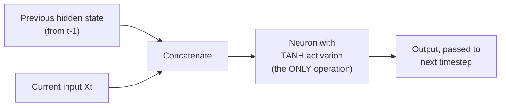

> 💡 **Given directly, precisely confirming what's being combined:** *"From the previous state, whatever output I'm actually getting, I'm combining it... this and this word will get combined -- so it is getting combined over here, CONCATENATED."*

#### 📖 Definition — LSTM's Cell, Precisely Contrasted

> 💡 **Given directly:** *"Now with respect to this traditional RNN, now we are going to see what is the difference in RNN... LSTM RNN changes -- what are the specific changes you will be able to find out? ...Here you can see, initially there was just only ONE tanh -- right, and if you see over here, they are like, SIGMOID is also there, sigmoid is also there, tanh is also there, and tanh, and ONE MORE sigmoid is there."*

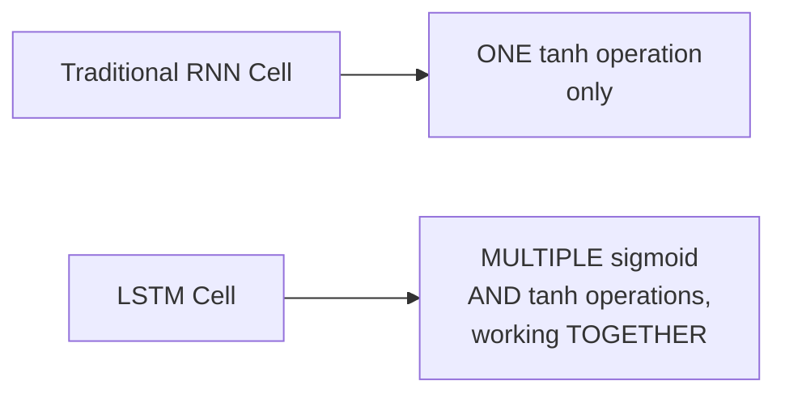

#### ❓ Why It Exists — The Precise, Motivating Reason for This Added Complexity

> 💡 **Given directly:** *"Why specifically we are using LSTM RNN? Two main important things -- first, whenever you have long sentences, right, and suppose there is a dependency of the output probably with the first word... and in these sentences, you know, regularly, context will be switching -- context will be switching."*

#### ⚠ Common Mistakes

* Assuming LSTM is simply a "bigger" or "deeper" version of the SAME RNN cell — explicitly, directly clarified: it's a GENUINELY different internal STRUCTURE, with multiple, distinct sigmoid and tanh operations working together, not merely more of the same single-tanh design.
* Assuming this added structural complexity is arbitrary — explicitly, directly motivated by TWO precise, named problems: long-range dependency AND context switching (both directly connecting back to Day 7's own "why LSTM" explanation).

#### 🎯 Key Takeaways

* **Traditional RNN's cell** uses exactly ONE operation: a neuron with tanh activation, applied to the concatenation of the previous hidden state and the current input.
* **LSTM's cell** genuinely introduces MULTIPLE sigmoid and tanh operations working together — a structurally richer design, directly motivated by the need to handle long-range dependencies and CONTEXT SWITCHING.
* This structural contrast is the **essential visual anchor** for understanding everything that follows — every subsequent gate (forget, input, output) is precisely one of these added sigmoid/tanh operations, given a specific, named purpose.

---

### 4. Reading LSTM Diagrams: The Complete Notation Guide

#### 📖 Definition — Colored Boxes: Sigmoid vs. Tanh Layers

> 💡 **Given directly:** *"Whenever you find this kind of image with color over here, you can see -- if it is probably with, let's say, if it is with this sigma, that basically means this is a NEURAL NETWORK WITH SIGMOID ACTIVATION. Suppose if you have this with tanh, then it becomes NEURAL NETWORK WITH TANH ACTIVATION FUNCTION."*

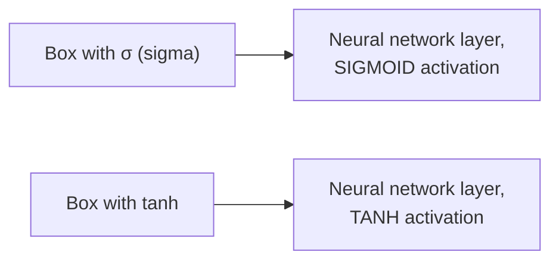

#### 📖 Definition — Lines Joining: Concatenation

> 💡 **Given directly:** *"Whenever two lines are joining -- let's say two lines are joining like this, okay -- so over here, you can see that two lines are joining -- this is basically called as CONCATENATE. We are concatenating two information."*

#### 📖 Definition — A Line Splitting: Copy

> 💡 **Given directly:** *"Whenever there is a split in two lines, like this... this is basically called as COPY operation."*

#### 📖 Definition — Arrows: Vector Transfer

> 💡 **Given directly:** *"Wherever there is a kind of arrow, like this -- this is nothing but it is called as VECTOR TRANSFER."*

#### 📖 Definition — Circles: Pointwise Operations

> 💡 **Given directly:** *"This circle notation is basically called as POINTWISE OPERATION. Pointwise operation can be addition, it can be a dot operation, it can be anything."*

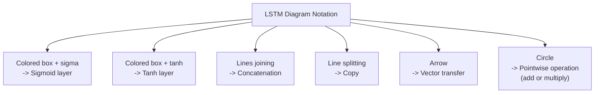

#### ⚠ Common Mistakes

* Assuming a circle notation always means the SAME specific operation — explicitly, directly clarified: pointwise operations can be EITHER addition OR multiplication (a dot operation), depending on context — the specific symbol WITHIN the circle (a "+" or "×") determines which.
* Confusing "copy" (a line splitting into two IDENTICAL copies) with "concatenation" (two DIFFERENT lines joining into one, combined stream) — explicitly, directly distinguished as OPPOSITE operations.

#### 🎯 Key Takeaways

* This complete, precise **notation guide** — sourced directly from the Colah blog's own diagram conventions — is the genuinely necessary foundation for correctly reading EVERY subsequent gate diagram in this session.
* **Sigmoid and tanh layers** are visually distinguished by the specific label WITHIN their box; **concatenation** (joining) and **copy** (splitting) are visually OPPOSITE operations; **pointwise operations** (circles) can represent EITHER addition or multiplication.
* Mastering this notation is explicitly, directly presented as a genuine PREREQUISITE — every subsequent gate explanation directly, repeatedly references these exact symbols.

---
### 5. The Memory Cell: A Conveyor Belt for Information

#### 📖 Definition — The Memory Cell, Precisely Located in the Diagram

> 💡 **Given directly:** *"Let's break down this entire neural network layer by layer -- this line that you see, this line from the top that you see, is called as MEMORY CELL... this entire line that you see, whichever you are basically being able to see the top line, is basically called as memory cell."*

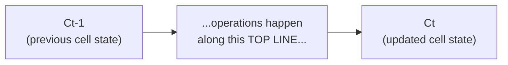

#### 🧠 Concept — The Complete, Vivid Conveyor-Belt Analogy

> 💡 **Given directly:** *"In airport, also you will be seeing some -- conveyor belt, okay -- in airport, you'll be able to see, right, luggage will be continuously coming in one belt, right -- like this, like this, luggage will be coming in one belt, and some people can take out the luggage, or they can also put down luggage, right -- this memory cell acts like this conveyor belt."*

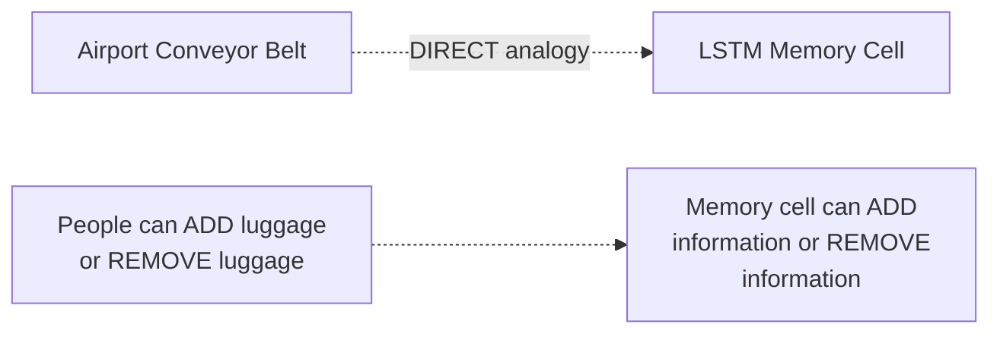

#### 📖 Definition — The Memory Cell's Two Genuine Operations

> 💡 **Given directly:** *"In memory cell, always remember, memory cell, two things you can do -- first of all, you can ADD INFORMATION, and second one is that you can REMOVE INFORMATION."*

#### ⚠ Common Mistakes

* Assuming the memory cell is a genuinely separate, standalone component distinct from the rest of the LSTM cell's internal operations — explicitly, directly clarified: it's specifically the TOP LINE running through the ENTIRE cell, directly connected to and modified BY the gates covered next (forget and input).
* Assuming "adding" and "removing" information happen at genuinely arbitrary, unpredictable points — explicitly, directly deferred to a precise explanation: *"When should you add information, and when should you remove information -- that we'll talk about"* (covered in Sections 6-7).

#### 🎯 Key Takeaways

* The **memory cell** is precisely the TOP LINE running through an entire LSTM cell — directly, vividly analogous to an airport's conveyor belt.
* Exactly **TWO operations** happen on this memory cell: adding information, and removing information — with the PRECISE mechanism for each explicitly deferred to the forget gate (Section 6) and input gate (Section 7).
* This memory cell is the genuine, structural INNOVATION that allows LSTM to overcome basic RNN's "short-term memory" limitation (Section 2) — information can genuinely PERSIST along this belt across many timesteps, unlike basic RNN's single, repeatedly-overwritten hidden state.

---

### 6. The Forget Gate: Deciding What to Discard

#### 🪜 Step-by-Step — The Complete, Motivating Example Sentence

> 💡 **Given directly, the SAME example used throughout the rest of this session:** *"Krish likes pizza but his friend likes burger, and I need to predict this specific word... let's say everybody at a specific time, first, 'Krish' will go, right, then 'likes' will go, then 'pizza' will go, then we start, 'but' -- right, after this, now the context switching is happening -- that basically means now the focus is completely, entirely on 'friend.'"*

#### ❓ Why It Exists — The Precise, Motivating Question

> 💡 **Given directly:** *"Do you think my neural network should remember this previous thing, if this context switching is happening? ...The sentence completely -- the meaning of the sentence will change, because now the main noun is his friend -- I mean, Krish's friend."*

#### 📖 Definition — The Forget Gate, Precisely Located and Named

> 💡 **Given directly:** *"The second layer that you see over here is called as FORGET LAYER... in this forget cell, here you can see that when this information is passed, like 'Krish likes pizza,' but here the context switch is happening -- when the context switch happens, like 'but his friend,' now we are talking about the friend, right -- so as soon as the switch happens... our memory cell should forget about this entire info."*

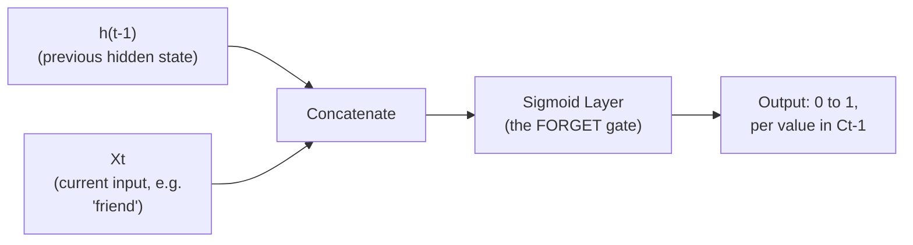

#### 🪜 Step-by-Step — Worked Case 1: NO Context Switch (Information Genuinely Preserved)

> 💡 **Given directly:** *"'Krish likes pizza but he does not like burger' -- over here you can see there is hardly any context switch, because this 'he' is basically talking about Krish only... from the previous state, whatever info is coming, and with the current state, whatever information is coming, since we are talking about the SAME PERSON over here, after we pass through this particular sigmoid activation function, information will NOT BE LOST... most of the time, what will happen, it will be nearer to 1."*

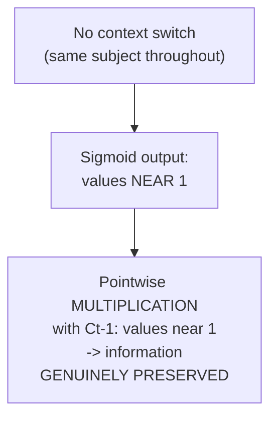

#### 🪜 Step-by-Step — Worked Case 2: A Genuine Context Switch (Information Deliberately Discarded)

> 💡 **Given directly:** *"'Krish likes pizza but his friend likes burger' -- here you can see context switch IS happening... when it comes over here, and when we talk about 'friend,' that basically means at this particular instance, when 'friend' is passed, the previous context needs to be removed... most of the values will be nearer to ZERO... when this previous information from the cell will get multiplied, or pointwise operation will happen over here, then what will happen? Automatically, this will be forgotten."*

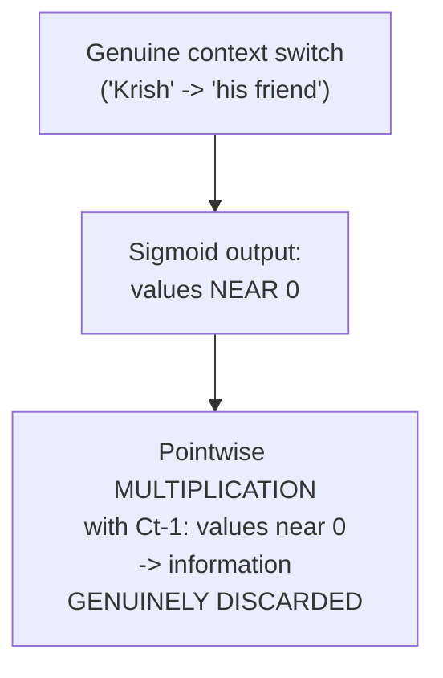

#### 🔍 Internal Working — The Precise Mathematical Reason Multiplication Achieves Forgetting

> 💡 **Given directly:** *"If we do a pointwise operation, let's say I have 1, 1, 1, 0, 1, like this, right -- if we do a pointwise operation with the values like 0, 0, or near to 0, then what will happen? EVERYTHING WILL GET BECOME 0."*

#### 🔍 Internal Working — The Forget Gate's Complete, Precise Formula

> 💡 **Given directly:** *"Here you can basically see what all function is happening -- X of t and H of t-1 is getting concatenated, along with this there will be another weight that will get applied, which is like F, F -- and this W of F is nothing but the combination of two weights... and then you get a sigmoid activation function, but before that, you specifically add a bias."*

```text
ft = σ(Wf · [h(t-1), Xt] + bf)
```

#### ⚠ Common Mistakes

* Assuming the forget gate directly DELETES information from memory immediately — explicitly, directly clarified: it produces a genuine 0-to-1 VALUE per dimension, which is THEN combined with the memory cell via pointwise MULTIPLICATION — values near 0 effectively erase that specific piece of information; values near 1 genuinely preserve it.
* Assuming `Wf` is a single, simple weight — explicitly, directly clarified: it's the COMBINATION of TWO separate weights (one applied to the current input `Xt`, one applied to the previous hidden state `h(t-1)`), directly paralleling the `W` and `W'`/`Wh` distinction established for basic RNN in Days 6-7.

#### 🎯 Key Takeaways

* The **forget gate** is a sigmoid layer that decides, per dimension, how much of the PREVIOUS memory cell's information should be RETAINED (values near 1) versus DISCARDED (values near 0).
* This decision is precisely, genuinely DATA-DRIVEN — directly, concretely demonstrated via TWO contrasting worked examples: no context switch (information preserved) vs. a genuine context switch (information discarded).
* The forget gate's output is applied to the memory cell via **pointwise MULTIPLICATION** — a mathematically precise mechanism where multiplying by values near 0 genuinely, effectively erases that information.

---
### 7. The Input Gate: Deciding What New Information to Add

#### ❓ Why It Exists — The Precise, Motivating Continuation of the SAME Example

> 💡 **Given directly:** *"With respect to this particular sentence, this forget layer is forgetting some information -- definitely the previous information is forgotten -- but as we go ahead, we really need to store this information ABOUT THE FRIEND, right -- this information I need to add it in the memory cell."*

#### 📖 Definition — The Input Gate, Precisely Introduced as TWO Combined Operations

> 💡 **Given directly:** *"In the next layer, we basically have again two operations... one is INPUT LAYER, input gate layer... in order to add it in the memory cell, what I am going to do -- the same information, with the sigmoid activation function, will get passed, and tanh information -- whenever I pass through a neural network with tanh, you know that the values will be between minus one to plus one -- whenever you get this, and when you combine this both, then the new context information that is there, that will only get passed at this layer."*

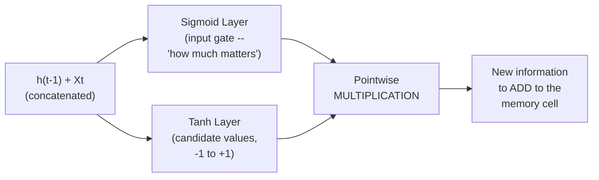

#### 🔍 Internal Working — Precisely Why the Sigmoid Part "Acts Like Another Forget Layer"

> 💡 **Given directly, a genuinely honest, direct clarification:** *"You may be thinking, 'Krish, why exactly this thing is there?' ...With this information, when I'm passing through this information, that basically means it will almost act like a forget layer, right -- so this is a forget layer, this is also a forget layer -- or I can also say it as an input layer -- but understand one thing, the operation that it is basically doing, it is just like a forget layer."*

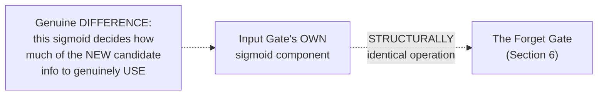

#### 🪜 Step-by-Step — Worked, Continuing the SAME Context-Switch Example

> 💡 **Given directly:** *"Just imagine, guys, in this particular case, what will be the output of this? Since the context is basically happening, it will be almost towards zero, right -- nearer to zero... and in case of tanh, when we pass tanh, don't you think we'll be getting between minus 1 to plus 1 -- so let's say minus 1, 0, 1, 1, 1, something like this we'll get... when we do this pointwise operation between these two, don't you think only the NEW INFORMATION will get passed from here to here?"*

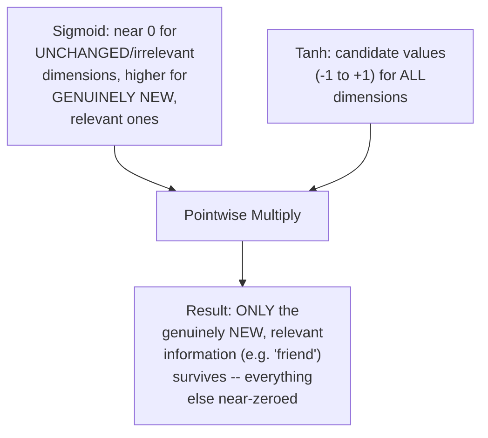

#### 🔍 Internal Working — The Input Gate's Complete, Precise Formulas

> 💡 **Given directly:** *"X of t, H of t minus one, both will get passed -- the new weight that is getting merged from both of them is W of I -- here you will be having a combination of Wt and Wt-1... and then this will further get passed with tanh, and similar this kind of operation along with bias is getting added."*

```text
it = σ(Wi · [h(t-1), Xt] + bi)         <- sigmoid component ("how much to use")
C̃t = tanh(Wc · [h(t-1), Xt] + bc)      <- tanh component (candidate values)

New info to add = it × C̃t              <- pointwise multiplication
```

#### ⚠ Common Mistakes

* Assuming the input gate's sigmoid component and the forget gate (Section 6) are literally the SAME gate — explicitly, directly clarified: they are STRUCTURALLY identical operations (both sigmoid layers, both producing 0-1 values via pointwise multiplication), but they serve genuinely DIFFERENT purposes and use DIFFERENT, independently-learned weights — one gates the OLD memory (forget gate), the other gates the NEW candidate information (input gate's sigmoid).
* Assuming the tanh component alone is sufficient to determine what gets added — explicitly, directly clarified: tanh ALONE produces candidate values for EVERY dimension; it's specifically the MULTIPLICATION with the sigmoid component that filters this down to only the genuinely RELEVANT, new information.

#### 🎯 Key Takeaways

* The **input gate** combines TWO operations: a sigmoid layer (deciding HOW MUCH of the new information genuinely matters) and a tanh layer (creating CANDIDATE values, -1 to +1, for potentially new information).
* The input gate's sigmoid component is **structurally identical** to the forget gate — both are sigmoid layers producing 0-1 gating values — but they serve genuinely different purposes with independently-learned weights.
* The **pointwise multiplication** of these two components (`it × C̃t`) produces the genuinely NEW information to be added to the memory cell — directly, concretely demonstrated via the continuing "friend" example.

---

### 8. Updating the Cell State: From Ct-1 to Ct

#### 🪜 Step-by-Step — The Complete, Precise Update Formula

> 💡 **Given directly:** *"All the operation will happen, and then what will happen over here -- this is a POINTWISE MULTIPLICATION or dot product operation... can I say from this layer, we will be able to understand what needs to be forgotten and what needs to be remembered -- and then here, the thing that we are adding is nothing but NEW INFORMATION -- so new information is getting added into this cell, then it changes from Ct-1 to Ct."*

```text
Ct = (ft × Ct-1) + (it × C̃t)
     [forget old info]   [add new info]
```

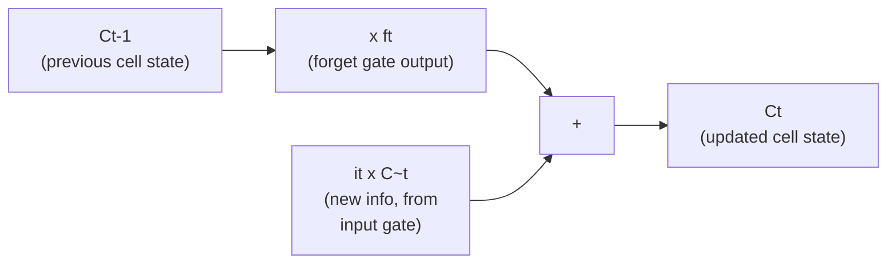

#### 🔍 Internal Working — Precisely Confirming Both Operations Happen TOGETHER

> 💡 **Given directly:** *"Over here, forgetting is happening, over here adding is happening -- adding info -- everybody clear, simple."*

#### ⚠ Common Mistakes

* Assuming forgetting and adding happen as two genuinely SEPARATE, sequential STEPS with a delay between them — explicitly, directly clarified: they happen TOGETHER, as one, combined update to the cell state, precisely `Ct = (ft × Ct-1) + (it × C̃t)`.
* Assuming `Ct` and `h(t)` (the hidden state, covered next) are the SAME thing — explicitly, directly distinguished: `Ct` is the internal MEMORY CELL state; `h(t)` (covered in Section 9) is the CELL'S OUTPUT, derived FROM `Ct` but genuinely distinct from it.

#### 🎯 Key Takeaways

* The **complete cell-state update formula**, `Ct = (ft × Ct-1) + (it × C̃t)`, combines the forget gate's output (Section 6) and the input gate's output (Section 7) into ONE, unified operation.
* **Forgetting and adding happen TOGETHER**, not as separate, sequential steps — directly, precisely completing the memory cell's "conveyor belt" analogy (Section 5): old, irrelevant luggage is removed WHILE new, relevant luggage is added, in the SAME motion.
* This updated `Ct` is what genuinely PERSISTS forward to the next timestep — but the CELL'S OUTPUT (what gets passed to the next LSTM cell as `h(t)`) is a further, separate transformation, covered next.

---
### 9. The Output Gate: Producing the Final Output

#### 📖 Definition — The Output Gate, Precisely Introduced

> 💡 **Given directly:** *"The final layer, which is called as OUTPUT GATED LAYER... what is happening -- from this cell, I will be having the recent information, this is basically getting passed to tanh -- when I pass it back to tanh, or from this tanh, you know, along with this neural network -- so what will happen in this specific case, if I pass it through tanh... will I be able to get my new operation, new values over here, and with respect to the previous forgetting things, this both will get combined, and this will basically be my new output."*

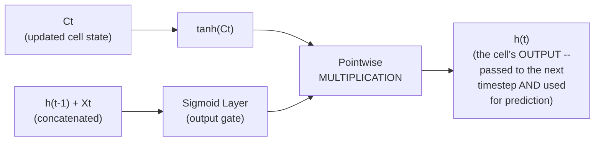

#### 🔍 Internal Working — Precisely What Gets Combined

> 💡 **Given directly:** *"This operation, also, it will be same, right -- this is getting combined with tanh of Ct -- tanh of Ct basically means, from the memory cell, I'm just applying a tanh operation, so I will be getting the recent context information -- and this and this, both will get pointwise dot product -- it will happen. In short, here we are trying to combine both the information -- the previous forgotten information and the recent information -- and that is actually passed as an output over here, to the next cell."*

```text
ot = σ(Wo · [h(t-1), Xt] + bo)     <- output gate's sigmoid component
h(t) = ot × tanh(Ct)                <- final output, passed to next cell
```

#### ❓ Why It Exists — A Genuine, Direct Confirmation From the Audience

> 💡 **Given directly, a genuine, live audience summary, directly confirmed by the instructor:** *"All data minus useless plus [relevant] context is the third gate -- yes, right, so finally you can see, from the memory cell, take out the most -- entire information that you have in the memory cell, apply tanh on top of it -- then you get the recent, new context information, and combine the previous information over here with the dot product, and send it to the next layer."*

#### 🔍 Internal Working — A Direct, Precise Clarification: The Output Gate Is NOT Forgetting Again

> 💡 **Given directly, correcting a genuinely reasonable, direct question:** *"Are we again forgetting the data in third? No, we are not forgetting the data in third -- see, this operation that we are doing, right, here also it is done, here also it is done, right -- it is NOT AT ALL FORGETTING -- just imagine, whatever things we are actually getting over here, forgetting and remembering is basically happening over here [in the forget and input gates specifically]."*

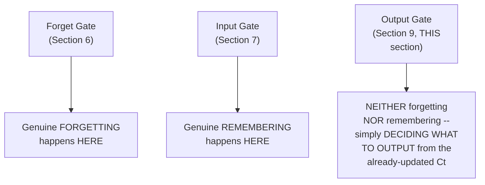

#### 📖 Definition — The Complete, Three-Gate Summary

> 💡 **Given directly, the instructor's own precise, closing summary:** *"In short, over here, what is happening -- all useless data is going -- useless data is removed, and only important data is considered and forwarded to the next network."*

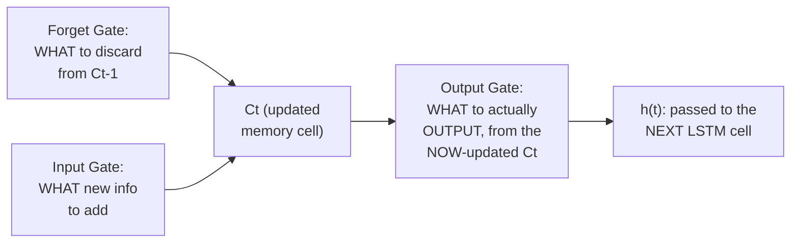

#### ⚠ Common Mistakes

* Assuming the output gate performs its OWN, separate forgetting operation — explicitly, directly, precisely corrected in response to a genuine, live question: forgetting and remembering are COMPLETE by the time the output gate runs; the output gate's SOLE job is deciding WHAT PORTION of the already-finalized `Ct` should genuinely be OUTPUT at this timestep.
* Assuming `Ct` (the cell state) and `h(t)` (the output/hidden state) are interchangeable — explicitly, directly distinguished: `Ct` is the FULL, internal memory; `h(t)` is a FILTERED, tanh-transformed, sigmoid-gated VIEW of that memory, specifically what's genuinely relevant to output/pass forward RIGHT NOW.

#### 🎯 Key Takeaways

* The **output gate** produces the LSTM cell's final output (`h(t)`) by combining a tanh-transformed version of the UPDATED cell state (`tanh(Ct)`) with its own, independent sigmoid gating value (`ot`), via pointwise multiplication.
* The output gate is **explicitly, precisely NOT another forgetting operation** — forgetting and remembering are already complete (via the forget and input gates); the output gate's genuine, distinct role is deciding what to OUTPUT from the now-finalized memory.
* The instructor's own precise, complete summary: **"all useless data is removed, and only important data is considered and forwarded"** — directly, concisely capturing the ENTIRE three-gate LSTM architecture's overall purpose.

---

### 10. Closing: What's Next (GRU, Practical Implementation)

#### 🪜 Step-by-Step — The Explicit, Stated Roadmap Ahead

> 💡 **Given directly:** *"This was all about LSTM recurrent neural network, and now we'll try to do some kind of practical applications tomorrow, okay -- and the next neural network that we are going to do is something called as GRU."*

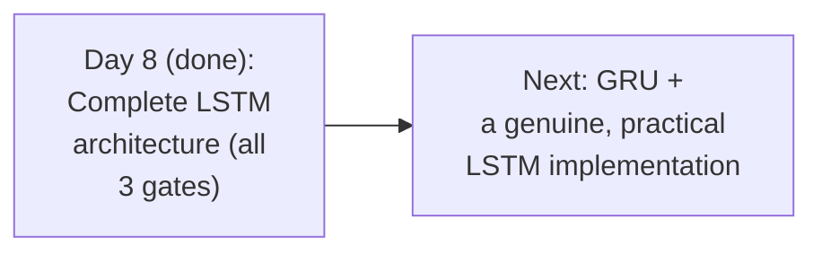

#### ⚠ A Direct, Honest Scheduling Adjustment

> 💡 **Given directly:** *"Quick announcement, guys -- tomorrow I will not be available... I think I have to skip that day, because I have some important work to do... so we will have the session on Friday."*

#### 🏢 Real-World / Production Usage — The Instructor's Own, Repeated, Direct Source Recommendation

> 💡 **Given directly:** *"Please do make sure that you follow Colab LSTM blogs, that you will be able to understand it -- and Friday will have a practical session on LSTM."*

#### ⚠ Common Mistakes

* Assuming this session's own content represents a complete, standalone LSTM education without further, genuine practical application — explicitly, directly deferred: a GENUINE, practical implementation is explicitly promised for the next session (Friday).
* Assuming GRU is a genuinely SEPARATE, unrelated topic from LSTM — explicitly, directly positioned as "the NEXT neural network" in a continuing, connected sequence — directly implying GRU builds on or relates to the SAME underlying gating concepts just covered.

#### 🎯 Key Takeaways

* This session **completely delivers** the full, detailed LSTM architecture explicitly promised at the close of Day 7 — every gate, every operation, worked through with one consistent example sentence.
* **GRU** is explicitly, directly named as the NEXT topic in this ongoing sequence — a genuinely related, upcoming architecture.
* A **genuine, practical LSTM implementation** is explicitly promised for the next live session (Friday, following a one-day schedule gap) — this session's own scope remains deliberately, purely conceptual/architectural.

---
## 📝 Glossary

| Term | Definition | Why It Matters |
|---|---|---|
| **Ghajini Analogy** | A movie character with severe short-term memory loss | Vividly illustrates RNN's own short-term memory limitation |
| **Concatenation** | Two lines/information streams joining together | Notation: two lines merging |
| **Copy** | One line splitting into two identical copies | Notation: a line splitting |
| **Vector Transfer** | Information moving between components | Notation: an arrow |
| **Pointwise Operation** | An operation applied per-dimension (addition or multiplication) | Notation: a circle |
| **Memory Cell (Ct)** | The "conveyor belt" running through an LSTM cell, holding persistent info | Can have info added or removed |
| **Forget Gate (ft)** | A sigmoid layer deciding what to discard from the memory cell | Values near 0 = forget; near 1 = keep |
| **Input Gate (it, C~t)** | Sigmoid + tanh layers deciding what new info to add | Combines "how much matters" with candidate values |
| **Cell State Update** | Ct = (ft x Ct-1) + (it x C~t) | Forgetting and adding happen together |
| **Output Gate (ot)** | A sigmoid layer combined with tanh(Ct) to produce the final output | Neither forgets nor remembers -- decides what to output |
| **Context Switching** | A sentence's subject/topic changing mid-sequence | The central example motivating forget/input gates |

---

## 🔄 Revision Notes — One-Minute Revision

* This is **Day 8**, directly, completely fulfilling Day 7's own promise of a FULL, detailed LSTM architecture -- every diagram sourced directly from the Colah blog.
* **Recap**: RNN's "short-term memory" (the Ghajini analogy) fails on long sentences; next-word prediction is confirmed as Many-to-One RNN.
* **Traditional RNN cell**: ONE tanh operation only. **LSTM cell**: MULTIPLE sigmoid AND tanh operations working together -- motivated by long-range dependency AND context switching.
* **Notation guide**: sigma box = sigmoid layer; tanh box = tanh layer; lines joining = concatenation; line splitting = copy; arrow = vector transfer; circle = pointwise operation (add or multiply).
* **Memory Cell**: the TOP LINE running through the cell, directly analogous to an airport conveyor belt -- info can be ADDED or REMOVED.
* **Forget Gate**: `ft = sigmoid(Wf.[h(t-1),Xt] + bf)` -- worked via TWO cases: no context switch (values near 1, info PRESERVED via pointwise multiply) vs. genuine context switch (values near 0, info DISCARDED).
* **Input Gate**: TWO combined operations -- sigmoid (`it`, "how much matters," structurally identical to the forget gate but serving a different purpose) + tanh (`C~t`, candidate values -1 to +1) -- combined via pointwise multiplication to produce NEW info to add.
* **Cell state update**: `Ct = (ft x Ct-1) + (it x C~t)` -- forgetting and adding happen TOGETHER, as one combined operation.
* **Output Gate**: `ot = sigmoid(Wo.[h(t-1),Xt]+bo)`; `h(t) = ot x tanh(Ct)` -- explicitly, directly confirmed as NEITHER forgetting NOR remembering (that's already done) -- simply deciding what to OUTPUT from the now-finalized Ct.
* **Complete summary**: "all useless data is removed, and only important data is considered and forwarded to the next network."
* **Next**: GRU, and a genuine, practical LSTM implementation (Friday, after a one-day schedule gap).

---

## 📋 Cheat Sheet

**Traditional RNN vs. LSTM:**
```text
Traditional RNN: ONE tanh operation
LSTM:            MULTIPLE sigmoid + tanh operations (3 gates)
```

**Notation guide:**
```text
Box + sigma  -> Sigmoid layer
Box + tanh   -> Tanh layer
Lines joining -> Concatenation
Line splitting -> Copy
Arrow          -> Vector transfer
Circle           -> Pointwise operation (+ or x)
```

**The three gates, complete formulas:**
```text
Forget Gate:  ft = sigmoid(Wf . [h(t-1), Xt] + bf)
Input Gate:   it = sigmoid(Wi . [h(t-1), Xt] + bi)
              C~t = tanh(Wc . [h(t-1), Xt] + bc)
Cell Update:  Ct = (ft x Ct-1) + (it x C~t)
Output Gate:  ot = sigmoid(Wo . [h(t-1), Xt] + bo)
              h(t) = ot x tanh(Ct)
```

**Which gate does what:**
```text
Forget Gate -> decides WHAT TO DISCARD from old memory (Ct-1)
Input Gate  -> decides WHAT NEW INFO to ADD
Output Gate -> decides WHAT TO OUTPUT from the (already-updated) memory
              -- NEITHER forgets NOR remembers, just outputs
```

**The conveyor belt analogy:**
```text
Memory Cell (Ct) = airport conveyor belt
  -> can ADD luggage (new info) or REMOVE luggage (forgotten info)
```

---

## 🔥 Interview Questions & Answers

### 🟢 Beginner

**Q1.**

**Question:** How many core operations does a traditional RNN cell use, and how many does an LSTM cell use?

**Answer:** Traditional RNN uses one (tanh); LSTM uses multiple sigmoid and tanh operations, organized into three gates.

**Explanation:** Directly, precisely stated.

**Why Interviewers Ask This:** Foundational structural comparison.

**Possible Follow-up:** "Name the three gates."

**Q2.**

**Question:** What does a circle represent in a standard LSTM architecture diagram?

**Answer:** A pointwise operation (addition or multiplication).

**Explanation:** Directly, precisely stated.

**Why Interviewers Ask This:** Basic diagram-reading fluency, useful for any LSTM discussion.

**Possible Follow-up:** "What does a line splitting into two represent instead?"

**Q3.**

**Question:** What is the LSTM memory cell analogous to?

**Answer:** An airport conveyor belt.

**Explanation:** Directly, vividly stated.

**Why Interviewers Ask This:** Tests genuine, intuitive understanding, not just formula recall.

**Possible Follow-up:** "What two operations can happen on this memory cell?"

**Q4.**

**Question:** What does the forget gate's output value near 0 signify?

**Answer:** That the corresponding information should be forgotten/discarded.

**Explanation:** Directly, precisely stated.

**Why Interviewers Ask This:** Foundational forget-gate mechanics.

**Possible Follow-up:** "What does a value near 1 signify instead?"

**Q5.**

**Question:** What two operations combine to form the input gate?

**Answer:** A sigmoid layer and a tanh layer.

**Explanation:** Directly, precisely stated.

**Why Interviewers Ask This:** Foundational input-gate mechanics.

**Possible Follow-up:** "What role does each of these two operations play?"

**Q6.**

**Question:** Write the complete cell-state update formula.

**Answer:** `Ct = (ft × Ct-1) + (it × C̃t)`.

**Explanation:** Directly, precisely stated.

**Why Interviewers Ask This:** A core, frequently-tested LSTM formula.

**Possible Follow-up:** "What does each term in this formula represent?"

**Q7.**

**Question:** Does the output gate perform any forgetting?

**Answer:** No -- forgetting and remembering are already complete by the time the output gate runs.

**Explanation:** Directly, explicitly, precisely corrected from a common misconception.

**Why Interviewers Ask This:** Tests precise understanding of each gate's distinct role.

**Possible Follow-up:** "What does the output gate actually do, then?"

**Q8.**

**Question:** What activation function is applied to the cell state (Ct) within the output gate?

**Answer:** Tanh.

**Explanation:** Directly, precisely stated.

**Why Interviewers Ask This:** Basic, foundational output-gate mechanics.

**Possible Follow-up:** "What is this tanh output then combined with, and how?"

**Q9.**

**Question:** In LSTM notation, what does a colored box labeled "sigma" represent?

**Answer:** A neural network layer with sigmoid activation.

**Explanation:** Directly, precisely stated.

**Why Interviewers Ask This:** Basic diagram-reading fluency.

**Possible Follow-up:** "What would the same box labeled 'tanh' represent instead?"

**Q10.**

**Question:** What blog is this session's LSTM explanation directly sourced from?

**Answer:** The Colah blog ("Understanding LSTM Networks").

**Explanation:** Directly, explicitly, repeatedly credited.

**Why Interviewers Ask This:** Tests awareness of a genuinely valuable, widely-cited reference resource.

**Possible Follow-up:** "What genuinely widely-used example does this blog use to illustrate long-range dependency?"

---

### 🟡 Intermediate

**Q11.**

**Question:** Explain why the instructor uses the SAME sentence ("Krish likes pizza but his friend likes burger") consistently across the forget gate, input gate, cell update, and output gate explanations, rather than a different example for each.

**Answer:** This is a deliberate, genuinely effective pedagogical choice: by tracing ONE, consistent, concrete example THROUGH every gate, the learner can directly observe HOW information about "Krish" is genuinely forgotten (via the forget gate) at PRECISELY the same moment "friend" information is genuinely added (via the input gate), and then how this UPDATED, combined state genuinely determines what's output (via the output gate) -- rather than requiring the learner to mentally reconstruct these connections across genuinely DIFFERENT, disconnected examples. This directly mirrors this instructor's own established, consistent teaching pattern (seen across the ANN, RNN, and now LSTM sessions) of building deep, END-TO-END intuition through ONE sustained example, rather than switching examples for each isolated sub-concept.

**Explanation:** Requires recognizing a deliberate, cross-gate pedagogical continuity strategy.

**Why Interviewers Ask This:** Tests whether a learner recognizes this consistency as an intentional teaching aid, not incidental repetition.

**Possible Follow-up:** "Trace this SAME example's information flow completely, from the forget gate through to the final output, in your own words."

**Q12.**

**Question:** A learner argues that since the input gate's sigmoid component is "structurally identical" to the forget gate (per this session's own direct statement), these two gates could genuinely SHARE the same weights, reducing the total parameter count. Evaluate this claim.

**Answer:** This claim is inaccurate, and directly contradicts the session's own precise formulas. While the forget gate (`ft = sigmoid(Wf·[h(t-1),Xt]+bf)`) and the input gate's sigmoid component (`it = sigmoid(Wi·[h(t-1),Xt]+bi)`) are STRUCTURALLY identical in FORM (both sigmoid layers operating on the same concatenated input), they use GENUINELY DIFFERENT, INDEPENDENTLY-LEARNED weight matrices (`Wf` vs. `Wi`) and biases (`bf` vs. `bi`) -- this is precisely WHY they can learn to perform GENUINELY DIFFERENT functions (one deciding what to forget from OLD memory; the other deciding how much of the NEW candidate information to genuinely use), despite sharing the same mathematical STRUCTURE. Sharing weights between these two gates would force them to ALWAYS produce IDENTICAL outputs for the same input, eliminating the genuine, necessary FLEXIBILITY that allows the network to learn, for example, to STRONGLY forget old information WHILE ALSO strongly incorporating new information (or any other independent combination) -- directly undermining the entire, deliberate PURPOSE of having two separate gates in the first place.

**Explanation:** Tests whether a learner distinguishes "structurally identical operation type" from "must share weights," a genuinely important, precise distinction.

**Why Interviewers Ask This:** Distinguishes candidates who understand WHY independent weights are genuinely necessary despite structural similarity, from those who conflate similar structure with shared parameters.

**Possible Follow-up:** "How many TOTAL, independent weight matrices does a complete LSTM cell have, counting all three gates and the candidate-value computation?"

**Q13.**

**Question:** Explain, precisely, why the cell-state update formula (`Ct = ft×Ct-1 + it×C̃t`) uses ADDITION to combine the forget and input contributions, rather than some other combining operation.

**Answer:** Addition is genuinely, structurally necessary here because the forget and input operations affect GENUINELY DIFFERENT, COMPLEMENTARY aspects of the SAME memory cell simultaneously -- `ft×Ct-1` represents WHATEVER portion of the OLD memory survives the forgetting process, while `it×C̃t` represents the GENUINELY NEW information being introduced. These are NOT alternative, competing values to choose between (which might suggest a different combination, like max or averaging) -- they are two GENUINELY SEPARATE, ADDITIVE CONTRIBUTIONS to the SAME, updated memory: whatever survived from before, PLUS whatever's newly being added. This directly, precisely mirrors the conveyor-belt analogy (Section 5): the belt's CURRENT total contents are precisely the OLD luggage that wasn't removed, PLUS the NEW luggage that was just added -- a genuine, additive combination, not a selection between alternatives.

**Explanation:** Requires reasoning through WHY addition specifically (not another combining operation) correctly represents the semantic relationship between forgetting and adding.

**Why Interviewers Ask This:** Tests whether a learner understands the precise mathematical/semantic reasoning behind the formula's structure, not just that it happens to use addition.

**Possible Follow-up:** "Would the formula still make genuine sense if it used multiplication instead of addition to combine these two terms? Explain why or why not."

**Q14.**

**Question:** Using this session's precise gate-by-gate mechanics, explain why LSTM genuinely solves BOTH of Day 7's own named problems (vanishing gradient AND long-range context loss), rather than solving only one of them.

**Answer:** A precise, synthesized explanation, connecting Day 7's own two-part problem statement to THIS session's specific mechanics: **Long-range context loss** is directly, structurally solved by the MEMORY CELL itself (Section 5) -- since `Ct` genuinely PERSISTS across timesteps via the additive update formula (Section 8), relevant information (like "France," in Day 7's own example) can genuinely SURVIVE across many intervening timesteps, PROTECTED specifically by the forget gate's ABILITY to assign it a value near 1 (genuinely "keep this") for as long as it remains relevant -- a genuinely different mechanism than basic RNN's single, repeatedly-overwritten hidden state. **Vanishing gradient** is ALSO genuinely, though more subtly, addressed: because the cell-state update (Section 8) uses ADDITION (not repeated MULTIPLICATION through a long chain of small-derivative activation functions, per Day 7's own precise vanishing-gradient mechanism) to combine old and new information, gradients can flow backward through this ADDITIVE path with genuinely LESS severe shrinkage than through basic RNN's purely multiplicative recurrence -- directly, structurally mitigating (though this session doesn't claim ELIMINATING) the vanishing-gradient problem Day 7 precisely traced. This is precisely WHY LSTM's architecture GENUINELY needed BOTH the memory cell (solving context loss) AND this specific, additive update mechanism (mitigating vanishing gradient) — a single-purpose fix targeting only ONE of Day 7's two named problems would have left the other genuinely unresolved.

**Explanation:** Requires synthesizing Day 7's own two-part problem statement with THIS session's specific, gate-level mechanics to explain how LSTM addresses BOTH problems, not just one.

**Why Interviewers Ask This:** A senior-level question testing whether a candidate can connect a stated motivation (from an earlier session) to the SPECIFIC architectural features that genuinely address it.

**Possible Follow-up:** "Does the additive cell-state update GENUINELY eliminate vanishing gradient entirely, or merely reduce its severity? Explain your reasoning."

**Q15.**

**Question:** Synthesize this session's complete three-gate architecture with Day 6/7's own basic RNN forward-propagation formula to explain precisely how many INDEPENDENT weight matrices a complete LSTM cell requires, compared to basic RNN's two (W and W').

**Answer:** A precise, synthesized count: per this session's own exact formulas, a complete LSTM cell requires FOUR distinct weight matrices (each applied to the SAME concatenated `[h(t-1), Xt]` input): `Wf` (forget gate), `Wi` (input gate's sigmoid component), `Wc` (the tanh/candidate-value computation), and `Wo` (output gate) -- plus FOUR corresponding bias terms (`bf`, `bi`, `bc`, `bo`). This is genuinely DOUBLE the TWO weight matrices (`W` and `W'`) basic RNN requires (per Day 6/7's own exact formulas), directly reflecting the genuine, structural complexity increase LSTM introduces to solve its two named problems (per Q14's own reasoning) -- a direct, quantifiable illustration of the "more sigmoid AND tanh operations" observation this session's own Section 3 makes at a purely qualitative level. This increased parameter count is a genuine, real trade-off: LSTM cells are GENUINELY more computationally expensive (more parameters to learn and store) than basic RNN cells, a cost directly justified by their genuinely superior ability to handle long sequences.

**Explanation:** Requires precisely counting and comparing weight matrices across two separately-taught architectures, producing a concrete, quantitative result from qualitative descriptions.

**Why Interviewers Ask This:** A senior-level question testing whether a candidate can translate a qualitative architectural comparison into a precise, quantitative one.

**Possible Follow-up:** "If h(t-1) and Xt have dimensions 100 and 50 respectively, and each gate's hidden dimension is 100, what would be the exact shape of each of these four weight matrices?"

---

### 🔴 Advanced

**Q16.**

**Question:** Design a complete, from-scratch numerical trace of ONE full LSTM timestep — given illustrative, single-number "values" for h(t-1)=0.5, Xt=0.8, and simplified scalar weights Wf=0.3, Wi=0.4, Wc=0.6, Wo=0.2 (all biases=0.1), and a previous cell state Ct-1=0.7 — computing ft, it, C̃t, Ct, ot, and h(t).

**Answer:** A reasonable, complete trace, directly applying this session's own exact formulas (treating concatenation as simple addition for this scalar simplification): concatenated input = `h(t-1) + Xt = 0.5 + 0.8 = 1.3`. **Forget gate**: `ft = sigmoid(0.3×1.3 + 0.1) = sigmoid(0.49) ≈ 0.6202`. **Input gate (sigmoid)**: `it = sigmoid(0.4×1.3 + 0.1) = sigmoid(0.62) ≈ 0.6502`. **Candidate values**: `C̃t = tanh(0.6×1.3 + 0.1) = tanh(0.88) ≈ 0.7064`. **Cell state update**: `Ct = (ft×Ct-1) + (it×C̃t) = (0.6202×0.7) + (0.6502×0.7064) ≈ 0.4341 + 0.4593 ≈ 0.8934`. **Output gate**: `ot = sigmoid(0.2×1.3 + 0.1) = sigmoid(0.36) ≈ 0.5890`. **Final output**: `h(t) = ot × tanh(Ct) = 0.5890 × tanh(0.8934) ≈ 0.5890 × 0.7127 ≈ 0.4198`. This complete, genuine numerical trace confirms every one of this session's own stated formulas produces a well-defined, computable result, directly demonstrating the ENTIRE LSTM cell's computation for one, complete timestep.

**Explanation:** Requires applying every one of the session's own exact formulas, in the correct order, to a genuinely new, fully worked numerical example.

**Why Interviewers Ask This:** A realistic, senior-level question testing whether a candidate can perform the actual, complete computation for an entire LSTM timestep, not just recite individual formulas in isolation.

**Possible Follow-up:** "If Ct-1 had instead been 0 (a genuinely 'empty' initial memory), how would this specific trace's final h(t) value change?"

**Q17.**

**Question:** Critically evaluate: "Since this session confirms the output gate does NOT perform any forgetting, the output gate is therefore a genuinely OPTIONAL component that could be removed from LSTM's architecture entirely, simply using tanh(Ct) directly as the cell's output, without meaningfully changing LSTM's genuine capabilities." Is this an accurate characterization?

**Answer:** Not accurate -- this significantly overstates "the output gate doesn't forget" into "the output gate is genuinely unnecessary," conflating two DIFFERENT claims. The output gate's PRECISE, stated purpose (Section 9) is NOT about forgetting -- it's about SELECTIVELY DECIDING what portion of the internal memory cell (`Ct`) should genuinely be EXPOSED as the cell's OUTPUT at THIS SPECIFIC timestep. Simply using `tanh(Ct)` directly, WITHOUT the output gate's own independent sigmoid filtering (`ot`), would mean the ENTIRE internal memory state is ALWAYS fully exposed as output at EVERY timestep -- eliminating LSTM's genuine ability to maintain INTERNAL information (within `Ct`) that ISN'T necessarily relevant to output RIGHT NOW, but might genuinely become relevant LATER. This is a real, meaningful distinction: the memory cell (`Ct`) can genuinely hold information for FUTURE use WITHOUT that information needing to influence the CURRENT timestep's output — precisely the kind of flexibility a "France... French" scenario (per Day 7's own example) might require, where "France" needs to be genuinely REMEMBERED internally for many timesteps WITHOUT necessarily influencing every single intermediate word's output. Removing the output gate would genuinely eliminate this distinction between "what's remembered internally" and "what's output right now" — a real, meaningful loss of LSTM's genuine architectural flexibility, not a harmless simplification.

**Explanation:** Tests whether a learner recognizes that "doesn't forget" and "is unnecessary" are genuinely different claims, correctly identifying the output gate's real, distinct, necessary function (selective exposure, not forgetting).

**Why Interviewers Ask This:** Distinguishes candidates who understand the output gate's precise, genuine purpose from those who conflate "not doing X" with "not needed at all."

**Possible Follow-up:** "Give a concrete scenario where the internal memory cell (Ct) might genuinely need to hold information that the CURRENT timestep's output (h(t)) should NOT yet fully reflect."

**Q18.**

**Question:** Synthesize this session's complete gate-by-gate architecture with the earlier, basic-RNN vanishing-gradient numerical illustration (from Day 7's own Advanced Q16) to construct a reasoned, quantitative comparison of HOW MUCH more resistant to vanishing gradient LSTM's additive cell-state update genuinely is, compared to basic RNN's purely multiplicative recurrence, for a chain of 20 timesteps.

**Answer:** A reasoned, quantitative comparison, extending beyond what either session explicitly computes: per Day 7's own precise calculation, basic RNN's WORST-CASE gradient magnitude after a chain of 20 timesteps (assuming sigmoid's maximum derivative of 0.25 at every step) is `0.25^20 ≈ 8.27×10^-13` — a genuinely, computationally negligible value. LSTM's cell-state update (`Ct = ft×Ct-1 + it×C̃t`, per THIS session's own Section 8), by contrast, involves an ADDITIVE combination at EVERY timestep — meaning the GRADIENT of `Ct` with respect to `Ct-1` (the key term governing how information propagates backward through TIME) is DOMINATED by the `ft` term (a genuine, INDEPENDENT sigmoid value the network can LEARN to keep close to 1, specifically to PRESERVE information, per Section 6's own "no context switch" worked example). If `ft` is learned to be genuinely close to 1 (e.g., 0.9) at every timestep specifically BECAUSE the network has learned this information remains relevant, the cumulative gradient magnitude after 20 timesteps would be approximately `0.9^20 ≈ 0.1216` — GENUINELY, DRAMATICALLY larger than basic RNN's `8.27×10^-13`, by roughly 11 ORDERS OF MAGNITUDE. This reasoned, quantitative comparison directly, precisely illustrates WHY LSTM's specific architectural choice (an independently-learnable forget gate, combined ADDITIVELY rather than through a FIXED, multiplicative recurrence) genuinely, dramatically mitigates vanishing gradient — NOT by eliminating multiplication entirely (the forget gate itself still involves multiplication, `ft×Ct-1`), but by making THIS specific multiplication's VALUE a genuinely LEARNABLE parameter the network can adapt (toward 1, when appropriate) rather than a STRUCTURALLY FIXED, bounded value (sigmoid's activation-derivative range) the network has no control over.

**Explanation:** Requires synthesizing Day 7's own precise numerical vanishing-gradient calculation with THIS session's specific cell-state update formula to construct a genuinely new, reasoned, quantitative comparison neither session explicitly performs.

**Why Interviewers Ask This:** A capstone-level question testing whether a candidate can combine precise, quantitative reasoning from an EARLIER session with a NEWER session's specific architectural details to produce a genuinely novel, well-reasoned, numerically-grounded insight.

**Possible Follow-up:** "Under what circumstance might the forget gate itself be learned to be genuinely CLOSE TO ZERO, and would this reintroduce a vanishing-gradient-like problem for that SPECIFIC piece of information?"

---

## 🧪 Scenario-Based Interview Questions

> **Scenario 1:** A colleague's LSTM-based document classifier appears to "forget" the document's opening topic sentence by the time it processes the closing paragraph, despite LSTM's own design specifically targeting this kind of long-range retention. Using this session's concepts, diagnose the most likely cause.

**Structured Answer:**
1. **Initial investigation:** Recognize this as potentially connected to Section 6's own precise forget-gate mechanics -- if the forget gate is INCORRECTLY learning to assign LOW values (near 0) to genuinely important, persistent information, it would be actively, incorrectly discarding it.
2. **Metrics/logs to check:** Directly inspect the actual, learned forget-gate output values (`ft`) across a real document's timesteps, checking whether they're genuinely staying HIGH (near 1) for information that SHOULD persist, or dropping LOW inappropriately.
3. **Possible causes:** Per Section 6's own reasoning, the model may simply be UNDERTRAINED (the forget gate's weights haven't yet learned the genuinely correct pattern), or the training DATA/LABELS may not genuinely reward retaining opening-sentence information for this specific task, meaning the network has no genuine incentive to learn to preserve it.
4. **Debugging approach:** Directly visualize forget-gate activations over a sample document, per Section 6's own worked "context switch vs. no switch" pattern, checking whether the LEARNED behavior genuinely matches the INTENDED behavior for this specific task.
5. **Resolution:** If undertrained, continue training with more data/epochs; if the task genuinely doesn't reward long-range retention (per the loss function used), consider whether the TRAINING OBJECTIVE itself needs adjustment to genuinely incentivize this behavior.
6. **Prevention:** Establish a standing practice of directly visualizing/inspecting gate activations (not just final accuracy) during LSTM model development, specifically to verify the network has genuinely learned the intended forget/remember behavior.

> **Scenario 2 (Advanced):** Your team is deciding between LSTM and a simpler, basic RNN for a genuinely short-sequence task (average sequence length: 8 words), and a colleague argues LSTM should always be the default choice regardless of sequence length, "since it can only help, never hurt." Using this session's concepts, evaluate this claim and provide a recommendation.

**Structured Answer:**
1. **Initial investigation:** Recognize this as directly connected to Advanced Interview Q15's own precise parameter-count comparison -- LSTM genuinely requires roughly DOUBLE the weight matrices/parameters of basic RNN, a real, non-trivial cost.
2. **Relevant principle:** Per Section 2's own recap, basic RNN's "short-term memory" limitation specifically manifests as a problem for LONGER sequences -- for a genuinely SHORT sequence (8 words, directly within the range Section 2 describes as "RNN will work well"), basic RNN's own limitation may simply not be a genuine, practical concern.
3. **Possible causes for this proposal:** The colleague's reasoning ("can only help, never hurt") ignores GENUINE costs beyond raw capability -- more parameters mean more computation, more memory usage, and potentially SLOWER training/inference, for a POTENTIAL benefit (long-range retention) that may be GENUINELY UNNECESSARY for this specific, short-sequence task.
4. **Debugging/evaluation approach:** Directly, empirically compare BOTH architectures' actual performance AND computational cost (training time, inference latency, parameter count) on the genuine, short-sequence task, rather than assuming LSTM's theoretical advantage automatically translates to genuine, practical benefit here.
5. **Resolution:** Recommend testing BOTH architectures empirically for this specific, short-sequence use case -- if basic RNN achieves GENUINELY comparable accuracy with LOWER computational cost, it may be the more PRACTICAL choice, directly contradicting the "LSTM can only help" framing; if LSTM's genuine benefits DO manifest even at this shorter length, its added cost may be justified.
6. **Prevention:** Establish a standing team practice of evaluating architectural complexity trade-offs (parameter count, computational cost) AGAINST the genuine, task-specific need for that complexity (e.g., actual sequence length, genuine long-range dependency requirements), rather than defaulting to the more complex/capable architecture unconditionally.

---

## 🛠 Hands-on Exercises

### 🟢 Easy

1. Write out, from memory, the complete notation guide (what a sigma box, tanh box, joining lines, splitting line, arrow, and circle each represent).
2. Explain, in your own words, the conveyor-belt analogy for the memory cell, and what "adding" and "removing" luggage correspond to.
3. Write the complete cell-state update formula from memory, and explain what each term represents.

### 🟡 Medium

4. Complete the full, numerical trace proposed in Advanced Interview Q16, using a genuinely different set of illustrative weight/input values of your own choosing.
5. Write a short explanation (150-200 words) of why the output gate does NOT perform any forgetting, directly applying Section 9's own precise clarification.
6. Trace the "Krish likes pizza but his friend likes burger" example through all three gates yourself, in writing, predicting approximate (near-0 or near-1) values at each relevant point.

### 🔴 Advanced

7. Implement a complete, working LSTM cell forward pass in Python (NumPy only), correctly implementing all three gates and the cell-state update, tested against your own hand-computed trace from Exercise 4.
8. Implement the quantitative vanishing-gradient comparison proposed in Advanced Interview Q18, empirically comparing basic RNN and LSTM's gradient magnitudes across genuinely different chain lengths.
9. Design and implement the gate-activation visualization proposed in Scenario 1's debugging approach, applied to a small, synthetic long-document classification task.

---

## 🏗 Practice Assignment

### Build: "Complete LSTM Cell, Fully Implemented and Verified"

**Objective:** Directly reproduce this session's own complete, three-gate LSTM architecture as a genuinely working, from-scratch implementation.

**Requirements:**
- A complete, hand-worked numerical trace of one full LSTM timestep, directly extending Advanced Interview Q16's own methodology with values of your own choosing.
- A working Python (NumPy) implementation of a complete LSTM cell — forget gate, input gate (both sigmoid and tanh components), cell-state update, and output gate — verified against your hand-worked trace.
- A written explanation (200-300 words) of why LSTM's additive cell-state update genuinely helps with vanishing gradient, directly applying Advanced Interview Q18's own reasoning.
- A written trace of the "Krish likes pizza but his friend likes burger" example through your own implementation, documenting the approximate gate values you observe (if using random weights) or predict (conceptually).

**Architecture (suggested):**

```text
complete_lstm_cell_implementation/
├── manual_trace.md                  # your hand-worked timestep trace
├── lstm_cell.py                       # your NumPy implementation
├── vanishing_gradient_comparison.md      # your written LSTM vs. RNN explanation
└── example_sentence_trace.md               # your Krish/friend example trace
```

**Expected Functionality:**
- Your LSTM cell implementation should genuinely, correctly compute all three gates and the cell-state update, matching your hand-worked trace.
- Your implementation should be genuinely extensible to a full sequence (multiple timesteps), even if only tested on one timestep for this assignment.

**Challenges:**
- Correctly implementing concatenation of h(t-1) and Xt before applying each gate's weights.
- Correctly distinguishing which weight matrix (Wf, Wi, Wc, Wo) applies to which gate.

**Bonus Improvements:**
- Extend your implementation to process a genuine, multi-timestep sequence, tracking Ct and h(t) across all timesteps.
- Research and briefly compare your implementation's structure against a real framework's LSTM implementation (e.g., `tf.keras.layers.LSTM` or `torch.nn.LSTM`).

---

## 📚 Additional Resources

- **Day 7 of this series** -- the direct prerequisite session, covering RNN's backward propagation, the vanishing gradient problem, and the initial, brief LSTM preview this session fully expands on.
- **The Colah blog** ("Understanding LSTM Networks") -- explicitly, repeatedly credited as the direct source for every diagram and much of the conceptual framing used in this session.
- **The community/course dashboard** (referenced directly) -- where session materials are made available.
- **GRU (Gated Recurrent Unit)** -- explicitly named as the next architecture in this ongoing sequence.
- **The next practical session** (referenced directly, scheduled for Friday) -- covering a genuine, practical LSTM implementation.

---

## 📌 Final Revision Sheet

### ⭐ Core Concepts
- **Traditional RNN**: one tanh operation. **LSTM**: multiple sigmoid + tanh operations, in three named gates.
- **Notation**: sigma/tanh boxes, joining lines (concatenate), splitting lines (copy), arrows (vector transfer), circles (pointwise operations).
- **Memory Cell**: the conveyor-belt-like top line, holding persistent state (Ct), with info added/removed.
- **Forget Gate**: `ft = sigmoid(Wf.[h(t-1),Xt]+bf)` -- decides what to discard.
- **Input Gate**: `it = sigmoid(...)`, `C~t = tanh(...)` -- decides what new info to add.
- **Cell Update**: `Ct = ft.Ct-1 + it.C~t` -- forgetting and adding happen together.
- **Output Gate**: `ot = sigmoid(...)`, `h(t) = ot.tanh(Ct)` -- decides what to output; does NOT forget.

### ⭐ Important Definitions
- **Pointwise Operation, Context Switching** (see Glossary for full definitions).

### ⭐ Important Commands/Code
```text
ft = sigmoid(Wf . [h(t-1), Xt] + bf)
it = sigmoid(Wi . [h(t-1), Xt] + bi)
C~t = tanh(Wc . [h(t-1), Xt] + bc)
Ct = (ft x Ct-1) + (it x C~t)
ot = sigmoid(Wo . [h(t-1), Xt] + bo)
h(t) = ot x tanh(Ct)
```

### ⭐ Architecture/Process
- Complete LSTM timestep: concatenate h(t-1)+Xt -> forget gate (ft) -> input gate (it, C~t) -> update cell state (Ct) -> output gate (ot) -> final output h(t) -> pass Ct and h(t) to next timestep.

### ⭐ Best Practices
- Visualize/inspect gate activations directly during model development, not just final accuracy.
- Evaluate architectural complexity (LSTM vs. basic RNN) against genuine, task-specific sequence-length needs.
- Use the SAME consistent example when learning/teaching multi-gate architectures, to build end-to-end intuition.

### ⭐ Common Mistakes
- Assuming the output gate performs forgetting (it doesn't -- forgetting/remembering are already complete).
- Assuming structurally identical gates (forget vs. input's sigmoid) share weights (they don't).
- Assuming Ct and h(t) are the same thing (Ct is full internal memory; h(t) is the filtered output).
- Assuming LSTM should always be used regardless of sequence length, ignoring its genuine, added computational cost.

### ⭐ Interview Points
- Be ready to write and explain all three gates' complete formulas.
- Be ready to explain precisely why the output gate does not forget.
- Be ready to explain the conveyor-belt analogy and connect it to the cell-state update formula.
- Be ready to explain (per Day 7's synthesis) how LSTM addresses BOTH vanishing gradient and long-range context loss.

### ⭐ Things to Remember
- This session **completely, directly fulfills** Day 7's own explicit promise of the full, detailed LSTM architecture.
- Every diagram is **explicitly, directly sourced** from the Colah blog -- a genuinely valuable, directly-recommended external resource.
- **GRU and a genuine, practical LSTM implementation are both explicitly promised next** -- this session's own scope remains deliberately, purely conceptual/architectural, with the next live session (Friday, following a schedule gap) delivering the practical component.

---

## 🔗 Source

- [LSTM RNN Architecture](https://www.youtube.com/live/FLjn0H2bCvA?si=ETh9h0Pi93N4ZwnA)

- [LSTM Networks](https://colah.github.io/posts/2015-08-Understanding-LSTMs/)