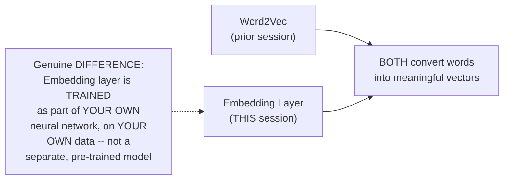
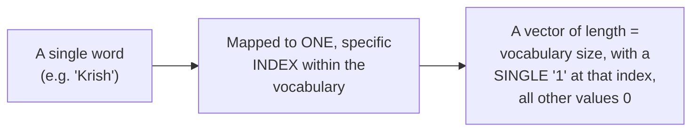
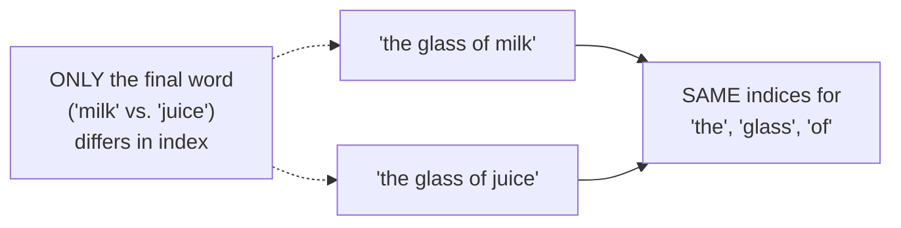
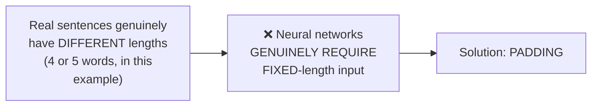
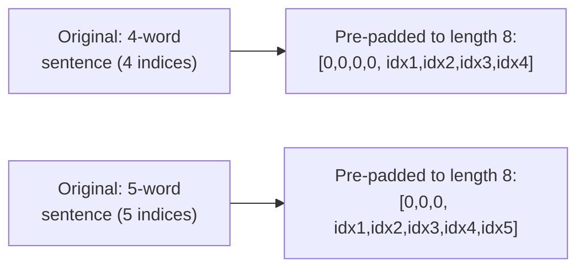
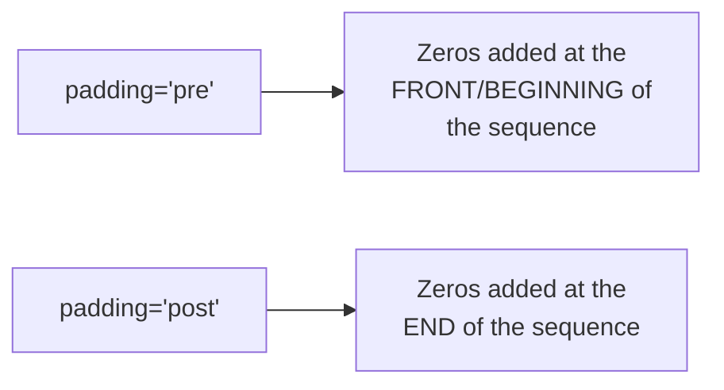
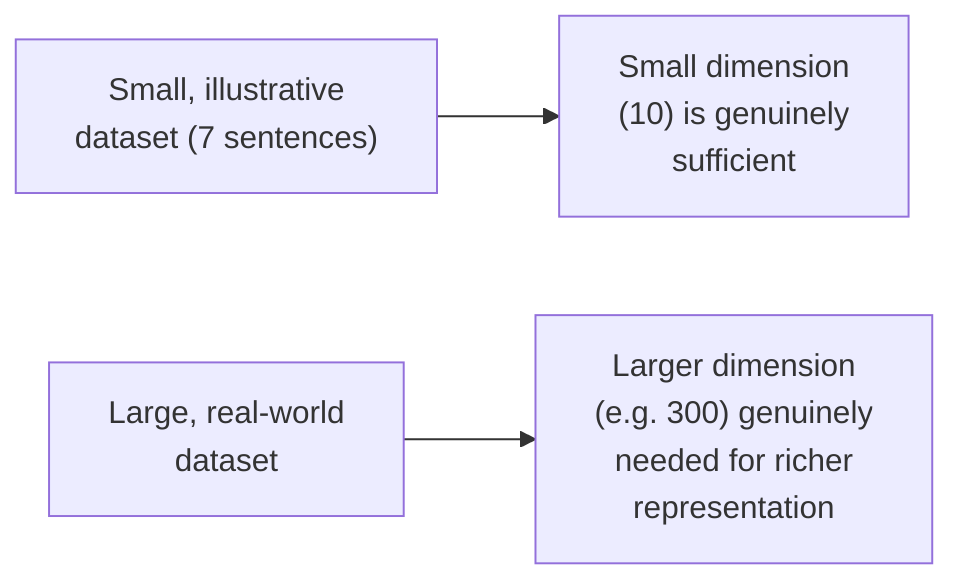
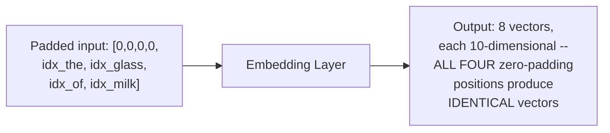
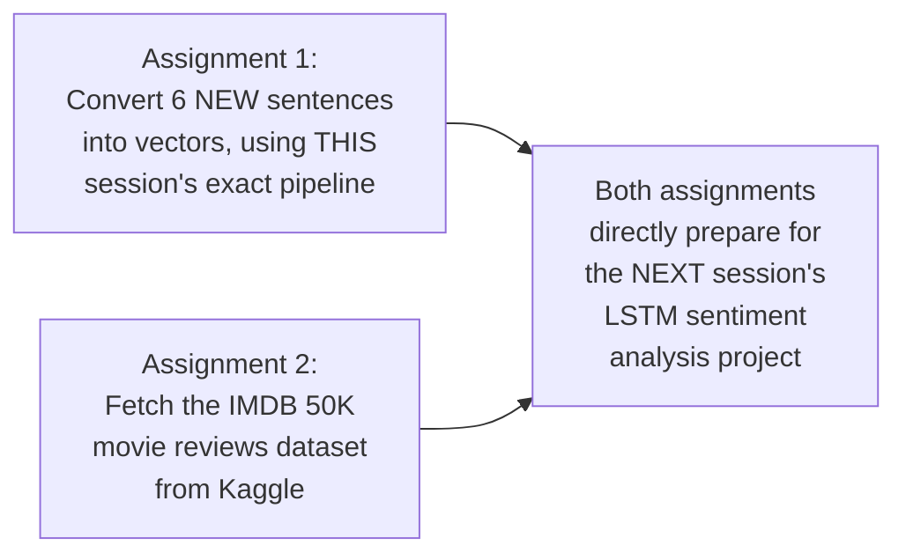
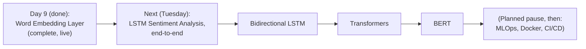

# 🧠 Deep Learning — Day 9: Word Embedding Layer, Practical Implementation

> **Session:** Deep Learning Live Series — Day 9 (Word Embedding Layer & LSTM Practical Implementation) · **Instructor:** Krish Naik
> **Note on scope:** This session's stated agenda was two-part — the word embedding layer's practical implementation, AND an end-to-end LSTM sentiment analysis project. In practice, the session's live, hands-on content covers ONLY the word embedding layer completely — one-hot encoding, padding (pre and post), and building/training a genuine `Embedding` layer in TensorFlow/Keras, all traced through real, executed code on real sentences. The LSTM sentiment analysis project is explicitly, honestly deferred as a genuine assignment, with the actual, live LSTM implementation promised for the following Tuesday's session. This guide covers exactly what was genuinely taught live: the complete word-embedding pipeline.

---

## 📑 Table of Contents

1. [Session Overview](#-session-overview)
2. [Learning Objectives](#-learning-objectives)
3. [Detailed Notes](#-detailed-notes)
   - [1. Session Context: Day 9, Word Embeddings in Practice](#1-session-context-day-9-word-embeddings-in-practice)
   - [2. Recap: One-Hot Encoding & Vocabulary Size](#2-recap-one-hot-encoding--vocabulary-size)
   - [3. The Complete Worked Example: Real Sentences to One-Hot Indices](#3-the-complete-worked-example-real-sentences-to-one-hot-indices)
   - [4. Why Padding Is Necessary: Fixing Sentence Length](#4-why-padding-is-necessary-fixing-sentence-length)
   - [5. Pre-Padding vs. Post-Padding: A Complete Worked Example](#5-pre-padding-vs-post-padding-a-complete-worked-example)
   - [6. Building the Embedding Layer in TensorFlow/Keras](#6-building-the-embedding-layer-in-tensorflowkeras)
   - [7. Verifying the Embedding Layer's Output](#7-verifying-the-embedding-layers-output)
   - [8. Closing: The LSTM Sentiment Analysis Assignment & What's Next](#8-closing-the-lstm-sentiment-analysis-assignment--whats-next)
4. [Glossary](#-glossary)
5. [Revision Notes — One-Minute Revision](#-revision-notes--one-minute-revision)
6. [Cheat Sheet](#-cheat-sheet)
7. [Interview Questions & Answers](#-interview-questions--answers)
8. [Scenario-Based Interview Questions](#-scenario-based-interview-questions)
9. [Hands-on Exercises](#-hands-on-exercises)
10. [Practice Assignment](#-practice-assignment)
11. [Additional Resources](#-additional-resources)
12. [Final Revision Sheet](#-final-revision-sheet)

---

## 🎯 Session Overview

This session moves from LSTM's pure architecture (Day 8) into genuine, hands-on text preprocessing — the exact pipeline required before ANY sequence model (LSTM or otherwise) can actually be trained on real text. It covers:

1. **A precise framing of WHY a genuinely new technique (the embedding layer) is needed**, despite Word2Vec already being covered — the embedding layer is directly, explicitly positioned as functionally similar to Word2Vec, but GENUINELY TRAINED as part of your OWN neural network, rather than relying on a separate, pre-trained model.
2. **A recap of one-hot encoding**, re-establishing vocabulary size as a genuine hyperparameter, and precisely how each word maps to a single "1" at a specific index within a vector of that vocabulary size.
3. **A complete, real, executed example** — seven genuine sentences ("the glass of milk," "the glass of juice," "the cup of tea," "I am a good boy," "I am a good developer," "understand the meaning of words," "your videos are good") — converted into one-hot INDEX representations using TensorFlow's own `one_hot` function.
4. **The precise, motivating problem that padding solves**: sentences genuinely have DIFFERENT lengths (4 or 5 words in this example), but neural networks require FIXED-length input.
5. **Pre-padding vs. post-padding**, worked through completely — using `pad_sequences` with a chosen maximum sentence length (8), with pre-padding specifically adding zeros to the FRONT of shorter sequences.
6. **Building and training a genuine `Embedding` layer** in TensorFlow/Keras — a `Sequential` model containing ONLY an embedding layer, with vocabulary size, output feature-dimension size (10), and input length (8) as its three required parameters.
7. **Verifying the embedding layer's actual output** — using `model.predict()` to confirm that identical input indices (like the repeated padding zeros, or the shared word "the") genuinely produce IDENTICAL vector representations.
8. **A genuine, honest deferral**: the LSTM sentiment analysis project itself is assigned as homework (convert new sentences, plus fetch the IMDB 50K movie reviews dataset from Kaggle), with the actual, live LSTM implementation explicitly promised for the following Tuesday.

> 💡 **Key framing, given directly, on precisely why the embedding layer is worth learning despite Word2Vec already being covered:** *"Here we have our own data, and we really want to create our own embedding layer, and what kind of vector representation, by ourself."*

---

## 🎯 Learning Objectives

By the end of this guide, you will be able to:

- [ ] Explain precisely how one-hot encoding maps a word to a specific index within a vocabulary-sized vector.
- [ ] Use TensorFlow's `one_hot` function to convert real sentences into their one-hot index representations.
- [ ] Explain why padding is genuinely necessary before training a neural network on variable-length text.
- [ ] Precisely distinguish pre-padding from post-padding, and correctly apply `pad_sequences`.
- [ ] Build a working `Embedding` layer in TensorFlow/Keras, correctly specifying vocabulary size, output dimension, and input length.
- [ ] Verify an embedding layer's output using `model.predict()`, confirming identical inputs produce identical vectors.

---

## 📚 Detailed Notes

### 1. Session Context: Day 9, Word Embeddings in Practice

#### 🧠 Concept

> 💡 **Given directly, opening the session:** *"Today we are going to cover up two main things -- one is word embedding layer practical implementation... second, we'll do an end-to-end project with the help of LSTM -- let's say, let's take a sentiment analysis project, so that you get an idea of how to train it."*

#### ❓ Why It Exists — Precisely Distinguishing the Embedding Layer From Word2Vec

> 💡 **Given directly:** *"Till the last class, right, I mainly focused on one very important thing, is that how to convert word into vectors -- I hope everybody has got an idea about Word2Vec... in our neural network, we have something called as WORD EMBEDDING LAYER, and this will also convert your words into vectors itself -- this acts pretty much like Word2Vec, but the thing is, HOW DO WE TRAIN THIS."*



#### 🎯 Key Takeaways

* This session's genuine, live content covers the **complete word-embedding pipeline** — one-hot encoding, padding, and the embedding layer itself — with the LSTM sentiment-analysis project explicitly, honestly deferred.
* The **embedding layer** is precisely positioned as functionally SIMILAR to Word2Vec (both produce meaningful word vectors) but structurally DIFFERENT: it's a genuine, TRAINABLE layer within your OWN neural network, not a separately pre-trained model.
* The instructor's own honest framing: *"This is not for... pre-trained -- we are not going to use any pre-trained model; instead, we are going to use some dataset, then we are going to train it using [the] embedding layer, and then we are going to find out the relationship."*

---

### 2. Recap: One-Hot Encoding & Vocabulary Size

#### 📖 Definition — Vocabulary Size, Precisely Re-Confirmed

> 💡 **Given directly:** *"What is vocabulary size, basically means -- number of unique words. Let's say if it is 500, let's say the total number of words that I have in my dictionary is 500."*

#### 🪜 Step-by-Step — How a Single Word Maps to a One-Hot Vector

> 💡 **Given directly:** *"'Krish' will become something like this -- let's say Krish, at one-hot encoding, will have all the numbers as zero, at ONE POINT -- let's say this is the index, this is the index, let's say 325, and this index is basically saying about 'Krish' in the vocabulary -- this side, it will become 1... and remaining all will again be zeros."*

```text
Vocabulary size: 500
Word "Krish" -> index 325 -> [0, 0, ..., 1 (at position 325), ..., 0]  (500-dimensional vector)
```



#### ⚠ Common Mistakes

* Assuming a word's specific index (e.g., 325) is somehow meaningfully derived from the word's spelling or alphabetical order — explicitly, directly clarified as essentially arbitrary/random per this TensorFlow implementation: *"It changes every time we run... because over here, the random variable is not [fixed]... it will not be fixed every time."*
* Assuming vocabulary size must be a specific, fixed value — explicitly, directly confirmed as a genuine HYPERPARAMETER: *"Vocabulary is completely a hyperparameter, guys -- you can select by your own... you really need to try out with different different vocabulary size."*

#### 🎯 Key Takeaways

* **Vocabulary size** is precisely the number of unique words considered — a genuine, freely-chosen HYPERPARAMETER (500, 10,000, or any other value).
* Each word maps to exactly **ONE index** within a vector of that vocabulary size — a "1" at that specific position, zeros everywhere else.
* A **larger vocabulary size** genuinely provides a "good amount of feature representation," but at the direct cost of increased PROCESSING TIME — a real, practical trade-off.

---
### 3. The Complete Worked Example: Real Sentences to One-Hot Indices

#### 💻 Code Example — Setup: Installing TensorFlow and the Real Sentences Used

> 💡 **Given directly:** *"Let's consider I have some sentences -- the sentences you can see over here, and our main focus is to convert the sentences into some kind of vectors."*

```python
!pip install tensorflow

import tensorflow as tf
print(tf.__version__)   # 2.9.1, per the live session

from tensorflow.keras.preprocessing.text import one_hot

sentences = [
    'the glass of milk',
    'the glass of juice',
    'the cup of tea',
    'I am a good boy',
    'I am a good developer',
    'understand the meaning of words',
    'your videos are good',
]
```

#### 💻 Code Example — Setting the Vocabulary Size & Applying One-Hot Encoding

> 💡 **Given directly:** *"You have to specifically say what is the vocabulary size... here I'm going to take the vocabulary size of 10,000... in order to convert this words into one-hot representation, using this vocabulary size... I'm just going to use `one_hot`, and this is going to convert this into vocabulary size -- I mean, the index -- it is just going to go and capture those indexes which has ones."*

```python
voc_size = 10000

onehot_repr = [one_hot(words, voc_size) for words in sentences]
```

#### 🪜 Step-by-Step — The Complete, Live-Observed Result for the First Sentence

> 💡 **Given directly, the actual, live-observed output:** *"Here you will be able to see, this is my first sentence -- now see, what was my first sentence over here? 'The glass of milk' -- now, with respect to this 'glass of milk,' you can see 'the' is basically in the position index position of 2423 -- it is 1, that basically means, out of the 10,000 vocabulary word, 2423 index has the word 'the.'"*

```text
"the glass of milk" -> onehot_repr[0] -> [2423, 5188, 1091, 5336]  (illustrative, actual indices vary each run)
"the" -> index 2423
"glass" -> index 5188
"of" -> index 1091
"milk" -> index 5336
```

#### 🔍 Internal Working — A Genuinely Important, Direct Confirmation: Shared Words Get Shared Indices

> 💡 **Given directly:** *"See the difference between this first two sentences, 'the glass of milk' and 'the glass of juice'... this both are same, almost same sentences -- only 'milk' and 'juice' are changing, so you can see over here, both the sentences will be having the SAME vectors, only the LAST index is basically changing, because milk has one at a different index, whereas juice is basically... having one at different different index."*



#### 🔍 Internal Working — Confirming Vocabulary Size Genuinely Bounds the Index Range

> 💡 **Given directly:** *"Vocabulary size can be anything -- if I take 500, remember, your values of the indexes will be between 0 to 500... if I take it 100, it will be between 0 [to] 100... but the larger vocabulary size basically means [a] larger, good amount of feature representation you will be able to get."*

#### ⚠ Common Mistakes

* Assuming the same word ALWAYS receives the identical index across DIFFERENT program runs — explicitly, directly clarified as FALSE, since TensorFlow's `one_hot` function uses an internal random hashing mechanism, not a fixed dictionary — *"It changes every time we run."*
* Assuming a genuinely different vocabulary size (e.g., 500 vs. 10,000) would produce the SAME resulting index values — explicitly, directly clarified: the index RANGE is directly bounded by the chosen vocabulary size.

#### 🎯 Key Takeaways

* TensorFlow's **`one_hot` function**, applied to real sentences with a chosen vocabulary size, directly, precisely converts each sentence into a list of INDEX values — one index per word.
* A **directly-confirmed, genuine insight**: two nearly-identical sentences ("the glass of milk" vs. "the glass of juice") produce IDENTICAL indices for their SHARED words, differing only at the position where the actual words diverge.
* The chosen **vocabulary size directly bounds the range** of possible index values — a genuine, confirmed, hands-on demonstration of vocabulary size's practical effect.

---

### 4. Why Padding Is Necessary: Fixing Sentence Length

#### ❓ Why It Exists — The Precise, Directly-Posed Question

> 💡 **Given directly:** *"Do you feel each and every sentence have the same length? ...Here I have four words, here I have four words, here I have four words, but here I have five words... the sentences, there is always difference, right? Tell me, in neural network, if I need to train all these things, I have to make sure that all my sentences size should be fixed -- yes or no?"*



#### 📖 Definition — Padding, Precisely Introduced

> 💡 **Given directly:** *"That is the reason why I had written over here something called as post and pre-padding... this is the NEXT STEP -- see, we did one-hot encoding, now we are into the next step, which is called as post padding and pre-padding."*

#### 💻 Code Example — Importing the Necessary Libraries

> 💡 **Given directly:** *"Let me install some of the libraries, like embedding, pad_sequences -- this is basically used for pre-padding or post padding... and Sequential is basically for the sequential neural network."*

```python
from tensorflow.keras.layers import Embedding
from tensorflow.keras.preprocessing.sequence import pad_sequences
from tensorflow.keras.models import Sequential
```

#### ⚠ Common Mistakes

* Assuming padding is an OPTIONAL, cosmetic step — explicitly, directly established as a genuine NECESSITY: *"Without these steps, you will not be able to go ahead."*
* Assuming variable-length sentences could somehow be directly fed into a neural network without any preprocessing — explicitly, directly ruled out, precisely because neural networks structurally require FIXED-size input.

#### 🎯 Key Takeaways

* **Real sentences genuinely have different lengths** — directly, concretely demonstrated across this session's own 7 example sentences (4 or 5 words each).
* Neural networks **structurally require FIXED-length input** — directly motivating padding as a genuine, necessary preprocessing step, not an optional convenience.
* This entire pipeline (one-hot encoding → padding → embedding) is explicitly, directly framed as a **standard, reusable NLP workflow**: *"Any problem that you solve in NLP later on, we always need to follow these steps."*

---
### 5. Pre-Padding vs. Post-Padding: A Complete Worked Example

#### 🪜 Step-by-Step — Choosing a Maximum Sentence Length

> 💡 **Given directly:** *"What is the maximum sentence length that you can see over here? Is 5... in order to make all the sentences have the equal size and length, what I am actually going to do -- let's let me assume that the sentence length will be 8 -- the maximum sentence, because out of this we can definitely find out which is the maximum sentence over here, it is somewhere around 5 words maximum -- so, in the worst scenario, what I have done is that the maximum sentence length can be 8."*

```python
sent_length = 8
```

#### 📖 Definition — Pre-Padding, Precisely Explained

> 💡 **Given directly:** *"I am using one-hot representation, which is these values, and I am saying `padding='pre'` -- this basically means PRE-PADDING, that basically means, to make the sentence equal, just add zeros in the INITIAL, and make it completely 8."*

```python
embedded_docs = pad_sequences(onehot_repr, padding='pre', maxlen=sent_length)
print(embedded_docs)
```

#### 🪜 Step-by-Step — The Complete, Worked, Zero-Counting Exercise

> 💡 **Given directly, a genuine, direct, "solve this yourself" question:** *"Suppose if you have four indexes, then how many zeros will get added forward? ...Tell me, this is the question for you -- four, right, four zeros will get added... what about this, where there are five indexes? How many zeros will get added over here? ...Five if there are five indexes, then definitely how many will get added? Three will get added, right."*

```text
Sentence with 4 words, max length 8 -> pad with 4 zeros
Sentence with 5 words, max length 8 -> pad with 3 zeros
```



#### 🔍 Internal Working — The Precise Difference Between Pre- and Post-Padding

> 💡 **Given directly:** *"If you use `pre`, if you use `post`, then zeros will [be] added at the last -- if you use `pre`, it will be added in the FRONT -- if you use `post`, it will get added in the LAST."*



#### 🔍 Internal Working — The Genuine, Confirmed Result

> 💡 **Given directly:** *"If we print `embedded_docs`, here you can see that I'm getting FOUR zeros over here, I'm getting four zeros over here, I'm getting four zeros, three zeros, three zeros, three zeros -- so this way, the one problem that we are facing -- our input size is not fixed -- we made sure that our input size IS FIXED."*

#### ⚠ Common Mistakes

* Assuming pre-padding and post-padding produce meaningfully different SEMANTIC representations of the underlying words — explicitly, directly clarified: both achieve the SAME genuine goal (fixed-length input); they differ only in WHERE the padding zeros are physically placed.
* Choosing a maximum sentence length that's too small (shorter than the longest actual sentence) — explicitly, directly avoided by the instructor's own stated practice: choosing 8 as a genuinely SAFE maximum, comfortably larger than the observed maximum (5) — with a direct, live audience question confirming this "worst scenario" reasoning: *"How do we define sentence length? ...Consider [the maximum] and write it over there, right, so that that outer vocabulary issue will not come."*

#### 🎯 Key Takeaways

* **Pre-padding** adds zeros to the FRONT of a sequence; **post-padding** adds zeros to the END — both achieve the SAME genuine goal: a fixed, uniform sequence length across all sentences.
* The **maximum sentence length** (here, 8) should genuinely be chosen with some safety margin above the observed maximum (here, 5) — directly avoiding truncation issues for genuinely longer sentences encountered later.
* This session's own live, executed code directly, numerically CONFIRMS the exact padding behavior — 4-word sentences receive 4 padding zeros; 5-word sentences receive 3 — precisely matching the stated `sent_length - actual_length` formula.

---

### 6. Building the Embedding Layer in TensorFlow/Keras

#### ❓ Why It Exists — Precisely Connecting Back to Word2Vec's Own Feature Representation

> 💡 **Given directly:** *"Now we will try to convert each and every value with some vectors... for each and every value, we may provide that in the form of feature representations, right -- that is what we learnt in Word2Vec, right -- that is what we learnt in Word2Vec -- every one will be shown in the form of 10 feature representation."*

#### 💻 Code Example — Choosing the Feature Dimension

> 💡 **Given directly:** *"My feature representation size, I'm just going to consider it as 10, because this is very small, right -- I just want to show each and every feature with the 10 different feature representation."*

```python
dim = 10
```

#### 💻 Code Example — Building the Complete Sequential Model

> 💡 **Given directly, the complete, precise parameter explanation:** *"First of all, I need to first parameter that you need to provide is something called as the vocabulary size... the next parameter that you have to give is that how many features you want for each vector -- how it should be shown in the feature representation... then we need to specify the INPUT LENGTH, which is equal to the sentence length."*

```python
model = Sequential()
model.add(Embedding(voc_size, dim, input_length=sent_length))
model.compile('adam', 'mse')
model.summary()
```

#### 🔍 Internal Working — Precisely Why 10 Was Chosen as the Dimension

> 💡 **Given directly, in response to a genuinely direct audience question:** *"How do we decide dimension size? See, guys, since this is a very small sentence, right, so that is the reason this feature -- this is nothing but feature representation, how many vectors I need to show, right -- now, since I had a very small [dataset], I am using 10 -- if you have a huge dataset, around 300 feature dimension is more than [enough]."*



#### ⚠ Common Mistakes

* Assuming the Embedding layer requires genuinely complex configuration — explicitly, directly demonstrated as requiring only THREE parameters: vocabulary size, output dimension, and input length.
* Assuming the choice of `dim=10` reflects some universal, fixed standard — explicitly, directly clarified as a dataset-SIZE-DEPENDENT choice, genuinely scaling up (e.g., to 300) for larger, real-world datasets.
* Using an inappropriate loss function/optimizer combination without genuine justification — explicitly, directly used here as `adam`/`mse`, consistent with this course's own established defaults (Adam as the standard optimizer; MSE as a genuine, simple loss choice for this illustrative, unsupervised-style embedding task).

#### 🎯 Key Takeaways

* Building a genuine `Embedding` layer requires exactly **THREE parameters**: vocabulary size, output feature dimension, and input length (the padded sentence length).
* The **output dimension** (here, 10) is a genuine, dataset-size-dependent hyperparameter — small for small, illustrative datasets; genuinely larger (e.g., 300) for real, large-scale datasets.
* This entire Sequential model, compiled with `adam` and `mse`, is explicitly, directly framed as a way to CREATE and TRAIN a genuinely new, custom word-vector representation — directly fulfilling the session's own opening motivation (Section 1).

---
### 7. Verifying the Embedding Layer's Output

#### 💻 Code Example — Predicting a Single Sentence's Vector Representation

> 💡 **Given directly:** *"If you take up any sentence -- any sentence of this, right, like `embedded_docs[0]`... if I write `model.predict(embedded_docs[0])`... this sentence, if you go and see in the first one, it is nothing but it is saying 'glass of milk' -- so this is the 'glass of milk,' right -- now, for this sentence, if I [want] to see what is my feature representation, all I have to do is that use this model and write `predict` of `embedded_docs[0]`."*

```python
print(model.predict(embedded_docs[0]))
```

#### 🔍 Internal Working — Confirming the Output's Precise Structure

> 💡 **Given directly, the complete, live-observed result:** *"Everything, zero is represented by this 10 dimensions -- why 10 dimensions? Because I have initialized 10 dimensions, right, over here, 10 feature dimensions -- so zero is represented over here by this, the next zero is represented by this -- BOTH OF THEM WILL BE SAME, both this will be same, right, because it is zero, zero -- then again, if you have zero again, it is going to show over here as 10 dimensions."*



#### 🔍 Internal Working — Confirming Real Words Also Get Consistent Vectors

> 💡 **Given directly:** *"Now comes 180 -- 180, the word is what? 181 basically means 'the' -- where 'the' is there, you will be able to see this is basically represented by 'the'... then again, when we come to the next word, that is 'glass' -- 'glass' is represented by this 10 vectors, right, and then you have 'of' -- 'of' is represented by this 10 vectors, and 'milk' is basically presented by this 10 vectors."*

#### 💻 Code Example — Predicting ALL Sentences at Once

> 💡 **Given directly:** *"If I do want to do for all the sentences, just write `model.predict(embedded_docs)` -- automatically, you will be getting all the values, whatever values you have, for all the sentences."*

```python
print(model.predict(embedded_docs))   # produces vectors for ALL 7 sentences at once
```

#### ⚠ Common Mistakes

* Assuming random weight initialization would produce genuinely DIFFERENT vectors for IDENTICAL input indices — explicitly, directly, empirically confirmed as FALSE: the SAME input index ALWAYS maps to the SAME output vector, since the embedding layer's weights (though randomly initialized) are FIXED once created — identical lookups produce identical results.
* Assuming this session's own SPECIFIC output values would match exactly on a DIFFERENT run — explicitly, directly, honestly acknowledged: *"It may not match with your data, because... the initial random state is random seed is not [fixed]... you may be getting different values."*

#### 🎯 Key Takeaways

* Using **`model.predict()`** on the embedding layer directly, concretely reveals the actual, learned (or in this UNTRAINED case, initialized) vector representation for every word/index in a given sentence.
* This session's own **live, executed verification** directly confirms a genuinely important property: identical input indices (whether the repeated zero-padding, or a genuinely repeated word like "the") produce IDENTICAL output vectors.
* The specific NUMERIC values observed are explicitly, honestly acknowledged as NON-REPRODUCIBLE across different runs (due to unfixed random seeding) — the STRUCTURAL, CONSISTENT-MAPPING property is what genuinely matters, not the specific numbers themselves.

---

### 8. Closing: The LSTM Sentiment Analysis Assignment & What's Next

#### 🪜 Step-by-Step — The Explicit, Stated Assignment

> 💡 **Given directly, the complete, stated assignment:** *"Quickly, I'll give you an assignment -- do that assignment in front of me... let's say this is your assignment -- let's say you have a sentence which is like this: 'the world is a better place,' 'Marvel series is my favorite movie,' 'I like DC movies,' 'the cat is eating the food,' 'Tom and Jerry is my favorite movie,' 'Python is my favorite programming language' -- quickly, do it for this, guys -- everyone, do this, and try to find out the vectors if you can."*

> 💡 **Given directly, a SECOND, explicitly-stated assignment:** *"One more assignment that I really want to give up is that, go to Kaggle, and find out this IMDB 50K movies review dataset -- try to convert this all into vectors, okay, and probably we may take up this particular use case over here."*



#### ⚠ A Direct, Honest Acknowledgment: The LSTM Project Itself Is Genuinely Deferred

> 💡 **Given directly:** *"The next class will happen on Tuesday because I have classes on Saturday, Sunday, so... let's do it on Tuesday, and Tuesday we will do ONE LSTM PROJECT END TO END, and we'll try to do something related to that."*

> 💡 **Given directly, precisely previewing how SHORT the actual LSTM code will be, once the embedding pipeline is complete:** *"What we will do is that we will try to take up all this particular dataset, convert this into vectors, and train into LSTM -- after this, LSTM will be hardly 5 LINES OF CODE -- after we convert this into vectors, it will be 5 lines of code."*

#### 🏢 Real-World / Production Usage — A Genuine, Direct Preview of the Broader NLP Roadmap

> 💡 **Given directly:** *"How long NLP session will take -- I have to complete bidirectional LSTM, Transformers, BERT, right -- so there are some days, but let's see how much time it will take, or I'll take a pause... after I complete LSTM... I'll start into Dockers and all."*



#### ⚠ Common Mistakes

* Assuming this session's own title ("LSTM Practical Implementation") means the LSTM model was genuinely, fully built and trained live — explicitly, honestly corrected: ONLY the word-embedding pipeline was genuinely completed live; the LSTM project itself is explicitly assigned as homework/deferred to the following Tuesday's session.
* Assuming the eventual LSTM implementation will be genuinely complex code — explicitly, directly previewed as surprisingly SHORT ("hardly 5 lines of code"), specifically BECAUSE the genuinely hard, necessary preprocessing work (one-hot encoding, padding, embedding) is what THIS session already covers.

#### 🎯 Key Takeaways

* This session's own **two explicit assignments** — converting six new, genuinely different sentences into vectors, and fetching the real IMDB 50K movie reviews dataset from Kaggle — directly, concretely prepare for the NEXT session's LSTM sentiment analysis project.
* The **actual LSTM implementation is honestly, explicitly deferred** to the following Tuesday — this session's own scope remains, in genuine, live practice, limited to the complete word-embedding pipeline.
* The instructor's own **direct preview**: once the embedding pipeline is genuinely complete, the LSTM model itself requires only "5 lines of code" — a precise, honest indication of where the genuine COMPLEXITY in this workflow actually lies (preprocessing, not the model definition itself).
* The **broader NLP roadmap** continues with Bidirectional LSTM, Transformers, and BERT — with an eventual, planned pause afterward to cover MLOps/Docker/CI-CD topics.

---
## 📝 Glossary

| Term | Definition | Why It Matters |
|---|---|---|
| **Vocabulary Size** | The number of unique words considered | A genuine, freely-chosen hyperparameter |
| **one_hot (TensorFlow)** | Converts a word into its one-hot INDEX (not the full vector) | The first step of this session's pipeline |
| **Padding** | Adding placeholder values to fix sequence length | Genuinely necessary -- neural networks need fixed-size input |
| **Pre-Padding** | Adding zeros to the FRONT of a sequence | This session's own chosen approach |
| **Post-Padding** | Adding zeros to the END of a sequence | The alternative padding style |
| **pad_sequences** | The Keras function performing padding | Takes onehot_repr, padding style, and maxlen |
| **Embedding Layer** | A trainable Keras layer converting indices into dense vectors | Functionally similar to Word2Vec, but trained on YOUR data |
| **Feature Dimension** | How many values represent each word's vector | A hyperparameter, scaled to dataset size (10 here; ~300 for real datasets) |
| **Input Length** | The padded sentence length, required by the Embedding layer | Must match the maxlen used in padding |

---

## 🔄 Revision Notes — One-Minute Revision

* This is **Day 9** -- the session's real, genuine, LIVE content covers the COMPLETE word-embedding pipeline; the LSTM sentiment-analysis project itself is honestly, explicitly DEFERRED to the following Tuesday.
* **Embedding layer vs. Word2Vec**: functionally similar (both produce meaningful word vectors), but the embedding layer is a genuinely TRAINABLE layer within YOUR OWN neural network, not a separate, pre-trained model.
* **One-hot encoding recap**: vocabulary size = number of unique words (a genuine hyperparameter); each word maps to ONE index within a vector of that size.
* **Real, worked example**: 7 real sentences ("the glass of milk," etc.) converted via TensorFlow's `one_hot(words, voc_size)` function -- CONFIRMED live: nearly-identical sentences ("glass of milk" vs. "glass of juice") produce IDENTICAL indices for shared words, differing only where the words genuinely differ. Vocabulary size directly bounds the index range.
* **Why padding**: sentences genuinely have DIFFERENT lengths (4-5 words here), but neural networks require FIXED-length input.
* **Pre-padding vs. post-padding**: `padding='pre'` adds zeros to the FRONT; `padding='post'` adds zeros to the END -- both achieve fixed length. Worked live: 4-word sentences got 4 padding zeros; 5-word sentences got 3 (using `sent_length=8`, chosen as a safe margin above the observed max of 5).
* **Building the Embedding layer**: `Sequential()` + `Embedding(voc_size, dim, input_length=sent_length)`, compiled with `adam`/`mse` -- requires exactly THREE parameters (vocab size, output dimension, input length). Dimension (10 here) is dataset-size-dependent (larger, e.g. 300, for real datasets).
* **Verification, via `model.predict()`**: CONFIRMED live that identical input indices (repeated padding zeros, or the repeated word "the") produce IDENTICAL output vectors -- though the SPECIFIC numeric values are non-reproducible across runs (unfixed random seed).
* **Two explicit assignments**: convert 6 NEW sentences into vectors using this session's exact pipeline; fetch the IMDB 50K movie reviews dataset from Kaggle -- both directly preparing for the NEXT session's genuine LSTM implementation.
* **Directly previewed**: once embeddings are ready, the actual LSTM model requires "hardly 5 lines of code" -- the genuine complexity lies in THIS session's preprocessing pipeline, not the model definition itself.
* **Broader roadmap**: Bidirectional LSTM, Transformers, BERT next -- with a planned pause afterward for MLOps/Docker/CI-CD topics.

---

## 📋 Cheat Sheet

**Complete word-embedding pipeline:**
```python
from tensorflow.keras.preprocessing.text import one_hot
from tensorflow.keras.preprocessing.sequence import pad_sequences
from tensorflow.keras.layers import Embedding
from tensorflow.keras.models import Sequential

sentences = [...]
voc_size = 10000

# Step 1: One-hot encoding (word -> index)
onehot_repr = [one_hot(words, voc_size) for words in sentences]

# Step 2: Padding (fixed-length sequences)
sent_length = 8
embedded_docs = pad_sequences(onehot_repr, padding='pre', maxlen=sent_length)

# Step 3: Embedding layer (index -> dense vector)
dim = 10
model = Sequential()
model.add(Embedding(voc_size, dim, input_length=sent_length))
model.compile('adam', 'mse')

# Step 4: Verify
print(model.predict(embedded_docs[0]))
```

**Pre-padding vs. post-padding:**
```text
padding='pre'  -> zeros added to the FRONT: [0,0,0,0, w1,w2,w3,w4]
padding='post' -> zeros added to the END:    [w1,w2,w3,w4, 0,0,0,0]
```

**Embedding layer parameters:**
```text
1. Vocabulary size (voc_size)   -- from one-hot encoding step
2. Output dimension (dim)         -- feature vector size per word
3. Input length (sent_length)       -- from padding step
```

**Key confirmed behaviors:**
```text
Same index -> Same output vector (always)
Shared words in similar sentences -> Same indices
Vocabulary size directly bounds the index range
```

---

## 🔥 Interview Questions & Answers

### 🟢 Beginner

**Q1.**

**Question:** What is the functional similarity between an embedding layer and Word2Vec?

**Answer:** Both convert words into meaningful vectors.

**Explanation:** Directly, precisely stated.

**Why Interviewers Ask This:** Tests understanding of the conceptual connection between two related NLP techniques.

**Possible Follow-up:** "What is the key structural difference between them?"

**Q2.**

**Question:** What does vocabulary size represent?

**Answer:** The number of unique words being considered.

**Explanation:** Directly, precisely stated.

**Why Interviewers Ask This:** Foundational, frequently-tested NLP preprocessing knowledge.

**Possible Follow-up:** "Is vocabulary size a fixed value or a hyperparameter?"

**Q3.**

**Question:** Why is padding necessary before training a neural network on text?

**Answer:** Because sentences genuinely have different lengths, but neural networks require fixed-length input.

**Explanation:** Directly, precisely explained.

**Why Interviewers Ask This:** Basic, essential NLP preprocessing knowledge.

**Possible Follow-up:** "What are the two types of padding?"

**Q4.**

**Question:** What is the difference between pre-padding and post-padding?

**Answer:** Pre-padding adds zeros to the front of a sequence; post-padding adds zeros to the end.

**Explanation:** Directly, precisely distinguished.

**Why Interviewers Ask This:** A commonly-asked, practical NLP preprocessing question.

**Possible Follow-up:** "Does the choice between pre- and post-padding change the semantic meaning of the words?"

**Q5.**

**Question:** How many parameters does a Keras Embedding layer require at minimum?

**Answer:** Three -- vocabulary size, output dimension, and input length.

**Explanation:** Directly, explicitly stated.

**Why Interviewers Ask This:** Basic, practical Keras implementation knowledge.

**Possible Follow-up:** "What determines the appropriate value for the output dimension?"

**Q6.**

**Question:** If two sentences share several words in common, will TensorFlow's `one_hot` function assign those shared words the same index within a single run?

**Answer:** Yes.

**Explanation:** Directly, empirically confirmed.

**Why Interviewers Ask This:** Tests understanding of one-hot encoding's consistent, per-run mapping behavior.

**Possible Follow-up:** "Would this same index be produced again in a completely separate program run?"

**Q7.**

**Question:** What Python library function performs one-hot encoding in this session's pipeline?

**Answer:** `one_hot`, from `tensorflow.keras.preprocessing.text`.

**Explanation:** Directly, explicitly named.

**Why Interviewers Ask This:** Basic, practical implementation knowledge.

**Possible Follow-up:** "What function performs padding in this same pipeline?"

**Q8.**

**Question:** In this session's example, how many padding zeros were added to a 5-word sentence, given a maximum sentence length of 8?

**Answer:** 3.

**Explanation:** Directly, precisely calculated and confirmed.

**Why Interviewers Ask This:** Tests understanding of the basic padding-length arithmetic.

**Possible Follow-up:** "How many zeros would a 4-word sentence receive under the same configuration?"

**Q9.**

**Question:** Does the embedding layer used in this session rely on a pre-trained model?

**Answer:** No -- it is trained from scratch on the session's own dataset.

**Explanation:** Directly, explicitly clarified.

**Why Interviewers Ask This:** Tests understanding of a key, genuine distinction from using a pre-trained Word2Vec model.

**Possible Follow-up:** "What is the genuine advantage of training your own embedding layer, rather than using a pre-trained model?"

**Q10.**

**Question:** What dataset was assigned for the upcoming LSTM sentiment analysis project?

**Answer:** The IMDB 50K movie reviews dataset, from Kaggle.

**Explanation:** Directly, explicitly named.

**Why Interviewers Ask This:** Tests awareness of the session's own stated, concrete next steps.

**Possible Follow-up:** "What is this dataset commonly used for in NLP?"

---

### 🟡 Intermediate

**Q11.**

**Question:** Explain why the instructor deliberately chooses a maximum sentence length (8) genuinely LARGER than the actual observed maximum (5) in this session's dataset, rather than using exactly 5.

**Answer:** This is a deliberate, practical safety margin, directly addressing a genuine, real-world concern a live audience member explicitly raises: *"How do we define sentence length? What do you consider the maximum sentence length can be?"* -- with the instructor's own direct answer being to consider a genuinely LARGER value specifically to avoid an "out of vocabulary" or truncation issue with FUTURE sentences that might genuinely exceed the CURRENT dataset's own observed maximum length. Using exactly 5 (the current maximum) would work correctly for THIS specific dataset, but would GENUINELY FAIL (requiring truncation, losing information) the moment a longer sentence needed to be processed -- directly motivating a "worst scenario" buffer, exactly as the instructor states.

**Explanation:** Requires recognizing a deliberate, forward-looking practical choice, not an arbitrary or unnecessarily large number.

**Why Interviewers Ask This:** Tests whether a learner understands WHY a safety margin is genuinely necessary in real, practical preprocessing pipelines.

**Possible Follow-up:** "What would genuinely happen if a NEW sentence, longer than the configured maximum sentence length, needed to be processed using this SAME, already-configured pipeline?"

**Q12.**

**Question:** A learner argues that since this session's embedding layer is trained using `compile('adam', 'mse')`, the resulting word vectors will genuinely, meaningfully capture semantic relationships between words, exactly like a properly-trained Word2Vec model. Evaluate this claim.

**Answer:** This claim is inaccurate for this SPECIFIC session's demonstration, though the GENERAL technique (embedding layers) genuinely CAN learn meaningful semantic relationships when properly trained. This session's own content directly demonstrates the embedding layer's STRUCTURE and MECHANICS (how indices map to vectors, how padding/vocabulary size work) — but does NOT actually train the model against any genuine, meaningful TASK or LOSS SIGNAL that would encourage semantically meaningful vector relationships. `model.compile('adam', 'mse')` alone, without ANY subsequent `model.fit()` call against real labels/targets (which this session's own live demonstration does NOT perform), means the embedding weights remain at their RANDOM INITIALIZATION values — genuinely, structurally CONSISTENT (same index always produces the same vector, per Section 7's own confirmed observation) but NOT yet semantically meaningful. Real, meaningful semantic relationships would only emerge AFTER genuine training against a real task (like the upcoming LSTM sentiment-analysis project), where the embedding layer's weights would be updated via backpropagation to genuinely support that task's own objective.

**Explanation:** Tests whether a learner recognizes the difference between demonstrating a layer's STRUCTURE/mechanics versus genuinely TRAINING it toward meaningful semantic representations.

**Why Interviewers Ask This:** Distinguishes candidates who understand that compiling a model ≠ training it toward meaningful weights, a genuinely important, easy-to-overlook distinction.

**Possible Follow-up:** "What specific step would need to be added to this session's own code for the embedding layer to genuinely begin learning meaningful semantic relationships?"

**Q13.**

**Question:** Explain, precisely, why the embedding layer's output for the SAME word (e.g., "the," appearing in multiple different sentences) is genuinely IDENTICAL across those different sentences, even though the sentences themselves have different overall content.

**Answer:** This is a direct, structural consequence of HOW an embedding layer genuinely works: it functions as a LOOKUP TABLE, where EACH UNIQUE INDEX (assigned during one-hot encoding) maps to EXACTLY ONE, fixed row of weights within the embedding layer's own internal weight matrix. When the SAME index (e.g., the index assigned to "the") appears in MULTIPLE different sentences, the embedding layer performs the EXACT SAME lookup operation each time — retrieving the IDENTICAL row of weights, REGARDLESS of what OTHER words happen to surround it in that specific sentence. This is precisely WHY Section 7's own live-observed confirmation ("the" producing the same 10-dimensional vector across different sentences) is genuinely, structurally GUARANTEED, not merely a coincidental observation — the embedding layer, AT THIS STAGE (before any LSTM or context-aware layer is added), has NO mechanism to incorporate surrounding-word CONTEXT into its output; it purely performs a fixed, per-index lookup.

**Explanation:** Requires reasoning through the embedding layer's genuine, structural lookup-table mechanism to explain WHY this consistent behavior is guaranteed, not coincidental.

**Why Interviewers Ask This:** Tests whether a learner understands the embedding layer's fundamental, context-INDEPENDENT nature at this stage of the pipeline.

**Possible Follow-up:** "Would this SAME 'identical vector regardless of context' property still hold true if this embedding layer's output were subsequently passed into an LSTM layer? Explain your reasoning."

**Q14.**

**Question:** Using this session's own precise three-parameter embedding layer configuration, explain why the `input_length` parameter must EXACTLY match the `maxlen` value used during padding, rather than being independently, freely chosen.

**Answer:** The `input_length` parameter directly, structurally tells the embedding layer HOW MANY separate index values to EXPECT per input sample — and this must EXACTLY match the padding step's own output shape, since `pad_sequences(..., maxlen=sent_length)` genuinely, guaranteedly produces sequences of EXACTLY `sent_length` values (per Section 5's own precise padding mechanism) for EVERY sentence, regardless of the sentence's own original length. If `input_length` were set to a DIFFERENT value than the actual `maxlen` used during padding, the embedding layer would receive input sequences of a GENUINELY MISMATCHED length — directly causing a shape-mismatch error, since the layer's own internal weight structure is built specifically around processing EXACTLY `input_length` positions per sample. This is a direct, structural DEPENDENCY between the padding step (Section 5) and the embedding layer configuration (Section 6) — not two independently, freely choosable values.

**Explanation:** Requires reasoning through the structural dependency between two, separately-described pipeline steps.

**Why Interviewers Ask This:** Tests whether a learner understands the genuine, necessary CONSISTENCY required across a multi-step preprocessing pipeline, not just each step's own, isolated mechanics.

**Possible Follow-up:** "What specific error would you expect if `input_length` were set to a value smaller than the actual padded sequence length?"

**Q15.**

**Question:** Synthesize this session's complete embedding pipeline with the instructor's own direct preview ("LSTM will be hardly 5 lines of code") to explain WHY the preprocessing pipeline (one-hot encoding, padding, embedding) is genuinely the more COMPLEX, effort-intensive part of a real NLP project, compared to defining the LSTM model itself.

**Answer:** A precise, synthesized explanation: the preprocessing pipeline (Sections 3-7) genuinely involves MULTIPLE, SEQUENTIAL, INTERDEPENDENT steps — choosing a genuine vocabulary size (Section 2), correctly converting raw text into consistent indices (Section 3), determining an appropriate maximum sequence length WITH a genuine safety margin (Section 4-5, per Intermediate Q11's own reasoning), correctly applying padding while preserving the exact required shape for the NEXT step (Section 5, per Intermediate Q14's own reasoning), and finally configuring an embedding layer whose parameters must PRECISELY, STRUCTURALLY align with every PRIOR step's own output. EACH of these steps involves GENUINE, PRACTICAL DECISIONS (vocabulary size, sequence length, embedding dimension) that directly, meaningfully affect the FINAL model's performance and genuinely require careful, dataset-specific consideration. By contrast, ONCE this pipeline is correctly, genuinely completed, defining an LSTM layer itself (per the instructor's own direct preview) is comparatively MECHANICAL — `model.add(LSTM(...))`, essentially a SINGLE, well-defined line of code, since the LSTM layer's own genuine complexity (per Day 8's own detailed gate-by-gate architecture) is ENTIRELY encapsulated WITHIN the layer's own implementation, requiring no further, external configuration decisions beyond a FEW hyperparameters (units, etc.). This directly explains why REAL, PRACTICAL NLP work often involves proportionally MORE time and genuine care spent on preprocessing than on the final model architecture's own definition.

**Explanation:** Requires synthesizing the complete, multi-step preprocessing pipeline with the instructor's own direct, comparative preview to explain a genuinely important, practical insight about where real effort in NLP projects actually goes.

**Why Interviewers Ask This:** A senior-level question testing whether a candidate understands the GENUINE, practical distribution of effort in real NLP projects, not just the individual technical steps in isolation.

**Possible Follow-up:** "Name one additional preprocessing decision (beyond vocabulary size, sequence length, and embedding dimension) that a real, production NLP pipeline might genuinely need to address, that this session's own simplified example doesn't cover."

---

### 🔴 Advanced

**Q16.**

**Question:** Design a complete, from-scratch preprocessing pipeline for a genuinely NEW, hypothetical dataset — 4 sentences of your own choosing, with lengths of 3, 6, 4, and 7 words respectively — explicitly specifying your chosen vocabulary size, maximum sequence length (with justification), and the exact number of padding zeros each sentence would receive under pre-padding.

**Answer:** A reasonable, complete design, directly applying this session's own exact methodology: (1) Choose a vocabulary size appropriate to the dataset's genuine complexity — e.g., `voc_size=1000` for a small, illustrative example (directly analogous to this session's own 10,000 choice, scaled down reasonably for a smaller, hypothetical dataset). (2) The observed maximum sentence length is 7 words; per Intermediate Q11's own "safety margin" reasoning, choose `sent_length=10` (a reasonable buffer above 7, directly analogous to this session's own 8-vs-5 margin). (3) Padding zeros required (pre-padding, per `sent_length - actual_length`): 3-word sentence → `10-3=7` zeros; 6-word sentence → `10-6=4` zeros; 4-word sentence → `10-4=6` zeros; 7-word sentence → `10-7=3` zeros. This complete design directly, precisely mirrors this session's own exact worked pattern, correctly scaled to a genuinely new, hypothetical dataset.

**Explanation:** Requires applying the session's own exact methodology (vocabulary size selection, safety-margin reasoning, and precise padding-zero calculation) to a genuinely new dataset.

**Why Interviewers Ask This:** A realistic, senior-level question testing whether a candidate can apply the complete, taught preprocessing methodology to a genuinely new scenario, not just recall this session's own specific numbers.

**Possible Follow-up:** "If you instead used post-padding for this same dataset, would the number of padding zeros per sentence change? Explain why or why not."

**Q17.**

**Question:** Critically evaluate: "Since this session confirms that identical word indices always produce identical embedding-layer output vectors, this proves that a simple embedding layer (without any subsequent LSTM or attention mechanism) is fully sufficient for genuinely capturing word meaning in context, since the SAME word always gets the SAME vector everywhere." Is this an accurate characterization?

**Answer:** Not accurate — this significantly, precisely inverts the actual, genuine implication of the confirmed behavior. The fact that a SINGLE word ALWAYS produces the IDENTICAL vector, REGARDLESS of its surrounding context (per Intermediate Q13's own precise reasoning), is actually a GENUINE LIMITATION of the embedding layer used IN ISOLATION, not evidence of its sufficiency. Real, natural language genuinely requires CONTEXT-DEPENDENT understanding — the SAME word can carry GENUINELY DIFFERENT meanings depending on its surrounding context (a classic, widely-cited example: "bank" as a financial institution vs. a river's edge) — and a plain embedding layer, precisely BECAUSE it always maps a given index to the SAME, fixed vector, is STRUCTURALLY INCAPABLE of capturing this kind of context-dependent meaning on its own. This is PRECISELY WHY this session's own broader course arc explicitly, directly continues into LSTM (Days 6-8) and eventually Transformers/BERT (per Section 8's own stated roadmap) — these SUBSEQUENT architectures are specifically designed to take the embedding layer's OWN, context-independent vectors as a STARTING POINT, then genuinely INCORPORATE surrounding context through their own additional mechanisms (recurrence, attention) to produce GENUINELY context-aware representations that a plain embedding layer, by itself, cannot provide.

**Explanation:** Tests whether a learner recognizes that consistent, context-independent output is a genuine LIMITATION requiring further architectural components, not evidence of standalone sufficiency.

**Why Interviewers Ask This:** Distinguishes candidates who understand the embedding layer's precise, limited role within a LARGER pipeline from those who mistake a structural property for a complete solution.

**Possible Follow-up:** "Name a specific, real example (a genuinely ambiguous word) where context-dependent meaning would be lost by a plain embedding layer alone."

**Q18.**

**Question:** Synthesize this session's complete embedding pipeline (Sections 3-7) with Day 6's own precise RNN forward-propagation formula to explain PRECISELY how the padded, embedded sentence representations produced in THIS session would need to flow into an LSTM/RNN layer, tracing the exact shape transformation at each step.

**Answer:** A precise, synthesized trace: (1) A single sentence, after one-hot encoding and padding (Sections 3-5), is a vector of `sent_length` (8) INDEX values — e.g., `[0,0,0,0, idx1,idx2,idx3,idx4]`. (2) Passing this through the embedding layer (Section 6-7) transforms EACH of these 8 index values into its own 10-DIMENSIONAL vector — producing a `(8, 10)` shaped output for this ONE sentence: 8 timesteps, each represented by a 10-dimensional embedded vector. (3) This `(8, 10)` output is PRECISELY the shape an LSTM/RNN layer (per Day 6's own exact forward-propagation formula, `Ot = f(Xt·W + O(t-1)·W' + b)`) genuinely expects as its OWN input — with EACH of the 8 timesteps (rows) serving as ONE `Xt` value fed into the recurrence relationship, IN SEQUENCE, exactly matching Day 6's own precise, timestep-by-timestep forward-propagation pattern. (4) This directly, precisely explains WHY the instructor's own "5 lines of code" preview (Section 8) is genuinely accurate — the EMBEDDING layer's output is ALREADY correctly, precisely shaped to serve as an LSTM layer's direct input, requiring NO further, genuinely complex reshaping or transformation between these two pipeline stages.

**Explanation:** Requires synthesizing the embedding pipeline's precise output shape with an earlier session's own exact RNN/LSTM forward-propagation formula to trace a genuinely complete, cross-session data flow.

**Why Interviewers Ask This:** A capstone-level question testing whether a candidate can connect this session's own preprocessing pipeline output PRECISELY to an earlier session's own architectural input requirements, demonstrating genuine, end-to-end pipeline understanding.

**Possible Follow-up:** "If you had a BATCH of 32 sentences (not just one), what would the complete input shape look like at each stage of this pipeline?"

---

## 🧪 Scenario-Based Interview Questions

> **Scenario 1:** A colleague's embedding-layer pipeline, built using this session's exact methodology, throws a shape-mismatch error when they attempt to add a new, longer sentence (12 words) to their existing, already-configured dataset (originally padded to a maximum length of 8). Using this session's concepts, diagnose and recommend a fix.

**Structured Answer:**
1. **Initial investigation:** Recognize this as directly connected to Intermediate Q11's own precise "safety margin" reasoning — the new, 12-word sentence genuinely EXCEEDS the originally-chosen maximum sentence length (8), which was based on the ORIGINAL dataset's own observed maximum, not accounting for this genuinely longer, new sentence.
2. **Metrics/logs to check:** Directly verify the actual length of the new, problematic sentence against the currently-configured `maxlen`/`input_length` value used throughout the existing pipeline.
3. **Possible causes:** Per Intermediate Q11's own reasoning, the ORIGINAL `sent_length` choice (8) did not anticipate this genuinely longer sentence — a real, practical consequence of choosing an insufficiently large safety margin.
4. **Debugging approach:** Directly confirm the new sentence's word count (12) against the existing `sent_length` (8), confirming the genuine mismatch as the root cause.
5. **Resolution:** Re-configure the ENTIRE pipeline (padding AND the embedding layer's `input_length`, per Intermediate Q14's own precise dependency reasoning) with a genuinely larger `sent_length` (e.g., 15, providing a fresh safety margin above the new observed maximum of 12) — and RE-PAD the ENTIRE existing dataset with this new, larger value, since padding is dataset-wide, not per-sentence.
6. **Prevention:** Establish a standing practice of choosing a genuinely generous safety margin for maximum sequence length UPFRONT (directly per this session's own "worst scenario" reasoning), specifically anticipating future, potentially longer sentences before they cause a genuine, disruptive pipeline failure.

> **Scenario 2 (Advanced):** Your team is building a real sentiment-analysis system using this session's exact embedding pipeline, feeding into an LSTM layer, and a stakeholder asks why the embedding layer's output for the word "good" differs slightly between the training run and a LATER, re-run of the exact same pipeline on the exact same data. Using this session's concepts, explain the genuine cause and recommend a fix if reproducibility is genuinely required.

**Structured Answer:**
1. **Initial investigation:** Recognize this as directly connected to Section 3's own explicit, honest acknowledgment: *"It changes every time we run... because... the random variable is not [fixed]."*
2. **Metrics/logs to check:** Directly verify whether a random seed is genuinely being set (or not) at the start of the pipeline, both for the one-hot encoding step AND for the embedding layer's own weight initialization.
3. **Possible causes:** Per Section 3's own precise acknowledgment, TensorFlow's `one_hot` function (and the embedding layer's own weight initialization) both rely on GENUINELY UNFIXED randomness by default — meaning the SAME word can genuinely receive a DIFFERENT index (and therefore a different resulting vector) across separate runs, UNLESS a random seed is explicitly, deliberately fixed.
4. **Debugging approach:** Directly test whether explicitly setting a random seed (e.g., `tf.random.set_seed(42)`, plus any relevant NumPy/Python seed settings) BEFORE running the pipeline produces genuinely IDENTICAL results across repeated runs.
5. **Resolution:** If genuine reproducibility is required (e.g., for debugging, auditing, or genuinely fair before/after comparisons), explicitly set a fixed random seed at the START of the pipeline, directly addressing the root cause Section 3 itself honestly acknowledges.
6. **Prevention:** Establish a standing team practice of ALWAYS setting explicit random seeds at the start of any genuinely reproducibility-sensitive NLP/ML pipeline, directly modeling awareness of this session's own honestly-acknowledged, real limitation.

---

## 🛠 Hands-on Exercises

### 🟢 Easy

1. Write out, from memory, the complete three-step pipeline (one-hot encoding, padding, embedding) and the specific TensorFlow function used at each step.
2. Explain, in your own words, the difference between pre-padding and post-padding.
3. List the three required parameters for a Keras `Embedding` layer.

### 🟡 Medium

4. Complete this session's own first, explicitly-stated assignment: convert the 6 new sentences ("the world is a better place," etc.) into vectors, using this session's exact pipeline.
5. Complete the full padding-zero calculation proposed in Advanced Interview Q16, for a dataset of your own choosing.
6. Write a short explanation (150-200 words) of why identical word indices always produce identical embedding-layer outputs, directly applying Intermediate Q13's own reasoning.

### 🔴 Advanced

7. Implement the complete, corrected preprocessing pipeline proposed in Scenario 1's resolution, including re-padding an existing dataset with a newly-required, larger maximum sequence length.
8. Implement the reproducibility fix proposed in Scenario 2's resolution, explicitly setting random seeds, and empirically verify that repeated runs now produce identical embedding outputs.
9. Complete this session's own second, explicitly-stated assignment: fetch the IMDB 50K movie reviews dataset from Kaggle, and apply this session's exact preprocessing pipeline to it, documenting your chosen vocabulary size and maximum sequence length with justification.

---

## 🏗 Practice Assignment

*(This session's own stated assignments, reproduced faithfully)*

> 💡 **The instructor's own words, given directly:** *"Let's say you have a sentence which is like this: 'the world is a better place,' 'Marvel series is my favorite movie,' 'I like DC movies,' 'the cat is eating the food,' 'Tom and Jerry is my favorite movie,' 'Python is my favorite programming language' -- quickly do it for this, guys, everyone, do this, and try to find out the vectors if you can."*

> 💡 **The second, stated assignment, given directly:** *"Go to Kaggle, and find out this IMDB 50K movies review dataset -- try to convert this all into vectors."*

### Build: "Complete Word Embedding Pipeline, On New Data"

**Objective:** Directly complete both of this session's own explicitly-stated assignments, applying the exact pipeline covered.

**Requirements:**
- Convert the six, explicitly-given new sentences into one-hot encoded indices, using a vocabulary size of your own choosing (with brief justification).
- Apply padding (your choice of pre or post) with an appropriately-chosen maximum sequence length.
- Build and compile a genuine `Embedding` layer, correctly configured with your chosen parameters.
- Use `model.predict()` to verify your embedding output, confirming that identical words/indices produce identical vectors.
- Fetch the IMDB 50K movie reviews dataset from Kaggle, and apply this SAME complete pipeline to at least a small, representative sample of it, documenting your chosen vocabulary size and maximum sequence length with genuine justification (based on the dataset's actual characteristics).

**Architecture (suggested):**

```text
word_embedding_pipeline_assignment/
├── new_sentences_pipeline.py           # your 6-sentence pipeline
├── imdb_dataset_pipeline.py              # your IMDB dataset pipeline
├── verification_output.md                  # your model.predict() results, documented
└── REFLECTION.md                              # your written reflection
```

**Expected Functionality:**
- Your pipeline should genuinely, correctly produce fixed-length, padded, embedded representations for every sentence.
- Your IMDB pipeline should demonstrate genuine, thoughtful hyperparameter choices appropriate to that dataset's real characteristics (which will differ substantially from this session's own small, illustrative example).

**Challenges:**
- Correctly determining an appropriate vocabulary size and maximum sequence length for the genuinely larger, more complex IMDB dataset.
- Correctly verifying that your embedding layer's output is behaving as genuinely expected (consistent vectors for identical indices).

**Bonus Improvements:**
- Set an explicit random seed, and verify that your pipeline's results are genuinely reproducible across multiple runs, directly applying Scenario 2's own resolution.
- Research and briefly document how you would extend this pipeline into a genuine LSTM sentiment-analysis model, directly previewing the NEXT session's own stated content.

---

## 📚 Additional Resources

- **Days 6-8 of this series** -- the direct prerequisite sessions, covering RNN and LSTM's complete architecture, which this session's own embedding pipeline output directly feeds into (per Advanced Interview Q18's own precise trace).
- **The IMDB 50K Movie Reviews dataset** (referenced directly, on Kaggle) -- explicitly assigned for the upcoming LSTM sentiment-analysis project.
- **The GitHub repository** (referenced directly, shared at the session's start) -- containing this session's own code and materials.
- **The next session** (referenced directly, explicitly scheduled for the following Tuesday) -- covering a genuine, complete, end-to-end LSTM sentiment-analysis project.

---

## 📌 Final Revision Sheet

### ⭐ Core Concepts
- **Embedding layer**: functionally similar to Word2Vec, but genuinely trainable on your own data (not pre-trained).
- **Vocabulary size**: a genuine hyperparameter, bounding the range of possible word indices.
- **One-hot encoding** (via TensorFlow's `one_hot`): converts each word into a single INDEX (not the full vector).
- **Padding** (pre or post): genuinely necessary to produce fixed-length input for neural networks.
- **Embedding layer configuration**: requires exactly THREE parameters -- vocabulary size, output dimension, input length.
- **Consistent lookup behavior**: identical indices ALWAYS produce identical embedding vectors (a structural, context-independent property).

### ⭐ Important Definitions
- **Feature Dimension, Input Length** (see Glossary for full definitions).

### ⭐ Important Commands/Code
```python
from tensorflow.keras.preprocessing.text import one_hot
from tensorflow.keras.preprocessing.sequence import pad_sequences
from tensorflow.keras.layers import Embedding
from tensorflow.keras.models import Sequential

onehot_repr = [one_hot(words, voc_size) for words in sentences]
embedded_docs = pad_sequences(onehot_repr, padding='pre', maxlen=sent_length)
model = Sequential()
model.add(Embedding(voc_size, dim, input_length=sent_length))
model.compile('adam', 'mse')
```

### ⭐ Architecture/Process
- Complete pipeline: raw sentences -> one-hot encoding (word -> index) -> padding (fixed length) -> embedding layer (index -> dense vector) -> [ready for LSTM/RNN input].

### ⭐ Best Practices
- Choose a maximum sequence length with a genuine safety margin above the currently observed maximum.
- Keep padding's `maxlen` and the embedding layer's `input_length` precisely, structurally consistent.
- Scale embedding dimension to dataset size (small for illustrative examples, ~300 for real, large datasets).
- Set explicit random seeds when genuine reproducibility is required.

### ⭐ Common Mistakes
- Assuming compiling a model (without `.fit()`) produces genuinely meaningful, semantically-trained vectors.
- Assuming identical words always get identical vectors ACROSS separate runs (they don't, without a fixed seed).
- Choosing a maximum sequence length exactly matching the current dataset's maximum, with no safety margin.
- Assuming a plain embedding layer alone captures context-dependent word meaning.

### ⭐ Interview Points
- Be ready to explain the complete, three-step pipeline (one-hot, pad, embed).
- Be ready to precisely distinguish pre-padding from post-padding.
- Be ready to explain why identical indices always produce identical embedding outputs.
- Be ready to explain why an embedding layer alone doesn't capture context-dependent meaning.

### ⭐ Things to Remember
- This session's own **genuine, live content is limited to the word-embedding pipeline** -- despite the session's title, the LSTM implementation itself is honestly, explicitly deferred to the following Tuesday.
- **Two explicit assignments** were given: converting 6 new sentences into vectors, and fetching the IMDB 50K dataset from Kaggle -- both directly preparing for the next session's genuine LSTM project.
- The instructor's own **direct preview** ("LSTM will be hardly 5 lines of code") reveals where the genuine complexity in this workflow actually lies: preprocessing, not the final model definition.

---

## 🔗 Source

- [Word Embedding](https://www.youtube.com/live/FWQ2SvE-nbM?si=1-7rvr6TJnAzA05j)