# 🧠 LSTM Practical Implementation (Fake News Classifier)

- <i>**Session:** LSTM Practical Implementation· 
- **Instructor:** Krish Naik
- **Note on scope:** This is the **direct, explicitly-promised continuation** of Day 9, which completed the word-embedding pipeline but honestly deferred the genuine LSTM implementation. This session delivers a COMPLETE, real, end-to-end project: a **Fake News Classifier**, built on a genuine Kaggle dataset (`train.csv`), covering data loading and exploration, handling missing values, text cleaning (stemming and stopword removal), one-hot encoding, padding, building a complete LSTM model with an embedding layer, training, evaluation (confusion matrix, accuracy, classification report), and a genuine, live demonstration of adding Dropout to reduce overfitting. Bidirectional LSTM and Encoder-Decoder are explicitly promised as the next topics.</i>

---

## 📑 Table of Contents

1. [Session Overview](#-session-overview)
2. [Learning Objectives](#-learning-objectives)
3. [Detailed Notes](#-detailed-notes)
   - [1. Session Context: The Promised End-to-End LSTM Project](#1-session-context-day-10-the-promised-end-to-end-lstm-project)
   - [2. The Problem: Fake News Classification & Initial Data Exploration](#2-the-problem-fake-news-classification--initial-data-exploration)
   - [3. Handling Missing Data & Isolating the Title Column](#3-handling-missing-data--isolating-the-title-column)
   - [4. Text Cleaning: Stemming & Stopword Removal](#4-text-cleaning-stemming--stopword-removal)
   - [5. One-Hot Encoding & Padding, Applied to Real Data](#5-one-hot-encoding--padding-applied-to-real-data)
   - [6. Building the Complete LSTM Model](#6-building-the-complete-lstm-model)
   - [7. Training & Evaluating the Model](#7-training--evaluating-the-model)
   - [8. Improving the Model: Dropout & Threshold Tuning](#8-improving-the-model-dropout--threshold-tuning)
   - [9. Closing: Practice Recommendations & What's Next](#9-closing-practice-recommendations--whats-next)
4. [Glossary](#-glossary)
5. [Revision Notes — One-Minute Revision](#-revision-notes--one-minute-revision)
6. [Cheat Sheet](#-cheat-sheet)
7. [Interview Questions & Answers](#-interview-questions--answers)
8. [Scenario-Based Interview Questions](#-scenario-based-interview-questions)
9. [Hands-on Exercises](#-hands-on-exercises)
10. [Practice Assignment](#-practice-assignment)
11. [Additional Resources](#-additional-resources)
12. [Final Revision Sheet](#-final-revision-sheet)

---

## 🎯 Session Overview

This session genuinely, completely delivers the end-to-end LSTM project Day 9 explicitly promised — from raw, real Kaggle data through to a trained, evaluated model. It covers:

1. **The genuine problem statement**: a Fake News Classifier, using a real Kaggle dataset (`train.csv`) with `title`, `author`, `text`, and `label` columns — label 1 meaning fake, label 0 meaning genuine news.
2. **Real, practical data exploration and cleaning**: checking for null values (`df.isnull().sum()`), and a genuinely reasoned decision to DROP rows with missing values (rather than imputing them), specifically because the dataset is large enough (20,800 records) that losing ~1,957 records to reach 18,285 is genuinely acceptable.
3. **A deliberate, explained scoping decision**: using ONLY the `title` column (not the much longer `text` column) for this specific LSTM implementation, directly for processing-time efficiency.
4. **A complete text-cleaning pipeline**: regex-based removal of non-alphabetic characters, lowercasing, splitting into words, and applying BOTH stemming (via `PorterStemmer`) AND stopword removal — with a genuine, honest justification for choosing stemming over lemmatization (lemmatization is more thorough but genuinely slower).
5. **One-hot encoding and padding, applied to real, cleaned text** — vocabulary size of 5,000, and a sentence length of 20 (chosen based on genuinely OBSERVING the dataset's actual maximum sentence length, with a safety margin, directly reusing Day 9's own established reasoning).
6. **Building the complete LSTM model**: an `Embedding` layer (5,000 vocabulary, 40-dimensional output, input length 20), an `LSTM` layer with 100 neurons, and a `Dense(1, activation='sigmoid')` output layer for binary classification — compiled with `binary_crossentropy` loss and the `adam` optimizer.
7. **Genuine, live-observed training results**: 10 epochs, batch size 64, with training accuracy climbing to 98-99% and validation loss around 0.41 — followed by real evaluation via confusion matrix, accuracy score (~90%), and a classification report.
8. **A genuine, honest discussion of model improvement**: adding Dropout (30%) after both the embedding and LSTM layers, live-testing whether this measurably improves results (a genuinely modest difference observed), and briefly discussing threshold tuning (0.5 vs. 0.6) and AUC-ROC as an alternative.

> 💡 **Key framing, given directly, on the instructor's own stated goal for this session:** *"We are going to solve a problem which is called as Fake News Classifier using LSTM... this is what we are going to solve today, and we're going to solve, make sure that we solve this in a better way, so that everybody goes and understands all these things."*

---

## 🎯 Learning Objectives

By the end of this guide, you will be able to:

- [ ] Load a real dataset, check for and handle missing values, and justify whether to drop or impute them.
- [ ] Explain the complete text-cleaning pipeline: regex cleaning, lowercasing, stopword removal, and stemming.
- [ ] Explain why stemming was chosen over lemmatization for this specific task.
- [ ] Apply one-hot encoding and padding to real, cleaned text data, choosing an appropriate sentence length.
- [ ] Build a complete LSTM model in Keras: embedding layer, LSTM layer, and a sigmoid output layer for binary classification.
- [ ] Train and evaluate a genuine LSTM model using a confusion matrix, accuracy score, and classification report.
- [ ] Explain how Dropout can be added to an LSTM model, and what genuine effect it has on overfitting.

---

## 📚 Detailed Notes

### 1. Session Context: Day 10, The Promised End-to-End LSTM Project

#### 🧠 Concept

> 💡 **Given directly, opening the session:** *"We are going to solve a problem which is called as Fake News Classifier, using LSTM, okay, so this is what we are going to solve today."*

#### 🪜 Step-by-Step — Directly Confirming This Is the Promised Continuation

> 💡 **Given directly:** *"Whatever we have learned from our previous session, you can definitely check out the NLP playlist -- live NLP playlist -- and from there, we'll try to solve all these things."*

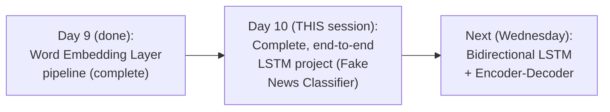

#### 🎯 Key Takeaways

* This session **directly, genuinely fulfills** Day 9's own explicit promise — a complete, real, end-to-end LSTM project, not merely a further conceptual preview.
* The project uses a **genuine, real Kaggle dataset**, directly downloadable via the instructor's own shared Google Colab link and GitHub materials.
* **Bidirectional LSTM and Encoder-Decoder** are explicitly, directly promised as the next topics, scheduled for the following Wednesday.

---

### 2. The Problem: Fake News Classification & Initial Data Exploration

#### 📖 Definition — The Problem Statement, Precisely Framed

> 💡 **Given directly:** *"The problem statement that we specifically have is that we have a dataset from Kaggle, and here it is basically having some information, like title, text, and all, and we really need to predict whether this news is fake or not."*

#### 💻 Code Example — Loading the Dataset

> 💡 **Given directly:** *"I'm just going to import pandas as PD... we are reading this particular dataset, `train.csv`."*

```python
import pandas as pd

df = pd.read_csv('train.csv')
df.head()
```

> 💡 **Given directly, precisely explaining the label column:** *"If the label is one, it is basically a fake news classifier -- if it is zero, it is not a fake news classifier."*

```text
label = 1  -> Fake news
label = 0  -> Genuine (not fake) news
```

#### 🪜 Step-by-Step — Checking for Missing Values

> 💡 **Given directly:** *"Let's go and check whether I have any null dataset or not -- so I'm just going to execute `df.isnull()`, and we can also do the summation."*

```python
df.isnull().sum()
# title: ~558 nulls | author: ~197 nulls | text: ~39 nulls | label: 0 nulls
```

#### ⚠ Common Mistakes

* Assuming a `label` value of 1 always represents the "positive" or "genuine" outcome, by generic convention — explicitly, directly clarified for THIS specific dataset: `label=1` means FAKE news, `label=0` means genuine, real news.
* Loading a dataset without immediately, explicitly checking for missing values — explicitly, directly demonstrated as a genuine, necessary FIRST step before any further processing.

#### 🎯 Key Takeaways

* This session solves a **genuine, real binary classification problem**: predicting whether a news article's title indicates it's fake (`label=1`) or genuine (`label=0`).
* The dataset genuinely, directly, real-world sourced from **Kaggle**, containing `title`, `author`, `text`, and `label` columns.
* **Checking for missing values** (`df.isnull().sum()`) is explicitly, directly performed as a genuine, necessary first data-exploration step.

---
### 3. Handling Missing Data & Isolating the Title Column

#### ❓ Why It Exists — The Precise, Reasoned Decision to Drop, Not Impute

> 💡 **Given directly:** *"In this kind of case, what should I do -- tell me whether we should drop the values, it is a better way, or should we try to replace something, right? Since this is a text data, we definitely cannot replace some data over here -- so what we will do is that we'll try to drop this NaN values."*

#### 🪜 Step-by-Step — Confirming the Dataset Is Large Enough to Genuinely Afford This

> 💡 **Given directly:** *"If I write `df.shape`... I have so many records, 20,800 records, right -- so if I delete around 2,000 records, it's fine, we don't have to probably work or worry about it... 1,957 records, if you're trying to just remove, that is fine."*

```python
df.shape   # (20800, 5) -- before dropping
df = df.dropna()
df.shape   # (18285, 5) -- after dropping ~1,957 rows
```

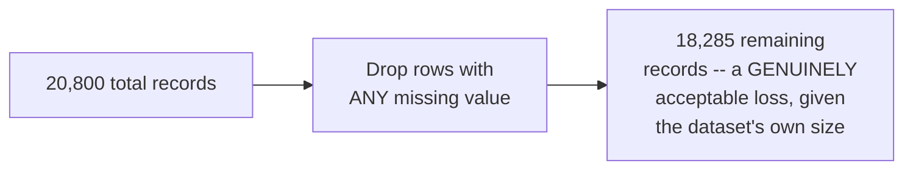

#### 🪜 Step-by-Step — Splitting Into Independent (X) and Dependent (y) Features

> 💡 **Given directly:** *"In order to get the independent feature, I will drop this label column, and this label column, once it is dropped, with X is equal to 1, I will be getting all my independent feature... and `df['label']` will basically give me the dependent feature, which is my output column."*

```python
X = df.drop('label', axis=1)
y = df['label']

print(X.shape)   # (18285, 4)
print(y.shape)   # (18285,)
```

#### 🪜 Step-by-Step — A Deliberate, Explained Scoping Decision: Using ONLY the Title Column

> 💡 **Given directly:** *"For this particular problem statement, what I'm actually going to do is that I'm going to take the TITLE of this particular article or news that I'm actually getting, and we are going to train an LSTM neural network to basically determine whether the label is one or zero."*

> 💡 **Given directly, the precise, honest reasoning for excluding the `text` column:** *"Title, I'm not going to use text -- text has a huge dataset, so it will probably take time."*

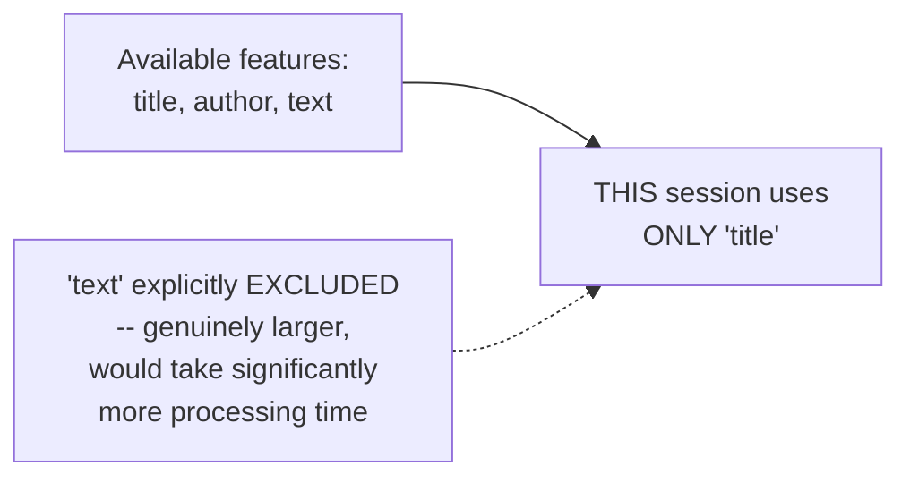

#### 🔍 Internal Working — Resetting the Index After Dropping Rows

> 💡 **Given directly:** *"Let me reset the index -- once I reset the index, here you will be able to see how my messages will look like."*

```python
messages = X.copy()
messages.reset_index(inplace=True)
```

#### ⚠ Common Mistakes

* Assuming missing text data should always be IMPUTED (e.g., filled with a placeholder) rather than dropped — explicitly, directly reasoned through: for TEXT data specifically, genuine imputation isn't meaningfully possible ("we cannot replace some data"), and dropping is explicitly justified here BECAUSE the dataset is large enough to genuinely absorb the loss.
* Assuming ALL available text columns (`title`, `text`) should be used together for the richest possible model — explicitly, directly, honestly scoped to `title` ONLY, for a genuine, practical processing-time reason.
* Forgetting to reset the DataFrame's index after dropping rows — explicitly, directly performed as a genuine, necessary cleanup step, avoiding potential downstream indexing confusion.

#### 🎯 Key Takeaways

* Missing values were **genuinely, reasonably DROPPED** (not imputed) — a decision explicitly justified by both the impracticality of imputing text data and the dataset's own sufficiently large size (20,800 → 18,285 records).
* The dataset was split into **`X` (independent features)** and **`y` (the `label` column)**, directly mirroring the standard ML train/target split pattern.
* This session **deliberately, explicitly scopes down to using ONLY the `title` column** — a genuine, honest, processing-time-driven decision, not an oversight.

---

### 4. Text Cleaning: Stemming & Stopword Removal

#### 📖 Definition — The Complete, Stated Cleaning Plan

> 💡 **Given directly, the instructor's own stated, step-by-step plan:** *"The first step is that I have my dataset, the second step is that I divided this into independent and dependent feature, the third step -- what I have actually performed is CLEANING THE DATA -- and when we really need to clean the data, the first step that we specifically apply over here is something called as STEMMING... the second step... is something called as STOPWORDS."*

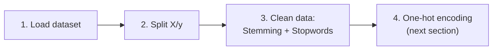

#### 💻 Code Example — Importing the Necessary NLP Libraries

> 💡 **Given directly:** *"I have to import NLTK, `re` -- basically says regular expression... and then from `nltk.corpus`, I'm going to import `stopwords`... I am going to import the `PorterStemmer` -- this is specifically used for stemming purpose."*

```python
import nltk
import re
from nltk.corpus import stopwords
from nltk.stem.porter import PorterStemmer

ps = PorterStemmer()
```

#### 🪜 Step-by-Step — The Complete, Real Text-Cleaning Loop

> 💡 **Given directly, the complete, precise, step-by-step logic:** *"I have defined a list which is called as Corpus... I'm basically going with respect to each and every data point inside this messages... I'll pick up this particular [row], I'll apply stemming in each and every word, and then I will probably apply, after applying stemming, I will also be applying this stopwords."*

```python
corpus = []
for i in range(0, len(messages)):
    review = re.sub('[^a-zA-Z]', ' ', messages['title'][i])   # keep only letters
    review = review.lower()
    review = review.split()
    review = [ps.stem(word) for word in review if word not in stopwords.words('english')]
    review = ' '.join(review)
    corpus.append(review)
```

#### 🔍 Internal Working — The Precise, Complete Explanation of Each Step

> 💡 **Given directly:** *"Apart from small a to z and capital A to Z, I am removing all the special characters from here... my review... I'm going to lower it, because there will be chances that one word will be in a capital letter and one word will be in a small letter -- and then finally I'm actually doing the split... I am saying that if that word is NOT present in `stopwords.words('English')`, then you have to probably stem it -- and if that particular word IS present in the stopwords, I have to IGNORE it."*

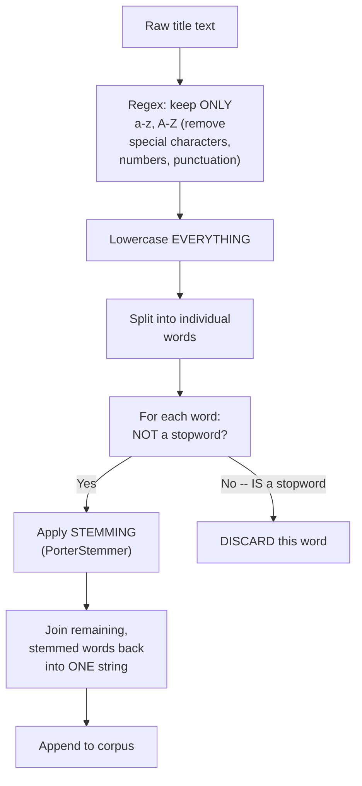

#### ❓ Why It Exists — A Genuine, Honest Justification: Stemming Over Lemmatization

> 💡 **Given directly, in response to a genuinely direct, live audience question:** *"Why should we not lemmatize instead of stemming? You can definitely do the lemmatization, but it is definitely going to take more time -- in lemmatization, we will be able to see that it will take more time when compared to stemming."*

> 💡 **Given directly, a further, precise scoping justification:** *"If we just focus on doing or implementing the stopwords and stemming, that will be more than sufficient for us"* (for this specific sentiment-analysis-style problem).

#### ⚠ Common Mistakes

* Applying stemming BEFORE checking whether a word is a stopword — explicitly, directly clarified as the WRONG order: the code specifically checks `if word not in stopwords.words('english')` FIRST, THEN applies stemming ONLY to genuinely non-stopword words — stemming a stopword before discarding it would be genuinely wasted computation.
* Assuming lemmatization is unconditionally, always the "better" choice over stemming — explicitly, directly, honestly qualified: lemmatization is genuinely more thorough, but SLOWER — for this SPECIFIC task, stemming plus stopword removal is explicitly stated as "more than sufficient."

#### 🎯 Key Takeaways

* The complete text-cleaning pipeline: **regex-based special-character removal → lowercasing → splitting into words → stopword filtering + stemming (applied together, in a single list comprehension) → rejoining into a cleaned string**.
* **Stemming (via `PorterStemmer`) was chosen over lemmatization** for a genuine, honest, stated reason: lemmatization is more thorough but genuinely SLOWER, and stemming plus stopwords is explicitly deemed "more than sufficient" for this specific task.
* This cleaning loop, applied across the **entire dataset (~18,285 records)**, genuinely takes real, observable TIME to execute — directly, honestly acknowledged live during the session.

---
### 5. One-Hot Encoding & Padding, Applied to Real Data

#### 💻 Code Example — Setting the Vocabulary Size

> 💡 **Given directly:** *"We will be using a vocabulary size, and in this particular case, the vocabulary size that we are going to use is 5,000 -- this basically indicates that, let's consider in my dictionary, I have 5,000 words... you can also consider 10,000, but always understand, the more you consider this, the one-hot representation will be quite big with respect to this particular vocabulary."*

```python
voc_size = 5000
```

#### 💻 Code Example — Applying One-Hot Encoding to the Cleaned Corpus

> 💡 **Given directly:** *"I'm going to go through words in Corpus -- I'm going to traverse for each and every word in Corpus, and I am going to apply the one-hot encoding on that particular word, and finally I'll be able to get that in the entire list, which is this one-hot representation."*

```python
onehot_repr = [one_hot(words, voc_size) for words in corpus]
```

#### 🔍 Internal Working — A Genuine, Live-Confirmed Result

> 💡 **Given directly:** *"If I write `corpus[1]`, this will basically give me the first text, and if I really want to find out one-hot representation for this words, you will be able to see, in this index, you are going to get that particular value as 1 -- Flynn word has [index] 2861 -- you are going to get value this as one -- and out of this, now see, one interesting thing is that, obviously, this size will be almost same, will be equal to this size."*

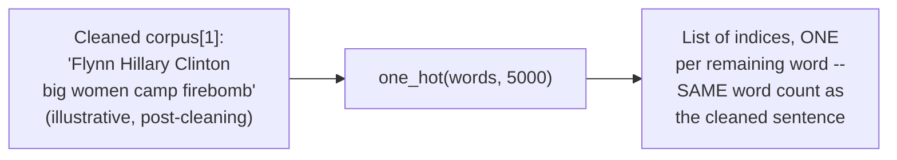

#### ❓ Why It Exists — A Genuine, Direct "Why Not TF-IDF" Interview Question

> 💡 **Given directly:** *"Why not TF-IDF, guys? Because we are actually solving an LSTM, right -- in LSTM, we basically use word embedding layer -- TF-IDF is not that efficient when compared to Word2Vec [or a] word embedding -- we have discussed about that in our previous session."*

#### 🪜 Step-by-Step — Choosing the Sentence Length, Based on Genuine Data Observation

> 💡 **Given directly:** *"I am going to put the sentence length as 20, and the entire sentence length, whatever are there in the Corpus, we are going to make sure that every sentence has [a] 20 length -- now, why I have selected 20? Because I've seen, I've verified all the sentences -- hardly some of the sentences are only till 10 to 12 characters [words] -- the maximum number of sentences in the title -- and within 20, if you are trying to set up, it is going to cover all the sentences."*

```python
sent_length = 20
```

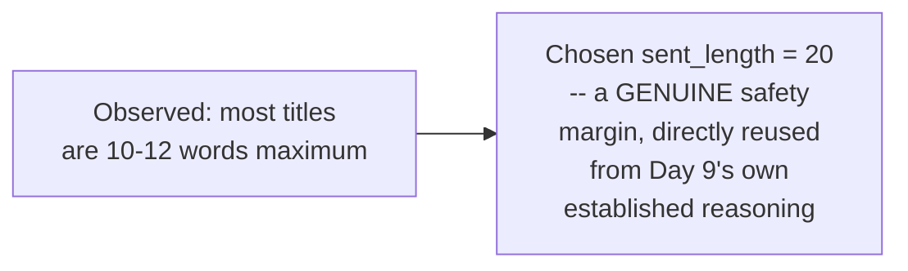

#### 💻 Code Example — Applying Pre-Padding

> 💡 **Given directly:** *"I'm going to apply a padding on that -- I'm going to take the one-hot representation, I'm going to apply pre-padding on this, and my max length will be my sentence length, that is 20 -- this basically indicates, suppose if there is a sentence of 12 words, then it is going to add 8 zeros, which is basically my padding, which is also called as pre-padding."*

```python
embedded_docs = pad_sequences(onehot_repr, padding='pre', maxlen=sent_length)
```

#### 🔍 Internal Working — A Genuine, Direct Confirmation: Post-Padding Also Works

> 💡 **Given directly:** *"What are the advantages of pre-padding? No such advantages -- you can also apply post-padding -- see, if I probably make this as post-padding, so here you will be able to see that at the end, you are going to get all the zeros."*

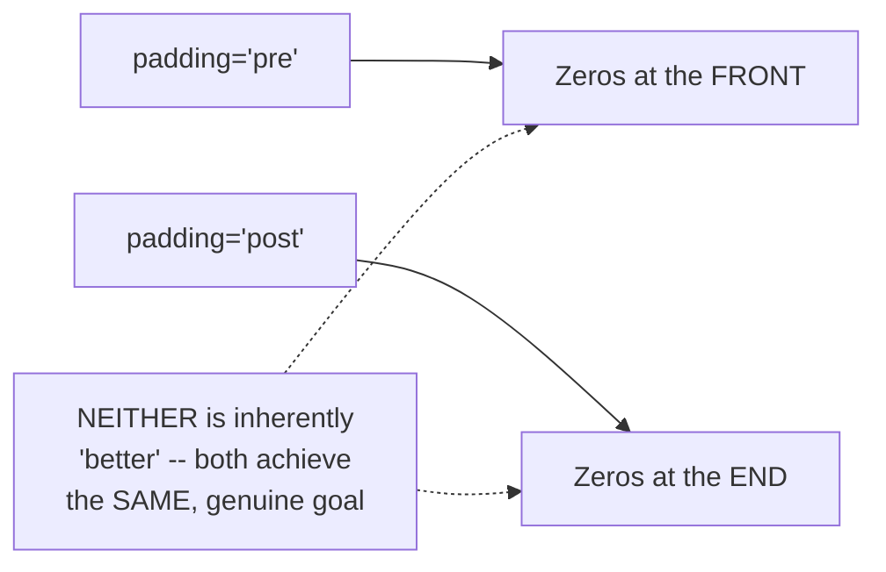

#### ⚠ Common Mistakes

* Assuming TF-IDF would be an equally valid alternative to one-hot encoding + embedding for THIS specific LSTM implementation — explicitly, directly ruled out: TF-IDF doesn't genuinely integrate with the word-embedding approach LSTM specifically relies on.
* Assuming the sentence length (20) was an arbitrary, unjustified choice — explicitly, directly grounded in GENUINE observation of the dataset's own actual title lengths (10-12 words maximum), with a real, deliberate safety margin.
* Assuming pre-padding is genuinely, meaningfully superior to post-padding — explicitly, directly clarified as having "no such advantages" — either genuinely works equally well.

#### 🎯 Key Takeaways

* **One-hot encoding**, applied to the REAL, cleaned corpus (via `one_hot(words, voc_size)`), directly, genuinely converts each cleaned title into a list of index values — one per remaining word.
* The **sentence length (20)** was chosen based on GENUINE, DIRECT observation of the dataset's actual title lengths (10-12 words maximum) — directly reusing the "safety margin" reasoning established in Day 9.
* **Pre-padding was used**, but explicitly, honestly confirmed as having "no such advantages" over post-padding — either genuinely achieves the same, necessary fixed-length goal.

---

### 6. Building the Complete LSTM Model

#### 💻 Code Example — Choosing the Embedding Feature Dimension

> 💡 **Given directly:** *"The embedding vector features that we have is somewhere around 40 -- that basically means each and every word that is present over here, which is given by this index, is going to get converted by a vector of 40 size... why did I select this 40 features? You can again play with 40, 50, 100 -- just like a kind of hyperparameter tuning."*

```python
embedding_vector_features = 40
```

#### 💻 Code Example — The Complete, Full Model Definition

> 💡 **Given directly:** *"We are going to use sequential model, then we are going to add the embedding layer -- in the embedding layer, the first parameter we are going to add is the vocabulary size... and then how many number of features I'm basically going to convert this particular vectors to... finally, you'll be able to see that I am giving my input length is equal to sentence [length]... then I have finally my LSTM neural network -- so here I am basically going to take LSTM with 100 neurons."*

```python
model = Sequential()
model.add(Embedding(voc_size, embedding_vector_features, input_length=sent_length))
model.add(LSTM(100))
model.add(Dense(1, activation='sigmoid'))
model.compile(loss='binary_crossentropy', optimizer='adam', metrics=['accuracy'])
print(model.summary())
```

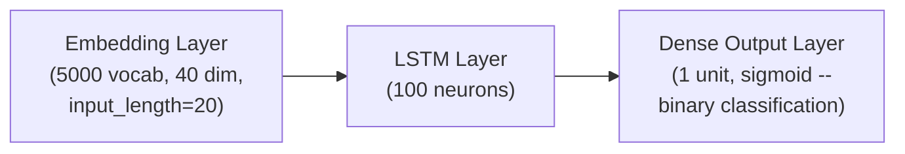

#### 🔍 Internal Working — Precisely Why Sigmoid and Binary Cross-Entropy

> 💡 **Given directly:** *"My output is binary, so whenever my output is binary, I'm going to use my activation function as sigmoid -- and when I'm compiling it, I am going to use the loss function at binary cross-entropy, because whenever we have an output as binary, we usually use binary cross-entropy -- the optimizer that I am going to use, Adam -- and the metrics that I am going to use is something called as accuracy."*

#### 🔍 Internal Working — The Model Summary's Real, Confirmed Numbers

> 💡 **Given directly:** *"Here you'll be able to see that I'm using an embedding layer, which takes 20 inputs, 40 outputs, [an] LSTM layer with 100 neurons, and the total number of parameters that I'm going to use for this model is 256K."*

#### 💻 Code Example — Converting to NumPy Arrays

> 💡 **Given directly:** *"What I'm actually going to do, I'm going to convert this into an array -- `np.array`, here is my `X_final` and `y_final`."*

```python
import numpy as np

X_final = np.array(embedded_docs)
y_final = np.array(y)

print(X_final.shape)   # (18285, 20)
print(y_final.shape)   # (18285,)
```

#### ⚠ Common Mistakes

* Assuming a genuinely fixed, "correct" number of LSTM neurons (100) or embedding dimensions (40) exists — explicitly, directly clarified as genuine HYPERPARAMETERS, freely adjustable and worth experimenting with (100, 200, 300, etc.), not fixed, mandatory values.
* Forgetting to convert the padded, list-based `embedded_docs` and `y` into genuine NumPy arrays before training — explicitly, directly performed as a necessary, final data-preparation step before the model can genuinely be trained.

#### 🎯 Key Takeaways

* The complete model: **`Embedding(5000, 40, input_length=20)` → `LSTM(100)` → `Dense(1, activation='sigmoid')`** — directly, precisely matching the binary-classification rule table established in Day 2.
* **Sigmoid activation** and **binary cross-entropy loss** are used specifically because this is a genuine BINARY classification problem — directly, consistently reusing this course's own established convention.
* The model contains approximately **256,000 total trainable parameters** — a genuine, real number directly confirmed via `model.summary()`.

---
### 7. Training & Evaluating the Model

#### 💻 Code Example — Train-Test Split & Model Training

> 💡 **Given directly:** *"We do train-test split -- train-test split is very simple -- and then we fit our model by running -- I'm running 10 epochs, and the batch size is 64 -- the validation data is `X_test`, `y_test`."*

```python
from sklearn.model_selection import train_test_split

X_train, X_test, y_train, y_test = train_test_split(X_final, y_final, test_size=0.33, random_state=42)

model.fit(X_train, y_train, validation_data=(X_test, y_test), epochs=10, batch_size=64)
```

#### 🪜 Step-by-Step — The Genuine, Live-Observed Training Results

> 💡 **Given directly:** *"Model training will start -- the epoch one has basically started -- here you can see the accuracy, the validation loss, whether it is getting decreased or not -- here [is] the accuracy that I am seeing, it is increasing, right -- it has become 0.98, 0.99, 0.99 -- validation loss is almost like 0.41."*

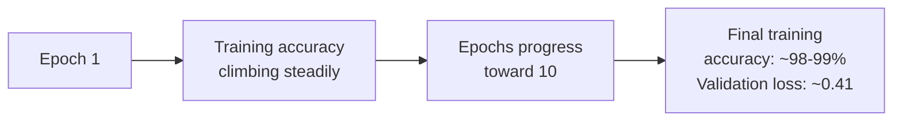

#### 💻 Code Example — Generating Predictions With a Threshold

> 💡 **Given directly:** *"I will try to predict it with respect to `X_test` -- now, once I do the prediction, I will be getting my `y_pred` -- and this `y_pred`, I have kept the threshold of 0.5 -- if you don't want to keep a threshold of 0.5, definitely use something called as AUC-ROC curve, to basically find out what should be the probability that you should select -- now, here I am saying that whenever my `y_pred` is greater than 0.5, I'm going to take it as 1, or 0."*

```python
y_pred_prob = model.predict(X_test)
y_pred = (y_pred_prob > 0.5).astype(int)
```

#### 💻 Code Example — Confusion Matrix, Accuracy Score & Classification Report

> 💡 **Given directly:** *"I will be using my confusion matrix -- and here you can basically see, if I go and see my confusion matrix... I feel this is a good accuracy -- so let's go and see the accuracy score, which is nothing but 90 [percent]... one more thing that I can basically use, is from sklearn.metrics, just to make sure that everything is good -- I'm going to import my classification report."*

```python
from sklearn.metrics import confusion_matrix, accuracy_score, classification_report

print(confusion_matrix(y_test, y_pred))
print(accuracy_score(y_test, y_pred))          # ~0.90-0.91
print(classification_report(y_test, y_pred))
```

#### 🔍 Internal Working — A Genuine, Honest Observation: False Negatives Are Somewhat High

> 💡 **Given directly, in response to a genuinely direct, live audience observation:** *"False negative is high, your false negative is a bit high, but the accuracy is 90 -- yeah, because there are many data points -- you can see that over here, and over here it is increasing, right -- and this can also be made sure that, like, suppose if I select 0.6 as my predicted value or threshold, you know, we can definitely use our AUC-ROC curve, right -- but again, it is a domain-expert thing."*

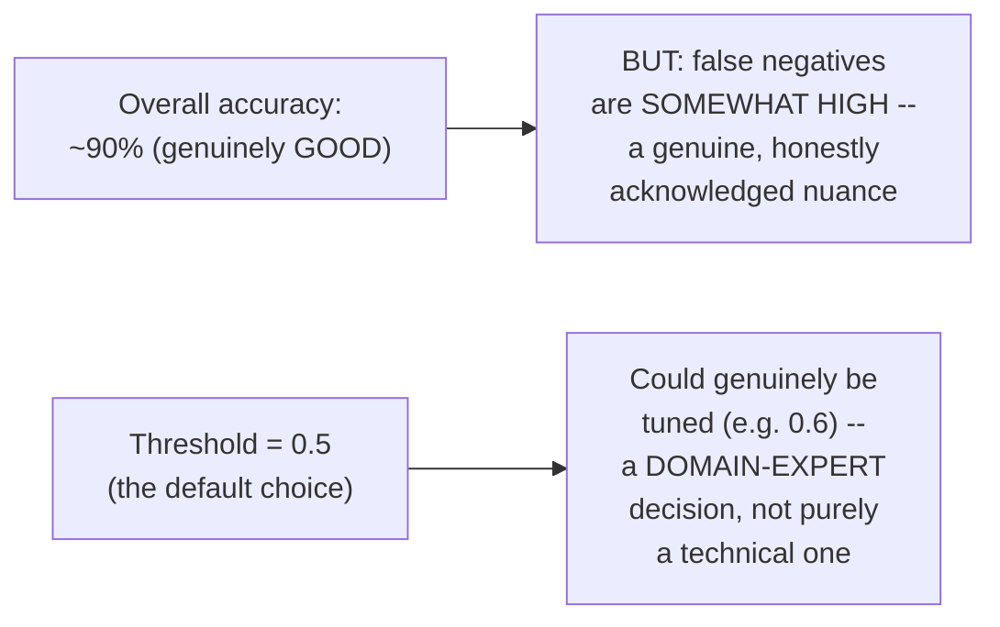

#### ⚠ Common Mistakes

* Assuming a single, overall accuracy figure (90%) tells the COMPLETE story of model performance — explicitly, directly, honestly qualified: the SAME model shows a genuinely HIGHER false-negative rate, a real nuance worth separately examining via the confusion matrix and classification report.
* Assuming the 0.5 threshold is the only genuinely correct choice — explicitly, directly clarified: threshold selection can genuinely be tuned (e.g., to 0.6), with AUC-ROC curve analysis offered as a more principled, systematic approach — though ultimately described as a genuine "domain-expert" decision, not a purely mechanical one.

#### 🎯 Key Takeaways

* The model was trained for **10 epochs** (batch size 64), reaching training accuracy of **98-99%**, with validation loss around **0.41**.
* Real evaluation via **confusion matrix, accuracy score (~90%), and classification report** directly, honestly reveals a nuance beyond the single accuracy number: a SOMEWHAT elevated false-negative rate.
* **Threshold tuning** (beyond the default 0.5) and **AUC-ROC curve analysis** are both explicitly, directly offered as genuine, further refinement options — with the instructor honestly framing the FINAL choice as a domain-expert decision, not purely a technical, mechanical one.

---

### 8. Improving the Model: Dropout & Threshold Tuning

#### ❓ Why It Exists — Precisely Connecting Back to Day 4's Own Established Concept

> 💡 **Given directly:** *"Don't worry about the dropout -- dropout is basically to improve the performance of the model."*

#### 💻 Code Example — Adding Dropout After the Embedding and LSTM Layers

> 💡 **Given directly:** *"How I have applied dropout over here, `model.add(Dropout(...))` -- after LSTM layer, after the embedding layer, I can also apply a dropout, which says that 30 percentage of this LSTM, while training, will be disabled -- similarly, after [the embedding] layer also, I have applied this."*

```python
model = Sequential()
model.add(Embedding(voc_size, embedding_vector_features, input_length=sent_length))
model.add(Dropout(0.3))
model.add(LSTM(100))
model.add(Dropout(0.3))
model.add(Dense(1, activation='sigmoid'))
model.compile(loss='binary_crossentropy', optimizer='adam', metrics=['accuracy'])
```

#### 🪜 Step-by-Step — The Genuine, Live, Honest Comparison

> 💡 **Given directly, the complete, live-observed result:** *"Let's see in Epoch one, I'm getting an accuracy of 82, 94, 96 -- training accuracy, validation loss is decreasing -- this is very good, that it is decreasing -- it is decreasing, but I think it will again go back to 40, I guess."*

> 💡 **Given directly, the honest, final comparison:** *"I don't think so it has become better -- it is a minor difference is there, right -- but it definitely, for a bigger problem statement, you can definitely use dropout -- dropout will reduce overfitting, it will definitely reduce overfitting, if you are specifically using [it]."*

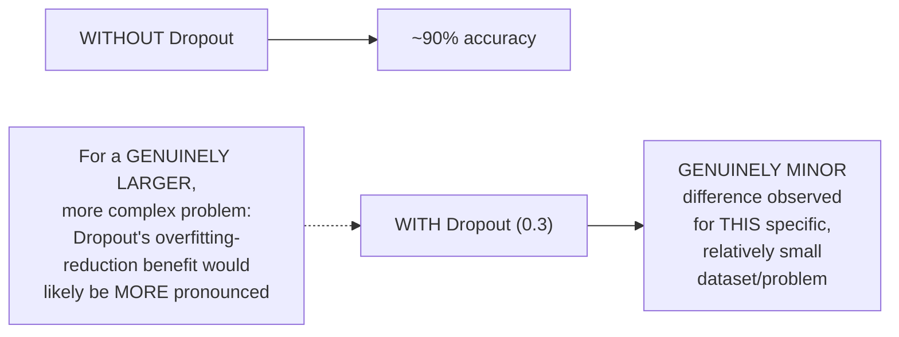

#### ⚠ Common Mistakes

* Assuming Dropout ALWAYS produces a dramatic, easily-observable improvement — explicitly, directly, honestly demonstrated as producing only a "minor difference" for THIS specific, relatively small/simple problem — with the genuine, stated expectation that its benefit would be MORE pronounced "for a bigger problem statement."
* Assuming a live, genuine experiment showing only a minor improvement means Dropout is generally NOT worth using — explicitly, directly clarified: it "will definitely reduce overfitting" as a genuine, real technique — this specific result doesn't invalidate the broader, general principle.

#### 🎯 Key Takeaways

* **Dropout** (30%, applied after both the embedding and LSTM layers) is directly, live-demonstrated as a genuine technique for reducing overfitting.
* The **live, honest comparison** shows only a MINOR difference for this specific dataset/problem — with the instructor directly, honestly acknowledging this modest result, rather than overstating Dropout's benefit.
* Dropout's genuine benefit is explicitly framed as likely **MORE PRONOUNCED for larger, more complex problems** — a reasoned, honest qualification rather than a blanket, unconditional claim.

---
### 9. Closing: Practice Recommendations & What's Next

#### 🏢 Real-World / Production Usage — Genuine, Direct Practice Recommendations

> 💡 **Given directly:** *"What I would suggest is that Kaggle, or UCI repository -- if you go and search for UCI repository dataset, here you'll be finding a lot of problem statements which you can probably consider doing -- so let's say this is related to text, take up any problem statement, and try to probably do some text classification and all."*

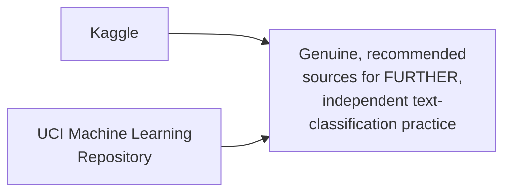

#### 🪜 Step-by-Step — The Explicit, Stated Assignment

> 💡 **Given directly:** *"Please do an assignment, and make sure that you drop a mail to me at [the instructor's email], and I will definitely have a look onto your solutions, whatever you have implemented, and then I'll definitely provide you some of the feedbacks -- so what you can also do is that try to take this text data, and try to solve it if you can."*

#### 🔍 Internal Working — A Genuine, Direct Confirmation of Broader Applicability

> 💡 **Given directly, in response to a genuinely direct, live audience question:** *"It can also be applicable with music generation -- but there, we have to use some other type of LSTM neural network, that is called as bidirectional."*

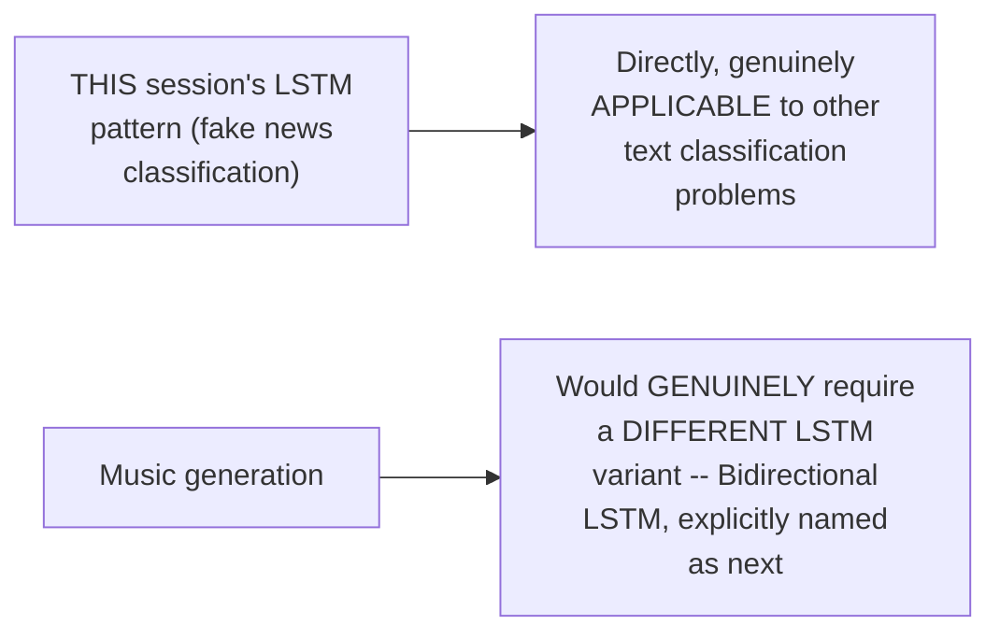

#### 🪜 Step-by-Step — The Explicit, Stated Roadmap Ahead

> 💡 **Given directly:** *"The next session will basically happen on Wednesday, where I am going to start with something called as bidirectional LSTM, and encoder, then decoder."*

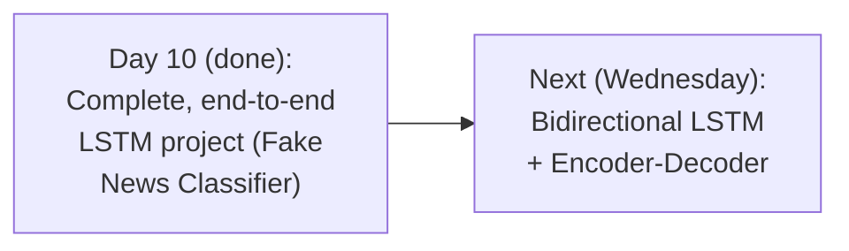

#### ⚠ Common Mistakes

* Assuming this session's exact LSTM pattern (as demonstrated for fake news classification) would work UNCHANGED for a genuinely different task like music generation — explicitly, directly corrected: music generation genuinely requires a DIFFERENT LSTM variant (bidirectional), not the same, basic pattern used here.
* Treating this session's own genuine offer of personal feedback (emailing solutions) as merely a generic, throwaway closing remark — explicitly, directly, specifically offered as a genuine, real opportunity for personalized review.

#### 🎯 Key Takeaways

* The instructor **genuinely, directly recommends** Kaggle and the UCI Machine Learning Repository as further, independent practice sources for text-classification problems.
* A **genuine, direct assignment** is given: take up a new text-classification problem, solve it using this session's own demonstrated pattern, and EMAIL the solution for genuine, personalized feedback.
* **Bidirectional LSTM and Encoder-Decoder** are explicitly, directly confirmed as the next topics — with bidirectional LSTM specifically named as the genuinely NECESSARY variant for tasks like music generation, which this session's own basic LSTM pattern would NOT directly, adequately handle.

---

## 📝 Glossary

| Term | Definition | Why It Matters |
|---|---|---|
| **Fake News Classifier** | This session's genuine, real project -- predicting label=1 (fake) vs. label=0 (genuine) | The concrete, end-to-end problem solved live |
| **dropna()** | Pandas function removing rows with missing values | Chosen here since the dataset is large enough to absorb the loss |
| **PorterStemmer** | An NLTK tool reducing words to their root/stem form | Used instead of the slower lemmatization |
| **Stopwords** | Common words (the, is, a, etc.) removed before analysis | Reduces noise; applied together with stemming |
| **corpus** | The list of cleaned, processed text strings | The direct input to one-hot encoding |
| **voc_size** | Vocabulary size (5000 in this session) | Bounds the one-hot index range |
| **sent_length** | The chosen, fixed sentence length (20) | Based on genuine observation of the dataset's own max length |
| **embedding_vector_features** | The embedding layer's output dimension (40) | A genuine, tunable hyperparameter |
| **X_final / y_final** | The NumPy-array-converted, final training inputs/targets | Required before model.fit() can run |
| **Dropout** | A regularization technique disabling a % of neurons during training | Reduces overfitting; live-tested here with modest results |

---

## 🔄 Revision Notes — One-Minute Revision

* This is **Day 10** -- the genuine, complete, end-to-end LSTM project explicitly promised in Day 9: a **Fake News Classifier** using a real Kaggle dataset.
* **Data loading & cleaning**: `df.isnull().sum()` reveals missing values; `dropna()` genuinely, reasonably chosen (20,800 -> 18,285 records) since text data can't be meaningfully imputed and the dataset is large enough. Split into `X` (independent) and `y` (`label`) -- using ONLY the `title` column, explicitly for processing-time efficiency (not `text`, which is much larger).
* **Text cleaning pipeline**: regex (`[^a-zA-Z]` -> remove non-letters) -> lowercase -> split -> for each word, if NOT a stopword, apply STEMMING (`PorterStemmer`); if a stopword, discard -> rejoin into a cleaned string -> append to `corpus`. Stemming chosen over lemmatization specifically because lemmatization is genuinely SLOWER, and stemming+stopwords is "more than sufficient" here.
* **One-hot encoding + padding**: `voc_size=5000`; `sent_length=20` (chosen based on GENUINE observation -- titles max out around 10-12 words, with a safety margin); `pad_sequences(onehot_repr, padding='pre', maxlen=20)` -- pre-padding used, though explicitly confirmed to have "no advantages" over post-padding.
* **Model**: `Embedding(5000, 40, input_length=20)` -> `LSTM(100)` -> `Dense(1, activation='sigmoid')`, compiled with `binary_crossentropy`/`adam`/`accuracy` -- ~256K total parameters. `X_final`/`y_final` converted to NumPy arrays before training.
* **Training**: 10 epochs, batch_size=64, train/validation split -- training accuracy reached 98-99%, validation loss ~0.41.
* **Evaluation**: predictions thresholded at 0.5; confusion matrix; accuracy score (~90%); classification report -- HONESTLY noted: false negatives are "a bit high" despite good overall accuracy; threshold tuning (e.g. 0.6) or AUC-ROC curve offered as refinement options, ultimately a "domain-expert" decision.
* **Dropout** (0.3, after embedding AND LSTM layers) live-tested: only a MINOR difference observed for this specific problem -- but explicitly, honestly framed as likely MORE beneficial for bigger, more complex problems (genuinely reduces overfitting).
* **Closing**: Kaggle/UCI recommended for further practice; a genuine assignment given (solve a new text-classification problem, email for feedback); music generation would require Bidirectional LSTM specifically, NOT this session's basic pattern.
* **Next (Wednesday)**: Bidirectional LSTM + Encoder-Decoder.

---
## 📋 Cheat Sheet

**Complete Fake News Classifier pipeline:**
```python
import pandas as pd, numpy as np, re, nltk
from nltk.corpus import stopwords
from nltk.stem.porter import PorterStemmer
from tensorflow.keras.preprocessing.text import one_hot
from tensorflow.keras.preprocessing.sequence import pad_sequences
from tensorflow.keras.models import Sequential
from tensorflow.keras.layers import Embedding, LSTM, Dense, Dropout
from sklearn.model_selection import train_test_split
from sklearn.metrics import confusion_matrix, accuracy_score, classification_report

# 1. Load & clean data
df = pd.read_csv('train.csv')
df = df.dropna()
X = df.drop('label', axis=1)
y = df['label']

# 2. Text cleaning
ps = PorterStemmer()
corpus = []
for i in range(len(messages)):
    review = re.sub('[^a-zA-Z]', ' ', messages['title'][i])
    review = review.lower().split()
    review = [ps.stem(w) for w in review if w not in stopwords.words('english')]
    corpus.append(' '.join(review))

# 3. One-hot + padding
voc_size = 5000
onehot_repr = [one_hot(words, voc_size) for words in corpus]
sent_length = 20
embedded_docs = pad_sequences(onehot_repr, padding='pre', maxlen=sent_length)

# 4. Build & train the model
model = Sequential()
model.add(Embedding(voc_size, 40, input_length=sent_length))
model.add(LSTM(100))
model.add(Dense(1, activation='sigmoid'))
model.compile(loss='binary_crossentropy', optimizer='adam', metrics=['accuracy'])

X_final, y_final = np.array(embedded_docs), np.array(y)
X_train, X_test, y_train, y_test = train_test_split(X_final, y_final, test_size=0.33)
model.fit(X_train, y_train, validation_data=(X_test, y_test), epochs=10, batch_size=64)

# 5. Evaluate
y_pred = (model.predict(X_test) > 0.5).astype(int)
print(confusion_matrix(y_test, y_pred))
print(accuracy_score(y_test, y_pred))
print(classification_report(y_test, y_pred))
```

**Text cleaning logic, precisely:**
```text
1. Regex: keep ONLY a-z, A-Z (remove numbers, punctuation, special chars)
2. Lowercase everything
3. Split into individual words
4. For each word: NOT a stopword -> STEM it | IS a stopword -> DISCARD it
5. Rejoin remaining, stemmed words into one string
```

**Key hyperparameter choices, and their justification:**
```text
voc_size = 5000        -- a chosen vocabulary size (bigger = richer, but slower)
sent_length = 20        -- based on OBSERVED max title length (~10-12 words) + safety margin
embedding_dim = 40        -- a tunable hyperparameter (try 40/50/100)
LSTM units = 100            -- a tunable hyperparameter (try 100/200/300)
```

**Evaluation results (genuine, live-observed):**
```text
Training accuracy: ~98-99%
Validation loss: ~0.41
Test accuracy: ~90%
Note: false negatives somewhat elevated -- consider threshold tuning or AUC-ROC
```

---

## 🔥 Interview Questions & Answers

### 🟢 Beginner

**Q1.**

**Question:** In this session's dataset, what does label=1 represent?

**Answer:** Fake news.

**Explanation:** Directly, explicitly stated.

**Why Interviewers Ask This:** Basic, dataset-specific comprehension.

**Possible Follow-up:** "What does label=0 represent?"

**Q2.**

**Question:** Why were rows with missing values dropped rather than imputed in this session's pipeline?

**Answer:** Because text data cannot be meaningfully imputed, and the dataset was large enough (20,800 records) to genuinely absorb the loss.

**Explanation:** Directly, precisely explained.

**Why Interviewers Ask This:** Tests understanding of a genuine, reasoned data-cleaning decision.

**Possible Follow-up:** "How many records remained after dropping missing values?"

**Q3.**

**Question:** Why was only the "title" column used, rather than also including "text"?

**Answer:** Because the "text" column is much larger, and would take significantly more processing time.

**Explanation:** Directly, honestly explained.

**Why Interviewers Ask This:** Tests understanding of a genuine, practical scoping trade-off.

**Possible Follow-up:** "What might change if you used the 'text' column instead?"

**Q4.**

**Question:** What two techniques were combined for text cleaning in this session?

**Answer:** Stemming (via PorterStemmer) and stopword removal.

**Explanation:** Directly, explicitly named.

**Why Interviewers Ask This:** Foundational NLP preprocessing knowledge.

**Possible Follow-up:** "Why was stemming chosen instead of lemmatization?"

**Q5.**

**Question:** What vocabulary size was used in this session?

**Answer:** 5,000.

**Explanation:** Directly, explicitly stated.

**Why Interviewers Ask This:** Basic, factual recall of the session's own configuration.

**Possible Follow-up:** "What sentence length was chosen, and why?"

**Q6.**

**Question:** What is the complete LSTM model architecture used in this session?

**Answer:** Embedding layer (5000 vocab, 40 dimensions) → LSTM layer (100 neurons) → Dense output layer (1 unit, sigmoid).

**Explanation:** Directly, precisely described.

**Why Interviewers Ask This:** Basic, practical architecture knowledge.

**Possible Follow-up:** "Why is sigmoid used for the output layer here?"

**Q7.**

**Question:** What was the model's approximate final test accuracy?

**Answer:** Approximately 90%.

**Explanation:** Directly, explicitly stated.

**Why Interviewers Ask This:** Tests awareness of the session's own genuine, real result.

**Possible Follow-up:** "What honest limitation was noted about this result?"

**Q8.**

**Question:** What does adding Dropout(0.3) after the LSTM layer do?

**Answer:** Disables 30% of the LSTM's neurons during training, to reduce overfitting.

**Explanation:** Directly, precisely explained.

**Why Interviewers Ask This:** Foundational regularization knowledge, applied to a real example.

**Possible Follow-up:** "Did adding Dropout produce a dramatic improvement in this session's specific case?"

**Q9.**

**Question:** Would this session's exact LSTM architecture directly work for a music generation task?

**Answer:** No -- music generation would require a different LSTM variant (Bidirectional LSTM).

**Explanation:** Directly, explicitly clarified.

**Why Interviewers Ask This:** Tests awareness of architecture-task matching.

**Possible Follow-up:** "What two topics are explicitly named as coming next in this course?"

**Q10.**

**Question:** What alternative to a fixed 0.5 threshold was mentioned for tuning classification decisions?

**Answer:** The AUC-ROC curve.

**Explanation:** Directly, explicitly named.

**Why Interviewers Ask This:** Tests awareness of a genuine, standard threshold-tuning technique.

**Possible Follow-up:** "Is choosing the final threshold described as a purely technical decision, or something else?"

---

### 🟡 Intermediate

**Q11.**

**Question:** Explain why the instructor's decision to drop missing values (rather than impute them) is specifically justified for TEXT data, in a way that might not apply to NUMERIC data.

**Answer:** For NUMERIC data, genuine, principled imputation strategies commonly exist (e.g., filling with the mean, median, or a model-based prediction) that can produce a REASONABLE, meaningful placeholder value. For TEXT data specifically — like a missing news article TITLE — there is no equally principled way to "fill in" a genuinely meaningful title; any placeholder text (a generic string, or an empty value) would be entirely ARBITRARY and would not represent genuine, meaningful content the model could learn from. This is PRECISELY why the instructor's own reasoning ("since this is a text data, we definitely cannot replace some data") is domain-specific — it reflects a genuine, real limitation of text data's own nature, not a general rule that "missing values should always be dropped, never imputed" across every possible dataset type.

**Explanation:** Requires distinguishing text-specific imputation limitations from a general "always drop, never impute" rule.

**Why Interviewers Ask This:** Tests whether a learner understands the DOMAIN-SPECIFIC reasoning behind this decision, not just that a decision was made.

**Possible Follow-up:** "If the missing data were in a NUMERIC column (like an article's view count), would dropping still be the most reasonable choice?"

**Q12.**

**Question:** A learner argues that since this session's model achieved 90% accuracy, the model is genuinely production-ready for real-world fake news detection. Evaluate this claim.

**Answer:** This claim overstates the case, and the session's OWN content directly provides the reasoning to see why. The session's own honest observation — "false negative is a bit high" — directly reveals that overall ACCURACY alone doesn't capture the FULL picture of model performance: a 90% accuracy figure could still mean the model FAILS to correctly identify a MEANINGFUL PORTION of genuinely fake news articles (false negatives), which for a REAL, production fake-news-detection system would be a genuinely SERIOUS, consequential failure mode (allowing fake news through undetected). Additionally, the session's own model was trained ONLY on the `title` column (explicitly, deliberately excluding `text`, per Section 3's own reasoning) — a genuine, real production system would likely need to incorporate MORE signal (full article text, source credibility, etc.) to achieve genuinely reliable, production-grade performance. The session's own content is explicitly framed as an educational, illustrative DEMONSTRATION of the LSTM pipeline — not a claim of production-readiness.

**Explanation:** Tests whether a learner recognizes the difference between "achieves reasonable accuracy in a demonstration" and "is production-ready," using the session's own honest, self-acknowledged limitations.

**Why Interviewers Ask This:** Distinguishes candidates who critically evaluate reported metrics from those who treat a single accuracy number as sufficient evidence of readiness.

**Possible Follow-up:** "What specific additional step (mentioned in this session) could help address the false-negative concern?"

**Q13.**

**Question:** Explain, precisely, why the text-cleaning loop applies the stopword check BEFORE stemming, rather than stemming every word first and then checking against the stopword list.

**Answer:** This ordering choice is genuinely, computationally EFFICIENT, and also avoids a subtle, real correctness concern: applying stemming FIRST to EVERY word (including stopwords that will ultimately be discarded) would mean performing GENUINELY UNNECESSARY computation on words that are about to be thrown away regardless — checking `if word not in stopwords.words('english')` FIRST, and only then stemming, avoids this waste. There's also a genuine, subtle correctness consideration: the standard `stopwords.words('english')` list contains the ORIGINAL, UNSTEMMED forms of common words (e.g., "is," "the," "and") — if you stemmed FIRST, a stemmed word might no longer EXACTLY MATCH the stopword list's own original spelling, potentially causing genuine stopwords to be INCORRECTLY RETAINED simply because their stemmed form no longer matches the list. Checking BEFORE stemming (as this session's own code does) avoids this genuine, subtle correctness risk entirely.

**Explanation:** Requires reasoning through both an efficiency AND a genuine correctness concern with the alternative ordering.

**Why Interviewers Ask This:** Tests whether a learner recognizes a subtle, easy-to-overlook implementation detail with genuine, real consequences.

**Possible Follow-up:** "Can you think of a specific, real word where stemming FIRST might cause it to no longer match the stopword list?"

**Q14.**

**Question:** Using this session's own precise vocabulary-size (5,000) and sentence-length (20) choices, explain what would genuinely happen — mechanically, not just qualitatively — if a genuinely new title contained a word NOT well-represented within the chosen vocabulary size.

**Answer:** TensorFlow's `one_hot` function (per Day 9's own established mechanics) works by hashing each word into an index WITHIN the specified vocabulary size range — it does NOT maintain an explicit, fixed dictionary that could genuinely "reject" an unfamiliar word. This means EVERY word, regardless of whether it's genuinely common or exceptionally rare, WILL receive SOME index within the 0-5000 range — but with a SMALL vocabulary size (5,000, chosen here), there's a genuinely INCREASED RISK of HASH COLLISIONS, where two GENUINELY DIFFERENT words happen to be assigned the SAME index purely due to the hashing mechanism's own limited range. This is a real, structural limitation of the one-hot-via-hashing approach used here — a LARGER vocabulary size would genuinely reduce (though not entirely eliminate) this collision risk, at the direct cost of increased processing time (per Section 5's own explicit trade-off).

**Explanation:** Requires reasoning through the specific, mechanistic behavior of TensorFlow's hashing-based one_hot function when handling genuinely rare or unusual words.

**Why Interviewers Ask This:** Tests whether a learner understands a genuine, real limitation of this specific one-hot encoding APPROACH (hash-based), not just the general concept.

**Possible Follow-up:** "How might you empirically test whether hash collisions are genuinely, meaningfully affecting this specific model's performance?"

**Q15.**

**Question:** Synthesize this session's complete, real pipeline with Day 9's own theoretical embedding-layer explanation to explain PRECISELY why the "5 lines of code" preview from Day 9 turned out to be genuinely accurate for the LSTM model itself, while the REST of this session's code (data loading, cleaning, encoding) required substantially more.

**Answer:** A precise, synthesized confirmation: comparing this session's own actual, complete code (Sections 2-6) against Day 9's own direct preview, the GENUINE LSTM model definition itself — `Embedding(...)`, `LSTM(100)`, `Dense(1, activation='sigmoid')`, plus the `compile()` call — is INDEED, genuinely close to just a handful of lines, directly confirming Day 9's own accurate prediction. By contrast, the SUBSTANTIAL majority of this session's own actual code addresses everything THIS session covers that Day 9's own simplified, illustrative example did NOT need to handle: genuine, real missing-data handling (Section 3), a COMPLETE text-cleaning pipeline with stemming and stopwords (Section 4, entirely ABSENT from Day 9's own simpler, pre-cleaned example sentences), and working with a GENUINELY LARGE, real dataset (18,285 records) rather than Day 9's own small, illustrative, 7-sentence example. This directly, precisely confirms Intermediate Q15's own reasoning from Day 9's guide — the GENUINE complexity and effort in a real NLP project lies overwhelmingly in PREPROCESSING REAL, MESSY DATA, not in defining the final model architecture, which remains genuinely simple once the data is properly prepared.

**Explanation:** Requires synthesizing this session's actual, executed code with an EARLIER session's own stated prediction to confirm (and precisely explain WHY) that prediction held true.

**Why Interviewers Ask This:** A senior-level question testing whether a candidate can verify an earlier, stated claim against later, genuine, real evidence — a form of directly-testable, cross-session reasoning.

**Possible Follow-up:** "Which SPECIFIC section of this session's own pipeline would you expect to require the MOST modification if applied to a genuinely different, real-world text dataset?"

---

### 🔴 Advanced

**Q16.**

**Question:** Design a complete, reasoned evaluation plan for determining whether this session's default 0.5 classification threshold is genuinely optimal for this specific fake news classification task, explicitly incorporating the session's own honest observation about elevated false negatives.

**Answer:** A reasonable, complete evaluation plan, directly extending this session's own honest observations: (1) Compute the FULL confusion matrix (already done in Section 7) across a RANGE of candidate thresholds (e.g., 0.3, 0.4, 0.5, 0.6, 0.7), not just the default 0.5, directly extending the session's own brief mention of testing 0.6. (2) For EACH threshold, explicitly compute PRECISION, RECALL, and F1-SCORE (available via `classification_report`, already used in Section 7) — specifically tracking how RECALL (directly related to the false-negative rate the session honestly flags) changes across these thresholds; a LOWER threshold would generally REDUCE false negatives (catching more genuine fake news) at the potential cost of MORE false positives (incorrectly flagging genuine news as fake). (3) Plot the full AUC-ROC curve (explicitly mentioned in Section 7 as an alternative to a fixed 0.5 threshold), directly visualizing the complete trade-off between true-positive rate and false-positive rate across ALL possible thresholds, rather than testing only a few, arbitrarily-chosen candidate values. (4) Directly apply the session's own honest framing — that the FINAL threshold choice is genuinely a "domain-expert" decision — by explicitly considering the REAL-WORLD COST asymmetry: for a fake news classifier, a false negative (letting fake news through undetected) may be considered a genuinely MORE SERIOUS error than a false positive (incorrectly flagging genuine news), directly motivating a threshold LOWER than the default 0.5, specifically to REDUCE the false-negative rate the session's own evaluation already identified as elevated.

**Explanation:** Requires designing a complete, systematic evaluation methodology, directly building on and extending the session's own honest, partial observations into a genuinely thorough analysis.

**Why Interviewers Ask This:** A realistic, senior-level question testing whether a candidate can design a genuinely complete evaluation methodology, not just recall that threshold tuning exists as a concept.

**Possible Follow-up:** "If you determined a lower threshold (e.g., 0.3) genuinely reduced false negatives, what specific, quantified cost (in terms of false positives) would you expect to observe as a trade-off?"

**Q17.**

**Question:** Critically evaluate: "Since this session's live Dropout experiment showed only a minor accuracy difference, Dropout is genuinely NOT a worthwhile technique to include in production LSTM models, and should be omitted to keep the architecture simpler." Is this an accurate, generalizable conclusion?

**Answer:** Not accurate as a generalizable conclusion — this significantly overstates a SINGLE, SPECIFIC, LIVE, illustrative demonstration's result into an unconditional, broad recommendation the session's own content directly, explicitly warns against. The session's OWN, direct, honest framing is precise: *"For a bigger problem statement, you can definitely use dropout -- dropout will reduce overfitting, it will definitely reduce overfitting, if you are specifically using [it]"* — directly, explicitly stating that Dropout's genuine benefit is expected to be MORE PRONOUNCED for LARGER, more complex problems than THIS session's own specific, relatively modest (18,285-record, single-column) dataset. This session's own SPECIFIC result (a minor difference) is a genuine, real observation SCOPED TO THIS SPECIFIC dataset/problem's own characteristics — likely because a relatively SIMPLE model (100 LSTM units, a modest dataset) may not have been GENUINELY OVERFITTING severely enough, in this specific case, for Dropout's regularization benefit to produce a DRAMATIC, easily observable difference. Generalizing this ONE, specific result into "Dropout is never worthwhile" would directly contradict both this session's own explicit statement AND the broader, genuinely well-established understanding of Dropout's real, general value (established across Day 4's own coverage) for GENUINELY complex, overfitting-prone models.

**Explanation:** Tests whether a learner recognizes that a single, specific experimental result is scoped to its specific context, correctly distinguishing this from an unconditional, general claim the session's own content directly warns against.

**Why Interviewers Ask This:** Distinguishes candidates who correctly scope experimental evidence from those who over-generalize a single result into a broad, unsupported recommendation.

**Possible Follow-up:** "Under what specific circumstance (beyond simply 'bigger') would you expect Dropout's benefit to become genuinely, measurably more pronounced?"

**Q18.**

**Question:** Synthesize this session's complete evaluation methodology (confusion matrix, accuracy, classification report, threshold discussion) with Day 4's own established ANN evaluation pattern to explain PRECISELY what is GENUINELY CONSISTENT between evaluating an LSTM-based text classifier and evaluating a standard, tabular-data ANN classifier (like Day 4's own churn predictor), and what is GENUINELY DIFFERENT.

**Answer:** A precise, synthesized comparison: the GENUINELY CONSISTENT elements are the EVALUATION METHODOLOGY ITSELF — BOTH sessions use the EXACT SAME evaluation tools (confusion matrix, `accuracy_score`, threshold-based binary classification at 0.5, per Day 4's own established pattern) and the SAME underlying REASONING for WHY these tools matter (a single accuracy number alone doesn't reveal the FULL picture; false positive/negative rates matter separately) — directly confirming that once a model produces PROBABILITY-STYLE outputs via sigmoid, the DOWNSTREAM evaluation process is genuinely IDENTICAL regardless of whether the UPSTREAM architecture is a standard ANN (Day 4) or an LSTM (this session). The GENUINELY DIFFERENT elements lie ENTIRELY in the INPUT PREPARATION stage, PRIOR to the model itself: Day 4's own churn predictor required feature scaling and categorical one-hot encoding of STRUCTURED, TABULAR columns (Geography, Gender); THIS session's own text classifier instead required an ENTIRELY DIFFERENT preprocessing pipeline — text cleaning (stemming, stopwords), one-hot encoding of WORDS (not categories), and padding for SEQUENCE length — genuinely, structurally different preprocessing CONCERNS, despite both ultimately feeding into a model producing a SINGLE, sigmoid-activated probability for binary classification. This directly, precisely illustrates that the CHOICE of architecture (ANN vs. LSTM) is fundamentally about MATCHING THE PREPROCESSING AND MODEL STRUCTURE to the DATA'S OWN GENUINE NATURE (tabular vs. sequential/text) — while the FINAL evaluation methodology, once you have genuine predictions and true labels, remains GENERICALLY CONSISTENT across both.

**Explanation:** Requires synthesizing this session's specific evaluation approach with an earlier session's own established pattern (Day 4) to precisely distinguish what's genuinely universal (evaluation methodology) from what's genuinely architecture/data-specific (preprocessing).

**Why Interviewers Ask This:** A capstone-level question testing whether a candidate can identify genuinely UNIVERSAL evaluation principles that transfer ACROSS different model architectures, correctly separating them from architecture-specific preprocessing concerns.

**Possible Follow-up:** "If you were evaluating a GENUINELY multi-class (not binary) text classifier, which SPECIFIC evaluation tools from this session would need to change, and which would remain the same?"

---

## 🧪 Scenario-Based Interview Questions

> **Scenario 1:** A colleague's fake news classifier, built using this session's exact pipeline, performs excellently (95%+ accuracy) on the training/test split but performs noticeably worse (75%) when evaluated on a genuinely NEW dataset of news articles from a different, more recent time period. Using this session's concepts, diagnose the most likely cause.

**Structured Answer:**
1. **Initial investigation:** Recognize this as a genuine, real concern related to the specific VOCABULARY (Section 5) the model was originally trained on — the vocabulary size (5,000) and the specific words/hashing pattern learned may not genuinely GENERALIZE well to news articles using GENUINELY DIFFERENT vocabulary (new topics, new named entities, evolving language) from a different time period.
2. **Metrics/logs to check:** Directly compare the vocabulary/word distribution of the ORIGINAL training data against the NEW, more recent dataset, checking for genuinely SUBSTANTIAL differences in common terms, named entities, or topics.
3. **Possible causes:** Per Advanced Q14's own reasoning about hash collisions, a NEW dataset with GENUINELY different vocabulary may experience MORE severe hash-collision effects, or may simply contain GENUINELY DIFFERENT patterns the model's own learned weights were never exposed to during training.
4. **Debugging approach:** Directly examine specific, individual misclassified examples from the NEW dataset, looking for GENUINE patterns (e.g., systematically newer terminology, different writing styles) that might explain the performance drop.
5. **Resolution:** Consider RETRAINING (or fine-tuning) the model on a GENUINELY more current, representative dataset that includes examples from the new time period, directly addressing the genuine vocabulary/pattern shift.
6. **Prevention:** Establish a standing practice of PERIODICALLY re-evaluating (and potentially retraining) text-classification models against GENUINELY current data, specifically anticipating that language and topics genuinely EVOLVE over time — a real, practical concern beyond what this session's own single-time-period dataset addresses.

> **Scenario 2 (Advanced):** Your team needs to justify, in a genuine technical design review, why this session's chosen sentence length (20) and vocabulary size (5,000) are appropriate for THIS specific dataset, but would need to be reconsidered for a genuinely different text-classification task (e.g., classifying full customer support emails, rather than short news titles). Using this session's concepts, construct a complete, reasoned justification framework.

**Structured Answer:**
1. **Initial investigation:** Recognize this as directly connected to Section 5's own precise, stated reasoning: `sent_length` and `voc_size` were BOTH chosen based on GENUINE, DIRECT observation of THIS specific dataset's own characteristics (title length, and an implicit assumption about vocabulary diversity), NOT arbitrary, universal defaults.
2. **Relevant principle:** Per Section 5's own exact reasoning ("I've seen, I've verified all the sentences... hardly some of the sentences are only till 10 to 12 characters"), the CORRECT approach for ANY new dataset is to DIRECTLY, EMPIRICALLY examine ITS OWN specific characteristics (typical/maximum text length, genuine vocabulary diversity) BEFORE choosing these hyperparameters — NOT to reuse THIS session's own specific numbers (20, 5,000) unconditionally.
3. **Possible causes for genuinely different requirements:** Full customer support emails would genuinely be MUCH LONGER than short news titles (likely requiring a substantially larger `sent_length`, perhaps 100-500+ depending on genuine email length distributions) and would likely involve a GENUINELY larger, more diverse vocabulary (potentially requiring a larger `voc_size`, per Section 5's own stated trade-off between richness and processing time).
4. **Debugging/evaluation approach:** Directly, empirically analyze the NEW dataset's own actual text-length distribution (not assuming it matches this session's own title-length characteristics) and genuine vocabulary size, DIRECTLY informing new, appropriately-scaled hyperparameter choices.
5. **Resolution:** Recommend AGAINST directly reusing this session's own specific numbers (20, 5,000) for a genuinely different dataset — instead, apply the SAME underlying METHODOLOGY (direct, empirical observation of the new dataset's own characteristics, with an appropriate safety margin) to derive NEW, appropriately-scaled values for the new, genuinely different task.
6. **Prevention:** Establish a standing team practice of NEVER assuming hyperparameter values (sentence length, vocabulary size) genuinely transfer unchanged across DIFFERENT text-classification datasets — always deriving these values FRESH, based on DIRECT, empirical examination of each new dataset's own genuine characteristics.

---

## 🛠 Hands-on Exercises

### 🟢 Easy

1. Write out, from memory, the complete text-cleaning pipeline (regex, lowercase, split, stopword+stem, rejoin).
2. Explain, in your own words, why this session used only the "title" column rather than "text."
3. Write the complete LSTM model architecture (embedding, LSTM, dense layer) from memory.

### 🟡 Medium

4. Complete this session's own genuine assignment: take a new text-classification dataset (from Kaggle or UCI) and apply this session's exact pipeline to it.
5. Implement the threshold-tuning evaluation plan proposed in Advanced Interview Q16, testing at least 5 different threshold values and documenting the resulting precision/recall trade-offs.
6. Write a short explanation (150-200 words) of why hash collisions can genuinely occur with TensorFlow's `one_hot` function, directly applying Advanced Interview Q14's own reasoning.

### 🔴 Advanced

7. Implement the complete Dropout comparison from Section 8 yourself, on this session's own dataset (or a similar one), documenting your own observed before/after accuracy difference.
8. Design and implement the hyperparameter-derivation methodology proposed in Scenario 2's resolution, applied to a genuinely different, longer-text dataset of your own choosing (e.g., product reviews, support tickets).
9. Implement a complete AUC-ROC curve analysis for this session's own model, directly extending the brief mention in Section 7 into a genuine, complete implementation.

---

## 🏗 Practice Assignment

*(This session's own stated assignment, reproduced faithfully)*

> 💡 **The instructor's own words, given directly:** *"Please do an assignment, and make sure that you drop a mail to me... try to take this text data, and try to solve it if you can."*

### Build: "Complete, New Text Classification Project, Using This Session's Pipeline"

**Objective:** Directly complete this session's own genuine assignment — apply this session's complete LSTM pipeline to a NEW, self-chosen text-classification dataset.

**Requirements:**
- Source a new text-classification dataset from Kaggle or the UCI Machine Learning Repository (per this session's own direct recommendation).
- Apply the complete pipeline: load, handle missing values (with genuine justification for your approach), clean text (stemming + stopwords), one-hot encode, pad (with a genuinely justified sentence length, based on YOUR dataset's own observed characteristics), build an LSTM model, train, and evaluate.
- Genuinely, empirically compare your model's performance WITH and WITHOUT Dropout, documenting your own observed results.
- A written reflection (200-300 words) on how your chosen dataset's own characteristics (text length, vocabulary diversity) led you to choose DIFFERENT hyperparameter values than this session's own specific numbers (if applicable).

**Architecture (suggested):**

```text
new_text_classification_project/
├── data_exploration.md              # your dataset's own characteristics
├── cleaning_pipeline.py                # your text cleaning code
├── model_training.py                     # your complete LSTM model + training
├── dropout_comparison.md                   # your with/without Dropout results
└── REFLECTION.md                              # your written reflection
```

**Expected Functionality:**
- Your pipeline should genuinely, correctly run end to end on your chosen, new dataset.
- Your hyperparameter choices should be genuinely, empirically justified based on YOUR dataset's own actual characteristics, not simply copied from this session's own specific numbers.

**Challenges:**
- Correctly determining an appropriate sentence length and vocabulary size for a genuinely different dataset.
- Correctly evaluating and interpreting your model's results, including any false-positive/negative imbalance.

**Bonus Improvements:**
- Implement the complete threshold-tuning/AUC-ROC analysis proposed in Advanced Interview Q16.
- Email your completed solution to the instructor, directly following this session's own genuine, stated invitation for personalized feedback.

---

## 📚 Additional Resources

- **Day 9 of this series** -- the direct prerequisite session, covering the word-embedding pipeline this session's own preprocessing steps directly build on and extend.
- **The Kaggle Fake News dataset** (`train.csv`, referenced directly, used throughout this session) -- the genuine, real dataset this entire project is built on.
- **The Kaggle platform and UCI Machine Learning Repository** (both referenced directly, explicitly recommended) -- for further, independent text-classification practice.
- **The instructor's own email** (referenced directly) -- explicitly offered for genuine, personalized feedback on completed assignments.
- **The next session** (referenced directly, scheduled for Wednesday) -- covering Bidirectional LSTM and Encoder-Decoder architectures.

---

## 📌 Final Revision Sheet

### ⭐ Core Concepts
- **Fake News Classifier**: a genuine, complete, real LSTM project (label 1=fake, 0=genuine).
- **Missing data**: dropped (not imputed), justified by text data's own nature and the dataset's large size.
- **Text cleaning**: regex -> lowercase -> split -> (stopword check + stem) -> rejoin -- stemming chosen over lemmatization for speed.
- **One-hot + padding**: voc_size=5000, sent_length=20 (both based on genuine, direct data observation).
- **Model**: Embedding(5000,40,20) -> LSTM(100) -> Dense(1, sigmoid) -- ~256K parameters.
- **Training**: 10 epochs, batch=64 -- ~98-99% train accuracy, ~90% test accuracy, honestly-noted elevated false negatives.
- **Dropout**: live-tested, minor improvement here, but genuinely more beneficial for bigger/more complex problems.

### ⭐ Important Definitions
- **corpus, PorterStemmer** (see Glossary for full definitions).

### ⭐ Important Commands/Code
```python
review = re.sub('[^a-zA-Z]', ' ', title_text).lower().split()
review = [ps.stem(w) for w in review if w not in stopwords.words('english')]
onehot_repr = [one_hot(words, voc_size) for words in corpus]
embedded_docs = pad_sequences(onehot_repr, padding='pre', maxlen=sent_length)
model.add(Embedding(voc_size, 40, input_length=sent_length))
model.add(LSTM(100))
model.add(Dense(1, activation='sigmoid'))
```

### ⭐ Architecture/Process
- Complete pipeline: raw CSV -> drop NaN -> split X/y -> clean text (stem+stopwords) -> one-hot encode -> pad -> build LSTM model -> train -> evaluate (confusion matrix, accuracy, classification report) -> optionally add Dropout.

### ⭐ Best Practices
- Base hyperparameter choices (vocabulary size, sentence length) on genuine, direct observation of your OWN dataset's characteristics.
- Drop missing text data when the dataset is large enough; don't attempt meaningless imputation.
- Evaluate beyond a single accuracy number -- check confusion matrix and classification report for imbalances.
- Consider Dropout for larger, more overfitting-prone problems, even if its benefit seems minor on smaller ones.

### ⭐ Common Mistakes
- Assuming a single accuracy number tells the complete performance story.
- Assuming Dropout's benefit is always dramatic and immediately observable.
- Reusing hyperparameter values (like sentence length) across genuinely different datasets without re-deriving them.
- Assuming stemming always applies correctly regardless of order relative to stopword checking.

### ⭐ Interview Points
- Be ready to explain the complete text-cleaning pipeline and why stemming was chosen.
- Be ready to explain why "title" alone was used, and the genuine trade-off involved.
- Be ready to discuss threshold tuning and AUC-ROC as alternatives to a fixed 0.5 cutoff.
- Be ready to explain Dropout's genuine, expected benefit, honestly scoped to problem complexity.

### ⭐ Things to Remember
- This session **genuinely, completely delivers** the end-to-end LSTM project explicitly promised in Day 9 -- a real, live, working Fake News Classifier.
- The instructor's own **honest, live-observed results** (elevated false negatives, only minor Dropout improvement) are preserved and directly acknowledged, not glossed over.
- **Bidirectional LSTM and Encoder-Decoder are explicitly, directly next** (Wednesday) -- with Bidirectional LSTM specifically named as necessary for tasks like music generation that this session's basic LSTM pattern cannot directly handle.

---

## 🔗 Source

- [LSTM Implementation](https://www.youtube.com/live/k3_qIfRogyY?si=VKknmggaG6wo87J3)