# 🧠 Deep Learning — Day 11: Bidirectional LSTM, Intuition & Implementation

- <i>**Session:** Bidirectional LSTM Intuition & Implementation· 
- **Instructor:** Krish Naik
- **Note on scope:** This is the **direct continuation** of the broader NLP arc (RNN, LSTM, and the Day 10 Fake News Classifier already completed). This session covers Bidirectional LSTM completely — first building genuine, vivid intuition for WHY it's needed (a basic RNN/LSTM's next-word prediction genuinely lacks access to FUTURE context, illustrated through a real, memorable example about predicting a food item based on a city named LATER in the sentence), then precisely explaining HOW bidirectional LSTM solves this (a second, parallel network processing the sequence in reverse, with outputs from both directions COMBINED at each timestep), and finally a complete, real, practical implementation — a Fake News Classifier, built the same way as Day 10, but now wrapping the LSTM layer in Keras's `Bidirectional` wrapper. Encoder-Decoder and a language translation project are explicitly promised next.</i>

---

## 📑 Table of Contents

1. [Session Overview](#-session-overview)
2. [Learning Objectives](#-learning-objectives)
3. [Detailed Notes](#-detailed-notes)
   - [1. Session Context: Completing the Pending Bidirectional LSTM Topic](#1-session-context-day-11-completing-the-pending-bidirectional-lstm-topic)
   - [2. The Core Problem With Unidirectional RNN/LSTM: Missing Forward Context](#2-the-core-problem-with-unidirectional-rnnlstm-missing-forward-context)
   - [3. Bidirectional LSTM: Combining Forward and Backward Networks](#3-bidirectional-lstm-combining-forward-and-backward-networks)
   - [4. Practical Implementation: Loading & Cleaning the Fake News Dataset](#4-practical-implementation-loading--cleaning-the-fake-news-dataset)
   - [5. One-Hot Encoding & Padding, Applied to Real Data](#5-one-hot-encoding--padding-applied-to-real-data)
   - [6. Building the Bidirectional LSTM Model](#6-building-the-bidirectional-lstm-model)
   - [7. Training & Evaluating the Model](#7-training--evaluating-the-model)
   - [8. Closing: The Complete Roadmap Ahead](#8-closing-the-complete-roadmap-ahead)
4. [Glossary](#-glossary)
5. [Revision Notes — One-Minute Revision](#-revision-notes--one-minute-revision)
6. [Cheat Sheet](#-cheat-sheet)
7. [Interview Questions & Answers](#-interview-questions--answers)
8. [Scenario-Based Interview Questions](#-scenario-based-interview-questions)
9. [Hands-on Exercises](#-hands-on-exercises)
10. [Practice Assignment](#-practice-assignment)
11. [Additional Resources](#-additional-resources)
12. [Final Revision Sheet](#-final-revision-sheet)

---

## 🎯 Session Overview

This session builds genuine, vivid intuition for Bidirectional LSTM before implementing it completely, live, on real data. It covers:

1. **A precise recap** of everything already completed in this NLP arc — Bag of Words, TF-IDF, Word2Vec (both skip-gram and CBOW), and LSTM — directly setting up Bidirectional LSTM as the next, natural step.
2. **A vivid, memorable illustration of WHY basic RNN/LSTM genuinely falls short**: predicting a blank word in "Krish likes to eat ___ in Bangalore" using a standard (unidirectional) network means the prediction only has access to PAST words — it genuinely CANNOT know that "Bangalore" (a word appearing LATER in the sentence) should influence the choice between, say, "shawarma" and "tunde kebab" (a food specific to Lucknow).
3. **The precise, structural solution**: Bidirectional LSTM introduces a SECOND, parallel neural network that processes the SAME sequence in REVERSE — with the outputs from BOTH the forward and backward networks COMBINED at every single timestep, genuinely giving each prediction access to context from BOTH directions.
4. **A complete, real, practical implementation** — a second Fake News Classifier project (directly parallel to Day 10's own project), covering genuine, real-world data-loading challenges (CSV parsing errors, requiring `engine='python'` and error-handling parameters), the same text-cleaning pipeline (stemming, stopwords), one-hot encoding, and padding.
5. **Building the actual Bidirectional LSTM model** — precisely, directly demonstrating that the ONLY code change needed, compared to a standard LSTM model, is wrapping the `LSTM` layer in Keras's own `Bidirectional()` wrapper — with a direct, precise explanation of what this wrapper actually does (100 neurons forward, 100 neurons backward).
6. **Genuine, live training and evaluation** — 10 epochs, batch size 32, with real results reaching approximately 90% accuracy, evaluated via confusion matrix and accuracy score.
7. **A direct, honest emphasis on interview readiness**: the instructor explicitly, repeatedly states that STRONG BASICS matter more than advanced architecture knowledge (BERT, Transformers) for genuinely succeeding in interviews.

> 💡 **Key framing, given directly, on why this specific concept genuinely matters for what comes next:** *"If I'm able to make you understand this, then you'll also be able to understand Encoder-Decoder, right, because the idea of Encoder-Decoder is somewhat related to this -- you should know how things are basically connected to each other."*

---

## 🎯 Learning Objectives

By the end of this guide, you will be able to:

- [ ] Explain precisely why a standard (unidirectional) RNN/LSTM's prediction at a given timestep lacks access to future context.
- [ ] Describe, using a concrete example, a genuine real-world scenario where this missing forward context would produce a worse prediction.
- [ ] Explain precisely how Bidirectional LSTM solves this problem — the structure of the forward and backward networks, and how their outputs combine.
- [ ] Explain what the Keras `Bidirectional()` wrapper does when applied to an LSTM layer.
- [ ] Build a complete Bidirectional LSTM model in Keras, correctly applying the wrapper to an existing LSTM-based pipeline.
- [ ] Handle genuine, real-world CSV loading errors using pandas' `engine` and error-handling parameters.
- [ ] Train and evaluate a genuine Bidirectional LSTM model using a confusion matrix and accuracy score.

---

## 📚 Detailed Notes

### 1. Session Context: Day 11, Completing the Pending Bidirectional LSTM Topic

#### 🧠 Concept

> 💡 **Given directly, opening the session:** *"After a long time, we are back again live with some amazing community sessions like NLP and all -- so we will complete the NLP advanced NLP series, which had been pending from past many, many days."*

#### 🪜 Step-by-Step — The Precise, Stated Recap of Completed Topics

> 💡 **Given directly:** *"If you remember, guys, what all things we have completed with respect to the previous session -- we completed RNN, we completed LSTM RNN, right -- we completed, from machine learning, like bag of words, then we also completed TF-IDF... we also completed something like Word2Vec, or we completed average Word2Vec -- in Word2Vec, we discussed both skip-gram and CBOW -- LSTM also completed."*

#### 🪜 Step-by-Step — The Complete, Stated Roadmap Ahead

> 💡 **Given directly:** *"Today we are going to finish up Bidirectional LSTM RNN with practicals... then, probably the next topic that we are going to see after this is something called as Encoder-Decoder -- this will basically happen in the next class -- we'll also do a project with respect to language translation -- then we'll go with Transformers, Transformers, BERT, and GPT -- we'll understand this all architecture in depth, architecture -- and then finally we will do some practical applications on all these things."*

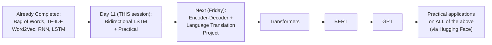

#### 🎯 Key Takeaways

* This session **directly continues** a broader, ongoing NLP arc — Bidirectional LSTM is explicitly positioned as the next, natural step after basic RNN and LSTM, both already completed.
* The **complete, stated roadmap** spans Encoder-Decoder, a genuine language translation project, Transformers, BERT, and GPT — with the instructor's own estimate that "this will probably take two weeks time to complete everything."
* The instructor's own **direct, explicit framing**: mastering this specific concept (Bidirectional LSTM) is a genuine PREREQUISITE for understanding Encoder-Decoder, the very next topic.

---

### 2. The Core Problem With Unidirectional RNN/LSTM: Missing Forward Context

#### 🪜 Step-by-Step — Re-Establishing the Basic RNN Architecture

> 💡 **Given directly:** *"Let's say I'm doing a task -- predicting the next word... I have a sentence which says, like, 'Krish likes to eat ___ in Bangalore'... whatever output that I have over here, this is basically my training dataset -- whatever output I'll be having, that will be my output value."*

```text
"Krish likes to eat ___ in Bangalore"
X11="Krish", X12="likes", X13="to", (predicting the blank), X14="in", X15="Bangalore"
```

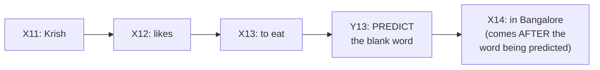

#### ❓ Why It Exists — The Precise, Motivating Question

> 💡 **Given directly:** *"Tell me over here, in this kind of sentences, like 'Krish likes to eat something,' it can be apple, chocolate, it can be anything, right -- it can be any food item over here, right -- now, in order to determine this, obviously, you know, Y13, when we are trying to find out the output -- you know that Y13 will have the information of X13... it will also have information of X12, and it will also have the information of X11."*

#### 🔍 Internal Working — The Precise, Genuine Limitation

> 💡 **Given directly:** *"Always remember, if I really want to do this kind of prediction, this prediction needs to also be dependent on the FORWARD words, right... this will not have the context of the forward words -- but if it has the context of the forward words, then probably this blank that you see, right, it will be filled with what is famous in Bangalore -- like, I like to see that Krish likes to eat SHAWARMA in Bangalore, because in Bangalore, probably you may get a good shawarma."*

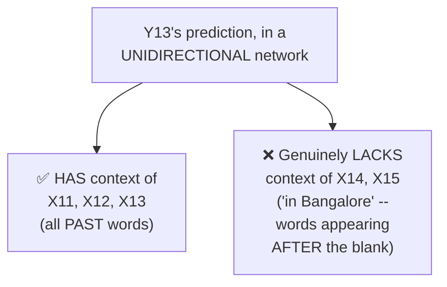

#### 🪜 Step-by-Step — A Second, Genuinely Illustrative, Contrasting Example

> 💡 **Given directly, a vivid, memorable, direct contrast:** *"Instead of Bangalore, if I probably say some other city -- in UP, or Lucknow, right -- in Lucknow, what is so best? Tunde Kebab -- have you heard of Tunde Kebab? Tunde Kebab, right -- this is the most amazing food item over there, right -- this specific word may change based on the forward words that is going to come in the sentence."*

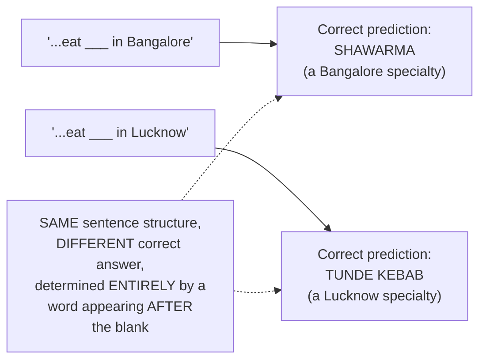

#### ⚠ Common Mistakes

* Assuming a basic RNN/LSTM's output at a given timestep has NO context whatsoever — explicitly, directly clarified: it genuinely HAS context, but ONLY from PAST words — the limitation is specifically about FUTURE, forward context being entirely absent.
* Assuming this "missing forward context" problem is a rare, edge-case concern — explicitly, directly demonstrated via a genuinely realistic, common scenario (predicting a word based on later, disambiguating context) — a real, frequently-relevant limitation.

#### 🎯 Key Takeaways

* A **basic, unidirectional RNN/LSTM's** prediction at any given timestep genuinely has context of ALL PAST words, but ZERO context of FUTURE (forward) words.
* A genuinely realistic, vivid example — predicting a city-specific food item — directly demonstrates WHY this limitation matters: the SAME sentence structure can require a GENUINELY DIFFERENT correct answer, determined ENTIRELY by a word appearing AFTER the word being predicted.
* This precise, concrete limitation directly, genuinely motivates the ENTIRE rest of this session — Bidirectional LSTM's specific architectural solution.

---
### 3. Bidirectional LSTM: Combining Forward and Backward Networks

#### 📖 Definition — The Precise, Structural Solution

> 💡 **Given directly:** *"What else we can do is that we can make sure that we can provide the context to Y13 about the further words -- and how we can basically do that? Now, what I'll do is that I will introduce you to something called as BIDIRECTIONAL LSTM RNN."*

#### 🪜 Step-by-Step — Building the Second, Reverse Network

> 💡 **Given directly, the complete, precise construction:** *"In order to make the context reach Y13... I will create the SAME neural network -- let us say, in this color, I will create the same neural network like this, one more neural network -- I will connect it to something like this... and why am I connecting this? Because I want all this information to go in the REVERSE MANNER, and make sure that Y13 also will come to know about this."*

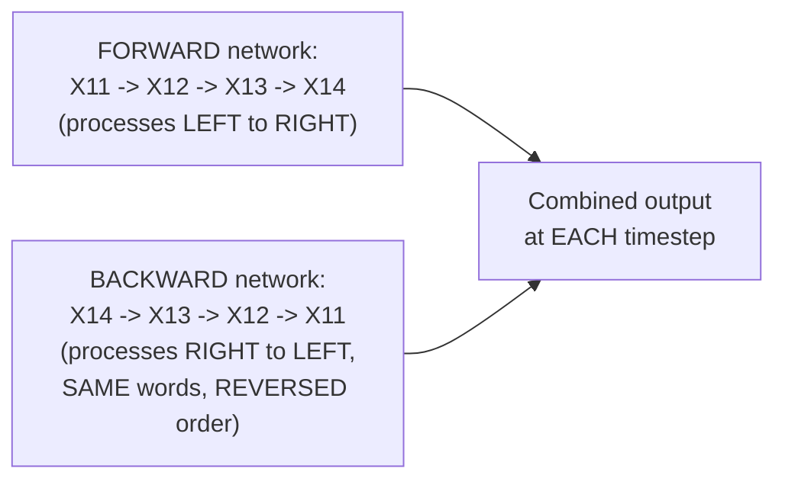

#### 🔍 Internal Working — Precisely How the Connection Works

> 💡 **Given directly:** *"Here, this X14 will get connected to this, okay, will get connected to this -- whatever output that you are going to give over here, this will get connected to this specific output... similarly, what will happen is that this layer to this layer will get connected... this will also go as an input, this will also go as an input, and this will also go as an input."*

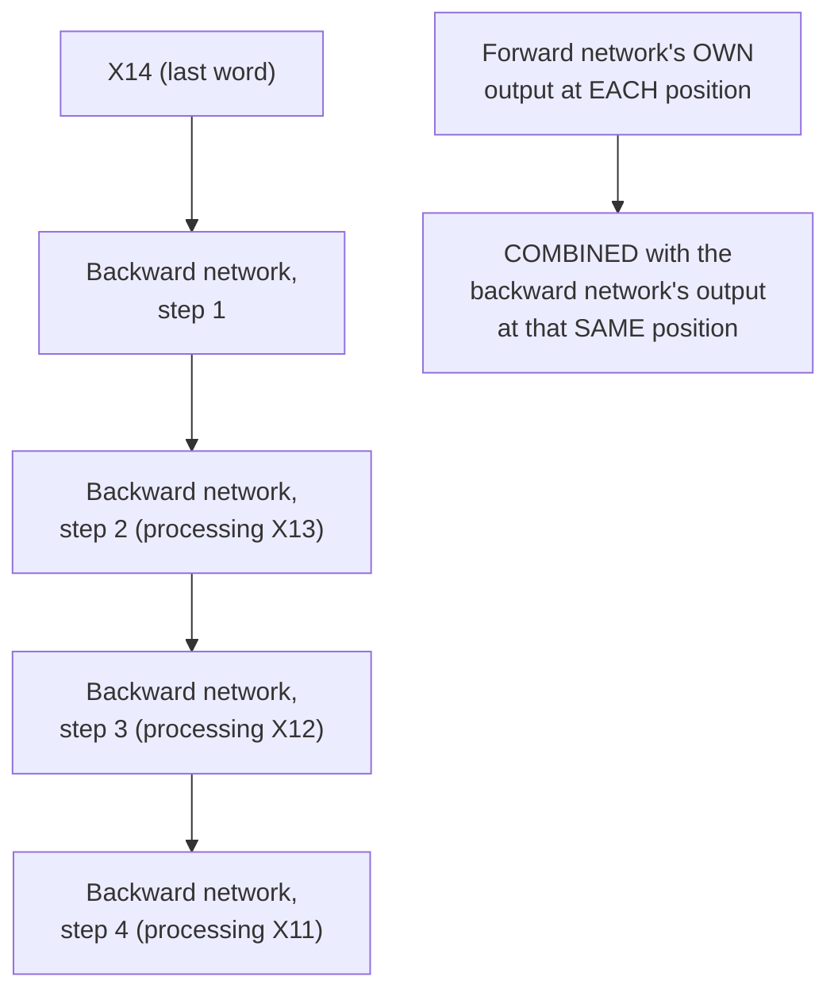

#### 📖 Definition — The Precise, Genuine Consequence of This Connection

> 💡 **Given directly:** *"By this connection, what is basically happening -- the context of X14, because X14 is basically getting passed over here... when we have Y13, now it will have the context information of the FURTHER words, AND it will also have the context information of the PREVIOUS words -- and now, if we train this model in [a] proper way, you will be able to probably [more] accurately predict the accurate result."*

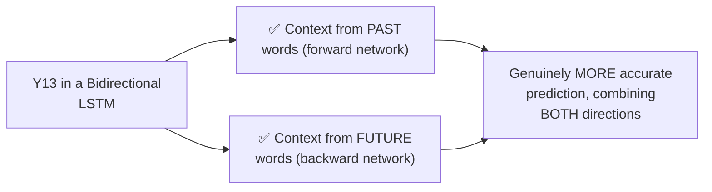

#### 📖 Definition — The Genuinely Simplified, Precise Restatement

> 💡 **Given directly:** *"In short, if I say -- in short, I can say -- if I have this, and now I will draw it in a very shorter manner, okay -- Bidirectional LSTM RNN looks something like this... here we are passing these words, this will also go over here... each and every one will be having its output, this output will be combined to this, this output will be combined to this, this output will be combined to this, right -- and this all neural network will be combined to each other. That's it."*

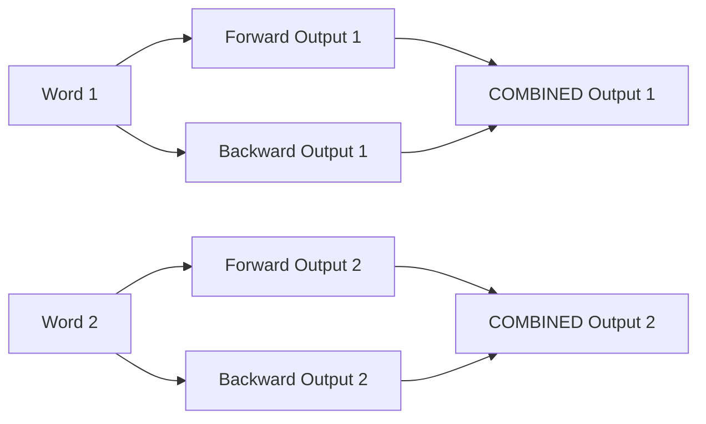

#### 🔍 Internal Working — A Genuine, Direct Confirmation: The Number of Neurons Is a Hyperparameter

> 💡 **Given directly:** *"How do we decide that? [The number of neurons] can be a hyperparameter tuning, right -- and these are all my neurons -- that's it, so simple it is -- now, you can use LSTM RNN, you can use RNN, any one, right -- but at the end of the day, what you are doing is that, in the forward direction, also you are passing all the words, in the backward direction, also you are passing all the words."*

#### 📖 Definition — The Output Layer, Precisely Confirmed as Unchanged

> 💡 **Given directly:** *"In the output layer, you'll be seeing that we can either use sigmoid or softmax, based on the classification problem, right -- if it is a classification problem, you can use either sigmoid or softmax -- here also you can use the same thing -- in case of regression, you can use something else."*

#### ⚠ Common Mistakes

* Assuming Bidirectional LSTM requires a GENUINELY different, more complex TYPE of recurrent cell — explicitly, directly clarified: you can use EITHER standard RNN or LSTM cells within a bidirectional structure — the "bidirectional" aspect is about the OVERALL ARCHITECTURE (two parallel networks, combined), not a different cell type.
* Assuming the output activation function (sigmoid/softmax) must change for bidirectional architectures — explicitly, directly confirmed as UNCHANGED: the SAME rules established for standard classification (sigmoid for binary, softmax for multi-class) directly apply.

#### 🎯 Key Takeaways

* **Bidirectional LSTM** genuinely creates TWO parallel neural networks processing the SAME sequence — one FORWARD (left to right), one BACKWARD (right to left, same words, reversed order).
* At EVERY timestep, the forward and backward networks' outputs are **COMBINED** — giving every prediction genuine access to BOTH past AND future context.
* The number of neurons in each direction is a genuine, freely-chosen **hyperparameter**; the output layer's activation function (sigmoid/softmax) remains **UNCHANGED** from standard classification conventions.

---

### 4. Practical Implementation: Loading & Cleaning the Fake News Dataset

#### 📖 Definition — The Problem Statement, Directly Confirmed as Parallel to Day 10

> 💡 **Given directly:** *"We are trying to solve Fake News Classifier data set, right -- at the end of the day, the information that you will be passing will be in the form of vectors."*

#### 💻 Code Example — A Genuine, Real CSV Loading Error, and How It Was Fixed

> 💡 **Given directly, an honest, live-debugged moment:** *"I'm getting an error -- not a problem -- let's see why we are getting an error -- error tokenizing... whenever you get this kind of things, guys, please make sure that you watch this, how to fix this issue -- here you can see, why you're getting this issue, you can use this -- engine, engine is equal to python."*

```python
import pandas as pd

df = pd.read_csv('train.csv', engine='python', encoding='utf-8', on_bad_lines='skip')
df.head()
```

> 💡 **Given directly, the precise, honest debugging sequence:** *"We're getting this error from this Fake News Classifier dataset... let's see, ignore errors reading dataset from pandas, we give an error -- `error_bad_lines` is equal to false -- guys, are you able to read this dataset, anyone? Perfect."*

#### 🪜 Step-by-Step — Data Exploration & Cleaning

> 💡 **Given directly:** *"Let's take this title column, and let's try to do this sentiment analysis prediction with the help of Bidirectional LSTM -- now, first of all, we'll go and see whether there is any null values."*

```python
df.isnull().sum()
df.shape   # ~7,000 records (this specific dataset instance)

df = df.dropna()   # a genuinely small impact, given the dataset's own size
```

> 💡 **Given directly, precisely confirming the same reasoning established in Day 10:** *"With respect to label, we don't have some values of features are basically null, but if you probably just write `df.shape`, I think we will be able to get 7,000 records -- so there are 7,000 records -- I probably feel like if you try to remove the null values also, it won't impact that much."*

#### 🪜 Step-by-Step — Splitting X/y & Checking Class Balance

> 💡 **Given directly:** *"Let's go ahead and write, get the independent features -- so here, let me write X is equal to `df.drop('label')`... and I'll write `df['label']`, right -- so this becomes my dependent feature."*

```python
X = df.drop('label', axis=1)
y = df['label']
```

> 💡 **Given directly, a genuinely new, additional check not explicitly performed in Day 10:** *"Let's see whether dataset is balanced [or] imbalanced or not -- check whether dataset is balanced or not -- so here I can basically write `y.value_counts()`... it is not completely balanced, because we have [a] good number of data with respect to positive and negative values."*

```python
y.value_counts()
```

#### ⚠ Common Mistakes

* Assuming a CSV loading error genuinely indicates corrupted or unusable data — explicitly, directly resolved via standard, well-known pandas parameters (`engine='python'`, error-skipping options) — a genuinely common, fixable data-loading issue, not a fundamental data problem.
* Skipping a genuine class-balance check before training — explicitly, directly performed here (`y.value_counts()`) as a NEW, additional step beyond Day 10's own pipeline — directly relevant to correctly interpreting the model's eventual accuracy results.

#### 🎯 Key Takeaways

* This session's practical implementation uses a **genuinely different instance/subset** of the Fake News dataset (approximately 7,000 records here, versus Day 10's larger dataset) — directly requiring real, live CSV-parsing error handling (`engine='python'`, error-skipping parameters).
* The **same reasoning from Day 10** applies to handling missing values: drop them, since the dataset's own size can genuinely absorb the loss.
* A **genuinely new step**, not explicitly performed in Day 10: checking class balance via `y.value_counts()` — confirming the dataset is "not completely balanced," directly relevant context for interpreting the model's eventual accuracy.

---
### 5. One-Hot Encoding & Padding, Applied to Real Data

#### 💻 Code Example — Importing Libraries, Including the New `Bidirectional` Wrapper

> 💡 **Given directly:** *"I'm going to import some important libraries of TensorFlow -- `tensorflow.keras.layers`, I'm going to import Embedding... `pad_sequences`... `Sequential`... `one_hot`... I'm going to import LSTM... I'm also going to import Dense... and from `tensorflow.keras.layers`, import BIDIRECTIONAL -- Bidirectional is required, because we are creating Bidirectional LSTM."*

```python
import tensorflow as tf
from tensorflow.keras.layers import Embedding
from tensorflow.keras.preprocessing.sequence import pad_sequences
from tensorflow.keras.models import Sequential
from tensorflow.keras.preprocessing.text import one_hot
from tensorflow.keras.layers import LSTM, Dense, Bidirectional
```

#### 💻 Code Example — Setting Vocabulary Size & Cleaning the Title Column

> 💡 **Given directly:** *"It is always a good habit that we try to fix a good vocabulary size, so that we can play with it -- so let's go ahead and write vocabulary size... let's say I'm taking 5,000 words in my dictionary."*

```python
voc_size = 5000

messages = X.copy()
messages.reset_index(inplace=True)
```

> 💡 **Given directly, an honest, live-debugged moment re-confirming Day 10's own established practice:** *"What is the error with respect to key? ...I have removed some of the data, right -- so let me do one thing -- here I'm just going to write `messages.reset_index`... in place is equal to true -- now you will not find any gap."*

#### 💻 Code Example — The Complete, Same Text-Cleaning Pipeline (Stemming + Stopwords)

> 💡 **Given directly:** *"I'm using Porter Stemmer -- this Porter Stemmer is for the stemming purpose, and why am I using stemming? Because this is a kind of problem statement where you focus more on implementing sentiment analysis... for I in range 0 comma length of messages, I am first of all removing all the special characters, other than small a to z and capital A to Z, on every title that I have -- I am lowering it, splitting it, and then over here I'm applying it to the stop word, and then stemming it, and finally I'll be able to get my entire data in Corpus."*

```python
import nltk, re
from nltk.corpus import stopwords
from nltk.stem.porter import PorterStemmer

nltk.download('stopwords')
ps = PorterStemmer()

corpus = []
for i in range(0, len(messages)):
    review = re.sub('[^a-zA-Z]', ' ', messages['title'][i])
    review = review.lower()
    review = review.split()
    review = [ps.stem(word) for word in review if word not in stopwords.words('english')]
    review = ' '.join(review)
    corpus.append(review)
```

#### 💻 Code Example — One-Hot Encoding, Applied to the Cleaned Corpus

> 💡 **Given directly:** *"This one-hot representation will be based on 5,000 vocabulary size -- so here I'm just going to write `one_hot`, and here I will just give my words and my vocabulary size... for words in Corpus -- so I'm just going to go ahead with each and every word in Corpus, and probably we can print the one-hot representation -- this one-hot representation, it will give us all the indexes."*

```python
onehot_repr = [one_hot(words, voc_size) for words in corpus]
```

#### 🪜 Step-by-Step — Choosing Sentence Length & Applying Padding

> 💡 **Given directly:** *"I will take the maximum sentence length -- probably over here I have already verified it, the maximum sentence length that can occur is 20 -- so I'm going to basically put up 20."*

```python
sent_length = 20
embedded_docs = pad_sequences(onehot_repr, padding='pre', maxlen=sent_length)
```

> 💡 **Given directly, confirming this directly matches Day 10's own established pattern:** *"For that, I will use `pad_sequences`, which I had already imported on the top... whether you want pre-padding or post-padding -- in this case I will say pre-padding, you can also use post-padding, I don't think so it will make much difference."*

#### ⚠ Common Mistakes

* Assuming the `Bidirectional` import is a genuinely separate, distinct LAYER type (like `LSTM` or `Dense`) — explicitly, directly clarified as a WRAPPER, applied AROUND an existing recurrent layer (LSTM, in this case), not a standalone layer used on its own.
* Assuming this session's entire preprocessing pipeline (vocabulary size, cleaning, one-hot encoding, padding) is genuinely different from Day 10's — explicitly, directly confirmed as IDENTICAL in structure and reasoning, just applied to a genuinely different (smaller, ~7,000-record) instance of the dataset.

#### 🎯 Key Takeaways

* The **ONLY genuinely new import**, compared to Day 10's own pipeline, is `Bidirectional` — imported specifically to WRAP the LSTM layer, not as a standalone layer.
* The **complete preprocessing pipeline** (vocabulary size, cleaning via stemming/stopwords, one-hot encoding, padding) is directly, precisely IDENTICAL in structure to Day 10's own established pattern — genuinely reused, not reinvented.
* **Sentence length (20)** was again chosen based on GENUINE, direct observation of the dataset's actual maximum title length — the SAME reasoning methodology established across this course's own NLP sessions.

---

### 6. Building the Bidirectional LSTM Model

#### 💻 Code Example — Choosing the Embedding Dimension

> 💡 **Given directly:** *"This entire thing... will get converted into vectors, vectors of the size of 40 -- why I have taken 40? Because sentence length was 20, I thought 40 would make more sense, and we will be able to get good accuracy over here."*

```python
embedding_vector_features = 40
```

#### 💻 Code Example — The Complete Model, With the Bidirectional Wrapper

> 💡 **Given directly, the precise, single, key addition:** *"Still, you may be thinking, 'Krish, where is Bidirectional?' -- then guys, like this, how we did it for LSTM, right -- for Bidirectional, all we have to do is that, just add here -- BIDIRECTIONAL -- on top of it -- once you add like this, Bidirectional, and probably close this bracket, then this will basically become a Bidirectional LSTM."*

```python
model = Sequential()
model.add(Embedding(voc_size, embedding_vector_features, input_length=sent_length))
model.add(Bidirectional(LSTM(100)))
model.add(Dense(1, activation='sigmoid'))
model.compile(loss='binary_crossentropy', optimizer='adam', metrics=['accuracy'])
print(model.summary())
```

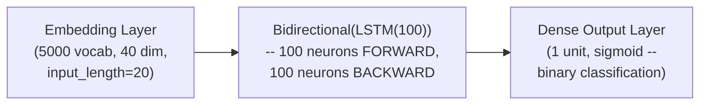

#### 🔍 Internal Working — The Precise, Direct Explanation of What `Bidirectional` Does

> 💡 **Given directly:** *"On top of the LSTM, I've just noted down this as Bidirectional -- that basically means 100 neurons forward, 100 neurons backward, you know, with respect to that LSTM architecture that we have in mind."*

#### 🔍 Internal Working — The Precise, Same Output Layer Configuration

> 💡 **Given directly:** *"Since this is a binary classifier, I've used the activation function as sigmoid -- then the loss function I have used, binary cross-entropy -- optimizer, Adam -- metrics, accuracy."*

#### ⚠ A Direct, Honest Acknowledgment: The Parameter Count Genuinely Increases

> 💡 **Given directly:** *"Here you can basically see the model summary... this is how many number of parameters we have created with respect to weights and bias -- I've used embedding layer, one Bidirectional LSTM layer, and dense layer."*

#### ⚠ Common Mistakes

* Assuming the Bidirectional wrapper requires GENUINELY different parameters (vocabulary size, embedding dimension, sentence length) than a standard, unidirectional LSTM model — explicitly, directly demonstrated as UNCHANGED: only the LSTM layer's OWN wrapping changes; every other parameter remains the same.
* Assuming "100 neurons" for a Bidirectional LSTM means 100 TOTAL neurons — explicitly, directly clarified: it means 100 neurons in EACH direction (forward AND backward), genuinely DOUBLING the LSTM layer's own parameter count compared to a standard, unidirectional LSTM with the same neuron count.

#### 🎯 Key Takeaways

* The **ONLY code change** needed to convert a standard LSTM model into a Bidirectional LSTM model is wrapping the LSTM layer: `Bidirectional(LSTM(100))` instead of simply `LSTM(100)`.
* This wrapper genuinely means **100 neurons in EACH direction** (forward and backward) — not 100 total — directly, genuinely increasing the model's total parameter count compared to an equivalent unidirectional model.
* Every OTHER aspect of the model — embedding layer configuration, output layer (sigmoid, for binary classification), loss function (binary cross-entropy), and optimizer (Adam) — remains **entirely unchanged** from the standard LSTM pattern established in Day 10.

---
### 7. Training & Evaluating the Model

#### 💻 Code Example — Converting to Arrays & Train-Test Split

> 💡 **Given directly:** *"All I'll do is that, let's do one thing -- train-test split also, I need to do -- first of all, I'll convert this entire embedded docs that I basically have, right, over here, into an array, so that I can supply it."*

```python
import numpy as np
from sklearn.model_selection import train_test_split

X_final = np.array(embedded_docs)
y_final = np.array(y)

X_train, X_test, y_train, y_test = train_test_split(X_final, y_final, test_size=0.33, random_state=42)
```

#### 💻 Code Example — Model Training

> 💡 **Given directly:** *"Finally, I will go ahead and do my model training -- I will write `model.fit`, on my `X_train`, comma `y_train`, comma -- I can also give my validation data -- my `validation_data` is equal to -- that is my `X_test`, comma `y_test`, right -- these are my validation data -- number of epochs that I'm just going to run for just checking it out is 10, and my batch size I'm just going to keep it as 32."*

```python
model.fit(X_train, y_train, validation_data=(X_test, y_test), epochs=10, batch_size=32)
```

#### 🪜 Step-by-Step — The Genuine, Live-Observed Training Results

> 💡 **Given directly:** *"Epoch one has started... training is going on well -- the validation loss, validation accuracy, this accuracy, this loss is also getting decreased -- you know, so here you can see [a] good amount of information that we are able to see, right -- yeah, so just with 10 epochs, I'm able to get [good] training accuracy, [good] validation accuracy -- which is good."*

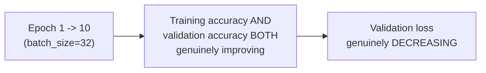

#### 💻 Code Example — Generating Predictions, With a Genuine, Honest API Adjustment

> 💡 **Given directly, an honest, live-encountered API change:** *"If I probably see `y_pred`, I think it will get in [the] form of probability -- so what you can do is that, you can basically use another [method] which is like `predict_classes`, to get what is the exact output -- `predict_classes` is not there, let's see -- `model.predict`... all I can say that greater than or equal to 0.5."*

```python
y_pred_prob = model.predict(X_test)

y_pred = np.where(y_pred_prob >= 0.5, 1, 0)   # threshold, using np.where
```

#### 🔍 Internal Working — A Genuine, Honest Acknowledgment of a Deprecated Method

> 💡 **Given directly:** *"`predict_classes` has been removed now."*

#### 💻 Code Example — Confusion Matrix & Accuracy Score

> 💡 **Given directly:** *"From `sklearn.metrics`, import `confusion_matrix` -- okay, and then I can probably use this `confusion_matrix` with `y_test`, comma `y_pred`... this much accuracy, at least we are able to get, with respect to the right prediction -- we can also use `accuracy_score`."*

```python
from sklearn.metrics import confusion_matrix, accuracy_score

print(confusion_matrix(y_test, y_pred))
print(accuracy_score(y_test, y_pred))   # ~90%
```

#### ⚠ A Direct, Honest Confirmation on Data Leakage

> 💡 **Given directly:** *"Model will not have any data leakage problem, because I have made sure that the train-test split is done in [a] better way."*

#### ⚠ Common Mistakes

* Using `model.predict_classes()`, expecting it to still be available in newer TensorFlow versions — explicitly, directly, honestly encountered as REMOVED/deprecated during this live session — the genuine, correct alternative is `model.predict()` followed by explicit thresholding (via `np.where` or a direct comparison).
* Assuming a train-test split performed incorrectly (e.g., not properly separating train and test data) could go unnoticed — explicitly, directly, honestly confirmed as correctly handled here, specifically avoiding genuine data leakage.

#### 🎯 Key Takeaways

* The model was trained for **10 epochs** (batch size 32), with BOTH training and validation accuracy genuinely improving, and validation loss genuinely decreasing.
* A genuine, honest, live-encountered API change (`predict_classes` being removed) was directly, transparently addressed using `model.predict()` combined with `np.where()` for explicit 0.5 thresholding.
* The final model achieved approximately **90% accuracy**, evaluated via a genuine confusion matrix and `accuracy_score` — directly, closely comparable to Day 10's own unidirectional LSTM result on a similar task.

---

### 8. Closing: The Complete Roadmap Ahead

#### 🏢 Real-World / Production Usage — A Genuine, Direct Emphasis on Interview Readiness

> 💡 **Given directly, in response to a genuine, live audience question about interview preparation:** *"Make sure that your basics are strong -- that is super important -- your basics are strong -- you don't have to go and talk about BERT architecture and all, but understand what NLP things you can basically do, that is very important... I've seen people who don't have much knowledge in NLP, then also they crack interview jobs, because the basics are strong."*

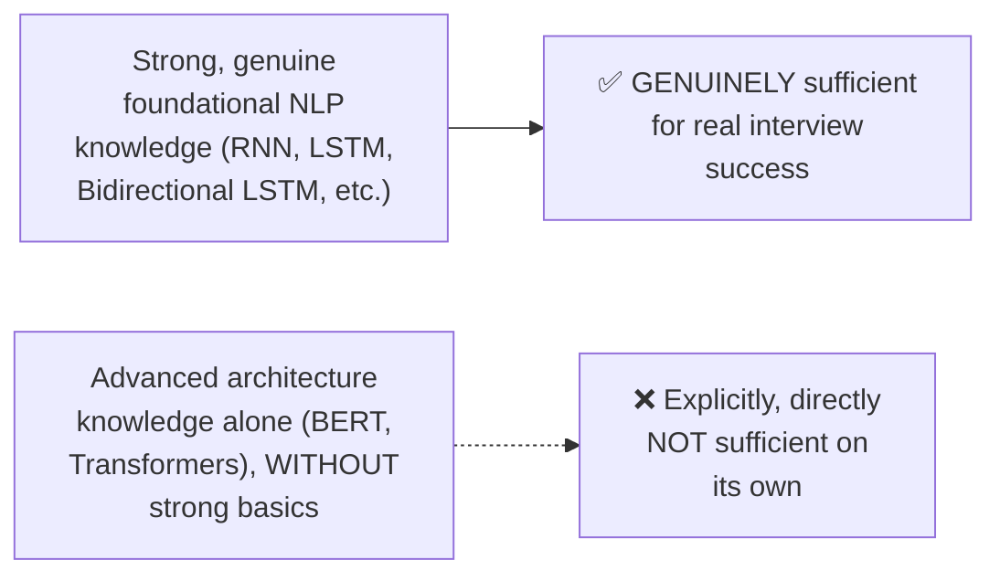

#### 🪜 Step-by-Step — The Explicit, Stated Roadmap Ahead

> 💡 **Given directly:** *"The next session we will probably have on Friday -- on Friday, we will start with Encoders, Decoders... in short, what we did is that we tried to use both RNN from the forward layer and from the backward layer, right -- over here, two sets, and how it knows that it has this information over here, right -- this kind of neuron has only got created -- now, we are actually trying to find out the output after taking the entire sentences -- but if we also try to do it, I think it will make sense, right."*

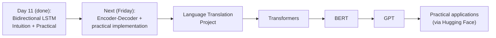

#### ⚠ Common Mistakes

* Assuming mastering advanced architectures (BERT, Transformers) is a genuine PREREQUISITE for succeeding in NLP interviews — explicitly, directly corrected: STRONG BASICS (the foundational concepts this course has built, session by session) are explicitly identified as the genuinely more important factor.
* Assuming this session's own content is disconnected from what comes next — explicitly, directly clarified: Bidirectional LSTM's own "two networks, combined" structure is EXPLICITLY, DIRECTLY positioned as conceptually related to and preparatory for Encoder-Decoder, the very next topic.

#### 🎯 Key Takeaways

* The instructor's own **direct, repeated emphasis**: strong foundational NLP knowledge genuinely matters MORE than advanced architecture familiarity for real interview success — a consistent, honest, practical piece of career advice.
* **Encoder-Decoder and a genuine language translation project** are explicitly, directly confirmed as the next session's content (Friday) — with Bidirectional LSTM's own "two networks, combined" structure directly, explicitly positioned as conceptually preparatory for understanding Encoder-Decoder.
* The **complete, remaining roadmap** — Encoder-Decoder, Transformers, BERT, GPT, and practical applications via Hugging Face — is explicitly, directly reconfirmed, with an estimated two-week timeline for genuine completion.

---
## 📝 Glossary

| Term | Definition | Why It Matters |
|---|---|---|
| **Unidirectional RNN/LSTM** | A network processing a sequence in ONE direction only (left to right) | Genuinely lacks access to future/forward context |
| **Forward Network** | The standard, left-to-right processing network | Has context of PAST words only |
| **Backward Network** | A second, parallel network processing the SAME sequence in reverse | Has context of FUTURE words only |
| **Bidirectional LSTM** | Combines forward AND backward networks, merging outputs at each timestep | Genuinely provides BOTH past and future context |
| **Bidirectional() wrapper** | The Keras wrapper converting a standard LSTM into a bidirectional one | The ONLY code change needed vs. Day 10's model |
| **engine='python'** | A pandas read_csv parameter for handling parsing errors | Used to fix a genuine, real CSV loading error |
| **on_bad_lines / error_bad_lines** | Pandas parameters for skipping malformed CSV rows | Another genuine, real error-handling step |
| **np.where(cond, 1, 0)** | The replacement for the deprecated predict_classes() method | A genuine, honest API adjustment made live |
| **value_counts()** | A pandas method checking class distribution | Confirmed this dataset is "not completely balanced" |

---

## 🔄 Revision Notes — One-Minute Revision

* This session **directly continues** the ongoing NLP arc (Bag of Words, TF-IDF, Word2Vec, RNN, LSTM already completed) -- Bidirectional LSTM is the next, natural step, explicitly positioned as a PREREQUISITE for understanding Encoder-Decoder (next session).
* **The core problem**: in a standard (unidirectional) RNN/LSTM, a prediction at timestep t has genuine context of ALL PAST words, but ZERO context of FUTURE words -- vividly illustrated: "Krish likes to eat ___ in Bangalore" needs "Bangalore" (a LATER word) to correctly predict "shawarma" vs. "tunde kebab" (if the city were Lucknow instead).
* **Bidirectional LSTM's solution**: create a SECOND, parallel network processing the SAME sequence in REVERSE (backward) -- at EVERY timestep, the forward and backward networks' outputs are COMBINED, giving every prediction genuine access to BOTH past AND future context.
* The number of neurons per direction is a genuine hyperparameter; the output layer (sigmoid for binary, softmax for multi-class) remains UNCHANGED from standard conventions.
* **Practical implementation**: a SECOND Fake News Classifier (parallel to Day 10, but a different, smaller ~7,000-record dataset instance) -- genuine, live CSV-loading errors were fixed using `engine='python'` and error-skipping parameters. Same preprocessing pipeline as Day 10: drop NaN, split X/y, check class balance (`value_counts()` -- confirmed "not completely balanced"), clean text (regex + lowercase + stopwords + stemming via PorterStemmer), one-hot encode (voc_size=5000), pad (sent_length=20, pre-padding).
* **The ONLY genuinely new model code**: `model.add(Bidirectional(LSTM(100)))` instead of `model.add(LSTM(100))` -- meaning 100 neurons FORWARD, 100 neurons BACKWARD (genuinely doubling parameter count vs. a standard, unidirectional LSTM with the same neuron count). Everything else (embedding config, Dense(1, sigmoid), binary_crossentropy/adam/accuracy) stays identical to Day 10's pattern.
* **Training**: 10 epochs, batch_size=32 -- both training and validation accuracy genuinely improved, validation loss genuinely decreased.
* **Evaluation**: a genuine, live-encountered API change (`predict_classes` removed) was honestly worked around using `model.predict()` + `np.where(y_pred>=0.5, 1, 0)` -- confusion matrix and accuracy_score confirmed ~90% accuracy, directly comparable to Day 10's unidirectional result.
* **Closing, direct career advice**: STRONG BASICS matter more than advanced architecture knowledge (BERT, Transformers) for genuine interview success.
* **Next (Friday)**: Encoder-Decoder + a genuine language translation project, then Transformers, BERT, GPT, and practical applications via Hugging Face -- an estimated two-week timeline.

---

## 📋 Cheat Sheet

**The core problem, and the fix:**
```text
Unidirectional RNN/LSTM: Y(t) has context of PAST words ONLY
Bidirectional LSTM:      Y(t) has context of BOTH past AND future words
                          (forward network + backward network, COMBINED at each timestep)
```

**The ONLY code change needed (vs. a standard LSTM model):**
```python
# Standard LSTM:
model.add(LSTM(100))

# Bidirectional LSTM (the ONLY change):
model.add(Bidirectional(LSTM(100)))   # 100 neurons FORWARD + 100 neurons BACKWARD
```

**Complete Bidirectional LSTM model:**
```python
model = Sequential()
model.add(Embedding(voc_size, embedding_vector_features, input_length=sent_length))
model.add(Bidirectional(LSTM(100)))
model.add(Dense(1, activation='sigmoid'))
model.compile(loss='binary_crossentropy', optimizer='adam', metrics=['accuracy'])
```

**Handling real CSV loading errors:**
```python
df = pd.read_csv('train.csv', engine='python', encoding='utf-8', on_bad_lines='skip')
```

**Replacing deprecated predict_classes():**
```python
y_pred_prob = model.predict(X_test)
y_pred = np.where(y_pred_prob >= 0.5, 1, 0)
```

---

## 🔥 Interview Questions & Answers

### 🟢 Beginner

**Q1.**

**Question:** What context does a standard (unidirectional) RNN/LSTM's output at timestep t have access to?

**Answer:** Context from all PAST words only -- not future words.

**Explanation:** Directly, precisely explained.

**Why Interviewers Ask This:** Foundational motivation for Bidirectional LSTM.

**Possible Follow-up:** "Why might this be a genuine limitation for certain prediction tasks?"

**Q2.**

**Question:** How does Bidirectional LSTM solve the missing-future-context problem?

**Answer:** By creating a second, parallel network that processes the same sequence in reverse, then combining forward and backward outputs at every timestep.

**Explanation:** Directly, precisely explained.

**Why Interviewers Ask This:** Core, foundational Bidirectional LSTM knowledge.

**Possible Follow-up:** "What gets combined at each timestep, specifically?"

**Q3.**

**Question:** What is the ONLY code change needed to convert a standard Keras LSTM model into a Bidirectional LSTM model?

**Answer:** Wrapping the LSTM layer in `Bidirectional()`.

**Explanation:** Directly, precisely stated.

**Why Interviewers Ask This:** Basic, practical Keras implementation knowledge.

**Possible Follow-up:** "Does the output layer's activation function need to change?"

**Q4.**

**Question:** If a Bidirectional LSTM layer is configured with 100 units, how many total neurons does it genuinely use?

**Answer:** 200 -- 100 forward, 100 backward.

**Explanation:** Directly, precisely clarified.

**Why Interviewers Ask This:** Tests a commonly-confused, genuine implementation detail.

**Possible Follow-up:** "How does this affect the model's total parameter count compared to a standard LSTM?"

**Q5.**

**Question:** What pandas parameter can help resolve CSV parsing errors when reading a malformed file?

**Answer:** `engine='python'` (and/or error-skipping parameters like `on_bad_lines`).

**Explanation:** Directly, explicitly demonstrated.

**Why Interviewers Ask This:** Practical, real-world data-loading troubleshooting knowledge.

**Possible Follow-up:** "What is a genuine, real symptom that would suggest trying this parameter?"

**Q6.**

**Question:** What method should be used instead of the deprecated `model.predict_classes()`?

**Answer:** `model.predict()`, followed by explicit thresholding (e.g., via `np.where`).

**Explanation:** Directly, honestly demonstrated.

**Why Interviewers Ask This:** Tests awareness of genuine, real API evolution in TensorFlow/Keras.

**Possible Follow-up:** "What threshold value was used in this session's example?"

**Q7.**

**Question:** What pandas method checks whether a dataset's target classes are balanced?

**Answer:** `value_counts()`.

**Explanation:** Directly, explicitly demonstrated.

**Why Interviewers Ask This:** Basic, practical data-exploration knowledge.

**Possible Follow-up:** "Why does class balance genuinely matter for model evaluation?"

**Q8.**

**Question:** What activation function is used in the output layer of this session's Bidirectional LSTM model?

**Answer:** Sigmoid.

**Explanation:** Directly, explicitly stated.

**Why Interviewers Ask This:** Basic, foundational classification knowledge.

**Possible Follow-up:** "Why sigmoid specifically, in this case?"

**Q9.**

**Question:** According to this session, what matters more for genuine interview success -- strong basics, or advanced architecture knowledge?

**Answer:** Strong basics.

**Explanation:** Directly, explicitly, repeatedly stated.

**Why Interviewers Ask This:** Tests awareness of the instructor's own direct, practical career advice.

**Possible Follow-up:** "Does this mean advanced architecture knowledge is worthless?"

**Q10.**

**Question:** What topic is explicitly named as the next session's content?

**Answer:** Encoder-Decoder, along with a genuine language translation project.

**Explanation:** Directly, explicitly stated.

**Why Interviewers Ask This:** Tests awareness of the course's own stated, ongoing roadmap.

**Possible Follow-up:** "Why is Bidirectional LSTM specifically described as a conceptual prerequisite for this next topic?"

---

### 🟡 Intermediate

**Q11.**

**Question:** Explain why the instructor deliberately uses TWO contrasting examples (Bangalore/shawarma vs. Lucknow/tunde kebab) rather than just one, to illustrate the missing-forward-context problem.

**Answer:** Using a SINGLE example (just Bangalore/shawarma) might leave the impression that this is a coincidental, one-off scenario where forward context happened to matter. By explicitly, directly CONTRASTING two DIFFERENT cities producing two DIFFERENT correct answers for the EXACT SAME sentence STRUCTURE, the instructor demonstrates that this is a genuinely SYSTEMATIC, GENERALIZABLE problem -- the correct prediction GENUINELY, STRUCTURALLY depends on forward context, not merely a specific quirk of one particular example. This directly, precisely mirrors this course's own broader, established teaching pattern (seen across ANN, RNN, and LSTM sessions) of using MULTIPLE, CONTRASTING worked examples to build genuinely robust, generalizable intuition, rather than risking a single example being misinterpreted as a special case.

**Explanation:** Requires recognizing a deliberate pedagogical technique — contrast, not mere repetition — used to generalize a specific claim.

**Why Interviewers Ask This:** Tests whether a learner recognizes why illustrating a GENERAL principle benefits from CONTRASTING examples, not just one.

**Possible Follow-up:** "Construct your own, third, contrasting example illustrating this same forward-context problem."

**Q12.**

**Question:** A learner argues that since Bidirectional LSTM has access to both past AND future context, it should ALWAYS be preferred over a standard, unidirectional LSTM for any NLP task. Evaluate this claim.

**Answer:** This claim overstates the case, and overlooks a genuine, important structural constraint the session's own content implies but doesn't explicitly state: Bidirectional LSTM's BACKWARD network REQUIRES access to the ENTIRE sequence UPFRONT, since it must process words in REVERSE, starting from the LAST word. This means Bidirectional LSTM is GENUINELY UNSUITABLE for tasks requiring REAL-TIME, streaming, or GENUINELY SEQUENTIAL generation — for example, a system generating text ONE WORD AT A TIME as a user types (like the "text generation/autosuggestion" One-to-Many use case established in Day 6) GENUINELY CANNOT use a backward network, since FUTURE words simply DON'T EXIST YET at generation time. Bidirectional LSTM is therefore GENUINELY well-suited for tasks where the COMPLETE input is available UPFRONT (like this session's own Fake News Classifier, where the entire title is known before classification) — but NOT for genuinely real-time, incremental generation tasks, where a standard, unidirectional/forward-only network remains the STRUCTURALLY NECESSARY choice.

**Explanation:** Tests whether a learner recognizes a genuine, structural limitation of bidirectional architectures the session's own content implies but doesn't explicitly, directly state.

**Why Interviewers Ask This:** Distinguishes candidates who understand WHEN a "strictly more information" architecture is genuinely NOT always preferable, due to a real, structural constraint.

**Possible Follow-up:** "Name a specific, real NLP task (beyond real-time text generation) where a unidirectional network would genuinely be structurally REQUIRED, not just preferred."

**Q13.**

**Question:** Explain, precisely, why wrapping an LSTM layer in `Bidirectional()` genuinely doubles that layer's parameter count, using this session's own precise "100 forward, 100 backward" explanation.

**Answer:** Per this session's own precise explanation, `Bidirectional(LSTM(100))` genuinely creates TWO, GENUINELY SEPARATE, INDEPENDENTLY-TRAINED sets of LSTM weights — one complete LSTM cell (with its own forget gate, input gate, output gate, and cell-state weights, per Day 8's own detailed architecture) processing the sequence FORWARD, and an ENTIRELY SEPARATE, second complete LSTM cell processing the SAME sequence BACKWARD. Since EACH of these two LSTM cells independently requires its OWN full set of weight matrices (per Day 8's own precise formulas — `Wf`, `Wi`, `Wc`, `Wo` for EACH direction), the TOTAL parameter count for the Bidirectional layer is GENUINELY, PRECISELY DOUBLE what a SINGLE, standard (unidirectional) `LSTM(100)` layer alone would require — directly, mechanistically explaining WHY the instructor's own live-observed `model.summary()` showed a genuinely larger total parameter count than an equivalent, unidirectional model would.

**Explanation:** Requires connecting this session's own explanation to Day 8's own detailed LSTM gate architecture to explain WHY doubling specifically occurs.

**Why Interviewers Ask This:** Tests whether a learner can connect a NEWER session's high-level claim to an EARLIER session's own precise, underlying architectural details.

**Possible Follow-up:** "If a standard LSTM(100) layer has approximately X total parameters, what would you expect Bidirectional(LSTM(100)) to have, expressed in terms of X?"

**Q14.**

**Question:** Using this session's own precise combination mechanism (forward and backward outputs "combined" at each timestep), explain what COULD go wrong if this combination were done via SIMPLE ADDITION rather than CONCATENATION (the standard, default Keras behavior).

**Answer:** This is a genuinely important, precise distinction the session's own content doesn't explicitly address but directly implies through its emphasis on the forward and backward networks being GENUINELY SEPARATE, independently-learned representations. If the forward and backward outputs were combined via SIMPLE ADDITION (summing corresponding values together), the resulting COMBINED representation would GENUINELY LOSE the ability to distinguish WHICH PORTION of the final signal came from the forward (past-context) network versus the backward (future-context) network — the two, genuinely DIFFERENT kinds of contextual information would be BLENDED TOGETHER in a way that could genuinely OBSCURE or CONFUSE the subsequent Dense layer's ability to learn how to WEIGH past-context versus future-context information differently. CONCATENATION (Keras's own actual, default behavior for `Bidirectional`), by contrast, GENUINELY PRESERVES both the forward and backward outputs as DISTINCT, SEPARATE portions of a LARGER combined vector — allowing the SUBSEQUENT Dense layer to learn INDEPENDENT weights for each portion, genuinely preserving the network's ability to differently weigh past versus future context as needed for the specific task.

**Explanation:** Requires reasoning through a genuine, technical distinction (concatenation vs. addition) that the session's own content implies through its architecture but doesn't explicitly, directly address.

**Why Interviewers Ask This:** Tests whether a learner understands WHY the specific combination MECHANISM (not just that combination happens) genuinely matters.

**Possible Follow-up:** "If the forward output is 100-dimensional and the backward output is also 100-dimensional, what would be the dimensionality of the concatenated, combined output?"

**Q15.**

**Question:** Synthesize this session's precise "why Bidirectional LSTM" motivation (Section 2) with its own honest career advice (Section 8, "strong basics matter more than advanced architecture knowledge") to construct a reasoned argument for WHY genuinely understanding Bidirectional LSTM's MOTIVATION (not just its Keras implementation syntax) is itself a "strong basics" skill, directly relevant to interview success.

**Answer:** A precise, synthesized argument: the instructor's own "strong basics" advice (Section 8) is specifically about GENUINE, CONCEPTUAL understanding — not merely being ABLE TO WRITE the correct Keras code (`Bidirectional(LSTM(100))`), but GENUINELY UNDERSTANDING WHY this specific architectural choice exists, WHAT PROBLEM it solves, and WHEN it's genuinely appropriate to use (directly connecting to Intermediate Q12's own reasoning about real-time vs. upfront-available-input tasks). A candidate who can ONLY recite the Keras SYNTAX, without genuinely understanding the "Krish likes to eat ___" motivating problem (Section 2), would likely STRUGGLE to correctly answer a GENUINE interview question like "when would you choose Bidirectional LSTM over standard LSTM, and why?" — a question testing PRECISELY the kind of conceptual, motivated understanding this session's own Section 2 explicitly, deliberately builds through its vivid, contrasting examples. This directly, precisely illustrates that "strong basics," per the instructor's own stated advice, GENUINELY MEANS understanding the underlying MOTIVATION and TRADE-OFFS behind each architectural choice — exactly the kind of understanding this session's own careful, example-driven Section 2 is specifically designed to build, BEFORE ever touching the actual implementation code.

**Explanation:** Requires synthesizing the session's own specific technical content with its own closing career advice to construct a reasoned argument for why conceptual (not merely syntactic) understanding constitutes "strong basics."

**Why Interviewers Ask This:** A senior-level question testing whether a candidate can connect a session's specific technical content to its own broader, stated pedagogical/career philosophy.

**Possible Follow-up:** "Construct a genuine, complete interview answer to 'when would you choose Bidirectional LSTM over standard LSTM,' directly drawing on this session's own specific reasoning."

---

### 🔴 Advanced

**Q16.**

**Question:** Design a complete, precise trace of how the forward and backward networks' outputs would combine for a genuinely NEW, 4-word sentence ("The movie was excellent"), explicitly identifying which specific timestep's combined output would have genuine access to ALL 4 words' context, and explain why.

**Answer:** A reasonable, complete trace, directly applying Section 3's own precise mechanism: for the sentence "The movie was excellent" (X1="The", X2="movie", X3="was", X4="excellent"), the FORWARD network processes X1→X2→X3→X4 in order, meaning its output AT X4 (the last forward step) has GENUINE, accumulated context of ALL 4 words (per the forward recurrence's own nature, established in Day 6-7). The BACKWARD network processes the SAME words in REVERSE (X4→X3→X2→X1), meaning ITS output AT X1 (the LAST backward step, corresponding to the FIRST word in the original order) has GENUINE, accumulated context of ALL 4 words too, but built up in the REVERSE direction. This means: the COMBINED output at POSITION 1 (X1="The") genuinely has: (a) minimal forward context (only "The" itself, since it's the FIRST forward step), combined with (b) MAXIMAL backward context (all 4 words, since it's the LAST backward step). Conversely, the COMBINED output at POSITION 4 (X4="excellent") has: (a) MAXIMAL forward context (all 4 words), combined with (b) minimal backward context (only "excellent" itself). NEITHER individual position genuinely has "complete, maximal context from BOTH directions simultaneously" — this is a genuinely important, precise nuance: each position's combined output has a GENUINELY DIFFERENT BALANCE of forward vs. backward context, with NO single position having BOTH maximal forward AND maximal backward context at once (since these two conditions are mutually exclusive, given the sequence's own fixed length and each network's own directional accumulation).

**Explanation:** Requires precisely tracing HOW forward and backward context accumulation genuinely varies by position, revealing a non-obvious nuance the session's own high-level explanation doesn't explicitly address.

**Why Interviewers Ask This:** A realistic, senior-level question testing whether a candidate can reason precisely about the ACTUAL, position-dependent balance of context in a bidirectional architecture, beyond the high-level "has access to both directions" claim.

**Possible Follow-up:** "Which specific position in a sequence of length N would have the most BALANCED combination of forward and backward context (roughly equal amounts from each direction)?"

**Q17.**

**Question:** Critically evaluate: "Since this session shows Bidirectional LSTM achieved approximately the same ~90% accuracy as Day 10's unidirectional LSTM (also ~90%), this proves Bidirectional LSTM provides NO GENUINE BENEFIT over standard LSTM for text classification tasks, and the added complexity/parameters are NOT justified." Is this an accurate, generalizable conclusion?

**Answer:** Not accurate as a generalizable conclusion — this significantly overstates a comparison between TWO GENUINELY DIFFERENT DATASETS (Day 10's larger dataset vs. this session's genuinely SMALLER, ~7,000-record dataset instance) into a claim about Bidirectional LSTM's GENERAL value. These are NOT a genuinely controlled, apples-to-apples comparison — the TWO sessions used DIFFERENT dataset sizes, and per this session's own genuine, honest note that the dataset is "not completely balanced" (a factor NOT explicitly addressed for Day 10's own dataset), a DIRECT, valid comparison of these two SPECIFIC accuracy numbers is NOT genuinely, rigorously possible without CONTROLLING for these real, structural differences. Additionally, per Section 2's own precise motivation, Bidirectional LSTM's GENUINE benefit is SPECIFICALLY for tasks where FORWARD (future) context GENUINELY, MEANINGFULLY matters — for a task like fake news TITLE classification (where the ENTIRE title is typically short and its overall SENTIMENT/PATTERN may be reasonably inferable without STRONG bidirectional dependencies), the GENUINE benefit of bidirectionality might simply be LESS PRONOUNCED than for a task GENUINELY requiring forward disambiguation (like Section 2's own "shawarma vs. tunde kebab" example). The ACCURATE, more precise conclusion: THESE SPECIFIC TWO RESULTS, from two DIFFERENT dataset instances, don't constitute a genuinely CONTROLLED comparison — and even if they DID show a genuine, controlled tie, this would reveal something about THIS SPECIFIC TASK's own characteristics (title classification, where forward dependencies may be LESS critical), not a general claim that Bidirectional LSTM provides "no genuine benefit" for text classification broadly.

**Explanation:** Tests whether a learner recognizes that comparing results across two genuinely DIFFERENT, uncontrolled datasets doesn't constitute valid evidence for a general architectural claim.

**Why Interviewers Ask This:** Distinguishes candidates who critically evaluate experimental comparisons for genuine methodological validity from those who accept surface-level number comparisons at face value.

**Possible Follow-up:** "Design a genuinely CONTROLLED experiment (same dataset, same train/test split, same hyperparameters except for the bidirectional wrapper) that WOULD provide valid evidence for or against Bidirectional LSTM's genuine benefit on this specific task."

**Q18.**

**Question:** Synthesize this session's complete Bidirectional LSTM mechanism (Section 3) with its own vivid motivating example (Section 2) to construct a precise, testable hypothesis: for the SPECIFIC sentence "Krish likes to eat ___ in Bangalore," would a Bidirectional LSTM's PREDICTION at the blank genuinely, reliably predict "shawarma" specifically, or would it merely have ACCESS to the relevant context, without any guarantee of producing the semantically correct answer?

**Answer:** A precise, important distinction the session's own content directly implies but doesn't explicitly, fully separate: Bidirectional LSTM's ARCHITECTURE genuinely, structurally PROVIDES access to both forward and backward context (per Section 3's own precise mechanism) — but HAVING ACCESS to relevant information is GENUINELY DIFFERENT from GUARANTEEING the correct prediction. Per this session's own broader, established pattern (directly connecting back to earlier sessions' own "training like a baby" analogy from Day 1, and the complete forward-loss-backward training cycle from Day 2), the network must ALSO be GENUINELY, SUFFICIENTLY TRAINED on data where this SPECIFIC pattern (city name determining food-item prediction) GENUINELY, REPEATEDLY appears, for the network's WEIGHTS to GENUINELY LEARN to correctly USE this available bidirectional context for THIS SPECIFIC kind of prediction. A Bidirectional LSTM with RANDOMLY-INITIALIZED, UNTRAINED weights would GENUINELY have ARCHITECTURAL ACCESS to "Bangalore" when predicting the blank, but would NOT, WITHOUT GENUINE, SUFFICIENT TRAINING on relevant examples, RELIABLY produce "shawarma" as its prediction — the ARCHITECTURE provides the STRUCTURAL POSSIBILITY of using this context; GENUINE, SUFFICIENT TRAINING is what would ACTUALLY teach the network to CORRECTLY, RELIABLY exploit this structural possibility for this specific kind of semantic pattern.

**Explanation:** Requires synthesizing this session's own architectural explanation with earlier sessions' own established training concepts to precisely distinguish "structural capability" from "guaranteed correct behavior."

**Why Interviewers Ask This:** A capstone-level question testing whether a candidate distinguishes an architecture's STRUCTURAL CAPABILITY from its ACTUAL, TRAINED BEHAVIOR — a genuinely important, easy-to-conflate distinction across the entire deep learning curriculum.

**Possible Follow-up:** "What specific TYPE of training data would you need to genuinely teach a Bidirectional LSTM to reliably make this kind of city-to-food-item prediction correctly?"

---

## 🧪 Scenario-Based Interview Questions

> **Scenario 1:** A colleague building a real-time chatbot (generating responses word by word, as a user types) proposes using a Bidirectional LSTM for the response-generation component, reasoning that "bidirectional is always better since it has more context." Using this session's concepts, evaluate this proposal.

**Structured Answer:**
1. **Initial investigation:** Recognize this as directly connected to Intermediate Q12's own precise reasoning — a REAL-TIME, incremental generation task GENUINELY, STRUCTURALLY cannot use a backward network, since future words simply don't exist yet at generation time.
2. **Metrics/logs to check:** Directly clarify the EXACT nature of the task with the colleague — is the ENTIRE input GENUINELY available upfront (favoring bidirectional), or is generation GENUINELY incremental/real-time (requiring unidirectional)?
3. **Possible causes for this proposal:** A reasonable-sounding but ultimately mistaken generalization — "more context is always better" ignores the GENUINE, STRUCTURAL constraint that bidirectional architectures REQUIRE the complete sequence upfront.
4. **Debugging/evaluation approach:** Directly confirm whether the SPECIFIC chatbot use case genuinely fits Bidirectional LSTM's OWN structural requirement (complete input available before processing) or genuinely requires real-time, incremental generation (which structurally EXCLUDES bidirectional processing for the GENERATION component itself).
5. **Resolution:** Recommend AGAINST Bidirectional LSTM for the REAL-TIME GENERATION component specifically — a standard, UNIDIRECTIONAL/forward LSTM remains the STRUCTURALLY appropriate choice for genuinely incremental, real-time generation, per Day 6's own established One-to-Many RNN pattern for text generation. Bidirectional LSTM COULD still genuinely be useful for OTHER components of a chatbot system (e.g., understanding/encoding the user's OWN complete input message, which IS fully available upfront) — a nuanced, component-specific recommendation.
6. **Prevention:** Establish a standing team practice of explicitly confirming whether COMPLETE INPUT IS GENUINELY AVAILABLE UPFRONT before considering bidirectional architectures for any specific component, directly avoiding the "bidirectional is always better" oversimplification.

> **Scenario 2 (Advanced):** Your team's Bidirectional LSTM model, built using this session's exact pipeline, shows genuinely WORSE validation accuracy than an equivalent, standard unidirectional LSTM model on the SAME dataset. Using this session's concepts, diagnose the most likely cause and recommend next steps.

**Structured Answer:**
1. **Initial investigation:** Recognize this as a genuinely counter-intuitive but real, possible outcome — directly connected to Advanced Interview Q17's own precise reasoning that Bidirectional LSTM's benefit is GENUINELY task-dependent, not universally guaranteed.
2. **Metrics/logs to check:** Directly compare BOTH models' training AND validation curves (per Day 4's own established plotting pattern), checking whether the Bidirectional model shows GENUINE signs of OVERFITTING (given its genuinely LARGER parameter count, per Intermediate Q13's own "doubling" reasoning) — a larger model can genuinely be MORE prone to overfitting on a GENUINELY SMALL dataset.
3. **Possible causes:** Per Intermediate Q13's own precise reasoning, the Bidirectional model's GENUINELY DOUBLED parameter count could make it MORE prone to overfitting on a relatively SMALL dataset (directly analogous to this session's own ~7,000-record example) — MORE parameters GENUINELY require MORE data to train effectively without overfitting.
4. **Debugging approach:** Directly compare the GAP between training and validation accuracy for BOTH models — if the Bidirectional model shows a GENUINELY LARGER gap (higher training accuracy, but genuinely WORSE validation accuracy), this would directly confirm overfitting as the likely cause.
5. **Resolution:** Consider applying Dropout (per Day 10's own established technique) specifically to the Bidirectional model, or reducing its neuron count, or genuinely acquiring MORE training data — all DIRECTLY addressing the increased-parameter-count/overfitting-risk trade-off Bidirectional architectures genuinely introduce.
6. **Prevention:** Establish a standing team practice of directly considering DATASET SIZE relative to a proposed architecture's PARAMETER COUNT before choosing between unidirectional and bidirectional variants — genuinely larger, more complex architectures REQUIRE proportionally more training data to avoid this exact class of overfitting-driven performance regression.

---

## 🛠 Hands-on Exercises

### 🟢 Easy

1. Write out, from memory, the ONLY code change needed to convert a standard LSTM model into a Bidirectional LSTM model.
2. Explain, in your own words, the "Krish likes to eat ___ in Bangalore" example, and why it illustrates a genuine limitation of unidirectional networks.
3. Explain what `Bidirectional(LSTM(100))` genuinely means in terms of total neuron count.

### 🟡 Medium

4. Complete the full, precise trace proposed in Advanced Interview Q16, for a genuinely different, 5-word sentence of your own choosing.
5. Write a short explanation (150-200 words) of why Bidirectional LSTM is structurally unsuitable for real-time, incremental text generation, directly applying Intermediate Q12's own reasoning.
6. Fix a genuine, deliberately-introduced CSV parsing error (create a malformed CSV file) using the `engine='python'` and error-skipping parameters demonstrated in this session.

### 🔴 Advanced

7. Implement both a standard LSTM and a Bidirectional LSTM model on the SAME dataset, with a GENUINELY controlled comparison (same train/test split, same hyperparameters except the bidirectional wrapper), directly testing Advanced Interview Q17's own proposed experimental design.
8. Implement the overfitting-diagnosis approach proposed in Scenario 2, deliberately using a genuinely small dataset to empirically observe whether a Bidirectional model shows a larger train/validation gap than an equivalent unidirectional model.
9. Research and implement a genuine alternative to concatenation (e.g., averaging, per Keras's own `merge_mode` parameter) for combining Bidirectional LSTM's forward and backward outputs, directly testing Intermediate Q14's own reasoning about combination mechanisms.

---

## 🏗 Practice Assignment

### Build: "Complete Bidirectional LSTM Comparison Project"

**Objective:** Directly reproduce this session's own complete Bidirectional LSTM pipeline, extended into a genuine, controlled comparison against a standard, unidirectional LSTM.

**Requirements:**
- A working data pipeline (loading with genuine error handling, cleaning via stemming/stopwords, one-hot encoding, padding) applied to a text-classification dataset of your own choosing.
- TWO complete models: a standard, unidirectional LSTM, and a Bidirectional LSTM — using IDENTICAL hyperparameters (vocabulary size, embedding dimension, sentence length, neuron count) EXCEPT for the bidirectional wrapper itself.
- A genuine, controlled comparison of BOTH models' training/validation accuracy and loss curves, directly testing whether bidirectionality provides a genuine, measurable benefit for YOUR specific dataset/task.
- A written reflection (200-300 words) on your own observed results, directly connecting them to Section 2's own motivating question: does YOUR specific task genuinely benefit from forward (future) context, or not?

**Architecture (suggested):**

```text
bidirectional_lstm_comparison/
├── data_pipeline.py                  # your loading, cleaning, encoding, padding
├── unidirectional_model.py             # your standard LSTM model
├── bidirectional_model.py                # your Bidirectional LSTM model
├── controlled_comparison.md                # your side-by-side results
└── REFLECTION.md                              # your written reflection
```

**Expected Functionality:**
- Both models should genuinely, correctly train on the SAME, identical preprocessing pipeline.
- Your comparison should be genuinely controlled — identical hyperparameters, except for the bidirectional wrapper itself.

**Challenges:**
- Correctly handling any genuine, real CSV loading errors your own chosen dataset might present.
- Correctly isolating the bidirectional wrapper as the ONLY variable difference between your two models.

**Bonus Improvements:**
- Implement the overfitting-diagnosis approach from Scenario 2, directly comparing train/validation gaps between your two models.
- Research and briefly test Keras's `merge_mode` parameter (e.g., `'concat'` vs. `'sum'` vs. `'ave'`), directly extending Intermediate Q14's own reasoning about combination mechanisms.

---

## 📚 Additional Resources

- **Days 6-10 of this series** -- the direct prerequisite sessions, covering RNN, LSTM's complete architecture, and the Day 10 Fake News Classifier this session's own practical implementation directly parallels and extends.
- **The community/course dashboard** (referenced directly) -- where the Fake News dataset and complete materials are made available.
- **The next session** (referenced directly, scheduled for Friday) -- covering Encoder-Decoder architecture, plus a genuine, practical language translation project.
- **Hugging Face** (referenced directly) -- explicitly named as the library that will power the eventual, practical BERT/Transformer applications later in this roadmap.

---

## 📌 Final Revision Sheet

### ⭐ Core Concepts
- **The core problem**: unidirectional RNN/LSTM's output at timestep t has context of PAST words ONLY, never future words.
- **Bidirectional LSTM's fix**: a second, parallel BACKWARD network processes the sequence in reverse; forward and backward outputs are COMBINED at every timestep.
- **The ONLY code change**: `Bidirectional(LSTM(units))` instead of `LSTM(units)` -- meaning `units` neurons FORWARD + `units` neurons BACKWARD (genuinely doubling parameter count).
- **Structural limitation**: Bidirectional LSTM requires the COMPLETE sequence upfront -- genuinely unsuitable for real-time, incremental generation.
- **Practical pipeline**: identical to Day 10's Fake News Classifier pipeline, with the bidirectional wrapper as the sole model-level change.

### ⭐ Important Definitions
- **Forward Network, Backward Network** (see Glossary for full definitions).

### ⭐ Important Commands/Code
```python
model.add(Bidirectional(LSTM(100)))
df = pd.read_csv('train.csv', engine='python', on_bad_lines='skip')
y_pred = np.where(model.predict(X_test) >= 0.5, 1, 0)
```

### ⭐ Architecture/Process
- Complete Bidirectional LSTM pipeline: load data (with error handling) -> drop NaN -> split X/y -> check class balance -> clean text -> one-hot encode -> pad -> Embedding -> Bidirectional(LSTM) -> Dense(sigmoid) -> compile -> train -> evaluate.

### ⭐ Best Practices
- Use Bidirectional LSTM only when the complete input is genuinely available upfront, not for real-time, incremental generation.
- Consider a Bidirectional model's genuinely larger parameter count relative to dataset size, to avoid overfitting risk.
- Handle CSV loading errors using `engine='python'` and error-skipping parameters when genuinely encountered.
- Replace deprecated `predict_classes()` with `model.predict()` plus explicit thresholding.

### ⭐ Common Mistakes
- Assuming Bidirectional LSTM is unconditionally "always better" than standard LSTM.
- Confusing "100 neurons" in a Bidirectional layer with 100 total (it's 100 per direction, 200 total).
- Attempting to use Bidirectional LSTM for real-time, incremental generation tasks.
- Comparing accuracy results across genuinely different, uncontrolled datasets as if they were a valid, controlled experiment.

### ⭐ Interview Points
- Be ready to explain the missing-forward-context problem with a concrete example.
- Be ready to explain precisely how forward and backward outputs combine.
- Be ready to explain why Bidirectional LSTM is unsuitable for real-time generation.
- Be ready to discuss the parameter-count trade-off Bidirectional architectures introduce.

### ⭐ Things to Remember
- This session **directly continues** the ongoing NLP arc, explicitly positioning Bidirectional LSTM as a genuine PREREQUISITE for understanding Encoder-Decoder, the very next topic.
- The instructor's own **direct, repeated emphasis**: strong foundational basics matter more than advanced architecture knowledge for genuine interview success.
- **Encoder-Decoder and a genuine language translation project are explicitly, directly next** (Friday), followed by Transformers, BERT, GPT, and practical applications via Hugging Face.

---

## 🔗 Source

- [Bidirectional LSTM](https://www.youtube.com/live/gFwr2KxZ1pc?si=JVYKtaFGu7G0gHuJ)