# 🧠 Transformers In-Depth (Attention Is All You Need)

- <i>**Session:** Transformers Architecture, via Jay Alammar's "The Illustrated Transformer"· 
- **Instructor:** Krish Naik
- **Note on scope:** This session is a **direct continuation** of the ongoing NLP arc (RNN, LSTM, Bidirectional LSTM already completed) — Transformers is explicitly positioned as the architecture that genuinely supersedes everything covered so far. The instructor is explicit and repeated throughout: this entire session is built directly on, and explicitly credited to, Jay Alammar's widely-known blog "The Illustrated Transformer," used specifically because the original "Attention Is All You Need" paper alone was, in the instructor's own honest words, genuinely difficult to understand on a first read. The session covers the complete Transformer architecture — encoders, self-attention (built up through a full, step-by-step numerical derivation), multi-head attention, positional encoding, residual connections with layer normalization, and the decoder's genuinely different, autoregressive (one-word-at-a-time) generation process. BERT is explicitly promised as the very next topic, with practical, Hugging-Face-based coding examples promised for a following session.</i>

---

## 📑 Table of Contents

1. [Session Overview](#-session-overview)
2. [Learning Objectives](#-learning-objectives)
3. [Detailed Notes](#-detailed-notes)
   - [1. Session Context: Transformers via Jay Alammar's Blog](#1-session-context-transformers-via-jay-alammars-blog)
   - [2. The Transformer as a Black Box: Encoders and Decoders](#2-the-transformer-as-a-black-box-encoders-and-decoders)
   - [3. Inside an Encoder: Self-Attention & Feed-Forward, and Why Words Are Passed in Parallel](#3-inside-an-encoder-self-attention--feed-forward-and-why-words-are-passed-in-parallel)
   - [4. Self-Attention Motivation: What Does "It" Refer To?](#4-self-attention-motivation-what-does-it-refer-to)
   - [5. Self-Attention Mechanics: A Complete, Step-by-Step Walkthrough](#5-self-attention-mechanics-a-complete-step-by-step-walkthrough)
   - [6. Multi-Head Attention: Capturing Richer Relationships](#6-multi-head-attention-capturing-richer-relationships)
   - [7. Positional Encoding: Preserving Word Order](#7-positional-encoding-preserving-word-order)
   - [8. Residual Connections & Layer Normalization (Add & Norm)](#8-residual-connections--layer-normalization-add--norm)
   - [9. Inside the Decoder: Self-Attention, Encoder-Decoder Attention & Autoregressive Generation](#9-inside-the-decoder-self-attention-encoder-decoder-attention--autoregressive-generation)
   - [10. Closing: What's Next (BERT, Hugging Face)](#10-closing-whats-next-bert-hugging-face)
4. [Glossary](#-glossary)
5. [Revision Notes — One-Minute Revision](#-revision-notes--one-minute-revision)
6. [Cheat Sheet](#-cheat-sheet)
7. [Interview Questions & Answers](#-interview-questions--answers)
8. [Scenario-Based Interview Questions](#-scenario-based-interview-questions)
9. [Hands-on Exercises](#-hands-on-exercises)
10. [Practice Assignment](#-practice-assignment)
11. [Additional Resources](#-additional-resources)
12. [Final Revision Sheet](#-final-revision-sheet)

---

## 🎯 Session Overview

This session builds the complete Transformer architecture from the ground up, following Jay Alammar's own visual, step-by-step explanatory approach. It covers:

1. **The Transformer treated first as a genuine black box** — a language-translation example (French → English), progressively "opened up" one layer at a time: first into encoders and decoders, then into each encoder's own internal self-attention and feed-forward layers.
2. **Why words are processed in PARALLEL**, not sequentially like RNN — a genuinely important, direct structural distinction, with every word's embedding vector (512 dimensions, via Word2Vec) fed into the self-attention layer simultaneously, not one timestep at a time.
3. **The precise motivation for self-attention**, illustrated via a genuinely well-known example sentence — "The animal did not cross the street because it was too tired" — where a human immediately, intuitively knows "it" refers to "animal," but a genuine algorithm has no such built-in intuition.
4. **A complete, numerical, step-by-step derivation of self-attention**: creating Query, Key, and Value weight matrices (randomly initialized, updated via backpropagation); computing scores via Query·Key multiplication; scaling by √dk (directly addressing a genuinely common interview question); applying softmax; and finally computing the weighted sum with Value vectors to produce each word's final output vector.
5. **Multi-head attention**, precisely motivated by a genuine, observed limitation of single-head attention — it captures SOME relationships (e.g., "it"→"animal") but genuinely misses others (e.g., "it"→"tired") — directly solved by using multiple, independent sets of Query/Key/Value weights (8 heads, per the paper), with their outputs concatenated and passed through one final, additional weight matrix.
6. **Positional encoding**, precisely motivated by the parallel-processing design itself — since words no longer have an inherent, sequential order (unlike RNN's timestep-based structure), positional encoding vectors are added to preserve genuine information about word ORDER and relative DISTANCE.
7. **Residual connections and layer normalization (Add & Norm)**, directly, explicitly connected to the SAME concept from ResNet — allowing the network to genuinely "skip" a sublayer (self-attention or feed-forward) if it isn't contributing usefully.
8. **The decoder's genuinely different structure and behavior** — an additional "encoder-decoder attention" layer (receiving Key/Value from the encoder's own output), and a fundamentally different, AUTOREGRESSIVE generation process: outputs are produced ONE WORD AT A TIME, with each newly-generated word fed back as input for generating the next.

> 💡 **Key framing, given directly, on the instructor's own honest, personal relationship with this material:** *"Trust me, guys, by just reading this research paper... I was nowhere satisfied, I was nowhere, I had just half knowledge -- but just by reading this [Jay Alammar's blog], I was able to understand this... this whole video is basically credited to Jay Alammar."*

---

## 🎯 Learning Objectives

By the end of this guide, you will be able to:

- [ ] Describe the Transformer's high-level structure: encoders and decoders, and how many of each the original paper uses.
- [ ] Explain precisely why Transformer inputs are processed in parallel, unlike RNN's sequential processing.
- [ ] Explain self-attention's genuine motivation using a concrete pronoun-resolution example.
- [ ] Manually trace the complete self-attention computation: Query/Key/Value creation, scoring, scaling, softmax, and the final weighted sum.
- [ ] Explain why scaling by √dk is used, and answer this as a genuine interview question.
- [ ] Explain multi-head attention's motivation and precisely how multiple heads' outputs are combined.
- [ ] Explain positional encoding's purpose and how it relates to word order/distance.
- [ ] Explain residual connections and layer normalization within the Transformer, connecting them to ResNet.
- [ ] Describe the decoder's additional encoder-decoder attention layer and its autoregressive, one-word-at-a-time generation process.

---

## 📚 Detailed Notes

### 1. Session Context: Transformers via Jay Alammar's Blog

#### 🧠 Concept

> 💡 **Given directly, opening the session:** *"Attention is all you need -- in this session, we'll be covering 'Attention Is All You Need,' and definitely a good hats off to all these researchers... this research paper, it was basically in collaboration with researchers or scientists from Google Brain."*

#### ❓ Why It Exists — A Genuinely Honest Acknowledgment of the Paper's Own Difficulty

> 💡 **Given directly:** *"Trust me, you'll not be able to understand [just from the paper], because we are not -- okay, because at least I am not that intelligent, that by just reading this research paper, I'll be able to understand, because there are a lot of complex equations and all... I just completed around 10 to 20%, and then I was trying to follow this, you know, it really messed up in my head."*

#### 📖 Definition — The Direct, Explicit Source: Jay Alammar's Blog

> 💡 **Given directly:** *"This whole video is basically credited to Jay Alammar -- so he is this guy who has written this amazing blog on Transformers, [explaining it] in the most animated way, you know -- so trust me, guys, after reading this, I went to this research paper -- in short... after seeing this architecture, I was like shocked."*

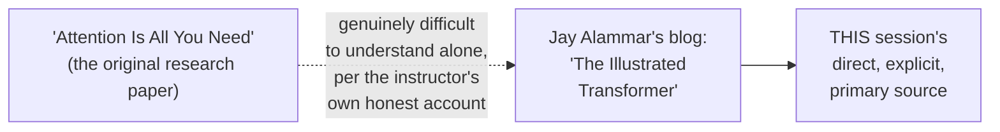

#### 🎯 Key Takeaways

* This session **directly continues** the ongoing NLP arc — Transformers is positioned as the architecture that genuinely supersedes RNN, LSTM, and Bidirectional LSTM, all already covered.
* The instructor **explicitly, repeatedly, honestly credits** Jay Alammar's blog as the genuine source enabling his own understanding — directly modeling that even experienced practitioners benefit from well-explained secondary resources, not just the original paper.
* **BERT is explicitly promised as the very next topic**, with genuine, practical Hugging-Face-based coding examples promised for a following session.

---

### 2. The Transformer as a Black Box: Encoders and Decoders

#### 🧠 Concept — The Complete Black-Box Framing

> 💡 **Given directly:** *"This is my Transformer -- this whole Transformer, just consider this like a black box, and right now we are converting a language -- we are converting sentences of one language to the other -- so this probably is French, and we are trying to convert this into English."*

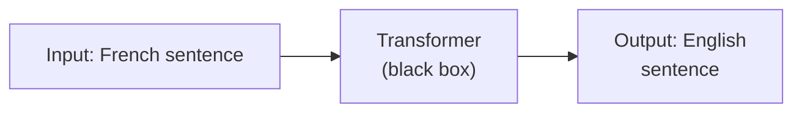

#### 🪜 Step-by-Step — Opening the Black Box: Encoders and Decoders

> 💡 **Given directly:** *"What is present inside this Transformer? It is simple -- whatever we have learned about encoders and decoders... in the encoders, we are giving some input, which we are actually giving in the form of a French sentence, and then we are actually getting the output... this input is given to the encoders, and then, you know, this decoder -- we get the output."*

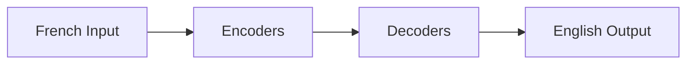

#### 📖 Definition — The Precise, Confirmed Count: Six Encoders, Six Decoders

> 💡 **Given directly:** *"The count -- the count over here -- let's see, okay, so if you go and see this, okay, the count of the number of encoders -- this number of encoders is basically SIX... now the question comes, why six? According to this research paper... they had tried with different, different, different numbers of encoders, but by selecting six encoders, it was giving us good results."*

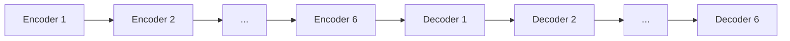

> 💡 **Given directly, an important, direct clarification on this being a genuine hyperparameter:** *"Again, guys, you can change this value -- this is a kind of hyperparameter, you can say, like this -- this is a kind of hyperparameter, and there are a lot of hyperparameters that are going to come up in this session."*

#### 🔍 Internal Working — How the Encoder Stack Connects to the Decoder Stack

> 💡 **Given directly:** *"In encoder, this input is going, okay, then something will happen inside this, and finally, all this particular value is given to the decoder -- and here I will be getting an output."*

#### ⚠ Common Mistakes

* Assuming the number of encoders/decoders (6) is a fixed, mathematically-required value — explicitly, directly clarified as a genuine HYPERPARAMETER, empirically chosen by the researchers after trying multiple different values.
* Assuming the encoder's own output is passed only to the FIRST decoder — explicitly, directly clarified (elaborated further in Section 9): the FINAL encoder's output is passed as an input to EVERY decoder in the stack.

#### 🎯 Key Takeaways

* The Transformer, at the highest level, is a genuine **black box**: input in one language, output in another (or more generally, any sequence-to-sequence transformation).
* Opening this black box reveals **encoders and decoders** — the original paper uses **6 of each**, a genuine, empirically-chosen hyperparameter, not a fixed architectural requirement.
* The **final encoder's output** is passed forward to the decoder stack — the precise mechanism for this connection is elaborated further once the decoder's own internal structure is covered (Section 9).

---
### 3. Inside an Encoder: Self-Attention & Feed-Forward, and Why Words Are Passed in Parallel

#### 📖 Definition — Every Encoder's Two Internal Layers

> 💡 **Given directly:** *"Inside this encoder, there are two things -- one is SELF-ATTENTION, and one is FEED-FORWARD NEURAL NETWORK -- this feed-forward neural network is an example of an artificial neural network, it is just like that... self-attention is completely derived from something called as 'Attention Is All You Need,' and this actually plays a very, very important role."*

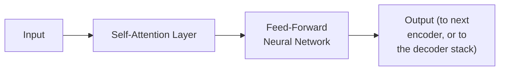

#### 🪜 Step-by-Step — Converting Words Into Vectors

> 💡 **Given directly:** *"If you have an input text, how do you convert that -- by using an embedding layer, right, using an embedding technique -- it may be Word2Vec, it may be other techniques... based on this particular research paper, they have used Word2Vec... and they have converted this into a vector of -- here you can say that they have specified a vector of size 512."*

```text
Each word -> Word2Vec embedding -> 512-dimensional vector
```

> 💡 **Given directly, a genuine, direct clarification on this being another hyperparameter:** *"Why 512? Again, it is a kind of hyperparameter -- okay, again, it is a kind of hyperparameter, based on the research paper."*

#### 🔍 Internal Working — The Genuinely Important, Structural Difference From RNN

> 💡 **Given directly, the complete, precise contrast:** *"Remember, this word will be given, not one at a time, like how we do it in RNN, right -- in RNN, in the X-axis, we basically have timestamp, right -- so this will be my timestamp -- but here, I will not be giving [inputs] based on timestamp -- here, the inputs will be given ALL AT THE SAME TIME -- so parallel -- all the inputs will be given."*

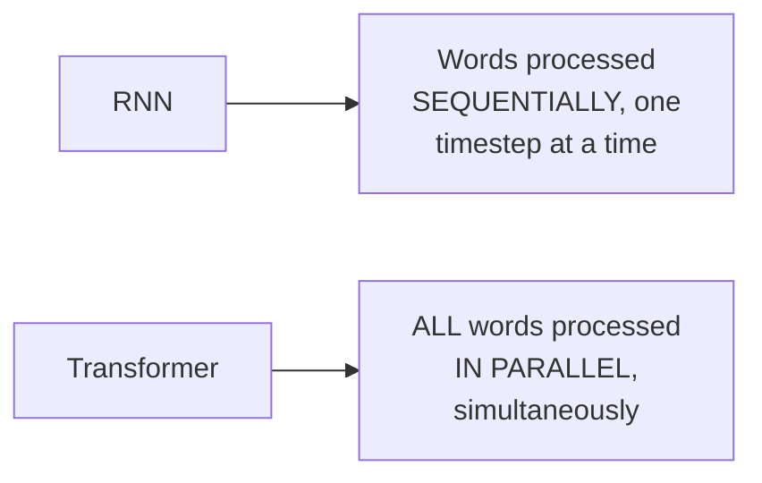

> 💡 **Given directly, precisely confirming this parallel processing works even for a simplified, two-word illustration:** *"What Jay has actually done is that, instead of taking three words, he has just simplified the diagram with two words."*

#### ⚠ Common Mistakes

* Assuming Transformer inputs are processed sequentially, word by word, similar to RNN — explicitly, directly, repeatedly corrected: EVERY word's embedding is fed into the self-attention layer SIMULTANEOUSLY, at the SAME time, a genuinely fundamental structural difference from RNN.
* Assuming the embedding dimension (512) is a fixed, universal, mathematically-derived value — explicitly, directly clarified as another genuine hyperparameter, chosen by the researchers.

#### 🎯 Key Takeaways

* Every encoder contains exactly **two internal layers**: self-attention, followed by a feed-forward neural network.
* Words are converted into **512-dimensional vectors** via Word2Vec-style embedding — a genuinely important, directly-stated hyperparameter choice, not a fixed requirement.
* Transformer inputs are processed **entirely in parallel** — ALL words fed into self-attention simultaneously — a genuinely fundamental, structural departure from RNN's sequential, timestep-based processing.

---

### 4. Self-Attention Motivation: What Does "It" Refer To?

#### 🧠 Concept — The Complete, Genuinely Well-Known Motivating Example

> 💡 **Given directly:** *"Now self-attention, at [a] higher level -- he has taken this example: 'The animal did not cross the street because it was too tired' -- okay, now he asks a simple question -- what does 'it' in the sentence refer to? Whether this 'it' refers to the street, or whether it refers to the animal."*

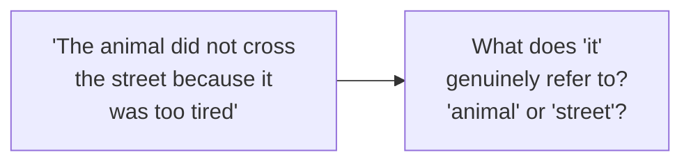

#### ❓ Why It Exists — Precisely Why This Is Genuinely Hard for an Algorithm

> 💡 **Given directly:** *"It is a simple question to a human, but the algorithm cannot understand this -- so how do we make the algorithm understand that whenever this 'it' actually goes, it is basically referring to the word 'animal'? And this 'it' can also be referring to 'tired,' right -- to the tired word, and to the animal word -- it can also refer to multiple words."*

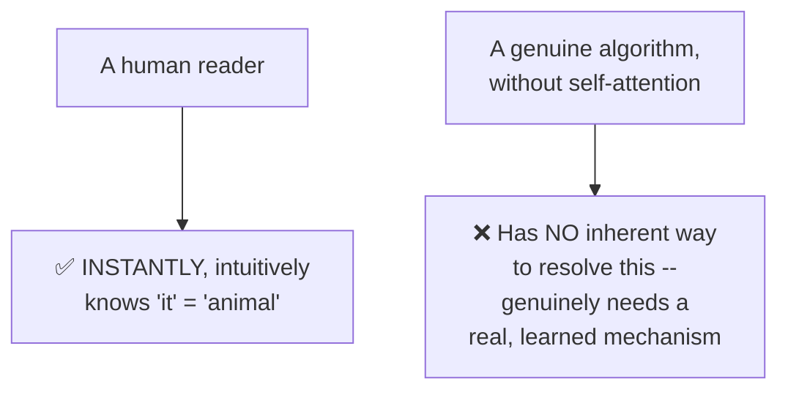

#### 📖 Definition — What Self-Attention's Output Genuinely Represents

> 💡 **Given directly:** *"Whenever I say self-attention, whenever I will be able to give this as an input, I should be able to get the vectors which is specifying the importance of word, like animal or tired... here you'll be able to see that, in one of the attention models, this is just a diagrammatic representation -- this 'it' word specifies, or provides, the importance to [the] animal word -- how it is specifying -- because you can see the darkness of the line."*

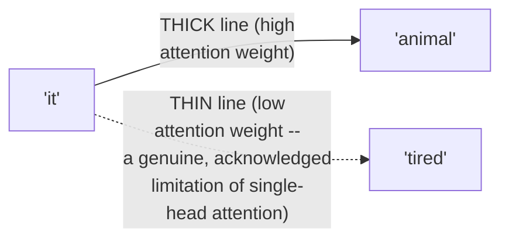

#### ⚠ A Direct, Honest Acknowledgment: Single-Head Attention Has a Genuine Limitation

> 💡 **Given directly:** *"You'll also be seeing that there is one problem -- it is not able to specify [the] 'tired' word also properly -- but we'll try to see how to fix that."*

#### ⚠ Common Mistakes

* Assuming pronoun resolution is a genuinely "solved," trivial problem for any NLP system — explicitly, directly demonstrated as a genuinely non-trivial challenge, precisely because a raw algorithm has NO inherent, built-in intuition the way a human reader does.
* Assuming this session's own initial visualization (showing "it" connecting strongly to "animal" but weakly to "tired") represents self-attention's FINAL, complete capability — explicitly, directly, honestly flagged as an INCOMPLETE picture, with the FIX (multi-head attention) explicitly promised and covered next (Section 6).

#### 🎯 Key Takeaways

* Self-attention's genuine PURPOSE is precisely illustrated via pronoun resolution — determining that "it" in a specific sentence genuinely refers to "animal," not "street" (or, ideally, capturing relevant relationships to BOTH "animal" and "tired").
* This is a genuinely NON-TRIVIAL problem for a raw algorithm — a human's INSTANT, intuitive understanding has NO direct equivalent without a genuine, learned attention mechanism.
* A single-head attention visualization, honestly examined, reveals a genuine LIMITATION — capturing the "it"→"animal" relationship well, but the "it"→"tired" relationship poorly — directly, explicitly motivating multi-head attention (Section 6).

---
### 5. Self-Attention Mechanics: A Complete, Step-by-Step Walkthrough

#### 🪜 Step-by-Step — Step 1: Creating Query, Key & Value Weight Matrices

> 💡 **Given directly:** *"The first step that usually happens is that we will be creating THREE WEIGHTS -- and this weight value will be randomly initialized, because remember, this weight value will be changing based on your backpropagation... they are actually creating this three weight parameter: WQ, WK, WV."*

```text
X1, X2 (each word's 512-dim embedding vector)
WQ, WK, WV -- three weight matrices, randomly initialized, each producing 64-dim output

Q1 = X1 · WQ    K1 = X1 · WK    V1 = X1 · WV
Q2 = X2 · WQ    K2 = X2 · WK    V2 = X2 · WV
```

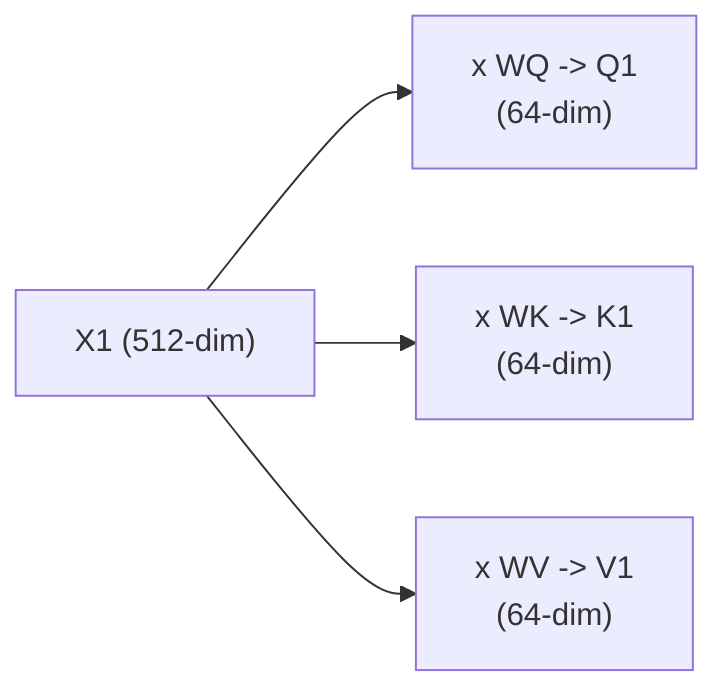

> 💡 **Given directly, confirming the precise 512→64 dimension reduction:** *"The number of dimensions that we'll be getting with respect to this is 64 dimensions -- 64 dimension, that is what it has been written in the research paper also."*

#### 🪜 Step-by-Step — Step 2: Computing Scores (Query · Key)

> 💡 **Given directly:** *"For each and every word, what we are going to do is that we are going to multiply this Q1 and K1... for this word, you can see that I have multiplied Q1 and K1... then for this same word, this Q1 and K2 will also get multiplied... this value is called as SCORE."*

```text
Score(word1, word1) = Q1 · K1
Score(word1, word2) = Q1 · K2
Score(word2, word1) = Q2 · K1
Score(word2, word2) = Q2 · K2
```

> 💡 **Given directly, the precise, worked numerical values used in the live example:** *"With respect to my 'machines,' in that, whatever keys were there, I'm getting 96, and here I'm actually getting 112."*

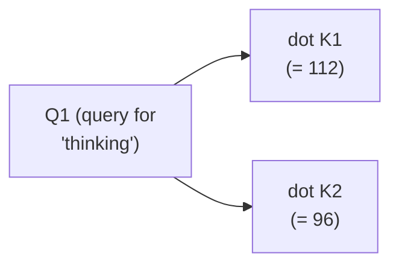

#### 🪜 Step-by-Step — Step 3: Scaling by √dk

> 💡 **Given directly:** *"In my next statement, I'm going to divide by 8 -- why we are dividing by 8? Because understand, guys, as I told you, we have 64 dimensions... 8 is nothing but ROOT OF DK -- root of DK is nothing but this is basically treated as DK -- what is the dimension of the queries -- and when I do the root of 64, I'm going to get 8."*

```text
Scaled Score = Score / √dk = Score / √64 = Score / 8

112 / 8 = 14
96 / 8 = 12
```

#### ❓ Why It Exists — A Genuine, Direct Interview Question, Honestly Answered

> 💡 **Given directly, in response to a genuine, live audience question:** *"Krish, we are not able to understand why we are dividing by the root of dimension -- in one of my interviews, I got this question -- because this is based on the research paper, guys -- they had research with different, different values, but they were able to derive it -- when they were considering this query size, this query size was 64 dimensions, they were just trying to use it as a hyperparameter, and they finally used this as square root of 64."*

#### 🪜 Step-by-Step — Step 4: Applying Softmax

> 💡 **Given directly:** *"Now I'm actually applying a softmax activation function -- whenever you give any inputs to the softmax, the total value will be equal to 1 -- since 14 is greater than 12, the higher value that you have got is for 14, like 0.88 -- and then the lower value is basically given to 0.12."*

```text
softmax(14, 12) ≈ (0.88, 0.12)   -- values sum to exactly 1
```

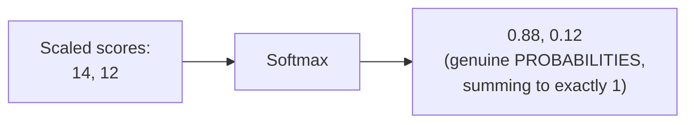

#### 🪜 Step-by-Step — Step 5: Weighted Sum With Value Vectors

> 💡 **Given directly:** *"Whatever the softmax value is there, this value is MULTIPLIED by the softmax value, and we will be again getting a different vector... for this particular word, you'll be having Vector V1, Vector V2, and finally we ADD these two vectors to get Z1."*

```text
Z1 = (0.88 × V1) + (0.12 × V2)
```

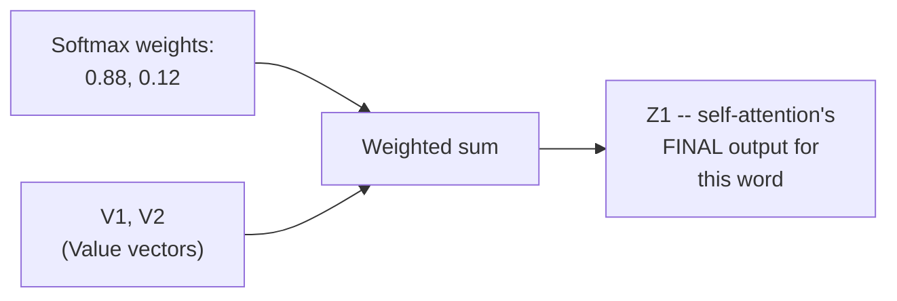

#### 📖 Definition — The Complete, Compact Matrix Formula

> 💡 **Given directly, precisely summarizing all five steps into one formula:** *"You are multiplying Q multiplied by K -- obviously, when you are multiplying this two matrix, you have to transpose one of the matrix -- in this case, I have transposed K, of T -- and then you have divided by root of D of K -- on top of that, you have applied an activation function like softmax -- and then multiplying by V."*

```text
Attention(Q, K, V) = softmax( Q·K^T / √dk ) · V
```

#### 🔍 Internal Working — Why All Words Are Genuinely, Efficiently Processed Together

> 💡 **Given directly:** *"We have combined all the words -- the first word is nothing but 'thinking,' right, the second value is your second word, basically 'machine' -- so we have placed all the words one after the other, and we are actually doing a MATRIX MULTIPLICATION with WQ, WK, and WV... matrix multiplication -- that is our main aim, right -- we don't have to just wait here, we are giving all the words at once."*

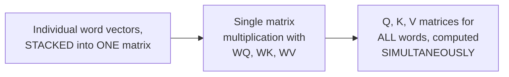

#### ⚠ Common Mistakes

* Assuming Query, Key, and Value are conceptually or mathematically DIFFERENT kinds of information from the start — explicitly, directly clarified: they're all derived from the SAME input vector (X), each via its OWN, separately-learned weight matrix — genuinely analogous to the same relationship established for Transformer architecture in the earlier "Transformers 101" derivation.
* Assuming the scaling factor (√dk = 8) is an arbitrary, unexplained constant — explicitly, directly, honestly answered as a genuine, common interview question, with the precise reasoning (query dimension = 64, √64 = 8) directly given.
* Assuming the softmax output values ARE the final self-attention output — explicitly, directly clarified: softmax produces WEIGHTS, which are THEN multiplied against the Value vectors and SUMMED to produce the genuine final output (Z).

#### 🎯 Key Takeaways

* Self-attention's complete computation, precisely traced step by step: **create Q/K/V weight matrices → compute Query·Key scores → scale by √dk → apply softmax → compute the weighted sum with Value vectors** — producing each word's final output vector (Z).
* The complete formula, `Attention(Q,K,V) = softmax(QK^T/√dk)·V`, directly, precisely summarizes this ENTIRE five-step process.
* **"Why divide by √dk?"** is explicitly, directly flagged as a genuine, real interview question the instructor has personally encountered — with the precise, honest answer being that this specific scaling value was empirically derived by the paper's own researchers.
* All words are processed via a **single, efficient matrix multiplication** — directly, structurally enabling the parallel processing established in Section 3.

---
### 6. Multi-Head Attention: Capturing Richer Relationships

#### ❓ Why It Exists — The Precise, Directly-Stated Limitation of Single-Head Attention

> 💡 **Given directly:** *"Whatever inputs we have used, we have used WQ, WK, and WV -- these are my vectors, and we are just using SAME weights for all the words -- we can basically indicate this whole WQ, WK, and WV as something called as -- you can see that -- a SINGLE-HEAD ATTENTION -- but understand, by using just single-head attention, what will be the problem? ...We should also get some importance for this 'tired' word, right, and right now we are not able to get [it], because we are just using the single weights."*

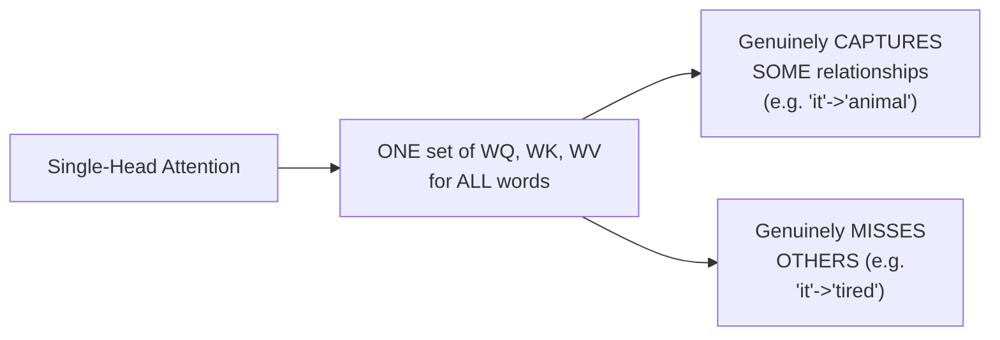

#### 📖 Definition — Multi-Head Attention, Precisely Introduced

> 💡 **Given directly:** *"What if I use MULTIPLE weights, like this? Multiple weights -- this is just your single-head attention -- instead of single-head attention, we will try to use MULTI-HEAD attention -- multi-headed attention basically says that, in this case, we will try to use head zero, like this -- this will be my weight zero Q, weight zero K, weight zero V -- this will be my weight one Q, weight one K, weight one V."*

```text
Head 0: WQ⁰, WK⁰, WV⁰  ->  produces Z0
Head 1: WQ¹, WK¹, WV¹  ->  produces Z1
...
Head 7: WQ⁷, WK⁷, WV⁷  ->  produces Z7
```

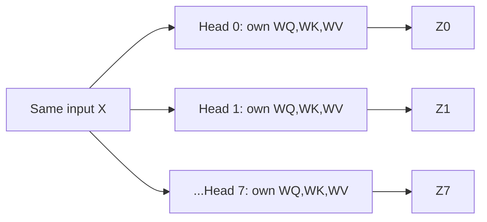

#### 🔍 Internal Working — Precisely Why 8 Heads Genuinely Captures More

> 💡 **Given directly:** *"How many heads we will be considering -- here again, based on this, they have told, we will be using EIGHT HEADS -- now when we use eight heads, that means we will be getting eight Zed values."*

> 💡 **Given directly, confirming the concrete, empirical improvement:** *"If I'm using two heads, right, now here you'll be able to see that I'm also getting the importance of [the] 'tired' word for it, and I'm also getting the importance of the 'animal' word for it -- so both the importance word, we are actually getting -- this is just for head two -- but if there are multiple heads, again, more importance word, whichever is more important word, we will be getting highlighted."*

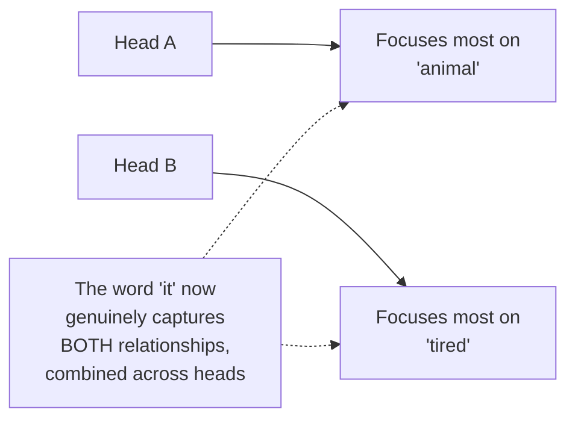

#### 🪜 Step-by-Step — Combining the Multiple Heads' Outputs

> 💡 **Given directly:** *"Still it is not just the end, because I told you, as soon as we pass the input to the attention model, I should be getting ONE Z value, right, but there I have eight Z values -- how do I combine them, so that I actually form Z1? ...We will try to combine all the Zeds... before passing it to the feed-forward neural network, we will again initialize ANOTHER MATRIX -- this matrix will get multiplied by all the concatenation of this attention heads, and finally we'll be getting a Z value."*

```text
Combined = Concat(Z0, Z1, Z2, Z3, Z4, Z5, Z6, Z7)
Final Z = Combined · W0    (W0 is a NEW, additional, learned weight matrix)
```

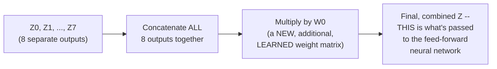

> 💡 **Given directly, confirming that W0 is ALSO genuinely learned:** *"Why -- and again, this W0 weights can also be updated in the backpropagation."*

#### ⚠ Common Mistakes

* Assuming multi-head attention means running the ENTIRE self-attention computation multiple times INDEPENDENTLY, with no genuine combination step — explicitly, directly clarified: after computing all 8 heads' outputs, they are CONCATENATED and passed through an ADDITIONAL, learned weight matrix (`W0`) to produce ONE, final, combined Z value.
* Assuming the number of heads (8) is a fixed, universal requirement — explicitly, directly framed as another empirically-chosen hyperparameter, directly paralleling the encoder/decoder count (6) established in Section 2.

#### 🎯 Key Takeaways

* **Multi-head attention** directly, precisely solves single-head attention's genuine limitation: using MULTIPLE, independent sets of Query/Key/Value weights (8, per the paper) allows the model to capture MULTIPLE, genuinely different relationships simultaneously (e.g., "it"→"animal" AND "it"→"tired").
* Each head produces its OWN, independent output (Z0 through Z7); these are **CONCATENATED**, then multiplied by an ADDITIONAL, separately-learned weight matrix (**W0**) to produce ONE, final, combined output.
* This W0 matrix is **ALSO genuinely trainable**, updated via backpropagation exactly like every other weight matrix in the architecture.

---

### 7. Positional Encoding: Preserving Word Order

#### ❓ Why It Exists — Precisely Motivated by Parallel Processing's Own Trade-Off

> 💡 **Given directly:** *"Before giving to the encoder, guys, there is a concept which is called as POSITIONAL ENCODING... this positional encoding will basically say whether this word and this word are near, or whether this word or this word are near -- the ordering of the words are also pretty much important, whenever you are writing sentences."*

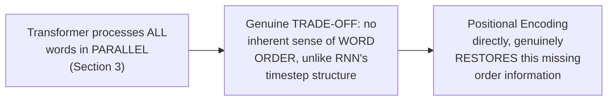

#### 🔍 Internal Working — Precisely How Positional Encoding Represents Distance

> 💡 **Given directly:** *"Whenever we take these vectors, we are going to assign some vectors over here -- suppose this vector is there... suppose this three have been computed, this three positional encodings has been computed -- you'll be able to see that, if I try to find out the distance between this vector to this vector, this will be LESS, when compared to this vector to this vector -- because this basically says how much distance -- whether this particular word is the NEXT word after this."*

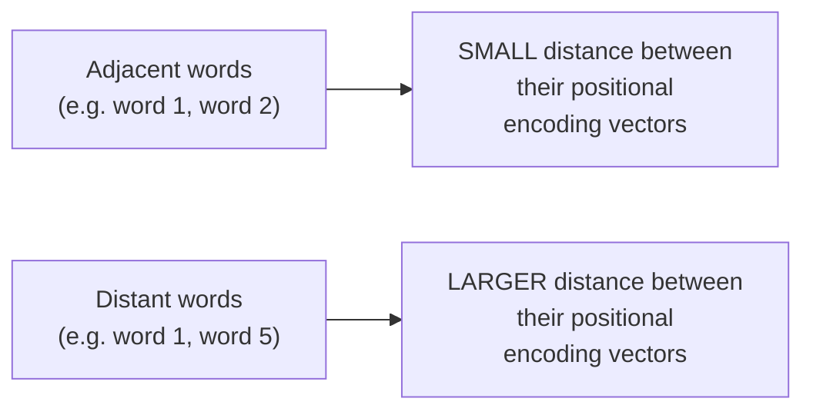

#### 🪜 Step-by-Step — How Positional Encoding Is Genuinely Integrated

> 💡 **Given directly:** *"When this is happening -- this is happening when you are providing this as an input to the encoders -- before providing this to the encoders, you are applying a positional encoding, and you're ADDING [it] to this vectors -- and finally you'll be seeing that you are getting some embedding dimensions with some TIME SIGNALS -- time signals basically means whatever positional encoding parameters or values you had, you are actually integrating in that, by adding it with this embeddings."*

```text
Final Input Vector = Word Embedding (512-dim) + Positional Encoding (512-dim)
```

```mermaid
flowchart LR
    A["Word Embedding<br/>(512-dim, from Word2Vec)"] --> C["+ (element-wise<br/>addition)"]
    B["Positional Encoding<br/>(512-dim)"] --> C
    C --> D["Final input vector,<br/>fed to the encoder"]
```

#### ⚠ Common Mistakes

* Assuming positional encoding is applied SEPARATELY, or somehow AFTER the self-attention layer — explicitly, directly clarified: it's added DIRECTLY to the word embedding vector, BEFORE the combined vector is ever passed into the encoder.
* Assuming positional encoding is genuinely necessary ONLY because of some arbitrary design choice — explicitly, directly connected to the SPECIFIC trade-off introduced by processing words in parallel (Section 3) — a DIRECT, necessary consequence of that earlier architectural decision.

#### 🎯 Key Takeaways

* **Positional encoding** directly, precisely solves the genuine trade-off introduced by parallel word processing: since words no longer have an inherent, sequential order (unlike RNN), positional encoding vectors GENUINELY, explicitly restore this missing order/distance information.
* Positional encoding is **ADDED** directly to each word's embedding vector, BEFORE the combined result is passed into the encoder — the two vectors are genuinely, directly combined, not processed separately.
* Nearby words genuinely produce positional encoding vectors with **SMALLER distance** between them; distant words produce vectors with **LARGER distance** — directly, precisely encoding genuine relative position information.

---
### 8. Residual Connections & Layer Normalization (Add & Norm)

#### 📖 Definition — The Precise, Direct Statement of the Architectural Detail

> 💡 **Given directly:** *"One detail in the architecture of the encoder that we need to mention before moving on is that each sublayer in each encoder has a RESIDUAL CONNECTION around it, followed by a LAYER NORMALIZATION."*

#### 🧠 Concept — Directly, Explicitly Connected to ResNet

> 💡 **Given directly:** *"What is this residual connection, guys? Can anybody tell? I hope everybody has heard of ResNet -- if you go and see the ResNet architecture, suppose this is your hidden neurons... the data will be passing like this, right -- sometimes it may happen that data [is] directly passing like this -- it may pass to something like this... sometimes this two hidden layers are not playing that very good role -- so what we can do is that, whatever input is coming here, we can actually pass it to this particular node."*

```mermaid
flowchart LR
    A["ResNet's skip/residual<br/>connections"] -.->|"DIRECT, explicit<br/>analogy"| B["Transformer's own<br/>residual connections<br/>(around EVERY sublayer)"]
```

#### 🪜 Step-by-Step — How This Applies Specifically to Self-Attention and Feed-Forward

> 💡 **Given directly:** *"In this case, we have -- if the self-attention is not performing well, what we can do -- or if this... if the self-attention is not performing well, we can directly SKIP this, and we can provide this connection over here directly to this normalizing function -- it has to normalize -- this is your LAYER NORMALIZATION."*

```mermaid
flowchart TD
    A["Input to sublayer<br/>(e.g. Self-Attention)"] --> B["Self-Attention<br/>processing"]
    A -.->|"Residual/skip<br/>connection"| C["Add"]
    B --> C
    C --> D["Layer Normalization"]
    D --> E["Output"]
```

#### 🔍 Internal Working — The Precise, Genuine Purpose, Directly Compared to Dropout

> 💡 **Given directly:** *"Why this is used -- because understand, sometimes your self-attention may not work well, it may not be that important -- yes, it can be same as Dropout -- you can also consider it as a Dropout, or you can -- you're just skipping it -- you are just skipping this layer... similarly, over here, you can see the output of this add normalization -- if this feed-forward is not important, it will directly be passed to this add or normalize -- otherwise, if it is important, it'll go in this particular path."*

#### 📖 Definition — The Precise, Complete Add & Norm Formula

> 💡 **Given directly:** *"What this add and normalize does is that, see, this add and normalize is nothing but -- whatever output I'm getting as Zed, I'm taking that, I'm adding it to my inputs, and then I'm performing a normalization layer."*

```text
Output = LayerNorm(X + Sublayer(X))

where Sublayer(X) is either Self-Attention(X) or FeedForward(X)
```

```mermaid
flowchart LR
    A["X (input)"] --> B["Sublayer(X)<br/>(Self-Attention OR<br/>Feed-Forward)"]
    A --> C["+"]
    B --> C
    C --> D["LayerNorm"]
    D --> E["Final sublayer output"]
```

#### ⚠ Common Mistakes

* Assuming residual connections in the Transformer are a genuinely NEW, Transformer-specific invention — explicitly, directly, precisely credited to the SAME underlying concept as ResNet's own skip connections.
* Assuming residual connections and Dropout are the SAME technique — explicitly, directly clarified as merely CONCEPTUALLY similar (both allow the network to effectively "skip" or de-emphasize a layer's contribution when it's not genuinely useful), NOT literally identical mechanisms.
* Assuming Add & Norm is applied only ONCE per encoder — explicitly, directly clarified: it's applied AFTER BOTH the self-attention sublayer AND the feed-forward sublayer, TWICE per encoder in total.

#### 🎯 Key Takeaways

* Every sublayer in the encoder (self-attention AND feed-forward) is wrapped with a **residual connection followed by layer normalization** — directly, explicitly credited to the SAME underlying concept established in the ResNet architecture.
* The precise, complete formula: **`LayerNorm(X + Sublayer(X))`** — the sublayer's output is genuinely ADDED to its own input, THEN normalized.
* This mechanism serves a genuine, practical purpose — allowing the network to effectively "skip" or de-emphasize a sublayer's contribution if it isn't genuinely useful, directly, conceptually comparable (though not identical) to Dropout's own regularizing effect.

---

### 9. Inside the Decoder: Self-Attention, Encoder-Decoder Attention & Autoregressive Generation

#### 📖 Definition — The Decoder's Own, Genuinely Additional Layer

> 💡 **Given directly:** *"Let's just compare with respect to encoder and decoder -- in encoder, you have a self-attention layer, you have a feed-forward neural network, right -- so here also you have a self-attention layer, you also have a feed-forward neural network -- but IN BETWEEN, you have something called as ENCODER AND DECODER ATTENTION."*

```mermaid
flowchart TD
    A["Decoder"] --> B["Self-Attention<br/>(operates on the<br/>decoder's OWN sequence)"]
    B --> C["Encoder-Decoder<br/>Attention (a GENUINELY<br/>ADDITIONAL layer, not<br/>present in the encoder)"]
    C --> D["Feed-Forward<br/>Neural Network"]
```

#### 🔍 Internal Working — Precisely What Encoder-Decoder Attention Does

> 💡 **Given directly:** *"This is similar to the self-attention model, right, but the only difference is that the OUTPUT OF THIS ENCODER is passed to this layer -- it is not passed to the self-attention layer, but instead it is passed to the encoder and decoder attention, and this encoder-decoder attention will be doing the same work as self-attention layer -- only the input is basically getting passed to this THROUGH THE ENCODER... the input to this is basically the output of the encoder."*

```mermaid
flowchart LR
    A["FINAL Encoder's<br/>own output"] --> B["Passed as Key/Value<br/>into EVERY decoder's own<br/>Encoder-Decoder<br/>Attention layer"]
```

#### 🪜 Step-by-Step — The Decoder's Genuinely, Fundamentally Different Generation Process

> 💡 **Given directly, the precise, direct contrast:** *"Here we are providing all the parallel inputs, right -- but here, the output that is getting generated, it will be ONE BY ONE -- again, try to understand this -- here we passed all our input at once, but here we will be generating our output ONE BY ONE."*

```mermaid
flowchart LR
    A["ENCODER:<br/>ALL inputs processed<br/>in PARALLEL"] -.->|"GENUINELY DIFFERENT<br/>processing pattern"| B["DECODER:<br/>Outputs generated<br/>ONE AT A TIME<br/>(autoregressive)"]
```

#### 🪜 Step-by-Step — A Complete, Worked Example (English to Hindi)

> 💡 **Given directly, the complete, worked, step-by-step generation trace:** *"Suppose I'm passing 'think' -- 'think' in Hindi is like 'सोच' (socho), okay -- now this 'सोच' word will again be passed as an input to my self-attention layer in the decoder... after 'सोच,' I have to generate the next word -- so what will happen? This will go again over here as an input -- now this input will get combined with the output of the encoder... then that 'machine' will be converted into something like 'यंत्र' (yantra)."*

```mermaid
sequenceDiagram
    participant Decoder
    Note over Decoder: Timestep 1: generate<br/>"सोच" ("think")
    Decoder->>Decoder: Timestep 2: feed<br/>"सोच" back as input,<br/>combined with encoder<br/>output -> generate "यंत्र"
    Decoder->>Decoder: Timestep 3: feed<br/>"सोच यंत्र" back as<br/>input -> generate next<br/>word
    Note over Decoder: Continues until an<br/>END-OF-SEQUENCE<br/>token is generated
```

> 💡 **Given directly, precisely confirming this repeats until a genuine stopping condition:** *"This operation will happen again and again, unless you don't get your EOS -- end of statement."*

#### 🔍 Internal Working — A Genuinely Important, Direct Clarification: The Encoder's Input Is NOT Re-Sent

> 💡 **Given directly:** *"Remember, again, your input will not be going, okay -- again, your input will not be going -- input has gone at once, but this [decoder] operation will happen again and again."*

#### 📖 Definition — The Final Linear & Softmax Layer

> 💡 **Given directly:** *"After getting the output, first of all we apply a LINEAR, and then we apply a SOFTMAX -- after softmax, we get an output."*

```mermaid
flowchart LR
    A["Decoder's final,<br/>internal output"] --> B["Linear Layer"]
    B --> C["Softmax"]
    C --> D["Output probabilities<br/>over the vocabulary --<br/>the actual, generated<br/>word"]
```

#### ⚠ Common Mistakes

* Assuming the decoder processes its own inputs in PARALLEL, just like the encoder — explicitly, directly, repeatedly corrected: the decoder GENERATES its outputs ONE AT A TIME, in a genuinely AUTOREGRESSIVE manner, feeding each newly-generated word back as input for generating the NEXT word.
* Assuming the encoder's own input is re-processed or re-sent at EVERY decoder timestep — explicitly, directly clarified: the encoder's input is processed ONCE, producing ONE, final output that remains AVAILABLE (via the encoder-decoder attention layer) throughout ALL of the decoder's own, repeated generation steps.
* Assuming "encoder-decoder attention" and "self-attention" are the SAME layer, simply relabeled — explicitly, directly distinguished: they perform the SAME underlying MECHANISM, but encoder-decoder attention specifically receives its Key/Value inputs FROM the encoder's own output, while self-attention operates entirely on the decoder's OWN sequence.

#### 🎯 Key Takeaways

* The decoder contains **THREE layers** (versus the encoder's two): self-attention, encoder-decoder attention (genuinely additional), and feed-forward — with encoder-decoder attention specifically receiving Key/Value inputs FROM the final encoder's own output.
* The decoder's generation process is **fundamentally, structurally different** from the encoder's: while the encoder processes ALL inputs in parallel, the decoder generates outputs ONE WORD AT A TIME, feeding each generated word back as input for the next step — continuing until a genuine end-of-sequence signal is produced.
* The **final Linear + Softmax layer** converts the decoder's own internal representation into genuine, output probabilities over the target vocabulary — directly producing the actual, generated word at each step.

---
### 10. Closing: What's Next (BERT, Hugging Face)

#### 🏢 Real-World / Production Usage — A Genuine, Direct Confirmation of Transformer's Real-World Status

> 💡 **Given directly, in response to a genuine, live audience question:** *"Why self-attention is not working well? No, it works well -- it works well -- but remember, Transformers work better than that -- it works well, but this is a STATE-OF-THE-ART algorithm."*

```mermaid
flowchart LR
    A["Self-attention/RNN/LSTM<br/>(previously covered)"] --> B["Genuinely, still WORK<br/>-- but Transformers<br/>GENUINELY perform<br/>BETTER"]
    C["Transformers"] --> D["The GENUINE, current<br/>state-of-the-art"]
```

#### 📖 Definition — A Direct, Genuine Connection to the Original Paper's Own Formula Notation

> 💡 **Given directly:** *"You'll be able to see this, guys, 'Attention Is All You Need' -- they have done dot-product attention, multi-head attention -- so this is how they have actually shown in the research paper -- same type of operation -- softmax of Q multiplied [by] K of T, divided by root of D of K, multiplied by V -- multi-head attention, you know, concatenated head attention -- this is there."*

#### 🪜 Step-by-Step — The Explicit, Stated Roadmap Ahead

> 💡 **Given directly:** *"In the next session, we'll try to discuss about BERT -- okay, we'll discuss about BERT, BERT is there next -- and probably, again, I'll be referring [to] him, through his particular lessons itself."*

```mermaid
flowchart LR
    A["Day 12 (done):<br/>Transformers, complete<br/>architecture (via Jay<br/>Alammar's blog)"] --> B["Next (a couple of<br/>days): BERT (also via<br/>Jay Alammar's blog)"]
    B --> C["Later: practical,<br/>coding examples with<br/>HUGGING FACE"]
```

> 💡 **Given directly, confirming genuine, practical coding examples are explicitly planned:** *"In the upcoming session, I think I will be including some examples, uh, practical examples with the help of Hugging Face -- there you'll be able to understand very nicely."*

#### ⚠ Common Mistakes

* Assuming this session's own deep, careful conceptual walkthrough means Transformers has now become "obsolete" or superseded within this specific course's own roadmap — explicitly, directly clarified: Transformers remains the genuine, current STATE-OF-THE-ART, with BERT (the very next topic) being a specific, genuine APPLICATION/EXTENSION of Transformer architecture, not a replacement for it.
* Assuming genuine, practical implementation experience is unnecessary once the conceptual architecture is understood — explicitly, directly countered by the instructor's own stated plan to include genuine, practical Hugging-Face-based coding examples in an upcoming session.

#### 🎯 Key Takeaways

* **Transformers** are explicitly, directly confirmed as the current, genuine STATE-OF-THE-ART architecture — a real, significant advancement beyond RNN, LSTM, and Bidirectional LSTM, all previously covered.
* **BERT is explicitly, directly promised as the very next topic**, planned for "a couple of days" after this session — again explicitly planned to be taught via Jay Alammar's own blog resources.
* **Genuine, practical coding examples using Hugging Face** are explicitly promised for an upcoming session — directly connecting this session's own deep conceptual understanding to real, hands-on implementation.

---

## 📝 Glossary

| Term | Definition | Why It Matters |
|---|---|---|
| **Encoder** | Processes the input sequence; the original paper uses 6, stacked | Contains self-attention + feed-forward layers |
| **Decoder** | Generates the output sequence, one word at a time; also 6, stacked | Contains self-attention + encoder-decoder attention + feed-forward |
| **Self-Attention** | Computes each word's relevance to every other word in the SAME sequence | The core innovation motivating the entire paper |
| **Query, Key, Value (Q, K, V)** | Three vectors derived from each word's embedding, via separate weight matrices | The building blocks of the attention computation |
| **Score** | The raw result of Query dot Key | Measures relevance between two words |
| **Scaling (/root dk)** | Dividing scores by the square root of the key dimension | A genuine, common interview question |
| **Multi-Head Attention** | Multiple, independent sets of Q/K/V weights, combined | Captures richer, more diverse relationships than a single head |
| **Positional Encoding** | A vector added to word embeddings, encoding word order/distance | Genuinely necessary since words are processed in parallel |
| **Residual Connection** | Directly, genuinely credited to ResNet's own skip connections | Allows the network to effectively skip an unhelpful sublayer |
| **Layer Normalization** | Applied after each residual connection (Add & Norm) | Stabilizes the network's own internal representations |
| **Encoder-Decoder Attention** | A decoder-only layer, receiving Key/Value from the encoder's output | Genuinely additional, beyond the decoder's own self-attention |
| **Autoregressive Generation** | Generating output words one at a time, feeding each back as input | The decoder's fundamentally different generation process |

---

## 🔄 Revision Notes — One-Minute Revision

* This session **directly continues** the ongoing NLP arc (RNN, LSTM, Bidirectional LSTM already done) -- Transformers is the genuine, current state-of-the-art. The ENTIRE session is explicitly, directly credited to Jay Alammar's blog, "The Illustrated Transformer," used specifically because the original paper alone was genuinely difficult to understand.
* **The Transformer as a black box**: French input -> English output. Opens into **6 encoders, 6 decoders** (a genuine, empirically-chosen hyperparameter). The final encoder's output is passed to EVERY decoder.
* **Each encoder**: Self-Attention layer + Feed-Forward Neural Network. Words are converted into **512-dim vectors** (via Word2Vec) and processed **ENTIRELY IN PARALLEL** -- a fundamental, structural difference from RNN's sequential, timestep-based processing.
* **Self-attention's motivation**: "The animal did not cross the street because it was too tired" -- what does "it" refer to? A human knows instantly; an algorithm genuinely needs a learned mechanism.
* **Self-attention's complete, 5-step computation**: (1) create Q/K/V weight matrices (randomly initialized, 512->64 dim); (2) compute scores (Query.Key); (3) scale by /root(dk) = /8 (a GENUINE, common interview question, empirically derived); (4) apply softmax (weights summing to 1); (5) weighted sum with Value vectors -> final Z. Complete formula: `Attention(Q,K,V) = softmax(QK^T/root(dk)).V`.
* **Multi-Head Attention**: single-head attention captures SOME relationships (e.g. "it"->"animal") but MISSES others (e.g. "it"->"tired") -- fixed by using 8 INDEPENDENT sets of Q/K/V weights, each producing its own Z, then CONCATENATED and multiplied by an ADDITIONAL, learned weight matrix (W0) to produce ONE final, combined output.
* **Positional Encoding**: since words are processed in parallel (no inherent order), a positional encoding vector is ADDED to each word's embedding -- nearby words have SMALLER vector distance, distant words LARGER.
* **Residual Connections + Layer Normalization (Add & Norm)**: directly credited to ResNet's own skip connections -- `LayerNorm(X + Sublayer(X))`, applied after BOTH self-attention AND feed-forward, allowing the network to effectively skip an unhelpful sublayer (conceptually similar to, but not identical to, Dropout).
* **The Decoder**: THREE layers (self-attention + encoder-decoder attention [genuinely additional, receives K/V from the encoder's output] + feed-forward). Genuinely, fundamentally DIFFERENT generation process: outputs are produced ONE WORD AT A TIME (autoregressive), each newly-generated word fed back as input, continuing until an end-of-sequence token. The encoder's own input is sent ONCE, not re-sent at every decoder step. Final Linear + Softmax layer produces the actual output word.
* **Closing**: Transformers are the genuine, current state-of-the-art. BERT is explicitly promised next (a couple of days), also via Jay Alammar's blog; genuine, practical Hugging-Face coding examples are promised for a later session.

---

## 📋 Cheat Sheet

**The complete architecture, top to bottom:**
```text
Input -> Word2Vec Embedding (512-dim) + Positional Encoding
       -> Encoder Stack (6x): Self-Attention -> Add&Norm -> Feed-Forward -> Add&Norm
       -> Decoder Stack (6x): Self-Attention -> Add&Norm -> Encoder-Decoder Attention -> Add&Norm -> Feed-Forward -> Add&Norm
       -> Linear -> Softmax -> Output word (ONE at a time, autoregressive)
```

**Self-attention, complete formula:**
```text
Q = X . WQ    K = X . WK    V = X . WV     (512-dim -> 64-dim each)

Attention(Q,K,V) = softmax( Q.K^T / sqrt(dk) ) . V     where dk=64, sqrt(64)=8
```

**Multi-head attention:**
```text
8 independent heads, each: Attention(Q_i, K_i, V_i) -> Z_i
Final output = Concat(Z0, Z1, ..., Z7) . W0     (W0 = a NEW, learned weight matrix)
```

**Add & Norm:**
```text
Output = LayerNorm(X + Sublayer(X))     (directly credited to ResNet)
```

**Encoder vs. Decoder:**
```text
Encoder: Self-Attention + Feed-Forward           -- processes ALL inputs in PARALLEL
Decoder: Self-Attention + Encoder-Decoder Attention + Feed-Forward
         -- generates outputs ONE AT A TIME (autoregressive), until EOS
```

**Key hyperparameters (all empirically chosen, per the paper):**
```text
Number of encoders/decoders: 6
Embedding dimension: 512
Q/K/V dimension per head: 64
Number of attention heads: 8
Scaling factor: sqrt(64) = 8
```

---

## 🔥 Interview Questions & Answers

### 🟢 Beginner

**Q1.**

**Question:** How many encoders and decoders does the original Transformer paper use?

**Answer:** 6 of each.

**Explanation:** Directly, explicitly stated.

**Why Interviewers Ask This:** Basic, factual recall of the paper's own configuration.

**Possible Follow-up:** "Is this number a fixed requirement, or a hyperparameter?"

**Q2.**

**Question:** What are the two layers inside each Transformer encoder?

**Answer:** Self-Attention and a Feed-Forward Neural Network.

**Explanation:** Directly, explicitly stated.

**Why Interviewers Ask This:** Foundational encoder architecture knowledge.

**Possible Follow-up:** "What additional layer does the decoder have, beyond these two?"

**Q3.**

**Question:** Are Transformer inputs processed sequentially or in parallel?

**Answer:** In parallel -- all at the same time.

**Explanation:** Directly, precisely, repeatedly confirmed.

**Why Interviewers Ask This:** A fundamental, distinguishing architectural feature vs. RNN.

**Possible Follow-up:** "What genuine trade-off does this parallel processing introduce?"

**Q4.**

**Question:** What is the dimensionality of Word2Vec embeddings used in the original paper?

**Answer:** 512.

**Explanation:** Directly, explicitly stated.

**Why Interviewers Ask This:** Basic, factual recall.

**Possible Follow-up:** "What is the dimensionality of each Query/Key/Value vector, after projection?"

**Q5.**

**Question:** Why is the score divided by the square root of dk before applying softmax?

**Answer:** This scaling was empirically determined by the paper's researchers, using dk=64 (so root(64)=8), to stabilize the values before applying softmax.

**Explanation:** Directly, explicitly, honestly explained.

**Why Interviewers Ask This:** Explicitly flagged as a genuine, real interview question the instructor personally encountered.

**Possible Follow-up:** "What is the value of dk in the original paper, and what does root(dk) equal?"

**Q6.**

**Question:** What problem does multi-head attention solve, compared to single-head attention?

**Answer:** Single-head attention can miss some genuine relationships between words; multiple heads capture richer, more diverse relationships simultaneously.

**Explanation:** Directly, precisely explained.

**Why Interviewers Ask This:** Foundational multi-head attention motivation.

**Possible Follow-up:** "How many heads does the original paper use?"

**Q7.**

**Question:** Why is positional encoding needed in the Transformer?

**Answer:** Because words are processed in parallel, with no inherent sense of order -- positional encoding restores this missing order information.

**Explanation:** Directly, precisely explained.

**Why Interviewers Ask This:** Foundational, frequently-tested Transformer knowledge.

**Possible Follow-up:** "How is positional encoding combined with the word embedding?"

**Q8.**

**Question:** What architecture concept does the Transformer's residual connection directly borrow from?

**Answer:** ResNet.

**Explanation:** Directly, explicitly credited.

**Why Interviewers Ask This:** Tests awareness of cross-architecture concept reuse.

**Possible Follow-up:** "Write the complete Add & Norm formula."

**Q9.**

**Question:** Does the decoder generate its output in parallel, like the encoder processes its input?

**Answer:** No -- the decoder generates output one word at a time (autoregressively).

**Explanation:** Directly, explicitly, repeatedly clarified.

**Why Interviewers Ask This:** A commonly-confused, foundational distinction.

**Possible Follow-up:** "What signals the decoder to stop generating further words?"

**Q10.**

**Question:** What genuinely additional layer does the decoder have, that the encoder does not?

**Answer:** Encoder-Decoder Attention.

**Explanation:** Directly, explicitly named.

**Why Interviewers Ask This:** Foundational encoder/decoder structural distinction.

**Possible Follow-up:** "Where does this layer get its Key and Value inputs from?"

---

### 🟡 Intermediate

**Q11.**

**Question:** Explain why the instructor deliberately, repeatedly credits Jay Alammar's blog throughout this session, rather than presenting the material as his own, original explanation.

**Answer:** This is a genuine, honest, and directly stated acknowledgment of intellectual source material -- the instructor explicitly, repeatedly states that the ORIGINAL research paper alone was genuinely difficult for him to understand, and that Jay Alammar's blog specifically enabled his OWN genuine comprehension of the material. By directly, explicitly crediting this source THROUGHOUT the session (not just once, at the start), the instructor models a genuinely important, honest practice: acknowledging when one's own understanding is built on someone else's clear explanatory work, rather than presenting borrowed intuition as entirely original. This also serves a genuinely practical purpose -- directly pointing learners toward a valuable, real external resource they can consult for further, independent study.

**Explanation:** Requires recognizing a deliberate, honest attribution practice, not merely a one-time acknowledgment.

**Why Interviewers Ask This:** Tests whether a learner recognizes the value of honest source attribution and the practical benefit of directing others toward genuinely helpful resources.

**Possible Follow-up:** "Name two of the genuine benefits of consulting Jay Alammar's original blog directly, beyond this session's own summary."

**Q12.**

**Question:** A learner argues that since self-attention allows every word to directly relate to every other word, the Transformer architecture has no genuine limitations regarding context or relationships. Evaluate this claim.

**Answer:** This claim overstates the case. While self-attention genuinely provides EVERY word direct, computational access to EVERY OTHER word (a genuine advantage over RNN's sequential, distance-dependent context propagation), this session's OWN content directly demonstrates that even this direct access doesn't AUTOMATICALLY, PERFECTLY resolve every relationship — Section 4's own honest example shows SINGLE-HEAD attention genuinely, measurably FAILING to capture the "it"→"tired" relationship as strongly as "it"→"animal," DESPITE having direct, computational access to BOTH words. This directly demonstrates that genuine RELEVANCE must still be LEARNED (via the Query/Key/Value weight matrices' own training), not merely enabled by architectural access — multi-head attention (Section 6) is SPECIFICALLY needed BECAUSE even direct access alone doesn't guarantee EVERY genuinely important relationship is captured with a SINGLE set of learned weights. The Transformer's genuine advantage is REMOVING the distance-based DEGRADATION problem RNN/LSTM genuinely suffer from — but this doesn't mean EVERY relationship is automatically, perfectly resolved without genuine, sufficient training.

**Explanation:** Tests whether a learner distinguishes "has architectural access to" from "automatically, perfectly resolves," using this session's own honest, demonstrated limitation of single-head attention.

**Why Interviewers Ask This:** Distinguishes candidates who understand the precise, genuine advantage self-attention provides from those who overstate it into an unconditional claim of perfect relationship resolution.

**Possible Follow-up:** "How does multi-head attention specifically address this gap between 'architectural access' and 'genuinely captured relevance'?"

**Q13.**

**Question:** Explain, precisely, why the Query, Key, and Value vectors are each reduced from 512 dimensions down to 64 dimensions, rather than remaining at 512 dimensions throughout the attention computation.

**Answer:** This dimension reduction (512→64) is directly, precisely connected to the multi-head attention architecture (Section 6) — the paper uses 8 heads, and `8 × 64 = 512`, meaning the TOTAL dimensionality across all 8 heads' OWN individual Q/K/V projections, when eventually CONCATENATED (per Section 6's own precise combination step), genuinely RESTORES the original 512-dimensional space. This is a deliberate, genuinely efficient design choice: rather than computing FULL 512-dimensional attention 8 SEPARATE times (which would be substantially more computationally expensive), the model instead SPLITS the total representational capacity ACROSS the 8 heads, with EACH head operating in a smaller, 64-dimensional SUBSPACE — allowing the model to learn 8 genuinely DIFFERENT, SPECIALIZED "views" of the input, while keeping the TOTAL computational cost roughly comparable to a SINGLE, full-dimensional attention computation.

**Explanation:** Requires connecting the specific dimension-reduction detail to the multi-head architecture's own combination step, revealing why this specific number (64) was chosen relative to 512 and 8.

**Why Interviewers Ask This:** Tests whether a learner understands the precise, deliberate RELATIONSHIP between these specific numbers, not just that they exist as separate facts.

**Possible Follow-up:** "If the paper instead used 16 heads (keeping the total embedding dimension at 512), what would the per-head Query/Key/Value dimension need to be?"

**Q14.**

**Question:** Using this session's own precise description of the encoder-decoder attention layer, explain why this layer's Query still genuinely comes from the DECODER's own sequence, even though its Key and Value come from the ENCODER.

**Answer:** This is a genuinely important, precise distinction directly reflecting the FUNDAMENTAL PURPOSE of this layer: the decoder, at each generation step, needs to determine WHICH PARTS of the SOURCE (encoder) sequence are MOST RELEVANT to what it's CURRENTLY trying to generate. The Query, per self-attention's own general role (Section 5), represents "what I am currently looking for" — and since the DECODER is the one actively GENERATING output and therefore needs to determine relevance, the Query GENUINELY must come from the decoder's OWN current state. The Key and Value, representing "what information is AVAILABLE to be attended to," genuinely come from the ENCODER's output, since THAT'S the source information the decoder needs to draw from. If the Query ALSO came from the encoder, the layer would genuinely be computing "what's relevant to the ENCODER's own state," not "what's relevant to what the DECODER is CURRENTLY trying to generate" — a fundamentally different, and genuinely INCORRECT, computation for this layer's actual, stated purpose.

**Explanation:** Requires reasoning through the precise, functional ROLE of Query vs. Key/Value to explain why encoder-decoder attention's specific sourcing pattern is genuinely, structurally necessary.

**Why Interviewers Ask This:** Tests whether a learner understands the PRECISE, functional reasoning behind Q/K/V sourcing in cross-attention, not just that "K and V come from the encoder" as an isolated fact.

**Possible Follow-up:** "Would it make genuine sense for a STANDARD self-attention layer (not encoder-decoder attention) to source its Query from a DIFFERENT sequence than its Key/Value? Explain why or why not."

**Q15.**

**Question:** Synthesize this session's precise autoregressive decoder explanation (Section 9) with the multi-head attention mechanism (Section 6) to explain why the decoder's OWN self-attention layer must genuinely be restricted (masked) to prevent it from attending to FUTURE, not-yet-generated words, even though the encoder's self-attention has no such restriction.

**Answer:** A precise, synthesized explanation, extending beyond what this session's own content EXPLICITLY states but directly implied by its own precise description of autoregressive generation: per Section 9's own exact mechanism, the decoder GENERATES output ONE WORD AT A TIME, with each word's generation GENUINELY DEPENDING ONLY on the words generated SO FAR (plus the encoder's own output, via encoder-decoder attention). If the decoder's OWN self-attention layer (per Section 6's own general multi-head mechanism, applied HERE to the decoder's own sequence) were allowed to attend to FUTURE positions — positions representing words that HAVEN'T been genuinely generated yet — this would create a genuine, structural INCONSISTENCY between TRAINING (where the complete, correct target sequence is typically available all at once, for efficiency) and actual, real INFERENCE (where future words GENUINELY don't exist yet, since they're being generated ONE AT A TIME, per Section 9's own precise description). This directly, precisely explains WHY real Transformer implementations apply a "MASK" specifically to the decoder's OWN self-attention (though this SPECIFIC session's own content doesn't use this exact term) — ensuring that during TRAINING, the model genuinely learns to predict EACH word using ONLY the information that would GENUINELY, ACTUALLY be available at REAL inference time, directly preserving the autoregressive property Section 9 establishes as fundamental to the decoder's own design.

**Explanation:** Requires synthesizing the autoregressive generation mechanism with the general multi-head attention mechanism to reason through a genuine architectural NECESSITY (masking) the session's own content implies but doesn't explicitly name.

**Why Interviewers Ask This:** A senior-level question testing whether a candidate can derive a genuinely necessary architectural detail from stated, related principles, even when the session's own content doesn't explicitly use the standard terminology ("masked self-attention").

**Possible Follow-up:** "Would this same masking requirement genuinely apply to the encoder-decoder attention layer? Explain why or why not."

---

### 🔴 Advanced

**Q16.**

**Question:** Design a complete, from-scratch numerical trace of self-attention's Step 2 and Step 3 (score computation and scaling) for a genuinely NEW, 3-word example, given illustrative Query and Key values: Q1=[1,2], Q2=[0,1], Q3=[2,0]; K1=[1,0], K2=[1,1], K3=[0,2] (using a simplified 2-dimensional example, with a corresponding simplified scaling factor of root(2)).

**Answer:** A reasonable, complete trace, directly applying Section 5's own exact formula pattern: **Scores for word 1 (Q1=[1,2])**: `Q1·K1 = (1×1)+(2×0) = 1`; `Q1·K2 = (1×1)+(2×1) = 3`; `Q1·K3 = (1×0)+(2×2) = 4`. **Scores for word 2 (Q2=[0,1])**: `Q2·K1 = (0×1)+(1×0) = 0`; `Q2·K2 = (0×1)+(1×1) = 1`; `Q2·K3 = (0×0)+(1×2) = 2`. **Scores for word 3 (Q3=[2,0])**: `Q3·K1 = (2×1)+(0×0) = 2`; `Q3·K2 = (2×1)+(0×1) = 2`; `Q3·K3 = (2×0)+(0×2) = 0`. **Scaling by root(2) ≈ 1.414** (per Section 5's own exact scaling pattern, adapted to this 2-dimensional example): word 1's scaled scores ≈ `[0.707, 2.121, 2.828]`; word 2's scaled scores ≈ `[0, 0.707, 1.414]`; word 3's scaled scores ≈ `[1.414, 1.414, 0]`. These scaled scores would THEN be passed through softmax (Section 5's own Step 4) to produce the final attention weights for each word.

**Explanation:** Requires applying the session's own exact score-computation and scaling formula to a genuinely new, numerically concrete example.

**Why Interviewers Ask This:** A realistic, senior-level question testing whether a candidate can perform the actual computation for a genuinely new example, not just recite the formula.

**Possible Follow-up:** "Complete this trace by applying softmax to word 2's scaled scores, and compute the resulting attention weights."

**Q17.**

**Question:** Critically evaluate: "Since this session confirms Transformers are the current state-of-the-art, and process all inputs in parallel (unlike RNN's sequential processing), Transformers are therefore UNCONDITIONALLY faster to train than RNN/LSTM for ANY sequence length, with no exceptions." Is this an accurate, generalizable conclusion?

**Answer:** Not accurate as an UNCONDITIONAL, generalizable conclusion — this significantly overstates a genuine, real advantage into an absolute claim the session's own content doesn't directly support. While parallel processing (Section 3) GENUINELY provides a real, meaningful training-speed advantage for MANY practical scenarios (directly, precisely comparable to how RNN's own sequential nature GENUINELY limits parallelization, as established in earlier sessions), this benefit is NOT unconditional. Self-attention's own OWN computational cost (per Section 5's own exact formula, `QK^T`) GENUINELY SCALES QUADRATICALLY with sequence length — for a sequence of length N, computing ALL pairwise Query-Key scores GENUINELY requires roughly `N²` operations, meaning for GENUINELY VERY LONG sequences, this quadratic cost COULD, in principle, become a real, practical bottleneck, potentially OFFSETTING some of the parallelization benefit for SUFFICIENTLY long inputs — a genuine, real trade-off THIS session's own content doesn't explicitly discuss, but which is a genuinely well-established, real limitation of the standard Transformer architecture (motivating later, real research into more efficient attention variants). The ACCURATE, more precise characterization: Transformers genuinely provide a REAL, MEANINGFUL parallelization advantage for MANY practical sequence lengths, but this advantage is NOT unconditional or guaranteed for EVERY possible sequence length, due to self-attention's own genuine, quadratic computational scaling.

**Explanation:** Tests whether a learner recognizes that a genuine, real architectural advantage (parallelization) doesn't imply UNCONDITIONAL superiority in every possible scenario, correctly identifying a genuine, related trade-off (quadratic scaling) the session's own content doesn't explicitly address.

**Why Interviewers Ask This:** Distinguishes candidates who understand the PRECISE, bounded scope of a genuine architectural advantage from those who over-generalize it into an absolute, unconditional claim.

**Possible Follow-up:** "For a sequence of length 1,000, roughly how many pairwise Query-Key score computations would self-attention genuinely require?"

**Q18.**

**Question:** Synthesize this session's complete Transformer architecture (Sections 2-9) with the earlier Bidirectional LSTM session's own precise motivation (forward AND backward context) to explain whether the Transformer's own self-attention mechanism GENUINELY provides a comparable, or even GREATER, benefit than Bidirectional LSTM's own forward/backward combination, and why.

**Answer:** A precise, synthesized comparison: Bidirectional LSTM's own genuine innovation (per the earlier session) was combining a FORWARD network (processing left-to-right) with a SEPARATE, INDEPENDENT BACKWARD network (processing right-to-left), giving each position genuine access to BOTH directions — but this access is still fundamentally SEQUENTIAL and DISTANCE-DEPENDENT WITHIN each direction (a word 10 positions away still requires the recurrence to propagate information across 10 sequential steps, even within just the forward OR backward pass). Self-attention (Section 5), by contrast, provides EVERY word DIRECT, SINGLE-STEP computational access to EVERY OTHER word in the ENTIRE sequence, REGARDLESS of distance or direction — there is NO genuine "propagation" required at all; the Query-Key computation directly, immediately relates ANY two positions in ONE step. This means self-attention GENUINELY provides a STRICTLY MORE POWERFUL form of "bidirectional" context than Bidirectional LSTM's own forward/backward combination — Bidirectional LSTM still genuinely suffers from SOME distance-dependent information degradation WITHIN each direction (a real, residual limitation directly connecting back to the earlier RNN/LSTM sessions' own vanishing-gradient discussions), while self-attention's DIRECT, single-step relationships between ALL word pairs GENUINELY AVOID this specific limitation entirely. This directly, precisely explains WHY Transformers are confirmed as the genuine state-of-the-art (Section 10), GENUINELY surpassing even Bidirectional LSTM's own already-improved bidirectional context-handling.

**Explanation:** Requires synthesizing the complete Transformer architecture with an EARLIER session's own specific bidirectional mechanism to construct a precise, reasoned comparison of their genuinely different approaches to providing "bidirectional" or "full-sequence" context.

**Why Interviewers Ask This:** A capstone-level question testing whether a candidate can compare TWO GENUINELY DIFFERENT architectural approaches (recurrence-based bidirectionality vs. attention-based direct access) to a SIMILAR underlying goal, correctly identifying WHY one represents a genuine, further advancement over the other.

**Possible Follow-up:** "Despite self-attention's own genuine advantage here, what specific, real computational trade-off (per Advanced Q17's own reasoning) does it introduce that Bidirectional LSTM's own recurrence-based approach does not?"

---

## 🧪 Scenario-Based Interview Questions

> **Scenario 1:** A colleague's Transformer-based machine translation model produces genuinely poor translations for VERY LONG source sentences (100+ words), despite performing well on shorter sentences. Using this session's concepts, diagnose the most likely cause.

**Structured Answer:**
1. **Initial investigation:** Recognize this as potentially connected to Advanced Interview Q17's own precise reasoning about self-attention's genuine, quadratic computational scaling with sequence length -- very long sequences GENUINELY represent a real, more challenging case for standard Transformer architectures.
2. **Metrics/logs to check:** Directly compare the model's actual performance metrics (translation quality) segmented by SOURCE SENTENCE LENGTH, confirming whether performance genuinely, systematically degrades as length increases.
3. **Possible causes:** Per Advanced Q17's own reasoning, very long sequences GENUINELY require the model to correctly attend across a much LARGER number of pairwise relationships (quadratically more), which could genuinely strain the model's own learned capacity, especially if the TRAINING data itself didn't contain SUFFICIENT examples of similarly long sequences.
4. **Debugging approach:** Directly examine whether the TRAINING data genuinely included a representative proportion of similarly long sentences, and whether the model's own maximum sequence length configuration (a genuine, real hyperparameter beyond this session's own explicit scope) was set appropriately.
5. **Resolution:** Consider whether the model's training data needs genuine augmentation with more long-sequence examples, or whether more advanced, real architectural variants (specifically designed for longer sequences, an active area of ongoing, real research) might be genuinely warranted.
6. **Prevention:** Establish a standing team practice of directly evaluating model performance segmented by input length DURING development, specifically to catch this exact class of length-dependent performance degradation before deployment.

> **Scenario 2 (Advanced):** Your team needs to explain, in a genuine technical design review, why a Transformer-based model was chosen over a Bidirectional LSTM for a new sentiment-analysis project, and a colleague specifically asks for PRECISE, technical justification beyond "Transformers are better." Using this session's concepts (and the earlier Bidirectional LSTM session's own content), construct a complete, precise answer.

**Structured Answer:**
1. **Initial investigation:** Directly recognize this as requiring the SAME kind of complete, precise, TWO-PART reasoning previously established for "why LSTM over RNN" (from an earlier session) -- a generic "Transformers are better" claim would genuinely fail to demonstrate real, technical understanding.
2. **Relevant principle:** Per Advanced Interview Q18's own precise, synthesized comparison, explain that self-attention provides DIRECT, single-step access between ALL word pairs, GENUINELY surpassing Bidirectional LSTM's own STILL-sequential, distance-dependent forward/backward combination.
3. **Possible causes for this specific framing:** The colleague is likely testing whether the team can move BEYOND a memorized, generic claim into GENUINE, precise, mechanistic understanding of WHY this specific architectural choice is justified for THIS specific task.
4. **Debugging/evaluation approach:** Structure the answer around the PRECISE mechanism (direct, single-step attention vs. sequential propagation), directly citing Section 5's own exact formula and the earlier Bidirectional LSTM session's own precise mechanism for comparison.
5. **Resolution:** Deliver a complete, precise, mechanism-based answer directly explaining that self-attention's genuine advantage lies specifically in AVOIDING the distance-dependent limitations Bidirectional LSTM still genuinely retains WITHIN each direction, directly connecting to real, concrete examples from BOTH sessions' own content.
6. **Prevention:** Establish a standing personal/team practice of preparing complete, PRECISE, mechanism-based justifications for architectural choices, directly modeling this course's own repeated emphasis (across multiple sessions) on precise, interview-ready, mechanistic explanations rather than generic, unsupported claims.

---

## 🛠 Hands-on Exercises

### 🟢 Easy

1. Write out, from memory, the complete self-attention formula, and explain each of its five constituent steps.
2. Explain, in your own words, why positional encoding is genuinely necessary for the Transformer architecture.
3. Draw (or describe in writing) the complete decoder architecture, correctly labeling all three of its internal layers.

### 🟡 Medium

4. Complete the full, numerical trace proposed in Advanced Interview Q16, using a genuinely different set of Query/Key values of your own choosing.
5. Write a short explanation (150-200 words) of why the decoder's own self-attention must be masked to prevent attending to future positions, directly applying Intermediate Q15's own reasoning.
6. Write a complete, precise comparison (200-300 words) between self-attention's context-handling and Bidirectional LSTM's own forward/backward combination, directly applying Advanced Q18's own reasoning.

### 🔴 Advanced

7. Implement a complete, working self-attention layer in Python (NumPy only), correctly implementing all five steps of the computation, tested against your own hand-computed trace.
8. Implement a complete multi-head attention layer, correctly combining 8 heads' outputs via concatenation and an additional learned weight matrix, verified against a small, hand-traceable example.
9. Research and implement a basic version of masked self-attention (for the decoder), directly extending your own implementation from Exercise 7/8.

---

## 🏗 Practice Assignment

### Build: "Complete Self-Attention & Multi-Head Attention, From Scratch"

**Objective:** Directly reproduce this session's own complete self-attention and multi-head attention mechanics as genuinely working, from-scratch implementations.

**Requirements:**
- A working NumPy implementation of the complete self-attention formula (Q/K/V creation, scoring, scaling, softmax, weighted sum), tested on a small, hand-traceable example.
- A working implementation of multi-head attention (at least 2 heads), correctly combining outputs via concatenation and an additional, learned weight matrix.
- A written trace of the "animal/tired" example from Section 4, predicting (or empirically demonstrating, with your own implementation) which words would receive high attention weight for "it," under both single-head and multi-head configurations.
- A written reflection (200-300 words) on which specific aspect of the Transformer architecture (self-attention's parallel processing, multi-head attention, positional encoding, or the decoder's autoregressive generation) you found most conceptually significant, and why.

**Architecture (suggested):**

```text
self_attention_from_scratch/
├── self_attention.py               # your complete, single-head implementation
├── multi_head_attention.py           # your multi-head implementation
├── animal_tired_example.md             # your worked/tested example
└── REFLECTION.md                          # your written reflection
```

**Expected Functionality:**
- Your self-attention implementation should genuinely, correctly match a hand-computed trace for at least one small, test example.
- Your multi-head implementation should genuinely, correctly combine multiple heads' outputs into one, final, properly-shaped output.

**Challenges:**
- Correctly implementing the matrix transpose and scaling steps without dimension errors.
- Correctly concatenating multiple heads' outputs and applying the final W0 weight matrix.

**Bonus Improvements:**
- Implement positional encoding, and add it to your embedding vectors before passing them to your self-attention implementation.
- Implement a basic masked self-attention variant, directly extending Intermediate Q15's own reasoning into working code.

---

## 📚 Additional Resources

- **Days 6-11 of this series** -- the direct prerequisite sessions, covering RNN, LSTM, and Bidirectional LSTM, all of which this session's own Transformer content directly, explicitly surpasses.
- **Jay Alammar's blog, "The Illustrated Transformer"** (jalammar.github.io) -- explicitly, repeatedly credited as this session's own direct, primary source -- genuinely recommended for further, independent reading.
- **Jay Alammar's YouTube channel** (referenced directly) -- explicitly recommended, including his own videos on GPT-3 and other related topics.
- **"Attention Is All You Need"** (the original research paper, referenced and read directly throughout this session) -- the primary source this entire session works through, via Jay Alammar's own explanatory lens.
- **The next session** (referenced directly, explicitly planned for "a couple of days" later) -- covering BERT, again via Jay Alammar's own blog resources.
- **Hugging Face** (referenced directly) -- explicitly named as the library that will power the eventual, genuine, practical coding examples in an upcoming session.

---

## 📌 Final Revision Sheet

### ⭐ Core Concepts
- **The Transformer**: 6 encoders + 6 decoders (hyperparameters), processing words in PARALLEL.
- **Each encoder**: Self-Attention + Feed-Forward, each wrapped with Add & Norm (residual connection + layer normalization, from ResNet).
- **Self-attention**: `Attention(Q,K,V) = softmax(QK^T/root(dk)).V` -- 5 steps: create Q/K/V, score, scale, softmax, weighted sum.
- **Multi-head attention**: 8 independent heads, concatenated and multiplied by an additional weight matrix (W0).
- **Positional encoding**: added to word embeddings, restoring order/distance information lost by parallel processing.
- **The decoder**: Self-Attention + Encoder-Decoder Attention (genuinely additional) + Feed-Forward -- generates output ONE WORD AT A TIME (autoregressive), until EOS.

### ⭐ Important Definitions
- **Score, Autoregressive Generation** (see Glossary for full definitions).

### ⭐ Important Commands/Code
```text
Q = X.WQ, K = X.WK, V = X.WV
Attention(Q,K,V) = softmax(QK^T / sqrt(dk)) . V
MultiHead = Concat(Z0,...,Z7) . W0
Output = LayerNorm(X + Sublayer(X))
```

### ⭐ Architecture/Process
- Complete pipeline: word embedding + positional encoding -> 6x [Self-Attention -> Add&Norm -> Feed-Forward -> Add&Norm] (encoder) -> 6x [Self-Attention -> Add&Norm -> Encoder-Decoder Attention -> Add&Norm -> Feed-Forward -> Add&Norm] (decoder, one word at a time) -> Linear -> Softmax -> output word.

### ⭐ Best Practices
- Understand WHY each hyperparameter (6 layers, 512 dims, 8 heads, 64 per-head dims) was empirically chosen, not just that they exist.
- Be ready to explain scaling by root(dk) precisely -- a genuine, common interview question.
- Recognize self-attention's genuine advantage (direct, single-step access) over Bidirectional LSTM's still-sequential combination.

### ⭐ Common Mistakes
- Assuming Transformer inputs are processed sequentially, like RNN.
- Assuming single-head attention alone fully captures every important relationship.
- Assuming the decoder generates output in parallel, like the encoder processes input.
- Assuming Transformers are unconditionally faster than RNN/LSTM for every possible sequence length.

### ⭐ Interview Points
- Be ready to explain and derive the complete self-attention formula.
- Be ready to explain why scaling by root(dk) is used.
- Be ready to explain multi-head attention's motivation and combination mechanism.
- Be ready to precisely distinguish the encoder's parallel processing from the decoder's autoregressive generation.

### ⭐ Things to Remember
- This session is **explicitly, directly, entirely credited** to Jay Alammar's blog, "The Illustrated Transformer" -- genuinely worth reading independently.
- **BERT is explicitly promised as the very next topic**, a couple of days later, again via Jay Alammar's resources.
- **Genuine, practical coding examples using Hugging Face** are explicitly promised for a later session, directly connecting this session's deep conceptual understanding to real, hands-on implementation.

---

## 🔗 Source

- [Transformers](https://www.youtube.com/live/SMZQrJ_L1vo?si=8Iewv3oqyMQ7j0Wl)
- [Jay Alammar's Blog](https://jalammar.github.io/illustrated-transformer/)