# 🧠 Word Embeddings, Word2Vec & CBOW: In-Depth Intuition & Working

- <i>**Session:** NLP for Machine Learning Series — Word Embeddings, Word2Vec & CBOW · 
- **Instructor:** Krish Naik
- **Note on scope:** This session **directly continues** an ongoing "converting words into vectors" arc — the instructor explicitly notes that every prior technique (one-hot encoding, Bag of Words, TF-IDF) has ALREADY been covered, and this session's genuine purpose is to reveal that ALL of these techniques fall under the broader umbrella term "word embeddings," before introducing Word2Vec as the deep-learning-based technique that directly solves their shared, genuine limitations. The session is structured across three distinct segments: (1) word embeddings' two genuine categories, (2) Word2Vec's core intuition — feature representation, vector arithmetic (King − Man + Woman = Queen), and cosine similarity, and (3) a complete, from-scratch walkthrough of exactly HOW the CBOW (Continuous Bag of Words) variant of Word2Vec is genuinely trained as a fully-connected neural network. Skip-gram is named as the second Word2Vec variant, with its own detailed treatment implied for a subsequent session.</i>

---

## 📑 Table of Contents

1. [Session Overview](#-session-overview)
2. [Learning Objectives](#-learning-objectives)
3. [Detailed Notes](#-detailed-notes)
   - [1. Session Context: Completing the "Convert Words to Vectors" Arc](#1-session-context-completing-the-convert-words-to-vectors-arc)
   - [2. Word Embeddings: The Two Types & Why Word2Vec Solves Prior Limitations](#2-word-embeddings-the-two-types--why-word2vec-solves-prior-limitations)
   - [3. Feature Representation: The Core Idea Behind Word2Vec](#3-feature-representation-the-core-idea-behind-word2vec)
   - [4. Vector Arithmetic: King − Man + Woman = Queen](#4-vector-arithmetic-king--man--woman--queen)
   - [5. Cosine Similarity: Measuring Distance Between Word Vectors](#5-cosine-similarity-measuring-distance-between-word-vectors)
   - [6. Building CBOW's Training Data: The Window Size](#6-building-cbows-training-data-the-window-size)
   - [7. From One-Hot Encoding to the CBOW Neural Network](#7-from-one-hot-encoding-to-the-cbow-neural-network)
   - [8. The Complete CBOW Architecture: Input, Hidden & Output Layers](#8-the-complete-cbow-architecture-input-hidden--output-layers)
   - [9. Training CBOW: Forward/Backward Propagation & the Emergent Word Vectors](#9-training-cbow-forwardbackward-propagation--the-emergent-word-vectors)
4. [Glossary](#-glossary)
5. [Revision Notes — One-Minute Revision](#-revision-notes--one-minute-revision)
6. [Cheat Sheet](#-cheat-sheet)
7. [Interview Questions & Answers](#-interview-questions--answers)
8. [Scenario-Based Interview Questions](#-scenario-based-interview-questions)
9. [Hands-on Exercises](#-hands-on-exercises)
10. [Practice Assignment](#-practice-assignment)
11. [Additional Resources](#-additional-resources)
12. [Final Revision Sheet](#-final-revision-sheet)

---

## 🎯 Session Overview

This session unifies everything previously learned about converting text into numbers under one umbrella term, then builds genuine, deep intuition for Word2Vec — arguably the single most important stepping stone toward every later deep-learning-based NLP technique covered in this broader course. It covers:

1. **Word embeddings' precise, Wikipedia-sourced definition**, and its two genuine categories: COUNT/FREQUENCY-based techniques (one-hot encoding, Bag of Words, TF-IDF — all already covered) versus DEEP-LEARNING-TRAINED models (Word2Vec) — with the instructor directly, honestly noting the latter "will give you very good accuracies."
2. **Word2Vec's genuine, foundational idea: feature representation** — every word in a vocabulary is converted into a vector based on its relationship to a set of underlying, abstract features (illustrated via genuinely intuitive examples — gender, "royal," age, food — applied to words like boy, girl, king, queen, apple, and mango).
3. **A famous, genuinely real vector-arithmetic result** directly sourced from Google's own research: `King − Man + Woman = Queen` — a concrete, memorable demonstration that Word2Vec's vectors genuinely capture real, meaningful semantic relationships, not just arbitrary numbers.
4. **Cosine similarity**, precisely explained as the genuine mechanism for measuring how similar two word vectors are — directly connected to a real, complete distance formula (`1 − cosine similarity`), with worked examples at 0°, 45°, and 90° angles.
5. **CBOW (Continuous Bag of Words)'s complete, real training-data construction process** — using a genuinely concrete example corpus ("iNeuron company is related to data science"), a chosen window size, and the resulting input/output word pairs.
6. **The complete, real CBOW neural network architecture** — precisely tracing how one-hot encoded inputs flow through an input layer, a hidden layer (whose SIZE directly determines the final embedding dimension), and an output layer — trained via genuine forward and backward propagation.
7. **Precisely how the FINAL word vectors emerge** from this trained network — directly, concretely explaining why Google's own real Word2Vec model uses 300-dimensional vectors (a direct consequence of its OWN chosen hidden-layer/window size).

> 💡 **Key framing, given directly, on why this specific topic is placed deliberately late in the broader course sequence:** *"This was probably the topic that I should have covered long back, but I'm deliberately keeping this particular topic at this point of time -- why? Because we have discussed so many topics wherein we focused on converting word into vectors, so now you will be getting a very clear idea about what exactly word embeddings is."*

---

## 🎯 Learning Objectives

By the end of this guide, you will be able to:

- [ ] State the precise definition of word embeddings, and name its two genuine categories.
- [ ] Explain Word2Vec's core idea of feature representation, with a concrete example.
- [ ] Explain and reproduce the "King − Man + Woman = Queen" vector arithmetic example.
- [ ] Explain cosine similarity and the distance formula, and compute distance for a few worked angle examples.
- [ ] Construct CBOW training data (input/output word pairs) from a small corpus, given a chosen window size.
- [ ] Describe the complete CBOW neural network architecture: input layer, hidden layer, and output layer, with correct dimensions.
- [ ] Explain precisely how the hidden layer's size determines the final word vector's dimensionality.

---

## 📚 Detailed Notes

### 1. Session Context: Completing the "Convert Words to Vectors" Arc

#### 🧠 Concept

> 💡 **Given directly, opening the session:** *"We are going to continue a discussion with respect to natural language processing for machine learning -- in this video, we are going to discuss about word embeddings, and this was probably the topic that I should have covered long back."*

#### 🪜 Step-by-Step — The Deliberate, Stated Reason for This Sequencing

> 💡 **Given directly:** *"I'm deliberately keeping this particular topic at this point of time -- why? Because we have discussed so many topics wherein we focused on converting word into vectors, so now you will be getting a very clear idea about what exactly word embeddings is."*

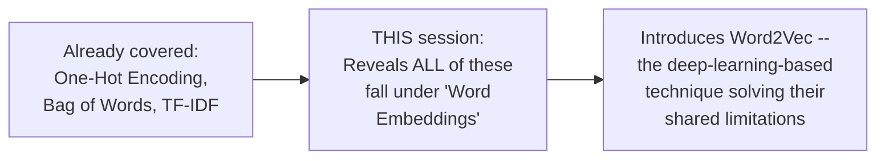

#### 🎯 Key Takeaways

* This session's genuine, deliberate purpose is to **unify** everything already learned (one-hot encoding, Bag of Words, TF-IDF) under the single, broader term "word embeddings" — a genuinely clarifying, "big picture" moment placed deliberately AFTER the individual techniques, not before.
* The session is structured across **three genuinely distinct segments** (word embeddings' definition, Word2Vec's core intuition, and CBOW's actual training mechanics) — directly reflecting three separate original videos, combined here into one continuous transcript.
* A genuine **prerequisite is explicitly, directly stated**: understanding CBOW's training mechanics requires prior knowledge of ANN, loss functions, and optimizers.

---

### 2. Word Embeddings: The Two Types & Why Word2Vec Solves Prior Limitations

#### 📖 Definition — The Precise, Wikipedia-Sourced Definition

> 💡 **Given directly:** *"In natural language processing, word embedding is a term used for representation of the words for text analysis, typically in the form of real-valued vectors that encode the meaning of the word, such that the words that are closer in the vector space are expected to be similar in meaning."*

#### 🪜 Step-by-Step — A Genuinely Intuitive, Motivating Example

> 💡 **Given directly:** *"Let's say I have two words like happy and excited... with the help of word embedding techniques, what we do is that we convert this particular word into vectors, and let's say if I try to plot this vector in a two-dimensional graph... happy and excited are coming near to each other based on these particular vectors -- it basically indicates both are similar words... let's say I have one more word like angry -- angry will be somewhere [far away]... because it is an opposite word, the distance between this word will be quite high."*

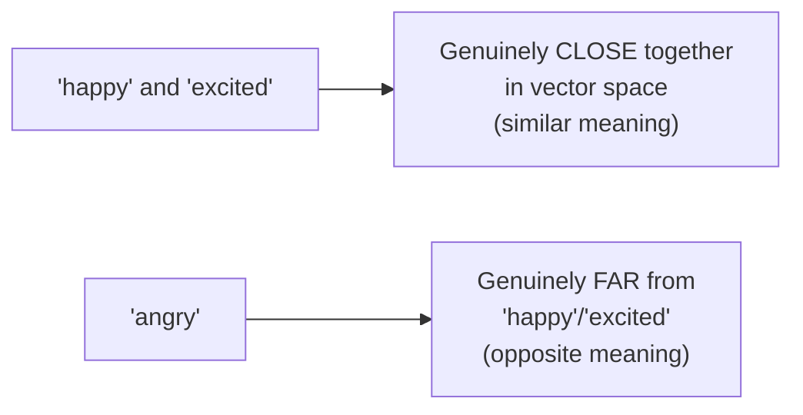

#### 📖 Definition — The Precise, Two-Category Taxonomy

> 💡 **Given directly:** *"Word embedding techniques are specifically of two types... the first type is based on COUNT OR FREQUENCY, and the second type is based on DEEP LEARNING TRAINED MODELS -- please listen to this very properly, because this deep learning trained models will give you very good accuracies."*

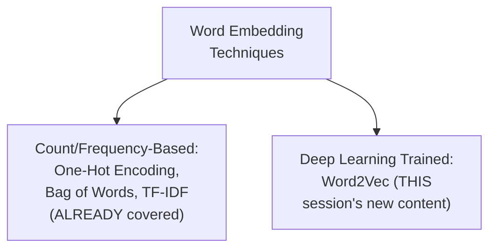

#### ❓ Why It Exists — Precisely Why Word2Vec Genuinely Improves on Count-Based Methods

> 💡 **Given directly:** *"All these techniques at the end of the day is also converting words into vectors, or it is converting sentences into vectors -- but we have seen a lot of advantages and disadvantages -- maximum number of disadvantages are there with respect to all these techniques, and all this disadvantage is getting solved by this deep learning trained model."*

#### 📖 Definition — Word2Vec's Two Genuine Variants

> 💡 **Given directly:** *"Word2Vec are of two types -- one is, because the entire deep learning architecture is built on two different types -- one is we basically say CBOW -- CBOW is nothing but Continuous Bag of Words, super important, Continuous Bag of Words... the second technique is something called as SKIP-GRAM."*

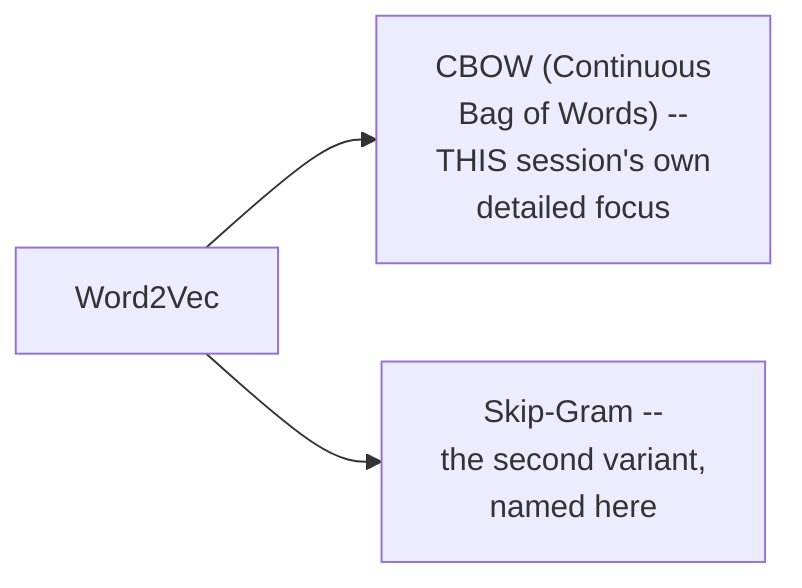

#### 🏢 Real-World / Production Usage — A Genuine, Real Pre-Trained Model, Directly Named

> 💡 **Given directly:** *"We are also going to see some pre-trained models of Word2Vec, you know, probably created by Google, and it is somewhere around 1.5 GB big model size."*

#### ⚠ Common Mistakes

* Assuming one-hot encoding, Bag of Words, and TF-IDF are genuinely UNRELATED to Word2Vec, since Word2Vec is often discussed separately — explicitly, directly clarified: ALL of these techniques fall under the SAME, broader "word embeddings" umbrella, differing specifically in HOW they convert words to vectors (count/frequency vs. deep-learning-trained).
* Assuming CBOW and Skip-gram are genuinely SEPARATE, unrelated algorithms — explicitly, directly clarified: BOTH are genuine VARIANTS of the SAME underlying technique, Word2Vec.

#### 🎯 Key Takeaways

* **Word embeddings** genuinely encompass TWO broad categories: count/frequency-based techniques (already covered) and deep-learning-trained models (Word2Vec, this session's new focus).
* **Word2Vec** directly, genuinely solves the "maximum number of disadvantages" present in count-based techniques — a claim this session's own later content (Sections 3-9) directly substantiates through concrete mechanics.
* **Word2Vec has two genuine variants**: CBOW (this session's own detailed focus) and Skip-gram (named here, with its own detailed treatment implied for later).

---
### 3. Feature Representation: The Core Idea Behind Word2Vec

#### 📖 Definition — Feature Representation, Precisely Introduced

> 💡 **Given directly:** *"One very important word I'm going to put up over here, which is called as FEATURE REPRESENTATION -- please listen to me very, very carefully, a very important topic -- now, each and every word that is present in the vocabulary will be converted into a feature representation."*

#### 🪜 Step-by-Step — A Complete, Worked Example: A Small Vocabulary & Genuine Features

> 💡 **Given directly:** *"Let's say the vocabulary words that I specifically have, [are] like something like boy, girl, okay, and then we have something like king, queen, and if I probably talk about some more words, like apple and mango... I will be having lot of features, like this -- I may be having a feature called as gender, I may be having a feature called as royal, I may be having a feature called as age, I may be having a feature called as food."*

```text
Vocabulary: boy, girl, king, queen, apple, mango
Features:   gender, royal, age, food, ... (up to 300 total, for Google's own real model)
```

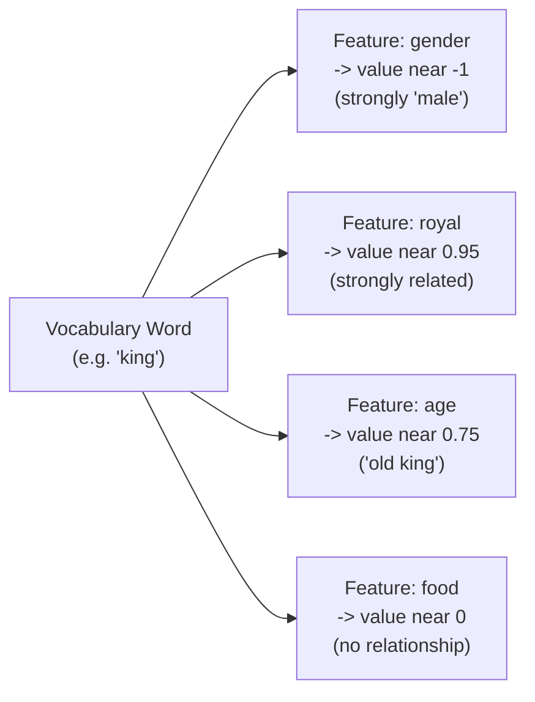

#### 🔍 Internal Working — The Precise, Worked Numerical Values

> 💡 **Given directly, the complete, illustrative example:** *"With respect to boy, which is present in the vocabulary, and its relationship with respect to gender, let's say that I am having minus one over here... with respect to girl and gender, the value can be plus one, because it is the opposite of boy... with respect to king, you know, I may have gender, like there is a relationship with respect to gender and king, so minus 0.92 will be there -- with respect to queen, it can be plus 0.93."*

| Word | Gender | Royal | Age | Food |
|---|---|---|---|---|
| boy | -1 | 0.01 | 0.03 | (near 0) |
| girl | +1 | 0.02 | (near 0) | (near 0) |
| king | -0.92 | 0.95 | 0.75 | (near 0) |
| queen | +0.93 | 0.96-0.97 | 0.68 | (near 0) |
| apple | (near 0) | -0.02 | 0.91 | 0.91 |
| mango | (near 0) | 0.02 | 0.92 | 0.92 |

#### ⚠ A Direct, Honest Acknowledgment: These Specific Values Are Illustrative

> 💡 **Given directly:** *"When we are training a very big Word2Vec model, at that time you will not be getting a clear idea about all the features -- but here, just to make this intuition, to make you understand the intuition, let's discuss about this feature representation."*

#### 🏢 Real-World / Production Usage — Google's Own Real Model, Directly Named

> 💡 **Given directly:** *"If I take an example of Google, you know, they have come up with this amazing Word2Vec model, which is basically trained in 3 billion words... each and every word is basically represented by 300 dimension of feature representation -- that basically means every word will be having a 300-dimension vector."*

#### 🏢 Real-World / Production Usage — A Concrete, Recommendation-System Analogy

> 💡 **Given directly:** *"Recommendation also happens in this way itself -- in recommendation, let's say I have a movie which is like -- I have Avengers -- where do you think Iron Man will come? Iron Man will come again near this... it will be based on different, different feature representation -- whether it is a comic movie, whether it is an action movie... this is all a feature representation... movie name is basically my vector, my vocabulary."*

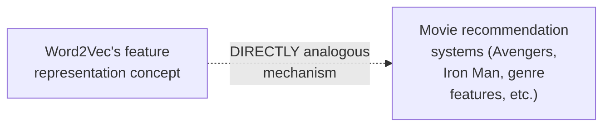

#### ⚠ Common Mistakes

* Assuming the SPECIFIC feature names (gender, royal, age, food) and values used in this session's own example are genuinely, literally what Google's real model uses — explicitly, directly, honestly acknowledged as a SIMPLIFIED, illustrative intuition-building example: real, large-scale models don't have neatly-labeled, human-interpretable features like this.
* Assuming feature representation is a concept UNIQUE to Word2Vec/NLP — explicitly, directly connected to a genuinely different, real-world application (movie recommendation systems), directly demonstrating the SAME underlying principle's broader applicability.

#### 🎯 Key Takeaways

* **Feature representation** is Word2Vec's genuine, core idea: every vocabulary word is converted into a vector, where each dimension represents that word's relationship to some underlying, abstract FEATURE.
* Google's real, production Word2Vec model uses **300-dimensional vectors**, trained on **3 billion words** — directly, concretely grounding this session's own simplified, illustrative example in a genuine, real-world scale.
* This SAME underlying feature-representation principle **directly, genuinely applies** beyond NLP — movie recommendation systems (Avengers/Iron Man, based on genre features) work via the exact same mechanism.

---

### 4. Vector Arithmetic: King − Man + Woman = Queen

#### 📖 Definition — The Precise, Famous, Directly-Sourced Example

> 💡 **Given directly:** *"There are a lot of advantages with respect to this, you know, why I am saying you -- suppose let's say if I do a calculation which is like king minus man plus queen -- if I do this calculation, and this is a FAMOUS CALCULATION, which is ALSO WRITTEN IN GOOGLE RESEARCH PAPER -- if I probably do this calculation, the output that I am going to get is something called as woman."*

```text
King − Man + Woman ≈ Queen    (a genuine, famous result, directly sourced from Google's own research)
```

#### 🪜 Step-by-Step — A Second, Directly-Confirmed Example

> 💡 **Given directly:** *"Suppose if I say king minus boy plus queen -- then the output that I'm going to get -- see, king is this vector, right, I am subtracting with boy, and then I'm adding it up, queen -- at the end of the day, you will be seeing that the [result] will be much more related to boy -- so I'm going to get the output as girl."*

```text
King − Boy + Queen ≈ Girl
```

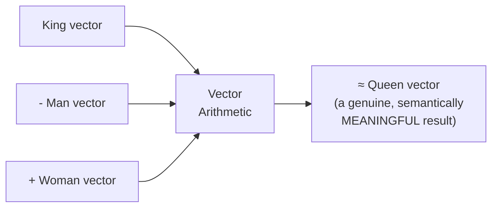

#### ❓ Why It Exists — Precisely Why This Demonstrates Word2Vec's Genuine Value

> 💡 **Given directly:** *"This is what kind of relations we'll be able to get, it just by seeing this vectors which has been provided by Word2Vec -- again, I'm not going to do the calculation here, I have just randomly stuffed some values, but in the real Word2Vec use case, you'll be seeing that if you do this kind of calculation, you are going to get girl."*

#### ⚠ Common Mistakes

* Assuming this session's own specific, illustrative numerical values (used in Section 3's table) would GENUINELY, PRECISELY produce this exact vector-arithmetic result if computed directly — explicitly, directly, honestly acknowledged: those specific values were "randomly stuffed" for illustration; the GENUINE result comes from Google's own real, properly-trained model, not from manually computing this session's own simplified example numbers.
* Assuming this is merely a cute, coincidental curiosity — explicitly, directly framed as a genuinely important, real demonstration of Word2Vec's core value: its vectors capture REAL, meaningful semantic relationships, directly usable via simple vector arithmetic.

#### 🎯 Key Takeaways

* **`King − Man + Woman ≈ Queen`** is a genuine, famous result, directly sourced from Google's own real research on Word2Vec — a concrete, memorable demonstration of the technique's genuine semantic power.
* A second, directly-confirmed example — **`King − Boy + Queen ≈ Girl`** — reinforces the SAME underlying principle with a genuinely different word combination.
* This vector arithmetic works because Word2Vec's vectors genuinely, precisely capture MEANINGFUL relationships (like gender) as consistent, directly USABLE vector DIRECTIONS — not merely as arbitrary numbers.

---
### 5. Cosine Similarity: Measuring Distance Between Word Vectors

#### ❓ Why It Exists — The Precise, Motivating Question

> 💡 **Given directly:** *"What this vector represents, that also you really need to understand, is super, super important -- and that is where I'm going to discuss about something called as COSINE SIMILARITY -- super important topic with respect to understanding these things."*

#### 📖 Definition — The Complete, Precise Distance Formula

> 💡 **Given directly:** *"In order to make you understand, let's say queen is over here... man is over here -- if I probably say king with respect to gender, right, this two is going to be the most nearest word when compared to queen -- so if [I want to know] how do I calculate the distance between this vector and this vector... I try to find out the angle, and for this, to find out the distance between two vectors, we use a distance formula, which says it is nothing but 1 MINUS COSINE SIMILARITY."*

```text
Distance = 1 − Cosine Similarity
Cosine Similarity = cos(θ), where θ is the angle between the two vectors
```

#### 🪜 Step-by-Step — Worked Example 1: A 45° Angle

> 💡 **Given directly:** *"Let us say the angle between these two vectors, let us say I am just taking as an example, is 45 degrees -- then this is nothing but cos 45 -- cos 45 is nothing but 1 by root 2, and probably I think this is approximately equal to 0.7071... then the distance between these two vectors will be nothing but 1 minus 0.7071 -- now if I'm calculating the distance, it is 0.29."*

```text
θ = 45°
cos(45°) = 1/√2 ≈ 0.7071
Distance = 1 − 0.7071 = 0.29
Conclusion: "almost this particular word are similar"
```

#### 🪜 Step-by-Step — Worked Example 2: A 90° Angle

> 💡 **Given directly:** *"If I have two more vectors -- if I have two different vectors -- one of the vectors is basically over here, one of the vectors is over here -- then the angle between these two is nothing but 90 degrees... my distance will be nothing but 1 minus cos theta -- cos theta is nothing but cos 90 -- cos 90 is nothing but 0 -- 1 minus 0 is [equal to] 1 -- so I can definitely say this vector and this vector are completely different, because the distance between them is 1."*

```text
θ = 90°
cos(90°) = 0
Distance = 1 − 0 = 1
Conclusion: "completely different"
```

#### 🪜 Step-by-Step — Worked Example 3: A 0° Angle

> 💡 **Given directly:** *"If I have one more vector which is in this point only, then I can say that this two vectors are almost same, because the angle between them is -- cos 0 -- cos 0 is nothing but 1 -- 1 minus 1, which is nothing but 0 -- because over here, the angle between these two points is nothing but zero... now if the distance is coming as 0, that basically means these two are [the] same word."*

```text
θ = 0°
cos(0°) = 1
Distance = 1 − 1 = 0
Conclusion: "same word"
```

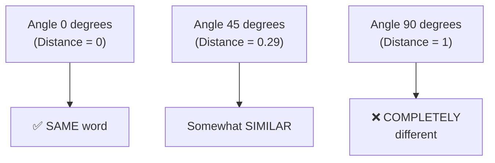

#### 🔍 Internal Working — Precisely How This Relates to Dimensionality Reduction for Visualization

> 💡 **Given directly, connecting back to Section 2's own opening example:** *"If I really want to convert this into [a] two-dimensional graph, we have techniques like PCA, or other techniques, which is an unsupervised technique to do dimensionality reduction."*

#### ⚠ Common Mistakes

* Assuming a SMALLER angle produces a LARGER distance value, or vice versa — explicitly, directly, precisely demonstrated as the OPPOSITE relationship: SMALLER angles (more similar vectors) produce SMALLER distance values (closer to 0); LARGER angles (more different vectors) produce LARGER distance values (closer to 1).
* Assuming cosine similarity and the distance formula are the SAME thing, used interchangeably — explicitly, directly distinguished: cosine similarity IS `cos(θ)` itself; the DISTANCE is precisely `1 − cosine similarity` — a DERIVED value, not identical to cosine similarity itself.

#### 🎯 Key Takeaways

* **Cosine similarity** is precisely the cosine of the angle between two word vectors; the genuine **distance formula** is `1 − cosine similarity`.
* Three, complete worked examples directly, numerically confirm the relationship: **0° angle → distance 0 (same word)**; **45° angle → distance 0.29 (somewhat similar)**; **90° angle → distance 1 (completely different)**.
* This distance formula is the genuine, practical MECHANISM behind determining whether two words' vectors are similar or different — directly, precisely underlying the visualizations and semantic groupings discussed in earlier sections.

---

### 6. Building CBOW's Training Data: The Window Size

#### ❓ Why It Exists — Word2Vec Is Genuinely a Supervised Learning Problem

> 💡 **Given directly:** *"Whenever we have a corpus, we really need to know what is our input data and what is our output data, because Word2Vec, all together, is a SUPERVISED MACHINE LEARNING [problem]."*

#### 🪜 Step-by-Step — Setting Up a Concrete, Real Example Corpus

> 💡 **Given directly:** *"Let's say I have a corpus, or a statement, or a dataset, or a paragraph -- it can be anything -- and for just making you understand, I'm just going to take a simple paragraph -- I'm going to say that, okay, iNeuron -- iNeuron is -- iNeuron company is related to data science."*

```text
Corpus: "iNeuron company is related to data science"
```

#### 📖 Definition — Window Size, Precisely Introduced

> 💡 **Given directly:** *"First thing is that, whenever we have a corpus, we really need to know what is our input data and what is our output data... first of all, what we do is that we select a WINDOW SIZE, and I'll talk about this window size, and why it is super important -- let's say that I am going to select a window size of 5."*

#### 🪜 Step-by-Step — Constructing the First Input/Output Pair

> 💡 **Given directly:** *"Let's say this is my input data, and this is my output data -- now, the central element that I have actually taken over here is 'is' -- now in the input, I will be having iNeuron, company, and then on the right-hand side, I have related, and I have 'to.'"*

```text
Window (5 words): iNeuron | company | is | related | to
Center word (output): is
Context words (input): iNeuron, company, related, to
```

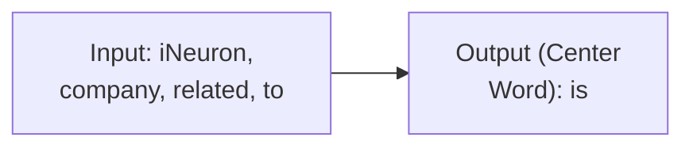

#### ❓ Why It Exists — Precisely Why Both Forward AND Backward Context Are Used

> 💡 **Given directly:** *"Why you may be thinking that I am taking the forward and the backward -- because understand, if I'm taking this as a central word, and this will basically be my output word... it should be knowing that what all words are in the forward context, and what all words are in the backward context -- so that is the reason we are creating in this particular way, so that this output should be knowing about its forward word and its backward word, just to get some idea about the context of that specific sentence."*

#### 🪜 Step-by-Step — Sliding the Window Forward

> 💡 **Given directly:** *"The next step is that I will go ahead and move this window by one step, and take the next five words... this will become my input two, and here I will be having company -- okay, and again from all these five words, which is my center word -- so this is basically my center word -- related."*

```text
Sliding the window by 1 step:
Window 2: company | is | related | to | data      -> center word: "related"
Window 3: is | related | to | data | science         -> center word: "to"
```

#### ⚠ A Direct, Important Clarification: Window Size Must Be Odd

> 💡 **Given directly:** *"You may be thinking, 'Krish, should we only take the window size 5?' No, you can take any value, you can take any value -- and why this window size is playing an important role, I'll just say in some time -- you can take up any value, but DON'T TAKE AN EVEN NUMBER, take an ODD NUMBER, so that I will be getting the central element -- which I am taking as an output -- will have the CORRECT number of words in the forward context and in the backward context."*

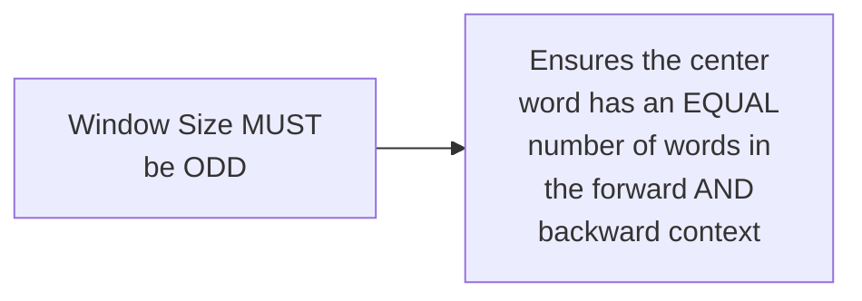

#### ⚠ Common Mistakes

* Assuming the window size must always be exactly 5 — explicitly, directly clarified as a genuinely FREE choice — "you can take any value" — with the ONLY genuine constraint being that it must be an ODD number.
* Assuming only PAST (backward) context words matter for predicting the center word — explicitly, directly clarified: BOTH forward AND backward context are genuinely, deliberately used, precisely to give the model genuine context from BOTH directions.

#### 🎯 Key Takeaways

* **Word2Vec (via CBOW) is a genuine SUPERVISED learning problem** — requiring explicit input/output pairs, constructed from a raw text corpus using a chosen WINDOW SIZE.
* The **center word** of each window becomes the OUTPUT (the word to predict); the SURROUNDING words (both forward and backward) become the INPUT.
* The window size must genuinely be an **ODD number** — ensuring the center word has an EQUAL number of forward and backward context words.

---
### 7. From One-Hot Encoding to the CBOW Neural Network

#### 🪜 Step-by-Step — Establishing the Genuine, Complete Vocabulary

> 💡 **Given directly:** *"Let's conclude that I have this many number of vocabulary only -- how many words I have over here? I'm having iNeuron, okay, and I probably have company, okay, and I have related, and I have 'to,' word, okay -- now understand, this is super important to understand -- you need to understand how many vocabulary of words are there... so over here, you have one, two, three, four, five, six, seven -- so seven total unique vocabulary is there."*

```text
Corpus: "iNeuron company is related to data science"
Unique vocabulary (7 words): iNeuron, company, is, related, to, data, science
```

#### 🪜 Step-by-Step — Converting Each Word Into a One-Hot Vector

> 💡 **Given directly:** *"Wherever I have iNeuron, what I'm actually going to do is that, I'm just going to make it as 1 over here initially, and there will be 6 zeros -- right, one, two, three, four, five, six zeros -- so with respect to this entire vocabulary, wherever I have iNeuron, that will be represented as 1, 0, 0, 0, 0, 0, 0."*

```text
iNeuron  = [1,0,0,0,0,0,0]
company  = [0,1,0,0,0,0,0]
is       = [0,0,1,0,0,0,0]
related  = [0,0,0,1,0,0,0]
to       = [0,0,0,0,1,0,0]
data     = [0,0,0,0,0,1,0]
science  = [0,0,0,0,0,0,1]
```

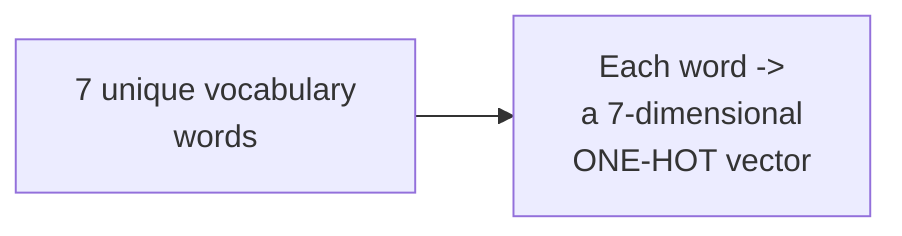

#### ❓ Why It Exists — Precisely Why This Genuinely, Necessarily Precedes the Neural Network

> 💡 **Given directly:** *"One very important thing that you need to understand -- over here, you will be seeing 'iNeuron,' 'company,' 'related,' 'to' -- all these inputs and outputs -- I cannot probably send this text directly, I need to convert this into some vectors initially, to send it in as an input to the neural network also."*

#### ⚠ Common Mistakes

* Assuming raw text words can be directly fed into a neural network without any numerical conversion — explicitly, directly, precisely clarified: one-hot encoding is a genuine, NECESSARY prerequisite step, converting every word into a numeric vector BEFORE it can genuinely be used as neural network input.
* Assuming this one-hot encoding step is somehow DIFFERENT from the one-hot encoding technique already covered as a standalone word-embedding method — explicitly, directly clarified as the SAME, identical technique — simply being REUSED here as a necessary preprocessing step within the CBOW pipeline.

#### 🎯 Key Takeaways

* Before ANY neural network training can genuinely begin, every word in the vocabulary must be converted into a **one-hot encoded vector**, sized according to the total, genuine vocabulary count (7, in this session's own example).
* This is precisely the SAME one-hot encoding technique already covered as a STANDALONE word-embedding method — now genuinely REUSED as a necessary preprocessing step specifically for feeding text into the CBOW neural network.
* This conversion is explicitly, directly framed as a genuine NECESSITY, not an optional convenience — raw text simply cannot be directly processed by a neural network.

---

### 8. The Complete CBOW Architecture: Input, Hidden & Output Layers

#### 📖 Definition — CBOW, Precisely Confirmed as a Fully-Connected Neural Network

> 💡 **Given directly:** *"What does CBOW basically mean? Continuous Bag of Words -- okay, this is nothing but a FULLY CONNECTED NEURAL NETWORK -- now you will be able to understand how these models are created."*

#### 🪜 Step-by-Step — The Input Layer, Precisely Sized

> 💡 **Given directly:** *"How many number of inputs should I be giving, right -- like, how many words I will be giving as my input -- since my window size is 5, all my inputs are fixed... I am giving four words in every sentence, so my input is basically fixed... when I give this seven inputs, then similarly, how many words will be going forward, so this is basically my input layer... one, two, three, four, five, six, seven -- seven inputs I am giving it."*

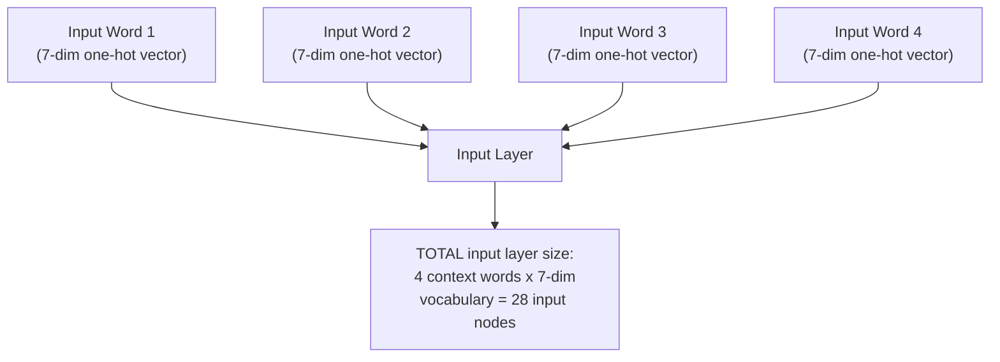

#### 🪜 Step-by-Step — The Hidden Layer, Precisely Sized by Window Size

> 💡 **Given directly, a genuinely important, directly-posed challenge:** *"Let's go to the middle layer, that is called as a HIDDEN LAYER -- now in this hidden layer, this is super important -- just pause the video, and guess what will be the size -- you know, our window size is how much? Our window size is basically 5, right -- so I'm just going to make this as my window size -- so this is my window size -- now in my window size, if you remember, how many [nodes] are we having in our window size? Our window size is nothing but 5, right -- window size is basically 5 -- so I'll be having, in my hidden layer, this five vectors."*

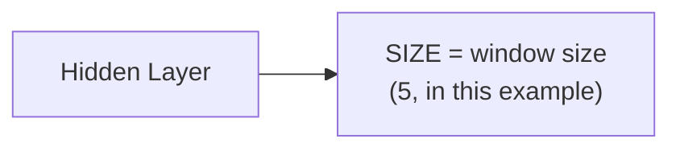

#### 🪜 Step-by-Step — The Output Layer, Precisely Sized by Vocabulary

> 💡 **Given directly:** *"With respect to the output, how many values I have? I just have one value, and each word, I just have one word in the output, right -- and each word is represented by a vector of 7... so what I will be doing in output, I will basically be having another output layer, like this, which will again be having seven different outputs."*

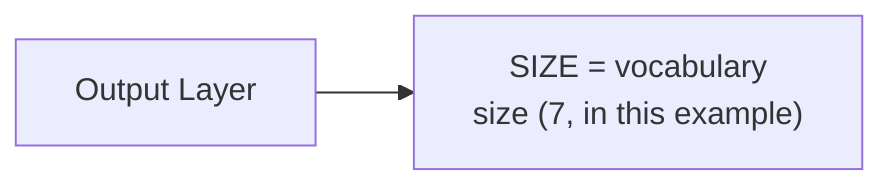

#### 📖 Definition — The Complete, Assembled Architecture

> 💡 **Given directly:** *"This is how my fully connected neural network will look... each and every node will be connected to the other node, right, like this... similarly, this will be connected to this, this will be connected to this, right, and finally this will also be connected to this, right -- so everything is basically getting connected."*

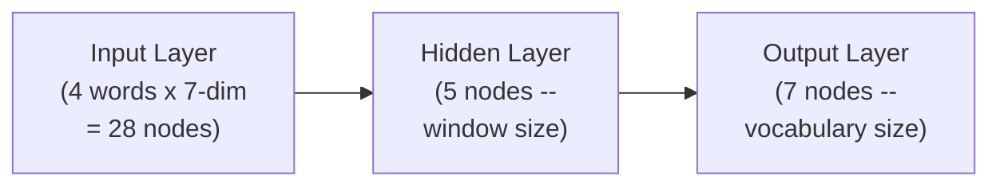

#### 🔍 Internal Working — Weights Are Randomly Initialized, Genuinely Trained via Backpropagation

> 💡 **Given directly:** *"All these lines will have some initialized weight -- initialize weights -- and we need to train these weights, and this is what happens in ANN."*

#### ⚠ Common Mistakes

* Assuming the hidden layer's size is somehow independent of the window size — explicitly, directly, precisely clarified: the HIDDEN LAYER's size DIRECTLY, EXACTLY EQUALS the chosen window size — a genuinely important, structural relationship.
* Assuming the input layer has only 7 nodes (matching vocabulary size), rather than genuinely accounting for MULTIPLE context words — explicitly, directly clarified: the input layer's TOTAL size is the NUMBER OF CONTEXT WORDS (4, in this example) MULTIPLIED by the vocabulary size (7) — genuinely larger than the vocabulary size alone.

#### 🎯 Key Takeaways

* **CBOW is genuinely a fully-connected neural network** — with three layers: input (context words, one-hot encoded), hidden (sized to match the window size), and output (sized to match the vocabulary).
* The **hidden layer's size** is DIRECTLY, EXACTLY determined by the chosen window size — a genuinely important, structural relationship that directly determines the final word vector's dimensionality (elaborated in Section 9).
* All connections between layers have **randomly-initialized weights**, genuinely trained via standard backpropagation — directly, precisely the SAME underlying mechanism established for standard ANNs in earlier sessions.

---
### 9. Training CBOW: Forward/Backward Propagation & the Emergent Word Vectors

#### 🪜 Step-by-Step — Passing a Genuine, Complete Training Example

> 💡 **Given directly:** *"Let's say we will consider -- let's pass this particular word -- iNeuron, company, related, to -- so I have passed iNeuron, company, and here also you'll be able to see, I am passing related, to -- very simple."*

#### 📖 Definition — The True Output (Y) vs. the Predicted Output (Y-Hat)

> 💡 **Given directly:** *"Once I pass all these things, what happens over here, with respect to this 7 output -- I already know what is my real output... the real output is what -- if I consider, 'is' is my third word -- so 'is' is my real output -- so this will basically be represented in this vector format, that is 0, 0, 1, 0, 0, 0, 0 -- but after training, with different, different weights -- this is my TRUE output, this is my Y -- I may also get different Y-hat, right -- I may get some values like 0.25, I may get some values like 0.33."*

```text
Y (true output, "is"):     [0, 0, 1, 0, 0, 0, 0]
Y-hat (predicted output):  [0.05, 0.12, 0.25, 0.33, 0.10, 0.08, 0.07]  (illustrative)
```

#### 🪜 Step-by-Step — The Complete, Standard Training Cycle

> 💡 **Given directly:** *"What we do, we basically calculate the LOSS FUNCTION, and based on this loss, we need to reduce this -- we do the BACKWARD PROPAGATION, right -- backward propagation -- and we do it, unless and until the difference between Y and Y-hat are minimal, okay -- and this process is continuous."*

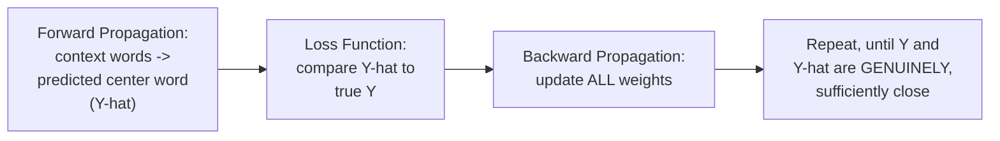

#### ❓ Why It Exists — Precisely Why the Hidden Layer's Size Determines the Final Vector Dimension

> 💡 **Given directly, the complete, precise, genuinely important explanation:** *"Since this is giving me a specific output -- okay -- this is basically giving me a specific output when I say my middle layer is basically window size of 5... that basically means over here, in Word2Vec, when I said I will be getting 300 dimensions over here, when I'm using Google Word2Vec -- this is all because of this WINDOW SIZE -- that basically means, if my window size is 5, I'm going to get the output as 5 for every word -- that basically means, when a word is getting converted into a vector, I am going to get a size of 5 vectors."*

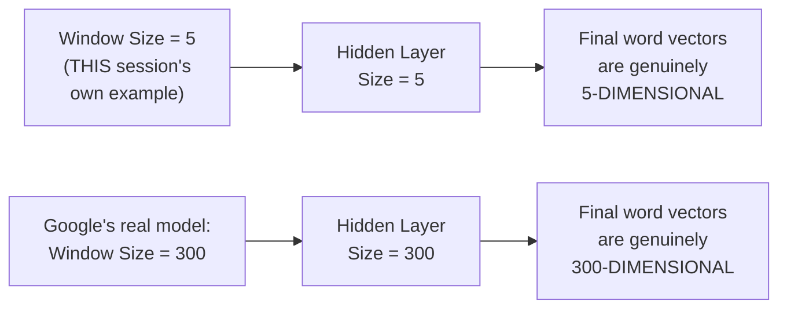

> 💡 **Given directly, a genuinely important, general-purpose principle:** *"The bigger the window size, the better the model can basically perform."*

#### 🔍 Internal Working — Precisely Which Trained Weights Become the Final Word Vector

> 💡 **Given directly, the complete, precise, concluding explanation:** *"What does 5 cross 7 basically mean -- when this loss gets reduced, then my final vector will look something like this -- this all will get connected to this... let's say our first word over here -- what is our first word, if you probably see, with respect to this particular vector, with vocabulary -- we'll be seeing iNeuron, right -- this is my vocabulary -- the first word that is basically getting represented over here is iNeuron, right -- so iNeuron will have an output dimension of five vectors, because I am getting this five vectors over here, joined to this -- so this five vectors will be like 0.92, it can be 0.94, based on the training, it can be 0.25, it can be 0.36, and it can be 0.45."*

```text
After training, "iNeuron"'s final Word2Vec vector (illustrative):
[0.92, 0.94, 0.25, 0.36, 0.45]   -- exactly 5 dimensions, matching the hidden layer size
```

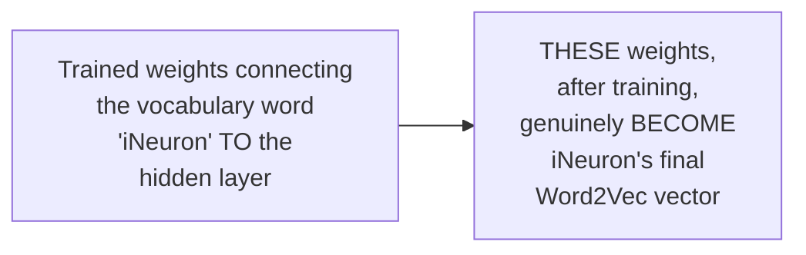

#### ⚠ Common Mistakes

* Assuming the final Word2Vec vector for a word comes from the OUTPUT layer of this trained network — explicitly, directly clarified: it genuinely comes from the trained WEIGHTS connecting each vocabulary word to the HIDDEN layer — the hidden layer's own values, once training is genuinely complete, directly become that word's final embedding.
* Assuming Google's real 300-dimensional Word2Vec vectors are somehow fundamentally different in KIND from this session's own simplified, 5-dimensional example — explicitly, directly clarified: they are the EXACT SAME underlying mechanism, simply scaled up — Google's own model genuinely used a window size of 300, directly producing 300-dimensional vectors via this SAME, precise relationship.

#### 🎯 Key Takeaways

* CBOW is trained via **genuine, standard forward propagation, loss calculation, and backward propagation** — precisely the same training cycle established for ANNs in earlier sessions, iterated until the true output (Y) and predicted output (Y-hat) genuinely, sufficiently converge.
* The **hidden layer's size DIRECTLY, PRECISELY determines the final word vector's dimensionality** — a window size of 5 produces 5-dimensional vectors; Google's own real model, using a window size of 300, directly produces the widely-known 300-dimensional vectors.
* The **final Word2Vec embedding for each word** genuinely comes from the TRAINED WEIGHTS connecting that word to the hidden layer — NOT from the output layer — precisely completing this session's own full, from-scratch explanation of how Word2Vec/CBOW actually works.

---

## 📝 Glossary

| Term | Definition | Why It Matters |
|---|---|---|
| **Word Embedding** | Vector representation of words, encoding meaning via vector-space proximity | The umbrella term for ALL text-to-vector techniques |
| **Count/Frequency-Based** | One-Hot Encoding, Bag of Words, TF-IDF | The FIRST category of word embeddings |
| **Deep Learning Trained** | Word2Vec | The SECOND category, solving prior limitations |
| **CBOW** | Continuous Bag of Words -- one Word2Vec variant | This session's own primary, detailed focus |
| **Skip-Gram** | The second Word2Vec variant | Named here, detailed treatment implied for later |
| **Feature Representation** | Each word's vector, based on relationships to abstract features | Word2Vec's core, foundational idea |
| **Cosine Similarity** | The cosine of the angle between two vectors | Measures word similarity |
| **Distance Formula** | 1 - Cosine Similarity | 0 = same word; 1 = completely different |
| **Window Size** | The number of words considered per training example | MUST be odd; directly determines hidden layer/vector size |
| **Center Word** | The middle word of a window -- becomes the OUTPUT to predict | The target CBOW learns to predict from context |
| **Context Words** | The surrounding words in a window -- become the INPUT | What CBOW uses to predict the center word |

---

## 🔄 Revision Notes — One-Minute Revision

* This session **unifies** everything previously learned (One-Hot Encoding, Bag of Words, TF-IDF) under the broader term **"word embeddings"** -- two genuine categories: count/frequency-based (already covered) vs. deep-learning-trained (Word2Vec, this session's own new focus).
* **Word2Vec has two variants**: CBOW (Continuous Bag of Words -- this session's own detailed focus) and Skip-gram (named, detailed treatment implied for later).
* **Feature representation** is Word2Vec's core idea: every word becomes a vector, with each dimension representing its relationship to some abstract feature (gender, royal, age, food, etc., in this session's own illustrative example) -- Google's real model uses 300 dimensions, trained on 3 billion words.
* **`King - Man + Woman = Queen`** (and `King - Boy + Queen = Girl`) -- a genuine, famous result directly sourced from Google's own research, demonstrating Word2Vec vectors capture REAL semantic relationships.
* **Cosine similarity** = cos(angle between two vectors); **distance = 1 - cosine similarity** -- worked examples: 0 degrees -> distance 0 (same word); 45 degrees -> distance 0.29 (similar); 90 degrees -> distance 1 (completely different).
* **CBOW training data**: built via a chosen WINDOW SIZE (must be ODD) -- the center word of each window becomes the OUTPUT; surrounding words (both forward and backward) become the INPUT. Sliding the window by 1 step produces successive training examples.
* **Words are one-hot encoded** before being fed into the neural network -- a genuinely necessary preprocessing step, reusing the same one-hot technique already covered.
* **CBOW's complete architecture**: Input Layer (context words x vocabulary size) -> Hidden Layer (size = WINDOW SIZE) -> Output Layer (size = vocabulary size) -- a genuine, fully-connected neural network, trained via standard forward/backward propagation.
* **The final Word2Vec vector for each word** comes from the TRAINED WEIGHTS connecting that word to the hidden layer -- directly explaining why Google's own real model produces 300-dimensional vectors (since ITS window size is 300) -- "the bigger the window size, the better the model can perform."

---

## 📋 Cheat Sheet

**Word embeddings' two categories:**
```text
Count/Frequency-based: One-Hot Encoding, Bag of Words, TF-IDF
Deep Learning Trained: Word2Vec (CBOW, Skip-gram)
```

**Vector arithmetic:**
```text
King - Man + Woman = Queen
King - Boy + Queen = Girl
```

**Cosine similarity & distance:**
```text
Distance = 1 - cos(angle between vectors)
0 degrees  -> distance 0 -> SAME word
45 degrees -> distance 0.29 -> SIMILAR
90 degrees -> distance 1 -> COMPLETELY DIFFERENT
```

**Building CBOW training data:**
```text
Window size (MUST be odd): e.g. 5
Center word (of the window) -> OUTPUT
Surrounding words (forward + backward) -> INPUT
Slide the window by 1 step -> next training example
```

**CBOW architecture:**
```text
Input Layer:  (# context words) x (vocabulary size) nodes
Hidden Layer: SIZE = window size  <- determines final vector dimension!
Output Layer: vocabulary size nodes
```

**Why Google's model produces 300-dim vectors:**
```text
Google's window size = 300  ->  hidden layer size = 300  ->  word vectors = 300-dim
```

---

## 🔥 Interview Questions & Answers

### 🟢 Beginner

**Q1.**

**Question:** What are the two genuine categories of word embedding techniques?

**Answer:** Count/frequency-based (One-Hot Encoding, Bag of Words, TF-IDF) and deep-learning-trained (Word2Vec).

**Explanation:** Directly, explicitly stated.

**Why Interviewers Ask This:** Foundational, unifying NLP knowledge.

**Possible Follow-up:** "Which category generally produces better accuracy?"

**Q2.**

**Question:** Name the two variants of Word2Vec.

**Answer:** CBOW (Continuous Bag of Words) and Skip-gram.

**Explanation:** Directly, explicitly named.

**Why Interviewers Ask This:** Basic, foundational Word2Vec terminology.

**Possible Follow-up:** "Which variant does this session cover in detail?"

**Q3.**

**Question:** What is the famous Word2Vec vector arithmetic example directly sourced from Google's research?

**Answer:** King − Man + Woman = Queen.

**Explanation:** Directly, explicitly stated.

**Why Interviewers Ask This:** A commonly-cited, memorable Word2Vec demonstration.

**Possible Follow-up:** "What does this example demonstrate about Word2Vec's vectors?"

**Q4.**

**Question:** What is the formula for computing distance between two word vectors?

**Answer:** 1 − cosine similarity.

**Explanation:** Directly, precisely stated.

**Why Interviewers Ask This:** Foundational similarity/distance measurement knowledge.

**Possible Follow-up:** "What distance value indicates two identical words?"

**Q5.**

**Question:** Must the window size in CBOW be odd or even?

**Answer:** Odd.

**Explanation:** Directly, explicitly stated.

**Why Interviewers Ask This:** A commonly-tested, precise implementation detail.

**Possible Follow-up:** "Why must it be odd, specifically?"

**Q6.**

**Question:** In a CBOW training example, what becomes the output, and what becomes the input?

**Answer:** The center word of the window becomes the output; the surrounding (context) words become the input.

**Explanation:** Directly, precisely stated.

**Why Interviewers Ask This:** Foundational CBOW mechanics.

**Possible Follow-up:** "Does CBOW use only backward (past) context, or both directions?"

**Q7.**

**Question:** What must be done to words before they can be fed into the CBOW neural network?

**Answer:** They must be converted into one-hot encoded vectors.

**Explanation:** Directly, explicitly stated.

**Why Interviewers Ask This:** Basic, necessary preprocessing knowledge.

**Possible Follow-up:** "Why can't raw text be fed directly into a neural network?"

**Q8.**

**Question:** What determines the dimensionality of the final Word2Vec vectors?

**Answer:** The size of the hidden layer, which directly equals the chosen window size.

**Explanation:** Directly, precisely explained.

**Why Interviewers Ask This:** A genuinely important, foundational CBOW architecture fact.

**Possible Follow-up:** "Why does Google's real Word2Vec model produce 300-dimensional vectors specifically?"

**Q9.**

**Question:** How many words was Google's real, pre-trained Word2Vec model trained on?

**Answer:** 3 billion words.

**Explanation:** Directly, explicitly stated.

**Why Interviewers Ask This:** Tests awareness of the genuine scale involved in real Word2Vec training.

**Possible Follow-up:** "Roughly how large is this pre-trained model's file size?"

**Q10.**

**Question:** From where does a word's final Word2Vec embedding genuinely come, once training is complete?

**Answer:** From the trained weights connecting that word to the hidden layer (not from the output layer).

**Explanation:** Directly, precisely explained.

**Why Interviewers Ask This:** Tests genuine, deep understanding of the training mechanism, not just surface familiarity.

**Possible Follow-up:** "Why is it these specific weights, rather than the output layer, that become the final vector?"

---

### 🟡 Intermediate

**Q11.**

**Question:** Explain why the instructor deliberately places this "word embeddings" unification session AFTER teaching One-Hot Encoding, Bag of Words, and TF-IDF individually, rather than introducing the umbrella term first.

**Answer:** This is a deliberate, stated pedagogical choice — per the instructor's own direct words, "we have discussed so many topics wherein we focused on converting word into vectors, so now you will be getting a very clear idea about what exactly word embeddings is." By teaching each SPECIFIC technique first, with its own concrete advantages and disadvantages, THEN revealing the unifying, broader category they all belong to, the instructor allows students to genuinely UNDERSTAND each technique's own specific mechanics and limitations BEFORE needing to hold an abstract, general category in mind. Introducing "word embeddings" as an abstract umbrella term FIRST, before any concrete technique was taught, would risk leaving students with a genuinely vague, unanchored concept — whereas revealing it AFTER concrete grounding directly, immediately clarifies WHY this broader category genuinely matters (each technique's genuine strengths/weaknesses can now be compared within a shared, meaningful framework).

**Explanation:** Requires recognizing a deliberate "concrete before abstract" pedagogical sequencing choice.

**Why Interviewers Ask This:** Tests whether a learner recognizes deliberate teaching structure, not just the specific content taught.

**Possible Follow-up:** "How does this sequencing choice directly connect to Word2Vec's own genuine advantage over the prior, count-based techniques?"

**Q12.**

**Question:** A learner argues that since CBOW's hidden layer size directly determines the final vector dimensionality, choosing an extremely large window size (e.g., 10,000) would always produce a genuinely better Word2Vec model. Evaluate this claim.

**Answer:** This claim overstates the case. While the session's own direct statement ("the bigger the window size, the better the model can basically perform") DOES support LARGER window sizes generally improving performance, this claim doesn't imply UNCONDITIONAL, LIMITLESS improvement with NO genuine trade-off. A GENUINELY LARGER window size directly, structurally means a LARGER hidden layer (per Section 8's own precise relationship), which DIRECTLY means MORE trainable weights connecting EVERY vocabulary word to this larger hidden layer — a real, genuine INCREASE in computational cost, memory requirements, and training TIME, directly analogous to the trade-offs already established for other hyperparameters across this broader course (like Day 5's own CNN filter-count discussion, or Day 12's own encoder/decoder count discussion). Additionally, an EXTREMELY large window (10,000) would genuinely, structurally require the corpus itself to have GENUINELY LONG, coherent stretches of text where this MANY surrounding words remain contextually meaningful — for many real, genuine corpora, words 5,000 positions away may carry GENUINELY LITTLE relevant context, potentially introducing NOISE rather than genuine signal. The accurate, more precise conclusion: larger window sizes GENERALLY improve performance UP TO A POINT, but with genuine, real trade-offs (computational cost, potential noise from irrelevant, distant context) that must be balanced against the corpus's own genuine characteristics.

**Explanation:** Tests whether a learner recognizes a stated general trend ("bigger is better") doesn't imply unconditional, limitless improvement, correctly identifying genuine, real trade-offs.

**Why Interviewers Ask This:** Distinguishes candidates who understand genuine hyperparameter trade-offs from those who take a stated general trend as an unconditional rule.

**Possible Follow-up:** "What specific, real computational cost would genuinely increase if the window size were increased from 5 to 300 (matching Google's own real model)?"

**Q13.**

**Question:** Explain, precisely, why the "iNeuron" example's genuine, complete vocabulary must be established (Section 7) BEFORE the CBOW architecture's input/output layer sizes can be genuinely determined (Section 8).

**Answer:** This reflects a genuine, direct, STRUCTURAL dependency: per Section 8's own precise architecture description, the INPUT layer's total size is `(number of context words) × (vocabulary size)`, and the OUTPUT layer's size is simply `(vocabulary size)` — BOTH of these genuinely, directly REQUIRE knowing the EXACT vocabulary size (7, in this session's own example) BEFORE these layer dimensions can be concretely specified. Without FIRST establishing the complete, genuine vocabulary (Section 7's own "how many unique words are there" step), it would be GENUINELY IMPOSSIBLE to determine how many one-hot encoding dimensions each word requires, and therefore GENUINELY IMPOSSIBLE to specify the neural network's own input/output layer sizes. This directly illustrates why Section 7 (establishing the vocabulary and one-hot encoding) is a genuine, necessary PREREQUISITE step, not merely a convenient ordering choice, before Section 8's own architecture can be concretely specified.

**Explanation:** Requires reasoning through the precise, structural dependency between vocabulary size and neural network layer dimensions.

**Why Interviewers Ask This:** Tests whether a learner understands WHY this specific sequencing is genuinely, structurally necessary, not merely a stylistic teaching choice.

**Possible Follow-up:** "If the corpus had 50 unique words instead of 7, how would the input and output layer sizes change, assuming the same window size of 5?"

**Q14.**

**Question:** Using this session's precise cosine-similarity distance formula, explain what a NEGATIVE cosine similarity value would genuinely indicate about two word vectors, and whether the resulting distance value would exceed the session's own stated maximum of 1.

**Answer:** A genuinely important extension beyond what this session's own three worked examples (0°, 45°, 90°) explicitly cover: cosine similarity's MATHEMATICAL range genuinely extends from -1 to +1, not merely 0 to 1 — a NEGATIVE cosine similarity would occur for an angle GREATER than 90° (up to 180°), representing vectors pointing in GENUINELY OPPOSITE directions (directly connecting back to Section 2's own "happy" vs. "angry" example, which conceptually represents this kind of genuine opposition). Applying the session's own PRECISE distance formula (`1 − cosine similarity`) to a NEGATIVE cosine similarity value (e.g., -0.5) would genuinely produce a distance GREATER than 1 (specifically, `1 − (−0.5) = 1.5`) — directly demonstrating that the session's own stated examples (spanning only 0° to 90°, producing distances from 0 to 1) represent only a PARTIAL portion of the formula's own, genuinely full, possible range. This reveals a nuance the session's own three worked examples don't explicitly walk through, but which follows directly, necessarily from the stated formula itself.

**Explanation:** Requires extending the session's own stated formula beyond its explicitly-worked examples to reason through a genuinely new, related case (negative cosine similarity).

**Why Interviewers Ask This:** Tests whether a learner can correctly extend a stated formula's own logic beyond the SPECIFIC examples explicitly walked through.

**Possible Follow-up:** "What angle would produce a cosine similarity of exactly -1, and what would this represent conceptually about the two vectors?"

**Q15.**

**Question:** Synthesize this session's complete CBOW architecture (Sections 7-9) with the "King − Man + Woman = Queen" vector arithmetic example (Section 4) to explain PRECISELY how a trained CBOW model's OWN weight matrix would genuinely need to encode gender-related information for this specific arithmetic to work correctly.

**Answer:** A precise, synthesized explanation: per Section 9's own precise mechanism, each vocabulary word's final Word2Vec vector comes from the TRAINED WEIGHTS connecting that specific word to the hidden layer. For the "King − Man + Woman = Queen" arithmetic (Section 4) to GENUINELY, CORRECTLY work, the TRAINING PROCESS (per Section 9's own forward/backward propagation cycle) must have GENUINELY LEARNED weight patterns where SOME SPECIFIC DIMENSION (or combination of dimensions) within the hidden layer CONSISTENTLY, RELIABLY captures GENDER-related information — directly analogous to Section 3's own illustrative "gender" feature (though, per Section 3's own honest acknowledgment, real trained models don't have neatly LABELED dimensions like this). This means that during training, whenever the corpus GENUINELY contains contextual patterns distinguishing MALE-associated words (king, man) from FEMALE-associated words (queen, woman) — e.g., these words appearing in SIMILAR but genuinely gender-distinct contexts — the backpropagation process (Section 9) would GENUINELY, GRADUALLY adjust the relevant weights such that this GENDER DISTINCTION becomes CONSISTENTLY ENCODED as a specific, learnable DIRECTION within the vector space — precisely the kind of learned, emergent structure that makes vector ARITHMETIC (subtracting "man," adding "woman") genuinely, meaningfully correspond to "moving along the gender dimension" in a way that lands near "queen" when starting from "king."

**Explanation:** Requires synthesizing the training mechanism (how vectors emerge from weights) with the vector-arithmetic example to explain WHY this specific arithmetic genuinely works as a consequence of training, not as an assumed given.

**Why Interviewers Ask This:** A senior-level question testing whether a candidate can connect the TRAINING PROCESS to the EMERGENT, semantically-meaningful vector-space structure that makes vector arithmetic genuinely work.

**Possible Follow-up:** "Would this SAME kind of vector-arithmetic reasoning genuinely work for a feature/dimension the corpus contained VERY FEW examples of? Explain your reasoning."

---

### 🔴 Advanced

**Q16.**

**Question:** Design a complete CBOW training-data construction for a genuinely NEW, longer corpus of your own choosing (at least 10 words), using a window size of 7, explicitly listing EVERY resulting input/output pair produced by sliding the window across the entire corpus.

**Answer:** A reasonable, complete construction, directly applying Section 6's own exact methodology: for example, using the corpus "the quick brown fox jumps over the lazy sleeping dog" (10 words), with window size 7 (odd, per Section 6's own explicit requirement): **Window 1** (words 1-7: "the quick brown fox jumps over the"): center word (4th of 7) = "fox"; input = [the, quick, brown, jumps, over, the]. **Window 2** (words 2-8: "quick brown fox jumps over the lazy"): center = "jumps"; input = [quick, brown, fox, over, the, lazy]. **Window 3** (words 3-9): center = "over"; input = [brown, fox, jumps, the, lazy, sleeping]. **Window 4** (words 4-10): center = "the" (second occurrence); input = [fox, jumps, over, lazy, sleeping, dog]. This produces exactly 4 total training examples (since a 10-word corpus with a window size of 7 allows the window to slide `10-7+1=4` times), directly, precisely applying Section 6's own exact "slide by one step" methodology to a genuinely new, longer example.

**Explanation:** Requires applying the session's own exact window-sliding methodology to a genuinely new, longer corpus, correctly calculating the total number of resulting training examples.

**Why Interviewers Ask This:** A realistic, senior-level question testing whether a candidate can apply the taught methodology to a genuinely new example, correctly handling the window-sliding mechanics.

**Possible Follow-up:** "What general formula would you use to calculate the total number of training examples, given a corpus of N words and a window size of W?"

**Q17.**

**Question:** Critically evaluate: "Since this session confirms that CBOW's hidden layer size directly determines the final vector dimensionality, and cosine similarity/distance can be computed for vectors of ANY dimensionality, choosing a smaller window size (e.g., 2, if it were allowed) would produce genuinely FASTER-to-compute cosine similarities with NO other genuine trade-off." Is this an accurate characterization?

**Answer:** Not accurate — this significantly overstates a narrow, computational-speed observation into an unconditional claim, while also containing a genuine, direct error: Section 6 EXPLICITLY, DIRECTLY states the window size "should NOT be even," meaning a window size of 2 would be GENUINELY INVALID under this session's own stated constraint (the smallest valid odd window size would be 3, not 2). Setting this specific error aside, the BROADER claim about "no other genuine trade-off" is ALSO inaccurate: per Section 9's own direct, explicit statement ("the bigger the window size, the better the model can basically perform"), a SMALLER window size would GENUINELY, DIRECTLY sacrifice REPRESENTATIONAL RICHNESS — smaller vectors (fewer dimensions) genuinely have LESS capacity to capture the MULTIPLE, DISTINCT semantic relationships (gender, royal, age, food, and many more, per Section 3's own illustrative example) that LARGER vectors (like Google's real, 300-dimensional model) can genuinely represent. While SMALLER vectors WOULD genuinely compute cosine similarity FASTER (fewer dimensions to multiply and sum), this computational speed benefit comes at the DIRECT, genuine cost of REDUCED semantic richness and REDUCED model performance — precisely the trade-off Section 9's own direct statement establishes, which the claim's "no other genuine trade-off" framing incorrectly dismisses.

**Explanation:** Tests whether a learner catches BOTH a specific factual error (window size must be odd, ruling out 2) AND a broader over-generalization (ignoring the genuine performance trade-off Section 9 directly states).

**Why Interviewers Ask This:** Distinguishes candidates who verify EVERY claim against the session's own stated constraints from those who accept a plausible-sounding claim without checking its specific details.

**Possible Follow-up:** "What would be the smallest genuinely valid window size, per this session's own stated constraint, and what specific representational limitation would you expect from using it?"

**Q18.**

**Question:** Synthesize this session's complete CBOW mechanism with the earlier Day 12 Transformers session's own precise self-attention mechanism to explain a genuinely important, structural DIFFERENCE in how each approach determines a word's final vector representation.

**Answer:** A precise, synthesized comparison: per THIS session's own exact mechanism (Sections 7-9), CBOW produces EXACTLY ONE, FIXED, CONTEXT-INDEPENDENT vector per vocabulary word — "iNeuron"'s final vector (Section 9) is determined ENTIRELY by the trained weights connecting THAT SPECIFIC WORD to the hidden layer, and this SAME vector is used EVERY time "iNeuron" appears, REGARDLESS of its surrounding sentence context (directly analogous to the "same index always produces the same output" property established for embedding layers in Day 9's own earlier session). Self-attention (per Day 12's own precise mechanism), by contrast, computes a GENUINELY DIFFERENT, CONTEXT-DEPENDENT output vector for a word EACH TIME it appears, based on its SPECIFIC relationship to the OTHER words actually present in THAT PARTICULAR sentence (directly demonstrated via Day 12's own "it" example, where the SAME word "it" would receive GENUINELY DIFFERENT attention-weighted vectors depending on whether the surrounding sentence discusses "the animal" or a genuinely different subject). This reveals a fundamental, structural distinction: CBOW/Word2Vec produces STATIC, context-INDEPENDENT embeddings (one fixed vector per word, regardless of context), while Transformer-based self-attention produces DYNAMIC, context-DEPENDENT representations (a genuinely different vector for the same word, depending on its specific sentence context) — directly explaining WHY Transformer-based models (and their later evolution, like BERT, explicitly named as the Day 12 session's own next topic) represent a genuine, further advancement beyond Word2Vec's own, earlier, static-embedding approach.

**Explanation:** Requires synthesizing this session's specific CBOW mechanism with an entirely separate, later session's own self-attention mechanism to identify a genuinely important, structural distinction (static vs. dynamic/context-dependent embeddings) neither session explicitly compares directly.

**Why Interviewers Ask This:** A capstone-level question testing whether a candidate can compare TWO GENUINELY DIFFERENT embedding approaches, taught in entirely SEPARATE sessions, to articulate a precise, important architectural evolution across the broader NLP field.

**Possible Follow-up:** "Would the 'King - Man + Woman = Queen' vector arithmetic (Section 4) genuinely make sense to attempt with Transformer-based, context-dependent embeddings? Explain why or why not."

---

## 🧪 Scenario-Based Interview Questions

> **Scenario 1:** A colleague's CBOW implementation, trained on a genuinely small corpus (500 words total), produces word vectors that seem to capture almost NO meaningful semantic relationships, unlike Google's own real, high-quality model. Using this session's concepts, diagnose the most likely cause.

**Structured Answer:**
1. **Initial investigation:** Recognize this as directly connected to Section 2's own explicit contrast between Google's real model (trained on 3 BILLION words) and this session's own small, illustrative example (a single, short sentence) -- a 500-word corpus is GENUINELY, DRAMATICALLY smaller than the scale Word2Vec typically requires for genuinely meaningful results.
2. **Metrics/logs to check:** Directly compare the colleague's OWN corpus size against Google's own real, stated scale (3 billion words), confirming the genuine, dramatic gap.
3. **Possible causes:** Per Section 3's own reasoning, meaningful feature representation GENUINELY requires the training process to observe MANY, DIVERSE, REPEATED contextual patterns for each word -- a 500-word corpus GENUINELY lacks the volume needed for the backpropagation process (Section 9) to reliably learn GENUINELY meaningful weight patterns.
4. **Debugging approach:** Directly test whether increasing the corpus size (even modestly) produces genuinely IMPROVED, more meaningful vector relationships, directly confirming corpus size as the likely root cause.
5. **Resolution:** Recommend GENUINELY, SUBSTANTIALLY increasing the training corpus size, or -- more practically, per Section 2's own direct mention -- using a GENUINE, PRE-TRAINED model (like Google's own real Word2Vec model) instead of training entirely from scratch on insufficient data.
6. **Prevention:** Establish a standing team practice of directly comparing any planned CBOW training corpus size against GENUINE, established benchmarks (like Google's own real 3-billion-word scale) BEFORE attempting to train a genuinely meaningful, from-scratch Word2Vec model.

> **Scenario 2 (Advanced):** Your team needs to choose an appropriate window size for a new CBOW model, and a colleague proposes simply copying Google's own real window size of 300, reasoning that "if it worked for Google, it'll work for us too." Using this session's concepts, evaluate this proposal.

**Structured Answer:**
1. **Initial investigation:** Recognize this as a reasonable-sounding but potentially mistaken generalization -- directly connected to Intermediate Q12's own precise reasoning about genuine trade-offs beyond simply "bigger is better."
2. **Relevant principle:** Per Section 9's own direct statement, larger window sizes genuinely improve performance -- BUT per Intermediate Q12's own extended reasoning, this comes with genuine, real computational cost, and REQUIRES a corpus with GENUINELY SUFFICIENT scale and diversity to meaningfully benefit from that larger capacity.
3. **Possible causes for this proposal:** The colleague's reasoning directly assumes Google's own SPECIFIC hyperparameter choice (300) is GENERALLY, UNIVERSALLY optimal -- without considering whether the TEAM's own specific corpus size and computational resources genuinely MATCH the scale (3 billion words) that justified Google's own specific choice.
4. **Debugging/evaluation approach:** Directly compare the team's own genuine corpus size and available computational resources against Google's own real, stated scale, assessing whether a window size of 300 is genuinely APPROPRIATE, or whether a smaller, more proportionate value would be more suitable.
5. **Resolution:** Recommend AGAINST blindly copying Google's specific value -- instead, recommend choosing a window size PROPORTIONATE to the team's own GENUINE corpus size and computational resources, directly testing multiple candidate values empirically (per this session's own broader, established pattern of treating architectural choices as genuine, testable hyperparameters).
6. **Prevention:** Establish a standing team practice of treating ANY "borrowed" hyperparameter choice (from a well-known model or paper) as a genuine STARTING POINT for experimentation, not an unconditionally correct, universally-applicable value -- directly modeling the broader, repeated hyperparameter-tuning philosophy established across this entire course.

---

## 🛠 Hands-on Exercises

### 🟢 Easy

1. Write out, from memory, the two genuine categories of word embedding techniques, and name at least one technique in each.
2. Compute the distance (using this session's own formula) for two vectors with a 60-degree angle between them.
3. Construct the complete CBOW training data (input/output pairs) for a corpus of your own choosing (at least 7 words), using a window size of 3.

### 🟡 Medium

4. Complete the full, worked CBOW training-data construction proposed in Advanced Interview Q16, using a genuinely different corpus and window size of your own choosing.
5. Write a short explanation (150-200 words) of why the hidden layer's size directly determines the final Word2Vec vector's dimensionality, directly applying Section 9's own reasoning.
6. Research (outside this session) Google's real, pre-trained Word2Vec model, and write a short summary of how to load and use it in Python (e.g., via the Gensim library).

### 🔴 Advanced

7. Implement a complete, working CBOW model from scratch in Python (NumPy only), including one-hot encoding, the full neural network architecture, and training via forward/backward propagation, tested on a small, custom corpus.
8. Implement the negative-cosine-similarity extension proposed in Intermediate Q14, computing distance for at least one genuinely obtuse-angle (>90°) example.
9. Implement the CBOW-vs-self-attention comparison proposed in Advanced Interview Q18 as genuine, working code — train a small CBOW model and observe that the SAME word always produces the SAME vector, then (conceptually or with a pre-trained model) demonstrate how a context-aware model would produce DIFFERENT representations for the same word in different sentences.

---

## 🏗 Practice Assignment

### Build: "Complete CBOW Implementation & Vector Arithmetic Verification"

**Objective:** Directly reproduce this session's own complete CBOW pipeline, from raw corpus through to trained word vectors, and directly verify genuine vector-arithmetic behavior.

**Requirements:**
- A complete, hand-worked CBOW training-data construction for a corpus of your own choosing (at least 10 words), using a window size of 5.
- A working Python (NumPy) implementation of the complete CBOW architecture: one-hot encoding, input/hidden/output layers, and training via forward/backward propagation.
- A genuine test of whether your trained model's vectors show ANY meaningful clustering (e.g., using cosine similarity to compare related vs. unrelated words from your own corpus).
- A written reflection (200-300 words) on whether your own small-corpus model's results were genuinely meaningful, or limited (per Scenario 1's own reasoning) by insufficient training data.

**Architecture (suggested):**

```text
cbow_from_scratch/
├── corpus_and_windowing.py           # your training-data construction
├── cbow_model.py                       # your complete NumPy implementation
├── cosine_similarity_test.py             # your similarity verification
└── REFLECTION.md                            # your written reflection
```

**Expected Functionality:**
- Your CBOW implementation should genuinely, correctly train and produce a distinct vector for each vocabulary word.
- Your cosine similarity test should directly, empirically compare at least 2-3 word pairs from your own corpus.

**Challenges:**
- Correctly implementing the window-sliding logic without off-by-one errors.
- Correctly extracting the trained hidden-layer weights as each word's own final vector.

**Bonus Improvements:**
- Load and experiment with Google's real, pre-trained Word2Vec model (via Gensim), directly comparing its results against your own small, from-scratch model.
- Directly test the "King − Man + Woman = Queen" vector arithmetic using the real, pre-trained model.

---

## 📚 Additional Resources

- **The broader NLP for Machine Learning series** -- the direct prerequisite content covering One-Hot Encoding, Bag of Words, and TF-IDF, all of which this session directly unifies under "word embeddings."
- **Google's real, pre-trained Word2Vec model** (referenced directly, ~1.5 GB, trained on 3 billion words) -- explicitly recommended for further, hands-on exploration.
- **A subsequent session on Skip-gram** (implied, as the second Word2Vec variant named but not detailed here) -- directly building on this session's own CBOW foundation.
- **The Gensim Python library** (implied, standard tooling for working with Word2Vec models) -- genuinely useful for loading and experimenting with pre-trained models.

---

## 📌 Final Revision Sheet

### ⭐ Core Concepts
- **Word embeddings**: two categories -- count/frequency-based (already covered) vs. deep-learning-trained (Word2Vec).
- **Word2Vec's two variants**: CBOW (this session's own focus) and Skip-gram.
- **Feature representation**: every word -> a vector, based on relationships to abstract features.
- **Vector arithmetic**: King - Man + Woman = Queen -- a genuine, famous, real result.
- **Cosine similarity/distance**: distance = 1 - cos(angle) -- 0=same, 1=completely different.
- **CBOW training data**: window size (must be ODD) -> center word = output, surrounding words = input.
- **CBOW architecture**: Input (context words x vocab size) -> Hidden (= window size) -> Output (= vocab size).
- **Final vectors**: come from the TRAINED WEIGHTS connecting each word to the hidden layer -- hidden layer size = final vector dimension.

### ⭐ Important Definitions
- **Center Word, Context Words** (see Glossary for full definitions).

### ⭐ Important Commands/Code
```text
Distance = 1 - cos(theta)
CBOW Input Layer size  = (# context words) x (vocabulary size)
CBOW Hidden Layer size = window size
CBOW Output Layer size = vocabulary size
```

### ⭐ Architecture/Process
- Complete CBOW pipeline: corpus -> vocabulary + one-hot encoding -> window-based input/output pairs -> fully-connected neural network (input -> hidden -> output) -> forward/backward propagation training -> final word vectors (from trained hidden-layer weights).

### ⭐ Best Practices
- Always use an odd window size for CBOW.
- Match window size to genuine corpus size and computational resources, rather than blindly copying a well-known model's specific value.
- Use genuine, pre-trained models (like Google's) when training data is insufficient for meaningful, from-scratch results.

### ⭐ Common Mistakes
- Assuming Word2Vec and prior techniques (One-Hot, BoW, TF-IDF) are unrelated, rather than both being genuine "word embeddings."
- Assuming the final Word2Vec vector comes from the output layer, rather than the hidden-layer weights.
- Assuming window size can be any value, rather than genuinely requiring an odd number.
- Assuming cosine similarity's range is 0 to 1, rather than -1 to +1.

### ⭐ Interview Points
- Be ready to explain the two categories of word embeddings.
- Be ready to explain and reproduce the King-Man+Woman=Queen example.
- Be ready to compute cosine similarity/distance for given angles.
- Be ready to precisely describe CBOW's complete architecture and why the hidden layer size determines vector dimensionality.

### ⭐ Things to Remember
- This session **unifies** everything previously learned about text-to-vector conversion under the term "word embeddings," before introducing Word2Vec as the deep-learning-based technique solving prior limitations.
- The session is built across **three genuinely distinct segments** -- word embeddings' definition, Word2Vec's core intuition, and CBOW's complete training mechanics.
- **Skip-gram is explicitly named** as Word2Vec's second variant, with its own detailed treatment implied for a subsequent session.

---

## 🔗 Source

- [Word Embeddings, CBOW & Word2Vec](https://youtu.be/Q95SIG4g7SA?si=kF0-7JFS6jYH-bCC)