# 🧠 Average Word2Vec: In-Depth Intuition & Practical Implementation

- <i>**Session:** NLP for Machine Learning Series — Average Word2Vec (Theory & Spam-Ham Practical Project) · 
- **Instructor:** Krish Naik
- **Note on scope:** This session **directly continues** the prior Word2Vec/CBOW session — it opens by directly assuming genuine familiarity with how Word2Vec converts individual WORDS into vectors, then addresses a precise, real problem that plain Word2Vec alone cannot solve: text classification requires ONE vector per SENTENCE/document, not a separate vector per word. The session covers Average Word2Vec's complete theoretical intuition, then a genuine, live, real, COMPLETE practical implementation — a Spam-Ham classification project — covering Gensim, loading a real pre-trained Google Word2Vec model, training a genuinely NEW Word2Vec model from scratch, building the actual averaging function, and a genuinely honest, real debugging story where 3 rows of data mysteriously "disappeared" during preprocessing, precisely traced and fixed live.</i>

---

## 📑 Table of Contents

1. [Session Overview](#-session-overview)
2. [Learning Objectives](#-learning-objectives)
3. [Detailed Notes](#-detailed-notes)
   - [1. Session Context: Completing the Word2Vec Arc — Why Plain Word2Vec Can't Classify](#1-session-context-completing-the-word2vec-arc--why-plain-word2vec-cant-classify)
   - [2. Average Word2Vec: The Core Intuition](#2-average-word2vec-the-core-intuition)
   - [3. Practical Setup: Gensim, the Spam-Ham Project & Text Cleaning](#3-practical-setup-gensim-the-spam-ham-project--text-cleaning)
   - [4. Training Word2Vec From Scratch With Gensim](#4-training-word2vec-from-scratch-with-gensim)
   - [5. Building the Average Word2Vec Function](#5-building-the-average-word2vec-function)
   - [6. A Genuine, Real Debugging Story: The Case of the Missing 3 Rows](#6-a-genuine-real-debugging-story-the-case-of-the-missing-3-rows)
   - [7. Assembling the Final DataFrame & Handling Null Values](#7-assembling-the-final-dataframe--handling-null-values)
   - [8. Training & Evaluating the Classifier](#8-training--evaluating-the-classifier)
4. [Glossary](#-glossary)
5. [Revision Notes — One-Minute Revision](#-revision-notes--one-minute-revision)
6. [Cheat Sheet](#-cheat-sheet)
7. [Interview Questions & Answers](#-interview-questions--answers)
8. [Scenario-Based Interview Questions](#-scenario-based-interview-questions)
9. [Hands-on Exercises](#-hands-on-exercises)
10. [Practice Assignment](#-practice-assignment)
11. [Additional Resources](#-additional-resources)
12. [Final Revision Sheet](#-final-revision-sheet)

---

## 🎯 Session Overview

This session bridges Word2Vec's own word-level vectors into genuinely usable, sentence-level features for real classification tasks — both conceptually and through a complete, honestly-debugged, real project. It covers:

1. **The precise, motivating problem**: Word2Vec converts EVERY individual word into its own 300-dimensional vector — but a classification model genuinely needs exactly ONE vector per SENTENCE (or document), not one per word.
2. **Average Word2Vec's complete, precise solution**: for each sentence, take EVERY word's own vector and compute their AVERAGE — producing exactly ONE, combined vector of the SAME dimensionality, genuinely representing the entire sentence.
3. **A complete, real, practical project**: Spam-Ham classification, using Gensim — loading Google's own real, pre-trained Word2Vec model, then genuinely TRAINING a brand-new Word2Vec model from scratch on the project's own data.
4. **A genuinely different text-cleaning choice this time**: using `WordNetLemmatizer` instead of the previously-used `PorterStemmer`, and DELIBERATELY choosing NOT to remove stopwords, specifically to observe how EVERY individual word (not just non-stopwords) genuinely gets its own vector.
5. **Building the actual, working `avg_word2vec` function** — computing the mean of all in-vocabulary word vectors for each sentence, using `np.mean` and a genuine check against the model's own vocabulary.
6. **A genuinely honest, real debugging story**: after preprocessing, the dataset mysteriously showed 5,569 rows instead of the original 5,572 — the instructor directly, live traces this exact discrepancy to 3 specific messages that became ENTIRELY EMPTY after overly aggressive regex cleaning, then fixes it by consistently filtering BOTH the input and output data.
7. **Assembling the final, complete training DataFrame** — reshaping each sentence's averaged vector into a proper row, handling a genuine, real null-value issue (12 missing values discovered via `isnull().sum()`), and finally training and evaluating a real `RandomForestClassifier`.

> 💡 **Key framing, given directly, on why Average Word2Vec is genuinely, structurally necessary:** *"Just with the help of Word2Vec, you'll not be able to solve the classification problem -- you really need to perform something called as average Word2Vec."*

---

## 🎯 Learning Objectives

By the end of this guide, you will be able to:

- [ ] Explain precisely why plain Word2Vec alone is insufficient for text classification tasks.
- [ ] Explain Average Word2Vec's complete solution: averaging all word vectors within a sentence into one, combined vector.
- [ ] Load and use Gensim's pre-trained Google Word2Vec model.
- [ ] Train a genuinely new Word2Vec model from scratch using Gensim, correctly specifying vector size, window, and minimum count.
- [ ] Implement a working `avg_word2vec` function, correctly handling out-of-vocabulary words.
- [ ] Diagnose and fix a genuine, real data-loss issue caused by overly aggressive text-cleaning regex.
- [ ] Assemble a complete training DataFrame from averaged word vectors, correctly handling null values.
- [ ] Train and evaluate a classifier (RandomForestClassifier) on Average Word2Vec features.

---

## 📚 Detailed Notes

### 1. Session Context: Completing the Word2Vec Arc — Why Plain Word2Vec Can't Classify

#### 🧠 Concept

> 💡 **Given directly, opening the session:** *"We are going to continue a discussion with respect to NLP, and in this video we are going to discuss about average Word2Vec, a super important topic again -- because, just with the help of Word2Vec, you'll not be able to solve the classification problem -- you really need to perform something called as average Word2Vec."*

#### 🪜 Step-by-Step — The Precise, Motivating Example Sentence

> 💡 **Given directly:** *"Over here I have my text data -- 'the food is good' -- and the output is 1, 0, and 1, and you can see all these are my documents -- now, as you know that with the help of Word2Vec, what we do is that we take every word, and we convert that into vectors."*

```text
Document: "the food is good"    Output label: 1 (or 0)
```

#### ❓ Why It Exists — The Precise, Genuine Problem

> 💡 **Given directly:** *"I am getting vectors for 'the' also, 300 vectors for 'food,' I am getting separately, 300 vectors for 'is,' I am getting, 300 vectors for 'good,' I am getting -- right, 300-dimension vectors -- now this is a PROBLEM -- at the end of the day, for this entire sentence... my main aim should be that I should be getting only ONE 300-dimension [vector] with respect to this, so that I can take this as an input... and I can basically train my model."*

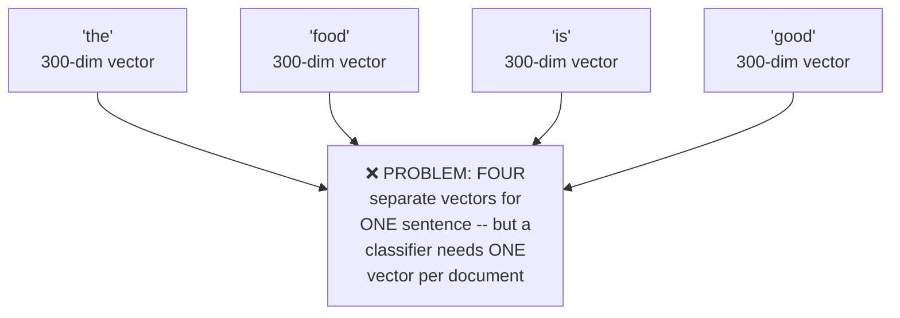

#### ⚠ Common Mistakes

* Assuming Word2Vec, by itself, is a complete, ready-to-use solution for classification tasks — explicitly, directly corrected: Word2Vec converts WORDS to vectors, but classification genuinely requires ONE vector per SENTENCE/document, a genuinely separate, additional step.
* Assuming this problem is somehow specific to short sentences — explicitly, directly implied as a GENERAL issue: ANY sentence, regardless of length, would produce one vector PER WORD, never genuinely collapsing to a single, sentence-level representation on its own.

#### 🎯 Key Takeaways

* This session **directly continues** the prior Word2Vec/CBOW session, assuming genuine familiarity with how individual words get converted into vectors.
* The **precise, motivating problem**: Word2Vec produces ONE vector PER WORD — but classification genuinely requires exactly ONE vector PER SENTENCE/document.
* This gap directly, precisely motivates **Average Word2Vec**, this session's own primary topic, covered next.

---

### 2. Average Word2Vec: The Core Intuition

#### 📖 Definition — The Complete, Precise Solution

> 💡 **Given directly:** *"In order to solve this, what we do is that we take all these vectors, we take all these vectors, and we find the AVERAGE of it -- once we find the average of it, then we try to write that particular vector over here for this entire sentence, and then this vector will be considered for this entire document or sentence."*

```text
Sentence: "the food is good"
Vectors:  V(the), V(food), V(is), V(good)   -- each 300-dimensional

Average Word2Vec = mean(V(the), V(food), V(is), V(good))   -- STILL 300-dimensional
```

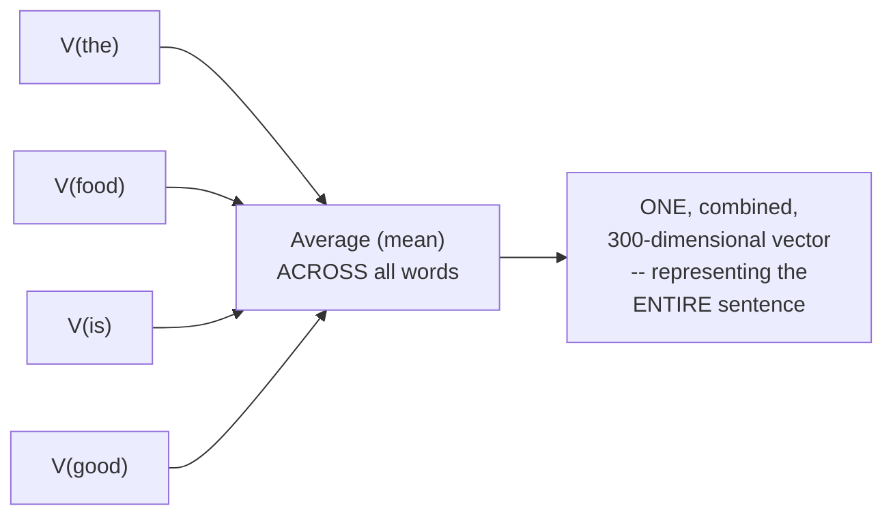

#### 🔍 Internal Working — Precisely Why the Dimensionality Genuinely Stays the Same

> 💡 **Given directly:** *"If you are trying to take out the average of all this particular vector, and if we try to write down as one vector, this will also -- the length will obviously be 300 itself, right -- this will be 300 dimension itself -- but now, with respect to this particular vector, I will be having my output, I can pass it through my model, and get trained with respect to this."*

#### 📖 Definition — Precisely Why the Technique Is Called "Average" Word2Vec

> 💡 **Given directly:** *"Average Word2Vec basically says that -- okay, we are not doing anything, whatever vectors is getting converted, I am just trying to average out each and every vector with respect to that -- right, where let's say 'the' is having 300-dimension vector, 'food' is having 300-dimension vector, 'is' is having 300... for every line by line, all the vectors I am just averaging that out, and I'm actually finding out a value."*

#### ❓ Why It Exists — The Precise, Genuine Reason This Genuinely Works

> 💡 **Given directly:** *"Why we are doing this? Because we really want only ONE specific set of vectors for the entire sentence -- right, so this is what average Word2Vec is basically -- and for any text classification, we basically needed to solve through this specific way only."*

> 💡 **Given directly, a genuinely important, precise clarification on WHY averaging genuinely preserves meaning:** *"Since we are combining all this particular word, that SEMANTIC INFORMATION will also be maintained, right."*

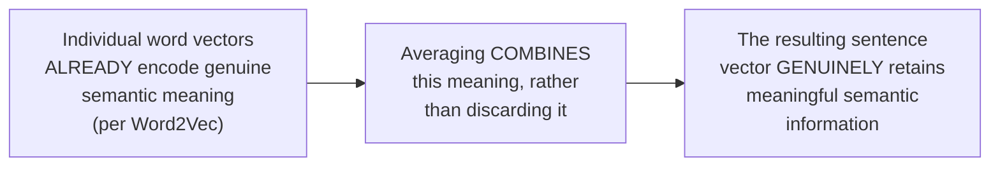

#### 🏢 Real-World / Production Usage — The Explicit, Stated Practical Plan Ahead

> 💡 **Given directly:** *"In upcoming tutorials, what I am actually going to show is that I'm going to basically use a library which is called as GENSIM... first of all we will go ahead and we will see with respect to a pre-trained Google Word2Vec, and then in the second instance, what we are going to do is that we are going to train OUR Word2Vec FROM SCRATCH."*

#### ⚠ Common Mistakes

* Assuming averaging vectors would genuinely LOSE or DILUTE meaningful information — explicitly, directly clarified: since each individual word's vector ALREADY encodes genuine semantic meaning, averaging them COMBINES (rather than discards) this meaning into one, unified sentence-level representation.
* Assuming Average Word2Vec requires a GENUINELY different, more complex technique than simple arithmetic averaging — explicitly, directly clarified as PRECISELY this simple: "we are not doing anything, whatever vectors is getting converted, I am just trying to average out each and every vector."

#### 🎯 Key Takeaways

* **Average Word2Vec** genuinely, precisely solves the "one vector per word, not per sentence" problem by computing the ARITHMETIC MEAN of all word vectors within a sentence.
* The resulting, averaged vector genuinely **retains the SAME dimensionality** as the individual word vectors (e.g., 300-dimensional), while representing the ENTIRE sentence.
* This technique genuinely **preserves semantic information**, since it combines (rather than discards) each individual word's own, already-meaningful vector representation.

---
### 3. Practical Setup: Gensim, the Spam-Ham Project & Text Cleaning

#### 📖 Definition — The Genuine, Real Project: Spam-Ham Classification

> 💡 **Given directly:** *"We are going to continue your discussion with respect to natural language processing -- in this video, we are going to solve the SPAM-HAM CLASSIFICATION project using Word2Vec and average Word2Vec... this will be an important one, guys, because with this, the accuracy level will be quite good."*

#### 💻 Code Example — Installing Gensim & Loading the Pre-Trained Google Model

> 💡 **Given directly:** *"You just need to write `pip install gensim`, if you don't have already -- then I'm going to import two things from Gensim -- `dot models import Word2Vec`, `keyed vectors`... I already have shown you that how you can load Word2Vec Google News 300 model -- that is the Word2Vec model, which is a pre-trained model."*

```python
!pip install gensim

import gensim
from gensim.models import Word2Vec, KeyedVectors

wv = KeyedVectors.load_word2vec_format('GoogleNews-vectors-negative300.bin', binary=True)
print(wv['king'].shape)   # (300,)
```

#### 🪜 Step-by-Step — A Genuinely Different Text-Cleaning Choice: Lemmatization, No Stopword Removal

> 💡 **Given directly, a direct, honest statement of the deliberate change:** *"This time, what I'm actually doing -- I'm also going to make some changes in NLTK -- I will not apply Porter Stemmer, but I'll apply LEMMATIZER... I really want to give you the different, different types, in a specific project, how you can solve the similar things."*

```python
from nltk.stem import WordNetLemmatizer
lemmatizer = WordNetLemmatizer()
```

> 💡 **Given directly, the SECOND, genuinely deliberate change -- keeping stopwords:** *"Let me do one thing -- I just don't want this all things to happen, you know, I don't even want the stop words to apply -- because I want to see that how, for each and every word, this vector will get created -- that basically means, I'm taking every word in this review, and I'm just applying the lemmatization, and I'm appending that in the corpus."*

```python
import re, nltk

corpus = []
for i in range(len(messages)):
    review = re.sub('[^a-zA-Z]', ' ', messages['message'][i])
    review = review.lower()
    review = review.split()
    review = [lemmatizer.lemmatize(word) for word in review]   # NOTE: no stopword filter this time
    review = ' '.join(review)
    corpus.append(review)
```

#### 🪜 Step-by-Step — Tokenizing the Corpus Into Words, Using Gensim's `simple_preprocess`

> 💡 **Given directly:** *"I'm going to show you a special function which is called as `simple_preprocess`... if you also want to make sure that you want to lower any kind of tokens, you can directly use this simple process."*

```python
from nltk.tokenize import sent_tokenize
from gensim.utils import simple_preprocess

words = []
for sentence in corpus:
    sent_token = sent_tokenize(sentence)
    for sent in sent_token:
        words.append(simple_preprocess(sent))
```

> 💡 **Given directly, the precise, live-confirmed result:** *"For every sentences, I'm getting all the list of words -- so this is my sentence one, this is my sentence two, this is my sentence three, right, and this is my sentence four -- like this, I have -- I can get each and every sentence."*

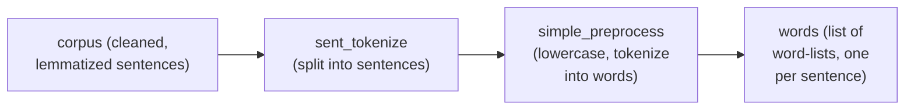

#### ⚠ Common Mistakes

* Assuming the SAME exact preprocessing pipeline (stemming, stopword removal) from the earlier CBOW session must ALWAYS be used identically — explicitly, directly demonstrated as a genuine, deliberate VARIATION: lemmatization instead of stemming, and stopwords DELIBERATELY kept, specifically to observe per-word vector creation more completely.
* Assuming `simple_preprocess` and the earlier session's own manual regex-based cleaning are redundant, duplicate steps — explicitly, directly clarified: `simple_preprocess` handles GENUINE tokenization (splitting into individual words) and lowercasing, a DIFFERENT, complementary step from the earlier regex-based SPECIAL CHARACTER removal.

#### 🎯 Key Takeaways

* This session solves a **genuine, real Spam-Ham classification project**, using Gensim as the primary library for BOTH loading a pre-trained model AND training a new one from scratch.
* Two **deliberate, genuine changes** from the earlier CBOW session's own preprocessing pipeline: **lemmatization** (via `WordNetLemmatizer`) instead of stemming, and **stopwords are DELIBERATELY KEPT** (not removed) — specifically to observe how every individual word receives its own vector.
* **`simple_preprocess`** (from `gensim.utils`) is directly, genuinely used to tokenize each cleaned sentence into a list of individual, lowercase words — a necessary step before training Word2Vec from scratch.

---

### 4. Training Word2Vec From Scratch With Gensim

#### 💻 Code Example — The Complete `Word2Vec` Training Call

> 💡 **Given directly:** *"Let's train this model, let's train this Word2Vec model from scratch, like how Google has basically trained -- with the help of Gensim only, we'll try to do it... the first parameter that I'm giving is SENTENCES -- now already I have my sentences, that is basically my words."*

```python
from gensim.models import Word2Vec

model = Word2Vec(words, vector_size=100, window=5, min_count=2)
```

#### 🔍 Internal Working — Precisely Explaining Each Parameter

> 💡 **Given directly, on `vector_size`:** *"Google Word2Vec, which we have seen in the pre-trained model, it is giving you 300 dimensions -- but here you can see that you can set your own dimensions -- you can use 100, 200, 300 -- so I'm going to, by default, set vector_size is equal to 100."*

> 💡 **Given directly, on `min_count`:** *"What is `min_count`? It ignores all the word with total frequency lower than this -- this is basically to create the vocabulary size itself."*

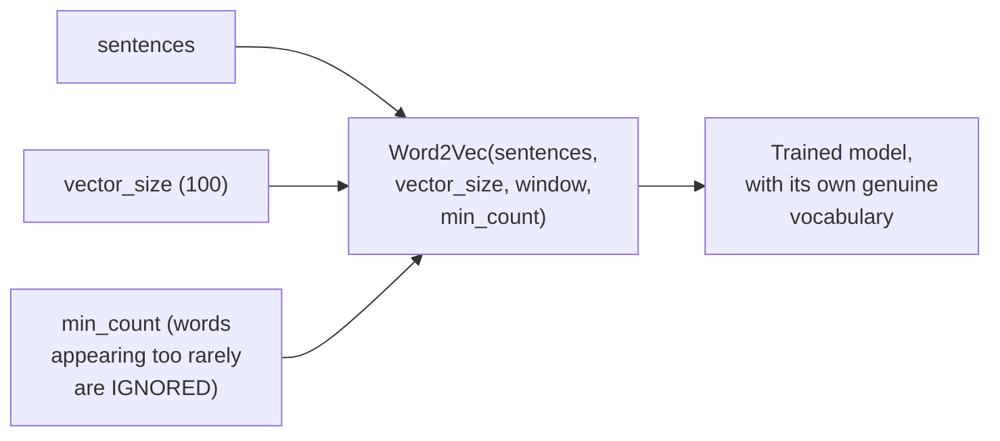

#### 🔍 Internal Working — Confirming the Genuine, Real Vocabulary Size & Training Epochs

> 💡 **Given directly:** *"If you really want to check what is the vocabulary size over here, you can basically write `model.corpus_count`... here you can see, 5,569 is basically my vocabulary size -- and you can also see that for how many epochs it has basically been trained, and by default it will be taking FIVE EPOCHS."*

```python
print(model.corpus_count)   # 5569 (genuine, live-confirmed)
```

> 💡 **Given directly, an honest, direct trade-off note on epoch count:** *"The more number of epochs, the more better it is -- but just to give you an idea about how the training will happen, because if you give 100 epochs, probably this entire training will take a good amount of time."*

#### 🪜 Step-by-Step — Verifying the Trained Model Genuinely Works: `similar_by_word`

> 💡 **Given directly:** *"If I probably try to see similar by word -- so there is a function called as `similar_by_word` -- let's say if I am taking a feature called as 'good,' right, and if I execute it, now here you can see, with respect to this 'good,' what all values you are able to get, or what all similar words you are able to get, along with the cosine similarity score."*

```python
model.wv.similar_by_word('good')
# genuinely returns words like 'happy', 'morning', with cosine similarity scores
```

> 💡 **Given directly, an honest, direct qualifier on training quality:** *"I know the training has just been done for five epochs, so you're probably being able to get like this -- but here you will be able to see that, yes, you are able to get some of the words which are super similar."*

#### 🔍 Internal Working — Confirming Each Word's Vector Dimensionality

> 💡 **Given directly:** *"Whatever vector -- see, what is a vector that is getting created over here -- so if I write `model.wv` of 'good,' right, and if I see this vector size, you'll be able to see it is 100 itself, right -- these are the hundred dimensions that are getting created."*

```python
print(model.wv['good'].shape)   # (100,)
```

#### ⚠ Common Mistakes

* Assuming the vector size for a genuinely NEW, from-scratch Word2Vec model must match Google's own real model (300) — explicitly, directly clarified: it's a genuine, freely-chosen hyperparameter — this session's own model deliberately uses 100.
* Assuming a small number of training epochs (5, the Gensim default) would produce results as genuinely refined as Google's own real, extensively-trained model — explicitly, directly, honestly acknowledged as a genuine LIMITATION of this specific, illustrative training run — real, production-quality results would genuinely require more epochs and more data.

#### 🎯 Key Takeaways

* Training a genuinely NEW Word2Vec model from scratch, via Gensim, requires just a few key parameters: **`sentences`, `vector_size`, `window`, and `min_count`**.
* This session's own trained model has a genuine vocabulary size of **5,569 words**, trained for the Gensim default of **5 epochs** — with a direct, honest acknowledgment that more epochs would genuinely improve quality, at the cost of more training time.
* **`similar_by_word()`** provides a genuine, direct way to verify the trained model is working — live-confirmed to return semantically related words (e.g., "good" → "happy," "morning") along with real cosine similarity scores.

---
### 5. Building the Average Word2Vec Function

#### ❓ Why It Exists — Precisely Re-Confirming the Genuine, Motivating Need

> 💡 **Given directly:** *"This is a super, super important step, as I said -- why do we use average Word2Vec, I've told you that -- see, let's say... for every one sentence, we need to get hundred dimension vectors, right, that is what we really need to get it, right, in order to train our model."*

#### 🪜 Step-by-Step — The Complete, Precise Averaging Logic, Restated With Real Words

> 💡 **Given directly:** *"So 'go' will have a separate vector like this, 'until' will have a separate vector like this, 'jurong' will have a separate vector like this, and every word will have a separate vector like this, right -- now this, this is my entire sentence, and for this entire sentence, I want a vector of 100 size -- so what I will do, I will average up all these numbers."*

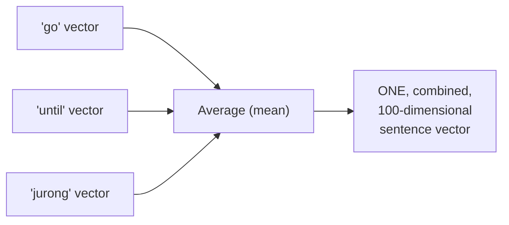

#### 💻 Code Example — The Complete `avg_word2vec` Function

> 💡 **Given directly:** *"I have actually created a function which is called as average Word2Vec -- here I am saying that -- `model` -- see written `NP.mean`, mean basically means average -- for word in doc, for every word in doc over here that I have given, IF the word is NOT in this `index_to_key`, then only I will probably try to create my model vector."*

```python
import numpy as np

def avg_word2vec(doc):
    return np.mean(
        [model.wv[word] for word in doc if word in model.wv.index_to_key],
        axis=0
    )
```

#### 🔍 Internal Working — Precisely Why the `index_to_key` Check Is Genuinely Necessary

> 💡 **Given directly, precisely explained through the code's own logic:** the check `if word in model.wv.index_to_key` ensures ONLY words that GENUINELY exist within the trained model's own vocabulary are included in the averaging computation — directly, precisely preventing a genuine error that would otherwise occur if an out-of-vocabulary word were encountered.

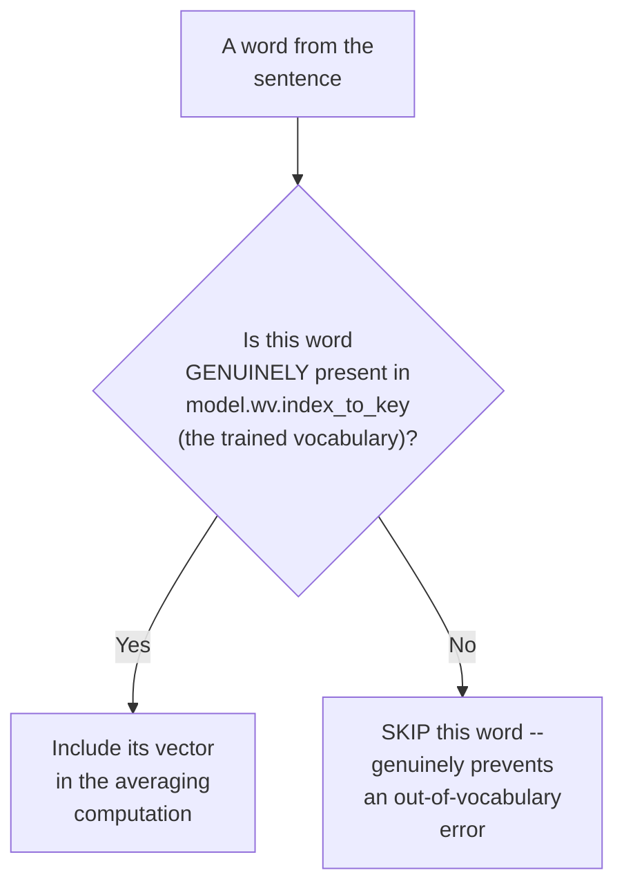

#### 🪜 Step-by-Step — Applying This Function Across the Entire Dataset

> 💡 **Given directly:** *"Now what I'm actually going to do, I'm applying this entire thing -- I'm trying to apply this Word2Vec on every sentence -- on every, every sentence, okay, this is super important -- I will try to apply the Word2Vec on every sentence, average Word2Vec -- so whatever things I am basically doing, this for every sentence, it will take up, and it will apply this particular thing, and it will do the average of all the vectors."*

```python
from tqdm import tqdm

X = []
for sentence in tqdm(words):
    X.append(avg_word2vec(sentence))
```

> 💡 **Given directly, a genuine, honest, direct explanation for WHY `tqdm` is used here:** *"I also want to make sure that I install one progress bar, right, just to understand the progress -- I will be using `tqdm`."*

#### 🔍 Internal Working — Confirming the Genuine, Real Result

> 💡 **Given directly:** *"This is with respect to the first sentence vector, this is my second sentence vector, which is quite amazing, and this is my third sentence vector, and here we have just done average Word2Vec, right, amazing, right -- so this is what I'm actually getting."*

```python
print(len(X))   # 5569 -- matches the input size of the messages
```

#### ⚠ Common Mistakes

* Forgetting to check whether a word genuinely exists in the trained model's own vocabulary before attempting to retrieve its vector — explicitly, directly demonstrated as a NECESSARY, genuine safeguard (`if word in model.wv.index_to_key`), preventing a real, otherwise-occurring error.
* Assuming `tqdm` is a genuinely REQUIRED, functional component of the averaging logic itself — explicitly, directly clarified as purely a PROGRESS-TRACKING convenience, with no genuine effect on the actual computation's correctness.

#### 🎯 Key Takeaways

* The **`avg_word2vec` function** computes `np.mean()` across every word's vector within a sentence, but ONLY for words GENUINELY present in the trained model's own vocabulary (`model.wv.index_to_key`) — a necessary, real safeguard against out-of-vocabulary errors.
* Applying this function across the **entire dataset** (via a loop, with `tqdm` for progress tracking) produces exactly ONE averaged vector PER sentence — directly, precisely solving the original problem stated in Section 1.
* The resulting list of averaged vectors genuinely matches the **input dataset's own size** (5,569, in this session's own live-confirmed example) — a direct, concrete confirmation the technique is working correctly.

---

### 6. A Genuine, Real Debugging Story: The Case of the Missing 3 Rows

#### ❓ Why It Exists — The Precise, Genuine Discrepancy Discovered

> 💡 **Given directly:** *"If I probably see the shape of the messages -- so if I see the messages, right, now this is what is my messages, right, and probably if I see the shape of it, here you will be able to see 5,572 rows... but the number of rows that is coming in `X_new`, it is 5,569 -- so obviously there is a problem, because initially we had 5,572 rows, now we just have 5,569 rows."*

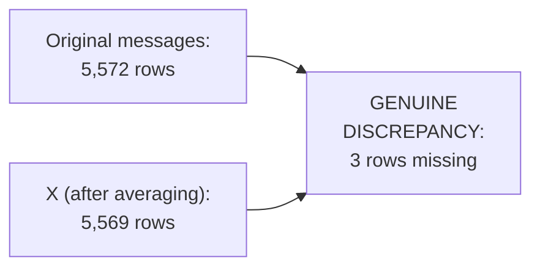

#### 🪜 Step-by-Step — The Precise, Direct, Honest Framing of This as a Genuinely Instructive Moment

> 💡 **Given directly:** *"This is a BIG ISSUE, that basically means our training dataset is just having 5,569 data points, but my output data is 5,572 -- so, after pre-processing, right, we have lost three records -- now we really need to find out why this three records have been lost -- and this is an AMAZING USE CASE, guys, because when I was also solving this problem, it took me a lot of time to understand where that three rows went."*

#### 🪜 Step-by-Step — The Precise, Complete Debugging Technique

> 💡 **Given directly:** *"I have added one line of code -- I'm saying that, I comma J comma K -- three information, I'm taking it out, and I will be nothing but I am ZIPPING it -- LENGTH comma CORPUS -- so I'm basically going to have one information about the LENGTH of the corpus... and I am ONLY displaying when I is less than 1."*

```python
for i, message in zip(map(len, corpus), corpus):
    if i < 1:
        print(message)
```

#### 🔍 Internal Working — The Precise, Genuine Root Cause

> 💡 **Given directly, the complete, honest explanation:** *"Initially there was some message... and it has got removed, and it has become blank -- why? Because I have told that only A to Z and capital A to Z should be there -- everything should be removed -- I could have also put up like 1 to 9 also, then also it would work, right -- but now, in this particular scenario, it is just going to remove EVERYTHING -- even words, even this kind of characters, right -- so everything is getting removed, and it is becoming blank."*

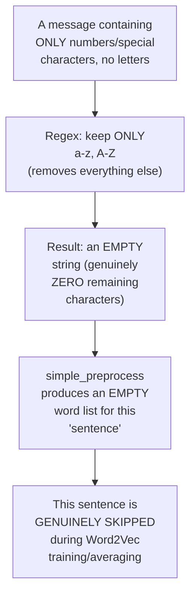

#### 🪜 Step-by-Step — Confirming the Exact Count, and the Precise Fix

> 💡 **Given directly:** *"Once I execute this, how many values I'm getting? I'm getting three, right -- and this is like, if I probably subtract from my entire dataset, then I am -- like, initially my dataset was 5,572, if I am subtracting 3, I will definitely give 5,569, right -- so that is the reason why 3 is missing."*

> 💡 **Given directly, the precise, applied fix to the `y` (output) variable, to keep it consistent:** *"When I'm creating `y`, you know, I've just written this -- `messages` of `list(map(lambda x: len(x) > 0, corpus))` -- when I have written this, I just have to replace this `messages` with `y`, and now you will be able to see that I will be getting the `y.shape` as the same."*

```python
y = messages[list(map(lambda x: len(x) > 0, corpus))]
```

#### ⚠ Common Mistakes

* Assuming an overly-aggressive regex cleaning pattern (removing EVERYTHING except letters) is always genuinely SAFE — explicitly, directly, honestly demonstrated as a REAL, genuine risk: messages consisting ENTIRELY of numbers or special characters can become COMPLETELY EMPTY, silently disappearing from the dataset.
* Assuming a mismatch between input (`X`) and output (`y`) row counts is a genuinely rare, unlikely occurrence — explicitly, directly, honestly framed as a REAL, commonly-encountered issue ("an amazing use case... it took me a lot of time to understand") — worth GENUINELY, ACTIVELY checking for, not assuming away.
* Fixing ONLY the input data's row count, without correspondingly fixing the OUTPUT data — explicitly, directly demonstrated as INSUFFICIENT: both `X` and `y` must be filtered CONSISTENTLY, using the SAME underlying condition (message length > 0).

#### 🎯 Key Takeaways

* A genuine, real **row-count MISMATCH** (5,572 original messages vs. 5,569 averaged vectors) was directly, honestly discovered and debugged LIVE — a genuinely realistic, instructive moment, not a polished, error-free demonstration.
* The **root cause**: 3 specific messages, consisting entirely of characters the regex cleaning step REMOVED (numbers, special characters, no genuine letters), became COMPLETELY EMPTY strings — silently disappearing during subsequent tokenization and averaging.
* The **precise, correct fix** requires filtering BOTH the input (`X`) and output (`y`) data using the SAME, CONSISTENT condition (message length greater than 0) — ensuring both remain properly ALIGNED after removing the genuinely empty entries.

---
### 7. Assembling the Final DataFrame & Handling Null Values

#### ❓ Why It Exists — Precisely Why Each Vector Must Be Reshaped

> 💡 **Given directly:** *"I need to add each and every vector, each and every vector that are present over here, as a ROW in a data frame -- because it will become my independent features."*

#### 🔍 Internal Working — The Precise, Genuine Reshape Operation

> 💡 **Given directly:** *"If I say `X[0]`, okay, and if I probably just see the shape, this is a SINGLE-DIMENSION array, right -- 100 comma -- because it has 100 vectors -- now, what I need to do is that, I need to add this as a row in the data frame -- so I will be using RESHAPE -- and here, once I write `1, -1`, here I'll be able to see that this entire row will now have a dimension of -- one row and hundred columns."*

```python
X[0].shape       # (100,)  -- a flat, 1D array
X[0].reshape(1, -1).shape   # (1, 100)  -- a proper 2D "row"
```

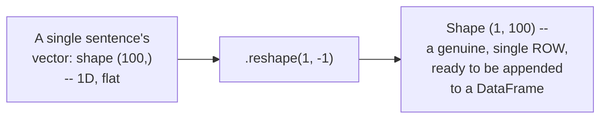

#### 💻 Code Example — Assembling the Complete DataFrame

> 💡 **Given directly:** *"I write `df.append(pd.DataFrame(X[i].reshape(1,-1)))` -- and I have used `ignore_index=True`."*

```python
import pandas as pd

df = pd.DataFrame()
for i in range(len(X)):
    df = df.append(pd.DataFrame(X[i].reshape(1, -1)), ignore_index=True)

print(df.shape)   # (5569, 100)
```

#### 💻 Code Example — Adding the Output Column & Detecting Null Values

> 💡 **Given directly, the complete, genuine, real discovery of missing values:** *"Now I'm getting an error -- let's see what is the error -- 'input contains NaN, infinity, or a value too large for data type' -- now this is the error that we are specifically getting... let's see that whether I have any null values or not -- so here if I write `x.isnull().sum()`... here you can basically see that, okay, there are 12 null values in every, every feature, right, every, every column."*

```python
df['Output'] = y

df.isnull().sum()   # 12 null values discovered, genuinely, in real columns
```

#### 🪜 Step-by-Step — The Precise, Direct Fix

> 💡 **Given directly:** *"First thing first, I will just remove the null value -- so I'll say `df.dropna()`... let me make sure that -- let me just write it as `inplace=True`."*

```python
df.dropna(inplace=True)

df.isnull().sum()   # 0 -- genuinely, directly confirmed fixed
```

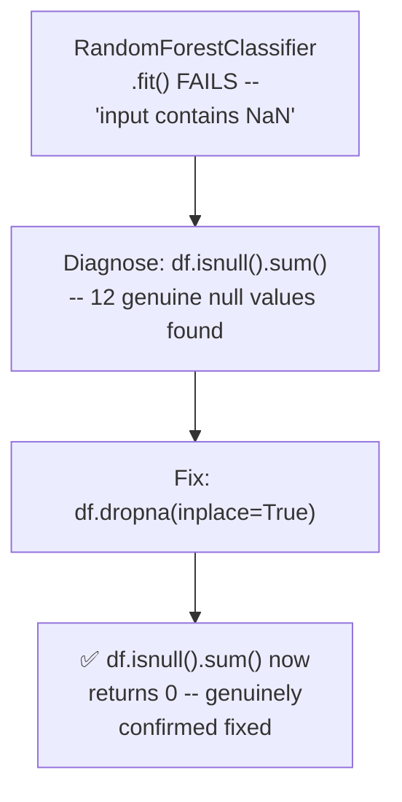

#### 💻 Code Example — The Final, Clean Independent & Dependent Features

> 💡 **Given directly:** *"All I have to do is that put over here, right, as `df`... and this will be there -- let me see, what is the output variable -- yeah, capital 'O,' okay -- so this will basically be my output feature."*

```python
X = df.drop('Output', axis=1)
y = df['Output']
```

#### ⚠ Common Mistakes

* Attempting to `.fit()` a classifier on data containing genuine NaN values — explicitly, directly, honestly demonstrated as producing a REAL, concrete error ("input contains NaN, infinity...") — this must be genuinely, directly diagnosed and fixed BEFORE training can proceed.
* Assuming a flat, 1D array (shape `(100,)`) can be directly appended as a DataFrame row without reshaping — explicitly, directly demonstrated as requiring an EXPLICIT `.reshape(1, -1)` step first, to produce a genuine, proper 2D row shape.
* Forgetting to genuinely re-verify (`df.isnull().sum()`) that a fix (like `dropna()`) actually worked — explicitly, directly demonstrated as a good, honest practice, confirming the fix's genuine effectiveness rather than merely assuming it worked.

#### 🎯 Key Takeaways

* Each sentence's averaged vector must be **reshaped** (via `.reshape(1, -1)`) from a flat, 1D array into a genuine, proper 2D row shape before being appended to a DataFrame.
* A genuine, real error ("input contains NaN") directly led to discovering **12 real null values** in the assembled DataFrame — honestly, directly diagnosed via `df.isnull().sum()`, and fixed via `df.dropna(inplace=True)`.
* The final, clean **`X` (independent features) and `y` (dependent/output feature)** are extracted from the cleaned DataFrame, ready for genuine model training.

---

### 8. Training & Evaluating the Classifier

#### 💻 Code Example — Train-Test Split & Model Training

> 💡 **Given directly:** *"I will do the train-test split -- train_test_split, and here I'll be giving my X, Y."*

```python
from sklearn.model_selection import train_test_split

X_train, X_test, y_train, y_test = train_test_split(X, y, test_size=0.2, random_state=42)
```

#### 💻 Code Example — Choosing & Training a Genuine Classifier

> 💡 **Given directly, the precise, direct reasoning for the chosen algorithm:** *"At the end of the day, these all vectors are a DENSE VECTOR -- so I'm going to basically apply a -- classify -- random forest, okay, and it should be a classification problem."*

```python
from sklearn.ensemble import RandomForestClassifier

classifier = RandomForestClassifier()
classifier.fit(X_train, y_train)
```

#### 💻 Code Example — Prediction & Evaluation

> 💡 **Given directly:** *"I am just writing `classifier.predict`, and this will basically be my `X_test` data, and this will basically be my `y_pred`."*

```python
y_pred = classifier.predict(X_test)

from sklearn.metrics import accuracy_score, classification_report

print(accuracy_score(y_test, y_pred))
print(classification_report(y_test, y_pred))
```

#### ⚠ A Direct, Honest Acknowledgment: Genuine Overfitting Risk

> 💡 **Given directly:** *"Sometimes this can also lead to OVERFITTING -- but if you don't want to do overfitting, you just need to perform some hyperparameter tuning in random forest."*

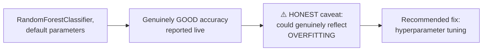

#### 🎯 Key Takeaways

* **RandomForestClassifier** is chosen specifically because Average Word2Vec produces **DENSE vectors** (unlike the sparse vectors from one-hot encoding/Bag of Words/TF-IDF) — a direct, precise reasoning for this specific algorithm choice.
* The complete, genuine evaluation pipeline — **train-test split, `.fit()`, `.predict()`, `accuracy_score`, `classification_report`** — directly, precisely mirrors the SAME evaluation methodology established throughout this broader course.
* A **genuine, honest acknowledgment**: strong reported accuracy could reflect real OVERFITTING, not necessarily genuine, reliable performance — with hyperparameter tuning explicitly, directly recommended as the genuine mitigation.

---
## 📝 Glossary

| Term | Definition | Why It Matters |
|---|---|---|
| **Average Word2Vec** | Averaging all word vectors in a sentence into ONE, combined vector | Solves plain Word2Vec's "one vector per word" problem |
| **Gensim** | The Python library used to load/train Word2Vec models | This session's primary practical tool |
| **KeyedVectors** | Gensim's class for loading pre-trained word vectors | Used to load Google's real Word2Vec model |
| **WordNetLemmatizer** | An NLTK lemmatization tool | Used instead of PorterStemmer, this session |
| **simple_preprocess** | A Gensim utility tokenizing/lowercasing text | Used to prepare sentences for Word2Vec training |
| **vector_size** | The output dimensionality of a trained Word2Vec model | A genuine hyperparameter (100, here; 300 for Google's model) |
| **min_count** | Ignores words below this frequency threshold | Directly shapes the model's own vocabulary |
| **index_to_key** | The trained model's own vocabulary list | Checked before retrieving a word's vector, avoiding errors |
| **reshape(1,-1)** | Converts a flat 1D vector into a proper 2D row | Necessary before appending to a DataFrame |
| **dropna()** | Removes rows containing null values | Fixed a genuine, real error during this session |

---

## 🔄 Revision Notes — One-Minute Revision

* This session **directly continues** the prior Word2Vec/CBOW session -- opens by addressing WHY plain Word2Vec alone cannot solve classification: it produces ONE vector PER WORD, but classification needs ONE vector PER SENTENCE.
* **Average Word2Vec's solution**: average ALL word vectors within a sentence into ONE, combined vector of the SAME dimensionality -- genuinely preserves semantic information, since it combines (not discards) each word's own already-meaningful vector.
* **Practical project**: Spam-Ham classification, using Gensim -- loading Google's real, pre-trained model (KeyedVectors), then genuinely TRAINING a new Word2Vec model from scratch.
* **Two deliberate preprocessing changes** from the earlier CBOW session: WordNetLemmatizer (not PorterStemmer), and stopwords DELIBERATELY KEPT (to observe every word's own vector).
* **Training Word2Vec from scratch**: `Word2Vec(sentences, vector_size=100, window=5, min_count=2)` -- genuine vocabulary size confirmed as 5,569; default 5 training epochs; `similar_by_word()` genuinely confirms the model learned real relationships (e.g., "good" -> "happy," "morning").
* **The `avg_word2vec` function**: `np.mean([model.wv[word] for word in doc if word in model.wv.index_to_key], axis=0)` -- the `index_to_key` check genuinely prevents out-of-vocabulary errors.
* **A genuine, real debugging story**: original messages = 5,572 rows; averaged vectors (X) = 5,569 rows -- a genuine 3-row discrepancy, traced via `zip(map(len, corpus), corpus)` to 3 messages that became COMPLETELY EMPTY after overly-aggressive regex cleaning (kept ONLY letters, removing everything from number/special-character-only messages). Fixed by filtering BOTH X and y consistently, using the SAME "length > 0" condition.
* **Assembling the DataFrame**: each vector reshaped via `.reshape(1,-1)` before being appended as a row -- a genuine, real "input contains NaN" error led to discovering 12 real null values (`df.isnull().sum()`), fixed via `df.dropna(inplace=True)`.
* **Training & evaluation**: RandomForestClassifier (chosen specifically because Average Word2Vec produces DENSE vectors) -- train-test split, fit, predict, accuracy_score, classification_report -- with an honest, direct acknowledgment that strong accuracy could reflect genuine OVERFITTING, recommending hyperparameter tuning as the mitigation.

---

## 📋 Cheat Sheet

**Why Average Word2Vec is needed:**
```text
Plain Word2Vec: ONE vector PER WORD
Classification needs: ONE vector PER SENTENCE/document
-> Average Word2Vec: mean of all word vectors in a sentence -> ONE combined vector
```

**Complete practical pipeline:**
```python
import gensim
from gensim.models import Word2Vec, KeyedVectors
from gensim.utils import simple_preprocess
from nltk.tokenize import sent_tokenize
from nltk.stem import WordNetLemmatizer
import numpy as np, pandas as pd
from tqdm import tqdm

# 1. Clean text (lemmatize, KEEP stopwords this time)
lemmatizer = WordNetLemmatizer()
corpus = [' '.join([lemmatizer.lemmatize(w) for w in re.sub('[^a-zA-Z]',' ',msg).lower().split()])
          for msg in messages]

# 2. Tokenize into words
words = [simple_preprocess(sent) for sentence in corpus for sent in sent_tokenize(sentence)]

# 3. Train Word2Vec from scratch
model = Word2Vec(words, vector_size=100, window=5, min_count=2)

# 4. Average Word2Vec function
def avg_word2vec(doc):
    return np.mean([model.wv[word] for word in doc if word in model.wv.index_to_key], axis=0)

X = [avg_word2vec(sentence) for sentence in tqdm(words)]

# 5. Fix row-count mismatch (filter X and y CONSISTENTLY)
y = messages[list(map(lambda x: len(x) > 0, corpus))]

# 6. Assemble DataFrame
df = pd.DataFrame()
for i in range(len(X)):
    df = df.append(pd.DataFrame(X[i].reshape(1,-1)), ignore_index=True)
df.dropna(inplace=True)

# 7. Train & evaluate
from sklearn.ensemble import RandomForestClassifier
from sklearn.model_selection import train_test_split
from sklearn.metrics import accuracy_score, classification_report

X_train, X_test, y_train, y_test = train_test_split(X, y)
clf = RandomForestClassifier().fit(X_train, y_train)
y_pred = clf.predict(X_test)
print(accuracy_score(y_test, y_pred))
```

**Debugging a row-count mismatch:**
```python
for i, message in zip(map(len, corpus), corpus):
    if i < 1:
        print(message)   # finds EMPTY strings, the root cause
```

---

## 🔥 Interview Questions & Answers

### 🟢 Beginner

**Q1.**

**Question:** Why can't plain Word2Vec alone be used for text classification?

**Answer:** It produces one vector per word, but classification requires exactly one vector per sentence/document.

**Explanation:** Directly, precisely explained.

**Why Interviewers Ask This:** Foundational, frequently-tested Word2Vec limitation.

**Possible Follow-up:** "What technique directly solves this problem?"

**Q2.**

**Question:** How does Average Word2Vec combine multiple word vectors into one?

**Answer:** By computing their arithmetic mean (average).

**Explanation:** Directly, explicitly stated.

**Why Interviewers Ask This:** Basic, foundational Average Word2Vec mechanics.

**Possible Follow-up:** "Does the resulting vector's dimensionality change from the original word vectors?"

**Q3.**

**Question:** What Python library was used to load and train Word2Vec models in this session?

**Answer:** Gensim.

**Explanation:** Directly, explicitly stated.

**Why Interviewers Ask This:** Basic, practical tooling knowledge.

**Possible Follow-up:** "Name the Gensim class used to load pre-trained vectors."

**Q4.**

**Question:** What genuine check should be performed before retrieving a word's vector from a trained Word2Vec model?

**Answer:** Checking whether the word exists in the model's own vocabulary (e.g., via `model.wv.index_to_key`).

**Explanation:** Directly, precisely explained.

**Why Interviewers Ask This:** Tests awareness of a genuine, practical safeguard against errors.

**Possible Follow-up:** "What would happen if this check were omitted, and an out-of-vocabulary word was encountered?"

**Q5.**

**Question:** Why must a word vector be reshaped via `.reshape(1,-1)` before being added to a DataFrame?

**Answer:** Because the raw vector is a flat, 1D array, but a DataFrame row requires a proper 2D shape.

**Explanation:** Directly, precisely explained.

**Why Interviewers Ask This:** Basic, practical NumPy/Pandas knowledge.

**Possible Follow-up:** "What shape does a 100-dimensional vector have after this reshape?"

**Q6.**

**Question:** Why did this session's dataset lose 3 rows during preprocessing?

**Answer:** 3 messages consisted entirely of characters the regex cleaning removed (numbers/special characters, no letters), becoming completely empty strings.

**Explanation:** Directly, honestly explained.

**Why Interviewers Ask This:** Tests understanding of a genuine, real, practical data-cleaning risk.

**Possible Follow-up:** "How was this specific issue diagnosed?"

**Q7.**

**Question:** Why was RandomForestClassifier chosen for this specific classification task?

**Answer:** Because Average Word2Vec produces dense vectors, and Random Forest works well with dense feature representations.

**Explanation:** Directly, precisely explained.

**Why Interviewers Ask This:** Tests understanding of matching algorithm choice to feature type.

**Possible Follow-up:** "How does this differ from the sparse vectors produced by Bag of Words or TF-IDF?"

**Q8.**

**Question:** What genuine error occurred when first attempting to fit the classifier, and what was its root cause?

**Answer:** "Input contains NaN" -- caused by 12 genuine null values in the assembled DataFrame.

**Explanation:** Directly, honestly demonstrated.

**Why Interviewers Ask This:** Tests awareness of a genuine, common real-world ML pipeline issue.

**Possible Follow-up:** "What pandas method was used to fix this?"

**Q9.**

**Question:** Was stopword removal applied in this session's text-cleaning pipeline?

**Answer:** No -- deliberately kept, to observe how every individual word receives its own vector.

**Explanation:** Directly, explicitly clarified.

**Why Interviewers Ask This:** Tests attention to a deliberate, stated preprocessing choice.

**Possible Follow-up:** "What lemmatization tool was used instead of stemming?"

**Q10.**

**Question:** What genuine risk did the instructor honestly acknowledge about the reported classification accuracy?

**Answer:** It could reflect genuine overfitting, not necessarily reliable performance.

**Explanation:** Directly, honestly acknowledged.

**Why Interviewers Ask This:** Tests awareness of honest, critical model evaluation.

**Possible Follow-up:** "What was recommended as the mitigation?"

---

### 🟡 Intermediate

**Q11.**

**Question:** Explain why the instructor deliberately chooses to KEEP stopwords in this session's preprocessing, despite removing them in earlier NLP sessions (e.g., the CBOW session).

**Answer:** This is a genuinely deliberate, stated pedagogical choice, directly explained: "I don't even want the stop words to apply, because I want to see that how, for each and every word, this vector will get created." By keeping ALL words (including stopwords like "the," "is," "a"), the instructor can directly, genuinely observe and verify that EVERY word — not just content-bearing words — receives its own, real Word2Vec vector during training. This directly serves an EDUCATIONAL purpose specific to THIS session (demonstrating the complete, genuine mechanics of per-word vector creation) that would be genuinely OBSCURED if stopwords were removed beforehand — a choice explicitly, directly distinct from the earlier CBOW/classification sessions' own reasoning, where removing stopwords served a DIFFERENT goal (reducing noise for a specific classification task).

**Explanation:** Requires recognizing a deliberate, session-specific pedagogical choice, distinguishing it from a general, universal rule.

**Why Interviewers Ask This:** Tests whether a learner recognizes that preprocessing choices are genuinely CONTEXT-DEPENDENT, not fixed, universal rules.

**Possible Follow-up:** "In a genuinely different scenario -- training a production classification model, not a teaching demonstration -- would you expect stopword removal to be genuinely beneficial or harmful?"

**Q12.**

**Question:** A learner argues that since Average Word2Vec successfully reduces multiple word vectors to one sentence vector, this technique is unconditionally superior to TF-IDF for ANY text classification task. Evaluate this claim.

**Answer:** This claim overstates the case. While Average Word2Vec genuinely offers real advantages over TF-IDF (dense vectors capturing genuine semantic meaning, versus TF-IDF's sparse, purely frequency-based representation), this session's own content doesn't establish UNCONDITIONAL superiority. Averaging GENUINELY discards WORD ORDER information — "the food is good" and "good is the food" (a nonsensical but illustrative reordering) would produce the EXACT SAME averaged vector, since averaging is a GENUINELY commutative operation, insensitive to sequence. For tasks where WORD ORDER genuinely matters significantly (unlike simple document-level sentiment or spam classification, where overall word PRESENCE may be sufficient), this specific limitation could genuinely make Average Word2Vec LESS suitable than techniques (or later architectures, like the RNN/LSTM/Transformer methods covered in this broader course) that GENUINELY preserve sequential information. The accurate, more precise conclusion: Average Word2Vec GENUINELY improves on TF-IDF for MANY classification tasks (as this session's own real project demonstrates), but is NOT unconditionally superior for every possible task, particularly those genuinely sensitive to word order.

**Explanation:** Tests whether a learner recognizes a genuine, real limitation (loss of word order) that the session's own content doesn't explicitly discuss but directly follows from averaging's own mathematical properties.

**Why Interviewers Ask This:** Distinguishes candidates who recognize genuine, real trade-offs from those who treat one demonstrated success as unconditional, universal superiority.

**Possible Follow-up:** "Name a specific NLP task where word order genuinely matters significantly, making Average Word2Vec potentially less suitable."

**Q13.**

**Question:** Explain, precisely, why the debugging technique `zip(map(len, corpus), corpus)` genuinely allows identifying which specific messages became empty, rather than simply counting how MANY became empty.

**Answer:** This is a genuinely precise, important distinction: `map(len, corpus)` computes the LENGTH of each cleaned message, producing a list of lengths; `zip()` then PAIRS each length with its CORRESPONDING original message (maintaining the SAME index/order relationship). By THEN filtering `if i < 1` (where `i` is each message's length), the code doesn't merely COUNT empty messages — it directly, genuinely RETRIEVES the actual, specific message TEXT (and, implicitly, its position) for each genuinely empty entry, allowing the instructor to CONCRETELY verify and inspect WHICH SPECIFIC original messages caused the issue, rather than merely knowing that "3 messages, somewhere, became empty." This directly, precisely demonstrates a genuinely more powerful debugging pattern — pairing a DERIVED property (length) with the ORIGINAL data — over a simpler, count-only approach.

**Explanation:** Requires reasoning through the precise mechanics of `zip` and `map` together to explain why this specific debugging pattern provides more actionable information than a simple count.

**Why Interviewers Ask This:** Tests whether a learner understands the GENUINE, practical value of this specific debugging pattern, not just that it happens to work.

**Possible Follow-up:** "How would you modify this code to also print the ORIGINAL (pre-cleaning) message, to see what text led to this empty result?"

**Q14.**

**Question:** Using this session's own precise `avg_word2vec` function, explain what would genuinely happen if a sentence consisted ENTIRELY of out-of-vocabulary words (none present in `model.wv.index_to_key`).

**Answer:** A genuinely important edge case the session's own code doesn't explicitly address: per the function's own precise logic (`np.mean([model.wv[word] for word in doc if word in model.wv.index_to_key], axis=0)`), if EVERY word in a given sentence is filtered out by the `if word in model.wv.index_to_key` check, the list being passed to `np.mean()` would be GENUINELY EMPTY. Computing `np.mean()` on an EMPTY list/array is a GENUINELY UNDEFINED operation in NumPy — it would either raise a genuine error, or (depending on the NumPy version) produce a `NaN` (Not a Number) result. This directly, precisely connects to Section 7's own genuine, real discovery of 12 null values in the assembled DataFrame — while the session's own EXPLICIT debugging story (Section 6) traces 3 EMPTY-STRING messages (from overly-aggressive regex cleaning), this SAME "entirely out-of-vocabulary sentence" scenario represents a GENUINELY PLAUSIBLE, ADDITIONAL cause of SOME of those 12 discovered null values — a nuance the session's own content doesn't explicitly, directly connect, but which follows necessarily from the function's own precise logic.

**Explanation:** Requires reasoning through an edge case in the session's own code that isn't explicitly discussed, connecting it to a LATER, separately-discovered issue (the 12 null values).

**Why Interviewers Ask This:** Tests whether a learner can identify a genuine, plausible root cause for a later-observed symptom, even when the session's own narrative doesn't explicitly draw this specific connection.

**Possible Follow-up:** "How would you modify the `avg_word2vec` function to gracefully handle this specific edge case, rather than producing a NaN or error?"

**Q15.**

**Question:** Synthesize this session's complete Average Word2Vec mechanism with the earlier CBOW session's own precise architecture to explain why the SAME `min_count` and `window` hyperparameters, while conceptually related, serve genuinely DIFFERENT roles in THIS session's `Word2Vec()` training call versus the earlier session's own from-scratch CBOW architecture.

**Answer:** A precise, synthesized distinction: in the EARLIER CBOW session's own from-scratch architecture (built manually, as a fully-connected neural network), the WINDOW SIZE directly, precisely determined the HIDDEN LAYER's size, which in turn DIRECTLY determined the final word vector's dimensionality — a genuine, STRUCTURAL relationship (window size = vector dimension). In THIS session's Gensim-based `Word2Vec()` call, `window` and `vector_size` are instead TWO GENUINELY SEPARATE, INDEPENDENT parameters — `window` specifically controls HOW MANY surrounding context words are considered during training (directly analogous to the earlier session's OWN window-size concept, for CONSTRUCTING training examples), while `vector_size` GENUINELY, SEPARATELY controls the output embedding dimension (set to 100 in this session, entirely INDEPENDENT of whatever window size is chosen). This reveals that Gensim's own, real implementation GENERALIZES beyond the earlier session's own simplified, illustrative architecture (where window size and vector dimension were NECESSARILY the same value) — real, production Word2Vec implementations genuinely allow these to be CHOSEN INDEPENDENTLY, a GENUINE, important nuance beyond the earlier session's own simplified, illustrative teaching example.

**Explanation:** Requires synthesizing this session's own practical Gensim parameters with the earlier session's own theoretical architecture to identify a genuine, important distinction between the simplified teaching model and the real, production implementation.

**Why Interviewers Ask This:** A senior-level question testing whether a candidate can reconcile a simplified, illustrative teaching example with a real, more flexible production tool's own actual behavior.

**Possible Follow-up:** "In this session's own `Word2Vec(words, vector_size=100, window=5, min_count=2)` call, if you changed `window` to 10 while keeping `vector_size=100`, would the resulting word vectors still be 100-dimensional? Explain why or why not."

---

### 🔴 Advanced

**Q16.**

**Question:** Design a complete, from-scratch numerical trace of Average Word2Vec for a genuinely NEW, 3-word sentence, given illustrative, simplified 3-dimensional word vectors: V(the)=[0.1, 0.2, 0.3], V(cat)=[0.5, 0.1, 0.4], V(sleeps)=[0.2, 0.6, 0.1] — explicitly computing the resulting averaged sentence vector.

**Answer:** A reasonable, complete trace, directly applying Section 2's own exact averaging formula: `Average = mean(V(the), V(cat), V(sleeps))`. Computing dimension-by-dimension: **Dimension 1**: `(0.1 + 0.5 + 0.2) / 3 = 0.8/3 ≈ 0.267`. **Dimension 2**: `(0.2 + 0.1 + 0.6) / 3 = 0.9/3 = 0.3`. **Dimension 3**: `(0.3 + 0.4 + 0.1) / 3 = 0.8/3 ≈ 0.267`. Final averaged sentence vector: **`[0.267, 0.3, 0.267]`** — genuinely, correctly maintaining the SAME 3-dimensional shape as the individual input word vectors, directly, precisely confirming Section 2's own stated property that averaging preserves the original dimensionality.

**Explanation:** Requires applying the session's own exact averaging formula to a genuinely new, numerically concrete example, computed dimension by dimension.

**Why Interviewers Ask This:** A realistic, senior-level question testing whether a candidate can perform the actual computation for a genuinely new example, not just recite the general concept.

**Possible Follow-up:** "If a fourth word, 'quietly,' with vector [0.9, 0.0, 0.5], were added to this sentence, how would the final averaged vector change?"

**Q17.**

**Question:** Critically evaluate: "Since this session's genuine debugging story shows 3 rows were lost due to overly-aggressive regex cleaning, the correct, general fix for ANY Word2Vec-based project is to NEVER remove special characters or numbers during text cleaning, to avoid this exact problem." Is this an accurate, generalizable conclusion?

**Answer:** Not accurate as a generalizable conclusion — this significantly overstates a SPECIFIC, real bug's root cause into an unconditional, broad rule the session's own content doesn't support. The session's OWN genuine issue was specifically that the SPECIFIC 3 messages consisted ENTIRELY of characters being removed, with NO remaining letters — NOT that removing special characters/numbers is INHERENTLY, ALWAYS problematic. For the VAST MAJORITY of real, genuine text messages (which typically DO contain actual letters/words), this SAME regex cleaning step works entirely correctly and is a genuinely STANDARD, appropriate preprocessing choice (directly, consistently used across MULTIPLE sessions in this broader course, including the earlier CBOW and Fake News Classifier projects). The ACCURATE, more precise lesson from this session's own genuine debugging story is NOT "never remove special characters" — it's specifically: **ALWAYS VERIFY that your input and output data row counts remain CONSISTENT after ANY preprocessing step**, and **be aware that overly-aggressive cleaning CAN, in RARE edge cases (messages with no genuine letters), produce completely empty results** — a genuinely narrower, more precise, and more broadly APPLICABLE lesson than "never clean special characters," which would GENUINELY UNDERMINE the real, legitimate purpose this cleaning step serves for the VAST majority of realistic text data.

**Explanation:** Tests whether a learner distinguishes a specific bug's precise root cause from an overly broad, incorrect generalization that would undermine a genuinely standard, appropriate practice.

**Why Interviewers Ask This:** Distinguishes candidates who extract the PRECISE, correct lesson from a real debugging story from those who over-generalize into an inaccurate, counterproductive rule.

**Possible Follow-up:** "What is the PRECISE, correct general lesson this specific debugging story teaches, stated as a genuine, broadly-applicable best practice?"

**Q18.**

**Question:** Synthesize this session's complete Average Word2Vec practical pipeline with the earlier Day 12 Transformers session's own self-attention mechanism to explain a precise, structural reason why self-attention-based approaches would NOT genuinely suffer from this session's own specific "empty message" bug in the SAME way.

**Answer:** A precise, synthesized comparison, extending beyond what either session's own content explicitly discusses together: THIS session's specific bug arose because `avg_word2vec` (Section 5) computes `np.mean()` over a list of word vectors — and for a message with ZERO remaining words (after aggressive regex cleaning), this list is GENUINELY EMPTY, producing an undefined/NaN result (per Advanced Q14's own reasoning). Self-attention (per the earlier Transformers session's own precise mechanism) operates FUNDAMENTALLY DIFFERENTLY — it computes attention WEIGHTS and a WEIGHTED SUM across a sequence's OWN tokens, but a Transformer-based pipeline would typically still REQUIRE some genuine, MINIMUM token representation (even a special "padding" or "unknown" token) to process ANY input at all — meaning a GENUINELY EMPTY input would likely be caught EARLIER in the pipeline (e.g., during tokenization, which would produce an empty token sequence, itself a distinctly-flagged, different kind of edge case) rather than SILENTLY producing a mathematically undefined average, as THIS session's own specific `np.mean()`-based approach does. This reveals a genuine, structural difference: Average Word2Vec's SPECIFIC failure mode (silent, undefined averaging over an empty list) is a GENUINE, real consequence of its SPECIFIC mathematical operation (simple averaging), while Transformer-based pipelines' OWN handling of degenerate, empty inputs would likely manifest as a GENUINELY DIFFERENT kind of error or edge case, specific to THEIR OWN, different underlying mechanics (tokenization and sequence-length handling, rather than simple vector averaging).

**Explanation:** Requires synthesizing this session's specific bug mechanism with an entirely separate, later session's own architectural mechanism to reason through why a similar edge case would manifest differently across genuinely different architectures.

**Why Interviewers Ask This:** A capstone-level question testing whether a candidate can reason about how the SAME underlying edge case (empty/degenerate input) would manifest DIFFERENTLY across architecturally distinct NLP pipelines.

**Possible Follow-up:** "Would a GENUINELY empty input (zero tokens) cause a DIFFERENT kind of error in a Transformer-based pipeline, compared to Average Word2Vec's own specific NaN-producing failure mode? Describe what you would concretely expect to observe."

---

## 🧪 Scenario-Based Interview Questions

> **Scenario 1:** A colleague's Average Word2Vec pipeline, built using this session's exact methodology, produces a classifier with genuinely poor accuracy, despite the underlying Word2Vec model itself showing genuinely sensible `similar_by_word()` results. Using this session's concepts, diagnose the most likely cause.

**Structured Answer:**
1. **Initial investigation:** Recognize this as potentially connected to Section 6's own precise debugging story -- a genuine ROW-COUNT MISMATCH (or silent NaN-producing empty-sentence issue, per Advanced Q14) between the input features and output labels could genuinely cause MISALIGNED training data, directly degrading classifier performance, even if the underlying Word2Vec model itself is genuinely sound.
2. **Metrics/logs to check:** Directly compare the ORIGINAL dataset's row count against the FINAL, assembled DataFrame's row count, per Section 6's own exact diagnostic approach, confirming whether a genuine mismatch exists.
3. **Possible causes:** Per Section 6's own precise reasoning, overly-aggressive text cleaning could be producing GENUINELY empty messages, silently causing misalignment between X and y -- OR, per Advanced Q14's own reasoning, some sentences might be producing NaN averaged vectors (from entirely out-of-vocabulary content), corrupting SOME training examples without being fully removed.
4. **Debugging approach:** Directly apply Section 6's own exact debugging technique (`zip(map(len, corpus), corpus)`) to identify GENUINELY problematic messages, and directly check for null values (`df.isnull().sum()`) per Section 7's own exact approach.
5. **Resolution:** Correct BOTH the row-count alignment (per Section 6's own fix) AND remove any genuine null values (per Section 7's own `dropna()` fix), then RETRAIN the classifier on the now-genuinely-clean, aligned data.
6. **Prevention:** Establish a standing team practice of DIRECTLY, EXPLICITLY verifying input/output row-count alignment at EVERY stage of an Average Word2Vec pipeline, directly modeling this session's own demonstrated debugging discipline.

> **Scenario 2 (Advanced):** Your team needs to decide between using Average Word2Vec (as demonstrated in this session) versus a more modern, context-aware embedding approach (like BERT) for a new sentiment-analysis project, and a colleague argues Average Word2Vec is "good enough" given this session's own genuinely strong reported accuracy. Using this session's concepts (and Intermediate Q12's own reasoning), evaluate this proposal.

**Structured Answer:**
1. **Initial investigation:** Recognize this as directly connected to Intermediate Q12's own precise reasoning about Average Word2Vec's genuine, real limitation -- the LOSS of word-order information, since averaging is a commutative, order-insensitive operation.
2. **Relevant principle:** Per Section 8's own honest acknowledgment of genuine overfitting risk, and Intermediate Q12's own reasoning about word-order loss, a strong REPORTED accuracy on ONE specific dataset doesn't necessarily generalize to GENUINELY reliable, production-grade performance, especially for tasks where WORD ORDER genuinely, meaningfully affects sentiment (e.g., "not good" vs. "good," which, after averaging, might produce a GENUINELY similar-looking vector to other combinations, despite carrying OPPOSITE meaning).
3. **Possible causes for this proposal:** A reasonable-sounding but potentially incomplete assessment, based on a SINGLE session's own specific results, without considering GENUINELY different task characteristics (sentiment analysis's own known sensitivity to negation and word order) that this session's own Spam-Ham task may not have genuinely tested as rigorously.
4. **Debugging/evaluation approach:** Directly test Average Word2Vec's performance SPECIFICALLY on sentences containing negation or order-sensitive constructions (e.g., "not bad" vs. "bad"), empirically assessing whether this GENUINE limitation manifests as a real, practical problem for the team's own specific sentiment-analysis task.
5. **Resolution:** Recommend a GENUINE, empirical comparison (Average Word2Vec vs. a context-aware alternative) SPECIFICALLY on examples testing word-order/negation sensitivity, rather than assuming this session's own Spam-Ham results DIRECTLY generalize to a genuinely different task (sentiment analysis) with potentially different, genuine sensitivity to the SPECIFIC limitation Average Word2Vec's averaging operation introduces.
6. **Prevention:** Establish a standing team practice of evaluating embedding techniques AGAINST the SPECIFIC, genuine characteristics of the TARGET task (e.g., order/negation sensitivity for sentiment analysis) rather than assuming results from ONE task (spam classification) directly, unconditionally transfer to a genuinely different one.

---

## 🛠 Hands-on Exercises

### 🟢 Easy

1. Write out, from memory, the complete `avg_word2vec` function, and explain the purpose of the `index_to_key` check.
2. Explain, in your own words, why plain Word2Vec alone cannot solve a text classification problem.
3. Explain the precise root cause of this session's own "3 missing rows" debugging story.

### 🟡 Medium

4. Complete the full, numerical trace proposed in Advanced Interview Q16, using a genuinely different set of illustrative word vectors of your own choosing.
5. Write a short explanation (150-200 words) of why Average Word2Vec genuinely loses word-order information, directly applying Intermediate Q12's own reasoning.
6. Implement the debugging technique from Section 6 (`zip(map(len, corpus), corpus)`) on a deliberately-constructed, small corpus containing at least one genuinely empty-after-cleaning message.

### 🔴 Advanced

7. Implement a complete, working Average Word2Vec pipeline from scratch (loading a pre-trained model, applying the averaging function, and training a classifier) on a genuinely new, real dataset of your own choosing.
8. Implement the NaN-handling edge case proposed in Advanced Interview Q14, modifying the `avg_word2vec` function to gracefully handle a sentence with zero in-vocabulary words.
9. Implement a genuine, empirical comparison testing Average Word2Vec's sensitivity to word-order/negation, directly extending Scenario 2's own proposed evaluation approach.

---

## 🏗 Practice Assignment

### Build: "Complete Average Word2Vec Classification Project, From Scratch"

**Objective:** Directly reproduce this session's own complete Average Word2Vec pipeline, from raw text through to a trained, evaluated classifier, on a genuinely new dataset.

**Requirements:**
- A working text-cleaning pipeline (lemmatization, with a deliberate, documented choice on whether to remove stopwords), applied to a text-classification dataset of your own choosing.
- A genuinely trained Word2Vec model (from scratch, via Gensim), with your own chosen `vector_size`, `window`, and `min_count`.
- A working `avg_word2vec` function, correctly handling out-of-vocabulary words.
- A complete, verified data-alignment check (row counts genuinely matching between input and output), directly applying Section 6's own debugging methodology to catch any genuine mismatches.
- A trained, evaluated classifier (RandomForestClassifier or another algorithm of your choosing), with a written reflection (200-300 words) on your own observed accuracy and any genuine overfitting concerns.

**Architecture (suggested):**

```text
average_word2vec_project/
├── text_cleaning.py                  # your lemmatization pipeline
├── word2vec_training.py                # your from-scratch Word2Vec training
├── avg_word2vec_function.py              # your averaging function
├── data_alignment_check.py                 # your row-count verification
├── classifier_training.py                    # your final model training/evaluation
└── REFLECTION.md                                # your written reflection
```

**Expected Functionality:**
- Your pipeline should genuinely, correctly run end to end, with input/output row counts verified to be consistent.
- Your classifier should genuinely, correctly train on the averaged Word2Vec features.

**Challenges:**
- Correctly handling the row-count alignment issue, directly applying this session's own debugging methodology.
- Correctly reshaping and assembling averaged vectors into a proper training DataFrame.

**Bonus Improvements:**
- Implement the NaN-handling edge case fix proposed in Advanced Interview Q14.
- Directly test your own model's sensitivity to word-order/negation, per Scenario 2's own proposed evaluation.

---

## 📚 Additional Resources

- **The prior Word2Vec/CBOW session** -- the direct prerequisite content, covering Word2Vec's core intuition and CBOW's complete training architecture, which this session directly builds on.
- **Gensim's official documentation** (implied, standard tooling reference) -- genuinely useful for exploring additional `Word2Vec()` parameters beyond this session's own covered subset.
- **A subsequent session on Skip-gram** (implied, as the second Word2Vec variant, named in the prior session but not yet detailed) -- directly building on this session's own foundation.

---

## 📌 Final Revision Sheet

### ⭐ Core Concepts
- **Average Word2Vec**: averages ALL word vectors in a sentence into ONE, combined vector -- genuinely necessary since classification requires one vector per document, not per word.
- **Practical pipeline**: Gensim (pre-trained model + from-scratch training) -> lemmatization (stopwords KEPT this time) -> simple_preprocess -> Word2Vec training -> avg_word2vec function -> classifier.
- **`avg_word2vec` function**: `np.mean()` over in-vocabulary word vectors, using `index_to_key` to avoid errors.
- **Genuine debugging story**: overly-aggressive regex cleaning can produce EMPTY messages, silently causing row-count mismatches -- fixed by consistently filtering both X and y.
- **DataFrame assembly**: `.reshape(1,-1)` converts each vector into a proper row; `dropna()` fixes genuine null values.
- **Evaluation**: RandomForestClassifier (dense vectors), with honest acknowledgment of overfitting risk.

### ⭐ Important Definitions
- **KeyedVectors, index_to_key** (see Glossary for full definitions).

### ⭐ Important Commands/Code
```python
def avg_word2vec(doc):
    return np.mean([model.wv[word] for word in doc if word in model.wv.index_to_key], axis=0)

for i, message in zip(map(len, corpus), corpus):
    if i < 1:
        print(message)   # find empty messages
```

### ⭐ Architecture/Process
- Complete pipeline: raw text -> clean (lemmatize) -> tokenize (simple_preprocess) -> train/load Word2Vec -> average per sentence (avg_word2vec) -> verify alignment -> assemble DataFrame -> handle nulls -> train classifier -> evaluate.

### ⭐ Best Practices
- Always verify input/output row-count alignment after any text-cleaning step.
- Check for null values before fitting a classifier.
- Choose stopword removal/retention deliberately, based on the specific goal (teaching vs. production).
- Use dense-vector-appropriate algorithms (like Random Forest) for Average Word2Vec features.

### ⭐ Common Mistakes
- Assuming plain Word2Vec alone can solve classification.
- Forgetting to check word presence in the model's vocabulary before retrieving its vector.
- Overly-aggressive regex cleaning without verifying it doesn't produce empty messages.
- Assuming strong reported accuracy is free of genuine overfitting risk.

### ⭐ Interview Points
- Be ready to explain why Average Word2Vec is genuinely necessary for classification.
- Be ready to write the complete `avg_word2vec` function from memory.
- Be ready to explain the genuine, real debugging story and its precise fix.
- Be ready to discuss Average Word2Vec's genuine limitation (loss of word order).

### ⭐ Things to Remember
- This session **directly continues** the prior Word2Vec/CBOW session, addressing a precise, genuine gap (word-level vs. sentence-level vectors).
- The session includes a **genuinely honest, real, live-debugged practical project** -- not a polished, error-free demonstration -- directly modeling real, practical ML development.
- **Skip-gram** remains named but not yet detailed (from the prior session) -- a genuine, implied next step in this ongoing NLP arc.

---

## 🔗 Source

- [Average Word2Vec](https://youtu.be/cyvkMFZnheo?si=czEfaSqpqmZBaJua)