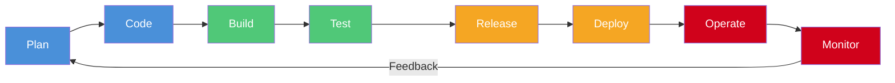
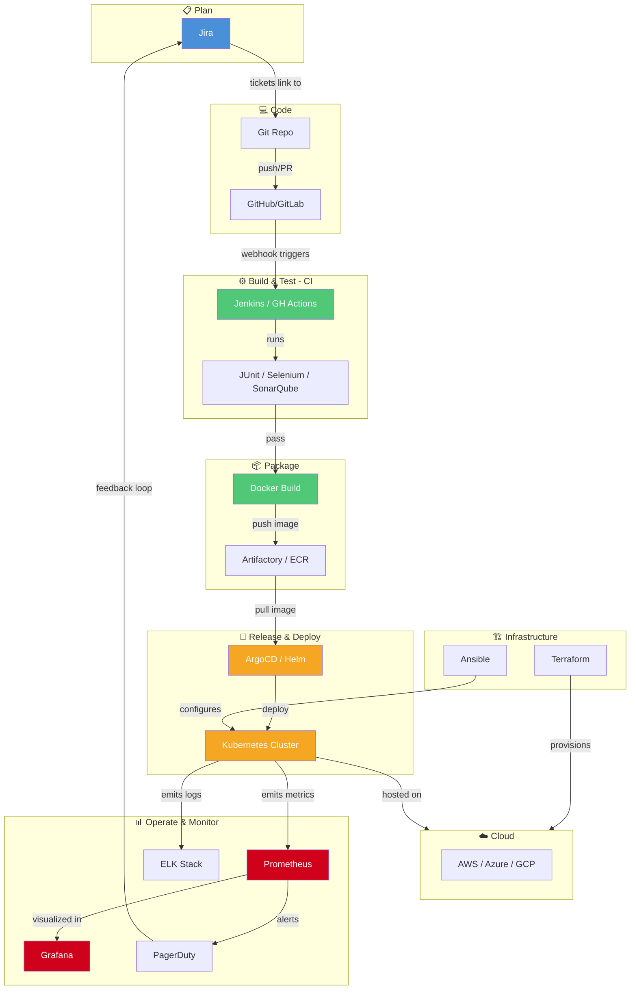
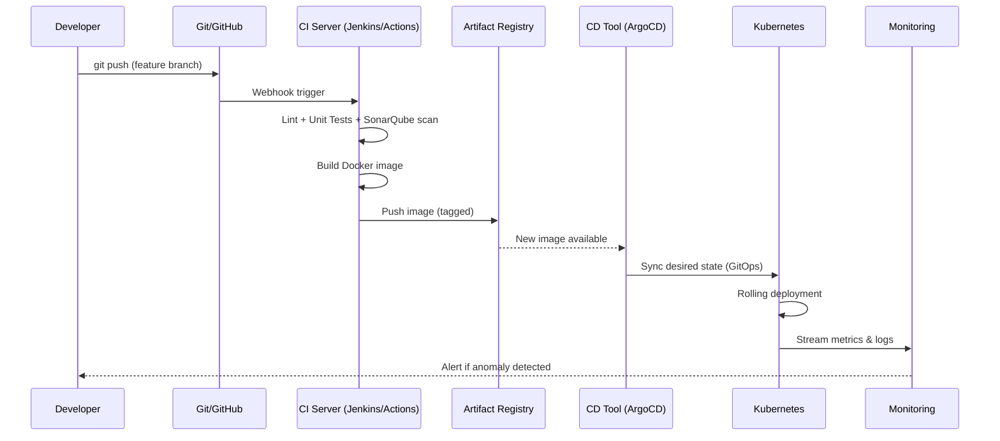
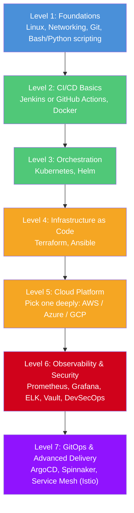

# 🛠️ DevOps Engineer Toolkit — Tools, Workflow & Connectivity

A complete map of the tools a DevOps Engineer should learn, organized by lifecycle stage, with flow diagrams showing how everything connects.

---

## 🔄 1. The DevOps Lifecycle (Infinite Loop)



The loop never stops — **Monitor** feeds insights back into **Plan**, driving continuous improvement (CI/CD/CM: Continuous Integration, Delivery, Monitoring).

---

## 🧰 2. Tools by Lifecycle Stage

### 📋 2.1 Plan — Collaboration & Project Management
| Tool | Purpose |
|---|---|
| **Jira** | Agile issue/sprint tracking |
| **Confluence** | Documentation & knowledge base |
| **Trello / Linear** | Lightweight task boards |
| **Slack / MS Teams** | Team communication, ChatOps |

### 💻 2.2 Code — Source Control & Standards
| Tool | Purpose |
|---|---|
| **Git** | Distributed version control (foundation of everything below) |
| **GitHub / GitLab / Bitbucket** | Git hosting, PR/MR reviews, code hosting |
| **Pre-commit / Husky** | Local hooks for lint/format before commit |
| **SonarQube** | Static code quality & security analysis |

### ⚙️ 2.3 Build & CI — Continuous Integration
| Tool | Purpose |
|---|---|
| **Jenkins** | Extensible, self-hosted CI/CD automation server |
| **GitHub Actions** | Native CI/CD in GitHub, YAML-based |
| **GitLab CI/CD** | Native pipelines in GitLab |
| **CircleCI / Travis CI** | Cloud-native CI platforms |
| **Maven / Gradle / npm / pip** | Build & dependency management per language |

### 🧪 2.4 Test — Quality Assurance
| Tool | Purpose |
|---|---|
| **JUnit / PyTest / Jest** | Unit testing frameworks |
| **Selenium / Cypress / Playwright** | UI/end-to-end testing |
| **Postman / Newman** | API testing |
| **JMeter / k6 / Locust** | Load & performance testing |
| **OWASP ZAP / Snyk / Trivy** | Security (SAST/DAST/SCA) scanning |

### 📦 2.5 Package & Artifact Management
| Tool | Purpose |
|---|---|
| **Docker** | Containerize applications |
| **Nexus / JFrog Artifactory** | Store build artifacts & container images |
| **Docker Hub / Amazon ECR / GCR** | Container image registries |

### 🚀 2.6 Release & Deploy — CD + Orchestration
| Tool | Purpose |
|---|---|
| **Kubernetes (K8s)** | Container orchestration at scale |
| **Helm** | Kubernetes package manager (templated manifests) |
| **ArgoCD / Flux** | GitOps — declarative continuous delivery to K8s |
| **Spinnaker** | Multi-cloud continuous delivery |
| **AWS CodeDeploy / Azure DevOps** | Cloud-native deployment services |

### 🏗️ 2.7 Infrastructure as Code (IaC)
| Tool | Purpose |
|---|---|
| **Terraform** | Cloud-agnostic infrastructure provisioning |
| **AWS CloudFormation** | AWS-native IaC |
| **Pulumi** | IaC using general-purpose languages |
| **Ansible** | Configuration management & app deployment |
| **Chef / Puppet** | Configuration management (agent-based) |

### ☁️ 2.8 Cloud Platforms
| Tool | Purpose |
|---|---|
| **AWS** | Compute, storage, networking, managed services |
| **Microsoft Azure** | Enterprise cloud ecosystem |
| **Google Cloud Platform (GCP)** | Data/AI-friendly cloud services |

### 📊 2.9 Operate & Monitor — Observability
| Tool | Purpose |
|---|---|
| **Prometheus** | Metrics collection & alerting |
| **Grafana** | Metrics visualization dashboards |
| **ELK Stack (Elasticsearch, Logstash, Kibana)** | Centralized logging & search |
| **Datadog / New Relic** | Full-stack SaaS observability (APM + logs + metrics) |
| **PagerDuty / Opsgenie** | Incident alerting & on-call management |

### 🔐 2.10 Security (DevSecOps — cross-cutting)
| Tool | Purpose |
|---|---|
| **HashiCorp Vault** | Secrets management |
| **Snyk / Trivy** | Vulnerability scanning (code, containers) |
| **OPA (Open Policy Agent)** | Policy-as-code enforcement |
| **AWS IAM / Azure AD** | Identity & access management |

---

## 🔗 3. Tool Connectivity — How They Talk to Each Other



---

## 🔁 4. A Typical CI/CD Pipeline, Step by Step



---

## 🎓 5. Suggested Learning Path



---

## ⚡ 6. Quick Reference — One Tool per Category (Minimum Viable Toolkit)

| Category | Pick One to Start |
|---|---|
| 💻 Version Control | Git + GitHub |
| ⚙️ CI/CD | GitHub Actions |
| 🐳 Containers | Docker |
| ☸️ Orchestration | Kubernetes |
| 🏗️ IaC | Terraform |
| 🔧 Config Management | Ansible |
| 📊 Monitoring | Prometheus + Grafana |
| 📜 Logging | ELK Stack |
| 🔐 Secrets | HashiCorp Vault |
| ☁️ Cloud | AWS |

> **Tip:** Depth beats breadth. Master this "minimum viable toolkit" end-to-end (i.e., actually deploy a real app through the full pipeline) before branching into alternatives like GitLab CI, Chef, or Pulumi.

---

## 🎯 7. Key Takeaway

DevOps tools aren't isolated — they form a **pipeline of pipelines**:

```
Code → Build → Test → Package → Provision Infra → Deploy → Monitor → Feedback → Code (again)
```

Each tool hands off an artifact (code, image, manifest, metric) to the next stage, and the entire chain is automated end-to-end so releases become fast, repeatable, and low-risk.