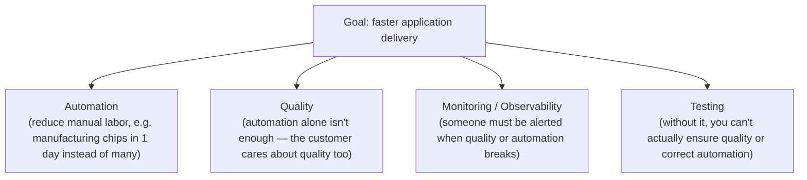
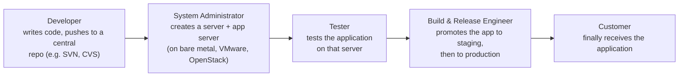
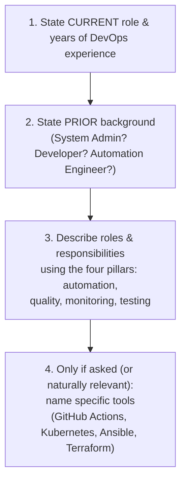

# ⚙ DevOps Fundamentals: What It Is, Why It Evolved & How to Talk About It in Interviews

- <i>**Session:** DevOps Zero to Hero — Day 1: "Fundamentals of DevOps" · 
- **Instructor:** Abhishek
- **Note on scope:** This is Day 1 of a 40-day free DevOps course, delivered as a single, standalone YouTube-style video (not a live class with Q&A or hands-on coding). It is deliberately, explicitly **interview-prep-focused** — the instructor frames the entire session around four questions a real DevOps interviewer would ask early: *What is DevOps? Why DevOps? How do you introduce yourself? What are your day-to-day activities?* The video covers the first three of these in real depth; the fourth (day-to-day activities) is only implicitly touched on, folded into the "how to introduce yourself" section's discussion of roles and responsibilities, rather than treated as its own distinct topic — this guide reflects that honestly rather than inventing a separate section that wasn't actually delivered.</i>

---

## 📑 Table of Contents

1. [Session Overview](#-session-overview)
2. [Learning Objectives](#-learning-objectives)
3. [Detailed Notes](#-detailed-notes)
   - [1. What Is DevOps? Building the Definition from Scratch](#1-what-is-devops-building-the-definition-from-scratch)
   - [2. The Four Pillars of DevOps: Automation, Quality, Monitoring & Testing](#2-the-four-pillars-of-devops-automation-quality-monitoring--testing)
   - [3. Why DevOps Evolved: The Pre-DevOps World](#3-why-devops-evolved-the-pre-devops-world)
   - [4. From Three Roles to One Culture: How DevOps Consolidated the Pipeline](#4-from-three-roles-to-one-culture-how-devops-consolidated-the-pipeline)
   - [5. How to Introduce Yourself in a DevOps Interview](#5-how-to-introduce-yourself-in-a-devops-interview)
4. [Glossary](#-glossary)
5. [Revision Notes — One-Minute Revision](#-revision-notes--one-minute-revision)
6. [Cheat Sheet](#-cheat-sheet)
7. [Interview Questions & Answers](#-interview-questions--answers)
8. [Scenario-Based Interview Questions](#-scenario-based-interview-questions)
9. [Hands-on Exercises](#-hands-on-exercises)
10. [Practice Assignment](#-practice-assignment)
11. [Additional Resources](#-additional-resources)
12. [Final Revision Sheet](#-final-revision-sheet)

---

## 🎯 Session Overview

This opening session of a 40-day DevOps course deliberately skips any tool or hands-on content, focusing entirely on the conceptual and interview-communication foundation every DevOps engineer needs before touching a single tool. It covers:

1. **What is DevOps?** — built up from a simple, deliberately non-technical starting point (a "culture that improves an organization's ability to deliver applications") into a fuller, four-pillar definition.
2. **The four pillars of DevOps** — automation, quality, monitoring (observability), and continuous testing — introduced one at a time via a relatable, non-software analogy (a company manufacturing chips or biscuits).
3. **Why DevOps evolved** — a genuine before/after historical narrative: the pre-DevOps world of separate System Administrator, Tester, and Build & Release Engineer roles, and the real inefficiency (measured in days or weeks) that drove the industry toward a single, unified DevOps culture.
4. **How to introduce yourself in a DevOps interview** — concrete, practical guidance on structuring a self-introduction (current experience, prior background, roles/responsibilities), including explicit warnings against common credibility-damaging mistakes (like overstating years of DevOps experience).

> 💡 **Memory Trick — the instructor's framing for the whole video:** *"If you don't understand the concept of DevOps — why you're using it, what it actually is — the interviewer will lose you in the first five minutes. These are the questions you have to know before you learn a single DevOps tool."*

---

## 🎯 Learning Objectives

By the end of this guide, you will be able to:

- [ ] State a complete, interview-ready definition of DevOps, including all four pillars.
- [ ] Explain each of the four pillars (automation, quality, monitoring, testing) using a non-software analogy, and explain why "delivery speed alone" is an incomplete definition of DevOps.
- [ ] Describe the pre-DevOps software delivery process, naming the three separate roles historically involved (System Administrator, Tester, Build & Release Engineer) and what each one did.
- [ ] Explain why DevOps is described as a "culture" rather than a fixed job title or tool, connecting this directly to the historical shift from multiple separate roles to one unified role/mindset.
- [ ] Structure a complete, credible self-introduction for a DevOps interview, correctly sequencing current experience, prior background, and roles/responsibilities.
- [ ] Identify and avoid the specific, named credibility mistake of overstating years of DevOps experience.

---

## 📚 Detailed Notes

### 1. What Is DevOps? Building the Definition from Scratch

#### 🧠 Concept

Rather than starting from a textbook definition, the instructor deliberately builds the definition of DevOps up in layers, starting from the simplest possible framing and adding precision as gaps are identified.

#### ❓ Why It Exists

> 💡 **Memory Trick, the starting point given directly:** *"DevOps is basically a culture or a practice that you're adopting in your organization that increases your organization's ability to deliver applications. Delivery is the key factor — whether it's Example.com, Amazon.com, or Flipkart.com, the end goal of any organization is delivery."*

#### 🔍 Internal Working — The PUBG/Android Illustration

> 💡 **Memory Trick, given as a concrete, relatable example:** *"If PUBG needs to fix a security bug, or your Android phone has a vulnerability a hacker could exploit, and it takes 10 days to ship the fix, that's not good practice. If they can deliver the fix within hours, that's best; within one or two days, that's still good. DevOps is the process of increasing your ability to deliver applications that quickly."*

#### ⚠ Common Mistakes

* Treating DevOps as **synonymous with CI/CD** — explicitly, directly corrected: *"Most people, when they try to learn DevOps, only talk about CI/CD — Continuous Integration and Continuous Delivery. But is DevOps only about delivery? No."* Delivery speed is necessary but incomplete as a definition.

#### 🎯 Key Takeaways

* DevOps is best introduced as a **culture**, not a specific tool or job title — an organizational practice aimed at improving the ability to deliver applications.
* "Delivery" is the correct starting point for a definition, but **CI/CD-only thinking is an incomplete understanding** of DevOps — a common, correctable misconception.
* Real-world, relatable examples (a security patch shipping in hours vs. days) make the abstract "delivery speed" concept concrete and interview-ready.

---

### 2. The Four Pillars of DevOps: Automation, Quality, Monitoring & Testing

#### 📖 Definition

> 💡 **Memory Trick — the instructor's complete, final, interview-ready definition, given directly:** *"DevOps is a process of improving the application delivery by ensuring there is proper automation, by ensuring there is a quality that is maintained, by ensuring there is continuous monitoring, and by ensuring there is continuous testing in place."*



#### ⚙ How It Works — The Chips/Biscuits Manufacturing Analogy

> 💡 **Memory Trick, walked through step by step, live:** *"Imagine a company manufacturing chips or biscuits. To improve delivery, first they need **automation** — reduce manual labor, bring in machinery so chips that took many days now take one. But is fast production alone good enough for the customer? No — the customer also cares about **quality**. So how do you know quality is actually being maintained? You need **monitoring** — someone has to be alerted the moment there's an issue in quality or in the automation itself. And underlying both quality and automation, you need **testing** — without testing, you can't actually verify either one is correct."*

#### 🔍 Internal Working — Monitoring and Observability, Linked Explicitly

> 💡 **Memory Trick:** *"People also call monitoring 'observability.' Whenever we talk about monitoring, we'll also talk about observability — for now, just think of them as going hand in hand."*

#### 🏢 Real-World / Production Usage — What a DevOps Engineer Is Actually Hired to Do

> 💡 **Memory Trick, the concrete hiring scenario given directly:** *"If Example.com is hiring a DevOps engineer, and their application currently takes two weeks to deliver, the expectation from that DevOps engineer is to reduce that to one week — but by ensuring automation, quality, monitoring, and testing are genuinely in place, not just by cutting corners."*

#### ⚠ Common Mistakes

* Stopping the definition at "faster delivery" alone, without naming the four supporting pillars — explicitly flagged as the incomplete, surface-level answer that loses interviewer confidence.
* Overcomplicating a beginner's definition with advanced terms (cloud-native, serverless, shift-left) — the instructor deliberately **defers** these to later sessions, stating this simpler four-pillar definition is "more than enough" for Day 1.

#### 🎯 Key Takeaways

* The complete definition: DevOps = faster application delivery, achieved through **automation + quality + monitoring (observability) + continuous testing**.
* Each pillar exists to solve a specific gap the previous one leaves open: automation alone doesn't guarantee quality; quality alone isn't verifiable without monitoring and testing.
* This four-pillar definition is explicitly scoped as a **beginner-appropriate**, interview-ready answer — more advanced concepts (cloud-native, serverless, shift-left) are deliberately deferred to later sessions in the course.

---

### 3. Why DevOps Evolved: The Pre-DevOps World

#### 🧠 Concept

To answer "why DevOps?" convincingly in an interview, the instructor walks through a genuine historical narrative: what software delivery looked like roughly a decade ago, before DevOps existed as a distinct role or culture.



#### ⚙ How It Works — Three Distinct Roles, Explained One at a Time

| Role | What they actually did |
|---|---|
| **System Administrator** | Created the server (on bare metal, VMware, or OpenStack — before cloud platforms like AWS were common) and installed/configured the **application server** needed to host the app |
| **Tester** | Tested the deployed application on the server the System Administrator had created |
| **Build & Release Engineer** | Promoted the tested application forward — first to a pre-production/staging environment, and finally to production for the customer |

> 💡 **Memory Trick, the core "why" stated directly:** *"Why can't you just test the application on your personal laptop? Because in an organization, nobody is going to trust that — you have to test it on a real server. That's precisely why the System Administrator role existed."*

#### ❓ Why It Exists — The Real Cost of This Separation

> ⚠️ **The precise, stated cost:** *"This entire process — from developer laptop to customer — used to take 10 days. Sometimes it could be one month, two months, or even five days — but the entire communication and coordination across these separate teams was not effective. Because everything was manual and different teams were collaborating, the process was slow."*

#### 🎯 Key Takeaways

* Before DevOps, delivering an application from a developer's laptop to a real customer required **three genuinely separate roles**: System Administrator (server creation), Tester (validation), and Build & Release Engineer (promotion to staging, then production).
* The core inefficiency wasn't any single role doing a bad job — it was the **manual coordination and communication overhead** across multiple separate teams, which the instructor explicitly names as the root cause of slow (10-day-plus) delivery timelines.
* This historical narrative is presented as genuinely interview-relevant — being able to explain *why* DevOps emerged, not just *that* it did, is framed as a mark of real understanding.

---

### 4. From Three Roles to One Culture: How DevOps Consolidated the Pipeline

#### 📖 Definition

> 💡 **Memory Trick — the precise reasoning for why DevOps is called a "culture," not just a job title, given directly:** *"Unlike 10 years ago, there aren't multiple separate teams anymore — now there's typically one single team, or one role, responsible for what used to require three. That's exactly why it has to be a culture, or a way of working — because as a DevOps engineer, tomorrow there might be a new tool that improves efficiency, and you have to be willing to adapt to it, rather than being rigidly attached to one fixed process."*

#### 🔍 Internal Working — Why "Culture" Implies Adaptability

> 💡 **Memory Trick, the concrete scenario given directly:** *"Imagine your CTO says: 'we're currently using this tool, but if we introduce this other tool, our efficiency will improve.' As a DevOps engineer, you have to have the mindset to adopt that new tool — that adaptability itself IS the culture."*

#### 🎯 Key Takeaways

* DevOps consolidating what used to be three separate roles (System Administrator, Tester, Build & Release Engineer) into effectively one is precisely *why* it's described as a **culture** rather than a fixed job title — the role itself is inherently expected to evolve.
* A core, defining trait of "having a DevOps mindset" is **willingness to adopt new tools and processes** when they genuinely improve efficiency — not loyalty to any single fixed toolset or workflow.
* This section directly answers "why DevOps?" by connecting the historical inefficiency (Section 3) to the structural, cultural solution (this section) — a complete, interview-ready causal narrative.

---

### 5. How to Introduce Yourself in a DevOps Interview

#### 🧠 Concept

A concrete, practical template for structuring a DevOps interview self-introduction, based on the instructor's own real interviewing experience.

#### ❓ Why It Exists

> ⚠️ **A directly, honestly stated observation:** *"I've seen many people fail here — even when I'm the one interviewing. When I ask someone to introduce themselves or walk me through their day-to-day activities, people often don't explain fully, or they think they should keep it to one or two minutes. There's no such rule — if you genuinely need more time, take it."*

#### 🪜 Step-by-Step — The Recommended Structure



1. **State your current role and experience honestly** — e.g., *"I have four to five years of experience in DevOps."*
2. **State your prior background** — System Administrator, Build & Release Engineer, Java/Python developer, or automation engineer. If you're a fresher, simply state that you're starting out and are passionate about DevOps — no prior-background statement is needed.
3. **Describe your roles and responsibilities**, explicitly mapped to the four pillars: *"I take care of automation, I ensure application quality is maintained, I've set up continuous monitoring, and I've automated testing into the DevOps lifecycle."*
4. **Optionally name specific tools** (only if it comes up naturally or the interviewer asks) — e.g., GitHub Actions for CI/CD, Kubernetes for container orchestration, Ansible for configuration management, Terraform for infrastructure automation.

#### ⚠ Common Mistakes — A Direct, Named Credibility Trap

> ⚠️ **Explicitly, repeatedly warned against:** *"You cannot say you have 10 years of experience in DevOps, because DevOps itself has only been genuinely popular for the last seven to eight years. If you say your organization adopted DevOps 10 years back, the interviewer will lose confidence in you right there — because it's not true. State your real years of experience, and if you have prior experience in a related role (System Admin, developer), mention that separately and honestly."*

#### 🏢 Real-World / Production Usage — Why Prior Background Genuinely Matters to an Interviewer

> 💡 **Memory Trick, from the interviewer's own perspective, stated directly:** *"If I'm interviewing someone with a System Administrator background, and we use AWS, I can immediately think: his server-administration experience could be useful for administering our AWS infrastructure, or for migrating our on-prem infrastructure to the cloud. Mentioning your real prior background lets the interviewer correlate your experience with what they actually need — don't skip it."*

#### 🎯 Key Takeaways

* A strong DevOps self-introduction has three required parts (current role/experience, prior background, roles/responsibilities mapped to the four pillars) and one optional part (specific tools).
* **Never overstate years of DevOps experience** — DevOps has only been genuinely mainstream for roughly 7–8 years; claiming longer tenure than that is a specific, named, easily-caught credibility mistake.
* Honestly stating your prior background (even from an unrelated field) is genuinely valuable to an interviewer, since it lets them map your existing skills onto their actual infrastructure/team needs — not something to downplay or omit.

---

## 📝 Glossary

| Term | Definition | Why It Matters |
|---|---|---|
| **DevOps** | A culture/practice aimed at improving an organization's ability to deliver applications, via automation, quality, monitoring, and testing | The single most foundational term of the entire course |
| **The Four Pillars** | Automation, Quality, Monitoring (Observability), and Continuous Testing | The complete, interview-ready expansion of "DevOps improves delivery speed" |
| **CI/CD** | Continuous Integration and Continuous Delivery | Commonly (and incompletely) equated with the entirety of DevOps — a corrected misconception |
| **Monitoring / Observability** | Ensuring someone is alerted when quality or automation issues arise | Explicitly linked as closely related, near-interchangeable concepts at this introductory level |
| **System Administrator (pre-DevOps role)** | Created servers and installed/configured application servers to host deployed code | One of three separate roles DevOps effectively consolidated |
| **Build & Release Engineer (pre-DevOps role)** | Promoted tested applications from staging to production | Another of the three separate, pre-DevOps roles |
| **Application Server** | Software that hosts a deployed application on a server | What a System Administrator specifically installed after creating the server itself |
| **Culture (in DevOps)** | A way of working requiring ongoing adaptability to new tools/processes, rather than a fixed job title | Explains why DevOps is described as a culture, not a static role |

---

## 🔄 Revision Notes — One-Minute Revision

* **DevOps** is best introduced as a **culture** that improves an organization's ability to **deliver applications** — with delivery speed as the starting point, but genuinely incomplete on its own.
* A common misconception, explicitly corrected: DevOps is **not** the same thing as CI/CD — CI/CD is part of the picture, not the whole definition.
* The complete, interview-ready definition rests on **four pillars**: **automation** (reduce manual labor), **quality** (automation alone doesn't satisfy the customer), **monitoring/observability** (someone must be alerted when quality or automation breaks), and **continuous testing** (without it, you can't actually verify quality or automation are working).
* A real-world manufacturing analogy (a company producing chips or biscuits) makes all four pillars concrete and relatable, independent of any specific software tool.
* **Why DevOps evolved**: roughly a decade ago, delivering an application from a developer's laptop to a real customer required three separate roles — **System Administrator** (creates the server + app server), **Tester** (validates on that server), and **Build & Release Engineer** (promotes to staging, then production) — and the manual coordination overhead across these separate teams was the real source of slow (often 10+ day) delivery cycles.
* DevOps is called a **culture**, not a fixed job title, precisely because it consolidated what used to be three separate roles into essentially one — and that consolidated role is expected to keep adapting to new tools and processes as they emerge.
* A strong DevOps interview **self-introduction** has three required parts: current role/experience (stated honestly), prior background (System Admin, developer, or otherwise), and roles/responsibilities mapped to the four pillars — with specific tools mentioned only optionally.
* A specific, named credibility trap to avoid: **never claim more years of DevOps experience than the field has realistically existed** (roughly 7–8 years of mainstream adoption) — this is an easily-caught, confidence-destroying mistake.

---

## 📋 Cheat Sheet

**The complete, interview-ready DevOps definition:**
```text
DevOps = a culture that improves application delivery speed
          by ensuring:
          1. Automation
          2. Quality
          3. Monitoring / Observability
          4. Continuous Testing
```

**The pre-DevOps pipeline (three separate roles):**
```text
Developer -> System Administrator (creates server + app server)
          -> Tester (validates on that server)
          -> Build & Release Engineer (promotes: staging -> production)
          -> Customer
```

**Why "culture," not "job title":**
```text
Three separate roles (10 years ago) -> ONE consolidated role/mindset (today)
-> requires ongoing adaptability to new tools, not a fixed process
```

**Self-introduction structure:**
```text
1. Current role + real years of DevOps experience
2. Prior background (System Admin / developer / fresher)
3. Roles & responsibilities -> map to the four pillars
4. (Optional) specific tools: GitHub Actions, Kubernetes, Ansible, Terraform
```

**The #1 credibility trap:** Never claim more DevOps experience than the field has realistically existed (~7-8 years mainstream).

---

## 🔥 Interview Questions & Answers

### 🟢 Beginner

**Q1.**

**Question:** In one sentence, what is DevOps?

**Answer:** DevOps is a culture/practice that improves an organization's ability to deliver applications, by ensuring automation, quality, continuous monitoring, and continuous testing.

**Explanation:** The instructor's own stated, complete, interview-ready definition.

**Why Interviewers Ask This:** The single most common opening DevOps interview question.

**Possible Follow-up:** "Why do you call it a culture rather than a job title?"

**Q2.**

**Question:** Is DevOps the same thing as CI/CD?

**Answer:** No — CI/CD (Continuous Integration and Continuous Delivery) is part of DevOps, but treating it as the entire definition is a common, incomplete misconception.

**Explanation:** Explicitly, directly corrected in the session.

**Why Interviewers Ask This:** Tests whether a candidate has a surface-level or genuine understanding of DevOps.

**Possible Follow-up:** "What else, besides CI/CD, does DevOps include?"

**Q3.**

**Question:** Name the four pillars of DevOps.

**Answer:** Automation, Quality, Monitoring (Observability), and Continuous Testing.

**Explanation:** The core, repeated framework of this entire session.

**Why Interviewers Ask This:** A foundational, frequently-tested checklist.

**Possible Follow-up:** "Explain how these four pillars relate to each other using a non-software example."

**Q4.**

**Question:** Why isn't automation alone considered sufficient for good DevOps practice?

**Answer:** Automation improves speed, but the customer also cares about quality — and you can't verify quality is actually being maintained without monitoring and testing in place.

**Explanation:** Directly demonstrated via the chips/biscuits manufacturing analogy.

**Why Interviewers Ask This:** Tests whether a candidate understands the pillars as interdependent, not standalone.

**Possible Follow-up:** "What role does monitoring play specifically?"

**Q5.**

**Question:** Name the three separate roles that historically handled software delivery before DevOps existed.

**Answer:** System Administrator, Tester, and Build & Release Engineer.

**Explanation:** Directly walked through, role by role, in the historical narrative.

**Why Interviewers Ask This:** Tests genuine understanding of "why DevOps," not just "what DevOps."

**Possible Follow-up:** "What specifically did the System Administrator do?"

**Q6.**

**Question:** What did a System Administrator do in the pre-DevOps delivery pipeline?

**Answer:** Created the server (on bare metal, VMware, or OpenStack) and installed/configured the application server needed to host the deployed code.

**Explanation:** Precisely defined in the historical walkthrough.

**Why Interviewers Ask This:** Tests recall of specific role responsibilities.

**Possible Follow-up:** "Why couldn't testing just happen on the developer's own laptop?"

**Q7.**

**Question:** Why couldn't an application just be tested on a developer's personal laptop?

**Answer:** In an organization, no one will trust "it works on my laptop" as sufficient validation — it must be tested on a real, shared server.

**Explanation:** Directly, explicitly stated as the reasoning behind the System Administrator role's existence.

**Why Interviewers Ask This:** A practical, foundational software-delivery principle.

**Possible Follow-up:** "What role specifically was responsible for creating that server?"

**Q8.**

**Question:** Roughly how long did the full developer-to-customer delivery cycle take before DevOps, per this session?

**Answer:** Often around 10 days — sometimes ranging from 5 days to one or two months, due to manual coordination overhead across separate teams.

**Explanation:** Directly, specifically cited as a real example.

**Why Interviewers Ask This:** Grounds an abstract "DevOps improves speed" claim in a concrete, quantified example.

**Possible Follow-up:** "What was the root cause of this slowness — was it any single role doing poor work?"

**Q9.**

**Question:** Why is DevOps described as a "culture" rather than a fixed job title?

**Answer:** Because it consolidated what used to be three separate roles into essentially one, and that role is expected to continuously adapt to new tools and processes as they emerge, rather than following one fixed, static workflow.

**Explanation:** Directly, precisely explained in the session.

**Why Interviewers Ask This:** Tests understanding of *why* the "culture" framing is used, not just that it is.

**Possible Follow-up:** "Give an example of what 'adapting to a new tool' might look like in practice."

**Q10.**

**Question:** What's the biggest mistake to avoid when stating your years of DevOps experience in an interview?

**Answer:** Never claim more years of DevOps experience than the field has realistically existed — DevOps has only been mainstream for roughly 7–8 years, so claiming, for example, 10+ years is an easily-caught, credibility-destroying mistake.

**Explanation:** Explicitly, directly warned against in the session.

**Why Interviewers Ask This:** A genuinely practical, career-relevant warning.

**Possible Follow-up:** "What should you say instead if you have prior experience in a related field, like system administration?"

---

### 🟡 Intermediate

**Q11.**

**Question:** Explain why the instructor uses a chips/biscuits manufacturing analogy rather than a software-specific example to teach the four pillars.

**Answer:** By deliberately stepping outside software entirely, the analogy proves the four pillars (automation, quality, monitoring, testing) are genuine, general business/production principles — not something invented specifically for software delivery. This helps a learner (especially a beginner or someone from a non-software background) grasp that DevOps concepts map onto universal principles of efficient, quality-controlled production, making the concepts easier to internalize and explain confidently in an interview using their own words, rather than memorized software jargon.

**Explanation:** Reflects the instructor's own deliberate teaching choice.

**Why Interviewers Ask This:** Tests whether a learner grasps the pillars conceptually, not just as software-specific vocabulary.

**Possible Follow-up:** "Apply the four pillars to a completely different, non-software business of your own choosing."

**Q12.**

**Question:** A learner argues: "Before DevOps, three different people (System Admin, Tester, Build & Release Engineer) each did their job correctly — so why was the process still slow?" Correct this reasoning using this session's content.

**Answer:** The session explicitly attributes the slowness not to any individual role performing poorly, but to the **manual coordination and communication overhead** required across genuinely separate teams — handoffs between roles, waiting for one team to finish before the next could start, and the general friction of multiple independent groups collaborating on one shared goal. DevOps didn't necessarily mean any single role got "better" at their individual task — it meant consolidating the responsibilities (and reducing the coordination overhead) into a more unified, automated, continuously-adapting process.

**Explanation:** Directly corrects a plausible but incomplete understanding of *why* the old process was slow.

**Why Interviewers Ask This:** Tests whether a learner understands the root cause (coordination overhead) rather than assuming individual performance was the issue.

**Possible Follow-up:** "How does automation specifically address this coordination overhead?"

**Q13.**

**Question:** Why does the instructor specifically warn against overstating DevOps experience, using a precise timeframe argument (7-8 years) rather than just saying "don't lie"?

**Answer:** Providing the specific, checkable timeframe (DevOps has only been mainstream for roughly 7-8 years) gives a learner a concrete, verifiable boundary rather than a vague ethical instruction — it directly explains *why* a specific claim (e.g., "10 years of DevOps experience") is not just dishonest but factually implausible and easily caught by any interviewer who knows the field's real history. This transforms "don't lie" from abstract advice into a specific, actionable credibility check a candidate can self-apply before an interview.

**Explanation:** Requires reasoning about *why* a specific, factual framing is more useful advice than a general ethical instruction.

**Why Interviewers Ask This:** Tests whether a learner internalizes the practical, checkable nature of this advice.

**Possible Follow-up:** "What would be a credible way to describe 10 years of relevant experience, if you've been in the industry that long but DevOps specifically for less?"

**Q14.**

**Question:** Explain why "monitoring" and "testing" are presented as distinct pillars, rather than treating monitoring as simply "testing after deployment."

**Answer:** While related in purpose (both aim to catch problems), they operate at genuinely different points in the lifecycle and catch different classes of issues: **testing** (per this session) verifies that automation and quality are correctly implemented *before* or *during* deployment — a proactive, pre-emptive check. **Monitoring/observability** operates *continuously, after* deployment, specifically to alert someone when something breaks in production despite having passed testing — a reactive, ongoing safety net for issues that only manifest under real-world conditions (load, edge cases, environmental factors) that testing couldn't have fully anticipated. Treating them as the same would miss this proactive-vs-reactive distinction.

**Explanation:** Requires synthesizing the session's brief individual definitions into a coherent explanation of why both are necessary, not redundant.

**Why Interviewers Ask This:** Tests deeper conceptual understanding beyond simply listing the four pillars by name.

**Possible Follow-up:** "Give an example of a problem that monitoring would catch but pre-deployment testing would not."

**Q15.**

**Question:** How would you explain, to a complete beginner, why "culture" is a more accurate word than "process" or "job title" for DevOps?

**Answer:** "Process" and "job title" both imply something fixed and well-defined — a specific set of steps or a specific set of responsibilities that don't change. "Culture," by contrast, correctly captures that DevOps is fundamentally about a **mindset of adaptability** — the willingness to adopt better tools and practices as they emerge, rather than rigid adherence to one fixed way of working. Since the entire premise of DevOps (per this session) is that it evolved specifically to replace an inefficient, static, multi-role process with something more efficient, calling the replacement itself a rigid "process" would undercut the very adaptability that made it an improvement in the first place.

**Explanation:** Requires connecting the "culture" framing back to the session's own stated reasoning about adaptability.

**Why Interviewers Ask This:** Tests whether a learner can explain a definitional choice, not just repeat it.

**Possible Follow-up:** "Can an organization have 'DevOps job titles' while still genuinely lacking a DevOps culture? Explain."

---

### 🔴 Advanced

**Q16.**

**Question:** Design a rubric (4-5 criteria) an interviewer could use to distinguish a candidate who has genuinely internalized this session's DevOps definition from one who has only memorized the phrase "automation, quality, monitoring, testing."

**Answer:** A reasonable rubric: (1) Can the candidate explain WHY each pillar exists — i.e., what specific gap it closes that the others leave open (per this session's own layered build-up: automation alone doesn't ensure quality, quality alone isn't verifiable without monitoring/testing)? A memorized answer will list the four words but struggle to explain their interdependence. (2) Can the candidate apply the four pillars to a scenario OUTSIDE their own specific tool stack or even outside software entirely (mirroring this session's own manufacturing analogy)? Inability to generalize suggests rote memorization tied to specific tools rather than genuine conceptual understanding. (3) Can the candidate correctly distinguish DevOps from CI/CD, explaining specifically what CI/CD covers and what it leaves out? This directly tests whether the common "DevOps = CI/CD" misconception this session explicitly corrects has actually been internalized or just superficially acknowledged. (4) Can the candidate explain WHY DevOps is a "culture" using the actual historical reasoning (role consolidation, adaptability requirement) rather than just repeating "it's a culture, not a job"? (5) Does the candidate's own self-introduction (if asked) naturally incorporate the four pillars into their described responsibilities, rather than reciting them as a disconnected, memorized list immediately after being asked to define DevOps?

**Explanation:** Synthesizes every major theme of this session into a genuine assessment framework, testing understanding rather than recall.

**Why Interviewers Ask This:** A senior-level, meta question testing whether a candidate (perhaps now interviewing others themselves) can design a rigorous assessment, not just pass one.

**Possible Follow-up:** "Which of these five criteria would be hardest to fake with memorized answers, and why?"

**Q17.**

**Question:** Critically evaluate: "Since DevOps consolidated three roles into one, a modern DevOps engineer must now be equally expert in server administration, testing, and release management — there's no room for specialization anymore." Is this an accurate implication of this session's content?

**Answer:** Not fully accurate, though it captures a real kernel of truth. The session does establish that DevOps consolidated responsibilities that used to be split across three roles into a more unified culture/practice — but this doesn't necessarily mean every individual DevOps engineer must be equally expert in every historical sub-discipline with zero specialization. The session itself explicitly acknowledges people come into DevOps from varied prior backgrounds (system administration, software development, automation engineering) and explicitly recommends candidates highlight that specific prior specialization as a genuine asset, not something to erase in favor of uniform generalism. The more accurate claim: DevOps as an organizational *culture/practice* now handles what three separate teams used to handle, but individual DevOps engineers or teams may still have areas of relative strength or specialization (e.g., stronger infrastructure background vs. stronger testing/automation background) — the consolidation happened at the organizational-process level, not necessarily requiring perfectly uniform individual expertise across every historical role.

**Explanation:** Tests whether a learner over-generalizes "three roles became one culture" into an inaccurate claim about individual expertise requirements, correctly identifying the session's own counter-evidence (valuing diverse prior backgrounds).

**Why Interviewers Ask This:** Distinguishes candidates who track precise scope from those who round a real observation into an overstated, inaccurate claim.

**Possible Follow-up:** "How would you personally decide which historical specialization to lean into, if you were entering DevOps from a system-administration background?"

**Q18.**

**Question:** Synthesize this session's "four pillars" framework with its "why DevOps evolved" historical narrative to explain which specific pre-DevOps role each pillar most directly replaces or absorbs, and identify any pillar that doesn't map cleanly onto a single historical role.

**Answer:** **Automation** most directly absorbs and improves upon what the **System Administrator** and **Build & Release Engineer** roles previously did manually (server creation/configuration and promotion between environments) — automating these steps is precisely what collapses the multi-day, multi-handoff process into something much faster. **Testing** most directly absorbs and formalizes what the dedicated **Tester** role did — but with continuous, automated testing integrated into the pipeline rather than a separate, manual, sequential step. **Monitoring/Observability**, however, does NOT map cleanly onto any single one of the three named pre-DevOps roles — none of System Administrator, Tester, or Build & Release Engineer, as described in this session, had an explicit, dedicated "watch production continuously and alert on issues" responsibility; this suggests monitoring/observability is best understood as a genuinely **new** capability DevOps introduced, rather than simply an automated/consolidated version of a pre-existing role — consistent with the session's own framing of monitoring as a comparatively newer, still-evolving concept (paired with "observability," a term the instructor notes will get much deeper treatment in later sessions). **Quality**, similarly, is less a specific former role and more an emergent property the other three pillars are collectively responsible for maintaining.

**Explanation:** Requires precisely mapping each of the four pillars back to (or explicitly NOT back to) the three historical roles named earlier in the same session — genuine, non-obvious synthesis across two separately-taught sections.

**Why Interviewers Ask This:** A capstone-level conceptual question testing whether a candidate can trace the specific lineage of modern DevOps practices back to concrete historical antecedents, correctly identifying where the mapping is clean versus where it isn't.

**Possible Follow-up:** "If monitoring/observability didn't exist as a distinct pre-DevOps role, what historical or technological factor do you think drove its emergence as a distinct DevOps pillar?"

---

## 🧪 Scenario-Based Interview Questions

> **Scenario 1:** During a mock interview, a candidate answers "What is DevOps?" by saying only "DevOps is CI/CD — continuous integration and continuous delivery." As the interviewer, how would you respond and what follow-up would you ask?

**Structured Answer:**
1. **Initial investigation:** Recognize this as the exact, explicitly-named common misconception this session corrects — CI/CD is part of DevOps, not the whole of it.
2. **Metrics/logs to check:** N/A (this is a conceptual, not technical, diagnostic) — instead, probe the candidate's understanding directly.
3. **Possible causes:** The candidate likely learned DevOps primarily through tool-focused tutorials/content that emphasize CI/CD pipelines without covering the broader cultural/organizational definition this session builds.
4. **Debugging approach:** Ask a direct, clarifying follow-up: "Is DevOps only about delivery speed, or does it include anything else?" — giving the candidate a chance to self-correct and demonstrate broader understanding.
5. **Resolution:** A strong candidate, prompted this way, should be able to name the additional pillars (automation as distinct from CI/CD specifically, quality, monitoring, testing) and explain how they relate; a candidate who cannot expand beyond CI/CD likely has only surface-level exposure.
6. **Prevention:** As a candidate preparing for interviews, explicitly rehearse the complete four-pillar definition rather than defaulting to the more commonly-known CI/CD framing, precisely to avoid triggering this exact follow-up gap.

> **Scenario 2 (Advanced):** A candidate with 12 years of total IT experience, the last 3 as a "DevOps Engineer" and the prior 9 as a "Systems Administrator," is unsure how to phrase their experience without either understating their seniority or making an implausible claim. Using this session's guidance, advise them.

**Structured Answer:**
1. **Initial investigation:** Confirm the actual breakdown — genuinely DevOps-titled/focused experience (3 years) versus adjacent, relevant prior experience (9 years as Systems Administrator) — exactly the kind of prior-background distinction this session explicitly recommends surfacing.
2. **Relevant principle:** Per Section 5, never overstate DevOps-specific experience — claiming "12 years of DevOps experience" would be both inaccurate and, per this session's stated reasoning, implausible given the field's real history (DevOps only mainstream for ~7-8 years) even without needing to reference this specific candidate's actual role history.
3. **Possible causes for the candidate's uncertainty:** A reasonable but misplaced worry that stating only "3 years of DevOps" undersells their real seniority and total technical depth.
4. **Debugging/evaluation approach:** Apply the session's own recommended structure precisely: state current role and REAL DevOps-specific experience (3 years) first, then explicitly and proudly state the prior background (9 years as a Systems Administrator) as a genuine asset — exactly as the session's own interviewer-perspective example describes (a System Administrator background being directly valuable for infrastructure-related DevOps work).
5. **Resolution:** Recommend phrasing like: "I have 3 years of dedicated DevOps experience, building on 9 years of prior experience as a Systems Administrator" — accurately representing both numbers without conflating them, while still conveying full seniority (12 years total relevant technical experience) through the combination.
6. **Prevention:** Encourage the candidate to rehearse this exact two-number framing (dedicated DevOps years + prior relevant background years) as a template applicable to any similar career-transition scenario, directly modeled on this session's own explicit guidance for candidates coming from adjacent backgrounds.

---

## 🛠 Hands-on Exercises

### 🟢 Easy

1. Write out, in your own words (not copied from this guide), a complete one-paragraph definition of DevOps including all four pillars.
2. Apply the four pillars (automation, quality, monitoring, testing) to a non-software business of your own choosing (different from the chips/biscuits example used in this session), explaining each pillar's role in one sentence.
3. List the three pre-DevOps roles (System Administrator, Tester, Build & Release Engineer) and write one sentence describing what each one actually did.

### 🟡 Medium

4. Write a complete, ~90-second self-introduction for a DevOps interview, following the session's recommended structure (current experience, prior background, roles/responsibilities mapped to the four pillars), based on a realistic profile of your own choosing (real or hypothetical).
5. Draw (or describe in writing) the pre-DevOps pipeline diagram from Section 3, then draw a "modern DevOps" equivalent showing how the same end-to-end delivery is now handled by a more consolidated process — explicitly noting which historical role's responsibilities map to which modern pillar (per Advanced Q18's reasoning).
6. Write a short answer (150-200 words) to the question "Why is DevOps called a culture rather than a job title?" without directly quoting this session's own phrasing.

### 🔴 Advanced

7. Design and answer the interview rubric proposed in Advanced Interview Q16 yourself — apply all five criteria to your own current understanding of DevOps, honestly identifying any gaps.
8. Research (outside this transcript) and write a short comparison of how observability/monitoring practices have evolved since DevOps became mainstream, using this session's observation (monitoring doesn't map cleanly onto any single pre-DevOps role) as your starting point.
9. Conduct a mock interview with a peer, where you play the interviewer role, deliberately probing for the "DevOps = CI/CD only" misconception (Scenario 1) and evaluating their response against the rubric from Advanced Q16.

---

## 🏗 Practice Assignment

### Build: "DevOps Interview Readiness Pack"

**Objective:** Produce a complete, personally-tailored set of interview-ready materials covering this session's four core questions (what is DevOps, why DevOps, self-introduction, roles/responsibilities), directly modeling the session's own stated interview-prep purpose.

**Requirements:**
- A written, complete definition of DevOps (Section 1-2 content, in your own words) you could deliver confidently and unscripted in an interview.
- A written explanation of "why DevOps evolved," correctly naming and describing all three pre-DevOps roles and the core inefficiency (coordination overhead) that drove the shift.
- A complete, personally-accurate self-introduction script (Section 5's structure), whether you're a fresher, a career-changer, or an experienced practitioner.
- A short, honest self-assessment against the rubric from Advanced Interview Q16.

**Architecture (suggested):**

```text
devops_interview_pack/
├── 01_what_is_devops.md         # your complete definition + four pillars
├── 02_why_devops.md              # historical narrative + the three roles
├── 03_self_introduction.md         # your personal, structured introduction
└── 04_self_assessment.md             # honest evaluation against Advanced Q16's rubric
```

**Expected Functionality:**
- Each document should be genuinely usable as real interview preparation — written in your own natural speaking voice, not copied phrasing.
- The self-introduction document should be realistically deliverable in a genuine interview setting, whatever your actual background is.

**Challenges:**
- Avoiding the temptation to simply copy this guide's phrasing rather than genuinely internalizing and re-expressing the concepts in your own words — a real test of whether you understand versus merely recall.
- Honestly assessing your own understanding against the rubric in Advanced Q16, rather than assuming full mastery.

**Bonus Improvements:**
- Record yourself delivering your self-introduction out loud, timing it, and reviewing whether it flows naturally.
- Have a peer play interviewer and specifically try to trigger the "DevOps = CI/CD" gap (Scenario 1) against your own definition.

---

## 📚 Additional Resources

- The instructor's **previous videos** in this same "DevOps Zero to Hero" series (referenced directly), covering the course's full 40-day curriculum and syllabus.
- The instructor's own **YouTube channel** — this course is explicitly stated to be free, with the stated goal of making DevOps education accessible to anyone who cannot afford a paid course.
- **Day 2** of this same series (referenced directly as the next video) — will cover the Software Development Life Cycle (SDLC) and DevOps's specific role within it, plus a recap of this Day 1 content.

---

## 📌 Final Revision Sheet

### ⭐ Core Concepts
- **DevOps** = a culture improving application delivery via four pillars: **automation, quality, monitoring/observability, and continuous testing**.
- DevOps is explicitly **not** synonymous with CI/CD — a common, corrected misconception.
- DevOps evolved to replace a slow, multi-role (**System Administrator, Tester, Build & Release Engineer**) pre-DevOps pipeline burdened by manual coordination overhead.
- DevOps is called a **culture**, not a job title, because it consolidated multiple roles into one and requires ongoing adaptability to new tools.

### ⭐ Important Definitions
- **The Four Pillars**, **Application Server**, **System Administrator (pre-DevOps role)** (see Glossary for full definitions).

### ⭐ Important Commands/Code
- N/A — this session is conceptual/interview-prep only; no tools or code were covered.

### ⭐ Architecture/Process
- Pre-DevOps pipeline: Developer → System Administrator (server) → Tester (validation) → Build & Release Engineer (staging → production) → Customer.
- Self-introduction structure: current experience → prior background → roles/responsibilities (mapped to the four pillars) → (optional) specific tools.

### ⭐ Best Practices
- Always explain DevOps using the full four-pillar definition, not just "faster delivery" or "CI/CD."
- Always honestly state your real years of DevOps-specific experience, separately from any longer prior/adjacent background.
- Always mention genuine prior background (even non-DevOps) — it's a real asset to interviewers, not something to hide.

### ⭐ Common Mistakes
- Treating DevOps as synonymous with CI/CD.
- Overstating years of DevOps experience beyond what the field's real history supports (~7-8 years mainstream).
- Assuming a rigid time limit (e.g., "must finish self-introduction in 1-2 minutes") — no such rule exists.

### ⭐ Interview Points
- Be ready to state the complete, four-pillar DevOps definition confidently and unscripted.
- Be ready to explain the historical "why DevOps" narrative, naming all three pre-DevOps roles precisely.
- Be ready to deliver a complete, honest, well-structured self-introduction on the spot.

### ⭐ Things to Remember
- This session's stated fourth topic ("day-to-day activities as a DevOps engineer") was **not** delivered as its own distinct section — it was only implicitly folded into the roles/responsibilities portion of the self-introduction guidance (Section 5). Treat this as a real gap in this specific session, likely addressed more fully in a later day of the course, not as content to assume was fully covered here.
- This is **Day 1 of a 40-day course** — deliberately, explicitly simplified, with more advanced concepts (cloud-native, serverless, shift-left) named but intentionally deferred to later sessions.
- Day 2 (the next session in this series) is stated to cover the Software Development Life Cycle (SDLC) and DevOps's specific role within it, plus a recap of this Day 1 content.

---

## 🔗 Source

- [Fundamentals of DevOps](https://youtu.be/Ou9j73aWgyE?si=5QdgQO158XnxsmJI)