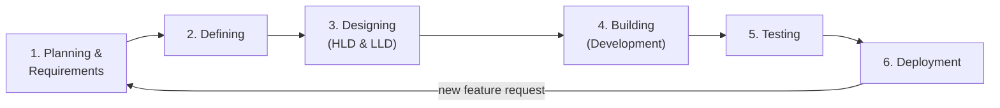
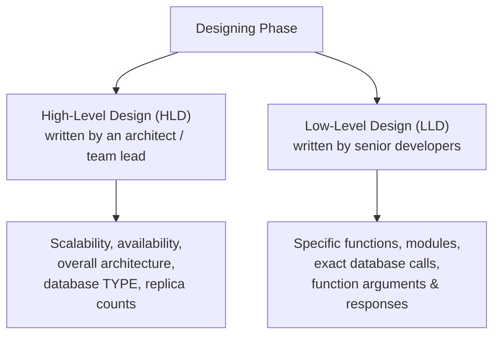
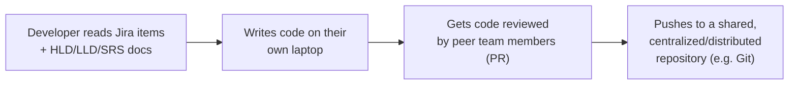
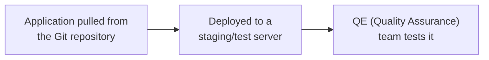
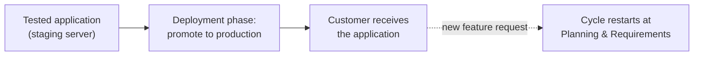
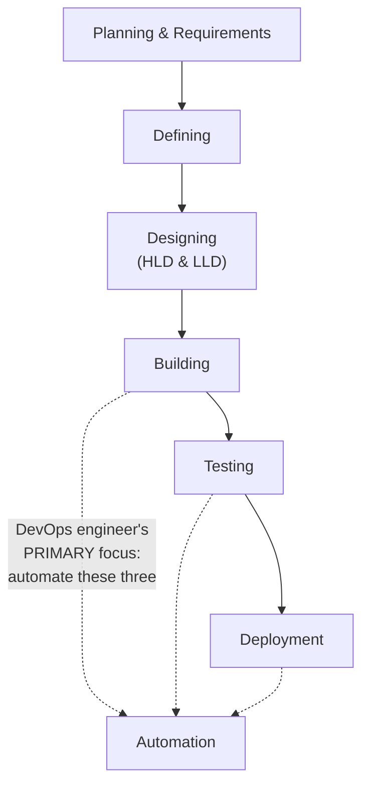

# 🔄 SDLC Fundamentals: The Six-Phase Cycle & Exactly Where DevOps Fits In

- <i> **Session:** DevOps Zero to Hero — Day 2: "Improve SDLC with DevOps" · 
- **Instructor:** Abhishek
- **Note on scope:** This is Day 2 of the same 40-day free DevOps course as the prior session, again delivered as a single, standalone video without hands-on coding or Q&A. It builds directly on Day 1's "what is DevOps / why DevOps" foundation, introducing the **Software Development Life Cycle (SDLC)** — its six phases, a full worked example, and — the session's actual point — a precise answer to "which of these six phases is a DevOps engineer actually responsible for?" Project management methodologies (Waterfall, Iterative, Agile) are explicitly named but deliberately deferred to a future, dedicated class, reflected honestly here rather than expanded upon.</i>

---

## 📑 Table of Contents

1. [Session Overview](#-session-overview)
2. [Learning Objectives](#-learning-objectives)
3. [Detailed Notes](#-detailed-notes)
   - [1. What Is SDLC, and Why Must Everyone Learn It?](#1-what-is-sdlc-and-why-must-everyone-learn-it)
   - [2. The Six-Phase SDLC Circle: A Worked Example](#2-the-six-phase-sdlc-circle-a-worked-example)
   - [3. Planning & Requirements: Where Ideas Get Validated or Killed](#3-planning--requirements-where-ideas-get-validated-or-killed)
   - [4. Defining & Designing: SRS Documents, HLD & LLD](#4-defining--designing-srs-documents-hld--lld)
   - [5. Building (Development): From Code to Git](#5-building-development-from-code-to-git)
   - [6. Testing: The QA/QE Handoff](#6-testing-the-qaqe-handoff)
   - [7. Deployment: Reaching Production — and Looping Back](#7-deployment-reaching-production--and-looping-back)
   - [8. Where DevOps Fits: Automating Build, Test & Deploy](#8-where-devops-fits-automating-build-test--deploy)
   - [9. Project Management Methodologies: A Brief Preview](#9-project-management-methodologies-a-brief-preview)
4. [Glossary](#-glossary)
5. [Revision Notes — One-Minute Revision](#-revision-notes--one-minute-revision)
6. [Cheat Sheet](#-cheat-sheet)
7. [Interview Questions & Answers](#-interview-questions--answers)
8. [Scenario-Based Interview Questions](#-scenario-based-interview-questions)
9. [Hands-on Exercises](#-hands-on-exercises)
10. [Practice Assignment](#-practice-assignment)
11. [Additional Resources](#-additional-resources)
12. [Final Revision Sheet](#-final-revision-sheet)

---

## 🎯 Session Overview

Following Day 1's conceptual foundation (what is DevOps, why DevOps, how to introduce yourself), Day 2 tackles a topic the instructor considers essential for *every* IT role, not just DevOps: the Software Development Life Cycle. It covers:

1. **Why SDLC matters to everyone** — a real, industry-wide standard followed by every organization (startup, MNC, or unicorn alike) to design, develop, and test software.
2. **The six phases of SDLC**, walked through as a genuine circle (not a straight line), since the same cycle repeats for every new feature: Planning & Requirements → Defining → Designing → Building → Testing → Deployment.
3. A **complete, worked example**: a fictional e-commerce company, `example.com`, deciding whether to launch a new "kids clothing" catalog — used to make each abstract phase concrete.
4. A precise, repeated answer to the session's real point: **which of these six phases is a DevOps engineer's actual focus?** — Building, Testing, and Deployment, specifically because these are the phases DevOps automates.
5. A brief, deliberately shallow preview of **project management methodologies** (Waterfall, Iterative, Agile), explicitly deferred to a future, dedicated class.

> 💡 **Memory Trick — the instructor's framing for why this matters, even to non-DevOps roles:** *"Whether you are a developer, a tester, someone in software development, or DevOps — everybody has to understand SDLC. When you work in an organization, there is a standard followed by every company, and it's essential for you to understand that standard to work within it."*

---

## 🎯 Learning Objectives

By the end of this guide, you will be able to:

- [ ] Explain, in one sentence, what SDLC is and why it's described as an industry-wide standard rather than a company-specific process.
- [ ] Name and correctly order all six phases of SDLC, and explain why it's drawn as a circle rather than a straight line.
- [ ] Walk through a complete, worked SDLC example (e.g., launching a new product feature) explaining what happens at each phase.
- [ ] Distinguish High-Level Design (HLD) from Low-Level Design (LLD), and correctly identify what kind of decision belongs in each.
- [ ] Explain the role of a Software Requirement Specification (SRS) document, and where it sits in the SDLC sequence.
- [ ] Correctly identify which three of the six SDLC phases a DevOps engineer is primarily responsible for, and explain precisely why those three (not the others).
- [ ] Explain the specific mechanism by which a DevOps engineer "improves efficiency" at each of those three phases — automation, not manual intervention.
- [ ] Name the three major project management methodologies referenced (Waterfall, Iterative, Agile), and state which one is described as most commonly used today.

---

## 📚 Detailed Notes

### 1. What Is SDLC, and Why Must Everyone Learn It?

#### 🧠 Concept

> 💡 **Memory Trick, the core definition given directly:** *"SDLC — Software Development Life Cycle — is a process, or a set of standards, followed in the software industry to design, develop, and test software. Whether you're working at Amazon, Flipkart, or Tesla, everybody follows these same three high-level steps."*

#### ❓ Why It Exists

> 💡 **Memory Trick, the "why everyone" argument, stated directly:** *"We've dedicated a full, separate day to this specifically because everybody has to understand SDLC to work in an organization — it's not optional, and it's not DevOps-specific. If you don't test a product before delivering it, who was testing it? You have to follow these phases, or you simply cannot guarantee a high-quality product to your customer."*

#### 🎯 Key Takeaways

* SDLC is a **genuine industry standard**, not a company-specific process — the same high-level phases apply whether you work at a startup, an MNC, or a unicorn.
* SDLC's stated end goal is **delivering a high-quality product** — skipping any phase (especially testing) directly undermines that goal.
* Understanding SDLC is framed as essential for **every** IT role (developer, tester, DevOps engineer), not a DevOps-specific topic — DevOps-specific relevance is addressed separately, later in the session.

---

### 2. The Six-Phase SDLC Circle: A Worked Example

#### 📖 Definition

> 💡 **Memory Trick — why it's drawn as a circle, not a line, stated directly:** *"I drew this as a circle deliberately, because every organization has to follow this same circular approach for each and every new feature they develop — it's not a one-time, linear process."*



#### 🧠 Concept — The Worked Example: `example.com`'s Kids Catalog

> 💡 **Memory Trick, the complete scenario given directly:** *"Let's say `example.com` is a clothing e-commerce site that currently only sells for men and women — no kids' section. Based on research, the organization decides they could benefit from launching a kids' clothing catalog. To actually do that, they have to go through this entire six-phase process."*

#### ⚠ Common Mistakes

* Treating SDLC as a one-time process completed at a company's founding — explicitly corrected: it's a repeating **circle**, run again for every single new feature or product decision, indefinitely.

#### 🎯 Key Takeaways

* SDLC has exactly **six phases**, in order: Planning & Requirements, Defining, Designing, Building, Testing, Deployment.
* The cycle is deliberately circular — after Deployment, the *next* new feature idea re-enters at Planning & Requirements.
* A single, consistent worked example (`example.com`'s kids catalog) is used throughout the session to make every phase concrete rather than abstract.

---

### 3. Planning & Requirements: Where Ideas Get Validated or Killed

#### 🧠 Concept

> 💡 **Memory Trick, the core responsibility, stated directly:** *"Planning and requirements gathering is done by your core members — your business analyst or product owner. They get input directly from customers: are existing customers actually interested in a kids catalog? If you have 10 current customers and 15-20 potential ones, and genuinely nobody is interested, you can — and should — kill the idea right here, before it ever reaches any other phase."*

#### ⚙ How It Works — Gathering Specific, Actionable Detail

> 💡 **Memory Trick, the concrete example given directly:** *"It's not enough to know customers are 'interested in kids clothing' broadly — you need specifics: are they interested in the 6-12 age range? The 1-4 age range? How many customers fall into each? This specific, collected information is exactly what the Planning & Requirements phase produces."*

#### ❓ Why It Exists

> ⚠️ **The core, stated business value of this phase:** *"This is one of the most important stages precisely because it's the starting stage — if an idea genuinely has no customer interest, you can suspend it right here, without ever propagating a wasted idea through all the remaining, more expensive phases."*

#### 🎯 Key Takeaways

* Planning & Requirements is owned by **business analysts or product owners** — not developers or DevOps engineers.
* Its core function is **validation**: gathering genuinely specific customer feedback (not vague interest) to decide whether an idea is even worth pursuing further.
* This phase is explicitly positioned as a **cost-saving gate** — killing a bad idea here is far cheaper than discovering it has no value after building, testing, and deploying it.

---

### 4. Defining & Designing: SRS Documents, HLD & LLD

#### 📖 Definition — The Defining Phase

> 💡 **Memory Trick, stated directly:** *"Once planning and requirements are done, the collected information gets formally written up in a document called the Software Requirement Specification (SRS) document — this is what 'defining requirements' actually means in practice."*

#### 📖 Definition — The Designing Phase: HLD vs. LLD



> 💡 **Memory Trick, the precise distinction, given directly:** *"HLD is written by an architect or a senior resource — it covers whether the system needs to be scalable (e.g., to handle Christmas-season load for the kids catalog), highly available, what kind of database to use, how many replicas of the application you need. LLD, written by senior developers, goes to the extremely specific level: which particular function or module to use, exactly what argument a function call takes, exactly what response it returns."*

#### ⚠ Common Mistakes

* Confusing HLD and LLD as simply "more detail vs. less detail" of the same thing — more precisely, **HLD addresses system-level, architectural concerns** (scalability, availability, database choice), while **LLD addresses implementation-level specifics** (exact functions, modules, arguments) — a difference in *kind* of decision, not just level of detail.

#### 🎯 Key Takeaways

* The **Defining phase** produces a formal **SRS (Software Requirement Specification) document** — the written record of everything gathered during Planning & Requirements.
* The **Designing phase** splits into **HLD** (architectural: scalability, availability, database type, replica count — written by an architect/senior resource) and **LLD** (implementation-specific: functions, modules, exact call signatures — written by senior developers).
* Both HLD and LLD happen **before** any actual code is written — they are planning artifacts, not code itself.

---

### 5. Building (Development): From Code to Git

#### 🧠 Concept

> 💡 **Memory Trick, stated directly:** *"'Building,' in this context, is nothing but developing. Once your HLD, LLD, and SRS document are all ready, developers read the Jira items and prepared documents, and start writing the actual application code — in whatever language is standard for your organization."*



#### ❓ Why It Exists — Why a Shared Repository Is Required

> 💡 **Memory Trick, stated directly:** *"The code cannot stay only on one developer's laptop — it has to be shared with the rest of the team. That's exactly why organizations use a source code repository — most commonly Git today — a centralized or distributed repository storing everyone's code."*

#### 🎯 Key Takeaways

* "Building" and "developing" are used interchangeably in this session — this phase is where actual code gets written, based on the design/requirement documents from earlier phases.
* Code review by peer team members (a **PR**, pull/merge request) happens **before** code is pushed to the shared repository — not as an optional afterthought.
* **Git** is named as the most common modern choice for this shared, centralized/distributed source code repository — explicitly deferred to a future dedicated session for deeper coverage.

---

### 6. Testing: The QA/QE Handoff

#### 🧠 Concept

> ⚠️ **The core motivating question, stated directly:** *"If a developer says 'it's working fine on my server,' would everybody just believe that? No — the end goal is to deliver a genuinely quality product to the customer, and that requires an independent testing phase."*



#### 🔍 Internal Working — Whose Job Is This?

> 💡 **Memory Trick, the role distinction stated directly:** *"Building is primarily a developer's phase. Testing is primarily the QE (Quality Assurance Engineers) team's phase — they take the application from the Git repository, deploy it to a server, and test it there."*

#### 🎯 Key Takeaways

* Testing exists specifically because **"works on my machine" is never sufficient validation** — an independent team must verify quality before anything reaches production.
* This phase is owned by the **QE (Quality Assurance Engineering)** team, distinct from the developers who wrote the code in the prior phase.
* Testing happens on a **deployed server** (not a developer's laptop), directly connecting back to Day 1's explanation of why a System Administrator role historically had to create a server in the first place.

---

### 7. Deployment: Reaching Production — and Looping Back

#### 🧠 Concept

> 💡 **Memory Trick, stated directly:** *"In the deployment phase, you promote the application to production. Up until now, you were testing on a virtual/staging/development server — but finally, you push it to your production server, where your actual customer receives it."*



#### 🎯 Key Takeaways

* Deployment is the phase where an application moves from a **testing/staging environment** to **production**, where it actually reaches real customers.
* This is the final phase of one cycle — but per Section 2, the very next feature idea immediately re-enters the cycle at **Planning & Requirements**, making SDLC a genuinely ongoing, circular process.

---

### 8. Where DevOps Fits: Automating Build, Test & Deploy

#### 📖 Definition — The Session's Central Answer

> ⚠️ **Directly, repeatedly emphasized as the session's real point:** *"Which phases of SDLC are DevOps-centric, or should a DevOps engineer be most interested in? Building, Testing, and Deployment. I am NOT saying you shouldn't get involved in Planning, Defining, or Designing — if you're a critical team member, or a 'DevOps engineer who is a developer at heart,' you absolutely can. But your primary focus of interest should always be these three: build, test, deploy."*



#### 🔍 Internal Working — What "DevOps Improves Efficiency" Actually Means Here

> 💡 **Memory Trick, the precise mechanism stated directly:** *"A DevOps engineer fastens this process — meaning, specifically, they automate it. A DevOps engineer ensures that building, testing, and deployment happen without any manual intervention — everything happens in an automated way. Automation is always directly proportional to the efficiency of your product delivery."*

#### ⚠ Common Mistakes

* Assuming a DevOps engineer personally, manually develops, tests, or deploys software — explicitly, directly corrected: *"A DevOps engineer is NOT individually involved in building, because he does not develop the software, does not test the software, does not manually deploy the software — everything happens automatically. You are not going to manually deploy software to production; as a DevOps engineer, you write the automation scripts that do it."*

#### 🎯 Key Takeaways

* A DevOps engineer's **primary** focus is exactly three of the six SDLC phases: **Building, Testing, and Deployment** — specifically because these are the phases most amenable to automation.
* The mechanism by which DevOps "improves efficiency" is precise and specific: **automation**, replacing manual intervention at each of these three phases — not personally performing the work manually, faster.
* Involvement in the earlier phases (Planning, Defining, Designing) is not forbidden, and is even encouraged for a DevOps engineer with development interest/expertise — but it is explicitly framed as secondary to the core build/test/deploy automation focus.

---

### 9. Project Management Methodologies: A Brief Preview

#### 🧠 Concept

> 💡 **Memory Trick, the three named methodologies:** *"On a high level, you have the Waterfall model, the Iterative model, and the Agile model — these govern how the SDLC phases are actually managed and sequenced in practice. We'll go into these in depth during a dedicated project management class — but for now, understand that essentially every organization today uses Agile."*

#### ⚙ How It Works — What Makes Agile Different (At a High Level)

> 💡 **Memory Trick, stated directly:** *"In Agile, you follow all the same SDLC phases, but you do it in short Sprints — you don't wait until 100% of planning is done, or 100% of design documents are complete, before starting. Once a small chunk is ready, you begin that chunk's cycle, while the next chunk follows the same circular process separately."*

#### ⚠ Honesty Note

This section is explicitly, deliberately shallow — the instructor states directly that deep coverage of Waterfall, Iterative, and Agile methodologies belongs to a **separate, dedicated project management class**, not this SDLC-focused session. This guide reflects that scope honestly rather than inventing depth that wasn't delivered here.

#### 🎯 Key Takeaways

* Three named project management methodologies govern how SDLC phases are actually sequenced in practice: **Waterfall, Iterative, and Agile**.
* **Agile** is explicitly named as the methodology essentially every modern organization uses today — distinguished by working in short Sprints rather than waiting for 100% completion of any given phase before starting the next.
* Deep coverage of all three methodologies is explicitly deferred to a future, dedicated project management class — not covered in depth in this session.

---

## 📝 Glossary

| Term | Definition | Why It Matters |
|---|---|---|
| **SDLC** | Software Development Life Cycle — the industry-standard process for designing, developing, and testing software | The universal standard every organization follows, regardless of size or industry |
| **Planning & Requirements** | The phase where business analysts/product owners gather and validate customer feedback | Where a bad idea can be killed cheaply, before it reaches any other phase |
| **SRS (Software Requirement Specification) Document** | The formal, written record of everything gathered during Planning & Requirements | Produced during the Defining phase |
| **HLD (High-Level Design)** | Architectural design decisions: scalability, availability, database type, replica counts | Written by an architect or senior resource, before any code is written |
| **LLD (Low-Level Design)** | Implementation-specific design decisions: exact functions, modules, call signatures | Written by senior developers, more granular than HLD |
| **Building (Development)** | The phase where developers actually write and commit application code | The first of the three DevOps-centric SDLC phases |
| **Git** | A (centralized or distributed) source code repository | Named as the most common modern choice for sharing code across a development team |
| **QE (Quality Assurance Engineering)** | The team responsible for testing a deployed application | Owns the Testing phase, distinct from the developers who wrote the code |
| **Deployment** | The phase where a tested application is promoted to production, reaching real customers | The final phase of one SDLC cycle before the next feature idea restarts it |
| **Agile** | A project management methodology using short Sprints rather than waiting for 100% phase completion | Named as the methodology virtually every modern organization uses |

---

## 🔄 Revision Notes — One-Minute Revision

* **SDLC (Software Development Life Cycle)** is a genuine, industry-wide standard — followed identically at startups, MNCs, and unicorns alike — for designing, developing, and testing software, with the end goal of delivering a **high-quality product**.
* SDLC has **six phases**, run as a genuine **circle** (not a straight line), since every new feature re-enters the cycle: **Planning & Requirements → Defining → Designing → Building → Testing → Deployment**.
* A full worked example (`example.com` deciding whether to launch a kids' clothing catalog) is used throughout to make each phase concrete.
* **Planning & Requirements** (owned by business analysts/product owners) is a cost-saving validation gate — bad ideas can and should be killed here, before reaching any more expensive phase.
* **Defining** produces a formal **SRS document**; **Designing** splits into **HLD** (architectural: scalability, availability, database choice — by an architect) and **LLD** (implementation-specific: functions, modules, call signatures — by senior developers).
* **Building** (development) is where code actually gets written, peer-reviewed (PR), and pushed to a shared repository (typically **Git**).
* **Testing** is owned by the **QE team**, independently validating the application on a server — because "works on my machine" is never sufficient.
* **Deployment** promotes the tested application to production, where real customers receive it — and the cycle immediately restarts at Planning & Requirements for the next feature.
* **DevOps's precise, repeated focus**: exactly three of the six phases — **Building, Testing, and Deployment** — specifically because a DevOps engineer's core value is **automating** these phases, eliminating manual intervention, not personally performing development/testing/deployment work.
* **Project management methodologies** (Waterfall, Iterative, Agile) govern how these phases are actually sequenced in practice — **Agile** (short Sprints, not waiting for 100% completion) is named as what virtually every modern organization uses — with full depth explicitly deferred to a future, dedicated class.

---

## 📋 Cheat Sheet

**The six SDLC phases, in order (a circle, not a line):**
```text
Planning & Requirements -> Defining -> Designing (HLD + LLD)
-> Building -> Testing -> Deployment -> (loops back to Planning & Requirements)
```

**Phase ownership:**
```text
Planning & Requirements -> Business Analyst / Product Owner
Defining                 -> Business Analyst / Product Owner (writes SRS doc)
Designing (HLD)            -> Architect / Senior Resource
Designing (LLD)             -> Senior Developers
Building                     -> Developers
Testing                       -> QE (Quality Assurance) Team
Deployment                     -> (promoted to production)
```

**DevOps's exact focus (memorize this precisely):**
```text
Building + Testing + Deployment  <-  automate these three
(NOT Planning, Defining, or Designing -- though involvement isn't forbidden)
```

**HLD vs. LLD, in one line each:**
```text
HLD -> system-level architecture (scalability, availability, database TYPE)
LLD -> implementation-level specifics (exact functions, modules, call signatures)
```

**Project management methodologies (deep dive deferred):**
```text
Waterfall | Iterative | Agile (most common today -- short Sprints, no 100%-completion waiting)
```

---

## 🔥 Interview Questions & Answers

### 🟢 Beginner

**Q1.**

**Question:** What does SDLC stand for, and what is it, in one sentence?

**Answer:** Software Development Life Cycle — an industry-standard process for designing, developing, and testing software.

**Explanation:** The session's own stated, complete definition.

**Why Interviewers Ask This:** A foundational, near-universal opening question for any software/IT role.

**Possible Follow-up:** "Why is it drawn as a circle rather than a straight line?"

**Q2.**

**Question:** Name the six phases of SDLC, in order.

**Answer:** Planning & Requirements, Defining, Designing, Building, Testing, Deployment.

**Explanation:** The core, repeated framework of this entire session.

**Why Interviewers Ask This:** Tests basic recall of the standard SDLC sequence.

**Possible Follow-up:** "Which of these phases does a DevOps engineer primarily focus on?"

**Q3.**

**Question:** Which three SDLC phases is a DevOps engineer primarily responsible for?

**Answer:** Building, Testing, and Deployment.

**Explanation:** The session's central, repeatedly-emphasized answer.

**Why Interviewers Ask This:** The single most important, DevOps-specific question this entire session builds toward.

**Possible Follow-up:** "Why specifically these three, and not Planning, Defining, or Designing?"

**Q4.**

**Question:** What is the difference between HLD and LLD?

**Answer:** HLD (High-Level Design) covers architectural concerns like scalability, availability, and database choice; LLD (Low-Level Design) covers implementation-specific details like exact functions, modules, and call signatures.

**Explanation:** Precisely distinguished in the session, with concrete examples for each.

**Why Interviewers Ask This:** Tests understanding of two frequently-confused, related terms.

**Possible Follow-up:** "Who typically writes each of these — the same person, or different roles?"

**Q5.**

**Question:** What is an SRS document, and which phase produces it?

**Answer:** A Software Requirement Specification document — the formal written record of everything gathered during Planning & Requirements — produced during the Defining phase.

**Explanation:** Directly, precisely defined in the session.

**Why Interviewers Ask This:** Tests recall of specific SDLC terminology and sequencing.

**Possible Follow-up:** "Who typically writes the SRS document?"

**Q6.**

**Question:** Why can't code just stay on a single developer's laptop?

**Answer:** It has to be shared with the rest of the team — which is exactly why organizations use a shared source code repository (like Git).

**Explanation:** Directly stated as the core reasoning for using a repository at all.

**Why Interviewers Ask This:** A basic, practical software-delivery principle.

**Possible Follow-up:** "Is Git centralized or distributed?"

**Q7.**

**Question:** Who owns the Testing phase, and why can't the same developer who wrote the code just test it themselves?

**Answer:** The QE (Quality Assurance Engineering) team owns testing — independent, because "it works on my machine" is never sufficient validation of genuine quality.

**Explanation:** Directly, explicitly reasoned through in the session.

**Why Interviewers Ask This:** Tests understanding of why independent QA exists as a distinct role/phase.

**Possible Follow-up:** "Where does testing actually happen — on the developer's laptop, or somewhere else?"

**Q8.**

**Question:** What precisely happens during the Deployment phase?

**Answer:** The tested application is promoted from a staging/test server to production, where real customers receive it.

**Explanation:** Directly, precisely defined.

**Why Interviewers Ask This:** Tests understanding of the final phase's exact scope.

**Possible Follow-up:** "What happens immediately after deployment, in terms of the SDLC cycle?"

**Q9.**

**Question:** Does DevOps involvement mean a DevOps engineer personally, manually develops, tests, and deploys software?

**Answer:** No — a DevOps engineer's role is to automate these processes; they write automation scripts rather than manually performing the work themselves.

**Explanation:** Explicitly, directly corrected in the session.

**Why Interviewers Ask This:** A precise, commonly-misunderstood distinction.

**Possible Follow-up:** "What specific mechanism does a DevOps engineer use to 'improve efficiency,' precisely?"

**Q10.**

**Question:** Which project management methodology is named as most commonly used by modern organizations?

**Answer:** Agile.

**Explanation:** Directly, explicitly named in the session's brief methodology preview.

**Why Interviewers Ask This:** Basic, current industry-practice awareness.

**Possible Follow-up:** "What makes Agile different from Waterfall, at a high level?"

---

### 🟡 Intermediate

**Q11.**

**Question:** Explain why the Planning & Requirements phase is described as one of the "most important" phases, despite being the least technical.

**Answer:** Because it's the earliest, cheapest point at which a genuinely bad idea can be killed — if customer research reveals no real interest in a proposed feature, the organization can suspend the idea right at this stage, before investing in the far more expensive Defining, Designing, Building, Testing, and Deployment phases that would otherwise follow. Its importance comes specifically from its position as the first, cheapest validation gate in the entire cycle, not from any inherent technical complexity.

**Explanation:** Directly reflects the session's own stated reasoning (the "10 current customers, 15-20 potential, nobody interested" example).

**Why Interviewers Ask This:** Tests understanding of *why* a seemingly "soft," non-technical phase carries real business importance.

**Possible Follow-up:** "What specific kind of information does this phase need to gather, beyond just 'is there interest'?"

**Q12.**

**Question:** A learner argues that since DevOps engineers automate the Build, Test, and Deployment phases, they must therefore be *more important* than the people doing Planning, Defining, and Designing. Evaluate this claim using this session's content.

**Answer:** This claim isn't well-supported by the session's own content. The instructor explicitly frames all six phases as part of one interdependent standard — the earlier phases (Planning, Defining, Designing) produce the requirements and design documents that Building, Testing, and Deployment actually execute against; without them, there would be nothing correct to automate. The session doesn't rank phases by importance — it simply identifies which phases fall within a DevOps engineer's specific, primary area of *professional focus* (automation-amenable phases), while explicitly noting DevOps engineers CAN and sometimes should get involved in the earlier phases too, especially if they have relevant interest or expertise. "Different focus area" is a more accurate characterization than "more important."

**Explanation:** Tests whether a learner conflates "DevOps's specific focus" with "DevOps being the most important role" — a claim the session doesn't actually make.

**Why Interviewers Ask This:** Distinguishes candidates who understand nuanced, complementary team roles from those who over-elevate their own specialization.

**Possible Follow-up:** "Describe a realistic scenario where excellent Build/Test/Deployment automation still fails to deliver a good product, due to a failure in an earlier phase."

**Q13.**

**Question:** Explain precisely why a DevOps engineer's involvement in the Building, Testing, and Deployment phases is described as "automation" rather than simply "doing the work faster."

**Answer:** The distinction matters because "doing the work faster" implies a human is still manually performing the same tasks, just more efficiently or with more effort — whereas "automation" (the session's actual, repeated term) means replacing manual human intervention entirely with scripted, repeatable processes. The session explicitly states a DevOps engineer does NOT personally develop, test, or manually deploy software — they write the automation scripts that perform these actions without ongoing manual effort each time. This is a qualitative difference in *how* efficiency is achieved (removing manual steps entirely, at scale, repeatably) rather than a quantitative one (a human working faster).

**Explanation:** Requires precisely distinguishing two superficially similar but substantively different concepts.

**Why Interviewers Ask This:** Tests whether a learner has internalized the precise mechanism of DevOps's value-add, not just the vague idea that "DevOps makes things faster."

**Possible Follow-up:** "Give a concrete example of what 'manually testing faster' might look like, versus 'automating testing' — and explain why only the second is genuinely DevOps."

**Q14.**

**Question:** Using the HLD/LLD distinction, explain what specifically would go wrong if a team skipped HLD and jumped straight to LLD for a new, large-scale feature.

**Answer:** Skipping HLD would mean the team commits to specific implementation details (functions, modules, exact database calls — LLD-level decisions) without first establishing the system-level architectural foundation those details need to be consistent with — e.g., whether the system needs to be scalable for seasonal load spikes (the session's own Christmas-traffic example for the kids catalog), what database technology and replica strategy to use, or whether high availability is required. Without HLD settled first, LLD-level implementation choices risk being made in an architectural vacuum — potentially requiring significant rework once broader scalability or availability requirements are addressed later, since those decisions should properly inform (and typically precede) the more granular implementation choices LLD covers.

**Explanation:** Requires reasoning through the practical consequence of reversing the stated HLD-before-LLD sequence, using the session's own scalability example.

**Why Interviewers Ask This:** Tests whether a learner understands WHY the sequencing (HLD before LLD) matters, not just that it exists.

**Possible Follow-up:** "Could HLD and LLD ever reasonably happen in parallel, rather than strictly sequentially? Under what condition?"

**Q15.**

**Question:** Explain the relationship between this session's "SDLC is a circle" framing and Day 1's "DevOps is a culture requiring adaptability" framing — are these two separate observations, or connected?

**Answer:** They're directly connected. SDLC being a circle means an organization is never "done" — every new feature re-enters the same six-phase cycle indefinitely. This constant repetition is precisely why DevOps's "adaptability" framing (from Day 1) matters in practice: since Build/Test/Deployment automation runs repeatedly, for every single cycle of this circle, a DevOps engineer's tooling and processes are under continuous, repeated real-world use — creating exactly the kind of ongoing opportunity (and need) to identify inefficiencies and adopt better tools over time, rather than a one-time automation effort that's "finished" after a single project. The circular nature of SDLC is what makes DevOps's cultural emphasis on continuous improvement genuinely necessary, not just a nice philosophical stance.

**Explanation:** Requires connecting two concepts taught in genuinely separate sessions into one coherent, causal relationship — real cross-session synthesis.

**Why Interviewers Ask This:** Tests whether a learner retains and connects material across an entire course sequence, not just within a single session.

**Possible Follow-up:** "How would a DevOps engineer concretely notice, over multiple cycles of this circle, that a tool or process needs to change?"

---

### 🔴 Advanced

**Q16.**

**Question:** Design a decision framework a DevOps engineer could use to decide WHEN it's appropriate to get involved in the Planning, Defining, or Designing phases (beyond their primary Build/Test/Deploy focus), based on this session's own stated exception ("a DevOps engineer who is a developer at heart").

**Answer:** A reasonable framework: (1) **Relevant expertise check** — does the DevOps engineer have genuine, applicable expertise for this specific phase (e.g., infrastructure cost implications during HLD, since scalability/database choices directly affect what they'll later need to automate and operate)? (2) **Downstream impact check** — will decisions made in this earlier phase materially affect what the DevOps engineer will later be responsible for automating (e.g., an HLD decision to use a database technology with poor automation/tooling support directly affects the DevOps engineer's later Build/Test/Deploy work, making early input valuable)? (3) **Team capacity/interest check** — per the session's own "developer at heart" exception, does the individual have a genuine personal interest or capability suited to contributing here, without it detracting from their primary Build/Test/Deploy responsibilities? Only when at least the first two checks are genuinely satisfied (relevant expertise AND real downstream impact) should a DevOps engineer proactively engage with earlier phases as a core part of their role — otherwise, per the session's stated primary focus, their default engagement should remain concentrated on Building, Testing, and Deployment.

**Explanation:** Synthesizes the session's stated exception into an actionable, reasoned framework — genuine extension beyond what was directly taught.

**Why Interviewers Ask This:** A realistic, senior-level role-scoping question testing whether a candidate can reason about appropriate boundaries of involvement, not just recite "DevOps focuses on build/test/deploy."

**Possible Follow-up:** "Apply this framework to decide whether a DevOps engineer should be involved in choosing the database technology during HLD for the kids catalog example."

**Q17.**

**Question:** Critically evaluate: "Since Agile uses short Sprints instead of waiting for 100% phase completion, Agile teams essentially skip the SDLC phases described in this session." Is this accurate?

**Answer:** Not accurate. The session explicitly states Agile teams "follow all of these same [SDLC] phases" — the difference is not which phases are followed, but the **granularity and timing** at which they're followed: rather than completing 100% of Planning across the entire product before any Design begins, Agile breaks work into small chunks (Sprints), each chunk cycling through the same six phases at a smaller scale, with multiple such cycles potentially running or overlapping. The accurate characterization: Agile changes the **cadence and scope** at which the SDLC circle runs (many small, fast cycles instead of one large, slow one), not which phases exist within each cycle — all six phases (Planning, Defining, Designing, Building, Testing, Deployment) still occur, just applied to smaller units of work more frequently.

**Explanation:** Tests whether a learner correctly distinguishes "different phase granularity/cadence" from "different phases entirely" — a real, common oversimplification.

**Why Interviewers Ask This:** Distinguishes candidates who understand Agile's actual mechanism from those who assume it represents a fundamentally different phase structure.

**Possible Follow-up:** "Would a DevOps engineer's Build/Test/Deploy automation need to change in any way to support Agile's shorter cycles, compared to a Waterfall-style single large cycle?"

**Q18.**

**Question:** Synthesize this session's phase-ownership table (which role owns which phase) with Day 1's "why DevOps evolved" historical narrative to explain how the modern SDLC phase-ownership model differs from — or resembles — the pre-DevOps role structure described in Day 1.

**Answer:** There's a meaningful partial overlap, but also a genuine evolution. Day 1's pre-DevOps roles were: System Administrator (created servers), Tester (validated applications), Build & Release Engineer (promoted through environments). This session's phase ownership maps QE (Quality Assurance) directly onto the historical Tester role for the Testing phase — a clean, largely unchanged mapping. However, the historical System Administrator and Build & Release Engineer roles — both explicitly manual in Day 1's account — are, in this session's modern framing, effectively **absorbed into the DevOps engineer's automated Build/Test/Deployment focus** rather than remaining separate, manual roles: a DevOps engineer's automation scripts now perform what a System Administrator and Build & Release Engineer used to do by hand across separate handoffs. This directly illustrates Day 1's core "why DevOps evolved" argument in concrete, phase-level terms: DevOps didn't eliminate the underlying WORK (servers still need creating; applications still need promoting through environments) — it eliminated the manual, multi-role, multi-handoff COORDINATION overhead by consolidating and automating that work within a single, unified engineering focus.

**Explanation:** Requires connecting specific role/phase details from two genuinely separate sessions into one coherent before/after comparison — deep, cross-session synthesis.

**Why Interviewers Ask This:** A capstone-level question testing whether a candidate retains and can synthesize an entire course's narrative arc, not just isolated facts from a single session.

**Possible Follow-up:** "Does the Business Analyst/Product Owner role (Planning & Requirements) have a clear pre-DevOps analogue in Day 1's three named roles? What does this suggest about which phases DevOps did NOT primarily reshape?"

---

## 🧪 Scenario-Based Interview Questions

> **Scenario 1:** A junior developer on your team says, "I already tested my code locally and it works — can we just skip the formal Testing phase and deploy straight to production to save time?" Using this session's concepts, how would you respond?

**Structured Answer:**
1. **Initial investigation:** Recognize this as exactly the scenario this session explicitly addresses — "it works on my machine" is directly named as insufficient validation for delivering a quality product.
2. **Metrics/logs to check:** N/A directly (conceptual), but in practice: review what local testing actually covered versus what a genuine QE process would validate (edge cases, integration with other systems, load conditions).
3. **Possible causes:** The developer likely conflates "I personally verified this works in isolation" with "this has been independently, thoroughly validated" — a natural but risky assumption this session explicitly warns against.
4. **Debugging approach:** Walk through this session's own stated reasoning: local testing on a developer's own machine cannot substitute for independent QE validation on a genuine test/staging server, precisely because the entire point of a separate Testing phase is to catch what a single developer's local environment cannot reveal.
5. **Resolution:** Politely but firmly maintain the standard SDLC Testing phase — route the code through the QE team's validation process before Deployment, exactly as the six-phase standard specifies.
6. **Prevention:** Reinforce, as a team norm, that "local testing" and "the Testing phase" are never interchangeable — perhaps by documenting this exact reasoning in onboarding materials for new developers joining the team.

> **Scenario 2 (Advanced):** Your organization currently follows a strict Waterfall-style SDLC (100% Planning completed before any Design begins, and so on through each phase sequentially for the entire product). Leadership wants to move to Agile, but is worried this means "throwing away" the SDLC structure this session describes. Using this session's concepts, address this concern.

**Structured Answer:**
1. **Initial investigation:** Clarify the actual scope of the proposed change — per Advanced Q17's reasoning, moving to Agile does not mean abandoning the six SDLC phases; it changes their granularity and cadence.
2. **Relevant principle:** All six phases (Planning & Requirements, Defining, Designing, Building, Testing, Deployment) remain in Agile — they're simply applied to smaller units of work (Sprints) repeatedly, rather than once, at full scale, sequentially.
3. **Possible causes for leadership's concern:** A reasonable but incorrect assumption that "Agile" and "our current documented SDLC standard" are somehow in conflict, rather than Agile being one specific way of *sequencing and pacing* that same standard.
4. **Debugging/evaluation approach:** Map the organization's current Waterfall-style phase gates directly onto what a Sprint-based Agile cycle would look like — showing each of the six phases still has a clear home within each Sprint, just at a smaller scope.
5. **Resolution:** Reassure leadership that adopting Agile is a change in **process cadence**, not a rejection of the underlying SDLC standard this session establishes — the organization's quality/delivery standards (design, build, test, deploy) remain fully intact, just executed more frequently and in smaller increments.
6. **Prevention:** Document this exact mapping (six phases → Sprint-based execution) as part of the organization's Agile transition materials, directly preventing the same "are we abandoning our standards?" concern from recurring with other stakeholders later.

---

## 🛠 Hands-on Exercises

### 🟢 Easy

1. Draw (or describe in writing) the six-phase SDLC circle from memory, without referring back to this guide, then check your answer against Section 2.
2. Write one sentence each describing what happens during the Planning & Requirements, Defining, and Designing phases, using an example of your own choosing (not `example.com`'s kids catalog).
3. List which role (Business Analyst/Product Owner, Architect, Senior Developer, Developer, QE Team) owns each of the six SDLC phases.

### 🟡 Medium

4. Write a short HLD and a short LLD (a few sentences each) for a hypothetical new feature of your choosing, correctly keeping architectural concerns in the HLD and implementation-specific concerns in the LLD.
5. Explain, in your own words (200-300 words), precisely why a DevOps engineer's focus on Building, Testing, and Deployment is described as "automation" rather than "doing the same work, just faster" — directly addressing Intermediate Q13's distinction.
6. Research (outside this transcript) a real company's public engineering blog post describing their SDLC or release process, and map their described process onto this session's six-phase framework — noting where it matches and where it differs.

### 🔴 Advanced

7. Implement (in writing, as a design document) the decision framework proposed in Advanced Interview Q16, and apply it to decide whether a DevOps engineer should be involved in choosing the database technology for a hypothetical new feature's HLD.
8. Write a short technical document (300-400 words) explaining, for a skeptical stakeholder, why moving from Waterfall to Agile does not mean abandoning an organization's SDLC standard — directly modeling the reasoning from Scenario 2's advanced answer.
9. Conduct the cross-session synthesis exercise from Advanced Interview Q18 yourself: create a table mapping each of Day 1's three pre-DevOps roles (System Administrator, Tester, Build & Release Engineer) onto this session's six SDLC phases and their modern ownership, explicitly noting where DevOps has absorbed/automated a historical role and where it hasn't.

---

## 🏗 Practice Assignment

### Build: "SDLC Walkthrough Document" for a Real Feature Idea

**Objective:** Produce a complete, six-phase SDLC walkthrough for a genuine (or realistic hypothetical) software feature of your own choosing, directly modeling this session's `example.com` kids catalog example, but in your own domain.

**Requirements:**
- A brief Planning & Requirements section, including a plausible customer-validation rationale (why this feature is worth building).
- A short SRS-style Defining document, summarizing the gathered requirements.
- A short HLD (architectural: scalability, availability, database choice) and LLD (implementation-specific: key functions/modules) for your chosen feature.
- A brief description of what the Building, Testing, and Deployment phases would look like for this feature, explicitly identifying which specific tasks within these three phases a DevOps engineer would be responsible for automating.
- A short reflection (150-200 words) on which phases you, personally, would want to be most involved in if you were the DevOps engineer on this project, and why — directly applying Advanced Q16's decision framework.

**Architecture (suggested):**

```text
sdlc_walkthrough/
├── 01_planning_requirements.md
├── 02_defining_srs.md
├── 03_designing_hld_lld.md
├── 04_building_testing_deployment.md
└── 05_devops_involvement_reflection.md
```

**Expected Functionality:**
- Each document should be genuinely usable as a realistic example of that SDLC phase's output — not a copy of this guide's `example.com` example.
- The final reflection document should demonstrate genuine, personal reasoning (per Advanced Q16's framework), not just restating "DevOps focuses on build/test/deploy."

**Challenges:**
- Correctly keeping HLD and LLD content separated by the right *kind* of decision (architectural vs. implementation-specific), not just by level of detail.
- Genuinely reasoning through your own DevOps-involvement decision (Advanced Q16) for your specific chosen feature, rather than defaulting to a generic answer.

**Bonus Improvements:**
- Extend your walkthrough to explicitly show how it would differ if run under Agile (short Sprints) versus a single, large Waterfall-style cycle.
- Add a short section mapping your feature's Testing phase specifically onto the historical "Tester" role from Day 1, and your Building/Deployment phases onto the historical System Administrator/Build & Release Engineer roles, per Advanced Q18's synthesis.

---

## 📚 Additional Resources

- The instructor's **Day 1 video** ("Introduction of DevOps") — directly referenced as required prior viewing, covering what is DevOps, why DevOps, and how to introduce yourself in a DevOps interview.
- The **DevOps Zero to Hero playlist** — referenced directly, containing Day 0, Day 1, and all subsequent videos in this same free course.
- A **future, dedicated project management class** (referenced directly) — will cover Waterfall, Iterative, and Agile methodologies in genuine depth, not covered here.
- A **future, dedicated Git session** (referenced directly) — will cover source code repositories in depth, only briefly introduced in this session.

---

## 📌 Final Revision Sheet

### ⭐ Core Concepts
- **SDLC** = the industry-standard, six-phase process for designing, developing, and testing software: **Planning & Requirements → Defining → Designing → Building → Testing → Deployment**, run as a repeating circle.
- **HLD** (architectural) vs. **LLD** (implementation-specific) — a difference in kind of decision, not just level of detail.
- A DevOps engineer's **primary** focus is exactly three phases: **Building, Testing, Deployment** — via **automation**, not manual, faster execution.
- Involvement in earlier phases (Planning, Defining, Designing) is not forbidden, but is secondary to this primary focus.
- **Agile** changes the cadence/granularity of the SDLC circle (short Sprints), not which phases exist within it.

### ⭐ Important Definitions
- **SRS document**, **QE team**, **Git** (as a source code repository) (see Glossary for full definitions).

### ⭐ Important Commands/Code
- N/A — this session is conceptual; no tools or code were covered (Git and automation tooling explicitly deferred to future sessions).

### ⭐ Architecture/Process
- Phase ownership: Planning/Defining → Business Analyst/Product Owner; Designing (HLD) → Architect; Designing (LLD) → Senior Developers; Building → Developers; Testing → QE Team; Deployment → (automated promotion to production).
- The SDLC circle restarts at Planning & Requirements immediately after each Deployment, for the next feature idea.

### ⭐ Best Practices
- Always validate customer interest during Planning & Requirements before investing in later, more expensive phases.
- Always separate architectural (HLD) decisions from implementation-specific (LLD) decisions, and sequence HLD before LLD.
- Never treat local/developer testing as a substitute for independent QE validation.
- Focus DevOps effort primarily on automating Build, Test, and Deployment — engage earlier phases only with genuine relevant expertise or downstream impact.

### ⭐ Common Mistakes
- Treating SDLC as a one-time, linear process rather than a repeating circle.
- Confusing HLD and LLD as merely "more vs. less detail" rather than genuinely different kinds of decisions.
- Assuming a DevOps engineer manually performs development/testing/deployment work, rather than automating it.
- Assuming Agile skips SDLC phases entirely, rather than changing their cadence/granularity.

### ⭐ Interview Points
- Be ready to name all six SDLC phases in order, unprompted.
- Be ready to state precisely which three phases DevOps focuses on, and why those three specifically.
- Be ready to distinguish HLD from LLD with a concrete example of each.
- Be ready to explain the automation mechanism precisely, not just say "DevOps makes things faster."

### ⭐ Things to Remember
- Project management methodologies (Waterfall, Iterative, Agile) are explicitly, deliberately covered only briefly here — genuine depth is deferred to a separate, dedicated future class, not this SDLC-focused session.
- Git and source code repositories are named but explicitly deferred to a future, dedicated session for deeper coverage.
- This session builds directly on Day 1's "why DevOps evolved" historical narrative — the modern SDLC phase-ownership model (especially DevOps's absorption of what used to be System Administrator and Build & Release Engineer work) is best understood as a continuation of that same story, not a separate, unrelated topic.