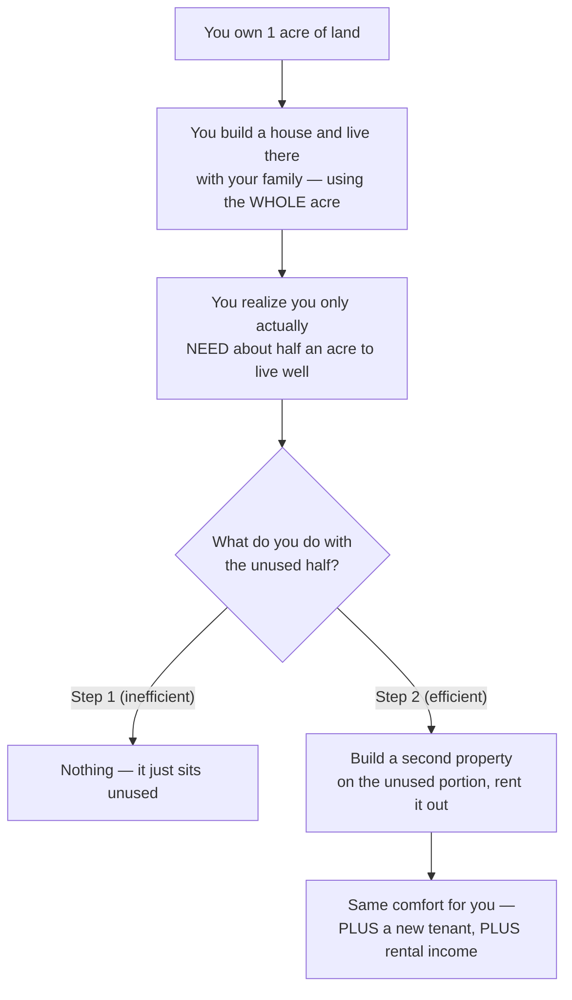
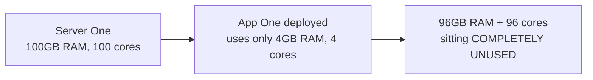
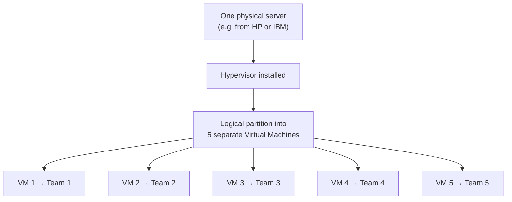
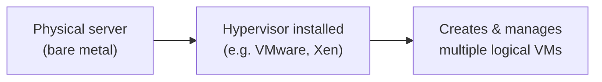
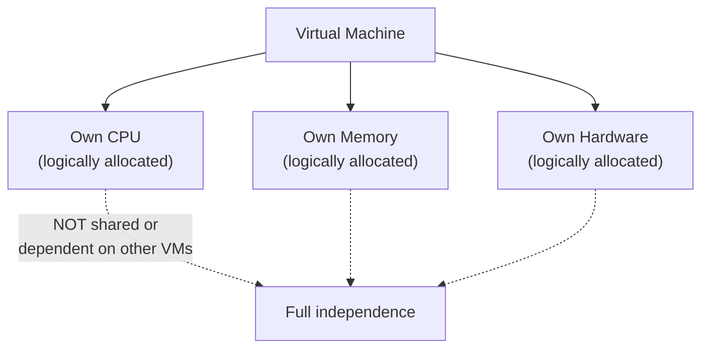
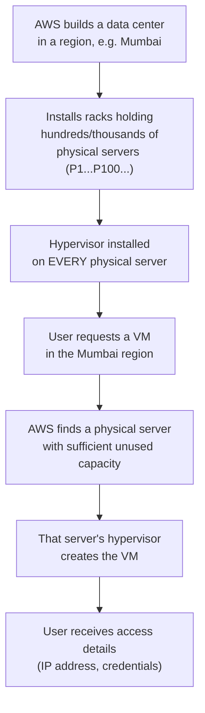
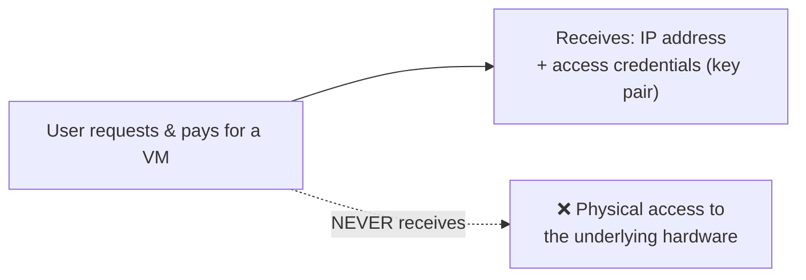
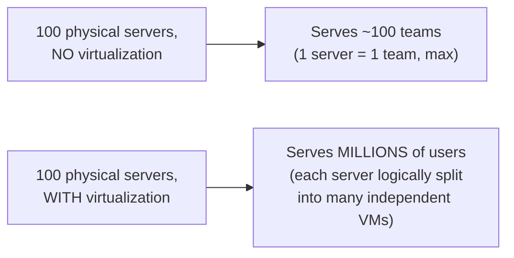

# 💻 Virtual Machines Demystified: Hypervisors, Logical Partitioning & Cloud-Scale Efficiency

- <i>**Session:** DevOps Zero to Hero — Day 3: "Virtual Machines Part 1" -  
- **Instructor:** Abhishek
- **Note on scope:** This is Day 3 of the same 40-day free DevOps course, again a standalone conceptual video with no hands-on coding. It is explicitly **theory-only** — the instructor states directly that actually creating a virtual machine (both via the AWS console manually and via automation/scripts) is deliberately deferred to "tomorrow's class" (Part 2). This guide covers what was actually taught: an intuitive, real-world analogy for why virtualization exists, the precise mechanics of physical servers vs. virtual machines, what a hypervisor is and does, and how cloud providers (AWS, Azure, GCP) apply this exact same concept at massive scale.</i>

---

## 📑 Table of Contents

1. [Session Overview](#-session-overview)
2. [Learning Objectives](#-learning-objectives)
3. [Detailed Notes](#-detailed-notes)
   - [1. The Land Analogy: Why Virtualization Exists](#1-the-land-analogy-why-virtualization-exists)
   - [2. What Is a Physical Server, and the Real Cost of Inefficiency](#2-what-is-a-physical-server-and-the-real-cost-of-inefficiency)
   - [3. Virtualization: Logical, Not Physical, Partitioning](#3-virtualization-logical-not-physical-partitioning)
   - [4. The Hypervisor: The Software That Makes It All Work](#4-the-hypervisor-the-software-that-makes-it-all-work)
   - [5. What a Virtual Machine Actually Is](#5-what-a-virtual-machine-actually-is)
   - [6. How Cloud Providers Scale This: Data Centers, Regions & Hypervisors at Scale](#6-how-cloud-providers-scale-this-data-centers-regions--hypervisors-at-scale)
   - [7. Requesting a VM: What You Actually Get (and Don't Get)](#7-requesting-a-vm-what-you-actually-get-and-dont-get)
   - [8. The Efficiency Payoff, Quantified](#8-the-efficiency-payoff-quantified)
   - [9. Virtualization on Your Own Laptop](#9-virtualization-on-your-own-laptop)
4. [Glossary](#-glossary)
5. [Revision Notes — One-Minute Revision](#-revision-notes--one-minute-revision)
6. [Cheat Sheet](#-cheat-sheet)
7. [Interview Questions & Answers](#-interview-questions--answers)
8. [Scenario-Based Interview Questions](#-scenario-based-interview-questions)
9. [Hands-on Exercises](#-hands-on-exercises)
10. [Practice Assignment](#-practice-assignment)
11. [Additional Resources](#-additional-resources)
12. [Final Revision Sheet](#-final-revision-sheet)

---

## 🎯 Session Overview

This session tackles a concept the instructor believes is frequently taught poorly — Virtual Machines — with an explicit promise: *"You've probably watched a lot of videos on VMs and still don't fully understand them. After this video, you will."* It covers:

1. A **real-world, non-technical analogy** (a family living on underused land, then renting out the unused portion) that builds genuine intuition for *why* virtualization exists — efficiency — before any technical terminology is introduced.
2. A concrete translation of that analogy into a **real software industry scenario**: a fictional company, `example.com`, buying five physical servers and massively underutilizing each one.
3. **Virtualization** itself: the precise distinction between *physical* separation (breaking hardware apart) and **logical** separation (partitioning one physical server into multiple independent-seeming virtual machines).
4. The **hypervisor** — the specific software responsible for creating and managing virtual machines on physical hardware — with real, named examples (VMware, Xen).
5. A precise definition of what a **virtual machine** actually is: its own CPU, memory, and hardware, all logical rather than physical, and fully independent of any other VM on the same physical server.
6. How this exact same mechanism operates at **massive cloud scale** — walking through a realistic AWS data center scenario (Mumbai region, physical servers numbered P1 through P100, a live request-routing example).
7. What you genuinely get (and explicitly do **not** get) when you request a cloud VM — an IP address and access credentials, never physical access to the underlying hardware.
8. The concrete **efficiency payoff** virtualization provides — quantified via a direct "100 physical servers serving 100 teams" vs. "100 physical servers serving millions of users" comparison.

> 💡 **Memory Trick — the instructor's stated goal for the entire session:** *"After this video, you're not going to have any doubts about what a virtual machine is, why they're different from physical servers, and whether all the hype around them is actually justified."*

---

## 🎯 Learning Objectives

By the end of this guide, you will be able to:

- [ ] Explain, using the land/rental analogy, why virtualization exists as a solution to a resource-efficiency problem.
- [ ] Define a physical server, and explain — using a concrete, quantified example — what "underutilization" of a server actually looks like in practice.
- [ ] Precisely distinguish **logical** partitioning (virtualization) from **physical** partitioning, and explain why this distinction matters.
- [ ] Define a hypervisor, name at least two real hypervisor products, and explain its specific role in creating and managing virtual machines.
- [ ] List the properties a virtual machine has (its own CPU, memory, hardware) and explain why VMs on the same physical server don't interfere with each other.
- [ ] Walk through, step by step, what happens when a user requests a cloud VM (e.g., on AWS) — from the request, to hypervisor involvement, to what the user actually receives.
- [ ] Explain precisely what access a cloud VM user does and does not have to the underlying physical hardware.
- [ ] Quantify the efficiency gain virtualization provides at cloud scale, using the "100 physical servers, millions of users" comparison.

---

## 📚 Detailed Notes

### 1. The Land Analogy: Why Virtualization Exists

#### 🧠 Concept

Before introducing any technical terminology, the instructor builds intuition using a deliberately non-technical, real-world scenario.



#### ❓ Why It Exists

> 💡 **Memory Trick, the analogy's payoff stated directly:** *"Your comfort or convenience hasn't changed one bit between step one and step two — you're using the exact same portion of land you always were. But now, instead of wasting the unused portion, someone else benefits from it too, and you gain income from it. Instead of two people living on that land, now four people are living on the same land — you've started using the resource efficiently."*

#### 🎯 Key Takeaways

* The land analogy establishes the **core motivating problem** virtualization solves: a resource (land, or later, a server) is often only partially used, with the remainder sitting wasted.
* The key insight the analogy delivers: splitting an underused resource into independently-usable portions **doesn't reduce anyone's existing comfort** — it simply captures previously-wasted capacity.
* This directly connects to the course's repeated theme (from Days 1–2): **DevOps is fundamentally about improving efficiency** — and virtualization is presented as a concrete, technical embodiment of that same principle.

---

### 2. What Is a Physical Server, and the Real Cost of Inefficiency

#### 📖 Definition

> 💡 **Memory Trick, the plain-language definition given directly:** *"A server is nothing but where you deploy your applications so real users can access them — the reason you can access google.com or amazon.com right now is because those applications are hosted on a public server."*

#### 🧠 Concept — The example.com Scenario

> 💡 **Memory Trick, the full worked scenario given directly:** *"Say `example.com` buys five physical servers from HP — server one, two, three, four, five, all different sizes. They deploy 'App One' on Server One. App One only needs 4GB of RAM and 4 CPUs — but Server One is actually 100GB RAM and 100 cores. That's an enormous amount of wasted capacity, used by developers and testers to test the application, sitting mostly idle."*



#### ⚙ How It Works — The Team-by-Team Underutilization Problem

> 💡 **Memory Trick, generalized across the whole organization:** *"If there are five teams, each given their own server, and Team Five's application only needs 10% of that server's resources — say, 5GB RAM out of 50GB total — you're wasting 90% of that server's capacity. This is the actual, real-world problem: inefficiency."*

#### 🎯 Key Takeaways

* A **server** is simply where an application is hosted so real users can access it — the same underlying concept whether it's `google.com`, `amazon.com`, or an internal company application.
* Physical servers are commonly purchased at a size (RAM, CPU cores) far exceeding any single application's actual needs — the concrete example given: a 100GB/100-core server running an application that only needs 4GB/4 cores.
* This underutilization, multiplied across every team/server in an organization, is the **precise, real problem** that motivates virtualization — not a hypothetical concern.

---

### 3. Virtualization: Logical, Not Physical, Partitioning

#### 📖 Definition

> ⚠️ **The single most important distinction in this entire session, stated directly and repeatedly:** *"You are NOT breaking the server physically — you don't take a server and literally break it apart. Instead, you do a LOGICAL separation. This is logical isolation — the resulting virtual machines don't physically exist as separate hardware; they only exist logically. That's exactly why we call them 'virtual.'"*



#### ⚠ Common Mistakes

* Assuming "virtual" implies something less real or somehow simulated in a way that limits its usefulness — explicitly reframed: it means **logical rather than physical**, not "fake" or "limited." Each virtual machine genuinely has its own dedicated CPU, memory, and hardware allocation, fully independent of the others.

#### 🎯 Key Takeaways

* **Virtualization = logical partitioning**, precisely distinguished from physically breaking a server apart — this distinction is the conceptual core of the entire session.
* One physical server can be logically divided into multiple virtual machines, each assignable to a different team, with **zero physical modification** to the underlying hardware.
* This is the direct technical realization of the land analogy from Section 1: same physical resource, more efficiently divided and shared.

---

### 4. The Hypervisor: The Software That Makes It All Work

#### 📖 Definition

> 💡 **Memory Trick, stated directly:** *"A hypervisor is software that can install virtual machines on your bare metal or physical servers. Popular hypervisors include VMware and Xen."*



#### 🔍 Internal Working — The Hypervisor's Role, Precisely Stated

> 💡 **Memory Trick, repeated for retention:** *"Hypervisor is a key that is dealing with your virtual machines — it's the thing creating your virtual machines. Whenever somebody requests a VM, it's ultimately the hypervisor installed on a specific physical server that actually creates that VM and hands back the required access details."*

#### 🎯 Key Takeaways

* A **hypervisor** is the specific software layer responsible for creating and managing virtual machines on top of physical hardware — the actual mechanism behind "logical partitioning."
* **VMware** and **Xen** are named as popular, real hypervisor products.
* This same hypervisor concept underlies every major cloud platform (AWS, Azure, GCP) — they all run hypervisors on their physical servers, exactly as `example.com` would on its own hardware.

---

### 5. What a Virtual Machine Actually Is

#### 📖 Definition

> 💡 **Memory Trick, the complete, precise definition given directly:** *"A virtual machine is nothing but a virtual environment that functions as a virtual computer system. It has its own CPU, its own memory, and its own hardware — logically. VM1 doesn't depend on VM2 for memory, CPU, or hardware — that's exactly why they're called logical computer systems: independent, but not physical."*



#### ⚠ Common Mistakes

* Assuming VMs on the same physical server can interfere with or depend on each other — explicitly, directly corrected: each VM's resources are logically isolated, meaning one VM's activity (or failure) does not affect another VM sharing the same underlying physical hardware.

#### 🎯 Key Takeaways

* A VM is a **virtual environment functioning as a virtual computer system** — with its own logically-allocated CPU, memory, and hardware.
* VMs are explicitly **independent of one another**, even when sharing the same physical server — no VM depends on another for its resources.
* This independence is precisely what makes it safe and practical to give different teams (or different cloud customers entirely) separate VMs on the same physical hardware, without them interfering with each other.

---

### 6. How Cloud Providers Scale This: Data Centers, Regions & Hypervisors at Scale

#### 🧠 Concept

The same `example.com` scenario (5 physical servers, a hypervisor, logical VMs) is scaled up to explain exactly how AWS, Azure, or GCP operate.



#### 🔍 Internal Working — Why Multiple Regions/Data Centers Exist: Latency

> 💡 **Memory Trick, the precise reasoning given directly:** *"AWS builds data centers in different regions — Singapore, Mumbai, Ohio, wherever their customer base needs one — specifically to avoid latency. If I'm located in India and I create a VM in Mumbai versus Ohio, the Mumbai VM will have noticeably lower latency for me, simply because it's physically closer."*

#### 💻 Live Demonstration — A Concrete, Walked-Through Example

> 💡 **Memory Trick, the full scenario given directly:** *"Say I'm in Hyderabad, and I request a VM in the Mumbai region — 10GB RAM, 12-core processor. AWS receives this request. Say physical server P1 is already fully occupied, but P100 has 1,000GB of unused RAM sitting free — AWS decides P100 is the ideal match, sends a request to P100's hypervisor, and that hypervisor creates the VM for me."*

#### 🎯 Key Takeaways

* Cloud providers operate on **exactly the same hypervisor/virtualization mechanism** as `example.com`'s own on-premises scenario — just at a vastly larger scale (data centers with hundreds or thousands of physical servers).
* Multiple geographic regions/data centers exist specifically to minimize **latency** for users located near a given region.
* A VM request is matched, behind the scenes, to whichever specific physical server currently has sufficient unused capacity — an internal, provider-managed decision the user never directly controls.

---

### 7. Requesting a VM: What You Actually Get (and Don't Get)

#### ⚠ Common Mistakes — A Direct, Important Clarification

> ⚠️ **Explicitly, precisely stated:** *"End of the day, you only have logical access to that virtual machine — a virtual access. Physically, you do NOT own that virtual machine, even though you're paying money for it. You cannot go to AWS and say 'I want to go fix something on my actual physical machine.' AWS will simply reject that — you only ever get an IP address and the key/credential pair you requested. That's the most access you will ever have."*



#### 🎯 Key Takeaways

* Paying for a cloud VM grants **logical/virtual access only** — an IP address and access credentials — never physical access to, or ownership of, the underlying physical hardware.
* This is a fundamental, non-negotiable property of the cloud VM model, not a limitation specific to any one provider.
* Understanding this distinction precisely is framed as genuinely important — a common point of confusion the session directly, deliberately corrects.

---

### 8. The Efficiency Payoff, Quantified

#### 🏢 Real-World / Production Usage — The Direct Comparison

> 💡 **Memory Trick, the precise, quantified comparison given directly:** *"If Amazon had NOT come up with the concept of virtualization, their Mumbai data center — with, say, 100 physical servers — could only be used by at most 100 teams or individual user groups. But by using hypervisors and virtual machines, those same 100 physical servers can now be used by millions of users. That is precisely where hypervisors and virtual machines improved efficiency."*



#### 🔍 Internal Working — A Historical Framing

> 💡 **Memory Trick, given directly:** *"If you go back 20 or 30 years, the concept of virtual machines didn't exist — everyone had their own dedicated physical servers. This is a genuinely new leap in how computing resources are used."*

#### 🎯 Key Takeaways

* The efficiency gain from virtualization at cloud scale is dramatic and directly quantifiable: the **same** physical infrastructure (e.g., 100 servers) goes from serving ~100 teams to serving **millions of users**.
* This scaling is entirely enabled by the logical (not physical) partitioning mechanism established in Section 3 — no additional physical hardware is required to achieve this dramatic increase in usable capacity.
* Virtualization is framed as a genuine historical turning point in computing infrastructure, not an incremental improvement.

---

### 9. Virtualization on Your Own Laptop

#### 🏢 Real-World / Production Usage — A Personal-Scale Example

> 💡 **Memory Trick, given directly:** *"You don't need to work at AWS to use this concept. Oracle provides Oracle VirtualBox — you can install it on your own personal laptop and share a virtual machine with family members on the same Wi-Fi. Both you and, say, your brother can use the same laptop at once: you're using the laptop directly, and he's using the virtual machine running on it."*

#### 🎯 Key Takeaways

* Virtualization is not exclusively a cloud-provider-scale concept — it's directly, practically usable on an individual personal computer via free tools like **Oracle VirtualBox**.
* This personal-scale example directly mirrors the exact same logical-partitioning principle established earlier at cloud scale — just with two people sharing one laptop instead of millions of users sharing a data center.

---

## 📝 Glossary

| Term | Definition | Why It Matters |
|---|---|---|
| **Server** | Where an application is hosted so real users can access it | The foundational concept virtualization builds on top of |
| **Physical Server** | Real, tangible hardware (e.g., bought from HP or IBM) | What gets logically (not physically) partitioned via virtualization |
| **Virtualization** | Logically (not physically) partitioning one physical server into multiple independent virtual machines | The core concept of this entire session |
| **Hypervisor** | Software that creates and manages virtual machines on physical/bare-metal servers | The actual mechanism performing virtualization; e.g., VMware, Xen |
| **Virtual Machine (VM)** | A virtual environment functioning as a virtual computer system, with its own logical CPU, memory, and hardware | The end product of virtualization; independent of other VMs on the same physical server |
| **Logical Isolation** | Separating resources in software/allocation terms, without physically altering the underlying hardware | The precise mechanism distinguishing virtualization from physically splitting hardware |
| **Region (cloud)** | A geographic location where a cloud provider operates a data center (e.g., Mumbai, Singapore, Ohio) | Chosen by users to minimize latency |
| **Latency** | Delay caused by physical distance between a user and the server/data center they're accessing | The primary reason cloud providers operate multiple geographic regions |
| **EC2 Instance** | AWS's specific term for a virtual machine | Referenced as the AWS-specific name for the general "virtual machine" concept |
| **Oracle VirtualBox** | A free, personal-computer-level virtualization tool | Demonstrates the same virtualization concept works at individual, non-cloud scale |

---

## 🔄 Revision Notes — One-Minute Revision

* **Virtualization exists to solve a real efficiency problem** — illustrated first via a non-technical land/rental analogy: an underused resource (land, or later, a server) can be split so more people benefit, without reducing anyone's existing comfort.
* A **physical server** is where an application is hosted for real users; the real, quantified problem this session builds on: a 100GB/100-core server running an application that only needs 4GB/4 cores — the vast majority of capacity going unused.
* **Virtualization = logical, not physical, partitioning** — the single most important distinction in the session. A physical server is never actually broken apart; it's logically divided into multiple independent-seeming virtual machines.
* The **hypervisor** (e.g., VMware, Xen) is the specific software responsible for creating and managing these virtual machines on top of physical/bare-metal hardware.
* A **virtual machine** has its own logical CPU, memory, and hardware — fully independent of any other VM sharing the same physical server.
* **Cloud providers (AWS, Azure, GCP) apply this exact same mechanism at massive scale**: data centers full of physical servers (each running a hypervisor), organized into geographic **regions** chosen to minimize **latency** for nearby users.
* When you request and pay for a cloud VM, you receive **only logical/virtual access** — an IP address and credentials — **never** physical access to or ownership of the underlying hardware.
* The **quantified efficiency payoff**: without virtualization, 100 physical servers could serve roughly 100 teams; with virtualization, those same 100 physical servers can serve **millions of users** — a dramatic, directly attributable improvement.
* Virtualization isn't cloud-exclusive — tools like **Oracle VirtualBox** let anyone apply the same concept on a personal laptop, sharing one physical machine among multiple users.
* Actually **creating** a virtual machine (via the AWS console or via automation/scripts) is explicitly deferred to the next session ("Part 2") — this session is theory-only.

---

## 📋 Cheat Sheet

**The core distinction (memorize this precisely):**
```text
Physical partitioning -> actually breaking hardware apart (NOT what virtualization does)
Logical partitioning   -> software-level division of one physical server into multiple VMs (what virtualization DOES)
```

**The virtualization stack:**
```text
Physical server (bare metal) -> Hypervisor installed (e.g. VMware, Xen)
                              -> Creates multiple logical Virtual Machines
                              -> Each VM: own CPU, own memory, own hardware (logically)
```

**Cloud VM request flow:**
```text
User requests VM (region + specs, e.g. 10GB RAM / 12 cores, Mumbai)
-> Provider finds a physical server with sufficient unused capacity
-> That server's hypervisor creates the VM
-> User receives: IP address + access credentials ONLY
   (never physical access to the underlying hardware)
```

**The efficiency payoff:**
```text
100 physical servers, NO virtualization    -> ~100 teams served
100 physical servers, WITH virtualization  -> MILLIONS of users served
```

**Personal-scale equivalent:** Oracle VirtualBox — same concept, one laptop, multiple users.

---

## 🔥 Interview Questions & Answers

### 🟢 Beginner

**Q1.**

**Question:** What is a server, in simple terms?

**Answer:** Where an application is deployed and hosted so real users can access it — the same reason you can access sites like google.com or amazon.com.

**Explanation:** The session's own plain-language definition.

**Why Interviewers Ask This:** A foundational term used throughout DevOps.

**Possible Follow-up:** "What's the difference between a physical server and a virtual machine?"

**Q2.**

**Question:** What is virtualization?

**Answer:** The process of logically (not physically) partitioning one physical server into multiple independent virtual machines.

**Explanation:** The core, repeatedly-emphasized definition of this session.

**Why Interviewers Ask This:** A fundamental DevOps/infrastructure concept.

**Possible Follow-up:** "What specific software actually performs this partitioning?"

**Q3.**

**Question:** What is a hypervisor?

**Answer:** Software that creates and manages virtual machines on physical/bare-metal servers.

**Explanation:** Directly, precisely defined, with VMware and Xen named as real examples.

**Why Interviewers Ask This:** A core, frequently-tested infrastructure term.

**Possible Follow-up:** "Name two real hypervisor products."

**Q4.**

**Question:** Does virtualization physically break a server apart?

**Answer:** No — it performs a logical (software-level) separation, not a physical one. The physical server remains entirely intact.

**Explanation:** Explicitly, repeatedly emphasized as the session's single most important distinction.

**Why Interviewers Ask This:** Tests basic, correct understanding of virtualization's actual mechanism.

**Possible Follow-up:** "Why is this distinction called 'logical isolation'?"

**Q5.**

**Question:** Do virtual machines on the same physical server depend on each other for resources?

**Answer:** No — each VM has its own logically-allocated CPU, memory, and hardware, fully independent of other VMs sharing the same physical server.

**Explanation:** Directly, precisely stated in the session.

**Why Interviewers Ask This:** Tests understanding of VM independence/isolation.

**Possible Follow-up:** "What would happen if one VM crashed — would it affect other VMs on the same physical server?"

**Q6.**

**Question:** When you pay for and receive a cloud VM, what access do you actually get?

**Answer:** Only logical/virtual access — an IP address and access credentials — never physical access to the underlying hardware.

**Explanation:** Explicitly, directly clarified as an important, commonly-misunderstood point.

**Why Interviewers Ask This:** A precise, practically important clarification about cloud VM ownership.

**Possible Follow-up:** "Can you ask a cloud provider to physically show you your VM's underlying server?"

**Q7.**

**Question:** Why do cloud providers build data centers in multiple geographic regions?

**Answer:** To minimize latency for users located near a given region.

**Explanation:** Directly, explicitly stated as the reasoning.

**Why Interviewers Ask This:** A basic but important cloud-infrastructure concept.

**Possible Follow-up:** "If you're located in India, would you generally choose a Mumbai region or an Ohio region for lower latency?"

**Q8.**

**Question:** What is AWS's specific name for a virtual machine?

**Answer:** An EC2 instance.

**Explanation:** Directly named in the session as AWS's specific terminology for the general VM concept.

**Why Interviewers Ask This:** Practical, provider-specific terminology knowledge.

**Possible Follow-up:** "What do other cloud providers (Azure, GCP) call their equivalent VM offering?"

**Q9.**

**Question:** According to this session, without virtualization, how many teams could 100 physical servers realistically serve?

**Answer:** Roughly 100 teams (one server per team, at most).

**Explanation:** Directly, precisely stated as the quantified comparison.

**Why Interviewers Ask This:** Tests recall of the session's core efficiency argument.

**Possible Follow-up:** "With virtualization, how many users could those same 100 physical servers serve?"

**Q10.**

**Question:** Can you use the concept of virtualization on your own personal laptop, without any cloud provider?

**Answer:** Yes — tools like Oracle VirtualBox let you create and run virtual machines directly on a personal laptop.

**Explanation:** Directly demonstrated as a real, personal-scale example.

**Why Interviewers Ask This:** Tests understanding that virtualization isn't exclusively a cloud-scale concept.

**Possible Follow-up:** "Give a practical example of why someone might want to share a virtual machine with a family member on the same laptop."

---

### 🟡 Intermediate

**Q11.**

**Question:** Explain how the land/rental analogy from Section 1 maps precisely onto the server virtualization scenario in Section 2-3.

**Answer:** The unused half-acre of land maps directly onto the unused portion of a physical server's capacity (e.g., the 96GB RAM and 96 cores sitting idle on a 100GB/100-core server running a 4GB/4-core application). Building a second, rentable property on the unused land maps onto installing a hypervisor and creating additional logical virtual machines on that same unused server capacity. Critically, in both cases, the original occupant's/application's experience is unchanged — the family's comfort and Team One's original application performance both remain exactly the same — while the previously-wasted capacity now serves an additional, independent party (a tenant, or another team's VM).

**Explanation:** Requires precisely tracing the analogy's structure onto the technical scenario, element by element.

**Why Interviewers Ask This:** Tests whether a learner can translate an intuitive analogy into precise technical understanding, not just recall both separately.

**Possible Follow-up:** "What technical element, if any, does the land analogy NOT capture well about virtualization?"

**Q12.**

**Question:** A learner argues that since a VM only gets "logical" access rather than "real" hardware, virtual machines must be inherently less capable or slower than physical servers. Evaluate this claim using this session's content.

**Answer:** This claim is not well-supported by the session's content, and reflects a common misunderstanding of what "logical" actually means here. The session explicitly clarifies that a VM has its own dedicated CPU, memory, and hardware allocation — it's logically separated from other VMs, not artificially limited or degraded in capability. "Logical" refers to HOW the resource is partitioned (via software, not physical hardware modification), not to any inherent capability reduction. A VM allocated 10GB RAM and 12 cores genuinely has access to that much real underlying computing power — the "logical" framing describes the isolation mechanism, not a performance ceiling.

**Explanation:** Tests whether a learner conflates "logical" (a partitioning method) with "lesser/simulated" (an inaccurate capability claim).

**Why Interviewers Ask This:** Distinguishes candidates who understand the precise technical meaning of "logical" from those who over-generalize it into an inaccurate performance claim.

**Possible Follow-up:** "Under what circumstances might a VM's actual performance genuinely differ from a dedicated physical server's, even with identical allocated specs?"

**Q13.**

**Question:** Trace, step by step, exactly what happens internally when a user in Hyderabad requests a 10GB RAM/12-core VM in AWS's Mumbai region, per this session's worked example.

**Answer:** (1) The user submits the request (via AWS console UI or automation/scripts) specifying the region (Mumbai) and desired specs (10GB RAM, 12 cores); (2) AWS receives this request and searches its Mumbai data center's physical servers (e.g., P1 through P100) for one with sufficient currently-unused capacity to satisfy the request; (3) AWS identifies a suitable candidate — in the session's example, P100, which has substantial unused RAM available while P1 is already fully occupied; (4) AWS sends a request to the hypervisor installed on P100, instructing it to create a VM matching the requested specs; (5) P100's hypervisor creates the logical VM; (6) AWS returns the VM's access details to the user — specifically an IP address and a key/credential pair — completing the request without ever granting the user physical access to P100 itself.

**Explanation:** Requires precisely reconstructing the full internal request-to-delivery flow, in the correct order, using the session's own specific example.

**Why Interviewers Ask This:** Tests genuine, detailed understanding of cloud VM provisioning mechanics, not just the high-level concept.

**Possible Follow-up:** "What would happen if NO physical server in the Mumbai region currently had sufficient unused capacity to satisfy this specific request?"

**Q14.**

**Question:** Explain why the session frames virtualization's efficiency gain not just as "servers are used better" but specifically as enabling a shift from serving "~100 teams" to serving "millions of users" — what's the precise mechanism behind this specific, large jump?

**Answer:** The precise mechanism is that logical partitioning removes the prior one-physical-server-to-one-team/user constraint entirely. Without virtualization, each physical server can only meaningfully serve one team/user at a time (its full capacity dedicated to one occupant, mirroring the "one acre, one family" starting point of the land analogy). With virtualization, a single physical server's capacity can be logically subdivided into many independent VMs, each serving a genuinely separate user or team — and because most individual workloads only require a small fraction of a modern server's total capacity (per Section 2's 4GB-out-of-100GB example), a single physical server can realistically support dozens or even hundreds of independent VMs, not just a handful. Multiplied across an entire data center of hundreds or thousands of physical servers, this subdivision effect is what produces the dramatic "100 servers → millions of users" scaling the session describes — it's a direct, compounding consequence of the underutilization problem (Section 2) being solved at scale (Section 3), not a separate or additional mechanism.

**Explanation:** Requires connecting the underutilization problem (Section 2), the logical-partitioning solution (Section 3), and the quantified payoff (Section 8) into one coherent causal chain — genuine synthesis across the session.

**Why Interviewers Ask This:** Tests whether a learner understands the precise causal mechanism behind a striking numerical claim, rather than just repeating the numbers themselves.

**Possible Follow-up:** "Is there a practical limit to how many VMs a single physical server could theoretically support? What would determine that limit?"

**Q15.**

**Question:** Explain why the instructor emphasizes that a VM user "cannot ask AWS to fix something on their physical machine," connecting this to the broader concept of shared, multi-tenant infrastructure.

**Answer:** This emphasis directly reinforces that a cloud VM exists within a **shared, multi-tenant** physical server — the same physical hardware (e.g., P100) is very likely simultaneously hosting VMs for other, entirely unrelated customers, exactly as `example.com`'s single physical server hosted VMs for five different internal teams. Granting any individual customer direct physical access to that shared hardware would be a severe security and stability risk to every OTHER customer whose VM happens to reside on that same physical machine — hence access is strictly, necessarily limited to the logical/virtual layer (IP address, credentials) that the hypervisor manages and isolates on the customer's behalf. This isn't an arbitrary policy restriction — it's a structural necessity of safely operating shared physical infrastructure among mutually untrusted parties.

**Explanation:** Requires connecting a specific, stated access restriction to the broader multi-tenancy model implied throughout the session, even though "multi-tenancy" as a term isn't explicitly used.

**Why Interviewers Ask This:** Tests whether a learner can infer and articulate the underlying security/architectural rationale behind a stated policy, not just recite the policy itself.

**Possible Follow-up:** "What role does the hypervisor specifically play in maintaining safe isolation between different customers' VMs on the same physical server?"

---

### 🔴 Advanced

**Q16.**

**Question:** Design a capacity-planning framework a DevOps engineer at `example.com` could use to decide how many VMs to safely create on each of their five physical servers, using only concepts from this session.

**Answer:** A reasonable framework, grounded entirely in this session's own worked numbers: (1) **Baseline resource audit** — for each physical server, record total available capacity (per the session's example: 100GB RAM, 100 cores); (2) **Per-workload resource profiling** — for each application/team expecting a VM, determine its genuine resource requirement (per the session's example: App One needing 4GB RAM, 4 cores); (3) **Safety margin allocation** — rather than dividing total capacity by requirement with zero buffer (which risks resource contention if multiple VMs spike simultaneously), reserve a portion of total capacity as headroom (e.g., allocate only 80-85% of total capacity across all planned VMs, leaving the remainder as a shared buffer); (4) **Maximum VM count calculation** — using the buffered capacity figure, divide by per-workload requirement to determine a safe maximum VM count per physical server; (5) **Team-priority weighting** — if some teams' workloads are more latency- or performance-sensitive than others (a concept the session raises in the context of geographic regions, extendable here to within-server prioritization), consider allocating those teams' VMs preferential resource guarantees rather than pure equal division. This framework directly operationalizes the session's own underutilization observation (Section 2) into an actionable planning process, while adding the safety-margin consideration the session itself doesn't explicitly address.

**Explanation:** Extends the session's specific worked numbers into a genuine, reusable capacity-planning methodology — real synthesis beyond simply restating the example.

**Why Interviewers Ask This:** A realistic, senior-level infrastructure-planning question testing whether a candidate can operationalize a conceptual understanding into an actionable process.

**Possible Follow-up:** "What real-world signal would tell you that your safety margin was set too low, after VMs are already in production?"

**Q17.**

**Question:** Critically evaluate: "Since virtualization lets a single physical server support many independent VMs, an organization should always virtualize every physical server it owns, with no exceptions." Is this an accurate implication of this session's content?

**Answer:** Not fully accurate as an absolute, exceptionless rule, though the session's overall argument strongly favors virtualization in the general case. The session's own examples (both `example.com`'s and AWS's) are specifically chosen because the underlying workloads genuinely underutilize their allocated physical capacity (4GB used out of 100GB; 5GB used out of 50GB) — virtualization's efficiency benefit is directly proportional to HOW underutilized a given physical resource actually is. A hypothetical workload that genuinely requires the FULL capacity of a physical server (e.g., a resource-intensive, latency-sensitive application with no spare capacity to share) would gain little or no efficiency benefit from virtualization, while potentially incurring some overhead from the hypervisor layer itself (a real, general property of virtualization not explicitly quantified in this session, but a reasonable inference from the added software layer virtualization introduces). The more accurate, precise claim: virtualization is highly valuable specifically when workloads underutilize their physical resources (the common case this session focuses on), but isn't a universal, cost-free improvement for every conceivable workload without exception.

**Explanation:** Tests whether a learner over-generalizes a strong, well-supported general argument into an absolute, exceptionless rule, correctly identifying the underlying condition (underutilization) that makes the argument work.

**Why Interviewers Ask This:** Distinguishes candidates who track the precise scope and conditions of an argument from those who round a strong general case into an unconditional universal rule.

**Possible Follow-up:** "Can you think of a real-world type of workload where full physical server access (no virtualization) might genuinely be the better choice?"

**Q18.**

**Question:** Synthesize this session's data-center/region discussion (Section 6) with its efficiency-payoff discussion (Section 8) to explain why "more physical servers in more regions" and "better virtualization efficiency per server" are two independent, complementary levers a cloud provider like AWS uses to serve its overall global user base — rather than substitutes for each other.

**Answer:** These are genuinely independent levers addressing different constraints. **More physical servers in more regions** (Section 6) primarily addresses the **latency** constraint — no amount of virtualization efficiency on a single server in Mumbai helps a user in Ohio who needs low latency; that specific problem requires physical infrastructure genuinely located near that user, which is why AWS builds entirely separate data centers in multiple geographic regions. **Virtualization efficiency per server** (Section 8), by contrast, addresses the **resource utilization** constraint — given a FIXED number of physical servers already deployed in a given region, virtualization determines how many independent users that regional infrastructure can actually serve, without requiring any additional physical hardware. A cloud provider needs both levers simultaneously: insufficient regional distribution means even a highly virtualization-optimized data center still serves distant users poorly (a latency problem virtualization cannot fix); insufficient virtualization within a well-distributed set of regional data centers means the provider needs vastly more physical hardware than actually necessary to serve their real user base (a cost/efficiency problem regional distribution alone cannot fix). This explains why AWS's real strategy (as described across this session) involves BOTH building multiple regional data centers AND running hypervisors on every physical server within each one — the two strategies solve genuinely different problems and must be pursued together, not as alternatives.

**Explanation:** Requires connecting two sections of the session addressing genuinely different technical constraints (latency vs. utilization) into one coherent explanation of why both are pursued simultaneously — non-obvious, cross-section synthesis.

**Why Interviewers Ask This:** A capstone-level infrastructure-strategy question testing whether a candidate can distinguish and correctly relate two genuinely independent optimization dimensions in real cloud infrastructure design.

**Possible Follow-up:** "If AWS had to choose between building a new regional data center versus improving virtualization efficiency in an existing one, what factors would determine which investment delivers more value for a given user base?"

---

## 🧪 Scenario-Based Interview Questions

> **Scenario 1:** A colleague claims that because their VM shows "12 CPU cores" in its specifications, they should physically be able to identify and inspect those exact 12 CPU cores on AWS's hardware if they visited the data center. Using this session's concepts, correct this misunderstanding.

**Structured Answer:**
1. **Initial investigation:** Recognize this as a direct misunderstanding of the physical-vs-logical distinction this session repeatedly emphasizes — the "12 cores" allocation is a logical resource guarantee, not a claim about identifiable, dedicated physical silicon reserved exclusively and permanently for this specific VM.
2. **Metrics/logs to check:** N/A directly (conceptual), but conceptually: the VM's specs reflect what the hypervisor guarantees/allocates to that VM logically, not a specific, fixed mapping to particular physical cores that would remain constant and identifiable over time.
3. **Possible causes:** A natural but incorrect assumption that "logical" allocation must still correspond to some fixed, physically locatable, one-to-one hardware mapping — conflating resource guarantees with physical identity.
4. **Debugging approach:** Walk through the session's own explicit statement: a VM user only ever receives an IP address and access credentials — never any information about, or access to, the specific underlying physical hardware, precisely because that mapping is managed entirely by the hypervisor and is not something AWS exposes or guarantees remains fixed.
5. **Resolution:** Explain that even if a colleague did visit AWS's actual Mumbai data center, they would have no way to identify "their" specific 12 cores among potentially thousands of physical cores across hundreds of servers — nor would AWS grant them access to attempt this, exactly as the session's "AWS will simply reject that request" point establishes.
6. **Prevention:** Use this exact scenario as a teaching example for new team members learning cloud infrastructure fundamentals, directly reinforcing the logical/physical distinction before it becomes a source of confusion in later, more advanced infrastructure discussions.

> **Scenario 2 (Advanced):** Your organization is deciding whether to virtualize a legacy application currently running on a dedicated physical server that is consistently reported (via monitoring) as running at 95-98% CPU utilization around the clock. Using this session's concepts, advise on this decision.

**Structured Answer:**
1. **Initial investigation:** Determine the actual utilization pattern precisely — per this session's own framing (Section 2), virtualization's core value proposition is capturing UNUSED capacity; a workload already using 95-98% of its server has little to no unused capacity to capture.
2. **Relevant principle:** Per Advanced Q17's reasoning, virtualization's efficiency benefit is directly proportional to how underutilized a workload's current physical allocation is — this application represents close to the opposite case from the session's own worked examples (4GB used of 100GB; 5GB used of 50GB).
3. **Possible causes for considering virtualization anyway:** Organizational standardization pressure (wanting all workloads on a consistent virtualized platform for operational/tooling consistency), rather than a genuine efficiency argument specific to this workload.
4. **Debugging/evaluation approach:** Quantify the specific expected benefit versus cost: virtualizing this particular workload would yield minimal efficiency gain (since there's little unused capacity to reclaim) while potentially introducing some hypervisor-layer overhead (a real, if unquantified-in-this-session, cost of virtualization) — a case where the session's own general argument for virtualization is weakest.
5. **Resolution:** Recommend against virtualizing this specific workload purely on efficiency grounds (since the core justification — reclaiming unused capacity — doesn't apply here) — unless a separate, non-efficiency-related justification exists (e.g., organizational standardization, disaster-recovery/portability benefits not covered in this session), in which case that separate justification should be evaluated on its own merits rather than assuming virtualization's efficiency argument automatically applies.
6. **Prevention:** Establish a team policy requiring a genuine utilization audit (per this session's own approach in Section 2) before virtualizing any workload, ensuring virtualization decisions are grounded in real, measured underutilization rather than blanket, one-size-fits-all policy.

---

## 🛠 Hands-on Exercises

### 🟢 Easy

1. Write out, in your own words, the land/rental analogy from Section 1, then map each element (the land, the family, the unused half-acre, the tenant) onto its corresponding technical concept (the physical server, the original application/team, unused server capacity, an additional VM/team).
2. List the specific properties a virtual machine has (per Section 5), and explain in one sentence why VMs on the same physical server don't interfere with each other.
3. Draw (or describe in writing) the full request flow from Section 6-7: a user requesting a VM in a specific region, through to what they actually receive.

### 🟡 Medium

4. Research (outside this transcript) and compare at least two real hypervisor products (e.g., VMware ESXi, Xen, KVM, Hyper-V), documenting at least one similarity and one difference between them.
5. Using the session's own numbers (a 100GB/100-core server running a 4GB/4-core application), calculate: roughly how many similarly-sized applications could theoretically run on the SAME physical server, assuming a reasonable safety margin (e.g., using only 85% of total capacity) — directly applying the reasoning from Advanced Interview Q16.
6. Install Oracle VirtualBox (or a similar free virtualization tool) on your own computer, and create a single basic virtual machine, documenting each step and connecting it back to this session's hypervisor/VM concepts.

### 🔴 Advanced

7. Implement (in writing, as a design document) the capacity-planning framework proposed in Advanced Interview Q16, applying it to a hypothetical organization with three physical servers and five planned application workloads of your own choosing.
8. Write a short technical document (300-400 words) addressing the scenario from Advanced Interview Q17/Scenario 2 — a workload already running near-maximum utilization — explaining your virtualization recommendation and reasoning to a non-technical stakeholder.
9. Research and write a short comparison (200-300 words) of the real-world performance overhead virtualization can introduce (a concept this session doesn't explicitly quantify), and explain how this factors into the capacity-planning and workload-selection decisions raised in this guide's Advanced Interview Questions.

---

## 🏗 Practice Assignment

### Build: "Virtualization Efficiency Audit"

**Objective:** Produce a complete efficiency audit and virtualization recommendation for a hypothetical (or real, if accessible) set of physical servers, directly applying this session's core concepts.

**Requirements:**
- A documented inventory of at least three hypothetical physical servers, each with a stated total capacity (RAM, CPU cores) and a currently-deployed workload with its actual resource usage.
- For each server, a calculated utilization percentage (actual usage ÷ total capacity), directly modeling Section 2's "10% utilized, 90% wasted" style analysis.
- A virtualization recommendation for each server (virtualize or don't), justified using Advanced Interview Q17's reasoning (proportional to actual underutilization).
- For any server you recommend virtualizing, a capacity-planning calculation (per Advanced Interview Q16's framework) estimating how many additional VMs that server could safely support.
- A one-page summary explaining, in plain language suitable for a non-technical stakeholder, why virtualization is or isn't recommended for each server.

**Architecture (suggested):**

```text
virtualization_audit/
├── 01_server_inventory.md         # your 3+ hypothetical servers + current workloads
├── 02_utilization_analysis.md       # calculated utilization % per server
├── 03_virtualization_recommendations.md  # virtualize/don't, with justification
├── 04_capacity_planning.md                # VM count calculations for recommended servers
└── 05_stakeholder_summary.md                # plain-language summary
```

**Expected Functionality:**
- Your utilization calculations should be genuine, realistic numbers (not simply copying this session's exact 4GB/100GB example).
- Your recommendations should correctly apply the "efficiency benefit is proportional to underutilization" principle from Advanced Q17, including at least one server where virtualization is NOT recommended (to test that you're not defaulting to a blanket "always virtualize" answer).

**Challenges:**
- Genuinely reasoning through a case where virtualization is the wrong choice (a near-fully-utilized server), rather than defaulting to a one-size-fits-all recommendation.
- Producing a stakeholder summary that's accurate but genuinely accessible to a non-technical audience, mirroring this session's own real-world-analogy teaching style.

**Bonus Improvements:**
- Extend your audit to include a rough cost comparison (hypothetical dollar figures are fine) between the "buy more physical servers" approach and the "virtualize existing underutilized servers" approach for your scenario.
- Add a brief section addressing latency/region considerations (Section 6) if your hypothetical scenario involves users in multiple geographic locations.

---

## 📚 Additional Resources

- The instructor's **Day 1 and Day 2 videos** (referenced directly) — required prior viewing for full context, covering DevOps fundamentals and SDLC.
- The **DevOps Zero to Hero playlist** — referenced directly, containing all videos in this same free course, including "Day Zero."
- **Part 2 of this same Virtual Machines topic** (referenced directly as "tomorrow's class") — will cover actually creating virtual machines, both manually via the AWS console and via automation/scripts — not covered in this theory-only session.
- **Oracle VirtualBox** — named directly as a free, accessible tool for practicing virtualization concepts on a personal computer.

---

## 📌 Final Revision Sheet

### ⭐ Core Concepts
- **Virtualization = logical (not physical) partitioning** of one physical server into multiple independent virtual machines — the single most important distinction in this session.
- The **hypervisor** (e.g., VMware, Xen) is the specific software that creates and manages VMs on physical hardware.
- A **VM** has its own logical CPU, memory, and hardware — fully independent of other VMs on the same physical server.
- Cloud providers (AWS, Azure, GCP) apply this exact mechanism at massive scale, across multiple geographic **regions** chosen to minimize **latency**.
- A cloud VM user gets **only logical access** (IP address + credentials) — never physical access to the underlying hardware.
- Virtualization's efficiency benefit is **directly proportional to how underutilized** the underlying physical resource actually is.

### ⭐ Important Definitions
- **Logical isolation**, **EC2 instance**, **region (cloud)** (see Glossary for full definitions).

### ⭐ Important Commands/Code
- N/A — this session is explicitly theory-only; actual VM creation (manual and automated) is deferred to the next session ("Part 2").

### ⭐ Architecture/Process
- Cloud VM request flow: user request (region + specs) → provider locates a physical server with sufficient unused capacity → that server's hypervisor creates the VM → user receives IP + credentials only.
- Multiple geographic regions exist specifically to address latency, independent of and complementary to virtualization efficiency (which addresses resource utilization) — per Advanced Q18.

### ⭐ Best Practices
- Base virtualization decisions on genuine, measured underutilization — not a blanket "always virtualize" policy.
- Allocate a safety margin (buffer capacity) when planning how many VMs a physical server can safely support, rather than dividing total capacity with zero headroom.
- Understand precisely what access a cloud VM does and doesn't grant, to avoid incorrect assumptions about physical hardware access.

### ⭐ Common Mistakes
- Assuming "virtual"/"logical" means artificially limited or lesser in capability, rather than simply describing the partitioning method.
- Assuming VMs on the same physical server can interfere with or depend on each other.
- Assuming a paid cloud VM grants physical access to or ownership of underlying hardware.
- Assuming virtualization is universally beneficial regardless of a workload's actual utilization level.

### ⭐ Interview Points
- Be ready to precisely distinguish physical from logical partitioning.
- Be ready to define a hypervisor and name real examples (VMware, Xen).
- Be ready to walk through the full cloud VM request-to-delivery flow, step by step.
- Be ready to explain, quantitatively, why virtualization dramatically increases how many users a fixed set of physical servers can serve.

### ⭐ Things to Remember
- This session is **explicitly theory-only** — actually creating a VM (via AWS console or automation/scripts) is deliberately deferred to the next session ("Part 2" / "tomorrow's class"), not covered here.
- The land/rental analogy (Section 1) and the `example.com` server scenario (Section 2-3) are the same underlying efficiency argument, told twice at increasing levels of technical precision — useful to remember both, since interviewers may probe either framing.
- This session's efficiency argument (virtualization benefits are proportional to underutilization) is a genuine nuance worth retaining — not every workload benefits equally from virtualization, a distinction this guide's Advanced Interview Questions explore in depth.

---

## 🔗 Source

- [Virtual Machines](https://youtu.be/lgUwYwBozow?si=tASx17JoYpzzJQrn)