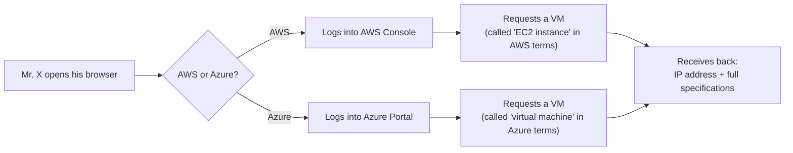
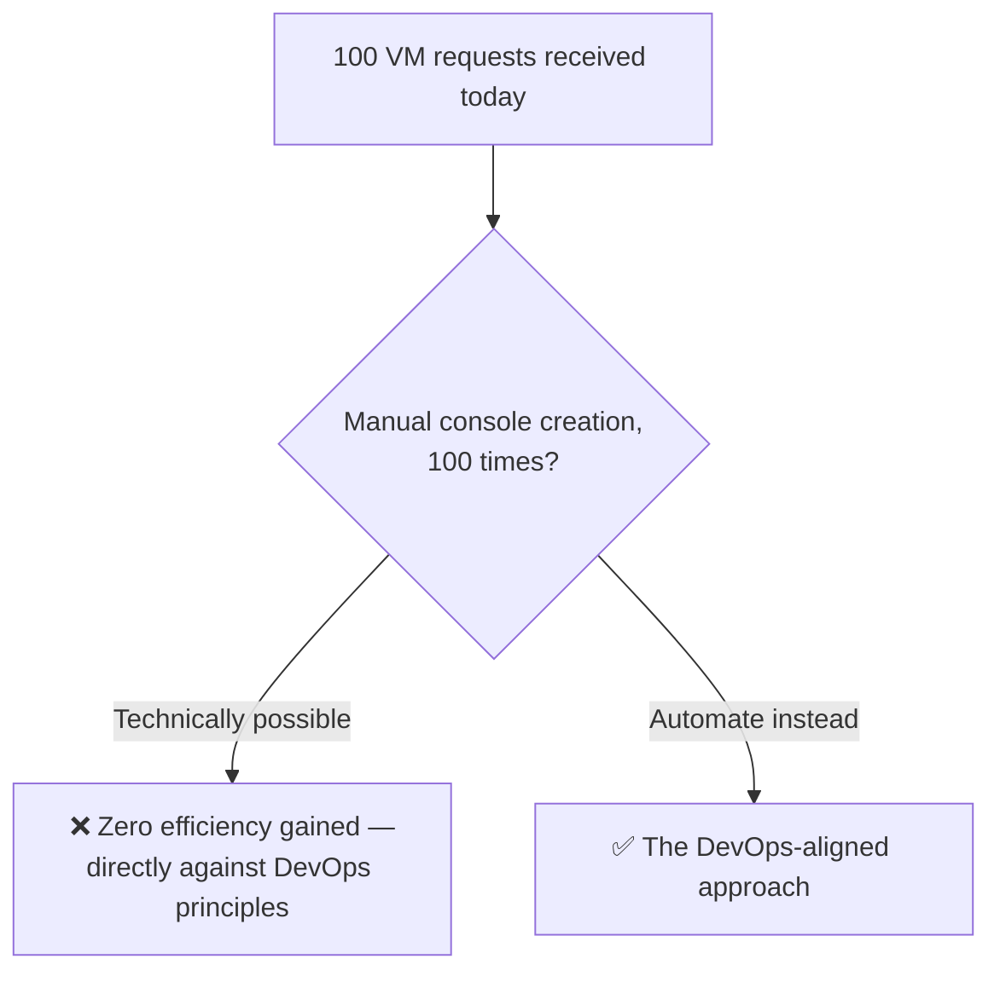
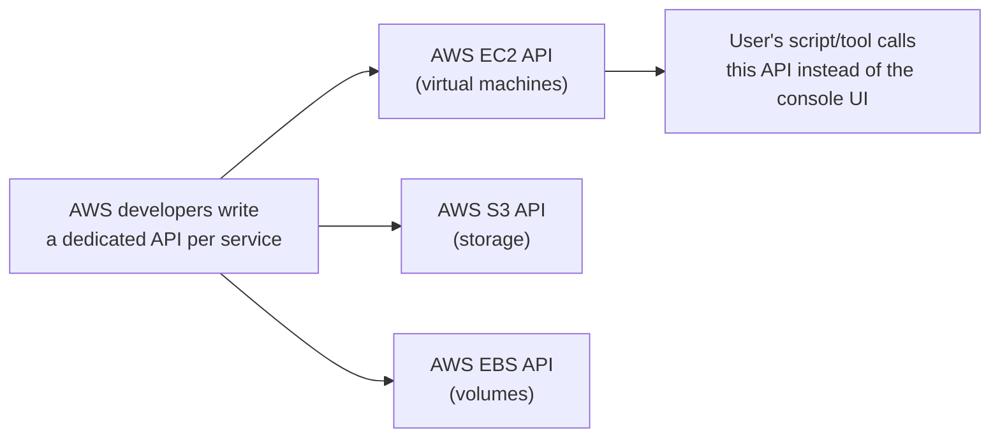
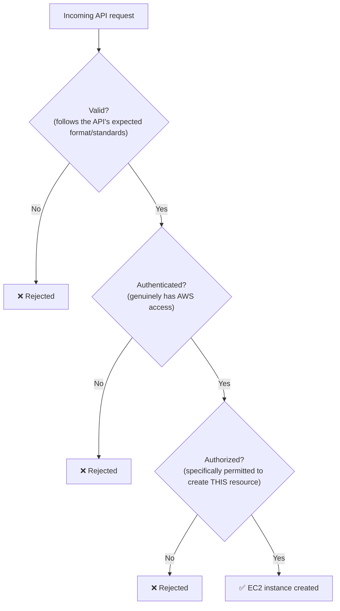
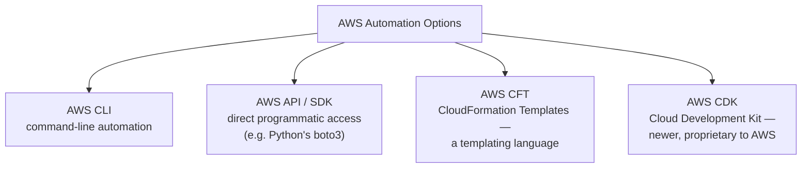
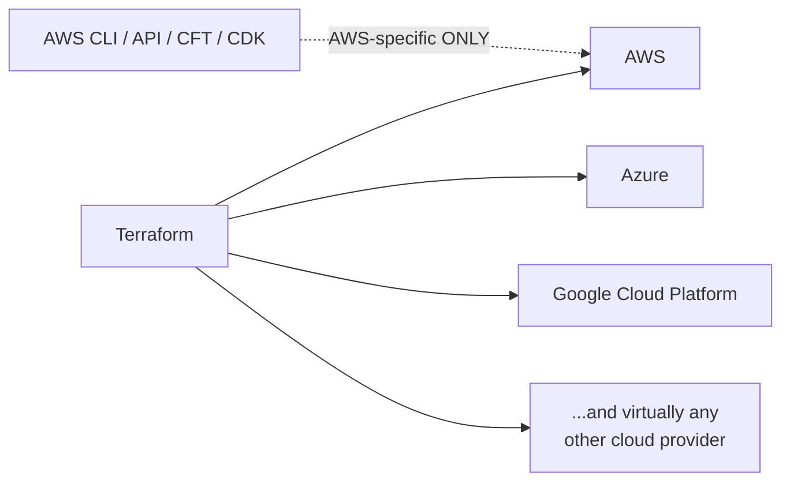
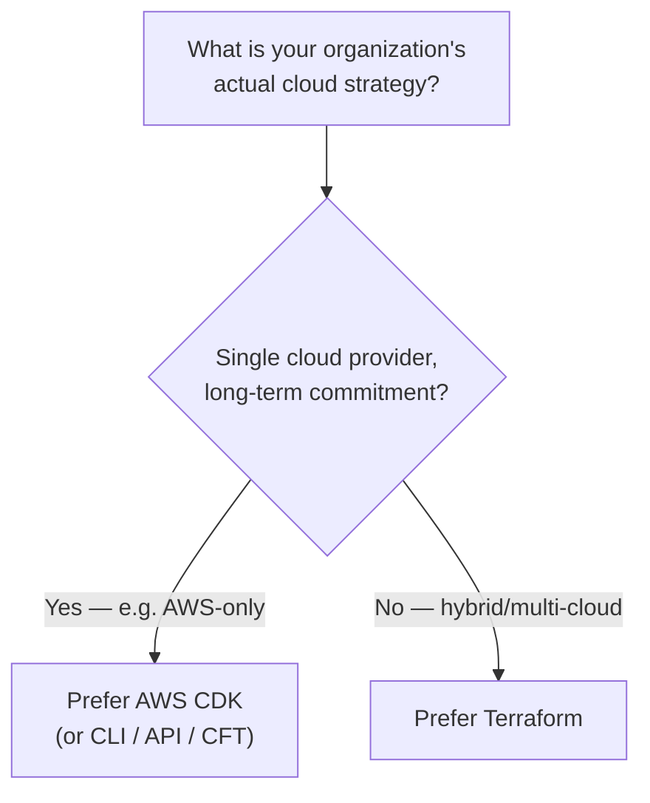
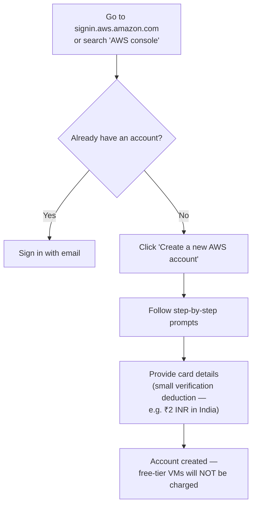
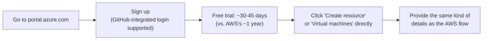

# ☁ Creating Virtual Machines on AWS & Azure: Manual Console vs. Automation (CLI, API, CFT, CDK & Terraform)

- <i>**Session:** DevOps Zero to Hero — Day 4: "AWS & Azure - How to Create Virtual Machines" (Virtual Machines Part 2) · 
- **Instructor:** Abhishek
- **Note on scope:** This session delivers on Day 3's promise: actually creating virtual machines, both manually (via the AWS console and Azure portal, demonstrated live) and via a conceptual tour of every automation option available (AWS CLI, direct API/SDK access, CloudFormation Templates, AWS CDK, and Terraform). Actually **logging into** the created VM via terminal, and a live **automation** (scripting) demo, are both explicitly deferred to the next class — reflected honestly here rather than invented.</i>

---

## 📑 Table of Contents

1. [Session Overview](#-session-overview)
2. [Learning Objectives](#-learning-objectives)
3. [Detailed Notes](#-detailed-notes)
   - [1. Recap: From Theory to Practice](#1-recap-from-theory-to-practice)
   - [2. The Manual VM Creation Process: Console & Portal](#2-the-manual-vm-creation-process-console--portal)
   - [3. The Efficiency Problem at Scale](#3-the-efficiency-problem-at-scale)
   - [4. Cloud Provider APIs: The Foundation of All Automation](#4-cloud-provider-apis-the-foundation-of-all-automation)
   - [5. The Three-Part Validation: Valid, Authenticated, Authorized](#5-the-three-part-validation-valid-authenticated-authorized)
   - [6. Four Ways to Automate AWS: CLI, API/SDK, CFT & CDK](#6-four-ways-to-automate-aws-cli-apisdk-cft--cdk)
   - [7. Terraform: The Multi-Cloud Alternative](#7-terraform-the-multi-cloud-alternative)
   - [8. Choosing the Right Automation Tool: An Interview Framework](#8-choosing-the-right-automation-tool-an-interview-framework)
   - [9. Live Demo Walkthrough: Creating a Free-Tier VM on AWS](#9-live-demo-walkthrough-creating-a-free-tier-vm-on-aws)
   - [10. Live Demo Walkthrough: Creating a VM on Azure](#10-live-demo-walkthrough-creating-a-vm-on-azure)
4. [Glossary](#-glossary)
5. [Revision Notes — One-Minute Revision](#-revision-notes--one-minute-revision)
6. [Cheat Sheet](#-cheat-sheet)
7. [Interview Questions & Answers](#-interview-questions--answers)
8. [Scenario-Based Interview Questions](#-scenario-based-interview-questions)
9. [Hands-on Exercises](#-hands-on-exercises)
10. [Practice Assignment](#-practice-assignment)
11. [Additional Resources](#-additional-resources)
12. [Final Revision Sheet](#-final-revision-sheet)

---

## 🎯 Session Overview

Following Day 3's purely conceptual introduction to virtual machines and hypervisors, this session turns theory into practice. It covers:

1. A brief **recap** connecting Day 3's theory (physical servers, hypervisors, logical partitioning) to today's practical focus.
2. The **manual VM creation process**, explained identically for both AWS (EC2 instance) and Azure (virtual machine) — log into the provider's console/portal, request a VM through the UI, receive back an IP address and access specifications.
3. The **real efficiency problem** manual creation causes at organizational scale — repeating the same manual console steps for every one of potentially hundreds of daily requests.
4. **Cloud provider APIs** as the foundational mechanism underlying every automation approach — every cloud service (EC2, S3, EBS, and more) has its own dedicated API.
5. The **three-part validation** every automated request must satisfy: valid, authenticated, and authorized.
6. A complete tour of **AWS's four automation options**: AWS CLI, direct API/SDK access (e.g., Python's `boto3`), AWS CloudFormation Templates (CFT), and AWS CDK (Cloud Development Kit).
7. **Terraform** as the leading multi-cloud alternative — deliberately not deep-dived here, since a full, dedicated Terraform class is coming later in the course.
8. A genuinely practical **interview framework** for deciding which automation tool to name in an interview — based on an organization's actual cloud strategy (single-cloud vs. hybrid-cloud), not tool popularity.
9. A **full live demonstration** of creating a free-tier virtual machine manually via the AWS console — including account creation, service selection, OS choice, instance sizing, and key-pair creation.
10. A **parallel live demonstration** on the Microsoft Azure portal, directly comparing the experience, free-tier policy, and sign-up flow against AWS.

> 💡 **Memory Trick — the instructor's stated overall philosophy for this session:** *"Even if you have zero knowledge of AWS, I'll show you both theoretically and practically how to create a virtual machine — and the exact same underlying process applies whether it's AWS, Azure, Google Cloud, or any other cloud provider."*

---

## 🎯 Learning Objectives

By the end of this guide, you will be able to:

- [ ] Describe the manual VM creation process identically for both AWS and Azure — from console/portal login to receiving IP address and access specifications.
- [ ] Explain, using a concrete "100 requests" scenario, why manual VM creation is fundamentally inefficient at organizational scale.
- [ ] Explain that every cloud service (not just EC2) has its own dedicated API, and name at least two examples (EC2 API, S3 API).
- [ ] State and explain the three-part validation every automated cloud request must satisfy: valid, authenticated, authorized.
- [ ] Name and briefly describe all four of AWS's native automation options: CLI, direct API/SDK (e.g., `boto3`), CloudFormation Templates (CFT), and CDK.
- [ ] Explain why Terraform is uniquely suited to multi-cloud/hybrid-cloud scenarios, in a way AWS-native tools are not.
- [ ] Apply a genuine decision framework (based on an organization's actual cloud strategy) to choose between CDK/CLI/API/CFT versus Terraform — rather than defaulting to whichever tool is most popular.
- [ ] Walk through, step by step, the manual process of launching a free-tier EC2 instance on AWS, including OS selection, instance-type selection, and key-pair creation.
- [ ] Compare AWS's and Azure's free-tier policies and sign-up experiences based on this session's direct, live comparison.

---

## 📚 Detailed Notes

### 1. Recap: From Theory to Practice

#### 🧠 Concept

The session opens by directly connecting back to Day 3's purely theoretical content, before shifting into hands-on territory.

> 💡 **Memory Trick, the recap given directly:** *"Yesterday we learned that to create a virtual machine in DevOps, you basically make a request to one of your cloud providers. We talked about the evolution of virtual machines, what a physical server is, how it differs from a virtual machine, and the concept that actually allows virtual machines to be created — and we also talked about how dedicated data centers are becoming less common, since even startups now rely on platforms like OpenStack, AWS, or Azure rather than building their own."*

#### 🎯 Key Takeaways

* This session is explicitly framed as **Part 2** of the Virtual Machines topic — Day 3 covered theory (hypervisors, logical partitioning); today covers **practice** (actually creating VMs).
* The instructor explicitly reconfirms that organizations increasingly rely on cloud providers (AWS, Azure, OpenStack) rather than maintaining their own physical data centers — directly connecting back to Day 3's data-center discussion.

---

### 2. The Manual VM Creation Process: Console & Portal

#### 🧠 Concept — The Identical Process, Regardless of Provider



> 💡 **Memory Trick, stated directly:** *"Whether it's AWS or Azure, the process is exactly the same — someone sits at their laptop, opens their browser, goes to the provider's console/portal, and requests a VM through the UI. The provider sends back an IP address and all the specifications needed to log in."*

#### 🔍 Internal Working — Naming Convention Difference

> 💡 **Memory Trick, the terminology distinction stated directly:** *"In AWS terminology, a virtual machine is called an EC2 instance. In Azure terminology, we simply call it a 'virtual machine' — same underlying concept, different names."*

#### 🎯 Key Takeaways

* The manual VM creation process is **conceptually identical** across cloud providers — only the specific console/portal and terminology differ.
* AWS calls a VM an **EC2 instance**; Azure simply calls it a **virtual machine** — a real, frequently-tested terminology distinction.
* What you receive at the end of the manual process is consistently the same: an **IP address** plus **access specifications** — directly consistent with Day 3's "you only ever get logical/virtual access" principle.

---

### 3. The Efficiency Problem at Scale

#### ❓ Why It Exists

> ⚠️ **The core motivating scenario, stated directly:** *"Creating ONE virtual machine manually through the UI is fine. But as a DevOps engineer, you have to focus on efficiency — always. If your organization has thousands of people, and you get 100 requests for a VM every single day, would you really go to the AWS portal 100 times and manually create each one? You COULD do that, but it adds zero efficiency."*



#### 🎯 Key Takeaways

* Manual VM creation is entirely functional for a single, occasional request — but scales terribly for anything resembling real organizational demand.
* This scenario directly, deliberately connects back to the course's **repeated core theme since Day 1**: DevOps is fundamentally about improving efficiency, and manual, repetitive processes are the opposite of that goal.
* This inefficiency is the precise, stated motivation for everything covered in the rest of this session: **automation**.

---
### 4. Cloud Provider APIs: The Foundation of All Automation

#### 📖 Definition

> 💡 **Memory Trick, stated directly:** *"AWS provides an API for basically everything. Since we're talking about EC2, it's called the AWS EC2 API. If you want to create storage, AWS supports the AWS S3 API. If you're talking about volumes, there's the AWS EBS API — and so on for every other service."*



#### 🔍 Internal Working — Why This Enables Automation

> 💡 **Memory Trick, given directly:** *"Instead of directly accessing the AWS console from a browser, a user can write a script that makes a call to the AWS EC2 API — saying, for example, 'I want to create 10 EC2 instances.' Even a script that automates the creation of just ONE instance still counts as automation, because there's no manual intervention — and no manual intervention means no manual errors, and real time saved."*

#### 🎯 Key Takeaways

* **Every AWS service has its own dedicated API** — EC2 API, S3 API, EBS API, and so on — this is the underlying mechanism every automation approach ultimately calls.
* This same API-per-service pattern is explicitly stated to apply to **every cloud provider**, not just AWS — Azure, GCP, DigitalOcean all follow the identical underlying model.
* Automation's core value, precisely stated: it eliminates **manual intervention**, which directly eliminates **manual errors** and saves genuine time — not automation for its own sake.

---

### 5. The Three-Part Validation: Valid, Authenticated, Authorized

#### 📖 Definition

> 💡 **Memory Trick, the three criteria given directly and precisely:** *"For the AWS EC2 API to actually respond with an EC2 instance, the incoming request has to satisfy three things: it has to be **valid** (following all the standards this API expects), the requester has to be **authenticated** (they genuinely have access to AWS), and the requester has to be **authorized** (sometimes you have access to AWS generally, but you're specifically NOT authorized to create an EC2 instance)."*



#### ⚠ Common Mistakes

* Conflating **authentication** with **authorization** — explicitly, precisely distinguished: authentication confirms you genuinely have AWS access at all; authorization confirms you're specifically permitted to perform this particular action (e.g., creating an EC2 instance), which is a separate, additional check even for a fully authenticated user.

#### 🎯 Key Takeaways

* Every automated cloud API request must independently satisfy **three distinct criteria**: valid, authenticated, and authorized — failing any one results in rejection.
* **Authentication** (do you have access at all?) and **authorization** (are you permitted to do THIS specific thing?) are genuinely separate checks — a common, important interview distinction.
* A DevOps engineer's automation script must be constructed to correctly satisfy all three criteria to successfully receive a VM as output.

---

### 6. Four Ways to Automate AWS: CLI, API/SDK, CFT & CDK

#### 🧠 Concept

> 💡 **Memory Trick, the four options named directly, one at a time:** *"The script I've been talking about can take several forms. One: AWS CLI. Two: you can use the AWS API directly — if you're familiar with writing REST APIs and have exposure to any programming language, you can deal with the API directly; in Python specifically, there's a module called boto3 that lets you make direct calls to any AWS service. Three: AWS CloudFormation Templates (CFT) — a templating language where you provide AWS a defined structure, and AWS returns however many virtual machines you've requested. And there's also a fourth: AWS CDK — the Cloud Development Kit, a more recently introduced option."*



#### ⚙ How It Works — What Each Option Requires

| Option | What it requires |
|---|---|
| **AWS CLI** | No programming language required — usable even with zero Python/Java knowledge |
| **AWS API / SDK (e.g., `boto3`)** | Familiarity with REST API concepts and at least one programming language |
| **AWS CFT (CloudFormation Templates)** | Understanding of AWS's specific templating structure/language |
| **AWS CDK** | Programming-language-based infrastructure definition, AWS-proprietary |

#### ⚠ Common Mistakes

* Assuming automation requires deep programming expertise — explicitly, directly corrected: *"You don't have to be familiar with Python, Java, or any programming language at this point — you can still use AWS CLI to automate the process."*

#### 🎯 Key Takeaways

* AWS provides **four distinct native automation options**: CLI (no coding required), direct API/SDK access (e.g., `boto3` for Python, requiring programming familiarity), CFT (a templating language), and the newer CDK (Cloud Development Kit).
* All four ultimately call the **same underlying AWS EC2 API** discussed in Section 4 — they're different interfaces to the identical underlying mechanism, not fundamentally different systems.
* Automation does **not** require deep programming expertise as a prerequisite — AWS CLI specifically is accessible to complete programming beginners.

---
### 7. Terraform: The Multi-Cloud Alternative

#### 📖 Definition

> 💡 **Memory Trick, the key distinguishing property stated directly:** *"Unlike CLI, API/boto3, or CFT — which are all AWS-specific — Terraform is genuinely different, because ONE Terraform setup can automate your process across AWS, Azure, Google Cloud Platform, or virtually anywhere else."*



#### ⚠ Honesty Note

> ⚠️ **Explicitly, directly deferred:** *"I'm setting Terraform aside for now, because we have a completely separate, dedicated class where we'll go Zero to Hero on Terraform specifically — it requires a certain level of expertise to properly deep-dive into. For today, just understand that Terraform is one of the available alternatives to automate resource creation, and its real advantage is being multi-cloud, unlike the AWS-specific tools covered above."*

#### 🎯 Key Takeaways

* Terraform's defining advantage, precisely stated: it is **multi-cloud**, capable of automating infrastructure across AWS, Azure, GCP, and beyond — genuinely distinct from every AWS-specific tool covered in Section 6.
* Deep Terraform coverage is **explicitly deferred** to a separate, dedicated future class — this session intentionally only establishes Terraform's basic identity and role among the available automation options.

---

### 8. Choosing the Right Automation Tool: An Interview Framework

#### ❓ Why It Exists

> ⚠️ **A direct, repeated warning against a common interview mistake:** *"Don't do something just because it's popular. Terraform is genuinely the most popular tool in the market — but always look at what YOUR organization is actually doing. If your organization is completely, exclusively focused on AWS, and plans to stay that way for the next 10-15 years, you don't have to jump straight to Terraform."*

#### ⚙ How It Works — The Decision Framework



#### 🔍 Internal Working — Why CDK Can Beat Terraform for a Single-Cloud Org

> 💡 **Memory Trick, the precise reasoning given directly:** *"CDK provides advanced benefits over Terraform specifically because it's a PROPRIETARY tool of AWS. When AWS launches a brand-new service — say, 'AWS XYZ' — their own developers write the EC2-style API for it immediately. Who gets first support for automating that new service: Terraform or CDK? Obviously CDK — because CDK is AWS's own tool, while Terraform is open-source, developed and maintained by HashiCorp and the broader community, and therefore inherently gets support somewhat later."*

#### 🏢 Real-World / Production Usage — When Terraform IS the Right Choice: Hybrid Cloud

> 💡 **Memory Trick, the concrete hybrid-cloud example given directly:** *"Some organizations deliberately choose a hybrid cloud pattern — maybe because Google Cloud Platform is genuinely stronger for AI/ML workloads, so they run their AI/ML stack on GCP, while running other infrastructure (like RDS) on AWS. If you're in this hybrid model, Terraform is definitely the best fit, because you need to automate infrastructure consistently across genuinely different cloud platforms."*

#### 🏢 Real-World / Production Usage — The Azure Equivalent

> 💡 **Memory Trick, mentioned directly:** *"If you're on Azure specifically, you can talk about Azure Resource Manager — the Azure-proprietary equivalent to AWS CDK, which similarly gets earlier/first-class access to newly launched Azure resources."*

#### ⚠ Common Mistakes

* Automatically naming "Terraform" in every DevOps interview simply because it's the most recognizable, popular tool — explicitly, repeatedly warned against as a mistake that doesn't reflect genuine organizational reasoning.

#### 🎯 Key Takeaways

* The correct interview answer for "what automation tool do you use?" depends entirely on the **organization's real, actual cloud strategy** — not on tool popularity.
* **Single-cloud, long-term-committed organizations**: proprietary, cloud-native tools (AWS CDK, Azure Resource Manager) are often the better fit, since they receive first-class, immediate support for brand-new services the moment they launch.
* **Hybrid-cloud or multi-cloud organizations**: Terraform is the clearly better fit, since it can automate infrastructure consistently across genuinely different providers in one unified tool.
* A concrete, real reason organizations choose hybrid cloud: leveraging each provider's genuine strengths (e.g., GCP for AI/ML workloads) rather than forcing everything onto a single platform.

---
### 9. Live Demo Walkthrough: Creating a Free-Tier VM on AWS

#### 🪜 Step-by-Step — Account Creation



> 💡 **Memory Trick, the reassurance given directly:** *"AWS will deduct a small amount just to validate you're an authentic user with valid card details — for example, 2 rupees INR in India. But don't worry — AWS will NOT charge you for virtual machines you create if you're using a free-tier instance, which I'll show you how to select."*

#### 🪜 Step-by-Step — Launching the EC2 Instance

1. Log into the AWS Console, search for **"EC2"** in the services search bar, and navigate to the EC2 dashboard.
2. Go to **Instances**, then click **Launch Instance**.
3. **Name your instance** — e.g., `test`.
4. **Choose an operating system**: AWS offers Amazon Linux, Ubuntu, Windows, Red Hat, and others.
   > 💡 **Memory Trick, the instructor's direct recommendation:** *"For a first-timer or someone just starting with DevOps, I'd recommend Ubuntu — it's widely used across the DevOps community."*
5. **Choose "Free tier eligible"** under instance type.
   > ⚠️ **Directly, explicitly emphasized:** *"This is very important. Free tier gives you a restricted amount of resources — in this case, 1 CPU and 1GB of memory. If you go to the paid subscription model instead, you could choose something like a t2.large — 2 CPUs and 8GB of memory — but you WILL be charged for that. Free-tier eligible instances will not charge you."*
6. **Create a key pair** — required to log into the instance later.
   > 💡 **Memory Trick, the exact steps given directly:** *"Click 'Create new key pair.' Name it — say, 'test111.' Go with the defaults: choose RSA (not ED25519 — don't worry about the difference between these encryption methodologies for now), and choose the `.pem` format for your private key file. Click 'Create key pair' — it will download and save automatically to your local machine."*
7. **Skip advanced networking concepts** (security groups, VPCs) for this introductory session.
   > 💡 **Memory Trick, the instructor's explicit teaching choice:** *"I'm not going to explain security groups or VPCs at this point — today we're just learning how to install a virtual machine, and I don't want to confuse beginners with advanced concepts this early."*
8. Click **Launch Instance**. Wait a couple of minutes, then return to the Instances screen — your EC2 instance will be listed and running.

#### ⚠ Common Mistakes — A Direct, Critical Warning

> ⚠️ **Explicitly, urgently emphasized:** *"Make sure you save your key pair file. Once your key pair is gone, it is almost impossible to log into your EC2 instance again."*

#### 🎯 Key Takeaways

* Creating a free-tier EC2 instance requires: naming it, choosing an OS (Ubuntu recommended for DevOps learners), explicitly selecting **"Free tier eligible"** to avoid charges, and creating a downloadable key pair (RSA, `.pem` format) for future login access.
* The key pair file is **irreplaceable** once lost — losing it effectively locks you out of the instance permanently.
* Advanced networking concepts (security groups, VPCs) are deliberately, explicitly skipped in this introductory walkthrough — reserved for a later, more advanced session.

---

### 10. Live Demo Walkthrough: Creating a VM on Azure

#### 🪜 Step-by-Step — Sign-Up & Account



> 💡 **Memory Trick, the GitHub-integration convenience noted directly:** *"One nice thing about Microsoft Azure is its built-in integration with GitHub — if you already have a GitHub account, like I do, you can sign into Azure using it directly, taking less than a couple of minutes."*

#### ⚖ Advantages & Limitations — AWS vs. Azure, Directly Compared

| | AWS | Azure |
|---|---|---|
| **Free tier duration** | Close to **one full year** | Roughly **30-45 days** (instructor notes he doesn't recall the exact figure) |
| **UI/UX** | Functional | Instructor's stated personal opinion: *"slightly better"* than AWS |
| **Sign-up convenience** | Standard email/card sign-up | Built-in GitHub-integrated sign-in supported |
| **VM creation flow** | Launch Instance → name, OS, size, key pair | Create VM → same category of details required |

> 💡 **Memory Trick, the direct comparative statement:** *"AWS provides you close to one year of free membership so you can really play around and try things — Azure only gives you around 30 to 45 days. Beyond that window, you'd have to pay to continue creating VMs on Azure."*

#### 🎯 Key Takeaways

* The Azure VM creation flow requires **the same category of information** as AWS's — name, size/configuration, and access credentials — reinforcing Section 2's "the process is identical across providers" point.
* **AWS's free tier lasts significantly longer** (~1 year) than **Azure's** (~30-45 days) — a real, practically important distinction for anyone learning cloud platforms on a budget.
* Azure's **GitHub-integrated sign-in** is highlighted as a genuine, practical sign-up convenience.
* The instructor offers a direct, clearly-labeled **personal opinion** that Azure's UI/UX is "slightly better" than AWS's — presented explicitly as opinion, not objective fact.

---
## 📝 Glossary

| Term | Definition | Why It Matters |
|---|---|---|
| **EC2 Instance** | AWS's specific term for a virtual machine | The term used throughout the AWS console and API |
| **AWS Console** | AWS's web-based UI for manually managing resources | Where manual VM creation happens |
| **Azure Portal** | Azure's web-based UI for manually managing resources | The Azure equivalent of the AWS Console |
| **AWS EC2 API** | The specific API endpoint AWS exposes for creating/managing EC2 instances | The underlying mechanism every AWS automation tool ultimately calls |
| **Valid / Authenticated / Authorized** | The three-part check every cloud API request must pass | A precise, frequently-tested distinction -- especially authentication vs. authorization |
| **AWS CLI** | Command-line automation tool for AWS, requiring no programming language knowledge | The most accessible automation option for beginners |
| **`boto3`** | Python's SDK module for making direct calls to AWS APIs | An example of direct API/SDK-based automation |
| **AWS CFT (CloudFormation Templates)** | AWS's native infrastructure templating language | Define a structure; AWS returns the requested resources |
| **AWS CDK (Cloud Development Kit)** | A newer, AWS-proprietary infrastructure-as-code tool | Gets first-class, immediate support for brand-new AWS services |
| **Terraform** | A multi-cloud infrastructure automation tool (HashiCorp, open-source) | The best fit specifically for hybrid/multi-cloud organizations |
| **Azure Resource Manager** | Azure's proprietary equivalent to AWS CDK | Gets early/first-class access to new Azure resources |
| **Hybrid Cloud** | Using multiple different cloud providers deliberately, based on each one's relative strengths | The scenario where Terraform's multi-cloud capability genuinely matters |
| **Key Pair** | An RSA-based credential (public/private key, `.pem` format) required to log into an AWS EC2 instance | Irreplaceable once lost -- losing it locks you out of the instance |
| **Free Tier** | A cloud provider's restricted-resource offering that avoids real charges | AWS: ~1 year; Azure: ~30-45 days |

---

## 🔄 Revision Notes — One-Minute Revision

* This session turns Day 3's theory into practice: creating actual virtual machines on **AWS** (called an **EC2 instance**) and **Azure** (called a **virtual machine**) -- the underlying manual process is identical across both: log into the console/portal, request a VM through the UI, receive back an IP address and access specifications.
* Manual VM creation is fine for one-off requests but genuinely **inefficient at scale** -- 100 daily requests manually processed through the UI directly contradicts DevOps's core efficiency principle, established since Day 1.
* Every cloud service has its own dedicated **API** (EC2 API, S3 API, EBS API, etc.) -- this is the underlying mechanism every automation tool ultimately calls, across every cloud provider.
* Every automated API request must satisfy **three distinct criteria**: **valid** (correctly formatted), **authenticated** (genuinely has access), and **authorized** (specifically permitted to perform this action) -- authentication and authorization are genuinely separate checks.
* AWS offers **four native automation options**: **CLI** (no programming required), direct **API/SDK** access (e.g., Python's `boto3`, requires programming familiarity), **CFT** (CloudFormation Templates, a templating language), and the newer **CDK** (Cloud Development Kit, AWS-proprietary).
* **Terraform** is the leading multi-cloud alternative -- capable of automating AWS, Azure, GCP, and more from one unified tool -- deliberately not deep-dived here, since a dedicated Terraform class is coming later.
* The correct **interview answer** for "what automation tool do you use?" depends on your organization's real cloud strategy: **single-cloud, long-term-committed orgs** often benefit more from proprietary tools (**AWS CDK**, **Azure Resource Manager**) since these get first-class support for brand-new services immediately; **hybrid/multi-cloud orgs** genuinely need Terraform's cross-provider capability.
* The live AWS demo walked through: account creation (including a small card-verification deduction), navigating to EC2, launching an instance (naming it, choosing Ubuntu as OS, explicitly selecting **"Free tier eligible"** to avoid charges, creating an RSA `.pem` key pair), and skipping advanced networking concepts (security groups, VPCs) for this introductory session.
* The live Azure demo walked through the parallel process on `portal.azure.com`, highlighting **GitHub-integrated sign-in** and a **shorter free-tier window** (~30-45 days) compared to AWS's (~1 year).
* Explicitly **deferred to the next class**: actually logging into the created VM via terminal, and a live demonstration of the automation (scripting) approaches covered conceptually here.

---

## 📋 Cheat Sheet

**Manual VM creation -- identical process, different terminology:**
```text
AWS:   AWS Console -> "Launch Instance" -> EC2 Instance
Azure: Azure Portal -> "Create VM" -> Virtual Machine
```

**Every automated request must pass three checks:**
```text
Valid          -> correctly formatted per the API's expectations
Authenticated  -> genuinely has AWS/Azure access
Authorized     -> specifically permitted to perform THIS action
```

**AWS's four native automation options:**
```text
AWS CLI    -> no programming language required
AWS API/SDK -> e.g. Python's boto3; requires programming familiarity
AWS CFT     -> CloudFormation Templates; a templating language
AWS CDK      -> Cloud Development Kit; AWS-proprietary, newer
```

**Choosing an automation tool -- the interview framework:**
```text
Single cloud, long-term committed  -> CDK (or CLI/API/CFT) preferred
Hybrid / multi-cloud                -> Terraform preferred
```

**AWS free-tier EC2 launch checklist:**
```text
1. Name the instance
2. Choose OS (Ubuntu recommended for DevOps)
3. Select "Free tier eligible" instance type (1 CPU / 1GB RAM)
4. Create a key pair (RSA, .pem format) -- SAVE IT, cannot be recovered
5. Skip security groups/VPCs for now (advanced topic)
6. Launch Instance
```

**Free tier comparison:**
```text
AWS   -> ~1 year
Azure -> ~30-45 days
```

---

## 🔥 Interview Questions & Answers

### 🟢 Beginner

**Q1.**

**Question:** What is AWS's specific term for a virtual machine?

**Answer:** An EC2 instance.

**Explanation:** Directly, explicitly named in the session.

**Why Interviewers Ask This:** Basic, provider-specific terminology.

**Possible Follow-up:** "What does Azure call the same concept?"

**Q2.**

**Question:** What do you receive after manually creating a VM through either the AWS Console or Azure Portal?

**Answer:** An IP address plus the full specifications/credentials required to access the VM.

**Explanation:** Directly, precisely stated for both providers identically.

**Why Interviewers Ask This:** Tests understanding of the manual creation process's actual output.

**Possible Follow-up:** "What specific credential do you need to actually log into an AWS EC2 instance?"

**Q3.**

**Question:** Why is manually creating 100 virtual machines through the console considered a DevOps anti-pattern?

**Answer:** It's technically possible but adds zero efficiency -- directly contradicting DevOps's core, repeated principle of improving efficiency through automation.

**Explanation:** Directly, explicitly stated in the session.

**Why Interviewers Ask This:** Tests understanding of WHY automation matters, not just that it exists.

**Possible Follow-up:** "What specifically does automation eliminate that manual processes don't?"

**Q4.**

**Question:** Name the specific AWS API used for creating EC2 instances.

**Answer:** The AWS EC2 API.

**Explanation:** Directly named.

**Why Interviewers Ask This:** Basic, practical AWS terminology.

**Possible Follow-up:** "Name the AWS API used for storage."

**Q5.**

**Question:** What are the three criteria every automated AWS API request must satisfy?

**Answer:** Valid, authenticated, and authorized.

**Explanation:** Directly, precisely named and defined.

**Why Interviewers Ask This:** A core, frequently-tested cloud security/API concept.

**Possible Follow-up:** "What's the difference between authentication and authorization?"

**Q6.**

**Question:** Name all four of AWS's native automation options covered in this session.

**Answer:** AWS CLI, direct API/SDK access (e.g., `boto3`), AWS CloudFormation Templates (CFT), and AWS CDK.

**Explanation:** Directly, individually named and described.

**Why Interviewers Ask This:** Core infrastructure-automation vocabulary.

**Possible Follow-up:** "Which of these requires no programming language knowledge at all?"

**Q7.**

**Question:** What makes Terraform genuinely different from AWS CLI, API, CFT, and CDK?

**Answer:** Terraform is multi-cloud -- capable of automating infrastructure across AWS, Azure, GCP, and more -- while the other four are all AWS-specific.

**Explanation:** Directly, precisely stated as Terraform's defining distinction.

**Why Interviewers Ask This:** A core, frequently-tested cloud-tooling distinction.

**Possible Follow-up:** "In what scenario would Terraform genuinely be the better choice over CDK?"

**Q8.**

**Question:** What does "Free tier eligible" mean when launching an AWS EC2 instance, and why does it matter?

**Answer:** It restricts the instance to a limited resource allocation (e.g., 1 CPU, 1GB RAM) but ensures you are NOT charged -- critical for anyone learning AWS without wanting to incur real costs.

**Explanation:** Directly, explicitly emphasized in the live demo.

**Why Interviewers Ask This:** A practical, cost-relevant AWS knowledge check.

**Possible Follow-up:** "What kind of instance would you be charged for instead?"

**Q9.**

**Question:** What happens if you lose your AWS EC2 key pair file?

**Answer:** It becomes almost impossible to log into that EC2 instance again.

**Explanation:** Directly, urgently emphasized in the session.

**Why Interviewers Ask This:** A practical, real-world operational risk every AWS user must understand.

**Possible Follow-up:** "What format is an AWS key pair typically saved in?"

**Q10.**

**Question:** Compare AWS's and Azure's free-tier durations, per this session.

**Answer:** AWS offers close to one full year of free tier; Azure offers roughly 30-45 days.

**Explanation:** Directly, explicitly compared in the live demo.

**Why Interviewers Ask This:** Practical, budget-relevant knowledge for anyone learning cloud platforms.

**Possible Follow-up:** "What sign-up convenience does Azure offer that AWS doesn't emphasize?"

---

### 🟡 Intermediate

**Q11.**

**Question:** Explain, precisely, why "authenticated" and "authorized" are described as two genuinely separate checks, using this session's own example.

**Answer:** Authentication confirms a user genuinely has access to AWS at all -- they're a real, recognized account holder. Authorization is a separate, additional check confirming that specific, already-authenticated user is actually permitted to perform this particular action -- the session's own example: "sometimes as a user you might have access to AWS, but you're not authorized to create an EC2 instance." A user can pass authentication (they're a legitimate AWS user) while still failing authorization (they lack permission for this specific resource-creation action) -- proving these are independent checks, not one combined concept.

**Explanation:** Directly reflects the session's own precise example distinguishing the two.

**Why Interviewers Ask This:** Tests genuine understanding of a frequently-conflated pair of security concepts.

**Possible Follow-up:** "Design a realistic organizational scenario where a user would be authenticated but not authorized."

**Q12.**

**Question:** A learner argues that since AWS CLI requires no programming knowledge, it must be a "less powerful" or "beginner-only" automation option compared to the API/SDK approach. Evaluate this claim.

**Answer:** This claim isn't well-supported by the session's content. The session explains that AWS CLI, the API/SDK approach, CFT, and CDK are simply different INTERFACES to the same underlying AWS EC2 API -- CLI's lack of a programming-language requirement reflects its interface design (command-based rather than code-based), not a reduction in underlying capability. The session explicitly frames CLI as a genuinely valid, real automation option -- not a "beginner-only" placeholder to graduate away from. Whether CLI, API/SDK, CFT, or CDK is "better" depends on the specific use case and team's skills, not an inherent power hierarchy where programming-based options are automatically superior.

**Explanation:** Tests whether a learner conflates "accessible to non-programmers" with "less capable."

**Why Interviewers Ask This:** Distinguishes candidates who understand these tools as genuinely different interfaces to the same power, from those who assume ease-of-use implies reduced capability.

**Possible Follow-up:** "Describe a real scenario where AWS CLI might genuinely be the BEST choice, not just the easiest."

**Q13.**

**Question:** Explain, precisely, why AWS CDK is described as getting "first support" for brand-new AWS services, while Terraform does not.

**Answer:** Because CDK is a PROPRIETARY tool developed directly by AWS itself -- when AWS's own developers launch a new service and write its corresponding API, that same internal team (or a closely-coordinated one) can immediately build CDK support for it, since CDK is part of AWS's own toolset. Terraform, by contrast, is an OPEN-SOURCE tool developed and maintained by HashiCorp and the broader community -- external to AWS -- meaning support for any brand-new AWS service requires HashiCorp's or the community's own separate development effort, which inherently happens somewhat later than AWS's own internal CDK updates.

**Explanation:** Requires precisely reconstructing the ownership-based reasoning behind this specific claim.

**Why Interviewers Ask This:** Tests understanding of WHY this timing difference exists, not just that it does.

**Possible Follow-up:** "Does this same 'proprietary gets first support' reasoning apply to Azure Resource Manager as well? Why?"

**Q14.**

**Question:** Using the GCP AI/ML example from this session, explain precisely why a hybrid-cloud strategy might be the RIGHT choice for an organization, rather than a compromise or inefficiency.

**Answer:** The session's example: an organization runs its AI/ML workloads on Google Cloud Platform specifically because GCP is considered genuinely stronger for AI/ML use cases, while running other infrastructure (like RDS-style databases) on AWS. This isn't a compromise -- it's a deliberate strategy to capture each provider's genuine relative strength for the specific workload best suited to it, rather than forcing every workload onto a single provider regardless of fit. In this scenario, Terraform becomes the correct automation choice precisely because the organization genuinely needs consistent infrastructure automation across BOTH providers simultaneously -- a single-cloud tool (like AWS CDK) simply couldn't address the Azure/GCP side of this legitimately multi-cloud architecture.

**Explanation:** Requires reasoning through why hybrid cloud is a genuine strategic choice, not simply "using two clouds because you couldn't decide."

**Why Interviewers Ask This:** Tests whether a learner understands hybrid cloud as a deliberate architecture decision with real justification, connecting it correctly to the tooling implication (Terraform).

**Possible Follow-up:** "What operational complexity does a hybrid-cloud strategy introduce that a single-cloud strategy avoids?"

**Q15.**

**Question:** Explain why the instructor explicitly skips security groups and VPCs during the live AWS demo, and what this reveals about the session's overall teaching philosophy.

**Answer:** The instructor explicitly states this is a deliberate choice to avoid confusing beginners with advanced networking concepts this early in the course -- the session's stated goal for this specific walkthrough is simply "learning how to install a virtual machine," not covering networking architecture. This reflects a broader, consistent teaching philosophy visible across the entire course series: introducing concepts at an appropriate, carefully-sequenced level of complexity, deliberately deferring advanced topics (security groups, VPCs, Terraform depth, automation scripting) to their own dedicated future sessions rather than overwhelming learners with everything at once in a single class.

**Explanation:** Requires connecting a specific in-session teaching choice to the broader, repeated pedagogical pattern visible across multiple sessions in this course.

**Why Interviewers Ask This:** Tests awareness of deliberate scope management as a genuine pedagogical skill, relevant for anyone who might later need to explain or teach these same concepts to others.

**Possible Follow-up:** "What risk does deferring security groups/VPCs create if a learner starts using AWS in a real production context before those concepts are covered?"

---

### 🔴 Advanced

**Q16.**

**Question:** Design a decision tree an organization could use to choose between AWS CLI, direct API/SDK access, AWS CFT, and AWS CDK specifically (setting aside the single-cloud-vs-Terraform decision from Section 8), based on this session's own stated properties of each.

**Answer:** A reasonable decision tree: (1) **Does your team have programming expertise?** If NO -- use **AWS CLI**, since it's explicitly the only option requiring zero programming language knowledge. If YES, proceed. (2) **Do you need version-controlled, declarative infrastructure definitions reviewable like code, with strong AWS-native tooling integration?** If YES -- consider **AWS CDK**, since it lets infrastructure be defined using a genuine programming language while still being AWS-proprietary with first-class support for new services (per Section 8's reasoning). (3) **Do you need a structured, standardized templating format without necessarily writing full application-style code, and your team is more comfortable with declarative configuration files than a programming language?** -- consider **AWS CFT**, per its description as "a templating language" requiring a defined structure rather than full programmatic logic. (4) **Do you need to integrate infrastructure creation directly into existing custom application code or scripts, with fine-grained programmatic control?** -- consider direct **API/SDK access** (e.g., `boto3`), since this requires genuine REST API and programming familiarity but offers the most direct, flexible control. This framework operationalizes the session's own stated requirements/properties for each tool into an actionable selection process, going beyond simply listing the four options.

**Explanation:** Synthesizes the session's individually-stated properties of all four AWS-native tools into one coherent, genuinely useful decision framework -- real extension beyond the source material.

**Why Interviewers Ask This:** A realistic, senior-level tooling-selection question testing whether a candidate can move from "knowing the options exist" to "having a genuine method for choosing among them."

**Possible Follow-up:** "Where would you place a scenario requiring rapid, ad-hoc, one-off resource creation with minimal setup -- which of the four fits best, and why?"

**Q17.**

**Question:** Critically evaluate: "Since AWS CDK gets first-class support for new AWS services, an organization exclusively using AWS should always choose CDK over CLI, API, or CFT, with no exceptions." Is this an accurate implication of this session's content?

**Answer:** Not fully accurate as an absolute, exceptionless rule. The session's actual argument is narrower and more conditional: CDK is specifically advantageous for organizations with a **long-term, exclusive AWS commitment** (the session's own stated example: "next 10 or 15 years") -- a genuine, but specific, condition, not a blanket claim that CDK is universally superior for every single-AWS-focused team regardless of circumstance. The session ALSO explicitly validates AWS CLI as a genuinely valid choice requiring no programming expertise (a real advantage CDK, which requires programming knowledge, does not share) -- meaning a team without programming expertise might rationally choose CLI over CDK even within a long-term, exclusive AWS strategy, since CDK's "first-class support" advantage is irrelevant if the team cannot actually use CDK's programming-based interface effectively. The more precise, accurate claim: CDK is the strategically preferable choice for AWS-committed organizations SPECIFICALLY WHEN the team also has the programming capability to use it effectively -- not an unconditional recommendation independent of team composition.

**Explanation:** Tests whether a learner over-generalizes a real, conditional recommendation into an unconditional, exceptionless rule, correctly identifying the team-capability factor the session itself establishes elsewhere (CLI requiring no programming knowledge).

**Why Interviewers Ask This:** Distinguishes candidates who track the precise, conditional scope of a recommendation from those who round it into an absolute rule ignoring other stated constraints.

**Possible Follow-up:** "If a long-term, AWS-committed organization's team currently lacks programming expertise, would you recommend CLI now with a later transition to CDK, or invest immediately in CDK skill-building? Justify your choice."

**Q18.**

**Question:** Synthesize this session's "three-part validation" (Section 5) with its "efficiency at scale" argument (Section 3) to explain why automation genuinely requires MORE rigor around valid/authenticated/authorized checks than manual console usage does -- rather than being a shortcut that bypasses these concerns.

**Answer:** In manual console usage, a human is present at each individual step, implicitly providing real-time judgment and correction -- if a request seems malformed or the user notices they lack permission, a human can immediately recognize and address the issue interactively, one request at a time. Automation, by design (per Section 3's "100 requests" scenario), is specifically valuable BECAUSE it removes this human-in-the-loop check at scale -- a script might fire 100 requests without any human reviewing each one individually. This means the three-part validation (valid, authenticated, authorized) that the AWS EC2 API enforces (Section 5) becomes MORE critical, not less, once automation is introduced -- since there's no human safety net catching an individual malformed or improperly-authorized request before it's submitted. A well-designed automation script must be constructed to correctly satisfy all three criteria programmatically and reliably, precisely because it will be making many requests without per-request human oversight -- automation doesn't reduce the importance of these checks; it shifts responsibility for ensuring they're satisfied from a human's real-time judgment to the script's own correct, upfront construction.

**Explanation:** Requires connecting two sections of the session (the efficiency motivation for automation, and the specific validation requirements every request must satisfy) into a coherent explanation of why rigor increases, not decreases, with automation -- genuine, non-obvious synthesis.

**Why Interviewers Ask This:** A capstone-level reliability/security-engineering question testing whether a candidate understands automation's real trade-offs, rather than treating it as a strictly simpler, lower-rigor alternative to manual processes.

**Possible Follow-up:** "What specific engineering practice would you add to an automation script to compensate for the lack of per-request human review, given this reasoning?"

---

## 🧪 Scenario-Based Interview Questions

> **Scenario 1:** A colleague's automation script for creating EC2 instances is failing with an "unauthorized" error, even though they insist they're "definitely logged into AWS correctly." Using this session's concepts, walk through your diagnosis.

**Structured Answer:**
1. **Initial investigation:** Recognize this as a precise instance of the authentication-vs-authorization distinction this session explicitly establishes -- "logged in correctly" describes successful AUTHENTICATION, which is a genuinely separate concern from AUTHORIZATION.
2. **Metrics/logs to check:** Review the specific IAM permissions/policy attached to this user's AWS account, specifically checking whether EC2-instance-creation permissions are explicitly granted.
3. **Possible causes:** Per this session's own example, the user may have general AWS access (successfully authenticated) while specifically lacking permission to create EC2 instances (failing authorization) -- exactly the scenario the session directly names.
4. **Debugging approach:** Confirm the exact error message text and code returned by the AWS EC2 API, distinguishing an authorization-specific error from a different failure mode (e.g., a validity/formatting issue with the request itself).
5. **Resolution:** If authorization is confirmed as the root cause, work with whoever manages IAM permissions in the organization to grant this user (or their role) the specific EC2-creation permission they currently lack.
6. **Prevention:** Document, as part of onboarding, the precise distinction between "having AWS access" and "being authorized for specific actions," directly modeled on this session's own explicit clarification, to prevent this exact confusion recurring for future team members.

> **Scenario 2 (Advanced):** Your organization currently uses AWS CLI scripts for all infrastructure automation, exclusively on AWS, with no plans to adopt other cloud providers. A new hire suggests migrating everything to Terraform "because it's the industry standard." Using this session's concepts, evaluate this suggestion.

**Structured Answer:**
1. **Initial investigation:** Apply Section 8's explicit interview framework -- the organization's real, stated cloud strategy (AWS-exclusive, no multi-cloud plans) is precisely the scenario where the session argues AWS-native tools may be the more appropriate choice, not Terraform.
2. **Relevant principle:** Per Advanced Q17's more precise, conditional framing, the real question isn't simply "Terraform vs. AWS-native" in the abstract, but whether the organization's specific circumstances (single-cloud, long-term commitment) align with Terraform's core advantage (multi-cloud capability) -- which, in this scenario, they explicitly do not.
3. **Possible causes for the new hire's suggestion:** Genuine but potentially misapplied industry-popularity awareness -- Terraform IS very popular, but popularity alone, per this session's own explicit warning, is not a sufficient justification independent of actual organizational fit.
4. **Debugging/evaluation approach:** Directly evaluate what Terraform migration would actually gain this specific organization, given they have no multi-cloud plans -- likely minimal benefit from Terraform's core differentiator (Section 7), while incurring real migration cost and effort.
5. **Resolution:** Recommend against a full Terraform migration purely on "industry standard" grounds, given the organization's stated AWS-exclusive strategy -- while remaining open to reconsidering IF the organization's cloud strategy genuinely changes toward multi-cloud/hybrid in the future (per Section 8's own stated conditions).
6. **Prevention:** Encourage the new hire (and the broader team) to internalize this session's explicit framework -- organizational cloud strategy should drive tooling choice, not tool popularity alone -- as a standing principle for future tooling decisions, not just this one.

---

## 🛠 Hands-on Exercises

### 🟢 Easy

1. Create a free AWS account (if you don't already have one), and manually launch a single free-tier EC2 instance following this session's exact steps (name, Ubuntu OS, free-tier eligible, RSA key pair) -- save your key pair file securely.
2. Create a free Azure account, and manually launch a single virtual machine via the Azure Portal, documenting any steps that differ from the AWS process.
3. Write out, in your own words, the three-part validation (valid, authenticated, authorized) with a concrete example illustrating each one failing independently.

### 🟡 Medium

4. Research (outside this transcript) the actual AWS CLI command needed to launch an EC2 instance, and document the command's required parameters, connecting them back to the manual console steps from Section 9.
5. Write a short comparison document (200-300 words) contrasting AWS CDK and Terraform, directly applying Advanced Interview Q17's more nuanced, conditional framing rather than a simple "CDK for single-cloud, Terraform for multi-cloud" summary.
6. Design (in writing) a hypothetical hybrid-cloud architecture for a fictional organization, explaining specifically which workloads would run on which provider and why, directly modeling Section 7-8's GCP AI/ML example.

### 🔴 Advanced

7. Implement the decision tree proposed in Advanced Interview Q16, and apply it to at least three different hypothetical team/organization scenarios of your own design, documenting which of the four AWS-native tools each scenario would select.
8. Write a short technical document (300-400 words) addressing the scenario from Advanced Interview Q18 -- explaining, to a security-conscious stakeholder, why automation requires MORE rigor around request validation than manual processes, not less.
9. Research (outside this transcript) Python's `boto3` module, and write a short script (or pseudocode, if you don't have an AWS account handy) that would create a single EC2 instance programmatically, directly connecting each parameter back to this session's manual console steps (Section 9).

---

## 🏗 Practice Assignment

### Build: "Cloud Automation Tool Selection Report"

**Objective:** Produce a complete, genuinely-reasoned automation-tool recommendation report for a hypothetical (or real) organization, directly applying this session's decision frameworks.

**Requirements:**
- A description of your hypothetical organization's actual cloud strategy (single-cloud/AWS-exclusive, or hybrid/multi-cloud) -- clearly stated, not left ambiguous.
- A recommendation for which of AWS's four native tools (CLI, API/SDK, CFT, CDK) OR Terraform is the best fit, justified using Section 8's framework and Advanced Q16's decision tree.
- An explicit acknowledgment of your team's actual programming expertise level, and how this factors into your recommendation (per Advanced Q17's more nuanced reasoning).
- A short section explaining the three-part validation (valid, authenticated, authorized) as it would apply to your recommended automation approach.
- A one-page summary suitable for a non-technical stakeholder explaining your recommendation and its business justification.

**Architecture (suggested):**

```text
cloud_automation_report/
├── 01_organization_profile.md      # cloud strategy + team capability
├── 02_tool_recommendation.md         # your chosen tool + justification
├── 03_validation_considerations.md     # valid/authenticated/authorized for your context
└── 04_stakeholder_summary.md               # plain-language summary
```

**Expected Functionality:**
- Your recommendation should be genuinely justified by your stated organizational profile, not a generic, one-size-fits-all answer.
- If your hypothetical organization is single-cloud, your report should still acknowledge Terraform as a real alternative and explain specifically why it wasn't chosen (per Advanced Q17's reasoning about conditional, not absolute, recommendations).

**Challenges:**
- Avoiding a default "Terraform because it's popular" recommendation without genuine organizational justification -- exactly the mistake this session explicitly warns against.
- Correctly incorporating team programming-capability as a real factor in your recommendation, not just organizational cloud strategy alone.

**Bonus Improvements:**
- Extend your report to include a migration path -- if your organization's strategy changed from single-cloud to hybrid-cloud in the future, what would the transition to Terraform look like?
- Add a cost/time-estimate section comparing manual VM creation versus your recommended automation approach, using this session's "100 requests" scenario as a starting point.

---

## 📚 Additional Resources

- The instructor's **Day 0, Day 1, Day 2, and Day 3 videos** (referenced directly) -- required prior viewing for full context.
- The **DevOps Zero to Hero playlist** -- referenced directly, containing all videos in this same free course.
- A **future, dedicated Terraform class** (referenced directly) -- will cover Terraform "Zero to Hero," not covered in depth in this session.
- **The next class** (referenced directly as "tomorrow") -- will cover logging into the created VMs via terminal, and a live automation (CLI/CFT scripting) demonstration, not covered in this session.

---

## 📌 Final Revision Sheet

### ⭐ Core Concepts
- Manual VM creation is **identical in process** across AWS (EC2 instance) and Azure (virtual machine) -- only terminology and UI differ.
- Manual creation is **inefficient at scale** -- the precise motivation for automation.
- Every cloud service has its own dedicated **API** -- the foundational mechanism underlying all automation.
- Every automated request must satisfy **valid, authenticated, authorized** -- three genuinely separate checks.
- AWS offers four native automation tools: **CLI, API/SDK, CFT, CDK** -- each with different requirements and trade-offs.
- **Terraform** is the multi-cloud alternative, best suited to hybrid/multi-cloud organizational strategies.
- Tool choice should be driven by **organizational cloud strategy and team capability**, not tool popularity alone.

### ⭐ Important Definitions
- **Key pair**, **Free tier**, **Hybrid cloud** (see Glossary for full definitions).

### ⭐ Important Commands/Code
- N/A directly executable -- this session covers the manual UI-based process and conceptual automation options; actual CLI/scripting commands are explicitly deferred to the next session.

### ⭐ Architecture/Process
- AWS EC2 launch flow: name → OS selection → instance type (free-tier eligible) → key pair creation → (skip security groups/VPCs) → Launch Instance.
- Azure VM creation flow: sign in (GitHub-integrated option available) → Create resource/VM → same category of details as AWS.

### ⭐ Best Practices
- Always explicitly select "Free tier eligible" when learning/experimenting to avoid real charges.
- Always securely save your AWS key pair file immediately -- it cannot be recovered if lost.
- Choose automation tools based on genuine organizational cloud strategy and team capability, not popularity.
- Recognize authentication and authorization as separate, both-required checks.

### ⭐ Common Mistakes
- Assuming manual console creation is "fine" at any scale -- it's fine for one-off use, inefficient at organizational scale.
- Conflating authentication with authorization.
- Defaulting to "Terraform" in interviews purely because it's popular, without organizational justification.
- Assuming AWS CLI is "less powerful" simply because it requires no programming knowledge.

### ⭐ Interview Points
- Be ready to name all four AWS-native automation tools and their basic requirements.
- Be ready to explain precisely why CDK can outperform Terraform for a single-cloud-committed organization.
- Be ready to explain the three-part validation (valid, authenticated, authorized) with a clear example of authentication vs. authorization.
- Be ready to justify a tool recommendation based on organizational strategy, not popularity.

### ⭐ Things to Remember
- This session is explicitly **hands-on** for manual creation, but conceptual-only for automation -- actual scripting/CLI demonstrations and logging into the created VM via terminal are both **explicitly deferred to the next class**.
- Terraform is deliberately, explicitly NOT deep-dived here -- a full, dedicated "Terraform Zero to Hero" class is coming later in the course.
- The instructor's stated personal opinion on Azure's UI/UX ("slightly better" than AWS) is explicitly presented as opinion, not objective fact -- worth remembering as a labeled distinction.