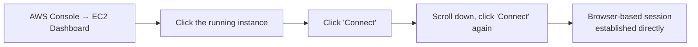
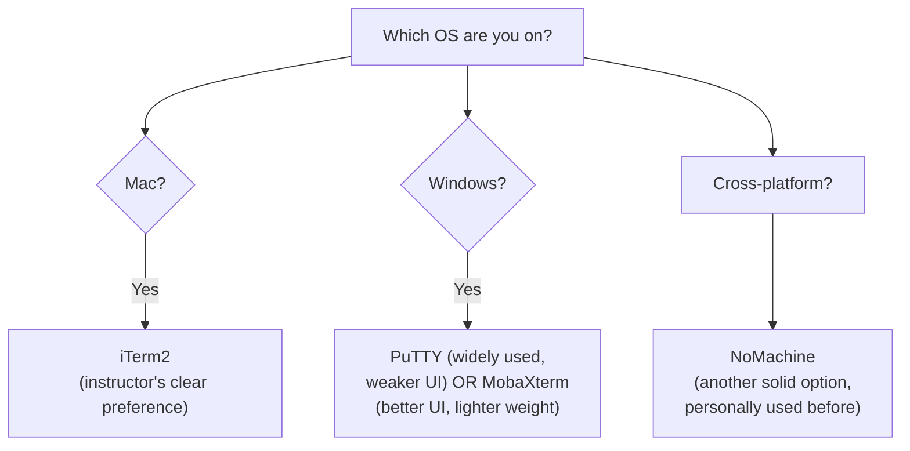
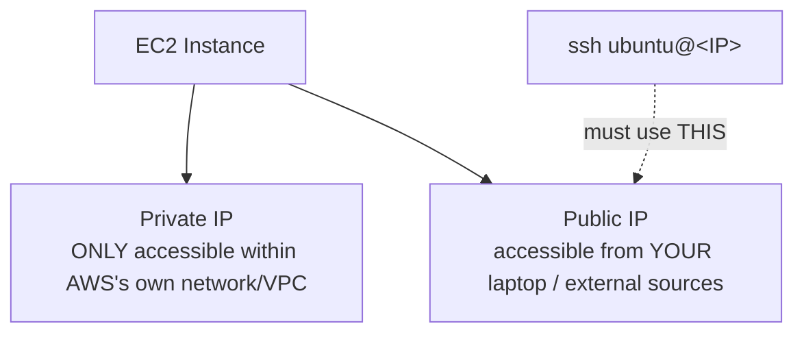
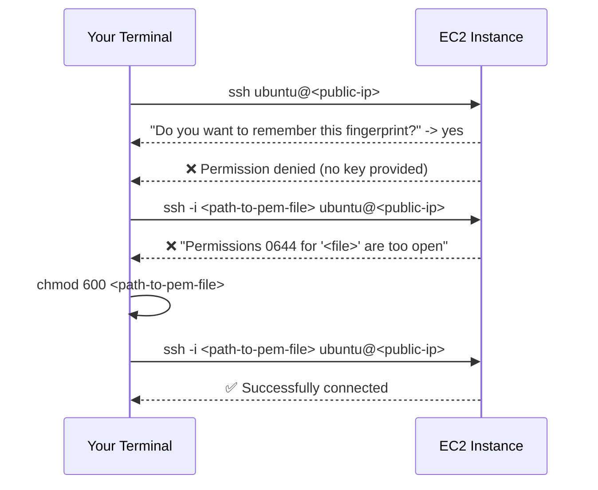
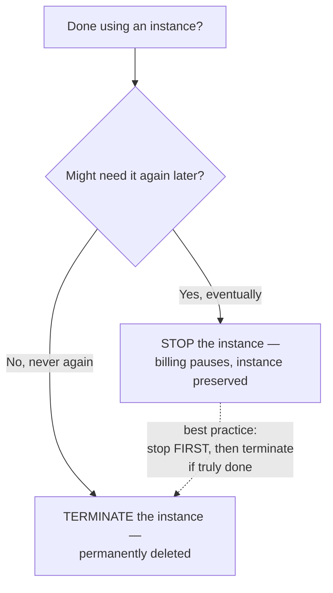
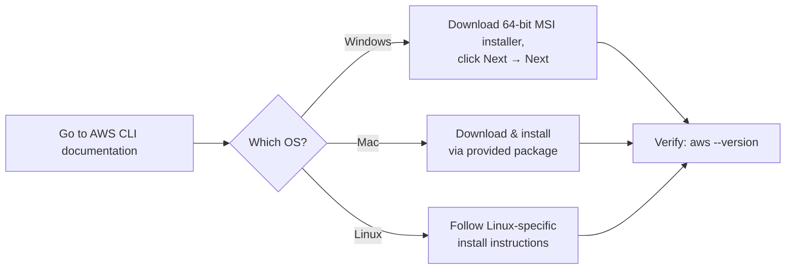
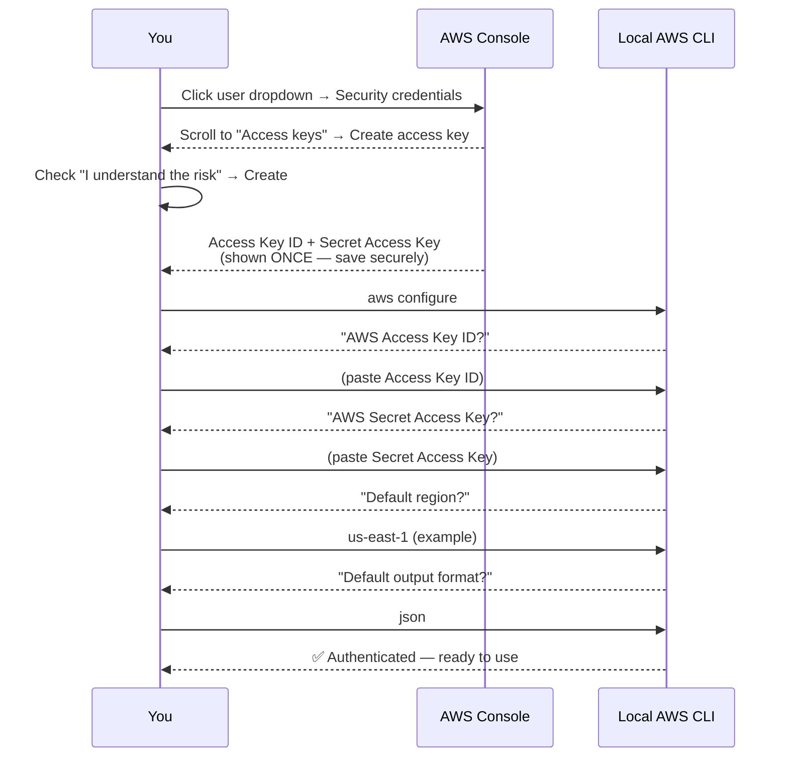
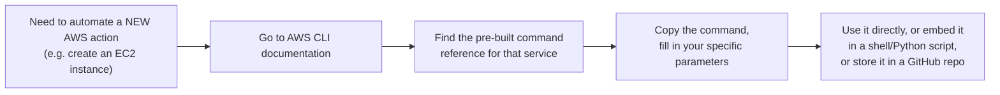
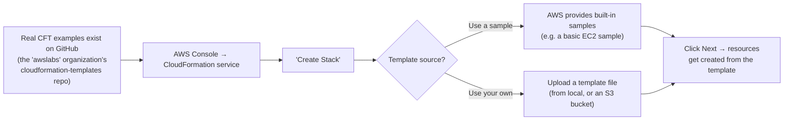

# 🔑 Connecting to EC2 the Right Way: SSH, Terminals & Automating with AWS CLI

- <i>**Session:** DevOps Zero to Hero — Day 5: "AWS CLI Full Guide - How to connect to EC2 Instance from UI & Terminal" · 
- **Instructor:** Abhishek
- **Note on scope:** This session delivers on the two items explicitly deferred from Day 4: logging into a created EC2 instance via terminal, and a live automation demonstration. It covers a full, live SSH walkthrough (including two real, unedited connection failures and their fixes), a terminal-tool comparison, and a genuine live demo of AWS CLI (installation, authentication, S3 commands). AWS CloudFormation Templates (CFT) and Python's `boto3` module are introduced and demonstrated only at a conceptual/preview level — the instructor is explicit that full depth on both is deferred to a future, dedicated **Infrastructure as Code (IaC)** unit, reflected honestly here.</i>

---

## 📑 Table of Contents

1. [Session Overview](#-session-overview)
2. [Learning Objectives](#-learning-objectives)
3. [Detailed Notes](#-detailed-notes)
   - [1. Recap & Today's Two Goals: Login & Automation](#1-recap--todays-two-goals-login--automation)
   - [2. Logging Into an EC2 Instance: Two Methods](#2-logging-into-an-ec2-instance-two-methods)
   - [3. Choosing a Terminal: iTerm, PuTTY, MobaXterm & NoMachine](#3-choosing-a-terminal-iterm-putty-mobaxterm--nomachine)
   - [4. The SSH Connection Walkthrough: Public IP, Permission Denied & chmod 600](#4-the-ssh-connection-walkthrough-public-ip-permission-denied--chmod-600)
   - [5. Stopping vs. Terminating an Instance: The Billing Distinction](#5-stopping-vs-terminating-an-instance-the-billing-distinction)
   - [6. AWS CLI: Installation & Authentication](#6-aws-cli-installation--authentication)
   - [7. AWS CLI in Action: S3 Commands & the EC2 Documentation Pattern](#7-aws-cli-in-action-s3-commands--the-ec2-documentation-pattern)
   - [8. AWS CloudFormation Templates (CFT): A Conceptual Preview](#8-aws-cloudformation-templates-cft-a-conceptual-preview)
   - [9. Automating via AWS API: Python's boto3 Module](#9-automating-via-aws-api-pythons-boto3-module)
4. [Glossary](#-glossary)
5. [Revision Notes — One-Minute Revision](#-revision-notes--one-minute-revision)
6. [Cheat Sheet](#-cheat-sheet)
7. [Interview Questions & Answers](#-interview-questions--answers)
8. [Scenario-Based Interview Questions](#-scenario-based-interview-questions)
9. [Hands-on Exercises](#-hands-on-exercises)
10. [Practice Assignment](#-practice-assignment)
11. [Additional Resources](#-additional-resources)
12. [Final Revision Sheet](#-final-revision-sheet)

---

## 🎯 Session Overview

This session directly continues Day 4's live AWS demo, focusing on making a created EC2 instance genuinely usable and introducing real automation. It covers:

1. A brief **recap** of the virtual-machine journey so far (Days 3-4) and today's two concrete goals: logging in, and automating creation.
2. **Two distinct ways to log into an EC2 instance**: through the AWS Console UI directly, and through a personal terminal via SSH — demonstrated live, back to back, on the exact same instance.
3. A practical **terminal tool comparison** across operating systems: iTerm2 (Mac, the instructor's clear preference), PuTTY and MobaXterm (Windows), and NoMachine (cross-platform) — with genuine, stated personal opinions on each.
4. A **full, live, unedited SSH walkthrough** — including two real connection failures (missing key, then overly-open file permissions) and their exact fixes, using the **public IP address** and the correct `chmod 600` permission fix.
5. The practical distinction between **stopping** and **terminating** an EC2 instance, directly tied to AWS's actual billing model.
6. A complete **AWS CLI setup walkthrough**: installation, creating access keys via the console, and authenticating locally via `aws configure`.
7. A **live AWS CLI demo** using S3 (chosen specifically for being lighter-weight than EC2 for a first demonstration) — listing and creating buckets — plus a tour of how to find pre-built commands in AWS's own documentation for any service, including EC2.
8. A **conceptual, intentionally-shallow preview** of AWS CloudFormation Templates (CFT), explicitly deferred to a future Infrastructure as Code (IaC) unit.
9. A **conceptual preview** of automating AWS via its raw API, using Python's `boto3` module as the concrete example — also explicitly not deep-dived here.

> 💡 **Memory Trick — the instructor's framing for today's practical focus:** *"We've talked a LOT of theory across the last few classes. Today, let's actually get practical."*

---

## 🎯 Learning Objectives

By the end of this guide, you will be able to:

- [ ] Describe both ways to log into an EC2 instance — via the AWS Console UI, and via SSH from a personal terminal — and explain why the terminal approach is the more efficient choice for a working DevOps engineer.
- [ ] Name at least three terminal tools appropriate for connecting to remote servers, matched to the correct operating system, and state the instructor's personal preference for each platform.
- [ ] Correctly distinguish an EC2 instance's public IP from its private IP, and explain why only the public IP works for external SSH connections.
- [ ] Walk through, from memory, the exact SSH command sequence needed to connect to an EC2 instance, including the `-i` flag for specifying a key file.
- [ ] Diagnose and fix the "permissions too open" SSH error using `chmod 600`, and explain precisely why this restriction exists.
- [ ] Explain the practical, billing-driven difference between stopping and terminating an EC2 instance.
- [ ] Install the AWS CLI, create an AWS access key/secret pair, and authenticate locally using `aws configure`.
- [ ] Use basic AWS CLI commands (e.g., `aws s3 ls`, `aws s3 mb`) to interact with AWS resources without using the console UI.
- [ ] Locate and use AWS's own official documentation to find pre-built CLI commands for any AWS service, including EC2 instance creation.
- [ ] Describe, at a conceptual level only, what CloudFormation Templates and Python's `boto3` module are for — without needing to write either from scratch yet.

---

## 📚 Detailed Notes

### 1. Recap & Today's Two Goals: Login & Automation

#### 🧠 Concept

> 💡 **Memory Trick, the recap given directly:** *"In our previous classes, we learned what a virtual machine is, and we looked at how to create virtual machines. Today, we'll learn how to actually log into the virtual machine we've created, and we'll look at the automated ways of creating these virtual machines."*

#### 🎯 Key Takeaways

* This session has exactly **two concrete goals**, stated upfront: (1) logging into an already-created EC2 instance, and (2) exploring automated (non-manual) ways to create instances in the first place.
* This directly continues the automation-options list first introduced in Day 4 (AWS API, CDK, CLI, CFT, Terraform) — today's session actually demonstrates several of them, rather than only naming them.

---

### 2. Logging Into an EC2 Instance: Two Methods

#### ⚙ How It Works — Method 1: Via the AWS Console UI



> 💡 **Memory Trick, demonstrated live:** *"Once connected this way, you can run any command directly — I created a file with `touch abhishek`, ran `ls`, and confirmed it was created. This proves you're genuinely logged in and can execute real instructions on this virtual machine, wherever in the world it physically resides — in this case, North Virginia."*

#### ❓ Why It Exists — And Why It's Not the Efficient Choice

> ⚠️ **Directly, explicitly critiqued:** *"As a DevOps engineer, you might have to log into hundreds of virtual machines every day. You cannot keep going to the AWS console and clicking 'Connect' for each one — and your browser session won't even stay alive for long if you step away from your laptop for a few minutes. This is not an efficient way of doing things."*

#### 🎯 Key Takeaways

* The AWS Console UI **"Connect"** button provides a genuinely functional, browser-based login method — proven live by creating and listing a file.
* This method is explicitly, repeatedly critiqued as **inefficient at scale** — directly consistent with the course's recurring efficiency theme — motivating the terminal-based alternative covered next.
* UI-based sessions also have a practical, real limitation: they **time out** if left idle, unlike a terminal-based SSH session.

---

### 3. Choosing a Terminal: iTerm, PuTTY, MobaXterm & NoMachine

#### 🧠 Concept

> 💡 **Memory Trick, the platform-by-platform recommendations given directly:** *"On Mac, iTerm is the best terminal I'd personally recommend — it takes about a minute to download and install, and I find it much better than the default alternatives. On Windows, the default Command Prompt is genuinely not very user-friendly, so I'd recommend PuTTY, which is widely used — though its interface isn't great either. For a better interface, MobaXterm is another great option."*



#### ⚖ Advantages & Limitations — MobaXterm's Free vs. Paid Tiers

> 💡 **Memory Trick, given directly:** *"With MobaXterm's free account, you can save connections and credentials for around 10 virtual machines. With a paid version, you can go up to somewhere around 100 or 1,000 — I don't remember the exact figure — but the free tier is genuinely usable for learning."*

#### ⚠ Common Mistakes

* Assuming the exact choice of terminal tool matters deeply — explicitly, directly de-emphasized: *"These are all not so important things — you can use any browser or any terminal you're interested in. This is genuinely a personal preference decision."*

#### 🎯 Key Takeaways

* Terminal choice is genuinely **OS-dependent and largely a matter of personal preference** — the instructor's own stated preferences: **iTerm2** (Mac), **MobaXterm** (Windows, preferred over PuTTY for its lighter weight and better interface), and **NoMachine** as another solid, previously-used cross-platform option.
* MobaXterm's free tier supports saving credentials for roughly **10 virtual machines** — genuinely sufficient for learning purposes.
* The specific terminal choice is explicitly de-emphasized as unimportant compared to the underlying SSH connection concepts covered next.

---
### 4. The SSH Connection Walkthrough: Public IP, Permission Denied & chmod 600

#### 📖 Definition — Public IP vs. Private IP

> ⚠️ **A critical, explicitly emphasized distinction:** *"Always use the PUBLIC IP address, not the private one. The private IP is only accessible within the AWS network — within your VPC, depending on your configuration. Think of it as a closed IP network. To connect from your laptop or any external source, you need the public IP specifically."*



#### 🪜 Step-by-Step — The Full, Live, Unedited SSH Sequence



1. **First attempt (no key):** `ssh ubuntu@<public-ip>` — on the very first connection, you'll be asked whether to remember the host's fingerprint; **always say yes**. The connection is then immediately **denied**, because no identity/key file has been provided.
2. **Second attempt (with key, wrong permissions):** `ssh -i <path-to-.pem-file> ubuntu@<public-ip>` — the `-i` flag stands for **identity file**. This still fails, this time with an error about the key file's **permissions being "too open."**
3. **The fix:** `chmod 600 <path-to-.pem-file>` — this changes the file's permissions so only the file's owner can read/write it.
4. **Third attempt (succeeds):** Re-run the same `ssh -i ...` command — this time, the connection succeeds.

#### ❓ Why It Exists — The Reasoning Behind chmod 600

> 💡 **Memory Trick, the precise reasoning given directly:** *"Your `.pem` file is basically a secret file with sensitive information. Sometimes, as a DevOps engineer, your resources might be shared — you might be working from a shared virtual machine or a shared physical server. If your `.pem` file's permissions are left open, someone else with access to that shared machine could read it and log into YOUR AWS instance. That's exactly why `.pem` files must always have restricted, closed permissions."*

#### 💻 Live Demonstration — Proving Both Login Methods Work on the Same Instance

> 💡 **Memory Trick, the verification given directly:** *"After connecting via SSH, I ran `ls` — and the file I'd created earlier through the UI (`abhishek`) was still there, proving it's genuinely the same virtual machine. Then I ran `touch abhishek2` through the terminal, confirming I can create files this way too — proving both the UI and CLI connection methods work correctly, on the exact same instance."*

#### ⚠ Common Mistakes

* Using the instance's private IP address for external SSH connections — will simply never connect, since private IPs are only reachable from within AWS's own network.
* Forgetting to run `chmod 600` on a downloaded `.pem` key file before attempting to use it — a real, live-reproduced, extremely common first-time SSH error.

#### 🎯 Key Takeaways

* Always connect using the **public IP address** — the private IP is only reachable from within AWS's own internal network.
* The full correct SSH command is: `ssh -i <path-to-your-.pem-file> ubuntu@<public-ip>`.
* A `.pem` key file's permissions must be restricted via **`chmod 600`** before it can be used — this exists specifically to prevent other users on a shared machine from reading and misusing your private key.
* Both the AWS Console UI connection and the terminal/SSH connection genuinely reach the **same underlying virtual machine** — proven live by creating files through each method and confirming both are visible from the other.

---

### 5. Stopping vs. Terminating an Instance: The Billing Distinction

#### 📖 Definition

> 💡 **Memory Trick, the precise distinction given directly:** *"AWS bills you depending on how much time your server spends in the 'start' or 'active'/'running' state. Stopping an instance pauses it (and its billing) without deleting it — useful when you're done using it for now but might need it again. Terminating an instance deletes it completely and permanently."*



> 💡 **Memory Trick, the stated best practice:** *"A better practice is generally to stop the instance first, and only terminate it once you're genuinely certain you're done with it completely."*

#### 🎯 Key Takeaways

* AWS bills EC2 instances based on time spent in a **running/active** state — this is the direct, practical motivation for stopping unused instances promptly.
* **Stopping** pauses an instance (and its billing) while preserving it for future use; **terminating** permanently and completely deletes it.
* The stated best practice: **stop first**, and only terminate once you're genuinely certain the instance is no longer needed at all.

---
### 6. AWS CLI: Installation & Authentication

#### 📖 Definition

> 💡 **Memory Trick, stated directly:** *"AWS CLI is a command-line interface — using it, you can directly interact with your AWS API, or your AWS account, and create any resource on AWS. AWS provides hundreds of services today, and every one of them can be created and managed through this automated way, using AWS CLI."*

#### 🪜 Step-by-Step — Installation



> 💡 **Memory Trick, the verification step:** *"To check whether AWS CLI installed correctly, simply run `aws --version`. If you get a version-string output, you're good — but just installing the binary alone doesn't actually DO anything for you yet. This binary doesn't know your account information."*

#### 🔍 Internal Working — Why Installing the CLI Alone Isn't Enough

> ⚠️ **Directly, precisely stated:** *"If I run `which aws`, it just shows me a binary — this binary doesn't have my user information or my account information. First, I have to authenticate with my AWS account."*

#### 🪜 Step-by-Step — Creating Access Keys & Authenticating



> ⚠️ **A direct, urgent security warning, given twice:** *"Please, please, please do NOT share this information with anybody — the access key ID and especially the secret access key. Always keep this information as safe as you would any other sensitive credential. Once I'm done recording, I'll delete this access key entirely."*

#### 🎯 Key Takeaways

* Installing the AWS CLI binary alone accomplishes nothing on its own — it has **no knowledge of your specific AWS account** until you authenticate it.
* Authentication requires generating an **Access Key ID and Secret Access Key** via the AWS Console (**user dropdown → Security credentials → Access keys**), then feeding them into the local CLI via `aws configure`.
* Access keys are **genuinely sensitive credentials** — explicitly, repeatedly emphasized as something to never share and to store securely, exactly like a password.
* Once `aws configure` is complete (Access Key ID, Secret Access Key, default region, default output format), every subsequent CLI command runs authenticated against your specific AWS account.

---

### 7. AWS CLI in Action: S3 Commands & the EC2 Documentation Pattern

#### 💻 Live Demonstration — Why S3, Not EC2, for the First Demo

> 💡 **Memory Trick, the reasoning given directly:** *"S3 buckets are very lightweight — creating an AWS EC2 instance via CLI would require several more pieces of information (image ID, instance type, key pair, security group, subnet ID), so I'm demonstrating with S3 first to keep things simple."*

#### 💻 Code Example — Listing and Creating S3 Buckets

```bash
# List all S3 buckets in your account
aws s3 ls

# Create ("make bucket") a new S3 bucket -- bucket names must be globally unique
aws s3 mb s3://your-unique-bucket-name-here
```

> 💡 **Memory Trick, the live verification given directly:** *"I ran `aws s3 ls`, and it correctly showed the same three S3 buckets I could already see in the AWS Console UI — proving the CLI is genuinely pulling real, accurate information from my account, not something separate or fake."*

#### 🔍 Internal Working — Finding the Right Command for Any Service



> 💡 **Memory Trick, stated directly:** *"For EC2 specifically, the documented command is essentially 'create instance' — but you have to supply the image information, instance type, key pair location, security group, and subnet ID. I'm not walking through every detail here — you'll be able to read the documentation and figure this out; it's genuinely not a big deal. All the important groundwork is: create your security credentials, authenticate, and then you can follow this reference documentation directly — copy these pre-built commands into a shell script, a Python script, or store them in your GitHub repository for reuse."*

#### ⚠ Common Mistakes

* Assuming you need to memorize every AWS CLI command from scratch — explicitly, directly corrected: AWS's own documentation provides ready-to-use, pre-built commands for every service, meant to be copied and adapted, not memorized.

#### 🎯 Key Takeaways

* **S3** is used as the first live CLI demo specifically because it requires far less setup information than EC2 — a deliberate, pedagogically-sound simplification, not a limitation of the CLI itself.
* `aws s3 ls` and `aws s3 mb <bucket-name>` are demonstrated live, with results directly cross-verified against the AWS Console UI.
* AWS's own official documentation provides **pre-built, ready-to-copy commands** for every service — including the full EC2 instance-creation command — meant to be adapted and reused (in shell scripts, Python scripts, or version-controlled in a GitHub repository), not memorized from scratch.

---
### 8. AWS CloudFormation Templates (CFT): A Conceptual Preview

#### 📖 Definition

> 💡 **Memory Trick, given directly:** *"CloudFormation Templates are another way of talking to your AWS API. Remember, CFT and Terraform both fall into a broader concept called Infrastructure as Code (IaC) — which we'll deal with in future videos. For now, I'm not going into the details."*

#### 🪜 Step-by-Step — What Was Demonstrated (Conceptually)



> 💡 **Memory Trick, the source for real examples given directly:** *"There's a GitHub organization called 'awslabs,' with a repository called 'cloudformation-templates' — you can browse by service (e.g., EC2) and find real, working example templates. Even I would refer to examples like this rather than trying to remember the entire templating syntax myself."*

#### ⚠ Honesty Note

> ⚠️ **Directly, explicitly stated:** *"I'm not going into the details of CloudFormation Templates — why I'm not explaining or showing you how to build these from scratch is because they fall into a different category, Infrastructure as Code, which we'll cover in future videos. Don't worry if you're not familiar with this yet — for today, understanding that this is one more way to create AWS resources is more than enough."*

#### 🎯 Key Takeaways

* CFT is a **templating language** for defining AWS infrastructure declaratively — you provide a structured template, and AWS provisions the resources it describes.
* Real, working CFT examples are available in AWS's own public **`awslabs/cloudformation-templates`** GitHub repository — even the instructor states he'd reference these rather than writing CFT syntax from memory.
* Deep CFT coverage is **explicitly, deliberately deferred** to a future Infrastructure as Code (IaC) unit — this session intentionally stops at "you know this exists and roughly how it works."

---

### 9. Automating via AWS API: Python's boto3 Module

#### 📖 Definition

> 💡 **Memory Trick, given directly:** *"Using the AWS API directly, you either write a shell script, or use your favorite programming language. In my case, for Python specifically, there's a very well-maintained module called `boto3` — with excellent documentation."*

#### 💻 Code Example — Listing Running EC2 Instances (Conceptual)

```python
import boto3

# boto3 can automatically pick up credentials from the same
# configuration file created by "aws configure" -- no separate
# authentication step is required if you've already run it.

ec2 = boto3.client("ec2")
response = ec2.describe_instances()
# ... process the response to list running instances ...
```

> 🛠️ **Reconstructed for completeness:** the instructor describes this exact script conceptually ("a very simple script... will list running EC2 instances... import boto3, and then these are the simple steps you'd write in Python") without narrating every line on screen — the shape above is a faithful, standard `boto3` reconstruction of the described logic, not a verbatim transcript.

#### 🔍 Internal Working — Why Separate Authentication Isn't Needed

> 💡 **Memory Trick, the key convenience point stated directly:** *"Once you've already run `aws configure` — which I showed earlier — that's more than enough, because `boto3` can pick up the same credential information directly from your AWS configuration file. You don't need a separate authentication step for Python specifically."*

#### ⚠ Honesty Note

> ⚠️ **Directly, explicitly stated:** *"We're not going into the details of `boto3` and how to actually write these scripts in this session — but if you don't know how, don't worry, `boto3`'s documentation is genuinely excellent, and you can learn the exact request/response handling from there directly."*

#### 🎯 Key Takeaways

* `boto3` is Python's official, well-documented SDK for making direct calls to any AWS API — used here as the concrete example of "using the AWS API directly" via a real programming language.
* `boto3` **reuses the same credentials** already configured via `aws configure` — no separate, Python-specific authentication step is required.
* Deep `boto3` scripting is **explicitly deferred** — this session establishes only that it exists, what it's for, and that it shares your existing CLI credentials.

---
## 📝 Glossary

| Term | Definition | Why It Matters |
|---|---|---|
| **Public IP** | The externally-reachable IP address of an EC2 instance | Required for connecting via SSH from your own laptop |
| **Private IP** | The internal IP address, only reachable within AWS's own network/VPC | Will NOT work for external SSH connections |
| **`.pem` file** | The private key file downloaded when creating an EC2 key pair | Required (with `-i` flag) to authenticate an SSH connection |
| **`chmod 600`** | The command restricting a file's permissions to owner-only read/write | Required before a `.pem` file can be used for SSH -- prevents key theft on shared machines |
| **Stop (an instance)** | Pausing an EC2 instance and its associated billing, without deleting it | The recommended first step when done using an instance |
| **Terminate (an instance)** | Permanently and completely deleting an EC2 instance | Only used once you're certain the instance is no longer needed |
| **AWS CLI** | Command-line interface for directly interacting with any AWS service/API | The most accessible AWS automation tool, requiring no programming language |
| **`aws configure`** | The command that authenticates the local AWS CLI with your account credentials | Required before any authenticated CLI command will work |
| **Access Key ID / Secret Access Key** | The credential pair used to authenticate AWS CLI (and `boto3`) with your account | Genuinely sensitive -- must never be shared, exactly like a password |
| **`boto3`** | Python's official SDK module for making direct calls to AWS APIs | Reuses the same credentials already set via `aws configure` |
| **CFT (CloudFormation Templates)** | AWS's native infrastructure templating language | One of several AWS automation options; deep coverage deferred to a future IaC unit |
| **Infrastructure as Code (IaC)** | The broader concept covering CFT, Terraform, and similar declarative-infrastructure tools | Named as a distinct, future dedicated topic in this course |

---

## 🔄 Revision Notes — One-Minute Revision

* This session delivers two things explicitly deferred from Day 4: **logging into an EC2 instance** and a **live automation demo**.
* An EC2 instance can be accessed two ways: through the **AWS Console UI's "Connect" button** (functional, but explicitly critiqued as inefficient at scale, and prone to session timeouts) or through a **personal terminal via SSH** (the DevOps-appropriate approach).
* Terminal choice is largely personal preference, OS-dependent: **iTerm2** (Mac, instructor's clear favorite), **PuTTY** or **MobaXterm** (Windows -- MobaXterm preferred for a lighter, better interface), and **NoMachine** (another solid cross-platform option).
* The full, live, unedited SSH walkthrough: connecting requires the instance's **public IP** (never the private IP, which is AWS-network-internal only); the first connection attempt fails with "permission denied" (no key provided); the second attempt (`ssh -i <path-to-pem> ubuntu@<ip>`) fails again with a "permissions too open" error; the fix is **`chmod 600 <path-to-pem>`**, after which the connection succeeds.
* `.pem` files must have restricted permissions specifically to prevent other users on a **shared machine** from reading and misusing your private key.
* **Stopping** an instance pauses it (and its billing) without deleting it; **terminating** permanently deletes it -- the recommended practice is to stop first, terminate only once genuinely certain.
* **AWS CLI** setup requires: installing the binary (verified via `aws --version`), generating an **Access Key ID + Secret Access Key** via the AWS Console (Security credentials), and authenticating locally via **`aws configure`** (access key, secret, default region, default output format).
* A live demo used **S3** (`aws s3 ls`, `aws s3 mb`) as a lightweight first example -- cross-verified against the Console UI -- before pointing to AWS's own documentation for the more involved, pre-built EC2-creation command.
* **AWS CloudFormation Templates (CFT)** and **Python's `boto3` module** were both introduced only conceptually -- real examples were shown (the `awslabs` GitHub repo for CFT; a basic script shape for `boto3`, which reuses `aws configure`'s credentials) -- but full depth on both is explicitly deferred to a future, dedicated **Infrastructure as Code (IaC)** unit.

---

## 📋 Cheat Sheet

**The correct SSH connection sequence:**
```bash
# 1. First attempt fails -- no key provided
ssh ubuntu@<public-ip>

# 2. Second attempt fails -- key permissions too open
ssh -i /path/to/your-key.pem ubuntu@<public-ip>

# 3. Fix permissions
chmod 600 /path/to/your-key.pem

# 4. Now it succeeds
ssh -i /path/to/your-key.pem ubuntu@<public-ip>
```

**Public IP vs. private IP:**
```text
Public IP  -> use THIS for SSH from your laptop
Private IP -> AWS-internal/VPC only -- will NOT work externally
```

**Stop vs. terminate:**
```text
Stop      -> pauses billing, instance preserved (recommended first step)
Terminate -> permanently deletes the instance
```

**AWS CLI setup:**
```bash
aws --version              # verify installation
aws configure               # authenticate: access key, secret, region, output format
aws s3 ls                    # list S3 buckets
aws s3 mb s3://bucket-name    # create ("make bucket") an S3 bucket
```

**Terminal picks by OS:**
```text
Mac      -> iTerm2
Windows   -> MobaXterm (preferred) or PuTTY
Cross-plat -> NoMachine
```

**Automation options recap (from this + prior session):**
```text
AWS Console UI  -> manual, functional but inefficient at scale
AWS CLI          -> command-line, no programming required
boto3 (Python)    -> direct API access, reuses `aws configure` credentials
CFT                -> templating language (deep dive: future IaC unit)
Terraform            -> multi-cloud (deep dive: future dedicated class)
```

---

## 🔥 Interview Questions & Answers

### 🟢 Beginner

**Q1.**

**Question:** Name the two ways to log into an EC2 instance covered in this session.

**Answer:** Through the AWS Console UI's "Connect" button, and through a personal terminal via SSH.

**Explanation:** Both demonstrated live, back to back, on the same instance.

**Why Interviewers Ask This:** Foundational, practical AWS knowledge.

**Possible Follow-up:** "Which approach is more efficient for a DevOps engineer managing many instances, and why?"

**Q2.**

**Question:** Why must you use an EC2 instance's public IP, not its private IP, to SSH in from your own laptop?

**Answer:** The private IP is only reachable from within AWS's own internal network/VPC -- external connections require the public IP.

**Explanation:** Directly, explicitly emphasized in the session.

**Why Interviewers Ask This:** A basic but frequently-tripped-over networking distinction.

**Possible Follow-up:** "In what scenario would the private IP actually be the correct one to use?"

**Q3.**

**Question:** What does the `-i` flag mean in an SSH command?

**Answer:** It specifies the identity file -- the private key file used to authenticate the connection.

**Explanation:** Directly, precisely defined.

**Why Interviewers Ask This:** Basic, practical SSH command syntax.

**Possible Follow-up:** "What file format does an AWS EC2 key pair typically use?"

**Q4.**

**Question:** What command fixes the "permissions too open" SSH error, and what does it actually do?

**Answer:** `chmod 600 <path-to-pem-file>` -- it restricts the key file's permissions so only its owner can read/write it.

**Explanation:** Directly, live-demonstrated as the exact fix for a real, reproduced error.

**Why Interviewers Ask This:** A genuinely common, practical first-time AWS user error.

**Possible Follow-up:** "Why does AWS/SSH specifically reject overly-open key file permissions?"

**Q5.**

**Question:** What's the difference between stopping and terminating an EC2 instance?

**Answer:** Stopping pauses the instance (and its billing) without deleting it; terminating permanently and completely deletes it.

**Explanation:** Directly, precisely defined, tied to AWS's billing model.

**Why Interviewers Ask This:** Practical, cost-relevant AWS operational knowledge.

**Possible Follow-up:** "What's the recommended best practice ordering between the two?"

**Q6.**

**Question:** What two pieces of information does `aws configure` require to authenticate the CLI?

**Answer:** An Access Key ID and a Secret Access Key (plus a default region and output format).

**Explanation:** Directly, precisely walked through live.

**Why Interviewers Ask This:** Basic, essential AWS CLI setup knowledge.

**Possible Follow-up:** "Where in the AWS Console do you generate these credentials?"

**Q7.**

**Question:** Why did the instructor demonstrate AWS CLI using S3 rather than EC2 first?

**Answer:** S3 is lightweight and requires far less setup information than EC2, which needs an image ID, instance type, key pair, security group, and subnet ID.

**Explanation:** Directly, explicitly stated as a deliberate teaching choice.

**Why Interviewers Ask This:** Tests understanding of why a specific example was chosen, not just recall of the commands.

**Possible Follow-up:** "What pieces of information does creating an EC2 instance via CLI require?"

**Q8.**

**Question:** Does installing the AWS CLI binary alone let you interact with your AWS account?

**Answer:** No -- the binary has no knowledge of your specific account until you authenticate it via `aws configure`.

**Explanation:** Explicitly, directly clarified in the session.

**Why Interviewers Ask This:** Prevents a common beginner misunderstanding about CLI installation vs. authentication.

**Possible Follow-up:** "What command would you run to verify the CLI installed correctly, before even authenticating?"

**Q9.**

**Question:** What does `boto3` use for authentication, and why is this convenient?

**Answer:** `boto3` automatically picks up credentials from the same configuration file created by `aws configure` -- no separate, Python-specific authentication step is required.

**Explanation:** Directly, explicitly stated as a genuine convenience.

**Why Interviewers Ask This:** Practical knowledge for anyone automating AWS with Python.

**Possible Follow-up:** "What Python module is named as AWS's official SDK?"

**Q10.**

**Question:** Where can you find real, working CloudFormation Template examples, per this session?

**Answer:** The `awslabs` organization's `cloudformation-templates` repository on GitHub.

**Explanation:** Directly, specifically named.

**Why Interviewers Ask This:** A practical, real-world resource-discovery skill.

**Possible Follow-up:** "Why does even the instructor say he'd reference these examples rather than writing CFT syntax from memory?"

---

### 🟡 Intermediate

**Q11.**

**Question:** Explain, precisely, why AWS Console UI-based EC2 access is critiqued as inefficient, connecting this to the course's broader DevOps philosophy.

**Answer:** The session directly ties this critique back to DevOps's core, repeated efficiency principle: a DevOps engineer might need to log into hundreds of virtual machines daily, and manually navigating to the Console, clicking the instance, then "Connect," then "Connect" again for each one is a repetitive, non-scalable manual process -- directly analogous to the "100 manual VM creation requests" inefficiency example from the prior session. Additionally, UI-based sessions have a genuine, practical limitation (session timeouts on inactivity) that terminal-based SSH connections don't share, making the UI approach doubly unsuited to sustained, repeated professional use.

**Explanation:** Requires connecting this session's specific critique to the course's consistently-repeated efficiency theme.

**Why Interviewers Ask This:** Tests whether a learner sees this as an isolated tip or part of a coherent, repeated philosophy.

**Possible Follow-up:** "How would you further automate even the SSH-based login process itself, to avoid manually typing the command for each of many instances?"

**Q12.**

**Question:** A learner successfully connects via SSH but is confused why their FIRST attempt (`ssh ubuntu@<ip>`, no `-i` flag) failed differently than their SECOND attempt (`ssh -i <pem> ubuntu@<ip>`, wrong permissions). Explain the precise difference between these two failure modes.

**Answer:** The first failure ("permission denied") occurs because no key/identity file was provided at all -- SSH has no credential to attempt authentication with, so it's rejected immediately and generically. The second failure ("permissions too open") occurs at a different stage: a key file WAS provided, but SSH's own security check refuses to even attempt using it, because the file's permissions are insufficiently restricted (readable by users other than the owner) -- SSH treats an overly-permissive key file as a potential security risk regardless of whether the key itself is actually valid. These are two genuinely different checks failing at two different points in the connection attempt, not the same underlying problem manifesting differently.

**Explanation:** Requires precisely distinguishing two different failure modes that a learner might otherwise conflate as "the same kind of error."

**Why Interviewers Ask This:** Tests genuine, mechanistic understanding of SSH's security checks, not just memorized command syntax.

**Possible Follow-up:** "Would `chmod 600` have fixed the FIRST failure (no key provided) on its own? Why or why not?"

**Q13.**

**Question:** Explain why the instructor emphasizes "stop first, then terminate" as best practice, rather than simply terminating instances immediately when done.

**Answer:** Stopping preserves the instance (and, critically, its associated configuration, attached storage, and any data) while pausing billing -- giving you the flexibility to resume using the exact same instance later if your assessment that you're "done" turns out to be premature. Terminating is permanent and irreversible -- the instance and its data are gone. The "stop first" practice is a genuine safety buffer: it captures the immediate billing benefit of not running an unused instance, without foreclosing the option to reconsider, whereas immediate termination forecloses that option entirely the moment it's executed.

**Explanation:** Requires reasoning through the practical risk/reversibility trade-off behind the stated best practice, not just repeating the rule.

**Why Interviewers Ask This:** Tests understanding of WHY a specific operational practice is recommended, not just recall that it is.

**Possible Follow-up:** "Does a stopped (but not terminated) instance incur ANY cost at all? What might still be billed?"

**Q14.**

**Question:** Explain why the instructor explicitly declines to teach CFT and `boto3` syntax in depth during this session, and connect this to the course's broader teaching philosophy.

**Answer:** The instructor explicitly states both CFT and Terraform belong to a broader concept -- Infrastructure as Code (IaC) -- which has its own dedicated, future coverage in the course; teaching CFT syntax in depth here would be redundant with that future unit and would also require introducing IaC concepts prematurely, out of their proper sequence. This reflects the same deliberate scope-management philosophy observed in Day 4 (skipping security groups/VPCs) and elsewhere in this course series: introducing WHAT a tool/concept is and WHY it exists at the appropriate point in the curriculum, while deferring detailed HOW-TO instruction to that concept's own properly-sequenced, dedicated session.

**Explanation:** Requires connecting this specific scope decision to the broader, repeated pedagogical pattern across the course.

**Why Interviewers Ask This:** Tests awareness of deliberate curriculum sequencing as a genuine teaching skill.

**Possible Follow-up:** "What risk might arise if a learner tried to use CFT in a real production project immediately after only this session's brief introduction?"

**Q15.**

**Question:** Explain precisely why `boto3` not requiring separate authentication (beyond `aws configure`) is a meaningful design convenience, rather than an incidental detail.

**Answer:** This design choice means a DevOps engineer's authentication setup is genuinely centralized and reusable across every automation approach they might choose -- AWS CLI commands, Python scripts using `boto3`, and (implicitly) other AWS SDKs in other languages can all draw from the same underlying credential configuration, rather than requiring separate, redundant authentication setups for each tool. This directly reduces the operational overhead of maintaining multiple automation approaches side by side (e.g., using CLI for quick ad-hoc tasks and `boto3` for more complex scripted logic within the same project) without needing to manage or synchronize multiple separate credential stores.

**Explanation:** Requires reasoning through the practical, cross-tool benefit of this shared-credentials design, beyond simply restating that it exists.

**Why Interviewers Ask This:** Tests whether a learner understands the genuine architectural value of credential centralization, not just the isolated fact.

**Possible Follow-up:** "What security risk might this shared-credential convenience introduce, if the underlying `aws configure` credentials themselves were compromised?"

---

### 🔴 Advanced

**Q16.**

**Question:** Design a secure, team-oriented workflow for managing `.pem` key files across a DevOps team of five engineers who all need SSH access to a shared pool of EC2 instances, using only concepts covered in this and prior sessions.

**Answer:** A reasonable workflow: (1) **Individual key pairs per engineer, not shared keys** -- rather than distributing one shared `.pem` file (which would violate the exact "shared machine, exposed key" risk this session explicitly warns against), each engineer should have their own distinct SSH key pair registered with AWS, ideally added as an authorized key on each instance rather than relying on the original instance-creation key pair being shared; (2) **Consistent `chmod 600` enforcement** -- every engineer's local key storage should have this permission restriction applied immediately upon download, ideally automated via a setup script rather than relying on each individual remembering to do it manually; (3) **Centralized key rotation policy** -- since access keys/key pairs represent a real security surface (per this session's own repeated warnings about credential sensitivity), establish a policy for periodically rotating keys and immediately revoking access for any departing team member; (4) **Avoid storing `.pem` files in version control** -- directly extending this session's "never share your access key/secret" warning to the parallel case of SSH key files, which should never be committed to a Git repository even a private one. This workflow directly extends the session's individual-security-hygiene lessons (chmod 600, never sharing credentials) into a genuine team-scale operational policy.

**Explanation:** Synthesizes individual security practices from this session into a coherent, team-scale operational design -- genuine extension beyond the single-user scenario actually demonstrated.

**Why Interviewers Ask This:** A realistic, senior-level operational security question testing whether a candidate can scale individual best practices into team/organizational policy.

**Possible Follow-up:** "How would you handle emergency access if an engineer's laptop (with their key pair) is lost or stolen?"

**Q17.**

**Question:** Critically evaluate: "Since `aws s3 ls` correctly showed the same buckets visible in the Console UI, AWS CLI and the Console UI are simply two interchangeable interfaces with zero meaningful difference beyond appearance." Is this accurate?

**Answer:** Not fully accurate, though the specific demonstrated equivalence (CLI output matching Console UI display) is genuinely true for that specific read-only query. The session elsewhere explicitly establishes a real, meaningful difference: the Console UI requires manual, repeated human interaction for each action (directly critiqued as inefficient at scale in Section 2), while CLI commands can be scripted, automated, version-controlled, and executed programmatically without per-action human involvement -- precisely the efficiency distinction motivating this entire session's shift from Console-based to CLI-based interaction. The specific S3 listing example demonstrates that both interfaces access the SAME underlying account data (a genuine, important point about data consistency across interfaces) -- but this doesn't mean the interfaces themselves are functionally interchangeable for all purposes; CLI's genuine advantage is automatability, not merely being "a different way to see the same thing."

**Explanation:** Tests whether a learner over-generalizes a specific, narrow demonstrated equivalence (matching data) into an inaccurate claim about the interfaces being functionally interchangeable in all respects.

**Why Interviewers Ask This:** Distinguishes candidates who track the precise scope of a demonstrated point from those who round it into an overly broad claim.

**Possible Follow-up:** "Name a task that AWS CLI can do that the Console UI genuinely cannot (or can only do with significant added difficulty)."

**Q18.**

**Question:** Synthesize this session's public/private IP distinction (Section 4) with Day 3's "logical vs. physical" virtualization distinction to explain why an EC2 instance's public IP is best understood as another layer of logical abstraction, not a physical property of the underlying hardware.

**Answer:** Per Day 3's core lesson, an EC2 instance itself is a LOGICAL partition of a physical server -- it has no fixed, exclusive physical hardware identity of its own. Its public IP address, similarly, is a logically-assigned network identifier managed by AWS's infrastructure (specifically, by the hypervisor/networking layer, not by any physical property inherent to a specific piece of hardware) -- it can be reassigned, can change if the instance is stopped and restarted (unless an Elastic IP is specifically used, a detail beyond this session's scope but a reasonable inference from the logical-allocation pattern established), and exists as a routing/addressing abstraction AWS maintains, not as something physically "burned into" the server. This directly extends Day 3's core insight (VMs are logical, not physical, entities) to the networking layer: even the IP address you use to reach your VM is itself a logical, AWS-managed abstraction, consistent with everything else about how virtual machines are provisioned and accessed.

**Explanation:** Requires connecting a networking detail from this session to the foundational virtualization concept established two sessions earlier -- non-obvious, cross-session synthesis.

**Why Interviewers Ask This:** A capstone-level infrastructure question testing whether a candidate sees the underlying conceptual consistency between virtualization and cloud networking, rather than treating them as unrelated topics.

**Possible Follow-up:** "What AWS feature (not covered in this session, but inferable from this reasoning) would let you assign a FIXED public IP that doesn't change even if the underlying instance is stopped and restarted?"

---

## 🧪 Scenario-Based Interview Questions

> **Scenario 1:** A new team member reports they can successfully SSH into an EC2 instance from their own laptop, but a teammate using the exact same `.pem` file (copied via a shared drive) cannot connect at all, receiving a "permissions too open" error. Using this session's concepts, diagnose this.

**Structured Answer:**
1. **Initial investigation:** Recognize this as directly matching the exact error this session live-demonstrates and explains -- the teammate's LOCAL copy of the `.pem` file likely has overly-permissive file permissions on their specific machine, even though the original file (and the new team member's own copy) may be correctly restricted.
2. **Metrics/logs to check:** Check the exact permissions on the teammate's local copy of the file (e.g., via `ls -l` on the file), comparing it against the expected `600` (owner read/write only) restriction.
3. **Possible causes:** Copying a file via a shared drive or certain file-transfer methods can sometimes reset or fail to preserve strict file permissions -- the teammate's copy may have inherited broader default permissions than the original.
4. **Debugging approach:** Have the teammate run `chmod 600` on their own local copy of the `.pem` file, directly applying this session's exact demonstrated fix.
5. **Resolution:** Confirm the teammate can now connect successfully after applying the permission fix locally -- the underlying key itself was never the problem; only the local file's permission state was.
6. **Prevention:** Document, as part of team onboarding, that `.pem` files must always have `chmod 600` applied immediately after being obtained on ANY new machine -- regardless of whether the file worked correctly elsewhere -- since file permissions are a local, per-machine property, not an inherent property of the file's contents that transfers automatically.

> **Scenario 2 (Advanced):** Your organization currently has engineers manually creating and managing S3 buckets via the AWS Console UI, one at a time, as needed. Leadership has asked you to propose an automation approach, referencing what this session covers. Provide your recommendation.

**Structured Answer:**
1. **Initial investigation:** Assess the actual scale and pattern of bucket creation -- per Section 2's efficiency critique, manual, one-at-a-time console usage is explicitly flagged as inefficient specifically at meaningful scale/repetition, so first confirm this genuinely is a repeated, scalable pain point (not a rare, one-off task where manual creation remains perfectly reasonable).
2. **Relevant principle:** Per Section 7, AWS CLI is demonstrated as a genuinely lightweight, accessible option for exactly this kind of S3 operation (`aws s3 mb`), requiring no programming language expertise -- a strong first recommendation given the session's own explicit choice of S3 as "the lightweight example."
3. **Possible causes for the current manual approach persisting:** Likely simple unfamiliarity with AWS CLI setup (installation + `aws configure`) rather than any genuine technical barrier, since the session demonstrates this setup as straightforward.
4. **Debugging/evaluation approach:** Determine whether bucket-creation requests follow a genuinely predictable pattern (e.g., consistent naming conventions, consistent configuration) that would benefit from being scripted/templated, versus requiring case-by-case human judgment that might still warrant some manual oversight.
5. **Resolution:** Recommend AWS CLI as the immediate, low-effort first step (directly modeled on this session's own S3 demo) -- providing the team with pre-built, documented commands (per Section 7's "copy from AWS documentation" pattern) they can incorporate into simple shell scripts, avoiding the need for deeper IaC tooling (CFT/Terraform) unless bucket creation needs grow considerably more complex or require fuller declarative infrastructure management.
6. **Prevention:** Provide the team with the same onboarding path this session itself follows -- CLI installation, access key creation, `aws configure` -- as a standard, documented internal process, directly reducing the friction that likely caused manual console usage to persist in the first place.

---

## 🛠 Hands-on Exercises

### 🟢 Easy

1. Launch a free-tier EC2 instance (reusing your setup from the prior session if still available), and connect to it BOTH via the AWS Console UI's "Connect" button AND via SSH from your terminal -- create a distinct file through each method and confirm both are visible from the other connection.
2. Deliberately reproduce this session's exact two SSH failures (no key provided; then key with wrong permissions) on your own instance, documenting the exact error messages you receive, before applying `chmod 600` to fix it.
3. Install the AWS CLI on your own machine, verify the installation with `aws --version`, create an access key via the AWS Console, and authenticate locally using `aws configure`.

### 🟡 Medium

4. Using AWS CLI, list your S3 buckets (`aws s3 ls`) and create a new, uniquely-named bucket (`aws s3 mb`) -- cross-verify the new bucket appears correctly in the AWS Console UI.
5. Navigate to the AWS CLI documentation, find the pre-built command reference for creating an EC2 instance (`run-instances`), and document all the required parameters, connecting each one back to the equivalent field from the manual Console-based launch process (Day 4's session).
6. Browse the `awslabs/cloudformation-templates` GitHub repository, find a real EC2-related CFT example, and write a short summary (150-200 words) of what you can infer about its structure, even without deep CFT training.

### 🔴 Advanced

7. Implement the team-oriented `.pem` key management workflow proposed in Advanced Interview Q16, documenting each policy element and its specific security justification.
8. Write a short technical document (300-400 words) addressing the automation recommendation scenario from Scenario 2, tailored to a hypothetical organization of your own choosing.
9. Research (outside this transcript) and write a basic, working `boto3` Python script that lists your running EC2 instances, directly extending the conceptual example from Section 9 into genuinely executable code.

---

## 🏗 Practice Assignment

*(This session's own stated assignment, reproduced faithfully)*

> 💡 **Memory Trick -- the instructor's own words, given directly:** *"The assignment I want to give here is to install the AWS CLI package on your own, create the security credentials, and authenticate your AWS using your terminal -- you can use PuTTY, MobaXterm, or any other terminal you want. Make a call with your AWS -- you can create an S3 bucket, list S3 buckets, create or list EC2 instances -- whatever you want to do. Just go through the AWS documentation and follow the commands."*

### Build: "AWS CLI Onboarding Checklist"

**Objective:** Complete this session's own stated assignment end to end, and document your process as a reusable onboarding checklist for a future new team member.

**Requirements:**
- Install AWS CLI on your own machine and verify with `aws --version`.
- Create AWS access credentials and authenticate via `aws configure`.
- Successfully run at least two different AWS CLI commands of your own choosing (e.g., listing S3 buckets, listing EC2 instances, creating a bucket) -- beyond the exact commands demonstrated live in this session.
- Document each step you took, including any errors you encountered and how you resolved them (directly modeling this session's own honest, unedited error-and-fix demonstrations).
- Produce a clean, reusable checklist document suitable for onboarding a future team member through this same process.

**Architecture (suggested):**

```text
aws_cli_onboarding/
├── 01_installation_notes.md      # your OS-specific install process
├── 02_authentication_setup.md      # access key creation + aws configure steps
├── 03_commands_tried.md              # the 2+ CLI commands you ran, with output
├── 04_errors_and_fixes.md              # any real errors you hit + resolutions
└── 05_onboarding_checklist.md            # the final, clean, reusable checklist
```

**Expected Functionality:**
- Your final checklist should be genuinely usable by someone with zero prior AWS CLI experience, based purely on your documented steps.
- Include at least one command beyond the exact `aws s3 ls`/`aws s3 mb` examples demonstrated live, sourced from AWS's own documentation per Section 7's pattern.

**Challenges:**
- Correctly and securely handling your own access key/secret credentials throughout this process, per this session's repeated security warnings.
- Finding and correctly using a new AWS CLI command (beyond what was demonstrated) directly from AWS's official documentation, without additional guidance.

**Bonus Improvements:**
- Extend your checklist to include the SSH connection process from Section 4 as well, producing one unified "new team member's first week with AWS" document.
- Research and add a brief section on AWS CLI named profiles (supporting multiple AWS accounts/credentials on one machine) -- a natural extension not covered in this session.

---

## 📚 Additional Resources

- The instructor's **Day 0 through Day 4 videos** (referenced directly) -- required prior viewing for full context.
- The **DevOps Zero to Hero playlist** -- referenced directly, containing all videos in this same free course.
- **AWS CLI official documentation** -- directly browsed live, including the command reference for every AWS service (used live for S3 and referenced for EC2's `run-instances`).
- **`boto3` official documentation** (`boto3.amazonaws.com`) -- directly referenced live as "wonderful," including installation and configuration guidance.
- The **`awslabs/cloudformation-templates`** GitHub repository -- directly browsed live for real CFT examples.
- A **future, dedicated Infrastructure as Code (IaC) unit** (referenced directly) -- will cover CFT and Terraform in genuine depth, not covered here.

---

## 📌 Final Revision Sheet

### ⭐ Core Concepts
- Two EC2 login methods: **AWS Console UI** (functional but inefficient at scale) and **SSH via terminal** (the DevOps-appropriate approach).
- Always use the **public IP**, never the private IP, for external SSH connections.
- The correct SSH command requires the `-i` flag pointing to a `.pem` key file, and that file must have **`chmod 600`** permissions.
- **Stop** an instance to pause billing while preserving it; **terminate** to permanently delete it -- stop first, as best practice.
- **AWS CLI** requires installation AND separate authentication (`aws configure`, using an Access Key ID + Secret Access Key) before it can interact with your account.
- **CFT** and **`boto3`** were introduced conceptually only -- deep coverage deferred to a future IaC unit.

### ⭐ Important Definitions
- **Public/private IP**, **`chmod 600`**, **Access Key ID / Secret Access Key** (see Glossary for full definitions).

### ⭐ Important Commands/Code
```bash
ssh -i /path/to/key.pem ubuntu@<public-ip>
chmod 600 /path/to/key.pem
aws --version
aws configure
aws s3 ls
aws s3 mb s3://bucket-name
```

### ⭐ Architecture/Process
- SSH connection flow: no key (fails) → key with wrong permissions (fails) → `chmod 600` → succeeds.
- AWS CLI flow: install binary → verify version → create access keys in Console → `aws configure` → authenticated, ready to use.

### ⭐ Best Practices
- Always use the public IP for external SSH connections.
- Always `chmod 600` a downloaded `.pem` key file before use.
- Never share AWS access keys/secrets -- treat them exactly like a password.
- Stop instances before terminating them, unless you're already certain you're done.
- Use AWS's own documentation to find pre-built commands rather than memorizing syntax.

### ⭐ Common Mistakes
- Using the private IP for external SSH connections.
- Forgetting `chmod 600` on a freshly-downloaded `.pem` file.
- Assuming installing AWS CLI alone lets you interact with your account (authentication is still required).
- Assuming CLI usage requires deep programming expertise.

### ⭐ Interview Points
- Be ready to walk through the exact SSH connection sequence, including both real failure modes and their fixes.
- Be ready to explain the stop-vs-terminate distinction and its billing rationale.
- Be ready to explain AWS CLI's two-step setup (install + authenticate) precisely.
- Be ready to name where CFT and Terraform fit into the broader "Infrastructure as Code" concept.

### ⭐ Things to Remember
- This session is the **direct, promised follow-through** on Day 4's two deferred items (terminal login, automation demo) -- treat Days 3, 4, and 5 as one continuous arc.
- CFT and `boto3` are covered here only at a "what it is and roughly how it works" level -- genuine hands-on depth for both is explicitly reserved for a future, dedicated Infrastructure as Code unit.
- The session's own stated assignment (install AWS CLI, authenticate, run real commands) is a genuine, required practice step -- not optional supplementary content.

---

## 🔗 Source

- [AWS CLI Full Guide - How to connect to EC2 Instance from UI & Terminal](https://youtu.be/cN4pt5KQ9eA?si=13PMxec4ZrCv6O75)