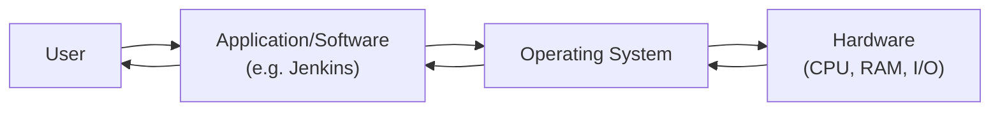
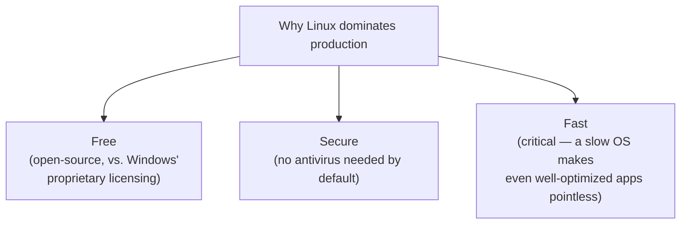
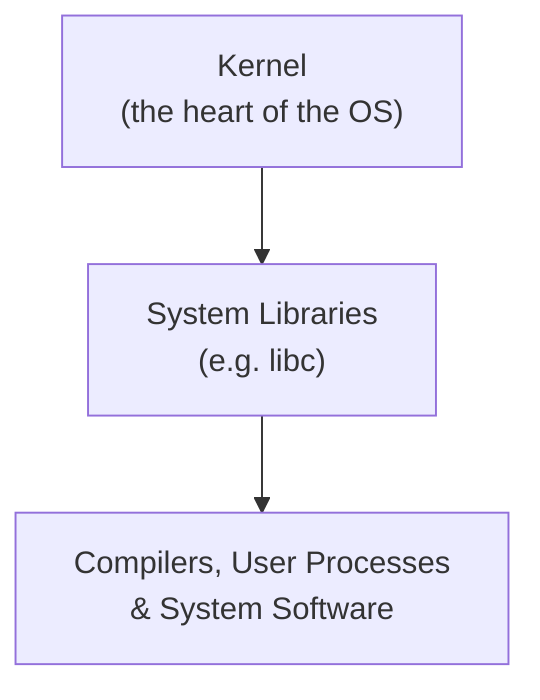
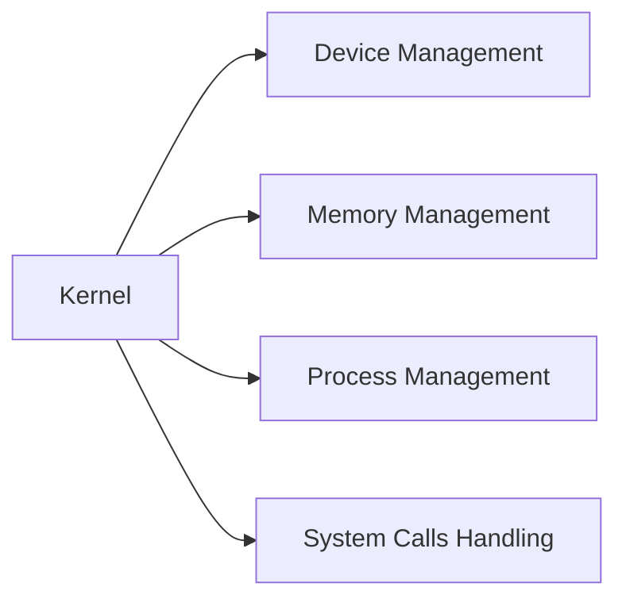
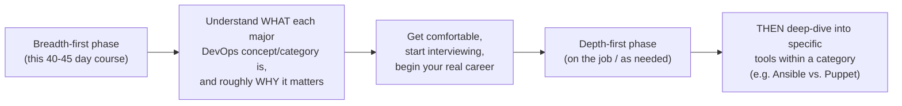
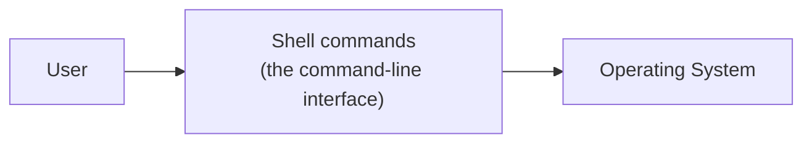
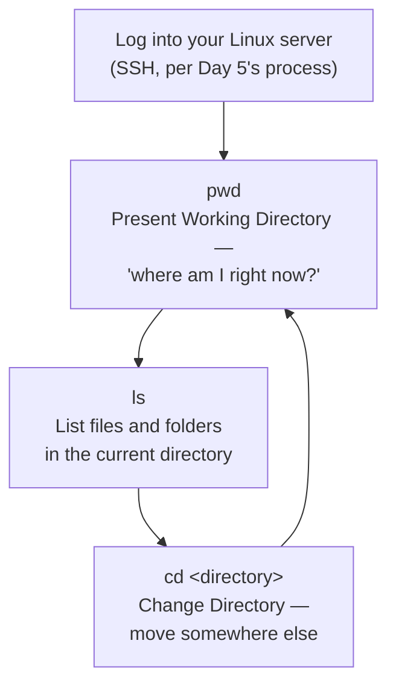
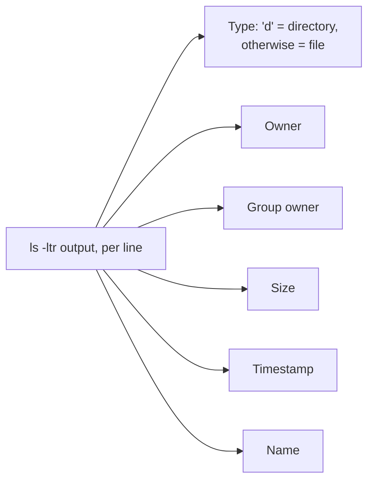
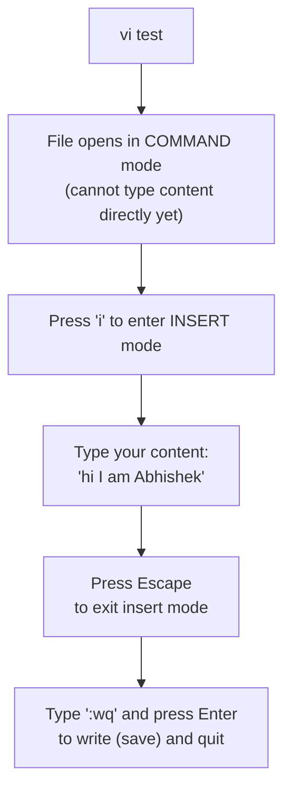
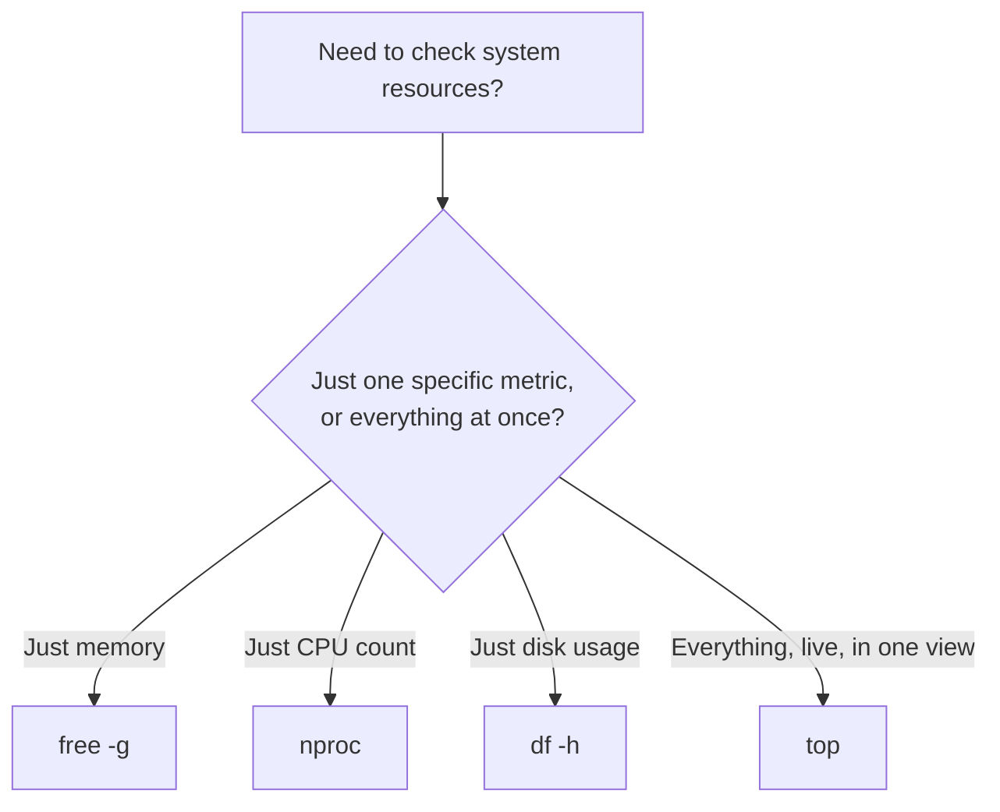

# 🐧 Linux Fundamentals & Shell Scripting Basics: The OS, The Kernel & Your First Commands

- <i>**Session:** DevOps Zero to Hero — Day 6: "Linux & Shell Scripting" · 
- **Instructor:** Abhishek
- **Note on scope:** This session covers operating system fundamentals (what an OS is, why Linux dominates production environments, a deliberately simplified architecture overview) and the absolute basics of shell scripting, demonstrated live on the actual AWS EC2 instance created in Day 5. The instructor is explicit that this is intentionally a **breadth-first, not depth-first** introduction — deeper shell scripting coverage is pointed to via three separate, dedicated videos on his channel, and a real-time DevOps shell scripting project is explicitly previewed for the next class. This guide reflects exactly that scope.</i>

---

## 📑 Table of Contents

1. [Session Overview](#-session-overview)
2. [Learning Objectives](#-learning-objectives)
3. [Detailed Notes](#-detailed-notes)
   - [1. What Is an Operating System? The Bridge Between Software and Hardware](#1-what-is-an-operating-system-the-bridge-between-software-and-hardware)
   - [2. Why Linux Dominates Production: Free, Secure & Fast](#2-why-linux-dominates-production-free-secure--fast)
   - [3. The Linux Architecture, Simplified: Kernel, System Libraries & User Space](#3-the-linux-architecture-simplified-kernel-system-libraries--user-space)
   - [4. The Course's Philosophy: Breadth Before Depth](#4-the-courses-philosophy-breadth-before-depth)
   - [5. What Is a Shell, and Why Command-Line Matters in Production](#5-what-is-a-shell-and-why-command-line-matters-in-production)
   - [6. Navigating the Filesystem: pwd, ls, cd](#6-navigating-the-filesystem-pwd-ls-cd)
   - [7. Working with Files: touch, vi, cat, mkdir, rm](#7-working-with-files-touch-vi-cat-mkdir-rm)
   - [8. Monitoring System Resources: free, nproc, df -h & top](#8-monitoring-system-resources-free-nproc-df--h--top)
4. [Glossary](#-glossary)
5. [Revision Notes — One-Minute Revision](#-revision-notes--one-minute-revision)
6. [Cheat Sheet](#-cheat-sheet)
7. [Interview Questions & Answers](#-interview-questions--answers)
8. [Scenario-Based Interview Questions](#-scenario-based-interview-questions)
9. [Hands-on Exercises](#-hands-on-exercises)
10. [Practice Assignment](#-practice-assignment)
11. [Additional Resources](#-additional-resources)
12. [Final Revision Sheet](#-final-revision-sheet)

---

## 🎯 Session Overview

This session takes a deliberate step back from AWS-specific tooling to cover foundational computing knowledge every DevOps engineer needs: operating systems and Linux specifically. It covers:

1. A first-principles explanation of **what an operating system actually is** — the essential bridge/medium between software and hardware, illustrated with the full request/response lifecycle.
2. **Why Linux specifically dominates production environments** — three concrete, stated reasons: it's free, secure, and fast — directly contrasted with Windows.
3. A **deliberately simplified** tour of Linux's internal architecture: the kernel (with its four core responsibilities), system libraries, and the user-facing layer (compilers, user processes, system software).
4. An explicit restatement of this course's **breadth-before-depth learning philosophy**, applied directly to why this session won't spend days on kernel internals.
5. **What a shell actually is**, and why command-line interaction — not a graphical interface — is the standard way DevOps engineers interact with production Linux servers.
6. A **live demonstration** on the actual AWS EC2 instance from Day 5: filesystem navigation commands (`pwd`, `ls`, `cd`).
7. **File manipulation commands**, demonstrated live: `touch`, `vi` (including insert mode and saving), `cat`, `mkdir`, `rm`.
8. **System resource monitoring commands**, demonstrated live: `free`, `nproc`, `df -h`, and the all-in-one `top` command — explicitly named as a popular interview question.

> 💡 **Memory Trick — the instructor's framing for this session's intentionally limited scope:** *"Even in this 40-45 day DevOps journey, if we spend two or three days just understanding the kernel, or two or three days just understanding the operating system, that will be of no use. You have to understand the breadth of knowledge first — and once you're comfortable, you can go deeper into specific tools during your actual career."*

---

## 🎯 Learning Objectives

By the end of this guide, you will be able to:

- [ ] Define an operating system in one sentence, and trace the full request/response lifecycle from user to hardware and back.
- [ ] Name and explain the three stated reasons Linux dominates production environments: free, secure, and fast.
- [ ] Name at least four popular Linux distributions and correctly identify the vendor/organization behind at least two.
- [ ] Describe, at a simplified level, Linux's three-layer architecture (kernel, system libraries, user space), and name the kernel's four core responsibilities.
- [ ] Explain why this course deliberately avoids deep-diving into kernel internals or comparing every configuration-management tool, connecting this to a stated course-wide philosophy.
- [ ] Define what a shell is, and explain why command-line interaction (not a GUI) is standard for production Linux servers.
- [ ] Use `pwd`, `ls`, `ls -ltr`, and `cd` (including `cd ..` and multi-level paths) to navigate a Linux filesystem confidently.
- [ ] Create, edit, view, and delete files and directories using `touch`, `vi`, `cat`, `mkdir`, and `rm`/`rm -r`.
- [ ] Use `free`, `nproc`, `df -h`, and `top` to check a Linux server's memory, CPU count, disk usage, and overall resource utilization.

---

## 📚 Detailed Notes

### 1. What Is an Operating System? The Bridge Between Software and Hardware

#### 📖 Definition

> 💡 **Memory Trick, the core definition given directly:** *"An operating system is something that acts as a bridge between your software and your hardware. It serves as the medium for communication between the two — that's the definition."*

#### 🧠 Concept — The Full Request/Response Lifecycle



> 💡 **Memory Trick, the concrete example given directly:** *"When you buy a laptop, you're essentially purchasing hardware — CPU, RAM, I/O. Your Jenkins pipeline cannot directly talk to the CPU or RAM. There has to be a medium — that's your operating system. As a user, you install software; your software talks to the OS; the OS talks to the hardware for CPU/RAM usage; the hardware responds back to the OS; the OS responds back to your software; and finally, the response reaches you."*

#### 🔍 Internal Working — Why the OS Is "The Heart of Everything"

> 💡 **Memory Trick, stated directly:** *"You must have your application ready, you must have your hardware ready — but without the operating system, nothing happens. That's why it's the heart of everything."*

#### 🎯 Key Takeaways

* An operating system is precisely defined as the **communication bridge/medium** between software and hardware — nothing more, nothing less.
* Every user request follows a consistent, bidirectional path: **user → application → OS → hardware → OS → application → user**.
* Different vendors ship different default operating systems (Mac laptops with macOS, most Dell laptops with Windows, ThinkPads sometimes with Linux variants) — but the underlying bridging role is identical regardless of which OS is installed.

---

### 2. Why Linux Dominates Production: Free, Secure & Fast

#### 🧠 Concept

> 💡 **Memory Trick, the observation motivating this section:** *"As a student or a kid, you're most familiar with Windows. But once you move into your software journey, you see Linux used everywhere — production, staging, developer environments, everything is deployed and tested on Linux. Windows exists too, but roughly 80-90% of the time, you're testing and deploying on Linux."*



#### ⚙ How It Works — Each Reason, Precisely Stated

| Reason | Exact reasoning given |
|---|---|
| **Free** | *"Linux is a freeware, open-source software. Anybody can create Unix-like operating systems. Windows, by contrast, is proprietary, provided by Microsoft."* |
| **Secure** | *"You don't even have to install antivirus software (like McAfee) on Linux, unlike Windows. I'm not saying it's 100% secure — but it's secure by default, most of the time."* |
| **Fast** | *"If your OS itself is slow, it doesn't matter how advanced your application is — say, using multi-threading. If the OS can't handle the incoming requests fast enough, none of that matters. This is exactly why production systems prioritize fast, stable operating systems."* |

#### 🏢 Real-World / Production Usage — Popular Distributions

> 💡 **Memory Trick, the distributions named directly:** *"There are many distributions — CentOS, Ubuntu, Red Hat, and others. Among the free ones, popular choices include Ubuntu, CentOS, Alpine, and Debian. Red Hat, CentOS, Fedora, Ubuntu, and Debian are all provided by different vendors — Ubuntu is the most widely used."*

#### ⚠ Common Mistakes

* Assuming "Linux" refers to one single, monolithic operating system — more precisely, "Linux" describes a family of distributions, each provided by a different vendor/organization, sharing a common underlying kernel and general approach.

#### 🎯 Key Takeaways

* Linux's three stated production advantages: **free** (open-source vs. Windows's proprietary model), **secure** (no default antivirus requirement), and **fast** (critical, since a slow OS undermines even well-engineered applications).
* Popular free distributions named directly: **Ubuntu, CentOS, Alpine, Debian** — with Ubuntu explicitly called out as the most widely used.
* Different vendors (Red Hat, Canonical for Ubuntu, the Debian project) provide different Linux distributions, all sharing the same general underlying concepts.

---
### 3. The Linux Architecture, Simplified: Kernel, System Libraries & User Space

#### 📖 Definition

> ⚠️ **An explicit, deliberate scoping decision, stated directly:** *"I'll not bore you with the details of the Linux operating system architecture, because it's genuinely very complicated — even if I took one or two hours, it's not easy to explain fully. So I'll keep this as crisp and simple as possible."*



#### 🧠 Concept — The Kernel's Four Core Responsibilities

> 💡 **Memory Trick, given directly as a ready-made interview answer:** *"If somebody asks you in an interview 'what is a kernel in an operating system,' you can simply say: the kernel is the heart of any operating system, and it has four primary responsibilities — device management, memory management, process management, and handling system calls."*



> 💡 **Memory Trick, why the kernel holds this role:** *"There has to be a component in the operating system responsible for cascading a request from software to hardware — that component is the kernel. That's exactly why it's called the heart of the operating system."*

#### 📖 Definition — System Libraries

> 💡 **Memory Trick, given directly:** *"After the kernel, you have system libraries — responsible for performing a task on behalf of the user before it reaches the kernel. Each operating system has its own supported system libraries — they might differ slightly between distributions, but the general concept is the same. A concrete example: `libc`, one of the most fundamental system libraries."*

#### 📖 Definition — Compilers, User Processes & System Software

> 💡 **Memory Trick, given directly:** *"If you want to run a Java or Python application, your operating system has to compile this code — that's where compilers, user processes, and system software come in. Even on Windows, you're aware of your own system software — the same general concept applies to Linux."*

#### ⚠ Common Mistakes

* Assuming this simplified three-layer breakdown (kernel → system libraries → user space) is the complete, technically exhaustive picture of Linux's architecture — explicitly, directly acknowledged as a deliberate simplification, not a comprehensive technical treatment.

#### 🎯 Key Takeaways

* Linux's architecture, deliberately simplified for this introductory session: **kernel** (the heart, handling device/memory/process management and system calls) → **system libraries** (e.g., `libc`) → **compilers, user processes, and system software**.
* The kernel's **four core responsibilities** — device management, memory management, process management, system calls — are explicitly framed as a ready-to-use, complete interview answer for "what is a kernel?"
* This entire architecture overview is explicitly, deliberately simplified — a genuinely deep technical treatment is out of scope for this session by design, not by oversight.

---

### 4. The Course's Philosophy: Breadth Before Depth

#### ❓ Why It Exists

> ⚠️ **A direct, extended statement of the course's overarching learning philosophy, given precisely at this point in the session:** *"You have to understand the breadth of knowledge — of all the different concepts available in DevOps, or most widely used in DevOps. Once you understand the breadth, you can start giving interviews, and DURING your interviews and your actual journey, you can go into the depth of each specific tool. For example, when I explain configuration management, you have to understand configuration management conceptually — but you don't have to spend 10 or 15 days just learning every tool available in that category, like Ansible AND Puppet AND everything else. Just learn ONE thing. Start with your interviews, get comfortable with your DevOps journey, and only then explore why Puppet differs from Ansible, if and when you need to."*



#### 🎯 Key Takeaways

* This session's own deliberately shallow OS/kernel coverage is explicitly used as a **direct, concrete illustration** of the course's stated breadth-first philosophy — not a one-off exception.
* The explicit example given: within a category like **configuration management**, learn the category's purpose and general concept first — don't attempt to master every individual tool (Ansible, Puppet, etc.) before ever starting to interview or work.
* The stated sequencing: **breadth during this course → comfort and real career entry → depth on specific tools, as genuinely needed later.**

---
### 5. What Is a Shell, and Why Command-Line Matters in Production

#### 📖 Definition

> 💡 **Memory Trick, given directly:** *"Shell is the way you talk to your operating system. If you want to create a file on Windows, you have a good graphical user interface. But most of the time, when working in a software organization, you don't have a GUI for your servers — if there's an issue on your production server, you can't just navigate folders visually. You have to do it through a command-line way — and that command-line way is your shell commands."*



#### ❓ Why It Exists — Why GUIs Aren't Used in Production

> 💡 **Memory Trick, the precise reasoning given directly:** *"If you install a graphical user interface, your operating system or server becomes heavier — it adds real weight. That's exactly why production systems don't use GUIs, and why we rely on shell commands instead — to create files, navigate, or do anything with the operating system."*

#### 🔍 Internal Working — Shell Commands Are (Mostly) Distribution-Agnostic

> 💡 **Memory Trick, stated directly:** *"These shell commands are common across different distributions — whether you're using CentOS, Fedora, Debian, or Ubuntu. They're consistent across distributions, not necessarily across entirely different operating systems."*

#### 🏢 Real-World / Production Usage — Which Shell to Actually Learn

> 💡 **Memory Trick, the direct recommendation:** *"You can use zsh, ksh, sh, or bash — but bash is one of the most popular and widely used. So instead of learning ksh, instead of learning zsh, just learn bash. You can use it throughout your entire software journey, and throughout this DevOps Zero to Hero journey, we'll only be learning bash."*

#### ⚠ Common Mistakes

* Assuming shell commands differ meaningfully across every Linux distribution — explicitly, directly corrected: the same core shell commands work consistently across CentOS, Fedora, Debian, Ubuntu, and other distributions.

#### 🎯 Key Takeaways

* A **shell** is the command-line mechanism through which a user communicates with a Linux operating system — the standard interaction method in production, where GUIs are deliberately avoided to keep servers lightweight.
* Shell commands are **consistent across Linux distributions** (Ubuntu, CentOS, Debian, Fedora) — a genuinely portable skill, not something to relearn per distribution.
* **Bash** is the specific shell explicitly recommended and used throughout this course, over alternatives like zsh, ksh, or sh — a deliberate simplification, not an arbitrary choice.

---

### 6. Navigating the Filesystem: pwd, ls, cd

#### 🪜 Step-by-Step — The Three Foundational Navigation Commands



> 💡 **Memory Trick, the recommended habitual sequence, stated directly:** *"Always, once you log into your server, first make use of `pwd` to understand your present working directory. Then use `ls` to understand what files and folders are available."*

#### 💻 Code Example — Changing Directories, Every Which Way

```bash
pwd                 # e.g. output: /home/ubuntu
ls                   # list files/folders in the current directory

cd bundle             # move INTO a subdirectory called "bundle"
pwd                    # now shows: /home/ubuntu/bundle

cd ..                  # move UP one directory level
cd ../..                # move UP two directory levels
cd ubuntu/bundle          # move DOWN multiple levels at once, by full relative path
```

> 💡 **Memory Trick, the Windows comparison given directly:** *"If you're used to Windows, you'd normally back-click with your mouse to move between folders. In Linux, there's usually no GUI to do that — so `cd ..` moves you back one directory, and `cd ../..` moves you back two directories, using the slash operator to chain as many levels as you need."*

#### ⚠ Common Mistakes

* Attempting to navigate a Linux server visually (via mouse/GUI navigation), as one would on Windows — production Linux servers typically have no GUI at all, making `pwd`/`ls`/`cd` the only practical navigation method.

#### 🎯 Key Takeaways

* **`pwd`** (Present Working Directory) tells you exactly where you currently are in the filesystem — the recommended first command after any login.
* **`ls`** lists the files and folders in your current directory.
* **`cd <directory>`** changes your current directory — `cd ..` moves up one level, `cd ../..` moves up two levels, and a full relative path (e.g., `cd ubuntu/bundle`) moves down multiple levels in a single command.

---
### 7. Working with Files: touch, vi, cat, mkdir, rm

#### 💻 Code Example — Listing Files with Full Detail: `ls -ltr`

```bash
ls -ltr
```

> 💡 **Memory Trick, precisely explaining the output, given directly:** *"`ls -ltr` gives you the files and folders WITH their properties: if a line starts with 'd', it's a directory; if it doesn't start with 'd', it's a file. You also get: who owns the file, which group owns it, the size of its contents, the timestamp it was created, and its name."*



#### 💻 Code Example — Creating an Empty File: `touch`

```bash
touch abhishek
ls   # confirms the new file "abhishek" now exists
```

#### 💻 Code Example — Creating AND Editing a File: `vi`



> 💡 **Memory Trick, precisely walked through, live:** *"Using `vi`, you can not only create a file, but write content INTO it. When you open a file in Linux, it's not straightforward — Linux asks, essentially, 'do you want to read, or do you want to write?' Press Escape, then `i` to move into insert mode — now you can actually type content. Once you're done, press Escape again, then type `:wq` to save the file."*

#### 💻 Code Example — Viewing a File's Contents: `cat`

```bash
cat test   # prints the file's full contents directly to the terminal
```

#### 💻 Code Example — Creating and Removing Directories & Files

```bash
mkdir abhishek1        # create a new directory
rm -r abhishek1          # remove a directory (recursively)
rm somefile.txt            # remove a single file (no -r needed)
```

#### ⚠ Common Mistakes

* Attempting to type content directly into a freshly-opened `vi` file without first pressing `i` to enter insert mode — `vi` opens in command mode by default, where typed characters are interpreted as commands, not content.
* Using plain `rm` (without `-r`) on a directory — this will fail; directories specifically require the recursive `-r` flag.

#### 🎯 Key Takeaways

* **`ls -ltr`** provides a rich, detailed file listing: type (directory vs. file), owner, group, size, timestamp, and name — genuinely useful beyond the basic `ls`.
* **`touch <filename>`** creates a new, empty file — the simplest file-creation command.
* **`vi <filename>`** both creates a file AND lets you write content into it — requires the specific insert-mode workflow: `i` to start typing, `Escape` then `:wq` to save and exit.
* **`cat <filename>`** prints a file's full contents directly to the terminal.
* **`mkdir <dirname>`** creates a directory; **`rm <file>`** removes a file; **`rm -r <dirname>`** removes a directory (recursively — required, since directories may contain other files/folders).

---

### 8. Monitoring System Resources: free, nproc, df -h & top

#### 🧠 Concept — The Windows Analogy

> 💡 **Memory Trick, the motivating comparison given directly:** *"On Windows, if you suspect your CPU or RAM is maxed out, you'd go to System Properties to see total RAM, then Task Manager to see how much is actually used, and compare the two. Linux does the exact same kind of check — just entirely through shell commands."*

#### 💻 Code Example — Individual Resource Commands

```bash
free -g          # memory usage, in gigabytes for readability
nproc              # number of CPUs available
df -h                # disk usage, in human-readable format (GB, not raw bytes)
```

> 💡 **Memory Trick, the live-demonstrated output interpretation:** *"On my free-tier EC2 instance, `nproc` correctly showed just 1 CPU — expected, since it's a free-tier instance. `df -h` showed roughly 24% of my disk already used — 1.9GB used out of a 7.6GB total, leaving 5.8GB available."*

#### 💻 Code Example — The All-in-One Monitoring Command: `top`

```bash
top
```

> ⚠️ **Directly, explicitly flagged as a popular interview question:** *"This is a very popular interview question: what command do you use to manage or check your memory, CPU, and disk all at once? The answer is `top` — it shows you CPU percentage used, memory percentage used, and more, all from one single place."*



#### 🎯 Key Takeaways

* **`free -g`**, **`nproc`**, and **`df -h`** check memory, CPU count, and disk usage respectively, each individually.
* **`top`** provides a genuinely all-in-one, live view of CPU, memory, and overall resource utilization — explicitly named as a common, popular interview question.
* Checking Linux system resources via shell commands is directly, conceptually parallel to checking Windows resources via System Properties and Task Manager — same underlying goal, different interface.

---
## 📝 Glossary

| Term | Definition | Why It Matters |
|---|---|---|
| **Operating System** | The bridge/medium enabling communication between software and hardware | The core, foundational concept opening this session |
| **Kernel** | The heart of the OS, responsible for device, memory, and process management, plus system calls | The single most important architecture term for interviews |
| **System Libraries** | Software performing tasks on a user's behalf before reaching the kernel (e.g., `libc`) | The middle layer of the simplified Linux architecture |
| **Distribution (distro)** | A specific vendor-provided packaging of the Linux operating system (e.g., Ubuntu, CentOS, Red Hat, Debian) | Shell commands are portable ACROSS distributions, a key practical point |
| **Shell** | The command-line mechanism for communicating with a Linux OS | The standard interaction method in GUI-less production environments |
| **Bash** | The specific, widely-used shell recommended and taught throughout this course | Chosen over zsh, ksh, sh as the one shell to actually learn |
| **`pwd`** | Present Working Directory -- shows your current location in the filesystem | The recommended first command after any login |
| **`ls` / `ls -ltr`** | Lists files/folders; `-ltr` adds type, owner, group, size, and timestamp detail | Core, constantly-used navigation and inspection commands |
| **`cd`** | Change Directory -- navigate the filesystem | `cd ..` moves up one level; `cd ../..` moves up two |
| **`touch`** | Creates a new, empty file | The simplest file-creation command |
| **`vi`** | Creates AND lets you edit a file's contents, via insert mode | Requires `i` to type, `Escape` + `:wq` to save |
| **`cat`** | Prints a file's full contents to the terminal | The standard way to quickly view a file |
| **`mkdir` / `rm` / `rm -r`** | Create a directory / remove a file / remove a directory recursively | Core file-system management commands |
| **`free`, `nproc`, `df -h`, `top`** | Memory, CPU count, disk usage, and all-in-one resource monitoring, respectively | `top` in particular is named as a popular interview question |

---

## 🔄 Revision Notes — One-Minute Revision

* An **operating system** is precisely the bridge/medium enabling communication between software and hardware -- every user request flows **user → application → OS → hardware → OS → application → user**.
* **Linux dominates production environments** for three stated reasons: it's **free** (open-source, vs. Windows's proprietary model), **secure** (no default antivirus needed), and **fast** (critical, since a slow OS undermines even well-engineered applications) -- with **Ubuntu, CentOS, Alpine, and Debian** named as popular free distributions.
* Linux's architecture, deliberately simplified: the **kernel** (device management, memory management, process management, system calls -- a ready-made four-part interview answer) → **system libraries** (e.g., `libc`) → **compilers, user processes, and system software**.
* This session's shallow OS/kernel treatment directly illustrates the course's stated **breadth-before-depth** philosophy: understand what each major concept/category is now; go deep on specific tools only once actually working, as genuinely needed.
* A **shell** is the command-line way of talking to a Linux OS -- the standard in production, since GUIs add unwanted weight to servers. Shell commands are largely **consistent across distributions**; **bash** is the specific shell recommended throughout this course.
* Filesystem navigation: **`pwd`** (where am I?), **`ls`** (what's here?), **`cd <dir>`** (move -- `cd ..` up one level, `cd ../..` up two).
* File operations: **`ls -ltr`** (detailed listing: type, owner, group, size, timestamp), **`touch`** (create empty file), **`vi`** (create + edit, via `i` for insert mode and `:wq` to save), **`cat`** (view contents), **`mkdir`** (create directory), **`rm`**/**`rm -r`** (remove file/directory).
* System monitoring: **`free -g`** (memory), **`nproc`** (CPU count), **`df -h`** (disk usage), and **`top`** (everything at once -- explicitly flagged as a popular interview question).
* Deeper shell scripting coverage is explicitly pointed to via **three separate videos** on the instructor's channel (an ~80-minute basics video, a ~60-minute intermediate video, and a shell-scripting interview-questions video) -- and a **real-time DevOps shell scripting project** is explicitly previewed for the next class.

---

## 📋 Cheat Sheet

**The OS request/response lifecycle:**
```text
User -> Application -> Operating System -> Hardware
Hardware -> Operating System -> Application -> User
```

**Why Linux dominates production:**
```text
Free (open-source) + Secure (no default antivirus needed) + Fast
```

**The kernel's four responsibilities (memorize for interviews):**
```text
Device Management | Memory Management | Process Management | System Calls
```

**Simplified Linux architecture:**
```text
Kernel -> System Libraries (e.g. libc) -> Compilers / User Processes / System Software
```

**Filesystem navigation:**
```bash
pwd            # where am I?
ls              # what's here?
ls -ltr          # detailed listing (type, owner, group, size, timestamp)
cd <dir>          # move into a directory
cd ..              # move up one level
cd ../..            # move up two levels
```

**File operations:**
```bash
touch <file>        # create an empty file
vi <file>             # create/edit -> press 'i' to type, Esc then :wq to save
cat <file>              # print file contents
mkdir <dir>               # create a directory
rm <file>                   # remove a file
rm -r <dir>                   # remove a directory (recursive)
```

**System monitoring:**
```bash
free -g          # memory
nproc              # CPU count
df -h                # disk usage
top                    # EVERYTHING at once (popular interview question!)
```

---

## 🔥 Interview Questions & Answers

### 🟢 Beginner

**Q1.**

**Question:** In one sentence, what is an operating system?

**Answer:** A bridge/medium enabling communication between software and hardware.

**Explanation:** The session's own precise, stated definition.

**Why Interviewers Ask This:** A universal, foundational computing question.

**Possible Follow-up:** "Trace the full path of a single user request from click to response."

**Q2.**

**Question:** Name the three stated reasons Linux dominates production environments.

**Answer:** It's free, secure, and fast.

**Explanation:** Directly, precisely named and explained in the session.

**Why Interviewers Ask This:** A core, frequently-asked comparative OS question.

**Possible Follow-up:** "Why doesn't Linux typically require antivirus software by default?"

**Q3.**

**Question:** What are the kernel's four core responsibilities?

**Answer:** Device management, memory management, process management, and handling system calls.

**Explanation:** Directly given as a ready-made interview answer.

**Why Interviewers Ask This:** A classic, frequently-tested operating-systems question.

**Possible Follow-up:** "Why is the kernel called the 'heart' of the operating system?"

**Q4.**

**Question:** What is a shell, and why is it the standard way to interact with production Linux servers?

**Answer:** A shell is the command-line mechanism for communicating with a Linux OS; it's standard in production because GUIs add unwanted weight/overhead to servers, which typically don't have one installed at all.

**Explanation:** Directly, precisely explained.

**Why Interviewers Ask This:** Foundational Linux/DevOps working knowledge.

**Possible Follow-up:** "Which specific shell does this course recommend learning, and why?"

**Q5.**

**Question:** What command shows your current location in the Linux filesystem?

**Answer:** `pwd` (Present Working Directory).

**Explanation:** Directly, precisely named as the recommended first command after any login.

**Why Interviewers Ask This:** Basic, essential shell command knowledge.

**Possible Follow-up:** "What command would you use next to see what's actually in that directory?"

**Q6.**

**Question:** How do you move up two directory levels in one command?

**Answer:** `cd ../..`

**Explanation:** Directly demonstrated live.

**Why Interviewers Ask This:** Practical, everyday shell navigation skill.

**Possible Follow-up:** "How would you move up three levels instead?"

**Q7.**

**Question:** What's the difference between `touch` and `vi` for creating a file?

**Answer:** `touch` creates an empty file only; `vi` creates a file AND lets you write actual content into it.

**Explanation:** Directly, precisely distinguished.

**Why Interviewers Ask This:** Basic, practical file-creation knowledge.

**Possible Follow-up:** "What key do you press to actually start typing content inside a `vi` session?"

**Q8.**

**Question:** How do you save and exit a file in `vi`?

**Answer:** Press `Escape` to exit insert mode, then type `:wq` and press Enter.

**Explanation:** Directly, precisely walked through live.

**Why Interviewers Ask This:** A genuinely common, practical `vi` usage question.

**Possible Follow-up:** "What would happen if you tried typing content immediately after opening `vi`, without pressing `i` first?"

**Q9.**

**Question:** What command removes a directory (not just a file)?

**Answer:** `rm -r <directory>`.

**Explanation:** Directly, precisely stated -- the `-r` flag is required specifically for directories.

**Why Interviewers Ask This:** A common, practical file-management distinction.

**Possible Follow-up:** "What happens if you run plain `rm` (no `-r`) on a directory?"

**Q10.**

**Question:** What single command lets you check CPU, memory, and overall resource usage all at once?

**Answer:** `top`.

**Explanation:** Directly, explicitly flagged as a popular interview question.

**Why Interviewers Ask This:** A named, direct interview question in the session itself.

**Possible Follow-up:** "Name the individual commands you'd use to check memory, CPU count, and disk usage separately."

---

### 🟡 Intermediate

**Q11.**

**Question:** Explain why the instructor says "without an operating system, nothing happens" -- even if you have both working hardware and working software.

**Answer:** Because software cannot directly communicate with hardware -- a Jenkins pipeline, for instance, cannot directly instruct the CPU or access RAM. The OS is the ONLY mechanism through which this communication actually occurs; hardware and software existing independently, without an OS bridging them, would leave the two completely unable to interact, regardless of how capable each one individually is.

**Explanation:** Directly reflects the session's own precise reasoning about the OS's essential, non-optional role.

**Why Interviewers Ask This:** Tests genuine understanding of WHY the OS is essential, not just that it is.

**Possible Follow-up:** "Give a concrete example of a specific hardware resource an application might need the OS to mediate access to."

**Q12.**

**Question:** A learner asks why Linux being "free" (open-source) is listed as a production advantage, rather than just a cost-saving nice-to-have. Elaborate on this using the session's framing.

**Answer:** While cost savings are real and relevant, the session's framing pairs "free" directly alongside "secure" and "fast" as equally weighted, genuine technical/operational advantages -- not merely a budget consideration. Being open-source also means the operating system's code is broadly reviewable and modifiable by a wide community (a security-adjacent benefit, since vulnerabilities can be identified and patched by many contributors, not just one vendor), and it means organizations aren't locked into a single vendor's licensing terms or roadmap. The session presents "free" as one leg of a three-part value proposition -- cost, security, and performance -- working together, not as an isolated financial detail.

**Explanation:** Requires expanding on why "free" matters beyond the most literal cost interpretation, using the session's own three-reasons framing.

**Why Interviewers Ask This:** Tests whether a learner can articulate a fuller business/technical case, not just recite "it saves money."

**Possible Follow-up:** "Does 'open-source' automatically guarantee better security? What's a limitation of this reasoning?"

**Q13.**

**Question:** Explain, precisely, why the instructor considers `ls -ltr`'s additional detail (owner, group, size, timestamp, type) genuinely useful in a real DevOps context, beyond simply "more information is always better."

**Answer:** Each specific piece of additional information serves a concrete, practical DevOps purpose: the type indicator (directory vs. file) lets you quickly distinguish navigable folders from actual content without guessing; ownership and group information is directly relevant to permissions troubleshooting (e.g., diagnosing why a process can't access a file it should be able to); size information helps identify unexpectedly large files consuming disk space (directly connecting to the `df -h` disk-monitoring commands covered later in the same session); and timestamps help identify recently modified or created files, useful when diagnosing what changed around the time an issue occurred. This isn't "more info for its own sake" -- each field maps to a genuine, common diagnostic task.

**Explanation:** Requires reasoning through the practical utility of each specific piece of information, not just noting that `-ltr` "shows more."

**Why Interviewers Ask This:** Tests whether a learner understands the practical diagnostic value of command output, not just command syntax.

**Possible Follow-up:** "Which specific field from `ls -ltr` would be most useful for diagnosing a 'disk full' alert?"

**Q14.**

**Question:** Using this session's own stated example (configuration management: learn ONE tool, not every tool), design a similar "pick one, learn it well" recommendation for the shell-scripting domain covered in this session -- which single shell should a beginner focus on, and why?

**Answer:** Per the session's own direct, explicit recommendation, the answer is **bash** -- the instructor explicitly states: "instead of learning ksh, instead of learning zsh, just learn bash," directly applying the same "pick one, don't try to master every option" philosophy stated moments earlier for configuration-management tools. The reasoning given is bash's wide popularity and broad usability across the entire software/DevOps journey -- making it the highest-leverage single choice, mirroring exactly the same "start with one, expand later if genuinely needed" logic applied to the Ansible/Puppet example.

**Explanation:** Requires recognizing that the session's own explicit shell recommendation (bash) is itself a direct, concrete application of its stated breadth-first philosophy -- connecting two parts of the same session that might otherwise seem unrelated.

**Why Interviewers Ask This:** Tests whether a learner sees the session's own specific tool recommendations as principled applications of a stated philosophy, not arbitrary choices.

**Possible Follow-up:** "Under what circumstance might it later become genuinely necessary to learn zsh or ksh as well, beyond just bash?"

**Q15.**

**Question:** Explain why the instructor demonstrates these shell commands live on a real AWS EC2 instance (from the prior session) rather than, say, a local Linux installation or a purely theoretical explanation.

**Answer:** Using the actual, previously-created EC2 instance directly connects this session's content to the concrete, hands-on infrastructure work from Days 3-5 -- reinforcing that these shell commands are the genuinely practical, real-world skill needed to actually USE and manage the cloud infrastructure already covered, rather than an abstract, disconnected topic. It also reflects the course's consistent live-demonstration teaching style (seen throughout the prior sessions) -- proving commands work in a genuine, live production-like environment rather than relying purely on slides or theoretical description, directly continuing the "don't just tell them, show them" pattern established since Day 4's live AWS console walkthrough.

**Explanation:** Requires connecting this session's teaching choice back to the broader, consistent pedagogical pattern across the entire course.

**Why Interviewers Ask This:** Tests awareness of how this course's teaching approach reinforces retention through continuity and real, hands-on demonstration.

**Possible Follow-up:** "What would have been lost pedagogically if this session had used a purely local, non-cloud Linux environment instead?"

---

### 🔴 Advanced

**Q16.**

**Question:** Design a short onboarding exercise for a brand-new DevOps hire that exercises every shell command covered in this session (navigation, file operations, resource monitoring) in one coherent, realistic workflow, without requiring any commands beyond what was taught here.

**Answer:** A reasonable exercise: (1) SSH into a provided server (per Day 5's process); (2) run `pwd` to confirm starting location, then `ls -ltr` to survey the home directory's existing contents; (3) `mkdir onboarding_test` and `cd onboarding_test` to create and enter a dedicated workspace; (4) `touch notes.txt` to create an empty file, then `vi notes.txt` to open it, press `i`, type a short note (e.g., "Day 1 onboarding complete"), then `Escape` + `:wq` to save; (5) `cat notes.txt` to confirm the content was saved correctly; (6) run `free -g`, `nproc`, and `df -h` individually to record the server's baseline memory, CPU count, and disk usage in a second file (created similarly via `vi`); (7) run `top` to observe live resource usage, and write down the current CPU/memory percentages; (8) navigate back out (`cd ..`) and use `rm -r onboarding_test` to clean up the entire exercise directory. This exercise deliberately sequences every command from this session into one coherent, realistic "get oriented on a new server" workflow -- directly mirroring genuine first-day DevOps tasks.

**Explanation:** Synthesizes every individual command taught in this session into one coherent, realistic, ordered workflow -- genuine extension beyond the session's own individual, separate command demonstrations.

**Why Interviewers Ask This:** A realistic, applied question testing whether a candidate can compose individually-known commands into a genuinely useful sequence, not just recall each command in isolation.

**Possible Follow-up:** "What would you add to this exercise to also test the new hire's understanding of file permissions, a topic this session didn't cover in depth?"

**Q17.**

**Question:** Critically evaluate: "Since this session explicitly avoids deep kernel/architecture coverage in favor of breadth, a DevOps engineer following this course's philosophy should never need to understand kernel internals at any point in their career." Is this an accurate implication of the session's stated philosophy?

**Answer:** Not accurate. The session's own stated philosophy explicitly includes a SECOND phase -- depth on specific topics, pursued later, "as genuinely needed" once actually working (per Section 4's full statement: "once you're comfortable with your DevOps journey, THEN you can go into the depth of each and every tool"). The breadth-first approach is explicitly framed as a sequencing decision for THIS course and THIS stage of a learner's journey, not a permanent, career-long avoidance of depth. A DevOps engineer whose actual job responsibilities later require genuine kernel-level troubleshooting (e.g., diagnosing a genuinely obscure production performance issue) would, per the session's own stated logic, be expected to develop that specific depth AT THAT POINT -- the philosophy defers depth, it does not forbid or dismiss it as permanently unnecessary.

**Explanation:** Tests whether a learner over-generalizes a deliberate, temporary sequencing choice into a permanent, career-long claim the session doesn't actually make.

**Why Interviewers Ask This:** Distinguishes candidates who track the precise, conditional scope of a stated philosophy from those who round it into an absolute, permanent rule.

**Possible Follow-up:** "Describe a realistic, specific DevOps job scenario where genuine kernel-level knowledge would become necessary."

**Q18.**

**Question:** Synthesize this session's OS-as-bridge definition (Section 1) with its shell-as-interaction-method definition (Section 5) to explain precisely where "shell commands" fit within the broader user-to-hardware communication chain established at the start of the session.

**Answer:** Per Section 1's chain (user → application/software → OS → hardware → back), shell commands are best understood as a SPECIFIC KIND of "software/application" layer, specifically designed for direct, text-based interaction with the operating system itself, rather than being a separate, additional link in the chain. When a user types a shell command like `ls`, that command IS the "application" in Section 1's model -- the shell interprets and passes that instruction to the OS/kernel, which then handles the actual underlying hardware interaction (e.g., reading directory data from disk) and returns the result back up through the same chain to be displayed to the user. This reframing clarifies that "using the shell" isn't a fundamentally different communication pathway from "using any other application" -- it's simply a particularly direct, minimal, text-based application specifically built for OS interaction, following the exact same bridging architecture established in Section 1.

**Explanation:** Requires connecting the session's opening conceptual definition (OS as bridge) with its later, more specific definition (shell as interaction method) into one unified model -- genuine, non-obvious synthesis across sections taught separately.

**Why Interviewers Ask This:** A capstone-level conceptual question testing whether a candidate sees the underlying architectural consistency between two concepts introduced at different points in the same session.

**Possible Follow-up:** "Where would a GUI application (like a graphical file browser) fit into this same Section 1 model, by contrast?"

---

## 🧪 Scenario-Based Interview Questions

> **Scenario 1:** A junior team member is confused why a production server they're troubleshooting has "no obvious way to see what's going wrong" -- they're used to Windows's Task Manager and File Explorer. Using this session's concepts, guide them.

**Structured Answer:**
1. **Initial investigation:** Confirm this is a Linux production server without a GUI installed -- directly matching this session's explicit explanation of why GUIs are avoided in production (added weight/overhead).
2. **Metrics/logs to check:** Guide the junior engineer to start with `pwd` and `ls -ltr` to get oriented in the filesystem, exactly as this session's own recommended first-steps sequence describes.
3. **Possible causes for their confusion:** A natural but resolvable gap -- familiarity with GUI-based tools (Task Manager, File Explorer) without yet knowing their direct Linux command-line equivalents.
4. **Debugging approach:** Walk them through the direct equivalences this session establishes: `top` for the "Task Manager" equivalent (CPU/memory/overall resource view), `free -g`/`nproc`/`df -h` for more specific individual checks, and `ls`/`cd`/`pwd` for the "File Explorer" navigation equivalent.
5. **Resolution:** Have them run `top` first for an immediate, holistic view of the server's current state, then drill into specific files/directories using `ls -ltr` and `cd` as needed, based on what `top` reveals.
6. **Prevention:** Provide the direct Windows-to-Linux command mapping (Task Manager → `top`; File Explorer navigation → `pwd`/`ls`/`cd`) as a quick-reference document for any future team members transitioning from a Windows-primary background, directly modeled on this session's own comparison approach.

> **Scenario 2 (Advanced):** Your organization's onboarding documentation currently only lists commands with no explanation of WHY each one matters operationally. A new hire follows the commands correctly but doesn't understand when to reach for `df -h` versus `free -g` versus `top` in a real troubleshooting scenario. Using this session's concepts, redesign the guidance.

**Structured Answer:**
1. **Initial investigation:** Recognize the gap as a "syntax without context" problem -- the new hire can execute each command correctly but lacks the decision framework for WHEN each is the right tool, exactly the kind of gap Advanced Q13's reasoning addresses for `ls -ltr`.
2. **Relevant principle:** Map each command to the SPECIFIC operational question it answers, mirroring this session's own individual-vs-combined framing (Section 8): `free -g` answers "is memory the bottleneck?"; `nproc` answers "how much CPU parallelism do I even have available?"; `df -h` answers "am I running out of disk space?"; `top` answers "give me a live, holistic view when I don't yet know WHICH resource is the problem."
3. **Possible causes for the original documentation's gap:** Likely written as a simple command reference/cheat sheet without the accompanying "when do I use this" reasoning this session explicitly provides through its live demonstration and explanations.
4. **Debugging/evaluation approach:** Review the existing documentation against this exact gap -- checking whether it explains WHY, not just HOW, for every listed command.
5. **Resolution:** Rewrite the onboarding documentation to pair every command with both its syntax AND a concrete "use this when..." scenario, directly modeled on this session's own teaching pattern (e.g., pairing `top` with the explicit "popular interview question: how do you check CPU/memory/disk all at once?" framing).
6. **Prevention:** Establish a documentation standard requiring every future command reference to include both syntax and operational context, preventing this same "syntax without context" gap from recurring in future onboarding materials.

---

## 🛠 Hands-on Exercises

### 🟢 Easy

1. SSH into a Linux server of your own (reusing your Day 5 EC2 instance if still available), and run `pwd`, `ls`, and `ls -ltr`, documenting what each command's output tells you.
2. Practice navigating with `cd`: move into a subdirectory, then back out using `cd ..`, then two levels back using `cd ../..`, documenting your `pwd` output at each step.
3. Create a file with `touch`, then create and edit a second file with `vi` (typing a short sentence, saving with `:wq`), and use `cat` to confirm both files' contents.

### 🟡 Medium

4. Complete the full onboarding exercise proposed in Advanced Interview Q16, documenting your output at each of the eight steps.
5. Write a short comparison document (150-200 words) mapping each Windows tool (Task Manager, File Explorer, System Properties) to its Linux shell-command equivalent, directly extending Scenario 1's reasoning.
6. Research (outside this transcript) at least three `ls -ltr` permission-notation characters (e.g., `r`, `w`, `x`) beyond the `d`-for-directory indicator this session covers, and write a short explanation of what each means.

### 🔴 Advanced

7. Implement the redesigned onboarding documentation proposed in Scenario 2, pairing every command from this session with both its syntax and a concrete "use this when..." explanation.
8. Write a short technical document (300-400 words) explaining, to a learner skeptical of the breadth-first approach, why this session's shallow kernel coverage is a deliberate pedagogical choice rather than a gap -- directly using Advanced Interview Q17's reasoning.
9. Research (outside this transcript) the actual `libc` system library mentioned in this session, and write a short summary (150-200 words) of what it provides to applications, connecting it back to the simplified architecture diagram from Section 3.

---

## 🏗 Practice Assignment

### Build: "My First Linux Server Health Report"

**Objective:** Produce a complete, documented health-check report for a real Linux server (your Day 5 EC2 instance, or any Linux environment you have access to), exercising every command covered in this session.

**Requirements:**
- Confirm your starting location with `pwd`, and produce a detailed directory listing with `ls -ltr`.
- Create a dedicated report directory using `mkdir`, and navigate into it with `cd`.
- Create a report file using `vi`, containing your findings from the following steps.
- Record the server's memory (`free -g`), CPU count (`nproc`), and disk usage (`df -h`) in your report file.
- Run `top` and record a snapshot of the current CPU/memory percentages at the time you ran it.
- Use `cat` to display your completed report file back to yourself, confirming its contents.
- Clean up your work directory using `rm -r` once you're satisfied your report is complete (after saving a copy elsewhere first, if you want to keep it).

**Architecture (suggested):**

```text
(on your Linux server)
~/server_health_report/
└── report.txt   # created and edited via vi, containing your findings
```

**Expected Functionality:**
- Your `report.txt` file should contain genuine, real output from your own server -- not copied example numbers from this guide.
- You should be able to explain, for each section of your report, WHY that specific command was the right tool for that specific piece of information (per Advanced Q13's reasoning).

**Challenges:**
- Correctly using `vi`'s insert-mode workflow to write a multi-line report without losing content due to mode confusion (a genuinely common first-time `vi` mistake).
- Correctly and safely using `rm -r` only on your intended directory, not accidentally on something else.

**Bonus Improvements:**
- Extend your report to include a brief "if I saw these numbers on a real production server, would I be concerned?" assessment for each metric.
- Research and add a section using a command not covered in this session (e.g., `uptime` or `ps`) to further extend your health-check report.

---

## 📚 Additional Resources

- The instructor's **Day 0 through Day 5 videos** (referenced directly) -- required prior viewing for full context.
- The **DevOps Zero to Hero playlist** -- referenced directly, containing all videos in this same free course.
- An **~80-minute "Shell Scripting Basics" video** (referenced directly) -- covering shell fundamentals in significantly more depth than this session.
- An **~60-minute "Shell Scripting Intermediate" video** (referenced directly) -- covering intermediate-level shell commands and concepts.
- A **"Shell Scripting Interview Questions" video** (referenced directly) -- a dedicated interview-prep resource for this exact topic.
- **The next class** (referenced directly) -- will cover a real-time DevOps shell scripting project, demonstrating practical, applied use of these commands.

---

## 📌 Final Revision Sheet

### ⭐ Core Concepts
- An **operating system** is the bridge between software and hardware -- the full request/response chain: user → application → OS → hardware → OS → application → user.
- **Linux dominates production** because it's free, secure, and fast.
- Simplified Linux architecture: **kernel** (device/memory/process management + system calls) → **system libraries** → **compilers/user processes/system software**.
- This course follows a **breadth-before-depth** philosophy -- this session's shallow kernel treatment is a deliberate, temporary sequencing choice, not a permanent avoidance of depth.
- A **shell** is the command-line way of interacting with Linux -- standard in GUI-less production environments; **bash** is this course's chosen shell.

### ⭐ Important Definitions
- **Kernel**, **distribution**, **`ls -ltr`** output fields (see Glossary for full definitions).

### ⭐ Important Commands/Code
```bash
pwd
ls / ls -ltr
cd <dir> / cd .. / cd ../..
touch <file>
vi <file>    # i to insert, Esc then :wq to save
cat <file>
mkdir <dir>
rm <file> / rm -r <dir>
free -g / nproc / df -h / top
```

### ⭐ Architecture/Process
- OS communication chain: user → application → OS → hardware → OS → application → user.
- Recommended first steps after SSH login: `pwd` → `ls`/`ls -ltr` → navigate as needed with `cd`.

### ⭐ Best Practices
- Always run `pwd` first after logging into a new server, to establish orientation.
- Use `top` for a holistic first look when you don't yet know which resource is the bottleneck; use `free`/`nproc`/`df -h` individually once you do.
- Learn one shell (bash) deeply rather than spreading effort across zsh/ksh/sh.
- Remember `-r` is required for `rm` on directories.

### ⭐ Common Mistakes
- Attempting to navigate a production Linux server visually, as on Windows.
- Typing directly into a freshly-opened `vi` file without first pressing `i`.
- Using plain `rm` (no `-r`) on a directory.
- Assuming shell commands differ meaningfully across every Linux distribution.

### ⭐ Interview Points
- Be ready to state the kernel's four core responsibilities from memory.
- Be ready to name and explain Linux's three production advantages (free, secure, fast).
- Be ready to name `top` as the answer to "how do you check CPU/memory/disk all at once?"
- Be ready to walk through the full OS communication chain (user to hardware and back).

### ⭐ Things to Remember
- This session is explicitly, deliberately **breadth-first** -- deep kernel/architecture coverage and deep shell-scripting instruction are both intentionally out of scope here, with dedicated resources pointed to instead (three separate videos on the instructor's channel).
- A **real-time DevOps shell scripting project** is explicitly previewed for the next class -- this session's commands are the foundation for that upcoming, more applied content.
- The session's own teaching choices (using bash specifically, using the real EC2 instance from Day 5) are themselves direct applications of the course's stated breadth-first, hands-on philosophy -- not arbitrary decisions.

---

## 🔗 Source

- [Linux & Shell Scripting](https://youtu.be/9jw9F6mcQDo?si=UaUi9afPY6uflulR)