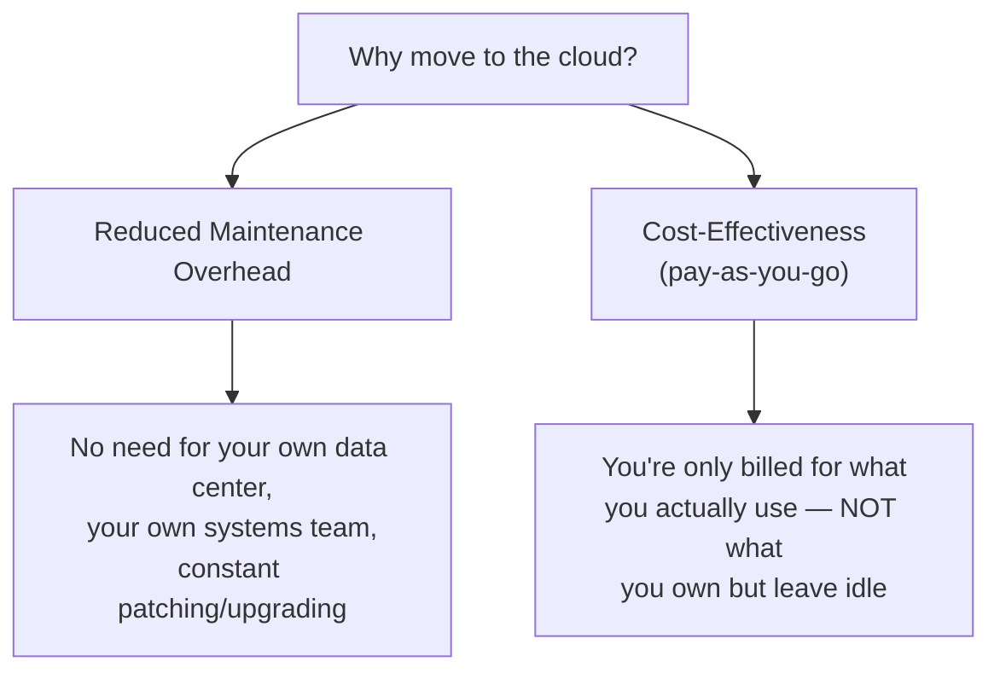
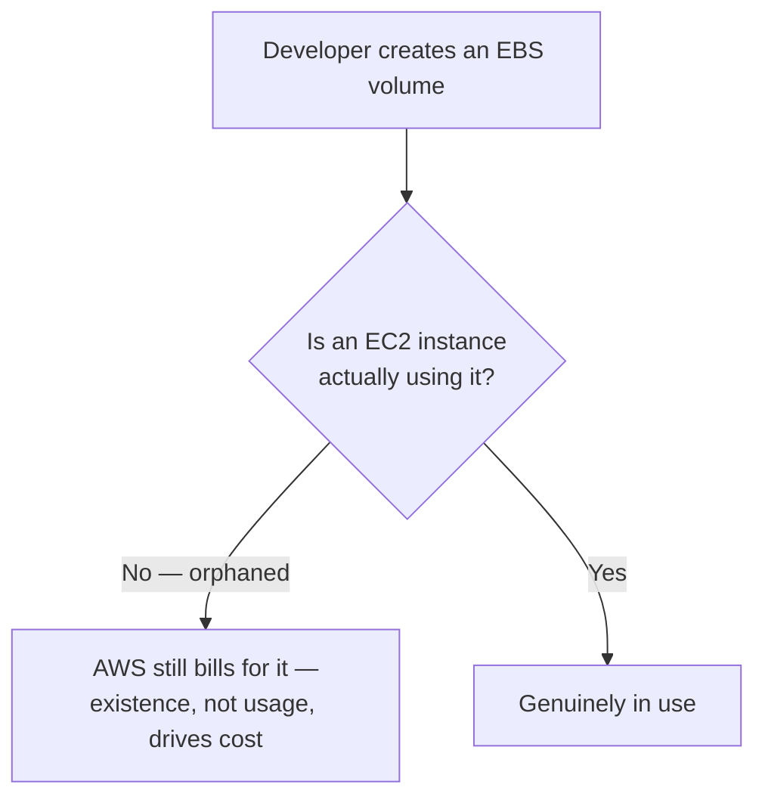
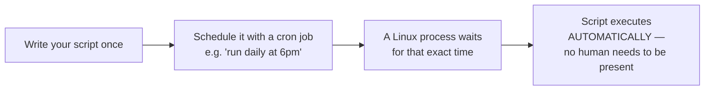
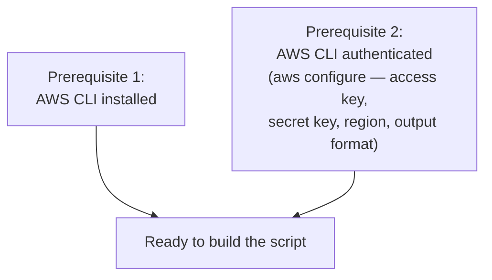
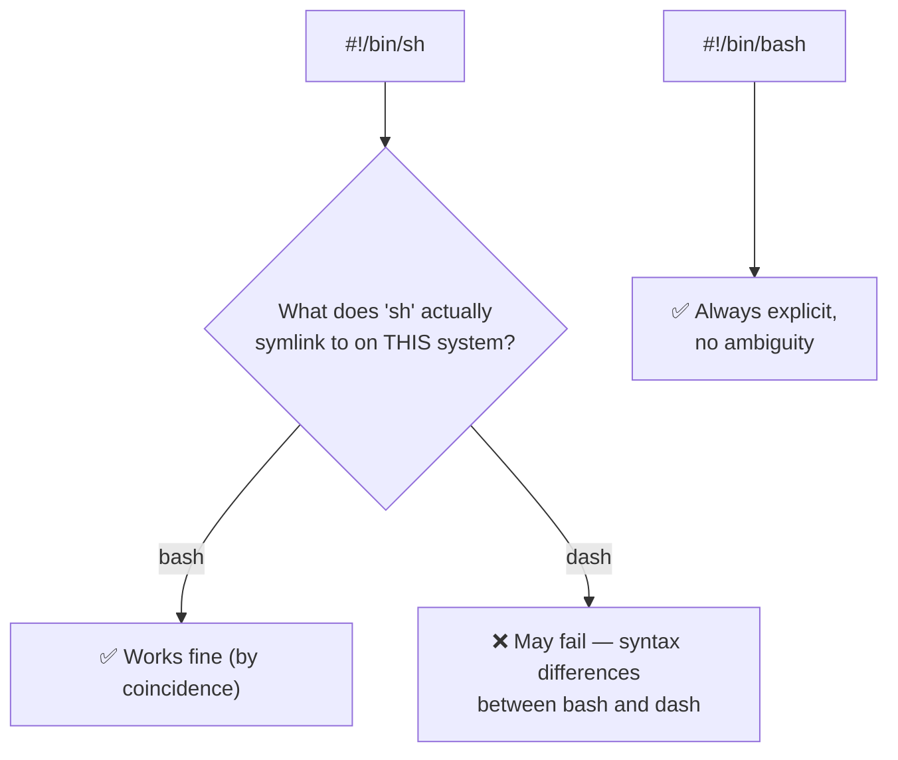
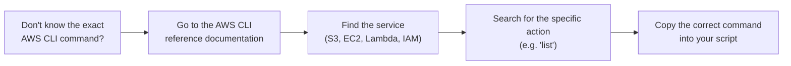
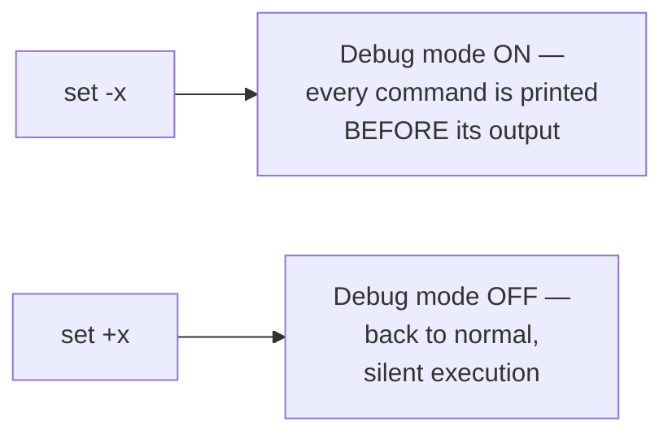
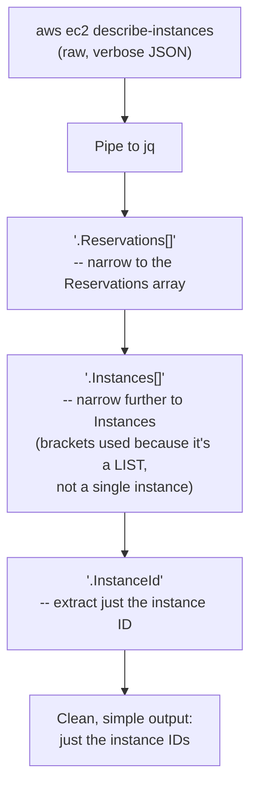
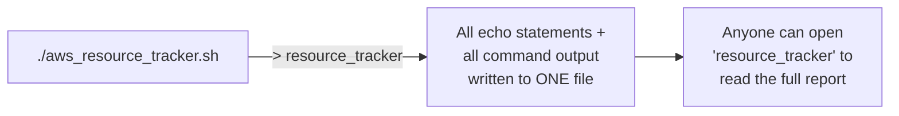
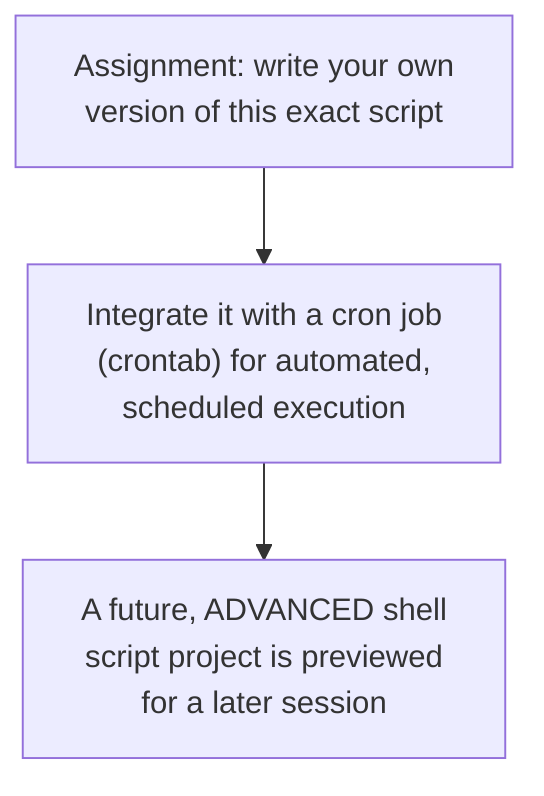

# 📊 Building an AWS Resource Tracker: A Real Shell Scripting DevOps Project

- <i>**Session:** DevOps Zero to Hero — Day 7: "AWS Project using Shell Scripting" · 
- **Instructor:** Abhishek
- **Note on scope:** This session delivers the "real-time DevOps project" explicitly previewed at the end of Day 6 — a genuine, resume-worthy shell script that reports AWS resource usage (S3, EC2, Lambda, IAM) for cost-tracking purposes, live-built and debugged step by step. The script is deliberately kept simple (no shell functions, per the instructor's explicit choice for this stage of the course), and **cron job integration is given only as an explained concept plus a homework assignment** — the actual crontab setup is not demonstrated live in this session, and a future "advanced shell script project" is explicitly previewed. This guide reflects that scope honestly.</i>

---

## 📑 Table of Contents

1. [Session Overview](#-session-overview)
2. [Learning Objectives](#-learning-objectives)
3. [Detailed Notes](#-detailed-notes)
   - [1. Why Organizations Move to the Cloud: Manageability & Cost](#1-why-organizations-move-to-the-cloud-manageability--cost)
   - [2. The Cost-Tracking Problem: When "Created" Isn't "Used"](#2-the-cost-tracking-problem-when-created-isnt-used)
   - [3. Introducing Cron Jobs: The "Schedule and Forget" Analogy](#3-introducing-cron-jobs-the-schedule-and-forget-analogy)
   - [4. Project Setup: Prerequisites & the Shebang Line](#4-project-setup-prerequisites--the-shebang-line)
   - [5. Documenting the Script: Author, Date, Version & Description](#5-documenting-the-script-author-date-version--description)
   - [6. Building the Core Commands: S3, EC2, Lambda & IAM](#6-building-the-core-commands-s3-ec2-lambda--iam)
   - [7. Running the Script & Improving Readability with echo](#7-running-the-script--improving-readability-with-echo)
   - [8. Debug Mode: set -x and set +x](#8-debug-mode-set--x-and-set-x)
   - [9. Parsing JSON Output with jq (and yq for YAML)](#9-parsing-json-output-with-jq-and-yq-for-yaml)
   - [10. Redirecting Output to a File & the Crontab Assignment](#10-redirecting-output-to-a-file--the-crontab-assignment)
4. [Glossary](#-glossary)
5. [Revision Notes — One-Minute Revision](#-revision-notes--one-minute-revision)
6. [Cheat Sheet](#-cheat-sheet)
7. [Interview Questions & Answers](#-interview-questions--answers)
8. [Scenario-Based Interview Questions](#-scenario-based-interview-questions)
9. [Hands-on Exercises](#-hands-on-exercises)
10. [Practice Assignment](#-practice-assignment)
11. [Additional Resources](#-additional-resources)
12. [Final Revision Sheet](#-final-revision-sheet)

---

## 🎯 Session Overview

This session combines two skills taught separately in prior sessions — shell scripting (Day 6) and AWS CLI (Day 5) — into one genuine, practical DevOps project: an AWS resource usage tracker. It covers:

1. The **two core business reasons** organizations move to the cloud: reduced maintenance overhead and cost-effectiveness — establishing WHY this project matters, before showing HOW to build it.
2. A precise, real explanation of the **cost-tracking problem**: resources created but never actually used (e.g., orphaned EBS volumes) still generate real AWS charges, since AWS has no way to know a resource is "unused" — only that it exists.
3. **Cron jobs**, introduced via a genuinely relatable analogy (scheduling a YouTube video to publish automatically) — explaining why automated, scheduled script execution matters more than manual, human-triggered execution.
4. A full, **live-built shell script** (`aws_resource_tracker.sh`), covering: the correct shebang line (and precisely why `#!/bin/bash` is preferred over `#!/bin/sh`), proper script header documentation (author, date, version, description), and the deliberate choice to avoid shell functions at this stage of the course.
5. **Building each AWS CLI command live**, using AWS's own official documentation as the reference — for S3, EC2, Lambda, and IAM — including an honest, unscripted moment where the instructor himself needs to look up the correct IAM command.
6. **Improving script readability** with `echo` print statements, labeling each section of the report.
7. **Debug mode** via `set -x`/`set +x` — showing exactly which command is executing and its output, a pattern commonly seen in real, professionally-written scripts.
8. **`jq`**, a JSON parser, used to extract just the meaningful data (e.g., instance IDs) from AWS CLI's verbose JSON output — with `yq` named as its YAML equivalent.
9. **Redirecting all script output to a file**, and the session's closing assignment: integrating this exact script with a cron job.

> 💡 **Memory Trick — the instructor's framing for this project's real-world value:** *"This project you can also put in your resume, because this is a very generic thing that every organization does."*

---

## 🎯 Learning Objectives

By the end of this guide, you will be able to:

- [ ] Name the two core business reasons organizations move to cloud infrastructure, and explain each precisely.
- [ ] Explain why an unused, orphaned AWS resource (like an EBS volume with no attached EC2 instance) still generates real charges.
- [ ] Explain what a cron job is, using the YouTube-scheduling analogy, and state why automated scheduling is preferred over manual, human-triggered script execution.
- [ ] Write a properly-documented bash script header (shebang, author, date, version, description).
- [ ] Explain precisely why `#!/bin/bash` is preferred over `#!/bin/sh` in a script's shebang line.
- [ ] Use AWS's own CLI documentation to find and correctly use commands for listing S3 buckets, EC2 instances, Lambda functions, and IAM users.
- [ ] Add `echo` statements to a script to clearly label each section of its output for a human reader.
- [ ] Explain what `set -x` and `set +x` do, and why this pattern appears in professionally-written scripts.
- [ ] Use `jq` to extract specific fields (like an instance ID) from AWS CLI's verbose JSON output, and name `yq` as its YAML equivalent.
- [ ] Redirect a script's full output to a file using the `>` operator.

---

## 📚 Detailed Notes

### 1. Why Organizations Move to the Cloud: Manageability & Cost

#### 🧠 Concept

Before writing any code, the session establishes the genuine business motivation behind this project — directly connecting back to why cloud infrastructure (covered since Day 3) exists at all.



#### ⚙ How It Works — Each Reason, Precisely Stated

> 💡 **Memory Trick, given directly:** *"If you maintain your own physical servers as a startup, there's a lot of maintenance overhead — you need your own data center, your own team constantly patching and upgrading for security. Cloud providers work on a pay-as-you-go, pay-as-you-use basis — if you're not using certain instances, you won't be billed for them. Whereas with your own physical infrastructure, whether you use it or not, you already own it and have to pay for it."*

#### 🎯 Key Takeaways

* The two stated reasons organizations move to the cloud: **reduced maintenance overhead** (no dedicated systems/patching team required) and **cost-effectiveness** (genuine pay-as-you-go billing, unlike owned physical infrastructure).
* This section directly reconnects the AWS-specific skills from Days 3-5 to the underlying business case for cloud infrastructure in the first place — not just "how to use AWS," but "why AWS exists as a category."

---

### 2. The Cost-Tracking Problem: When "Created" Isn't "Used"

#### ❓ Why It Exists

> ⚠️ **The precise, real problem, stated directly:** *"Say `example.com` has 100 developers, all with AWS access. A developer might create 100 EC2 instances that nobody actually uses — or create an EBS volume with no EC2 instance ever attached to use it. This happens constantly. Because that volume EXISTS, AWS will bill you for it — AWS has no way of knowing it's genuinely 'unused.'"*



#### 🏢 Real-World / Production Usage — Why This Becomes a DevOps Responsibility

> 💡 **Memory Trick, the precise framing given directly:** *"As a DevOps engineer, or an AWS admin, one of your primary responsibilities is maintaining cost-effectiveness — because that's one of the primary reasons your organization moved to the cloud in the first place. That's why you have to constantly track resource usage."*

#### ⚠ Common Mistakes

* Assuming AWS itself distinguishes between "resources that exist" and "resources genuinely being used" — explicitly, directly corrected: AWS bills based purely on what's provisioned/created, with no inherent awareness of whether it's actually serving any real purpose.

#### 🎯 Key Takeaways

* An AWS resource (like an EBS volume) can exist, be fully billed, and yet be **completely unused** — AWS has no built-in mechanism to distinguish "created" from "genuinely useful."
* Tracking resource usage for cost purposes is explicitly named as a **core DevOps/AWS admin responsibility** — directly, causally connected to the cost-effectiveness motivation established in Section 1.
* This is the precise, concrete problem this session's entire project is built to help solve — not an abstract or hypothetical scenario.

---
### 3. Introducing Cron Jobs: The "Schedule and Forget" Analogy

#### 📖 Definition

> 💡 **Memory Trick — the genuinely relatable analogy given directly:** *"We're doing this DevOps Zero to Hero course, and every day I schedule my video at 7pm. Most of the time, I just upload the video ahead of time and tell YouTube to publish it at 7pm — I don't have to be there, logged in, clicking 'publish' at exactly 7pm. That's exactly what a cron job does: one of your Linux processes waits for the specified time — say, 7pm — and once that time arrives, it automatically executes the shell script for you."*



#### ❓ Why It Exists — The Real Problem It Solves

> ⚠️ **The precise motivating scenario, stated directly:** *"Say you need to generate this report every day at 6pm. One way is to manually run your shell script at that exact time every day — but what if you're not available at that point, or for some reason can't log into the instance right then? You'd miss the timeline. Instead, the common practice in every organization is integrating this shell script with a cron job."*

#### 🎯 Key Takeaways

* A **cron job** is a scheduled, automated execution mechanism — a Linux process waits for a specified time, then automatically runs a given script, with zero human involvement required at execution time.
* This directly solves a genuine reliability problem: manual, human-triggered execution is fragile (unavailability, forgetting, being unable to log in at the exact required moment); a cron job removes that dependency entirely.
* The instructor gives this as a **ready-made interview answer**: *"If somebody asks how you'd ensure a certain script runs every day at a given timestamp, you can simply say: I'd make use of a cron job in Linux to execute this script automatically at that point in time."*

---

### 4. Project Setup: Prerequisites & the Shebang Line

#### 🪜 Step-by-Step — Prerequisites



> 💡 **Memory Trick, given directly:** *"If you don't know how to get your access key and secret key, watch our previous video — you can get that from the AWS console."*

#### 💻 Code Example — The Shebang Line

```bash
#!/bin/bash
```

#### ⚠ Common Mistakes — Why NOT `#!/bin/sh`

> ⚠️ **A precise, directly-explained technical warning:** *"People sometimes use `#!/bin/sh` instead. But `sh` is just a symbolic link — and that symbolic link can point to bash sometimes, and to `dash` other times. If it happens to be bash, you're fine. But if it's `dash`, your script might fail, because there's a slight syntax difference between bash and dash. Always go with the one you're actually using — prefer bash explicitly."*



#### 🎯 Key Takeaways

* Before writing any script, confirm two prerequisites: **AWS CLI is installed**, and **AWS CLI is authenticated** (via `aws configure`).
* Always explicitly use **`#!/bin/bash`** rather than `#!/bin/sh` — `sh` is a symbolic link that may point to `dash` on some systems, risking real syntax-compatibility failures.
* This exact shebang precision directly reinforces Day 6's own explicit recommendation to standardize on bash specifically, over other shell options.

---
### 5. Documenting the Script: Author, Date, Version & Description

#### 🧠 Concept

> 💡 **Memory Trick, the reasoning given directly:** *"Nobody is going to understand what this script is just by looking at it. So always start by providing information: who is the author (in my case, myself), when did you start writing this script (e.g., 11th of January), and what version this is (V1, or a 'draft' version) — you can use this for version tracking. Finally, describe what the script actually does."*

```bash
#!/bin/bash
#
# Author: Abhishek
# Date: 11-Jan
# Version: v1 (draft)
# Description: This script will report the AWS resource usage.
#
```

#### ❓ Why It Exists

> 💡 **Memory Trick, stated directly:** *"Why provide all this information? Because in the future, whenever somebody has issues with the script, or wants to understand who the author is, they can easily approach that person and ask their questions — or you can use this for version tracking."*

#### ⚠ Common Mistakes

* Writing a script with zero header documentation — explicitly, directly framed as a real, common maintainability problem: future readers (including your own future self) have no way to identify ownership, intent, or version history.

#### 🎯 Key Takeaways

* A well-documented script header includes: **author, date, version, and a description** — genuinely practical metadata for any future maintainer.
* This isn't decorative — it directly enables real troubleshooting workflows (knowing who to ask) and version tracking (knowing what's changed across iterations).

---

### 6. Building the Core Commands: S3, EC2, Lambda & IAM

#### 🧠 Concept — Deliberately No Shell Functions, Yet

> 💡 **Memory Trick, the explicit scoping decision stated directly:** *"For the purpose of simplicity, I'm not going to use shell functions here — I could make this more modular, but let's keep it as simple as possible, because we're just at Day 7, and many people might not be familiar with shell functions yet."*

#### 🪜 Step-by-Step — Building Each Command via AWS's Own Documentation



> 💡 **Memory Trick, the exact live process demonstrated for IAM users:** *"Even I wasn't 100% sure of the exact IAM command — so I went back to the AWS CLI reference, searched under IAM, and found 'list-groups' and 'list-users.' The correct command wasn't just 'users' — it was specifically `list-users`."* This directly, honestly demonstrates the exact "use the documentation, don't memorize everything" pattern established in Day 5.

#### 💻 Code Example — The Four Core Commands

```bash
#!/bin/bash
#
# Author: Abhishek
# Date: 11-Jan
# Version: v1 (draft)
# Description: This script will report the AWS resource usage.
#

# We are going to track: AWS S3, AWS EC2, AWS Lambda, AWS IAM users

# List S3 buckets
aws s3 ls

# List EC2 instances
aws ec2 describe-instances

# List Lambda functions
aws lambda list-functions

# List IAM users
aws iam list-users
```

#### 🪜 Step-by-Step — First Execution

```bash
chmod 777 aws_resource_tracker.sh   # NOTE: 777 explicitly called out as not best practice
./aws_resource_tracker.sh
```

> ⚠️ **Directly, explicitly self-corrected:** *"I'm giving it `chmod 777` for now — usually this is NOT a good practice, but since we're not publishing this script anywhere, it's fine for this demo."*

#### ⚠ Common Mistakes

* Assuming you must memorize every AWS CLI command before you can write a useful script — explicitly, directly demonstrated as false: the instructor himself looks up the IAM command live, reinforcing that documentation-lookup is a normal, expected part of the process, not a sign of insufficient knowledge.
* Using `chmod 777` as a genuine best practice — explicitly, directly flagged as something used here only for demo convenience, not something to replicate in real, production scripts.

#### 🎯 Key Takeaways

* This script deliberately avoids shell functions at this stage — a genuine, stated pedagogical simplification for a Day 7 audience, not a "correct vs. incorrect" scripting choice.
* All four core commands (`aws s3 ls`, `aws ec2 describe-instances`, `aws lambda list-functions`, `aws iam list-users`) were found live using AWS's own CLI documentation — directly reinforcing Day 5's "use the docs, don't memorize" lesson.
* `chmod 777` is explicitly flagged as inappropriate for real, production use — used here only as a convenience for an unpublished demo script.

---
### 7. Running the Script & Improving Readability with echo

#### ❓ Why It Exists — The First-Run Problem

> ⚠️ **A real, live-demonstrated readability problem:** *"The script ran and gave me output — but you're not able to understand which output belongs to which command. The problem is I haven't used any print statements yet."*

#### 💻 Code Example — Adding echo Labels

```bash
#!/bin/bash
#
# Author: Abhishek
# Date: 11-Jan
# Version: v1 (draft)
# Description: This script will report the AWS resource usage.
#

echo "Print list of S3 buckets"
aws s3 ls

echo "Print list of EC2"
aws ec2 describe-instances

echo "Print list of Lambda function"
aws lambda list-functions

echo "Print list of IAM users"
aws iam list-users
```

> 💡 **Memory Trick, the precise value stated directly:** *"Using these print statements, a user gets a much better debugging/reading experience — now you can clearly tell which section of output corresponds to which resource."*

#### 🎯 Key Takeaways

* Raw command output, run back to back with no labeling, is genuinely hard to interpret — a real, demonstrated readability failure, not a hypothetical concern.
* A simple `echo "..."` statement placed before each command directly solves this, clearly labeling each section of the report for a human reader.
* This is presented as a small, low-effort change with a large, genuine improvement in the script's actual usability.

---

### 8. Debug Mode: set -x and set +x

#### 📖 Definition

> 💡 **Memory Trick, given directly:** *"You'll often see something like `set -x` or `set +x` in scripts written by your peers or seniors. This puts your script into a debug mode — whenever you run it, it shows you exactly which command is being executed, alongside its output."*



#### 💻 Code Example — Debug Mode in Action

```bash
set -x
# ... your commands here, e.g.:
aws iam list-users
set +x
```

> 💡 **Memory Trick, the live-observed effect described directly:** *"With debug mode on, it showed me exactly that it was running `aws iam list-users` — printing the actual command being used, right alongside the output. This is genuinely useful when troubleshooting a script that isn't behaving as expected."*

#### 🎯 Key Takeaways

* **`set -x`** enables debug/trace mode: every subsequent command is printed to the output immediately before it executes, alongside its actual result.
* **`set +x`** disables this mode, returning to normal, silent execution.
* This is presented as a genuine, common pattern in real, professionally-written scripts — a useful troubleshooting technique, not just a teaching device.

---

### 9. Parsing JSON Output with jq (and yq for YAML)

#### ❓ Why It Exists — The "Too Much Information" Problem

> ⚠️ **A real, precisely-stated problem:** *"The `aws ec2 describe-instances` command gives a LOT of information — but I really just want the instance ID. If I hand all this raw, verbose output to my manager, it won't be clear what the actual instance ID even is."*

#### 📖 Definition

> 💡 **Memory Trick, given directly:** *"`jq` is essentially a JSON parser — it reads through the JSON that AWS returns and lets you extract just the specific piece of information you actually need. There's also `yq`, the equivalent tool for parsing YAML. As DevOps engineers, we deal with JSON and YAML constantly — get familiar with both `jq` and `yq`."*

#### 🪜 Step-by-Step — Building the jq Query, Live



#### 💻 Code Example — The Full jq Command

```bash
aws ec2 describe-instances | jq '.Reservations[].Instances[].InstanceId'
```

> 💡 **Memory Trick, the precise reasoning for the bracket syntax given directly:** *"I'm using these brackets `[]` because `Instances` is a LIST, not a single instance. If it were a single object, you wouldn't need them — but since there can be multiple instances, the brackets let `jq` return any number of instance IDs available."*

#### 💻 Code Example — The Fully Improved Script

```bash
#!/bin/bash
#
# Author: Abhishek
# Date: 11-Jan
# Version: v1 (draft)
# Description: This script will report the AWS resource usage.
#

echo "Print list of S3 buckets"
aws s3 ls

echo "Print list of EC2"
aws ec2 describe-instances | jq '.Reservations[].Instances[].InstanceId'

echo "Print list of Lambda function"
aws lambda list-functions

echo "Print list of IAM users"
aws iam list-users
```

#### 🎯 Key Takeaways

* **`jq`** is a JSON parser used to extract specific, meaningful fields from AWS CLI's often-verbose JSON output — directly demonstrated by narrowing `describe-instances`'s huge output down to just instance IDs.
* **`yq`** is named as the direct YAML equivalent of `jq` — both explicitly framed as essential, frequently-needed DevOps tools.
* The bracket syntax (`[]`) in a `jq` query specifically handles **lists** (multiple items, like multiple EC2 instances) as opposed to single objects — a precise, technically correct detail.

---
### 10. Redirecting Output to a File & the Crontab Assignment

#### 💻 Code Example — Redirecting All Output to a File

```bash
./aws_resource_tracker.sh > resource_tracker
```

> 💡 **Memory Trick, the precise value stated directly:** *"Every output can be redirected to a file -- just improvise the script and say output goes to a file called `resource_tracker`. Now, every piece of information goes to that file, and somebody can just open `resource_tracker` to see the full report."*



#### 🪜 Step-by-Step -- This Session's Stated Assignment

> 💡 **Memory Trick, the instructor's own words, given directly:** *"I'll definitely stop here so I can give you an assignment: write this same script yourself, and integrate it with crontab. If you have any questions, I can explain it in the next video -- but it's genuinely very simple: I already explained the concept of a cron job, just integrate this script with it."*



#### ⚠ Honesty Note

The actual `crontab` setup/syntax (e.g., editing a crontab file, cron scheduling syntax) is **not demonstrated live** in this session -- the concept was explained (Section 3), but the hands-on implementation is left as the session's own stated assignment, with further explanation explicitly offered "in the next video" if needed. This guide reflects that boundary honestly rather than inventing crontab syntax that wasn't actually taught here.

#### 🎯 Key Takeaways

* Redirecting a script's full output to a file (`./script.sh > filename`) is the final, simple step that makes this report genuinely shareable and reviewable, rather than only visible in a live terminal session.
* This session's own stated assignment: write your own version of this script, and integrate it with a cron job -- directly applying Section 3's cron concept to this section's completed script.
* A **future, more advanced shell scripting project** is explicitly previewed -- this session's project is deliberately positioned as "a very simple one," not the final word on shell-scripting-based DevOps projects.

---

## 📝 Glossary

| Term | Definition | Why It Matters |
|---|---|---|
| **Pay-as-you-go** | Cloud billing model charging only for actual resource usage | One of the two core reasons organizations move to the cloud |
| **Orphaned resource** | A cloud resource (e.g., an EBS volume) that exists but is not actually being used by anything | Still generates real AWS charges -- the core cost-tracking problem this project addresses |
| **Cron job** | A scheduled, automated script execution mechanism in Linux | Removes the need for a human to manually trigger a script at an exact time |
| **Shebang line** | The `#!/bin/bash` (or similar) line at the top of a script, specifying which interpreter runs it | `#!/bin/bash` is preferred over `#!/bin/sh`, which can unpredictably symlink to `dash` |
| **Script header documentation** | Author, date, version, and description comments at the top of a script | Genuinely aids future maintainability and troubleshooting |
| **`echo`** | Prints a given string to the terminal/output | Used here to clearly label each section of a script's report |
| **`set -x` / `set +x`** | Enables/disables debug (trace) mode, printing each command before its output | A common pattern in real, professionally-written scripts |
| **`jq`** | A command-line JSON parser | Used to extract specific fields (e.g., instance IDs) from AWS CLI's verbose JSON output |
| **`yq`** | The YAML equivalent of `jq` | Named as an equally essential DevOps tool |
| **Output redirection (`>`)** | Sends a command/script's output to a file instead of the terminal | Makes a report shareable and reviewable, not just visible in a live session |

---

## 🔄 Revision Notes — One-Minute Revision

* Organizations move to the cloud for two core reasons: **reduced maintenance overhead** and **cost-effectiveness** (pay-as-you-go) -- but pay-as-you-go only works if resource usage is genuinely tracked, since **AWS bills for what's created, not what's actually used** (e.g., an orphaned EBS volume with no attached EC2 instance still costs money).
* Tracking resource usage for cost purposes is a **core DevOps/AWS admin responsibility**, directly motivating this session's project.
* **Cron jobs** (explained via the YouTube-scheduled-video analogy) let a script run automatically at a specified time, with zero human presence required -- solving the real reliability problem of manual, human-triggered execution.
* The project script, `aws_resource_tracker.sh`, was built live and incrementally: starting with **`#!/bin/bash`** (explicitly preferred over `#!/bin/sh`, which can risk `dash`-related syntax failures), proper **header documentation** (author, date, version, description), and a deliberate choice to **avoid shell functions** at this stage for simplicity.
* Each core AWS CLI command (`aws s3 ls`, `aws ec2 describe-instances`, `aws lambda list-functions`, `aws iam list-users`) was found live using **AWS's own official documentation** -- including an honest, unscripted moment where the instructor himself needed to look up the correct IAM command.
* **`echo`** statements were added before each command to clearly label the report's sections -- directly fixing a real, demonstrated readability problem with the raw, unlabeled output.
* **`set -x`**/**`set +x`** enable/disable debug mode, showing exactly which command is executing alongside its output -- a genuine pattern found in professionally-written scripts.
* **`jq`** (a JSON parser) was used to extract just the instance ID from `describe-instances`'s verbose output (`.Reservations[].Instances[].InstanceId`), dramatically simplifying the report; **`yq`** was named as the YAML equivalent.
* The script's full output can be redirected to a file with **`> resource_tracker`**, making the report genuinely shareable.
* The session's stated assignment: **write your own version of this script and integrate it with a cron job** -- the actual crontab syntax/setup itself is not demonstrated live in this session, and a future, more advanced shell scripting project is explicitly previewed.

---

## 📋 Cheat Sheet

**Why organizations move to the cloud:**
```text
Reduced maintenance overhead + Cost-effectiveness (pay-as-you-go)
```

**The cost-tracking problem:**
```text
Resource EXISTS (even if unused) -> AWS still bills for it
```

**The complete project script:**
```bash
#!/bin/bash
#
# Author: Abhishek
# Date: 11-Jan
# Version: v1 (draft)
# Description: This script will report the AWS resource usage.
#

echo "Print list of S3 buckets"
aws s3 ls

echo "Print list of EC2"
aws ec2 describe-instances | jq '.Reservations[].Instances[].InstanceId'

echo "Print list of Lambda function"
aws lambda list-functions

echo "Print list of IAM users"
aws iam list-users
```

**Run and save to a file:**
```bash
chmod +x aws_resource_tracker.sh     # (chmod 777 used in the live demo -- NOT best practice for real use)
./aws_resource_tracker.sh > resource_tracker
```

**Debug mode:**
```bash
set -x    # ON -- shows each command before its output
set +x    # OFF -- back to normal
```

**jq basics:**
```bash
command | jq '.Reservations[].Instances[].InstanceId'
# [] = this is a LIST (multiple items), not a single object
```

**Cron job (the concept, not live-demonstrated syntax):**
```text
Write your script -> schedule it via cron -> runs automatically,
no human needs to be present at execution time
```

---

## 🔥 Interview Questions & Answers

### 🟢 Beginner

**Q1.**

**Question:** Name the two core reasons organizations move to cloud infrastructure.

**Answer:** Reduced maintenance overhead, and cost-effectiveness (pay-as-you-go).

**Explanation:** Directly, precisely stated as the session's opening motivation.

**Why Interviewers Ask This:** A foundational, frequently-asked cloud-computing question.

**Possible Follow-up:** "How does pay-as-you-go billing differ from owning physical infrastructure?"

**Q2.**

**Question:** Why does an unused, orphaned EBS volume still cost money?

**Answer:** AWS bills based on what's provisioned/created, not on whether it's genuinely being used -- it has no inherent way to know a resource is "unused."

**Explanation:** Directly, precisely explained as the session's core motivating problem.

**Why Interviewers Ask This:** A genuinely practical, common cost-management scenario.

**Possible Follow-up:** "Whose responsibility is it to track and address this kind of waste?"

**Q3.**

**Question:** What is a cron job?

**Answer:** A scheduled, automated execution mechanism -- a Linux process waits for a specified time, then automatically runs a given script, with no human needing to be present.

**Explanation:** Directly, precisely defined via the YouTube-scheduling analogy.

**Why Interviewers Ask This:** A classic, frequently-asked DevOps automation question.

**Possible Follow-up:** "Why is this preferred over manually running a script at the required time each day?"

**Q4.**

**Question:** Why is `#!/bin/bash` preferred over `#!/bin/sh` in a script's shebang line?

**Answer:** `sh` is a symbolic link that can point to either bash or `dash` depending on the system -- if it points to `dash`, syntax differences may cause the script to fail; `#!/bin/bash` is always explicit and unambiguous.

**Explanation:** Directly, precisely explained.

**Why Interviewers Ask This:** A genuinely important, practical shell-scripting detail.

**Possible Follow-up:** "What specific kind of failure might occur if a bash-syntax script ran under dash?"

**Q5.**

**Question:** What four pieces of information belong in a well-documented script header?

**Answer:** Author, date, version, and a description.

**Explanation:** Directly, precisely listed and demonstrated.

**Why Interviewers Ask This:** A practical, real-world script-maintainability best practice.

**Possible Follow-up:** "Why does version information matter for a script specifically?"

**Q6.**

**Question:** What does `jq` do?

**Answer:** It's a JSON parser, used to extract specific fields from JSON output (like AWS CLI's).

**Explanation:** Directly, precisely defined and demonstrated.

**Why Interviewers Ask This:** A core, frequently-used DevOps tool.

**Possible Follow-up:** "What's the equivalent tool for parsing YAML instead of JSON?"

**Q7.**

**Question:** What does `set -x` do in a shell script?

**Answer:** Enables debug/trace mode -- every subsequent command is printed before its output, showing exactly what's being executed.

**Explanation:** Directly, precisely defined and demonstrated live.

**Why Interviewers Ask This:** A genuinely common, practical debugging technique.

**Possible Follow-up:** "What command turns this mode back off?"

**Q8.**

**Question:** Why did the instructor add `echo` statements to the script partway through building it?

**Answer:** The raw, unlabeled command output was genuinely hard to interpret -- `echo` statements label each section, making the report readable.

**Explanation:** Directly, explicitly demonstrated as a real, live-observed problem and its fix.

**Why Interviewers Ask This:** Tests understanding of practical script usability, not just functional correctness.

**Possible Follow-up:** "What would the report have looked like without these echo statements?"

**Q9.**

**Question:** How do you redirect a script's full output to a file?

**Answer:** `./script.sh > filename`

**Explanation:** Directly, precisely demonstrated.

**Why Interviewers Ask This:** Basic, practical shell redirection knowledge.

**Possible Follow-up:** "Why is this useful for a report meant to be shared with a manager or team?"

**Q10.**

**Question:** Which four AWS resource types does this session's project script track?

**Answer:** S3 (buckets), EC2 (instances), Lambda (functions), and IAM (users).

**Explanation:** Directly, precisely named as the project's stated scope.

**Why Interviewers Ask This:** Tests recall of the actual project's content.

**Possible Follow-up:** "What AWS CLI command lists each of these four resource types?"

---

### 🟡 Intermediate

**Q11.**

**Question:** Explain why the instructor deliberately avoids shell functions in this script, and connect this decision to the course's broader teaching philosophy.

**Answer:** The instructor explicitly states this is a deliberate simplicity choice for a Day 7 audience -- many learners at this point may not yet be familiar with shell functions, and introducing them here would add unnecessary complexity to a lesson whose main goal is combining shell scripting and AWS CLI knowledge into one practical project. This directly mirrors Day 6's explicitly-stated breadth-before-depth philosophy: introduce a working, useful version of a concept first, and defer more advanced/modular techniques (like functions) to later, when learners are more comfortable.

**Explanation:** Requires connecting this session's specific scoping decision to the course's consistently-stated broader philosophy.

**Why Interviewers Ask This:** Tests whether a learner recognizes deliberate, principled simplification versus assuming it reflects a limitation.

**Possible Follow-up:** "How would you refactor this script to use functions, once you're comfortable with them?"

**Q12.**

**Question:** A learner asks why the instructor looked up the IAM command live instead of already knowing it. Explain why this is presented as a normal, even instructive, moment rather than a mistake.

**Answer:** This directly, deliberately reinforces the exact lesson established in Day 5: AWS's own documentation provides ready-to-use commands for every service, and looking them up is a normal, expected part of professional DevOps work -- not a sign of insufficient expertise. By honestly demonstrating this live, rather than pre-scripting a flawless performance, the instructor models the actual, realistic workflow a working DevOps engineer follows: check the documentation when uncertain, rather than relying purely on memorization.

**Explanation:** Requires connecting this specific live moment to the broader "use the docs, don't memorize" lesson established earlier in the course.

**Why Interviewers Ask This:** Tests whether a learner internalizes documentation-lookup as a legitimate professional practice, not a shortcut to avoid.

**Possible Follow-up:** "What resource would you check first if you needed a command you didn't already know?"

**Q13.**

**Question:** Explain, precisely, why the `jq` query for extracting instance IDs uses `[]` after `Instances` but the exact same bracket logic applies to `Reservations` as well -- walk through the full query structure.

**Answer:** The full query is `.Reservations[].Instances[].InstanceId`. Both `Reservations` and `Instances` are LISTS in AWS's returned JSON structure -- a `describe-instances` call can return multiple reservations, and each reservation can contain multiple instances -- so both require the `[]` bracket syntax to correctly iterate over every item in each list, rather than assuming there's only ever one. `InstanceId`, by contrast, is a single scalar value within each instance object, so no brackets are needed there. The query effectively says: "for every reservation, for every instance within it, give me that instance's ID" -- precisely handling the nested, multi-item structure of the real data.

**Explanation:** Requires reasoning through the full nested query structure, not just the single bracket usage explicitly narrated live.

**Why Interviewers Ask This:** Tests genuine understanding of `jq`'s list-handling syntax, applicable well beyond this one specific example.

**Possible Follow-up:** "How would you modify this query to also extract each instance's current state (running, stopped, etc.), assuming that field exists in the same JSON structure?"

**Q14.**

**Question:** Explain why this session frames "send this report to a reporting dashboard" as the real-world norm, while the actual project sends it "to a manager" instead -- what does this distinction reveal about the project's teaching purpose?

**Answer:** The instructor explicitly states that in genuine production practice, this kind of automated resource-usage information typically flows into a dedicated reporting dashboard, not a manually-read file sent to an individual manager -- but for the purposes of this specific shell-scripting lesson, the "send to a manager" framing is used as a simpler, more relatable stand-in that doesn't require building or integrating with an actual dashboard system (a separate, more complex topic). This reveals the project's real teaching purpose: demonstrating the CORE shell-scripting and AWS CLI skills (data gathering, formatting, redirection) in a self-contained, achievable way -- with the understanding that the exact same underlying script could later be adapted to feed a real dashboard instead of a manually-read file, once dashboard integration is covered separately.

**Explanation:** Requires recognizing an explicit, self-aware simplification the instructor names directly, and reasoning about its pedagogical purpose.

**Why Interviewers Ask This:** Tests whether a learner distinguishes a deliberately simplified teaching scenario from a claim about actual, typical production practice.

**Possible Follow-up:** "What would need to change in this script to send its output to a real dashboard instead of a file?"

**Q15.**

**Question:** Synthesize this session's cost-tracking motivation (Section 2) with its cron-job automation concept (Section 3) to explain why a ONE-TIME manual run of this script would be insufficient to actually solve the underlying business problem.

**Answer:** The cost-tracking problem (Section 2) is fundamentally an ONGOING concern -- new resources (and potential waste) can be created by any of an organization's many developers at any time, not just once. A single, one-time manual run of the resource tracker script would only capture a snapshot at that specific moment -- genuinely useful for that instant, but immediately stale as soon as new resources are created or existing ones are deleted afterward. This is precisely why the session pairs the tracking script with the cron-job concept: automating the script to run repeatedly (e.g., daily) is what actually makes it a genuine, ongoing solution to a genuinely ongoing problem, rather than a one-off report that quickly becomes outdated and loses its value for real cost-management decision-making.

**Explanation:** Requires connecting two sections of the session (the business problem and the automation solution) into a coherent explanation of why BOTH pieces are necessary together, not independently sufficient.

**Why Interviewers Ask This:** Tests whether a learner understands automation as a necessary complement to the tracking logic itself, not an optional add-on.

**Possible Follow-up:** "How would you decide the right cron schedule frequency (daily, hourly, weekly) for this specific use case?"

---

### 🔴 Advanced

**Q16.**

**Question:** Design an enhanced version of this session's script that would help specifically identify LIKELY-orphaned resources (per Section 2's core problem), rather than just listing all resources regardless of actual usage -- using only concepts covered in this session plus reasonable extensions of them.

**Answer:** A reasonable enhancement: for EC2 instances specifically, extend the existing `jq` query to also extract each instance's **state** (e.g., "stopped" vs. "running") alongside its ID -- since a long-stopped instance (while not necessarily "orphaned" in the strictest sense) is a reasonable signal worth flagging for review. For a more direct orphaned-EBS-volume check (the session's own specific example), add a NEW command using AWS CLI's EC2 volume-description functionality (following the exact "check AWS's own documentation" pattern established in Section 6) to list volumes, then use `jq` to filter specifically for volumes whose `Attachments` field is empty -- a genuinely reliable indicator of an unattached, likely-orphaned volume, directly extending this session's own core cost-tracking motivation into an actionable, automatable check rather than just a raw inventory listing. Both extensions follow this session's exact demonstrated pattern (find the AWS CLI command via documentation, parse the JSON response with `jq` for the specific field that matters) applied to a more targeted, business-relevant question.

**Explanation:** Extends the session's demonstrated technique (CLI command + `jq` parsing) to directly address the ACTUAL business problem (Section 2) more precisely than the basic inventory-listing script the session builds -- genuine, applied extension.

**Why Interviewers Ask This:** A realistic, senior-level scripting question testing whether a candidate can extend a basic taught pattern to solve a more specific, valuable real-world problem.

**Possible Follow-up:** "What AWS CLI command would you research to find unattached EBS volumes specifically?"

**Q17.**

**Question:** Critically evaluate: "Since this session explicitly avoids shell functions for simplicity, using shell functions in any AWS resource-tracking script is unnecessary added complexity that should generally be avoided." Is this an accurate implication of the session's content?

**Answer:** Not accurate. The session explicitly frames its no-functions choice as a deliberate simplification specifically appropriate for THIS teaching moment (a Day 7 audience potentially unfamiliar with functions), not a general claim that functions are unnecessary or should be avoided in real, production-grade scripts. In fact, the instructor explicitly notes he could have written this exact script "in a GitHub repository using functions" -- directly acknowledging functions as a genuinely valid, arguably preferable approach for a more mature or production-oriented version of the same script, deliberately deferred rather than dismissed. The accurate, more precise claim: for THIS specific teaching context, avoiding functions kept the lesson focused and accessible -- but for a real, maintained, production resource-tracking script (especially one tracking many more resource types, or reused across multiple projects), functions would likely be the better, more maintainable choice, exactly as more experienced engineers commonly use them.

**Explanation:** Tests whether a learner over-generalizes a context-specific teaching simplification into a general claim about production best practices the session doesn't actually make.

**Why Interviewers Ask This:** Distinguishes candidates who track the precise, stated scope of a teaching decision from those who round it into an inaccurate general rule.

**Possible Follow-up:** "Refactor this session's script to use a single shell function for 'print a labeled AWS CLI command's output,' reused across all four resource checks."

**Q18.**

**Question:** Synthesize this session's `set -x`/`set +x` debug-mode coverage (Section 8) with its `jq`-based output-simplification coverage (Section 9) to explain why these two techniques serve genuinely OPPOSITE purposes, despite both modifying how a script's output appears.

**Answer:** `set -x` (debug mode) is specifically designed to show MORE information than normal -- every command executed, printed explicitly, alongside its output -- intentionally increasing verbosity specifically to aid troubleshooting when something isn't working as expected. `jq`-based parsing (Section 9), by contrast, is specifically designed to show LESS information than the raw command would otherwise produce -- filtering AWS's often-massive, verbose JSON responses down to just the one or two fields genuinely relevant to a human reader, intentionally REDUCING verbosity to improve readability for a report intended for actual consumption (e.g., by a manager). These techniques aren't in tension or redundant with each other -- they serve different moments and different audiences: `set -x` is a developer-facing, troubleshooting-time tool (temporarily maximizing visibility into what's happening), while `jq` filtering is an end-user-facing, report-generation-time tool (permanently minimizing noise in the final output) -- a script could reasonably use `set -x` temporarily WHILE developing/debugging the very same `jq`-filtered report logic, then remove or disable `set -x` once the script is working correctly for actual, ongoing use.

**Explanation:** Requires recognizing a genuine, non-obvious contrast between two techniques taught in adjacent sections that might otherwise seem like "just two more output-modifying commands," articulating their distinct purposes and appropriate contexts.

**Why Interviewers Ask This:** A capstone-level conceptual question testing whether a candidate distinguishes development-time tooling from end-user-facing output design, a genuinely important professional distinction.

**Possible Follow-up:** "Would it ever make sense to leave `set -x` permanently enabled in a production cron-scheduled script? Why or why not?"

---

## 🧪 Scenario-Based Interview Questions

> **Scenario 1:** A teammate's version of this session's resource-tracker script runs successfully when executed manually, but their manager reports never receiving the daily report. Using this session's concepts, walk through your diagnosis.

**Structured Answer:**
1. **Initial investigation:** Confirm whether the script has actually been integrated with a cron job at all, per this session's own explicit assignment -- a script that only runs when manually executed will never produce automated, unattended daily output.
2. **Metrics/logs to check:** Check whether a cron job is genuinely configured (e.g., via `crontab -l` to list scheduled jobs) and whether it's scheduled for the correct time and pointing at the correct script path.
3. **Possible causes:** Most likely, per this session's own stated assignment boundary, the cron integration step was never actually completed -- this session explicitly teaches the CONCEPT of cron jobs but leaves the actual crontab implementation as homework, a step a teammate might have genuinely skipped or gotten stuck on.
4. **Debugging approach:** Manually re-run the script first to confirm it still works correctly in isolation (ruling out a script-level bug), then specifically investigate the cron configuration itself.
5. **Resolution:** If no cron job exists, help the teammate set one up correctly, pointing to the script's absolute (not relative) file path, since cron jobs don't run with the same working-directory context as a manual terminal session.
6. **Prevention:** Establish a verification step in the team's process -- after setting up any new cron job, deliberately wait for (or manually trigger, if the cron tool supports it) at least one scheduled execution and confirm the expected file/report was actually produced, before considering the automation "done."

> **Scenario 2 (Advanced):** Your organization wants to extend this session's script to track resource usage across an additional five AWS services, and a teammate proposes simply copy-pasting the existing four command blocks five more times with different service names. Using this session's concepts, evaluate this proposal and recommend an alternative.

**Structured Answer:**
1. **Initial investigation:** Recognize that copy-pasting nearly-identical blocks nine total times (four existing + five new) would create significant code duplication -- each block follows the exact same `echo` label + AWS CLI command pattern, differing only in the specific command and label text.
2. **Relevant principle:** Per Advanced Q17's reasoning, while this session deliberately avoided shell functions for THIS specific teaching context, the instructor explicitly acknowledged functions as a legitimate, often preferable approach for more substantial or production-oriented scripts -- and nine near-identical blocks is a genuine signal that this threshold has been crossed.
3. **Possible causes for the teammate's copy-paste proposal:** Likely following the exact pattern demonstrated live in this session, without yet recognizing when script complexity genuinely warrants moving beyond that session's deliberately simplified approach.
4. **Debugging/evaluation approach:** Compare the maintenance cost of nine duplicated blocks (any shared fix or improvement, like adding `jq` filtering to a new resource type, would need to be manually repeated nine times) against the cost of introducing a single, reusable function.
5. **Resolution:** Recommend refactoring to a single shell function (e.g., `report_resource() { echo "Print list of $1"; eval "$2"; }`) called once per resource type with the appropriate label and command as arguments -- directly implementing the modular approach this session explicitly named as the "GitHub repository" alternative it deliberately deferred, now that the script's genuine complexity justifies it.
6. **Prevention:** Establish a team guideline: once a script's structure repeats the same pattern more than roughly 3-4 times, treat that as the practical threshold for introducing functions, directly connecting this session's explicit complexity-based reasoning to an actionable, reusable team standard.

---

## 🛠 Hands-on Exercises

### 🟢 Easy

1. Write out, from memory, the four AWS CLI commands this session's script uses (S3, EC2, Lambda, IAM), then verify your answers against AWS's own CLI documentation.
2. Add `echo` labels to a simple two-command shell script of your own (any two commands, AWS-related or not), and compare the readability of the output with and without the labels.
3. Write a properly-documented script header (author, date, version, description) for a script of your own choosing.

### 🟡 Medium

4. Build this session's complete `aws_resource_tracker.sh` script yourself, on your own AWS account/EC2 instance, and successfully run it end to end, redirecting its output to a file.
5. Practice `set -x`/`set +x` by wrapping one command in your script with debug mode enabled, and documenting the difference in output compared to running it without debug mode.
6. Write a `jq` query (using your own `describe-instances` output, or a similarly-structured mock JSON file) to extract a DIFFERENT field than instance ID -- such as instance type or state -- directly extending Section 9's demonstrated pattern.

### 🔴 Advanced

7. Implement the orphaned-resource-detection enhancement proposed in Advanced Interview Q16, using AWS's own documentation to find the correct volume-description command and `jq` filter.
8. Refactor this session's script into a function-based version, per Advanced Interview Q17/Scenario 2's reasoning, and document the maintenance benefit with a concrete example (e.g., adding a fifth resource type with minimal code duplication).
9. Complete this session's own stated assignment: integrate your working script with an actual cron job, and document the exact crontab syntax and scheduling you used, since this specific implementation detail was not demonstrated live in this session.

---

## 🏗 Practice Assignment

*(This session's own stated assignment, reproduced faithfully, with structure added)*

> 💡 **Memory Trick -- the instructor's own words, given directly:** *"I'll definitely stop here so I can give you an assignment: write the same script yourself, and integrate it with crontab. If you have any questions, I can explain it in the next video -- but it's very simple: I already explained the concept, just integrate this script with it."*

### Build: "Automated AWS Resource Tracker"

**Objective:** Complete this session's own stated assignment end to end -- write your own version of the resource-tracking script and successfully integrate it with a cron job for automated, scheduled execution.

**Requirements:**
- A working shell script (your own version, following this session's structure) tracking at minimum S3, EC2, Lambda, and IAM resources.
- Proper script header documentation (author, date, version, description).
- `echo` labels for each section, and `jq` filtering applied to at least the EC2 output (per Section 9's exact demonstrated pattern).
- Output successfully redirected to a file.
- The script successfully scheduled via crontab to run automatically at a time of your choosing -- since this specific step wasn't demonstrated live, research the correct `crontab` syntax as part of this assignment.
- Documentation of your crontab entry and confirmation that at least one automated (not manually-triggered) execution genuinely occurred.

**Architecture (suggested):**

```text
aws_resource_tracker/
├── aws_resource_tracker.sh    # your completed script
├── resource_tracker            # the generated report file
└── CRONTAB_SETUP.md              # your documented crontab entry + verification
```

**Expected Functionality:**
- Running the script manually should produce a clean, labeled, readable report.
- The cron-scheduled execution should produce the same report automatically, without any manual intervention, confirmed by checking the report file's timestamp after the scheduled time has passed.

**Challenges:**
- Correctly researching and implementing crontab syntax, since this session explicitly left this as homework rather than demonstrating it live.
- Ensuring your cron job uses absolute file paths (not relative ones), since cron's execution context differs from a manual terminal session.

**Bonus Improvements:**
- Extend your script to track one additional AWS resource type not covered in this session (e.g., RDS instances or VPCs), using AWS's own documentation to find the correct command, per this session's established research pattern.
- Implement the orphaned-EBS-volume detection enhancement from Advanced Interview Q16.

---

## 📚 Additional Resources

- The instructor's **Day 0 through Day 6 videos** (referenced directly) -- required prior viewing for full context, especially Day 5 (AWS CLI) and Day 6 (shell scripting basics).
- The **DevOps Zero to Hero playlist** -- referenced directly, containing all videos in this same free course.
- **AWS CLI official documentation** -- directly used live, multiple times, to find the correct commands for S3, EC2, Lambda, and IAM.
- **A future, more advanced shell scripting project video** (referenced directly) -- will build on this session's foundational project with additional complexity.

---

## 📌 Final Revision Sheet

### ⭐ Core Concepts
- Organizations move to the cloud for **reduced maintenance overhead** and **cost-effectiveness** -- but cost-effectiveness requires genuine resource-usage tracking, since AWS bills for what EXISTS, not what's actually used.
- **Cron jobs** enable automated, scheduled script execution, removing the need for manual, human-triggered runs.
- A well-built script includes: correct shebang (`#!/bin/bash`), proper header documentation, clear `echo` labels, and (when genuinely needed) `jq`/`yq` for parsing structured output.
- **`set -x`/`set +x`** enable/disable debug mode for troubleshooting; **`jq`** simplifies verbose JSON into just what's needed for a readable report -- genuinely opposite purposes, both valuable.
- This session's script deliberately avoids shell functions for teaching simplicity -- not a claim that functions should generally be avoided in real scripts.

### ⭐ Important Definitions
- **Orphaned resource**, **shebang line**, **`jq`/`yq`** (see Glossary for full definitions).

### ⭐ Important Commands/Code
```bash
#!/bin/bash
aws s3 ls
aws ec2 describe-instances | jq '.Reservations[].Instances[].InstanceId'
aws lambda list-functions
aws iam list-users
set -x / set +x
./script.sh > output_file
```

### ⭐ Architecture/Process
- Script build order: shebang → header docs → core commands (via AWS docs) → `echo` labels → debug mode (as needed) → `jq` filtering → output redirection → (assignment) cron integration.

### ⭐ Best Practices
- Always use `#!/bin/bash` explicitly, never `#!/bin/sh`.
- Always document script headers (author, date, version, description).
- Use AWS's own documentation to find commands rather than assuming you must memorize everything.
- Avoid `chmod 777` in real, non-demo scripts.
- Label script output clearly with `echo` for human readability.

### ⭐ Common Mistakes
- Assuming AWS distinguishes "created" from "genuinely used" resources for billing purposes.
- Using `#!/bin/sh` and assuming it's equivalent to `#!/bin/bash`.
- Writing scripts with zero output labeling, producing genuinely hard-to-interpret reports.
- Assuming every script must use functions, or conversely, that functions should always be avoided.

### ⭐ Interview Points
- Be ready to explain the cost-tracking problem (orphaned resources) precisely, with a concrete example.
- Be ready to explain what a cron job is and why it's preferred over manual execution.
- Be ready to explain `jq`'s role and walk through a real query structure.
- Be ready to name this project as a genuine, resume-worthy example of applied shell scripting + AWS CLI knowledge.

### ⭐ Things to Remember
- This session's **crontab integration is explicitly left as an assignment**, not demonstrated live -- the concept was explained (Section 3), but the hands-on syntax/setup is genuinely homework, not something covered in depth here.
- A **future, more advanced shell scripting project** is explicitly previewed -- this session's project is deliberately positioned as introductory ("a very simple one"), not the final word on the topic.
- The instructor's own explicit acknowledgment that this script COULD use functions (deferred, not dismissed) is a genuinely important nuance -- avoid over-generalizing this session's simplicity choice into a general anti-functions stance.

---

## Source

- [AWS Project using Shell Scripting](https://youtu.be/gx5E47R9fGk?si=T3zP5ToBtA-FRFBZ)