# 🔗 A Real DevOps Shell Script: GitHub API Integration to Audit Repository Access

- <i>**Session:** DevOps Zero to Hero — Day 8 (Take Two): "Shell Scripting Project Used In Real Time — GitHub API Integration" · 
- **Instructor:** Abhishek
- **Note on scope:** This is an explicit **re-recording** of the original Day 8 video — the instructor directly states the first version (published ~8 months earlier, ~37K views) left a small number of viewers confused, so he rebuilt the explanation from scratch with a complete, published GitHub repository for the code. This guide covers the re-recorded version: the real-world motivation for the project, how to read API documentation, a full live build/run of a GitHub-access-auditing shell script (including real, unedited errors and fixes), a full script walkthrough, and concrete improvement suggestions (some directly demonstrated, one explicitly left as a self-contained assignment).</i>

---

## 📑 Table of Contents

1. [Session Overview](#-session-overview)
2. [Learning Objectives](#-learning-objectives)
3. [Detailed Notes](#-detailed-notes)
   - [1. Why This Is "Take Two": A Note on Content Iteration](#1-why-this-is-take-two-a-note-on-content-iteration)
   - [2. The Real-World Scenario: Tracking Repository Access at Scale](#2-the-real-world-scenario-tracking-repository-access-at-scale)
   - [3. Two Ways to Talk to Any Application: API vs. CLI](#3-two-ways-to-talk-to-any-application-api-vs-cli)
   - [4. What Is an API, Really? UI vs. Programmatic Access](#4-what-is-an-api-really-ui-vs-programmatic-access)
   - [5. DevOps Engineers Consume APIs, They Don't Write Them](#5-devops-engineers-consume-apis-they-dont-write-them)
   - [6. Reading API Documentation: A Live Walkthrough](#6-reading-api-documentation-a-live-walkthrough)
   - [7. Project Setup: EC2, Cloning the Script & GitHub Token Security](#7-project-setup-ec2-cloning-the-script--github-token-security)
   - [8. Running the Script: Live Execution, Real Errors & Real Fixes](#8-running-the-script-live-execution-real-errors--real-fixes)
   - [9. Reading the Script, Part 1: Structure, Functions & Environment Variables](#9-reading-the-script-part-1-structure-functions--environment-variables)
   - [10. Reading the Script, Part 2: jq, JSON Filtering & the Final Output](#10-reading-the-script-part-2-jq-json-filtering--the-final-output)
   - [11. Improving the Script: Comments, Helper Functions & Scaling with Loops](#11-improving-the-script-comments-helper-functions--scaling-with-loops)
4. [Glossary](#-glossary)
5. [Revision Notes — One-Minute Revision](#-revision-notes--one-minute-revision)
6. [Cheat Sheet](#-cheat-sheet)
7. [Interview Questions & Answers](#-interview-questions--answers)
8. [Scenario-Based Interview Questions](#-scenario-based-interview-questions)
9. [Hands-on Exercises](#-hands-on-exercises)
10. [Practice Assignment](#-practice-assignment)
11. [Additional Resources](#-additional-resources)
12. [Final Revision Sheet](#-final-revision-sheet)

---

## 🎯 Session Overview

This session builds a genuinely real, resume-worthy DevOps automation project: a shell script that queries GitHub's REST API to list who has access to a given repository — directly useful for offboarding scenarios (revoking a departing employee's access) and routine access audits. It covers:

1. An honest, direct explanation of **why this video is a re-recording** — a real signal about the instructor's iterative, feedback-responsive teaching approach.
2. The genuine **business scenario** motivating this project: a DevOps engineer maintaining many GitHub repositories across many teams, needing to audit access without manually navigating GitHub's UI every time.
3. **Two ways to talk to any application** — API and CLI — with `kubectl` (Kubernetes) given as a familiar CLI example, and GitHub's more mature, well-established API chosen as this project's approach.
4. A precise, first-principles definition of **what an API actually is** — programmatic access (via `curl`, Python's `requests`, etc.) as opposed to a browser-based user interface.
5. An important, explicitly-stated clarification: **DevOps engineers consume APIs, they don't write them** — a role-boundary distinction illustrated with the familiar `boto3`/AWS CLI comparison.
6. A **live walkthrough of GitHub's own REST API documentation** — finding the correct endpoint URLs for pull requests and issues, and noting that GitHub's docs even provide ready-to-use sample `curl` commands.
7. **Full project setup**: launching an EC2 instance, cloning the actual script from a public GitHub repository, and a genuine security walkthrough for creating and protecting a GitHub personal access token.
8. **Live script execution**, including two real, unedited errors (a permissions error, and a missing `jq` installation) and their fixes — plus a live demonstration of why the script correctly fails against a repository the user doesn't actually have access to.
9. A **full, careful script walkthrough**: environment-variable-based credentials, command-line arguments, a two-function structure (building the request vs. processing the response), and exactly how `jq` filters GitHub's raw JSON response down to the specific list of non-admin collaborators.
10. **Concrete script improvements** — a header/comment section and a command-line-argument validation helper function (one demonstrated live, one given as a direct assignment) — plus a scaling insight: wrapping the script in a loop to check many repositories at once.

> 💡 **Memory Trick — the instructor's own stated reason for redoing this video:** *"There were only three or four comments saying they weren't able to follow the video completely — but I don't want to leave even those three or four people behind. I want everyone to follow the playlist and understand DevOps right from the basics."*

---

## 🎯 Learning Objectives

By the end of this guide, you will be able to:

- [ ] Explain the real-world DevOps scenario motivating this project: auditing GitHub repository access, especially for employee offboarding.
- [ ] Name the two general ways of talking to any application (API and CLI), and give `kubectl` as an example of the CLI approach for Kubernetes.
- [ ] Define an API precisely, distinguishing browser-based UI access from programmatic access via tools like `curl`.
- [ ] Explain why DevOps engineers are expected to consume APIs, not write them, using the `boto3`/AWS CLI comparison.
- [ ] Navigate a real API's official documentation to find the correct endpoint URL and any provided sample code for a given task.
- [ ] Correctly create and securely handle a GitHub personal access token, including scoping its permissions appropriately.
- [ ] Explain why this session's script fails against a repository the executing user doesn't have UI-level access to, connecting this to the underlying nature of API authentication.
- [ ] Read and explain a real, two-function shell script structure: one function building a `curl` command, another executing it and processing the response.
- [ ] Use `jq` to filter a JSON array based on a nested field's value (e.g., `permissions.pull == true`) and extract a specific field (`.login`) from matching objects.
- [ ] Explain the purpose and structure of a command-line-argument validation "helper function," and why it should be invoked at the very start of a script.

---

## 📚 Detailed Notes

### 1. Why This Is "Take Two": A Note on Content Iteration

#### 🧠 Concept

> 💡 **Memory Trick, the instructor's own direct explanation:** *"This video has 37K views, created eight months ago, and many people liked it — but if you read the comments, a few people weren't able to follow it completely, or didn't fully understand it. I don't want anyone watching this playlist to get blocked on any single video. So I'm doing take two — a better version, with clearer explanation and a complete, published code script on GitHub."*

#### 🎯 Key Takeaways

* This session is an explicit **re-recording**, motivated by direct, read feedback from viewer comments — not a routine content refresh.
* The instructor frames this as a genuine, ongoing practice: *"As I keep doing videos, sometimes I feel a previous one could have been explained better — if I find something like that, I'll do a take two. I don't find anything awkward in it, because I want to share knowledge as widely as possible."*
* The complete script is published in a **public GitHub repository**, explicitly intended so learners can both watch AND directly try the project themselves.

---

### 2. The Real-World Scenario: Tracking Repository Access at Scale

#### ❓ Why It Exists

> 💡 **Memory Trick, the full scenario given directly:** *"As a DevOps engineer, you might maintain a lot of GitHub repositories — supporting multiple teams, each working on their own microservice. For each repository, you ensure only the right people have access. Now say someone resigns, and today is their last day — you need to check if they have access to a given repo, and if so, revoke it. Doing this manually — logging into GitHub, navigating to the repo, the settings tab, the collaborators list — every single time, for every repo, is a real, repetitive task."*

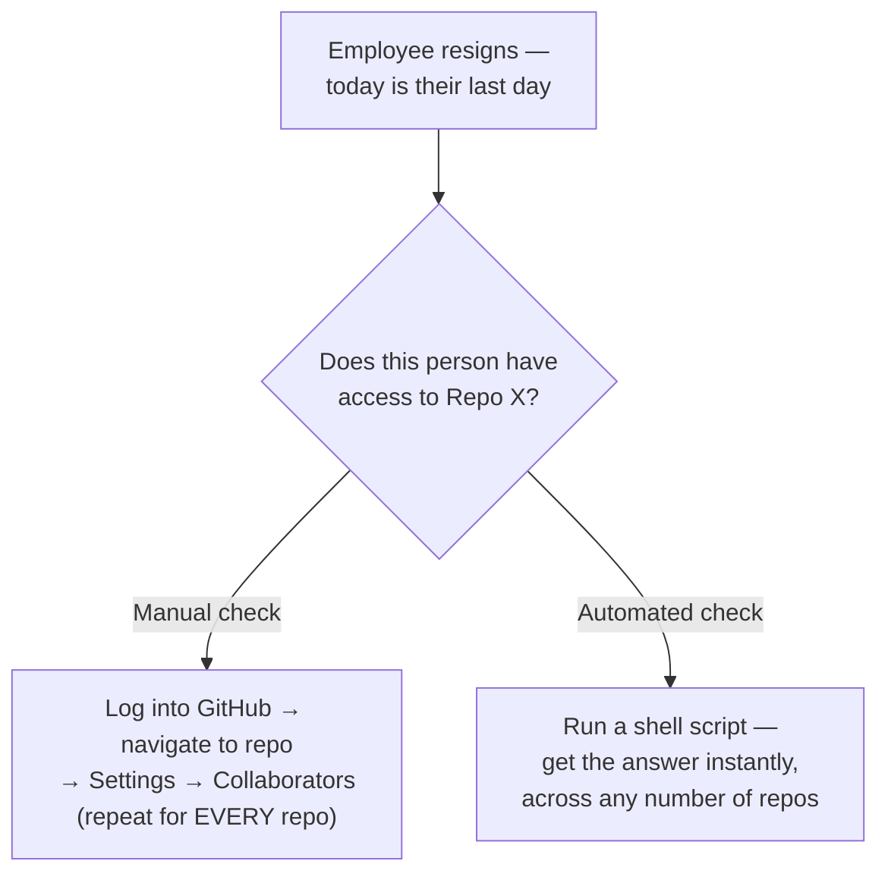

#### 🎯 Key Takeaways

* This project addresses a **genuinely common, recurring DevOps task**: auditing who has access to a repository — explicitly framed around the real, high-stakes scenario of employee offboarding.
* Manually checking access via GitHub's UI is functional but doesn't scale — directly consistent with this course's recurring efficiency/automation theme from prior sessions.
* The instructor explicitly notes this project is genuinely resume-worthy, precisely because it addresses a task virtually every organization using GitHub actually needs to perform.

---

### 3. Two Ways to Talk to Any Application: API vs. CLI

#### 📖 Definition

> 💡 **Memory Trick, given directly:** *"On a broad level, there are two ways to talk to any application — GitHub, Jenkins, GitLab, even Kubernetes: API or CLI. For Kubernetes, we mostly use `kubectl` — that's the CLI option. You could also talk to Kubernetes via its APIs, but because `kubectl` is such a simple utility, we prefer it."*

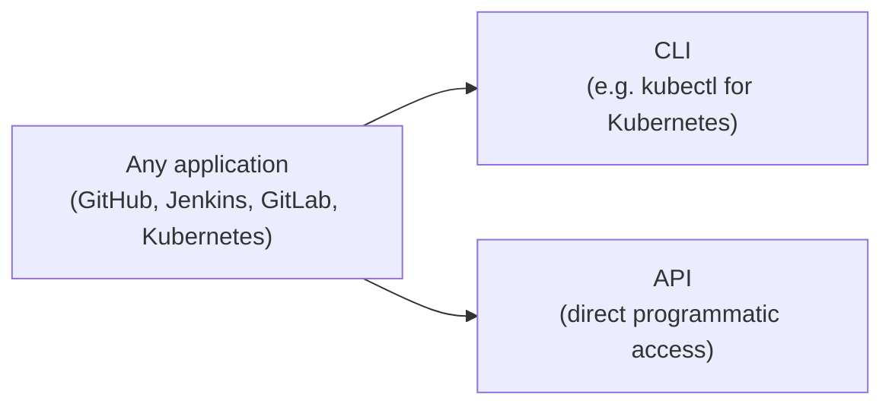

#### 🔍 Internal Working — Why This Project Chooses API, Not CLI

> 💡 **Memory Trick, the precise reasoning given directly:** *"GitHub also has both a CLI and an API — but for GitHub, the API is much simpler, because the API has existed traditionally for a long time, and you can write scripts against it in shell scripting, Python, Node.js, Java, or genuinely any programming language."*

#### 🎯 Key Takeaways

* Every major DevOps tool (GitHub, Jenkins, GitLab, Kubernetes) exposes **both** an API and (usually) a CLI — the choice between them is a deliberate, tool-specific decision, not a fixed rule.
* `kubectl` is given as the concrete, familiar example of a CLI being preferred over direct API access, specifically because of its simplicity.
* This project deliberately chooses GitHub's **API**, specifically because of its maturity and broad, language-agnostic scriptability.

---
### 4. What Is an API, Really? UI vs. Programmatic Access

#### 📖 Definition

> 💡 **Memory Trick, given directly, from first principles:** *"API basically means Application [Programming] Interface. Right now, I'm talking to github.com through the user interface — I opened my browser, typed github.com, and this page popped up. That's the user interface. Instead of doing all of that, you can get the exact same information PROGRAMMATICALLY — through shell scripting, Python, or any other programming language, if that application exposes its interface for that purpose."*

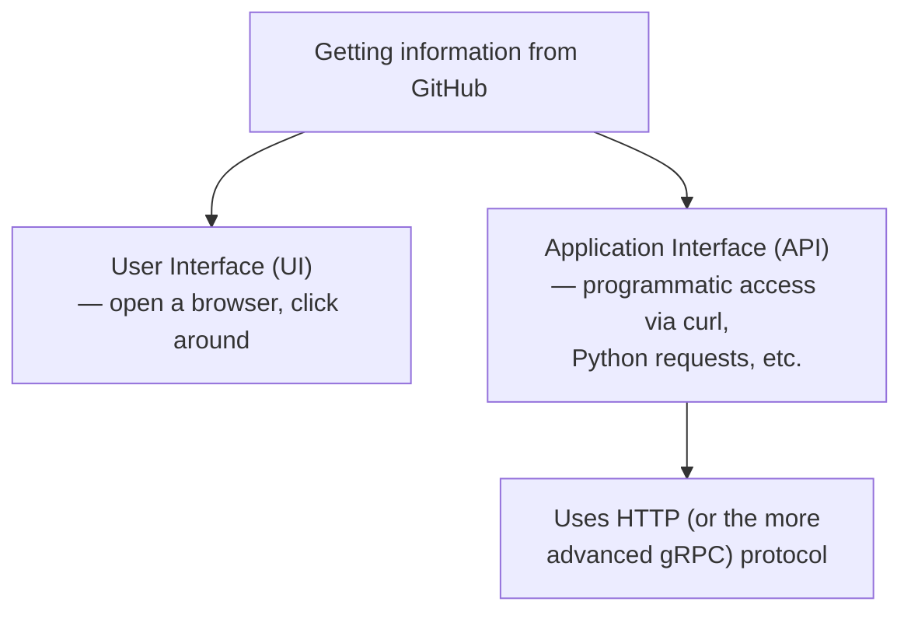

#### 🔍 Internal Working — The Modules That Make This Possible

> 💡 **Memory Trick, given directly:** *"For shell scripting, you have `curl`. For Python, you have the `requests` module. Using these modules, you directly talk to the application over HTTP — you don't need your browser, Postman, or any other tool. You get the information programmatically, through the application's interface — that's precisely why it's called an API."*

#### ⚠ Common Mistakes

* Assuming "API" is some fundamentally mysterious or advanced concept — explicitly, directly demystified: it's simply a way of getting the SAME information a UI shows you, but programmatically, via HTTP requests made through tools like `curl` or `requests`.

#### 🎯 Key Takeaways

* An **API** (Application [Programming] Interface) is precisely the programmatic alternative to a browser-based user interface — same underlying information, different access method.
* **`curl`** (shell scripting) and **`requests`** (Python) are the concrete, named tools/modules used to make this kind of programmatic HTTP request.
* This project deliberately demystifies "API" from an abstract buzzword into a precise, concrete mechanism — directly setting up the rest of the session's practical work.

---

### 5. DevOps Engineers Consume APIs, They Don't Write Them

#### ❓ Why It Exists

> ⚠️ **A direct, important role-boundary clarification:** *"Should DevOps engineers write these APIs? The answer is no. As a DevOps engineer, you don't write APIs — you USE them, or CONSUME them."*

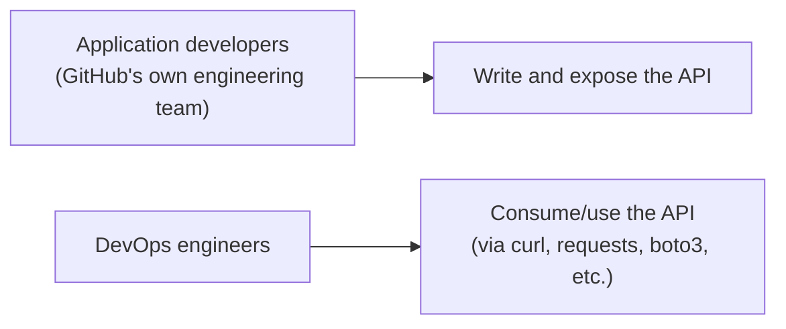

#### 🏢 Real-World / Production Usage — The boto3/AWS CLI Parallel

> 💡 **Memory Trick, the direct comparison given:** *"Best example: `boto3`. When you want to talk to AWS, you can use the AWS CLI utility — e.g., `aws s3 ls` — or you can write a Python program using `boto3` to interact with AWS. This is the CLI way; that's the API way. Similarly, GitHub, Jira, GitLab, Jenkins — all of them have their own APIs, written by their own developers, each with its own reference documentation."*

#### 🎯 Key Takeaways

* A precise, explicitly stated role boundary: **DevOps engineers consume/use APIs — they don't author them.** Writing an API is the responsibility of the application's own development team.
* This directly parallels a concept already established in this course: `boto3` (Section coverage from Day 5) is a real, concrete example of "consuming" AWS's API, exactly as this session's script consumes GitHub's API.
* Every major DevOps-relevant tool exposes its own API, documented via its own **reference documentation** — which is exactly what the next section demonstrates how to actually read.

---
### 6. Reading API Documentation: A Live Walkthrough

#### ❓ Why It Exists

> 💡 **Memory Trick, the core motivating question, stated directly:** *"DevOps engineers know how to use `curl`. DevOps engineers know how to use the `requests` module. But DevOps engineers do NOT inherently know the API's URL — or how to get a specific piece of information from that URL. That's exactly what reference documentation is for."*

#### 🪜 Step-by-Step — Finding the "List Pull Requests" Endpoint, Live

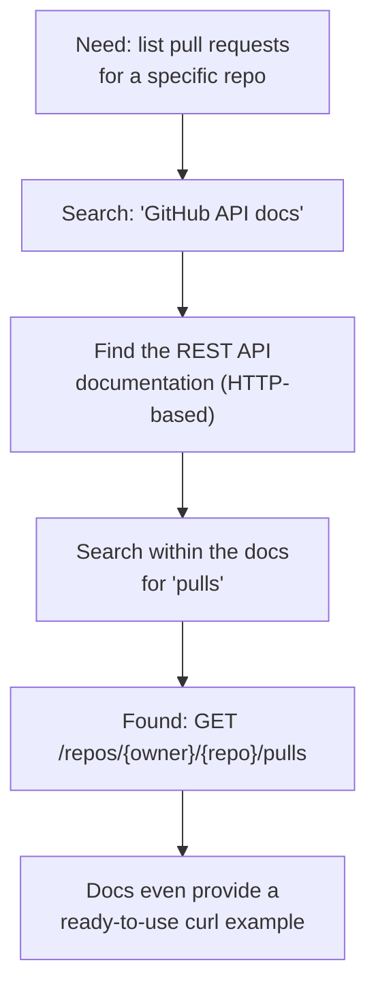

> 💡 **Memory Trick, the precise URL structure explained directly:** *"Watch this carefully: `github.com` is one URL — that's the UI. `api.github.com/repos/owner/repo/pulls` is a DIFFERENT URL — that's the API. You have to replace `owner` and `repo` with your actual repository's details — e.g., `kubernetes/kubernetes`, or your own organization's name and repo name."*

> 💡 **Memory Trick, on GitHub's documentation quality:** *"This is the beauty of good API documentation — GitHub even shares a sample script. If you're writing shell scripting, use this `curl` command. If you're using Python, they show the `requests` version. If JavaScript, they show that too. Not every API's documentation includes sample scripts like this — but GitHub's documentation is genuinely very good."*

#### 🪜 Step-by-Step — Finding the "List Issues" Endpoint, Live (A Second Example)

> 💡 **Memory Trick, given directly:** *"Same process for issues — go back to the docs, search for 'issues.' You'll find several related endpoints: list issues assigned to a user, get a specific issue, even create an issue. The URL pattern is `api.github.com/repos/owner/repo/issues`. Notice the capitalized placeholders in the documentation (like `OWNER`, `REPO`) — capitals specifically indicate values YOU must replace with your actual, real values."*

#### ⚠ Common Mistakes

* Confusing `github.com` (the UI's URL) with `api.github.com` (the API's base URL) — these are genuinely different endpoints serving fundamentally different purposes.
* Assuming every API's documentation will helpfully provide ready-to-use sample scripts — explicitly, directly noted as a genuine strength of GitHub's specific documentation, not a universal guarantee across all APIs.

#### 🎯 Key Takeaways

* API documentation, at minimum, tells you the correct **endpoint URL** for a given task — the essential starting point for writing any API-consuming script.
* GitHub's API base URL is **`api.github.com`**, genuinely distinct from the UI's `github.com` — a precise, important distinction.
* Capitalized placeholders in documentation (like `OWNER`, `REPO`) signal values you must substitute with your own real, specific values.
* This exact "check the official documentation" pattern directly echoes the same lesson from Day 5 (AWS CLI) and Day 7 (AWS resource tracker) — a consistent, repeated skill across this entire course.

---

### 7. Project Setup: EC2, Cloning the Script & GitHub Token Security

#### 🪜 Step-by-Step — Infrastructure & Code Setup

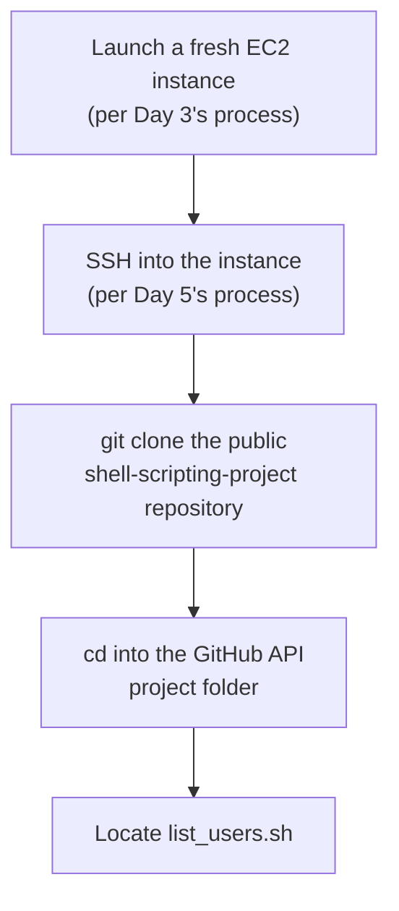

> 💡 **Memory Trick, given directly:** *"I already copied the shell script's repository path. `git clone` this project — the link is in the video description. You'll find two folders: one is the previous project (the AWS resource tracker from Day 7), and one is today's project."*

#### 🪜 Step-by-Step — Creating & Securing a GitHub Personal Access Token

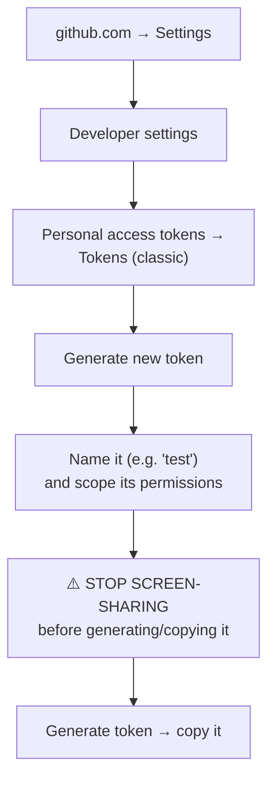

> ⚠️ **A direct, urgent security warning, precisely stated:** *"You have to be very careful about this token — if someone gets access to it, they can technically access your entire GitHub account. There's a real risk of getting hacked. That's exactly why, whenever doing something like this, you stop sharing your screen — don't show this to anyone, and don't share it with anyone."*

#### 🪜 Step-by-Step — Exporting Required Environment Variables

```bash
export USERNAME=your-github-username
export TOKEN=your-generated-personal-access-token
```

> 💡 **Memory Trick, why these are exported rather than hardcoded, explained directly (previewed here, detailed fully in Section 9):** *"Whoever reads this script should NOT be able to see your username or token — both are sensitive. That's why these values are read from the environment/terminal, rather than hardcoded directly into the script."*

#### ⚠ Common Mistakes

* Sharing your screen while generating or copying a personal access token — an explicit, directly-stated real security risk, not a minor formality.
* Granting a token overly broad permissions (e.g., delete or full admin access) when a much narrower scope would suffice for the task at hand — the instructor explicitly removes delete and admin-level permissions for this specific demo's token.

#### 🎯 Key Takeaways

* Project setup directly reuses skills from **Day 3** (EC2 creation) and **Day 5** (SSH login) — this entire course builds cumulatively, not in isolated silos.
* A GitHub **personal access token** functions as the API's equivalent of a username/password — and is explicitly treated as a genuinely sensitive credential, on par with a password, requiring real security discipline (no screen-sharing while generating it, scoped permissions, never hardcoded into a script).
* Environment variables (`export USERNAME=...`, `export TOKEN=...`) are the mechanism used to keep these credentials out of the actual script file — directly previewing this session's security-conscious script design, detailed fully in Section 9.

---
### 8. Running the Script: Live Execution, Real Errors & Real Fixes

#### 🪜 Step-by-Step — The Full, Live, Unedited Execution Sequence

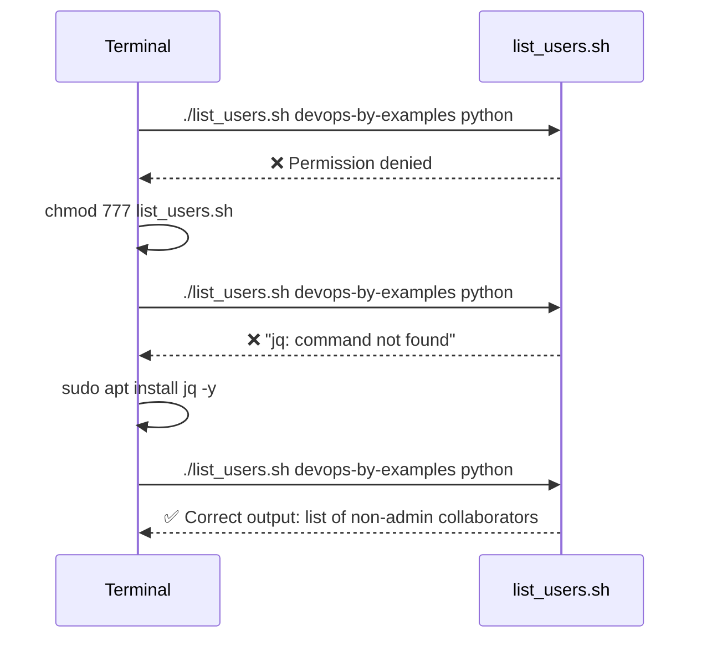

> ⚠️ **Directly, honestly reproduced live, exactly as it happened:** *"It said permission denied — I have to grant access to the script. Let me give it 777 for now... Now let's try executing one more time — it says 'jq: command not found.' That's fine, this script requires `jq` to be installed. Let me install `jq` first: `sudo apt install jq -y`."*

#### 💻 Live Demonstration — Interpreting the Correct Output

> 💡 **Memory Trick, the precise, honest output-interpretation walkthrough:** *"It shows `moit` as having access — but you might wonder why only `moit`, when I know two other people (myself and Bavya) also have access. The reason: those two are ADMINS/owners of this repository — the script is deliberately filtering to show only non-admin collaborators, specifically people with read/write access who AREN'T already owners. `moit` is an outside collaborator; the script correctly identifies and shows only them."*

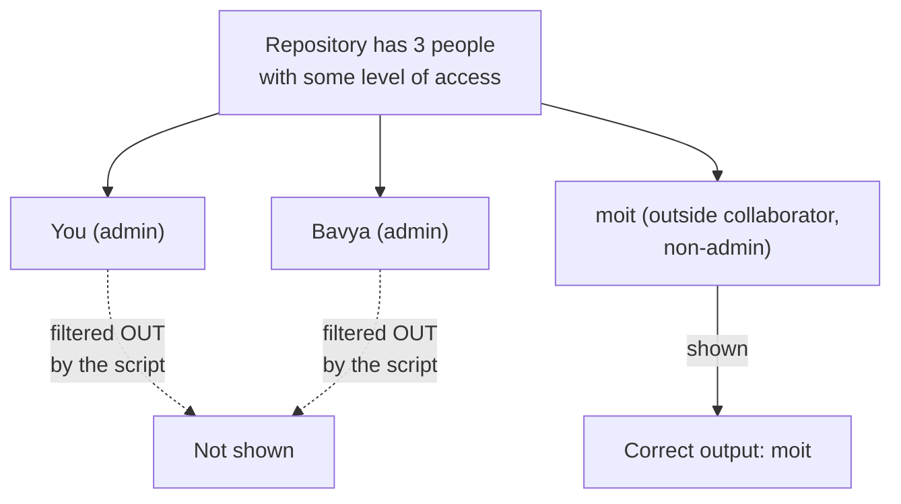

#### 💻 Live Demonstration — The Script Correctly Fails Against an Inaccessible Repo

> ⚠️ **Directly, deliberately demonstrated as an important, instructive failure:** *"Let's try `kubernetes/kubernetes` instead. It says: 'cannot index string with string' — the script failed. Why? Because I don't have access to this repository. If you can't do something through the user interface, you can't do it through the API either. For THIS repository, I can't even see its settings tab — that's exactly why the script fails here, but succeeded for the repository I actually have access to."*

#### ⚠ Common Mistakes

* Assuming an API bypasses the same access restrictions the UI enforces — explicitly, directly corrected via this live-demonstrated failure: API access is still governed by the exact same underlying permissions as UI access.
* Interpreting a filtered, partial output (like only seeing `moit`) as a script bug rather than deliberate, intended filtering logic — directly clarified by walking through exactly which JSON field determines who's shown.

#### 🎯 Key Takeaways

* Two real, live-reproduced errors — a permissions issue (`chmod 777`) and a missing dependency (`jq` not installed) — are shown and fixed honestly, exactly as encountered, not edited out.
* The script's filtered output (showing only `moit`, not the two admins) is deliberate, correct behavior — driven by a specific JSON field check, not a bug.
* API access respects the exact same underlying permissions as UI access — a genuinely important, directly demonstrated principle: **if you can't do it through the UI, you can't do it through the API either.**

---

### 9. Reading the Script, Part 1: Structure, Functions & Environment Variables

#### 💻 Code Example — The Script's Opening Structure

```bash
#!/bin/bash

API_URL="https://api.github.com"

# Reads credentials from environment variables (NOT hardcoded)
# export USERNAME=... and export TOKEN=... must be set before running

REPO_OWNER=$1
REPO_NAME=$2
```

> 💡 **Memory Trick, the shebang note given directly:** *"You always start with the shebang, followed by how you're writing the script — here it's bash. If you're writing in `sh`, replace it accordingly — but keep this syntax if you're using bash."*

> 💡 **Memory Trick, the security reasoning for environment variables, given directly:** *"Whoever is reading this script should NOT know your username or token — both are sensitive information. So instead of hardcoding those values into the script, the script reads them from the terminal/environment. Whoever executes the script exports those values themselves on their own Linux terminal."*

> 💡 **Memory Trick, command-line arguments explained directly:** *"`$1` indicates the first command-line argument, `$2` the second. In this case, the first is the repo owner/organization name (`devops-by-examples`), and the second is the repo name (`python`)."*

#### 🪜 Step-by-Step — The Two-Function Design

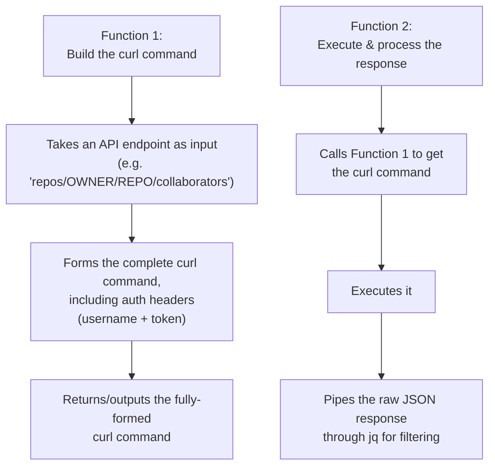

> 💡 **Memory Trick, the reasoning for splitting into two functions, given directly:** *"I've split this into two functions, but you could write it as one. To write efficiently, you create a function specifically for forming the entire `curl` command — that's Function 1's whole job. Function 2 handles taking the input (the endpoint) and printing the final output — calling Function 1 internally to get the actual command it needs to run."*

#### ⚠ Common Mistakes

* Hardcoding sensitive credentials (username, token) directly into a shared or version-controlled script — explicitly, directly avoided here specifically via the environment-variable pattern.
* Assuming a script must be written as a single, monolithic block — the two-function split is explicitly framed as a genuine efficiency/organization choice, separating "build the request" from "execute and process the response."

#### 🎯 Key Takeaways

* Credentials (username, token) are read from **environment variables**, never hardcoded — a genuine, important security practice for any shareable script.
* Command-line arguments (`$1`, `$2`) supply the repo owner and repo name at execution time — making the script genuinely reusable across any repository, not hardcoded to one.
* The script's **two-function structure** cleanly separates "build the request" (Function 1) from "execute it and process the response" (Function 2) — a deliberate, sensible organizational choice, not a strict requirement.

---
### 10. Reading the Script, Part 2: jq, JSON Filtering & the Final Output

#### 💻 Live Demonstration — Seeing the Raw JSON First

> 💡 **Memory Trick, a genuinely illuminating live demonstration:** *"Watch this carefully — let me remove the `jq` part entirely and re-run the script. Now you see GitHub's actual, raw JSON response — most APIs return JSON (the specific format depends on your programming language's needs, but JSON is extremely common). This raw response includes THREE user objects: me, Bavya, and moit."*

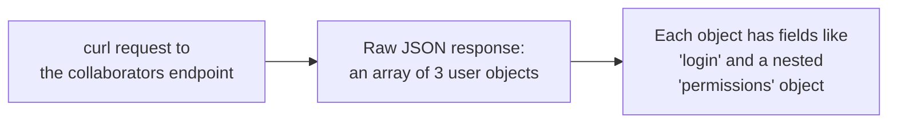

#### 🔍 Internal Working — The Specific JSON Field That Drives Filtering

> 💡 **Memory Trick, precisely explained:** *"Inside each user's JSON object, there's a `permissions` field, and inside THAT, an `admin` field (true/false). For `moit`, `permissions.admin` is `false`. For me, `permissions.admin` is `true`. That's the exact field this script uses to determine who to show."*

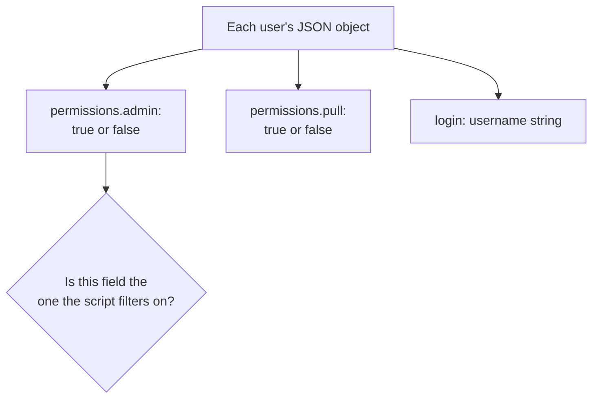

#### 💻 Code Example — The Actual jq Filter Used

```bash
curl -s -u "$USERNAME:$TOKEN" "$API_URL/repos/$REPO_OWNER/$REPO_NAME/collaborators" \
  | jq '.[] | select(.permissions.pull == true) | .login'
```

> 💡 **Memory Trick, precisely explained, field by field:** *"Here I'm using `permissions.pull` specifically, not `permissions.admin` — you could use either, depending on exactly which group you want to isolate. This statement says: for every JSON object in the array, IF `permissions.pull` equals `true`, THEN print that object's `.login` field — which is the person's username. That's exactly why we got `moit` as the output."*

#### ⚠ Common Mistakes

* Assuming `jq` filtering is required to get information from an API at all — explicitly, directly clarified via the live "remove jq and see the raw JSON" demonstration: `jq` is specifically for FILTERING an already-complete JSON response down to just what's relevant, not for making the request itself.
* Assuming there's only one "correct" field to filter on — explicitly acknowledged that `permissions.admin` would work equally validly, depending on which specific group of users you actually want to isolate.

#### 🎯 Key Takeaways

* GitHub's raw API response is a JSON array containing a full object per collaborator — including a nested `permissions` object with fields like `admin` and `pull` (each true/false).
* **`jq`**'s job is specifically to filter this raw response down to just the relevant subset (e.g., non-admin collaborators) and extract just the needed field (`.login`) — not to make the request itself.
* The exact filtering field (`permissions.pull` vs. `permissions.admin`) is a deliberate design choice, not a fixed requirement — different fields isolate different groups of users depending on the actual goal.

#### 💻 Code Example — The Final if/else Output Logic

```bash
if [ -z "$collaborators" ]; then
    echo "No user has read access"
else
    echo "$collaborators"
fi
```

> 💡 **Memory Trick, given directly:** *"This final `if` block checks: if the list of collaborators (in our case, the output was `moit`) is EMPTY, print 'no user has read access.' If it's NOT empty, print the actual list of collaborator names."*

#### 🎯 Key Takeaways (continued)

* The script's final logic is a simple, genuinely readable empty-check: no matching collaborators → a clear "no access" message; otherwise → print the actual, filtered list.

---

### 11. Improving the Script: Comments, Helper Functions & Scaling with Loops

#### 🧠 Concept — Improvement 1: Header/About Section (Given as an Assignment)

> 💡 **Memory Trick, given directly as a self-contained assignment:** *"First, write the 'about' section for the script — what exactly the script does, what input parameters are required (export your username, export your token, provide two arguments), and who the script's owner/contact is for any issues. This is genuinely simple, and it doesn't impact the script's actual functionality — I'm giving this to you as an assignment."*

#### 🪜 Step-by-Step — Improvement 2: A Command-Line-Argument Validation Helper Function (Demonstrated Live)

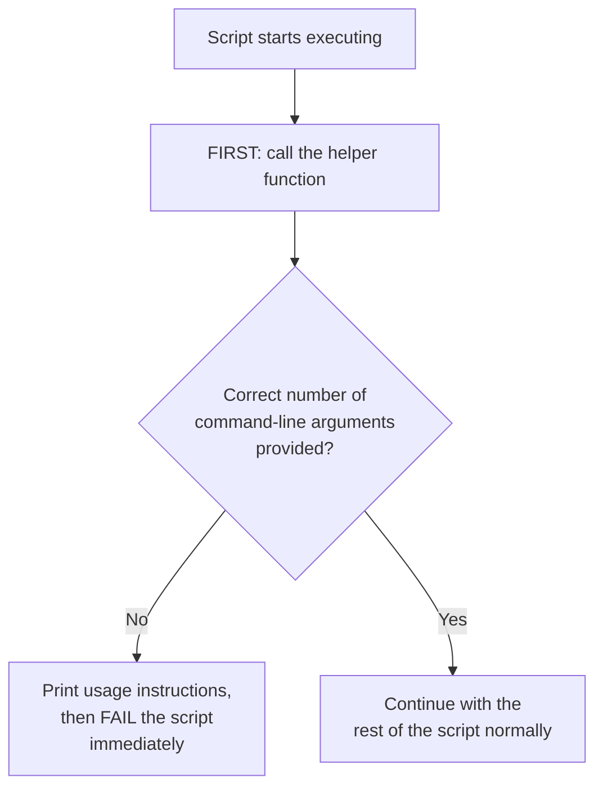

> 💡 **Memory Trick, the precise reasoning given directly:** *"If someone runs `list_users.sh` without providing the required arguments, right now it just throws a generic, unhelpful error. Instead, I want to tell them clearly: 'your way of executing the script is wrong.' That's what a helper function does."*

#### 💻 Code Example — The Helper Function

```bash
EXPECTED_CMD_ARGS=2

print_usage() {
    echo "Please execute the script with the required command-line arguments:"
    echo "Usage: ./list_users.sh <repo_owner> <repo_name>"
}

if [ "$#" -ne "$EXPECTED_CMD_ARGS" ]; then
    print_usage
    exit 1
fi
```

> 💡 **Memory Trick, precisely explained, and why it must run FIRST:** *"You have to call this helper function at the very START of your script. That way, it checks — before anything else runs — whether the user provided all the required parameters. If not, fail the script right there, with a clear, helpful message. If everything's correct, move on to the rest of the script normally."*

#### 🧠 Concept — Improvement 3: Scaling to Many Repositories with a Loop

> 💡 **Memory Trick, the scaling insight given directly:** *"If you have 100 repositories, or 1,000, you can simply write a `for` loop — for each item in your list of repositories, execute this script once. This way, whether you have 10, 100, or 1,000 repos, you get the list of users who have access to every single one, without running the script manually each time."*

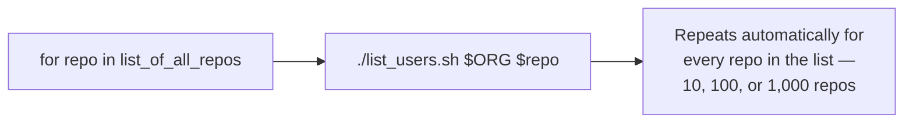

#### ⚠ Common Mistakes

* Providing only a generic, unhelpful error message when a script is run incorrectly — explicitly, directly improved via the helper function's clear, specific usage instructions.
* Assuming this script only scales to checking one repository at a time — explicitly, directly corrected: wrapping it in a `for` loop trivially extends it to any number of repositories.

#### 🎯 Key Takeaways

* Three concrete improvements were covered: **header/about documentation** (given as an assignment), a **command-line-argument validation helper function** (demonstrated live, called first in the script), and a **scaling insight** (wrapping the script in a `for` loop to check many repositories at once).
* The helper function must be invoked at the **very beginning** of the script — validating inputs before any other logic runs, failing fast with a clear message if something's wrong.
* This session's script, while genuinely complete and functional, is explicitly positioned as a foundation — readily extensible to real, larger-scale organizational use via the loop-based scaling pattern.

---
## 📝 Glossary

| Term | Definition | Why It Matters |
|---|---|---|
| **API** | Application [Programming] Interface -- programmatic access to an application, as opposed to a browser UI | The core mechanism this entire project relies on |
| **CLI** | Command-line interface for interacting with an application | `kubectl` is the given example for Kubernetes; GitHub also has one, but this project uses its API instead |
| **`curl`** | The shell-scripting tool used to make HTTP requests to an API | Used throughout this script to call GitHub's API |
| **Personal Access Token** | A GitHub-specific credential used for API authentication, replacing username/password | A genuinely sensitive credential -- must be scoped, protected, and never hardcoded |
| **Environment Variable** | A value (like `USERNAME` or `TOKEN`) set in the terminal session, readable by scripts via `export` | Keeps sensitive credentials out of the script file itself |
| **`$1`, `$2`** | Positional command-line arguments passed to a script | Used here for the repo owner/organization and repo name |
| **`jq`** | A command-line JSON parser/filter | Used to filter GitHub's raw JSON response down to just non-admin collaborators' usernames |
| **`permissions.admin` / `permissions.pull`** | Nested boolean fields in GitHub's collaborator JSON response | The exact fields this script filters on to distinguish admins from regular collaborators |
| **Helper function (argument validation)** | A function checking that a script received the correct number of command-line arguments, printing usage instructions if not | Called first, to fail fast with a clear, helpful error message |
| **`for` loop (scaling pattern)** | Wrapping a script's execution in a loop to run it against a list of items (e.g., repositories) | Extends a single-repo script to check any number of repositories automatically |

---

## 🔄 Revision Notes — One-Minute Revision

* This session is an explicit **re-recording ("Take Two")** of an earlier Day 8 video, made specifically in response to viewer feedback that the original left some learners confused -- the instructor frames this as a genuine, ongoing commitment to leaving no one behind.
* The real-world motivation: a DevOps engineer maintaining many GitHub repos needs to **audit who has access** to a given repo -- especially for offboarding -- without manually navigating GitHub's UI every time.
* Any application (GitHub, Jenkins, GitLab, Kubernetes) can typically be accessed via **CLI** (e.g., `kubectl`) or **API** -- this project deliberately uses GitHub's **API**, since it's mature, well-documented, and scriptable in any language.
* An **API** is precisely the programmatic alternative to a browser UI -- `curl` (shell) and `requests` (Python) are the concrete tools used to make these HTTP-based calls.
* A precise, explicitly-stated role boundary: **DevOps engineers consume APIs, they don't write them** -- directly paralleling the `boto3`/AWS CLI relationship from earlier in the course.
* **API documentation** provides the essential endpoint URL for any task -- GitHub's own docs even include ready-to-use sample `curl` commands; note `api.github.com` (the API) is genuinely distinct from `github.com` (the UI).
* Project setup reused **Day 3** (EC2 creation) and **Day 5** (SSH) skills, plus a genuine security walkthrough for creating and protecting a **GitHub personal access token** (never share your screen while generating one; scope its permissions narrowly).
* The script was run live with **two real, unedited errors** (permission denied → `chmod 777`; missing `jq` → `sudo apt install jq -y`) and a deliberate demonstration that the script correctly **fails against a repo the user lacks UI access to** -- proving API access respects the same permissions as UI access.
* The script's structure: credentials read from **environment variables** (never hardcoded), repo owner/name passed as **command-line arguments** (`$1`/`$2`), and a **two-function design** separating "build the curl command" from "execute it and process the JSON response."
* **`jq`** filters GitHub's raw JSON collaborator list down to just non-admin users, using the pattern `select(.permissions.pull == true) | .login`.
* Three improvements were covered: **header/about documentation** (given as an assignment), a **command-line-argument validation helper function** (demonstrated live, called first in the script), and **scaling via a `for` loop** to check many repositories at once.

---

## 📋 Cheat Sheet

**Two ways to talk to any application:**
```text
CLI (e.g. kubectl for Kubernetes) OR API (e.g. GitHub's REST API, used here)
```

**API vs. UI URLs (GitHub specifically):**
```text
github.com          -> the UI (browser-based)
api.github.com        -> the API (programmatic)
```

**Setup:**
```bash
export USERNAME=your-github-username
export TOKEN=your-personal-access-token
chmod +x list_users.sh          # (777 used live -- not best practice generally)
./list_users.sh <owner> <repo>
```

**Core script logic:**
```bash
curl -s -u "$USERNAME:$TOKEN" "$API_URL/repos/$REPO_OWNER/$REPO_NAME/collaborators" \
  | jq '.[] | select(.permissions.pull == true) | .login'
```

**Argument-validation helper function pattern:**
```bash
EXPECTED_CMD_ARGS=2
if [ "$#" -ne "$EXPECTED_CMD_ARGS" ]; then
    echo "Usage: ./list_users.sh <repo_owner> <repo_name>"
    exit 1
fi
```

**Scaling to many repos:**
```bash
for repo in "${repo_list[@]}"; do
    ./list_users.sh "$ORG" "$repo"
done
```

**Key principle:** If you can't do something through the UI, you can't do it through the API either -- both respect the same underlying permissions.

---

## 🔥 Interview Questions & Answers

### 🟢 Beginner

**Q1.**

**Question:** What does API stand for, and what does it actually mean in practice?

**Answer:** Application [Programming] Interface -- programmatic access to an application's information/functionality, as an alternative to a browser-based user interface.

**Explanation:** The session's own precise, from-first-principles definition.

**Why Interviewers Ask This:** A foundational, universal question across any API-related role.

**Possible Follow-up:** "Name a shell-scripting tool and a Python module used to make these API calls."

**Q2.**

**Question:** Do DevOps engineers typically write APIs?

**Answer:** No -- DevOps engineers consume/use APIs; writing them is the responsibility of the application's own developers.

**Explanation:** Directly, explicitly stated as an important role boundary.

**Why Interviewers Ask This:** Tests understanding of realistic DevOps role scope.

**Possible Follow-up:** "Give an AWS-specific example of 'consuming' an API, discussed earlier in this course."

**Q3.**

**Question:** What real-world scenario motivates this session's project?

**Answer:** Auditing who has access to a GitHub repository -- especially useful for offboarding a departing employee, without manually checking GitHub's UI every time.

**Explanation:** Directly, explicitly stated as the project's core motivation.

**Why Interviewers Ask This:** Tests understanding of the practical business value behind a technical project.

**Possible Follow-up:** "Why does manual, UI-based checking not scale well for this task?"

**Q4.**

**Question:** What is `jq` used for in this script?

**Answer:** Filtering GitHub's raw JSON API response down to just the relevant collaborators, and extracting their usernames.

**Explanation:** Directly, precisely demonstrated live, including a before/after comparison with and without `jq`.

**Why Interviewers Ask This:** A core, frequently-used DevOps tool.

**Possible Follow-up:** "What specific JSON field does this script filter on to distinguish admins from regular collaborators?"

**Q5.**

**Question:** Why are the GitHub username and token stored as environment variables rather than hardcoded in the script?

**Answer:** Both are sensitive credentials -- hardcoding them would expose them to anyone who reads the script; environment variables keep them out of the script file entirely.

**Explanation:** Directly, explicitly explained as a genuine security practice.

**Why Interviewers Ask This:** Tests understanding of basic script-credential security.

**Possible Follow-up:** "What command is used to set an environment variable before running the script?"

**Q6.**

**Question:** What happened when the instructor tried running this script against `kubernetes/kubernetes`, and why?

**Answer:** It failed with an error, because the instructor doesn't have UI-level access to that repository's settings -- API access respects the same underlying permissions as UI access.

**Explanation:** Directly, deliberately demonstrated live as an instructive failure case.

**Why Interviewers Ask This:** Tests understanding that APIs don't bypass access control.

**Possible Follow-up:** "What general principle does this failure demonstrate about API vs. UI access?"

**Q7.**

**Question:** What two real errors did the instructor encounter when first running the script, and how were they fixed?

**Answer:** A "permission denied" error, fixed with `chmod 777`; and a missing `jq` installation, fixed with `sudo apt install jq -y`.

**Explanation:** Directly, honestly reproduced live, unedited.

**Why Interviewers Ask This:** Tests familiarity with genuinely common, realistic first-run script errors.

**Possible Follow-up:** "Is `chmod 777` a good general practice? Why or why not?"

**Q8.**

**Question:** What does the script's final if/else block check for?

**Answer:** Whether the filtered list of collaborators is empty -- printing "no user has read access" if so, or the actual list of usernames if not.

**Explanation:** Directly, precisely demonstrated.

**Why Interviewers Ask This:** Basic script-logic comprehension.

**Possible Follow-up:** "What shell syntax is used to check if a variable is empty?"

**Q9.**

**Question:** What is the purpose of the command-line-argument validation helper function added as an improvement?

**Answer:** It checks whether the correct number of command-line arguments were provided, and if not, prints clear usage instructions and fails the script immediately, rather than allowing a confusing, generic error later.

**Explanation:** Directly, explicitly demonstrated and explained.

**Why Interviewers Ask This:** Tests understanding of user-friendly script design.

**Possible Follow-up:** "Where in the script should this helper function be called, and why?"

**Q10.**

**Question:** How would you extend this script to check access across 100 repositories instead of just one?

**Answer:** Wrap the script's execution in a `for` loop, iterating over a list of repository names.

**Explanation:** Directly, explicitly named as the scaling solution.

**Why Interviewers Ask This:** Tests understanding of practical script scalability.

**Possible Follow-up:** "Where would this list of 100 repository names likely come from in a real organization?"

---

### 🟡 Intermediate

**Q11.**

**Question:** Explain why the instructor explicitly frames re-recording this video as a positive, rather than something to avoid or be embarrassed about.

**Answer:** The instructor directly frames iterative improvement, based on genuine viewer feedback, as a core part of his teaching philosophy -- explicitly stating he'll do the same for any other video where people struggle, and that he personally becomes a better teacher over time as he creates more content. This reflects a broader, consistent theme across the entire course: prioritizing genuine understanding over polish or the appearance of infallibility, directly connecting to the course's repeated emphasis on making DevOps genuinely accessible to complete beginners.

**Explanation:** Requires connecting this specific meta-commentary to the course's broader, consistently-stated pedagogical values.

**Why Interviewers Ask This:** Less a technical interview question, more testing whether a learner recognizes intentional, values-driven teaching decisions.

**Possible Follow-up:** "How does this same value show up elsewhere in the course (e.g., showing real errors rather than only polished final scripts)?"

**Q12.**

**Question:** A learner argues that since this script uses `jq` to show only non-admin collaborators, it's therefore "hiding" information about who really has access. Evaluate this claim.

**Answer:** This claim isn't accurate -- the script isn't hiding information; it's deliberately FILTERING for a specific, useful subset of it, based on an explicit, understood business reason: the DevOps engineer running the script already knows who the admins/owners are (since they're typically the DevOps team itself or established senior stakeholders), and the genuinely useful, non-obvious information is which OTHER, non-admin people have been granted access -- precisely the group most relevant to an offboarding or access-audit scenario. The raw, complete JSON information remains fully available (as shown in the live demonstration removing `jq` entirely) -- the filtering is a deliberate design choice for THIS script's specific purpose, not information being concealed or made permanently inaccessible.

**Explanation:** Tests whether a learner distinguishes "deliberately filtered for a stated purpose" from "concealed/hidden," a meaningful distinction.

**Why Interviewers Ask This:** Tests genuine understanding of why the script's specific filtering logic makes sense, not just recall that it exists.

**Possible Follow-up:** "How would you modify the script if you specifically wanted to see admin users instead?"

**Q13.**

**Question:** Explain, precisely, why this script's two-function design (build the curl command vs. execute and process it) is a genuinely useful separation of concerns, not just an arbitrary stylistic choice.

**Answer:** Separating "build the request" from "execute and process the response" means each function has one clear, focused responsibility: Function 1 is solely concerned with correctly constructing a valid, authenticated `curl` command for a given endpoint -- logic that could be reused for ANY GitHub API endpoint, not just the collaborators one. Function 2 is solely concerned with what happens after a request is made -- executing it, and processing/filtering its response for this specific script's purpose. This separation means if GitHub's authentication mechanism ever changed, only Function 1 would need updating; if the desired OUTPUT format changed, only Function 2 would need updating -- each function can evolve independently without affecting the other's internal logic, a genuine maintainability benefit beyond simply "organizing code into two pieces."

**Explanation:** Requires reasoning through the genuine maintainability benefit of this specific separation, not just describing what each function does.

**Why Interviewers Ask This:** Tests whether a learner understands separation of concerns as a meaningful design principle, not just a stylistic preference.

**Possible Follow-up:** "If you wanted to add a SECOND script that lists issues instead of collaborators, which function could you directly reuse, and why?"

**Q14.**

**Question:** Explain why the instructor considers the "script fails against `kubernetes/kubernetes`" moment worth including and explaining, rather than simply cutting it from the video.

**Answer:** This failure is deliberately preserved and explained because it directly, concretely demonstrates a genuinely important principle that could otherwise remain abstract: API access is NOT some separate, more-permissive channel that bypasses normal access controls -- it strictly respects the exact same underlying permissions as the UI. Showing this live, with a REAL failure against a REAL repository the instructor genuinely doesn't have access to, is far more convincing and memorable than simply stating this principle abstractly -- directly consistent with this course's broader pattern (seen in Days 5 and 7 as well) of preserving real errors as genuine teaching moments rather than only showing polished, error-free final results.

**Explanation:** Requires connecting this specific demonstrated failure to both its conceptual lesson and the course's broader, repeated pedagogical pattern.

**Why Interviewers Ask This:** Tests whether a learner recognizes deliberate pedagogical choices, not just recalls the specific failure that occurred.

**Possible Follow-up:** "Name another session in this course where a real, unedited error was deliberately shown rather than cut."

**Q15.**

**Question:** Synthesize this session's "DevOps engineers consume APIs, they don't write them" principle (Section 5) with its live API-documentation-reading demonstration (Section 6) to explain what specific SKILL this combination implies is actually essential for a DevOps engineer, even without ever writing an API.

**Answer:** The combination implies that **reading and correctly interpreting API reference documentation** is itself the essential, non-optional DevOps skill -- since DevOps engineers don't write APIs, they have no other reliable way to know an API's correct endpoint URLs, required parameters, or authentication method except by consulting the documentation the API's own developers provide. This is directly why Section 6 spends real time demonstrating HOW to navigate documentation (finding the right endpoint, noticing capitalized placeholders, distinguishing `github.com` from `api.github.com`) rather than assuming this is obvious or unnecessary to teach -- it's the actual, practical skill that makes "consuming an API" genuinely possible, distinct from and prerequisite to writing the `curl`/`jq` logic itself.

**Explanation:** Requires connecting a stated role-boundary principle to a specific, taught practical skill, recognizing the causal relationship between them.

**Why Interviewers Ask This:** Tests whether a learner can identify the practical, skill-level implication of a stated conceptual principle.

**Possible Follow-up:** "What would happen if a DevOps engineer tried writing an API-consuming script WITHOUT ever consulting the API's documentation?"

---

### 🔴 Advanced

**Q16.**

**Question:** Design an extended version of this session's script that would produce a genuinely useful, organization-wide access-audit report across ALL of an organization's repositories, using only concepts covered in this session plus the scaling insight from Section 11.

**Answer:** A reasonable design: (1) Use GitHub's API (per the same documentation-reading pattern from Section 6) to find the endpoint for LISTING all repositories within a given organization (a new endpoint, not yet covered, but discoverable via the same documentation-navigation process already demonstrated); (2) Store the resulting list of repository names in a shell array or a text file, one repo name per line; (3) Apply Section 11's `for`-loop scaling pattern, iterating over this dynamically-retrieved repository list and calling the existing `list_users.sh` script (with its argument-validation helper function from Section 11, ensuring each call is well-formed) for each one; (4) Redirect each repository's output to a clearly-named file or append it to one consolidated report file (directly reusing the output-redirection technique from Day 7's resource tracker), labeled with the repository name for clarity (directly reusing the `echo`-labeling technique also from Day 7). This design combines this session's own two-function script, its argument-validation helper, and its scaling insight with Day 7's output-redirection and labeling techniques into one coherent, genuinely organization-scale audit tool -- real, applied synthesis across two related sessions.

**Explanation:** Synthesizes techniques from this session AND Day 7 into a genuinely more capable, realistic tool -- extending well beyond what was directly demonstrated.

**Why Interviewers Ask This:** A realistic, senior-level scripting-architecture question testing whether a candidate can compose previously-taught individual techniques into a more ambitious, coherent solution.

**Possible Follow-up:** "What GitHub API rate-limiting concern might arise if you ran this against an organization with hundreds of repositories, and how might you address it?"

**Q17.**

**Question:** Critically evaluate: "Since this script correctly excludes admin users from its output, admin users can never be considered a security risk worth auditing." Is this an accurate implication of this session's content?

**Answer:** Not accurate. The session's script deliberately filters OUT admins specifically because, in the demonstrated scenario, the admins are already KNOWN, established members of the DevOps team -- the script's specific purpose is surfacing the LESS obvious, easier-to-overlook group (non-admin collaborators, especially outside collaborators like `moit`). This is a deliberate scoping choice for THIS specific script's stated purpose, not a general claim that admin access is inherently safe or never worth auditing. In fact, a genuinely complete organizational security posture would likely want BOTH: this session's script (for tracking non-admin collaborator access) AND a separate, complementary check specifically for admin-level access changes over time (e.g., detecting when someone unexpectedly gains admin rights) -- precisely because admin access represents a HIGHER-risk category, not a lower one, that a mature security process would want distinct, dedicated visibility into, not exclude from consideration entirely.

**Explanation:** Tests whether a learner over-generalizes a deliberate, context-specific filtering choice into an inaccurate general security claim the session doesn't actually make.

**Why Interviewers Ask This:** Distinguishes candidates who track the precise, stated scope of a design decision from those who round it into an overstated, inaccurate general claim.

**Possible Follow-up:** "Design a complementary script (using this session's own techniques) that specifically tracks CHANGES in admin-level access over time, rather than just a current snapshot."

**Q18.**

**Question:** Synthesize this session's environment-variable-based credential security (Section 9) with its "DevOps engineers consume, don't write, APIs" principle (Section 5) to explain why credential security is arguably a MORE central DevOps responsibility than API design itself, despite APIs being the technically more complex artifact.

**Answer:** Since DevOps engineers don't write APIs (Section 5), the actual APIs' internal design, security, and correctness are the responsibility of each application's own development team (GitHub's, in this case) -- genuinely outside a DevOps engineer's direct control or responsibility. What DevOps engineers DO directly control, and are therefore directly responsible for, is HOW they consume those APIs -- and the single most consequential decision in that consumption is credential handling: a well-designed API consumed via a carelessly hardcoded, exposed, or overly-broadly-scoped credential represents a genuine, entirely DevOps-side security failure, regardless of how well-built the underlying API itself is. This is precisely why Section 9's environment-variable pattern and Section 7's token-scoping/screen-sharing warnings receive such direct, repeated emphasis in this session -- they represent the actual locus of DevOps responsibility and risk in this entire API-consumption workflow, even though the API itself is the more technically sophisticated artifact.

**Explanation:** Requires connecting a stated role-boundary principle (Section 5) to a specific security practice (Section 9) to derive a genuinely non-obvious conclusion about where DevOps responsibility and risk actually concentrate in this workflow.

**Why Interviewers Ask This:** A capstone-level conceptual question testing whether a candidate understands DevOps security responsibility precisely, not just recalling "use environment variables" as an isolated best practice.

**Possible Follow-up:** "Beyond environment variables, what OTHER credential-security practice (perhaps from a later session in this course, or general knowledge) would further reduce this specific risk?"

---

## 🧪 Scenario-Based Interview Questions

> **Scenario 1:** A teammate's copy of this session's script works correctly for repositories they personally have admin access to, but silently returns no output (not even an error) for a repository they only have read access to. Using this session's concepts, diagnose this.

**Structured Answer:**
1. **Initial investigation:** Distinguish this from the "cannot index string with string" hard failure demonstrated in Section 8 (which occurred for a repo the user had NO access to at all) -- "silently returns no output" for a repo they DO have some access to (read) suggests a different, more subtle issue.
2. **Metrics/logs to check:** Temporarily remove the `jq` filtering (per Section 10's own demonstrated technique) and re-run the script to see the RAW JSON response -- confirming whether GitHub is actually returning data at all, or genuinely returning an empty/restricted response for a read-only user.
3. **Possible causes:** GitHub's collaborators-listing endpoint specifically may require a higher permission level (e.g., admin/write) than plain read access to return the full collaborator list at all -- meaning a read-only user's token may receive a valid but genuinely empty or restricted response, distinct from the hard failure of having zero access whatsoever.
4. **Debugging approach:** Compare the raw JSON response (via the jq-removal technique) between the teammate's read-only-access token and an admin-access token for the SAME repository, to isolate whether this is a genuine GitHub API permission-tier distinction.
5. **Resolution:** If confirmed, document that this specific script requires admin-level (not just read-level) repository access to function correctly -- a genuine, important operational constraint worth knowing, distinct from the simpler "no access at all" failure case already demonstrated in this session.
6. **Prevention:** Extend the script's argument-validation helper function (Section 11) concept to also validate that a SUCCESSFUL, non-empty raw API response was received before attempting to `jq`-filter it, providing a clearer error message than silent, empty output when this specific permission-tier issue occurs.

> **Scenario 2 (Advanced):** Your organization wants to use an extended version of this script (per Advanced Q16) to audit ALL repositories nightly via a cron job, but is concerned about the security implications of storing a broadly-scoped GitHub token on a server that runs unattended. Using this session's concepts, address this concern.

**Structured Answer:**
1. **Initial investigation:** Revisit Section 7's own explicit token-security warnings -- the instructor already flags that a compromised token can grant broad account access, directly relevant to this exact concern about unattended, server-stored tokens.
2. **Relevant principle:** Per Section 7's demonstrated practice, the token should be scoped as narrowly as possible for its actual purpose -- for a read-only audit script, this means explicitly granting only read-level repository permissions, never delete or admin-level scopes (directly extending the instructor's own live example of deliberately removing delete/admin permissions).
3. **Possible causes for the organization's concern:** A legitimate, well-founded worry -- an unattended server running a cron job (per Day 7's cron-automation pattern) represents a genuinely different risk profile than a token used interactively and briefly, since a compromised server could expose the token continuously rather than momentarily.
4. **Debugging/evaluation approach:** Audit the exact scopes currently granted to any token intended for this automated use, confirming they're the minimum necessary for read-only collaborator listing -- nothing broader.
5. **Resolution:** Recommend creating a DEDICATED, narrowly-scoped token specifically for this automated audit purpose (never reusing a broader, personal-use token), combined with standard server-hardening practices (restricting who can access the server/script, per this session's own "never share your screen" token-generation principle extended to ongoing server access) and periodic token rotation.
6. **Prevention:** Establish an organizational policy requiring every automated script with API credentials to use a dedicated, minimally-scoped, and periodically-rotated token -- directly extending this session's individual security practices into a genuine, standing organizational policy.

---

## 🛠 Hands-on Exercises

### 🟢 Easy

1. Navigate GitHub's own REST API documentation yourself, and find the endpoint URL for listing a repository's collaborators -- confirm it matches this session's script.
2. Create your own GitHub personal access token with narrowly-scoped, read-only permissions, following this session's exact security precautions (no screen-sharing while generating it).
3. Set up and run this session's exact script against a repository you own or collaborate on, documenting the raw output you receive.

### 🟡 Medium

4. Deliberately remove the `jq` filtering from your working script (per Section 10's own demonstrated technique), and document the difference between the raw JSON output and the filtered output.
5. Write the header/about section for this script, per Section 11's stated assignment -- including author, required inputs, and contact information.
6. Implement the command-line-argument validation helper function from Section 11 yourself (without copying this guide's code), and test it by deliberately running the script with the wrong number of arguments.

### 🔴 Advanced

7. Implement the organization-wide, multi-repository audit script proposed in Advanced Interview Q16, combining this session's techniques with Day 7's output-redirection and labeling patterns.
8. Design and document the dedicated-token security policy proposed in Scenario 2, specifically for an unattended, cron-scheduled use case.
9. Extend the script to also filter and report on admin-level users specifically (using `permissions.admin` instead of `permissions.pull`), directly addressing the complementary security check proposed in Advanced Interview Q17.

---

## 🏗 Practice Assignment

*(This session's own stated assignment, reproduced faithfully, with structure added)*

> 💡 **Memory Trick -- the instructor's own words, given directly:** *"Write the 'about' section for the script -- what it does, what input parameters are required, and who to contact for issues. This is a very simple assignment, and it doesn't impact the script's overall function."*

### Build: "GitHub Access Auditor -- Complete Edition"

**Objective:** Complete this session's own stated assignment (script header documentation) and integrate the live-demonstrated helper function improvement, producing a genuinely complete, well-documented version of this session's project.

**Requirements:**
- A complete `list_users.sh` script implementing this session's core logic (environment-variable credentials, command-line arguments, two-function structure, `jq` filtering).
- A full header/about section (author, date, description, required inputs, contact) -- this session's own stated assignment.
- The command-line-argument validation helper function, called at the very start of the script.
- Successful execution against at least one real repository you have genuine access to, with documented output.
- A brief written reflection (150-200 words) explaining, in your own words, why API access respects the same permissions as UI access -- directly reflecting on Section 8's live demonstration.

**Architecture (suggested):**

```text
github_access_auditor/
├── list_users.sh          # your complete, documented script
├── SAMPLE_OUTPUT.md         # documented real output from your own test run
└── REFLECTION.md              # your written reflection on API vs. UI permissions
```

**Expected Functionality:**
- Running the script with no arguments should trigger your helper function's usage message, not a generic error.
- Running the script correctly should produce a clean, filtered list of non-admin collaborators for your chosen repository.

**Challenges:**
- Correctly and securely handling your own personal access token throughout this process, per this session's repeated security warnings.
- Writing genuinely clear, useful header documentation -- not just a token gesture at the assignment.

**Bonus Improvements:**
- Implement the scaling loop from Section 11, running your script against multiple repositories you have access to.
- Implement the raw-JSON-vs-filtered-output comparison from Hands-on Exercise 4 as a built-in script flag (e.g., a `--raw` option).

---

## 📚 Additional Resources

- The instructor's **Day 0 through Day 7 videos** (referenced directly) -- required prior viewing for full context, especially Day 3 (EC2 creation), Day 5 (AWS CLI/SSH), and Day 7 (the prior shell scripting project).
- The **DevOps Zero to Hero playlist** -- referenced directly, containing all videos in this same free course, with this "Take Two" video to be added directly after the original Day 8.
- **GitHub's own REST API documentation** -- directly browsed live, including its genuinely helpful sample `curl`/`requests`/JavaScript code for many endpoints.
- A **public GitHub repository** containing this session's complete, published script -- directly linked in the video description, explicitly intended for hands-on practice.

---

## 📌 Final Revision Sheet

### ⭐ Core Concepts
- This project addresses a real, common DevOps task: **auditing GitHub repository access**, especially for offboarding.
- **API vs. UI**: programmatic access (via `curl`/`requests`) vs. browser-based access -- same underlying information, different access method.
- **DevOps engineers consume APIs, they don't write them** -- directly paralleling the `boto3`/AWS CLI relationship.
- **API access respects the same permissions as UI access** -- directly, live-demonstrated via a real failure against an inaccessible repository.
- Script security: credentials via **environment variables**, never hardcoded; tokens scoped narrowly and never exposed on screen.
- **`jq`** filters raw JSON (e.g., `select(.permissions.pull == true) | .login`) to extract exactly the relevant information.

### ⭐ Important Definitions
- **Personal access token**, **helper function (argument validation)**, **`for`-loop scaling pattern** (see Glossary for full definitions).

### ⭐ Important Commands/Code
```bash
export USERNAME=your-github-username
export TOKEN=your-personal-access-token
curl -s -u "$USERNAME:$TOKEN" "$API_URL/repos/$REPO_OWNER/$REPO_NAME/collaborators" \
  | jq '.[] | select(.permissions.pull == true) | .login'
```

### ⭐ Architecture/Process
- Script flow: validate arguments (helper function) → build the curl command (Function 1) → execute + jq-filter the response (Function 2) → print the final, filtered list or a "no access" message.

### ⭐ Best Practices
- Never hardcode credentials -- always use environment variables.
- Never share your screen while generating or copying an API token.
- Scope tokens as narrowly as possible for their actual purpose.
- Validate command-line arguments at the very start of a script, with clear usage instructions on failure.
- Consult official API documentation rather than assuming you must memorize endpoint URLs.

### ⭐ Common Mistakes
- Assuming API access bypasses UI-level permissions -- it doesn't.
- Hardcoding sensitive credentials directly into a script.
- Assuming `jq` is required to make an API request, rather than understanding it only filters an already-received response.
- Providing only generic, unhelpful error messages for incorrect script usage.

### ⭐ Interview Points
- Be ready to precisely define an API and distinguish it from a UI.
- Be ready to explain the "consume, don't write" DevOps role boundary for APIs.
- Be ready to walk through this script's two-function structure and its `jq` filtering logic.
- Be ready to explain why this script's live failure against an inaccessible repo is instructive, not just a bug.

### ⭐ Things to Remember
- This is explicitly a **"Take Two"** re-recording, made specifically in response to viewer feedback -- a genuine signal of this course's iterative, feedback-driven teaching approach.
- The header/about documentation is explicitly given as a **self-contained assignment**, while the argument-validation helper function IS demonstrated live -- a real, useful distinction if referencing "what was actually shown" versus "what was left as homework."
- The complete script is published in a **public GitHub repository**, explicitly intended for direct, hands-on practice -- not just passive viewing.

---

## 🔗 Source

- [Shell Scripting Project Used In Real Time](https://youtu.be/OuyNM5-r8P8?si=AQ08fjFzcnSZfbHc)