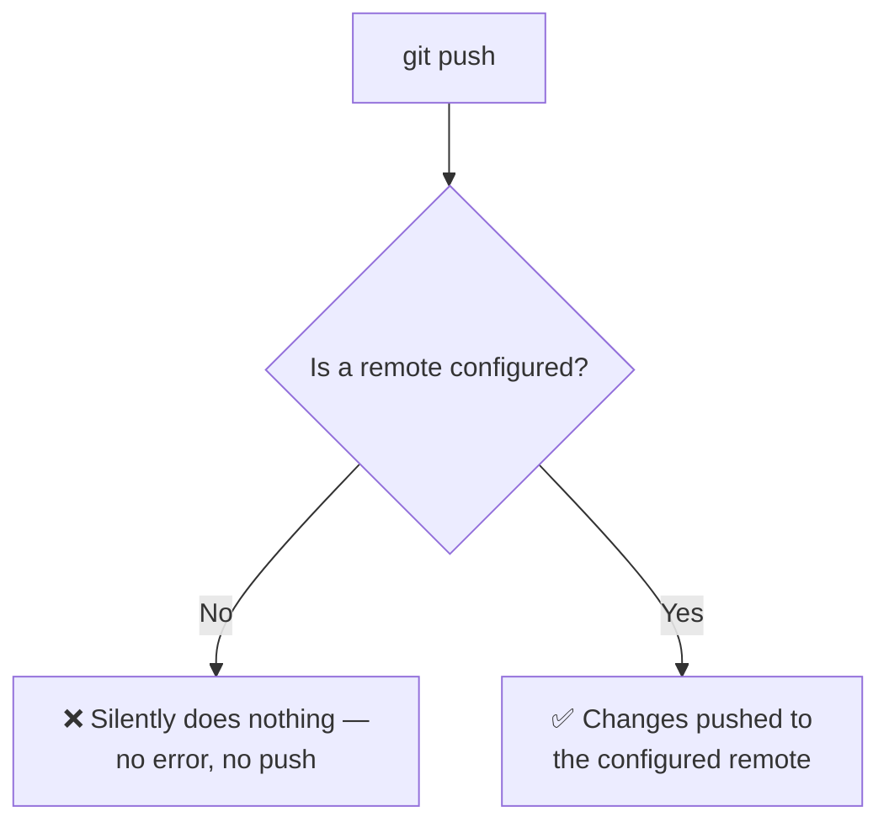
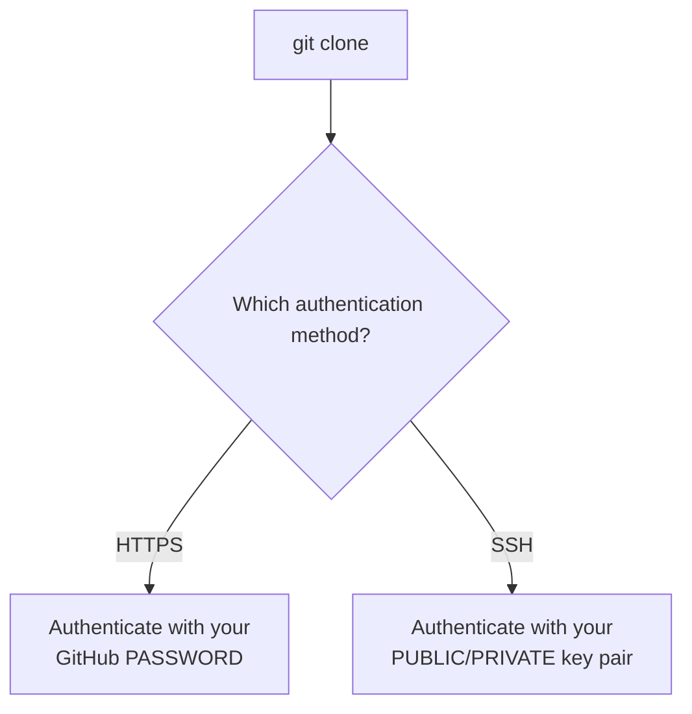
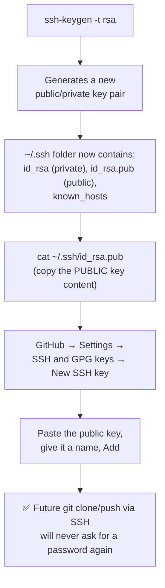
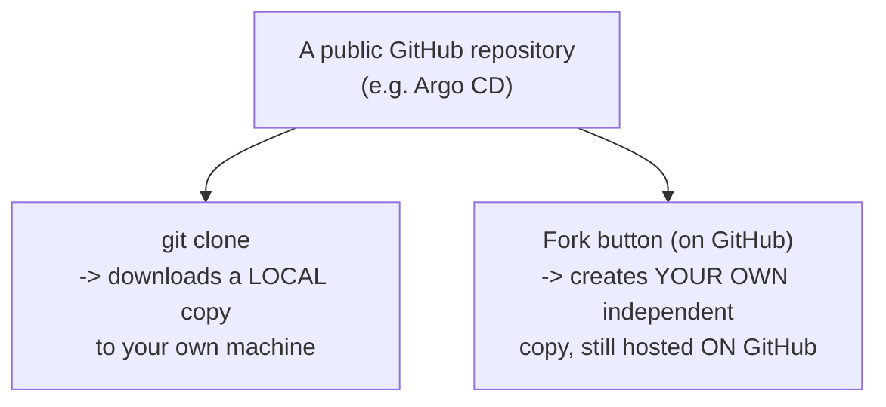
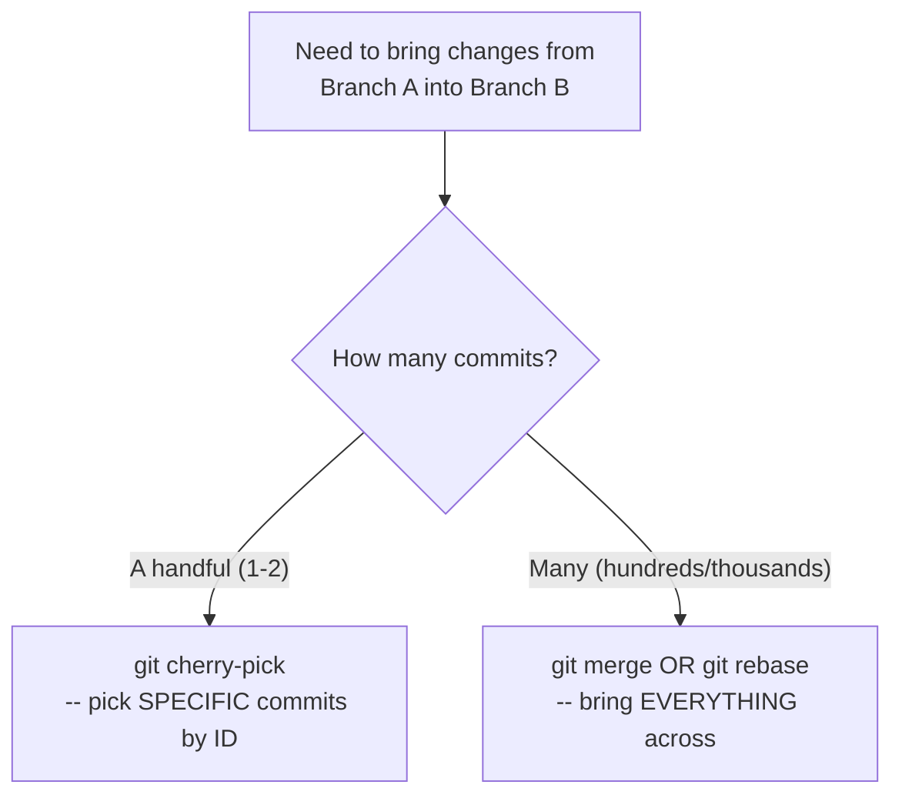
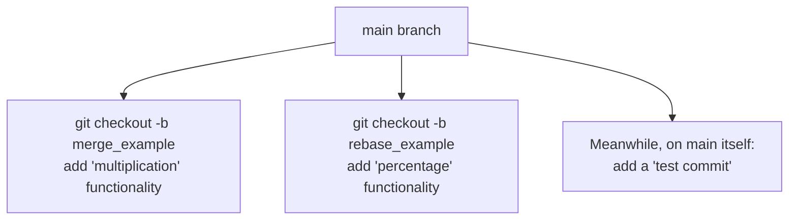
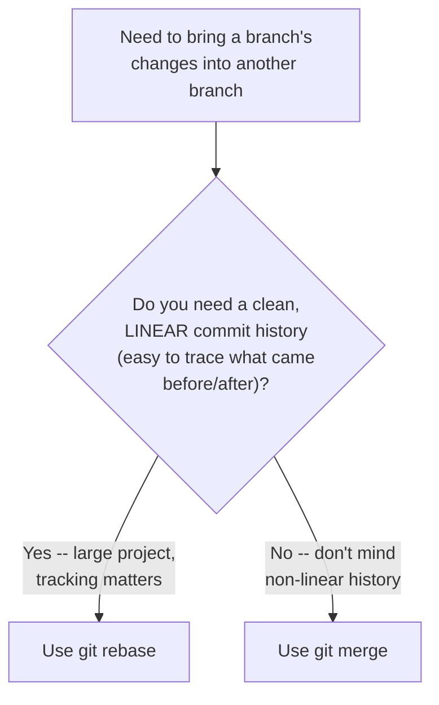
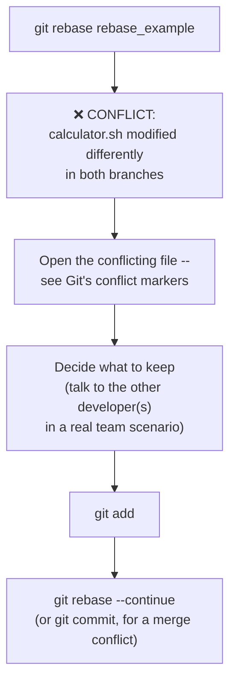

# ⚡ Git Commands & Interview Q&A: The Complete Daily Workflow, Live-Demonstrated

- <i>**Session:** DevOps Zero to Hero — Day 11: "Git Interview Q&A and Commands" · 
- **Instructor:** Abhishek
- **Note on scope:** This session delivers on the "additional Git commands and dedicated interview-questions treatment" explicitly promised at the end of Day 9. Every command is demonstrated live, on a real terminal, including real, unedited moments — a `git push` that silently does nothing because no remote is configured, and a genuine merge conflict hit live and resolved on screen. The instructor also points to a separate, previously-published "18 to 20 Git interview questions" video for additional coverage beyond what's directly demonstrated here.</i>

---

## 📑 Table of Contents

1. [Session Overview](#-session-overview)
2. [Learning Objectives](#-learning-objectives)
3. [Detailed Notes](#-detailed-notes)
   - [1. Initializing a Repository: git init & the .git Folder Revisited](#1-initializing-a-repository-git-init--the-git-folder-revisited)
   - [2. The Core Git Workflow: add, commit, push](#2-the-core-git-workflow-add-commit-push)
   - [3. Why git push "Does Nothing": Configuring Remotes](#3-why-git-push-does-nothing-configuring-remotes)
   - [4. Cloning: HTTPS vs. SSH Authentication](#4-cloning-https-vs-ssh-authentication)
   - [5. Git Clone vs. Git Fork: A Classic Interview Question, Precisely Answered](#5-git-clone-vs-git-fork-a-classic-interview-question-precisely-answered)
   - [6. Branching in Practice: git branch & git checkout -b](#6-branching-in-practice-git-branch--git-checkout--b)
   - [7. Bringing Changes Across Branches: cherry-pick, merge & rebase](#7-bringing-changes-across-branches-cherry-pick-merge--rebase)
   - [8. Merge vs. Rebase, Proven Live: Linear vs. Non-Linear History](#8-merge-vs-rebase-proven-live-linear-vs-non-linear-history)
   - [9. Resolving a Real Merge Conflict, Live](#9-resolving-a-real-merge-conflict-live)
4. [Glossary](#-glossary)
5. [Revision Notes — One-Minute Revision](#-revision-notes--one-minute-revision)
6. [Cheat Sheet](#-cheat-sheet)
7. [Interview Questions & Answers](#-interview-questions--answers)
8. [Scenario-Based Interview Questions](#-scenario-based-interview-questions)
9. [Hands-on Exercises](#-hands-on-exercises)
10. [Practice Assignment](#-practice-assignment)
11. [Additional Resources](#-additional-resources)
12. [Final Revision Sheet](#-final-revision-sheet)

---

## 🎯 Session Overview

This session walks through the complete, real, day-to-day Git command workflow every software or DevOps engineer actually uses — live, on a real terminal, with real errors included. It covers:

1. **`git init`** and a deeper revisit of the `.git` folder — including its `hooks` mechanism for preventing accidental secret commits (pre-commit hooks).
2. The **core, three-command daily workflow** — `git add`, `git commit -m "..."`, `git push` — explicitly framed as the direct, ready-made answer to "what Git workflow do you use in your organization?"
3. A genuine, **live-reproduced failure**: `git push` silently doing nothing, because the local repository has no configured remote — and the fix, `git remote add`.
4. **`git clone`**, and the two real authentication mechanisms for it: HTTPS (password-based) and SSH (public/private key-based), including a full, live SSH key generation and GitHub setup walkthrough.
5. **`git clone` vs. `git fork`** — a classic, explicitly-flagged interview question, precisely distinguished and directly connected back to Day 9's "Git is a distributed version control system" concept.
6. **Branching in practice**: `git branch`, `git checkout -b <name>` (create and switch), and `git checkout <name>` (switch) — demonstrated with a real, isolated `division` branch.
7. **Three distinct ways to bring changes across branches**: `git cherry-pick` (good for a handful of commits), `git merge`, and `git rebase` — each demonstrated live, with a precise explanation of when each is the right tool.
8. A **direct, side-by-side live comparison of merge vs. rebase** — proving, via actual commit history output, that merge produces non-linear history while rebase produces linear history.
9. A **genuine, unscripted merge conflict**, hit live during the rebase demonstration, resolved on screen exactly as a real developer would: examining the conflicting file, deciding what to keep, and completing the operation.

> 💡 **Memory Trick — the instructor's framing for this session's practical focus:** *"This video can be useful for anybody, not just DevOps engineers — because we're looking at the commands software engineers actually use, day in and day out, in their organizations or projects."*

---

## 🎯 Learning Objectives

By the end of this guide, you will be able to:

- [ ] Explain what happens when `git init` is run, and describe at least one practical use of the `.git/hooks` mechanism (e.g., preventing accidental secret commits).
- [ ] State, from memory, the three-command core Git workflow (`add`, `commit`, `push`) as a direct, ready-made interview answer.
- [ ] Diagnose why `git push` might silently do nothing, and fix it using `git remote add`.
- [ ] Explain the two authentication mechanisms for `git clone` (HTTPS password vs. SSH key pair), and generate/configure an SSH key for GitHub.
- [ ] Precisely distinguish `git clone` from `git fork`, connecting the distinction back to Git's distributed architecture.
- [ ] Create and switch between branches using `git branch`, `git checkout -b`, and `git checkout`.
- [ ] Explain when `git cherry-pick` is the appropriate tool versus when `git merge`/`git rebase` are more appropriate, based on commit volume.
- [ ] Precisely distinguish `git merge` from `git rebase` in terms of resulting commit history structure (non-linear vs. linear).
- [ ] Describe the real, practical process for resolving a merge conflict, based on a live-demonstrated example.

---

## 📚 Detailed Notes

### 1. Initializing a Repository: git init & the .git Folder Revisited

#### 💻 Code Example — Creating a Repository, CLI vs. UI

```bash
git init
# "Initialized empty Git repository in ..."
ls -la
# reveals the new, hidden .git folder
```

> ⚠️ **Directly, explicitly flagged as a classic interview question:** *"If somebody asks you: how do you create or initialize a Git repository, the answer is simply: use the `git init` command. What happens once you run it? A `.git` folder is created in that directory — responsible for tracking everything, and for preventing things like accidentally committed secrets."*

#### 🔍 Internal Working — `.git/hooks` for Preventing Leaked Secrets

> 💡 **Memory Trick, given directly, extending Day 9's brief mention of hooks:** *"Sometimes developers might unintentionally push a password required by a script — say `calculator.sh` needs one to execute. To avoid this, `.git` has a folder called `hooks`. You can write a pre-commit hook specifically to prevent developers from pushing sensitive information into Git."*

#### ⚠ Common Mistakes

* Assuming creating a repository via the UI is fundamentally different from `git init` — explicitly, directly clarified: the UI path is simpler because no commands are involved, but the underlying result is conceptually the same starting point.

#### 🎯 Key Takeaways

* **`git init`** initializes a new, empty local repository — visibly confirmed by the newly-created **`.git`** folder.
* This is explicitly flagged as a classic interview question — "how do you create/initialize a Git repository?"
* The **`.git/hooks`** folder can hold a **pre-commit hook** specifically to prevent developers from accidentally committing sensitive information like passwords — a genuine, practical security use case.

---

### 2. The Core Git Workflow: add, commit, push

#### 💻 Code Example — The Complete, Everyday Sequence

```bash
git add calculator.sh
git status
# "Changes to be committed: new file: calculator.sh"

git commit -m "my first commit"
git log
# shows author + commit message

git push
```

> ⚠️ **Directly, explicitly flagged as THE core interview answer:** *"One of the most fundamental questions interviewers ask is: what Git workflow do you use in your organization? The answer is these exact commands: `git add && git commit -m '<message>' && git push`. These are the commands you use day in and day out."*

#### ❓ Why It Exists — The Business Reason for `add`/`commit`, Not Just Mechanics

> 💡 **Memory Trick, the precise, real-world reasoning given directly:** *"Say you're working in a team of 100 members. Sometimes you don't know who made which change. If a developer named XYZ adds hundreds of files and your code stops working, you want to see who made those changes, and be able to go back to a previous, working state — say, the day before yesterday. Without a proper commit mechanism, you simply cannot do this."*

#### ⚠ Common Mistakes

* Skipping `git add` and assuming Git will still track a file's changes automatically — explicitly, directly clarified: until a file is added, `.git` has no awareness of it at all, even if it's deleted or heavily modified.

#### 🎯 Key Takeaways

* **`git add`** tells Git to start tracking a file or stage a specific change; without it, `.git` remains completely unaware of that file's existence or changes.
* **`git commit -m "message"`** creates a permanent, attributable version — critically important for tracing WHO made a specific change and WHEN, especially on large teams.
* The three-command sequence **`git add && git commit -m "..." && git push`** is explicitly, directly given as the ready-made answer to "what's your Git workflow?" — one of the single most common Git interview questions.

---

### 3. Why git push "Does Nothing": Configuring Remotes

#### 💻 Live Demonstration — A Real, Honest Failure

> ⚠️ **Directly, honestly reproduced live:** *"If you do `git push`, nothing will happen — your changes are NOT pushed to any GitHub repository. The problem: this code currently exists only in your local repository, and it isn't targeting any REMOTE repository."*



> 💡 **Memory Trick, why this is emphasized so directly, given by the instructor's own words:** *"I'm stressing this a lot because I get this exact question constantly in the comments: 'I used git push but nothing is happening.' The reason is always the same — you didn't configure a remote reference."*

#### 💻 Code Example — Diagnosing and Fixing It

```bash
git remote -v
# (empty output = no remote configured -- this is the root problem)

git remote add origin https://github.com/your-username/your-repo.git
git remote -v
# now shows the configured remote

git push
# now works correctly
```

#### 🔍 Internal Working — How `git clone`d Repos Differ

> 💡 **Memory Trick, the contrast given directly:** *"If instead of `git init`-ing locally, you `git clone` an EXISTING repository (like Argo CD), a remote reference is automatically configured for you — that's exactly why `git push` works immediately in a cloned repository, but not in one you created purely locally via `git init`."*

#### ⚠ Common Mistakes

* Assuming `git push` failing silently indicates a bug or credential problem — explicitly, directly identified as the single most common root cause: no remote is configured at all.

#### 🎯 Key Takeaways

* **`git push` on a purely locally-`init`ed repository does nothing**, since there's no remote target configured — a genuine, extremely common source of confusion, explicitly addressed because of how frequently it's asked.
* **`git remote -v`** shows currently configured remotes (or confirms none exist); **`git remote add <name> <url>`** configures one.
* Repositories created via **`git clone`** automatically have their remote configured — unlike ones created via `git init` locally, which require this manual step.

---
### 4. Cloning: HTTPS vs. SSH Authentication

#### 📖 Definition

> ⚠️ **Directly, explicitly flagged as a classic interview question:** *"How do you pull code from GitHub? The answer, whether phrased as 'cloning' or 'pulling code,' is the same: use the `git clone` command."*



#### 🪜 Step-by-Step — Setting Up SSH Authentication



> 💡 **Memory Trick, the precise distinction given directly:** *"When using SSH, you authenticate using your PUBLIC key. When using HTTPS, you authenticate using your PASSWORD. That's the only real difference."*

> ⚠️ **A critical, precise clarification given directly:** *"You copy the PUBLIC key's content, not the private key — and not just the filename either. Open `id_rsa.pub`, copy the actual key content (or use `cat` to print it to the terminal), and paste THAT into GitHub."*

#### ⚠ Common Mistakes

* Confusing the private key with the public key when setting up GitHub SSH authentication — explicitly, directly clarified: only the PUBLIC key (`id_rsa.pub`) is ever shared with GitHub; the private key must never leave your machine.
* Pasting just the filename (`id_rsa.pub`) instead of the actual key content into GitHub — explicitly, directly clarified as a real, easy-to-make mistake.

#### 🎯 Key Takeaways

* **`git clone`** is the direct, correct answer for "how do you pull/download code from GitHub" — explicitly flagged as a classic interview question.
* Two authentication mechanisms exist: **HTTPS** (password-based) and **SSH** (public/private key-based) — SSH, once configured, never prompts for a password again.
* Setting up SSH requires generating a key pair (**`ssh-keygen -t rsa`**), then adding the **public** key's actual content (never the private key) to GitHub's SSH key settings.

---

### 5. Git Clone vs. Git Fork: A Classic Interview Question, Precisely Answered

#### ❓ Why It Exists

> ⚠️ **Directly, explicitly flagged as a very commonly-asked interview question:** *"What is the difference between `git clone` and `git fork`? This is a very important question — many people ask this in interviews."*

#### 📖 Definition — The Precise Distinction

> 💡 **Memory Trick, given directly, explicitly connecting back to Git's distributed nature (Day 9):** *"Git is a distributed version control system — the code exists in one place, but you can distribute it, creating multiple copies or replicas to collaborate on. CLONING is when you download a specific, existing repository to your own local machine — you can do this for ANY public repository on GitHub. FORKING is different: it creates your OWN independent copy of the repository, hosted on GitHub itself — not just downloaded locally."*



#### 🔍 Internal Working — Forks Are NOT Automatically Synced

> 💡 **Memory Trick, a precise, important clarification given directly:** *"If I fork Argo CD today, I get a copy of the entire code as it exists TODAY. Even if the original repository gets updated afterward, MY fork will NOT be automatically updated — unless I explicitly do it myself."*

#### 🏢 Real-World / Production Usage — Why You'd Fork

> 💡 **Memory Trick, the practical use case given directly:** *"After forking, you get your OWN URL (e.g., `github.com/iamvamala/argo-cd` instead of `github.com/argoproj/argo-cd`) — you and your collaborators can now work on this independently, creating your own version of the repository, separate from the original."*

#### ⚠ Common Mistakes

* Assuming a fork stays automatically synchronized with its original source repository — explicitly, directly corrected: forks are snapshots at the moment of forking, requiring explicit action to pull in later upstream changes.
* Conflating cloning and forking as the same action — explicitly, directly distinguished: cloning downloads locally; forking creates a genuinely separate, independently-hosted copy on GitHub itself.

#### 🎯 Key Takeaways

* **`git clone`** downloads an existing repository to your own local machine — usable on any public repository.
* **Forking** (via GitHub's UI "Fork" button, not a `git` CLI command) creates your own independent, GitHub-hosted copy of a repository — directly realizing Git's distributed architecture, as first discussed in Day 9.
* A fork is **not automatically kept in sync** with its original source — a genuinely important, easy-to-overlook detail.

---
### 6. Branching in Practice: git branch & git checkout -b

#### 🧠 Concept — Reconnecting to Day 10's Branching Strategy

> 💡 **Memory Trick, the real-world motivation restated directly, extending Day 10's Uber/Amazon examples:** *"Say you're working at Amazon, and they decide to add a completely new feature — like letting customers order a carpenter, similar to Urban Company. This is a HUGE feature, taking months. If you push small, incomplete changes directly to the main branch, that small piece of code could break the actual, existing application already delivered to customers. That's exactly why you create a separate branch — so everyone working on this new feature can do so without disturbing what's already live."*

#### 💻 Code Example — Creating and Switching Branches

```bash
git branch
# shows: * main   (only branch, by default)

git checkout -b division
# creates AND switches to a new branch called "division",
# starting from the current point in "main"

git branch
# shows: main, * division

# ... make changes, git add, git commit -m "add division" ...

git log
# shows: "my first commit", "my second commit", "add division"

git checkout main
git log
# does NOT show "add division" -- proves isolation
```

> 💡 **Memory Trick, precisely explaining `git checkout -b`, given directly:** *"`git checkout -b` does two things at once: it creates a new branch starting from whatever code currently exists at your CURRENT point (e.g., today's calculator functionality), AND switches you into it immediately, ready to start working."*

#### 🔍 Internal Working — Proving Isolation, Live

> 💡 **Memory Trick, the live proof given directly:** *"After switching back to main with `git checkout main`, `git log` does NOT show the division commit — because you only added that functionality in the division branch, not main. This is the entire point of branching: isolating development activities so they don't interfere with each other."*

#### ⚠ Common Mistakes

* Assuming `git checkout -b` only switches branches, without also handling the creation step — explicitly, directly clarified: it performs BOTH actions (create + switch) in a single command.

#### 🎯 Key Takeaways

* **`git branch`** (no arguments) lists existing branches, with the current one marked.
* **`git checkout -b <name>`** creates a NEW branch from your current point AND switches into it immediately — a single command doing two things.
* **`git checkout <name>`** switches between already-existing branches.
* Branch isolation was **live-proven**: commits made on the `division` branch genuinely don't appear when switched back to `main`, until explicitly merged — directly confirming the theoretical branching-strategy discussion from Day 10.

---

### 7. Bringing Changes Across Branches: cherry-pick, merge & rebase

#### 📖 Definition — Three Distinct Mechanisms

> 💡 **Memory Trick, the three options named directly:** *"To get changes from one branch into another, you have three choices: `git cherry-pick`, `git merge`, or `git rebase`."*



#### 💻 Code Example — git cherry-pick

```bash
git log division
# find the commit ID for "add division"

git checkout main
git cherry-pick <commit-id>
# "2 insertions... new commit added"

git log
# now shows "add division" on main too
```

> 💡 **Memory Trick, precisely explaining cherry-pick's mechanism, given directly:** *"Cherry-pick, by name, means you're literally picking specific commits. You copy a commit ID from one branch's log, and apply just that one commit onto your current branch."*

#### ❓ Why It Exists — The Scale Problem That Motivates merge/rebase

> ⚠️ **The precise, directly-stated limitation of cherry-pick:** *"Cherry-pick is easy when there are one or two commits. But if Amazon is implementing something like 'House Services,' with fifty or sixty thousand commits, it's not practically possible to manually copy each commit ID and cherry-pick it one at a time — there will also likely be merge conflicts along the way. For that reason, the easiest way to bring EVERYTHING across is either `git merge` or `git rebase`."*

#### ⚠ Common Mistakes

* Assuming cherry-pick is always the simplest, best choice since it's conceptually easy — explicitly, directly corrected: its simplicity only holds at small commit counts; at real, large-project scale, it becomes impractical.

#### 🎯 Key Takeaways

* **`git cherry-pick <commit-id>`** applies one specific commit from another branch onto your current branch — genuinely simple, but only practical for a handful of commits.
* At real, large-scale project volume (potentially tens of thousands of commits), cherry-picking individually becomes impractical — **`git merge`** and **`git rebase`** exist specifically to bring an entire branch's changes across at once.

---
### 8. Merge vs. Rebase, Proven Live: Linear vs. Non-Linear History

#### 🪜 Step-by-Step — Setting Up the Live Comparison



> 💡 **Memory Trick, the setup narrated directly:** *"I created `merge_example` from main, added a multiplication functionality. I also created `rebase_example` from main, added a percentage functionality — notice `rebase_example` does NOT have multiplication, since it's an isolated branch. Meanwhile, back on main, other developers made their own change too — a 'test commit.' This mirrors real life: while some people work on new branches, others keep committing directly to main."*

#### 💻 Code Example — git merge, Live

```bash
git checkout main
git merge merge_example
git log
# "my first commit", "my second commit", "add division",
# "demonstrate merge", "test commit", "add changes"
```

> 💡 **Memory Trick, precisely describing the resulting structure, given directly:** *"With merge, all your branch's changes get placed AT THE TOP — updated AFTER your existing main-branch changes. This means the resulting history is NOT linear — a developer looking back can't cleanly tell 'did I make this change before or after that one,' since merge doesn't preserve a clean, single timeline."*

#### 💻 Code Example — git rebase, Live

```bash
git rebase rebase_example
# (a real merge conflict occurs here -- see Section 9)

# after resolving:
git log
# "my first commit", "my second commit", "add division",
# "demonstrate merge" (from the merge above),
# "percentage" (from rebase_example) -- placed BEFORE the divergence point
```

> 💡 **Memory Trick, precisely describing rebase's resulting structure, given directly:** *"With rebase, your changes get placed BEFORE the point where your branch was originally created from main — meaning the entire history reads in a clean, LINEAR way. If you have 10 commits on main, and you rebase a branch with its own changes, all 10 of main's commits will appear to have happened BEFORE your rebased branch's changes, in a single, understandable timeline."*

#### 🔍 Internal Working — The Precise Decision Rule



> 💡 **Memory Trick, the precise decision rule given directly:** *"If you're working on a large project and want to always track what happened — which commit came after which — and you want your branch's changes to appear BEFORE your main branch's own history in a clean, linear order, always use rebase. If you're not bothered about that, you can use merge. Both `git rebase` and `git merge` accomplish the SAME end goal — combining changes — the only real difference is whether the resulting history is linear or not."*

#### ⚠ Common Mistakes

* Assuming merge and rebase produce functionally different end results in terms of WHAT code ends up combined — explicitly, directly clarified: both achieve the same combined code; they differ only in HOW the resulting commit history is structured/ordered.

#### 🎯 Key Takeaways

* **`git merge`** places incoming changes AFTER existing history — resulting in a **non-linear** commit history.
* **`git rebase`** places incoming changes BEFORE the point of divergence — resulting in a **linear**, cleanly-traceable commit history.
* Both commands achieve the exact same underlying goal (combining code from two branches) — the choice between them is purely about the resulting **history structure**, not the final code content.
* The precise decision rule: use **rebase** when a clean, linear, traceable history matters (typical for larger projects); use **merge** when this isn't a priority.

---

### 9. Resolving a Real Merge Conflict, Live

#### ⚠ A Genuine, Unscripted Moment

> ⚠️ **Directly, honestly reproduced live:** *"I hit a real conflict here — because multiple branches modified the SAME file, at the SAME reference point. Git will ask you: which change do you actually want? Let's see how to handle this."*



> 💡 **Memory Trick, the exact real-world resolution process given directly:** *"How do you handle a merge conflict? Go to that file, and — this is the only real way — sit with the developers involved. In my case, the conflict was between 'percentage' and 'multiplication,' since one branch added each to the same file. In a real scenario, you'd talk to both developers to decide which change (or both) should actually be kept. In my demo, since I wrote both changes myself, I took the liberty of keeping both — but in a real team, this requires genuine human coordination, not just a Git command."*

#### 💻 Code Example — Completing the Resolution

```bash
# after manually editing calculator.sh to resolve the conflict markers:
git add calculator.sh
git rebase --continue
# (or, if this were a `git merge` conflict instead: git commit -m "...")
```

#### ⚠ Common Mistakes

* Assuming a merge/rebase conflict can be resolved purely mechanically, without any human judgment — explicitly, directly corrected: resolving a genuine conflict fundamentally requires understanding and deciding between the competing intentions of the developers involved, not just picking a syntactically valid option.

#### 🎯 Key Takeaways

* A merge conflict occurs when the **same file, at the same reference point**, has been modified differently across branches being combined — genuinely common in real, active, multi-developer projects.
* Resolving a conflict is **fundamentally a human, collaborative process** — examining the conflicting file and deciding (ideally with the actual developers involved) what should be kept, not a purely mechanical Git operation.
* After manually resolving the conflict in the file, **`git add`** the resolved file, then complete the operation with **`git rebase --continue`** (for a rebase) or a normal **`git commit`** (for a merge).
* This entire conflict was **genuinely unscripted** — a real, live demonstration of exactly the kind of situation developers encounter in actual daily work, not a staged example.

---
## 📝 Glossary

| Term | Definition | Why It Matters |
|---|---|---|
| **`git init`** | Initializes a new, empty local Git repository | Creates the `.git` folder; a classic interview question |
| **`.git/hooks`** | A mechanism for running scripts at specific Git lifecycle points | Can implement pre-commit hooks preventing accidental secret commits |
| **`git add`** | Stages a file/change for the next commit | Required before Git tracks anything about a file at all |
| **`git commit -m`** | Creates a permanent, attributable version | Enables tracing who changed what, and reverting if needed |
| **`git push`** | Sends local commits to a configured remote repository | Silently does nothing if no remote is configured -- a very common point of confusion |
| **`git remote -v`** | Lists currently configured remote(s) | The diagnostic command for a non-working `git push` |
| **`git remote add`** | Configures a new remote reference | Required for `git push` to work on a purely `git init`-ed local repo |
| **`git clone`** | Downloads an existing repository to your local machine | The direct answer to "how do you pull code from GitHub?" |
| **SSH key pair** | A public/private key pair used for password-free Git authentication | Generated via `ssh-keygen -t rsa`; only the PUBLIC key is shared with GitHub |
| **Fork** | An independent, GitHub-hosted copy of a repository | Distinct from cloning; not automatically kept in sync with the original |
| **`git branch`** | Lists existing branches | Shows the current branch, marked |
| **`git checkout -b`** | Creates a new branch from the current point AND switches into it | A single command performing two actions |
| **`git cherry-pick`** | Applies one specific commit (by ID) onto the current branch | Practical only for a small number of commits |
| **`git merge`** | Combines a branch's changes, placed AFTER existing history | Produces non-linear commit history |
| **`git rebase`** | Combines a branch's changes, placed BEFORE the divergence point | Produces linear, cleanly-traceable commit history |
| **Merge conflict** | Occurs when the same file/location is modified differently across branches being combined | Resolved by human judgment, then `git add` + continue/commit |

---

## 🔄 Revision Notes — One-Minute Revision

* **`git init`** creates a new local repository (the `.git` folder appears) -- a classic interview question; `.git/hooks` can implement a **pre-commit hook** to prevent accidentally committed secrets.
* The **core, everyday Git workflow** -- explicitly the ready-made answer to "what Git workflow do you use?" -- is **`git add && git commit -m "..." && git push`**.
* A real, honestly-demonstrated failure: **`git push` silently does nothing** if no remote is configured (common on purely `git init`-ed local repos, unlike `git clone`d ones) -- diagnosed with **`git remote -v`**, fixed with **`git remote add`**.
* **`git clone`** downloads an existing repository locally -- authenticated via either **HTTPS** (password) or **SSH** (public/private key pair, generated via `ssh-keygen -t rsa`, with only the PUBLIC key ever shared with GitHub).
* **`git clone` vs. `git fork`** (a classic interview question): cloning downloads a repo locally; forking creates your own independent, GitHub-hosted copy -- directly realizing Git's distributed architecture (Day 9) -- and is **NOT automatically synced** with the original.
* **Branching in practice**: `git branch` lists branches; `git checkout -b <name>` creates AND switches to a new branch in one command; `git checkout <name>` switches between existing branches -- isolation was live-proven (a branch's commits don't appear on main until merged).
* **Three ways to bring changes across branches**: **`git cherry-pick`** (specific commits by ID, practical only at small scale), **`git merge`** (all changes, placed AFTER existing history -- non-linear), **`git rebase`** (all changes, placed BEFORE the divergence point -- linear).
* **Merge vs. rebase** was proven live via actual `git log` output: both achieve the same combined code; they differ only in resulting history structure. Use rebase when a clean, linear, traceable history matters (typical for larger projects); use merge otherwise.
* A **genuine, unscripted merge conflict** was hit live during the rebase demo (two branches modifying the same file/location) -- resolved by examining the file, deciding what to keep (ideally with the actual developers involved in a real team), then `git add` + `git rebase --continue`.

---

## 📋 Cheat Sheet

**The core daily workflow (THE interview answer):**
```bash
git add <file>
git commit -m "message"
git push
```

**Diagnosing a silent `git push` failure:**
```bash
git remote -v                       # empty? -- that's the problem
git remote add origin <repo-url>      # fix it
```

**Cloning (two auth methods):**
```bash
git clone <https-url>       # password-based
git clone <ssh-url>           # key-based (ssh-keygen -t rsa first)
```

**Clone vs. Fork:**
```text
git clone -> download an EXISTING repo to your LOCAL machine
Fork (GitHub UI) -> create YOUR OWN independent copy, hosted on GitHub
                   (NOT auto-synced with the original)
```

**Branching:**
```bash
git branch                    # list branches
git checkout -b <name>          # CREATE + SWITCH in one command
git checkout <name>               # switch to an existing branch
```

**Bringing changes across branches:**
```bash
git cherry-pick <commit-id>    # ONE specific commit -- small scale only
git merge <branch>               # ALL changes -- non-linear history
git rebase <branch>                # ALL changes -- LINEAR history
```

**Resolving a conflict:**
```bash
# 1. Open the conflicting file, resolve manually
git add <resolved-file>
git rebase --continue    # (or `git commit` for a merge conflict)
```

---

## 🔥 Interview Questions & Answers

### 🟢 Beginner

**Q1.**

**Question:** What command initializes a new Git repository, and what gets created?

**Answer:** `git init` -- creates a hidden `.git` folder responsible for tracking the entire repository.

**Explanation:** Directly, explicitly flagged as a classic interview question.

**Why Interviewers Ask This:** A foundational, near-universal Git question.

**Possible Follow-up:** "What is the `.git/hooks` folder used for?"

**Q2.**

**Question:** What is the core, everyday Git workflow most interviewers expect you to name?

**Answer:** `git add`, `git commit -m "message"`, `git push`.

**Explanation:** Directly, explicitly flagged as THE core interview answer for "what Git workflow do you use?"

**Why Interviewers Ask This:** One of the single most common Git interview questions.

**Possible Follow-up:** "What does each of these three commands actually do?"

**Q3.**

**Question:** Why might `git push` silently do nothing, even after committing changes correctly?

**Answer:** No remote repository is configured for the local repository.

**Explanation:** Directly, explicitly identified as an extremely common, real point of confusion.

**Why Interviewers Ask This:** A genuinely practical, frequently-encountered troubleshooting scenario.

**Possible Follow-up:** "What command would you run to diagnose this, and what command fixes it?"

**Q4.**

**Question:** What are the two authentication mechanisms for `git clone`?

**Answer:** HTTPS (password-based) and SSH (public/private key-based).

**Explanation:** Directly, precisely explained and demonstrated.

**Why Interviewers Ask This:** Basic, practical Git authentication knowledge.

**Possible Follow-up:** "Which key (public or private) do you add to GitHub's settings?"

**Q5.**

**Question:** What is the difference between `git clone` and `git fork`?

**Answer:** `git clone` downloads an existing repository to your local machine; forking creates your own independent, GitHub-hosted copy of a repository.

**Explanation:** Directly, explicitly flagged as a classic, very commonly-asked interview question.

**Why Interviewers Ask This:** One of the most frequently asked Git/GitHub interview questions.

**Possible Follow-up:** "Does a fork stay automatically synced with the original repository?"

**Q6.**

**Question:** What does `git checkout -b <name>` do?

**Answer:** Creates a new branch from the current point AND switches into it, in one command.

**Explanation:** Directly, precisely demonstrated.

**Why Interviewers Ask This:** Basic, essential branching command knowledge.

**Possible Follow-up:** "How is this different from plain `git checkout <name>`?"

**Q7.**

**Question:** What is `git cherry-pick` used for, and what's its main limitation?

**Answer:** Applying one specific commit (by ID) onto your current branch; it's only practical for a small number of commits, not thousands.

**Explanation:** Directly, precisely explained.

**Why Interviewers Ask This:** Tests practical understanding of when a tool is/isn't appropriate.

**Possible Follow-up:** "What would you use instead, for bringing across an entire branch with thousands of commits?"

**Q8.**

**Question:** What's the key structural difference between `git merge` and `git rebase`?

**Answer:** Merge produces a non-linear commit history (changes placed after existing history); rebase produces a linear history (changes placed before the divergence point).

**Explanation:** Directly, precisely demonstrated live via actual `git log` comparisons.

**Why Interviewers Ask This:** One of the most common, important Git interview questions.

**Possible Follow-up:** "When would you specifically prefer rebase over merge?"

**Q9.**

**Question:** When does a merge conflict occur?

**Answer:** When the same file, at the same reference point, has been modified differently across the branches being combined.

**Explanation:** Directly, precisely defined and demonstrated live.

**Why Interviewers Ask This:** Basic, essential conflict-resolution knowledge.

**Possible Follow-up:** "What's the correct, real-world process for resolving one?"

**Q10.**

**Question:** After resolving a merge conflict during a rebase, what command do you run to continue?

**Answer:** `git add <resolved-file>`, then `git rebase --continue`.

**Explanation:** Directly, precisely demonstrated live.

**Why Interviewers Ask This:** Practical, real-world Git operational knowledge.

**Possible Follow-up:** "What would you do differently if this conflict occurred during a `git merge` instead?"

---

### 🟡 Intermediate

**Q11.**

**Question:** Explain why the instructor emphasizes the `git push` "does nothing" scenario so heavily, connecting this to a broader pattern in his teaching approach.

**Answer:** The instructor explicitly states this is one of the most common questions he receives in video comments -- directly grounding this emphasis in genuine, observed learner confusion rather than an assumption of what might be confusing. This reflects a consistent pattern across this entire course series: addressing real, demonstrated points of confusion (drawn from actual audience feedback, as also seen in Day 8's "Take Two" re-recording) rather than only covering material the instructor assumes is important in the abstract.

**Explanation:** Requires connecting this specific emphasis to the course's broader, feedback-responsive teaching pattern.

**Why Interviewers Ask This:** Tests recognition of a deliberate teaching choice grounded in real learner data.

**Possible Follow-up:** "Name another session in this course where feedback-driven teaching is explicitly visible."

**Q12.**

**Question:** A learner argues that since both `git merge` and `git rebase` "combine code from two branches," the choice between them is purely stylistic and doesn't actually matter. Evaluate this claim.

**Answer:** This claim is partially right but incomplete. The session explicitly confirms both DO achieve the same underlying combined CODE result -- but the resulting COMMIT HISTORY differs meaningfully: merge produces non-linear history, making it genuinely harder for a developer to trace "did I make this change before or after that one," per the session's own explicit reasoning. This isn't purely cosmetic -- for large, actively-developed projects where understanding the precise sequence and origin of changes matters (e.g., for debugging when a regression was introduced), a linear, rebase-produced history provides genuine, practical value beyond mere visual preference. The choice matters MORE as project scale and complexity increase, exactly as the session's own "Amazon House Services, fifty-sixty thousand commits" framing implies.

**Explanation:** Tests whether a learner recognizes that "same final code" doesn't mean "the choice is purely stylistic" -- the history structure has genuine, practical downstream value.

**Why Interviewers Ask This:** Distinguishes candidates who understand the real, practical implications of history structure from those who see merge/rebase as interchangeable style preferences.

**Possible Follow-up:** "Describe a concrete debugging scenario where a linear history would genuinely make your job easier than a non-linear one."

**Q13.**

**Question:** Explain, precisely, why the instructor describes resolving a merge conflict as requiring you to "sit with the developers" rather than simply picking whichever version of the code looks more correct.

**Answer:** A merge conflict, by definition, means Git itself cannot determine which change should take precedence -- both are syntactically valid, but represent genuinely different, deliberate INTENTIONS from different developers (in the session's example, one intended to add multiplication, another intended to add percentage). Picking based on which "looks more correct" risks silently discarding a developer's legitimate, intentional work without their knowledge or consent -- a genuine collaboration and communication failure, not just a technical shortcut. The only way to correctly resolve this is understanding what each developer was actually trying to accomplish, which requires human communication, not just visual code inspection.

**Explanation:** Requires reasoning through WHY human coordination is necessary, not just technical conflict resolution, connecting to real collaborative-development principles.

**Why Interviewers Ask This:** Tests whether a learner sees conflict resolution as a genuine collaboration skill, not merely a Git mechanics exercise.

**Possible Follow-up:** "What would you do if the two developers involved in a conflict disagreed about which change should be kept?"

**Q14.**

**Question:** Using this session's SSH key explanation, explain precisely why the private key must never be shared, even though the public key is explicitly meant to be shared (with GitHub).

**Answer:** SSH's public/private key authentication works specifically because possession of the PRIVATE key is what actually proves your identity during authentication -- the public key alone (which GitHub stores) can verify a signature made with the corresponding private key, but cannot itself be used to impersonate you or create a valid signature. If the private key were shared or exposed, anyone possessing it could authenticate as you to any service where your public key is registered -- completely undermining the entire security model. The public key is safe to share precisely because it can only be used to VERIFY authentication, not to PERFORM it.

**Explanation:** Requires reasoning through the underlying cryptographic logic the session references but doesn't fully explain (public-key cryptography basics), connecting it to the session's own explicit warning.

**Why Interviewers Ask This:** Tests whether a learner understands WHY this security practice exists, not just that "public key = shareable, private key = secret" as a memorized rule.

**Possible Follow-up:** "What would you do if you suspected your private key had been compromised or exposed?"

**Q15.**

**Question:** Synthesize this session's fork explanation (Section 5) with Day 10's release-branch discussion to explain a genuine, practical scenario where "forking" and "branching" might serve similar-sounding but actually distinct organizational purposes.

**Answer:** Branching (Day 10) is the mechanism for managing PARALLEL WORK WITHIN one shared, single organizational repository -- multiple developers, all with write access to the same repo, isolating their work temporarily before merging back to a shared master. Forking (this session) is typically used when a contributor does NOT have write access to the original repository at all -- e.g., an external open-source contributor wanting to propose changes to Kubernetes, who cannot simply create a branch on the official `kubernetes/kubernetes` repo directly. They fork it into their own GitHub account, make changes there, and then propose those changes back via a pull request (a mechanism not covered in depth in this session, but the natural next step). This distinction matters organizationally: branching assumes trusted, direct write access within a team; forking is the mechanism enabling contribution from OUTSIDE that trust boundary, entirely consistent with why Kubernetes (Day 10's real example) has thousands of forks alongside its internal, master-branch-based branching strategy for its close, direct contributors.

**Explanation:** Requires connecting this session's forking mechanics to Day 10's branching-strategy discussion, recognizing a genuine, non-obvious organizational-trust distinction between the two mechanisms.

**Why Interviewers Ask This:** A senior-level question testing whether a candidate understands WHY an organization would use both mechanisms simultaneously for different contributor populations, not just that both exist.

**Possible Follow-up:** "What Git/GitHub mechanism would a forker use to propose their changes back to the original repository?"

---

### 🔴 Advanced

**Q16.**

**Question:** Design a team policy for when developers should use `git rebase` versus `git merge` when integrating their feature branches into main, using only this session's stated reasoning.

**Answer:** A reasonable policy, directly grounded in the session's own stated trade-off (linear traceability vs. simplicity): (1) **For individual developers integrating their OWN, still-private feature branch into main** (before it's been shared with or built upon by others) -- prefer `git rebase`, since rewriting history at this stage is safe (no one else depends on the branch's exact prior commit structure) and produces the cleaner, more traceable linear history the session identifies as valuable for larger projects. (2) **For merging a feature branch that OTHER developers have already pulled and built additional work on top of** -- prefer `git merge`, since rebasing at this point would rewrite commit history that others already depend on, a well-known and genuinely disruptive Git problem the session doesn't explicitly cover but is a direct, necessary extension of its own stated mechanics (rebase fundamentally creates NEW commits representing the same changes, invalidating any downstream work built on the original commit IDs). (3) **For hotfix branches specifically** (per Day 10's discussion) -- given their short-lived, urgent nature, either could work, but `merge` may be operationally simpler and faster during a time-sensitive incident, when the overhead of resolving a rebase's potential conflicts under pressure is less desirable than merge's more straightforward, non-destructive combination. This policy extends the session's stated linear-vs-non-linear trade-off with a genuinely important, related consideration (shared vs. private branch state) the session itself doesn't directly address but is a natural, necessary extension of its own core mechanics.

**Explanation:** Synthesizes the session's stated merge/rebase trade-off with a related, necessary consideration (branch-sharing state) not explicitly covered, producing a genuinely more complete, real-world-applicable policy.

**Why Interviewers Ask This:** A realistic, senior-level Git-workflow-design question testing whether a candidate can extend taught mechanics with adjacent, necessary real-world considerations.

**Possible Follow-up:** "What specifically goes wrong if you rebase a branch that other developers have already built additional commits on top of?"

**Q17.**

**Question:** Critically evaluate: "Since forking creates an independent copy not automatically synced with the original, forks are inherently less useful for open-source collaboration than working directly on shared branches within one repository." Is this an accurate implication of this session's content?

**Answer:** Not accurate as stated -- this conflates "not automatically synced" with "less useful," when the session's own reasoning suggests the opposite for a specific, important use case. Forking's lack of automatic sync is precisely what makes it appropriate and useful for external, untrusted contributors (per Advanced Q15's reasoning) -- it lets someone propose changes without requiring the original repository's owners to grant them direct write access or trust their work will remain isolated until reviewed. Shared branches within one repository require a trust relationship (direct write access) that simply isn't appropriate to extend to every random external contributor on a massive open-source project. The "lack of automatic sync" is a genuine, real limitation worth being aware of (requiring the forker to manually pull in upstream changes to stay current) -- but it's a trade-off enabling a DIFFERENT, valuable collaboration model (open contribution without pre-existing trust), not simply a deficiency making forks "less useful" in an unqualified sense.

**Explanation:** Tests whether a learner recognizes that a stated limitation (lack of auto-sync) serves a genuine, important purpose in a specific context, rather than being an unqualified drawback.

**Why Interviewers Ask This:** Distinguishes candidates who understand trade-offs precisely from those who treat any stated limitation as simply negative.

**Possible Follow-up:** "What Git command would a forker use to pull in the original repository's latest changes, keeping their fork reasonably current?"

**Q18.**

**Question:** Synthesize this session's `.git/hooks` pre-commit-hook mention (Section 1) with its live-demonstrated `git push`-fails-silently scenario (Section 3) to identify a genuinely different, additional security/reliability gap this session doesn't explicitly address but which follows naturally from combining these two facts.

**Answer:** The session establishes that pre-commit hooks can prevent secrets from being committed LOCALLY (Section 1) -- but also that `git push` genuinely, silently fails when no remote is configured (Section 3), without any error message clearly explaining why. Combining these: if a pre-commit hook exists specifically to prevent secret leakage, but is only configured on some developers' local machines (since `.git/hooks` is typically NOT itself version-controlled/shared automatically as part of a normal clone -- a detail beyond this session's explicit coverage, but a natural implication of hooks living in the LOCAL `.git` folder specifically, not the tracked repository content), then a developer without that locally-configured hook could commit and push a secret with NO local protection at all, and might not immediately realize their environment lacks the safeguard other team members have. This identifies a genuine, non-obvious reliability gap: hook-based secret prevention is inherently per-developer-machine unless additional infrastructure (like server-side hooks, or team-wide onboarding scripts to install hooks) ensures universal application -- a real security consideration extending beyond what this session's brief hooks mention directly addresses.

**Explanation:** Requires connecting two facts from different sections (hooks are local; push failures are also local/silent) into a genuinely novel, non-obvious security implication neither section states directly.

**Why Interviewers Ask This:** A capstone-level, genuinely challenging question testing whether a candidate can synthesize seemingly unrelated facts into a real, non-obvious operational risk.

**Possible Follow-up:** "What practical mechanism could an organization use to ensure EVERY developer's local repository has the same pre-commit hooks configured?"

---

## 🧪 Scenario-Based Interview Questions

> **Scenario 1:** A new team member reports that their `git push` command runs without any error message, but their teammates report never seeing their commits appear on GitHub. Using this session's concepts, diagnose this.

**Structured Answer:**
1. **Initial investigation:** Recognize this as a precise match for Section 3's explicitly, repeatedly emphasized common issue -- `git push` succeeding silently while doing nothing, because no remote is configured.
2. **Metrics/logs to check:** Run `git remote -v` in the new team member's local repository to confirm whether a remote is actually configured at all.
3. **Possible causes:** Most likely, per this session's own stated reasoning, the team member initialized their repository locally (`git init`) rather than cloning an existing one (`git clone`), which would have automatically configured the remote -- a genuinely common onboarding mistake.
4. **Debugging approach:** Confirm the diagnosis directly by checking for an empty `git remote -v` output.
5. **Resolution:** Run `git remote add origin <correct-repository-url>` to configure the missing remote, then retry `git push`, confirming commits now genuinely appear on GitHub.
6. **Prevention:** Update onboarding documentation to explicitly recommend `git clone` (which auto-configures remotes) over `git init` for joining an EXISTING team project, directly addressing the root cause of this exact, commonly-reported confusion.

> **Scenario 2 (Advanced):** Your team uses `git rebase` exclusively for integrating feature branches, and a developer rebases a branch that two other teammates have already pulled and built three additional commits on top of. Chaos ensues with duplicate-looking commits and confusing history. Using this session's concepts (and Advanced Q16's extension), diagnose and prevent this.

**Structured Answer:**
1. **Initial investigation:** Recognize this as exactly the risk identified in Advanced Interview Q16's policy extension -- rebasing a branch that others have already built work on top of, rewriting history those teammates depend on.
2. **Relevant principle:** Per this session's core mechanic, `git rebase` doesn't simply "move" existing commits -- it creates entirely NEW commits representing the same logical changes, with different commit IDs; anyone who had already based work on the ORIGINAL commits now has a mismatched, confusing history relative to the rebased version.
3. **Possible causes:** A team policy defaulting to "always rebase" without the specific nuance (private vs. already-shared branch state) that Advanced Q16 identifies as a necessary, additional consideration beyond this session's base explanation.
4. **Debugging/evaluation approach:** Confirm exactly which commits are duplicated/conflicting by comparing the rebased branch's new commit IDs against the original ones the two teammates' work was based on.
5. **Resolution:** Have the two affected teammates rebase THEIR OWN work onto the newly-rebased branch (a recovery process beyond this session's direct scope but a natural consequence of understanding rebase's mechanics), effectively re-basing their work onto the corrected history -- a genuinely more complex recovery than if merge had been used instead.
6. **Prevention:** Adopt the refined policy from Advanced Q16: only rebase branches that remain genuinely private/unshared; once a branch has been pulled and built upon by others, switch to `git merge` for any further integration, directly preventing this exact class of disruption going forward.

---

## 🛠 Hands-on Exercises

### 🟢 Easy

1. Create a new local repository with `git init`, and reproduce this session's exact `git push` failure -- confirm it via `git remote -v`, then fix it with `git remote add`.
2. Generate your own SSH key pair with `ssh-keygen -t rsa`, and add the public key to a GitHub account, confirming password-free authentication works on a subsequent `git clone`.
3. Create a new branch with `git checkout -b`, make a commit on it, then switch back to main and confirm (via `git log`) that the new commit doesn't appear there.

### 🟡 Medium

4. Reproduce this session's exact cherry-pick demonstration: create a branch, commit a change, then cherry-pick that specific commit back into main using its commit ID.
5. Reproduce this session's side-by-side merge vs. rebase demonstration yourself: create two branches from the same point, add different changes to each plus a change on main itself, then merge one and rebase the other -- compare the resulting `git log` output.
6. Deliberately create a genuine merge conflict (two branches modifying the same line of the same file), and practice resolving it manually, following this session's exact real-world process.

### 🔴 Advanced

7. Implement the rebase-vs-merge team policy proposed in Advanced Interview Q16, documenting it as a genuine team guideline with concrete examples of each scenario.
8. Research (outside this transcript) and document the actual mechanism for recovering from the "rebased branch others already built on" scenario from Scenario 2, testing it yourself in a local repository.
9. Design and document a team-wide mechanism (per Advanced Interview Q18's reasoning) for ensuring every developer's local repository has the same pre-commit hooks configured, beyond relying on individual manual setup.

---

## 🏗 Practice Assignment

### Build: "Complete Git Workflow Portfolio Project"

**Objective:** Demonstrate the complete, real Git workflow this session covers, end to end, on a project of your own choosing.

**Requirements:**
- A repository created via `git init`, with the `git push` failure/fix cycle genuinely demonstrated and documented (Section 3).
- SSH authentication configured and used for at least one clone or push operation.
- At least two feature branches created via `git checkout -b`, each with genuine, isolated commits.
- A demonstrated use of `git cherry-pick` for bringing one specific commit across branches.
- A demonstrated use of BOTH `git merge` and `git rebase`, with a written comparison (150-200 words) of the resulting `git log` output for each.
- At least one genuine, deliberately-created merge conflict, resolved and documented following this session's real-world process.

**Architecture (suggested):**

```text
git_workflow_portfolio/
├── .git/
├── project_file(s)
├── WORKFLOW_LOG.md          # documents each step: init, push-fix, clone, branches, cherry-pick
├── MERGE_VS_REBASE.md         # your written comparison of both approaches' git log output
└── CONFLICT_RESOLUTION.md       # documents your genuine merge conflict and its resolution
```

**Expected Functionality:**
- Your `git log` outputs (captured in your documentation) should clearly show the branching/merging/rebasing patterns you performed, not a flat, single-branch history.
- Your merge conflict resolution documentation should reflect genuine reasoning about which changes to keep, not just a mechanical fix.

**Challenges:**
- Correctly setting up SSH authentication if you haven't done so before.
- Deliberately engineering a genuine merge conflict (rather than avoiding one) specifically to practice resolving it.

**Bonus Improvements:**
- Extend the project with a fork of a public repository (not your own), directly practicing the clone-vs-fork distinction from Section 5.
- Implement a working pre-commit hook (per Section 1) that blocks commits containing a specific test pattern (e.g., the word "PASSWORD"), and document testing it.

---

## 📚 Additional Resources

- The instructor's **Day 0 through Day 10 videos** (referenced directly) -- required prior viewing for full context, especially Days 9 and 10 (Git/GitHub fundamentals and branching strategy).
- The **DevOps Zero to Hero playlist** -- referenced directly, containing all videos in this same free course.
- A **separate, previously-published "Git interview questions" video** (referenced directly, covering "18 to 20" popular Git interview questions) -- explicitly pointed to for additional coverage beyond this session's direct demonstrations.

---

## 📌 Final Revision Sheet

### ⭐ Core Concepts
- **`git init`** creates a local repo; the `.git/hooks` folder can implement pre-commit secret-prevention.
- The **core daily workflow**: `git add && git commit -m "..." && git push`.
- **`git push` fails silently without a configured remote** -- diagnosed with `git remote -v`, fixed with `git remote add`.
- **`git clone`** (download locally) vs. **fork** (independent, GitHub-hosted copy, not auto-synced) -- a classic interview distinction.
- **`git cherry-pick`** (specific commits, small scale) vs. **`git merge`** (non-linear history) vs. **`git rebase`** (linear history) -- three genuinely distinct ways to combine branch changes.
- Merge conflicts require **human judgment**, not purely mechanical resolution.

### ⭐ Important Definitions
- **SSH key pair**, **merge conflict** (see Glossary for full definitions).

### ⭐ Important Commands/Code
```bash
git init
git add <file> && git commit -m "message" && git push
git remote -v / git remote add <name> <url>
git clone <url>
git checkout -b <branch> / git checkout <branch>
git cherry-pick <commit-id>
git merge <branch> / git rebase <branch>
```

### ⭐ Architecture/Process
- Full daily workflow: init/clone → branch → add/commit (repeat) → merge/rebase back → push.
- Conflict resolution: identify conflicting file → human decision → `git add` → continue/commit.

### ⭐ Best Practices
- Use `git clone` (not `git init`) when joining an existing project, to auto-configure the remote.
- Use SSH authentication to avoid repeated password prompts.
- Use rebase for private, unshared branches; consider merge once others have built on top of a branch.
- Resolve merge conflicts through genuine communication with the developers involved, not unilateral guessing.

### ⭐ Common Mistakes
- Assuming `git push` failing silently indicates a bug rather than a missing remote.
- Confusing public and private SSH keys when setting up GitHub authentication.
- Assuming a fork stays automatically synced with its original source.
- Assuming merge and rebase are purely stylistic, interchangeable choices regardless of context.

### ⭐ Interview Points
- Be ready to state the core three-command Git workflow unprompted.
- Be ready to precisely distinguish clone from fork.
- Be ready to explain merge vs. rebase's history-structure difference, with the "why."
- Be ready to describe the real, human-centered process for resolving a merge conflict.

### ⭐ Things to Remember
- This session explicitly delivers on Day 9's promise of "additional Git commands and a dedicated interview-questions treatment" -- treat Days 9, 10, and 11 as one continuous, cumulative Git/GitHub arc.
- A separate, previously-published dedicated Git interview-questions video is explicitly pointed to for coverage beyond what's directly demonstrated here.
- Every major command in this session was demonstrated with REAL, live output -- including two genuine, unscripted moments (the silent `git push` failure and the real merge conflict) -- reflecting this course's consistent "prove it live" teaching pattern.

---

## 🔗 Source

- [Git Commands](https://youtu.be/mT6qrAx14O4?si=x17WVC8ACVmQfxL7)