# 🚀 Deploying & Exposing a Real Node.js App on AWS EC2: A Guest Walkthrough with Kunal Verma

- <i>**Session:** DevOps Zero to Hero — Day 12: "Deploy and Expose Your First App to AWS" · 
- **Instructor:** Abhishek, with guest **Kunal Verma** (DevRel intern at Devtron; ambassador, Kube Simplify community)
- **Note on scope:** This is a **guest collaboration session**, distinct in format from prior solo lessons. Kunal, a third-year undergraduate who built this entire project independently, walks through deploying a real, functioning Node.js application (with genuine Stripe payment-gateway integration) onto a fresh AWS EC2 instance — end to end, from local testing through IAM setup, instance creation, SSH connection, remote server configuration, and the classic "it runs but nobody can reach it" exposure problem, resolved live via security group inbound rules. The complete project and every step are published on Kunal's own public GitHub repository.</i>

---

## 📑 Table of Contents

1. [Session Overview](#-session-overview)
2. [Learning Objectives](#-learning-objectives)
3. [Detailed Notes](#-detailed-notes)
   - [1. A Guest Collaboration: Meet Kunal Verma](#1-a-guest-collaboration-meet-kunal-verma)
   - [2. Local Setup: Cloning, Environment Variables & Running the App Locally](#2-local-setup-cloning-environment-variables--running-the-app-locally)
   - [3. Why Environment Variables Matter: A Lesson Learned the Hard Way](#3-why-environment-variables-matter-a-lesson-learned-the-hard-way)
   - [4. From Laptop to Cloud: Why Organizations Don't Deploy From Laptops](#4-from-laptop-to-cloud-why-organizations-dont-deploy-from-laptops)
   - [5. IAM: Root Accounts, Users & the Principle of Least Privilege](#5-iam-root-accounts-users--the-principle-of-least-privilege)
   - [6. Creating the EC2 Instance: AMI, Instance Type, Key Pairs & Regions](#6-creating-the-ec2-instance-ami-instance-type-key-pairs--regions)
   - [7. Connecting via SSH: chmod 400 and the Real Meaning of Permissions](#7-connecting-via-ssh-chmod-400-and-the-real-meaning-of-permissions)
   - [8. Setting Up the Remote Server: Mirroring the Local Steps](#8-setting-up-the-remote-server-mirroring-the-local-steps)
   - [9. The Exposure Problem: Why "It's Running" Isn't Enough](#9-the-exposure-problem-why-its-running-isnt-enough)
   - [10. Fixing It: Security Groups & Inbound Rules](#10-fixing-it-security-groups--inbound-rules)
   - [11. Closing Q&A: Public Access & IP Whitelisting](#11-closing-qa-public-access--ip-whitelisting)
4. [Glossary](#-glossary)
5. [Revision Notes — One-Minute Revision](#-revision-notes--one-minute-revision)
6. [Cheat Sheet](#-cheat-sheet)
7. [Interview Questions & Answers](#-interview-questions--answers)
8. [Scenario-Based Interview Questions](#-scenario-based-interview-questions)
9. [Hands-on Exercises](#-hands-on-exercises)
10. [Practice Assignment](#-practice-assignment)
11. [Additional Resources](#-additional-resources)
12. [Final Revision Sheet](#-final-revision-sheet)

---

## 🎯 Session Overview

This session is a genuine, end-to-end deployment story — a complete arc from a working local application to a genuinely internet-accessible AWS-hosted one, co-presented by guest Kunal Verma using a real project he built and published himself. It covers:

1. **Why this guest was invited**: to show that meaningful, portfolio-worthy DevOps projects can be built independently, even before finishing a degree — with every step publicly documented for others to follow.
2. **Local setup**: cloning a real, public GitHub repository, understanding and configuring a `.env` file for sensitive Stripe API credentials, installing dependencies with `npm install`, and running the app locally to confirm it works before ever touching AWS.
3. **A genuine, personal lesson on WHY environment variables matter** — Kunal explains he originally hardcoded credentials directly into his code, and only learned this was bad practice through experience, not from any tutorial.
4. **Why organizations deploy to cloud infrastructure rather than laptops** — reduced maintenance overhead, scalability, and (with an important caveat) potential cost efficiency.
5. **IAM (Identity and Access Management)**: creating a non-root user with scoped permissions, rather than using the AWS root/admin account directly — a genuine security best practice, demonstrated live.
6. **Creating a real EC2 instance**: choosing an AMI (Ubuntu), an instance type (free-tier `t2.micro`), generating a key pair, and a brief but clear explanation of regions/availability zones and latency.
7. **Connecting via SSH**, including a precise, correct explanation of `chmod 400`'s octal permission notation — not just "run this command," but exactly what it means.
8. **Configuring the remote server from scratch** — updating packages, installing Node.js/npm (via a real DigitalOcean documentation guide), cloning the repo again, and recreating the `.env` file directly on the server.
9. **The classic "it's running, but I can't reach it" problem** — the app runs successfully on the EC2 instance, but is completely inaccessible from the public internet, live-demonstrated as a genuine failure.
10. **The fix**: configuring the EC2 security group's inbound rules to explicitly allow traffic on the application's port — resolved live, ending in a genuine, celebrated success.
11. **A closing Q&A** on public accessibility and IP whitelisting/CIDR blocks for restricting access in real organizational scenarios.

> 💡 **Memory Trick — Abhishek's own framing for why this guest matters:** *"The reason I invited Kunal is so everyone understands how to start their career — Kunal started this journey before even finishing his graduation. Anyone in their final year, or currently pursuing their degree, can understand this same path: create your own projects, put them on your resume."*

---

## 🎯 Learning Objectives

By the end of this guide, you will be able to:

- [ ] Explain why environment variable files (`.env`) are used to store sensitive credentials, based on a real, lived example of the alternative (hardcoding) going wrong.
- [ ] Explain why organizations deploy applications to cloud infrastructure rather than running them on personal laptops, citing at least two specific reasons.
- [ ] Explain what IAM is, and why creating a scoped, non-root user is a genuine security best practice rather than a formality.
- [ ] Walk through the real steps of creating an EC2 instance: AMI selection, instance type, key pair generation, and basic network settings.
- [ ] Explain precisely what `chmod 400` does to a `.pem` key file, including the underlying octal permission notation.
- [ ] Describe the full remote-server setup process: updating packages, installing Node.js/npm, cloning a repository, and recreating environment variables.
- [ ] Explain precisely why a running application can still be completely inaccessible from the public internet, and identify the specific AWS mechanism responsible.
- [ ] Configure an EC2 security group's inbound rules to expose a specific port to the internet, and explain what a `0.0.0.0/0` source means.
- [ ] Explain how to restrict application access to a specific IP range instead of the entire internet, using a CIDR block.

---

## 📚 Detailed Notes

### 1. A Guest Collaboration: Meet Kunal Verma

#### 🧠 Concept

> 💡 **Memory Trick, Kunal's own self-introduction, given directly:** *"My name is Kunal Verma, and I've been involved in the open-source ecosystem for more than a year now. I'm currently a DevRel intern at Devtron — an open-source software delivery workflow platform for Kubernetes. I'm also an ambassador for the Kube Simplify community, started by Saiyan Pathak, where we guide folks starting their cloud-native journey."*

#### 🏢 Real-World / Production Usage — Why This Project Was Chosen

> 💡 **Memory Trick, the project's real origin given directly:** *"This project is actually a small part of something I built for the Kube Simplify community's workshop initiative — a real Node.js application using genuine Stripe payment-gateway integration, not just a toy 'hello world.'"*

#### 🎯 Key Takeaways

* This session is a genuine **guest collaboration**, distinct from the course's usual solo format — deliberately chosen to demonstrate that meaningful projects can be built independently, even by someone still completing their degree.
* The project used is a **real, complete application** (Stripe payment integration), not a simplified teaching toy — a deliberate choice to show a genuinely realistic deployment scenario.
* Every step demonstrated in this session is **publicly documented on Kunal's own GitHub repository**, explicitly intended so viewers can follow along independently, even beyond the video itself.

---

### 2. Local Setup: Cloning, Environment Variables & Running the App Locally

#### 🪜 Step-by-Step — The Full Local Setup Sequence

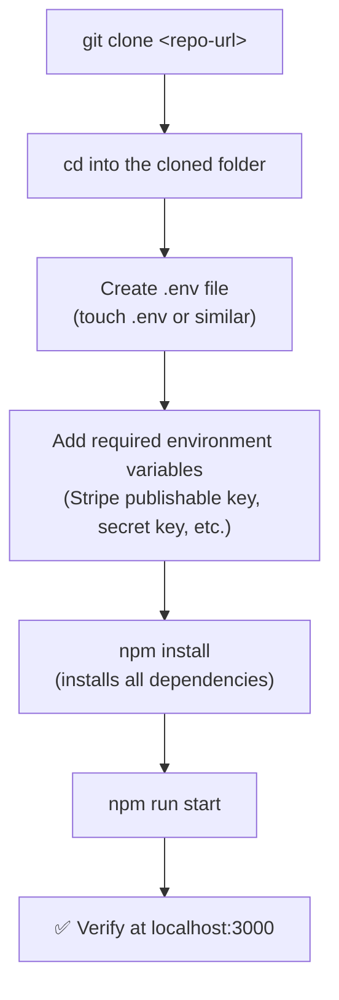

> 💡 **Memory Trick, Kunal's own recommendation on learning Git, given directly:** *"For folks who aren't familiar with the git command I'm using, I'd highly recommend checking the official Git docs — I learned Git through documentation, and interacting with experienced folks in the community taught me: always refer to the documentation."*

#### 🔍 Internal Working — npm, Explained via a Familiar Comparison

> 💡 **Memory Trick, given directly:** *"npm is Node Package Manager — it manages all the dependencies and packages your Node.js application needs. For people coming from Python, you can think of it like `pip`."*

#### 🎯 Key Takeaways

* The full local setup sequence: **clone → create and populate `.env` → `npm install` → `npm run start` → verify locally** — establishing the app works correctly BEFORE any cloud deployment is attempted.
* **`npm`** (Node Package Manager) is directly compared to Python's `pip` — a genuinely useful cross-language analogy for learners from either background.
* Both presenters explicitly recommend **official documentation** over video tutorials as the primary learning resource once genuinely comfortable with a tool — a real, stated preference from direct community experience.

---
### 3. Why Environment Variables Matter: A Lesson Learned the Hard Way

#### ❓ Why It Exists — A Genuine, Personal Origin Story

> 💡 **Memory Trick, Kunal's own honest account, given directly:** *"This was actually my very first Node.js project — I didn't even know Node.js before starting it. When I first coded this application, I hardcoded a lot of variables directly into the configuration file. Then I noticed: this isn't how the industry actually works. If you want to scale your application, and you're using the same variable again and again in a file, hardcoding doesn't make sense."*

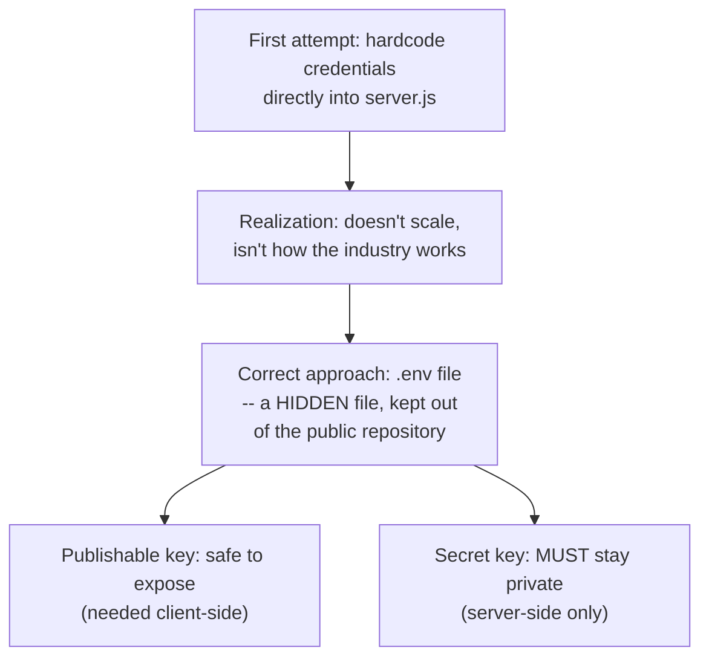

#### 🔍 Internal Working — What Specifically Goes in a `.env` File

> 💡 **Memory Trick, the precise reasoning given directly:** *"In this application, we're using Stripe integration — Stripe is a payment gateway, similar to Paytm, used globally for exchanging payments and credit cards. For that, we need a public key and a secret key to interact with the API. We want the secret key to stay private, never exposed to the world — and since `.env` is a hidden file, it won't be visible to anyone who doesn't already have it."*

#### ⚠ Common Mistakes

* Hardcoding credentials directly into application code — explicitly, honestly demonstrated as Kunal's own real, early mistake, not a hypothetical warning.
* Assuming environment variables are always required for every application — explicitly, directly clarified: this specific need is somewhat application-dependent (a Python app or a credential-free app might not require this exact pattern), though it's a common, widely-applicable practice.

#### 🎯 Key Takeaways

* The `.env` file pattern exists specifically to keep **sensitive credentials** (like a Stripe secret key) out of version-controlled, potentially public source code.
* This lesson is presented as **genuinely learned through direct experience** (initially hardcoding, then discovering why that's problematic) — not something Kunal read in a single tutorial and simply repeated.
* Not every application requires this exact pattern — environment variable needs are application-specific, though the underlying principle (never hardcode secrets) is broadly applicable.

---

### 4. From Laptop to Cloud: Why Organizations Don't Deploy From Laptops

#### ❓ Why It Exists

> 💡 **Memory Trick, given directly by Kunal, then reinforced by Abhishek:** *"Until now, we've only deployed this application on my laptop. But in an organization, or most places you'll work, people put their code on cloud platforms or on-premises systems — not on a personal laptop, because a laptop is only for personal development."*

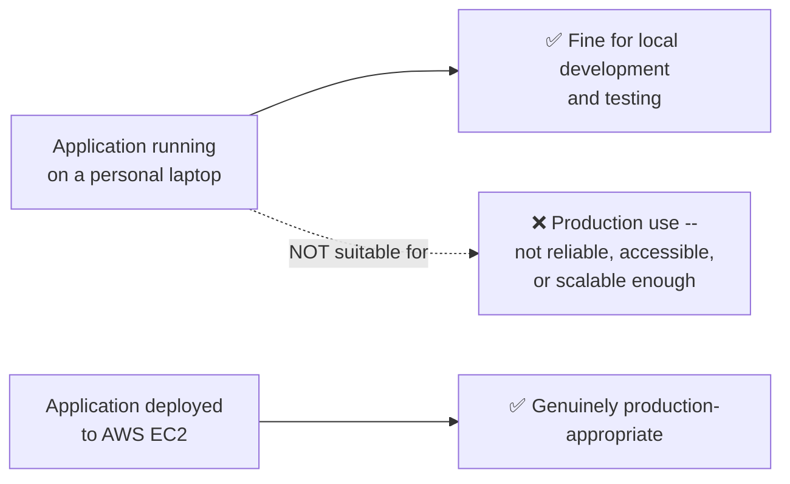

#### 🏢 Real-World / Production Usage — Three Concrete Reasons

> 💡 **Memory Trick, Abhishek's direct addition, connecting to prior sessions' themes:** *"Even if your laptop is old, you can get a compute instance on a cloud server. But even in an organization with hundreds of thousands of servers, cloud providers remove your maintenance overhead — no more patching, no more upgrading yourself. Cost can also go down, IF you use these resources efficiently — I won't say 'just move to AWS and costs automatically drop.'"*

> 💡 **Memory Trick, Kunal's addition on scalability:** *"Scalability also increases — if you want to scale your application to more users, you can set up a new instance and run another one, ensuring your application doesn't crash under load."*

#### ⚠ Common Mistakes

* Assuming cloud migration automatically reduces costs — explicitly, directly qualified: cost savings depend on EFFICIENT usage, not simply moving to the cloud as an automatic guarantee.

#### 🎯 Key Takeaways

* Three concrete reasons cited for cloud deployment over laptops: **reduced maintenance overhead**, **scalability**, and **potential cost efficiency** (explicitly qualified as conditional on efficient usage, not automatic).
* This directly reinforces the same cloud-value-proposition themes established across Days 3-5 of this course — a consistent, recurring principle, now demonstrated with a genuinely real application.

---

### 5. IAM: Root Accounts, Users & the Principle of Least Privilege

#### 📖 Definition

> 💡 **Memory Trick, given directly by Kunal:** *"When you sign in with your Gmail account, you're led to your ROOT account — essentially the admin user of your AWS account, with access to everything. IAM (Identity and Access Management) is a service that lets you assign ROLES to different people on your team, so you don't give everyone full root-level access to everything."*

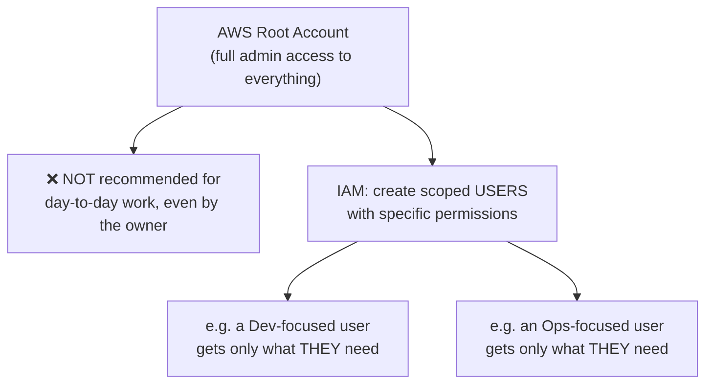

#### ❓ Why It Exists — The Organizational Reasoning

> 💡 **Memory Trick, Abhishek's direct addition:** *"As a DevOps engineer, you often get only limited access to your AWS account — and that's genuinely needed, not a limitation to complain about. This role-based access control concept isn't just AWS-specific — you see it on Azure, and even on the Kubernetes platform side. IAM lets you restrict developers — say, only allowing EC2 access, preventing them from touching S3 buckets, or preventing people without proper knowledge from accidentally deleting resources."*

#### 🪜 Step-by-Step — Creating and Using an IAM User, Live

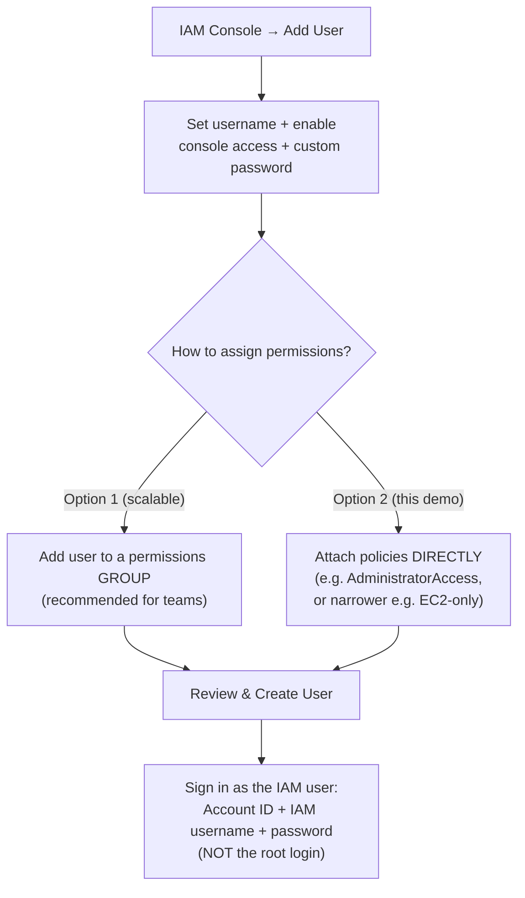

> 💡 **Memory Trick, the explicit permission-scoping challenge given to viewers:** *"For this demo, I'll go with AdministratorAccess for simplicity — but I'd recommend trying this yourself with ONLY EC2 permissions, as a kind of self-guided workshop, if you don't want to grant full administrator access on your own account."*

#### ⚠ Common Mistakes

* Using the root account for regular, day-to-day work — explicitly, directly discouraged: creating and using a scoped IAM user is the recommended, genuine best practice, even though using root would technically also work.
* Granting overly broad permissions (like AdministratorAccess) as a default habit rather than a deliberate, scoped choice — explicitly, directly flagged as something to scope down (e.g., to just EC2) for genuine, safer practice.

#### 🎯 Key Takeaways

* **IAM (Identity and Access Management)** lets an organization create scoped users with specific, limited permissions — rather than everyone using the powerful root/admin account directly.
* Permissions can be assigned via **groups** (more scalable, recommended for teams) or **direct policy attachment** (used in this demo for simplicity) — both are valid mechanisms with different scaling trade-offs.
* This same **role-based access control** principle is explicitly noted as NOT AWS-specific — it applies equally to Azure and Kubernetes, a broadly transferable security concept.
* Signing in as an IAM user requires the **Account ID** (the root account's ID) plus the **IAM username** — a genuinely different login flow from the root account's own email/password sign-in.

---
### 6. Creating the EC2 Instance: AMI, Instance Type, Key Pairs & Regions

#### 📖 Definition — EC2, via a Relatable Analogy

> 💡 **Memory Trick, Kunal's own analogy, given directly:** *"EC2 is short for Elastic Compute Cloud — used to set up remote servers using AWS. Here's a great use case: say you have an old laptop without much RAM, and you want to host a website, or run something memory-heavy like Minikube for Kubernetes — that's a pretty heavy tool for an old laptop. Remote servers solve this: they offer plenty of memory, and you can access them without needing that resource on your own local machine at all."*

#### 🪜 Step-by-Step — The Full Instance Creation Sequence

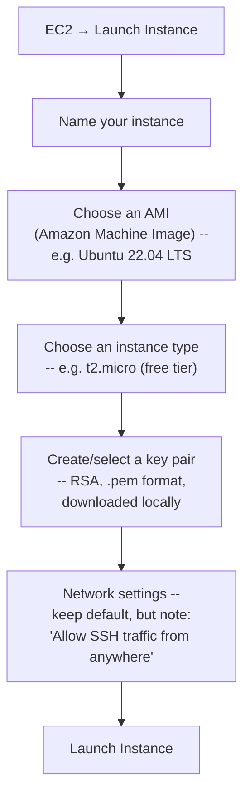

> 💡 **Memory Trick, the AMI/instance-type distinction given directly:** *"The AMI is basically asking: what operating system do you want for this remote server? We'll go with Ubuntu. The instance type is asking: what memory/CPU configuration do you want? Right now we're using t2.micro — smaller than that is t2.nano; larger options go up through small, medium, large, and beyond. Every instance type comes with its own dedicated CPU, dedicated memory, and cost."*

#### 🔍 Internal Working — Key Pairs, Precisely Explained

> 💡 **Memory Trick, given directly:** *"The key pair is used to authenticate — to securely log into our remote server. It's an authentication file downloaded to your local machine, which you'll use to log in. We'll create a new one, RSA type, `.pem` private key file format."*

#### 🌍 Regions & Availability Zones — Why They Matter

> 💡 **Memory Trick, Abhishek's direct addition, extending Day 3's earlier discussion:** *"It typically depends on which area you want to create this instance in — the primary reason is avoiding latency. Say today I'm in India, and I want to create an EC2 instance nearby, so I'm not very far from it — the good practice would be Asia Pacific (Mumbai). For free-tier practice instances, don't worry too much about this — but regions and availability zones exist specifically to avoid latency, since AWS keeps data centers across multiple places worldwide."*

#### ⚠ Common Mistakes

* Assuming instance type selection doesn't matter for a simple demo — explicitly, directly clarified: free-tier eligibility, dedicated CPU/memory, and cost are all genuinely tied to this specific choice.
* Losing or mishandling the downloaded `.pem` key pair file — implicitly reinforced (and explicitly emphasized again in Section 7) as the ONLY way to authenticate into this specific instance.

#### 🎯 Key Takeaways

* **EC2** provisions a remote virtual server — directly useful for anyone lacking sufficient local hardware, and the standard approach for any genuine production deployment.
* Creating an instance requires choosing an **AMI** (operating system), an **instance type** (CPU/memory/cost profile — `t2.micro` used here for free-tier eligibility), and a **key pair** (for SSH authentication).
* **Regions/availability zones** exist specifically to minimize latency, by placing infrastructure geographically close to its intended users — directly reinforcing the same concept first introduced in Day 3.

---

### 7. Connecting via SSH: chmod 400 and the Real Meaning of Permissions

#### 🪜 Step-by-Step — The Connection Sequence

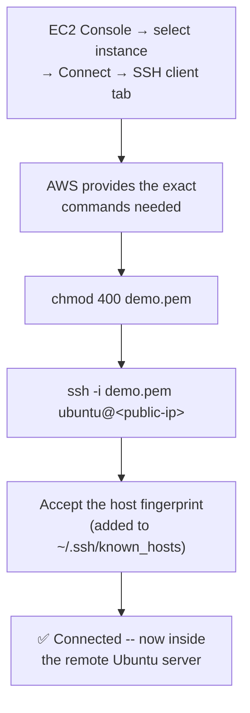

#### 🔍 Internal Working — `chmod 400`, Precisely Explained

> 💡 **Memory Trick, Abhishek's precise, technically correct explanation, given directly:** *"`chmod` changes a file's permissions. The numbers follow an architecture: 4 means read, 2 means write, 1 means execute. There are three groups being set: yourself, your group, and everyone else in the world. `400` specifically means: YOU can read the file (4), but you cannot write to it or execute it, and nobody in your group or anybody else in the world has ANY access to it at all (the two zeros). So only Kunal — whoever has access to Kunal's laptop — can even READ this file; nobody can modify or execute it."*

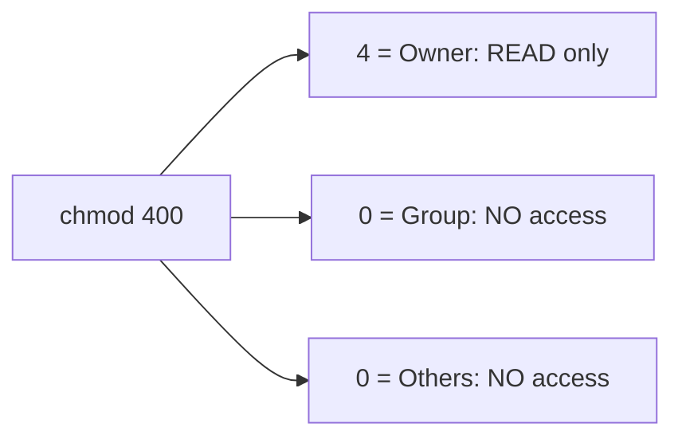

#### 🎯 Key Takeaways

* AWS's own "Connect" screen provides the **exact commands needed** for SSH connection — directly consistent with the "use the documentation, don't memorize" pattern established across this course.
* **`chmod 400`** follows octal permission notation: **4 = read, 2 = write, 1 = execute**, applied across three groups (owner, group, others) — `400` means only the file's owner can read it, with zero access for anyone else.
* This precise explanation directly extends (and correctly clarifies) the general `chmod` concept first introduced during Day 5's SSH key-pair discussion — worth remembering as a genuinely correct, complete technical explanation.

---
### 8. Setting Up the Remote Server: Mirroring the Local Steps

#### 🪜 Step-by-Step — The Full Remote Setup Sequence

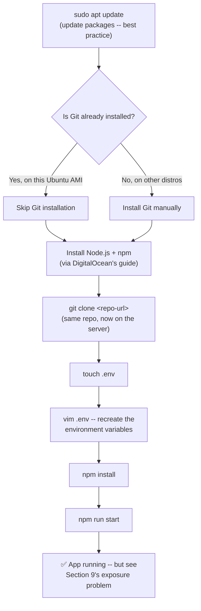

> 💡 **Memory Trick, an honestly-acknowledged surprise, given directly:** *"If I just type `git` right now, it would normally show 'command not found' — but this particular Ubuntu image already had Git pre-installed. Sometimes you won't have it by default, though."* Abhishek adds: *"That's genuinely something I didn't know either — thanks for sharing."*

#### 🏢 Real-World / Production Usage — DigitalOcean's Documentation

> 💡 **Memory Trick, given directly:** *"We'll follow a guide from DigitalOcean — I discovered this while learning about AWS and remote virtual machines. DigitalOcean has some of the best documentation out there for nearly any topic. Whenever I need to search for anything about creating applications or DevOps-related work, I just type 'DigitalOcean' in front of my search — I'll usually find something useful."*

#### 💻 Live Demonstration — Recreating the `.env` File on the Server

> 💡 **Memory Trick, the vim workflow given directly, including a genuinely useful, precise detail:** *"`vim .env` opens the file. Type `i` for insert mode, paste in the environment variables, then to exit and save: type `Escape`, then `:x`. A lot of people use `:wq` instead — but when I researched it, I found `:x` is effectively an alias for the same save-and-exit action, and that's the habit I picked up."*

```bash
touch .env
vim .env
# (press i, paste variables, press Escape, type :x)
cat .env    # verify the file's actual contents
```

#### ⚠ Common Mistakes

* Assuming Git is always pre-installed on every Linux distribution/AMI — explicitly, directly corrected: this specific Ubuntu image happened to have it, but that's not guaranteed universally.
* Forgetting that environment variables set locally (Section 2) do NOT automatically carry over to a fresh remote server — the entire `.env` setup must be genuinely recreated on the EC2 instance itself.

#### 🎯 Key Takeaways

* Setting up a fresh remote server closely **mirrors the local setup process** (Section 2) — but starting from a genuinely blank slate, since a brand-new EC2 instance has nothing pre-installed beyond its base AMI.
* **DigitalOcean's documentation** is explicitly, directly recommended as a consistently high-quality reference for AWS/Linux/DevOps topics generally — not limited to DigitalOcean's own specific product.
* The `.env` file must be **recreated directly on the remote server** — local environment variables don't automatically transfer with a `git clone`, since `.env` is deliberately excluded from version control.
* **`:x`** in vim is confirmed as a genuine, working alias for `:wq` (save and exit) — a small but precise, directly research-verified detail.

---

### 9. The Exposure Problem: Why "It's Running" Isn't Enough

#### ⚠ A Genuine, Live-Demonstrated Failure

> ⚠️ **Directly, honestly reproduced live:** *"Now here's a catch. If you're just following along, you might imagine: my application is running on the EC2 instance, so now if I head to my public IP address on port 3000, it should be deployed, right? Let's try it... 'This site can't be reached.'"*

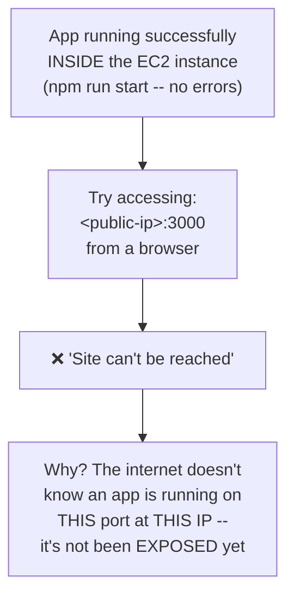

#### ❓ Why It Exists — The Precise, Honest Explanation

> 💡 **Memory Trick, given directly, including a genuinely honest admission of the learning struggle:** *"The application is running successfully inside the remote VM — no errors. But we're accessing it through the open internet, and the internet doesn't know that at this specific port, at this specific IP address, an application is running. We have to explicitly EXPOSE this port to the internet. I learned this the hard way, honestly — I had to search a lot of Stack Overflow and the internet to understand why it wasn't working in the first place."*

#### ⚠ Common Mistakes

* Assuming a successfully-running application (no errors in the terminal) automatically means it's genuinely accessible from outside the server — explicitly, directly disproven by this live demonstration.
* Assuming this is a rare or advanced edge case — explicitly, directly normalized: Abhishek notes this is precisely "where most people fumble" when deploying to AWS for the first time.

#### 🎯 Key Takeaways

* A genuinely **error-free, successfully-running application** inside an EC2 instance can still be **completely inaccessible** from the public internet — a real, commonly-encountered gap between "it runs" and "it's reachable."
* This gap exists because AWS, by default, does **not** automatically expose arbitrary application ports to the internet — an explicit, deliberate security posture requiring configuration.
* This exact failure is explicitly, directly normalized as an extremely common first-deployment experience — "don't worry at all if you're seeing this two or three times when trying to deploy your first application."

---

### 10. Fixing It: Security Groups & Inbound Rules

#### 🪜 Step-by-Step — The Live Fix

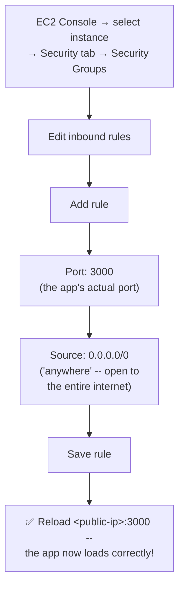

> 💡 **Memory Trick, precisely explaining what's happening, given directly:** *"Inbound rules are how we allow inbound traffic — we're telling AWS: 'we have an application running on port 3000, and we want you to allow traffic to it from the open internet.' Right now there's no port range specified, just a single port we want to allow: 3000. The source 'anywhere' means this specific port can be accessed from anywhere on the internet."*

#### 🔍 Internal Working — Why SSH Already Worked, But the App Didn't

> 💡 **Memory Trick, the precise, clarifying observation given directly:** *"You'll notice the FIRST rule already listed is SSH, on port 22 — that's exactly why you were able to SSH into this instance in the first place. If that rule hadn't been there, you wouldn't have been able to connect at all. Our new rule does the exact same thing, just for port 3000 instead of port 22."*

#### 🎯 Key Takeaways

* **Security groups** and their **inbound rules** are the specific AWS mechanism controlling which ports/traffic are allowed to reach an EC2 instance from outside — the precise fix for Section 9's exposure problem.
* The **SSH connection already working** (before this fix) is explained by a pre-existing inbound rule for port 22 — directly proving, by contrast, exactly what was MISSING for the application's own port 3000.
* Adding an inbound rule for the application's specific port, with a source of **`0.0.0.0/0`** ("anywhere"), makes the application genuinely, verifiably accessible from the public internet — live-proven by successfully reloading the page.

---
### 11. Closing Q&A: Public Access & IP Whitelisting

#### ❓ Why It Exists

> ⚠️ **Kunal's own closing question, given directly:** *"OK, my application is on AWS now -- can I access it from any other laptop, not just mine?"*

#### 📖 Definition -- The Precise Answer

> 💡 **Memory Trick, Abhishek's precise, direct answer:** *"Yes, absolutely -- because you have a PUBLIC IP address, and the name itself indicates it's public. If you watched carefully, Kunal never restricted this to only his own laptop. If he had wanted to do that, there's a field called 'Source' where you'd specify particular source addresses -- instead, we used `0.0.0.0/0`, meaning anybody from any place in the world can access this application."*

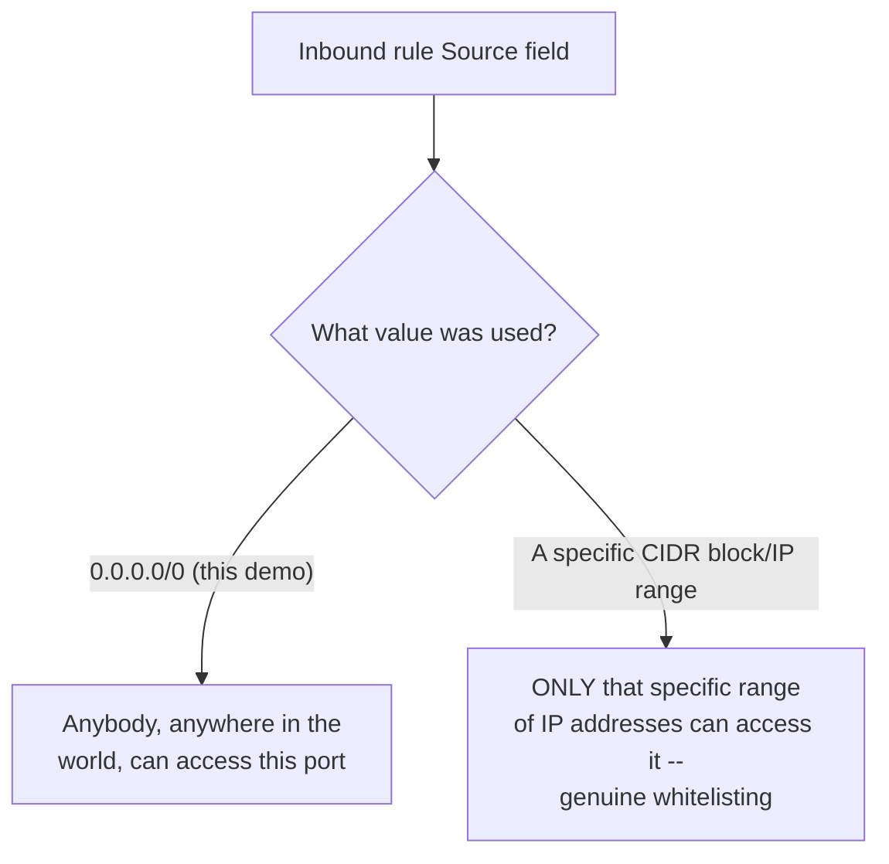

#### 🏢 Real-World / Production Usage -- Restricting Access in a Real Organization

> 💡 **Memory Trick, given directly:** *"If you wanted to restrict access to a specific IP range -- which happens constantly in real organizations, e.g., only allowing your customers' specific IP range to access something -- that's exactly where you'd do it: in the inbound traffic rules, provide the specific IP range or CIDR block you want to allow. Then only that range can access your application."*

#### ⚠ Common Mistakes

* Assuming `0.0.0.0/0` is the only or default option -- explicitly, directly clarified: this specific choice makes the resource genuinely, deliberately open to the entire internet, and a real organization would frequently choose a much narrower, specific IP range instead.

#### 🎯 Key Takeaways

* A **public IP address**, combined with an inbound rule sourced from **`0.0.0.0/0`**, makes an application genuinely accessible from any device, anywhere in the world -- not limited to the machine that originally deployed it.
* Restricting access to a **specific IP range or CIDR block** (rather than the entire internet) is a genuine, common real-world practice -- directly configurable in the exact same inbound-rules interface used to expose the port in the first place.
* This closing exchange directly reinforces and extends Section 10's fix -- showing that the SAME mechanism used to open access can also be used to precisely restrict it.

---

## 📝 Glossary

| Term | Definition | Why It Matters |
|---|---|---|
| **`.env` file** | A hidden file storing sensitive environment variables/credentials | Keeps secrets (like a Stripe secret key) out of version-controlled source code |
| **`npm`** | Node Package Manager | Installs and manages a Node.js application's dependencies; analogous to Python's `pip` |
| **IAM (Identity and Access Management)** | AWS's service for creating scoped users/roles with limited permissions | Avoids using the powerful root account for day-to-day work |
| **Root account** | The AWS admin account created at sign-up, with full access to everything | Not recommended for regular, daily use |
| **EC2 (Elastic Compute Cloud)** | AWS's service for provisioning remote virtual servers | Provides memory/compute beyond what a local machine might offer |
| **AMI (Amazon Machine Image)** | The operating system template used to launch an EC2 instance | e.g., Ubuntu 22.04 LTS, used in this session |
| **Key pair** | An authentication file (`.pem`) used to securely SSH into an EC2 instance | Generated and downloaded during instance creation |
| **`chmod 400`** | Restricts a file's permissions to owner-read-only | Required before a `.pem` key file can be used for SSH |
| **Region / Availability Zone** | Geographic locations where AWS operates data centers | Chosen to minimize latency for nearby users |
| **Security Group** | AWS's virtual firewall controlling traffic to/from an EC2 instance | The mechanism controlling whether an application's port is reachable |
| **Inbound Rule** | A specific security-group rule allowing incoming traffic on a given port/source | Must be explicitly added for any application port to become internet-accessible |
| **`0.0.0.0/0`** | A CIDR notation meaning "anywhere" -- unrestricted source | Used to make a port genuinely accessible from the entire internet |
| **CIDR block** | A notation for specifying a range of IP addresses | Used to restrict access to only a specific set of IPs, instead of the whole internet |

---

## 🔄 Revision Notes — One-Minute Revision

* This session is a **guest collaboration** with Kunal Verma, deploying his own real, published Node.js + Stripe application to AWS EC2 -- deliberately chosen to show that meaningful DevOps portfolio projects can be built independently.
* Local setup: **clone -> create/populate `.env` -> `npm install` -> `npm run start`** -- verified working locally before any cloud deployment.
* The `.env` pattern exists specifically to avoid hardcoding sensitive credentials -- a lesson Kunal explicitly describes learning through his own real experience, not from a single tutorial.
* Organizations deploy to the cloud (not laptops) for **reduced maintenance overhead, scalability, and potential (conditional) cost efficiency** -- directly reinforcing themes from Days 3-5.
* **IAM** lets an organization create scoped, non-root users with limited permissions -- a genuine security best practice, live-demonstrated by creating a user, attaching a policy (AdministratorAccess for the demo; EC2-only recommended for safer self-practice), and signing in via Account ID + IAM username.
* Creating an **EC2 instance** requires choosing an **AMI** (Ubuntu), an **instance type** (`t2.micro`, free tier), and a **key pair** (RSA, `.pem`) -- with regions/availability zones chosen to minimize latency.
* **`chmod 400`** was precisely explained via octal notation: 4=read, 2=write, 1=execute, across owner/group/others -- `400` means owner-read-only, zero access for anyone else.
* Remote server setup **mirrors the local process** from scratch: `sudo apt update`, installing Node.js/npm (via DigitalOcean's recommended documentation), `git clone`, and recreating the `.env` file directly on the server (local env vars don't transfer automatically).
* A genuine, live-demonstrated failure: the app runs successfully on EC2, but is **completely inaccessible** from the public internet -- explicitly normalized as an extremely common first-deployment experience, not a rare edge case.
* The fix: adding an **inbound rule** to the EC2 instance's **security group**, allowing traffic on the app's actual port (3000), sourced from **`0.0.0.0/0`** ("anywhere") -- resolved live, ending in a genuine success.
* Closing Q&A: a public IP + `0.0.0.0/0` source means genuinely global access; restricting to a specific **CIDR block/IP range** in the same inbound-rules interface is the real-world mechanism for whitelisting specific users/customers.

---

## 📋 Cheat Sheet

**Local setup:**
```bash
git clone <repo-url>
cd <repo-folder>
touch .env    # then populate with required credentials
npm install
npm run start
```

**SSH connection:**
```bash
chmod 400 <keypair>.pem
ssh -i <keypair>.pem ubuntu@<public-ip>
```

**Remote server setup:**
```bash
sudo apt update
# install Node.js/npm (per DigitalOcean's guide)
git clone <repo-url>
touch .env
vim .env    # i to insert, Esc then :x to save+exit
npm install
npm run start
```

**The exposure fix (the critical step):**
```text
EC2 Console -> Security -> Security Groups -> Edit inbound rules -> Add rule
Port: <your app's port>
Source: 0.0.0.0/0 (anywhere) -- or a specific CIDR block to restrict access
```

**`chmod` octal notation:**
```text
4 = read | 2 = write | 1 = execute
400 = owner READ-ONLY, zero access for group/others
```

---

## 🔥 Interview Questions & Answers

### 🟢 Beginner

**Q1.**

**Question:** Why is an application's Stripe secret key stored in a `.env` file instead of directly in the code?

**Answer:** To keep sensitive credentials out of version-controlled, potentially public source code -- `.env` is a hidden file, not committed alongside the application's tracked code.

**Explanation:** Directly, honestly explained via Kunal's own real learning experience.

**Why Interviewers Ask This:** Basic, essential credential-security practice.

**Possible Follow-up:** "What's the difference between the publishable key and the secret key in this example?"

**Q2.**

**Question:** What is IAM, and why shouldn't you use the AWS root account for day-to-day work?

**Answer:** IAM (Identity and Access Management) lets you create scoped users with limited permissions; using root for daily work is discouraged because it has unrestricted, full access to everything, creating unnecessary risk.

**Explanation:** Directly, explicitly explained and demonstrated live.

**Why Interviewers Ask This:** A core AWS security best practice.

**Possible Follow-up:** "Name two ways to assign permissions to an IAM user."

**Q3.**

**Question:** What is EC2, and what's a practical, relatable reason someone might use it?

**Answer:** Elastic Compute Cloud -- AWS's remote virtual server service; a practical reason: someone with an old, low-memory laptop can still run memory-heavy applications by using a remote server instead.

**Explanation:** Directly, precisely explained via the "old laptop" analogy.

**Why Interviewers Ask This:** Foundational EC2 knowledge, grounded in a real use case.

**Possible Follow-up:** "What's the difference between an AMI and an instance type?"

**Q4.**

**Question:** What does `chmod 400` do to a `.pem` key file, precisely?

**Answer:** Restricts the file so only its owner can read it (4 = read), with zero write/execute permission for the owner, and zero access at all for the file's group or anyone else.

**Explanation:** Directly, precisely explained via octal notation.

**Why Interviewers Ask This:** Tests genuine, technical understanding, not just command memorization.

**Possible Follow-up:** "What would `chmod 644` mean, by the same logic?"

**Q5.**

**Question:** Why did the application fail to load in the browser, even though it was running successfully on the EC2 instance with no errors?

**Answer:** The EC2 instance's security group had no inbound rule allowing traffic on the application's port -- the internet had no way to reach it, even though it was genuinely running.

**Explanation:** Directly, honestly demonstrated as a real, live failure.

**Why Interviewers Ask This:** One of the most common, genuinely important first-deployment troubleshooting scenarios.

**Possible Follow-up:** "What specific AWS feature fixes this?"

**Q6.**

**Question:** What AWS mechanism controls whether a specific port is reachable from the internet on an EC2 instance?

**Answer:** Security groups, specifically their inbound rules.

**Explanation:** Directly, precisely identified as the fix for the exposure problem.

**Why Interviewers Ask This:** Core, practical AWS networking knowledge.

**Possible Follow-up:** "What does a source of `0.0.0.0/0` mean in an inbound rule?"

**Q7.**

**Question:** What does a source value of `0.0.0.0/0` mean in a security group's inbound rule?

**Answer:** "Anywhere" -- the port is accessible from any IP address on the internet, with no restriction.

**Explanation:** Directly, precisely explained.

**Why Interviewers Ask This:** Basic, essential AWS networking/security terminology.

**Possible Follow-up:** "How would you restrict access to only a specific set of customers' IP addresses instead?"

**Q8.**

**Question:** Why did SSH already work before the port-3000 inbound rule was added?

**Answer:** A default inbound rule for port 22 (SSH) already existed, added automatically when the instance was created with "Allow SSH traffic" enabled.

**Explanation:** Directly, precisely explained as a clarifying contrast.

**Why Interviewers Ask This:** Tests understanding of WHY the fix was specifically needed for the app's own port.

**Possible Follow-up:** "If you wanted to also allow HTTPS traffic, what port and rule would you add?"

**Q9.**

**Question:** Does deploying an application on a fresh EC2 instance automatically inherit the environment variables set on your local machine?

**Answer:** No -- the `.env` file must be genuinely recreated directly on the remote server, since it's deliberately excluded from version control and doesn't transfer via `git clone`.

**Explanation:** Directly, explicitly demonstrated live.

**Why Interviewers Ask This:** A practical, easy-to-overlook deployment detail.

**Possible Follow-up:** "Why is `.env` deliberately excluded from version control in the first place?"

**Q10.**

**Question:** What documentation resource does Kunal specifically recommend for AWS/Linux/DevOps topics generally?

**Answer:** DigitalOcean's documentation.

**Explanation:** Directly, explicitly named and recommended.

**Why Interviewers Ask This:** Tests awareness of genuinely useful, real-world learning resources.

**Possible Follow-up:** "What other documentation source has this course series recommended for Git specifically?"

---

### 🟡 Intermediate

**Q11.**

**Question:** Explain why Abhishek explicitly invited a guest still completing his undergraduate degree to co-present this session, connecting this to the course's broader messaging.

**Answer:** This directly reinforces a message threaded throughout the entire course series: meaningful, portfolio-worthy DevOps work doesn't require years of prior experience or a completed degree -- it requires building and genuinely understanding real projects, then documenting and sharing that work. Kunal is presented as living proof of this claim, not just an abstract assertion -- someone in the exact position many viewers are likely in (still studying, building independent projects) who has nonetheless built and deployed a genuinely real, production-style application. This is explicitly framed as inspirational and actionable, not just interesting.

**Explanation:** Requires connecting the choice of guest to the course's broader, repeated career-encouragement messaging.

**Why Interviewers Ask This:** Less a technical question, more testing whether a learner recognizes intentional framing and messaging.

**Possible Follow-up:** "What specific, concrete action does this session encourage viewers to take, based on Kunal's example?"

**Q12.**

**Question:** A learner argues that since the application ran without any errors on the EC2 instance, the deployment was essentially complete at that point, and the security group fix was just a minor, optional detail. Evaluate this claim.

**Answer:** This claim is not accurate, and the session explicitly, directly counters it. "Running without errors" and "genuinely deployed and accessible" are fundamentally different states -- the application was functionally complete and correct, but entirely UNREACHABLE from its intended audience (anyone on the internet) until the security group fix was applied. From a genuine deployment-completeness perspective, an application nobody can actually reach has NOT been successfully deployed in any meaningful sense -- the security group configuration isn't a minor, optional detail; it's the specific step that determines whether the deployment achieves its actual purpose (making the application usable by real users).

**Explanation:** Tests whether a learner conflates "runs without errors" with "successfully deployed," a genuinely important distinction this session explicitly demonstrates.

**Why Interviewers Ask This:** Distinguishes candidates who understand deployment completeness holistically from those who equate it with narrow code-execution success.

**Possible Follow-up:** "Name another AWS/deployment scenario where 'it runs' and 'it's genuinely usable' might similarly diverge."

**Q13.**

**Question:** Explain, precisely, why the session recommends starting with a narrower IAM policy (e.g., EC2-only access) for self-practice, rather than always using AdministratorAccess as demonstrated live.

**Answer:** AdministratorAccess was used in the live demo specifically for SIMPLICITY, given the time constraints and instructional focus of a single session -- but it directly contradicts the broader principle of least privilege the same session explicitly establishes (IAM exists specifically to scope down what a user can do). Recommending EC2-only access for self-practice serves two purposes: (1) it genuinely reduces risk if a learner's practice account credentials were ever compromised, since the damage would be limited to EC2 resources rather than the entire AWS account; (2) it forces the learner to actually practice the real skill of scoping permissions correctly for a specific task, rather than defaulting to "just grant everything," which is precisely the habit IAM's existence argues against.

**Explanation:** Requires recognizing the tension between a demo's practical simplicity and the security principle the demo itself teaches, and explaining why the recommended self-practice approach resolves it.

**Why Interviewers Ask This:** Tests whether a learner recognizes when a demonstration's practical shortcuts diverge from the actual best practice being taught.

**Possible Follow-up:** "What specific IAM permissions, beyond basic EC2 access, might a learner need to add if they also wanted to practice with S3 in a future exercise?"

**Q14.**

**Question:** Using this session's `.env`-must-be-recreated-on-the-server observation, explain a broader principle about what does and doesn't transfer when deploying code via `git clone` to a new environment.

**Answer:** `git clone` transfers exactly and only what is tracked within the repository's version control -- any file deliberately excluded from tracking (typically via a `.gitignore` file, though not explicitly demonstrated in this session) will NOT transfer, regardless of how essential it is for the application to actually run. This is precisely why `.env` -- despite being absolutely required for the application to function correctly -- must be manually recreated on every new environment (local machine, EC2 instance, or any other deployment target) rather than being something `git clone` alone provides. The broader principle: deployment to a new environment requires distinguishing between "code that transfers automatically via version control" and "configuration/secrets that must be independently, deliberately provisioned for each specific environment" -- a genuinely important operational distinction beyond just this one `.env` example.

**Explanation:** Requires generalizing from this session's specific `.env` observation to a broader, transferable principle about version control and deployment.

**Why Interviewers Ask This:** Tests whether a learner can extract a general principle from a specific, concrete example, rather than only remembering the specific case.

**Possible Follow-up:** "What other kinds of files or configuration might commonly need this same manual, per-environment recreation, beyond `.env` files specifically?"

**Q15.**

**Question:** Synthesize this session's security-group fix (Section 10) with its closing IP-whitelisting Q&A (Section 11) to explain why `0.0.0.0/0` should be understood as a deliberate CHOICE with real trade-offs, not simply "the correct default setting."

**Answer:** The session demonstrates `0.0.0.0/0` as the specific value used to solve THIS demo's exposure problem (Section 10) -- but Section 11's closing Q&A explicitly reframes this as one option among several, with real organizational trade-offs: `0.0.0.0/0` maximizes accessibility (genuinely anyone, anywhere can reach the application) at the direct cost of maximally exposing the port to the ENTIRE internet, including any potential bad actors, not just legitimate users. A real organization frequently chooses a narrower CIDR block specifically to accept a different trade-off: reduced reach (only specific, known IP ranges can access it) in exchange for reduced exposure/attack surface. Understanding `0.0.0.0/0` as a deliberate choice, rather than an unexamined default, is precisely what lets a DevOps engineer make the CORRECT choice for a given application's actual security requirements, rather than defaulting to maximum openness out of habit or convenience.

**Explanation:** Requires connecting the session's specific demonstrated choice to its own later, explicit reframing of that choice as one option among a genuine trade-off space.

**Why Interviewers Ask This:** Tests whether a learner understands `0.0.0.0/0` as a considered security decision rather than a memorized "correct" default value.

**Possible Follow-up:** "For a genuinely public-facing e-commerce website, would `0.0.0.0/0` be the right choice? What about for an internal company admin tool?"

---

### 🔴 Advanced

**Q16.**

**Question:** Design a more security-conscious version of this session's exact deployment, addressing at least three specific security gaps present in the demonstrated approach (using only concepts covered across this course series so far).

**Answer:** A reasonable, more security-conscious redesign: (1) **IAM scoping** -- replace AdministratorAccess (used for demo simplicity) with a narrowly-scoped policy granting only the specific EC2 permissions genuinely needed, per this session's own self-practice recommendation and the principle of least privilege it establishes. (2) **Inbound rule scoping** -- replace `0.0.0.0/0` for the application's port with a specific CIDR block if the application genuinely doesn't need to be reached by the entire public internet (e.g., an internal testing/staging deployment restricted to the team's own office/VPN IP range), directly applying Section 11's closing Q&A guidance. (3) **Credential handling for the `.pem` key** -- apply the same `.pem`-file security discipline established in Day 5 and Day 8 (never share your screen while generating/copying it, never commit it to version control, apply `chmod 400` immediately) -- genuinely demonstrated correctly in THIS session already, but worth explicitly re-affirming as a hardening checklist item rather than assuming it. (4) **Secrets management beyond `.env`** -- for a genuinely production-grade deployment (as opposed to this session's learning-focused demo), consider a dedicated secrets-management service (e.g., AWS Secrets Manager, not covered in this session but a natural extension) rather than a plain-text `.env` file sitting on the server's filesystem, which remains readable by anyone with sufficient server access. This redesign directly extends this session's own demonstrated practices with genuinely necessary hardening steps for anything beyond a learning exercise.

**Explanation:** Synthesizes security practices from across multiple sessions in this course (IAM scoping, inbound rule restriction, key-pair handling, credential management) into a coherent, applied hardening checklist for this specific session's exact deployment scenario.

**Why Interviewers Ask This:** A realistic, senior-level security-hardening question testing whether a candidate can identify and address genuine gaps in a working, demonstrated deployment.

**Possible Follow-up:** "Which of these four hardening steps would you prioritize FIRST if you had limited time before a genuine production launch, and why?"

**Q17.**

**Question:** Critically evaluate: "Since this session used AdministratorAccess for the IAM user and `0.0.0.0/0` for the security group, this deployment approach is fundamentally insecure and shouldn't be used as a teaching example." Is this a fair characterization of this session's content?

**Answer:** Not entirely fair, though it correctly identifies real, genuine simplifications the session itself doesn't hide or misrepresent as ideal. The session explicitly, directly acknowledges BOTH choices as demo-specific simplifications, not universally-recommended best practices: it explicitly recommends EC2-only permissions for self-practice (rather than AdministratorAccess) and explicitly walks through, in the closing Q&A, how and why you'd restrict `0.0.0.0/0` to a specific CIDR block in a real scenario. The session's PEDAGOGICAL value lies precisely in demonstrating the COMPLETE, working end-to-end process first (in its simplest, most learnable form), with the security-hardening considerations explicitly flagged as the NEXT, deliberate step -- a genuinely reasonable teaching sequence (get it working, then harden it) rather than teaching a fundamentally flawed, insecure pattern as if it were the final, correct answer. The criticism would be fair only if the session presented these simplified choices AS the recommended production approach without qualification -- which it explicitly does not.

**Explanation:** Tests whether a learner can distinguish "used a simplified approach for teaching clarity, with explicit caveats" from "taught a fundamentally flawed approach as correct" -- a meaningfully different critique.

**Why Interviewers Ask This:** Tests nuanced evaluation of pedagogical choices versus genuine technical/security errors.

**Possible Follow-up:** "What specific language or moment in the session demonstrates that these simplifications were flagged as such, rather than presented as unqualified best practice?"

**Q18.**

**Question:** Synthesize this session's complete deployment arc (local → IAM → EC2 → SSH → remote setup → exposure fix) with Day 7's AWS resource-tracking shell script project to design a genuinely useful automation that would help an organization ensure NO deployed EC2 instance is left with an overly-permissive security group rule (like an unrestricted `0.0.0.0/0` on a sensitive port) for longer than intended.

**Answer:** Directly extending Day 7's AWS CLI + `jq`-based resource-tracking pattern: (1) Use the AWS CLI's security-group-describing command (discoverable via AWS's own documentation, per this course's established "check the docs" pattern) to programmatically list all inbound rules across an organization's EC2 instances/security groups; (2) Use `jq` (per Day 7's exact demonstrated technique) to filter this output specifically for rules with a source of `0.0.0.0/0` on sensitive or non-standard ports (e.g., anything other than well-understood, intentionally-public ports like 80/443) -- directly parallel to Day 7's filtering of collaborator permissions down to a specific, actionable subset; (3) Format this filtered list into a labeled report (per Day 7's `echo`-labeling pattern), specifically flagging instance ID, the exposed port, and the rule's age/creation date if available; (4) Schedule this script via a cron job (per Day 7's explicit cron-integration assignment) to run regularly, generating an ongoing, automated audit rather than a one-time manual check -- directly mirroring Day 7's own "orphaned resource" cost-tracking motivation, but applied to a security-exposure risk instead of a cost-waste risk. This design demonstrates that the SAME underlying shell-scripting + AWS CLI + `jq` pattern taught in Day 7 for cost auditing is directly, naturally reusable for a genuinely different but structurally similar organizational risk (unintended security exposure) introduced conceptually in this session.

**Explanation:** Requires synthesizing this session's newly-introduced security-group concept with a specific, previously-taught automation pattern from an entirely different earlier session -- genuine, non-obvious cross-session synthesis producing a real, applied tool design.

**Why Interviewers Ask This:** A capstone-level question testing whether a candidate can recognize and reuse a general automation PATTERN (not just specific commands) across genuinely different problem domains within the same course's cumulative skill set.

**Possible Follow-up:** "What specific AWS CLI command would you research first to begin implementing step (1) of this design?"

---

## 🧪 Scenario-Based Interview Questions

> **Scenario 1:** A new team member deploys an application to a fresh EC2 instance, confirms it runs without errors via `npm run start`, and reports the deployment as "complete." Their manager later discovers the application isn't actually accessible to any real users. Using this session's concepts, explain what likely happened and how to prevent it recurring.

**Structured Answer:**
1. **Initial investigation:** Recognize this as a direct, textbook match for Section 9's exact demonstrated failure -- confirming an application runs (no errors) is genuinely NOT the same as confirming it's actually reachable from outside the server.
2. **Metrics/logs to check:** Attempt to access the application from an external network/device (not the server itself) at its public IP and port, directly reproducing the "site can't be reached" symptom if the same root cause applies.
3. **Possible causes:** Almost certainly, per this session's own demonstrated pattern, a missing security-group inbound rule for the application's specific port.
4. **Debugging approach:** Check the EC2 instance's security group configuration, specifically confirming whether an inbound rule exists for the application's actual port.
5. **Resolution:** Add the missing inbound rule (with an appropriately-scoped source, per Section 11's guidance -- not necessarily `0.0.0.0/0` if broader public access isn't genuinely required), then re-verify external accessibility.
6. **Prevention:** Establish a team deployment checklist explicitly requiring EXTERNAL accessibility verification (not just "the process started without errors") as a required, separate step before any deployment is considered genuinely complete -- directly addressing the exact conflation this session's demonstration warns against.

> **Scenario 2 (Advanced):** Your organization wants to deploy a genuinely production-grade version of an application similar to this session's project, and a stakeholder asks whether it's safe to simply follow this exact session's steps as-is for their real, customer-facing deployment. Using this session's concepts and Advanced Q16/17's reasoning, provide your recommendation.

**Structured Answer:**
1. **Initial investigation:** Clarify the genuine distinction this session itself establishes between a LEARNING-focused demonstration (explicitly simplified, with acknowledged shortcuts like AdministratorAccess and `0.0.0.0/0`) and a genuinely production-appropriate deployment.
2. **Relevant principle:** Per Advanced Q17's reasoning, this session's simplifications are appropriately flagged as teaching choices, not recommended production practices -- the session itself explicitly points toward more scoped, secure alternatives (EC2-only IAM permissions, CIDR-restricted inbound rules) without fully implementing them live, due to time/complexity constraints appropriate for an introductory session.
3. **Possible causes for the stakeholder's question:** A reasonable, genuinely important question -- not knowing which specific steps in a demo were simplified-for-teaching versus genuinely production-ready as shown.
4. **Debugging/evaluation approach:** Walk through the specific hardening checklist from Advanced Q16 (IAM scoping, inbound rule scoping, key-pair handling, secrets management) against the organization's actual production requirements.
5. **Resolution:** Recommend NOT deploying the exact demonstrated steps as-is for a genuine production, customer-facing use case -- instead, apply this session's core DEPLOYMENT PROCESS (which is genuinely sound and correctly demonstrates the real end-to-end mechanics) while substituting the security-relevant specifics (IAM permissions, inbound rule sources, secrets handling) with the more scoped, hardened alternatives this session itself points toward but doesn't fully implement live.
6. **Prevention:** Establish an organizational distinction between "learning/reference deployment guides" (like this session) and "production deployment runbooks" (which must explicitly incorporate hardening steps) -- ensuring team members understand which category any given guide or tutorial falls into before applying it directly to real, customer-facing infrastructure.

---

## 🛠 Hands-on Exercises

### 🟢 Easy

1. Clone Kunal's public GitHub repository (or a similar Node.js application of your own choosing), and get it running locally, including setting up a `.env` file with any required credentials.
2. Create an IAM user (not using your root account) with EC2-only permissions, and sign in as that user, following this session's exact process.
3. Create a free-tier EC2 instance, connect via SSH, and confirm you're inside the remote server, applying `chmod 400` correctly to your key pair first.

### 🟡 Medium

4. Fully deploy your chosen application to your EC2 instance (updating packages, installing Node.js/npm, cloning the repo, recreating `.env`), and deliberately reproduce this session's exact "site can't be reached" failure before fixing it.
5. Fix the exposure problem yourself by adding the correct inbound rule, and document the before/after difference in accessibility.
6. Practice restricting access to a specific CIDR block (e.g., your own current IP address, found via a "what's my IP" search) instead of `0.0.0.0/0`, and confirm the application becomes inaccessible from a different network/device.

### 🔴 Advanced

7. Implement the security-hardening checklist proposed in Advanced Interview Q16, applying all four steps to your own deployed instance from the exercises above.
8. Design and document (in writing) the security-group-auditing automation proposed in Advanced Interview Q18, directly extending Day 7's AWS CLI + `jq` resource-tracking pattern.
9. Write a short technical document (300-400 words) addressing the production-readiness question from Scenario 2, specifically for a hypothetical stakeholder considering this session's exact steps for a real deployment.

---

## 🏗 Practice Assignment

### Build: "Deploy & Secure Your Own First AWS Application"

**Objective:** Complete this session's full deployment arc end to end, using an application of your own choosing (Kunal's project, or your own), then apply genuine security hardening beyond what was demonstrated live.

**Requirements:**
- A working application, deployed locally first, then to a fresh EC2 instance, following this session's complete process.
- An IAM user with EC2-only (not AdministratorAccess) permissions, used for the entire deployment.
- A correctly-configured `.env` file recreated directly on the remote server.
- A deliberately-reproduced and then fixed "site can't be reached" exposure problem.
- A security-group inbound rule restricted to a specific CIDR block (not `0.0.0.0/0`), with written justification for your chosen restriction.
- A written reflection (200-300 words) on the difference between "the application runs" and "the application is genuinely, appropriately deployed," directly reflecting on Intermediate Q12's distinction.

**Architecture (suggested):**

```text
first_aws_deployment/
├── DEPLOYMENT_LOG.md          # documents each step: local setup, IAM, EC2, SSH, remote setup
├── EXPOSURE_PROBLEM.md          # documents the deliberate failure and its fix
├── SECURITY_CHOICES.md            # your IAM scoping and CIDR block choices, with justification
└── REFLECTION.md                    # your written reflection on deployment completeness
```

**Expected Functionality:**
- Your application should be genuinely, verifiably accessible from an external device/network, but ONLY from your chosen, restricted IP range -- not the entire internet.
- Your documentation should clearly distinguish which choices were simplifications you deliberately avoided (per this session's own stated best practices), versus genuine constraints you accepted.

**Challenges:**
- Correctly scoping your IAM user to EC2-only permissions without accidentally being too restrictive to complete the deployment.
- Correctly identifying and configuring your specific CIDR block for restricted access, rather than defaulting to `0.0.0.0/0` out of convenience.

**Bonus Improvements:**
- Implement one item from the Advanced Q16 hardening checklist not explicitly required above (e.g., researching AWS Secrets Manager as an alternative to a plain-text `.env` file).
- Extend your deployment to run behind a specific, non-default port, and document any additional considerations this introduces.

---

## 📚 Additional Resources

- **Kunal Verma's public GitHub repository** -- directly linked in the video description, containing every step demonstrated in this session, explicitly intended for independent, hands-on follow-along.
- **Kunal Verma's LinkedIn profile** -- directly referenced, with Abhishek explicitly encouraging viewers to connect and express appreciation.
- The **Kube Simplify community** -- referenced directly as the origin of this project, aimed at guiding newcomers through cloud-native concepts.
- **DigitalOcean's documentation** -- directly, explicitly recommended as a consistently high-quality reference for AWS/Linux/DevOps topics generally.
- **Official Git documentation** -- directly recommended by Kunal as his own preferred learning resource, over video tutorials, once genuinely comfortable with a tool.
- The instructor's **Day 0 through Day 11 videos** (referenced implicitly, building on prior EC2/SSH/Git knowledge) -- required prior context, especially Days 3-5 (EC2, SSH, AWS CLI) and Days 9-11 (Git/GitHub).

---

## 📌 Final Revision Sheet

### ⭐ Core Concepts
- Full deployment arc: **local setup → IAM user creation → EC2 instance creation → SSH connection → remote server setup → exposure via security groups**.
- **`.env` files** keep sensitive credentials out of version-controlled code -- a lesson learned through genuine, real experience, not just theory.
- **IAM** enables scoped, non-root access -- a genuine security best practice, not a formality.
- **"Running without errors" ≠ "genuinely deployed and accessible"** -- the single most important practical lesson of this session.
- **Security groups/inbound rules** are the specific mechanism controlling internet accessibility to an EC2 instance's ports.
- **`0.0.0.0/0`** is a deliberate choice (maximum reach, maximum exposure) with a genuine, real alternative (CIDR-restricted access) for different security needs.

### ⭐ Important Definitions
- **AMI**, **key pair**, **CIDR block** (see Glossary for full definitions).

### ⭐ Important Commands/Code
```bash
git clone <repo-url>
npm install && npm run start
chmod 400 <keypair>.pem
ssh -i <keypair>.pem ubuntu@<public-ip>
sudo apt update
touch .env && vim .env    # i to insert, Esc then :x to save+exit
```

### ⭐ Architecture/Process
- IAM: root account (avoid daily use) → scoped IAM user (permissions via group or direct policy).
- EC2: AMI → instance type → key pair → network settings → launch.
- Exposure fix: Security Groups → Edit inbound rules → Add port + source → Save.

### ⭐ Best Practices
- Test applications locally before attempting cloud deployment.
- Never hardcode credentials -- always use environment variables.
- Never use the root account for regular work -- create scoped IAM users.
- Always verify EXTERNAL accessibility, not just error-free local execution, before considering a deployment complete.
- Scope security-group inbound rules to the narrowest source genuinely required, rather than defaulting to `0.0.0.0/0`.

### ⭐ Common Mistakes
- Assuming an error-free running application is automatically internet-accessible.
- Assuming Git is pre-installed on every Linux distribution.
- Assuming local environment variables automatically transfer to a new deployment environment.
- Defaulting to `0.0.0.0/0` or AdministratorAccess out of convenience rather than genuine need.

### ⭐ Interview Points
- Be ready to explain precisely why a running application can still be inaccessible -- the session's central practical lesson.
- Be ready to explain IAM's purpose and the principle of least privilege.
- Be ready to walk through the complete EC2 creation and SSH connection process.
- Be ready to explain `chmod 400`'s exact octal meaning.

### ⭐ Things to Remember
- This is a **guest collaboration session**, deliberately structured to show that independently-built, portfolio-worthy DevOps projects are achievable even before completing a degree -- a real, concrete example, not just encouragement.
- The session's own simplifications (AdministratorAccess, `0.0.0.0/0`) are **explicitly, directly acknowledged** as demo-appropriate choices, with the more secure alternatives clearly pointed to -- not presented as unqualified best practice.
- The complete project and every step are published on Kunal's own **public GitHub repository**, explicitly intended for genuine, independent hands-on practice beyond just watching the video.

---

## 🔗 Source

- [Deploy and Expose Your First App to AWS](https://youtu.be/NLmF64KdLN0?si=tiEXn1jVh6XbVOEZ)