# ☁ Top 15 AWS Services Every DevOps Engineer Should Know

- <i>**Session:** DevOps Zero to Hero — Day 13: "Top 15 AWS Services that Every DevOps Engineer Should Learn" · 
- **Instructor:** Abhishek
- **Note on scope:** This is a deliberately **conceptual, list-format session** — not hands-on. The instructor explicitly states these are the specific AWS services interviewers most commonly ask about, out of AWS's 200+ total offerings, and explicitly notes the list has **no priority ordering** ("I'm just writing as I remember"). Deeper hands-on coverage of several of these (especially VPC, security groups, load balancers) is explicitly deferred to an "intermediate AWS" phase of the course, consistent with this course's stated breadth-first philosophy.</i>

---

## 📑 Table of Contents

1. [Session Overview](#-session-overview)
2. [Learning Objectives](#-learning-objectives)
3. [Detailed Notes](#-detailed-notes)
   - [1. Why This List Matters: 200+ Services, But a DevOps-Relevant Subset](#1-why-this-list-matters-200-services-but-a-devops-relevant-subset)
   - [2. Core Compute & Storage: EC2, VPC, EBS & S3](#2-core-compute--storage-ec2-vpc-ebs--s3)
   - [3. Access Control: IAM](#3-access-control-iam)
   - [4. Observability: CloudWatch & CloudTrail, Correctly Distinguished](#4-observability-cloudwatch--cloudtrail-correctly-distinguished)
   - [5. Serverless Compute: Lambda & the CloudWatch+Lambda Guardrail Pattern](#5-serverless-compute-lambda--the-cloudwatchlambda-guardrail-pattern)
   - [6. AWS's Native CI/CD: CodePipeline, CodeBuild & CodeDeploy](#6-awss-native-cicd-codepipeline-codebuild--codedeploy)
   - [7. Governance: AWS Config & Billing/Cost Management](#7-governance-aws-config--billingcost-management)
   - [8. Secrets & Encryption: AWS KMS](#8-secrets--encryption-aws-kms)
   - [9. Containers & Kubernetes: EKS, ECS & Fargate](#9-containers--kubernetes-eks-ecs--fargate)
   - [10. Centralized Logging: The ELK Stack](#10-centralized-logging-the-elk-stack)
4. [Glossary](#-glossary)
5. [Revision Notes — One-Minute Revision](#-revision-notes--one-minute-revision)
6. [Cheat Sheet](#-cheat-sheet)
7. [Interview Questions & Answers](#-interview-questions--answers)
8. [Scenario-Based Interview Questions](#-scenario-based-interview-questions)
9. [Hands-on Exercises](#-hands-on-exercises)
10. [Practice Assignment](#-practice-assignment)
11. [Additional Resources](#-additional-resources)
12. [Final Revision Sheet](#-final-revision-sheet)

---

## 🎯 Session Overview

This session addresses a genuinely common anxiety among learners: AWS offers 200+ services — which ones actually matter for a DevOps role? It covers:

1. A brief framing of **what AWS fundamentally is** (a cloud provider spanning IaaS/PaaS/SaaS models) and why no single person, including the instructor himself, knows all 200+ services.
2. **Fifteen specific AWS services**, explicitly identified as the ones interviewers most commonly ask about, grouped here by function: core compute/storage (EC2, VPC, EBS, S3), access control (IAM), observability (CloudWatch, CloudTrail), serverless compute (Lambda), native CI/CD (CodePipeline, CodeBuild, CodeDeploy), governance (AWS Config, Billing/Cost Management), secrets management (KMS), containers/Kubernetes (EKS, ECS, Fargate), and centralized logging (the ELK stack).
3. A recurring, connected example threaded through several services: detecting an **unencrypted EBS volume** via CloudWatch, then using **Lambda** to notify or auto-remediate — directly illustrating how these services combine in real, practical automation.
4. An explicit, practical caveat on AWS's native CI/CD services: appropriate ONLY for organizations fully committed to AWS long-term, not for multi-cloud or cloud-migration-considering organizations.
5. A classic, explicitly-flagged interview question: **EKS vs. ECS** — both container orchestration solutions, but fundamentally different in nature (managed Kubernetes vs. AWS's own proprietary orchestrator).
6. A closing, honest acknowledgment that project-specific services (e.g., machine learning/TensorFlow) exist beyond this list, and that this list specifically reflects common INTERVIEW coverage, not an exhaustive catalog of every service a DevOps engineer might ever encounter.

> 💡 **Memory Trick — the instructor's framing for why this list is explicitly bounded, not exhaustive:** *"Even if you ask me, I might not know all 200 services — I did not work on all of them. As a DevOps engineer, unless you're working on a machine learning project, you might not need to know machine learning services or how to create ML services. What we're learning today is specifically: what are the AWS services a DevOps engineer has to worry about or concentrate on."*

---

## 🎯 Learning Objectives

By the end of this guide, you will be able to:

- [ ] Explain, in one sentence, why a DevOps engineer doesn't need to know all 200+ AWS services, and name the specific criterion this session uses to select its 15.
- [ ] Name and briefly define all 15 services covered: EC2, VPC, EBS, S3, IAM, CloudWatch, Lambda, CodePipeline, CodeBuild, CodeDeploy, AWS Config, Billing/Cost Management, KMS, CloudTrail, EKS/ECS/Fargate, and the ELK stack.
- [ ] Explain the combined CloudWatch + Lambda pattern for detecting and auto-remediating a policy violation (e.g., an unencrypted EBS volume).
- [ ] Precisely distinguish CloudWatch (active monitoring/metrics) from CloudTrail (historical API activity logging/auditing).
- [ ] State the specific business condition under which AWS's native CI/CD services (CodePipeline/CodeBuild/CodeDeploy) are and aren't appropriate to adopt.
- [ ] Precisely distinguish EKS from ECS, and explain what makes ECS "AWS-proprietary" in a way EKS is not.
- [ ] Explain why S3 being "encrypted by default" (a relatively recent AWS change) is worth knowing specifically.
- [ ] Explain what the ELK stack does and why it matters specifically in a microservices architecture.

---

## 📚 Detailed Notes

### 1. Why This List Matters: 200+ Services, But a DevOps-Relevant Subset

#### 📖 Definition — What AWS Fundamentally Is

> 💡 **Memory Trick, given directly, in the instructor's own stated "30-second explanation":** *"AWS is a cloud provider — it falls into the category of IaaS, PaaS, and SaaS. The main idea of AWS is that it makes your life easy by providing your products or applications in a service model. For example: Kubernetes installation, deployment, and management is a genuine overhead — AWS took Kubernetes and created it AS A SERVICE, so you just click a button and get a managed Kubernetes service. Everything underneath is taken care of by AWS."*

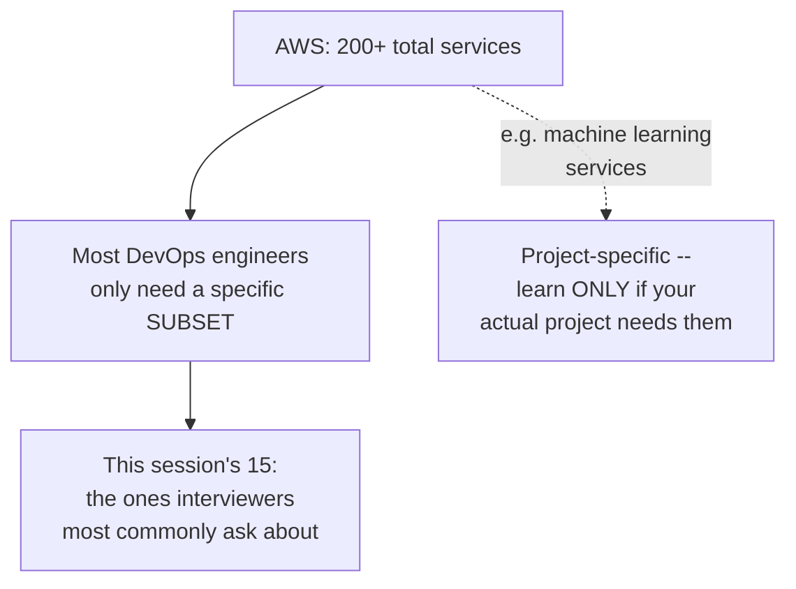

#### 🎯 Key Takeaways

* AWS spans the **IaaS/PaaS/SaaS** service models — the unifying principle being that AWS abstracts away operational overhead (like Kubernetes management) into a directly consumable service.
* No single person, including the instructor, knows every one of AWS's 200+ services — genuinely, directly acknowledged rather than glossed over.
* This session's specific 15 services are chosen because they're **what interviewers most commonly ask about** — an explicitly stated, practical selection criterion, not a claim of exhaustiveness.

---

### 2. Core Compute & Storage: EC2, VPC, EBS & S3

#### 📖 Definition — EC2 (Recap)

> 💡 **Memory Trick, briefly recapped, since already covered in depth (Days 3-5, 12):** *"EC2 is something most of you should already have a clear picture of by now — we did a full live project on it."*

#### 📖 Definition — VPC

> 💡 **Memory Trick, given directly:** *"VPC — Virtual Private Cloud — matters because securing your EC2 instances is one of the key aspects of securing your AWS resources. VPC involves several components: security groups, CIDR blocks (subnet ranges), and inbound/outbound traffic rules."*

> ⚠️ **Explicitly, directly deferred:** *"I'll definitely cover VPC, security groups, subnets, inbound/outbound rules, and load balancer configuration in a dedicated, intermediate-level live project — don't worry about it right now."*

#### 📖 Definition — EBS

> 💡 **Memory Trick, given directly, with a genuine production scenario:** *"EBS (Elastic Block Store) volumes are storage attached to your EC2 instances — your instances come with default storage, but in live scenarios, say you're deploying a database that keeps creating files, it's better to store that information in volume mounts. You can detach them, take snapshots, take backups, and reattach as needed — a common practice even for physical, on-premises infrastructure, and the same concept applies on AWS via EBS."*

#### 📖 Definition — S3

> 💡 **Memory Trick, given directly, with a genuine production scenario:** *"S3 buckets are one of the most widely used storage services on AWS — cheap and extendable. A basic example: your application reads from Excel sheets or files, or writes humongous amounts of data (JSON, YAML) that your customer wants to reference — you need somewhere cheap and extendable to store this. Recently, AWS made S3 ENCRYPTED BY DEFAULT — previously, enabling encryption was up to the DevOps engineer/AWS admin; now, it's mandatory by default."*

#### ⚠ Common Mistakes

* Assuming this list's ordering reflects priority or importance — explicitly, directly clarified: *"This doesn't have any order of hierarchy or priority — I'm just writing as I remember."*
* Assuming S3 encryption still requires manual configuration — explicitly, directly corrected as a relatively recent AWS policy change.

#### 🎯 Key Takeaways

* **VPC** is explicitly deferred to a future, dedicated intermediate-level session — this session only names its core components (security groups, CIDR blocks, inbound/outbound rules) without deep coverage.
* **EBS** provides attachable, detachable, snapshottable block storage for EC2 instances — genuinely useful for databases or any application generating persistent files.
* **S3** is cheap, extendable object storage, now **encrypted by default** — a genuinely worth-knowing recent policy change.
* This list's ordering is **explicitly, directly stated to carry no priority significance** — a genuinely important framing detail for interpreting the entire session.

---
### 3. Access Control: IAM

#### 📖 Definition

> 💡 **Memory Trick, given directly, via a genuinely relatable GitHub analogy:** *"IAM — Identity and Access Management — is a critical, key component. Think about GitHub: you wouldn't grant complete access to everybody on a project. A developer gets write access; a QE/tester might only get read access, because you don't want them accidentally committing something unintended. You wouldn't grant admin access to anyone beyond maintainers, because admin access means they could delete the repository. AWS IAM is the exact same principle, applied to your AWS resources."*

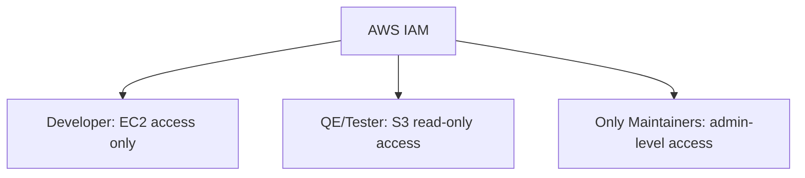

#### 🎯 Key Takeaways

* **IAM** governs who can do what across an AWS account — the same underlying principle as GitHub's read/write/admin permission tiers, applied to cloud infrastructure.
* This directly reinforces and extends Day 12's own IAM demonstration, now framed at a conceptual, interview-relevant level.
* The instructor notes he's made a **dedicated, separate IAM video** on the channel, for those wanting deeper coverage beyond this session's brief recap.

---

### 4. Observability: CloudWatch & CloudTrail, Correctly Distinguished

#### 📖 Definition — CloudWatch

> 💡 **Memory Trick, given directly:** *"CloudWatch takes care of MONITORING on your AWS — it has log access to every action taking place on your AWS. Say a developer creates an S3 bucket, or an EBS volume — you can get that information via CloudWatch. You can even configure rules: whenever my EC2 instance reaches a threshold amount of CPU or memory, send me a notification."*

#### 📖 Definition — CloudTrail (An Honest, Live Self-Correction)

> ⚠️ **Directly, honestly self-corrected mid-session:** *"I missed one thing when talking about CloudWatch — I should have mentioned this then. AWS also has CloudTrail. CloudTrail is used to enable operational and risk AUDITING — it stores information about API logs. If you want to know what happened 30 days ago, you get those logs from CloudTrail. In one simple line: CloudTrail records your API activities and preserves logs for a specific duration — say, the last 30 days or six months."*

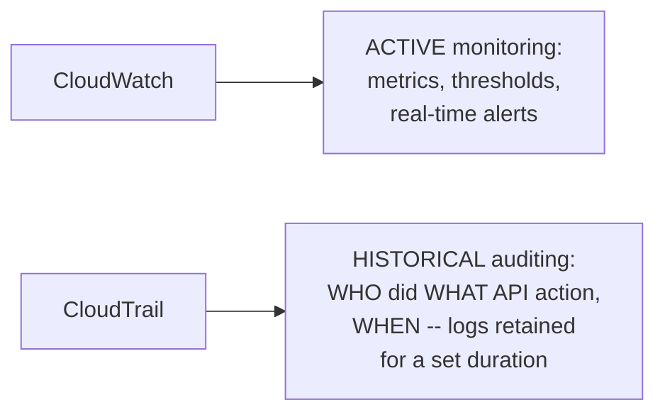

#### ⚠ Common Mistakes

* Conflating CloudWatch and CloudTrail as the same service, or interchangeable — explicitly, directly distinguished: CloudWatch is about active, ongoing monitoring/metrics; CloudTrail is specifically about historical, auditable API activity logging.
* Assuming the instructor's own explicit, honest mid-session correction (initially forgetting CloudTrail) reflects disorganization rather than genuine, transparent teaching — worth noting as an authentic, unedited moment rather than a scripted structure.

#### 🎯 Key Takeaways

* **CloudWatch** = active, ongoing monitoring — metrics, thresholds, real-time alerts on AWS resource behavior.
* **CloudTrail** = historical, auditable logging of WHO did WHAT API action and WHEN — critical for compliance, governance, and risk auditing, with configurable log retention.
* These two are genuinely, precisely distinct services serving different purposes — a real, commonly-tested interview distinction.

---

### 5. Serverless Compute: Lambda & the CloudWatch+Lambda Guardrail Pattern

#### 📖 Definition

> 💡 **Memory Trick, given directly:** *"Lambda is a serverless compute. What does 'serverless' mean? When you create an EC2 instance, you go through the AWS console, choose your OS, and so on. With Lambda, you just execute your function — AWS automatically, without your explicit request, creates an instance for you, runs your code on it, and TEARS IT DOWN once execution is done. Lambda functions are used for SHORT actions — unlike EC2, where you deploy a full, persistent application."*

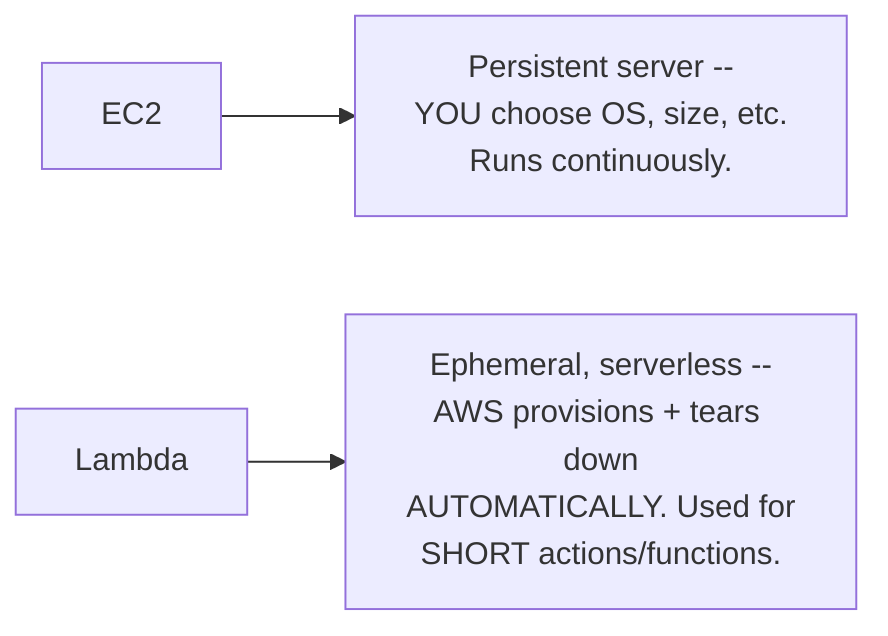

#### 🏢 Real-World / Production Usage — The Combined CloudWatch + Lambda Pattern

> 💡 **Memory Trick, the full, connected worked example given directly:** *"Say a developer creates an UNENCRYPTED EBS volume — your organization's compliance says EBS volumes should always be encrypted by default. Using the COMBINATION of CloudWatch and Lambda: CloudWatch detects and logs this event (an unencrypted volume was created); Lambda then executes an action — either sending an email notification asking the developer why, OR automatically attaching encryption to the volume without even needing to ask. This is exactly what being a 'guardrail' as a DevOps engineer means — you're the security guard ensuring AWS isn't being misused against your organization's compliance."*

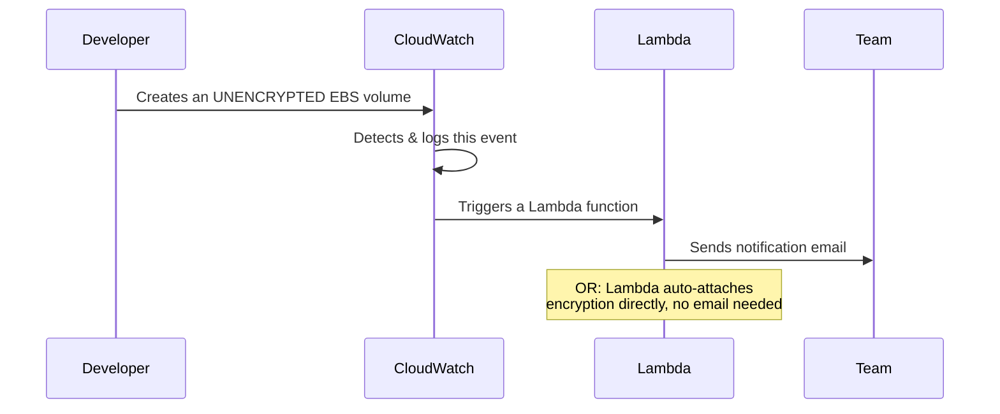

#### ❓ Why It Exists — Why Not Just Use EC2 for This?

> 💡 **Memory Trick, the precise reasoning given directly:** *"If 100 developers are creating EBS volumes at once, it would be a genuine waste of time to create 100 EC2 instances to run this same short check/remediation code. Instead, you run them as Lambda functions — created and torn down automatically, exactly when needed, for exactly as long as needed."*

#### ⚠ Common Mistakes

* Assuming Lambda and EC2 are simply "two ways to run code" with no meaningful difference — explicitly, directly distinguished: Lambda's defining property is ephemeral, automatic provisioning/teardown for SHORT actions, genuinely unsuitable for persistent application deployment (EC2's role).

#### 🎯 Key Takeaways

* **Lambda** is AWS's serverless compute offering — automatically provisioned and torn down per execution, specifically suited to short, event-triggered actions rather than persistent applications.
* The **CloudWatch + Lambda combination** is explicitly demonstrated as a genuine, practical DevOps automation pattern: detect a policy violation (CloudWatch) → automatically notify or remediate (Lambda) — directly embodying the "DevOps engineer as guardrail" framing.
* Lambda's efficiency advantage over EC2 for this kind of task is explicitly quantified via a scale example: 100 developers triggering 100 short checks would be genuinely wasteful to handle via 100 persistent EC2 instances.

---
### 6. AWS's Native CI/CD: CodePipeline, CodeBuild & CodeDeploy

#### 📖 Definition — Three Distinct Services

> 💡 **Memory Trick, each service given directly, one at a time:** *"AWS CodePipeline is like the Jenkins pipeline you write — what actions you want to perform, what your main event targets are. AWS CodeBuild is a fully managed build service that compiles your code, runs tests, and produces software packages. AWS CodeDeploy takes care of deploying your code/application onto EC2 instances or on-premises servers — for example, once your CI produces a WAR file, CodeDeploy automatically gets that latest version onto your EC2 instance."*

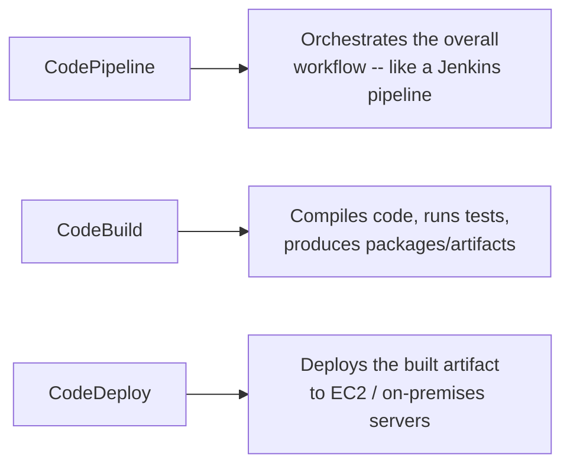

#### ❓ Why It Exists — A Genuinely Important, Explicit Strategic Caveat

> ⚠️ **A direct, explicitly-flagged strategic warning, given precisely:** *"If your organization is COMPLETELY on AWS, you have to reevaluate why you're using Jenkins — is it just because you've had it since old times, and migration is hard? If so, reconsider whether to move fully to AWS's own build services. BUT — if you're on multi-cloud, or you might move from AWS to Azure in the future, it is NOT recommended to use these AWS-specific build services, because they are very much restricted to AWS only."*

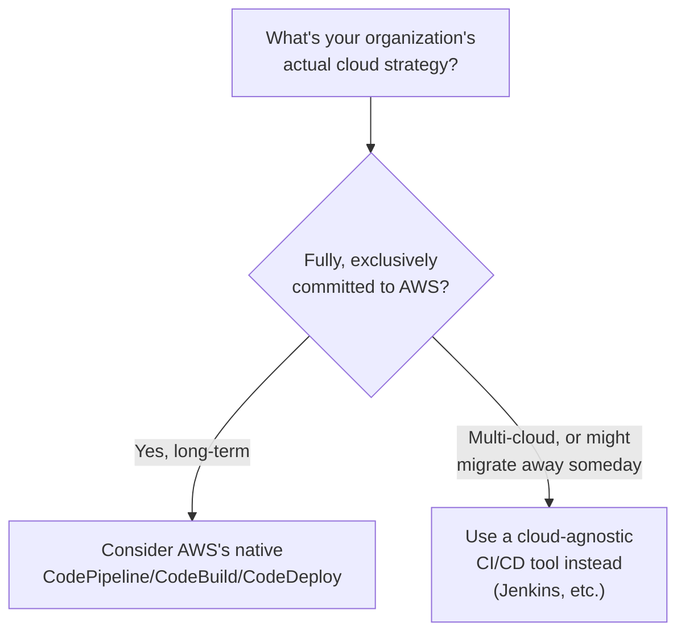

#### 🎯 Key Takeaways

* **CodePipeline** (orchestration, like a Jenkins pipeline), **CodeBuild** (compile/test/package), and **CodeDeploy** (deploy to EC2/on-prem) together form AWS's own native CI/CD toolset.
* This directly, precisely mirrors the exact same **strategic cloud-tooling decision framework** established back in Day 4 (AWS CDK vs. Terraform: single-cloud commitment vs. multi-cloud flexibility) — genuinely the same underlying reasoning, now applied to CI/CD tooling specifically.
* The explicit caveat: AWS's own CI/CD services are appropriate ONLY for organizations genuinely, exclusively committed to AWS long-term — multi-cloud or migration-considering organizations should prefer cloud-agnostic tools (like Jenkins) instead.

---

### 7. Governance: AWS Config & Billing/Cost Management

#### 📖 Definition — AWS Config

> 💡 **Memory Trick, given directly:** *"AWS Config is one of the guardrail services AWS provides. In AWS Config, you can look at what configurations you've created — like the earlier example, someone creating an unencrypted EBS volume, or an S3 bucket without versioning — and you can perform remedy/corrective actions."*

#### 📖 Definition — Billing & Cost Management

> 💡 **Memory Trick, given directly:** *"If you're completely on AWS, you need to understand billing and costing — where your organization is spending money. Is it EC2? S3? EBS? How much has your organization spent in the last 30 or 90 days? AWS provides a default billing service for exactly this kind of visibility."*

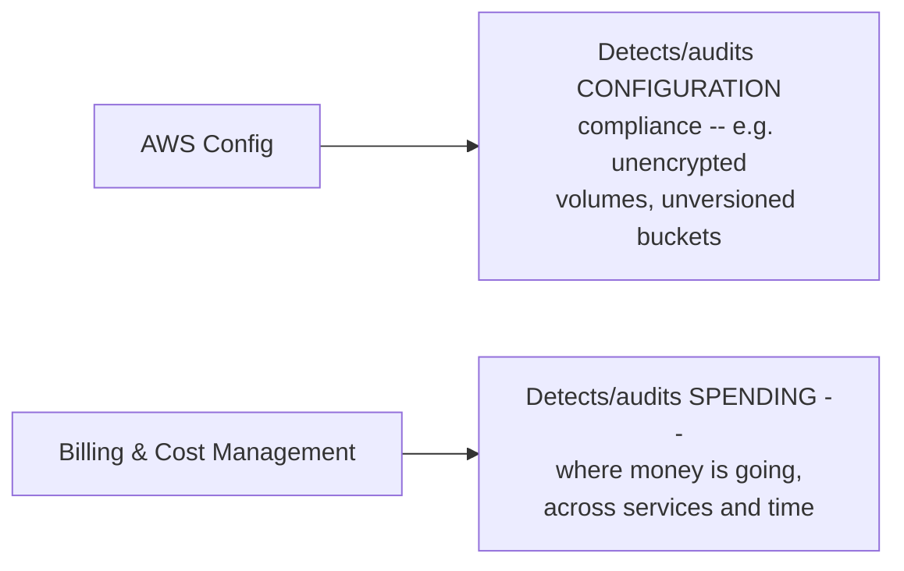

#### 🎯 Key Takeaways

* **AWS Config** is a governance/guardrail service focused on CONFIGURATION compliance — directly complementary to the CloudWatch+Lambda pattern from Section 5, providing another mechanism for detecting policy violations.
* **Billing & Cost Management** provides spending visibility across services and time periods — directly connecting back to Day 7's cost-tracking motivation (orphaned/unused resources still generate real charges), now viewed via AWS's own built-in tooling rather than a custom shell script.

---

### 8. Secrets & Encryption: AWS KMS

#### 📖 Definition

> 💡 **Memory Trick, given directly:** *"AWS KMS — Key Management Service. Whenever you want to enable encryption (say, on S3 buckets or EBS volumes), you need SOME secure key mechanism — whoever accesses that resource needs access to a key or something secure. KMS is where you store secrets, certificates you want to rotate, and manage this kind of sensitive information."*

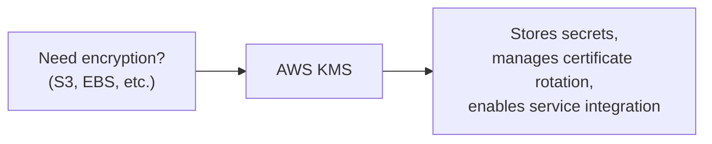

#### ⚠ Common Mistakes

* Assuming KMS is a rarely-used, niche service — explicitly, directly clarified: *"Many people might not have used KMS in their own demo/personal projects, but in real-time, production environments, KMS is a very COMMON service."*

#### 🎯 Key Takeaways

* **AWS KMS** manages encryption keys and certificate rotation — the underlying mechanism that makes services like S3's default encryption (Section 2) actually work.
* Explicitly, directly flagged as a service many learners overlook in personal/demo projects, but genuinely common in real, production environments — worth deliberately practicing, not just reading about.

---
### 9. Containers & Kubernetes: EKS, ECS & Fargate

#### 📖 Definition — EKS

> 💡 **Memory Trick, given directly:** *"AWS offers a managed Kubernetes service: EKS — Elastic Kubernetes Service. This is something you should DEFINITELY, 100% know. If you already have good knowledge of Kubernetes on-premises, EKS will only require learning very little extra — at the end of the day, it's just a Kubernetes service managed by AWS. Whether it's EKS, AKS (Azure), or GKE (Google), everything is fundamentally the same Kubernetes underneath — if you know Kubernetes fundamentals, you can learn EKS specifically in a couple of days."*

#### 📖 Definition — Fargate & ECS

> 💡 **Memory Trick, given directly:** *"AWS also offers Fargate — which lets you run containers WITHOUT Kubernetes. And there's ECS — Elastic Container Service — another container orchestration solution, comparable to Kubernetes, but NOT based on Kubernetes at all."*

#### ❓ Why It Exists — The Classic EKS vs. ECS Interview Question

> ⚠️ **Directly, explicitly flagged as a common interview question:** *"One interview question: what's the difference between EKS and ECS? Both are container orchestration solutions — but ECS is an AWS-PROPRIETARY solution, built entirely by AWS themselves. EKS, by contrast, is AWS's MANAGED KUBERNETES service — AWS took the existing, open-source Kubernetes and made it available as a managed offering."*

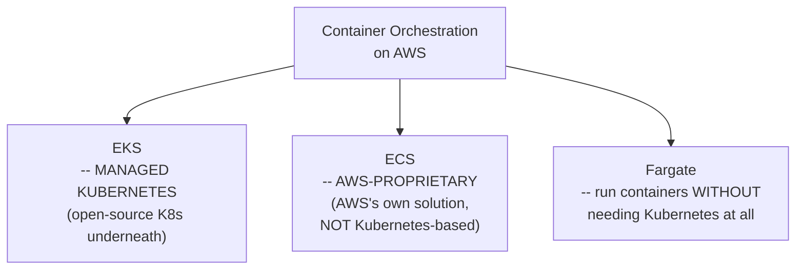

#### ⚠ Common Mistakes

* Assuming EKS and ECS are simply two names for the same underlying technology — explicitly, directly distinguished: EKS is genuinely Kubernetes (managed); ECS is a genuinely different, AWS-built orchestration technology that happens to solve a similar problem.

#### 🎯 Key Takeaways

* **EKS** (managed Kubernetes) is explicitly flagged as something a DevOps engineer should "100%" know — genuine Kubernetes knowledge transfers almost entirely, regardless of which cloud's managed offering you use.
* **ECS** is AWS's own, proprietary (non-Kubernetes) container orchestration solution — genuinely different underlying technology from EKS, despite solving a conceptually similar problem.
* **Fargate** offers a third option: running containers without needing Kubernetes (or ECS) orchestration concepts at all.
* The **EKS vs. ECS distinction** is explicitly, directly flagged as a classic, commonly-asked interview question.

---

### 10. Centralized Logging: The ELK Stack

#### 📖 Definition

> 💡 **Memory Trick, given directly:** *"ELK stands for Elasticsearch, Logstash, Kibana. Even understanding just how Elasticsearch works is genuinely useful. Why does it matter? We're dealing with microservices these days, and each microservice emits a lot of logging. It's good practice to collect all this logging information somewhere, then perform queries to retrieve which application is throwing errors, what common error patterns you're seeing."*

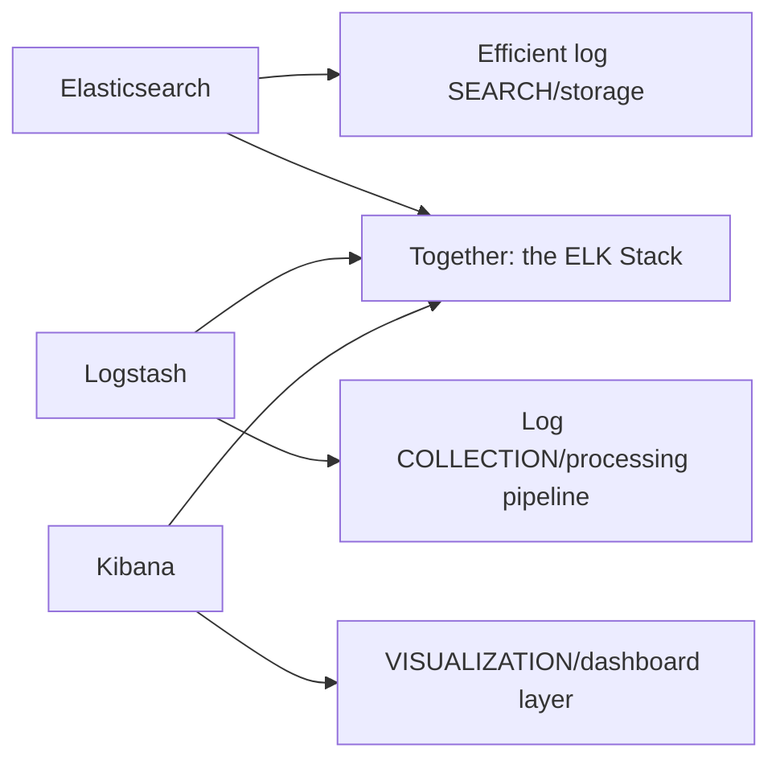

#### 🏢 Real-World / Production Usage — Why Scale Makes This Essential

> 💡 **Memory Trick, the precise scale scenario given directly:** *"Say you have 1,000 microservices, and you want to see, across the last 100 days, what common errors your applications are sending out. To monitor this kind of information, you need an efficient logging/search mechanism — Elasticsearch is one of the most efficient ones available."*

#### ⚠ Common Mistakes

* Assuming ELK is the only viable option — explicitly, directly acknowledged: *"People also use different things like Splunk. But if you want to use Elasticsearch specifically, one of the better combinations is Logstash plus Kibana."*

#### 🎯 Key Takeaways

* The **ELK stack** (Elasticsearch for search, Logstash for log collection/processing, Kibana for visualization) addresses the genuine, scale-driven problem of tracking errors and patterns across a microservices architecture generating heavy log volume.
* **Splunk** is explicitly named as a real, viable alternative — ELK isn't presented as the only correct choice, just a popular, well-regarded one.
* This is presented as the session's final (15th) service, closing out the complete list.

---
## 📝 Glossary

| Term | Definition | Why It Matters |
|---|---|---|
| **EC2** | Elastic Compute Cloud -- AWS's remote virtual server service | Covered in depth in prior sessions; briefly recapped here |
| **VPC** | Virtual Private Cloud -- network isolation/security for AWS resources | Components (security groups, CIDR, inbound/outbound rules) explicitly deferred to a future session |
| **EBS** | Elastic Block Store -- attachable, detachable block storage for EC2 | Supports snapshots/backups; central to the unencrypted-volume guardrail example |
| **S3** | Simple Storage Service -- cheap, extendable object storage | Now encrypted by default, a recent AWS policy change |
| **IAM** | Identity and Access Management | Scopes permissions, directly analogous to GitHub's read/write/admin tiers |
| **CloudWatch** | AWS's active monitoring/observability service | Tracks metrics, thresholds, and real-time AWS resource events |
| **CloudTrail** | AWS's API-activity audit-logging service | Historical, retained logs of WHO did WHAT, WHEN -- distinct from CloudWatch |
| **Lambda** | AWS's serverless compute service | Automatically provisioned/torn down per execution; suited to short, event-triggered actions |
| **CodePipeline** | AWS's CI/CD orchestration service | Analogous to a Jenkins pipeline |
| **CodeBuild** | AWS's managed build service | Compiles code, runs tests, produces packages |
| **CodeDeploy** | AWS's deployment service | Deploys built artifacts to EC2/on-premises servers |
| **AWS Config** | AWS's configuration-compliance/guardrail service | Detects and enables remediation of configuration violations |
| **Billing & Cost Management** | AWS's spending-visibility service | Shows where and how much an organization is spending, by service and time period |
| **AWS KMS** | Key Management Service | Manages encryption keys, secrets, and certificate rotation |
| **EKS** | Elastic Kubernetes Service -- AWS's managed Kubernetes offering | Genuine Kubernetes underneath; knowledge transfers from any K8s background |
| **ECS** | Elastic Container Service -- AWS's own, proprietary (non-Kubernetes) container orchestration | Distinct from EKS -- a classic interview question |
| **Fargate** | AWS's option for running containers without needing Kubernetes/ECS orchestration | A third container-running option, distinct from both EKS and ECS |
| **ELK Stack** | Elasticsearch, Logstash, Kibana -- centralized logging/search/visualization | Essential for tracking errors across a large microservices architecture |

---

## 🔄 Revision Notes — One-Minute Revision

* AWS offers 200+ services total, but a DevOps engineer only needs a **specific, interview-relevant subset** -- this session's 15, explicitly selected because they're what interviewers most commonly ask about, with **no priority ordering implied**.
* **Core compute/storage**: **EC2** (recapped), **VPC** (deferred to a future session -- security groups, CIDR blocks, inbound/outbound rules), **EBS** (attachable/detachable block storage, snapshots/backups), **S3** (cheap, extendable object storage, now **encrypted by default**).
* **IAM** scopes permissions across an AWS account -- directly analogous to GitHub's read/write/admin tiers.
* **CloudWatch** (active, ongoing monitoring/metrics) and **CloudTrail** (historical, auditable API activity logging) are genuinely distinct services -- a real, commonly-tested distinction, honestly self-corrected mid-session when the instructor initially forgot to mention CloudTrail.
* **Lambda** (serverless compute, automatically provisioned/torn down per execution) combines with CloudWatch in a genuine, practical automation pattern: detect a policy violation (e.g., an unencrypted EBS volume) -> notify or auto-remediate -- directly embodying the "DevOps engineer as guardrail" framing.
* AWS's native CI/CD services -- **CodePipeline** (orchestration), **CodeBuild** (compile/test/package), **CodeDeploy** (deploy to EC2/on-prem) -- are explicitly recommended ONLY for organizations fully, exclusively committed to AWS long-term; multi-cloud or migration-considering organizations should prefer cloud-agnostic tools instead, directly mirroring Day 4's CDK-vs-Terraform reasoning.
* **AWS Config** (configuration-compliance guardrail) and **Billing/Cost Management** (spending visibility) round out AWS's governance tooling.
* **AWS KMS** manages encryption keys/secrets/certificate rotation -- explicitly flagged as commonly overlooked in personal projects but genuinely common in real production environments.
* **EKS** (managed Kubernetes -- genuinely the same K8s underneath, regardless of cloud) vs. **ECS** (AWS's own, proprietary, non-Kubernetes orchestration) is a classic, explicitly-flagged interview question; **Fargate** offers a third way to run containers without Kubernetes/ECS orchestration at all.
* The **ELK stack** (Elasticsearch, Logstash, Kibana) provides centralized log search/collection/visualization, essential at microservices scale -- with Splunk named as a real, viable alternative.
* Beyond these 15, further services (e.g., machine learning/TensorFlow) are explicitly framed as **project-specific**, learned only as genuinely needed -- not part of this session's interview-focused core list.

---

## 📋 Cheat Sheet

**The 15 services, grouped by function:**
```text
Compute/Storage:  EC2, VPC, EBS, S3
Access Control:    IAM
Observability:       CloudWatch, CloudTrail
Serverless:            Lambda
Native CI/CD:            CodePipeline, CodeBuild, CodeDeploy
Governance:                 AWS Config, Billing & Cost Management
Secrets:                       KMS
Containers/K8s:                    EKS, ECS, Fargate
Logging:                             ELK Stack (Elasticsearch, Logstash, Kibana)
```

**CloudWatch vs. CloudTrail:**
```text
CloudWatch -> ACTIVE monitoring (metrics, thresholds, real-time alerts)
CloudTrail -> HISTORICAL auditing (WHO did WHAT API action, WHEN)
```

**The CloudWatch + Lambda guardrail pattern:**
```text
CloudWatch detects a policy violation (e.g. unencrypted EBS volume)
  -> triggers Lambda
    -> Lambda notifies OR auto-remediates
```

**EKS vs. ECS:**
```text
EKS -> managed KUBERNETES (open-source K8s underneath)
ECS -> AWS-PROPRIETARY orchestration (NOT Kubernetes-based)
```

**When to use AWS's native CI/CD services:**
```text
Fully, exclusively committed to AWS long-term -> consider CodePipeline/CodeBuild/CodeDeploy
Multi-cloud, or might migrate away -> use cloud-agnostic tools (Jenkins, etc.) instead
```

---

## 🔥 Interview Questions & Answers

### 🟢 Beginner

**Q1.**

**Question:** Does a DevOps engineer need to know all 200+ AWS services?

**Answer:** No -- even the instructor doesn't know all of them; the goal is knowing the specific subset genuinely relevant to DevOps work and interviews.

**Explanation:** Directly, explicitly stated as the session's own opening framing.

**Why Interviewers Ask This:** Sets realistic expectations for AWS breadth vs. depth.

**Possible Follow-up:** "What criterion did this session use to select its specific 15 services?"

**Q2.**

**Question:** What is VPC, and why does it matter?

**Answer:** Virtual Private Cloud -- the mechanism for securing EC2 instances and AWS resources, involving security groups, CIDR blocks, and inbound/outbound traffic rules.

**Explanation:** Directly, briefly defined; deeper coverage explicitly deferred to a future session.

**Why Interviewers Ask This:** A foundational AWS networking/security concept.

**Possible Follow-up:** "Name the three specific VPC components mentioned in this session."

**Q3.**

**Question:** What is the difference between EBS and S3?

**Answer:** EBS is block storage attached directly to EC2 instances (for things like databases needing persistent, mountable storage); S3 is cheap, extendable object storage for files like Excel sheets, JSON, or YAML data.

**Explanation:** Directly, precisely distinguished via concrete use cases.

**Why Interviewers Ask This:** A common, practical AWS storage-services distinction.

**Possible Follow-up:** "What recent AWS policy change was mentioned specifically about S3?"

**Q4.**

**Question:** What is the difference between CloudWatch and CloudTrail?

**Answer:** CloudWatch handles active, ongoing monitoring (metrics, thresholds, real-time alerts); CloudTrail handles historical, auditable API activity logging (who did what, when).

**Explanation:** Directly, precisely distinguished -- including an honest, live self-correction when the instructor initially forgot CloudTrail.

**Why Interviewers Ask This:** A genuinely common, important AWS observability distinction.

**Possible Follow-up:** "Which of these two would you check to see what happened 30 days ago?"

**Q5.**

**Question:** What makes Lambda "serverless"?

**Answer:** AWS automatically provisions the compute resource needed, runs your code, and tears the resource down once execution completes -- with no explicit server creation/management from the user.

**Explanation:** Directly, precisely explained, contrasted with EC2's explicit provisioning.

**Why Interviewers Ask This:** Core serverless-computing terminology.

**Possible Follow-up:** "What kind of workload is Lambda specifically suited for, versus EC2?"

**Q6.**

**Question:** Name AWS's three native CI/CD services and their roles.

**Answer:** CodePipeline (orchestration), CodeBuild (compile/test/package), CodeDeploy (deploy to EC2/on-prem).

**Explanation:** Directly, precisely named and described.

**Why Interviewers Ask This:** Practical, provider-specific CI/CD knowledge.

**Possible Follow-up:** "Under what specific business condition would you NOT recommend using these AWS-native services?"

**Q7.**

**Question:** What does AWS Config do?

**Answer:** Monitors and audits resource configuration for compliance (e.g., detecting unencrypted volumes or unversioned S3 buckets), enabling remediation.

**Explanation:** Directly, precisely defined.

**Why Interviewers Ask This:** A core AWS governance service.

**Possible Follow-up:** "How does AWS Config differ from the CloudWatch + Lambda guardrail pattern?"

**Q8.**

**Question:** What does AWS KMS manage?

**Answer:** Encryption keys, secrets, and certificate rotation.

**Explanation:** Directly, precisely defined -- KMS stands for Key Management Service.

**Why Interviewers Ask This:** A commonly-overlooked but genuinely important production service.

**Possible Follow-up:** "How does KMS relate to S3's default encryption?"

**Q9.**

**Question:** What is the difference between EKS and ECS?

**Answer:** EKS is AWS's managed Kubernetes service (genuine, open-source Kubernetes underneath); ECS is AWS's own, proprietary container orchestration solution, not based on Kubernetes at all.

**Explanation:** Directly, explicitly flagged as a classic interview question.

**Why Interviewers Ask This:** One of the most commonly-asked AWS container-services interview questions.

**Possible Follow-up:** "What third container-running option was mentioned, distinct from both EKS and ECS?"

**Q10.**

**Question:** What does the ELK stack stand for, and why does it matter for microservices?

**Answer:** Elasticsearch, Logstash, Kibana -- it provides centralized log collection, search, and visualization, essential for tracking errors across many microservices generating heavy log volume.

**Explanation:** Directly, precisely defined with a genuine, scale-driven use case.

**Why Interviewers Ask This:** Common, practical logging-architecture knowledge.

**Possible Follow-up:** "Name a real alternative to the ELK stack mentioned in this session."

---

### 🟡 Intermediate

**Q11.**

**Question:** Explain why the instructor explicitly states this list has "no order of hierarchy or priority" -- why might this framing matter for how a learner should actually use this list?

**Answer:** Without this explicit framing, a learner might reasonably (but incorrectly) assume the list's ORDER reflects relative importance -- e.g., assuming EC2 (listed first) is more critical than, say, IAM or CloudWatch (listed later), simply due to position. The instructor's explicit disclaimer prevents this misinterpretation, clarifying that all 15 services are presented as roughly co-equal in their relevance to DevOps interview preparation, with the actual sequence reflecting only the instructor's own recall order during recording, not a deliberate ranking. This matters practically: a learner preparing for interviews should genuinely study all 15 with comparable depth, rather than assuming the first few matter more and deprioritizing later ones.

**Explanation:** Requires reasoning through the practical consequence of a stated meta-framing detail, not just recalling that it was stated.

**Why Interviewers Ask This:** Tests whether a learner correctly interprets structural/organizational framing, not just content.

**Possible Follow-up:** "Would you personally prioritize studying any of these 15 services more than others, and if so, based on what criterion (not the list's order)?"

**Q12.**

**Question:** A learner argues that since AWS's native CI/CD services (CodePipeline/CodeBuild/CodeDeploy) are "AWS's own official tools," they must always be the technically superior choice over third-party tools like Jenkins. Evaluate this claim.

**Answer:** This claim isn't well-supported by the session's own explicit reasoning. The session doesn't argue AWS's native CI/CD tools are inherently technically superior -- it argues their appropriateness is STRATEGY-DEPENDENT, directly parallel to the Day 4 CDK-vs-Terraform reasoning. An organization's genuine cloud commitment (exclusively AWS, long-term, vs. multi-cloud or migration-considering) determines which choice is actually better for THAT organization -- "AWS's own tool" is not automatically the superior choice independent of context; it's the superior choice SPECIFICALLY for organizations whose strategy aligns with deep, exclusive AWS commitment, and a genuinely worse choice (creating lock-in risk) for organizations with different strategic needs.

**Explanation:** Tests whether a learner conflates "vendor's own tool" with "objectively superior tool," missing the session's actual, context-dependent reasoning.

**Why Interviewers Ask This:** Distinguishes candidates who understand genuine strategic trade-offs from those who default to "official = better."

**Possible Follow-up:** "What's the specific, named risk of using AWS-native CI/CD tools for a genuinely multi-cloud organization?"

**Q13.**

**Question:** Explain, precisely, why the CloudWatch + Lambda pattern is described as more efficient than using EC2 for the exact same unencrypted-volume detection/remediation task, using the session's own stated numbers.

**Answer:** The session's own example: if 100 developers create EBS volumes simultaneously, using EC2 for this task would require creating 100 separate, persistent EC2 instances just to run a short check/remediation script each -- a genuine waste of provisioning time, ongoing compute cost (EC2 instances run continuously until stopped), and management overhead. Using Lambda instead, each of these 100 short actions triggers its own ephemeral, automatically-provisioned-and-torn-down execution -- no persistent infrastructure exists before or after each specific check, meaning cost and resource usage scale precisely with actual, momentary need rather than requiring 100 continuously-running servers for what are ultimately brief, event-triggered tasks.

**Explanation:** Requires reconstructing the precise cost/efficiency reasoning behind the session's stated example, not just repeating "Lambda is more efficient."

**Why Interviewers Ask This:** Tests genuine understanding of WHY serverless computing offers efficiency gains for this specific kind of workload.

**Possible Follow-up:** "Would Lambda still be the more efficient choice if the remediation task took several HOURS to complete, rather than being genuinely short? Why or why not?"

**Q14.**

**Question:** Using this session's IAM-via-GitHub analogy, explain why the analogy is precise rather than merely illustrative -- what's the genuine, structural similarity between GitHub permissions and AWS IAM, beyond both being "access control"?

**Answer:** Both systems share the same underlying structural principle: **role-appropriate, scoped permissions rather than uniform access**. In both cases, the SPECIFIC permission granted maps to the SPECIFIC role's genuine needs -- a GitHub QE engineer gets read-only access because their role doesn't require write access; an AWS developer might get EC2-only access because their role doesn't require S3 or EBS access. In both systems, the DANGER being mitigated is the same: someone with more access than their role requires could, intentionally or accidentally, cause damage (an admin accidentally deleting a repo; an overly-permissioned AWS user misconfiguring or deleting critical resources). This isn't just a surface-level "both involve permissions" analogy -- it's a genuine, transferable instance of the broader "principle of least privilege" pattern, appearing consistently across Git, cloud platforms, and (as noted in Day 6's OS discussion) operating systems generally.

**Explanation:** Requires identifying the precise, structural (not merely surface-level) similarity underlying the analogy, connecting it to the broader "least privilege" principle seen elsewhere in this course.

**Why Interviewers Ask This:** Tests whether a learner recognizes genuine conceptual transferability across tools, versus treating each tool's permission system as an unrelated, isolated fact to memorize.

**Possible Follow-up:** "Name another tool or system, beyond GitHub and AWS IAM, where this same 'principle of least privilege' pattern applies."

**Q15.**

**Question:** Synthesize this session's AWS Config coverage (Section 7) with its CloudWatch + Lambda guardrail pattern (Section 5) to explain how these represent two genuinely different approaches to the SAME underlying governance goal.

**Answer:** Both AWS Config and the CloudWatch+Lambda pattern address the same underlying goal: detecting and responding to configuration/compliance violations (like an unencrypted EBS volume) -- but they represent genuinely different architectural approaches. AWS Config is presented as a PURPOSE-BUILT, dedicated configuration-compliance service -- you directly configure it to monitor specific configuration states and trigger remediation, a more declarative, config-focused workflow. The CloudWatch+Lambda pattern is a more GENERAL-PURPOSE, composed solution -- CloudWatch (a general monitoring/event service) is combined with Lambda (a general-purpose serverless compute service) to build a CUSTOM detection-and-response pipeline, requiring you to explicitly wire these two general services together for this specific purpose. Both can achieve the same practical outcome (unencrypted volume detected → developer notified or volume auto-remediated), but AWS Config offers this as a more purpose-built, potentially simpler starting point for STANDARD compliance checks, while the CloudWatch+Lambda approach offers more flexibility for CUSTOM, organization-specific logic that a purpose-built config service might not directly support.

**Explanation:** Requires recognizing that two services covered in separate sections of the same session actually address overlapping problem space via genuinely different architectural philosophies (purpose-built vs. composed) -- real, non-obvious synthesis.

**Why Interviewers Ask This:** Tests whether a learner sees relationships between separately-introduced services, rather than treating each as an isolated, unrelated fact.

**Possible Follow-up:** "In what scenario might you prefer the CloudWatch+Lambda approach over AWS Config, even for a standard compliance check AWS Config could technically handle?"

---

### 🔴 Advanced

**Q16.**

**Question:** Design a genuinely complete, production-grade compliance-and-remediation architecture for detecting AND fixing unencrypted EBS volumes across an entire organization, using multiple services from this session's list together (not just the CloudWatch+Lambda pair explicitly demonstrated).

**Answer:** A reasonable, multi-service architecture: (1) **AWS Config** as the primary, ongoing detection mechanism -- configured with a rule specifically checking for EBS volume encryption compliance, providing continuous, purpose-built monitoring rather than relying solely on event-driven CloudWatch triggers. (2) **CloudWatch** for real-time ALERTING when AWS Config detects a new violation -- bridging AWS Config's detection with an actionable notification pathway. (3) **Lambda** for the actual REMEDIATION logic -- either auto-encrypting the volume directly, or, per the session's own example, sending a detailed notification to the responsible developer, with the specific remediation logic implemented as custom code. (4) **CloudTrail** as the AUDIT layer -- ensuring every detection and remediation action is itself logged with full API-activity detail, so the organization can later answer "when was this violation created, when was it detected, when was it fixed, and by what mechanism" for genuine compliance reporting. (5) **IAM** scoping to ensure the Lambda remediation function itself has ONLY the specific EBS-related permissions it needs (encrypt/modify volumes) -- not broader access, directly applying the principle of least privilege even to the remediation automation itself. This design combines FIVE of this session's 15 services into one coherent, genuinely production-grade governance architecture, going beyond the single CloudWatch+Lambda pair explicitly demonstrated.

**Explanation:** Synthesizes multiple services from across this session's list into a single, coherent, more complete architecture than any single pairing demonstrated directly -- genuine, applied extension.

**Why Interviewers Ask This:** A realistic, senior-level cloud-architecture question testing whether a candidate can compose multiple AWS services into a genuinely complete solution, not just recall individual service definitions.

**Possible Follow-up:** "Which of these five components would you consider implementing FIRST if building this incrementally, and why?"

**Q17.**

**Question:** Critically evaluate: "Since EKS 'only requires learning very little extra' if you already know Kubernetes, an experienced Kubernetes engineer needs essentially zero preparation time before working productively with EKS." Is this an accurate implication of this session's content?

**Answer:** Not fully accurate, though it captures a real, largely-true core claim. The session's own precise language is "you can learn it in a couple of days" -- explicitly acknowledging SOME genuine learning curve exists, not zero preparation time. The "very little extra" framing refers specifically to KUBERNETES CONCEPTS (pods, deployments, services, etc.) transferring almost entirely -- but EKS-SPECIFIC operational knowledge (AWS-specific networking integration via VPC, IAM-based Kubernetes RBAC integration, EKS-specific node group management, AWS-specific cost/billing considerations for the underlying EC2/Fargate compute) genuinely does require some dedicated learning, even for an expert Kubernetes engineer. The accurate, more precise claim: EKS minimizes but does not eliminate onboarding time for experienced Kubernetes engineers -- the "couple of days" figure itself, explicitly stated by the instructor, is direct evidence that SOME genuine ramp-up remains necessary, not zero.

**Explanation:** Tests whether a learner catches the difference between "very little extra" (a real, substantial reduction) and "zero" (an inaccurate overstatement), correctly citing the session's own more precise, quantified claim.

**Why Interviewers Ask This:** Distinguishes candidates who track precise, quantified claims from those who round a strong statement into an even stronger, inaccurate one.

**Possible Follow-up:** "Name a genuinely EKS-specific (not general Kubernetes) concept a new EKS user would likely need to learn."

**Q18.**

**Question:** Synthesize this session's ELK stack coverage (Section 10) with its CloudWatch coverage (Section 4) to explain why an organization running microservices on AWS might genuinely need BOTH CloudWatch AND an ELK stack, rather than treating them as redundant, overlapping logging/monitoring solutions.

**Answer:** While both CloudWatch and the ELK stack deal with logs/monitoring in some sense, they serve genuinely different scope and depth needs, per this session's own stated reasoning. CloudWatch (Section 4) is explicitly framed around AWS RESOURCE-LEVEL events and metrics -- tracking actions taken ON AWS itself (an EC2 instance's CPU threshold, an S3 bucket being created). The ELK stack (Section 10) is explicitly framed around APPLICATION-LEVEL logging FROM microservices -- the actual business-logic output and errors generated BY the running applications themselves, potentially numbering in the thousands across a large microservices architecture, a genuinely different and far higher-volume category of information than AWS's own infrastructure-level event stream. An organization needs CloudWatch to know "is my infrastructure healthy and behaving as configured" and needs an ELK stack (or a comparable solution) to know "what is actually happening inside my applications' own business logic, and what errors are they generating" -- two genuinely complementary, non-redundant layers of observability, not competing solutions to the same problem.

**Explanation:** Requires distinguishing infrastructure-level observability (CloudWatch) from application-level observability (ELK), recognizing genuine complementarity rather than redundancy between two services covered in separate parts of the same session.

**Why Interviewers Ask This:** A capstone-level observability-architecture question testing whether a candidate understands the genuine, distinct layers of a complete monitoring/logging strategy.

**Possible Follow-up:** "Could CloudWatch Logs (a specific CloudWatch feature) partially substitute for an ELK stack? What would you still be missing?"

---

## 🧪 Scenario-Based Interview Questions

> **Scenario 1:** A junior team member asks why their organization uses both AWS Config AND a custom CloudWatch+Lambda script to check for unencrypted EBS volumes, arguing this seems redundant. Using this session's concepts, explain the genuine reasoning.

**Structured Answer:**
1. **Initial investigation:** Recognize this as directly addressed by Intermediate Q15's reasoning -- both approaches DO address the same underlying goal, but via genuinely different architectural philosophies (purpose-built vs. composed/custom).
2. **Metrics/logs to check:** Review what specific remediation logic the custom CloudWatch+Lambda script implements that AWS Config's built-in rules might not directly support -- likely organization-specific custom actions beyond AWS Config's standard, more generic remediation options.
3. **Possible causes:** The organization may have started with the custom CloudWatch+Lambda approach before AWS Config existed or was adopted, or may need remediation logic genuinely more custom/specific than AWS Config's built-in options provide.
4. **Debugging approach:** Compare the exact triggers, timing, and remediation actions of both mechanisms to identify whether they're genuinely redundant (checking the same thing, taking the same action) or complementary (different triggers, different remediation depth).
5. **Resolution:** If genuinely redundant, consolidate to AWS Config alone for simplicity and reduced maintenance overhead; if the custom Lambda logic provides genuine additional value AWS Config's built-in options don't support, keep both, but document clearly WHY both exist.
6. **Prevention:** Establish a team practice of evaluating whether a genuinely purpose-built AWS service (like Config) already solves a given compliance need before building custom CloudWatch+Lambda automation from scratch, directly applying Intermediate Q15's distinction as a decision framework going forward.

> **Scenario 2 (Advanced):** Your organization currently uses Jenkins for CI/CD but is evaluating a full migration to AWS's native CodePipeline/CodeBuild/CodeDeploy, citing "it's AWS's own tool, so it must integrate better." Using this session's concepts, evaluate this reasoning and provide your recommendation.

**Structured Answer:**
1. **Initial investigation:** Directly apply Intermediate Q12's evaluation -- "it's AWS's own tool" is not, by itself, sufficient justification; the genuine, correct criterion is the organization's actual, long-term cloud strategy.
2. **Relevant principle:** Per Section 6's explicit caveat, AWS-native CI/CD services are appropriate specifically for organizations FULLY, EXCLUSIVELY committed to AWS long-term -- not simply "any organization currently using AWS."
3. **Possible causes for this reasoning gaining traction:** A natural but incomplete assumption that vendor-native tooling is inherently better-integrated, without examining the organization's actual multi-cloud or migration considerations.
4. **Debugging/evaluation approach:** Directly ask: does this organization have any genuine multi-cloud plans, hybrid-cloud architecture, or any realistic possibility of migrating away from AWS in the foreseeable future? (Directly mirroring the same diagnostic question established in Day 4's CDK-vs-Terraform framework.)
5. **Resolution:** If the organization is genuinely, exclusively committed to AWS long-term with no multi-cloud considerations, migrating to AWS-native CI/CD may be reasonable; if there's ANY genuine multi-cloud or migration possibility, recommend AGAINST this migration, keeping Jenkins (or another cloud-agnostic tool) specifically to avoid the vendor lock-in risk this session explicitly warns against.
6. **Prevention:** Document the organization's actual, current cloud strategy explicitly, and require this same strategic evaluation (not tool-popularity or vendor-affinity reasoning) for any future tooling migration decision -- directly establishing the same decision discipline this course has now reinforced across multiple sessions (Day 4's CDK/Terraform, and now this session's CI/CD tooling).

---

## 🛠 Hands-on Exercises

### 🟢 Easy

1. Write out, from memory, all 15 services covered in this session, grouped by function (compute/storage, access control, observability, serverless, CI/CD, governance, secrets, containers, logging).
2. Write a one-sentence definition, in your own words, of the difference between CloudWatch and CloudTrail, without directly copying this session's phrasing.
3. Write a one-sentence definition, in your own words, of the difference between EKS and ECS.

### 🟡 Medium

4. Research (outside this transcript) the actual AWS Config rule syntax for checking EBS volume encryption, and document what you find, connecting it back to this session's stated use case.
5. Design (in writing) your own version of the CloudWatch+Lambda unencrypted-volume detection/remediation pattern, specifying the exact trigger condition and remediation action you'd implement.
6. Write a short comparison document (150-200 words) evaluating whether your own hypothetical organization (real or invented) should adopt AWS's native CI/CD services, applying Section 6's explicit strategic criterion.

### 🔴 Advanced

7. Implement the multi-service compliance architecture proposed in Advanced Interview Q16 (AWS Config + CloudWatch + Lambda + CloudTrail + IAM), at minimum as a detailed, written architecture document if you don't have hands-on AWS access for all five services.
8. Research (outside this transcript) at least one genuinely EKS-specific (not general Kubernetes) operational concept, directly addressing Advanced Interview Q17's distinction.
9. Write a short technical document (300-400 words) explaining, to a stakeholder unfamiliar with observability architecture, why an organization needs both CloudWatch and an ELK stack (or similar), directly applying Advanced Interview Q18's reasoning.

---

## 🏗 Practice Assignment

### Build: "AWS Services Interview Prep Sheet"

**Objective:** Produce a complete, personally-written interview-preparation reference covering all 15 services from this session, demonstrating genuine understanding rather than memorized definitions.

**Requirements:**
- A one-paragraph definition, in your own words, for each of the 15 services covered in this session.
- For each of the three explicitly-flagged classic interview questions (CloudWatch vs. CloudTrail, EKS vs. ECS, and the multi-cloud CI/CD strategic caveat), a complete, well-reasoned answer written in your own words.
- A worked example (your own choosing, not copied from this guide) of the CloudWatch+Lambda guardrail pattern, applied to a different compliance scenario than the unencrypted-EBS-volume example used in this session.
- A brief reflection (150-200 words) on which of these 15 services you have the LEAST hands-on experience with, and a concrete plan for gaining genuine, practical familiarity with it.

**Architecture (suggested):**

```text
aws_services_interview_prep/
├── 01_service_definitions.md       # your own-words definitions for all 15
├── 02_classic_interview_answers.md   # your answers to the 3 flagged questions
├── 03_guardrail_pattern_example.md     # your own CloudWatch+Lambda worked example
└── 04_reflection.md                      # your gap-analysis and learning plan
```

**Expected Functionality:**
- Your definitions should demonstrate genuine understanding (explaining WHY a service exists, not just WHAT it's called), not simply restating this guide's phrasing.
- Your guardrail-pattern example should be genuinely different from the unencrypted-EBS-volume scenario used throughout this session.

**Challenges:**
- Writing genuinely original definitions and examples, rather than paraphrasing this guide too closely.
- Honestly identifying your own genuine knowledge gaps for the reflection section, rather than defaulting to a service you already know well.

**Bonus Improvements:**
- Extend your prep sheet with a fourth classic interview-style question of your own design, based on this session's content, complete with your own model answer.
- If you have AWS access, actually implement your CloudWatch+Lambda worked example, documenting the real results.

---

## 📚 Additional Resources

- The instructor's **Day 0 through Day 12 videos** (referenced directly) -- required prior viewing for full context, especially Days 3-5 and 12 (EC2/IAM hands-on experience).
- The **DevOps Zero to Hero playlist** -- referenced directly, containing all videos in this same free course.
- A **dedicated, previously-published IAM video** on the instructor's channel (referenced directly) -- for deeper coverage of IAM specifically, beyond this session's brief recap.
- A **future, intermediate-level AWS session** (referenced directly) -- will cover VPC, security groups, subnets, inbound/outbound traffic rules, and load balancer configuration via a dedicated live project, not covered in depth here.

---

## 📌 Final Revision Sheet

### ⭐ Core Concepts
- AWS has 200+ services; this session's 15 are the specific, **interview-relevant subset**, with **no priority ordering** implied by their listed sequence.
- **CloudWatch** (active monitoring) vs. **CloudTrail** (historical API auditing) -- genuinely distinct, commonly-tested services.
- **Lambda** (serverless, ephemeral) vs. **EC2** (persistent server) -- the CloudWatch+Lambda combination is a genuine, practical automation/guardrail pattern.
- AWS's native CI/CD (CodePipeline/CodeBuild/CodeDeploy) is appropriate ONLY for organizations fully, exclusively committed to AWS long-term -- directly mirroring Day 4's CDK-vs-Terraform strategic reasoning.
- **EKS** (managed Kubernetes) vs. **ECS** (AWS-proprietary, non-Kubernetes orchestration) -- a classic interview question.
- The **ELK stack** addresses application-level logging at microservices scale, genuinely complementary to (not redundant with) CloudWatch's infrastructure-level monitoring.

### ⭐ Important Definitions
- **KMS**, **AWS Config**, **Fargate** (see Glossary for full definitions).

### ⭐ Important Commands/Code
- N/A -- this session is explicitly conceptual/list-format; no hands-on commands were demonstrated (deferred to a future, dedicated intermediate AWS session).

### ⭐ Architecture/Process
- The guardrail pattern: CloudWatch (detect) → Lambda (remediate/notify), optionally paired with AWS Config (purpose-built detection) and CloudTrail (audit trail) for a genuinely production-grade governance architecture.

### ⭐ Best Practices
- Don't assume "AWS's own tool" is automatically the better choice -- evaluate against genuine, long-term cloud strategy.
- Apply the principle of least privilege consistently -- across GitHub, AWS IAM, and even automation/remediation functions themselves.
- Distinguish infrastructure-level observability (CloudWatch) from application-level observability (ELK stack) -- both are typically needed, not redundant.
- Treat KMS and other "commonly overlooked in personal projects" services as genuinely worth deliberate practice.

### ⭐ Common Mistakes
- Assuming this session's list ordering reflects service importance/priority.
- Conflating CloudWatch and CloudTrail as interchangeable.
- Assuming EKS and ECS are simply two names for the same underlying technology.
- Defaulting to AWS-native CI/CD tools without evaluating genuine multi-cloud/migration considerations.

### ⭐ Interview Points
- Be ready to name and briefly define all 15 services from memory.
- Be ready to precisely distinguish CloudWatch/CloudTrail and EKS/ECS, both explicitly flagged as classic questions.
- Be ready to explain the CloudWatch+Lambda guardrail pattern with a concrete example.
- Be ready to explain the strategic condition determining whether AWS-native CI/CD tools are appropriate.

### ⭐ Things to Remember
- This session is explicitly **conceptual and list-format**, not hands-on -- VPC, security groups, and several other topics are explicitly deferred to a future, dedicated intermediate-level AWS session.
- The instructor's own honest, live self-correction (initially forgetting CloudTrail) is a genuine, unscripted moment worth remembering as consistent with this course's authentic, unedited teaching style.
- Beyond these 15, further AWS services are explicitly framed as **project-specific**, learned only as genuinely needed for a specific role or project -- not part of this session's interview-focused core list.

---

## 🔗 Source

- [Top 15 AWS Services that Every DevOps Engineer Should Learn](https://youtu.be/leWJypzVyQ4?si=huSdtUWsZcVg6vIa)