# ⚙ Configuration Management & Why Ansible Won: Push vs. Pull, Agentless Architecture & YAML

- <i>**Session:** DevOps Zero to Hero — Day 14: "Configuration Management" · 
- **Instructor:** Abhishek
- **Note on scope:** This session is explicitly, deliberately **theory-only** — a genuine, self-described "confidence-building" precursor to a hands-on Ansible project promised for the very next day (writing real playbooks, creating EC2 instances, pushing configuration via GitHub). The instructor states this session is designed so that anyone following both this video and tomorrow's will come away genuinely confident with configuration management. Six specific, commonly-asked Ansible interview questions are answered directly; a separate, previously-published "18 most-asked Ansible interview questions" video is explicitly pointed to for deeper coverage.</i>

---

## 📑 Table of Contents

1. [Session Overview](#-session-overview)
2. [Learning Objectives](#-learning-objectives)
3. [Detailed Notes](#-detailed-notes)
   - [1. Why Configuration Management Exists: The System Administrator's Problem](#1-why-configuration-management-exists-the-system-administrators-problem)
   - [2. Scaling the Problem: From On-Premises to the Cloud](#2-scaling-the-problem-from-on-premises-to-the-cloud)
   - [3. Configuration Management Tools & Why Ansible Won](#3-configuration-management-tools--why-ansible-won)
   - [4. Difference #1: Push (Ansible) vs. Pull (Puppet)](#4-difference-1-push-ansible-vs-pull-puppet)
   - [5. Difference #2: Agentless (Ansible) vs. Master-Slave (Puppet), and Dynamic Inventory](#5-difference-2-agentless-ansible-vs-master-slave-puppet-and-dynamic-inventory)
   - [6. Differences #3 & #4: Windows/Linux Support and YAML vs. a Proprietary Language](#6-differences-3--4-windowslinux-support-and-yaml-vs-a-proprietary-language)
   - [7. Ansible's Honest Disadvantages: Windows, Debugging & Performance](#7-ansibles-honest-disadvantages-windows-debugging--performance)
   - [8. Custom Modules, Python & Ansible Galaxy](#8-custom-modules-python--ansible-galaxy)
   - [9. Six Classic Ansible Interview Questions, Directly Answered](#9-six-classic-ansible-interview-questions-directly-answered)
4. [Glossary](#-glossary)
5. [Revision Notes — One-Minute Revision](#-revision-notes--one-minute-revision)
6. [Cheat Sheet](#-cheat-sheet)
7. [Interview Questions & Answers](#-interview-questions--answers)
8. [Scenario-Based Interview Questions](#-scenario-based-interview-questions)
9. [Hands-on Exercises](#-hands-on-exercises)
10. [Practice Assignment](#-practice-assignment)
11. [Additional Resources](#-additional-resources)
12. [Final Revision Sheet](#-final-revision-sheet)

---

## 🎯 Session Overview

This session builds configuration management from first principles — starting not with Ansible itself, but with the genuine, pre-Ansible problem that made the entire category of tools necessary. It covers:

1. **The original problem**, illustrated via a system administrator managing 100 heterogeneous on-premises servers (Linux, CentOS, Ubuntu) — three core responsibilities (upgrades, security patches, default installations) becoming genuinely impractical to handle manually or even via ad-hoc shell/PowerShell scripts.
2. **Why cloud adoption made this problem dramatically worse**, not better — microservices architecture meant roughly 10x more servers, each individually smaller, multiplying the exact same management burden.
3. **The rise of configuration management as a discipline**, and its four popular tools (Puppet, Chef, Ansible, Salt) — with a genuine, personal account of the instructor's own tool journey (Puppet → Chef → Ansible) and why Ansible became the practical, career-relevant default recommendation.
4. **Four precise, comparative advantages** Ansible holds over Puppet (used as the baseline comparison) — explicitly framed as the direct answer to the classic "why Ansible?" interview question: push vs. pull architecture, agentless vs. master-slave architecture, Windows/Linux support, and YAML vs. a proprietary configuration language.
5. A **genuinely balanced treatment** of Ansible's real disadvantages — comparative Windows support gaps, difficult debugging, and performance concerns at extreme scale — deliberately included so the recommendation doesn't read as one-sided marketing.
6. **Custom Ansible modules and Ansible Galaxy** — Ansible's Python foundation enabling organization-specific modules, shared openly via a genuine, open-source-style contribution mechanism.
7. **Six specific, directly-answered interview questions**, covering language, Windows/Linux support and protocols, the push/pull distinction, YAML, and a deliberately-flagged "trick question" about cloud-provider support.

> 💡 **Memory Trick — the instructor's own stated promise for this two-part session:** *"This is my promise: whoever watches today's video and tomorrow's video will definitely get a good understanding of configuration management, and you will feel pretty confident about it."*

---

## 🎯 Learning Objectives

By the end of this guide, you will be able to:

- [ ] Explain, using a concrete system administrator scenario, why manually managing server configuration across many heterogeneous servers becomes genuinely impractical at scale.
- [ ] Explain why cloud adoption and microservices architecture made the configuration-management problem larger, not smaller, despite the efficiency benefits of cloud infrastructure covered in earlier sessions.
- [ ] Name the four popular configuration management tools mentioned, and explain the practical reasoning for starting with Ansible specifically.
- [ ] Precisely explain the push (Ansible) vs. pull (Puppet) architectural distinction, using a concrete devops-engineer-and-EC2-instances scenario.
- [ ] Precisely explain Ansible's agentless architecture versus Puppet's master-slave/agent architecture, including the roles of the inventory file and passwordless authentication.
- [ ] Explain what Dynamic Inventory adds beyond a standard, manually-maintained inventory file.
- [ ] Name at least three genuine, acknowledged disadvantages of Ansible.
- [ ] Explain what Ansible Galaxy is for, and why custom Ansible modules being written in Python matters.
- [ ] Correctly answer all six of this session's directly-covered Ansible interview questions, including the deliberately-flagged "cloud provider support" trick question.

---

## 📚 Detailed Notes

### 1. Why Configuration Management Exists: The System Administrator's Problem

#### 🧠 Concept — The Original, Pre-DevOps Scenario

> 💡 **Memory Trick, the full worked scenario given directly:** *"Before DevOps, there were system administrators, build and release engineers, configuration engineers — separate roles, because DevOps only emerged when all of these merged together. Say you're a system administrator, and your company uses on-premises servers — say 100 of them: some on various Linux distributions, some on CentOS, some on Ubuntu."*

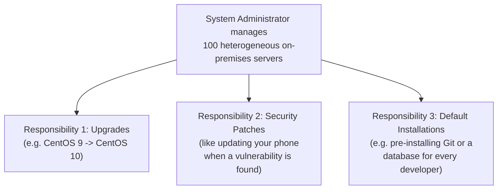

#### ❓ Why It Exists — The Scaling Problem, Precisely Quantified

> ⚠️ **The precise, real math given directly:** *"Even with a team of 5 people managing 100 servers, that's 20 servers per person. SSHing into each one individually — or using a remote protocol for Windows boxes — to create packages, update packages, and perform default installations, is genuinely difficult. And this is only 100 servers."*

#### 🔍 Internal Working — Why Ad-Hoc Scripts Weren't a Real Solution

> 💡 **Memory Trick, precisely explained:** *"Before advanced tools like Ansible existed, people wrote scripts — shell scripts for Linux, PowerShell for Windows. But even within Linux, the exact commands might differ between CentOS and Ubuntu. So your script might work on one distribution and completely fail on another — a genuine, real fragility problem, not just an inconvenience."*

#### ⚠ Common Mistakes

* Assuming ad-hoc scripting (shell/PowerShell) was a genuinely adequate solution before configuration management tools existed — explicitly, directly shown to be fragile and language/distribution-dependent, not a real, scalable answer.

#### 🎯 Key Takeaways

* The original configuration-management problem: managing **upgrades, security patches, and default installations** consistently across many, often heterogeneous servers.
* Manual, per-server management becomes genuinely impractical even at a relatively modest scale (100 servers, 5-person team) — a real, quantified math problem, not just a vague inconvenience.
* Pre-configuration-management "solutions" (ad-hoc shell/PowerShell scripts) were genuinely fragile, since exact commands differ across operating systems and even across Linux distributions.

---

### 2. Scaling the Problem: From On-Premises to the Cloud

#### ❓ Why It Exists — A Counter-Intuitive Twist

> ⚠️ **A precise, directly-stated counter-intuitive point:** *"What happened after this was the entire configuration moved to cloud — and with cloud, the number of servers being created improved, or increased, by roughly 10x. Because of microservices architecture, the number of servers multiplied, while the size (compute/resources) of each individual server shrank by roughly 10x."*

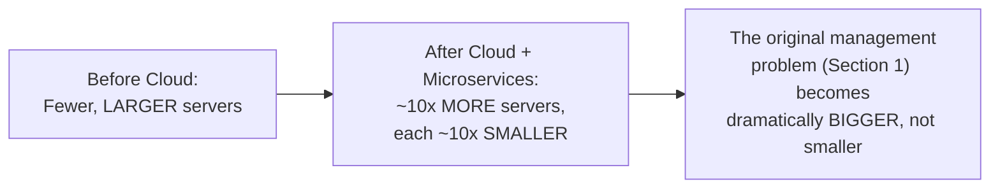

#### 🔍 Internal Working — Why This Directly Motivated a New Category of Tool

> 💡 **Memory Trick, given directly:** *"The problem we discussed in the previous section became an even bigger problem, because the number of servers increased leaps and bounds. There was a definite need for someone to invent an application/tool solving this exact problem — because writing shell scripts with distribution-specific clauses, at 10x the original scale, was clearly untenable."*

#### ⚠ Common Mistakes

* Assuming cloud adoption straightforwardly SOLVED the original server-management problem, simply because cloud infrastructure itself offers efficiency benefits (as covered in Days 3-5) — explicitly, directly clarified: cloud adoption made the SPECIFIC configuration-management problem larger, even as it solved other, different infrastructure problems.

#### 🎯 Key Takeaways

* Cloud adoption and microservices architecture **multiplied** the original configuration-management problem by roughly 10x — more servers, each individually smaller — rather than solving it.
* This directly, precisely motivates WHY configuration management emerged as its own distinct discipline and tool category — a genuine, necessary response to a real, quantifiably worsening problem, not an arbitrary industry trend.
* This is a genuinely important nuance: cloud's efficiency benefits (covered extensively in earlier sessions) don't automatically solve every operational problem — some problems, like this one, actually get harder at cloud scale.

---
### 3. Configuration Management Tools & Why Ansible Won

#### 📖 Definition

> 💡 **Memory Trick, given directly:** *"Configuration management aims to solve the problem of managing the configuration of multiple servers. There are some popular tools: Puppet, Chef, Ansible, and Salt."*

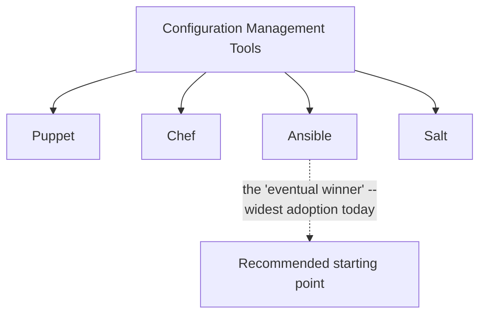

#### 🏢 Real-World / Production Usage — A Genuine, Personal Account

> 💡 **Memory Trick, the instructor's own real history, given directly:** *"If you're a DevOps engineer and go back six or seven years, I'm pretty sure everyone started their journey using Puppet or Chef — they were the first tools to implement configuration management. Personally, I started with Puppet, then learned Chef had some better features, so I moved to Chef. Then, around 2016-2017, I was introduced to Ansible, which was gaining real popularity at that time. Ansible is now constantly developed by people at Red Hat — it became part of Red Hat around 2018-2019, and that's exactly why it's often called 'Red Hat Ansible.'"*

#### ❓ Why It Exists — The Practical, Career-Relevant Recommendation

> 💡 **Memory Trick, the direct, practical advice given:** *"If you're confused about whether to start with Puppet, Chef, Ansible, or Salt — the straightforward answer is: definitely start with Ansible. There's a very good chance that 90% of the time, when you join an organization and start your DevOps journey, that organization is using Ansible. I'm not saying nobody uses Puppet, Chef, or Salt — but the majority use Ansible, and it's always better to start with the most popularly used tool. Once you learn Ansible, if you still have time, look at the others."*

#### ⚠ Common Mistakes

* Assuming "which configuration management tool is objectively best" is a purely technical question with one universal answer — explicitly, directly reframed as a PRACTICAL, career-relevant recommendation (start with what's most widely used, i.e., Ansible), not a claim that Ansible is technically flawless or that other tools have no merit.

#### 🎯 Key Takeaways

* Four popular configuration management tools are named: **Puppet, Chef, Ansible, Salt** — with Ansible explicitly identified as the "eventual winner" in terms of adoption.
* The instructor's own genuine tool journey (Puppet → Chef → Ansible) is offered as real, lived evidence, not just an abstract recommendation.
* **Red Hat's ownership and ongoing development** of Ansible (since ~2018-2019) is directly cited as a factor in its continued growth and reliability.
* The practical, stated recommendation: **start with Ansible specifically**, since it's what ~90% of organizations actually use — a career-pragmatic reason, not solely a technical superiority claim.

---

### 4. Difference #1: Push (Ansible) vs. Pull (Puppet)

#### 📖 Definition

> 💡 **Memory Trick, given directly:** *"Puppet is a PULL mechanism model, whereas Ansible is a PUSH mechanism model."*

#### 🧠 Concept — The Worked Scenario

> 💡 **Memory Trick, the full, concrete scenario given directly:** *"Say a DevOps engineer manages the AWS configuration of an organization, and has created 10 EC2 instances — their responsibility is managing these instances' configuration (security upgrades, default installations, compliance rules). If using Ansible, this engineer writes their Ansible Playbook at ONE place — say, their own laptop — and PUSHES the configuration out to all 10 EC2 instances. All they need to do is execute the Playbook, and the configuration updates across all 10 instances via this push mechanism."*

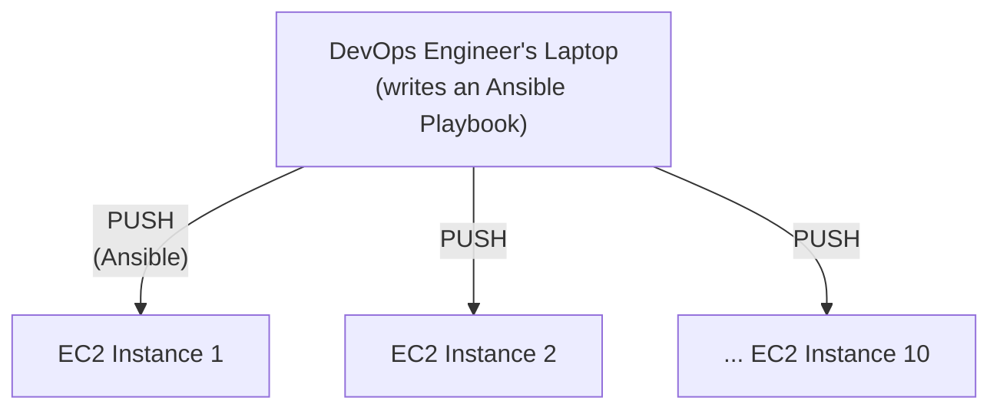

#### 🎯 Key Takeaways

* **Ansible uses a push model** — configuration is authored in one place and actively pushed out to target servers, on the engineer's command.
* **Puppet uses a pull model** — by direct contrast (the specific mechanics of the pull model itself are not deeply elaborated in this session, deliberately kept simple per the instructor's own stated approach).
* This distinction is explicitly presented as the **first** of four concrete answers to the classic "why Ansible?" interview question.

---
### 5. Difference #2: Agentless (Ansible) vs. Master-Slave (Puppet), and Dynamic Inventory

#### 📖 Definition — Puppet's Master-Slave Architecture

> 💡 **Memory Trick, given directly:** *"With Puppet, you follow a Master-Slave architecture — some call it master node, master-slave, or master-agent. The engineer creates one master Puppet server, and each of the 10 EC2 instances has to be individually configured as a slave — Slave 1, Slave 2, Slave 3 — similar to how you'd configure agents in Jenkins. Only once all of that configuration is done can Puppet start making changes on those respective instances."*

#### 📖 Definition — Ansible's Agentless Architecture

> 💡 **Memory Trick, given directly:** *"With Ansible, you don't do ANY configuration on your 'agents' — there is no concept of agents in Ansible. All you do is put the names (IP address or resolved DNS) of your servers into a file called the inventory file, and enable passwordless authentication — meaning your laptop (or wherever you run the Playbook) can connect to these servers without needing a password each time."*

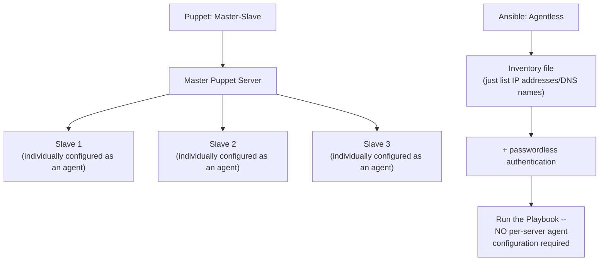

#### ❓ Why It Exists — Why Agentless Matters Especially in Dynamic, Cloud-Native Environments

> 💡 **Memory Trick, the precise, real-world scaling reasoning given directly:** *"In a dynamic environment — say IRCTC scaling up their servers before a holiday rush, or scaling down afterward — you can tear down or scale up servers at any given point. With Ansible's agentless approach, even if you're scaling 10x or 100x, all you need to do is grab the new public IP address and add it to the inventory file. If you have passwordless authentication set up, you're good to go — no per-server agent setup required, unlike Puppet's master-slave model."*

#### 📖 Definition — Dynamic Inventory (A Genuine Advancement)

> 💡 **Memory Trick, given directly, including an honest clarification that this isn't brand-new:** *"Ansible also has something called Dynamic Inventory — not a recently-invented topic, but introduced after the standard inventory-file approach existed. With Dynamic Inventory, Ansible will AUTO-DETECT new servers — you don't even have to manually update your inventory file. By making some settings (there's an INI file involved), you can tell Ansible: whenever a new EC2 instance is created in a specific region/availability zone on my AWS account, automatically consider it a server I manage."*

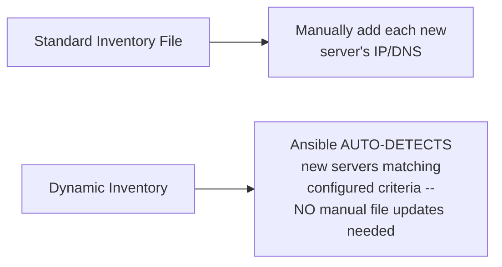

#### ⚠ Common Mistakes

* Assuming "agentless" means Ansible has no way of knowing which servers to manage at all — explicitly, directly clarified: it still requires an inventory file (or Dynamic Inventory's auto-detection) and passwordless authentication; "agentless" specifically means no PER-SERVER AGENT SOFTWARE needs to be installed and configured, not "zero setup of any kind."

#### 🎯 Key Takeaways

* **Ansible's agentless architecture** means no per-server agent software/configuration is required — just an entry in an inventory file plus passwordless authentication, a genuinely lighter-weight setup than Puppet's master-slave/agent model.
* This agentless property is explicitly, directly connected to **dynamic, cloud-native scaling scenarios** (the IRCTC example) — genuinely relevant, not just a theoretical simplicity claim.
* **Dynamic Inventory** takes this even further — Ansible can auto-detect new servers matching configured criteria, eliminating even the manual inventory-file-update step.

---

### 6. Differences #3 & #4: Windows/Linux Support and YAML vs. a Proprietary Language

#### 📖 Definition — Windows & Linux Support (With an Honest Qualifier)

> 💡 **Memory Trick, given directly, deliberately NOT overstated:** *"Ansible is pretty good with both Windows and Linux. I'm not saying Windows and Linux support is EQUAL — but Ansible has very good modules for both. With Puppet, managing Windows servers can become tricky. After Red Hat's adoption of Ansible, I've personally seen a lot of Windows modules introduced — Ansible now supports Windows fairly well, though Linux support remains, in my honest assessment, amazing by comparison."*

#### 📖 Definition — YAML vs. Puppet's Own Language

> 💡 **Memory Trick, given directly:** *"With Puppet, you have to write your configuration files in the Puppet language — a genuinely new language you have to learn. With Ansible, you write simple YAML manifests. YAML is a language most DevOps engineers are already acquainted with — it's used across multiple other DevOps tools too, like Kubernetes. This is a fundamental advantage: whenever someone evaluates a new tool, one thing they check is what language/format it uses, and realizing 'oh, it's YAML' is genuinely reassuring compared to needing to learn an entirely new, tool-specific language."*

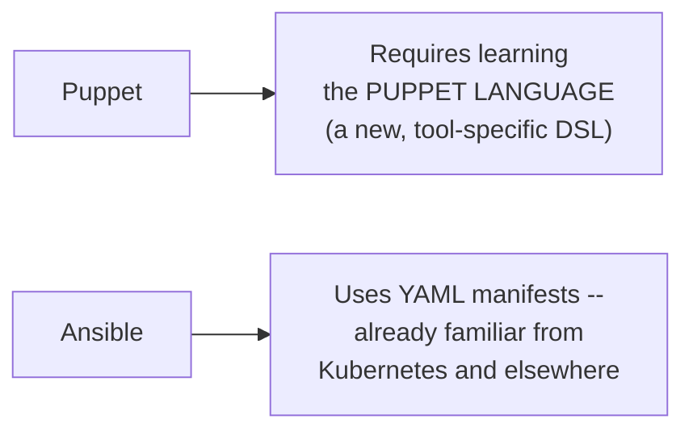

#### ⚠ Common Mistakes

* Overstating Ansible's Windows support as fully equal to its Linux support — explicitly, directly avoided: the instructor deliberately qualifies this claim rather than overselling it.

#### 🎯 Key Takeaways

* **Windows/Linux support** (Difference #3): Ansible supports both reasonably well, with Linux support notably stronger — a genuinely honest, non-overstated comparative claim, especially improved for Windows since Red Hat's involvement.
* **Configuration language** (Difference #4): Ansible uses **YAML** — already broadly familiar to DevOps engineers from tools like Kubernetes — while Puppet requires learning its own, dedicated configuration language.
* Together with push-vs-pull (Section 4) and agentless-vs-master-slave (Section 5), these constitute the **complete, four-part answer** to the classic "why Ansible?" interview question.

---
### 7. Ansible's Honest Disadvantages: Windows, Debugging & Performance

#### ❓ Why It Exists — A Deliberate, Balanced Correction

> ⚠️ **Directly, explicitly stated as a deliberate corrective:** *"By saying all of this positive stuff, I don't mean Ansible has no disadvantages. Definitely not."*

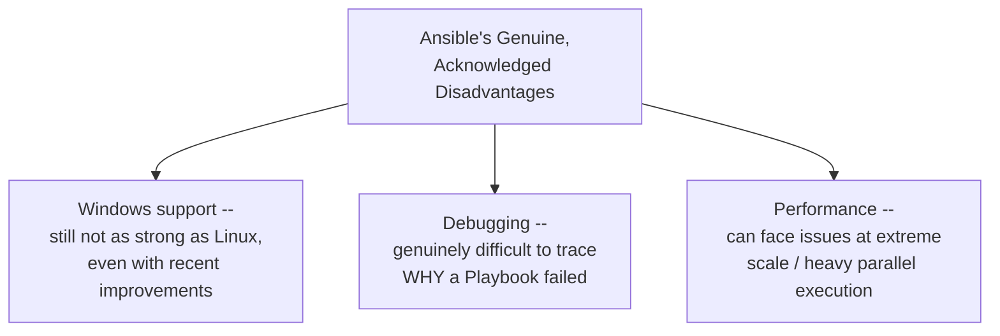

#### 🔍 Internal Working — Each Disadvantage, Precisely Stated

> 💡 **Memory Trick, each disadvantage explained directly:**
> - **Windows support**: *"Even with advanced Ansible modules, configuration management with Windows is genuinely not as smooth as with Linux — people using Windows servers still find it slightly difficult."*
> - **Debugging**: *"When something goes wrong, you need a mechanism to understand what happened — not read through the entire code, but check debug logs and understand where the Playbook execution ran into a problem. Ansible doesn't do well here — its debugging capability has a lot of room to improve, even though you can run it in a debug mode."*
> - **Performance**: *"Ansible can manage thousands, even 10,000s of servers — but when doing parallel execution at that scale, you might run into genuine performance issues. This is an area Ansible is actively working on."*

#### ⚠ Common Mistakes

* Assuming a strong, practical recommendation (Section 3's "start with Ansible") implies the tool is flawless — explicitly, directly corrected via this dedicated, balanced disadvantages section.

#### 🎯 Key Takeaways

* Ansible's Windows support, while genuinely improved, remains **comparatively weaker than its Linux support** — an honest, non-overstated limitation.
* **Debugging** is explicitly named as a genuine area needing improvement — diagnosing Playbook failures isn't always straightforward, even with debug mode available.
* **Performance at extreme scale** (heavy parallel execution across tens of thousands of servers) is acknowledged as a real, ongoing concern, not a solved problem.
* This entire section is presented as a deliberate act of **balance** — directly countering any impression that the earlier, strongly favorable comparison to Puppet meant Ansible has no real weaknesses.

---

### 8. Custom Modules, Python & Ansible Galaxy

#### 📖 Definition

> 💡 **Memory Trick, given directly:** *"Ansible is written in Python. Say your organization uses a specific application — for example, an F5 load balancer or an Nginx load balancer. You can write your own Ansible modules for tasks like installing the load balancer, deleting it, or removing specific configuration from it."*

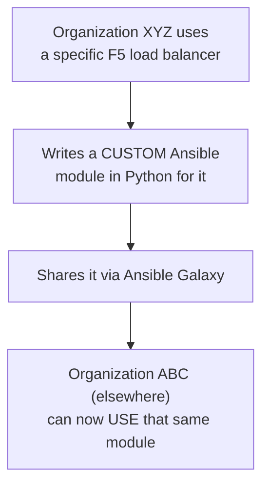

#### 🏢 Real-World / Production Usage — Ansible Galaxy as the Sharing Bridge

> 💡 **Memory Trick, given directly:** *"You can share your custom modules using Ansible Galaxy — this is the bridge between organizations. Once you write a module, anybody else in the world can use it, exactly like contributing to any other open-source tool (Terraform, Kubernetes, etc.). Sharing is always possible with Ansible — you can support its enhancement, give back to the community, and get back from the community too."*

#### ⚠ Common Mistakes

* Assuming custom module-writing is only relevant to Ansible's own core maintainers — explicitly, directly clarified: ANY organization, using ANY specific tool (like a particular load balancer brand), can write and share their own custom module via Ansible Galaxy.

#### 🎯 Key Takeaways

* **Ansible's Python foundation** enables genuinely custom, organization-specific modules — not limited to whatever modules ship with Ansible by default.
* **Ansible Galaxy** is the sharing mechanism — a genuine, open-source-style bridge letting organizations distribute and reuse each other's custom modules, directly analogous to contributing to Terraform or Kubernetes.
* This is presented as an additional advantage the instructor explicitly notes he "forgot to mention" earlier — an honest, unscripted addition rather than a rehearsed, pre-planned point.

---
### 9. Six Classic Ansible Interview Questions, Directly Answered

#### 🔥 Question 1: What Programming Language Does Ansible Use?

> 💡 **Memory Trick, given directly:** *"Python is the programming language Ansible uses. You can write your own modules using Python and contribute to Ansible. If you've written any custom modules, talk about it in an interview; if not, you can directly say there was no requirement, but because you're comfortable with Python, you can always write a module whenever it's needed."*

#### 🔥 Question 2: Does Ansible Support Linux AND Windows?

> 💡 **Memory Trick, given directly, including the specific protocols:** *"Yes, Ansible supports both Linux and Windows. For Linux, it uses the SSH protocol. For Windows, it uses a protocol called WinRM."*

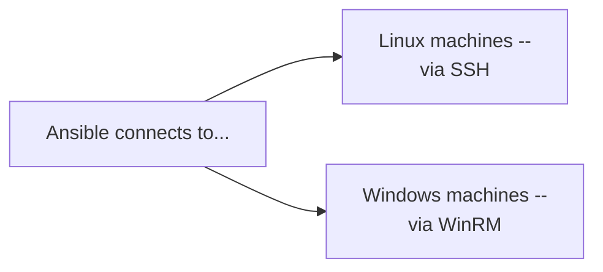

#### 🔥 Question 3: Puppet vs. Ansible / Chef vs. Ansible / Why Ansible?

> 💡 **Memory Trick, the direct pointer given:** *"This is exactly what we covered in the first part of this session — the four differences: push vs. pull, agentless vs. master-slave, Windows/Linux support, and YAML vs. a proprietary language."*

#### 🔥 Question 4: Is Ansible Push or Pull Mechanism?

> 💡 **Memory Trick, given directly:** *"Ansible is push mechanism — we already covered why, and how push helps over pull."*

#### 🔥 Question 5: What Language/Manifest Format Does Ansible Use for Playbooks?

> 💡 **Memory Trick, given directly:** *"YAML — you use YAML manifests in Ansible to write your Playbooks."*

#### 🔥 Question 6: Does Ansible Support All Cloud Providers (AWS, Azure, GCP)? (A Deliberate Trick Question)

> ⚠️ **Directly, explicitly flagged as a trick question interviewers use:** *"Sometimes interviewers try to trick you by asking whether Ansible supports AWS, Azure, or GCP specifically. Don't be confused — the answer is genuinely simple: it doesn't matter where your instance is hosted. What matters to Ansible is: is your machine PUBLICLY ACCESSIBLE, and is SSH (or WinRM, for Windows) ALLOWED from your Ansible host/laptop to that machine? Only then can you automate it — the underlying cloud provider is completely irrelevant to Ansible."*

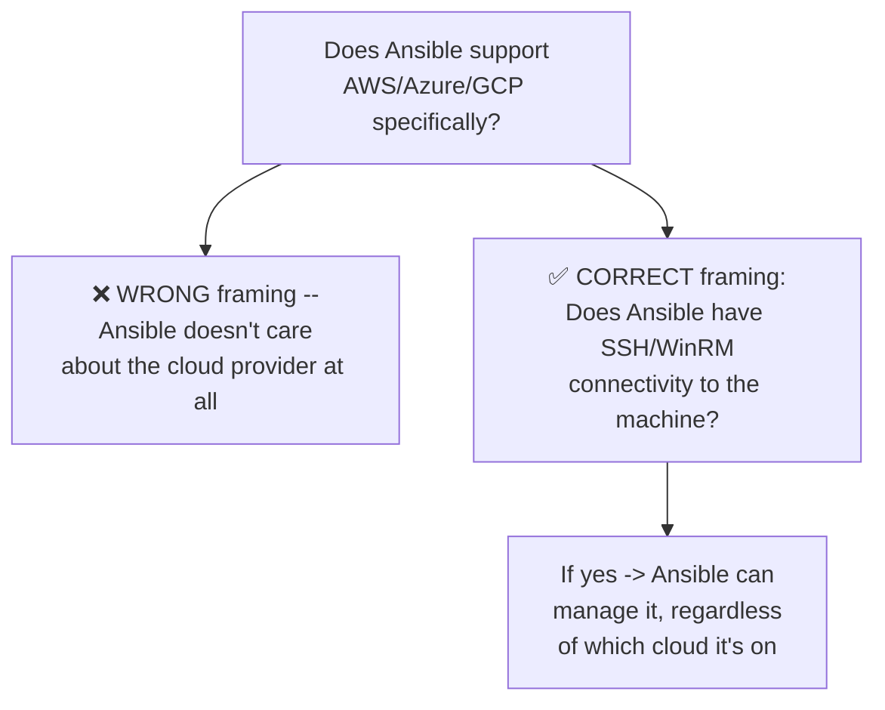

#### ⚠ Common Mistakes

* Answering Question 6 by naming specific cloud providers Ansible "supports" — explicitly, directly identified as falling for the trick; the correct answer reframes the question entirely around connectivity (SSH/WinRM + public accessibility), not cloud-provider-specific support.

#### 🎯 Key Takeaways

* All six questions are explicitly, directly connected back to concepts already established earlier in this same session — a deliberate, coherent structure rather than a disconnected list of trivia.
* Question 6 is explicitly flagged as a genuine **interviewer trick question** — testing whether a candidate correctly understands Ansible's actual, connectivity-based (not cloud-provider-based) requirements.
* A separate, previously-published **"18 most-asked Ansible interview questions" video** is explicitly pointed to for deeper coverage beyond these six.

---

## 📝 Glossary

| Term | Definition | Why It Matters |
|---|---|---|
| **Configuration Management** | The discipline/practice of managing the configuration of multiple servers consistently | The core problem this entire session addresses |
| **Push Model** | Configuration is authored in one place and actively sent OUT to target servers | Ansible's architecture |
| **Pull Model** | Target servers actively retrieve their configuration from a central source | Puppet's architecture |
| **Agentless** | No per-server agent software/configuration required | Ansible's architecture, contrasted with Puppet's master-slave model |
| **Master-Slave (Master-Agent) Architecture** | A central master server managing individually-configured slave/agent nodes | Puppet's architecture |
| **Inventory File** | A file listing the IP addresses/DNS names of servers Ansible manages | The core mechanism replacing per-server agent configuration |
| **Passwordless Authentication** | Connecting to a server without needing to enter a password each time | Required for Ansible's agentless approach to work smoothly |
| **Dynamic Inventory** | Ansible auto-detecting new servers matching configured criteria, without manual inventory updates | An advancement beyond the standard, manually-maintained inventory file |
| **YAML** | The configuration/manifest language Ansible uses for Playbooks | Already familiar to most DevOps engineers, e.g., from Kubernetes |
| **Ansible Galaxy** | The platform for sharing custom Ansible modules across organizations | Enables genuine, open-source-style module contribution and reuse |
| **WinRM** | The protocol Ansible uses to connect to Windows machines | Directly analogous to SSH for Linux |

---

## 🔄 Revision Notes — One-Minute Revision

* This session is explicitly **theory-only**, building genuine confidence for a hands-on Ansible project promised the very next day.
* The **original problem**: a system administrator managing 100 heterogeneous on-premises servers, responsible for upgrades, security patches, and default installations — manual/ad-hoc scripting (shell/PowerShell) genuinely doesn't scale, since exact commands differ across operating systems and distributions.
* **Cloud adoption made this problem WORSE, not better** — microservices architecture meant roughly 10x more servers, each individually smaller, dramatically multiplying the original management burden.
* Four popular configuration management tools: **Puppet, Chef, Ansible, Salt** — **Ansible is the "eventual winner"** in adoption, explicitly recommended as the practical starting point since ~90% of organizations use it (a career-relevant, not purely technical, recommendation).
* The classic **"why Ansible?"** interview question has a **four-part answer**: (1) **push** (Ansible) vs. **pull** (Puppet) mechanism; (2) **agentless** (inventory file + passwordless auth) vs. Puppet's **master-slave/agent** architecture, with **Dynamic Inventory** as a further auto-detection advancement; (3) genuinely good (though not perfectly equal) **Windows AND Linux** support; (4) simple, already-familiar **YAML** manifests vs. Puppet's own dedicated language.
* Ansible's agentless architecture is explicitly connected to real, **dynamic cloud-scaling scenarios** (the IRCTC holiday-load example) — genuinely practical, not just theoretically simpler.
* Ansible's **honest, acknowledged disadvantages**: comparatively weaker Windows support, genuinely difficult **debugging**, and real **performance** concerns at extreme scale/parallel execution — a deliberate, balanced correction to the earlier favorable comparison.
* Ansible's **Python** foundation enables custom, organization-specific modules, shared via **Ansible Galaxy** — a genuine, open-source-style contribution mechanism.
* **Six directly-answered interview questions**: Python (language), Linux+Windows support via SSH/WinRM, the four-part Puppet-vs-Ansible answer, push mechanism, YAML (Playbook format), and a deliberately-flagged **trick question** about cloud-provider support — the correct answer reframes it entirely around SSH/WinRM connectivity, not which specific cloud is used.

---

## 📋 Cheat Sheet

**Why configuration management exists:**
```text
Many heterogeneous servers -> manual/ad-hoc scripting doesn't scale
Cloud + microservices -> ~10x MORE servers, EACH ~10x smaller -> problem gets WORSE
```

**The four popular tools:**
```text
Puppet | Chef | Ansible (the "eventual winner") | Salt
```

**The four-part "why Ansible?" answer:**
```text
1. Push (Ansible) vs. Pull (Puppet)
2. Agentless (inventory file + passwordless auth) vs. Master-Slave (Puppet)
3. Good Windows AND Linux support (not perfectly equal, but both solid)
4. YAML manifests (Ansible) vs. a proprietary language (Puppet)
```

**Ansible's honest disadvantages:**
```text
Windows support (comparatively weaker than Linux)
Debugging (genuinely difficult to trace failures)
Performance (issues possible at extreme scale / heavy parallel execution)
```

**Protocols by OS:**
```text
Linux   -> SSH
Windows -> WinRM
```

**The six interview questions:**
```text
1. Language?              -> Python
2. Linux + Windows?         -> Yes (SSH / WinRM)
3. Why Ansible over Puppet?   -> the 4-part answer above
4. Push or pull?                -> Push
5. Playbook format?               -> YAML
6. Cloud provider support?          -> TRICK QUESTION: doesn't matter --
                                        only SSH/WinRM connectivity matters
```

---

## 🔥 Interview Questions & Answers

### 🟢 Beginner

**Q1.**

**Question:** What programming language does Ansible use?

**Answer:** Python.

**Explanation:** Directly, explicitly stated.

**Why Interviewers Ask This:** A basic, foundational Ansible fact.

**Possible Follow-up:** "What would you talk about if asked whether you've written custom Ansible modules?"

**Q2.**

**Question:** Does Ansible support both Linux and Windows? What protocols does it use for each?

**Answer:** Yes -- SSH for Linux, WinRM for Windows.

**Explanation:** Directly, precisely explained.

**Why Interviewers Ask This:** A commonly-asked, practical Ansible knowledge question.

**Possible Follow-up:** "Is Ansible's support for Windows and Linux exactly equal?"

**Q3.**

**Question:** Is Ansible push or pull mechanism?

**Answer:** Push.

**Explanation:** Directly, explicitly stated, with full reasoning covered earlier in the session.

**Why Interviewers Ask This:** A core, frequently-tested architectural distinction.

**Possible Follow-up:** "Which configuration management tool uses the pull mechanism, by contrast?"

**Q4.**

**Question:** What language/format do Ansible Playbooks use?

**Answer:** YAML.

**Explanation:** Directly, explicitly stated.

**Why Interviewers Ask This:** Basic, essential Ansible knowledge.

**Possible Follow-up:** "Name another DevOps tool that also uses YAML."

**Q5.**

**Question:** What does "agentless" mean in the context of Ansible?

**Answer:** No per-server agent software/configuration is required -- you just add a server's IP/DNS to an inventory file and enable passwordless authentication.

**Explanation:** Directly, precisely explained.

**Why Interviewers Ask This:** A core, frequently-tested architectural distinction versus Puppet.

**Possible Follow-up:** "What architecture does Puppet use, by contrast?"

**Q6.**

**Question:** Does Ansible only work with AWS, or does it support other cloud providers too?

**Answer:** It doesn't matter which cloud provider is used -- Ansible only requires the target machine to be reachable via SSH (or WinRM for Windows), with connectivity allowed from the Ansible host.

**Explanation:** Directly, explicitly flagged as a common interviewer trick question.

**Why Interviewers Ask This:** Tests whether a candidate correctly understands Ansible's true, connectivity-based requirements rather than assuming cloud-provider-specific support.

**Possible Follow-up:** "What specifically must be true about a machine for Ansible to manage it?"

**Q7.**

**Question:** Name the four popular configuration management tools mentioned in this session.

**Answer:** Puppet, Chef, Ansible, Salt.

**Explanation:** Directly, explicitly named.

**Why Interviewers Ask This:** Basic, foundational configuration-management landscape knowledge.

**Possible Follow-up:** "Which one is explicitly recommended as the practical starting point, and why?"

**Q8.**

**Question:** What is Ansible Galaxy used for?

**Answer:** Sharing custom Ansible modules across organizations.

**Explanation:** Directly, explicitly defined.

**Why Interviewers Ask This:** Tests awareness of Ansible's community/ecosystem tooling.

**Possible Follow-up:** "Why does Ansible being written in Python matter for this?"

**Q9.**

**Question:** Name one genuine, acknowledged disadvantage of Ansible.

**Answer:** Debugging (or: comparatively weaker Windows support, or: performance issues at extreme scale).

**Explanation:** Directly, explicitly acknowledged in the session's dedicated disadvantages section.

**Why Interviewers Ask This:** Tests whether a candidate has a balanced, honest understanding of a tool, not just its advantages.

**Possible Follow-up:** "Why might this specific limitation matter more in some organizations than others?"

**Q10.**

**Question:** Why did cloud adoption make the configuration-management problem worse rather than better?

**Answer:** Microservices architecture meant roughly 10x more servers, each individually smaller -- multiplying the original server-management burden rather than reducing it.

**Explanation:** Directly, explicitly explained.

**Why Interviewers Ask This:** Tests genuine understanding of WHY configuration management became necessary, not just that it exists.

**Possible Follow-up:** "Does this mean cloud adoption is a bad idea? Why or why not?"

---

### 🟡 Intermediate

**Q11.**

**Question:** Explain why the instructor recommends starting with Ansible specifically as a CAREER-pragmatic choice, rather than framing it as an unconditional technical superiority claim.

**Answer:** The instructor's own stated reasoning is explicitly usage-based, not purely technical: roughly 90% of organizations a new DevOps engineer might join are already using Ansible, making it the highest-leverage tool to learn first for actually GETTING a job and being immediately useful. This is a genuinely different kind of claim than "Ansible is technically superior to Puppet/Chef/Salt in every dimension" -- the instructor explicitly, separately acknowledges real Ansible disadvantages (Section 7), meaning the recommendation is best understood as "learn the tool most likely to be immediately relevant to your career," not "learn the objectively best tool by every technical measure."

**Explanation:** Requires distinguishing a practical, usage-based recommendation from an absolute technical superiority claim, correctly connecting this to the session's later, balanced disadvantages discussion.

**Why Interviewers Ask This:** Tests whether a learner can articulate nuanced tool-selection reasoning rather than treating any strong recommendation as an unconditional technical verdict.

**Possible Follow-up:** "Under what circumstance might learning Puppet or Chef FIRST still make sense for a specific individual?"

**Q12.**

**Question:** A learner argues that since Ansible is "agentless," it requires literally zero setup on target servers before it can manage them. Evaluate this claim.

**Answer:** This claim isn't accurate. "Agentless" specifically means no dedicated AGENT SOFTWARE needs to be installed and configured on each target server (unlike Puppet's master-slave model, which requires per-server slave/agent configuration) -- but Ansible still genuinely requires SOME setup: an entry in the inventory file (or Dynamic Inventory's auto-detection criteria) identifying the server, AND passwordless authentication (SSH keys or equivalent) enabling connectivity. "Agentless" describes the ABSENCE of a specific kind of setup (dedicated agent software), not the absence of ALL setup whatsoever.

**Explanation:** Tests whether a learner over-generalizes "agentless" into "zero configuration required," missing the genuine, still-necessary inventory/authentication setup.

**Why Interviewers Ask This:** Distinguishes candidates who understand the precise technical meaning of "agentless" from those who round it into an inaccurate absolute claim.

**Possible Follow-up:** "What specific two things must genuinely be set up before Ansible can manage a new server, even in its agentless model?"

**Q13.**

**Question:** Explain, precisely, why Dynamic Inventory is described as a genuine advancement over the standard inventory file, using the specific scaling scenario this session provides.

**Answer:** The standard inventory file requires MANUAL updates -- every time a new server is created (e.g., during a scaling event), someone must explicitly add its IP/DNS to the file before Ansible can manage it. Dynamic Inventory removes this manual step entirely: by configuring criteria (e.g., "any new EC2 instance created in this region/availability zone"), Ansible AUTOMATICALLY detects and begins considering new servers as manageable, without any human intervention. This matters specifically in genuinely dynamic, elastic-scaling environments (the session's own IRCTC example) -- where servers might be created and destroyed frequently and rapidly, manually updating an inventory file for every single scaling event would itself become a genuine bottleneck, precisely the kind of manual, doesn't-scale problem this entire session's opening section (Section 1) describes configuration management as solving in the first place.

**Explanation:** Requires connecting Dynamic Inventory's specific advancement back to the session's own opening problem-framing (manual processes don't scale), recognizing this as a recursive application of the same underlying principle.

**Why Interviewers Ask This:** Tests whether a learner sees Dynamic Inventory as solving a genuine, specific limitation, not just recites that it exists.

**Possible Follow-up:** "What specific AWS configuration detail does Dynamic Inventory need to know, per this session's example?"

**Q14.**

**Question:** Explain why the instructor deliberately avoids claiming Ansible's Windows support is "equal" to its Linux support, even while stating Windows support has genuinely improved since Red Hat's involvement.

**Answer:** This deliberate, careful qualification reflects a genuine commitment to accuracy over marketing-style enthusiasm -- the instructor could have simply said "Ansible supports Windows great now" for a cleaner, more emphatic claim, but instead explicitly distinguishes "genuinely improved" from "fully equal to Linux," and later (Section 7) explicitly lists Windows support as one of Ansible's real, ongoing limitations. This precision matters practically: a learner or engineer who assumed Windows and Linux support were fully equivalent might be caught off guard by genuine, real friction when actually managing Windows servers with Ansible in a production environment -- the qualified claim sets more accurate expectations than an overstated one would.

**Explanation:** Requires recognizing a deliberate, precise qualification as a meaningful choice with practical consequences, not just noting that the qualification exists.

**Why Interviewers Ask This:** Tests whether a learner appreciates the practical value of precise, non-overstated claims in technical communication.

**Possible Follow-up:** "What specific consequence might result from an engineer incorrectly assuming Ansible's Windows and Linux support are fully equivalent?"

**Q15.**

**Question:** Synthesize this session's Ansible Galaxy coverage (Section 8) with its "why start with Ansible" recommendation (Section 3) to explain how Ansible Galaxy's existence itself reinforces the practical case for learning Ansible specifically.

**Answer:** Section 3's recommendation to start with Ansible is explicitly grounded in adoption statistics (roughly 90% of organizations) -- Ansible Galaxy's existence and active use (organizations writing and sharing custom modules for their own specific tools, like load balancers) is itself INDIRECT EVIDENCE supporting and reinforcing that same adoption claim: a genuinely widely-used tool naturally develops a richer, more active module-sharing ecosystem, since more organizations using it creates more contributors writing and sharing modules, which in turn makes the tool even MORE practically useful for new organizations joining that ecosystem (since more pre-built modules likely already exist for common needs). This creates a genuine, self-reinforcing cycle: Ansible's wide adoption (Section 3) both explains and is further evidenced by Ansible Galaxy's existence and richness (Section 8) -- these aren't two independent facts, but two mutually-reinforcing aspects of the same underlying "widely adopted tool" reality.

**Explanation:** Requires recognizing a genuine, non-obvious causal/evidential relationship between two facts presented in separate sections of the session -- real synthesis beyond simply restating both facts.

**Why Interviewers Ask This:** Tests whether a learner can identify how separately-introduced facts about a tool's ecosystem mutually reinforce a broader claim about that tool's practical value.

**Possible Follow-up:** "Would you expect Puppet or Chef to have a comparably rich module-sharing ecosystem to Ansible Galaxy? Why or why not, based on this session's own adoption claims?"

---

### 🔴 Advanced

**Q16.**

**Question:** Design a decision framework an organization could use to decide whether to invest in writing and maintaining CUSTOM Ansible modules (via the Python/Ansible Galaxy mechanism from Section 8) versus relying entirely on existing, publicly-available modules, using only this session's stated reasoning.

**Answer:** A reasonable framework, directly grounded in the session's own stated custom-module example (a specific F5 or Nginx load balancer): (1) **Tool specificity check** -- does your organization use a genuinely specific, possibly proprietary or uncommon tool (like a particular vendor's load balancer) that existing, publicly-available Ansible modules likely don't already cover well? If yes, custom module development becomes more justified. (2) **Reusability/scale check** -- will this custom module be used repeatedly, across many servers or many teams within your organization, justifying the upfront Python development investment? A one-off, single-use configuration task may not justify writing a full custom module versus a simpler, ad-hoc Playbook task. (3) **Community-sharing potential** -- per Section 8's own framing (Ansible Galaxy as a genuine give-and-take community mechanism), could this module also benefit OTHER organizations using the same tool, making the investment worthwhile beyond your own organization's immediate needs, and potentially resulting in improvements/maintenance contributed back BY that broader community over time? (4) **Team Python capability** -- since custom modules are written in Python (Section 8's explicit detail), does your team have genuine, sufficient Python proficiency to build and maintain this module reliably, or would this represent a genuinely new skill investment beyond typical Ansible/YAML usage? Only when these factors favor custom development (genuine tool specificity, real reusability, community-sharing potential, and available Python skill) does writing a custom module represent a clearly justified investment over simply working within existing, publicly-available modules.

**Explanation:** Synthesizes the session's specific custom-module example and Ansible Galaxy's community mechanism into a genuine, reusable decision framework -- real extension beyond the session's own single, illustrative example.

**Why Interviewers Ask This:** A realistic, senior-level tooling-investment question testing whether a candidate can reason about when custom development is genuinely justified versus using existing solutions.

**Possible Follow-up:** "How would this framework change if your organization's Python skills were genuinely weak across the team?"

**Q17.**

**Question:** Critically evaluate: "Since this session explicitly recommends starting with Ansible because ~90% of organizations use it, learning Puppet, Chef, or Salt is now a genuinely wasted effort with zero practical value." Is this an accurate implication of this session's content?

**Answer:** Not accurate. The session's own explicit language is: "once you learn Ansible, if you STILL HAVE TIME, definitely look for other options like Puppet, Chef, or Salt" -- directly implying these tools retain genuine, if secondary, value, not zero value. The 90% figure describes a PROBABILITY (most likely organization you'll join uses Ansible), not a CERTAINTY (100% of all organizations) -- meaning roughly 10% of organizations genuinely do use Puppet, Chef, or Salt, and an engineer with knowledge of these tools remains genuinely more employable for THOSE specific organizations than one who only knows Ansible. Additionally, understanding the broader configuration-management landscape (which this session itself models, comparing Ansible against Puppet specifically to explain WHY Ansible is preferred) provides genuine conceptual depth that pure Ansible-only knowledge might lack -- the recommendation is about PRIORITIZATION (learn Ansible first, as the highest-probability, highest-immediate-value choice) rather than EXCLUSIVITY (learning only Ansible and nothing else is optimal).

**Explanation:** Tests whether a learner over-generalizes a strong prioritization recommendation into an absolute, zero-value claim about alternative tools the session doesn't actually make.

**Why Interviewers Ask This:** Distinguishes candidates who track the precise, stated scope of a recommendation from those who round it into an overstated, inaccurate absolute.

**Possible Follow-up:** "In what specific scenario might genuine, deep Puppet knowledge be more valuable to a specific employer than Ansible knowledge, despite the general 90% statistic?"

**Q18.**

**Question:** Synthesize this session's "cloud made the problem worse, not better" observation (Section 2) with Days 3-5's cloud-efficiency arguments to explain why these two claims are NOT actually in tension, despite superficially appearing contradictory.

**Answer:** Days 3-5 argue cloud infrastructure improves EFFICIENCY OF RESOURCE UTILIZATION -- virtualization letting many logical VMs share one physical server, pay-as-you-go billing avoiding waste on unused capacity, and reduced hardware-maintenance overhead compared to on-premises infrastructure. This session's claim is about a GENUINELY DIFFERENT dimension: the SHEER NUMBER of individually-manageable units (servers/instances) that a DevOps engineer must configure and maintain, which cloud/microservices architecture increases, even as each individual unit becomes more resource-efficient. These aren't contradictory claims about the SAME thing -- they're claims about two DIFFERENT things: cloud infrastructure genuinely makes each individual unit of compute more efficient and cost-effective (Days 3-5's claim), while SIMULTANEOUSLY increasing the total COUNT of units requiring individual configuration management (this session's claim) -- both are true at once, precisely because "efficient resource usage per server" and "total number of servers needing configuration" are independent variables, not the same measurement viewed differently. This is exactly why configuration management emerged as a NECESSARY COMPLEMENT to cloud infrastructure's efficiency benefits, not a contradiction of them -- cloud solves the resource-efficiency problem; configuration management solves the resulting, genuinely different management-at-scale problem cloud's own success created.

**Explanation:** Requires precisely distinguishing two genuinely different dimensions (per-unit efficiency vs. total-unit-count management burden) that might otherwise seem to be in tension when connecting claims from separate, earlier sessions.

**Why Interviewers Ask This:** A capstone-level systems-thinking question testing whether a candidate can hold two seemingly-competing claims about cloud infrastructure as simultaneously true, correctly identifying they address genuinely independent dimensions.

**Possible Follow-up:** "Design a single sentence that accurately captures BOTH claims (cloud efficiency AND increased configuration-management burden) without contradiction."

---

## 🧪 Scenario-Based Interview Questions

> **Scenario 1:** A junior team member, having just learned Ansible is "agentless," proposes skipping the inventory-file setup entirely for a new batch of servers, assuming Ansible will "just figure it out." Using this session's concepts, correct this misunderstanding.

**Structured Answer:**
1. **Initial investigation:** Recognize this as a direct instance of Intermediate Q12's exact misconception -- conflating "agentless" (no per-server AGENT software required) with "zero setup of any kind required."
2. **Metrics/logs to check:** N/A directly (conceptual), but in practice: attempting to run a Playbook against servers not listed in any inventory (standard or dynamic) would simply fail, since Ansible has no way of knowing which servers to target.
3. **Possible causes:** A reasonable but incomplete understanding of "agentless" -- correctly grasping that no agent software is needed, but incorrectly extending this to mean no configuration of any kind is needed.
4. **Debugging approach:** Walk through the precise, two-part requirement this session establishes: an inventory file entry (or Dynamic Inventory auto-detection criteria) AND passwordless authentication -- both genuinely still required, even in Ansible's agentless model.
5. **Resolution:** Have the team member either manually add the new servers to the inventory file, or (if the organization's setup supports it) configure Dynamic Inventory criteria matching these new servers, per Section 5's exact distinction between the two approaches.
6. **Prevention:** Document the precise, correct definition of "agentless" (absence of per-server agent software, NOT absence of all configuration) in onboarding materials, directly preventing this same misunderstanding from recurring for future team members.

> **Scenario 2 (Advanced):** Your organization is debating whether to invest engineering time in writing custom Ansible modules for an internal, proprietary deployment tool, or to instead write ad-hoc Playbook tasks each time that tool needs configuration. Using this session's concepts and Advanced Q16's framework, provide your recommendation.

**Structured Answer:**
1. **Initial investigation:** Apply Advanced Q16's decision framework directly -- assess tool specificity (is this proprietary tool genuinely uncovered by any existing public module, which seems likely given it's described as internal/proprietary), reusability (how frequently and widely across the organization will this configuration need to be applied), community-sharing potential (is this tool genuinely internal-only, meaning Ansible Galaxy sharing wouldn't apply, unlike the session's own load-balancer example), and team Python capability.
2. **Relevant principle:** Per Section 8, custom modules are written in Python and offer genuine reusability/maintainability advantages over ad-hoc, repeated Playbook tasks -- but per Advanced Q16's framework, this investment is only clearly justified when reusability and specificity genuinely warrant it.
3. **Possible causes for the debate:** A legitimate, genuine trade-off -- ad-hoc tasks require less upfront investment but may become repetitive and harder to maintain consistently across many uses; a custom module requires more upfront Python development but centralizes and simplifies future reuse.
4. **Debugging/evaluation approach:** Quantify how often this proprietary tool's configuration is actually touched/managed via Ansible -- a genuinely frequent, recurring need supports custom-module investment; a rare, occasional need may not justify it.
5. **Resolution:** If this proprietary tool is genuinely configured frequently and consistently across many servers/deployments, recommend investing in a custom Python module (even without Ansible Galaxy's community-sharing benefit, since it's internal-only) for the genuine internal reusability/maintainability gain; if configuration is rare or highly varied each time, ad-hoc Playbook tasks likely remain the more pragmatic choice.
6. **Prevention:** Establish this exact decision framework (Advanced Q16, adapted for internal-only tools by removing the community-sharing factor) as a standing team guideline for evaluating future custom-module investment decisions, preventing ad-hoc, inconsistent decision-making on a case-by-case basis going forward.

---

## 🛠 Hands-on Exercises

### 🟢 Easy

1. Write out, from memory, the four-part answer to "why Ansible over Puppet?" without referring back to this guide.
2. Write a one-sentence definition, in your own words, of "agentless," being careful to precisely distinguish it from "zero configuration required" per Intermediate Q12's reasoning.
3. List the six interview questions covered in this session, and write your own, original one-sentence answer to each.

### 🟡 Medium

4. Research (outside this transcript) the actual syntax of an Ansible inventory file, and write a sample inventory file for three hypothetical servers of your own choosing.
5. Write a short comparison document (150-200 words) explaining, in your own words, why cloud adoption made the configuration-management problem worse rather than better, directly using Advanced Q18's "two independent dimensions" reasoning.
6. Research (outside this transcript) what Dynamic Inventory's actual AWS-specific configuration file (referenced but not shown in detail in this session) looks like, and document what you find.

### 🔴 Advanced

7. Implement the custom-module decision framework proposed in Advanced Interview Q16, applying it to a hypothetical proprietary tool of your own choosing.
8. Write a short technical document (300-400 words) addressing the internal-tool custom-module scenario from Scenario 2, providing your own recommendation with full reasoning.
9. Research (outside this transcript) a genuine, real-world Ansible debugging technique (beyond simply "run in debug mode"), directly addressing the debugging limitation acknowledged in Section 7.

---

## 🏗 Practice Assignment

### Build: "Configuration Management Decision Brief"

**Objective:** Produce a complete, genuinely-reasoned brief evaluating configuration management tool choice for a hypothetical (or real) organization, directly applying this session's concepts.

**Requirements:**
- A description of your hypothetical organization's server infrastructure (on-premises vs. cloud, approximate scale, operating systems in use).
- A recommendation for which configuration management tool to adopt, justified using this session's four-part Ansible-vs-Puppet comparison AND its honest disadvantages section -- not a one-sided endorsement.
- A brief explanation of how you would set up Ansible's inventory (standard or dynamic) for your hypothetical infrastructure.
- A short reflection (150-200 words) on which of Ansible's acknowledged disadvantages (Windows support, debugging, performance) would matter most for YOUR specific hypothetical organization, and why.

**Architecture (suggested):**

```text
config_mgmt_decision_brief/
├── 01_organization_profile.md      # your hypothetical infrastructure description
├── 02_tool_recommendation.md         # your reasoned Ansible (or alternative) recommendation
├── 03_inventory_approach.md            # standard vs. dynamic inventory plan
└── 04_disadvantage_reflection.md         # which limitation matters most for YOUR context
```

**Expected Functionality:**
- Your recommendation should be genuinely reasoned from your organization's specific profile, not a generic, copy-pasted endorsement of Ansible.
- Your disadvantage reflection should demonstrate genuine, context-specific reasoning (e.g., an organization with heavy Windows infrastructure should weight the Windows-support limitation more heavily).

**Challenges:**
- Avoiding a purely one-sided recommendation, given this session's own explicit, balanced treatment of Ansible's disadvantages.
- Genuinely reasoning through which specific disadvantage matters most for your specific hypothetical context, rather than listing all three generically.

**Bonus Improvements:**
- Extend your brief to include a brief section on when your hypothetical organization might benefit from writing custom Ansible modules, per Advanced Q16's framework.
- Research and add a section comparing your recommendation against what a genuinely Windows-heavy or extreme-scale organization might reasonably choose instead.

---

## 📚 Additional Resources

- The instructor's **Day 0 through Day 13 videos** (referenced directly) -- required prior viewing for full context.
- The **DevOps Zero to Hero playlist** -- referenced directly, containing all videos in this same free course.
- A **separate, previously-published "18 most-asked Ansible interview questions" video** on the instructor's channel (referenced directly) -- explicitly pointed to for interview coverage beyond this session's six questions.
- **Tomorrow's session** (referenced directly) -- a full, hands-on Ansible project: writing real Playbooks, Playbook structure, creating two AWS EC2 instances, pushing configuration to GitHub, and additional interview questions -- explicitly flagged as a longer, fully practical session.

---

## 📌 Final Revision Sheet

### ⭐ Core Concepts
- Configuration management exists to solve the genuine, quantified problem of managing many (often heterogeneous) servers consistently -- a problem cloud adoption made WORSE, not better, via microservices' 10x-more-servers effect.
- **Ansible is the practical, career-relevant starting point** among Puppet/Chef/Ansible/Salt, since ~90% of organizations use it -- a usage-based, not purely technical, recommendation.
- The **four-part "why Ansible?" answer**: push vs. pull, agentless vs. master-slave (plus Dynamic Inventory), Windows/Linux support, YAML vs. a proprietary language.
- Ansible has **genuine, acknowledged disadvantages**: comparatively weaker Windows support, difficult debugging, and performance concerns at extreme scale.
- Ansible's **Python foundation** enables custom modules, shared via **Ansible Galaxy** -- a genuine, open-source-style ecosystem.

### ⭐ Important Definitions
- **Push/pull model**, **agentless**, **Dynamic Inventory** (see Glossary for full definitions).

### ⭐ Important Commands/Code
- N/A -- this session is explicitly theory-only; actual Ansible Playbook syntax, inventory file structure, and hands-on commands are explicitly deferred to the next day's dedicated project session.

### ⭐ Architecture/Process
- Ansible's agentless flow: inventory file (or Dynamic Inventory) + passwordless authentication → write a Playbook → push configuration to target servers.
- Puppet's master-slave flow: configure a master server → individually configure each target as a slave/agent → Puppet manages configuration via the pull model.

### ⭐ Best Practices
- Start learning configuration management with Ansible specifically, given its dominant real-world adoption.
- Maintain a genuine, balanced understanding of any tool's disadvantages, not just its advantages.
- Use Dynamic Inventory rather than manual inventory updates in genuinely dynamic, elastic-scaling environments.
- Consider custom Ansible modules only when genuine tool specificity, reusability, and team Python capability justify the investment.

### ⭐ Common Mistakes
- Assuming "agentless" means zero setup of any kind is required.
- Assuming Ansible's Windows and Linux support are fully equal.
- Falling for the "does Ansible support AWS/Azure/GCP" trick question by naming specific cloud providers rather than correctly reframing around SSH/WinRM connectivity.
- Assuming a strong recommendation for Ansible implies zero value in learning Puppet, Chef, or Salt.

### ⭐ Interview Points
- Be ready to give the complete, four-part "why Ansible?" answer, not just one differentiator.
- Be ready to correctly handle the cloud-provider-support trick question.
- Be ready to name genuine Ansible disadvantages, not just advantages -- demonstrates balanced, honest tool knowledge.
- Be ready to explain precisely why cloud adoption made configuration management MORE necessary, not less.

### ⭐ Things to Remember
- This session is **explicitly theory-only** -- a deliberate, self-described "confidence-building" precursor to a full, hands-on Ansible project (Playbooks, EC2 instances, GitHub integration) promised for the very next session, which is explicitly flagged as longer than usual.
- A **separate, previously-published dedicated Ansible interview-questions video** is explicitly pointed to for coverage beyond this session's six directly-answered questions.
- This session reached a genuine milestone (10,000 subscribers) mentioned briefly at the start -- a minor but authentic, unscripted moment consistent with this course's real, ongoing nature.

---

## 🔗 Source

- [Configuration Management](https://youtu.be/I5_NF8nvACg?si=vBo2sw0NapRwjkEM)