# 🎯 Ansible Zero to Hero: From Passwordless SSH to Your First Playbook & Roles

- <i>**Session:** DevOps Zero to Hero — Day 15: "Ansible Zero to Hero" · 
- **Instructor:** Abhishek
- **Note on scope:** This is the full, hands-on delivery promised at the end of Day 14's theory session — genuinely lengthy, exactly as the instructor warned in advance. Every step is demonstrated live on two real AWS EC2 instances: installing Ansible, configuring passwordless SSH authentication completely from scratch, running ad-hoc commands, writing and executing a real first Playbook (installing and starting nginx), and introducing Ansible Roles for structuring complex, multi-task playbooks (illustrated via a real Kubernetes-cluster-configuration scenario). The instructor's own, actively-maintained public GitHub repository of tested example playbooks is pointed to for continued practice, alongside a separate, previously-published dedicated Ansible interview-questions video.</i>

---

## 📑 Table of Contents

1. [Session Overview](#-session-overview)
2. [Learning Objectives](#-learning-objectives)
3. [Detailed Notes](#-detailed-notes)
   - [1. Setup: Two EC2 Instances & Installing Ansible](#1-setup-two-ec2-instances--installing-ansible)
   - [2. Setting Up Passwordless Authentication, From Scratch](#2-setting-up-passwordless-authentication-from-scratch)
   - [3. What Is an Ansible Playbook? A Simple, Familiar Analogy](#3-what-is-an-ansible-playbook-a-simple-familiar-analogy)
   - [4. Ansible Ad-Hoc Commands: For One or Two Tasks](#4-ansible-ad-hoc-commands-for-one-or-two-tasks)
   - [5. Modules & the Inventory File: Grouping Servers](#5-modules--the-inventory-file-grouping-servers)
   - [6. Writing Your First Playbook: Install & Start Nginx](#6-writing-your-first-playbook-install--start-nginx)
   - [7. Running the Playbook & Understanding Verbosity](#7-running-the-playbook--understanding-verbosity)
   - [8. Ansible Roles: Structuring Complex Playbooks](#8-ansible-roles-structuring-complex-playbooks)
   - [9. The Role Folder Structure, Explained Folder by Folder](#9-the-role-folder-structure-explained-folder-by-folder)
4. [Glossary](#-glossary)
5. [Revision Notes — One-Minute Revision](#-revision-notes--one-minute-revision)
6. [Cheat Sheet](#-cheat-sheet)
7. [Interview Questions & Answers](#-interview-questions--answers)
8. [Scenario-Based Interview Questions](#-scenario-based-interview-questions)
9. [Hands-on Exercises](#-hands-on-exercises)
10. [Practice Assignment](#-practice-assignment)
11. [Additional Resources](#-additional-resources)
12. [Final Revision Sheet](#-final-revision-sheet)

---

## 🎯 Session Overview

This session takes Day 14's Ansible theory and makes it fully real — every command demonstrated live on genuine AWS infrastructure, with real successes and one real, honest failure (a non-root permission error, deliberately shown to motivate the `become` keyword). It covers:

1. **Environment setup**: two real Ubuntu EC2 instances — one designated the "Ansible server," one the "target server" — with a direct recommendation to start with Linux specifically if you're new to Ansible.
2. **Installing Ansible** via the OS's own package manager (`apt` for Ubuntu), explicitly preferred over the official documentation's more generic (but more roundabout) Python/pip-based installation path.
3. **Configuring passwordless SSH authentication completely from scratch**, live — `ssh-keygen`, copying a public key into a target server's `authorized_keys` file, and proving the result with a genuinely password-free SSH connection.
4. **What an Ansible Playbook actually is** — reframed via a simple, already-familiar analogy: just as a shell script is a file of shell commands, a Playbook is simply Ansible's name for its own kind of file.
5. **Ansible ad-hoc commands** — genuinely demonstrated live (creating a file, checking CPU count, checking disk usage), explicitly distinguished from Playbooks via a classic, directly-flagged interview question: ad-hoc commands for one or two tasks; Playbooks for multiple, structured tasks.
6. **Modules and the inventory file**, including grouping servers into named categories (like `webservers` or `dbservers`) — another explicitly-flagged interview question about targeting specific subsets of infrastructure.
7. **Writing and running a complete, real first Playbook** — installing and starting nginx — including the `become` keyword (demonstrated via a real permission failure), the `apt` and `service` modules, and full, successful live execution verified via `systemctl status`.
8. **Verbosity flags** (`-v`, `-vv`, `-vvv`) for understanding exactly what Ansible does internally — SSH connection establishment, Python dependency checks, and JSON-formatted change reports.
9. **Ansible Roles** — introduced via a genuinely realistic, larger scenario (configuring a Kubernetes cluster's master and worker nodes) that would be impractical to manage as a single, flat Playbook — including the full role folder structure (`tasks`, `handlers`, `templates`, `files`, `vars`, `defaults`, `meta`, `tests`), explained folder by folder.

> 💡 **Memory Trick — the instructor's own framing for this session's shift from theory to practice:** *"Yesterday was completely a theoretical discussion. Today's topic, we'll try to cover the practical knowledge of Ansible — right from the basics."*

---

## 🎯 Learning Objectives

By the end of this guide, you will be able to:

- [ ] Install Ansible on a Linux server using the OS's own package manager, and verify the installation.
- [ ] Set up genuine, working passwordless SSH authentication between an Ansible control node and a target server, from scratch, using `ssh-keygen` and `authorized_keys`.
- [ ] Explain what an Ansible Playbook is, using the shell-script/Python-file analogy.
- [ ] Run Ansible ad-hoc commands for simple, one-off tasks, and explain precisely when ad-hoc commands are more appropriate than a full Playbook.
- [ ] Find and correctly use an Ansible module's documentation to construct a valid ad-hoc command or Playbook task.
- [ ] Group servers into named categories within an inventory file, and target a specific group with an Ansible command or Playbook.
- [ ] Write a complete, working Ansible Playbook from scratch — including the `become` keyword, `apt`, and `service` modules — to install and start a real service.
- [ ] Use verbosity flags to understand exactly what Ansible is doing internally during Playbook execution.
- [ ] Explain why Ansible Roles exist, and correctly describe the purpose of each major folder in a generated role's structure.

---

## 📚 Detailed Notes

### 1. Setup: Two EC2 Instances & Installing Ansible

#### 🪜 Step-by-Step — Environment Setup

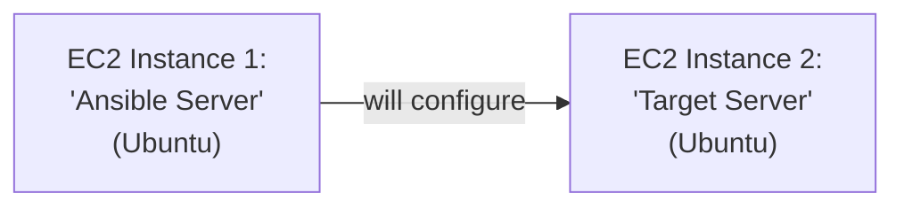

> 💡 **Memory Trick, the direct recommendation given:** *"If you're learning Ansible for the very first time, I'd definitely recommend starting with a Linux machine, not Windows or Mac — things will be much easier. But if you can't create a Linux EC2 instance for some reason, you can also try with your Mac or Windows."*

#### 🪜 Step-by-Step — Installing Ansible

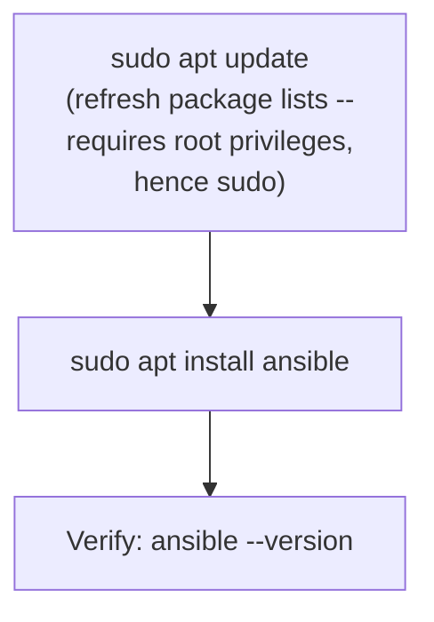

> 💡 **Memory Trick, the precise reasoning for preferring the package manager, given directly:** *"You can also install Ansible from the official Ansible docs, but that documentation is deliberately generic — it works by installing Python, then pip, then using pip to install Ansible, specifically because it needs to stay generic across Windows/Linux/Mac. The EASIEST way is your own package manager: `apt` on Ubuntu, `brew install ansible` on Mac, `choco install ansible` on Windows — because these are automatically added to your PATH, unlike the Python/pip route, which sometimes requires manually configuring PATH yourself."*

#### ⚠ Common Mistakes

* Following the official Ansible documentation's generic Python/pip installation path by default, even when a simpler, OS-specific package manager option is genuinely easier — explicitly, directly recommended against for beginners.

#### 🎯 Key Takeaways

* This session's practical setup uses **two EC2 instances**: an "Ansible server" (the control node) and a "target server" (what gets managed) — the minimum required to genuinely practice Ansible.
* **Package managers** (`apt`, `brew`, `choco`) are explicitly, directly recommended over the official documentation's more generic Python/pip installation path, specifically for PATH-configuration convenience.
* Installation is verified with **`ansible --version`**.

---

### 2. Setting Up Passwordless Authentication, From Scratch

#### ❓ Why It Exists

> 💡 **Memory Trick, directly reconnecting to Day 14's theory:** *"As I told you yesterday, the prerequisite for Ansible is passwordless authentication. If Ansible can authenticate without any password to a machine, Ansible can do anything to that server."*

#### 🪜 Step-by-Step — The Complete, Live Sequence

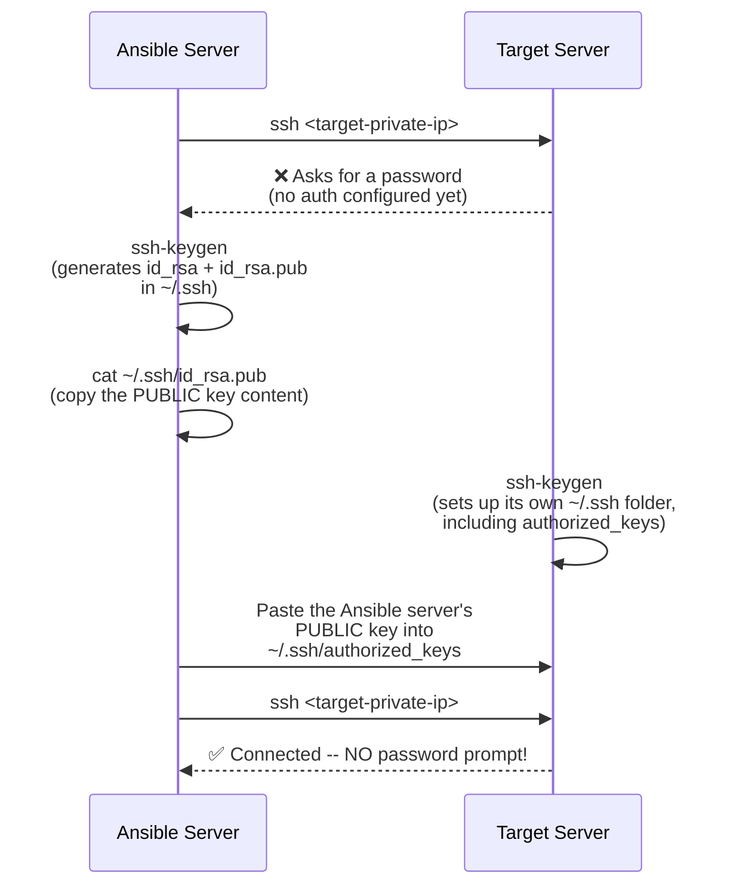

> 💡 **Memory Trick, the entire process summarized in one sentence, given directly:** *"If I have to explain it in one single line: I just copied the public key of the Ansible server to the authorized_keys of the target server."*

> ⚠️ **A direct, explicit clarification on which key to use:** *"Private key is used to log into your own machine, and private key is something you should NEVER share with anybody. What you share, when you want to communicate with another machine, is always the PUBLIC key."*

> 💡 **Memory Trick, a genuinely useful, direct networking tip:** *"Always talk to the PRIVATE IP address, because both instances are in the same VPC, both on AWS — using the private IP address makes this much easier and more appropriate than the public IP."*

#### 🔍 Internal Working — Scaling to Additional, Heterogeneous Servers

> 💡 **Memory Trick, given directly:** *"If you have one more server — say a CentOS server — you follow the exact same steps: you already have the public key, so you don't need to run `ssh-keygen` again. Just copy the SAME public key, SSH into the new CentOS server, open its `authorized_keys`, and paste the same public key there. Now the Ansible host can communicate with THAT server too, in a passwordless way."*

#### ⚠ Common Mistakes

* Using `ssh-copy-id` as the default recommended approach — explicitly, directly noted as having a real, practical drawback: *"`ssh-copy-id` is one way of doing it — but sometimes it doesn't have enough permissions to do it for you. That's why I'll show you a more straightforward, manual way instead."*
* Confusing the private and public keys when setting up authentication across servers — explicitly, directly clarified: only the public key is ever shared/copied to other machines.

#### 🎯 Key Takeaways

* Passwordless authentication is configured by copying the Ansible server's **public** key into the target server's **`~/.ssh/authorized_keys`** file — genuinely, live-proven by a successful, password-free SSH connection.
* This exact process is fully **reusable across any number of additional, even heterogeneous (e.g., CentOS) servers** — the same public key, copied into each new server's `authorized_keys`.
* This step (installing Ansible + configuring passwordless authentication) is explicitly framed as genuinely completing roughly **half** of the entire learning journey: *"Once you do these two things, we are almost 50% done — the rest is pretty easy."*

---
### 3. What Is an Ansible Playbook? A Simple, Familiar Analogy

#### 📖 Definition

> 💡 **Memory Trick, given directly:** *"In shell scripting, you write a file — you call that a shell script. In Python, you call them Python files. Similarly, in Ansible, instead of calling them 'Ansible files,' we usually call them PLAYBOOKS. That's it. Whenever somebody asks 'have you written any Ansible Playbooks?' — that means 'have you written any Ansible files?'"*

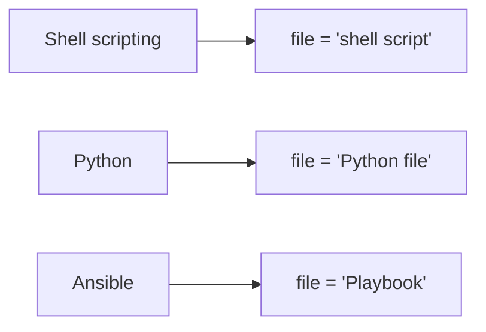

#### ❓ Why It Exists — But Is a Playbook Always Required?

> 💡 **Memory Trick, the precise, direct answer given:** *"Is it mandatory to always write Ansible Playbooks? No. Just like in shell — if you only need to list files, you'd simply run `ls -ltr` directly, not write a whole `script.sh` for it. Similarly with Python — you don't always write Python scripts for a single command. Ansible supports something similar."*

#### 🎯 Key Takeaways

* An **Ansible Playbook** is simply Ansible's own name for a file — genuinely no more mysterious than that, directly analogous to a shell script or a Python file.
* Playbooks are **not always required** — for simple, one-off tasks, a different mechanism (ad-hoc commands, covered next) is more appropriate, directly mirroring how you wouldn't write a full shell script just to run `ls -ltr` once.

---

### 4. Ansible Ad-Hoc Commands: For One or Two Tasks

#### 🧠 Concept — The Motivating Scenario

> 💡 **Memory Trick, the scenario given directly:** *"Let's say your team's requirement is: use Ansible to create some files on 100 target servers. Right now we just have one target server. This is a very simple task — for a task this simple, I don't want to write a whole Playbook. In Ansible terminology, running commands directly like this is called an ANSIBLE AD-HOC COMMAND."*

#### 💻 Code Example — The Ad-Hoc Command Syntax, Live

```bash
ansible -i <inventory-file> all -m shell -a "touch devops-class"
```

> 💡 **Memory Trick, each flag precisely explained, given directly:** *"`ansible` followed by `-i` and the inventory file location — the inventory file is just a file storing the IP addresses of your target servers. `all` means every server listed in the inventory file. `-m` stands for MODULE. `-a` stands for ARGUMENTS — what command you actually want to execute."*

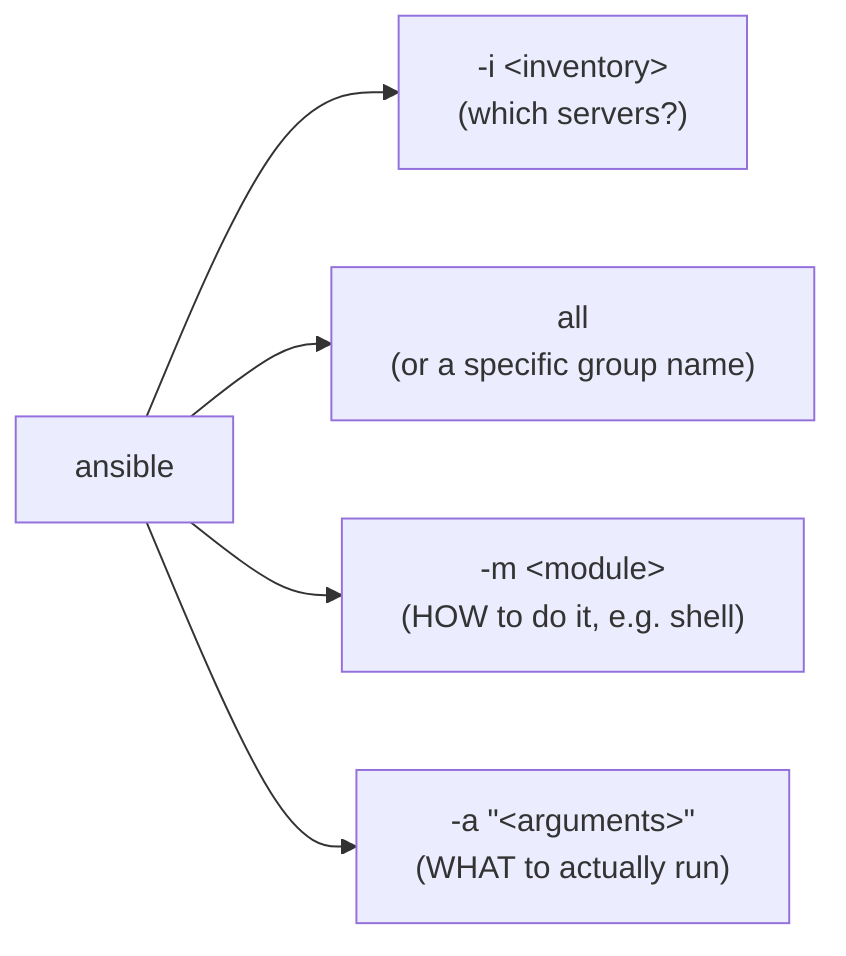

#### 🪜 Step-by-Step — Live Verification

> 💡 **Memory Trick, given directly:** *"Ansible said it 'changed' something, shown in a yellow line — that means success. If there were errors, you'd see red lines. Let's go to the target server and check: `ls -ltr` — and yes, `devops-class` was just created. So simple, right?"*

#### ❓ Why It Exists — The Explicit, Directly-Flagged Interview Question

> ⚠️ **Directly, explicitly flagged:** *"Many interviewers ask this exact question: what is the difference between Ansible ad-hoc commands and Ansible Playbooks? The answer: ad-hoc commands are for one or two tasks; Playbooks are for MULTIPLE tasks."*

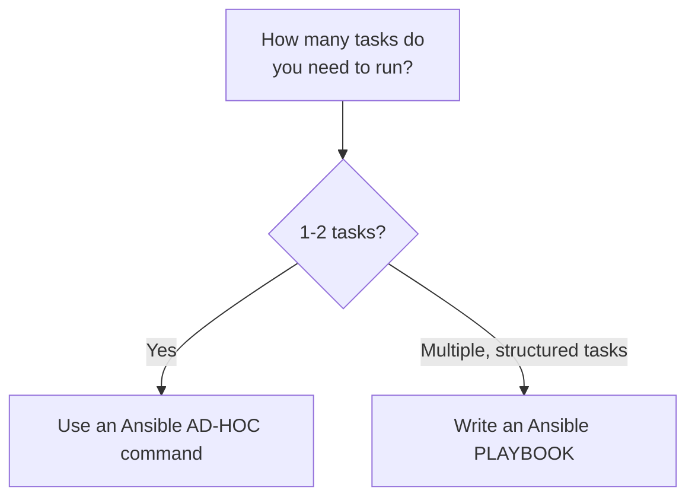

#### ⚠ Common Mistakes

* Writing a full Playbook for genuinely simple, one-off tasks — explicitly, directly critiqued: *"I have seen people writing Playbooks even for simple tasks."*

#### 🎯 Key Takeaways

* **Ansible ad-hoc commands** run a single task directly from the command line — no Playbook file required — genuinely appropriate for simple, one-off operations, even across many servers.
* The **`-i` / `all` / `-m` / `-a`** syntax structure is the core, memorable pattern behind every ad-hoc command.
* The **ad-hoc vs. Playbook distinction** (one/two tasks vs. multiple tasks) is explicitly, directly flagged as a classic, commonly-asked interview question.

---
### 5. Modules & the Inventory File: Grouping Servers

#### ❓ Why It Exists — Nobody Memorizes Every Module

> 💡 **Memory Trick, a genuinely reassuring, honest admission given directly:** *"How do you know what this module is called, or what arguments to pass? Don't worry — nobody knows everything, because there are THOUSANDS of modules in Ansible. Just open your browser and search for 'Ansible modules' — this is something EVERYBODY does. Ansible keeps updating its modules constantly, since there's so much community contribution happening every day."*

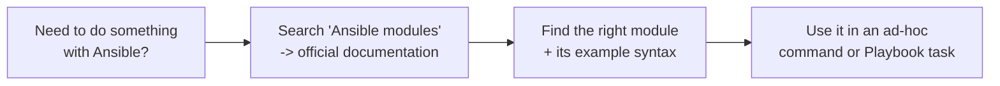

> 💡 **Memory Trick, more ad-hoc examples demonstrated live:** *"`nproc` via the shell module told me the target server has only 1 CPU. `df` via the shell module gave me disk usage information. You can also use dedicated modules — like `copy`, to copy files between servers — just look up the module's documented arguments (like `src`, `dest`) and use them directly."*

#### 📖 Definition — Grouping Servers in the Inventory File

> 💡 **Memory Trick, the scenario and syntax given directly:** *"Say you have DB servers and web servers, and you want to run certain Playbooks only on DB servers, and certain ones only on web servers. In your inventory file, you group your servers using bracket notation — for example, `[webservers]` on one line, followed by the IP addresses of your web servers underneath; `[dbservers]` similarly. The BRACKETS are very important."*

```text
[webservers]
172.31.62.100

[dbservers]
172.31.XX.XX
```

> 💡 **Memory Trick, how this changes your ad-hoc/Playbook target, given directly:** *"Instead of saying `all`, you can simply say `webservers` — Ansible will look into the inventory file, find the list of servers under that group name, and execute the command ONLY on that specific group — whether it's 1 server or 100."*

#### ❓ Why It Exists — Another Explicitly-Flagged Interview Question

> ⚠️ **Directly, explicitly flagged:** *"This is another interview question for you: how do you group servers in Ansible, or how can you execute certain tasks only on certain machines using Ansible? The answer: in Ansible, everything is configured in the inventory file — you group your servers there, and tell Ansible to execute a Playbook or command only on a specific group."*

#### ⚠ Common Mistakes

* Forgetting the bracket notation when defining server groups in the inventory file — explicitly, directly emphasized as important: *"The brackets are very important."*

#### 🎯 Key Takeaways

* Nobody is expected to memorize every Ansible module — checking the **official documentation** is presented as a completely normal, universal practice, not a sign of insufficient knowledge.
* The **inventory file** supports **grouping** servers under named categories (e.g., `[webservers]`, `[dbservers]`) using bracket notation — letting a single ad-hoc command or Playbook target a specific subset of infrastructure.
* This grouping capability is explicitly, directly flagged as another classic Ansible interview question.

---

### 6. Writing Your First Playbook: Install & Start Nginx

#### 🧠 Concept — The Task

> 💡 **Memory Trick, the scenario given directly:** *"Let's say the task is: install nginx, and start nginx. For this, since there's more than one task, we write a Playbook — called `first-playbook.yaml`, since Playbooks are written in YAML format."*

#### 🪜 Step-by-Step — Building the Playbook, Line by Line

```yaml
---
- name: Install and start nginx
  hosts: all
  become: yes

  tasks:
    - name: Install nginx
      apt:
        name: nginx
        state: present

    - name: Start nginx
      service:
        name: nginx
        state: started
```

> 💡 **Memory Trick, each line's purpose precisely explained, given directly:**
> - **`---`**: *"The three hyphens indicate this is a YAML file."*
> - **First `-` (before `name`)**: *"This hyphen indicates a LIST — you could write multiple Playbooks in one file; in our case, just one."*
> - **`hosts: all`**: *"Taken from the inventory file — `all` means every server listed there."*
> - **`become: yes`**: *"This executes the Playbook as the ROOT user."*
> - **`tasks:`**, each starting with `-`: *"Another list — this time, of tasks to perform, in order."*

#### ⚠ A Genuine, Live-Demonstrated Failure Motivating `become`

> ⚠️ **Directly, honestly reproduced live, to show WHY `become` is needed:** *"If I go to the target server and just try `apt install nginx` directly, it says: 'unable to acquire dpkg package lock' — because I'm not a root user. Normally, you'd prefix this with `sudo`. To do the equivalent in Ansible, you use `become` — this switches the execution user to root."*

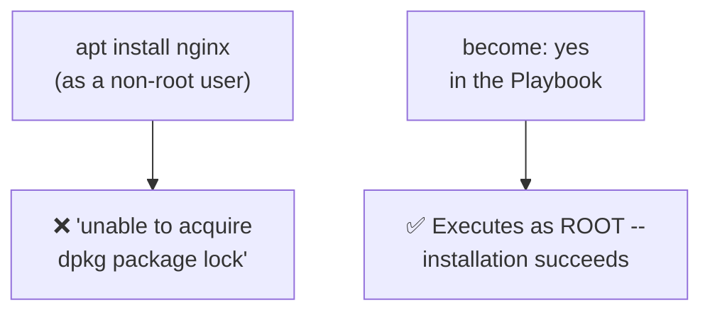

#### 🔍 Internal Working — Shell Module vs. Dedicated Modules (apt, service)

> 💡 **Memory Trick, the precise reasoning for preferring dedicated modules, given directly:** *"You COULD write `shell: apt install nginx` — that's equivalent. But Ansible provides a dedicated `apt` module: `name: nginx`, `state: present`. Why use the dedicated module instead of a raw shell command, if they do the same thing? To keep things more GENERIC — if you're writing shell commands, you might miss something, or the exact command might change over time. If you rely on the `apt` module (a proper package-manager module Ansible provides), things are more reliable, and even if underlying details change tomorrow, you can rely on Ansible's own module rather than a raw command."*

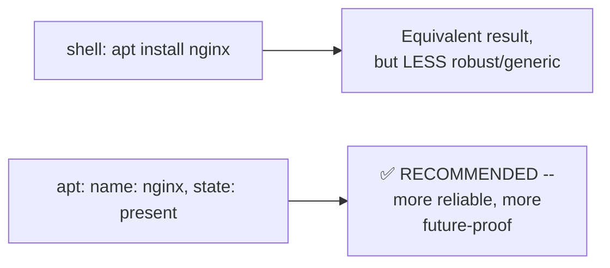

#### 💻 Code Example — The Second Task: Starting the Service

> 💡 **Memory Trick, given directly:** *"To start nginx, you could again use `shell: systemctl start nginx` — OR use Ansible's dedicated `service` module: `name: nginx`, `state: started`."*

#### ⚠ Common Mistakes

* Relying exclusively on raw `shell` commands within Playbook tasks, rather than dedicated modules (`apt`, `service`) where available — explicitly, directly discouraged as less robust and less future-proof.
* Forgetting `become: yes` when a task genuinely requires root privileges — explicitly, honestly demonstrated as a real, live failure the instructor deliberately reproduced.

#### 🎯 Key Takeaways

* A complete Playbook requires: the **`---`** YAML marker, a **`name`**, **`hosts`**, optionally **`become`** (for root-level tasks), and a **`tasks`** list.
* **`become: yes`** is Ansible's equivalent of prefixing a shell command with `sudo` — demonstrated as genuinely necessary via a real, live permission failure.
* **Dedicated modules** (like `apt` and `service`) are explicitly, directly preferred over raw `shell` commands for common operations — more robust and reliable than hand-written shell syntax.

---
### 7. Running the Playbook & Understanding Verbosity

#### 💻 Code Example — The Execution Command

```bash
ansible-playbook -i <inventory-file> first-playbook.yaml
```

> 💡 **Memory Trick, the precise distinction from ad-hoc commands, given directly:** *"The difference between `ansible` and `ansible-playbook` commands: `ansible` runs ad-hoc commands; `ansible-playbook` runs the Playbook FILES we've written."*

#### 🪜 Step-by-Step — Live Execution, Task by Task

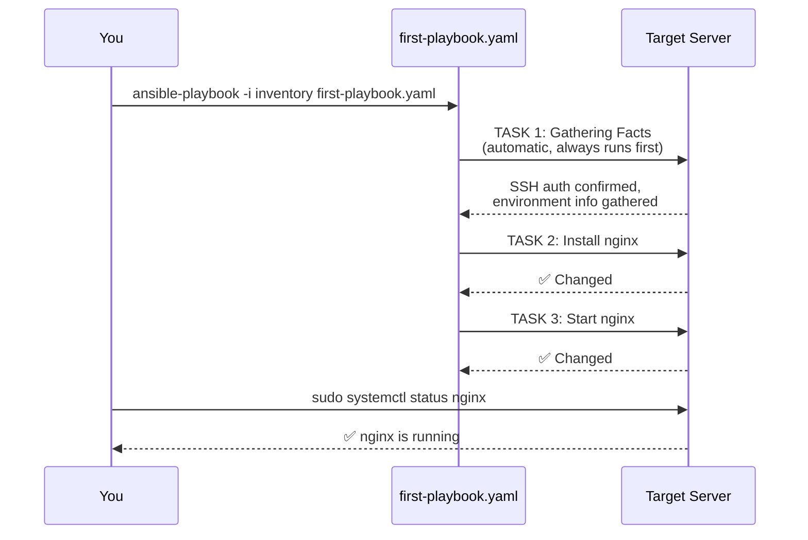

> 💡 **Memory Trick, "Gathering Facts" precisely explained, given directly:** *"'Gathering Facts' is the first task that ALWAYS gets executed, regardless of what Playbook you're running. Ansible tries to get all the information about your target server — checking whether it can authenticate without a password, and gathering other details it needs."*

#### 🔍 Internal Working — Verbosity Flags for Deeper Understanding

> 💡 **Memory Trick, given directly:** *"To really understand what Ansible is doing internally, add `-v` (or `-vv`, `-vvv` for even more detail — this only increases verbosity). Verbosity basically means DEBUG. With `-vvv`, Ansible prints everything it's doing, step by step: establishing the SSH connection, checking Python dependencies on the target, and giving you a JSON output showing exactly what changed — for example, that it installed a package called nginx using `apt`, without using `force`, and so on."*

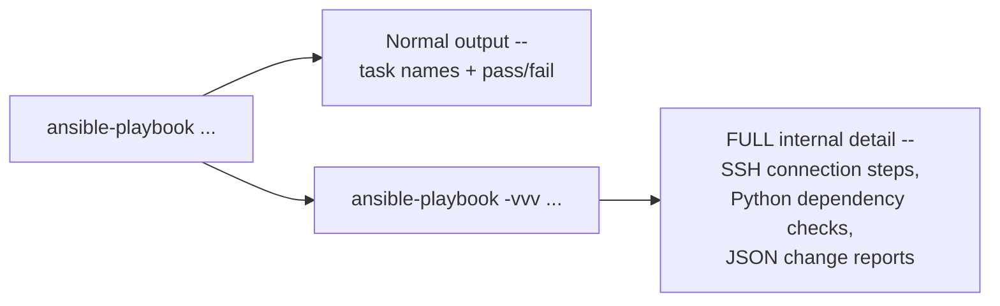

> 💡 **Memory Trick, the instructor's own personal learning story, given directly:** *"This is exactly what I did when I first started learning Ansible, because I also wanted to write my own Ansible modules — you need to understand what Ansible is doing internally for that. Use the verbose option to learn Ansible in a genuinely deeper way."*

#### ⚠ Common Mistakes

* Assuming Playbook success/failure output alone tells you everything meaningful about what happened — explicitly, directly encouraged to use verbosity flags for genuinely deeper, internal understanding, especially when learning or troubleshooting.

#### 🎯 Key Takeaways

* **`ansible-playbook`** (not `ansible`) is the command used to execute Playbook files — a precise, frequently-tested distinction.
* **"Gathering Facts"** automatically runs as the first task of every Playbook execution, regardless of the Playbook's actual content — checking authentication and collecting target-server information.
* **Verbosity flags** (`-v`, `-vv`, `-vvv`) reveal Ansible's full internal process — genuinely useful both for troubleshooting and for the kind of deep understanding needed to eventually write custom modules (directly connecting back to Day 14's Ansible Galaxy discussion).

---

### 8. Ansible Roles: Structuring Complex Playbooks

#### ❓ Why It Exists — A Genuinely Realistic, Larger Scenario

> 💡 **Memory Trick, the full, realistic scenario given directly:** *"Let's take a classic, real-world example: create three EC2 instances on AWS, configure one as a Kubernetes master, and configure the other two as workers. For creating the instances, DevOps engineers typically use TERRAFORM — a tool specifically designed for infrastructure creation. For the two configuration tasks (setting up master and worker nodes), you use ANSIBLE."*

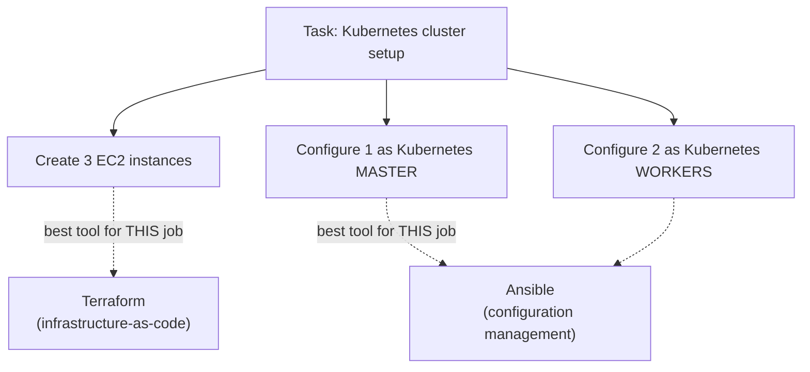

#### 🔍 Internal Working — The "Right Tool" Principle

> 💡 **Memory Trick, a genuinely useful analogy given directly:** *"Can't we create EC2 instances using Ansible too? Yes, we technically can. It's like buying movie tickets — you can do it through BookMyShow, or through Paytm. But you'd always go for the BEST option. In this case, that's Terraform — a tool specifically designed for infrastructure creation."*

#### ❓ Why It Exists — Why a Flat Playbook Doesn't Scale to This Complexity

> ⚠️ **A precise, directly-stated scaling problem:** *"If you want to configure both your Kubernetes control plane AND your data plane in one single `playbook.yaml`, your Playbook becomes HUGE — something like 50 to 60 tasks, with lots of variables, lots of configuration files, and errors to handle. Writing all of that in one flat file becomes genuinely impossible to read."*

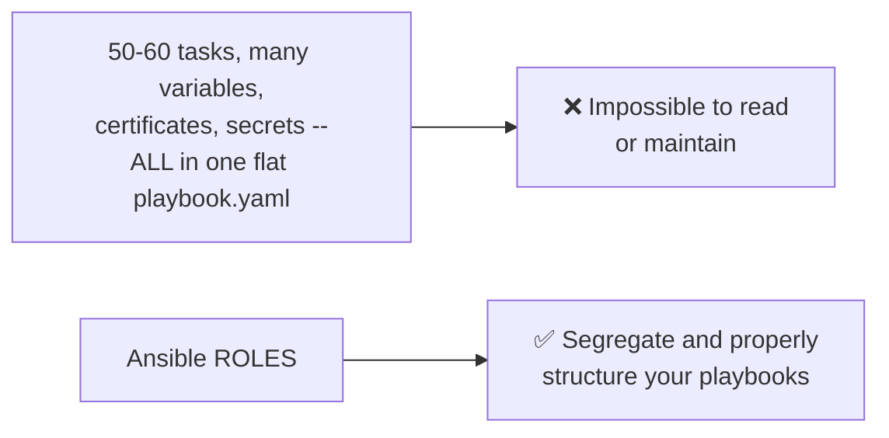

#### 💻 Code Example — Creating a Role

```bash
ansible-galaxy role init kubernetes
```

> 💡 **Memory Trick, given directly:** *"`ansible-galaxy role init` — `init` stands for initialize. This creates a folder (in our example, `kubernetes`) containing a bunch of pre-structured files and folders, which you then use to organize your Playbook logic."*

#### ⚠ Common Mistakes

* Assuming Ansible Roles are a fundamentally different tool from what's already been covered — explicitly, directly reframed: *"Ansible Roles is nothing but an EFFICIENT WAY of writing Ansible Playbooks that will only improve your efficiency to write complex playbooks" — not a separate concept, but a better organizational pattern for the exact same underlying Playbook logic.*

#### 🎯 Key Takeaways

* **Ansible Roles** exist specifically to structure genuinely large, complex Playbooks (many tasks, variables, and configuration files) that would be unreadable as one flat file.
* This session's real-world motivating example (Kubernetes cluster setup) is directly, explicitly used to illustrate the "right tool for the job" principle: **Terraform** for infrastructure creation, **Ansible** for configuration — a genuinely important, interview-relevant distinction.
* **`ansible-galaxy role init <name>`** is the command that scaffolds a new role's folder structure.

---
### 9. The Role Folder Structure, Explained Folder by Folder

#### 🔍 Internal Working — What `ansible-galaxy role init` Actually Generates

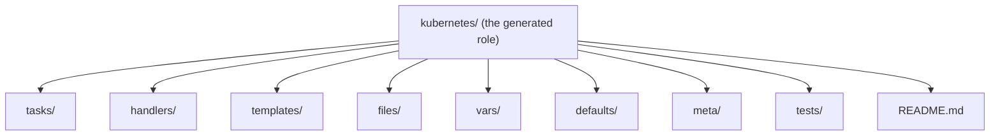

#### 📖 Definition — Each Folder, Precisely Explained

> 💡 **Memory Trick, each folder's purpose given directly, one at a time:**
> - **`meta/`**: *"Used to write metadata information — what this entire Playbook is doing, and licensing information, if you ever want to share it via Ansible Galaxy (e.g., 'I've written this for open-source purposes; commercial use is not allowed')."*
> - **`defaults/`** and **`vars/`**: *"Used to store variables — e.g., in `defaults/main.yaml`, you can store default variable values." (The precise distinction between the two is explicitly deferred to a separate interview-questions video.)*
> - **`tests/`**: *"Just like any other test you'd write for shell or Python scripts — unit-test-like content for your role."*
> - **`handlers/`**: *"Used for handling specific situations/exceptions — for example, if nginx fails to start, you could send a mail notification, or say there's no purpose keeping nginx installed if it can't start, so delete it too."*
> - **`tasks/`**: *"The actual task list — this is exactly the same content we previously wrote directly inside `playbook.yaml`, now organized within the role instead."*
> - **`README.md`**: *"Explains, for anyone viewing the repository, what this Playbook/role's content and purpose actually is."*
> - **`files/`**: *"For storing static files you want to copy elsewhere — e.g., an `index.html` file you want to pass/copy onto another machine via a task."*
> - **`templates/`**: *"For basic templating — Ansible uses Jinja2 templating; anything related to templates goes here."*

#### 🪜 Step-by-Step — How the Parent Playbook Changes When Using Roles

> 💡 **Memory Trick, the precise structural change given directly:** *"Previously, we wrote the Playbook's name, hosts, AND tasks all directly inside `playbook.yaml`. When using roles, the parent Playbook (often called `site.yaml`) just specifies the name and hosts — and says 'everything else, find it in the role.' All the actual task detail moves into the role's own `tasks/` folder instead."*

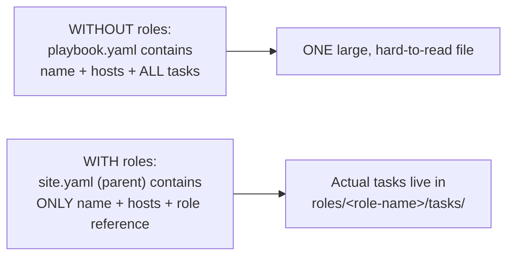

#### 🏢 Real-World / Production Usage — The Instructor's Own GitHub Repository

> 💡 **Memory Trick, given directly:** *"Writing this entire structure live in one session gets complicated, so I've put everything on my GitHub repository — I forked it from `ansible/ansible-examples`, but I'd recommend following MY repository specifically, since I keep actively updating it with more examples (e.g., a Kubernetes example isn't there yet, but I'll add it). There are real examples like JBoss Standalone you can follow — these are tested Playbooks; I've personally tested some of them myself."*

#### ⚠ Common Mistakes

* Assuming every folder in a newly-generated role is mandatory to use — explicitly, directly clarified: *"If you don't require some of these — say, you don't want a `README.md` or `defaults` — no worries, you can delete them."*

#### 🎯 Key Takeaways

* A generated role's folder structure — **`tasks`, `handlers`, `templates`, `files`, `vars`, `defaults`, `meta`, `tests`, `README.md`** — each serves a specific, distinct organizational purpose, precisely explained rather than left as an unexplained scaffold.
* Using roles shifts the parent Playbook (`site.yaml`) into a thin reference pointing to the role, with the actual task detail relegated to the role's own `tasks/` folder — directly solving the "50-60 tasks in one unreadable file" problem from Section 8.
* The instructor's own, **actively-maintained public GitHub repository** (forked from `ansible/ansible-examples`) is explicitly, directly recommended as the primary resource for continued, real, tested example practice.

---

## 📝 Glossary

| Term | Definition | Why It Matters |
|---|---|---|
| **Ansible Server** | The control node from which Ansible commands/Playbooks are run | Needs passwordless SSH access to every target server it manages |
| **Target Server** | A server being configured/managed by Ansible | Requires the Ansible server's public key in its `authorized_keys` |
| **Passwordless Authentication** | SSH access without needing to enter a password | The core Ansible prerequisite; set up via `ssh-keygen` + `authorized_keys` |
| **Playbook** | Ansible's term for a file containing one or more tasks, written in YAML | Directly analogous to a shell script or Python file |
| **Ansible Ad-Hoc Command** | A single Ansible task run directly from the command line, no Playbook file | Appropriate for 1-2 tasks; a classic interview distinction vs. Playbooks |
| **Module** | A specific, documented unit of functionality Ansible can execute (e.g., `shell`, `apt`, `service`, `copy`) | Nobody memorizes all of them; checking documentation is normal practice |
| **Inventory File** | The file listing (and optionally grouping) target servers' IP addresses/DNS names | Supports bracket-notation grouping, e.g., `[webservers]` |
| **`become`** | The Playbook keyword executing tasks as the root user | Ansible's equivalent of prefixing a shell command with `sudo` |
| **Gathering Facts** | The automatic first task of every Playbook execution | Confirms authentication and collects target-server information |
| **Verbosity (`-v`/`-vv`/`-vvv`)** | Flags revealing Ansible's internal execution detail | Genuinely useful for troubleshooting and deep learning |
| **Ansible Role** | A structured, folder-based way of organizing complex, multi-task Playbooks | Created via `ansible-galaxy role init <name>` |
| **`site.yaml`** | The thin, parent Playbook referencing a role, when roles are used | Contains only name/hosts; actual tasks live inside the role |

---

## 🔄 Revision Notes — One-Minute Revision

* This session is the full, hands-on delivery of Day 14's promised Ansible project — set up on two real Ubuntu EC2 instances (an "Ansible server" and a "target server").
* **Install Ansible** via the OS's own package manager (`sudo apt update && sudo apt install ansible`) — explicitly preferred over the official docs' more generic Python/pip route.
* **Passwordless authentication** is set up completely from scratch: `ssh-keygen` on the Ansible server, copy the PUBLIC key, paste it into the target server's `~/.ssh/authorized_keys` — live-proven by a genuinely password-free SSH connection; the same public key reuses across any additional (even heterogeneous) servers.
* A **Playbook** is simply Ansible's own term for a file — directly analogous to a shell script or Python file — and is **not always required**.
* **Ansible ad-hoc commands** (`ansible -i <inventory> all -m <module> -a "<args>"`) handle simple, 1-2 task jobs directly from the command line — explicitly, directly flagged as a classic interview distinction from Playbooks (multiple tasks).
* Nobody memorizes every Ansible **module** — checking the official documentation is completely normal practice.
* The **inventory file** supports grouping servers via bracket notation (`[webservers]`, `[dbservers]`) — another explicitly-flagged interview question about targeting specific server subsets.
* A complete **first Playbook** (installing and starting nginx) requires `---`, `name`, `hosts`, `become: yes` (Ansible's `sudo` equivalent, demonstrated as genuinely necessary via a real, live permission failure), and a `tasks` list — with dedicated modules (`apt`, `service`) explicitly preferred over raw `shell` commands for robustness.
* Run Playbooks with **`ansible-playbook`** (not `ansible`) — a precise, frequently-tested command distinction; **"Gathering Facts"** always runs automatically as the first task.
* **Verbosity flags** (`-v`/`-vv`/`-vvv`) reveal Ansible's full internal process (SSH connection steps, Python dependency checks, JSON change reports) — genuinely useful for both troubleshooting and deep learning.
* **Ansible Roles** (`ansible-galaxy role init <name>`) exist to structure genuinely large, complex Playbooks (illustrated via a realistic Kubernetes cluster setup: Terraform for instance creation, Ansible for configuration — "the right tool for the job") — with a full, precisely-explained folder structure (`tasks`, `handlers`, `templates`, `files`, `vars`, `defaults`, `meta`, `tests`, `README.md`).
* The instructor's own, **actively-maintained public GitHub repository** (forked from `ansible/ansible-examples`) and a **separate, dedicated "18 most-asked Ansible interview questions" video** are both explicitly pointed to for continued, real practice and deeper interview coverage.

---

## 📋 Cheat Sheet

**Install Ansible:**
```bash
sudo apt update
sudo apt install ansible
ansible --version
```

**Passwordless authentication setup:**
```bash
# On the Ansible server:
ssh-keygen
cat ~/.ssh/id_rsa.pub    # copy this PUBLIC key

# On the target server:
ssh-keygen               # sets up ~/.ssh/authorized_keys
vim ~/.ssh/authorized_keys    # paste the Ansible server's public key here

# Verify (from the Ansible server):
ssh <target-private-ip>    # should connect with NO password prompt
```

**Ad-hoc commands:**
```bash
ansible -i inventory all -m shell -a "touch devops-class"
ansible -i inventory all -m shell -a "nproc"
ansible -i inventory all -m shell -a "df"
ansible -i inventory webservers -m copy -a "src=... dest=..."
```

**Inventory file grouping:**
```text
[webservers]
172.31.62.100

[dbservers]
172.31.XX.XX
```

**First Playbook (`first-playbook.yaml`):**
```yaml
---
- name: Install and start nginx
  hosts: all
  become: yes

  tasks:
    - name: Install nginx
      apt:
        name: nginx
        state: present

    - name: Start nginx
      service:
        name: nginx
        state: started
```

**Running a Playbook:**
```bash
ansible-playbook -i inventory first-playbook.yaml
ansible-playbook -i inventory first-playbook.yaml -vvv    # full internal debug detail
```

**Creating a Role:**
```bash
ansible-galaxy role init kubernetes
```

**Role folder structure:**
```text
tasks/      -> the actual task list (moved out of the flat playbook.yaml)
handlers/   -> exception/failure handling (e.g. notify or cleanup on failure)
templates/  -> Jinja2 templates
files/      -> static files to copy (e.g. index.html)
vars/       -> variables
defaults/   -> default variable values
meta/       -> metadata + licensing info
tests/      -> unit-test-like content
README.md   -> documentation
```

---

## 🔥 Interview Questions & Answers

### 🟢 Beginner

**Q1.**

**Question:** What is the prerequisite for Ansible to be able to manage a server?

**Answer:** Passwordless authentication (SSH access without a password).

**Explanation:** Directly, explicitly stated and demonstrated live from scratch.

**Why Interviewers Ask This:** A foundational, essential Ansible operational requirement.

**Possible Follow-up:** "Walk through the exact steps to set up passwordless authentication."

**Q2.**

**Question:** What is an Ansible Playbook?

**Answer:** Ansible's own term for a file (written in YAML) containing one or more tasks -- directly analogous to a shell script or Python file.

**Explanation:** Directly, precisely defined via a familiar analogy.

**Why Interviewers Ask This:** Basic, foundational Ansible terminology.

**Possible Follow-up:** "Is a Playbook always required to run something with Ansible?"

**Q3.**

**Question:** What is the difference between an Ansible ad-hoc command and an Ansible Playbook?

**Answer:** Ad-hoc commands are for one or two simple tasks, run directly from the command line; Playbooks are for multiple, structured tasks.

**Explanation:** Directly, explicitly flagged as a classic interview question.

**Why Interviewers Ask This:** One of the most commonly-asked practical Ansible questions.

**Possible Follow-up:** "Write the ad-hoc command syntax to create a file on all servers."

**Q4.**

**Question:** What does `become: yes` do in a Playbook?

**Answer:** Executes the task(s) as the root user -- Ansible's equivalent of prefixing a shell command with `sudo`.

**Explanation:** Directly, precisely explained, and demonstrated as genuinely necessary via a real, live permission failure.

**Why Interviewers Ask This:** A practical, frequently-needed Playbook keyword.

**Possible Follow-up:** "What error would you see if a task requiring root access is run without `become`?"

**Q5.**

**Question:** What command is used to run a Playbook file, and how does it differ from the `ansible` command?

**Answer:** `ansible-playbook` runs Playbook files; `ansible` runs ad-hoc commands.

**Explanation:** Directly, precisely distinguished.

**Why Interviewers Ask This:** Basic, essential command-syntax knowledge.

**Possible Follow-up:** "What always runs as the first task of any Playbook execution, regardless of its content?"

**Q6.**

**Question:** How do you group servers in an Ansible inventory file, and why would you?

**Answer:** Using bracket notation (e.g., `[webservers]`, `[dbservers]`), so a Playbook or ad-hoc command can target only a specific subset of servers.

**Explanation:** Directly, explicitly flagged as a classic interview question.

**Why Interviewers Ask This:** Practical, commonly-needed inventory-management knowledge.

**Possible Follow-up:** "How would you target only the `webservers` group in an ad-hoc command?"

**Q7.**

**Question:** Why does the session recommend using the `apt` module instead of `shell: apt install nginx` for installing a package?

**Answer:** The dedicated module is more robust and future-proof -- raw shell commands can be missed or change over time, while Ansible's own modules are more reliable and generic.

**Explanation:** Directly, explicitly explained.

**Why Interviewers Ask This:** Tests practical, best-practice Playbook-writing knowledge.

**Possible Follow-up:** "Name the two arguments used with the `apt` module in this session's example."

**Q8.**

**Question:** What command creates a new Ansible Role, and what does it generate?

**Answer:** `ansible-galaxy role init <name>` -- generates a structured folder (tasks, handlers, templates, files, vars, defaults, meta, tests, README.md).

**Explanation:** Directly, precisely demonstrated.

**Why Interviewers Ask This:** Practical knowledge of Ansible's role-scaffolding tooling.

**Possible Follow-up:** "What problem do Ansible Roles specifically solve?"

**Q9.**

**Question:** In the Kubernetes cluster example, which tool is used to create the EC2 instances, and which tool configures them?

**Answer:** Terraform creates the EC2 instances; Ansible configures them (master/worker roles).

**Explanation:** Directly, explicitly explained via the "right tool for the job" principle.

**Why Interviewers Ask This:** Tests understanding of appropriate tool boundaries in a real DevOps toolchain.

**Possible Follow-up:** "Could you technically create EC2 instances using Ansible instead? Why might you not want to?"

**Q10.**

**Question:** What does the `handlers` folder in an Ansible Role do?

**Answer:** Handles specific situations/exceptions -- e.g., sending a notification or performing cleanup if a service fails to start.

**Explanation:** Directly, precisely explained.

**Why Interviewers Ask This:** Tests understanding of a role's specific folder purposes, not just their names.

**Possible Follow-up:** "Give an example of when you'd use a handler."

---

### 🟡 Intermediate

**Q11.**

**Question:** Explain why the instructor deliberately demonstrates a real permission failure (`apt install nginx` without root access) rather than simply stating "you need `become: yes`."

**Answer:** Demonstrating the actual failure live provides direct, concrete, undeniable evidence of WHY `become` is genuinely necessary -- rather than asking learners to simply trust an abstract rule, the session shows the precise error message ("unable to acquire dpkg package lock") that occurs without it, then shows the fix resolving that exact, specific problem. This directly mirrors this course's consistent, repeated pedagogical pattern (seen throughout Days 5, 7, 8, 11, and 12) of proving claims via live, reproducible demonstration rather than purely descriptive explanation -- a real error is more convincing and more memorable than an abstract warning.

**Explanation:** Requires connecting this specific demonstration to the course's broader, consistent teaching pattern.

**Why Interviewers Ask This:** Tests whether a learner recognizes deliberate, evidence-based teaching technique.

**Possible Follow-up:** "Name another session in this course where a real, live failure was deliberately demonstrated rather than just described."

**Q12.**

**Question:** A learner argues that since `shell: apt install nginx` and the dedicated `apt` module produce the "same result," there's no genuinely important reason to prefer one over the other. Evaluate this claim.

**Answer:** This claim isn't well-supported by the session's own reasoning. While the IMMEDIATE result may indeed be identical in a simple case, the session explicitly identifies a genuine, forward-looking robustness difference: raw shell commands are more likely to be "missed" or become outdated if underlying command syntax changes over time, while Ansible's own maintained modules (like `apt`) are actively kept current and reliable by Ansible's own development community. This is a genuine, if not always immediately visible, difference in LONG-TERM maintainability and reliability -- not a claim that the two approaches differ in their immediate, one-time output, but that they differ in how robustly they'll continue working correctly as underlying systems evolve.

**Explanation:** Tests whether a learner distinguishes "identical immediate result" from "identical long-term reliability," a genuinely important distinction the session's own reasoning implies.

**Why Interviewers Ask This:** Distinguishes candidates who understand WHY best practices matter beyond immediate correctness.

**Possible Follow-up:** "Give a hypothetical example of how a raw shell command might break in the future while a dedicated module wouldn't."

**Q13.**

**Question:** Explain, precisely, why "Gathering Facts" is described as running automatically as the FIRST task of EVERY Playbook, regardless of the Playbook's actual written content -- what would go wrong if this step were skipped?

**Answer:** Gathering Facts serves two genuinely necessary, foundational purposes before any actual task can safely run: (1) confirming Ansible CAN authenticate to the target server at all (verifying the passwordless authentication prerequisite from Section 2 is genuinely working for THIS specific execution, not just assumed to be configured correctly), and (2) collecting environment information Ansible's own modules may need to function correctly (e.g., what Python version/dependencies exist on the target, information the session's own verbosity demonstration explicitly reveals Ansible checking for). If this step were skipped, subsequent tasks might fail unpredictably or produce incorrect results, since Ansible would be attempting to execute modules without first confirming basic connectivity and environment compatibility -- Gathering Facts functions as a genuine, necessary pre-flight check, not a redundant or skippable formality.

**Explanation:** Requires reasoning through the specific, functional necessity of this automatic step, connecting it to both the authentication prerequisite (Section 2) and the verbosity demonstration's revealed internal detail (Section 7).

**Why Interviewers Ask This:** Tests deeper, mechanistic understanding of WHY this automatic step exists, not just recall that it does.

**Possible Follow-up:** "Is there a way to disable or skip Gathering Facts, and under what circumstance might you want to?"

**Q14.**

**Question:** Explain the precise relationship between this session's "50-60 tasks becomes unreadable" problem (Section 8) and the specific folder-by-folder structure Ansible Roles provide (Section 9) -- how does each individual folder specifically address part of this scaling problem?

**Answer:** Each folder addresses a SPECIFIC dimension of the "unreadable flat file" problem: **`tasks/`** directly solves the raw task-count readability problem by extracting the actual step-by-step logic out of the parent Playbook into its own, dedicated location. **`vars/`** and **`defaults/`** solve the "lots of variables" problem by giving variables a dedicated, organized home rather than being scattered inline throughout a massive task list. **`handlers/`** solves the "errors to handle" problem by giving exception/failure logic its own dedicated space, rather than interleaving error-handling logic directly within the main task flow. **`meta/`** and **`README.md`** solve a documentation/context problem the flat-file approach doesn't explicitly address at all -- providing dedicated space for explaining what the role does and its licensing, which a purely task-focused flat Playbook has no natural place for. Together, these folders don't just "organize" content arbitrarily -- each one addresses a SPECIFIC named difficulty the session itself identifies (tasks, variables, certificates/secrets implying config data, errors) as part of why a 50-60 task flat Playbook becomes unreadable.

**Explanation:** Requires precisely mapping each named difficulty from Section 8's problem statement onto the specific folder from Section 9 that addresses it -- genuine, granular synthesis rather than treating roles as generically "better organized."

**Why Interviewers Ask This:** Tests whether a learner understands roles' structure as a deliberate, mapped solution to specific sub-problems, not just a vague "more organized" improvement.

**Possible Follow-up:** "Which specific folder would you use to store a certificate file needed during a Kubernetes cluster setup?"

**Q15.**

**Question:** Synthesize this session's "right tool for the job" principle (Terraform for infrastructure, Ansible for configuration, Section 8) with Day 14's own configuration-management-specific reasoning to explain why this represents a GENERAL principle appearing multiple times across this course, not just a one-off observation about this specific example.

**Answer:** This exact "right tool for the job, even when multiple tools COULD technically do it" reasoning appears repeatedly across this course: Day 4's AWS CDK vs. Terraform vs. CLI decision (based on organizational cloud strategy), Day 13's AWS-native CI/CD vs. Jenkins decision (based on multi-cloud commitment), and now this session's Terraform-for-infrastructure vs. Ansible-for-configuration distinction (based on each tool's specific design purpose) -- all share the SAME underlying meta-principle: technical POSSIBILITY (a tool COULD theoretically accomplish a task) is explicitly, repeatedly distinguished from technical APPROPRIATENESS (whether that tool is the genuinely best-designed choice for that specific task), with the session's own "movie tickets via BookMyShow vs. Paytm" analogy making this distinction viscerally clear and memorable. This is a genuine, recurring DevOps decision-making pattern this course deliberately reinforces across multiple, genuinely different specific examples -- not a coincidence that the same reasoning shape appears again here.

**Explanation:** Requires recognizing a genuinely recurring meta-pattern across multiple, separately-taught sessions, synthesizing them into one identified, named principle -- deep, cross-course synthesis.

**Why Interviewers Ask This:** A senior-level question testing whether a candidate has internalized a genuinely transferable decision-making principle, rather than treating each session's specific tool-choice example as an isolated, unrelated fact.

**Possible Follow-up:** "Apply this same 'possibility vs. appropriateness' principle to a tool-choice scenario NOT explicitly covered in this course."

---

### 🔴 Advanced

**Q16.**

**Question:** Design a complete Ansible Role structure (referencing this session's exact folder-by-folder purposes) for a realistic, moderately complex task: deploying and configuring a web application that requires a specific configuration file (using a variable-driven port number), a static index.html file, and a notification if the application service fails to start.

**Answer:** A reasonable role structure, directly mapping this session's folder purposes onto the specific requirements: **`tasks/main.yaml`** -- the core step sequence: install the application, template the configuration file, copy the static index.html, start the service. **`templates/app_config.j2`** -- a Jinja2 template for the application's configuration file, referencing a variable (e.g., `{{ app_port }}`) for the port number, directly using the templating capability Section 9 identifies this folder for. **`files/index.html`** -- the static file, copied via a task using the `copy` module, directly matching Section 9's stated `files/` purpose. **`vars/main.yaml`** or **`defaults/main.yaml`** -- defining `app_port` (and any other configurable values), following Section 9's variable-storage guidance -- `defaults/` if you want this easily overridden by users of the role, `vars/` if it should remain fixed. **`handlers/main.yaml`** -- a handler specifically triggered if the service-start task fails, sending a notification (per Section 9's exact stated handler use case: "send some mail notifications... whenever this service is failing to start"). **`meta/main.yaml`** -- basic metadata about the role's author and purpose. **`README.md`** -- documenting the role's purpose and the `app_port` variable's meaning for future users. This design directly, precisely applies EVERY relevant folder from Section 9's structure to a genuinely realistic, moderately complex scenario, going beyond the session's own simpler nginx example.

**Explanation:** Synthesizes the complete role structure from Section 9 into a genuinely new, more complex applied scenario than the session's own nginx example -- real, extended application of the taught pattern.

**Why Interviewers Ask This:** A realistic, senior-level Ansible-architecture question testing whether a candidate can apply the complete role structure to a novel scenario, not just recite folder names.

**Possible Follow-up:** "Would you use `vars/` or `defaults/` for the `app_port` variable in this design, and why specifically?"

**Q17.**

**Question:** Critically evaluate: "Since this session states Ansible ad-hoc commands are appropriate for 'one or two tasks,' any task involving more than two individual Ansible module calls must always be written as a full Playbook." Is this an accurate, strict implication of this session's guidance?

**Answer:** Not strictly accurate as an absolute, rigid rule. The session's own stated guidance ("one or two tasks") is presented as a practical HEURISTIC or rule of thumb, not a strict, numerically-enforced boundary -- the underlying reasoning is about GENUINE SIMPLICITY and ONE-OFF NATURE of a task (directly mirroring the session's own shell-scripting analogy: you wouldn't write a full script for a single `ls -ltr`, but you also wouldn't necessarily avoid a script just because you need exactly THREE quick, unrelated one-off commands in immediate succession, if writing and maintaining a Playbook file for them would be genuinely disproportionate overhead). The MORE precise, accurate framing: ad-hoc commands are appropriate for genuinely simple, typically one-off tasks that don't warrant the overhead of creating and maintaining a Playbook file; Playbooks become appropriate specifically when tasks are STRUCTURED, REPEATED, or COMPLEX enough that maintaining them as a proper, version-controllable file provides genuine value -- the exact task COUNT (one, two, or three) is a helpful rough guideline illustrating this principle, not a strict, rigid numerical rule to be applied literally in every case.

**Explanation:** Tests whether a learner recognizes a stated practical heuristic as illustrative guidance rather than a strict, numerically-enforced rule, correctly identifying the deeper underlying principle (genuine simplicity/one-off nature vs. structured/repeated complexity).

**Why Interviewers Ask This:** Distinguishes candidates who understand the underlying REASONING behind a practical guideline from those who apply a stated example number as an unconditional, literal rule.

**Possible Follow-up:** "Describe a scenario with exactly three tasks where an ad-hoc-command-based approach might still be perfectly reasonable, despite exceeding the 'one or two' guideline."

**Q18.**

**Question:** Synthesize this session's passwordless authentication setup (Section 2) with its "agentless" architecture claim from Day 14 to explain precisely what SPECIFIC security responsibility shifts to the DevOps engineer as a direct consequence of Ansible's agentless design, that would NOT exist under Puppet's master-slave/agent model.

**Answer:** Under Ansible's agentless model, since there's no dedicated agent software enforcing authentication/authorization on each target server, the ENTIRE security boundary for "who can manage this server via Ansible" collapses down to a single point: whoever possesses the correct PRIVATE key corresponding to a public key present in that server's `authorized_keys` file (Section 2's exact demonstrated mechanism) can execute ANY Ansible task against it, with no additional, Ansible-specific authorization layer in between. Under Puppet's master-slave model (Day 14), by contrast, the dedicated master-agent architecture could theoretically provide an additional, separate layer of access control specifically for configuration-management actions, distinct from raw SSH access alone. This means the DevOps engineer using Ansible bears a genuinely HEIGHTENED specific responsibility for private-key security and `authorized_keys` file hygiene (directly connecting to Day 5's and Day 8's repeated warnings about `.pem`/private-key handling) -- since Ansible's own architecture provides NO additional access-control layer beyond whatever SSH-level key security discipline the engineer maintains themselves. This is a genuine, non-obvious security trade-off directly implied by combining Ansible's stated architectural simplicity (agentless, Section 2/Day 14) with the specific mechanism that simplicity relies on (raw SSH key-based access, with no additional Ansible-specific authorization layer).

**Explanation:** Requires connecting this session's concrete authentication mechanism to Day 14's abstract "agentless" architectural claim, deriving a genuinely non-obvious security implication neither session states directly.

**Why Interviewers Ask This:** A capstone-level security-architecture question testing whether a candidate can identify implicit trade-offs in a stated architectural simplification, connecting concrete mechanics to abstract claims across separate sessions.

**Possible Follow-up:** "What specific practice (from this session or elsewhere in this course) would you recommend to mitigate this heightened private-key-security responsibility?"

---

## 🧪 Scenario-Based Interview Questions

> **Scenario 1:** A teammate's Playbook execution fails during the "Gathering Facts" step, before any of their actual written tasks even begin. Using this session's concepts, diagnose this.

**Structured Answer:**
1. **Initial investigation:** Recognize that a failure at "Gathering Facts" -- the automatic, always-first step -- points to a foundational problem, likely BEFORE the actual Playbook logic is even relevant, per Section 7's explanation of what this step verifies.
2. **Metrics/logs to check:** Re-run with verbosity (`-vvv`, per Section 7) to see the exact point of failure -- likely revealing an SSH connection or authentication problem.
3. **Possible causes:** Most likely, per Section 2's exact setup process, passwordless authentication either was never correctly configured for this specific target server, or has since broken (e.g., the target server's `authorized_keys` file was modified or reset).
4. **Debugging approach:** Manually attempt a direct SSH connection (bypassing Ansible entirely) from the Ansible server to the target, confirming whether passwordless authentication genuinely still works outside of Ansible.
5. **Resolution:** If direct SSH also fails or requires a password, re-run through Section 2's exact setup process (verify the correct public key is present and correctly formatted in the target's `authorized_keys`).
6. **Prevention:** Document this exact "Gathering Facts failure = check authentication first" diagnostic heuristic in team troubleshooting guides, directly connecting the automatic first-task's purpose to its most likely failure cause.

> **Scenario 2 (Advanced):** Your organization's Kubernetes cluster setup Playbook has grown to over 40 tasks in one flat `playbook.yaml` file, and team members report it's becoming genuinely difficult to navigate and maintain. Using this session's concepts, propose a refactoring plan.

**Structured Answer:**
1. **Initial investigation:** Recognize this as a direct, real-world instance of exactly the problem Section 8 describes (the 50-60 task Kubernetes example) -- confirming this Playbook has crossed the threshold where flat-file organization genuinely breaks down.
2. **Relevant principle:** Per Section 9's folder-by-folder mapping (directly extended in Advanced Q16), each category of complexity (tasks, variables, error-handling, static files, templates) has a specific, dedicated home within the Ansible Roles structure.
3. **Possible causes for reaching this point:** The Playbook likely grew incrementally over time, with new tasks/variables added directly to the flat file each time, without ever pausing to restructure -- a common, realistic pattern this session's own scenario (Kubernetes master/worker configuration) directly anticipates.
4. **Debugging/evaluation approach:** Audit the current 40+ tasks, categorizing which are core configuration steps (→ `tasks/`), which involve variable/configurable values (→ `vars/`/`defaults/`), which involve error-handling logic (→ `handlers/`), and which involve static files or templated configuration (→ `files/`/`templates/`).
5. **Resolution:** Run `ansible-galaxy role init` to scaffold a proper role structure, then systematically migrate each categorized element from the flat Playbook into its correct, dedicated folder location, leaving only a thin `site.yaml` referencing the new role -- directly following Section 9's exact demonstrated restructuring pattern.
6. **Prevention:** Establish a team guideline (e.g., "once a Playbook exceeds roughly 10-15 tasks, or includes non-trivial variables/error-handling, migrate it to a role structure") to prevent Playbooks from reaching this same unmanageable 40+ task state again in the future.

---

## 🛠 Hands-on Exercises

### 🟢 Easy

1. Set up two Linux servers (EC2 instances or otherwise), install Ansible on one, and configure genuine passwordless authentication between them, following this session's exact process.
2. Run at least three different Ansible ad-hoc commands (creating a file, checking CPU count, checking disk usage) against your target server.
3. Write and successfully run this session's exact first Playbook (install and start nginx), verifying the result with `systemctl status nginx`.

### 🟡 Medium

4. Reproduce this session's exact `become` failure demonstration: attempt an installation task without `become: yes`, document the exact error, then fix it.
5. Re-run your Playbook from Exercise 3 with `-vvv` verbosity, and document at least three specific internal steps you observe that weren't visible in the normal output.
6. Set up a grouped inventory file (e.g., `[webservers]` and `[dbservers]`), and run an ad-hoc command targeting only one specific group.

### 🔴 Advanced

7. Implement the complete role structure proposed in Advanced Interview Q16 (a web application deployment with templated config, static files, and failure-notification handlers), for a real or hypothetical application of your own choosing.
8. Perform the refactoring plan proposed in Scenario 2 on a hypothetical large, flat Playbook of your own design (at least 20 tasks), migrating it into a properly-structured role.
9. Research (outside this transcript) the actual, precise difference between `vars/` and `defaults/` in an Ansible Role (explicitly deferred in this session to a separate interview-questions video), and document what you find.

---

## 🏗 Practice Assignment

*(This session's own stated recommendation, reproduced faithfully, with structure added)*

> 💡 **Memory Trick -- the instructor's own words, given directly:** *"Get acquainted with Ansible ad-hoc commands, write your first Ansible Playbook, and get familiar with setting up passwordless authentication. After that, go to the roles concept and implement Ansible Roles -- for that, you can pick any example from my GitHub repository. Best start with JBoss Standalone."*

### Build: "Complete Ansible Fundamentals Portfolio"

**Objective:** Complete this session's own stated recommended practice sequence end to end, culminating in implementing a real example role from the instructor's GitHub repository.

**Requirements:**
- Genuine, working passwordless authentication set up between your own Ansible server and at least one target server.
- At least three successfully-executed Ansible ad-hoc commands, documented with their output.
- A complete, successfully-executed first Playbook (your own choice of task, not necessarily nginx), following this session's exact structural pattern (`---`, `name`, `hosts`, `become`, `tasks`).
- The **JBoss Standalone** example role (or another example of your choosing) from the instructor's GitHub repository, successfully cloned and executed against your own target server.
- A written reflection (200-300 words) comparing your experience writing a flat Playbook (Exercise 3-equivalent) versus using an existing, role-structured example (the JBoss Standalone role) -- specifically addressing readability and maintainability, per Section 8-9's stated reasoning.

**Architecture (suggested):**

```text
ansible_fundamentals_portfolio/
├── passwordless_auth_setup.md      # documented setup steps + verification
├── adhoc_commands_log.md             # your 3+ ad-hoc commands + output
├── first_playbook.yaml                 # your own complete first Playbook
├── jboss_standalone_execution.md         # documented execution of the GitHub example role
└── REFLECTION.md                           # flat Playbook vs. role structure comparison
```

**Expected Functionality:**
- Your passwordless authentication should be genuinely, verifiably working (a real SSH connection with no password prompt).
- Your first Playbook should genuinely install and configure something real and verifiable (not just an empty test task).
- The JBoss Standalone role execution should be a genuine, real run against your own infrastructure, not just a read-through of the code.

**Challenges:**
- Correctly setting up passwordless authentication if you haven't done so before -- a genuinely common first-time sticking point.
- Successfully cloning and correctly configuring the instructor's GitHub example role against your own specific target server's IP address/inventory.

**Bonus Improvements:**
- Extend your first Playbook into a full role structure yourself, following Section 9's exact folder-by-folder pattern.
- Explore and document at least one additional example role from the instructor's GitHub repository, beyond JBoss Standalone.

---

## 📚 Additional Resources

- The instructor's **Day 0 through Day 14 videos** (referenced directly) -- required prior viewing for full context, especially Day 14 (Configuration Management theory).
- The **DevOps Zero to Hero playlist** -- referenced directly, containing all videos in this same free course.
- **Official Ansible documentation** -- directly browsed live for module reference, explicitly recommended as a normal, everyday practice ("nobody knows everything").
- The instructor's own **actively-maintained public GitHub repository** (forked from `ansible/ansible-examples`) -- containing real, tested example Playbooks and roles (e.g., JBoss Standalone), explicitly recommended over the parent repository since the instructor continues adding new examples.
- A **separate, previously-published "18 most-asked Ansible interview questions" video** on the instructor's channel (referenced directly) -- explicitly covering roles, handlers, and scenario-based questions in more depth than this session directly addresses.

---

## 📌 Final Revision Sheet

### ⭐ Core Concepts
- **Passwordless authentication** (public key in `authorized_keys`) is Ansible's core prerequisite -- set up completely from scratch and live-proven.
- A **Playbook** is simply Ansible's own term for a file -- not always required; **ad-hoc commands** handle simple, 1-2 task jobs directly.
- **`become: yes`** is Ansible's `sudo` equivalent -- demonstrated as genuinely necessary via a real, live permission failure.
- Dedicated **modules** (`apt`, `service`) are preferred over raw `shell` commands for robustness.
- **`ansible-playbook`** runs Playbooks; **`ansible`** runs ad-hoc commands -- "Gathering Facts" always runs first, automatically.
- **Ansible Roles** structure genuinely complex Playbooks -- each folder (`tasks`, `handlers`, `templates`, `files`, `vars`, `defaults`, `meta`, `tests`) addresses a specific, named organizational need.
- **Terraform for infrastructure creation, Ansible for configuration** -- the "right tool for the job" principle, recurring throughout this course.

### ⭐ Important Definitions
- **Gathering Facts**, **verbosity flags**, **`site.yaml`** (see Glossary for full definitions).

### ⭐ Important Commands/Code
```bash
sudo apt update && sudo apt install ansible
ssh-keygen
ansible -i inventory all -m shell -a "touch devops-class"
ansible-playbook -i inventory first-playbook.yaml -vvv
ansible-galaxy role init kubernetes
```

### ⭐ Architecture/Process
- Setup flow: install Ansible → configure passwordless auth → (optionally) run ad-hoc commands → write and run a Playbook → (for complex cases) restructure into a Role.
- Role structure: parent `site.yaml` (name + hosts + role reference) → role's own `tasks/`, `handlers/`, `templates/`, `files/`, `vars/`, `defaults/`, `meta/`, `tests/`, `README.md`.

### ⭐ Best Practices
- Use your OS's package manager to install Ansible, not the generic Python/pip route, for beginners.
- Use ad-hoc commands for simple, one-off tasks; reserve Playbooks for structured, multi-task work.
- Prefer dedicated modules (`apt`, `service`) over raw `shell` commands where available.
- Migrate large, flat Playbooks (roughly 10-15+ tasks, or with non-trivial variables/error-handling) into a proper Role structure.
- Use verbosity flags for genuine troubleshooting and deep learning, not just when something visibly fails.

### ⭐ Common Mistakes
- Writing a full Playbook for genuinely simple, one-off tasks.
- Confusing private and public keys during passwordless authentication setup.
- Relying on raw shell commands when a more robust, dedicated module exists.
- Forgetting `become: yes` for tasks genuinely requiring root privileges.
- Assuming every folder in a generated role is mandatory to use.

### ⭐ Interview Points
- Be ready to explain the ad-hoc-vs-Playbook distinction precisely (1-2 tasks vs. multiple).
- Be ready to walk through passwordless authentication setup from memory.
- Be ready to explain each role folder's specific purpose, not just its name.
- Be ready to explain the Terraform-vs-Ansible "right tool for the job" distinction with a concrete example.

### ⭐ Things to Remember
- This session is the **full, hands-on delivery** of Day 14's promised project -- genuinely lengthy, exactly as the instructor warned viewers in advance.
- The precise distinction between `vars/` and `defaults/` in a role is **explicitly deferred** to the separate, dedicated Ansible interview-questions video -- not fully covered in this session.
- The instructor's own GitHub repository is **actively, ongoingly updated** (e.g., a Kubernetes example was explicitly stated as not yet present but planned) -- worth revisiting periodically, not treated as a static, one-time resource.

---

## 🔗 Source

- [Ansible](https://youtu.be/Z6T2r3Xhk5k?si=r7e5wowFQoWULtpw)