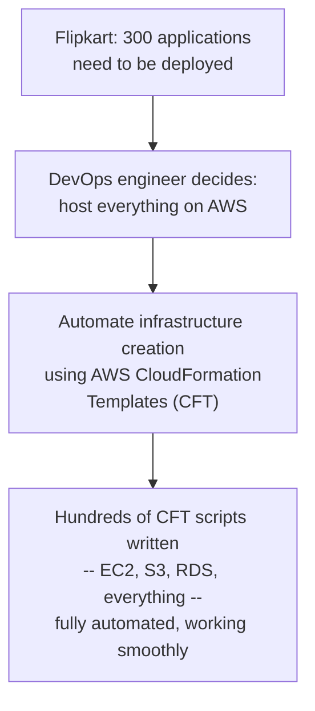
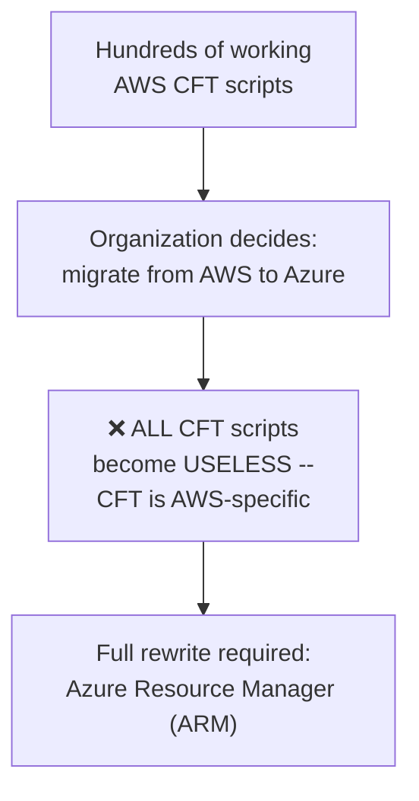
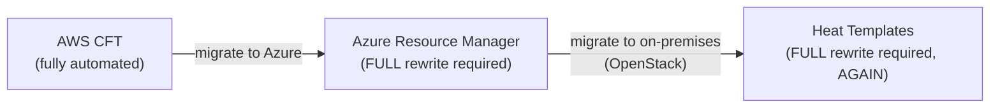
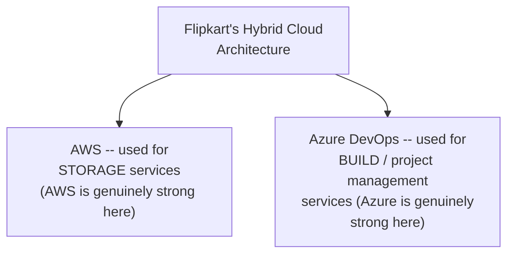
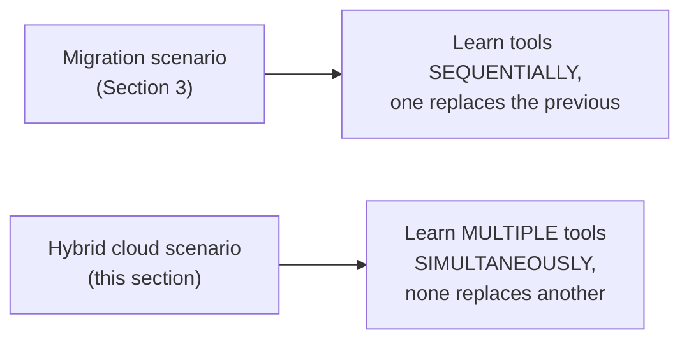
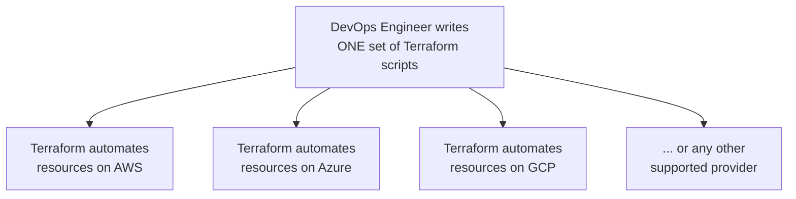
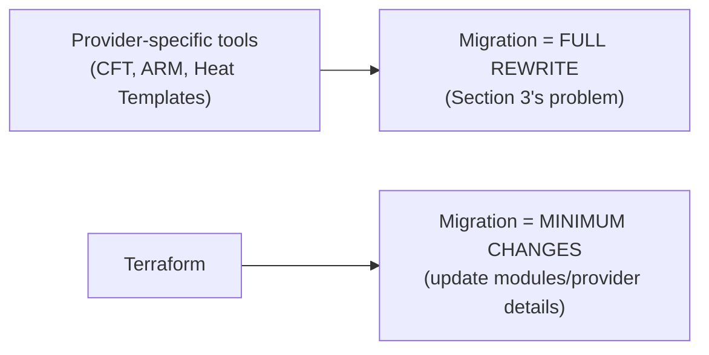
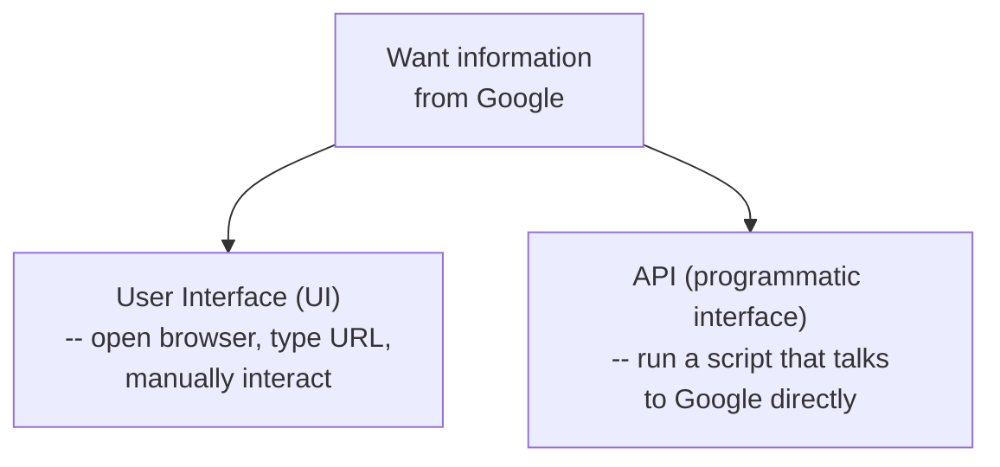
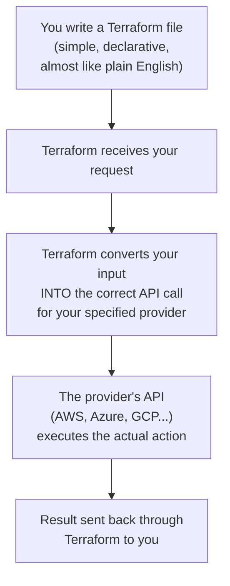
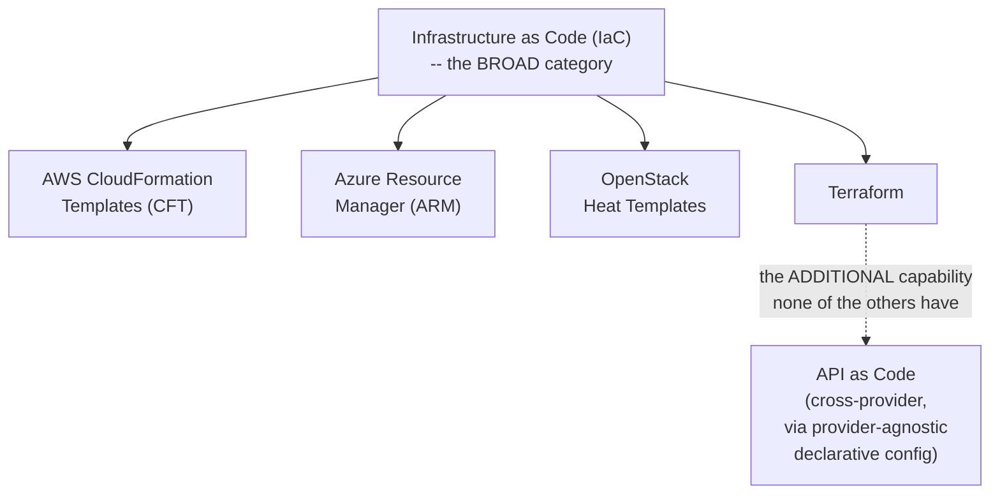

# 🏗 Infrastructure as Code & "API as Code": Why Terraform Exists

- <i>**Session:** DevOps Zero to Hero — Day 16: "Infrastructure as Code" · 
- *Instructor:** Abhishek
- **Note on scope:** This session is explicitly, deliberately **theory-only** — a genuine precursor to a full, live Terraform project promised for the very next day (installation, creating real EC2 instances, and more). The entire session builds toward one core concept: **"API as Code"** — the specific mechanism that lets Terraform solve a problem provider-specific Infrastructure as Code tools (AWS CFT, Azure Resource Manager, OpenStack Heat Templates) genuinely cannot solve on their own. A separate, dedicated video on Dynamic Inventory is explicitly promised in response to viewer requests from Day 15, not delivered in this session.</i>

---

## 📑 Table of Contents

1. [Session Overview](#-session-overview)
2. [Learning Objectives](#-learning-objectives)
3. [Detailed Notes](#-detailed-notes)
   - [1. A Quick Note: The Promised Dynamic Inventory Video](#1-a-quick-note-the-promised-dynamic-inventory-video)
   - [2. The Core Scenario: Automating Infrastructure on One Cloud Provider](#2-the-core-scenario-automating-infrastructure-on-one-cloud-provider)
   - [3. The Real Problem: What Happens When You Migrate Cloud Providers](#3-the-real-problem-what-happens-when-you-migrate-cloud-providers)
   - [4. A Second, Compounding Problem: Hybrid Cloud Architecture](#4-a-second-compounding-problem-hybrid-cloud-architecture)
   - [5. The Solution: Terraform — One Tool Instead of Hundreds](#5-the-solution-terraform--one-tool-instead-of-hundreds)
   - [6. What Is an API? Revisited From First Principles](#6-what-is-an-api-revisited-from-first-principles)
   - [7. How Terraform Actually Uses "API as Code"](#7-how-terraform-actually-uses-api-as-code)
   - [8. Infrastructure as Code vs. Terraform: The Precise, Final Distinction](#8-infrastructure-as-code-vs-terraform-the-precise-final-distinction)
4. [Glossary](#-glossary)
5. [Revision Notes — One-Minute Revision](#-revision-notes--one-minute-revision)
6. [Cheat Sheet](#-cheat-sheet)
7. [Interview Questions & Answers](#-interview-questions--answers)
8. [Scenario-Based Interview Questions](#-scenario-based-interview-questions)
9. [Hands-on Exercises](#-hands-on-exercises)
10. [Practice Assignment](#-practice-assignment)
11. [Additional Resources](#-additional-resources)
12. [Final Revision Sheet](#-final-revision-sheet)

---

## 🎯 Session Overview

This session builds the case for Terraform from first principles — not by describing Terraform's features, but by walking through the genuine, real pain a DevOps engineer experiences without it. It covers:

1. **A worked, realistic scenario**: a DevOps engineer at a fictional "Flipkart," fully automating AWS infrastructure using AWS CloudFormation Templates (CFT) — everything working smoothly, until a business decision changes everything.
2. **The real migration problem**: when the organization decides to move from AWS to Azure (dissatisfaction with support or cost), every single CFT script becomes worthless — CFT is AWS-specific — requiring a full, painful rewrite using Azure Resource Manager (ARM). The same thing happens AGAIN when the organization later decides to move to on-premises infrastructure using OpenStack, requiring yet another full rewrite using Heat Templates.
3. **A second, compounding problem**: hybrid cloud architecture — organizations often deliberately split infrastructure across multiple providers simultaneously (e.g., AWS for storage, Azure for DevOps tooling), based on each provider's genuine relative strengths, meaning a DevOps engineer must learn MULTIPLE provider-specific tools at once, not just sequentially over time.
4. **Terraform, introduced as the direct solution**: developed by HashiCorp, explicitly pitched as "learn ONE tool instead of hundreds" — with migration between providers requiring only "minimum changes," not a full rewrite.
5. **A first-principles re-explanation of what an API actually is** — revisited specifically because, per the instructor's own account, many viewers asked this exact question after a similar explanation in a prior class.
6. **Precisely how Terraform's "API as Code" mechanism works**: Terraform translates your simple, declarative Terraform configuration into the correct API calls for whichever provider you've specified — you never write raw API calls yourself.
7. A **precise, final distinction**: Infrastructure as Code (IaC) is the broad category (CFT, ARM, Heat Templates, and Terraform all fall under it); Terraform is a SPECIFIC IaC tool distinguished by its additional "API as Code" capability — the specific mechanism solving the cross-provider migration and hybrid-cloud problems this session builds toward.

> 💡 **Memory Trick — the instructor's own stated structure for this session:** *"First of all, we need to understand what the problem is — then we'll see the use cases, and finally we'll try to understand what the solution is."*

---

## 🎯 Learning Objectives

By the end of this guide, you will be able to:

- [ ] Explain, using the Flipkart/AWS/CFT scenario, why provider-specific Infrastructure as Code tools become a genuine liability during a cloud migration.
- [ ] Name the three provider-specific IaC tools mentioned (AWS CFT, Azure Resource Manager, OpenStack Heat Templates), and correctly match each to its provider.
- [ ] Explain what hybrid cloud architecture is, and why it compounds the "too many tools" problem beyond a simple, one-time migration scenario.
- [ ] Explain Terraform's core value proposition: solving the "learn one tool, not hundreds" problem, with only minimal changes required when migrating between providers.
- [ ] Define an API from first principles, distinguishing a user interface (browser-based) from a programmatic interface.
- [ ] Explain precisely how Terraform uses "API as Code" — what it does internally when you run a Terraform configuration.
- [ ] Precisely distinguish Infrastructure as Code (the broad category) from Terraform (a specific tool within that category with an additional capability).

---

## 📚 Detailed Notes

### 1. A Quick Note: The Promised Dynamic Inventory Video

#### 🧠 Concept

> 💡 **Memory Trick, given directly at the start of the session:** *"I know a few of you have doubts with respect to Dynamic Inventory — that's something we didn't fully cover in the previous class. With your request, what I've decided is: I'll make a completely dedicated video on Dynamic Inventory, and I'll make sure all your doubts are cleared."*

#### 🎯 Key Takeaways

* A **dedicated, standalone Dynamic Inventory video** is explicitly promised, directly in response to genuine viewer feedback from Day 15 — not delivered within this session itself.
* This is a real, concrete example of this course's consistent, feedback-responsive teaching pattern (also seen in Day 8's "Take Two" re-recording) — worth remembering as a genuine, ongoing thread rather than a fully-closed topic.

---

### 2. The Core Scenario: Automating Infrastructure on One Cloud Provider

#### 🧠 Concept — The Full, Worked Scenario

> 💡 **Memory Trick, the complete scenario given directly:** *"Say you're a DevOps engineer working for an organization called Flipkart. Flipkart has, say, 300 applications to deploy — and compute resources (CPU, RAM, hardware) can be created on any cloud platform, or on-premises. As a DevOps engineer, you evaluate all the options and decide: Flipkart will host all of their infrastructure on AWS."*



#### 🏢 Real-World / Production Usage — The Payoff of This Automation

> 💡 **Memory Trick, given directly:** *"Any developer who comes to you and says 'I want EC2 instances' — you say, 'yes, using CFT, I already wrote the script, I just need to execute it' — and you get 10 EC2 instances in no time. You wrote hundreds of scripts, they're all stabilized, and your work is going pretty well. You don't have any problems... yet."*

#### 🎯 Key Takeaways

* This scenario establishes the **genuine, positive baseline**: a fully automated, working, AWS-specific infrastructure setup using AWS CFT — a real, functional solution, not a strawman.
* Everything described in this section directly reinforces content from prior sessions (Days 4, 5, 13) — AWS CFT as one of several native AWS automation options.
* The deliberate setup here is important: this scenario is genuinely GOOD and working — which makes the next section's disruption land with real, felt weight.

---

### 3. The Real Problem: What Happens When You Migrate Cloud Providers

#### ❓ Why It Exists — The First Disruption

> ⚠️ **Directly, precisely stated:** *"All of a sudden, your management says: we were using AWS till today, but we're not happy with AWS's support, or the costing AWS is giving us — so we've decided to shift from AWS to Microsoft Azure. Now all those hundreds of scripts you wrote are of NO USE. If a developer comes to you and says 'I need 10 virtual machines on Azure,' you can't say 'use CFT' — CFT is very specific to AWS."*



#### 🔍 Internal Working — The Cycle Repeats, Illustrating a Genuine Pattern

> ⚠️ **Directly, precisely stated, the SECOND disruption:** *"Now let's say your organization says: we moved to Azure, but we're not even happy with Azure — the support isn't good, or the costing. This time, we want to move to on-premises — maintain our own infrastructure. So you purchase your own servers, install OpenStack on top to create your own private cloud. But now you have to migrate ALL those scripts AGAIN — this time to Heat Templates, which is how OpenStack automates its own processes."*



#### ⚠ Common Mistakes

* Assuming a single cloud migration is a rare, one-time event unlikely to genuinely happen — explicitly, directly demonstrated via this session's own TWO-migration scenario (AWS → Azure → OpenStack), showing this can genuinely repeat.

#### 🎯 Key Takeaways

* **AWS CFT, Azure Resource Manager (ARM), and OpenStack Heat Templates** are each genuinely provider-SPECIFIC Infrastructure as Code tools — automation written for one is completely unusable for another.
* This session's own scenario deliberately demonstrates this problem occurring **TWICE** (AWS→Azure, then Azure→on-premises) — reinforcing that this isn't a rare, one-off risk but a genuine, repeatable pattern organizations can face.
* This entire section directly, precisely establishes the CORE PROBLEM this session's later Terraform solution addresses — a genuine, felt pain point, not an abstract concern.

---
### 4. A Second, Compounding Problem: Hybrid Cloud Architecture

#### 📖 Definition

> 💡 **Memory Trick, given directly:** *"These days, what companies usually do is operate in a hybrid cloud model. Hybrid cloud is a way of hosting PART of your infrastructure on AWS and PART on Azure — simultaneously, not sequentially like the migration scenario."*



#### 🏢 Real-World / Production Usage — Why Organizations Deliberately Choose Hybrid Cloud

> 💡 **Memory Trick, the precise reasoning given directly:** *"This happens because, say, AWS is giving you good support/offers specifically for storage services — so you use AWS for storage. But for DevOps-related, build-related, or project-management-related services, you want to use Azure DevOps, because Azure is genuinely good at that. Your organization deliberately chooses this hybrid architecture — using each provider for what it's genuinely best at."*

#### ❓ Why It Exists — Why This Is a GENUINELY Different, Compounding Problem

> ⚠️ **A precise, directly-stated distinction from the migration scenario:** *"As a DevOps engineer, in a hybrid cloud scenario, you need to learn BOTH AWS CFT (for AWS) AND Azure Resource Manager (for Azure) — SIMULTANEOUSLY, not sequentially. And this problem can vary team to team, even within the same organization — there might be secure services where you use neither AWS nor Azure, but on-premises instead, requiring yet another tool. This problem can grow leaps and bounds — there can be hundreds of cloud providers. As a DevOps engineer, which one do you learn?"*



#### ⚠ Common Mistakes

* Assuming the migration problem (Section 3) and the hybrid-cloud problem (this section) are the same underlying issue — explicitly, directly distinguished: one is about tools becoming obsolete SEQUENTIALLY over time; the other is about needing MULTIPLE tools SIMULTANEOUSLY, compounding rather than replacing the learning burden.

#### 🎯 Key Takeaways

* **Hybrid cloud** deliberately splits infrastructure across multiple providers SIMULTANEOUSLY, based on each provider's genuine relative strengths — a real, common, deliberate organizational architecture choice, not an accident or mistake.
* This creates a genuinely DIFFERENT (and arguably worse) version of the "too many tools" problem than the migration scenario — requiring simultaneous, ongoing fluency in multiple provider-specific tools, not a one-time, sequential rewrite.
* Together, Sections 3 and 4 establish the **complete, two-part problem** Terraform is introduced to solve: sequential migration pain AND simultaneous multi-provider complexity.

---

### 5. The Solution: Terraform — One Tool Instead of Hundreds

#### 📖 Definition

> 💡 **Memory Trick, given directly:** *"To solve this problem — learning too many things — Terraform came. Terraform is a tool developed by HashiCorp. HashiCorp came ahead and said: DevOps engineers, don't learn hundreds of tools — just learn ONE tool, and that tool is called Terraform."*



#### 🔍 Internal Working — How Migration Actually Works WITH Terraform

> 💡 **Memory Trick, the precise, directly-stated claim given:** *"You might ask: isn't the problem still the same — don't you still need to modify your Terraform scripts to migrate providers? The answer: with Terraform, migration is MUCH smoother. If your organization decides to migrate from AWS to Azure, you need to make only MINIMUM changes — like updating some modules, or updating the provider details — and you can migrate relatively easily."*



#### ⚠ Common Mistakes

* Assuming Terraform completely eliminates any need to make changes when migrating providers — explicitly, directly clarified: Terraform makes migration SIGNIFICANTLY smoother/minimal, not entirely change-free.
* Assuming Terraform is presented as a perfect, flawless solution — explicitly, directly noted by the instructor: *"Will Terraform solve ALL your problems? Not necessarily — there are some genuine problems with Terraform too, which I'll cover in future videos (and have already covered in a separate video on my channel)."*

#### 🎯 Key Takeaways

* **Terraform**, developed by **HashiCorp**, exists specifically to solve the "learn too many provider-specific tools" problem established in Sections 3-4 — its core pitch is "learn ONE tool, not hundreds."
* Migrating providers with Terraform requires only **minimum changes** (module updates, provider details) — a genuinely smoother experience than a full rewrite, though not entirely change-free.
* The instructor explicitly, honestly notes Terraform has its own genuine limitations, deliberately avoiding an overly one-sided endorsement — directly consistent with this course's established pattern of balanced tool evaluation (e.g., Day 14's honest Ansible disadvantages).

---
### 6. What Is an API? Revisited From First Principles

#### ❓ Why It Exists — A Deliberate Re-Explanation

> 💡 **Memory Trick, the instructor's own honest reason for revisiting this, given directly:** *"When I explained a similar concept in the last class, many people were asking me what an API is — many people did not understand it. So let me take a moment and explain."*

#### 📖 Definition — The Google Example

> 💡 **Memory Trick, given directly:** *"API is nothing but Application [Programming] Interface — using an API, you can talk to any application and get a response back. Take a basic example: you want information from Google. Usually, you open your laptop, open your browser, type www.google.com — you send a request, get a browser page back, and search for information there. This is a USER INTERFACE — a way you manually do things."*



#### 🔍 Internal Working — Why Programmatic Access Matters

> 💡 **Memory Trick, given directly:** *"Whenever you want to automate things, or do things programmatically, the UI way isn't suitable — you don't want to manually log in, open a browser, and click through flows every time. Instead, you want to run a script that talks to Google directly, executes the action, and sends you the result. Developers (Google, GitHub, or any application) have come up with the concept of an API specifically for this — GitHub tells you: instead of manually logging in and going through the UI flow, open your terminal, use a curl request or an HTTP GET request, talk to my API, and get whatever information you want."*

#### ⚠ Common Mistakes

* Assuming API and UI access provide fundamentally different INFORMATION — explicitly, directly clarified: both provide access to the SAME underlying information/functionality; the difference is purely in the ACCESS METHOD (manual/visual vs. programmatic).

#### 🎯 Key Takeaways

* An **API** is precisely the programmatic alternative to a manual, browser-based user interface — the SAME underlying information/action, accessed differently.
* This exact explanation directly reinforces content first established in Day 8's GitHub API project — a genuine, deliberate repetition, explicitly triggered by real, documented viewer confusion after a prior class.
* This foundational understanding is the **direct prerequisite** for understanding Terraform's "API as Code" mechanism, covered next.

---

### 7. How Terraform Actually Uses "API as Code"

#### 📖 Definition

> 💡 **Memory Trick, given directly:** *"Terraform uses this exact same API concept. AWS has its own API. Azure has its own API. Instead of developers directly talking to these APIs — which would require knowing a programming language, and sometimes making complex POST calls to CREATE resources, not just simple GET requests — Terraform actively looks at these APIs and has written its own modules for you."*



#### 🔍 Internal Working — The `provider.tf` Mechanism

> 💡 **Memory Trick, given directly:** *"In a file called `provider.tf`, you specify that your provider is AWS. Once you write your Terraform module (say, for creating an EC2 instance), Terraform converts that script into an API request AWS can actually understand, executes the action, and gives you the result back."*

#### ❓ Why It Exists — Why This Matters for the User

> 💡 **Memory Trick, the precise value proposition given directly:** *"As a user, you are NOT directly talking to the APIs of AWS or Azure. You are writing Terraform scripts, and Terraform is converting your request into the actual API calls, behind the scenes."*

#### ⚠ Common Mistakes

* Assuming Terraform requires the user to understand or write raw API calls themselves — explicitly, directly clarified: this is precisely what Terraform abstracts AWAY from the user, via its own declarative scripting layer.

#### 🎯 Key Takeaways

* **"API as Code"** is the precise, named mechanism enabling Terraform's cross-provider capability: Terraform internally converts your simple, declarative Terraform configuration into the correct, provider-specific API call — you never write raw API calls yourself.
* The **`provider.tf`** file is where you specify which cloud provider (AWS, Azure, GCP, etc.) your Terraform configuration targets — directly determining which API Terraform ultimately talks to.
* This is the SPECIFIC, precise mechanism explaining WHY migrating providers with Terraform requires only minimal changes (Section 5) — you're changing the PROVIDER specification and possibly some module details, not rewriting raw, provider-specific API-calling logic from scratch.

---

### 8. Infrastructure as Code vs. Terraform: The Precise, Final Distinction

#### 📖 Definition — The Session's Closing, Precise Summary

> 💡 **Memory Trick, given directly, as the session's own explicit closing distinction:** *"Infrastructure as Code (IaC) is a concept using which you can automate your infrastructure — it can be anything: CloudFormation Templates, Azure Resource Manager, anything. ALL of these fall into the category of Infrastructure as Code. Terraform is a concept that solves the PROBLEMS of these tools — Terraform also works on the same underlying concept of Infrastructure as Code, but Terraform has ADVANCED CAPABILITIES called API as Code."*



#### ⚠ Common Mistakes

* Treating "Infrastructure as Code" and "Terraform" as synonyms — explicitly, precisely corrected: IaC is the broad category; Terraform is one specific tool within that category, distinguished by its additional API-as-Code capability that provider-specific tools (CFT, ARM, Heat Templates) genuinely lack.

#### 🎯 Key Takeaways

* **Infrastructure as Code (IaC)** is the broad category encompassing ANY tool that automates infrastructure via code — including CFT, ARM, Heat Templates, AND Terraform itself.
* **Terraform** is a SPECIFIC IaC tool, distinguished by its "API as Code" capability — the specific mechanism enabling genuine cross-provider automation that provider-specific IaC tools cannot offer.
* This precise distinction is the session's own explicit, deliberate closing summary — a genuinely important, frequently-tested interview distinction, worth remembering in these exact, precise terms.

---
## 📝 Glossary

| Term | Definition | Why It Matters |
|---|---|---|
| **Infrastructure as Code (IaC)** | The broad category of tools/concepts for automating infrastructure via code | Includes CFT, ARM, Heat Templates, AND Terraform |
| **AWS CloudFormation Templates (CFT)** | AWS's own, provider-specific IaC tool | Becomes worthless if an organization migrates away from AWS |
| **Azure Resource Manager (ARM)** | Azure's own, provider-specific IaC tool | The tool an organization must rewrite scripts into when migrating to Azure |
| **OpenStack Heat Templates** | OpenStack's own, provider-specific IaC tool | Used for automating on-premises infrastructure built on OpenStack |
| **Hybrid Cloud** | Deliberately splitting infrastructure across multiple providers simultaneously | Compounds the "too many tools" problem beyond simple migration |
| **Terraform** | HashiCorp's cross-provider Infrastructure as Code tool | Solves the "learn one tool, not hundreds" problem via API as Code |
| **HashiCorp** | The company that develops Terraform | Directly credited as Terraform's creator |
| **API as Code** | The specific mechanism letting Terraform convert declarative config into any provider's API calls | The precise capability distinguishing Terraform from provider-specific IaC tools |
| **API (Application [Programming] Interface)** | Programmatic access to an application, as opposed to a browser-based UI | The foundational concept underlying "API as Code" |
| **`provider.tf`** | The Terraform file specifying which cloud provider a configuration targets | Determines which specific API Terraform ultimately calls |

---

## 🔄 Revision Notes — One-Minute Revision

* A dedicated **Dynamic Inventory video** is explicitly promised, in direct response to genuine Day 15 viewer feedback — not delivered within this session.
* The core scenario: a DevOps engineer at "Flipkart" fully automates AWS infrastructure using **AWS CloudFormation Templates (CFT)** — hundreds of working scripts, everything running smoothly.
* **The real problem**: when the organization migrates from AWS to Azure, ALL those CFT scripts become worthless (CFT is AWS-specific), requiring a full rewrite using **Azure Resource Manager (ARM)** — and the SAME thing happens again when later migrating to on-premises OpenStack, requiring yet another full rewrite using **Heat Templates**.
* **A second, compounding problem**: **hybrid cloud** architecture — organizations deliberately split infrastructure across multiple providers SIMULTANEOUSLY (e.g., AWS for storage, Azure for DevOps tooling), based on each provider's genuine relative strengths, requiring a DevOps engineer to learn MULTIPLE tools at once, not just sequentially.
* **Terraform** (by **HashiCorp**) is introduced as the direct solution: "learn ONE tool, not hundreds" — migrating providers with Terraform requires only MINIMUM changes (updating modules/provider details), not a full rewrite — though the instructor honestly notes Terraform has its own genuine limitations too.
* **What is an API?** — revisited from first principles specifically because many viewers asked after a similar explanation in a prior class: an API is the programmatic alternative to a manual, browser-based user interface (the Google/browser vs. script/curl example) — same underlying information, different access method.
* **"API as Code"** is Terraform's precise, named mechanism: you write simple, declarative Terraform configuration; Terraform internally converts it into the correct API call for whichever provider you've specified (via `provider.tf`) — you never write raw API calls yourself.
* The session's own **precise, final distinction**: **Infrastructure as Code (IaC)** is the BROAD category (CFT, ARM, Heat Templates, AND Terraform all fall under it); **Terraform** is a SPECIFIC IaC tool distinguished by its additional "API as Code" capability — a genuinely important, frequently-tested interview distinction.
* **Tomorrow's session** (explicitly previewed): a full, live Terraform project — installation, creating real EC2 instances, and more.

---

## 📋 Cheat Sheet

**The migration problem, in one line:**
```text
AWS CFT -> migrate to Azure -> FULL REWRITE (Azure Resource Manager)
       -> migrate to on-premises -> FULL REWRITE AGAIN (OpenStack Heat Templates)
```

**The hybrid cloud problem, in one line:**
```text
AWS (storage) + Azure DevOps (build/PM) -- used SIMULTANEOUSLY
-> DevOps engineer must learn BOTH tools at once, not sequentially
```

**Terraform's core pitch:**
```text
Instead of: learn CFT + ARM + Heat Templates + ... (hundreds of tools)
Just learn: Terraform (ONE tool) -- migration = minimum changes, not a full rewrite
```

**API vs. UI:**
```text
UI  -> browser, manual interaction (e.g. google.com)
API -> programmatic interaction (e.g. curl / HTTP request)
      -- SAME underlying info, DIFFERENT access method
```

**How Terraform's "API as Code" works:**
```text
You write: simple, declarative Terraform config (provider.tf + resource files)
Terraform: converts it INTO the correct API call for your specified provider
Provider:  executes the actual action, sends the result back
```

**IaC vs. Terraform (the precise, final distinction):**
```text
Infrastructure as Code (IaC) -> the BROAD category
   (includes: CFT, ARM, Heat Templates, Terraform)
Terraform -> a SPECIFIC IaC tool, PLUS "API as Code"
   (the cross-provider capability the others lack)
```

---

## 🔥 Interview Questions & Answers

### 🟢 Beginner

**Q1.**

**Question:** What is Infrastructure as Code (IaC)?

**Answer:** The broad category/concept of automating infrastructure via code -- includes tools like AWS CFT, Azure Resource Manager, OpenStack Heat Templates, and Terraform.

**Explanation:** Directly, precisely defined as the session's own closing summary.

**Why Interviewers Ask This:** A foundational, frequently-asked DevOps term.

**Possible Follow-up:** "Name three specific IaC tools mentioned in this session."

**Q2.**

**Question:** Why does migrating from AWS to Azure break an organization's existing AWS CloudFormation Template (CFT) scripts?

**Answer:** CFT is a provider-specific tool, built only for AWS -- it has no ability to automate resources on any other cloud provider.

**Explanation:** Directly, explicitly demonstrated via this session's own worked scenario.

**Why Interviewers Ask This:** Tests understanding of the genuine, real-world risk provider-specific tooling creates.

**Possible Follow-up:** "What tool would the organization need to rewrite these scripts into for Azure?"

**Q3.**

**Question:** What is hybrid cloud, and why does it create a genuinely different problem than a simple cloud migration?

**Answer:** Hybrid cloud deliberately splits infrastructure across multiple providers SIMULTANEOUSLY (e.g., AWS for storage, Azure for DevOps tooling); unlike migration (learning tools sequentially, one replacing another), hybrid cloud requires learning MULTIPLE tools at once.

**Explanation:** Directly, precisely explained and distinguished from the migration scenario.

**Why Interviewers Ask This:** Tests understanding of a real, common, deliberate organizational architecture choice.

**Possible Follow-up:** "Give a real example of why an organization might deliberately choose hybrid cloud."

**Q4.**

**Question:** Who developed Terraform?

**Answer:** HashiCorp.

**Explanation:** Directly, explicitly stated.

**Why Interviewers Ask This:** Basic, foundational Terraform knowledge.

**Possible Follow-up:** "What is Terraform's core value proposition, in one sentence?"

**Q5.**

**Question:** Does Terraform completely eliminate the need to make any changes when migrating between cloud providers?

**Answer:** No -- Terraform requires only MINIMUM changes (e.g., updating modules or provider details), not zero changes.

**Explanation:** Directly, explicitly clarified, avoiding overstatement.

**Why Interviewers Ask This:** Tests whether a candidate has a precise, non-overstated understanding of Terraform's actual capability.

**Possible Follow-up:** "What specifically would you need to change in a Terraform configuration when migrating providers?"

**Q6.**

**Question:** What is an API, in simple terms?

**Answer:** A programmatic alternative to a manual, browser-based user interface -- the same underlying information/action, accessed differently.

**Explanation:** Directly, precisely defined via the Google/browser example.

**Why Interviewers Ask This:** A foundational, frequently-tested term across multiple DevOps contexts.

**Possible Follow-up:** "Give an example of a UI-based way and an API-based way of accessing the same information."

**Q7.**

**Question:** What does "API as Code" mean, specifically in the context of Terraform?

**Answer:** Terraform converts your simple, declarative configuration into the correct API call for your specified cloud provider, internally -- you never write raw API calls yourself.

**Explanation:** Directly, precisely defined.

**Why Interviewers Ask This:** The core, defining concept of this entire session.

**Possible Follow-up:** "What file specifies which provider a Terraform configuration targets?"

**Q8.**

**Question:** What is the precise difference between Infrastructure as Code and Terraform?

**Answer:** IaC is the broad category (including CFT, ARM, Heat Templates, and Terraform); Terraform is a specific IaC tool distinguished by its additional API-as-Code, cross-provider capability.

**Explanation:** Directly, explicitly stated as the session's own closing distinction.

**Why Interviewers Ask This:** A classic, precisely-testable interview distinction.

**Possible Follow-up:** "Is AWS CFT also 'Infrastructure as Code'? Why or why not?"

**Q9.**

**Question:** Name the three provider-specific IaC tools mentioned in this session, and their corresponding providers.

**Answer:** AWS CloudFormation Templates (AWS), Azure Resource Manager (Azure), and Heat Templates (OpenStack).

**Explanation:** Directly, explicitly named and matched.

**Why Interviewers Ask This:** Tests recall of the specific, real tooling landscape.

**Possible Follow-up:** "Which of these three is used for on-premises infrastructure specifically?"

**Q10.**

**Question:** In Terraform, what determines which cloud provider's API a configuration ultimately talks to?

**Answer:** The `provider.tf` file, where the provider is explicitly specified.

**Explanation:** Directly, precisely explained.

**Why Interviewers Ask This:** Basic, practical Terraform configuration knowledge.

**Possible Follow-up:** "What would you need to change in `provider.tf` to migrate a configuration from AWS to Azure?"

---

### 🟡 Intermediate

**Q11.**

**Question:** Explain why the instructor deliberately demonstrates the migration problem occurring TWICE (AWS to Azure, then Azure to on-premises) rather than just once.

**Answer:** A single migration example might read as a rare, unlikely, one-off scenario -- demonstrating it happening TWICE, in sequence, within the same organization's story, makes the underlying pattern (genuine, repeatable vulnerability to changing business decisions) far more convincing and memorable than a single, isolated example could. This directly mirrors this course's broader, consistent pedagogical pattern of using real or realistic, sufficiently detailed scenarios (rather than abstract, single-instance claims) to make points landing with genuine weight -- the repetition itself is the persuasive device, not incidental detail.

**Explanation:** Requires recognizing a deliberate rhetorical/pedagogical choice and its intended effect.

**Why Interviewers Ask This:** Tests whether a learner recognizes deliberate narrative structure as a teaching technique, not just recalls the plot of the example.

**Possible Follow-up:** "How might a THIRD migration (e.g., moving back from OpenStack to a new cloud provider) further reinforce this same point?"

**Q12.**

**Question:** A learner argues that since Terraform still requires "minimum changes" when migrating providers, it doesn't genuinely solve the migration problem at all -- it's just a smaller version of the same problem. Evaluate this claim.

**Answer:** This claim overstates the case, missing a genuine, important difference in DEGREE that the session's own reasoning establishes. The original problem (Section 3) was a FULL REWRITE -- every single script, from scratch, in an entirely new tool's syntax and paradigm. Terraform's "minimum changes" (Section 5) means updating specific, bounded elements (module references, provider details) WITHIN the same underlying tool and syntax -- a fundamentally smaller, more contained scope of change, not merely a "smaller version of the same full-rewrite problem." The claim that Terraform "doesn't genuinely solve" the problem conflates "reduces a problem substantially" with "doesn't address it at all" -- a real, meaningful distinction, even though Terraform's solution is genuinely not "zero effort required."

**Explanation:** Tests whether a learner distinguishes "substantially reduced but not eliminated" from "not genuinely solved," a meaningful practical distinction.

**Why Interviewers Ask This:** Tests nuanced evaluation of a genuine, partial (not absolute) solution's real value.

**Possible Follow-up:** "Quantify, as best you can from this session's own language, roughly how much smaller Terraform's migration effort is compared to a full CFT-to-ARM rewrite."

**Q13.**

**Question:** Explain, precisely, why the instructor chooses to re-explain "what is an API" in this session, rather than assuming prior knowledge from Day 8's earlier, more detailed API coverage.

**Answer:** The instructor explicitly, honestly states this re-explanation is triggered by REAL, DOCUMENTED viewer confusion after a similar explanation in a prior class -- not an assumption that all viewers lack this knowledge, nor a decision made in the abstract. This reflects the same feedback-responsive teaching pattern seen elsewhere in this course (Day 8's "Take Two" re-recording, the promised Dynamic Inventory video from this same session's opening) -- a genuine, evidence-based decision to close a real, observed comprehension gap, rather than either assuming universal understanding or redundantly re-explaining everything regardless of actual need.

**Explanation:** Requires connecting this specific re-explanation to the course's broader, consistent, feedback-driven teaching pattern, correctly identifying it as evidence-based rather than assumption-based.

**Why Interviewers Ask This:** Tests recognition of deliberate, responsive pedagogical decision-making.

**Possible Follow-up:** "What specific prior session in this course covered APIs in the MOST technical depth, before this session's re-explanation?"

**Q14.**

**Question:** Using this session's `provider.tf` explanation, walk through precisely what would and would NOT need to change in a Terraform configuration when migrating a simple EC2-instance-creation setup from AWS to Azure.

**Answer:** What WOULD need to change: the `provider.tf` file itself (specifying Azure instead of AWS), and likely the specific RESOURCE BLOCK/module used to define the virtual machine (since AWS's EC2 resource type and Azure's equivalent virtual machine resource type are genuinely different, provider-specific resource definitions within Terraform's own syntax) -- directly matching the session's own stated "update some modules... update the provider details" language. What would NOT need to change: the fundamental Terraform LANGUAGE/SYNTAX itself (still writing declarative `.tf` files, still using Terraform's own configuration structure), and the overall WORKFLOW (still running `terraform plan`/`terraform apply` or equivalent, referenced implicitly by this session's broader API-as-Code framing) -- you're not learning an entirely new tool, syntax, or paradigm, unlike the full CFT-to-ARM rewrite scenario.

**Explanation:** Requires applying the session's own general "minimum changes" claim to a specific, concrete example, correctly distinguishing what genuinely changes from what remains stable.

**Why Interviewers Ask This:** Tests whether a learner can move from an abstract claim ("minimum changes") to concrete, specific understanding of what that actually means in practice.

**Possible Follow-up:** "Would the underlying INFRASTRUCTURE created (e.g., the actual EC2 instance vs. Azure VM) be functionally identical after this migration, or would there be genuine differences to account for?"

**Q15.**

**Question:** Synthesize this session's "API as Code" mechanism (Section 7) with Day 8's "DevOps engineers consume APIs, they don't write them" principle to explain precisely how Terraform itself fits into that established role boundary.

**Answer:** Day 8 established that DevOps engineers CONSUME APIs rather than write them -- and Terraform, in this session's own explicit framing, is precisely a tool that performs this consumption ON BEHALF of the DevOps engineer, one further level of abstraction removed. Rather than a DevOps engineer directly writing `curl`/API-calling code themselves (as demonstrated hands-on in Day 8's GitHub project), Terraform provides an even higher-level, declarative interface -- the DevOps engineer writes simple, English-like Terraform configuration, and TERRAFORM ITSELF becomes the entity actually consuming the underlying cloud provider's API. This means Terraform doesn't violate or complicate Day 8's role boundary -- it EXTENDS it: DevOps engineers still don't write APIs (that remains the cloud providers' responsibility), and now, with Terraform, they don't even need to directly consume APIs themselves for infrastructure provisioning either -- Terraform handles that specific consumption task, letting the DevOps engineer work at an even higher, more declarative level of abstraction.

**Explanation:** Requires connecting this session's specific mechanism to a role-boundary principle established in a genuinely separate, earlier session -- non-obvious, cross-session synthesis.

**Why Interviewers Ask This:** A senior-level question testing whether a candidate can place a new tool's mechanism within an already-established conceptual framework from earlier in the course.

**Possible Follow-up:** "Does this mean a DevOps engineer using Terraform never needs to understand the underlying cloud provider APIs at all? Why or why not?"

---

### 🔴 Advanced

**Q16.**

**Question:** Design a decision framework for an organization deciding whether to invest in migrating their EXISTING, working AWS CFT automation to Terraform, given no immediate plans to change cloud providers, using only this session's stated reasoning.

**Answer:** A reasonable framework, directly grounded in this session's own stated problem/solution logic: (1) **Genuine multi-provider/migration risk assessment** -- does this organization have ANY realistic possibility of hybrid-cloud adoption or future provider migration (per Sections 3-4's exact stated risks)? If the organization is genuinely, confidently single-provider and single-provider-committed for the foreseeable future, Terraform's core value proposition (solving cross-provider pain) may not yet justify migration effort for infrastructure that's ALREADY working via CFT. (2) **Existing automation maturity** -- per this session's own opening scenario, "hundreds of stabilized, working CFT scripts" represents genuine, already-sunk engineering investment; migrating this to Terraform (even with "minimum changes" per provider, Section 5) still requires SOME migration effort for existing infrastructure, which must be weighed against the CFT-specific tooling's continued adequacy for a genuinely AWS-only organization. (3) **Forward-looking optionality value** -- even without CURRENT multi-cloud plans, migrating proactively to Terraform provides genuine OPTIONALITY (per Section 5's "minimum changes" framing) if the organization's strategy ever changes in the future -- a genuine, if less immediately urgent, benefit distinct from solving an ALREADY-EXISTING pain point. Only when genuine multi-provider risk, low existing-automation sunk cost, or high value placed on future optionality outweigh the real, immediate migration effort should a genuinely single-provider, already-CFT-automated organization consider migrating existing, working automation to Terraform.

**Explanation:** Synthesizes the session's stated problem/solution reasoning into a genuine decision framework for a scenario (already-working, single-provider automation) the session's own narrative doesn't directly address, since its scenario always eventually DOES migrate/go hybrid.

**Why Interviewers Ask This:** A realistic, senior-level tooling-investment question testing whether a candidate can reason about Terraform adoption even OUTSIDE the session's own dramatic, migration-driven narrative.

**Possible Follow-up:** "How would this framework change if the organization's existing CFT automation were genuinely fragile or poorly maintained, rather than 'hundreds of stabilized scripts'?"

**Q17.**

**Question:** Critically evaluate: "Since Terraform uses 'API as Code' to talk to any cloud provider's API, Terraform must have equally complete, equally mature support for every cloud provider it claims to support." Is this an accurate implication of this session's content?

**Answer:** Not accurate, and this represents a genuine over-generalization the session's own content doesn't actually support. The session establishes THAT Terraform CAN talk to multiple providers' APIs via a shared underlying mechanism (API as Code) -- but says nothing directly about whether Terraform's SUPPORT/MODULE COVERAGE for each individual provider is equally complete or mature. In reality (a reasonable, general inference beyond this session's specific claims, but directly analogous to patterns seen elsewhere in this course, e.g., Ansible's genuinely UNEQUAL Windows vs. Linux support from Day 14), it would be reasonable to expect that Terraform's support for the most widely-used, longest-supported providers (like AWS) is likely more mature and feature-complete than support for newer or less common providers, even though the underlying API-as-Code MECHANISM is architecturally uniform across all of them. The accurate, more precise claim: Terraform's architecture UNIFORMLY enables talking to any provider's API via the same underlying mechanism -- but this architectural uniformity doesn't automatically guarantee uniformly mature, complete module coverage for every individual provider Terraform is capable of supporting.

**Explanation:** Tests whether a learner distinguishes "uniform underlying mechanism" from "uniform practical support/maturity across every provider," correctly applying a reasonable, generalizable skepticism (directly informed by this course's own Ansible Windows/Linux precedent) rather than accepting an overstated claim the session doesn't actually make.

**Why Interviewers Ask This:** Distinguishes candidates who apply healthy, evidence-based skepticism to sweeping claims from those who accept an unstated, overstated generalization.

**Possible Follow-up:** "What would you actually check to verify whether Terraform's support for a specific, less common cloud provider is genuinely mature, before committing to it for a real project?"

**Q18.**

**Question:** Synthesize this session's IaC-vs-Terraform distinction (Section 8) with Day 4's AWS CDK-vs-Terraform strategic reasoning to explain precisely why an organization might STILL choose a provider-specific tool (like AWS CDK) over Terraform, despite Terraform's genuine, established cross-provider advantage.

**Answer:** Day 4's own reasoning (directly still valid, and not contradicted by this session) establishes that provider-specific tools like AWS CDK get FIRST-CLASS, IMMEDIATE support for brand-new services the moment they launch, specifically BECAUSE they're built and maintained by the provider's own internal team -- a genuine, real advantage Terraform (as a third-party, cross-provider tool needing to keep pace with EVERY provider it supports) cannot always match with equal speed. This session's own IaC-vs-Terraform distinction (Section 8) doesn't contradict this -- Terraform's specific ADVANTAGE is explicitly, precisely about solving the CROSS-PROVIDER migration/hybrid-cloud problem (Sections 3-4); it says nothing that would override Day 4's separate, genuinely valid point about provider-specific tools' service-launch-speed advantage for organizations with NO cross-provider needs. An organization genuinely, confidently committed to a SINGLE provider long-term (Day 4's exact stated condition) may still rationally prefer that provider's own native tool specifically for its faster new-service support -- Terraform's cross-provider strength (this session) and CDK's native-provider speed advantage (Day 4) are TWO DIFFERENT axes of comparison, not directly competing claims about which tool is universally "better."

**Explanation:** Requires connecting this session's specific IaC-vs-Terraform framing to a genuinely separate, earlier session's own strategic reasoning about provider-specific tools, recognizing these are complementary (not contradictory) considerations along different axes.

**Why Interviewers Ask This:** A capstone-level, cross-session synthesis question testing whether a candidate holds multiple, genuinely valid tool-selection principles simultaneously without incorrectly treating a newer session's content as overriding an earlier, still-valid one.

**Possible Follow-up:** "Design a decision tree combining BOTH this session's cross-provider consideration AND Day 4's provider-commitment/service-speed consideration into one unified tool-selection framework."

---

## 🧪 Scenario-Based Interview Questions

> **Scenario 1:** A stakeholder asks why your organization should invest engineering time migrating from AWS CFT to Terraform, given your organization has "no current plans" to leave AWS. Using this session's concepts (and Advanced Q16's framework), respond.

**Structured Answer:**
1. **Initial investigation:** Apply Advanced Q16's decision framework directly -- assess genuine multi-provider/migration risk (however unlikely it currently seems), existing CFT automation maturity, and the value of future optionality.
2. **Metrics/logs to check:** N/A directly (a strategic, not technical, diagnostic) -- instead, review the organization's actual historical pattern of technology/vendor decisions, and any genuine, even if currently unstated, business risk factors (cost sensitivity, support quality concerns) that mirror this session's own "AWS to Azure" motivating scenario.
3. **Possible causes for the stakeholder's skepticism:** A reasonable, legitimate question -- "no current plans" genuinely reduces the URGENCY of this session's core migration-pain argument, even if it doesn't eliminate the argument's theoretical validity.
4. **Debugging/evaluation approach:** Honestly assess whether "no current plans" genuinely means "no realistic future risk," or whether it simply reflects the current, present-moment absence of an active decision -- directly mirroring this session's own opening scenario, where the ORIGINAL AWS decision also seemed stable and unquestioned before a subsequent business decision (cost/support dissatisfaction) triggered the migration.
5. **Resolution:** Present a proportionate, honest recommendation -- rather than an urgent, wholesale migration, consider a gradual, lower-risk approach (e.g., writing all NEW infrastructure in Terraform going forward, while leaving stable, working existing CFT scripts as-is until genuinely necessary to migrate) -- balancing genuine risk mitigation against the real, immediate cost of migrating already-working automation.
6. **Prevention:** Document this exact reasoning (and Advanced Q16's framework) as a standing, revisitable decision record, so that if the organization's cloud strategy DOES genuinely change in the future, this analysis and its stated assumptions can be quickly reassessed rather than starting the evaluation from scratch.

> **Scenario 2 (Advanced):** Your organization uses Terraform for AWS infrastructure and is now integrating a new team that has deep AWS CDK expertise but no direct Terraform experience. Using this session's concepts and Advanced Q18's reasoning, advise on team integration strategy.

**Structured Answer:**
1. **Initial investigation:** Clarify the organization's actual, current cloud strategy -- per Advanced Q18's reasoning, if the organization is genuinely single-provider (AWS-only) with no cross-provider needs, CDK expertise remains genuinely valuable and directly relevant, not obsolete knowledge.
2. **Relevant principle:** Per this session's IaC-vs-Terraform distinction (Section 8) combined with Day 4's CDK-specific reasoning, Terraform and CDK represent different, genuinely valid strategic choices along different axes (cross-provider flexibility vs. native-provider service speed) -- neither is unconditionally "correct."
3. **Possible causes for this integration challenge:** A realistic, common scenario -- different teams or acquisitions often arrive with genuinely different, valid tooling backgrounds, reflecting different prior organizational contexts and strategic reasoning.
4. **Debugging/evaluation approach:** Assess whether the new team's CDK-specific infrastructure could reasonably remain as-is (if isolated/non-overlapping with existing Terraform-managed infrastructure) versus genuinely needing migration for consistency/maintainability reasons.
5. **Resolution:** If the organization's overall strategy remains Terraform-based (for its established cross-provider flexibility), invest in cross-training the new team on Terraform specifically -- while explicitly valuing and leveraging their existing CDK/AWS-specific expertise as a genuine asset for understanding AWS-specific nuances Terraform's own AWS provider module must still correctly reflect, rather than treating their existing knowledge as simply obsolete or irrelevant.
6. **Prevention:** Establish a documented, organization-wide IaC tooling standard (Terraform, per the existing majority) while creating a genuine onboarding pathway for new team members arriving with different, valid tooling backgrounds (like CDK) -- directly modeled on this session's own balanced, non-dismissive treatment of alternative tools throughout this course.

---

## 🛠 Hands-on Exercises

### 🟢 Easy

1. Write out, from memory, the session's own precise, final distinction between Infrastructure as Code and Terraform, without directly copying this guide's phrasing.
2. Draw (or describe in writing) the full migration scenario from Section 3 (AWS CFT → Azure ARM → OpenStack Heat Templates), labeling each transition with what specifically breaks and what must be rewritten.
3. Write a one-paragraph explanation, in your own words, of what an API is, using an example of your own choosing (not Google).

### 🟡 Medium

4. Research (outside this transcript) the actual Terraform resource block syntax for creating an AWS EC2 instance, and compare it structurally to what you know of AWS CFT's syntax, noting genuine differences.
5. Write a short comparison document (150-200 words) applying Advanced Q16's decision framework to a hypothetical organization of your own choosing, deciding whether to migrate existing, working automation to Terraform.
6. Research (outside this transcript) at least one genuine, real limitation of Terraform (the instructor references a separate video on this topic), and document what you find.

### 🔴 Advanced

7. Implement the decision framework proposed in Advanced Interview Q16, applying it in full written detail to a hypothetical organization with specific, detailed characteristics of your own design.
8. Write a short technical document (300-400 words) addressing the team-integration scenario from Scenario 2, providing your own detailed recommendation.
9. Design a unified decision tree (per Advanced Interview Q18's suggested follow-up) combining this session's cross-provider consideration with Day 4's provider-commitment/service-speed consideration into one complete tool-selection framework.

---

## 🏗 Practice Assignment

### Build: "Cloud Tooling Strategy Brief"

**Objective:** Produce a complete, genuinely-reasoned strategic brief evaluating Infrastructure as Code tooling choice for a hypothetical (or real) organization, directly applying this session's concepts alongside Day 4's related, earlier reasoning.

**Requirements:**
- A description of your hypothetical organization's current cloud infrastructure (single-provider, hybrid, or genuinely uncertain/evolving).
- A written account (200-300 words) of a realistic "what if we had to migrate" scenario for your organization, directly modeling this session's own AWS-to-Azure-to-OpenStack narrative structure.
- A tooling recommendation (Terraform, a provider-specific tool, or a hybrid approach), justified using BOTH this session's cross-provider reasoning AND Day 4's provider-commitment reasoning.
- A precise, one-paragraph explanation of "API as Code," written in your own words, suitable for explaining to a non-technical stakeholder.

**Architecture (suggested):**

```text
cloud_tooling_strategy_brief/
├── 01_organization_profile.md          # your hypothetical infrastructure description
├── 02_migration_scenario.md              # your own AWS-to-Azure-style narrative
├── 03_tooling_recommendation.md            # Terraform vs. provider-specific, justified
└── 04_api_as_code_explanation.md             # your own-words explanation for stakeholders
```

**Expected Functionality:**
- Your migration scenario should be genuinely original (not a copy of the Flipkart example), while following the same underlying narrative structure and logic.
- Your tooling recommendation should demonstrate genuine synthesis of both this session's and Day 4's reasoning, not just one or the other in isolation.

**Challenges:**
- Avoiding a simplistic, one-sided "always use Terraform" recommendation, given this session's own honest acknowledgment of Terraform's real limitations.
- Writing a genuinely accessible "API as Code" explanation for a non-technical audience, without losing precision.

**Bonus Improvements:**
- Extend your brief with a specific, concrete example (even pseudocode) of what would change in a Terraform configuration during your hypothetical migration scenario.
- Research and incorporate a genuine, real-world example of an organization that has publicly discussed a similar cloud migration or hybrid-cloud strategy decision.

---

## 📚 Additional Resources

- The instructor's **Day 0 through Day 15 videos** (referenced directly) -- required prior viewing for full context, especially Day 8 (API fundamentals) and Day 14-15 (configuration management/Ansible).
- The **DevOps Zero to Hero playlist** -- referenced directly, containing all videos in this same free course.
- A **separate, previously-published video on Terraform's own limitations** on the instructor's channel (referenced directly) -- explicitly pointed to for a more complete, balanced picture beyond this session's largely favorable introduction.
- **Tomorrow's session** (referenced directly) -- a full, live Terraform project: installation, creating real EC2 instances or a specific stack on AWS, demonstrated end to end.
- **A future, dedicated Dynamic Inventory video** (referenced directly, promised in response to Day 15 viewer feedback) -- not yet delivered as of this session.

---

## 📌 Final Revision Sheet

### ⭐ Core Concepts
- **Infrastructure as Code (IaC)** is the broad category; provider-specific tools (**AWS CFT, Azure ARM, OpenStack Heat Templates**) each automate only ONE specific provider.
- **The migration problem**: provider-specific IaC tools become worthless during a cloud migration, requiring a full rewrite.
- **The hybrid cloud problem**: organizations deliberately split infrastructure across multiple providers simultaneously, requiring multi-tool fluency at once, not sequentially.
- **Terraform** (by HashiCorp) solves both problems via **"API as Code"** -- converting simple, declarative config into the correct API call for any specified provider, requiring only minimum changes to migrate.
- **API** = the programmatic alternative to a manual UI -- same underlying information, different access method.
- **IaC vs. Terraform**: IaC is the broad category; Terraform is a specific tool within it, distinguished by its additional cross-provider API-as-Code capability.

### ⭐ Important Definitions
- **`provider.tf`**, **hybrid cloud** (see Glossary for full definitions).

### ⭐ Important Commands/Code
- N/A -- this session is explicitly theory-only; actual Terraform installation and syntax are explicitly deferred to the next session's full, live project.

### ⭐ Architecture/Process
- Terraform's internal flow: user writes declarative `.tf` config → Terraform reads `provider.tf` to determine the target provider → Terraform converts the config into the correct API call → the provider executes the action → the result is returned through Terraform to the user.

### ⭐ Best Practices
- Evaluate genuine multi-provider/migration risk (not just current, stated plans) before committing to a provider-specific IaC tool exclusively.
- Weigh Terraform's cross-provider advantage against provider-specific tools' native-service-speed advantage (Day 4), rather than treating either as universally superior.
- Maintain a balanced, honest view of any tool's real limitations, including Terraform's.

### ⭐ Common Mistakes
- Assuming a single cloud migration or hybrid-cloud need is unlikely enough to ignore when choosing IaC tooling.
- Treating "Infrastructure as Code" and "Terraform" as synonymous terms.
- Assuming Terraform requires zero changes when migrating providers.
- Assuming Terraform's uniform underlying mechanism (API as Code) implies uniformly mature support for every provider it's capable of supporting.

### ⭐ Interview Points
- Be ready to precisely distinguish IaC (the category) from Terraform (a specific tool within it).
- Be ready to explain "API as Code" mechanistically, not just as a buzzword.
- Be ready to name the three provider-specific IaC tools and their corresponding providers.
- Be ready to explain both the migration problem AND the hybrid-cloud problem as two genuinely distinct motivations for Terraform.

### ⭐ Things to Remember
- This session is **explicitly theory-only** -- a genuine precursor to a full, live Terraform project (installation, real EC2 instances) promised for the very next session.
- A **dedicated Dynamic Inventory video** is explicitly promised in response to Day 15 viewer feedback, but not delivered within this session -- an open, ongoing thread.
- The instructor **explicitly, honestly avoids** presenting Terraform as a flawless solution, directly pointing to a separate video covering its genuine limitations -- consistent with this course's established pattern of balanced tool evaluation.

---

## 🔗 Source

- [Infrastructure As Code](https://youtu.be/G1BRnIHBBig?si=3h056I9ipC6bhKyQ)