# 🐳 Docker Crash Course — Containerization Fundamentals & Live Practical

- <i>**Session:** Docker Crash Course  · 
- **Instructor:** Ashok (Ashok IT)
- **Note on scope:** This is genuinely the OPENING portion of a longer, stated "4.5 hour" Docker and Kubernetes crash course — this specific transcript covers Docker completely from motivation through core, practical commands, but ends BEFORE reaching custom Dockerfile authoring (writing your OWN `FROM`/`COPY`/`RUN` instructions), `docker exec`, volumes, or the promised Kubernetes portion. Everything covered here is genuinely, thoroughly taught: the real-world, multi-environment deployment problem that motivates Docker, Docker's precise architecture (Dockerfile → Image → Registry → Container), Docker's own use of virtualization, a complete, real AWS EC2 setup, and a full, live, practical demonstration using the instructor's own pre-built, public Docker Hub image — including port mapping and detached-mode container execution.</i>

---

## 📑 Table of Contents

1. [Session Overview](#-session-overview)
2. [Learning Objectives](#-learning-objectives)
3. [Detailed Notes](#-detailed-notes)
   - [1. Session Context: A Docker & Kubernetes Crash Course, This Part on Docker](#1-session-context-a-docker--kubernetes-crash-course-this-part-on-docker)
   - [2. Application Architecture & The Real Problem: Multi-Environment Deployment](#2-application-architecture--the-real-problem-multi-environment-deployment)
   - [3. What Is Docker? Containerization, Precisely Defined](#3-what-is-docker-containerization-precisely-defined)
   - [4. Docker Architecture: Dockerfile, Image, Registry & Container](#4-docker-architecture-dockerfile-image-registry--container)
   - [5. Docker's Use of Virtualization: How Containers Actually Work](#5-dockers-use-of-virtualization-how-containers-actually-work)
   - [6. Setting Up Docker: A Real AWS EC2 Linux Machine](#6-setting-up-docker-a-real-aws-ec2-linux-machine)
   - [7. Core Docker Commands: Images, Pull, Run, PS, RM, RMI, Prune](#7-core-docker-commands-images-pull-run-ps-rm-rmi-prune)
   - [8. Port Mapping: Making a Containerized Application Accessible](#8-port-mapping-making-a-containerized-application-accessible)
   - [9. Detached Mode & Container Logs](#9-detached-mode--container-logs)
4. [Glossary](#-glossary)
5. [Revision Notes — One-Minute Revision](#-revision-notes--one-minute-revision)
6. [Cheat Sheet](#-cheat-sheet)
7. [Interview Questions & Answers](#-interview-questions--answers)
8. [Scenario-Based Interview Questions](#-scenario-based-interview-questions)
9. [Hands-on Exercises](#-hands-on-exercises)
10. [Practice Assignment](#-practice-assignment)
11. [Additional Resources](#-additional-resources)
12. [Final Revision Sheet](#-final-revision-sheet)

---

## 🎯 Session Overview

This session builds a complete, genuine understanding of WHY Docker exists before teaching WHAT it is, then proves every concept with a real, live demonstration. It covers:

1. **A precise, real-world motivating problem**: every application has front-end, back-end, and database layers, each requiring SPECIFIC technology versions — and every REAL project requires this EXACT same setup repeated across MULTIPLE environments (dev, SIT, UAT, pilot, prod), leading to genuine, real challenges: version conflicts, time-consuming manual setup, and team-blaming "it works on my machine" disputes.
2. **Docker's precise definition**: a free, open-source CONTAINERIZATION tool — packaging application code PLUS its required dependencies into a single, portable unit.
3. **Docker's complete architecture**: the Dockerfile (instructions specifying dependencies) → the Docker Image (the packaged code+dependencies unit, built FROM the Dockerfile) → the Docker Registry (like Docker Hub, where images are stored/shared) → the Docker Container (a RUNNING instance of an image).
4. **Docker's own use of virtualization**: precisely explaining that every Docker container is genuinely a Linux virtual machine, running independently of the host operating system — directly explaining why a Windows machine with ZERO Java/Angular/MySQL installed can still run a Java+Angular+MySQL application via Docker.
5. **A complete, real, live Docker installation** on a genuine AWS EC2 Linux instance — connecting via MobaXterm, installing Docker, and configuring user permissions.
6. **Core, genuinely essential Docker commands** — `docker images`, `docker ps`, `docker pull`, `docker run`, `docker rmi`, `docker rm`, and `docker system prune` — each demonstrated LIVE, with real, observed output.
7. **Port mapping**, precisely explained and demonstrated as the mechanism that makes a containerized application genuinely ACCESSIBLE from outside the container — directly connecting a real, public AWS EC2 IP address to a running container's own internal port.
8. **Detached mode** (`-d`), allowing a container to genuinely run in the background — plus `docker logs`, the correct way to inspect a detached container's own output.

> 💡 **Key framing, given directly, on precisely what containerization means:** *"Containerization means package our application code plus required dependencies as single unit for execution."*

---

## 🎯 Learning Objectives

By the end of this guide, you will be able to:

- [ ] Explain the real-world, multi-environment deployment problem that directly motivates Docker's existence.
- [ ] Define containerization precisely, and explain Docker's own role as a containerization tool.
- [ ] Describe Docker's complete architecture: Dockerfile, Image, Registry, and Container, and how each relates to the others.
- [ ] Explain why Docker containers are described as using "virtualization," and what a container genuinely is.
- [ ] Install Docker on a real Linux machine, and verify the installation.
- [ ] Use the core Docker commands (`images`, `ps`, `pull`, `run`, `rmi`, `rm`, `system prune`) to manage images and containers.
- [ ] Explain and apply port mapping to make a containerized application genuinely accessible.
- [ ] Run a container in detached mode, and inspect its logs.

---

## 📚 Detailed Notes

### 1. Session Context: A Docker & Kubernetes Crash Course, This Part on Docker

#### 🧠 Concept

> 💡 **Given directly, opening the session:** *"Hello everyone and welcome to this Docker and Kubernetes crash course, and I'm Ashok from Ashok IT. In the next 4 and a half hours we are going to understand Docker and Kubernetes from the basic level... first we'll learn what is Docker, why Docker, how to set up Docker and how to create the Docker containers. Then we will move on to the Kubernetes."*

#### 📖 Definition — Who This Session Is Genuinely For

> 💡 **Given directly:** *"Some people will say Docker is a DevOps tool. Every DevOps engineer should know Docker. So Docker is not only for the DevOps engineers, even developers also should know what is Docker."*

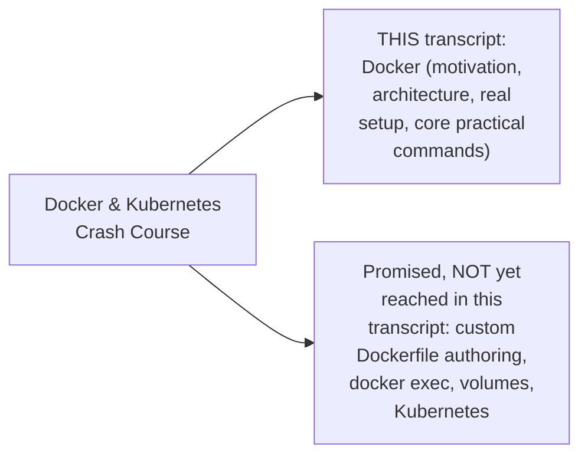

#### 🎯 Key Takeaways

* This is genuinely the OPENING portion of a stated, longer 4.5-hour crash course — Docker is taught FIRST, with Kubernetes explicitly planned as a SEPARATE, later topic.
* Docker knowledge is explicitly, directly framed as valuable for **BOTH developers AND DevOps engineers** — not a DevOps-exclusive skill.
* No PRIOR knowledge is required — the session builds every concept from the ground up, using a real, worked application example.

---

### 2. Application Architecture & The Real Problem: Multi-Environment Deployment

#### 📖 Definition — The Three Genuine Layers of Any Application

> 💡 **Given directly:** *"If you take any project... front end will be available, back end will be available and database also will be available... database is used to store our application data... backend contains business logic... whatever you see on the browser that is called as user interface, that is also called as front end."*

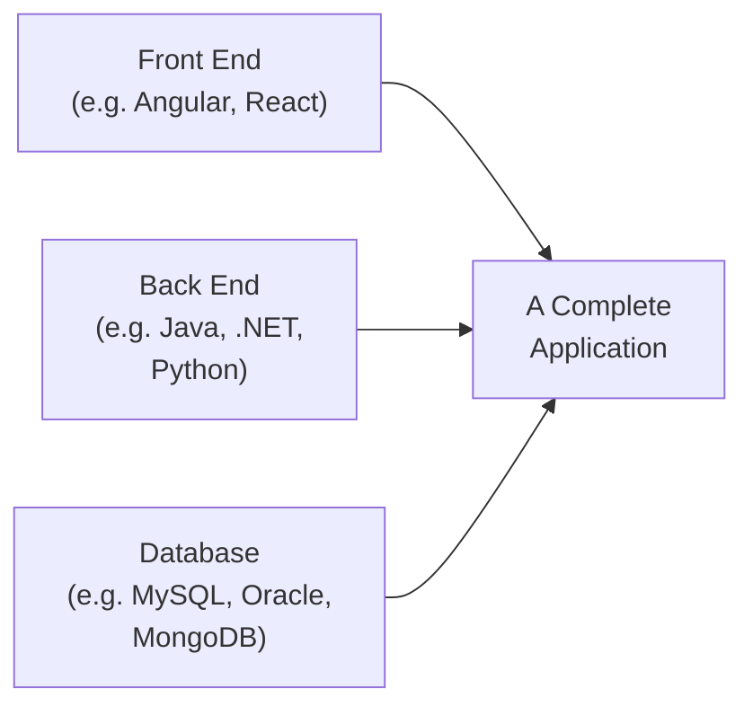

#### 🪜 Step-by-Step — A Complete, Real, Worked Example: The "Application Tech Stack"

> 💡 **Given directly:** *"For the front end I'm using Angular 13 version and for back end I'm using Java 17 version and for a database I'm using MySQL 8.5 version... this is called application text [tech] stack."*

#### 📖 Definition — The Genuine, Real Environments Every Project Requires

> 💡 **Given directly:** *"In the real time we will be having multiple environments... dev environment... developers will use it for developers integration testing... SIT environment... testing team will use it for system integration testing... UAT... client will use it for acceptance testing... pilot... pre-production environment... prod... end users can access our application running in prod."*

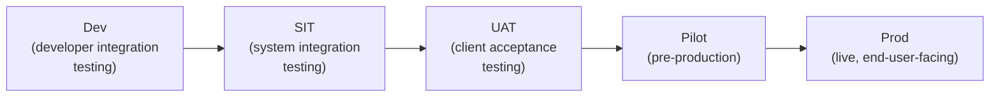

#### ❓ Why It Exists — The Precise, Real Challenges This Creates

> 💡 **Given directly:** *"Version conflicts can occur... in the dev environment already Java 11 version is available but for our application Java 17 version is required... environment setup is time taking process and it is error-prone... a human is going to do this setup, there is a chance of doing the mistake... repeated work."*

#### 🏢 Real-World / Production Usage — The Genuine, Real "Team Blame" Consequence

> 💡 **Given directly:** *"Developers will say that the code is working in my system properly. Testers will say that the code is not working in our system... the fighting will happen between the developers and testers. Developers will blame the testers, testers will blame the developers. So these are called environmental issues."*

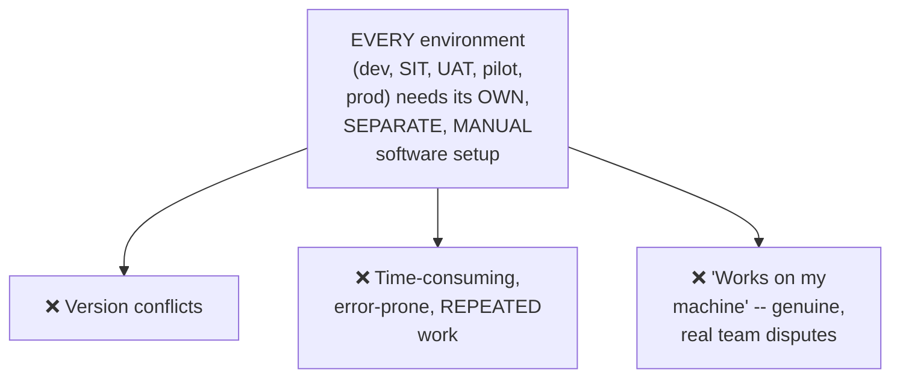

#### ⚠ Common Mistakes

* Assuming environment-related deployment failures are always genuinely CODE bugs — explicitly, directly, honestly distinguished: *"The reason environment issue, not the code — is sometimes code issues also will be available, we have to accept that"* — but ENVIRONMENT setup is identified as the PRIMARY, common, real culprit.
* Assuming this multi-environment challenge is a rare, unusual scenario — explicitly, directly confirmed as the STANDARD, real, everyday reality of professional software deployment.

#### 🎯 Key Takeaways

* Every real application genuinely requires **THREE layers** (front end, back end, database), each built with SPECIFIC technology versions — collectively called the application's own **tech stack**.
* Real projects genuinely require **FIVE distinct environments** (dev, SIT, UAT, pilot, prod), each needing the EXACT SAME software setup, REPEATED manually.
* This repeated, manual setup directly, genuinely causes **version conflicts, wasted time, and real team disputes** — the PRECISE, concrete problem Docker exists to solve.

---
### 3. What Is Docker? Containerization, Precisely Defined

#### 📖 Definition — Docker, Precisely Introduced

> 💡 **Given directly:** *"Docker is a free and opensource software. Docker is used for containerization."*

#### 📖 Definition — Containerization, Precisely Defined

> 💡 **Given directly:** *"Containerization means package our application code plus required dependencies as single unit for execution."*

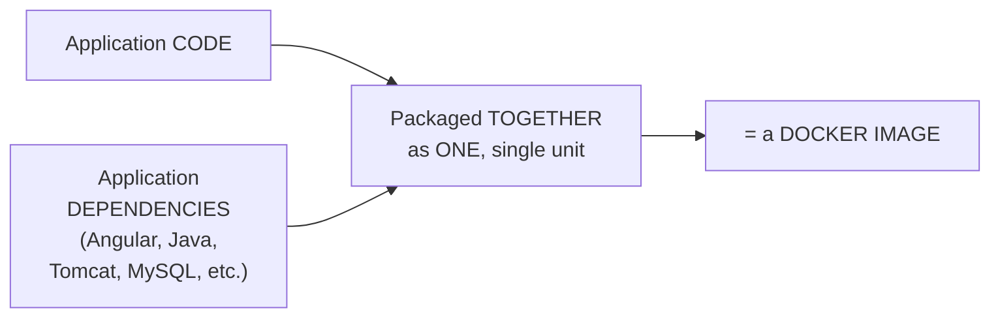

#### ❓ Why It Exists — The Precise, Direct Payoff

> 💡 **Given directly:** *"When you go for the docker, you no need to install all these softwares... you can run your application in any computer... Docker will take care of required dependencies to run our application... Docker is going to take care of everything that is required to run our application."*

#### 🪜 Step-by-Step — Applying This Directly to the Multi-Environment Problem

> 💡 **Given directly:** *"Now I want to run my application into one environment called a dev environment... do I need to set up any softwares or simply I will take the docker image and I will run the docker image?... I don't need to install the softwares because the software installation will be taken care by docker."*

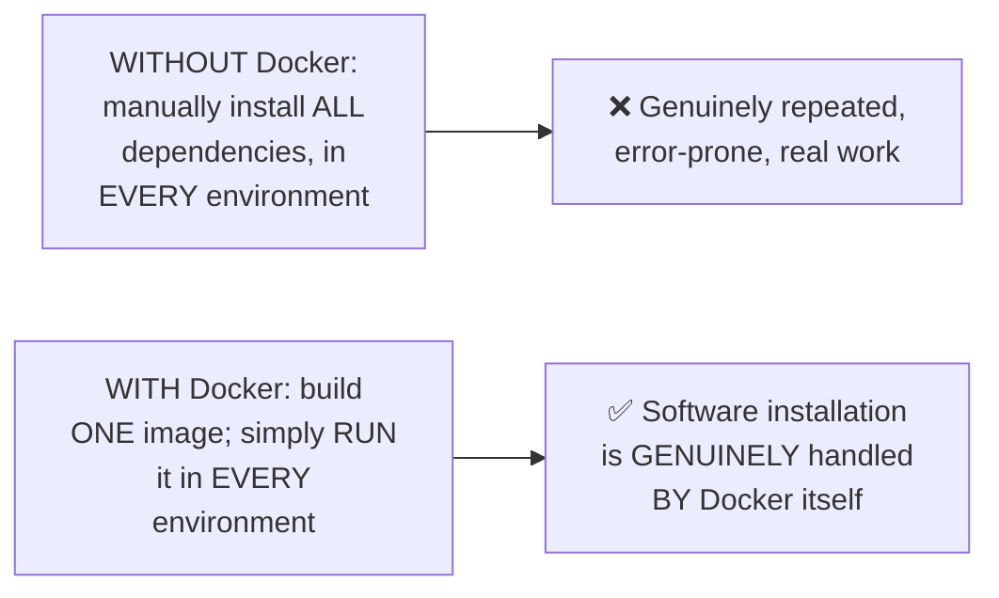

#### 🏢 Real-World / Production Usage — The Genuine, Direct, Simplified Outcome

> 💡 **Given directly:** *"My application should be deployed into 20 environments. What I need to do?... just to take the docker image and run the docker image. So whenever you run the docker image, docker container will be created."*

#### ⚠ Common Mistakes

* Assuming Docker eliminates the NEED for dependencies entirely — explicitly, directly clarified: the dependencies still genuinely EXIST and are genuinely REQUIRED — Docker simply handles their installation AUTOMATICALLY, as part of the packaged image, rather than requiring MANUAL, per-environment setup.
* Assuming Docker is exclusively useful for LARGE-scale, many-environment deployments — explicitly, directly demonstrated as valuable even for a SINGLE environment, since it directly eliminates manual dependency installation regardless of scale.

#### 🎯 Key Takeaways

* **Docker** is precisely a free, open-source CONTAINERIZATION tool — genuinely packaging application code PLUS its required dependencies into ONE, portable unit.
* **Containerization**, precisely defined: packaging code and dependencies TOGETHER, as a single unit, for execution — directly, genuinely eliminating the need for manual, per-environment software installation.
* This directly, precisely SOLVES the exact problem established in Section 2 — deploying to MANY environments now requires ONLY installing Docker itself, then simply RUNNING the same, pre-built image everywhere.

---

### 4. Docker Architecture: Dockerfile, Image, Registry & Container

#### 📖 Definition — The Four Genuine, Core Concepts

> 💡 **Given directly:** *"When we are talking about the docker architecture, first we need to understand docker file, then we need to understand docker image, then docker registry, then docker container."*

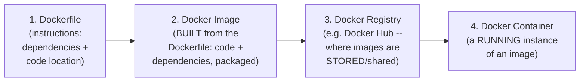

#### 📖 Definition — Dockerfile, Precisely Defined

> 💡 **Given directly:** *"Docker file is used to specify the required dependencies to run our applications... Docker file contains set of instructions to build docker image."*

#### 📖 Definition — Docker Image, Precisely Defined

> 💡 **Given directly:** *"It is a package which contains code plus dependencies... once the docker file is available, by using the docker file, we are going to build docker image."*

#### 📖 Definition — Docker Registry, Precisely Defined

> 💡 **Given directly:** *"It is a place where we can store our docker images... docker hub is a registry where we can store our images."*

#### 🔍 Internal Working — The Genuine, Real Alternatives to Docker Hub

> 💡 **Given directly:** *"What are the alternatives available for the docker hub?... You can use Nexus repository... you can use JFrog repository... you can store into AWS ECR also."*

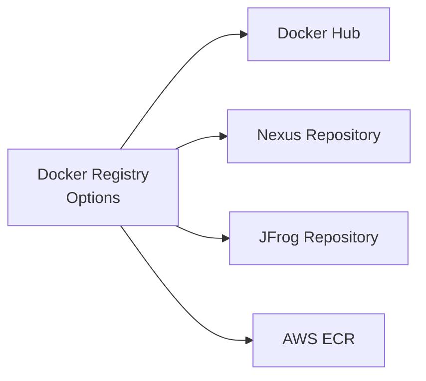

#### ⚠ A Direct, Important Clarification: GitHub Is NOT a Valid Registry

> 💡 **Given directly, in response to a genuine, direct audience question:** *"Not GitHub. Docker image we can't store in the GitHub. GitHub is used to store the project code, GitHub is used to store the project source code, but not Docker images."*

#### 📖 Definition — Docker Container, Precisely Defined

> 💡 **Given directly:** *"When we run the docker image, then docker container will be created. Our application will execute inside docker container."*

#### 🏢 Real-World / Production Usage — Push/Pull, Precisely Explained

> 💡 **Given directly:** *"Whatever the docker image is created, we will push that docker image into docker hub. So this is called as a push operation... you pull the docker image and you run the docker image. Pull means download, run means execute."*

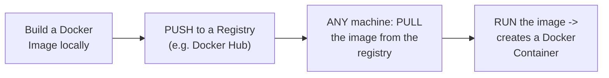

#### ⚠ A Genuine, Real, Live-Demonstrated Confirmation

> 💡 **Given directly:** *"You see one of my image I created for spring boot image... you see how many people downloaded my docker image? 67,000 people downloaded my docker image... this is a public image."*

#### ⚠ Common Mistakes

* Confusing the Dockerfile (a set of TEXT instructions) with the Docker Image (the actual, BUILT, packaged artifact) — explicitly, directly distinguished: the Dockerfile is the RECIPE; the Image is the RESULT of building that recipe.
* Assuming Docker Hub is the ONLY genuine option for storing images — explicitly, directly clarified: Nexus, JFrog, and AWS ECR are ALL genuine, real, valid alternatives.
* Assuming changing a dependency version requires updating EVERY environment individually — explicitly, directly clarified: you genuinely only need to EDIT the Dockerfile, REBUILD the image, and RE-RUN it — a SINGLE, centralized change point.

#### 🎯 Key Takeaways

* Docker's complete architecture flows in **FOUR genuine steps**: Dockerfile (instructions) → Image (built package) → Registry (storage/sharing, e.g., Docker Hub) → Container (a running instance).
* **GitHub is explicitly, directly confirmed as NOT a valid Docker registry** — it stores source code, not Docker images; genuine registry alternatives include Docker Hub, Nexus, JFrog, and AWS ECR.
* Changing a dependency version requires **ONLY editing the Dockerfile and rebuilding the image** — a single, centralized change, directly eliminating the need to update every individual environment.

---
### 5. Docker's Use of Virtualization: How Containers Actually Work

#### 📖 Definition — The Precise, Direct Claim

> 💡 **Given directly:** *"Docker internally uses virtualization guys."*

#### 🪜 Step-by-Step — Precisely How This Works, Step by Step

> 💡 **Given directly:** *"I have a computer... in my machine, I'm having host OS... in this host operating system, to run the docker image, what we need to do? We need to install docker engine... once we install the docker engine, then we can pull the docker image and we can run the docker image. When we run the docker image, then docker container will be created."*

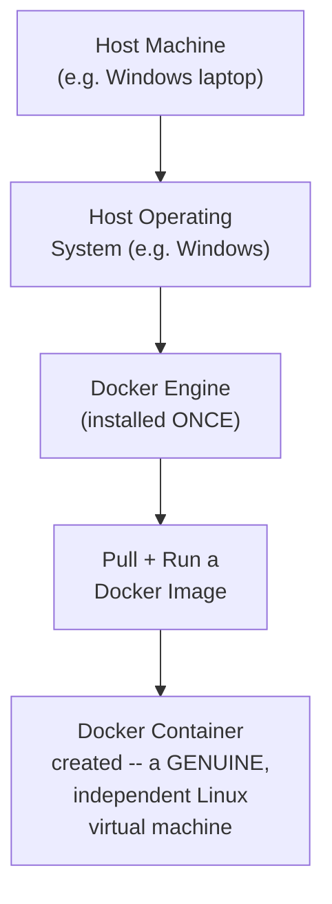

#### 📖 Definition — The Precise, Genuine, Core Claim: A Container IS a Linux VM

> 💡 **Given directly:** *"This container is a Linux virtual machine... every container is a Linux virtual machine where the required softwares will be available... in one machine we are going to run other machine. Okay. The host machine, virtual machine, both are independent."*

#### 🏢 Real-World / Production Usage — The Genuinely Vivid, Real Consequence

> 💡 **Given directly:** *"My machine is having Windows operating system. In my machine, no Java, no Angular, no Tomcat, no MySQL database. But still I can run the application as a docker image... I will not install Java. I will not install Python. I will not install Tomcat, database, Angular, nothing. So my machine is just a machine with only operating system."*

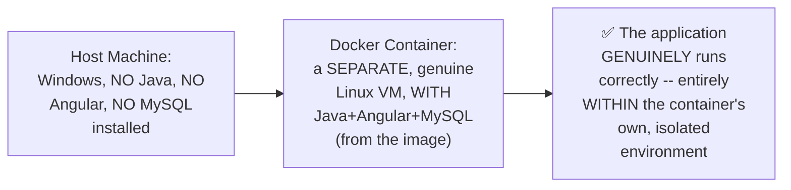

#### 🔍 Internal Working — Confirming Multiple Containers Are Genuinely Independent

> 💡 **Given directly:** *"With one image, with one image, we can create any number of containers. There is no limit... in one machine, can I run multiple containers? Yes, that is possible. So same image you can run multiple times so that three containers will be created."*

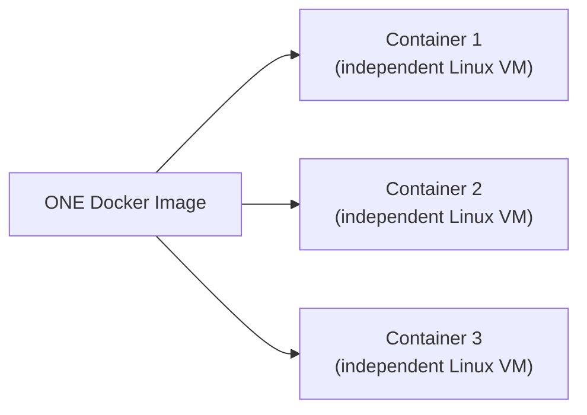

#### 📖 Definition — Precisely Why the Docker Logo Is a Ship With Containers

> 💡 **Given directly:** *"If you see the official logo of the Docker, it is a ship symbol with boxes... these boxes are called as containers. Easily we can transport our containers from one place to another place... Docker is platform independent. You can run the Docker image in the Windows machine. You can run the Docker image in the Linux machine also."*

#### ⚠ Common Mistakes

* Assuming a Docker container shares direct, unrestricted access to the host machine's own installed software — explicitly, directly, repeatedly corrected: a container is a genuinely SEPARATE, INDEPENDENT virtual machine, with its OWN required software, entirely INDEPENDENT of whatever the host machine does or doesn't have installed.
* Assuming a single Docker image can only ever produce ONE running container — explicitly, directly clarified: the SAME image can genuinely be run MULTIPLE times, producing MULTIPLE, independent containers, with "no limit."

#### 🎯 Key Takeaways

* **Docker genuinely uses virtualization** — every Docker container is precisely a genuine, independent LINUX VIRTUAL MACHINE, running WITHIN (but genuinely SEPARATE from) the host machine's own operating system.
* This directly, precisely explains WHY a host machine with ZERO relevant software installed (no Java, Angular, MySQL) can STILL genuinely run an application requiring ALL of these — the container itself GENUINELY, INDEPENDENTLY contains everything needed.
* A **single Docker image can produce ANY NUMBER of independent containers** — directly, precisely confirmed as having "no limit."

---

### 6. Setting Up Docker: A Real AWS EC2 Linux Machine

#### 🪜 Step-by-Step — Creating a Genuine, Real EC2 Instance

> 💡 **Given directly:** *"Go to EC2. EC2 is a service in the AWS cloud which is used to create virtual machines... I'm taking one virtual machine with Linux operating system... I'm creating this machine by using Amazon Linux AMI... T2 micro I'm using which is free eligible."*

#### 🪜 Step-by-Step — Connecting via MobaXterm

> 💡 **Given directly:** *"Copy this public IP and connect with the machine. So I'm using MobaXterm software. It is also free to connect with the Linux machines... Linux machines works based on SSH connection... my machine username is default username EC2 user. Password will not be available. Private key will be available."*

#### 💻 Code Example — Installing Docker, Command by Command

> 💡 **Given directly:** *"docker -v. What it is saying guys, when I use docker -v it is saying docker command not found... Now I want to install docker in the Linux machine."*

```bash
sudo yum update              # update existing packages
sudo yum install docker -y   # install Docker software
sudo service docker start    # start Docker as a service
sudo usermod -aG docker ec2-user   # add EC2 user to the docker group
# then: exit, and reconnect
docker -v                     # verify installation
docker info                    # view current containers/images (both zero, on a fresh machine)
```

> 💡 **Given directly, precisely explaining the `usermod` step:** *"When you install the docker, docker group will be created. But we want to perform the operations as EC2 user in the Linux machine. So that's why I'm adding EC2 user to docker group so that we can perform docker operations."*

#### 🔍 Internal Working — Confirming a Genuine, Real, Successful Installation

> 💡 **Given directly:** *"Now you can see docker version 24.0.5 is created. Okay, so with this docker setup got complete."*

#### ⚠ Common Mistakes

* Attempting to run Docker commands immediately after installation, WITHOUT restarting the session — explicitly, directly demonstrated as necessary: the `exit` and reconnect step is genuinely REQUIRED for the `usermod` group change to take effect.
* Assuming Docker setup genuinely requires a paid, high-tier cloud instance — explicitly, directly demonstrated as achievable on a FREE-eligible `t2.micro` AWS instance.

#### 🎯 Key Takeaways

* Docker was installed on a **genuine, real AWS EC2 Linux instance** (Amazon Linux AMI, t2.micro, free-eligible) — directly, live-demonstrated from instance creation through connection via MobaXterm.
* The complete, real installation sequence: **`sudo yum install docker -y` → `sudo service docker start` → `sudo usermod -aG docker ec2-user` → exit/reconnect → verify with `docker -v`**.
* `docker info` genuinely confirms the installation's own current state — showing ZERO containers and ZERO images on a genuinely fresh machine.

---
### 7. Core Docker Commands: Images, Pull, Run, PS, RM, RMI, Prune

#### 📖 Definition — The Complete, Core Command Set, Precisely Introduced

> 💡 **Given directly:** *"Docker images to display list of docker images available in our system. Docker ps to display list of docker containers running in our system."*

```bash
docker images          # list all images available locally
docker ps                # list RUNNING containers
docker ps -a              # list ALL containers (running AND stopped)
docker pull <image>        # download an image (without running it)
docker run <image>          # run an image (creates a container)
docker rmi <image_id/name>   # delete an image
docker rm <container_id>      # delete a (stopped) container
docker system prune -a         # delete ALL stopped containers + unused images, in one shot
```

#### 🪜 Step-by-Step — A Complete, Live, Real Demonstration: `hello-world`

> 💡 **Given directly:** *"docker pull hello-world... it is going to download an image with a name called hello world... docker run hello-world... it is giving a message 'hello from docker'... your installation appears to be working correctly."*

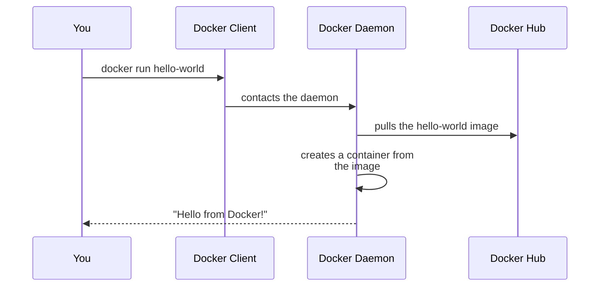

> 💡 **Given directly, precisely explaining the 4 documented steps this demo revealed:** *"The docker client contacted the docker daemon. Docker daemon is a background process... the docker daemon pulled the hello-world image from the docker hub. The docker daemon created a container from the image which producing the output."*

#### 🔍 Internal Working — Confirming `docker run` Doesn't Genuinely REQUIRE a Prior `docker pull`

> 💡 **Given directly:** *"Instead of this pull command, directly I will use docker run hello-world. But currently in my system docker image hello-world is available or... not available?... Docker is intelligent here guys. Whenever you execute run with image name, first it will check for the image in the local... if the image available in the local it will use that image and it will create the container. But in this scenario the image is not available in the local. So that's why it is going to download that image, then it is going to run the image."*

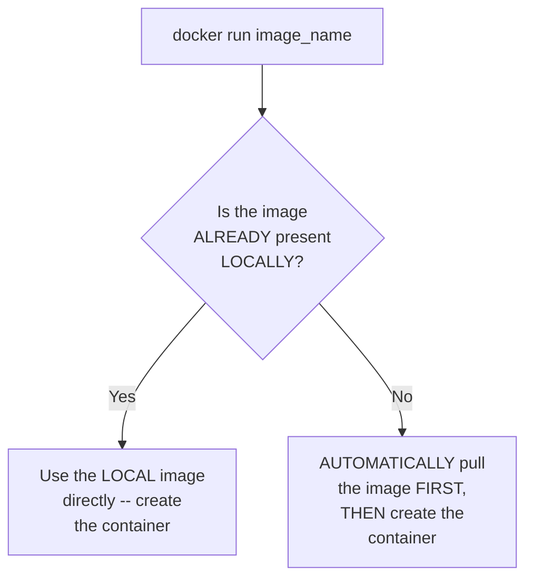

#### 🪜 Step-by-Step — Cleaning Up: `docker rm`, `docker rmi`, `docker system prune`

> 💡 **Given directly:** *"How to delete the container guys?... docker rm container_id... it is used to delete the container which is in the stopped state... how to delete the image? docker rmi... docker system prune -a. When I execute docker system prune -a, all stopped containers, unused images will be deleted in the single shot."*

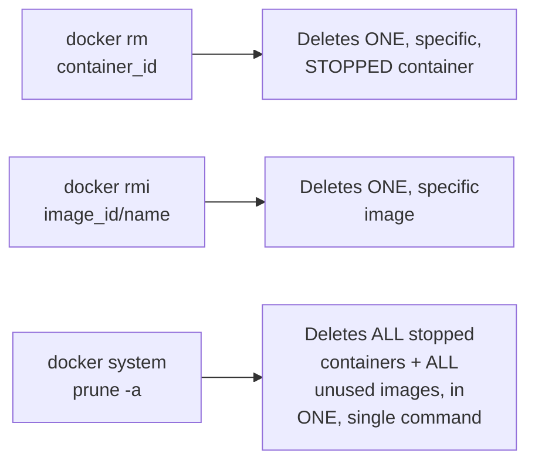

#### 🏢 Real-World / Production Usage — A Genuine, Real, Public Docker Hub Image

> 💡 **Given directly:** *"I want to take this image and I want to run this image... docker pull ashokit/springboot-rest-api... 23 months ago I have created this docker image... can you check it is Java installed in my system or Java is not installed in my system? Java is not available. Spring boot application is a Java based application... but do I need to install the Java to run my spring boot application here which is available as a docker image? Not required."*

#### ⚠ Common Mistakes

* Assuming `docker pull` is a MANDATORY, required step before `docker run` — explicitly, directly, live-demonstrated as OPTIONAL: `docker run` automatically pulls the image FIRST if it isn't already present locally.
* Assuming `docker ps` (without `-a`) shows ALL containers — explicitly, directly clarified: it shows ONLY currently RUNNING containers; `docker ps -a` is genuinely needed to see STOPPED containers too.
* Forgetting that a real, Java-based application (like the instructor's own live-demonstrated Spring Boot API) genuinely runs WITHOUT Java being installed on the HOST machine — the Docker image itself GENUINELY contains everything needed.

#### 🎯 Key Takeaways

* The **core, genuine Docker commands**: `docker images` (list images), `docker ps`/`docker ps -a` (list running/all containers), `docker pull` (download), `docker run` (execute, creating a container), `docker rmi` (delete image), `docker rm` (delete container), and `docker system prune -a` (bulk cleanup).
* `docker run` genuinely does NOT require a PRIOR `docker pull` — Docker automatically checks locally FIRST, and pulls ONLY if the image isn't already present.
* A REAL, live demonstration (pulling and running the instructor's own public `ashokit/springboot-rest-api` image) directly, concretely confirmed a Java application running SUCCESSFULLY on a machine with **NO Java installed** — genuinely proving Docker's own core value proposition.

---

### 8. Port Mapping: Making a Containerized Application Accessible

#### ❓ Why It Exists — The Precise, Genuine Problem Without Port Mapping

> 💡 **Given directly:** *"Is there any relation between this container and this host machine as of now?... there is no relation. That's the reason you cannot access that rest API."*

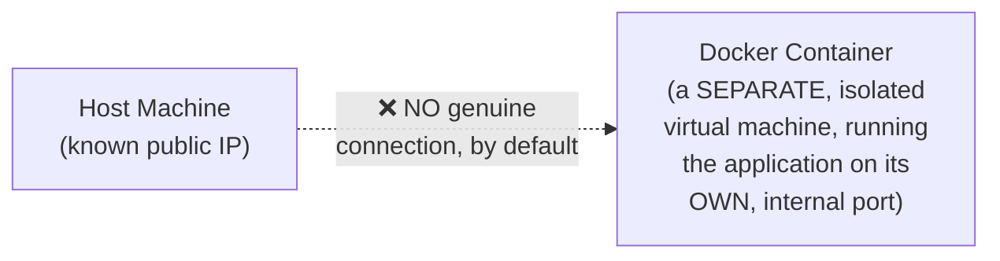

#### 📖 Definition — Port Mapping, Precisely Introduced

> 💡 **Given directly:** *"I need to establish the relation between this container machine and this host machine... `docker run -p 9090:9090` and our image name... P represents port mapping."*

```bash
docker run -p 9090:9090 ashokit/springboot-rest-api
#           ^host_port : ^container_port
```

> 💡 **Given directly, precisely explaining WHICH port to use:** *"My container using port number — my spring boot application running on the port number 9090... so what I will do, that 9090 I will map to 9090 my host machine also."*

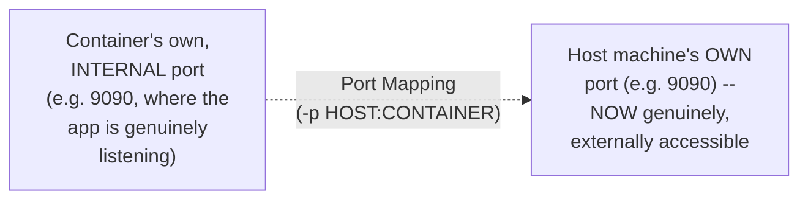

#### 🪜 Step-by-Step — A Complete, Real, Additional Step: Security Group Configuration

> 💡 **Given directly:** *"We need to enable the port number in the security group... go to the security tab... edit the rules, custom TCP 9090... I have mapped this container to 9090 host. That's why I'm enabling 9090 in the security group inbound rule."*

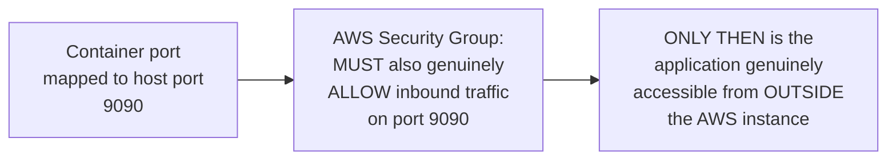

#### 🏢 Real-World / Production Usage — A Complete, Genuine, Live-Verified Success

> 💡 **Given directly:** *"Public IP colon 9090/welcome/John... 'Welcome to Ashokit'... are you able to hit that URL? Give your name and try that. Is it giving the dynamic response?... it is working."*

#### ⚠ Common Mistakes

* Assuming a running container is AUTOMATICALLY accessible from outside, simply because the underlying application is "running" — explicitly, directly, precisely corrected: port mapping (`-p`) is GENUINELY REQUIRED to establish this connection.
* Forgetting the ADDITIONAL, real cloud-provider step (opening the port in the AWS Security Group) — explicitly, directly demonstrated as a SEPARATE, necessary step, beyond Docker's own `-p` flag.

#### 🎯 Key Takeaways

* **Port mapping** (`-p host_port:container_port`) directly, precisely establishes the genuine CONNECTION between a container's own internal, isolated port and the host machine's own, externally-reachable port.
* On real cloud infrastructure (like AWS EC2), port mapping alone is **NOT sufficient** — the corresponding port must ALSO be genuinely OPENED in the cloud provider's own Security Group/firewall settings.
* This complete process was **directly, live-verified**: a real, public URL (`<public_IP>:9090/welcome/John`) successfully returned a genuine, dynamic response from the containerized application.

---
### 9. Detached Mode & Container Logs

#### ❓ Why It Exists — The Precise, Genuine Problem With Running in the Foreground

> 💡 **Given directly:** *"When my container is created by using this command docker run -p and image name, can I execute any other command in this terminal? Is my terminal open to execute any other command? No... I'm blocked here."*

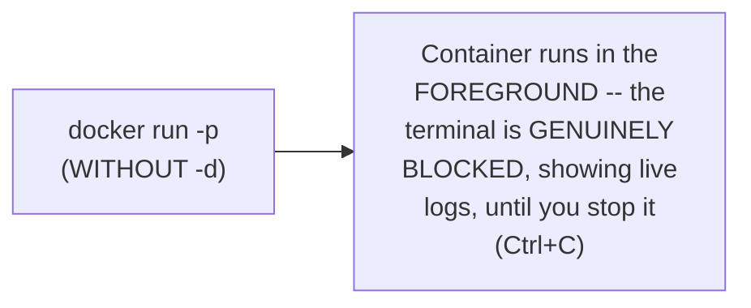

#### 📖 Definition — Detached Mode, Precisely Introduced

> 💡 **Given directly:** *"I want to run my container in the background... I want to run the container in the detached mode... to run the container in the detached mode, same command, just one option I have to add — docker run -d."*

```bash
docker run -d -p 9090:9090 ashokit/springboot-rest-api
```

> 💡 **Given directly, precisely confirming the genuine, real benefit:** *"If I run the container in the detached mode, my container will be executing 24/7 and I can execute other commands also."*

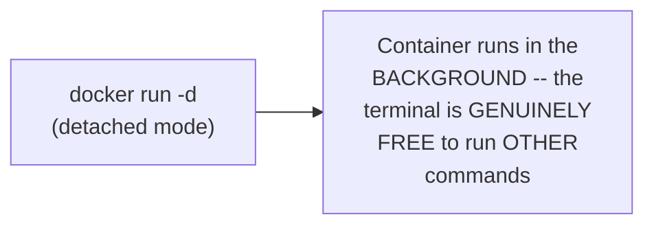

#### 🔍 Internal Working — Confirming a Genuine, Real, Live Result

> 💡 **Given directly:** *"Now am I open to execute other commands? Yes. Now you can check docker images... docker ps. Now you can see my container status is up."*

#### ❓ Why It Exists — Precisely Why `docker logs` Is Genuinely Needed

> 💡 **Given directly:** *"Once you run the docker image in the detached mode, is it printing the logs or it is not printing the logs? No. Then how to check the logs? For that we can go for docker logs container_id. It will show you the logs of the container."*

```bash
docker logs <container_id>
```

```mermaid
flowchart LR
    A["Container running in<br/>DETACHED mode<br/>(logs NOT genuinely<br/>visible by default)"] --> B["docker ps<br/>(find the container_id)"]
    B --> C["docker logs<br/>container_id"]
    C --> D["✅ NOW genuinely,<br/>directly see the<br/>container's own output"]
```

#### 🏢 Real-World / Production Usage — A Genuine, Real, Live-Confirmed Demonstration

> 💡 **Given directly:** *"So many people accessed our application. So my application logs are generated... welcome controller, welcome message, execution start, execution end... can you hit the URL again? You can see the logs which are getting generated here."*

#### ⚠ Common Mistakes

* Assuming a container's logs are ALWAYS visible directly in the terminal, regardless of how it was started — explicitly, directly, precisely clarified: detached-mode containers genuinely do NOT print logs directly; `docker logs <container_id>` is the correct, necessary command to view them.
* Assuming detached mode changes ANYTHING about the container's OWN, actual behavior — explicitly, directly clarified: it ONLY changes whether the terminal is BLOCKED — the container itself runs identically either way.

#### 🎯 Key Takeaways

* **Detached mode** (`docker run -d`) allows a container to genuinely run in the BACKGROUND — freeing the terminal for OTHER commands, and allowing the container to run continuously ("24/7").
* Detached-mode containers do **NOT display logs directly** in the terminal — `docker logs <container_id>` is the genuine, correct command to inspect their output.
* This complete workflow was **directly, live-verified**: a detached container continued serving real, dynamic responses to genuine URL requests, with its logs successfully retrieved via `docker logs`.

---

## 📝 Glossary

| Term | Definition | Why It Matters |
|---|---|---|
| **Containerization** | Packaging application code + dependencies as ONE unit for execution | Docker's own, precise, core purpose |
| **Dockerfile** | A set of instructions specifying dependencies/code location | Used to BUILD a Docker image |
| **Docker Image** | The packaged unit (code + dependencies) | BUILT from a Dockerfile |
| **Docker Registry** | A place to store/share images (e.g. Docker Hub, Nexus, JFrog, AWS ECR) | Enables push/pull across machines |
| **Docker Container** | A RUNNING instance of a Docker image | A genuine, independent Linux virtual machine |
| **Docker Engine / Daemon** | The background software that manages images/containers | Must be installed on the host machine |
| **Port Mapping (-p)** | Connects a container's internal port to a host machine port | REQUIRED to access a containerized app externally |
| **Detached Mode (-d)** | Runs a container in the background | Frees the terminal; use `docker logs` to inspect output |
| **docker system prune -a** | Deletes ALL stopped containers + unused images | A genuine, bulk cleanup command |

---

## 🔄 Revision Notes — One-Minute Revision

* This is the **Docker portion** of a longer, stated Docker + Kubernetes crash course -- this transcript covers motivation, architecture, real setup, and core practical commands, but ends BEFORE custom Dockerfile authoring, docker exec, volumes, or Kubernetes.
* **The real problem**: every app has 3 layers (front end, back end, database) with SPECIFIC tech versions; every REAL project needs 5 environments (dev, SIT, UAT, pilot, prod), EACH requiring the SAME manual setup -- causing version conflicts, wasted time, and genuine "works on my machine" team disputes.
* **Docker**: a free, open-source CONTAINERIZATION tool. **Containerization**: packaging code + dependencies as ONE unit for execution.
* **Architecture**: Dockerfile (instructions) -> Docker Image (built package) -> Docker Registry (storage, e.g. Docker Hub/Nexus/JFrog/AWS ECR -- NOT GitHub) -> Docker Container (a running instance). Push = upload to registry; Pull = download from registry.
* **Virtualization**: EVERY Docker container is genuinely a Linux virtual machine, entirely INDEPENDENT of the host OS -- this is WHY a host with zero Java/Angular/MySQL can still run an app requiring all three. ONE image can produce UNLIMITED, independent containers.
* **Real setup**: AWS EC2 (Amazon Linux, t2.micro, free-eligible) -> connect via MobaXterm (SSH) -> `sudo yum install docker -y` -> `sudo service docker start` -> `sudo usermod -aG docker ec2-user` -> exit/reconnect -> `docker -v` to verify.
* **Core commands**: `docker images` (list images) | `docker ps`/`docker ps -a` (running/all containers) | `docker pull` (download) | `docker run` (execute -- auto-pulls if not local) | `docker rmi` (delete image) | `docker rm` (delete container) | `docker system prune -a` (bulk cleanup).
* **Port mapping** (`-p host:container`): REQUIRED to make a containerized app externally accessible -- a container has NO relation to the host machine by default. On AWS, the corresponding port must ALSO be opened in the Security Group.
* **Detached mode** (`-d`): runs the container in the background, freeing the terminal. Logs are NOT shown directly -- use `docker logs <container_id>`.
* Everything was **live-verified**: a real Spring Boot REST API image (`ashokit/springboot-rest-api`) was pulled and run on a machine with NO Java installed, port-mapped, and accessed via a genuine, public URL, producing real, dynamic responses.

---

## 📋 Cheat Sheet

**Complete installation sequence (Amazon Linux):**
```bash
sudo yum update
sudo yum install docker -y
sudo service docker start
sudo usermod -aG docker ec2-user
# exit, then reconnect
docker -v
docker info
```

**Core commands:**
```bash
docker images              # list local images
docker ps                    # list RUNNING containers
docker ps -a                   # list ALL containers (running + stopped)
docker pull <image>              # download an image
docker run <image>                # run (auto-pulls if not local) -> creates a container
docker run -p 9090:9090 <image>     # with port mapping (host:container)
docker run -d -p 9090:9090 <image>   # detached mode + port mapping
docker logs <container_id>            # view logs of a detached container
docker rmi <image>                      # delete an image
docker rm <container_id>                  # delete a stopped container
docker system prune -a                      # delete ALL stopped containers + unused images
```

**Docker's architecture, in one line:**
```text
Dockerfile (instructions) -> Docker Image (built) -> Registry (stored/shared) -> Container (running)
```

**Why a container works even without host dependencies:**
```text
Container = a genuine, INDEPENDENT Linux virtual machine
-> contains its OWN copy of every required dependency
-> entirely SEPARATE from whatever the host machine has installed
```

---

## 🔥 Interview Questions & Answers

### 🟢 Beginner

**Q1.**

**Question:** What is Docker?

**Answer:** A free, open-source containerization tool.

**Explanation:** Directly, explicitly stated.

**Why Interviewers Ask This:** The most basic, foundational Docker question.

**Possible Follow-up:** "What is containerization?"

**Q2.**

**Question:** Define containerization.

**Answer:** Packaging application code and its required dependencies as a single unit for execution.

**Explanation:** Directly, precisely defined.

**Why Interviewers Ask This:** Foundational, frequently-tested definition.

**Possible Follow-up:** "What is this single, packaged unit called?"

**Q3.**

**Question:** What are the four core components of Docker's architecture?

**Answer:** Dockerfile, Docker Image, Docker Registry, and Docker Container.

**Explanation:** Directly, explicitly named.

**Why Interviewers Ask This:** Basic, foundational architecture knowledge.

**Possible Follow-up:** "What is the relationship between a Dockerfile and a Docker Image?"

**Q4.**

**Question:** Is GitHub a valid Docker registry?

**Answer:** No.

**Explanation:** Directly, explicitly clarified.

**Why Interviewers Ask This:** A commonly-confused, practical distinction.

**Possible Follow-up:** "Name a genuine, valid Docker registry alternative."

**Q5.**

**Question:** What does `docker ps` (without `-a`) display?

**Answer:** Only currently running containers.

**Explanation:** Directly, precisely clarified.

**Why Interviewers Ask This:** Basic, practical command knowledge.

**Possible Follow-up:** "What flag shows ALL containers, including stopped ones?"

**Q6.**

**Question:** Does `docker run` require a prior `docker pull`?

**Answer:** No -- `docker run` automatically pulls the image if it isn't already present locally.

**Explanation:** Directly, live-demonstrated.

**Why Interviewers Ask This:** Tests genuine, practical command behavior knowledge.

**Possible Follow-up:** "How does Docker decide whether to pull, or use a local image?"

**Q7.**

**Question:** What does the `-p` flag do when running a Docker container?

**Answer:** Port mapping -- connects a container's internal port to a host machine port.

**Explanation:** Directly, precisely explained.

**Why Interviewers Ask This:** Basic, essential, practical Docker knowledge.

**Possible Follow-up:** "Why is this genuinely necessary?"

**Q8.**

**Question:** What does the `-d` flag do when running a Docker container?

**Answer:** Runs the container in detached mode (background).

**Explanation:** Directly, explicitly stated.

**Why Interviewers Ask This:** Basic, practical command knowledge.

**Possible Follow-up:** "How do you view a detached container's logs?"

**Q9.**

**Question:** Does Docker use virtualization?

**Answer:** Yes -- every container is genuinely a Linux virtual machine.

**Explanation:** Directly, explicitly confirmed.

**Why Interviewers Ask This:** Foundational, frequently-tested Docker mechanics.

**Possible Follow-up:** "Why does this mean a host machine doesn't need the application's own dependencies installed?"

**Q10.**

**Question:** What command deletes all stopped containers and unused images in one shot?

**Answer:** `docker system prune -a`.

**Explanation:** Directly, explicitly stated.

**Why Interviewers Ask This:** Basic, practical cleanup command knowledge.

**Possible Follow-up:** "What are the individual commands for deleting a single container or image?"

---

### 🟡 Intermediate

**Q11.**

**Question:** Explain why the instructor deliberately builds the "multi-environment deployment problem" (Section 2) in such detail BEFORE introducing Docker itself, rather than starting directly with Docker's definition.

**Answer:** This is a genuinely deliberate pedagogical choice: by FIRST establishing the REAL, concrete pain (multiple environments, version conflicts, team disputes, repeated manual work) in vivid, relatable detail, the instructor ensures that Docker's OWN definition ("containerization... package code plus dependencies as a single unit") lands as a GENUINE, MEANINGFUL solution to an ALREADY-UNDERSTOOD problem — rather than an abstract, disconnected concept a learner must memorize without context. This directly mirrors a broader, genuinely effective teaching pattern: motivating a technical solution by FIRST making its ABSENCE genuinely, viscerally felt, so the SOLUTION'S own value is immediately, intuitively clear once introduced.

**Explanation:** Requires recognizing a deliberate "problem before solution" pedagogical structure.

**Why Interviewers Ask This:** Tests whether a learner recognizes WHY building genuine motivation matters before introducing a technical solution.

**Possible Follow-up:** "How would you similarly motivate the NEED for Kubernetes, before explaining what it is?"

**Q12.**

**Question:** A learner argues that since Docker containers are described as "Linux virtual machines," Docker containers and traditional virtual machines (like those created by VMware or VirtualBox) are functionally identical. Evaluate this claim.

**Answer:** This claim overstates the case, based on an incomplete reading of this session's own content. While the session's own instructor DOES directly describe a container as "a Linux virtual machine" (Section 5), this is a SIMPLIFIED, intuition-building analogy, not a claim of FULL, TECHNICAL equivalence with TRADITIONAL virtual machines. Traditional VMs (VMware, VirtualBox) genuinely virtualize ENTIRE hardware, including their OWN, SEPARATE, FULL guest operating system kernel — a GENUINELY heavier, slower-to-start, more resource-intensive approach. Docker containers, by contrast, GENUINELY SHARE the HOST machine's own OS KERNEL, isolating only the APPLICATION-level dependencies and file system — a GENUINELY LIGHTER-WEIGHT approach (this session's own live demonstration directly supports this: the `hello-world` image was merely 13 KB, and containers started/stopped near-instantly, a SPEED genuinely uncharacteristic of TRADITIONAL, full VMs). The instructor's own "Linux virtual machine" framing is a genuinely USEFUL, INTUITIVE simplification for THIS introductory session's own purpose, but a technically PRECISE distinction (container-level OS-kernel-sharing vs. traditional VM's full hardware virtualization) would be GENUINELY important for a deeper, more technical understanding.

**Explanation:** Tests whether a learner recognizes when a session's own SIMPLIFIED, intuitive analogy requires further, technical refinement for complete accuracy.

**Why Interviewers Ask This:** Distinguishes candidates who understand the GENUINE, technical distinction between containers and traditional VMs from those who take an introductory analogy as fully, technically precise.

**Possible Follow-up:** "Based on this session's own live-observed evidence (container start/stop speed, small image sizes), what genuine, practical advantage does Docker's own lighter-weight approach provide over traditional VMs?"

**Q13.**

**Question:** Explain, precisely, why the security group configuration step (Section 8) is a GENUINELY SEPARATE requirement from Docker's own port mapping (`-p`), rather than something Docker itself should handle.

**Answer:** This directly reflects a genuine, important separation of RESPONSIBILITIES between TWO, genuinely DIFFERENT layers: Docker's own `-p` flag operates ENTIRELY WITHIN the HOST MACHINE itself — it establishes the connection between the CONTAINER's own internal port and the HOST machine's own OS-level port, a GENUINELY LOCAL, machine-internal operation. The AWS Security Group, by contrast, operates at the NETWORK/FIREWALL level, GENUINELY controlling WHICH external traffic is even ALLOWED to REACH the host machine's own network interface AT ALL, REGARDLESS of what's running on it. Docker GENUINELY has NO AWARENESS of, or CONTROL over, AWS's own network infrastructure — these are TWO, ENTIRELY SEPARATE SYSTEMS (Docker, a containerization tool; AWS Security Groups, a cloud-provider-specific network firewall), each GENUINELY responsible for its OWN, DISTINCT layer of the overall connectivity, and BOTH must be CORRECTLY configured for external access to genuinely work.

**Explanation:** Requires reasoning through the precise, architectural separation between host-level port mapping (Docker's own responsibility) and network-level firewall rules (a genuinely separate, cloud-provider concern).

**Why Interviewers Ask This:** Tests whether a learner understands WHY Docker's own port mapping alone is genuinely INSUFFICIENT on real cloud infrastructure, correctly attributing this to a genuinely SEPARATE system's own responsibility.

**Possible Follow-up:** "Would this SAME, additional security-group step be genuinely necessary if you were running Docker on your own, local laptop, rather than on AWS? Explain your reasoning."

**Q14.**

**Question:** Using this session's own precise explanation of `docker run`'s "check local first, then pull" behavior (Section 7), explain a genuine, real scenario where this behavior could GENUINELY MISLEAD a developer into believing they're running the LATEST version of an image, when they're actually running a STALE, outdated one.

**Answer:** A precise, reasoned scenario, extending beyond what this session's own content explicitly discusses: per Section 7's own exact behavior, `docker run <image_name>` FIRST checks whether the image ALREADY exists LOCALLY, and ONLY pulls a NEW copy if it does NOT. This means if a developer had PREVIOUSLY pulled a SPECIFIC version of an image (e.g., `ashokit/springboot-rest-api`) — and the IMAGE OWNER has SINCE pushed a GENUINELY NEWER version to the SAME image name/tag on Docker Hub — running `docker run ashokit/springboot-rest-api` AGAIN would GENUINELY, SILENTLY use the developer's OWN, OLDER, LOCALLY-CACHED version, NOT the genuinely updated one — since Docker's OWN "check local first" logic would find the OLDER image ALREADY present locally and SKIP the pull entirely. This could GENUINELY, SILENTLY mislead a developer into testing/deploying STALE code, believing they're using the LATEST version, simply because they didn't EXPLICITLY run `docker pull` to FORCE a fresh download FIRST — directly, precisely illustrating why EXPLICITLY running `docker pull` (rather than relying SOLELY on `docker run`'s own automatic behavior) is often a GENUINELY, PRACTICALLY safer habit in real, professional workflows.

**Explanation:** Requires reasoning through a genuine, real, practical consequence of the "check local first" behavior that the session's own content doesn't explicitly address, but directly follows from its own stated mechanism.

**Why Interviewers Ask This:** Tests whether a learner can identify a genuine, real, practical pitfall arising from a specific, taught behavior, not just recite the behavior itself.

**Possible Follow-up:** "What specific Docker practice would you recommend to GENUINELY avoid this exact staleness risk in a real, professional CI/CD pipeline?"

**Q15.**

**Question:** Synthesize this session's complete Docker architecture (Section 4) with its own precise virtualization explanation (Section 5) to explain WHY rebuilding a Docker image after changing the Dockerfile GENUINELY requires re-running `docker build` (creating a NEW image), rather than somehow "updating" an EXISTING, already-running container directly.

**Answer:** A precise, synthesized explanation, directly connecting the architecture's own sequential flow (Section 4: Dockerfile → Image → Container) with virtualization's own precise mechanism (Section 5): per Section 5's own exact explanation, a CONTAINER is a genuine, INDEPENDENT virtual machine, created FROM a SPECIFIC, ALREADY-BUILT image — at the MOMENT a container is created (via `docker run`), its ENTIRE internal environment (code, dependencies, file system) is GENUINELY, DIRECTLY derived from THAT SPECIFIC image's own, FIXED, ALREADY-BUILT contents. Since a Dockerfile's own PURPOSE (per Section 4) is SPECIFICALLY to define HOW an image gets BUILT — NOT to describe an ALREADY-RUNNING container's own, LIVE state — CHANGING the Dockerfile has NO GENUINE, DIRECT EFFECT on any container that was ALREADY created from a PREVIOUS version of the image; that EXISTING container GENUINELY, PERMANENTLY reflects whatever the image contained AT THE MOMENT it was created. To GENUINELY incorporate the Dockerfile's own CHANGES, a NEW image must be BUILT (capturing the UPDATED instructions), and a NEW container must THEN be created FROM this NEW image — directly, precisely explaining WHY "recreate the image, then rerun it" (a workflow this session's own content DIRECTLY, REPEATEDLY confirms) is the GENUINELY correct, necessary process, rather than attempting to "live-update" an EXISTING container's own, ALREADY-FIXED internal state.

**Explanation:** Requires synthesizing the architecture's own sequential build process with the virtualization concept's own "fixed at creation time" property to explain why image rebuilding (not live container updates) is genuinely necessary.

**Why Interviewers Ask This:** A senior-level question testing whether a candidate understands the PRECISE, structural reason behind the "rebuild and rerun" workflow, not just that it's the STATED procedure.

**Possible Follow-up:** "If you have MULTIPLE containers already running from an OLDER image version, and you build a NEW image with an updated Dockerfile, do the EXISTING, older containers automatically update? Explain your reasoning."

---

### 🔴 Advanced

**Q16.**

**Question:** Design a complete, reasoned deployment plan for a company wanting to migrate their EXISTING, manually-configured 5-environment deployment process (per Section 2's own precise, real scenario) to a genuinely Docker-based approach, explicitly addressing each of the FOUR real challenges Section 2 identifies (version conflicts, time-consuming setup, errors, team disputes).

**Answer:** A reasonable, complete plan, directly applying this session's own established concepts: **Step 1**: create a SINGLE, authoritative Dockerfile capturing the application's own EXACT dependencies (per Section 4's own precise definition) — Angular 13, Java 17, Tomcat 9.0, MySQL 8.5, per the session's own worked example — directly, PRECISELY eliminating the "version conflicts" challenge, since EVERY environment will now GENUINELY use the SAME, EXACT, CENTRALLY-DEFINED versions. **Step 2**: build ONE Docker image from this Dockerfile, and PUSH it to a shared registry (Docker Hub, Nexus, or AWS ECR, per Section 4's own named options) — directly eliminating "time-consuming, repeated setup," since EVERY environment now simply PULLS and RUNS this SAME, pre-built image, rather than manually installing software FIVE separate times. **Step 3**: install Docker (per Section 6's own exact installation sequence) on EACH of the 5 environment machines — a ONE-TIME, genuinely SIMPLE setup, REGARDLESS of how many DIFFERENT application dependencies exist. **Step 4**: for EACH environment, simply `docker pull` and `docker run` (with appropriate port mapping, per Section 8) the SAME image — directly, GENUINELY eliminating "errors" from manual, repeated, human-performed installation, since the SAME, TESTED image is used EVERYWHERE. **Step 5**: since ALL 5 environments now GENUINELY run the IDENTICAL image, "the code works on my machine but not in SIT" disputes (per Section 2's own precise, real scenario) become GENUINELY, STRUCTURALLY IMPOSSIBLE — there is NO LONGER any environment-specific variation to BLAME, directly resolving the team-dispute challenge.

**Explanation:** Requires applying the session's own complete, established Docker workflow to construct a genuine, reasoned migration plan, explicitly addressing each of the FOUR originally-identified problems.

**Why Interviewers Ask This:** A realistic, senior-level question testing whether a candidate can apply Docker's own genuine benefits to a CONCRETE, real migration scenario, directly connecting the SOLUTION back to the ORIGINAL, stated problems.

**Possible Follow-up:** "What GENUINE, additional Docker concept (beyond what this session's own content covers) would you likely ALSO need, to manage environment-SPECIFIC configuration (e.g., different database connection strings per environment) within this SAME, shared image approach?"

**Q17.**

**Question:** Critically evaluate: "Since this session confirms Docker containers are genuinely Linux virtual machines with 'no relation' to the host machine by default (Section 8), this means Docker containers provide GENUINELY COMPLETE, ABSOLUTE SECURITY ISOLATION, making it SAFE to run ANY untrusted, third-party Docker image without genuine risk." Is this an accurate, generalizable conclusion?

**Answer:** Not accurate — this significantly OVERSTATES a specific, NETWORKING-related observation ("no relation... that's the reason you cannot access that rest API," Section 8) into a SWEEPING, UNSUPPORTED security claim this session's own content does NOT establish. Section 8's own precise, direct statement is SPECIFICALLY about NETWORK ACCESSIBILITY (whether the containerized application's OWN port is externally reachable WITHOUT port mapping) — it is NOT a genuine, comprehensive claim about COMPLETE process/resource isolation or SECURITY guarantees. In REALITY (a genuinely important, real consideration BEYOND this session's own introductory scope), Docker containers GENUINELY SHARE the HOST machine's own OS KERNEL (per Intermediate Q12's own precise, real distinction from traditional VMs) — this means a GENUINELY MALICIOUS or POORLY-SECURED image COULD, in principle, exploit KERNEL-LEVEL vulnerabilities to GENUINELY, PARTIALLY escape container isolation, a REAL, well-documented security consideration in professional container security practice. Running UNTRUSTED, third-party images WITHOUT genuine caution (verifying the image's own source, reviewing its Dockerfile when possible, applying appropriate resource limits and security policies) remains a GENUINE, real risk — Docker's OWN "isolation" is a GENUINE, USEFUL security boundary, but NOT an "ABSOLUTE," unconditional guarantee, as this overstated claim incorrectly suggests.

**Explanation:** Tests whether a learner recognizes that a SPECIFIC, networking-focused observation doesn't generalize into an ABSOLUTE, comprehensive security claim, correctly distinguishing genuine isolation benefits from unconditional security guarantees.

**Why Interviewers Ask This:** Distinguishes candidates who correctly scope a session's own SPECIFIC claims from those who over-generalize introductory content into unsupported, absolute security assertions.

**Possible Follow-up:** "What GENUINE, practical steps would you recommend before running a third-party, publicly-available Docker image in a REAL, production environment?"

**Q18.**

**Question:** Synthesize this session's complete "environment problem" motivation (Section 2) with its own real, live-demonstrated multi-container capability (Section 5, "with one image, we can create any number of containers") to construct a reasoned explanation for HOW a SINGLE developer, working LOCALLY, could genuinely use Docker to SIMULTANEOUSLY simulate MULTIPLE of the FIVE real environments (dev, SIT, UAT, pilot, prod) on their OWN, single laptop — a genuinely useful, practical capability this session's own content implies but doesn't explicitly walk through.

**Answer:** A precise, synthesized explanation, extending this session's own established concepts into a genuinely new, practical application: per Section 5's own exact confirmation ("with one image, we can create any number of containers... there is no limit"), a SINGLE developer could genuinely BUILD (or pull) ONE Docker image, then run it as MULTIPLE, SEPARATE, SIMULTANEOUS containers on their OWN single laptop — each REPRESENTING a DIFFERENT "environment" for TESTING purposes. Since EACH container is a genuinely INDEPENDENT virtual machine (Section 5), running the SAME image MULTIPLE times would GENUINELY create MULTIPLE, ISOLATED instances of the application — the developer COULD, for example, run `docker run -d -p 9090:9090 <image>` for a simulated "dev" instance, and `docker run -d -p 9091:9090 <image>` for a simulated "SIT" instance (per Section 8's own precise port-mapping mechanism, using a DIFFERENT HOST port for EACH container, since a single host port can only genuinely map to ONE container at a time) — GENUINELY allowing the SAME developer to interact with what BEHAVES like MULTIPLE, SEPARATE environments, all running LOCALLY, SIMULTANEOUSLY, on their OWN single machine. This directly, precisely illustrates a genuine, PRACTICAL extension of this session's own core concepts (multi-container capability + port mapping) into a REAL, useful, LOCAL development/testing workflow — directly relevant to, though not EXPLICITLY walked through, in this session's own content.

**Explanation:** Requires synthesizing the multi-container capability with the port-mapping mechanism to construct a genuinely new, practical application neither explicitly demonstrated in this session's own content.

**Why Interviewers Ask This:** A capstone-level question testing whether a candidate can creatively, correctly APPLY multiple, separately-taught concepts (multi-container capability + port mapping) to construct a genuinely new, practical, real-world workflow.

**Possible Follow-up:** "What GENUINE, practical LIMITATION might a developer encounter when trying to run MANY simulated environments simultaneously on a SINGLE, resource-limited laptop?"

---

## 🧪 Scenario-Based Interview Questions

> **Scenario 1:** A colleague, replicating this session's own exact Docker installation and container-running steps on a genuinely fresh AWS EC2 instance, reports that `docker run -p 9090:9090 <image>` succeeds (the container shows as "up" via `docker ps`), but they GENUINELY cannot access the application via the public IP and port, even after waiting several minutes. Using this session's concepts, diagnose the most likely cause.

**Structured Answer:**
1. **Initial investigation:** Recognize this as directly connected to Section 8's own precise, TWO-STEP requirement — port mapping (`-p`) is GENUINELY NECESSARY but, per this session's own real, live demonstration, NOT SUFFICIENT on its own for AWS-hosted machines.
2. **Metrics/logs to check:** Directly verify whether the CORRESPONDING port (9090, in this scenario) has been GENUINELY, explicitly OPENED in the AWS Security Group's own inbound rules — per Section 8's own exact, additional, required step.
3. **Possible causes:** Per Section 8's own precise reasoning, the colleague likely completed the DOCKER-level port mapping (`-p 9090:9090`) but GENUINELY FORGOT the SEPARATE, AWS-level Security Group configuration step — a GENUINELY common, real oversight, since these are TWO, entirely SEPARATE systems.
4. **Debugging approach:** Directly navigate to the EC2 instance's own Security Group settings, confirming whether an inbound rule for port 9090 (Custom TCP) GENUINELY exists.
5. **Resolution:** Add the MISSING inbound rule (Custom TCP, port 9090, per Section 8's own exact demonstrated steps), then RE-TEST the public URL, confirming genuine, successful access.
6. **Prevention:** Establish a standing personal/team CHECKLIST directly including BOTH required steps (Docker's own `-p` flag AND the cloud provider's own Security Group/firewall rule) whenever deploying a containerized application to CLOUD infrastructure, directly avoiding this exact, commonly-missed, two-part requirement.

> **Scenario 2 (Advanced):** Your team needs to decide whether to standardize on Docker Hub, or a private registry (Nexus, JFrog, or AWS ECR) for storing your company's own, proprietary application images. Using this session's own concepts, construct a complete, reasoned recommendation.

**Structured Answer:**
1. **Initial investigation:** Recognize this as directly connected to Section 4's own precise distinction — Docker images CAN genuinely be marked as either PUBLIC or PRIVATE, per this session's own direct mention ("you can make it as a public image or private image").
2. **Relevant principle:** Per Section 4's own real, live demonstration (the instructor's own public `ashokit/springboot-rest-api` image, pulled 67,000+ times), Docker Hub's OWN PUBLIC images are GENUINELY appropriate for OPEN-SOURCE, freely-shareable applications — but a COMPANY'S OWN, GENUINELY PROPRIETARY application code should NOT be stored as a genuinely PUBLIC image, for OBVIOUS, real intellectual-property/security reasons.
3. **Possible causes for genuine consideration:** Directly weigh WHETHER the company's OWN needs align MORE with Docker Hub's own PRIVATE-repository tier (a genuinely viable, real option, per general Docker Hub functionality), or whether a GENUINELY SEPARATE, self-hosted/managed registry (Nexus, JFrog, or AWS ECR, per Section 4's own named alternatives) better fits the company's OWN existing infrastructure and security requirements.
4. **Debugging/evaluation approach:** Directly assess the company's OWN existing infrastructure — if they ALREADY, genuinely use AWS extensively (as demonstrated throughout THIS session's own EC2-based setup), AWS ECR would GENUINELY integrate MOST SEAMLESSLY with their existing cloud environment; if they ALREADY use Nexus/JFrog for OTHER artifact types (like JAR files or NPM packages), extending THAT SAME registry to ALSO store Docker images may GENUINELY reduce operational complexity.
5. **Resolution:** Recommend a PRIVATE registry option (Docker Hub's own PRIVATE tier, Nexus, JFrog, or AWS ECR) SPECIFICALLY for the company's OWN, proprietary application images — directly avoiding the genuine, real risk of accidentally exposing PROPRIETARY code via a PUBLIC Docker Hub image — while POSSIBLY still using PUBLIC Docker Hub images for GENUINELY open-source, third-party base images (e.g., a public `openjdk` or `nginx` base image) as STARTING POINTS for their OWN, custom Dockerfiles.
6. **Prevention:** Establish a standing team practice of EXPLICITLY, DELIBERATELY marking EVERY newly-created image as either PUBLIC or PRIVATE, per Section 4's own direct confirmation that this choice is GENUINELY, EXPLICITLY available — directly avoiding the genuine, real risk of ACCIDENTALLY publishing proprietary code as a public image.

---

## 🛠 Hands-on Exercises

### 🟢 Easy

1. Write out, from memory, Docker's complete architecture (Dockerfile -> Image -> Registry -> Container), explaining each component in one sentence.
2. Explain, in your own words, why a Windows machine with no Java installed can still run a Java application via Docker.
3. List the core Docker commands covered in this session, with a one-line description of each.

### 🟡 Medium

4. Set up a real AWS EC2 instance (or another Linux VM of your choosing), and complete this session's own exact Docker installation sequence, verifying with `docker -v`.
5. Pull and run the instructor's own public `ashokit/springboot-rest-api` image (or any other public image of your choosing), applying port mapping and confirming external access.
6. Write a short explanation (150-200 words) of why port mapping alone is insufficient on AWS, directly applying Intermediate Q13's own reasoning.

### 🔴 Advanced

7. Implement the complete migration plan proposed in Advanced Interview Q16, applied to a genuinely real (or realistic, hypothetical) multi-environment application of your own choosing.
8. Implement the local multi-environment simulation proposed in Advanced Interview Q18 — run the SAME image as multiple, simultaneous containers on your own machine, using different host ports for each.
9. Research and document (outside this session's own content) how to write a genuine, custom Dockerfile (using `FROM`, `COPY`, `RUN`, `EXPOSE`) for a simple application of your own choosing, directly extending this session's own architecture concepts into practical authorship.

---

## 🏗 Practice Assignment

### Build: "Complete Docker Setup & Real Application Deployment"

**Objective:** Directly reproduce this session's own complete, real workflow — from Docker installation through a live, externally-accessible, containerized application.

**Requirements:**
- Set up a real Linux machine (AWS EC2, or another VM/cloud provider of your choosing), and install Docker, following this session's own exact sequence.
- Pull and run a real, public Docker image (the instructor's own, or another public image of your choosing) with appropriate port mapping.
- Configure any necessary firewall/security group rules to make the application genuinely, externally accessible.
- Run the container in detached mode, and verify you can retrieve its logs.
- Practice the complete cleanup cycle: stop the container, delete it, delete the image, and confirm via `docker images`/`docker ps -a` that your system is genuinely clean.
- A written reflection (200-300 words) on how this hands-on experience directly confirms (or challenges) this session's own core claims about Docker's genuine value.

**Architecture (suggested):**

```text
docker_practical_assignment/
├── setup_log.md                      # your installation steps + verification
├── deployment_screenshots/              # your port mapping + external access proof
├── logs_output.txt                        # your docker logs output
└── REFLECTION.md                              # your written reflection
```

**Expected Functionality:**
- Your setup should genuinely, correctly install Docker and confirm via `docker -v`.
- Your deployed application should be genuinely, externally accessible via a real public URL.

**Challenges:**
- Correctly configuring cloud-provider firewall/security group rules, if using cloud infrastructure.
- Correctly distinguishing which cleanup command (`rm` vs `rmi` vs `system prune`) is appropriate for each situation.

**Bonus Improvements:**
- Run the same image as multiple, simultaneous containers (different host ports), directly applying Advanced Interview Q18's own proposed local multi-environment simulation.
- Research and attempt writing your own, simple Dockerfile (extending beyond this session's own transcript content) for a small application of your own choosing.

---

## 📚 Additional Resources

- **The instructor's own AWS crash course video** (referenced directly) -- recommended for anyone new to AWS/cloud fundamentals before this session's own EC2 setup.
- **Docker Hub** (referenced directly, hub.docker.com) -- the primary registry demonstrated throughout this session.
- **The instructor's own GitHub repository** (referenced directly) -- containing the Docker setup steps and commands used in this session.
- **The continuation of this crash course** -- explicitly, directly promised: custom Dockerfile authoring, `docker exec`, volumes, and the full Kubernetes portion, none of which are reached within this specific transcript.

---

## 📌 Final Revision Sheet

### ⭐ Core Concepts
- **The real problem**: 5 environments, each needing identical manual setup -- version conflicts, wasted time, team disputes.
- **Docker**: a free, open-source containerization tool. **Containerization**: package code + dependencies as ONE unit.
- **Architecture**: Dockerfile -> Image -> Registry (NOT GitHub) -> Container.
- **Virtualization**: every container is a genuine, independent Linux VM -- host dependencies are irrelevant.
- **Core commands**: images, ps/-a, pull, run (auto-pulls), rmi, rm, system prune -a.
- **Port mapping** (`-p`): required for external access -- plus, on cloud infra, a SEPARATE security group rule.
- **Detached mode** (`-d`) + `docker logs`: run in background, inspect output separately.

### ⭐ Important Definitions
- **Docker Registry, Docker Daemon** (see Glossary for full definitions).

### ⭐ Important Commands/Code
```bash
sudo yum install docker -y && sudo service docker start && sudo usermod -aG docker ec2-user
docker run -d -p 9090:9090 <image>
docker logs <container_id>
docker system prune -a
```

### ⭐ Architecture/Process
- Complete workflow: Dockerfile (write instructions) -> docker build (create image) -> docker push (store in registry) -> docker pull (download, on any machine) -> docker run (execute, create a container) -> port mapping (make accessible) -> docker logs (inspect, if detached).

### ⭐ Best Practices
- Always mark proprietary images as private, not public, on any registry.
- Explicitly `docker pull` before `docker run` in professional workflows, to avoid unknowingly using a stale, cached image.
- Configure BOTH Docker's own port mapping AND any cloud provider's firewall/security group rules for external access.
- Use `docker system prune -a` regularly to avoid accumulating unused images/containers.

### ⭐ Common Mistakes
- Assuming `docker pull` is mandatory before `docker run` (it isn't).
- Forgetting the cloud-provider security group step, after correctly configuring Docker's own port mapping.
- Assuming a container shares the host machine's own installed software (it doesn't -- it's a genuinely independent VM).
- Assuming detached-mode containers display logs directly (they don't -- use `docker logs`).

### ⭐ Interview Points
- Be ready to explain the real-world, multi-environment problem Docker solves.
- Be ready to describe Docker's complete architecture precisely.
- Be ready to explain why Docker containers work regardless of host machine dependencies.
- Be ready to demonstrate genuine, practical command fluency (pull, run, ps, logs, cleanup).

### ⭐ Things to Remember
- This transcript covers the **OPENING portion** of a longer, stated Docker + Kubernetes crash course -- it genuinely, completely covers Docker's motivation, architecture, and core practical commands, but does NOT reach custom Dockerfile authoring, `docker exec`, volumes, or Kubernetes within this specific transcript.
- Every concept was **directly, live-verified** through a genuine, real AWS EC2 deployment — not merely described in the abstract.
- The **continuation of this course** (Dockerfile authoring, further Docker topics, and Kubernetes) remains explicitly, directly promised as the next content in this broader crash course.

---

## 🔗 Source

- [Docker](https://youtu.be/2bg9MAtiHwo?si=b2VEBzggMgbT8EAJ)