# 🐳 Dockerfile Creation Tutorial — Every Instruction Explained, With Hands-On Demos

- <i>**Series:** Docker Tutorial Series (direct continuation of a prior Docker fundamentals video) · 
- **Creator:** Cloud Champ
- **Note on scope:** This is a **focused, single-topic tutorial** that directly, completely fills the exact gap left open by the earlier Docker crash course in this workspace — that session covered Docker's motivation, architecture, and core PRACTICAL commands (`pull`, `run`, `ps`, etc.), but explicitly deferred custom Dockerfile AUTHORING. THIS video covers exactly that: the precise Dockerfile SYNTAX, and EVERY major Dockerfile instruction (`FROM`, `RUN`, `WORKDIR`, `USER`, `SHELL`, `ENV`, `COPY`, `ADD`, `EXPOSE`, `ENTRYPOINT`, `CMD`, `LABEL`), each demonstrated with a REAL, live, hands-on example — building actual images and running actual containers to CONFIRM each instruction's genuine, observable effect.</i>

---

## 📑 Table of Contents

1. [Session Overview](#-session-overview)
2. [Learning Objectives](#-learning-objectives)
3. [Detailed Notes](#-detailed-notes)
   - [1. Session Context: Completing the Docker Picture — Writing Your Own Dockerfile](#1-session-context-completing-the-docker-picture--writing-your-own-dockerfile)
   - [2. Dockerfile Basics: Naming, Comments & the Instruction/Argument Format](#2-dockerfile-basics-naming-comments--the-instructionargument-format)
   - [3. FROM: Choosing a Base Image](#3-from-choosing-a-base-image)
   - [4. RUN: Executing Commands During the Build](#4-run-executing-commands-during-the-build)
   - [5. WORKDIR & USER: Setting the Working Directory and Default User](#5-workdir--user-setting-the-working-directory-and-default-user)
   - [6. SHELL: Changing the Default Shell (Windows Base Images)](#6-shell-changing-the-default-shell-windows-base-images)
   - [7. ENV: Setting Environment Variables](#7-env-setting-environment-variables)
   - [8. COPY & ADD: Bringing Files Into the Image](#8-copy--add-bringing-files-into-the-image)
   - [9. EXPOSE: Declaring Network Ports](#9-expose-declaring-network-ports)
   - [10. ENTRYPOINT & CMD: Defining What Actually Runs](#10-entrypoint--cmd-defining-what-actually-runs)
   - [11. LABEL: Adding Metadata](#11-label-adding-metadata)
4. [Glossary](#-glossary)
5. [Revision Notes — One-Minute Revision](#-revision-notes--one-minute-revision)
6. [Cheat Sheet](#-cheat-sheet)
7. [Interview Questions & Answers](#-interview-questions--answers)
8. [Scenario-Based Interview Questions](#-scenario-based-interview-questions)
9. [Hands-on Exercises](#-hands-on-exercises)
10. [Practice Assignment](#-practice-assignment)
11. [Additional Resources](#-additional-resources)
12. [Final Revision Sheet](#-final-revision-sheet)

---

## 🎯 Session Overview

This tutorial genuinely, completely covers HOW to write a real, correct Dockerfile — every major instruction, demonstrated live. It covers:

1. **Dockerfile naming and basic syntax**: the file must genuinely be named exactly `Dockerfile` (capital D, no extension), comments use `#`, and every instruction follows a precise `INSTRUCTION argument` format (instructions are CONVENTIONALLY uppercase, though not technically case-sensitive).
2. **`FROM`**: specifying the BASE image (from Docker Hub or another registry) — directly, live-demonstrated with Alpine Linux 3.18, CONFIRMED via `cat /etc/os-release` inside a running container.
3. **`RUN`**: executing commands DURING the image build (e.g., installing packages) — both shell form and exec form explained, with layers CONFIRMED via `docker history`.
4. **`WORKDIR`**: setting the working directory for all SUBSEQUENT instructions — directly demonstrated as also CREATING the directory if it doesn't already exist.
5. **`USER`**: setting the default user for subsequent commands (root, by default) — directly demonstrated by creating a NEW user and confirming the switch via `whoami`.
6. **`SHELL`**: changing which shell instructions use — directly, necessarily demonstrated when building a WINDOWS-based image (PowerShell), fixing a REAL, live error.
7. **`ENV`**: setting environment variables — both single-line and MULTI-variable (backslash-continued) syntax, confirmed via the `env` command inside a running container.
8. **`COPY` and `ADD`**: bringing files into the image — with `ADD`'s own GENUINE, additional capability (pulling from REMOTE URLs, like an S3 bucket) directly, live-demonstrated.
9. **`EXPOSE`**: declaring which network port(s) a container listens on — confirmed via `docker inspect`.
10. **`ENTRYPOINT` and `CMD`**: the two instructions that GENUINELY define what actually RUNS inside the container — Docker requires AT LEAST ONE — with a precise, worked example showing how `CMD`'s own parameters can be OVERRIDDEN at runtime.
11. **`LABEL`**: adding metadata (creator, version, environment) to an image.

> 💡 **Key framing, given directly, on this tutorial's own genuine, complete purpose:** *"Docker images are built by reading instructions from a text file known as Docker file... in this video I will teach you how to properly create Docker file with right syntax, also explaining different Docker file instructions with a hands-on demo."*

---

## 🎯 Learning Objectives

By the end of this guide, you will be able to:

- [ ] Correctly name and structure a genuine Dockerfile, including comments.
- [ ] Use `FROM` to select an appropriate base image, including a specific version tag.
- [ ] Use `RUN` to execute build-time commands, understanding shell vs. exec form.
- [ ] Use `WORKDIR` and `USER` to control the build/runtime environment.
- [ ] Use `SHELL` to change the shell used for subsequent instructions, when genuinely necessary.
- [ ] Use `ENV` to define environment variables, using both single and multi-variable syntax.
- [ ] Distinguish `COPY` from `ADD`, and use each correctly.
- [ ] Use `EXPOSE` to declare a container's network ports.
- [ ] Correctly combine `ENTRYPOINT` and `CMD` to define a container's actual runtime process, and explain parameter overriding.
- [ ] Use `LABEL` to add metadata to a Docker image.

---

## 📚 Detailed Notes

### 1. Session Context: Completing the Docker Picture — Writing Your Own Dockerfile

#### 🧠 Concept

> 💡 **Given directly, opening the tutorial:** *"Docker images are built by reading instructions from a text file known as Docker file, so in this video I will teach you how to properly create Docker file with right syntax also explaining different Docker file instructions with a hands-on demo."*

#### 🪜 Step-by-Step — Directly Confirming This Is a Genuine Continuation

> 💡 **Given directly:** *"Here is the code for the JavaScript application we created in the previous Docker tutorial video — make sure to check it out if you haven't watched it yet — and notice the docker file here."*

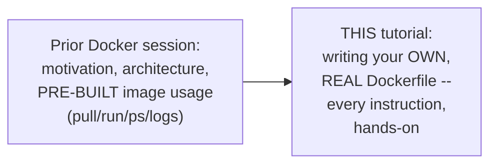

#### 🎯 Key Takeaways

* This tutorial **directly, genuinely completes** the "custom Dockerfile authoring" gap explicitly left open by prior Docker fundamentals coverage.
* Every instruction covered is **directly, live-demonstrated** — built into a real image, run as a real container, and its effect GENUINELY confirmed (not merely described).
* The tutorial uses a **real, working JavaScript application** (from a prior video) as its own running example, alongside several standalone demonstrations for individual instructions.

---

### 2. Dockerfile Basics: Naming, Comments & the Instruction/Argument Format

#### 📖 Definition — The Precise, Required File Name

> 💡 **Given directly:** *"The name of the file should be exactly this, which is `Dockerfile` with D capital, and this is also mentioned in the official documentation... the default file name to use for a Docker file is `Dockerfile`, and we recommend using the default Docker file for your project's primary Docker file."*

```text
Required file name: Dockerfile   (capital D, no file extension)
```

#### 📖 Definition — Comments, Precisely Explained

> 💡 **Given directly:** *"The first line is the comment, so we can create a comment in Docker file using the hash symbol, which is very similar to how you do it in Python or any other programming language."*

```dockerfile
# This is a comment
```

#### 📖 Definition — The Precise, Complete Instruction Format

> 💡 **Given directly:** *"Docker file format is instruction and argument... this instruction is usually in capital letters, although it is not case sensitive. Docker recommends you to have instructions in capital letters so that you can differentiate instructions and argument more easily."*

```text
INSTRUCTION argument
```

#### ⚠ Common Mistakes

* Naming the file anything other than exactly `Dockerfile` — explicitly, directly confirmed as the GENUINE, required, official default name, per Docker's own documentation.
* Assuming instructions MUST be uppercase for Docker to genuinely recognize them — explicitly, directly clarified: uppercase is a STRONGLY RECOMMENDED convention (for readability), NOT a technical, case-sensitivity requirement.

#### 🎯 Key Takeaways

* A genuine Dockerfile must be named **exactly `Dockerfile`** (capital D, no extension) — the official, documented default.
* **Comments** use the `#` symbol, directly analogous to Python.
* Every instruction follows the precise **`INSTRUCTION argument`** format — instructions are CONVENTIONALLY uppercase (for readability), though technically NOT case-sensitive.

---
### 3. FROM: Choosing a Base Image

#### 📖 Definition — FROM, Precisely Introduced

> 💡 **Given directly:** *"Usually the FROM instruction is the first instruction that you will use to create your Docker file... this instruction is used to define the base image on which you want to create your Docker image, and you can find all the different images on Docker Hub."*

```dockerfile
FROM alpine:3.18
```

#### 🪜 Step-by-Step — Selecting a Specific Version Tag

> 💡 **Given directly:** *"If you want to use a particular version of Python, let's say 3.11 or 3.12 or 3.13, I can check that in the tags here... you can set that as your base image by specifying colon and then the tag name."*

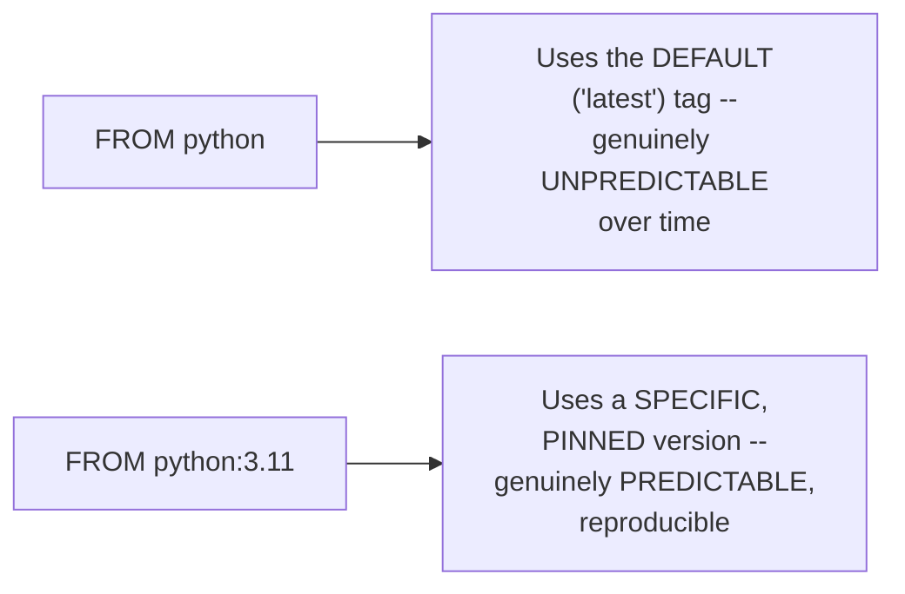

#### 🔍 Internal Working — A Genuine, Direct Confirmation: Base Images Are Themselves Built From Dockerfiles

> 💡 **Given directly:** *"Every image is created using... instructions... you can see 3.11 bookworm was created using all these different instructions, and the base image for this image here is buildpack-deps bookworm... every image is created using a Dockerfile."*

#### 🪜 Step-by-Step — A Complete, Live, Verified Demonstration

> 💡 **Given directly:** *"I'm going to say FROM Alpine colon 3.18... to confirm how FROM instruction works... I'm going to go ahead with creating an image from this particular Docker file... `docker build -t my-image .`... to check what operating system is used inside this particular image... I'm going to run the same command inside this image... `cat /etc/os-release`... you can see it says Alpine Linux 3.18, which means the FROM instruction actually uses this as the base image."*

```bash
docker build -t my-image .
docker run my-image cat /etc/os-release
# Confirmed, live output: Alpine Linux 3.18
```

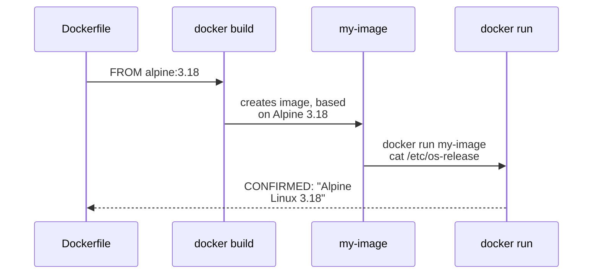

#### 🔍 Internal Working — A Genuine, Direct Confirmation: FROM Can Appear Multiple Times

> 💡 **Given directly:** *"FROM can appear multiple times inside a single Docker file to either create multiple docker images or to create multistage Docker image... you can also give name to each stage using AS keyword — so you'll say `FROM python:3.9 as build1`."*

```dockerfile
FROM python:3.9 as build1
# ... further instructions ...
```

#### ⚠ Common Mistakes

* Assuming a base image (like Python or Alpine) is somehow fundamentally DIFFERENT from any other Docker image — explicitly, directly clarified: EVERY image, including OFFICIAL base images, is genuinely built FROM its OWN Dockerfile — there's no structural distinction.
* Omitting a specific version tag (using `FROM python` instead of `FROM python:3.11`) — explicitly, directly demonstrated as genuinely LESS predictable, since the "default" tag can change over time.

#### 🎯 Key Takeaways

* **`FROM`** specifies the BASE image for a new Docker image — sourced from Docker Hub (or another registry), optionally with a SPECIFIC version tag (`image:tag`).
* This instruction's own genuine effect was **directly, live-verified**: `FROM alpine:3.18` produced a container whose OWN `/etc/os-release` genuinely confirmed "Alpine Linux 3.18."
* **`FROM` can genuinely appear MULTIPLE times** within a single Dockerfile — enabling multi-stage builds, with each stage optionally NAMED via the `AS` keyword.

---

### 4. RUN: Executing Commands During the Build

#### 📖 Definition — RUN, Precisely Introduced

> 💡 **Given directly:** *"Using RUN you can execute commands during the image build process... RUN instruction lets you run a command."*

```dockerfile
RUN echo hello
```

#### 📖 Definition — Shell Form vs. Exec Form, Precisely Distinguished

> 💡 **Given directly:** *"The RUN command works in two different formats, which is the shell form and the exec form... in the shell format, you don't need to define what shell are you trying to use, but in the exec format, you need to define what shell do you want to use — so here we have `/bin/sh` for Linux, for Windows it is going to be CMD."*

```dockerfile
# Shell form (Docker uses a default shell automatically)
RUN apk add curl

# Exec form (explicitly specify the shell)
RUN ["/bin/sh", "-c", "apk add curl"]
```

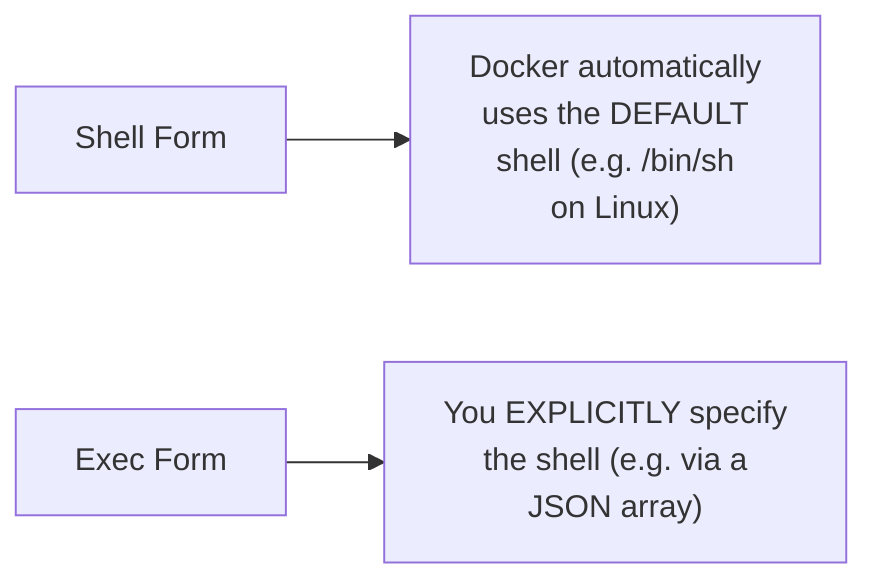

#### 🪜 Step-by-Step — A Complete, Live, Verified Demonstration

> 💡 **Given directly:** *"I'm going to install curl on this particular image, so I can say `RUN apk add curl`... this is similar to `apt install curl` in Ubuntu, as this is Alpine we are going to say `RUN apk add curl`."*

```bash
docker build -t my-image .
docker history my-image   # confirms genuine, real, individual layers
```

> 💡 **Given directly, confirming the genuine, real layer structure:** *"You can also check all the different layers by running Docker history command on the particular image... we have three layers here — these two are from the FROM image, and this one is from the RUN that we have executed."*

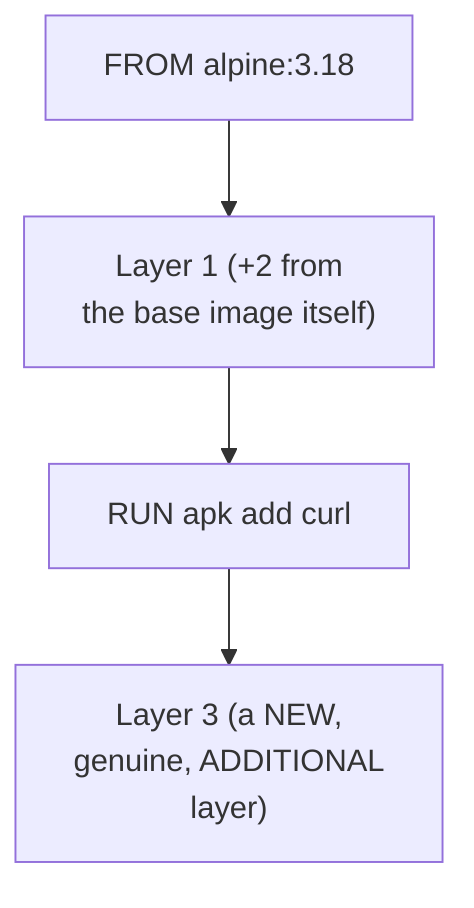

#### ⚠ Common Mistakes

* Assuming `RUN` executes a command every time the CONTAINER is started — explicitly, directly clarified: `RUN` executes ONLY DURING the IMAGE BUILD process, producing a PERMANENT, baked-in layer — genuinely different from `CMD`/`ENTRYPOINT`, which run at CONTAINER STARTUP (Section 10).
* Assuming shell form and exec form are functionally IDENTICAL in every respect — explicitly, directly distinguished: exec form requires EXPLICITLY specifying the shell, while shell form lets Docker use a sensible DEFAULT automatically.

#### 🎯 Key Takeaways

* **`RUN`** executes a command DURING the image BUILD process — genuinely, permanently baking its result into a NEW image layer.
* Two genuine formats exist: **shell form** (Docker uses a default shell automatically) and **exec form** (you explicitly specify the shell, e.g., `/bin/sh` on Linux, `CMD` on Windows).
* `docker history` genuinely, directly confirmed the REAL, additive layer structure — each `RUN` instruction produces its OWN, separate, observable layer.

---
### 5. WORKDIR & USER: Setting the Working Directory and Default User

#### 📖 Definition — WORKDIR, Precisely Introduced

> 💡 **Given directly:** *"Using this instruction you can set the path on which you want to work... set the working directory for any subsequent ADD, COPY, CMD, ENTRYPOINT instruction that follows inside the Dockerfile."*

```dockerfile
WORKDIR /downloads
```

#### 🪜 Step-by-Step — A Complete, Live, Verified Demonstration

> 💡 **Given directly:** *"Right now if I show you what folder are you working inside the image, we can check that by running `docker run my-image pwd`... the image is using the slash path... but let's say you want to use the downloads folder, so you can set that using WORKDIR."*

```bash
docker run my-image pwd     # BEFORE WORKDIR: shows "/"
# after adding WORKDIR /downloads to the Dockerfile and rebuilding:
docker run my-image pwd     # AFTER WORKDIR: shows "/downloads"
```

#### 🔍 Internal Working — A Genuine, Important, Confirmed Behavior: WORKDIR Creates the Directory

> 💡 **Given directly:** *"Right now let's check what is inside the download folder... it says no such file or directory, so you don't need to worry, because working directory can also set the path, but also create new directories if they are not already there."*

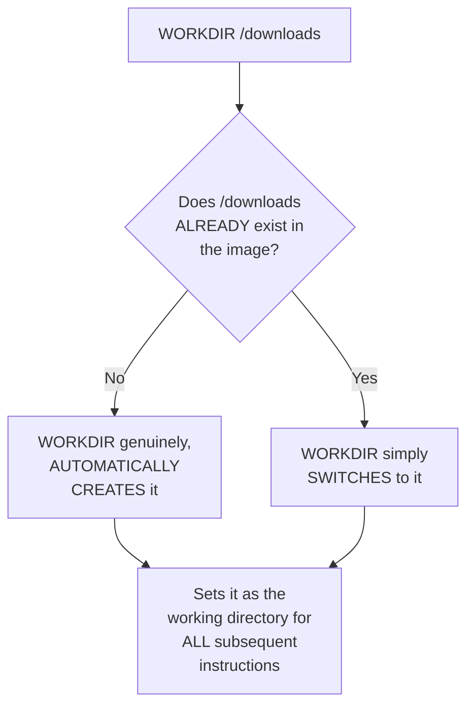

#### 📖 Definition — USER, Precisely Introduced

> 💡 **Given directly:** *"User instruction lets you set the username or the user ID, along with group ID if you want to, as the default user and group for the next commands. By default, when you don't set any user, the docker image is using the root user as the default user."*

```dockerfile
USER cloudchamp
```

#### 🪜 Step-by-Step — A Complete, Live, Verified Demonstration

> 💡 **Given directly:** *"When I run `whoami` command on my image, I should be able to see root as the default user... using USER command we can set any other user... let's say I want to set the user as `cloudchamp`... as `cloudchamp` is not created, obviously we will get an error saying no matching entries."*

```bash
docker run my-image whoami   # default: "root"
```

```dockerfile
RUN adduser --disabled-password cloudchamp
USER cloudchamp
```

> 💡 **Given directly, confirming the genuine, real, corrected result:** *"When I try to build the image again, this time I'm creating a user along with creation, I'm also setting the user to be used as `cloudchamp` for the next instruction... when I run the same `whoami` command, this time, in place of root, it should show us `cloudchamp`."*

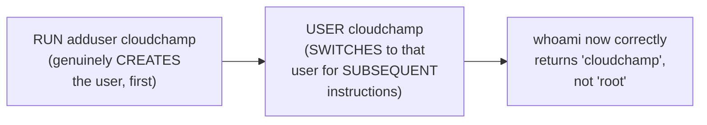

#### ⚠ Common Mistakes

* Assuming `WORKDIR` fails if the target directory doesn't already exist — explicitly, directly, live-demonstrated as FALSE: it genuinely, automatically CREATES the directory if needed.
* Attempting to `USER <name>` a user that hasn't been genuinely CREATED yet — explicitly, directly demonstrated as producing a REAL error ("no matching entries") — the user must FIRST be created (e.g., via `RUN adduser`), THEN switched to via `USER`.
* Assuming a Docker container's default user is some GENERIC, unprivileged account — explicitly, directly clarified: it's genuinely **`root`** by default, a real security consideration.

#### 🎯 Key Takeaways

* **`WORKDIR`** sets the working directory for ALL subsequent `ADD`/`COPY`/`CMD`/`ENTRYPOINT` instructions — and genuinely, automatically CREATES the directory if it doesn't already exist.
* **`USER`** sets the default user for subsequent commands — Docker's own genuine DEFAULT is **`root`**, unless explicitly overridden.
* Switching to a NEW, non-root user genuinely requires **TWO steps**: first CREATING the user (e.g., via `RUN adduser`), THEN switching to it via `USER` — attempting `USER` alone, without first creating the account, produces a real, observable error.

---

### 6. SHELL: Changing the Default Shell (Windows Base Images)

#### ❓ Why It Exists — The Precise, Genuine, Real Problem This Solves

> 💡 **Given directly:** *"Let's try to build a Windows image... we have three instructions of FROM, RUN and RUN... this command is used to create a folder named as `/demo`... similarly we also have another command here which is the RUN command... 'hello world' and then we are putting this message inside `demo/message.txt`... but this is a Windows command."*

#### 🪜 Step-by-Step — A Genuine, Real Error, Honestly Demonstrated

> 💡 **Given directly:** *"I'm going to go ahead with creating an image from this Docker file... you can see there's an error here on the third instruction — we got an error saying 'failed to solve process /bin/sh -c'... this command is still using the bash shell instead of using the Windows shell, which could be PowerShell or command prompt."*

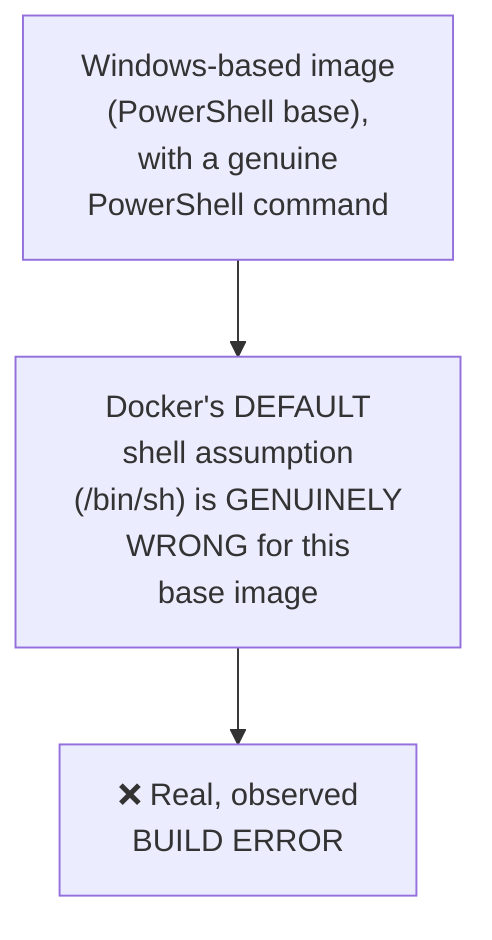

#### 📖 Definition — SHELL, Precisely Introduced as the Fix

> 💡 **Given directly:** *"We can change the shell in Docker file using the SHELL instruction... you can use SHELL to define that you want to use PowerShell, or you want to use CMD, or you can use the default one which is `/bin/sh` for Linux."*

```dockerfile
SHELL ["pwsh", "-command"]
```

> 💡 **Given directly, the genuine, honest, live-debugged correction:** *"I'm going to put the SHELL instruction here and set the shell as PowerShell rather than using the `/bin/sh`... okay, we got same error... instead of PowerShell, I think it has to be `pwsh`... now I'm going to save this and run it again — this time we got no error."*

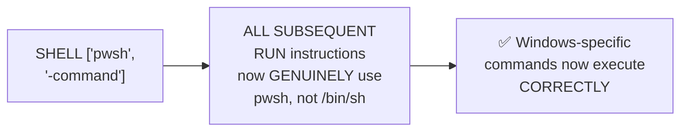

#### ⚠ Common Mistakes

* Assuming Docker's default shell (`/bin/sh`) is genuinely universal, working correctly regardless of the base image's own operating system — explicitly, directly, HONESTLY demonstrated as FALSE via a real, live error when using a Windows/PowerShell base image.
* Assuming the FIRST attempted fix is always immediately correct — explicitly, directly, honestly shown requiring a SECOND correction (from `PowerShell` to the precise `pwsh` executable name) before genuinely resolving the error.

#### 🎯 Key Takeaways

* **`SHELL`** changes which shell subsequent instructions genuinely use — directly, necessarily REQUIRED when a base image's own operating system (e.g., Windows) doesn't match Docker's own DEFAULT shell assumption (`/bin/sh`, for Linux).
* This section's own **genuine, honest, live debugging** — hitting a real error, then correcting it — directly demonstrates that even experienced practitioners encounter and must FIX real, unexpected errors, not merely write flawless code on the first attempt.

---
### 7. ENV: Setting Environment Variables

#### 📖 Definition — ENV, Precisely Introduced

> 💡 **Given directly:** *"Setting environment variables for running an application is very, very common, and you can do that in Docker file using the ENV instruction... ENV instruction lets you set the environment variable to specified value — ENV and then key equals to value."*

```dockerfile
ENV APP_HOST=0.0.0.0
```

#### 🪜 Step-by-Step — Setting MULTIPLE Environment Variables in One Instruction

> 💡 **Given directly:** *"If you want to add more such environment variables... optionally, if you want to have more such environment variables, you can add it directly in the same single instruction by saying adding this backslash here — so using this you can now put more environment variables like this."*

```dockerfile
ENV APP_HOST=0.0.0.0 \
    APP_PORT=5000 \
    ABC=XYZ
```

#### 🪜 Step-by-Step — A Complete, Live, Verified Demonstration

> 💡 **Given directly:** *"Once I set this you can also check if it is working or not... I'm going to run this as a container... `docker run my-new-image env` to check what are different environment variables present inside this... it should show me the same environment variables present here in the Docker file... you will be able to see all this instructions along with the instructions that are set in the Python base image, so we can understand that env works properly."*

```bash
docker build -t my-new-image .
docker run my-new-image env
# Genuinely, live confirms: APP_HOST=0.0.0.0, APP_PORT=5000, ABC=XYZ, PLUS the base image's own defaults
```

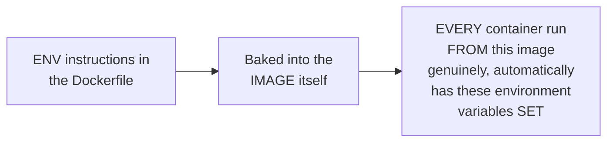

#### ⚠ Common Mistakes

* Assuming multiple environment variables ALWAYS require SEPARATE `ENV` instructions — explicitly, directly demonstrated as OPTIONAL: a SINGLE `ENV` instruction can define MULTIPLE variables, using backslash line-continuation.
* Assuming `docker run <image> env` would show ONLY the variables explicitly set in THIS specific Dockerfile — explicitly, directly, genuinely confirmed as ALSO including variables INHERITED from the BASE image (e.g., Python's own default environment variables).

#### 🎯 Key Takeaways

* **`ENV`** sets environment variables directly, permanently within the built image — using `KEY=value` syntax.
* Multiple variables can genuinely be set in **ONE, single `ENV` instruction**, using backslash (`\`) line continuation.
* This instruction's own genuine effect was **directly, live-verified** via `docker run <image> env`, confirming BOTH the newly-set variables AND those genuinely inherited from the base image.

---

### 8. COPY & ADD: Bringing Files Into the Image

#### 📖 Definition — COPY, Precisely Introduced

> 💡 **Given directly:** *"We want to copy this code from our local machine to our Docker container. How can we do that? So we can do that using the COPY instruction that lets you copy something from source to destination — so the source here is a local machine, and the destination is this directory here."*

```dockerfile
COPY app.py /code/
```

#### 🪜 Step-by-Step — A Complete, Live, Verified Demonstration

> 💡 **Given directly:** *"I'm going to say copy `app.py` from my local machine inside `/code/`... once I do this, and then now create Docker image from this Docker file, we should be able to see that the `app.py` is present inside `/code` folder."*

```bash
docker build -t my-new-image .
docker run my-new-image ls /code
# Genuinely, live confirms: app.py is present
```

#### 📖 Definition — ADD, Precisely Introduced as COPY's Genuine Superset

> 💡 **Given directly:** *"Similar to COPY is the ADD instruction — using ADD instruction we can also copy files from one place to another, but along with that it also has extra functionality where you can copy files from a remote location, maybe something on the internet, inside your container."*

```dockerfile
ADD https://my-s3-bucket.s3.amazonaws.com/token.txt /code/
```

#### 🪜 Step-by-Step — A Complete, Live, Verified Demonstration

> 💡 **Given directly:** *"In my S3 bucket I have a file named as `token.txt`, and using ADD instructions I can copy that from my S3 bucket inside my container... let me show you an example... along with `app.py`, it should also have a file named as `token.txt`."*

```bash
docker build -t new-image .
docker run new-image ls /code
# Genuinely, live confirms: BOTH app.py AND token.txt are present
```

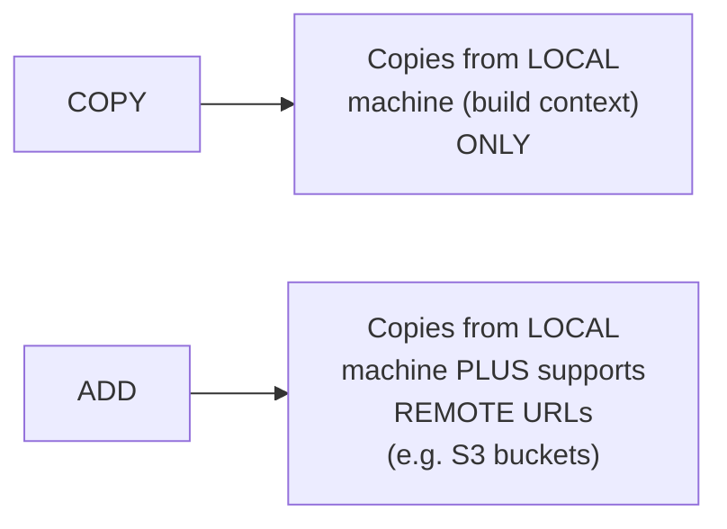

#### ⚠ Common Mistakes

* Assuming `COPY` and `ADD` are functionally IDENTICAL, interchangeable instructions — explicitly, directly distinguished: `ADD` genuinely offers ADDITIONAL capability (remote URL support) that `COPY` does NOT have.
* Assuming `ADD`'s remote-URL capability makes it the GENERALLY preferable choice over `COPY` — this session's own content doesn't explicitly warn against this, but the DISTINCT naming and DEMONSTRATED capability difference directly implies `COPY` remains the more common, straightforward choice for simple, LOCAL file copying.

#### 🎯 Key Takeaways

* **`COPY`** copies files/folders from the LOCAL machine (the build context) into the image.
* **`ADD`** does everything `COPY` does, PLUS a genuine, ADDITIONAL capability: pulling files from REMOTE URLs (e.g., an S3 bucket) — directly, live-demonstrated with a real `token.txt` file pulled from S3.
* Both instructions' own genuine effects were **directly, live-verified** via `docker run <image> ls /code`, confirming the copied/added files' actual presence inside the container.

---
### 9. EXPOSE: Declaring Network Ports

#### 📖 Definition — EXPOSE, Precisely Introduced

> 💡 **Given directly:** *"Let's say you have an application which is running on port 5000, so you want the container to be listening on port 5,000, or to allow inbound traffic from port 5,000, and you can do that using EXPOSE command — the EXPOSE define the network ports that this container will listen on."*

```dockerfile
EXPOSE 5000
```

#### 🪜 Step-by-Step — A Complete, Live, Verified Demonstration

> 💡 **Given directly:** *"I'm going to go ahead with creating an image from this Docker file... and to check what ports are allowed on this particular image, I'm going to use the `docker inspect` command... once I run this you will be able to see that the port exposed is 5,000, and it was using EXPOSE Docker instruction."*

```bash
docker build -t my-new-image .
docker inspect my-new-image
# Genuinely, live confirms: exposed port = 5000
```

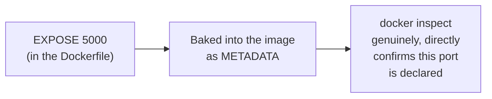

#### ⚠ A Direct, Important Clarification: EXPOSE Is Documentation, Not Enforcement

> 💡 **Given directly, precisely restated from Docker's own documentation:** *"Expose define the network ports that this container will listen on."*

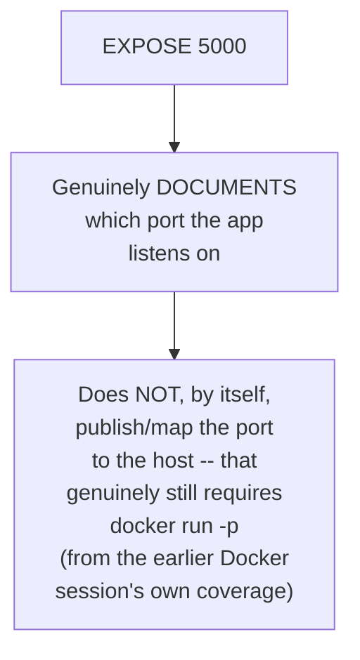

#### ⚠ Common Mistakes

* Assuming `EXPOSE` alone genuinely makes a containerized application EXTERNALLY accessible — explicitly, directly implied (though not stated as a warning in THIS specific tutorial) by the PRIOR Docker session's own established teaching: genuine external access still, additionally requires PORT MAPPING (`docker run -p`) at RUN time — `EXPOSE` is primarily DOCUMENTATION/metadata about the container's OWN intended port.

#### 🎯 Key Takeaways

* **`EXPOSE`** declares which network port(s) a container genuinely LISTENS on — directly, live-confirmed via `docker inspect`.
* This is primarily a **documentation/metadata mechanism** — directly connecting back to the PRIOR Docker session's own established teaching that genuine, EXTERNAL accessibility additionally requires PORT MAPPING (`-p`) at container RUN time.

---

### 10. ENTRYPOINT & CMD: Defining What Actually Runs

#### 📖 Definition — The Precise, Genuine, Core Purpose of These Two Instructions

> 💡 **Given directly:** *"The two very most important instructions that are responsible to run the application or the process inside the container are ENTRYPOINT and CMD... they will tell what process to run or what command to execute. Docker expects you to have either one of these inside the Docker file — you can also have both of them, but you need to have either one of them, which will define what is to be running inside the container."*

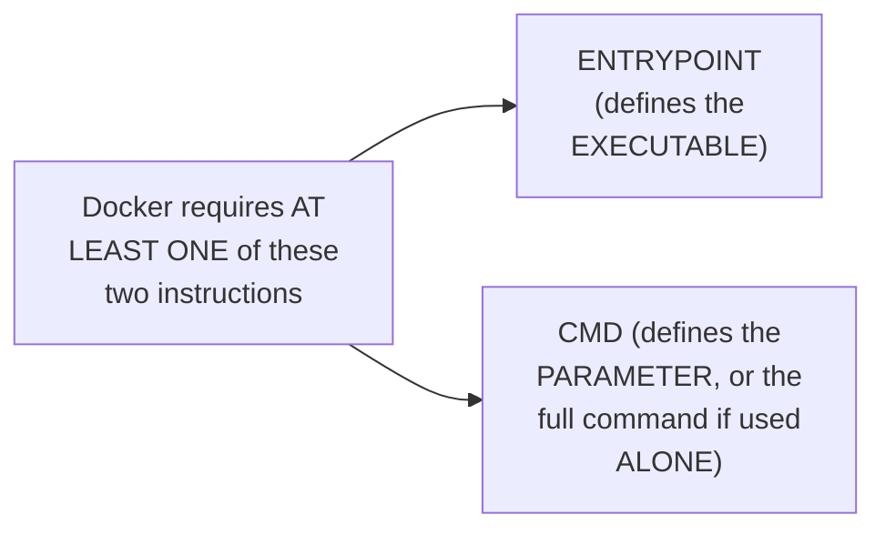

#### 🪜 Step-by-Step — Two, Genuinely Equivalent Ways to Express the Same Command

> 💡 **Given directly:** *"If you look at the docker file here which we have used in the previous Docker course, you can see CMD command is here, which is running `npm start` command — so `npm` is the executable, and the `start` is the parameter here... this similar command could also be written as ENTRYPOINT, and you define the executable here rather than doing it here, and then you have the parameter defined here — so this will work the same way as it was earlier."*

```dockerfile
# Option A: CMD alone (executable + parameter together)
CMD ["npm", "start"]

# Option B: ENTRYPOINT (executable) + CMD (parameter) -- functionally EQUIVALENT
ENTRYPOINT ["npm"]
CMD ["start"]
```

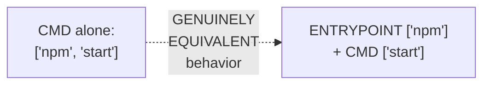

#### 🪜 Step-by-Step — A Complete, Live, Verified Demonstration

> 💡 **Given directly:** *"Let's try to run this and see if it actually works or not... `docker run -it -p 8080:3000 <image>`... let's check port 8080 now... `localhost:8080`... so we have the application running here, which means it works the same."*

#### 🪜 Step-by-Step — The Genuinely Important, Precise Behavior: CMD's Parameter CAN Be Overridden

> 💡 **Given directly:** *"This parameter could also be overridden — for example, if I show you this with another command, let's say sleep command here — so in sleep I'm saying the parameter to be 5, which means when I run this container, this container is going to sleep for 5 seconds. But if I want to change this or override this parameter, I can also say... 10... it will take this 10 and override the 5 here, which means the sleep is going to be executing for the next 10 seconds, rather than just 5."*

```dockerfile
ENTRYPOINT ["sleep"]
CMD ["5"]
```

```bash
docker run <image>          # sleeps for 5 seconds (CMD's default parameter)
docker run <image> 10        # sleeps for 10 seconds (CMD's default OVERRIDDEN by the runtime argument)
```

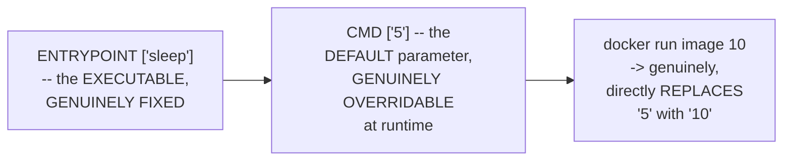

#### 🏢 Real-World / Production Usage — A Genuine, Direct Recommendation for Further Study

> 💡 **Given directly:** *"I know this is confusing, and to understand this more properly you can go to the official documentation here... you can also check out the Stack Overflow answers here."*

#### ⚠ Common Mistakes

* Assuming `ENTRYPOINT` and `CMD` are two, entirely UNRELATED instructions — explicitly, directly clarified: they work TOGETHER, with `ENTRYPOINT` defining the fixed EXECUTABLE and `CMD` defining the (genuinely overridable) DEFAULT parameter.
* Assuming a Dockerfile can genuinely omit BOTH `ENTRYPOINT` and `CMD` — explicitly, directly clarified: Docker REQUIRES at least ONE of these two instructions, to define what genuinely RUNS inside the container.
* Assuming `CMD`'s own parameter is GENUINELY FIXED, unchangeable at runtime — explicitly, directly, live-demonstrated as OVERRIDABLE: passing an ADDITIONAL argument to `docker run` genuinely REPLACES `CMD`'s own default value.

#### 🎯 Key Takeaways

* **`ENTRYPOINT`** and **`CMD`** are the two instructions genuinely responsible for defining what ACTUALLY RUNS inside a container — Docker requires **AT LEAST ONE** of them.
* `ENTRYPOINT` defines the fixed EXECUTABLE; `CMD` defines a DEFAULT parameter — a command like `CMD ["npm", "start"]` alone is functionally EQUIVALENT to `ENTRYPOINT ["npm"]` + `CMD ["start"]`.
* `CMD`'s own default parameter is **genuinely OVERRIDABLE** at runtime — directly, live-demonstrated: `docker run <image> 10` genuinely REPLACES `CMD`'s own default value (e.g., changing a sleep duration from 5 seconds to 10).

---

### 11. LABEL: Adding Metadata

#### 📖 Definition — LABEL, Precisely Introduced

> 💡 **Given directly:** *"Labels are used to give more information about the image — so you could add version of the image, or you could add who has created this image, who is the maintainer... label instruction is used to add metadata to the image."*

```dockerfile
LABEL creator="cloudchamp"
LABEL version="2"
LABEL environment="prod"
```

> 💡 **Given directly:** *"For example, I can add a LABEL instruction here saying that the creator is me — LABEL equals to key equals to value — so I can say the creator of this is Cloud Champ, the version of this application is 2, or environment equals to prod, environment equals to development."*

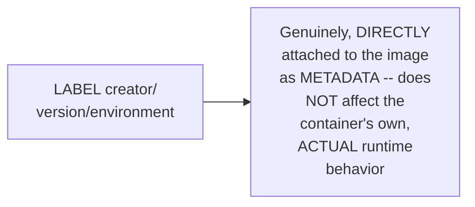

#### ⚠ Common Mistakes

* Assuming `LABEL` genuinely affects a container's own, actual RUNTIME behavior — explicitly, directly implied as FALSE by its own stated purpose: it's purely METADATA/documentation, similar in spirit to `EXPOSE`'s own documentation role (Section 9).

#### 🎯 Key Takeaways

* **`LABEL`** adds genuine METADATA to an image — such as the creator, version, or environment — using `key=value` syntax.
* This directly, precisely completes this tutorial's own comprehensive coverage of Dockerfile instructions — from `FROM` (Section 3) through `LABEL` (this section).

---
## 📝 Glossary

| Term | Definition | Why It Matters |
|---|---|---|
| **Dockerfile** | A text file with instructions to build a Docker image | Must be named EXACTLY "Dockerfile" |
| **FROM** | Specifies the base image | Usually the FIRST instruction; can appear multiple times |
| **RUN** | Executes a command DURING the image build | Creates a new, permanent image layer |
| **WORKDIR** | Sets the working directory for subsequent instructions | Genuinely CREATES the directory if it doesn't exist |
| **USER** | Sets the default user for subsequent commands | Default is root; must CREATE a user before switching to it |
| **SHELL** | Changes which shell subsequent RUN instructions use | Needed for non-Linux (e.g. Windows/PowerShell) base images |
| **ENV** | Sets environment variables, baked into the image | Supports multiple variables via backslash continuation |
| **COPY** | Copies files from the LOCAL build context into the image | Simpler; local files only |
| **ADD** | Like COPY, but ALSO supports remote URLs | Genuine superset of COPY's capability |
| **EXPOSE** | Declares which network port(s) a container listens on | Documentation/metadata -- NOT the same as port mapping |
| **ENTRYPOINT** | Defines the fixed EXECUTABLE that runs in the container | Docker requires ENTRYPOINT and/or CMD |
| **CMD** | Defines a DEFAULT parameter (or full command, if used alone) | Genuinely OVERRIDABLE at `docker run` time |
| **LABEL** | Adds metadata (creator, version, etc.) to an image | Documentation only; no runtime effect |

---

## 🔄 Revision Notes — One-Minute Revision

* This tutorial **directly, completely fills** the "how to write your own Dockerfile" gap left open by the earlier Docker fundamentals session -- every instruction demonstrated LIVE, with real builds and real, confirmed output.
* **File naming**: must be EXACTLY `Dockerfile` (capital D, no extension) -- Docker's own official, documented default. **Comments**: `#`. **Format**: `INSTRUCTION argument` (uppercase is convention, not a technical requirement).
* **FROM**: specifies the base image (e.g., `alpine:3.18`) -- can use a specific version TAG; can appear MULTIPLE times (multi-stage builds, with `AS` naming); LIVE-confirmed via `cat /etc/os-release` showing "Alpine Linux 3.18."
* **RUN**: executes commands DURING the build (e.g., `RUN apk add curl`) -- shell form (default shell) vs. exec form (explicit shell) -- confirmed via `docker history` showing genuine, additive layers.
* **WORKDIR**: sets the working directory for subsequent ADD/COPY/CMD/ENTRYPOINT -- genuinely CREATES the directory if it doesn't already exist (live-confirmed).
* **USER**: sets the default user (root, by default) -- switching requires TWO steps: `RUN adduser <name>` FIRST, THEN `USER <name>` -- attempting USER alone on a non-existent user produces a real error.
* **SHELL**: changes the shell for subsequent RUN instructions -- genuinely NECESSARY for non-Linux base images (e.g., a Windows/PowerShell image) -- live-demonstrated fixing a REAL build error (`/bin/sh` -> `pwsh`).
* **ENV**: sets environment variables (`KEY=value`) -- multiple variables can be set in ONE instruction via backslash continuation -- confirmed via `docker run <image> env`, showing both new AND base-image-inherited variables.
* **COPY**: copies files from the LOCAL build context into the image. **ADD**: does everything COPY does, PLUS supports REMOTE URLs (e.g., an S3 bucket) -- both live-confirmed via `docker run <image> ls`.
* **EXPOSE**: declares which port(s) a container listens on -- confirmed via `docker inspect` -- primarily DOCUMENTATION/metadata, NOT the same as port mapping (`-p`) at run time.
* **ENTRYPOINT + CMD**: the two instructions defining what ACTUALLY RUNS -- Docker requires AT LEAST ONE. `CMD ["npm","start"]` alone is EQUIVALENT to `ENTRYPOINT ["npm"]` + `CMD ["start"]`. CMD's own default parameter is GENUINELY OVERRIDABLE at runtime (`docker run <image> 10` replaces CMD's own default "5").
* **LABEL**: adds metadata (creator, version, environment) -- documentation only, no runtime effect.

---

## 📋 Cheat Sheet

**Complete, illustrative Dockerfile, using every instruction covered:**
```dockerfile
# A complete, illustrative Dockerfile
FROM python:3.11

WORKDIR /app

RUN apt-get update && apt-get install -y curl

RUN adduser --disabled-password appuser
USER appuser

ENV APP_HOST=0.0.0.0 \
    APP_PORT=5000

COPY app.py /app/
ADD https://example-bucket.s3.amazonaws.com/config.txt /app/

EXPOSE 5000

LABEL creator="your-name" \
      version="1.0" \
      environment="prod"

ENTRYPOINT ["python"]
CMD ["app.py"]
```

**Build & verify commands:**
```bash
docker build -t my-image .
docker run my-image cat /etc/os-release   # verify FROM
docker history my-image                    # verify RUN layers
docker run my-image pwd                     # verify WORKDIR
docker run my-image whoami                   # verify USER
docker run my-image env                       # verify ENV
docker run my-image ls /app                     # verify COPY/ADD
docker inspect my-image                           # verify EXPOSE
docker run -p 8080:5000 my-image                    # verify ENTRYPOINT/CMD, with port mapping
docker run my-image 10                                # override CMD's default parameter
```

**ENTRYPOINT vs. CMD, in one line:**
```text
ENTRYPOINT = the fixed EXECUTABLE (rarely overridden)
CMD        = the DEFAULT parameter/command (genuinely overridable at `docker run` time)
Docker requires AT LEAST ONE of these two instructions.
```

---

## 🔥 Interview Questions & Answers

### 🟢 Beginner

**Q1.**

**Question:** What must a Dockerfile genuinely be named?

**Answer:** Exactly "Dockerfile" (capital D, no extension).

**Explanation:** Directly, explicitly stated, per Docker's own official documentation.

**Why Interviewers Ask This:** Basic, foundational Dockerfile knowledge.

**Possible Follow-up:** "Is this name case-sensitive on every operating system?"

**Q2.**

**Question:** What instruction specifies a Dockerfile's base image?

**Answer:** FROM.

**Explanation:** Directly, explicitly stated.

**Why Interviewers Ask This:** The most foundational Dockerfile instruction.

**Possible Follow-up:** "Can FROM appear more than once in a single Dockerfile?"

**Q3.**

**Question:** When does the RUN instruction genuinely execute -- during the build, or when the container starts?

**Answer:** During the build.

**Explanation:** Directly, precisely clarified.

**Why Interviewers Ask This:** A commonly-confused, foundational distinction.

**Possible Follow-up:** "What instructions genuinely execute when the container STARTS, instead?"

**Q4.**

**Question:** Does WORKDIR fail if the target directory doesn't already exist?

**Answer:** No -- it genuinely creates the directory automatically.

**Explanation:** Directly, live-demonstrated.

**Why Interviewers Ask This:** Tests a commonly-overlooked, genuine behavior.

**Possible Follow-up:** "What is the default user, if USER is never specified?"

**Q5.**

**Question:** What is Docker's genuine default user, if USER is never specified?

**Answer:** root.

**Explanation:** Directly, explicitly stated.

**Why Interviewers Ask This:** A genuine, real security-relevant fact.

**Possible Follow-up:** "What two steps are genuinely needed to switch to a new, non-root user?"

**Q6.**

**Question:** What genuine, additional capability does ADD have that COPY does not?

**Answer:** ADD can pull files from remote URLs (e.g., an S3 bucket); COPY only copies from the local build context.

**Explanation:** Directly, live-demonstrated.

**Why Interviewers Ask This:** A commonly-tested, precise distinction.

**Possible Follow-up:** "Does COPY support remote URLs?"

**Q7.**

**Question:** Does EXPOSE, by itself, make a container's application externally accessible?

**Answer:** Not by itself -- it's primarily documentation/metadata; genuine external access still requires port mapping (`-p`) at run time.

**Explanation:** Directly, precisely implied by its own stated purpose.

**Why Interviewers Ask This:** A genuinely important, commonly-misunderstood distinction.

**Possible Follow-up:** "What command/flag genuinely makes a container's port externally accessible?"

**Q8.**

**Question:** How many of ENTRYPOINT/CMD does Docker genuinely require, at minimum?

**Answer:** At least one.

**Explanation:** Directly, explicitly stated.

**Why Interviewers Ask This:** Basic, foundational, frequently-tested knowledge.

**Possible Follow-up:** "What happens if you use CMD alone, without ENTRYPOINT?"

**Q9.**

**Question:** Can CMD's own default parameter be overridden at runtime?

**Answer:** Yes -- passing an additional argument to `docker run` genuinely replaces CMD's default value.

**Explanation:** Directly, live-demonstrated.

**Why Interviewers Ask This:** Tests genuine, practical ENTRYPOINT/CMD behavior.

**Possible Follow-up:** "Can ENTRYPOINT's own value be as easily overridden?"

**Q10.**

**Question:** What is the purpose of the LABEL instruction?

**Answer:** To add metadata (e.g., creator, version, environment) to an image.

**Explanation:** Directly, explicitly stated.

**Why Interviewers Ask This:** Basic, practical Dockerfile knowledge.

**Possible Follow-up:** "Does LABEL affect the container's runtime behavior?"

---

### 🟡 Intermediate

**Q11.**

**Question:** Explain why the instructor deliberately, genuinely demonstrates a REAL build ERROR (Section 6, the Windows/PowerShell shell mismatch) rather than presenting only correctly-working examples throughout this tutorial.

**Answer:** This is a genuinely deliberate, honest teaching choice: by directly, live-encountering a REAL error (attempting to run a PowerShell command using Docker's default `/bin/sh` shell) and THEN working through the FIX (first attempting `PowerShell`, discovering this was still incorrect, then correcting to the precise `pwsh` executable name), the tutorial directly demonstrates GENUINE, REALISTIC Dockerfile debugging — not an idealized, error-free process. This is GENUINELY valuable because REAL Dockerfile authoring, especially for NON-Linux or less-common base images, GENUINELY often requires this EXACT kind of iterative debugging — directly, honestly preparing learners for the SAME kind of real, practical friction they'll GENUINELY encounter in their own work, rather than leaving them GENUINELY unprepared when their FIRST attempt at a similar Dockerfile doesn't work perfectly.

**Explanation:** Requires recognizing a deliberate, honest choice to preserve realistic debugging friction, rather than presenting an artificially seamless demonstration.

**Why Interviewers Ask This:** Tests whether a learner recognizes the genuine, practical value of honest, unedited demonstrations over polished, idealized ones.

**Possible Follow-up:** "What GENERAL debugging strategy did this specific error resolution demonstrate, that you could apply to OTHER, similar Dockerfile errors?"

**Q12.**

**Question:** A learner argues that since ADD can do everything COPY can do, PLUS additional remote-URL functionality, ADD should always be used INSTEAD of COPY, making COPY genuinely obsolete. Evaluate this claim.

**Answer:** This claim overstates the case, based on an incomplete understanding of software design principles this session's own content doesn't explicitly address, but which directly follows from the demonstrated capability difference. While ADD GENUINELY offers a SUPERSET of COPY's own capability (per Section 8's own precise demonstration), this does NOT mean COPY is GENUINELY obsolete — using the MORE POWERFUL, MORE FLEXIBLE instruction (ADD) for a SIMPLE, LOCAL file copy operation GENUINELY, UNNECESSARILY introduces ADDITIONAL, UNUSED capability (remote URL fetching) into a context where it provides NO genuine benefit — a violation of the GENERAL software-engineering principle of using the SIMPLEST, MOST PRECISE tool for a GIVEN task, directly making the Dockerfile's own INTENT more CLEAR to future readers (a SIMPLE `COPY` instruction GENUINELY, IMMEDIATELY signals "this is copying a LOCAL file," while `ADD` GENUINELY, AMBIGUOUSLY could mean EITHER a local copy OR a remote fetch, requiring the READER to check the SPECIFIC argument to know WHICH). This is DIRECTLY analogous to a GENERAL, real software-engineering principle: having MORE capability available doesn't mean you should ALWAYS use the MOST capable tool — using the MORE SPECIFIC, LESS AMBIGUOUS instruction (COPY, for simple local copies) GENUINELY improves code clarity and maintainability.

**Explanation:** Tests whether a learner recognizes that "can do more" doesn't automatically mean "should always be preferred," applying a genuine, real software-engineering clarity principle.

**Why Interviewers Ask This:** Distinguishes candidates who understand nuanced, practical tool-selection reasoning from those who default to the "most powerful" option without considering clarity/intent.

**Possible Follow-up:** "In what SPECIFIC, genuine scenario would using ADD instead of COPY for a purely LOCAL file copy be GENUINELY, meaningfully justified, if any?"

**Q13.**

**Question:** Explain, precisely, why `USER cloudchamp` (attempted WITHOUT first creating the user) genuinely produces a real error, using this session's own precise demonstration (Section 5) and connecting it to a GENERAL principle about Docker instruction ordering.

**Answer:** This directly, precisely reflects a GENERAL, important principle about Dockerfile instruction EXECUTION ORDER: Docker instructions execute SEQUENTIALLY, TOP TO BOTTOM, with EACH instruction operating on the STATE the image is IN at that EXACT point in the build process. Per Section 5's own precise demonstration, `USER cloudchamp` GENUINELY requires that a system-level user ACCOUNT named "cloudchamp" ALREADY, GENUINELY EXISTS within the image's own file system AT THE MOMENT this instruction executes — but if NO PRIOR instruction (like `RUN adduser cloudchamp`) has YET created this account, the `USER` instruction GENUINELY, CORRECTLY fails, since it's attempting to switch to an account that GENUINELY doesn't exist YET. This directly illustrates a GENERAL, important Dockerfile authoring principle: instructions with GENUINE, real DEPENDENCIES on prior state (like `USER` depending on a user account already existing, or `COPY`/`ADD` depending on a `WORKDIR` already being correctly set, per Section 5's own broader context) must be ORDERED CORRECTLY, with EACH prerequisite instruction GENUINELY completing BEFORE the DEPENDENT instruction that relies on it.

**Explanation:** Requires connecting the specific USER-before-creation error to a general, important principle about Dockerfile instruction sequencing and inter-instruction dependencies.

**Why Interviewers Ask This:** Tests whether a learner understands the GENERAL, underlying REASON for this specific error, correctly generalizing it into a broader principle about instruction ordering.

**Possible Follow-up:** "Name another PAIR of Dockerfile instructions (from this session's own content) where ORDER genuinely, similarly matters, and explain why."

**Q14.**

**Question:** Using this session's own precise ENTRYPOINT/CMD demonstration (Section 10), explain a genuine, real, practical scenario where you would DELIBERATELY choose to use ONLY `CMD` (without `ENTRYPOINT`), rather than splitting the command across BOTH instructions.

**Answer:** A precise, reasoned scenario, extending beyond what this session's own content explicitly states but directly following from the demonstrated ENTRYPOINT/CMD relationship: using ONLY `CMD` (e.g., `CMD ["npm", "start"]`, per Section 10's own exact example) is GENUINELY, PRACTICALLY appropriate when you WANT the ENTIRE command (both the executable AND its default arguments) to remain FULLY, EASILY OVERRIDABLE at `docker run` time — since `CMD` alone (without a separate `ENTRYPOINT`) means the COMPLETE command genuinely gets REPLACED if ANY argument is provided at runtime. This is GENUINELY, PRACTICALLY useful for a GENERAL-PURPOSE development/debugging image, where a user might WANT to run an ENTIRELY DIFFERENT command inside the SAME container (e.g., `docker run <image> bash` to GENUINELY get an interactive shell, INSTEAD of the application's own default startup command) — a GENUINELY common, real debugging pattern. By CONTRAST, splitting into `ENTRYPOINT` + `CMD` (per Section 10's own SPLIT example) makes MORE sense when you want the EXECUTABLE ITSELF to remain GENUINELY FIXED (e.g., always genuinely running `sleep`, per Section 10's own precise example), while ONLY the PARAMETER should be EASILY, PARTIALLY overridable (e.g., changing HOW LONG to sleep, without accidentally replacing the `sleep` command ITSELF with something ENTIRELY different).

**Explanation:** Requires reasoning through a genuine, practical trade-off between full command flexibility (CMD alone) and partial, parameter-only flexibility (ENTRYPOINT + CMD split), extending the session's own examples into a new, reasoned scenario.

**Why Interviewers Ask This:** Tests whether a learner can reason about WHEN to choose each ENTRYPOINT/CMD pattern, not just that both patterns EXIST.

**Possible Follow-up:** "For a PRODUCTION image (as opposed to a development/debugging one), which pattern (CMD alone, or ENTRYPOINT+CMD split) would you generally recommend, and why?"

**Q15.**

**Question:** Synthesize this session's complete EXPOSE explanation (Section 9) with the earlier Docker fundamentals session's own precise port-mapping demonstration (`docker run -p host:container`) to construct a complete, precise explanation of the FULL, correct sequence needed to make a Dockerfile-defined application GENUINELY, EXTERNALLY accessible.

**Answer:** A precise, synthesized explanation, directly connecting TWO, SEPARATE sessions' own established content: per THIS session's own precise EXPOSE demonstration (Section 9), `EXPOSE 5000` genuinely DOCUMENTS, within the IMAGE's own metadata, that the containerized application LISTENS on port 5000 — this is a GENUINE, but PURELY DECLARATIVE step, confirmed via `docker inspect`, that does NOT, by ITSELF, create ANY genuine, real network PATHWAY from OUTSIDE the container. Per the EARLIER Docker fundamentals session's own precise, live demonstration, GENUINE, external accessibility ADDITIONALLY requires explicit PORT MAPPING at `docker run` TIME (`docker run -p host_port:container_port <image>`) — this is the ACTUAL, OPERATIONAL step that GENUINELY, PRACTICALLY connects the host machine's own network interface to the container's own internal port. This directly, precisely reveals that these TWO instructions/steps serve GENUINELY, STRUCTURALLY DIFFERENT purposes: `EXPOSE` (BUILD-time, IN the Dockerfile) is DOCUMENTATION; `-p` (RUN-time, as a `docker run` FLAG) is the GENUINE, OPERATIONAL mechanism — and BOTH, per THIS complete, synthesized understanding, are GENUINELY, PRACTICALLY useful to include: `EXPOSE` for CLARITY (any user reading the Dockerfile immediately KNOWS which port matters), and `-p` for the GENUINE, ACTUAL, functioning connectivity.

**Explanation:** Requires synthesizing this session's own EXPOSE content with an entirely separate, earlier session's own port-mapping content to construct a complete, precise understanding of the full, correct sequence for external accessibility.

**Why Interviewers Ask This:** A senior-level question testing whether a candidate can connect content from TWO, separately-taught sessions into ONE, coherent, complete, and practically actionable understanding.

**Possible Follow-up:** "If a Dockerfile genuinely OMITS the EXPOSE instruction entirely, but the operator STILL correctly uses `docker run -p 8080:5000`, would the application still genuinely, externally work? Explain your reasoning."

---

### 🔴 Advanced

**Q16.**

**Question:** Design a complete, from-scratch Dockerfile for a genuinely new, hypothetical Python Flask application (running on port 8000, requiring a `requests` library installed via pip, with a non-root user, and two environment variables), explicitly using EVERY instruction category covered in this session (FROM, RUN, WORKDIR, USER, ENV, COPY, EXPOSE, ENTRYPOINT/CMD).

**Answer:** A reasonable, complete Dockerfile, directly applying this session's own exact, established patterns for EACH instruction:

```dockerfile
FROM python:3.11

WORKDIR /app

RUN pip install requests
RUN adduser --disabled-password flaskuser
USER flaskuser

ENV FLASK_HOST=0.0.0.0 \
    FLASK_PORT=8000

COPY app.py /app/

EXPOSE 8000

ENTRYPOINT ["python"]
CMD ["app.py"]
```

This complete design directly, precisely applies EVERY established pattern: `FROM` for the Python base image (Section 3); `RUN` for BOTH the pip install AND the non-root user creation (Section 4-5, correctly ORDERED before `USER`, per Intermediate Q13's own reasoning); `WORKDIR` to establish a clean working directory (Section 5); `USER` to switch to the newly-created, non-root account (Section 5); `ENV` for the two required variables, using the multi-variable, backslash-continued syntax (Section 7); `COPY` for the LOCAL application file (Section 8); `EXPOSE` for the documented port (Section 9); and `ENTRYPOINT`+`CMD` to define the genuine, runtime process (Section 10).

**Explanation:** Requires applying every major instruction category from this session's own content to construct a genuinely new, complete, correctly-ordered Dockerfile.

**Why Interviewers Ask This:** A realistic, senior-level question testing whether a candidate can synthesize ALL of a session's own taught instructions into ONE, complete, working, correctly-sequenced artifact.

**Possible Follow-up:** "If this application ALSO needed a configuration file pulled from a remote URL, which instruction would you add, and where in the sequence would it genuinely belong?"

**Q17.**

**Question:** Critically evaluate: "Since this session confirms that CMD's own parameter can be genuinely overridden at `docker run` time, this means Dockerfile authors have NO genuine control over what a container ACTUALLY runs once it's built — anyone can override it to run ANYTHING they want." Is this an accurate, complete characterization?

**Answer:** Not accurate — this significantly OVERSTATES the genuine, real scope of CMD's own override capability, ignoring ENTRYPOINT's own genuinely DIFFERENT, more RESTRICTIVE behavior this session's own content directly establishes. Per Section 10's own precise, worked "sleep" example, when `ENTRYPOINT` and `CMD` are used TOGETHER (rather than CMD ALONE), it is SPECIFICALLY, ONLY `CMD`'s own PARAMETER that gets GENUINELY overridden at runtime — the `ENTRYPOINT`'s own, FIXED EXECUTABLE (`sleep`, in the session's own precise example) GENUINELY REMAINS FIXED, REGARDLESS of what argument is passed at `docker run` time. This means a Dockerfile author CAN, GENUINELY, retain MEANINGFUL control over WHAT executable ultimately runs, by DELIBERATELY using the `ENTRYPOINT`+`CMD` SPLIT pattern (rather than `CMD` alone) — directly, precisely CONTRADICTING the claim that authors have "NO genuine control." The accurate, more precise characterization: Dockerfile authors GENUINELY CHOOSE their OWN level of override flexibility — using `CMD` ALONE genuinely permits FULL command override (per Intermediate Q14's own reasoning, sometimes GENUINELY desirable for development/debugging images); using `ENTRYPOINT`+`CMD` SPLIT genuinely RESTRICTS override to ONLY the parameter, GENUINELY preserving the author's OWN intended executable — this is a DELIBERATE, GENUINE design CHOICE available to the author, NOT an UNCONDITIONAL loss of control.

**Explanation:** Tests whether a learner recognizes that CMD's own override behavior is SCOPED differently depending on whether ENTRYPOINT is ALSO used, correctly identifying the author's own GENUINE, real design choice.

**Why Interviewers Ask This:** Distinguishes candidates who understand the PRECISE, scoped nature of CMD's override capability from those who over-generalize it into an unconditional loss of author control.

**Possible Follow-up:** "Design a Dockerfile pattern that GENUINELY, MAXIMALLY restricts runtime override, using ONLY the instructions covered in this session."

**Q18.**

**Question:** Synthesize this session's complete `docker history` demonstration (Section 4, confirming genuine, additive LAYERS from each instruction) with the earlier Docker fundamentals session's own precise image-size observations (e.g., the tiny 13 KB `hello-world` image) to construct a reasoned hypothesis for WHY Dockerfile INSTRUCTION ORDER can genuinely affect BUILD PERFORMANCE, even though the FINAL, resulting image might be functionally IDENTICAL regardless of order.

**Answer:** A precise, reasoned hypothesis, extending beyond what THIS session's own content explicitly states but directly following from its own established LAYER concept (Section 4): per Section 4's own precise, live confirmation, EACH Dockerfile instruction genuinely produces its OWN, SEPARATE, OBSERVABLE layer (confirmed via `docker history`) — and Docker's own real, well-known BUILD CACHING mechanism (a GENUINE, real Docker feature NOT explicitly covered in THIS specific session, but a DIRECT, logical extension of the LAYER concept it DOES establish) GENUINELY REUSES previously-built layers WHEN the corresponding instruction (and everything BEFORE it) hasn't GENUINELY CHANGED since the LAST build. This directly, precisely implies a GENUINE, real, practical consequence: placing INSTRUCTIONS that CHANGE FREQUENTLY (like `COPY app.py`, per Section 8's own example, where the APPLICATION CODE itself changes often during development) EARLY in the Dockerfile would GENUINELY force Docker to REBUILD EVERY SUBSEQUENT layer on EVERY build (since the CACHE is genuinely invalidated FROM that point forward) — while placing SLOWER-CHANGING instructions (like `RUN apt-get install...`, per Section 4's own example, where DEPENDENCIES change RARELY) EARLIER, and FREQUENTLY-changing instructions (like `COPY`) LATER, would GENUINELY allow Docker to REUSE the CACHED, slower-changing layers on MOST builds, GENUINELY, SUBSTANTIALLY speeding up REPEATED build cycles during active development — directly illustrating WHY EXPERIENCED Dockerfile authors GENUINELY, DELIBERATELY order instructions from "LEAST frequently changing" to "MOST frequently changing," a GENUINE, practical optimization this session's own LAYER concept directly enables reasoning about, even though it isn't EXPLICITLY, DIRECTLY taught within THIS specific transcript.

**Explanation:** Requires synthesizing the session's own layer concept with Docker's own broader, real caching mechanism (a logical extension, not explicitly taught here) to construct a genuinely new, reasoned hypothesis about instruction-order-driven build performance.

**Why Interviewers Ask This:** A capstone-level question testing whether a candidate can extend a session's own explicitly-taught concept (layers) into a GENUINE, real, practical optimization principle (cache-aware instruction ordering) that follows LOGICALLY, even without being explicitly, directly taught.

**Possible Follow-up:** "Reorder the complete, illustrative Dockerfile from this guide's own Cheat Sheet to GENUINELY, MAXIMALLY benefit from Docker's own build caching, explaining your reasoning for each reordering decision."

---

## 🧪 Scenario-Based Interview Questions

> **Scenario 1:** A colleague's Dockerfile, directly modeled on this session's own USER instruction demonstration, genuinely fails during build with an error stating the specified user doesn't exist — despite their Dockerfile GENUINELY containing both a `RUN adduser` instruction AND a subsequent `USER` instruction. Using this session's concepts, diagnose the most likely cause.

**Structured Answer:**
1. **Initial investigation:** Recognize this as potentially connected to Intermediate Q13's own precise reasoning about Dockerfile instruction ORDERING — even though BOTH instructions are genuinely PRESENT, their RELATIVE ORDER within the file GENUINELY matters.
2. **Metrics/logs to check:** Directly inspect the EXACT ORDER of the `RUN adduser` and `USER` instructions within the colleague's OWN Dockerfile, confirming whether `RUN adduser` GENUINELY appears BEFORE the `USER` instruction, or (mistakenly) AFTER it.
3. **Possible causes:** Per Intermediate Q13's own precise reasoning, if the `USER` instruction was ACCIDENTALLY placed BEFORE the `RUN adduser` instruction (a genuinely REALISTIC, easy-to-make ordering mistake), Docker would GENUINELY attempt to switch to a user that DOESN'T YET EXIST at THAT point in the build sequence.
4. **Debugging approach:** Directly review the COMPLETE Dockerfile, LINE BY LINE, confirming the EXACT sequence of instructions, specifically checking whether `RUN adduser` GENUINELY precedes `USER` in the file.
5. **Resolution:** REORDER the Dockerfile so `RUN adduser <name>` GENUINELY comes BEFORE `USER <name>`, directly matching Section 5's own exact, demonstrated, correct sequence.
6. **Prevention:** Establish a standing personal/team practice of DIRECTLY, EXPLICITLY verifying instruction ORDER whenever an instruction GENUINELY depends on a PRIOR instruction's own effect (user creation before user switching, directory creation before file copying into it, etc.) — directly modeling Section 5's own demonstrated, correct pattern.

> **Scenario 2 (Advanced):** Your team needs to decide whether a new, internal microservice's Dockerfile should use `CMD` alone, or the `ENTRYPOINT`+`CMD` split pattern, for its primary startup command. The service is intended for PRODUCTION deployment, where consistent, predictable startup behavior is critical. Using this session's own concepts, construct a complete, reasoned recommendation.

**Structured Answer:**
1. **Initial investigation:** Recognize this as directly connected to Intermediate Q14's own precise reasoning about the GENUINE trade-off between FULL command flexibility (CMD alone) and RESTRICTED, parameter-only flexibility (ENTRYPOINT+CMD split).
2. **Relevant principle:** Per Section 10's own precise demonstration, `CMD` ALONE permits the ENTIRE command to be OVERRIDDEN at `docker run` time — a GENUINE, real risk for a PRODUCTION service, where an OPERATOR could ACCIDENTALLY (or maliciously) override the ENTIRE startup command, POTENTIALLY causing the service to NOT genuinely start as intended.
3. **Possible causes for genuine consideration:** For a PRODUCTION microservice SPECIFICALLY requiring PREDICTABLE startup behavior, the ADDITIONAL FLEXIBILITY `CMD` alone provides (per Intermediate Q14's own reasoning, GENUINELY useful for DEVELOPMENT/debugging images) is LESS genuinely valuable, and the RISK of ACCIDENTAL, complete command override becomes a MORE significant, real concern.
4. **Debugging/evaluation approach:** Directly weigh the team's OWN genuine operational needs — does this SPECIFIC microservice GENUINELY need to support running ALTERNATIVE commands (e.g., for debugging/maintenance tasks), or should its STARTUP command remain GENUINELY, STRICTLY fixed?
5. **Resolution:** RECOMMEND the `ENTRYPOINT`+`CMD` SPLIT pattern for this PRODUCTION microservice — GENUINELY fixing the EXECUTABLE (ENTRYPOINT) while STILL allowing SPECIFIC, INTENTIONAL parameter adjustments (CMD) when GENUINELY needed, directly balancing PREDICTABILITY with SOME, LIMITED, INTENTIONAL flexibility.
6. **Prevention:** Establish a standing team practice of EXPLICITLY documenting, for EVERY production Dockerfile, WHY a SPECIFIC ENTRYPOINT/CMD pattern was CHOSEN — directly connecting the CHOICE to the SERVICE's own genuine, real operational requirements (predictability vs. flexibility), rather than defaulting to ONE pattern UNIFORMLY across ALL services.

---

## 🛠 Hands-on Exercises

### 🟢 Easy

1. Write out, from memory, the correct file name and basic syntax format for a Dockerfile.
2. Explain, in your own words, the genuine difference between COPY and ADD.
3. List all the instructions this session covers, with a one-line description of each.

### 🟡 Medium

4. Write a complete, working Dockerfile for a simple application of your own choosing, using AT LEAST 6 of the instructions covered in this session.
5. Write a short explanation (150-200 words) of why EXPOSE alone does not make a container externally accessible, directly applying Intermediate Q15's own reasoning.
6. Build the illustrative Dockerfile from this guide's own Cheat Sheet, and verify EVERY instruction's own effect using the corresponding verification command.

### 🔴 Advanced

7. Complete the full, worked Dockerfile design proposed in Advanced Interview Q16, for a genuinely different application/language of your own choosing.
8. Implement the debugging scenario proposed in Scenario 1 — deliberately introduce the "USER before RUN adduser" ordering mistake, then correctly diagnose and fix it.
9. Implement the cache-aware instruction reordering proposed in Advanced Interview Q18, and empirically measure build time differences between the "naive" and "optimized" instruction orders on a real, moderately-sized application.

---

## 🏗 Practice Assignment

### Build: "Complete, From-Scratch Dockerfile for a Real Application"

**Objective:** Directly apply every major instruction covered in this session to a genuinely new, real application of your own choosing.

**Requirements:**
- Choose a real, working application (or a simple, illustrative one you build specifically for this exercise).
- Write a complete Dockerfile using AT LEAST: `FROM`, `RUN`, `WORKDIR`, `USER` (with proper user creation), `ENV`, `COPY` (and optionally `ADD`), `EXPOSE`, and `ENTRYPOINT`/`CMD`.
- Build the image, and directly verify EACH instruction's own effect, using the corresponding verification command (per this session's own established pattern).
- Test CMD's own override behavior, if using the `ENTRYPOINT`+`CMD` split pattern.
- A written reflection (200-300 words) on any genuine, real challenges or errors you encountered, and how you resolved them — directly modeling Section 6's own honest, real debugging narrative.

**Architecture (suggested):**

```text
dockerfile_practice_assignment/
├── Dockerfile                        # your complete, working Dockerfile
├── app_files/                          # your application's own source files
├── verification_log.md                   # your instruction-by-instruction verification
└── REFLECTION.md                              # your written reflection
```

**Expected Functionality:**
- Your Dockerfile should genuinely, correctly build into a working image.
- Every instruction's own effect should be directly, individually verified — not merely assumed to work.

**Challenges:**
- Correctly ordering instructions that genuinely depend on prior instructions (e.g., user creation before user switching).
- Correctly distinguishing when to use COPY versus ADD for your own application's specific needs.

**Bonus Improvements:**
- Apply the cache-aware instruction ordering principle from Advanced Interview Q18, and document your own reasoning for the chosen order.
- Add a LABEL instruction with genuine, meaningful metadata about your own image.

---

## 📚 Additional Resources

- **The prior Docker fundamentals session** (referenced directly) -- covering Docker's motivation, architecture, and core practical commands (pull, run, ps, port mapping, detached mode), which this tutorial directly, genuinely extends.
- **Docker's official documentation** (referenced directly, throughout) -- the primary, authoritative source for Dockerfile instruction syntax and behavior.
- **Stack Overflow** (referenced directly) -- recommended for further clarification specifically on the ENTRYPOINT/CMD distinction.
- **Docker Hub** (referenced directly) -- for exploring official base images and their own, publicly-viewable Dockerfiles.

---

## 📌 Final Revision Sheet

### ⭐ Core Concepts
- **File naming**: must be exactly "Dockerfile."
- **FROM**: base image, optionally versioned, can appear multiple times.
- **RUN**: executes at BUILD time, creates a new layer.
- **WORKDIR**: sets/creates the working directory.
- **USER**: sets the default user (root by default) -- must create the user FIRST.
- **SHELL**: changes the shell for subsequent RUN instructions (needed for non-Linux images).
- **ENV**: sets environment variables, baked into the image.
- **COPY vs. ADD**: ADD is a superset, supporting remote URLs.
- **EXPOSE**: documents the listening port -- NOT the same as port mapping.
- **ENTRYPOINT + CMD**: define what genuinely runs -- CMD's parameter is overridable at runtime.
- **LABEL**: metadata only, no runtime effect.

### ⭐ Important Definitions
- **Shell Form vs. Exec Form** (see Glossary for full definitions).

### ⭐ Important Commands/Code
```dockerfile
FROM alpine:3.18
RUN apk add curl
WORKDIR /downloads
USER cloudchamp
ENV APP_HOST=0.0.0.0 \
    APP_PORT=5000
COPY app.py /code/
EXPOSE 5000
ENTRYPOINT ["npm"]
CMD ["start"]
LABEL creator="cloudchamp"
```

### ⭐ Architecture/Process
- Complete Dockerfile authoring workflow: FROM (base) -> RUN (install deps) -> WORKDIR (set directory) -> USER (create + switch) -> ENV (configure) -> COPY/ADD (bring in code) -> EXPOSE (document port) -> ENTRYPOINT/CMD (define runtime process) -> LABEL (metadata).

### ⭐ Best Practices
- Always name the file exactly "Dockerfile."
- Create a user (via RUN) before switching to it (via USER).
- Use COPY for simple, local file copies; reserve ADD for genuine remote-URL needs.
- Pair EXPOSE (documentation) with actual port mapping (-p) at run time for genuine external access.
- Choose ENTRYPOINT+CMD split for production predictability; CMD alone for development/debugging flexibility.

### ⭐ Common Mistakes
- Assuming RUN executes at container start, rather than during the build.
- Assuming WORKDIR fails if the directory doesn't exist (it creates it).
- Attempting USER before the corresponding user has been created.
- Assuming EXPOSE alone makes a container externally accessible.
- Assuming Docker allows a Dockerfile with neither ENTRYPOINT nor CMD.

### ⭐ Interview Points
- Be ready to write a complete, correctly-ordered Dockerfile using every major instruction.
- Be ready to precisely distinguish COPY from ADD, and ENTRYPOINT from CMD.
- Be ready to explain why EXPOSE and port mapping are genuinely different, complementary steps.
- Be ready to explain CMD's own override behavior at `docker run` time.

### ⭐ Things to Remember
- This tutorial **directly, genuinely completes** the "how to author your own Dockerfile" content explicitly left open by the prior Docker fundamentals session.
- Every instruction's own effect was **directly, live-verified** — built into a real image, run as a real container, and confirmed via a genuine, observable command output.
- The tutorial's own **honest, live-debugged error** (the Windows/PowerShell shell mismatch) directly demonstrates realistic, genuine Dockerfile troubleshooting, not an idealized, error-free process.

---

## 🔗 Source

- [Docker file](https://youtu.be/1ymi24PeF3M?si=8vivJYMErPR92LH-)
- [Docker file Documentation](https://docs.docker.com/reference/dockerfile/)