# 🐙 Docker Compose Deep Dive: Theory, Practicals & Kubernetes Comparison

- <i>**Format:** A standalone, deeply-requested Docker Compose session (NOT part of the numbered AWS Zero to Hero series) · 
- **Instructor:** Abhishek
- **Note on scope:** THIS session is EXPLICITLY, DIRECTLY confirmed AS a VIEWER-requested DEEP-dive — "MANY of you HAVE asked ABOUT Docker COMPOSE." THE session COMBINES a THOROUGH, real MOTIVATION for Docker COMPOSE's own EXISTENCE (via a COMPLETE, real E-commerce/dependency EXAMPLE), TWO, complete, REAL, live DEMONSTRATIONS (a 12-service "ROBOT Shop" application, and a SIMPLER, Node.js/NGINX/Redis APPLICATION), a COMPLETE, precise CODE walkthrough (Dockerfiles PLUS the actual COMPOSE YAML), and a GENUINELY important, FINAL clarification — Docker COMPOSE versus KUBERNETES is the WRONG comparison; DOCKER Swarm is the TRUE, ecosystem EQUIVALENT.</i>

---

## 📑 Table of Contents

1. [Session Overview](#-session-overview)
2. [Learning Objectives](#-learning-objectives)
3. [Detailed Notes](#-detailed-notes)
   - [1. Session Context: A Standalone, Deeply Requested Docker Compose Deep-Dive](#1-session-context-a-standalone-deeply-requested-docker-compose-deep-dive)
   - [2. A Brief, Genuine Recap: What Docker Itself Already Does](#2-a-brief-genuine-recap-what-docker-itself-already-does)
   - [3. A Complete, Real, Worked Example: The Traditional, Single-Container Workflow](#3-a-complete-real-worked-example-the-traditional-single-container-workflow)
   - [4. The Central Question: If Docker Alone Suffices, Why Compose?](#4-the-central-question-if-docker-alone-suffices-why-compose)
   - [5. Docker Compose's Own, Precise Value: Managing Multi-Container Applications](#5-docker-composes-own-precise-value-managing-multi-container-applications)
   - [6. Dependencies, Precisely Explained: A Real, Worked Example](#6-dependencies-precisely-explained-a-real-worked-example)
   - [7. Three, Genuine, Real Problems With Plain Docker for Multi-Container Apps](#7-three-genuine-real-problems-with-plain-docker-for-multi-container-apps)
   - [8. A Complete, Real, Live Demo: The 12-Service "Robot Shop" E-Commerce App](#8-a-complete-real-live-demo-the-12-service-robot-shop-e-commerce-app)
   - [9. The Genuine "Magic" of Docker Compose: One Command, Any Complexity](#9-the-genuine-magic-of-docker-compose-one-command-any-complexity)
   - [10. Getting Docker Compose & a Genuine, Important Clarification: Not a Docker Replacement](#10-getting-docker-compose--a-genuine-important-clarification-not-a-docker-replacement)
   - [11. A Complete, Real, Live Demo: A Simpler, Node.js + NGINX + Redis Application](#11-a-complete-real-live-demo-a-simpler-nodejs--nginx--redis-application)
   - [12. A Genuine, Important Methodological Tip: Understand Before You Write](#12-a-genuine-important-methodological-tip-understand-before-you-write)
   - [13. A Complete, Precise Code Walkthrough: Dockerfiles & the Compose YAML](#13-a-complete-precise-code-walkthrough-dockerfiles--the-compose-yaml)
   - [14. Three, Genuine, Real Use Cases for Docker Compose](#14-three-genuine-real-use-cases-for-docker-compose)
   - [15. The Session's Own, Final, Important Clarification: Compose vs. Kubernetes (& the Real Comparison — Docker Swarm)](#15-the-sessions-own-final-important-clarification-compose-vs-kubernetes--the-real-comparison--docker-swarm)
   - [16. Closing: A Direct Encouragement to Practice](#16-closing-a-direct-encouragement-to-practice)
4. [Glossary](#-glossary)
5. [Revision Notes — One-Minute Revision](#-revision-notes--one-minute-revision)
6. [Cheat Sheet](#-cheat-sheet)
7. [Interview Questions & Answers](#-interview-questions--answers)
8. [Scenario-Based Interview Questions](#-scenario-based-interview-questions)
9. [Hands-on Exercises](#-hands-on-exercises)
10. [Practice Assignment](#-practice-assignment)
11. [Additional Resources](#-additional-resources)
12. [Final Revision Sheet](#-final-revision-sheet)

---

## 🎯 Session Overview

This GENUINELY, DEEPLY-requested episode BUILDS a COMPLETE understanding OF Docker Compose — FROM its OWN, core MOTIVATION through a COMPLETE, precise CODE walkthrough. It covers:

1. **A BRIEF, genuine RECAP** of WHAT Docker itself ALREADY does — MANAGING the COMPLETE lifecycle OF a SINGLE container.
2. **THE central QUESTION** — IF Docker ALONE can MANAGE this LIFECYCLE, WHY does Docker COMPOSE genuinely NEED to exist?
3. **DOCKER Compose's own, PRECISE value** — MANAGING MULTI-container applications — a COMPLETE, real, WORKED example (an E-commerce application WITH multiple MICROSERVICES, a DATABASE, and a CACHING layer).
4. **TWO, complete, real, LIVE demonstrations** — a 12-SERVICE "ROBOT Shop" e-COMMERCE application, and a SIMPLER, Node.js + NGINX + Redis APPLICATION — BOTH, genuinely STARTED and STOPPED with a SINGLE command.
5. **A COMPLETE, precise CODE walkthrough** — DOCKERFILES, the "TRADITIONAL" Docker commands THIS setup WOULD otherwise REQUIRE, and the ACTUAL, complete COMPOSE YAML structure.
6. **THREE, genuine, real USE cases** for Docker COMPOSE — LOCAL development, CI/CD (pull-REQUEST pipelines), and QUICK, manual TESTING.
7. **A GENUINELY important, FINAL clarification** — Docker COMPOSE versus KUBERNETES is the WRONG comparison; the TRUE, ecosystem EQUIVALENT to Kubernetes is DOCKER Swarm.

> 💡 **Key framing, given directly, on precisely why this session exists:** *"Many of you have asked about Docker Compose, so in this video I'm going to explain Docker Compose right from the basics — we will do some practicals in this video, and I will also explain you the comparison, or the difference, between Docker Compose and Kubernetes."*

---

## 🎯 Learning Objectives

By the end of this guide, you will be able to:

- [ ] Explain what Docker itself already manages, and why this alone is insufficient for multi-container applications.
- [ ] Explain Docker Compose's own, precise value proposition, using a real, worked example.
- [ ] Explain container dependencies, and why execution order genuinely matters.
- [ ] Run a real, multi-container application using `docker compose up` and `docker compose down`.
- [ ] Write a complete, correct Docker Compose YAML file, including builds, ports, and dependencies.
- [ ] Explain three, genuine, real-world use cases for Docker Compose.
- [ ] Explain why Docker Compose should genuinely be compared to Docker Swarm, not Kubernetes.

---

## 📚 Detailed Notes

### 1. Session Context: A Standalone, Deeply Requested Docker Compose Deep-Dive

#### 🧠 Concept

> 💡 **Given directly, opening the session:** *"In today's video we will deep dive into Docker Compose — many of you have asked about Docker Compose, so in this video I'm going to explain Docker Compose right from the basics, we will do some practicals in this video, and I will also explain you the comparison, or the difference, between Docker Compose and Kubernetes."*

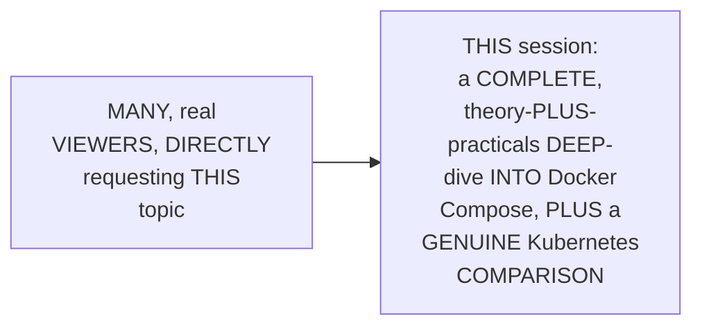

#### 🎯 Key Takeaways

* THIS is GENUINELY, EXPLICITLY confirmed AS a VIEWER-requested, STANDALONE deep-DIVE — NOT part OF a NUMBERED, sequential SERIES.
* THE session's OWN, stated GOALS: theory, REAL practicals, and a GENUINE comparison AGAINST Kubernetes.
* This directly, PRECISELY sets UP the SESSION's own, FIRST, essential STEP — a BRIEF, genuine RECAP of WHAT Docker itself ALREADY does (Section 2).

---

### 2. A Brief, Genuine Recap: What Docker Itself Already Does

#### 📖 Definition — Docker, Precisely Recapped

> 💡 **Given directly:** *"Docker is a container platform that is developed by Docker Inc, and the main goal of this Docker platform is to manage the lifecycle of your containerized applications, or manage the lifecycle of containers — using the Docker platform, you can start your container, you can stop the container, that means you can also delete the container, you can run it as a background process."*

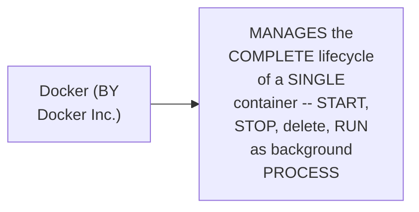

#### 🔍 Internal Working — A Genuine, Direct Pointer for Beginners

> 💡 **Given directly:** *"If you are new to Docker itself, I'll highly recommend you to watch my Docker playlist, where I've explained Docker right from the basics — if any of these concepts that I've explained here went over your head, then please start with the Docker Basics playlist."*

#### ⚠ Common Mistakes

* Assuming THIS session's own CONTENT will GENUINELY, DIRECTLY re-explain Docker's OWN, foundational CONCEPTS from SCRATCH — explicitly, directly, CLARIFIED: a SEPARATE, dedicated DOCKER playlist EXISTS for THAT — THIS session ASSUMES that PRIOR knowledge.

#### 🎯 Key Takeaways

* **DOCKER** is precisely, BRIEFLY recapped AS a CONTAINER platform, DEVELOPED by Docker INC — MANAGING the COMPLETE lifecycle OF a SINGLE container (START, stop, DELETE, run AS background process).
* A GENUINE, direct POINTER to a SEPARATE, dedicated DOCKER-basics playlist is GIVEN — FOR any, GENUINE beginners.
* This directly, PRECISELY sets UP the SESSION's own, NEXT, essential CONTENT — a COMPLETE, real, WORKED example ILLUSTRATING the TRADITIONAL, single-CONTAINER Docker workflow (Section 3).

---
### 3. A Complete, Real, Worked Example: The Traditional, Single-Container Workflow

#### 🪜 Step-by-Step — A Complete, Real, Worked Example

> 💡 **Given directly:** *"Assume you are working in an organization, there is a developer, and the developer is working on a Python Flask application... a very simple one — when someone executes this Python Flask application, it runs a calculator. The developer has asked you, 'Abhishek, can you containerize this application?'"*

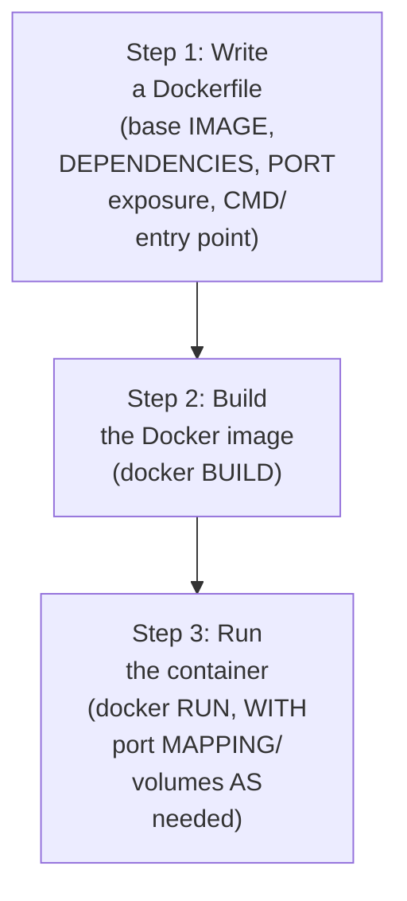

#### ⚠ Common Mistakes

* Assuming a REAL, containerized APPLICATION genuinely, DIRECTLY requires NO advance PLANNING — explicitly, directly, IMPLIED as GENUINELY, PRACTICALLY requiring COLLABORATION — "YOU might have TO sit WITH this DEVELOPER, understand WHAT things HAVE to GO into the DOCKER file."

#### 🎯 Key Takeaways

* A COMPLETE, real, WORKED example (a SIMPLE, Python FLASK calculator APPLICATION) directly, CONCRETELY illustrates the TRADITIONAL, three-STEP Docker workflow — WRITE a DOCKERFILE, BUILD the image, RUN the container.
* THIS workflow directly, GENUINELY works WELL for a SINGLE, isolated CONTAINER — SETTING up the SESSION's own, CENTRAL question — WHY doesn't this GENUINELY, SIMPLY scale to MULTIPLE containers (Section 4)?

---

### 4. The Central Question: If Docker Alone Suffices, Why Compose?

#### ❓ Why It Exists — The Session's Own, Central Question

> 💡 **Given directly:** *"Now your question should be, okay, if Docker is capable of managing the lifecycle of my entire container, why should I go for Docker Compose?"*

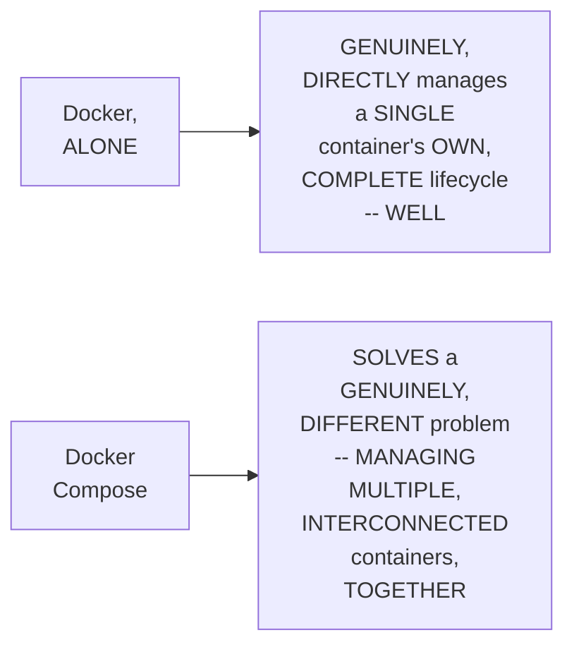

#### 🎯 Key Takeaways

* THE session's own, CENTRAL, STATED question directly, PRECISELY frames the ENTIRE, remaining DISCUSSION — GIVEN Docker's OWN, genuine LIFECYCLE-management capability, WHY does COMPOSE genuinely NEED to exist?
* This directly, PRECISELY sets UP the SESSION's own, NEXT, essential ANSWER — DOCKER Compose's own, PRECISE value: MANAGING multi-CONTAINER applications (Section 5).

---

### 5. Docker Compose's Own, Precise Value: Managing Multi-Container Applications

#### 📖 Definition — Docker Compose, Precisely Positioned

> 💡 **Given directly:** *"Docker Compose, on the other hand, is again a tool that is developed by Docker Inc, but here the difference is that Docker Compose is used to manage multi-container applications."*

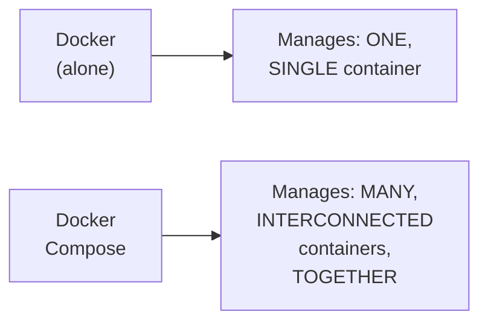

#### 🪜 Step-by-Step — A Complete, Real, Worked Example: A Multi-Microservice E-Commerce Application

> 💡 **Given directly:** *"Let's say you are working in an organization where your organization is developing an e-commerce application — for obvious reasons you will not have a single container... your e-commerce application will have multiple microservices, lot of databases, messaging queues, it might have caching servers — let's assume your e-commerce application has four microservices, one database, and one caching service — Redis, MySQL, and a Python login application, payments application, transactions application."*

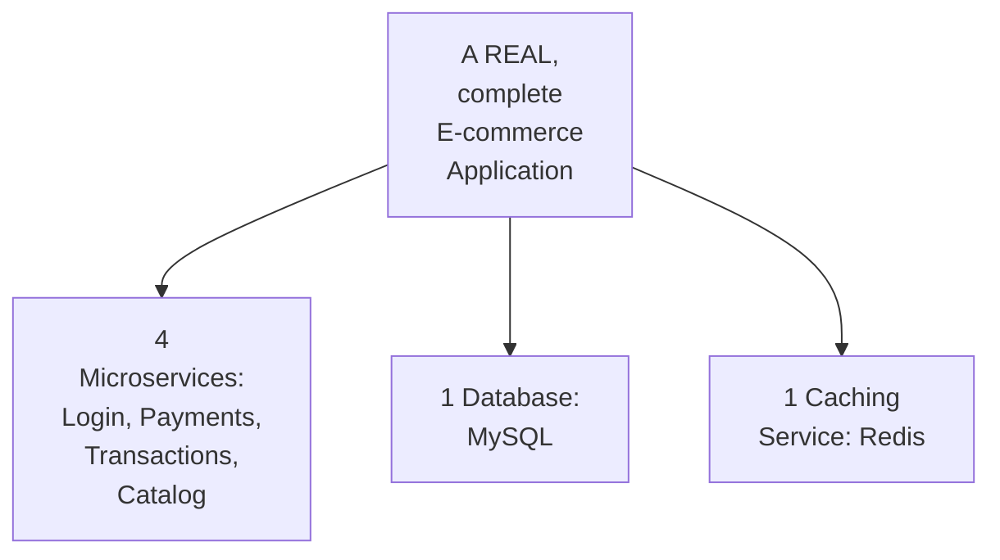

#### ⚠ Common Mistakes

* Assuming a REAL, complete APPLICATION (LIKE an e-COMMERCE platform) genuinely, TYPICALLY consists OF a SINGLE, isolated CONTAINER — explicitly, directly, PRECISELY clarified: "FOR obvious REASONS you WILL not HAVE a single CONTAINER" — REAL, complex applications GENUINELY, DIRECTLY involve MULTIPLE, interconnected MICROSERVICES, databases, AND caching layers.

#### 🎯 Key Takeaways

* **DOCKER Compose** is precisely POSITIONED as a TOOL, ALSO developed BY Docker Inc — but SPECIFICALLY designed TO manage **MULTI-container** applications, UNLIKE plain Docker's OWN, single-container FOCUS.
* A COMPLETE, real, WORKED example (a MULTI-microservice E-commerce APPLICATION) directly, CONCRETELY illustrates the GENUINE, real COMPLEXITY — FOUR microservices, ONE database, and ONE caching SERVICE, ALL needing to WORK together.
* This directly, PRECISELY sets UP the SESSION's own, NEXT, essential CONCEPT — DEPENDENCIES between CONTAINERS, and WHY execution ORDER genuinely matters (Section 6).

---
### 6. Dependencies, Precisely Explained: A Real, Worked Example

#### 📖 Definition — Dependencies, Precisely Explained

> 💡 **Given directly:** *"This is a very critical part when you are working with multiple microservices — a basic example can be, you have a payments application and you have, let's say, a database — assume payments application should only be installed when the database is up and running. If the database is not running... there is no point of your catalog application being available."*

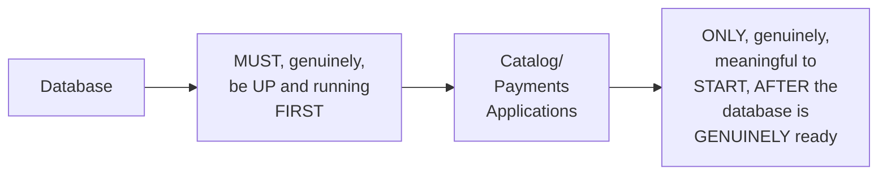

#### 🔍 Internal Working — A Genuine, Direct Confirmation: Ordering Matters Beyond Just Building/Running

> 💡 **Given directly:** *"When you are dealing with multiple microservices, it is not only about running Docker build or containerizing multiple microservices or multiple services, but it is also important that you execute them in the right order — in some cases you might want to mount a volume, or you might want to mount a data onto an application, so first probably the configuration application should be available even before your actual application."*

#### ⚠ Common Mistakes

* Assuming CONTAINERIZING multiple, REAL microservices GENUINELY, MERELY requires BUILDING and RUNNING each ONE, INDEPENDENTLY, in ANY order — explicitly, directly, PRECISELY corrected: EXECUTION order GENUINELY, DIRECTLY matters — SOME containers (LIKE a DATABASE) must GENUINELY be READY before OTHERS (LIKE a PAYMENTS application) can MEANINGFULLY start.

#### 🎯 Key Takeaways

* **DEPENDENCIES** between CONTAINERS are precisely EXPLAINED — SOME containers (e.g., a DATABASE) GENUINELY, DIRECTLY must be UP and running BEFORE others (e.g., a PAYMENTS application) can MEANINGFULLY start.
* THIS ordering REQUIREMENT genuinely, DIRECTLY extends BEYOND simply BUILDING/running CONTAINERS — it ALSO applies TO volume MOUNTING and CONFIGURATION availability.
* This directly, PRECISELY sets UP the SESSION's own, NEXT, essential CONTENT — THREE, genuine, REAL problems THIS dependency-MANAGEMENT challenge CREATES, when USING plain Docker ALONE (Section 7).

---

### 7. Three, Genuine, Real Problems With Plain Docker for Multi-Container Apps

#### ⚠ Problem 1: Managing Lifecycle & Dependencies, Manually

> 💡 **Given directly:** *"How will you manage the lifecycle of all of these containers at once? Of course you can also use the Docker platform here, where for this container you can individually run the Docker build command again, for this you can run the Docker build, Docker build, Docker build, Docker build."*

#### ⚠ Problem 2: Running Numerous, Separate Commands

> 💡 **Given directly:** *"Once this is done, you can individually again run Docker run command on all of these things — of course taking dependencies into consideration."*

#### ⚠ Problem 3: Shell-Script Fragility Over Time

> 💡 **Given directly:** *"After months, or after a while, this thing stopped working, because there are changes to the Docker commands... this is not a complete declarative approach, right — if instead of shell script you are using a YAML file, and that YAML file is also a standardized YAML file that is provided by Docker, which provides backward compatibility — that means very rarely does it break, even if there are new changes."*

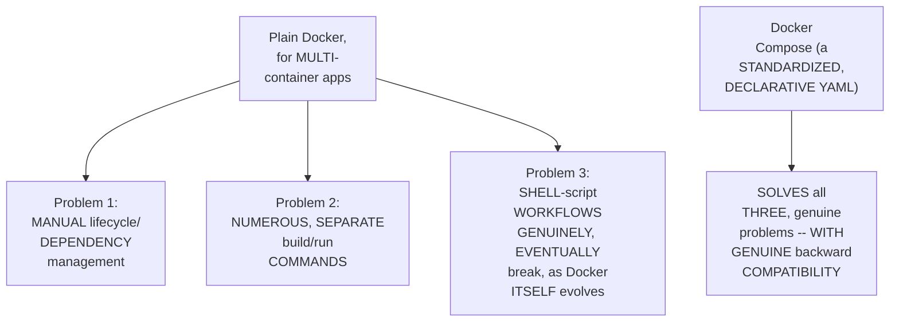

#### ⚠ Common Mistakes

* Assuming a WELL-crafted SHELL script, SHARED across a TEAM, is GENUINELY, PERMANENTLY sufficient FOR managing MULTI-container applications — explicitly, directly, HONESTLY clarified: SHELL scripts GENUINELY, EVENTUALLY break, AS Docker's OWN, underlying COMMANDS evolve OVER time — a STANDARDIZED, DECLARATIVE YAML approach (COMPOSE) genuinely, DIRECTLY avoids this SAME, real FRAGILITY.

#### 🎯 Key Takeaways

* THREE, genuine, real PROBLEMS emerge FROM using PLAIN Docker FOR multi-container APPLICATIONS: **(1)** MANUAL lifecycle/DEPENDENCY management; **(2)** NUMEROUS, separate BUILD/run commands; and **(3)** SHELL-script fragility, AS Docker's own COMMANDS genuinely EVOLVE over TIME.
* DOCKER Compose GENUINELY, DIRECTLY solves ALL three — VIA a STANDARDIZED, DECLARATIVE YAML file, WITH genuine BACKWARD compatibility.
* This directly, PRECISELY sets UP the SESSION's own, FIRST, complete, real, LIVE demonstration — THE 12-service "ROBOT Shop" e-COMMERCE application (Section 8).

---
### 8. A Complete, Real, Live Demo: The 12-Service "Robot Shop" E-Commerce App

#### 🪜 Step-by-Step — A Complete, Real, Project Introduction

> 💡 **Given directly:** *"We will use this three-tier architecture demo, we have used this multiple times — this is a fork, I did not write this project, I've taken this from Instana Robot Shop, which is an IBM project, I don't own this project, so let's give the credits to them... once this application is executed, it deploys a complete e-commerce application for the robots — you can buy robots using this e-commerce website."*

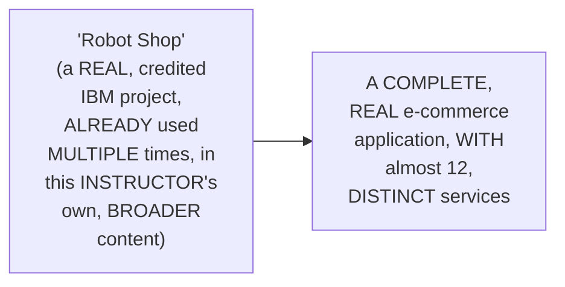

#### 🔍 Internal Working — A Genuine, Direct, Real-World Motivating Scenario

> 💡 **Given directly:** *"Assume your developers are working on this project, and there is a requirement where developer wants to just perform a trial and error — even developer is not sure if he can fix this issue or not, so he is just trying multiple times — now because there are 12 services, every time if the developer has to start all the 12 services using Docker build, Docker run, and again if something goes wrong, developer deletes all the containers, it's a very tedious process."*

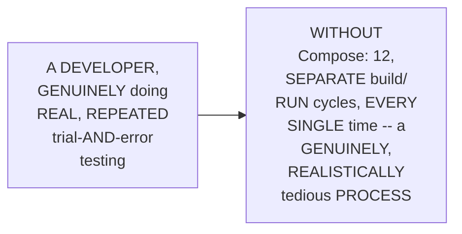

#### 🪜 Step-by-Step — A Complete, Real, Live-Confirmed Demonstration: `docker compose up`

> 💡 **Given directly:** *"I have the same application, I've cloned the GitHub repository — now what I will simply do is I will not use the Docker build, I will not use Docker run, or anything, I'll just use this command called Docker compose up — and once I run this, it starts all your containers... it takes some time, because it has to take dependencies into consideration — there are two databases, there is an in-memory data store for this project, so first it has to start the databases, then it has to start the applications."*

```bash
docker compose up
```

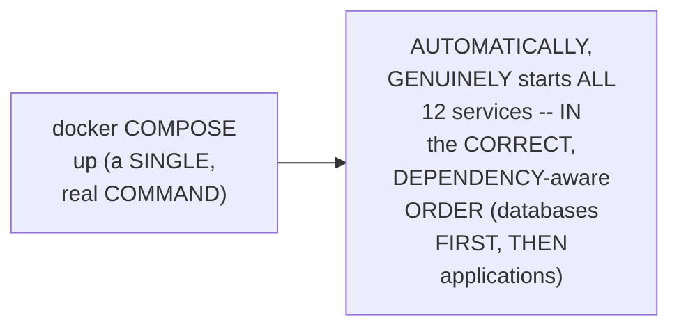

#### 🪜 Step-by-Step — A Complete, Real, Live-Confirmed Demonstration: `docker compose down`

> 💡 **Given directly:** *"Now if I just enter Control-C, it is stopping all the containers that it has created, and now if I try to refresh, it's gone."*

```bash
docker compose down
```

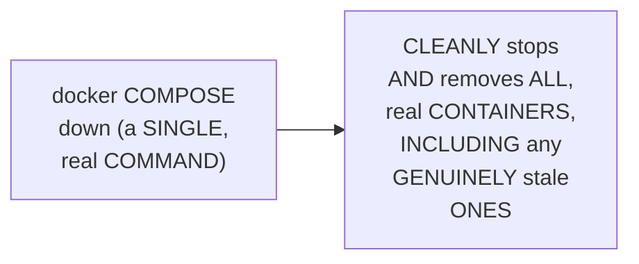

#### ⚠ Common Mistakes

* Assuming a REAL, LIVE-DEMONSTRATED "CONTROL-C" alone is GENUINELY, ALWAYS sufficient TO fully clean UP all, real CONTAINERS — explicitly, directly, PRACTICALLY clarified: "IT might RUN... there might BE stale CONTAINERS, or they're NOT completely REMOVED" — `docker COMPOSE down` is the GENUINE, more THOROUGH cleanup COMMAND.

#### 🎯 Key Takeaways

* A COMPLETE, real, LIVE demonstration directly, CONCRETELY confirmed STARTING an ENTIRE, real, 12-SERVICE e-commerce APPLICATION ("ROBOT Shop") WITH a SINGLE command: **`docker COMPOSE up`**.
* THIS same, complete DEMONSTRATION directly, CONCRETELY confirmed CLEANLY stopping AND removing ALL containers WITH a SECOND, single command: **`docker COMPOSE down`**.
* THE genuine, real MOTIVATING scenario (a DEVELOPER's own, REPEATED trial-and-ERROR testing) directly, CONCRETELY illustrates WHY this SINGLE-command capability GENUINELY, PRACTICALLY matters — AVOIDING 12, SEPARATE, tedious build/RUN cycles, EVERY single TIME.

---

### 9. The Genuine "Magic" of Docker Compose: One Command, Any Complexity

#### 🪜 Step-by-Step — A Direct, Genuine, Central Insight

> 💡 **Given directly:** *"If you are not a devops engineer, that is Docker compose up — if you are working on a two-tier architecture application, and want to test it locally, what is the command? Docker compose up. If you're working on a three-tier architecture application, and want to test it locally, the command is Docker compose up. If your application has multiple services, there are multiple databases, dependencies, what is the command that you need to know to start the application on your local machine? Docker compose up. That's the beauty of Docker compose."*

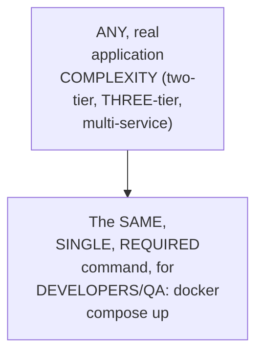

#### 🔍 Internal Working — A Genuine, Direct Confirmation of Who Does the "Heavy Lifting"

> 💡 **Given directly:** *"What's the magic here? The most important point here is you just need to know one command... devops engineers do all the heavy lifting, that is writing the Docker compose file, writing the Docker files — you still have to write a Docker file, I'm not saying you don't have to write the Docker file — but the advantage is, when you are dealing with such huge projects, even if you have the Docker file, starting the application takes a lot of steps that can be avoided using Docker compose."*

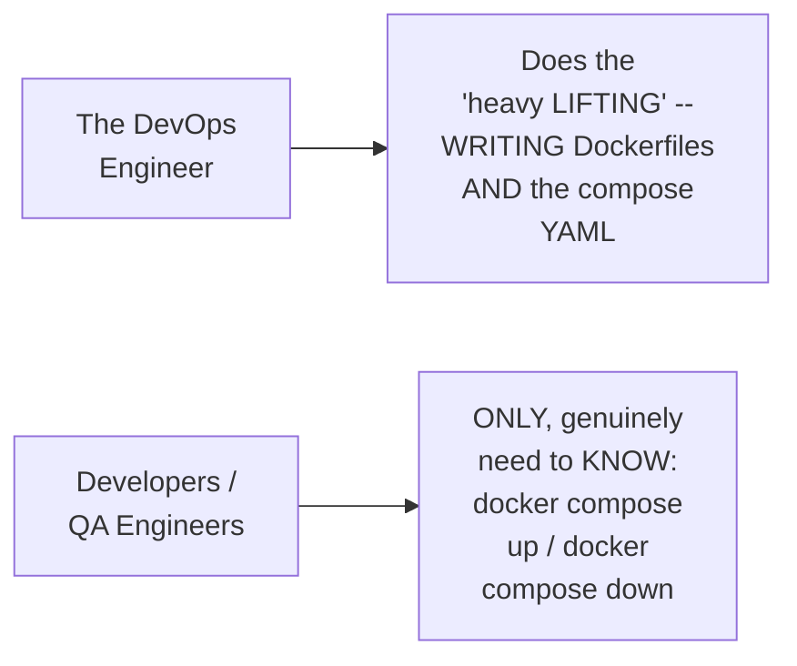

#### ⚠ Common Mistakes

* Assuming Docker COMPOSE genuinely, DIRECTLY eliminates the NEED to WRITE Dockerfiles ENTIRELY — explicitly, directly, PRECISELY clarified: "YOU still HAVE to write A Docker file" — COMPOSE genuinely, DIRECTLY eliminates the NEED to MANUALLY run NUMEROUS build/RUN commands, NOT the NEED for Dockerfiles THEMSELVES.

#### 🎯 Key Takeaways

* THE genuine, "MAGIC" of Docker COMPOSE: REGARDLESS of an APPLICATION's own, real COMPLEXITY (two-TIER, three-tier, MULTI-service), DEVELOPERS and QA engineers ONLY need to KNOW ONE command — **`docker COMPOSE up`**.
* THE devops ENGINEER genuinely, DIRECTLY does the "HEAVY lifting" — WRITING the Dockerfiles AND the compose YAML — COMPOSE does NOT, genuinely, ELIMINATE Dockerfiles THEMSELVES.
* This directly, PRECISELY sets UP the SESSION's own, NEXT, essential CONTENT — HOW to GENUINELY obtain Docker COMPOSE, and a GENUINE, important CLARIFICATION about ITS own, real RELATIONSHIP to Docker (Section 10).

---
### 10. Getting Docker Compose & a Genuine, Important Clarification: Not a Docker Replacement

#### 🪜 Step-by-Step — A Genuine, Direct Confirmation: How to Obtain Docker Compose

> 💡 **Given directly:** *"Most of the times, Docker compose comes with your Docker installation — let's say you're using Docker Desktop, if you're on Windows or if you're on Mac, I highly recommend using Docker Desktop, because the Docker team is working very actively on Docker Desktop, there are continuous upgrades, it is becoming more and more stable."*

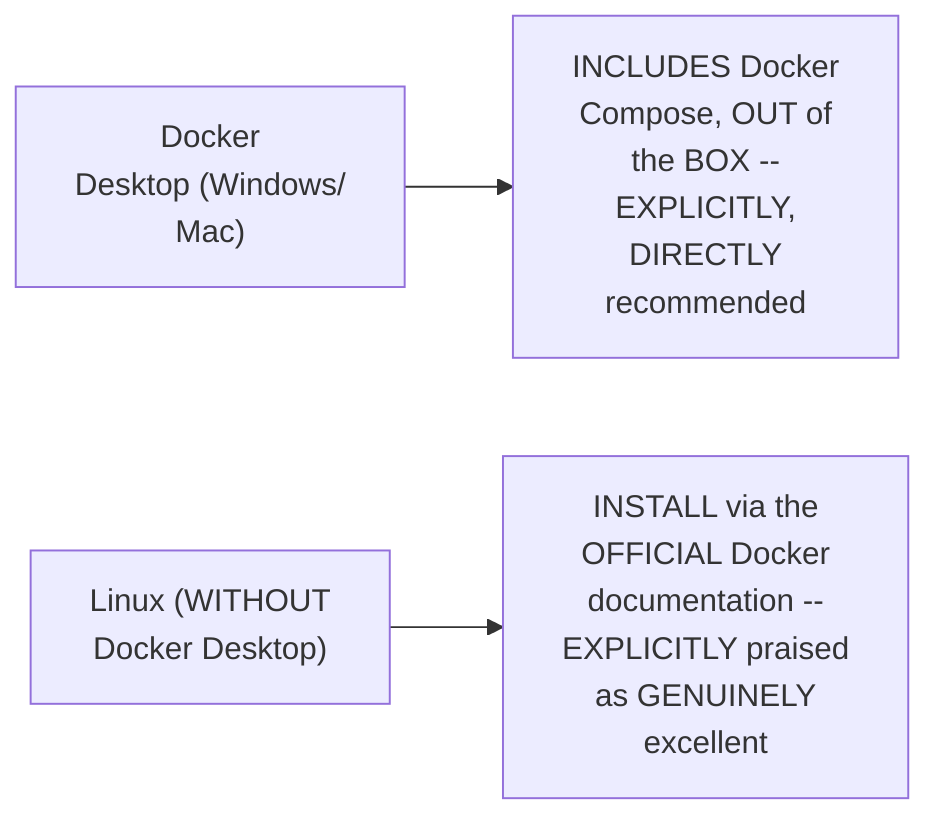

#### 📖 Definition — A Genuine, Important Clarification: Not a Docker Replacement

> 💡 **Given directly:** *"Docker Compose is not a replacement to Docker — if you are trying to containerize your applications, you still need to write the Docker files, you still have to write the Docker Compose YAML file, and what this Docker Compose YAML file does is it will explain, or it will understand, how to build and run your containers."*

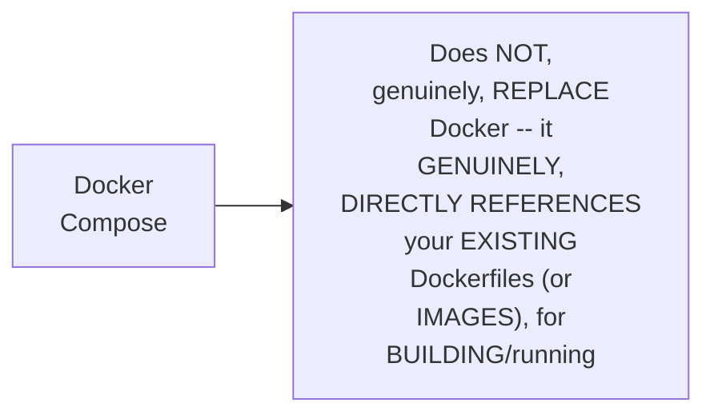

#### 🔍 Internal Working — A Genuine, Precise Explanation of the Underlying Mechanism

> 💡 **Given directly:** *"For building, Docker Compose will still be looking at your Docker file — for running and execution, yeah, it will just run Docker commands internally, you don't have to bother about it."*

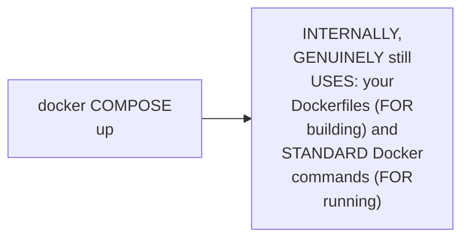

#### ⚠ Common Mistakes

* Assuming Docker COMPOSE is GENUINELY, ENTIRELY a REPLACEMENT for, OR alternative TO, plain DOCKER — explicitly, directly, PRECISELY clarified: it GENUINELY, DIRECTLY still REQUIRES Dockerfiles, and INTERNALLY still RUNS standard DOCKER commands — COMPOSE is a LAYER of ORCHESTRATION/convenience ON top of Docker, NOT a REPLACEMENT for it.

#### 🎯 Key Takeaways

* DOCKER Compose GENUINELY, TYPICALLY comes BUNDLED with DOCKER Desktop (Windows/MAC) — EXPLICITLY, DIRECTLY recommended — ON Linux, IT can be INSTALLED via the OFFICIAL, genuinely EXCELLENT Docker documentation.
* DOCKER Compose is directly, PRECISELY confirmed AS **NOT a REPLACEMENT** for Docker — YOU still, genuinely NEED to write DOCKERFILES — Compose REFERENCES those SAME Dockerfiles (OR existing IMAGES) for BUILDING.
* This directly, PRECISELY sets UP the SESSION's own, SECOND, complete, real, LIVE demonstration — a SIMPLER, Node.js + NGINX + REDIS application (Section 11).

---

### 11. A Complete, Real, Live Demo: A Simpler, Node.js + NGINX + Redis Application

#### 🪜 Step-by-Step — A Complete, Real, Application Overview

> 💡 **Given directly:** *"The application that I'm going to see is a Node.js application which runs as two replicas, or there are two instances of your Node.js application, there is NGINX which is serving as a load balancer, and using the load balancer mechanism NGINX will forward the request to node instance one, node instance two, randomly — and there is also a Redis, and what this Redis does is it keeps the information, typically we are using it for caching, the number of requests this load balancer is getting."*

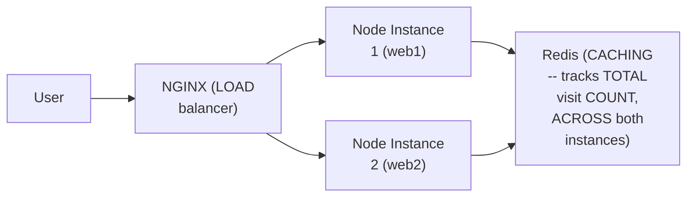

#### 🔍 Internal Working — A Genuine, Direct Pointer to an Official Resource

> 💡 **Given directly:** *"The repository that I'm going to use is Awesome Compose — Awesome Compose is basically a set of Docker Compose examples that are written and uploaded, this is maintained by the Docker team itself, that is the beauty — there are so many compose examples... you take anything, you will mostly find the compose examples in this repo."*

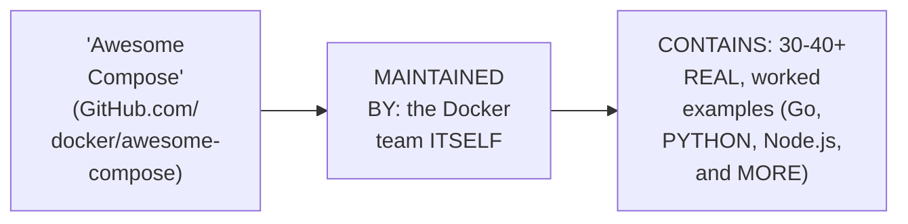

#### 🪜 Step-by-Step — A Complete, Real, Live-Confirmed Demonstration

> 💡 **Given directly:** *"It says request went to instance, or copy one, of the... Node.js application — number of visits is one, next time when I hit, number of visits will become two — how is it remembering? Because we used Redis, right, so the information is cached in Redis... even the request goes to web1 or web2, Redis is tracking the information, caching it, because it is connected to both the copies of the instances."*

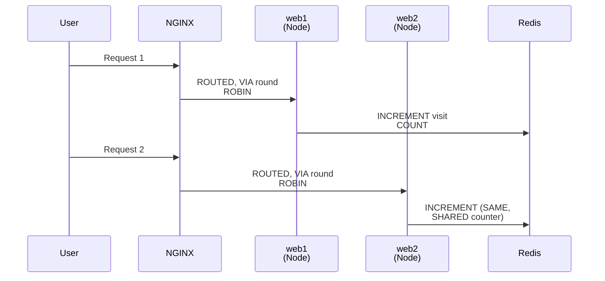

#### ⚠ A Direct, Honest, Live-Encountered Delay

> 💡 **Given directly:** *"For some reason it is taking longer time here... if you want to understand why did it take time, basically while experimenting I have added a restart policy, and that restart policy is not working for this particular containerized application — because of that it was taking a lot of time, I just removed it."*

```mermaid
flowchart LR
    A["A REAL,<br/>LIVE-encountered<br/>DELAY"] --> B["ROOT CAUSE: an<br/>INCORRECTLY-<br/>configured RESTART<br/>policy"]
    B --> C["FIX: REMOVE the<br/>PROBLEMATIC restart<br/>POLICY"]
```

#### ⚠ Common Mistakes

* Assuming REDIS's own, GENUINE caching CAPABILITY here is GENUINELY, MERELY isolated TO a single, individual INSTANCE — explicitly, directly, PRECISELY clarified: REDIS is GENUINELY, DIRECTLY connected to BOTH web INSTANCES simultaneously — ENABLING a SINGLE, SHARED, accurate visit COUNT, REGARDLESS of WHICH instance HANDLES a GIVEN request.

#### 🎯 Key Takeaways

* A COMPLETE, real, LIVE demonstration directly, CONCRETELY confirmed a SIMPLER, three-SERVICE application (NGINX load BALANCER, TWO Node.js REPLICAS, and REDIS caching) — SOURCED from the OFFICIAL, Docker-team-MAINTAINED "Awesome COMPOSE" repository.
* REDIS genuinely, DIRECTLY tracks a SINGLE, SHARED visit COUNT, ACROSS both WEB instances — CONFIRMING its OWN, real ROLE as a CENTRALIZED, connected CACHING layer.
* A GENUINE, honest, LIVE-encountered DELAY (an INCORRECT restart POLICY) was directly, QUICKLY diagnosed and REMOVED — REINFORCING this SERIES' own, CONSISTENT, honest DEBUGGING philosophy.

---
### 12. A Genuine, Important Methodological Tip: Understand Before You Write

#### 🪜 Step-by-Step — A Direct, Genuine, Methodological Recommendation

> 💡 **Given directly:** *"Before writing the compose file, you should focus and understand about the project a little more, right — do not just jump forward and start writing the compose file... spend some time, probably take two hours, three hours, even one day, sit with your developer, and try to understand what exactly is this project doing — you don't need to understand the code, you don't need to understand the syntax, but just try to understand the architecture of the project."*

```mermaid
flowchart LR
    A["JUMPING<br/>straight INTO<br/>writing the<br/>COMPOSE file"] --> B["EXPLICITLY,<br/>DIRECTLY<br/>discouraged --<br/>RISKS a GENUINELY,<br/>INCOMPLETE<br/>understanding"]
    C["SPENDING real<br/>TIME (2-3<br/>hours, or EVEN<br/>ONE day)<br/>UNDERSTANDING the<br/>PROJECT's own,<br/>real<br/>ARCHITECTURE<br/>FIRST"] --> D["EXPLICITLY,<br/>DIRECTLY<br/>recommended"]
```

#### ⚠ Common Mistakes

* Assuming WRITING a COMPOSE file GENUINELY, PRACTICALLY requires DEEP, real KNOWLEDGE of a PROJECT's own, UNDERLYING code AND syntax — explicitly, directly, PRECISELY clarified: "YOU don't NEED to understand THE code... but JUST try TO understand the ARCHITECTURE" — a HIGH-level, ARCHITECTURAL understanding is GENUINELY sufficient.

#### 🎯 Key Takeaways

* THE instructor **directly, PRACTICALLY recommends** GENUINELY, DELIBERATELY spending REAL time (2-3 HOURS, or EVEN a FULL day) UNDERSTANDING a PROJECT's own, real ARCHITECTURE, BEFORE writing ITS compose FILE.
* THIS understanding GENUINELY, SPECIFICALLY requires ONLY architectural KNOWLEDGE — NOT deep, CODE-level or SYNTAX-level expertise.
* This directly, PRECISELY sets UP the SESSION's own, NEXT, essential CONTENT — the COMPLETE, precise CODE walkthrough — APPLYING this SAME, "understand FIRST" principle TO the Node.js/NGINX/Redis EXAMPLE (Section 13).

---

### 13. A Complete, Precise Code Walkthrough: Dockerfiles & the Compose YAML

#### 🪜 Step-by-Step — The Dockerfiles, Precisely Explained

> 💡 **Given directly:** *"The Docker file for NGINX will look something like this — from NGINX 1.2.6, you will use a run command basically trying to remove existing configuration in the NGINX Docker image, and then copy our NGINX config file onto the same location... if you go to the web, which is the Node.js application, again the Docker file is very, very simple — we will use a Node.js base image, decide upon a work directory, copy the package.json... run npm install, copy the source code... and just run npm start."*

```dockerfile
# NGINX Dockerfile (conceptual)
FROM nginx:1.2.6
RUN rm /etc/nginx/conf.d/default.conf
COPY nginx.conf /etc/nginx/conf.d/

# Node.js Dockerfile (conceptual)
FROM node:latest
WORKDIR /app
COPY package.json .
RUN npm install
COPY . .
CMD ["npm", "start"]
```

#### 🪜 Step-by-Step — The "Traditional" Commands This Setup Would Otherwise Require

> 💡 **Given directly:** *"Without compose, you will simply say Docker build... first one will be inside the web, followed by the Docker file location, then next you will say Docker build, engine — both your Docker images are built, and then to start the web, because we want to create two copies, you will probably say Docker run, I want to run it as a background process, minus D, then minus P, where I will map the 5000 port with port 81."*

```bash
docker build web -f web/Dockerfile
docker build nginx -f nginx/Dockerfile
docker run -d -p 81:5000 web1
docker run -d -p 82:5000 web2
docker run -d -p 80:80 nginx
```

#### 📖 Definition — The Complete Compose YAML Structure

> 💡 **Given directly:** *"Compose is a YAML file... the mandatory thing is a services keyword... you will provide services, within the services, what are the names of your services — first one I can call web1, next web2, next nginx — within this, that is within web1, what do you want to do? I want to build it, how do you build, provide the location of your Docker file... you will use the ports, I'm mapping 81 to 5000."*

```yaml
services:
  web1:
    build: ./web
    hostname: web1
    ports:
      - "81:5000"
  web2:
    build: ./web
    ports:
      - "82:5000"
  nginx:
    build: ./nginx
    ports:
      - "80:80"
    depends_on:
      - web1
      - web2
```

#### 📖 Definition — `depends_on`, Precisely Explained

> 💡 **Given directly:** *"How does that work? It depends on this parameter called depends_on — for nginx there is this parameter which says Docker compose, create this particular container first, then create this one, only after that — because there is no point of having nginx up and running... if Docker image build and Docker image run fails for web1, what is the point of having nginx?"*

```mermaid
flowchart LR
    A["depends_on:<br/>[web1, web2]<br/>(on the NGINX<br/>SERVICE)"] --> B["ENSURES: web1<br/>AND web2 are<br/>CREATED/started<br/>FIRST, BEFORE<br/>nginx GENUINELY<br/>starts"]
```

#### 📖 Definition — Referencing an Existing Image (Redis)

> 💡 **Given directly:** *"In case of Redis, like I've explained, for compose, Dockerfile is not mandatory, it can also take a Docker image — we are not building the Redis container, we are just using the Redis image that is publicly available, so we have provided the Redis image location and the port."*

```yaml
  redis:
    image: redis:latest
    ports:
      - "6379:6379"
```

#### ⚠ Common Mistakes

* Assuming EVERY, real SERVICE within a COMPOSE file GENUINELY, DIRECTLY requires ITS own, CUSTOM Dockerfile — explicitly, directly, PRECISELY clarified: SERVICES using a PUBLICLY-available, PRE-built image (LIKE Redis) GENUINELY, DIRECTLY use an `IMAGE` reference INSTEAD of a `BUILD` reference — NO custom DOCKERFILE is REQUIRED, in that CASE.

#### 🎯 Key Takeaways

* A COMPLETE, precise CODE walkthrough directly, CONCRETELY confirmed the FULL, "TRADITIONAL" workflow (MULTIPLE, separate `docker BUILD`/`docker RUN` commands) THIS setup WOULD otherwise REQUIRE, WITHOUT compose.
* THE actual, COMPLETE compose YAML directly, PRECISELY uses a REQUIRED **`services`** keyword — EACH, named SERVICE specifying EITHER a `BUILD` (pointing to a DOCKERFILE) or an `IMAGE` (REFERENCING an EXISTING, public image, LIKE Redis) — PLUS `PORTS` and `DEPENDS_on`.
* **`depends_ON`** is precisely EXPLAINED as the MECHANISM controlling CONTAINER start ORDER — ENSURING dependent SERVICES (e.g., web1/web2) are GENUINELY, DIRECTLY ready BEFORE dependent ONES (e.g., nginx) genuinely START.

---
### 14. Three, Genuine, Real Use Cases for Docker Compose

#### 📖 Definition — Use Case 1: Local Development

> 💡 **Given directly:** *"One of the most popular use cases of Docker Compose is, like I've explained, local development — as a devops engineer, if you write the Docker Compose file and share it with your developers, their local development will become very fast, because they don't have to focus on running the applications... even if your application is running on Kubernetes, to test it locally you can test them as containers and use Docker Compose."*

```mermaid
flowchart LR
    A["Even a<br/>KUBERNETES-based<br/>application"] --> B["Is OFTEN,<br/>genuinely TESTED<br/>LOCALLY, VIA Docker<br/>Compose FIRST --<br/>SINCE the LOWEST<br/>level, WITHIN a<br/>pod, is STILL a<br/>CONTAINER"]
```

#### 📖 Definition — Use Case 2: CI/CD (Pull-Request Pipelines)

> 💡 **Given directly:** *"Second popular use case is CI/CD — let's say you don't want to set up a Kubernetes cluster, you have a CI/CD that is running on every pull request, you don't have capacity to run those many Kubernetes clusters, and every time whenever a pull request is created you don't want to spin up a Kubernetes cluster — you can set up a virtual machine, and within the virtual machine you can install Docker, and in your CI/CD pipeline you can just run Docker compose up, run a couple of tests."*

```mermaid
flowchart LR
    A["A PULL-<br/>REQUEST-triggered<br/>CI/CD pipeline"] --> B["Spinning up a<br/>FULL Kubernetes<br/>CLUSTER, PER pull<br/>REQUEST: GENUINELY,<br/>PRACTICALLY too<br/>COSTLY/tedious"]
    A --> C["USING a SIMPLE<br/>VM + docker COMPOSE<br/>up, INSTEAD:<br/>GENUINELY,<br/>PRACTICALLY<br/>sufficient, FOR<br/>this SPECIFIC use<br/>case"]
```

#### 📖 Definition — Use Case 3: Quick, Manual Testing

> 💡 **Given directly:** *"Other use case can also be with respect to testing — if you want to perform a quick testing, it can be any environment... if there is a QA team, and QA team, even before installing/deploying through the CI/CD, or manually on their local machine, or the staging environment, if they just want to quickly verify what developer is saying, developer said, 'I have implemented the changes' — if QA wants to quickly verify, they can also use Docker Compose."*

```mermaid
flowchart TD
    A["Docker<br/>Compose's 3<br/>Genuine Use<br/>Cases"] --> B["1. Local<br/>Development"]
    A --> C["2. CI/CD<br/>(pull-request<br/>pipelines)"]
    A --> D["3. Quick,<br/>manual<br/>TESTING/QA<br/>verification"]
```

#### ⚠ Common Mistakes

* Assuming DOCKER Compose is GENUINELY, MERELY relevant TO local, DEVELOPER-machine testing ALONE — explicitly, directly, HONESTLY clarified: it ALSO, genuinely SERVES real, ORGANIZATIONAL CI/CD and QA-VERIFICATION use cases — a GENUINELY, BROADER, real-world RELEVANCE.

#### 🎯 Key Takeaways

* THREE, genuine, real USE cases directly, CONCRETELY confirmed: **LOCAL development** (the MOST common, EVEN for Kubernetes-BASED applications), **CI/CD** (SPECIFICALLY pull-REQUEST pipelines, AVOIDING costly Kubernetes-CLUSTER spin-up), and **QUICK, manual TESTING/QA verification**.
* THIS directly, THOROUGHLY confirms Docker COMPOSE's own, GENUINE, real-world RELEVANCE extends WELL beyond a SINGLE, narrow use CASE.
* This directly, PRECISELY sets UP the SESSION's own, FINAL, essential CLARIFICATION — precisely HOW Docker Compose GENUINELY relates TO Kubernetes (Section 15).

---

### 15. The Session's Own, Final, Important Clarification: Compose vs. Kubernetes (& the Real Comparison — Docker Swarm)

#### ⚠ A Direct, Honest, Important Clarification

> 💡 **Given directly:** *"The equivalent to Kubernetes in the Docker ecosystem is actually Docker Swarm — so the discussion about Docker Swarm versus Kubernetes is... Kubernetes is basically an orchestration platform, where you have a cluster configured using multiple nodes, multiple virtual machines, and this orchestrator is a very powerful thing — it has a mechanism for auto-healing, advanced load balancing using services, capabilities for implementing multiple replicas across multiple nodes, auto-scaling."*

```mermaid
flowchart LR
    A["Kubernetes"] --> B["GENUINELY,<br/>DIRECTLY comparable<br/>TO: Docker Swarm<br/>(BOTH are REAL,<br/>full ORCHESTRATION<br/>platforms)"]
    C["Docker<br/>Compose"] --> D["NOT, genuinely,<br/>DIRECTLY comparable<br/>TO Kubernetes -- a<br/>GENUINELY,<br/>STRUCTURALLY<br/>DIFFERENT tool"]
```

#### 🔍 Internal Working — A Genuine, Precise Explanation of Why the Comparison Is Wrong

> 💡 **Given directly:** *"The comparison should be Kubernetes versus Docker Swarm, but it should not be Docker Compose versus Kubernetes, because they serve completely different purposes — compose can be used to run multiple containers, manage the lifecycle of multiple containers, but this is not exactly an orchestration platform, as Docker Swarm."*

```mermaid
flowchart TD
    A["Docker<br/>Compose"] --> B["Manages: THE<br/>lifecycle OF<br/>multiple,<br/>REAL containers<br/>(RUNNING, STOPPING,<br/>building)"]
    C["Kubernetes /<br/>Docker Swarm"] --> D["ORCHESTRATION:<br/>auto-HEALING,<br/>advanced LOAD<br/>balancing, MULTI-<br/>node REPLICAS,<br/>auto-SCALING"]
```

#### ⚠ Common Mistakes

* Assuming "DOCKER Compose VERSUS Kubernetes" is GENUINELY, DIRECTLY a VALID, meaningful COMPARISON — explicitly, directly, HONESTLY corrected: THIS is a GENUINELY, STRUCTURALLY flawed COMPARISON — THEY "SERVE completely DIFFERENT purposes" — the TRUE, genuine, ecosystem-LEVEL equivalent TO Kubernetes is **DOCKER Swarm**, NOT Compose.

#### 🎯 Key Takeaways

* THE instructor **directly, HONESTLY clarifies** a GENUINELY, COMMONLY-confused comparison — "DOCKER Compose VERSUS Kubernetes" is the WRONG comparison; the GENUINE, correct COMPARISON is "KUBERNETES versus DOCKER Swarm."
* KUBERNETES and DOCKER Swarm are BOTH genuine, real **ORCHESTRATION platforms** — OFFERING auto-HEALING, advanced LOAD balancing, multi-NODE replicas, and AUTO-scaling — CAPABILITIES Compose does NOT, genuinely, PROVIDE.
* DOCKER Compose GENUINELY, DIRECTLY serves a DIFFERENT, more LIMITED purpose — MANAGING the LIFECYCLE of MULTIPLE, related CONTAINERS — NOT a FULL, orchestration PLATFORM.

---
### 16. Closing: A Direct Encouragement to Practice

#### 🪜 Step-by-Step — A Direct, Genuine, Final Encouragement

> 💡 **Given directly:** *"I hope you found the video informative, please try out the examples — you can try out the three-tier architecture demo, try to run it using Docker Compose... more things are also available in the documentation, thank you so much for watching today's video, please let me know your feedback in the comment section."*

```mermaid
flowchart LR
    A["THIS session's<br/>OWN, COMPLETE<br/>theory + TWO,<br/>real, LIVE<br/>demonstrations"] --> B["DIRECT<br/>encouragement:<br/>TRY the EXAMPLES<br/>independently --<br/>the 'ROBOT Shop'<br/>demo, PLUS the<br/>'AWESOME compose'<br/>repository (30-40+<br/>REAL examples)"]
```

#### ⚠ Common Mistakes

* Assuming THIS session's own, COMPLETE, theoretical EXPLANATION alone is GENUINELY, PRACTICALLY sufficient TO master Docker COMPOSE — explicitly, directly, PRACTICALLY encouraged AGAINST — GENUINE, hands-ON practice, USING the REFERENCED, real EXAMPLES, is DIRECTLY, EXPLICITLY recommended.

#### 🎯 Key Takeaways

* This episode **GENUINELY, COMPREHENSIVELY delivers** its OWN, stated GOALS — a COMPLETE, precise EXPLANATION of Docker COMPOSE's own, real MOTIVATION, TWO, complete, real LIVE demonstrations, a COMPLETE code WALKTHROUGH, and a GENUINELY important, FINAL Kubernetes CLARIFICATION.
* THE instructor **directly, PRACTICALLY encourages** learners to GENUINELY, PERSONALLY practice — USING the REFERENCED, real EXAMPLES (the "ROBOT Shop" demo, and the "AWESOME compose" REPOSITORY).
* This directly, PRECISELY completes THIS session's own, COMPLETE, standalone TREATMENT of Docker COMPOSE — FROM its OWN, core MOTIVATION, THROUGH hands-ON demonstration, TO its GENUINE, correct POSITIONING relative TO Kubernetes.

---

## 📝 Glossary

| Term | Definition | Why It Matters |
|---|---|---|
| **Docker Compose** | A tool for managing multi-container applications | NOT a Docker replacement; still uses Dockerfiles |
| **services** | The required, top-level key in a compose YAML | Defines each, individual container/service |
| **depends_on** | Controls container start order | Ensures dependencies start before dependents |
| **docker compose up / down** | The two, essential commands | Start/stop an entire, multi-container application |
| **Awesome Compose** | A Docker-team-maintained example repository | Contains 30-40+ real, worked compose examples |
| **Docker Swarm** | Docker's own, native orchestration platform | The TRUE, ecosystem equivalent to Kubernetes |

---

## 🔄 Revision Notes — One-Minute Revision

* This is a genuinely, deeply-requested, standalone Docker Compose deep-dive -- covering theory, real practicals, and a genuine Kubernetes comparison.
* **A brief recap**: Docker itself manages a single container's complete lifecycle (start, stop, delete, run as background process).
* **The traditional workflow**: write a Dockerfile -> build the image (docker build) -> run the container (docker run). Works well for a single container.
* **The central question**: if Docker alone manages this lifecycle, why does Compose need to exist?
* **Docker Compose's precise value**: managing MULTI-container applications -- a real, worked example (an e-commerce app with 4 microservices, MySQL, and Redis) illustrates the genuine complexity.
* **Dependencies**: some containers (e.g., a database) must genuinely be up before others (e.g., a payments app) can meaningfully start -- execution order matters, beyond just building/running.
* **Three, genuine problems with plain Docker for multi-container apps**: (1) manual lifecycle/dependency management; (2) numerous, separate build/run commands; (3) shell-script fragility, as Docker's own commands evolve over time. Compose solves all three via a standardized, declarative YAML with genuine backward compatibility.
* **Live demo 1 -- "Robot Shop"**: a real, 12-service e-commerce app (a credited IBM/Instana project). `docker compose up` starts everything, in dependency-aware order; `docker compose down` cleanly stops and removes everything.
* **The genuine "magic"**: regardless of application complexity (two-tier, three-tier, multi-service), developers/QA only need to know ONE command -- `docker compose up`. The devops engineer does the "heavy lifting" (writing Dockerfiles and the compose YAML) -- Compose does NOT eliminate Dockerfiles.
* **Getting Compose**: bundled with Docker Desktop (recommended, on Windows/Mac); installed via the official, genuinely excellent documentation, on Linux.
* **A genuine, important clarification**: Compose is NOT a Docker replacement -- it still requires Dockerfiles, and internally runs standard Docker commands.
* **Live demo 2 -- Node.js + NGINX + Redis**: from the official, Docker-team-maintained "Awesome Compose" repository. NGINX load-balances between two Node.js replicas; Redis tracks a single, shared visit count across both. A genuine, honest, live-encountered delay (an incorrect restart policy) was diagnosed and removed.
* **A genuine, methodological tip**: spend real time (2-3 hours, even a day) understanding a project's own architecture BEFORE writing its compose file -- no deep code/syntax knowledge is genuinely needed, just architectural understanding.
* **The complete code walkthrough**: Dockerfiles (NGINX, Node.js); the "traditional" commands Compose replaces; the actual compose YAML structure (a required `services` key, each with `build` or `image`, `ports`, and `depends_on`).
* **Three, genuine use cases**: local development (the most common, even for Kubernetes-based apps); CI/CD (pull-request pipelines, avoiding costly Kubernetes-cluster spin-up); quick, manual testing/QA verification.
* **The session's own, final, important clarification**: "Docker Compose vs. Kubernetes" is the WRONG comparison -- the correct comparison is "Kubernetes vs. Docker Swarm," since both are genuine orchestration platforms (auto-healing, advanced load balancing, multi-node scaling), while Compose serves a different, more limited purpose.
* **Closing**: a direct encouragement to practice, using the referenced, real examples.

---

## 📋 Cheat Sheet

**Docker vs. Docker Compose:**
```text
Docker:         manages ONE, single container's complete lifecycle
Docker Compose: manages MULTIPLE, interconnected containers, together
```

**The two, essential commands:**
```bash
docker compose up     # start the entire, multi-container application
docker compose down   # cleanly stop and remove everything
```

**A minimal, complete compose.yaml:**
```yaml
services:
  web1:
    build: ./web
    ports:
      - "81:5000"
  web2:
    build: ./web
    ports:
      - "82:5000"
  nginx:
    build: ./nginx
    ports:
      - "80:80"
    depends_on:
      - web1
      - web2
  redis:
    image: redis:latest
    ports:
      - "6379:6379"
```

**Three, genuine use cases:**
```text
1. Local development (even for Kubernetes-based apps)
2. CI/CD (pull-request pipelines)
3. Quick, manual testing/QA verification
```

**The correct comparison:**
```text
WRONG:  Docker Compose vs. Kubernetes
RIGHT:  Docker Swarm vs. Kubernetes (both are orchestration platforms)
```

---

## 🔥 Interview Questions & Answers

### 🟢 Beginner

**Q1.**

**Question:** What is the genuine, core difference between Docker and Docker Compose?

**Answer:** Docker manages a single container's lifecycle; Docker Compose manages multiple, interconnected containers together.

**Explanation:** Directly, precisely distinguished.

**Why Interviewers Ask This:** The most basic, foundational Docker Compose question.

**Possible Follow-up:** "Give a real example of when you'd need Compose, rather than plain Docker."

**Q2.**

**Question:** What are the two, essential Docker Compose commands?

**Answer:** `docker compose up` and `docker compose down`.

**Explanation:** Directly, explicitly named.

**Why Interviewers Ask This:** Basic, essential, hands-on Compose knowledge.

**Possible Follow-up:** "What does each command genuinely do?"

**Q3.**

**Question:** Is Docker Compose a replacement for Docker?

**Answer:** No -- it still requires Dockerfiles, and internally runs standard Docker commands.

**Explanation:** Directly, explicitly clarified.

**Why Interviewers Ask This:** Tests genuine understanding of a commonly-confused relationship.

**Possible Follow-up:** "What does Compose genuinely reference, when building a service's image?"

**Q4.**

**Question:** What is the required, top-level key in a Docker Compose YAML file?

**Answer:** `services`.

**Explanation:** Directly, explicitly confirmed.

**Why Interviewers Ask This:** Basic, essential compose-file syntax knowledge.

**Possible Follow-up:** "What are the two, common ways to define a single service?"

**Q5.**

**Question:** What does `depends_on` genuinely control?

**Answer:** The order in which containers/services start.

**Explanation:** Directly, precisely explained.

**Why Interviewers Ask This:** Tests genuine, practical dependency-management knowledge.

**Possible Follow-up:** "Give a real example of why this genuinely matters."

**Q6.**

**Question:** Can a Compose service reference an existing, public image, rather than building from a Dockerfile?

**Answer:** Yes -- e.g., using Redis's own, official image directly.

**Explanation:** Directly, explicitly confirmed.

**Why Interviewers Ask This:** Tests genuine, practical, hands-on compose-file knowledge.

**Possible Follow-up:** "What compose-file key is used for this, instead of `build`?"

**Q7.**

**Question:** Name the three, genuine use cases for Docker Compose discussed in this session.

**Answer:** Local development, CI/CD (pull-request pipelines), and quick, manual testing/QA verification.

**Explanation:** Directly, explicitly named.

**Why Interviewers Ask This:** Tests genuine, real-world applicability knowledge.

**Possible Follow-up:** "Why might CI/CD pipelines genuinely prefer Compose over spinning up a full Kubernetes cluster?"

**Q8.**

**Question:** Is "Docker Compose vs. Kubernetes" a genuinely valid, meaningful comparison?

**Answer:** No -- they serve completely different purposes.

**Explanation:** Directly, honestly clarified.

**Why Interviewers Ask This:** A commonly-tested, genuine clarification.

**Possible Follow-up:** "What is the genuine, correct, ecosystem-level comparison, instead?"

**Q9.**

**Question:** What is Docker Swarm?

**Answer:** Docker's own, native orchestration platform -- the true, ecosystem equivalent to Kubernetes.

**Explanation:** Directly, explicitly confirmed.

**Why Interviewers Ask This:** Tests genuine understanding of the Docker ecosystem's own, complete landscape.

**Possible Follow-up:** "What capabilities do Kubernetes and Docker Swarm genuinely share, that Compose lacks?"

**Q10.**

**Question:** What official, Docker-team-maintained repository was used for this session's own, second, live demonstration?

**Answer:** "Awesome Compose."

**Explanation:** Directly, explicitly named.

**Why Interviewers Ask This:** Tests attention to this session's own, referenced, practical resources.

**Possible Follow-up:** "Roughly how many, real, worked examples does this repository genuinely contain?"

---
### 🟡 Intermediate

**Q11.**

**Question:** Explain why the instructor deliberately uses TWO, genuinely different, real, worked examples (the 12-service "Robot Shop" and the simpler, 3-service Node.js/NGINX/Redis app), rather than relying on just one, throughout this entire session.

**Answer:** This is a genuinely deliberate, COMPLEMENTARY teaching choice: the FIRST example ("ROBOT Shop," Section 8) directly, CONCRETELY demonstrates COMPOSE's own, genuine VALUE at REAL, organizational SCALE — a COMPLEX, 12-service application, WHERE the "ONE command" ADVANTAGE (Section 9) is MOST, viscerally APPARENT. THE SECOND, simpler example (Section 11) is SPECIFICALLY, DELIBERATELY chosen to be SMALL enough TO genuinely, COMPLETELY explain — INCLUDING the ACTUAL Dockerfiles and the COMPLETE compose YAML SYNTAX (Section 13) — WITHOUT overwhelming LEARNERS with 12, SEPARATE services' worth OF configuration. TOGETHER, these TWO examples GENUINELY, COMPLEMENTARILY cover BOTH the "WHY compose MATTERS, at SCALE" motivation AND the "HOW do you ACTUALLY write ONE" mechanics — NEITHER example, ALONE, would GENUINELY achieve BOTH goals EQUALLY well.

**Explanation:** Requires recognizing the deliberate, complementary value of using a large-scale example to demonstrate motivation, and a smaller, complete example to teach mechanics, rather than relying on one example for both purposes.

**Why Interviewers Ask This:** Tests whether a learner recognizes the pedagogical value of pairing a "why it matters, at scale" example with a "how it actually works, completely" example.

**Possible Follow-up:** "IF you HAD to CHOOSE only ONE of these TWO examples TO teach a COMPLETE beginner, WHICH would you CHOOSE, and WHY?"

**Q12.**

**Question:** A learner argues that since this session confirms Docker Compose eliminates the need to manually run numerous, separate `docker build` and `docker run` commands, this means a devops engineer no longer needs to understand what these underlying commands genuinely do, once they've learned Compose. Evaluate this claim.

**Answer:** This claim is GENUINELY, DIRECTLY incorrect, and CONTRADICTS Section 10's own, EXPLICIT, established MECHANISM. Section 10's own PRECISE statement DIRECTLY confirms: "FOR running and EXECUTION... it WILL just run DOCKER commands INTERNALLY" — Compose GENUINELY, STRUCTURALLY still RELIES on the SAME, underlying DOCKER build/run MECHANICS — it MERELY AUTOMATES and ORCHESTRATES their EXECUTION, RATHER than GENUINELY replacing the NEED to understand THEM. ADDITIONALLY, Section 12's own established, METHODOLOGICAL tip CONFIRMS genuinely UNDERSTANDING a project's OWN, real architecture REMAINS essential — a DEVOPS engineer who GENUINELY doesn't understand WHAT `docker BUILD` and `docker RUN` do WOULD, genuinely, STRUGGLE to DIAGNOSE real, PRACTICAL issues WHEN a compose FILE'S own, underlying BEHAVIOR doesn't MATCH expectations. The ACCURATE, more PRECISE conclusion: COMPOSE genuinely, DIRECTLY eliminates the NEED to MANUALLY, repeatedly TYPE these commands — it does NOT, genuinely, eliminate the NEED to UNDERSTAND what THEY fundamentally DO.

**Explanation:** Tests whether a learner recognizes that Compose automates the execution of underlying Docker commands, but doesn't eliminate the genuine, practical need to understand what those commands fundamentally do.

**Why Interviewers Ask This:** Distinguishes candidates who understand that automation doesn't replace foundational knowledge from those who conflate "no longer typing a command" with "no longer needing to understand it."

**Possible Follow-up:** "Describe a GENUINE, real SCENARIO where a DEVOPS engineer's LACK of underlying DOCKER build/run KNOWLEDGE would GENUINELY, DIRECTLY hinder THEIR ability to DEBUG a REAL, broken compose FILE."

**Q13.**

**Question:** Explain, precisely, why the instructor deliberately shows the "traditional," multi-command Docker workflow (Section 13's own, established `docker build`/`docker run` sequence) BEFORE showing the equivalent compose YAML, rather than simply presenting the final YAML file directly.

**Answer:** This is a genuinely deliberate, BEFORE-and-AFTER teaching choice, DIRECTLY consistent WITH a PATTERN seen ACROSS this instructor's OWN, broader teaching STYLE (e.g., Day 21's OWN established, "EXPLAIN Kubernetes' own COMPLEXITY, THEN contrast WITH ECS's simplicity" APPROACH). By DIRECTLY, CONCRETELY showing the MULTIPLE, tedious, SEPARATE commands FIRST, the instructor MAKES the COMPOSE YAML's own, GENUINE value PROPOSITION immediately, VISCERALLY apparent — LEARNERS can DIRECTLY, CONCRETELY see EXACTLY what the SINGLE, unified YAML FILE is genuinely REPLACING, RATHER than being ASKED to trust an ABSTRACT claim ABOUT compose's own CONVENIENCE.

**Explanation:** Requires recognizing the deliberate, before-and-after value of showing the tedious, manual alternative first, to make the compose file's own value proposition concretely, viscerally apparent.

**Why Interviewers Ask This:** Tests whether a learner recognizes the pedagogical value of contrasting a solution against its own, tedious alternative, rather than presenting the solution in isolation.

**Possible Follow-up:** "Identify ANOTHER, genuine EXAMPLE, from ELSEWHERE in this INSTRUCTOR's own, broader CONTENT, where a SIMILAR, 'before-AND-after' contrast WAS used."

**Q14.**

**Question:** Using this session's own precise "understand before you write" reasoning (Section 12), explain a GENUINE, real risk of a devops engineer writing a compose file for a project whose real, architectural dependencies (per Section 6) they haven't genuinely, fully understood.

**Answer:** A precise, reasoned RISK analysis, directly extending Section 12's own established METHODOLOGY, and CONNECTING back TO Section 6's OWN established DEPENDENCY reasoning: per Section 6's own PRECISE reasoning, SOME containers (e.g. a DATABASE) GENUINELY, STRUCTURALLY must be UP and RUNNING before OTHERS (e.g. a PAYMENTS application) can MEANINGFULLY start. IF a DEVOPS engineer, SKIPPING Section 12's own established, "UNDERSTAND the architecture FIRST" step, writes a compose FILE WITHOUT genuinely, FULLY understanding a PROJECT's own, REAL dependency CHAIN, a GENUINE, real RISK emerges: the RESULTING `depends_ON` configuration (per Section 13's OWN established MECHANISM) COULD, genuinely, be INCOMPLETE or INCORRECT — POTENTIALLY causing a REAL, dependent SERVICE (e.g. the PAYMENTS application) to GENUINELY, DIRECTLY attempt to START before its OWN, REQUIRED database is GENUINELY ready — RESULTING in a REAL, confusing STARTUP failure, WHOSE root CAUSE (a genuinely MISSING or incomplete `depends_ON` declaration) would NOT, immediately, be OBVIOUS, WITHOUT the DEEPER, architectural understanding Section 12's own METHODOLOGY specifically RECOMMENDS.

**Explanation:** Requires extending the "understand before you write" methodology to identify a genuine, real risk (incomplete or incorrect dependency configuration) of skipping this step, connecting back to the earlier-established dependency reasoning.

**Why Interviewers Ask This:** Tests whether a learner can connect a stated, methodological best practice to a genuine, real, technical consequence of skipping it, using the session's own, established dependency mechanism.

**Possible Follow-up:** "Describe a GENUINE, real DEBUGGING approach a devops ENGINEER could use TO diagnose THIS exact, established RISK, if it GENUINELY occurred."

**Q15.**

**Question:** Synthesize this session's complete "three genuine use cases" reasoning (Section 14) with its own "Compose vs. Kubernetes clarification" reasoning (Section 15) to explain a GENUINE, structural reason why Docker Compose's own, real value genuinely persists, even within organizations that have fully, genuinely adopted Kubernetes for production.

**Answer:** A precise, synthesized explanation, directly connecting TWO, separately-established sections: per Section 14's own PRECISE, established USE cases, DOCKER Compose GENUINELY, DIRECTLY serves LOCAL development, CI/CD, and QUICK testing — and, NOTABLY, Section 14's OWN, explicit STATEMENT confirms "EVEN if your APPLICATION is running ON Kubernetes, to TEST it locally you CAN test them AS containers and USE Docker Compose." Per Section 15's own PRECISE, established CLARIFICATION, Kubernetes GENUINELY, STRUCTURALLY provides ORCHESTRATION capabilities (auto-HEALING, multi-node SCALING) that Compose does NOT — but THESE capabilities are SPECIFICALLY, GENUINELY relevant TO production-GRADE, multi-node DEPLOYMENT, NOT to a SINGLE developer's OWN, local TESTING loop. SYNTHESIZING these TWO facts directly, PRECISELY reveals a GENUINE, structural REASON why Compose's own VALUE persists, EVEN in Kubernetes-ADOPTING organizations: a DEVELOPER genuinely, PRACTICALLY testing THEIR own, LOCAL code changes does NOT, genuinely, NEED (or WANT) the FULL, real overhead OF a multi-node Kubernetes CLUSTER, SIMPLY to verify THEIR container STARTS correctly and TALKS to its OWN, related SERVICES — Compose's own, SIMPLER, single-MACHINE model is GENUINELY, STRUCTURALLY better-SUITED to THIS, specific, LOCAL-development need — MEANING Compose and KUBERNETES genuinely, DIRECTLY solve DIFFERENT problems, AT different STAGES of the SAME, real DEVELOPMENT lifecycle, RATHER than being GENUINELY, mutually-EXCLUSIVE, competing choices.

**Explanation:** Requires synthesizing the local-development use case with the Compose-vs-Kubernetes clarification to reveal that Compose and Kubernetes solve genuinely different problems at different stages of the same development lifecycle, rather than being competing, mutually-exclusive tools.

**Why Interviewers Ask This:** A senior-level question testing whether a candidate can identify the genuine, structural reason two, seemingly-competing tools actually coexist and complement each other across different stages of a real development lifecycle.

**Possible Follow-up:** "Describe a GENUINE, real, SPECIFIC stage OF a project's OWN, complete lifecycle (BEYOND local DEVELOPMENT) where COMPOSE would GENUINELY, STILL be the RIGHT choice, EVEN within a FULLY, Kubernetes-ADOPTED organization."

---

### 🔴 Advanced

**Q16.**

**Question:** Design a complete, reasoned Docker Compose adoption strategy (using ONLY this session's own established concepts) for a hypothetical, mid-sized engineering organization that currently relies entirely on individual developers manually running `docker build`/`docker run` commands, for a genuinely complex, 8-microservice application.

**Answer:** A reasonable, complete strategy, directly applying this session's OWN, exact established CONCEPTS:

```text
1. Architecture Understanding, First (per Section 12's own
   established METHODOLOGY): BEFORE writing ANY compose FILE, the
   RESPONSIBLE devops ENGINEER should GENUINELY, DELIBERATELY spend
   REAL time (2-3 hours, OR more) UNDERSTANDING the COMPLETE, real
   architecture OF all 8 MICROSERVICES, and THEIR own, genuine
   DEPENDENCIES (per Section 6's OWN established REASONING).

2. Dockerfile Audit (per Section 10's own established, "NOT a
   replacement" CLARIFICATION): CONFIRM each, INDIVIDUAL
   microservice ALREADY has a WORKING, correct DOCKERFILE -- Compose
   GENUINELY, DIRECTLY requires these TO already exist.

3. Compose File Construction (per Section 13's own established,
   COMPLETE structure): WRITE a SINGLE, complete COMPOSE YAML,
   using the REQUIRED `services` keyword -- CORRECTLY configuring
   `build`/`image`, `ports`, and, CRITICALLY, `depends_on` FOR
   each, genuine DEPENDENCY relationship IDENTIFIED in step 1.

4. Verification, via the Two Essential Commands (per Section 8's own
   established, LIVE-demonstrated WORKFLOW): TEST the COMPLETE
   compose file, USING `docker compose UP` (CONFIRMING all 8
   services START correctly, IN the right ORDER) and `docker
   compose down` (CONFIRMING clean, COMPLETE removal).

5. Rollout, Matching the Three Genuine Use Cases (per Section 14's
   own established USE cases): SHARE the COMPLETED compose file WITH
   the ENTIRE engineering TEAM, SPECIFICALLY for (a) LOCAL
   development (REPLACING manual build/RUN commands), (b) the
   TEAM's own CI/CD pipeline (FOR pull-request TESTING), and (c)
   the QA team's OWN, quick VERIFICATION needs.

6. Correct, Ongoing Positioning (per Section 15's own established
   CLARIFICATION): EXPLICITLY, CLEARLY communicate to the TEAM that
   THIS compose adoption is GENUINELY, DIRECTLY separate FROM any,
   real, FUTURE Kubernetes/orchestration DECISIONS -- AVOIDING the
   session's OWN, established, COMMON confusion (Compose VERSUS
   Kubernetes).
```

This complete STRATEGY directly, precisely APPLIES this session's OWN, established CONCEPTS — ARCHITECTURE understanding, DOCKERFILE prerequisites, COMPOSE construction, VERIFICATION, ROLLOUT (matching the THREE genuine use CASES), and CORRECT, ongoing POSITIONING relative TO Kubernetes — to a GENUINELY realistic, ORGANIZATIONAL adoption SCENARIO.

**Explanation:** Requires synthesizing every major concept from this session into one complete, reasoned Compose-adoption strategy for a realistic, mid-sized organization.

**Why Interviewers Ask This:** A comprehensive, capstone-level question testing whether a candidate can apply the complete range of this session's own concepts to a genuinely realistic, organizational Compose-adoption process.

**Possible Follow-up:** "WHICH of THESE six, strategy COMPONENTS would you GENUINELY, PRACTICALLY prioritize FIRST, if the ORGANIZATION had a GENUINELY, urgently APPROACHING deadline?"

**Q17.**

**Question:** Critically evaluate: "Since this session confirms Docker Compose is genuinely simpler to use than Kubernetes, and doesn't require setting up a complex cluster, this means an organization should always prefer Docker Compose over Kubernetes, for any production deployment, to minimize operational complexity." Is this an accurate, complete characterization?

**Answer:** Not accurate — this OVERSTATES Compose's own, GENUINE, relative SIMPLICITY into an UNCONDITIONAL, "ALWAYS prefer IT for PRODUCTION" recommendation, WHICH directly CONTRADICTS this session's OWN, EXPLICIT, established SCOPE. Section 15's own PRECISE, established CLARIFICATION DIRECTLY confirms Compose "is NOT exactly AN orchestration PLATFORM" — it GENUINELY, STRUCTURALLY lacks Kubernetes' OWN, established CAPABILITIES (auto-HEALING, advanced load BALANCING via services, MULTI-node replica MANAGEMENT, auto-SCALING) — CAPABILITIES that REAL, production-GRADE deployments GENUINELY, TYPICALLY require, AT scale. Section 14's own established USE cases FURTHER confirm Compose's own, GENUINE, primary STRENGTHS lie IN local DEVELOPMENT, CI/CD, and QUICK testing — NOT genuine, PRODUCTION-grade orchestration. The ACCURATE, more PRECISE conclusion: COMPOSE's own, GENUINE simplicity ADVANTAGE applies SPECIFICALLY to its OWN, established USE cases (per Section 14) — it does NOT, genuinely, make IT a GENUINELY suitable REPLACEMENT for Kubernetes (OR Docker Swarm), IN real, production-GRADE, multi-node DEPLOYMENT scenarios, WHERE genuine ORCHESTRATION capabilities are GENUINELY, DIRECTLY required.

**Explanation:** Tests whether a learner recognizes that Compose's genuine simplicity advantage is scoped to its own, established use cases (development, CI/CD, testing), not a general recommendation to replace Kubernetes for genuine, production-grade orchestration needs.

**Why Interviewers Ask This:** Distinguishes candidates who correctly scope Compose's own, genuine strengths from those who over-generalize "simpler to use" into "always the right choice, even for production."

**Possible Follow-up:** "Describe a GENUINE, real, SPECIFIC production SCENARIO where Compose's own LACK of auto-HEALING or auto-SCALING would GENUINELY, DIRECTLY cause a REAL, significant problem."

---

## 🧪 Scenario-Based Interview Questions

> **Scenario 1:** A colleague's newly-written compose file for a 4-service application (an app, a database, a cache, and a reverse proxy) starts successfully with `docker compose up`, but the app service consistently fails, reporting it cannot connect to the database, even though the database container is genuinely, eventually running. Using this session's own concepts, construct a complete, reasoned debugging response.

**Structured Answer:**
1. **Initial investigation:** Recognize this as directly connected to Section 6's own precise, established dependency reasoning — a GENUINE, likely TIMING/ordering issue, RATHER than a CONFIGURATION error.
2. **Relevant principle:** Per Section 13's own established MECHANISM, `depends_ON` CONTROLS container START order — but it does NOT, genuinely, GUARANTEE the DEPENDENT service is FULLY, internally READY (e.g., the DATABASE process may GENUINELY still be INITIALIZING, EVEN after its CONTAINER has STARTED).
3. **Possible causes:** THE app SERVICE'S own `depends_ON` declaration LIKELY, genuinely ENSURES the database CONTAINER starts FIRST — but the APP may be ATTEMPTING to connect BEFORE the database's OWN, internal PROCESS is GENUINELY ready to ACCEPT connections.
4. **Debugging approach:** Directly CONFIRM whether the compose FILE'S own `depends_ON` is CORRECTLY configured (per Section 13's own established SYNTAX) — THEN investigate WHETHER the database's OWN startup TIME genuinely EXCEEDS the app's OWN, initial CONNECTION attempt.
5. **Resolution:** RECOMMEND implementing a GENUINE, real "wait-FOR-it" mechanism (e.g., a HEALTH check OR retry LOGIC WITHIN the app's OWN code, OR a compose-native health-CHECK condition) — RATHER than relying SOLELY on `depends_ON`'s own, BASIC, container-START-order guarantee.
6. **Prevention:** Establish a standing team PRACTICE of EXPLICITLY testing STARTUP-timing edge CASES (per THIS session's own, ESTABLISHED emphasis ON genuinely understanding DEPENDENCIES, Section 6) — RATHER than ASSUMING `depends_on` ALONE fully SOLVES all, real STARTUP-ordering concerns.

> **Scenario 2 (Advanced):** Your organization's engineering team currently uses Docker Compose extensively for local development, and a new engineering manager, unfamiliar with the tool, proposes replacing it entirely with a shared, always-on Kubernetes cluster for ALL local development, believing this will "future-proof" the team's workflow. Using this session's own concepts, construct a complete, reasoned response.

**Structured Answer:**
1. **Initial investigation:** Recognize this as directly connected to Advanced Q15's own precise, established reasoning — a GENUINE, likely MISUNDERSTANDING of WHERE Compose and Kubernetes EACH, genuinely fit, WITHIN the COMPLETE development LIFECYCLE.
2. **Relevant principle:** Per Section 14's own established USE cases, DOCKER Compose GENUINELY, DIRECTLY excels AT local DEVELOPMENT, SPECIFICALLY because it AVOIDS the REAL, additional overhead OF a FULL, multi-node Kubernetes CLUSTER (per Section 15's own established, ORCHESTRATION-focused DISTINCTION).
3. **Possible risks:** REPLACING Compose with a SHARED, always-ON Kubernetes cluster, FOR local development SPECIFICALLY, risks GENUINELY, DIRECTLY introducing UNNECESSARY complexity/overhead (SHARED-cluster CONTENTION, slower ITERATION cycles) WITHOUT a GENUINE, corresponding benefit — SINCE local DEVELOPMENT genuinely doesn't REQUIRE Kubernetes' OWN, established orchestration CAPABILITIES (auto-healing, MULTI-node scaling).
4. **Debugging/evaluation approach:** Directly EXPLAIN to the MANAGER (per Section 15's own established CLARIFICATION) that COMPOSE and KUBERNETES genuinely SERVE different PURPOSES — and that EVEN organizations FULLY committed TO Kubernetes IN production STILL, genuinely use COMPOSE for LOCAL development (per Section 14's OWN, explicit STATEMENT).
5. **Resolution:** RECOMMEND retaining COMPOSE for LOCAL development (per Section 14's OWN established, STRONGEST use CASE) — WHILE separately, GENUINELY evaluating Kubernetes ADOPTION for its OWN, GENUINELY appropriate CONTEXT (production-GRADE, multi-node DEPLOYMENT) — TWO, separate, NON-competing decisions.
6. **Prevention:** Establish a standing PRACTICE of EXPLICITLY, CLEARLY distinguishing "WHICH tool solves WHICH, genuine PROBLEM" (per Section 15's own established CLARIFICATION) — BEFORE proposing ANY, major TOOLING change — RATHER than ASSUMING one TOOL (Kubernetes) GENUINELY, UNIVERSALLY "future-PROOFS" every, DIFFERENT stage OF the development LIFECYCLE.

---

## 🛠 Hands-on Exercises

### 🟢 Easy

1. Write out, from memory, the genuine, core difference between Docker and Docker Compose.
2. Explain, in your own words, why `depends_on` genuinely matters, using a real, worked example.
3. Explain, in your own words, why "Docker Compose vs. Kubernetes" is genuinely the wrong comparison.

### 🟡 Medium

4. Clone the "Awesome Compose" repository, and run at least two, different, real examples using `docker compose up`.
5. Write your own, complete compose file for a simple, 3-service application of your own choosing (e.g., a web app, a database, and a cache).
6. Deliberately reproduce the Scenario 1 debugging exercise -- create a compose file with a genuine, real dependency-timing issue, and correctly diagnose and resolve it.

### 🔴 Advanced

7. Complete the full, reasoned Compose adoption strategy proposed in Advanced Interview Q16, for a genuinely different, hypothetical organization of your own choosing.
8. Implement the debugging scenario proposed in Scenario 2 -- construct a complete, written explanation (as if addressing the described manager) of why Compose and Kubernetes serve different, complementary purposes.
9. Research Docker Swarm, and construct a genuine, complete comparison against Kubernetes, applying this session's own, established "true equivalent" framing.

---

## 🏗 Practice Assignment

*(This session's own stated, direct encouragement, reproduced faithfully)*

> 💡 **The instructor's own words, given directly:** *"Please try out the examples, you can try out the three-tier architecture demo, try to run it using Docker Compose... you can try out them, you can learn how to write the compose files, and more things are also available in the documentation."*

### Build: "Complete, Reproduced Multi-Container Application, via Docker Compose"

**Objective:** Directly reproduce this session's own, complete, real workflow -- from architecture understanding through a working, multi-service compose deployment.

**Requirements:**
- Choose a real, multi-service application idea (2-4 services), of your own design (e.g., a web app, a database, and a cache).
- Spend genuine, deliberate time understanding your own application's real architecture and dependencies, before writing any compose file (per Section 12's own established methodology).
- Write complete Dockerfiles for any custom services, and identify any services that can instead reference existing, public images.
- Write a complete, correct compose YAML file, including `services`, `build`/`image`, `ports`, and `depends_on`.
- Successfully run your application using `docker compose up`, and cleanly stop it using `docker compose down`.
- A written reflection (150-200 words) on which of this session's own, three genuine use cases (local development, CI/CD, or quick testing) your own, chosen application would most directly benefit from.

**Architecture (suggested):**

```text
docker_compose_assignment/
├── architecture_notes.md               # your own, understood dependencies
├── service_dockerfiles/                     # your custom Dockerfiles, if any
├── compose.yaml                                 # your complete, working compose file
├── verification_log.md                              # your successful up/down test
└── REFLECTION.md                                        # your written, use-case reflection
```

**Expected Functionality:**
- Your complete application should genuinely, successfully start and stop, with the correct dependency ordering, using only `docker compose up`/`down`.

**Challenges:**
- Correctly identifying and configuring real, genuine dependencies via `depends_on`.
- Deciding, correctly, between `build` (a custom Dockerfile) and `image` (an existing, public image) for each service.

**Bonus Improvements:**
- Extend your application to genuinely use a health-check-based dependency mechanism (per Scenario 1's own established, recommended fix), rather than relying solely on `depends_on`.
- Compare your own, complete compose file against a similar, real example from the "Awesome Compose" repository.

---

## 📚 Additional Resources

- **The instructor's own, separate, existing Docker Basics playlist** (referenced directly) -- the direct, recommended prerequisite, for learners unfamiliar with Docker fundamentals.
- **The official Docker Compose documentation** (referenced directly) -- explicitly praised as "super good," with detailed explanations of every, real field/parameter.
- **"Awesome Compose"** (github.com/docker/awesome-compose, referenced directly) -- an official, Docker-team-maintained repository, containing 30-40+ real, worked examples across multiple languages/stacks.
- **"Instana Robot Shop"** (referenced directly, an IBM project, explicitly credited) -- the complete, real, 12-service e-commerce application used in this session's own, first, live demonstration.

---

## 📌 Final Revision Sheet

### ⭐ Core Concepts
- **Docker**: manages a single container's lifecycle.
- **Docker Compose**: manages multiple, interconnected containers, together.
- **The two essential commands**: `docker compose up` / `docker compose down`.
- **`depends_on`**: controls container start order.
- **The correct comparison**: Kubernetes vs. Docker Swarm (NOT Compose).

### ⭐ Important Definitions
- **services, Awesome Compose** (see Glossary for full definitions).

### ⭐ Important Commands/Code
```bash
docker compose up
docker compose down
```
```yaml
services:
  app:
    build: ./app
    ports:
      - "80:5000"
    depends_on:
      - db
  db:
    image: mysql:latest
```

### ⭐ Architecture/Process
- Complete workflow: understand the project's own architecture and dependencies -> write/confirm Dockerfiles for custom services -> write the compose YAML (services, build/image, ports, depends_on) -> verify with `docker compose up`/`down`.

### ⭐ Best Practices
- Always spend real time understanding a project's own architecture, before writing its compose file.
- Use `image` (not `build`) for services relying on existing, public images.
- Use `depends_on` to correctly control container start order, based on genuine dependencies.
- Never confuse "Docker Compose vs. Kubernetes" -- the correct comparison is Kubernetes vs. Docker Swarm.

### ⭐ Common Mistakes
- Assuming Docker Compose replaces the need to write Dockerfiles.
- Assuming `depends_on` alone guarantees a dependent service is fully, internally ready (not just its container started).
- Assuming Compose is a genuine substitute for Kubernetes, in production-grade orchestration scenarios.
- Assuming Compose's value disappears once an organization adopts Kubernetes for production.

### ⭐ Interview Points
- Be ready to explain the genuine, core difference between Docker and Docker Compose.
- Be ready to write a complete, correct compose YAML file, from scratch.
- Be ready to explain three, genuine, real-world use cases for Docker Compose.
- Be ready to correctly explain why Compose should be compared to Docker Swarm, not Kubernetes, when discussing orchestration.

### ⭐ Things to Remember
- This is a **genuinely, deeply-requested, standalone session** — combining a real motivation, two, complete, live demonstrations, and a full code walkthrough.
- The **"one command, any complexity" insight** (Section 9) is this session's own single most memorable, practical takeaway about Compose's real, everyday value.
- The **"Compose vs. Kubernetes is the wrong comparison" clarification** (Section 15) is this session's own most important, commonly-confused point to get right in a real interview.

---

## 🔗 Source

- [Docker Compose](https://youtu.be/eYzIPGHxnQo?si=l0pDamaVf93iyo7X)
- [Documentation](https://docs.docker.com/compose/)