# ☁ Overview of Google Cloud Platform: Global Footprint & the Complete Service Catalog

- <i>**Source:** "Overview of GCP" (narrated instructor walkthrough + accompanying slide deck: Big Picture, Key Services, Other Services, Summary)
- **Note on scope:** Unlike prior transcripts processed in this workspace, this content is a **structured, professionally-narrated course section** — not a live class with student Q&A. It covers Google Cloud's global infrastructure footprint (regions, zones, network edge locations) and then works systematically through the platform's complete service catalog, layer by layer: compute, storage/database, data & analytics, networking, security & identity, AI/ML, developer tools, management & operations tools, and enterprise services. The four accompanying slides (Big Picture, Key Services, Other Services, Summary) are treated as the visual backbone this guide's diagrams and tables reproduce.</i>

---

## 📑 Table of Contents

1. [Session Overview](#-session-overview)
2. [Learning Objectives](#-learning-objectives)
3. [Detailed Notes](#-detailed-notes)
   - [1. Google Cloud's Global Footprint: Regions, Zones & Network Edge Locations](#1-google-clouds-global-footprint-regions-zones--network-edge-locations)
   - [2. The Big Picture: GCP's Layered Architecture](#2-the-big-picture-gcps-layered-architecture)
   - [3. Compute Services: From IaaS to FaaS](#3-compute-services-from-iaas-to-faas)
   - [4. Storage & Database Services](#4-storage--database-services)
   - [5. Data & Analytics Services](#5-data--analytics-services)
   - [6. Networking Services](#6-networking-services)
   - [7. Security & Identity Services](#7-security--identity-services)
   - [8. AI & Machine Learning Services](#8-ai--machine-learning-services)
   - [9. Developer Tools & Management/Operations Tools](#9-developer-tools--managementoperations-tools)
   - [10. Enterprise Services](#10-enterprise-services)
4. [Glossary](#-glossary)
5. [Revision Notes — One-Minute Revision](#-revision-notes--one-minute-revision)
6. [Cheat Sheet](#-cheat-sheet)
7. [Interview Questions & Answers](#-interview-questions--answers)
8. [Scenario-Based Interview Questions](#-scenario-based-interview-questions)
9. [Hands-on Exercises](#-hands-on-exercises)
10. [Practice Assignment](#-practice-assignment)
11. [Additional Resources](#-additional-resources)
12. [Final Revision Sheet](#-final-revision-sheet)

---

## 🎯 Session Overview

This section provides a complete, structured tour of Google Cloud Platform — from its physical, global infrastructure footprint through to its full layered service catalog. It covers:

1. **Google's global footprint**: precise, current numbers (40 regions, 121 zones, 187 network edge locations, 200+ countries and territories served) and precise definitions of what a region and a zone actually are.
2. **The "Big Picture" layered architecture**: compute, storage, and network as the foundational base layer; database and data & analytics sitting above that; AI & Machine Learning as "the most important layer," per Google's own stated area of expertise; hybrid & multi-cloud, API management, and migration for enterprise needs; and security plus DevOps tools/management tools cutting horizontally across the entire stack.
3. **Compute services**, spanning the full IaaS-to-FaaS spectrum: Compute Engine (IaaS), App Engine (PaaS), Kubernetes Engine (CaaS), Cloud Run (a hybrid of CaaS/PaaS), and Cloud Run Functions (FaaS).
4. **Storage and database services**, deliberately grouped together since both deliver persistence and durability: Cloud Storage, Persistent Disk, Bigtable, AlloyDB for PostgreSQL, Cloud SQL, and Cloud Spanner.
5. **Data & analytics services**: BigQuery (data warehouse), Pub/Sub (asynchronous messaging), Dataflow (pipeline processing), Dataproc (managed Hadoop/Spark), and Looker (BI visualization).
6. **Networking services**: Cloud Network, Cloud Load Balancing (internal and external), Cloud CDN, Cloud Interconnect (hybrid and multi-cloud connectivity), and Cloud DNS.
7. **Security & identity services**: Cloud IAM, Secret Manager, Cloud Security Scanner, and Cloud Key Management — precisely distinguished from each other by exactly what each one protects.
8. **AI & Machine Learning services**: Vertex AI as the flagship MLOps platform (covering both predictive and generative AI, including Gemini), plus a family of quick-access APIs — Vision AI, Speech AI, Natural Language AI, Translation AI, and Document AI.
9. **Developer tools** (Cloud SDK, Cloud Workstations, Cloud Build, Cloud Code, Gemini Cloud Assist) and **management/operations tools** (Cloud Monitoring, Logging, Error Reporting, Debugger, Deployment Manager, Cloud Endpoints, Cloud Shell).
10. **Enterprise services**: a deliberately partial, illustrative subset (API Analytics, VPN, AutoML, Transfer Appliance, BeyondCorp, Filestore, Memorystore) explicitly acknowledged as just a sample of GCP's 100+ total services.

> 💡 **Key framing, given directly in the narration's own summary:** *"Google Cloud has a global footprint spanning multiple continents and multiple countries. It includes core infrastructure, databases, analytics, AI/ML, and many more services. The platform has over 100 services spanning infrastructure as a service, platform as a service, and software as a service."*

---

## 🎯 Learning Objectives

By the end of this guide, you will be able to:

- [ ] State Google Cloud's current global footprint numbers (regions, zones, network edge locations, countries served) and precisely define what a region and a zone are.
- [ ] Explain why applications should be deployed across more than one zone, and what specific benefit this provides.
- [ ] Correctly place each of GCP's major service categories (compute, storage, database, data & analytics, networking, security, AI/ML, developer tools, management tools) within the platform's layered architecture.
- [ ] Name at least one GCP service for each point along the compute spectrum (IaaS, PaaS, CaaS, hybrid CaaS/PaaS, FaaS).
- [ ] Precisely distinguish Cloud Storage from Persistent Disk, and Bigtable from Cloud SQL/Cloud Spanner/AlloyDB.
- [ ] Explain the specific purpose of Pub/Sub, and distinguish it from Dataflow and Dataproc.
- [ ] Explain the difference between an internal and an external load balancer, and precisely describe what Cloud Interconnect enables.
- [ ] Precisely distinguish Secret Manager from Cloud Key Management.
- [ ] Explain Vertex AI's role as an MLOps platform, and name at least three of GCP's quick-access AI APIs.
- [ ] Name at least four GCP enterprise services and briefly describe what each one is used for.

---

## 📚 Detailed Notes

### 1. Google Cloud's Global Footprint: Regions, Zones & Network Edge Locations

#### 📖 Definition — The Current Numbers

> 💡 **Given directly:** *"Google has about 43 regions, 130 zones, 200+ network edge locations, and a customer base that cuts across 200+ countries."*

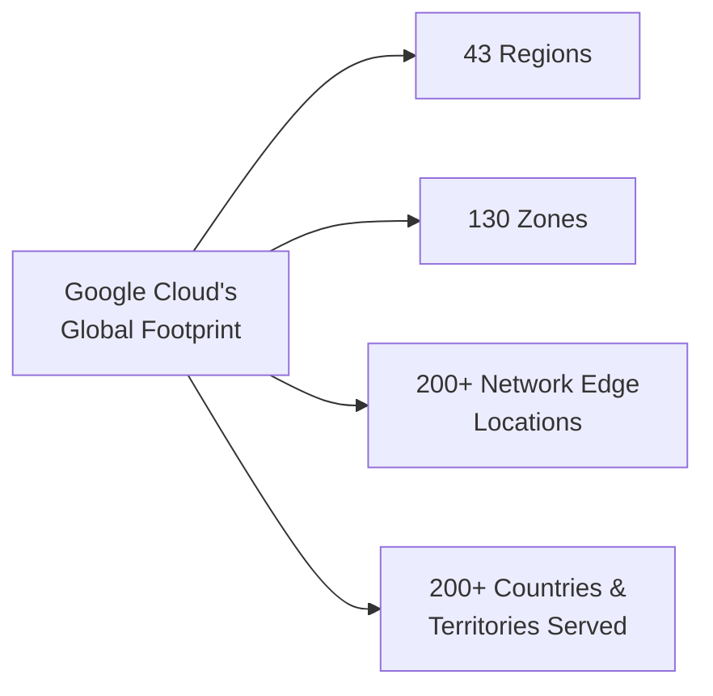

#### 📖 Definition — What a Region and a Zone Actually Are

> 💡 **Given directly:** *"If you're wondering what exactly is a region, well, think of it as a collection of multiple data centers. You can associate a zone with a data center, and when Google typically launches a new region, it has at least two zones."*

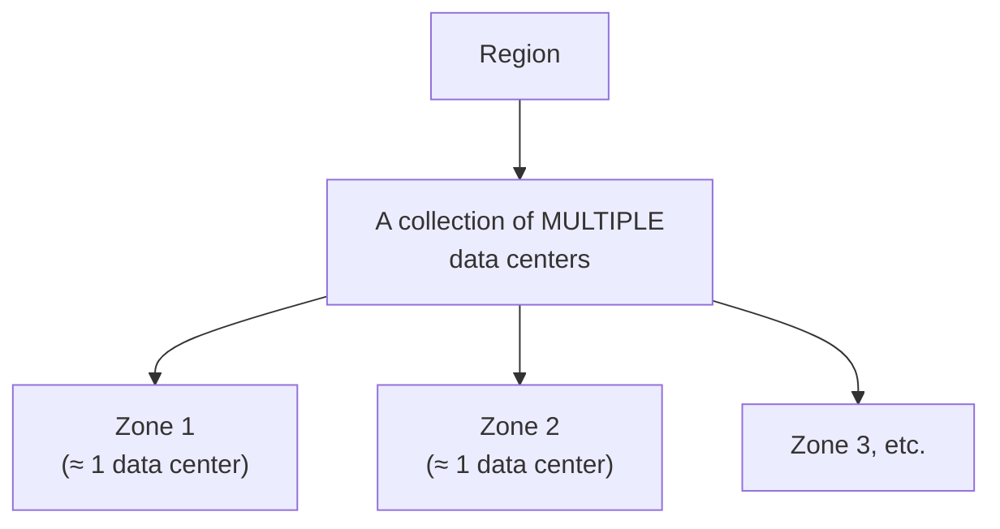

#### ❓ Why It Exists — The Purpose of Multiple Zones

> 💡 **Given directly:** *"The idea of a zone provides higher availability, reliability, and redundancy to customers. When customers launch applications, they use more than one zone, making their application highly available and resilient."*

#### 📖 Definition — Network Edge Locations

> 💡 **Given directly:** *"Network edge locations deliver static content, which enhances the user experience. By caching the static content, it doesn't need to fetch every time a user requests content. This is going to significantly increase the speed at which the content is delivered, which will directly result in enhanced user experience."*

#### 🏢 Real-World / Production Usage — Continued Global Expansion

> 💡 **Given directly:** *"Apart from the current regions and zones, Google is expected to launch its data centers in new territories, including Mexico, Malaysia, and other countries."* (The accompanying slide additionally names Thailand, New Zealand, Greece, Norway, Austria, and Sweden as upcoming expansion targets.)

#### ⚠ Common Mistakes

* Assuming a "region" and a "zone" are interchangeable terms — explicitly, precisely distinguished: a region is a collection of MULTIPLE data centers; a zone corresponds to roughly ONE data center within that region.
* Assuming deploying to a single zone is sufficient for a production application — explicitly, directly clarified: genuine high availability and resilience specifically requires spanning MULTIPLE zones.

#### 🎯 Key Takeaways

* Google Cloud's current footprint: **43 regions, 130 zones, 200+ network edge locations, serving 200+ countries and territories** — with continued expansion explicitly planned (Mexico, Malaysia, Thailand, New Zealand, Greece, Norway, Austria, Sweden).
* A **region** is a collection of multiple data centers; a **zone** corresponds to roughly one data center — every new region launches with **at least two zones**.
* Deploying across **multiple zones** is the specific mechanism for achieving genuine high availability and resilience — a single-zone deployment does not provide this benefit.
* **Network edge locations** specifically deliver and cache STATIC content, directly reducing latency and improving user experience — genuinely distinct in purpose from regions/zones, which host actual compute/storage infrastructure.

---

### 2. The Big Picture: GCP's Layered Architecture

#### 📖 Definition — The Complete, Layered Stack

> 💡 **Given directly:** *"At the bottom of the stack, we see compute, which is the most critical building block of cloud infrastructure. Then we have storage, which provides durability and persistence to applications. Of course, we also have the network that enables communication across multiple applications and services."*

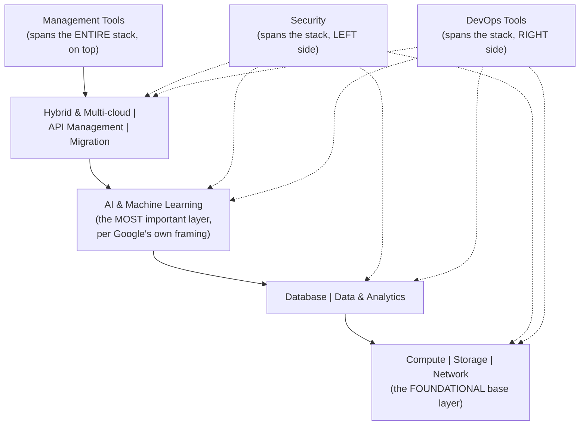

#### 🔍 Internal Working — Precisely Why Security and DevOps "Cut Across" Rather Than Sitting in One Layer

> 💡 **Given directly:** *"We then have security and DevOps that cuts across the stack, because these are not specific to a layer, but they're important for all the services and applications deployed on GCP. So they essentially cover the entire stack."*

#### 📖 Definition — Enterprise & Top-of-Stack Layers

> 💡 **Given directly:** *"For enterprises, there is a set of services that make it possible to deploy hybrid and multi-cloud capabilities, API management, and even migrate workloads from on premises to the cloud... Finally, we have the management tools, which deliver services through which customers can interact and manage their cloud deployments and cloud infrastructure services."*

#### ⚠ Common Mistakes

* Assuming security and DevOps tools belong to a specific layer of the stack, the same way compute or storage do — explicitly, directly corrected: both are explicitly described as cutting ACROSS the entire stack, since they apply to every layer rather than being layer-specific.
* Assuming AI/ML is just one more service category among many, equally weighted — explicitly, directly emphasized: it's specifically called out as **"the most important layer,"** directly tied to Google's own particular area of expertise.

#### 🎯 Key Takeaways

* GCP's architecture is explicitly organized as a **layered stack**: compute/storage/network form the foundational base; database and data & analytics sit above that; AI & Machine Learning is explicitly named as the single most important layer; hybrid/multi-cloud, API management, and migration serve enterprise needs.
* **Security** and **DevOps tools** are explicitly, deliberately positioned as cutting ACROSS the entire stack — not confined to any single layer, since both are relevant to every layer's services and applications.
* **Management tools** sit at the very top, providing the mechanism through which customers actually interact with and manage everything below.

---
### 3. Compute Services: From IaaS to FaaS

#### 📖 Definition — The Complete Spectrum, Precisely Categorized

> 💡 **Given directly:** *"The first is, of course, compute, and in this spectrum, we have a variety of services starting from Compute Engine, which is infrastructure as a service, App Engine, which is platform as a service, Kubernetes Engine, which is container as a service, Cloud Run, which is a hybrid between container as a service and platform as a service... And then we have functions as a service in the form of Cloud Run Functions."*

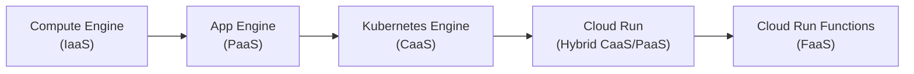

| Service | Category | What It Is |
|---|---|---|
| **Compute Engine** | IaaS | Virtual machines -- full infrastructure control |
| **App Engine** | PaaS | Deploy application code directly, platform-managed |
| **Kubernetes Engine** | CaaS | Managed Kubernetes for container orchestration |
| **Cloud Run** | Hybrid CaaS/PaaS | Deploy containers, run them -- without managing infrastructure |
| **Cloud Run Functions** | FaaS | Event-driven, single-function execution |

#### ❓ Why It Exists — Why the Spectrum Matters

> 💡 **Given directly:** *"You can deploy containers and run on that [Cloud Run]. We'll take a closer look at Cloud Run in the subsequent sections... So this spectrum covers the core compute services of Google Cloud."*

#### ⚠ Common Mistakes

* Assuming all GCP compute services provide the same level of infrastructure control — explicitly, directly distinguished: the spectrum runs from full control (Compute Engine/IaaS) to zero infrastructure management (Cloud Run Functions/FaaS), with genuinely different services appropriate for genuinely different control/convenience trade-offs.
* Assuming Cloud Run is simply "another Kubernetes Engine" — explicitly, directly distinguished as a HYBRID between container-as-a-service and platform-as-a-service, a genuinely distinct position on the spectrum.

#### 🎯 Key Takeaways

* GCP's compute services span the **complete IaaS-to-FaaS spectrum**: Compute Engine (IaaS) → App Engine (PaaS) → Kubernetes Engine (CaaS) → Cloud Run (hybrid CaaS/PaaS) → Cloud Run Functions (FaaS).
* This categorization (IaaS/PaaS/CaaS/FaaS) is explicitly, precisely useful for choosing the RIGHT compute service based on how much infrastructure control versus convenience a given workload genuinely needs.

---

### 4. Storage & Database Services

#### 📖 Definition — Why Storage and Database Are Grouped Together

> 💡 **Given directly:** *"Then we have storage and databases. Now I combine storage and databases because they offer persistence and durability."*

#### 📖 Definition — Cloud Storage vs. Persistent Disk

> 💡 **Given directly:** *"Cloud Storage is object storage, which is almost accessible from any service, any application over an API. So an object that you store in Cloud Storage becomes accessible to any service that can use essentially HTTP or REST API. Persistent Disk is block storage that brings persistence to Compute Engine and Kubernetes Engine applications. So you can mount a disk and write data directly to the disk."*

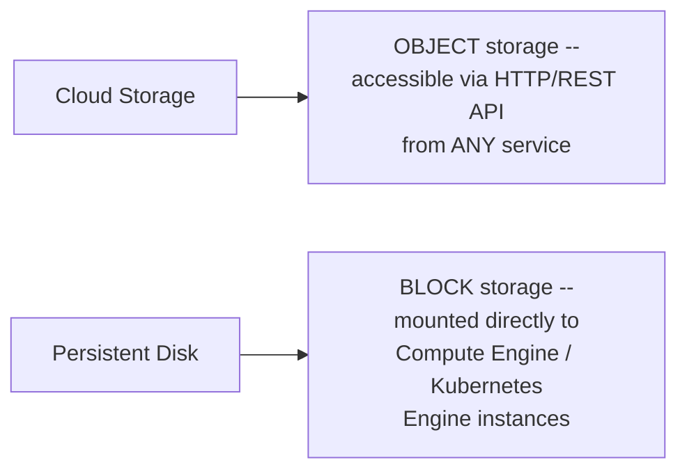

#### 📖 Definition — The Database Services, Precisely Distinguished

> 💡 **Given directly:** *"On the database side of things, we have Bigtable, which is a very reliable columnar storage to store very diverse data. And then we have AlloyDB for PostgreSQL, which is a new addition... Cloud SQL and Cloud Spanner, which are relational databases and give you the ability to store highly structured data."*

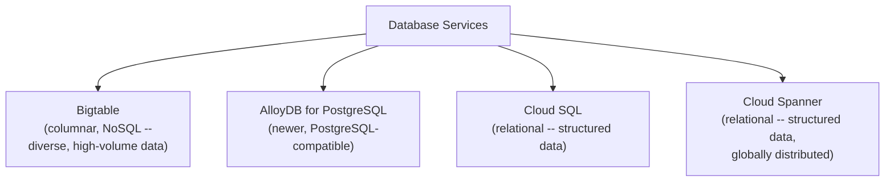

| Service | Type | Best For |
|---|---|---|
| **Cloud Storage** | Object storage | Files/objects accessible via HTTP/REST from any service |
| **Persistent Disk** | Block storage | Direct-mounted storage for Compute Engine / Kubernetes Engine |
| **Cloud Bigtable** | NoSQL, columnar | Diverse, high-volume, reliable data storage |
| **AlloyDB for PostgreSQL** | Relational (newer) | PostgreSQL-compatible structured data |
| **Cloud SQL** | Relational | Highly structured data |
| **Cloud Spanner** | Relational, distributed | Highly structured data at global scale |

#### ⚠ Common Mistakes

* Assuming Cloud Storage and Persistent Disk serve the same purpose — explicitly, directly distinguished: Cloud Storage is OBJECT storage (API-accessible from anywhere); Persistent Disk is BLOCK storage (directly mounted to specific compute instances).
* Assuming Bigtable and Cloud SQL/Spanner are interchangeable database options — explicitly, directly distinguished: Bigtable is NoSQL/columnar for diverse data; Cloud SQL/Spanner/AlloyDB are relational, for highly structured data.

#### 🎯 Key Takeaways

* **Storage and database** are grouped together specifically because both provide **persistence and durability** to applications.
* **Cloud Storage** (object storage, API-accessible) is genuinely distinct from **Persistent Disk** (block storage, directly mounted to compute instances).
* GCP's database options span both **NoSQL** (Bigtable, for diverse, columnar data) and **relational** (Cloud SQL, Cloud Spanner, AlloyDB for PostgreSQL, for highly structured data) — with AlloyDB explicitly noted as a newer addition to the platform.

---
### 5. Data & Analytics Services

#### 📖 Definition — BigQuery, the Flagship Service

> 💡 **Given directly:** *"BigQuery is a flagship service from Google, which is a data warehouse in the cloud."*

#### 📖 Definition — Pub/Sub: Asynchronous, Message-Oriented Middleware

> 💡 **Given directly:** *"Pub/Sub... is essentially a message-oriented middleware that enables asynchronous message-oriented communication between various applications and services. So if you want to asynchronously send messages or data from one layer of your application to another layer, you can create topics in Pub/Sub and drop the messages in the topics and it gets picked up by the other application. So it becomes a pipe to exchange messages asynchronously."*

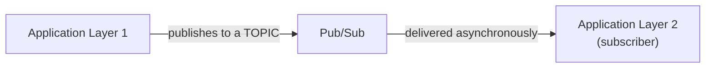

#### 📖 Definition — Dataflow vs. Dataproc, Precisely Distinguished

> 💡 **Given directly:** *"Dataflow, which is again meant for creating pipelines and processing data at scale. And then Dataproc is a managed service that is going to process big data, either through Apache Hadoop or Apache Spark."*

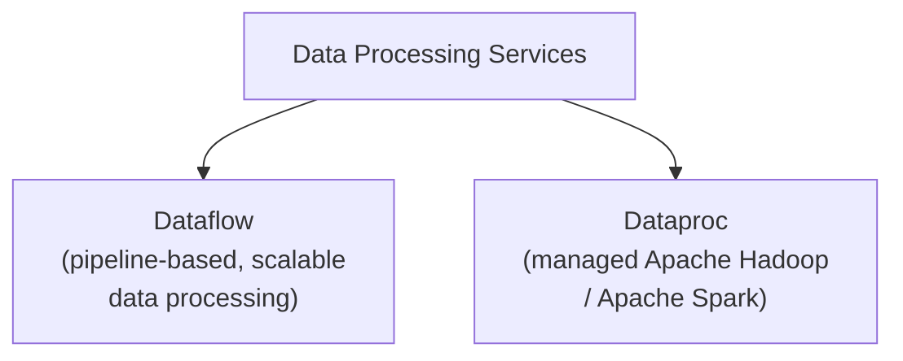

#### 📖 Definition — Looker: Business Intelligence Visualization

> 💡 **Given directly:** *"Looker, which is a business intelligence visualization tool meant to display analytics and help decision-makers accelerate the process through visualization and through visual analytics."*

| Service | Purpose |
|---|---|
| **BigQuery** | Data warehouse in the cloud (Google's flagship data service) |
| **Pub/Sub** | Asynchronous, message-oriented communication between applications |
| **Dataflow** | Pipeline-based data processing at scale |
| **Dataproc** | Managed Apache Hadoop / Apache Spark big-data processing |
| **Looker** | Business intelligence and data visualization |

#### ⚠ Common Mistakes

* Assuming Dataflow and Dataproc are interchangeable, general-purpose "data processing" services — explicitly, directly distinguished: Dataflow is pipeline-based, general-purpose scalable processing; Dataproc is SPECIFICALLY a managed service for Apache Hadoop/Spark workloads.
* Assuming Pub/Sub is a database or storage service — explicitly, directly clarified: it's specifically a MESSAGING/communication mechanism (a "pipe"), not a place to durably store data long-term.

#### 🎯 Key Takeaways

* **BigQuery** is explicitly named Google's "flagship" data service — a full, cloud-based data warehouse.
* **Pub/Sub** enables asynchronous communication between application layers via topics — explicitly described as "a pipe to exchange messages asynchronously," genuinely distinct from a storage or database service.
* **Dataflow** (general pipeline processing) and **Dataproc** (specifically managed Hadoop/Spark) are precisely distinguished, despite both processing data at scale.
* **Looker** specifically addresses the VISUALIZATION and decision-support end of the data & analytics pipeline, distinct from the processing/storage services around it.

---

### 6. Networking Services

#### 📖 Definition — Cloud Network: The Connective Foundation

> 💡 **Given directly:** *"Cloud Network... basically connects all the regions, all these zones, everything that Google has to offer."*

#### 📖 Definition — Load Balancing: Internal vs. External

> 💡 **Given directly:** *"Load Balancing, which is meant to balance the traffic either for internal traffic or external. Internal is between, for example, your front-end application and the API layer. The API layer is not exposed to the outside world, so you need an internal load balancer, but the front-end that is exposed to the public might need an external load balancer."*

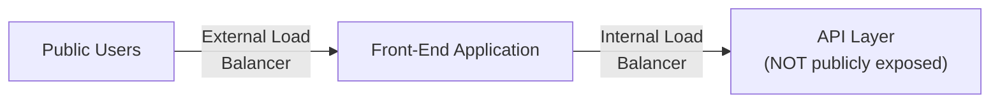

#### 📖 Definition — Cloud CDN

> 💡 **Given directly:** *"Cloud CDN, the content delivery network, which is the edge network that caches frequently accessed data and reduces latency in delivering content."*

#### 📖 Definition — Cloud Interconnect: Hybrid AND Multi-Cloud Connectivity

> 💡 **Given directly:** *"The Cloud Interconnect enables hybrid and multi-cloud connectivity. So if you are extending your data center to the cloud and you want to securely exchange data between your data center and Google Cloud, you would use Interconnect. Cloud Interconnect also enables multi-cloud connectivity by creating a sort of a mesh network between, for example, Amazon Web Services and Google Cloud or Azure and Google Cloud."*

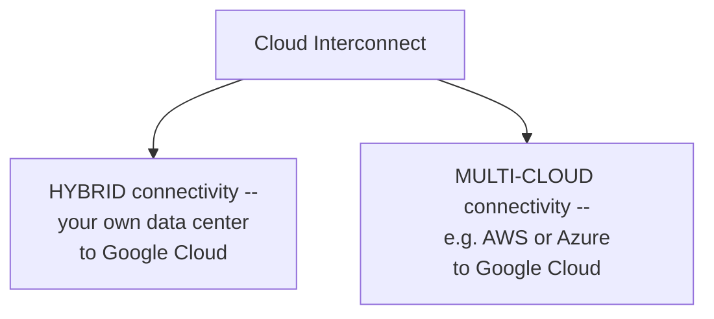

#### 📖 Definition — Cloud DNS

> 💡 **Given directly:** *"Cloud DNS, which is a managed DNS service available within Google Cloud. Here you can register your domains, you can set up traffic routing, you can basically create zones and treat it like any other DNS service but completely managed and living within the context of Google Cloud."*

| Service | Purpose |
|---|---|
| **Cloud Network** | Connects all Google Cloud regions and zones |
| **Cloud Load Balancing** | Internal (e.g. front-end-to-API) and external (public-facing) traffic distribution |
| **Cloud CDN** | Edge caching of frequently-accessed content, reducing latency |
| **Cloud Interconnect** | Secure hybrid (on-prem-to-cloud) AND multi-cloud (AWS/Azure-to-GCP) connectivity |
| **Cloud DNS** | Fully managed DNS -- domain registration, traffic routing, zone management |

#### ⚠ Common Mistakes

* Assuming a single load balancer type handles both internal and external traffic identically — explicitly, directly distinguished: internal load balancers serve traffic NOT exposed to the public (e.g., front-end to API layer); external load balancers serve genuinely public-facing traffic.
* Assuming Cloud Interconnect only supports connecting to a private, on-premises data center — explicitly, directly clarified: it ALSO supports genuine multi-cloud connectivity (e.g., a mesh network between AWS and Google Cloud).

#### 🎯 Key Takeaways

* **Cloud Network** provides the foundational connectivity across all of Google's own regions and zones.
* **Load balancing** is explicitly split into internal (non-public traffic, like front-end-to-API) and external (public-facing) variants.
* **Cloud Interconnect** explicitly serves BOTH hybrid (on-premises-to-cloud) AND multi-cloud (e.g., AWS/Azure-to-GCP) connectivity needs — a genuinely dual-purpose service.
* **Cloud DNS** is a fully-managed DNS service, functionally equivalent to any other DNS provider but operating entirely within Google Cloud's own managed environment.

---
### 7. Security & Identity Services

#### 📖 Definition — Cloud IAM: The Most Critical Service

> 💡 **Given directly:** *"Cloud IAM is one of the most critical services, and we are going to spend significant time learning about identity and access management."*

#### 📖 Definition — Secret Manager vs. Cloud Key Management, Precisely Distinguished

> 💡 **Given directly:** *"There is Secret Manager where you can store your passwords and API keys and other sensitive data in a very secure manner... Cloud Key Management is a super set of secret manager, just like Secret Manager stores keys, which are typically API keys or SSH keys or anything in plain text. Cloud Key Management stores the private keys that are very critical for encryption."*

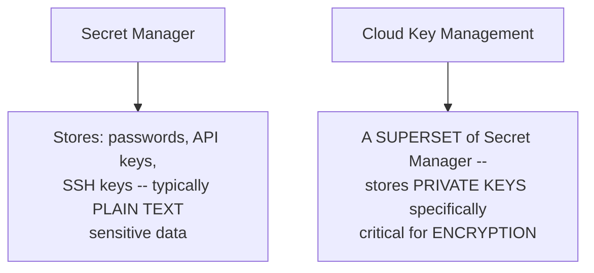

#### 📖 Definition — Cloud Security Scanner

> 💡 **Given directly:** *"Cloud Security Scanner is another service that basically scans most of your applications and deployments and creates some kind of an alerting when there is a compliance issue or when there is a known bug or a vulnerability that is found within your application."*

| Service | What It Protects/Does |
|---|---|
| **Cloud IAM** | Identity and access management -- who can do what |
| **Secret Manager** | Securely stores passwords, API keys, SSH keys (plain-text sensitive data) |
| **Cloud Security Scanner** | Scans applications/deployments for compliance issues, bugs, vulnerabilities |
| **Cloud Key Management** | Stores private keys critical for ENCRYPTION -- a superset of Secret Manager's scope |

#### ⚠ Common Mistakes

* Assuming Secret Manager and Cloud Key Management serve identical purposes — explicitly, directly distinguished: Secret Manager stores plain-text credentials (passwords, API/SSH keys); Cloud Key Management specifically handles PRIVATE, ENCRYPTION-critical keys, and is explicitly described as a "superset" of Secret Manager's scope.

#### 🎯 Key Takeaways

* **Cloud IAM** is explicitly named one of GCP's MOST CRITICAL services, governing identity and access control across the entire platform.
* **Secret Manager** and **Cloud Key Management** are precisely, deliberately distinguished: the former handles plain-text credentials; the latter handles genuinely encryption-critical private keys, and is described as a broader superset of the former's scope.
* **Cloud Security Scanner** provides automated, ongoing vulnerability and compliance detection across deployed applications.

---

### 8. AI & Machine Learning Services

#### 📖 Definition — Vertex AI: The Flagship MLOps Platform

> 💡 **Given directly:** *"Vertex AI is the most popular and the most important service in this stack. Google is betting big on Vertex AI to deliver both predictive AI, which is meant to run traditional models, and also generative AI, which are most recent. For example, models like Gemini run on top of Vertex AI. It is the MLOps Platform, which is the machine learning operations platform offered by Google."*

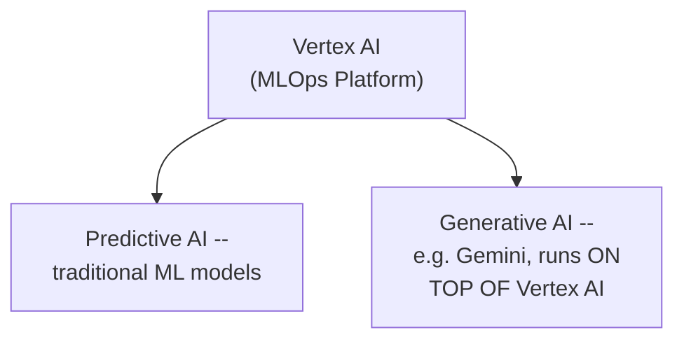

#### 📖 Definition — The Quick-Access AI API Family

> 💡 **Given directly, each API precisely defined:**
> - **Vision AI**: *"Meant for object classification, object detection, and object recognition."*
> - **Speech AI**: *"Will convert text to speech and speech to text."*
> - **Natural Language AI**: *"Meant for NLP, which is now getting superseded by, of course, large language models like Gemini."*
> - **Translation AI**: *"To translate one language to another."*
> - **Document AI**: *"Meant for classification and extraction of data from variety of structured and unstructured documents."*

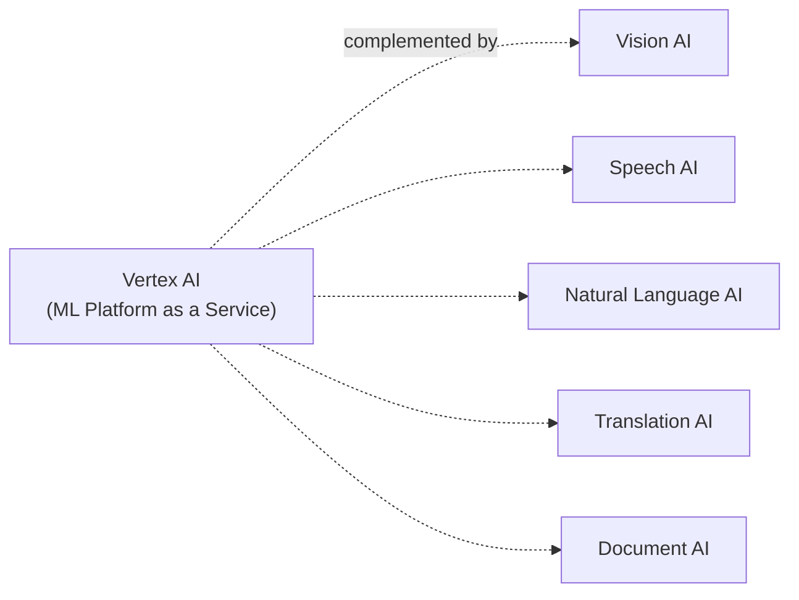

| Service | Purpose |
|---|---|
| **Vertex AI** | MLOps platform -- predictive AND generative AI (including Gemini) |
| **Vision AI** | Object classification, detection, recognition |
| **Speech AI** | Text-to-speech and speech-to-text |
| **Natural Language AI** | NLP (increasingly superseded by LLMs like Gemini) |
| **Translation AI** | Language-to-language translation |
| **Document AI** | Classification and extraction from structured/unstructured documents |

#### ⚠ A Genuine, Direct Acknowledgment: One Service Is Being Superseded

> ⚠️ **Directly, honestly stated:** *"There is Natural Language AI, which is meant for NLP, which is now getting superseded by, of course, large language models like Gemini."*

#### ⚠ Common Mistakes

* Assuming Vertex AI and the individual AI APIs (Vision AI, Speech AI, etc.) are competing, redundant offerings — explicitly, directly clarified: Vertex AI is the full MLOps PLATFORM (for building/training/deploying custom or foundation models); the individual APIs provide QUICK, ready-made access to specific AI capabilities without building anything from scratch.
* Assuming every AI API listed remains equally current/relevant — explicitly, directly acknowledged: Natural Language AI specifically is described as being superseded by newer LLM-based approaches like Gemini.

#### 🎯 Key Takeaways

* **Vertex AI** is explicitly named the "most popular and most important" service in GCP's entire AI/ML stack — a genuine MLOps platform supporting BOTH predictive (traditional) and generative (e.g., Gemini) AI.
* GCP's **quick-access AI APIs** (Vision, Speech, Natural Language, Translation, Document) provide ready-made capabilities without requiring custom model development.
* The content **explicitly, honestly acknowledges** that one of these APIs (Natural Language AI) is being genuinely superseded by newer LLM-based approaches — a candid, non-marketing-driven observation.

---
### 9. Developer Tools & Management/Operations Tools

#### 📖 Definition — Developer Tools

> 💡 **Given directly:** *"There are a set of developer tools which will help developers run their end-to-end pipeline, which includes continuous integration and continuous deployment pipelines in the cloud. So Cloud SDK gives you programmatic access to Google Cloud, like G Cloud SDK. Cloud workstations, fully configured workstations that come with popular integrated development environments like VS Code, completely managed, pre-configured. And then there is Cloud Build, Cloud Code, and Gemini Cloud Assist, which is a conversational coding assistant that is available in popular IDEs like VS Code."*

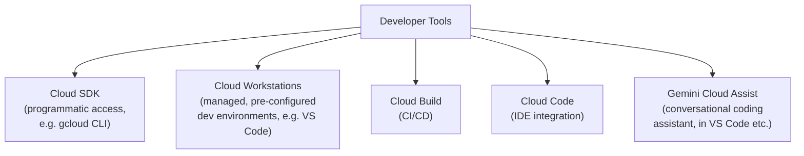

#### 📖 Definition — Management & Operations Tools

> 💡 **Given directly:** *"For operators and administrators, there are a set of tools for managing, monitoring, and dealing with the observability. For example, Cloud Monitoring, Logging, Error Reporting, Debugger forms the core of observability... Deployment Manager is a Google Cloud service where you can declaratively define your deployment and then translate them into a set of Google Cloud resources or your custom applications... basically, it is configuration as code."*

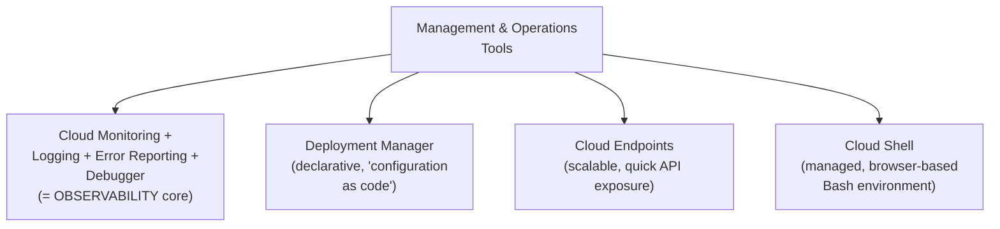

#### 📖 Definition — Cloud Endpoints and Cloud Shell, Precisely Described

> 💡 **Given directly:** *"Cloud Endpoints are your custom endpoints, which will expose API, and they are highly scalable. And this is a mechanism for you to expose APIs very quickly without having to deal with a lot of load balancing or basically the plumbing that is required to take your API to production... With Cloud Shell, you get a managed shell, a Bash environment within the browser. So within Chrome or Safari or Microsoft Edge, you can very quickly launch a shell, and that is going to be your command line interface to deal with all things Google Cloud."*

| Category | Service | Purpose |
|---|---|---|
| Developer Tools | **Cloud SDK** | Programmatic access to GCP (gcloud CLI) |
| Developer Tools | **Cloud Workstations** | Managed, pre-configured dev environments |
| Developer Tools | **Cloud Build** | CI/CD pipeline execution |
| Developer Tools | **Cloud Code** | IDE integration for GCP development |
| Developer Tools | **Gemini Cloud Assist** | Conversational, in-IDE coding assistant |
| Management/Ops | **Cloud Monitoring / Logging / Error Reporting / Debugger** | Core observability suite |
| Management/Ops | **Deployment Manager** | Declarative "configuration as code" deployment |
| Management/Ops | **Cloud Endpoints** | Quick, scalable API exposure without manual plumbing |
| Management/Ops | **Cloud Shell** | Managed, browser-based Bash environment |

#### ⚠ Common Mistakes

* Assuming observability requires four entirely separate, unrelated tools — explicitly, directly grouped together: Cloud Monitoring, Logging, Error Reporting, and Debugger together "form the core of observability" as one cohesive capability set.
* Assuming Cloud Shell requires local installation of any tooling — explicitly, directly clarified: it's a fully browser-based (Chrome, Safari, Microsoft Edge) managed Bash environment, requiring no local setup.

#### 🎯 Key Takeaways

* **Developer tools** (Cloud SDK, Cloud Workstations, Cloud Build, Cloud Code, Gemini Cloud Assist) collectively support an end-to-end CI/CD development pipeline in the cloud.
* **Management/operations tools** center on OBSERVABILITY (Monitoring, Logging, Error Reporting, Debugger as one cohesive group) plus declarative deployment (Deployment Manager, explicitly described as "configuration as code"), API exposure (Cloud Endpoints), and browser-based shell access (Cloud Shell).
* **Cloud Shell** is explicitly, precisely described as fully browser-based — no local installation required, accessible from any major browser.

---

### 10. Enterprise Services

#### ⚠ A Direct, Honest Framing: This Is a Deliberately Partial Sample

> 💡 **Given directly:** *"This is just a subset, by no means we are covering all the 100+ services that exist within Google Cloud, but I thought I'm going to refer to a few as an example of what are actually the enterprise services."*

#### 📖 Definition — API Analytics

> 💡 **Given directly:** *"API Analytics is a part of an acquisition that Google made called APG, and this enables enterprises to monitor, manage, and completely take control of their APIs."*

#### 📖 Definition — VPN

> 💡 **Given directly:** *"VPN, which will enable enterprises to securely create a tunnel between their data center and Google Cloud, and this will help them become compliant and use a secure pipe to exchange data between the cloud and their on-premises data center infrastructure."*

#### 📖 Definition — AutoML

> 💡 **Given directly:** *"AutoML is a very interesting service within Vertex AI, where you can use an existing model, fine tune with your custom data set... with a few clicks, you'll be able to train a new model, or rather fine tune a new model, deploy it, and use it with your custom data set."*

#### 📖 Definition — Transfer Appliance

> 💡 **Given directly:** *"Transfer Appliance is another interesting service, where if you have petabytes of data and sending them over the internet doesn't make sense, you can get an appliance shipped by Google that you can populate with your data and then send it back to Google, and then it gets uploaded into Google Cloud storage."*

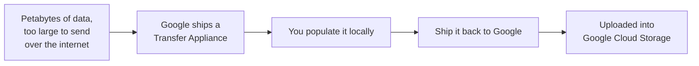

#### 📖 Definition — BeyondCorp

> 💡 **Given directly:** *"BeyondCorp is a very secure mechanism to access applications by employees of an organization, so you can create a very secure layer to not only access cloud applications, but even your internal applications by configuring a tool called BeyondCorp. So it gives very secure access to remote employees, irrespective of where they are operating from."*

#### 📖 Definition — Filestore vs. Memorystore

> 💡 **Given directly:** *"Filestore is a file storage service that is like NFS, so you can basically mount existing mount points, existing file shares within a compute engine or Kubernetes engine, and it basically simulates network attached storage. Memorystore is a cache. It is like Redis or a managed caching service, that lets you store frequently accessed data in memory to enhance the response of your application."*

| Service | Purpose |
|---|---|
| **API Analytics** | Monitor, manage, and control enterprise APIs (from the Apigee acquisition) |
| **VPN** | Secure tunnel between an enterprise data center and Google Cloud |
| **AutoML** | Fine-tune existing Vertex AI models on custom data, with minimal effort |
| **Transfer Appliance** | Physically ship petabytes of data to Google for cloud upload |
| **BeyondCorp** | Secure remote access to cloud AND internal applications, from anywhere |
| **Filestore** | NFS-like managed file storage for Compute Engine / Kubernetes Engine |
| **Memorystore** | Managed, Redis-like in-memory caching |

#### ⚠ Common Mistakes

* Assuming this enterprise services list represents GCP's complete catalog — explicitly, directly, honestly acknowledged as "just a subset" of GCP's 100+ total services, deliberately illustrative rather than exhaustive.
* Assuming Filestore and Memorystore serve the same storage purpose — explicitly, directly distinguished: Filestore is NFS-like persistent FILE storage; Memorystore is an in-MEMORY cache for frequently-accessed data.

#### 🎯 Key Takeaways

* This section is **explicitly, honestly framed as a deliberately partial sample** — GCP has 100+ total services, and this list illustrates common enterprise needs rather than attempting exhaustive coverage.
* **Transfer Appliance** solves a genuinely practical, physical-world problem: moving petabyte-scale data where internet transfer is impractical, via a physically-shipped hardware appliance.
* **BeyondCorp** provides secure access to BOTH cloud AND internal applications for remote employees — a genuinely broader scope than a typical VPN alone.
* **Filestore** (NFS-like persistent file storage) and **Memorystore** (Redis-like in-memory cache) are precisely distinguished by their fundamentally different storage purposes.

---
## 📝 Glossary

| Term | Definition | Why It Matters |
|---|---|---|
| **Region** | A collection of multiple data centers | Every new region launches with at least 2 zones |
| **Zone** | Roughly equivalent to one data center | Deploying across multiple zones enables high availability |
| **Network Edge Location** | A location that caches static content close to users | Reduces latency, improves user experience |
| **IaaS / PaaS / CaaS / FaaS** | Infrastructure/Platform/Container/Function as a Service | The spectrum GCP's compute services span |
| **Object storage** | Storage accessible via HTTP/REST API from any service | What Cloud Storage provides |
| **Block storage** | Storage directly mounted to a specific compute instance | What Persistent Disk provides |
| **MLOps Platform** | A platform for building, training, and deploying ML models | What Vertex AI is |
| **Configuration as Code** | Declaratively defining infrastructure/deployments | What Deployment Manager provides |

---

## 🔄 Revision Notes — One-Minute Revision

* **Global footprint**: 40 regions, 121 zones, 187 network edge locations, 200+ countries served -- continued expansion planned (Mexico, Malaysia, Thailand, New Zealand, Greece, Norway, Austria, Sweden).
* A **region** = a collection of multiple data centers; a **zone** ≈ one data center -- new regions launch with at least 2 zones; multi-zone deployment is what actually delivers high availability.
* **Layered architecture**: compute/storage/network (foundation) -> database/data & analytics -> AI & Machine Learning (explicitly "the most important layer") -> hybrid & multi-cloud/API management/migration -> with **security and DevOps tools cutting ACROSS the entire stack**, and management tools on top.
* **Compute spans the full IaaS-to-FaaS spectrum**: Compute Engine (IaaS) -> App Engine (PaaS) -> Kubernetes Engine (CaaS) -> Cloud Run (hybrid CaaS/PaaS) -> Cloud Run Functions (FaaS).
* **Storage & database**, grouped for persistence/durability: Cloud Storage (object) vs. Persistent Disk (block); Bigtable (NoSQL/columnar) vs. Cloud SQL/Cloud Spanner/AlloyDB (relational).
* **Data & analytics**: BigQuery (flagship data warehouse), Pub/Sub (async messaging), Dataflow (pipeline processing) vs. Dataproc (managed Hadoop/Spark), Looker (BI visualization).
* **Networking**: Cloud Network (connects regions/zones), Load Balancing (internal vs. external), Cloud CDN (edge caching), Cloud Interconnect (BOTH hybrid AND multi-cloud connectivity), Cloud DNS (managed DNS).
* **Security & identity**: Cloud IAM ("one of the most critical services"), Secret Manager (plain-text credentials) vs. Cloud Key Management (encryption-critical private keys, a superset of Secret Manager), Cloud Security Scanner (vulnerability/compliance scanning).
* **AI & ML**: Vertex AI ("the most popular and most important service" -- MLOps platform for BOTH predictive and generative AI, including Gemini), plus quick-access APIs: Vision AI, Speech AI, Natural Language AI (explicitly being superseded by LLMs like Gemini), Translation AI, Document AI.
* **Developer tools** (Cloud SDK, Cloud Workstations, Cloud Build, Cloud Code, Gemini Cloud Assist) and **management/operations tools** (Monitoring/Logging/Error Reporting/Debugger as core observability, Deployment Manager as "configuration as code," Cloud Endpoints, Cloud Shell).
* **Enterprise services** (explicitly a partial sample, not exhaustive): API Analytics, VPN, AutoML, Transfer Appliance, BeyondCorp, Filestore vs. Memorystore.
* **Summary**: GCP spans 100+ services across IaaS, PaaS, and SaaS, with a genuinely global footprint across all continents.

---

## 📋 Cheat Sheet

**Global footprint numbers:**
```text
40 Regions | 121 Zones | 187 Network Edge Locations | 200+ Countries/Territories
```

**Compute spectrum:**
```text
Compute Engine (IaaS) -> App Engine (PaaS) -> Kubernetes Engine (CaaS)
-> Cloud Run (hybrid CaaS/PaaS) -> Cloud Run Functions (FaaS)
```

**Storage vs. database:**
```text
Cloud Storage    -> object storage, API-accessible
Persistent Disk    -> block storage, mounted to compute instances
Bigtable              -> NoSQL, columnar (diverse data)
Cloud SQL / Spanner / AlloyDB -> relational (structured data)
```

**Data & analytics:**
```text
BigQuery    -> data warehouse (flagship)
Pub/Sub       -> async messaging ("a pipe")
Dataflow        -> pipeline processing
Dataproc          -> managed Hadoop/Spark
Looker              -> BI visualization
```

**Networking:**
```text
Cloud Network         -> connects regions/zones
Load Balancing (int/ext) -> internal (non-public) vs. external (public) traffic
Cloud CDN                   -> edge caching
Cloud Interconnect             -> hybrid (on-prem) AND multi-cloud (AWS/Azure)
Cloud DNS                        -> managed DNS
```

**Security:**
```text
Cloud IAM              -> identity & access management (most critical)
Secret Manager            -> plain-text credentials (passwords, API/SSH keys)
Cloud Key Management         -> encryption-critical PRIVATE keys (superset of Secret Manager)
Cloud Security Scanner          -> vulnerability/compliance scanning
```

**AI/ML:**
```text
Vertex AI -> MLOps platform (predictive + generative, incl. Gemini) -- most important service
Vision AI | Speech AI | Natural Language AI | Translation AI | Document AI -> quick-access APIs
```

---

## 🔥 Interview Questions & Answers

### 🟢 Beginner

**Q1.**

**Question:** What is the difference between a region and a zone in Google Cloud?

**Answer:** A region is a collection of multiple data centers; a zone corresponds to roughly one data center within that region.

**Explanation:** Directly, precisely defined.

**Why Interviewers Ask This:** Foundational cloud infrastructure terminology, common across providers.

**Possible Follow-up:** "How many zones does a new Google Cloud region typically launch with?"

**Q2.**

**Question:** Why should applications be deployed across multiple zones?

**Answer:** To achieve higher availability, reliability, and redundancy -- making the application resilient to a single zone's failure.

**Explanation:** Directly, precisely explained.

**Why Interviewers Ask This:** Tests understanding of a fundamental high-availability principle.

**Possible Follow-up:** "What is a network edge location, and how does it differ from a zone?"

**Q3.**

**Question:** Name the five compute services spanning GCP's IaaS-to-FaaS spectrum, in order.

**Answer:** Compute Engine (IaaS), App Engine (PaaS), Kubernetes Engine (CaaS), Cloud Run (hybrid CaaS/PaaS), Cloud Run Functions (FaaS).

**Explanation:** Directly, explicitly named and ordered.

**Why Interviewers Ask This:** Tests breadth of knowledge across GCP's compute offerings.

**Possible Follow-up:** "Which of these services would you choose for a workload requiring full infrastructure control?"

**Q4.**

**Question:** What is the difference between Cloud Storage and Persistent Disk?

**Answer:** Cloud Storage is object storage, accessible via HTTP/REST API from any service; Persistent Disk is block storage, directly mounted to Compute Engine or Kubernetes Engine instances.

**Explanation:** Directly, precisely distinguished.

**Why Interviewers Ask This:** A commonly-tested storage-type distinction.

**Possible Follow-up:** "Which would you use for storing application logs accessible from multiple services?"

**Q5.**

**Question:** What does Pub/Sub do?

**Answer:** It enables asynchronous, message-oriented communication between applications and services, via topics.

**Explanation:** Directly, precisely explained.

**Why Interviewers Ask This:** Basic, foundational messaging/architecture knowledge.

**Possible Follow-up:** "How is Pub/Sub different from a database?"

**Q6.**

**Question:** What's the difference between an internal and an external load balancer?

**Answer:** Internal load balancers serve traffic not exposed to the public (e.g., front-end to API layer); external load balancers serve genuinely public-facing traffic.

**Explanation:** Directly, precisely distinguished.

**Why Interviewers Ask This:** A commonly-asked, practical networking question.

**Possible Follow-up:** "Give an example scenario requiring an internal load balancer."

**Q7.**

**Question:** What's the difference between Secret Manager and Cloud Key Management?

**Answer:** Secret Manager stores plain-text credentials (passwords, API/SSH keys); Cloud Key Management stores private keys critical for encryption, and is described as a superset of Secret Manager.

**Explanation:** Directly, precisely distinguished.

**Why Interviewers Ask This:** A commonly-confused security-service distinction.

**Possible Follow-up:** "Which service would you use to store a database password?"

**Q8.**

**Question:** What is Vertex AI, and what does it support?

**Answer:** GCP's MLOps platform, supporting both predictive AI (traditional models) and generative AI (including Gemini).

**Explanation:** Directly, precisely explained.

**Why Interviewers Ask This:** Tests understanding of GCP's flagship AI/ML offering.

**Possible Follow-up:** "Name three of GCP's quick-access AI APIs, beyond Vertex AI itself."

**Q9.**

**Question:** What does Cloud Interconnect enable?

**Answer:** Both hybrid connectivity (a data center to Google Cloud) and multi-cloud connectivity (e.g., AWS or Azure to Google Cloud).

**Explanation:** Directly, precisely explained.

**Why Interviewers Ask This:** Tests understanding of a genuinely dual-purpose networking service.

**Possible Follow-up:** "What's the difference between Cloud Interconnect and a standard VPN?"

**Q10.**

**Question:** What is Transfer Appliance used for?

**Answer:** Physically shipping petabytes of data to Google (via a hardware appliance) when internet transfer is impractical, for upload into Cloud Storage.

**Explanation:** Directly, precisely explained.

**Why Interviewers Ask This:** Tests awareness of a genuinely distinctive, physical-world enterprise service.

**Possible Follow-up:** "In what scenario would Transfer Appliance be preferable to a direct network transfer?"

---

### 🟡 Intermediate

**Q11.**

**Question:** Explain why security and DevOps tools are explicitly positioned as cutting "across" GCP's layered architecture, rather than occupying a specific layer.

**Answer:** Unlike compute, storage, or database services -- each of which serves a SPECIFIC functional purpose within the stack -- security and DevOps concerns are genuinely relevant to EVERY layer simultaneously. A compute instance needs security controls; a database needs security controls; an AI/ML pipeline needs security controls. Confining security to a single "layer" would inaccurately suggest it only applies to one part of the stack, when in reality it must be considered and applied consistently across every layer -- this is precisely why the source material explicitly describes both as covering "the entire stack" rather than occupying a bounded position within it.

**Explanation:** Requires reasoning through why a cross-cutting concern is architecturally distinct from a layer-specific one.

**Why Interviewers Ask This:** Tests genuine architectural understanding, not just recall of the stack diagram.

**Possible Follow-up:** "Name a GCP service that exemplifies this cross-cutting nature, and explain how it applies to multiple different layers."

**Q12.**

**Question:** A learner argues that since Cloud Run is described as a "hybrid" between CaaS and PaaS, it must be strictly less capable than either Kubernetes Engine (CaaS) or App Engine (PaaS) individually. Evaluate this claim.

**Answer:** This claim is inaccurate -- "hybrid" here describes a genuinely different POSITION on the convenience/control spectrum, not a diminished or compromised version of either pure category. Cloud Run specifically lets you deploy CONTAINERS (like Kubernetes Engine/CaaS) while managing NONE of the underlying infrastructure yourself (like App Engine/PaaS) -- this combination is a genuine, deliberate design choice serving a real use case: developers who want container-level flexibility (choosing their own runtime, dependencies, base image) WITHOUT the operational overhead of managing a Kubernetes cluster. It is not "worse" than either pure category -- it occupies a genuinely different, useful point on the spectrum, appropriate for workloads that specifically benefit from container flexibility without cluster management overhead.

**Explanation:** Tests whether a learner recognizes "hybrid" as a genuine, deliberate design point rather than an inherently compromised middle ground.

**Why Interviewers Ask This:** Distinguishes candidates who understand genuine service trade-offs from those who assume hybrid necessarily means "worse at everything."

**Possible Follow-up:** "Describe a specific workload where Cloud Run would be genuinely preferable to both Kubernetes Engine and App Engine."

**Q13.**

**Question:** Explain, precisely, why Dataflow and Dataproc are both described as processing "data at scale," yet are explicitly distinguished as different services.

**Answer:** The distinction is about the underlying PROCESSING MODEL and ECOSYSTEM, not the general scale claim. Dataflow is a general-purpose, PIPELINE-based processing service -- you define a data processing pipeline (often using Apache Beam) and Dataflow manages its execution at scale, without requiring you to think about the underlying Hadoop/Spark ecosystem specifically. Dataproc, by contrast, is SPECIFICALLY a managed service for running EXISTING Apache Hadoop or Apache Spark workloads -- appropriate for organizations that already have Hadoop/Spark-based tooling, scripts, or expertise, and want a managed environment to run those SPECIFIC frameworks rather than adopting Dataflow's own pipeline model. Both process data "at scale," but they serve genuinely different starting points: Dataflow for new, pipeline-native development; Dataproc for migrating or running existing Hadoop/Spark-based workloads.

**Explanation:** Requires reasoning through the genuine, underlying difference beyond the shared "at scale" description.

**Why Interviewers Ask This:** Tests whether a learner distinguishes services by their actual underlying model, not just their general category description.

**Possible Follow-up:** "If an organization already has significant existing Spark-based ETL scripts, which service would be the more natural migration target?"

**Q14.**

**Question:** Using this content's own framing, explain why Cloud Key Management is described as a "superset" of Secret Manager, rather than simply a separate, unrelated security service.

**Answer:** The "superset" framing reflects that Cloud Key Management's scope GENUINELY ENCOMPASSES a broader category of sensitive-data protection than Secret Manager's narrower focus. Secret Manager specifically handles PLAIN-TEXT secrets (passwords, API keys, SSH keys) -- credentials meant to be retrieved and used directly. Cloud Key Management handles PRIVATE KEYS specifically used FOR ENCRYPTION itself -- a more foundational, cryptographically deeper category of secret, since these keys are used to protect OTHER data (including, potentially, secrets stored elsewhere). This means Cloud Key Management's conceptual domain (cryptographic key management broadly) genuinely CONTAINS the narrower use case Secret Manager addresses (storing specific, retrievable credential values) -- justifying the explicit "superset" framing rather than treating them as two unrelated, parallel services.

**Explanation:** Requires reasoning through why "superset" is the accurate framing, not just recalling that the term was used.

**Why Interviewers Ask This:** Tests precise, reasoned understanding of a specific relationship between two related services, not just their separate definitions.

**Possible Follow-up:** "Would you use Cloud Key Management to store a database connection password? Why or why not?"

**Q15.**

**Question:** Synthesize the AI & ML section's own honest acknowledgment (Natural Language AI being superseded by Gemini) with the broader "Big Picture" framing (AI/ML as "the most important layer") to explain what this reveals about how GCP's own service catalog evolves over time.

**Answer:** This combination reveals a genuine, important truth about cloud platform evolution: even within a platform's OWN most heavily-invested, most important layer, individual SERVICES within that layer can still become genuinely outdated or redundant as the underlying technology (in this case, large language models) advances faster than a single, specific service's original design anticipated. Natural Language AI was built for a pre-LLM era of NLP techniques; Gemini (running on Vertex AI) now provides GENERALLY superior natural-language capabilities for many of the same use cases. This doesn't mean AI/ML as a LAYER is somehow less important -- rather, it demonstrates that being "the most important layer" doesn't grant individual services within it permanent relevance; the layer's importance is precisely WHY it evolves so rapidly, with newer, more capable services (like Gemini-powered Vertex AI) genuinely superseding older, narrower ones (like Natural Language AI) over time.

**Explanation:** Requires synthesizing two seemingly separate observations (a specific service's obsolescence, and the layer's overall importance) into a coherent insight about platform evolution.

**Why Interviewers Ask This:** A senior-level question testing whether a candidate can reason about platform evolution dynamics, not just recall static service descriptions.

**Possible Follow-up:** "Name another GCP service, from a different layer, that you'd expect to face similar pressure from advancing AI capabilities."

---

### 🔴 Advanced

**Q16.**

**Question:** Design a complete, layer-by-layer GCP architecture for a hypothetical global e-commerce application requiring high availability, real-time inventory updates across regions, and AI-powered product recommendations -- naming a specific service for each architectural need and justifying your choice using this content's own service descriptions.

**Answer:** A reasonable, complete design: (1) **Compute** -- Kubernetes Engine (CaaS), given the need for a genuinely complex, multi-service application with fine-grained container orchestration control, rather than a simpler App Engine/Cloud Run deployment. (2) **Storage/Database** -- Cloud Spanner for the core inventory/order data (explicitly a relational, GLOBALLY DISTRIBUTED database, directly matching the "high availability across regions" requirement) and Cloud Storage for product images/static assets (object storage, API-accessible from any service). (3) **Data & Analytics** -- Pub/Sub for real-time inventory update propagation across regions (explicitly described as enabling "asynchronous message-oriented communication between... layers," directly matching the real-time, cross-region requirement) and BigQuery for aggregated sales analytics. (4) **Networking** -- Cloud Load Balancing (external, for public traffic) plus Cloud CDN (for caching product images/static content, directly reducing latency for a global user base) plus Cloud Interconnect if the organization maintains any on-premises systems needing secure connectivity. (5) **AI/ML** -- Vertex AI for building and deploying the custom product-recommendation model, since this requires genuine MLOps capability (training, deployment, ongoing model management) beyond what a quick-access API alone would provide. (6) **Security** -- Cloud IAM for access control across all services, and Secret Manager for API keys/credentials used by the application's various services. This design directly, systematically maps each specific requirement onto the precise service whose stated purpose matches it, rather than defaulting to generic choices.

**Explanation:** Synthesizes services from across every layer covered in this guide into one coherent, genuinely justified architecture for a realistic, complex scenario.

**Why Interviewers Ask This:** A realistic, senior-level cloud-architecture question testing whether a candidate can compose GCP's service catalog into a coherent, well-justified solution.

**Possible Follow-up:** "Which of these six architectural decisions would you reconsider first if the application's budget were significantly constrained, and what would you replace it with?"

**Q17.**

**Question:** Critically evaluate: "Since this content explicitly states GCP has over 100 services, and only covers a curated subset, any GCP architecture design based solely on this content's coverage is necessarily incomplete and should not be trusted for real production decisions." Is this a fair characterization?

**Answer:** Partially fair, but requires precise scoping. The content ITSELF explicitly, honestly acknowledges its own partial coverage -- particularly in the enterprise services section ("by no means we are covering all the 100+ services"). This is a GENUINE limitation for any real production architecture decision requiring comprehensive service awareness -- a real architect should always verify current, complete service documentation before finalizing a production design, since new services launch continuously and this content represents a snapshot. However, the claim that this content should therefore "not be trusted" OVERSTATES the limitation -- the content provides genuinely accurate, well-organized FOUNDATIONAL understanding of GCP's core architecture, service categories, and the most heavily-used, "flagship" services within each category (explicitly named as such: BigQuery, Vertex AI, Cloud IAM). This foundational understanding remains genuinely valuable and trustworthy for building INITIAL architectural intuition and vocabulary, even though a complete, production-grade design would require consulting GCP's full, current documentation for any service not covered here, or for the latest capabilities of services that ARE covered.

**Explanation:** Tests whether a learner can distinguish "explicitly partial, foundational coverage" from "untrustworthy," a meaningful and important distinction for real-world reliance on training/reference material.

**Why Interviewers Ask This:** Tests critical thinking about the appropriate scope and limits of foundational training content versus complete, current documentation.

**Possible Follow-up:** "What specific step would you take before finalizing a real production GCP architecture, beyond what this content alone provides?"

**Q18.**

**Question:** Synthesize the compute spectrum (Section 3), the storage/database distinction (Section 4), and the security services (Section 7) to construct a general principle about how GCP's service naming and categorization reflects a broader cloud-computing design philosophy — one applicable beyond GCP specifically.

**Answer:** A recurring pattern across ALL three sections: GCP consistently offers MULTIPLE services addressing the SAME broad need, deliberately differentiated by where they sit on a control-versus-convenience (or scope-versus-specificity) spectrum. Compute spans full control (Compute Engine/IaaS) to zero infrastructure management (Cloud Run Functions/FaaS). Storage/database spans low-level, directly-mounted access (Persistent Disk) to fully API-accessible, distributed options (Cloud Storage, Cloud Spanner). Security spans narrowly-scoped credential storage (Secret Manager) to broader, cryptographically foundational key management (Cloud Key Management, explicitly a "superset"). This reveals a GENERAL cloud-computing design philosophy, not unique to GCP: rather than offering ONE "best" service per need, major cloud providers deliberately offer a SPECTRUM of options, trusting architects to select the specific point on that spectrum matching their genuine requirements (how much control is needed, how broad or narrow the specific use case is) -- a philosophy directly reflected in this content's own repeated pattern of precisely distinguishing seemingly-similar services (Dataflow vs. Dataproc, Secret Manager vs. Cloud Key Management, Cloud Storage vs. Persistent Disk) by their genuine, specific differences rather than treating them as redundant alternatives.

**Explanation:** Requires synthesizing a recurring structural pattern across three genuinely separate sections into one generalized, transferable principle about cloud-platform design philosophy.

**Why Interviewers Ask This:** A capstone-level question testing whether a candidate can extract transferable, platform-agnostic principles from platform-specific content.

**Possible Follow-up:** "Identify a similar control-versus-convenience spectrum in a DIFFERENT cloud provider's service catalog (AWS or Azure), and compare it to the GCP pattern identified here."

---

## 🧪 Scenario-Based Interview Questions

> **Scenario 1:** A team is deploying a new internal API that should NEVER be accessible from the public internet, only from their own front-end application running in the same GCP project. Using this content's concepts, design the networking approach.

**Structured Answer:**
1. **Initial investigation:** Recognize this as directly matching Section 6's own explicit internal-vs-external load balancer distinction -- the API layer described here is "not exposed to the outside world," precisely the scenario an internal load balancer addresses.
2. **Metrics/logs to check:** N/A directly (an architecture design question) -- instead, confirm the front-end application and API layer's actual network configuration and intended traffic flow.
3. **Possible causes for needing this design:** A genuine, common security/architecture requirement -- keeping backend services unexposed reduces attack surface and enforces that all API access flows through the front-end's own authentication/authorization logic.
4. **Debugging/evaluation approach:** Verify the API layer's actual configuration doesn't inadvertently use an external load balancer or otherwise expose a public endpoint.
5. **Resolution:** Configure an INTERNAL Cloud Load Balancer specifically for the API layer, directly matching Section 6's own stated example ("the API layer is not exposed to the outside world, so you need an internal load balancer"), while the front-end application (genuinely public-facing) uses an external load balancer.
6. **Prevention:** Establish a standing architecture review practice explicitly checking whether each new service genuinely requires public exposure, defaulting to internal load balancing unless a genuine public-facing need is confirmed.

> **Scenario 2 (Advanced):** Your organization has petabytes of historical data currently stored on-premises, and needs to migrate it to Google Cloud for long-term analytics using BigQuery, while also establishing ongoing, secure connectivity between the on-premises data center and GCP for future incremental updates. Using this content's concepts, design the complete migration and ongoing-connectivity approach.

**Structured Answer:**
1. **Initial investigation:** Recognize this as a TWO-PART problem: a one-time, large-scale INITIAL migration, and a SEPARATE, ongoing connectivity need -- directly distinguishing Transfer Appliance's use case (Section 10) from Cloud Interconnect's use case (Section 6).
2. **Relevant principle:** Per Section 10's own explicit reasoning, "if you have petabytes of data and sending them over the internet doesn't make sense," Transfer Appliance is the appropriate INITIAL migration mechanism -- physically shipping the data rather than attempting a slow, costly network transfer.
3. **Possible causes for this being a genuine, common scenario:** Organizations with substantial historical, on-premises data often face genuinely impractical timelines/costs for pure network-based migration at petabyte scale -- a realistic, common enterprise migration challenge.
4. **Debugging/evaluation approach:** Quantify the actual data volume and available network bandwidth to confirm whether Transfer Appliance's physical-shipping approach is genuinely necessary, versus a purely network-based transfer being sufficient for a smaller-than-assumed dataset.
5. **Resolution:** Use **Transfer Appliance** for the one-time, petabyte-scale INITIAL data migration into Cloud Storage, then establish **Cloud Interconnect** (per Section 6's own explicit hybrid-connectivity use case) for ONGOING, secure, incremental data exchange between the on-premises data center and GCP going forward. Once the initial data lands in Cloud Storage, use **BigQuery** (directly loading from Cloud Storage) for the long-term analytics requirement.
6. **Prevention:** Document this two-phase migration pattern (bulk transfer via Transfer Appliance, followed by ongoing connectivity via Interconnect) as a standing reference for future large-scale, similar migrations the organization might undertake.

---

## 🛠 Hands-on Exercises

### 🟢 Easy

1. Write out, from memory, Google Cloud's current global footprint numbers (regions, zones, network edge locations, countries served).
2. Draw (or describe in writing) GCP's complete layered architecture, correctly placing compute, storage, network, database, data & analytics, AI/ML, security, and DevOps tools.
3. Create a table matching each of the five compute services (Compute Engine, App Engine, Kubernetes Engine, Cloud Run, Cloud Run Functions) to its correct service category (IaaS/PaaS/CaaS/hybrid/FaaS).

### 🟡 Medium

4. Write a short comparison document (150-200 words) precisely distinguishing Secret Manager from Cloud Key Management, using your own example scenario for each.
5. Research (outside this content) GCP's current, complete regions/zones count via the resource link provided (cloud.google.com/about/locations), and compare it against this content's own stated numbers, noting any changes.
6. Design a simple, two-tier (front-end + API) application's networking approach, correctly applying the internal-vs-external load balancer distinction from Section 6.

### 🔴 Advanced

7. Implement the complete, six-layer e-commerce architecture proposed in Advanced Interview Q16, producing a full written architecture document with genuine justification for each service choice.
8. Research and document (outside this content) at least three GCP services NOT covered in this guide, directly addressing the "partial coverage" limitation identified in Advanced Interview Q17.
9. Design the two-phase migration approach proposed in Scenario 2, applied to a hypothetical organization of your own choosing with specific, detailed data volume and connectivity requirements.

---

## 🏗 Practice Assignment

### Build: "My Organization's GCP Service Map"

**Objective:** Produce a genuinely complete, personalized GCP architecture reference document, directly applying this content's complete service catalog to a real or hypothetical organization of your own choosing.

**Requirements:**
- A description of your hypothetical (or real) organization's application/workload, including its genuine scale, availability, and data requirements.
- A complete, layer-by-layer service selection (compute, storage/database, data & analytics, networking, security, AI/ML, developer tools, management tools), with a specific, named GCP service chosen for each layer and a written justification directly citing this content's own service descriptions.
- An explicit multi-zone (or multi-region) deployment plan, directly applying Section 1's own high-availability reasoning.
- A written reflection (200-300 words) on which THREE services from this content's catalog you'd consider most critical for your specific organization's needs, and why.

**Architecture (suggested):**

```text
my_gcp_service_map/
├── 01_organization_profile.md       # your hypothetical organization's needs
├── 02_layer_by_layer_services.md      # your complete service selection, justified
├── 03_availability_plan.md              # your multi-zone/region deployment plan
└── 04_critical_services_reflection.md     # your top-3 critical services, justified
```

**Expected Functionality:**
- Your service selections should demonstrate genuine, specific reasoning tied to your organization's actual stated needs, not a generic, unsupported list.
- Your availability plan should correctly apply the region/zone distinction from Section 1.

**Challenges:**
- Avoiding simply listing every GCP service without genuine, differentiated reasoning for each choice.
- Correctly distinguishing which services genuinely belong to which architectural layer.

**Bonus Improvements:**
- Extend your document with the AI/ML layer specifically, choosing between Vertex AI's full MLOps capability and a quick-access API, with explicit reasoning for your choice.
- Research current GCP pricing (outside this content) for your chosen services, adding a rough cost estimate to your document.

---

## 📚 Additional Resources

- **Google Cloud locations page**: https://cloud.google.com/about/locations/ -- directly referenced as the resource for the most current regions/zones data.
- **Google Cloud products page**: https://cloud.google.com/products/ -- directly referenced as the resource for the most recent platform additions.
- **The next course section** (referenced directly) -- covering how to sign up and access Google Cloud for the first time.

---

## 📌 Final Revision Sheet

### ⭐ Core Concepts
- **Global footprint**: 43 regions, 130 zones, 200+ network edge locations, 200+ countries -- a region is multiple data centers; a zone is roughly one.
- **Layered architecture**: compute/storage/network foundation -> database/data & analytics -> AI & ML (most important layer) -> enterprise layer -- with security and DevOps tools cutting across the entire stack.
- **Compute spans IaaS to FaaS**; storage/database splits into object/block storage and NoSQL/relational database options.
- **Data & analytics**: BigQuery (warehouse), Pub/Sub (async messaging), Dataflow vs. Dataproc (pipeline vs. Hadoop/Spark), Looker (BI).
- **Networking**: internal vs. external load balancing; Cloud Interconnect serves BOTH hybrid and multi-cloud needs.
- **Security**: Secret Manager (plain-text credentials) vs. Cloud Key Management (encryption keys, a superset).
- **AI/ML**: Vertex AI as the flagship MLOps platform, plus quick-access APIs -- with an honest acknowledgment that Natural Language AI is being superseded by LLMs.

### ⭐ Important Definitions
- **Region, Zone, Network Edge Location** (see Glossary for full definitions).

### ⭐ Important Commands/Code
- N/A -- this is a conceptual overview section; hands-on GCP console/CLI usage is explicitly deferred to the next course section (sign-up and first access).

### ⭐ Architecture/Process
- GCP's layered stack, from foundation to top: Compute/Storage/Network -> Database/Data & Analytics -> AI & ML -> Hybrid/Multi-cloud/API Management/Migration -> Management Tools (with Security and DevOps cutting across all layers).

### ⭐ Best Practices
- Deploy across multiple zones for genuine high availability.
- Use internal load balancers for non-public traffic; external for genuinely public-facing traffic.
- Use Secret Manager for plain-text credentials; Cloud Key Management for encryption-critical private keys.
- Consult current, official GCP documentation before finalizing any real production architecture, given this content's own explicitly partial coverage.

### ⭐ Common Mistakes
- Confusing a region with a zone.
- Assuming Cloud Storage and Persistent Disk serve the same purpose.
- Assuming Secret Manager and Cloud Key Management are interchangeable.
- Assuming this content's enterprise services list is GCP's complete catalog.

### ⭐ Interview Points
- Be ready to state GCP's current global footprint numbers precisely.
- Be ready to place any given GCP service within the correct layer of the architecture.
- Be ready to precisely distinguish commonly-confused service pairs (Dataflow/Dataproc, Secret Manager/Cloud Key Management, Cloud Storage/Persistent Disk).
- Be ready to explain why security and DevOps tools cut across the entire stack rather than occupying one layer.

### ⭐ Things to Remember
- This content is **explicitly, honestly partial** in its enterprise services coverage -- "by no means we are covering all the 100+ services."
- **AI & Machine Learning is explicitly named "the most important layer"** of the entire stack, directly reflecting Google's own stated area of expertise.
- The content **honestly acknowledges** that even within this most-important layer, individual services (like Natural Language AI) can become genuinely superseded by newer technology (like Gemini) over time.