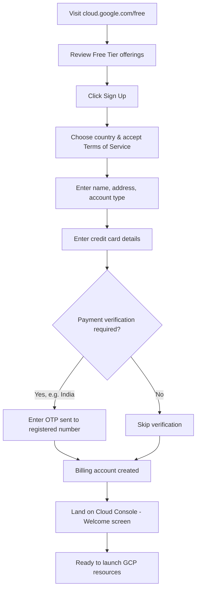
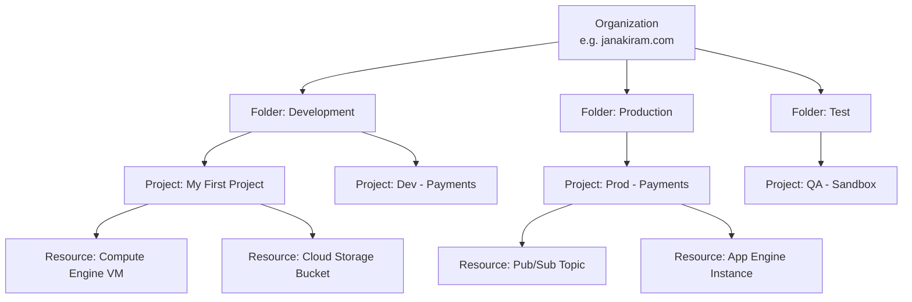
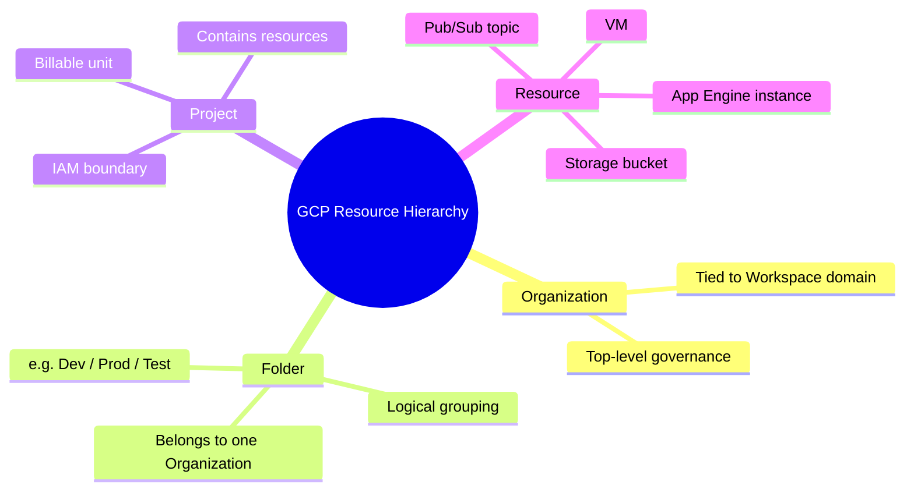
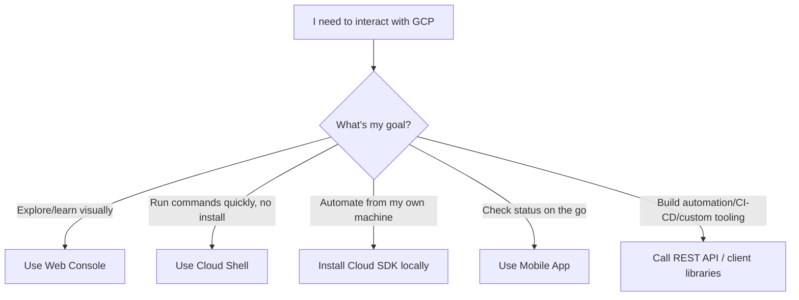
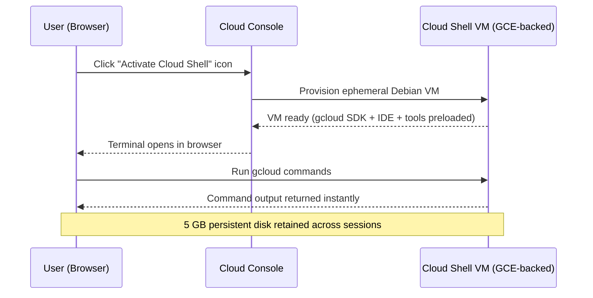
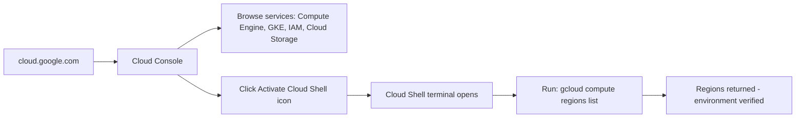

# Getting Started with Google Cloud Platform — Complete Study Guide

> A professional, interview-ready learning resource built from the "Getting Started with Google Cloud" session. Use it to learn the material end-to-end, revise quickly before interviews, and practice hands-on.

---

## Table of Contents

1. [Session Overview](#session-overview)
2. [Learning Objectives](#learning-objectives)
3. [Detailed Notes](#detailed-notes)
   - [1. Signing Up for Google Cloud Platform](#1-signing-up-for-google-cloud-platform)
   - [2. The GCP Resource Hierarchy](#2-the-gcp-resource-hierarchy)
   - [3. Ways to Interact with Google Cloud](#3-ways-to-interact-with-google-cloud)
   - [4. Google Cloud Shell in Depth](#4-google-cloud-shell-in-depth)
   - [5. Hands-On Walkthrough: Console and Cloud Shell](#5-hands-on-walkthrough-console-and-cloud-shell)
4. [Glossary](#glossary)
5. [Revision Notes](#revision-notes)
6. [Cheat Sheet](#cheat-sheet)
7. [Interview Questions and Answers](#interview-questions-and-answers)
   - [Beginner](#beginner-interview-questions)
   - [Intermediate](#intermediate-interview-questions)
   - [Advanced](#advanced-interview-questions)
8. [Scenario-Based Questions](#scenario-based-questions)
9. [Hands-on Exercises](#hands-on-exercises)
10. [Practice Assignment](#practice-assignment)
11. [Additional Resources](#additional-resources)
12. [Final Revision Sheet](#final-revision-sheet)

---

## Session Overview

This session is a foundational walkthrough of **Google Cloud Platform (GCP)** aimed at engineers who are completely new to the platform. It covers three core areas:

1. How to **sign up** for a GCP account, what the **free tier** and **$300 trial credit** actually mean, and how billing is triggered.
2. How GCP **organizes and structures resources** using the Organization → Folder → Project → Resource hierarchy.
3. The **four channels** available to interact with GCP — the Cloud Console, Cloud Shell/Cloud SDK, the mobile app, and the REST API — with a deep dive into Cloud Shell and a live demo.

By the end of this guide you should be able to sign up for GCP safely, explain the resource hierarchy to an interviewer, and confidently navigate between the Console and Cloud Shell.

---

## Learning Objectives

By the end of this guide, you will be able to:

- [ ] Sign up for a GCP account and explain the difference between the **always-free tier** and the **$300 free trial credit**.
- [ ] Explain why a credit card is required at sign-up and how to avoid unexpected charges.
- [ ] Describe the GCP resource hierarchy (Organization, Folder, Project, Resource) and why it exists.
- [ ] Explain what makes a **Project** the fundamental billing and access-control unit in GCP.
- [ ] Compare the four ways of interacting with GCP: Console, Cloud Shell/SDK, Mobile App, REST API.
- [ ] Describe what Cloud Shell is, what environment it provisions, and why it matters for DevOps engineers.
- [ ] Run a basic `gcloud` command and interpret its output.
- [ ] Answer common GCP fundamentals interview questions with confidence.

---

## Detailed Notes

### 1. Signing Up for Google Cloud Platform

#### 🧠 Concept

Getting started with GCP begins at a single URL — [`cloud.google.com/free`](https://cloud.google.com/free) — which is the gateway to both the **always-free tier** and the **$300 free trial credit**. Understanding exactly what these two offers mean (and how they differ) is the single most important thing to get right before you touch any cloud resource, because getting it wrong results in real charges to your card.

#### 📖 Definition

| Term | Definition |
|---|---|
| **Free Tier (Always Free)** | A set of GCP products/services that can be used up to a specified monthly usage limit **forever**, at no cost, independent of the trial credit. |
| **Free Trial Credit** | A one-time **$300 credit**, valid for a limited trial period, that can be applied against usage of (almost) any GCP service. |

> 📌 **Remember:** These are two *separate* mechanisms. The Always Free tier does not expire and does not consume your $300 credit. The $300 credit is a spending allowance that runs out either when it is exhausted or when the trial period ends — whichever comes first.

#### ❓ Why It Exists

- **Problem it solves:** New users need a risk-free way to explore a massive, unfamiliar platform without committing real money up front.
- **Why introduced:** Cloud providers compete on developer adoption; a generous trial lowers the barrier to experimenting with production-grade infrastructure.
- **What would happen without it:** Every experiment, every tutorial, every "just trying it out" session would carry real financial risk, discouraging learning and evaluation.

#### ⚙️ How It Works

1. Visit `cloud.google.com/free`.
2. Review what is currently included in the Always Free tier (this list **changes over time** as Google adds/removes services, so always check the live page rather than relying on memory).
3. Click **Sign Up**.
4. Choose your **country** and accept the **Terms of Service**.
5. Provide **personal details**: name, address, and account type (Individual or Business).
6. Provide **credit card information** — required even though you will not be charged within free-tier/trial limits.
7. Google may run a **payment verification** step depending on your country (e.g., users signing up from India should expect an **OTP** verification).
8. Google finalizes the **billing account** setup.
9. You land on the **Cloud Console** with a welcome message — sign-up is complete.

#### 🔄 Sign-Up Flow



#### 💡 Real-World Example

A backend engineer preparing for a system-design interview signs up for GCP specifically to spin up a Compute Engine VM and a Cloud SQL instance to prototype an architecture. Because they stay within e2-micro (Always Free eligible) instance limits and small storage, they never touch their $300 credit at all.

#### 🪜 Step-by-Step: Avoiding Surprise Charges

```text
Provision resource
      ↓
Use it for the lab/demo
      ↓
Immediately terminate/delete it
      ↓
Verify no orphaned resources remain (disks, static IPs, load balancers)
      ↓
Check the Billing dashboard periodically
```

#### ⚠️ Common Mistakes

| Mistake | Consequence | Fix |
|---|---|---|
| Leaving a VM running after a lab | Silently burns through the $300 credit or, after it's exhausted, bills the card directly | Always stop/delete resources immediately after use |
| Assuming the credit card will "block" charges automatically | Google **will** charge you once you exceed free tier/credit limits — there's no automatic hard stop by default | Set up **budget alerts** (see Deep Dive below) |
| Forgetting about persistent resources (static IPs, disks, snapshots) | These can incur charges even when the VM using them is stopped | Explicitly delete unused disks, IPs, and snapshots |
| Not checking country-specific free tier variations | Some Always Free allowances only apply in certain regions | Always check current terms for your billing country |

#### 🔬 Deep Dive (Supplementary — Not in Transcript)

> The transcript mentions that Google *will* charge you beyond free limits but doesn't cover **how to protect yourself**. In real-world usage, engineers rely on:
>
> - **Budgets & Alerts** (Billing → Budgets & Alerts): Set a monthly budget (e.g., $1) and get an email the moment spend crosses a threshold.
> - **Billing Account audit**: Regularly review the Billing → Reports page.
> - **Resource labels**: Tag resources by project/purpose so orphaned resources are easy to spot.
>
> These are industry-standard safety nets that go beyond what the transcript describes but are essential in production GCP usage.

#### 🚀 Best Practices

- **[Transcript]** Terminate every resource immediately after a lab/demo to avoid a surprise bill.
- **[Transcript]** Periodically re-check the Always Free tier page, since offerings change.
- **[Industry Best Practice]** Configure billing budget alerts on day one, before launching any resource.
- **[Industry Best Practice]** Use a dedicated **sandbox project** for learning/experiments, separate from any production billing account.

#### 🎯 Key Takeaways

- The Always Free tier is *permanent* for eligible usage; the $300 credit is a *time-boxed, one-time* allowance.
- A credit card is mandatory at sign-up, but you are not charged as long as you stay within free tier/credit limits.
- Country-specific payment verification (e.g., OTP for India) may be part of sign-up.
- Always terminate lab resources immediately — this is the single most repeated warning in the session.

---

### 2. The GCP Resource Hierarchy

#### 🧠 Concept

Every single thing you create in GCP — a VM, an App Engine instance, a Pub/Sub topic, a Cloud Storage bucket — is called a **resource**. As the number of resources grows, GCP needs a structured way to organize, secure, and bill for them. That structure is the **Resource Hierarchy**: **Organization → Folder → Project → Resource**.

#### 📖 Definition

| Level | Definition |
|---|---|
| **Organization** | The root node of the hierarchy, tied to a Google Workspace (or Cloud Identity) domain. It's the top-level container for all folders and projects belonging to a company. |
| **Folder** | An optional grouping layer used to organize multiple related projects (e.g., by department or environment). A folder belongs to exactly one organization. |
| **Project** | The fundamental unit of resource ownership, isolation, and **billing** in GCP. Every resource must belong to exactly one project. |
| **Resource** | Any individual service instance you create — a VM, a bucket, a Pub/Sub topic, a database, etc. |

#### ❓ Why It Exists

- **Problem it solves:** Without hierarchy, a company with hundreds of engineers and thousands of resources would have no way to apply consistent billing, access control, or governance.
- **Why introduced:** Enterprises need to separate environments (dev/test/prod), apply different policies per team, and roll billing/IAM policies up cleanly.
- **What would happen without it:** Every resource would be a flat, unorganized entity — impossible to secure at scale, and impossible to attribute cost accurately.

#### ⚙️ How It Works

- A **Project** is the most critical entity in the hierarchy because it directly represents a **billable unit**. When you create a project, you associate a billing account (backed by a credit card) with it. Every resource launched inside that project is billed against that project's billing account.
- Multiple **Projects** can be grouped into a **Folder** for logical organization — for example, separating `dev` and `prod` environments, each of which might contain several projects.
- **Folders** always belong to exactly **one Organization**, which sits at the top of the hierarchy.
- If you sign in with an **individual Gmail account** (not a Google Workspace domain), you will typically only see a project — no Organization or Folder layer is visible, because there is no Workspace domain to anchor one.

#### 🏢 Resource Hierarchy Diagram



#### 🎨 Visual Representation (ASCII)

```text
                     ┌───────────────────┐
                     │    ORGANIZATION    │   ← Top level (tied to Workspace domain)
                     └─────────┬──────────┘
                               │
              ┌────────────────┼────────────────┐
              ▼                ▼                ▼
        ┌──────────┐     ┌──────────┐     ┌──────────┐
        │  Folder   │     │  Folder   │     │  Folder   │
        │   Dev     │     │   Prod    │     │   Test    │
        └─────┬─────┘     └─────┬─────┘     └─────┬─────┘
              │                 │                 │
        ┌─────▼─────┐     ┌─────▼─────┐     ┌─────▼─────┐
        │  Project   │     │  Project   │     │  Project   │
        │ (billable) │     │ (billable) │     │ (billable) │
        └─────┬─────┘     └───────────┘     └───────────┘
              │
     ┌────────┼────────┐
     ▼        ▼         ▼
   [VM]   [Bucket]   [Pub/Sub Topic]     ← Resources
```

#### 🧩 Concept Relationships

```text
Organization (janakiram.com)
   │
   ├── Folder: Development
   │      └── Project: My First Project
   │             ├── Resource: VM instance
   │             └── Resource: Storage bucket
   │
   ├── Folder: Production
   │      └── Project: ... (billable unit, own billing account)
   │
   └── Folder: Test
          └── Project: ...
```

- **Billing** attaches at the **Project** level — each project can, in principle, use a different billing account/credit card.
- **IAM policies** (access control) can be set at *any* level (Organization, Folder, or Project) and **inherit downward** — a policy granted at the Organization level automatically applies to every Folder and Project beneath it. *(This inheritance behavior is supplementary/industry knowledge that extends what the transcript states, added because it's essential context for understanding why the hierarchy exists.)*

#### 💡 Real-World Example

A company registers Google Workspace under `janakiram.com`. It creates three folders — **Development**, **Production**, and **Test** — mirroring their SDLC environments. Under Development sits "My First Project." As new services are built, new projects are added under Production and Test, but the folder structure keeps environments cleanly isolated from a billing and access-control perspective.

#### ⚖️ Advantages & Limitations

| Aspect | Advantage | Limitation |
|---|---|---|
| Organization | Central governance and visibility across the whole company | Requires Google Workspace/Cloud Identity — not available to individual Gmail sign-ups |
| Folder | Flexible logical grouping (by env, team, business unit) | Optional — easy to skip and end up with a flat, hard-to-manage project list |
| Project | Clean billing isolation per project | Too many projects can fragment governance if not organized under folders |

#### ⚠️ Common Mistakes

- Treating **Project** as just a "workspace name" rather than understanding it is the actual **billing and IAM boundary**.
- Not creating separate projects for dev/test/prod, leading to accidental cross-environment access or billing confusion.
- Assuming every GCP account will show Organization/Folder structure — this only appears for Workspace/Cloud Identity-backed accounts.

#### 🚀 Best Practices

- **[Transcript]** Group related projects into folders that mirror your environment structure (dev/test/prod).
- **[Industry Best Practice]** Use a consistent **project naming convention** (e.g., `company-env-purpose`, like `acme-prod-payments`).
- **[Industry Best Practice]** Apply IAM roles at the highest sensible level (Folder or Org) to reduce per-project policy duplication, but scope tightly enough to follow least privilege.

#### 🎯 Key Takeaways

- Hierarchy order: **Organization → Folder(s) → Project(s) → Resource(s)**.
- **Project = billing + isolation boundary.** This is the single most interview-relevant fact in this section.
- Folders are optional but recommended for logical grouping once you have more than a handful of projects.
- Individual (non-Workspace) accounts won't see Organization/Folder levels.

#### 🚀 Mindmap



---

### 3. Ways to Interact with Google Cloud

#### 🧠 Concept

GCP offers **four distinct channels** for interacting with cloud resources, each suited to a different persona and use case: the **Web Console**, **Cloud Shell / Cloud SDK**, the **Mobile App**, and the **REST API**.

#### 📊 Comparison Table

| Channel | Best For | Interface Type | Installation Needed? |
|---|---|---|---|
| **Web Console** | Beginners, visual exploration, learning the service catalog | Graphical (browser) | None |
| **Cloud Shell** | DevOps/admins wanting instant CLI access | Browser-based terminal | None (fully provisioned for you) |
| **Cloud SDK (`gcloud` CLI)** | DevOps/admins wanting a local CLI | Command line | Yes — installs on Linux, Windows, macOS |
| **Mobile App** | Quick checks/actions on the go | Mobile (iOS/Android) | Yes — from Play Store / App Store |
| **REST API** | Programmatic access, automation, custom tooling | HTTP API | Language SDK optional (Python, Node.js, C#, etc.) |

> 📌 **Remember:** Everything doable in the Web Console can also be done from the command line (Cloud Shell/SDK) — the Console is simply the friendliest entry point for newcomers.

#### ❓ Why It Exists

- **Problem it solves:** Different personas need different levels of control and convenience — a beginner exploring services needs a GUI; a DevOps engineer automating deployments needs a CLI or API.
- **Why introduced:** No single interface serves everyone well — visual discoverability and scriptable automation are fundamentally different needs.
- **What would happen without it:** Forcing all users through one interface (e.g., only the Console) would make automation and CI/CD pipelines impractical, or forcing everyone through only a CLI would create a steep learning curve for newcomers.

#### ⚙️ How It Works

1. **Web Console** (`console.cloud.google.com`): The default landing page after sign-up. A navigation sidebar exposes every GCP service — Compute Engine, Kubernetes Engine, IAM, Cloud Storage, and more.
2. **Cloud Shell & Cloud SDK**: Cloud SDK provides the `gcloud` CLI, installable locally on Linux/Windows/macOS. **Cloud Shell** is a *browser-embedded* terminal — no installation required — that comes pre-provisioned with the Cloud SDK and other tools.
3. **Mobile App**: Available on Google Play and the Apple App Store for quick, on-the-go access to monitor and manage resources.
4. **REST API**: Every GCP service exposes REST endpoints. You can call these directly or through client libraries in Python, Node.js, C#, Java, Go, etc., enabling full programmatic/automated resource management.

#### 🔄 Channel Selection Flow



#### 💻 Code Example: Using the REST API via a Client Library

> ⚠️ Not shown in the transcript, but referenced conceptually ("you can use Python, Node.js, or C# to programmatically create and manage resources"). Reconstructed here as a representative example.

```python
# Example: Listing Compute Engine instances using the Python client library
# pip install google-cloud-compute
from google.cloud import compute_v1

def list_instances(project_id: str, zone: str):
    client = compute_v1.InstancesClient()
    instances = client.list(project=project_id, zone=zone)
    for instance in instances:
        print(f"Instance: {instance.name}, Status: {instance.status}")

if __name__ == "__main__":
    list_instances(project_id="my-first-project", zone="us-central1-a")
```

- **What it does:** Authenticates using Application Default Credentials and lists all Compute Engine VM instances in a given zone.
- **Inputs:** `project_id`, `zone`.
- **Outputs:** Instance name and status for each VM.
- **Edge cases:** Requires the Compute Engine API to be enabled and appropriate IAM permissions (`compute.instances.list`).
- **Best practice:** Never hard-code credentials — rely on Application Default Credentials (ADC) or a service account key managed securely (e.g., Secret Manager), not committed to source control.

#### 💡 Real-World Example

A DevOps team writes Terraform and CI/CD pipelines that call the GCP REST API (via `gcloud`/client libraries) to provision infrastructure automatically on every merge to `main` — no human ever touches the Console for routine deployments. Meanwhile, a new engineer joining the team still uses the Web Console in their first week to visually understand what services exist.

#### ⚠️ Common Mistakes

- Relying solely on the Console for tasks that should be automated (leads to configuration drift and "clickops").
- Installing the full Cloud SDK locally when Cloud Shell would suffice for a one-off task.
- Forgetting that mobile app access has reduced functionality compared to the Console/CLI — it's meant for monitoring/quick actions, not full resource provisioning.

#### 🚀 Best Practices

- **[Transcript]** Beginners should spend time in the Web Console first to build familiarity with available services.
- **[Transcript]** DevOps engineers should favor Cloud Shell/Cloud SDK for repeatable, scriptable work.
- **[Industry Best Practice]** Treat the REST API / Infrastructure-as-Code (Terraform, Deployment Manager) as the source of truth in production — the Console should be used for inspection, not as the primary provisioning method.

#### 🎯 Key Takeaways

- Four channels: **Console, Cloud Shell/SDK, Mobile App, REST API** — ranked in the transcript by popularity/power as Console → Cloud Shell/SDK → Mobile App → REST API.
- Anything doable in the Console is also doable via CLI/API — the Console is not more "capable," just more discoverable.
- Cloud Shell requires **zero installation**; Cloud SDK requires local installation.

---

### 4. Google Cloud Shell in Depth

#### 🧠 Concept

**Cloud Shell** is a free, browser-embedded, interactive terminal that gives you an instantly provisioned Linux (Debian-based) environment pre-loaded with the `gcloud` SDK, a full IDE, and common developer tooling — with no local installation required.

#### 📖 Definition

> **Cloud Shell**: A temporary, on-demand virtual machine (backed by Google Compute Engine) accessible directly from the browser, providing a command-line shell plus a full development environment for interacting with GCP resources.

#### ❓ Why It Exists

- **Problem it solves:** Installing and configuring the Cloud SDK locally (with correct authentication, dependencies, and OS quirks) is friction that slows down both learning and quick administrative tasks.
- **Why introduced:** To offer instant, zero-setup CLI access from any device with a browser — critical for demos, quick fixes, and onboarding.
- **What would happen without it:** Every user would need to install and maintain the Cloud SDK locally across Linux, Windows, and macOS, increasing setup time and support burden.

#### ⚙️ How It Works / Internal Working

| Attribute | Detail |
|---|---|
| **Underlying infrastructure** | A Google Compute Engine VM provisioned on demand |
| **Persistent storage** | 5 GB persistent disk (retained across sessions) |
| **OS** | Debian-based Linux environment |
| **Pre-installed tooling** | `gcloud` SDK, a full IDE, and third-party utilities such as the Docker CLI |
| **Special feature** | Built-in **Web Preview** — instantly view a web app running on a specific port inside Cloud Shell without manual tunneling/port-forwarding |

#### 🔄 Cloud Shell Provisioning Flow



#### 💻 Code Example

```bash
# Verify your Cloud Shell / gcloud SDK environment is fully configured
gcloud compute regions list

# Sample (illustrative) output:
# NAME                     CPUS  DISKS_GB
# us-central1              ...   ...
# us-east1                 ...   ...
# europe-west1              ...   ...
# asia-south1               ...   ...
```

- **What it does:** Lists every GCP region currently available, confirming both network connectivity and that your `gcloud` SDK/authentication are correctly configured.
- **Why it matters:** This is the canonical "smoke test" command to confirm Cloud Shell (or any freshly configured `gcloud` environment) is working end-to-end.
- **Edge cases:** If this command fails, it typically indicates an authentication issue (`gcloud auth login`) or that the Compute Engine API isn't enabled for the active project.

#### 🪜 Step-by-Step: Using the Web Preview Feature

```text
Launch an app inside Cloud Shell exposing a port (e.g., :8080)
      ↓
Click the "Web Preview" button in the Cloud Shell toolbar
      ↓
Select "Preview on port 8080" (or change port if needed)
      ↓
Cloud Shell opens a new browser tab proxying that port
      ↓
Interact with your app instantly — no tunneling/port-forwarding setup
```

#### 💡 Real-World Example

An engineer clones a GitHub repo directly inside Cloud Shell, installs dependencies, runs a local Flask/Node dev server on port 8080, and uses Web Preview to demo the running app to a teammate on a call — all without leaving the browser or configuring any networking.

#### ⚖️ Advantages & Limitations

| Advantages | Limitations |
|---|---|
| Zero installation, works from any browser (Chrome, Safari, Edge) | Session/VM is ephemeral — only the 5 GB disk persists, not the running VM state |
| Comes pre-loaded with `gcloud`, Docker CLI, IDE, etc. | 5 GB storage can fill up if used for large repos/binaries over time |
| Built-in Web Preview removes tunneling complexity | Not meant for long-running production workloads — it's an admin/dev tool |

#### ⚠️ Common Mistakes

- Treating Cloud Shell's VM as persistent infrastructure — it is **ephemeral**; only the attached 5 GB home directory persists.
- Filling up the 5 GB disk with large clones/binaries and then hitting "no space left" errors mid-session.
- Forgetting Cloud Shell sessions have **idle timeouts** and will disconnect after a period of inactivity (industry knowledge, not explicitly stated in transcript).

#### 🚀 Best Practices

- **[Transcript]** Use Cloud Shell as the fastest way to validate that your GCP environment (auth + SDK) is correctly configured (`gcloud compute regions list`).
- **[Industry Best Practice]** Keep large artifacts (Docker images, big datasets) out of the 5 GB home directory — push to Artifact Registry / Cloud Storage instead.
- **[Industry Best Practice]** Use Cloud Shell's built-in `code` editor (Cloud Shell Editor) for quick edits instead of a separate local IDE for small tasks.

#### 🎯 Key Takeaways

- Cloud Shell = browser terminal + 5 GB persistent disk + pre-installed `gcloud` SDK, IDE, and tools, backed by a GCE VM.
- Web Preview is Cloud Shell's standout feature for instantly viewing running web apps.
- `gcloud compute regions list` is a simple, reliable way to confirm your environment is correctly set up.

---

### 5. Hands-On Walkthrough: Console and Cloud Shell

#### 🧠 Concept

This section ties everything together with a live demo: navigating from `cloud.google.com` into the Console, exploring services like Compute Engine, Kubernetes Engine, IAM, and Cloud Storage, then activating Cloud Shell and running a verification command.

#### 🪜 Step-by-Step Execution Flow

```text
1. Navigate to cloud.google.com
2. Click "Console" to enter the Cloud Console (the GCP entry point)
3. Explore the navigation sidebar:
     - Compute Engine → VM Instances
     - Kubernetes Engine
     - IAM
     - Cloud Storage
     - ...and other services
4. Click the "Activate Cloud Shell" icon in the top toolbar
5. Wait for Cloud Shell to provision (Debian VM, gcloud SDK preloaded)
6. Run: gcloud compute regions list
7. Confirm output lists available GCP regions
8. Environment is verified: SDK + authentication are working
```

#### 🔄 Visual: Console vs. Cloud Shell Access Paths



#### 💻 Code Example

```bash
# Confirms Cloud Shell + gcloud SDK are correctly configured and authenticated
gcloud compute regions list
```

- **What it does:** Queries the Compute Engine API for the list of all regions where GCP operates.
- **Important lines:** `gcloud compute` scopes the command to the Compute Engine service; `regions list` is the specific sub-command/resource being listed.
- **Output:** A table of region names (e.g., `us-central1`, `europe-west1`, `asia-south1`) along with metadata like CPU/disk quotas.
- **Edge cases:** Fails with an authentication error if you haven't run `gcloud auth login` (Cloud Shell auto-authenticates you, but a local Cloud SDK install would require this step explicitly), or with a permissions error if the Compute Engine API isn't enabled on the active project.

#### 🌍 Reconstructed Example: Setting an Active Project (Supplementary)

> Not shown explicitly in the transcript's demo, but essential real-world context: `gcloud` commands operate against whichever project is currently "active."

```bash
# View the currently active project
gcloud config get-value project

# Switch the active project before running further commands
gcloud config set project my-first-project

# Now commands like the one below apply to "my-first-project"
gcloud compute regions list
```

#### 🎯 Key Takeaways

- The Console is the entry point for **visual/browser-based** exploration; Cloud Shell is the entry point for **CLI-based** interaction — both are reachable from `cloud.google.com`.
- `gcloud compute regions list` is the go-to smoke test for a correctly configured environment.
- In real usage, always confirm your **active project** (`gcloud config get-value project`) before running commands, since billing and resource scope depend on it.

---

## Glossary

| Term | Definition | Why It Matters |
|---|---|---|
| **GCP (Google Cloud Platform)** | Google's suite of public cloud computing services | The subject of the entire session |
| **Free Tier (Always Free)** | Usage limits within which certain GCP services are permanently free | Lets you experiment without cost, forever, within limits |
| **Free Trial Credit** | A one-time $300 credit for new GCP accounts | Funds initial experimentation beyond the Always Free limits |
| **Billing Account** | The entity tied to a payment method that pays for GCP usage | Determines who/what gets charged for resource consumption |
| **Organization** | Top-level node in the GCP resource hierarchy, tied to a Workspace/Cloud Identity domain | Enables company-wide governance and policy inheritance |
| **Folder** | A grouping of projects under an Organization | Provides logical/environment-based organization |
| **Project** | The billing and access-control boundary for all GCP resources | The most critical unit to understand for both billing and IAM |
| **Resource** | Any object created in GCP (VM, bucket, topic, etc.) | The actual "things" you provision and pay for |
| **Cloud Console** | GCP's web-based graphical management interface | The default, most beginner-friendly way to use GCP |
| **Cloud Shell** | A free, browser-based terminal with a pre-configured GCE VM | Instant CLI access with zero local setup |
| **Cloud SDK** | The `gcloud` command-line tools, installable locally | Enables scripting and automation from your own machine |
| **`gcloud`** | The primary CLI tool for interacting with GCP | Used for virtually all command-line GCP operations |
| **REST API** | HTTP-based programmatic interface exposed by every GCP service | Powers automation, custom tooling, and Infrastructure-as-Code |
| **IAM** | Identity and Access Management — GCP's permission system | Controls who can do what, at which level of the hierarchy |
| **Web Preview** | Cloud Shell feature to view apps running on exposed ports | Removes need for manual tunneling/port-forwarding |
| **Compute Engine (GCE)** | GCP's Infrastructure-as-a-Service VM offering | The backing infrastructure for both user VMs and Cloud Shell itself |

---

## Revision Notes

### ⚡ One-Minute Revision

- GCP offers an **Always Free tier** (permanent, limited usage) **plus** a **one-time $300 trial credit**.
- A **credit card is mandatory** at sign-up; you're only charged if you exceed free tier/credit limits — always terminate lab resources immediately.
- Country-specific verification (e.g., **OTP for India**) may be part of sign-up.
- Resource hierarchy: **Organization → Folder → Project → Resource**.
- A **Project is the billing and IAM boundary** — the single most important fact to remember.
- Folders group related projects (e.g., dev/prod/test); Organization requires a Workspace/Cloud Identity domain.
- Four ways to interact with GCP: **Console, Cloud Shell/Cloud SDK, Mobile App, REST API**.
- **Cloud Shell** = free browser terminal, backed by a GCE VM, Debian-based, **5 GB persistent disk**, pre-installed `gcloud` SDK + IDE + Docker CLI, with a built-in **Web Preview**.
- `gcloud compute regions list` is the standard smoke test to confirm your environment is configured correctly.
- Console = best for beginners/visual exploration; Cloud Shell/SDK = best for DevOps/automation; anything doable in the Console is also doable via CLI/API.

---

## Cheat Sheet

### 🔗 Key URLs

| Purpose | URL |
|---|---|
| Sign up / Free tier info | `cloud.google.com/free` |
| Cloud Console | `console.cloud.google.com` |

### 💻 Essential `gcloud` Commands

```bash
# Confirm SDK/environment is working — lists all GCP regions
gcloud compute regions list

# Check which project is currently active
gcloud config get-value project

# Set the active project for subsequent commands
gcloud config set project PROJECT_ID

# Authenticate the CLI (needed for local Cloud SDK installs; Cloud Shell auto-authenticates)
gcloud auth login

# List all projects you have access to
gcloud projects list
```

### 📋 Resource Hierarchy Quick Reference

```text
Organization  (top level, tied to Workspace domain)
   └── Folder   (logical grouping, e.g. Dev/Prod/Test)
         └── Project   (BILLING + IAM boundary)
               └── Resource   (VM, bucket, topic, etc.)
```

### 📊 Interaction Channels at a Glance

| Channel | Install Required | Best For |
|---|---|---|
| Web Console | No | Visual exploration, beginners |
| Cloud Shell | No | Instant CLI, zero setup |
| Cloud SDK (local) | Yes | Local scripting/automation |
| Mobile App | Yes (Play Store/App Store) | On-the-go monitoring |
| REST API | Optional (client libraries) | Full programmatic automation |

### ⭐ Rules to Remember

- Terminate every lab resource immediately after use.
- A Project is always the billing unit — never assume billing happens at the Organization or Folder level.
- Cloud Shell disk persists (5 GB); the VM itself is ephemeral.

---

## Interview Questions and Answers

### Beginner Interview Questions

**Question 1:** What is Google Cloud Platform (GCP)?
**Answer:** GCP is Google's public cloud computing platform offering Infrastructure-as-a-Service, Platform-as-a-Service, and serverless computing environments.
**Explanation:** It provides compute, storage, networking, database, and machine learning services accessible via the Console, CLI, mobile app, or REST API.
**Why Interviewers Ask This:** To confirm basic platform familiarity before going deeper.
**Possible Follow-up:** "How does GCP compare to AWS or Azure at a high level?"

---

**Question 2:** What is the Always Free tier in GCP?
**Answer:** A set of GCP services usable up to specified limits every month, permanently, at no cost.
**Explanation:** It is separate from the trial credit and doesn't expire; usage must stay within defined thresholds to remain free.
**Why Interviewers Ask This:** To test whether you understand cost management basics before working hands-on with cloud resources.
**Possible Follow-up:** "Name a couple of services typically included in the Always Free tier."

---

**Question 3:** What is the $300 free trial credit, and how does it differ from the Always Free tier?
**Answer:** It's a one-time credit applied to a new GCP account, usable across most services during a limited trial window, unlike the Always Free tier which is permanent but limited in scope.
**Explanation:** The credit is consumed based on usage; once exhausted (or the trial period ends), normal billing applies.
**Why Interviewers Ask This:** To check you understand that free trial ≠ permanently free.
**Possible Follow-up:** "What happens once the $300 credit runs out?"

---

**Question 4:** Why is a credit card required to sign up for GCP, even for free-tier usage?
**Answer:** Google uses it to verify identity/prevent abuse and to enable seamless billing if usage exceeds free limits.
**Explanation:** You are not charged as long as you remain within Always Free and trial credit limits, but the card is on file for when/if you exceed them.
**Why Interviewers Ask This:** To assess awareness of cloud cost-management fundamentals.
**Possible Follow-up:** "How would you prevent an unexpected charge?"

---

**Question 5:** What are the four levels of the GCP resource hierarchy?
**Answer:** Organization → Folder → Project → Resource.
**Explanation:** Organization is the top-level container; folders group projects; projects hold resources and act as the billing/IAM boundary.
**Why Interviewers Ask This:** This is one of the most fundamental GCP concepts and comes up constantly in cloud architecture discussions.
**Possible Follow-up:** "Which of these levels is mandatory for every resource?"

---

**Question 6:** What is a GCP Project, and why is it important?
**Answer:** A Project is the fundamental unit of resource ownership, isolation, and billing in GCP — every resource belongs to exactly one project.
**Explanation:** Billing accounts and IAM policies are most directly tied to the project level.
**Why Interviewers Ask This:** Tests understanding of the single most important organizational concept in GCP.
**Possible Follow-up:** "Can a single project use multiple billing accounts?"

---

**Question 7:** What is a Folder used for in GCP?
**Answer:** A Folder groups multiple related projects for logical organization (e.g., by environment or department).
**Explanation:** Folders belong to exactly one Organization and sit between the Organization and Project levels.
**Why Interviewers Ask This:** Tests whether you understand GCP's organizational flexibility beyond just "projects."
**Possible Follow-up:** "Is a Folder mandatory, or can projects exist without one?"

---

**Question 8:** What are the four ways to interact with GCP resources?
**Answer:** Web Console, Cloud Shell/Cloud SDK, Mobile App, and REST API.
**Explanation:** Each suits a different use case: visual exploration, CLI automation, on-the-go access, and programmatic integration, respectively.
**Why Interviewers Ask This:** To gauge breadth of familiarity with the platform's tooling.
**Possible Follow-up:** "Which one would you use for CI/CD automation, and why?"

---

**Question 9:** What is Cloud Shell?
**Answer:** A free, browser-embedded terminal that provisions an on-demand Debian VM with the `gcloud` SDK and developer tools pre-installed.
**Explanation:** It requires no local installation and includes a 5 GB persistent disk.
**Why Interviewers Ask This:** Cloud Shell is a very common first hands-on touchpoint with GCP and frequently referenced in practical questions.
**Possible Follow-up:** "What happens to your Cloud Shell files if you close the browser tab?"

---

**Question 10:** What command would you run in Cloud Shell to verify your environment is correctly configured?
**Answer:** `gcloud compute regions list`
**Explanation:** This confirms both that the SDK is installed/authenticated and that you can reach the Compute Engine API.
**Why Interviewers Ask This:** Tests hands-on familiarity, not just conceptual knowledge.
**Possible Follow-up:** "What would cause this command to fail?"

---

**Question 11:** What operating system underlies the Cloud Shell environment?
**Answer:** Debian-based Linux.
**Explanation:** This means standard Debian/Linux tooling (`apt`, bash utilities, etc.) works as expected inside Cloud Shell.
**Why Interviewers Ask This:** Tests attention to practical detail.
**Possible Follow-up:** "How would you install an additional package inside Cloud Shell?"

---

### Intermediate Interview Questions

**Question 1:** How does billing get attached to resources in GCP, and at what hierarchy level does it occur?
**Answer:** Billing is attached at the **Project** level via a linked billing account; every resource inherits its project's billing account.
**Explanation:** This is why creating separate projects per environment (dev/test/prod) is a common pattern — it cleanly isolates cost tracking.
**Why Interviewers Ask This:** To verify you understand cost attribution in multi-team/multi-environment setups.
**Possible Follow-up:** "How would you track costs separately for two teams sharing one project?"

---

**Question 2:** Explain why an Organization node might be missing from a user's GCP account.
**Answer:** The Organization node only appears when the account is tied to a Google Workspace or Cloud Identity domain; personal Gmail-based accounts have no Organization layer.
**Explanation:** Without an Org, a user's projects exist as standalone entities not rolled up under any top-level governance node.
**Why Interviewers Ask This:** Tests understanding of enterprise vs. individual account structures.
**Possible Follow-up:** "How would a company migrate personal projects into an Organization?"

---

**Question 3:** Compare using the Cloud Console versus Cloud Shell/SDK for provisioning infrastructure in a production environment.
**Answer:** The Console is manual/GUI-driven and good for inspection or one-off tasks, but it's not repeatable or auditable at scale. Cloud Shell/SDK (and IaC tools built on the SDK/API) allow scripted, version-controlled, repeatable provisioning.
**Explanation:** Production environments favor automation for consistency, auditability, and to avoid "ClickOps" configuration drift.
**Why Interviewers Ask This:** To assess judgment about appropriate tooling for production-grade workflows.
**Possible Follow-up:** "What risks does manual Console-based provisioning introduce in a team setting?"

---

**Question 4:** What is the relationship between the Cloud SDK and Cloud Shell?
**Answer:** Cloud SDK is the underlying toolset (including the `gcloud` CLI) that can be installed locally; Cloud Shell is a hosted, browser-based environment that comes with the Cloud SDK pre-installed.
**Explanation:** Cloud Shell removes the need to install/manage the SDK yourself, at the cost of being an ephemeral, Google-managed VM rather than your own machine.
**Why Interviewers Ask This:** Tests precise understanding of overlapping but distinct GCP tools.
**Possible Follow-up:** "When would you prefer a local Cloud SDK install over Cloud Shell?"

---

**Question 5:** What happens to data/files in Cloud Shell when the session ends?
**Answer:** The Cloud Shell VM itself is ephemeral and torn down, but the 5 GB persistent disk (your home directory) is retained across sessions.
**Explanation:** This means installed packages outside your home directory, or system-level state, are reset on each new session, but your files/scripts persist.
**Why Interviewers Ask This:** Tests understanding of the ephemeral-vs-persistent distinction crucial to cloud environments generally.
**Possible Follow-up:** "How would you persist a custom tool installation across Cloud Shell sessions?"

---

**Question 6:** How would you programmatically list all Compute Engine instances in a project using Python?
**Answer:** Use the `google-cloud-compute` client library's `InstancesClient().list(project=..., zone=...)` method (see code example in Section 3).
**Explanation:** This demonstrates the REST API's programmatic access pattern via an official client library rather than raw HTTP calls.
**Why Interviewers Ask This:** Tests ability to translate conceptual API knowledge into working code.
**Possible Follow-up:** "How would you authenticate this script securely in a CI/CD pipeline?"

---

**Question 7:** What is the Web Preview feature in Cloud Shell, and what problem does it solve?
**Answer:** It lets you instantly view a web app running on an exposed port inside Cloud Shell, directly from the browser, without manual tunneling or port-forwarding.
**Explanation:** Normally, exposing a service running inside a remote VM to your local browser requires SSH tunneling or a public IP/firewall rule; Web Preview handles this automatically for Cloud Shell.
**Why Interviewers Ask This:** Tests practical, hands-on familiarity with Cloud Shell beyond just running commands.
**Possible Follow-up:** "How would you achieve similar access for an app running on a full Compute Engine VM (not Cloud Shell)?"

---

**Question 8:** Why might a company organize its GCP projects using Folders mirroring Dev/Test/Prod rather than a flat list of projects?
**Answer:** Folders enable applying IAM policies, budgets, and governance at the environment level, and make cost/access review far easier at scale.
**Explanation:** Without folders, engineers must manage permissions and budgets on each project individually, which doesn't scale.
**Why Interviewers Ask This:** Tests architectural judgment around organizing multi-project GCP estates.
**Possible Follow-up:** "How would IAM roles granted at the Folder level affect the projects underneath it?"

---

**Question 9:** What's the difference between the "Always Free" tier and simply staying under the $300 trial credit?
**Answer:** Always Free usage never counts against or depletes the $300 credit — they are independent limits. You could theoretically use Always Free-eligible services forever, indefinitely, without ever touching the trial credit.
**Explanation:** This distinction matters for cost planning: engineers should identify which of their workloads fit within Always Free limits to avoid depleting the trial credit unnecessarily.
**Why Interviewers Ask This:** Nuanced enough to separate candidates who skimmed docs from those who understand billing mechanics.
**Possible Follow-up:** "How would you check current Always Free tier limits for a specific service?"

---

**Question 10:** What steps would you take immediately after finishing a hands-on GCP lab to avoid unexpected charges?
**Answer:** Stop/delete all created resources (VMs, disks, static IPs, load balancers, snapshots), verify via the Console/Billing dashboard that nothing is still running, and check for orphaned resources tied to deleted VMs.
**Explanation:** Some resources (e.g., reserved static IPs, unattached disks) continue to incur charges even after the "main" resource is deleted.
**Why Interviewers Ask This:** Practical cost-hygiene knowledge is highly valued in real-world cloud roles.
**Possible Follow-up:** "Which GCP resource types commonly get left behind and cause surprise billing?"

---

### Advanced Interview Questions

**Question 1:** How does IAM policy inheritance work across the Organization → Folder → Project hierarchy, and what are its implications for least-privilege design?
**Answer:** IAM policies (role bindings) applied at a higher level (Organization or Folder) are inherited by all Folders/Projects/Resources beneath them; the effective policy on a resource is the union of policies at every level above it.
**Explanation:** This means overly broad grants at the Organization level cascade everywhere, which can violate least privilege if not carefully scoped — a common real-world misconfiguration.
**Why Interviewers Ask This:** Tests deep understanding of GCP governance, relevant to security-conscious senior roles. *(This inheritance mechanic extends beyond what the transcript states, since the transcript covers hierarchy structure but not IAM inheritance explicitly.)*
**Possible Follow-up:** "How would you audit for over-privileged IAM bindings at the Organization level?"

---

**Question 2:** In a multi-project GCP setup, how would you architect billing so that different departments are charged separately, while still allowing centralized oversight?
**Answer:** Create a separate Project per department (each associated with its own billing account, or a shared account but with billing export/labels for chargeback), group them under department-named Folders, and roll everything under a single Organization for centralized IAM/audit visibility.
**Explanation:** This pattern balances autonomy (separate projects/billing) with governance (Org-level policies, centralized billing export to BigQuery for reporting).
**Why Interviewers Ask This:** Tests real-world architectural thinking about cost allocation at scale.
**Possible Follow-up:** "How would you build a cost dashboard across all these projects?"

---

**Question 3:** Explain the tradeoffs between using Cloud Shell versus a persistent, dedicated Compute Engine VM as a development environment for a team.
**Answer:** Cloud Shell is free, zero-maintenance, and ephemeral (5 GB disk only) — ideal for quick tasks/demos. A dedicated Compute Engine VM offers full customization, more storage/compute, and persistence, but incurs ongoing cost and requires maintenance (patching, sizing).
**Explanation:** Teams doing heavy, sustained development typically outgrow Cloud Shell's storage/compute ceiling and move to dedicated VMs or local development plus CI runners.
**Why Interviewers Ask This:** Tests ability to reason about tool selection tradeoffs for team workflows, not just individual use.
**Possible Follow-up:** "At what point would you recommend a team stop relying on Cloud Shell for daily development?"

---

**Question 4:** How would you design a safeguard system to automatically prevent runaway billing from orphaned lab resources, beyond manual vigilance?
**Answer:** Combine Billing Budgets & Alerts (with programmatic notification via Pub/Sub), a scheduled Cloud Function/Cloud Scheduler job that identifies and terminates resources tagged `environment=lab` past a TTL, and organization policies restricting resource creation in non-approved regions/projects.
**Explanation:** This moves cost control from a manual habit (as described in the transcript: "make sure you terminate resources") to an automated, enforced guardrail — standard practice in mature cloud organizations.
**Why Interviewers Ask This:** Tests ability to design production-grade safety systems, going beyond what a beginner tutorial covers. *(This is supplementary knowledge — the transcript only recommends manual diligence.)*
**Possible Follow-up:** "How would Pub/Sub and Cloud Functions work together in this design?"

---

**Question 5:** What are the security implications of using the REST API with a long-lived service account key versus using Application Default Credentials (ADC) or Workload Identity?
**Answer:** Long-lived service account keys are a significant security risk (they can leak, are rarely rotated, and grant standing access); ADC and Workload Identity Federation avoid persisting long-lived secrets by issuing short-lived, context-bound credentials instead.
**Explanation:** Modern GCP security guidance strongly discourages downloading and distributing service account JSON keys wherever avoidable.
**Why Interviewers Ask This:** Tests security maturity beyond basic functional API usage. *(Supplementary — not covered in the transcript, added because it's essential context for anyone using the REST API/client libraries mentioned in the session.)*
**Possible Follow-up:** "How would you migrate a legacy script using a service account key to Workload Identity Federation?"

---

**Question 6:** Why does GCP tie the Organization resource to a Google Workspace or Cloud Identity domain rather than making it a standalone, independently creatable entity?
**Answer:** Because the Organization needs a reliable, centrally managed identity source (users, groups) to anchor IAM and governance decisions; Workspace/Cloud Identity provides that verified identity domain.
**Explanation:** Without a backing identity system, GCP would have no trustworthy way to determine "who" belongs to an Organization for access control purposes.
**Why Interviewers Ask This:** Tests systems-level understanding of *why* GCP's architecture is designed the way it is, not just memorized facts.
**Possible Follow-up:** "What's the difference between Cloud Identity (free) and full Google Workspace for this purpose?"

---

**Question 7:** How would you migrate an existing set of "loose" projects (created under personal Gmail accounts) into a newly created Organization?
**Answer:** Set up Cloud Identity/Workspace for the company domain, then use the `gcloud beta resource-manager` project-migration tooling (or Console-based "Migrate to Organization" flow) — this typically requires the project owner to have Org Admin permissions on the destination Organization and involves updating IAM bindings post-migration.
**Explanation:** This is a common real-world scenario when a company "grows up" from individual experimentation into formal governance.
**Why Interviewers Ask This:** Tests practical, hands-on migration experience relevant to platform/DevOps roles.
**Possible Follow-up:** "What could go wrong during this migration, and how would you mitigate it?"

---

**Question 8:** Explain how Cloud Shell's ephemeral compute plus persistent disk model reflects a broader cloud design pattern, and where else you'd see this pattern in GCP.
**Answer:** This "ephemeral compute + persistent storage" pattern decouples compute lifecycle from data lifecycle — the same principle underlies Compute Engine instances with persistent disks, GKE pods with persistent volume claims, and Cloud Run's stateless containers backed by external storage.
**Explanation:** Understanding this pattern helps engineers reason generally about statelessness and durability across GCP services, not just Cloud Shell specifically.
**Why Interviewers Ask This:** Tests ability to generalize a specific fact into a broader architectural principle — a hallmark of senior-level thinking.
**Possible Follow-up:** "How does this pattern support horizontal scaling / autoscaling?"

---

**Question 9:** If a REST API-based automation script needs to create resources across multiple projects in different folders, how should credentials and permissions be structured?
**Answer:** Use a dedicated service account (or Workload Identity-federated identity) with narrowly scoped IAM roles granted at each target project (or the shared parent Folder if consistent access is needed across all of them), following least privilege — avoid granting a single broad Organization-level Owner role for convenience.
**Explanation:** Cross-project automation is a common real-world need (e.g., a central CI/CD pipeline deploying to dev/staging/prod projects), and improperly scoped credentials are a frequent audit finding.
**Why Interviewers Ask This:** Tests ability to apply hierarchy + IAM + automation concepts together in a realistic, security-conscious design.
**Possible Follow-up:** "How would you audit which projects a given service account can access?"

---

**Question 10:** Critique this statement: "Since my project stays within the Always Free tier, I never need to worry about billing configuration." What's wrong with this reasoning, and what would you recommend instead?
**Answer:** It's risky because: (1) Always Free limits are per-service and can be silently exceeded as usage grows; (2) forgetting a single non-free resource (e.g., a static IP, a non-eligible VM type) breaks the assumption; (3) free tier terms can change over time. Recommend setting up Billing Budgets & Alerts regardless, and periodically auditing actual usage against current Always Free documentation.
**Explanation:** This tests whether a candidate treats "free tier" as a guarantee versus a bounded, monitorable condition — the latter is the mature engineering mindset.
**Why Interviewers Ask This:** Assesses risk-awareness and operational discipline, key traits for production cloud ownership.
**Possible Follow-up:** "Walk me through setting up a budget alert end-to-end."

---

## Scenario-Based Questions

> **Scenario 1:** You signed up for GCP two weeks ago for a course, used a Compute Engine VM for a single lab, and just received a billing notification email for $15. How would you investigate?

**Structured Answer:**

1. **Initial investigation:** Log into the Console, go to **Billing → Reports**, and filter by date range covering the last two weeks.
2. **Metrics/logs to check:** Review the cost breakdown by service (Compute Engine, persistent disks, static IPs, network egress) and by project.
3. **Possible causes:** A VM was left running after the lab, an unattached persistent disk or reserved static IP was never deleted, or a resource type used wasn't Always-Free-eligible.
4. **Debugging approach:** Cross-reference the Compute Engine → VM Instances page for any still-running instances; check Compute Engine → Disks and VPC Network → External IP Addresses for orphaned resources not tied to a running VM.
5. **Resolution:** Stop/delete any running VM, delete unattached disks and reserved static IPs, and confirm via Billing Reports that daily charges drop to zero going forward.
6. **Prevention:** Set up a Billing Budget alert at a low threshold (e.g., $1) for future courses/labs, and adopt a habit of checking the Console's "VM Instances" and "Disks" pages immediately after each lab.

---

> **Scenario 2:** A new engineer on your team keeps creating GCP projects directly under their personal account instead of under the company's Organization. Why is this a problem, and how would you fix it going forward?

**Structured Answer:**

1. **Initial investigation:** Confirm whether the engineer's account is a personal Gmail account or hasn't been added to the company's Cloud Identity/Workspace domain.
2. **Metrics/logs to check:** Review Cloud Asset Inventory or the Resource Manager to see which projects exist outside the Organization.
3. **Possible causes:** The engineer wasn't onboarded with a company-domain identity, or wasn't instructed to create projects under the correct Organization/Folder.
4. **Debugging approach:** Use `gcloud projects list` combined with `gcloud resource-manager folders list` (as an Org Admin) to spot orphaned, non-Org-owned projects.
5. **Resolution:** Provision the engineer a Cloud Identity/Workspace account under the company domain, and migrate the orphaned projects into the correct Organization/Folder (requires appropriate migration permissions).
6. **Prevention:** Enforce an Organization Policy Constraint that restricts project creation to only occur within the approved Organization, and document onboarding steps clearly.

---

> **Scenario 3:** Your team's CI/CD pipeline, which uses the GCP REST API via a service account key stored in a config file, needs to be hardened before a security audit. What would you change?

**Structured Answer:**

1. **Initial investigation:** Identify every place the service account key file is stored, referenced, or copied (repo, CI secrets store, developer laptops).
2. **Metrics/logs to check:** Review IAM audit logs for the service account's actual usage pattern (which APIs, how often, from where).
3. **Possible causes:** Convenience — long-lived keys are easy to set up and were never revisited after initial setup.
4. **Debugging approach:** Confirm the CI/CD platform supports Workload Identity Federation (most major CI providers now do) as an alternative to static keys.
5. **Resolution:** Migrate to Workload Identity Federation (or attach the service account directly if running inside GCP compute), delete the static key, and scope the service account's IAM roles down to only what the pipeline actually uses.
6. **Prevention:** Add an Organization Policy to disable service account key creation by default, and set up alerting on any new key creation events.

---

## Hands-on Exercises

### 🟢 Easy

1. Visit `cloud.google.com/free`, and without signing up, list five services currently included in the Always Free tier.
2. In your own words, write one sentence explaining the difference between the Always Free tier and the $300 trial credit.
3. Draw (on paper or a diagramming tool) the GCP resource hierarchy from memory: Organization → Folder → Project → Resource.

### 🟡 Medium

1. Sign up for a GCP account (or use an existing one), open the Cloud Console, and navigate to Compute Engine, Kubernetes Engine, IAM, and Cloud Storage — note one thing you observe in each.
2. Activate Cloud Shell and run `gcloud compute regions list`. Identify the region closest to your physical location.
3. Create two Folders (e.g., "Dev" and "Test") and one Project under each, using either the Console or `gcloud` commands (`gcloud resource-manager folders create`, `gcloud projects create`).

### 🔴 Advanced

1. Using the Python `google-cloud-compute` client library (or another language's client library), write a script that lists all Compute Engine instances in a project and prints only those that have been running for more than a set number of hours (requires combining instance metadata with creation timestamps).
2. Design (on paper/diagram) a full Organization → Folder → Project structure for a hypothetical company with three environments (dev/staging/prod) and two departments (Payments, Search), including where you would apply IAM roles for least privilege.
3. Set up a Billing Budget with an alert threshold, and document the exact steps (Console navigation path) you used.

---

## Practice Assignment

### 🏗️ Project: "GCP Sandbox Governance Setup"

**Objective:** Simulate setting up a safe, well-governed sandbox environment for a small team learning GCP, applying the concepts from this session.

**Requirements:**

- [ ] Sign up for (or use an existing) GCP account and confirm Always Free / trial credit status via the Console.
- [ ] Create a Folder named `sandbox`.
- [ ] Create at least one Project under that Folder.
- [ ] Set up a Billing Budget with an alert at a low threshold (e.g., $5) scoped to that Project.
- [ ] Activate Cloud Shell and run `gcloud compute regions list` to confirm the environment is functional.
- [ ] Launch a minimal Compute Engine VM (smallest eligible machine type) inside the sandbox project.
- [ ] Immediately after verifying it works, stop and delete the VM, and confirm no orphaned disks/IPs remain.

**Architecture:**

```text
Organization (or standalone account if no Workspace domain)
   └── Folder: sandbox
         └── Project: sandbox-lab-01  (billing budget: $5 alert)
               └── Resource: e2-micro VM (temporary)
```

**Expected Functionality:**

- The sandbox Project should be fully isolated from any other project's billing.
- The budget alert should trigger an email if spend crosses the configured threshold.
- After cleanup, the Billing Report for the project should show $0 ongoing daily cost.

**Expected Output:**

- A screenshot or note confirming the budget alert was created.
- Output of `gcloud compute regions list` from Cloud Shell.
- Confirmation (screenshot or `gcloud compute instances list` showing empty result) that the VM was deleted.

**Challenges:**

- Remembering to delete *all* associated resources (disk, static IP) — not just the VM itself.
- Correctly scoping the Billing Budget to only the sandbox project rather than the whole billing account.

**Bonus Improvements:**

- Automate the "create VM → wait → delete VM" cycle using a `gcloud` shell script.
- Add an Organization Policy constraint restricting VM machine types to Always-Free-eligible types within the sandbox Folder.
- Export billing data to BigQuery and write a query showing daily spend per project.

---

## Additional Resources

- 📚 [Google Cloud Free Program — Official Page](https://cloud.google.com/free)
- 📚 [Google Cloud Resource Manager Documentation](https://cloud.google.com/resource-manager/docs)
- 📚 [Google Cloud Shell Documentation](https://cloud.google.com/shell/docs)
- 📚 [gcloud CLI Reference](https://cloud.google.com/sdk/gcloud/reference)
- 📚 [IAM Overview — Google Cloud](https://cloud.google.com/iam/docs/overview)
- 📚 [Billing Budgets and Alerts — Google Cloud](https://cloud.google.com/billing/docs/how-to/budgets)
- 📚 [Google Cloud Client Libraries](https://cloud.google.com/apis/docs/cloud-client-libraries)
- 💻 [GoogleCloudPlatform GitHub Organization](https://github.com/GoogleCloudPlatform)
- 📖 Book: *"Google Cloud Platform for Architects"* — practical resource hierarchy and architecture guidance.

---

## Final Revision Sheet

### ⭐ Core Concepts

- GCP sign-up: `cloud.google.com/free` → Always Free tier + $300 trial credit (separate mechanisms).
- Resource hierarchy: **Organization → Folder → Project → Resource**.
- Four interaction channels: **Console, Cloud Shell/SDK, Mobile App, REST API**.
- Cloud Shell: browser terminal, Debian VM (GCE-backed), 5 GB persistent disk, pre-loaded `gcloud` SDK + IDE + Docker CLI, Web Preview feature.

### ⭐ Important Definitions

- **Project** = the billing + IAM boundary; every resource belongs to exactly one project.
- **Organization** = top-level node, requires a Workspace/Cloud Identity domain.
- **Folder** = optional logical grouping of projects, belongs to one Organization.

### ⭐ Important Commands/Code

```bash
gcloud compute regions list          # smoke-test your environment
gcloud config get-value project      # check active project
gcloud config set project PROJECT_ID # set active project
gcloud auth login                    # authenticate CLI (local SDK)
gcloud projects list                 # list accessible projects
```

### ⭐ Architecture/Process

```text
Organization
   └── Folder (Dev / Prod / Test)
         └── Project (billing + IAM boundary)
               └── Resource (VM, bucket, topic, etc.)
```

### ⭐ Best Practices

- Terminate lab resources immediately after use.
- Set up Billing Budgets & Alerts from day one.
- Use separate projects for dev/test/prod.
- Prefer CLI/API/IaC over manual Console clicks for production provisioning.
- Avoid long-lived service account keys; prefer ADC/Workload Identity.

### ⭐ Common Mistakes

- Confusing Always Free (permanent) with the $300 credit (one-time, time-boxed).
- Leaving orphaned disks/static IPs after deleting a VM.
- Assuming personal Gmail accounts will show Organization/Folder structure.
- Treating Cloud Shell's VM as persistent (only the 5 GB disk persists).

### ⭐ Interview Points

- Be ready to explain *why* Project is the billing boundary, not Organization or Folder.
- Know all four GCP interaction channels and when to use each.
- Understand IAM policy inheritance flows top-down through the hierarchy.
- Be able to describe Cloud Shell's ephemeral-compute/persistent-disk model and generalize it to other GCP services.

### ⭐ Things to Remember

> 💡 **Memory Trick:** Think of the GCP hierarchy like a company org chart: **Organization = the whole company**, **Folder = a department**, **Project = a team's budget line (this is where billing happens!)**, and **Resource = an individual piece of equipment that team owns.**

> 💡 **Memory Trick:** Cloud Shell is like a "hotel room" — the room (VM) is reset for the next guest, but your suitcase (the 5 GB persistent disk) travels with you every time you check back in.