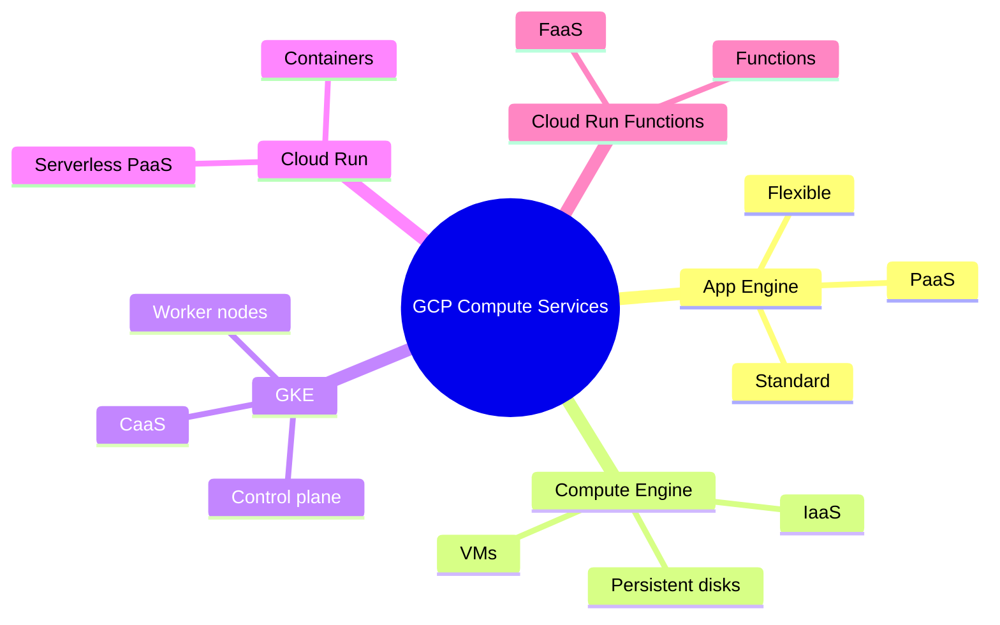
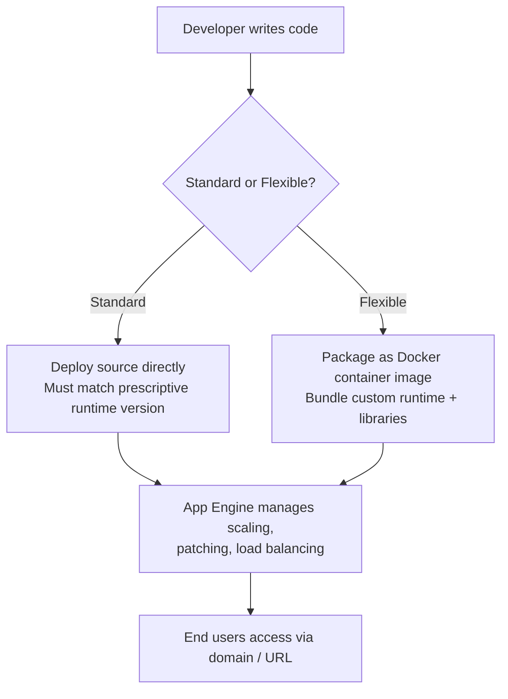
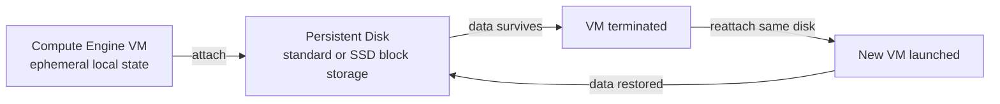
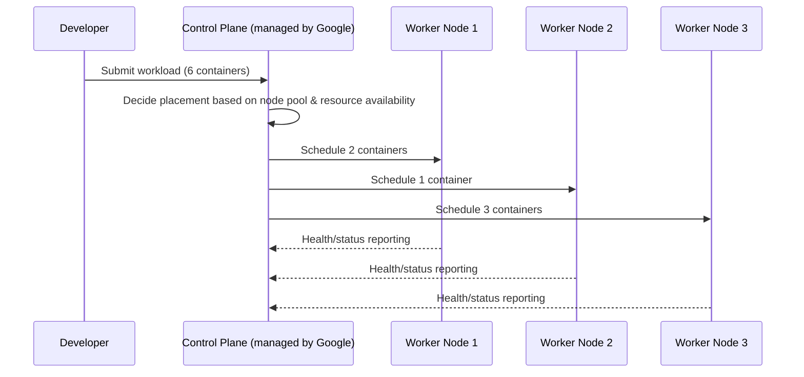
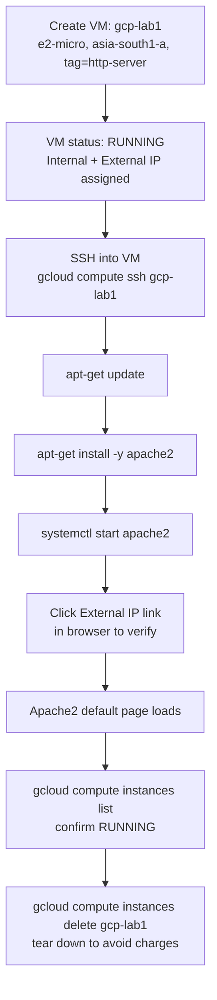
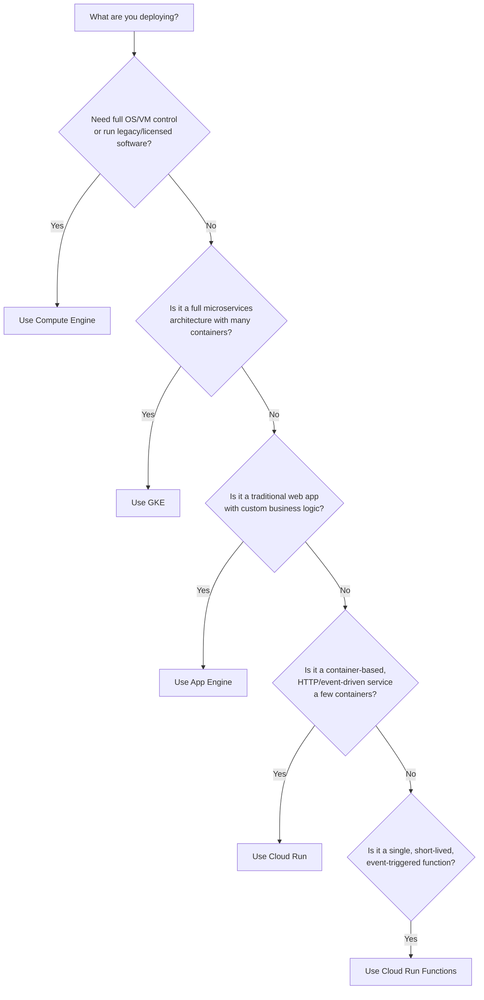

# Google Cloud Compute Services — Complete Study Guide

> A professional, interview-ready learning resource built from the "Google Cloud Compute Services" session. Use it to learn the material end-to-end, revise quickly before interviews, and practice hands-on.

---

## Table of Contents

1. [Session Overview](#session-overview)
2. [Learning Objectives](#learning-objectives)
3. [Detailed Notes](#detailed-notes)
   - [1. The Compute Services Spectrum](#1-the-compute-services-spectrum)
   - [2. App Engine (Platform as a Service)](#2-app-engine-platform-as-a-service)
   - [3. Compute Engine (Infrastructure as a Service)](#3-compute-engine-infrastructure-as-a-service)
   - [4. Google Kubernetes Engine (Containers as a Service)](#4-google-kubernetes-engine-containers-as-a-service)
   - [5. Cloud Run (Serverless Containers)](#5-cloud-run-serverless-containers)
   - [6. Cloud Run Functions (Functions as a Service)](#6-cloud-run-functions-functions-as-a-service)
   - [7. Hands-On Demo: Launching a Compute Engine VM](#7-hands-on-demo-launching-a-compute-engine-vm)
   - [8. Choosing the Right Compute Service](#8-choosing-the-right-compute-service)
4. [Glossary](#glossary)
5. [Revision Notes](#revision-notes)
6. [Cheat Sheet](#cheat-sheet)
7. [Interview Questions and Answers](#interview-questions-and-answers)
   - [Beginner](#beginner-interview-questions)
   - [Intermediate](#intermediate-interview-questions)
   - [Advanced](#advanced-interview-questions)
8. [Scenario-Based Questions](#scenario-based-questions)
9. [Hands-on Exercises](#hands-on-exercises)
10. [Practice Assignment](#practice-assignment)
11. [Additional Resources](#additional-resources)
12. [Final Revision Sheet](#final-revision-sheet)

---

## Session Overview

This session takes a deep look at **Google Cloud's compute services** — the layer of the cloud where your code actually runs. It covers five distinct offerings, each representing a different point on the spectrum between "full control" and "fully managed":

1. **App Engine** — Google's original Platform-as-a-Service (PaaS) for web applications.
2. **Compute Engine (GCE)** — Infrastructure-as-a-Service (IaaS) virtual machines.
3. **Google Kubernetes Engine (GKE)** — managed Containers-as-a-Service built on Kubernetes.
4. **Cloud Run** — a serverless, container-based PaaS.
5. **Cloud Run Functions** — Functions-as-a-Service (FaaS), the most fully managed option.

The session closes with a hands-on demo (launching, configuring, and tearing down a GCE VM from both the Console and Cloud Shell) and a use-case framework for choosing the right compute service for a given workload.

---

## Learning Objectives

By the end of this guide, you will be able to:

- [ ] Explain the five GCP compute services and where each sits on the control-vs-management spectrum.
- [ ] Describe App Engine's Standard vs. Flexible environments and when to prefer Cloud Run instead.
- [ ] Explain how Compute Engine machine types, persistence, and billing (per-second, sustained-use, committed-use) work.
- [ ] Describe the Kubernetes control plane / worker node model and compare GKE Standard, Autopilot, and Enterprise.
- [ ] Explain how Cloud Run achieves serverless container execution and identify its three core workload patterns.
- [ ] Compare Cloud Run and Cloud Run Functions across deployable unit, triggers, runtime control, and billing granularity.
- [ ] Launch, configure, and safely tear down a Compute Engine VM using both the Console and `gcloud`.
- [ ] Apply a decision framework to pick the right compute service for a given real-world workload.

---

## Detailed Notes

### 1. The Compute Services Spectrum

#### 🧠 Concept

Compute services are the **most critical component of any cloud platform** — GCP, AWS, or Azure — because this is where your application code is actually deployed and executed. GCP offers five compute services, each trading off **control** against **operational convenience**.

#### 📖 Definition

| Service | Category | Deployable Unit |
|---|---|---|
| **App Engine** | Platform as a Service (PaaS) | Application code (binary/runtime-managed) |
| **Compute Engine (GCE)** | Infrastructure as a Service (IaaS) | Virtual Machine |
| **Google Kubernetes Engine (GKE)** | Containers as a Service (CaaS) | Container (orchestrated via pods) |
| **Cloud Run** | PaaS (container-based, serverless) | Container image |
| **Cloud Run Functions** | Functions as a Service (FaaS) | Function (code snippet) |

#### ❓ Why It Exists

- **Problem it solves:** No single compute model fits every workload — a legacy enterprise application needs full VM control, while a small event-triggered task needs zero infrastructure management.
- **Why introduced:** As applications became more distributed and complex, engineering teams needed to mix and match compute models within the *same* application rather than being locked into one paradigm.
- **What would happen without it:** Teams would either over-provision (running everything on VMs, wasting cost/ops effort) or under-provision (forcing complex workloads into an overly restrictive managed service).

#### 🎨 Visual Representation: The Control–Management Spectrum

```text
 FULL CONTROL                                              FULLY MANAGED
 (You manage everything)                          (Google manages everything)
      │                                                            │
      ▼                                                            ▼
┌───────────┐   ┌──────────────┐   ┌───────────┐   ┌───────────┐   ┌────────────┐
│  Compute   │   │   App Engine  │   │    GKE     │   │ Cloud Run  │   │ Cloud Run  │
│  Engine    │   │ (Std / Flex)  │   │            │   │            │   │ Functions  │
│  (IaaS)    │   │    (PaaS)     │   │  (CaaS)    │   │  (PaaS)    │   │  (FaaS)    │
└───────────┘   └──────────────┘   └───────────┘   └───────────┘   └────────────┘
   VM-based        Code/runtime      Container         Container       Function
   SSH/RDO in       managed          orchestration      serverless      serverless
```

> 📌 **Remember:** As you move right along this spectrum, you lose infrastructure control but gain automatic scaling, patching, and operational simplicity. Most real applications end up using **more than one** compute service at once.

#### 🧩 Concept Relationships

```text
GCP Compute Services
   │
   ├── App Engine (PaaS)
   │      ├── Standard environment
   │      └── Flexible environment (Docker-based)
   │
   ├── Compute Engine (IaaS)
   │      └── Virtual Machines + persistent disks
   │
   ├── Google Kubernetes Engine (CaaS)
   │      ├── GKE Standard
   │      ├── GKE Autopilot
   │      └── GKE Enterprise
   │
   ├── Cloud Run (PaaS, serverless containers)
   │
   └── Cloud Run Functions (FaaS)
```

#### 💡 Real-World Example

A modern e-commerce platform might run its core checkout microservices on **GKE** for fine-grained orchestration, use **Cloud Run** for a lightweight image-resizing API triggered by uploads, use **Cloud Run Functions** to send a confirmation email whenever an order event fires, and keep a legacy inventory system that requires a specific OS patch level on **Compute Engine**.

#### 🎯 Key Takeaways

- Compute is the most critical — and often most expensive — part of any cloud platform.
- GCP offers five compute services spanning IaaS → PaaS → CaaS → PaaS(serverless) → FaaS.
- Real-world applications typically combine multiple compute services rather than using just one.
- The right choice depends on how much control vs. operational simplicity your workload needs.

#### 🚀 Mindmap



---

### 2. App Engine (Platform as a Service)

#### 🧠 Concept

**App Engine** was one of Google's very first cloud compute offerings — launched almost two decades ago — and it kick-started Google's entire cloud business. It's a **fully managed PaaS** purpose-built for deploying **web applications** at scale, without needing to manage the underlying infrastructure.

#### 📖 Definition

> **App Engine**: A fully managed Platform-as-a-Service for deploying and auto-scaling web applications, supporting multiple languages, frameworks, and libraries, available in **Standard** and **Flexible** environments.

#### ❓ Why It Exists

- **Problem it solves:** Developers building web-facing applications don't want to manage servers, patch operating systems, or configure load balancers — they just want to deploy code and have it scale.
- **Why introduced:** It was Google's answer to "give me a place to run my web app" without the operational burden of IaaS.
- **What would happen without it:** Every team would need to build its own deployment/scaling/patching pipeline on top of raw VMs — significant duplicated effort across the industry.

#### ⚙️ How It Works

App Engine supports multiple languages and runtimes (Python, Node.js, PHP, Go, and more) and lets you bring your own frameworks (e.g., Flask in Python, React in JavaScript). It ships in **two environments**:

| Environment | Basis | Runtime Flexibility | Sandbox Model |
|---|---|---|---|
| **Standard** | Predefined, prescriptive runtime | Must be 100% compatible with the specific runtime version App Engine offers | Runs inside a strict, predefined sandbox |
| **Flexible** | Docker containers | You bundle your own runtime, libraries, and frameworks into a container image | Much more flexible — you control the container contents |

#### 🔄 App Engine Deployment Model



#### ⚖️ Advantages & Limitations

| Aspect | Standard | Flexible |
|---|---|---|
| Setup speed | Very fast, minimal config | Slower — requires building a container image |
| Runtime control | Very limited — fixed runtime versions | Full control via Docker |
| Cost model | Can scale to zero, generally cheaper | Runs on Compute Engine VMs under the hood, generally costs more |
| Best for | Simple, standard-stack web apps | Apps needing custom runtimes/libraries |

#### 💡 Real-World Example

A team with a simple Flask API that fits entirely within App Engine Standard's supported Python runtime can deploy in minutes with zero infrastructure decisions. A team needing a custom-compiled native dependency alongside their Node.js app would instead package everything into a container and use App Engine Flexible.

#### ⚠️ Common Mistakes

- Assuming App Engine Standard supports **any** version/combination of a language runtime — it only supports specific, prescribed versions.
- Choosing App Engine for a brand-new project without checking whether **Cloud Run** (see Section 5) would now be the better, more modern fit.
- Treating App Engine as suitable for **any** workload — it is predominantly designed for **web applications** with a front end/domain, even though background services are technically possible.

#### 🚀 Best Practices

- **[Transcript]** If you want a hands-free way to deploy and scale a web application without managing infrastructure, App Engine is a solid choice.
- **[Transcript]** For new applications, strongly consider **Cloud Run** instead — Google has explicitly shifted its focus and investment toward Cloud Run as the modern, preferred PaaS, and App Engine is not receiving the same level of ongoing feature investment.
- **[Industry Best Practice]** If you already have an App Engine Standard app that's working well and doesn't need containers, there's no urgency to migrate — but evaluate Cloud Run for any *new* build.

#### 🎯 Key Takeaways

- App Engine = Google's original PaaS, purpose-built for web applications.
- **Standard** = prescriptive runtime, fast and simple, less flexible.
- **Flexible** = Docker-based, more flexible, runs on VMs under the hood.
- Google now recommends **Cloud Run** as the preferred, modern PaaS for new applications — this is a key interview-relevant nuance.

---

### 3. Compute Engine (Infrastructure as a Service)

#### 🧠 Concept

**Compute Engine (GCE)** is Google's core **Infrastructure-as-a-Service** offering: it lets you launch and fully administer **Linux or Windows virtual machines** running on Google's global infrastructure. You own the VM, and you become its administrator the moment you SSH or RDP into it.

#### 📖 Definition

> **Compute Engine**: An IaaS offering that provisions virtual machines (based on a chosen *machine type*, defined primarily by CPU core count and memory) on Google's infrastructure, giving the user full administrative control over the guest OS.

#### ❓ Why It Exists

- **Problem it solves:** Some workloads (legacy applications, specific OS/kernel requirements, licensing-bound software like SAP or older Oracle versions) simply cannot run in a managed, sandboxed PaaS/FaaS environment — they need a real, controllable machine.
- **Why introduced:** To give engineers the same low-level control they'd have with on-premises servers, but with cloud elasticity and Google's global network.
- **What would happen without it:** Enterprises with highly customized or legacy workloads would have no path to the cloud at all.

#### ⚙️ How It Works

- **Machine types** are defined primarily by two parameters: **number of CPU cores** and **available memory**. Options range from small, shared-vCPU instances (e.g., `f1-micro`, `e2-micro`) all the way up to **bare metal** machines (physically dedicated, not virtualized at all).
- You pick a machine type based on your workload's characteristics: a small prototype (e.g., a simple Flask app) might use an `e2-micro`, while a production workload might use an 8-core/64GB configuration, often with multiple VMs behind a load balancer.

#### 🔍 Internal Working: Persistence and Block Storage

By default, **VMs are transient** — anything stored inside the VM's local disk is deleted the moment the VM is terminated. To achieve durability, you attach an **external block storage device** (a persistent disk — standard or SSD). This becomes a separate storage partition/device accessible from within the VM.



- When the VM is terminated, data written only to local/ephemeral storage is lost — but data on the attached persistent disk survives.
- When you launch a new VM, you can reattach that same persistent disk to bring the data back.

#### 💰 Billing Model — Deep Dive

Compute Engine billing is unusually fine-grained and offers several distinct pricing strategies:

| Billing Model | How It Works | Best For |
|---|---|---|
| **On-Demand** | Charged a minimum of **1 minute**, then billed in **1-second increments** after that | Unpredictable, short-lived, or autoscaled workloads |
| **Sustained Use Discounts** | Automatic discount applied when a VM runs continuously for a large portion of the month — **unique to Google Cloud**, not offered the same way by other major clouds | Workloads that happen to run most of the month, without needing to commit in advance |
| **Committed Use Discounts** | You contractually commit to running a VM for **1 or 3 years**; you're billed for the full commitment regardless of actual usage, in exchange for a lower rate | Stable, predictable, long-running production workloads |

> ⚠️ **Common Mistake:** Assuming committed use discounts only charge you when the VM is actually running. In reality, **you are billed for the full committed term even if the VM is stopped or terminated** — it's effectively a signed contract, not a pay-as-you-go arrangement.

#### 🪜 Step-by-Step: How Fine-Grained Billing Works

```text
VM launched
   ↓
Runs for 40 seconds, then terminated
   ↓
Billed for the 1-minute minimum (rounded UP to nearest minute)
   ↓
If VM continues running past 1 minute...
   ↓
Billed in 1-second increments from that point forward
```

This granularity is especially valuable in **autoscaling** environments, where VMs are launched and terminated automatically — you only pay for the exact duration each instance actually ran, not rounded up to the nearest hour.

#### 💡 Real-World Example

A batch-processing pipeline that autoscales GCE VMs up during a nightly job and back down afterward benefits directly from per-second billing — unlike hourly-rounded billing models, there's no "wasted" partial-hour cost when instances are terminated slightly early.

#### ⚠️ Common Mistakes

- Assuming any data stored on a VM automatically persists — **it doesn't**, unless it's on an attached persistent disk.
- Forgetting to detach/delete unused persistent disks after terminating a VM, which continues to incur storage charges.
- Signing up for committed use discounts without confidence in long-term (1–3 year) usage, since you're billed regardless of actual utilization.

#### 🚀 Best Practices

- **[Transcript]** Choose machine type based on actual workload characteristics — start small (`e2-micro`) for prototypes, scale up for production.
- **[Transcript]** Use persistent disks for anything that needs to outlive the VM.
- **[Transcript]** Use committed use discounts only when you're confident about long-term, sustained usage; otherwise stick with on-demand + automatic sustained-use discounts.
- **[Industry Best Practice]** Regularly audit persistent disks, snapshots, and static IPs for orphaned resources no longer attached to a running VM.

#### 🎯 Key Takeaways

- GCE = IaaS; you get full admin control (SSH/RDP) over Linux or Windows VMs.
- Machine type = CPU cores + memory; options range from shared-vCPU micro instances to bare metal.
- VMs are transient by default — use **persistent disks (block storage)** for durability.
- Billing: 1-minute minimum, then per-second — extremely granular compared to many other providers.
- **Sustained use discounts** (automatic) and **committed use discounts** (contractual, 1–3 years) are two distinct ways to reduce cost — the latter bills you regardless of usage.

---

### 4. Google Kubernetes Engine (Containers as a Service)

#### 🧠 Concept

**Google Kubernetes Engine (GKE)** is a fully managed environment for running **containerized applications**, built on **Kubernetes** — the industry-standard container orchestration engine.

#### 📖 Definition

> **Kubernetes**: An orchestration engine that manages, connects, distributes, and scales multiple containers that together form one logical application — something a single container tool like Docker cannot do on its own.
>
> **GKE**: Google's fully managed Kubernetes offering, where Google operates the **control plane** for you and provisions **worker nodes** as Compute Engine VMs.

#### ❓ Why It Exists

- **Problem it solves:** Docker can run a single container well, but real applications are often composed of *many* interdependent containers that need to be scheduled, networked, scaled, and healed together. Managing that by hand — or even running raw Kubernetes yourself — is operationally heavy (patching, upgrading, maintaining the control plane).
- **Why introduced:** GKE removes the operational burden of running Kubernetes yourself while keeping its orchestration power.
- **What would happen without it:** Teams would need to install, patch, and maintain their own Kubernetes control plane on raw VMs — a significant and error-prone undertaking.

#### ⚙️ How It Works / Internal Working

Kubernetes has two core structural components:

| Component | Role |
|---|---|
| **Control Plane** | Accepts application workloads and decides where (which worker node) to place them. It's the "conductor" — it does not run your containers itself. |
| **Worker Nodes** | The actual VMs (GCE instances) where containers run. They are the "musicians" being conducted. |

A **cluster** is a collection of nodes. When you submit a workload (say, an application composed of six containers) to a three-node cluster, the control plane distributes those containers across the available nodes — for example, two containers on one node, one on another, and three on the third — based on scheduling decisions it makes automatically.

> 💡 **Memory Trick:** Think of the control plane as an orchestra conductor and the worker nodes as the musicians — the conductor (control plane) decides *what* plays *where*, but never plays an instrument (runs a container) itself.

#### 🔄 GKE Scheduling Flow



**Node pools** let a single cluster offer different node capabilities — for example, one node pool with GPU-enabled nodes for machine learning workloads, and another CPU-only node pool for everything else. Both pools attach to the same control plane, forming one logical cluster; the control plane decides which pool a given workload lands on based on how the application declares its requirements.

GKE is tightly integrated with the rest of GCP: networking (load balancing, firewalls), persistent storage (attaching persistent disks to node pools), and monitoring are all built in. Key managed capabilities include:

- **Autoscaling** — automatically adds worker nodes as traffic/demand increases.
- **Automatic upgrades** — GKE patches and upgrades the cluster for you.
- **Node auto-repair** — if a node becomes unresponsive, GKE terminates it and replaces it automatically, preserving application availability.

#### 📊 The Three Flavors of GKE

| Flavor | Control Level | Billing Model | Cluster Topology | Best For |
|---|---|---|---|---|
| **GKE Standard** | Full control over node configuration, scaling, and management | Pay-per-node | Zonal (single zone) **or** regional (spread across multiple zones, e.g. `asia-south1-a/b/c`) | Teams that know Kubernetes well and need fine-grained control |
| **GKE Autopilot** | No manual node/scaling configuration — starts with one and auto-scales based on utilization | Pay-per-**pod** (not per node) | Regional only — Google freely chooses the zone within the region | Getting started quickly with GKE, minimal ops overhead |
| **GKE Enterprise** (formerly **Anthos**) | Multi-cluster, multi-cloud management control plane — "the control plane of the control planes" | N/A (management layer) | Manages GKE, EKS (AWS), AKS (Azure), and on-prem clusters centrally | Enterprises running multiple clusters across hybrid/multi-cloud environments |

> 📌 **Remember:** A **zone** is a single dedicated data center; a **region** is a collection of data centers (zones). A **regional/zonal cluster** in GKE Standard can spread worker nodes across multiple zones (e.g., `asia-south1-a`, `1b`, `1c`) within one region for higher availability.

#### 💻 Code Example: Understanding Pods (Reconstructed for Clarity)

> ⚠️ Not shown explicitly in the transcript's demo, but the transcript references "pods" as the GKE Autopilot billing unit. Reconstructed here as representative, minimal Kubernetes YAML to make the concept concrete.

```yaml
# A minimal Pod definition — the deployable unit inside Kubernetes/GKE.
# A Pod is a wrapper around one or more containers that are scheduled together.
apiVersion: v1
kind: Pod
metadata:
  name: web-app-pod
spec:
  containers:
    - name: web-app
      image: gcr.io/my-project/web-app:latest
      ports:
        - containerPort: 8080
```

- **What it does:** Defines a single Pod containing one container, which the control plane schedules onto an available worker node (or, in Autopilot, a right-sized slice of compute).
- **Why it matters:** In **GKE Autopilot**, billing is calculated **per pod**, not per node — understanding pods as the deployable unit explains that billing distinction.

#### 🏢 Real-World / Production Usage

Enterprises running a growing microservices estate typically start with GKE Standard (for full control while learning) or GKE Autopilot (for fast onboarding with minimal ops), and adopt **GKE Enterprise** once they operate multiple clusters across different clouds or on-premises environments and need a single pane of glass for policy, upgrades, and observability — including integrated **service mesh** capabilities for advanced traffic routing between services (noted in the transcript as beyond the scope of that particular course).

#### ⚠️ Common Mistakes

- Assuming GKE Autopilot lets you choose the specific zone — it doesn't; Autopilot clusters are **regional only**, and Google picks the zone.
- Confusing GKE Enterprise (multi-cluster/multi-cloud management) with simply "a bigger GKE cluster" — it's a management layer above individual clusters, not a cluster type itself.
- Believing the control plane runs your containers — it never does; only worker nodes run containers.

#### 🚀 Best Practices

- **[Transcript]** Use **GKE Standard** when your team has Kubernetes expertise and needs fine control (manual scaling, custom node pools).
- **[Transcript]** Use **GKE Autopilot** as the easiest way to get started with GKE.
- **[Transcript]** Use **GKE Enterprise** only when you genuinely operate multiple clusters across hybrid/multi-cloud environments.
- **[Industry Best Practice]** Use separate node pools to isolate specialized hardware needs (e.g., GPU workloads) from general-purpose workloads within the same cluster.

#### 🎯 Key Takeaways

- GKE = managed Kubernetes; Google runs the control plane, worker nodes are GCE VMs.
- Control plane schedules workloads; worker nodes actually run containers.
- Node pools allow heterogeneous node capabilities (e.g., GPU vs. CPU) within one cluster.
- Three flavors: **Standard** (full control, pay-per-node), **Autopilot** (auto-managed, pay-per-pod, regional only), **Enterprise** (multi-cluster/multi-cloud management, formerly Anthos).
- Built-in autoscaling, automatic upgrades, and node auto-repair are core GKE differentiators over self-managed Kubernetes.

---

### 5. Cloud Run (Serverless Containers)

#### 🧠 Concept

**Cloud Run** is a managed, **serverless** platform for running **containers** — you bring a container image, and Cloud Run runs it without you ever provisioning any infrastructure.

#### 📖 Definition

> **Cloud Run**: A serverless execution environment for containers that automatically scales instance count up and down based on incoming traffic or events, with zero infrastructure provisioning required from the user.

#### ❓ Why It Exists

- **Problem it solves:** Even GKE Autopilot still requires you to provision a cluster before running anything. Some workloads need to go from "I have a container" to "it's running and handling traffic" instantly, with no cluster concept at all.
- **Why introduced:** To give developers the simplicity of pushing a container image and having it "just run," scaling automatically — including scaling all the way down to **zero** instances when idle.
- **What would happen without it:** Teams with lightweight, bursty, or event-driven container workloads would be forced into the added complexity of managing a Kubernetes cluster (even a managed one) just to run occasional work.

#### ⚙️ How It Works

Unlike GKE — where you must launch a cluster with node pools before deploying anything — Cloud Run lets you deploy a container and have it start serving **immediately**, with no infrastructure wait time. Cloud Run automatically:

- **Scales out** by running more container instances as traffic increases.
- **Scales in** (down to zero) as traffic subsides, so you pay only for actual usage.

Cloud Run isn't limited to short HTTP requests — it also supports **batch processes** and **long-running jobs** (e.g., converting a large batch of high-resolution images to thumbnails).

#### 🪜 Three Core Cloud Run Workload Patterns

```mermaid
flowchart TD
    subgraph Event-Driven
        E1[Image dropped into Cloud Storage bucket] --> E2[Event triggers Cloud Run]
        E2 --> E3[Container wakes up, converts to thumbnail]
        E3 --> E4[Writes result to another bucket]
        E4 --> E5[Container automatically terminates]
    end
    subgraph Batch Processing
        B1[10,000 images queued] --> B2[Cloud Run job processes all images]
        B2 --> B3[Job runs until all images are processed]
    end
    subgraph Scheduled Job
        S1[Images accumulate throughout the day] --> S2["Triggered at a fixed time e.g. 11 PM"]
        S2 --> S3[Batch-converts all pending images]
    end
```



1. **Event-driven** — the container "wakes up" only when an event occurs (e.g., a file lands in Cloud Storage), does its job, and terminates automatically. This is a fire-and-forget model.
2. **Batch processing** — a job that runs continuously until a large, finite batch of work (e.g., 10,000 images) is fully processed.
3. **Scheduled job** — work is triggered at a fixed time (e.g., nightly at 11:00 PM), processing everything accumulated since the last run.

Cloud Run can be triggered by a variety of GCP services, including **Cloud Storage** (object events), **Cloud Pub/Sub** (message-oriented middleware — Cloud Run starts processing as soon as a message appears in a subscribed topic), and plain **HTTP webhooks**.

#### 💻 Code Example: A Minimal Cloud Run Container (Reconstructed)

> ⚠️ Not shown explicitly in the transcript, reconstructed here as a representative example of what gets deployed to Cloud Run.

```python
# app.py — a minimal Flask app suitable for deployment to Cloud Run
from flask import Flask, request

app = Flask(__name__)

@app.route("/", methods=["POST"])
def handle_event():
    payload = request.get_json(silent=True) or {}
    file_name = payload.get("name", "unknown")
    # Representative processing logic (e.g., thumbnail generation would go here)
    print(f"Processing file: {file_name}")
    return "OK", 200

if __name__ == "__main__":
    app.run(host="0.0.0.0", port=8080)
```

```dockerfile
# Dockerfile — packages the app as the container image Cloud Run deploys
FROM python:3.12-slim
WORKDIR /app
COPY . .
RUN pip install flask
CMD ["python", "app.py"]
```

- **What it does:** Exposes an HTTP endpoint that Cloud Run invokes whenever a configured trigger (e.g., a Cloud Storage event forwarded as an HTTP POST via Eventarc) fires.
- **Important lines:** The app **must** listen on the port defined by the `PORT` environment variable (commonly `8080`) — this is a Cloud Run requirement for HTTP-based containers.
- **Edge cases:** If the container doesn't start listening within Cloud Run's startup timeout, the deployment/revision is marked unhealthy.
- **Best practice:** Keep container startup fast and stateless — Cloud Run may start and stop instances frequently as it scales.

#### 💡 Real-World Example

A photo-sharing app uses Cloud Run so that whenever a user uploads a high-resolution image to a Cloud Storage bucket, a Cloud Run container is triggered, generates a thumbnail, writes it back to another bucket, and terminates — with zero standing infrastructure cost between uploads.

#### ⚠️ Common Mistakes

- Assuming Cloud Run only handles short HTTP requests — it also supports long-running batch and scheduled jobs.
- Forgetting that Cloud Run scales to **zero**, meaning the very first request after idle time may experience a "cold start" delay.
- Trying to orchestrate more than a handful of interdependent containers on Cloud Run — at that point, it's time to graduate to GKE (see Section 8).

#### 🚀 Best Practices

- **[Transcript]** Use Cloud Run for HTTP-based, event-driven containerized applications where you don't want to manage any infrastructure.
- **[Transcript]** Use Cloud Run's batch/scheduled job capabilities for longer-running, non-HTTP work instead of forcing it into GKE.
- **[Industry Best Practice]** Design Cloud Run containers to be stateless and fast-starting to minimize cold-start latency impact.

#### 🎯 Key Takeaways

- Cloud Run = serverless container execution; no infrastructure to provision, unlike GKE.
- Automatically scales out under load and scales to **zero** when idle.
- Supports three workload types: **event-driven**, **batch processing**, and **scheduled jobs**.
- Commonly triggered by Cloud Storage events, Pub/Sub messages, or HTTP webhooks.
- Deployable unit = **container image**.

---

### 6. Cloud Run Functions (Functions as a Service)

#### 🧠 Concept

**Cloud Run Functions** is Google's **Functions-as-a-Service (FaaS)** offering. It shares Cloud Run's underlying serverless execution model, but instead of deploying a container image, you deploy a single **function**.

#### 📖 Definition

> **Cloud Run Functions**: A serverless compute platform for event-driven and HTTP-triggered **functions**, built on top of Cloud Run's execution infrastructure. It was formed by merging the earlier standalone "Cloud Functions" product into Cloud Run to reduce confusion between the two products.

#### ❓ Why It Exists

- **Problem it solves:** Even Cloud Run requires you to build and manage a container image. Many workloads are small enough that packaging a full container is unnecessary overhead — developers just want to write a function and have it run.
- **Why introduced:** To offer the absolute lowest-friction deployment model: write a function, deploy it, and let the platform handle everything else — scaling from zero, triggering, and termination.
- **What would happen without it:** Simple, short-lived event handlers would need full container builds and image management even when a single function would suffice — added toolchain complexity for no benefit.

#### ⚙️ How It Works

Cloud Run Functions supports multiple programming languages — **Python, Node.js, Go, Java, .NET, PHP, Ruby**, and more. You write your function following a required signature/schema, deploy it, and Cloud Run Functions automatically scales instances from **zero** up to handle load. Over **90 GCP services** integrate directly with Cloud Run Functions as trigger sources, and roughly **70 distinct event sources** can invoke a function (not limited to HTTP).

#### 💻 Code Example: A Minimal Cloud Run Function (Reconstructed)

> ⚠️ Not shown explicitly in the transcript, reconstructed here as a representative implementation following Google's function signature convention.

```python
# main.py — an HTTP-triggered Cloud Run Function
import functions_framework

@functions_framework.http
def process_upload(request):
    """Triggered by an HTTP request (e.g., forwarded from a Cloud Storage event)."""
    request_json = request.get_json(silent=True) or {}
    file_name = request_json.get("name", "unknown")
    # Representative lightweight processing logic
    return f"Processed {file_name}", 200
```

```bash
# Deploy the function to Cloud Run Functions (2nd gen, built on Cloud Run)
gcloud functions deploy process-upload \
  --runtime python312 \
  --trigger-http \
  --entry-point process_upload \
  --region us-central1 \
  --allow-unauthenticated
```

- **What it does:** Deploys a single Python function as an HTTP-triggered, auto-scaling Cloud Run Function.
- **Important lines:** `--entry-point` tells the platform which function in your source to invoke; `--trigger-http` specifies the trigger type (Cloud Run Functions also support event triggers from ~70 other sources).
- **Edge cases:** There is a per-invocation **timeout** — long-running or stateful work does not belong here; use Cloud Run (containers) instead.
- **Best practice:** Keep functions short, atomic, and stateless — billing rewards brevity (see below).

#### 💰 Billing: Granularity Deep Dive

Cloud Run Functions billing is **pay-per-use**, billed to the nearest **100 milliseconds** — dramatically more granular than Compute Engine's 1-second increments (after a 1-minute minimum).

```text
Function execution finishes in < 100ms
         ↓
Billed as exactly ONE 100ms unit
         ↓
Function runs longer than 100ms
         ↓
Billed in successive 100ms increments
```

> 📌 **Remember:** The shorter and more atomic your function, the more cost-efficient it is under this billing model.

#### 📊 Cloud Run vs. Cloud Run Functions — Side-by-Side Comparison

| Dimension | Cloud Run | Cloud Run Functions |
|---|---|---|
| **Deployable unit** | Container image | Function (code snippet) |
| **Runtime control** | Full control (bring your own runtime, framework, custom versions) | Must use the managed runtime versions Cloud Run Functions provides |
| **Primary trigger** | HTTP endpoint (webhook-style) | ~70 event sources; HTTP is possible but not the primary use case |
| **Typical workload** | Microservices, full web applications, complex apps | Lightweight, short-lived, event-driven tasks ("fire and forget") |
| **Execution duration** | Can run long (batch/scheduled jobs) | Short-lived; subject to a timeout, then auto-terminated |
| **Workflow model** | Container-centric; versioned via **tags** | Function-centric; versioned as distinct **function versions** |
| **Billing granularity** | Standard Cloud Run billing (per-request/per-resource-time) | Pay-per-use, billed to nearest **100 ms** |

#### 💡 Real-World Example

A Cloud Storage bucket receives partner-uploaded images all day. A **Cloud Run Function** is triggered on each upload event to validate file format and log metadata (a short, atomic task), while the actual thumbnail-generation batch job — a longer-running process — runs on **Cloud Run** (containers) on a nightly schedule. This illustrates how the two services are often used together, not as competitors.

#### ⚠️ Common Mistakes

- Trying to run long, stateful, or resource-heavy processing inside a Cloud Run Function — it will hit the execution timeout; use Cloud Run (containers) instead.
- Assuming Cloud Run Functions is purely HTTP-based like Cloud Run — it's actually optimized for the ~70 non-HTTP event sources available across GCP.
- Confusing today's "Cloud Run Functions" with the older, now-merged standalone "Cloud Functions" product when reading older documentation or tutorials.

#### 🚀 Best Practices

- **[Transcript]** Use Cloud Run Functions for lightweight, short-lived, event-driven tasks.
- **[Transcript]** Use Cloud Run (containers) instead when you need custom runtime control or longer execution.
- **[Industry Best Practice]** Keep each function focused on a single responsibility to maximize the benefit of the 100ms billing granularity and simplify testing/versioning.

#### 🎯 Key Takeaways

- Cloud Run Functions = FaaS, built on top of Cloud Run's infrastructure; deployable unit is a **function**, not a container.
- Supports Python, Node.js, Go, Java, .NET, PHP, Ruby, and more.
- Billed to the nearest **100 milliseconds** — the most granular billing model covered in this session.
- ~70 event sources can trigger a function; over 90 GCP services integrate with it.
- Cloud Run and Cloud Run Functions are complementary, not mutually exclusive — pick based on deployable unit and workload duration.

---

### 7. Hands-On Demo: Launching a Compute Engine VM

#### 🧠 Concept

This section walks through the **live demo**: launching a Compute Engine VM both from the **Cloud Console** (GUI) and via **Cloud Shell** (`gcloud` CLI), installing a web server on it, verifying it works, and safely tearing it down.

#### 🪜 Step-by-Step: Console Walkthrough

```text
1. Open the Cloud Console → navigate to Compute Engine
   (use "View All Products" → Compute → Compute Engine if not visible in the sidebar)
2. Click "Create Instance"
3. Provide a name, e.g. gcp-lab1
4. Choose a region close to you, e.g. asia-south1 (Mumbai)
5. Choose a zone (or leave it to "Any" and let GCE pick one)
6. Choose a machine series — e.g. E2 (low-cost, day-to-day computing)
7. Choose a machine type — e.g. e2-micro (smallest, ~$8-8.5/month, ~$0.01/hour)
8. Click "Create" — the VM is provisioned
```

#### 💻 Code Example: The Same Workflow via Cloud Shell / `gcloud`

```bash
# Step 1: Set reusable variables for project and zone
export PROJECT_ID=$(gcloud config get-value project)
export ZONE=asia-south1-a   # Mumbai

# Step 2: Create the VM instance
gcloud compute instances create gcp-lab1 \
  --project=$PROJECT_ID \
  --zone=$ZONE \
  --machine-type=e2-micro \
  --tags=http-server \
  --image-family=ubuntu-2204-lts \
  --image-project=ubuntu-os-cloud

# Step 3: Confirm the instance is running
gcloud compute instances list
```

- **What it does:** Creates a `gcp-lab1` VM in the `asia-south1-a` zone using the smallest `e2-micro` machine type, tagged `http-server` (used to scope firewall rules), running Ubuntu 22.04.
- **Important flags:**
  - `--zone` — every resource must specify a zone (for zonal resources like a single VM).
  - `--tags=http-server` — a network tag used to apply matching firewall rules (e.g., allow inbound HTTP traffic) to exactly this instance.
  - `--image-family` / `--image-project` — specify the OS image; could equally be Debian, Windows, or another supported OS.
- **Output:** The command returns the instance's status (`RUNNING`), internal IP, external IP, machine type, and zone.

#### 🔄 End-to-End Demo Flow



#### 💻 Code Example: SSH, Install, and Verify

```bash
# SSH into the newly created VM
gcloud compute ssh gcp-lab1 --zone=asia-south1-a

# --- Commands run INSIDE the VM after SSH ---

# Refresh package repositories
sudo apt-get update

# Install Apache2 web server without interactive prompts
sudo apt-get install -y apache2

# Start the Apache2 service
sudo systemctl start apache2
```

```bash
# --- Back on your local machine / Cloud Shell ---

# Confirm the instance is running (and note its External IP)
gcloud compute instances list

# Clean up: delete the VM to avoid ongoing charges
gcloud compute instances delete gcp-lab1 --zone=asia-south1-a
```

- **What it does:** Installs and starts the Apache2 web server inside the VM, then verifies it by visiting the VM's External IP in a browser (which shows the Apache2 default landing page), then confirms and deletes the instance.
- **Inputs:** Instance name (`gcp-lab1`), zone (`asia-south1-a`).
- **Outputs:** A running web server reachable at the VM's public IP; a confirmation prompt before deletion.
- **Edge cases:** If the firewall doesn't allow inbound HTTP traffic on the `http-server`-tagged instance, the Apache page won't be reachable externally even though the service is running — a firewall rule permitting port 80 for that tag must exist.
- **Best practice:** Always run the delete step immediately after verifying the lab — this directly reinforces the cost-hygiene principle from the GCP fundamentals session.

#### ⚠️ Common Errors & Troubleshooting

| Problem | Possible Cause | Solution |
|---|---|---|
| Can't see Compute Engine in the Console sidebar | Navigation menu collapsed or service not pinned | Use "View All Products" → Compute → Compute Engine |
| External IP link doesn't load the Apache page | Firewall rule for the `http-server` tag not configured to allow port 80 | Create/verify a firewall rule allowing ingress TCP:80 for instances tagged `http-server` |
| `gcloud compute ssh` fails | SSH keys not yet propagated, or the VM just finished booting | Wait a few seconds and retry; ensure the correct `--zone` is specified |
| Instance still billing after "stopping" it | A **stopped** VM still incurs charges for its attached persistent disk (and any reserved static IP) | Fully **delete** the instance (and check for orphaned disks/IPs) rather than just stopping it, once truly done |

#### 🎯 Key Takeaways

- The exact same VM lifecycle (create → configure → verify → delete) can be performed from the Console (GUI) or Cloud Shell (`gcloud` CLI) — they are equivalent.
- Network **tags** (like `http-server`) connect a VM to firewall rules controlling what traffic reaches it.
- `gcloud compute instances list` and `gcloud compute instances delete` are the standard commands to verify and clean up VMs.
- Always terminate demo/lab VMs immediately after verifying them, to avoid incurring unnecessary charges — this echoes the cost-hygiene practice from GCP fundamentals.

---

### 8. Choosing the Right Compute Service

#### 🧠 Concept

With five compute services available, choosing the right one comes down to mapping your **workload's characteristics** (control needs, team's DevOps expertise, application architecture, licensing constraints) to the appropriate point on the control-vs-management spectrum introduced in Section 1.

#### 📊 Use-Case Decision Table

| Service | Category | Key Feature | Best-Fit Scenario |
|---|---|---|---|
| **Compute Engine (GCE)** | IaaS | Full VM control | Highly customized/legacy workloads — e.g., running SAP, an older Oracle version, or an internal payroll system that demands a specific OS/config |
| **Google Kubernetes Engine (GKE)** | CaaS | Container orchestration at scale | Brand-new, containerized microservices applications that need to scale as a full microservices architecture |
| **App Engine** | PaaS | Managed runtime, bring your code | Line-of-business or web applications with complex custom logic, where a hands-off deployment/scaling model is desired |
| **Cloud Run** | PaaS (serverless containers) | HTTP-based, event-driven containers | A handful of containers that don't yet need full orchestration; graduate to GKE once container count/complexity grows |
| **Cloud Run Functions** | FaaS | Event-driven functions | A single function invoked by an external event, doing one job, then terminating |

#### 🎨 Visual: The Full Decision Spectrum

```text
 MOST CONTROL                                                MOST MANAGED
      │                                                              │
      ▼                                                              ▼
┌────────────┐  ┌───────────────┐  ┌──────────┐  ┌───────────┐  ┌─────────────┐
│  Compute    │  │  App Engine    │  │   GKE     │  │ Cloud Run  │  │ Cloud Run   │
│  Engine     │  │ (Std / Flex)   │  │           │  │            │  │ Functions   │
└────────────┘  └───────────────┘  └──────────┘  └───────────┘  └─────────────┘
  Legacy/SAP/      Web apps with       Microservices   Few HTTP/     Single event-
  custom OS         custom logic        at scale        event         driven
  requirements                                          containers    function
```

#### 🪜 Decision Workflow



#### 💡 Real-World Example

A fintech startup migrating a legacy on-prem payroll system uses **Compute Engine** (it needs a specific OS patch level for compliance). Their new customer-facing product is built as containerized microservices on **GKE**. A marketing microsite with custom business logic runs on **App Engine**. An internal image-processing webhook runs on **Cloud Run**. And a single "send Slack alert on deployment" automation runs as a **Cloud Run Function**.

#### ⚠️ Common Mistakes

- Defaulting to Compute Engine for everything "to be safe" — this sacrifices all the operational benefits of the more managed services.
- Trying to orchestrate a growing number of interdependent containers on Cloud Run instead of graduating to GKE once complexity increases.
- Choosing App Engine for a brand-new project without first evaluating Cloud Run, per Google's current guidance (see Section 2).

#### 🚀 Best Practices

- **[Transcript]** Match the compute service to the workload's actual characteristics — customization needs, container count, event-driven vs. long-running, and team expertise.
- **[Industry Best Practice]** Re-evaluate compute choices periodically — a workload that started as a single Cloud Run Function may later warrant graduating to Cloud Run or GKE as complexity grows.

#### 🎯 Key Takeaways

- The five compute services form a spectrum from full control (GCE) to full automation (Cloud Run Functions).
- Choice depends on: level of infrastructure control needed, application architecture (monolith vs. microservices vs. functions), and operational expertise available.
- It's normal — and often optimal — to use multiple compute services together within a single application.

---

## Glossary

| Term | Definition | Why It Matters |
|---|---|---|
| **IaaS** | Infrastructure as a Service — you manage the OS/VM, provider manages the physical hardware | Defines Compute Engine's service model |
| **PaaS** | Platform as a Service — provider manages runtime/infrastructure, you manage code | Defines App Engine's and Cloud Run's service model |
| **CaaS** | Containers as a Service — provider manages container orchestration infrastructure | Defines GKE's service model |
| **FaaS** | Functions as a Service — provider manages everything except your function code | Defines Cloud Run Functions' service model |
| **App Engine** | Google's original fully managed PaaS for web applications | One of the earliest GCP compute services |
| **App Engine Standard** | Prescriptive, sandboxed App Engine runtime environment | Fast to deploy, limited runtime flexibility |
| **App Engine Flexible** | Docker-container-based App Engine environment | More flexible runtime/library choices |
| **Compute Engine (GCE)** | GCP's IaaS virtual machine offering | Backbone for both user VMs and GKE worker nodes |
| **Machine Type** | A VM configuration defined by CPU cores and memory | Determines cost and performance of a VM |
| **Persistent Disk (Block Storage)** | External durable storage attachable to a VM | Provides data durability beyond a VM's lifecycle |
| **Sustained Use Discount** | Automatic GCE discount for running a VM continuously through much of the month | Reduces on-demand cost without a contract |
| **Committed Use Discount** | Contractual 1- or 3-year GCE commitment for a lower rate | Reduces cost for predictable, long-running workloads; bills regardless of usage |
| **Kubernetes** | Open-source container orchestration engine | Powers GKE's container management |
| **Control Plane** | The Kubernetes component that schedules workloads onto nodes | Never runs containers itself; only decides placement |
| **Worker Node** | A VM where containers actually run | The "workhorse" of a Kubernetes cluster |
| **Node Pool** | A group of nodes with shared configuration (e.g., GPU vs. CPU) within a cluster | Enables heterogeneous compute within one cluster |
| **Pod** | The smallest deployable unit in Kubernetes, wrapping one or more containers | GKE Autopilot's billing unit |
| **GKE Standard** | Full-control GKE flavor, pay-per-node | For teams needing fine-grained cluster control |
| **GKE Autopilot** | Fully managed GKE flavor, pay-per-pod, regional only | Easiest way to start with GKE |
| **GKE Enterprise (formerly Anthos)** | Multi-cluster, multi-cloud management layer | Central governance across GKE/EKS/AKS/on-prem clusters |
| **Cloud Run** | Serverless container execution platform | No infrastructure provisioning; scales to zero |
| **Cloud Run Functions** | Serverless FaaS platform, built on Cloud Run | Deployable unit is a function, not a container |
| **Zone** | A single, dedicated Google data center | The smallest unit of infrastructure locality |
| **Region** | A collection of zones (data centers) | Determines availability/latency characteristics |
| **Service Mesh** | An application networking layer for traffic policy between services | Advanced GKE Enterprise capability (noted as out of scope in the transcript) |

---

## Revision Notes

### ⚡ One-Minute Revision

- GCP has five compute services on a control-vs-management spectrum: **Compute Engine (IaaS) → App Engine (PaaS) → GKE (CaaS) → Cloud Run (serverless PaaS) → Cloud Run Functions (FaaS)**.
- **App Engine**: Standard (prescriptive runtime) vs. Flexible (Docker-based); Google now recommends **Cloud Run** as the modern PaaS instead.
- **Compute Engine**: VMs are transient by default; use **persistent disks** for durability. Billing = 1-minute minimum + per-second after; **sustained use discounts** are automatic, **committed use discounts** require a 1–3 year contract and bill regardless of usage.
- **GKE**: Control plane schedules workloads; worker nodes (GCE VMs) run containers. Three flavors — **Standard** (pay-per-node, full control), **Autopilot** (pay-per-pod, regional only, minimal ops), **Enterprise** (formerly Anthos, multi-cluster/multi-cloud management).
- **Cloud Run**: Serverless containers, scales to zero, no infra provisioning. Three workload types: **event-driven, batch processing, scheduled jobs**.
- **Cloud Run Functions**: FaaS built on Cloud Run; deployable unit = function; billed to the nearest **100 milliseconds**; supports ~70 event sources and 90+ integrated services.
- Demo commands: `gcloud compute instances create`, `gcloud compute ssh`, `gcloud compute instances list`, `gcloud compute instances delete` — always delete lab VMs immediately after use.
- Use case rule of thumb: legacy/custom OS → GCE; microservices at scale → GKE; web apps with custom logic → App Engine; a few HTTP/event containers → Cloud Run; single short-lived event function → Cloud Run Functions.

---

## Cheat Sheet

### 💻 Essential `gcloud` Commands for Compute Engine

```bash
# Create a VM instance
gcloud compute instances create INSTANCE_NAME \
  --zone=ZONE \
  --machine-type=MACHINE_TYPE \
  --tags=TAG_NAME \
  --image-family=IMAGE_FAMILY \
  --image-project=IMAGE_PROJECT

# List all VM instances
gcloud compute instances list

# SSH into a VM
gcloud compute ssh INSTANCE_NAME --zone=ZONE

# Delete a VM instance
gcloud compute instances delete INSTANCE_NAME --zone=ZONE

# List available regions
gcloud compute regions list
```

### 📊 Compute Services at a Glance

| Service | Model | Deployable Unit | Scales to Zero? | Billing Granularity |
|---|---|---|---|---|
| Compute Engine | IaaS | VM | No | 1 min minimum, then per-second |
| App Engine (Standard) | PaaS | Code/runtime | Yes | Per-instance-hour (varies) |
| App Engine (Flexible) | PaaS | Container (on VM) | No | Per-VM |
| GKE | CaaS | Container (Pod) | Autopilot: near-zero via pod billing | Standard: per-node; Autopilot: per-pod |
| Cloud Run | Serverless PaaS | Container | Yes | Per-request / resource-time |
| Cloud Run Functions | FaaS | Function | Yes | Nearest 100 ms |

### 📋 GKE Flavor Quick Reference

```text
GKE Standard    → Full control, pay-per-node, zonal or regional
GKE Autopilot   → Auto-managed, pay-per-pod, regional only
GKE Enterprise  → Multi-cluster / multi-cloud management (formerly Anthos)
```

### ⭐ Rules to Remember

- VMs are transient — attach a **persistent disk** for durability.
- **Committed use discounts** bill you regardless of whether the VM runs.
- Cloud Run Functions billing is far more granular (100ms) than Compute Engine (1s after a 1-min minimum).
- The control plane **never** runs your containers — only worker nodes do.
- Always delete lab/demo VMs immediately after verifying them.

---

## Interview Questions and Answers

### Beginner Interview Questions

**Question 1:** What are the five main compute services offered by Google Cloud?
**Answer:** App Engine, Compute Engine, Google Kubernetes Engine (GKE), Cloud Run, and Cloud Run Functions.
**Explanation:** They span the spectrum from full infrastructure control (Compute Engine) to fully managed functions (Cloud Run Functions).
**Why Interviewers Ask This:** To confirm baseline familiarity with GCP's compute portfolio.
**Possible Follow-up:** "Which of these would you use for a legacy application requiring a specific OS version?"

---

**Question 2:** What is Compute Engine, and what service model does it belong to?
**Answer:** Compute Engine (GCE) is GCP's Infrastructure-as-a-Service (IaaS) offering, letting you launch and administer Linux or Windows virtual machines.
**Explanation:** You get SSH/RDP access and full administrative control over the guest OS.
**Why Interviewers Ask This:** Tests understanding of the most fundamental compute building block.
**Possible Follow-up:** "What defines a VM's machine type?"

---

**Question 3:** What two parameters primarily define a Compute Engine machine type?
**Answer:** The number of CPU cores and the amount of available memory.
**Explanation:** Machine types range from small shared-vCPU instances to large multi-core configurations, and even bare metal machines.
**Why Interviewers Ask This:** Tests basic sizing/configuration knowledge.
**Possible Follow-up:** "When would you choose a bare metal machine over a standard VM?"

---

**Question 4:** Are Compute Engine VMs persistent by default? How do you achieve durability?
**Answer:** No — VMs are transient by default. Durability is achieved by attaching an external persistent disk (block storage).
**Explanation:** Data stored only on local/ephemeral VM storage is lost when the VM terminates; data on an attached persistent disk survives.
**Why Interviewers Ask This:** A very common practical gotcha for anyone new to cloud VMs.
**Possible Follow-up:** "Can you reattach the same persistent disk to a new VM?"

---

**Question 5:** What is App Engine, and what are its two environments?
**Answer:** App Engine is Google's fully managed PaaS for web applications, available in **Standard** (prescriptive, sandboxed runtime) and **Flexible** (Docker-container-based) environments.
**Explanation:** Standard is faster to deploy but less flexible; Flexible gives more runtime control at the cost of some simplicity.
**Why Interviewers Ask This:** Tests understanding of GCP's original PaaS offering and its two deployment modes.
**Possible Follow-up:** "Which service does Google now recommend over App Engine for new applications?"

---

**Question 6:** What is Google Kubernetes Engine (GKE)?
**Answer:** GKE is Google's fully managed environment for running containerized applications, based on the Kubernetes orchestration engine.
**Explanation:** Google manages the Kubernetes control plane; worker nodes run as GCE VMs.
**Why Interviewers Ask This:** GKE is one of the most commonly used GCP services in real-world production environments.
**Possible Follow-up:** "What's the difference between the control plane and a worker node?"

---

**Question 7:** What is Cloud Run, and how is it "serverless"?
**Answer:** Cloud Run is a managed platform for running containers without provisioning any infrastructure; it automatically scales instances up and down, including down to zero.
**Explanation:** "Serverless" here means you never manage or provision VMs/clusters — you just deploy a container.
**Why Interviewers Ask This:** Tests understanding of the serverless container execution model.
**Possible Follow-up:** "What are the three workload types Cloud Run supports?"

---

**Question 8:** What is Cloud Run Functions, and how does it differ from Cloud Run in terms of deployable unit?
**Answer:** Cloud Run Functions is a Functions-as-a-Service (FaaS) platform where the deployable unit is a **function**, whereas Cloud Run's deployable unit is a **container image**.
**Explanation:** Cloud Run Functions is built on top of Cloud Run's infrastructure but abstracts away the container entirely.
**Why Interviewers Ask This:** Tests precise understanding of two frequently confused, closely related services.
**Possible Follow-up:** "What programming languages does Cloud Run Functions support?"

---

**Question 9:** What `gcloud` command lists all running Compute Engine instances?
**Answer:** `gcloud compute instances list`
**Explanation:** This is the standard command to verify VM status, IPs, machine type, and zone.
**Why Interviewers Ask This:** Tests hands-on CLI familiarity, not just conceptual knowledge.
**Possible Follow-up:** "How would you delete an instance from the command line?"

---

**Question 10:** What is a "node pool" in GKE?
**Answer:** A node pool is a group of nodes within a cluster that share the same configuration — for example, a GPU-enabled node pool versus a CPU-only node pool.
**Explanation:** Multiple node pools can attach to the same control plane, forming one logical cluster with heterogeneous compute capabilities.
**Why Interviewers Ask This:** Tests understanding of GKE's flexibility for mixed workload types.
**Possible Follow-up:** "How does the control plane decide which node pool to use for a given workload?"

---

**Question 11:** What are the three flavors of GKE?
**Answer:** GKE Standard, GKE Autopilot, and GKE Enterprise (formerly known as Anthos).
**Explanation:** Standard gives full control (pay-per-node); Autopilot is fully managed (pay-per-pod); Enterprise manages multiple clusters across clouds.
**Why Interviewers Ask This:** Tests breadth of knowledge across GKE's product line.
**Possible Follow-up:** "Which GKE flavor is best for a beginner getting started with Kubernetes on GCP?"

---

### Intermediate Interview Questions

**Question 1:** Explain the difference between sustained use discounts and committed use discounts on Compute Engine.
**Answer:** Sustained use discounts are automatic — you get a discount simply for running a VM continuously through a large portion of the month, with no upfront commitment. Committed use discounts require you to contractually commit to running a VM for 1 or 3 years in exchange for a lower rate, and you're billed for the full term regardless of actual usage.
**Explanation:** One is a reward for organic usage patterns; the other is a pricing negotiation requiring a binding commitment.
**Why Interviewers Ask This:** Tests real-world cost-optimization knowledge that's directly applicable to production cloud spend management.
**Possible Follow-up:** "In what scenario would committed use discounts be a poor choice?"

---

**Question 2:** Why does Google recommend Cloud Run over App Engine for new applications?
**Answer:** Google's product investment and feature development focus has shifted to Cloud Run, positioning it as the modern, next-generation PaaS, while App Engine — one of Google's oldest services — receives comparatively less ongoing attention.
**Explanation:** This is a strategic/roadmap consideration, not a fundamental technical limitation of App Engine itself.
**Why Interviewers Ask This:** Tests awareness of current platform direction, which matters for architecture decisions that need to remain viable long-term.
**Possible Follow-up:** "Would you migrate an existing, stable App Engine application to Cloud Run? Why or why not?"

---

**Question 3:** Describe the relationship between the Kubernetes control plane and worker nodes, using an analogy if helpful.
**Answer:** The control plane accepts workloads and decides where to place them across worker nodes, but never runs containers itself. Worker nodes are the VMs that actually execute containers. An orchestra analogy: the control plane is the conductor, and worker nodes are the musicians.
**Explanation:** This separation of scheduling/decision-making from actual execution is core to how Kubernetes achieves reliability and scalability.
**Why Interviewers Ask This:** Fundamental Kubernetes architecture knowledge, essential for any GKE-related role.
**Possible Follow-up:** "What happens if a worker node becomes unresponsive?"

---

**Question 4:** How does GKE Autopilot's billing model differ from GKE Standard's, and why?
**Answer:** GKE Standard bills per **node**; GKE Autopilot bills per **pod**. This is because Autopilot abstracts away node management entirely — you never provision or size nodes yourself, so billing is tied to the actual deployable units (pods) you run rather than the underlying infrastructure.
**Explanation:** This reflects Autopilot's goal of removing infrastructure-level decisions from the user entirely.
**Why Interviewers Ask This:** Tests understanding of how billing models reflect underlying operational responsibility.
**Possible Follow-up:** "Why is GKE Autopilot only available as a regional (not zonal) cluster?"

---

**Question 5:** What are the three core workload patterns Cloud Run is designed for, and give an example of each?
**Answer:** (1) Event-driven — e.g., a container triggered when an image lands in a Cloud Storage bucket, generating a thumbnail, then terminating. (2) Batch processing — e.g., processing 10,000 queued images until the batch completes. (3) Scheduled jobs — e.g., processing all images accumulated throughout the day at a fixed time like 11 PM.
**Explanation:** This shows Cloud Run isn't limited to simple request/response HTTP workloads.
**Why Interviewers Ask This:** Tests whether the candidate understands Cloud Run's full capability set beyond basic web service hosting.
**Possible Follow-up:** "How would you trigger the event-driven pattern using Pub/Sub instead of Cloud Storage?"

---

**Question 6:** Compare Cloud Run and Cloud Run Functions in terms of trigger types and typical use cases.
**Answer:** Cloud Run is primarily HTTP-based (webhook-style) and suited to microservices/full web applications; Cloud Run Functions supports roughly 70 event sources (not primarily HTTP) and is suited to lightweight, short-lived, fire-and-forget event-driven tasks.
**Explanation:** The two services share underlying infrastructure but target different granularities of workload.
**Why Interviewers Ask This:** Tests the ability to make an informed choice between two closely related services.
**Possible Follow-up:** "If you needed to process a webhook that both validates a payload and generates a report taking 5 minutes, which service would you choose, and would you split the work?"

---

**Question 7:** Why is Cloud Run Functions' billing described as "extremely granular," and what's the practical implication?
**Answer:** It bills to the nearest 100 milliseconds (versus Compute Engine's 1-minute minimum plus per-second billing after that). The practical implication is that shorter, more atomic functions are more cost-efficient, since even sub-100ms executions are billed as a single 100ms unit but nothing more.
**Explanation:** This incentivizes designing small, focused functions rather than long-running monolithic ones.
**Why Interviewers Ask This:** Tests understanding of how billing models should influence application design.
**Possible Follow-up:** "How would this billing model affect your decision to batch multiple operations into one function call versus splitting them?"

---

**Question 8:** What is the difference between a zone and a region in the context of GKE cluster topology?
**Answer:** A zone is a single, dedicated data center; a region is a collection of zones. A GKE Standard cluster can be zonal (nodes in one zone) or regional (nodes spread across multiple zones within a region, e.g., asia-south1-a/b/c) for higher availability.
**Explanation:** Spreading nodes across zones protects against a single data center outage.
**Why Interviewers Ask This:** Tests understanding of GCP's physical infrastructure hierarchy and its impact on availability design.
**Possible Follow-up:** "What's the availability trade-off of choosing a zonal cluster instead of regional?"

---

**Question 9:** In what scenario would you "graduate" a workload from Cloud Run to GKE?
**Answer:** When the number of interdependent containers grows beyond what's manageable as discrete Cloud Run services, and you need fine-grained orchestration, custom networking policies, or complex inter-container communication that Cloud Run isn't designed to coordinate.
**Explanation:** Cloud Run is ideal for a handful of loosely coupled containers; GKE is designed for full microservices architectures at scale.
**Why Interviewers Ask This:** Tests architectural judgment about when managed simplicity stops being sufficient.
**Possible Follow-up:** "What operational overhead would you take on by making that move?"

---

**Question 10:** Why must a Compute Engine VM's network tag (e.g., `http-server`) match a firewall rule for external traffic to reach it?
**Answer:** GCP firewall rules are applied based on network tags (among other criteria); if no firewall rule permits the relevant traffic (e.g., inbound TCP:80) for a given tag, traffic to instances with that tag is blocked by default, even if the service (e.g., Apache) is running correctly inside the VM.
**Explanation:** This models real-world GCP networking, where tags decouple firewall policy from individual instance IPs.
**Why Interviewers Ask This:** A very common practical troubleshooting scenario for anyone deploying VMs.
**Possible Follow-up:** "How would you create a firewall rule allowing inbound HTTP traffic for instances tagged `http-server`?"

---

### Advanced Interview Questions

**Question 1:** Design a compute architecture for a company migrating a monolithic on-prem application to GCP, where the application has a legacy licensing constraint requiring a specific OS patch level, alongside new customer-facing features that need to scale independently.
**Answer:** Keep the legacy monolith on **Compute Engine**, pinned to the required OS/patch level, since it cannot run in a managed sandbox. Build new customer-facing features as independent containerized microservices on **GKE** (or Cloud Run if the service count stays small), communicating with the legacy system via well-defined APIs. Over time, incrementally decompose functionality out of the monolith (strangler-fig pattern) into the new microservices layer.
**Explanation:** This demonstrates the "use multiple compute services together" principle explicitly emphasized in the session, applied to a realistic migration scenario.
**Why Interviewers Ask This:** Tests systems-level architectural thinking beyond memorized service facts.
**Possible Follow-up:** "How would you handle data consistency between the legacy monolith and the new microservices during the transition?"

---

**Question 2:** Explain how GKE Enterprise (formerly Anthos) enables "fleet-wide configuration" and why this matters for a multi-cloud enterprise.
**Answer:** GKE Enterprise acts as a management control plane above individual Kubernetes clusters — GKE clusters in GCP, EKS clusters in AWS, AKS clusters in Azure, and even on-premises clusters can all be registered to it and managed centrally ("a single pane of glass"). Fleet-wide configuration means policies, upgrades, and access control can be applied consistently across this entire heterogeneous set of clusters rather than managing each independently.
**Explanation:** This directly addresses the operational complexity multi-cloud enterprises face when Kubernetes clusters are scattered across different providers with different native tooling.
**Why Interviewers Ask This:** Tests understanding of enterprise-scale, multi-cloud governance — relevant for senior platform/infrastructure roles.
**Possible Follow-up:** "What are the security implications of centralizing multi-cloud cluster management in a single control plane?"

---

**Question 3:** A team's Cloud Run Function is intermittently timing out on requests that occasionally involve larger payloads requiring more processing time. What are your options, and what would you recommend?
**Answer:** Options include: (a) increasing the function's configured timeout up to the platform's maximum, (b) optimizing the processing logic to reduce execution time, (c) moving the workload to **Cloud Run** (containers), which supports longer-running and batch/scheduled execution more naturally, or (d) decoupling the work — accept the request quickly, enqueue the heavy processing (e.g., via Pub/Sub) for asynchronous handling by a longer-running Cloud Run job, and respond to the caller immediately.
**Explanation:** Recommend decoupling (option d) as the most scalable long-term fix, since it avoids fighting the FaaS model's inherent short-execution design rather than working with it.
**Why Interviewers Ask This:** Tests practical problem-solving and understanding of FaaS execution limits versus alternative architectures.
**Possible Follow-up:** "How would you design the Pub/Sub-based decoupled architecture end-to-end?"

---

**Question 4:** Why might an organization deliberately choose GKE Standard over GKE Autopilot even though Autopilot is described as easier to use?
**Answer:** GKE Standard offers full control over node configuration (custom machine types, specific hardware like GPUs/TPUs with fine-tuned settings, custom scaling policies, and choice of zonal vs. regional topology), whereas Autopilot abstracts these decisions away. Organizations with specific performance-tuning needs, cost-optimization strategies that depend on node-level control, or compliance requirements around infrastructure configuration would prefer Standard.
**Explanation:** "Easier" doesn't mean "always better" — it trades away control that some workloads genuinely need.
**Why Interviewers Ask This:** Tests nuanced judgment rather than a simple "always pick the managed option" heuristic.
**Possible Follow-up:** "Can you migrate a cluster from Autopilot to Standard later, or does that require a rebuild?"

---

**Question 5:** How would you architect a cost-optimized Compute Engine fleet for a workload with predictable baseline traffic plus unpredictable seasonal spikes?
**Answer:** Use **committed use discounts** to cover the predictable baseline capacity (since you're confident that portion will run continuously for 1–3 years), and use **on-demand** instances (benefiting from automatic sustained-use discounts if they end up running most of the month) — or better, autoscaled instances — to absorb the unpredictable seasonal spikes. This blends guaranteed savings on the stable portion with elastic, pay-only-for-what-you-use flexibility on the variable portion.
**Explanation:** This demonstrates applying both GCE discount mechanisms from the session in a coherent cost strategy, rather than picking just one.
**Why Interviewers Ask This:** Tests the ability to combine multiple pricing models into a coherent real-world cost strategy.
**Possible Follow-up:** "How would autoscaling groups factor into this design?"

---

**Question 6:** Explain the architectural implication of Kubernetes' control-plane/worker-node separation for high availability, and how GKE's node auto-repair fits in.
**Answer:** Because the control plane only schedules workloads (rather than running them), a worker node failure doesn't take down the entire cluster's scheduling capability — the control plane simply reschedules affected workloads onto healthy nodes. GKE's **node auto-repair** actively monitors node health and automatically terminates and replaces unresponsive nodes, so failed capacity is restored without manual intervention, preserving application availability even under node-level failures.
**Explanation:** This ties the conceptual architecture (Section 4) directly to the operational feature (auto-repair) that depends on it.
**Why Interviewers Ask This:** Tests the ability to connect architectural concepts to operational features and explain *why* they work together.
**Possible Follow-up:** "What would happen to a Pod that was running on a node that gets auto-repaired?"

---

**Question 7:** Compare the operational responsibility boundary between App Engine Flexible and Compute Engine, given that App Engine Flexible actually runs on Compute Engine VMs under the hood.
**Answer:** Even though App Engine Flexible ultimately provisions Compute Engine VMs behind the scenes, the operational responsibility differs sharply: with raw Compute Engine, you manage OS patching, scaling policy, load balancing configuration, and health checks yourself; with App Engine Flexible, Google manages all of that infrastructure lifecycle for you — you only supply the container image, and App Engine handles scaling, patching the underlying VM layer, and traffic routing.
**Explanation:** This distinguishes "what runs the workload" (shared: GCE VMs) from "who operates the lifecycle" (different: you vs. Google) — a subtlety worth surfacing at a senior level.
**Why Interviewers Ask This:** Tests deep understanding that service categories (IaaS vs. PaaS) are about operational responsibility, not necessarily different physical infrastructure.
**Possible Follow-up:** "Does this mean App Engine Flexible costs the same as running the equivalent VM directly on Compute Engine?"

---

**Question 8:** A security review flags that a Cloud Run Function has broad, unscoped IAM permissions because it was deployed quickly during a hackathon. How would you remediate this for production use?
**Answer:** Create a dedicated service account for the function with only the specific IAM roles it needs (least privilege) — for example, only `roles/storage.objectViewer` on the specific bucket it reads from, rather than a broad project-level role. Redeploy the function attached to this scoped service account, remove any default/overly-permissive service account binding, and add IAM audit logging to monitor the function's actual API usage going forward to validate the scoped permissions are sufficient.
**Explanation:** This is standard least-privilege remediation applied specifically to the FaaS context, where default service accounts are a common real-world over-permissioning trap.
**Why Interviewers Ask This:** Tests security maturity in a serverless context — not explicitly covered in the transcript, but essential production knowledge for anyone deploying Cloud Run Functions. *(Supplementary — extends beyond the transcript's scope.)*
**Possible Follow-up:** "How would you detect this kind of over-permissioning proactively, before a manual security review catches it?"

---

**Question 9:** Explain why GKE Enterprise is described as "the control plane of the control planes," and what risk this centralization introduces.
**Answer:** GKE Enterprise sits above individual Kubernetes clusters (each of which already has its own control plane) and centrally manages policy, upgrades, and configuration across all of them — hence "control plane of control planes." The risk this introduces is a single point of failure/compromise: if the GKE Enterprise management layer itself is misconfigured or compromised, the blast radius potentially spans every registered cluster across every cloud, rather than being contained to one cluster.
**Explanation:** Centralization brings operational efficiency but concentrates risk — a classic infrastructure trade-off worth articulating explicitly.
**Why Interviewers Ask This:** Tests the ability to reason critically about the trade-offs of centralized management tooling, not just its benefits. *(The risk analysis extends beyond the transcript's description of the feature.)*
**Possible Follow-up:** "How would you scope IAM permissions within GKE Enterprise to limit this blast radius?"

---

**Question 10:** Given the billing model differences across GCE (per-second after 1-min minimum), Cloud Run (per-request/resource-time), and Cloud Run Functions (nearest 100ms), how would you estimate and compare monthly cost for the same workload implemented three different ways?
**Answer:** Model the workload's actual invocation pattern (frequency, duration per invocation, concurrency) under each billing model: for GCE, calculate VM uptime needed (including idle time between invocations, since a VM doesn't scale to zero the way Cloud Run/Functions do) multiplied by the machine type's per-second rate; for Cloud Run, calculate total compute-time consumed only during actual request handling (since it scales to zero when idle) at its per-vCPU-second/memory rate; for Cloud Run Functions, calculate total invocation count multiplied by average duration rounded up to the nearest 100ms, at the function's configured memory tier's rate. Compare the three totals — for spiky, low-duty-cycle workloads, Cloud Run Functions or Cloud Run will typically win due to scale-to-zero; for high, sustained utilization, GCE (especially with sustained/committed use discounts) can become more cost-effective.
**Explanation:** This requires synthesizing the distinct billing mechanics from Sections 3, 5, and 6 into a single comparative cost model — a realistic FinOps exercise.
**Why Interviewers Ask This:** Tests the ability to apply granular billing knowledge to real cost-engineering decisions, a high-value skill for senior cloud roles.
**Possible Follow-up:** "At what rough duty-cycle percentage would you expect GCE to become more cost-effective than Cloud Run for a steady workload?"

---

## Scenario-Based Questions

> **Scenario 1:** Your team's Cloud Run-based image-processing service is experiencing noticeably slow response times for the very first request after periods of low traffic, though subsequent requests are fast. How would you investigate and resolve this?

**Structured Answer:**

1. **Initial investigation:** Confirm the pattern correlates with idle periods by checking Cloud Run's request latency metrics alongside instance count over time in Cloud Monitoring.
2. **Metrics/logs to check:** Cloud Run's "container instance count" and "request latency" metrics, plus container startup logs for the affected revision.
3. **Possible causes:** This is a classic **cold start** — Cloud Run scaled the service down to zero instances during the idle period, and the first request after idle has to wait for a new container instance to start (image pull, runtime init, application bootstrap).
4. **Debugging approach:** Measure how much of the latency is container startup vs. application-level initialization (e.g., loading a large ML model or establishing DB connections at startup).
5. **Resolution:** Configure a **minimum instance count** greater than zero (keeping at least one warm instance running) if the cold-start latency is unacceptable for the use case, and/or optimize application startup time (lazy-load non-critical dependencies, reduce container image size).
6. **Prevention:** For latency-sensitive endpoints, always factor scale-to-zero cold-start behavior into the SLA design from the start, rather than discovering it in production; consider Cloud Run's minimum-instances setting proactively for user-facing paths.

---

> **Scenario 2:** A production GKE Standard cluster experiences a full-zone outage, and the on-call engineer notices the application became unavailable rather than failing over gracefully. What likely misconfiguration caused this, and how would you fix it?

**Structured Answer:**

1. **Initial investigation:** Check whether the cluster was deployed as a **zonal** cluster (all nodes in one zone) rather than a **regional** cluster (nodes spread across multiple zones).
2. **Metrics/logs to check:** GKE cluster configuration (topology type), node pool zone distribution, and the incident timeline correlated with the zone outage window from Google's status dashboard.
3. **Possible causes:** The cluster (or a specific node pool) was provisioned as zonal, so when that single zone/data center experienced an outage, all worker nodes became unreachable simultaneously with no healthy nodes elsewhere to fail over to.
4. **Debugging approach:** Confirm via `gcloud container clusters describe` whether the cluster's `locations` field spans multiple zones or just one.
5. **Resolution:** Migrate to a **regional cluster** with node pools spread across multiple zones (e.g., `asia-south1-a`, `1b`, `1c`), so a single-zone outage only removes a fraction of capacity rather than the entire cluster.
6. **Prevention:** Standardize on regional clusters for any production workload with an availability SLA, reserving zonal clusters only for genuinely non-critical or cost-sensitive workloads.

---

> **Scenario 3:** Finance flags a surprise GCP bill increase, and investigation shows it's driven by several Compute Engine VMs that engineers "stopped" weeks ago but never deleted. Walk through your investigation and remediation.

**Structured Answer:**

1. **Initial investigation:** Open Billing → Reports, filter by Compute Engine, and break down cost by SKU (VM compute vs. persistent disk vs. static IP) to confirm which component is driving the charge.
2. **Metrics/logs to check:** `gcloud compute instances list --filter="status=TERMINATED"` to find stopped-but-not-deleted instances, and `gcloud compute disks list` / `gcloud compute addresses list` to find disks and static IPs still attached to (or orphaned from) those stopped instances.
3. **Possible causes:** A **stopped** VM no longer incurs compute charges, but its attached persistent disk (and any reserved static IP) continues to be billed — engineers likely assumed "stopped" was equivalent to "no charges," which is incorrect.
4. **Debugging approach:** Cross-reference each stopped instance against its attached disks/IPs to quantify exactly how much ongoing cost each represents.
5. **Resolution:** For instances confirmed no longer needed, fully **delete** them (and their disks/IPs, unless the disk data must be preserved as a snapshot first); for instances that might be needed again, snapshot the disk, delete the VM and disk, and restore from snapshot when actually needed.
6. **Prevention:** Establish a policy (and ideally automated tooling, e.g., a scheduled Cloud Function that flags or deletes instances stopped beyond a TTL) requiring engineers to fully delete — not just stop — resources no longer in active use, and set up Billing Budget alerts to catch this pattern earlier next time.

---

## Hands-on Exercises

### 🟢 Easy

1. In your own words, write one sentence each distinguishing IaaS, PaaS, CaaS, and FaaS, and name the GCP service that represents each.
2. List the two App Engine environments and one key difference between them.
3. From memory, sketch the control-plane/worker-node relationship in a Kubernetes cluster.

### 🟡 Medium

1. Using the Cloud Console or `gcloud`, launch an `e2-micro` VM in a region near you, SSH into it, install and start Apache2, verify it via the External IP in a browser, then delete the VM — document each command you ran.
2. Write a minimal Cloud Run Function (in any supported language) that accepts an HTTP POST with a JSON body and returns a transformed response; deploy it and test with `curl`.
3. Create a comparison table (in your own words, not copied from this guide) contrasting Cloud Run and Cloud Run Functions across at least four dimensions.

### 🔴 Advanced

1. Design (on paper or a diagram) a full architecture for a photo-sharing application that uses at least three different GCP compute services appropriately, justifying each choice.
2. Research and document the difference in cost between running a steady 24/7 workload on a committed-use-discounted Compute Engine VM versus running the equivalent workload on Cloud Run, for a hypothetical CPU/memory profile of your choosing.
3. Provision a GKE Standard cluster (regional, spread across at least 2 zones) with two node pools — one simulating a "GPU" pool (using a labeled/tainted node pool, since actual GPUs may not be available in your trial) and one general-purpose CPU pool — and deploy a sample workload targeting a specific pool via node selectors.

---

## Practice Assignment

### 🏗️ Project: "Multi-Service Image Pipeline"

**Objective:** Simulate a realistic, multi-compute-service architecture that mirrors the image-processing use cases discussed throughout this session (Cloud Run's event-driven pattern, Cloud Run Functions' lightweight event handling, and Compute Engine's persistent web-serving demo).

**Requirements:**

- [ ] Create a Cloud Storage bucket named something like `pipeline-uploads-<your-id>`.
- [ ] Deploy a **Cloud Run Function** triggered on object-finalize events in that bucket, which logs metadata (file name, size, content type) for every uploaded file.
- [ ] Deploy a **Cloud Run** service (container-based) that, when invoked, resizes an uploaded image into a thumbnail and writes it to a second bucket (`pipeline-thumbnails-<your-id>`).
- [ ] Launch a small **Compute Engine** VM running Apache (as in the Section 7 demo) that serves a simple static HTML gallery page listing the generated thumbnails.
- [ ] Ensure the VM is tagged appropriately and has a firewall rule allowing inbound HTTP traffic.
- [ ] Clean up all resources (VM, buckets, Cloud Run service, Cloud Run Function) once you've verified the pipeline works end-to-end.

**Architecture:**

```text
User uploads image
      ↓
Cloud Storage bucket: pipeline-uploads
      ↓ (object-finalize event)
Cloud Run Function → logs metadata
      ↓ (triggers, e.g., via Pub/Sub or Eventarc)
Cloud Run service → resizes image to thumbnail
      ↓
Cloud Storage bucket: pipeline-thumbnails
      ↓
Compute Engine VM (Apache) → serves gallery page listing thumbnails
```

**Expected Functionality:**

- Uploading an image to the source bucket triggers metadata logging (visible in Cloud Logging).
- A corresponding thumbnail appears in the destination bucket shortly after.
- The Apache-served gallery page (on the Compute Engine VM) reflects the available thumbnails when refreshed.

**Expected Output:**

- Cloud Logging entries showing the Cloud Run Function's metadata logs.
- At least one generated thumbnail in the destination bucket.
- A screenshot of the Apache-served gallery page loading in a browser via the VM's External IP.

**Challenges:**

- Correctly wiring the Cloud Storage → Cloud Run Function trigger (Eventarc configuration).
- Handling image resizing correctly within the Cloud Run container (choosing an appropriate image-processing library for your chosen language).
- Making sure the Compute Engine VM's gallery page dynamically reflects the bucket's current contents (e.g., via a small script that lists bucket objects) rather than being a static, one-time snapshot.

**Bonus Improvements:**

- Add a scheduled job (Cloud Scheduler + Cloud Run) that runs nightly to regenerate a summary report of all images processed that day, mirroring the "scheduled job" pattern from Section 5.
- Migrate the Compute Engine gallery page to Cloud Run instead, and compare the operational overhead and cost of both approaches.
- Add IAM least-privilege service accounts for each component instead of using default service accounts.

---

## Additional Resources

- 📚 [Compute Engine Documentation](https://cloud.google.com/compute/docs)
- 📚 [App Engine Documentation](https://cloud.google.com/appengine/docs)
- 📚 [Google Kubernetes Engine Documentation](https://cloud.google.com/kubernetes-engine/docs)
- 📚 [Cloud Run Documentation](https://cloud.google.com/run/docs)
- 📚 [Cloud Run Functions Documentation](https://cloud.google.com/functions/docs)
- 📚 [GCE Machine Types Reference](https://cloud.google.com/compute/docs/machine-resource)
- 📚 [Sustained Use Discounts — Google Cloud](https://cloud.google.com/compute/docs/sustained-use-discounts)
- 📚 [Committed Use Discounts — Google Cloud](https://cloud.google.com/compute/docs/instances/committed-use-discounts-overview)
- 💻 [GoogleCloudPlatform GitHub Organization](https://github.com/GoogleCloudPlatform)
- 📖 Book: *"Kubernetes Up & Running"* (O'Reilly) — foundational Kubernetes concepts applicable to GKE.
- 📖 Official Kubernetes documentation: [kubernetes.io/docs](https://kubernetes.io/docs/home/)

---

## Final Revision Sheet

### ⭐ Core Concepts

- Five compute services on a control-vs-management spectrum: **GCE (IaaS) → App Engine (PaaS) → GKE (CaaS) → Cloud Run (serverless PaaS) → Cloud Run Functions (FaaS)**.
- Real-world applications typically combine multiple compute services.
- App Engine: Standard (prescriptive) vs. Flexible (Docker); Cloud Run is now Google's preferred modern PaaS.
- GCE VMs are transient by default; persistence requires attached block storage (persistent disks).
- GKE separates the **control plane** (scheduling) from **worker nodes** (execution); three flavors — Standard, Autopilot, Enterprise.
- Cloud Run scales to zero and supports event-driven, batch, and scheduled workloads.
- Cloud Run Functions is FaaS built on Cloud Run; deployable unit is a function, not a container.

### ⭐ Important Definitions

- **Machine type** = CPU cores + memory configuration for a VM.
- **Persistent disk** = external block storage providing durability beyond a VM's lifecycle.
- **Node pool** = a group of nodes with shared configuration within a GKE cluster.
- **Pod** = smallest deployable unit in Kubernetes; GKE Autopilot's billing unit.

### ⭐ Important Commands/Code

```bash
gcloud compute instances create INSTANCE_NAME --zone=ZONE --machine-type=TYPE
gcloud compute instances list
gcloud compute ssh INSTANCE_NAME --zone=ZONE
gcloud compute instances delete INSTANCE_NAME --zone=ZONE
gcloud functions deploy FUNCTION_NAME --runtime=RUNTIME --trigger-http
```

### ⭐ Architecture/Process

```text
GCE VM → attach persistent disk for durability
GKE: Control Plane (schedules) → Worker Nodes (execute containers)
Cloud Run: Container image → auto-scale 0→N based on traffic/events
Cloud Run Functions: Function code → auto-scale 0→N, billed per 100ms
```

### ⭐ Best Practices

- Delete (not just stop) lab/demo VMs to avoid orphaned disk/IP charges.
- Use committed use discounts only for confidently predictable, long-term workloads.
- Use regional GKE clusters for production availability requirements.
- Prefer Cloud Run over App Engine for new PaaS-style projects.
- Graduate from Cloud Run to GKE once container orchestration complexity outgrows a handful of services.

### ⭐ Common Mistakes

- Assuming a "stopped" VM incurs no charges (disks/IPs still bill).
- Assuming committed use discounts only bill for actual usage (they don't — it's a contract).
- Assuming GKE Autopilot lets you pick a specific zone (it doesn't — regional only).
- Forgetting firewall rules must match network tags for external traffic to reach a VM.

### ⭐ Interview Points

- Be ready to explain *why* the control plane never runs containers itself.
- Know the billing granularity differences: GCE (1 min + per-second) vs. Cloud Run Functions (100ms).
- Understand sustained-use vs. committed-use discounts precisely — this is a frequently tested nuance.
- Be able to justify a compute-service choice against real workload characteristics, not just recite definitions.

### ⭐ Things to Remember

> 💡 **Memory Trick:** Picture the compute spectrum as a "control dial" — turn it toward Compute Engine for maximum control (and maximum responsibility), or toward Cloud Run Functions for maximum convenience (and minimum control). Most real systems set different dials for different parts of the same application.

> 💡 **Memory Trick:** The Kubernetes control plane is the conductor, worker nodes are the musicians — the conductor decides what plays where, but never plays an instrument itself.

> 💡 **Memory Trick:** "Stopped ≠ Deleted" for Compute Engine — a stopped VM is like a parked car still paying for its parking spot (persistent disk); only deleting frees the space entirely.