# 🌳 Git Branching Strategy: Master, Feature, Release & Hotfix Branches, Proven on Kubernetes

- <i>**Session:** "Git Branching Strategy — Real World Example" · 
- **Instructor:** Abhishek
- **Note on scope:** This session covers Git branching strategy both theoretically (via worked calculator and Uber examples) and practically — live, on the real, public `kubernetes/kubernetes` GitHub repository, chosen specifically for its scale (~3,300 contributors). It is explicitly framed around one of the most commonly asked DevOps interview topics, with each branch type's definition repeatedly flagged as a direct, ready-to-use interview answer.</i>

---

## 📑 Table of Contents

1. [Session Overview](#-session-overview)
2. [Learning Objectives](#-learning-objectives)
3. [Detailed Notes](#-detailed-notes)
   - [1. Why Branching Strategy Matters: The Business Case & the Interview Reality](#1-why-branching-strategy-matters-the-business-case--the-interview-reality)
   - [2. What Is a Branch? A Simple, Precise Definition](#2-what-is-a-branch-a-simple-precise-definition)
   - [3. The Calculator & Uber Examples: Why Branches Protect Existing Functionality](#3-the-calculator--uber-examples-why-branches-protect-existing-functionality)
   - [4. The Master/Main Branch: Always Up to Date](#4-the-mastermain-branch-always-up-to-date)
   - [5. Feature Branches: Isolating New or Breaking Changes](#5-feature-branches-isolating-new-or-breaking-changes)
   - [6. Release Branches: Why You Don't Ship From Master](#6-release-branches-why-you-dont-ship-from-master)
   - [7. Hotfix Branches: The Two-Branch Merge Rule](#7-hotfix-branches-the-two-branch-merge-rule)
   - [8. The Golden Rule: Everything Cascades Back to Master](#8-the-golden-rule-everything-cascades-back-to-master)
   - [9. Real-World Proof: Branching Strategy on Kubernetes' GitHub Repository](#9-real-world-proof-branching-strategy-on-kubernetes-github-repository)
   - [10. The Extended Uber Timeline: Seeing the Full Cycle Repeat](#10-the-extended-uber-timeline-seeing-the-full-cycle-repeat)
4. [Glossary](#-glossary)
5. [Revision Notes — One-Minute Revision](#-revision-notes--one-minute-revision)
6. [Cheat Sheet](#-cheat-sheet)
7. [Interview Questions & Answers](#-interview-questions--answers)
8. [Scenario-Based Interview Questions](#-scenario-based-interview-questions)
9. [Hands-on Exercises](#-hands-on-exercises)
10. [Practice Assignment](#-practice-assignment)
11. [Additional Resources](#-additional-resources)
12. [Final Revision Sheet](#-final-revision-sheet)

---

## 🎯 Session Overview

This session teaches the branching strategy pattern used by real, large-scale organizations to ship frequent, reliable releases — both conceptually and via a live tour of a genuinely massive open-source project. It covers:

1. **Why branching strategy matters commercially** — every organization's core goal is delivering new features to customers reliably and on a predictable cadence — and why this topic is explicitly flagged as one of the most frequently asked DevOps interview subjects.
2. **What a branch actually is**, defined simply as a "separation" from existing code — introduced first via a calculator-app example (v1 vs. a breaking-change v2).
3. A **second, richer worked example** (Uber: cabs → bikes) illustrating precisely why isolating new/breaking work in a separate branch protects already-delivered, in-use functionality.
4. The **four branch types** that make up this session's complete branching strategy: **master/main** (always up to date, active development), **feature branches** (isolating new/breaking work), **release branches** (stable, testing-only, what's actually shipped to customers), and **hotfix branches** (urgent, short-lived production fixes).
5. The **critical "two-branch merge" rule for hotfixes**: changes must be merged into BOTH master AND the relevant release branch(es), since master must always remain current and release branches are what's actually shipped.
6. The **overarching golden rule**: every branch's changes eventually cascade back into master, which must always represent the absolute latest, most current state of the codebase.
7. A **live, real demonstration on `kubernetes/kubernetes`** — the actual public GitHub repository — showing genuine feature branches (`feature-rate-limiting`, `feature-server-side-apply`, `feature-workload-ga`) and genuine release branches (`release-1.26`, soon `release-1.27`), proving this isn't just a hypothetical teaching model.
8. An **extended, multi-cycle version of the Uber example** (cabs → bikes → intercity → a full release cycle) showing how this branching pattern repeats indefinitely as an organization matures.

> 💡 **Memory Trick — the instructor's framing for why this topic is worth mastering deeply:** *"If you've given any DevOps interviews, or gone through 'top 50 DevOps interview questions' on any website, I'm pretty sure most of them include Git branching strategy as one of their questions."*

---

## 🎯 Learning Objectives

By the end of this guide, you will be able to:

- [ ] Explain why branching strategy is commercially important, connecting it to an organization's need for reliable, frequent customer releases.
- [ ] Define what a "branch" is in one sentence, and explain why creating one (rather than modifying existing code directly) protects already-delivered functionality.
- [ ] Precisely define and distinguish all four branch types covered: master/main, feature, release, and hotfix.
- [ ] Explain why customer releases are built from release branches specifically, not directly from master.
- [ ] Explain the critical rule that hotfix changes must be merged into BOTH master and the relevant release branch(es), and why this specific rule exists.
- [ ] State the overarching "golden rule" that all branch changes eventually cascade back to master, and explain why master must always remain current.
- [ ] Identify real, live examples of feature and release branches on the actual `kubernetes/kubernetes` GitHub repository.
- [ ] Walk through a complete, multi-cycle branching timeline (feature branches being created, developed, merged, and deleted; a release branch being cut) for a realistic product scenario.

---

## 📚 Detailed Notes

### 1. Why Branching Strategy Matters: The Business Case & the Interview Reality

#### ❓ Why It Exists

> 💡 **Memory Trick, the core business motivation given directly:** *"For any organization, the primary goal is ensuring the customer gets releases on time — new features on time. Whether it's Amazon or Flipkart, the main goal is keeping customers happy by delivering new changes frequently — it could be one month, 15 days, two months — but releases have to stay prompt. That's precisely why having a proper, efficient branching strategy matters."*

#### 🏢 Real-World / Production Usage — Why This Session Uses Kubernetes

> 💡 **Memory Trick, the reasoning for this specific choice given directly:** *"Kubernetes is a genuine open-source project hosted on GitHub, with close to 3,300 contributors — more than most people would ever see even in their current organization's repository. If we look at how Kubernetes ships a new version roughly every three months, despite that many contributors, fixes, and features, we can see a genuinely proven, real-world branching strategy in action — not just a hypothetical model."*

#### 🎯 Key Takeaways

* Branching strategy exists to serve a genuine business goal: **reliable, frequent customer releases** — not merely a technical/organizational convenience.
* This topic is **explicitly, directly flagged** as one of the most commonly asked DevOps interview subjects — worth mastering with genuine precision, not just surface familiarity.
* Kubernetes is deliberately chosen as this session's real-world proof specifically because of its **scale** (~3,300 contributors) — demonstrating this strategy genuinely works even at a scale far beyond most individual organizations' repositories.

---

### 2. What Is a Branch? A Simple, Precise Definition

#### 📖 Definition

> 💡 **Memory Trick, given directly, addressing a genuinely basic but important gap:** *"It might seem like a simple thing, but some viewers don't understand what a branch actually is. A branch is nothing but a SEPARATION. Say you have an existing calculator application (addition, subtraction, multiplication, division) in GitHub, and you want to introduce breaking changes — a version 2 with new features like percentage and advanced capabilities. Instead of making these changes directly to your existing branch (by default, master or main), you create a NEW branch — maybe called 'V2' or 'feature-advanced-calculator.'"*

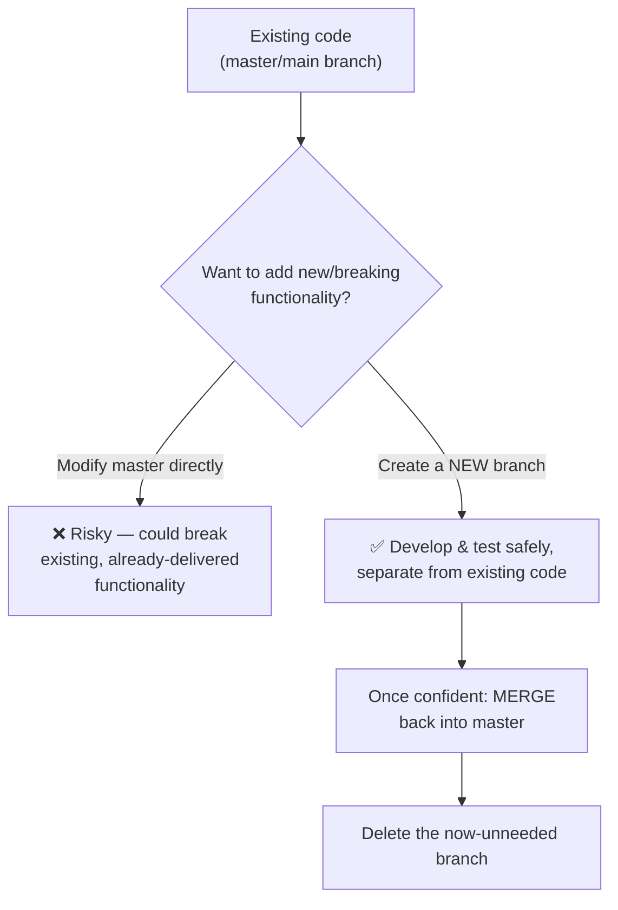

#### 🎯 Key Takeaways

* A **branch** is precisely a **separation** from existing code — a genuinely simple definition, deliberately explained since the instructor notes some viewers may not already know it.
* Branches are explicitly temporary by nature — created for a purpose, developed and tested, merged back once confident, and then typically **deleted**.
* The core motivation for creating a branch rather than editing existing code directly: protecting already-delivered, in-use functionality from new or breaking changes until they're genuinely ready.

---

### 3. The Calculator & Uber Examples: Why Branches Protect Existing Functionality

#### 🧠 Concept — The Uber Cabs-to-Bikes Example

> 💡 **Memory Trick, the full worked scenario given directly:** *"Say Uber was originally only a cab application — customers were already using the cab functionality successfully. One day, to gain more traction, Uber decides to introduce bikes. The developers weren't confident that introducing bike functionality wouldn't somehow affect the existing, already-delivered cab application. So what they typically do: create a new branch for bikes. Five or six developers work on it, continue testing, and only once they're confident, they merge these changes into the existing application. The new Uber (cabs + bikes) is delivered to customers, and the branch used to build bikes gets deleted."*

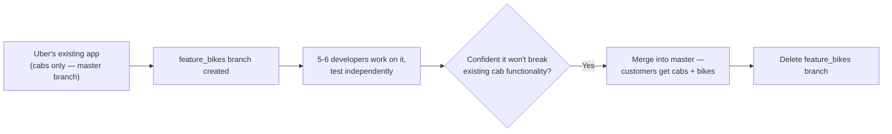

#### ⚠ Common Mistakes

* Assuming a small application (like the calculator example) doesn't genuinely need this discipline — the Uber example is deliberately used to show the exact same underlying principle applies at real, production, customer-facing scale.

#### 🎯 Key Takeaways

* Both worked examples (calculator, Uber) illustrate the **same underlying principle**: isolating new/breaking work in a branch protects already-delivered functionality that real customers currently depend on.
* This directly explains WHY branches exist, not just HOW to create them — a genuine risk-management practice, not an arbitrary Git ritual.

---
### 4. The Master/Main Branch: Always Up to Date

#### 📖 Definition

> ⚠️ **Directly, explicitly flagged as a ready-made interview answer:** *"What is the branch that always is updated and up to date? It's called your master, trunk, or main branch."*

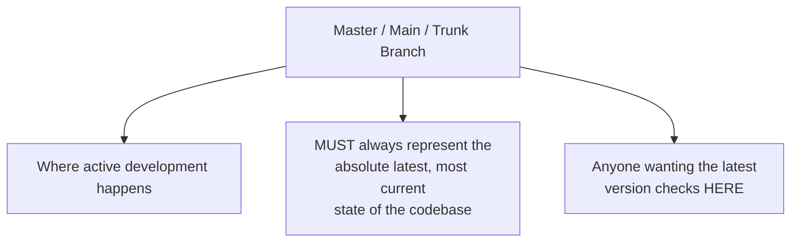

#### 🎯 Key Takeaways

* The **master/main branch** (also called the "trunk") is where active, ongoing development happens, and it must **always** be kept up to date.
* Anyone wanting to reference the latest state of an application checks the master branch specifically — this is precisely why keeping it current is non-negotiable.
* This branch's name (master, main, or trunk) is used interchangeably throughout the session — all three terms refer to the exact same concept.

---

### 5. Feature Branches: Isolating New or Breaking Changes

#### 📖 Definition

> ⚠️ **Directly, explicitly flagged as a ready-made interview answer:** *"What is a feature branch? A feature branch is nothing but: whenever people want to introduce new, breaking changes to your existing functionality, you create feature branches."*

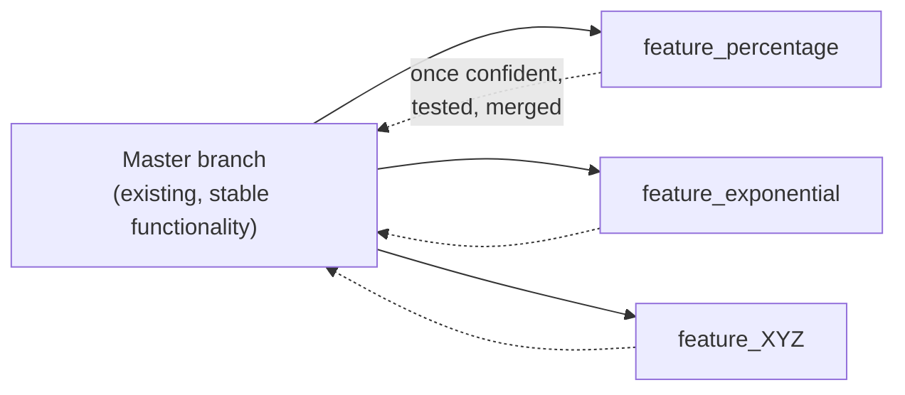

> 💡 **Memory Trick, the multi-team reality given directly:** *"There will be multiple people in your organization, multiple requests for new work — for that reason, you might create a whole NUMBER of feature branches simultaneously. These will eventually all be merged back into your master branch, each once its own team is confident and testing is complete."*

#### ⚠ Common Mistakes

* Assuming only one feature branch exists at a time in a real organization — explicitly, directly clarified: many feature branches typically exist in parallel, each addressing a different new feature or team's work.

#### 🎯 Key Takeaways

* A **feature branch** exists specifically to isolate new or breaking functionality being actively developed, away from the stable, already-delivered master branch.
* Multiple feature branches typically exist **simultaneously** in any real organization, each eventually merging back into master once its own testing is complete.
* Feature branches are explicitly temporary — deleted once merged, exactly like the branch concept described generally in Section 2.

---

### 6. Release Branches: Why You Don't Ship From Master

#### 📖 Definition

> ⚠️ **Directly, explicitly flagged as a ready-made interview answer:** *"From which branch do you usually perform releases? Of course, the name itself tells you — it's a release branch."*

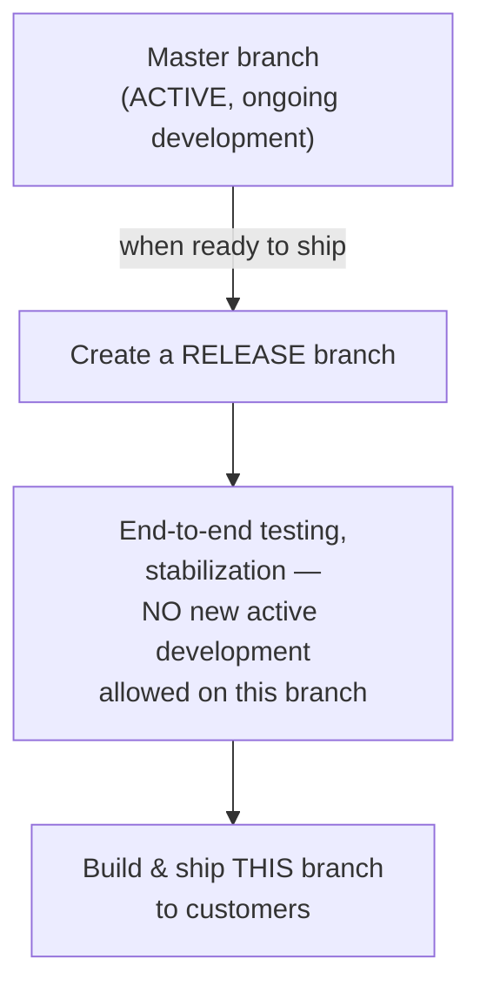

#### ❓ Why It Exists — The Precise Reasoning for NOT Shipping From Master

> ⚠️ **The core, directly-stated reasoning:** *"Why build from a release branch and not from master? Because master is usually kept for ACTIVE development — people are actively working on it. While you're running end-to-end testing on your release branch, you don't want somebody actively pushing new changes into it. You want to 'cut' at this specific point and say: these are the changes that are fine, and I want to deliver exactly these to the customer — no more, no less."*

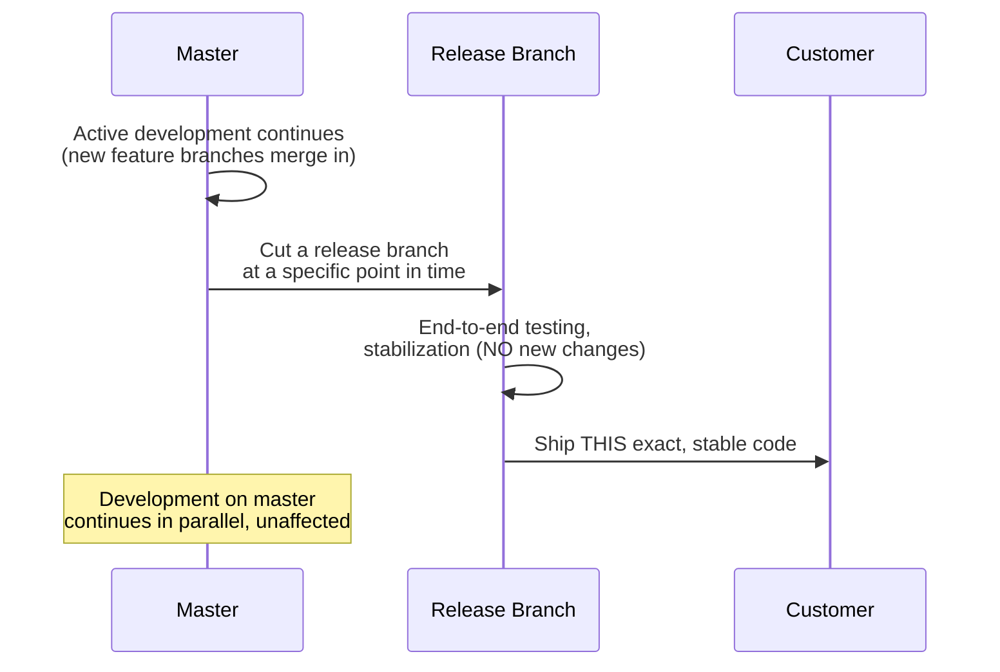

#### ⚠ Common Mistakes

* Assuming releases are built directly from master — explicitly, directly corrected: master is reserved for ongoing active development, which is precisely why it's unsuitable as a stable shipping point.

#### 🎯 Key Takeaways

* A **release branch** is created specifically when a team is ready to ship — providing a stable, "frozen" point for end-to-end testing, free from the ongoing churn of active master development.
* This is precisely WHY organizations don't ship directly from master: master's very purpose (continuous active development) is fundamentally incompatible with the stability a release requires.
* The **actual customer release** is built and shipped from the release branch, not master — a direct, important distinction.

---
### 7. Hotfix Branches: The Two-Branch Merge Rule

#### 📖 Definition

> 💡 **Memory Trick, given directly:** *"Sometimes you also have hotfix branches — say a customer is hitting a very critical issue in production, and you need to fix and deliver that code immediately. In such cases, you create a hotfix branch. These changes can be very quick — the branch might live for just one or two days. You make your changes, ensure it's working, test it, and deliver the fix."*

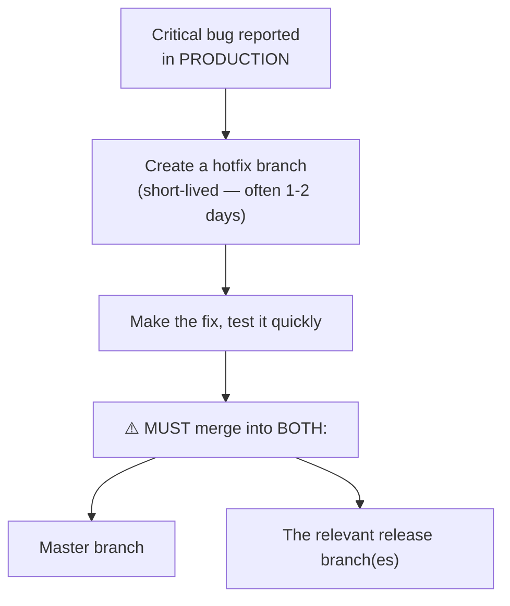

#### ❓ Why It Exists — The Critical, Explicitly-Flagged Merge Rule

> ⚠️ **A precise, directly-emphasized rule, called out as a "tricky" but important detail:** *"One tricky thing: whenever you're making changes on a hotfix branch, it should go into BOTH your master branch AND your release branch(es). Why? Because at the end of the day, the code is SHIPPED from release branches — but master is something that always has to be kept up to date. So any hotfix changes — or feature branch changes, or even release branch changes in some cases — should always be cascaded back to master."*

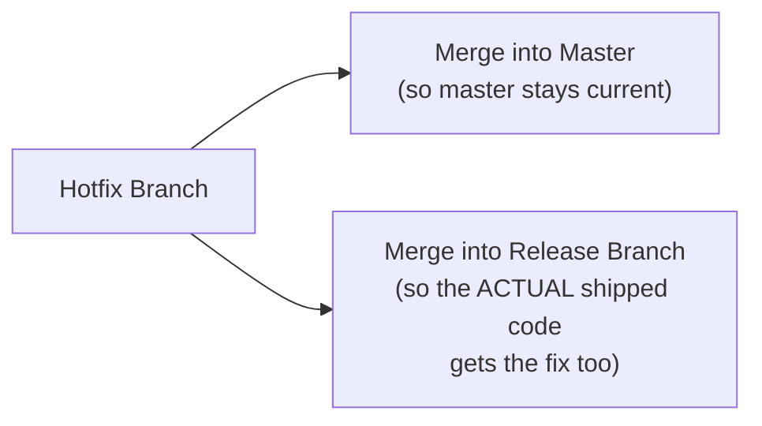

#### ⚠ Common Mistakes

* Merging a hotfix into only the release branch (to get the immediate fix shipped) while forgetting master — explicitly, directly flagged as a mistake, since this would leave master out of date, violating its core "always current" requirement.
* Merging a hotfix into only master while forgetting the actual release branch customers are running — this would mean the customer-facing, shipped code never actually receives the fix at all.

#### 🎯 Key Takeaways

* A **hotfix branch** addresses urgent, critical production issues — deliberately short-lived, often just a day or two.
* The critical, explicitly-flagged rule: hotfix changes must be merged into **BOTH** master AND the relevant release branch(es) — missing either merge creates a genuine, real problem (an out-of-date master, or a still-broken customer release).
* This rule directly reinforces the broader principle (detailed next, in Section 8) that master must always remain the single, authoritative, up-to-date reference point.

---

### 8. The Golden Rule: Everything Cascades Back to Master

#### 📖 Definition

> 💡 **Memory Trick, the overarching principle stated directly and repeatedly for emphasis:** *"Any branch changes — whether a feature branch, a hotfix branch, or even a release branch in some cases — should always be cascaded back to master. Master is something that should ALWAYS be kept up to date. For somebody to reference the latest version of your application, they will only go to master and check if it has the latest code changes or not."*

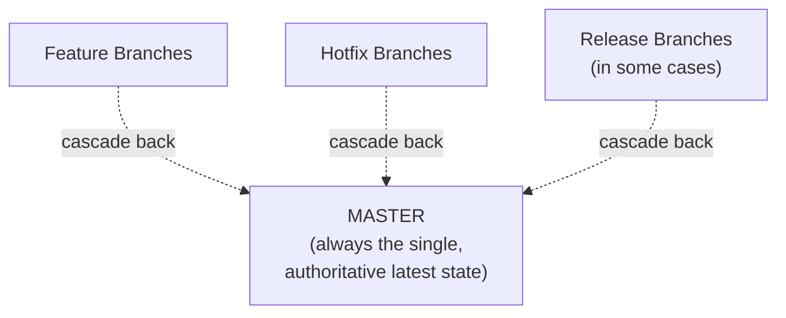

#### 🎯 Key Takeaways

* This is the session's **overarching, unifying principle**: regardless of which specific branch type originated a change, that change must ultimately flow back into master.
* Master's role as the single, authoritative "latest version" reference point is precisely why this cascading rule matters — without it, master would drift out of sync with reality, undermining its entire purpose.
* This principle directly ties together all three of the session's other branch types (feature, release, hotfix) into one coherent, unified model, rather than treating them as separate, unrelated concepts.

---
### 9. Real-World Proof: Branching Strategy on Kubernetes' GitHub Repository

#### 💻 Live Demonstration — The Real, Public Repository

> 💡 **Memory Trick, given directly, live, on the real repository:** *"Let's see what Kubernetes is doing — go to `github.com/kubernetes/kubernetes`, the official repository. It has a master branch where people actively work. After that, you see a bunch of real branches: `feature-rate-limiting`, `feature-server-side-apply`, `feature-workload-ga`. These are exactly the same concept as our calculator example's `feature-percentage` or `feature-exponential` — just real, genuine feature names from an actual, massive open-source project."*

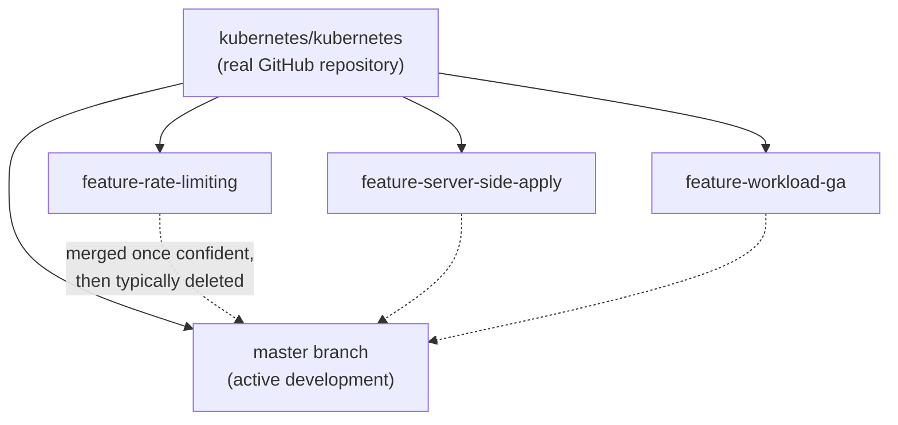

> 💡 **Memory Trick, connecting real contributor scale to the feature-branch model, given directly:** *"10 developers might be working on one feature branch, 20 on another — whenever they're confident their changes are good, they merge back into master, and can then delete those branches."*

#### 💻 Live Demonstration — Real Release Branches

> 💡 **Memory Trick, given directly:** *"When Kubernetes wants to do a new release — say, in April — they create a new branch called `release-1.27`. Right now it's `release-1.26`. From that point, active development continues on master, while the release branch is where end-to-end testing and stabilization happen — and `release-1.27` specifically is what will actually ship to customers/users."*

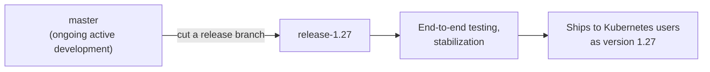

#### ⚠ Common Mistakes

* Assuming this branching model is purely a hypothetical teaching device — explicitly, directly disproven by this live demonstration on a genuine, massive, real-world open-source project.

#### 🎯 Key Takeaways

* Kubernetes's real, public GitHub repository directly demonstrates this exact same branching model — **feature branches** (`feature-rate-limiting`, `feature-server-side-apply`, `feature-workload-ga`) and **release branches** (`release-1.26`, soon `release-1.27`) — genuinely, not just as a teaching analogy.
* This proves the calculator/Uber examples aren't merely simplified teaching devices — they accurately model how a genuinely massive (~3,300 contributor) real-world project actually operates.
* The instructor explicitly encourages exploring OTHER real open-source repositories (Docker, Istio, Jenkins) to observe this same, widely-adopted pattern independently.

---

### 10. The Extended Uber Timeline: Seeing the Full Cycle Repeat

#### 🪜 Step-by-Step — The Complete, Multi-Cycle Timeline

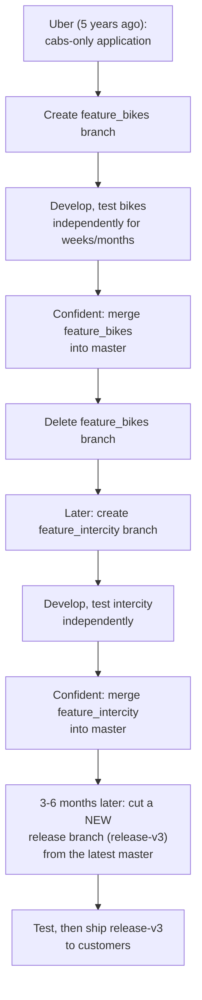

> 💡 **Memory Trick, the full narrated timeline given directly:** *"Uber decides to add bikes — creates `feature_bikes`, works on it for 10-15 days or a month or two, while cabs keeps actively improving on master in parallel. Once confident, merges bikes back, deletes the branch. Later, the product manager wants Intercity too — same process: create `feature_intercity`, develop, merge back once confident. After three or six months, once everything is stable, Uber creates a NEW branch from the latest master — `release-v3` — runs testing, and ships this exact version to customers."*

#### 🎯 Key Takeaways

* This extended timeline demonstrates the branching model as a genuinely **repeating, ongoing cycle** — not a one-time process — directly mirroring how a real, maturing product actually evolves over months and years.
* Multiple feature cycles (bikes, then later intercity) can complete and merge into master well before any release branch is actually cut — release branches are created deliberately, at a chosen point in time, not automatically after every single feature merge.
* This directly reinforces Section 6's core reasoning: master keeps evolving continuously via merged feature work, while release branches represent deliberate, stable snapshots taken only when the team is ready to ship.

---
## 📝 Glossary

| Term | Definition | Why It Matters |
|---|---|---|
| **Branch** | A separation from existing code, used to isolate new work | The foundational concept underlying this entire session |
| **Master / Main / Trunk** | The branch that must always represent the latest, most current state of the codebase | Where active development happens; anyone wanting the latest code checks here |
| **Feature Branch** | A branch isolating new or breaking changes to existing functionality | Created for any significant new feature; merged back into master once confident |
| **Release Branch** | A stable branch cut from master specifically for final testing and shipping | Customer releases are built from THIS branch, not master |
| **Hotfix Branch** | A short-lived branch addressing urgent, critical production issues | Must be merged into BOTH master and the relevant release branch(es) |
| **Cascading back to master** | The overarching rule that all branch changes eventually flow back into master | Keeps master genuinely, always up to date |
| **`kubernetes/kubernetes`** | The real, public GitHub repository used as this session's live proof | Demonstrates this branching model at genuine, massive real-world scale |

---

## 🔄 Revision Notes — One-Minute Revision

* Branching strategy exists to serve a genuine **business goal**: reliable, frequent customer releases -- and it's explicitly flagged as one of the most commonly asked DevOps interview topics.
* A **branch** is simply a **separation** from existing code -- created to isolate new/breaking work (calculator v2, Uber bikes) so it doesn't risk already-delivered, in-use functionality.
* Four branch types make up this session's complete model:
  - **Master/main/trunk**: always kept up to date; where active development happens.
  - **Feature branches**: isolate new/breaking work; many can exist in parallel; merged back into master once confident, then deleted.
  - **Release branches**: cut from master when ready to ship; provide a stable, testing-only snapshot free from ongoing master churn -- **customer releases are built from here, not master.**
  - **Hotfix branches**: short-lived, urgent production fixes -- must be merged into **BOTH** master AND the relevant release branch(es), a specifically flagged, critical rule.
* The **overarching golden rule**: every branch's changes eventually cascade back into master, since master must always represent the single, authoritative latest state.
* This model was **live-demonstrated on the real `kubernetes/kubernetes` GitHub repository** -- genuine feature branches (`feature-rate-limiting`, `feature-server-side-apply`, `feature-workload-ga`) and genuine release branches (`release-1.26`, soon `release-1.27`), proving this isn't just a hypothetical teaching model.
* An **extended, multi-cycle Uber example** (cabs → bikes → intercity → `release-v3`) showed the model as a genuinely repeating, ongoing cycle -- not a one-time process.
* The instructor explicitly encourages exploring other real repositories (Docker, Istio, Jenkins) to see this same, widely-adopted pattern independently.

---

## 📋 Cheat Sheet

**The four branch types:**
```text
Master/Main/Trunk -> ALWAYS up to date; active development happens here
Feature Branch      -> isolates new/breaking work; merged back once confident, then deleted
Release Branch        -> stable snapshot for testing; CUSTOMER RELEASES SHIP FROM HERE
Hotfix Branch           -> urgent, short-lived production fixes
```

**The critical hotfix rule:**
```text
Hotfix changes MUST merge into BOTH:
  1. Master  (so master stays current)
  2. Release Branch(es)  (so the ACTUAL shipped code gets the fix)
```

**The golden rule:**
```text
ALL branch changes (feature, hotfix, sometimes release) eventually cascade back to MASTER.
Master = the single, authoritative "latest version" reference point.
```

**Real Kubernetes examples (as of this recording):**
```text
Feature branches: feature-rate-limiting, feature-server-side-apply, feature-workload-ga
Release branches: release-1.26 (current), release-1.27 (upcoming)
```

---

## 🔥 Interview Questions & Answers

### 🟢 Beginner

**Q1.**

**Question:** What is a branch, in one sentence?

**Answer:** A separation from existing code, used to isolate new work.

**Explanation:** The session's own simple, direct definition.

**Why Interviewers Ask This:** A genuinely basic but foundational term.

**Possible Follow-up:** "Why create a separate branch instead of editing existing code directly?"

**Q2.**

**Question:** Which branch must always be kept up to date?

**Answer:** The master (or main/trunk) branch.

**Explanation:** Directly, explicitly flagged as a ready-made interview answer.

**Why Interviewers Ask This:** A core, frequently-tested branching concept.

**Possible Follow-up:** "Why must this specific branch always stay current?"

**Q3.**

**Question:** What is a feature branch?

**Answer:** A branch created whenever people want to introduce new, breaking changes to existing functionality.

**Explanation:** Directly, explicitly flagged as a ready-made interview answer.

**Why Interviewers Ask This:** One of the most common branching-strategy interview questions.

**Possible Follow-up:** "What happens to a feature branch once its work is merged?"

**Q4.**

**Question:** From which branch are customer releases typically built?

**Answer:** The release branch.

**Explanation:** Directly, explicitly flagged as a ready-made interview answer ("the name itself tells you").

**Why Interviewers Ask This:** A core, frequently-tested branching-strategy question.

**Possible Follow-up:** "Why not build releases directly from master?"

**Q5.**

**Question:** Why isn't master used directly for shipping customer releases?

**Answer:** Master is reserved for active, ongoing development -- releases need a stable, "frozen" point for testing, which active development would undermine.

**Explanation:** Directly, precisely explained.

**Why Interviewers Ask This:** Tests understanding of WHY, not just recall of the rule.

**Possible Follow-up:** "What specifically could go wrong if you tested and shipped directly from master?"

**Q6.**

**Question:** What is a hotfix branch?

**Answer:** A short-lived branch addressing urgent, critical production issues.

**Explanation:** Directly, precisely defined.

**Why Interviewers Ask This:** A commonly-tested fourth branch type.

**Possible Follow-up:** "How long does a hotfix branch typically live?"

**Q7.**

**Question:** Where must a hotfix branch's changes be merged?

**Answer:** Both the master branch AND the relevant release branch(es).

**Explanation:** Directly, explicitly flagged as a "tricky" but critical rule.

**Why Interviewers Ask This:** Tests genuine attention to this specifically emphasized detail.

**Possible Follow-up:** "What would go wrong if you only merged a hotfix into the release branch?"

**Q8.**

**Question:** What is the "golden rule" this session establishes about branch changes and master?

**Answer:** All branch changes (feature, hotfix, and sometimes release) should eventually cascade back into master, which must always represent the latest, current state.

**Explanation:** Directly, repeatedly stated as the session's overarching principle.

**Why Interviewers Ask This:** Tests understanding of the unifying logic behind all four branch types.

**Possible Follow-up:** "Why does master specifically need to be the single, authoritative reference point?"

**Q9.**

**Question:** Why did this session choose Kubernetes as its real-world example?

**Answer:** Kubernetes has close to 3,300 contributors -- far more than most individual organizations' repositories -- making it a genuinely proven, real-world demonstration of this branching strategy at scale.

**Explanation:** Directly, explicitly stated as the reasoning.

**Why Interviewers Ask This:** Tests whether a learner grasps why this specific example was chosen, not just that it was.

**Possible Follow-up:** "Name a real feature branch and a real release branch seen on Kubernetes's actual GitHub repository."

**Q10.**

**Question:** Besides Kubernetes, what other real open-source projects does the instructor suggest exploring to see this same branching pattern?

**Answer:** Docker, Istio, and Jenkins.

**Explanation:** Directly, explicitly named as suggested further practice.

**Why Interviewers Ask This:** Tests awareness of the session's suggested follow-up practice.

**Possible Follow-up:** "What would you specifically look for on one of these repositories to confirm they follow this same pattern?"

---

### 🟡 Intermediate

**Q11.**

**Question:** Explain why the instructor uses BOTH a calculator example AND an Uber example, rather than relying on just one.

**Answer:** The calculator example is deliberately simple and abstract, making the core mechanics (branch creation, isolated development, merging) easy to follow without real-world complexity. The Uber example then grounds the exact same mechanics in a genuinely relatable, real-world, customer-facing scenario (cabs vs. bikes) -- showing the STAKES involved (real, paying customers depending on existing functionality) in a way the calculator example, being purely illustrative, cannot fully convey. Using both together lets learners first grasp the mechanical "how" simply, then understand the genuine business "why" through a scenario with real consequences.

**Explanation:** Requires recognizing the deliberate pedagogical progression from simple/mechanical to real/consequential.

**Why Interviewers Ask This:** Tests whether a learner recognizes intentional teaching structure, not just recalls both examples independently.

**Possible Follow-up:** "What genuine business risk does the Uber example illustrate that the calculator example does not?"

**Q12.**

**Question:** A learner argues that since feature branches and hotfix branches both eventually merge into master, there's no real reason to have two separate branch types -- you could just always call everything a "feature branch." Evaluate this claim.

**Answer:** This claim isn't well-supported by the session's content. While both DO cascade back to master (per Section 8's golden rule), they differ in genuinely important ways the session explicitly distinguishes: feature branches address NEW, typically non-urgent functionality, can live for extended periods (weeks or months), and are developed at a normal pace with thorough testing. Hotfix branches specifically address URGENT, CRITICAL production issues, are deliberately short-lived (often just a day or two), and -- critically -- must ALSO be merged into the relevant release branch(es), a requirement the session does not describe for ordinary feature branches (which are typically still under development when release branches are cut, and thus wouldn't yet be part of a shipped release needing a same-branch fix). Collapsing these into one undifferentiated category would obscure both the urgency distinction and this specific, critical dual-merge requirement.

**Explanation:** Requires precisely distinguishing feature and hotfix branches beyond their shared "eventually merges to master" property.

**Why Interviewers Ask This:** Tests whether a learner understands the genuine, functional differences between branch types, not just their shared endpoint.

**Possible Follow-up:** "Under what circumstance might a feature branch ALSO need to be merged into a release branch, similar to a hotfix?"

**Q13.**

**Question:** Explain, precisely, why the session describes release branches as needing to be free from "active development" -- what specifically could go wrong if new changes kept landing on a release branch during its testing phase?

**Answer:** The entire purpose of a release branch's testing phase is validating a SPECIFIC, fixed set of changes before they reach customers -- if new changes kept landing during that testing window, the team would never have a stable, unchanging target to actually validate: any bug found (or not found) during testing might be invalidated or newly introduced by a change that arrived mid-test, making it genuinely impossible to say with confidence "this exact set of changes has been thoroughly tested and is safe to ship." The release branch's stability isn't a bureaucratic formality -- it's what makes the entire testing process meaningful and trustworthy at all.

**Explanation:** Requires reasoning through the specific mechanism by which ongoing changes would undermine testing validity, not just repeating "release branches need to be stable."

**Why Interviewers Ask This:** Tests deeper understanding of WHY release-branch stability matters mechanically, not just that it's a stated rule.

**Possible Follow-up:** "If an urgent hotfix genuinely needs to reach a release branch during its testing window, does this violate the 'no active development' principle? Why or why not?"

**Q14.**

**Question:** Using the extended Uber timeline (Section 10), explain why release branches are created at deliberately CHOSEN points in time, rather than automatically after every single feature branch merge.

**Answer:** The extended timeline shows multiple feature cycles (bikes, then later intercity) completing and merging into master well BEFORE any release branch is cut -- release branches represent a deliberate business/product decision ("we are pretty cool, let's deliver a new code to the customer") about WHEN enough validated, stable functionality has accumulated to justify a genuine release, not a mechanical, automatic reaction to every individual merge. Creating a release branch after every single feature merge would fragment releases into an impractically high frequency, undermining the value of batching genuinely meaningful, tested improvements into a coherent release customers can rely on -- the deliberate timing reflects real product/business judgment, not a rigid, automated Git workflow rule.

**Explanation:** Requires synthesizing the multi-cycle timeline's implicit lesson about release timing being a deliberate choice, not an automatic consequence of individual merges.

**Why Interviewers Ask This:** Tests whether a learner distinguishes mechanical Git operations from the genuine business/product judgment that actually drives when releases happen.

**Possible Follow-up:** "What business factors might influence exactly WHEN an organization decides to cut a new release branch?"

**Q15.**

**Question:** Synthesize this session's "golden rule" (Section 8) with its live Kubernetes demonstration (Section 9) to explain what you would expect to observe on Kubernetes's real repository if this rule is genuinely being followed in practice.

**Answer:** If the golden rule is genuinely being followed, you would expect to observe: (1) feature branches like `feature-rate-limiting` eventually disappearing from the active branch list once their work is confirmed merged into master (since branches are typically deleted post-merge, per Section 2's general branch lifecycle); (2) master's commit history showing incorporated changes originally developed on these feature branches; (3) any critical hotfixes applied to a currently-shipped release branch (like `release-1.26`) ALSO appearing in master's history, not just the release branch's, per Section 7's dual-merge rule. This gives a concrete, checkable prediction: a learner could actually verify the golden rule's real-world application by examining Kubernetes's actual commit/branch history for this exact pattern, rather than simply trusting the rule was stated correctly.

**Explanation:** Requires generating a genuine, falsifiable prediction from the stated rule, applied to the specific real-world example already introduced -- real synthesis, not just restating both facts separately.

**Why Interviewers Ask This:** Tests whether a learner can apply a stated principle to generate concrete, verifiable expectations about real-world behavior.

**Possible Follow-up:** "How would you actually go about verifying this prediction on GitHub's actual interface?"

---

### 🔴 Advanced

**Q16.**

**Question:** Design a branching-strategy decision framework for a hypothetical startup deciding whether they need release branches at all, given they currently ship continuously (multiple times per day) directly from master, using only this session's stated reasoning.

**Answer:** Applying this session's own stated reasoning about WHY release branches exist (a stable, uninterrupted testing point, distinct from active-development master): (1) **Testing rigor needed** -- does the team's current continuous-deployment process include sufficiently rigorous, automated testing that effectively substitutes for the STABILITY a release branch would otherwise provide (i.e., is master's HEAD always genuinely release-ready, at all times, due to strong automated gates)? If yes, a release branch may be genuinely unnecessary overhead for this specific team's actual workflow. (2) **Rollback/patch needs** -- if a specific past release ever needs a targeted hotfix WITHOUT including whatever has since landed on master (a common enterprise need this session's hotfix-branch discussion implies), a pure continuous-deployment-from-master model has no natural mechanism for that -- suggesting release branches (or an equivalent, like tagged releases) may still be valuable even in a fast-shipping context. (3) **Customer commitment model** -- does this startup support MULTIPLE concurrent versions in the field (as Kubernetes's `release-1.26`/`release-1.27` coexistence implies is common for larger, more established projects), or does everyone always run the absolute latest deployed version? If the latter, the stability/isolation release branches provide may matter less, since there's no need to maintain and patch older, still-in-use versions in parallel. This framework directly extends the session's own stated release-branch rationale into genuine trade-off analysis for a different, faster-shipping context the session doesn't directly address.

**Explanation:** Synthesizes the session's stated release-branch rationale into a genuine decision framework for a scenario (continuous deployment) the session doesn't directly cover -- real, applied extension.

**Why Interviewers Ask This:** A realistic, senior-level branching-strategy question testing whether a candidate can reason about when a taught pattern does or doesn't apply, rather than treating it as a universal rule.

**Possible Follow-up:** "If this startup DOES decide release branches are unnecessary, what alternative mechanism might address the 'targeted hotfix on an old version' need you identified?"

**Q17.**

**Question:** Critically evaluate: "Since the golden rule states all branch changes must cascade back to master, a release branch's stabilization/bug-fix commits made DURING its testing phase should also always be merged back into master immediately." Is this an accurate, complete implication of this session's content?

**Answer:** Partially accurate, but requiring an important nuance the session itself gestures at but doesn't fully spell out. The session does state release branch changes should "in some cases" cascade back to master (Section 8's own careful, qualified phrasing -- "sometimes" is explicitly included, not an unconditional "always"). The nuance: a bug found and fixed SPECIFICALLY during release-branch stabilization testing likely represents a genuine defect that should indeed also exist in (and be fixed in) master, since master presumably contains that same code path -- making the cascade-back genuinely appropriate in the TYPICAL case. However, if a release branch's stabilization work included something release-SPECIFIC (e.g., a version-pinned dependency compatibility fix relevant only to that exact release's context, not to master's potentially-already-different, further-evolved state), blindly cascading that specific commit back to master could be inappropriate or even harmful. The session's own qualified "in some cases" phrasing suggests this exact nuance, without spelling out the underlying reasoning in as much depth as this analysis provides.

**Explanation:** Tests whether a learner catches the session's own quietly qualified language ("in some cases") and can articulate WHY that qualification matters, rather than treating the golden rule as an unconditional, universal requirement.

**Why Interviewers Ask This:** A genuinely subtle question testing close reading and critical reasoning about a rule's real, bounded scope, rather than an oversimplified, universal application.

**Possible Follow-up:** "Give a concrete example of a release-branch-specific fix that would NOT make sense to cascade back to master."

**Q18.**

**Question:** Synthesize this session's Uber worked example (Section 3/10) with Day 9's "sharing vs. versioning" framing (the two core problems version control solves) to explain which of those two original problems branching strategy PRIMARILY addresses, and why the other problem still requires the rest of Git's/GitHub's toolset.

**Answer:** Branching strategy primarily addresses the **versioning** problem (Day 9's second core problem) -- specifically, the more advanced, organizational-scale version of it: not just "can I retrieve an old version of a single file," but "can multiple, PARALLEL streams of ongoing work (features, hotfixes, stable releases) all coexist, evolve independently, and be selectively combined or isolated as needed." Branching is fundamentally a versioning-management mechanism at a MUCH richer level than a simple linear commit history alone would provide. The **sharing** problem (Day 9's first core problem) is NOT what branching strategy itself directly solves -- that remains the job of the underlying distributed architecture and hosting platform (Git's distributed clones, GitHub's collaboration features, pull requests, and access control) covered in Day 9. Branching strategy assumes sharing is already solved (multiple developers already have access to push/pull from a shared, hosted repository) and focuses entirely on ORGANIZING and MANAGING the resulting complexity of many people's parallel, ongoing work -- a distinct, additional layer of sophistication built on top of, not a replacement for, Day 9's sharing solution.

**Explanation:** Requires connecting this session's entire subject matter back to the foundational two-problems framework established in the immediately preceding session -- genuine, non-obvious cross-session synthesis.

**Why Interviewers Ask This:** A capstone-level question testing whether a candidate retains and can precisely place new material (branching strategy) within an already-established conceptual framework from a prior session, rather than treating each session as an isolated topic.

**Possible Follow-up:** "Could an organization have a genuinely excellent branching strategy while still having a poor 'sharing' solution (e.g., a single, unreliable self-hosted Git server)? What would that look like in practice?"

---

## 🧪 Scenario-Based Interview Questions

> **Scenario 1:** A teammate merges an urgent hotfix directly into your project's `release-2.4` branch (the currently-shipped version) to resolve a critical customer issue, but forgets to merge it into master. Two weeks later, a new feature branch cut from master reintroduces the same bug. Using this session's concepts, diagnose and resolve this.

**Structured Answer:**
1. **Initial investigation:** Recognize this as a direct, textbook violation of Section 7's explicitly-flagged "tricky" dual-merge rule -- the hotfix was merged into the release branch (fixing the immediate customer issue) but never cascaded back to master, exactly the mistake this session explicitly warns against.
2. **Metrics/logs to check:** Compare master's commit history against `release-2.4`'s commit history around the hotfix's timestamp, confirming the hotfix commit genuinely exists on one branch but not the other.
3. **Possible causes:** Time pressure during an urgent incident likely led to the immediate priority (fixing the customer-facing release) being completed while the equally-important-but-less-urgent-feeling master merge was overlooked or forgotten.
4. **Debugging approach:** Once confirmed, identify the exact hotfix commit and cherry-pick or merge it specifically into master now, even though time has passed since the original incident.
5. **Resolution:** Apply the missing merge to master, then verify the newer feature branch (which reintroduced the bug, since it was cut from an already-stale master) either gets rebased onto the now-corrected master, or receives the fix directly before it merges back.
6. **Prevention:** Establish a team checklist or automated CI check specifically verifying, for every hotfix merge, that BOTH required merge targets (master and the relevant release branch) were actually completed -- directly operationalizing this session's explicitly-flagged rule into an enforceable team process, rather than relying purely on individual memory during high-pressure incidents.

> **Scenario 2 (Advanced):** Your organization currently has SEVEN active feature branches, all cut from master roughly around the same time, several months ago. None have merged back yet, and master has continued evolving significantly with other merged work in the meantime. Using this session's concepts, evaluate the risk this presents and propose a mitigation.

**Structured Answer:**
1. **Initial investigation:** Recognize that while this session's model doesn't explicitly forbid long-lived feature branches, it does implicitly assume relatively prompt merging ("once you are confident... you'll merge these changes back") -- seven branches, months old, unmerged, represents a genuine deviation from the session's implied cadence.
2. **Relevant principle:** Per Section 5's feature-branch model, feature branches are meant to isolate NEW work temporarily until confident and tested -- but the LONGER a feature branch diverges from an actively-evolving master (Section 4's "master is always up to date" principle) without merging, the greater the risk of significant, hard-to-resolve conflicts accumulating.
3. **Possible causes for this situation:** Likely a combination of large, complex features genuinely taking a long time to complete, and/or a lack of process encouraging more frequent, incremental merges or master-to-feature-branch synchronization during long-running development.
4. **Debugging/evaluation approach:** Assess how significantly each of the seven branches has diverged from master's current state, identifying which are at greatest risk of complex merge conflicts.
5. **Resolution:** Recommend regularly, periodically merging (or rebasing) master's ongoing changes INTO each long-lived feature branch throughout its development (not just merging the feature branch INTO master once, at the very end) -- keeping divergence manageable throughout the branch's life rather than allowing it to compound over months, directly mitigating the risk without violating this session's core feature-branch model.
6. **Prevention:** Establish a team norm/policy limiting how long a feature branch may remain unmerged without at minimum a periodic sync from master, directly preventing this same seven-branches-months-old scenario from recurring, while still preserving this session's core rationale for feature branches existing at all.

---

## 🛠 Hands-on Exercises

### 🟢 Easy

1. Write out, from memory, the four branch types covered in this session and one sentence describing each, then check your answers against Section 4-7.
2. Browse `github.com/kubernetes/kubernetes`'s real branch list yourself, and identify at least two current feature branches and the current release branch, documenting their exact names.
3. Draw (or describe in writing) the complete Uber cabs-to-bikes branching timeline from Section 3, from branch creation through merge and deletion.

### 🟡 Medium

4. Create a small local Git repository (per Day 9's `git init` process), and practice this session's full branching model yourself: create a feature branch, make changes, merge it back into master, then create a release branch from master and confirm its contents.
5. Write a short explanation (150-200 words), in your own words, of precisely why the hotfix dual-merge rule (Section 7) exists, without directly copying this session's phrasing.
6. Research (outside this transcript) one additional real open-source repository (Docker, Istio, or Jenkins, as suggested by the instructor) and document its actual feature/release branch naming pattern, comparing it to Kubernetes's.

### 🔴 Advanced

7. Implement the release-branch decision framework proposed in Advanced Interview Q16, applying it to a hypothetical continuous-deployment startup of your own design.
8. Write a short technical document (300-400 words) addressing the long-lived-feature-branch risk scenario from Scenario 2, including your proposed periodic-sync mitigation.
9. Research (outside this transcript) a genuine, real-world example of a release-branch-specific fix that should NOT be cascaded back to master, directly addressing Advanced Interview Q17's nuance.

---

## 🏗 Practice Assignment

### Build: "Complete Branching Strategy Simulation"

**Objective:** Fully simulate this session's four-branch-type model end to end, on a local Git repository of your own, directly modeling the calculator or Uber examples but with a project of your own choosing.

**Requirements:**
- A local Git repository (per Day 9's setup) representing your "master/main" branch, with at least two initial commits establishing baseline functionality.
- At least two feature branches, developed with genuine, incremental commits, each eventually merged back into master and then deleted.
- One release branch, cut from master at a deliberately chosen point (after your feature branches have merged), with at least one additional "stabilization" commit made directly on the release branch (e.g., a version number bump or a minor fix).
- One hotfix branch, simulating an urgent fix, correctly merged into BOTH your master branch AND your release branch -- directly demonstrating Section 7's critical dual-merge rule.
- A written summary (200-300 words) walking through your full timeline, explicitly identifying which branch addressed which need and why.

**Architecture (suggested):**

```text
branching_strategy_simulation/
├── .git/                          # your local repository
├── project_file(s)                  # your actual project content
├── BRANCHING_TIMELINE.md              # your written summary of the full exercise
└── COMMIT_HISTORY.md                    # a saved copy of relevant `git log` outputs
```

**Expected Functionality:**
- Your `git log` history (captured in `COMMIT_HISTORY.md`) should clearly show the branching/merging pattern you performed, not just a flat, single-branch history.
- Your hotfix commit should be genuinely verifiable as present on both master and your release branch.

**Challenges:**
- Correctly performing the dual-merge for your hotfix without accidentally merging it into the wrong branch or missing one entirely -- directly testing your understanding of Section 7's specific rule.
- Choosing a genuinely meaningful point to cut your release branch, rather than an arbitrary one -- reflecting Section 10's point about deliberate release timing.

**Bonus Improvements:**
- Push your completed repository to a real GitHub account (per Day 9's process), and use GitHub's own branch-visualization tools to review your history visually.
- Extend the simulation with a second release branch (e.g., `release-v2`), cut after further feature work, to more fully mirror Kubernetes's real, ongoing `release-1.26`/`release-1.27` pattern.

---

## 📚 Additional Resources

- The instructor's **Day 0 through Day 9 videos** (referenced directly) -- required prior viewing for full context, especially Day 9 (Git and GitHub fundamentals).
- The **DevOps Zero to Hero playlist** -- referenced directly, containing all videos in this same free course.
- The **`kubernetes/kubernetes` GitHub repository** -- directly browsed live as this session's core real-world proof.
- **Other suggested real-world repositories** (referenced directly): Docker, Istio, and Jenkins -- for independent further practice observing this same branching pattern.

---

## 📌 Final Revision Sheet

### ⭐ Core Concepts
- A **branch** is a separation from existing code, used to isolate new work.
- Four branch types: **master/main/trunk** (always current), **feature** (isolates new/breaking work), **release** (stable, ship-from-here), **hotfix** (urgent, short-lived, dual-merge required).
- The **golden rule**: all branch changes eventually cascade back to master.
- This model is **genuinely, verifiably used** by real, massive projects like Kubernetes -- not just a hypothetical teaching device.

### ⭐ Important Definitions
- **Feature branch**, **release branch**, **hotfix branch** (each precisely, individually flagged as classic interview answers -- see Glossary for full definitions).

### ⭐ Important Commands/Code
- N/A directly -- this session is conceptual/architectural, building on Day 9's actual Git commands (`git init`, `add`, `commit`, etc.) rather than introducing new command syntax.

### ⭐ Architecture/Process
- Full cycle: master (active dev) → feature branches (isolated new work, merged back) → release branch (cut when ready, stable testing) → ships to customers; hotfixes merge into BOTH master and release.

### ⭐ Best Practices
- Never ship customer releases directly from master.
- Always merge hotfix changes into both master and the relevant release branch(es).
- Delete feature branches once merged.
- Choose release-branch timing deliberately, based on genuine readiness, not a fixed schedule alone.

### ⭐ Common Mistakes
- Assuming releases are built directly from master.
- Merging a hotfix into only the release branch, or only master, rather than both.
- Assuming this branching model is purely theoretical rather than genuinely, widely used in real, massive projects.
- Assuming every branch type behaves identically simply because all eventually reach master.

### ⭐ Interview Points
- Be ready to precisely define all four branch types, unprompted.
- Be ready to explain WHY releases don't ship from master.
- Be ready to explain the hotfix dual-merge rule and why it exists.
- Be ready to cite Kubernetes's real branch names as a concrete, memorable example.

### ⭐ Things to Remember
- This session's core content (four branch types, the golden rule) is presented as a largely complete, self-contained topic -- unlike several prior sessions, it doesn't heavily defer major content to a future class, though further command-level Git practice remains an open, ongoing thread from Day 9.
- The live Kubernetes demonstration is genuine, real-world proof, not a simulation -- worth remembering as a concrete, citable example in interviews.
- Section 8's "golden rule" explicitly includes the qualifier "in some cases" for release-branch changes cascading back to master -- a subtle but genuine nuance worth retaining precisely, not rounding into an unconditional rule.

---

## 🔗 Source

- [Git Branching Strategy — Real World Example](https://youtu.be/MCyvYT8FS5w?si=a1QDahAzdokC9vou)