# 🌿 Git & GitHub Fundamentals: Version Control, the Core Lifecycle & Why Distributed Wins

- <i>**Session:** "Git and GitHub" · 
- **Instructor:** Abhishek
- **Note on scope:** This session introduces version control conceptually (the two core problems it solves), the classic centralized-vs-distributed interview question, precisely distinguishes Git from GitHub, and walks through the essential Git lifecycle commands live (`init`, `add`, `status`, `diff`, `commit`, `log`, `reset --hard`) before creating and sharing a real GitHub repository. A **deeper GitHub-specific dive** (organizations, issues, pull requests, CI/CD, project management, security features) and **additional Git commands/interview questions** are both explicitly deferred to future sessions — reflected honestly here.</i>

---

## 📑 Table of Contents

1. [Session Overview](#-session-overview)
2. [Learning Objectives](#-learning-objectives)
3. [Detailed Notes](#-detailed-notes)
   - [1. Version Control Systems: The Two Problems They Solve](#1-version-control-systems-the-two-problems-they-solve)
   - [2. The Sharing Problem, Illustrated](#2-the-sharing-problem-illustrated)
   - [3. The Versioning Problem, Illustrated](#3-the-versioning-problem-illustrated)
   - [4. Centralized vs. Distributed VCS: A Classic Interview Question](#4-centralized-vs-distributed-vcs-a-classic-interview-question)
   - [5. Understanding Forks: Copies of a Distributed Repository](#5-understanding-forks-copies-of-a-distributed-repository)
   - [6. Git vs. GitHub: Another Classic Interview Question](#6-git-vs-github-another-classic-interview-question)
   - [7. Installing Git & Understanding the .git Folder](#7-installing-git--understanding-the-git-folder)
   - [8. The Core Git Lifecycle: status, add, diff, commit, log, reset](#8-the-core-git-lifecycle-status-add-diff-commit-log-reset)
   - [9. Sharing Code via GitHub: Accounts, Repositories & Forking in Practice](#9-sharing-code-via-github-accounts-repositories--forking-in-practice)
4. [Glossary](#-glossary)
5. [Revision Notes — One-Minute Revision](#-revision-notes--one-minute-revision)
6. [Cheat Sheet](#-cheat-sheet)
7. [Interview Questions & Answers](#-interview-questions--answers)
8. [Scenario-Based Interview Questions](#-scenario-based-interview-questions)
9. [Hands-on Exercises](#-hands-on-exercises)
10. [Practice Assignment](#-practice-assignment)
11. [Additional Resources](#-additional-resources)
12. [Final Revision Sheet](#-final-revision-sheet)

---

## 🎯 Session Overview

This session establishes Git and GitHub from first principles, deliberately starting with WHY version control exists before touching a single command. It covers:

1. **Version control systems**, introduced via the two fundamental problems they solve: **sharing** code among collaborators, and **versioning** (tracking and reverting changes over time) — each illustrated with a concrete, worked "calculator application" example.
2. **Centralized vs. distributed version control**, explicitly flagged as a classic interview question — SVN/CVS (centralized, single point of failure) vs. Git (distributed, no single point of failure) — grounded in the instructor's own real, historical experience working with SVN.
3. **Forks**, introduced as the natural consequence of a distributed system — another explicitly-flagged interview question.
4. **Git vs. GitHub**, a third classic interview question, precisely answered: Git is the open-source, distributed version control system itself; GitHub (like GitLab, Bitbucket) is a hosted, feature-rich wrapper built on top of it.
5. **Live installation of Git**, and a tour of the `.git` hidden folder's actual internal structure (`objects`, `hooks`, `config`, `HEAD`).
6. The **core Git lifecycle**, demonstrated live and incrementally: `git init`, `git status`, `git add`, `git diff`, `git commit`, `git log`, and `git reset --hard` — including a real, live demonstration of reverting to a previous version.
7. **Sharing code via GitHub**: creating an account, creating a repository (public vs. private, README), and locating the actual "Fork" button in GitHub's UI — connecting the conceptual fork discussion back to a real, visible feature.

> 💡 **Memory Trick — the instructor's framing for why this session starts with concepts, not commands:** *"Before we even talk about Git, there's a very important concept everybody needs to understand: version control systems. Once you understand WHY it exists, the commands themselves will make a lot more sense."*

---

## 🎯 Learning Objectives

By the end of this guide, you will be able to:

- [ ] Name and explain the two core problems version control systems solve: sharing and versioning.
- [ ] Explain, using a worked example, why manually sharing code (e.g., via email) fails to scale at real organizational size.
- [ ] Explain, using a worked example, why simply overwriting files without version history creates a genuine business problem when a prior version needs to be restored.
- [ ] Precisely distinguish centralized version control (SVN, CVS) from distributed version control (Git), including the single-point-of-failure risk unique to centralized systems.
- [ ] Define a "fork" and explain why it's a natural consequence of a distributed version control architecture.
- [ ] Precisely distinguish Git from GitHub, and name at least one other tool (GitLab, Bitbucket) that occupies the same role as GitHub.
- [ ] Explain the basic purpose of each major component inside the `.git` folder: objects, hooks, config, and HEAD.
- [ ] Execute, from memory, the full core Git lifecycle: `init`, `status`, `add`, `diff`, `commit`, `log`, and `reset --hard` to revert to a prior commit.
- [ ] Create a GitHub account and a new repository, correctly choosing between public and private visibility and understanding a README file's purpose.

---

## 📚 Detailed Notes

### 1. Version Control Systems: The Two Problems They Solve

#### 📖 Definition

> 💡 **Memory Trick, given directly:** *"The fundamental, core concept underlying Git and GitHub is version control — or a version control system. The primary purpose of any version control system is addressing two major problems: problem number one is sharing code, and problem number two is personnel — versioning."*

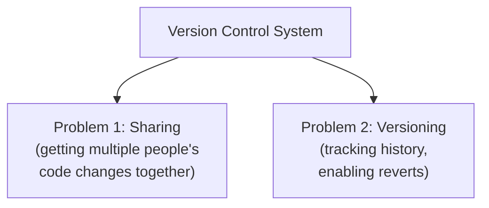

#### 🎯 Key Takeaways

* Version control systems exist to solve exactly **two** fundamental problems: **sharing** code among collaborators, and **versioning** (tracking change history over time).
* This two-problem framing is the conceptual foundation the rest of the entire session builds on — every subsequent concept (centralized vs. distributed, forks, the Git lifecycle) maps back to solving one or both of these problems.

---

### 2. The Sharing Problem, Illustrated

#### 🧠 Concept — The Calculator App Example

> 💡 **Memory Trick, the full worked scenario given directly:** *"Say two developers, Dev1 and Dev2, are building a calculator application together. Dev1 writes the addition functionality; Dev2 writes the subtraction functionality. Eventually, to build the actual calculator, their code has to come together into one common application."*

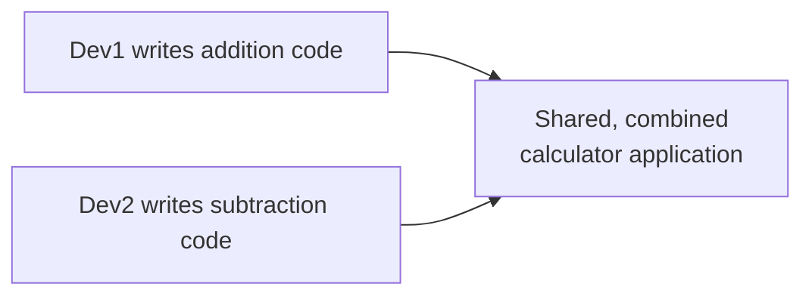

#### ❓ Why It Exists — Why "Just Email It" Doesn't Scale

> ⚠️ **The precise, real-world scaling problem, stated directly:** *"You might think you could just share this code via Gmail or Slack — why do you even need a version control system? The problem is scale: in a real organization like Amazon or Flipkart, you have hundreds of files, hundreds of packages, thousands of files. Say Dev1 changed 25 files and Dev2 changed 32 files — how do you manually share exactly those 25 or 32 files, plus all their dependency files (like JAR files)? It's practically impossible to do manually at that scale."*

#### 🎯 Key Takeaways

* The sharing problem is genuinely about **scale** — manually sharing a handful of files (email/Slack) is trivial; manually sharing dozens or hundreds of interdependent, changing files across a real team is not.
* This directly motivates the need for a systematic, automated way to track exactly which files changed and merge them correctly — precisely what version control systems provide.

---

### 3. The Versioning Problem, Illustrated

#### 🧠 Concept — The Evolving Addition Functionality

> 💡 **Memory Trick, the full worked scenario given directly:** *"Dev1 starts by writing addition of two numbers. Then the product owner asks for addition of three numbers — eventually four numbers. It goes to testing, even to customers. Then the business decides: nobody actually uses three- or four-number addition — it's just overhead. The new requirement: go BACK to addition of two numbers — code you wrote 5 or 10 days ago."*

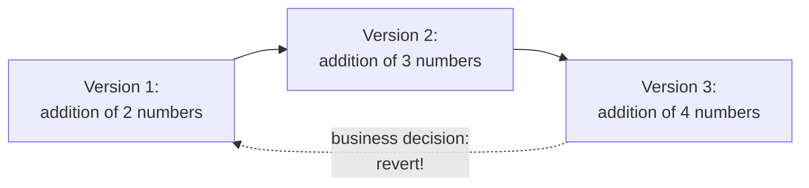

#### ❓ Why It Exists — Why You Need MULTIPLE Retrievable Versions

> 💡 **Memory Trick, the precise reasoning given directly, generalized beyond the toy example:** *"This was a simple example, but in reality, you might modify 100 files on day one, just 5 files on day two, and 50 files again on day three. If somebody asks 'what change did you make three days ago, on those 100 files — I just need THAT, please scrap days two and three's work,' you need very strong versioning in place to answer that request at all."*

#### 🎯 Key Takeaways

* The versioning problem is about **retrievability**: it's not enough to simply track that changes happened — you need the ability to precisely return to any specific prior state, on demand.
* This directly motivates the concept of discrete, identifiable **versions** (which Git calls **commits**) — each one a retrievable snapshot in time.

---
### 4. Centralized vs. Distributed VCS: A Classic Interview Question

#### ❓ Why It Exists

> ⚠️ **Directly, explicitly flagged as a common interview question:** *"Whenever you're talking about version control systems, the first interview question that comes up is: what is the difference between centralized and distributed version control systems? Or sometimes: what's the difference between SVN and Git? SVN isn't used much these days, so the more common phrasing is centralized vs. distributed."*

#### 🧠 Concept — Centralized VCS (SVN, CVS), From Real Experience

> 💡 **Memory Trick, drawn from the instructor's own real, historical work experience:** *"When I started working, we used SVN. Dev1 and Dev2 communicated with each other through a central server — SVN itself. To share my addition functionality with Dev2, the only way was to push it to SVN, and Dev2 would pull those same changes from SVN. That's exactly why it's called CENTRALIZED — everything happens from one central place."*

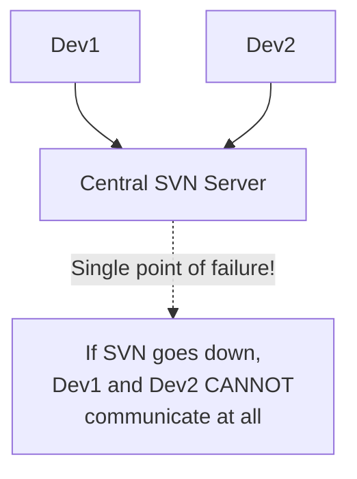

> ⚠️ **A real, lived consequence, stated directly:** *"Trust me, this used to happen. We were system administrators managing these SVN/CVS repositories, running them on a Linux machine — and sometimes those applications and servers would go down. Whenever that happened, there was no way Dev A and Dev B could communicate at all."*

#### 🧠 Concept — Distributed VCS (Git)

> 💡 **Memory Trick, the precise contrast given directly:** *"In a distributed system, Dev1 can share code directly, OR create a full copy of the distributed system and call it 'distributed system two' — creating as many copies as needed. Dev2 can do the same. Instead of one common central place, you now have potentially 100 common places, and developers communicate with each other using their own copies."*

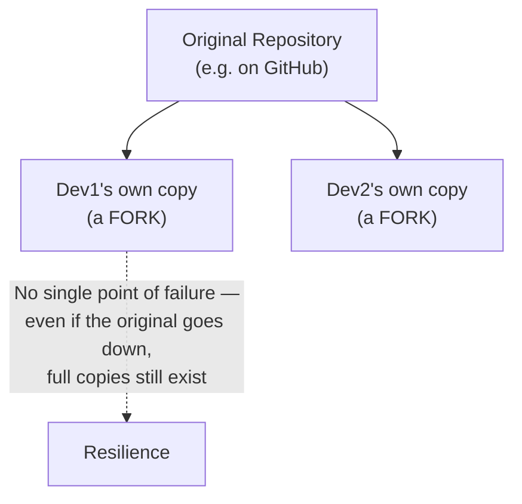

#### ⚠ Common Mistakes

* Assuming SVN/CVS are still commonly used today — explicitly, directly clarified: they're largely obsolete now, specifically BECAUSE of this exact single-point-of-failure weakness Git's distributed architecture solves.

#### 🎯 Key Takeaways

* **Centralized VCS** (SVN, CVS): all communication flows through one central server — creating a genuine **single point of failure**; if the central server goes down, collaboration stops entirely.
* **Distributed VCS** (Git): every developer can hold a full, independent copy of the repository — eliminating that single point of failure, since the code exists in many places simultaneously.
* This distinction is explicitly, directly flagged as one of the most common Git-related interview questions.

---

### 5. Understanding Forks: Copies of a Distributed Repository

#### 📖 Definition

> ⚠️ **Directly, explicitly flagged as a second common interview question:** *"Interview question number two: what is a fork? A fork is nothing but creating an entire copy of your original source."*

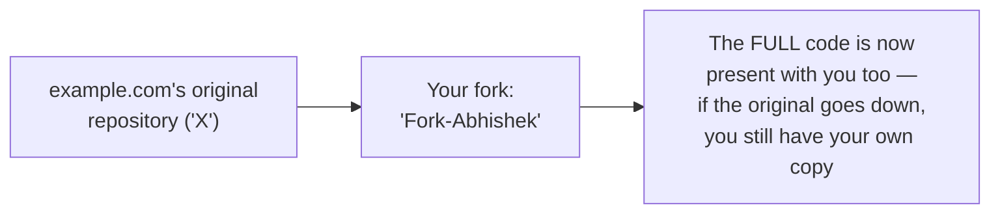

> 💡 **Memory Trick, the concrete example given directly:** *"Say your organization is `example.com`, and its entire codebase lives in a Git repository called 'X.' You can create a copy of X and call it 'Fork-Abhishek' — now the entire code is also present with you. If X goes down, no worries — you still have your own copy. This is exactly how code becomes distributed rather than existing in a single place."*

#### 🎯 Key Takeaways

* A **fork** is a complete, independent copy of an original repository — the concrete, practical mechanism by which Git's distributed architecture actually gets realized.
* Forking directly solves the single-point-of-failure risk described in Section 4 — since a fork holds the FULL codebase, not just a partial reference to it.
* This concept is explicitly named as a frequently-asked interview question, directly following from the centralized/distributed discussion.

---

### 6. Git vs. GitHub: Another Classic Interview Question

#### ❓ Why It Exists

> ⚠️ **Directly, explicitly flagged as a very common interview question:** *"Many people have this question — even asked in interviews: what is the difference between Git and GitHub? Don't worry, I'll explain it very simply."*

#### 📖 Definition — Git

> 💡 **Memory Trick, given directly:** *"Git is a distributed version control system — an open-source thing. Any organization can download Git and implement it themselves. For example, you could create an EC2 instance, install Git on it, and tell every developer to commit their changes to that self-hosted Git server."*

#### 📖 Definition — GitHub (and GitLab, Bitbucket)

> 💡 **Memory Trick, the precise relationship given directly:** *"GitHub (and similarly GitLab, Bitbucket) noticed a gap and built BETTER solutions on top of raw Git — in terms of usability, raising issues, commenting, peer code review, and even full project management/tracking. What they've essentially done is build a wrapper, or a solution, ON TOP of Git."*

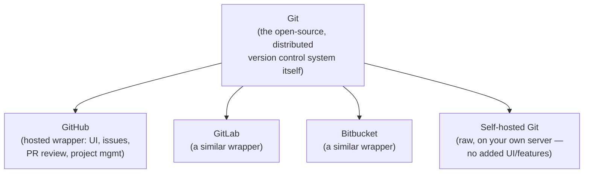

#### ⚠ Common Mistakes

* Treating "Git" and "GitHub" as interchangeable terms — explicitly, directly corrected: Git is the underlying version control technology; GitHub is one of several possible hosted platforms built on top of it.

#### 🎯 Key Takeaways

* **Git** is the open-source, distributed version control system itself — installable and self-hostable by any organization, on any server.
* **GitHub** (along with GitLab and Bitbucket) is a hosted **wrapper/solution built on top of Git** — adding usability, issue tracking, code review, and project management features Git alone doesn't provide.
* This precise distinction is explicitly flagged as another frequently-asked interview question, directly following the fork/distributed-systems discussion.

---
### 7. Installing Git & Understanding the .git Folder

#### 🪜 Step-by-Step — Installing Git

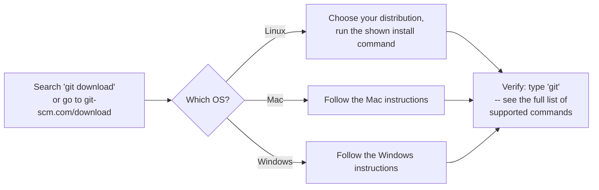

> 💡 **Memory Trick, given directly:** *"Go to git-scm.com/download, or just search 'git download' — it'll be the first result. Choose your operating system; for Linux, choose your specific distribution and run the shown command. Once installed, just type `git` — if you see the full list of supported commands, your installation succeeded."*

#### 💻 Code Example — Initializing a Repository

```bash
mkdir example.com
cd example.com
git init
```

> 💡 **Memory Trick, given directly:** *"`git init` initializes a Git repository — it said 'initialized empty Git repository.' How do you know it worked? Type `ls -la` — you'll see a hidden folder, `.git`, shown in a different color."*

#### 🔍 Internal Working — What's Actually Inside `.git`

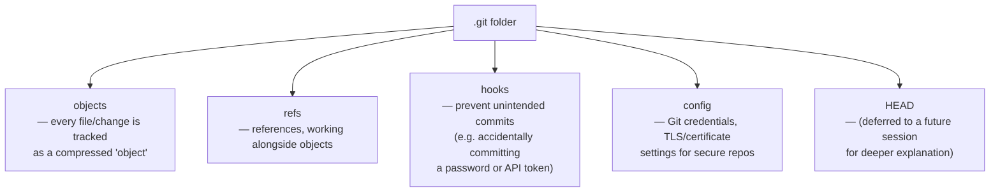

> 💡 **Memory Trick, each component explained directly:**
> - **objects/refs**: *"Every file you create — a shell script, a text file, anything — is tracked as an OBJECT inside Git. This is where and how Git actually tracks your entire repository, whether it has 100 files or a million."*
> - **hooks**: *"Using hooks, you can prevent things like someone unintentionally committing a password or an API token."*
> - **config**: *"Used to configure your Git credentials — or, if you're using a secure Git repository requiring secrets, TLS, or certificates, those settings go here too."*
> - **HEAD**: *"Not required right now — I'll definitely talk about HEAD in a future session."*

#### ⚠ Honesty Note

`HEAD`'s deeper explanation is explicitly, directly deferred to a future session — this session only names it as one of `.git`'s components without further detail, which this guide reflects honestly.

#### 🎯 Key Takeaways

* `git init` creates a new, empty Git repository — visibly confirmed by the hidden **`.git`** folder appearing (`ls -la` to see it).
* If `.git` is deleted, the entire repository stops being tracked by Git entirely — a genuinely important, direct consequence worth remembering.
* `.git`'s key components: **objects/refs** (how every file/change is actually tracked), **hooks** (preventing unintended commits, like leaked credentials), **config** (credentials and secure-connection settings), and **HEAD** (deferred to a future session).

---

### 8. The Core Git Lifecycle: status, add, diff, commit, log, reset

#### 🪜 Step-by-Step — The Full, Live-Demonstrated Lifecycle

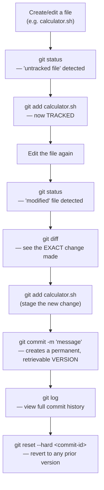

#### 💻 Code Example — The Complete, Live-Narrated Sequence

```bash
# 1. Create a file
vi calculator.sh
# X = A + B

# 2. Check status -- Git flags it as untracked
git status
# "Untracked files present. Use 'git add' to track."

# 3. Track the file
git add calculator.sh
git status
# no more untracked files

# 4. Modify the file (e.g. X = A + B + C), then check status again
git status
# "modified: calculator.sh"

# 5. See the EXACT change
git diff
# shows: A + B -> A + B + C

# 6. Revert the edit manually back to X = A + B, then commit THIS version
git add calculator.sh
git commit -m "this is my first version of addition"

git status
# "nothing to commit, working tree clean"

# 7. Add a NEW feature (subtraction), check status again
# Y = A - B
git status
# "modified: calculator.sh" (neither added nor committed yet)

git diff
git add calculator.sh
git commit -m "this is my second version"

# 8. View full commit history
git log
# commit 1: "this is my first version of addition" (author: Abhishek)
# commit 2: "this is my second version" (author: Abhishek)

# 9. Revert to a PRIOR commit
git reset --hard <commit-id-of-first-commit>
cat calculator.sh
# confirms: only the addition functionality remains -- subtraction is gone
```

> 💡 **Memory Trick, precisely explaining `git status`'s role, given directly:** *"Always run `git status` first — Git will tell you exactly what your next command should be. It's constantly telling you what state your files are in and suggesting the right next step."*

> 💡 **Memory Trick, precisely explaining `git diff`, given directly:** *"`git diff` tells you exactly what changed — for example, it showed me that `A + B` became `A + B + C`. This is how you always know precisely what you've modified before committing it."*

> 💡 **Memory Trick, the live proof of reverting, given directly:** *"Let's verify: `cat calculator.sh` — and you can see it now has just `A + B`, even though I had already added the subtraction functionality. This proves I genuinely came back to a previous version. This is exactly how you deal with versioning in Git — you can switch between versions, go back to any previous day's state."*

#### ⚠ Common Mistakes

* Committing without first checking `git diff` to confirm exactly what's being committed — the session explicitly models running `git diff` before every commit as a genuine habit worth building.
* Assuming `git add` and `git commit` are the same action — explicitly, precisely distinguished: `git add` stages/tracks a change; `git commit` actually creates a permanent, retrievable version from what's staged.

#### 🎯 Key Takeaways

* **`git status`** is the habitual first command to run — it tells you exactly what state your files are in (untracked, modified, staged) and suggests your next command.
* **`git add <file>`** tells Git to start tracking a file, or to stage a specific change for the next commit.
* **`git diff`** shows the exact, precise content difference for any modified file — essential for confirming what you're about to commit.
* **`git commit -m "message"`** creates a permanent, named, retrievable version (called a **commit**) from your staged changes.
* **`git log`** displays the full commit history — author, message, and commit ID for every version.
* **`git reset --hard <commit-id>`** reverts your working files to match any prior commit — live-proven by actually reverting and confirming the file's contents changed back.

---
### 9. Sharing Code via GitHub: Accounts, Repositories & Forking in Practice

#### ❓ Why It Exists -- Connecting Back to the Distributed-System Concept

> 💡 **Memory Trick, the precise connection drawn directly:** *"Everything so far -- versioning -- only happened locally, on my own laptop. But to actually create that distributed system I described earlier, where you can share code with peers or open it up to your whole organization, that's exactly where GitHub, self-hosted Git, or Bitbucket come into the picture."*

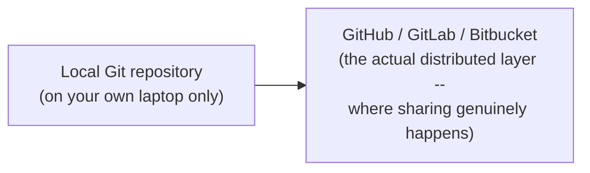

#### 🪜 Step-by-Step -- Creating a GitHub Account & Repository

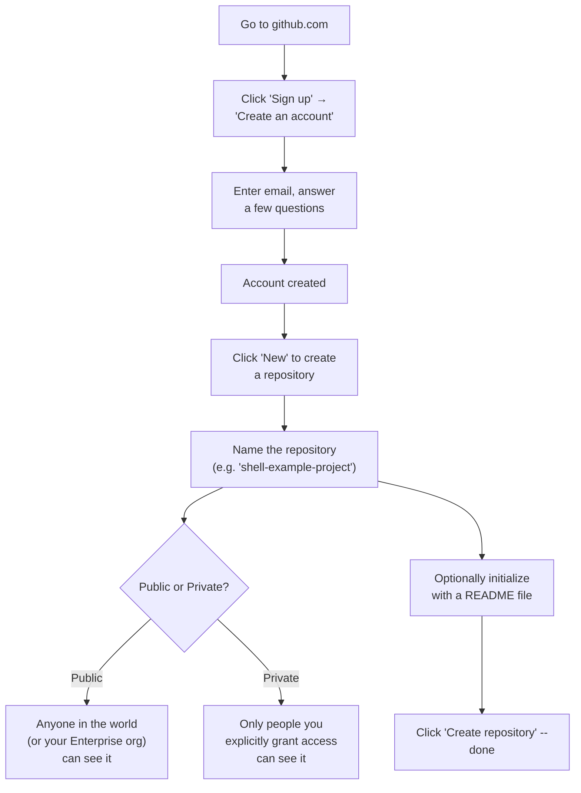

> 💡 **Memory Trick, the README's purpose explained directly:** *"A README is nothing but metadata -- when somebody looks at your repository, you can tell them, for example, 'this is my first shell scripting program' or 'this calculator program has four functionalities: addition, subtraction,' and so on."*

#### 💻 Live Demonstration -- Finding the Actual "Fork" Button

> 💡 **Memory Trick, connecting the earlier concept to the real UI, given directly:** *"See here -- there's an option called 'Fork.' You can keep a copy, or create a fork, and using that fork, you can collaborate with other developers. This is exactly the fork concept I explained earlier -- now you're seeing it as a real, clickable feature in GitHub's actual interface."*

#### ⚠ Honesty Note

A significantly deeper dive into GitHub specifically -- organizations, issues, pull requests, CI/CD, project management, and security features -- is **explicitly deferred to "tomorrow's class"** (the next session), which this guide reflects honestly rather than inventing that content here. Additional Git commands and a dedicated interview-questions treatment are also explicitly promised for a future session ("day after tomorrow's class or sometime").

#### 🎯 Key Takeaways

* Local Git repositories only solve the **versioning** problem in isolation -- genuine **sharing** (the OTHER problem version control addresses, per Section 1) requires a hosted platform like GitHub, GitLab, or Bitbucket.
* Creating a GitHub repository requires choosing **public** (visible to anyone, or your whole Enterprise org) vs. **private** (visible only to explicitly-granted people) -- a genuinely important, real decision.
* A **README** file provides metadata/context about a repository for anyone viewing it.
* The **Fork button**, seen live in GitHub's actual UI, directly realizes the conceptual "fork" discussion from Section 5 -- a concrete, visible feature, not just an abstract idea.

---

## 📝 Glossary

| Term | Definition | Why It Matters |
|---|---|---|
| **Version Control System (VCS)** | A system solving two core problems: sharing code and tracking/reverting versions | The foundational concept underlying Git and GitHub |
| **Centralized VCS** (SVN, CVS) | A version control architecture where all communication flows through one central server | Creates a genuine single point of failure |
| **Distributed VCS** (Git) | A version control architecture where every developer can hold a full, independent repository copy | Eliminates the single-point-of-failure risk of centralized systems |
| **Fork** | A complete, independent copy of an original repository | The concrete mechanism realizing Git's distributed architecture |
| **Git** | The open-source, distributed version control system itself | Installable/self-hostable by any organization |
| **GitHub (/GitLab/Bitbucket)** | A hosted wrapper built on top of Git, adding UI, issue tracking, code review, project management | Distinguishing this from Git itself is a classic interview question |
| **`.git` folder** | The hidden folder where Git tracks an entire repository's history | Contains objects, refs, hooks, config, and HEAD |
| **Commit** | A permanent, named, retrievable version created from staged changes | Git's concrete unit of "versioning" |
| **`git status`** | Shows the current tracked/untracked/modified state of files | The habitual first command to run |
| **`git diff`** | Shows the exact content difference for modified files | Essential for confirming what's about to be committed |
| **`git reset --hard`** | Reverts working files to match a specified prior commit | The live-demonstrated mechanism for "going back in time" |
| **README** | A metadata file describing a repository's purpose/contents | Helps anyone viewing the repository understand its context |

---

## 🔄 Revision Notes — One-Minute Revision

* **Version control systems** exist to solve two core problems: **sharing** code among collaborators, and **versioning** (tracking history and enabling reverts) -- both illustrated via a worked calculator-app example (addition/subtraction developers; evolving requirements needing a revert).
* **Centralized VCS** (SVN, CVS) routes all communication through one central server -- a genuine, real single point of failure, drawn from the instructor's own historical SVN experience. **Distributed VCS** (Git) lets every developer hold a full, independent copy -- eliminating that risk.
* A **fork** is a complete, independent copy of a repository -- the concrete mechanism realizing distributed version control, and a classic interview question.
* **Git vs. GitHub** (another classic interview question): Git is the open-source, distributed VCS itself, self-hostable anywhere; GitHub (like GitLab, Bitbucket) is a hosted **wrapper** built on top of Git, adding UI, issue tracking, code review, and project management.
* Installing Git and running **`git init`** creates the hidden **`.git`** folder -- containing **objects/refs** (how files/changes are tracked), **hooks** (preventing unintended commits, like leaked credentials), **config** (credentials/secure-connection settings), and **HEAD** (deferred to a future session).
* The core Git lifecycle, live-demonstrated: **`git status`** (what state are my files in?) → **`git add`** (start tracking / stage a change) → **`git diff`** (see the exact change) → **`git commit -m "..."`** (create a permanent version) → **`git log`** (view commit history) → **`git reset --hard <commit-id>`** (revert to any prior version -- live-proven by actually reverting and confirming the file's contents).
* Local Git repositories only solve **versioning** in isolation -- genuine **sharing** requires GitHub (or GitLab/Bitbucket): creating an account, creating a repository (public vs. private, with an optional README), and using the real, visible **Fork button** to create collaborative copies.
* A significantly deeper GitHub-specific dive (organizations, issues, pull requests, CI/CD, project management, security) is **explicitly deferred to the next class** -- this session is deliberately an introduction, not the full picture.

---

## 📋 Cheat Sheet

**The two problems version control solves:**
```text
Sharing (getting many people's code together) + Versioning (tracking/reverting history)
```

**Centralized vs. distributed:**
```text
Centralized (SVN, CVS) -> one central server -> single point of failure
Distributed (Git)       -> every dev can hold a FULL copy -> no single point of failure
```

**Git vs. GitHub:**
```text
Git    -> the open-source, distributed VCS itself (self-hostable)
GitHub -> a hosted WRAPPER on top of Git (UI, issues, PR review, project mgmt)
         (GitLab, Bitbucket occupy this same role)
```

**The core Git lifecycle:**
```bash
git init                       # create a new repository
git status                       # what state are my files in?
git add <file>                     # track / stage a change
git diff                             # see the exact change made
git commit -m "message"                # create a permanent version
git log                                  # view commit history
git reset --hard <commit-id>               # revert to any prior version
```

**Creating a GitHub repository:**
```text
Sign up -> "New" repository -> name it -> Public or Private? -> (optional) README -> Create
```

---

## 🔥 Interview Questions & Answers

### 🟢 Beginner

**Q1.**

**Question:** What two core problems does a version control system solve?

**Answer:** Sharing code among collaborators, and versioning (tracking history and enabling reverts).

**Explanation:** The session's own stated, foundational framing.

**Why Interviewers Ask This:** A foundational, conceptual question preceding any command-level knowledge.

**Possible Follow-up:** "Give a concrete example of each problem."

**Q2.**

**Question:** What is the key difference between centralized and distributed version control systems?

**Answer:** Centralized systems (SVN, CVS) route all communication through one central server, creating a single point of failure; distributed systems (Git) let every developer hold a full, independent repository copy.

**Explanation:** Directly, explicitly flagged as a classic interview question.

**Why Interviewers Ask This:** One of the most common Git-related interview questions.

**Possible Follow-up:** "Why is a single point of failure a genuine risk in a centralized system?"

**Q3.**

**Question:** What is a fork?

**Answer:** A complete, independent copy of an original repository.

**Explanation:** Directly, explicitly flagged as a classic interview question.

**Why Interviewers Ask This:** A frequently-asked, foundational Git/GitHub term.

**Possible Follow-up:** "How does forking relate to distributed version control specifically?"

**Q4.**

**Question:** What is the difference between Git and GitHub?

**Answer:** Git is the open-source, distributed version control system itself; GitHub is a hosted wrapper built on top of Git, adding UI, issue tracking, code review, and project management.

**Explanation:** Directly, explicitly flagged as a classic interview question.

**Why Interviewers Ask This:** One of the single most common Git/GitHub interview questions.

**Possible Follow-up:** "Name two other tools that occupy the same role as GitHub."

**Q5.**

**Question:** What command initializes a new Git repository?

**Answer:** `git init`.

**Explanation:** Directly, precisely demonstrated live.

**Why Interviewers Ask This:** Basic, essential Git command knowledge.

**Possible Follow-up:** "How do you confirm a repository was successfully initialized?"

**Q6.**

**Question:** What's the difference between `git add` and `git commit`?

**Answer:** `git add` tracks a file or stages a specific change; `git commit` creates a permanent, retrievable version from what's staged.

**Explanation:** Directly, precisely distinguished.

**Why Interviewers Ask This:** A fundamental, frequently-tested Git workflow distinction.

**Possible Follow-up:** "What command lets you see exactly what changed before committing it?"

**Q7.**

**Question:** What does `git log` show you?

**Answer:** The full commit history -- author, message, and commit ID for every version.

**Explanation:** Directly, precisely demonstrated.

**Why Interviewers Ask This:** Basic, essential Git command knowledge.

**Possible Follow-up:** "What would you do with a specific commit ID from this log?"

**Q8.**

**Question:** What does `git reset --hard <commit-id>` do?

**Answer:** Reverts your working files to match the specified prior commit.

**Explanation:** Directly, precisely demonstrated and proven live.

**Why Interviewers Ask This:** Practical, commonly-needed Git operation.

**Possible Follow-up:** "How would you find the correct commit ID to revert to?"

**Q9.**

**Question:** What's the difference between a public and a private GitHub repository?

**Answer:** Public repositories are visible to anyone (or anyone in your Enterprise org); private repositories are visible only to people explicitly granted access.

**Explanation:** Directly, precisely explained during account/repository creation.

**Why Interviewers Ask This:** Basic, practical GitHub knowledge.

**Possible Follow-up:** "When would you choose private over public for a real organizational repository?"

**Q10.**

**Question:** What is a README file for?

**Answer:** Providing metadata/context about a repository -- what it is, what it does -- for anyone viewing it.

**Explanation:** Directly, precisely explained.

**Why Interviewers Ask This:** Basic, practical repository-organization knowledge.

**Possible Follow-up:** "Is a README required to create a GitHub repository?"

---

### 🟡 Intermediate

**Q11.**

**Question:** Explain why the instructor uses his own real, historical experience with SVN (rather than a purely hypothetical example) to illustrate centralized version control's weakness.

**Answer:** Grounding the single-point-of-failure risk in genuine, lived experience ("trust me, this used to happen -- we were system administrators managing SVN/CVS, and the servers would go down") makes an otherwise abstract architectural concern concrete and credible, rather than a purely theoretical concern that might seem overstated or unlikely. This directly mirrors a consistent pattern across this entire course series: preferring real, demonstrated, or experientially-grounded examples over purely abstract explanations, making concepts more memorable and genuinely convincing.

**Explanation:** Requires recognizing a deliberate rhetorical/pedagogical choice and connecting it to the broader course pattern.

**Why Interviewers Ask This:** Tests whether a learner distinguishes a claim grounded in genuine experience from a purely theoretical one.

**Possible Follow-up:** "Name another moment in this course series where a real, lived example was used instead of a purely hypothetical one."

**Q12.**

**Question:** A learner argues that since Git is free and open-source, there's no real reason any organization would ever pay for GitHub instead of just self-hosting Git. Evaluate this claim using this session's content.

**Answer:** This claim isn't well-supported by the session's own content. The instructor explicitly explains that GitHub (and similarly GitLab, Bitbucket) were built specifically because they identified a genuine GAP in raw, self-hosted Git -- usability, issue tracking, peer code review, and full project management/tracking capabilities that raw Git alone doesn't provide. While self-hosting Git is entirely possible (and the session explicitly describes exactly how, via an EC2 instance), the value GitHub adds isn't merely convenience -- it's a genuinely more complete platform for real, collaborative software development workflows, which is precisely why organizations widely choose it over maintaining raw, self-hosted Git servers themselves.

**Explanation:** Tests whether a learner recognizes the genuine, substantive value-add GitHub provides beyond "just hosting," as explicitly described in the session.

**Why Interviewers Ask This:** Distinguishes candidates who understand the real business case for hosted platforms from those who assume "free and open-source" automatically means "no reason to pay for anything more."

**Possible Follow-up:** "Name at least three specific capabilities GitHub adds on top of raw Git, per this session."

**Q13.**

**Question:** Explain, precisely, why `git status` is described as something you should run constantly throughout the workflow, rather than just once at the beginning.

**Answer:** `git status` isn't a one-time setup check -- it dynamically reflects the CURRENT state of your files at any given moment, and that state genuinely changes as you work (a file becomes "untracked" upon creation, then "staged" after `git add`, then "modified" again after a further edit, then "clean" after a commit). The session explicitly demonstrates running `git status` repeatedly, at each distinct stage of the workflow, specifically because it tells you exactly what your CORRECT next command should be at that specific moment -- a static, one-time check at the start would quickly become stale and uninformative as the actual state of your files evolves through the workflow.

**Explanation:** Requires reasoning through why `git status`'s value is specifically its dynamic, moment-to-moment accuracy, not a one-time confirmation.

**Why Interviewers Ask This:** Tests whether a learner understands `git status` as an ongoing diagnostic tool, not a single checkpoint.

**Possible Follow-up:** "Walk through the exact sequence of `git status` outputs you'd expect across creating, editing, staging, and committing a single file."

**Q14.**

**Question:** Explain why the instructor deliberately demonstrates `git reset --hard` by ACTUALLY reverting a file and then running `cat` to verify its contents, rather than just describing what the command does.

**Answer:** This directly, concretely proves the claim rather than merely asserting it -- by showing the file's ACTUAL contents both before and after the reset, the demonstration provides undeniable, visible evidence that the revert genuinely worked (the subtraction functionality that was present is now genuinely gone, and only the addition functionality remains), rather than asking learners to simply trust an abstract description of what the command "should" do. This is consistent with this course's broader, repeated pattern (seen throughout Days 4, 5, 7, and 8 as well) of proving claims via live, verifiable demonstration rather than purely descriptive explanation.

**Explanation:** Requires connecting this specific demonstration choice to the broader, consistent "prove it live" pedagogical pattern across the course.

**Why Interviewers Ask This:** Tests recognition of deliberate, evidence-based teaching technique versus simple description.

**Possible Follow-up:** "What would have been lost if the instructor had only described `git reset --hard` without actually demonstrating and verifying it?"

**Q15.**

**Question:** Synthesize this session's "two problems" framing (Section 1) with its Git lifecycle demonstration (Section 8) and its GitHub sharing demonstration (Section 9) to explain precisely which of the two original problems each part of the session actually solves.

**Answer:** Sections 7-8 (installing Git, running `init`/`add`/`commit`/`log`/`reset --hard`) exclusively address the **versioning** problem -- everything demonstrated there happens entirely on the instructor's own local laptop, tracking and reverting change history, but genuinely NOT yet solving the sharing problem at all, since nothing has left the local machine. Section 9 (creating a GitHub account, a repository, and locating the Fork button) is what actually addresses the **sharing** problem -- moving code into a genuinely distributed, multi-person-accessible platform. This maps precisely onto the session's own explicit transition statement ("right now, all the things I talked about is only versioning... but essentially you should also know how to share the code") -- confirming the session's structure directly, deliberately mirrors its own opening two-problems framework, with local Git solving one problem and GitHub solving the other.

**Explanation:** Requires tracing the session's entire structure back to its own opening conceptual framework, recognizing a deliberate, mirrored design rather than an incidental ordering.

**Why Interviewers Ask This:** Tests whether a learner can recognize a session's underlying structural logic, not just recall its individual parts in isolation.

**Possible Follow-up:** "If you only ever used local Git commands and never pushed to GitHub, which of the two original problems would remain completely unsolved?"

---

### 🔴 Advanced

**Q16.**

**Question:** Design a decision framework for a small team deciding between self-hosting Git (on their own EC2 instance) versus adopting GitHub, using only this session's stated reasoning.

**Answer:** A reasonable framework, directly grounded in the session's own stated GitHub-value-add reasoning (Section 6): (1) **Collaboration feature needs** -- does the team genuinely need issue tracking, peer code review workflows, and project management tooling? If yes, this weighs toward GitHub, since the session explicitly identifies these as the specific gap GitHub fills beyond raw Git. If the team's needs are purely "store and version code, nothing more," self-hosted Git alone may suffice. (2) **Maintenance capacity** -- self-hosting requires ongoing operational responsibility (per the session's own SVN/CVS maintenance-burden discussion in Section 4, which, while framed around centralized systems specifically, extends naturally to any self-hosted infrastructure) -- does the team have the capacity for this ongoing maintenance, or would a hosted platform's convenience be worth its cost? (3) **Resilience requirements** -- even self-hosted Git retains Git's distributed nature (each developer can still hold full local copies), but the SPECIFIC self-hosted server itself could still represent an availability risk for centralized sharing/collaboration workflows (distinct from Git's own core distributed data model) -- does the team need GitHub's professionally-managed uptime guarantees? Only when the answers favor GitHub across genuinely most of these dimensions should the team adopt it over simpler self-hosting.

**Explanation:** Synthesizes the session's Git-vs-GitHub value-add explanation with its earlier centralized-system maintenance-burden discussion into a genuine, reasoned decision framework -- real extension beyond simply stating the two options exist.

**Why Interviewers Ask This:** A realistic, senior-level infrastructure-decision question testing whether a candidate can reason through a genuine trade-off, not just recite that GitHub "adds features."

**Possible Follow-up:** "Does self-hosting Git reintroduce any of centralized version control's original weaknesses? Explain precisely why or why not."

**Q17.**

**Question:** Critically evaluate: "Since Git is a distributed version control system, a self-hosted Git server (with no GitHub/GitLab/Bitbucket layer at all) can never have a single point of failure, unlike SVN or CVS." Is this accurate?

**Answer:** Not fully accurate -- this conflates two genuinely distinct things. Git's DATA MODEL is distributed (every developer's local clone contains the full history, exactly as this session describes) -- this part of the claim is correct. However, if an organization sets up ONE self-hosted Git server (e.g., on a single EC2 instance) as the agreed-upon central place everyone pushes to and pulls from -- even though it's technically running Git, not SVN -- that SPECIFIC server can still become a practical single point of failure for ONGOING COLLABORATION, if it goes down and no one has a sufficiently recent local clone, or if the team's actual workflow depends on that one server being reachable for coordination. The genuinely distributed, resilient property Git provides is that EVERY developer's full local clone is a complete backup -- but if an organization's practical workflow still funnels through one specific, single self-hosted instance as its de facto coordination point, some of Git's theoretical resilience advantage over SVN can be practically undermined by how it's actually deployed and used, not by Git's underlying technology itself.

**Explanation:** Tests whether a learner distinguishes Git's underlying distributed DATA MODEL from the practical DEPLOYMENT/WORKFLOW choices an organization might still make that reintroduce centralization-like risk.

**Why Interviewers Ask This:** A genuinely subtle, senior-level distinction testing whether a candidate over-generalizes "Git is distributed" into "therefore no deployment of Git can ever have single-point-of-failure characteristics."

**Possible Follow-up:** "How does using a professionally-managed platform like GitHub (rather than a single self-hosted server) address this specific practical risk?"

**Q18.**

**Question:** Synthesize this session's versioning-problem framing (Section 3) with its `git reset --hard` demonstration (Section 8) to identify a genuine LIMITATION of `git reset --hard` as a solution to the originally-stated versioning problem, even though it was the specific command demonstrated to solve it.

**Answer:** The original versioning problem (Section 3) was framed around retrieving a SPECIFIC prior version while still being generally aware of and potentially needing OTHER intervening versions too (e.g., "go back to addition of two numbers" doesn't necessarily mean permanently discarding all knowledge that three- and four-number addition were ever built). `git reset --hard`, as demonstrated, moves your CURRENT working state backward, and depending on how it's used, can make it easy to lose track of or even discard the commits between your current state and the target commit if not handled carefully (a genuine, well-known Git operational risk beyond what this specific session covers in depth) -- it's a blunt, direct reversion tool, appropriate for genuinely "give me the old version back completely," but less suited to workflows needing to inspect, compare, or later reconstruct the abandoned intervening versions. This suggests `git reset --hard` is a valid, direct answer to the session's SPECIFIC simplified scenario (a clean, wholesale revert to the addition-only version) but not necessarily the most nuanced tool available for every real versioning need the original Section 3 problem framing could imply -- a distinction the session itself doesn't explicitly flag, since it deliberately keeps this session's Git lifecycle coverage introductory.

**Explanation:** Requires critically examining the specific command demonstrated against the FULLER scope of the problem it was introduced to solve, recognizing a genuine, non-obvious limitation not explicitly discussed in the session itself.

**Why Interviewers Ask This:** A capstone-level, genuinely challenging question testing whether a candidate can think beyond exactly what was directly taught, applying critical reasoning to identify real limitations in a demonstrated solution.

**Possible Follow-up:** "Name a different Git command or approach (even if not covered in this session) that might better preserve visibility into abandoned intervening commits, compared to `git reset --hard`."

---

## 🧪 Scenario-Based Interview Questions

> **Scenario 1:** A junior developer asks why their team switched from a self-hosted Git server to GitHub last year, since "Git is Git either way." Using this session's concepts, explain the actual reasoning to them.

**Structured Answer:**
1. **Initial investigation:** Confirm what specific gap the team was actually experiencing with the self-hosted server -- likely one or more of usability, issue tracking, code review workflow, or project management, per this session's explicit list of what GitHub adds.
2. **Metrics/logs to check:** N/A directly (a conceptual, not technical, diagnostic) -- instead, review what specific pain points prompted the original migration decision, if documented.
3. **Possible causes for the junior developer's confusion:** A reasonable but incomplete understanding that "Git is Git" -- technically true about the underlying version-control technology, but missing the session's explicit point that GitHub is a genuinely different, more feature-complete WRAPPER built on top of that same underlying Git.
4. **Debugging approach:** Walk through this session's own explicit Git-vs-GitHub distinction directly with the junior developer, using concrete examples (issue tracking, PR review, project management) they can relate to from their own daily work.
5. **Resolution:** Help them understand that switching platforms didn't change the underlying version-control technology (still Git) -- it changed which FEATURES and WORKFLOW support the team has access to on top of it.
6. **Prevention:** Incorporate this exact Git-vs-GitHub distinction into onboarding materials for future team members, directly modeled on this session's own clear explanation, to prevent this same confusion recurring.

> **Scenario 2 (Advanced):** Your organization is debating whether a new, security-sensitive project should live in a public or private GitHub repository. A stakeholder argues "public is fine, since it's more resilient -- more people have copies via forks." Using this session's concepts, evaluate this argument.

**Structured Answer:**
1. **Initial investigation:** Recognize this argument conflates two genuinely distinct concerns this session addresses separately: repository VISIBILITY/ACCESS CONTROL (public vs. private, Section 9) versus DISTRIBUTED RESILIENCE (forks preventing a single point of failure, Sections 4-5).
2. **Relevant principle:** Per Section 5, forking's resilience benefit (surviving the ORIGINAL repository going down) is a property of Git's distributed architecture generally -- it applies to PRIVATE repositories too, since authorized collaborators with private access can still create their own full local clones or authorized forks; resilience does NOT require public visibility.
3. **Possible causes for the stakeholder's confusion:** A reasonable-sounding but ultimately incorrect conflation of "more forks exist" (true for public repos, since anyone can fork them) with "resilience requires public visibility" (false -- private repos still benefit from Git's distributed data model among their authorized collaborators).
4. **Debugging/evaluation approach:** Clarify that a security-sensitive project's real concern should be ACCESS CONTROL (who can even see/clone the code at all) -- a separate question from whether Git's underlying distributed architecture provides resilience, which it does regardless of public/private status among the people who DO have legitimate access.
5. **Resolution:** Recommend keeping the security-sensitive project PRIVATE, explicitly clarifying that this does not sacrifice Git's distributed resilience benefits among the project's actual, authorized collaborators -- the visibility setting and the distributed architecture are independent properties.
6. **Prevention:** Document this exact distinction (visibility/access control vs. distributed resilience) as part of the organization's repository-creation guidelines, directly preventing this same conflation from influencing future security-sensitive project decisions.

---

## 🛠 Hands-on Exercises

### 🟢 Easy

1. Install Git on your own machine (or confirm it's already installed), and run `git init` in a new folder, confirming the `.git` folder appears via `ls -la`.
2. Reproduce this session's exact calculator-app exercise: create a file, `git add` it, modify it, run `git diff`, then commit it -- documenting each `git status` output along the way.
3. Run `git log` on your repository from Exercise 2, and identify the commit ID of your first commit.

### 🟡 Medium

4. Reproduce this session's exact `git reset --hard` demonstration: make a second commit (adding a new feature), then revert back to your first commit, and use `cat` to verify the file's contents genuinely changed back.
5. Create a real GitHub account (if you don't already have one) and a new repository, correctly choosing public or private based on a scenario of your own choosing, and write a genuine README file for it.
6. Write a short comparison document (150-200 words) explaining, in your own words, why centralized version control systems became less popular, without directly copying this session's phrasing.

### 🔴 Advanced

7. Implement the self-hosted-Git-vs-GitHub decision framework proposed in Advanced Interview Q16, applying it to a hypothetical small team of your own design.
8. Research (outside this transcript) at least one genuine limitation or risk of `git reset --hard` beyond what this session covers, directly extending Advanced Interview Q18's critical analysis.
9. Write a short technical document (300-400 words) addressing the public-vs-private-and-resilience conflation from Scenario 2, suitable for a non-technical stakeholder audience.

---

## 🏗 Practice Assignment

### Build: "My First Versioned & Shared Repository"

**Objective:** Complete the full arc this session establishes -- solving BOTH the versioning problem (locally, via Git) and the sharing problem (via GitHub) -- for a small project of your own choosing.

**Requirements:**
- A local Git repository, initialized with `git init`, containing at least three commits showing genuine, incremental progress (directly modeling this session's calculator-app example, but using a project of your own choosing).
- At least one deliberate demonstration of `git diff` showing a real change before committing it.
- At least one deliberate demonstration of `git reset --hard`, reverting to an earlier commit and verifying the result with `cat` or an equivalent file-content check.
- A GitHub account and a newly-created repository (public or private, your choice, with justification), containing a genuine README file.
- Your local repository's history successfully shared to this new GitHub repository (research the `git remote add` and `git push` commands, which extend beyond what this session directly covered, to accomplish this).

**Architecture (suggested):**

```text
my_first_versioned_project/
├── .git/                    # created by git init
├── project_file(s)            # your actual project content
├── README.md                    # written for your GitHub repository
└── COMMIT_LOG.md                  # a copy of your `git log` output, documenting your history
```

**Expected Functionality:**
- Your local commit history should show genuine, incremental progress -- not a single, all-at-once commit.
- Your GitHub repository should be genuinely reachable and viewable (if public) or correctly access-controlled (if private).

**Challenges:**
- Correctly researching and using `git remote add`/`git push` to actually get your local history onto GitHub -- a natural next step this session sets up conceptually but doesn't demonstrate in full command detail.
- Writing a genuinely informative README, not just a placeholder.

**Bonus Improvements:**
- Practice creating a fork of a public repository (not your own) to directly experience the Fork feature from Section 9.
- Research and document what `HEAD` actually refers to, directly following up on this session's own explicitly-deferred explanation.

---

## 📚 Additional Resources

- The instructor's **Day 0 through Day 8 videos** (referenced directly) -- required prior viewing for full context.
- The **DevOps Zero to Hero playlist** -- referenced directly, containing all videos in this same free course.
- **git-scm.com/download** -- directly used live to install Git across Linux, Mac, and Windows.
- **github.com** -- directly used live to create an account and a new repository.
- **The next class** ("tomorrow's class," referenced directly) -- will deep-dive into GitHub specifically: organizations, issues, pull requests, CI/CD, project management, and security features, none of which are covered in depth in this session.
- **A future session** (referenced directly, "day after tomorrow's class or sometime") -- will cover additional Git commands and a dedicated Git interview-questions treatment.

---

## 📌 Final Revision Sheet

### ⭐ Core Concepts
- Version control solves two problems: **sharing** and **versioning**.
- **Centralized** (SVN/CVS, single point of failure) vs. **distributed** (Git, no single point of failure) -- a classic interview question.
- A **fork** is a full, independent repository copy -- the concrete mechanism realizing distributed version control.
- **Git vs. GitHub**: Git is the underlying, self-hostable VCS; GitHub is a hosted wrapper adding UI, issues, PR review, and project management.
- The core Git lifecycle: `init` → `status` → `add` → `diff` → `commit` → `log` → `reset --hard`.
- Local Git solves versioning; GitHub (or GitLab/Bitbucket) solves sharing -- the session's structure directly mirrors its own opening two-problems framework.

### ⭐ Important Definitions
- **`.git` folder components** (objects, hooks, config, HEAD), **README** (see Glossary for full definitions).

### ⭐ Important Commands/Code
```bash
git init
git status
git add <file>
git diff
git commit -m "message"
git log
git reset --hard <commit-id>
```

### ⭐ Architecture/Process
- `.git` folder structure: objects/refs (tracking), hooks (preventing unintended commits), config (credentials/secure settings), HEAD (deferred).
- Full workflow: local versioning (Git) → hosted sharing (GitHub) → collaboration via forks.

### ⭐ Best Practices
- Run `git status` constantly throughout your workflow, not just once.
- Always review `git diff` before committing.
- Choose repository visibility (public/private) based on genuine access-control needs, not resilience assumptions.
- Write genuinely informative README files.

### ⭐ Common Mistakes
- Treating "Git" and "GitHub" as interchangeable terms.
- Assuming SVN/CVS are still commonly used today.
- Conflating repository visibility (public/private) with Git's distributed resilience -- these are independent properties.
- Assuming self-hosting Git automatically eliminates all single-point-of-failure risk in practice.

### ⭐ Interview Points
- Be ready to explain centralized vs. distributed VCS precisely, including WHY centralized systems have a single point of failure.
- Be ready to define a fork precisely.
- Be ready to explain Git vs. GitHub precisely, naming at least one GitHub-equivalent tool (GitLab, Bitbucket).
- Be ready to walk through the full core Git lifecycle from memory.

### ⭐ Things to Remember
- A **deeper GitHub-specific dive** (organizations, issues, pull requests, CI/CD, project management, security) is **explicitly deferred to the next class** -- this session is deliberately introductory.
- **Additional Git commands and a dedicated interview-questions treatment** are explicitly promised for a future session, not covered here.
- `HEAD`'s deeper explanation is explicitly deferred -- this session only names it as a `.git` component without further detail.

---

## 🔗 Source

- [Git and GitHub Fundamentals](https://youtu.be/fIMySI_gZJU?si=jh3TDyt4_qsZ40K7)