# ☸ Kubernetes — Architecture, AWS EKS Setup & Live Application Deployment

- <i>**Series:** The Kubernetes portion of a Docker & Kubernetes Crash Course (direct continuation of the Docker session already processed in this workspace) · 
- **Instructor:** Ashok (Ashok IT)
- **Note on scope:** This transcript is genuinely a **partial excerpt** from a much longer workshop recording — it begins mid-session (at the 2-hour-17-minute mark) and runs to 4 hours 23 minutes, with NO opening "hello and welcome" and NO clean closing statement; it ENDS mid-thought, on a forward-looking mention of connecting this deployment to a Jenkins CI/CD pipeline. This guide treats it HONESTLY as exactly what it is: the COMPLETE, substantive Kubernetes portion of this crash course — covering WHY Kubernetes exists, its COMPLETE architecture, a REAL, live AWS EKS cluster setup (including the INSTRUCTOR's own live IAM/EKS configuration), and a COMPLETE, working application deployment with GENUINE, repeated proof of self-healing. The teaching style itself is DISTINCTIVE — heavily REPETITIVE, with FREQUENT comprehension checks ("are you clear?") — this guide PRESERVES the genuine substance while CONDENSING the repetition into clear, organized notes.</i>

---

## 📑 Table of Contents

1. [Session Overview](#-session-overview)
2. [Learning Objectives](#-learning-objectives)
3. [Detailed Notes](#-detailed-notes)
   - [1. Session Context: The Kubernetes Portion of a Docker & Kubernetes Crash Course](#1-session-context-the-kubernetes-portion-of-a-docker--kubernetes-crash-course)
   - [2. What Is Kubernetes? Definition, Origin & the Orchestration Concept](#2-what-is-kubernetes-definition-origin--the-orchestration-concept)
   - [3. Why Kubernetes Exists: The Microservices Scaling Problem](#3-why-kubernetes-exists-the-microservices-scaling-problem)
   - [4. Kubernetes' Four Core Benefits](#4-kubernetes-four-core-benefits)
   - [5. Kubernetes Architecture: Cluster, Control Plane & Worker Nodes](#5-kubernetes-architecture-cluster-control-plane--worker-nodes)
   - [6. Control Plane Components: API Server, etcd, Scheduler & Controller Manager](#6-control-plane-components-api-server-etcd-scheduler--controller-manager)
   - [7. Worker Node Components: Pods, kubelet & kube-proxy](#7-worker-node-components-pods-kubelet--kube-proxy)
   - [8. Setting Up a Cluster: Self-Managed vs. Managed Options](#8-setting-up-a-cluster-self-managed-vs-managed-options)
   - [9. A Complete, Live AWS EKS Cluster Setup](#9-a-complete-live-aws-eks-cluster-setup)
   - [10. Pods: The Smallest Deployable Unit](#10-pods-the-smallest-deployable-unit)
   - [11. Kubernetes Services: ClusterIP, NodePort & LoadBalancer](#11-kubernetes-services-clusterip-nodeport--loadbalancer)
   - [12. Writing a Complete Manifest YAML: Deployment + Service](#12-writing-a-complete-manifest-yaml-deployment--service)
   - [13. Deploying & Verifying: kubectl Commands in Practice](#13-deploying--verifying-kubectl-commands-in-practice)
   - [14. Proving Self-Healing: A Live, Repeated Demonstration](#14-proving-self-healing-a-live-repeated-demonstration)
   - [15. Troubleshooting: kubectl logs](#15-troubleshooting-kubectl-logs)
   - [16. Closing: Connecting to CI/CD With Jenkins](#16-closing-connecting-to-cicd-with-jenkins)
4. [Glossary](#-glossary)
5. [Revision Notes — One-Minute Revision](#-revision-notes--one-minute-revision)
6. [Cheat Sheet](#-cheat-sheet)
7. [Interview Questions & Answers](#-interview-questions--answers)
8. [Scenario-Based Interview Questions](#-scenario-based-interview-questions)
9. [Hands-on Exercises](#-hands-on-exercises)
10. [Practice Assignment](#-practice-assignment)
11. [Additional Resources](#-additional-resources)
12. [Final Revision Sheet](#-final-revision-sheet)

---

## 🎯 Session Overview

This session builds Kubernetes from first principles through to a COMPLETE, working, real-world deployment. It covers:

1. **A precise definition of Kubernetes**: a FREE, open-source ORCHESTRATION (management) platform, developed by GOOGLE and donated to the CNCF — directly, precisely distinguished from DOCKER (containerization) as a COMPLEMENTARY, not competing, technology.
2. **A concrete, real motivating problem**: MICROSERVICES architecture GENUINELY requires managing DOZENS of containers per application, EACH potentially needing MULTIPLE replicas for load handling — a GENUINELY unmanageable task WITHOUT automation.
3. **Kubernetes' FOUR core benefits**: container ORCHESTRATION, SCALABILITY, SELF-HEALING, and LOAD BALANCING.
4. **The COMPLETE Kubernetes architecture**: a CLUSTER (group of servers) consisting of a CONTROL PLANE (the "master"/manager) and WORKER NODES (the "employees") — with EVERY component's own SPECIFIC role precisely explained via GENUINELY memorable, real analogies (a MANAGER and TEAM, a CELEBRITY and their PERSONAL ASSISTANT).
5. **A COMPLETE, REAL, live AWS EKS cluster setup** — creating an EC2 management HOST, configuring IAM permissions, and RUNNING the actual `eksctl` cluster-creation COMMAND — INCLUDING a genuine, HONEST cost disclosure (EKS is a PAID service, unlike Kubernetes ITSELF).
6. **Pods**, precisely defined as the SMALLEST deployable UNIT in Kubernetes — directly connecting BACK to the control-plane/worker-node architecture ALREADY established.
7. **The THREE types of Kubernetes SERVICES** (ClusterIP, NodePort, LoadBalancer) — precisely distinguished by WHO can access the EXPOSED pods.
8. **A COMPLETE, real, working Kubernetes manifest YAML** — combining a Deployment (2 replicas, rolling-update strategy) and a LoadBalancer Service — directly, LIVE-executed on the REAL AWS cluster.
9. **GENUINE, REPEATED, live proof of self-healing** — the instructor DELIBERATELY deletes running pods, TWICE, and DIRECTLY observes Kubernetes AUTOMATICALLY recreating them.
10. **A real, successful application ACCESS demonstration** — via the AWS Load Balancer's own DNS name, CONFIRMING the ENTIRE deployment genuinely WORKS end to end.

> 💡 **Key framing, given directly, on Kubernetes' own genuine, core purpose:** *"Kubernetes is called as orchestration platform... Orchestration is nothing but management guys... Instead of we are creating containers for the application, instead of we are scaling up the containers, scaling down the containers, we can use Kubernetes to manage our docker containers."*

---

## 🎯 Learning Objectives

By the end of this guide, you will be able to:

- [ ] Explain what Kubernetes is, and why it exists as a complement to Docker.
- [ ] Describe Kubernetes' four core benefits, with a concrete example of each.
- [ ] Explain the complete Kubernetes architecture: cluster, control plane, and worker nodes.
- [ ] Name and describe each control plane component (API server, etcd, scheduler, controller manager) and each worker node component (pods, kubelet, kube-proxy).
- [ ] Set up a real Kubernetes cluster using AWS EKS.
- [ ] Write a complete manifest YAML combining a Deployment and a Service.
- [ ] Deploy, verify, and troubleshoot an application using core kubectl commands.
- [ ] Explain and demonstrate Kubernetes' self-healing capability.

---

## 📚 Detailed Notes

### 1. Session Context: The Kubernetes Portion of a Docker & Kubernetes Crash Course

#### 🧠 Concept

> 💡 **Given directly, opening this specific excerpt:** *"So first let's understand what is this Kubernetes and why we need to learn this Kubernetes and where we are going to use this Kubernetes software."*

#### 🪜 Step-by-Step — This Session's Own Genuine Position Within a Larger Workshop

This transcript is a DIRECT, substantive excerpt from a LARGER Docker and Kubernetes crash course (the SAME instructor and STYLE as the Docker session already processed in this workspace). It begins with Kubernetes FUNDAMENTALS and ends on a FORWARD-LOOKING mention of Jenkins CI/CD — GENUINELY, DIRECTLY consistent with a MULTI-HOUR workshop structure (Docker FIRST, then Kubernetes, with CI/CD as a LOGICAL, teased next topic).

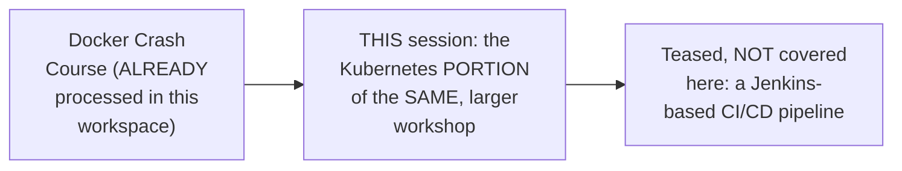

#### 🎯 Key Takeaways

* This is genuinely a **PARTIAL, substantive EXCERPT** from a LARGER workshop — beginning WITHOUT an introduction and ENDING mid-thought, on a TEASED, NOT-yet-covered CI/CD topic.
* The teaching STYLE is GENUINELY, DISTINCTIVELY repetitive, with FREQUENT comprehension CHECKS — this guide CONDENSES that repetition while PRESERVING the genuine, substantive CONTENT.
* This session DIRECTLY, GENUINELY assumes PRIOR Docker knowledge — explicitly, DIRECTLY stated LATER: "Docker is prerequisite to understand the Kubernetes."

---

### 2. What Is Kubernetes? Definition, Origin & the Orchestration Concept

#### 📖 Definition — Kubernetes (K8s), Precisely Defined

> 💡 **Given directly:** *"Kubernetes is also called as K8S... K8s nothing but between K and S, there are eight characters available... Kubernetes is an open-source orchestration platform... You no need to pay the money to use the Kubernetes. Kubernetes is free of cost."*

#### 📖 Definition — Orchestration, Precisely Defined

> 💡 **Given directly:** *"Orchestration is nothing but management guys... Docker is called as containerization software. Kubernetes is called as orchestration software... instead of we are creating containers for the application, instead of we are scaling up the containers, scaling down the containers, we can use Kubernetes to manage our docker containers."*

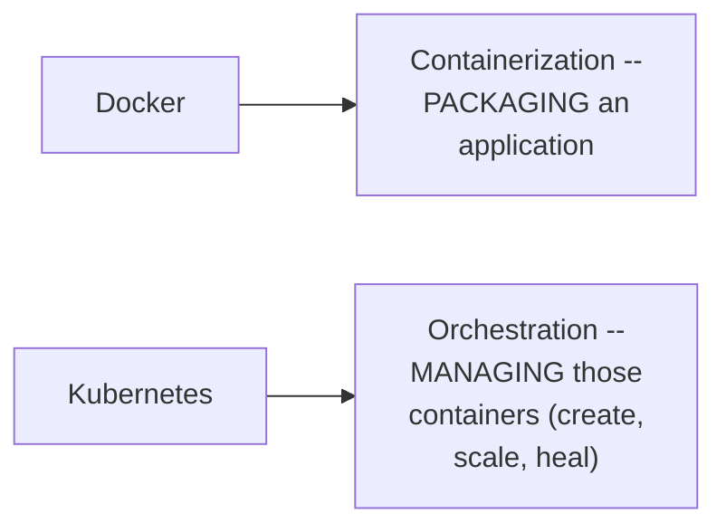

#### 🔍 Internal Working — Kubernetes' Own, Real Origin

> 💡 **Given directly:** *"This Kubernetes software developed by Google. Google company developed this Kubernetes software and later they donated to other organization... CNCF organization."*

#### 🏢 Real-World / Production Usage — Precisely WHY This Matters for Interviews

> 💡 **Given directly:** *"Developers and DevOps people should know what is this Kubernetes and how to work with the Kubernetes without asking the questions on the Kubernetes, the DevOps interview will not be completed... nowadays in every interview for the developers also they are asking questions related to Kubernetes."*

#### ⚠ Common Mistakes

* Assuming Kubernetes and Docker are COMPETING, interchangeable technologies — explicitly, directly, precisely clarified: they are GENUINELY COMPLEMENTARY — Docker PACKAGES applications; Kubernetes MANAGES the resulting containers.
* Assuming Kubernetes knowledge is ONLY relevant for DevOps-titled roles — explicitly, directly clarified: it's INCREASINGLY, GENUINELY expected of DEVELOPERS too, in REAL, modern interviews.

#### 🎯 Key Takeaways

* **Kubernetes (K8s)** is precisely a FREE, open-source ORCHESTRATION platform — developed by GOOGLE, DONATED to the CNCF.
* **Orchestration** means MANAGEMENT — Kubernetes MANAGES Docker containers (creating, SCALING, healing them), COMPLEMENTING (not REPLACING) Docker's own CONTAINERIZATION role.
* Kubernetes knowledge is directly, EXPLICITLY framed as GENUINELY essential for BOTH DevOps AND developer INTERVIEWS in today's market.

---
### 3. Why Kubernetes Exists: The Microservices Scaling Problem

#### 🧠 Concept — Monolithic vs. Microservices Architecture

> 💡 **Given directly:** *"Earlier people used to develop the project by using monolithic architecture. Monolithic architecture nothing but everything will be developed in the single project and a single container will be created to deploy the application. But today in the today's market monolithic architecture got outdated. People are going for microservices architecture."*

#### 🪜 Step-by-Step — A Complete, Real, Worked Example: An E-Commerce Application

> 💡 **Given directly:** *"I'm taking a simple example of e-commerce application... product service available, order service available, customer service available, payment service available, card service available, wish list services available... for every microservice separated database is also available. This concept is called DB per service concept."*

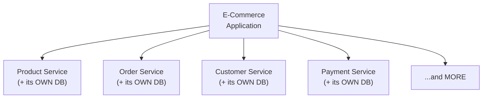

#### ❓ Why It Exists — The Precise, Genuine, Scaling Problem

> 💡 **Given directly:** *"For example, I have 50 microservices in my application. So if I want to deploy those 50 microservices, then 50 containers I have to create... for one microservice, I want to do the load balancing, instead of running my microservice in one docker container, I want to run my microservice in 20 docker containers... if more number of requests are coming, I want to increase the containers. If less number of requests are coming, I want to decrease the containers. If any container is crashed, I want to replace that with another container."*

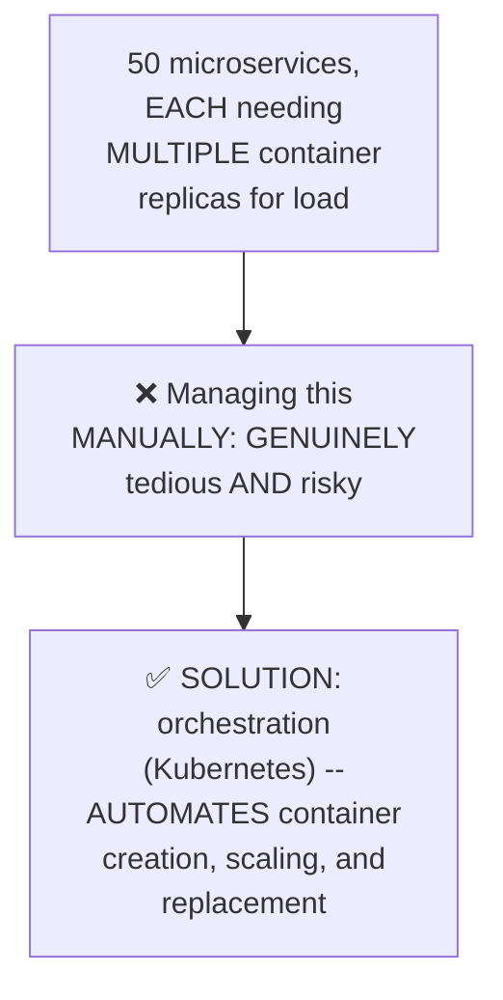

#### ⚠ Common Mistakes

* Assuming ONE container per MICROSERVICE is GENUINELY sufficient for a real, production APPLICATION — explicitly, directly clarified: REAL applications GENUINELY need MULTIPLE replicas PER service, for LOAD handling.
* Assuming MANUAL container management is GENUINELY feasible at ANY meaningful scale — explicitly, directly, CONCRETELY demonstrated as becoming "very very very difficult" as the NUMBER of services and REPLICAS GROWS.

#### 🎯 Key Takeaways

* MODERN applications GENUINELY use **microservices architecture** — MANY independent services, EACH with its OWN database (DB-per-service) — REPLACING the OLDER, monolithic approach.
* A REAL, worked example (50 microservices, EACH potentially needing 20 REPLICAS for load) directly, CONCRETELY illustrates WHY manual container MANAGEMENT becomes GENUINELY unmanageable.
* This EXACT problem — creating, SCALING, and REPLACING containers AT SCALE — is PRECISELY what Kubernetes' own ORCHESTRATION capability SOLVES.

---

### 4. Kubernetes' Four Core Benefits

#### 📖 Definition — Benefit 1: Container Orchestration

> 💡 **Given directly:** *"The first advantage with the Kubernetes, it is providing a platform to manage the containers, that is called container orchestration."*

#### 📖 Definition — Benefit 2: Scalability

> 💡 **Given directly:** *"Scalability nothing but based on the demand, it can increase our containers or it can decrease our containers... it has to adjust the infrastructure capacity based on the demand."*

#### 📖 Definition — Benefit 3: Self-Healing

> 💡 **Given directly:** *"Self-healing nothing but if any container is damaged... Kubernetes will replace that with another container."*

#### 📖 Definition — Benefit 4: Load Balancing

> 💡 **Given directly:** *"When our application is running in multiple containers, it will distribute the load to all the containers in the round-robin fashion."*

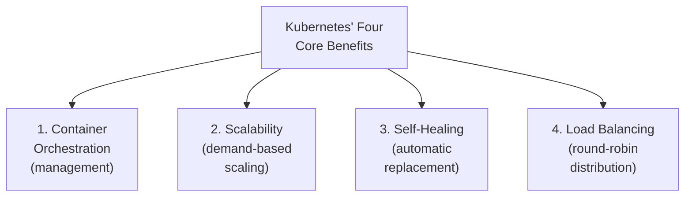

#### ⚠ Common Mistakes

* Confusing "self-healing" with "scalability" — explicitly, directly, precisely distinguished: SELF-HEALING replaces a DAMAGED container with a NEW, IDENTICAL one; SCALABILITY changes the TOTAL number of containers BASED on demand.

#### 🎯 Key Takeaways

* Kubernetes' FOUR core benefits, GENUINELY, precisely defined: **container orchestration** (MANAGEMENT), **scalability** (DEMAND-based adjustment), **self-healing** (AUTOMATIC replacement of DAMAGED containers), and **load balancing** (ROUND-ROBIN distribution).
* These FOUR benefits directly, precisely set up EVERY subsequent, PRACTICAL demonstration in this session — SELF-HEALING, in PARTICULAR, is LATER proven LIVE (Section 14).

---
### 5. Kubernetes Architecture: Cluster, Control Plane & Worker Nodes

#### 📖 Definition — Cluster, Precisely Defined

> 💡 **Given directly:** *"Kubernetes works based on cluster architecture... Cluster is nothing but group of servers... If you want to use Kubernetes then you need multiple servers. With one computer you can't set up the Kubernetes."*

#### 📖 Definition — Control Plane, Precisely Defined

> 💡 **Given directly:** *"Control plane is like a manager for the team. Control plane is going to manage the team members. The team members nothing but worker nodes... control plane is also called as master node in the Kubernetes."*

#### 📖 Definition — Worker Nodes, Precisely Defined

> 💡 **Given directly:** *"Worker nodes nothing but the machines in which our application will execute. Worker nodes are nothing but employees... Worker node is nothing but a slave. Master and slave. Control plane is called as master and worker node is called as a slave."*

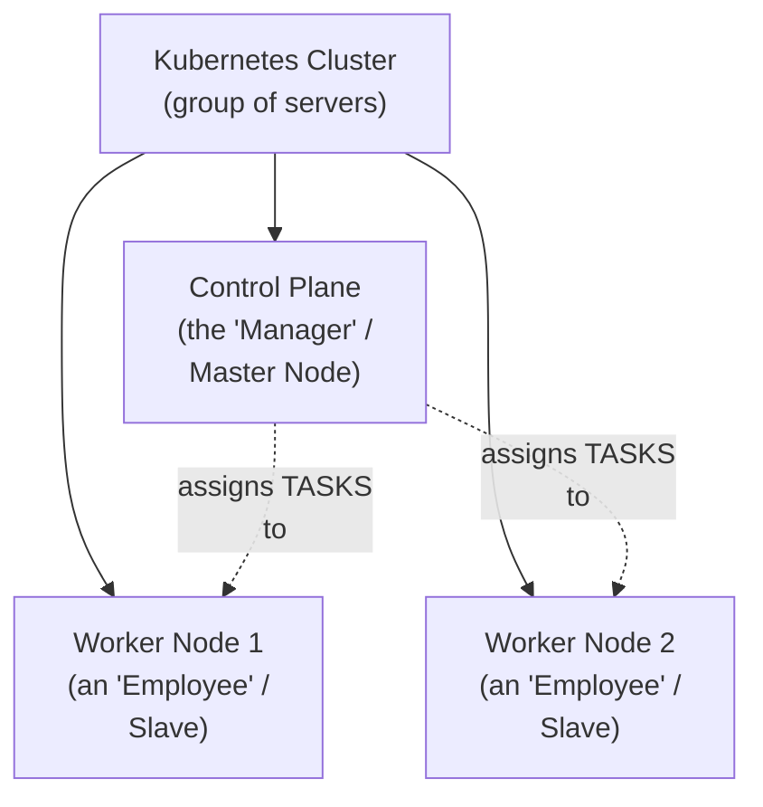

#### 📖 Definition — kubectl, Precisely Introduced

> 💡 **Given directly:** *"Kubectl is a command line utility which is used to communicate with the Kubernetes control plane... in order to communicate with the control plane, there are two ways available. By using UI pages also... or you can use kubectl."*

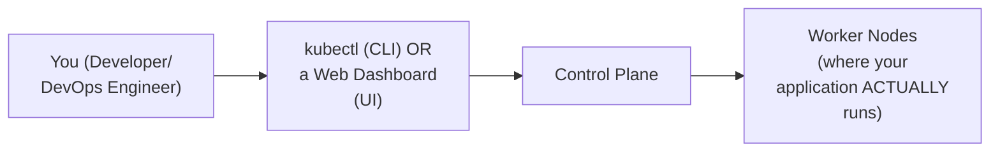

#### ⚠ Common Mistakes

* Assuming Kubernetes can GENUINELY be set up on a SINGLE computer, for REAL, production use — explicitly, directly clarified: it GENUINELY requires MULTIPLE servers (a "cluster") — SINGLE-machine setups are for LEARNING ONLY (covered in Section 8).
* Assuming an application is DIRECTLY deployed TO the control plane — explicitly, directly clarified: the control plane GENUINELY, ONLY manages/assigns TASKS; the APPLICATION ITSELF runs on the WORKER NODES.

#### 🎯 Key Takeaways

* Kubernetes GENUINELY operates on a **CLUSTER architecture** — a cluster being PRECISELY a GROUP of servers, REQUIRING multiple machines.
* The **control plane** (the "MANAGER"/master node) MANAGES the **worker nodes** (the "EMPLOYEES"/slaves) — a GENUINELY memorable, real ANALOGY worth REMEMBERING.
* **`kubectl`** is the PRIMARY command-line TOOL for COMMUNICATING with the control plane — an ALTERNATIVE to a WEB-based dashboard.

---

### 6. Control Plane Components: API Server, etcd, Scheduler & Controller Manager

#### 📖 Definition — API Server, Precisely Introduced

> 💡 **Given directly:** *"API server will receive incoming request and it will store that request information into etcd... whatever the request I sent — deploy the application, increase the containers, decrease the containers, delete the application — these are called requests to the Kubernetes."*

#### 📖 Definition — etcd, Precisely Introduced

> 💡 **Given directly:** *"ETCD is the internal database for the Kubernetes cluster which is used to store the request information."*

#### 📖 Definition — Scheduler, Precisely Introduced

> 💡 **Given directly:** *"Scheduler is responsible to schedule the pending tasks available in the etcd... it will check what are the pending tasks available in the etcd, then it will take those pending tasks and it will schedule the pending task to the worker node."*

#### 📖 Definition — Controller Manager, Precisely Introduced

> 💡 **Given directly:** *"Controller manager will monitor all the Kubernetes resources functionality — what all the resources available, whether those resources are working as expected or not."*

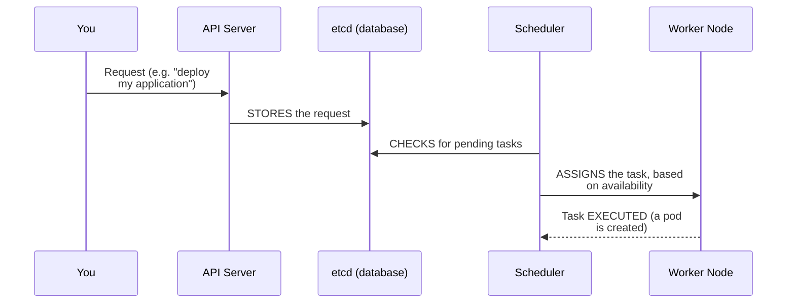

#### 🔍 Internal Working — The Complete, Manager/Team Analogy, Applied Precisely

> 💡 **Given directly:** *"Manager will assign that task to the team. Then team member will do the actual task. Manager will take the task from the higher authority or from the client. Manager will assign the task to the team members. Team members will complete the task. Same concept here also — when we send a request, control plane will take it, then it will assign to the worker group."*

#### ⚠ Common Mistakes

* Confusing the ROLE of the API server (RECEIVING and STORING requests) with the SCHEDULER (ASSIGNING pending TASKS to worker nodes) — explicitly, directly, precisely distinguished as TWO, sequential, DIFFERENT steps.
* Assuming ANY control-plane COMPONENT directly RUNS the application — explicitly, directly clarified: ALL FOUR control-plane components (API server, etcd, scheduler, controller manager) MANAGE and COORDINATE — the ACTUAL application EXECUTION happens on the WORKER nodes.

#### 🎯 Key Takeaways

* **API Server** RECEIVES incoming requests and STORES them in **etcd** (the cluster's OWN internal DATABASE).
* **Scheduler** CHECKS etcd for PENDING tasks and ASSIGNS them to an AVAILABLE worker node; **Controller Manager** CONTINUOUSLY monitors WHETHER resources are WORKING as expected.
* This COMPLETE flow (API Server → etcd → Scheduler → Worker Node) directly, precisely mirrors the "MANAGER receives a request FROM a client, then ASSIGNS it to an AVAILABLE team member" ANALOGY established EARLIER.

---
### 7. Worker Node Components: Pods, kubelet & kube-proxy

#### 📖 Definition — kubelet, Precisely Introduced

> 💡 **Given directly:** *"Scheduler will get the available worker nodes information by using a node agent which is called kubelet. Kubelet is called as personal assistant for the worker, is called as a node agent."*

#### 🧠 Concept — A Genuinely Memorable, Real Analogy: The Celebrity's Personal Assistant

> 💡 **Given directly:** *"Suppose if you take any celebrity or any politician, the personal assistant will be available for them. They will manage their schedules... suppose if you want to connect with any celebrity, first you need to check the celebrity availability by talking to his PA... same concept here, for every worker node an agent will be available. That agent is called as kubelet."*

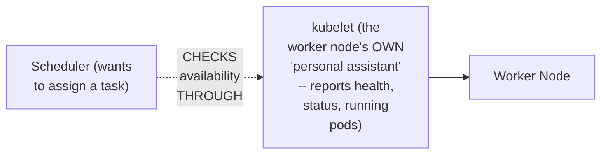

#### 📖 Definition — kube-proxy, Precisely Introduced

> 💡 **Given directly:** *"There should be some network communication... to establish this network communication, kube-proxy will provide the network... kube-proxy provides the required network for the communication from control plane to worker node and worker node to the control plane."*

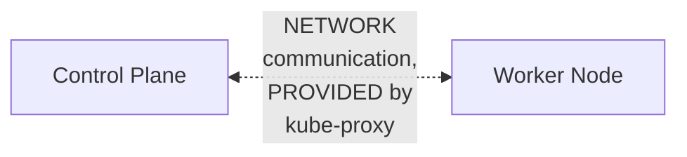

#### 📖 Definition — Pod, Precisely Introduced

> 💡 **Given directly:** *"Pod represents runtime instance of the application. Pod is called as smallest building block that we run in the Kubernetes cluster... In the docker directly we can create the container, but in the Kubernetes we are going to create the pods. Pod is nothing but a process."*

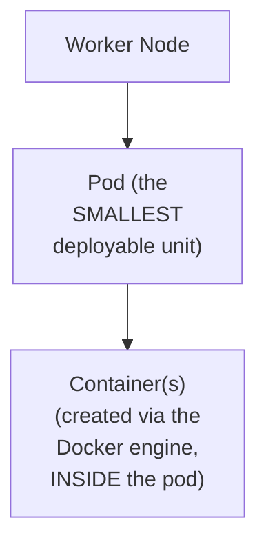

#### 🔍 Internal Working — Precisely Confirming the COMPLETE Worker-Node Component Set

> 💡 **Given directly:** *"Inside the worker node, pod will be available. Containers will be available. Docker engine will be available. Kubelet will be available. Kube-proxy will be available."*

#### ⚠ Common Mistakes

* Assuming Docker containers are created DIRECTLY, WITHOUT any intermediate structure, IN Kubernetes — explicitly, directly, precisely clarified: Kubernetes GENUINELY creates PODS FIRST; containers are created WITHIN a pod, via the WORKER NODE's OWN Docker ENGINE.
* Confusing kubelet's ROLE (REPORTING worker-node health/status) with kube-proxy's ROLE (providing NETWORK communication) — explicitly, directly distinguished as TWO, DIFFERENT, complementary FUNCTIONS.

#### 🎯 Key Takeaways

* **kubelet** is the "PERSONAL ASSISTANT" (NODE agent) for EACH worker node — REPORTING its health, STATUS, and RUNNING pods to the scheduler.
* **kube-proxy** PROVIDES the NETWORK communication REQUIRED between the control PLANE and worker NODES.
* A **pod** is precisely the SMALLEST deployable UNIT in Kubernetes — a RUNTIME instance of an application, CONTAINING one or MORE Docker containers, CREATED via the worker node's OWN Docker engine.

---

### 8. Setting Up a Cluster: Self-Managed vs. Managed Options

#### 📖 Definition — The Two, Genuine, Top-Level Categories

> 💡 **Given directly:** *"Kubernetes cluster we can set up in multiple ways guys. One is self-managed cluster. Another one is provider managed cluster."*

#### 📖 Definition — Minikube, Precisely Introduced

> 💡 **Given directly:** *"Minikube is nothing but single node cluster. Everything whatever we have seen in the previous diagram — control plane, worker nodes — like this architecture will not be available. Everything will be available in one system only... only for your learning purpose, only for your practice purpose — in the real time we don't use minikube for running our applications."*

#### 📖 Definition — kubeadm, Precisely Introduced

> 💡 **Given directly:** *"This multi-node cluster you can set up on your own by using a software called kubeadm... you take three Linux machines, then you install all these softwares in one machine, then you install all these softwares in the other two machines. You take care of everything on your own... You need to execute around 30 to 40 Linux commands to set up the kubeadm cluster."*

#### 📖 Definition — Managed Cluster Services, Precisely Introduced

> 💡 **Given directly:** *"AWS EKS. EKS is a service in the AWS, which is nothing but Elastic Kubernetes Service... In the Azure, AKS available. AKS is nothing but Azure Kubernetes Service. In the GCP cloud, GKE, Google Kubernetes Engine, is available. IBM IKE is available."*

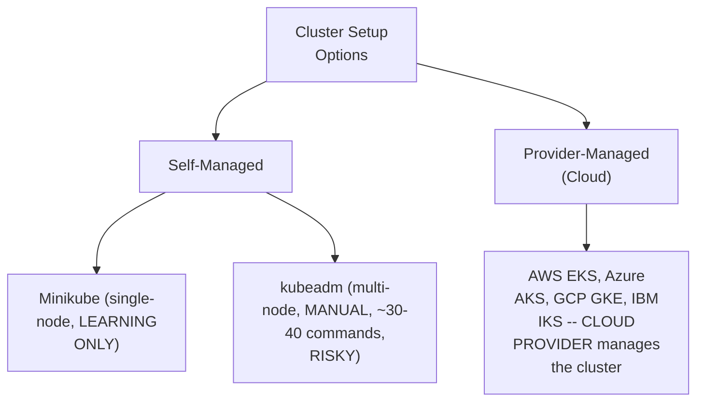

#### ⚠ A Direct, Honest, Important Cost Clarification

> 💡 **Given directly:** *"Kubernetes is free. I'm telling once again, Kubernetes is free. But here EKS is not free. AWS EKS is a paid service. Bill will be generated... if you use that cluster for 24 hours, that's negligible, 100 rupees something like that bill will be generated. But if you run the cluster for 1 month, then 3,000 to 4,000 rupees bill will be generated."*

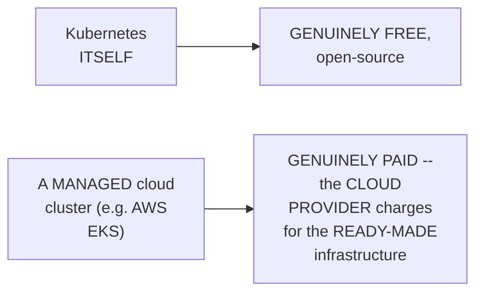

#### ⚠ Common Mistakes

* Assuming Kubernetes ITSELF costs money — explicitly, directly, HONESTLY clarified: Kubernetes is GENUINELY free; ONLY the MANAGED cloud service (like AWS EKS) genuinely CHARGES a fee, for the READY-MADE infrastructure it PROVIDES.
* Assuming Minikube is GENUINELY suitable for PRODUCTION use — explicitly, directly clarified: it's EXPLICITLY, ONLY for LEARNING — the entire "cluster" runs on ONE machine, WITHOUT the real, multi-node ARCHITECTURE.

#### 🎯 Key Takeaways

* Kubernetes clusters can be SET UP via **self-managed** options (Minikube: SINGLE-node, LEARNING only; kubeadm: MULTI-node, MANUAL, complex) or **provider-managed** options (AWS EKS, Azure AKS, GCP GKE, IBM IKS).
* **Kubernetes ITSELF is GENUINELY free** — but MANAGED cloud services (like AWS EKS) are HONESTLY, DIRECTLY confirmed as PAID, hourly-BILLED services.
* This session's own PRACTICAL demonstration uses **AWS EKS** SPECIFICALLY — the MOST common, real-world CHOICE, DIRECTLY covered NEXT.

---
### 9. A Complete, Live AWS EKS Cluster Setup

#### 🪜 Step-by-Step — The Complete, Three-Step Plan

> 💡 **Given directly:** *"Step one, create EKS host in the AWS. Step two, create IAM role and attach to the EKS host. And step three, create EKS cluster using EKSCTL."*

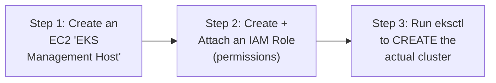

#### 💻 Code Example — Step 1: The EC2 Management Host

> 💡 **Given directly:** *"I'm going to create one EC2 instance in the AWS cloud. In that EC2 instance, I'm going to install these softwares. `kubectl` software I will install, AWS CLI software I will install, and `eksctl` software I'm going to install."*

```bash
# On a fresh Ubuntu EC2 instance (t2.micro is sufficient):
# 1. Install kubectl (via the official install script)
# 2. Install AWS CLI (via the official install script)
# 3. Install eksctl (via the official install script)
```

#### 💻 Code Example — Step 2: IAM Role Creation & Attachment

> 💡 **Given directly:** *"What permissions we need to give?... IAM full access... VPC full access... EC2 full access... CloudFormation full access... administrator access also... total five policies we have selected for this role."*

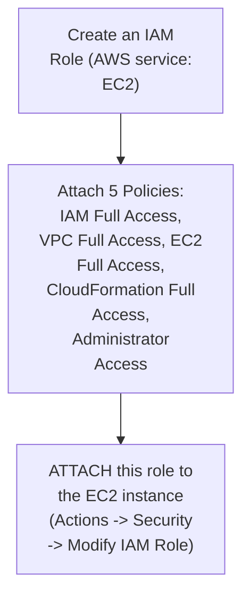

#### 💻 Code Example — Step 3: Creating the Actual Cluster

> 💡 **Given directly:** *"I want to create the cluster in the Mumbai region. Mumbai region code is AP South 1... for the node I want to use T2 medium instances... if I don't give the count of the worker nodes, by default it will take two worker nodes... cluster creation will take five to 10 minutes of time."*

```bash
eksctl create cluster --name <cluster_name> --region ap-south-1 \
  --nodegroup-name <name> --node-type t2.medium --zones ap-south-1a,ap-south-1b
```

#### 🔍 Internal Working — A Genuine, Direct, Live-Confirmed Result

> 💡 **Given directly:** *"Successfully I'm able to complete my cluster setup... how to verify my cluster is working as expected or not? We can use a command called `kubectl get nodes` command... there are two worker nodes are ready and they are running."*

```bash
kubectl get nodes   # confirms the cluster's own WORKER NODES are genuinely READY
```

#### ⚠ A Direct, Honest, Real, Important Reminder

> 💡 **Given directly:** *"After your practice is completed, delete the cluster. Don't keep the cluster in the running state. If you keep the cluster in the running state, hourly bill will be generated."*

#### ⚠ Common Mistakes

* Attempting to run `eksctl` WITHOUT FIRST attaching the CORRECT IAM role to the EC2 host — explicitly, directly clarified: cluster CREATION GENUINELY requires SPECIFIC, elevated PERMISSIONS (IAM, VPC, EC2, CloudFormation, administrator ACCESS).
* Leaving a REAL EKS cluster RUNNING after PRACTICE is complete — explicitly, directly, HONESTLY warned as GENUINELY, CONTINUOUSLY generating hourly BILLING charges.

#### 🎯 Key Takeaways

* A COMPLETE, real EKS setup GENUINELY requires **THREE, sequential steps**: create an EC2 MANAGEMENT host (with `kubectl`, AWS CLI, `eksctl` installed), create AND attach an IAM ROLE (5 specific policies), and RUN `eksctl create cluster`.
* Cluster CREATION genuinely takes **5-10 MINUTES**, and — WITHOUT specifying a NODE count — DEFAULTS to **TWO worker nodes**.
* **`kubectl get nodes`** is the GENUINE, direct way to CONFIRM a cluster is SUCCESSFULLY, READILY set UP — directly, LIVE-verified in this session.

---

### 10. Pods: The Smallest Deployable Unit

#### 📖 Definition — Pod, Precisely Re-Confirmed With Additional, Genuine Detail

> 💡 **Given directly:** *"Pod is a smallest building block that we can deploy in the Kubernetes cluster... For one application, we can create multiple pod replicas for the high availability. And whenever you create a pod, for every pod, one IP address will be generated."*

#### ❓ Why It Exists — The Precise, Genuine Reason for Multiple Pod Replicas

> 💡 **Given directly:** *"If you create multiple pods for one application, high availability will be there. If one pod is deleted also, if one pod crashes, if one pod is damaged, then no problem — other pod will be available to execute our application."*

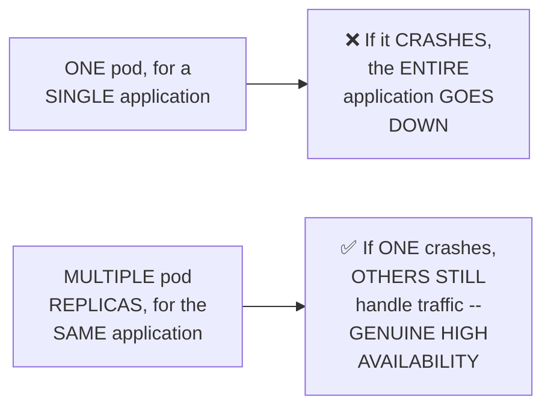

#### 🔍 Internal Working — A Direct, Precise Confirmation: Pods Are NOT Externally Accessible by Default

> 💡 **Given directly:** *"By default, pods are accessible only within the cluster. You can't access the pod outside. That means you can't access your application directly. If you create only pods, then what we need to do — to expose the pods outside the cluster, we need to implement a concept called service concept."*

#### ⚠ Common Mistakes

* Assuming a SINGLE pod is GENUINELY sufficient for a REAL, production application — explicitly, directly connected BACK to the "high AVAILABILITY" reasoning: MULTIPLE replicas GENUINELY protect against a SINGLE point of FAILURE.
* Assuming a CREATED pod is IMMEDIATELY, GENUINELY accessible from OUTSIDE the cluster — explicitly, directly clarified as FALSE: pods are GENUINELY, ONLY accessible WITHIN the cluster BY DEFAULT — a SEPARATE "service" concept is GENUINELY required for external access.

#### 🎯 Key Takeaways

* A **pod** is the SMALLEST deployable UNIT — EVERY pod GENUINELY receives its OWN, unique IP ADDRESS.
* MULTIPLE pod REPLICAS for the SAME application directly, precisely provide **HIGH AVAILABILITY** — if ONE genuinely FAILS, OTHERS continue SERVING traffic.
* Pods are **GENUINELY, ONLY accessible WITHIN the cluster BY DEFAULT** — directly, precisely SETTING UP the NEXT section's own SERVICE concept as the REQUIRED solution.

---
### 11. Kubernetes Services: ClusterIP, NodePort & LoadBalancer

#### 📖 Definition — Service, Precisely Introduced

> 💡 **Given directly:** *"Kubernetes service is used to expose the pods. Whatever the pods we have, in order to expose the pods, we are using service concept. In the Kubernetes there are three types of services available."*

#### 📖 Definition — ClusterIP, Precisely Defined

> 💡 **Given directly:** *"If you use the cluster IP, the pods will be exposed only within the cluster but not outside. Suppose for example when we are going to deploy the database in the Kubernetes cluster, then database I don't want outside people to access — my database ports should be accessed only within the cluster, not outside the cluster. Then we can give cluster IP service."*

#### 📖 Definition — NodePort, Precisely Defined

> 💡 **Given directly:** *"NodePort is a service which is used to expose the pods which are running in the particular worker node... which worker node's pods you want to access outside, that you can expose by using NodePort."*

#### 📖 Definition — LoadBalancer, Precisely Defined

> 💡 **Given directly:** *"If you want to access the pods running in ALL the worker nodes in the load balancing mechanism, then the service type is available as a load balancer... My application is having 10 pods, five pods running in one worker node, remaining five pods running in another worker node — if you want to access all the pods with the load balancing technique, then we need to expose those pods by using a concept called load balancer."*

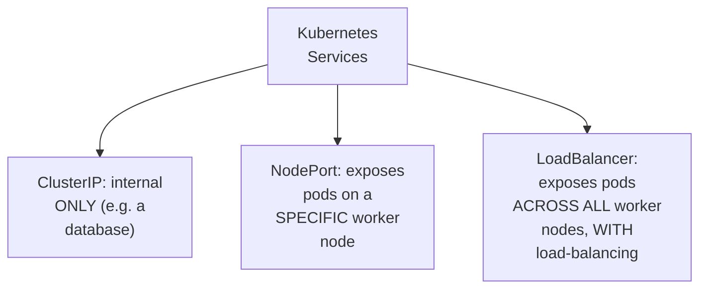

#### ⚠ Common Mistakes

* Using ClusterIP for a PUBLIC-facing application — explicitly, directly clarified: ClusterIP is GENUINELY, SPECIFICALLY suited for INTERNAL-only resources (like DATABASES), NOT anything requiring EXTERNAL access.
* Confusing NodePort with LoadBalancer — explicitly, directly, precisely distinguished: NodePort exposes pods on a SPECIFIC worker node ONLY; LoadBalancer distributes ACROSS ALL worker nodes, WITH genuine load balancing.

#### 🎯 Key Takeaways

* Kubernetes offers **THREE service TYPES**: **ClusterIP** (internal-ONLY, e.g. for databases), **NodePort** (exposes a SPECIFIC worker node's pods), and **LoadBalancer** (exposes ALL worker nodes' pods, WITH load balancing).
* The CHOICE of service TYPE directly, precisely depends on WHO needs to ACCESS the pods — internal-ONLY components use ClusterIP; PUBLIC-facing applications GENERALLY use LoadBalancer.
* This section directly, precisely sets up THIS session's own COMPLETE, practical DEPLOYMENT (Section 12), which USES a **LoadBalancer** service to EXPOSE a real application.

---

### 12. Writing a Complete Manifest YAML: Deployment + Service

#### 📖 Definition — The Four, Genuine Manifest Sections

> 💡 **Given directly:** *"In this YML file, four sections will be available. One is called API version. Second one is kind. Third one is metadata. Fourth one is spec."*

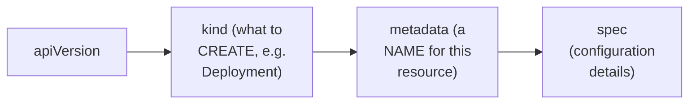

#### 💻 Code Example — The Complete, Real, Worked Deployment Manifest

> 💡 **Given directly, precisely narrating the COMPLETE, worked example:** *"API version apps/v1, kind is a deployment, metadata name is Java web application deployment... replicas two... strategy... rolling update... selector match labels... app: java-web... pod template... container name... image Ashokit/java-web-app... container port 8080."*

```yaml
apiVersion: apps/v1
kind: Deployment
metadata:
  name: java-web-app-deployment
spec:
  replicas: 2
  strategy:
    type: RollingUpdate
  selector:
    matchLabels:
      app: java-web-app
  template:
    metadata:
      name: java-web-app-pod
      labels:
        app: java-web-app
    spec:
      containers:
        - name: java-web-app-container
          image: ashokit/java-web-app
          ports:
            - containerPort: 8080
```

#### 🔍 Internal Working — Precisely Why Labels & Selectors Genuinely Matter

> 💡 **Given directly:** *"Label is nothing but the ID for the pod. Label is used to identify the pod... this label, it will identify that by using selector... whatever label name you are giving for the pod, same label name we are going to specify as a selector."*

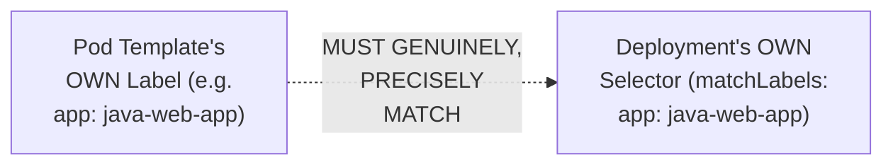

#### 💻 Code Example — The Complete, Real, Worked Service Manifest

> 💡 **Given directly:** *"API version we are going to give this as v1 for the service... kind, service... metadata, name Java web app service... spec... type... load balancer... selector... app colon java web app... port mapping... container running on port 8080, load balancer port mapping to 80."*

```yaml
apiVersion: v1
kind: Service
metadata:
  name: java-web-app-service
spec:
  type: LoadBalancer
  selector:
    app: java-web-app
  ports:
    - port: 80
      targetPort: 8080
```

#### ⚠ A Direct, Honest, Important Reminder About Indentation

> 💡 **Given directly:** *"Indentation is very important. You need to follow the indentation. If you do a small mistake with the space also, the deployment will not be created."*

#### ⚠ A Direct, Honest, Practical Acknowledgment of Genuine Learning Curve

> 💡 **Given directly:** *"Writing this manifest YAML requires a lot of practice... within one hour, within two hours, you can't understand these YAMLs. So it may take one week to 10 days of time to understand how to write these YAMLs."*

#### ⚠ Common Mistakes

* Mismatching the POD template's own LABEL and the deployment's own SELECTOR — explicitly, directly, precisely clarified as a GENUINE, real requirement: these MUST match EXACTLY, or the deployment GENUINELY cannot correctly identify its OWN pods.
* Assuming YAML INDENTATION is a MINOR, cosmetic detail — explicitly, directly, HONESTLY warned: a SMALL indentation mistake GENUINELY, DIRECTLY prevents the ENTIRE deployment from being CREATED.

#### 🎯 Key Takeaways

* EVERY Kubernetes manifest genuinely requires **FOUR sections**: `apiVersion`, `kind`, `metadata`, and `spec`.
* A COMPLETE, real Deployment manifest SPECIFIES replicas, STRATEGY (rolling UPDATE), labels/SELECTORS, and the CONTAINER's own DOCKER image — directly, LIVE-demonstrated for a REAL Java web application.
* The pod TEMPLATE's own LABEL and the SERVICE's own SELECTOR must GENUINELY, PRECISELY MATCH — a service can ONLY expose pods it can CORRECTLY IDENTIFY via this MATCHING mechanism.

---
### 13. Deploying & Verifying: kubectl Commands in Practice

#### 💻 Code Example — Verifying an Empty Cluster BEFORE Deployment

> 💡 **Given directly:** *"Cubectl get pods. Any pods available? No pods available. Cubectl get service. Any services available?... Cubectl get deployment. Deployment is also not available."*

```bash
kubectl get pods          # check running pods
kubectl get service         # check running services
kubectl get deployment        # check running deployments
```

#### 💻 Code Example — Applying the Manifest

> 💡 **Given directly:** *"To execute the YAML, we will use a command called `kubectl apply -f` our YAML file... My deployment is created. My service also created."*

```bash
kubectl apply -f java-web-app-deployment.yml
```

#### 💻 Code Example — Confirming Success

> 💡 **Given directly:** *"Now go for `kubectl get pods`. Now you can see there are two pods created, and those two pods are in the running status... `kubectl get pods -o wide` — this will display your pods are running in which worker node."*

```bash
kubectl get pods            # confirms 2 pods, RUNNING
kubectl get pods -o wide      # ALSO shows which WORKER NODE each pod runs on
kubectl get service             # confirms the LOAD BALANCER's own service
kubectl get deployment            # confirms the deployment's own status
kubectl get all                     # shows EVERY created resource, at once
```

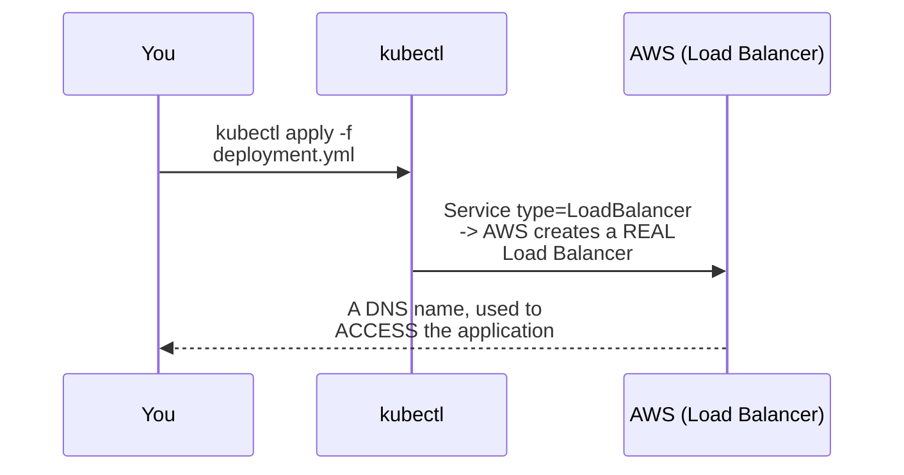

#### 🔍 Internal Working — A Genuine, Real, Live-Confirmed Result

> 💡 **Given directly:** *"Earlier there is zero load balancers available. Now you see one load balancer is created in the AWS... take this load balancer DNS. Go to the browser... I'm able to access my application which is running in the Kubernetes cluster."*

#### ⚠ Common Mistakes

* Assuming `kubectl get pods` alone reveals WHICH worker node EACH pod is running ON — explicitly, directly clarified: the `-o wide` flag is GENUINELY needed for THIS additional DETAIL.
* Assuming an APPLICATION is IMMEDIATELY accessible RIGHT after `kubectl apply` — explicitly, directly clarified: it GENUINELY takes a SHORT time for AWS to PROVISION the ACTUAL load balancer INFRASTRUCTURE, WHICH then provides the ACCESS URL.

#### 🎯 Key Takeaways

* **`kubectl apply -f <file>`** GENUINELY, DIRECTLY executes a manifest — CREATING every resource it DEFINES (pods, deployment, SERVICE).
* **`kubectl get pods/service/deployment/all`** are the GENUINE, essential VERIFICATION commands — CONFIRMING what was ACTUALLY created.
* This session's own COMPLETE workflow was **directly, LIVE-verified END TO END** — CULMINATING in a REAL, successful application ACCESS via the AWS Load Balancer's OWN, genuine DNS name.

---

### 14. Proving Self-Healing: A Live, Repeated Demonstration

#### ❓ Why It Exists — A Direct, Explicit Challenge

> 💡 **Given directly:** *"We'll see one of the concept called self-healing, as I told you Kubernetes will provide you self-healing... can we check it? Can we prove that practically? Is Kubernetes providing self-healing or not?"*

#### 🪜 Step-by-Step — A Complete, Live, First Demonstration

> 💡 **Given directly:** *"There are two pods running. I will delete one pod and I will see the behavior of the Kubernetes... `kubectl delete pod` with the pod name... now pod is deleted... now check the pods count. Get pods. Again two pods are available. So one pod is running from 16 minutes. Another pod is running from 18 seconds. That means Kubernetes recreated the pod."*

```bash
kubectl get pods              # confirms: 2 pods RUNNING
kubectl delete pod <pod_name>   # deliberately DELETE one
kubectl get pods                  # confirms: STILL 2 pods -- Kubernetes CREATED a REPLACEMENT
```

```mermaid
flowchart TD
    A["2 pods running<br/>(replicas: 2)"] --> B["1 pod is<br/>DELIBERATELY,<br/>MANUALLY deleted"]
    B --> C["Kubernetes<br/>GENUINELY,<br/>AUTOMATICALLY<br/>detects the<br/>MISMATCH (1<br/>running, 2<br/>DESIRED)"]
    C --> D["✅ A NEW, replacement<br/>pod is<br/>AUTOMATICALLY,<br/>GENUINELY created --<br/>BACK to 2 running"]
```

#### 🪜 Step-by-Step — A Complete, Live, SECOND, Repeated Demonstration

> 💡 **Given directly:** *"Let me do that once again... one pod is running from 17 minutes... let me delete the old pod... then check the pods immediately. Another pod came, 5 seconds ago, one more pod got created. So if you delete one pod, Kubernetes is creating another pod. That is called self-healing."*

#### 🏢 Real-World / Production Usage — The Precise, Genuine Significance

> 💡 **Given directly:** *"This is one of the biggest advantage in the Kubernetes. High availability will be there for our application."*

#### ⚠ Common Mistakes

* Assuming a SINGLE demonstration is GENUINELY sufficient to PROVE a CAPABILITY as important as self-healing — explicitly, directly, DELIBERATELY REPEATED a SECOND time in THIS session, DIRECTLY reinforcing GENUINE confidence in the RESULT.
* Assuming Kubernetes GENUINELY needs to IDENTIFY WHICH specific pod was DELETED, to know HOW to respond — explicitly, directly clarified: it SIMPLY, GENUINELY maintains the DESIRED replica COUNT (2), REGARDLESS of WHICH specific pod was LOST.

#### 🎯 Key Takeaways

* Self-healing was **GENUINELY, DIRECTLY, LIVE-proven — TWICE** — deleting a POD and IMMEDIATELY observing Kubernetes AUTOMATICALLY create a REPLACEMENT.
* Kubernetes GENUINELY maintains the **DESIRED replica COUNT** (as specified in the deployment's own `replicas` field) — AUTOMATICALLY, CONTINUOUSLY, WITHOUT requiring MANUAL intervention.
* This is directly, explicitly framed as **ONE of Kubernetes' OWN, biggest, real ADVANTAGES** — directly, GENUINELY enabling high AVAILABILITY.

---
### 15. Troubleshooting: kubectl logs

#### ❓ Why It Exists — A Direct, Explicit, Genuine Interview Framing

> 💡 **Given directly:** *"If any pod is damaged, if any pod is crashed, if any problem occurred in the pod, how can we check the logs of the pod?... In the interview they will ask this question also. My pod is having some problem. How do you troubleshoot the trouble? By checking the logs of the pod."*

#### 💻 Code Example — The Command, Precisely Introduced

> 💡 **Given directly:** *"To check the logs of the pod, we will use `kubectl logs` command with the pod name... it will display how your application is executing... this is my Spring Boot application. This is Spring Boot application is running in the Tomcat server with the port number 8080."*

```bash
kubectl logs <pod_name>
```

```mermaid
flowchart LR
    A["A pod GENUINELY<br/>has an issue<br/>(crashed, damaged,<br/>unexpected<br/>behavior)"] --> B["kubectl logs<br/><pod_name>"]
    B --> C["DIRECTLY reveals<br/>the application's<br/>OWN, real startup/<br/>runtime output"]
```

#### ⚠ Common Mistakes

* Assuming `kubectl get pods` ALONE provides GENUINELY sufficient DIAGNOSTIC information WHEN a pod has an ISSUE — explicitly, directly clarified: `kubectl logs` is GENUINELY, SPECIFICALLY needed to see the APPLICATION's own DETAILED, real OUTPUT.

#### 🎯 Key Takeaways

* **`kubectl logs <pod_name>`** directly, precisely retrieves a POD's own APPLICATION output — the GENUINE, PRIMARY tool for TROUBLESHOOTING a damaged or CRASHED pod.
* This is explicitly, DIRECTLY framed as a REAL, common interview QUESTION — "how do you TROUBLESHOOT a pod PROBLEM?"
* Cleanup: **`kubectl delete all --all`** GENUINELY removes EVERY created resource (pods, services, DEPLOYMENTS) — directly, precisely useful for RESETTING a cluster AFTER practice.

---

### 16. Closing: Connecting to CI/CD With Jenkins

#### 🪜 Step-by-Step — A Direct, Forward-Looking Overview

> 💡 **Given directly:** *"In the real time, the deployment will be created by using a CI/CD pipeline like this... we are going to create one CI/CD pipeline by using Jenkins... Jenkins will take the code from the Git repository. Jenkins will build that code by using Maven. Jenkins will create a Docker image for the application. Then finally that Docker image will be deployed in the Kubernetes cluster."*

```mermaid
flowchart LR
    A["Developer pushes<br/>code to Git"] --> B["Jenkins pipeline<br/>TRIGGERS"]
    B --> C["Maven builds/<br/>PACKAGES the code<br/>(jar/war)"]
    C --> D["Docker builds a<br/>NEW image"]
    D --> E["Kubernetes<br/>DEPLOYS this image<br/>(the SAME manifest<br/>YAML pattern<br/>covered in THIS<br/>session)"]
```

#### 🏢 Real-World / Production Usage — A Genuine, Direct Confirmation of WHY This Matters

> 💡 **Given directly:** *"In the real time, DevOps engineers are responsible to create this CI/CD pipeline... as a developer, you should also have some idea what is the CI/CD pipeline, how Kubernetes deployment will happen, how to check the logs in the Kubernetes, how to check the pods in the Kubernetes, what is Kubernetes manifest YAML."*

#### ⚠ Common Mistakes

* Assuming the MANUAL `kubectl apply` workflow DEMONSTRATED in THIS session represents the FULL, REAL production DEPLOYMENT process — explicitly, directly clarified: REAL, production deployments GENUINELY happen VIA an AUTOMATED CI/CD pipeline (Jenkins + Maven + Docker + Kubernetes TOGETHER), NOT manual commands.

#### 🎯 Key Takeaways

* This transcript **genuinely ENDS** on a FORWARD-LOOKING mention of Jenkins-based CI/CD — DIRECTLY, EXPLICITLY teasing the NEXT, LOGICAL topic in this BROADER workshop, WITHOUT completing it WITHIN this specific EXCERPT.
* The COMPLETE, real-world DEPLOYMENT workflow GENUINELY combines Git (source code), Jenkins (AUTOMATION), Maven (BUILD), Docker (CONTAINERIZATION), and Kubernetes (ORCHESTRATION) — EACH covered EITHER in THIS session OR the RELATED Docker session ALREADY processed in this WORKSPACE.
* Both DEVELOPERS and DevOps ENGINEERS are directly, EXPLICITLY confirmed as GENUINELY needing AWARENESS of this COMPLETE pipeline, EVEN IF DevOps engineers are PRIMARILY responsible for BUILDING it.

---
## 📝 Glossary

| Term | Definition | Why It Matters |
|---|---|---|
| **Kubernetes (K8s)** | A free, open-source orchestration (management) platform | Complements Docker's own containerization role |
| **Cluster** | A group of servers | The foundational Kubernetes deployment unit |
| **Control Plane (Master Node)** | The "manager" -- coordinates the entire cluster | Contains API server, etcd, scheduler, controller manager |
| **Worker Node (Slave)** | The "employee" -- runs the actual application | Contains pods, containers, Docker engine, kubelet, kube-proxy |
| **kubectl** | The CLI tool for communicating with the control plane | The primary, hands-on interface for managing Kubernetes |
| **API Server** | Receives incoming requests | The entry point into the control plane |
| **etcd** | The cluster's own internal database | Stores request information |
| **Scheduler** | Assigns pending tasks to available worker nodes | Checks etcd, checks node availability via kubelet |
| **Controller Manager** | Monitors whether resources are working as expected | -- |
| **kubelet** | The worker node's own "personal assistant"/node agent | Reports health, status, running pods |
| **kube-proxy** | Provides network communication for the cluster | Control plane <-> worker node communication |
| **Pod** | The smallest deployable unit in Kubernetes | A runtime instance of an application |
| **Service** | Exposes pods for access | ClusterIP (internal), NodePort (one node), LoadBalancer (all nodes) |
| **Self-Healing** | Automatic replacement of a damaged/deleted pod | Live-proven twice in this session |
| **Minikube** | A single-node, self-managed cluster | Learning only -- not for production |
| **kubeadm** | A multi-node, self-managed cluster | Manual, complex (~30-40 commands) |
| **AWS EKS / Azure AKS / GCP GKE** | Cloud-provider managed Kubernetes clusters | Paid services, unlike Kubernetes itself |
| **Manifest YAML** | A configuration file defining Kubernetes resources | apiVersion, kind, metadata, spec |

---

## 🔄 Revision Notes — One-Minute Revision

* This is the **Kubernetes portion** of a larger Docker & Kubernetes crash course -- a partial excerpt, genuinely covering fundamentals through a complete, live AWS EKS deployment.
* **Kubernetes**: a free, open-source ORCHESTRATION platform (Google-developed, CNCF-donated) -- complements Docker's own CONTAINERIZATION role. Orchestration = management.
* **Why it exists**: microservices architecture genuinely requires MANY containers per application, each potentially needing MULTIPLE replicas -- manual management becomes genuinely unmanageable at scale.
* **4 core benefits**: container orchestration, scalability, self-healing, load balancing.
* **Architecture**: a CLUSTER (group of servers) = a CONTROL PLANE (the "manager"/master node) + WORKER NODES (the "employees"/slaves). Control plane contains: API Server (receives requests) -> etcd (stores them) -> Scheduler (assigns pending tasks) -> Controller Manager (monitors resources). Worker node contains: pods, containers, Docker engine, kubelet (the "personal assistant"/node agent), kube-proxy (provides network communication).
* **kubectl**: the CLI for communicating with the control plane (an alternative to a web dashboard).
* **Cluster setup**: self-managed (Minikube = single-node, LEARNING ONLY; kubeadm = multi-node, manual, ~30-40 commands) vs. provider-managed (AWS EKS, Azure AKS, GCP GKE, IBM IKS). HONEST clarification: Kubernetes ITSELF is free; managed cloud services (EKS) are genuinely PAID, hourly-billed.
* **Complete, real AWS EKS setup**: (1) create an EC2 "EKS management host," install kubectl/AWS CLI/eksctl; (2) create + attach an IAM role (5 policies: IAM, VPC, EC2, CloudFormation, Administrator full access); (3) run `eksctl create cluster` (~5-10 min, defaults to 2 worker nodes). Verify via `kubectl get nodes`.
* **Pods**: the smallest deployable unit -- a runtime instance of an application, each with its own IP. Multiple replicas = high availability. Pods are ONLY accessible within the cluster by default.
* **Services (3 types)**: ClusterIP (internal only, e.g. databases), NodePort (a specific worker node), LoadBalancer (all worker nodes, with load balancing).
* **Manifest YAML**: 4 sections -- apiVersion, kind, metadata, spec. A complete, real, worked example combined a Deployment (2 replicas, RollingUpdate strategy, labels/selectors matching precisely) and a LoadBalancer Service (port 80 -> containerPort 8080).
* **Deployment workflow**: `kubectl apply -f <file>` -> `kubectl get pods/service/deployment/all` to verify -> access via the AWS Load Balancer's own DNS name (genuinely, live confirmed working).
* **Self-healing**: genuinely, LIVE proven TWICE -- deleting a pod, and immediately watching Kubernetes automatically create a replacement, maintaining the desired replica count.
* **Troubleshooting**: `kubectl logs <pod_name>` -- explicitly framed as a genuine interview question ("how do you troubleshoot a pod problem?").
* **Closing**: this excerpt ends on a forward-looking mention of a Jenkins-based CI/CD pipeline (Git -> Jenkins -> Maven -> Docker -> Kubernetes) -- NOT completed within this specific transcript.

---

## 📋 Cheat Sheet

**Core architecture:**
```text
Cluster = Control Plane (manager) + Worker Nodes (employees)
Control Plane: API Server -> etcd -> Scheduler -> Controller Manager
Worker Node: Pods -> Containers, Docker Engine, kubelet, kube-proxy
```

**Cluster setup (AWS EKS, complete):**
```bash
# 1. On an EC2 host: install kubectl, AWS CLI, eksctl
# 2. Create + attach an IAM role (IAM/VPC/EC2/CloudFormation/Admin full access)
# 3. Create the cluster:
eksctl create cluster --name <name> --region ap-south-1 \
  --node-type t2.medium --zones ap-south-1a,ap-south-1b
kubectl get nodes   # verify
```

**Manifest YAML structure:**
```yaml
apiVersion: apps/v1
kind: Deployment
metadata:
  name: <deployment-name>
spec:
  replicas: 2
  strategy:
    type: RollingUpdate
  selector:
    matchLabels:
      app: <label>
  template:
    metadata:
      labels:
        app: <label>     # MUST match the selector above
    spec:
      containers:
        - name: <container-name>
          image: <docker-image>
          ports:
            - containerPort: <port>
---
apiVersion: v1
kind: Service
metadata:
  name: <service-name>
spec:
  type: LoadBalancer
  selector:
    app: <label>       # MUST match the pod's own label
  ports:
    - port: 80
      targetPort: <containerPort>
```

**Deployment & verification commands:**
```bash
kubectl apply -f <file.yml>
kubectl get pods              # or: kubectl get pods -o wide (shows worker node)
kubectl get service
kubectl get deployment
kubectl get all
kubectl logs <pod_name>          # troubleshooting
kubectl delete pod <pod_name>       # test self-healing
kubectl delete all --all              # full cleanup
```

**Services, at a glance:**
```text
ClusterIP    -- internal ONLY (e.g. databases)
NodePort     -- exposes ONE specific worker node
LoadBalancer -- exposes ALL worker nodes, WITH load balancing
```

---

## 🔥 Interview Questions & Answers

### 🟢 Beginner

**Q1.**

**Question:** What is Kubernetes?

**Answer:** A free, open-source orchestration (management) platform for Docker containers.

**Explanation:** Directly, precisely defined.

**Why Interviewers Ask This:** The most basic, foundational Kubernetes question.

**Possible Follow-up:** "How does Kubernetes relate to Docker?"

**Q2.**

**Question:** What is a Kubernetes cluster?

**Answer:** A group of servers.

**Explanation:** Directly, explicitly defined.

**Why Interviewers Ask This:** Foundational architecture knowledge.

**Possible Follow-up:** "What are the two main types of nodes within a cluster?"

**Q3.**

**Question:** What is the control plane, and what is another name for it?

**Answer:** The "manager" of the cluster; also called the master node.

**Explanation:** Directly, precisely explained.

**Why Interviewers Ask This:** Basic, essential architecture knowledge.

**Possible Follow-up:** "What four components live inside the control plane?"

**Q4.**

**Question:** What is a pod?

**Answer:** The smallest deployable unit in Kubernetes -- a runtime instance of an application.

**Explanation:** Directly, explicitly defined.

**Why Interviewers Ask This:** Foundational, frequently-tested Kubernetes terminology.

**Possible Follow-up:** "Are pods accessible from outside the cluster by default?"

**Q5.**

**Question:** What are the three types of Kubernetes services?

**Answer:** ClusterIP, NodePort, and LoadBalancer.

**Explanation:** Directly, explicitly named.

**Why Interviewers Ask This:** Basic, essential service-type knowledge.

**Possible Follow-up:** "Which service type would you use for a database that should not be publicly accessible?"

**Q6.**

**Question:** What does kubelet do?

**Answer:** Acts as the worker node's own "personal assistant"/node agent, reporting health and status.

**Explanation:** Directly, precisely explained.

**Why Interviewers Ask This:** Tests genuine understanding of worker node components.

**Possible Follow-up:** "What does kube-proxy do, by comparison?"

**Q7.**

**Question:** Is Kubernetes itself free?

**Answer:** Yes -- but managed cloud services like AWS EKS are genuinely paid.

**Explanation:** Directly, honestly clarified.

**Why Interviewers Ask This:** Tests genuine, practical cost awareness.

**Possible Follow-up:** "Why does a managed service like EKS genuinely cost money if Kubernetes itself is free?"

**Q8.**

**Question:** What are the four sections of a Kubernetes manifest YAML?

**Answer:** apiVersion, kind, metadata, spec.

**Explanation:** Directly, explicitly named.

**Why Interviewers Ask This:** Basic, essential manifest-writing knowledge.

**Possible Follow-up:** "What goes inside the spec section for a Deployment?"

**Q9.**

**Question:** What does self-healing mean in Kubernetes?

**Answer:** If a pod is damaged or deleted, Kubernetes automatically creates a replacement.

**Explanation:** Directly, precisely explained and live-demonstrated.

**Why Interviewers Ask This:** A core, frequently-tested Kubernetes capability.

**Possible Follow-up:** "How does Kubernetes know how many replacement pods to create?"

**Q10.**

**Question:** How do you troubleshoot a pod that's having problems?

**Answer:** Use kubectl logs <pod_name>.

**Explanation:** Directly, explicitly explained, and framed as a genuine interview question.

**Why Interviewers Ask This:** An explicitly-named, real, common interview question.

**Possible Follow-up:** "What kind of information would you expect to see in a pod's own logs?"

---

### 🟡 Intermediate

**Q11.**

**Question:** Explain why the instructor deliberately demonstrates self-healing TWICE (Section 14), rather than once, before moving on.

**Answer:** This is a genuinely deliberate teaching choice, directly consistent with this session's own repeated pattern of REINFORCING important concepts through REPETITION. By GENUINELY, LIVE repeating the SAME demonstration — deleting a pod and OBSERVING its automatic replacement — TWICE, the instructor DIRECTLY eliminates any GENUINE doubt that the FIRST result was a COINCIDENCE or a FLUKE, DIRECTLY, CONCRETELY building learner CONFIDENCE in a capability that is GENUINELY central to Kubernetes' OWN value proposition (high AVAILABILITY). This ALSO directly, GENUINELY models a PRACTICAL habit for real, professional VERIFICATION — a SINGLE test is often GENUINELY insufficient to CONFIRM a system's OWN, reliable BEHAVIOR.

**Explanation:** Requires recognizing a deliberate, repeated demonstration as reinforcing confidence in a genuinely important capability, not merely redundant repetition.

**Why Interviewers Ask This:** Tests whether a learner recognizes the practical value of repeated verification over a single, potentially coincidental result.

**Possible Follow-up:** "What GENUINE, additional test could you perform to FURTHER confirm self-healing works correctly under DIFFERENT conditions (e.g., deleting BOTH pods simultaneously)?"

**Q12.**

**Question:** A learner argues that since Minikube provides the "same" Kubernetes experience as a real, multi-node cluster, it's genuinely fine to use Minikube for learning AND for actual production deployments, since it avoids the cost of a managed service like EKS. Evaluate this claim.

**Answer:** This claim overstates the case, missing a GENUINELY important, real STRUCTURAL difference THIS session's own content DIRECTLY establishes. Per Section 8's own PRECISE explanation, Minikube GENUINELY runs EVERYTHING (control plane AND worker nodes) on ONE, SINGLE system — this is DIRECTLY, EXPLICITLY confirmed as SUITABLE "only for your LEARNING purpose, only for your PRACTICE purpose... in the real time we DON'T use Minikube for running our applications." This is NOT a MATTER of preference or COST-avoidance — a SINGLE-machine setup GENUINELY, STRUCTURALLY cannot provide the SAME high-AVAILABILITY guarantees a REAL, multi-node cluster offers (per Section 5's own established ARCHITECTURE) — if THAT single machine GENUINELY fails, the ENTIRE "cluster" (control plane AND all pods) GOES DOWN SIMULTANEOUSLY, DIRECTLY UNDERMINING the ENTIRE point of Kubernetes' own SELF-healing/high-availability VALUE proposition (Section 4). The ACCURATE, more PRECISE conclusion: Minikube is GENUINELY appropriate ONLY for LEARNING; REAL production workloads GENUINELY require a TRUE, multi-node cluster (self-managed via kubeadm, OR provider-managed via EKS/AKS/GKE) — the COST of a managed SERVICE is the PRICE of GENUINE, real production-grade RELIABILITY.

**Explanation:** Tests whether a learner recognizes that Minikube's single-machine limitation is a genuine, structural constraint, not merely a cost-saving alternative to a "real" cluster.

**Why Interviewers Ask This:** Distinguishes candidates who understand the genuine, structural reasons behind Minikube's "learning only" scope from those who see it as a cost-driven choice.

**Possible Follow-up:** "What SPECIFIC Kubernetes benefit (from Section 4's own established list) would GENUINELY be lost, or SEVERELY compromised, on a SINGLE-machine Minikube setup?"

**Q13.**

**Question:** Explain, precisely, why label/selector MATCHING (Section 12) is described as GENUINELY, STRUCTURALLY REQUIRED, rather than merely a naming CONVENTION or best practice.

**Answer:** This is a GENUINELY, STRUCTURALLY required MECHANISM, not merely a STYLISTIC convention: per Section 12's own PRECISE explanation, the deployment's own SELECTOR (`matchLabels`) is HOW Kubernetes GENUINELY, MECHANICALLY identifies WHICH pods BELONG to a GIVEN deployment, and (per the SERVICE manifest's own SELECTOR) HOW a SERVICE identifies WHICH pods it should EXPOSE. WITHOUT this EXACT, PRECISE match, Kubernetes would GENUINELY have NO WAY to CONNECT a service to its INTENDED pods, or a DEPLOYMENT to the pods it should MANAGE (e.g., for SCALING or self-HEALING purposes) — this is NOT a HUMAN-readable naming PREFERENCE, but the ACTUAL, TECHNICAL mechanism by WHICH Kubernetes' own internal COMPONENTS locate and MANAGE the CORRECT resources. A MISMATCH would GENUINELY, DIRECTLY result in a SERVICE that exposes NOTHING (no pods MATCH its selector), or a DEPLOYMENT that fails to CORRECTLY track its OWN pods.

**Explanation:** Requires recognizing that label/selector matching is a functional, mechanical requirement, not a stylistic convention, and explaining the concrete consequence of a mismatch.

**Why Interviewers Ask This:** Tests whether a learner understands the underlying MECHANISM of Kubernetes' own resource-identification system, not just the syntax.

**Possible Follow-up:** "What GENUINE, observable symptom would you see if you deployed a service with a selector that did NOT match ANY existing pod's own label?"

**Q14.**

**Question:** Using this session's own precise control-plane/worker-node reasoning (Sections 5-7), explain WHY the SCHEDULER genuinely needs to communicate with kubelet SPECIFICALLY, rather than DIRECTLY querying a worker node's own OS or hardware metrics.

**Answer:** A precise, reasoned explanation, directly applying this session's own EXACT, established ARCHITECTURE: per Section 6's own precise reasoning, the SCHEDULER's own JOB is to assign PENDING tasks to an AVAILABLE worker node — but the scheduler ITSELF, per this session's own established ARCHITECTURE, is PART of the CONTROL PLANE, a SEPARATE machine (or SET of machines) from the WORKER nodes. Per Section 7's own precise "personal ASSISTANT" analogy, kubelet EXISTS SPECIFICALLY as the WORKER node's OWN, DEDICATED AGENT — providing a STANDARDIZED, Kubernetes-AWARE INTERFACE for reporting HEALTH, STATUS, and RUNNING pods. WITHOUT kubelet, the SCHEDULER would GENUINELY need SOME OTHER, DIRECT mechanism to QUERY EACH worker node's own, RAW operating-system METRICS — a GENUINELY more COMPLEX, less STANDARDIZED, and potentially LESS SECURE approach (REQUIRING the scheduler to UNDERSTAND EVERY worker node's own, POSSIBLY DIFFERENT operating SYSTEM details, rather than a SINGLE, CONSISTENT kubelet INTERFACE). This directly, precisely illustrates WHY kubelet's own EXISTENCE as a DEDICATED, STANDARDIZED "AGENT" (per the PERSONAL-assistant analogy) is GENUINELY, ARCHITECTURALLY valuable — providing a CONSISTENT, Kubernetes-NATIVE communication LAYER, rather than REQUIRING ad-hoc, DIRECT OS-level queries.

**Explanation:** Requires reasoning through the architectural purpose of a dedicated node agent, extending beyond the session's own explicit content but directly following from its established reasoning.

**Why Interviewers Ask This:** Tests whether a learner can reason about WHY a specific architectural component exists, not just recite its stated function.

**Possible Follow-up:** "What GENUINE, practical problem might arise if DIFFERENT worker nodes in the SAME cluster ran GENUINELY different operating systems, and kubelet did NOT exist to provide this standardized layer?"

**Q15.**

**Question:** Synthesize this session's complete "services" reasoning (Section 11) with its own "self-healing" demonstration (Section 14) to explain WHY a LoadBalancer service's own DNS name GENUINELY remains STABLE and ACCESSIBLE, even WHILE individual pods are BEING deleted and RECREATED behind it.

**Answer:** A precise, synthesized explanation, directly connecting TWO, separately-taught sections into ONE, coherent, PRACTICAL understanding: per Section 11's own precise MECHANISM, a LoadBalancer service EXPOSES pods via a SELECTOR-based MATCHING system, NOT via a HARD-CODED reference to SPECIFIC, individual POD IP addresses. Per Section 14's own precise DEMONSTRATION, when a pod is DELETED and REPLACED, the NEW, replacement pod is created WITH the SAME LABEL (per Section 12's own established LABEL/selector mechanism) — meaning the LoadBalancer service's own SELECTOR would GENUINELY, AUTOMATICALLY, CORRECTLY identify this NEW pod as a valid TARGET, WITHOUT any MANUAL reconfiguration. This directly, precisely reveals WHY the service's OWN, external-facing DNS name REMAINS stable — the SERVICE itself is a GENUINELY STABLE, LABEL-based ABSTRACTION LAYER, DECOUPLED from the SPECIFIC, potentially CHANGING individual pods BEHIND it — DIRECTLY enabling self-healing (Section 14) and LOAD balancing (Section 4) to happen SEAMLESSLY, WITHOUT ANY visible DISRUPTION to a USER accessing the application via the SERVICE's own, STABLE URL.

**Explanation:** Requires synthesizing the label-based service-exposure mechanism with the self-healing demonstration to explain why external access remains stable despite underlying pod churn.

**Why Interviewers Ask This:** A senior-level question testing whether a candidate can connect the service abstraction layer with the self-healing mechanism to explain a genuinely important, practical property of the system.

**Possible Follow-up:** "What would GENUINELY happen to application ACCESS if, INSTEAD of using labels/selectors, a service were SOMEHOW configured to reference a SPECIFIC pod's own, INDIVIDUAL IP address directly?"

---

### 🔴 Advanced

**Q16.**

**Question:** Design a complete, reasoned Kubernetes manifest (using ONLY this session's own established YAML structure) for a hypothetical Python API application, requiring 3 replicas, a rolling-update strategy, and PUBLIC access on port 5000, mapped to an external port 80.

**Answer:** A reasonable, complete manifest, directly applying this session's own EXACT, established structure and REASONING:

```yaml
apiVersion: apps/v1
kind: Deployment
metadata:
  name: python-api-deployment
spec:
  replicas: 3
  strategy:
    type: RollingUpdate
  selector:
    matchLabels:
      app: python-api
  template:
    metadata:
      name: python-api-pod
      labels:
        app: python-api
    spec:
      containers:
        - name: python-api-container
          image: <your-dockerhub-username>/python-api
          ports:
            - containerPort: 5000
---
apiVersion: v1
kind: Service
metadata:
  name: python-api-service
spec:
  type: LoadBalancer
  selector:
    app: python-api
  ports:
    - port: 80
      targetPort: 5000
```

This complete manifest directly, precisely applies THIS session's own EXACT structure (Section 12) — 3 replicas (per the STATED requirement), a ROLLING UPDATE strategy, MATCHING labels/selectors (per Section 12's own established REQUIREMENT), and a LoadBalancer SERVICE (per Section 11's own established REASONING for PUBLIC-facing applications) — MAPPING external port 80 to the CONTAINER's own port 5000.

**Explanation:** Requires applying the session's own complete manifest structure to construct a genuinely new, correctly-configured deployment for a stated set of requirements.

**Why Interviewers Ask This:** A realistic, senior-level question testing whether a candidate can independently write a correct, complete Kubernetes manifest from stated requirements.

**Possible Follow-up:** "How would you MODIFY this manifest if this application's own DATABASE should be accessible ONLY within the cluster, not publicly?"

**Q17.**

**Question:** Critically evaluate: "Since this session confirms that AWS EKS is a paid, managed Kubernetes service, this means ALL cloud-based Kubernetes deployments are UNCONDITIONALLY more expensive than self-managed alternatives like kubeadm, and companies should ALWAYS prefer kubeadm to minimize cost." Is this an accurate, complete characterization?

**Answer:** Not accurate — this significantly OVERSTATES a NARROW cost COMPARISON into an UNCONDITIONAL recommendation NEITHER this session's OWN content, NOR sound reasoning, SUPPORTS. Section 8's own PRECISE framing DIRECTLY acknowledges kubeadm's own GENUINE, real COSTS — NOT in DIRECT, monetary BILLING, but in COMPLEXITY and RISK: "you need to EXECUTE around 30 to 40 Linux COMMANDS to set up the kubeadm cluster... IF a cluster is DOWN, then your APPLICATION will be down... RISK is there when you go for the kubeadm CLUSTER." These are GENUINE, REAL, OPERATIONAL costs — REQUIRING skilled PERSONNEL, ONGOING maintenance TIME, and CARRYING a GENUINE risk of SELF-INFLICTED outages — COSTS that DON'T appear as a DIRECT "bill," but are GENUINELY, PRACTICALLY significant for a REAL organization. The ACCURATE, more PRECISE conclusion: the CHOICE between kubeadm and a MANAGED service like EKS is a GENUINE, real TRADE-OFF between DIRECT, monetary COST (EKS) and OPERATIONAL complexity/RISK (kubeadm) — NOT a SIMPLE, UNCONDITIONAL "kubeadm is ALWAYS cheaper" CALCULATION — a company's OWN decision GENUINELY depends on their TEAM's own Linux/Kubernetes EXPERTISE, their TOLERANCE for OPERATIONAL risk, and WHETHER they GENUINELY have the STAFF to MANAGE a self-managed cluster RELIABLY.

**Explanation:** Tests whether a learner recognizes that direct monetary cost isn't the only genuine cost consideration, correctly identifying operational complexity and risk as real, practical trade-offs.

**Why Interviewers Ask This:** Distinguishes candidates who understand genuine, holistic cost trade-offs from those who focus solely on direct, monetary billing.

**Possible Follow-up:** "What SPECIFIC organizational characteristics (team size, expertise, risk tolerance) would GENUINELY make kubeadm a REASONABLE choice, DESPITE its own operational complexity?"

**Q18.**

**Question:** Synthesize this session's complete "controller manager" reasoning (Section 6) with its own "self-healing" demonstration (Section 14) to construct a precise, technical explanation of WHICH SPECIFIC control-plane component is GENUINELY, DIRECTLY responsible for DETECTING that a deleted pod needs to be REPLACED, and WHY.

**Answer:** A precise, synthesized, technical explanation, directly connecting TWO, separately-taught sections: per Section 6's own PRECISE definition, the Controller Manager "will monitor ALL the Kubernetes resources FUNCTIONALITY — what all the resources AVAILABLE, whether those resources are WORKING as expected or NOT." This is PRECISELY the FUNCTION responsible for the self-HEALING behavior directly, LIVE-demonstrated in Section 14: WHEN a pod is DELETED, the Controller Manager (NOT the scheduler, and NOT the API server DIRECTLY) is the COMPONENT GENUINELY, CONTINUOUSLY comparing the CLUSTER's own CURRENT state (e.g., "1 pod RUNNING") against the DESIRED state DECLARED in the DEPLOYMENT manifest (e.g., "replicas: 2," per Section 12's own established SYNTAX) — UPON detecting THIS mismatch, the Controller Manager GENUINELY, DIRECTLY triggers a NEW request (WHICH then FLOWS through the API SERVER → etcd → Scheduler pathway, per Section 6's own established SEQUENCE) to CREATE a REPLACEMENT pod, RESTORING the desired STATE. This directly, precisely reveals that self-HEALING is NOT a SEPARATE, standalone FEATURE, but a DIRECT, LOGICAL CONSEQUENCE of the Controller Manager's own CONTINUOUS, established monitoring ROLE, COMBINED with the STANDARD request-PROCESSING pathway ALREADY established for ANY new task.

**Explanation:** Requires synthesizing the controller manager's own stated function with the self-healing demonstration to precisely identify which component is technically responsible, and trace the resulting request through the established architecture.

**Why Interviewers Ask This:** A capstone-level question testing whether a candidate can trace a demonstrated BEHAVIOR (self-healing) back to its PRECISE, underlying ARCHITECTURAL cause, rather than treating it as an unexplained, "magic" capability.

**Possible Follow-up:** "If the Controller Manager ITSELF were to GENUINELY fail or become UNRESPONSIVE, what GENUINE, practical consequence would this have for self-healing, based on THIS session's own established architecture?"

---

## 🧪 Scenario-Based Interview Questions

> **Scenario 1:** A colleague deploys a manifest YAML, and `kubectl apply -f` reports success, but `kubectl get pods` shows ZERO pods running. Using this session's concepts, diagnose the most likely cause.

**Structured Answer:**
1. **Initial investigation:** Recognize this as directly connected to Section 12's own precise emphasis on INDENTATION and LABEL/SELECTOR matching — a SUBTLE syntax or CONFIGURATION issue is the MOST likely cause.
2. **Metrics/logs to check:** Directly run `kubectl get deployment` and `kubectl describe deployment <name>` (a command BEYOND this session's own explicit content, but a DIRECT, LOGICAL extension), checking for ANY reported ERRORS or WARNINGS in the deployment's own STATUS.
3. **Possible causes:** Per Section 12's own precise, HONEST warning, a MISMATCH between the pod TEMPLATE's own label and the deployment's own SELECTOR would GENUINELY prevent CORRECT pod tracking; ALTERNATIVELY, an INDENTATION error in the YAML COULD have caused the MANIFEST to be INTERPRETED incorrectly.
4. **Debugging approach:** Directly re-examine the YAML file's own EXACT structure, LINE BY LINE, SPECIFICALLY verifying the `template.metadata.labels` field EXACTLY matches the `spec.selector.matchLabels` field.
5. **Resolution:** CORRECT any IDENTIFIED mismatch or INDENTATION error, then RE-APPLY the manifest (`kubectl apply -f`), CONFIRMING via `kubectl get pods` that PODS are NOW genuinely CREATED.
6. **Prevention:** Establish a standing personal/team PRACTICE of USING a YAML LINTER or VALIDATOR (a tool BEYOND this session's own explicit content) BEFORE applying ANY manifest, directly CATCHING indentation/SYNTAX errors BEFORE they cause a SILENT, CONFUSING failure.

> **Scenario 2 (Advanced):** Your team's production Kubernetes deployment, currently running with `replicas: 3`, needs to scale up to `replicas: 10` DURING a high-traffic event, and then scale BACK down afterward. Using this session's own concepts, construct a complete, reasoned approach.

**Structured Answer:**
1. **Initial investigation:** Recognize this as DIRECTLY connected to Section 4's own precise "scalability" benefit — Kubernetes' own CORE capability to ADJUST capacity BASED on demand.
2. **Metrics/logs to check:** Directly MONITOR the APPLICATION's own current LOAD/traffic metrics (a topic BEYOND this session's own EXPLICIT content, but a DIRECT, LOGICAL extension of the "scalability" CONCEPT) to CONFIRM the GENUINE need for scaling.
3. **Possible causes:** N/A — this is a PROACTIVE, planned SCALING scenario, not a TROUBLESHOOTING one.
4. **Debugging approach:** N/A.
5. **Resolution:** Per Section 12's own established MANIFEST structure, UPDATE the deployment's own `replicas` field FROM `3` to `10` in the YAML file, then RE-APPLY via `kubectl apply -f` — Kubernetes' own SELF-HEALING/scaling MECHANISM (per Section 14's own DEMONSTRATED, established behavior) would GENUINELY, AUTOMATICALLY create the ADDITIONAL 7 pods to REACH the NEW, desired state. AFTER the high-traffic EVENT, REVERSE this process — UPDATE `replicas` back to `3`, and RE-APPLY, with Kubernetes GENUINELY, AUTOMATICALLY removing the NO-longer-needed pods.
6. **Prevention:** Establish a standing team PRACTICE of RESEARCHING (beyond THIS session's own explicit content) Kubernetes' OWN "Horizontal Pod Autoscaler" (HPA) capability, which could GENUINELY, AUTOMATICALLY perform THIS EXACT scaling adjustment BASED on real-time metrics, WITHOUT requiring MANUAL YAML edits for EACH traffic EVENT.

---

## 🛠 Hands-on Exercises

### 🟢 Easy

1. Write out, from memory, the complete Kubernetes architecture (cluster, control plane components, worker node components).
2. Explain, in your own words, why pods need multiple replicas for high availability.
3. List the three types of Kubernetes services, and when each is genuinely appropriate.

### 🟡 Medium

4. Set up a real AWS EKS cluster (or an equivalent, e.g. Minikube for learning purposes), following this session's own exact three-step process.
5. Write a short explanation (150-200 words) of why label/selector matching is a structural requirement, not a naming convention, directly applying Intermediate Q13's own reasoning.
6. Deploy a simple, real application using a complete manifest YAML (Deployment + Service), directly reproducing this session's own workflow.

### 🔴 Advanced

7. Complete the full, worked Python API manifest proposed in Advanced Interview Q16, and deploy it on a real cluster.
8. Implement the debugging scenario proposed in Scenario 1 -- deliberately introduce a label/selector mismatch, confirm the resulting failure, then correctly diagnose and fix it.
9. Research and implement a real Kubernetes Horizontal Pod Autoscaler (HPA), directly extending Advanced Q16's own scaling scenario beyond this session's own explicit, manual approach.

---

## 🏗 Practice Assignment

### Build: "Complete Kubernetes Deployment on AWS EKS"

**Objective:** Directly reproduce this session's own complete, real workflow — from cluster setup through a working, self-healing, publicly-accessible application.

**Requirements:**
- Set up a real AWS EKS cluster, following this session's own exact three-step process (EC2 host, IAM role, eksctl).
- Write a complete manifest YAML (Deployment + Service) for a real application of your own choosing, with at least 2 replicas.
- Deploy it, and verify success using kubectl get pods/service/deployment/all.
- Access your application via the LoadBalancer's own, real DNS name.
- Directly, live-test self-healing: delete a pod, and confirm Kubernetes automatically recreates it.
- Use kubectl logs to inspect your own application's real output.
- Clean up: delete all resources, and delete the cluster itself, to avoid ongoing AWS charges.
- A written reflection (200-300 words) on any genuine challenges you encountered, and how you resolved them.

**Architecture (suggested):**

```text
k8s_deployment_assignment/
├── deployment.yml                       # your complete, real manifest
├── setup_log.md                            # your EKS setup steps + verification
├── self_healing_test_log.md                  # your delete-pod test + confirmation
└── REFLECTION.md                                # your written reflection
```

**Expected Functionality:**
- Your application should genuinely, successfully deploy and be accessible via a real, working URL.
- Your self-healing test should genuinely, directly confirm automatic pod recreation.

**Challenges:**
- Correctly configuring IAM permissions for the EKS management host.
- Correctly matching labels and selectors in your manifest YAML.

**Bonus Improvements:**
- Set up a NodePort or ClusterIP service for a secondary, internal-only component (e.g., a database), directly applying Section 11's own established reasoning.
- Research and implement a basic Jenkins CI/CD pipeline (per this session's own closing, forward-looking mention), automating the deployment process end to end.

---

## 📚 Additional Resources

- **The Docker Crash Course** (in this same workspace) -- the direct prerequisite content, establishing the Docker fundamentals this session directly builds on ("Docker is prerequisite to understand the Kubernetes").
- **The GitHub repository document referenced directly** -- containing the complete, step-by-step EKS setup guide used throughout this session.
- **AWS EKS's own official documentation** (implied) -- for further, current detail on managed cluster setup and pricing.
- **The teased, upcoming Jenkins CI/CD content** -- referenced directly at this session's own close, extending this workflow into a full, automated pipeline.

---

## 📌 Final Revision Sheet

### ⭐ Core Concepts
- **Kubernetes**: free, open-source orchestration platform, complementing Docker.
- **Architecture**: cluster = control plane (API server, etcd, scheduler, controller manager) + worker nodes (pods, containers, kubelet, kube-proxy).
- **Pods**: the smallest deployable unit; multiple replicas = high availability.
- **Services**: ClusterIP (internal), NodePort (one node), LoadBalancer (all nodes).
- **Cluster setup**: Minikube (learning only), kubeadm (manual, complex), managed services (EKS/AKS/GKE -- paid).
- **Self-healing**: automatic pod replacement, live-proven twice.

### ⭐ Important Definitions
- **kubelet, kube-proxy** (see Glossary for full definitions).

### ⭐ Important Commands/Code
```bash
eksctl create cluster --name <name> --region <region>
kubectl apply -f <file.yml>
kubectl get pods/service/deployment/all
kubectl delete pod <name> / kubectl logs <name>
```

### ⭐ Architecture/Process
- Complete request flow: kubectl -> API Server -> etcd -> Scheduler (checks kubelet) -> Worker Node (pod created) -> kube-proxy (network) -> Controller Manager (ongoing monitoring/self-healing).

### ⭐ Best Practices
- Use managed services (EKS/AKS/GKE) for production; Minikube only for learning.
- Always delete a cluster after practice, to avoid ongoing cloud billing.
- Ensure label/selector matching is precise across pod templates, deployments, and services.
- Use multiple pod replicas for any production-relevant application.

### ⭐ Common Mistakes
- Assuming Kubernetes itself costs money (only managed services do).
- Assuming pods are accessible outside the cluster by default.
- Mismatching labels and selectors between a pod template and its deployment/service.
- Treating YAML indentation as a minor, cosmetic detail.

### ⭐ Interview Points
- Be ready to explain the complete architecture (control plane + worker node components).
- Be ready to distinguish the three service types and when each applies.
- Be ready to explain and demonstrate self-healing conceptually.
- Be ready to explain how you'd troubleshoot a problematic pod (kubectl logs).

### ⭐ Things to Remember
- This transcript is genuinely a **partial excerpt** from a larger workshop — it begins mid-session and ends on a teased, unfinished CI/CD topic.
- **Every major concept was directly, live-demonstrated** on a real AWS EKS cluster — not merely described in the abstract.
- **Self-healing was proven TWICE**, live — a deliberate, confidence-building repetition worth remembering as a genuine, real demonstration, not just a claimed feature.

---

## 🔗 Source

- [Kubernetes](https://youtu.be/2bg9MAtiHwo?si=b2VEBzggMgbT8EAJ)