# 🧠 Transformers 101: From Classical Embeddings to Self-Attention, Built From Scratch

> **Session:** Production AI Engineering — Session 1: "Transformers 101" · **Instructor:** Paul
> **Note on scope:** This is the **first technical session** of a new, standalone course — genuinely different in both subject matter and teaching style from prior transcripts processed in this workspace. Rather than live-coding a working system, this session is deliberately **intuition-first and whiteboard-driven**: the instructor builds self-attention completely from first principles, live, using a time-series smoothing analogy as a deliberate rehearsal before ever writing a line of NLP-specific math. No code is written in this session — the explicit goal is that a learner should be able to derive self-attention's core mechanics from pure reasoning before ever seeing the "Attention Is All You Need" paper, which is explicitly deferred to the next session.

---

## 📑 Table of Contents

1. [Session Overview](#-session-overview)
2. [Learning Objectives](#-learning-objectives)
3. [Detailed Notes](#-detailed-notes)
   - [1. Course Context: Production AI Engineering, Session 1](#1-course-context-production-ai-engineering-session-1)
   - [2. Classical NLP Embeddings: A Rapid-Fire Review](#2-classical-nlp-embeddings-a-rapid-fire-review)
   - [3. Discrete vs. Continuous Representations & Why Cosine Similarity Matters](#3-discrete-vs-continuous-representations--why-cosine-similarity-matters)
   - [4. Sequences Are Everywhere (Except Images): A First-Principles Detour](#4-sequences-are-everywhere-except-images-a-first-principles-detour)
   - [5. The Time-Series Warm-Up: Exponential Smoothing as a Rehearsal for Attention](#5-the-time-series-warm-up-exponential-smoothing-as-a-rehearsal-for-attention)
   - [6. Back to NLP: The Sliding Window & the "Who Is Nawaz?" Distance Problem](#6-back-to-nlp-the-sliding-window--the-who-is-nawaz-distance-problem)
   - [7. Building Self-Attention From Scratch: Vectors, Dot Products & Weights](#7-building-self-attention-from-scratch-vectors-dot-products--weights)
   - [8. The Four Defining Properties of Self-Attention](#8-the-four-defining-properties-of-self-attention)
   - [9. Visualizing Embeddings: WordVec, TensorFlow Projector & Apple's Embedding Atlas](#9-visualizing-embeddings-wordvec-tensorflow-projector--apples-embedding-atlas)
   - [10. Self-Attention vs. Attention: Terminology, Clarified](#10-self-attention-vs-attention-terminology-clarified)
4. [Glossary](#-glossary)
5. [Revision Notes — One-Minute Revision](#-revision-notes--one-minute-revision)
6. [Cheat Sheet](#-cheat-sheet)
7. [Interview Questions & Answers](#-interview-questions--answers)
8. [Scenario-Based Interview Questions](#-scenario-based-interview-questions)
9. [Hands-on Exercises](#-hands-on-exercises)
10. [Practice Assignment](#-practice-assignment)
11. [Additional Resources](#-additional-resources)
12. [Final Revision Sheet](#-final-revision-sheet)

---

## 🎯 Session Overview

This session builds toward one specific, hard-won destination: a from-scratch, intuitive derivation of self-attention — the core mechanical idea underneath every Transformer. It covers:

1. **A rapid, Socratic review of classical NLP embedding techniques** (one-hot encoding, bag-of-words, TF-IDF, n-grams, co-occurrence matrices, Word2Vec's CBOW/Skip-gram, GloVe, FastText, ELMo) — crowd-sourced from the class itself before the instructor adds precision.
2. **Discrete vs. continuous representations**, and why cosine similarity — a genuinely central concept for the rest of the course — is only meaningful once representations become continuous vectors.
3. **A deliberate detour through sequences**: sentences have order-dependent meaning; images do NOT have sequences (they have "patches"); audio (via mel spectrograms) and time series both genuinely are sequences — establishing exactly which data types self-attention's reasoning actually applies to.
4. **A time-series "rehearsal" for attention**: exponential smoothing (`S_t = β·X_t + (1-β)·S_{t-1}`) is introduced first, in a domain with no NLP baggage, to build the core "re-weighting" intuition — nearby points get amplified, far points get filtered — completely independent of language.
5. **The classical-NLP distance problem**, illustrated via a real, ambiguous sentence ("Who is Nawaz?") where the crucial disambiguating word sits far outside any reasonable n-gram window — directly motivating why proximity-based methods (bigrams, trigrams, sliding windows) genuinely fail at long-range context.
6. **Self-attention derived completely from scratch, live**: converting a sentence into vectors, computing every pairwise dot product, normalizing the results into weights, and computing a weighted sum — producing new, "more contextual" vectors, with zero trained parameters used anywhere in the process.
7. **Four defining properties** of this mechanism, each directly, deliberately proven from the derivation itself: no trained weights (yet), order has no influence, proximity has no influence, and the output is shape-independent.
8. **Live exploration of real embedding-visualization tools** (the classic WordVec 10K projector, TensorFlow Projector's PCA/t-SNE/UMAP comparison, and Apple's Embedding Atlas) — grounding the abstract "high-dimensional space" discussion in something the class can directly manipulate and observe.
9. **A precise terminology clarification**: self-attention and attention are not two different mechanisms — self-attention IS the attention mechanism, specifically named "self" because a vector's context comes from attending to itself and every other vector in the same sequence, with no external weights introduced yet.

> 💡 **Memory Trick — the instructor's own framing for why this session is intuition-only, no code:** *"Today, no, nothing you need to install... this is an intuition class, so we are starting with the simple basics... I feel that once you know this concept, then you can crack any type of Transformers-based interview, and in every place, they will ask you these type of questions."*

---

## 🎯 Learning Objectives

By the end of this guide, you will be able to:

- [ ] Name at least six classical NLP embedding techniques, and briefly describe what distinguishes each.
- [ ] Explain why discrete representations (e.g., dog=1, car=2) fail to scale for machine learning, and why continuous vector representations are required instead.
- [ ] Explain why cosine similarity is undefined/meaningless for discrete integer representations, and why it becomes meaningful for continuous vectors.
- [ ] Correctly classify which data types (text, images, audio, time series) are genuinely sequential, and explain why images are described as "patches" rather than sequences.
- [ ] State the exponential smoothing formula and explain, in your own words, why nearby data points get amplified and far ones get filtered.
- [ ] Explain the "Who is Nawaz?" distance problem, and why it demonstrates a genuine, structural limitation of n-gram/sliding-window approaches.
- [ ] Derive self-attention from scratch: convert a sentence into vectors, compute pairwise dot products, normalize into weights, and compute the final weighted-sum output vectors.
- [ ] State and explain all four defining properties of self-attention (no trained weights, order-independence, proximity-independence, shape-independence).
- [ ] Correctly explain that "self-attention" and "attention mechanism" are not two competing concepts — self-attention is the foundational building block of the broader attention mechanism.

---

## 📚 Detailed Notes

### 1. Course Context: Production AI Engineering, Session 1

#### 🧠 Concept

> 💡 **Memory Trick, given directly:** *"Today is my first session, nothing to worry, until now, we haven't discussed, it's just the prerequisite part... today's agenda is Transformers 101, that is the main agenda... embeddings, attention mechanism, these things that we'll be looking today."*

#### 🎯 Key Takeaways

* This is genuinely **Session 1 of a new, dedicated course** ("Production AI Engineering") — prior sessions covered only software setup and PyTorch fundamentals, explicitly named as prerequisites, not Transformer content itself.
* The session's own stated structure: **embeddings → attention mechanism intuition → (next session) the actual "Attention Is All You Need" paper and Illustrated Transformer walkthrough** by Jay Alammar.
* The instructor explicitly commits to a **slow, foundation-first pace**: *"We are at day one. I don't want to be in a particular hurry. We have more than 8 to 9 months to cover everything."*

---

### 2. Classical NLP Embeddings: A Rapid-Fire Review

#### 📖 Definition — The Techniques, As the Class Itself Named Them

> 💡 **Memory Trick, the instructor's own summary given directly:** *"Majorly, I can see you guys know all the older techniques... OHE (one-hot encoding), Bag of Words, TF-IDF, n-grams, co-occurrence matrices, Word2Vec (CBOW and Skip-gram), GloVe, FastText."*

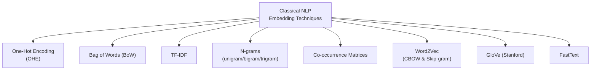

#### 🔍 Internal Working — Honest, Brief Evaluations of Each

> 💡 **Memory Trick, given directly, on OHE:** *"The oldest technique... I feel that it is of really no use. But sometimes we do one-hot encoding when the number of classes are actually toward the lower side for our target variable -- that's one place where it makes sense."*

> 💡 **Memory Trick, given directly, on TF-IDF:** *"TF-IDF is good till now -- it is used in many algorithms, even BM25... it is the upgraded version of TF."*

> 💡 **Memory Trick, given directly, on Word2Vec's two variants:** *"There are two different variants -- one is CBOW, one is Skip-gram. They are pretty much the alternate of one another."*

> 💡 **Memory Trick, on ELMo, given directly, as a genuine transitional case:** *"ELMo is something I will prefer this one, because this is where, slowly, slowly, we are moving towards Transformers -- but I won't be directly keeping it under Classical NLP."*

#### ⚠ Common Mistakes

* Assuming byte-pair encoding (BPE) belongs in this specific discussion — explicitly, directly redirected: *"BPE right now, it is not of the context."*
* Assuming n-grams beyond trigrams are commonly used in practice — implicitly foreshadowed here and directly confirmed later (Section 6): higher n-grams "really didn't work."

#### 🎯 Key Takeaways

* The class itself, via Socratic prompting, **generated nearly the complete list** of classical NLP embedding techniques before the instructor added precision — a deliberate teaching choice surfacing existing knowledge rather than lecturing from zero.
* Each technique received a genuinely honest, non-generic evaluation (e.g., OHE is "of really no use" except for low-cardinality targets; TF-IDF "is good till now") — not a flat, uniform "these are all outdated" dismissal.
* **ELMo** is explicitly flagged as a genuine transitional technique, bridging classical NLP and the Transformer era — deliberately not filed under either category cleanly.

---
### 3. Discrete vs. Continuous Representations & Why Cosine Similarity Matters

#### 📖 Definition — Discrete vs. Continuous, Precisely Illustrated

> 💡 **Memory Trick, given directly, via a genuinely simple, concrete example:** *"For example, you have the word dog. Can you represent it as a number? 1. Car -- 2. Bus -- 3." [discrete integers assigned directly to words] "Do you think the machine will learn? ... For 4 examples, for sure it will understand that 1 is for dog. But when this 4 becomes 50,000... the learning really doesn't happen."*

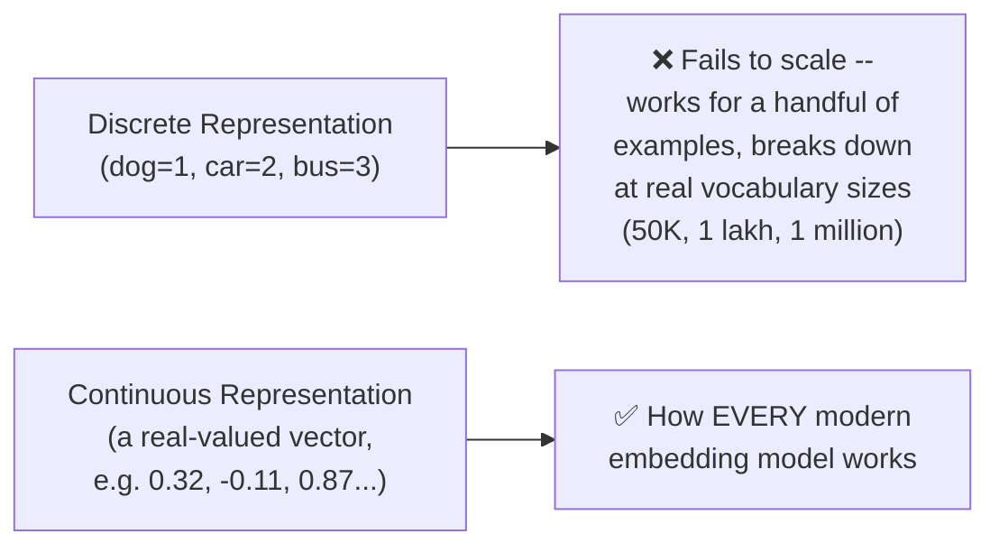

#### ❓ Why It Exists — The Precise Reason Cosine Similarity Demands Continuity

> 💡 **Memory Trick, given directly, a genuinely important, precise claim:** *"If you are having discrete values, really, how many of you think that you can calculate cosine similarity? ... Not possible. Similarity can be between two vectors -- do you think it's possible between two integers? ... Orthogonal, exactly correct. It is not possible."*

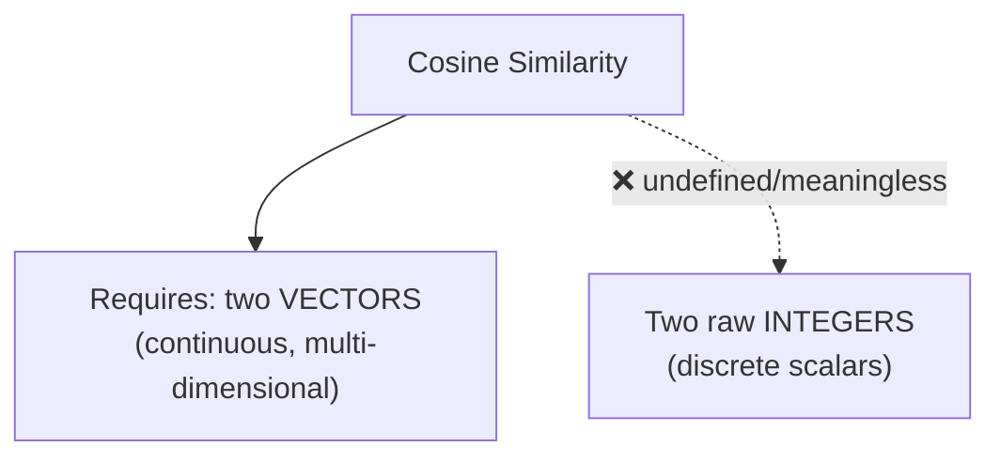

#### 🧠 Concept — Two Priorities, Ranked

> 💡 **Memory Trick, given directly, establishing a genuinely important ordering:** *"We always try to look for -- one is meaning, from meaning, context. And this is the entire game for why Transformers have been there. The idea is to provide more and more context. The priority always goes to context first, and then similarity."*

#### ⚠ Common Mistakes

* Assuming discrete word-to-integer mappings could plausibly work with a "sufficiently clever" model — explicitly, directly corrected: the problem isn't algorithmic cleverness, it's a genuine, structural scaling limitation as vocabulary size grows.

#### 🎯 Key Takeaways

* **Discrete representations** (assigning raw integers to words) genuinely fail to scale — they might appear to "work" for a handful of examples, but break down entirely at realistic vocabulary sizes.
* **Cosine similarity is fundamentally undefined between two raw integers** — it requires two continuous vectors, which is precisely why every modern embedding technique moved toward continuous representations.
* The session establishes **context, then similarity** as the guiding priority order for the rest of the course — context is the deeper, more fundamental goal; similarity (cosine-based) is the downstream, measurable proxy for whether that context was captured well.

---

### 4. Sequences Are Everywhere (Except Images): A First-Principles Detour

#### ❓ Why It Exists

> 💡 **Memory Trick, given directly, the motivating question:** *"When I say that 'My Name If Paul' -- can I write 'Is My Paul Name'? I just changed the sequence. It means that words have meaning -- if you change the sequence, simply we will lose it. What matters to us? The order."*

#### 📖 Definition — Classifying Data Types by Sequence-ness

> 💡 **Memory Trick, given directly, a precise, surprising classification the class was directly quizzed on:** *"Do you think images have sequence? ... No, images doesn't have sequencing. Images are patches." "Audio? Yes, audio is also a sequence." "Time series data -- is it sequential? Everybody? Yes." "Video -- sequence of frames."*

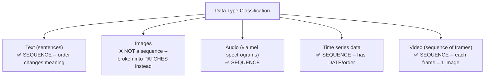

#### 🔍 Internal Working — Precisely Why Images Are "Patches," Not Sequences

> 💡 **Memory Trick, given directly:** *"If you try to break an image into this part -- this becomes P1, patch 1. Then P2, patch 2... and that way, your filters or kernels work."*

> ⚠️ **A direct, precise correction of a genuine student question ("aren't pixel sequences?"):** *"I'm talking about patches. Pixels are also not necessary -- if the image is completely black, then really finding a sequence is not a possible thing. Color plays a very crucial role, so that's why they use the term patch."*

#### 🏢 Real-World / Production Usage — Mel Spectrograms as Audio's Sequential Representation

> 💡 **Memory Trick, given directly:** *"When you look into mel spectrograms... this is exactly how they look like -- sequence plays a very, very crucial role. Each graph is actually [unique] -- so, for example, when I say 'my name is Paul,' 'mine' has a unique graph, 'name' [has one], 'is,' 'Paul' -- step by step, things happen. Majorly used in seismic data too, for the visualization part."*

#### ⚠ Common Mistakes

* Assuming pixels themselves constitute a genuine "sequence" in an image the way tokens do in a sentence — explicitly, directly corrected: images are decomposed into **patches** (used by filters/kernels), a fundamentally different structural unit than a linear, order-dependent sequence.

#### 🎯 Key Takeaways

* **Text, audio (via mel spectrograms), time series, and video** are all genuinely sequential data types — order carries real, meaning-changing information.
* **Images are explicitly NOT sequences** — they are decomposed into **patches**, processed by filters/kernels, a structurally different representation than a linear sequence.
* This classification exercise is deliberately positioned to precisely scope WHERE the self-attention reasoning (built in the following sections) genuinely applies, rather than assuming it's a universal, unconditional mechanism for all data types.

---
### 5. The Time-Series Warm-Up: Exponential Smoothing as a Rehearsal for Attention

#### ❓ Why It Exists — A Deliberate Pedagogical Choice

> 💡 **Memory Trick, given directly:** *"I want to start with time series, and then finally I want to move into tokens, words, and the NLP part... this is where, slowly, slowly, the idea towards attention really relates."*

#### 📖 Definition — Exponential Weighted Average / Simple Exponential Smoothing (SES)

> 💡 **Memory Trick, the formula given directly:** *"S_t = β·X_t + (1-β)·S_{t-1}. X_t is the current observation. S_{t-1} is your last, your previous smooth value, or the previous forecast."*

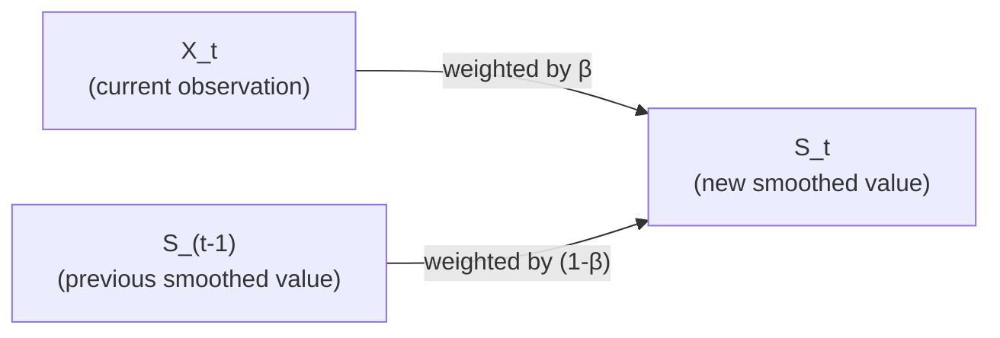

> 💡 **Memory Trick, the precise control intuition given directly:** *"If A wants to control B, the value of A should be higher... generally, the value of β is 0.9. Using this, you can actually control the flow."*

#### 🔍 Internal Working — The Two-Part "Re-Weighting Scheme"

> 💡 **Memory Trick, given directly, the exact two rules that will directly reappear, unchanged, in self-attention:** *"If something is close by, what is it trying to do? Amplification. And if something is far away? It is simply filtering out."*

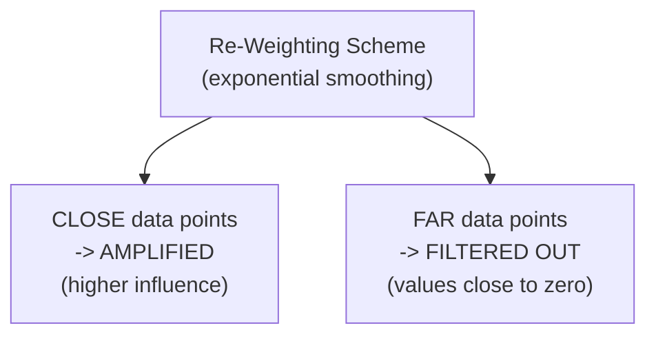

#### 🪜 Step-by-Step — From Noisy Data to a Smoother Curve, and the Context It Implies

> 💡 **Memory Trick, given directly:** *"This is our final curve, where I can say that at least, yes, we have less noise... Why? Because one data point is controlling the other data point... Once you start moving through all the data points, you'll be getting somehow lesser noise."*

> 💡 **Memory Trick, the direct bridge to "context," given explicitly:** *"Can I say that yes, there can be some type of context? Because the data points were controlling one another... the idea is to move from zero context to a little bit of context. But the nearest data point will have the most impact."*

#### ⚠ A Direct, Explicit Warning: This Is an Analogy, Not Literal NLP Content

> ⚠️ **Directly, honestly acknowledged, addressing genuine student confusion in real time:** *"Everything that I have done, this is an assumption that I have taken... I have not started anything with respect to words. I am telling in time series. People who have not worked with time series will have lesser understanding -- and totally acceptable, so nothing to worry about. Till now, we have not started our actual content."*

#### ⚠ Common Mistakes

* Assuming this time-series section IS the core NLP/Transformers content — explicitly, directly clarified: it's a deliberate rehearsal/analogy, built specifically to introduce the "re-weighting" intuition in a domain with zero language-specific complexity, before applying the same idea to text.
* Confusing "re-weighting" with backpropagation or gradient descent — explicitly, directly corrected in response to a student question: *"Re-weighing is not related to gradient descent or backpropagation. Those are different concepts."*

#### 🎯 Key Takeaways

* **Exponential smoothing** (`S_t = β·X_t + (1-β)·S_{t-1}`) is introduced purely as a **rehearsal analogy** — a way to build the "re-weighting" intuition in a domain (time series) with no language-specific complexity.
* The exact same two-part rule -- **close points get amplified, far points get filtered** -- is the DIRECT precursor to self-attention's own weighting scheme, built in Section 7.
* The instructor **explicitly, repeatedly flags** that this section is an assumption-laden analogy, not literal NLP mechanics — a deliberate, honestly-labeled pedagogical device.

---

### 6. Back to NLP: The Sliding Window & the "Who Is Nawaz?" Distance Problem

#### 📖 Definition — The Sliding Window Concept

> 💡 **Memory Trick, given directly:** *"Right now, I'm looking into two tokens... so what is the window size right now? The window size that I have is 2, because I'm looking 2 tokens before and 2 tokens after. That's what we're referring to -- the sliding window. Why? Because this window keeps on changing."*

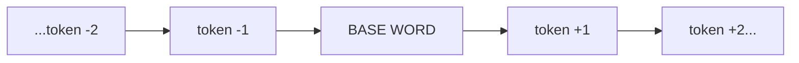

> ⚠️ **A direct, precise terminology-timeline correction given:** *"Context window, the term, it came back later -- we use it after 2021 and 2022. Right now, whatever we're discussing is pretty much 2012, 13, 14 -- previously it was called the window slice, then sliding window was the actual term."*

#### 🔍 Internal Working — There Was Never a "Correct" Window Size

> 💡 **Memory Trick, given directly:** *"Nobody knew what is the perfect number of tokens or grams to work with... 2 somehow, lesser context. 3 was doing the task. But after 4, 5, it really didn't work." [Referencing GloVe's actual implementation:] "3 was the perfect number" [in Christopher Manning's original, Java-based implementation].*

#### ❓ Why It Exists — The Motivating, Concrete Failure Case

> 💡 **Memory Trick, the complete, worked example given directly:** *"'Nawaz can be annoying, but she is a great cat.' If I really ask, who is Nawaz? What is the distance right now? ... 1, 2, 3, 4, 5, 6, 7, 8 [tokens]... and then 'cat' came. Distance is playing a crucial role. If the distance is around 3 or 4 tokens, it will work -- but what about 8 grams, 9 grams? We generally don't use that term."*

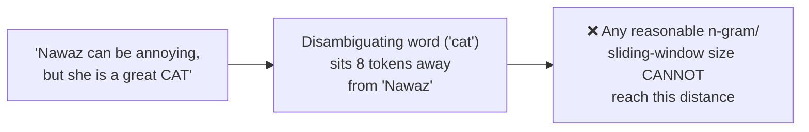

> 💡 **Memory Trick, the precise, real-world consequence given directly:** *"If you were working with tri-grams, you will be getting that 'she' [implies] some type of female -- you won't be taking the final decision of an animal until you actually look into the full sentence. This has been a problem for classical NLP for more than 8 to 10 years. If we're doing any type of NER task, it will tag ['she'] as a person -- but actually this becomes the cat."*

#### ⚠ Common Mistakes

* Assuming a "sufficiently large" n-gram window eventually solves the distance problem — explicitly, directly demonstrated as impractical: n-grams beyond 3-4 tokens genuinely "didn't work" in practice, long before reaching the distances real ambiguous sentences require.
* Confusing "sliding window" with "context window" as synonymous, interchangeable, contemporaneous terms — explicitly, directly corrected: they're the SAME underlying idea, but from genuinely different eras (early 2010s vs. post-2021), with different terminology in use at each.

#### 🎯 Key Takeaways

* The **sliding window / n-gram approach** has no single "correct" size — empirically, 2-3 tokens tended to work reasonably, but degraded sharply beyond that, even in foundational work like GloVe's original implementation.
* The **"Who is Nawaz?" example** is a precise, concrete illustration of classical NLP's core, structural failure: a disambiguating word can sit far outside ANY practical window size, causing genuine, real errors (e.g., mistagging "she" as a person rather than correctly resolving it to "cat").
* This distance problem is explicitly framed as the **direct motivating force** for moving beyond n-grams entirely — setting up the complete abandonment of window-based approaches in favor of self-attention (Section 7).

---
### 7. Building Self-Attention From Scratch: Vectors, Dot Products & Weights

#### 🪜 Step-by-Step — The Complete, Live-Built Derivation

> 💡 **Memory Trick, the full sequence given directly, step by step:** *"Let's take 'bank of a river.' First, the words get converted into tokens... T1, T2, T3, T4. Once converted into tokens, converted into vectors -- V1, V2, V3, V4. Now, the idea is: how can these vectors become much more meaningful? Let's introduce some W's -- weight. Why this weighted product? All those W's, I'll be referring to as some type of re-weighting technique."*

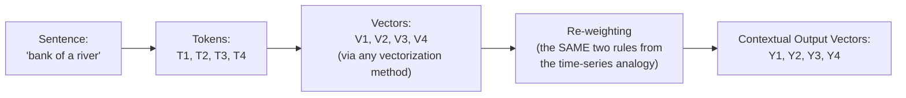

#### 💻 Code Example — The Complete Pairwise Dot-Product Calculation, Given Directly

> 💡 **Memory Trick, given directly, step by step for V1:** *"Let's take V1, multiply with V1... then V1 with V2, V1 with V3, V1 with V4. My V1 vector is getting context about V1 itself, then V2, V3, and V4. From here, I'll be getting some type of weight -- W11, W12, W13, W14."*

```text
W11 = V1 · V1
W12 = V1 · V2
W13 = V1 · V3
W14 = V1 · V4
```

> 💡 **Memory Trick, the precise reasoning for why NO third-party weight is needed, given directly:** *"Do you need any third-party weight? Or directly through some type of vector calculation, are you getting it? The weight is already available... you are not bringing any third-party or external weights into the system right now. Because you have the vectors, and if you try to perform a dot product, in simple terms, you'll be getting the weight."*

#### 🔍 Internal Working — Normalization: Making the Weights Sum to 1

> 💡 **Memory Trick, given directly:** *"If you try to sum up those values to 1... you will say, Paul, this is normalization -- this is exactly what you try to do. This entire thing is actually normalized, so the values will be exactly the same [scale]."*

> ⚠️ **A direct, important, precisely-stated performance reason for normalizing, given in Q&A:** *"If we are not doing the normalization, then generally, the calculation takes much more time [on GPU]. So the idea is to always perform a scaling-based operation."*

#### 💻 Code Example — The Final Weighted Sum, Producing Y1

> 💡 **Memory Trick, the complete formula given directly, generalized across all four positions:**

```text
Y1 = W11·V1 + W12·V2 + W13·V3 + W14·V4
Y2 = W21·V1 + W22·V2 + W23·V3 + W24·V4
Y3 = W31·V1 + W32·V2 + W33·V3 + W34·V4
Y4 = W41·V1 + W42·V2 + W43·V3 + W44·V4
```

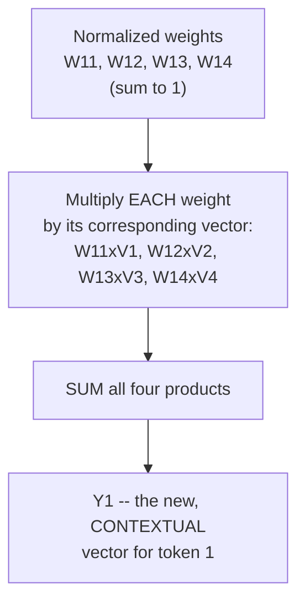

> 💡 **Memory Trick, the precise, repeatedly-emphasized reasoning for WHY the weight is necessary at all, given directly:** *"Why are we multiplying by the weight? Can I say that weight is actually having the information between two vectors? Because your vector is not having any information [about other vectors] -- if the vector needs to get the information, it needs to be multiplied with a weight. Otherwise, how can it get the information?"*

#### ⚠ A Direct, Important, Repeatedly-Emphasized Clarification: "W" Is Just a Notation

> ⚠️ **Directly, explicitly, repeatedly clarified -- a genuinely important point that generated substantial student confusion:** *"Let's write here A [instead of W]. I hope nobody's getting confused. I write W, the idea is to think from weights -- but don't get confused. It can be A also, because it's just a notation. So don't think weights and bias of a neural network. These are not weight-initialized like Xavier or He -- these are simple, independent weights, not TRAINED weights."*

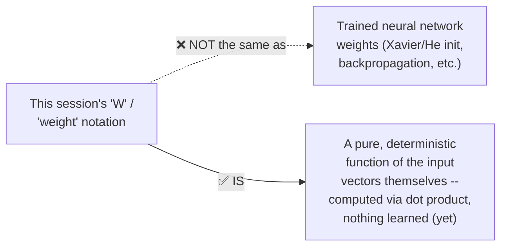

#### ⚠ Common Mistakes

* Assuming this derivation involves any genuinely TRAINED parameters, weight initialization, or gradient descent — explicitly, directly, repeatedly corrected: every "weight" in this specific derivation is computed DIRECTLY and DETERMINISTICALLY from the input vectors via dot product, with zero learned parameters involved at this stage.
* Assuming vector addition could substitute for multiplication in this derivation — explicitly, directly corrected: *"Instead of multiplication, can we do vector addition? No. Generally, we don't do that... it's actually in the formula of matrix multiplication. Whenever, any time, in the entire field of deep learning, nobody does addition -- everywhere you will be doing multiplication."*
* Assuming the dot product's scalar output means the FINAL Y vectors are also scalars — explicitly, directly clarified: a single dot product between two vectors yields a scalar, but the WEIGHTED SUM of vectors (weight × vector, summed) remains a genuine vector.

#### 🎯 Key Takeaways

* Self-attention's core mechanic, derived completely from scratch: **convert tokens to vectors → compute every pairwise dot product → normalize into weights (summing to 1) → compute a weighted sum of all vectors → produce new, contextual output vectors**.
* The entire process uses **zero externally-introduced, trained weights** — every "weight" is computed directly and deterministically from the input vectors themselves via dot product.
* The notation "W" is explicitly, repeatedly clarified as **just a label**, not a claim about trained neural network parameters — a genuinely important distinction the instructor takes real care to prevent students from conflating.

---

### 8. The Four Defining Properties of Self-Attention

#### 📖 Definition — All Four, Stated Directly Together

> 💡 **Memory Trick, given directly, as the session's own explicit summary list:** *"Can I say that I have not trained any weights? ... Can I say here, order has no influence? ... Can I say that proximity has no influence? ... And whatever the task I am doing, this is shape-independent."*

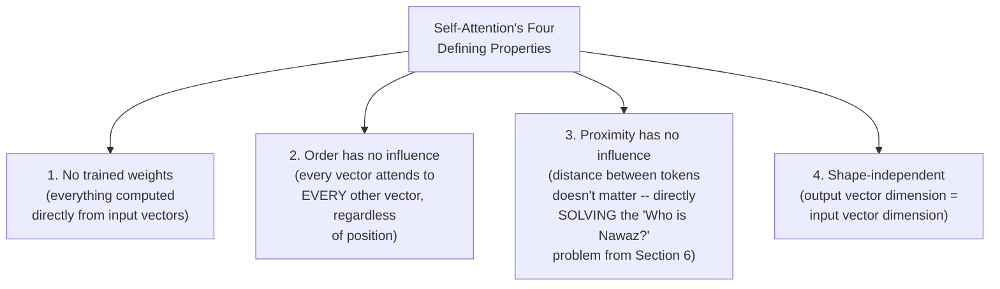

#### 🔍 Internal Working — Precisely Why Order and Proximity No Longer Matter

> 💡 **Memory Trick, given directly:** *"Previously, in Classical NLP, this order was actually creating the most important issue always, because we always thought order was the most important thing. But right now, in Transformers, we're actually moving toward the idea that order has no influence... because every vector is getting information about EVERY other vector, surrounding it."*

> 💡 **Memory Trick, a genuinely striking, concrete proof offered directly:** *"Just check with any Transformers model. If you write 'my name is Paul,' and 'my Paul name is' -- the Transformers model will understand [both]. When you work with a bigger corpus, that doesn't matter, because it can genuinely understand languages even if you provide a wrong sequence."*

#### ⚠ A Direct, Precisely-Scoped Clarification: This Applies to Self-Attention, NOT the Full Dataset

> ⚠️ **A precise, important scoping correction, given directly in response to a genuinely sharp student question:** *"Is order-agnosticism a boon or a problem, since language needs order?" ... "If self-attention, order has no part. But actually, when you're using a Transformers NETWORK, self-attention is a very, very small block [within it]. Then order matters, because in your DATASET, if at every sentence there is a wrong [word] order, then it becomes a problem."*

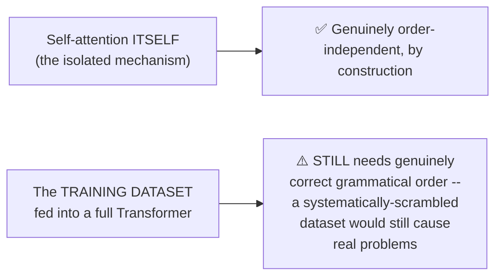

#### ❓ Why It Exists — What "Shape-Independent" Actually Means

> 💡 **Memory Trick, given directly:** *"Shape-independent means whatever the input shape was, the same output shape is maintained. It is not really changing the shape -- V1 and V2, they will be equally, equivalently shaped. Their shape won't be different. If I try to introduce something third-party, THEN it will be different."*

#### ⚠ Common Mistakes

* Assuming order-independence at the self-attention level implies an entire Transformer model is genuinely indifferent to real-world grammatical order in its training data — explicitly, directly, precisely corrected: self-attention itself is order-agnostic BY CONSTRUCTION, but the surrounding dataset and network still depend on genuinely correct language structure for effective learning.
* Assuming "shape-independent" refers to reducing dimensionality (like PCA) — explicitly, directly clarified: it specifically means the OUTPUT vector's dimension matches the INPUT vector's dimension, unchanged.

#### 🎯 Key Takeaways

* Self-attention's four defining properties -- **no trained weights, order-independence, proximity-independence, and shape-independence** -- are each DIRECTLY derivable and provable from the mechanical construction shown in Section 7, not asserted as separate facts to memorize.
* **Proximity-independence directly, precisely SOLVES** the "Who is Nawaz?" distance problem established in Section 6 -- every vector now genuinely attends to every OTHER vector regardless of distance, eliminating the core structural failure of n-gram/window-based approaches.
* Order-independence is explicitly, precisely SCOPED to the self-attention mechanism itself -- it does NOT imply that a full Transformer's training data can be arbitrarily scrambled without consequence.

---
### 9. Visualizing Embeddings: WordVec, TensorFlow Projector & Apple's Embedding Atlas

#### 🪜 Step-by-Step — Live Demonstration 1: The Classic WordVec 10K Projector

> 💡 **Memory Trick, given directly, live-navigated with the class:** *"This is a simple Word2Vec 10K dataset... you can see multiple words, and you can zoom into, like, mall. This is a 200-dimension [space], and the total number of data points are 10,000 right now. In 3D, it is possible to visualize, but in 200 dimensions, it's really, really hard -- you cannot infer something, but you can look into clusters."*

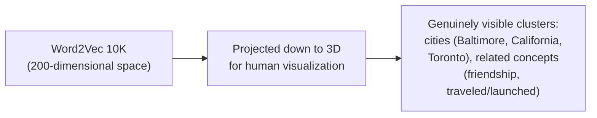

#### 🔍 Internal Working — Dimensionality Reduction Techniques, Directly Compared Live

> 💡 **Memory Trick, given directly, comparing algorithms live in the tool:** *"By default, it was PCA. The advanced version of PCA is t-SNE... your PCA-based visualizations, somehow, they will be lesser dense as compared to t-SNE. t-SNE is a better algorithm for dimensional reduction at any point of time. UMAP is also good -- UMAP and t-SNE are the advanced versions."*

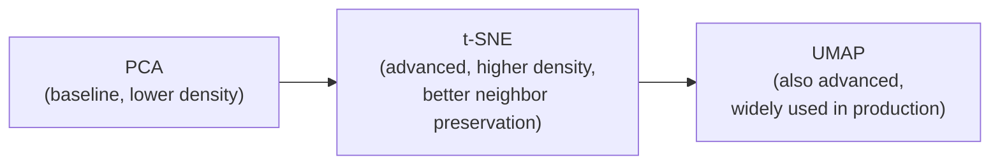

#### 🏢 Real-World / Production Usage — The 2026 Embedding-Dimension Reality Check

> 💡 **Memory Trick, given directly, using the live MTEB leaderboard:** *"What are the dimensions that you do work with [in 2026]? ... Generally, it's 1536... your dimensions will be very, very big. Let's open the MTEB leaderboard -- 4096 is really, really common among a lot of Qwen models, NVIDIA models -- they do have very, very high dimensions. Going forward, after 2-3 years, you might see more and more, and higher and higher dimensions."*

> ⚠️ **A direct, precise contrast drawn to keep historical context clear:** *"This is what I'm showing from very, very old, like 2016-17 stuff right now, with only 200 dimensions [vs. today's 4096]."*

#### 🪜 Step-by-Step — Live Demonstration 2: Apple's Embedding Atlas

> 💡 **Memory Trick, given directly, exploring a genuinely large, real dataset live:** *"This is on top of an entire dataset -- from Apple, actually. On top of datasets like Wine Reviews, MedMCQA. More than 163,749 data points -- really, really dense data. If you look into the province, country, price -- you can see most of the prices of the wine are between 10 to 100 [dollars], represented by color density in this embedding space."*

#### 🏢 Real-World / Production Usage — Building Your Own Atlas

> 💡 **Memory Trick, given directly, a concrete, actionable pointer:** *"There's something called Nomic AI... using this class, you can actually create a detailed 3D visualization in Nomic. If you're actually working with Nomic embedding models, these are totally open source -- in Ollama also, it can run. Similarly, other embedding providers are also having this function, where you can create an Atlas projection -- just like your globe and Atlas projection."*

#### ⚠ Common Mistakes

* Assuming a 2D/3D visualization of a 200+ dimensional embedding space genuinely, fully represents the true structure of that space — explicitly, directly, repeatedly acknowledged as a necessary, lossy simplification purely for human interpretability, not a claim of complete, faithful representation.
* Assuming today's typical embedding dimensions (1536, 4096) were always this large — explicitly, directly contrasted against this session's own 200-dimensional, 2016-17-era demo data.

#### 🎯 Key Takeaways

* Three genuinely different visualization tools were explored live: the classic **WordVec 10K projector**, **TensorFlow Projector** (directly comparing PCA vs. t-SNE vs. UMAP), and **Apple's Embedding Atlas** (applied to genuinely large, real datasets like Wine Reviews).
* **t-SNE and UMAP** are explicitly, directly preferred over plain PCA for dimensionality-reduction visualization, offering denser, more genuinely informative cluster structure.
* Real, 2026-era embedding dimensions (**1536, 4096, and rising**) are explicitly, directly contrasted against this session's own older, 200-dimensional demonstration data — keeping the historical teaching example honestly distinguished from current production reality.

---

### 10. Self-Attention vs. Attention: Terminology, Clarified

#### ❓ Why It Exists — A Genuinely Common Point of Confusion, Addressed Directly

> 💡 **Memory Trick, given directly, in response to a repeatedly-asked student question:** *"Nobody asks you 'what is attention?' -- everybody asks you 'what is attention mechanism?' In the attention mechanism, self-attention [is the foundational building block]. There is no difference, like, what is attention and self-attention."*

#### 📖 Definition — Precisely Why "Self"

> 💡 **Memory Trick, given directly, the precise etymological reasoning:** *"Why self-attention? Because it is actually looking into all the other vectors -- it looks into itself AS WELL AS the others. That's why the name comes."*

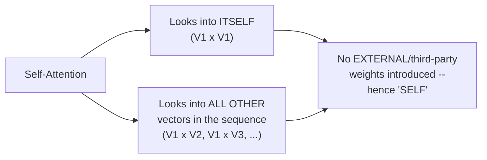

#### 🔍 Internal Working — Exactly Where "Self-Attention" Stops and "Attention" (Broader) Begins

> 💡 **Memory Trick, given directly, precisely foreshadowing the NEXT session's content:** *"Once I introduce weight from OUTSIDE, like your key-query [pairs], THEN we will come to call it an attention mechanism [more broadly]. Once this concept is clear, then only I can go to the next concept of the database analogy -- the queries, keys, and values."*

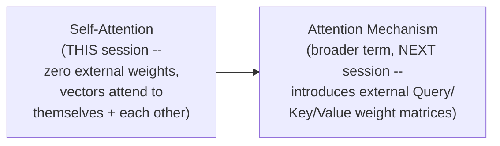

#### ⚠ A Direct, Precise Distinction Offered to a Student, Late in the Session

> 💡 **Memory Trick, given directly, refining the terminology one step further:** *"If you really think about self-attention, [it applies] with respect to vectors [multiple, a full sequence]. And attention, if you really think [about it], with a single sample -- that is the core difference."*

#### ⚠ Common Mistakes

* Assuming "attention" and "self-attention" name two genuinely different, competing mechanisms — explicitly, directly, repeatedly corrected: self-attention is the specific, foundational computation; "attention mechanism" is the broader umbrella term used once external Query/Key/Value weights are introduced (explicitly deferred to the next session).
* Assuming the "self" in self-attention refers to some kind of self-supervised training signal — explicitly, directly clarified: it refers specifically to the fact that no EXTERNAL/third-party weights are introduced yet — every vector attends to itself and the other vectors already present in the sequence.

#### 🎯 Key Takeaways

* **Self-attention IS the foundational computation underneath the broader "attention mechanism"** — not a separate, competing concept; interview-relevant framing the instructor explicitly, directly emphasizes: *"Nobody asks you 'what is attention' -- everybody asks you 'what is attention mechanism.'"*
* The **"self"** in self-attention specifically marks the absence of external, third-party weights — everything is computed from the sequence's own vectors, attending to themselves and each other.
* The session **explicitly, precisely sets up** the next class's content: introducing genuinely external weights (Query, Key, Value matrices) is exactly what will elevate this session's self-attention into the full, broader "attention mechanism," via the promised "database analogy."

---
## 📝 Glossary

| Term | Definition | Why It Matters |
|---|---|---|
| **Discrete representation** | Assigning raw integers to words (dog=1, car=2) | Fails to scale -- breaks down at real vocabulary sizes |
| **Continuous representation** | Real-valued vectors representing words/tokens | What every modern embedding model actually uses |
| **Cosine similarity** | A similarity measure between two vectors | Undefined between raw integers -- requires continuous vectors |
| **Patch** | A sub-region of an image, used by filters/kernels | Images are decomposed into patches, NOT sequences |
| **Mel spectrogram** | A visual, sequential representation of audio | Confirms audio genuinely is sequential data |
| **Exponential smoothing (SES)** | `S_t = β·X_t + (1-β)·S_{t-1}` -- a time-series smoothing formula | The rehearsal analogy for self-attention's re-weighting scheme |
| **Re-weighting scheme** | Close data points amplified, far ones filtered | The core intuition shared by both time-series smoothing and self-attention |
| **Sliding window / n-gram** | Looking at a fixed number of tokens before/after a base word | The classical NLP approach self-attention replaces |
| **Self-attention** | Computing contextual output vectors via pairwise dot products + normalized weighted sum, with zero external weights | The foundational mechanism underneath every Transformer |
| **Shape-independent** | Output vector dimension equals input vector dimension | One of self-attention's four defining properties |
| **Attention mechanism** | The broader term used once external Query/Key/Value weights are introduced | Self-attention is its foundational building block |

---

## 🔄 Revision Notes — One-Minute Revision

* This is **Session 1 of "Production AI Engineering"** -- explicitly intuition-only, no code; the actual "Attention Is All You Need" paper and Illustrated Transformer walkthrough are deferred to the next session.
* **Classical NLP embeddings**, crowd-sourced from the class: OHE, Bag of Words, TF-IDF, n-grams, co-occurrence matrices, Word2Vec (CBOW/Skip-gram), GloVe, FastText, ELMo (a genuine transitional case) -- each given an honest, specific evaluation, not a blanket dismissal.
* **Discrete representations fail to scale**; cosine similarity is genuinely undefined between raw integers, requiring continuous vectors -- **context, then similarity** is the session's stated priority order.
* **Sequences**: text, audio (via mel spectrograms), time series, and video are all genuinely sequential; **images are explicitly NOT** -- they're decomposed into **patches** instead.
* **Exponential smoothing** (`S_t = β·X_t + (1-β)·S_{t-1}`) is a deliberate, honestly-labeled REHEARSAL analogy: close points get amplified, far points get filtered -- the exact same two-part rule self-attention will later reuse.
* **The "Who is Nawaz?" distance problem** precisely illustrates classical NLP's core failure: a disambiguating word (revealing "Nawaz" is a cat, not a person) can sit far outside any practical n-gram window, causing genuine misclassification.
* **Self-attention, derived from scratch**: tokens → vectors → pairwise dot products (V1·V1, V1·V2, ...) → normalized weights (sum to 1) → weighted sum → new, contextual output vectors (Y1, Y2, ...) -- with ZERO externally-introduced, trained weights; "W" is explicitly just a notation, not a claim about trained neural network parameters.
* **Four defining properties**, each directly provable from the derivation: **no trained weights, order-independence, proximity-independence** (directly solving the Nawaz problem), and **shape-independence** -- with an important scoping caveat: order-independence applies to self-attention ITSELF, not to the genuine need for correctly-ordered training data in a full Transformer.
* **Embedding visualization tools** explored live: WordVec 10K projector, TensorFlow Projector (PCA vs. t-SNE vs. UMAP), Apple's Embedding Atlas -- with a real-world 2026 grounding check (1536-4096+ dimensional embeddings today, vs. this session's 200-dimensional demo data).
* **Self-attention IS the foundational computation inside the broader "attention mechanism"** -- not a separate concept; introducing external Query/Key/Value weights (next session's topic) is what elevates self-attention into the full attention mechanism.

---

## 📋 Cheat Sheet

**Discrete vs. continuous:**
```text
Discrete (dog=1, car=2)   -> fails to scale; cosine similarity UNDEFINED
Continuous (real vectors) -> what every modern embedding model uses
```

**Sequence classification:**
```text
Text, audio (mel spectrograms), time series, video -> SEQUENCES
Images                                                -> PATCHES (not sequences)
```

**Exponential smoothing formula:**
```text
S_t = beta x X_t + (1 - beta) x S_(t-1)
-- close points AMPLIFIED, far points FILTERED
```

**Self-attention, step by step:**
```text
1. Tokens -> Vectors (V1, V2, V3, V4)
2. Pairwise dot products: W_ij = Vi . Vj
3. Normalize: sum of weights for each row = 1
4. Weighted sum: Yi = sum(W_ij x Vj) for all j
5. Result: Y1, Y2, Y3, Y4 -- new, CONTEXTUAL vectors
```

**Self-attention's four properties:**
```text
1. No trained weights   -- everything computed directly from input vectors
2. Order-independent    -- every vector attends to every other, regardless of position
3. Proximity-independent -- solves the "Who is Nawaz?" distance problem
4. Shape-independent      -- output dimension = input dimension
```

**Self-attention vs. attention mechanism:**
```text
Self-Attention     -> THIS session; zero external weights
Attention Mechanism -> broader term; introduces external Query/Key/Value weights (NEXT session)
```

---

## 🔥 Interview Questions & Answers

### 🟢 Beginner

**Q1.**

**Question:** Why do discrete representations (assigning integers to words) fail to scale for machine learning?

**Answer:** They might work for a handful of examples, but break down entirely at real vocabulary sizes (50,000+ words) -- genuine learning doesn't happen at that scale with discrete values.

**Explanation:** Directly, precisely explained.

**Why Interviewers Ask This:** A foundational, frequently-asked embeddings question.

**Possible Follow-up:** "Why is cosine similarity undefined between two raw integers?"

**Q2.**

**Question:** Are images considered "sequences" in the same way sentences are?

**Answer:** No -- images are explicitly described as being decomposed into "patches," not sequences.

**Explanation:** Directly, explicitly stated and distinguished from text/audio/time-series/video.

**Why Interviewers Ask This:** Tests precise understanding of which data types self-attention's reasoning genuinely applies to.

**Possible Follow-up:** "Name three data types that ARE genuinely sequential."

**Q3.**

**Question:** What is the exponential smoothing formula, and what do its two terms represent?

**Answer:** `S_t = β·X_t + (1-β)·S_{t-1}` -- X_t is the current observation, S_{t-1} is the previous smoothed value/forecast.

**Explanation:** Directly, precisely stated.

**Why Interviewers Ask This:** Tests understanding of the rehearsal analogy underlying self-attention's re-weighting intuition.

**Possible Follow-up:** "What happens to nearby vs. far data points under this formula's re-weighting scheme?"

**Q4.**

**Question:** What is the "Who is Nawaz?" problem, and what does it illustrate?

**Answer:** In "Nawaz can be annoying, but she is a great cat," the word "cat" (which reveals Nawaz's true nature) sits far outside any practical n-gram window, illustrating classical NLP's structural failure at long-distance context.

**Explanation:** Directly, precisely explained via a concrete, worked example.

**Why Interviewers Ask This:** Tests genuine understanding of WHY self-attention was needed, not just what it does.

**Possible Follow-up:** "How does self-attention specifically solve this problem?"

**Q5.**

**Question:** In self-attention, are the "weights" (W) trained neural network parameters?

**Answer:** No -- they are computed directly and deterministically from the input vectors via dot product; "W" is explicitly just a notation, not a claim about trained parameters like Xavier/He-initialized weights.

**Explanation:** Directly, explicitly, repeatedly clarified.

**Why Interviewers Ask This:** A genuinely important, easy-to-misunderstand distinction.

**Possible Follow-up:** "At what point in a real Transformer would genuinely trained weights be introduced?"

**Q6.**

**Question:** Why must the self-attention weights be normalized (summed to 1)?

**Answer:** It performs a scaling-based operation; without normalization, calculations on GPUs generally take much longer.

**Explanation:** Directly, precisely stated.

**Why Interviewers Ask This:** Tests understanding of a practical, computational reason behind a mathematical step.

**Possible Follow-up:** "What does it mean for weights to 'sum to 1'?"

**Q7.**

**Question:** Name self-attention's four defining properties.

**Answer:** No trained weights, order-independence, proximity-independence, shape-independence.

**Explanation:** Directly, explicitly named as the session's own summary list.

**Why Interviewers Ask This:** A commonly-asked, foundational Transformers question.

**Possible Follow-up:** "Which of these four properties directly solves the 'Who is Nawaz?' problem?"

**Q8.**

**Question:** Is "self-attention" a different mechanism from "attention"?

**Answer:** No -- self-attention IS the foundational computation underneath the broader "attention mechanism"; they are not competing, separate concepts.

**Explanation:** Directly, explicitly clarified.

**Why Interviewers Ask This:** A genuinely common point of confusion, directly addressed multiple times in the session.

**Possible Follow-up:** "What specifically elevates self-attention into the broader 'attention mechanism'?"

**Q9.**

**Question:** What does "shape-independent" mean in the context of self-attention's output?

**Answer:** The output vector's dimension matches the input vector's dimension -- the shape is not changed by the self-attention computation.

**Explanation:** Directly, precisely explained.

**Why Interviewers Ask This:** Tests precise understanding of a specific, named property.

**Possible Follow-up:** "Under what circumstance WOULD the shape change, per the session's own reasoning?"

**Q10.**

**Question:** Which dimensionality-reduction algorithms were directly compared live in this session, and which was described as generally better than PCA?

**Answer:** PCA, t-SNE, and UMAP were compared; both t-SNE and UMAP were described as advanced, generally better options than plain PCA for this kind of visualization.

**Explanation:** Directly, explicitly stated.

**Why Interviewers Ask This:** Tests awareness of practical embedding-visualization tooling.

**Possible Follow-up:** "What real-world embedding dimension sizes were cited for 2026 models?"

---

### 🟡 Intermediate

**Q11.**

**Question:** Explain why the instructor deliberately introduces exponential smoothing (a time-series concept) BEFORE ever discussing self-attention in an NLP context, rather than building self-attention directly from a sentence example.

**Answer:** This is a deliberate pedagogical choice to isolate the core "re-weighting" intuition (close points amplified, far points filtered) in a domain with ZERO language-specific complexity -- no tokens, no grammar, no ambiguity, just numbers on a timeline. By first proving the intuition works in this simpler domain, the instructor gives students a clean, uncluttered mental model BEFORE introducing the added complexity of tokens, vectors, and sentence structure. This directly mirrors a "simplify to the essential mechanism first, then add complexity" teaching pattern -- the SAME underlying "close=amplified, far=filtered" rule reappears, unchanged, when self-attention is derived in Section 7, proving the analogy was genuinely structurally identical, not just superficially similar.

**Explanation:** Requires recognizing a deliberate pedagogical sequencing choice and its intended cognitive-load-reduction purpose.

**Why Interviewers Ask This:** Tests whether a learner recognizes deliberate teaching structure, not just the individual facts taught.

**Possible Follow-up:** "What specific two rules from the time-series analogy reappear, unchanged, in the self-attention derivation?"

**Q12.**

**Question:** A learner argues that since self-attention is proven to be "order-independent," this means word order genuinely doesn't matter anywhere in a trained Transformer model. Evaluate this claim.

**Answer:** This claim overstates the session's own, precisely-scoped reasoning. The session explicitly, directly distinguishes between self-attention AS AN ISOLATED MECHANISM (genuinely order-independent, by construction, since every vector attends to every other vector regardless of position) and the FULL TRANSFORMER NETWORK trained on a genuine dataset (where order STILL matters, because the training data itself encodes real, meaningful grammatical structure -- a systematically-scrambled dataset would still cause genuine problems). The order-independence proven in this session is a property of the SELF-ATTENTION COMPUTATION specifically, not evidence that word order is irrelevant to language understanding in general -- this is precisely why the session ALSO previews positional encoding as "higher-level stuff, not required right now," implicitly acknowledging that a complete Transformer needs SOME additional mechanism to reintroduce order information the raw self-attention computation discards.

**Explanation:** Tests whether a learner correctly scopes a claim proven about an ISOLATED mechanism versus an unwarranted generalization to the full system.

**Why Interviewers Ask This:** Distinguishes candidates who track a claim's precise scope from those who over-generalize a proven property.

**Possible Follow-up:** "What mechanism (mentioned only briefly, as 'higher-level stuff' in this session) would a full Transformer need to reintroduce order information?"

**Q13.**

**Question:** Explain, precisely, why the instructor repeatedly insists that the "W" notation in this session's self-attention derivation is "just a notation" and could equally be written as "A," rather than simply calling it a weight and moving on.

**Answer:** This repeated clarification directly addresses a genuine, real risk of conceptual conflation: students with prior deep learning background naturally associate the term "weight" with TRAINED, LEARNED parameters (Xavier/He initialization, backpropagation, gradient descent) -- and several students in this exact session DID ask about weight initialization, confirming this risk was genuinely realized, not hypothetical. By explicitly stating the notation is arbitrary (could be "A," "B," or any symbol) and repeatedly distinguishing it from trained neural network weights, the instructor prevents a genuinely important, foundational misunderstanding: this specific derivation computes its "weights" DETERMINISTICALLY, directly from the input vectors via dot product -- there is no training process, no initialization scheme, and no gradient-based learning happening in the self-attention mechanic taught in this session.

**Explanation:** Requires recognizing why a seemingly-repetitive clarification was genuinely necessary, connecting it to real, observed student confusion within the same session.

**Why Interviewers Ask This:** Tests whether a learner understands this distinction precisely enough to avoid a genuinely common error.

**Possible Follow-up:** "At what stage of a real Transformer's architecture would genuinely trained, learned weights first be introduced?"

**Q14.**

**Question:** Using this session's own reasoning, explain why cosine similarity requiring continuous vectors (Section 3) is directly connected to the entire motivation for moving beyond discrete, classical NLP representations.

**Answer:** The session establishes a precise causal chain: discrete representations (Section 3) cannot support cosine similarity AT ALL, since similarity is fundamentally a relationship BETWEEN VECTORS, not between raw scalars. Since the entire later goal (built through Sections 5-8) is producing INCREASINGLY CONTEXTUAL vectors -- and context is explicitly, directly measured/validated via similarity in high-dimensional space (per the session's own embedding-visualization demonstrations in Section 9, where related words cluster together) -- the FOUNDATIONAL requirement for ANY of this later reasoning to even be MEANINGFUL is that representations must be continuous vectors from the very start. This is precisely why Section 3's seemingly-basic discrete-vs-continuous discussion isn't a mere historical aside -- it's the necessary PRECONDITION for every subsequent section's reasoning about context, similarity, and self-attention to be coherent at all.

**Explanation:** Requires connecting an early, seemingly-basic section's content to the entire session's later, more advanced reasoning as a genuine logical precondition, not an isolated fact.

**Why Interviewers Ask This:** Tests whether a learner recognizes the FOUNDATIONAL role of early content in enabling everything built on top of it.

**Possible Follow-up:** "If someone tried to apply this session's self-attention derivation directly to one-hot encoded vectors, what would go wrong?"

**Q15.**

**Question:** Synthesize this session's classification of images as "patches, not sequences" (Section 4) with its self-attention derivation (Section 7) to explain whether self-attention, as taught in THIS session, could be directly applied to image data without modification.

**Answer:** Not directly, without genuine modification -- this reveals a precise, important boundary condition. Self-attention's derivation (Section 7) fundamentally operates on a SEQUENCE of vectors (V1, V2, V3, V4, representing sequential tokens), computing pairwise relationships across that sequence. Since Section 4 explicitly establishes that images are NOT sequences but PATCHES, applying self-attention to image data would require FIRST converting the image into some SEQUENCE-LIKE representation -- which is precisely what Vision Transformers (ViT) genuinely do in practice: treating each PATCH as if it were a "token" in an artificial sequence, then applying the exact same self-attention mechanic taught in this session to that sequence of patch-vectors. This means the session's own self-attention derivation IS transferable to images, but only AFTER a genuine, necessary preprocessing step (patch-to-token conversion) that Section 4's own patch/sequence distinction directly anticipates, even though this session itself doesn't explicitly walk through that specific application.

**Explanation:** Requires synthesizing two genuinely separate sections' content to reason about a boundary case (images) the session doesn't directly address, using only the precise distinctions established elsewhere in the session.

**Why Interviewers Ask This:** A senior-level question testing whether a candidate can extend taught principles to a genuinely new context through careful reasoning, not just recall stated facts.

**Possible Follow-up:** "What real Transformer architecture actually implements this patch-to-token conversion for images?"

---

### 🔴 Advanced

**Q16.**

**Question:** Design a complete, from-scratch numerical walkthrough (using this session's exact derivation pattern) for a 3-token sentence of your own choosing, explicitly showing every dot product, normalization step, and final weighted-sum calculation -- and explain what would change if a 4th token were added.

**Answer:** A reasonable, complete walkthrough for, e.g., "cats chase mice" (V1=cats, V2=chase, V3=mice): (1) Compute all NINE pairwise dot products: W11=V1·V1, W12=V1·V2, W13=V1·V3, W21=V2·V1, W22=V2·V2, W23=V2·V3, W31=V3·V1, W32=V3·V2, W33=V3·V3 -- directly following Section 7's exact demonstrated pattern, just scaled from 4 tokens down to 3. (2) Normalize each ROW so its three weights sum to 1 (W11+W12+W13=1; W21+W22+W23=1; W31+W32+W33=1) -- per Section 7's exact normalization step. (3) Compute the three final output vectors: Y1=W11·V1+W12·V2+W13·V3; Y2=W21·V1+W22·V2+W23·V3; Y3=W31·V1+W32·V2+W33·V3. If a FOURTH token were added (e.g., "quickly"), EVERY vector would now need FOUR pairwise dot products instead of three (a total of 16 dot products instead of 9), and each normalization would now need to balance across four values instead of three -- directly illustrating the QUADRATIC growth in computation (dot products) as sequence length increases, a genuinely important, real computational-cost property of self-attention that this session's own small, 3-4 token examples don't explicitly highlight as a scaling concern, but which the underlying mechanic directly implies.

**Explanation:** Requires extending the session's own exact derivation pattern to a genuinely new example, then reasoning about a scaling property (quadratic growth) the session's small examples don't explicitly address but the mechanic clearly implies.

**Why Interviewers Ask This:** A realistic, senior-level question testing whether a candidate can both reproduce the taught derivation AND reason about its computational scaling implications.

**Possible Follow-up:** "Why might this quadratic scaling become a genuine, practical concern for very long sequences (e.g., an entire book)?"

**Q17.**

**Question:** Critically evaluate: "Since this session proves self-attention requires NO trained weights and IS order-independent, a Transformer built purely from self-attention blocks (as taught in this session) would be a genuinely complete, competitive language model." Is this an accurate implication of this session's content?

**Answer:** Not accurate, and this significantly overstates what this session's own content actually demonstrates. The session EXPLICITLY, repeatedly frames this derivation as covering ONLY ONE block ("I've just taught 1/10th of one block," per the instructor's own closing statement) within a much larger Transformer architecture -- explicitly deferring genuinely essential additional components: external Query/Key/Value weights (elevating self-attention into the full "attention mechanism," Section 10's own explicit next-session preview), multi-head attention (explicitly removed from this session's diagram, deferred to "when I teach multi-head attention"), and positional encoding (explicitly labeled "higher-level stuff, not required right now" -- itself an implicit admission that SOMETHING beyond raw self-attention is needed to handle order/position information for a genuinely complete, practical model). A model built using ONLY this session's exact, untrained, order-independent computation would have no mechanism for learning task-specific representations (no trained weights at all) and no way to distinguish genuinely different orderings of the same words (by the session's own explicit "order has no influence" property) -- precisely the kind of practical limitation the session's own honest scoping ("we have not even started Transformers, this is the first step") directly anticipates and avoids overclaiming.

**Explanation:** Tests whether a learner recognizes the session's own explicit, repeated scoping limitations rather than treating one derived mechanism as a complete, standalone claim about full Transformer capability.

**Why Interviewers Ask This:** Distinguishes candidates who track a session's precisely-stated scope from those who extrapolate a single, isolated derivation into an inaccurate claim about complete system capability.

**Possible Follow-up:** "List, in order, the additional components this session explicitly names as still needed before reaching a genuinely complete Transformer architecture."

**Q18.**

**Question:** Synthesize this session's "Who is Nawaz?" distance problem (Section 6) with its four self-attention properties (Section 8) to construct a precise, step-by-step explanation of exactly HOW self-attention resolves that specific example -- tracing the actual mechanic, not just asserting that it does.

**Answer:** A precise, traced resolution: In "Nawaz can be annoying, but she is a great cat," under this session's self-attention derivation, the vector for "she" (say, V_she) computes a genuine, direct dot product against EVERY other vector in the sentence -- including V_cat, positioned 8 tokens away. Per Section 8's PROXIMITY-INDEPENDENCE property, this dot product (W_she,cat = V_she · V_cat) is computed with EXACTLY the same mechanical process as a dot product between immediately adjacent words -- distance plays no structural role in whether or how strongly this relationship gets computed. If "she" and "cat" genuinely share meaningful semantic/contextual features (as Section 7's king/queen attribute-based reasoning would suggest for a genuinely well-trained embedding space), their dot product would produce a MEANINGFULLY LARGE weight (W_she,cat), meaning "cat"'s vector contributes substantially to "she"'s FINAL, contextual output vector (Y_she = ... + W_she,cat·V_cat + ...) -- directly incorporating the disambiguating information ("cat") into "she"'s own representation, REGARDLESS of the 8-token distance separating them. This is the PRECISE mechanical reason proximity-independence (Section 8) directly, concretely resolves the specific distance failure demonstrated in Section 6 -- not merely a general claim that "attention helps with long-range dependencies," but a traceable, step-by-step account of exactly which computation makes that resolution happen.

**Explanation:** Requires connecting a specific, concrete example from one section to the precise mechanical process derived in a separate section, producing a genuinely traced (not just asserted) explanation.

**Why Interviewers Ask This:** A capstone-level question testing whether a candidate can trace a general property back to a SPECIFIC, concrete mechanical resolution of a named example, demonstrating genuine mechanistic understanding rather than pattern-matched recall.

**Possible Follow-up:** "What would need to be true about the embedding vectors for 'she' and 'cat' for this dot product to genuinely produce a large, meaningful weight?"

---

## 🧪 Scenario-Based Interview Questions

> **Scenario 1:** A colleague, newly learning Transformers, asks why self-attention doesn't just use vector ADDITION instead of dot-product multiplication, arguing it would be computationally simpler. Using this session's concepts, respond.

**Structured Answer:**
1. **Initial investigation:** Recognize this as directly, explicitly addressed in Section 7's own Q&A -- the instructor directly states multiplication (not addition) is used, "because it's actually in the formula of matrix multiplication."
2. **Metrics/logs to check:** N/A directly (a conceptual, not diagnostic, question) -- instead, reason through what addition would actually produce mathematically.
3. **Possible causes for the colleague's suggestion:** A reasonable, intuitive simplification instinct -- addition IS computationally simpler than multiplication in raw operation count, making the suggestion understandable even though it's mathematically inappropriate here.
4. **Debugging/evaluation approach:** Consider what vector addition would actually represent: summing raw vector values doesn't naturally express a WEIGHTED RELATIONSHIP between two vectors the way a dot product does -- addition would lose the genuine "how much does V1 relate to V2" signal that a dot product specifically captures.
5. **Resolution:** Explain, per the session's own direct statement, that dot-product-based weighting is a specific, deliberate design choice tied to how matrix multiplication naturally expresses pairwise relationships between vectors -- something vector addition cannot replicate, since addition doesn't produce a meaningful measure of relatedness between two vectors the way multiplication (dot product) does.
6. **Prevention:** Encourage the colleague to work through Section 7's own from-scratch derivation by hand, computing both a dot product AND an addition for the same two example vectors, to directly observe the qualitative difference in what each operation produces.

> **Scenario 2 (Advanced):** Your team is building a Transformer-based model for a domain where input sequences can be genuinely, deliberately reordered without meaning loss (e.g., an unordered "bag" of product tags). A teammate argues that since self-attention is proven order-independent, positional encoding is entirely unnecessary for this specific use case. Using this session's concepts (Advanced Q12, Advanced Q17), evaluate this claim.

**Structured Answer:**
1. **Initial investigation:** Recognize this as a genuinely interesting edge case that actually may align with this session's own precisely-scoped reasoning, rather than dismissing it outright -- unlike genuine natural language (where Advanced Q12 established that dataset-level order STILL matters), a domain where inputs are GENUINELY, deliberately unordered by design is structurally different.
2. **Relevant principle:** Per Section 8's order-independence property and Advanced Q12's precise scoping, self-attention's order-independence is a genuine, real property of the mechanism itself -- the reason it's usually insufficient ALONE (requiring positional encoding) is specifically because most REAL datasets (natural language) encode genuinely meaningful order information the model needs to learn from.
3. **Possible causes for this genuinely different conclusion:** This specific domain (an unordered bag of tags) may be a genuine EXCEPTION to the usual dataset-order-matters case, precisely because the underlying DATA ITSELF, by design, carries no meaningful order information to begin with -- unlike a genuine sentence.
4. **Debugging/evaluation approach:** Explicitly verify whether the domain's data TRULY has zero meaningful order information (confirmed: an unordered "bag" of tags, by definition, has no canonical ordering) versus cases that only APPEAR order-independent but actually retain subtle, exploitable structure.
5. **Resolution:** In this specific, genuinely order-agnostic domain, the teammate's reasoning is more defensible than it would be for natural language -- positional encoding's main practical purpose (reintroducing order information a genuinely order-independent mechanism would otherwise discard) has less value when the domain's OWN data genuinely lacks meaningful order to begin with. However, this conclusion should be reached through EXPLICIT, careful domain analysis (as done here) rather than a blanket, general claim from self-attention's order-independence property, since Advanced Q12 explicitly cautions against unconditionally generalizing that property to all domains.
6. **Prevention:** Document this domain-specific reasoning explicitly, distinguishing it clearly from general-purpose NLP use cases, so future team members don't incorrectly generalize this specific, justified exception into an unconditional rule about positional encoding always being unnecessary.

---

## 🛠 Hands-on Exercises

### 🟢 Easy

1. Write out, from memory, the exponential smoothing formula and explain in your own words why nearby points get amplified and far ones get filtered.
2. Classify five different data types (of your own choosing, not this session's examples) as either genuinely sequential or not, with brief justification for each.
3. Draw (or describe in writing) the complete self-attention derivation flow, from tokens through to final output vectors, using this session's exact terminology (V, W, Y).

### 🟡 Medium

4. Complete the full, numerical 3-token self-attention walkthrough proposed in Advanced Interview Q16, showing every dot product, normalization step, and final weighted sum by hand (using simple, small example vectors of your own choosing).
5. Write a short explanation (150-200 words), in your own words, of the precise difference between "self-attention" and "attention mechanism," directly addressing why this distinction matters for interview purposes.
6. Explore at least one of the three embedding-visualization tools mentioned in this session (WordVec projector, TensorFlow Projector, or Apple's Embedding Atlas), and document at least three genuinely meaningful clusters or relationships you observe.

### 🔴 Advanced

7. Implement the precise, traced explanation proposed in Advanced Interview Q18, applied to a sentence of your own choosing with a genuine long-distance disambiguation challenge (similar in spirit to "Who is Nawaz?").
8. Research (outside this transcript) how Vision Transformers (ViT) actually convert image patches into a sequence-like representation, and write a comparison to this session's own patch/sequence distinction (Section 4) and Advanced Q15's reasoning.
9. Design and document the domain-analysis reasoning proposed in Scenario 2, applied to a genuinely different domain of your own choosing (not an unordered tag bag), explicitly determining whether positional encoding would be necessary.

---

## 🏗 Practice Assignment

*(This session's own implicit assignment, reproduced faithfully from its stated intent)*

> 💡 **Memory Trick -- the instructor's own words, given directly:** *"I feel that once you know this concept, then you can crack any type of Transformers-based interview, and in every place, they will ask you these type of questions."*

### Build: "Self-Attention From Scratch, Fully Explained"

**Objective:** Produce a genuinely complete, from-scratch written and numerical derivation of self-attention, directly reproducing this session's own teaching approach for a sentence of your own choosing.

**Requirements:**
- A written explanation (in your own words) of the discrete-vs-continuous distinction and why it matters for cosine similarity.
- A complete classification of at least four data types as sequential or not, with justification.
- A full numerical walkthrough of self-attention for a 4-token sentence of your own choosing (not "bank of a river" or the sentences already used in this session), showing every dot product, normalization step, and final weighted-sum calculation.
- An explicit statement and explanation of all four self-attention properties, applied specifically to your own example.
- A written reflection (150-200 words) on how self-attention specifically resolves a genuine long-distance ambiguity in your own chosen sentence (directly modeling the "Who is Nawaz?" example).

**Architecture (suggested):**

```text
self_attention_from_scratch/
├── 01_discrete_vs_continuous.md    # your own written explanation
├── 02_sequence_classification.md     # your 4+ data type classifications
├── 03_full_derivation.md               # your complete numerical walkthrough
├── 04_four_properties.md                 # applied to YOUR example
└── 05_distance_problem_reflection.md       # your own long-distance ambiguity example
```

**Expected Functionality:**
- Your numerical derivation should be genuinely complete and correct -- every dot product computed, every normalization step shown, every final output vector calculated.
- Your reflection should demonstrate genuine, applied understanding of proximity-independence, not just a restatement of the session's own example.

**Challenges:**
- Choosing a genuinely NEW sentence (not reusing this session's own examples) while still constructing a meaningful long-distance ambiguity.
- Correctly tracking which weights need normalizing together (per row, not globally across the entire weight matrix).

**Bonus Improvements:**
- Extend your derivation to a 5th or 6th token, and document how the number of required dot products grows (per Advanced Q16's quadratic-scaling reasoning).
- Explore one of the live-demonstrated visualization tools with your own chosen words, documenting genuinely observed clusters.

---

## 📚 Additional Resources

- **The next session** (referenced directly, explicitly previewed) -- covering multi-head attention, external Query/Key/Value weights, the full attention mechanism, and beginning the "Attention Is All You Need" research paper.
- **The Illustrated Transformer**, by Jay Alammar (referenced directly) -- explicitly named as required reading alongside the research paper, once the next session begins.
- **3Blue1Brown's attention video** (referenced directly, acknowledged as a genuinely famous resource) -- explicitly noted by the instructor as covering similar ground, though without this session's own specific time-series analogy.
- **The MTEB leaderboard** (directly browsed live) -- for exploring current, real-world embedding model dimensions and performance.
- **Nomic AI** (referenced directly) -- an open-source embedding provider supporting genuine, do-it-yourself Embedding Atlas creation, runnable via Ollama.
- **"Jurafsky and Martin" (referenced as "Jurap Skills")** -- a foundational NLP textbook, explicitly recommended for anyone needing deeper classical NLP background.

---

## 📌 Final Revision Sheet

### ⭐ Core Concepts
- **Discrete representations fail to scale**; continuous vectors are required for cosine similarity to be meaningful at all.
- **Images are patches, not sequences** -- text, audio, time series, and video genuinely are sequences.
- **Exponential smoothing** is a deliberate rehearsal analogy: close points amplified, far points filtered -- the SAME rule self-attention reuses.
- The **"Who is Nawaz?" problem** precisely illustrates classical NLP's core distance-based failure.
- **Self-attention, derived from scratch**: tokens -> vectors -> pairwise dot products -> normalized weights -> weighted sum -> contextual output vectors, with ZERO trained weights.
- **Four properties**: no trained weights, order-independence, proximity-independence, shape-independence -- each directly provable from the derivation itself.
- **Self-attention IS the foundation of the broader attention mechanism** -- not a separate, competing concept.

### ⭐ Important Definitions
- **Patch**, **mel spectrogram**, **re-weighting scheme** (see Glossary for full definitions).

### ⭐ Important Commands/Code
- N/A -- this session is explicitly intuition-only; no code was written.

### ⭐ Architecture/Process
- Self-attention pipeline: sentence -> tokens -> vectors -> pairwise dot products -> row-wise normalization -> weighted sum -> contextual output vectors.

### ⭐ Best Practices
- Always distinguish "notation" (like this session's "W") from genuinely trained neural network parameters.
- Scope order-independence claims precisely to the self-attention mechanism itself, not the full model or dataset.
- Use t-SNE or UMAP (not plain PCA) for genuinely informative embedding visualizations.
- Verify a domain's data genuinely lacks meaningful order before assuming positional encoding is unnecessary.

### ⭐ Common Mistakes
- Assuming self-attention's "weights" are trained, initialized neural network parameters.
- Assuming order-independence at the self-attention level implies training data order is irrelevant.
- Assuming pixels themselves constitute a genuine sequence within an image.
- Assuming a "sufficiently large" n-gram window can solve the classical NLP distance problem.

### ⭐ Interview Points
- Be ready to derive self-attention from scratch, step by step, with a concrete example.
- Be ready to precisely distinguish self-attention from the broader attention mechanism.
- Be ready to explain all four self-attention properties, with reasoning, not just names.
- Be ready to explain why discrete representations and cosine similarity are fundamentally incompatible.

### ⭐ Things to Remember
- This is **Session 1** of a new, dedicated course -- explicitly **intuition-only, no code** -- the actual research paper and Illustrated Transformer walkthrough are deferred to the next session.
- Multi-head attention, external Query/Key/Value weights, and positional encoding are all **explicitly, deliberately deferred** -- this session covers only ONE block ("1/10th of one block," per the instructor's own words) of a complete Transformer.
- The instructor's own **repeated, deliberate pace** ("we have more than 8 to 9 months to cover everything") reflects a genuine commitment to foundation-first teaching over rushing to code or advanced topics.