# 🧠 Transformers 101 Part 2: From Self-Attention to Query, Key, Value — Built and Coded

- <i>**Session:** Transformers 101 — Session 2 (Self-Attention Recap → Q/K/V → NumPy/PyTorch Implementation) · 
- **Instructor:** Paul
- **Note on scope:** This session is recorded under an institutional platform captioned with the generic speaker label "Krish Naik," but the instructor is directly, repeatedly addressed by name as **"Paul"** by multiple students throughout — this is genuinely the same instructor and the same "Transformers 101" series as the earlier Part 1 session already documented, not a different course. This session opens with a genuine, three-times-repeated recap of self-attention (deliberately using new notation, "S" instead of "W," specifically to avoid the trained-weights confusion Part 1 generated), then introduces the single most important new idea: **Query, Key, and Value** — not as a new mechanism, but as *names* given to the same reused vector, motivated entirely by the need to make self-attention genuinely trainable. The session closes with a complete, from-scratch NumPy implementation, a PyTorch equivalent, and a first, deliberately partial preview of multi-head attention, explicitly deferred to the following week.</i>

---

## 📑 Table of Contents

1. [Session Overview](#-session-overview)
2. [Learning Objectives](#-learning-objectives)
3. [Detailed Notes](#-detailed-notes)
   - [1. Session Context: A Recap Day, Continuing Toward MHA & the Paper](#1-session-context-a-recap-day-continuing-toward-mha--the-paper)
   - [2. Self-Attention Recap: New Notation (S Instead of W)](#2-self-attention-recap-new-notation-s-instead-of-w)
   - [3. Softmax as Normalization: The Precise Mechanics](#3-softmax-as-normalization-the-precise-mechanics)
   - [4. From Vectors to Y: The Complete Computation, Restated Three Ways](#4-from-vectors-to-y-the-complete-computation-restated-three-ways)
   - [5. Self-Attention's Four Properties, Restated — Why "No Training" Is a Genuine Problem](#5-self-attentions-four-properties-restated--why-no-training-is-a-genuine-problem)
   - [6. Introducing Query, Key & Value: Giving Names to a Reused Vector](#6-introducing-query-key--value-giving-names-to-a-reused-vector)
   - [7. Making Self-Attention Trainable: Weight Matrices via Linear Layers](#7-making-self-attention-trainable-weight-matrices-via-linear-layers)
   - [8. The Complete Implementation in NumPy](#8-the-complete-implementation-in-numpy)
   - [9. Proving It Works: Cosine Similarity & the Bank Disambiguation Test](#9-proving-it-works-cosine-similarity--the-bank-disambiguation-test)
   - [10. The PyTorch Implementation & a First Look at Multi-Head Attention](#10-the-pytorch-implementation--a-first-look-at-multi-head-attention)
4. [Glossary](#-glossary)
5. [Revision Notes — One-Minute Revision](#-revision-notes--one-minute-revision)
6. [Cheat Sheet](#-cheat-sheet)
7. [Interview Questions & Answers](#-interview-questions--answers)
8. [Scenario-Based Interview Questions](#-scenario-based-interview-questions)
9. [Hands-on Exercises](#-hands-on-exercises)
10. [Practice Assignment](#-practice-assignment)
11. [Additional Resources](#-additional-resources)
12. [Final Revision Sheet](#-final-revision-sheet)

---

## 🎯 Session Overview

This session takes self-attention from Part 1's pure, weight-free derivation and asks the single question that motivates the entire rest of the Transformer architecture: **how do we make this trainable?** It covers:

1. **A deliberate, three-times-repeated recap of self-attention**, using fresh notation ("S" for scores, "A" for normalized weights) specifically to avoid the "these are trained neural network weights" confusion the instructor directly reports from the prior class.
2. **Softmax explained precisely as a normalization technique** — converting raw scores into values between 0 and 1 that sum to exactly 1, illustrated with genuinely simple, hand-calculated numbers.
3. **The same self-attention computation, deliberately re-derived three separate times**, in three different notational styles — matrix-based, block-diagram-based, and Q/K/V-named — explicitly to build the intuition redundantly, since the instructor considers this the single most important concept in the entire course.
4. **Self-attention's four properties, restated**, with a genuinely honest evaluation: three of the four (no training, proximity-independence, order-independence) are explicitly reframed not as neutral facts but as **real limitations** — "no training" specifically is called out as making self-attention useless for deep learning on its own.
5. **Query, Key, and Value, introduced precisely as names** — not a new mechanism, but labels applied to the SAME vector, reused three separate times in the self-attention computation, directly borrowed from a database-lookup analogy in the original paper.
6. **The genuine fix for the "no training" problem**: introducing three separate weight matrices (M_Q, M_K, M_V), implemented as PyTorch `nn.Linear` layers, which makes gradients flow via backpropagation for the first time in this entire derivation.
7. **A complete, from-scratch NumPy implementation** — building an embedding table with a random number generator, projecting vectors into Q/K/V spaces, computing scaled dot-product scores, applying softmax, and computing the final contextualized output vectors.
8. **A genuine, honest proof-of-concept**: using cosine similarity to test whether contextualized vectors better disambiguate "bank" (of a river vs. of money) than raw, static embeddings — with an equally honest acknowledgment that random, untrained embeddings can't fully prove this, motivating an assigned homework using real Word2Vec/GloVe embeddings.
9. **The equivalent PyTorch implementation**, using `nn.Embedding` and `nn.Linear`, plus a first, deliberately incomplete preview of `nn.MultiheadAttention` and what "heads" actually are — explicitly deferred to the following week's full treatment.

> 💡 **Key framing, given directly, explaining why the instructor teaches this material in such repetitive depth:** *"If you don't get this intuition, then really, like, later on, the problems will be there... This is the core intuition... My idea is not to go in so much depth, I generally don't go... But if you even look into good lectures from CMU, Stanford, you'll see that, okay, nobody will tell you so step by step, but the idea is, you need to spend more time. If you don't spend more time, this course is not so much worth it for you."*

---

## 🎯 Learning Objectives

By the end of this guide, you will be able to:

- [ ] Re-derive self-attention from scratch, using the "S" (score) and "A" (normalized weight) notation, without confusing these with trained neural network weights.
- [ ] Explain precisely why softmax is used as a normalization technique, and verify that a set of softmax outputs sums to 1.
- [ ] Explain why self-attention's "no training" property is a genuine limitation, not a neutral fact, for deep learning purposes.
- [ ] Explain that Query, Key, and Value are names given to the same reused vector — not three fundamentally different mathematical objects.
- [ ] Explain precisely how introducing weight matrices (via linear layers) makes self-attention trainable, and why this enables backpropagation.
- [ ] Implement self-attention from scratch in NumPy: build an embedding table, compute Q/K/V projections, compute scaled dot-product scores, apply softmax, and compute the final output.
- [ ] Use cosine similarity to test whether contextualized vectors better disambiguate a polysemous word than static, non-contextual embeddings.
- [ ] Explain what "heads" are in multi-head attention, at the level of "more parallel linear layers," ahead of next week's full treatment.

---

## 📚 Detailed Notes

### 1. Session Context: A Recap Day, Continuing Toward MHA & the Paper

#### 🧠 Concept

> 💡 **Given directly, opening the session:** *"Yesterday's entire recap we will be doing... From here, the idea that, because till now we have not started Transformers, we are just exploring one of the ideas, how to make better vectors."*

#### 🪜 Step-by-Step — The Stated Plan for Today

> 💡 **Given directly:** *"Let's see, we will try to move towards multi-head attention. So these three things [self-attention, key/value/query, multi-head attention] -- and I think, before the multi-head attention, we'd be also looking into the practicality of it... via NumPy, NumPy or PyTorch, both the things I have kept it."*

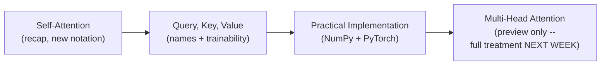

#### 🎯 Key Takeaways

* This session **genuinely, deliberately recaps** the prior class's self-attention content before introducing anything new — a direct response to reported student confusion.
* The stated plan for the session (self-attention → Q/K/V → practical implementation → MHA preview) was **not fully completed** — MHA's full treatment was explicitly pushed to the following week, alongside beginning the actual "Attention Is All You Need" paper.
* The instructor **directly, explicitly connects** this session's depth to genuine, real academic rigor: *"I generally teach students who are at least in master's, or generally some PhD-based classes."*

---

### 2. Self-Attention Recap: New Notation (S Instead of W)

#### ❓ Why It Exists — A Direct, Honest Admission

> 💡 **Given directly:** *"Last time I've written W, a lot of you got confused with respect to actual weights in a neural network, so this time I've written S... No more weights."*

#### 🪜 Step-by-Step — The Recap, Rebuilt With New Notation

> 💡 **Given directly:** *"V1 need to be attended to, first of all, with itself... So, simply here, now, I won't be using that W. Let's take a different one. Today, I will try here, let's take S for now."*

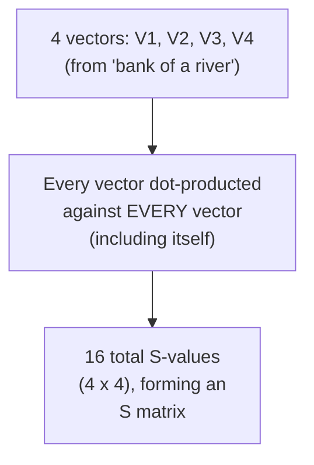

```text
S11 = V1.V1   S12 = V1.V2   S13 = V1.V3   S14 = V1.V4
S21 = V2.V1   S22 = V2.V2   S23 = V2.V3   S24 = V2.V4
S31 = V3.V1   S32 = V3.V2   S33 = V3.V3   S34 = V3.V4
S41 = V4.V1   S42 = V4.V2   S43 = V4.V3   S44 = V4.V4
```

#### 🔍 Internal Working — Why the Diagonal Carries More Information

> 💡 **Given directly:** *"When V1 will attend to itself, can I say that somehow the information flow within these two vectors will be very, very high? Because the same amount of information is being propagated... whereas if I try to compare V12, V13, V14, so I can say that at least some information of V2 is now aggregated with V1."*

#### ⚠ Common Mistakes

* Assuming "S" in this notation refers to anything other than a raw, unnormalized SCORE derived directly from a dot product — explicitly, directly clarified as pure notation, exactly like Part 1's own "W is just a label" clarification.
* Assuming the diagonal values (Sii, e.g. S11, S22) are somehow special/different in KIND from the off-diagonal values — explicitly clarified: they're computed identically (a dot product), they simply tend to carry MORE information since a vector is maximally similar to itself.

#### 🎯 Key Takeaways

* This session's recap uses **"S" for raw dot-product scores** (genuinely identical to Part 1's "W" notation, just relabeled) — a direct, deliberate response to reported confusion about trained weights.
* For a 4-token sentence, self-attention computes **16 total pairwise scores** (4×4), forming a complete S matrix — every vector attends to every other vector, including itself.
* Diagonal scores (a vector compared to itself) carry genuinely **higher information flow**, simply because a vector is maximally similar to itself — not a special rule, just a natural consequence of the dot-product computation.

---
### 3. Softmax as Normalization: The Precise Mechanics

#### 📖 Definition — Softmax, Precisely Grounded in Simple Numbers

> 💡 **Given directly:** *"Let's take a few numbers -- 3, 4, 2, and 1. If I try to use softmax on these numbers, what will happen? The idea is these will be converted into some type of probabilities."*

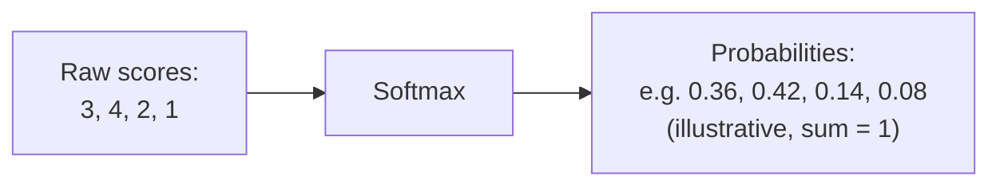

#### ❓ Why It Exists — The Two Precise Rules

> 💡 **Given directly:** *"The idea is, the sum of the probabilities has to be what? ... How many of you understand that through softmax, we can actually perform a normalization-based task where everything is assigned between 0 to 1? Because the range is between 0 to 1, and the total sum is also 1."*

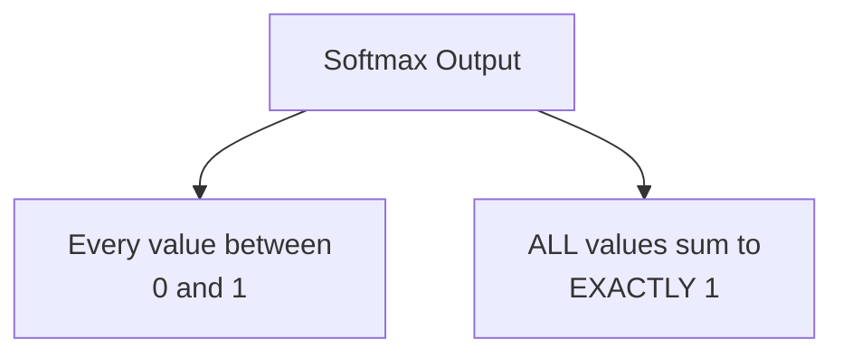

#### ⚠ A Direct, Explicit Clarification: This Is NOT a Two-Step Process

> ⚠️ **Directly, precisely corrected in response to a genuinely reasonable student question:** *"Why do we need to do normalization plus softmax? No. There is no normalization plus softmax, there is softmax... We don't do two separate steps. We have only one step. For normalization, we are performing the softmax operation."*

#### ⚠ Common Mistakes

* Assuming softmax and normalization are two SEPARATE steps applied in sequence — explicitly, directly corrected: softmax IS the normalization step; there is no separate, additional normalization applied before or after it.
* Confusing the Gaussian-distribution scaling used later (for generating random EMBEDDING numbers) with softmax's own normalization — explicitly, directly distinguished as two genuinely different purposes (initial number GENERATION vs. score NORMALIZATION).

#### 🎯 Key Takeaways

* **Softmax** converts raw scores into genuine probabilities — every output value between 0 and 1, with the complete set summing to exactly 1.
* Softmax IS the normalization step for self-attention — there is **no separate, additional normalization** applied on top of it.
* This section deliberately, directly grounds an abstract formula in simple, concrete numbers (3, 4, 2, 1) before applying it to actual attention scores — consistent with this instructor's broader teaching pattern of building intuition before formalism.

---

### 4. From Vectors to Y: The Complete Computation, Restated Three Ways

#### 🪜 Step-by-Step — Restatement 1: The Explicit S/A/Y Chain

> 💡 **Given directly:** *"Once I have this [S11, S12, S13, S14], now we will start with the actual work of the dot products... A11, A12, A13, A14... Now, once I have this, now these are vectors. Now, the idea is, again, to perform dot product."*

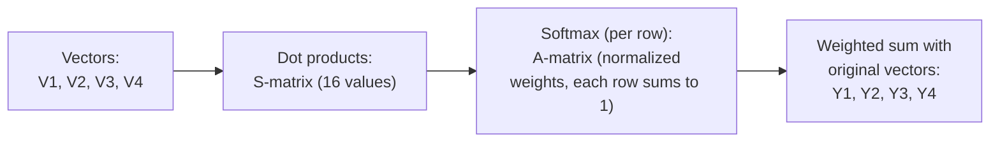

#### 🔍 Internal Working — A Precise Clarification on What "Multiply" Means Here

> 💡 **Given directly, addressing a genuinely important source of confusion:** *"Ayesha is telling, dot product will give us a scalar, not a vector. If I have two vectors, if I try to multiply both the vectors, will it be a vector? ... We are dealing with matrices. Right now, for me, vector is just numbers, a list of numbers, guys."*

> 💡 **Given directly, precisely explaining element-wise vs. matrix multiplication:** *"If I try to multiply [1, 2, 3] with [F, G, ...], element-wise, A with B... this is finally what? A list of numbers that we do have."*

#### 🪜 Step-by-Step — Restatement 2: The Block-Diagram Version

> 💡 **Given directly, explicitly repeating the SAME computation with a different visual structure:** *"Let's write it in a little bit different way... From this dot product, what you got? If you remember, we got S... These S-vectors need to be normalized to get my final A vector. Now this vector I multiplied with my original V1, V2, VK."*

#### 🪜 Step-by-Step — Restatement 3: The Linear-Layer Version

> 💡 **Given directly, the third and final restatement, now bridging toward deep learning terminology:** *"V1, V2, V3, dot dot dot dot, VN... Now, let's get back into the system that previously that we have done. Now, I have connected a matrix... in deep learning, if I really say with respect to weights, the main purpose was bringing a matrix into the system."*

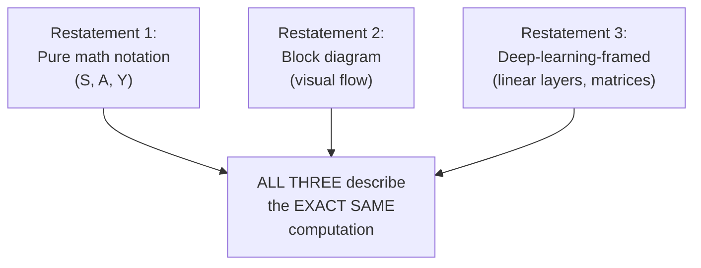

#### ❓ Why It Exists — A Direct, Explicit Statement of Pedagogical Intent

> 💡 **Given directly:** *"I have written the same thing, but in a different way... Manan is telling, sir, please give a quick recap of this weight system... I'm trying to make it in multiple ways so that things become much more clear in your mind."*

#### ⚠ Common Mistakes

* Assuming each of these three restatements describes a genuinely DIFFERENT computation — explicitly, directly clarified: all three describe the EXACT SAME underlying math, deliberately re-presented in different notational styles to reinforce the same intuition from multiple angles.

#### 🎯 Key Takeaways

* This session **deliberately re-derives the same self-attention computation three separate times**, in three genuinely different notational styles — pure vector/matrix notation, a block diagram, and a deep-learning-framed version — explicitly to reinforce intuition.
* A dot product between two SINGLE vectors yields a SCALAR; but the overall computation (S-matrix, A-matrix, Y-vectors) operates on LISTS of vectors, which is why the OVERALL result remains vector/matrix-shaped, not scalar — a genuinely important, precisely-clarified distinction.
* This threefold repetition is **explicitly, directly justified** by the instructor as a deliberate pedagogical choice, not padding — reflecting his own stated philosophy that this specific concept (self-attention's mechanics) is the single most important intuition in the entire course.

---
### 5. Self-Attention's Four Properties, Restated — Why "No Training" Is a Genuine Problem

#### 📖 Definition — The Four Properties, Given Directly Together

> 💡 **Given directly:** *"Yesterday I told you 4 things... One, there is no training required... Then the second point? Proximity or distance does not matter. Then order has no influence. And finally, the last one is shape-independent."*

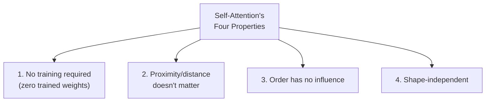

#### ⚠ A Direct, Honest Reframing: These Are Mostly Limitations, Not Advantages

> ⚠️ **Directly, precisely stated — a genuinely important reframing beyond Part 1's more neutral presentation:** *"If you really think about, and if you ask me, alright, no training, I can say that this is somehow benefit, but in the field of deep learning, this is really no use to us. If you can't train anything in deep learning, that doesn't make sense. Then comes proximity, doesn't matter... that possibility is also gone. Now, one of the main cons, if I say, and this is the main con that we do have, which is order has no influence."*

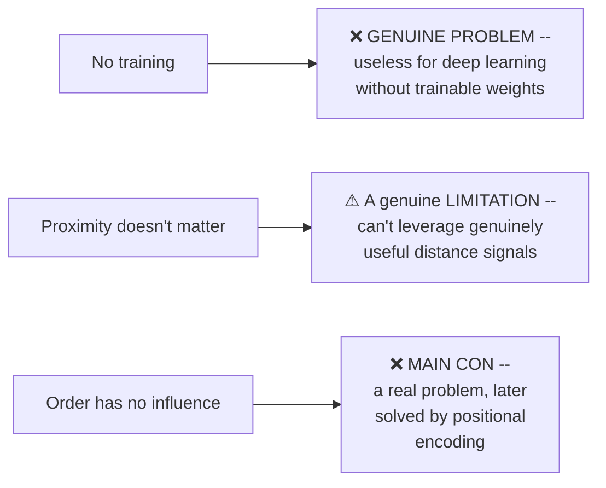

#### ❓ Why It Exists — Directly Naming the Future Fix

> 💡 **Given directly:** *"Who will be solving this particular problem of order? Okay, so I will just write this part as gone -- one of the problems, in simple terms. Who will be solving this problem in the Transformers architecture? Your friend will come, whose task is positional embedding."*

#### ⚠ Common Mistakes

* Assuming all four properties are presented with equal, neutral weight, as in a simple checklist — explicitly, directly reframed: THREE of the four (no training, order-independence, and to some extent proximity-independence) are explicitly, precisely identified as genuine PROBLEMS this basic version of self-attention has, not simply "interesting facts."
* Assuming "no training" is a genuinely positive, simplicity-related property — explicitly, directly corrected: it's specifically identified as making self-attention "no use to us" for deep learning, precisely the problem the REST of this session exists to solve.

#### 🎯 Key Takeaways

* This session **explicitly, more directly reframes** self-attention's four properties as containing genuine LIMITATIONS, not neutral facts — "no training" specifically is called out as making raw self-attention "no use to us" in deep learning.
* **Order-independence** is explicitly named as "the main con" — with its future fix (**positional encoding**) directly, explicitly named as a forthcoming Transformer-architecture component.
* This section's honest, critical framing directly, precisely sets up the REST of the session's actual motivating question: how do we fix the "no training" problem specifically?

---

### 6. Introducing Query, Key & Value: Giving Names to a Reused Vector

#### ❓ Why It Exists — The Precise, Stated Motivation

> 💡 **Given directly:** *"What are the main problems of self-attention? We cannot train it. And we need something through which we can perform the training. So that's why it is very, very important. So, first of all, let's try to build the analogy part, and then we will proceed ahead with how keys and queries and how they are imported."*

#### 🪜 Step-by-Step — The Precise, Worked Analogy: Which Vector Becomes Which Name

> 💡 **Given directly, working through a single, concrete example (V3 as the base vector):** *"When I was actually talking with respect to V3, V3 was the base one, and this particular word is actually looking into the other information right now. So what we'll be calling this? We'll be calling this a query."*

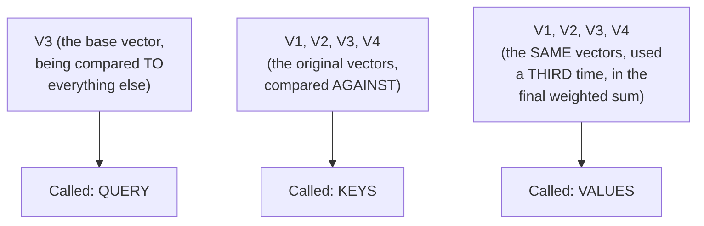

> 💡 **Given directly, the precise, repeated clarification:** *"I have used V once here. So this place, we are calling it what? The main keys part. Here, again, I have used the original one, the original vector. Now this becomes your query, and finally, again, I have used it here, which is called as, finally, the values. I'm just giving names. I'm not calling [anything new]. It's exactly the same thing. I'm just giving names right now."*

#### 🔍 Internal Working — The Database Analogy, Directly Sourced From the Paper

> 💡 **Given directly:** *"Query, keys, these type of words, where you have heard it? Can I say that, at least with respect to a database... it doesn't stand there exactly correct, but somehow we can give them some type of good names. According to the paper that they have given, because the same idea was to bring the database analogue."*

#### ⚠ A Direct, Explicit Warning: Query Isn't Always V3 — This Was Just One Example

> 💡 **Given directly, in response to a genuinely sharp, direct student question:** *"Why use query contains only V3? ... I cannot write V1, V2, otherwise I have to draw the same diagram. You have to assume that in the next phase, it will change... Query can be anything, V1, V2, yes?"*

#### ⚠ Common Mistakes

* Assuming Query, Key, and Value are three FUNDAMENTALLY DIFFERENT vectors, computed via genuinely different operations — explicitly, directly, repeatedly corrected: at THIS stage of the derivation, they're simply NAMES applied to the SAME original vectors, reused three separate times within the self-attention computation.
* Assuming "Query" always refers to a specific, fixed vector (like V3, used in this session's one worked example) — explicitly, directly corrected: query is whichever vector currently serves as the BASE vector being compared against all others; this role rotates across every vector in the sequence.

#### 🎯 Key Takeaways

* **Query, Key, and Value are, at this stage, simply NAMES** given to the same original vector, used three separate times within the self-attention computation — genuinely NOT three different mathematical objects yet.
* This naming directly borrows a **database-lookup analogy** from the original "Attention Is All You Need" paper — imperfect as an analogy, but useful for building intuition.
* This section's entire purpose is explicitly, precisely **motivational**: naming these three roles is the necessary first step before introducing genuinely DIFFERENT weight matrices for each — the actual fix for self-attention's "no training" problem, covered next.

---
### 7. Making Self-Attention Trainable: Weight Matrices via Linear Layers

#### ❓ Why It Exists — The Precise, Direct Motivation

> 💡 **Given directly:** *"Our entire previous system that I have built, this system was not trainable. There was no weights. Now, the idea was to introduce weights. So how have I introduced weights? By bringing matrix into the system."*

#### 🪜 Step-by-Step — Attaching a Dedicated Matrix to Each Named Vector

> 💡 **Given directly:** *"With every vector I will try to add one matrix. Here, I will write M, and then these are all keys, so I will write here K... Similarly, with vector V2, I will add one matrix, K... Now, V3, with this, what I will add? Can I say that I can add a matrix of Q, yes or no? The query matrix?"*

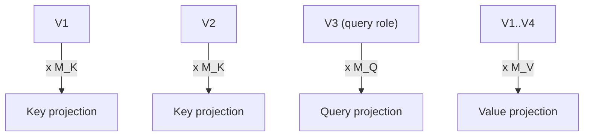

#### 🔍 Internal Working — Precisely Why the Shape Is Preserved

> 💡 **Given directly:** *"If I try to multiply with k cross k, this becomes your shape. So, is it harming, or it is providing some type of impact to your final shape? No impact. It is remaining exactly the same. We started with 1 cross k, and finally also it's 1 cross k."*

#### 🔍 Internal Working — Bringing In Deep Learning Terminology: The Linear Layer

> 💡 **Given directly:** *"In deep learning, if I really say with respect to weights, the main purpose was bringing a matrix into the system. It means that I am trying to make the system trainable... How easily you can introduce weights in any type of deep learning network? Think from ANN... What layer is that? Hidden layer."*

```python
import torch.nn as nn

d_model = 8   # matches vocabulary size in this session's small example

W_Q = nn.Linear(d_model, d_model, bias=False)
W_K = nn.Linear(d_model, d_model, bias=False)
W_V = nn.Linear(d_model, d_model, bias=False)
```

> 💡 **Given directly, the precise reasoning for using THREE separate, independent linear layers:** *"Three separate linear layers that I have taken, which is totally independent. All the calculations were going, like, parallel, so they don't have dependency right now."*

#### 🔍 Internal Working — Why This Genuinely Enables Backpropagation

> 💡 **Given directly, a genuinely important, precisely-stated point:** *"Now if I try to look into this, because the main problem was not trainable, to make it trainable, what I have done, I've introduced a separate matrix here... These matrices will be updated. For back propagation here... can I say that there will be a gradient signal which will be traveling back? Previously, it was not possible only. And why it is possible? Because we have introduced weights to the system."*

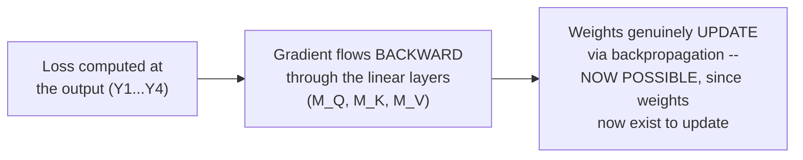

#### ⚠ Common Mistakes

* Assuming a single, shared weight matrix could handle Query, Key, and Value together — explicitly, directly corrected in response to a genuine student question: *"For each of key, query, and value, we have to introduce [a separate matrix]... A single matrix cannot do the task, because you are, if you use a single matrix, first of all, you have to think that how K and Q matrices that you will define -- it is not possible only in a single matrix definition."*
* Assuming the specific dimension chosen for these weight matrices is somehow mathematically fixed or determined — explicitly, directly clarified: *"How you would determine the shape? It really doesn't matter. I can take any shape here. It won't impact."* (Though matching vocabulary/embedding size is a common, convenient convention.)

#### 🎯 Key Takeaways

* Self-attention becomes trainable by attaching **three separate, independent weight matrices** (M_Q, M_K, M_V) — implemented in practice as `nn.Linear` layers — to the Query, Key, and Value roles respectively.
* Multiplying a vector by these matrices **preserves the vector's shape** — the output dimension matches the input dimension, regardless of the specific weight values.
* This is precisely the mechanism that enables **genuine backpropagation** — gradients can now flow backward through these newly-introduced weight matrices, updating them to reduce loss, which was structurally impossible in Part 1's weight-free derivation.

---

### 8. The Complete Implementation in NumPy

#### 🪜 Step-by-Step — Building a Random Embedding Table

> 💡 **Given directly:** *"I have taken import numpy... I have taken a simple sentence, the same sentence that I have taken right now, bank of the river... sequence length, which is basically the length of the sentence... D_model. I have taken this from my side, what is the total dimension of the model? Manually, I've taken it 8."*

```python
import numpy as np

rng = np.random.default_rng(seed=0)
sentence = "bank of the river"
seq_len = len(sentence.split())   # 4
d_model = 8                         # arbitrary; matches vocab size here

def build_embeddings(vocab_words, d_model, seed=0):
    rng = np.random.default_rng(seed)
    table = {word: rng.random(d_model) for word in sorted(set(vocab_words))}
    return table

vocab = ["bank", "of", "the", "river", "account", "money", "has", "today"]
embedding_table = build_embeddings(vocab, d_model, seed=0)

V = np.stack([embedding_table[w] for w in sentence.split()])   # shape: (4, 8)
```

> 💡 **Given directly, on WHY `sorted(set(...))` is used:** *"Why use set? ... Unique sorted... this is the part -- how many of you get this line? Right now, if you really think in Python perspective, you are actually calculating or generating the numbers for each of those words."*

#### 🪜 Step-by-Step — Defining the Q/K/V Projection Matrices

> 💡 **Given directly:** *"I have initialized the random number generator, and then I have done this. Here I have taken normal... and here I've kept a very specific scale of 0.5... whatever the numbers that will be generated, we are trying to achieve at least close to Gaussian-based distribution."*

```python
d_k = d_model   # keeping dimensions the same for simplicity

W_Q = rng.normal(scale=0.5, size=(d_model, d_k))
W_K = rng.normal(scale=0.5, size=(d_model, d_k))
W_V = rng.normal(scale=0.5, size=(d_model, d_k))

Q = V @ W_Q
K = V @ W_K
Vp = V @ W_V   # the "value" projection
```

#### 🪜 Step-by-Step — Scaled Dot-Product Scores & Softmax

> 💡 **Given directly:** *"Here I am trying to calculate the first part, which is the scores part... Q, K.T... and this is getting divided with... here I have taken the square root of D_k."*

```python
def softmax(x, axis=-1):
    exp_x = np.exp(x - np.max(x, axis=axis, keepdims=True))
    return exp_x / np.sum(exp_x, axis=axis, keepdims=True)

scores = (Q @ K.T) / np.sqrt(d_k)         # shape: (4, 4)
attention_weights = softmax(scores)          # each row sums to 1
```

#### 🪜 Step-by-Step — Computing the Final, Contextualized Output

> 💡 **Given directly:** *"Once I have my main scores, from there, I need to get my attention-based weights... Now, those weights are ready. What we need to do? We need to directly perform the multiplication with respect to our main vector."*

```python
Y = attention_weights @ Vp   # shape: (4, 8) -- the final, contextualized vectors
```

> 💡 **Given directly, a genuine, live-verified cross-check between the manual and vectorized approaches:** *"If you try to multiply with X, and then if you try to do... now, I have done just a manual-based calculation. One is directly, one is manual... I've used np.allclose. It will return true if both the arrays are, like, element-wise equal with each other."*

#### ⚠ Common Mistakes

* Assuming softmax needs to be applied a second time, or paired with a separate normalization step — explicitly, directly corrected (per Section 3): softmax alone is the complete normalization operation.
* Assuming the specific random numbers generated here carry genuine, learned semantic meaning — explicitly, directly, repeatedly acknowledged throughout this implementation: these are UNTRAINED, random numbers, used purely to demonstrate the MECHANICS, not to produce meaningful similarity scores.

#### 🎯 Key Takeaways

* The complete NumPy implementation directly mirrors the mathematical derivation: **embedding table → Q/K/V projections (via weight matrices) → scaled dot-product scores → softmax → weighted sum with V → final contextualized output**.
* `np.allclose` was used to genuinely, empirically verify that a manual, element-by-element calculation and a vectorized, matrix-based calculation produce IDENTICAL results — a real, concrete proof rather than an assumed equivalence.
* This implementation deliberately uses **random, untrained embeddings**, explicitly, repeatedly acknowledged as a genuine limitation — motivating the session's own closing assignment (substituting real Word2Vec/GloVe embeddings).

---
### 9. Proving It Works: Cosine Similarity & the Bank Disambiguation Test

#### ❓ Why It Exists — Distinguishing Qualitative From Quantitative Proof

> 💡 **Given directly:** *"There are two things. One is quantitative, and the other is... generally, when you try to take two types of decisions, one is quantitative and the other one based on our intuition, qualitative. Now, when you are doing something through quantities, let's try to prove that whether it really works or not."*

#### 🪜 Step-by-Step — The Core Test: Two Sentences, One Ambiguous Word

> 💡 **Given directly, the complete, worked test:** *"Two different contexts that I had, like bank of a river and the bank account has money. I've taken two different types of sentences. Directly, I've applied attention on top of them."*

```python
sentence_1 = "bank of the river"
sentence_2 = "bank account has money"

X_bank_1, X_river = ...   # STATIC (raw, pre-attention) embeddings for sentence 1
Y_bank_1, Y_river = ...   # CONTEXTUALIZED (post-attention) embeddings for sentence 1

X_bank_2, X_money = ...   # STATIC embeddings for sentence 2
Y_bank_2, Y_money = ...   # CONTEXTUALIZED embeddings for sentence 2

def cosine_similarity(a, b):
    return np.dot(a, b) / (np.linalg.norm(a) * np.linalg.norm(b))
```

#### 🔍 Internal Working — The Precise Comparison Being Made

> 💡 **Given directly:** *"Why bank river and Y bank money? I can see that it's not very high, whereas with respect to the cosine here, because this is directly on top of raw embedding... this is 1.0 is very, very high. 1.0 means what? Very, very similar. But actually, bank of river and bank of money, do you think it's similar? It's not similar."*

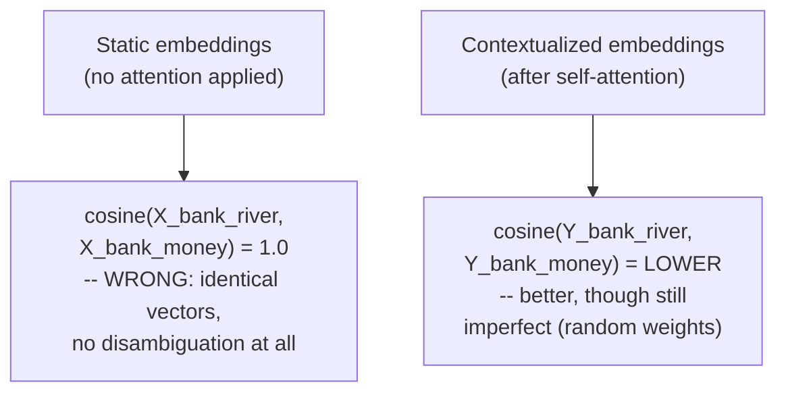

#### ⚠ A Direct, Honest Acknowledgment: The Numbers Are Genuinely Imperfect

> ⚠️ **Directly, honestly, repeatedly acknowledged:** *"Right now, why we are getting 1, guys? Because I am just showing you the raw calculation, but I've taken random numbers... I started with something wrong, and then after contextualization, at least I can say that this is much more meaningful as compared to raw embedding... though we are working with random numbers, then also the contextualized vectors is performing better."*

> ⚠️ **A precise, direct clarification on the cosine similarity's valid range, correcting a genuine student misconception:** *"When you define the cosine similarity-based task, what is the range? Somebody's telling 0 to 1. If it will be 0 to 1, guys, then how here minus 0.5 can [make sense]? Again, guys, please look into the fundamentals. The range is always between minus 1 to positive 1."*

#### 🏢 Real-World / Production Usage — The Assigned Homework, Directly Stated

> 💡 **Given directly, the session's own explicit assignment:** *"This is your assignment that I'll be giving you, where you need to change the random number generator... Please change the embedding. And you have two options: use Word2Vec from Gensim directly, you can get it, or you can use GloVe."*

#### ⚠ Common Mistakes

* Assuming cosine similarity's valid range is 0 to 1 — explicitly, directly corrected: the genuine, correct range is **-1 to +1**.
* Assuming this test's genuinely imperfect results (a suspiciously high 1.0 similarity, and a still-elevated 0.8 similarity even after attention) indicate a bug in the self-attention MECHANISM itself — explicitly, directly, repeatedly clarified: the mechanism is working correctly; the imperfect RESULTS stem specifically from using untrained, random embeddings, not from any flaw in self-attention's own logic.

#### 🎯 Key Takeaways

* **Cosine similarity** between raw, static embeddings genuinely fails to disambiguate "bank" across two different contexts (returning a perfect, meaningless 1.0) — while contextualized (post-attention) embeddings show a genuine, if imperfect, improvement.
* This test is explicitly, honestly framed as a **quantitative proof-of-concept with a genuine limitation** — random, untrained embeddings cannot fully demonstrate self-attention's real disambiguating power, which requires genuinely trained embeddings (Word2Vec, GloVe) to show clearly.
* The session's own assigned homework — swap in real, trained embeddings — directly, precisely addresses this exact limitation, turning a demonstrated shortcoming into a genuine, hands-on learning exercise.

---

### 10. The PyTorch Implementation & a First Look at Multi-Head Attention

#### 🪜 Step-by-Step — The Same Pipeline, via PyTorch's `nn.Embedding` and `nn.Linear`

> 💡 **Given directly:** *"I have changed the embedding to a proper embedding layer, which is available in PyTorch... what to index for W... Once we have defined, now I will bring some type of layer into the system... this is how you define a linear layer."*

```python
import torch
import torch.nn as nn
import torch.nn.functional as F

vocab = ["bank", "of", "the", "river", "account", "money", "has", "today"]
word_to_idx = {w: i for i, w in enumerate(sorted(set(vocab)))}

d_model = 8
embedding = nn.Embedding(num_embeddings=len(word_to_idx), embedding_dim=d_model)

sentence = "bank of the river"
idx = torch.tensor([word_to_idx[w] for w in sentence.split()])
X = embedding(idx)   # shape: (4, 8)

W_Q = nn.Linear(d_model, d_model, bias=False)
W_K = nn.Linear(d_model, d_model, bias=False)
W_V = nn.Linear(d_model, d_model, bias=False)

Q, K, V = W_Q(X), W_K(X), W_V(X)
scores = (Q @ K.T) * 0.5   # 0.5 approximates 1/sqrt(d_k) here, per the live demo
attention_weights = F.softmax(scores, dim=-1)
Y = attention_weights @ V
```

> 💡 **Given directly, a precise clarification on `F` vs. calling `nn.functional` directly:** *"Using the NN module, NN.functional as F. What is the main purpose of using functional.F? ... Through F, the functional module of PyTorch, I'm calling the activation function, which is optimized."*

#### 🔍 Internal Working — Why `0.5` and Not `1/√d_k` Directly

> 💡 **Given directly:** *"Rather than doing root over, I have taken 0.5. How many of you know this part? ... Python implementation of square root... [it's] exactly the same, the root."* (In this specific example, `1/√8 ≈ 0.354`; the instructor uses `0.5` here as a simplified, illustrative stand-in during the live coding walkthrough.)

#### 🪜 Step-by-Step — A First, Deliberately Incomplete Preview of Multi-Head Attention

> 💡 **Given directly, the precise, minimal preview given:** *"There is a direct function, which is the multi-head attention module in PyTorch... in our case, for example, we have only one head... When you think about multi, the idea is it should be more than one, or no? So generally, here it's written multiple head. But if we take only one head, according to everything that we have done today, there is only one head."*

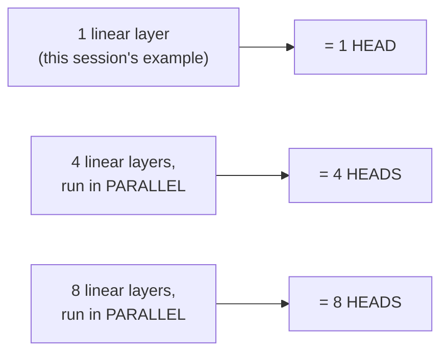

> 💡 **Given directly, the precise, minimal definition given for "head":** *"When I try to use multiple linear layers, it automatically becomes heads. That will -- next week, I will discuss -- but for today's discussion, we have only one linear layer. It means head is equal to 1... The number of heads is a hyperparameter. You need to decide it. Nobody will decide it for you."*

```python
mha = nn.MultiheadAttention(embed_dim=d_model, num_heads=1, bias=False, batch_first=True)
X_batched = X.unsqueeze(0)   # add a batch dimension: (1, 4, 8)
Y_mha, attn_weights_mha = mha(X_batched, X_batched, X_batched)
```

> 💡 **Given directly, precisely explaining why a batch dimension is added here specifically:** *"Whenever a batch comes into the system, for that one extra dimension that gets added... nobody... it is not possible to load your entire dataset into the GPU if your data is very, very huge."*

#### ⚠ Common Mistakes

* Assuming this session's own manual NumPy/PyTorch implementation and the `nn.MultiheadAttention` module demonstration are DIRECTLY connected, sharing computed values — explicitly, directly clarified: *"Here, I've just showed you this is a function which is available. Nothing related, totally out of the context. I'm just showing you this is possible."*
* Assuming "multi-head" fundamentally requires a totally different mechanism from what's been derived so far — explicitly, directly clarified, at least at this preview level: it's genuinely just MORE PARALLEL LINEAR LAYERS, run independently, with the exact number of heads being a chosen hyperparameter.
* Assuming the batch dimension added before calling `nn.MultiheadAttention` is somehow specific to multi-head attention or Transformers — explicitly, directly clarified: it's a GENERAL deep learning requirement, identical to how a CNN with batch size 32 would add its own batch dimension.

#### 🎯 Key Takeaways

* The **PyTorch implementation** directly mirrors the NumPy version, but replaces the manual random-number-generator embedding with a genuine `nn.Embedding` layer, and uses `F.softmax` instead of a hand-written softmax function.
* This session's **preview of multi-head attention** is deliberately minimal: at THIS stage, "more heads" simply means "more parallel linear layers" — a genuinely incomplete but directionally correct intuition, explicitly deferred to next week's full treatment.
* The number of attention heads is explicitly, precisely identified as a **hyperparameter** — a deliberate design choice, not something automatically determined by the model or data.

---
## 📝 Glossary

| Term | Definition | Why It Matters |
|---|---|---|
| **S (score)** | This session's notation for a raw, unnormalized dot-product score | Genuinely identical to Part 1's "W" -- relabeled to avoid trained-weight confusion |
| **A (normalized weight)** | The result of applying softmax to a row of S scores | Sums to 1; used in the final weighted sum with V |
| **Softmax** | A normalization function converting raw scores into probabilities (0-1, summing to 1) | The complete normalization step -- no separate step needed |
| **Query** | The name given to the "base" vector currently being compared against all others | Rotates -- every vector serves as query once |
| **Key** | The name given to the vectors a query is compared AGAINST | The SAME original vectors, reused |
| **Value** | The name given to the vectors used in the final weighted sum | Again, the SAME original vectors, reused a third time |
| **M_Q / M_K / M_V (Weight Matrices)** | Three separate, trainable matrices, one per Q/K/V role | Implemented as `nn.Linear` layers; enable backpropagation |
| **Linear Layer** | PyTorch's term for a fully-connected/hidden/dense layer | How weight matrices are actually implemented in practice |
| **Cosine Similarity** | A similarity measure between two vectors, ranging from -1 to +1 | Used to quantitatively test disambiguation quality |
| **Head (in Multi-Head Attention)** | One parallel Q/K/V linear-layer set | More linear layers = more heads; a chosen hyperparameter |

---

## 🔄 Revision Notes — One-Minute Revision

* This is **Part 2 of "Transformers 101"** -- same instructor as Part 1 (referred to directly as "Paul" by students, despite the "Krish Naik" platform speaker label) -- a deliberate, three-times-repeated recap of self-attention, followed by the session's genuinely new content: Query, Key, Value, and a complete implementation.
* **Notation changed from "W" to "S"** specifically to avoid trained-weight confusion; the recap re-derives the SAME 4x4 score matrix, softmax normalization, and weighted-sum output as Part 1, using this new notation.
* **Softmax IS the complete normalization step** -- no separate normalization is applied before or after it; every output is between 0-1, summing to exactly 1.
* **Self-attention's four properties are reframed as mostly LIMITATIONS**, not neutral facts -- "no training" specifically is called out as making it "no use to us" for deep learning; order-independence is "the main con," to be solved later by positional encoding.
* **Query, Key, and Value are, at this stage, just NAMES** given to the same original vector, reused three times -- NOT three fundamentally different objects yet; directly borrowed from a database-lookup analogy in the original paper.
* **Trainability is achieved by attaching three separate weight matrices** (M_Q, M_K, M_V), implemented as `nn.Linear` layers -- this is precisely what enables genuine backpropagation, since gradients can now flow through these newly-introduced weights.
* A **complete NumPy implementation**: random embedding table -> Q/K/V projections -> scaled dot-product scores -> softmax -> weighted sum -> contextualized output -- with `np.allclose` used to genuinely verify manual and vectorized calculations match.
* A **cosine similarity test** ("bank of a river" vs. "bank account has money") showed static embeddings genuinely fail to disambiguate (returning a meaningless 1.0), while contextualized embeddings show a genuine, if imperfect, improvement -- honestly acknowledged as limited by using untrained, random embeddings, motivating a real Word2Vec/GloVe homework assignment.
* A **PyTorch implementation** mirrors the NumPy version using `nn.Embedding` and `nn.Linear`, plus a first, deliberately minimal preview of `nn.MultiheadAttention`: more parallel linear layers = more heads, with the exact count being a chosen hyperparameter -- full MHA treatment explicitly deferred to next week.

---

## 📋 Cheat Sheet

**Notation change:**
```text
Part 1: "W" for raw scores  ->  Part 2: "S" for raw scores (SAME concept, relabeled)
```

**Softmax's two rules:**
```text
Every output value: between 0 and 1
Sum of all outputs: exactly 1
(This IS the complete normalization step -- no separate step needed)
```

**Self-attention's four properties, reframed:**
```text
No training required    -> ❌ GENUINE PROBLEM (useless for deep learning as-is)
Proximity doesn't matter -> ⚠️ a real limitation
Order has no influence     -> ❌ MAIN CON (later solved by positional encoding)
Shape-independent             -> neutral, unproblematic property
```

**Query/Key/Value, at this stage:**
```text
Query = the "base" vector currently being compared (rotates across all vectors)
Key   = the vectors being compared AGAINST (same original vectors)
Value = the vectors used in the final weighted sum (same original vectors, again)
-> At THIS stage: just NAMES, not yet different mathematical objects
```

**Making it trainable:**
```python
W_Q = nn.Linear(d_model, d_model, bias=False)
W_K = nn.Linear(d_model, d_model, bias=False)
W_V = nn.Linear(d_model, d_model, bias=False)
Q, K, V = W_Q(X), W_K(X), W_V(X)
```

**Complete self-attention pipeline:**
```text
Embeddings -> Q/K/V projections (via weight matrices)
           -> scaled dot-product scores: (Q @ K.T) / sqrt(d_k)
           -> softmax (normalization)
           -> weighted sum with V -> contextualized output (Y)
```

**Cosine similarity's true range:**
```text
-1 to +1  (NOT 0 to 1)
```

**Heads, at this preview stage:**
```text
1 linear layer  -> 1 head
4 linear layers (parallel) -> 4 heads
Number of heads = a HYPERPARAMETER you choose
```

---

## 🔥 Interview Questions & Answers

### 🟢 Beginner

**Q1.**

**Question:** Why does this session use "S" instead of "W" for self-attention's raw scores?

**Answer:** Specifically to avoid confusing them with trained neural network weights -- students in the prior class got confused by the "W" notation.

**Explanation:** Directly, explicitly stated.

**Why Interviewers Ask This:** Tests awareness of a genuinely important, easy-to-misunderstand notational distinction.

**Possible Follow-up:** "Does this notation change alter the underlying mathematics in any way?"

**Q2.**

**Question:** What are the two rules that define softmax's output?

**Answer:** Every value is between 0 and 1; all values sum to exactly 1.

**Explanation:** Directly, precisely stated.

**Why Interviewers Ask This:** Foundational, frequently-tested softmax knowledge.

**Possible Follow-up:** "Is there a separate normalization step applied before or after softmax?"

**Q3.**

**Question:** Why is "no training required" described as a genuine problem for self-attention, rather than a benefit?

**Answer:** Because in deep learning, a system with no trainable weights cannot be improved via backpropagation -- making it "no use" for genuine deep learning purposes.

**Explanation:** Directly, explicitly reframed as a limitation.

**Why Interviewers Ask This:** Tests whether a learner understands WHY the rest of the Transformer architecture exists.

**Possible Follow-up:** "What specific mechanism was introduced to fix this problem?"

**Q4.**

**Question:** At the stage this session introduces Query, Key, and Value, are they three genuinely different mathematical objects?

**Answer:** No -- at this stage, they are simply NAMES given to the same original vector, used three separate times in the computation.

**Explanation:** Directly, explicitly, repeatedly clarified.

**Why Interviewers Ask This:** Tests precise understanding of the conceptual STAGE of the Q/K/V introduction, not just recall of the terms.

**Possible Follow-up:** "What later step makes Query, Key, and Value genuinely different from each other?"

**Q5.**

**Question:** How is self-attention made trainable?

**Answer:** By attaching three separate weight matrices (M_Q, M_K, M_V) -- implemented as `nn.Linear` layers -- to the Query, Key, and Value roles.

**Explanation:** Directly, precisely explained.

**Why Interviewers Ask This:** A commonly-asked, foundational Transformer-mechanics question.

**Possible Follow-up:** "Why can't a single, shared weight matrix serve all three roles?"

**Q6.**

**Question:** What is the correct range for cosine similarity?

**Answer:** -1 to +1.

**Explanation:** Directly, precisely corrected from a common misconception (0 to 1).

**Why Interviewers Ask This:** A commonly-confused, basic linear-algebra fact.

**Possible Follow-up:** "What does a cosine similarity of exactly 1.0 mean?"

**Q7.**

**Question:** Does multiplying a vector by a weight matrix change its shape?

**Answer:** No -- the shape is preserved; output dimension matches input dimension.

**Explanation:** Directly, precisely stated.

**Why Interviewers Ask This:** Tests understanding of a genuinely important structural property.

**Possible Follow-up:** "What matrix dimension would you choose to preserve a vector of size 8?"

**Q8.**

**Question:** In this session's minimal preview, what determines the number of "heads" in multi-head attention?

**Answer:** The number of parallel linear layers used -- more linear layers means more heads; the exact count is a chosen hyperparameter.

**Explanation:** Directly, precisely (if minimally) explained.

**Why Interviewers Ask This:** Tests awareness of the basic intuition ahead of the full MHA treatment.

**Possible Follow-up:** "Is the number of heads determined automatically, or chosen by the developer?"

**Q9.**

**Question:** Why does batching add an extra dimension when using `nn.MultiheadAttention`?

**Answer:** This is a general deep learning requirement, not specific to attention -- an entire dataset can't be loaded into GPU memory at once, so data is processed in batches, and one extra dimension is added to represent the batch.

**Explanation:** Directly, explicitly clarified.

**Why Interviewers Ask This:** Tests understanding of a genuinely general deep learning concept, not a Transformer-specific quirk.

**Possible Follow-up:** "What function is typically used to add this batch dimension in PyTorch?"

**Q10.**

**Question:** What does `np.allclose` verify, and why was it used in this session's implementation?

**Answer:** It checks whether two arrays are element-wise equal (within a tolerance) -- used to verify that a manual calculation and a vectorized calculation produce identical results.

**Explanation:** Directly, precisely explained.

**Why Interviewers Ask This:** Tests awareness of a genuinely useful verification/debugging technique.

**Possible Follow-up:** "Why might two mathematically equivalent calculations produce slightly different floating-point results?"

---

### 🟡 Intermediate

**Q11.**

**Question:** Explain why this session deliberately re-derives the same self-attention computation three separate times, in three different notational styles, rather than deriving it once and moving on.

**Answer:** This is an explicitly, directly stated deliberate pedagogical choice -- the instructor states his goal is making the SAME intuition "much more clear in your mind" by approaching it from multiple angles (pure vector/matrix notation, a block diagram, and a deep-learning-framed version with explicit linear layers). This directly reflects a genuine teaching philosophy that this specific concept -- the mechanics of self-attention -- is the single most foundational intuition in the entire course, worth reinforcing redundantly rather than risking a single, potentially-missed explanation. This mirrors the SAME "prove and re-prove" pattern seen in Part 1's own approach (introducing the time-series smoothing analogy before ever discussing NLP directly).

**Explanation:** Requires recognizing a deliberate, stated pedagogical strategy and connecting it to the course's broader teaching philosophy.

**Why Interviewers Ask This:** Tests whether a learner recognizes deliberate redundancy as a teaching TECHNIQUE, not accidental repetition.

**Possible Follow-up:** "Which of the three restatements bridges most directly into actual deep learning implementation, and why?"

**Q12.**

**Question:** A learner argues that since this session's cosine similarity test produced a "wrong" result (bank-of-river vs. bank-of-money scoring 0.8, higher than expected), the self-attention mechanism itself must be flawed. Evaluate this claim.

**Answer:** This claim is inaccurate, and the session's own content directly, explicitly addresses this exact concern. The imperfect result stems specifically from using UNTRAINED, RANDOM embeddings -- not from any flaw in the self-attention MECHANISM'S underlying logic. Self-attention's role is to AGGREGATE and REWEIGHT existing vector information based on genuine relationships between tokens -- but if the STARTING vectors themselves carry no genuine, learned semantic meaning (because they're randomly generated), self-attention has no meaningful signal to work with in the first place. This is precisely why the session's own honest framing explicitly separates "is the computation working correctly" (yes, verified via `np.allclose`) from "does the RESULT carry genuine semantic meaning" (not with random embeddings) -- and why the assigned homework specifically addresses this by substituting genuinely trained embeddings (Word2Vec/GloVe).

**Explanation:** Tests whether a learner distinguishes a MECHANISM'S correctness from the QUALITY of its inputs, a genuinely important distinction the session's own honest framing establishes.

**Why Interviewers Ask This:** Distinguishes candidates who understand "garbage in, garbage out" from those who conflate input quality with algorithmic correctness.

**Possible Follow-up:** "What specific result would you expect if this exact test were re-run using genuine, trained GloVe embeddings?"

**Q13.**

**Question:** Explain, precisely, why the instructor specifically chooses V3 (rather than V1) as the worked example's "query" vector when first introducing Q/K/V, and why he explicitly cautions that this choice doesn't generalize.

**Answer:** The specific choice of V3 appears somewhat arbitrary -- the instructor's own reasoning is primarily about AVOIDING REPETITIVE DIAGRAMMING: *"I cannot write V1, V2, otherwise I have to draw the same diagram."* The genuinely important point isn't WHICH specific vector was chosen as the example, but the underlying, general PRINCIPLE the instructor explicitly, directly clarifies: query is not a FIXED, permanent role belonging to one specific vector -- it's a ROLE that ROTATES across every vector in the sequence, exactly as demonstrated in Part 1's full 4x4 score-matrix derivation (where EVERY vector serves as the "base"/query vector in its own row of computation). The explicit caution against over-generalizing from this ONE example directly prevents a genuine misconception: that Query, Key, and Value are somehow permanently, structurally different CATEGORIES of vector, rather than roles any vector can occupy depending on which specific computation is being performed.

**Explanation:** Requires distinguishing the instructor's practical, presentation-driven choice from the genuinely important underlying principle he explicitly protects against misunderstanding.

**Why Interviewers Ask This:** Tests whether a learner separates a specific example's incidental details from the general principle it's meant to illustrate.

**Possible Follow-up:** "In the full, 4-vector self-attention computation from Part 1, how many times does each vector serve as the 'query' role?"

**Q14.**

**Question:** Using this session's precise definition of "head" (more parallel linear layers), explain why increasing the number of heads genuinely increases the total number of trainable parameters in a model, and what trade-off this implies.

**Answer:** Since each additional head requires its OWN, independent set of Q/K/V weight matrices (per this session's own stated reasoning: *"three separate linear layers... totally independent"*), doubling the number of heads genuinely doubles the number of Q/K/V weight matrices needed -- a real, direct increase in total trainable parameters, not merely a conceptual or architectural change. This implies a genuine trade-off explicitly touched on but not fully resolved in this session (deferred to next week): MORE heads potentially allow the model to attend to DIFFERENT kinds of relationships in parallel (a benefit deferred to full MHA coverage), but at the direct COST of more parameters to train, more compute per forward/backward pass, and genuine risk of overfitting on smaller datasets -- exactly the kind of hyperparameter trade-off the session's own "number of heads is a hyperparameter, nobody will decide it for you" framing implies without fully elaborating.

**Explanation:** Requires extending the session's own minimal "more layers = more heads" definition into a genuine, reasoned consequence (parameter count) the session doesn't explicitly walk through.

**Why Interviewers Ask This:** Tests whether a learner can derive a non-obvious, correct consequence from a stated but minimally-elaborated definition.

**Possible Follow-up:** "If d_model is fixed, how might increasing the number of heads affect the DIMENSION of each individual head's projections?"

**Q15.**

**Question:** Synthesize this session's "no training = genuine problem" framing (Section 5) with its weight-matrix solution (Section 7) to explain precisely how backpropagation flows through THIS specific architecture -- tracing the actual gradient path, not just asserting that it works.

**Answer:** A precise trace: the LOSS is computed at the final output layer (downstream of Y1...Y4, in whatever task -- NER, QA -- the full model is being trained for). Per the chain rule of calculus (the mathematical foundation of backpropagation), the gradient of this loss propagates BACKWARD through EVERY differentiable operation in the forward pass, in REVERSE order: first through the final weighted-sum operation (Y = A @ V), computing how much each element of A and V contributed to the loss; then backward through the softmax operation (computing how much each raw score S contributed to A); then backward through the dot-product score computation (Q @ K.T), computing how much Q and K contributed to S; and FINALLY, backward through the weight matrices M_Q, M_K, M_V themselves (since these are the actual `nn.Linear` layers, per Section 7's implementation), computing the GRADIENT OF THE LOSS WITH RESPECT TO EACH WEIGHT VALUE in these matrices. This final step is precisely what makes the system genuinely trainable -- these gradients are then used (via an optimizer, e.g., SGD or Adam) to UPDATE the weight values, reducing loss on subsequent training iterations. Before these weight matrices were introduced (Part 1's pure self-attention), this ENTIRE backward chain would have terminated at the raw V vectors themselves -- with no trainable parameters anywhere in the computation for the gradient to actually update.

**Explanation:** Requires tracing the ACTUAL, step-by-step gradient flow through this specific architecture, connecting Section 5's abstract "no training" problem to Section 7's concrete fix via a genuine, mechanistic explanation.

**Why Interviewers Ask This:** A senior-level question testing whether a candidate can trace backpropagation through a specific, real architecture, not just state that "gradients flow backward" as an abstract fact.

**Possible Follow-up:** "At which specific point in this backward chain would the gradient computation FAIL, or become meaningless, if the weight matrices M_Q, M_K, M_V were removed?"

---

### 🔴 Advanced

**Q16.**

**Question:** Design a complete, from-scratch numerical walkthrough (following this session's exact NumPy pipeline) for a NEW 3-word sentence of your own choosing, explicitly computing embeddings, Q/K/V projections, scaled scores, softmax, and the final contextualized output — and verify your manual calculation against a vectorized one using the equivalent of `np.allclose`.

**Answer:** A reasonable, complete walkthrough for, e.g., "cats chase mice" (V1=cats, V2=chase, V3=mice, with d_model=4 for simplicity): (1) Build a small embedding table (via a random number generator, per Section 8's exact pattern) for each unique word, then stack the three sentence-specific vectors into V (shape 3x4). (2) Generate three independent weight matrices W_Q, W_K, W_V (each 4x4, via `rng.normal(scale=0.5, size=(4,4))`, per Section 8's exact pattern), and compute Q = V@W_Q, K = V@W_K, Vp = V@W_V. (3) Compute scores = (Q @ K.T) / sqrt(4), yielding a 3x3 score matrix. (4) Apply softmax row-wise to get attention_weights (each row summing to 1). (5) Compute Y = attention_weights @ Vp, yielding the final, 3x4 contextualized output. (6) For verification, manually compute AT LEAST one element of Y by hand (e.g., Y[0] = attention_weights[0,0]*Vp[0] + attention_weights[0,1]*Vp[1] + attention_weights[0,2]*Vp[2]) and confirm it matches the vectorized result via `np.allclose`, directly reproducing Section 8's own demonstrated manual-vs-vectorized verification technique.

**Explanation:** Requires extending the session's own exact derivation pattern to a genuinely new example, then reproducing the session's own verification technique.

**Why Interviewers Ask This:** A realistic, senior-level question testing whether a candidate can both reproduce the taught pipeline AND apply the session's own verification methodology to a new case.

**Possible Follow-up:** "What would change in this walkthrough if you used a d_model of 8 instead of 4, while keeping the same 3-word sentence?"

**Q17.**

**Question:** Critically evaluate: "Since this session shows Query, Key, and Value are initially just NAMES for the same reused vector, and only become genuinely different after weight matrices are introduced, the entire Q/K/V terminology is fundamentally unnecessary — the original paper could have simply described this as 'apply three different linear transformations to your input.'" Is this an accurate characterization?

**Answer:** Partially accurate on the pure MATHEMATICAL necessity, but understates the genuine COMMUNICATIVE and CONCEPTUAL value of the Q/K/V framing. Mathematically, the claim is correct -- Section 6/7's own content directly confirms that Q/K/V, once weight matrices are introduced, genuinely ARE just "three different linear transformations of your input" -- there's no additional mathematical content beyond this. However, the session ITSELF (and the original paper) explicitly chose the database-lookup ANALOGY (Query = what you're looking for, Key = what's being compared against, Value = what's aggregated) specifically because it provides a genuinely useful, intuitive MENTAL MODEL for reasoning about the mechanism's PURPOSE, not just its mathematics -- directly connecting to a widely-understood, pre-existing concept (database queries) that helps learners and practitioners reason about WHY this specific structure is useful (e.g., "this looks like something searching for relevant information"), beyond what "three linear transformations" alone communicates. The accurate, more precise claim: the Q/K/V TERMINOLOGY is not mathematically necessary, but it IS communicatively and pedagogically valuable -- exactly the kind of naming choice this session's own repeated "I'm just giving names" framing acknowledges directly, without dismissing the naming as worthless.

**Explanation:** Tests whether a learner distinguishes mathematical necessity from communicative/pedagogical value, correctly recognizing both can be true simultaneously (unnecessary mathematically, valuable conceptually).

**Why Interviewers Ask This:** Distinguishes candidates who understand that terminology can serve a genuine conceptual purpose beyond strict mathematical necessity.

**Possible Follow-up:** "Propose an alternative name/analogy for Query, Key, and Value that might communicate their purpose even MORE clearly than the database analogy."

**Q18.**

**Question:** Synthesize this session's precise Query/Key/Value naming derivation (Section 6) with this session's own honest acknowledgment that random embeddings can't fully prove disambiguation (Section 9) to construct a rigorous, testable HYPOTHESIS about exactly what improvement you'd expect to see if the session's own assigned homework (real Word2Vec/GloVe embeddings) were completed correctly — stated precisely enough to be falsifiable.

**Answer:** A precise, testable hypothesis: Using genuinely trained embeddings (Word2Vec or GloVe), the cosine similarity between the CONTEXTUALIZED representations of "bank" in "bank of a river" versus "bank account has money" (i.e., Y_bank_river vs. Y_bank_money) should be SIGNIFICANTLY LOWER than the cosine similarity between their STATIC, raw embeddings (X_bank_river vs. X_bank_money) -- specifically because genuinely trained embeddings place semantically-related words (e.g., "river," "water," "shore") CLOSER together in embedding space than unrelated words (e.g., "money," "account," "deposit"), meaning self-attention's weighted-sum mechanism (Section 4) would genuinely AGGREGATE more "water-related" contextual information into "bank" in the river sentence, and more "finance-related" information into "bank" in the money sentence -- producing two genuinely DIVERGENT contextualized vectors, unlike the RANDOM embeddings used in this session's own demo (Section 9), where no such genuine semantic clustering exists for self-attention to meaningfully leverage. This hypothesis is FALSIFIABLE: if completing the assignment with real embeddings STILL produces a high (close to 1.0) cosine similarity between the two contextualized "bank" vectors, this would indicate either a genuine implementation bug, or that the specific embedding model used doesn't capture this particular semantic distinction well -- either way, a concrete, testable prediction directly derivable from this session's own stated reasoning.

**Explanation:** Requires synthesizing two separately-discussed pieces of content (the Q/K/V mechanism's aggregation behavior, and the session's own honest limitation acknowledgment) into a precise, falsifiable prediction about the assigned homework's expected outcome.

**Why Interviewers Ask This:** A capstone-level question testing whether a candidate can generate a rigorous, testable hypothesis from taught mechanics, rather than only reciting that "trained embeddings would work better" as a vague, unfalsifiable claim.

**Possible Follow-up:** "What specific numeric threshold (e.g., a cosine similarity below some value) would you consider genuine evidence that this hypothesis was confirmed, versus merely a marginal, inconclusive improvement?"

---

## 🧪 Scenario-Based Interview Questions

> **Scenario 1:** A colleague, newly implementing self-attention from this session's NumPy pipeline, reports that their `attention_weights` matrix rows don't sum to exactly 1.0 (they sum to approximately 0.98-1.02). Using this session's concepts, diagnose this.

**Structured Answer:**
1. **Initial investigation:** Recognize this as likely a genuine, expected floating-point precision artifact rather than a fundamental bug, directly connecting to Section 8's own use of `np.allclose` (which explicitly tolerates small numerical differences, rather than requiring exact equality).
2. **Metrics/logs to check:** Verify the SPECIFIC magnitude of the discrepancy (0.98-1.02 is consistent with floating-point rounding; a discrepancy of, say, 0.5 or 1.5 would indicate a genuine, different bug).
3. **Possible causes:** Standard floating-point arithmetic precision limits in the softmax implementation -- genuinely expected behavior, not a sign of incorrect softmax logic.
4. **Debugging approach:** Use `np.allclose(attention_weights.sum(axis=-1), 1.0)` (directly reproducing Section 8's own verification technique) rather than checking for EXACT equality, to confirm the sums are correct WITHIN reasonable floating-point tolerance.
5. **Resolution:** Confirm this is expected, benign floating-point behavior; no code change is genuinely needed if the discrepancy is within a small, standard tolerance (e.g., 1e-6).
6. **Prevention:** Establish a team convention of using `np.allclose` (or equivalent) rather than exact equality checks (`==`) when verifying floating-point computations, directly modeling this session's own demonstrated best practice.

> **Scenario 2 (Advanced):** Your organization is building a genuinely production-grade sentiment classifier, and a colleague suggests using this session's exact random-number-generator embedding approach (rather than pretrained embeddings) "to save time," reasoning that self-attention will still improve the vectors regardless of the starting point. Using this session's concepts (Section 9, Advanced Q12), evaluate this suggestion and provide your recommendation.

**Structured Answer:**
1. **Initial investigation:** Recognize this suggestion directly, precisely misapplies a demonstration technique (used specifically to illustrate MECHANICS in this session) as if it were a genuine, viable production strategy.
2. **Relevant principle:** Per Advanced Q12's own precise reasoning, self-attention AGGREGATES and REWEIGHTS existing vector information -- it does NOT create genuine semantic meaning from nothing; if the starting embeddings carry no learned, meaningful signal (as with random numbers), self-attention has no meaningful signal to aggregate, regardless of how correctly the mechanism itself is implemented.
3. **Possible causes for this suggestion:** A reasonable but mistaken generalization from this session's own genuine, if limited, demonstrated improvement (contextualized vectors performing "better" than raw random ones) into an inaccurate belief that self-attention alone can compensate for genuinely meaningless starting embeddings in a real production system.
4. **Debugging/evaluation approach:** Directly reference this session's own honest, explicit acknowledgment (Section 9) that random embeddings cannot produce genuinely meaningful results, and that real, trained embeddings (or a fully end-to-end trained model) are required for genuine, production-quality semantic understanding.
5. **Resolution:** Recommend AGAINST using random-number-generator embeddings for production -- instead, use either pretrained embeddings (Word2Vec, GloVe, or modern alternatives) as a starting point, OR train the ENTIRE model (including embeddings) end-to-end on genuine, labeled sentiment data, directly reproducing the session's own explicit recommendation for its assigned homework.
6. **Prevention:** Document this exact distinction (demonstration/teaching technique vs. genuine production strategy) as a standing team guideline, explicitly noting that pedagogical simplifications (like this session's own deliberate use of random embeddings, clearly explained as such) should never be mistaken for production-appropriate shortcuts.

---

## 🛠 Hands-on Exercises

### 🟢 Easy

1. Write out, from memory, the two rules that define softmax's output (range and sum).
2. Explain, in your own words, why Query, Key, and Value are "just names" at the stage this session introduces them, using a sentence of your own choosing (not "bank of a river").
3. Draw (or describe in writing) the complete self-attention-to-Q/K/V pipeline, from raw vectors through to the final contextualized output.

### 🟡 Medium

4. Complete the full, numerical 3-word walkthrough proposed in Advanced Interview Q16, by hand, verifying at least one output element manually against a vectorized calculation.
5. Implement this session's exact NumPy pipeline (embedding table, Q/K/V projections, scores, softmax, output) for a sentence of your own choosing, and run the cosine similarity disambiguation test from Section 9.
6. Complete the session's own assigned homework: replace the random-number-generator embeddings with real Word2Vec or GloVe embeddings, and document whether the disambiguation test's results genuinely improve.

### 🔴 Advanced

7. Implement the precise, falsifiable hypothesis proposed in Advanced Interview Q18, running the actual experiment with real embeddings and documenting whether your hypothesis was confirmed or refuted.
8. Extend this session's minimal multi-head preview into a genuine, working 2-head or 4-head implementation in NumPy, computing separate Q/K/V projections per head and concatenating the results.
9. Trace the complete backpropagation gradient path proposed in Advanced Interview Q15 for a genuinely new, small example of your own choosing, writing out each step of the chain rule explicitly.

---

## 🏗 Practice Assignment

*(This session's own stated assignment, reproduced faithfully)*

> 💡 **Instructor's own words, given directly:** *"Please change the embedding. And you have two options with you. One is Word2Vec, and one is GLOVE."*

### Build: "Self-Attention With Real, Trained Embeddings"

**Objective:** Complete this session's own stated assignment end to end -- replace this session's random-number-generator embeddings with genuine, trained embeddings, and evaluate the resulting improvement.

**Requirements:**
- A working implementation of this session's complete self-attention pipeline (Q/K/V projections, scaled dot-product scores, softmax, contextualized output), directly reusing Section 8's structure.
- Genuine, trained embeddings (Word2Vec via Gensim, OR GloVe) substituted for the random-number-generator embedding table.
- A repeated cosine similarity disambiguation test (Section 9's "bank of a river" vs. "bank account has money" example, or a sentence pair of your own choosing with a similarly ambiguous word).
- A written comparison (200-300 words) of your results using real embeddings versus this session's own random-embedding results, directly addressing whether your outcome matches the hypothesis proposed in Advanced Interview Q18.

**Architecture (suggested):**

```text
self_attention_real_embeddings/
├── embeddings_setup.py             # Word2Vec or GloVe loading
├── self_attention_pipeline.py        # your complete Q/K/V pipeline
├── disambiguation_test.py              # your cosine similarity test
└── RESULTS_COMPARISON.md                 # your written comparison
```

**Expected Functionality:**
- Your pipeline should genuinely, correctly compute contextualized vectors using real embeddings as the starting point.
- Your written comparison should include actual, specific numeric results (not just qualitative claims) comparing random vs. trained embeddings.

**Challenges:**
- Correctly loading and aligning Word2Vec/GloVe embeddings with your specific vocabulary.
- Ensuring your embedding dimension matches your Q/K/V weight matrix dimensions (unlike this session's simplified, vocab-size-matched dimension choice).

**Bonus Improvements:**
- Extend your test to a genuinely different polysemous word (not "bank"), and document whether the disambiguation effect generalizes.
- Implement the multi-head extension proposed in Advanced Interview Q17, applying it to your real-embedding pipeline.

---

## 📚 Additional Resources

- **Transformers 101 Part 1** -- the direct prerequisite session, covering self-attention's original derivation and four properties; this session's opening recap directly, deliberately re-teaches this content.
- **"Hands-On Large Language Models" by Jay Alammar** (referenced directly) -- explicitly recommended.
- **"Hands-On LLM"** (referenced directly) -- a second explicitly recommended book.
- **"Building an LLM from Scratch" by Sebastian Raschka** (referenced directly) -- a third explicitly recommended book, described as "really a cool book."
- **The next session** (referenced directly, explicitly previewed) -- the full, complete treatment of multi-head attention, followed by beginning the actual "Attention Is All You Need" research paper.
- **Gensim's Word2Vec** and **Stanford's GloVe** (both referenced directly) -- the two recommended sources for the session's own assigned embedding-replacement homework.

---

## 📌 Final Revision Sheet

### ⭐ Core Concepts
- **Notation**: "S" for raw scores, "A" for normalized (softmax) weights -- genuinely identical concepts to Part 1's "W," relabeled.
- **Softmax IS the complete normalization step** -- range 0-1, sum exactly 1, no separate step needed.
- **Self-attention's four properties are mostly LIMITATIONS**: no training (a genuine problem), proximity-independence (a limitation), order-independence (the main con, later fixed by positional encoding), shape-independence (neutral).
- **Query, Key, Value are, at this stage, just NAMES** for the same reused vector -- genuinely different only once separate weight matrices are introduced.
- **Trainability** comes from three separate weight matrices (M_Q, M_K, M_V), implemented as `nn.Linear` layers, enabling genuine backpropagation.
- **Complete pipeline**: embeddings -> Q/K/V projections -> scaled dot-product scores -> softmax -> weighted sum -> contextualized output.
- **Cosine similarity's true range is -1 to +1**, not 0 to 1.
- **Heads** = parallel linear-layer sets; the count is a chosen hyperparameter -- full MHA treatment deferred to next week.

### ⭐ Important Definitions
- **Query, Key, Value** (at this naming stage), **d_k**, **head** (see Glossary for full definitions).

### ⭐ Important Commands/Code
```python
# NumPy
Q, K, V = V_orig @ W_Q, V_orig @ W_K, V_orig @ W_V
scores = (Q @ K.T) / np.sqrt(d_k)
attention_weights = softmax(scores)
Y = attention_weights @ V

# PyTorch
W_Q, W_K, W_V = nn.Linear(d_model, d_model, bias=False), ..., ...
mha = nn.MultiheadAttention(embed_dim=d_model, num_heads=1, batch_first=True)
```

### ⭐ Architecture/Process
- Full pipeline: raw sentence -> vectorization (any method) -> Q/K/V projections via weight matrices -> scaled dot-product scores -> softmax -> weighted sum with V -> contextualized output vectors.

### ⭐ Best Practices
- Always distinguish a mechanism's correctness from its input quality (random vs. trained embeddings).
- Use `np.allclose` (not exact equality) when verifying floating-point computations.
- Match Q/K/V weight matrix dimensions to preserve vector shape through the pipeline.
- Choose the number of attention heads deliberately, as a genuine hyperparameter decision.

### ⭐ Common Mistakes
- Confusing cosine similarity's true range (-1 to +1) with 0 to 1.
- Assuming Q/K/V are fundamentally different objects before weight matrices are introduced.
- Assuming a single, shared weight matrix could serve all three of Q, K, and V.
- Mistaking a demonstration technique (random embeddings) for a viable production strategy.

### ⭐ Interview Points
- Be ready to precisely explain WHY self-attention alone is untrainable, and how weight matrices fix this.
- Be ready to explain that Q/K/V are initially just names, becoming genuinely different only after weight matrices are added.
- Be ready to trace the gradient/backpropagation path through the Q/K/V architecture.
- Be ready to explain the minimal "more layers = more heads" intuition, while acknowledging full MHA depth is a separate, larger topic.

### ⭐ Things to Remember
- This is **Part 2** of the same "Transformers 101" series as an earlier-documented Part 1 session -- same instructor (directly addressed as "Paul" by students), despite a different platform speaker label.
- This session **deliberately, repeatedly re-derives** the same self-attention computation multiple times and multiple ways -- a genuine, stated pedagogical strategy, not padding.
- **Multi-head attention's full treatment is explicitly deferred** to the following week, alongside beginning the actual "Attention Is All You Need" paper -- this session's own MHA content is a deliberately minimal preview only.