# 🧠 Transformers 101 Part 3: Multi-Head Attention & the Complete Encoder — Reading the Paper

- <i>**Session:** Transformers 101 — Session 3 (Multi-Head Attention → the "Attention Is All You Need" Paper → the Complete Encoder Block) · 
- **Instructor:** Paul
- **Note on scope:** This session is directly, clearly labeled "PAUL" throughout — confirming the same instructor as the two earlier Transformers 101 sessions. This is the session where the course finally **opens the actual research paper**: after a brief recap of self-attention and Q/K/V, the instructor derives multi-head attention from first principles (motivated by a genuine, felt problem: "do we have enough attention in a single pass?"), demonstrates it live using Google's real Tensor2Tensor visualization tool, then walks through the paper's abstract, the scaled dot-product attention formula (including the precise reason scaling exists — softmax saturation), the multi-head attention formula, and finally the complete encoder block (residual connections, Add & Norm, and the position-wise feed-forward network). The decoder is explicitly deferred to the next session.</i>

---

## 📑 Table of Contents

1. [Session Overview](#-session-overview)
2. [Learning Objectives](#-learning-objectives)
3. [Detailed Notes](#-detailed-notes)
   - [1. Session Context: Recap Day, Now Connecting to the Actual Paper](#1-session-context-recap-day-now-connecting-to-the-actual-paper)
   - [2. Why Multi-Head Attention Exists: The "Do We Have Enough Attention?" Problem](#2-why-multi-head-attention-exists-the-do-we-have-enough-attention-problem)
   - [3. Multi-Head Attention Mechanics: More Linear Layers, Concatenation & a Dense Layer](#3-multi-head-attention-mechanics-more-linear-layers-concatenation--a-dense-layer)
   - [4. Seeing It Live: The Tensor2Tensor Visualization](#4-seeing-it-live-the-tensor2tensor-visualization)
   - [5. Reading the Paper's Abstract: History, BLEU Scores & Why This Paper Mattered](#5-reading-the-papers-abstract-history-bleu-scores--why-this-paper-mattered)
   - [6. The Scaled Dot-Product Attention Formula & Why Scaling Exists](#6-the-scaled-dot-product-attention-formula--why-scaling-exists)
   - [7. The Multi-Head Attention Formula, Decoded](#7-the-multi-head-attention-formula-decoded)
   - [8. The Dimension Trade-Off: More Heads vs. Bigger Per-Head Dimension](#8-the-dimension-trade-off-more-heads-vs-bigger-per-head-dimension)
   - [9. The Feed-Forward Network & The Complete Encoder Block](#9-the-feed-forward-network--the-complete-encoder-block)
4. [Glossary](#-glossary)
5. [Revision Notes — One-Minute Revision](#-revision-notes--one-minute-revision)
6. [Cheat Sheet](#-cheat-sheet)
7. [Interview Questions & Answers](#-interview-questions--answers)
8. [Scenario-Based Interview Questions](#-scenario-based-interview-questions)
9. [Hands-on Exercises](#-hands-on-exercises)
10. [Practice Assignment](#-practice-assignment)
11. [Additional Resources](#-additional-resources)
12. [Final Revision Sheet](#-final-revision-sheet)

---

## 🎯 Session Overview

This session is where the course's careful, from-scratch derivation finally connects to the real "Attention Is All You Need" paper — line by line, formula by formula. It covers:

1. **A brief recap** of self-attention and Q/K/V, re-establishing the exact notation (S for scores, A for normalized weights, Y for output) before building on top of it.
2. **The precise motivation for multi-head attention**: in a single pass (one head), it's genuinely impossible to know whether "enough attention" was captured — directly analogous to why CNNs always use MANY kernels/filters rather than just one or two, since nobody can know in advance which specific feature extractor will matter.
3. **The complete mechanics of multi-head attention**: H independent sets of Q/K/V weight matrices, computed in parallel, each producing its own Y output — followed by concatenation and a final dense layer to restore the original input dimension.
4. **A live demonstration using Google's real Tensor2Tensor visualization notebook** — genuinely showing that different heads attend to different words with different intensities, directly proving the motivating claim rather than just asserting it.
5. **A careful, guided reading of the paper's actual abstract** — sequence transduction, historical context (RNN/CNN encoder-decoder architectures, cross-attention from 2014), BLEU scores, training time, and why this specific paper became "the OG paper" of the entire field.
6. **The scaled dot-product attention formula**, `Attention(Q,K,V) = softmax(QK^T/√d_k)V`, derived directly from the session's own prior notation — with a precise, mechanistic explanation of WHY scaling exists: preventing "softmax saturation," a genuine variance problem in raw dot products.
7. **The multi-head attention formula**, `MultiHead(Q,K,V) = Concat(head_1,...,head_h)W^O`, decoded piece by piece, including the precise per-head weight matrix dimensions (`d_model × d_k`).
8. **The genuine dimension trade-off**: more heads means smaller per-head dimension (`d_model / h`) — with a concrete, practical rule of thumb (never go below roughly 50) and the paper's own actual numbers (512 embedding dimension, 8 heads, 64 dimensions per head).
9. **The position-wise feed-forward network** and the **complete encoder block**, assembled end to end: input embedding + positional encoding → multi-head attention → Add & Norm (residual/skip connections, directly borrowed from ResNet) → feed-forward → Add & Norm, repeated N times.

> 💡 **Key framing, given directly, on why the instructor teaches with this much explicit connection to the paper:** *"Going forward, see guys, nobody will tell you these things. Only one thing will be written in each other -- multi-attention. But behind the scenes, so many things are actually going. So that's why the idea is to relate much more."*

---

## 🎯 Learning Objectives

By the end of this guide, you will be able to:

- [ ] Explain precisely why a single attention head might not capture "enough" attention, using the CNN kernel analogy.
- [ ] Describe multi-head attention's complete mechanics: parallel Q/K/V projections, concatenation, and a final dense layer.
- [ ] Explain what a real multi-head attention visualization (like Tensor2Tensor's) actually shows, and why different heads produce genuinely different attention patterns.
- [ ] Summarize the key claims of the "Attention Is All You Need" abstract, including what BLEU score improvement was achieved and why it mattered historically.
- [ ] Write and explain the scaled dot-product attention formula, including precisely why the scaling factor exists.
- [ ] Write and explain the multi-head attention formula, including the exact dimensions of each per-head weight matrix.
- [ ] Explain the trade-off between number of heads and per-head dimension, and state a practical rule of thumb for choosing both.
- [ ] Assemble the complete encoder block from its individual components: embedding, positional encoding, multi-head attention, residual connections, layer normalization, and the feed-forward network.

---

## 📚 Detailed Notes

### 1. Session Context: Recap Day, Now Connecting to the Actual Paper

#### 🧠 Concept

> 💡 **Given directly, opening the session:** *"Today's main agenda, like, we will today start with multi-attention. So, already, I think, last week, we have done the different variant of the other attention, which was self. Now, the idea in today's session will be very, very towards the multi-year, and slowly, slowly, we will move towards the paper, okay? In today's session, we will start with the actual paper, Attention is all you need."*

#### 🔍 Internal Working — A Genuinely Honest Response to Course Feedback

> 💡 **Given directly, a real, transparent moment of instructor self-adjustment:** *"I got the feedback that the practical was very, very hard... According to your suggestions, you can let me know, like, how you want -- more examples or lesser examples."*

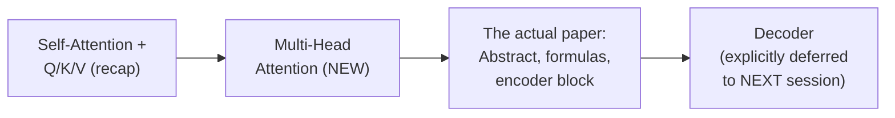

#### 🎯 Key Takeaways

* This session **genuinely opens with a poll**, directly responding to real student feedback that prior practical/coding content felt too fast — a real, honest instructional adjustment, not just stated politeness.
* The stated plan: **multi-head attention → the actual paper's abstract → the scaled dot-product and multi-head formulas → the complete encoder block** — with the decoder explicitly deferred.
* The instructor **directly, honestly acknowledges** his own teaching bias: *"My teaching problem, I know what -- because I only teach masters, grads, and so I generally think that everybody knows."*

---

### 2. Why Multi-Head Attention Exists: The "Do We Have Enough Attention?" Problem

#### ❓ Why It Exists — The Central, Motivating Question

> 💡 **Given directly:** *"When I'm talking about only one head... in a single pass, it's very hard to say [whether] we have enough attention. This is the most important part."*

#### 🧠 Concept — The CNN Kernel Analogy

> 💡 **Given directly, a genuinely apt, cross-domain analogy:** *"This is a concept which is very, very much relevant with respect to kernels in CNN... In CNN, something we called as kernels -- kernels are referred as filters also, or feature extractors. If you want to extract some type of feature, you will say I need how many kernels? 2 to the power n -- 8, 16, 32, 64, 128... Nobody can say that 64 will be capturing something unique. So, the idea is always, let's give more to it, so that at least it does not miss any information."*

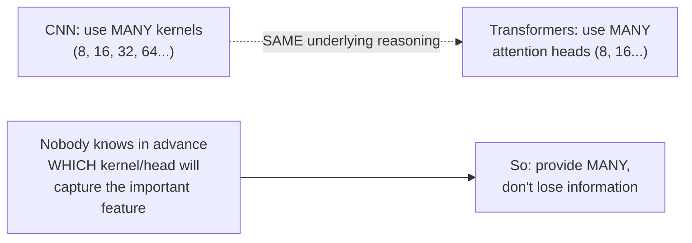

#### 🪜 Step-by-Step — A Concrete, Worked Example: "I Gave My Dog Tommy Some Food"

> 💡 **Given directly, illustrating the genuine risk of a single head:** *"I gave my dog Tommy some food... Now, this priority is given much lesser, 0.01... but probably T1 with respect to T3... this is higher, something like 0.58... The idea is that you should not lose information. In a single pass, you might lose info. And if you lose info, what will happen? Less context."*

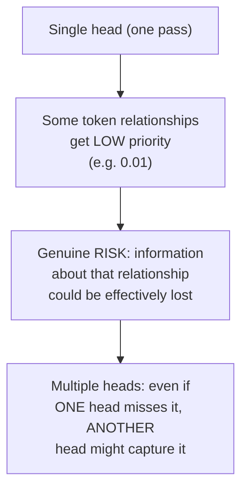

#### 🔍 Internal Working — The Precise, Stated Chain of Downstream Effects

> 💡 **Given directly, the complete causal chain:** *"Increasing K, Q, V projections... it means decide, so for example, K, Q, and V, more matrix will come. When you are adding more matrix, it means that more weights will come into the system... more weights means more params... more param means more training time... What is the added benefit? At least my training will have better stability."*

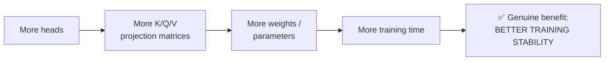

> ⚠️ **A direct, honest, historically-grounded clarification:** *"More parameters is really a problem -- but this was a problem back in 2015-16. Starting from 2017-18, this was not really a problem, because the hardwares were upgraded."*

#### ⚠ Common Mistakes

* Assuming "more heads = always strictly better, with no trade-off" — explicitly, directly qualified: more heads means more parameters and more training time, historically a genuine cost (pre-2017-18 hardware), though genuinely less of a practical constraint today.
* Assuming a single attention head's output is somehow definitively "complete" — explicitly, directly corrected: nobody can know in advance whether a single head captured all genuinely important relationships, exactly mirroring the same uncertainty in choosing CNN kernel counts.

#### 🎯 Key Takeaways

* Multi-head attention exists because a **single pass genuinely risks losing information** — some token relationships might receive very low priority in just one head, with no way to know in advance whether this matters.
* This directly, precisely parallels **CNN kernel/filter counts** — nobody knows in advance which specific kernel will capture the important feature, so multiple kernels are used to hedge against this uncertainty; the same logic applies to attention heads.
* More heads leads to more parameters and more training time — a genuine, historically-contextualized cost — but the resulting **training stability** is the explicitly stated benefit that justifies this cost.

---
### 3. Multi-Head Attention Mechanics: More Linear Layers, Concatenation & a Dense Layer

#### 📖 Definition — "Head" Precisely Defined

> 💡 **Given directly:** *"If I say that if my head is equal to 1, this is the actual head... When I say head, head means one linear layer. If I say 8 heads, it means that how many linear layers will come into the system? 8 linear layers."*

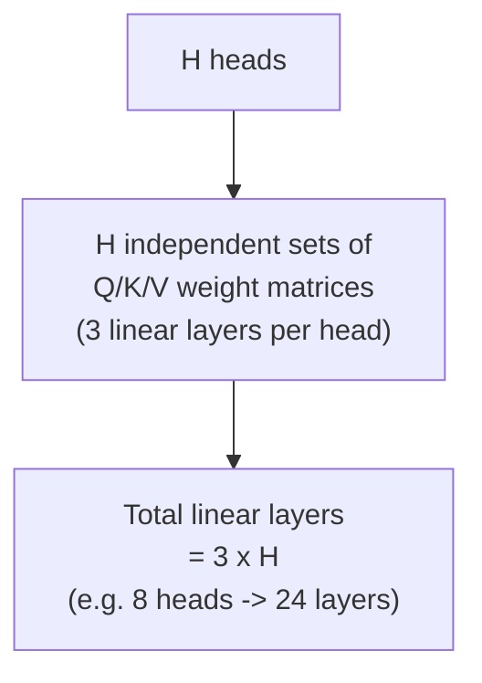

> 💡 **Given directly, an important, precise implementation detail:** *"With respect to most of the implementations, you will see that `nn.Linear` will be defined only 3 times, and later on it will be used based on the parameter H. Whatever the H hyperparameter you decide, based on that, the replication that happens."*

#### 🪜 Step-by-Step — Computing Per-Head Outputs in Parallel

> 💡 **Given directly:** *"For every head, there will be one S_ij... S_ij for head 1, then S_ij for head 2, dot dot dot, S_ij for our H head... After normalization, A_ij for head 1, dot dot dot, A_ij for head H... Y1...YN for head 1, Y1...YN for head 2, dot dot dot, Y1...YN till our last one."*

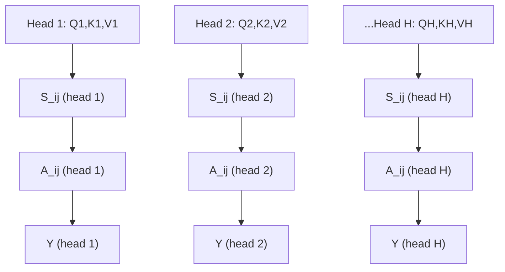

#### 🔍 Internal Working — Concatenation, Precisely Distinguished From Other Operations

> 💡 **Given directly, in response to a genuinely relevant student question:** *"Concatenation means addition -- merging also you can think about, but generally, the term merging is used with respect to layers much more... in the paper, they use the CONCAT term."*

> ⚠️ **A direct, precise correction:** *"Stacking is different"* -- explicitly distinguishing concatenation (joining along an existing dimension, restoring the original size) from stacking (creating a genuinely new dimension).

#### 🪜 Step-by-Step — Concatenation Followed by a Dense Layer

> 💡 **Given directly:** *"After concatenation, what is the next step? This information, I can actually pass it through a dense layer. So, concatenation plus dense, both the things... From here, you will be getting your final Y1, Y2, dot dot dot, YN."*

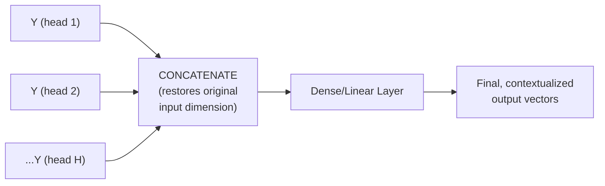

#### 🔍 Internal Working — Precisely Why a Dense Layer Is Added After Concatenation

> 💡 **Given directly:** *"Why dense? Because through a dense directly, you can manage any type of dimensions also, by introducing a dense layer. Little bit of nonlinearity that gets introduced... Through a dense, you can handle anything... The only problem with the dense layer is... parameters."*

#### ⚠ Common Mistakes

* Confusing concatenation with stacking — explicitly, directly distinguished: concatenation joins along an EXISTING dimension (restoring the original size after combining multiple heads' outputs), while stacking creates a genuinely NEW dimension.
* Assuming the final dense layer is somehow optional or a minor detail — explicitly, directly emphasized as genuinely necessary: it's specifically what allows the concatenated, multi-head output to be reshaped back to the original input dimension, while also introducing genuine nonlinearity.

#### 🎯 Key Takeaways

* A **"head"** is precisely defined as one complete set of Q/K/V linear layers — H heads means H independent, parallel sets of these three matrices, computed with zero dependency between heads.
* Each head produces its own, independent output; these outputs are **concatenated** (joined along an existing dimension, distinct from stacking) and passed through a **final dense layer** to restore the original input dimension.
* The final dense layer serves two genuine purposes: restoring the correct output dimension, and introducing genuine nonlinearity into the overall computation.

---

### 4. Seeing It Live: The Tensor2Tensor Visualization

#### 🪜 Step-by-Step — A Real, Live Demonstration Using Google's Own Tool

> 💡 **Given directly:** *"This is a direct notebook, I'll be sharing it... this library is right now really deprecated, but I think we can actually, for the visualization, just wait -- this is based on Attention is all you need. So, what I will do, I will just directly go to the visualization part."*

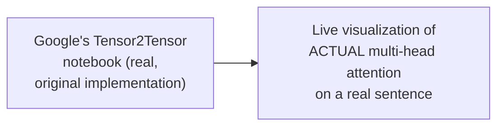

#### 🔍 Internal Working — Proving the Claim Live, Not Just Asserting It

> 💡 **Given directly, the precise, direct proof:** *"If you really click on a word... for animal, the other words are connected for sure. Now, similarly, if I change the number of head... you will see that for Animal 2, it will be a bit different... It's not like that all the heads will have the same information. Then there is no purpose of using the head."*

> 💡 **Given directly, a genuinely direct, contrastive live test:** *"Let's look into layer 5. Cross is connected with dah and street... Let's go with fourth one, and I will pick up exactly the same cross. Can you feel the difference between the heads? ... This time, you can see this has changed, really."*

#### 🪜 Step-by-Step — Isolating Individual Heads by Switching Off Colors

> 💡 **Given directly:** *"You can switch off the activations also, so directly from layer to layer 3... If you try to switch off one head, can you see that the effect is changing? ...The connections among the token, because this was the idea, based on which we introduced it. It means that every attention should look into a different one."*

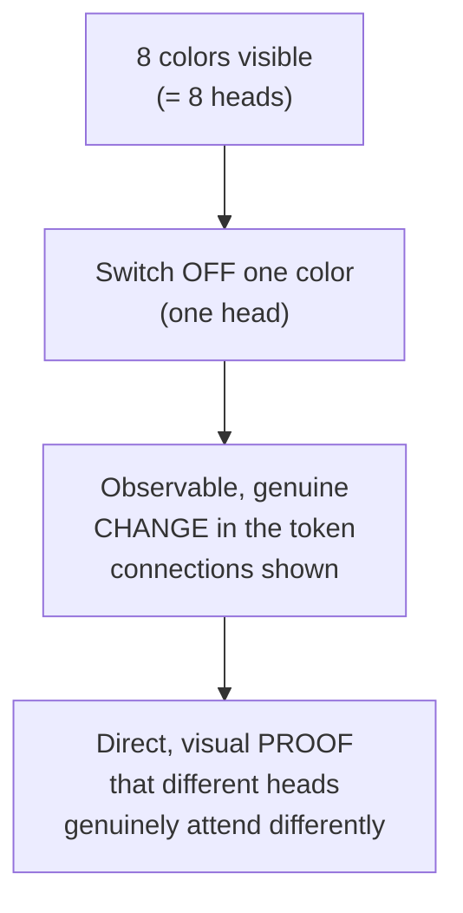

#### ⚠ A Direct, Honest Clarification: Number of Layers ≠ Number of Heads

> ⚠️ **Directly, precisely corrected in response to a genuinely reasonable student question:** *"Shouldn't the number of layers equal to be the number of heads? Right now, no. See, practical, what I have written it in the notes and the code which is written, it is different... in this particular example, based on the number of layers, you have always 8 heads."*

#### 🏢 Real-World / Production Usage — A Direct Bridge to Real, Named LLM Architectures

> 💡 **Given directly, connecting this genuinely abstract concept to real, current products:** *"As we are going forward, we'll be coming to encoder and decoder-based architecture, but all the current LLMs are only based on decoders, which GPT has followed. The same thing every organization has followed... in many interviews that I have taken, if I ask, like, if Mishral is based on what, Kimi is based on what, these are all decoder-based architectures."*

#### ⚠ Common Mistakes

* Assuming the number of "layers" shown in the visualization equals the number of "heads" — explicitly, directly distinguished: this specific visualization example uses 5 layers, each of which has its own 8 heads (matching the paper's actual head count) — layers and heads are genuinely different dimensions of the architecture.
* Assuming this live demonstration is somehow directly, numerically connected to the session's own earlier NumPy/PyTorch manual implementation — explicitly, directly clarified as a SEPARATE, independent demonstration using real, pretrained model behavior.

#### 🎯 Key Takeaways

* This session provides **genuine, live, visual proof** — not just assertion — that different attention heads attend to genuinely different words with genuinely different intensities, directly using Google's own original Tensor2Tensor visualization tool.
* Switching off individual heads (colors) produces an **observable, real change** in the displayed token connections — direct, empirical confirmation of multi-head attention's core motivating claim.
* This section is explicitly, directly connected to **real, current LLM architectures** — GPT, Mistral, and Kimi are all named as genuinely decoder-based, a directly interview-relevant fact.

---
### 5. Reading the Paper's Abstract: History, BLEU Scores & Why This Paper Mattered

#### 📖 Definition — Sequence Transduction, Precisely Defined

> 💡 **Given directly:** *"Sequence is a list of items... transduction, in simple terms, it means transforming one sequence to other. So, sequence transduction... this term has been widely used before 2014."*

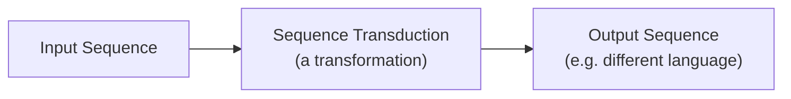

#### 🔍 Internal Working — The Genuine, Pre-Transformer State of the Field

> 💡 **Given directly, precisely establishing the historical baseline this paper improved on:** *"The dominant sequence transduction models are based on complex, recurrent or CNN that include an encoder and decoder... The best performing models also connect the encoder and decoder through an attention mechanism -- now, this connection, it means that this also exists, it's nothing new in 2017."*

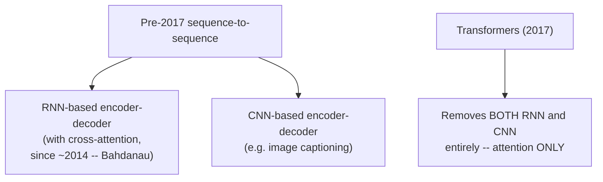

> 💡 **Given directly, precisely distinguishing self-attention from the OLDER, already-existing cross-attention:** *"The idea of cross-attention is 2014. But the idea of self-attention, it started from 2016, the first paper, and then finally fully introduced into the Transformers architecture."*

#### 📖 Definition — BLEU Score, Precisely Contextualized

> 💡 **Given directly:** *"Blue -- there are so many metrics in NLP, classical NLP. This is one of the most famous metrics which is widely used in classical NLP, even used till now... None of the solutions reaches 100 blue score... this metric is always on the lower side. Probably it can reach towards 55, 60, 65, but again, nothing like more than 90."*

#### 🏢 Real-World / Production Usage — Why 41.8 BLEU Was Genuinely Historic

> 💡 **Given directly:** *"WMT English to French translation task, our model established a new single GPU state-of-the-art blue score of 41.8... Previously, these scores were always around between 20 to 30, but this was really a huge jump... whenever such huge gaps comes, those papers automatically become the new OG paper, if you really think in that way, like the ResNet paper was there."*

#### 🔍 Internal Working — Why "3.5 Days on 8 GPUs" Was Genuinely Remarkable

> 💡 **Given directly:** *"Before to this, if you look into any type of architectures, just 2 to 3 years back, one model used to take 2 months to train. It means that with respect to hardware upgrades came, with respect to architectures, the real improvements came. And this was the first architecture which was actually the game-changing one."*

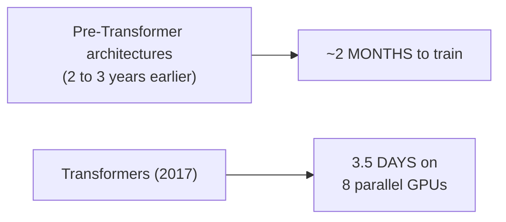

#### ❓ Why It Exists — Precisely What "Parallelizable" Means

> 💡 **Given directly:** *"Can I say that all the attention heads are actually parallel? They have their own calculations, which can be done. There is no dependency, like, after head 1 is calculated, then only head 2 needs to be calculated -- there is no such condition. Parallel -- I can calculate all the heads at any point of time, no dependency."*

#### ⚠ Common Mistakes

* Assuming cross-attention and self-attention are the same concept, both introduced by this paper — explicitly, directly distinguished: cross-attention (connecting an encoder and decoder) genuinely predates this paper (2014, Bahdanau); self-attention is the genuinely newer contribution (2016 onward, fully realized in this specific paper).
* Assuming BLEU scores near 100 are a realistic, achievable benchmark — explicitly, directly corrected: even state-of-the-art results rarely exceed roughly 55-70 on open, benchmark datasets.
* Assuming this paper's "less time to train" claim reflects a purely architectural improvement, independent of hardware — explicitly, directly, honestly qualified: hardware improvements over time genuinely confound any pure "architecture vs. architecture" training-time comparison.

#### 🎯 Key Takeaways

* **Sequence transduction** simply means transforming one sequence into another — a term genuinely predating this paper by years.
* This paper's core, historic contribution was **removing RNN and CNN entirely**, relying purely on attention mechanisms — cross-attention itself already existed (2014); self-attention was the genuinely new contribution.
* A **BLEU score of 41.8** (English-to-French) was a genuinely historic jump from the prior 20-30 range — directly analogous to how the ResNet paper transformed computer vision, explicitly named as the reason this became "the OG paper" of the field.
* **"Parallelizable"** specifically means attention heads have zero computational dependency on each other — a genuine, structural property directly enabling the paper's dramatically reduced training time (3.5 days vs. roughly 2 months for prior architectures).

---

### 6. The Scaled Dot-Product Attention Formula & Why Scaling Exists

#### 📖 Definition — The Complete Formula, Built From This Session's Own Notation

> 💡 **Given directly, building the formula piece by piece:** *"Q dot K^T... for scaling, can I write this in the same way? K.Q^T divided by root over D_k?"*

```text
Attention(Q, K, V) = softmax( Q·K^T / √d_k ) · V
```

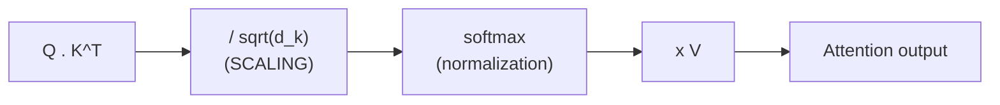

#### 📖 Definition — d_k, Precisely Defined

> 💡 **Given directly:** *"D_k is equal to the embedding dimension that you do have... Dimension of Q is equal to the dimension of V. Can I say this? Because the dimension of K, Q, and V are exactly the same."*

#### ❓ Why It Exists — The Precise, Mechanistic Reason Scaling Is Necessary

> 💡 **Given directly, the complete, precise explanation:** *"During a dot product, if some big value comes into the system, this actually dominates. Because of this, the other values become more smaller. Due to which, variance becomes very, very high... After your scale operation, what is the next operation? Softmax. It means that whatever the high values that you have, and you apply softmax, those higher values will become more higher, and the lower values will become more lower."*

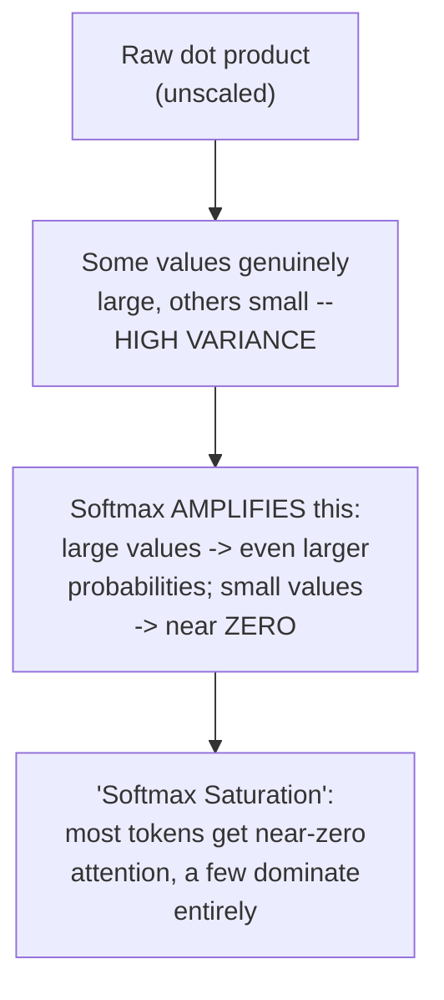

> 💡 **Given directly, the precise fix and its stated effect:** *"We don't want these type of operations... Through scaling, at least I can say that, by 20% to 30%, we can always reduce the variance."*

#### 🔍 Internal Working — Connecting Directly to the Paper's Own Wording

> 💡 **Given directly, reading the paper's own text alongside the instructor's explanation:** *"We suspect that for larger values of d_k, the dot product grows large in magnitude, pushing the softmax into regions where it has extremely small gradients... To counteract this effect, we scale the dot products by 1/√d_k."*

#### ⚠ Common Mistakes

* Assuming scaling and normalization (softmax) are two separate, sequential fixes for the same problem — explicitly, directly clarified: scaling addresses the RAW SCORE'S variance BEFORE softmax is applied; softmax itself is the separate, subsequent normalization step.
* Assuming "softmax saturation" is a vague, abstract concern — explicitly, directly given a precise, mechanistic explanation: large raw dot-product values cause softmax to assign near-total probability to a few tokens, effectively zeroing out the gradient signal for everything else, directly connecting to a genuine vanishing-gradient risk.

#### 🎯 Key Takeaways

* The **scaled dot-product attention formula** is `softmax(QK^T/√d_k)V` — directly, precisely derived from this session's own established notation (S for the raw dot product, now scaled; softmax for normalization; V for the final weighted sum).
* **Scaling exists specifically to prevent "softmax saturation"** — a genuine, mechanistic problem where large raw dot-product values cause softmax to produce extreme, near-zero-or-near-one probabilities, effectively destroying gradient signal for most tokens.
* `d_k` is precisely the **embedding dimension** of the keys (and equivalently, queries and values, since these share the same dimension in this basic formulation).

---
### 7. The Multi-Head Attention Formula, Decoded

#### 📖 Definition — The Complete Formula, From the Paper

```text
MultiHead(Q, K, V) = Concat(head_1, ..., head_h) · W^O

where head_i = Attention(Q·W_i^Q, K·W_i^K, V·W_i^V)
```

> 💡 **Given directly, breaking this down piece by piece:** *"Multi-head KQV is equal to, first of all, concatenate. So, for sure, concatenate will come. Because at the end, we are performing a concatenation-based operation. But with that, we are adding a linear layer. See, for this linear layer, you have one weight matrix, W."*

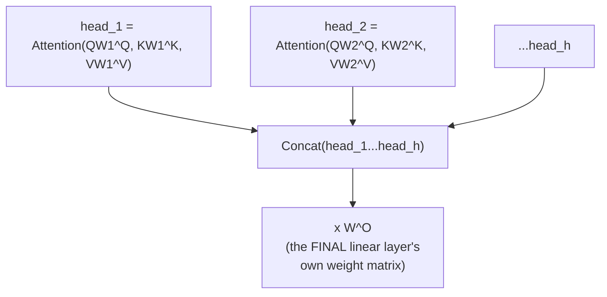

#### 🔍 Internal Working — Precisely What "Linearly Project" Means

> 💡 **Given directly, reading the paper's own precise wording:** *"Instead of performing a single attention function with d_model dimensional keys, values, and queries, we found it beneficial to linearly project the queries, keys, and the values... So, simply, we are learning much more of linear projections."*

#### 📖 Definition — The Precise Dimensions of Each Weight Matrix

> 💡 **Given directly:** *"The weight belongs to... R d_model into d_k... The dimension of those matrices have been very specifically mentioned here. So, based on the dimensions... you can decide what will be our weight matrices."*

```text
W_i^Q ∈ R^(d_model × d_k)
W_i^K ∈ R^(d_model × d_k)
W_i^V ∈ R^(d_model × d_v)
W^O   ∈ R^(h·d_v × d_model)
```

> 💡 **Given directly, a precise clarification on WHY d_k and d_v are equal, while the query dimension is treated specially:** *"In DK and DV, you have all the tokens, whereas when you are working with your query matrix, you only have one token. Because of that difference, we will always assume that D_v is equal to D_k."*

#### ⚠ Common Mistakes

* Assuming the multi-head attention formula introduces genuinely new mathematical operations beyond what was already derived — explicitly, directly clarified: this formula precisely, formally describes exactly the mechanics already built in Section 3 (parallel heads, concatenation, a final linear layer) — just written in the paper's own compact notation.
* Assuming d_k, d_v, and the query's dimension are all independently, arbitrarily different — explicitly, directly clarified: d_k and d_v are assumed EQUAL (since keys and values both operate over the full token set), while the query's role (a single token being compared) is conceptually distinct, though dimensionally aligned in practice.

#### 🎯 Key Takeaways

* The multi-head attention formula `Concat(head_1,...,head_h)W^O` is **precisely, formally identical** to the mechanics already derived in Section 3 — concatenation followed by a final linear (dense) layer.
* Each head's own Q/K/V weight matrices have **precise, stated dimensions**: `d_model × d_k` (or `d_v`) — directly determining how much the original embedding dimension gets "projected down" per head.
* **d_k and d_v are treated as equal** dimensions, since both keys and values operate over the full token set — genuinely distinct in role, though not in dimension, from the query.

---

### 8. The Dimension Trade-Off: More Heads vs. Bigger Per-Head Dimension

#### 📖 Definition — The Paper's Actual, Concrete Numbers

> 💡 **Given directly:** *"In this work, we employ H is equal to 8 parallel attention layers, or heads... d_model divided by H... the main embedding dimension which has been used, it is 512."*

```text
d_model = 512
h (heads) = 8
d_k = d_v = d_model / h = 512 / 8 = 64
```

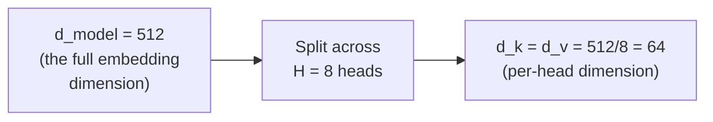

#### 🔍 Internal Working — This Is a Genuine Factorization, Not a Loss of Information

> 💡 **Given directly, a precise, important clarification, using a genuinely accessible analogy:** *"Due to reduced dimensions of each head, the total computational cost is similar to that of a single head attention with full dimensionality... this will be a factorized version... the simplest example with respect to factorization -- 3 cross 3 -- let's break 3 into 1 cross 3, and this 3 into 3 cross 1."*

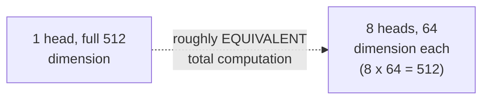

#### ⚠ A Direct, Explicit Warning: This Trade-Off Genuinely Has a Floor

> ⚠️ **Directly, precisely stated, a genuine, practical rule of thumb:** *"Whenever we are increasing the number of heads... you are actually decreasing the dimension. So, what you need are trade-offs... always try to keep it towards 50... If it is more, it is fine, I have no issue. But it should not be less than [that], because I have seen some practical problems... there will be problem with respect to attention. So really the forgetting issue that comes into the system."*

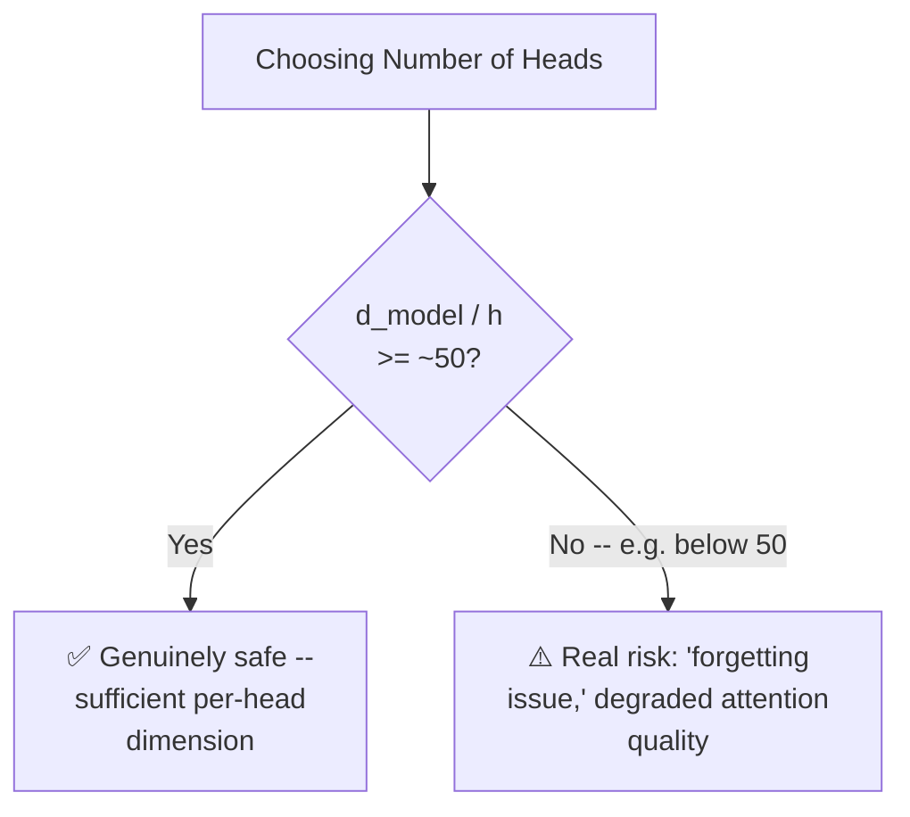

#### 🏢 Real-World / Production Usage — Checking a Real Model's Own Numbers

> 💡 **Given directly, in response to a genuinely specific, real-world student question about LLaMA's own configuration:** *"I took 768 dimensions and 12 heads like LLaMA did... 768 divided by 12, you'll be getting at least close to that 50, more than 50."*

#### ⚠ Common Mistakes

* Assuming more heads is unconditionally better, with no genuine downside — explicitly, directly corrected: increasing heads while keeping `d_model` fixed genuinely SHRINKS each head's own dimension, with a real, practically-observed floor (roughly 50) below which attention quality genuinely degrades.
* Assuming the trade-off means you should simply choose FEWER heads to keep dimension high — explicitly, directly clarified: the correct response to wanting MORE heads is to ALSO increase `d_model` proportionally, not to abandon the benefit of additional heads.

#### 🎯 Key Takeaways

* The paper's own real numbers: **d_model = 512, h = 8 heads, d_k = d_v = 64** — directly, precisely matching the `d_model / h` formula.
* Splitting attention across more heads with a SMALLER per-head dimension is a genuine **factorization** — roughly equivalent total computational cost to one head at the full dimension, not a genuine loss of representational capacity.
* A practical, stated rule of thumb: **keep `d_model / h` at or above roughly 50** — going below this threshold risks a genuine, practically-observed "forgetting issue" with attention quality.

---
### 9. The Feed-Forward Network & The Complete Encoder Block

#### 📖 Definition — The Position-Wise Feed-Forward Network

> 💡 **Given directly:** *"This is a position-wise feed-forward network... simply, ReLU is here... this is max(0, WX + B)... this is not linear... in activation functions, when you say linear activation function, it means that you pass one, you get one; you pass two, you get two. But this is not happening."*

```text
FFN(x) = max(0, x·W1 + b1)·W2 + b2
```

> 💡 **Given directly, the paper's own specific, stated numbers:** *"What they have taken, the number of neurons in this particular hidden layer, fully connected layer, or linear layer? ...2048... dimension of the model is 512... while the linear transformations are the same across different positions, they use different parameters from layer to layer."*

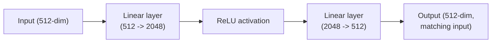

#### 🔍 Internal Working — Building the Complete Encoder Block, Piece by Piece

> 💡 **Given directly, the complete, step-by-step assembly:** *"The inputs are going here till this point. Now, what about that output from MHA? You are actually adding it with your old information... X_new = F(X) + X. Why I've written this equation? This equation comes from ResNet."*

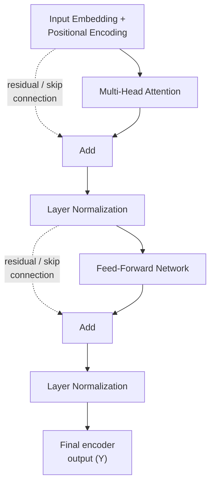

#### ❓ Why It Exists — Residual Connections, Directly Sourced From ResNet

> 💡 **Given directly:** *"This is ResNet. Once you are passing this particular information... the benefit is, we won't be facing the problem of vanishing gradient... To facilitate these residual connections, all sublayers in the model, as well as the embedding layers, produce outputs of dimension [matching]."*

```mermaid
flowchart LR
    A["ResNet paper<br/>(image classification,<br/>~2015-16)"] -.->|"DIRECT inspiration"| B["Transformer's own<br/>residual/skip connections<br/>(Add & Norm)"]
```

> 💡 **Given directly, the precise, stated reason multiple encoders make skip connections genuinely necessary:** *"If you have multiple encoders, in that case, there will be a problem of VDG [vanishing gradient]. Right now, this is a single block, so you can tell me, okay, Paul, here the problem won't happen. But I can say that if you are adding 10 blocks, 20 blocks, for sure the number of layers will be increasing."*

#### 📖 Definition — N×: The Encoder Block Is Genuinely Repeated

> 💡 **Given directly:** *"It's written NX. NX means this entire encoder block that you do have -- it can be repeated. It means that right now, this is one block. The same block, you can use it 3 times, 4 times, 6 times, 7 times. NX is a hyperparameter."*

```mermaid
flowchart LR
    A["Embedding + Positional<br/>Encoding (once)"] --> B["Encoder Block 1"]
    B --> C["Encoder Block 2"]
    C --> D["..."]
    D --> E["Encoder Block N<br/>(N=6 in the original paper)"]
    E --> F["Final encoder output"]
```

#### 🔍 Internal Working — Layer Normalization, Precisely Distinguished From Batch Normalization

> 💡 **Given directly, correcting a genuine, direct student misconception:** *"Batch normalization... it's not batch normalization. This is layer normalization... originally in the paper, they have not used [batch normalization]."*

#### ⚠ Common Mistakes

* Assuming the feed-forward network's activation function is somehow linear, since it involves a "linear layer" — explicitly, directly corrected: ReLU is genuinely NON-linear, precisely because it doesn't preserve the "pass 1, get 1; pass 2, get 2" proportionality of a true linear function.
* Assuming this paper used batch normalization — explicitly, directly, precisely corrected: it uses **layer normalization**, genuinely distinct from batch normalization, which the paper does NOT employ.
* Assuming residual/skip connections are only necessary for genuinely deep, many-layer networks in the abstract, without connecting this to the SPECIFIC reason encoders are repeated N times — explicitly, directly connected: this session's own reasoning ties the necessity of skip connections DIRECTLY to the N× repetition of encoder blocks, since more repeated blocks genuinely means more total layers, and therefore more vanishing-gradient risk.

#### 🎯 Key Takeaways

* The **position-wise feed-forward network** is a two-layer network with a ReLU activation in between, expanding to 2048 dimensions internally before returning to the original 512-dimension output — genuinely NON-linear, due to ReLU.
* The complete encoder block is: **embedding + positional encoding → multi-head attention → Add (residual connection) & Layer Norm → feed-forward network → Add (residual connection) & Layer Norm** — directly, explicitly borrowing residual connections from the ResNet paper.
* This entire block is **repeated N times** (N=6 in the original paper) — a genuine, deliberate hyperparameter, with residual connections existing specifically to prevent vanishing gradients across this repeated, deepening structure.
* The paper uses **layer normalization**, not batch normalization — a precise, directly-corrected distinction.

---
## 📝 Glossary

| Term | Definition | Why It Matters |
|---|---|---|
| **Head** | One complete, independent set of Q/K/V linear layers | H heads = H independent, parallel attention computations |
| **Sequence Transduction** | Transforming one sequence into another | The general task category this paper addresses |
| **Cross-Attention** | An older (2014) attention mechanism connecting an encoder and decoder | Genuinely predates this paper's self-attention contribution |
| **BLEU Score** | A classical NLP metric for translation quality | Rarely exceeds ~70; 41.8 was historically remarkable |
| **Scaled Dot-Product Attention** | `softmax(QK^T/sqrt(d_k))V` | The precise, formalized version of self-attention |
| **Softmax Saturation** | Large raw dot-product values causing extreme, near-zero-or-one softmax outputs | The precise problem scaling exists to prevent |
| **Concatenation** | Joining multiple heads' outputs along an existing dimension | Distinct from stacking; restores original dimension |
| **W^O** | The final linear layer's weight matrix, applied after concatenation | Restores the multi-head output to the model's original dimension |
| **d_k / d_v** | The per-head dimension of keys/values | Equal to each other; computed as d_model / h |
| **Residual (Skip) Connection** | Adding a layer's input directly to its output | Borrowed from ResNet; prevents vanishing gradients |
| **Layer Normalization** | The specific normalization technique used in this paper | Genuinely distinct from (and not the same as) batch normalization |
| **Position-Wise Feed-Forward Network** | A two-layer network (ReLU in between) applied identically at each position | Expands to 2048 dimensions internally, returns to 512 |
| **N× (Encoder Repetition)** | The number of times the entire encoder block is stacked | A hyperparameter; 6 in the original paper |

---

## 🔄 Revision Notes — One-Minute Revision

* This session is **directly, clearly labeled "PAUL"** -- confirming the same instructor as the two earlier Transformers 101 sessions; a brief recap of self-attention/Q/K/V opens the class before genuinely new content begins.
* **Multi-head attention exists** because a single pass genuinely risks losing information -- directly paralleling why CNNs always use MANY kernels/filters, since nobody knows in advance which one will capture the important feature.
* **Mechanics**: H independent sets of Q/K/V linear layers (= H heads), computed in PARALLEL with zero dependency -- each producing its own output, which are then CONCATENATED (distinct from stacking) and passed through a final dense layer to restore the original dimension.
* A **live demonstration** using Google's real Tensor2Tensor visualization directly PROVED (not just asserted) that different heads attend to different words with different intensities -- switching off individual heads produces a genuine, observable change.
* The paper's **abstract**: this work removed BOTH RNN and CNN entirely, relying purely on attention -- cross-attention already existed (2014, Bahdanau); self-attention was the genuinely new contribution (2016 onward). A **BLEU score of 41.8** was a historic jump from the prior 20-30 range, achieved in **3.5 days on 8 GPUs** vs. roughly 2 months for prior architectures -- directly enabled by attention heads' genuine PARALLELIZABILITY.
* **Scaled dot-product attention formula**: `softmax(QK^T/sqrt(d_k))V` -- scaling exists specifically to prevent **"softmax saturation"**, where large raw dot-product values cause extreme, near-zero-or-one probabilities, effectively destroying gradient signal.
* **Multi-head attention formula**: `Concat(head_1,...,head_h)W^O`, where each head's weight matrices have dimension `d_model x d_k` -- precisely, formally matching the mechanics already derived.
* The paper's **actual numbers**: d_model=512, h=8 heads, d_k=d_v=64 -- a genuine **factorization** (roughly equivalent total computation to one full-dimension head), with a practical rule of thumb: keep `d_model/h` at or above ~50 to avoid a real "forgetting issue."
* The **complete encoder block**: embedding + positional encoding -> multi-head attention -> Add (residual, from ResNet) & Layer Norm -> feed-forward network (ReLU, 512->2048->512) -> Add & Layer Norm -- repeated **N times** (N=6 in the paper), with residual connections existing specifically to prevent vanishing gradients across this repeated structure.
* The paper uses **layer normalization**, explicitly NOT batch normalization -- a precise, directly-corrected distinction.

---

## 📋 Cheat Sheet

**Why multi-head attention:**
```text
Single pass (1 head) -> genuine risk of losing information
CNN analogy: use MANY kernels, since nobody knows which will matter
-> use MANY heads, for the same reason
```

**Multi-head attention mechanics:**
```text
H heads = H independent Q/K/V linear-layer sets (parallel, no dependency)
-> each produces its own output
-> CONCATENATE all outputs (restores original dimension)
-> pass through a final DENSE layer -> final output
```

**Historical timeline:**
```text
2014: Cross-attention (Bahdanau) -- connects encoder & decoder
2016: Self-attention -- first papers
2017: "Attention Is All You Need" -- removes RNN + CNN entirely
```

**Scaled dot-product attention:**
```text
Attention(Q, K, V) = softmax( Q.K^T / sqrt(d_k) ) . V
Scaling exists to prevent SOFTMAX SATURATION (extreme, gradient-destroying probabilities)
```

**Multi-head attention formula:**
```text
MultiHead(Q,K,V) = Concat(head_1,...,head_h) . W^O
head_i = Attention(Q.Wi^Q, K.Wi^K, V.Wi^V)
Wi^Q, Wi^K, Wi^V ∈ R^(d_model x d_k)
```

**The paper's actual numbers:**
```text
d_model = 512
h (heads) = 8
d_k = d_v = 512 / 8 = 64
Feed-forward hidden size = 2048
N (encoder blocks) = 6
```

**Dimension trade-off rule of thumb:**
```text
d_model / h  should stay >= ~50 (below this: real "forgetting" issues)
```

**Complete encoder block:**
```text
Embedding + Positional Encoding
  -> Multi-Head Attention -> Add (residual) & Layer Norm
  -> Feed-Forward (512 -> 2048 -> 512, ReLU) -> Add (residual) & Layer Norm
  -> repeat N times (N=6 in the paper)
```

---

## 🔥 Interview Questions & Answers

### 🟢 Beginner

**Q1.**

**Question:** Why does multi-head attention exist, using the CNN analogy?

**Answer:** A single attention pass might miss important token relationships; just as CNNs use many kernels since nobody knows in advance which one will capture the important feature, multiple attention heads hedge against this same uncertainty.

**Explanation:** Directly, precisely explained via the session's own analogy.

**Why Interviewers Ask This:** Tests genuine understanding of WHY multi-head attention exists, not just its mechanics.

**Possible Follow-up:** "What happens to each head's outputs after they're computed?"

**Q2.**

**Question:** What is one "head" in multi-head attention?

**Answer:** One complete, independent set of Q/K/V linear layers.

**Explanation:** Directly, precisely defined.

**Why Interviewers Ask This:** Foundational, frequently-tested terminology.

**Possible Follow-up:** "How many total linear layers exist with 8 heads?"

**Q3.**

**Question:** What is the difference between concatenation and stacking, in this context?

**Answer:** Concatenation joins outputs along an existing dimension, restoring the original size; stacking creates a genuinely new dimension.

**Explanation:** Directly, precisely distinguished.

**Why Interviewers Ask This:** A commonly-confused, basic tensor-operation distinction.

**Possible Follow-up:** "What operation follows concatenation in multi-head attention?"

**Q4.**

**Question:** What is "softmax saturation," and why does scaling prevent it?

**Answer:** Large raw dot-product values cause softmax to produce extreme, near-zero-or-one probabilities, destroying gradient signal for most tokens; scaling by 1/sqrt(d_k) reduces the raw scores' variance before softmax is applied.

**Explanation:** Directly, precisely explained.

**Why Interviewers Ask This:** A commonly-asked, foundational scaled-dot-product-attention question.

**Possible Follow-up:** "What specifically is d_k in this formula?"

**Q5.**

**Question:** What are the paper's actual numbers for d_model, number of heads, and per-head dimension?

**Answer:** d_model=512, h=8 heads, d_k=d_v=64.

**Explanation:** Directly, explicitly stated.

**Why Interviewers Ask This:** Tests specific, factual recall of the original paper's configuration.

**Possible Follow-up:** "How is 64 calculated from 512 and 8?"

**Q6.**

**Question:** Why are residual (skip) connections used in the Transformer's encoder block?

**Answer:** To prevent vanishing gradients, especially important since the encoder block is repeated multiple times (N=6 in the paper).

**Explanation:** Directly, precisely explained, sourced from ResNet.

**Why Interviewers Ask This:** A commonly-asked, foundational deep-learning question.

**Possible Follow-up:** "What paper originally introduced this technique?"

**Q7.**

**Question:** Does this paper use batch normalization or layer normalization?

**Answer:** Layer normalization -- explicitly not batch normalization.

**Explanation:** Directly, precisely corrected from a common misconception.

**Why Interviewers Ask This:** Tests precise, factual knowledge of the paper's actual architecture.

**Possible Follow-up:** "What's the general difference between layer and batch normalization?"

**Q8.**

**Question:** What does "N×" mean in the encoder architecture diagram?

**Answer:** The entire encoder block is repeated N times (N=6 in the original paper) -- a hyperparameter.

**Explanation:** Directly, precisely explained.

**Why Interviewers Ask This:** Basic, foundational architecture-diagram literacy.

**Possible Follow-up:** "Does the input embedding get recomputed for each repetition?"

**Q9.**

**Question:** What activation function does the position-wise feed-forward network use?

**Answer:** ReLU.

**Explanation:** Directly, explicitly stated.

**Why Interviewers Ask This:** Basic, factual recall.

**Possible Follow-up:** "What are the dimensions of the two linear layers in this network?"

**Q10.**

**Question:** Why does the paper's BLEU score of 41.8 matter historically?

**Answer:** It was a dramatic jump from the prior typical range of 20-30, directly comparable in significance to the ResNet paper's impact on computer vision.

**Explanation:** Directly, precisely contextualized.

**Why Interviewers Ask This:** Tests genuine understanding of the paper's historical significance, not just its mechanics.

**Possible Follow-up:** "What made this dramatic improvement possible, architecturally?"

---

### 🟡 Intermediate

**Q11.**

**Question:** Explain why the instructor uses Google's real Tensor2Tensor visualization tool rather than simply describing multi-head attention's expected behavior.

**Answer:** This directly, live PROVES the central claim (different heads attend differently) using a genuine, real, pretrained model's actual behavior -- rather than asking students to trust an abstract, asserted claim. Switching individual heads on and off produces a directly OBSERVABLE, empirical change in the displayed attention connections, transforming an abstract architectural principle into a concrete, visually-verified fact. This directly mirrors the consistent "prove it live" pedagogical pattern established across this entire Transformers 101 series (and, more broadly, this instructor's teaching style).

**Explanation:** Requires recognizing a deliberate, evidence-based teaching technique.

**Why Interviewers Ask This:** Tests whether a learner recognizes empirical demonstration as more convincing than assertion alone.

**Possible Follow-up:** "What specific, observable change occurred when a single head was switched off in this demonstration?"

**Q12.**

**Question:** A learner argues that since more attention heads genuinely improve training stability, an architecture should always use as many heads as computationally affordable. Evaluate this claim.

**Answer:** This claim overlooks the session's own explicitly-stated dimension trade-off. Increasing the number of heads while keeping `d_model` FIXED genuinely SHRINKS each head's own per-head dimension (`d_model/h`) -- and the session explicitly, directly warns that going below roughly 50 in this per-head dimension causes a real, practically-observed "forgetting issue" with attention quality. The correct approach to wanting more heads isn't simply maximizing head count regardless of dimension -- it's INCREASING `d_model` PROPORTIONALLY alongside the head count, maintaining a sufficient per-head dimension. "More heads is always better" ignores this genuine, stated dimensional constraint.

**Explanation:** Tests whether a learner recognizes the genuine trade-off between head count and per-head dimension, not just the general benefit of more heads.

**Why Interviewers Ask This:** Distinguishes candidates who track a stated trade-off's full nuance from those who apply "more is better" without qualification.

**Possible Follow-up:** "If you wanted to double the number of heads while keeping per-head dimension constant, what else would need to change?"

**Q13.**

**Question:** Explain, precisely, why the instructor describes the reduced per-head dimension in multi-head attention as a "factorization," using the 3×3 example given in the session.

**Answer:** "Factorization" here specifically means decomposing ONE large computation into MULTIPLE smaller, equivalent-total-cost computations -- exactly as `3×3` can be factored into `1×3` and `3×1` (the session's own given example). Similarly, ONE attention head operating at the FULL `d_model` dimension (512) is factored into EIGHT heads, each operating at a SMALLER dimension (64), with `8×64 = 512` -- the TOTAL representational/computational capacity is roughly preserved (per the paper's own explicit claim: "the total computational cost is similar to that of a single head attention with full dimensionality"), while gaining the genuine benefit of MULTIPLE, independent, parallel attention computations rather than just one. This is precisely why the session frames this as a factorization, not a loss of capacity -- the SAME total "budget" is being distributed across multiple, independent computations, exactly mirroring how hardware genuinely prefers smaller, parallel operations over one large, sequential one.

**Explanation:** Requires connecting the session's own simple factorization example to the specific dimensional relationship in multi-head attention.

**Why Interviewers Ask This:** Tests whether a learner understands WHY splitting dimension across heads doesn't represent a genuine capacity loss.

**Possible Follow-up:** "Why might hardware genuinely prefer this factorized, parallel structure over one large, single-head computation?"

**Q14.**

**Question:** Using this session's precise explanation of softmax saturation, explain why this same underlying concern (extreme values dominating a probability distribution) would also be relevant OUTSIDE of attention mechanisms, in any genuinely high-magnitude classification scenario.

**Answer:** Softmax saturation is fundamentally a property of the SOFTMAX FUNCTION ITSELF, not something unique to attention specifically -- ANY scenario feeding genuinely large-magnitude, high-variance raw scores into softmax (whether attention scores, or raw logits in a standard multi-class classification network) risks the SAME underlying problem: a few extreme values dominate the resulting probability distribution almost entirely, while the gradient signal for all other classes/tokens becomes vanishingly small, genuinely impeding effective learning for those under-weighted cases. This is precisely why techniques like TEMPERATURE SCALING (dividing logits by a constant before softmax, in classification contexts) exist as a GENERAL solution to this SAME underlying issue -- directly, structurally analogous to attention's own `1/sqrt(d_k)` scaling factor, just applied in a genuinely different context.

**Explanation:** Requires generalizing the session's specific, attention-context explanation to a broader, transferable principle about softmax's own general behavior.

**Why Interviewers Ask This:** Tests whether a learner recognizes a stated, context-specific mechanism as an instance of a more general, transferable principle.

**Possible Follow-up:** "Name a specific, non-attention deep learning scenario where you've seen (or would expect) a similar scaling/temperature technique applied."

**Q15.**

**Question:** Synthesize this session's residual connection explanation (Section 9) with its own multi-head attention parallelizability claim (Section 5) to explain whether residual connections genuinely conflict with, or complement, the paper's stated parallelization benefits.

**Answer:** These two properties genuinely COMPLEMENT rather than conflict with each other, operating at different STRUCTURAL LEVELS of the architecture. Parallelizability (Section 5) specifically concerns computation WITHIN a single attention layer -- all H heads compute simultaneously, with zero dependency between them. Residual connections (Section 9) concern the relationship BETWEEN sequential layers/blocks (the encoder is repeated N times) -- and this SEQUENTIAL structure (each encoder block genuinely depends on the PREVIOUS block's output) is NOT something residual connections eliminate; residual connections specifically address a DIFFERENT problem (vanishing gradients across this deep, sequential stack), not the WITHIN-layer parallelism the paper's own historic training-time claims are based on. This means the architecture achieves genuine parallelism WITHIN each layer (across heads) while still requiring genuine SEQUENTIAL processing ACROSS the N stacked encoder blocks -- residual connections make this sequential depth genuinely TRAINABLE (avoiding vanishing gradients), without undermining the WITHIN-layer parallelism that drives the paper's own dramatic training-time improvements.

**Explanation:** Requires precisely distinguishing two genuinely different architectural properties (within-layer parallelism vs. cross-layer depth/training stability) that operate at different structural levels, correctly identifying them as complementary rather than contradictory.

**Why Interviewers Ask This:** A senior-level question testing whether a candidate can precisely locate WHERE in the architecture different stated properties (parallelism, residual connections) actually apply, rather than treating the whole architecture as a single, undifferentiated concept.

**Possible Follow-up:** "Is the RELATIONSHIP between sequential encoder blocks (block 2 depending on block 1's output) itself parallelizable? Why or why not?"

---

### 🔴 Advanced

**Q16.**

**Question:** Design a complete, numerically worked example computing the exact tensor shapes at every stage of multi-head attention, for a genuinely new configuration (d_model=256, h=4 heads, sequence length=6), and verify the dimension trade-off rule of thumb from Section 8 applies correctly.

**Answer:** A reasonable, complete worked example: (1) Input: a (6, 256) matrix (6 tokens, 256-dim embeddings). (2) Per-head dimension: `d_model/h = 256/4 = 64` -- directly satisfying Section 8's "keep it at or above ~50" rule of thumb (64 > 50, genuinely safe). (3) For EACH of the 4 heads: Q, K, V projections each produce a (6, 64) matrix (via each head's own W^Q, W^K, W^V matrices, each of shape (256, 64), per Section 7's exact stated dimension formula d_model × d_k). (4) Scores: `Q @ K.T` produces a (6, 6) matrix PER HEAD, scaled by `1/sqrt(64) = 0.125`. (5) After softmax (still (6,6) per head) and multiplication by V: each head produces a (6, 64) output. (6) Concatenating all 4 heads' (6, 64) outputs along the last dimension produces a (6, 256) matrix -- correctly restoring the ORIGINAL input dimension (256), directly confirming Section 3's own stated concatenation behavior. (7) The final W^O linear layer (shape (256, 256), since h×d_v = 4×64 = 256 = d_model) produces the final (6, 256) output, matching the original input shape exactly.

**Explanation:** Requires applying every formula and dimension rule from this session's own content to a genuinely new, numerically concrete configuration, verifying internal consistency at every step.

**Why Interviewers Ask This:** A realistic, senior-level question testing whether a candidate can work through genuine tensor-shape mechanics for a novel configuration, not just recall the paper's own specific numbers.

**Possible Follow-up:** "What would change in this worked example if h were increased to 8 while keeping d_model at 256?"

**Q17.**

**Question:** Critically evaluate: "Since this session shows that residual connections directly borrow from the ResNet paper, and ResNet was designed specifically for image classification with convolutional layers, applying this same technique to a genuinely different domain (attention-based sequence processing) is a fundamentally unprincipled or coincidental architectural choice." Is this an accurate characterization?

**Answer:** Not accurate -- this claim mistakes a technique's ORIGIN DOMAIN for a genuine LIMITATION on its applicability. Residual connections solve a GENUINELY DOMAIN-AGNOSTIC problem: vanishing gradients in deep, sequentially-stacked neural network layers -- a problem that arises specifically from the MATHEMATICAL STRUCTURE of backpropagation through many stacked, differentiable layers, entirely independent of WHAT TYPE of layer (convolutional, attention-based, or otherwise) is being stacked. The Transformer paper's own explicit adoption of this technique (Section 9's own stated "this is ResNet" connection) reflects a genuinely PRINCIPLED recognition that the SAME underlying mathematical problem (vanishing gradients across deep, sequential stacks) applies regardless of the specific layer type -- precisely because the encoder block, like ResNet's own convolutional blocks, is REPEATED N times, creating the same genuine depth-related training difficulty. This is a legitimate, well-reasoned TRANSFER of a genuinely general technique across domains, not a coincidental or unprincipled borrowing.

**Explanation:** Tests whether a learner recognizes that a technique's genuine, underlying mathematical justification (addressing vanishing gradients in deep, stacked networks) is domain-agnostic, correctly distinguishing this from a claim that its ORIGIN domain somehow limits its legitimate applicability elsewhere.

**Why Interviewers Ask This:** Distinguishes candidates who understand the genuine, mathematical basis for cross-domain technique transfer from those who treat a technique's origin as inherently limiting its scope.

**Possible Follow-up:** "Name another deep learning technique that similarly transferred from one domain (e.g., computer vision) to a genuinely different one (e.g., NLP), with a similarly domain-agnostic underlying justification."

**Q18.**

**Question:** Synthesize this session's precise BLEU-score historical context (Section 5) with the earlier Transformers 101 sessions' own honest limitation acknowledgments (using random/untrained embeddings) to construct a precise, reasoned explanation of why a learner's OWN, from-scratch self-attention implementation (using random embeddings) would NEVER be expected to achieve anything close to a genuine BLEU score, even if implemented with perfect mathematical correctness.

**Answer:** A precise, synthesized explanation: BLEU scores specifically measure TRANSLATION QUALITY against genuine, human-reference translations -- a task requiring the ENTIRE Transformer architecture (not just self-attention or even multi-head attention alone) to be GENUINELY TRAINED on a real, substantial parallel corpus (like the WMT dataset explicitly named in this session, Section 5) over MULTIPLE DAYS on MULTIPLE GPUs (per this session's own stated "3.5 days on 8 GPUs" fact). A learner's own from-scratch implementation, per the earlier Transformers 101 sessions' own honest acknowledgment, uses RANDOM, UNTRAINED embeddings and weight matrices with NO genuine training process applied at all -- meaning even a mathematically PERFECT implementation of the self-attention/multi-head-attention MECHANICS would produce outputs carrying essentially ZERO genuine semantic or translation-relevant information, since the underlying WEIGHTS have never been updated via backpropagation against any real, meaningful loss signal. This directly explains why NEITHER earlier session's own honest cosine-similarity demonstrations, NOR this session's own historical BLEU-score context, would combine to suggest a learner's toy implementation could genuinely approach real BLEU-score territory -- the GAP isn't about implementation correctness, but about the ENTIRELY MISSING, genuinely necessary training process this session's own historical account (3.5 days, 8 GPUs, real parallel corpora) makes vivid and concrete.

**Explanation:** Requires synthesizing this session's specific historical/quantitative context with earlier sessions' own honest limitation acknowledgments into a single, precise, reasoned explanation spanning multiple separately-taught sessions.

**Why Interviewers Ask This:** A capstone-level question testing whether a candidate can connect concrete, quantitative context (BLEU scores, training time) from one session with conceptual limitations (untrained embeddings) established in earlier sessions, producing a coherent, well-reasoned synthesis.

**Possible Follow-up:** "Roughly how much compute/data/time would be genuinely required to move a toy, from-scratch implementation meaningfully closer to real BLEU-score territory, even approximately?"

---

## 🧪 Scenario-Based Interview Questions

> **Scenario 1:** A colleague implementing multi-head attention from scratch reports that their model's per-head dimension came out to 16 (using d_model=128, h=8), and their model is showing genuinely poor attention quality during training. Using this session's concepts, diagnose and recommend a fix.

**Structured Answer:**
1. **Initial investigation:** Recognize this as a direct, textbook instance of Section 8's own explicitly-stated warning -- a per-head dimension of 16 (128/8=16) falls well BELOW the recommended ~50 threshold.
2. **Metrics/logs to check:** Confirm the calculation: `d_model / h = 128 / 8 = 16`, directly below Section 8's stated safe threshold.
3. **Possible causes:** Most likely, the colleague chose `d_model` and `h` independently without considering their genuine interaction, exactly the mistake Intermediate Q12 addresses -- treating "more heads" as unconditionally beneficial without accounting for the resulting per-head dimension.
4. **Debugging approach:** Directly apply Section 8's own stated rule of thumb, calculating the resulting per-head dimension for several candidate configurations before choosing one.
5. **Resolution:** Either REDUCE the number of heads (e.g., to 2, giving 128/2=64, above the threshold) OR INCREASE `d_model` proportionally (e.g., to 512 with 8 heads, giving 512/8=64) -- directly modeling the two genuine options Section 8's own trade-off reasoning implies.
6. **Prevention:** Establish a standing team practice of explicitly calculating and verifying `d_model / h >= 50` (or a similarly justified threshold) whenever choosing these two hyperparameters together, rather than choosing them independently.

> **Scenario 2 (Advanced):** Your organization is designing a new Transformer-based architecture and a colleague proposes removing residual connections entirely to "simplify the architecture and reduce parameter count," arguing that with only 3 encoder blocks (a relatively shallow stack), vanishing gradients are unlikely to be a genuine problem. Using this session's concepts, evaluate this proposal.

**Structured Answer:**
1. **Initial investigation:** Recognize this as a genuinely reasonable-SOUNDING but ultimately risky proposal, directly connecting to Section 9's own precise reasoning about WHEN vanishing gradients become a genuine concern.
2. **Relevant principle:** Per Section 9's own stated reasoning, the RISK of vanishing gradients scales with the TOTAL number of layers -- and even a "shallow" 3-block encoder stack still involves MULTIPLE layers PER block (multi-head attention, feed-forward, each with their own linear layers), meaning the effective depth is genuinely greater than "3" suggests at a glance.
3. **Possible causes for this proposal:** A reasonable, well-intentioned desire to reduce parameter count and architectural complexity, but one that likely UNDERESTIMATES the genuine, cumulative depth of even a "shallow" Transformer stack, given each block's own internal layer count.
4. **Debugging/evaluation approach:** Directly calculate or estimate the TOTAL effective depth (not just the block count) of the proposed 3-block architecture, accounting for every linear/attention layer within each block, before concluding vanishing gradients are genuinely unlikely.
5. **Resolution:** Recommend AGAINST removing residual connections outright -- given residual connections are explicitly, directly described as directly SOLVING a real, structural risk with minimal added parameter cost (unlike, e.g., a fundamentally different architecture), the proposed simplification's actual benefit (parameter reduction) is likely small relative to the genuine, if reduced, training-stability risk it introduces.
6. **Prevention:** Establish a standing practice of calculating TOTAL EFFECTIVE LAYER DEPTH (not just block count) before making architectural simplification decisions, directly modeling the more precise reasoning Section 9's own content implies but doesn't fully spell out for a "shallow" stack specifically.

---

## 🛠 Hands-on Exercises

### 🟢 Easy

1. Write out, from memory, the complete multi-head attention mechanics: parallel heads, concatenation, and the final dense layer.
2. Write the scaled dot-product attention formula from memory, and explain in your own words why the scaling factor exists.
3. Draw (or describe in writing) the complete encoder block, correctly labeling every component (embedding, positional encoding, multi-head attention, Add & Norm, feed-forward, Add & Norm).

### 🟡 Medium

4. Complete the numerically worked example proposed in Advanced Interview Q16, using a configuration of your own choosing (not d_model=256, h=4), verifying every tensor shape at each stage.
5. Explore Google's real Tensor2Tensor visualization notebook (or an equivalent, modern attention-visualization tool) yourself, and document at least three genuinely observed differences between different attention heads on a sentence of your own choosing.
6. Write a short comparison document (150-200 words) explaining, in your own words, why residual connections and multi-head attention's parallelizability are complementary, not conflicting, properties (directly applying Intermediate Q15's reasoning).

### 🔴 Advanced

7. Implement the complete diagnostic and fix proposed in Scenario 1, applying it to at least three different (d_model, h) configurations, documenting which satisfy the ~50 per-head-dimension threshold.
8. Research (outside this transcript) the actual, current WMT dataset's real size and composition, and write a short reflection comparing it to this session's own rough, estimated numbers (9-10 GB).
9. Design and document the total-effective-layer-depth calculation proposed in Scenario 2's resolution, applied to a genuinely different encoder-block configuration of your own choosing.

---

## 🏗 Practice Assignment

### Build: "Complete Multi-Head Attention & Encoder Block, From Scratch"

**Objective:** Extend the earlier Transformers 101 sessions' self-attention implementation into a genuinely complete, multi-head, full-encoder-block implementation, directly applying every mechanism covered in this session.

**Requirements:**
- A working NumPy or PyTorch implementation of multi-head attention, with a configurable number of heads (test with at least 2 different head counts).
- Correct application of the scaling factor (`1/sqrt(d_k)`), with a documented demonstration of softmax saturation occurring WITHOUT scaling (compare scaled vs. unscaled attention weight distributions).
- A complete concatenation + final dense layer implementation, correctly restoring the original input dimension.
- A complete encoder block: your multi-head attention, wrapped with residual connections and layer normalization, followed by a position-wise feed-forward network (with its own residual connection and layer normalization).
- Verification that your chosen (d_model, h) configuration satisfies Section 8's ~50 per-head-dimension rule of thumb.
- A written reflection (200-300 words) on what you observed when comparing scaled vs. unscaled attention weight distributions.

**Architecture (suggested):**

```text
multihead_attention_encoder/
├── multihead_attention.py           # your configurable, multi-head implementation
├── scaling_demonstration.py           # scaled vs. unscaled comparison
├── encoder_block.py                     # complete block: MHA + Add&Norm + FFN + Add&Norm
├── dimension_check.py                     # verify d_model/h >= 50
└── REFLECTION.md                            # your scaling comparison reflection
```

**Expected Functionality:**
- Your multi-head implementation should genuinely, demonstrably produce different attention patterns per head (not identical outputs across heads).
- Your scaling demonstration should show a genuine, observable difference in attention weight distribution (more extreme/saturated without scaling).

**Challenges:**
- Correctly implementing the per-head weight matrix dimensions, ensuring concatenation restores the exact original input dimension.
- Correctly implementing residual connections, ensuring shapes match at every addition point.

**Bonus Improvements:**
- Extend your implementation to genuinely support N-times encoder block repetition (like the paper's N=6), and verify shapes remain consistent across repetitions.
- Implement a simple visualization of your own multi-head attention weights, directly modeling this session's own Tensor2Tensor demonstration.

---

## 📚 Additional Resources

- **Transformers 101 Parts 1 and 2** -- the direct prerequisite sessions, covering self-attention's original derivation and the initial Q/K/V naming/trainability discussion this session's recap directly re-teaches.
- **"Attention Is All You Need"** (the original paper, referenced and read directly throughout this session) -- the primary text this entire session works through.
- **Google's Tensor2Tensor visualization notebook** (referenced directly, live-demonstrated) -- for exploring real, pretrained multi-head attention behavior.
- **The ResNet paper** (referenced directly, by Kaiming He) -- the direct source of this paper's residual/skip connection technique.
- **The original 2014 sequence-to-sequence paper** (referenced directly, by Ilya Sutskever et al.) -- the pre-Transformer baseline this paper improved on.
- **Bahdanau's cross-attention paper** (referenced directly, 2014) -- the genuinely older attention mechanism predating self-attention.
- **"Understanding Transformers and Attention Mechanisms: An Introduction for Applied Mathematicians"** (referenced directly, April 2026) -- an explicitly recommended, newer resource for deeper fundamentals.
- **The Illustrated Transformer by Jay Alammar** (referenced directly, explicitly previewed for the next session) -- one of the field's most widely-used explanatory resources.
- **The next session** (referenced directly, explicitly previewed) -- covering the decoder side of the architecture, plus The Illustrated Transformer blog.

---

## 📌 Final Revision Sheet

### ⭐ Core Concepts
- **Multi-head attention** exists because a single pass genuinely risks losing information -- directly paralleling CNN kernel-count reasoning.
- **Mechanics**: H parallel, independent Q/K/V sets -> concatenation -> final dense layer, restoring original dimension.
- **The paper removed BOTH RNN and CNN entirely**; cross-attention (2014) predates self-attention (2016 onward).
- **Scaled dot-product attention**: `softmax(QK^T/sqrt(d_k))V` -- scaling prevents softmax saturation.
- **Multi-head formula**: `Concat(head_1...head_h)W^O`, with per-head weight matrices of dimension `d_model x d_k`.
- **Paper's actual numbers**: d_model=512, h=8, d_k=d_v=64, FFN hidden=2048, N=6 encoder blocks.
- **Complete encoder block**: embedding+positional encoding -> MHA -> Add&Norm -> FFN -> Add&Norm, repeated N times.
- **Residual connections** (from ResNet) prevent vanishing gradients; the paper uses **layer normalization**, not batch normalization.

### ⭐ Important Definitions
- **Softmax saturation**, **factorization** (in the multi-head context) (see Glossary for full definitions).

### ⭐ Important Commands/Code
```text
Attention(Q,K,V) = softmax(QK^T / sqrt(d_k)) V
MultiHead(Q,K,V) = Concat(head_1,...,head_h) W^O
head_i = Attention(Q Wi^Q, K Wi^K, V Wi^V)
FFN(x) = max(0, x W1 + b1) W2 + b2
```

### ⭐ Architecture/Process
- Full encoder flow: input embedding + positional encoding -> multi-head attention -> residual add + layer norm -> feed-forward network -> residual add + layer norm -> (repeat N times) -> final encoder output.

### ⭐ Best Practices
- Keep `d_model / h` at or above roughly 50 to avoid degraded attention quality.
- Always apply the scaling factor before softmax, to prevent softmax saturation.
- Use residual connections whenever stacking multiple layers/blocks, to prevent vanishing gradients.
- Distinguish concatenation from stacking precisely when combining multi-head outputs.

### ⭐ Common Mistakes
- Assuming cross-attention and self-attention were both introduced by this paper (cross-attention is older).
- Assuming more heads is unconditionally better, ignoring the per-head dimension trade-off.
- Confusing layer normalization with batch normalization.
- Assuming the feed-forward network's linear layers make it a linear function overall (ReLU makes it non-linear).

### ⭐ Interview Points
- Be ready to write both the scaled dot-product and multi-head attention formulas from memory.
- Be ready to explain precisely why scaling prevents softmax saturation.
- Be ready to state the paper's actual configuration numbers (512, 8, 64, 2048, 6).
- Be ready to explain why residual connections are necessary given the N-times encoder repetition.

### ⭐ Things to Remember
- This session is **directly, clearly labeled "PAUL"** -- confirming continuity with the earlier Transformers 101 sessions.
- This is the session where the course **finally opens the actual paper** -- prior sessions built intuition; this one connects that intuition directly to the paper's own formulas and wording.
- The **decoder is explicitly deferred** to the next session, alongside The Illustrated Transformer blog -- this session's own scope stops at the complete encoder block.