# 🧠 Transformers 101 Part 4: Positional Encoding, Masking & Cross-Attention — Completing the Architecture

- <i>**Session:** Transformers 101 — Session 4 (Positional Encoding → Masked Multi-Head Attention → Cross-Attention → The Complete Encoder-Decoder) · 
- **Instructor:** Paul
- **Note on scope:** This session **completes** the "Attention Is All You Need" architecture the prior three sessions built toward — every remaining, previously-unexplained component gets covered here: positional encoding (with a full, worked numerical example), masked/causal multi-head attention (the mechanism unique to decoders), and cross-attention (the mechanism connecting encoder to decoder). The session opens and closes with genuine, live tours of two real, interactive visualization tools — the Transformers Explainer and a NanoGPT visualization — directly showing the entire pipeline, including temperature, top-k, and top-p sampling, in action on real (if small) models. Practical, from-scratch coding is explicitly deferred to the following week.</i>

---

## 📑 Table of Contents

1. [Session Overview](#-session-overview)
2. [Learning Objectives](#-learning-objectives)
3. [Detailed Notes](#-detailed-notes)
   - [1. Session Context: Completing the Architecture Before Next Week's Practicals](#1-session-context-completing-the-architecture-before-next-weeks-practicals)
   - [2. Seeing the Whole Pipeline Live: The Transformers Explainer Tool](#2-seeing-the-whole-pipeline-live-the-transformers-explainer-tool)
   - [3. A Second Live Tour: The NanoGPT Visualization (A Decoder-Only Variant)](#3-a-second-live-tour-the-nanogpt-visualization-a-decoder-only-variant)
   - [4. What Is a Mask? Building the Causal Attention Matrix From Scratch](#4-what-is-a-mask-building-the-causal-attention-matrix-from-scratch)
   - [5. The Minus-Infinity Trick: Making Masking Actually Work With Softmax](#5-the-minus-infinity-trick-making-masking-actually-work-with-softmax)
   - [6. Positional Encoding: Why Sine and Cosine, and Why 10,000](#6-positional-encoding-why-sine-and-cosine-and-why-10000)
   - [7. Positional Encoding: A Complete, Worked Numerical Example](#7-positional-encoding-a-complete-worked-numerical-example)
   - [8. Cross-Attention: Connecting the Encoder to the Decoder](#8-cross-attention-connecting-the-encoder-to-the-decoder)
4. [Glossary](#-glossary)
5. [Revision Notes — One-Minute Revision](#-revision-notes--one-minute-revision)
6. [Cheat Sheet](#-cheat-sheet)
7. [Interview Questions & Answers](#-interview-questions--answers)
8. [Scenario-Based Interview Questions](#-scenario-based-interview-questions)
9. [Hands-on Exercises](#-hands-on-exercises)
10. [Practice Assignment](#-practice-assignment)
11. [Additional Resources](#-additional-resources)
12. [Final Revision Sheet](#-final-revision-sheet)

---

## 🎯 Session Overview

This session closes out the theoretical arc of "Transformers 101," filling in every remaining piece of the architecture before hands-on, from-scratch coding begins the following week. It covers:

1. **A genuine, live, interactive tour of the "Transformers Explainer" tool** — watching a real (if small, 768-dimension, 12-head) GPT-style model process a real sentence end to end: tokenization, embeddings, positional encoding, Q/K/V, multi-head attention, the MLP/feed-forward block, residual connections, and finally the output projection into logits — followed by temperature scaling and top-k/top-p sampling to produce an actual predicted next word.
2. **A second, complementary live tour** of a NanoGPT visualization — a genuinely different, decoder-only architecture variant, directly demonstrating that real implementations vary in specific details (layer norm ordering, exact dimensions) while sharing the same underlying fundamentals.
3. **Masking, built completely from scratch**: what a mask matrix actually is (a lower-triangular matrix of zeros and "blocked" values), precisely why it exists (a decoder must never see future tokens — the autoregressive property), and how it's constructed using PyTorch's `torch.tril`.
4. **The precise mechanism making masking actually work**: adding negative infinity (rather than a large negative number) to blocked positions BEFORE softmax, so that `e^(-∞) ≈ 0` — genuinely eliminating those positions' influence rather than merely reducing it.
5. **Positional encoding's mathematical foundation**: the sine/cosine formulas, precisely why 10,000 was chosen (empirically, to minimize wavelength overlap), and the precise distinction between relative and absolute position information.
6. **A complete, honest, hand-calculated numerical example** — computing actual positional encoding values for two real token positions with a small, 4-dimensional model, including the "why do positions come in pairs" alternating-dimension logic.
7. **Cross-attention**, the final piece connecting encoder to decoder: precisely why only Key and Value (never Query) flow from the encoder, why cross-attention has no masking, and its real purpose — fusing/aligning information between two genuinely different sequences.

> 💡 **Key framing, given directly, on why this depth matters despite feeling tedious at times:** *"The initial week will be boring, guys. See? That is the main problem with Transformers, if you really try to go each thing, each step, it's a little bit boring. But once you know that, at least I know that you won't be facing problems after 2 months. You will quickly understand -- at least you can relate. The main problem is people cannot relate it."*

---

## 🎯 Learning Objectives

By the end of this guide, you will be able to:

- [ ] Trace a real sentence's complete journey through a Transformer, from tokenization through to a sampled, predicted next word, using temperature and top-k/top-p sampling correctly.
- [ ] Explain what a mask matrix is, how it's constructed (via `torch.tril`), and precisely why decoders require it.
- [ ] Explain precisely why negative infinity (not just a large negative number) is added to masked positions before softmax.
- [ ] Write the positional encoding sine/cosine formulas from memory, and explain why 10,000 was chosen as the base.
- [ ] Manually compute positional encoding values for a given token position and small model dimension.
- [ ] Explain why positional encoding dimensions come in alternating sine/cosine pairs.
- [ ] Explain cross-attention's precise mechanism: which of Q, K, V come from the encoder versus the decoder, and why.
- [ ] Explain why cross-attention has no masking, unlike the decoder's own self-attention.

---

## 📚 Detailed Notes

### 1. Session Context: Completing the Architecture Before Next Week's Practicals

#### 🧠 Concept

> 💡 **Given directly, opening the session:** *"Today, we will continue with the rest of the components of our Transformers architecture, and a lot of visualizations that we'll be looking into today. And finally, I think next week we'll be starting with the practical part."*

#### 🪜 Step-by-Step — The Stated, Remaining Agenda

> 💡 **Given directly:** *"What are the things that we'll discuss? Positional encodings... the masked variant of multi-attention... the connection between the encoder and decoder... and finally, how the decoder is generating the output."*

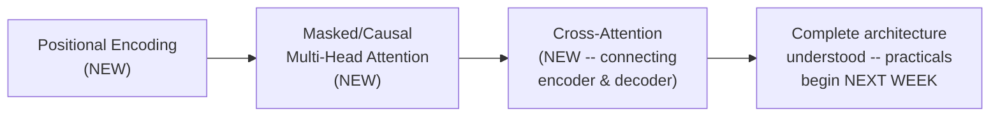

#### 🎯 Key Takeaways

* This session's explicit purpose: **fill in every remaining architectural gap** before hands-on coding begins — positional encoding, masked attention, and cross-attention are the three genuinely new topics.
* The instructor **directly, honestly acknowledges** the genuine tedium of this depth of coverage, while explicitly justifying it as necessary for durable, transferable understanding.
* **Next week is explicitly, purely practical** — "less theory, more practical," building toward a complete, from-scratch, trained Transformer.

---

### 2. Seeing the Whole Pipeline Live: The Transformers Explainer Tool

#### 🪜 Step-by-Step — The Complete Pipeline, Watched Live on a Real Sentence

> 💡 **Given directly:** *"This is your main data. Now, this data will be converted into what? Embedding. Tokenization... those tokens have been converted into numbers... with that, you are adding the positional encoding here... this is exactly your vector representation, having 768 dimensions."*

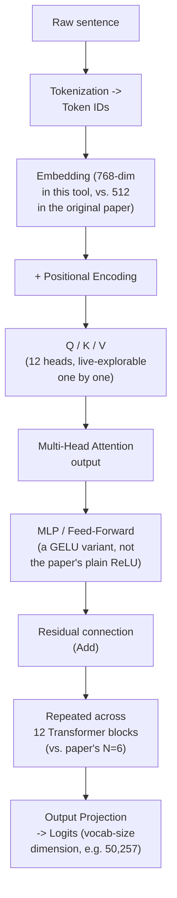

> ⚠️ **A direct, repeated, honest clarification: numbers here genuinely differ from the paper's own:** *"Don't compare everything as part of the paper -- it's not necessary that the exact paper numbers that they have used, they might change it. In the paper, it was 512, here, 768, it's totally fine."*

#### 🔍 Internal Working — From Logits to an Actual Predicted Word: Temperature

> 💡 **Given directly, a genuinely important, directly interview-relevant concept:** *"This is one of the most common questions in the interview. What is the role of temperature? Every LLM comes with a temperature option... The value ranges between 0 to 1... keeping it towards the lower side, it's much better -- we call it the creativeness of the model sometimes. Higher values lead to more creativeness."*

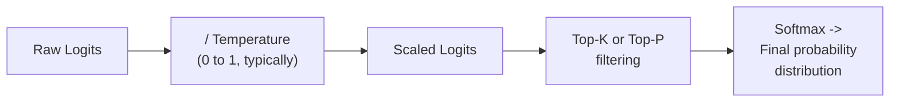

#### 🔍 Internal Working — Top-K vs. Top-P, Precisely Distinguished

> 💡 **Given directly:** *"Top K is the top words which have been predicted... Top P is the top probabilities... After the logit operation, they have applied softmax [for top-P], and if you look into top K, they have done first filtering... whereas here [top-P], the filtering is not being done, the filtering is being done after the softmax-based operation."*

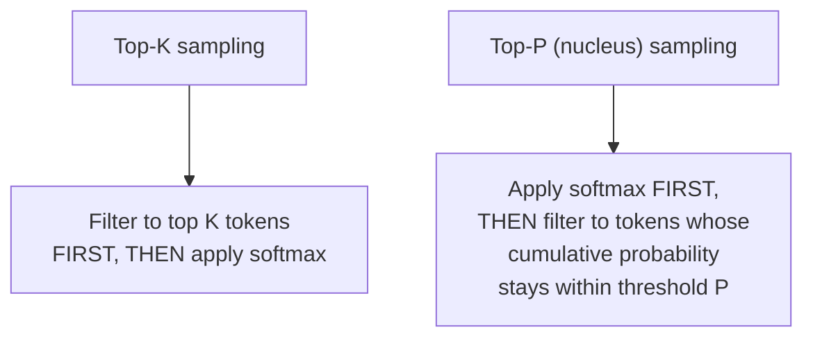

> 💡 **Given directly, the instructor's own stated preference:** *"Most of the times, I will say that my preference is always top K, not top P, but it totally depends upon the use case."*

#### ⚠ Common Mistakes

* Assuming this tool's specific numbers (768 dimensions, 12 heads, 3072 feed-forward neurons, GELU activation) directly match the original paper's — explicitly, repeatedly clarified: these are genuinely DIFFERENT, real implementation choices, not deviations to be confused with the paper's own stated numbers (512, 8, 2048, ReLU).
* Assuming the large output projection dimension (e.g., 50,257) comes from concatenation — explicitly, directly corrected: *"It won't be because of concatenation... this is your main vocab part, the vocabulary."*

#### 🎯 Key Takeaways

* This live tool provides **genuine, hands-on proof** of the complete Transformer pipeline, from raw sentence through to a real, sampled predicted word — directly complementing the earlier sessions' from-scratch mathematical derivation.
* **Temperature** (typically 0-1) scales logits before sampling — lower values produce more deterministic, "safer" outputs; higher values produce more "creative," varied outputs — explicitly flagged as a genuinely common interview question.
* **Top-K** (filter first, then softmax) and **top-P/nucleus sampling** (softmax first, then filter by cumulative probability) are precisely distinguished, different sampling strategies — genuinely different in WHEN filtering happens relative to softmax.

---
### 3. A Second Live Tour: The NanoGPT Visualization (A Decoder-Only Variant)

#### 🪜 Step-by-Step — Identifying a Decoder-Only Architecture

> 💡 **Given directly, the precise, stated diagnostic rule:** *"Always remember, in the original paper, there are two blocks, encoder and decoder, but it's not like that in every use case we need both of the blocks. In the last example, this is only the decoder block, and how I know that it is a decoder? By always looking into... whenever there is something called as mask. Mask means decoder."*

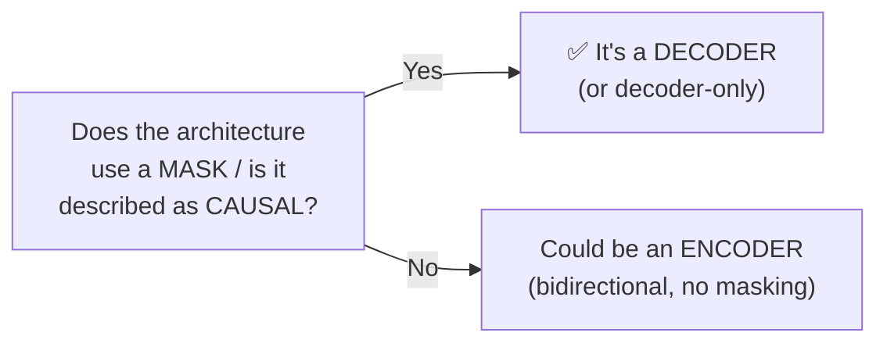

#### 🔍 Internal Working — A Genuinely Different Layer Ordering

> 💡 **Given directly, a precise, honest observation of real architectural variation:** *"Here, directly I cannot say that there is a normalization step before it, but in this architecture that they have taken... first they have a layer norm... in the previous architectures, we have not gone through a layer norm in the first step. First we have done what? The multi-head attention, and then we went to a layer [norm]. But in this particular architecture, because this is a different variant, this is a nano-GPT version, where first a layer normalization used, and then finally... multi-head attention."*

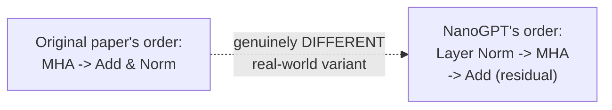

#### 🔍 Internal Working — Counting Heads and Blocks, Live

> 💡 **Given directly:** *"Can you see that this information is being received in multiple places, which is your KQV... how many KQV values are there, or the total number of heads... 1, 2, 3, 1, 2, 3, 1, 2, 3, 1, 2, 3. So total I have here -- how many heads are here? 3 heads."*

> 💡 **Given directly, precisely correcting a genuine, direct student misunderstanding:** *"3 Transformers layer here -- yes, actually those are repetitive blocks. So here, when it's written 3 Transformers, it actually means three decoders have been used... when I say Transformers, it doesn't mean that every transformer should have encoder as well as decoder. It can be only encoder, it can be only decoder."*

#### 🏢 Real-World / Production Usage — Scaling Up, Directly Named

> 💡 **Given directly, connecting this small, visualizable model to genuinely real, large ones:** *"NanoGPT... the number of parameters here, 85K. GPT-2 small is also having a lot... this is really close to like 124 million... these are really, really long architectures... they also follow the same fundamentals that you have learned. It's not like everything gets changed here."*

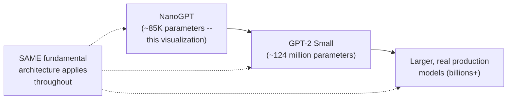

#### ⚠ Common Mistakes

* Assuming every real Transformer implementation follows the exact layer ordering (MHA before normalization) shown in the original paper's own diagram — explicitly, directly demonstrated as FALSE via this live, real, alternative implementation.
* Assuming "3 Transformers" (or "N Transformers") in a diagram implies the presence of both an encoder AND a decoder — explicitly, directly corrected: it specifically refers to the repetition of WHATEVER block type (encoder-only, decoder-only, or both) the specific architecture actually uses.

#### 🎯 Key Takeaways

* This second live tour provides genuine, direct **proof that real implementations vary** in specific architectural details (layer normalization ordering, specific dimensions) while preserving the SAME underlying fundamental principles taught across this entire course.
* **"Mask" or "causal"** in an architecture's own description is the precise, reliable diagnostic signal for identifying a decoder (or decoder-only) architecture.
* This tool's small, ~85K-parameter NanoGPT model is explicitly, directly connected to genuinely larger, real production models (GPT-2 Small at ~124 million parameters, and beyond) — the SAME fundamentals scale up, without fundamentally changing.

---

### 4. What Is a Mask? Building the Causal Attention Matrix From Scratch

#### 📖 Definition — The Mask Matrix, Built Live in PyTorch

> 💡 **Given directly, the precise, live-built code:** *"I've imported Torch, and then I've tried to create a mask... I'm passing torch.ones -- the initial matrix, it will be having all the values once, and on top of that, I'm creating the mask... What does torch.tril do?"*

```python
import torch

seq_len = 5
mask = torch.tril(torch.ones(seq_len, seq_len))
# mask =
# [[1, 0, 0, 0, 0],
#  [1, 1, 0, 0, 0],
#  [1, 1, 1, 0, 0],
#  [1, 1, 1, 1, 0],
#  [1, 1, 1, 1, 1]]
```

> 💡 **Given directly, the precise, plain-language explanation:** *"This is the lower triangular part that you have to actually look into... let's think it from the token perspective... In the first step, it's only looking into itself... in the first row, when you look into one, out of this 5, it's only looking into the first one."*

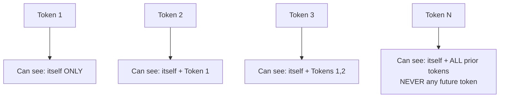

#### ❓ Why It Exists — The Autoregressive Property, Precisely Named

> 💡 **Given directly:** *"By making zero, whenever you see a zero, it means that there is no information to access. So can I say that my current token cannot see any type of future information? And this is the property of a decoder. Decoder is autoregressive -- it means that generation of one token at a time... it will never look into future tokens. It will only look into itself or the past."*

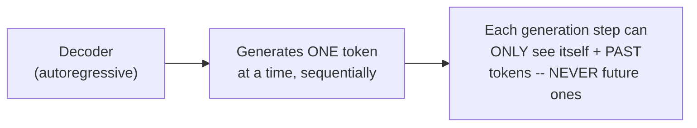

> 💡 **Given directly, naming alternative terms for the SAME concept:** *"A casual system, yes, casual, it's called, because it's one by one. That's why it's also called as casual attention... mask attention and casual attention -- same meaning."*

#### ❓ Why It Exists — The Precise, Directly-Stated Reasoning: Why Would Peeking at the Future Even Be a Problem?

> 💡 **Given directly, a genuinely important, precisely-answered student question:** *"If there was future information, why should we not look into it? Let's take during inference, if you are doing any type of prediction or inferencing, do you feel that you'll be having that future information? ... During prediction, how we will get future information? It is not possible."*

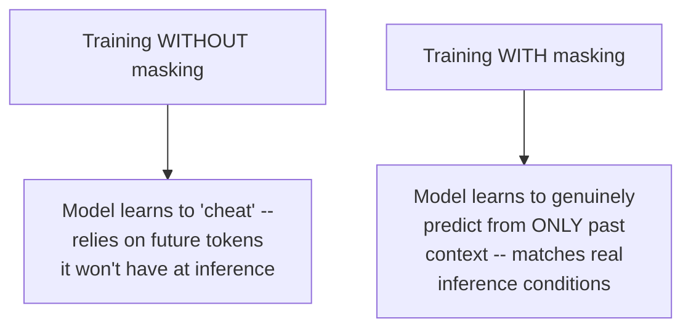

#### ⚠ Common Mistakes

* Assuming masking is applied only for computational convenience, rather than genuine necessity — explicitly, directly clarified: without masking during training, a model would learn to rely on future tokens it will genuinely NEVER have access to during real inference, creating a fundamental train/inference mismatch.
* Assuming "masking" and "casual/causal attention" describe two different mechanisms — explicitly, directly clarified as the SAME concept, under different names.

#### 🎯 Key Takeaways

* A **mask matrix** is a lower-triangular matrix (built via `torch.tril`), directly encoding which tokens each position is allowed to "see" — itself and all PRIOR tokens, never future ones.
* This directly implements the **autoregressive property**: decoders generate exactly one token at a time, sequentially, and this property is genuinely unbreakable — no decoder can violate it.
* Masking exists specifically because training WITHOUT it would let the model "cheat" using future information genuinely unavailable at real inference time — a precise, mechanistic justification, not merely a stylistic architectural choice.

---
### 5. The Minus-Infinity Trick: Making Masking Actually Work With Softmax

#### ❓ Why It Exists — The Precise, Foundational Math

> 💡 **Given directly, the exact, step-by-step reasoning:** *"If I do one plus minus infinity, what will be the result? Minus infinity... If I say e to the power minus infinity, what is the value of this? Nearly zero -- that's why we'll be treating it as zero, close to zero."*

```text
1 + (-∞) = -∞
e^(-∞) ≈ 0
```

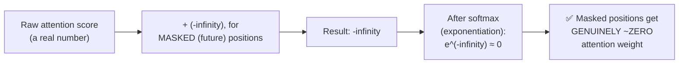

#### 💻 Code Example — Building the Complete Mask Matrix With -∞

> 💡 **Given directly, the precise, live-built matrix:** *"Let's start with 0, minus infinity, minus infinity, minus infinity. Then you have 0, 0, minus infinity, minus infinity. 0, 0, 0, minus infinity. And finally, you have your 0, 0, 0, 0."*

```python
mask_matrix = torch.tensor([
    [0.0, float('-inf'), float('-inf'), float('-inf')],
    [0.0, 0.0, float('-inf'), float('-inf')],
    [0.0, 0.0, 0.0, float('-inf')],
    [0.0, 0.0, 0.0, 0.0],
])

scores = ...   # raw, scaled attention scores (Q @ K.T / sqrt(d_k))
masked_scores = scores + mask_matrix   # step 6: add the mask
attention = torch.softmax(masked_scores, dim=-1)   # step 7: normalize
```

#### 🪜 Step-by-Step — Tracing a Real, Worked Example Row by Row

> 💡 **Given directly, the complete, hand-traced example:** *"Whatever the value of score matrix is... let's take that value plus zero -- I can say that it will retain the original information... 2 plus minus infinity, what will happen? ...1 minus infinity minus infinity... After applying softmax... it will be 1, 0, 0. Yes or no?"*

```mermaid
sequenceDiagram
    participant Scores as Raw Scores (row 1)
    participant Mask as Mask (row 1: 0, -inf, -inf, -inf)
    participant Sum as Scores + Mask
    participant Softmax

    Scores->>Sum: [1, 2, 3, 4]
    Mask->>Sum: [0, -inf, -inf, -inf]
    Sum->>Softmax: [1, -inf, -inf, -inf]
    Softmax->>Softmax: e^1 stays real; e^(-inf) -> 0
    Softmax-->>Scores: [1.0, 0.0, 0.0, 0.0]
```

> 💡 **Given directly, verifying the softmax property still holds after masking:** *"The addition of all the probabilities has to be 1 -- I hope everybody understands, because this is a softmax."*

#### 🔍 Internal Working — Order of Operations Genuinely Doesn't Matter

> 💡 **Given directly, a precise, honest clarification:** *"You can bring the mask later on also, mask after also, because at the end of the day, the impact will be exactly the same. There won't be any type of difference."*

#### ⚠ Common Mistakes

* Assuming a large negative number (like -1,000,000) would work just as well as genuine negative infinity — implicitly, the session's own precise math (`e^(-∞) ≈ 0` exactly, vs. merely a very small non-zero number for a large but finite negative value) suggests genuine, exact zeroing is the goal, though any sufficiently large negative value works in practice for numerical purposes.
* Assuming masking must be applied at a specific point in the calculation sequence (e.g., only before scaling, or only after) — explicitly, directly clarified: the exact ordering relative to other steps doesn't change the final, genuine result.

#### 🎯 Key Takeaways

* The **minus-infinity trick** works because `e^(-∞) ≈ 0` — adding negative infinity to a masked position's raw score guarantees that position's softmax output is genuinely, effectively zero.
* This entire process is a **simple addition** (`scores + mask`) applied BEFORE softmax — genuinely no more complex than that, despite initially seeming abstract.
* A full, hand-traced example (row 1 of a 4-token sequence) directly, concretely confirms the mechanism: the first token's attention weights become `[1.0, 0.0, 0.0, 0.0]` — attending ONLY to itself, exactly as the autoregressive property requires.

---

### 6. Positional Encoding: Why Sine and Cosine, and Why 10,000

#### ❓ Why It Exists — The Paper's Own, Precise Stated Reasoning

> 💡 **Given directly, quoting the paper:** *"Since our model contains no recurrence or no convolution, in order for the model to make use of the order of the sequence, we must inject some information about the relative and the absolute position of the tokens in sequence."*

#### 📖 Definition — Relative vs. Absolute Position, Precisely Distinguished

> 💡 **Given directly:** *"Relative, when you say -- it means that with respect to some other token. Absolute means which is the exact position in that particular sequence."*

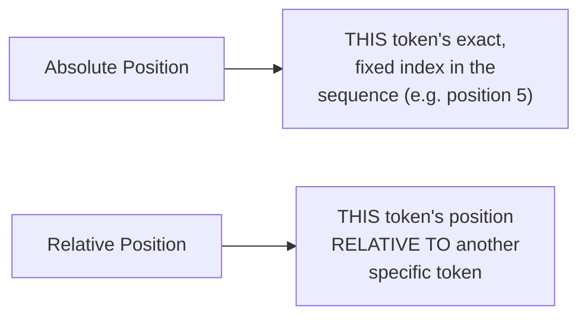

#### 📖 Definition — The Complete Formula

```text
PE(pos, 2i)   = sin( pos / 10000^(2i/d_model) )
PE(pos, 2i+1) = cos( pos / 10000^(2i/d_model) )
```

> 💡 **Given directly:** *"When it is an even, they are using sine. And when it is an odd, they are using cos."*

#### 🔍 Internal Working — Precisely Why 10,000

> 💡 **Given directly:** *"Why 10,000? According to their experiment, they got that 10,000 is an arbitrary number for now... they felt that if they take a higher number, like 10,000, there will be less overlap between the wavelengths. They have tested with 2,000 and 3,000. They saw that there was a lot of overlap... even tested with 20,000... there also, there was very, very less overlap."*

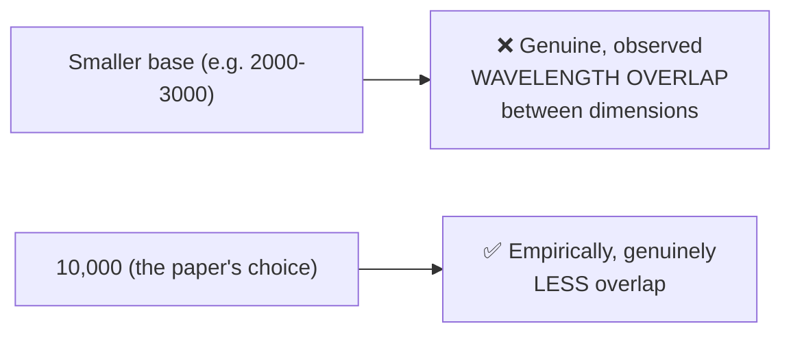

#### 🔍 Internal Working — Why Sine/Cosine Specifically, Not Other Functions

> 💡 **Given directly, using the trigonometric sum identities:** *"sin(A+B) = sin(A)cos(B) + cos(A)sin(B)... cos(A+B) = cos(A)cos(B) - sin(A)sin(B)... when you look into this, sine and cos, they can learn some type of relative information with respect to A and B... because of their trigonometric identities."*

> 💡 **Given directly, precisely explaining why other functions (like tangent) wouldn't work:** *"Whereas if you use any other functions -- let's take tan -- do you think it is possible? It is not possible, guys."*

> 💡 **Given directly, the precise, additional stated benefit:** *"They capture periodicity... very, very important... they help you actually to bring extrapolation -- it means that you can actually work with longer sequences also. And this is very, very memory efficient also."*

#### ⚠ Common Mistakes

* Assuming any periodic-seeming function could substitute for sine/cosine (e.g., tangent) — explicitly, directly corrected: sine/cosine's SPECIFIC trigonometric sum identities are what genuinely enable learning relative position information; tangent does not share this same useful mathematical property.
* Assuming the value 10,000 has some deep, principled theoretical justification — explicitly, directly clarified: it's an EMPIRICALLY-chosen value, based on genuinely observed wavelength overlap at smaller and larger alternatives.

#### 🎯 Key Takeaways

* Positional encoding uses **sine for even dimensions, cosine for odd dimensions**, with the base 10,000 chosen empirically to minimize wavelength overlap between dimensions.
* Sine and cosine's specific **trigonometric sum identities** (`sin(A+B)`, `cos(A+B)`) are precisely what enable the model to learn RELATIVE position information — a property NOT shared by other periodic functions like tangent.
* Additional, genuine benefits of this specific choice: periodicity (repeating structure), genuine extrapolation capability to longer sequences than seen during training, and memory efficiency (no learned parameters required).

---
### 7. Positional Encoding: A Complete, Worked Numerical Example

#### 🪜 Step-by-Step — Computing Position 0, With d_model = 4

> 💡 **Given directly, the complete, hand-worked calculation:** *"For position 0... let's take a dimension of the model 4... For even, what is the formula with respect to sine? 0 divided by 10,000... 0 divided by 4... sine of 0... What is the value of sine 0? 0."*

```text
Position 0, d_model = 4:
  dim 0 (even, sin): sin(0 / 10000^(0/4)) = sin(0) = 0
  dim 1 (odd, cos):  cos(0 / 10000^(0/4)) = cos(0) = 1
  dim 2 (even, sin): sin(0 / 10000^(2/4)) = sin(0) = 0
  dim 3 (odd, cos):  cos(0 / 10000^(2/4)) = cos(0) = 1

PE(0) = [0, 1, 0, 1]
```

> 💡 **Given directly, the precise, plain conclusion:** *"For my first position, whatever that token came, token 1 was having first position... this is your original embedding that you have... you can actually add this up value here... 0, 1, 0, 1."*

#### 🪜 Step-by-Step — Computing Position 1, With d_model = 4

> 💡 **Given directly, the complete, second worked calculation:** *"Let's do for position 1 now... sine 1, whatever the value of sine 1, close to 0.85... cos of 1? Roughly around 0.5... [dim 2] sine, 1 divided by 10,000, 2 by 4, it becomes 0.5... roughly around sine, 0.01... [dim 3] cos, 0.99."*

```text
Position 1, d_model = 4:
  dim 0 (even, sin): sin(1 / 10000^(0/4)) = sin(1) ≈ 0.84
  dim 1 (odd, cos):  cos(1 / 10000^(0/4)) = cos(1) ≈ 0.54
  dim 2 (even, sin): sin(1 / 10000^(2/4)) = sin(1/100) ≈ 0.01
  dim 3 (odd, cos):  cos(1 / 10000^(2/4)) = cos(1/100) ≈ 0.995

PE(1) ≈ [0.84, 0.54, 0.01, 0.995]
```

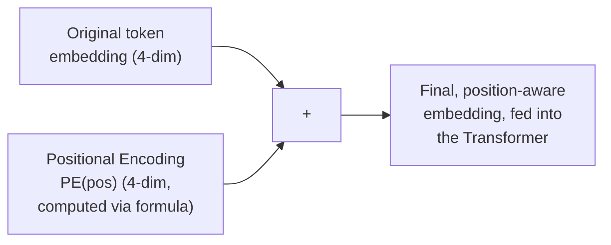

#### ❓ Why It Exists — No Neural Network Is Required

> 💡 **Given directly, a genuinely important, precise clarification:** *"Do you feel that for this you need a neural network? Please tell me, to generate positional encodings. How many of you feel that I need a neural network? Nobody needs a neural network. So, there is no learning right now. This can be directly generated."*

#### 🔍 Internal Working — Why Dimensions Come in Pairs (Alternating Dimension Logic)

> 💡 **Given directly, the precise, worked explanation for why dimension indices repeat in twos:** *"Why in the first two, only 0 came, and in the next two, only 2 came? ...D0 will be based on sine, this will be based on cos, this will be based on sine, this will be based on cos... they are alternate... whenever I say 0,0, similarly, if you try to do it for 4 and 5, what will happen?... 2 into i is equal to 2... the exponent, 2i divided by d_model... whenever I'm doing the exponent for dimensions 0 and 1: 2×0/4=0. For dimensions 2 and 3: 2×2/4... wait, let me restate precisely: for dims 0,1 the exponent term uses i=0; for dims 2,3 it uses i=1; the exponent value increases by 2 for every new PAIR."*

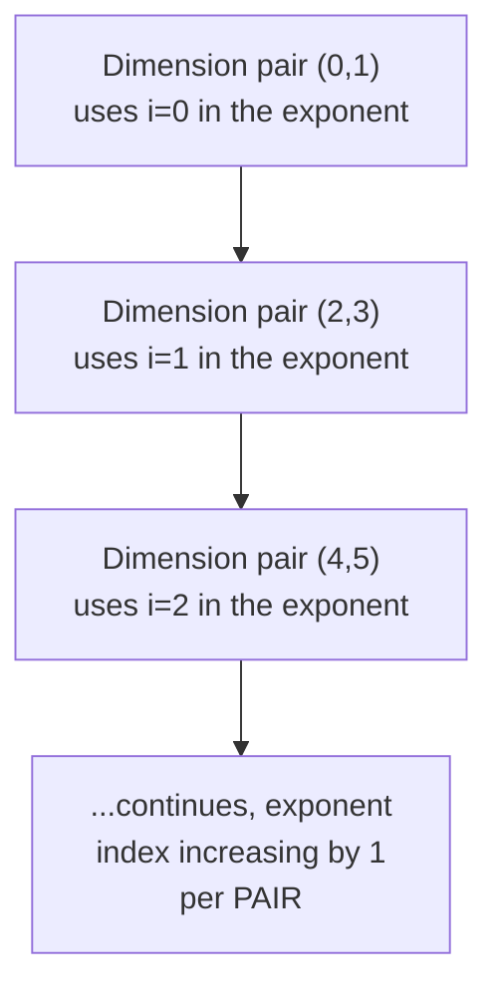

> 💡 **Given directly, the precise, stated reason pairing exists at all:** *"Why we need pairs? Because sine and cos works in pairs. They are having alternating dimensions, guys. This is a property, a trigonometric property, of alternating dimensions."*

#### ⚠ Common Mistakes

* Attempting to use raw, un-normalized integer positions (0, 1, 2, ... 512) directly, without the sine/cosine transformation — explicitly, directly clarified as impractical: *"You cannot take such big integers directly, because all of your embeddings will be tiny embeddings... even through normalization, it cannot be handled."*
* Assuming positional encoding requires a learned, trainable component — explicitly, directly, repeatedly clarified: it is entirely computed via a fixed, deterministic formula, requiring no neural network or training whatsoever.
* Assuming embedding dimensions can genuinely be odd numbers — explicitly, directly stated as a near-universal convention: *"In the entire field of NLP, we'll see that the dimensions are always in even number... I have never seen, neither in any research, they have taken embeddings in an odd value."*

#### 🎯 Key Takeaways

* Positional encoding values are **completely computable via a fixed formula** — no learning, no neural network, and no trainable parameters are genuinely required.
* A complete, hand-worked example for a small, 4-dimensional model shows PE(0) = `[0, 1, 0, 1]` and PE(1) ≈ `[0.84, 0.54, 0.01, 0.995]` — concrete, real numbers directly demonstrating the formula's actual behavior.
* Dimensions genuinely come in **alternating sine/cosine pairs**, with the exponent term increasing by a consistent step for each successive pair — a direct, structural consequence of the formula's own `2i` indexing.
* Embedding dimensions are, as a near-universal convention, **always even numbers** — directly required by this alternating sine/cosine pairing structure.

---

### 8. Cross-Attention: Connecting the Encoder to the Decoder

#### 📖 Definition — Cross-Attention, Precisely Introduced

> 💡 **Given directly:** *"The connection between encoder and decoder is being done through a cross-attention. Cross-attention is a much older concept, as compared to self-attention, which is much newer... when I hear cross-attention, simply, what do I mean? You can think about this as an inter-sequence attention also, because the sequence in encoder is different, and the sequence in decoder [is different]."*

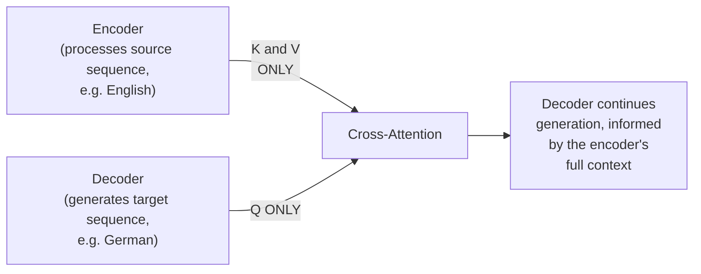

#### ❓ Why It Exists — Precisely Why Only K and V, Never Q, Come From the Encoder

> 💡 **Given directly:** *"Whenever we are performing cross-attention, we need the K and the Vs from our encoders... other than that, we don't need the query right now, because the query... comes from the decoder... Even the decoder has its own KQV."*

> 💡 **Given directly, the precise, stated purpose:** *"It helps the decoder to look into the encoder's output... while generating -- whenever any new token that will be getting generated, it will always look into the encoder's output."*

#### 🔍 Internal Working — No Masking in Cross-Attention

> 💡 **Given directly:** *"Generally, with respect to cross-attention, there is no concept of masking. It happens only with respect to self-attention or with respect to multi-head attention. With respect to cross-attention, there is no concept of masking."*

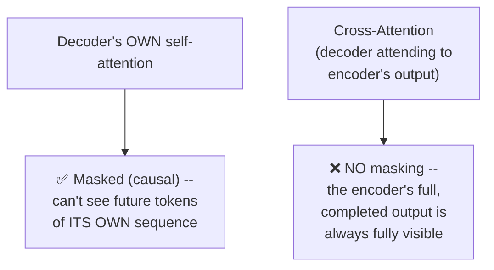

#### 📖 Definition — The Precise, Stated Purpose: Fusion/Alignment

> 💡 **Given directly:** *"What is the main purpose of cross-attention? ... Fusing the encoder information between your source and target -- generally, it's called an alignment. You can call it a fusion also, between sequences."*

#### 🔍 Internal Working — Cross-Attention Is Genuinely Required Only for Encoder-Decoder Architectures

> 💡 **Given directly:** *"If you don't have an encoder, in that case, is there a requirement of cross-attention? ...If you only have a decoder, then it is not required... If it is standalone encoder, for sure there has to be no cross-attention. If there is only decoder, then also standalone, you don't need any type of cross-attention. In T5 models, you need it. In Pegasus, you need it... in Marian, MT, you need it."*

#### ⚠ A Direct, Precise Clarification: This Flow Is Training-Time, Not Inference-Specific

> 💡 **Given directly:** *"This is the flow for training, and not inferencing again. I am telling you, this is required during training. During your inferencing, really, it is not required."* -- **though genuinely worth noting**: cross-attention itself IS also used during inference in encoder-decoder models; the instructor's own broader point across this session is that the SPECIFIC connection mechanism must exist wherever an encoder-decoder architecture is genuinely used, for both training and inference.

#### ⚠ Common Mistakes

* Confusing cross-attention with KV-Cache — explicitly, directly distinguished: *"This is not KV Cache, people don't get confused with respect to KV Cache."*
* Assuming cross-attention is needed for EVERY Transformer architecture — explicitly, directly corrected: it's genuinely required ONLY for encoder-decoder architectures (T5, Pegasus, Marian MT explicitly named) — NOT for encoder-only or decoder-only architectures.
* Assuming the decoder can see the "final answer" through cross-attention — explicitly, directly, precisely corrected in a genuine student Q&A exchange: *"It's not help in comparison, it actually helps you in generating the next token... It is an intermediate sequence, so I cannot say that it can actually look into the output -- that will be a wrong intuition."*

#### 🎯 Key Takeaways

* **Cross-attention** connects encoder to decoder: **Key and Value come from the encoder's output; Query comes from the decoder** — precisely the reverse of what a beginner might assume.
* Cross-attention has **no masking** — the encoder's complete output is always fully visible to the decoder, unlike the decoder's own self-attention, which IS masked.
* Cross-attention's genuine purpose is **fusion/alignment** between two different sequences — required specifically (and only) in genuine encoder-decoder architectures (T5, Pegasus, Marian MT), not in encoder-only or decoder-only models.

---
## 📝 Glossary

| Term | Definition | Why It Matters |
|---|---|---|
| **Temperature** | A scaling factor (typically 0-1) dividing logits before sampling | Lower = more deterministic; higher = more "creative" output |
| **Top-K Sampling** | Filter to the top K most likely tokens, THEN apply softmax | A common, directly-preferred sampling strategy |
| **Top-P (Nucleus) Sampling** | Apply softmax FIRST, then filter by cumulative probability threshold | Genuinely different filtering ORDER from top-K |
| **Mask Matrix** | A lower-triangular matrix (via `torch.tril`) marking allowed vs. blocked positions | Encodes the autoregressive, "no future tokens" rule |
| **Autoregressive** | Generating exactly one token at a time, sequentially | The defining, unbreakable property of decoders |
| **Causal / Masked Attention** | Attention restricted to a token's own position and the past | Same concept as "masked attention," different name |
| **Minus-Infinity Trick** | Adding -inf to masked scores before softmax | Guarantees `e^(-inf) ≈ 0` -- genuinely zero attention weight |
| **Relative Position** | A token's position with respect to another specific token | One of two properties positional encoding must capture |
| **Absolute Position** | A token's exact, fixed index in the sequence | The other property positional encoding must capture |
| **Cross-Attention** | Attention connecting an encoder's output to a decoder | K, V from encoder; Q from decoder; no masking |
| **KV-Cache** | A distinct, separate concept from cross-attention | Explicitly NOT the same thing -- a common confusion |

---

## 🔄 Revision Notes — One-Minute Revision

* This session **completes the entire Transformer architecture** -- positional encoding, masked/causal multi-head attention, and cross-attention are the three genuinely new topics; practical, from-scratch coding is explicitly deferred to next week.
* **The Transformers Explainer tool** was toured live, watching a real (768-dim, 12-head) model process a sentence end to end -- embedding -> positional encoding -> Q/K/V -> multi-head attention -> MLP -> logits -> **temperature** scaling -> **top-K** (filter, then softmax) or **top-P** (softmax, then filter by cumulative probability) sampling.
* **The NanoGPT visualization** demonstrated that real implementations genuinely vary (e.g., layer norm BEFORE multi-head attention, unlike the original paper's ordering) while sharing the same underlying fundamentals -- and that "mask" or "causal" in a diagram is the reliable signal identifying a decoder architecture.
* **Masking** is built from a lower-triangular matrix (`torch.tril`) -- each token can see itself and all PAST tokens, never future ones, directly implementing the **autoregressive property** (generate one token at a time, sequentially) -- necessary because real inference genuinely never has future tokens available.
* The **minus-infinity trick** (`scores + mask`, where masked positions get `-inf`) works because `e^(-inf) ≈ 0` after softmax -- a full, hand-traced example showed row 1 of a 4-token sequence producing attention weights of exactly `[1.0, 0.0, 0.0, 0.0]`.
* **Positional encoding** uses sine (even dimensions) and cosine (odd dimensions), with base 10,000 chosen EMPIRICALLY to minimize wavelength overlap -- sine/cosine's specific trigonometric SUM IDENTITIES (not shared by functions like tangent) are precisely what enable learning relative position information.
* A **complete, hand-worked numerical example** (d_model=4) computed PE(0)=[0,1,0,1] and PE(1)≈[0.84,0.54,0.01,0.995] -- no neural network or training is genuinely required; dimensions come in alternating sine/cosine PAIRS, with the exponent increasing per pair -- which is why embedding dimensions are always EVEN numbers.
* **Cross-attention** connects encoder to decoder: **K and V come from the encoder; Q comes from the decoder** -- precisely the reverse of a common beginner assumption. It has **NO masking** (the encoder's output is always fully visible), and its genuine purpose is fusion/alignment between two different sequences -- required only in genuine encoder-decoder architectures (T5, Pegasus, Marian MT), not encoder-only or decoder-only models.

---

## 📋 Cheat Sheet

**Sampling strategies:**
```text
Temperature: logits / temperature (0-1 typical); lower = deterministic, higher = creative
Top-K:  filter to top K tokens FIRST, then softmax
Top-P:  softmax FIRST, then filter by cumulative probability threshold
```

**Mask matrix (torch.tril):**
```python
mask = torch.tril(torch.ones(seq_len, seq_len))
# Token i can see: itself + all tokens 0..i-1 (never i+1 onward)
```

**The minus-infinity trick:**
```text
1 + (-inf) = -inf
e^(-inf) ≈ 0
-> masked_scores = scores + mask (mask uses 0 for allowed, -inf for blocked)
-> softmax(masked_scores) genuinely zeroes out blocked positions
```

**Positional encoding formulas:**
```text
PE(pos, 2i)   = sin( pos / 10000^(2i/d_model) )
PE(pos, 2i+1) = cos( pos / 10000^(2i/d_model) )
```

**Worked example (d_model=4):**
```text
PE(0) = [0, 1, 0, 1]
PE(1) ≈ [0.84, 0.54, 0.01, 0.995]
```

**Cross-attention:**
```text
K, V <- from ENCODER's output
Q    <- from DECODER
NO masking (encoder's full output always visible)
Required ONLY for encoder-decoder models (T5, Pegasus, Marian MT)
NOT required for encoder-only or decoder-only models
```

**Architecture identification:**
```text
"Mask" / "Causal" in the diagram -> it's a DECODER
No masking, bidirectional         -> it's an ENCODER
```

---

## 🔥 Interview Questions & Answers

### 🟢 Beginner

**Q1.**

**Question:** What does temperature control in LLM sampling?

**Answer:** How "creative" or deterministic the output is -- lower temperature (toward 0) produces more deterministic output; higher temperature produces more varied, "creative" output.

**Explanation:** Directly, explicitly explained, flagged as a common interview question.

**Why Interviewers Ask This:** A genuinely, directly common LLM-configuration interview question.

**Possible Follow-up:** "What is the typical range of temperature values?"

**Q2.**

**Question:** What is the difference between top-K and top-P sampling?

**Answer:** Top-K filters to the top K tokens FIRST, then applies softmax; top-P applies softmax FIRST, then filters tokens by cumulative probability threshold.

**Explanation:** Directly, precisely distinguished by the ORDER of operations.

**Why Interviewers Ask This:** Tests precise understanding of two commonly-confused sampling strategies.

**Possible Follow-up:** "Which does this instructor state a personal preference for, and why?"

**Q3.**

**Question:** What is a mask matrix, and how is it typically constructed in PyTorch?

**Answer:** A lower-triangular matrix, encoding which positions a token can "see" -- itself and the past, never the future -- constructed via `torch.tril`.

**Explanation:** Directly, precisely explained.

**Why Interviewers Ask This:** Foundational, frequently-tested masking mechanics.

**Possible Follow-up:** "What property of decoders does this matrix directly enforce?"

**Q4.**

**Question:** Why does adding negative infinity (not just a large negative number) work for masking?

**Answer:** Because `e^(-infinity) ≈ 0` after softmax, guaranteeing genuinely zero attention weight for masked positions.

**Explanation:** Directly, precisely explained.

**Why Interviewers Ask This:** Tests genuine, mechanistic understanding of the masking implementation.

**Possible Follow-up:** "What would happen mathematically if you used a large but finite negative number instead?"

**Q5.**

**Question:** What is the autoregressive property, and which architecture component has it?

**Answer:** Generating exactly one token at a time, sequentially, never looking at future tokens -- a defining, unbreakable property of decoders.

**Explanation:** Directly, precisely explained.

**Why Interviewers Ask This:** Foundational decoder architecture knowledge.

**Possible Follow-up:** "Why can't a decoder violate this property, even during training?"

**Q6.**

**Question:** What base value does positional encoding use, and why was it chosen?

**Answer:** 10,000 -- chosen empirically, since it produced genuinely less wavelength overlap between dimensions than smaller alternatives (2,000-3,000) that were tested.

**Explanation:** Directly, precisely explained.

**Why Interviewers Ask This:** Tests specific, factual recall of the paper's own stated reasoning.

**Possible Follow-up:** "Was a larger base value (like 20,000) also tested? What was found?"

**Q7.**

**Question:** Why are sine and cosine used for positional encoding, rather than other periodic functions like tangent?

**Answer:** Sine and cosine's specific trigonometric sum identities enable the model to learn relative position information -- a property tangent does not share.

**Explanation:** Directly, precisely explained.

**Why Interviewers Ask This:** Tests genuine understanding of WHY sine/cosine specifically, not just that they're used.

**Possible Follow-up:** "Does positional encoding require any trainable parameters?"

**Q8.**

**Question:** In cross-attention, which of Q, K, V come from the encoder, and which comes from the decoder?

**Answer:** K and V come from the encoder; Q comes from the decoder.

**Explanation:** Directly, precisely stated.

**Why Interviewers Ask This:** A commonly-tested, precise cross-attention mechanics question.

**Possible Follow-up:** "Why doesn't the encoder's Query get used at all?"

**Q9.**

**Question:** Does cross-attention use masking?

**Answer:** No -- the encoder's full output is always visible to the decoder; masking applies only to the decoder's own self-attention.

**Explanation:** Directly, explicitly stated.

**Why Interviewers Ask This:** Tests precise understanding of where masking genuinely applies within the full architecture.

**Possible Follow-up:** "Why would masking the encoder's output not make sense?"

**Q10.**

**Question:** Name three model architectures explicitly named as requiring cross-attention.

**Answer:** T5, Pegasus, and Marian MT.

**Explanation:** Directly, explicitly named.

**Why Interviewers Ask This:** Tests awareness of real, named encoder-decoder architectures.

**Possible Follow-up:** "Does GPT require cross-attention? Why or why not?"

---

### 🟡 Intermediate

**Q11.**

**Question:** Explain why the instructor deliberately tours TWO different live visualization tools (Transformers Explainer and NanoGPT) rather than just one.

**Answer:** These two tools genuinely demonstrate DIFFERENT things: the Transformers Explainer shows a complete, full pipeline (including the final sampling stage -- temperature, top-K/top-P) on a genuinely large-vocabulary model, while the NanoGPT visualization specifically demonstrates that REAL implementations can genuinely DIFFER in specific architectural details (layer norm ordering) while preserving the same fundamentals -- a genuinely different, complementary lesson. Touring both directly reinforces that the course's carefully-derived, "textbook" architecture (matching the original paper) is a genuine FOUNDATION, not a rigid template every real implementation must follow exactly -- a nuanced, important point neither tool alone fully conveys.

**Explanation:** Requires recognizing the genuinely distinct pedagogical purpose each separate tool serves.

**Why Interviewers Ask This:** Tests whether a learner recognizes deliberate, complementary tool selection, not redundant repetition.

**Possible Follow-up:** "What SPECIFIC architectural difference did the NanoGPT tool reveal that the original paper's own diagram doesn't show?"

**Q12.**

**Question:** A learner argues that since masking simply sets certain attention weights to zero, you could achieve the same effect more simply by directly setting those specific SOFTMAX OUTPUTS to zero after the fact, rather than adding negative infinity BEFORE softmax. Evaluate this claim.

**Answer:** This claim is technically plausible in terms of the FINAL numerical result, but genuinely breaks the mathematical PROPERTY softmax requires: softmax's outputs must sum to exactly 1 across all positions. If you computed softmax normally (across ALL positions, including ones you intend to "mask") and THEN manually zeroed out specific outputs afterward, the REMAINING probabilities would no longer sum to 1 -- you'd need an ADDITIONAL re-normalization step to fix this, adding genuine complexity. The pre-softmax, negative-infinity approach elegantly avoids this problem entirely: because `e^(-inf) = 0` genuinely BEFORE the division/normalization step within softmax itself, the remaining, non-masked values are AUTOMATICALLY correctly re-normalized to sum to 1, with zero additional post-processing required. This is precisely why the session's own live-verified example confirms the resulting probabilities genuinely sum to 1 without any extra steps.

**Explanation:** Tests whether a learner understands WHY the specific ORDER (mask before softmax, not after) matters mathematically, not just that masking achieves "zero attention" somehow.

**Why Interviewers Ask This:** Distinguishes candidates who understand the elegant mathematical reason for this specific implementation order from those who see it as an arbitrary convention.

**Possible Follow-up:** "Write out the exact post-hoc re-normalization step that WOULD be required if you masked after softmax instead."

**Q13.**

**Question:** Explain, precisely, why the session states that during INFERENCE, cross-attention is genuinely still necessary, even though the instructor's own stated framing ("this is required during training... during inferencing, really, it is not required") might initially suggest otherwise.

**Answer:** This is a genuine, important nuance requiring careful reading of the instructor's actual, complete claim. Read literally and out of context, "not required during inferencing" would contradict the fundamental PURPOSE of cross-attention (letting a decoder access encoder information to generate genuinely informed output) -- a genuine encoder-decoder model (like T5) performing REAL inference (e.g., real-time translation) absolutely still needs cross-attention to function at all; without it, the decoder would have NO way to access the source-language information it's meant to translate. The more precise, consistent reading of the instructor's broader body of statements across this session is that the SPECIFIC DEMONSTRATED FLOW (this particular training example) was framed around a training scenario -- not a claim that cross-attention itself becomes unnecessary at inference time for genuine encoder-decoder architectures. This is a case where a single, isolated quote requires careful contextualization against the SESSION'S own broader, repeated emphasis on cross-attention's genuine, ongoing necessity for any real encoder-decoder use case.

**Explanation:** Requires recognizing a genuine tension/ambiguity in the source material and resolving it using the broader context of the session's own repeated claims, rather than taking one isolated statement at face value.

**Why Interviewers Ask This:** Tests critical reading and synthesis skills -- recognizing when a single statement needs contextualization against a speaker's broader, more consistent body of claims.

**Possible Follow-up:** "Would a genuine, real-time machine translation system (like Google Translate, if genuinely built on this exact architecture) need cross-attention during actual, live use? Explain."

**Q14.**

**Question:** Using this session's positional encoding pairing logic (Section 7), explain why a model with an ODD embedding dimension (e.g., 513, not 512) would genuinely break the sine/cosine formula's structure.

**Answer:** The formula's own structure fundamentally relies on GENUINE PAIRING -- each pair of dimensions (2i, 2i+1) shares the SAME underlying exponent term (`10000^(2i/d_model)`), with dimension `2i` using sine and dimension `2i+1` using cosine. With an ODD total dimension count (e.g., 513), the FINAL dimension (index 512, an even index) would have no corresponding "partner" odd-indexed dimension to complete its pair -- there would be a genuinely INCOMPLETE, orphaned sine value with no matching cosine counterpart sharing its exact exponent term. This directly explains the session's own stated, near-universal convention that embedding dimensions are ALWAYS even numbers -- not an arbitrary stylistic choice, but a genuine, structural requirement of the sine/cosine PAIRING logic the formula itself depends on.

**Explanation:** Requires extending the session's own pairing logic to reason through a genuinely new, hypothetical edge case (odd dimensions) not explicitly walked through in the session itself.

**Why Interviewers Ask This:** Tests whether a learner understands the STRUCTURAL, not merely conventional, reason behind the even-dimension requirement.

**Possible Follow-up:** "How might you handle a genuinely odd embedding dimension, if forced to, while still using sinusoidal positional encoding?"

**Q15.**

**Question:** Synthesize this session's cross-attention mechanics (Section 8) with the earlier sessions' own multi-head attention formula to construct the precise, complete mathematical expression for MULTI-HEAD cross-attention specifically (not just single-head cross-attention).

**Answer:** A precise synthesis: standard multi-head attention (from the earlier session) is `MultiHead(Q,K,V) = Concat(head_1,...,head_h)W^O`, with `head_i = Attention(QW_i^Q, KW_i^K, VW_i^V)`. For MULTI-HEAD CROSS-ATTENTION specifically, per this session's own stated Q/K/V source distinction (Section 8), the formula's STRUCTURE remains IDENTICAL, but the SOURCE of each input genuinely differs: `Q` is projected from the DECODER's own hidden state (`Q = X_decoder · W^Q`), while `K` and `V` are projected from the ENCODER's final output (`K = X_encoder · W^K`, `V = X_encoder · W^V`). This means multi-head cross-attention is computed as `MultiHeadCrossAttn(X_decoder, X_encoder) = Concat(head_1,...,head_h)W^O`, where `head_i = Attention(X_decoder · W_i^Q, X_encoder · W_i^K, X_encoder · W_i^V)` -- genuinely the SAME mathematical machinery as standard self-attention's multi-head formula, but with Q sourced from a DIFFERENT sequence (the decoder) than K and V (the encoder), precisely implementing the "inter-sequence" fusion this session's own Section 8 describes.

**Explanation:** Requires combining a formula from an earlier session with this session's own specific Q/K/V source distinction, producing a genuinely new, precise, synthesized mathematical expression neither session states explicitly on its own.

**Why Interviewers Ask This:** A senior-level question testing whether a candidate can combine formally-stated formulas from separate sessions into a coherent, novel, precise synthesis.

**Possible Follow-up:** "Would the SHAPE of the resulting cross-attention output match the decoder's own sequence length, or the encoder's? Explain."

---

### 🔴 Advanced

**Q16.**

**Question:** Design a complete, from-scratch numerical trace of the minus-infinity masking mechanism (Section 5) for a genuinely new, 5-token sequence, explicitly verifying that EVERY row's resulting attention weights sum to exactly 1, and explain what would go wrong if this property failed to hold.

**Answer:** A reasonable, complete trace: for a 5-token sequence, construct the mask matrix (5×5, lower triangular, 0 for allowed positions, `-inf` for blocked ones, per Section 4's exact `torch.tril`-based construction). For EACH row `i` (representing token `i`'s attention distribution), the row will have `i+1` non-`-inf` values (itself plus all prior tokens) and `4-i` genuinely `-inf` values. After adding this mask to raw scores and applying softmax: the `-inf` entries become genuinely `~0` (per Section 5's own `e^(-inf)≈0` reasoning), while the remaining `i+1` real-valued entries are normalized by softmax's own division step to sum to EXACTLY 1 among themselves. Verifying this explicitly for row 3 (say): if the raw, non-masked scores were `[2, 3, 1]` (for the 3 allowed positions), softmax would produce something like `[0.24, 0.67, 0.09]`, summing to 1.0. If this property genuinely FAILED to hold (e.g., due to a numerical implementation bug producing values that don't sum to 1), the attention mechanism's own weighted-sum step (`attention_weights @ V`) would no longer represent a genuine, well-formed WEIGHTED AVERAGE of the value vectors -- potentially amplifying or shrinking the resulting contextualized vector's overall magnitude in an unintended, uncontrolled way, genuinely destabilizing training.

**Explanation:** Requires extending the session's own row-1 example to a genuinely new, complete 5-token case, and reasoning through the CONSEQUENCE of the sum-to-1 property failing, which the session's own content doesn't explicitly walk through.

**Why Interviewers Ask This:** A realistic, senior-level question testing whether a candidate can both reproduce the taught mechanism for a new case AND reason about why a stated mathematical property (summing to 1) genuinely matters for training stability.

**Possible Follow-up:** "Would a numerical stability issue (like the one described) be MORE or LESS likely to occur with genuinely long sequences (e.g., 10,000 tokens)? Explain your reasoning."

**Q17.**

**Question:** Critically evaluate: "Since this session shows that a small, ~85K-parameter NanoGPT model uses the exact same fundamental architecture as much larger models like GPT-2 (124M+ parameters), understanding this small model's complete architecture provides genuinely equivalent understanding to understanding a full, production-scale LLM." Is this an accurate characterization?

**Answer:** Partially accurate, but requires precise scoping. The session's own claim is specifically that the FUNDAMENTAL ARCHITECTURAL PRINCIPLES (self-attention, multi-head attention, positional encoding, masking, residual connections, feed-forward networks) genuinely transfer, unchanged in KIND, from small to large models -- this is a genuine, accurate claim the session directly supports. However, "genuinely equivalent understanding" OVERSTATES this transfer -- production-scale LLMs introduce genuinely ADDITIONAL considerations NOT covered by this small-model architectural understanding alone: training infrastructure and distributed computing across many GPUs/nodes, genuinely different optimization techniques and hyperparameter tuning at scale, emergent capabilities that arise specifically from scale (which smaller models genuinely don't exhibit), and production deployment/serving considerations (latency, quantization, caching) that a small, visualization-focused NanoGPT model doesn't address at all. The accurate, more precise claim: understanding this small model's architecture provides a GENUINE, TRANSFERABLE FOUNDATION for the CORE MECHANICS of larger models, but NOT complete, "equivalent" understanding of everything genuinely involved in building or operating a production-scale LLM.

**Explanation:** Tests whether a learner distinguishes "architecturally equivalent fundamentals" from "complete, equivalent overall understanding," correctly identifying genuine additional complexity that scale introduces beyond core architectural mechanics alone.

**Why Interviewers Ask This:** Distinguishes candidates who understand the genuine, bounded scope of a foundational claim from those who over-generalize it into a claim of complete equivalence.

**Possible Follow-up:** "Name at least two specific considerations genuinely relevant to production-scale LLMs that this session's small-model architectural walkthrough does not address."

**Q18.**

**Question:** Synthesize this session's complete positional encoding derivation (Sections 6-7) with the earlier sessions' own honest acknowledgment that self-attention alone has "no order" (a genuine limitation) to construct a precise, step-by-step explanation of exactly HOW positional encoding's ADDITION (not concatenation, multiplication, or any other operation) to the raw embedding genuinely restores order-sensitivity to the overall self-attention computation.

**Answer:** A precise, mechanistic explanation: self-attention's own core computation (dot products between vectors) is, per the earlier sessions' own explicit derivation, genuinely INSENSITIVE to the ORDER in which vectors are presented -- `V1·V2` produces the identical result regardless of whether V1 appears before or after V2 in the sequence. Positional encoding's ADDITION strategy (`final_embedding = token_embedding + positional_encoding`) works specifically because it INJECTS position-specific information DIRECTLY INTO THE VECTOR VALUES THEMSELVES, BEFORE self-attention's own order-insensitive dot-product computation ever occurs -- meaning the SAME WORD appearing at two DIFFERENT positions in a sequence will now have GENUINELY DIFFERENT vector representations (since each position's unique PE(pos) values are added), even though the underlying TOKEN embedding is identical. When self-attention subsequently computes dot products between these POSITION-AUGMENTED vectors, the genuinely different values (due to different positional encodings) mean the dot-product results THEMSELVES now genuinely differ based on position, even though the dot-product OPERATION itself remains fundamentally order-agnostic. This is precisely why ADDITION specifically (rather than, say, a separate "position" input processed independently) is the chosen mechanism -- it modifies the ACTUAL VALUES self-attention operates on, indirectly making an inherently order-insensitive computation GENUINELY sensitive to position, without requiring any change to self-attention's own core, order-agnostic mathematical machinery.

**Explanation:** Requires synthesizing this session's positional encoding formula/mechanics with an EARLIER session's own established limitation (self-attention's genuine order-insensitivity) to produce a precise, mechanistic account of HOW the fix actually works at the level of the underlying computation.

**Why Interviewers Ask This:** A capstone-level question testing whether a candidate can trace the precise causal mechanism by which one architectural component (positional encoding) genuinely fixes a limitation established in an entirely separate, earlier session (self-attention's order-insensitivity).

**Possible Follow-up:** "Would CONCATENATING positional encoding (rather than adding it) also work to restore order-sensitivity? What would genuinely change about the resulting architecture if this alternative were used?"

---

## 🧪 Scenario-Based Interview Questions

> **Scenario 1:** A colleague implementing a decoder-only model reports that their model performs excellently during training but produces genuinely nonsensical output during real inference. Using this session's concepts, diagnose the most likely cause.

**Structured Answer:**
1. **Initial investigation:** Recognize this as a classic symptom directly connected to Section 4's own precise explanation of WHY masking exists -- a genuine train/inference mismatch, most likely caused by masking being incorrectly implemented or entirely OMITTED during training.
2. **Metrics/logs to check:** Review the training code's actual attention computation, specifically confirming whether a mask matrix (per Section 4's `torch.tril` pattern) is genuinely being applied before softmax during EVERY training step.
3. **Possible causes:** Per Section 4's own precise reasoning, if masking was omitted or incorrectly implemented during training, the model would have learned to "cheat" by using future tokens genuinely available during training (since the full sequence is present) but NEVER available during real, autoregressive inference (where tokens are generated one at a time, with genuinely no future tokens yet existing).
4. **Debugging approach:** Directly verify the mask matrix's construction and correct application at every self-attention computation during training, confirming the exact minus-infinity trick (Section 5) is genuinely being applied before softmax.
5. **Resolution:** Correct the masking implementation to ensure genuine, consistent causal masking throughout training, then retrain the model with this fix in place.
6. **Prevention:** Establish a standing team practice of writing an explicit, automated test verifying that a model's training-time attention weights for any given position genuinely show zero weight on all future positions, directly modeling Section 5's own row-by-row verification approach.

> **Scenario 2 (Advanced):** Your organization is building a genuine machine translation system (English to French) and a colleague proposes removing cross-attention entirely, instead simply concatenating the encoder's final output directly onto the decoder's input embeddings. Using this session's concepts, evaluate this proposal.

**Structured Answer:**
1. **Initial investigation:** Recognize this as a fundamentally different architectural approach, directly requiring comparison against cross-attention's own precise, stated purpose (Section 8) -- fusion/alignment between two genuinely different sequences.
2. **Relevant principle:** Per Section 8's own precise reasoning, cross-attention specifically allows EACH decoder position to dynamically, selectively attend to DIFFERENT parts of the encoder's output based on genuine relevance -- a simple concatenation would instead provide the SAME, undifferentiated encoder information to every decoder position uniformly, losing this genuine, position-specific alignment capability.
3. **Possible causes for this proposal:** A reasonable-sounding simplification instinct, but one that fundamentally misunderstands cross-attention's core VALUE -- it's not merely a mechanism for "passing information," but specifically for DYNAMIC, QUERY-DEPENDENT selection of RELEVANT encoder information, which a static concatenation cannot replicate.
4. **Debugging/evaluation approach:** Consider a concrete translation example: translating a long English sentence into French, where different French words genuinely need to attend to DIFFERENT specific English words (e.g., due to different word order between languages) -- a simple concatenation would provide no mechanism for this GENUINE, position-specific, dynamic alignment.
5. **Resolution:** Recommend AGAINST removing cross-attention -- while a simplified concatenation approach might work for genuinely trivial, short sequences, it would likely produce substantially worse translation quality for realistic, longer, more syntactically complex sentences, precisely because it lacks cross-attention's genuine, dynamic, position-aware fusion capability.
6. **Prevention:** Establish a standing practice of evaluating proposed architectural simplifications against CONCRETE, realistic use-case examples (like the translation example above) before adopting them, rather than evaluating architectural changes in the abstract.

---

## 🛠 Hands-on Exercises

### 🟢 Easy

1. Write out, from memory, the complete positional encoding formulas (sine for even dimensions, cosine for odd), and explain why base 10,000 was chosen.
2. Build a mask matrix using `torch.tril` for a 6-token sequence, and manually verify (by inspection) which tokens each row can "see."
3. Explain, in your own words, why cross-attention has no masking, while the decoder's own self-attention does.

### 🟡 Medium

4. Complete the full, numerical positional encoding calculation for position 2 (with d_model=4), directly extending Section 7's own worked examples for positions 0 and 1.
5. Explore both the Transformers Explainer and NanoGPT visualization tools yourself, and document at least two genuine, observed architectural differences between them.
6. Write a short explanation (150-200 words) of the precise gradient-flow reasoning proposed in Advanced Interview Q16, applied to a genuinely new, 5-token example of your own choosing.

### 🔴 Advanced

7. Implement the complete multi-head cross-attention formula proposed in Advanced Interview Q15, with genuine, working code demonstrating the correct Q/K/V sourcing.
8. Design and implement the automated masking-verification test proposed in Scenario 1's resolution, testing it against both a correctly-masked and a deliberately-broken implementation.
9. Write a complete, reasoned evaluation (300-400 words) of the cross-attention-removal proposal from Scenario 2, including a concrete, worked translation example illustrating your argument.

---

## 🏗 Practice Assignment

### Build: "Complete Positional Encoding, Masking & Cross-Attention Implementation"

**Objective:** Extend the earlier Transformers 101 sessions' encoder implementation into a genuinely complete encoder-decoder architecture, directly applying every mechanism covered in this session.

**Requirements:**
- A working, from-scratch positional encoding implementation, matching Section 6-7's exact sine/cosine formulas, verified against the session's own hand-worked examples (PE(0) and PE(1) with d_model=4).
- A working masked (causal) multi-head attention implementation, using the minus-infinity trick, with a documented, row-by-row verification that attention weights genuinely sum to 1 for every row.
- A working cross-attention implementation, correctly sourcing K and V from an encoder's output and Q from a decoder's own hidden state.
- A complete, minimal encoder-decoder architecture combining all of the above, tested on a genuinely simple sequence-to-sequence task of your own choosing.
- A written reflection (200-300 words) on which of this session's three new mechanisms (positional encoding, masking, cross-attention) you found most conceptually challenging, and why.

**Architecture (suggested):**

```text
complete_encoder_decoder/
├── positional_encoding.py          # your sine/cosine implementation, verified
├── masked_attention.py               # your causal masking implementation
├── cross_attention.py                  # your encoder-decoder connection
├── complete_model.py                     # combining everything into one architecture
└── REFLECTION.md                            # your written reflection
```

**Expected Functionality:**
- Your positional encoding implementation should produce values genuinely matching (or closely approximating) this session's own hand-calculated examples.
- Your masked attention implementation should genuinely, demonstrably produce zero attention weight on all future positions, for every row.

**Challenges:**
- Correctly implementing the alternating sine/cosine dimension pairing without off-by-one errors.
- Correctly sourcing Q, K, and V from the right sequences (decoder vs. encoder) in your cross-attention implementation.

**Bonus Improvements:**
- Extend your implementation with temperature-scaled, top-K sampling, directly modeling Section 2's own demonstrated pipeline.
- Build a simple visualization of your own positional encoding values, directly comparing it to the sine/cosine curves shown in the original paper's own figure.

---

## 📚 Additional Resources

- **Transformers 101 Parts 1, 2, and 3** -- the direct prerequisite sessions, covering self-attention, Q/K/V, and multi-head attention, all of which this session directly builds on without re-deriving.
- **The Transformers Explainer** (referenced directly, live-toured) -- a real, interactive tool visualizing a complete, real GPT-style model's full pipeline.
- **The NanoGPT visualization tool** (referenced directly, live-toured) -- a genuinely different, decoder-only architecture visualization.
- **The Annotated Transformer** (referenced directly, explicitly assigned as pre-reading for next week's practical session) -- a complete, from-scratch code walkthrough of the original paper.
- **"Attention Is All You Need"** (the original paper, directly referenced and read throughout) -- specifically Section 3.5 (positional encoding) and the decoder-side architecture diagrams.

---

## 📌 Final Revision Sheet

### ⭐ Core Concepts
- **Temperature, top-K, top-P** -- three, precisely distinguished sampling strategies, live-demonstrated on a real model.
- **Masking** = a lower-triangular matrix (`torch.tril`), directly implementing the autoregressive property.
- **The minus-infinity trick**: `e^(-inf) ≈ 0` after softmax, guaranteeing genuinely zero attention weight for masked positions.
- **Positional encoding**: sine (even dims) / cosine (odd dims), base 10,000 (empirically chosen), dimensions always paired and always even.
- **Cross-attention**: K,V from encoder; Q from decoder; NO masking; required only for genuine encoder-decoder architectures.

### ⭐ Important Definitions
- **Autoregressive**, **relative vs. absolute position** (see Glossary for full definitions).

### ⭐ Important Commands/Code
```python
mask = torch.tril(torch.ones(seq_len, seq_len))
masked_scores = scores + mask_with_neg_inf
attention = torch.softmax(masked_scores, dim=-1)

# PE(pos, 2i)   = sin(pos / 10000^(2i/d_model))
# PE(pos, 2i+1) = cos(pos / 10000^(2i/d_model))
```

### ⭐ Architecture/Process
- Full pipeline: tokenize -> embed -> + positional encoding -> encoder (self-attention, no mask) -> decoder (masked self-attention + cross-attention with encoder's K,V) -> output projection -> logits -> temperature -> top-K/top-P -> softmax -> sampled token.

### ⭐ Best Practices
- Always verify masked attention weights genuinely sum to 1 per row.
- Choose temperature/top-K/top-P based on the genuine use case (more deterministic vs. more creative).
- Never confuse cross-attention with KV-Cache -- genuinely distinct concepts.
- Remember embedding dimensions must be even, given positional encoding's pairing structure.

### ⭐ Common Mistakes
- Assuming a specific tool's numbers (768, 12 heads) must match the original paper's (512, 8 heads).
- Assuming "N Transformers" in a diagram implies both encoder and decoder blocks are present.
- Confusing cross-attention's K/V/Q sourcing (K,V from encoder; Q from decoder).
- Applying masking to cross-attention (it should only apply to the decoder's own self-attention).

### ⭐ Interview Points
- Be ready to explain temperature and top-K/top-P precisely, including their order-of-operations difference.
- Be ready to explain the minus-infinity masking trick mechanistically.
- Be ready to write the positional encoding formulas from memory and explain the choice of 10,000.
- Be ready to precisely state cross-attention's K/V/Q sourcing and explain why it has no masking.

### ⭐ Things to Remember
- This session **completes the entire "Attention Is All You Need" architecture** -- positional encoding, masking, and cross-attention were the three genuinely remaining, previously-unexplained pieces.
- **Two genuine, live visualization tools** were toured -- directly proving the architecture's real, working behavior, and directly demonstrating that real implementations vary in specific details while preserving core fundamentals.
- **Practical, from-scratch coding begins next week** -- this session's own closing, explicit statement: "less theory, more practical."