# 🧠 Transformers Practical Part 1: Coding the Annotated Transformer From Scratch

- <i>**Session:** Transformers 101 — Practical Session 1 (Designing the Complete Architecture in Code) · 
- **Instructor:** Paul
- **Note on scope:** This is the **first genuinely practical, code-first session** of the entire "Transformers 101" series — after four theory-heavy sessions building the complete mathematical intuition, this class works directly through Harvard NLP's real, well-known "Annotated Transformer" notebook, line by line. The session opens with a short cross-attention recap (closing out a lingering question from the prior class), then covers the **practical reality theory skips entirely**: padding, source masks, and target masks. The bulk of the session is a genuine, live code walkthrough — the `EncoderDecoder` class, `LayerNorm`, `SublayerConnection` (residual connections), `EncoderLayer`, `DecoderLayer`, `subsequent_mask()`, and `MultiHeadedAttention` — building the complete architecture as actual, working PyTorch code for the first time in this course.</i>

---

## 📑 Table of Contents

1. [Session Overview](#-session-overview)
2. [Learning Objectives](#-learning-objectives)
3. [Detailed Notes](#-detailed-notes)
   - [1. Session Context: From Theory to Practical Code](#1-session-context-from-theory-to-practical-code)
   - [2. Cross-Attention, Revisited: Why the Decoder's Own K/V Get Discarded](#2-cross-attention-revisited-why-the-decoders-own-kv-get-discarded)
   - [3. Source Mask & Target Mask: The Practical Reality Theory Skips](#3-source-mask--target-mask-the-practical-reality-theory-skips)
   - [4. The Top-Level Architecture: EncoderDecoder & the Generator](#4-the-top-level-architecture-encoderdecoder--the-generator)
   - [5. Cloning Layers: Deep Copy & the LayerNorm Implementation](#5-cloning-layers-deep-copy--the-layernorm-implementation)
   - [6. Residual Connections: SublayerConnection & Pre-Norm vs. Post-Norm](#6-residual-connections-sublayerconnection--pre-norm-vs-post-norm)
   - [7. Assembling EncoderLayer and DecoderLayer](#7-assembling-encoderlayer-and-decoderlayer)
   - [8. Building the Mask: subsequent_mask() and the attention() Function](#8-building-the-mask-subsequent_mask-and-the-attention-function)
   - [9. MultiHeadedAttention: Linear Projections, View, Transpose & Broadcasting the Mask](#9-multiheadedattention-linear-projections-view-transpose--broadcasting-the-mask)
4. [Glossary](#-glossary)
5. [Revision Notes — One-Minute Revision](#-revision-notes--one-minute-revision)
6. [Cheat Sheet](#-cheat-sheet)
7. [Interview Questions & Answers](#-interview-questions--answers)
8. [Scenario-Based Interview Questions](#-scenario-based-interview-questions)
9. [Hands-on Exercises](#-hands-on-exercises)
10. [Practice Assignment](#-practice-assignment)
11. [Additional Resources](#-additional-resources)
12. [Final Revision Sheet](#-final-revision-sheet)

---

## 🎯 Session Overview

This session marks the genuine turning point of the course — from pure derivation and diagrams to real, executable code. It covers:

1. **A precise, closing recap of cross-attention**, resolving a specific, lingering question from the prior class: what exactly happens to the decoder's OWN Key and Value matrices? (Answer: they're used only within the decoder's own masked self-attention, then genuinely discarded — never passed forward into cross-attention itself.)
2. **The practical reality that pure theory never mentions**: padding tokens, and the resulting need for a **source mask** (neglecting padding in the encoder's input) and a genuinely more complex **target mask** (neglecting padding AND enforcing causal/autoregressive attention, together, in the decoder).
3. **The top-level `EncoderDecoder` class** — the complete architectural skeleton holding an encoder, a decoder, source/target embeddings, and a `generator` (the final linear + softmax layer producing actual output probabilities).
4. **The `clones()` helper function**, using Python's `copy.deepcopy` — and a precise, direct explanation of why a SHALLOW copy would genuinely break training (shared, rather than independently-updatable, parameters).
5. **A from-scratch `LayerNorm` implementation** — computing mean and standard deviation manually, with learnable `a_2`/`b_2` parameters (directly corresponding to the batch-norm paper's own "gamma" and "beta"), initialized to 1 and 0 respectively for principled reasons.
6. **`SublayerConnection`** — the actual residual-connection-plus-dropout wrapper, with a precise, honest clarification that "pre-norm" and "post-norm" are mathematically equivalent, developer-preference choices, not a genuine architectural debate.
7. **`EncoderLayer` and `DecoderLayer`**, assembled from the pieces above — with the decoder's own precise distinction between "self-attention" (the decoder's masked, causal attention on its own sequence) and "source attention" (cross-attention, receiving K/V from the encoder).
8. **`subsequent_mask()`**, built via `torch.triu` (upper triangular) rather than `torch.tril`, plus boolean conversion and inversion — directly demonstrating that multiple, mathematically-equivalent implementations of the same masking concept exist.
9. **The complete `MultiHeadedAttention` class** — linear projections, `.view()`-based reshaping into heads, `.transpose()`, and the precise, important reason `mask.unsqueeze(1)` is needed (broadcasting the same mask across every head).

> 💡 **Key framing, given directly, on why this depth of code-level understanding genuinely matters:** *"When you try to do it from scratch, this is exactly how things look like... If you don't know the fundamentals directly, if you come to the application, it means that if I ask you to do a single change, you cannot do it."*

---

## 🎯 Learning Objectives

By the end of this guide, you will be able to:

- [ ] Explain precisely what happens to a decoder's own Key and Value matrices after its masked self-attention step.
- [ ] Explain the practical necessity of padding, and precisely distinguish source masks from target masks.
- [ ] Describe the complete `EncoderDecoder` class's structure: its five core components and their roles.
- [ ] Explain why `copy.deepcopy` (not a shallow copy) is required when cloning repeated encoder/decoder layers.
- [ ] Implement `LayerNorm` from scratch, explaining the role of its learnable `a_2`/`b_2` parameters and epsilon.
- [ ] Explain the mathematical equivalence of pre-norm and post-norm residual connections.
- [ ] Precisely distinguish a decoder layer's "self-attention" from its "source attention" (cross-attention).
- [ ] Build a causal mask using `torch.triu`, and explain why `mask.unsqueeze(1)` is necessary in multi-head attention.

---

## 📚 Detailed Notes

### 1. Session Context: From Theory to Practical Code

#### 🧠 Concept

> 💡 **Given directly, opening the session:** *"Today, little bit about cross-attention, and then finally we will start with the practical part. In the practical, initially, first will be the designing component. Whatever the things that you have learned yet, we'll be designing. That is the phase one."*

#### 🪜 Step-by-Step — The Precise, Stated Plan: Design First, Then Train

> 💡 **Given directly:** *"This particular practical will be the base... this will be just like the main benchmark, and with respect to topics, you have to upgrade this particular architecture... if you really know how to work with encoder and decoder, automatically it becomes easier for anybody only to handle encoders, or only to handle decoders."*

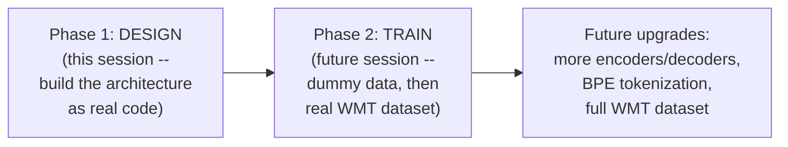

#### 🎯 Key Takeaways

* This session works directly through **Harvard NLP's real "Annotated Transformer" notebook** — a genuine, widely-used, real-world code reference, not a simplified teaching example.
* The instructor's own stated philosophy: this session's design is explicitly a **base/benchmark** — deliberately simple (SpaCy tokenization, a small dataset) — with genuine, planned future upgrades (BPE tokenization, the full WMT dataset, more encoder/decoder layers) explicitly deferred.
* The instructor **directly, honestly frames** this depth as directly interview-relevant: *"In an interview, it's a pretty common thing to ask questions about the Transformers paper... if you don't know the fundamentals directly, if you come to the application, it means that if I ask you to do a single change, you cannot do it."*

---

### 2. Cross-Attention, Revisited: Why the Decoder's Own K/V Get Discarded

#### 📖 Definition — The Cross-Attention Formula, Precisely Re-Derived

> 💡 **Given directly:** *"What will be the main change in cross-attention? Because here I am telling the query, which is the decoder part... and from where your K is coming? The same information that you previously had from the encoder."*

```text
CrossAttention(Q_dec, K_enc, V_enc) = softmax( Q_dec · K_enc^T / √d_k ) · V_enc
```

> 💡 **Given directly, the precise, single change from standard scaled dot-product attention:** *"If you really look into the formula, it's exactly the same, only one thing has changed... only the Q_dec part... which comes from the decoder."*

#### ❓ Why It Exists — Precisely What Happens to the Decoder's OWN K and V

> 💡 **Given directly, the precise, closing answer to a genuinely lingering question:** *"Coming to the K and Vs of the decoder... where they are used? In the MMHA [masked multi-head attention]... always remember, the K and the Vs of the decoder are only used for the main task... to gather the idea with respect to the terms... just like self-attention for the decoders... Later on, in the second part of the decoder... it's not being used. So the K and V of the decoder is being used only at the initial step to capture better context... but later on, they are being discarded, and only we are using the K and V of the encoders."*

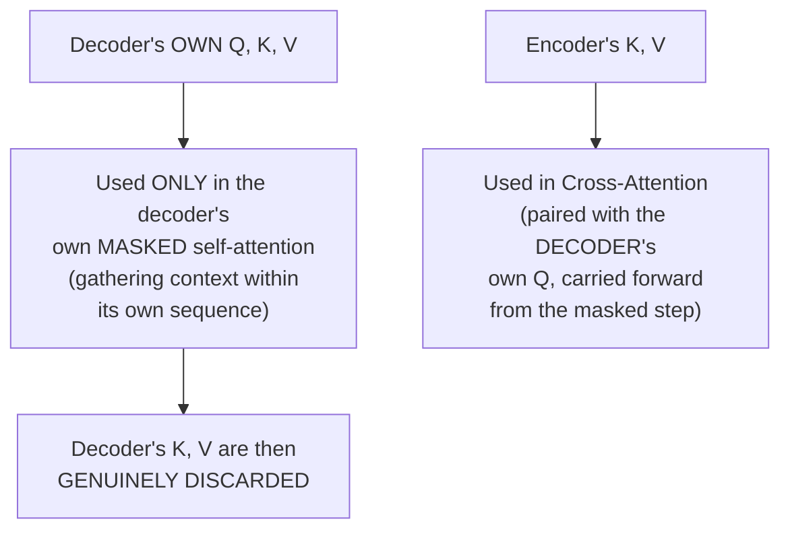

#### ⚠ A Direct, Precise Clarification: No Cross-Attention Without an Encoder

> 💡 **Given directly, precisely answering a genuinely common student confusion:** *"If it's only a decoder, do you think there will be a cross-attention? ...The main purpose of using cross-attention is to connect your encoder with decoder. So if you have only the decoder, so let's take GPT-based architectures -- there you have only the decoder, then why you need cross-attention?"*

#### ⚠ Common Mistakes

* Assuming the decoder's own K and V matrices somehow flow INTO cross-attention alongside the encoder's — explicitly, directly corrected: cross-attention uses ONLY the encoder's K and V, paired with the decoder's Q (itself carried forward from the masked self-attention step) — the decoder's own K/V are genuinely discarded after their one, specific use.
* Assuming decoder-only architectures (like GPT) genuinely need cross-attention — explicitly, directly corrected: cross-attention exists SPECIFICALLY to connect an encoder to a decoder; without a genuine encoder present, there is nothing for cross-attention to connect to.

#### 🎯 Key Takeaways

* Cross-attention's formula is **precisely identical** to standard scaled dot-product attention, with exactly one change: the Query comes from the decoder, while Key and Value come from the encoder.
* The decoder's own K and V matrices are used **only once** — within the decoder's own masked self-attention step — and are then genuinely discarded, never reused within cross-attention.
* Cross-attention is **structurally impossible** without a genuine encoder present — directly explaining why decoder-only architectures like GPT have no cross-attention mechanism at all.

---
### 3. Source Mask & Target Mask: The Practical Reality Theory Skips

#### ❓ Why It Exists — The Practical Problem Pure Theory Never Mentions

> 💡 **Given directly, the precise, motivating scenario:** *"Let's take my sequence length... 4. And if I say that in my sequence, I have 'hello world.' Based on this, if you really try to break it... hello, world, and then what will happen? Because I have kept my max sequence length as 4... a zero padding-based operation... let's put some zeros, or let's add some type of padding tokens."*

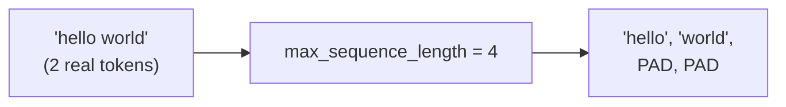

> 💡 **Given directly, a genuinely important, honest acknowledgment of scope:** *"In the theory explanation, we didn't show any padding. Yes, yes. Practically, padding is required. Nobody will talk about padding when you learn theory."*

#### 📖 Definition — Source Mask, Precisely Defined

> 💡 **Given directly:** *"What is the purpose of source mask? Neglect any padding token... if you have a valid token, it will simply say 1, 1... and if there is a padding token, simply the representation will be converted into 0, 0, 0, 0, 0."*

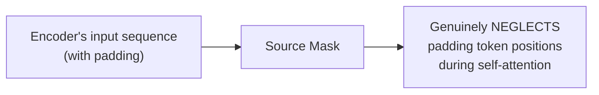

#### 📖 Definition — Target Mask, Precisely Defined as a TWO-Part Task

> 💡 **Given directly, the precise, complete distinction:** *"Target mask is a two-task [operation]. One is your normal casual attention... plus, neglecting the padding tokens which will be coming in the decoder side... The only thing different is the target mask, which is only in the decoder side, and there, the normal casual attention."*

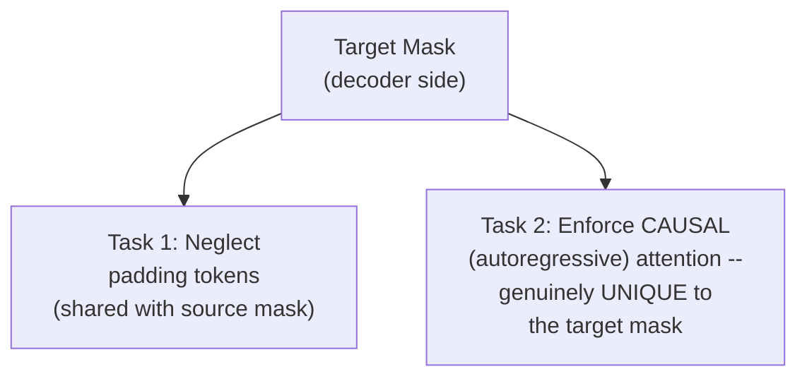

| | Source Mask | Target Mask |
|---|---|---|
| **Applies to** | Encoder's input sequence | Decoder's input sequence |
| **Neglects padding?** | ✅ Yes | ✅ Yes |
| **Enforces causal/autoregressive attention?** | ❌ No | ✅ Yes -- genuinely unique to target mask |

#### ❓ Why It Exists — Precisely Why the Decoder ALSO Needs the Source Mask

> 💡 **Given directly, a genuinely important, precisely-answered student question:** *"Why do we need the source mask to the decoder? Otherwise, the decoder will be looking into the padding tokens of the encoder, which you don't want. That is the main purpose of using the source mask. Otherwise, how the decoder will know that there are padding tokens in your input sequence?"*

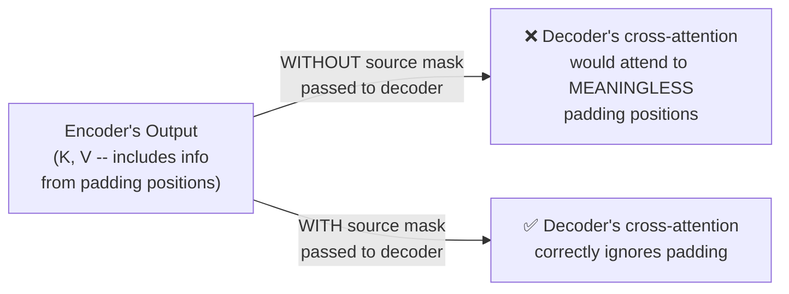

#### ⚠ Common Mistakes

* Assuming the decoder only needs its OWN target mask, since the source mask seems like "the encoder's problem" — explicitly, directly corrected: the source mask must ALSO be passed to and used by the decoder, specifically during cross-attention, so the decoder doesn't attend to meaningless padding positions in the encoder's output.
* Assuming target mask and source mask are redundant, since both neglect padding — explicitly, directly clarified: they share the padding-neglecting function, but the target mask ALSO, uniquely, enforces the causal/autoregressive property — a genuinely additional task the source mask does not perform.

#### 🎯 Key Takeaways

* **Padding tokens** are a genuine, practical necessity — real sequences rarely match a fixed `max_sequence_length` exactly, requiring padding to fill the gap.
* **Source mask**: neglects padding tokens in the encoder's sequence — a single-purpose mask.
* **Target mask**: performs TWO tasks simultaneously — neglecting padding tokens in the decoder's OWN sequence, AND enforcing causal/autoregressive attention.
* The **source mask must ALSO be passed to the decoder** (used during cross-attention) — otherwise the decoder would genuinely attend to meaningless padding positions in the encoder's output.

---

### 4. The Top-Level Architecture: EncoderDecoder & the Generator

#### 💻 Code Example — The Complete `EncoderDecoder` Class Skeleton

> 💡 **Given directly:** *"What are the things that I have passed? So, one is your encoder block... then you have your decoder block. Then you have your source embedding... and target embedding. And then you have the generator module."*

```python
class EncoderDecoder(nn.Module):
    def __init__(self, encoder, decoder, src_embed, tgt_embed, generator):
        super().__init__()
        self.encoder = encoder
        self.decoder = decoder
        self.src_embed = src_embed   # English embedding (+ positional encoding, added later)
        self.tgt_embed = tgt_embed   # German embedding (+ positional encoding, added later)
        self.generator = generator   # final linear + softmax

    def forward(self, src, tgt, src_mask, tgt_mask):
        return self.decode(self.encode(src, src_mask), src_mask, tgt, tgt_mask)

    def encode(self, src, src_mask):
        return self.encoder(self.src_embed(src), src_mask)

    def decode(self, memory, src_mask, tgt, tgt_mask):
        return self.decoder(self.tgt_embed(tgt), memory, src_mask, tgt_mask)
```

#### 📖 Definition — The Generator, Precisely Defined

> 💡 **Given directly:** *"This is the generator block that we are calling it, from where you'll be getting your final output. So, only the linear stack, and after that, softmax and that output. That entire thing we are referring as the generator part."*

```python
class Generator(nn.Module):
    def __init__(self, d_model, vocab):
        super().__init__()
        self.proj = nn.Linear(d_model, vocab)

    def forward(self, x):
        return log_softmax(self.proj(x), dim=-1)
```

#### 🔍 Internal Working — What "Memory" Means, and What "Forward Pass" Actually Returns

> 💡 **Given directly, the precise, important clarification on the term "memory":** *"Here I have added a memory, and what is this memory? This memory is the information, or basically the actual output that we are receiving from the encoder, which is basically your K and V. That's what we are calling it as a memory for now."*

> 💡 **Given directly, precisely explaining why `forward()` returns the DECODER's output specifically:** *"The final output of the entire Transformer will come from the decoder block... self.decode... What it will be decoding? The information which will be coming from the encoder... self.encode, source, and the source mask."*

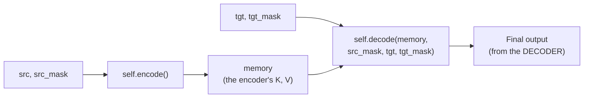

#### ⚠ Common Mistakes

* Assuming the Transformer's overall output comes from the encoder, or from some combination of both — explicitly, directly clarified: the final output ALWAYS comes specifically from the DECODER block, which itself depends on the encoder's output ("memory") as an input.
* Assuming "memory" is some genuinely new, separate concept — explicitly, directly clarified: it's simply a descriptive variable name for the encoder's own output (specifically, its K and V), used by the decoder during cross-attention.

#### 🎯 Key Takeaways

* The **`EncoderDecoder` class** is the complete architectural skeleton: an encoder, a decoder, source/target embeddings, and a generator (final linear + softmax) — with `forward()` explicitly, precisely returning the decoder's output, since that's where the Transformer's final output genuinely comes from.
* **"Memory"** is simply the descriptive variable name given to the encoder's output — specifically the K and V values the decoder needs for cross-attention.
* The **generator** is deliberately, precisely scoped as "only the linear stack, and after that, softmax" — the exact mechanism producing final, real output probabilities from the decoder's contextualized vectors.

---
### 5. Cloning Layers: Deep Copy & the LayerNorm Implementation

#### 💻 Code Example — The `clones()` Helper Function

> 💡 **Given directly:** *"I've simply written a function, or clone function, and here I'm performing a deep copy-based operation, and why? Because we know that we need 6 identical layers... this is completely a hyperparameter."*

```python
import copy

def clones(module, N):
    return nn.ModuleList([copy.deepcopy(module) for _ in range(N)])
```

#### ❓ Why It Exists — Precisely Why Deep Copy, Not Shallow Copy

> 💡 **Given directly, the precise, direct explanation:** *"If I use a shallow copy, then what will happen? ...Generally, in deep copy, the parameters get updated, or basically, they will start from a divergent point. If you take a shallow copy, it will be the exact same parameters, okay, and we don't want that. During our backpropagation, we know that it should be changed."*

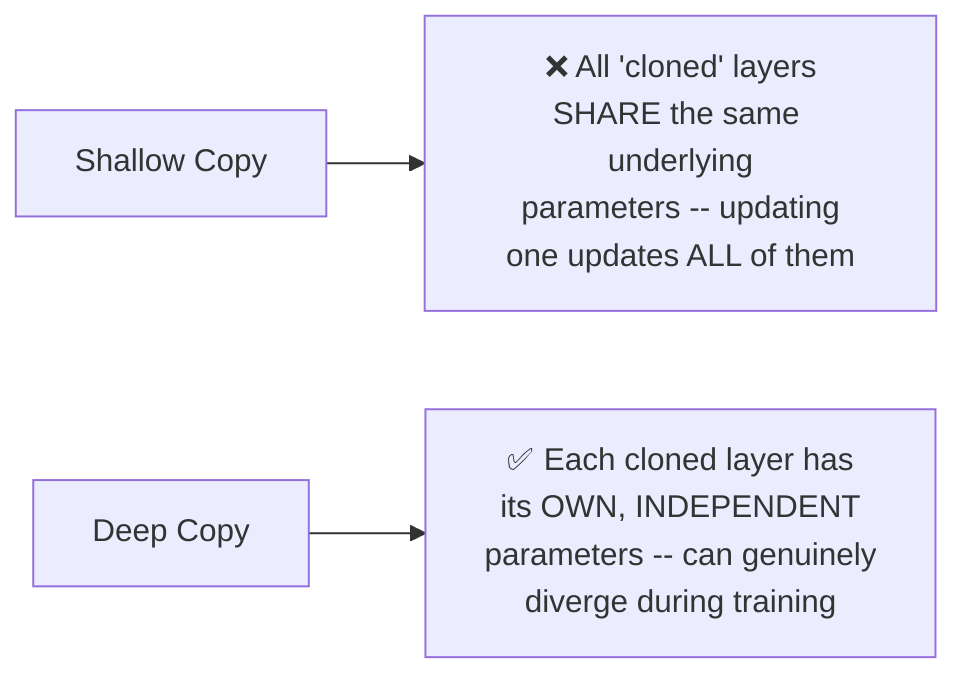

> 💡 **Given directly, the precise, predicted consequence of using shallow copy anyway:** *"You can later on test it out, because for shallow copy, you have to just remove the keyword deep, just copy.copy... The performance will be very bad. It means that the network will work for sure, but because of having the same parameters, it creates a problem."*

#### 📖 Definition — LayerNorm, Built Completely From Scratch

> 💡 **Given directly:** *"First of all, I'm calculating the mean, then the standard deviation, and finally, I'm returning the output of the normalization-based task."*

```python
class LayerNorm(nn.Module):
    def __init__(self, features, eps=1e-6):
        super().__init__()
        self.a_2 = nn.Parameter(torch.ones(features))
        self.b_2 = nn.Parameter(torch.zeros(features))
        self.eps = eps

    def forward(self, x):
        mean = x.mean(-1, keepdim=True)
        std = x.std(-1, keepdim=True)
        return self.a_2 * (x - mean) / (std + self.eps) + self.b_2
```

#### 🔍 Internal Working — a_2/b_2 Are Precisely Gamma/Beta, From the Batch Norm Paper

> 💡 **Given directly:** *"What are these parameters? Quickly tell me, in science, what you call them? ...Gamma and beta... the same representation, it is with respect to the nn parameters... According to the paper, you generally have two things: the scaling and the shifting part."*

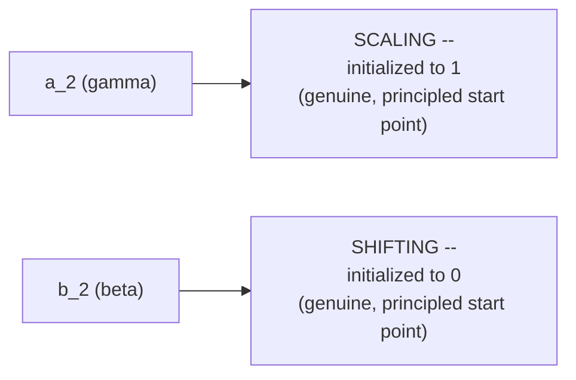

> 💡 **Given directly, the precise, stated reasoning for these specific initial values:** *"Shift should always start from a zero point... the initial scaling that I have done it with respect to the main divergence from where it will start, it should start from 1... The gamma and beta intuition of the paper."*

#### ❓ Why It Exists — Epsilon, Precisely Explained

> 💡 **Given directly:** *"Epsilon is a very, very small value... the idea is to keep it in the denominator, so that the denominator doesn't become zero."*

#### 🔍 Internal Working — Manual Implementation vs. `nn.LayerNorm`

> 💡 **Given directly, a genuinely honest, precise clarification on WHY this manual version is shown at all:** *"Directly you can use it in PyTorch, you can directly say, this is `nn.LayerNorm`... but here, what I have taken, I have taken a manual-based approach, so that you can understand the entire layer, and you can actually relate it to the paper... nobody internally knows what happens [with the built-in version]. And this is actually easy if you know the mathematics."*

#### ⚠ Common Mistakes

* Assuming layer normalization and batch normalization are the same technique, differing only in name — explicitly, directly distinguished: batch norm (2016 paper) is optimized for VISION-based tasks; layer norm is specifically better suited for NLP-based tasks — a genuine, real distinction, not merely a naming convention.
* Assuming `a_2` and `b_2`'s specific initial values (1 and 0, respectively) are arbitrary — explicitly, directly justified: they represent a principled, "neutral" starting point (no scaling change, no shift) from which training can meaningfully diverge.

#### 🎯 Key Takeaways

* **`clones()`** uses `copy.deepcopy` specifically to give each of the N repeated encoder/decoder layers genuinely INDEPENDENT, separately-trainable parameters — a shallow copy would cause all "clones" to share parameters, genuinely degrading training.
* **`LayerNorm`** is built completely from scratch (mean, standard deviation, epsilon) specifically to make its mathematical foundation genuinely transparent, rather than treating PyTorch's built-in `nn.LayerNorm` as an opaque black box.
* `a_2` and `b_2` are precisely the **gamma (scaling) and beta (shifting)** parameters from the original batch normalization paper — initialized to 1 and 0 respectively, a genuinely principled, "neutral" starting point.

---

### 6. Residual Connections: SublayerConnection & Pre-Norm vs. Post-Norm

#### 💻 Code Example — The Complete `SublayerConnection` Class

> 💡 **Given directly:** *"The output of each sublayer is a layer normalization, X plus sublayer of X. Now inside this sublayer, any type of task which can be going... Once we are receiving the information from MHA... and the next time we are receiving the information from a feed-forward."*

```python
class SublayerConnection(nn.Module):
    def __init__(self, size, dropout):
        super().__init__()
        self.norm = LayerNorm(size)
        self.dropout = nn.Dropout(dropout)

    def forward(self, x, sublayer):
        return x + self.dropout(sublayer(self.norm(x)))
```

#### 🔍 Internal Working — Pre-Norm vs. Post-Norm, Precisely Shown to Be Mathematically Equivalent

> 💡 **Given directly, a genuinely important, precise clarification:** *"If I try to do this operation, and this particular operation, what is the difference? The same thing, see guys... X plus sublayer of X, and sublayer of X plus X, it is actually the same thing. Only with respect to the interpretation that we call it... one is Pre-Norm, and the other one, we call it Post-Norm... totally a developer's choice."*

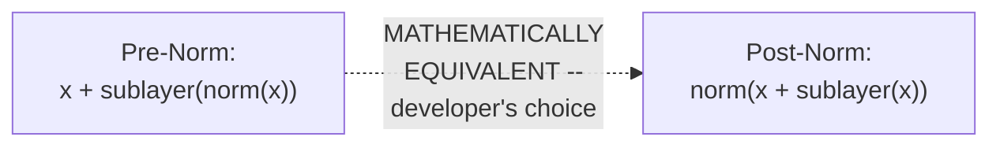

#### ❓ Why It Exists — Residual Connections, Precisely Restated

> 💡 **Given directly:** *"Residual connections -- I think the main purpose is to solve the problem of VDG [vanishing gradient]... What happens when the number of layers increase in a neural network? Vanishing gradient problem is the most common one... if your gradients become smaller, it means that there is no learning. If there is no learning, it means that the weights are not being updated."*

#### 🔍 Internal Working — Dropout's Genuine Purpose

> 💡 **Given directly:** *"What is the main purpose of using dropout in any type of neural network? To provide generalization... the idea is to make the network much more generalizable."*

#### ⚠ Common Mistakes

* Assuming "pre-norm" and "post-norm" represent a genuinely important, high-stakes architectural debate — explicitly, directly downplayed: *"Really, there is not such a big debate... whichever you want, you can do it"* — the underlying MATHEMATICS is identical, differing only in the specific ORDER of operations.
* Assuming dropout is a strictly required, non-negotiable component — explicitly, directly clarified: it's a genuine, configurable hyperparameter (the original paper uses roughly 0.1-0.2), with the code explicitly allowing it to be toggled.

#### 🎯 Key Takeaways

* **`SublayerConnection`** implements the actual residual connection, wrapping ANY sublayer (multi-head attention OR feed-forward) with `x + dropout(sublayer(norm(x)))`.
* **Pre-norm and post-norm are mathematically equivalent** — `x + sublayer(x)` and `sublayer(x) + x` are literally the same operation; the "pre/post" terminology refers only to WHERE normalization is applied relative to the sublayer, a genuine developer preference rather than a substantive architectural choice.
* **Dropout** genuinely improves generalization — a standard, configurable regularization technique, not unique to Transformers.

---
### 7. Assembling EncoderLayer and DecoderLayer

#### 💻 Code Example — The Complete `EncoderLayer`

> 💡 **Given directly:** *"This is made up of the self-attention... and you have the feed-forward... two clones. One is your, the first one will be for your multi-head attention, the MHA block, and the second one will be for your FF."*

```python
class EncoderLayer(nn.Module):
    def __init__(self, size, self_attn, feed_forward, dropout):
        super().__init__()
        self.self_attn = self_attn
        self.feed_forward = feed_forward
        self.sublayer = clones(SublayerConnection(size, dropout), 2)
        self.size = size

    def forward(self, x, mask):
        x = self.sublayer[0](x, lambda x: self.self_attn(x, x, x, mask))
        return self.sublayer[1](x, self.feed_forward)
```

#### 🔍 Internal Working — The Lambda Function, Precisely Explained

> 💡 **Given directly:** *"This is a lambda function definition that I have done it. I have kept all the KQV as X, X, X. And with that, I am passing the source mask... For the definition of self-attention, through this lambda function, I have done it... those are the KQV representations of your actual input -- from your X, that you will be calculating the KQV."*

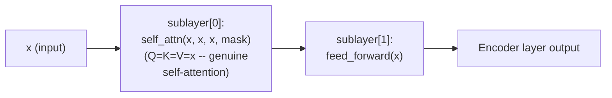

#### 💻 Code Example — The Complete `DecoderLayer`

> 💡 **Given directly:** *"This part is a little bit harder, because you have to understand really one main difference... What is the difference between self-attention and source attention?"*

```python
class DecoderLayer(nn.Module):
    def __init__(self, size, self_attn, src_attn, feed_forward, dropout):
        super().__init__()
        self.size = size
        self.self_attn = self_attn      # the decoder's OWN, masked/causal attention
        self.src_attn = src_attn        # cross-attention (from the encoder)
        self.feed_forward = feed_forward
        self.sublayer = clones(SublayerConnection(size, dropout), 3)

    def forward(self, x, memory, src_mask, tgt_mask):
        m = memory   # the encoder's K, V
        x = self.sublayer[0](x, lambda x: self.self_attn(x, x, x, tgt_mask))
        x = self.sublayer[1](x, lambda x: self.src_attn(x, m, m, src_mask))
        return self.sublayer[2](x, self.feed_forward)
```

#### ❓ Why It Exists — Self-Attention vs. Source Attention, Precisely Distinguished

> 💡 **Given directly, the complete, precise distinction:** *"Why we have two different attentions here in the decoder... your original attention matrix for the encoder will be different, and for the decoder will be different... because the jobs are different, because they are coming from two different deep copy operations... The source attention that we are referring to, it will be the information that is traveling from the encoder to the decoder. And the normal self-attention is just like that -- casual attention -- which takes place in the decoder part."*

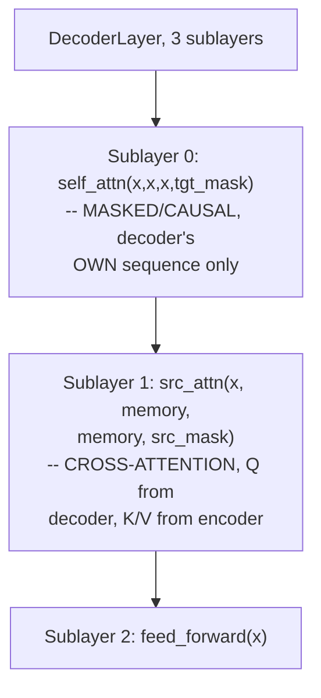

#### 🔍 Internal Working — Precisely Why K and Q Come From `x` in `src_attn`, But V/K Both Come From `memory`

> 💡 **Given directly, a precise, worked clarification on the exact call signature:** *"This M and M that I am taking, because really, they will be used... I will be taking only the X, which is the Q representation into the cross-attention part... Source attention is actually the part with respect to the cross-attention... let's treat them as M for now [rather than K, V directly], because if you really think about M and M, guys, this will be replaced with your K and V."*

#### ⚠ Common Mistakes

* Assuming the encoder and decoder's self-attention mechanisms genuinely SHARE the same underlying matrices/parameters — explicitly, directly corrected: they come from two entirely SEPARATE `deepcopy` operations, meaning they have genuinely independent, separately-trainable weights.
* Confusing "self-attention" (the decoder's own masked, causal attention) with "source attention" (cross-attention, receiving K/V from the encoder) — explicitly, directly, repeatedly distinguished as this session's own single most important decoder-specific clarification.

#### 🎯 Key Takeaways

* **`EncoderLayer`** has 2 sublayers (self-attention, feed-forward); **`DecoderLayer`** has 3 (masked self-attention, source/cross-attention, feed-forward) — directly matching the original paper's architecture.
* The decoder's **"self-attention"** (masked, causal, operating on its own sequence) is precisely, directly distinguished from its **"source attention"** (cross-attention, with Q from the decoder and K/V from the encoder's "memory") — a genuinely important, precise vocabulary distinction this session repeatedly reinforces.
* Both the encoder's and decoder's own internal attention mechanisms come from genuinely SEPARATE `deepcopy` operations — meaning their weights are independent, not shared.

---

### 8. Building the Mask: subsequent_mask() and the attention() Function

#### 💻 Code Example — `subsequent_mask()`, Using `torch.triu`

> 💡 **Given directly:** *"First of all, you take any type of attention shape... this is a — we are creating a mask, as simple as that... I've taken torch.true [triu]. This is the upper triangle... I've directly kept it .boolean, torch.bool. And finally, I'm performing an inverting operation."*

```python
def subsequent_mask(size):
    attn_shape = (1, size, size)
    subsequent_mask = torch.triu(torch.ones(attn_shape), diagonal=1).type(torch.uint8)
    return subsequent_mask == 0
```

> 💡 **Given directly, tracing the exact transformation, step by step:** *"Initially, the input shape... one, [dot matrix, everything is 1]. Then you applied the upper triangular matrix... it has become... [1,0,0,0 style pattern]. After that, we have just added Boolean, 0 for false, 1 for all true. And finally, the inverted operation, where false becomes true and true becomes false."*

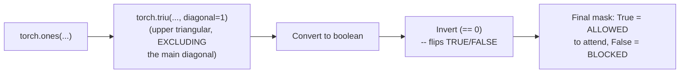

#### 🔍 Internal Working — Upper Triangular (`triu`) vs. Lower Triangular (`tril`): Both Work

> 💡 **Given directly, a genuinely important, precise clarification that multiple valid implementations exist:** *"You can use U or you can use L, totally up to you. Last class, I have taken L, which was the lower part, but I feel that, actually, I can take U also... My main task is achieving it, and I have achieved it. Through Trill also, you can do it."*

#### 💻 Code Example — The `attention()` Function, Precisely Matching the Manual Derivation

> 💡 **Given directly:** *"You have to remember here, if mask is not none... I can say here mask is equal to -- I can change the parameter... it's exactly the same to last time the notebook that we have done, the manual calculations."*

```python
def attention(query, key, value, mask=None, dropout=None):
    d_k = query.size(-1)
    scores = torch.matmul(query, key.transpose(-2, -1)) / math.sqrt(d_k)
    if mask is not None:
        scores = scores.masked_fill(mask == 0, -1e9)
    p_attn = scores.softmax(dim=-1)
    if dropout is not None:
        p_attn = dropout(p_attn)
    return torch.matmul(p_attn, value), p_attn
```

#### 🔍 Internal Working — Precisely Why `transpose(-2, -1)`

> 💡 **Given directly:** *"Why we're using minus 2 and minus 1? ...Only the last two dimensions that we are changing of the key... without manipulating the dimension of the key matrix directly... batch dimension is not required, just because of that minus 2, minus 1."*

> 💡 **Given directly, a precise clarification connecting to fundamental matrix rules:** *"Without the transpose, how we will perform the matmul operation? ...If both the things are of the same shape, do you feel that I can directly multiply it? ...Both the same shapes directly, you cannot do it. That is the main purpose of using transpose."*

#### ⚠ Common Mistakes

* Assuming `torch.triu` and `torch.tril` produce genuinely different, incompatible masking behavior — explicitly, directly clarified: BOTH are valid, equivalent approaches to constructing a causal mask, differing only in implementation style (which triangle you start from, and whether/how you invert).
* Assuming `transpose(-2, -1)` operates on the batch dimension — explicitly, directly corrected: it specifically targets ONLY the last two dimensions (sequence length and embedding dimension), leaving the batch dimension entirely untouched.

#### 🎯 Key Takeaways

* **`subsequent_mask()`** builds a causal mask via `torch.triu` (upper triangular, excluding the diagonal), converts to boolean, and inverts — functionally equivalent to the `torch.tril`-based approach shown in an earlier session.
* The **`attention()` function** precisely matches the manual, from-scratch derivation covered in earlier sessions — scaled dot-product scores, optional masking (using `-1e9` as a practical, large-but-finite stand-in for negative infinity), softmax, optional dropout, and the final weighted sum with V.
* **`transpose(-2, -1)`** is used specifically because two matrices of the SAME shape cannot be directly multiplied via `matmul` — this transpose operation specifically targets the last two dimensions, leaving the batch dimension untouched.

---
### 9. MultiHeadedAttention: Linear Projections, View, Transpose & Broadcasting the Mask

#### 💻 Code Example — The Complete `MultiHeadedAttention` Class Constructor

> 💡 **Given directly:** *"Dimension of the model modulus H, not equal to 0 -- that's why this is an assert-based condition... we will always assume DV is equal to DK, for sure, because the dimension of K and the values, keys and values, will be exactly the same."*

```python
class MultiHeadedAttention(nn.Module):
    def __init__(self, h, d_model, dropout=0.1):
        super().__init__()
        assert d_model % h == 0
        self.d_k = d_model // h
        self.h = h
        self.linears = clones(nn.Linear(d_model, d_model), 4)
        self.attn = None
        self.dropout = nn.Dropout(p=dropout)
```

#### ❓ Why It Exists — Precisely Why FOUR Linear Layers, Not Three

> 💡 **Given directly, the precise, complete answer:** *"One linear layer will be for keys. One linear layer will be for queries. Then the operation of your matmul, then normalization, whatever the output that you are getting -- after that, another [layer] for your values. So 3 linear layers... And the final one is your concatenation... once we have done it [multi-head], we used to do the concatenation, and then used to pass it through a linear layer. That's why we have four."*

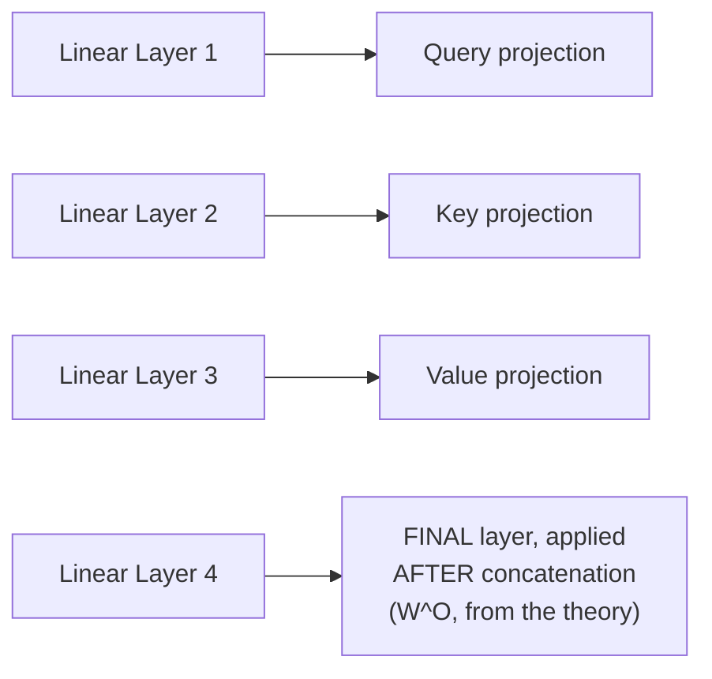

#### 🪜 Step-by-Step — The Forward Pass: Linear → View → Transpose

> 💡 **Given directly, the precise, complete sequence:** *"First of all, the linear projection, then comes the view [operation] through which actually you are performing the reshape... Transpose will do -- the last -- it will basically swap the sequence length and the embedding dimension, the DK that you have."*

```python
def forward(self, query, key, value, mask=None):
    if mask is not None:
        mask = mask.unsqueeze(1)   # same mask applied to ALL heads
    nbatches = query.size(0)

    query, key, value = [
        lin(x).view(nbatches, -1, self.h, self.d_k).transpose(1, 2)
        for lin, x in zip(self.linears, (query, key, value))
    ]

    x, self.attn = attention(query, key, value, mask=mask, dropout=self.dropout)

    x = x.transpose(1, 2).contiguous().view(nbatches, -1, self.h * self.d_k)
    return self.linears[-1](x)
```

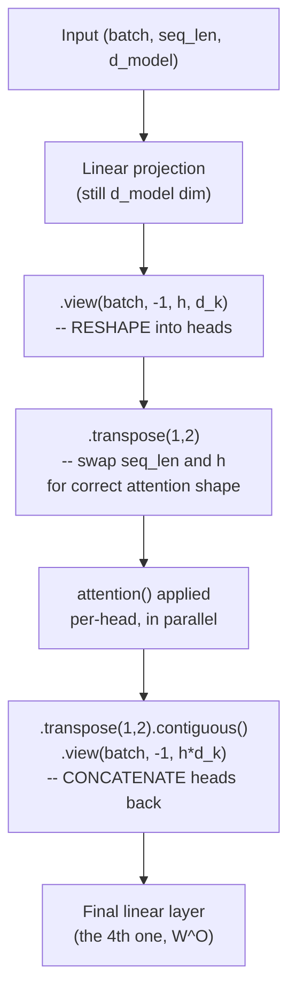

#### 🔍 Internal Working — `.view()`, Precisely Explained as a Reshape

> 💡 **Given directly:** *"Through view, I am performing a -- let's take the easiest language -- the reshape operation... The view is an alternate perspective of the same data allocation... you have the data, but you are looking in a different dimension... the rearranging of the head, that also you can say."*

#### 🔍 Internal Working — Why `mask.unsqueeze(1)` Is Genuinely Necessary

> 💡 **Given directly, the precise, complete explanation:** *"When you do unsqueeze one, what it will try to do -- don't think that remove, rather than think from add... you will be adding one more dimension for the representation of what? For all those heads that you have... If it is a mask which is only being done right now purely on the decoder variant, but for those heads, do you need a mask? Yes... Whenever I am performing a mask, I am only talking about the actual casual attention-based [mask], and if there are multiple heads, for each corresponding head, you also need to create the mask."*

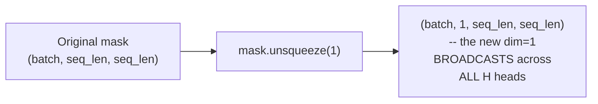

> 💡 **Given directly, the precise, named technical term:** *"One technical term was there that I forgot -- broadcasting, yeah... it will add one new dimension so the same mask can be applied... rather, the term broadcasting makes much more sense with respect to NumPy. Even in NumPy, you have broadcast, the same operation which is being done here."*

#### ⚠ Common Mistakes

* Assuming multi-head attention requires only 3 linear layers (one each for Q, K, V) — explicitly, directly corrected: a genuine implementation requires a FOURTH linear layer, applied AFTER concatenation, precisely matching the theoretical `W^O` matrix from the multi-head attention formula.
* Assuming `.view()` genuinely "removes" the original 512-dimensional structure when reshaping into heads — explicitly, directly corrected: think of it as ADDING a new dimension (for the heads), not removing information — the same underlying data is simply viewed/organized differently.
* Assuming the SAME mask, unmodified, can be directly applied across all attention heads without any reshaping — explicitly, directly corrected: `mask.unsqueeze(1)` is genuinely necessary specifically to add a dimension enabling BROADCASTING of the same mask across every head.

#### 🎯 Key Takeaways

* **`MultiHeadedAttention`** uses exactly FOUR linear layers — three for Q/K/V projections, and a fourth (the theoretical `W^O`) applied AFTER concatenating all heads' outputs back together.
* The forward pass follows a precise sequence: **linear projection → `.view()` (reshape into heads) → `.transpose()` (rearrange for correct attention shape) → `attention()` (applied per-head, in parallel) → `.transpose()` + `.view()` (concatenate heads back) → final linear layer**.
* **`mask.unsqueeze(1)`** is genuinely necessary to correctly BROADCAST the same mask across all attention heads — a real, practical NumPy/PyTorch concept directly required by the multi-head structure, not an optional or cosmetic step.

---
## 📝 Glossary

| Term | Definition | Why It Matters |
|---|---|---|
| **Memory** | The encoder's output (specifically its K, V), passed to the decoder | The variable name used throughout the decoder's code |
| **Source Mask** | Neglects padding tokens in the encoder's sequence | Also passed to the decoder for cross-attention |
| **Target Mask** | Neglects padding tokens AND enforces causal attention in the decoder | A genuine, two-task operation |
| **Generator** | The final linear + softmax layer producing output probabilities | The literal "output" component of the architecture |
| **clones()** | A helper using `copy.deepcopy` to create N independent layer copies | Shallow copy would break training (shared parameters) |
| **a_2 / b_2** | LayerNorm's learnable scale/shift parameters (gamma/beta) | Initialized to 1 and 0, respectively |
| **SublayerConnection** | The residual-connection-plus-dropout wrapper | `x + dropout(sublayer(norm(x)))` |
| **Pre-Norm / Post-Norm** | Two mathematically equivalent orderings of norm vs. sublayer | A developer preference, not a substantive difference |
| **Self-Attention (decoder)** | The decoder's own masked, causal attention on its own sequence | Distinct from "source attention" |
| **Source Attention** | The decoder's cross-attention (Q from decoder, K/V from encoder) | The "source" being the encoder's output |
| **subsequent_mask()** | Builds a causal mask via `torch.triu` | Equivalent to a `torch.tril`-based approach |
| **.view()** | PyTorch's reshape operation | Used to split d_model into (h, d_k) |
| **mask.unsqueeze(1)** | Adds a dimension so a mask broadcasts across all heads | Genuinely necessary, not optional |

---

## 🔄 Revision Notes — One-Minute Revision

* This is the **first genuinely practical, code-first session** -- working directly through Harvard NLP's real "Annotated Transformer" notebook.
* **Cross-attention recap**: the decoder's OWN K/V are used ONLY within its own masked self-attention, then genuinely DISCARDED -- cross-attention uses ONLY the encoder's K/V, paired with the decoder's Q.
* **Source mask** neglects padding in the encoder's sequence; **target mask** does this AND enforces causal/autoregressive attention -- a genuine two-task operation. The source mask must ALSO be passed to the decoder (for cross-attention), or the decoder would attend to meaningless encoder padding.
* **`EncoderDecoder`** class: encoder, decoder, src_embed, tgt_embed, generator -- `forward()` returns the DECODER's output, since that's the Transformer's genuine final output; "memory" is simply the encoder's K/V.
* **`clones()`** uses `copy.deepcopy`, NOT shallow copy -- shallow copy would make all "cloned" layers share parameters, genuinely degrading training performance.
* **`LayerNorm`** built from scratch: mean, std, epsilon, with `a_2`/`b_2` = gamma/beta (scale/shift), initialized to 1/0 respectively -- a principled, "neutral" starting point.
* **`SublayerConnection`** implements `x + dropout(sublayer(norm(x)))` -- pre-norm and post-norm are mathematically EQUIVALENT, a developer preference, not a substantive architectural debate.
* **`EncoderLayer`** = 2 sublayers (self-attn, feed-forward); **`DecoderLayer`** = 3 sublayers (masked self-attn, source/cross-attn, feed-forward) -- self-attention (decoder's own sequence) is precisely distinguished from source attention (cross-attention with the encoder).
* **`subsequent_mask()`** uses `torch.triu` (upper triangular) -- functionally equivalent to a `torch.tril`-based approach from an earlier session; **`attention()`** precisely matches the earlier, manual derivation, using `-1e9` as a practical stand-in for negative infinity.
* **`MultiHeadedAttention`** uses FOUR linear layers (Q, K, V, plus a final one after concatenation) -- forward pass: linear -> `.view()` (reshape into heads) -> `.transpose()` -> `attention()` per head -> `.transpose()`+`.view()` (concatenate) -> final linear. **`mask.unsqueeze(1)`** is genuinely necessary to BROADCAST the same mask across all heads.

---

## 📋 Cheat Sheet

**Cross-attention's decoder K/V fate:**
```text
Decoder's own K, V -> used ONLY in decoder's masked self-attention -> DISCARDED
Cross-attention uses: encoder's K, V + decoder's Q (carried forward)
```

**Source mask vs. target mask:**
```text
Source Mask: neglect padding (encoder side) -- single task
Target Mask: neglect padding (decoder side) + enforce causal attention -- TWO tasks
```

**EncoderDecoder class:**
```python
class EncoderDecoder(nn.Module):
    # encoder, decoder, src_embed, tgt_embed, generator
    def forward(self, src, tgt, src_mask, tgt_mask):
        return self.decode(self.encode(src, src_mask), src_mask, tgt, tgt_mask)
```

**clones() -- deep copy, not shallow:**
```python
def clones(module, N):
    return nn.ModuleList([copy.deepcopy(module) for _ in range(N)])
```

**LayerNorm:**
```python
# a_2 (gamma, init=1) -- scaling
# b_2 (beta, init=0) -- shifting
# mean, std computed over last dimension; epsilon avoids div-by-zero
```

**SublayerConnection (pre-norm):**
```python
return x + self.dropout(sublayer(self.norm(x)))
```

**EncoderLayer vs. DecoderLayer:**
```text
EncoderLayer: 2 sublayers -- self_attn(x,x,x,mask), feed_forward
DecoderLayer: 3 sublayers -- self_attn(x,x,x,tgt_mask) [masked],
                              src_attn(x,memory,memory,src_mask) [cross-attn],
                              feed_forward
```

**MultiHeadedAttention -- 4 linear layers:**
```text
Linear 1,2,3 -> Q, K, V projections
Linear 4     -> applied AFTER concatenation (theoretical W^O)
```

**mask.unsqueeze(1):**
```text
(batch, seq, seq) -> (batch, 1, seq, seq) -- broadcasts across all H heads
```

---

## 🔥 Interview Questions & Answers

### 🟢 Beginner

**Q1.**

**Question:** What happens to the decoder's own Key and Value matrices after its masked self-attention step?

**Answer:** They are used only within that step, then genuinely discarded -- cross-attention uses only the encoder's K and V.

**Explanation:** Directly, precisely explained.

**Why Interviewers Ask This:** Tests genuine, precise understanding of decoder internals.

**Possible Follow-up:** "What does cross-attention use in place of the decoder's own K and V?"

**Q2.**

**Question:** What are the two tasks a target mask performs?

**Answer:** Neglecting padding tokens, and enforcing causal/autoregressive attention.

**Explanation:** Directly, precisely stated.

**Why Interviewers Ask This:** A commonly-asked, practical masking question.

**Possible Follow-up:** "Does the source mask perform both of these tasks too?"

**Q3.**

**Question:** Why is the source mask also passed to the decoder?

**Answer:** So the decoder's cross-attention doesn't attend to meaningless padding positions in the encoder's output.

**Explanation:** Directly, precisely explained.

**Why Interviewers Ask This:** Tests understanding of a genuinely practical, easy-to-overlook detail.

**Possible Follow-up:** "What would happen if the source mask were NOT passed to the decoder?"

**Q4.**

**Question:** Which component of the EncoderDecoder architecture produces the final output?

**Answer:** The decoder (via the generator's linear + softmax layers).

**Explanation:** Directly, explicitly stated.

**Why Interviewers Ask This:** Basic, foundational architecture knowledge.

**Possible Follow-up:** "What is 'memory' in this architecture?"

**Q5.**

**Question:** Why does `clones()` use `copy.deepcopy` instead of a shallow copy?

**Answer:** A shallow copy would make all cloned layers share the same parameters; deep copy gives each layer genuinely independent, separately-trainable parameters.

**Explanation:** Directly, precisely explained.

**Why Interviewers Ask This:** Tests genuine understanding of a commonly-overlooked implementation detail.

**Possible Follow-up:** "What would you observe if you accidentally used a shallow copy?"

**Q6.**

**Question:** What do `a_2` and `b_2` represent in the LayerNorm implementation?

**Answer:** Gamma (scaling) and beta (shifting) -- learnable parameters, initialized to 1 and 0 respectively.

**Explanation:** Directly, precisely explained.

**Why Interviewers Ask This:** Tests understanding of layer normalization's actual, underlying mathematics.

**Possible Follow-up:** "Why is epsilon added in the denominator?"

**Q7.**

**Question:** Are pre-norm and post-norm genuinely different architectures?

**Answer:** No -- they are mathematically equivalent (`x + sublayer(x)` vs. `sublayer(x) + x`), differing only in developer convention.

**Explanation:** Directly, precisely clarified.

**Why Interviewers Ask This:** Tests whether a learner overstates a superficial naming distinction as substantive.

**Possible Follow-up:** "Write the exact expression for each."

**Q8.**

**Question:** How many sublayers does an EncoderLayer have? A DecoderLayer?

**Answer:** EncoderLayer has 2 (self-attention, feed-forward); DecoderLayer has 3 (masked self-attention, source/cross-attention, feed-forward).

**Explanation:** Directly, precisely stated.

**Why Interviewers Ask This:** Basic, foundational architecture-counting knowledge.

**Possible Follow-up:** "What's the difference between 'self-attention' and 'source attention' in the decoder?"

**Q9.**

**Question:** How many linear layers does MultiHeadedAttention use, and why?

**Answer:** Four -- one each for Q, K, V projections, and a fourth applied after concatenation (matching the theoretical W^O matrix).

**Explanation:** Directly, precisely explained.

**Why Interviewers Ask This:** Tests specific, practical implementation knowledge beyond just the theoretical formula.

**Possible Follow-up:** "What operation is applied between the third and fourth linear layer?"

**Q10.**

**Question:** Why is `mask.unsqueeze(1)` necessary in multi-head attention?

**Answer:** To add a dimension enabling the same mask to be broadcast correctly across all attention heads.

**Explanation:** Directly, precisely explained.

**Why Interviewers Ask This:** Tests understanding of a genuine, practical broadcasting requirement.

**Possible Follow-up:** "What PyTorch/NumPy concept does this directly rely on?"

---

### 🟡 Intermediate

**Q11.**

**Question:** Explain why the instructor spends genuine time distinguishing "self-attention" from "source attention" in the decoder, rather than treating both as simply "attention."

**Answer:** These two mechanisms, despite both being genuine attention computations, have GENUINELY DIFFERENT sources for their Q, K, V inputs and serve GENUINELY DIFFERENT purposes -- self-attention (Q=K=V=the decoder's own sequence, masked/causal) captures relationships WITHIN the decoder's own, currently-generated sequence; source attention (Q from decoder, K/V from the encoder's memory) fuses information FROM the encoder INTO the decoder's ongoing generation. Treating both simply as "attention" would obscure this genuinely important structural and functional distinction -- a student who conflates them might, for example, incorrectly apply masking to source attention (which explicitly should NOT be masked, per an earlier session), or incorrectly assume both attend to the same sequence.

**Explanation:** Requires recognizing why precise terminology matters for avoiding a genuine, consequential implementation error.

**Why Interviewers Ask This:** Tests whether a learner understands WHY this distinction is emphasized, not just that two terms exist.

**Possible Follow-up:** "What would happen if you incorrectly applied a causal mask to source/cross-attention?"

**Q12.**

**Question:** A learner argues that since pre-norm and post-norm are mathematically equivalent, the choice between them is purely cosmetic and has zero practical consequence for training. Evaluate this claim.

**Answer:** This claim overstates the session's own precise point. The session explicitly, directly establishes that `x + sublayer(x)` and `sublayer(x) + x` are the SAME mathematical operation -- but this equivalence is about the FINAL VALUE computed, not necessarily about every practical aspect of TRAINING DYNAMICS. In broader, real-world practice (beyond this session's own specific scope), pre-norm and post-norm variants ARE known to have genuinely different training stability characteristics at very large scale/depth -- a nuance this specific session doesn't explicitly cover, but which a fuller, more complete understanding should acknowledge. Within the scope of what THIS session actually claims, however, the mathematical equivalence claim is accurate and should not be dismissed -- the overstatement is specifically in generalizing "mathematically equivalent" into "zero practical consequence in every context," a broader claim the session itself doesn't make.

**Explanation:** Tests whether a learner recognizes the precise scope of a stated equivalence claim, without either dismissing it or over-generalizing it beyond what was actually established.

**Why Interviewers Ask This:** Distinguishes candidates who track a claim's precise, bounded scope from those who either dismiss or over-extend a stated equivalence.

**Possible Follow-up:** "In what specific scenario (beyond this session's own scope) might pre-norm vs. post-norm choice genuinely matter for training stability?"

**Q13.**

**Question:** Explain, precisely, why `subsequent_mask()` uses `torch.triu` with `diagonal=1` specifically, rather than `diagonal=0`.

**Answer:** This is a genuinely important, precise detail: `torch.triu(..., diagonal=1)` EXCLUDES the main diagonal itself, meaning the resulting mask (before inversion) marks EVERYTHING ABOVE (but not including) the diagonal as the "upper triangular" region -- exactly the FUTURE positions that should be blocked. If `diagonal=0` were used instead, the main diagonal itself (a token's attention to ITSELF) would be INCLUDED in the "blocked" region -- which would incorrectly prevent every token from attending to itself, violating the fundamental requirement (established in earlier sessions) that a token must always be able to attend to its OWN position. The precise choice of `diagonal=1` is therefore not arbitrary -- it's specifically calibrated to block ONLY genuinely future positions, while correctly preserving each token's ability to attend to itself and all past positions.

**Explanation:** Requires reasoning through a genuinely precise implementation detail the session's own high-level explanation doesn't explicitly walk through at this level of granularity.

**Why Interviewers Ask This:** Tests whether a learner can reason precisely about off-by-one-style details in masking implementations, a genuinely common source of real bugs.

**Possible Follow-up:** "What would go wrong, concretely, if `diagonal=0` were used instead?"

**Q14.**

**Question:** Using this session's own precise description of `.view()` as "an alternate perspective of the same data allocation," explain why `.contiguous()` is genuinely necessary before calling `.view()` after a `.transpose()` operation, even though the session's own code includes this call without extensive explanation.

**Answer:** `.transpose()` in PyTorch does NOT physically rearrange the underlying data in memory -- it only changes the TENSOR'S METADATA (its strides), creating a VIEW that logically represents a different arrangement, while the actual, underlying memory layout remains unchanged (non-contiguous). `.view()`, by contrast, genuinely REQUIRES the underlying tensor to be contiguous in memory, since it reinterprets the SAME, unmodified memory block according to a new shape -- a non-contiguous tensor's memory layout doesn't match what `.view()` needs to correctly reinterpret it. `.contiguous()` therefore performs a genuine, physical COPY of the data into a new, properly-ordered memory block, specifically making the subsequent `.view()` call valid. Without this step, calling `.view()` directly after `.transpose()` would either raise a genuine runtime error or, in more permissive cases, silently produce genuinely incorrect results.

**Explanation:** Requires extending the session's own conceptual "view = different perspective" explanation into a precise, technical understanding of memory contiguity that the session's own code uses but doesn't deeply unpack.

**Why Interviewers Ask This:** Tests genuine, practical PyTorch fluency beyond conceptual understanding alone -- a real, commonly-encountered implementation detail.

**Possible Follow-up:** "What specific PyTorch error would you likely see if you omitted `.contiguous()` here?"

**Q15.**

**Question:** Synthesize this session's precise distinction between source mask and target mask (Section 3) with the MultiHeadedAttention forward pass's `mask.unsqueeze(1)` step (Section 9) to explain exactly HOW a source mask (used during cross-attention) gets correctly broadcast across heads, given that its ORIGINAL shape differs from a target/self-attention mask's shape.

**Answer:** Regardless of whether a mask is a SOURCE mask (used during cross-attention, shape roughly `(batch, 1, src_seq_len)` before broadcasting) or a TARGET mask (used during the decoder's own self-attention, shape roughly `(batch, tgt_seq_len, tgt_seq_len)` before broadcasting, since it must ALSO encode causal relationships), the SAME `mask.unsqueeze(1)` operation applies EQUALLY to both -- adding a new dimension specifically for the HEAD dimension, transforming EITHER mask into a shape compatible with broadcasting across all H heads' individual attention computations. The critical, precise point is that `mask.unsqueeze(1)`'s role is genuinely AGNOSTIC to WHICH type of mask (source or target) is being processed -- it universally adds the SAME structural adaptation (a head dimension) required for EITHER mask type to correctly interact with the multi-head attention computation's own per-head structure. This directly explains why `MultiHeadedAttention`'s forward pass code doesn't need separate, mask-type-specific broadcasting logic -- the SAME `unsqueeze(1)` call correctly handles cross-attention's source mask AND the decoder's own self-attention target mask, precisely because both are simply 2D (before broadcasting) matrices needing the identical structural adaptation.

**Explanation:** Requires synthesizing two separately-taught concepts (mask type distinctions, and the specific broadcasting mechanism) to explain why a SINGLE, shared code path correctly handles both mask types without special-casing.

**Why Interviewers Ask This:** A senior-level question testing whether a candidate can reason about code REUSE and GENERALITY across superficially different use cases (source vs. target masking) that share an underlying structural requirement.

**Possible Follow-up:** "Would the SAME `MultiHeadedAttention` class instance genuinely be reused for both the decoder's self-attention AND its source/cross-attention? Why or why not?"

---

### 🔴 Advanced

**Q16.**

**Question:** Design a complete, from-scratch trace of the exact tensor shapes at every stage of the `MultiHeadedAttention.forward()` method (Section 9), for a genuinely new configuration (batch_size=2, seq_len=5, d_model=256, h=4), explicitly verifying the shape at each of the six major steps.

**Answer:** A reasonable, complete trace: (1) Input `query`, `key`, `value`: each `(2, 5, 256)`. (2) After the FIRST three linear layers (each `nn.Linear(256, 256)`): still `(2, 5, 256)` each (linear layers preserve dimension, per Section 7's own established property). (3) After `.view(2, -1, 4, 64)` (since `d_k = 256/4 = 64`): shape becomes `(2, 5, 4, 64)`. (4) After `.transpose(1, 2)`: shape becomes `(2, 4, 5, 64)` -- swapping the sequence and head dimensions, so each head's own `(5, 64)` slice is properly grouped together for the subsequent attention computation. (5) Inside `attention()`: `scores = Q @ K.transpose(-2,-1) / sqrt(64)` produces shape `(2, 4, 5, 5)` (per-head, per-batch attention score matrices); after softmax, same shape; the final `p_attn @ V` produces `(2, 4, 5, 64)`. (6) After `.transpose(1,2).contiguous().view(2, -1, 4*64)`: shape becomes `(2, 5, 256)` -- the heads are concatenated back into the original 256-dimensional space. (7) After the FINAL (fourth) linear layer: still `(2, 5, 256)`, the correctly-shaped final output.

**Explanation:** Requires applying every step of the session's own precisely-described forward pass to a genuinely new, numerically concrete configuration, verifying shape consistency throughout.

**Why Interviewers Ask This:** A realistic, senior-level PyTorch implementation question testing whether a candidate can trace tensor shapes precisely through a genuinely complex, multi-step transformation.

**Possible Follow-up:** "At which specific step would a shape mismatch error most likely first appear, if `d_model` were not evenly divisible by `h`?"

**Q17.**

**Question:** Critically evaluate: "Since this session shows that pre-norm and post-norm SublayerConnection variants are mathematically equivalent, and that torch.triu and torch.tril both correctly implement causal masking, this session's overall lesson is that IMPLEMENTATION DETAILS in Transformer code genuinely don't matter, as long as the final output is mathematically correct." Is this an accurate characterization?

**Answer:** Not accurate -- this significantly overstates two, SPECIFIC instances of genuine implementation flexibility into a sweeping, general claim the session's own content does NOT support. The session explicitly, directly demonstrates MULTIPLE cases where implementation details genuinely, consequentially MATTER: the deep-vs-shallow copy distinction in `clones()` (Section 5) has a REAL, significant impact on training performance, not merely a cosmetic difference; the precise `diagonal=1` parameter in `torch.triu` (per Intermediate Q13's own reasoning) is NOT arbitrary -- an incorrect value would genuinely break the causal masking's correctness; and `mask.unsqueeze(1)`'s SPECIFIC dimension placement (Section 9) is precisely, deliberately chosen for correct broadcasting, not an arbitrary stylistic choice. The genuinely accurate, more precise lesson: SOME implementation choices (pre-norm vs. post-norm ordering, `triu` vs. `tril` for masking) genuinely ARE equivalent, flexible, developer-preference decisions -- but this does NOT generalize to EVERY implementation detail in Transformer code; many other choices (deep copy, specific diagonal offsets, dimension placement for broadcasting) are genuinely, consequentially important, and getting them wrong produces real, meaningful bugs or degraded performance.

**Explanation:** Tests whether a learner can distinguish SPECIFIC, narrow instances of genuine implementation flexibility from an inaccurate, over-generalized claim that ALL implementation details are similarly flexible.

**Why Interviewers Ask This:** Distinguishes candidates who track the PRECISE SCOPE of a stated equivalence from those who inaccurately generalize isolated examples into a sweeping, incorrect claim.

**Possible Follow-up:** "List three specific implementation details from this session where getting them wrong would genuinely, consequentially break the architecture, versus two where the specific choice is genuinely flexible."

**Q18.**

**Question:** Synthesize this session's complete `EncoderLayer`/`DecoderLayer` sublayer counts (2 and 3, respectively) with the `clones()` function's own deep-copy requirement to precisely explain how MANY genuinely INDEPENDENT `LayerNorm` instances exist within a complete, 6-encoder-block, 6-decoder-block Transformer (matching the original paper's N=6), and why this count matters for the model's total parameter count.

**Answer:** A precise count: EACH `EncoderLayer` uses 2 `SublayerConnection` instances (via `clones(SublayerConnection(size, dropout), 2)`), and EACH `SublayerConnection` instance contains its OWN `LayerNorm` (with its own `a_2`/`b_2` parameters) — meaning EACH encoder layer genuinely has 2 independent `LayerNorm` instances. With N=6 encoder layers (each independently created via the OUTER `clones()` call building the full encoder stack), this yields `6 × 2 = 12` independent `LayerNorm` instances within the encoder alone. Similarly, EACH `DecoderLayer` uses 3 `SublayerConnection` instances (masked self-attention, source/cross-attention, feed-forward), yielding `6 × 3 = 18` independent `LayerNorm` instances within the decoder. Plus, per the `EncoderDecoder`/`Encoder`/`Decoder` classes' own structure, there is typically one FINAL `LayerNorm` applied after the entire encoder stack, and one after the entire decoder stack, adding 2 more — for a genuine TOTAL of `12 + 18 + 2 = 32` independent `LayerNorm` instances across the complete architecture. This count matters for parameter counting precisely because, per Section 5's own deep-copy reasoning, EACH of these 32 instances has its OWN, separately-trainable `a_2`/`b_2` parameters (each of dimension `d_model`) — meaning layer normalization alone contributes `32 × 2 × d_model` genuinely independent, trainable parameters to the model's total parameter count, a real, non-trivial contribution easily overlooked if one assumes normalization is "free" or parameter-less.

**Explanation:** Requires synthesizing the exact sublayer counts from two separate classes with the deep-copy independence property to produce a genuinely new, precise numerical count and its parameter-count implication, neither explicitly stated together in the session itself.

**Why Interviewers Ask This:** A capstone-level question testing whether a candidate can perform precise, compositional reasoning across multiple, separately-described architectural components to derive a genuinely new, correct quantitative result.

**Possible Follow-up:** "How would this total LayerNorm instance count change if the encoder and decoder used a DIFFERENT number of blocks (e.g., 12 encoder blocks, 6 decoder blocks)?"

---

## 🧪 Scenario-Based Interview Questions

> **Scenario 1:** A colleague's from-scratch Transformer implementation trains successfully, but they report that ALL of their encoder layers seem to produce IDENTICAL outputs, regardless of layer depth. Using this session's concepts, diagnose the most likely cause.

**Structured Answer:**
1. **Initial investigation:** Recognize this as a direct, textbook symptom of Section 5's own precisely-explained shallow-vs-deep-copy issue -- identical outputs across "different" layers strongly suggests those layers are genuinely SHARING parameters rather than having independent ones.
2. **Metrics/logs to check:** Review the colleague's actual `clones()` implementation, specifically checking whether `copy.deepcopy` (correct) or `copy.copy`/no copy at all (incorrect) was used.
3. **Possible causes:** Per Section 5's own precise reasoning, a shallow copy (or an outright missing copy operation) would cause all "cloned" encoder layers to share the exact same underlying weight tensors -- meaning any update during training applies identically to every layer, producing genuinely identical behavior across all of them.
4. **Debugging approach:** Directly inspect whether the parameter objects (e.g., `model.encoder.layers[0].self_attn.linears[0].weight` vs. `model.encoder.layers[1].self_attn.linears[0].weight`) are genuinely DIFFERENT Python objects in memory, or the SAME object referenced multiple times.
5. **Resolution:** Correct the `clones()` implementation to use `copy.deepcopy`, exactly per Section 5's own demonstrated, correct pattern, then retrain.
6. **Prevention:** Establish a standing team practice of writing an explicit, automated test verifying that cloned layers' parameters are genuinely independent objects (e.g., checking `id()` or memory addresses differ) immediately after model construction, before any training begins.

> **Scenario 2 (Advanced):** Your team is debugging a Transformer whose cross-attention step appears to be producing meaningless, near-uniform attention weights regardless of input, while the decoder's own self-attention works correctly. Using this session's concepts, diagnose the most likely cause.

**Structured Answer:**
1. **Initial investigation:** Recognize this as potentially connected to Section 3's own precise reasoning about source masks -- specifically, whether the encoder's padding tokens are being correctly neglected during cross-attention.
2. **Metrics/logs to check:** Review whether the `src_mask` parameter is genuinely being correctly constructed and passed into the `src_attn` call within `DecoderLayer.forward()` (per Section 7's exact code structure), or whether it's accidentally omitted, set to `None`, or incorrectly using the TARGET mask instead.
3. **Possible causes:** Per Section 3's own precise reasoning, if the source mask is missing or incorrect, the decoder's cross-attention would be attending EQUALLY to genuine content AND meaningless padding positions in the encoder's output -- producing genuinely diluted, less meaningful (closer to uniform) attention weights, since padding positions contribute no real signal but still receive attention "budget."
4. **Debugging approach:** Directly print or visualize the cross-attention weights for a genuinely padded input sequence, checking whether padding positions in the encoder's output are receiving meaningfully non-zero attention (a clear sign the source mask isn't correctly applied).
5. **Resolution:** Verify and correct the `src_mask` construction and its correct passing into `self.src_attn(x, m, m, src_mask)` (per Section 7's exact code), ensuring padding positions are genuinely excluded.
6. **Prevention:** Establish a standing test specifically verifying that cross-attention weights for known padding positions are genuinely near-zero, directly modeling the diagnostic approach used here.

---

## 🛠 Hands-on Exercises

### 🟢 Easy

1. Write out, from memory, the complete list of components inside the `EncoderDecoder` class's constructor.
2. Explain, in your own words, the precise difference between "self-attention" and "source attention" in a decoder layer.
3. Implement `LayerNorm` from scratch, using this session's exact formula, and verify its output against PyTorch's built-in `nn.LayerNorm` for a small, test input.

### 🟡 Medium

4. Complete the full, numerical tensor-shape trace proposed in Advanced Interview Q16, using a configuration of your own choosing (not batch=2, seq=5, d_model=256, h=4).
5. Implement both a `torch.triu`-based and a `torch.tril`-based version of `subsequent_mask()`, and verify (via `torch.equal` or similar) that they produce genuinely identical results.
6. Deliberately implement `clones()` using a shallow copy (`copy.copy` instead of `copy.deepcopy`), train a tiny model briefly, and document the genuinely observed degradation in behavior.

### 🔴 Advanced

7. Implement the complete LayerNorm-instance-counting exercise proposed in Advanced Interview Q18, for a genuinely different (N_encoder, N_decoder) configuration of your own choosing, and verify your count via direct inspection of a constructed model's actual submodules.
8. Design and implement the automated parameter-independence test proposed in Scenario 1's resolution, applying it to your own from-scratch `clones()`-based implementation.
9. Implement the complete `MultiHeadedAttention` class from scratch, with genuine, working code, and verify its output shape matches the input shape for at least three different (d_model, h) configurations.

---

## 🏗 Practice Assignment

### Build: "Complete Encoder-Decoder Architecture, From the Annotated Transformer"

**Objective:** Directly reproduce this session's own live-coded architecture, from scratch, as a complete, working implementation.

**Requirements:**
- A working `EncoderDecoder` class, `Generator`, `clones()` function, `LayerNorm`, and `SublayerConnection`, matching this session's exact structure.
- A working `EncoderLayer` and `DecoderLayer`, correctly distinguishing self-attention from source/cross-attention in the decoder.
- A working `subsequent_mask()` function and `attention()` function, verified against a small, hand-traceable example.
- A complete `MultiHeadedAttention` class, with correct `mask.unsqueeze(1)` broadcasting, verified for at least two different head counts.
- A written reflection (200-300 words) on which specific implementation detail (deep copy, pre-norm/post-norm, mask broadcasting, or another) you found most conceptually surprising or non-obvious, and why.

**Architecture (suggested):**

```text
annotated_transformer_from_scratch/
├── encoder_decoder.py             # EncoderDecoder, Generator
├── layer_norm.py                    # LayerNorm, SublayerConnection
├── encoder_layer.py                   # EncoderLayer, clones()
├── decoder_layer.py                     # DecoderLayer
├── masking.py                             # subsequent_mask(), attention()
├── multi_headed_attention.py                # MultiHeadedAttention
└── REFLECTION.md                               # your written reflection
```

**Expected Functionality:**
- Every component should be genuinely, individually testable, with a small, hand-verifiable example (matching this session's own emphasis on "print things out to verify").
- Your complete architecture should genuinely run end to end on a small, dummy dataset (even before real training).

**Challenges:**
- Correctly implementing the exact `.view()`/`.transpose()` sequence in `MultiHeadedAttention` without shape mismatches.
- Correctly distinguishing which mask (source or target) each specific attention call should genuinely receive.

**Bonus Improvements:**
- Extend your implementation to genuinely support the full N=6 encoder/decoder stack, verifying the total LayerNorm instance count matches Advanced Interview Q18's own derived formula.
- Add automated tests verifying deep-copy independence (per Scenario 1) and correct source-mask application (per Scenario 2).

---

## 📚 Additional Resources

- **Harvard NLP's "The Annotated Transformer"** (the primary notebook worked through directly throughout this session) -- a genuine, widely-used, real-world code reference for the original paper.
- **Transformers 101 Parts 1-4** -- the direct prerequisite sessions, covering every theoretical concept this session's code directly implements.
- **The Transformers Explainer** (referenced directly, as a parallel visualization tool) -- for cross-checking specific implementation steps.
- **The batch normalization paper** (referenced directly) -- the original source of the gamma/beta (scale/shift) parameter concept this session's `LayerNorm` directly borrows.

---

## 📌 Final Revision Sheet

### ⭐ Core Concepts
- Decoder's own K/V are used ONLY in its masked self-attention, then discarded; cross-attention uses ONLY the encoder's K/V.
- Source mask (padding only) vs. target mask (padding + causal) -- both genuinely required in practice, unlike pure theory.
- `EncoderDecoder`: encoder, decoder, src_embed, tgt_embed, generator -- output comes from the decoder; "memory" = encoder's K/V.
- `clones()` MUST use deep copy, not shallow copy, for genuinely independent parameters.
- `LayerNorm`'s `a_2`/`b_2` = gamma/beta, initialized to 1/0.
- Pre-norm and post-norm are mathematically EQUIVALENT.
- EncoderLayer = 2 sublayers; DecoderLayer = 3 sublayers (self-attn, source-attn, feed-forward).
- `subsequent_mask()` uses `torch.triu`; `mask.unsqueeze(1)` broadcasts across all heads.
- `MultiHeadedAttention` uses 4 linear layers (Q, K, V, plus one after concatenation).

### ⭐ Important Definitions
- **Memory, Self-Attention vs. Source Attention** (see Glossary for full definitions).

### ⭐ Important Commands/Code
```python
def clones(module, N):
    return nn.ModuleList([copy.deepcopy(module) for _ in range(N)])

def subsequent_mask(size):
    mask = torch.triu(torch.ones((1,size,size)), diagonal=1).type(torch.uint8)
    return mask == 0
```

### ⭐ Architecture/Process
- Full flow: src, tgt -> encode(src, src_mask) -> memory -> decode(memory, src_mask, tgt, tgt_mask) -> generator -> output probabilities.

### ⭐ Best Practices
- Always use `copy.deepcopy` when cloning repeated architectural layers.
- Verify masked attention and cloned-layer independence via direct, hand-traceable tests.
- Precisely distinguish self-attention from source/cross-attention in decoder code and terminology.
- Print/inspect tensor shapes at every stage when debugging multi-head attention implementations.

### ⭐ Common Mistakes
- Using shallow copy instead of deep copy for `clones()`.
- Confusing the decoder's self-attention with its source/cross-attention.
- Forgetting to pass the source mask to the decoder for cross-attention.
- Omitting `mask.unsqueeze(1)`, breaking correct broadcasting across heads.

### ⭐ Interview Points
- Be ready to explain precisely what happens to a decoder's own K/V after masked self-attention.
- Be ready to distinguish source mask from target mask, including why both are needed.
- Be ready to explain why deep copy (not shallow) is required for `clones()`.
- Be ready to trace tensor shapes through `MultiHeadedAttention`'s complete forward pass.

### ⭐ Things to Remember
- This is the **first genuinely practical, code-first session** -- working directly through a real, widely-used reference implementation (Harvard NLP's Annotated Transformer).
- This session's design is explicitly a **base/benchmark** -- deliberately simple, with genuine, planned future upgrades (BPE tokenization, full WMT dataset, more layers) explicitly deferred to later sessions.
- The instructor's own repeated emphasis: **"if you don't know the fundamentals directly... if I ask you to do a single change, you cannot do it"** -- directly connecting this code-level depth to genuine, real interview readiness.