# 🧠 Transformers Practical Part 2: Assembling the Full Model & the First Working Inference Test

- <i> **Session:** Transformers 101 — Practical Session 2 (Connecting Every Component, Weight Initialization, Greedy Decoding, Batching) · 
- **Instructor:** Paul
- **Note on scope:** This session is a **direct continuation** of Practical Part 1 — after building every individual architectural piece (encoder, decoder, attention, layer norm, embeddings, positional encoding) as separate classes, this session **connects them all together** into one working model via the `make_model()` factory function, runs the very first real inference test proving the architecture genuinely works end to end, and begins the `Batch` class needed for actual training. The instructor's own honest framing: *"theoretically understanding things are different, and practically when you are doing that... a lot of other things comes in the scenario... nobody teaches [in theory]."*</i>

---

## 📑 Table of Contents

1. [Session Overview](#-session-overview)
2. [Learning Objectives](#-learning-objectives)
3. [Detailed Notes](#-detailed-notes)
   - [1. Session Context: Connecting the Components & the First Working Test](#1-session-context-connecting-the-components--the-first-working-test)
   - [2. The Two Model Variants: Base vs. Big (A Quick Paper Detour)](#2-the-two-model-variants-base-vs-big-a-quick-paper-detour)
   - [3. The make_model() Factory Function: Assembling Every Piece](#3-the-make_model-factory-function-assembling-every-piece)
   - [4. Xavier Weight Initialization: Why, and Why It Barely Matters Here](#4-xavier-weight-initialization-why-and-why-it-barely-matters-here)
   - [5. The First Inference Test: Proving the Architecture Actually Works](#5-the-first-inference-test-proving-the-architecture-actually-works)
   - [6. Greedy Decoding, Traced Step by Step: The Growing YS Sequence](#6-greedy-decoding-traced-step-by-step-the-growing-ys-sequence)
   - [7. The Batch Class: Encoding Padding as a Real Token ID](#7-the-batch-class-encoding-padding-as-a-real-token-id)
   - [8. Unsqueeze, Precisely Explained: Why -2, Not -1](#8-unsqueeze-precisely-explained-why--2-not--1)
4. [Glossary](#-glossary)
5. [Revision Notes — One-Minute Revision](#-revision-notes--one-minute-revision)
6. [Cheat Sheet](#-cheat-sheet)
7. [Interview Questions & Answers](#-interview-questions--answers)
8. [Scenario-Based Interview Questions](#-scenario-based-interview-questions)
9. [Hands-on Exercises](#-hands-on-exercises)
10. [Practice Assignment](#-practice-assignment)
11. [Additional Resources](#-additional-resources)
12. [Final Revision Sheet](#-final-revision-sheet)

---

## 🎯 Session Overview

This session is where every previously-built piece finally becomes one real, testable model. It covers:

1. **A quick recap** of Practical Part 1's built components (`clones`, `LayerNorm`, `SublayerConnection`, `EncoderLayer`, `DecoderLayer`, `MultiHeadedAttention`, positional encoding) before moving forward.
2. **A brief detour into the paper's own two published model variants** (base and big), directly connecting this session's own hyperparameter choices (N=6, d_model=512, d_ff=2048, h=8) to the original paper's actual, published configuration table.
3. **The `make_model()` factory function** — the single function that takes vocabulary sizes and hyperparameters, and assembles every previously-built class into one complete, working `EncoderDecoder` instance, using `copy.deepcopy` throughout for genuinely independent components.
4. **Xavier/Glorot weight initialization**, with a genuinely honest, direct acknowledgment that the SPECIFIC initialization scheme chosen has a real but relatively small practical impact — "you might get some floating point value of 0.098, it can be 0.097."
5. **The first, genuine inference test** — passing a random, hard-coded tensor through the fully-assembled model to prove the architecture is structurally sound and runs end to end, entirely independent of any real training or meaningful data.
6. **Greedy decoding, traced live with print statements** — watching the output sequence `ys` genuinely grow, one token at a time, starting from a "0" start token, directly demonstrating the decoder's autoregressive property in real, executing code.
7. **The `Batch` class**, beginning the actual data-handling infrastructure needed for training — specifically, how a hard-coded padding token ID gets converted into a genuine, boolean source mask.
8. **A precise, careful explanation of `unsqueeze(-2)`** — exactly which dimension gets added, and why, to correctly shape the source mask for downstream use in attention.

> 💡 **Key framing, given directly, on why this session's slow, code-first pace is deliberate:** *"The first time you look, it's hard. Second time you look, more things will get clarified. The third time you look, you will feel comfortable. Fourth time you look, then it becomes easier... The more times you try to debug, add statements, try to change arguments, and see [is how you learn]."*

---

## 🎯 Learning Objectives

By the end of this guide, you will be able to:

- [ ] Explain what the `make_model()` factory function does, and name its core hyperparameters (N, d_model, d_ff, h, dropout).
- [ ] Explain why Xavier initialization is used, and why the choice among reasonable initialization schemes has a relatively small practical impact.
- [ ] Explain the purpose of running an inference test on a randomly-initialized, untrained model.
- [ ] Trace, step by step, how the `ys` sequence grows during greedy decoding, starting from a "0" start token.
- [ ] Explain what `torch.max()` returns during greedy decoding, and how it's used to select the next predicted token.
- [ ] Implement a `Batch` class's `src_mask` computation, converting a hard-coded padding token ID into a boolean mask.
- [ ] Explain precisely why `unsqueeze(-2)` (not `-1`) is used when constructing the source mask.

---

## 📚 Detailed Notes

### 1. Session Context: Connecting the Components & the First Working Test

#### 🧠 Concept

> 💡 **Given directly, opening the session:** *"Today, we will start, because in the last class, we have already focused on the part where we have built the core components. Now, today, we'll need to connect all the components of the encoder-decoder. Once the connection is being done, then we will look into just sample inference thing, whether everything is working perfectly fine within that particular architecture."*

#### 🪜 Step-by-Step — The Precise, Stated Progress Marker

> 💡 **Given directly:** *"This notebook is pretty much big, having close to 140 cells, 150 cells. So, 30% done, today we will complete 30%, and probably the next 30."*

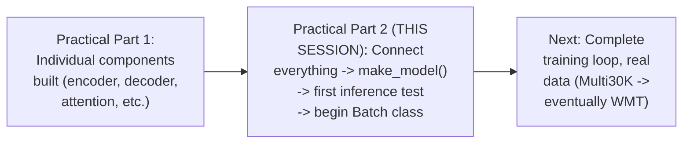

#### 🎯 Key Takeaways

* This session is explicitly, directly the **connecting phase** — every class built in Part 1 gets assembled into one working model for the first time.
* The instructor's own honest, stated progress estimate: roughly **30% of the notebook** completed by the end of this session, with training and real data explicitly deferred further.
* The instructor's own repeated, direct advice for genuinely learning this material: **debug, add print statements, change arguments, and observe** — not passive reading alone.

---

### 2. The Two Model Variants: Base vs. Big (A Quick Paper Detour)

#### 📖 Definition — The Paper's Own Two Published Configurations

> 💡 **Given directly:** *"There are two versions of the Transformers in the paper... the base version and the bigger version. In the paper, two things were trained."*

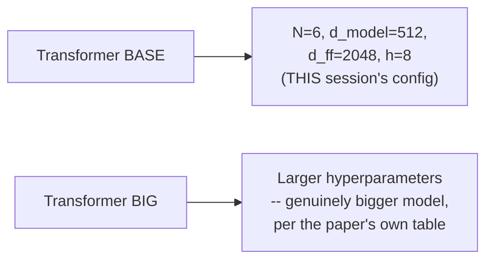

#### 🏢 Real-World / Production Usage — This Session's Own Stated Future Roadmap

> 💡 **Given directly, a genuinely honest look ahead at planned future upgrades:** *"Once we complete tokenization, you guys will be aware of word-based, sentence piece, and BPE. So the idea is to look into BPE and then actually upgrade it... the base model and the bigger model that you'll be working [on]... the idea is, let's start working with H100 slowly, slowly."*

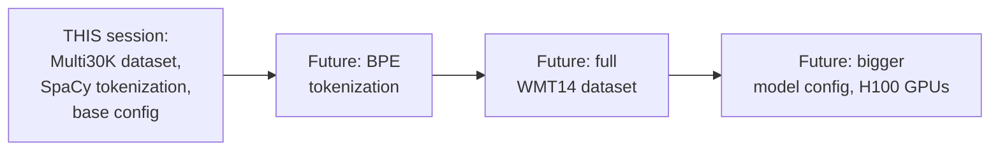

#### ⚠ Common Mistakes

* Assuming this session's specific hyperparameters (N=6, d_model=512) are somehow fixed or required — explicitly, directly contextualized as matching the paper's own "base" configuration specifically, with a genuinely larger, alternative "big" configuration also published in the same paper.
* Assuming the current session's simplified setup (SpaCy tokenization, Multi30K's smaller dataset) represents the intended final, production-ready version — explicitly, directly framed as a deliberate, temporary starting point, with concrete, planned upgrades (BPE, WMT14, bigger hardware) already identified.

#### 🎯 Key Takeaways

* The original paper published **two distinct model configurations** — base and big — this session specifically implements the base configuration's hyperparameters.
* This session's entire setup (dataset, tokenization, model size) is explicitly, honestly framed as a **deliberate starting point** — with a genuine, concrete roadmap toward more advanced, production-scale choices already planned.

---
### 3. The make_model() Factory Function: Assembling Every Piece

#### 💻 Code Example — The Complete `make_model()` Function

> 💡 **Given directly:** *"First of all comes your source vocabulary and your target... this is actually your total English vocabulary size, then comes your target, the German vocabulary size, then N X value right here, based on the actual model, it's 6. Dimension of the model, 512... feed-forward neuron, the total number of neurons within that linear layer, it's 2048, the total number of heads in MHA, it's 8. Dropout, 0.1."*

```python
def make_model(src_vocab, tgt_vocab, N=6, d_model=512, d_ff=2048, h=8, dropout=0.1):
    c = copy.deepcopy
    attn = MultiHeadedAttention(h, d_model)
    ff = PositionwiseFeedForward(d_model, d_ff, dropout)
    position = PositionalEncoding(d_model, dropout)

    model = EncoderDecoder(
        Encoder(EncoderLayer(d_model, c(attn), c(ff), dropout), N),
        Decoder(DecoderLayer(d_model, c(attn), c(attn), c(ff), dropout), N),
        nn.Sequential(Embeddings(d_model, src_vocab), c(position)),
        nn.Sequential(Embeddings(d_model, tgt_vocab), c(position)),
        Generator(d_model, tgt_vocab),
    )

    for p in model.parameters():
        if p.dim() > 1:
            nn.init.xavier_uniform_(p)
    return model
```

#### 🔍 Internal Working — Precisely Why the Decoder's Line Uses `c(attn)` TWICE

> 💡 **Given directly, a genuinely important, precise clarification:** *"For the decoder, just like last time, D model, C attention, C attention -- quickly tell me why 2 C attention? ...Self and SRC. Because of that, I have written it."*

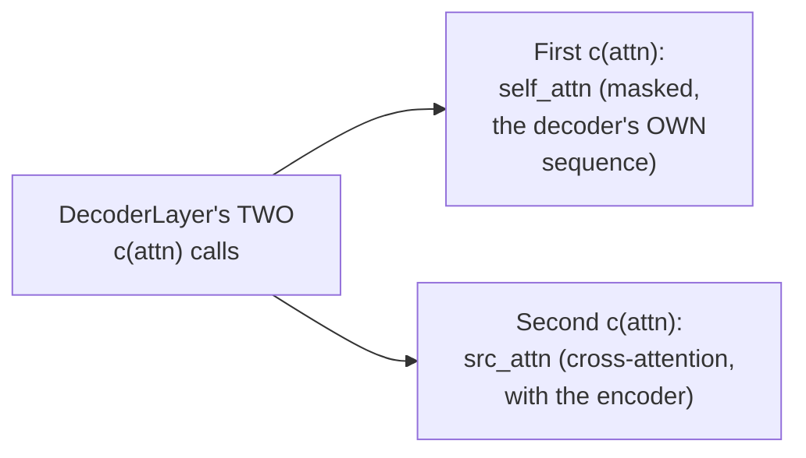

> 💡 **Given directly, precisely clarifying that `c` stands for `copy.deepcopy`, not a new concept:** *"C attention -- don't think about it as cross attention. It's just the layers are defined, but we need to make a copy of that."*

#### 🔍 Internal Working — Why This Is Genuinely Called a "Factory Function"

> 💡 **Given directly:** *"Just like all the hard work you have done, you are just combining everything. So this is exactly, in programming terms, we call it as a factory function. All the components are ready, then probably we are connecting it."*

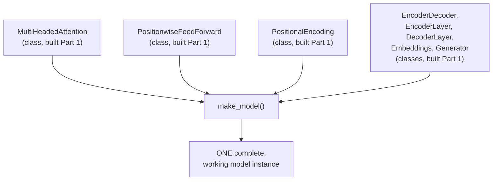

#### ⚠ Common Mistakes

* Assuming `c(attn)` and `c(ff)` create genuinely different attention/feed-forward MECHANISMS for the encoder vs. decoder — explicitly, directly clarified: `c` is simply `copy.deepcopy`, ensuring each USE of the SAME underlying class gets its own, independently-trainable parameters — not a different mechanism, just a genuinely separate copy.
* Assuming a "factory function" is a genuinely new or Transformer-specific programming concept — explicitly, directly framed as a standard, general programming pattern: assembling multiple, already-built components into one final, complete object.

#### 🎯 Key Takeaways

* **`make_model()`** is the single function assembling every previously-built class (attention, feed-forward, positional encoding, encoder, decoder, embeddings, generator) into one complete, working `EncoderDecoder` instance.
* The decoder's constructor call uses `c(attn)` **twice** — once for its own masked self-attention, once for cross-attention (source attention) — precisely mirroring the decoder's own 3-sublayer structure established in Practical Part 1.
* This function is a standard **"factory function"** — a general programming pattern for assembling multiple, independently-built pieces into one final, usable object.

---

### 4. Xavier Weight Initialization: Why, and Why It Barely Matters Here

#### 📖 Definition — Xavier/Glorot Initialization, Precisely Introduced

> 💡 **Given directly:** *"I have just told Xavier -- Glorot Uniform initialization to go ahead. You can test out with other initializations, really, I don't have issues with that... in deep learning, there's a concept called weight initialization. You have uniform, you have random, and then the major ones are Glorot, Xavier, and Kaiming initialization."*

#### ❓ Why It Exists — Precisely Why Random or Zero Initialization Doesn't Work

> 💡 **Given directly:** *"You create a vector of 100 cross 100 dimension... you have 10,000 parameters... how they will be initialized? You cannot start with 0, 0 initialization. You cannot directly start with a random number, like one initialization. Again, nobody does it."*

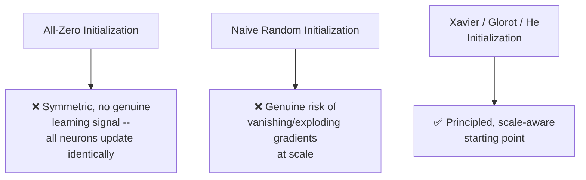

#### ⚠ A Direct, Honest Acknowledgment: The Specific Choice Matters Less Than You'd Expect

> 💡 **Given directly, a genuinely candid, precise clarification:** *"The amount of change with respect to, or the impact with respect to your final results will be really, really low. Okay, so probably if you might get some floating point value of 0.098, it can be 0.097. So very minor changes that generally happens."*

#### 🔍 Internal Working — Applied Conditionally, Only to Multi-Dimensional Parameters

> 💡 **Given directly, precisely explaining the `if p.dim() > 1` guard:** *"The dimension will always be more than a 1... that's why, based on this condition, you won't be having a dimension of zero... during your layer normalization with residual-based connections, in those cases, really, it doesn't make sense [to apply Xavier]."*

#### 🎯 Key Takeaways

* **Xavier/Glorot initialization** is a principled, scale-aware alternative to naive zero or random initialization — genuinely necessary for effective training, unlike arbitrary starting values.
* The instructor **honestly, directly acknowledges** that the SPECIFIC choice among reasonable initialization schemes (Xavier, He/Kaiming, etc.) tends to produce only genuinely small differences in final results — a candid, non-dogmatic framing.
* Xavier initialization is applied **conditionally**, only to parameters with more than 1 dimension (`p.dim() > 1`) — appropriately skipping 1-dimensional parameters like layer norm's own bias/shift terms, where this specific initialization scheme doesn't genuinely apply.

---
### 5. The First Inference Test: Proving the Architecture Actually Works

#### ❓ Why It Exists — The Precise, Stated Purpose

> 💡 **Given directly:** *"I need to make sure that the thing that I have defined is working or not... this entire system definition is done. What about if you try to pass some type of sample numbers? Will it throw output or not? Because of that, you have the main inference test."*

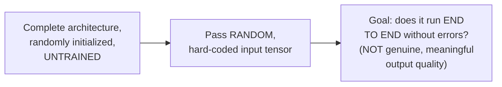

#### 💻 Code Example — Building the Test Model

> 💡 **Given directly:** *"I'm just creating my main test model... I'm passing the test parameters, as this is just a sample inferencing here. So, 11, 11, and 2. Both the vocabulary sizes of source and target, that I have kept it as same. N is equal to 2 that I have taken -- right now, just for the sake of calculation, I have taken 2, just to see that the model is working or not."*

```python
test_model = make_model(11, 11, 2)   # tiny vocab (11), N=2 layers (not the usual 6)
test_model.eval()   # evaluation mode -- not training mode

src = torch.LongTensor([[0, 1, 2, 3, 4, 5, 6, 7, 8, 9]])
src_mask = torch.ones(1, 1, 10)

memory = test_model.encode(src, src_mask)
ys = torch.zeros(1, 1).type_as(src)   # the start token
```

#### 🔍 Internal Working — `.eval()` vs. Training Mode, Precisely Distinguished

> 💡 **Given directly:** *"In PyTorch, generally, whenever you do a training-based [task], you switch on the training mode. If you are doing an inferencing task, you switch on the evaluation mode."*

#### 🔍 Internal Working — `torch.long`, Precisely Explained

> 💡 **Given directly:** *"How many of you know about torch.long? ...That's actually int only, in real time -- integer data type, torch.long, the representation is with respect to it... the same thing that we use at TF also, TensorFlow."*

#### 🔍 Internal Working — Why `ys` Starts as a Single Zero

> 💡 **Given directly:** *"You need some type of starting token whenever you are generating anything. So generally, the representation is done with respect to zero. So that's why the initialization is with respect to zero... whenever you are generating, start with a zero."*

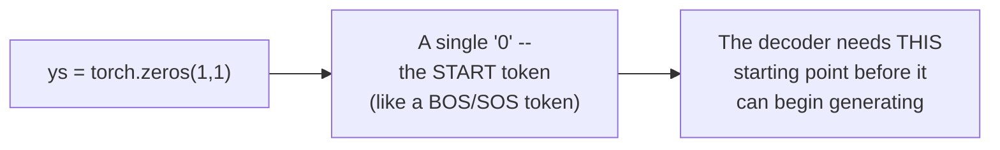

> 💡 **Given directly, precisely explaining why the same data type as source is used:** *"Type as -- when I say, guys, how many of you understand type_as? When I try to match the data type of one data type to another... this particular ys representation will grow with respect to time."*

#### ⚠ Common Mistakes

* Assuming this inference test's specific output has any genuine, meaningful semantic value — explicitly, directly clarified: with an untrained, randomly-initialized model and a random input, the specific WORDS predicted are meaningless; the test's entire purpose is verifying the architecture runs correctly end to end.
* Assuming `N=2` in this test represents the model's actual, intended configuration — explicitly, directly clarified: it's a deliberately SMALLER value, chosen purely to make this quick verification test run faster, genuinely distinct from the base configuration's real `N=6`.

#### 🎯 Key Takeaways

* This session's **first inference test** exists specifically to verify the fully-assembled architecture runs correctly end to end — NOT to produce genuinely meaningful output, since the model is randomly initialized and entirely untrained.
* `.eval()` mode is used specifically because this is genuinely an inference (not training) task — a standard, important PyTorch mode switch.
* The `ys` sequence **starts as a single zero**, functioning as a start token (SOS/BOS) — the necessary starting point the decoder needs before it can begin generating anything.

---

### 6. Greedy Decoding, Traced Step by Step: The Growing YS Sequence

#### 💻 Code Example — The Complete Greedy Decoding Loop, With Print Statements

> 💡 **Given directly:** *"Now, this is the same version, but I have just added a few more information here... let me just execute it, this part you will understand."*

```python
for i in range(9):
    out = test_model.decode(
        memory, src_mask, ys, subsequent_mask(ys.size(1)).type_as(src.data)
    )
    prob = test_model.generator(out[:, -1])
    _, next_word = torch.max(prob, dim=1)
    next_word = next_word.data[0]
    ys = torch.cat([ys, torch.zeros(1, 1).type_as(src.data).fill_(next_word)], dim=1)
    print("Example Untrained Model Prediction:", ys)
```

#### 🔍 Internal Working — Tracing the Growth of `ys`, Live-Verified

> 💡 **Given directly, the actual, live-observed trace:** *"Can you see here exactly how your ys looks like? ...It's a single zero, but... the next step, because I know this is a starting point... in the next step, something has been generated, and right now it got added. So this is the main generated information. Okay, so 9 has been generated."*

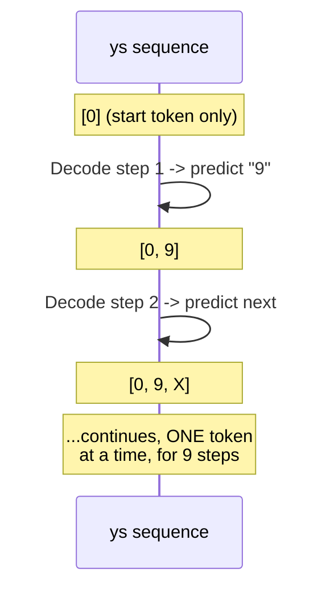

> 💡 **Given directly, a precise, direct connection to the decoder's own defining property:** *"We are not generating the entire sequence in one shot... this is the decoder property that we do follow."*

#### 🔍 Internal Working — Precisely What `torch.max()` Returns

> 💡 **Given directly:** *"Torch.max -- how many of you know about torch.max? Exactly what does [it do]? It returns two types of information. One is the highest probability, and the index. Both the information is being returned."*

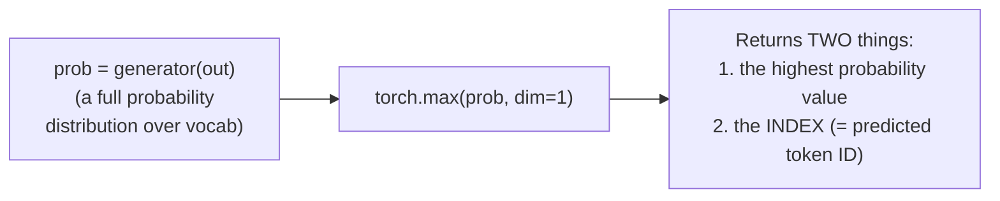

#### 🔍 Internal Working — Precisely What `next_word.data[0]` Extracts

> 💡 **Given directly:** *"Next word is equal to next underscore word.data[0]... I'm telling you which word ID has the highest probability. Through that, I'm looking into that data[0]. It will extract as a plain number, simply."*

#### ❓ Why It Exists — This Specific Strategy Is Called "Greedy Decoding"

> 💡 **Given directly:** *"This is actually called greedy decoding. Later on, we'll be coming to the same stuff [in more depth]."*

#### ⚠ Common Mistakes

* Assuming the SPECIFIC tokens predicted during this untrained test (e.g., "9") carry genuine, learned meaning — explicitly, directly clarified as random, meaningless artifacts of an untrained, randomly-initialized model — the point is verifying the MECHANISM, not the content.
* Assuming the entire output sequence is generated in a single, parallel computation — explicitly, directly corrected: exactly ONE new token is generated per loop iteration, directly demonstrating the decoder's genuinely sequential, autoregressive property in real, executing code.
* Assuming a genuinely last-word-always-highest-probability pattern exists — explicitly, directly corrected in response to a student's specific guess: *"We cannot directly say the last word will be having the most [probability]... the probability distribution can totally vary."*

#### 🎯 Key Takeaways

* **Greedy decoding** generates exactly ONE new token per iteration, appending it to the growing `ys` sequence — a live, executing demonstration of the decoder's autoregressive property already established theoretically in earlier sessions.
* `torch.max()` returns BOTH the highest probability value AND its corresponding index (the predicted token ID) — the index specifically is what's used to select the actual next word.
* This entire loop is explicitly, precisely named **"greedy decoding"** — always selecting the single highest-probability token at each step, with more advanced decoding strategies explicitly deferred to a future session.

---
### 7. The Batch Class: Encoding Padding as a Real Token ID

#### ❓ Why It Exists — Moving From Theory to Genuine Data Handling

> 💡 **Given directly:** *"Whenever I see a batch, right now, everywhere you write or directly call, this is the batch size definition that you do. But whenever you are starting with a batch, we have to actually define it. Now, this is a custom definition."*

#### 💻 Code Example — The `Batch` Class Constructor

> 💡 **Given directly:** *"First of all, look into the initialization part. I have taken source, target is equal to none, and pad is equal to 2. Right now, I've just given a number -- padding token representation will always be equal to 2."*

```python
class Batch:
    def __init__(self, src, tgt=None, pad=2):
        self.src = src
        self.src_mask = (src != pad).unsqueeze(-2)
        if tgt is not None:
            self.tgt = tgt[:, :-1]
            self.tgt_y = tgt[:, 1:]
            self.tgt_mask = self.make_std_mask(self.tgt, pad)
            self.ntokens = (self.tgt_y != pad).data.sum()
```

> 💡 **Given directly, precisely clarifying that `pad=2` is a token VALUE, not an index:** *"Don't think from the index point, think from the actual value point... it means that whenever you see 2, you will think about, okay, this is a padding token. Okay, in your mind, it should come."*

#### 🪜 Step-by-Step — Precisely Tracing `src_mask` Construction With a Worked Example

> 💡 **Given directly, the complete, hand-worked example:** *"Let's take a sample input sequence... source is equal to a tensor value... 0, 3, 2, 4, 2, 8, 1, 0. This is your source tensor... if I say that my padding token, I told in the code, I have hard-coded it... what will be the output? Can I say that the output will be Boolean?"*

```python
source = torch.tensor([0, 3, 2, 4, 2, 8, 1, 0])
pad = 2
mask = (source != pad)
# mask = [T, T, F, T, F, T, T, T]
```

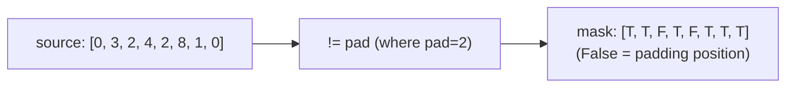

> 💡 **Given directly, the precise, live-confirmed row:** *"Can I say that if 1, it means true, then... here it will become F, here it will become T, here it will become F, T, T, T. How many of you got this part?"*

#### ❓ Why It Exists — What This Boolean Mask Genuinely Accomplishes

> 💡 **Given directly:** *"What is the main purpose of using this test, and why? Through this, we actually tell that this is a non-padding token, and this is a padding token."*

#### ⚠ Common Mistakes

* Assuming the padding token ID (`2` in this specific example) is a fixed, universal constant — explicitly, directly clarified as a hard-coded, deliberately simple placeholder value FOR THIS SPECIFIC EXAMPLE, genuinely changeable and typically determined by the actual vocabulary/tokenizer in a real system.
* Confusing the padding token's VALUE (2) with an INDEX into some other structure — explicitly, directly clarified: think of it as the actual token identity itself, not a position/index pointing elsewhere.

#### 🎯 Key Takeaways

* The **`Batch` class** begins the real, practical infrastructure needed for training — converting raw source sequences into a genuine, usable `src_mask`.
* The mask is built via a simple, direct **boolean comparison** (`source != pad`) — genuinely True for real content, False for padding positions.
* This directly, concretely implements the SOURCE MASK concept established theoretically in an earlier session — now shown as real, working, executable code.

---

### 8. Unsqueeze, Precisely Explained: Why -2, Not -1

#### ❓ Why It Exists — The Precise, Stated Purpose of Unsqueeze Here

> 💡 **Given directly:** *"What is unsqueeze? Let's add a dimension. Where you'll be adding? In the second-last dimension. That's why you have that unsqueeze operation."*

```python
self.src_mask = (src != pad).unsqueeze(-2)
```

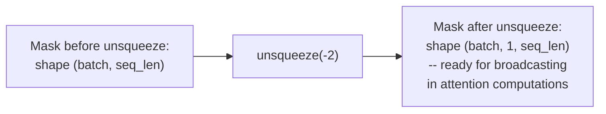

#### 🔍 Internal Working — A Direct, Precise Clarification: Unsqueezing Isn't About True/False

> 💡 **Given directly, correcting a genuinely reasonable but incorrect student assumption:** *"No, unsqueezing doesn't mean true and false. Unsqueezing means that you are adding a dimension, minus 2, this... from the last and the second index."*

#### ❓ Why It Exists — Precisely Why `-2` Specifically, Not `-1`

> 💡 **Given directly, addressing a genuinely important, precise student question:** *"Why unsqueeze minus 2? ...What is the default dimension that you do work with?"* -- the precise reasoning connects directly to how this mask must later align with the attention computation's own shape requirements (batch, heads-or-query-position, sequence-length), matching the exact broadcasting pattern established for `mask.unsqueeze(1)` in `MultiHeadedAttention` from Practical Part 1.

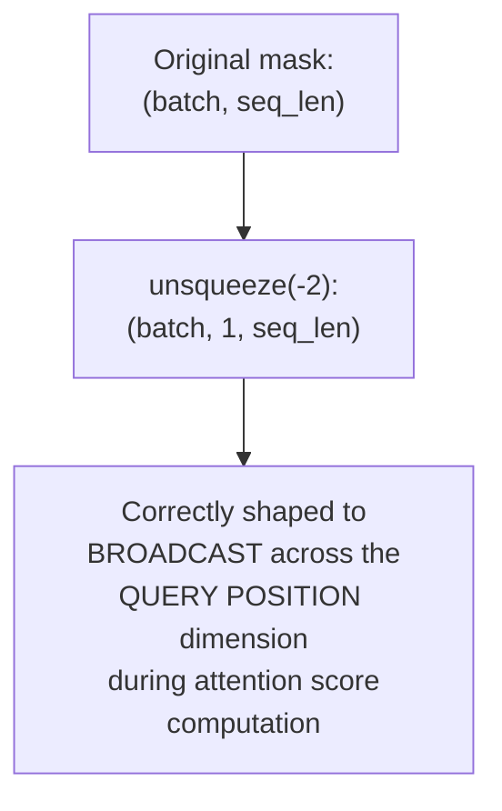

#### ⚠ Common Mistakes

* Assuming `unsqueeze` converts values into True/False — explicitly, directly, precisely corrected: it specifically ADDS A NEW DIMENSION to the tensor's shape; it has nothing to do with the boolean values themselves, which were already established by the earlier `!= pad` comparison.
* Assuming `unsqueeze(-2)` and `unsqueeze(-1)` (or `unsqueeze(1)`) are interchangeable — explicitly, directly distinguished: the SPECIFIC dimension index matters, precisely determining WHERE the new dimension is inserted, which in turn determines how the mask correctly broadcasts during later attention computations.

#### 🎯 Key Takeaways

* **`unsqueeze(-2)`** adds a new dimension specifically at the second-to-last position — genuinely distinct from, and not to be confused with, the boolean True/False values themselves.
* This specific reshaping is necessary to correctly **align the mask's shape** with the attention mechanism's own downstream computation, enabling proper broadcasting.
* This directly parallels (though at a different point in the pipeline) the `mask.unsqueeze(1)` operation covered in Practical Part 1's `MultiHeadedAttention` class — both exist for the same underlying reason: correctly shaping a mask for genuine broadcasting.

---
## 📝 Glossary

| Term | Definition | Why It Matters |
|---|---|---|
| **make_model()** | The factory function assembling every component into one working model | The key deliverable of this session |
| **Base / Big (model variants)** | The paper's own two published configurations | This session implements the BASE config |
| **Xavier / Glorot Initialization** | A principled weight initialization scheme | Applied conditionally, only to multi-dim parameters |
| **.eval()** | PyTorch's evaluation (inference) mode switch | Distinct from training mode |
| **ys** | The growing output sequence during decoding | Starts as a single "0" (start token) |
| **Greedy Decoding** | Always selecting the single highest-probability next token | The simplest decoding strategy; more advanced ones deferred |
| **torch.max()** | Returns both the max value AND its index | The index becomes the predicted token ID |
| **Batch class** | Handles real data batching, including mask construction | The first genuine data-handling infrastructure |
| **pad (token)** | A hard-coded token ID representing padding | A VALUE, not an index |
| **unsqueeze(-2)** | Adds a new dimension at the second-to-last position | Required for correct mask broadcasting |

---

## 🔄 Revision Notes — One-Minute Revision

* This session **connects every component built in Practical Part 1** into one working model, via `make_model()`, then runs the **first genuine inference test**.
* The paper published **two model variants**: base (N=6, d_model=512, d_ff=2048, h=8 -- this session's config) and big (larger) -- this session's own setup (Multi30K, SpaCy) is explicitly framed as a deliberate starting point, with BPE tokenization and the full WMT14 dataset explicitly planned for later.
* **`make_model()`** assembles attention, feed-forward, positional encoding, encoder, decoder, embeddings, and generator into one complete `EncoderDecoder` -- the decoder's constructor uses `c(attn)` (deep copy) TWICE: once for masked self-attention, once for cross/source-attention.
* **Xavier initialization** is applied conditionally (`p.dim() > 1`) -- genuinely necessary over zero/naive random initialization, though the instructor honestly acknowledges the SPECIFIC scheme chosen (Xavier vs. He, etc.) makes only a small practical difference.
* The **first inference test** passes a random, hard-coded tensor through the fully-assembled, UNTRAINED model -- its entire purpose is verifying the architecture runs end to end, NOT producing meaningful output.
* **Greedy decoding**, traced live with print statements: `ys` starts as a single "0" (start token), and grows ONE token at a time each loop iteration -- directly, live demonstrating the decoder's autoregressive property in real, executing code. `torch.max()` returns both the highest probability AND its index; the index becomes the next predicted token.
* The **`Batch` class** begins real data-handling infrastructure: `src_mask = (src != pad).unsqueeze(-2)` -- a hard-coded padding token VALUE (not an index) is compared against the source sequence to produce a genuine boolean mask.
* **`unsqueeze(-2)`** adds a new dimension at the second-to-last position -- genuinely distinct from the boolean values themselves, and specifically necessary for correct mask broadcasting during later attention computations, directly paralleling `mask.unsqueeze(1)` from Practical Part 1's `MultiHeadedAttention`.

---

## 📋 Cheat Sheet

**make_model() signature:**
```python
def make_model(src_vocab, tgt_vocab, N=6, d_model=512, d_ff=2048, h=8, dropout=0.1):
```

**Decoder's two c(attn) calls:**
```text
c(attn) #1 -> self_attn (masked, decoder's OWN sequence)
c(attn) #2 -> src_attn (cross-attention, from encoder)
```

**Xavier init (conditional):**
```python
for p in model.parameters():
    if p.dim() > 1:
        nn.init.xavier_uniform_(p)
```

**Inference test setup:**
```python
test_model = make_model(11, 11, 2)   # small vocab, N=2 (test-only)
test_model.eval()
ys = torch.zeros(1, 1).type_as(src)   # start token
```

**Greedy decoding loop:**
```python
for i in range(9):
    out = model.decode(memory, src_mask, ys, subsequent_mask(ys.size(1)).type_as(src.data))
    prob = model.generator(out[:, -1])
    _, next_word = torch.max(prob, dim=1)
    ys = torch.cat([ys, torch.zeros(1,1).type_as(src.data).fill_(next_word)], dim=1)
```

**Batch class src_mask:**
```python
self.src_mask = (src != pad).unsqueeze(-2)
# pad is a token VALUE (e.g. 2), not an index
```

**torch.max() returns:**
```text
(highest_probability_value, index_of_that_value)
```

---

## 🔥 Interview Questions & Answers

### 🟢 Beginner

**Q1.**

**Question:** What does the `make_model()` factory function do?

**Answer:** It assembles every previously-built component (attention, feed-forward, positional encoding, encoder, decoder, embeddings, generator) into one complete, working `EncoderDecoder` model instance.

**Explanation:** Directly, precisely explained.

**Why Interviewers Ask This:** Tests understanding of how individually-built pieces combine into a working system.

**Possible Follow-up:** "Why is `copy.deepcopy` used throughout this function?"

**Q2.**

**Question:** Why does the decoder's constructor call use `c(attn)` twice?

**Answer:** Once for the decoder's own masked self-attention, once for cross-attention (source attention) with the encoder.

**Explanation:** Directly, precisely explained.

**Why Interviewers Ask This:** Tests understanding of the decoder's two distinct attention mechanisms.

**Possible Follow-up:** "What does 'c' stand for in this code?"

**Q3.**

**Question:** What is the purpose of running an inference test on an untrained, randomly-initialized model?

**Answer:** To verify the architecture runs correctly end to end -- not to produce genuinely meaningful output.

**Explanation:** Directly, precisely explained.

**Why Interviewers Ask This:** Tests understanding of a genuine, practical software-development testing pattern.

**Possible Follow-up:** "Would you expect the predicted tokens in this test to carry real meaning?"

**Q4.**

**Question:** What value does `ys` start with, and what does it represent?

**Answer:** A single "0," representing the start token (like a BOS/SOS token) -- the necessary starting point for decoding.

**Explanation:** Directly, precisely explained.

**Why Interviewers Ask This:** Foundational, practical decoding knowledge.

**Possible Follow-up:** "How does `ys` change with each loop iteration?"

**Q5.**

**Question:** What does `torch.max()` return during greedy decoding?

**Answer:** Both the highest probability value and its corresponding index.

**Explanation:** Directly, precisely stated.

**Why Interviewers Ask This:** Basic, practical PyTorch knowledge.

**Possible Follow-up:** "Which of these two return values becomes the next predicted token?"

**Q6.**

**Question:** What is greedy decoding?

**Answer:** A decoding strategy that always selects the single highest-probability token at each step.

**Explanation:** Directly, explicitly named and defined.

**Why Interviewers Ask This:** Foundational decoding-strategy terminology.

**Possible Follow-up:** "Name a more advanced decoding strategy this session mentions as a future topic."

**Q7.**

**Question:** In the `Batch` class, is `pad=2` a token index or a token value?

**Answer:** A token value -- the actual token ID representing padding, not a position/index into some other structure.

**Explanation:** Directly, precisely clarified.

**Why Interviewers Ask This:** Tests a commonly-confused, practical implementation detail.

**Possible Follow-up:** "How is this value used to construct the source mask?"

**Q8.**

**Question:** What does `unsqueeze(-2)` do?

**Answer:** Adds a new dimension at the second-to-last position of the tensor's shape.

**Explanation:** Directly, precisely explained.

**Why Interviewers Ask This:** Tests genuine PyTorch tensor-manipulation fluency.

**Possible Follow-up:** "Why is this specific dimension needed, rather than -1?"

**Q9.**

**Question:** Does `unsqueeze` change a tensor's boolean values?

**Answer:** No -- it only adds a dimension to the shape; it has no effect on the actual True/False values.

**Explanation:** Directly, explicitly corrected from a common misconception.

**Why Interviewers Ask This:** Tests precise understanding of what `unsqueeze` actually does.

**Possible Follow-up:** "What operation actually produces the True/False values in the source mask?"

**Q10.**

**Question:** What are the two model variants published in the original Transformer paper?

**Answer:** Base and big.

**Explanation:** Directly, explicitly named.

**Why Interviewers Ask This:** Tests specific, factual recall of the original paper.

**Possible Follow-up:** "Which configuration does this session's `make_model()` call use by default?"

---

### 🟡 Intermediate

**Q11.**

**Question:** Explain why the instructor deliberately uses `N=2` (rather than the standard `N=6`) for the first inference test.

**Answer:** This is a deliberate, practical simplification specifically for FASTER test execution -- the inference test's entire purpose (per Section 5) is verifying the architecture's STRUCTURAL correctness, not producing genuinely meaningful output. Using the full `N=6` configuration would work equally well structurally, but would take longer to run for a test whose only goal is a quick, "does it run without errors" sanity check. This directly reflects a general, practical software engineering pattern: using a smaller, faster configuration for quick verification tests, reserving the full, "production" configuration for actual, meaningful runs.

**Explanation:** Requires recognizing a deliberate, practical engineering choice, not a claim about model capability.

**Why Interviewers Ask This:** Tests whether a learner distinguishes a deliberate testing simplification from a genuine architectural recommendation.

**Possible Follow-up:** "Would you expect any genuinely different STRUCTURAL results running this test with N=6 instead of N=2?"

**Q12.**

**Question:** A learner argues that since Xavier initialization has only a small practical impact on final results (per this session's own honest acknowledgment), weight initialization is a genuinely unimportant detail that can be safely ignored. Evaluate this claim.

**Answer:** This claim overstates the session's own precise point. The session explicitly distinguishes between (a) WHETHER to use a principled initialization scheme AT ALL (genuinely important -- naive zero or random initialization is explicitly ruled out as fundamentally broken) and (b) WHICH SPECIFIC principled scheme to choose among reasonable options like Xavier, He, or Glorot (a genuinely smaller, more marginal choice, per the session's own "0.098 vs 0.097" example). The claim conflates these two, genuinely different questions -- the session's honest acknowledgment is specifically about the SECOND, narrower question, not a claim that initialization overall is unimportant. Using NO principled initialization scheme at all (e.g., all-zero initialization) would genuinely, severely break training, exactly as Section 4's own explicit reasoning establishes.

**Explanation:** Tests whether a learner distinguishes "the specific scheme matters less than expected" from "initialization overall doesn't matter," a genuinely important scope distinction.

**Why Interviewers Ask This:** Distinguishes candidates who track a claim's precise scope from those who over-generalize a narrow acknowledgment into a broader, inaccurate claim.

**Possible Follow-up:** "What would you expect to happen if all weights were initialized to exactly zero?"

**Q13.**

**Question:** Explain, precisely, why the greedy decoding loop must call `test_model.decode()` again on EVERY iteration, rather than computing the decoder's output once and simply extracting multiple predictions from it.

**Answer:** This is a direct, necessary consequence of the decoder's own autoregressive property (established in earlier sessions and directly reinforced in Section 6): each new prediction genuinely DEPENDS on the FULL, updated `ys` sequence generated SO FAR, including the token predicted in the immediately preceding iteration. Since `ys` genuinely GROWS with each iteration (per Section 6's own live-traced example), the decoder's masked self-attention computation over this SEQUENCE must also be genuinely RECOMPUTED each time, since the input sequence itself has changed. Computing the decoder's output only ONCE, on the initial, single-token `ys`, would provide no way to genuinely incorporate each newly-generated token into subsequent predictions -- directly violating the fundamental, sequential nature of autoregressive generation this entire architecture is built around.

**Explanation:** Requires connecting the code-level implementation detail (calling `decode()` in a loop) to the underlying architectural PROPERTY (autoregressive generation) it directly implements.

**Why Interviewers Ask This:** Tests whether a learner understands WHY the code is structured this specific way, not just that it happens to work.

**Possible Follow-up:** "Could this loop be genuinely parallelized to compute all 9 tokens simultaneously? Why or why not?"

**Q14.**

**Question:** Using this session's own precise `src_mask` construction (`(src != pad).unsqueeze(-2)`), explain what would genuinely go wrong if the padding token VALUE were accidentally set to a number that ALSO appears as a genuine, meaningful token in the actual vocabulary.

**Answer:** This would cause a genuine, real bug: the boolean comparison `src != pad` cannot distinguish between "this position is genuinely padding" and "this position happens to contain a REAL, meaningful token that coincidentally shares the same numeric value as the padding token." Any position in the source sequence containing this genuinely meaningful token would be INCORRECTLY marked as padding (False in the mask) and consequently EXCLUDED from attention computations -- meaning the model would systematically, incorrectly ignore genuine content whenever this specific token value appears, rather than only genuinely ignoring actual padding. This directly explains why real, production tokenizers/vocabularies deliberately RESERVE a specific, DEDICATED token ID for padding (and other special tokens like start/end-of-sequence) that is GUARANTEED never to collide with any genuine, meaningful vocabulary word -- a genuinely important, practical consideration this session's own simplified, hard-coded example (`pad=2`) doesn't explicitly address but directly implies.

**Explanation:** Requires reasoning through a genuinely realistic bug scenario the session's own simplified example doesn't explicitly walk through, but which follows directly from the stated mechanism.

**Why Interviewers Ask This:** Tests whether a learner can identify a genuine, practical failure mode from a stated implementation detail.

**Possible Follow-up:** "How do real tokenizers (like those used with BPE) typically guarantee this kind of token-ID collision doesn't happen?"

**Q15.**

**Question:** Synthesize this session's `unsqueeze(-2)` explanation (Section 8) with Practical Part 1's own `mask.unsqueeze(1)` explanation (inside `MultiHeadedAttention`) to explain why these are genuinely DIFFERENT unsqueeze operations, applied at DIFFERENT points in the overall pipeline, despite both serving the same general "shape a mask for broadcasting" purpose.

**Answer:** These two unsqueeze operations serve the SAME GENERAL PURPOSE (enabling correct mask broadcasting) but operate on GENUINELY DIFFERENT STAGES of the mask's own shape, precisely because they occur at DIFFERENT POINTS in the pipeline. `Batch.__init__`'s `unsqueeze(-2)` (this session, Section 8) transforms the mask from `(batch, seq_len)` into `(batch, 1, seq_len)` -- preparing it for use WITHIN a single-head attention computation, where the new dimension represents the QUERY POSITION (allowing the same key-masking pattern to apply regardless of which specific query position is being processed). `MultiHeadedAttention.forward()`'s `mask.unsqueeze(1)` (Practical Part 1) takes this ALREADY-3D mask and adds YET ANOTHER dimension, specifically for the HEAD dimension -- transforming `(batch, 1, seq_len)` [approximately, depending on exact usage] into a shape correctly broadcasting across ALL H attention heads simultaneously. These are therefore NOT redundant or interchangeable operations -- they represent two GENUINELY SEPARATE, SEQUENTIAL shape transformations, each solving a DIFFERENT broadcasting requirement (query-position broadcasting vs. head broadcasting) at a DIFFERENT stage of the overall computation.

**Explanation:** Requires synthesizing two separately-taught, superficially-similar operations from two different sessions, precisely distinguishing their genuinely different roles despite a shared general purpose.

**Why Interviewers Ask This:** A senior-level question testing whether a candidate can distinguish similar-sounding operations by their PRECISE role in a multi-stage pipeline, not just their surface-level similarity.

**Possible Follow-up:** "What would the mask's FULL shape genuinely be, immediately before being used inside the `attention()` function, after BOTH unsqueeze operations have been applied?"

---

### 🔴 Advanced

**Q16.**

**Question:** Design a complete, from-scratch trace of the `Batch` class's `src_mask` construction for a genuinely new, realistic example — a batch of TWO sequences, each of length 6, with different padding amounts — explicitly computing the resulting mask's exact shape and values at every stage.

**Answer:** A reasonable, complete trace: consider `src = torch.tensor([[5, 3, 7, 2, 2, 2], [1, 9, 4, 6, 8, 2]])` (batch_size=2, seq_len=6, pad=2). (1) `src != pad` produces `[[T, T, T, F, F, F], [T, T, T, T, T, F]]`, shape `(2, 6)` -- correctly identifying that the first sequence has 3 genuine tokens (padding starts at position 3), while the second has 5 genuine tokens (padding only at position 5). (2) `.unsqueeze(-2)` transforms this into shape `(2, 1, 6)` -- inserting a new dimension representing the "query position" axis, with a size of 1 (meaning this SAME masking pattern will broadcast identically regardless of which query position is being processed). (3) The final `src_mask` shape is `(2, 1, 6)`, with values `[[[T,T,T,F,F,F]], [[T,T,T,T,T,F]]]` -- ready to be used within the `attention()` function's own `scores.masked_fill(mask==0, -1e9)` step (from Practical Part 1), correctly ensuring EVERY query position in EACH of the 2 batch sequences genuinely ignores that specific sequence's OWN padding positions.

**Explanation:** Requires extending the session's own single-sequence example to a genuinely new, multi-sequence batch case, precisely tracking shape and value changes at every transformation stage.

**Why Interviewers Ask This:** A realistic, senior-level question testing whether a candidate can trace batch-level tensor operations precisely, not just single-example cases.

**Possible Follow-up:** "How would this trace change if a THIRD sequence, entirely composed of padding (a genuinely empty/invalid sequence), were included in the batch?"

**Q17.**

**Question:** Critically evaluate: "Since this session's inference test successfully ran end to end on a randomly-initialized, untrained model, this proves the model's architecture is genuinely CORRECT and ready for real training, with no further verification needed." Is this an accurate characterization?

**Answer:** Not accurate -- this significantly overstates what a successful "runs without errors" test genuinely demonstrates. The session's own explicit, repeated framing is specifically that this test verifies STRUCTURAL/MECHANICAL correctness -- that tensor shapes align correctly throughout the pipeline, that no runtime errors occur, and that the basic data flow (encode -> decode -> generate -> select next token) genuinely functions as intended. This is a GENUINELY NECESSARY but NOT SUFFICIENT condition for the architecture being "ready for real training" -- a model could pass this exact structural test while still containing GENUINE LOGICAL BUGS that don't manifest as runtime errors (e.g., a subtly incorrect mask that doesn't crash but silently produces wrong behavior, or an incorrectly-wired residual connection that runs fine but doesn't genuinely help gradient flow). The session's own emphasis on later, additional verification steps (per its own repeated advice to "add print statements... look into the variable... look into the data type") directly implies that structural test-passing alone is not treated as complete, sufficient verification -- ongoing, careful inspection remains genuinely necessary even after this test succeeds.

**Explanation:** Tests whether a learner distinguishes "passes a structural sanity check" from "is fully verified and correct," a genuinely important distinction in software/ML testing practice.

**Why Interviewers Ask This:** Distinguishes candidates who understand the limited scope of a specific test from those who over-generalize a passing test into a claim of complete correctness.

**Possible Follow-up:** "Name a specific, realistic bug that could exist in this architecture despite this exact inference test passing successfully."

**Q18.**

**Question:** Synthesize this session's complete `make_model()` structure (Section 3) with Practical Part 1's own precise sublayer counts (2 for EncoderLayer, 3 for DecoderLayer) and this session's own base configuration (N=6, h=8, d_model=512) to calculate the TOTAL number of genuinely independent `MultiHeadedAttention` instances created when `make_model()` is called with its default parameters, and explain why this count matters for understanding the model's genuine parameter footprint.

**Answer:** A precise count: `make_model()`'s own code creates ONE initial `attn = MultiHeadedAttention(h, d_model)` object, then uses `c(attn)` (deep copy) at EVERY point an attention mechanism is genuinely needed. Per Practical Part 1's own established sublayer counts: EACH `EncoderLayer` needs 1 attention instance (self-attention only), and with N=6 encoder layers, this yields 6 independent attention instances in the encoder. EACH `DecoderLayer` needs 2 attention instances (self-attention AND source/cross-attention, per this session's own "2 c(attn) calls" explanation in Section 3), and with N=6 decoder layers, this yields `6 × 2 = 12` independent attention instances in the decoder. This produces a TOTAL of `6 + 12 = 18` genuinely independent `MultiHeadedAttention` instances across the complete model -- each with its own, separately-trainable set of 4 linear layers (per Practical Part 1's own established structure), and each internally split into h=8 heads. This count matters for understanding parameter footprint precisely because EACH of these 18 instances contributes its own, independent set of `4 × d_model × d_model` parameters (from its 4 linear layers, each `d_model × d_model` per Practical Part 1's own structure) -- meaning attention mechanisms ALONE contribute `18 × 4 × 512 × 512 ≈ 18.9 million` genuinely independent, trainable parameters to the complete model, a substantial fraction of its total parameter count that's easy to underestimate without this precise, compositional count.

**Explanation:** Requires synthesizing the exact structure of `make_model()` (this session) with precise sublayer/attention counts (Practical Part 1) and specific hyperparameter values (this session) to derive a genuinely new, precise, compositional quantitative result.

**Why Interviewers Ask This:** A capstone-level question testing whether a candidate can perform precise, multi-session compositional reasoning to derive a genuinely new, correct quantitative understanding of the model's actual scale.

**Possible Follow-up:** "How would this total attention-instance count, and the resulting parameter estimate, change under the paper's own 'big' model configuration instead of 'base'?"

---

## 🧪 Scenario-Based Interview Questions

> **Scenario 1:** A colleague's inference test (structurally identical to this session's own example) runs without any errors, but they report that `ys` never grows beyond its initial single-token starting value, no matter how many loop iterations they configure. Using this session's concepts, diagnose the most likely cause.

**Structured Answer:**
1. **Initial investigation:** Recognize this as likely connected to Section 6's own precise `torch.cat` step -- if `ys` genuinely never grows, the append/concatenation operation itself is likely failing silently or not being genuinely executed/assigned.
2. **Metrics/logs to check:** Directly review whether the colleague's loop correctly REASSIGNS `ys` (e.g., `ys = torch.cat([ys, ...])`) versus merely computing a concatenated result without saving it back to the `ys` variable.
3. **Possible causes:** A common, realistic bug: computing `torch.cat([ys, new_token])` as an expression, but forgetting to actually reassign this result back to `ys` -- meaning the ORIGINAL, unchanged `ys` variable is used again in the next loop iteration.
4. **Debugging approach:** Directly add a print statement immediately after the concatenation line (per Section 6's own demonstrated debugging technique), confirming whether the printed `ys` value genuinely changes across iterations.
5. **Resolution:** Correct the loop to properly reassign `ys = torch.cat([...])`, ensuring the growing sequence is genuinely carried forward into each subsequent iteration.
6. **Prevention:** Establish a standing practice of directly printing/logging loop-critical variables at each iteration during development, directly modeling this session's own repeated advice to "add a print statement" for genuine understanding and debugging.

> **Scenario 2 (Advanced):** Your team's `Batch` class implementation, when tested on a batch containing sequences with GENUINELY different lengths (before padding), produces a source mask that appears structurally correct, but downstream attention computations still seem to attend to padding positions in some cases. Using this session's concepts, diagnose the most likely cause.

**Structured Answer:**
1. **Initial investigation:** Recognize this as potentially connected to Advanced Q15's own precise distinction between the TWO separate unsqueeze operations (`unsqueeze(-2)` in `Batch`, and `mask.unsqueeze(1)` in `MultiHeadedAttention`) -- a genuine mismatch or omission at EITHER stage could produce exactly this symptom.
2. **Metrics/logs to check:** Directly verify BOTH unsqueeze operations are genuinely being applied in sequence -- confirm the mask's shape immediately before entering `attention()`, and again immediately before the `scores.masked_fill()` step, matching Advanced Q15's own precisely-traced expected shapes.
3. **Possible causes:** Most likely, either the `MultiHeadedAttention.forward()` method's own `mask.unsqueeze(1)` step (from Practical Part 1) is missing or incorrectly applied, OR the mask being passed into `attention()` doesn't genuinely match the expected shape from `Batch.__init__`'s own `unsqueeze(-2)` step -- a shape mismatch that might not raise an explicit error (due to broadcasting rules) but could silently produce INCORRECT masking behavior.
4. **Debugging approach:** Directly print the mask's exact shape at every stage of the pipeline (immediately after `Batch.__init__`, immediately before and after `mask.unsqueeze(1)` inside `MultiHeadedAttention`), comparing against the precisely-expected shapes from Advanced Q15's own trace.
5. **Resolution:** Correct whichever stage's shape transformation is genuinely missing or misapplied, re-verifying the complete, correct shape sequence end to end.
6. **Prevention:** Establish an automated, standing test specifically verifying that padding positions genuinely receive near-zero attention weight (directly modeling the diagnostic approach from Practical Part 1's own Scenario 2), catching this exact class of silent, shape-related masking bug before it reaches production.

---

## 🛠 Hands-on Exercises

### 🟢 Easy

1. Write out, from memory, the complete list of hyperparameters `make_model()` accepts, and their default values.
2. Explain, in your own words, why `torch.max()` returns two values during greedy decoding, and which one is used.
3. Implement the `Batch` class's `src_mask` computation for a source sequence and padding value of your own choosing.

### 🟡 Medium

4. Complete the full, multi-sequence batch trace proposed in Advanced Interview Q16, using a batch of your own choosing (not the exact example given).
5. Deliberately introduce the "forgot to reassign `ys`" bug proposed in Scenario 1, run the resulting (broken) loop, and document the exact, observed incorrect behavior.
6. Write a short comparison (150-200 words) precisely distinguishing `Batch.__init__`'s `unsqueeze(-2)` from `MultiHeadedAttention`'s `mask.unsqueeze(1)`, directly applying Advanced Q15's own reasoning.

### 🔴 Advanced

7. Implement the complete attention-instance-counting exercise proposed in Advanced Interview Q18, verifying your count via direct inspection of an actual, constructed model's submodules.
8. Implement the automated padding-attention verification test proposed in Scenario 2's resolution, applying it to your own `Batch`+`MultiHeadedAttention` implementation.
9. Extend the greedy decoding loop into a genuinely different decoding strategy of your own choosing (e.g., simple top-k sampling instead of always taking the max), and document the observed differences in generated output on the same untrained model.

---

## 🏗 Practice Assignment

### Build: "Complete, Assembled Transformer With a Verified Inference Test"

**Objective:** Directly reproduce this session's own `make_model()` assembly, weight initialization, inference test, and `Batch` class, as complete, working code.

**Requirements:**
- A working `make_model()` function, correctly assembling every component from Practical Part 1, with all default hyperparameters matching the paper's base configuration.
- Correctly-applied, conditional Xavier initialization, verified by inspecting at least one weight tensor's values before and after initialization.
- A complete, working inference test (structurally matching this session's own example), with print statements at every step, directly demonstrating the growing `ys` sequence.
- A working `Batch` class, with correctly-implemented `src_mask` construction, tested on at least two different padding scenarios.
- A written reflection (200-300 words) on which specific detail (the two `c(attn)` calls, Xavier initialization's honest limitation, greedy decoding's sequential nature, or the two-stage unsqueeze operations) you found most conceptually clarifying, and why.

**Architecture (suggested):**

```text
assembled_transformer_with_tests/
├── make_model.py                  # your complete factory function
├── weight_init_verification.py      # before/after Xavier inspection
├── inference_test.py                  # your complete, print-annotated test
├── batch_class.py                       # your Batch implementation
└── REFLECTION.md                          # your written reflection
```

**Expected Functionality:**
- Your `make_model()` should genuinely, correctly assemble a working model matching the paper's base configuration.
- Your inference test should genuinely, visibly demonstrate the sequential growth of `ys`, directly reproducing this session's own live-traced behavior.

**Challenges:**
- Correctly implementing the two, distinct `c(attn)` calls in the decoder's construction without conflating them.
- Correctly tracing and verifying mask shapes across both unsqueeze operations (Batch's and MultiHeadedAttention's).

**Bonus Improvements:**
- Extend your inference test to a genuinely different vocabulary size and sequence length, verifying the architecture remains structurally correct.
- Implement the total-attention-instance-count calculation from Advanced Interview Q18, verifying it against `sum(1 for m in model.modules() if isinstance(m, MultiHeadedAttention))` or equivalent direct inspection.

---

## 📚 Additional Resources

- **Transformers Practical Part 1** -- the direct prerequisite session, covering every individual component (`clones`, `LayerNorm`, `SublayerConnection`, `EncoderLayer`, `DecoderLayer`, `MultiHeadedAttention`) this session assembles via `make_model()`.
- **Harvard NLP's "The Annotated Transformer"** (the primary notebook worked through directly throughout this session, continuing from Part 1).
- **"Attention Is All You Need"** (the original paper, directly referenced for its own base vs. big model configuration table).
- **The next session** (referenced directly, explicitly previewed) -- continuing with the complete training loop, learning rate scheduling (warm-up steps, per the ADAM-based implementation briefly referenced), and eventually real data.

---

## 📌 Final Revision Sheet

### ⭐ Core Concepts
- **`make_model()`** assembles every Part 1 component into one working model; the decoder uses `c(attn)` twice (self-attention + cross-attention).
- **Base vs. big** are the paper's own two published configurations; this session implements base (N=6, d_model=512, d_ff=2048, h=8).
- **Xavier initialization**, applied conditionally (`p.dim() > 1`) -- genuinely necessary over naive schemes, though the SPECIFIC choice among reasonable schemes matters less.
- The **first inference test** verifies structural correctness only, on an untrained, randomly-initialized model.
- **Greedy decoding**: `ys` starts as a single "0," grows one token per iteration -- `torch.max()` returns both the highest probability and its index.
- **`Batch` class**: `src_mask = (src != pad).unsqueeze(-2)` -- `pad` is a token VALUE, not an index.
- **`unsqueeze(-2)`** adds a dimension for shape/broadcasting purposes only -- distinct from the boolean values themselves, and distinct from `MultiHeadedAttention`'s own separate `unsqueeze(1)`.

### ⭐ Important Definitions
- **Factory function, Greedy decoding** (see Glossary for full definitions).

### ⭐ Important Commands/Code
```python
model = make_model(src_vocab, tgt_vocab, N=6, d_model=512, d_ff=2048, h=8, dropout=0.1)
for p in model.parameters():
    if p.dim() > 1:
        nn.init.xavier_uniform_(p)

self.src_mask = (src != pad).unsqueeze(-2)
```

### ⭐ Architecture/Process
- Full assembly flow: individual components (Part 1) -> `make_model()` -> Xavier init -> inference test (verify structural correctness) -> `Batch` class (real data infrastructure) -> [next session: training loop].

### ⭐ Best Practices
- Use a smaller N for quick structural inference tests; reserve the full configuration for genuine training runs.
- Always verify a mask's exact shape at every pipeline stage when debugging attention issues.
- Add print statements liberally when learning or debugging complex, multi-step tensor operations.
- Reserve dedicated, collision-free token IDs for padding and other special tokens in real vocabularies.

### ⭐ Common Mistakes
- Assuming an untrained model's inference test output carries genuine meaning.
- Forgetting to reassign a growing sequence variable (like `ys`) after concatenation.
- Confusing a padding token's VALUE with an index.
- Conflating `Batch`'s `unsqueeze(-2)` with `MultiHeadedAttention`'s separate `unsqueeze(1)`.

### ⭐ Interview Points
- Be ready to explain the two `c(attn)` calls in the decoder's construction.
- Be ready to explain why Xavier initialization is used, and the honest limitation of its specific choice.
- Be ready to trace `ys`'s growth through a greedy decoding loop.
- Be ready to explain the precise, distinct purposes of `Batch`'s and `MultiHeadedAttention`'s separate unsqueeze operations.

### ⭐ Things to Remember
- This session is a **direct continuation of Practical Part 1** -- it assumes full familiarity with every individually-built component.
- The instructor's own honest, repeated framing: this session's setup (dataset, tokenization, model size) is a **deliberate starting point**, with concrete, planned upgrades (BPE, WMT14, bigger models) already identified for later sessions.
- **Training and real data are explicitly deferred** to the following session -- this session's own scope stops at a verified, working, but still untrained model.