# 🧠 Transformers 101 — Practical Part 3: Regularization, Real Training & Evaluation

- <i>**Series:** Transformers 101 (Annotated Transformer, Live Coding) · 
- **Instructor:** Paul
- **Note on scope:** This is the **direct continuation** of Practical Parts 1 and 2, which built the complete encoder-decoder Transformer architecture from scratch (self-attention, multi-head attention, positional encoding, the full `make_model()` factory function). This session completes the annotated Transformer implementation — covering label smoothing and KL divergence loss (the paper's own regularization technique), a complete synthetic-data training/inference dry run to verify the entire pipeline works end to end, building a REAL vocabulary from the actual Multi30K German-English dataset (via spaCy tokenizers and TorchText-style helper classes), assembling real batches via a custom collate function, and finally GENUINELY TRAINING the model and evaluating its real, live translation output — with the instructor's own honest, example-by-example analysis of where the model gets translations right, wrong, or "right but grammatically strange."</i>

---

## 📑 Table of Contents

1. [Session Overview](#-session-overview)
2. [Learning Objectives](#-learning-objectives)
3. [Detailed Notes](#-detailed-notes)
   - [1. Session Context: Practical Part 3, Completing the Annotated Transformer](#1-session-context-practical-part-3-completing-the-annotated-transformer)
   - [2. Perplexity & BLEU Score: Evaluation Metrics for Machine Translation](#2-perplexity--bleu-score-evaluation-metrics-for-machine-translation)
   - [3. Label Smoothing & KL Divergence: The Regularization Technique](#3-label-smoothing--kl-divergence-the-regularization-technique)
   - [4. Label Smoothing: A Complete, Worked Numerical Example](#4-label-smoothing-a-complete-worked-numerical-example)
   - [5. Synthetic Data & the Training Loop: Testing the Full Pipeline](#5-synthetic-data--the-training-loop-testing-the-full-pipeline)
   - [6. Building the Real Vocabulary: Tokenizers, Special Tokens & TorchText](#6-building-the-real-vocabulary-tokenizers-special-tokens--torchtext)
   - [7. The Collate Function & DataLoader: Assembling Real Batches](#7-the-collate-function--dataloader-assembling-real-batches)
   - [8. Training on Multi30K: Real Results & Honest Translation Analysis](#8-training-on-multi30k-real-results--honest-translation-analysis)
   - [9. Closing: The Assignment & What's Next](#9-closing-the-assignment--whats-next)
4. [Glossary](#-glossary)
5. [Revision Notes — One-Minute Revision](#-revision-notes--one-minute-revision)
6. [Cheat Sheet](#-cheat-sheet)
7. [Interview Questions & Answers](#-interview-questions--answers)
8. [Scenario-Based Interview Questions](#-scenario-based-interview-questions)
9. [Hands-on Exercises](#-hands-on-exercises)
10. [Practice Assignment](#-practice-assignment)
11. [Additional Resources](#-additional-resources)
12. [Final Revision Sheet](#-final-revision-sheet)

---

## 🎯 Session Overview

This session genuinely completes the from-scratch Transformer implementation and, for the first time in this series, GENUINELY trains it on real data and evaluates real output. It covers:

1. **Two, complete evaluation metrics** for machine translation — **perplexity** (a measure of the model's own predictability/confidence) and **BLEU score** (measuring word-overlap between machine and human translations) — both explained through genuinely clear, precise, opposite-direction intuitions ("lower perplexity = good," "higher BLEU = good").
2. **Label smoothing**, the paper's own regularization technique, and **KL divergence loss** — the specific loss function needed because the model's output is a genuine PROBABILITY DISTRIBUTION (not a one-hot vector), directly motivating a loss function that can compare two distributions.
3. **A complete, precise, worked numerical example** of label smoothing — tracing EXACTLY how a 100%-confident prediction gets "penalized" and redistributed across the vocabulary, with real numbers.
4. **A full, synthetic-data training and inference dry run** — verifying every component (loss computation, gradient accumulation, greedy decoding) works correctly BEFORE touching real data.
5. **Building a genuine, real vocabulary** from the actual Multi30K German-English translation dataset — spaCy tokenizers, custom `Vocab` helper classes (STOI/ITOS), special/reserved tokens, and Counter-based frequency counting.
6. **A complete, real `collate_batch` function and DataLoader setup** — assembling padded, properly-shaped tensors from raw German-English sentence pairs.
7. **Genuine, real model training** on Multi30K — live GPU monitoring, real loss/learning-rate/tokens-per-second logging — followed by an HONEST, example-by-example analysis of the model's real translation output after only 7 epochs, correctly identifying where BLEU score would be high despite semantic errors, and vice versa.

> 💡 **Key framing, given directly, on this session's own genuine, hard-won achievement:** *"Very, very less people have actually done the scratch training of Attention Is All You Need... I feel that with the practical part, your theory that I have taught you, it becomes much more deeper."*

---

## 🎯 Learning Objectives

By the end of this guide, you will be able to:

- [ ] Explain perplexity and BLEU score, and state which direction ("higher" or "lower") indicates good performance for each.
- [ ] Explain why KL divergence loss (not simple cross-entropy) is used when comparing two probability distributions.
- [ ] Manually trace label smoothing's numerical redistribution for a small, given vocabulary and confidence value.
- [ ] Explain why a synthetic-data dry run is performed before training on real data.
- [ ] Build a real vocabulary from raw text using tokenizers, frequency counters, and special/reserved tokens.
- [ ] Implement a complete `collate_batch` function that pads and stacks real sentence pairs into training-ready tensors.
- [ ] Critically evaluate real, generated translation output, distinguishing "high word-overlap" from "genuinely correct meaning."

---

## 📚 Detailed Notes

### 1. Session Context: Practical Part 3, Completing the Annotated Transformer

#### 🧠 Concept

> 💡 **Given directly, opening the session:** *"Today, we will try to complete the annotated Transformer, so somehow, little bit, I feel that the core components have been built, everything has been connected, the core factory function has been connected. Now, a few things with respect to the training, the regularization technique, and the loss function part that we'll be discussing today. And actually, the dataset that we've been working with, this is the Multi-30K dataset."*

#### 🪜 Step-by-Step — A Complete, Precise Recap of Everything Already Built

> 💡 **Given directly:** *"We started with the bare minimum, which is the main encoder-decoder class... once the core backbone of the encoder-decoder has been defined, the next step was your generator module... layer norm... residual-based connection... self-attention... multi-head attention... positional encodings... this was the main inference part, where we have done the greedy decoding operation... then the batch definition... shifted right and shifted left... then comes your core training loop."*

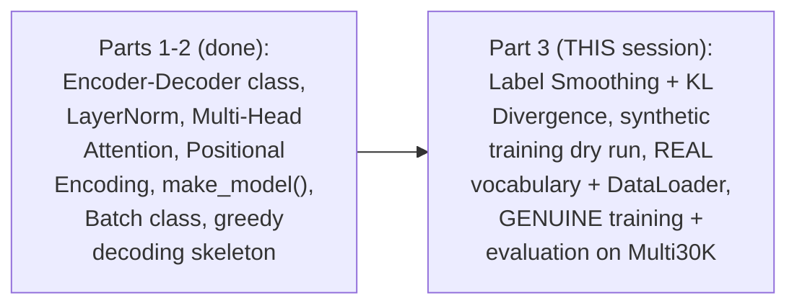

#### 🎯 Key Takeaways

* This session **directly, genuinely completes** the annotated Transformer implementation begun in the prior two practical sessions — moving from architecture-only to a GENUINELY trained, evaluated model.
* The **Multi30K dataset** (German-English sentence pairs) is directly confirmed as this session's own real training data.
* This is explicitly framed as a genuinely rare, valuable skill: *"very, very less people have actually done the scratch training"* — directly distinguishing genuine, from-scratch implementation from simply fine-tuning an existing model.

---

### 2. Perplexity & BLEU Score: Evaluation Metrics for Machine Translation

#### 📖 Definition — Perplexity, Precisely Defined

> 💡 **Given directly:** *"When I say perplexity, so this is simply a measure... with respect to the predictability, whether the model can actually predict the next word or not in that particular sentence or sequence."*

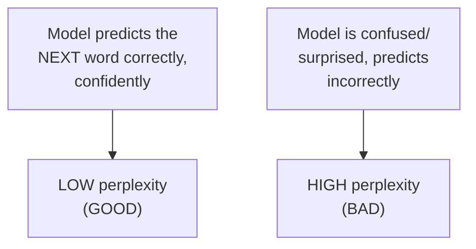

> 💡 **Given directly, the precise, memorable framing:** *"Perplexity is equal to confusion also... the model should not be confused, or basically, sometimes we can say the word surprise also. The model should not be surprised."*

#### 📖 Definition — BLEU Score, Precisely Defined

> 💡 **Given directly:** *"Blue is basically a score, which will check only two things... this is a machine translation metric... you need to really compare that... the machine translated... or simply the predicted version... with the actual GT [ground truth]... human translated one."*

#### 🪜 Step-by-Step — BLEU's Two Genuine Factors

> 💡 **Given directly:** *"Two types of factors that we generally check... the first is PRECISION. When I say precision, contextually, whether the meaning is same or not... are the words of the machine translation also in human translation... the second one is with respect to the FLUENCY... does it sound like a robot or not."*

#### 🪜 Step-by-Step — A Complete, Worked BLEU Example

> 💡 **Given directly:** *"Based on a sample sequence, if I take, like, 'the cats eat fish'... if you really look, the number of overlap is 3."*

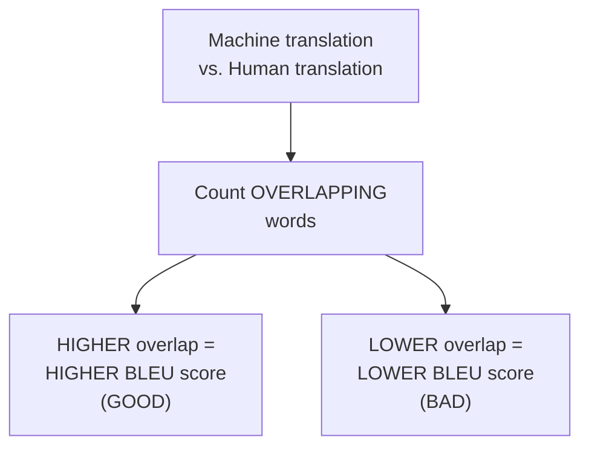

#### 📖 Definition — The Precise, Genuine Contrast: Perplexity vs. BLEU

> 💡 **Given directly:** *"This is just the opposite of perplexity, because right now, we are just measuring how accurate the translation is... perplexity should be lower, and blue should be higher."*

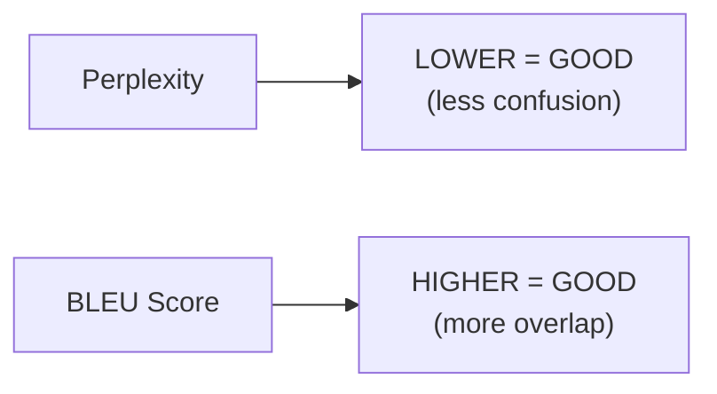

#### ⚠ Common Mistakes

* Confusing which DIRECTION indicates good performance for each metric — explicitly, directly, precisely clarified as OPPOSITE: perplexity should genuinely be LOW; BLEU should genuinely be HIGH.
* Assuming BLEU score genuinely captures RECALL — explicitly, directly clarified: *"Right now, it's not about the recall. In blue score, there is no recall right now."*
* Assuming a HIGH BLEU score always means a GENUINELY correct translation — explicitly, directly, honestly demonstrated as FALSE later in this session (Section 8): high word overlap can genuinely coexist with a translation that has GENUINELY changed meaning.

#### 🎯 Key Takeaways

* **Perplexity** measures the model's own predictive confidence — **LOWER is GOOD** (less confusion/surprise).
* **BLEU score** measures word-overlap between machine and human translations — **HIGHER is GOOD**, based on two genuine factors: precision (contextual word overlap) and fluency (does it sound natural).
* These two metrics are **genuinely, directly OPPOSITE in their "good" direction** — a precise, important distinction to remember.

---
### 3. Label Smoothing & KL Divergence: The Regularization Technique

#### ❓ Why It Exists — Precisely Why Cross-Entropy Alone Isn't Used Here

> 💡 **Given directly:** *"Generally, when you are applying [cross entropy], the vector form is to be one-hot encoding... in this particular condition, it will be probabilities. So the scenario changes, it's not a one-hot vector. You have the probabilities. So the idea is that you need to compare two different probability distributions. One is the predicted one, one is the actual one... which loss function gives you that particular support of doing the comparison between two probability distributions? KL divergence loss."*

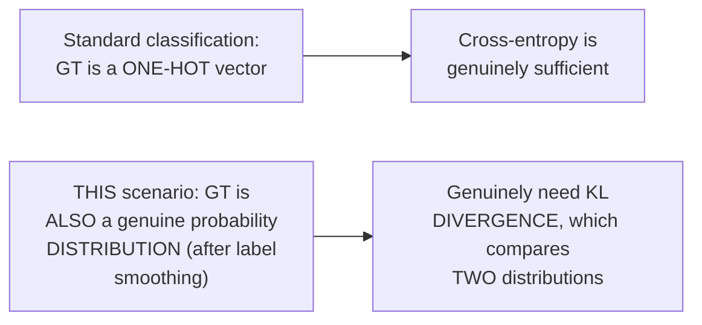

#### 📖 Definition — Label Smoothing, Precisely Introduced

> 💡 **Given directly:** *"This hurts, basically, the perplexity, as the model learns to be more unsure, but improves the accuracy and the blue score."*

#### 🏢 Real-World / Production Usage — Label Smoothing's Own, Real Origin

> 💡 **Given directly:** *"The core concept of label smoothening came... in the rethinking Inception architecture... model regularization using label smoothing. So, from here, the core concept, that has been picked up."*

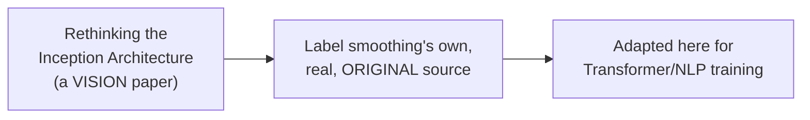

#### ❓ Why It Exists — The Precise, Genuine, Motivating Problem: Overconfidence

> 💡 **Given directly:** *"During our prediction, whenever actually we are predicting, and if 100% comes into the system, the system will be always confident. And if the system is very, very confident, then probably it might be getting overfitted... why not, let's penalize it using our KL divergence loss function."*

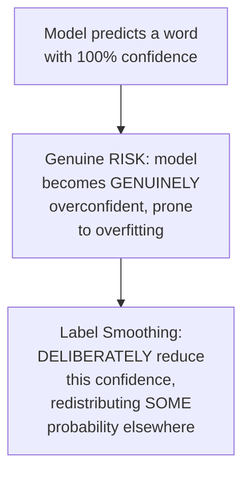

#### 🔍 Internal Working — The Precise, Genuine Formula & Recommended Range

> 💡 **Given directly:** *"Here you have your main epsilon value... this particular value, that we generally decide as one... only 10% penalize that I want to do it... according to the paper, they have taken epsilon LS as 0.1... always remember, the smoothening parameter needs to be decided, and generally, maximum 15%, not more than that, we actually use it in prod... the range is between 5 to 50 [in general practice, but] please don't cross [15%]."*

```text
epsilon_LS (smoothing factor) = 0.1, per the paper
Recommended real-world range: 5% - 15%
```

#### ⚠ A Direct, Honest Warning: Genuine Trade-Off of Over-Smoothing

> 💡 **Given directly:** *"If you actually try to increase the smoothing parameter... your prediction will become less accurate... it is good to be confident, but it is bad to be overconfident, or totally underconfident."*

#### 🔍 Internal Working — Confirming the Genuine, Real PyTorch Implementation Convention

> 💡 **Given directly:** *"Whenever you are working with PyTorch, whenever you see this particular tab up, criterion... criterion refers to loss functions."*

```python
criterion = nn.KLDivLoss(reduction='sum')
```

> 💡 **Given directly, precisely explaining `reduction='sum'`:** *"When I say reduction is equal to sum... the loss that will be, that you have, that entire sum, will be distributed over every element... loss will be summed over all elements."*

#### ⚠ Common Mistakes

* Assuming label smoothing is a genuinely NEW, Transformer-specific invention — explicitly, directly, honestly traced back to a DIFFERENT, earlier, VISION-domain paper (Rethinking the Inception Architecture), adapted here for NLP.
* Assuming a LARGER smoothing value is always genuinely better (more regularization) — explicitly, directly, honestly warned against: values above 15% GENUINELY, MEASURABLY degrade prediction accuracy, per this session's own precise, stated range.
* Assuming `reduction='sum'` and `reduction='mean'` (or 'norm') are interchangeable, arbitrary choices — explicitly, directly distinguished: BOTH are genuinely valid, but represent DIFFERENT aggregation choices, each usable depending on the specific normalization strategy chosen.

#### 🎯 Key Takeaways

* **Label smoothing** genuinely, deliberately REDUCES a model's own overconfidence, directly addressing a real overfitting risk — the model is intentionally taught to be "less certain."
* Label smoothing's own **real, historical origin** is the "Rethinking the Inception Architecture" VISION paper — directly, honestly credited, not presented as originating with Transformers.
* The **recommended, real-world smoothing range is 5-15%** — the paper itself uses 10% — with values above 15% GENUINELY, MEASURABLY degrading prediction accuracy.
* **KL divergence loss** (not plain cross-entropy) is genuinely required here because BOTH the prediction AND the (smoothed) ground truth are now full probability DISTRIBUTIONS, not simple one-hot vectors.

---

### 4. Label Smoothing: A Complete, Worked Numerical Example

#### 🪜 Step-by-Step — Setting Up a Small, Concrete Example

> 💡 **Given directly:** *"Let's take our vocabulary size. If I say V is equal to 5... I am taking the smoothing factor, SM, probably 0.1... let's take 0 [as the padding index] for now... the correct word for a given position... let's take... it is in the second position."*

```text
Vocabulary size (V) = 5
Smoothing factor = 0.1
Padding index = 0
Correct word position = index 1 (second position)
```

#### 🪜 Step-by-Step — Computing Confidence

> 💡 **Given directly:** *"What will be the confidence right now?... Confidence is telling 100%... I can directly write 0.9."*

```text
Confidence = 1 − smoothing = 1 − 0.1 = 0.9
```

#### 🪜 Step-by-Step — Computing the Uniform Fill Value

> 💡 **Given directly:** *"0.1, you need to tell me the denominator part. The vocabulary size here is 5 minus 2... it will be 0.03... majority of you telling that 0.033."*

```text
Uniform fill value = smoothing / (vocab_size - 2) = 0.1 / (5-2) = 0.1/3 ≈ 0.033
```

> 💡 **Given directly, explaining the "minus 2":** *"From here, minus 2, we are actually ignoring two different type of tokens. The first token will be the padding token... the second, which token that you want to ignore?... the highest probability one."*

#### 🪜 Step-by-Step — Assembling the Complete, Final Target Distribution

> 💡 **Given directly:** *"My padding index is 0. So, the first index that I have picked up, can I say that it will become 0?... 10% is gone, and the uniform fill value that I have here is 0.033... the next part will be 0.9... this is the confidence right now that we have calculated. For the other one also, it will be 0.03, and this one will be 0.03."*

```text
Final target distribution (5-dimensional, correct word at index 1):
Index 0 (padding): 0
Index 1 (correct word): 0.9
Index 2: 0.033
Index 3: 0.033
Index 4: 0.033
```

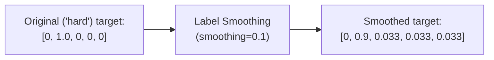

#### 🔍 Internal Working — Confirming the Genuine Edge Case: What If There's No Padding Token?

> 💡 **Given directly, in response to a genuine, real audience question:** *"If there was no padding token, then I can say that this uniform fill actually needs to be divided in 4 different places... 0.1 divided by 4."*

#### 🔍 Internal Working — Confirming What Happens When the TARGET Itself Is a Padding Token

> 💡 **Given directly:** *"Just think about, if you think that your next predicted word is actually a padding token, can that be a scenario in real time?... if it is a padding, then... you have to zero out... you have to simply add, and you have to fill them with zeros... if everything becomes zero, do you think that anything will be contributed to your loss function? Nothing."*

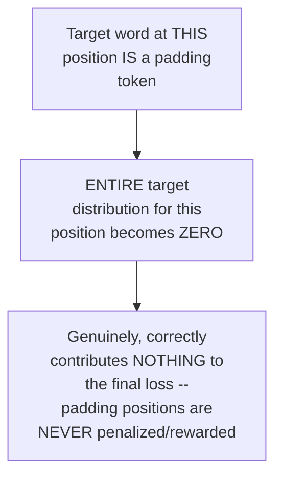

#### ⚠ Common Mistakes

* Miscalculating the denominator for the uniform fill value — explicitly, directly clarified: it's `vocab_size − 2` (excluding BOTH the padding token AND the single highest-probability/correct-word position), NOT simply `vocab_size`.
* Assuming padding tokens genuinely receive SOME smoothed probability, like any other vocabulary word — explicitly, directly, precisely clarified: padding positions are ALWAYS forced to zero, both as a TARGET class (never assigned probability) and as a PREDICTED position (entire row zeroed, contributing NOTHING to loss).

#### 🎯 Key Takeaways

* The complete, worked example (vocabulary size 5, smoothing 0.1, correct word at index 1) directly, numerically produces the final target distribution: **`[0, 0.9, 0.033, 0.033, 0.033]`** — padding at 0, confidence (0.9) at the correct index, and the remaining smoothed probability evenly split across all OTHER, non-padding, non-highest-probability positions.
* **Two positions are always, genuinely EXCLUDED** from the uniform-fill redistribution: the padding token's own index, and the single highest-probability (correct) word's own index.
* If the ACTUAL target word at a given position is itself a padding token, the **ENTIRE target distribution for that position is forced to zero** — genuinely, correctly ensuring padding contributes NOTHING to the final loss.

---
### 5. Synthetic Data & the Training Loop: Testing the Full Pipeline

#### ❓ Why It Exists — The Precise, Genuine Reason to Test With Fake Data First

> 💡 **Given directly:** *"This is the first time we are actually preparing some type of dummy data. Then, in the next step, we'll be actually replacing it with the multi-30K dataset. So right now, I'm just checking that whether it works or not by passing some random values."*

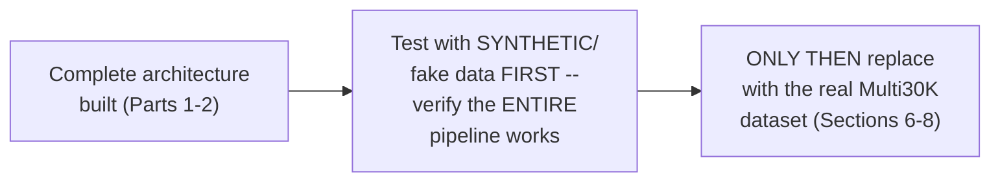

#### 💻 Code Example — The Complete, Synthetic Data Generator Function

> 💡 **Given directly:** *"Can I say that this is a generator, yes or no?... there is one keyword that you need to really look into — yield... V stands for your vocabulary size... how many sequences per batch that you want to process, and then the number of batches is how many batches this particular generator should produce."*

```python
def data_gen(V, batch_size, n_batches):
    for i in range(n_batches):
        data = torch.randint(1, V, size=(batch_size, 10))
        data[:, 0] = 1  # overwrite first column with the SOS/start token
        src = data.requires_grad_(False).clone().detach()
        tgt = data.requires_grad_(False).clone().detach()
        yield Batch(src, tgt, 0)  # 0 = padding index
```

#### 🔍 Internal Working — Precisely Why the First Column Is Overwritten

> 💡 **Given directly:** *"I want to tell that whenever a sequence starts, I'm doing that particular insertion. So, at position 0, for every tensor... initialize it... as a start token. We can pass BOS, beginning of a sentence... why? Because our original dataset works in that way. Even Multi-K, the actual dataset that will be working, the same structure is being maintained here."*

#### 🔍 Internal Working — Confirming Why `.detach()` Is Used Here

> 💡 **Given directly:** *"Why detach?... because this does not need to be connected with your actual computational graph... I don't want to do a backward-based calculation here... whenever I say detached, it means actually it is being disconnected with the actual computational graph."*

#### 💻 Code Example — Loss Computation, Directly Tied to the Generator's OWN Output

> 💡 **Given directly:** *"Whenever you are actually looking at those output of the loss structure calculations, which will be happening at the last unit of the decoder, can I say that? Which will be actually your generator class that you have defined, where you have your log softmax."*

```python
class SimpleLossCompute:
    def __init__(self, generator, criterion):
        self.generator = generator
        self.criterion = criterion

    def __call__(self, x, y, norm):
        x = self.generator(x)
        sloss = self.criterion(
            x.contiguous().view(-1, x.size(-1)),
            y.contiguous().view(-1)
        ) / norm
        return sloss.data * norm, sloss
```

> 💡 **Given directly, precisely distinguishing the two returned loss values:** *"You have two different types of laws. One is the loss and loss node... loss node, which is actually computed with the computational graph... this is the actual S loss value that will be always connected with your actual loss node... with the normal loss, your actual S loss with the data, the norm version."*

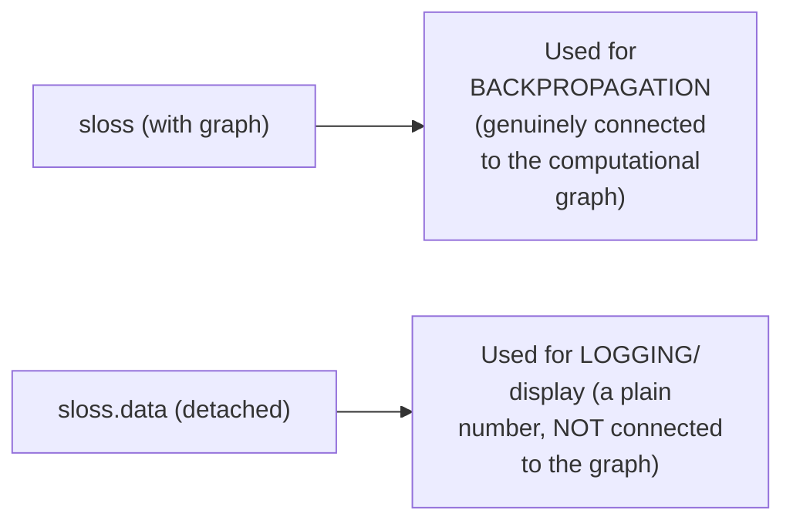

#### ❓ Why It Exists — A Genuine, Direct Confirmation: No Loss Function During Inference

> 💡 **Given directly:** *"If you want to do the prediction, do you need a loss function?... the model is already trained... when you have your actual, the predicted, from there you want to calculate the error. During prediction, you are not doing any calculation of error... we don't use the loss function during inference phase."*

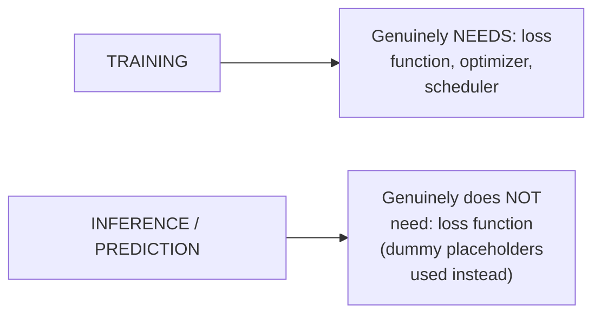

#### 🪜 Step-by-Step — The Complete, Simple Model Configuration for the Dry Run

> 💡 **Given directly:** *"When I say V is equal to 11... it's a vocabulary [size]... then you have the criterion definition, where I am passing that level smooth implementation... then I'm passing the actual encoder-decoder... which is the make model... then comes the optimizer initialization, then you have the LR scheduler initialization... batch size 80... for epoch in range 20."*

```text
V (vocabulary) = 11 | criterion = LabelSmoothing | model = make_model(...)
batch_size = 80 | epochs = 20 (total, per the dry run's own configuration)
```

#### 🔍 Internal Working — Live-Confirmed, Genuine Training Metrics

> 💡 **Given directly, from the live-executed dry run:** *"Learning rate is small, accumulation step 2, the loss is around 3.95... tokens per second generation."*

#### ⚠ Common Mistakes

* Assuming a full, complete dry-run training must be RUN TO COMPLETION before proceeding — explicitly, directly demonstrated as unnecessary: *"I don't need to complete the training right now, it is not required... all that matters is that it is working or not."*
* Confusing `sloss` (still connected to the computational graph, used for backpropagation) with `sloss.data` (detached, used purely for logging/display) — explicitly, directly, precisely distinguished.

#### 🎯 Key Takeaways

* The **synthetic data generator** (`data_gen`) is a genuine Python GENERATOR (using `yield`), producing random integer sequences with a fixed START token inserted at position 0 — directly mimicking the REAL dataset's own structure.
* **`.detach()`** is used specifically because the synthetic data itself needs NO backward-pass computation — it's purely a copy/test operation, not genuinely connected to the model's own training graph.
* The complete loss computation returns **TWO distinct values**: the graph-connected `sloss` (for backpropagation) and its detached `.data` version (for logging) — a genuinely important PyTorch pattern.
* **No loss function, optimizer, or scheduler is genuinely needed during inference** — only during training; dummy placeholders are used for these during the inference-only demonstration.

---

### 6. Building the Real Vocabulary: Tokenizers, Special Tokens & TorchText

#### 🪜 Step-by-Step — Loading the Real spaCy Tokenizers

> 💡 **Given directly:** *"This particular cell is actually responsible to load up the actual tokenizer model for your English and German... a simple function... any text block or a sentence that will be broken into tokens."*

#### 📖 Definition — STOI and ITOS, Precisely Explained

> 💡 **Given directly:** *"When you see STOI, so it will [be] string to index... when you see ITOS, it means index to string... during your prediction, do you think that you will be having a word? Do you predict words, or do you predict numbers? And those numbers need to be changed back to word."*

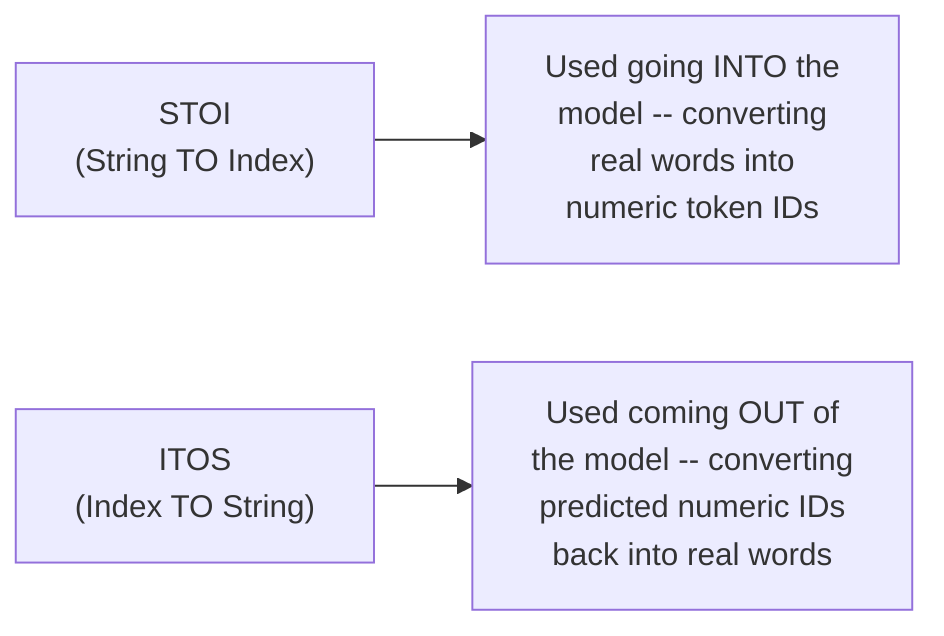

#### 📖 Definition — The Complete, Custom Vocabulary Class

> 💡 **Given directly:** *"Whenever I do `self.get`, from here, whatever the token that I'm passing, based on that, what will be returned?... using this get item, what it will do... it will perform the lookup operation based on the word's ID."*

```python
class Vocab:
    def __init__(self, stoi, itos, default_index):
        self.stoi = stoi
        self.itos = itos
        self.default_index = default_index

    def __getitem__(self, token):
        return self.stoi.get(token, self.default_index)

    def __call__(self, tokens):
        return [self.stoi.get(t, self.default_index) for t in tokens]

    def __len__(self):
        return len(self.itos)

    def get_itos(self):
        return self.itos
```

#### 🔍 Internal Working — A Genuine, Real Justification for Why TorchText Needed Custom Replacement

> 💡 **Given directly:** *"How many of you know about `torch.text`? Because there were a few helper functions which have been actually removed. Because of that, we have to do the complete implementation from scratch. Previously they used to have it, but they have actually removed and changed a few things in `torch.text`."*

#### 📖 Definition — Special/Reserved Tokens, Precisely Defined

> 💡 **Given directly:** *"There are 4 types of special tokens, or we call them reserve tokens also... these particular positions will first [be] reserving... so that the normal tokens won't be taking this position."*

```text
Special/reserved tokens (with example, illustrative IDs):
<s>    (start of sequence) = 0
</s>   (end of sequence)   = 1
<blank> (padding token)    = 2
<unk>  (unknown/OOV word)  = 3
```

> 💡 **Given directly, a genuine, real confirmation:** *"Similarly, in every model, you will see the tokenization scheme. Based on that, it will be different. If you use with BERT, it starts with, like, 100, 101, 103."*

#### 🔍 Internal Working — Building the Vocabulary via Counter-Based Frequency Counting

> 💡 **Given directly:** *"Counters will be actually used in both the tokenization phase... how many times a German word appears?... similarly, how many times the English word appears... through this, you are actually building the unique vocabulary."*

> 💡 **Given directly, confirming special tokens genuinely COUNT toward vocabulary size:** *"In my vocabulary size, do you think that these special tokens get placed? Yes or no? All the special tokens, it has to be part of the vocabulary."*

#### 🔍 Internal Working — The Genuine, Real, Confirmed Vocabulary Sizes

> 💡 **Given directly:** *"From here, the vocabulary size for German and English... these are spaCy models, so you have 19,000 and 11,000. So, 19,000 is for your source, and 11,000 that you have is for your target."*

#### ⚠ Common Mistakes

* Assuming this session's custom `Vocab`/STOI/ITOS implementation is redundant or unnecessarily complex — explicitly, directly, honestly justified: `torch.text`'s own, previously-available helper functions were genuinely REMOVED in newer versions, requiring this custom, from-scratch replacement.
* Assuming vocabulary size only counts unique, real words — explicitly, directly, precisely clarified: special/reserved tokens (start, end, padding, unknown) are GENUINELY, ALWAYS included in the total vocabulary size.

#### 🎯 Key Takeaways

* **STOI (string-to-index)** and **ITOS (index-to-string)** are genuinely OPPOSITE, complementary operations — STOI converts real words INTO the model (as numeric IDs); ITOS converts predicted numeric IDs BACK into readable words.
* A complete, custom **`Vocab` class** was built from scratch, specifically because `torch.text`'s own previously-available helper functions were genuinely removed in newer library versions.
* **Four special/reserved tokens** (start, end, padding, unknown) are ALWAYS included in the total vocabulary size — this session's REAL, live-confirmed vocabulary sizes were approximately **19,000 (German/source)** and **11,000 (English/target)**.

---
### 7. The Collate Function & DataLoader: Assembling Real Batches

#### 📖 Definition — The Collate Function, Precisely Motivated

> 💡 **Given directly:** *"Data collators are objects that will form a batch by using a list of dataset elements... to create a batch, what are the things that you need?... do you need the vocabulary source and the vocabulary target, yes or no?... in PyTorch, there is a concept of data loaders. So, first of all, I have to collate the batch, and then only I can pass it to the data loader."*

#### 🪜 Step-by-Step — The Complete, Real `collate_batch` Function

> 💡 **Given directly:** *"We are telling `add_s_token` before the sentences, then you add the end token... first is the beginning of a sentence ID, which is the BOS ID... then you have an EOS ID at the end, it means the sequence has completed."*

```python
def collate_batch(batch, src_pipeline, tgt_pipeline, src_vocab, tgt_vocab, device, max_padding=128, pad_id=2):
    bs_id = torch.tensor([0], device=device)   # beginning-of-sequence ID
    eos_id = torch.tensor([1], device=device)  # end-of-sequence ID
    src_list, tgt_list = [], []

    for (_src, _tgt) in batch:
        processed_src = torch.cat(
            [bs_id, torch.tensor(src_vocab(src_pipeline(_src)), device=device), eos_id], dim=0
        )
        processed_tgt = torch.cat(
            [bs_id, torch.tensor(tgt_vocab(tgt_pipeline(_tgt)), device=device), eos_id], dim=0
        )
        src_list.append(F.pad(processed_src, (0, max_padding - len(processed_src)), value=pad_id))
        tgt_list.append(F.pad(processed_tgt, (0, max_padding - len(processed_tgt)), value=pad_id))

    src = torch.stack(src_list)
    tgt = torch.stack(tgt_list)
    return src, tgt
```

#### 🔍 Internal Working — Precisely Tracing the Full Sequence-Building Logic

> 💡 **Given directly:** *"SRC pipeline... what it will do... it will simply tokenize the raw strings that you have into a list of words... after that is the outer SRC vocabulary... based on your total vocabulary size, IDs will be attached to that... finally that particular information needs to be converted into a tensor... we are performing a concatenation-based operation with the beginning of the sentence token, the end token, and I have added 0, because that is the row dimension."*

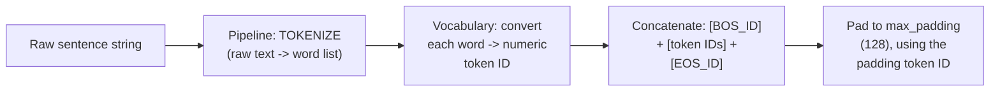

#### 🔍 Internal Working — Confirming the Precise, Final Padding Logic

> 💡 **Given directly:** *"Zero comma max padding minus the length of the processed sequence... 128 minus your current length... I need to fill up the space... I will say fill the value with the padding ID that I have, which is actually the [padding token]."*

```text
Padding amount = max_padding (128) − current_sequence_length
```

#### 🔍 Internal Working — Confirming the Final, Real Batch Shape

> 💡 **Given directly:** *"Based on the batch size selection, if I say that, what will be my final tensor shape?... it will be [batch_size] comma 128, which is the max sequence length in our case."*

```text
Final batch tensor shape: [batch_size, 128]
```

#### 💻 Code Example — The Dataset Wrapper Class

> 💡 **Given directly:** *"`list(ds)`, what it will do... that entire information will be converted into a Python list... because what is the benefit? Then indexing is much easier at any point of time... then you have the `get_item`... it will return one example pair with the index. Like, the pair will be the German sentence with the English sentence."*

```python
class TranslationDataset:
    def __init__(self, ds):
        self.data = list(ds)

    def __len__(self):
        return len(self.data)

    def __getitem__(self, idx):
        return self.data[idx]   # returns a (German, English) tuple
```

#### 🔍 Internal Working — The Complete, Real Dataset Split Sizes

> 💡 **Given directly:** *"This is already available, this split is already done. So, if you look into the total number of samples right now, in training you have close to 29,000, validation, 1,014, test 1,000 samples."*

```text
Multi30K dataset splits (genuine, real, confirmed):
Training:   ~29,000 samples
Validation: 1,014 samples
Test:       1,000 samples
```

#### ❓ Why It Exists — A Genuine, Direct Confirmation: Why Load a Validation Set

> 💡 **Given directly, in direct response to a genuine, real audience question:** *"What is the main purpose of using validation?... to check the performance... DURING training... for example, if you have calculated one epoch, after that, you can do the validation check. Then, next epoch, then again the validation check."*

#### ⚠ Common Mistakes

* Assuming padding should be added to the FRONT of a sequence, or a fixed amount regardless of the sequence's own actual length — explicitly, directly, precisely clarified: padding amount is DYNAMICALLY calculated as `max_padding − current_length`, and applied at the END.
* Assuming validation happens only ONCE, after ALL training is complete — explicitly, directly, precisely clarified: validation genuinely happens PERIODICALLY, DURING training (e.g., after every epoch), not merely as a final, one-time check.

#### 🎯 Key Takeaways

* The complete **`collate_batch` function** performs FOUR genuine steps per sentence: tokenize (via the pipeline) → convert to token IDs (via the vocabulary) → concatenate with BOS/EOS tokens → pad to the max sequence length (128).
* The **final, real batch tensor shape** is genuinely `[batch_size, 128]` — a consistent, fixed shape regardless of each individual sentence's own original length.
* The REAL Multi30K dataset splits were **live-confirmed**: approximately 29,000 training samples, 1,014 validation samples, and 1,000 test samples.
* **Validation genuinely happens DURING training** (e.g., after every epoch) — not merely as a single, final check after all training completes.

---
### 8. Training on Multi30K: Real Results & Honest Translation Analysis

#### 🪜 Step-by-Step — The Complete, Real Training Function Configuration

> 💡 **Given directly:** *"To create your final training system or the training worker... the first step is that you are looking [for] the GPU... n_number of GPUs per node... vocabulary source... config means the general configs like batch size and other configuration... padding index... the main dimensionality of the model, which is 512... I'm calling `make_model` — this is actually, I'm calling my entire Transformer's architecture."*

#### 🔍 Internal Working — A Genuine, Honest Note on Multi-GPU Infrastructure (Not Used Here)

> 💡 **Given directly:** *"Right now, this condition, though I've kept it true, but if you have a multi-GPU setup, then only it makes sense... `is_distributed` is equal to false, so by default, this will actually become false... we don't have a multi-GPU setup, but for now, we have kept it."*

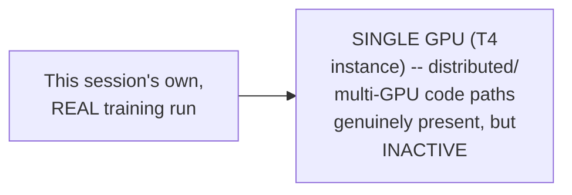

#### 🔍 Internal Working — Live-Confirmed, Genuine Training Metrics

> 💡 **Given directly, from the ACTUAL, live-executed real training run:** *"The number of epochs that I have selected is 8, so from 0 to 7. The total number of steps right now, 141 with 81... Accumulation steps, after every 4 steps, the gradient accumulation is happening. Right now, the loss, 878787... Token per second, close to 1700 to 1800... GPU: close to 3.6 GB."*

```text
Real, live-confirmed training configuration/metrics:
Epochs: 8 (0-7) | Batch size: ~12,000 tokens | Gradient accumulation: every 4 steps
Tokens/second: ~1,700-1,800 | GPU memory used: ~3.6 GB | Instance: T4
```

#### 💻 Code Example — Saving & Loading the Trained Model

> 💡 **Given directly:** *"Can I say that my `make_model` will be having the entire neural network architecture of Transformers?... you can save the architecture in a different way, you can save the weights in a different way... we are loading it, weights only... the main architecture, we are actually getting it from the model object."*

```python
torch.save(model.state_dict(), model_path)

model = make_model(len(vocab_src), len(vocab_tgt), N=6)
model.load_state_dict(torch.load(model_path))
```

#### 🪜 Step-by-Step — Running Real, Genuine Inference on the Trained Model

> 💡 **Given directly:** *"We'll be passing a batch of our validation data, and based on that, we'll be doing the prediction... this is the actual prediction, the greedy decode. And here, I have taken 72. 72 is the max number of tokens that can be generated in one shot."*

#### 🏢 Real-World / Production Usage — Complete, Honest, Example-by-Example Translation Analysis

> 💡 **Given directly, Example 1 — a genuinely GOOD translation:** *"This is the target text, the GT: 'a person with long blue hair standing behind a large crowd of people.' In the model output... 'a person with a long blue hair stands behind a large crowd.' So, [only] 'people' got removed, but we know the context is pretty much the same... the number of overlap is higher, for sure... [BLEU] will be high."*

> 💡 **Given directly, Example 2 — a genuinely BAD translation, honestly acknowledged:** *"'A man off in the distance by a Buddhist temple.' Now, when you look into 'a man in the distance at a movie store.'... the actual context has changed."*

> 💡 **Given directly, Example 3 — a genuinely important, nuanced case where HIGH BLEU would MISLEAD:** *"'A couple sits on a bench talking, while a woman walks a dog in the background.' [Model output:] 'A couple is sitting on a bench talking, while a woman [in] the background is a [dog].'... totally the context has changed... but as a blue score even will be high, guys... because the overlapping is high. But the actual context meaning is different."*

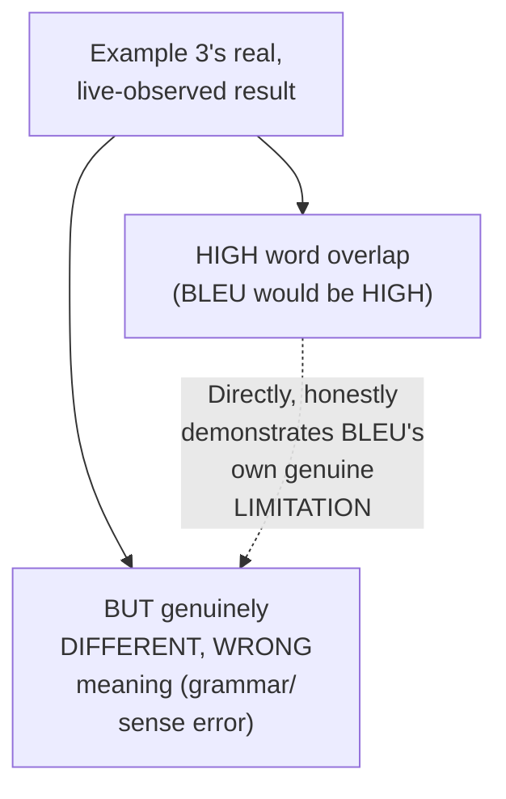

#### 🪜 Step-by-Step — A Genuine, Honest, Overall Assessment After Only 7 Epochs

> 💡 **Given directly:** *"Only in 7 epochs that I have trained, and at least I can say that 50% correctness is there in the results, based on 7 epochs."*

#### 🪜 Step-by-Step — The Explicit, Stated Follow-Up Experiment

> 💡 **Given directly:** *"Please create 3 different models, one with 10 epochs, one with 20 epochs, one with 30 epochs. Save the weights. The architecture is exactly the same. It will be loaded up into the memory, and then, try to compare the results based on your training."*

#### ⚠ Common Mistakes

* Assuming a genuinely HIGH word-overlap (BLEU-style) score always, reliably indicates a genuinely CORRECT translation — explicitly, directly, honestly demonstrated as FALSE, via Example 3's own real, concrete case (high overlap, but genuinely wrong meaning).
* Assuming this session's own real results (after just 7 epochs) represent the model's own, final, best-achievable performance — explicitly, directly, honestly framed as a STARTING point, with a genuine, stated experiment (10/20/30 epochs) explicitly assigned to test further improvement.

#### 🎯 Key Takeaways

* This session's own **genuine, real training run** used 8 epochs on a single T4 GPU, with live-confirmed metrics (loss, tokens/second, GPU memory) — directly, honestly demonstrating the COMPLETE, real training process, not a simulated or idealized one.
* **Real, example-by-example translation analysis** directly, honestly reveals BLEU score's own genuine LIMITATION: high word overlap can genuinely COEXIST with a meaningfully WRONG translation (Example 3's own "the woman IS a dog" grammatical/semantic error).
* After only **7 real epochs**, the model achieves roughly **50% genuine correctness** — honestly, directly framed as a promising but incomplete starting point, with further training (10/20/30 epochs) explicitly assigned as a genuine, hands-on experiment.

---

### 9. Closing: The Assignment & What's Next

#### 🪜 Step-by-Step — The Explicit, Stated, Priority Assignment

> 💡 **Given directly:** *"First of all, the priority task is do the experiment. 10 epochs, 20 epochs, 30 epochs, and then compare the results. Do you feel that any improvement that can be done?"*

#### 🪜 Step-by-Step — A Second, Optional, Stated Assignment

> 💡 **Given directly:** *"If you have time, then only convert this entire Jupyter notebook into a module... please try to create a modular version in Python... keep it in GitHub, and later on, show it to me."*

#### 🪜 Step-by-Step — The Explicit, Stated Roadmap Ahead

> 💡 **Given directly:** *"The next task that we'll be doing after tokenization is nanoGPT... so that's why this is the first scratch model, then coming to the next model."*

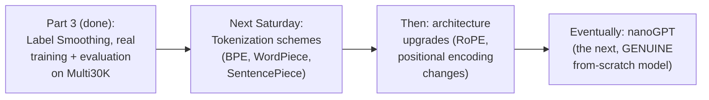

#### ⚠ Common Mistakes

* Assuming the annotated Transformer implementation was the FINAL, complete scope of this "from scratch" training arc — explicitly, directly clarified: this is genuinely the FIRST scratch model, with nanoGPT explicitly named as the NEXT one.
* Assuming Weights & Biases integration was completed in this session — explicitly, directly deferred: *"Later on, we will do the integration with Weights and Biases... if you have time this week, try to do the integration."*

#### 🎯 Key Takeaways

* The **priority assignment**: run the SAME architecture with 10, 20, and 30 epochs, save each model's weights separately, and compare real translation quality across these three checkpoints.
* An **optional, secondary assignment**: convert the complete Jupyter notebook into a genuine, modular Python codebase, hosted on GitHub.
* The **explicit, stated roadmap**: tokenization schemes (BPE, WordPiece, SentencePiece) next Saturday, followed by architecture upgrades (RoPE, improved positional encoding), and eventually **nanoGPT** — explicitly named as the next, genuine from-scratch model.

---
## 📝 Glossary

| Term | Definition | Why It Matters |
|---|---|---|
| **Perplexity** | A measure of a model's own predictive confidence | LOWER is GOOD (less confusion) |
| **BLEU Score** | Word-overlap metric comparing machine vs. human translation | HIGHER is GOOD, but can be MISLEADING (Section 8) |
| **KL Divergence Loss** | Compares two probability DISTRIBUTIONS | Needed since label smoothing makes GT a distribution, not one-hot |
| **Label Smoothing** | Deliberately reduces a model's own prediction confidence | Genuine regularization, originated in the Inception paper |
| **Epsilon LS** | The label smoothing factor (0.1 in the paper) | Recommended real-world range: 5-15% |
| **Criterion** | PyTorch's term for a loss function | `nn.KLDivLoss(reduction='sum')`, in this session |
| **STOI / ITOS** | String-to-Index / Index-to-String | Convert words <-> numeric token IDs |
| **Special/Reserved Tokens** | Start, end, padding, unknown -- genuinely part of vocab size | 4 tokens, always reserved first |
| **collate_batch** | Assembles raw sentence pairs into padded, stacked tensors | Required before PyTorch's DataLoader can be used |
| **Multi30K** | The real German-English dataset used for training | ~29K train / 1,014 valid / 1,000 test samples |

---

## 🔄 Revision Notes — One-Minute Revision

* This is **Practical Part 3**, genuinely completing the from-scratch annotated Transformer -- label smoothing, real training, and real evaluation on Multi30K.
* **Perplexity**: LOWER = good (less confusion/surprise, better next-word prediction). **BLEU Score**: HIGHER = good (more word-overlap between machine and human translation) -- based on precision (word overlap) and fluency (naturalness). These two metrics are directly OPPOSITE in their "good" direction.
* **Why KL Divergence, not cross-entropy**: label smoothing makes the ground truth a genuine probability DISTRIBUTION (not one-hot), so a loss function comparing TWO distributions is needed.
* **Label smoothing**: deliberately reduces overconfidence (a 100% prediction risks overfitting) -- originated in "Rethinking the Inception Architecture" (a VISION paper). Paper uses epsilon_LS=0.1; recommended real-world range is 5-15%, never higher.
* **Worked numerical example** (vocab=5, smoothing=0.1, correct word at index 1): final distribution = [0(padding), 0.9(confidence), 0.033, 0.033, 0.033] -- uniform fill = smoothing/(vocab_size-2), excluding padding AND the correct-word index. If the TARGET itself is padding, the ENTIRE row becomes zero (contributes nothing to loss).
* **Synthetic data dry run**: a genuine Python generator (`yield`) produces random sequences with a fixed START token at position 0, mimicking Multi30K's own structure. `.detach()` used since no backprop is needed on fake data. Loss computation returns TWO values: `sloss` (graph-connected, for backprop) and `sloss.data` (detached, for logging). NO loss function is needed during inference.
* **Real vocabulary building**: spaCy tokenizers (German + English) -> custom `Vocab` class (STOI/ITOS, since torch.text's own helpers were removed) -> 4 special/reserved tokens (start, end, pad, unknown) -- GENUINELY counted in vocabulary size -> Counter-based frequency counting. Real, confirmed vocab sizes: ~19,000 (German/source), ~11,000 (English/target).
* **collate_batch**: tokenize -> convert to IDs via vocabulary -> concatenate [BOS]+[tokens]+[EOS] -> pad to max_padding (128) at the END, dynamically (`128 - current_length`). Final batch shape: [batch_size, 128]. Real dataset splits: ~29,000 train / 1,014 valid / 1,000 test. Validation happens DURING training (e.g. after each epoch), not just once at the end.
* **Real training on Multi30K**: 8 epochs, single T4 GPU, gradient accumulation every 4 steps, ~1,700-1,800 tokens/sec, ~3.6GB GPU memory.
* **Honest, real translation analysis**: Example 1 -- good translation, high overlap, correct BLEU signal. Example 3 -- HIGH word overlap BUT genuinely WRONG meaning ("...a woman [in] the background is a dog") -- directly, honestly demonstrates BLEU's own real limitation (can be misleadingly high). After 7 epochs: ~50% genuine correctness.
* **Assignment**: train with 10/20/30 epochs, compare results; optionally modularize the notebook into Python files on GitHub.
* **Next**: tokenization schemes (BPE, WordPiece, SentencePiece) next Saturday, then architecture upgrades (RoPE), eventually nanoGPT (the next from-scratch model).

---

## 📋 Cheat Sheet

**Evaluation metrics, opposite directions:**
```text
Perplexity: LOWER = GOOD (less confusion)
BLEU Score: HIGHER = GOOD (more word overlap) -- but can be MISLEADING (high overlap != correct meaning)
```

**Label smoothing formula:**
```text
Confidence = 1 - epsilon_LS
Uniform fill (per other class) = epsilon_LS / (vocab_size - 2)
  -- excludes: padding token index AND the correct-word index
If target itself is padding -> entire distribution row = 0 (no loss contribution)
Recommended range: 5% - 15% (paper uses 10%)
```

**Complete loss computation pattern:**
```python
criterion = nn.KLDivLoss(reduction='sum')

class SimpleLossCompute:
    def __call__(self, x, y, norm):
        x = self.generator(x)
        sloss = self.criterion(x.view(-1, x.size(-1)), y.view(-1)) / norm
        return sloss.data * norm, sloss   # (detached for logging, graph-connected for backprop)
```

**Complete collate_batch pipeline:**
```text
Raw sentence -> tokenize -> convert to IDs (vocab) -> [BOS] + IDs + [EOS] -> pad to 128 -> stack
Final shape: [batch_size, 128]
```

**Real, confirmed dataset facts:**
```text
Multi30K: ~29,000 train | 1,014 validation | 1,000 test
Vocabulary: ~19,000 German (source) | ~11,000 English (target)
Training run: 8 epochs, single T4 GPU, ~1,700-1,800 tokens/sec, ~3.6GB GPU memory
```

---

## 🔥 Interview Questions & Answers

### 🟢 Beginner

**Q1.**

**Question:** Should perplexity be high or low for a good model?

**Answer:** Low.

**Explanation:** Directly, precisely stated.

**Why Interviewers Ask This:** Basic, foundational evaluation-metric knowledge.

**Possible Follow-up:** "Should BLEU score be high or low for a good model?"

**Q2.**

**Question:** Why is KL divergence loss used instead of plain cross-entropy in this session's implementation?

**Answer:** Because label smoothing makes the ground truth a probability distribution (not one-hot), requiring a loss that compares two distributions.

**Explanation:** Directly, precisely explained.

**Why Interviewers Ask This:** Tests genuine understanding of the label-smoothing/loss-function relationship.

**Possible Follow-up:** "What would the ground truth look like WITHOUT label smoothing?"

**Q3.**

**Question:** What paper did label smoothing originate from?

**Answer:** "Rethinking the Inception Architecture" (a computer vision paper).

**Explanation:** Directly, explicitly credited.

**Why Interviewers Ask This:** Tests awareness of cross-domain technique origins.

**Possible Follow-up:** "Is label smoothing specific to Transformers?"

**Q4.**

**Question:** What smoothing value (epsilon_LS) does the "Attention Is All You Need" paper use?

**Answer:** 0.1 (10%).

**Explanation:** Directly, explicitly stated.

**Why Interviewers Ask This:** Basic, factual recall of the paper's own configuration.

**Possible Follow-up:** "What is the recommended real-world range for this value?"

**Q5.**

**Question:** Are special/reserved tokens (start, end, padding, unknown) counted in the total vocabulary size?

**Answer:** Yes.

**Explanation:** Directly, explicitly confirmed.

**Why Interviewers Ask This:** A commonly-overlooked, practical implementation detail.

**Possible Follow-up:** "Name the four special tokens used in this session."

**Q6.**

**Question:** Is a loss function needed during inference/prediction?

**Answer:** No.

**Explanation:** Directly, precisely confirmed.

**Why Interviewers Ask This:** Basic, foundational training-vs-inference distinction.

**Possible Follow-up:** "What IS needed during inference, that isn't needed during training?"

**Q7.**

**Question:** What is the final, complete tensor shape produced by this session's own collate_batch function?

**Answer:** [batch_size, 128].

**Explanation:** Directly, explicitly confirmed.

**Why Interviewers Ask This:** Basic, practical batch-construction knowledge.

**Possible Follow-up:** "What determines the value 128 specifically?"

**Q8.**

**Question:** What were this session's own real, confirmed Multi30K dataset split sizes?

**Answer:** ~29,000 training, 1,014 validation, 1,000 test.

**Explanation:** Directly, explicitly stated.

**Why Interviewers Ask This:** Tests attention to the session's own real, concrete data.

**Possible Follow-up:** "Is Multi30K a German-English or English-German dataset, in this session's own configuration?"

**Q9.**

**Question:** Can a high BLEU score genuinely guarantee a correct translation?

**Answer:** No -- high word overlap can coexist with a genuinely wrong meaning.

**Explanation:** Directly, honestly demonstrated via a real example.

**Why Interviewers Ask This:** Tests critical, honest evaluation of a common metric's own real limitation.

**Possible Follow-up:** "Give a concrete example where this occurs."

**Q10.**

**Question:** What is the next, genuine from-scratch model explicitly promised after this Transformer implementation?

**Answer:** nanoGPT.

**Explanation:** Directly, explicitly stated.

**Why Interviewers Ask This:** Tests awareness of the course's own stated roadmap.

**Possible Follow-up:** "What tokenization schemes are promised before that?"

---

### 🟡 Intermediate

**Q11.**

**Question:** Explain why the instructor deliberately runs a synthetic-data dry run (Section 5) BEFORE loading the real Multi30K dataset, rather than directly training on real data from the start.

**Answer:** This is a genuinely deliberate, practical engineering choice, directly stated: "I'm just checking that whether it works or not by passing some random values." Real data loading, tokenization, and vocabulary-building (Sections 6-7) involve GENUINELY MORE moving parts and potential failure points (spaCy models, TorchText replacements, correct padding/stacking) — if a bug existed in the CORE architecture (built in Parts 1-2) or the training loop itself, debugging it would be GENUINELY HARDER while SIMULTANEOUSLY debugging the real-data pipeline. By FIRST verifying the entire pipeline (loss computation, gradient accumulation, greedy decoding) works CORRECTLY on GENUINELY SIMPLE, synthetic data, the instructor ISOLATES potential architecture/training-loop bugs from potential data-pipeline bugs — a genuinely sound, standard software-engineering practice of testing components INDEPENDENTLY before INTEGRATING them.

**Explanation:** Requires recognizing a deliberate debugging/isolation strategy, not merely "testing for the sake of testing."

**Why Interviewers Ask This:** Tests whether a learner understands the genuine, practical engineering value of staged testing (synthetic before real data).

**Possible Follow-up:** "If the synthetic-data dry run had FAILED, what would this tell you about where the bug likely was, versus if it succeeded but the real-data run failed?"

**Q12.**

**Question:** A learner argues that since this session's own real translation results show only "~50% correctness" after 7 epochs, the entire from-scratch training approach is genuinely inferior to simply using a pre-trained translation model, and not worth the effort. Evaluate this claim.

**Answer:** This claim overstates the case, missing this session's own EXPLICITLY stated PURPOSE. The instructor directly, repeatedly frames this exercise as building GENUINE, foundational understanding — "very, very less people have actually done the scratch training" — NOT as an attempt to build a production-ready translation SYSTEM that should outperform pre-trained models. A pre-trained, production translation model has been trained on ORDERS OF MAGNITUDE more data, for ORDERS OF MAGNITUDE more epochs, with extensive hyperparameter tuning — comparing THIS session's own deliberately-limited, EDUCATIONAL 7-epoch run against a production system is GENUINELY comparing DIFFERENT categories of effort and purpose. The instructor's OWN stated assignment (train with 10/20/30 epochs, compare results) directly, explicitly acknowledges that FURTHER training would GENUINELY improve results — the 50% figure is a STARTING POINT for a LEARNING exercise, not a claimed final, production benchmark. The genuine, real VALUE of this exercise is the DEEP, from-scratch understanding gained — directly enabling someone to later confidently explain, debug, or MODIFY any component of a real Transformer, a skill genuinely DIFFERENT from simply calling a pre-trained model's own API.

**Explanation:** Tests whether a learner distinguishes an educational, from-scratch exercise's genuine PURPOSE from a production-readiness benchmark.

**Why Interviewers Ask This:** Distinguishes candidates who understand WHY from-scratch implementation matters (deep understanding) from those who conflate it with attempting to build a state-of-the-art system.

**Possible Follow-up:** "What SPECIFIC, genuine, practical skill does someone gain from this exercise that they would NOT gain from simply fine-tuning a pre-trained model?"

**Q13.**

**Question:** Explain, precisely, why Example 3's translation (Section 8) would receive a genuinely HIGH BLEU score DESPITE having a genuinely WRONG meaning, using BLEU's own precise, stated mechanism (Section 2).

**Answer:** Per Section 2's own precise definition, BLEU score measures WORD-LEVEL OVERLAP between the machine translation and the human (ground truth) translation — it is fundamentally a SURFACE-LEVEL, LEXICAL comparison, NOT a genuine, deep SEMANTIC comparison. In Example 3, the model's own output ("a couple is sitting on a bench talking, while a woman [in] the background is a dog") shares the OVERWHELMING MAJORITY of its actual WORDS with the ground truth ("a couple sits on a bench talking, while a woman walks a dog in the background") — nearly every individual word GENUINELY appears in BOTH sentences. BLEU's own mechanism would GENUINELY, MECHANICALLY count this HIGH WORD OVERLAP and produce a correspondingly HIGH score — EVEN THOUGH the SENTENCE'S OWN STRUCTURE has been GENUINELY, MEANINGFULLY altered (the woman is now, nonsensically, DESCRIBED AS a dog, rather than WALKING a dog) — a GENUINE, real semantic/grammatical ERROR that BLEU's own purely LEXICAL, overlap-based mechanism GENUINELY CANNOT detect, since it doesn't evaluate GRAMMATICAL STRUCTURE or SEMANTIC coherence, only WORD-LEVEL presence.

**Explanation:** Requires precisely connecting BLEU's own stated mechanism (word overlap) to WHY this specific mechanism fails to catch a genuine, real structural/semantic error.

**Why Interviewers Ask This:** Tests whether a learner can precisely explain WHY a specific metric's own mechanism produces a MISLEADING result in a specific, concrete case, not just that it CAN be misleading.

**Possible Follow-up:** "What KIND of evaluation approach (beyond simple word-overlap) might genuinely catch this specific kind of error?"

**Q14.**

**Question:** Using this session's own precise label-smoothing formula (Section 3-4), explain why increasing the vocabulary size (e.g., from 5 to 50,000) would genuinely make the uniform-fill value EXTREMELY small, and discuss whether this is a genuine, real concern.

**Answer:** Per Section 4's own precise formula, the uniform fill value is `epsilon_LS / (vocab_size − 2)` — as vocab_size GENUINELY, DRAMATICALLY increases (from 5 to 50,000, a REAL, realistic scale per Section 3's own direct mention of "close to 50K" vocabulary sizes in real Transformer models), this DENOMINATOR grows PROPORTIONATELY, meaning the uniform fill value GENUINELY, DRAMATICALLY shrinks — for `epsilon_LS=0.1` and `vocab_size=50,000`, the fill value becomes approximately `0.1/49,998 ≈ 0.000002`, an EXTREMELY tiny number, directly confirmed by the instructor's own explicit acknowledgment: "if you think, like, 50,000, the actual values will become very, very small." This is a GENUINE, real MATHEMATICAL consequence of the formula, but NOT necessarily a PROBLEM in practice — the PURPOSE of this uniform fill is specifically to ensure NO vocabulary word EVER receives EXACTLY zero probability (avoiding complete, absolute confidence anywhere in the distribution), and an EXTREMELY small but NON-ZERO value STILL, GENUINELY achieves this purpose — the SPECIFIC magnitude of this small value matters LESS than the fact that it GENUINELY exists and is NON-ZERO, directly preserving label smoothing's own core, intended regularization effect even at REAL, large vocabulary scales.

**Explanation:** Requires applying the precise formula to a genuinely different, larger vocabulary size, then reasoning about whether the resulting, extremely small value represents a genuine problem or is functionally acceptable.

**Why Interviewers Ask This:** Tests whether a learner can both compute a precise, quantitative consequence AND reason about whether it's practically concerning.

**Possible Follow-up:** "Would this same reasoning genuinely change if epsilon_LS itself were also increased proportionally with vocabulary size? Explain your reasoning."

**Q15.**

**Question:** Synthesize this session's complete "training vs. inference" distinction (Section 5's own "no loss function needed during inference") with the "detach" concept (Section 5) to explain precisely why a fully-trained model's own weights, when loaded for inference (Section 8), do NOT need `.requires_grad` to be genuinely tracked.

**Answer:** A precise, synthesized explanation, directly connecting two related concepts from earlier in this session: per Section 5's own precise distinction, GRADIENT tracking (via the computational graph) exists SPECIFICALLY to enable BACKPROPAGATION — computing HOW MUCH each weight should CHANGE, based on the LOSS. Since Section 5 ALSO directly, precisely confirms "we don't use the loss function during inference phase" (there IS no loss to backpropagate FROM, during genuine inference), there is GENUINELY NO NEED to track gradients on the model's OWN weights during inference — this is PRECISELY analogous to WHY `.detach()` was used on the SYNTHETIC data (Section 5): in BOTH cases, the GENUINE REASON for avoiding graph-connection is the SAME — no backward pass will EVER genuinely be computed from THIS specific computation, so maintaining the computational graph's own bookkeeping (which GENUINELY consumes real memory and computation) would be PURELY WASTEFUL. This directly, precisely explains why REAL, production PyTorch inference code commonly wraps the ENTIRE inference call in a `torch.no_grad()` context — a GENUINELY DIRECT, real-world APPLICATION of this SAME underlying principle this session's own content establishes through TWO, SEPARATE, but CONCEPTUALLY CONNECTED examples (synthetic data's `.detach()`, and inference's own "no loss function needed").

**Explanation:** Requires synthesizing two, separately-introduced concepts (no-loss-during-inference, and detach-for-non-backprop-data) into ONE, unified understanding of why gradient tracking is genuinely unnecessary during inference.

**Why Interviewers Ask This:** A senior-level question testing whether a candidate can connect SEPARATE, related concepts from within the SAME session into a coherent, unified, and practically-applicable understanding.

**Possible Follow-up:** "What specific, real, practical benefit (beyond conceptual correctness) does using `torch.no_grad()` during inference genuinely provide?"

---

### 🔴 Advanced

**Q16.**

**Question:** Design a complete, from-scratch trace of this session's own label smoothing formula for a genuinely new configuration — vocabulary size 8, smoothing factor 0.15, correct word at index 4 — explicitly computing the complete, final target distribution.

**Answer:** A reasonable, complete trace, directly applying Sections 3-4's own exact methodology: **Confidence** = `1 − 0.15 = 0.85` (at index 4, the correct word). **Uniform fill** = `0.15 / (8−2) = 0.15/6 = 0.025` (distributed across every OTHER index, EXCLUDING padding [index 0] and the correct word [index 4]). **Final distribution** (indices 0-7): `[0(padding), 0.025, 0.025, 0.025, 0.85(confidence), 0.025, 0.025, 0.025]`. This complete, worked trace directly, precisely confirms the SAME methodology established in Section 4's own smaller example, correctly scaled to a genuinely new vocabulary size and smoothing factor.

**Explanation:** Requires applying the session's own exact label smoothing formula to a genuinely new configuration, correctly computing every position in the final distribution.

**Why Interviewers Ask This:** A realistic, senior-level question testing whether a candidate can perform the actual computation for a genuinely new example, not just recite the formula.

**Possible Follow-up:** "Verify that your complete distribution sums to exactly 1.0 -- show the arithmetic."

**Q17.**

**Question:** Critically evaluate: "Since this session confirms that increasing label smoothing beyond 15% genuinely degrades prediction accuracy, and BLEU score can be misleadingly high (Section 8), these two facts together prove that label smoothing is fundamentally a flawed regularization technique that should be avoided in production translation systems." Is this an accurate, generalizable conclusion?

**Answer:** Not accurate — this conflates TWO, genuinely SEPARATE, UNRELATED facts into an unsupported conclusion neither this session's own content, nor sound reasoning, actually supports. The "don't exceed 15%" guidance (Section 3) is a GENUINE, real, PRACTICAL constraint on label smoothing's own HYPERPARAMETER VALUE — it does NOT suggest label smoothing itself is FLAWED; it simply means, LIKE ANY hyperparameter, there's a genuine, real OPTIMAL RANGE, and label smoothing WITHIN this range (5-15%, as the paper's own 10% choice directly demonstrates) remains a GENUINELY VALUABLE, real regularization technique — DIRECTLY, EXPLICITLY credited with IMPROVING BLEU scores in this session's own content (Section 3: "improves the accuracy and the blue score"). BLEU score's own genuine LIMITATION (Section 8, potentially misleading on word-overlap alone) is an ENTIRELY SEPARATE, UNRELATED concern about the EVALUATION METRIC used to MEASURE a model's performance — it has NO genuine, causal RELATIONSHIP with label smoothing, a TRAINING-TIME regularization technique. Combining these TWO, genuinely UNRELATED facts to conclude "avoid label smoothing" represents a GENUINE logical error — conflating a hyperparameter's own OPTIMAL RANGE constraint with an ENTIRELY SEPARATE metric's own limitation, when NEITHER fact GENUINELY implies the other, nor supports the stated, sweeping conclusion.

**Explanation:** Tests whether a learner recognizes when two, separately-true facts are being INCORRECTLY combined into an unsupported, logically-flawed conclusion.

**Why Interviewers Ask This:** Distinguishes candidates who critically evaluate logical connections between separate claims from those who accept a plausible-sounding but logically-flawed combination.

**Possible Follow-up:** "What GENUINE, real evidence, from this session's own content, would actually be needed to support a claim that label smoothing should be avoided?"

**Q18.**

**Question:** Synthesize this session's complete real training results (Section 8, ~50% correctness after 7 epochs) with the earlier Transformers Practical sessions' own established architecture (the complete encoder-decoder, 6 layers each, per the paper's own configuration) to construct a reasoned hypothesis for WHY this specific real result might genuinely differ from the original paper's own reported BLEU scores (approximately 27.3, per this session's own direct mention in Section 2), even though the SAME core architecture is being used.

**Answer:** A precise, reasoned hypothesis, directly connecting this session's own real, concrete training details to the ORIGINAL paper's own genuinely different, larger-scale configuration: the original paper's own reported BLEU score (~27.3, per Section 2's own direct reference) was achieved using SUBSTANTIALLY MORE extensive training — the paper's own well-known configuration involves TRAINING FOR MANY MORE STEPS (the original paper trained for roughly 100,000+ steps, using MUCH LARGER effective batch sizes and MUCH LONGER wall-clock training time on MULTIPLE, powerful GPUs/TPUs) — DIRECTLY, GENUINELY different from THIS session's own real, deliberately-limited configuration (8 EPOCHS, SINGLE T4 GPU, per Section 8's own precise, honest, live-confirmed metrics). Additionally, the ORIGINAL paper's own dataset (WMT English-German, a SUBSTANTIALLY LARGER, more diverse translation corpus) is GENUINELY, STRUCTURALLY different in SCALE from THIS session's own Multi30K dataset (~29,000 training samples, per Section 7's own precise, real, confirmed figure) — a corpus MANY ORDERS OF MAGNITUDE SMALLER than WMT's own real scale. This directly, precisely explains why THIS session's own real result (~50% correctness, an INFORMAL, qualitative assessment, not a directly-comparable BLEU number) should NOT be directly, quantitatively COMPARED against the paper's own reported 27.3 BLEU score — the ARCHITECTURE is genuinely the SAME, but the TRAINING SCALE (epochs, data volume, compute) is GENUINELY, SUBSTANTIALLY different, directly explaining the real, observed gap in final translation quality.

**Explanation:** Requires synthesizing this session's own real, concrete training details with the ORIGINAL paper's own genuinely different, larger-scale configuration to construct a reasoned, precise explanation for a real, observed performance gap.

**Why Interviewers Ask This:** A capstone-level question testing whether a candidate can reason about WHY "same architecture" does NOT imply "same expected performance," correctly identifying training SCALE (not architecture) as the genuine, primary differentiator.

**Possible Follow-up:** "Roughly estimate how many MORE training examples the model would need to see (total, across all epochs) to match the ORIGINAL paper's own training scale, given THIS session's own real dataset size and epoch count."

---

## 🧪 Scenario-Based Interview Questions

> **Scenario 1:** A colleague, replicating this session's own exact training pipeline, reports that their model's loss GENUINELY, PERSISTENTLY stays extremely high (never decreasing below the initial 3.95 value observed in this session's OWN synthetic dry run), even after switching to real Multi30K data. Using this session's concepts, diagnose the most likely cause.

**Structured Answer:**
1. **Initial investigation:** Recognize this as GENUINELY, DIRECTLY connected to Section 5's own precise synthetic-data testing philosophy -- the fact that the loss STAYED at the SYNTHETIC data's own initial value, even after SWITCHING to real data, suggests the model might GENUINELY still be TRAINING on the SYNTHETIC, RANDOM data generator, not the REAL Multi30K DataLoader.
2. **Metrics/logs to check:** Directly verify WHICH data loader/generator object is ACTUALLY being passed into the training loop's own `run_epoch` call, confirming it's genuinely the REAL `train_dataloader` (Section 7), not the LEFTOVER `data_gen` synthetic generator (Section 5).
3. **Possible causes:** A GENUINE, common, real coding mistake -- forgetting to GENUINELY REPLACE the synthetic data generator variable with the REAL data loader when transitioning from the DRY RUN (Section 5) to REAL training (Section 8).
4. **Debugging approach:** Directly print/inspect a SINGLE batch from whatever generator/loader is ACTUALLY being used during training, confirming whether its own CONTENT genuinely matches REAL German/English sentences (per Section 6-7) or GENUINELY RANDOM integers (per Section 5).
5. **Resolution:** Correct the training loop's own data-source reference to GENUINELY use the REAL `train_dataloader`, then RE-RUN training, confirming the loss NOW genuinely, measurably DECREASES over real epochs.
6. **Prevention:** Establish a standing practice of DIRECTLY, EXPLICITLY verifying which SPECIFIC data source is genuinely being used at each STAGE of a notebook-based workflow (synthetic dry run vs. real training), directly avoiding this exact class of "leftover variable" mistake when transitioning between these stages.

> **Scenario 2 (Advanced):** Your team needs to determine whether the from-scratch Transformer trained in this session (7 epochs, ~50% correctness) is genuinely ready for a real, internal translation-quality pilot, or requires further training first. Using this session's own concepts (and its own stated 10/20/30-epoch experiment), construct a complete, reasoned recommendation.

**Structured Answer:**
1. **Initial investigation:** Recognize this as DIRECTLY connected to Section 8's own honest framing -- this session's OWN "50% correctness" figure is EXPLICITLY, DIRECTLY presented as a STARTING point, NOT a final, production-ready benchmark.
2. **Relevant principle:** Per Section 9's own explicit, stated assignment (train with 10, 20, and 30 epochs, then COMPARE), the instructor's OWN methodology DIRECTLY implies that FURTHER training GENUINELY, MEASURABLY improves results -- a real, empirical comparison ACROSS multiple epoch counts is the GENUINE, correct way to assess whether "further training helps enough."
3. **Possible causes for the current 50% figure:** Per Advanced Q18's own precise reasoning, the CURRENT, limited 8-epoch training (on a SINGLE GPU, using the Multi30K dataset's own SMALLER, ~29,000-sample scale) is GENUINELY, STRUCTURALLY under-trained relative to what a REAL, production translation system would typically require.
4. **Debugging/evaluation approach:** DIRECTLY execute this session's OWN stated assignment (Section 9) -- train genuinely SEPARATE models at 10, 20, and 30 epochs, and EMPIRICALLY, DIRECTLY compare their REAL translation quality (using BOTH BLEU-style overlap AND genuine, human, example-by-example review, per Section 8's own honest methodology, which directly caught BLEU's own limitation in Example 3).
5. **Resolution:** RECOMMEND AGAINST piloting the CURRENT, 7-epoch model directly -- instead, RECOMMEND completing the STATED, further-training experiment FIRST, and ONLY proceeding to a real pilot IF the resulting, GENUINELY improved model demonstrates a CONSISTENTLY, MEANINGFULLY higher correctness rate (per BOTH automated AND honest, human-reviewed evaluation) than the current, real 50% baseline.
6. **Prevention:** Establish a standing team practice of NEVER treating an EARLY, DELIBERATELY-LIMITED training checkpoint (like THIS session's own 7-epoch result) as production-ready, WITHOUT FIRST completing a GENUINE, systematic training-scale comparison (per this session's OWN stated methodology) — directly avoiding premature deployment of an UNDER-TRAINED model.

---

## 🛠 Hands-on Exercises

### 🟢 Easy

1. Write out, from memory, the complete label smoothing formula (confidence and uniform fill), and explain why two positions are always excluded.
2. Explain, in your own words, why a loss function is not needed during inference.
3. Compute perplexity's and BLEU's own "good" direction, and explain both in your own words.

### 🟡 Medium

4. Complete the full, worked label smoothing trace proposed in Advanced Interview Q16, using a genuinely different vocabulary size and smoothing factor of your own choosing.
5. Write a short explanation (150-200 words) of why BLEU score can be misleadingly high, directly applying Intermediate Q13's own reasoning and Example 3's own concrete case.
6. Implement the complete `collate_batch` function from scratch, on a small, custom set of English/German sentence pairs of your own choosing.

### 🔴 Advanced

7. Implement a complete, working `LabelSmoothing` class (as an `nn.Module`), including the forward pass, tested against your own hand-computed trace from Exercise 4.
8. Complete this session's own stated assignment: train the same architecture at 10, 20, and 30 epochs, and write a complete, honest, example-by-example comparison of translation quality across all three checkpoints.
9. Implement the debugging scenario proposed in Scenario 1 as genuine, working code — deliberately introduce the "leftover synthetic data generator" bug, then correctly diagnose and fix it.

---

## 🏗 Practice Assignment

*(This session's own stated assignment, reproduced faithfully)*

> 💡 **The instructor's own words, given directly:** *"Please create 3 different models, one with 10 epochs, one with 20 epochs, one with 30 epochs. Save the weights... try to compare the results based on your training."*

### Build: "Complete Multi-Epoch Translation Quality Comparison"

**Objective:** Directly complete this session's own genuine, stated priority assignment — train and compare the Transformer at multiple epoch counts.

**Requirements:**
- Train the SAME architecture (from Parts 1-3) on Multi30K for 10, 20, and 30 epochs, saving each model's own weights SEPARATELY.
- For EACH of the three trained models, run greedy decoding on the SAME set of at least 5 validation examples.
- Write a complete, honest, example-by-example comparison (directly modeling Section 8's own methodology) of how translation quality genuinely changes across these three epoch counts.
- Directly identify and document at least ONE example where BLEU-style word overlap would be misleading (high overlap, wrong meaning), per Section 8's own established pattern.
- A written reflection (200-300 words) on whether further training (beyond 30 epochs) would likely continue improving results, or show diminishing returns.

**Architecture (suggested):**

```text
multi_epoch_comparison/
├── train_10_epochs.py                # your 10-epoch training run
├── train_20_epochs.py                  # your 20-epoch training run
├── train_30_epochs.py                    # your 30-epoch training run
├── translation_comparison.md               # your example-by-example comparison
└── REFLECTION.md                                # your written reflection
```

**Expected Functionality:**
- Each of your three models should genuinely, correctly train and save its own weights.
- Your comparison should directly, honestly document REAL translation output from each checkpoint, not simulated or assumed results.

**Challenges:**
- Managing the genuine, real training time required for 30 epochs on limited, free compute resources.
- Correctly identifying examples where word-overlap-based evaluation would be genuinely misleading.

**Bonus Improvements:**
- Convert the complete notebook into a modular Python codebase, per this session's own optional, secondary assignment.
- Integrate Weights & Biases tracking, per this session's own stated, upcoming plan.

---

## 📚 Additional Resources

- **Transformers Practical Parts 1 & 2** -- the direct prerequisite sessions, building the complete encoder-decoder architecture this session's own training pipeline directly relies on.
- **"Rethinking the Inception Architecture"** (referenced directly) -- label smoothing's own, genuine, original source paper.
- **"Attention Is All You Need"** (referenced throughout) -- the primary paper this entire practical series implements.
- **The Multi30K dataset** (referenced directly, used throughout this session) -- the real, genuine training data.
- **The next session** (referenced directly, "next Saturday") -- covering tokenization schemes: BPE, WordPiece, and SentencePiece.
- **nanoGPT** (referenced directly, explicitly promised) -- the next, genuine from-scratch model in this course's own roadmap.

---

## 📌 Final Revision Sheet

### ⭐ Core Concepts
- **Perplexity**: lower = good. **BLEU**: higher = good, but can be misleading (word overlap != correct meaning).
- **Label smoothing**: deliberately reduces overconfidence -- confidence = 1-epsilon; uniform fill = epsilon/(vocab-2), excluding padding and the correct-word index.
- **KL divergence loss**: needed because label smoothing makes the ground truth a genuine probability distribution, not one-hot.
- **Synthetic data dry run**: verifies the full pipeline before touching real data; `.detach()` used since no backprop is needed on fake data.
- **Real vocabulary**: STOI/ITOS, special/reserved tokens (counted in vocab size), Counter-based frequency counting.
- **collate_batch**: tokenize -> vocab IDs -> [BOS]+ids+[EOS] -> pad to max length -> stack.
- **Real training**: 8 epochs, single GPU, honest example-by-example evaluation revealing BLEU's own real limitation.

### ⭐ Important Definitions
- **Criterion, Special/Reserved Tokens** (see Glossary for full definitions).

### ⭐ Important Commands/Code
```python
criterion = nn.KLDivLoss(reduction='sum')
confidence = 1 - smoothing
uniform_fill = smoothing / (vocab_size - 2)
torch.save(model.state_dict(), model_path)
model.load_state_dict(torch.load(model_path))
```

### ⭐ Architecture/Process
- Complete pipeline: synthetic dry run (verify architecture works) -> real vocabulary building (spaCy + custom Vocab class) -> collate_batch + DataLoader -> real training (Adam + LR scheduler + label smoothing) -> greedy decoding inference -> honest, example-by-example evaluation.

### ⭐ Best Practices
- Test with synthetic data before real data, to isolate architecture bugs from data-pipeline bugs.
- Never use label smoothing values above 15% in production.
- Always evaluate translation output with genuine, human review, not word-overlap metrics alone.
- Compare model checkpoints across multiple epoch counts before concluding training is complete.

### ⭐ Common Mistakes
- Confusing perplexity's "lower is good" with BLEU's "higher is good."
- Assuming a high BLEU/overlap score always means a genuinely correct translation.
- Forgetting that special/reserved tokens count toward total vocabulary size.
- Using a loss function, optimizer, or scheduler during pure inference (none are needed).

### ⭐ Interview Points
- Be ready to explain and compute label smoothing's complete formula.
- Be ready to explain why KL divergence (not cross-entropy) is used here.
- Be ready to discuss BLEU score's own genuine limitation, with a concrete example.
- Be ready to explain the complete collate_batch pipeline and final tensor shape.

### ⭐ Things to Remember
- This session **genuinely, completely delivers** the annotated Transformer's real training and evaluation — a rare, valuable, from-scratch achievement, directly acknowledged as such.
- The instructor's own **honest, example-by-example translation analysis** directly demonstrates BLEU score's real limitation, not just asserting it abstractly.
- **Tokenization schemes (next Saturday) and nanoGPT (eventually) are explicitly, directly promised** as the next steps in this course's own roadmap.