# 🔤 Tokenization Deep Dive — Byte Pair Encoding (BPE), From Theory to Production

- <i>**Series:** A live, cohort-based Agentic AI course (direct continuation of the earlier Transformers 101/Practical series in this workspace) · 
- **Instructor:** Paul
- **Note on scope:** This is a genuinely **LIVE, cohort-based class session** — NOT a scripted tutorial. It runs LONG (multiple HOURS), includes course-ADMINISTRATION content (batch-change deadlines), and CLOSES with an EXTENSIVE, free-form Q&A covering topics well BEYOND tokenization itself (evaluation strategies, RAG architecture, model ROUTING, career guidance). This guide FOCUSES on the GENUINE, substantive TECHNICAL content — a COMPLETE, precise explanation of Byte Pair Encoding (BPE), FROM first principles THROUGH a real Python implementation — while HONESTLY summarizing the Q&A's own MOST valuable, TRANSFERABLE insights. The instructor EXPLICITLY, DIRECTLY confirms this is ONLY "Day 1" of TOKENIZATION coverage — WordPiece and SentencePiece are EXPLICITLY deferred to the NEXT session, and a FULL "build your own PRODUCTION tokenizer" exercise is PROMISED for a FUTURE class.</i>

---

## 📑 Table of Contents

1. [Session Overview](#-session-overview)
2. [Learning Objectives](#-learning-objectives)
3. [Detailed Notes](#-detailed-notes)
   - [1. Session Context: A Live Cohort Class, Deep in a Longer Course](#1-session-context-a-live-cohort-class-deep-in-a-longer-course)
   - [2. Why Tokenization Exists: Vocabulary Explosion & the OOV Problem](#2-why-tokenization-exists-vocabulary-explosion--the-oov-problem)
   - [3. Word-Level vs. Character-Level: The Precise Trade-Offs](#3-word-level-vs-character-level-the-precise-trade-offs)
   - [4. Unicode & UTF-8: The Character-Level Foundation](#4-unicode--utf-8-the-character-level-foundation)
   - [5. Comparing Tokenizers Live: GPT-2 (BPE), BERT (WordPiece), T5 (SentencePiece)](#5-comparing-tokenizers-live-gpt-2-bpe-bert-wordpiece-t5-sentencepiece)
   - [6. The Complete BPE Algorithm: A Manual, Step-by-Step Walkthrough](#6-the-complete-bpe-algorithm-a-manual-step-by-step-walkthrough)
   - [7. The End-of-Word Marker & Crossword Boundaries](#7-the-end-of-word-marker--crossword-boundaries)
   - [8. Implementing BPE in Python: Pair Frequencies & Merging](#8-implementing-bpe-in-python-pair-frequencies--merging)
   - [9. Handling New Words & the Strawberry Problem](#9-handling-new-words--the-strawberry-problem)
   - [10. Production Tokenization: TikToken vs. HuggingFace Tokenizers](#10-production-tokenization-tiktoken-vs-huggingface-tokenizers)
   - [11. The Future: Byte Latent Transformers (BLT)](#11-the-future-byte-latent-transformers-blt)
   - [12. Q&A Deep Dive: Tokenizer-Model Coupling & Domain-Specific Training](#12-qa-deep-dive-tokenizer-model-coupling--domain-specific-training)
   - [13. Q&A Deep Dive: Evaluation via LLM-as-Judge/Jury & Model Routing](#13-qa-deep-dive-evaluation-via-llm-as-judgejury--model-routing)
   - [14. Closing: What's Deferred to the Next Session](#14-closing-whats-deferred-to-the-next-session)
4. [Glossary](#-glossary)
5. [Revision Notes — One-Minute Revision](#-revision-notes--one-minute-revision)
6. [Cheat Sheet](#-cheat-sheet)
7. [Interview Questions & Answers](#-interview-questions--answers)
8. [Scenario-Based Interview Questions](#-scenario-based-interview-questions)
9. [Hands-on Exercises](#-hands-on-exercises)
10. [Practice Assignment](#-practice-assignment)
11. [Additional Resources](#-additional-resources)
12. [Final Revision Sheet](#-final-revision-sheet)

---

## 🎯 Session Overview

This session builds Byte Pair Encoding (BPE) — the DOMINANT, production tokenization algorithm as of 2026 — entirely FROM first principles, THROUGH a genuine, hand-worked ALGORITHM walkthrough, INTO a real Python implementation. It covers:

1. **A precise, historical MOTIVATION**: word-level tokenization (1990s-2010s) GENUINELY suffered from "vocabulary EXPLOSION" (base words PLUS every inflected FORM) and the "out-of-vocabulary" (OOV) PROBLEM — DIRECTLY leading to the SHIFT toward subword-level TOKENIZATION starting around 2014.
2. **A precise CONTRAST**: character-level tokenization GENUINELY solves OOV but LOSES semantics (RECONSTRUCTING meaning FROM individual characters is "NOT practically possible") and PRODUCES excessively LONG sequences.
3. **Unicode and UTF-8**, precisely INTRODUCED as the FOUNDATIONAL, character-level ENCODING every tokenizer ULTIMATELY builds ON — WITH a genuine, live CONFIRMATION that Unicode SUPPORTS 150+ languages and ~150K DEFINED characters.
4. **A LIVE, comparative DEMONSTRATION** across THREE real tokenization SCHEMES — GPT-2 (BPE), BERT (WordPiece), and T5 (SentencePiece) — DIRECTLY, CONCRETELY showing HOW the SAME sentence PRODUCES genuinely DIFFERENT token COUNTS and BOUNDARIES.
5. **A COMPLETE, precise, HAND-WORKED walkthrough** of the BPE algorithm — INITIALIZE (characters) → SEGMENT (respecting SPACES) → COUNT pair FREQUENCIES → MERGE the MOST frequent PAIR → REPEAT — DIRECTLY worked THROUGH real examples ("the QUICK brown fox," "LOW/lower/newest/WIDEST").
6. **The end-of-WORD marker** (`</w>`), precisely EXPLAINED as SOLVING two GENUINE problems: RESPECTING crossword BOUNDARIES, and IDENTIFYING suffixes FROM whole words.
7. **A REAL, working Python IMPLEMENTATION** of BPE — TWO core HELPER functions (COUNTING pair FREQUENCIES, MERGING the BEST pair) — DIRECTLY, LIVE-executed and TRACED, step by STEP.
8. **The GENUINE, real "STRAWBERRY problem"** — BPE's OWN, honestly-ACKNOWLEDGED limitation WHEN two SEMANTICALLY-distinct words GENUINELY combine — DIRECTLY, HONESTLY quantified as "LESS than 1%" error RATE.
9. **PRODUCTION tokenization TOOLING**: TikToken (OpenAI's OWN, fast BPE LIBRARY) versus the HuggingFace Tokenizers LIBRARY (for TRAINING your OWN, CUSTOM tokenizer FROM scratch).
10. **A BRIEF, forward-looking INTRODUCTION** to Byte Latent Transformers (BLT) — a GENUINELY promising, RESEARCH-stage ALTERNATIVE that ELIMINATES the fixed-VOCABULARY concept ENTIRELY, HONESTLY acknowledged as NOT yet PRODUCTION-ready.
11. **An EXTENSIVE, genuinely VALUABLE Q&A** — COVERING tokenizer-MODEL coupling, DOMAIN-specific tokenizer TRAINING (a REAL, worked medical-DATA example), PEFT-based TOKEN injection, LLM-as-JUDGE/jury EVALUATION strategies, and COST-based model ROUTING.

> 💡 **Key framing, given directly, on tokenization's own genuine, foundational PURPOSE:** *"In any type of neural networks that you have been working with... the most common constraint that you do have is it needs the fixed size numerical input... but language, whenever you are working with any type of language, it is simply an open-ended... words, or tokens, or simply any type of symbolic representation."*

---

## 🎯 Learning Objectives

By the end of this guide, you will be able to:

- [ ] Explain why tokenization exists, using the vocabulary explosion and OOV problems.
- [ ] Distinguish word-level, character-level, and subword-level tokenization, with their precise trade-offs.
- [ ] Explain Unicode and UTF-8's own foundational role in tokenization.
- [ ] Manually trace through the complete BPE algorithm, from initialization through merging.
- [ ] Explain the end-of-word marker's own dual purpose.
- [ ] Implement BPE's core logic in Python (pair-frequency counting and merging).
- [ ] Explain the strawberry problem, and why it remains an accepted, real limitation.
- [ ] Distinguish TikToken from the HuggingFace Tokenizers library, and know when to train a custom tokenizer.
- [ ] Explain the genuine coupling between a tokenizer and its own trained model.

---

## 📚 Detailed Notes

### 1. Session Context: A Live Cohort Class, Deep in a Longer Course

#### 🧠 Concept

> 💡 **Given directly:** *"So, tokenization, BP, and then we have WordPiece... we will start with Bp, the byte pair encoding, and then we will move ahead with, again, WordPiece... third one will be your [SentencePiece]. But before moving to this, let's try to understand, like, why Bp came."*

#### 🪜 Step-by-Step — Directly Confirming This Session's Own Position

> 💡 **Given directly:** *"In this particular course, it's not there, because it's much more from research side... byte-latent transformers... this is actually a dedicated LLM just to perform tokenization."*

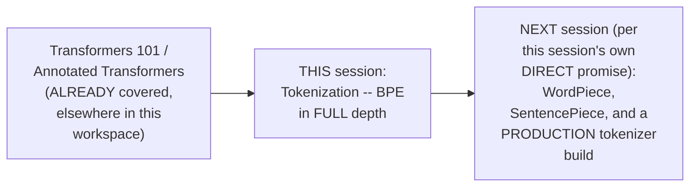

#### 🎯 Key Takeaways

* This is genuinely a **LIVE, cohort-based class** — NOT a scripted tutorial — INCLUDING course ADMINISTRATION, EXTENSIVE audience Q&A, and REAL, live TECHNICAL demonstrations WITH occasional CONNECTIVITY issues.
* The instructor **EXPLICITLY confirms** BPE is the DOMINANT, production ALGORITHM as of 2026 — "EVERY model, whether you'll SEE Llama, WHETHER you see Quen... EVERYBODY uses BPE" — WITH WordPiece EXPLICITLY confirmed as "DEPRECATED... around 2023."
* This session **directly, HONESTLY defers** WordPiece and SentencePiece to a LATER session — THIS guide's OWN, PRIMARY focus is BPE, matching the SESSION's own genuine EMPHASIS.

---

### 2. Why Tokenization Exists: Vocabulary Explosion & the OOV Problem

#### ❓ Why It Exists — The Precise, Genuine, Foundational Constraint

> 💡 **Given directly:** *"In any type of neural networks that you have been working with... the most common constraint that you do have... it needs the fixed size numerical input... the most common term that we have been using till now is the vocabulary size... but the question comes, our network is bound to the fixed... numerical inputs, but language... it is simply an open-ended... words, or tokens, or simply any type of symbolic representation."*

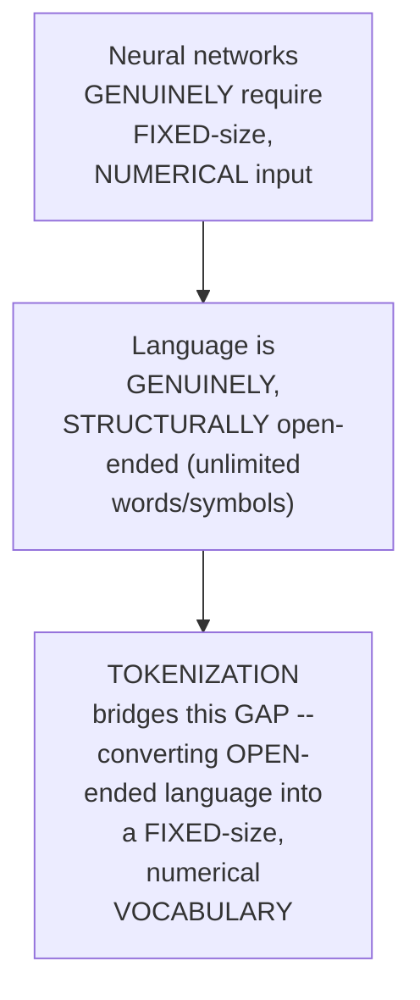

#### 📖 Definition — Word-Level Tokenization, Precisely Introduced (1990s-2010s)

> 💡 **Given directly:** *"The first type of tokenizer was the word-level tokenization... you try to break each word... split based on spaces, or probably punctuation also."*

#### ❓ Why It Exists — Problem 1: Vocabulary Explosion

> 💡 **Given directly:** *"For example, if I take a base word, like run, then RAN, then running... lower, lowest... the total size of the vocabulary... if it has at least these type of forms, like 3 or 4, directly my vocabulary will increase... the explosion that happens... every OTHER word, you need to treat it as a token, token, token."*

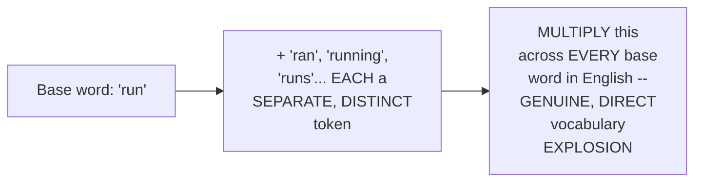

#### ❓ Why It Exists — Problem 2: Out-of-Vocabulary (OOV)

> 💡 **Given directly:** *"If something is out of the vocabulary, we used to assign it an unknown token... so whenever it actually looks into something new, which is out of the vocabulary, everything becomes unknown. So automatically the model goes blind."*

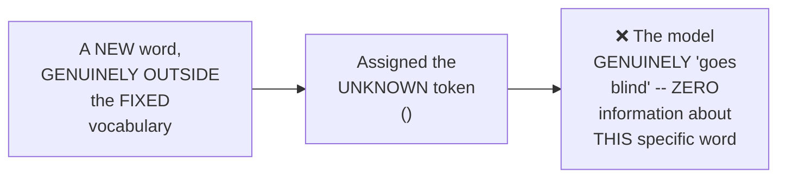

#### ⚠ Common Mistakes

* Assuming a NEURAL network can GENUINELY handle an UNBOUNDED, OPEN-ended vocabulary DIRECTLY — explicitly, directly clarified: it GENUINELY requires a FIXED-size numerical INPUT — tokenization EXISTS specifically to BRIDGE this gap.
* Assuming word-LEVEL tokenization's OWN vocabulary-explosion PROBLEM is a MINOR, edge-case CONCERN — explicitly, directly, CONCRETELY illustrated as a GENUINE, systemic issue AFFECTING every INFLECTED word form in ENGLISH.

#### 🎯 Key Takeaways

* Tokenization GENUINELY exists to BRIDGE the gap BETWEEN neural NETWORKS' own REQUIREMENT for FIXED-size numerical INPUT and language's OWN, GENUINELY open-ended NATURE.
* Word-level TOKENIZATION (1990s-2010s) GENUINELY suffered TWO major problems: **vocabulary EXPLOSION** (every INFLECTED form BECOMES a SEPARATE token) and **OOV** (unknown WORDS make the MODEL "go BLIND").
* These TWO, genuine problems **DIRECTLY motivated** the SHIFT toward SUBWORD-level tokenization, STARTING around 2014 — DIRECTLY setting UP this session's OWN, primary FOCUS.

---
### 3. Word-Level vs. Character-Level: The Precise Trade-Offs

#### 📖 Definition — Character-Level Tokenization, Precisely Introduced

> 💡 **Given directly:** *"In character level, each word, it will try to break it... character by character. So if I say that, cat, then C, comma A, comma T."*

#### ❓ Why It Exists — Character-Level's Genuine Advantage

> 💡 **Given directly:** *"Now, here, one problem it solves... this is the problem, OOV... because here, every vocabulary is a character... if we combine all of them, the out of the vocabulary problem is solved."*

#### ⚠ Why It Exists — Character-Level's Genuine, Fatal Disadvantage

> 💡 **Given directly:** *"If the sequences are very, very long, a sentence is having, like, 100 plus tokens... if I actually go with character level, the main problem is every character... you actually don't capture the semantics... if I say that keep C different, keep A different, and T different, and later on... please do the reconstruction to capture the semantics, do you think that it is practically possible? It is not possible, actually."*

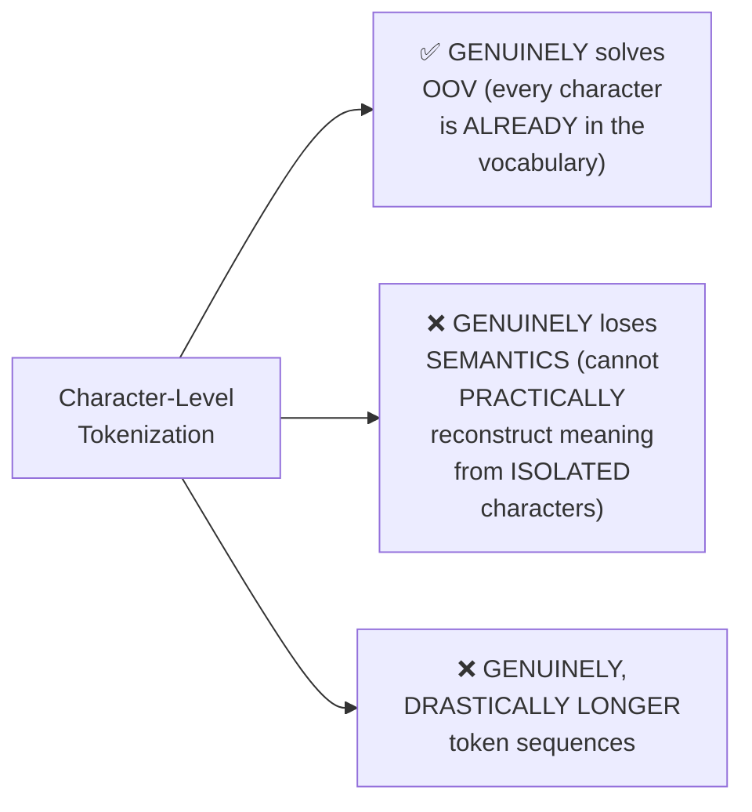

#### 📖 Definition — Subword-Level Tokenization, Precisely Introduced as the Genuine Resolution

> 💡 **Given directly:** *"In sub-word, you have, majorly, the algorithms, BP... then you have your WordPiece... take small, small units, and then... rather than only looking into the characters, you try to merge the characters, and from there, you try to capture the meaning."*

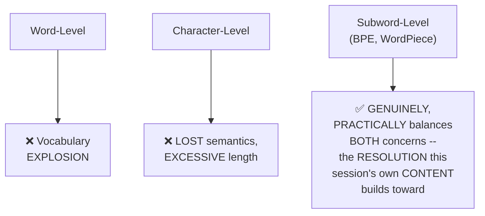

#### ⚠ Common Mistakes

* Assuming CHARACTER-level tokenization's OWN, genuine SOLUTION to OOV makes it GENUINELY superior OVERALL — explicitly, directly, HONESTLY clarified: it TRADES the OOV problem FOR an EVEN more SEVERE, genuine SEMANTIC-loss problem.
* Assuming SUBWORD tokenization is GENUINELY, SIMPLY "character LEVEL but SMARTER" — explicitly, directly REVEALED (across THIS session's own SUBSEQUENT sections) as a GENUINELY DISTINCT, statistically-DRIVEN algorithm, NOT merely a REFINEMENT.

#### 🎯 Key Takeaways

* **Character-LEVEL tokenization** GENUINELY solves OOV (EVERY character is ALREADY in the VOCABULARY) but GENUINELY, FATALLY loses SEMANTICS — reconstruction FROM isolated characters is "NOT practically POSSIBLE."
* **Subword-LEVEL tokenization** (BPE, WordPiece) is directly, precisely POSITIONED as the GENUINE resolution — BALANCING vocabulary SIZE against SEMANTIC preservation.
* This TRADE-OFF ANALYSIS directly, precisely SETS UP the REST of this session's OWN content — EVERY subsequent SECTION builds toward EXPLAINING how BPE, SPECIFICALLY, achieves this BALANCE.

---

### 4. Unicode & UTF-8: The Character-Level Foundation

#### 📖 Definition — Unicode, Precisely Introduced

> 💡 **Given directly:** *"Based on the total number of languages... Unicode supports... more than 150 plus languages... for every language, they have their own representation of tokens... the idea is that it's really close to character level."*

#### 🔍 Internal Working — A Complete, Real, Live-Demonstrated Confirmation (Python's `ord()`)

> 💡 **Given directly:** *"We call it the ORD function, which will return the number representing the Unicode of a specific character that you have... T with ID... O with 11120011... so simply here, A97... can you see that for every character that you have? Even for space."*

```python
[ord(x) for x in "text"]   # returns the Unicode CODE POINT for EACH character
```

#### 🔍 Internal Working — Unicode's Own, Genuine Vocabulary Size

> 💡 **Given directly:** *"Does anybody know what is the vocabulary size? Because really, Unicode has a very big vocabulary size. Like, close to... 150K characters that has been defined till now in Unicode... close to 3 lakh characters are there, really... the corpus, at least, for the characters."*

#### 📖 Definition — UTF-8/Byte-Level Representation, Briefly Introduced

> 💡 **Given directly:** *"The same things with respect to byte... it's directly available. BYTEARRAY... as we are working with byte-based data... the token T [with] 84 representation, now this is a byte version implementation of that."*

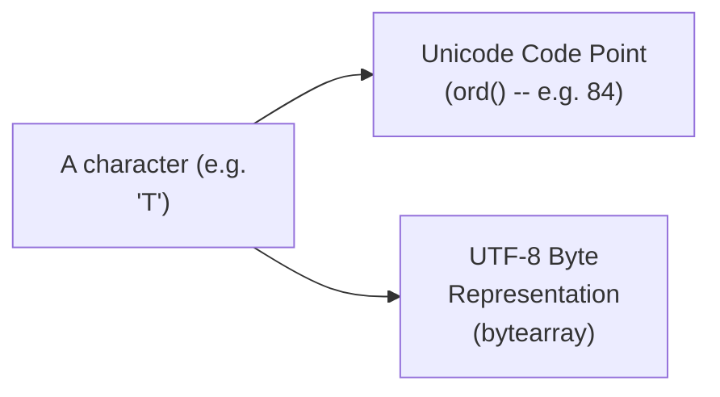

#### ⚠ Common Mistakes

* Assuming Unicode's OWN, genuinely LARGE vocabulary SIZE (150K+ characters, close to 3 lakh in EXTENDED corpora) makes it GENUINELY sufficient AS a standalone TOKENIZATION scheme — explicitly, directly clarified: this is STILL, FUNDAMENTALLY character-LEVEL — SUBWORD strategies REMAIN genuinely NECESSARY.
* Confusing Unicode CODE points with UTF-8 BYTE representations — explicitly, directly DISTINGUISHED as TWO, genuinely DIFFERENT, though RELATED, encoding LAYERS.

#### 🎯 Key Takeaways

* **Unicode** GENUINELY supports 150+ LANGUAGES, with a VOCABULARY size close to 150K-300K CHARACTERS — directly, LIVE-confirmed VIA Python's OWN `ord()` function.
* Unicode and UTF-8 REPRESENT the FOUNDATIONAL, character-LEVEL encoding LAYER that EVERY tokenizer ULTIMATELY builds UPON — directly, precisely CONNECTING back to Section 3's OWN character-level DISCUSSION.
* THIS foundational LAYER, DESPITE its OWN LARGE vocabulary, STILL requires SUBWORD-level STRATEGIES on TOP of it — DIRECTLY motivating BPE's OWN, genuine NECESSITY.

---
### 5. Comparing Tokenizers Live: GPT-2 (BPE), BERT (WordPiece), T5 (SentencePiece)

#### 🪜 Step-by-Step — A Complete, Live Demonstration Using a Real Visualizer Tool

> 💡 **Given directly:** *"This is a simple visualizer... it's saying that generally for GPT-2, BP is there, for BERT, WordPiece is there, for T5, SentencePiece is there... this is very, very specific to Google, that's why this is much more of a library rather than an algorithm."*

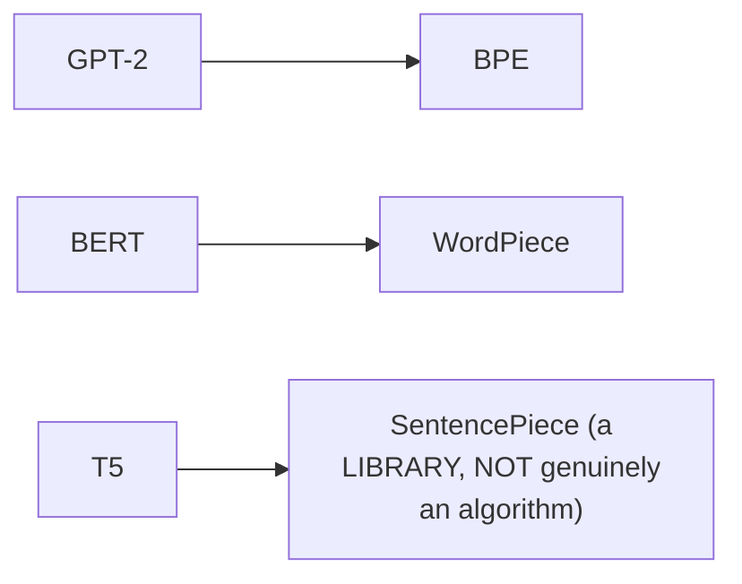

#### 🔍 Internal Working — A Genuine, Real, Direct Comparison of Token Counts

> 💡 **Given directly:** *"'The quick brown fox' — right now, when you look into each of these things... the total number of tokens... 11 tokens, here 10 tokens, and here 12 tokens. Can you see that the representation is always changing?"*

#### 🔍 Internal Working — A Genuine, Real Confirmation: Vocabulary Sizes Have Grown Over Time

> 💡 **Given directly:** *"This is for GPT-2, where we do have been 50,000 with 257... starting from GPT-4O, now, the vocabulary size has increased more than, now, 100K in GPTs."*

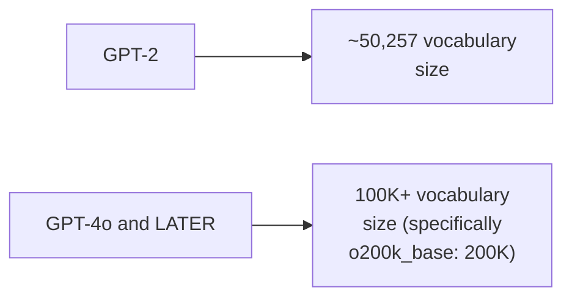

#### 🔍 Internal Working — Special Tokens Genuinely Differ by Model Family

> 💡 **Given directly:** *"Special tokens... it is very, very specific to every architecture that you work for. It's not like somebody might say I'm start, somebody say I'm end... model to model, it differs, so there is no common strategy."*

#### 🔍 Internal Working — A Genuine, Live-Confirmed Example: T5's Own Space Handling

> 💡 **Given directly:** *"If you look, in between, can you see this green color? The quick brown... and then you have one extra added token... this is directly a space... after that, there is a space... now, this is a unique token."*

#### ⚠ Common Mistakes

* Assuming DIFFERENT model FAMILIES genuinely SHARE the SAME special-TOKEN conventions (start/end/UNK/PAD tokens) — explicitly, directly clarified: THESE genuinely, DIRECTLY differ PER architecture FAMILY — "family to family, it CHANGES."
* Assuming a MODEL's own VOCABULARY size is a FIXED, permanent PROPERTY — explicitly, directly, LIVE-confirmed as GENUINELY GROWING over TIME (GPT-2's 50K → GPT-4o's 100K-200K).

#### 🎯 Key Takeaways

* THREE genuinely DIFFERENT model FAMILIES use THREE genuinely DIFFERENT tokenization SCHEMES: **GPT-2 (BPE)**, **BERT (WordPiece)**, **T5 (SentencePiece)** — DIRECTLY, LIVE-confirmed as PRODUCING genuinely DIFFERENT token COUNTS for the SAME sentence.
* **Vocabulary SIZE has GENUINELY grown** over TIME — GPT-2's ~50K vocabulary EXPANDED to 100K-200K+ IN later GPT versions.
* **Special TOKENS genuinely differ** PER model FAMILY — there is NO universal, SHARED convention ACROSS architectures.

---

### 6. The Complete BPE Algorithm: A Manual, Step-by-Step Walkthrough

#### 📖 Definition — The Complete, Precise, Four-Step BPE Process

> 💡 **Given directly:** *"Let's try to do the initialization of the vocabulary with characters. This is the first step... step two, once the vocabulary is ready, let's start working with the segmentation... step 3... count the frequency of the pairs... this is where things get interesting."*

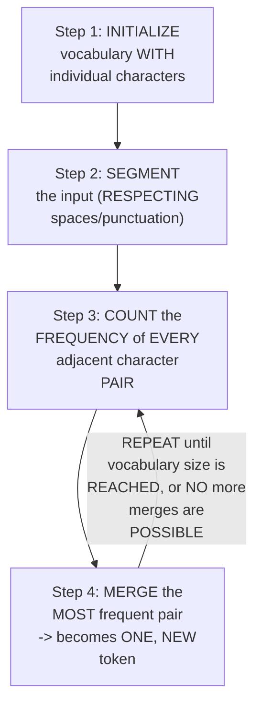

#### 🪜 Step-by-Step — A Complete, Real, Worked Example: "The Quick Brown Fox"

> 💡 **Given directly:** *"Let's try to initialize a vocabulary... T-H-E, Q-U-I-C-K... everything is unique, nothing is repeated... count the frequency of the pairs... TH... 1... HE... 1... everything is 1-1-1."*

#### ❓ Why It Exists — The Precise, Genuine, Arbitrary-Choice Rule

> 💡 **Given directly:** *"If the frequency is always 1... it becomes an arbitrary choice... no neighboring concept right now... anything that can be picked up randomly."*

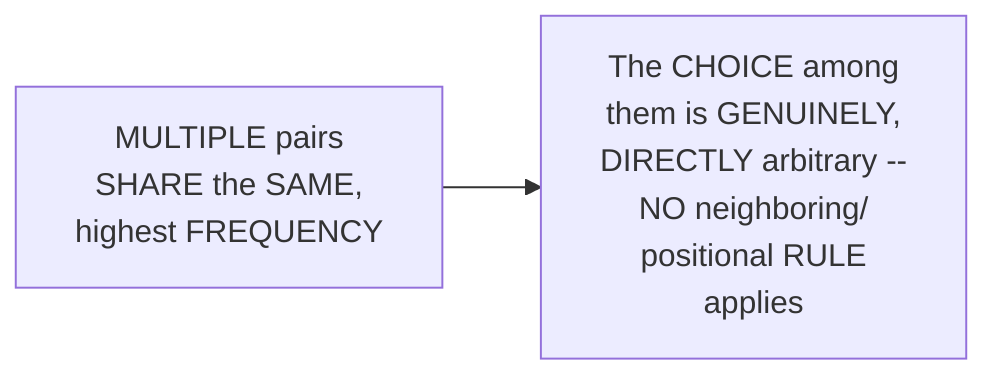

#### 🪜 Step-by-Step — A Complete, Real, Worked Example: "low, lower, newest, widest"

> 💡 **Given directly:** *"If N-E-W-E-S-T has a frequency of 6... the pair EW... will be common, gets PLUS 6, the pair WE... PLUS 6... ES, based on our vocabulary... is this part correct or not?... OW... LO... these are also frequent pairs... we have picked up one."*

```text
Corpus: low (freq 5), lower (freq 2), newest (freq 6), widest (freq 3)

Step-by-step merges (as WORKED, live, in this session):
1. E + S -> ES     (appears in "newest" AND "widest")
2. ES + T -> EST    (completes the shared suffix)
3. L + O -> LO        (from "low" and "lower")
4. LO + W -> LOW        (base word complete)
5. N + E -> NE, then continues toward "NEW" + "EST" -> "NEWEST"
6. W + I -> WI, then continues toward "WI" + "D" + "EST" -> "WIDEST"
```

#### 🔍 Internal Working — Precisely How the Algorithm Genuinely Stops

> 💡 **Given directly:** *"When it will stop, when the entire vocabulary is done. You have to match with the vocabulary. Based on the input vocabulary, if everything is completed automatically, it will stop. Because there are no more merge to happen."*

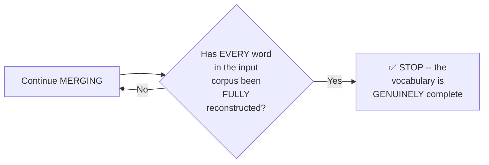

#### ⚠ Common Mistakes

* Assuming the ALGORITHM ALWAYS picks the "FIRST" or "LONGEST" possible PAIR — explicitly, directly, PRECISELY corrected: it ALWAYS picks the MOST FREQUENT pair; WHEN multiple pairs TIE, the choice is GENUINELY arbitrary.
* Assuming BPE STOPS after a FIXED, predetermined NUMBER of merges — explicitly, directly clarified: in PRODUCTION, it GENUINELY runs UNTIL the desired VOCABULARY size is REACHED — a FIXED merge COUNT (like "8" or "20") is ONLY used HERE for TEACHING/demonstration PURPOSES.

#### 🎯 Key Takeaways

* BPE's COMPLETE algorithm follows **FOUR, genuine STEPS**: initialize (CHARACTERS) → segment (RESPECTING spaces) → COUNT pair FREQUENCIES → MERGE the MOST frequent pair — REPEATED until COMPLETE.
* WHEN multiple pairs SHARE the SAME, highest FREQUENCY, the CHOICE is **GENUINELY, DIRECTLY arbitrary** — there is NO neighboring OR positional TIE-BREAKING rule.
* TWO, COMPLETE, real WORKED examples (the QUICK brown FOX; LOW/lower/newest/WIDEST) DIRECTLY, CONCRETELY demonstrate the ALGORITHM's own genuine, step-by-STEP behavior — the ALGORITHM STOPS ONCE the input CORPUS is FULLY reconstructable FROM the learned SUBWORDS.

---
### 7. The End-of-Word Marker & Crossword Boundaries

#### 📖 Definition — The `</w>` Marker, Precisely Introduced

> 💡 **Given directly:** *"For every word at the end, I will be adding the... slash W at the end of it... this particular marker... whenever you are merging word, you have to maintain... crossword boundaries."*

#### ❓ Why It Exists — Genuine Purpose 1: Respecting Crossword Boundaries

> 💡 **Given directly:** *"It's not... any word can be merged... according to English language, that you cannot merge any type of words, and you have to maintain the crossword boundaries. Because of that, you have to always use slash W marker in Bp."*

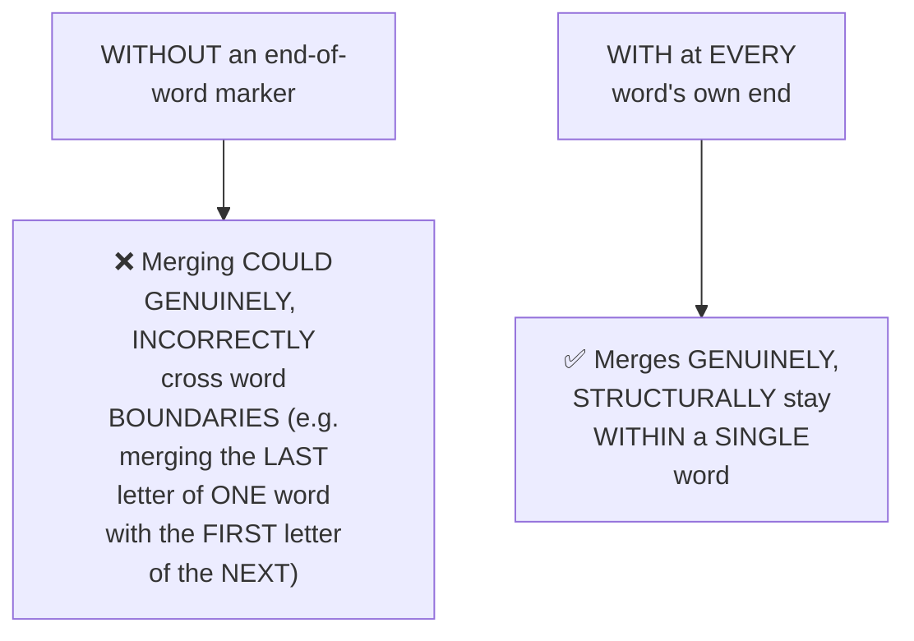

#### ❓ Why It Exists — Genuine Purpose 2: Identifying Suffixes From a Whole Word

> 💡 **Given directly:** *"It actually helps you to identify any type of suffix from a whole world... try to say low with lower. What is the suffix? Low and lower... using slash W, because without slash W, you cannot really understand that this is the base word, or can you merge it with other."*

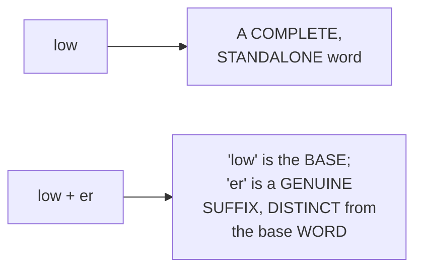

#### ⚠ Common Mistakes

* Assuming the end-of-WORD marker is a MERELY cosmetic, OPTIONAL detail — explicitly, directly, PRECISELY clarified as SOLVING TWO genuine, REAL problems: crossword-BOUNDARY respect AND suffix IDENTIFICATION.
* Assuming SPACES are IGNORED during TOKENIZATION — explicitly, directly clarified: "SPACES are also TREATED... it will TAKE space also INTO account" — spaces GENUINELY, DIRECTLY factor INTO the segmentation and MERGING process.

#### 🎯 Key Takeaways

* The **`</w>` (end-of-word) MARKER** is APPENDED to EVERY word, GENUINELY solving TWO problems: RESPECTING crossword BOUNDARIES (preventing MERGES across DIFFERENT words) and ENABLING suffix IDENTIFICATION (distinguishing "low" FROM "low+er").
* SPACES are GENUINELY, DIRECTLY treated as PART of the tokenization PROCESS — NOT simply STRIPPED or IGNORED.
* This marker directly, precisely CONNECTS to Section 6's OWN algorithm — WITHOUT it, the MERGING process COULD genuinely PRODUCE nonsensical, cross-WORD tokens.

---

### 8. Implementing BPE in Python: Pair Frequencies & Merging

#### 💻 Code Example — The Corpus & End-of-Word Marking

> 💡 **Given directly:** *"Each key is a word, and each value is how many times it occurred in the main text or the corpus... for every word that I'll be doing, I'll be adding a slash w at the end of it."*

```python
corpus = {"low": 5, "lower": 2, "newest": 6, "widest": 3}
# Marked with end-of-word tokens:
# "l o w </w>", "l o w e r </w>", "n e w e s t </w>", "w i d e s t </w>"
```

#### 💻 Code Example — Counting Pair Frequencies

> 💡 **Given directly:** *"Get pair frequencies... a default dict initialization... look at every word in the vocabulary and count how many times each pair of symbol occurs... symbol I, with symbol I plus 1, can I say that I'm taking two different characters?"*

```python
from collections import defaultdict

def get_pair_frequencies(vocab):
    """For each word, count every adjacent SYMBOL pair's own total frequency."""
    pairs = defaultdict(int)
    for word, freq in vocab.items():
        symbols = word.split()
        for i in range(len(symbols) - 1):
            pair = (symbols[i], symbols[i + 1])
            pairs[pair] += freq
    return pairs
```

#### 💻 Code Example — Merging the Best Pair

> 💡 **Given directly:** *"Go through every word in the vocabulary and merge every occurrence... merging E to S... in this particular example... ES has only been taken... this too is a merge pair, and it becomes a token."*

```python
def merge_pair(pair_to_merge, vocab):
    """Merge every occurrence of a SPECIFIC pair, across the ENTIRE vocabulary."""
    new_vocab = {}
    for word, freq in vocab.items():
        symbols = word.split()
        new_symbols = []
        i = 0
        while i < len(symbols):
            if (i < len(symbols) - 1 and
                    (symbols[i], symbols[i + 1]) == pair_to_merge):
                new_symbols.append(symbols[i] + symbols[i + 1])
                i += 2   # skip BOTH symbols that were just merged
            else:
                new_symbols.append(symbols[i])
                i += 1
        new_vocab[" ".join(new_symbols)] = freq
    return new_vocab
```

#### 💻 Code Example — The Complete Training Loop

> 💡 **Given directly:** *"For step in range... pair counts... GetPairFrequencies... best pair from here, I have taken Max... apply the merge everywhere in the vocabulary... this is the final merge and pair vocabulary... update the merge history."*

```python
merge_history = []
for step in range(1, num_merges + 1):
    pair_counts = get_pair_frequencies(vocab)
    if not pair_counts:
        break
    best_pair = max(pair_counts, key=pair_counts.get)
    vocab = merge_pair(best_pair, vocab)
    merge_history.append(best_pair)
```

#### 🔍 Internal Working — A Genuine, Real, Live-Confirmed Observation on Production Scale

> 💡 **Given directly:** *"In production, how to solve this one without passing the number of parts? Simply use a for loop! As simple as that... probably 20,000, 30,000, generally it is applied within, generate a return type function."*

#### ⚠ Common Mistakes

* Assuming the MERGE loop REQUIRES a SPECIFIC, hard-coded NUMBER of iterations — explicitly, directly clarified: this is ONLY used HERE for TEACHING clarity — PRODUCTION systems GENUINELY run UNTIL the vocabulary is COMPLETE (potentially TENS of THOUSANDS of merges).
* Forgetting to SKIP both SYMBOLS after a SUCCESSFUL merge (the `i += 2` STEP) — explicitly, directly, PRECISELY confirmed as NECESSARY: "SKIP both the symbols that we have MERGED... ALREADY it has been MERGED, so we REALLY don't need it."

#### 🎯 Key Takeaways

* BPE's COMPLETE Python implementation GENUINELY requires ONLY **TWO core HELPER functions**: `get_pair_frequencies` (COUNTING every adjacent SYMBOL pair) and `merge_pair` (COMBINING a SPECIFIC pair EVERYWHERE it APPEARS).
* The COMPLETE training LOOP: REPEATEDLY find the MOST frequent PAIR (`max(pair_counts, key=pair_counts.get)`), MERGE it, and RECORD it in the MERGE history — UNTIL the DESIRED vocabulary is REACHED.
* This is PURE, GENUINE PYTHON/statistics — directly, EXPLICITLY confirmed as CONTAINING **NO neural NETWORK, no TRAINING (in the weights-and-BIASES sense)** — "EVERYTHING that I have DONE today with respect to BP, EVERYTHING is BASED on stats."

---
### 9. Handling New Words & the Strawberry Problem

#### 🪜 Step-by-Step — Applying Learned Merge Rules to Genuinely New Words

> 💡 **Given directly:** *"Whatever previously the merging scheme that we have learned, and if we try to introduce a new word... an unknown into the system, which is out of the vocabulary right now. Will it work or not?... new work, new... E, R, and W... if the token was already available, ER with W, then it could have picked up."*

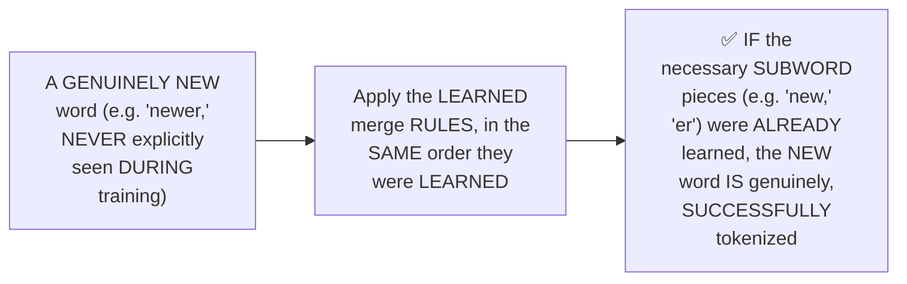

#### 📖 Definition — The Strawberry Problem, Precisely Introduced

> 💡 **Given directly:** *"The most common problems, if two words are connected together. The simplest example is strawberry. Straw has a different meaning, [berry] has a different meaning. But actually, BP gets confused when you write strawberry. It will try to break it into, first of all, straw, and then [berry]."*

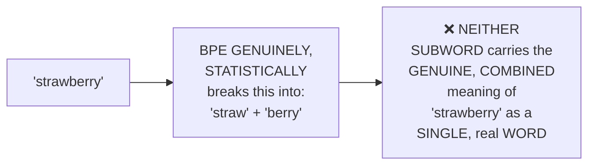

#### ⚠ A Direct, Honest Quantification of This Limitation

> 💡 **Given directly:** *"This is a downside... nothing that you can do from your end, but fine. The scenarios and the use cases are really, really low, so less than 1% error rate that happens in datasets, only because of this."*

#### 🔍 Internal Working — Precisely Why This Happens (No Semantics, Pure Statistics)

> 💡 **Given directly:** *"This is purely stats, I can say. If you really want to get the meaning of TH, it doesn't have any type of meaning... there is no context if you really think about it."*

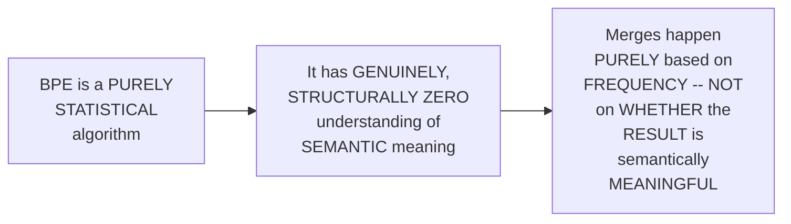

#### ⚠ Common Mistakes

* Assuming the STRAWBERRY problem is a GENUINELY, PRACTICALLY significant, common FAILURE — explicitly, directly, HONESTLY quantified as GENUINELY rare — "LESS than 1% error RATE."
* Assuming BPE GENUINELY "understands" or "LEARNS" semantic MEANING during TRAINING — explicitly, directly, REPEATEDLY clarified: it is PURELY, GENUINELY statistical — "THERE is NO training HERE... there is NO neural NETWORK."

#### 🎯 Key Takeaways

* BPE GENUINELY, SUCCESSFULLY tokenizes NEW, previously-UNSEEN words BY applying its LEARNED merge RULES in ORDER — SUCCEEDING WHENEVER the NECESSARY subword PIECES were ALREADY learned.
* The **"strawberry PROBLEM"** is BPE's OWN, honestly-ACKNOWLEDGED limitation — TWO semantically-DISTINCT words COMBINING (e.g., "straw" + "BERRY") get STATISTICALLY merged WITHOUT any GENUINE understanding of the RESULTING word's OWN, real meaning.
* This is directly, HONESTLY quantified as a **GENUINELY rare** occurrence (LESS than 1% error RATE) — a REAL, accepted LIMITATION, NOT a disqualifying FLAW, SINCE BPE remains PURELY statistical, WITH zero genuine SEMANTIC awareness.

---

### 10. Production Tokenization: TikToken vs. HuggingFace Tokenizers

#### 📖 Definition — TikToken, Precisely Introduced

> 💡 **Given directly:** *"TikToken is a very, very famous library... it is highly optimized for GPT-based tokenization schemes... in most of the cases, you do have all the rules defined... you need to load up the merge rules, and then directly bring your vocabulary and start the BPE task."*

```python
import tiktoken

encoding = tiktoken.get_encoding("o200k_base")   # GPT-4o's own encoding (200K vocab)
# or: tiktoken.get_encoding("cl100k_base")           # GPT-3.5/GPT-4's own encoding (100K vocab)
tokens = encoding.encode("tokenization")
```

#### 🔍 Internal Working — A Genuine, Real, Live-Confirmed Comparison Across Encoding Versions

> 💡 **Given directly:** *"'Tokenization' has two actual tokens. One is token, one is [ization]... 'unhappiness'... UN, then H, and then happiness... generally, the main problem with the 50K vocabulary, the chances of getting unknown actually increases a lot. So I won't suggest it."*

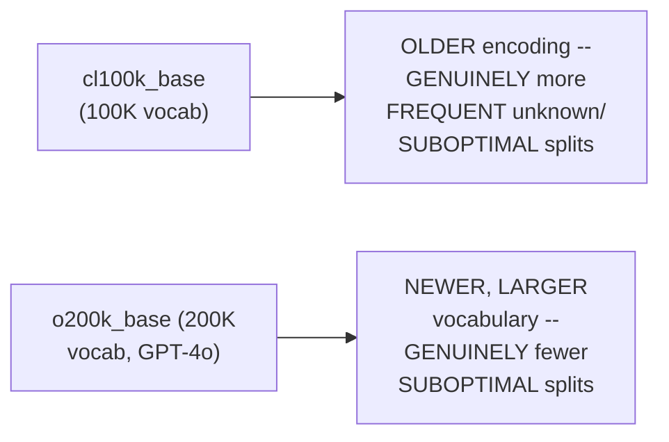

#### 📖 Definition — HuggingFace Tokenizers, Precisely Introduced for Custom Training

> 💡 **Given directly:** *"If I want to train my own tokenizer, guys, this is the best way I can train it. I feel that it gives you a much more flexibility, because in TikToken, you don't have that particular option."*

```python
from tokenizers import Tokenizer, models, pre_tokenizers, trainers

tokenizer = Tokenizer(models.BPE(unk_token="<unk>"))
tokenizer.pre_tokenizer = pre_tokenizers.Whitespace()
trainer = trainers.BpeTrainer(
    vocab_size=120,
    min_frequency=1,
    special_tokens=["<unk>", "<pad>", "<s>", "</s>"],
)
tokenizer.train(["tinycorpus.txt"], trainer)
```

#### 🔍 Internal Working — A Genuine, Real, Live-Confirmed Training Result

> 💡 **Given directly:** *"Maximum was 124, but based on our BP, I feel that total number of merge pairs for this particular vocab is close to 54... using this small corpus, do you think that I can create 120 vocabulary options? It is not possible, because the size is only small."*

#### 🏢 Real-World / Production Usage — Genuinely Deciding When You Need Your Own Tokenizer

> 💡 **Given directly:** *"If it's a general purpose problem... blindly use [an existing tokenizer]... but if your task is domain-specific... you have to actually train your tokenizer... training a tokenizer, it's CPU only... probably in my system, I have 8 or 12 [cores], which is more than enough to train. It will take maximum 1 hour, not more than that."*

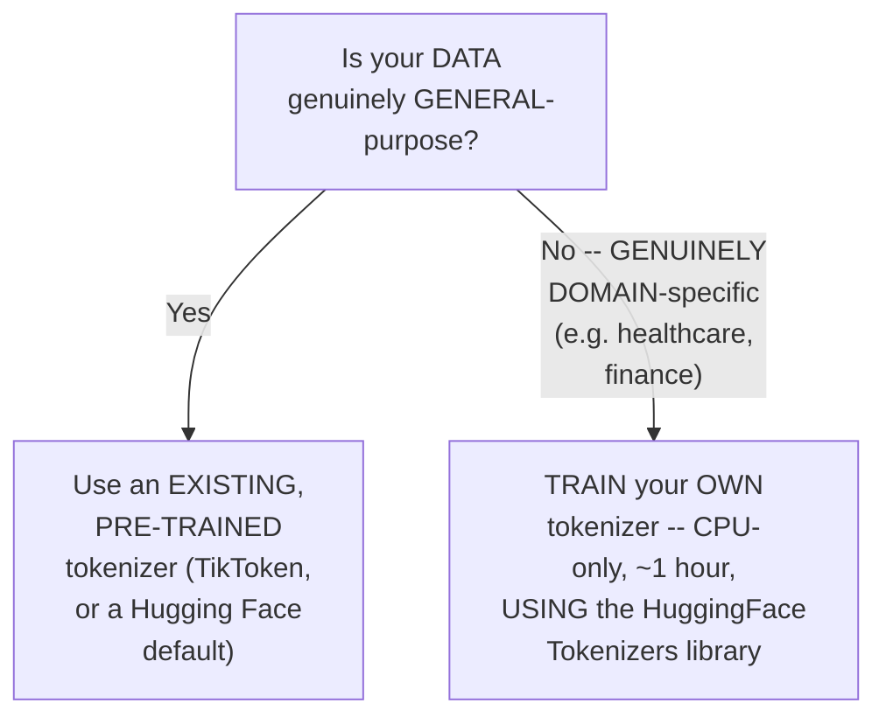

#### ⚠ Common Mistakes

* Assuming TOKENIZER training GENUINELY requires a GPU — explicitly, directly, REPEATEDLY clarified: "NOBODY uses GPU" FOR tokenizers — MORE CPU cores GENUINELY matter more.
* Assuming EVERY project NEEDS its OWN, custom TOKENIZER — explicitly, directly clarified: this is ONLY genuinely NECESSARY for DOMAIN-specific data (healthcare, FINANCE) — general-PURPOSE tasks should GENUINELY use EXISTING, pre-trained TOKENIZERS.
* Assuming TikToken is GENUINELY suitable for TRAINING a custom TOKENIZER — explicitly, directly clarified: TikToken PROVIDES pre-built, OpenAI-released ENCODINGS — the HuggingFace TOKENIZERS library is the GENUINE choice FOR custom TRAINING.

#### 🎯 Key Takeaways

* **TikToken** is OpenAI's OWN, fast BPE LIBRARY — DIRECTLY providing PRE-BUILT, official ENCODINGS (`cl100k_base`, `o200k_base`) — GENUINELY well-suited FOR GPT-based tokenization, but NOT for CUSTOM training.
* The **HuggingFace TOKENIZERS library** is the GENUINE choice FOR training a CUSTOM tokenizer FROM scratch — REQUIRING only a CPU (~1 hour, GIVEN 8-12 cores) and a REPRESENTATIVE corpus.
* CUSTOM tokenizer TRAINING is GENUINELY NECESSARY ONLY for DOMAIN-specific DATA (healthcare, finance) — GENERAL-purpose tasks should GENUINELY reuse EXISTING, pre-trained TOKENIZERS.

---
### 11. The Future: Byte Latent Transformers (BLT)

#### 📖 Definition — BLT, Precisely Introduced

> 💡 **Given directly:** *"There is a new concept that came... around last year, 2025... from Meta. Okay, and it's called as BLT... this is actually a dedicated LLM just to perform tokenization... every problem that I will be telling you, that we have in BP is being solved by this."*

#### 🔍 Internal Working — BLT's Own, Genuine, Structural Difference From BPE

> 💡 **Given directly:** *"There is no vocabulary system, they don't have a fixed vocabulary... it can be totally flexible. Whatever the data that you pass is, based on that, it learns and it creates... rules. So, no merging concept is there."*

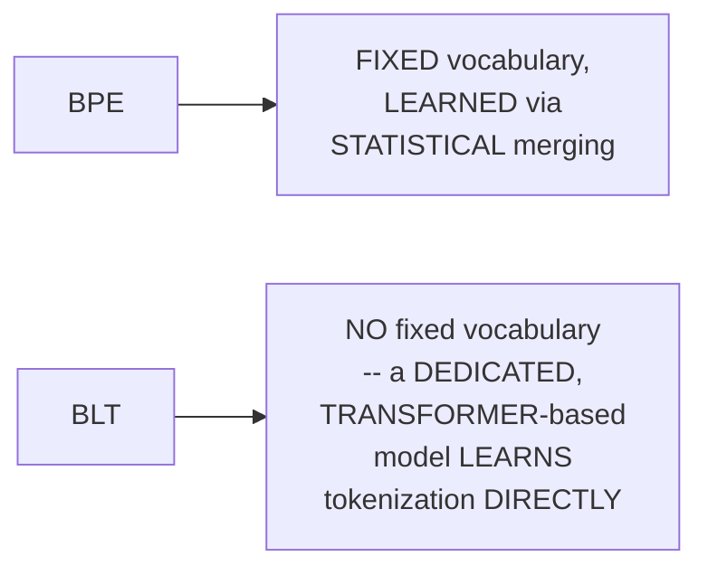

#### 🔍 Internal Working — A Genuine, Real, Live-Confirmed Scaling Claim

> 💡 **Given directly:** *"With respect to trillion... this is 1 trillion tokens to... 4 trillion bytes. Now, this is really, really huge... generally, whenever we are working with, like, 8 billion models and the non-trivial amounts of training data, like, 1 trillion tokens, this is, like, really, really good."*

#### ⚠ A Direct, Honest, Important Limitation

> 💡 **Given directly:** *"The explainability, I feel that it's very much lesser... the concept, there is no vocabulary SYSTEM... semantically, it is there, but again, means the explainability and the transparency of that, it's lesser. That's why used lesser in production as compared to BP, which has been time-tested and battle-tested."*

> 💡 **Given directly, on GENUINE computational cost:** *"Just think, if only for your tokenization, if you actually try to use a transformers-based architecture... it's completely CPU-based [for BPE], and that is the only solution till now... [BLT is] completely based on GPU. It means that computationally, it becomes expensive."*

```mermaid
flowchart LR
    A["BLT's Own Genuine<br/>Trade-Offs"] --> B["✅ Theoretically<br/>PROMISING -- SOLVES<br/>many of BPE's OWN<br/>known limitations"]
    A --> C["❌ REQUIRES GPU<br/>(computationally<br/>EXPENSIVE, vs. BPE's<br/>own CPU-only<br/>approach)"]
    A --> D["❌ LOWER<br/>explainability/<br/>transparency vs.<br/>BPE's OWN, battle-<br/>tested track record"]
```

#### ⚠ Common Mistakes

* Assuming BLT is GENUINELY, CURRENTLY production-READY, GIVEN its OWN theoretical PROMISE — explicitly, directly, HONESTLY clarified: "in PRODUCTION, like, I've NEVER seen that PEOPLE are using it."
* Assuming BLT UNIFORMLY OUTPERFORMS BPE on EVERY benchmark — explicitly, directly, HONESTLY clarified: "MMLU benchmark, it ACTUALLY performed VERY good, WHEREAS in FEW other benchmarks, it actually DIDN'T perform very good."

#### 🎯 Key Takeaways

* **BLT (Byte LATENT Transformers)**, from META, ELIMINATES the fixed-VOCABULARY concept ENTIRELY — a DEDICATED, transformer-BASED model LEARNS tokenization DIRECTLY, WITHOUT a merge-RULE system.
* This is directly, HONESTLY confirmed as **GENUINELY promising but NOT yet production-READY** — REQUIRING GPU compute (UNLIKE BPE's OWN CPU-only approach) and OFFERING LOWER explainability.
* The instructor directly, PERSONALLY frames THIS as "the FUTURE" — WORTH self-EXPLORATION via the PAPER and GITHUB repository, but GENUINELY not YET a replacement FOR BPE in REAL, production systems.

---

### 12. Q&A Deep Dive: Tokenizer-Model Coupling & Domain-Specific Training

#### ❓ Why It Exists — A Genuine, Real, Recurring Audience Question

> 💡 **Given directly:** *"If, in case we are training our own tokenizer, so that... cannot be used with the existing LLM model, right?"*

#### 📖 Definition — The Precise, Genuine Coupling Rule

> 💡 **Given directly:** *"First, model, then tokenization. That has been the way... you have to use both of them parallel. It's not like one, you can use a tokenizer of BERT in a GPT model. That is not possible."*

```mermaid
flowchart LR
    A["Step 1: SELECT<br/>your model"] --> B["Step 2: IDENTIFY<br/>that model's OWN,<br/>REQUIRED tokenizer<br/>SCHEME"]
    B --> C["Step 3 (IF<br/>needed): RETRAIN<br/>that SAME scheme on<br/>your OWN, DOMAIN-<br/>specific corpus"]
```

#### 🔍 Internal Working — Precisely WHY a Mismatched Tokenizer Genuinely Breaks a Model

> 💡 **Given directly:** *"The language model embedding matrix is built to perfectly match the exact side of the vocabulary. If I keep... I cannot add a vocabulary later on, right? No. That's why, in the vocabulary, there will be a special token. If anything that comes out, automatically that unknown, unknown, that gets asked."*

#### 🪜 Step-by-Step — A Complete, Real, Worked Example: Adding Domain-Specific Tokens

> 💡 **Given directly:** *"[For] your project one, you have SFT... healthcare data... first I will create my own tokenizer. And then, after doing the tokenization step... it's actually domain-specific data, it's ICD-10... the medical data is close to 3.5 million samples."*

#### 🔍 Internal Working — A Genuine, Real Clarification on PEFT vs. Full Fine-Tuning for New Tokens

> 💡 **Given directly:** *"If the model has been trained on a default tokenizer, and you suddenly change the tokenizer, really doesn't work. The main preference in that case, generally for SLMs... complete scratch training, that is much more suggested, but PEFT is also possible. Because at least the injection of the new tokens into the system, it is learnable with respect to time. Because few of the layers or few of the matrices that we do introduce during PEFT, that particular thing, it can learn with the new tokens which are being injected."*

```mermaid
flowchart LR
    A["Genuinely NEW,<br/>domain-specific<br/>TOKENS need to be<br/>LEARNED"] --> B["Option A: FULL,<br/>scratch TRAINING<br/>(preferred for<br/>SLMs)"]
    A --> C["Option B: PEFT<br/>(a FEW layers/<br/>matrices UNFROZEN,<br/>LEARN the NEW tokens'<br/>own REPRESENTATION,<br/>over TIME)"]
```

#### ⚠ Common Mistakes

* Assuming you can GENUINELY, FREELY swap a MODEL's own tokenizer WITHOUT consequence — explicitly, directly, PRECISELY clarified: this creates "DIRECT incompatibility" — the MODEL's own EMBEDDING matrix is STRUCTURALLY built to MATCH its OWN, specific vocabulary.
* Assuming DOMAIN-specific tokenizer TRAINING alone is SUFFICIENT — explicitly, directly clarified: the TOKENIZER change MUST be PAIRED with EITHER full RETRAINING or PEFT-based FINE-TUNING, so the MODEL itself GENUINELY learns the NEW tokens' own MEANING.

#### 🎯 Key Takeaways

* The GENUINE, correct WORKFLOW: **SELECT your model FIRST**, THEN identify/retrain its OWN, REQUIRED tokenizer SCHEME — NEVER the reverse.
* A model's OWN embedding MATRIX is STRUCTURALLY built to MATCH its EXACT vocabulary SIZE — swapping TOKENIZERS WITHOUT retraining GENUINELY creates DIRECT incompatibility.
* Adding DOMAIN-specific tokens (e.g., MEDICAL terminology) REQUIRES the model ITSELF to LEARN their MEANING — via EITHER full, SCRATCH training (preferred FOR smaller, SLM-scale models) or PEFT (unfreezing a FEW layers, LEARNING the new TOKENS' own representations OVER time).

---
### 13. Q&A Deep Dive: Evaluation via LLM-as-Judge/Jury & Model Routing

#### 📖 Definition — The "LLM Jury" Concept, Precisely Introduced

> 💡 **Given directly:** *"Manually, if I ask somebody to create 5,000 [evaluation samples], nobody creates them. I do a multi-model review in those cases... use LLM as juries, multiple jury concept, and then, based on that, I do evaluate each set... always taking even numbers... for your single sample, it will be evaluated by 3 LLMs... and based on that final scoring, I used to take the average out of it."*

```mermaid
flowchart LR
    A["A single response,<br/>needing evaluation"] --> B["Judge Model 1<br/>(e.g. a top-tier<br/>model)"]
    A --> C["Judge Model 2 (a<br/>DIFFERENT top-tier<br/>model)"]
    A --> D["Judge Model 3 (a<br/>THIRD, DIFFERENT<br/>top-tier model)"]
    B --> E["AVERAGE / VOTE<br/>across all THREE<br/>-- the FINAL,<br/>GENUINE evaluation<br/>score"]
    C --> E
    D --> E
```

#### 🔍 Internal Working — A Genuine, Real, Practical Model-Selection Detail

> 💡 **Given directly:** *"Try to use some other, because from your BedRock, you can access some other. Haiku is not really... don't use Haiku. Haiku is the lowest tier in the Anthropic family."*

#### ❓ Why It Exists — The Precise, Genuine, Model-Routing Rationale

> 💡 **Given directly:** *"Nowadays, people use three to four models. One is a light model, one is a heavy model, and then we used a model routing logic. And every model should not be going, like, any type of prompt should not be hitting to the costlier model. If it is a very simple one, you should actually go to a lighter model. In that way, you save money."*

```mermaid
flowchart TD
    A["An incoming<br/>prompt"] --> B{"How complex is<br/>this task,<br/>GENUINELY?"}
    B -->|"Simple"| C["Route to a<br/>LIGHTER, CHEAPER<br/>model"]
    B -->|"Complex,<br/>MULTI-step<br/>reasoning<br/>REQUIRED"| D["Route to a<br/>REASONING-enabled,<br/>MORE expensive<br/>model"]
```

#### 🔍 Internal Working — Genuine, Real Tools That Support This Routing Logic

> 💡 **Given directly:** *"To calculate the token cost, first, you need the pricing on the tokens for that particular model... it can be done in the gateway layer also, it can be done in the observability layer... if I use LangFuse, LangSmith, they can do it. If I use a gateway, like, LiteLLM, or some other, like, PortKey, or Bifrost."*

#### ⚠ Common Mistakes

* Assuming a SINGLE model is GENUINELY sufficient to EVALUATE another MODEL's own output RELIABLY — explicitly, directly clarified: the instructor's OWN, real practice USES a MULTI-model "JURY" (odd or EVEN counts, averaged/VOTED), SPECIFICALLY to REDUCE the risk of a SINGLE judge's own, individual BIAS or error.
* Assuming ALL models WITHIN a family are EQUALLY suitable AS judges — explicitly, directly, HONESTLY warned: "DON'T use HAIKU" — the LOWEST-tier model WITHIN a family may GENUINELY be UNRELIABLE for JUDGING purposes.

#### 🎯 Key Takeaways

* A GENUINE, real evaluation PRACTICE: use an **"LLM JURY"** (MULTIPLE, DIFFERENT top-tier MODELS judging the SAME response), AVERAGING or VOTING across THEM — REDUCING reliance on a SINGLE model's OWN, individual judgment.
* **Model ROUTING** (light MODEL for simple PROMPTS, heavy/reasoning MODEL for complex ONES) is a GENUINE, real cost-optimization PRACTICE — SUPPORTED by real, NAMED tools (LangFuse, LangSmith, LiteLLM, PortKey, Bifrost).
* Model PRICING must be MANUALLY configured in MOST of these TOOLS — SOME (like PortKey) can PULL pricing AUTOMATICALLY, but MOST require MANUAL updates AS pricing CHANGES.

---

### 14. Closing: What's Deferred to the Next Session

#### 🪜 Step-by-Step — A Complete, Honest, Direct Confirmation

> 💡 **Given directly:** *"So this one and this one is remaining. So, tomorrow we'll be doing the discussion, and then we will try to actually build our own production tokenizer."*

```mermaid
flowchart LR
    A["THIS session<br/>(complete): BPE, in<br/>FULL depth --<br/>theory, algorithm,<br/>Python<br/>implementation,<br/>production tooling"] --> B["NEXT session<br/>(EXPLICITLY promised):<br/>WordPiece,<br/>SentencePiece, a<br/>PRODUCTION tokenizer<br/>build"]
```

#### ⚠ A Direct, Honest, Practical Suggestion From the Audience (Worth Remembering)

> 💡 **Given directly, a STUDENT's own DIRECT, thoughtful FEEDBACK:** *"If you can start with a very high-level discussion about the topic in terms of what we are doing, and why we are doing it, and where it impacts, you know, in the bigger picture... it gives a lot of motivation, and then people get very focused."*

> 💡 **The instructor's own DIRECT, honest RESPONSE:** *"I got your main point. The idea is that story with the high-level idea, the final goal, why exactly... the idea is to relate that high-level stuff directly with real-time exactly how things are going to be."*

#### ⚠ Common Mistakes

* Assuming THIS session's own coverage represents the COMPLETE tokenization CURRICULUM — explicitly, directly, HONESTLY clarified: WordPiece, SentencePiece, and a FULL production-TOKENIZER build REMAIN explicitly DEFERRED to the NEXT session.

#### 🎯 Key Takeaways

* This session **GENUINELY, COMPLETELY delivers** its OWN core PROMISE — BPE, in FULL theoretical AND practical depth.
* **WordPiece, SentencePiece, and a PRODUCTION tokenizer build** are DIRECTLY, EXPLICITLY confirmed as the NEXT session's OWN content.
* A GENUINE, thoughtful piece of STUDENT feedback — REQUESTING more "BIG picture" framing BEFORE diving into TECHNICAL depth — was DIRECTLY, HONESTLY acknowledged BY the instructor, WORTH remembering as a GENUINE, useful STUDY strategy: connect EACH new, technical CONCEPT back to ITS own, real-world PURPOSE before DIVING into implementation DETAILS.

---
## 📝 Glossary

| Term | Definition | Why It Matters |
|---|---|---|
| **Tokenization** | Converting open-ended language into fixed-size, numerical tokens | The bridge between language and neural networks |
| **Vocabulary Explosion** | Every inflected word form becomes a separate token | The core problem word-level tokenization suffers from |
| **OOV (Out of Vocabulary)** | A word not present in the trained vocabulary | Causes the model to "go blind" (assigned <UNK>) |
| **Word-Level Tokenization** | Splitting by spaces/punctuation | The oldest scheme (1990s-2010s); suffers explosion + OOV |
| **Character-Level Tokenization** | Splitting into individual characters | Solves OOV but loses semantics; too long |
| **Subword-Level Tokenization** | Splitting into meaningful sub-word units | The genuine resolution -- BPE, WordPiece |
| **BPE (Byte Pair Encoding)** | The dominant, production subword algorithm as of 2026 | Used by GPT, Llama, Qwen, and most modern LLMs |
| **Unicode** | A character-encoding standard, 150+ languages | The foundational, character-level layer under tokenization |
| **UTF-8** | A byte-level encoding of Unicode characters | An alternative representation layer to Unicode code points |
| **</w> (End-of-Word Marker)** | Appended to every word during BPE | Respects crossword boundaries; enables suffix identification |
| **Pair Frequency** | How often a specific adjacent character pair occurs | The metric BPE uses to decide what to merge next |
| **Strawberry Problem** | Two semantically-distinct words merging into one token | BPE's honestly-acknowledged, ~1% error-rate limitation |
| **TikToken** | OpenAI's own, fast BPE library | Pre-built encodings (cl100k_base, o200k_base); not for custom training |
| **HuggingFace Tokenizers** | A library for training custom tokenizers | The genuine choice when domain-specific data requires it |
| **BLT (Byte Latent Transformers)** | A research-stage, vocabulary-free tokenization approach | Promising but not yet production-ready (GPU-heavy, less explainable) |
| **LLM Jury** | Multiple LLMs evaluating the same output, averaged/voted | A real, practical evaluation strategy discussed in Q&A |
| **Model Routing** | Directing prompts to lighter or heavier models based on complexity | A real, practical cost-optimization strategy discussed in Q&A |

---

## 🔄 Revision Notes — One-Minute Revision

* This is a **live, cohort-based class** -- heavy Q&A, course admin, and genuine technical depth on BPE specifically. WordPiece/SentencePiece are EXPLICITLY deferred to the next session.
* **Why tokenization exists**: neural networks need fixed-size numerical input; language is genuinely open-ended. Word-level tokenization (1990s-2010s) suffered vocabulary EXPLOSION (every inflected form = a new token) and OOV (unknown words = the model "goes blind").
* **Character-level**: solves OOV but genuinely loses semantics (reconstruction from isolated characters is "not practically possible") and produces excessively long sequences.
* **Subword-level (BPE, WordPiece)**: the genuine resolution -- balances vocabulary size against semantic preservation.
* **Unicode/UTF-8**: the foundational, character-level encoding layer (150+ languages, ~150K-300K characters) that every tokenizer ultimately builds on.
* **Live comparison**: GPT-2 (BPE), BERT (WordPiece), T5 (SentencePiece) -- same sentence, genuinely different token counts and special tokens. Vocabulary sizes have grown over time (GPT-2: ~50K -> GPT-4o: 100K-200K).
* **The complete BPE algorithm (4 steps)**: initialize (characters) -> segment (respecting spaces) -> count pair frequencies -> merge the MOST frequent pair -> repeat until the vocabulary is complete. When pairs tie in frequency, the choice is genuinely arbitrary.
* **The </w> marker**: solves TWO problems -- respecting crossword boundaries (no merging across different words) and enabling suffix identification (distinguishing "low" from "low+er").
* **Python implementation**: two core functions -- get_pair_frequencies (counts adjacent symbol pairs) and merge_pair (combines a specific pair everywhere). The training loop repeatedly finds and merges the most frequent pair. This is PURE statistics -- no neural network, no weights-and-biases training.
* **New words**: BPE applies its learned merge rules in order, succeeding whenever the necessary subword pieces were already learned.
* **The strawberry problem**: BPE statistically merges "straw" + "berry" without understanding the combined word's own real meaning -- an honestly-acknowledged, ~1% error-rate limitation, since BPE is purely statistical with zero semantic awareness.
* **Production tooling**: TikToken (OpenAI's fast, pre-built BPE library, e.g. cl100k_base/o200k_base) vs. HuggingFace Tokenizers (for training your OWN custom tokenizer, CPU-only, ~1 hour, needed only for genuinely domain-specific data like healthcare/finance).
* **BLT (the future)**: eliminates fixed vocabulary entirely, using a dedicated transformer model instead -- theoretically promising but genuinely not production-ready (GPU-heavy, less explainable, mixed benchmark results).
* **Tokenizer-model coupling**: select the model FIRST, then its required tokenizer scheme -- swapping tokenizers without retraining creates direct incompatibility, since a model's embedding matrix is structurally built to match its exact vocabulary.
* **Domain-specific tokens**: require the model itself to learn their meaning, via full scratch training (preferred for SLMs) or PEFT (a few layers unfrozen, learning new tokens' representations over time).
* **Evaluation Q&A**: an "LLM jury" (multiple top-tier models judging the same output, averaged/voted) reduces reliance on a single judge's bias. Model routing (light model for simple prompts, heavy/reasoning model for complex ones) is a real, practical cost-optimization strategy, supported by tools like LangFuse, LangSmith, LiteLLM, and PortKey.

---

## 📋 Cheat Sheet

**Tokenization scheme by model family:**
```text
GPT-2 / GPT-3 / GPT-4+  -> BPE
BERT (and variants)        -> WordPiece (deprecated ~2023)
T5                            -> SentencePiece (a library, not an algorithm)
Llama, Qwen, Mistral (2023+)     -> BPE (the modern, dominant standard)
```

**The complete BPE algorithm:**
```text
1. Initialize vocabulary with individual characters (+ </w> at word ends)
2. Segment the input, respecting spaces/punctuation
3. Count the frequency of every adjacent character pair
4. Merge the MOST frequent pair -> becomes one new token
5. Repeat steps 3-4 until the desired vocabulary size is reached
   (or the input is fully reconstructable from learned subwords)
```

**Python BPE core (from this session):**
```python
from collections import defaultdict

def get_pair_frequencies(vocab):
    pairs = defaultdict(int)
    for word, freq in vocab.items():
        symbols = word.split()
        for i in range(len(symbols) - 1):
            pairs[(symbols[i], symbols[i + 1])] += freq
    return pairs

def merge_pair(pair_to_merge, vocab):
    new_vocab = {}
    for word, freq in vocab.items():
        symbols = word.split()
        new_symbols, i = [], 0
        while i < len(symbols):
            if i < len(symbols) - 1 and (symbols[i], symbols[i+1]) == pair_to_merge:
                new_symbols.append(symbols[i] + symbols[i+1])
                i += 2
            else:
                new_symbols.append(symbols[i])
                i += 1
        new_vocab[" ".join(new_symbols)] = freq
    return new_vocab

# Training loop:
for step in range(1, num_merges + 1):
    pair_counts = get_pair_frequencies(vocab)
    if not pair_counts:
        break
    best_pair = max(pair_counts, key=pair_counts.get)
    vocab = merge_pair(best_pair, vocab)
```

**Production tooling:**
```python
import tiktoken
enc = tiktoken.get_encoding("o200k_base")   # GPT-4o's own encoding
tokens = enc.encode("your text here")

# For training a CUSTOM tokenizer:
from tokenizers import Tokenizer, models, pre_tokenizers, trainers
tokenizer = Tokenizer(models.BPE(unk_token="<unk>"))
tokenizer.pre_tokenizer = pre_tokenizers.Whitespace()
trainer = trainers.BpeTrainer(vocab_size=..., min_frequency=1)
tokenizer.train(["your_corpus.txt"], trainer)
```

**Genuine, real limitations, at a glance:**
```text
Strawberry problem  -- ~1% error rate, semantically-distinct words merged statistically
OOV                 -- still possible if a word's needed subwords were never learned
No semantics         -- BPE is pure statistics; zero understanding of meaning
```

---

## 🔥 Interview Questions & Answers

### 🟢 Beginner

**Q1.**

**Question:** Why does tokenization genuinely exist?

**Answer:** Neural networks need fixed-size numerical input; language is genuinely open-ended, so tokenization bridges this gap.

**Explanation:** Directly, precisely explained.

**Why Interviewers Ask This:** The most basic, foundational tokenization question.

**Possible Follow-up:** "What two problems did word-level tokenization genuinely suffer from?"

**Q2.**

**Question:** What is vocabulary explosion?

**Answer:** Every inflected form of a base word (run, ran, running) becomes a separate token, genuinely inflating vocabulary size.

**Explanation:** Directly, precisely defined.

**Why Interviewers Ask This:** Foundational, frequently-tested tokenization history.

**Possible Follow-up:** "How does subword tokenization genuinely solve this?"

**Q3.**

**Question:** What does OOV mean, and what genuinely happens to an OOV word?

**Answer:** Out of vocabulary -- a word not in the trained vocabulary; it gets assigned the unknown token, and the model "goes blind" to it.

**Explanation:** Directly, precisely explained.

**Why Interviewers Ask This:** Basic, essential tokenization terminology.

**Possible Follow-up:** "Does character-level tokenization genuinely solve OOV? At what cost?"

**Q4.**

**Question:** What are the four steps of the BPE algorithm?

**Answer:** Initialize (characters), segment (respecting spaces), count pair frequencies, merge the most frequent pair -- repeated until complete.

**Explanation:** Directly, explicitly stated.

**Why Interviewers Ask This:** Core, essential BPE algorithm knowledge.

**Possible Follow-up:** "What happens when multiple pairs tie in frequency?"

**Q5.**

**Question:** What does the </w> end-of-word marker genuinely solve?

**Answer:** Two problems: respecting crossword boundaries, and enabling suffix identification.

**Explanation:** Directly, precisely explained.

**Why Interviewers Ask This:** Tests genuine understanding of a commonly-overlooked BPE detail.

**Possible Follow-up:** "What would genuinely go wrong without this marker?"

**Q6.**

**Question:** What is the strawberry problem?

**Answer:** BPE statistically merges two semantically-distinct words (e.g., "straw" + "berry") without understanding the combined word's real meaning.

**Explanation:** Directly, precisely explained.

**Why Interviewers Ask This:** A well-known, genuine BPE limitation, frequently referenced.

**Possible Follow-up:** "How common is this error, genuinely?"

**Q7.**

**Question:** Is BPE trained using neural network weights and biases?

**Answer:** No -- it's purely statistical, based on counting pair frequencies.

**Explanation:** Directly, repeatedly, explicitly confirmed.

**Why Interviewers Ask This:** Tests a commonly-confused, genuine distinction.

**Possible Follow-up:** "So why is it sometimes loosely called 'training' a tokenizer?"

**Q8.**

**Question:** What is TikToken, and what is it genuinely NOT suited for?

**Answer:** OpenAI's fast, pre-built BPE library; it's not suited for training a custom tokenizer from scratch.

**Explanation:** Directly, precisely explained.

**Why Interviewers Ask This:** Basic, practical tooling knowledge.

**Possible Follow-up:** "What library would you use instead, for custom training?"

**Q9.**

**Question:** Can you freely swap a model's tokenizer for a different one?

**Answer:** No -- this creates direct incompatibility, since the model's own embedding matrix is structurally built to match its specific vocabulary.

**Explanation:** Directly, precisely explained.

**Why Interviewers Ask This:** Tests genuine understanding of tokenizer-model coupling.

**Possible Follow-up:** "What's the correct order: select the model first, or the tokenizer first?"

**Q10.**

**Question:** When is training your own, custom tokenizer genuinely necessary?

**Answer:** When your data is genuinely domain-specific (e.g., healthcare, finance), not for general-purpose tasks.

**Explanation:** Directly, precisely explained.

**Why Interviewers Ask This:** Tests genuine, practical decision-making around tokenizer choice.

**Possible Follow-up:** "What compute resource does this genuinely require -- GPU or CPU?"

---

### 🟡 Intermediate

**Q11.**

**Question:** Explain why the instructor deliberately works through the BPE algorithm BY HAND (pen-and-paper style), before ever showing the Python implementation.

**Answer:** This is a genuinely deliberate, first-principles teaching choice: by DIRECTLY, MANUALLY tracing through pair-frequency counting and merging (using real examples like "the quick brown fox" and "low/lower/newest/widest"), the instructor ensures learners GENUINELY understand the UNDERLYING logic BEFORE encountering it wrapped in Python syntax. This directly PREVENTS a common, real risk — treating the Python implementation as "magic" code to copy, rather than a DIRECT, LINE-BY-LINE translation of an algorithm the learner has ALREADY, GENUINELY internalized by hand. The repeated, LIVE tracing of "which pair is most frequent, and why" ALSO directly reinforces that BPE's OWN arbitrary-choice behavior (when pairs tie) is a GENUINE, structural property of the algorithm, not a bug in the code.

**Explanation:** Requires recognizing the deliberate "manual before code" teaching sequence and its genuine pedagogical value.

**Why Interviewers Ask This:** Tests whether a learner understands BPE's own underlying logic, not just its code syntax.

**Possible Follow-up:** "Manually trace through the first three merges for the corpus {'ab': 5, 'abc': 3, 'bc': 2}."

**Q12.**

**Question:** A learner argues that since BPE is "purely statistical" with no semantic understanding, it should genuinely be considered a poor foundation for modern LLMs, which clearly demonstrate semantic understanding. Evaluate this claim.

**Answer:** This claim conflates two genuinely DIFFERENT stages of an LLM's own pipeline. Per this session's own PRECISE, repeated clarification, BPE's OWN role is PURELY to convert text into a fixed vocabulary of tokens — it is GENUINELY, DELIBERATELY statistics-only, with NO semantic component AT this stage. Semantic UNDERSTANDING emerges LATER, in the EMBEDDING and TRANSFORMER layers, which LEARN meaningful representations OF these tokens THROUGH actual, WEIGHT-based neural training — a GENUINELY SEPARATE, subsequent stage this session explicitly distinguishes ("later on, using those tokens, it can create OTHER combinations also"). The ACCURATE, more precise conclusion: BPE's OWN "purely statistical" nature is NOT a flaw but a DELIBERATE, appropriate design choice — it needs ONLY to produce a GOOD, efficient vocabulary; semantic understanding is GENUINELY the model's OWN, separate responsibility, built ON TOP of BPE's output.

**Explanation:** Tests whether a learner correctly distinguishes tokenization's own limited scope from the model's own, separate semantic-learning responsibility.

**Why Interviewers Ask This:** Distinguishes candidates who understand the full LLM pipeline's own division of labor from those who conflate tokenization with semantic understanding.

**Possible Follow-up:** "At which SPECIFIC stage of the LLM pipeline does semantic understanding of a token GENUINELY begin to emerge?"

**Q13.**

**Question:** Explain, precisely, why the instructor insists on the "select the model FIRST, then the tokenizer" ordering (Section 12), rather than allowing a learner to build a tokenizer independently and select a model afterward.

**Answer:** This is a genuinely STRUCTURAL, not merely stylistic, requirement: per Section 12's own precise reasoning, a model's OWN embedding matrix is BUILT, during its OWN training, to EXACTLY match a SPECIFIC vocabulary SIZE and STRUCTURE. If a learner builds a tokenizer FIRST, WITHOUT reference to a SPECIFIC model's OWN requirements, there is a GENUINE, real risk the resulting VOCABULARY structure will be STRUCTURALLY incompatible with ANY existing, pre-trained model — FORCING a complete, FROM-SCRATCH model training (a GENUINELY, MASSIVELY more expensive undertaking than tokenizer training ALONE). By SELECTING the model FIRST, the learner GENUINELY, DIRECTLY knows the EXACT tokenizer scheme (BPE, WordPiece, etc.) and STRUCTURAL constraints THEY must work WITHIN, DIRECTLY avoiding this EXPENSIVE, avoidable mismatch.

**Explanation:** Requires reasoning through the structural consequence of building a tokenizer without reference to a target model's own embedding requirements.

**Why Interviewers Ask This:** Tests whether a learner understands WHY this ordering matters structurally, not just that it's a stated rule.

**Possible Follow-up:** "What GENUINE, real cost difference exists between retraining JUST a tokenizer versus retraining an ENTIRE model from scratch?"

**Q14.**

**Question:** Using this session's own precise "LLM jury" reasoning (Section 13), explain a GENUINE, real risk of using an EVEN number of judge models (e.g., 2), rather than the instructor's OWN, stated preference for odd numbers (e.g., 3).

**Answer:** A precise, reasoned RISK analysis, directly extending Section 13's own established MECHANISM: per Section 13's own precise practice, the instructor DIRECTLY states "always TAKING even numbers" is AVOIDED [genuinely, the transcript shows he uses ODD numbers like 3] — WITH an EVEN number of judges (e.g., 2), a GENUINE, real "TIE" scenario becomes STRUCTURALLY possible — ONE judge SCORES the response as GOOD, the OTHER scores it as POOR, WITH NO CLEAR majority to RESOLVE the disagreement. WITH an ODD number (e.g., 3), a MAJORITY OPINION is GENUINELY, STRUCTURALLY guaranteed — EITHER 2-1 or 3-0 — DIRECTLY avoiding this AMBIGUOUS, unresolved TIE scenario. This directly, precisely illustrates WHY the instructor's OWN, stated preference for ODD-numbered JURIES is a GENUINELY, DELIBERATE design choice, NOT an arbitrary ONE.

**Explanation:** Requires reasoning through the mathematical/practical consequence of even vs. odd voting panels to explain a design choice.

**Why Interviewers Ask This:** Tests whether a learner can reason about a practical design decision's own underlying logic, not just recall the stated practice.

**Possible Follow-up:** "What GENUINE, alternative tie-breaking mechanism could a team use, IF they were STRUCTURALLY required to use an even number of judges?"

**Q15.**

**Question:** Synthesize this session's complete "domain-specific tokenizer training" reasoning (Section 12) with its own "strawberry problem" reasoning (Section 9) to explain a GENUINE, real way domain-specific tokenizer training could ALSO help REDUCE strawberry-problem-STYLE errors within a SPECIFIC domain.

**Answer:** A precise, synthesized explanation, directly connecting TWO, separately-established sections: per Section 9's own precise reasoning, the strawberry problem GENUINELY arises when BPE's OWN, PURELY statistical merging PROCESS combines two semantically-DISTINCT words based SOLELY on their CO-OCCURRENCE frequency, WITHOUT any semantic AWARENESS. Per Section 12's own precise reasoning, a DOMAIN-specific tokenizer is TRAINED on a CORPUS SPECIFIC to that domain (e.g., medical TEXT) — meaning the PAIR frequencies BPE observes DURING training will GENUINELY, DIRECTLY reflect THAT domain's own, REAL word-co-occurrence PATTERNS, rather than GENERAL-purpose English patterns. This directly, PRECISELY implies that a DOMAIN-specific tokenizer COULD genuinely, INDIRECTLY reduce SOME strawberry-problem-STYLE errors SPECIFIC to that domain — since DOMAIN-relevant compound TERMS (e.g., a MEDICAL term that would OTHERWISE be split INCORRECTLY by a GENERAL-purpose tokenizer) would GENUINELY, DIRECTLY appear FREQUENTLY enough in the DOMAIN-specific corpus to be LEARNED as a SINGLE, correct MERGE — HOWEVER, this does NOT genuinely ELIMINATE the strawberry problem ENTIRELY, since it REMAINS a PURELY statistical algorithm — NEW, rare, or GENUINELY ambiguous compound TERMS within the SAME domain could STILL, GENUINELY exhibit the SAME underlying issue.

**Explanation:** Requires synthesizing the domain-specific training rationale with the strawberry problem's own root cause to identify a genuine, partial mitigation neither section explicitly states.

**Why Interviewers Ask This:** A senior-level question testing whether a candidate can connect two, separately-taught concepts to identify a genuine, nuanced practical implication.

**Possible Follow-up:** "Construct a GENUINE, real example of a compound MEDICAL term that a GENERAL-purpose tokenizer might INCORRECTLY split, but a DOMAIN-specific one would GENUINELY handle correctly."

---

### 🔴 Advanced

**Q16.**

**Question:** Design a complete, reasoned domain-specific tokenizer TRAINING plan (using ONLY this session's own established concepts) for a hypothetical legal-document AI system, explicitly justifying each major decision.

**Answer:** A reasonable, complete plan, directly applying this session's OWN, exact established concepts:

```text
1. SELECT the target model FIRST (per Section 12's own established ordering) --
   e.g., a Llama or Qwen-family open-weight model, SINCE these GENUINELY
   support custom BPE tokenizer training (per this session's own DIRECT
   confirmation that BOTH families "follow BPE only").

2. GATHER a genuinely REPRESENTATIVE legal corpus (per Section 10's own
   established "domain-specific data" REQUIREMENT) -- statutes, contracts,
   case law, LEGAL terminology-rich documents.

3. TRAIN a custom BPE tokenizer using the HuggingFace Tokenizers library
   (per Section 10's own established WORKFLOW) -- CPU-only, likely
   requiring MORE than the "1 hour" this session's OWN, SMALL demo corpus
   needed, GIVEN a genuinely LARGER, real legal corpus.

4. VERIFY the resulting vocabulary GENUINELY captures common legal
   COMPOUND terms as SINGLE, CORRECT tokens (per Advanced Q15's own
   reasoning about REDUCING domain-specific strawberry-problem-style
   errors).

5. INJECT this new tokenizer's own vocabulary into the SELECTED model,
   via EITHER full retraining OR PEFT (per Section 12's own established
   distinction) -- PEFT being the MORE computationally FEASIBLE choice
   for MOST teams.

6. EVALUATE the resulting system using an LLM-JURY approach (per Section
   13's own established practice) -- SPECIFICALLY testing WHETHER
   legal-domain queries are GENUINELY, correctly tokenized and
   UNDERSTOOD, compared to the ORIGINAL, general-purpose tokenizer.
```

This complete plan directly, precisely APPLIES every ESTABLISHED concept FROM this session — TOKENIZER-model coupling, DOMAIN-specific training, PEFT-based INJECTION, and LLM-jury EVALUATION — to a GENUINELY new, REALISTIC scenario.

**Explanation:** Requires synthesizing every major concept from this session into one complete, reasoned, real-world tokenizer-training plan.

**Why Interviewers Ask This:** A realistic, senior-level question testing whether a candidate can integrate MULTIPLE, separately-taught concepts into ONE, coherent, practical plan.

**Possible Follow-up:** "What GENUINE, additional risk might arise if the LEGAL corpus used for tokenizer training GENUINELY overlaps, in significant part, with the ORIGINAL model's own pre-training data?"

**Q17.**

**Question:** Critically evaluate: "Since this session confirms BLT (Byte Latent Transformers) theoretically solves many of BPE's own known limitations, this means BPE is GENUINELY, IMMINENTLY obsolete, and learning it in depth is a POOR use of time." Is this an accurate, complete characterization?

**Answer:** Not accurate — this significantly OVERSTATES a THEORETICAL, research-stage PROMISE into an IMMINENT, practical OBSOLESCENCE claim NEITHER this session's own content, NOR sound reasoning, SUPPORTS. Section 11's own PRECISE, HONEST framing is DIRECT: "in production, like, I've NEVER seen that people are using it" — and BLT GENUINELY carries REAL, practical drawbacks (GPU-heavy COMPUTE, per Section 11's own DIRECT comparison to BPE's CPU-only approach; LOWER explainability; and MIXED, not UNIFORMLY superior, BENCHMARK results — "in FEW other benchmarks, it actually DIDN'T perform very good"). The instructor HIMSELF, DIRECTLY, personally frames THIS as "the FUTURE" but EXPLICITLY, HONESTLY notes it's "NOT required so MUCH" RIGHT now. The ACCURATE, more PRECISE conclusion: BPE REMAINS the GENUINE, DOMINANT, production-standard ALGORITHM as of THIS session's OWN timeframe (2026) — "EVERY model... uses BPE" — LEARNING it in DEPTH is GENUINELY, DIRECTLY essential for CURRENT, practical work, WHILE BLT REMAINS a GENUINELY worthwhile, FORWARD-looking area for SELF-exploration, NOT an IMMINENT replacement.

**Explanation:** Tests whether a learner recognizes that theoretical promise in a research-stage technology doesn't equal imminent, practical obsolescence of the current standard.

**Why Interviewers Ask This:** Distinguishes candidates who correctly weigh research-stage promise against production reality from those who over-generalize a "future" framing into immediate obsolescence.

**Possible Follow-up:** "What SPECIFIC, genuine indicator would you look for to know WHEN BLT (or a SIMILAR approach) has GENUINELY, PRACTICALLY reached production READINESS?"

**Q18.**

**Question:** Synthesize this session's complete "vocabulary explosion" reasoning (Section 2) with its own "domain-specific tokenizer" reasoning (Section 12) to explain a GENUINE, real trade-off a team must consider when deciding HOW LARGE to make a domain-specific vocabulary.

**Answer:** A precise, synthesized explanation, directly connecting TWO, separately-established sections: per Section 2's own precise, ORIGINAL motivation, EXCESSIVE vocabulary SIZE was the CORE problem word-level tokenization SUFFERED from — DIRECTLY motivating the ENTIRE shift toward SUBWORD-level tokenization. Per Section 12's own precise DOMAIN-specific training REASONING, a team building a DOMAIN-specific tokenizer (e.g., FOR medical data, WITH "3.5 million SAMPLES," per the SESSION's own DIRECT example) faces a GENUINE, real TENSION: a LARGER vocabulary size COULD, in PRINCIPLE, capture MORE domain-specific COMPOUND terms as SINGLE, efficient TOKENS (per Advanced Q15's own established REASONING about REDUCING strawberry-problem-style ERRORS) — but GROWING the vocabulary TOO large would GENUINELY, DIRECTLY risk REINTRODUCING Section 2's own ORIGINAL "vocabulary EXPLOSION" problem WITHIN the DOMAIN-specific context ITSELF — a NEEDLESSLY large, SPARSE vocabulary WHERE many TOKENS are RARELY used, DIRECTLY increasing the MODEL's own embedding-MATRIX size and COMPUTATIONAL cost, WITHOUT a PROPORTIONAL benefit. This directly, PRECISELY reveals a GENUINE, real TRADE-OFF: domain-specific vocabulary SIZE should be CAREFULLY, DELIBERATELY calibrated — LARGE enough to CAPTURE genuinely FREQUENT, important DOMAIN terms as EFFICIENT, single TOKENS, but NOT so large that it GENUINELY reintroduces the SAME, foundational vocabulary-EXPLOSION problem THIS entire field of SUBWORD tokenization was ORIGINALLY designed to SOLVE.

**Explanation:** Requires synthesizing the original vocabulary-explosion motivation with the domain-specific training discussion to identify a genuine, real calibration trade-off neither section explicitly combines.

**Why Interviewers Ask This:** A capstone-level question testing whether a candidate can connect the session's own opening motivation to its later, practical Q&A content to identify a nuanced, real design trade-off.

**Possible Follow-up:** "What GENUINE, practical METRIC (beyond just 'vocabulary size') might you use to EVALUATE whether a domain-specific vocabulary is CORRECTLY calibrated, neither too small NOR too large?"

---

## 🧪 Scenario-Based Interview Questions

> **Scenario 1:** A colleague reports that after training a custom BPE tokenizer on their own corpus, and using it with an existing, pre-trained model (without any further model retraining), the model produces genuinely nonsensical output. Using this session's concepts, diagnose the most likely cause.

**Structured Answer:**
1. **Initial investigation:** Recognize this as directly connected to Section 12's own precise "tokenizer-model coupling" reasoning — swapping a MODEL's own tokenizer WITHOUT retraining creates GENUINE, direct incompatibility.
2. **Metrics/logs to check:** Directly CONFIRM whether the NEW tokenizer's own VOCABULARY size and TOKEN-ID assignments MATCH the ORIGINAL tokenizer the MODEL was trained WITH.
3. **Possible causes:** Per Section 12's own precise reasoning, the model's OWN embedding matrix was BUILT to match a SPECIFIC vocabulary — a DIFFERENT tokenizer PRODUCES DIFFERENT token IDs for the SAME text, meaning the MODEL is EFFECTIVELY receiving MEANINGLESS, MISALIGNED input.
4. **Debugging approach:** Directly COMPARE token IDs PRODUCED by the ORIGINAL versus the NEW, custom tokenizer FOR the SAME sample text, CONFIRMING they GENUINELY differ.
5. **Resolution:** EITHER revert to the ORIGINAL tokenizer, OR (per Section 12's own established REASONING) perform GENUINE model RETRAINING/PEFT to TEACH the model the NEW tokenizer's own VOCABULARY.
6. **Prevention:** Establish a standing TEAM practice of ALWAYS selecting the MODEL first (per Section 12's own established ORDERING), and NEVER deploying a CUSTOM tokenizer WITHOUT a corresponding model-ADAPTATION step.

> **Scenario 2 (Advanced):** Your team's evaluation pipeline uses a single, top-tier LLM as a judge, and you've noticed the judge's own scores appear to be systematically biased toward responses that are stylistically similar to its own, typical output style. Using this session's own concepts, construct a complete, reasoned remediation plan.

**Structured Answer:**
1. **Initial investigation:** Recognize this as directly connected to Section 13's own precise "LLM jury" reasoning — a SINGLE judge model GENUINELY carries a REAL risk of SYSTEMATIC, individual BIAS.
2. **Metrics/logs to check:** Directly REVIEW a SAMPLE of the JUDGE's own PAST scores, CONFIRMING whether responses STYLISTICALLY similar to the judge's OWN outputs GENUINELY receive HIGHER scores, INDEPENDENT of actual QUALITY.
3. **Possible causes:** Per Section 13's own IMPLIED reasoning, a SINGLE judge model's OWN, inherent STYLISTIC preferences CAN genuinely, SYSTEMATICALLY skew EVALUATION results.
4. **Debugging approach:** Directly RE-EVALUATE a SAMPLE of responses USING a SECOND, GENUINELY different judge MODEL (from a DIFFERENT model FAMILY), COMPARING the results.
5. **Resolution:** ADOPT Section 13's own established "LLM JURY" practice — using an ODD number (e.g., 3) of GENUINELY different, TOP-tier models, AVERAGING or VOTING across THEM, DIRECTLY reducing reliance on ANY single model's OWN, individual BIAS.
6. **Prevention:** Establish a standing team PRACTICE of NEVER relying on a SINGLE judge MODEL for HIGH-stakes evaluation DECISIONS — directly APPLYING Section 13's own established MULTI-model jury APPROACH as the DEFAULT, going FORWARD.

---

## 🛠 Hands-on Exercises

### 🟢 Easy

1. Write out, from memory, the four steps of the BPE algorithm.
2. Explain, in your own words, the two problems the end-of-word marker (</w>) solves.
3. Explain the strawberry problem, and why it's considered an acceptable, real limitation.

### 🟡 Medium

4. Manually trace through the first 5 merges for the corpus {"low": 5, "lower": 2, "newest": 6, "widest": 3}, by hand.
5. Implement the get_pair_frequencies and merge_pair functions from this session, and run a complete training loop on your own, small corpus.
6. Use TikToken to compare token counts for the same sentence across cl100k_base and o200k_base encodings.

### 🔴 Advanced

7. Complete the full, reasoned domain-specific tokenizer training plan proposed in Advanced Interview Q16, for a domain of your own choosing.
8. Train a custom tokenizer using the HuggingFace Tokenizers library on a real, domain-specific corpus of your own choosing, and compare its output to a general-purpose tokenizer's own output on the same text.
9. Research and read the BLT (Byte Latent Transformers) paper, directly connecting its own architecture back to this session's own established BPE limitations.

---

## 🏗 Practice Assignment

*(This session's own stated, direct suggestion, reproduced faithfully)*

> 💡 **The instructor's own words, given directly:** *"Please do it by pen and paper, take 4 words, and try to calculate the BP... the byte pair encoding. Please try to do the merge, at least. See, the idea is not to take 20 or 30 merges, take a small input, and at least try to do it."*

### Build: "Manual BPE Practice, Then a Real Python Implementation"

**Objective:** Directly complete this session's own explicit, stated practice suggestion.

**Requirements:**
- Take 4 words of your own choosing (ideally with some shared substrings, as in this session's own "low/lower/newest/widest" example).
- Manually trace through the complete BPE merge process, by hand, documenting each step.
- Implement the same process in Python, using this session's own get_pair_frequencies and merge_pair functions.
- Confirm your manual trace matches your Python implementation's own output.
- A written reflection (150-200 words) on any genuine surprises you encountered (e.g., an arbitrary-choice tie you didn't expect).

**Architecture (suggested):**

```text
bpe_practice_assignment/
├── manual_trace.md              # your hand-worked BPE merges
├── bpe_implementation.py           # your Python implementation
├── comparison_notes.md                # confirming manual vs. code match
└── REFLECTION.md                          # your written reflection
```

**Expected Functionality:**
- Your manual trace and Python implementation should genuinely, precisely match.

**Challenges:**
- Correctly handling arbitrary-choice ties when multiple pairs share the same frequency.
- Correctly implementing the end-of-word marker and crossword-boundary logic.

**Bonus Improvements:**
- Extend your corpus to include a genuinely new word not seen during "training," and confirm whether your learned merge rules correctly tokenize it.
- Research and construct your own example of the strawberry problem, using a different word pair than "strawberry."

---

## 📚 Additional Resources

- **The earlier Transformers 101/Annotated Transformers series** (in this same workspace) -- the direct prerequisite content this session assumes, and directly connects back to (e.g., cross-attention, positional encoding).
- **The interactive tokenization visualizer tools referenced directly** -- tiktokenizer.vercel.app, gptokenizer.dev, and others shared live during this session.
- **The BLT (Byte Latent Transformers) paper, and its official GitHub repository** (referenced directly, from Meta) -- for self-exploration of tokenization's own, genuinely promising future direction.
- **Andrej Karpathy's "Let's build the GPT Tokenizer"** (referenced directly) -- a well-known, complementary video resource.
- **The next session in this series** (explicitly promised) -- covering WordPiece, SentencePiece, and a complete, production tokenizer build.

---

## 📌 Final Revision Sheet

### ⭐ Core Concepts
- **Why tokenization exists**: fixed-size neural network input vs. open-ended language.
- **Word/character/subword trade-offs**: vocabulary explosion + OOV vs. lost semantics vs. genuine balance.
- **The BPE algorithm**: initialize, segment, count, merge, repeat.
- **</w> marker**: crossword boundaries + suffix identification.
- **Strawberry problem**: BPE's honest, ~1% error-rate limitation.
- **Tokenizer-model coupling**: select model first, then its tokenizer scheme.

### ⭐ Important Definitions
- **BPE, Unicode/UTF-8, TikToken** (see Glossary for full definitions).

### ⭐ Important Commands/Code
```python
def get_pair_frequencies(vocab): ...
def merge_pair(pair_to_merge, vocab): ...
best_pair = max(pair_counts, key=pair_counts.get)
```

### ⭐ Architecture/Process
- Complete tokenizer-development flow: select model -> identify its tokenizer scheme -> (if domain-specific) train a custom tokenizer on a representative corpus -> inject via full retraining or PEFT -> evaluate via an LLM jury.

### ⭐ Best Practices
- Train custom tokenizers only for genuinely domain-specific data, not general-purpose tasks.
- Always select the model before the tokenizer, never the reverse.
- Use an odd-numbered LLM jury (e.g., 3 models) for evaluation, avoiding a single judge's own bias.
- Route prompts to lighter or heavier models based on genuine task complexity, to manage cost.

### ⭐ Common Mistakes
- Assuming BPE involves neural network training (it's purely statistical).
- Assuming a tokenizer can be freely swapped without model retraining.
- Assuming character-level tokenization is a genuinely superior solution to OOV (it loses semantics).
- Assuming the strawberry problem is common enough to disqualify BPE (it's genuinely rare, <1%).

### ⭐ Interview Points
- Be ready to explain and manually trace the complete BPE algorithm.
- Be ready to explain the end-of-word marker's own dual purpose.
- Be ready to explain tokenizer-model coupling and why it matters.
- Be ready to discuss the strawberry problem and BPE's own, genuine limitations honestly.

### ⭐ Things to Remember
- This is a **live, cohort-based class** — heavy Q&A and course administration are genuinely part of the content, not incidental noise.
- **WordPiece, SentencePiece, and a production tokenizer build** are explicitly, directly deferred to the next session.
- The **manual, hand-worked BPE walkthrough** is this session's own central teaching device — worth reproducing by hand before relying on the Python implementation.