# 🔡 Tokenization Deep Dive, Part 2 — Byte-Level BPE, WordPiece & SentencePiece

- <i>**Series:** A live, cohort-based Agentic AI course (direct continuation of "Tokenization Deep Dive — BPE," already processed in this workspace) · 
- **Instructor:** Paul
- **Note on scope:** This is genuinely **Day 2** of tokenization coverage, DIRECTLY continuing Day 1's own EXPLICIT promise to cover WordPiece and SentencePiece NEXT. This is ANOTHER live, COHORT-based session — WITH course ADMINISTRATION, real-time TECHNICAL demonstrations (including a GENUINE mid-session DISCONNECTION and RECONNECTION, VISIBLE in the transcript's own SPEAKER labeling), and an EXTENSIVE closing Q&A. This session covers THREE, genuinely DISTINCT topics: the SHIFT from character-level to BYTE-level BPE (SOLVING two REAL, further problems), the COMPLETE WordPiece algorithm (a HAND-WORKED walkthrough, JUST like Day 1's own BPE treatment), and SentencePiece (EXPLICITLY, PRECISELY clarified as a LIBRARY, not an ALGORITHM). The session CLOSES by EXPLICITLY confirming that BUILDING a real, PRODUCTION tokenizer on a CUSTOM dataset is the NEXT session's own, DIRECT focus.</i>

---

## 📑 Table of Contents

1. [Session Overview](#-session-overview)
2. [Learning Objectives](#-learning-objectives)
3. [Detailed Notes](#-detailed-notes)
   - [1. Session Context: Day 2 — Byte-Level BPE, WordPiece & SentencePiece](#1-session-context-day-2--byte-level-bpe-wordpiece--sentencepiece)
   - [2. Unicode vs. UTF-8: A Precise, Genuine Distinction](#2-unicode-vs-utf-8-a-precise-genuine-distinction)
   - [3. Why Byte-Level BPE Exists: Two Genuine Problems With Character-Level Tokenization](#3-why-byte-level-bpe-exists-two-genuine-problems-with-character-level-tokenization)
   - [4. Byte-Level BPE (BBPE): The Solution, Precisely Explained](#4-byte-level-bpe-bbpe-the-solution-precisely-explained)
   - [5. A Live Demonstration: Character-Level Failure vs. Byte-Level Success](#5-a-live-demonstration-character-level-failure-vs-byte-level-success)
   - [6. The WordPiece Algorithm: A Complete, Hand-Worked Walkthrough](#6-the-wordpiece-algorithm-a-complete-hand-worked-walkthrough)
   - [7. WordPiece vs. BPE: The Genuine, Precise Differences](#7-wordpiece-vs-bpe-the-genuine-precise-differences)
   - [8. SentencePiece: A Library, Not an Algorithm](#8-sentencepiece-a-library-not-an-algorithm)
   - [9. A Live SentencePiece Practical: Training Unigram & BPE Models](#9-a-live-sentencepiece-practical-training-unigram--bpe-models)
   - [10. Vocabulary Size & the Merge-Count Relationship](#10-vocabulary-size--the-merge-count-relationship)
   - [11. Subword Regularization: A Genuine BPE vs. Unigram Distinction](#11-subword-regularization-a-genuine-bpe-vs-unigram-distinction)
   - [12. Q&A: Tokenizer Evaluation & the Compression Ratio Metric](#12-qa-tokenizer-evaluation--the-compression-ratio-metric)
   - [13. Closing: Next Session — Building a Production Tokenizer](#13-closing-next-session--building-a-production-tokenizer)
4. [Glossary](#-glossary)
5. [Revision Notes — One-Minute Revision](#-revision-notes--one-minute-revision)
6. [Cheat Sheet](#-cheat-sheet)
7. [Interview Questions & Answers](#-interview-questions--answers)
8. [Scenario-Based Interview Questions](#-scenario-based-interview-questions)
9. [Hands-on Exercises](#-hands-on-exercises)
10. [Practice Assignment](#-practice-assignment)
11. [Additional Resources](#-additional-resources)
12. [Final Revision Sheet](#-final-revision-sheet)

---

## 🎯 Session Overview

This session extends Day 1's own COMPLETE BPE foundation into BYTE-level representation, a SECOND major subword ALGORITHM (WordPiece), and a THIRD, genuinely DIFFERENT tool (SentencePiece). It covers:

1. **A precise, genuine DISTINCTION** between Unicode (WHAT a character IS) and UTF-8 (HOW to WRITE that character in BYTES) — a COMMONLY-confused pair the instructor DIRECTLY, EXPLICITLY corrects.
2. **TWO, genuine, further problems** WITH character-level (Unicode-based) tokenization: the **"BALLOONING effect"** (SMALL sentences GENERATING excessive TOKENS, GENUINELY eating INTO a model's OWN, limited context WINDOW) and **excessive VOCABULARY size** (DIRECTLY, STRUCTURALLY impacting the TRANSFORMER's own FINAL, logits LAYER).
3. **Byte-Level BPE (BBPE)**, precisely INTRODUCED as the GENUINE solution — a FIXED, 256-value VOCABULARY (0-255) that can GENUINELY represent ANY character, in ANY language, WITH a fallback to RAW bytes (NOT an unknown TOKEN) for ANYTHING not YET learned.
4. **A COMPLETE, live, real DEMONSTRATION**: character-LEVEL BPE GENUINELY fails on an UNSEEN character (PRODUCING an unknown TOKEN); byte-LEVEL BPE GENUINELY succeeds, FALLING BACK to a RAW-byte (hex) REPRESENTATION the LLM can STILL, PARTIALLY decode.
5. **The COMPLETE WordPiece algorithm**, precisely HAND-WORKED through a REAL example ("the CAT sat on the MAT") — USING a maximum-LIKELIHOOD SCORING formula (GENUINELY, STRUCTURALLY different FROM BPE's own SIMPLE frequency-count approach).
6. **A precise, direct COMPARISON**: WordPiece's OWN historical association WITH Google/BERT-family ARCHITECTURES, HONESTLY confirmed as NOW deprecated (~2023) IN favor of BPE's OWN, current market DOMINANCE.
7. **SentencePiece**, precisely, REPEATEDLY clarified as a **LIBRARY, NOT an algorithm** — SUPPORTING four DISTINCT model types (character, WORD, BPE, and Unigram) — WITH a genuine, LIVE, hands-on TRAINING demonstration.
8. **Subword REGULARIZATION**, a GENUINE, real capability UNIQUE to Unigram MODELING — SAMPLING multiple, DIFFERENT segmentations of the SAME word — EXPLICITLY confirmed as NOT possible IN BPE's own, DETERMINISTIC, frequency-based APPROACH.
9. **A GENUINE, practical Q&A** on TOKENIZER evaluation — DIRECTLY introducing the **compression RATIO** as the PRIMARY, practical METRIC, and HONESTLY clarifying that TOKENIZER quality CANNOT be ISOLATED from OVERALL model QUALITY.

> 💡 **Key framing, given directly, on precisely WHY the shift to byte-level happened:** *"Right now, based on your byte-level information... first problem, that we had... your byte pair encoding, it has always a fixed vocabulary... this is one of the major problems... using byte level, the first problem that you will try to solve is that fixed vocabulary. The idea is that you can pass anything."*

---

## 🎯 Learning Objectives

By the end of this guide, you will be able to:

- [ ] Precisely distinguish Unicode from UTF-8.
- [ ] Explain the two genuine problems with character-level (Unicode-based) tokenization.
- [ ] Explain how Byte-Level BPE solves both problems, using a fixed, 256-value vocabulary.
- [ ] Manually trace through the WordPiece algorithm, including its maximum-likelihood scoring formula.
- [ ] Explain the genuine differences between WordPiece and BPE.
- [ ] Explain what SentencePiece is (a library, not an algorithm), and its four supported model types.
- [ ] Explain subword regularization, and why it's unique to Unigram modeling.
- [ ] Explain the compression ratio as a practical, real tokenizer-evaluation metric.

---

## 📚 Detailed Notes

### 1. Session Context: Day 2 — Byte-Level BPE, WordPiece & SentencePiece

#### 🧠 Concept

> 💡 **Given directly, opening the session:** *"Today we will continue our discussion, and a few things with respect to BP that we'll be discussing. And very specifically, the idea to move from character level to byte level, that particular idea we will explore."*

#### 🪜 Step-by-Step — A Direct, Honest Confirmation of This Session's Own Complete Agenda

> 💡 **Given directly:** *"Just a quick recap of BP. The next algorithm that we'll be discussing, it will be... WordPiece. And then finally, we will look into the library of sentence piece, using which, actually, you can even create your own tokenizing models also."*

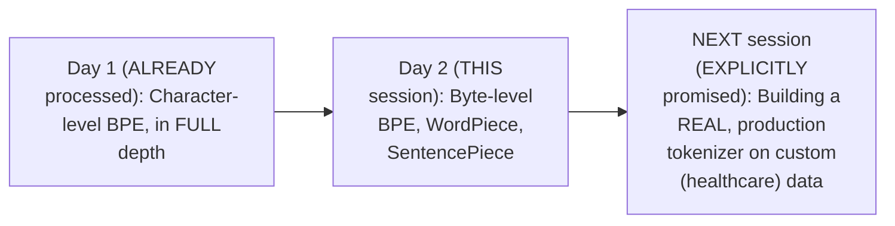

#### ⚠ A Direct, Honest Note on This Transcript's Own, Genuine Technical Glitch

> 💡 **Given directly, mid-session:** *"I got disconnected, really, like, Gio, yesterday also, it happened, I'm really, really sorry... I connected with my hotspot right now."*

This TRANSCRIPT'S own SPEAKER labeling GENUINELY shifts (from "PAUL" to a DIFFERENT label) AT this EXACT point — a CLEAR technical ARTIFACT of the RECONNECTION, NOT a DIFFERENT instructor. The TEACHING content CONTINUES seamlessly, WITHOUT interruption in SUBSTANCE, and THIS guide attributes ALL content to THE SAME instructor THROUGHOUT.

#### 🎯 Key Takeaways

* This is genuinely **Day 2 of tokenization COVERAGE**, DIRECTLY fulfilling Day 1's OWN, explicit promise TO cover WordPiece AND SentencePiece.
* A GENUINE, live TECHNICAL disconnection OCCURRED mid-session — VISIBLE in the transcript's OWN speaker labeling — HONESTLY noted here as a TRANSCRIPTION artifact, NOT a content DISCONTINUITY.
* The NEXT session is DIRECTLY, EXPLICITLY confirmed as BUILDING a REAL, production tokenizer ON custom (HEALTHCARE) data.

---

### 2. Unicode vs. UTF-8: A Precise, Genuine Distinction

#### ❓ Why It Exists — A Direct, Explicit Correction of a Common Misconception

> 💡 **Given directly:** *"How many of you feel that Unicode and UTF are exactly the same?... they aren't different, you have to understand, guys. So, don't think that they are exactly the same. Using UTF, you can do the conversion. Unicode supports UTF-8, that is correct, but directly you cannot say that [they're the same]."*

#### 📖 Definition — The Precise, Genuine Distinction

> 💡 **Given directly:** *"Unicode says what a character is, in simple terms — if I say, the representation of the character can be done in Unicode. Whereas UTF says what? UTF-8 says how to write the character with respect to bytes."*

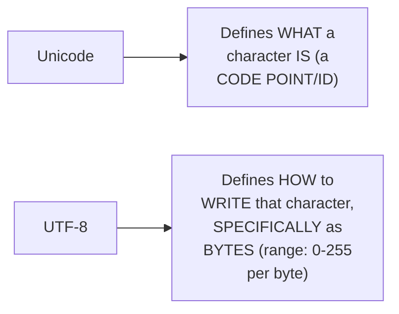

#### 🔍 Internal Working — A Genuine, Direct Confirmation of Byte Range

> 💡 **Given directly:** *"What is the range of bytes whenever you are working?... 0 to 255, guys. That's the main range."*

#### ⚠ Common Mistakes

* Assuming Unicode and UTF-8 are GENUINELY, INTERCHANGEABLY the SAME thing — explicitly, directly, REPEATEDLY corrected: Unicode DEFINES the character ITSELF; UTF-8 defines its BYTE-level WRITTEN representation.
* Assuming a SINGLE byte ALWAYS represents ONE character — explicitly, directly, LATER clarified (Section 5): SOME characters GENUINELY require MULTIPLE bytes (e.g., a SPECIAL "é" character NEEDING two BYTES: 195 and 167).

#### 🎯 Key Takeaways

* **Unicode** GENUINELY defines WHAT a character IS; **UTF-8** GENUINELY defines HOW to WRITE that character AS bytes — TWO, genuinely DIFFERENT, though RELATED, concepts.
* The GENUINE byte range is **0 to 255** — the FOUNDATIONAL constraint UNDERLYING byte-level TOKENIZATION's own FIXED vocabulary size.
* This PRECISE distinction directly, DIRECTLY sets UP the REST of this session's OWN content — the SHIFT from CHARACTER-level to BYTE-level tokenization is PRECISELY a shift FROM Unicode-based to UTF-8-BASED representation.

---
### 3. Why Byte-Level BPE Exists: Two Genuine Problems With Character-Level Tokenization

#### ❓ Why It Exists — Problem 1: The "Ballooning Effect"

> 💡 **Given directly:** *"For a simple sentence, if a lot of tokens are getting generated... this actually creates, in academia, this is a term, basically, which is called the ballooning effect. Okay, so, simply, it means that you pass a very small sentence, and automatically so many tokens that got generated."*

#### 🪜 Step-by-Step — A Complete, Real, Worked Example of the Genuine, Practical Consequence

> 💡 **Given directly:** *"Let's take your Unicode tokenization part... from there, you got total 50 tokens... and now, if you have a model context window of 30 tokens... can I say that the model will read the first 32 characters?... what will happen to the 33rd token? The model cannot include the rest of this sentence in the context."*

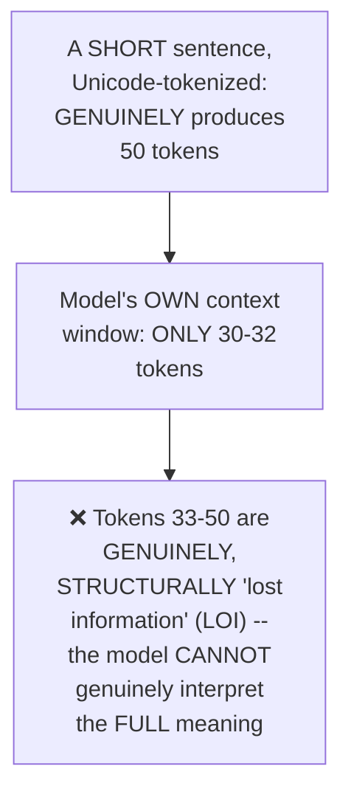

#### 🔍 Internal Working — A Direct, Honest Clarification: No "Multiple Context Windows"

> 💡 **Given directly:** *"We can tell the LLM, use two context window as it's overflowing... how many of you think that this is correct?... two contexts, the LLM is always having a SINGLE context window... you cannot say, make 10 context window, that's NOT possible."*

#### ❓ Why It Exists — Problem 2: Excessive Vocabulary Size

> 💡 **Given directly:** *"Generally, when I have this 150K, the vocabulary size, this is huge... can I say that the vocabulary size will have some type of effect in the final layer of the transformer's architecture, yes or no?... because of larger vocabulary size, the impact will be directly on the final layer of your transformer architecture... larger the vocabulary, larger is the LLM output, logit tensor."*

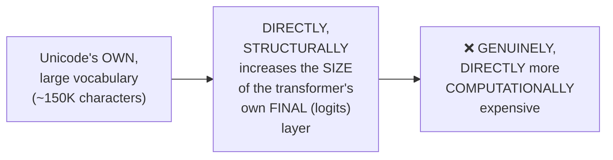

#### ⚠ Common Mistakes

* Assuming a MODEL can GENUINELY use MULTIPLE, SEPARATE context WINDOWS simultaneously — explicitly, directly, REPEATEDLY corrected: an LLM GENUINELY has ONLY ONE, single context WINDOW at ANY given TIME.
* Assuming vocabulary SIZE is GENUINELY, PURELY a "how MANY words can it RECOGNIZE" concern — explicitly, directly clarified: it ALSO, DIRECTLY, STRUCTURALLY impacts the TRANSFORMER's own FINAL, logits LAYER SIZE — a REAL, computational COST.

#### 🎯 Key Takeaways

* Character-LEVEL (Unicode-based) tokenization GENUINELY causes a **"ballooning EFFECT"** — SMALL sentences PRODUCING EXCESSIVE token COUNTS, GENUINELY, DIRECTLY consuming a MODEL's own LIMITED, single context WINDOW, RESULTING in GENUINE, real LOSS of information.
* Unicode's OWN LARGE vocabulary (~150K CHARACTERS) DIRECTLY, STRUCTURALLY inflates the TRANSFORMER's own FINAL (logits) LAYER — a GENUINE, real COMPUTATIONAL cost.
* These TWO, genuine problems (EXCESSIVE tokens, EXCESSIVE vocabulary) directly, PRECISELY motivate the SHIFT to BYTE-level BPE — THIS session's own NEXT, established TOPIC.

---

### 4. Byte-Level BPE (BBPE): The Solution, Precisely Explained

#### 📖 Definition — The Precise, Genuine Solution: A Fixed, 256-Value Vocabulary

> 💡 **Given directly:** *"Using byte level, the first problem that you will try to solve is that fixed vocabulary. The idea is that you can pass anything. Okay, because 0 to 255, between this, anything can be represented."*

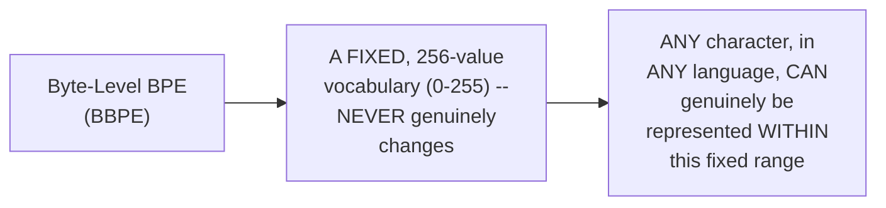

#### 🔍 Internal Working — The Genuine, Precise Fallback Mechanism

> 💡 **Given directly:** *"If something that cannot be represented, what will be the fallback?... rate won't be an unknown token. We don't keep it. Okay, the main one will be the RAW byte representation. Because the idea is that if I'm working with byte-level data, I will be covering everything through the representation between 0 to 255."*

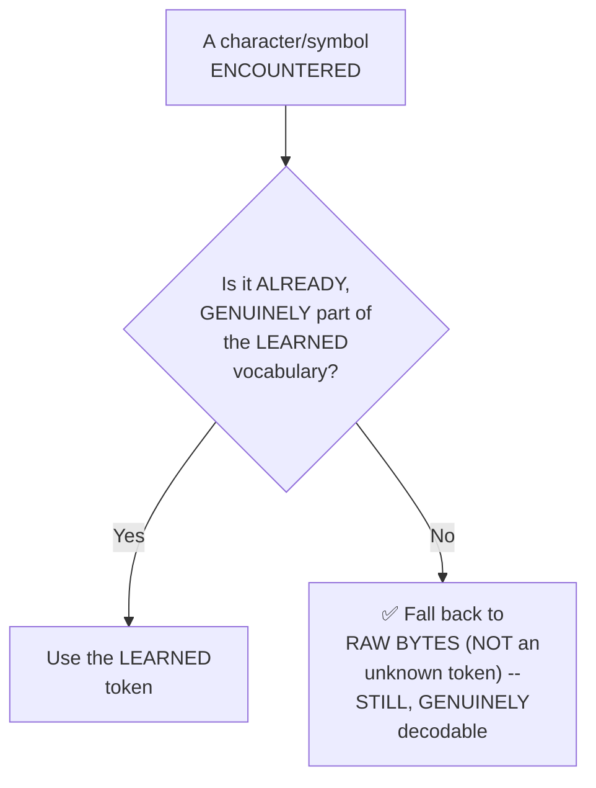

#### 🔍 Internal Working — The Precise, Genuine Core Algorithmic Similarity

> 💡 **Given directly:** *"There is no change in the algorithm. Only the first representation that is getting changed from Unicode, or simply character level that I can say, to byte level. So that's why this, whenever you are working, it's called as B, B, P, E [Byte-level BPE]."*

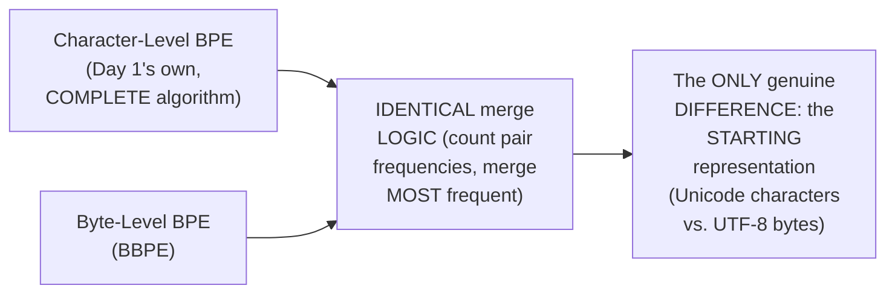

#### 🏢 Real-World / Production Usage — A Genuine, Historical Confirmation

> 💡 **Given directly:** *"GPT-1... it's only called GPT only. There, you had character level. After that, starting from GPT-2, it has moved to byte... till now, if I pick up the major families of Soul, Terra, and Luna, everything from the GPT-3 family, they always follow byte."*

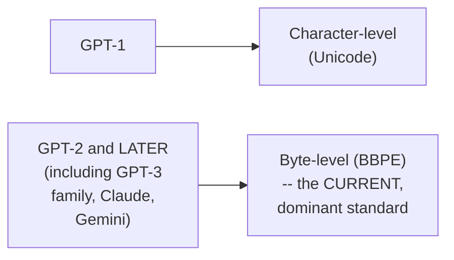

#### ⚠ Common Mistakes

* Assuming byte-LEVEL BPE is a GENUINELY, FUNDAMENTALLY different ALGORITHM from CHARACTER-level BPE — explicitly, directly, REPEATEDLY corrected: the CORE merge LOGIC is EXACTLY the SAME — ONLY the STARTING representation (BYTES instead of CHARACTERS) genuinely CHANGES.
* Assuming byte-level BPE STILL uses an unknown TOKEN as its OWN fallback — explicitly, directly, PRECISELY clarified: the FALLBACK is RAW bytes, NOT `<UNK>` — a GENUINELY, MEANINGFULLY different, MORE informative FALLBACK.

#### 🎯 Key Takeaways

* **Byte-Level BPE (BBPE)** uses a **FIXED, 256-value VOCABULARY** (0-255) — GENUINELY capable of REPRESENTING any CHARACTER, in ANY language, WITHOUT exception.
* Its GENUINE fallback for UNSEEN symbols is **RAW BYTES**, NOT an unknown TOKEN — a MEANINGFULLY more INFORMATIVE fallback the LLM CAN still, PARTIALLY decode.
* The CORE BPE algorithm **REMAINS structurally IDENTICAL** — ONLY the STARTING representation CHANGES (Unicode CHARACTERS → UTF-8 bytes) — DIRECTLY, HISTORICALLY confirmed as the SHIFT that OCCURRED starting WITH GPT-2, and NOW the UNIVERSAL standard ACROSS modern LLM FAMILIES.

---
### 5. A Live Demonstration: Character-Level Failure vs. Byte-Level Success

#### 🪜 Step-by-Step — A Complete, Live, Real Test: Character-Level BPE's Own Genuine Failure

> 💡 **Given directly:** *"What happens if, at inference time, someone hands the tokenizer a character which it has never seen... encoding a word containing an unseen character... this particular representation of this particular unknown, directly, I can say the fallback will go towards the unknown one... the token ID is the unknown part."*

```python
# Character-level BPE, trained on a small corpus (e.g. "low," "lowest")
tokenizer.encode("luke")   # "luke" contains an UNSEEN character
# -> GENUINELY, DIRECTLY falls back to: <UNK>
```

#### 🪜 Step-by-Step — A Complete, Live, Real Test: Byte-Level BPE's Own Genuine Success

> 💡 **Given directly:** *"If something is unseen... can I break that into main character level? That is one backup... but here, the token representation... can you see that same emoji has been represented?... slash X F0 slash... those are hex values."*

```python
# Byte-level BPE, on the SAME, unseen input (e.g. an emoji)
tokenizer.encode_bytes("😀")   # a GENUINELY unseen symbol
# -> GENUINELY, DIRECTLY falls back to: \xf0\x9f\x98\x80  (raw byte/hex representation)
# NOT <UNK> -- a MEANINGFULLY more informative fallback
```

#### 🔍 Internal Working — Precisely WHY the Raw-Byte Fallback Genuinely Helps

> 💡 **Given directly:** *"How many of you think that this particular information, if it is sent to the LLM, it can understand?... I'm not telling it will be very, very super proficient, but at least I can say that this information can be decoded to a certain extent... at least better THIS [than] unknown. So, no crash directly, we are handling this."*

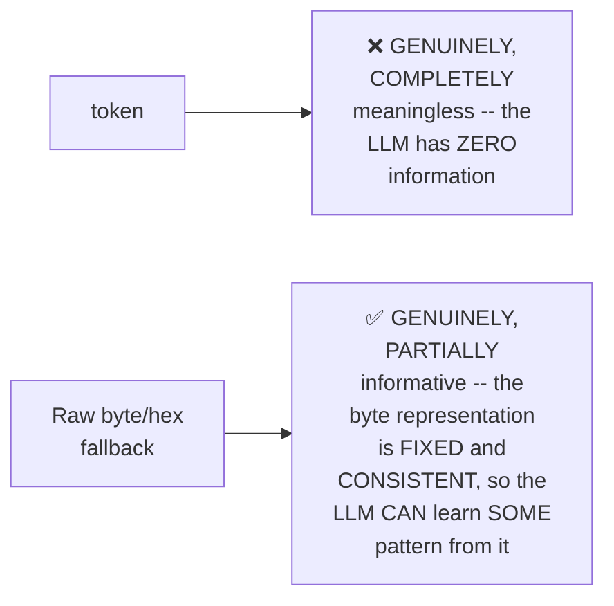

#### 🔍 Internal Working — A Genuine, Direct Confirmation: Byte Representations Never Change

> 💡 **Given directly:** *"The byte representation is fixed, it doesn't change. I cannot say that today emoji has a byte representation. After 2 days, the byte representation will change... it is fixed. So the LLM will get that particular idea."*

#### ⚠ Common Mistakes

* Assuming the RAW-byte fallback is GENUINELY, EQUALLY as USELESS as an UNKNOWN token — explicitly, directly clarified: SINCE byte REPRESENTATIONS are GENUINELY, PERMANENTLY fixed, the LLM CAN, over TIME and TRAINING, learn SOME useful PATTERN from them — UNLIKE a GENERIC, uniform UNKNOWN token.
* Assuming this CHANGES the model's OWN, underlying TRAINING process — explicitly, directly, REPEATEDLY clarified: "WHATEVER that you have LEARNED till now, EVERYTHING lies [STAYS the same]. Only the FIRST step of token REPRESENTATION, that ONLY changes."

#### 🎯 Key Takeaways

* A COMPLETE, live TEST directly, CONCRETELY confirmed the CORE distinction: character-LEVEL BPE GENUINELY fails on UNSEEN characters (FALLING BACK to a MEANINGLESS unknown TOKEN); byte-LEVEL BPE GENUINELY succeeds (FALLING BACK to a MEANINGFUL, FIXED raw-byte REPRESENTATION).
* Byte REPRESENTATIONS are **GENUINELY, PERMANENTLY fixed** — THIS consistency is PRECISELY what allows an LLM to LEARN SOME useful PATTERN from them OVER time, UNLIKE a GENERIC unknown TOKEN.
* This is directly, EXPLICITLY confirmed as **PURE computer-science REPRESENTATION** — "THERE is no AI GOING behind that" — NOTHING in the MODEL's own LEARNING process CHANGES; ONLY the INPUT representation SHIFTS.

---

### 6. The WordPiece Algorithm: A Complete, Hand-Worked Walkthrough

#### 📖 Definition — WordPiece, Precisely Introduced

> 💡 **Given directly:** *"The next process is very, very similar, which is the WordPiece, and WordPiece is actually used by the Google team... usually all the architectures that come from the Google team, that is also based on this one."*

#### 📖 Definition — The Precise, Genuine Algorithmic Difference: A Likelihood Score

> 💡 **Given directly:** *"The next step is a bit different, where we are actually calculating the score, and this is the LIKELIHOOD score that we call it. So, where we try to compare the pair which is appearing the most times WITH RESPECT to the first token in that particular pair and the second token."*

```text
WordPiece's own Maximum Likelihood Score formula:

score(pair) = frequency(pair) / [frequency(first_token) × frequency(second_token)]
```

#### 🪜 Step-by-Step — A Complete, Real, Hand-Worked Example: "the cat sat on the mat"

> 💡 **Given directly:** *"Let's take T and H. This is the first pair that I have taken, T and H. So here, what is the frequency of T?... 5 times. Then comes frequency of second, H came here how many times? Two times... in this particular formula, the frequency of the pair, TH, how many times that you saw in total... 2... divided by 5 into [times] 2, second token, which is 2. What will be the value?... point 2, that I can say."*

```text
Worked example, "the cat sat on the mat":

Pair: T + H
freq(T) = 5, freq(H) = 2, freq(TH) = 2
score(TH) = 2 / (5 × 2) = 0.2

Pair: O + N
freq(O) = 1, freq(N) = 1, freq(ON) = 1
score(ON) = 1 / (1 × 1) = 1.0   <- the HIGHEST score -> merged FIRST
```

#### 🔍 Internal Working — Precisely WHY O+N Genuinely Wins the First Merge

> 💡 **Given directly:** *"Now, from here, so which pair is having that highest score?... I can say that that is for O and N, which was 1... so what will be the first merge which will happen? O comma N. It will become 'on.'"*

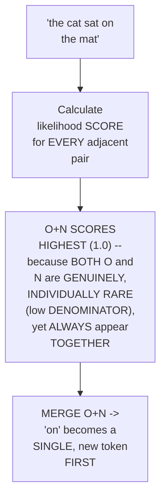

#### 🪜 Step-by-Step — Repeating the Process: HE Merges Next

> 💡 **Given directly:** *"Let's do it for H&E. H, E, HKM 2 times. To the frequency of the first token, H, this is 2 times E. How many times E came? E came also 2 times... this particular pair, HE, I know in the main sentence is 2 times... so, according to the formula, what will be there?... [0.5]."*

#### ⚠ Common Mistakes

* Assuming WordPiece SIMPLY picks the MOST frequent PAIR, JUST like BPE — explicitly, directly, PRECISELY corrected: WordPiece USES a LIKELIHOOD SCORE (FREQUENCY of the pair, DIVIDED by the PRODUCT of EACH individual token's OWN frequency) — NOT raw FREQUENCY alone.
* Assuming a HIGH raw-frequency PAIR will ALWAYS score HIGHEST in WordPiece — explicitly, directly, CONCRETELY demonstrated as FALSE: "O+N" (INDIVIDUALLY RARE characters) SCORED HIGHER than "TH" (a MORE frequent PAIR, but WITH individually MORE-common characters) — SINCE the FORMULA REWARDS pairs where BOTH tokens are RELATIVELY rare ON THEIR OWN, but STRONGLY co-occur.

#### 🎯 Key Takeaways

* **WordPiece** uses a **MAXIMUM likelihood SCORE** — `frequency(pair) / [frequency(FIRST) × frequency(SECOND)]` — GENUINELY, STRUCTURALLY different FROM BPE's own SIMPLE, raw-frequency APPROACH.
* This SCORE REWARDS pairs where BOTH individual TOKENS are RELATIVELY rare on THEIR own, but STRONGLY, CONSISTENTLY co-occur TOGETHER — DIRECTLY, CONCRETELY demonstrated via the "O+N" example (SCORING higher than the MORE frequent "TH" pair).
* A COMPLETE, real, HAND-WORKED example ("the CAT sat on the MAT") directly, PRECISELY traced THROUGH the algorithm's OWN, step-by-STEP merge sequence — MIRRORING Day 1's own MANUAL BPE walkthrough.

---
### 7. WordPiece vs. BPE: The Genuine, Precise Differences

#### 📖 Definition — A Direct, Precise Summary of the Core Difference

> 💡 **Given directly:** *"This is very similar to BP, but that SCORING logic is different, because in BP, there is no such concept of scoring."*

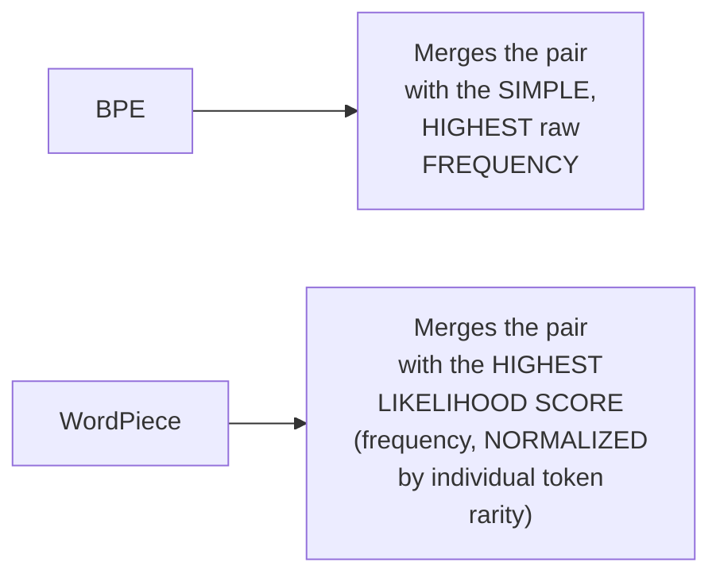

#### 🔍 Internal Working — A Genuine, Real, Live-Confirmed Test: Neither Algorithm Solves the Strawberry Problem

> 💡 **Given directly:** *"Strawberry... based on the merges that we do have in our initial vocabulary... I can say that the tokenized text... do you feel that this is a better version?... let's do the same thing for our [WordPiece]... how many of you feel the inputs are pretty much close together?... not properly [has] strawberry which has been captivated here."*

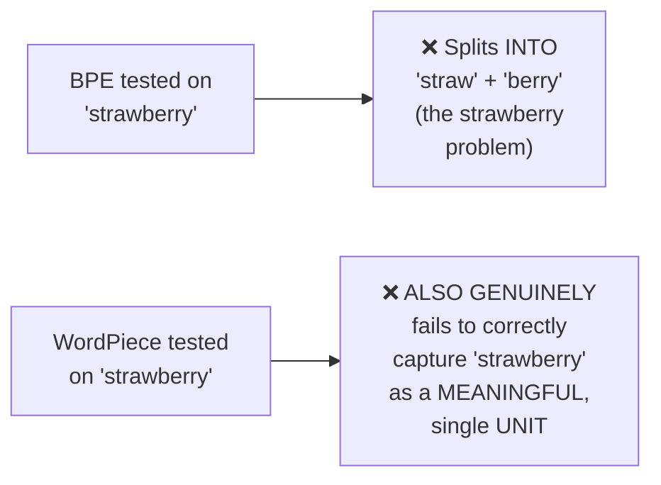

#### ⚠ A Direct, Honest, Real Confirmation: No Direct Fix

> 💡 **Given directly:** *"What a strawberry problem in both the libraries did not able to solve? What is the final solution? There is NO solution directly... in SOME cases, we ALWAYS take a FAILURE rate for EVERY tokenizer... that's why the IDEA was to bring BYTE level, if something that you COULD not understand."*

#### 🏢 Real-World / Production Usage — A Genuine, Historical, Honest Confirmation

> 💡 **Given directly:** *"The last two years, the market has been highly dominated by BP. Okay, so simply, everybody has switched from sentence-based... don't use WordPiece... even with respect to research, EVEN they say that, please replace your OLD tokenizers, PROBABLY if something that you have done with WordPiece, you can CHANGE it into BP."*

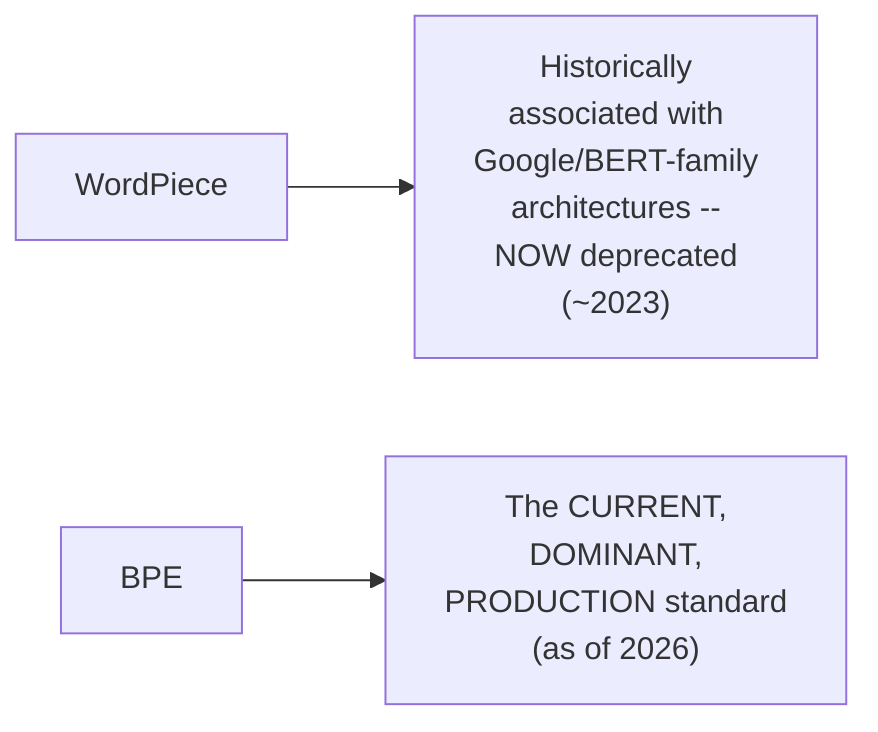

#### ⚠ Common Mistakes

* Assuming WordPiece is a GENUINELY DIFFERENT, competing SOLUTION to BPE's OWN, established LIMITATIONS (like the STRAWBERRY problem) — explicitly, directly, LIVE-tested and CONFIRMED as FALSE: BOTH algorithms GENUINELY fail on THIS same, real EXAMPLE.
* Assuming WordPiece REMAINS a GENUINELY, WIDELY-used, current PRODUCTION standard — explicitly, directly, HONESTLY clarified: it's NOW deprecated (~2023), WITH the market GENUINELY, OVERWHELMINGLY dominated BY BPE.

#### 🎯 Key Takeaways

* WordPiece's OWN, genuine DISTINCTION from BPE is PRECISELY its **SCORING logic** — a LIKELIHOOD-based FORMULA, VERSUS BPE's SIMPLE, raw-frequency APPROACH.
* NEITHER algorithm GENUINELY solves the STRAWBERRY problem — directly, LIVE-tested and CONFIRMED — "THERE is NO solution DIRECTLY" for EITHER.
* WordPiece is directly, HONESTLY confirmed as **NOW deprecated** (~2023) — the market has GENUINELY, OVERWHELMINGLY shifted TOWARD BPE, EVEN within research CONTEXTS that FORMERLY used WordPiece.

---

### 8. SentencePiece: A Library, Not an Algorithm

#### 📖 Definition — SentencePiece, Precisely, Repeatedly Clarified

> 💡 **Given directly:** *"Sentence piece is a library. It's not an algorithm... sentence piece is a lightweight, unsupervised text tokenizer, and a de-tokenizer also. It means that encoding, decoding, designed for both neural-based tasks."*

#### 🔍 Internal Working — Its Own, Genuine, Historical Origin

> 💡 **Given directly:** *"Google, as I told you, they have been working with machine translation for a long time, so this is one of the major [outcomes]... sentence piece has been widely used for machine translation-based tasks a lot."*

#### 📖 Definition — SentencePiece's Own, Precise Four Model Types

> 💡 **Given directly:** *"What are the major four types of model prefix support it has? The first one is simply character level, okay, then you have word level, then you have this byte pair encoding support, and the final one is the Unigram language model."*

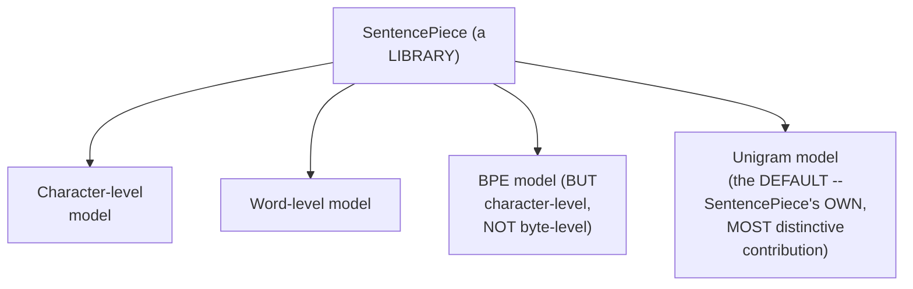

#### ⚠ A Direct, Honest, Important Clarification on SentencePiece's Own BPE

> 💡 **Given directly:** *"If I am working with GPT-based models, will I work with sentence piece or no?... No, always remember that. Then use TikToken... in sentence piece, till now, it's CHARACTER-level BP only. So, just be sure. In TikToken, byte level, here it's CHARACTER level."*

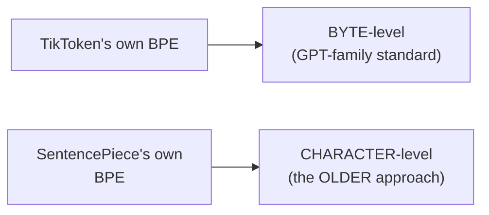

#### 🏢 Real-World / Production Usage — Precisely WHEN SentencePiece Genuinely Matters

> 💡 **Given directly:** *"T5 uses sentence piece, actually... if you're using models directly from Google, then it makes much more sense to use SentencePiece... sentence-based handles UNSEGMENTED sentences like Japanese... whereas your character-level BP could NOT handle it."*

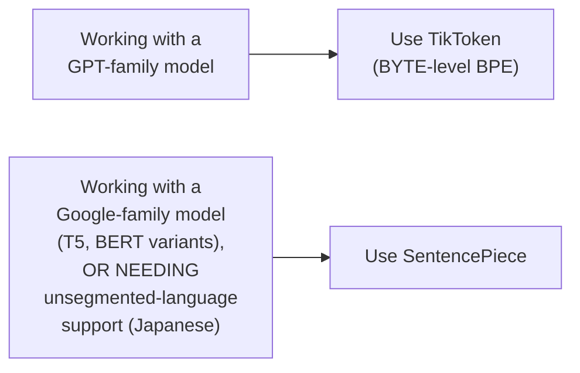

#### ⚠ Common Mistakes

* Assuming SentencePiece is GENUINELY an ALGORITHM, competing WITH BPE and WordPiece — explicitly, directly, REPEATEDLY corrected: it's a LIBRARY that CAN implement SEVERAL algorithms (INCLUDING BPE itself), NOT an ALGORITHM in its OWN right.
* Assuming SentencePiece's OWN BPE implementation is GENUINELY equivalent TO TikToken's — explicitly, directly, PRECISELY clarified: SentencePiece's BPE REMAINS character-LEVEL, while TikToken's is BYTE-level — a GENUINE, meaningful DIFFERENCE.

#### 🎯 Key Takeaways

* **SentencePiece** is directly, REPEATEDLY confirmed as a **LIBRARY, NOT an algorithm** — SUPPORTING FOUR model TYPES: character, WORD, BPE (character-LEVEL), and **UNIGRAM** (its OWN, most distinctive CONTRIBUTION).
* SentencePiece's OWN BPE implementation REMAINS character-LEVEL — GENUINELY DIFFERENT from TikToken's BYTE-level approach — DIRECTLY EXPLAINING why GPT-family work uses TikToken, NOT SentencePiece.
* SentencePiece GENUINELY matters FOR Google-family MODELS (T5, BERT variants) and FOR **unsegmented LANGUAGES** (like JAPANESE) — WHERE character-LEVEL BPE GENUINELY struggles.

---
### 9. A Live SentencePiece Practical: Training Unigram & BPE Models

#### 💻 Code Example — Training a Unigram Model

> 💡 **Given directly:** *"I have loaded up my own corpus, and the idea is that if I want to create a tokenized model... spm... trainer.train... I am passing this as my input corpus... then I have the model prefix... the main tokenization scheme that we do have. It is based on Unigram."*

```python
import sentencepiece as spm

spm.SentencePieceTrainer.train(
    input="corpus.txt",
    model_prefix="my_unigram_model",
    vocab_size=4000,
    model_type="unigram",   # or "bpe", "word", "char"
    character_coverage=1.0,
)
```

#### 🔍 Internal Working — A Genuine, Real, Live-Confirmed Result: Vocabulary Size as a Hyperparameter

> 💡 **Given directly:** *"If I change the vocabulary size, what will it do?... let's try to make it 4000... how can we decide which size is better? Again, with experiments. Nobody can directly say — start with at least 2K, then check with 4K... 4K is a very good number, then 8K, then 16K."*

#### ⚠ A Direct, Honest, Live-Demonstrated Error

> 💡 **Given directly:** *"Let's try to go with a very high number... 20,000 this time... maximum value right now that you are getting, 1892, which is being supported initially... we got an error. So always do the testing, that's why I told you, like, 8K is a perfect place, that I feel."*

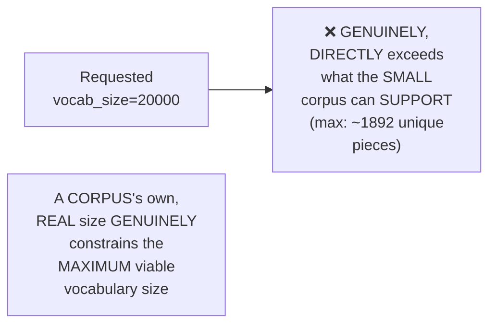

#### 💻 Code Example — Encoding & Decoding (Confirming Round-Trip Correctness)

> 💡 **Given directly:** *"Here's a sample sentence, I saw a girl with a telescope... once the tokenization is done, in every tokenizer... with that, one unique ID will be attached... the idea is to perform a decode-based operation also... I can see that this is pretty much the same stuff. The encoding and the decoding is working perfectly."*

```python
sp = spm.SentencePieceProcessor(model_file="my_unigram_model.model")
tokens = sp.encode("I saw a girl with a telescope", out_type=int)
decoded = sp.decode(tokens)
assert decoded == "I saw a girl with a telescope"   # round-trip CONFIRMED
```

#### 💻 Code Example — Switching to BPE (SentencePiece's Own Character-Level Version)

> 💡 **Given directly:** *"I will just change this particular prefix... only one thing that I will change, this particular model type... the BP underscore model selection."*

```python
spm.SentencePieceTrainer.train(
    input="corpus.txt",
    model_prefix="my_bpe_model",
    vocab_size=5000,
    model_type="bpe",
)
```

#### 🔍 Internal Working — A Genuine, Real, Live-Confirmed Comparison: BPE vs. Unigram Token Counts

> 💡 **Given directly:** *"I can say the BP is much more optimized, because in the BP I feel that the number of tokens are toward the lower side... this is smaller as compared to Unigram."*

#### 🔍 Internal Working — A Genuine, Real Confirmation: Handling Unsegmented Languages

> 💡 **Given directly:** *"Sentence-based handles unsegmented sentences like Japanese... now, this is an added benefit... because right now, this is an unsegmented text. Now, sentence piece actually can handle it, whereas your character-level BP could not handle it."*

#### ⚠ Common Mistakes

* Assuming vocabulary SIZE is GENUINELY, ARBITRARILY selectable, WITHOUT any REAL constraint — explicitly, directly, LIVE-demonstrated as FALSE: a SMALL corpus GENUINELY, STRUCTURALLY limits the MAXIMUM viable VOCABULARY size — REQUESTING too MUCH produces a REAL error.
* Assuming Unigram and BPE PRODUCE GENUINELY identical TOKENIZATION results — explicitly, directly, LIVE-confirmed as DIFFERENT: BPE GENUINELY produced FEWER, more OPTIMIZED tokens ON the SAME test SENTENCES.

#### 🎯 Key Takeaways

* SentencePiece's OWN TRAINING workflow REQUIRES specifying `model_type` (UNIGRAM, BPE, WORD, or CHARACTER) and `vocab_size` — a GENUINE HYPERPARAMETER, TYPICALLY tuned EXPERIMENTALLY (starting AROUND 2K-8K).
* A REAL corpus's OWN size GENUINELY, STRUCTURALLY constrains the MAXIMUM viable VOCABULARY — LIVE-demonstrated via a GENUINE error WHEN requesting TOO large a SIZE.
* BPE (WITHIN SentencePiece) GENUINELY produced **MORE optimized** (FEWER) tokens THAN Unigram ON the SAME test sentences — BUT SentencePiece's OWN, genuine ADVANTAGE is HANDLING unsegmented LANGUAGES (like JAPANESE) DIRECTLY, WHERE character-level BPE STRUGGLES.

---

### 10. Vocabulary Size & the Merge-Count Relationship

#### ❓ Why It Exists — A Direct, Genuine Question Posed to the Class

> 💡 **Given directly:** *"If the vocabulary size is small, you have to understand, will there be MORE merges? Or if the vocabulary size is much larger, will there be LESSER merges? Please tell me which condition."*

#### 📖 Definition — The Precise, Genuine Answer

> 💡 **Given directly:** *"When you have a smaller vocabulary size... the number of tokens are higher... the number of merges will be much more high, the number of merges will be lesser in a BIGGER vocabulary, whereas in a LESSER vocabulary, the number of merges will be MUCH more high. Why? Simply because the base words, the COMPLETE words, will be much more available in the higher vocabulary. Whereas in the lower, everything will be in the broken state."*

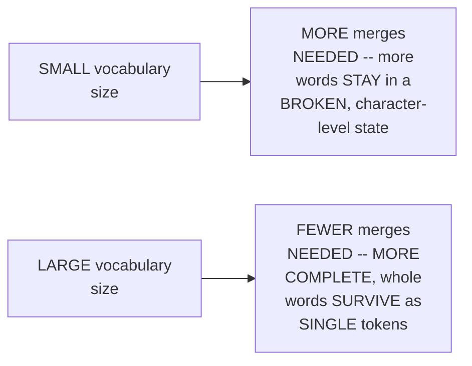

#### 🏢 Real-World / Production Usage — A Genuine, Direct, Historical Confirmation

> 💡 **Given directly:** *"With respect to time, even, I feel that the size of the vocabulary will keep on increasing for every tokenizer... higher the vocabulary size, for sure it is better, but at least, because when you try to save the mean words into the vocabulary, it is much helpful, as compared to always keeping everything in subwords."*

#### ⚠ Common Mistakes

* Assuming a SMALLER vocabulary is GENUINELY, SIMPLY "MORE efficient" (SINCE it's smaller) — explicitly, directly, PRECISELY corrected: a SMALLER vocabulary GENUINELY, DIRECTLY requires MORE merges/SUBWORD breakdown PER word, MAKING tokenization LESS efficient OVERALL (MORE tokens PER sentence).
* Assuming vocabulary SIZE is GENUINELY unrelated to the "ballooning EFFECT" problem (Section 3) — explicitly, directly, IMPLICITLY connected: a LARGER vocabulary DIRECTLY reduces the NUMBER of tokens PER sentence, DIRECTLY mitigating THIS same, EARLIER-established problem.

#### 🎯 Key Takeaways

* A **SMALLER vocabulary GENUINELY requires MORE merges** — MORE words REMAIN in a BROKEN, character-level STATE; a **LARGER vocabulary GENUINELY requires FEWER merges** — MORE complete WORDS survive AS single tokens.
* This directly, PRECISELY explains WHY vocabulary sizes have **GENUINELY, HISTORICALLY grown** OVER time (GPT-2's ~50K → GPT-4o's 100K-200K+) — LARGER vocabularies GENUINELY produce MORE efficient, FEWER-token representations.
* This RELATIONSHIP directly, PRECISELY connects BACK to Section 3's OWN "ballooning EFFECT" problem — a LARGER vocabulary GENUINELY, DIRECTLY mitigates EXCESSIVE token COUNTS.

---
### 11. Subword Regularization: A Genuine BPE vs. Unigram Distinction

#### 📖 Definition — Subword Regularization, Precisely Introduced

> 💡 **Given directly:** *"This is the subword regularization technique... this is from 2018... the main purpose is to provide regularization, and using regularization, the idea is to make the tokenized [output] much more generalized."*

#### 🪜 Step-by-Step — A Complete, Real, Live-Demonstrated Example

> 💡 **Given directly:** *"The main word that we are looking is into telescope, sampling 5 different segmentations of the word. Alright, enable sampling is equal to true... from sample 1, sample 2, sample 3, sample 4... TE and then LES has been combined in ALL the other samples."*

```python
sp = spm.SentencePieceProcessor(model_file="my_unigram_model.model")
for i in range(5):
    print(sp.encode("telescope", out_type=str, enable_sampling=True, alpha=0.1, nbest_size=-1))
# EACH call can GENUINELY produce a slightly DIFFERENT segmentation
```

#### 🔍 Internal Working — Precisely WHY This Is Genuinely Unique to Unigram

> 💡 **Given directly:** *"For every point of time, for every encoding that you are working with, you can actually create multiple samples and test it. Now, this is really NOT possible in the BP directly... in BP already you have the flexibility, but the flexibility always depends upon the number of occurrences. You have to, first of all, fulfill that criteria... but here, simply, the idea is you can pick anything."*

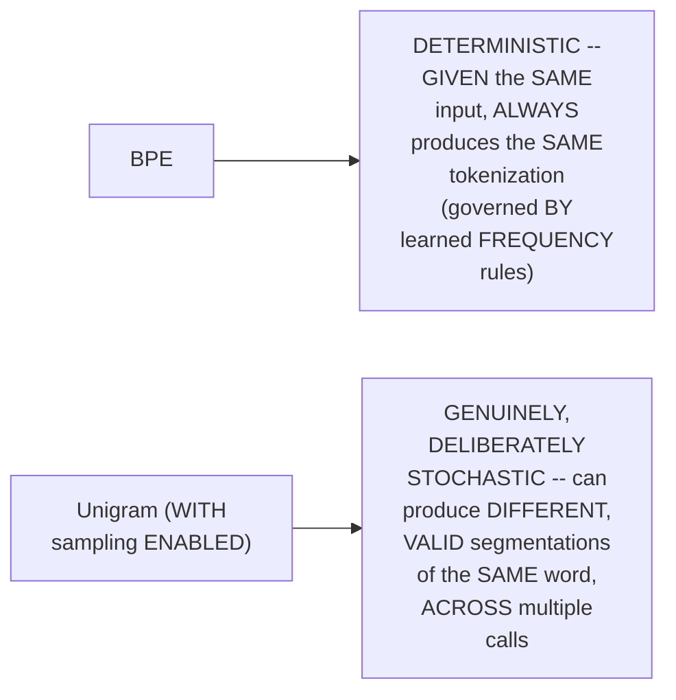

#### 🏢 Real-World / Production Usage — Precisely WHY This Genuinely Matters

> 💡 **Given directly, on regularization's own genuine, general purpose:** *"To make the model much more generalized, to increase the generalization path. That's why, in machine learning, I think you have worked with L1, L2 sometime in your life... dropout, how many of you remember dropout?... that is also a regularization technique."*

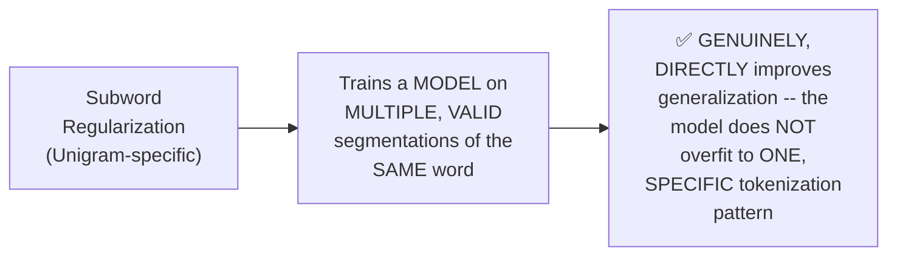

#### ⚠ Common Mistakes

* Assuming BPE ALSO supports THIS SAME kind of sampled, MULTIPLE-segmentation behavior — explicitly, directly, PRECISELY clarified: BPE is GENUINELY, STRUCTURALLY deterministic — GIVEN the SAME learned MERGE rules, it ALWAYS produces the SAME tokenization for the SAME input.
* Assuming subword REGULARIZATION is GENUINELY, ENTIRELY unrelated to OTHER, more FAMILIAR regularization TECHNIQUES (L1, L2, DROPOUT) — explicitly, directly connected: it SHARES the SAME, general PURPOSE — improving a MODEL's own GENERALIZATION.

#### 🎯 Key Takeaways

* **Subword REGULARIZATION** (a 2018-era TECHNIQUE) enables SAMPLING multiple, VALID segmentations of the SAME word — DIRECTLY, GENUINELY improving a MODEL's own GENERALIZATION, similarly TO L1/L2 or DROPOUT.
* This is directly, EXPLICITLY confirmed as **GENUINELY UNIQUE to Unigram MODELING** — BPE's own DETERMINISTIC, frequency-BASED approach does NOT genuinely SUPPORT this kind of SAMPLED variability.
* This represents a GENUINE, real TRADE-OFF worth REMEMBERING: BPE OFFERS deterministic, PREDICTABLE tokenization; UNIGRAM (VIA SentencePiece) OFFERS this ADDITIONAL, generalization-boosting REGULARIZATION capability.

---

### 12. Q&A: Tokenizer Evaluation & the Compression Ratio Metric

#### ❓ Why It Exists — A Genuine, Real Audience Question

> 💡 **Given directly:** *"When we are doing this tokenizer, when we're training, right? So, every time when we're building or training something, we need to have a way to measure how good it is. How do we know what we are training is good enough... is there any benchmark?"*

#### 📖 Definition — The Precise, Genuine, Recommended Metric: Compression Ratio

> 💡 **Given directly:** *"I prefer is the compress[ion] efficiency... it has to be 1.3x to 5x, because BP is actually a compression-based algorithm, and when you look after the main [data]set has been completed, we actually try to look into that particular compressed version. How much... it should be at least more than one. Then I can say that it's good. If it is less than 1, it means bad. 1 means okay."*

```mermaid
flowchart LR
    A["Compression Ratio<br/>< 1"] --> B["❌ GENUINELY,<br/>DIRECTLY bad -- the<br/>tokenizer is NOT<br/>genuinely compressing<br/>the data"]
    C["Compression Ratio<br/>= 1"] --> D["OK, but GENUINELY,<br/>NOT particularly<br/>VALUABLE"]
    E["Compression Ratio<br/>> 1 (ideally<br/>1.3x-5x)"] --> F["✅ GENUINELY,<br/>DIRECTLY good"]
```

#### 🔍 Internal Working — A Genuine, Honest Clarification: No Universal Benchmark Exists

> 💡 **Given directly:** *"If you're building on top of your own dataset... you can create your own eval dataset based on your dataset, then you can test everything... but directly, how you can compare with an open source version of that?... there are no direct frameworks... because MMLU and few other benchmarks are there, but again, it won't be based on your custom dataset."*

#### ⚠ A Direct, Honest, Important Clarification: Tokenizer Quality ≠ Model Quality

> 💡 **Given directly:** *"If you directly say that, based on tokenizer, I want to evaluate [the LLM], that is NOT a correct statement. It is factually wrong... language model DEPENDS upon a LOT of other parameters. Tokenization is ONLY one of them."*

```mermaid
flowchart LR
    A["A GENUINELY good<br/>tokenizer (per<br/>compression ratio)"] --> B["Is GENUINELY,<br/>DIRECTLY NECESSARY<br/>for a good model,<br/>but is NOT, by<br/>ITSELF, SUFFICIENT<br/>to guarantee ONE"]
```

#### ⚠ Common Mistakes

* Assuming a UNIVERSAL, standard BENCHMARK exists FOR evaluating ANY tokenizer against ANY OTHER — explicitly, directly, HONESTLY clarified: EVALUATION is GENUINELY, PRIMARILY tied to YOUR OWN, SPECIFIC dataset — a CUSTOM tokenizer's OWN eval SET must GENUINELY be BUILT for YOUR OWN, specific USE case.
* Assuming a GENUINELY well-OPTIMIZED tokenizer (HIGH compression RATIO) directly GUARANTEES a GENUINELY, OVERALL better LANGUAGE model — explicitly, directly, PRECISELY corrected: tokenizer QUALITY is ONLY ONE OF many FACTORS affecting the FINAL model's OWN, overall QUALITY.

#### 🎯 Key Takeaways

* The GENUINE, PRACTICAL, recommended METRIC for evaluating a TOKENIZER is **compression RATIO** — TARGETING 1.3x TO 5x — "if it is LESS than 1, it means BAD."
* There is **NO universal, standard BENCHMARK** for tokenizer EVALUATION, applicable across ALL, arbitrary datasets — CUSTOM tokenizers GENUINELY require a CUSTOM, self-built EVALUATION set.
* Tokenizer QUALITY is directly, HONESTLY confirmed as **ONLY ONE factor** among MANY affecting an OVERALL language MODEL's own quality — "it is FACTUALLY wrong" to EVALUATE an ENTIRE LLM BASED on its TOKENIZER alone.

---
### 13. Closing: Next Session — Building a Production Tokenizer

#### 🪜 Step-by-Step — A Complete, Honest, Direct Confirmation

> 💡 **Given directly:** *"Next Saturday, I will start with the first part, which is your... creating a production tokenizer on a custom data, and probably I'll be picking up healthcare data... if I try to change that with a pre-trained version, it won't work, simply."*

```mermaid
flowchart LR
    A["Day 1 (DONE):<br/>Character-level BPE"] --> B["Day 2 (THIS<br/>session, DONE):<br/>Byte-level BPE,<br/>WordPiece,<br/>SentencePiece"]
    B --> C["NEXT session<br/>(EXPLICITLY<br/>promised): Building a<br/>REAL, production<br/>tokenizer, on<br/>CUSTOM healthcare<br/>data"]
```

#### ⚠ A Direct, Honest Explanation for Why This Won't Work With a Pre-Trained Model

> 💡 **Given directly:** *"Why it won't work? The pre-trained version of the model ALWAYS comes with a pre-trained tokenizer.json file. So, directly, I cannot do that. Because the LAST layer, where you have the logits, okay, where you generate the probabilities, it won't match up. So, simply, my custom training cannot load it up."*

#### 🔍 Internal Working — A Genuine, Direct, Practical Compute Recommendation

> 💡 **Given directly:** *"The training time, maximum 4-5 hours. I'll be doing it in cloud, because I need more CPU cores... you don't need GPUs, you can run it... which optimized version that you need? Memory optimized, compute optimized... I need COMPUTE-optimized AWS EC2 instances."*

```mermaid
flowchart LR
    A["Training a REAL,<br/>production tokenizer<br/>on a LARGE, healthcare<br/>corpus"] --> B["REQUIRES: MORE<br/>CPU cores (NOT GPU),<br/>likely 4-5+ HOURS,<br/>a COMPUTE-optimized<br/>cloud instance"]
```

#### 🪜 Step-by-Step — A Direct, Explicit, Practical Assignment

> 💡 **Given directly:** *"This week, spend at least ONE time from the BPE side... at least please spend some time on BP... if you have the time, please go through the video lecture of Andrej Karpathy's Building the Tokenizer."*

#### ⚠ Common Mistakes

* Assuming a CUSTOM tokenizer can be GENUINELY, DIRECTLY substituted INTO an EXISTING, pre-trained model, WITHOUT further TRAINING — explicitly, directly, PRECISELY re-confirmed (DIRECTLY connecting BACK to Day 1's own ESTABLISHED "tokenizer-model COUPLING" principle): this WOULD genuinely BREAK the model's OWN, final LOGITS layer.
* Assuming BUILDING a production TOKENIZER genuinely requires GPU compute — explicitly, directly, REPEATEDLY clarified: it GENUINELY requires MORE CPU CORES specifically, NOT a GPU.

#### 🎯 Key Takeaways

* This session **genuinely, COMPLETELY delivers** its OWN stated GOALS — byte-LEVEL BPE, the COMPLETE WordPiece algorithm, and SentencePiece — ALL covered in FULL, precise DEPTH.
* The **NEXT session** is DIRECTLY, EXPLICITLY confirmed as BUILDING a REAL, PRODUCTION tokenizer on CUSTOM healthcare DATA — REQUIRING compute-OPTIMIZED CPU resources (NOT GPU), LIKELY 4-5+ hours of TRAINING time.
* The instructor's OWN, DIRECT, practical suggestion: spend GENUINE study time ON BPE SPECIFICALLY (the CURRENT, dominant STANDARD) — WITH Andrej Karpathy's OWN "Building the Tokenizer" video DIRECTLY recommended as a COMPLEMENTARY resource.

---
## 📝 Glossary

| Term | Definition | Why It Matters |
|---|---|---|
| **Unicode** | Defines what a character IS (a code point) | Often confused with UTF-8 |
| **UTF-8** | Defines how to write a character as bytes (range 0-255) | The foundation of byte-level tokenization |
| **Ballooning Effect** | Small sentences producing excessive token counts | Genuinely eats into a model's limited context window |
| **Byte-Level BPE (BBPE)** | BPE using a fixed, 256-value vocabulary | Solves both the OOV problem and vocab-explosion problem |
| **Raw Byte Fallback** | The fallback for unseen symbols in byte-level BPE | Meaningfully more informative than an <UNK> token |
| **WordPiece** | Google's subword algorithm, using a likelihood score | Historically used by BERT-family models; now deprecated |
| **Maximum Likelihood Score** | freq(pair) / [freq(first) x freq(second)] | WordPiece's own merge-selection formula |
| **SentencePiece** | A tokenization LIBRARY (not an algorithm) | Supports character, word, BPE, and Unigram model types |
| **Unigram Model** | SentencePiece's own, distinctive tokenization approach | Supports subword regularization (BPE does not) |
| **Subword Regularization** | Sampling multiple, valid segmentations of the same word | Improves model generalization; unique to Unigram |
| **Compression Ratio** | A practical tokenizer-evaluation metric | Target: 1.3x-5x; below 1x is genuinely bad |

---

## 🔄 Revision Notes — One-Minute Revision

* This is **Day 2** of tokenization, directly continuing Day 1's own promise to cover WordPiece and SentencePiece.
* **Unicode vs. UTF-8**: Unicode defines WHAT a character is; UTF-8 defines HOW to write it as bytes (0-255 range) -- a commonly-confused, genuinely distinct pair.
* **Why byte-level BPE exists (2 genuine problems with character-level)**: (1) the "ballooning effect" -- small sentences produce excessive tokens, genuinely eating into a model's single, limited context window, causing real information loss; (2) excessive vocabulary size (Unicode's ~150K characters) directly, structurally inflates the transformer's own final (logits) layer.
* **Byte-Level BPE (BBPE)**: solves both via a FIXED, 256-value vocabulary that can represent any character in any language. Its fallback for unseen symbols is RAW BYTES (not <UNK>) -- meaningfully more informative, since byte representations are permanently fixed and thus learnable over time. The core BPE algorithm doesn't change -- only the starting representation shifts from Unicode characters to UTF-8 bytes. Live-demonstrated: character-level BPE genuinely fails on unseen characters (<UNK>); byte-level BPE genuinely succeeds (raw byte/hex fallback).
* **Historical shift**: GPT-1 was character-level; GPT-2 onward (and all major modern families) use byte-level BPE.
* **WordPiece**: Google's own algorithm, using a MAXIMUM LIKELIHOOD SCORE (freq(pair) / [freq(first) x freq(second)]) rather than BPE's simple frequency count. This rewards pairs where both tokens are individually rare but strongly co-occur (demonstrated live: "the cat sat on the mat" -- O+N scored 1.0, higher than the more frequent TH pair, which scored only 0.2). Neither WordPiece nor BPE solve the strawberry problem -- live-tested and confirmed. WordPiece is now honestly confirmed as deprecated (~2023); BPE dominates as of 2026.
* **SentencePiece**: repeatedly, explicitly clarified as a LIBRARY, not an algorithm -- supporting 4 model types: character, word, BPE (character-level, unlike TikToken's byte-level), and Unigram (its own, most distinctive contribution, the default). Genuinely useful for Google-family models (T5) and for unsegmented languages (Japanese), where character-level BPE struggles.
* **Vocabulary size vs. merge count**: smaller vocabulary = MORE merges needed (more broken-down tokens); larger vocabulary = FEWER merges (more whole words survive) -- directly explaining why vocabulary sizes have grown historically.
* **Subword regularization**: sampling multiple, valid segmentations of the same word, genuinely unique to Unigram modeling (not possible in BPE's deterministic, frequency-based approach) -- improves generalization, similar in purpose to L1/L2 or dropout.
* **Tokenizer evaluation Q&A**: the practical, recommended metric is COMPRESSION RATIO (target 1.3x-5x; below 1x is bad). No universal benchmark exists across arbitrary datasets. Tokenizer quality is honestly confirmed as only ONE factor among many affecting overall model quality -- evaluating an entire LLM based on its tokenizer alone is "factually wrong."
* **Closing**: the next session explicitly builds a real, production tokenizer on custom healthcare data -- requiring compute-optimized CPU (not GPU), likely 4-5+ hours.

---

## 📋 Cheat Sheet

**Unicode vs. UTF-8:**
```text
Unicode -- defines WHAT a character is (a code point/ID)
UTF-8   -- defines HOW to write that character, as bytes (0-255 range)
```

**Why byte-level BPE exists:**
```text
Problem 1: Ballooning effect -- excessive tokens eat into a model's context window
Problem 2: Excessive vocabulary size -- directly inflates the transformer's final layer
Solution: a FIXED, 256-value vocabulary + raw-byte fallback (not <UNK>)
```

**WordPiece's own scoring formula:**
```text
score(pair) = frequency(pair) / [frequency(first_token) x frequency(second_token)]
-- rewards pairs where BOTH tokens are individually rare, but strongly co-occur
```

**BPE vs. WordPiece vs. SentencePiece:**
```text
BPE          -- simple, highest raw frequency; byte-level (via TikToken); the CURRENT standard
WordPiece    -- likelihood-score based; historically Google/BERT-family; DEPRECATED (~2023)
SentencePiece -- a LIBRARY (not an algorithm); supports char/word/BPE/Unigram; character-level BPE
```

**Vocabulary size vs. merges:**
```text
SMALL vocabulary -> MORE merges needed (more broken-down tokens)
LARGE vocabulary -> FEWER merges needed (more whole words survive)
```

**SentencePiece practical:**
```python
import sentencepiece as spm
spm.SentencePieceTrainer.train(
    input="corpus.txt", model_prefix="model_name",
    vocab_size=4000, model_type="unigram",  # or "bpe", "word", "char"
)
sp = spm.SentencePieceProcessor(model_file="model_name.model")
tokens = sp.encode("your text", out_type=int)
decoded = sp.decode(tokens)
```

**Tokenizer evaluation:**
```text
Compression ratio: target 1.3x-5x (below 1x = genuinely bad)
No universal benchmark exists -- build your OWN eval set for custom data
Tokenizer quality is ONLY ONE factor in overall model quality
```

---

## 🔥 Interview Questions & Answers

### 🟢 Beginner

**Q1.**

**Question:** What is the genuine difference between Unicode and UTF-8?

**Answer:** Unicode defines what a character is; UTF-8 defines how to write that character as bytes.

**Explanation:** Directly, precisely distinguished.

**Why Interviewers Ask This:** A commonly-confused, foundational distinction.

**Possible Follow-up:** "What is the genuine byte range UTF-8 operates within?"

**Q2.**

**Question:** What is the "ballooning effect"?

**Answer:** Small sentences producing an excessive number of tokens, genuinely eating into a model's limited context window.

**Explanation:** Directly, precisely explained.

**Why Interviewers Ask This:** Tests genuine understanding of a real, practical tokenization problem.

**Possible Follow-up:** "How does byte-level BPE genuinely help mitigate this?"

**Q3.**

**Question:** What is the fallback for an unseen symbol in byte-level BPE?

**Answer:** Raw bytes, not an unknown token.

**Explanation:** Directly, precisely explained.

**Why Interviewers Ask This:** Basic, essential byte-level BPE knowledge.

**Possible Follow-up:** "Why is this a meaningfully better fallback than <UNK>?"

**Q4.**

**Question:** What formula does WordPiece use to decide which pair to merge?

**Answer:** frequency(pair) / [frequency(first_token) x frequency(second_token)].

**Explanation:** Directly, explicitly stated.

**Why Interviewers Ask This:** Core, essential WordPiece algorithm knowledge.

**Possible Follow-up:** "How does this genuinely differ from BPE's own merge criterion?"

**Q5.**

**Question:** Is SentencePiece an algorithm or a library?

**Answer:** A library.

**Explanation:** Directly, repeatedly, explicitly confirmed.

**Why Interviewers Ask This:** A commonly-confused, genuine distinction.

**Possible Follow-up:** "What four model types does it genuinely support?"

**Q6.**

**Question:** Does WordPiece solve the strawberry problem?

**Answer:** No -- neither WordPiece nor BPE genuinely solve it.

**Explanation:** Directly, live-tested and confirmed.

**Why Interviewers Ask This:** Tests genuine, accurate understanding of both algorithms' shared limitation.

**Possible Follow-up:** "What is currently the only genuine, architecture-level approach to this problem?"

**Q7.**

**Question:** Is WordPiece still a genuinely dominant, production standard?

**Answer:** No -- it's honestly confirmed as deprecated (~2023), with BPE now dominant.

**Explanation:** Directly, honestly clarified.

**Why Interviewers Ask This:** Tests current, up-to-date industry awareness.

**Possible Follow-up:** "Which model families historically used WordPiece?"

**Q8.**

**Question:** Does a smaller vocabulary size genuinely require more or fewer merges?

**Answer:** More merges -- more words remain in a broken-down state.

**Explanation:** Directly, precisely explained.

**Why Interviewers Ask This:** Tests genuine understanding of the vocabulary-size/merge-count relationship.

**Possible Follow-up:** "Why have vocabulary sizes genuinely grown over time?"

**Q9.**

**Question:** What is subword regularization, and which algorithm genuinely supports it?

**Answer:** Sampling multiple, valid segmentations of the same word; genuinely unique to Unigram modeling, not BPE.

**Explanation:** Directly, precisely explained.

**Why Interviewers Ask This:** Tests genuine understanding of a real, practical BPE vs. Unigram distinction.

**Possible Follow-up:** "Why can't BPE genuinely support this same capability?"

**Q10.**

**Question:** What is the recommended, practical metric for evaluating a tokenizer?

**Answer:** Compression ratio, targeting 1.3x to 5x.

**Explanation:** Directly, precisely explained.

**Why Interviewers Ask This:** Tests genuine, practical evaluation knowledge.

**Possible Follow-up:** "What does a compression ratio below 1x genuinely indicate?"

---

### 🟡 Intermediate

**Q11.**

**Question:** Explain why the instructor deliberately, LIVE demonstrates BOTH a character-level BPE FAILURE and a byte-level BPE SUCCESS on the SAME, unseen input (Section 5), rather than simply describing byte-level BPE's own advantage abstractly.

**Answer:** This is a genuinely deliberate teaching choice, DIRECTLY consistent with a PATTERN established in Day 1's own session (e.g., the manual BPE walkthrough BEFORE the Python implementation). By GENUINELY, LIVE showing the SAME input FAILING under one APPROACH and SUCCEEDING under the OTHER, the instructor makes the ABSTRACT claim "byte-level solves the UNKNOWN-token problem" CONCRETELY, VISIBLY real — the LEARNER GENUINELY witnesses the DIRECT, comparative CONSEQUENCE, rather than TRUSTING an unverified assertion. This DIRECTLY, CONCRETELY reinforces WHY the entire FIELD shifted FROM character-level to BYTE-level tokenization, STARTING with GPT-2 — NOT as an ARBITRARY historical accident, but as a DIRECT, PRACTICAL response to a GENUINE, demonstrated failure MODE.

**Explanation:** Requires recognizing a deliberate, comparative live demonstration as reinforcing an abstract claim through direct, contrasting evidence.

**Why Interviewers Ask This:** Tests whether a learner recognizes the practical value of comparative demonstration over abstract description.

**Possible Follow-up:** "What GENUINE, additional test could you perform to FURTHER confirm byte-level BPE's own advantage, beyond a SINGLE unseen character?"

**Q12.**

**Question:** A learner argues that since WordPiece uses a "smarter," likelihood-based scoring formula (rather than BPE's simple frequency count), WordPiece should genuinely produce a MORE semantically meaningful vocabulary than BPE. Evaluate this claim.

**Answer:** This claim overstates the case, missing a GENUINELY important clarification THIS session's own content DIRECTLY provides. WHILE WordPiece's OWN scoring formula IS genuinely more SOPHISTICATED (REWARDING statistically STRONG co-occurrence, NOT just RAW frequency), this session's own DIRECT, LIVE test (Section 7, THE strawberry problem) CONFIRMS that WordPiece is **JUST as VULNERABLE** to producing SEMANTICALLY meaningless MERGES as BPE — BOTH algorithms GENUINELY, EQUALLY failed on the SAME test case. The ACCURATE, more precise conclusion: WordPiece's OWN scoring formula changes **WHICH** statistically-DRIVEN pairs get MERGED first, but does **NOT** genuinely introduce ANY semantic AWARENESS — it REMAINS, LIKE BPE, a PURELY statistical algorithm. "SMARTER math" does NOT genuinely EQUAL "semantically AWARE" — a DISTINCTION this session's OWN, direct strawberry-problem TEST makes CONCRETE.

**Explanation:** Tests whether a learner recognizes that a more sophisticated statistical formula doesn't equal genuine semantic understanding.

**Why Interviewers Ask This:** Distinguishes candidates who understand that both algorithms remain purely statistical from those who conflate formula sophistication with semantic awareness.

**Possible Follow-up:** "What GENUINE, architecture-level (not tokenizer-level) approach was mentioned as the ONLY real attempt to move BEYOND this shared limitation?"

**Q13.**

**Question:** Explain, precisely, why the instructor deliberately connects subword regularization (Section 11) back to L1/L2 regularization and dropout — concepts from earlier, general machine learning — rather than presenting it as an entirely new, tokenization-specific idea.

**Answer:** This is a genuinely deliberate, CONNECTIVE teaching choice: by DIRECTLY linking subword REGULARIZATION to ALREADY-familiar concepts (L1/L2, DROPOUT), the instructor ENSURES learners recognize this AS an INSTANCE of a BROADER, GENERAL machine-learning PRINCIPLE (introducing CONTROLLED variability DURING training to IMPROVE generalization), RATHER than a GENUINELY isolated, tokenization-SPECIFIC trick. This DIRECTLY, CONCRETELY helps learners UNDERSTAND *why* sampling MULTIPLE segmentations of the SAME word would GENUINELY help a MODEL generalize BETTER — the SAME underlying LOGIC that MAKES dropout GENUINELY useful (PREVENTING over-reliance on ANY single, SPECIFIC pattern) DIRECTLY applies HERE too (PREVENTING over-reliance on ANY single, SPECIFIC tokenization of a GIVEN word).

**Explanation:** Requires recognizing the deliberate connection to prior, general ML concepts as reinforcing understanding through an already-familiar mental model.

**Why Interviewers Ask This:** Tests whether a learner can connect tokenization-specific techniques to broader, general machine learning principles.

**Possible Follow-up:** "Construct your OWN, precise analogy between HOW dropout GENUINELY prevents overfitting, and HOW subword regularization GENUINELY achieves a similar EFFECT."

**Q14.**

**Question:** Using this session's own precise "compression ratio" reasoning (Section 12), explain why a tokenizer with a GENUINELY very HIGH compression ratio (e.g., 10x) might, PARADOXICALLY, NOT genuinely be the "best" choice for a specific, real application.

**Answer:** A precise, reasoned analysis, directly extending Section 12's own established METRIC, COMBINED with Section 10's own "vocabulary SIZE vs. merge COUNT" reasoning: per Section 10's own PRECISE relationship, a GENUINELY very HIGH compression RATIO would LIKELY require a GENUINELY, correspondingly LARGE vocabulary SIZE (FEWER merges, MORE whole WORDS surviving as SINGLE tokens). Per Section 3's own EARLIER-established reasoning (Day 2's own OWN opening PROBLEM), a GENUINELY LARGER vocabulary SIZE DIRECTLY, STRUCTURALLY increases the TRANSFORMER's own FINAL (LOGITS) layer size — a REAL, GENUINE computational COST. This directly, PRECISELY reveals a GENUINE, real TRADE-OFF: PURSUING an EXTREMELY high COMPRESSION ratio COULD, PARADOXICALLY, REINTRODUCE the SAME "excessive VOCABULARY size" problem THIS entire session's own CONTENT was ORIGINALLY motivated TO solve — the OPTIMAL compression RATIO is NOT simply "AS high as POSSIBLE," but a GENUINE, DELIBERATE balance AGAINST vocabulary-size COSTS.

**Explanation:** Requires synthesizing the compression-ratio metric with the vocabulary-size/merge-count relationship to identify a genuine, paradoxical trade-off neither section explicitly states together.

**Why Interviewers Ask This:** A senior-level question testing whether a candidate can identify a nuanced trade-off by connecting two, separately-established metrics/relationships.

**Possible Follow-up:** "What GENUINE, practical process would you use to find the RIGHT balance point between compression ratio and vocabulary size, for a SPECIFIC, real application?"

**Q15.**

**Question:** Synthesize this session's complete "SentencePiece handles unsegmented languages" reasoning (Section 8) with its own "byte-level BPE" reasoning (Section 4) to explain a GENUINE, real scenario where a team building a MULTILINGUAL application (including Japanese) would need to CAREFULLY choose BETWEEN these two, genuinely different tokenization approaches.

**Answer:** A precise, synthesized SCENARIO, directly connecting TWO, separately-established SECTIONS: per Section 8's own PRECISE, DIRECT confirmation, SentencePiece GENUINELY, DIRECTLY handles UNSEGMENTED languages (like JAPANESE) — WHERE there are NO explicit space DELIMITERS BETWEEN words — a GENUINE, real STRUCTURAL challenge for CHARACTER-level BPE. Per Section 4's own PRECISE reasoning, byte-LEVEL BPE (VIA TikToken) GENUINELY handles ANY character, in ANY language, via its OWN fixed, 256-VALUE byte representation — BUT this session's own CONTENT does NOT DIRECTLY claim byte-level BPE SOLVES the UNSEGMENTED-language SEGMENTATION challenge ITSELF (ONLY the "unKNOWN character" PROBLEM). SYNTHESIZING these TWO facts directly, PRECISELY reveals a GENUINE, real DECISION point: a team BUILDING a multilingual APPLICATION genuinely NEEDS to ASK — is the CORE challenge REPRESENTING unfamiliar CHARACTERS (byte-level BPE's OWN strength), OR correctly SEGMENTING text WITHOUT explicit word BOUNDARIES (SentencePiece's OWN, DISTINCT strength)? FOR a GENUINELY Japanese-heavy application, SentencePiece's OWN segmentation CAPABILITY may be GENUINELY, DIRECTLY more RELEVANT than byte-level BPE's OWN character-COVERAGE advantage ALONE — MEANING the team's OWN, correct choice DEPENDS on WHICH specific, REAL problem they're GENUINELY trying to solve.

**Explanation:** Requires synthesizing SentencePiece's unsegmented-language handling with byte-level BPE's own character-coverage strength to construct a genuine, real decision framework for a multilingual application.

**Why Interviewers Ask This:** A senior-level question testing whether a candidate can distinguish two, genuinely different tokenization strengths and apply them correctly to a real, practical scenario.

**Possible Follow-up:** "Could a team GENUINELY use BOTH approaches TOGETHER, for DIFFERENT parts of their OWN application? Explain a REAL, concrete scenario where this might make sense."

---

### 🔴 Advanced

**Q16.**

**Question:** Design a complete, reasoned tokenizer-SELECTION decision framework (using ONLY this session's own established concepts) for a hypothetical company building THREE, genuinely different products: (1) a GPT-family-based English chatbot, (2) a T5-family-based machine translation tool, and (3) a Japanese-language customer support system.

**Answer:** A reasonable, complete decision framework, directly applying this session's OWN, exact established CONCEPTS:

```text
Product 1 (GPT-family English chatbot):
- Use TikToken (per Day 1's own established tooling) -- BYTE-level BPE
  (per Section 4's own established mechanism), SINCE this is GENUINELY
  the CURRENT, dominant standard FOR GPT-family models.
- Rationale: BPE's OWN market DOMINANCE (per Section 7's own established
  HONEST confirmation), COMBINED with byte-level's OWN, genuine ROBUSTNESS
  against unseen characters (per Section 5's own LIVE-demonstrated
  advantage).

Product 2 (T5-family machine translation):
- Use SentencePiece (per Section 8's own established GUIDANCE -- "T5
  uses sentence piece") -- LIKELY the UNIGRAM model type (SentencePiece's
  OWN, DEFAULT, most DISTINCTIVE contribution, per Section 8).
- Rationale: T5 is a GOOGLE-family model, GENUINELY REQUIRING its OWN,
  COMPATIBLE tokenizer scheme (per Day 1's own established "tokenizer-
  model coupling" PRINCIPLE).

Product 3 (Japanese customer support):
- Use SentencePiece (per Section 8's own established, DIRECT confirmation
  that it "HANDLES unsegmented sentences LIKE Japanese... whereas your
  character-level BP could NOT handle it").
- Rationale: JAPANESE's OWN, GENUINE lack of EXPLICIT word delimiters
  makes SentencePiece's OWN, SPECIFIC segmentation capability GENUINELY,
  DIRECTLY necessary -- a case WHERE byte-level BPE's OWN character-
  coverage strength ALONE is NOT genuinely SUFFICIENT (per Advanced Q15's
  own established REASONING).
```

This complete FRAMEWORK directly, precisely APPLIES every ESTABLISHED tokenizer-SELECTION principle from THIS session — model-FAMILY compatibility, BYTE vs. CHARACTER-level TRADE-offs, and UNSEGMENTED-language handling — to THREE, genuinely DIFFERENT, realistic PRODUCT scenarios.

**Explanation:** Requires synthesizing every major tokenizer-selection principle from this session into one complete, reasoned framework applied to three, genuinely different scenarios.

**Why Interviewers Ask This:** A realistic, senior-level question testing whether a candidate can apply multiple, separately-taught principles to construct a genuinely differentiated, correct decision framework.

**Possible Follow-up:** "If Product 3 (Japanese customer support) GENUINELY needed to ALSO support English, WITHOUT switching tokenizers, would SentencePiece GENUINELY still be an appropriate, SINGLE choice? Explain your reasoning."

**Q17.**

**Question:** Critically evaluate: "Since this session confirms WordPiece is now deprecated in favor of BPE, this means WordPiece's own likelihood-scoring approach was GENUINELY, ENTIRELY a worse idea than BPE's own, simpler frequency-based approach, and there is NO genuine value in understanding it today." Is this an accurate, complete characterization?

**Answer:** Not accurate — this significantly OVERSTATES a MARKET-adoption OUTCOME into a CLAIM about GENUINE, technical INFERIORITY neither this session's own content NOR sound reasoning SUPPORTS. Section 7's own PRECISE, HONEST framing DIRECTLY attributes WordPiece's OWN decline PRIMARILY to a broader, INDUSTRY-wide SHIFT (Section 7's own DIRECT statement: "the market has been HIGHLY dominated by BP... EVEN with respect to research, EVEN they say, PLEASE replace your OLD tokenizers") — NOT to a DIRECT, HEAD-to-head DEMONSTRATION that WordPiece's OWN algorithm is GENUINELY, technically WORSE. In FACT, this session's OWN, direct STRAWBERRY-problem test (Section 7) shows BOTH algorithms FAILING EQUALLY — NEITHER is GENUINELY superior on THIS specific, real LIMITATION. The ACCURATE, more precise conclusion: WordPiece's OWN decline REFLECTS PRIMARILY an ECOSYSTEM/tooling CONVERGENCE around BPE (DRIVEN by GPT-family DOMINANCE), NOT a GENUINE, PROVEN technical INFERIORITY — and UNDERSTANDING WordPiece's OWN likelihood-SCORING approach REMAINS GENUINELY, PRACTICALLY valuable for ANYONE working WITH legacy BERT-family SYSTEMS, or SEEKING a DEEPER, comparative understanding OF subword tokenization's OWN, genuine design SPACE.

**Explanation:** Tests whether a learner recognizes that market-adoption trends don't necessarily reflect proven technical inferiority, and that understanding a "deprecated" approach retains genuine, practical value.

**Why Interviewers Ask This:** Distinguishes candidates who correctly separate market dynamics from technical merit from those who conflate "no longer dominant" with "genuinely worse."

**Possible Follow-up:** "In what SPECIFIC, real, CURRENT scenario might a team STILL, GENUINELY need to understand or WORK with WordPiece, DESPITE its own DECLINING market share?"

**Q18.**

**Question:** Synthesize this session's complete "byte-level BPE" reasoning (Section 4) with its own "vocabulary size vs. merge count" reasoning (Section 10) to construct a precise, technical explanation of WHY byte-level BPE's OWN base vocabulary (256) can remain SO SMALL, while STILL achieving efficient, real-world compression ratios (per Section 12's own established metric).

**Answer:** A precise, synthesized, technical explanation, directly connecting THREE, separately-established SECTIONS: per Section 4's own precise MECHANISM, byte-level BPE's OWN BASE vocabulary is GENUINELY, PERMANENTLY fixed at 256 (the RAW byte range) — this NEVER changes, REGARDLESS of the FINAL, trained vocabulary SIZE. Per Section 10's own PRECISE reasoning, a SMALLER STARTING vocabulary would NORMALLY, GENERALLY require MORE merges to REACH a GIVEN, target vocabulary SIZE. HOWEVER, byte-level BPE's OWN algorithm GENUINELY, DIRECTLY applies the SAME merge PROCESS (per Section 4's own established "the algorithm doesn't change, only the STARTING representation DOES") ON TOP of this SMALL, 256-value BASE — MEANING the FINAL, trained vocabulary (e.g., TikToken's OWN 100K-200K) is GENUINELY, ENTIRELY built THROUGH merges, STARTING from this TINY base. This directly, PRECISELY reveals WHY byte-level BPE GENUINELY achieves EFFICIENT compression (per Section 12's own metric) DESPITE its SMALL starting POINT: the MERGE process ITSELF (IDENTICAL to character-level BPE's OWN, established mechanism, per Day 1) is WHAT builds UP the efficient, FINAL vocabulary — the 256-value BASE is MERELY the GUARANTEED, universal STARTING point, NOT a LIMITATION on the FINAL, achievable compression.

**Explanation:** Requires synthesizing the fixed base vocabulary with the vocabulary-size/merge-count relationship to explain why a small starting point doesn't prevent efficient final compression.

**Why Interviewers Ask This:** A capstone-level question testing whether a candidate can reconcile an apparent tension (tiny base vocabulary vs. efficient compression) using multiple, separately-established mechanisms.

**Possible Follow-up:** "Approximately HOW MANY merge STEPS would GENUINELY be required to grow FROM a 256-value base TO a 100,000-token FINAL vocabulary, and what does THIS number suggest about the GENUINE, real training TIME involved?"

---

## 🧪 Scenario-Based Interview Questions

> **Scenario 1:** A colleague reports that their custom-trained SentencePiece Unigram tokenizer produces genuinely DIFFERENT token sequences for the SAME input text on different runs, and they're concerned this is a bug. Using this session's concepts, diagnose the most likely cause.

**Structured Answer:**
1. **Initial investigation:** Recognize this as directly connected to Section 11's own precise "subword REGULARIZATION" reasoning — Unigram MODELS, WHEN sampling is ENABLED, are GENUINELY, DELIBERATELY designed to PRODUCE varied SEGMENTATIONS.
2. **Metrics/logs to check:** Directly CONFIRM whether `enable_sampling=True` was GENUINELY set DURING the tokenizer's OWN encoding CALLS.
3. **Possible causes:** Per Section 11's own precise REASONING, this is LIKELY NOT a bug — it's the GENUINE, intended BEHAVIOR of subword regularization, SPECIFICALLY designed to IMPROVE model GENERALIZATION during TRAINING.
4. **Debugging approach:** Directly TEST the SAME encoding CALL with `enable_sampling=False` (or OMITTED), CONFIRMING whether the OUTPUT becomes GENUINELY, CONSISTENTLY deterministic.
5. **Resolution:** IF deterministic OUTPUT is GENUINELY required (e.g., for PRODUCTION inference, RATHER than training), DISABLE sampling; IF this variability is GENUINELY intended (e.g., DURING training, for regularization BENEFITS), NO fix is NEEDED — this is EXPECTED, correct behavior.
6. **Prevention:** Establish a standing team PRACTICE of EXPLICITLY documenting WHETHER sampling is INTENDED to be ENABLED (training) or DISABLED (production INFERENCE), DIRECTLY avoiding this EXACT, common SOURCE of confusion.

> **Scenario 2 (Advanced):** Your team is deploying a byte-level BPE tokenizer for a genuinely multilingual application, and notices that non-English text (e.g., certain Asian-language content) consumes SIGNIFICANTLY more tokens per character than English text, causing unexpectedly high API costs. Using this session's own concepts, construct a complete, reasoned explanation and mitigation plan.

**Structured Answer:**
1. **Initial investigation:** Recognize this as directly connected to Section 4/5's own precise "multi-byte CHARACTER representation" reasoning — SOME characters (SPECIAL symbols, non-LATIN scripts) GENUINELY require MULTIPLE bytes, DIRECTLY increasing their OWN token count PER character.
2. **Metrics/logs to check:** Directly COMPARE the AVERAGE bytes-per-CHARACTER ratio FOR English text VERSUS the AFFECTED, non-English CONTENT.
3. **Possible causes:** Per Section 5's own precise, LIVE-confirmed example ("é" GENUINELY requiring TWO bytes, 195 and 167), NON-Latin scripts LIKELY require EVEN MORE bytes PER character, GENUINELY, DIRECTLY inflating TOKEN counts for THAT content.
4. **Debugging approach:** Directly TEST a SAMPLE of the AFFECTED language's OWN text THROUGH the tokenizer, CONFIRMING the GENUINE, real token-per-CHARACTER ratio.
5. **Resolution:** CONSIDER training a CUSTOM, domain/language-specific TOKENIZER (per Day 1's own established GUIDANCE) that INCLUDES the AFFECTED language's OWN, common CHARACTER sequences as LEARNED, MULTI-byte merges — DIRECTLY reducing the TOKEN count FOR that specific LANGUAGE, OR consider SentencePiece (per Section 8's own established STRENGTH for UNSEGMENTED/non-Latin languages) as an ALTERNATIVE approach.
6. **Prevention:** Establish a standing team PRACTICE of TESTING tokenizer BEHAVIOR across ALL genuinely-SUPPORTED languages BEFORE deployment, DIRECTLY avoiding UNEXPECTED, real COST implications FOR non-English users.

---

## 🛠 Hands-on Exercises

### 🟢 Easy

1. Write out, from memory, the precise difference between Unicode and UTF-8.
2. Explain, in your own words, why byte-level BPE's own fallback (raw bytes) is more useful than an unknown token.
3. Explain, in your own words, why neither BPE nor WordPiece solve the strawberry problem.

### 🟡 Medium

4. Manually calculate the WordPiece likelihood score for at least 3 different character pairs, using a sentence of your own choosing.
5. Install the sentencepiece library and train both a Unigram and a BPE model on the same, small corpus, comparing their own token counts on the same test sentences.
6. Write a short explanation (150-200 words) of the vocabulary-size vs. merge-count relationship, directly applying this session's own established reasoning.

### 🔴 Advanced

7. Complete the full, reasoned tokenizer-selection framework proposed in Advanced Interview Q16, for a genuinely different set of three products of your own choosing.
8. Implement the debugging scenario proposed in Scenario 2 -- test a byte-level BPE tokenizer on a non-Latin script, and calculate its own genuine tokens-per-character ratio compared to English.
9. Research and calculate the compression ratio (per Section 12's own established metric) for a real tokenizer of your own choosing, on a real corpus.

---

## 🏗 Practice Assignment

*(This session's own stated, direct suggestion, reproduced faithfully)*

> 💡 **The instructor's own words, given directly:** *"This week, spend at least one time from the BPE side... at least please spend some time on BP... if you have the time, please go through the video lecture of Andrej Karpathy's Building the Tokenizer... please spend more and more time only on BP. That's why the main idea is towards BP, lesser towards others."*

### Build: "Complete Tokenizer Comparison: BPE, WordPiece & SentencePiece"

**Objective:** Directly build genuine, hands-on fluency comparing all three subword approaches covered across both tokenization sessions.

**Requirements:**
- Take a genuinely diverse test corpus (including at least one non-English language, and at least one unsegmented language like Japanese, if possible).
- Manually calculate WordPiece's own likelihood score for at least 5 character pairs from your own corpus.
- Train a SentencePiece model using BOTH Unigram and BPE model types, on your own corpus.
- Compare token counts and compression ratios across all three approaches (BPE via TikToken, WordPiece by hand, SentencePiece's own Unigram/BPE).
- Test byte-level BPE's own genuine fallback behavior on a deliberately unseen character/emoji.
- A written reflection (200-300 words) on which tokenization approach you'd genuinely recommend for a specific, real application of your own choosing, and why.

**Architecture (suggested):**

```text
tokenizer_comparison_assignment/
├── wordpiece_manual_calculation.md      # your hand-worked likelihood scores
├── sentencepiece_training_log.md           # your Unigram + BPE training results
├── byte_level_fallback_test.md                # your unseen-character test results
├── compression_ratio_comparison.md               # your calculated ratios across approaches
└── REFLECTION.md                                    # your written recommendation + reasoning
```

**Expected Functionality:**
- Your manual WordPiece calculations should genuinely, precisely match the established formula.
- Your SentencePiece training should genuinely, successfully produce working, comparable models.

**Challenges:**
- Correctly implementing the WordPiece likelihood-score formula by hand.
- Correctly configuring SentencePiece's own vocabulary size for your specific corpus size.

**Bonus Improvements:**
- Test subword regularization (sampling) on your own Unigram model, documenting the genuine variability observed.
- Research and calculate your own corpus's own tokens-per-character ratio, for at least 2 genuinely different languages.

---

## 📚 Additional Resources

- **Day 1 of this tokenization series** (in this same workspace) -- the direct prerequisite content, establishing character-level BPE in full depth.
- **Andrej Karpathy's "Let's build the GPT Tokenizer"** (referenced directly, again) -- explicitly recommended for deeper, scratch-level understanding.
- **Sebastian Raschka's blog on BPE from scratch** (referenced directly) -- a complementary resource.
- **The 2015 neural machine translation paper introducing BPE for NLP** (referenced directly) -- the original inspiration for subword tokenization in this field.
- **The 2018 subword regularization paper** (referenced directly) -- the original source for the sampling technique covered in Section 11.
- **The next session in this series** (explicitly promised) -- building a real, production tokenizer on custom healthcare data.

---

## 📌 Final Revision Sheet

### ⭐ Core Concepts
- **Unicode vs. UTF-8**: what a character is vs. how to write it as bytes.
- **Byte-level BPE**: fixed 256-value vocabulary, raw-byte fallback (not <UNK>), solves both ballooning and vocab-size problems.
- **WordPiece**: likelihood-score based merging; now deprecated in favor of BPE.
- **SentencePiece**: a library (not an algorithm), supporting character/word/BPE/Unigram; handles unsegmented languages.
- **Subword regularization**: multiple valid segmentations, unique to Unigram.
- **Compression ratio**: the practical, real tokenizer-evaluation metric (target 1.3x-5x).

### ⭐ Important Definitions
- **BBPE, WordPiece scoring formula** (see Glossary for full definitions).

### ⭐ Important Commands/Code
```python
import sentencepiece as spm
spm.SentencePieceTrainer.train(input=..., model_prefix=..., vocab_size=..., model_type="unigram")
```

### ⭐ Architecture/Process
- Complete tokenizer-selection flow: identify the target model family -> determine byte vs. character-level needs -> determine unsegmented-language needs -> select TikToken (byte-level BPE), SentencePiece (Unigram/BPE), or a custom-trained approach accordingly.

### ⭐ Best Practices
- Use byte-level BPE (TikToken) for GPT-family models; SentencePiece for Google-family models and unsegmented languages.
- Target a compression ratio above 1x, ideally 1.3x-5x.
- Build a custom evaluation set for domain-specific tokenizers, rather than relying on general benchmarks.
- Never evaluate an entire LLM's own quality based on its tokenizer alone.

### ⭐ Common Mistakes
- Confusing Unicode with UTF-8.
- Assuming WordPiece genuinely solves the strawberry problem (it doesn't).
- Assuming SentencePiece is an algorithm rather than a library.
- Assuming BPE supports subword regularization (it doesn't -- that's Unigram-specific).

### ⭐ Interview Points
- Be ready to explain byte-level BPE's own genuine advantage over character-level.
- Be ready to manually calculate WordPiece's own likelihood score.
- Be ready to explain SentencePiece's own four model types and its genuine use cases.
- Be ready to explain the compression ratio metric and its genuine limitations.

### ⭐ Things to Remember
- This session **directly, genuinely continues** Day 1's own established BPE foundation, extending into byte-level representation, WordPiece, and SentencePiece.
- A **genuine, live technical disconnection** occurred mid-session, visible in the transcript's own speaker labeling — honestly noted as a transcription artifact, not a content discontinuity.
- The **next session** is explicitly, directly confirmed as building a real, production tokenizer on custom healthcare data.